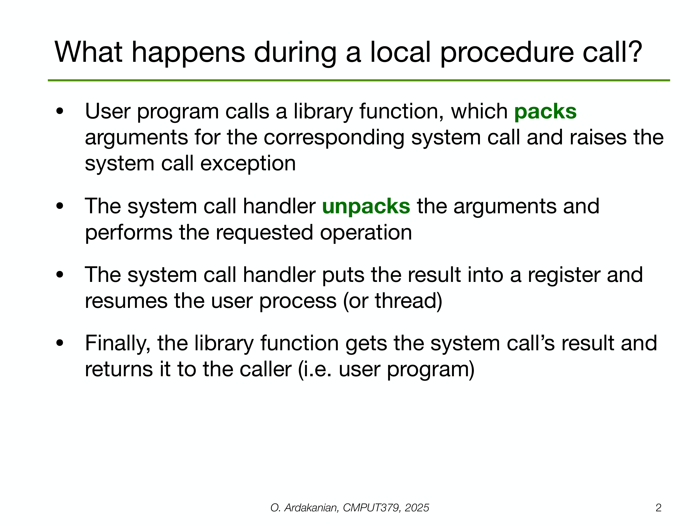

---

## 第 1 页


这是操作系统课程的一页标题，主题是**远程过程调用（RPC, Remote Procedure Call）**。下面把它讲清楚：

# 什么是 RPC？

像调用本地函数一样去调用**另一台机器上的函数**。RPC 屏蔽了网络通信的细节，让“分布式调用”看起来像“本地调用”。

# 基本思想

* **客户端**：像平常一样调用 `foo(arg1, arg2)`。
* **客户端桩（stub）**：把参数打包（称 *编组/序列化 marshalling*），发到网络。
* **传输层**：TCP/QUIC/HTTP2 等把消息送到服务器。
* **服务器桩**：解包（*解编组*），调用真正的实现函数。
* **返回值路径**：结果再被序列化、通过网络返回，客户端桩解包后交给调用者。

> 你写的仍是“函数调用”代码；打包、解包和网络收发由桩代码/框架自动完成。

# 关键组件

* **接口定义语言（IDL）**：先把可调用的函数与参数类型写成接口描述（如 `.proto`、Thrift IDL），框架据此生成桩代码。
* **序列化格式**：如 Protobuf、JSON、MessagePack。
* **传输协议**：如 gRPC(基于 HTTP/2)、Thrift、JSON-RPC。

# 语义与容错（考试/面试常问）

* **超时与重试**：网络可能丢包/延迟，客户端会超时并重试。
* **调用语义**

* *至多一次*（at-most-once）：失败不重做，避免重复副作用，但可能没执行成功。
* *至少一次*（at-least-once）：会重试，可能执行多次，要求**幂等**操作更安全。
* *恰好一次*（exactly-once）：理论上在网络故障下一般无法完全保证，只能靠事务、去重 ID 等近似实现。
* **幂等性**：同一请求执行多次结果不变（如“设置余额=100”比“余额+100”更安全）。
* **故障类型**：客户端崩溃、服务器崩溃、网络分区、半失败（请求到达但响应丢失）。

# 与本地调用的差异（RPC 的“陷阱”）

* **延迟大且不稳定**（微秒→毫秒/秒）。
* **可能失败**（本地几乎不会）。
* **参数必须可序列化**（不能直接传指针/打开的文件句柄）。
* **安全**：需要认证、加密（TLS）、访问控制。
* **版本兼容**：接口演进要考虑旧客户端。

# 同步/异步

* **同步 RPC**：像普通函数，调用方阻塞等待结果。
* **异步 RPC**：立刻返回一个 future/promise，结果稍后可用；适合并发与流水线。

# 常见框架/例子

* **gRPC + Protobuf**（高性能、强类型、流式支持）
* **Apache Thrift**（多语言、多协议）
* **JSON-RPC / REST+JSON**（易调试、与浏览器/HTTP 生态友好）

# 一个极简流程示意（伪代码）

```
// IDL（例如 gRPC 的 .proto）里声明：
service UserSvc { rpc GetUser(GetReq) returns (GetResp); }

// 客户端：
resp = userSvc.GetUser({id: 42})   // 看起来像本地调用
// 框架做：序列化→发送→等待→解包→返回

// 服务器实现：
GetUser(req) {
return db.findById(req.id)
}
```

# 何时用 RPC？

* 微服务之间通信、手机 App ↔ 服务器、服务间的读写请求。
* 需要强类型、低开销、双向流或严格接口契约时，倾向 gRPC/Thrift；
* 面向开放平台/浏览器/第三方生态，常用 REST/HTTP+JSON。

---

这页标题就是告诉你：本讲（Lecture 11a）会系统讲解**RPC 的概念、工作机制、失败语义、实现要点与工程权衡**。如果你想，我可以给你一页“考试/面试速记卡”。


---

## 第 2 页



# 第2页：本地过程调用（其实是一次**系统调用**）里发生了什么？

当用户程序调用像 `read()`、`write()` 这样的库函数时，底层会经历这几步：

1. **用户态库函数打包参数（pack）并触发系统调用异常**

* C 库（glibc 等）把你的参数按 ABI 规则放到**寄存器**或**栈**里，同时执行一条特殊指令（如 `syscall`/`svc`/`int 0x80`），这会从**用户态**切换到**内核态**。
* 这一步也叫“陷入（trap）内核”。

2. **内核的系统调用处理例程解包（unpack）并执行操作**

* 内核拿到系统调用号与参数，进行**检查**（权限、指针有效性、范围等）→ 调用相应内核子系统（比如文件系统、网络栈）完成请求。
* 注意：这里没有跨机器，一切都在本机内核里完成。

3. **系统调用把结果放入寄存器并恢复用户进程**

* 结果（或错误码）放进指定寄存器（Linux/AMD64 通常是 `rax`）。
* 内核把 CPU 从内核态切回用户态，恢复你的进程（或线程）的执行。

4. **库函数取回结果并返回给调用者**

* C 库读取寄存器中的返回值，如果失败就设置 `errno`，然后把结果交还给你的代码。

> 小结：本地调用=用户态→（陷入）→内核态→用户态，只有**一次上下文/特权切换**，没有网络。


---

## 第 3 页


下面把两页分别讲清楚，并顺手补充一些“为什么”。

> 

---

# 第3页：远程过程调用（RPC）

**目标**：像调用本地函数一样去调用**远端主机上的函数**，把“打包/传输/解包”的复杂度藏起来。

1. **“像本地一样简单”**

* 你写 `user = client.GetUser(42)`，看起来是普通函数调用。
* 例子：NFS（网络文件系统）把很多“文件系统操作”（如 `read`/`write`）做成一组 RPC，让远端文件服务器替你执行。

2. **服务器导出（export）一组可调用的函数**

* 这组函数的**接口**用 IDL（接口定义语言）描述，框架据此生成\*\*桩（stub）/包装器（wrapper）\*\*代码：

* **客户端桩**：把参数**序列化**（marshalling），通过网络发出去；收到响应再**反序列化**。
* **服务端桩**：收包→反序列化→调用真正实现→把返回值序列化发回。

3. **远程调用比本地慢且不可靠**（重点区别）

* **延迟**：本地是纳秒/微秒级，RPC 需要**序列化 + 网络传输 + 排队 + 反序列化**，毫秒级起步，还可能抖动大。
* **可靠性**：网络会**丢包、超时、分区**；对端可能**崩溃或重启**。因此必须处理**超时、重试、限流、熔断**等。

4. **“恰好一次（exactly once）”语义的现实**

* 幻灯片写“OS has to ensure exactly once”，这是理想化表述。**在存在崩溃和网络分区的现实世界里，纯靠操作系统或网络协议无法绝对保证“恰好一次”**。
* 常见做法：

* **至多一次（at-most-once）**：失败不重试；或者用“请求ID + 去重缓存”来**抑制重复**（很多 RPC 框架的默认）。
* **至少一次（at-least-once）**：可能重做，要求服务端操作最好**幂等**（同一请求执行多次结果不变）。
* 想接近 **exactly-once**：结合**事务/两阶段提交/幂等键/去重日志**等机制，但成本和复杂度更高。

5. **“rpc(3)”是什么意思？**

* 在 Unix 手册里，`(3)` 是**库调用**章节；`rpc(3)` 指的是与 RPC 相关的**库接口文档**（如 SunRPC/TIRPC 的 man page）。

---

## 把两页串起来的一个具体小例子（NFS 读取文件）

* 你在客户端机器上调用 `read(fd, buf, 4096)`：

1. **本地系统调用**阶段：步骤同第2页，但内核/客户端桩发现这个文件在**远端**，于是把“读取 4096 字节”的请求**序列化**。
2. **RPC 发送**到文件服务器；服务端桩**解包**→内核/守护进程读取真实磁盘数据→**打包**结果返回。
3. 客户端桩**解包**，把数据交回给内核/你的进程，好像是本地 `read()` 的返回值一样。
4. 期间若**超时**，客户端可能**重试**；因此服务端实现必须考虑**幂等**或**去重**。

---

## 你需要掌握的关键词

* **stub（桩）**、**（反）序列化/marshalling**、**超时/重试**、**幂等性**、**at-most-once / at-least-once / exactly-once**、**接口定义语言（IDL）**、**NFS/gRPC/Thrift**。

如果你愿意，我可以再给你做一张“RPC 核心概念速记卡”，或用一段 gRPC 的最小可运行示例把这些步骤跑一遍。


---

## 第 4 页


这页在讲**RPC 系统里“桩（stub）+序列化”的工作流**。把每个术语与步骤翻译并扩展一下：

# 关键名词

* **Stub generator / protocol compiler（桩代码生成器/协议编译器）**
你先用 **IDL**（接口定义语言）把“要对外提供的函数签名 *procedure signatures*”写清楚（函数名、参数类型、返回值、错误码等）。生成器根据这个接口文件，为**客户端**和**服务器**各生成一套“胶水代码”（stubs）。
**好处**：自动生成打包/解包与类型检查，避免手写网络代码带来的低级错误（顺序错、类型错、漏字段等）。

* **Marshalling / Unmarshalling（编组/反编组，即序列化/反序列化）**
把内存里的参数/返回值 → 线性字节流（便于网络传输）；以及相反方向的还原。
需要处理：字节序、对齐、不同语言的类型映射（int64、浮点、枚举、可选字段、变长数组、字符串编码）、版本兼容（新增字段的前后兼容）等。

* **Run-time library（运行时库）**
RPC 框架在运行时负责\*\*连接管理、重试、超时、负载均衡、压缩/加密（TLS）\*\*等通用功能。生成的桩会调用这层库把消息真正发到网络。

* **Message buffer（消息缓冲区）**
客户端桩把“函数标识 + 参数”编码进一个连续的字节缓冲区，交给运行时库去发送；收到响应后再从缓冲区解码。

# 客户端桩（client-side stub）的完整步骤

1. **创建消息缓冲区**：分配一段用于写入的字节空间。
2. **打包（pack / marshalling）**：写入“调用哪个函数”的**标识**（通常是方法号或全名），再按既定顺序把参数序列化到缓冲区。
3. **发送**：通过运行时库，按所选传输（TCP、HTTP/2、QUIC……）把缓冲区发往目标 RPC 服务器。
4. **等待应答**：根据超时策略阻塞/异步等待；运行时库可能做**重试**或**重连**。
5. **解包（unpack / unmarshalling）**：拿到应答后，解析**返回码**与**返回值**；将错误码映射为异常/状态。
6. **返回给调用者**：把解码后的结果当作函数返回值交给你的业务代码。

# “Marshalling 可能需要做什么？”（幻灯片最后一条）

* **按值复制 vs 按引用传参**：

* **按值**（数值、短字符串、结构体）容易序列化，直接拷贝内容即可。
* **按引用**（指针、引用、切片视图、迭代器、文件句柄、共享内存句柄）**无法直接跨进程/跨机器**——远端机器上没有同一块内存或同一文件描述符。做法：

* 把被引用的数据**复制**（深拷贝）到消息里；
* 或者把它转化为**可传输的标识**（例如文件/对象在服务端的 ID），后续通过该 ID 再发起操作；
* 对于超大对象，使用**流式/分块传输**而不是一次性打包。
* **对象图与循环引用**：需要在序列化层建立**引用表**或改为无环结构（例如 Protobuf 不直接支持对象共享/循环，需要上层协议约定）。
* **兼容性**：新增字段应做到**前向/后向兼容**（旧客户端能忽略新字段；新客户端对缺失字段有默认值）。
* **安全**：敏感字段加密/签名；对反序列化做**长度/类型校验**，防止“反序列化炸弹”。
* **性能**：尽量选**紧凑**的编码（如 Protobuf）并避免频繁分配、拷贝；必要时开启压缩但注意 CPU 成本。

# 一个迷你示例（概念流程）

```
service UserSvc {
rpc GetUser(GetReq) returns (GetResp);
}

// 客户端调用：
resp = userSvc.GetUser({id: 42})

// 实际发生：
client-stub:
buf = newBuffer()
buf.write("UserSvc.GetUser", id=42)      // marshalling
rt.send(buf)                              // run-time library
reply = rt.recv()
result = decode(reply)                    // unmarshalling
return result
```

# 常见坑与工程建议

* **别把“本地思维”带到远程**：网络有延迟与故障，设置**超时**，做**重试 + 幂等**。
* **明确错误语义**：区分“业务失败”（如账户不存在）与“传输失败/超时”，分别处理。
* **限制请求大小 & 设定背压**：避免一次性传巨大载荷拖垮服务。
* **版本管理**：接口变更要走**兼容演进**，为旧版本保留一段过渡期。

如果你愿意，我可以用 gRPC/Protobuf 写一个最小可运行 demo，把“生成桩→编组→发送→解包”的过程跑一遍给你看。


---

## 第 5 页


这页讲 **RPC 在服务器一侧如何处理一条请求**。逐条翻译并补充要点：

# 1) “Each message is addressed to an RPC daemon listening to a port…”

* **含义**：客户端把序列化后的请求报文发到服务端某个**IP:端口**（例如 gRPC 默认 50051）。
* **RPC daemon**：常驻的服务进程，绑定端口、接收网络连接，负责把请求交给业务实现。
* **为何要端口**：不同服务/协议靠端口区分；系统内核用“套接字+端口”把报文交给正确的进程。

# 2) “A server-side stub …”

服务器桩（由 IDL 生成）接管一条**到达的请求**，完成以下步骤：

1. **unmarshalling（反编组/反序列化）**

* 从字节流中解析：调用哪个函数（方法 ID/全名）+ 参数值。
* 做类型/长度校验、版本兼容处理（例如新字段可忽略、有默认值）。

2. **调用真实函数（业务逻辑）**

* 按解析出的参数调用你实现的函数，例如 `GetUser(id=42)`。
* 这里可能访问数据库、缓存、磁盘或其他下游 RPC——这决定了延迟与吞吐。

3. **marshalling（编组/序列化返回值）**

* 把“返回码/错误信息/结果对象”编码回字节缓冲。
* 注意把异常/错误映射为标准的状态码（例如 gRPC 的 `Status`）。

4. **send reply（发送响应）**

* 通过运行时库把字节流发回给客户端；可能带有**压缩**、**TLS 加密**、**追踪 ID**等。

> 小结：**服务器桩 = “解析→分发→执行业务→编码→回包”的胶水层**，把网络细节与你的业务代码隔离开。

# 3) “The RPC server is implemented as a concurrent server typically using a thread pool”

* **为什么要并发**：同一时刻可能有很多请求；如果串行处理，慢请求会堵住其他请求。
* **线程池模型**（常见默认）：

* 监听线程接受连接→把每个请求放入**队列**→从**线程池**取空闲工作线程来执行（反序列化→调用→序列化→回包）。
* **优点**：实现简单、利用多核、阻塞型 I/O 友好；
* **注意**：要合理设置**线程数**、**队列长度**、**超时**和**背压**（满载时拒绝或限流），否则会内存暴涨或延迟劣化。
* **替代并发模型**（理解即可）：

* **事件驱动/异步 I/O**（单/少数线程 + epoll/kqueue + 协程），降低线程开销；
* **每连接一线程**：简单但规模化差；
* **混合**：I/O 异步 + 业务线程池。

# 一个迷你时序图（逻辑）

```
Client         Net          RPC Daemon        Server Stub        Handler(业务)
|  request  ->|-> socket ->|  accept + enqueue |                  |
|             |            |------------------>|  unmarshal       |
|             |            |                   |--> call -------->|
|             |            |                   |<-  result/err ---|
|             |            |                   |  marshal         |
|<- response -|<- socket <-|<----- send -------|                  |
```

# 工程要点（常考/常踩）

* **幂等与重试**：线程池级别的超时/重试可能导致重复执行；务必让写操作幂等或加去重。
* **超时与取消**：在服务端传播“截止时间/取消信号”，避免线程无谓忙等。
* **资源隔离**：不同方法/租户使用独立线程池或队列权重，防止“尖刺流量”拖垮全局。
* **安全**：TLS、鉴权（JWT/MTLS/API Key）、ACL；把凭证与业务参数一起验证。
* **可观测性**：埋点**指标**（QPS、P99）、**日志**、**分布式追踪**（trace id/parent id）。

把这页和上一页合起来：**客户端桩**负责“打包→发送→解包”，**服务器桩**负责“解包→调用→打包”，中间由**运行时库**（连接、重试、超时、加密等）托底；服务端通常用**线程池**并发处理大量请求。


---

## 第 6 页


这页在讲 \*\*RPC 运行时库（run-time library）\*\*在收发数据时替你处理的“底层杂事”。逐条翻译 + 扩展：

# 运行时库要做的事

1. **定位远端服务器（主机名 → IP + 端口）**

* 你在代码里写 `foo.example.com:50051`，运行时会做 **DNS 查询** 把主机名解析成 IP，再和端口一起去连接。
* 真实系统里还可能接入**服务发现/负载均衡**（如 Consul、Etcd、Eureka、Kubernetes Service、LVS 等），选择一台可用实例。

2. **处理字节序（endianness）**

* 不同 CPU 可能是**大端**或**小端**；为了双方都能理解，协议会约定统一的“**网络字节序**”（历史上通常是大端）。
* 序列化层（如 XDR、Protobuf）会在必要时做转换。
* 许多现代二进制编码（Protobuf、Varint 等）尽量**避开与字节序强耦合**，但概念上仍属于“编组/反编组”的职责。

3. **用 UDP/IP 或 TCP/IP 作为传输通道**

* 这意味着使用\*\*套接字（sockets）\*\*进行通信：创建 socket → `connect/accept` → `send/recv`。
* 选择何种传输取决于**可靠性、延迟、吞吐、消息模型**等权衡。

# TCP 还是 UDP？（课件给出的思考）

* **需求**：远程调用需要**可靠传输**，且希望\*\*至多一次（at-most-once）\*\*执行效果。

* **直觉**：那就用 TCP？因为 TCP 自带**可靠、有序、流控、拥塞控制**。

* **但也有代价**：

* **队头阻塞（HOL blocking）**：某个分段丢了会卡住后续所有数据。
* **连接/握手/保活**带来的开销。
* TCP 是**字节流**，没有消息边界，需要上层自己切分/粘包处理。

* **为什么很多 RPC 系统“基于 UDP 自己做重传/超时/确认”？**

* UDP 天生是**报文（message）**语义，没有连接握手，**首包更快**，且发送端能更细粒度地控制**超时、重试、乱序、去重**等策略。
* 早期 SunRPC/NFS 曾大量用 UDP + 自己的 **超时/重试/ACK** 机制。
* **现代折中**：

* **gRPC**：主流是 **HTTP/2 over TCP**；
* **HTTP/3/QUIC**：基于 **UDP**，但在用户态实现了**可靠、有序/不完全有序、拥塞控制与 TLS 加密**，减少队头阻塞，越来越多 RPC/网关开始支持。

# 选型速记

* **优先用 TCP（或 QUIC/HTTP3）**：

* 需要**强可靠、有序**；
* 流式传输（大文件、长连接、Server/Client streaming）；
* 生态成熟（gRPC、REST/HTTP2/3），有代理、网关、观测工具支持。
* **可能考虑 UDP（自管可靠性）**：

* 追求**极低首包时延**或**自定义重传/拥塞策略**；
* **消息级**语义、允许一定乱序、需要局部有序；
* 专用内网、可控环境（如某些游戏后端、实时传感/心跳、老的 NFS/SunRPC）。

# 工程细节（运行时库通常还会做）

* **超时/重试/退避**：把“网络不可靠”的复杂度从业务里拿走；与**幂等性**策略配合。
* **加密与认证**：TLS、mTLS、JWT、API Key；证书轮换。
* **压缩**：大消息压缩（需权衡 CPU）。
* **可观测性**：指标（QPS、P99）、日志、**分布式追踪**（trace/span id 透传）。
* **连接管理**：连接池、心跳、断线重连、负载均衡。
* **分片与 MTU**：UDP 下要避免 IP 分片（典型 MTU 1500），大消息需切块。

> 小结：**运行时库**就是“网络/协议后勤部队”：把**寻址、编码、传输、可靠性**等底层问题兜住，让你写的只是“像本地函数一样”的 RPC 调用。


---

## 第 7 页


这页是把 **一次 RPC 的完整“时序 + 角色分工”**画成流程图。左边是客户端，右边是服务器；下方分别是**客户端桩（Client stub）**和**服务器桩（Server stub）**；中间云朵表示网络。箭头写着 **call/return / send/receive**，对应“像本地函数一样的调用”与“底层的报文收发”。

下面逐块解释——你能把它当成伪代码执行一遍：

# 参与者与职责

* **P1（客户端业务过程）**：你的程序代码。它直接调用 `Function(args)`，以为是本地函数。
* **Function（客户端桩）**：由 IDL 生成的胶水代码。负责把调用“变成报文”，发给远端；收到结果后再还原。
* **FunctionServer（服务器进程/守护进程）**：监听端口、循环处理请求。内部会调用真正的业务实现。
* **realFunction（服务器上的真实业务函数）**：真正干活的函数，返回结果。

# 详细时序（按编号走一遍）

1. **P1 → call → Function**

* 你的代码调用 `Function(args)`（看似本地调用）。

2. **客户端桩 Function 的五步**

1. `<marshall parameters>`：把 `args` 按协议**序列化**进消息缓冲。
2. `send(FunctionServer, params)`：通过运行时库把消息发到服务端套接字（IP:端口）。
3. `receive(FunctionServer, results)`：**等待响应**（可能有超时/重试策略）。
4. `<unpack results>`：收到后**反序列化**结果/错误码。
5. `return(results)`：把结果返回给 P1——对 P1 来说，这就像普通函数返回。

3. **服务器进程 FunctionServer 的事件循环**

* `loop ... end loop`：持续服务多条请求（并发实现上通常是**线程池/协程池**，这里用循环表达逻辑）。
* `sender := select()`：用 `select/poll/epoll` 等**多路复用**原语找出哪个连接有数据到来，并辨认来源 `sender`。
* `receive(sender, params)`：从该连接**接收报文**。
* `<unpack parameters>`：**反序列化**，解析要调用的函数及其参数。
* `call realFunction(args)`：调用**真实业务函数**执行（可能访问 DB/缓存/磁盘/下游 RPC）。
* `<marshall results>`：把返回值/状态**序列化**。
* `send(sender, results)`：把响应发回刚才那个 `sender`（即对应的客户端）。

4. **realFunction 的角色**

* 这里就是普通业务逻辑：`... return(results)`。桩层把它的返回值送回客户端。

# 图中关键词补充

* **call / return**（黄箭头）：对应用代码显露出的**同步调用抽象**——像本地函数一样。
* **send / receive**（灰箭头）：底层网络实际行为。一次“调用”对应“*请求报文* → *响应报文*”的往返。
* **select()**：常见的 I/O 复用系统调用，用于**同时监听多个连接**，提高并发效率。

# 读图小技巧（对应到现实框架）

* 在 **gRPC** 中：

* `Function` ≈ **客户端 Stub**；
* `FunctionServer` ≈ **Server + 运行时 + I/O 线程**；
* `realFunction` ≈ 你注册到 gRPC 的 **服务处理器（handler）**。
* 在 **NFS / 早期 SunRPC** 中，这套“序列化 + UDP/TCP + 去重/重试”也是同样的分层。

# 工程要点（这张图背后隐含的）

* **超时/重试与幂等**：客户端在 `receive()` 等待可能**超时并重试**；服务端可能**执行多次**，所以写操作要**幂等**或带**请求 ID 去重**。
* **并发与背压**：现实里 `FunctionServer` 通常不是单循环，而是**事件驱动 + 线程池**；要设置**最大并发/队列长度/超时**，避免被慢请求拖垮。
* **错误通道**：`results` 不只包含成功结果，还应包含**错误码/异常信息**（比如 gRPC Status），客户端桩需正确映射为异常/返回值。
* **关联 ID（correlation id）**：为了把“某请求的响应”路由回正确的调用现场，报文里通常带**请求 ID / trace id**。

一句话总结：
**客户端桩把“函数调用”→“请求报文”，服务器桩把“请求报文”→“函数调用”，执行后再反向来一次。**
这张图就是把这两次“变形”和网络往返的细节完整展开给你看。


---

## 第 8 页


这是操作系统课程另一讲的开场页，主题是**CPU 调度（CPU Scheduling）**。它讨论“当就绪队列里有很多可运行进程/线程时，内核如何挑选下一个占用 CPU 的实体”。下面把核心要点一次讲清：

# 为什么需要调度？

* CPU 资源有限，而进程很多；调度器要在它们之间**分时共享**。
* 目标（常见指标）

* **吞吐量**：单位时间完成的进程数
* **周转时间**：提交到完成的总时间
* **等待时间**：在就绪队列里排队的时间
* **响应时间**：首次响应所用时间（交互系统关键）
* **公平性**、**可预测性**、**实时期限**（实时系统）

# 基础概念

* **就绪队列**：可运行但暂未获得 CPU 的进程/线程集合。
* **分派器/调度器**：选择下一个运行者并**上下文切换**（保存/恢复寄存器、页表等）。
* **CPU burst / I/O burst**：程序的执行通常在“计算密集（CPU burst）”与“等待 I/O（I/O burst）”之间交替——这影响算法选择。
* **可抢占 vs 不可抢占**：

* *可抢占*：运行中可被更高优先级或时间片用完的任务打断（现代通用 OS 标配）。
* *不可抢占*：一个任务自愿放弃 CPU 才切换（适合某些简单/嵌入式场景）。

# 典型调度算法

* **FCFS（先来先服务）**：简单，但可能出现“队头阻塞”（长作业挡住短作业）。
* **SJF/SRTF（最短作业优先 / 最短剩余时间优先）**：平均等待时间最优，但需要**估计运行时间**；SRTF 是可抢占版。
* **优先级调度**：按优先级抢占；需防**饥饿**，常用\*\*老化（aging）\*\*提高长期等待者的优先级。
* **RR（时间片轮转）**：每个任务固定**时间片**（quantum）轮流执行；交互性好。时间片过小→切换开销大；过大→响应慢。
* **多级队列 / 多级反馈队列（MLQ / MLFQ）**：

* 把就绪队列分层；高优队列用小时间片（偏交互），低优队列用大时间片（偏吞吐）。
* **MLFQ**会根据任务行为动态上/下调优先级，结合老化防饥饿，是通用 OS 的常见思路。

# 实时调度（硬/软实时）

* **RM（Rate-Monotonic）**：周期短者高优先级，静态优先级。
* **EDF（Earliest Deadline First）**：最早截止期者先执行，理论上处理器利用率更高。
* 关注**可调度性**分析与**优先级反转**（用优先级继承/天花板协议缓解）。

# 多处理器/多核调度要点

* **负载均衡**：把可运行任务均匀分布到各核。
* **处理器亲和性（affinity）**：尽量让任务回到最近运行的 CPU 以复用缓存。
* **全局队列 vs 每核队列**：折中“公平/吞吐/迁移开销”。

# 现代系统一瞥

* **Linux CFS**：把 CPU 时间当“虚拟跑道”，力求**按权重公平**；每核红黑树按“虚拟运行时间 vruntime”挑选最该运行的任务；支持组调度、亲和性与 NUMA 亲和。
* **Windows 调度器**：基于优先级+量子，支持动态提升、I/O 完成后的短暂提优、每处理器就绪队列等。

# 设计权衡（面试/考试常问）

* **时间片**如何选：与时钟中断间隔、上下文切换成本和目标响应时间相关。
* **公平 vs 延迟**：交互系统偏向低延迟；批处理偏向吞吐。
* **防饥饿**：老化、最小保障份额；
* **系统调用与不可抢占区**：过长的不可抢占区会拉高最坏响应时间。

# 小例子（RR）

假设三个作业 A/B/C 到达时间相同，CPU 时间分别 5/2/1（单位片），时间片=1：

* 运行顺序：A B C | A B | A | A | A
* 完成时间：C=3、B=5、A=9；对交互任务（短作业）响应更快，比 FCFS 友好。

---

总之，这一讲会系统讲解**调度目标、指标、典型算法（FCFS、SJF/SRTF、优先级、RR、MLFQ）、实时调度、以及多核上的实际工程做法**，并分析它们的优缺点与使用场景。如果你把具体幻灯片发来，我可以逐页讲解或帮你做一张“调度算法速记表”。


---

## 第 9 页


这页在说：**CPU 调度的目标**，核心观点只有一句——

> 把 CPU 在多个进程之间**切换使用**，能让计算机更**高产**（更高吞吐、更快响应）。

为什么“切换”会更高产？分三点讲清：

## 1) 覆盖 I/O 空洞：把本来要闲着的时间利用起来

* 许多进程会频繁**阻塞在 I/O**（磁盘、网络、用户输入）。
* 如果系统只让一个进程独占 CPU，它一旦发起 I/O 就**阻塞**，CPU就**闲置**。
* 有了调度器：当进程A阻塞，**立刻切换**到进程B运行；A的 I/O 与 B 的计算**并行重叠**，总时间缩短。

> 直觉图（Tetris 小方块）：把不同形状/颜色的“空档”和“计算片段”拼得更紧凑，**减少空隙**。

### 小例子（直观算一算）

* 进程A：每周期 **10ms 计算 + 90ms I/O**
* 进程B：同上
* 单独运行：每个周期 CPU 只忙 **10%**，90% 在等 I/O。
* 交替调度：当A等I/O时运行B，**CPU 基本不闲**，系统吞吐接近满载。

## 2) 提升交互性：谁“刚需要”，谁先得到一点时间

* 用**时间片轮转**（RR）或多级反馈队列（MLFQ）给前台/短任务**更快的首次响应**。
* 用户体感更“跟手”，即使后台大作业还在跑。

## 3) 公平与隔离：按权重分享 CPU，避免“饿死”

* 调度能保证进程**按优先级/权重**拿到份额，限制某个任务长期独占。
* 也能配合**优先级**满足实时/重要任务的时限需求。

---

## 代价与权衡（别忘了）

* **上下文切换开销**：保存/恢复寄存器、TLB/缓存扰动；时间片太小会放大开销。
* **策略选择**：交互系统偏向**低延迟**（小时间片、高优先级给前台）；批处理偏向**吞吐**（大时间片、减少切换）。
* **多核场景**：还要考虑**负载均衡**与**CPU 亲和性**（尽量回到原核以复用缓存）。

**一句话**：调度通过“把本来要发呆的 CPU 时间塞满”，同时兼顾**响应、公平、吞吐**，让计算机整体更忙、更快、更稳。


---

## 第 10 页


这页在讲**进程调度的“状态机 + 难点”**。图中心问题是：

> **从就绪队列（ready queue）里挑谁上 CPU？**

# 1) 进程/线程的经典五态与迁移

* **new**：新建，还没进入就绪队列。
→ *admitted*（被系统接受）→ **ready**。
* **ready**：已具备运行条件，**等 CPU**。
→ *scheduler dispatch*（调度器分派）→ **running**。
* **running**：占用 CPU 正在执行。
→ *I/O or event wait*（主动发起 I/O、等待事件）→ **waiting**；
→ *interrupt*（时间片用完/被更高优先级抢占/外部中断）→ **ready**；
→ *exit*（正常结束/异常终止）→ **terminated**。
* **waiting**：阻塞等待 I/O/事件完成。
→ *I/O or event completion*（完成）→ **ready**。
* **terminated**：结束，等待资源回收。

绿色小条块代表**CPU burst 或时间片**：

* 在 **running** 中消耗；
* I/O 完成后回到 **ready** 等候下一次 CPU burst。

> 调度器的核心动作就是：**在 ready 队列里选择一个实体放到 running**（必要时把当前 running 抢占回 ready）。

# 2) 什么时候会触发“从 ready 里挑人”？

* 当前任务**时间片用完**（可抢占系统常见）；
* 有**更高优先级**任务到达；
* 任务**发起 I/O**主动让出 CPU；
* I/O **完成**，新的/被唤醒的任务进入 ready；
* 任务**结束**或被杀死；
* 其他**中断/事件**（例如定时器 tick）。

# 3) 为什么“调度很难”？

**(1) 目标冲突（competing objectives）**

* **用户视角**：希望**响应快、周转短**（交互任务要“秒回”）。
* **系统视角**：追求**高吞吐/高利用率/能耗低/公平性**。
* 例：把时间片设很小→响应变快，但**上下文切换开销**增大、吞吐下降；设太大→切换少但交互卡顿。

**(2) 负载多变（workload variability）**

* 有的任务**CPU 密集**，有的**I/O 密集**；
* 到达时间、burst 长度、优先级、实时期限都**不确定且随时间变化**；
* 单核 vs 多核、缓存/NUMA/亲和性等硬件因素进一步放大复杂度。

# 4) 与算法的关联（为后续铺垫）

* 若更重视**交互响应**：时间片轮转（RR）、多级反馈队列（MLFQ）。
* 若更重视**平均等待时间**：短作业优先（SJF/SRTF），但需要**预测** burst 长度。
* 若有**实时期限**：RM/EDF 等实时调度。
* 多核还要考虑**负载均衡**与**CPU 亲和性**。

# 5) 一句总结

调度器要在**多目标权衡**与**不可预测的工作负载**下，尽量在每次触发时从 **ready** 中挑一个“当前最合适”的运行者，把 CPU 的每个时间片都用在刀刃上。


---

## 第 11 页


这页讲**程序的执行是在“CPU 计算段（CPU burst）与 I/O 等待段（I/O burst）之间不断交替”**，并据此解释进程类型与系统表现。

# 1) 执行形态：CPU burst ↔ I/O burst 交替

* 一个进程会先运行一段**纯计算**（取指、加减、地址计算、读缓存等）——这段叫 **CPU burst**。
* 当它需要**磁盘/网络/用户输入**等外设时，会发起 I/O 并**阻塞等待**，这段叫 **I/O burst**。
* 于是就形成：`CPU burst → I/O burst → CPU burst → …` 的循环。
* **调度关注点**：CPU burst 的**长度分布**（大多短、偶尔长）。很多算法（如 SJF/SRTF、MLFQ）都利用“**短作业更常见**”这个经验法则。

右侧示意：白/灰框分别代表计算和等待；两者交替出现。

# 2) 三类进程（按占比划分）

* **CPU-bound**：大部分时间在算（CPU burst 长、I/O burst 少/短）。如压缩、渲染、训练。
* **I/O-bound**：大部分时间在等 I/O（很多短 CPU burst + 频繁 I/O）。如数据库前端、Web 服务、编辑器。
* **Balanced**：两者差不多。

# 3) 对就绪队列/设备队列的影响

* **如果全是 I/O-bound**：大家很快就去等 I/O，CPU 很少有人“就绪”，所以**就绪队列常常是空的**（CPU 可能闲着）。
* **如果全是 CPU-bound**：大家一直想用 CPU，几乎不去等 I/O，于是**I/O 等待队列空**，但**就绪队列很长**（需要严格的时间片/公平性避免饿死）。
* **最好情况**：系统里**I/O-bound 和 CPU-bound 混合**。

* I/O 任务去等 I/O 时，CPU 任务可以立刻填补空档；
* I/O 完成回来时，又能在短时间片内快速响应用户。
* 结果是**CPU 与设备都保持高利用率**、吞吐和响应都更好。

# 4) 与调度算法的关系（为什么要区分？）

* **短 CPU burst 多的任务**（典型 I/O-bound）在 **RR/MLFQ** 中更容易获得**快响应**；在 **SJF/SRTF** 中也更容易**被优先**，因为“短作业优先”最小化平均等待时间。
* **CPU-bound** 任务在 MLFQ 中可能被“降级”到较低优先级的大时间片队列，以减少切换、提高吞吐并避免影响交互性。

# 5) 一个直觉小算例

* A（I/O-bound）：每 5ms 计算 + 45ms I/O
* B（CPU-bound）：一直需要 CPU
* 两者混跑：A 计算 5ms 后去等 I/O，**这 45ms 里 B 能持续运行**；A I/O 回来再拿一点时间片即可。
→ **CPU 基本不闲**，A 的响应也不差；比只跑 B 或只跑 A 都更**高产**。

**结论**：程序呈“计算—等待”交替；识别并利用这种模式（尤其是“短计算段很多”这一统计特性），让调度器既把 CPU 塞满，又照顾交互与公平，是系统获得最佳表现的关键。


---

## 第 12 页


这页是**典型进程的 CPU burst（连续占用 CPU 的一段计算）时长直方图**。横轴是**时长（毫秒）**，纵轴是**出现频次**。图形很尖：

* **多数 burst 很短**（靠近 0～几毫秒处频次最高）；
* **少数 burst 很长**（向右拖着细长的“尾巴”到几十毫秒）——典型的**长尾/右偏分布**。

这说明了什么？对调度的意义很大：

1. **短作业很多、长作业少**

* 交互型/I/O 密集进程常常只需要一点点 CPU 就去等 I/O 了。
* 因此如果能让**短 burst 先跑完**，整体等待时间会显著降低。

2. **为什么 SJF / SRTF 有优势**

* “最短作业（剩余）优先”刚好利用了**短 burst 占多数**这一统计事实，能**最小化平均等待时间**。
* 现实中不能知道确切长度，只能**预测**（如指数加权：`τ_{n+1} = α t_n + (1-α) τ_n`），但哪怕粗糙预测也常常有效。

3. **时间片（RR）的设定思路**

* 把时间片 **设得略大于“常见短 burst”**：

* 大多数短 burst 可在**一个时间片内完成** → 少切换、响应快；
* 仍能定期打断长 burst → 保证公平与可响应。
* 设得过小：上下文切换开销变高；
* 设得过大：短任务要等很久才轮到，交互性变差。

4. **队列与优先级设计**

* 多级反馈队列（MLFQ）常把“短、趋向 I/O 的任务”留在**高优先级小时间片**队列；
* “长、CPU 密集”的任务逐步下沉到**低优先级大时间片**队列，减少切换成本。

5. **工程提醒**

* **上下文切换成本**要与时间片权衡；
* 负载变化时（短 burst 比例变少），需要**自适应**地调时间片/权重；
* 实时任务不看统计分布，而看**截止期/优先级继承**等机制。

一句话：这张图告诉我们——**大多数 CPU 使用请求都很短**。好的调度器要“优先让短活先干完，长活也不停地被切、被照顾”，从而同时获得**低延迟**与**高吞吐**。


---

## 第 13 页


这页是在给“调度”相关术语下**精确定义**。逐条翻译 + 补充直观例子：

# Workload（工作负载）

* 含义：**系统需要运行的一组任务**。每个任务有

* **到达时间**（arrival time，何时进入就绪队列），
* **burst 长度**（一次需要多少 CPU 时间），
* **实时系统**里还可能有**截止期**（deadline，最晚完成时间）。
* 例子：浏览器标签页在 t=10ms 触发 JS 任务，需要 3ms CPU；数据库后端在 t=12ms 来一条查询，需要 8ms；音频回放线程每 10ms 必须在 5ms 内完成混音（有 deadline）。

# Performance metrics（性能指标）

* 用来**比较不同调度策略**的评价标准。常见：

* **吞吐量**（单位时间完成的任务数）
* **周转时间** = 完成时刻 − 到达时刻
* **等待时间** = 在就绪队列里排队的总时间
* **响应时间** = 第一次得到 CPU 的时间 − 到达时刻
* 还有 **利用率**、**P95/P99 延迟**、**deadline 违约率** 等。

# Scheduling policy（调度策略）

* 定义**在给定负载下，以何种顺序执行任务**的规则。不同策略→不同表现：

* **FCFS**：先来先服务，简单但容易队头阻塞。
* **SJF/SRTF**：（剩余）最短优先，平均等待时间小。
* **优先级**：高优先级先跑，需要防饿死。
* **RR/MLFQ**：时间片轮转/多级反馈，交互性好。
* “策略”不等于“实现”；实现还涉及线程池、亲和性、负载均衡等。

# Overhead（开销）

* 调度器自身带来的**额外工作**，主要是：

* **上下文切换**（保存/恢复寄存器、TLB/缓存扰动）、
* **队列维护**（如红黑树/优先队列操作）、
* **时钟中断**、度量与统计。
* 启示：时间片太小会让开销占比变大，吞吐下降。

# Fairness（公平性）

* 给每个任务分到的**资源份额**（例如 CPU 周期）的“均衡”程度。
* 常见两种理解：

* **时间公平**：长期看每个可运行任务拿到相近 CPU 时间。
* **权重公平**：按权重 wᵢ 分配，长期份额 ≈ wᵢ/Σw。Linux CFS 就是权重公平。
* **Max–min fairness（最大–最小公平）**

* 目标：**最大化每个任务能保证的“最小分配”**；先让最弱势的任务得到提升，直到受限制资源被用满。
* 直观理解：像“**蓄水池灌水**”（water-filling）——先把矮的杯子加满到同一水位，再一起提高；任何进一步增加某个任务的份额，都会不得不减少另一个**不更高份额**任务的份额。
* 适用：多租户/多队列共享 CPU 或带宽时，避免少数大胃口任务压制小任务。

---

**一句话总结**：

* **Workload** 描述要服务的任务及其时间属性；
* **Metrics** 决定我们“以什么为好”；
* **Policy** 规定“怎么排队”；
* **Overhead** 告诉我们策略不能太“花活”；
* **Fairness** 确保没人被长期压制，max–min 是一种“先照顾最少者”的具体公平准则。


---

## 第 14 页


这页把“调度”按时间尺度分成两层：**长期调度（作业调度）**和**短期调度（CPU 调度）**。各自解决的问题不同。

# 长期调度（Job scheduling / Admission control）

**要点**：决定**让多少个作业/进程进入内存并参与运行**（多道程序度的大小）。

* **为什么需要它？**

* 系统里提交的作业可能很多，如果全放进内存，会造成**内存压力、抖动、频繁换页**，反而把吞吐拖垮。
* **它做什么？**

* 从“作业池/等待队列”中**挑选并接纳**新作业，装入主存。
* **控制混合比例**：让 I/O-bound 和 CPU-bound 任务搭配合理，这样 CPU 与 I/O 设备都能高利用率。
* **在现代 OS/集群中的体现**：

* 交互式桌面上不显式“作业调度”，但有**登录/会话限制、容器/配额、内存压力信号（OOM-killer）**等起到**接纳控制**效果。
* 数据中心/批处理平台（Slurm、YARN、K8s 调度器）会根据**资源（CPU/内存/显卡）、队列策略、配额**决定是否**把作业放进集群**运行，这和“长期调度”完全同源。

# 短期调度（CPU scheduling）

**要点**：当**就绪队列**里有多个可运行实体时，**下一时间片给谁**。

* **它做什么？**

* 在每次时钟中断、I/O 完成、更高优先级到达等时机，从 ready 队列挑出一个进程/线程切到 **running**。
* **常见策略**：FCFS、SJF/SRTF、优先级、时间片轮转（RR）、多级反馈队列（MLFQ）、实时（RM/EDF），以及现代内核（如 Linux CFS 的**权重公平**）。

# 两者的关系与区别

* **决策频率**：长期调度**不频繁**（接纳一次作业），短期调度**非常频繁**（每个时间片/事件一次）。
* **关注资源**：长期调度看**系统总体资源与组合**（内存、I/O/CPU混合、能耗）；短期调度看**CPU 分配**与**响应/公平**。
* **失败代价**：长期调度不当 → 系统过载或资源闲置；短期调度不当 → 高延迟、饥饿或切换开销大。

> 课堂提示：除了这两层，很多教材还讲**中期调度（swapping）**——在内存紧张时把部分进程暂时换出/再换入，以调节并发度，这相当于长期与短期之间的“缓冲层”。

**一口气总结**：

* **长期调度**决定“**让谁进场**、进场多少人”，以维持健康的负载与资源占用；
* **短期调度**决定“**下一棒谁来打**”，以实现低延迟、公平和高吞吐。两者配合，系统才既稳又快。


---

## 第 15 页


这页区分两种“做决定的时机”：

# Off-line scheduling（离线调度）

* **已知全部信息**再排班：事先知道**所有任务**的**到达时刻**与**CPU burst 长度**（甚至截止期）。
* 可以在纸上/算法里**一次性算出全局最优顺序**。
* 例子：

* 为**最小化平均等待时间**，离线最优就是**SJF**（最短作业优先）；
* 为**满足尽可能多的截止期**，可用**EDF**等做可调度性分析并给出表（table-driven schedule）。

# On-line scheduling（在线调度）

* **任务陆续到达就立刻决定**谁上 CPU；未来信息未知。
* 需要**预测**或**启发式**：如用指数加权来估计下一次 CPU burst，然后做 **SRTF/SJF 的“估计版”**；或采用 **RR/MLFQ/优先级** 等通用策略。
* 要处理动态事件：新任务到来、I/O 完成、优先级变化等。

# “哪个更好？”

* **理论上**：若离线具备**完美先知**（全知道），它能给出**全局最优**性能（比如平均等待时间、截止期满足率等）。
* **现实中**：我们几乎**从不知道未来**，所以操作系统使用的是**在线调度**。性能取决于：

* 预测是否靠谱（burst 估计、交互/CPU-bound 区分）；
* 策略是否匹配目标（低延迟用 RR/MLFQ，吞吐用大时间片/公平调度，实时用 RM/EDF）；
* 开销与硬件约束（上下文切换、缓存/亲和性、多核负载均衡）。

# 一个小例子

* 任务到达与长度（ms）：`J1: t=0, len=8`，`J2: t=1, len=1`，`J3: t=2, len=2`
* **离线最优**（知道所有信息）：顺序 `J2→J3→J1`，平均等待时间最小。
* **纯在线 FCFS**：到达就排 `J1→J2→J3`，`J2` 要等很久，平均等待时间更差。
* **在线 SRTF（用估计）**：若能较准地估计到 `J2/J3` 很短，会在 `J1` 运行时**抢占**它给短任务，接近离线最优。

**结论**：离线在“全知”假设下最强，但不实用；操作系统依赖在线调度，通过**预测 + 抢占 + 合理时间片/优先级**，在真实工作负载下尽量逼近离线最优，同时控制开销与保障公平/实时性。


---

## 第 16 页


这页讲**内核在什么时机运行调度器**，以及**可抢占/不可抢占**系统的区别。

# 调度触发时机（scheduling opportunities）

内核至少会在以下事件发生时运行调度器，从就绪队列里挑下一个要上的进程/线程：

1. **running → waiting**：当前任务主动**阻塞**（发起 I/O、等待锁/事件）。

* 既然它不需要 CPU 了，就让出 CPU，调度器马上可选别人顶上。
2. **中断发生**（例如**时钟中断/时间片到期**、I/O 完成中断）。

* 时钟中断提供了固定频率的“检查点”，用来实现**时间片轮转/抢占**；
* I/O 完成会把某些任务从 waiting 唤醒到 ready，调度器可考虑让新唤醒的任务马上运行（提高响应）。
3. **进程创建或终止**。

* 创建：新任务进入 ready，可能需要重排谁先跑；
* 终止：当前任务退出，CPU 空出来，需要选新人。

# 不可抢占系统（Non-preemptive）

* 调度器**必须等**上述事件之一发生才有机会换人；
* 正在运行的任务**不会被强行打断**，除非它自愿放弃 CPU（阻塞/退出）。
* 优点：实现简单、上下文切换少；
* 缺点：**响应差**，一个长 CPU burst 可能让别人久等，容易造成**饥饿**。

# 可抢占系统（Preemptive）

* 调度器可以在**时间片到期**或有**更高优先级**任务到达时，**中断**正在运行的任务并切换。
* 优点：**交互性好、公平性强**，能保障高优任务的时效；
* 成本：更多**上下文切换开销**、缓存/TLB 被扰动，需要合理选择**时间片**并控制**不可抢占临界区**长度。

**一句话**：调度的窗口主要来自**阻塞、时钟/I/O 中断、创建/结束**；是否“可抢占”决定了调度器能不能**主动**打断当前任务，这直接影响系统的**响应性与开销权衡**。


---

## 第 17 页


这页在讲**评估调度器好坏的五个核心指标**，以及它们之间的取舍。

# 1) CPU Utilization（CPU 利用率，越高越好）

* 含义：CPU 忙碌的比例（忙时长 ÷ 总时长）。
* 目标：尽量让 CPU 不闲着（用 I/O 任务与 CPU 任务的**混合**来填满空档）。
* 提醒：过度追求 100% 可能导致**排队延迟**飙高。

# 2) Throughput（吞吐量，越高越好）

* 含义：单位时间**完成**的任务/进程数。
* 关系：上下文切换、调度计算等**开销**会吃掉 CPU 时间，从而**降低**吞吐。

# 3) Waiting time（等待时间，越低越好）

* 含义：进程在**就绪队列**中排队等待 CPU 的**总时间**（所有等待段相加）。
* 调度影响：SJF/SRTF/MLFQ 这类“让短活先跑”的策略能显著降低平均等待时间。

# 4) Turnaround time（周转时间，越低越好）

* 含义：从**到达**到**完成**的总时间 = 等待 + 执行 + I/O 等。
* 批处理/离线作业常用这个指标。

# 5) Response time（响应时间，越低越好）

* 含义：**首次**拿到 CPU 并产生**第一份输出**所花的时间（从进入就绪队列算起）。
* 交互系统的关键指标；小时间片、优先照顾短 burst/前台任务可改善它。

---

## 这些指标如何“打架”？

* **低响应** vs **高吞吐**：时间片太小→切换频繁→响应更好但吞吐下降；时间片太大→吞吐高但交互卡顿。
* **高利用率**可能带来**长等待/周转**（系统接近饱和时排队时间快速增长）。
* 实时/多租户下，还要兼顾**公平性**与**deadline**。

---

## 一个小例子（看出策略差异）

三个任务都在 t=0 到达：A=5ms，B=2ms，C=1ms
**FCFS** 顺序：A→B→C

* 等待：A=0，B=5，C=7；平均 = (0+5+7)/3 = **4 ms**
* 周转：A=5，B=7，C=8；平均 = (5+7+8)/3 = **6.67 ms**
* 首次响应时间：与等待相同（非抢占）

**SJF** 顺序：C→B→A

* 等待：C=0，B=1，A=3；平均 = (0+1+3)/3 = **1.33 ms**
* 周转：C=1，B=3，A=8；平均 = (1+3+8)/3 = **4 ms**
* 首次响应：C=0，B=1，A=3（更“跟手”）

> 结论：利用“**短任务多**”的事实，SJF 类策略能显著降低**等待/响应**；但要注意预测误差与可能的**饥饿**，实际系统常用 **RR/MLFQ/CFS** 等折中方案，并控制**切换开销**来维持吞吐与利用率。


---

## 第 18 页


这页回答“**怎么选调度策略**”。核心思想：**不可能把所有指标同时做到最好**，必须**按目标取舍**，再选合适的算法去实现。

# 先认清目标（policy）

常见目标彼此有冲突，要定主次顺序：

* **最小化平均响应时间**：尽快给用户回显、尽快处理输入。

* 往往倾向 **SJF/SRTF、RR（小时间片）、MLFQ 的高优队列**。
* **降低响应时间的波动（方差）**：交互系统里**可预测性**比偶尔很快更重要。

* 做法：**限制长任务的连续运行时间**、设置**最大等待阈值**、老化（aging）。
* **最大化吞吐量**：两条路——

1. **降低开销**（减少上下文切换、队列操作成本、锁竞争）；
2. **提高资源利用**（CPU 与 I/O 并行、亲和性复用缓存、负载均衡）。
* **最小化等待时间**：让任务少在就绪队列里排队。

* “短作业优先”能把平均等待时间做得很低，但**可能不公平**（长作业饿死）。
* **公平性**：每个任务（或按权重）长期获得相称份额。

* 典型是 **权重公平（Linux CFS）**、**max–min fairness**。但**硬性公平**会让平均响应时间变差。

> 结论：**同时把“利用率/吞吐/周转/等待/响应”全拉满几乎做不到**（幻灯片的蓝字）。确定你的“主KPI”，其余做约束或底线。

# 再选实现（algorithm）

不同算法对应不同目标与代价：

* **SJF / SRTF**（最短作业/最短剩余时间优先）

* **优点**：平均等待/响应最小（理想情况下）。
* **代价**：需要**预测 burst**；可能**饿死**长作业。
* **改良**：预测用 EWMA；结合**老化**避免饿死。

* **RR（时间片轮转）**

* **优点**：交互好、简单；小 burst 常**一片跑完**。
* **代价**：时间片太小→**切换开销**大；太大→响应慢。
* **经验**：时间片略大于“常见短 burst”。

* **优先级调度（可抢占）**

* **优点**：保证关键/实时线程；
* **代价**：低优可能**饥饿**；需**老化**或最小配额。

* **MLFQ（多级反馈队列）**

* **目标**：同时兼顾交互与吞吐。
* **机制**：短/交互任务停在**高优小片**；长/CPU-bound 逐步下沉到**低优大片**；定期**提升**防饿死。

* **CFS/Weighted Fair（权重公平）**

* **目标**：长期按权重公平 + 低方差；
* **适合**：多租户、桌面/服务器通用；结合**亲和性**与**每核运行队列**。

* **实时（RM/EDF）**

* **目标**：**截止期**与可调度性；
* **代价**：可能牺牲非实时任务的吞吐/公平；要求**短不可抢占区**与**优先级继承**防反转。

# 具体落地的取舍清单

* **你的主目标是什么？**

* 交互延迟：小片 **RR/MLFQ**，或 **CFS** 调低 latency。
* 吞吐：**增大片长/减少切换**，给 CPU-bound 放低优先级；保持 I/O/CPU 负载混合。
* 公平/多租户：**权重公平**；必要时配合 **max–min** 上限/下限。
* 实时：**RM/EDF** 专门队列，和普通队列隔离。
* **控制开销**：

* 合理的**时间片**；
* 数据结构 O(log n) 可接受，避免频繁全局锁。
* **CPU 亲和性**：优先把任务放回上次运行的核（缓存命中好），再做负载均衡。
* **防饥饿与稳定性**：

* **老化**、最小配额、周期性全局提升；
* 背压/上限，避免某类任务淹没系统。
* **观测与自适应**：

* 采集 **P95/P99 响应、上下文切换率、就绪队列长度、每核负载**；
* 依据负载动态调**时间片/权重/阈值**。

# 一个小对照表（速记）

* **要低响应** → RR（小片）、SRTF(估计)、MLFQ 上层
* **要高吞吐** → 片稍大、减少切换、CPU 亲和、MLFQ 下层/批处理队列
* **要公平** → CFS/Weighted Fair + max–min 保护
* **要实时** → RM/EDF + 优先级继承 + 短临界区

**一句话**：先定“**最重要的指标**”，再选与之匹配的算法，并用时间片、优先级、老化、亲和性等“旋钮”做工程化调参；别忘了控制**开销**，持续**观测自适应**。
