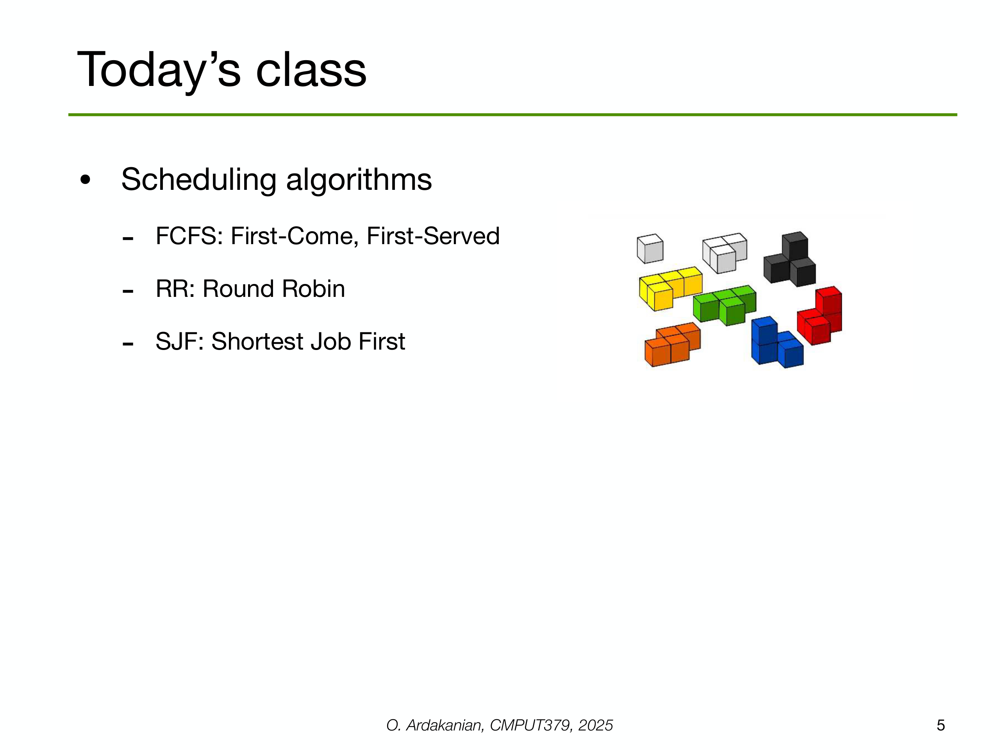

---

## 第 1 页

下面我先把“什么意思？”这个表达讲清楚；如果你是在问某一句话或某个词“什么意思”，等会也可以把原句贴出来，我再按上下文具体解释。

# “什么意思？”详解

* **基本含义**：在口语里用来追问对方话语或行为的**含义/意图**，相当于英文 *What do you mean? / What does that mean?*
* **语气**：直白、随意；根据语调不同可从中性到质疑、甚至不满。纯打字时容易显得生硬。

## 常见用法与场景

1. **求释义**（中性）

* A：这题要“举一反三”。
* B：*“举一反三什么意思？”*（= 请解释词语意思）
2. **求澄清**（中性→轻微质疑）

* A：我们可能要压缩预算。
* B：*“什么意思？要砍哪个项目？”*
3. **质疑/不满**（语气重）

* A：你总是迟到。
* B：*“什么意思？”*（= 你在指责我？）

## 更礼貌或更具体的说法（推荐）

* “**可以具体说说你的意思吗？**”
* “**这句话/这个词是什么意思？**”
* “**你是指……吗？**”
* 书面或正式：

* “**不太明白您的意思，能否再解释一下？**”
* “**方便举个例子说明吗？**”

## 容易冒犯的情况与缓和技巧

* 只发“什么意思？”可能显得冲。
**缓和**：加上称呼、请字或背景——

* “老师，这里我没太懂，**什么意思啊？**”
* “不好意思，我没跟上，**能再解释一下吗？**”

## 近义表达与区别

* “**啥意思？**” 更口语、方言色彩重。
* “**何意？**” 书面、古雅。
* “**你想表达什么？**” 直白，可能更强势。
* “**怎么理解这句？**” 指向“如何理解”，比较委婉。

## 标点与语气

* “**什么意思？**”：中性追问。
* “**什么意思。**”：像陈述，可能显冷。
* “**什么意思？！**”：强烈质疑或情绪化。

---

如果你是在问某个**具体词/句/段**“什么意思”，把原文贴上来（最好连同上下文、语境：聊天、新闻、合同、学术等），我直接给你逐句释义、语气分析、可能的潜台词和更地道的说法。

---

## 第 2 页

这是操作系统/调度里的几个核心指标。下面我按**定义 → 计算公式 → 直观理解/例子 → 容易混淆点**来讲。

# 1) Turnaround time（周转时间）

* **定义**：从任务提交（到达系统）到任务**完成**之间的总用时。
* **公式**：`Turnaround = 完成时刻 - 提交时刻`
* **直观**：用户把活儿交给系统，直到拿到最终结果，中间经历的全部时间（等待 + 运行 + I/O 等）。
* **易混**：它是“拿到最终结果”的时间，不关心过程中有没有早期响应。

# 2) Response time（响应时间）

* **定义**：从任务提交到系统**首次给出响应**（如开始运行/首次输出）所花的时间。
* **公式**：`Response = 第一次响应时刻 - 提交时刻`
* **直观**：像网页的“首字节时间”或应用第一次有反馈的时间。常用于评价**交互体验**。
* **易混**：响应时间可以很短（很快给你个进度条），但最终完成仍可能很慢（周转时间长）。

# 3) Waiting time（等待时间）

* **定义**：任务在**就绪队列**里等待 CPU 的总时间（不包括在 CPU 上运行或做 I/O 的时间）。
* **常见求法**：

* `Waiting = 周转时间 - 实际运行时间(总CPU时间) - I/O阻塞以外的服务时间`
* 在纯 CPU 调度题里，常简化为：`Waiting = 开始运行时刻 - 到达时刻`（对非抢占一次运行的作业）；有抢占则把多段等待时间相加。
* **直观**：排队等 CPU 的时间。

# 4) Throughput（吞吐量）

* **定义**：单位时间内完成的任务数（完成率）。
* **公式**：`Throughput = 完成任务数 / 时间长度`
* **直观**：车间单位时间里能下线多少件产品。用于衡量系统生产效率。

# 5) CPU utilization（CPU 利用率）

* **定义**：CPU 处于**忙碌**状态（就绪队列不空、正在运行）的时间占比。
* **公式**：`Utilization = CPU忙碌时长 / 总观察时长`
* **直观**：CPU 有多“满”。越高说明越少闲置，但并不等于用户体验好（可能大家都在排队）。

---

## 一个小例子（FCFS 先来先服务，非抢占）

* 任务 P1：到达 **t=0**，需要 **3s** CPU
* 任务 P2：到达 **t=1**，需要 **4s** CPU
* 调度：P1 先到先跑 **0–3s** 完成；P2 等到 **t=3** 开始跑 **3–7s** 完成

### 计算

* **P1**

* Response = 0 − 0 = **0s**（一到就跑）
* Turnaround = 3 − 0 = **3s**
* Waiting = 0s（没等）
* **P2**

* Response = 3 − 1 = **2s**（1 到，3 开始有响应）
* Turnaround = 7 − 1 = **6s**
* Waiting = 3 − 1 = **2s**
* **系统级**

* Throughput（0–7s 观察窗）= 2 / 7 ≈ **0.286 个/秒**
* CPU 利用率：**100%**（0–7s 一直在跑，没有空闲）

> 观察：虽然 CPU 利用率 100%，但 P2 的响应/等待并不短。**高利用率并不自动意味着好体验**。

---

## 常见关系与要点

* `周转时间 = 等待时间 + 运行时间(总CPU时间) + 其余服务/阻塞时间`
* 改善目标通常不同：

* 交互系统更看重**响应时间**（先让用户看到反馈）。
* 批处理/吞吐导向系统更看重**吞吐量/利用率**。
* 调度算法影响：

* **SJF/短作业优先**：平均等待/周转通常更小，但可能饿死长作业。
* **RR/时间片轮转**：响应更快（更公平），但可能增加切换开销与总周转。
* **优先级调度**：要防“饥饿”，常配**老化**策略。

如果你有具体题目/时间轴/调度算法（如 RR 的时间片、到达序列等），发给我，我按这五个指标逐项帮你算。

---

## 第 3 页

这页图在说明\*\*“进程调度 vs. 线程调度”\*\*：操作系统如何把“可运行的东西”分配到多个 CPU 核心上。

# 图里各元素代表什么

* **Process 1 … Process N（进程）**：每个进程有自己的**地址空间**（与其他进程隔离）。白色框里标了

* **text section**：代码
* **data section**：已初始化的全局/静态数据
* **heap section**：动态分配的内存（`malloc/new` 等）
* **粉色小条（thread1 … thread k，线程）**：同一进程内的多个执行流。它们**共享**进程的 text/data/heap，但各自有**私有栈、寄存器上下文**等。
* **CPU scheduler（CPU 调度器）**：内核组件，从**就绪队列**里挑选“下一个要跑的实体”放到某个**Core 1…4**（CPU 核心）上。
* 多个箭头表示：调度器可以把来自**不同进程的不同线程**安排到多个核心并行运行。

# 核心结论

1. **现代 OS（如 Linux/Windows）调度的基本单位是“线程”，而不是进程。**

* 进程更像**资源容器**（地址空间、打开文件、权限等）；
* 线程是**真正消耗 CPU 时间的执行体**，调度器把“可运行的线程”分给各个核心。
2. **同进程内线程共享内存** → 线程间通信开销小（直接读写同一 heap/data），但要用**同步原语**（锁、信号量、条件变量）避免数据竞争。
3. **跨进程默认不共享内存** → 需用 IPC（管道、socket、共享内存段等），隔离性更好、开销更大。
4. **上下文切换代价**：

* **线程内（同进程）切换**：主要保存/恢复寄存器、栈指针，**较轻**；
* **进程间切换**：还涉及地址空间切换（TLB 冲刷等），**更重**。
5. **并发 vs. 并行**：

* 有多个线程但只有一个核心 → **并发**（轮流跑）；
* 多核心同时跑多个线程 → **并行**（真正同时）。
6. **调度器还要管**：

* **负载均衡**：把可运行线程分散到不同核心；
* **亲和性（affinity）/NUMA**：尽量让线程留在“熟悉”的核心/内存节点，减少 cache 失效；
* **优先级/时间片**：决定谁先跑、跑多久；
* **阻塞唤醒**：线程因 I/O/锁阻塞会让出 CPU，I/O 完成或锁可用再进入就绪队列。

# “进程调度”与“线程调度”的区别/联系

* **进程调度**（旧教材用语）：把“可运行的**进程**”分配 CPU。若进程只有一个执行流，也就等于调度了该唯一线程。
* **线程调度**（现代主流）：把“可运行的**线程**”分配 CPU。多线程进程会有多个候选线程进入就绪队列，各自独立被选中。
* 因此在实际系统里，你更多可以把它理解为：**调度器统一调度“线程”，进程只是共享资源的壳**。

# 什么时候选多进程 vs 多线程？

* **多线程**：需要共享大量内存、通信频繁、低延迟（如 Web 服务器的工作线程、游戏逻辑+渲染线程）。
* **多进程**：需要强隔离、防崩溃扩散或混合不同语言/运行时（浏览器的“每站点一进程”、插件沙箱、守护进程/子进程模型）。

# 易错点速记

* “线程共享一切”是错的：**共享的是进程的代码/数据/heap；每个线程的栈和寄存器是私有的**。
* “CPU 利用率高=体验好”不总成立：如果锁竞争/阻塞严重，用户仍可能感到慢。
* 还有 **用户级线程 vs 内核线程（1:1、M\:N 模型）** 的实现差异；在 1:1 中，每个用户线程对应一个可被内核直接调度的内核线程（当今主流）。

如果你有具体调度场景（比如：多少线程、到达/阻塞时序、优先级、时间片），我可以画时间线/甘特图，顺便算响应时间、等待时间、吞吐量等指标。

---

## 第 4 页

这页在说：为了讲解/推导调度算法，**先采用一些理想化假设**。这些假设在上世纪 70 年代是合理的，因此很多经典算法就是在这种前提下设计与分析的。

# 逐条解释这些假设

1. **one process per user（每个用户一个进程）**

* 设想：终端时代，一个用户登录后通常只跑一个作业（如编译、批处理）。
* 好处：系统中“并发实体”数量少，排队/公平性更容易分析。
* 现实差异：今天一个用户会同时开浏览器、IDE、音乐、后台服务等一堆进程。

2. **one thread per process（每进程一个线程）**

* 设想：进程就是唯一的执行体，没有内部并行。
* 好处：调度单位=进程，时间线简单（没有同一进程内的多个可运行线程）。
* 现实差异：现代程序普遍多线程（UI 线程、工作线程、I/O 线程…），调度器面向**线程**，还涉及线程间同步、锁竞争等。

3. **independent processes（进程彼此独立）**

* 设想：进程间没有通信与依赖，不会相互等待。
* 好处：不用分析 IPC、锁、优先级反转、级联阻塞等复杂性。
* 现实差异：微服务、浏览器多进程架构、生产者-消费者流水线等都存在**强依赖**与通信，对延迟/吞吐影响很大。

4. **just one processing core（只有一个处理器核心）**

* 设想：单核 CPU，任何并发都靠时间片轮换。
* 好处：无需考虑负载均衡、缓存/NUMA 亲和性、跨核迁移代价。
* 现实差异：多核/超线程是常态，需要把可运行线程分散到多核、兼顾亲和性与迁移开销；还有能耗、实时核、隔离等考量。

# 为什么 70 年代这些假设“合理”

* 当时的计算机多为**单核**、**批处理**或**简单时分**系统；
* 应用结构简单、资源少，**一个用户一个作业**接近现实；
* IPC 稀少、库和框架生态不发达，多线程还不普遍。

# 这些假设带来的分析便利

* 指标（等待/周转/响应/吞吐）推导清晰；
* 算法（FCFS、SJF、RR、优先级等）行为更容易比较：谁平均等待短、谁响应快。

# 放到今天要注意的“破功点”

* **多核**：还要考虑负载均衡、亲和性（避免 cache/TLB 损失）、跨核迁移；
* **多线程**：锁竞争、优先级反转、调度组/配额、公平性（同一进程的多线程是否“霸占”CPU）；
* **依赖**：管道/消息队列/共享内存导致的**队首阻塞**和**背压**；
* **异构性与能耗**：大核/小核（如 big.LITTLE）、节能策略使“最短作业优先”未必等于“最省电/最稳”。

**结论**：教材里的很多调度算法是在这些简化前提下推导出来，便于理解“调度权衡”的核心思想；真正的操作系统要在此基础上，加入多核、多线程和进程间依赖等现实因素的额外机制与优化。

---

## 第 5 页

这页幻灯片讲的是操作系统调度算法的几种常见类型，具体包括 **FCFS、RR 和 SJF**。这些算法的目的是**决定任务在 CPU 上的执行顺序**。下面我来逐个解释这几种算法。

### 1) FCFS：First-Come, First-Served（先来先服务）

* **定义**：按照任务到达的顺序执行，**先到的任务先执行**，没有抢占（任务执行期间无法被中断）。
* **优点**：实现简单，公平地按顺序处理任务。
* **缺点**：可能导致**长任务阻塞短任务**，即所谓的 **“富者更富，穷者更穷”**，如果有长时间运行的任务，后面短小的任务会等待很久。
* **适用场景**：简单、负载较低的情况，但在多任务环境下效果不好。

### 2) RR：Round Robin（时间片轮转）

* **定义**：每个任务被分配一个固定时间片，**如果任务在时间片内未完成，立即被抢占，放回就绪队列**，等待下一个轮次。
* **优点**：适合多任务并发环境，避免某个任务长期占用 CPU，有较好的响应性。
* **缺点**：如果时间片设置过长，等同于 FCFS；如果时间片过短，会增加上下文切换的开销，导致效率低下。
* **适用场景**：适合交互式应用，如操作系统、实时系统等。**公平性高**，每个任务都有机会获得 CPU 时间。

### 3) SJF：Shortest Job First（最短作业优先）

* **定义**：优先执行 **预计执行时间最短的任务**，即**先执行最短任务**。
* **优点**：在理论上可以**最小化平均周转时间**，即总的任务完成时间最小。
* **缺点**：

* **不可预知性**：必须知道任务的执行时间，这在实际中很难实现，尤其是动态变化的作业。
* **可能造成饥饿**：长时间的任务可能永远得不到执行，因为系统总是优先选择短作业。
* **适用场景**：适合批处理系统，**任务长度可以预测**的情况。

---

### 图中的颜色块

这些颜色块可能代表不同的任务（如进程或线程），用来帮助理解这三种调度算法如何工作：

* **FCFS**：按顺序排列，颜色块的顺序代表执行顺序。
* **RR**：每个颜色块代表一个时间片，循环执行，每个任务轮流获取 CPU。
* **SJF**：最短任务的颜色块会被优先执行，可能会打断较长的任务。

### 总结：

* **FCFS**：按任务到达顺序调度，简单但可能不公平。
* **RR**：使用固定时间片，适合多任务环境，公平性强。
* **SJF**：优先执行短作业，理论上可以最小化周转时间，但难以预测，且可能导致饥饿。

这三种算法常用于教学和简单的操作系统中，帮助我们理解调度的基本原理，但在实际的生产环境中，操作系统通常会结合更多因素（如优先级、资源需求、I/O等待等）来设计复杂的调度策略。

---

## 第 6 页

这页讲的是 **FCFS 调度算法（先来先服务）** 的细节。让我们逐条分析：

### 1) **FCFS: First-Come, First-Served（先来先服务）**

* **定义**：调度器按照任务到达的顺序执行任务，**先到的任务先执行**。FCFS 是一种 **非抢占式（non-preemptive）** 算法，意味着任务在运行时不会被中断，直到完成。

### 2) **执行到完成**

* **意思**：FCFS 调度器会确保每个任务**执行到完成**，而不是被中断或者暂停。因此，执行一个任务的整个过程必须完成，直到任务自然结束或者阻塞（比如等待 I/O）。
* **例子**：如果任务 A 先到达，任务 B 后到达，任务 A 会先执行，直到它结束，接着才会执行任务 B。

### 3) **早期 FCFS 调度器**

* **历史背景**：在早期的 FCFS 实现中，任务如果在执行时需要进行 I/O 操作（如读取磁盘文件），它不会放弃 CPU。也就是说，任务在执行 I/O 操作时仍然占据 CPU，直到它完成所有的计算任务或其他操作，再去做 I/O。
* **问题**：这种方法会导致 **I/O 阻塞**时的**CPU 利用率低**。因为 CPU 被一个正在等待 I/O 的任务占用，其他任务无法使用 CPU，即使它们可以进行计算任务。

### 4) **假设的 FCFS 调度器**

* **现代假设**：当前我们假设使用的是一种 **非抢占式（non-preemptive）** FCFS 调度器，它只在任务执行时被阻塞等待 I/O 时才释放 CPU。

* **非抢占式**：任务在被调度执行时不会中断，**即使它进入 I/O 阻塞状态，也不会主动释放 CPU**，直到它做完当前计算任务或者需要等待 I/O 时。
* **例子**：如果任务 A 正在进行计算，它会继续占用 CPU，直到它需要做 I/O（例如等待磁盘读取），然后它会释放 CPU。

### 小结：

FCFS 是最简单的调度算法，适用于简单的场景。在早期的实现中，任务不会因 I/O 操作而放弃 CPU，导致 CPU 时间的浪费。现代的实现通常会改进这一点，任务会在进入 I/O 阻塞时放弃 CPU，允许其他任务继续执行。

### **优缺点**

* **优点**：

* **简单易实现**：只需要根据任务到达顺序进行排队。
* **公平性**：任务按到达顺序得到处理。
* **缺点**：

* **可能导致“长任务阻塞短任务”**，即长时间运行的任务会阻塞后面较短的任务。
* **I/O 等待时低效**，如果任务在 I/O 阻塞时不释放 CPU，可能会浪费很多计算资源。

在现代的操作系统中，尽管 FCFS 很简单，但常常会通过其他调度策略来克服它的缺点，比如使用 **时间片轮转（RR）** 来确保更好的响应时间，或者 **优先级调度** 来优化任务完成顺序。

---

## 第 7 页

这页幻灯片通过一个具体的例子来说明 **FCFS（先来先服务）调度算法** 的工作方式，并通过**任务的周转时间**和**等待时间**来展示该算法的性能。

### 1) **基本场景描述**

* **A、B、C 三个任务在时间 0 时刻就已经到达系统**，即它们已经在**就绪队列**中准备好了，等待调度执行。
* 三个任务的执行时间分别为：

* **A**：100ms
* **B**：1ms
* **C**：2ms

### 2) **FCFS 调度的执行过程**

按照 FCFS，任务会按它们到达的顺序执行。我们来看具体执行的步骤：

* **初始状态**（时间 0）：

* 就绪队列中依次为：C（2ms），B（1ms），A（100ms）
* 根据 FCFS，**A** 会首先执行，直到完成。

* **执行顺序**：

1. **A** 开始执行，**从时间 0 到 100ms**。
2. **B** 接着执行，**从时间 100ms 到 101ms**（1ms）。
3. **C** 最后执行，**从时间 101ms 到 103ms**（2ms）。

### 3) **性能评估**

通过该示例，图中的计算为每个任务的 **周转时间**（Turnaround Time）和 **等待时间**（Waiting Time），并给出它们的平均值。

#### 计算方式：

* **周转时间** = 完成时间 - 到达时间
* **等待时间** = 周转时间 - 执行时间

**步骤：**

1. **第一个 FCFS 调度段**：

* 执行顺序：A → B → C

* **周转时间**：

* A：100ms（A 完成时间 100ms - 到达时间 0ms）
* B：101ms（B 完成时间 101ms - 到达时间 0ms）
* C：103ms（C 完成时间 103ms - 到达时间 0ms）

* **平均周转时间**：$\frac{100 + 101 + 103}{3} = 101.3$

* **等待时间**：

* A：0ms（A 开始时没有其他任务在它之前）
* B：100ms（B 等待 A 完成 100ms）
* C：101ms（C 等待 A 和 B 完成 100ms + 1ms = 101ms）

* **平均等待时间**：$\frac{0 + 100 + 101}{3} = 67$

2. **第二个 FCFS 调度段**（假设时间片继续变化，调整为每个任务在执行后排队，显示更短的执行时间）：

* **周转时间**：

* A：36ms
* B：1.6ms
* C：10ms

* **平均周转时间**：20ms（通过短任务被提前完成，周转时间明显改善）

* **等待时间**：

* A：36ms
* B：1.6ms
* C：10ms

* **平均等待时间**：10ms

### 4) **观察到的问题与改进**

* **短任务被长任务阻塞**：在第一个调度段，**B** 和 **C** 这样的短任务被排在 **A** 后面，导致它们的等待时间变得很长（**67ms**），即所谓的 **“短任务被长任务卡住”**，这就是 FCFS 调度的一个典型问题。
* **改进**：如果使用 **SJF（最短作业优先）** 或 **RR（时间片轮转）**，短任务可能会更早得到执行，避免了长任务拖慢短任务的进度。

### 总结：

通过这个例子，FCFS 显示了它的简单性与效率上的一些缺点。它容易导致 **长任务阻塞短任务**，并且没有考虑任务的执行时间，导致 **等待时间较长**。这种问题在多任务和复杂调度环境中尤为明显，因此在实际系统中，通常会选择更加复杂和公平的调度算法（如 **SJF**、**RR** 或 **优先级调度**）来优化调度效率和响应时间。

---

## 第 8 页

这页幻灯片通过另一个 **FCFS（先来先服务）** 调度的例子，展示了任务调度的执行过程，并计算了**平均周转时间**（Turnaround Time）和**平均等待时间**（Waiting Time）。

### 1) **任务信息**

* **A**：执行时间 **100ms**，到达时间 **0ms**
* **B**：执行时间 **1ms**，到达时间 **10ms**
* **C**：执行时间 **2ms**，到达时间 **50ms**

### 2) **调度过程**

按照 **FCFS** 调度算法，任务会按照它们到达的顺序依次执行，因此：

* **A** 先执行，**从 0ms 到 100ms**，运行 **100ms**；
* 然后 **B** 执行，**从 100ms 到 101ms**，运行 **1ms**；
* 最后 **C** 执行，**从 101ms 到 103ms**，运行 **2ms**。

### 3) **周转时间（Turnaround Time）** 计算

**周转时间**是指从任务**提交到完成**所经过的时间，公式为：
$\text{周转时间} = \text{完成时间} - \text{到达时间}$

* **A**：完成时间是 100ms，到达时间是 0ms，所以周转时间是：
$100 - 0 = 100$ms
* **B**：完成时间是 101ms，到达时间是 10ms，所以周转时间是：
$101 - 10 = 91$ms
* **C**：完成时间是 103ms，到达时间是 50ms，所以周转时间是：
$103 - 50 = 53$ms

**平均周转时间**：

$$
\frac{100 + 91 + 53}{3} = 81.3 \, \text{ms}
$$

### 4) **等待时间（Waiting Time）** 计算

**等待时间**是指任务在就绪队列中**等待执行的时间**，公式为：
$\text{等待时间} = \text{周转时间} - \text{执行时间}$

* **A**：周转时间是 100ms，执行时间是 100ms，所以等待时间是：
$100 - 100 = 0$ms
* **B**：周转时间是 91ms，执行时间是 1ms，所以等待时间是：
$91 - 1 = 90$ms
* **C**：周转时间是 53ms，执行时间是 2ms，所以等待时间是：
$53 - 2 = 51$ms

**平均等待时间**：

$$
\frac{0 + 90 + 51}{3} = 47 \, \text{ms}
$$

### 5) **图示与总结**

* **调度顺序**：A → B → C
* **完成时间**：

* A：100ms
* B：101ms
* C：103ms
* **平均周转时间**：81.3ms
* **平均等待时间**：47ms

### 6) **分析**

通过这个例子，我们可以观察到 **FCFS** 的一些特点：

* **长作业的影响**：任务 A（长任务）在前面执行，导致任务 B 和 C 的**等待时间较长**。B 的等待时间是 **90ms**，而 C 的等待时间是 **51ms**，这就是 FCFS 的**缺点**之一：**短作业可能会被长作业阻塞**，导致 **短作业的等待时间**增加。
* **平均等待时间和周转时间**：由于长任务在前面，整体的**平均周转时间**和**平均等待时间**都相对较高。特别是短任务的等待时间受到影响，虽然 B 和 C 的执行时间很短，但它们必须等待 A 完成后才能开始。

### 总结：

FCFS 是一种简单但常常不理想的调度策略，特别是在任务执行时间差距较大的情况下，它会导致短任务**长时间等待**，造成系统效率低下。为了优化这种情况，现代操作系统会使用更复杂的调度算法（如 **SJF（最短作业优先）** 或 **RR（时间片轮转）**）来平衡各任务的执行时间，减少长任务对短任务的阻塞影响。

---

## 第 9 页

这页幻灯片总结了 **FCFS（先来先服务）调度算法** 的 **优点**和**缺点**。我们来逐一分析这些内容。

### **FCFS 的优点（Advantages）**

* **简单性和低开销**：

* **实现简单**：FCFS 是最简单的调度算法之一，因为它只需根据任务的到达顺序来安排执行，**不需要复杂的计算或排序**。
* **低开销**：由于没有复杂的决策过程或上下文切换机制，FCFS 的**调度开销**非常低。
* 这种简洁的设计对于一些简单的操作系统或者小型任务环境非常有效。

### **FCFS 的缺点（Disadvantages）**

1. **平均等待时间高度可变**：

* **短任务被长任务阻塞**：当有多个任务到达且任务的执行时间差异较大时，FCFS 可能导致 **短任务被长任务阻塞**。这样，短任务需要等候很长时间才能执行，从而使得**平均等待时间大幅增加**。

* **任务大小可变时，FCFS 可能导致较差的响应时间**：如果任务的执行时间差异很大（如有一些非常长的任务），FCFS 会导致短任务等待长时间，**影响响应速度**。例如，如果一个长任务 A 在前面，短任务 B 和 C 必须等待任务 A 完成才能执行。

* **任务大小相等时，FCFS 对于平均响应时间最优**：如果所有任务的执行时间相同，FCFS 是最合适的调度策略，因为它确保了所有任务的等待时间都最小化（没有长任务阻塞短任务）。

2. **不公平（Not Fair）**：

* FCFS 可能导致 **不公平**，特别是在存在 **短任务和长任务混合**的情况下。因为短任务可能需要等待很长时间才会得到执行，这种调度策略对于某些任务来说过于偏向长任务，**导致短任务的响应时间过长**。
* 因此，FCFS 对不同大小的任务来说是 **不公平的**，特别是在多任务环境中。

3. **I/O 和 CPU 的不良重叠**：

* **I/O 受限任务**：例如，一些任务可能是 **I/O 受限的**，即它们主要依赖于外部设备（如磁盘、网络等）的输入输出操作，而不是 CPU 处理能力。这些任务不需要长时间占用 CPU，但在 FCFS 调度中，它们可能因为在 **等待 CPU** 的过程中被迫**等候很长时间**。

* **CPU 受限任务**：与此相反，**CPU 受限任务**（即需要大量计算的任务）可能会 **占用 CPU 时间很长**，导致 **I/O 受限任务**（它们正在等待外部 I/O 设备）长时间**无法获得 CPU**。这种情况导致 **CPU 和 I/O 设备之间的重叠不佳**，造成**I/O 设备闲置**，**资源利用效率低**。

### **总结**：

* **FCFS 优点**：由于其简单性，适用于计算需求均衡且任务短小的场景，低开销且易于实现。
* **FCFS 缺点**：

* **响应时间差**：如果任务执行时间差异较大，FCFS 会导致短任务长时间等待。
* **不公平**：对短任务和长任务的处理不平衡。
* **低效的 CPU 和 I/O 重叠**：长时间运行的 CPU 任务可能使得 I/O 任务长时间无法运行，造成 I/O 设备浪费。

因此，尽管 FCFS 在一些简单场景下有效，但在多任务、大负载环境下，它的**性能不佳**。通常，现代操作系统会采用更加复杂的调度算法（如 **SJF（最短作业优先）**、**RR（时间片轮转）** 或 **优先级调度**）来解决这些问题。

---

## 第 10 页

这页幻灯片讲的是 **Round Robin（时间片轮转）调度算法** 的基本原理。让我们逐步分析其中的要点。

### 1) **基本概念**

* **时间片（time quantum）**：每个任务在 CPU 上执行的时间被限制为一个固定的时间单位，称为“时间片”。

* 每个任务获取 CPU 资源的时间是 **固定的**，如果任务在该时间内完成了，那么它就会结束执行。
* 如果任务没有在时间片内完成执行，**它将被暂停**，并重新排到就绪队列的 **末尾**，等待下一轮调度。

### 2) **如何实现**：

为了确保任务在时间片内得到调度，可以通过以下方法来实现 **Round Robin** 调度：

* **添加一个定时器**：系统在每个时间片的结束时触发定时器。
* **抢占式（Preemptive）**：如果任务在时间片结束前没有完成，它将被暂停，CPU 资源被抢占，任务会被放回就绪队列的末尾，等待下一轮调度。

### 3) **等待时间的计算**

* **假设有 N 个任务**，且时间片长度为 **Q 毫秒**。
每个任务在一次轮回中最多只能等待 **(N-1) × Q 毫秒** 才能再次获得 CPU 时间。这是因为：

* 每个任务的时间片为 **Q 毫秒**，并且任务是按顺序被调度的。
* 其他 N-1 个任务都需要先运行它们各自的时间片（每个 Q 毫秒），因此任务等待的最长时间是 **(N-1) × Q**。

### 4) **Round Robin 算法的特点**：

* **公平性**：每个任务都会有 **相等的机会** 获得 CPU，防止某个任务因长时间占用 CPU 导致其他任务饿死（如 FCFS 中的长任务阻塞短任务的情况）。
* **预抢占**：因为在时间片结束时会强制任务让出 CPU，所以 **抢占式调度** 确保了任务不会一直占用资源。
* **适合多任务环境**：尤其适用于响应时间要求较高的交互式系统，例如操作系统中的多任务调度。

### 5) **总结**

* **优势**：

* 保证 **公平性**：每个任务都能在规定时间内使用 CPU。
* **响应性较好**：适合交互式应用，如用户界面、实时任务等。
* **劣势**：

* **上下文切换开销**：如果时间片过短，会导致频繁的上下文切换，增加系统负担，降低效率。
* **可能存在不必要的等待**：如果某些任务很短，执行一部分后就被暂停，会浪费 CPU 时间。

### 6) **例子**

假设有 3 个任务（A、B、C）和时间片长度 **Q = 10ms**，则它们的执行顺序如下：

1. **A** 执行 10ms；
2. **B** 执行 10ms；
3. **C** 执行 10ms；
4. 然后任务 **A** 再次执行 10ms，以此类推。

如果任务 A 需要 30ms、B 需要 20ms，而 C 只需要 10ms，它们会依次轮流，直到所有任务都完成。

### 结论：

**Round Robin** 调度算法通过设置固定的时间片，确保任务能公平地分配 CPU 时间，避免了长期任务占用 CPU 过久导致其他任务无法执行。它是广泛用于操作系统中多任务并发调度的经典算法。

---

## 第 11 页

这页幻灯片讲的是 **Round Robin（时间片轮转）调度算法** 的基本原理。让我们逐步分析其中的要点。

### 1) **基本概念**

* **时间片（time quantum）**：每个任务在 CPU 上执行的时间被限制为一个固定的时间单位，称为“时间片”。

* 每个任务获取 CPU 资源的时间是 **固定的**，如果任务在该时间内完成了，那么它就会结束执行。
* 如果任务没有在时间片内完成执行，**它将被暂停**，并重新排到就绪队列的 **末尾**，等待下一轮调度。

### 2) **如何实现**：

为了确保任务在时间片内得到调度，可以通过以下方法来实现 **Round Robin** 调度：

* **添加一个定时器**：系统在每个时间片的结束时触发定时器。
* **抢占式（Preemptive）**：如果任务在时间片结束前没有完成，它将被暂停，CPU 资源被抢占，任务会被放回就绪队列的末尾，等待下一轮调度。

### 3) **等待时间的计算**

* **假设有 N 个任务**，且时间片长度为 **Q 毫秒**。
每个任务在一次轮回中最多只能等待 **(N-1) × Q 毫秒** 才能再次获得 CPU 时间。这是因为：

* 每个任务的时间片为 **Q 毫秒**，并且任务是按顺序被调度的。
* 其他 N-1 个任务都需要先运行它们各自的时间片（每个 Q 毫秒），因此任务等待的最长时间是 **(N-1) × Q**。

### 4) **Round Robin 算法的特点**：

* **公平性**：每个任务都会有 **相等的机会** 获得 CPU，防止某个任务因长时间占用 CPU 导致其他任务饿死（如 FCFS 中的长任务阻塞短任务的情况）。
* **预抢占**：因为在时间片结束时会强制任务让出 CPU，所以 **抢占式调度** 确保了任务不会一直占用资源。
* **适合多任务环境**：尤其适用于响应时间要求较高的交互式系统，例如操作系统中的多任务调度。

### 5) **总结**

* **优势**：

* 保证 **公平性**：每个任务都能在规定时间内使用 CPU。
* **响应性较好**：适合交互式应用，如用户界面、实时任务等。
* **劣势**：

* **上下文切换开销**：如果时间片过短，会导致频繁的上下文切换，增加系统负担，降低效率。
* **可能存在不必要的等待**：如果某些任务很短，执行一部分后就被暂停，会浪费 CPU 时间。

### 6) **例子**

假设有 3 个任务（A、B、C）和时间片长度 **Q = 10ms**，则它们的执行顺序如下：

1. **A** 执行 10ms；
2. **B** 执行 10ms；
3. **C** 执行 10ms；
4. 然后任务 **A** 再次执行 10ms，以此类推。

如果任务 A 需要 30ms、B 需要 20ms，而 C 只需要 10ms，它们会依次轮流，直到所有任务都完成。

### 结论：

**Round Robin** 调度算法通过设置固定的时间片，确保任务能公平地分配 CPU 时间，避免了长期任务占用 CPU 过久导致其他任务无法执行。它是广泛用于操作系统中多任务并发调度的经典算法。

---

## 第 12 页

这两页幻灯片主要讲解了 **Round Robin（时间片轮转）调度算法** 的 **优缺点**，以及如何通过选择合适的 **时间片长度（time quantum）** 来平衡系统性能。接下来，我会逐条详细解释内容。

---

### 第一页：**Round Robin 调度**

#### 1) **选择时间片长度 (Q) 是关键**

* **如果时间片过长**：

* **等待时间较长**：任务长时间占用 CPU，**短任务**可能会被长任务阻塞，导致它们的等待时间增加。
* **退化为 FCFS**：如果时间片过长，调度效果几乎和 **FCFS（先来先服务）** 一样，任务可能永远不会被抢占，这会失去 Round Robin 算法的 **公平性**（即每个任务都有平等的机会运行）。
* **如果时间片过短**：

* **吞吐量下降**：每次上下文切换的开销（**context switch**）较大，CPU 需要频繁保存和恢复任务的状态，这会浪费大量时间，影响系统的整体吞吐量（即单位时间内完成的任务数）。
* **频繁的上下文切换**：时间片太短会导致系统进入频繁上下文切换状态，增加了调度的开销。

#### 2) **平衡等待时间和吞吐量**

* 需要选择一个合理的时间片长度，使得上下文切换的开销占比**不到 1%**。通常选择 10ms 到 100ms 的时间片长度，因为这个范围内，上下文切换的开销（约 0.1ms）相对较小，既保证了公平调度，又不影响系统吞吐量。

#### 3) **例子**：

* **处理时间 = 10ms**，时间片和上下文切换情况如下：

* **时间片 Q = 12ms**，没有上下文切换。
* **时间片 Q = 6ms**，上下文切换发生了 1 次。
* **时间片 Q = 1ms**，上下文切换发生了 9 次。

通过这个例子，可以看到当时间片过短时，**上下文切换次数增加**，导致系统的性能变差。时间片过长时，可能会导致等待时间增加。

---

### 第二页：**Round Robin 调度的优缺点**

#### 1) **优点**：

* **公平性**：Round Robin 算法最明显的优点是它保证了 **公平性**，即每个任务在 CPU 上的执行时间是 **均等的**，不会被长时间阻塞。
* 每个任务都会被分配 **时间片**，即使某些任务的执行时间非常短，它们也能够按顺序获得 CPU 资源。

#### 2) **缺点**：

* **平均等待时间差**：如果所有任务的执行时间 **相同**，Round Robin 会导致 **较差的平均等待时间**。因为每个任务都需要等待其他任务完成它们的时间片。若任务执行时间相同，**长时间的轮转**会导致较高的平均等待时间。
* **上下文切换的开销**：如果时间片过短，频繁的上下文切换会带来额外的开销，影响系统的整体吞吐量。

---

### **总结**：

* **时间片长度的选择**对 Round Robin 调度至关重要。如果时间片太长，会导致类似 FCFS 的效果；如果太短，会频繁上下文切换，影响吞吐量。理想的时间片应该在 **10ms 到 100ms** 之间，且上下文切换时间占比尽可能小。
* **Round Robin 算法**的最大优点是公平性，它确保了每个任务都有机会获得 CPU 资源。然而，**平均等待时间**和 **上下文切换的开销** 是它的主要缺点，尤其是在任务执行时间相近的情况下。

---

## 第 13 页

这页幻灯片通过一个 **Round Robin（时间片轮转）** 的具体例子来展示 **时间片长度** 对调度的影响。我们来逐步分析这段时间调度过程，帮助理解时间片大小对系统性能（如**周转时间**）的影响。

### **任务描述**

* 任务 A：执行时间 **100ms**
* 任务 B：执行时间 **1ms**
* 任务 C：执行时间 **2ms**

假设所有任务在 **t = 0** 时刻就已到达系统，依次进入 **就绪队列**，等待 CPU 调度。

---

### **1) 时间片 = 1ms（时间片轮转）**

* **执行过程**：

* 每个任务分配 **1ms** 时间片依次执行，调度顺序为 **A → B → C → A → B → C → ...**
* **任务 A** 每次执行 1ms，但因为它总共需要 100ms，因此需要被多次调度。
* **任务 B** 和 **任务 C** 分别需要 1ms 和 2ms，因此它们将在各自的时间片内完成任务，调度完成后会轮流被重新调度。
* **周转时间计算**：

* **任务 A**：因为它需要 100ms，总共会被调度 100 次，每次执行 1ms。任务 A 在多个轮回中完成，最后在 **时间 103ms** 时完成（任务 A 共有 100 次时间片）。
* **任务 B**：执行时间为 1ms，完成时间是 **时间 5ms**。
* **任务 C**：执行时间为 2ms，完成时间是 **时间 5ms**。
* **平均周转时间**：

$$
\text{平均周转时间} = \frac{100 + 101 + 103}{3} = 36.7 \, \text{ms}
$$

---

### **2) 时间片 = 2ms（时间片轮转）**

* **执行过程**：

* 每个任务分配 **2ms** 时间片。此时，**A → B → C** 的顺序仍然适用，但是每个任务得到的时间片更长，**A** 每次执行 2ms，总共需要 50 次轮回才能完成。
* **B** 和 **C** 只需执行一次，完成它们的任务。
* **周转时间计算**：

* **任务 A**：完成时间是 **103ms**，任务 A 会在 50 次轮回后完成。
* **任务 B**：完成时间是 **时间 5ms**。
* **任务 C**：完成时间是 **时间 5ms**。
* **平均周转时间**：

$$
\text{平均周转时间} = \frac{103 + 5 + 5}{3} = 37 \, \text{ms}
$$

---

### **3) 时间片 = 1ms（不同任务到达时间）**

* **执行过程**：

* 当所有任务的到达时间是 **0ms** 时，调度顺序将是 **A → B → C → A → B → C → A → B → C**，直到所有任务完成。随着时间片变小，任务 A 每次获得 1ms 的时间片，并且继续被轮流调度。
* **周转时间计算**：

* **任务 A**：因为它需要 **100ms**，调度 100 次，最终完成时间为 **时间 30ms**。
* **任务 B** 和 **任务 C**：因为时间片短，**B** 和 **C** 的任务也被轮流调度，它们在短时间内完成任务。
* **平均周转时间**：

$$
\text{平均周转时间} = \frac{100 + 101 + 103}{3} = 29 \, \text{ms}
$$

---

### **总结**

通过这个例子，**时间片的选择**直接影响了 **周转时间** 和 **吞吐量**：

* 当时间片较短（例如 **1ms**）时，任务 A 等待时间增加，导致 **平均周转时间** 较大。
* 当时间片为 **2ms** 时，轮回间隙变得更长，减少了任务的等待时间，因此 **平均周转时间** 更小。

总体来说，**时间片过长**会导致任务的响应时间变差，**时间片过短**则会导致 **上下文切换的开销** 增加，影响 **吞吐量**。正确的时间片长度应在系统需求和性能之间找到一个平衡点。

---

## 第 14 页

这页幻灯片讨论了 **设置时间片（time quantum）长度** 对调度算法（如 **Round Robin**）的影响，特别是在任务的\*\*平均周转时间（average turnaround time）\*\*上。

### 1) **假设和情境**：

* **无上下文切换开销**：假设没有任何上下文切换开销，实际上在现实中，每次上下文切换会有一定的时间成本，但这里为了简化分析，我们忽略了这个因素。
* **所有任务同时到达（t = 0）**：所有进程从同一时刻开始进入系统。
* **任务描述**：

* P1 执行时间 6ms
* P2 执行时间 3ms
* P3 执行时间 1ms
* P4 执行时间 7ms

### 2) **影响时间片长度（time quantum）的因素**：

* 通过图表，可以看出随着时间片的增加，**平均周转时间**（所有任务的完成时间减去到达时间的平均值）会有所波动。
* **时间片的变化**：图表展示了不同的时间片（从 **1ms 到 7ms**）下，任务的平均周转时间如何变化。

### 3) **图表解读**：

* **X轴**表示时间片的长度（从 1ms 到 7ms）。
* **Y轴**表示 **平均周转时间**（即任务从开始到完成的平均时间）。

* **时间片 = 1ms** 时，任务轮转非常频繁，可能导致较高的周转时间。
* **时间片 = 2ms、3ms、4ms** 时，平均周转时间逐渐降低，说明任务在分配的时间片内能较好地得到执行，且系统的调度效率逐步提高。
* **时间片 = 5ms 和 6ms** 时，任务的平均周转时间再次增加，这表明 **时间片太长**，调度系统可能开始出现 **类似 FCFS 的效应**，导致某些任务的等待时间变长。
* **时间片 = 7ms** 时，周转时间再次增大，这说明较大的时间片可能导致 **任务轮转不频繁**，导致等待时间的增加。

### 4) **结论与分析**：

* **时间片太短**：如果时间片过短（例如 1ms），系统需要频繁进行 **上下文切换**，每次切换时都需要保存和恢复进程状态，这会增加**调度开销**，从而 **降低吞吐量**，导致 **较高的平均周转时间**。
* **时间片适中**：如果时间片适中，任务在 **每轮时间片内完成的工作量**能够保持较好的平衡，减少了频繁切换带来的负担，从而 **优化了周转时间**。
* **时间片过长**：如果时间片过长（例如 7ms），则可能导致 **系统类似 FCFS 的效果**，**长任务**会占用 CPU 太久，导致后续短任务的等待时间增大，从而再次 **增加平均周转时间**。

### 5) **选择合适的时间片**：

* 根据该图示，最佳的 **时间片长度** 不同情况下可能有所不同，应该选择一个 **中等长度的时间片**，使得 **上下文切换** 不至于过于频繁，同时又能避免任务长时间占用 CPU。
* 对于 **多任务并发环境**，时间片长度应该足够小，以确保任务公平得到执行，但又不能过短，导致上下文切换的过多开销。

### **总结**：

* **时间片长度的选择** 是优化 **Round Robin** 调度算法中的一个重要决策，应该综合考虑 **任务执行时间** 和 **系统吞吐量**，选择合适的时间片，以确保任务既能公平得到调度，又不会因频繁切换或长时间阻塞而导致整体性能下降。

---

## 第 15 页

这页幻灯片介绍了 **SJF（最短作业优先）** 调度算法，重点讲解了它的工作原理、优点和缺点。

### **SJF 调度算法的原理**

* **基本原则**：SJF 调度算法选择 **预计需要最少 CPU 时间的任务** 先执行，即**执行时间最短的任务优先执行**。这种方法旨在减少任务的 **平均等待时间**，通过尽可能优先处理小任务来减少整体的等待时间。

* **为什么**：SJF 通过先执行短任务，尽量减少等待队列中剩余任务的等待时间，因为任务完成得更快，新的任务会尽快开始执行。
* **对 I/O 操作的敏感性**：SJF 对任务的 **I/O 请求或终止**有很强的反应，它会选择预计下一次 **I/O 请求或任务终止**之前最短的任务。因此，SJF 对任务的到达顺序**不太敏感**，只关心任务的长度。

### **SJF 与 Round Robin 的关系**

* **任务大小可变时，Round Robin 接近 SJF**：
当任务大小不同且变化较大时，**Round Robin** 可以近似地模拟 **SJF**。因为它轮流给每个任务分配 CPU 时间，而较短的任务更容易在轮转中优先得到调度，尽管它并不完全按照“短任务优先”的原则执行。

---

### **SJF 调度算法的优点**

1. **证明最优**：

* SJF 被认为是 **最优的调度策略**，可以在 **减少平均等待时间** 的同时，**提高系统效率**。
* 通过优先处理短作业，SJF 能够 **减少其他作业的等待时间**，从而优化整体的系统性能。

2. **适用于抢占式和非抢占式系统**：

* SJF 既适用于 **抢占式**（preemptive）系统，也适用于 **非抢占式**（non-preemptive）系统。

* **抢占式 SJF** 被称为 **SRTF**（Shortest Remaining Time First，剩余时间最短优先）。在这种模式下，新的短作业会打断当前作业的执行，并立即开始执行，从而进一步减少等待时间。

---

### **SJF 调度算法的缺点**

1. **无法准确预测 CPU 时间**：

* 一个很大的问题是，**我们无法准确预测**每个任务需要多少 CPU 时间。实际上，很多任务的执行时间是无法预见的，因此这个算法在实际应用中可能存在误差。

* 例如，若一个任务执行时间被估算为较短，但实际上它运行较长，就会影响调度的效率。

2. **可能导致长作业饿死**：

* **SRTF** 变种（抢占式 SJF）存在 **“饿死”** 问题。即，**长时间运行的 CPU 密集型任务**（例如任务 A）可能会被较短的任务反复打断。每次有短作业到达时，长作业被迫等待，**长作业可能一直无法执行**，这种情况称为“饿死”。
* 这对于长时间运行的作业是一个严重问题，因为新的短作业不断到达并打断长作业的执行。

---

### **总结**

* **优点**：SJF 是在理论上最优的调度算法，能够最小化 **平均等待时间**，尤其适用于那些执行时间较短的任务。
* **缺点**：

* **预测问题**：我们很难准确地知道每个任务的执行时间，这使得 SJF 在现实中不总是最有效的。
* **长任务饿死**：特别是抢占式 SJF（SRTF），长任务可能会因短任务的不断插队而长期无法完成，导致“饿死”问题。

**SJF** 是一个非常有效的调度算法，但由于预测执行时间的困难和可能导致的长任务饿死问题，它在实际操作系统中通常会与其他算法（如 **优先级调度** 或 **时间片轮转**）结合使用，以处理不同类型的作业。

---

## 第 16 页

这页幻灯片展示了 **Scenario A**，通过三个调度算法（**FCFS**、**Round Robin** 和 **SJF**）对任务 **A、B、C** 的调度情况进行比较，并计算每种调度策略的 **平均周转时间**（Average Turnaround Time）。下面我会详细解释每个算法的执行过程和对比结果。

### **任务描述**：

* **A**：执行时间 100ms
* **B**：执行时间 1ms
* **C**：执行时间 2ms
* 所有任务在 **t = 0** 时刻到达系统。

### **调度算法** 比较：

1. **FCFS（先来先服务）**：

* **执行顺序**：按照任务到达的顺序执行。即 **A → B → C**。

* 任务 A 执行 **100ms**，任务 B 执行 **1ms**，任务 C 执行 **2ms**。
* 执行完成的时间分别是：A 完成时间 100ms，B 完成时间 101ms，C 完成时间 103ms。
* **计算周转时间**：

* **A**：100ms
* **B**：101ms
* **C**：103ms
* **平均周转时间**：

$$
\text{平均周转时间} = \frac{100 + 101 + 103}{3} = 101.3 \, \text{ms}
$$

2. **Round Robin（时间片轮转）**：

* **时间片**：1ms。每个任务最多执行 1ms，然后被暂停，重新排队，直到所有任务完成。
* **执行顺序**：**A → B → C → A → C → A**。

* 任务 A 在第一个时间片内执行 1ms，B 执行 1ms，C 执行 1ms。之后 A 再执行 1ms，继续轮换。
* 每个任务都轮流执行，直到完成。
* **计算周转时间**：

* **A**：100ms
* **B**：5ms
* **C**：5ms
* **平均周转时间**：

$$
\text{平均周转时间} = \frac{100 + 5 + 5}{3} = 36.7 \, \text{ms}
$$

3. **SJF（最短作业优先）**：

* **执行顺序**：**B → C → A**。根据任务的执行时间，**B** 先执行，因为它最短。

* 任务 B 完成后，C 执行，最后 A 执行。

* **计算周转时间**：

* **A**：35.7ms
* **B**：3ms
* **C**：3ms

* **平均周转时间**：

$$
\text{平均周转时间} = \frac{35.7 + 3 + 3}{3} = 35.7 \, \text{ms}
$$

### **结果比较**：

* **FCFS**：平均周转时间 **101.3ms**，这个结果较高，原因是任务 A 的执行时间很长，导致后面任务的等待时间也较长，整体调度效率较低。
* **Round Robin（时间片 = 1ms）**：平均周转时间 **36.7ms**，比 FCFS 更好，但仍然存在较高的周转时间，因为时间片过小，导致频繁的上下文切换（例如 A 被中断多次）。
* **SJF**：平均周转时间 **35.7ms**，表现最好。SJF 会优先执行短任务，从而减少了长任务的等待时间。

### **总结**：

* **FCFS** 在任务长度差异较大的情况下，可能会导致 **长任务阻塞短任务**，从而产生较长的平均周转时间。
* **Round Robin** 在公平性方面表现较好，但过短的时间片（1ms）会导致 **频繁的上下文切换**，影响系统的性能。
* **SJF** 是最优的调度策略，尤其是在任务长度差异较大的情况下，可以最小化 **平均等待时间** 和 **平均周转时间**，但它需要准确预测任务的执行时间。

因此，选择合适的调度算法要考虑任务的特点、响应时间要求和系统的实际需求。

---

## 第 17 页

这页幻灯片展示了 **Scenario B**，通过三种调度算法 **FCFS（先来先服务）**、**Round Robin（时间片轮转）** 和 **SJF（最短作业优先）** 比较任务 A、B 和 C 的调度过程，并计算每种算法的 **平均周转时间**。任务 A、B 和 C 的执行时间都是 10ms，且它们都在 **t=0** 时刻到达。

### **任务描述**：

* **A**：执行时间 10ms
* **B**：执行时间 10ms
* **C**：执行时间 10ms
* 所有任务在 **t = 0** 时刻到达。

### **调度算法比较**：

#### 1) **FCFS（先来先服务）**：

* **执行顺序**：任务按照到达顺序执行：**A → B → C**。

* **A** 执行 10ms，**B** 执行 10ms，**C** 执行 10ms。
* **计算周转时间**：

* **A**：完成时间 10ms，周转时间 = $10 - 0 = 10$ms。
* **B**：完成时间 20ms，周转时间 = $20 - 0 = 20$ms。
* **C**：完成时间 30ms，周转时间 = $30 - 0 = 30$ms。
* **平均周转时间**：

$$
\text{平均周转时间} = \frac{10 + 20 + 30}{3} = 20 \, \text{ms}
$$

#### 2) **Round Robin（时间片轮转）**（时间片 = 1ms）：

* **执行顺序**：每个任务分配 **1ms** 时间片，轮流执行，直到任务完成。

* 执行顺序为 **A → B → C → A → B → C → A → B → C**。因为每个任务有多个轮回，最终完成时间为 30ms。
* **计算周转时间**：

* **A**：完成时间 30ms，周转时间 = $30 - 0 = 30$ms。
* **B**：完成时间 30ms，周转时间 = $30 - 0 = 30$ms。
* **C**：完成时间 30ms，周转时间 = $30 - 0 = 30$ms。
* **平均周转时间**：

$$
\text{平均周转时间} = \frac{30 + 30 + 30}{3} = 29 \, \text{ms}
$$

#### 3) **SJF（最短作业优先）**：

* **执行顺序**：所有任务的执行时间相同，因此它们的执行顺序按照到达顺序进行：**A → B → C**。

* **计算周转时间**：

* **A**：完成时间 10ms，周转时间 = $10 - 0 = 10$ms。
* **B**：完成时间 20ms，周转时间 = $20 - 0 = 20$ms。
* **C**：完成时间 30ms，周转时间 = $30 - 0 = 30$ms。

* **平均周转时间**：

$$
\text{平均周转时间} = \frac{10 + 20 + 30}{3} = 20 \, \text{ms}
$$

### **结果比较**：

* **FCFS**：平均周转时间为 **20ms**。这是因为所有任务的执行时间相同，因此顺序执行导致了比较平衡的结果。
* **Round Robin（时间片 = 1ms）**：平均周转时间 **29ms**，比 FCFS 更高，因为频繁的上下文切换导致了更高的等待时间。
* **SJF**：平均周转时间为 **20ms**，与 FCFS 相同，因为所有任务的执行时间相同，因此没有显著的优化效果。

### **总结**：

* **FCFS** 和 **SJF** 在这种情况下效果相同，平均周转时间相对较低。**SJF** 更适用于任务大小不一的情况，但当任务执行时间相同的时候，**FCFS** 就足够了。
* **Round Robin** 在这种场景下，由于时间片设置为 **1ms**，导致 **频繁的上下文切换**，从而增加了每个任务的等待时间，导致 **平均周转时间增加**。

这表明，对于任务执行时间相同的情况，**FCFS** 或 **SJF** 会表现更好，而 **Round Robin** 则因为时间片过短，会增加系统的开销。

---

## 第 18 页

这页幻灯片比较了 **SRTF（剩余时间最短优先）** 和 **SJF（最短作业优先）** 调度算法的效果，并计算了每种算法的 **平均周转时间**。我们来详细解析这两个算法的执行过程和它们的差异。

### **任务描述**：

* **A**：执行时间 **9ms**，到达时间 **0ms**
* **B**：执行时间 **10ms**，到达时间 **0ms**
* **C**：执行时间 **3ms**，到达时间 **2ms**

所有任务都在 **t = 0** 时刻到达，任务 C 在 **t = 2** 时刻才到达。

### **调度算法比较**：

#### 1) **SJF（最短作业优先）**：

* **执行顺序**：根据任务的执行时间（burst length）选择最短的任务执行。

* **A** 和 **B** 都在 **t = 0** 时刻到达，但由于 A 的执行时间 **9ms** 比 B 的 **10ms** 短，所以 A 被优先执行。A 执行完后，任务 C 到达，C 执行，最后是 B 执行。

* **调度过程**：

* **A** 执行 9ms，从 **t = 0** 到 **t = 9**。
* **C** 在 **t = 2** 到达，A 执行完后，C 被调度执行，执行 **3ms**，从 **t = 9** 到 **t = 12**。
* **B** 执行，执行 **10ms**，从 **t = 12** 到 **t = 22**。

* **计算周转时间**：

* **A**：完成时间为 9ms，周转时间 = $9 - 0 = 9$ms。
* **C**：完成时间为 12ms，周转时间 = $12 - 2 = 10$ms。
* **B**：完成时间为 22ms，周转时间 = $22 - 0 = 22$ms。

* **平均周转时间**：

$$
\text{平均周转时间} = \frac{9 + 10 + 22}{3} = 13.6 \, \text{ms}
$$

#### 2) **SRTF（剩余时间最短优先）**：

* **执行顺序**：SRTF 是 **抢占式 SJF**，即如果一个新的任务到达且其执行时间比当前执行的任务剩余时间短，当前任务会被暂停，新任务会立即执行。由于 SRTF 是抢占式的，它会不断选择剩余执行时间最短的任务。

* **A** 开始执行，在 **t = 0** 到 **t = 5** 时执行 5ms。
* **C** 到达时，它的执行时间比 A 剩余的 4ms 短，因此 C 被抢占并执行 3ms，从 **t = 5** 到 **t = 8**。
* **A** 被恢复执行，继续执行剩余的 **4ms**，直到 **t = 12**。
* **B** 最后执行，执行 **10ms**，从 **t = 12** 到 **t = 22**。

* **计算周转时间**：

* **A**：完成时间为 12ms，周转时间 = $12 - 0 = 12$ms。
* **C**：完成时间为 8ms，周转时间 = $8 - 2 = 6$ms。
* **B**：完成时间为 22ms，周转时间 = $22 - 0 = 22$ms。

* **平均周转时间**：

$$
\text{平均周转时间} = \frac{12 + 6 + 22}{3} = 12.3 \, \text{ms}
$$

---

### **结果对比**：

* **SJF** 的平均周转时间为 **13.6ms**，比 SRTF 略高。这是因为 SJF 在没有抢占的情况下处理任务，所有任务执行完后才计算周转时间。
* **SRTF** 的平均周转时间为 **12.3ms**，相较于 SJF 更低。SRTF 的抢占机制使得短任务（如 C）可以优先执行，从而减少了总的等待时间。

### **总结**：

* **SJF** 是非抢占式调度算法，优先执行最短的任务，从而能减少任务的平均等待时间。
* **SRTF** 作为 SJF 的抢占式版本，可以更好地优化平均周转时间，尤其是在有新任务到达的情况下，通过不断选择剩余时间最短的任务来进行调度。
* 在 **任务执行时间可预测** 的情况下，SRTF 是一种非常有效的调度策略，能显著降低 **平均周转时间**。

---

## 第 19 页

---

## 第 20 页

这页在讲：**SJF（Shortest Job First，最短作业优先）会导致饥饿（starvation）**，并追问**SRJF/SRJT（Shortest Remaining Job First/Time，最短剩余时间优先，抢占式）**是否也会饥饿。

------

# 关键概念

- **饥饿（starvation）**：某进程长时间得不到 CPU（甚至永远得不到），一直卡在就绪队列里。
- **SJF（非抢占）**：每次从就绪队列里挑 **运行时间最短** 的作业，一旦开始就跑完这段 CPU burst 才切换。
- **SRJF / SRTF（抢占）**：随时比较**当前正在跑的作业的“剩余时间”\**与新到达作业的 burst；若新作业更短，就\**立刻抢占**。

------

# 这页的例子（右上角的表）

| 进程 | CPU burst | 到达时间 |
| ---- | --------- | -------- |
| A    | 9         | 0        |
| B    | 10        | 0        |
| C    | 3         | 2        |
| D    | 4         | 11       |
| E    | 6         | 14       |

## 用 **SJF（非抢占）** 排程的时间线（幻灯片底部那条）

1. **t=0**：A(9)、B(10) 同时到达 ⇒ 选更短的 **A**，运行 **0–9**。
    （t=2 时 C(3) 到，但 SJF 非抢占，不会中断 A）
2. **t=9**：就绪队列里有 **B(10)、C(3)** ⇒ 选 **C**，**9–12**。
3. **t=12**：队列有 **B(10)、D(4)**（D 在 t=11 到） ⇒ 选 **D**，**12–16**。
4. **t=16**：队列有 **B(10)、E(6)**（E 在 t=14 到） ⇒ 选 **E**，**16–22**。
5. **t=22**：终于只剩 **B(10)** ⇒ **22–32** 才轮到 B。

等候时间（到开始运行为止）：

- A：0
- C：9 − 2 = 7
- D：12 − 11 = 1
- E：16 − 14 = 2
- **B：22 − 0 = 22（非常长）**

> 这说明：**长作业 B 一直被后来到的更短作业“插队”**。如果在 t≈22 时又来一个比 10 更短的 F，B 还会继续被推迟；只要短作业源源不断，B **可能永远等不到** —— 这就是 **SJF 的饥饿问题**。

------

# “SRJT 也会饥饿吗？”

**会，而且在理论上更容易。**
 SRJF/SRTF 会在**任意时刻**被更短的“新来的作业”抢占。对一个很长的作业来说：

- 只要系统不断到达更短的小作业，它就会一次次被抢占，**可能一直跑不完**；
- 因此 **SRJF 同样是饥饿易感（starvation-prone）** 的（甚至比非抢占 SJF 更“敏感”）。

> 注：对本页这组**有限**的到达，SRJF 最终也会在 22–32 之间把 B 跑完（不会真正“永远等不到”）。但只要把场景换成“持续涌入短作业”，SRJF 就可能导致无限期推迟，符合饥饿定义。

------

# 如何缓解饥饿（思路）

- **老化（Aging）**：等待越久，**有效优先级越高**（或把“有效 burst”随等待时间递减），让老进程更容易被选中。
- **最大全等待时间**：超过阈值就强制调度它。
- **时间片轮转（RR）或多级反馈队列（MLFQ）**：在公平性与响应性之间折衷。
- **混合策略**：在 SJF/SRJF 的基础上加惩罚/保护规则，避免长期挤压长作业。

------

**总结**：
 这页展示了 SJF 对长作业的系统性不利（“B 可能一直留在就绪队列里”），从而**易发生饥饿**；而 **SRJF 也同样易饥饿**，因为更短作业可以随时抢占，长作业可能被无穷次推迟。

---

## 第 21 页

* 

这页是道小作业，考察你对 **SJF（最短作业优先）** 的理解。

**设定**：

- 1 个长作业，CPU burst = 100；
- nn 个短作业，每个 burst = 1；
- 都在 **t=0 同时到达**，到达顺序是随机的；
- 使用 **SJF（非抢占）** 调度。

因为 SJF 会按 **burst 长度从小到大** 选择运行顺序，**无论到达顺序如何**，所有短作业（1 单位）都会排在长作业（100 单位）前面运行。

------

## 问题 1：短作业被卡在长作业后面的概率？

**答案：0。**
 在 SJF 下，长作业永远排在最后，所以短作业不会被放到它后面。

> 如果题目换成 FCFS（先来先服务）且到达顺序随机，那么“某个短作业排在长作业后面”的概率才会是 1/(n+1)1/(n+1)。但这里明确是 **SJF**。

------

## 问题 2：长作业的期望等待时间？

**答案：nn 个时间单位。**
 理由：在长作业开始前，需要先跑完 nn 个短作业，每个耗时 1，所以等待时间是 n×1=nn\times 1=n。

------

### 一句话总结

- **短作业被长作业“卡住”的概率：0**。
- **长作业的期望等待：nn**。