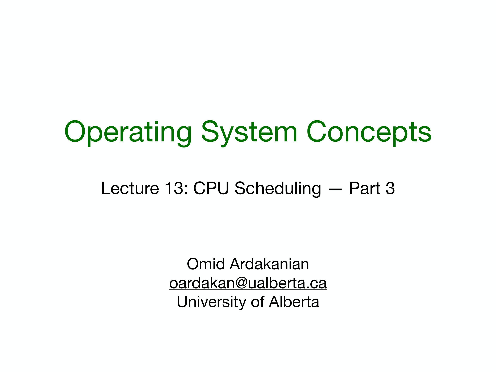
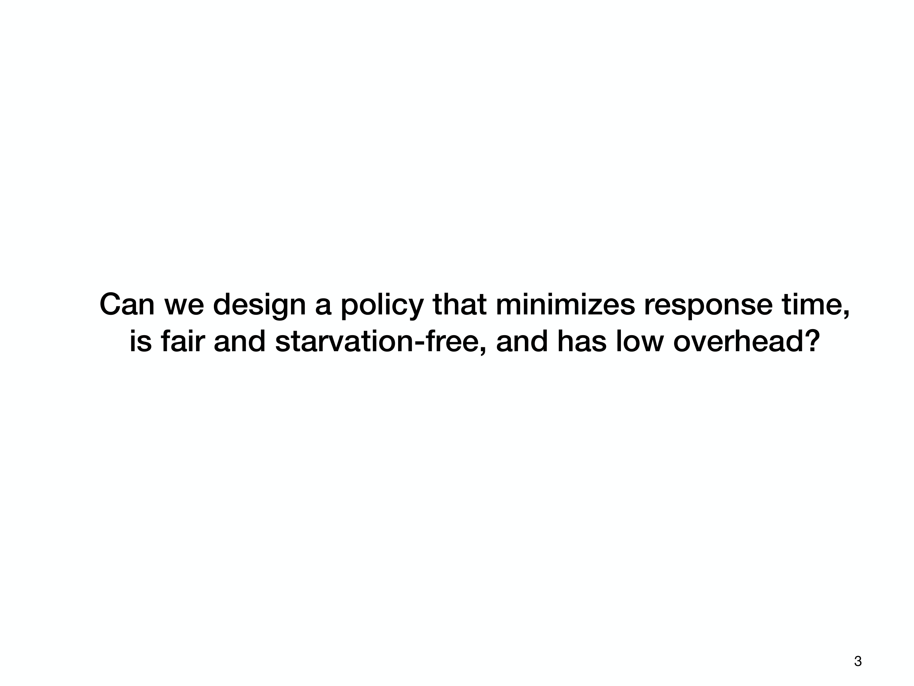

---

## 第 1 页

这是一个课程讲义封面页。大意如下：

* 课程名称：Operating System Concepts（操作系统概念）
* 本讲主题：Lecture 13 — CPU Scheduling（CPU 调度），第 3 部分
* 授课者：Omid Ardakanian（阿尔伯塔大学），邮箱在页上

也就是说，这节课继续讲“CPU 调度”的进阶内容。为了帮你理解，我把“CPU 调度”核心点和第 3 部分常见会讲的进阶话题一次解释清楚。

# 什么是 CPU 调度？

当多个进程/线程争用 CPU 时，操作系统内核要决定“下一刻由谁运行、运行多久”。挑选与切换的规则就叫“调度算法”。

## 为什么重要？

* 影响用户体验（响应时间、流畅度）
* 影响系统吞吐（单位时间完成多少任务）
* 影响公平性与实时性（谁不被饿死、谁能按时完成）

## 评价指标（常用）

* 周转时间：提交→完成的总时间
* 等待时间：在就绪队列里排队的时间
* 响应时间：发出请求→第一次得到响应
* 吞吐量：单位时间完成的作业数
* 公平性/饥饿：是否长期偏袒某些任务

## 基础算法（回顾）

* FCFS（先来先服务）：简单但可能“车队效应”
* SJF/SRTF（最短作业优先/剩余时间最短）：平均等待时间好，但需要“预测长度”，易饿死长作业
* 优先级调度：快办紧急事；需防止低优先级饥饿（可用优先级老化）
* 轮转（RR）：给每个任务一个时间片，适合交互式负载
* 多级队列/多级反馈队列（MLFQ）：根据行为动态调整优先级，是通用操作系统常用的思路

---

# 第 3 部分通常讲什么“进阶”内容？

不同课程安排略有差异，但常见包括：

## 1) 多处理器/多核调度

* **全局队列 vs. 每核就绪队列**：全局队列易于负载均衡；每核队列缓存友好（更少迁移）。
* **处理器亲和性（affinity）**：尽量让线程回到原来运行的核，利用缓存局部性。
* **负载均衡**：周期性在各核心之间搬运任务，避免有的核闲、有的核忙。
* **NUMA**：内存分区导致访问延迟不同，调度需要考虑“线程靠近数据”。

## 2) 实时调度（Real-time）

* **硬实时 vs. 软实时**：是否“错过截止期就不可接受”。
* **周期任务模型**：任务有周期、执行时间、截止期。
* **经典算法**：

* **Rate Monotonic (RM)**：周期越短优先级越高（静态优先级）。
* **Earliest Deadline First (EDF)**：谁的截止期最近谁先跑（动态优先级），理论上处理器利用率更高。
* **优先级反转 & 继承**：低优先级持有锁阻塞高优先级 → 用优先级继承/上限协议缓解。

## 3) 现代系统中的调度器实例

* **Linux CFS（完全公平调度器）**：用“虚拟运行时间 vruntime”追求按权重的公平，把 CPU 时间当成可分的“份额”。
* **Windows 调度器**：多级反馈+优先级动态调整，偏重互动性与响应。
* **移动/节能场景**：big.LITTLE（大小核）下按能效/温度调度。

## 4) 虚拟化与容器中的调度

* **两级调度**：宿主机调度“虚拟 CPU（vCPU）”，客体 OS 再调度其内部线程；需要时间片协调与过度承诺（overcommit）策略。
* **cgroups/配额**：为容器/进程组设定权重、带宽、上限，保证资源隔离与服务质量（QoS）。

## 5) 实践中的细节

* **时间片大小取舍**：太大→交互差；太小→上下文切换开销大。
* **I/O 密集 vs. 计算密集**：调度器常偏好让 I/O 密集任务更快得到 CPU，提高交互性与整体效率。
* **抢占与非抢占**：抢占式能提升响应，但需要保存/恢复上下文。
* **防饥饿与老化**：等待越久优先级逐渐提升。

---

# 一个直观小例子（轮转）

三个任务 A/B/C 到达后，时间片 50ms：
A 跑 50ms → 切 B 50ms → 切 C 50ms → 再回 A……
这样“每人轮一口”，交互式程序不会长时间卡住；但若时间片太小，切换成本上升。

---

如果你愿意，我可以：

* 用具体到达/执行时间帮你算不同算法的等待/周转时间对比；
* 讲 Linux CFS 的关键数据结构和公式；
* 结合你关心的平台（如 Android、Windows、K8s）解释它们的调度特色。

---

## 第 2 页

这是第二页“Today’s class（本节课提纲）”。每个要点的意思和会讲到的关键内容如下——我把概念、适用场景、优缺点都配上，便于你系统理解。

# 1) Scheduling algorithms（调度算法）

让内核在多个就绪进程/线程之间挑选“下一位”的规则。

## 1.1 Priority scheduling（优先级调度：SJF及其扩展）

* **思想**：给任务一个优先级，始终先运行高优先级。
* **SJF/SRTF 是特例**：把“执行时间越短优先级越高”看作一种优先级；SJF（非抢占）和 SRTF（抢占）在平均等待时间上常最优。
* **实现要点**：静态优先级（创建时定好）或动态优先级（随等待时间/I-O 行为调整）。
* **问题**：低优先级可能“饥饿”；常用 **老化(aging)** 把等得久的任务逐步提高优先级。

## 1.2 Multilevel queue scheduling（多级队列）

* **思想**：把就绪队列分层，例如：系统/实时 > 交互 > 批处理。每层内部再用各自算法（如 RR）。
* **好处**：不同类别负载“隔离”，交互任务更灵敏。
* **问题**：层间严格优先会让低层饥饿；需要配额或按比例轮转。

## 1.3 Multilevel feedback queue (MLFQ)（多级反馈队列）

* **思想**：不预先知道谁是短任务，就**用行为来推断**：

* 新任务先放高优先级、短时间片队列；
* 若没跑完就用完时间片 → 降到更低优先级、更长时间片；
* 经常阻塞/快速返回（I/O 密集）的任务会留在高优先级层。
* **优点**：兼顾交互响应与吞吐；无需精确预测运行时间。
* **难点**：参数（队列数、时间片、提升/降级策略）要调优；需防饥饿（周期性提升所有任务等）。

## 1.4 Proportional-share scheduling（比例份额/彩票调度）

* **目标**：按权重“长期来看”每个任务获得某个比例的 CPU。
* **Lottery scheduling（彩票调度）**：给每个任务一定数量“彩票”，每次随机抽签，票多者期望得到更多时间片；实现简单且能动态调整权重。
* **Stride scheduling（步幅调度）**：确定性版比例分配（每个任务 stride=常数/权重，选择最小 pass 的任务）。
* **适用**：多租户、公平共享、容器限额等；短期抖动可能略大（彩票），但长期接近目标比例。

# 2) Multiprocessor scheduling（多处理器/多核调度）

* **每核队列 vs 全局队列**：

* 每核就绪队列减少迁移、利用缓存（**处理器亲和性**），但要做**负载均衡**；
* 全局队列易于均衡但迁移多、锁竞争大。
* **负载均衡策略**：周期性扫描，或**工作窃取（work stealing）**。
* **NUMA 认知**：尽量让线程靠近其数据节点；迁移不仅看 CPU 负载也要看内存拓扑。
* **实际系统**：Linux（CFS + per-CPU runqueue + 亲和性 + 负载均衡器）、Windows（调度组/亲和掩码）。

# 3) Scheduling on real-time systems（实时系统调度）

* **硬实时 vs 软实时**：错过截止期是否不可接受。
* **常见模型**：周期任务（周期 T、执行时间 C、截止期 D）。
* **经典算法**：

* **RM（Rate Monotonic）**：周期越短优先级越高（静态）。可做可行性判定：若∑(C/T) < n(2^(1/n)−1)（n→∞ 极限≈0.693）通常可调度。
* **EDF（Earliest Deadline First）**：谁截止期最近谁先跑（动态）。单处理器上理论上只要 ∑(C/T) ≤ 1 就可行。
* **优先级反转**：低优先级持有锁阻塞高优先级 → 用**优先级继承**或**优先级上限协议**解决。
* **多核实时**：全局 EDF、分区调度、迁移成本和可行性分析更复杂。

---

## 快速对比小表

* **响应性**：MLFQ、RR（交互好） > 优先级固定 > FCFS
* **平均等待时间**：SJF/SRTF 最优（需估计时长）
* **公平性/配额**：Proportional-share（彩票/stride）最好
* **多核扩展**：每核队列 + 负载均衡 + 亲和性
* **实时截止期**：EDF/RM + 可调度性分析

如果你想，我可以用具体到达/执行时间举例，算出不同算法的等待/周转/响应时间，或结合 Linux CFS、Windows、以及实时内核做更细的实现级讲解。

---

## 第 3 页

这页在抛出一个“理想调度器是否存在”的问题：

> 我们能否设计一种同时满足：**响应时间最小**、**公平且无饥饿**、**开销又低** 的调度策略？

核心结论：**不可能三角**——通常无法同时把三者做到极致，只能在不同工作负载下做**折中**与**近似最优**。

---

# 为什么三者难以兼得？

## 1) 最小响应时间 vs. 公平/无饥饿

* 要极致快的首次响应，算法会**偏向短任务或交互任务**（如 SRTF/MLFQ 的高优先级队列）。
* 但若持续有许多短任务到达，**长任务会被一再推迟** → 出现**饥饿**或极不公平。

## 2) 最小响应时间 vs. 低开销

* 追求“谁该立刻上”往往需要**频繁抢占/上下文切换**与精细时间片；
* 切换越频繁，**调度开销**（保存/恢复寄存器、缓存抖动、锁竞争）越高，反而降低整体吞吐。

## 3) 公平/无饥饿 vs. 低开销

* 为保证公平（按权重精确分时），需要**统计每个任务已获份额、动态调整**，甚至跨核负载均衡；
* 这些簿记与迁移本身就是开销；若为降开销放宽精度，又会偏离“严格公平”。

---

# 典型算法在三者上的取舍

| 算法                         | 响应时间        | 公平/饥饿       | 开销             |
| -------------------------- | ----------- | ----------- | -------------- |
| **SJF/SRTF**（短作业优先/剩余时间最短） | 平均响应优       | 易饿死长作业      | 需要预测长度+抢占，开销中等 |
| **RR**（时间片轮转）              | 交互好（取决于时间片） | 公平、不易饥饿     | 时间片小则切换多、开销上升  |
| **优先级调度**                  | 可很好照顾紧急/交互  | 若无“老化”易饥饿   | 低到中（看实现）       |
| **MLFQ**（多级反馈）             | 对交互非常好      | 通过周期性提升减轻饥饿 | 需要多队列与策略，开销中   |
| **比例份额**（Lottery/Stride）   | 中等          | 长期很公平、可配额   | 抽签/计分簿记，开销中    |
| **Linux CFS**              | 综合平衡        | 近似按权重公平     | 红黑树/亲和&均衡器，开销中 |

> 没有一个同时在所有负载下**全局最优**；现实系统选择“**广义上合理的中庸**”。

---

# 工程上的“折中与技巧”

1. **时间片调优**：

* 大时间片：切换少，开销低；但交互差、响应慢。
* 小时间片：响应好；但切换多、开销高。
常见做法是**随负载/队列层级自适应**（如 MLFQ 高层短片、底层长片）。

2. **防饥饿机制**：

* **老化（aging）**：等待越久优先级越高；
* **周期性提升**：MLFQ 定期把所有进程抬回高层；
* **配额/最小保障**：比例份额为每个任务保底带宽。

3. **亲和与负载均衡**（多核）：

* **CPU 亲和**减少迁移、提升缓存命中；
* 仅在失衡时搬运任务，降低均衡器开销。

4. **场景专用**：

* **实时系统**为截止期服务（EDF/RM），会牺牲一般公平；
* **后台批处理**可偏吞吐，允许响应慢但开销低。

---

# 课堂要点（这页想引导你思考）

* 现实操作系统（如 Linux CFS、Windows 调度器）选择\*\*“足够好且稳健”\*\*而不是单一指标最优；
* 评价调度器要看**工作负载**：交互密集、CPU 密集、I/O 密集、实时约束、容器配额、NUMA/大小核……
* 设计时明确**优先级**（用户体验、吞吐、公平、能效），再将另外两项**约束在可接受范围**。

如果你给我一个具体工作负载（到达时间、执行时长、I/O 行为、核数），我可以直接算出不同策略下的响应时间/等待时间和大致调度开销，帮你看到这种“不可能三角”的量化差异。

---

## 第 4 页

这页在讲“**优先级调度（Priority scheduling）**”，并点出它的风险（饥饿）与常见补救办法（老化、与轮转结合）。逐条解释：

# 1) 什么是优先级调度

* **做法**：把就绪队列按**优先级**排序，**高优先级先运行**；同优先级按 **FCFS**（先来先服务）。
* **可抢占 / 不可抢占**两种：

* **可抢占**：新来更高优先级会**打断**当前进程；
* **不可抢占**：一旦开始跑，除非阻塞/结束才让出 CPU。
* **SJF 是优先级的一种特例**：把“**预测的 CPU 运行时间越短**”当作“**优先级越高**”。

# 2) 问题：低优先级可能“饥饿”

如果高优先级任务源源不断到来，低优先级就可能**长期得不到 CPU**（indefinitely blocked），这就是**starvation（饥饿）**。

# 3) 两种常见的反饥饿方案

**(a) Aging（老化）**

* 思路：**等得越久，优先级越涨**。
* 例子：每等待 100ms，优先级 +1；这样即使一开始很低，久等后也能被调度。

**(b) 轮转 + 优先级 结合（多队列 + 时间份额）**

* 给每个优先级建一个队列（队列内用 RR 轮转），再**按比例分配 CPU**：

* 例如：高 70%、中 20%、低 10%。
* 效果：高优先级仍占大头，但**所有等级都能分到时间片**，避免饿死。

> 这两类办法都会**提升公平性**，但**平均响应时间**可能变差：因为你把一部分时间“让”给了低优先级或等待已久的任务。

# 4) 一个迷你示例（直观感受）

* 高优先级 H：到达频繁；低优先级 L：一个长任务。
* 纯优先级（可抢占）：H 不断到来 → L 可能永远没机会。
* 加 **aging**：L 等 1s 后优先级提升到与 H 持平 → 终于得到时间。
* 用 **70/20/10 份额**：即使 H 持续不断，L 也能稳定拿到 10% CPU，不会饿死，但 H 的首响应会比“纯优先级”更慢一些。

# 5) 小结

* **优先级调度**适合体现紧急性/重要性；
* **风险**：饥饿；
* **补救**：老化、按份额的多级队列（优先级 + RR）；
* **权衡**：更公平 ↔ 可能牺牲部分响应速度与增加调度开销。

---

## 第 5 页

这页讲的是**多级队列调度（Multilevel Queue Scheduling）**。要点逐条拆解：

## 核心思想

* **按优先级把就绪队列“物理分层”**：每个优先级有**独立队列**（图里从高到低：实时 → 系统 → 交互 → 批处理）。
* **进程固定在某个队列**：创建时依据类型/重要性放入相应队列，**整个生命周期不挪队**（与后面的 *MLFQ* 不同，MLFQ 会跨层上下浮动）。
* **队列之间如何分配 CPU？** 常见两种：

1. **严格优先**：只有当高层空了才轮到下一层（响应最好，但低层可能饥饿）。
2. **按比例分片（time-slice among queues）**：例如高层70%、中层20%、低层10%，避免饿死。

## 如何降低响应时间？

* **高优先级用更短的时间片**，低优先级用更长的时间片：

* 交互/实时任务更快拿到并更频繁地拿到 CPU，首响应和交互性更好；
* 批处理等长作业在低层用较长时间片，减少上下文切换开销、提升吞吐。

## 优缺点

* **优点**：不同负载“隔离”，每层可选不同算法（队列内常用 RR/FCFS）；易表达业务重要性（比如前台>后台）。
* **缺点**：若采用严格优先，**低层可能长期得不到 CPU（饥饿）**；即使按比例分配，也需要人为调参数（比例、时间片），对混合负载的“自适应性”不如 MLFQ。

## 小例子（直观）

* 四层队列，跨队列配额：实时60% / 系统25% / 交互10% / 批处理5%；
* 时间片：实时 5ms，系统 10ms，交互 20ms，批处理 50ms。
* 结果：前台与实时请求几乎秒回；后台批处理虽然慢，但**至少**稳定拿到 5% CPU，不会饿死。

> 总结：**多级队列**=“按类别隔离 + 跨层分配份额 + 队列内各自调度”。它提升了响应和隔离性，但需权衡配额与时间片，且因为“固定不跨层”，灵活性不及 *多级反馈队列（MLFQ）*。

---

## 第 6 页

这页讲的是\*\*优先级反转（Priority inversion）\*\*及其解决办法（**优先级继承**）。

# 现象：优先级反转

在优先级调度里，直觉上“高优先级任务应当先跑”。但**由于锁/资源依赖**会出现相反情况：

* 低优先级任务 **L** 正在持有一把锁。
* 高优先级任务 **H** 需要这把锁才能继续，于是 **H 被阻塞**。
* 这时若有中优先级任务 **M**（与这把锁无关）不断到来，调度器会让 **M** 抢占 **L**。
* 结果：**H（高）被 L（低）间接阻塞，真正占着 CPU 的却是 M（中）**——从效果上看，高优先级被“降成了最低”。这就是**优先级反转**，且若 M 络绎不绝，会形成**无界延迟**。

简化时间线（H 最高、M 次之、L 最低）

1. `L` 获得锁并运行。
2. `H` 就绪 → 需要这把锁 → 被阻塞。
3. `M` 到来 → 抢占 `L` 运行。
4. `H` 只能等待 `L` 释放锁；但 `M` 一直压着 `L`，导致 `H` 长期卡住。

# 解决：优先级继承（Priority Inheritance）

当高优先级任务被低优先级任务**持锁阻塞**时，让持锁者**临时继承最高的相关优先级**：

* `L` 暂时提升到与 `H` 一样高（甚至更高），**抢过 `M` 的 CPU**，尽快运行并释放锁。
* 锁释放后，`L` 的优先级**恢复原值**；`H` 重新获取锁继续执行。

这正是幻灯片里写的：*“高优先级任务临时把自己的‘最高优先级’授予低优先级任务，使其代表自己运行并释放锁。”*

# 进一步说明

* **传递继承**：若 `L` 又被更低的 `L2` 阻塞，优先级可以**链式提升**直到最底层持锁者。
* **替代方案：优先级上限协议（Priority Ceiling/Highest Locker）**

* 为每把锁设定一个“上限优先级”，持锁的线程立即提升到该上限，防止复杂的反复继承与死锁组合。
* **工程建议**：

* 尽量缩短临界区；
* 对实时/嵌入式任务启用内核的继承/上限机制（如 pthread mutex 的 `PTHREAD_PRIO_INHERIT` / `PTHREAD_PRIO_PROTECT`）；
* 减少高优先级依赖低优先级的共享资源。

> 一句话：**优先级反转**是“锁 + 抢占式调度”导致的高优先级被低优先级“间接拖累”的现象；**优先级继承**通过**临时提升持锁者的优先级**来让系统恢复“该快的先快”。

---

## 第 7 页

这页介绍 **MLFQ（Multilevel Feedback Queue，多级反馈队列）调度**。它把“**多级队列** + **轮转(RR)** + **动态优先级**”结合起来，兼顾交互性和吞吐。

## 核心结构

* 由多条**按优先级排列**的**RR 队列**组成：顶层优先级最高，越往下越低。
* **调度顺序**：先把**最高优先级队列**里的作业用 RR 跑完（或直到空），再轮到下一层，以此类推。
* **关键区别于多级队列**：**作业可以在队列之间移动**（feedback），优先级是**动态**的，而不是固定在创建时决定。

## 运行规则（常见设定）

1. **队列内用 RR**：每个队列都有自己的**时间片（quantum）**。
2. **时间片随层级递增（常用“指数式增大”）**：

* 例：Q0=8ms、Q1=16ms、Q2=32ms、…；最底层甚至退化成 **FCFS**。
* 目的：高层短片 → 交互好；底层长片 → 减少切换，利于长作业吞吐。
3. **提升/降级（反馈）**：

* **新任务**通常先放到**最高优先级**（假设它可能是短/交互任务）。
* **若用完时间片仍未完成** → **降到下一层**（推断它更偏 CPU 密集/长作业）。
* **若在时间片内就阻塞/让出（如 I/O）** → **保持或提升**，因为它像交互任务。
4. **防饥饿机制**（常见实现）：

* **周期性全局提升**：过一段时间把所有作业提回高层；
* 或**老化**：等待越久优先级逐步升高。

## 为什么有效？

* **自动分类**：不用事先知道作业长度；它通过行为把 I/O/短任务留在高层，获得更好**响应时间**；把长计算推到低层，**减少上下文切换**、提升吞吐。
* **可控公平**：靠周期性提升/配额避免低层**饥饿**。

## 小例子（直观）

* A（交互型）：频繁 I/O，常在 8ms 内让出 → 长期留在 Q0/Q1，界面很“跟手”。
* B（长计算）：多次用完时间片 → 逐层下沉到 Q2/Q3，用更长时间片跑，减少切换开销。
* 若系统长时间忙，**全局提升**把 B 拉回高层，确保它不会被无限期拖延。

## 优缺点

* **优点**：对交互/通用桌面负载效果好；无需精确估计作业时间；兼顾响应与吞吐。
* **缺点**：需要**参数调优**（层数、时间片、提升周期等）；过度提升或时间片太短会增加开销。

> 总结：**MLFQ = 多级（优先级） + 轮转（队列内） + 反馈（可上下移动） + 递增时间片**。这让系统在未知作业长度的情况下，自动把“该快的”安排得更快，同时不至于饿死长作业。

---

## 第 8 页

这页是在说明 **MLFQ 如何用“反馈”自动调整优先级**，从而在“响应性、开销、公平性”之间取得平衡。逐条解释：

## 规则（反馈机制）

1. **新作业从最高优先级队列开始**。
2. **若时间片用完仍未完成**（说明它偏“长/计算密集”）→ **降一级**到更低优先级队列。
3. **若还没用完时间片就主动让出**（通常是发起 I/O、短暂计算后阻塞）→ **升一级**（直至顶层）。

* 直觉：这种作业像交互/ I/O 密集型，给它更高优先级能提升系统体感。

## 行为结果

* **CPU-bound（计算密集）**：经常把时间片用满 → **逐层下沉**，在低层用更长时间片运行，减少切换开销、提高吞吐。
* **I/O-bound（交互/短突发）**：常在时间片内就阻塞 → **长期停留在高层**，获得更好响应。
* **防饥饿（aging）**：如果某个进程在低层**等待太久**，调度器会把它**提升**到更高层，避免被长期压制。

## 为什么这样能“兼顾三项指标”

* **响应性**：交互/短作业持续处于高优先级，首响应快。
* **低开销**：长作业在底层拿到**更长时间片**，上下文切换变少。
* **公平性**：通过**老化/周期性提升**，低层作业不会被永远饿死。

## 迷你示例

* 队列 Q0/Q1/Q2 的时间片分别为 8ms/16ms/32ms。
* 进程 A（编辑器前端）：键入后很快阻塞等待 I/O → 从 Q0 不降级甚至升回顶层 → 操作“跟手”。
* 进程 B（视频转码）：每次都跑满时间片 → 逐步降到 Q2，在那儿以 32ms 片长持续运行 → 切换少、吞吐稳。
* 若系统很忙，B 在 Q2 等得过久 → 触发 **aging** 拉回 Q1/Q0，确保最终能推进。

> 一句话：**MLFQ 用“用完片就降、提前让就升”的反馈，把不同类型的工作“自组织”到合适层级**，既照顾前台体验，也避免后台任务被饿死。

---

## 第 9 页

这页讲“**提升公平性（Improving fairness）**”时不可避免的**权衡**，以及两类常见做法与各自副作用。

## 核心观点

* **SJF/SRTF 在平均等待时间上最优，但不公平**（长作业容易被饿）。
* 因此，**任何为了公平而给长作业分一点 CPU**（当短作业仍然可运行时）——都会**拉高整体平均等待时间**。这是内在权衡，而不是实现问题。

## 常见改进思路及利弊

1. **给每个队列固定一部分 CPU 份额**（跨队列配额）

* 做法：例如高优先级 70%，中优先级 20%，低优先级 10%。这样低层（多为长作业）**至少有进度**，避免饥饿。
* 局限：**只有当各层负载比较均匀**时才“看起来公平”。若某层几乎空闲而另一层爆满，固定配额会造成**一边闲一边忙**（资源利用率下降）。

2. **未被服务就提高优先级（老 UNIX 的做法）**

* 做法：等待越久，优先级越高（**aging** / ad-hoc 提升）。
* 优点：**避免饥饿**，最终都会被轮到。
* 代价：在**系统过载**时，几乎所有任务都会被提升到高优先级，**排序失去区分度**，从而让**平均等待时间上升**、响应性变差。

## 一句总结

* 公平性与“平均等待时间最优”**不可兼得**：

* 想要**不饿死长作业** → 要么**按份额保底**、要么**随等待提升优先级**；
* 但这都会让短作业不再“总被优先”，因此**平均等待时间**不可避免地**变差**。
* 实际系统会综合使用：**配额 + 老化**（或周期性提升），在不同负载下取得“够用”的平衡。

---

## 第 10 页

这页讲 **彩票调度（Lottery scheduling）**——一种\*\*按比例共享（proportional-share）\*\*的随机化调度方法。

## 基本思想

* 给每个进程分配若干“**彩票**”（权重）。
* 每个时间片随机抽一张票，中签的进程获得该时间片运行权。
* **长期平均**来看，进程得到的 CPU 份额 ≈ 自己持有的彩票数 / 系统总票数。

* 例如：某进程拿到 **10%** 的票，长期就会拿到 **≈10%** 的 CPU 时间。

> 要避免饥饿：**每个作业至少 1 张票**；这样它总有非零概率被调度。

## 票数如何分配？（决定“谁更占 CPU”）

1. **近似 SJF**：短作业多给票，长作业少给票 → 平均等待时间更低。
2. **近似优先级调度**：高优先级多票，低优先级少票 → 体现业务重要性。
3. 也可以按**用户/容器配额**发票：谁权重大谁多吃 CPU。

## 性能与可伸缩性

* **优雅退化（graceful degradation）**：新增/删除进程只会按比例影响大家，不需要重排复杂队列。
* 实现简单：只需维护总票数、每个进程票数与一个随机抽签；无需精确预测作业长度。
* **短期抖动、长期收敛**：在较短时间窗内可能“运气不好”，但随着时间变长，份额趋近目标比例（大数定律）。

## 解决优先级反转（priority inversion）

* **票据捐赠（ticket donation）**：当高优先级进程被低优先级持锁者阻塞时，**把自己的票临时捐给持锁者**，让它更可能中签、尽快释放锁。释放后票数恢复。

## 小例子（直观）

* 共有 100 张票：前台交互进程 A 60 张，后台转码 B 30 张，日志 C 10 张。
* 长期期望 CPU 份额：A≈60%，B≈30%，C≈10%。
* 再加入新任务 D（20 张票）：总票数 120，份额自动按 60/30/10/20 比例调整，无需手工调度器重构。

## 优缺点小结

* **优点**：概念简单、易实现、天然公平（按权重）；动态增删任务代价低；易与资源配额结合。
* **缺点**：短期随机性导致延迟抖动；若要严格确定性（例如硬实时），不如 EDF/RM；需要一个可靠的随机源。

> 一句话：**彩票调度**用“抽签”把 CPU 时间按权重平均分配，长期看“多票多拿”，配合“至少一票”和“票据捐赠”即可避免饥饿并缓解优先级反转。

---

## 第 11 页

这页是“**彩票调度（Lottery Scheduling）的算例**”。设定：
**短作业每个分到 8 张票，长作业每个 2 张票。**
每个时间片随机抽签，中签进程运行；**长期平均**每个进程拿到的 CPU 份额 ≈ 自己的票数 / 全部票数。

表格含义：

* **#tickets**：系统内总票数（= 8×短作业数 + 2×长作业数）
* **%CPU each short/long job gets**：在该行配置下，**每个**短/长作业长期可分到的 CPU 百分比
* 右侧红字：相对上一行，**每个短作业**的份额变化比例（增/减）

逐行计算（四次队列变化）：

1. **初始**：1 个短 + 1 个长

* 总票数 = 8 + 2 = **10**
* 每个短作业份额 = 8/10 = **80%**
* 每个长作业份额 = 2/10 = **20%**

2. **加入 1 个长作业**（变成 1 短 + 2 长）

* 总票数 = 8 + 2+2 = **12**
* 每个短作业份额 = 8/12 = **66.6%**（比 80% 下降 **16.6%**）
* 每个长作业份额 = 2/12 = **16.6%**

3. **再加入 1 个短作业**（2 短 + 2 长）

* 总票数 = 8+8 + 2+2 = **20**
* 每个短作业份额 = 8/20 = **40%**（相对上一行再降 **40%**）
* 每个长作业份额 = 2/20 = **10%**

4. **移除 1 个长作业**（2 短 + 1 长）

* 总票数 = 8+8 + 2 = **18**
* 每个短作业份额 = 8/18 = **44.4%**（相对上一行 **+11.1%**）
* 每个长作业份额 = 2/18 = **11.1%**

5. **再移除 1 个短作业**（1 短 + 1 长，回到初始）

* 总票数 = 8 + 2 = **10**
* 每个短作业份额 = 8/10 = **80%**（相对上一行 **+80%**）
* 每个长作业份额 = 2/10 = **20%**

要点总结：

* **票数=权重**，谁票多谁长期拿更多 CPU。
* 当系统里**短/长作业数量变化**时，不用改算法，只要按规则发票，**各自份额会自动按比例调整**。
* 给每个作业至少 1 张票可避免饥饿；给“更重要/更短”的作业多票，就能在长期上优待它们。

---

## 第 12 页

这页讲**多处理器系统上的调度**两种基本模式：**非对称（AMP）**与**对称（SMP）**。

# 1) Asymmetric multiprocessing（非对称多处理）

* **做法**：指定**一颗“主核”**负责所有**系统性工作**：调度决策、I/O 处理、管理内核数据结构等；其它核只跑用户任务/线程。
* **优点**：实现**简单**，因为只有主核需要访问/更新复杂的内核数据结构（少锁争用）。
* **缺点**：主核可能变成**瓶颈/单点**：

* 调度、I/O 中断都要经过主核，随着负载上升它会忙不过来；
* 其它核空等，整体可扩展性差。
* **常见于**：早期或嵌入式/实时系统，硬件异构明确（控制核 vs 工作核）。

# 2) Symmetric multiprocessing（SMP，对称多处理）

* **做法**：**每个处理器都能运行内核**，也都能做调度（“自我调度”）。
* **实现要点**（现代通用 OS 的典型做法）：

* **每 CPU 就绪队列（per-CPU runqueue）**：降低共享锁竞争；
* **负载均衡器**：定期在各核之间迁移任务，避免有的核忙有的核闲；
* **处理器亲和性（affinity）**：尽量让线程回到同一核，提升缓存命中、减少迁移开销；
* **NUMA 认知**：在线程迁移时考虑内存节点距离。
* **优缺点**：可扩展到多核，**吞吐与并行度高**；实现更复杂，需要处理**竞态、锁、缓存一致性**等开销。

# 小结对比

* **AMP**：主核统一调度，简单但易**瓶颈**。
* **SMP**：各核都能调度，**扩展性好**但实现复杂；是 Linux、Windows、BSD 等通用系统的主流。

> 一句话：**AMP 易实现；SMP 易扩展。** 现代桌面/服务器基本用 **SMP**，而某些实时/嵌入式或异构场景仍可能选择 **AMP** 或变体。

---

## 第 13 页

这页说明 **SMP（对称多处理）里就绪队列的两种组织方式**，以及它们各自的利弊。

# (a) common ready queue：**全局共享就绪队列**

* **做法**：所有核心从**同一条队列**里取下一要运行的任务（图左）。
* **优点**：天然**负载均衡**（谁空谁来取），实现调度策略时只需维护一个队列。
* **缺点**：必须对队列**加锁**以避免并发竞争；在多核、任务频繁入队/出队时，这把锁会**高度争用**，成为瓶颈。并且任务可能频繁在核之间迁移，**破坏缓存局部性**（L1/L2/TLB 命中率下降）。

# (b) per-core run queues：**每核独立就绪队列**（现代系统最常见）

* **做法**：每个核心维护自己的就绪队列，只从本队列取任务（图右）。
* **优点**：**无集中锁竞争**；容易实现**处理器亲和性（affinity）**，让线程常回到“老核”，提升缓存命中、降低迁移成本。
* **挑战**：可能出现**负载不均**（有的核忙、有的核闲），因此需要**负载均衡**机制：

* 定期或按需在核间**迁移任务**；
* 常用策略如**工作窃取（work stealing）**：空闲核去别的核队列尾部“偷”任务；
* 迁移时考虑**NUMA**与亲和，尽量不搬走热缓存/跨内存节点。

# 何时选哪种？

* **核数少、调度简单、任务短且数量不大** → 全局队列可行，代码更直白；
* **通用桌面/服务器/移动 OS，多核且并发高** → **每核队列 + 负载均衡**是主流（如 Linux CFS、Windows 调度器）。

# 小结

* **全局队列**：均衡简单，但有**全局锁争用**与**缓存不友好**问题。
* **每核队列**：**伸缩性与局部性更好**，但需额外的**负载均衡**来避免倾斜。

---

## 第 14 页

这页在讲“**实时系统（Real-time systems）**”：核心是**任务必须在截止期（deadline）前完成**。图里标出了从外部事件发生到系统做出响应的各段**延迟**。

# 什么是实时系统

* **软实时（soft RT）**：偶尔 miss deadline 只会**性能变差**（响应慢/抖动），调度器是 **best-effort**，不提供严格保证。
* **硬实时（hard RT）**：**一旦** miss deadline 就视为**系统失败**；必须对最坏情况（WCET、最大延迟）给**严格上界**并满足。

# 时序图各术语

从“事件发生”到“对事件的响应”之间，分为几段延迟：

1. **Interrupt latency（中断延迟）**
事件触发硬件中断到 **开始执行 ISR**（中断服务程序）之间的时间。
期间 OS/CPU 会做：

* 保存当前进程状态（save context）
* 判定中断类型
* 跳转调用相应 **ISR**

2. **Process made available**
ISR 把与此事件相关的实时任务（或唤醒的线程）**变为可运行**状态。

3. **Dispatch latency（调度/派发延迟）**
从任务“可运行”到它**真正开始在 CPU 上运行**所需的时间。包含：

* 抢占当前正在运行的任务
* 释放/获取必要资源（例如解除内核临界区）
* 选择目标 CPU、上下文切换

4. **Response interval（响应区间）**
图中标为 **event latency**（事件到响应的整体时长）：
**= 中断延迟 + 调度延迟 + 开始执行前的所有管理开销**。
对硬实时系统，这个区间必须**有上界且 < 任务的时间预算/截止期**。

# 为什么会变慢（图中“conflicts”）

* 正在运行的进程占着 CPU 或锁 → 需要**抢占**与**释放资源**；
* 内核临界区/关中断时间过长；
* 调度器在多核上迁移、负载均衡造成额外延迟。

# 设计要点（如何降低并“可控”这些延迟）

* **短而有界的中断关闭时间**；ISR 尽量**快**，复杂工作下放到底半部/线程。
* **可抢占内核**、缩短临界区；用 **优先级继承/上限协议**避免优先级反转。
* 选择合适的实时调度算法并做可调度性分析：

* **RM（Rate Monotonic）**：固定优先级，周期短优先；
* **EDF（Earliest Deadline First）**：截止期最近优先（单核上资源利用率更高）。
* 多核上控制迁移与亲和性，减少跨核/NUMA 开销。
* 评估 **WCET** 与最坏路径，确保 **(中断+派发+执行) ≤ 截止期**。

一句话：实时系统关心的不只是平均快，而是**每次都要在最坏情况下也能准时**。图中的各条延迟就是你必须压小并给出上界的部分。

---

## 第 15 页

这页讲“**实时调度（Real-time scheduling）**”在**软实时**与**硬实时**系统里的典型做法。

# 1) 软实时（soft real-time）

* 常用**可抢占的、基于优先级**的调度器：把实时进程放到**最高优先级**，让它能打断普通进程尽快运行。
* 例子：**Windows** 有 32 个优先级等级，其中 **16–31** 为“实时”类专用（优先于普通等级运行）。
* 特点：**尽量满足**截止期，但**不保证**每次都准点；偶尔 miss 只会性能变差。

# 2) 硬实时（hard real-time）

* 需要**Admission Control（接纳控制）**：任务在变成可运行时必须把**截止期**（以及周期、最坏执行时间 WCET 等参数）告知调度器。
* 调度器做**可行性/可调度性分析**：

* 如果能**保证**在所有最坏情况下也能按时完成（例如 RM/EDF 的利用率判据满足），就**接纳**该任务；
* 若不能保证，就**拒绝**（不接纳/降级处理），以免破坏已接纳任务的时限承诺。
* 这常配合**资源预留/服务器**（reservation、sporadic server）、**优先级继承/上限协议**等机制，确保在锁竞争与中断下也满足最坏延迟上界。

> 一句话：软实时靠“**最高优先级+抢占**”来尽量准时；**硬实时**必须先做“**接纳控制**”，只有在能**数学上保证**所有时限都满足时才允许任务加入运行。

---

## 第 16 页

这页在说明后续实时调度分析采用的**任务模型假设：周期性任务（periodic tasks）**。逐条解释：

## 周期任务的定义

* **固定周期 p**：任务每隔 *p* 时间被激活一次（产生一个“作业 job”）。频率 = 1/p。
* **固定截止期 d**：每个作业必须在激活后的 *d* 时间内完成。
* **固定执行时间 t**（又叫“计算需求”“执行时间预算”，常用最坏执行时间 WCET）：该作业真正占用 CPU 的总时长是 *t*。
* **关系约束**：

$$
0 \le t \le d \le p
$$

含义：执行时间不能超过截止期，截止期不晚于下一次激活（常见简化是 d = p）。

## CPU 占用率（利用率）

* 单个周期任务需要的 CPU 比例：

$$
U = \frac{t}{p}
$$

直观上，就是在每个周期长度 *p* 里，它要占用 *t* 的 CPU 时间。

## 图上时间轴怎么读

* 每个周期段标有 **p**；在每个周期开始时任务被激活。
* 任务必须在长度为 **d** 的窗口内完成它的计算 **t**（蓝色块）。
* 蓝块可以被切成几段分散执行（被高优先级抢占后再继续），只要**累计执行时间**达到 *t* 且在截止期 *d* 前完成即可。

## 这套假设的用途

* 便于做**可调度性分析**：例如在单处理器上，若采用 EDF，所有周期任务的利用率和满足
$\sum U_i \le 1$ 就可调度；而在 RM 下有经典的 Liu & Layland 上界判据等（这一页只是铺垫，后续通常会给出这些判据）。

> 小结：**周期任务模型**把每个实时任务抽象为“每隔 *p* 时间来一次、每次要跑 *t* 时间、必须在 *d* 内做完”。核心参数 *(t, d, p)* 决定了它的 CPU 需求与调度可行性。

---

## 第 17 页

这页讲的是**速率单调调度（Rate-Monotonic，RM）**——一种**固定优先级**的实时调度算法。

## 核心规则

* **按周期的倒数分配优先级**：周期越短 ⇒ **优先级越高**；周期越长 ⇒ 优先级越低。
* 实现简单，不需要显式知道截止期（常假设 **d = p**）。

## 例子（图中）

两类周期任务（单位任意，t=一次要跑的 CPU 时间，p=周期，d=截止期）：

* **P1**：p=50，t=20，d=50 → 利用率 $U_1=t/p=0.4$
* **P2**：p=100，t=35，d=100 → 利用率 $U_2=0.35$
总利用率 $U=U_1+U_2=0.75$

因为 **P1 周期更短**，优先级 **P1 > P2**。时间轴上：每到 0、50、100、150…，P1 的作业到来并**抢占**正在运行的 P2；P2 在空隙里运行，被多次打断，只要在各自 100 的截止点前累计跑满 35 即可。

## 接纳控制（admission control）

在假设 **d=p** 下：

* **必要条件**：$\sum_i t_i/p_i \le 1$。若 $>1$ 必然不可调度（CPU 不够用），因此要**拒绝**新任务。
* 对 RM，更强的**充分条件**（Liu & Layland 上界）：

$$
\sum_{i=1}^{n} \frac{t_i}{p_i} \le n(2^{1/n}-1)
$$

n=2 时上界≈**0.828**。本例 U=0.75 ≤ 0.828，所以 **RM 可调度**。
（注：若 U 在 0.828～1 之间，是否可调度要进一步分析；而 **EDF** 在单核上只要 U≤1 就可调度。）

## 要点 & 注意

* RM 是**静态优先级**：优先级在创建时按周期确定，运行中不变。
* **抢占式**：高优先级到来立即打断低优先级。
* 典型假设：独占单核、d≤p、已知最坏执行时间（WCET）。若 **d≠p** 或有共享资源，需要额外机制（如优先级继承、服务器/预留）与更细的分析。

一句话：**RM 用“短周期更重要”的简单规则在单核上提供可证明的时限保障**；本页的例子总利用率 0.75，满足 RM 的可调度条件，因此两任务都能按时完成。

---

## 第 18 页

这页讲 **EDF（Earliest-Deadline-First，最早截止期优先）调度**——一种**动态优先级、可抢占**的实时调度策略。

## 核心规则

* **谁的绝对截止期最近，谁的优先级最高**；随着时间推进，优先级会动态变化。
* 高优先级任务到来时**立即抢占**正在运行的低优先级任务。
* 不要求任务**是周期性的**，也不需要知道任务的“CPU burst（一次要跑多久）”。

## 理论性质（单处理器）

* 若存在可行调度，**EDF 对 CPU 利用率是最优**：

$$
\sum_i \frac{t_i}{p_i} \le 1 \quad \Rightarrow \quad \text{EDF 可调度}
$$

其中 $t_i$ 是执行时间（或 WCET），$p_i$ 是周期（非周期任务用相邻释放间隔）。
* 对比 **RM**：RM 的充分条件上界 $n(2^{1/n}-1)$ ≤ 0.828（n→∞），而 **EDF 只要总利用率 ≤1** 就行，更“吃满”CPU。

## 图示怎么读

* 时间轴上 P1、P2 的作业到来后，**每次选择截止期最近的那个**（箭头所指的时刻）。
* 可以看到 P1/P2 互相抢占，但每个作业都在自己的截止期前完成——这就是 EDF 的目标。

## 工程特点

* **实现简单**：维护“就绪队列按最近截止期排序”（小根堆即可）。
* **接纳控制**：在硬实时系统中，只有当新增任务使得总利用率仍 ≤1（并考虑中断、临界区开销的裕量）才接纳。
* **过载行为**：当 $\sum U_i > 1$ 时，EDF 可能造成**最近截止期的任务大量 miss**（集中失败）；许多系统会配合**带保留的服务器**或**带界限的 EDF**来限流。
* **资源共享**：仍需**优先级继承/上限协议**避免优先级反转导致的额外延迟。

**一句话**：EDF 每时每刻都挑选“最紧迫的任务”，在单核上只要总负载不超过 100%，就能保证所有任务按时完成，因此比 RM 更高效；但在过载与资源竞争时需要额外机制来保证稳定性。

---

## 第 19 页

这页讲 **EDF（Earliest-Deadline-First，最早截止期优先）调度**——一种**动态优先级、可抢占**的实时调度策略。

## 核心规则

* **谁的绝对截止期最近，谁的优先级最高**；随着时间推进，优先级会动态变化。
* 高优先级任务到来时**立即抢占**正在运行的低优先级任务。
* 不要求任务**是周期性的**，也不需要知道任务的“CPU burst（一次要跑多久）”。

## 理论性质（单处理器）

* 若存在可行调度，**EDF 对 CPU 利用率是最优**：

$$
\sum_i \frac{t_i}{p_i} \le 1 \quad \Rightarrow \quad \text{EDF 可调度}
$$

其中 $t_i$ 是执行时间（或 WCET），$p_i$ 是周期（非周期任务用相邻释放间隔）。
* 对比 **RM**：RM 的充分条件上界 $n(2^{1/n}-1)$ ≤ 0.828（n→∞），而 **EDF 只要总利用率 ≤1** 就行，更“吃满”CPU。

## 图示怎么读

* 时间轴上 P1、P2 的作业到来后，**每次选择截止期最近的那个**（箭头所指的时刻）。
* 可以看到 P1/P2 互相抢占，但每个作业都在自己的截止期前完成——这就是 EDF 的目标。

## 工程特点

* **实现简单**：维护“就绪队列按最近截止期排序”（小根堆即可）。
* **接纳控制**：在硬实时系统中，只有当新增任务使得总利用率仍 ≤1（并考虑中断、临界区开销的裕量）才接纳。
* **过载行为**：当 $\sum U_i > 1$ 时，EDF 可能造成**最近截止期的任务大量 miss**（集中失败）；许多系统会配合**带保留的服务器**或**带界限的 EDF**来限流。
* **资源共享**：仍需**优先级继承/上限协议**避免优先级反转导致的额外延迟。

**一句话**：EDF 每时每刻都挑选“最紧迫的任务”，在单核上只要总负载不超过 100%，就能保证所有任务按时完成，因此比 RM 更高效；但在过载与资源竞争时需要额外机制来保证稳定性。

---

## 第 20 页

下面两页分别在讲：**EDF 在过载时的表现**，以及另一种基于“松弛度/余量”的实时调度策略 **LLF（Least-Laxity-First）**。

---

# Slide 19：EDF in overloaded systems（过载时的 EDF）

**场景**：三个作业 $P_1,P_2,P_3$ 同时到来，它们各自有“执行时间（burst size，记作 $b_i$）”和“绝对截止期 $d_i$”。
**EDF 规则**：始终运行**最早截止期**的作业。

图中时间条的含义：

* 上三行：从当前时刻到各作业的截止期 $d_1,d_2,d_3$，蓝块表示各自要占用的 CPU 时间 $b_1,b_2,b_3$。
* 下方时间轴：按照 EDF 顺序先跑 $P_1$，接着 $P_2$，最后 $P_3$。结果标注了 **missed deadline**——说明 **在总需求已超过 CPU 可提供容量（$\sum b_i$ 大于可用时间窗口）时**，即便总是挑最近截止期，也**无法把所有作业都按时完成**，于是会有作业错过截止期。

要点：

* **单核上，若 $\sum U_i > 1$**（总利用率超过 100%），系统过载，**任何算法**都不可能让所有任务按时完成；
* **EDF 的过载特性**：由于它优先处理“最近截止期”，一旦过载，**最紧迫的一批能完成**，但**较远的截止期可能连续 miss**（“集中失败”）。
* 工程对策：在硬实时场景通常配 **接纳控制/资源预留**（只在可保证时接纳），或使用 **带界限的 EDF**、\*\*服务器（sporadic/deferrable）\*\*来限制某类任务的使用率，使系统不进入不可控的过载。

---

# Slide 20：LLF（Least-Laxity-First）调度

**核心概念：松弛度 / 余量（Laxity 或 slack time）**
对某作业在当前时刻 $t_{now}$ 定义：

$$
\text{laxity} = \text{deadline} - t_{now} - \text{remaining execution time}
$$

直觉：**距离截止期还剩多少时间 − 还需要的 CPU 时间**。

* **laxity 越小越紧急**：若 laxity=0，表示从现在开始必须**连续运行**才能刚好按时完成；
* **laxity<0**：即使把之后**所有**CPU都给它，也**已经来不及**（可提前判定 miss）。

**LLF 规则**：每一刻挑选 **laxity 最小** 的作业运行（可抢占）。

* 这比 EDF 更“细”：EDF只看“谁的截止期最近”；LLF还考虑“还差多少工时”。
* **优点**：

* 能**及早发现**无法按时完成的作业（出现负松弛），可以果断放弃或重启策略；
* 在某些负载下比 EDF 更贴近“真正紧急度”。
* **缺点 / 实现代价**：

* **优先级要持续动态更新**（每个作业的剩余执行时间在变化，laxity随时变）；
* 容易出现**抖动/频繁抢占（chattering）**：两个作业的松弛度不断交替最小，导致上下文切换增多；
* 需要对“剩余执行时间”有较准的估计（通常用 WCET），否则决策会失真。

与 EDF 的对比：

* **可调度性**：在理想假设下，单核上 LLF 与 EDF 都能在 $\sum U_i \le 1$ 时调度所有作业。
* **诊断能力**：LLF 能在 **laxity<0** 的那一刻立即知道“已经来不及”，这点 EDF 做不到。
* **工程权衡**：EDF 简洁、开销低、实践更广；LLF 信息利用更充分，但实现复杂且可能导致高切换。

---

## 一句话总结

* **EDF**：挑“最近截止期”，单核上理论最优利用率；但**过载**时会出现**集中 miss**，因此需要**接纳控制/预留**来避免过载。
* **LLF**：看“离截止期的**余量**”，余量越小优先级越高，能**提前发现 miss**；代价是**高复杂度与潜在的抢占抖动**。

---

## 第 21 页

这页是作业题：**在允许抢占的单处理器上，证明 EDF（最早截止期优先）是最优的**——

> 对一组相互独立、到达时刻与截止期任意的作业集合 $S$，若存在某个可行调度能让所有作业按时完成，则 **EDF 也一定能调度成功；反之亦然**。
> （即：**“存在可行 ⇔ EDF 可行”**，EDF 在单机可抢占情况下是最优的。）

下面给出一个标准、简洁的证明思路（交换/置换法），足以写成作业答案。

---

## 需要的假设

* 单处理器；可抢占，抢占/切换无开销；
* 作业彼此独立（无共享资源、无优先级反转、无释放-完成先后约束）；
* 每个作业 $J_i$ 具有：到达/释放时刻 $r_i$、执行时间 $C_i$（或剩余执行量）、截止期 $d_i$。

---

## 结论的两个方向

1. **（⇒）** 若 EDF 生成了一个满足所有截止期的调度，那么显然集合 $S$ 存在可行调度（就是 EDF 本身）。——这边是**显然**的。
2. **（⇐）** **关键：** 若 $S$ 存在某个可行调度 $\sigma^\*$，则 **EDF 也一定可行**。下面证明它。

---

## 交换论证（Interchange argument）

**思想：** 在所有可行调度中，挑一个“最接近 EDF”的，把其中违反 EDF 规则的“逆序片段”逐步交换，既不破坏可行性，又让它更像 EDF；最终得到一个可行的 EDF 调度。

### 步骤 1：定义“EDF 逆序”

在某一时刻区间 $[t, t+\epsilon)$ 内，两个都已就绪的作业 $J_a, J_b$ 同时可运行，且：

* $d_a < d_b$（$J_a$ 截止期更早），
* 但调度 $\sigma$ 却让 $J_b$ 运行、而 $J_a$ 等待。

这段就是**EDF 逆序**。

### 步骤 2：选择“最少逆序”的可行调度

在所有可行调度中，选择一个**逆序数最少**的调度 $\sigma$。

若 $\sigma$ 已无逆序，它就是 EDF；证明结束。
若仍有逆序，取**最早出现逆序的时刻** $t$，逆序的两个作业为 $J_a$（早截止）与 $J_b$（晚截止）。

### 步骤 3：交换（局部置换）不破坏可行性

把 $[t, t+\delta)$ 这段 CPU 时间从 $J_b$ 改给 $J_a$（$\delta$ 取不超过二者剩余执行量与下一次事件时刻的最小值），并在之后**把等量的时间**从 $J_a$ 原来占用的某段挪给 $J_b$。因为 $d_a<d_b$：

* $J_a$ 被提前执行，只**更有利**于在 $d_a$ 前完成；
* $J_b$ 的执行被推后，但推后的时间仍然在 $[t, d_b)$ 内（因为原先 $J_b$ 在 $d_b$ 前是可行完成的，且我们只把它的一小段提前执行时间挪到稍后），因此**仍可在 $d_b$ 前完成**。

因此，此次交换**不会造成任何作业错过截止期**，可行性保持。

### 步骤 4：逆序数减少，得到矛盾

完成上述交换后，我们得到一个新的可行调度 $\sigma'$，其逆序数**更少**（因为消除了最早的那次逆序），与“$\sigma$ 已是逆序最少的可行调度”相矛盾。
故假设不成立——**最少逆序的可行调度必然没有逆序**，也就是 **EDF 调度**。因此：**只要存在可行调度，EDF 亦可行。**

至此，两方向都成立，命题得证。

---

## 可写入作业的小补充（可选）

* 也可给出\*\*处理器需求准则（processor-demand criterion）**或**忙时区间（busy interval）\*\*的等价证明；但交换法最短。
* 强调**前提条件**（可抢占、独立、单机、零开销）对最优性很关键；多核、共享资源或开销不为零时，EDF 不再保证最优。
* 画一幅两作业的“逆序→交换→按期完成”的简图，会让证明更直观。

> **结论**：在单处理器、可抢占、独立作业的经典模型下，**EDF 是最优的**：
> **存在可行 ⇔ EDF 可行**。

---

## 第 22 页

这页是作业题：**在允许抢占的单处理器上，证明 EDF（最早截止期优先）是最优的**——

> 对一组相互独立、到达时刻与截止期任意的作业集合 $S$，若存在某个可行调度能让所有作业按时完成，则 **EDF 也一定能调度成功；反之亦然**。
> （即：**“存在可行 ⇔ EDF 可行”**，EDF 在单机可抢占情况下是最优的。）

下面给出一个标准、简洁的证明思路（交换/置换法），足以写成作业答案。

---

## 需要的假设

* 单处理器；可抢占，抢占/切换无开销；
* 作业彼此独立（无共享资源、无优先级反转、无释放-完成先后约束）；
* 每个作业 $J_i$ 具有：到达/释放时刻 $r_i$、执行时间 $C_i$（或剩余执行量）、截止期 $d_i$。

---

## 结论的两个方向

1. **（⇒）** 若 EDF 生成了一个满足所有截止期的调度，那么显然集合 $S$ 存在可行调度（就是 EDF 本身）。——这边是**显然**的。
2. **（⇐）** **关键：** 若 $S$ 存在某个可行调度 $\sigma^\*$，则 **EDF 也一定可行**。下面证明它。

---

## 交换论证（Interchange argument）

**思想：** 在所有可行调度中，挑一个“最接近 EDF”的，把其中违反 EDF 规则的“逆序片段”逐步交换，既不破坏可行性，又让它更像 EDF；最终得到一个可行的 EDF 调度。

### 步骤 1：定义“EDF 逆序”

在某一时刻区间 $[t, t+\epsilon)$ 内，两个都已就绪的作业 $J_a, J_b$ 同时可运行，且：

* $d_a < d_b$（$J_a$ 截止期更早），
* 但调度 $\sigma$ 却让 $J_b$ 运行、而 $J_a$ 等待。

这段就是**EDF 逆序**。

### 步骤 2：选择“最少逆序”的可行调度

在所有可行调度中，选择一个**逆序数最少**的调度 $\sigma$。

若 $\sigma$ 已无逆序，它就是 EDF；证明结束。
若仍有逆序，取**最早出现逆序的时刻** $t$，逆序的两个作业为 $J_a$（早截止）与 $J_b$（晚截止）。

### 步骤 3：交换（局部置换）不破坏可行性

把 $[t, t+\delta)$ 这段 CPU 时间从 $J_b$ 改给 $J_a$（$\delta$ 取不超过二者剩余执行量与下一次事件时刻的最小值），并在之后**把等量的时间**从 $J_a$ 原来占用的某段挪给 $J_b$。因为 $d_a<d_b$：

* $J_a$ 被提前执行，只**更有利**于在 $d_a$ 前完成；
* $J_b$ 的执行被推后，但推后的时间仍然在 $[t, d_b)$ 内（因为原先 $J_b$ 在 $d_b$ 前是可行完成的，且我们只把它的一小段提前执行时间挪到稍后），因此**仍可在 $d_b$ 前完成**。

因此，此次交换**不会造成任何作业错过截止期**，可行性保持。

### 步骤 4：逆序数减少，得到矛盾

完成上述交换后，我们得到一个新的可行调度 $\sigma'$，其逆序数**更少**（因为消除了最早的那次逆序），与“$\sigma$ 已是逆序最少的可行调度”相矛盾。
故假设不成立——**最少逆序的可行调度必然没有逆序**，也就是 **EDF 调度**。因此：**只要存在可行调度，EDF 亦可行。**

至此，两方向都成立，命题得证。

---

## 可写入作业的小补充（可选）

* 也可给出\*\*处理器需求准则（processor-demand criterion）**或**忙时区间（busy interval）\*\*的等价证明；但交换法最短。
* 强调**前提条件**（可抢占、独立、单机、零开销）对最优性很关键；多核、共享资源或开销不为零时，EDF 不再保证最优。
* 画一幅两作业的“逆序→交换→按期完成”的简图，会让证明更直观。

> **结论**：在单处理器、可抢占、独立作业的经典模型下，**EDF 是最优的**：
> **存在可行 ⇔ EDF 可行**。
