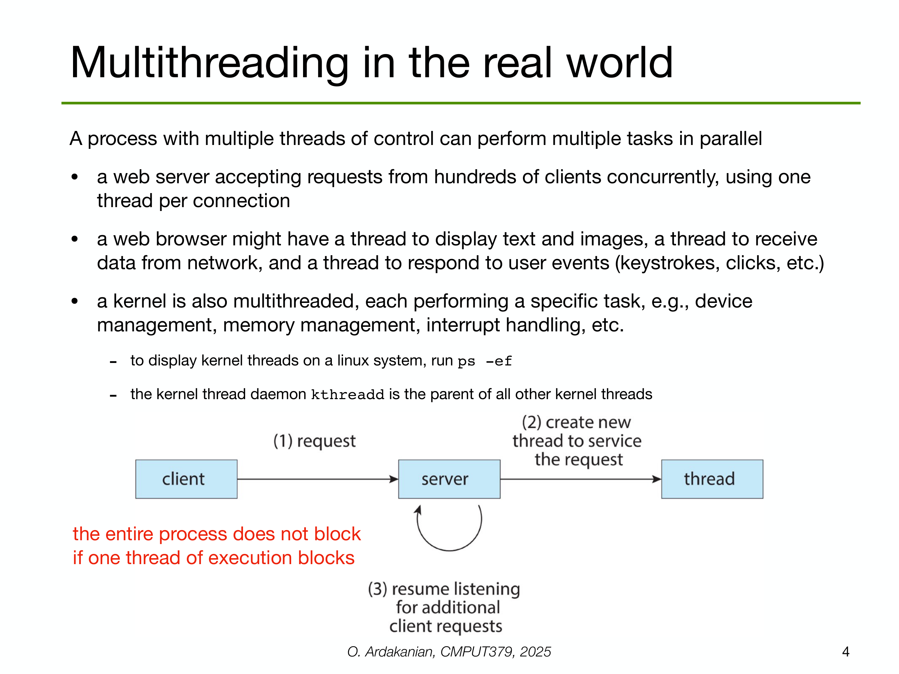
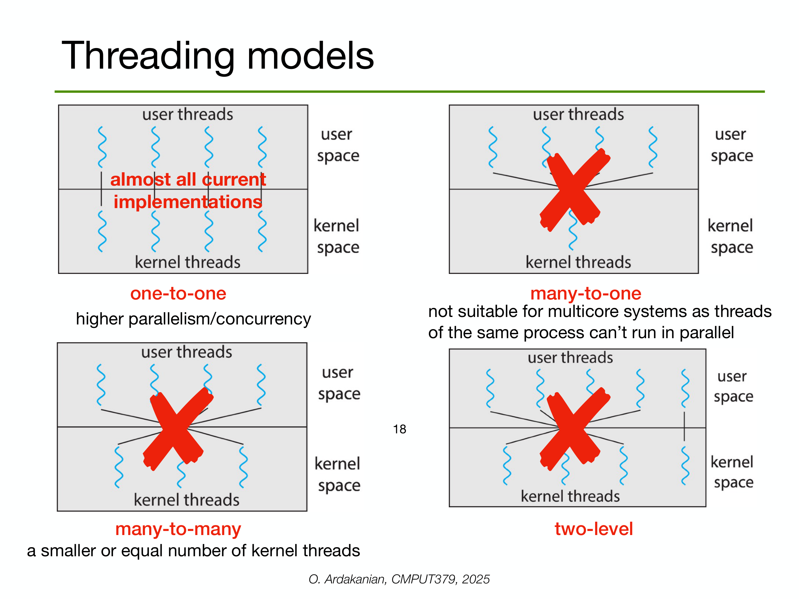

---

## 第 1 页


这是张课程讲义封面：

* **课程名**：Operating System Concepts（操作系统概念）
* **第14讲主题**：**Threads（线程）**
* **授课人**：Omid Ardakanian，阿尔伯塔大学

你问“什么意思”，核心在于“**线程**”。下面把线程在操作系统里的意义、为什么要用、怎么实现、会遇到什么问题，一次讲清。

# 1) 线程是什么？

* **进程（Process）**：正在运行的程序 + 独立的地址空间与资源（打开的文件、内存等）。
* **线程（Thread）**：进程内部的“执行单元”。同一进程里的多个线程**共享**该进程的代码段、数据段、文件描述符等，但**各自**有自己的寄存器、栈和状态。
* 比喻：进程像一个办公房间（资源、文件都在房间里），线程是房间里一起干活的多人。

# 2) 为什么要用线程？

* **响应更快**：GUI 程序可用一个线程渲染界面、另一个线程后台计算，界面不“卡死”。
* **资源共享**：同进程线程天然共享内存，数据交换更轻量。
* **创建/切换开销更小**：线程的上下文更小，切换比进程便宜。
* **可伸缩性**：多核 CPU 上可把不同线程分配到不同核并行执行。

# 3) 并发 vs 并行

* **并发**：在单核上“轮流”推进多个线程，看起来同时进行。
* **并行**：在多核上真正同时运行多个线程。
* 性能受限于任务可并行部分（可联想到 Amdahl 定律：串行部分越大，提速越受限）。

# 4) 线程实现与模型

* **用户级线程（ULT）**：线程管理在用户态库里完成；切换快，但一次系统调用可能把整个进程都阻塞。
* **内核级线程（KLT）**：由内核直接管理；能把不同线程调度到不同 CPU，但切换稍贵。
* **多对一 / 一对一 / 多对多**模型：

* *Many-to-One*：很多用户线程映射到一个内核线程（不利用多核）。
* *One-to-One*：每个用户线程对应一个内核线程（常见于 Linux/Windows）。
* *Many-to-Many*：多个用户线程复用少量内核线程（折中）。

# 5) 线程的状态与调度

* 常见状态：**就绪**（Ready）、**运行**（Running）、**阻塞/等待**（Blocked）、**结束**（Terminated）。
* 调度策略（如时间片轮转、优先级）决定哪个线程获得 CPU。

# 6) 同步与共享数据的问题

多线程共享内存会带来**竞态条件（race condition）**：多个线程同时读写同一数据，结果取决于时序。为避免：

* **临界区**：对共享数据的那段代码。
* **互斥锁（mutex）**：同一时刻只允许一个线程进入临界区。
* **信号量（semaphore）**：计数型同步原语，可做互斥或限流。
* **条件变量（condition variable）**：配合互斥锁，用于“等待某条件成立再继续”。
* **读写锁**：多读单写的场景提升并发。
* **原子操作**与**内存模型**：防止指令重排带来的可见性问题。
常见陷阱：
* **死锁**：互相等待，所有线程都走不下去（四条件：互斥、占有且等待、不可剥夺、循环等待）。
* **活锁/饥饿**：总在让步或总得不到资源。
* **线程安全**与**可重入**：函数在多线程中是否安全、能否被中断后再次调用。

# 7) 常用线程库与模式

* 库：**Pthreads**（POSIX）、**Win32 Threads**、**Java 线程**（基于 JVM）。
* 模式：**线程池**（复用工作线程）、**生产者-消费者**（用队列与条件变量）、**fork-join**（分治任务）、**异步 I/O**（减少阻塞）。

# 8) 何时该用多线程？

* **I/O 密集**：显著提升吞吐（例如网络服务器）。
* **CPU 密集**：在多核上能加速，但要注意拆分粒度与同步开销。
* **不适合**：共享状态复杂、同步成本高过收益时；或需要强隔离（用多进程/微服务更稳）。

# 9) 与进程的取舍

* **多进程**：更强的隔离与容错（一个崩了不拖累另一个），但通信与切换更重。
* **多线程**：共享多、通信快，但一个线程崩溃可能拖垮整个进程，需要更严格的内存与同步控制。

---

**一句话总结**：这页讲义开宗明义：本讲（第14讲）要讲操作系统中的**线程**——它是进程内的轻量执行单元，能提升响应与并行度，但必须用正确的同步原语管理共享数据，避免竞态与死锁。需要的话，我可以用具体示例（如用互斥锁与条件变量实现一个有界队列）继续演示。


---

## 第 2 页


这页是本次课的“提纲”，告诉你今天会学哪些点。逐条解释并补上关键细节与常见考点：

# 1) Multithreading（多线程）

让一个**进程**里跑多个**线程**，以提高响应、吞吐与多核利用。

## thread vs. process（线程 vs 进程）

* **进程**：程序的“容器”，有**独立地址空间**与资源（打开的文件、句柄等）。进程间隔离强，通信要靠管道、socket、共享内存等。
* **线程**：进程内的“执行路径”。同一进程的线程**共享**代码段、堆、已打开文件等，但每个线程有自己的**寄存器上下文与栈**。
* **代价**：创建/切换线程通常比进程便宜；但因为共享内存，必须处理同步与数据竞争。
* **适用**：GUI 的前台/后台、网络服务器（I/O 密集）、多核上的计算并行（CPU 密集）。

## user threads vs. kernel threads（用户级线程 vs. 内核级线程）

* **用户级线程（ULT）**

* 在线程库中实现（如早期的 `green threads`），**内核并不知道**有多少线程。
* 优点：创建/切换非常快；可在不陷入内核的情况下做调度。
* 缺点：一个线程若进行阻塞系统调用，**可能把整个进程都阻塞**；无法真正把线程分到多个 CPU 上（Many-to-One 模型）。
* **内核级线程（KLT）**

* 内核把线程当作调度单位（Linux 中的 task/轻量级进程、Windows 线程）。
* 优点：可把不同线程分配到**不同 CPU 核**；一个线程阻塞不影响同进程的其他线程。
* 缺点：创建/切换相对更贵，需要系统调用。
* **混合/多对多模型**：用户线程在用户态调度到一组内核线程上（既利用多核，又保留部分低开销调度）。

# 2) Threading issues（多线程常见问题）

> 这些是考试/面试高频点，也是编写并发程序的“坑位图”。

* **竞态条件（Race Condition）**：多个线程无同步地读写共享数据，结果随时序而变。

* 解决：把共享数据的访问放入**临界区**，用**互斥锁（mutex）**保护；或用**原子操作**。
* **同步原语**

* **互斥锁**：保证同一时刻只有一个线程进入临界区。
* **读写锁**：多读并发、写独占。
* **信号量**：计数型同步/限流。
* **条件变量**：等待某个条件成立（典型“生产者—消费者”）。
* **栅栏/倒计时锁存器**：阶段性同步。
* **死锁（Deadlock）**：线程环形等待资源。四条件：互斥、占有且等待、不可剥夺、循环等待。

* 预防思路：固定加锁顺序、一次性申请、设置超时/可重入锁、死锁检测。
* **活锁/饥饿**：总在让步或长期得不到资源；用公平锁/优先级调整缓解。
* **优先级反转**：低优先级线程持锁，高优先级线程被间接阻塞；解决：**优先级继承**。
* **可见性与重排序（内存模型）**：即使加锁，读写跨核的可见性也需要**内存屏障**或使用带同步语义的原语（如 C++ `std::atomic` 的 memory order、Java 的 `volatile`/happens-before）。
* **假共享（False Sharing）**：不同线程更新落在同一缓存行的不同变量，导致缓存抖动；可用**填充对齐**或把热点数据分离到不同缓存行。
* **阻塞 I/O vs 异步 I/O**：阻塞会挂起线程；异步/事件驱动能减少线程数与上下文切换。
* **上下文切换成本**：线程太多会放大调度与缓存失效的开销。
* **线程生命周期与清理**：创建、分离/回收（`join`/`detach`）、线程本地存储（TLS），避免资源泄漏。
* **与 fork/exec、信号、库重入性的相互影响**：例如多线程进程 `fork()` 后只有调用线程存活，需谨慎只在子进程做 `exec()`。

---

**一句话归纳**：
今天这节课会讲“多线程是什么、为何比进程轻、用户级与内核级线程如何取舍”，以及“写多线程代码必须面对的同步、死锁、内存可见性、性能”等关键问题。如果你愿意，我可以用一个**有界队列的生产者—消费者**示例（含互斥锁与条件变量）现场讲解这些概念如何落地。


---

## 第 3 页


这页讲**为什么要用多线程/并行**（Motivation）。

# 关键信息

1. **现代 CPU 都是多核**

* 每个“核”都能独立执行一条指令序列。把工作拆成多个可同时执行的部分，就能利用\*\*并行（parallelism）\*\*获得加速。

2. **多线程让应用更高效**

* 线程可以把不同子任务分开：
例子：一个线程计算，另一个线程在等待磁盘/网络 I/O。等待期间 CPU 不必闲着，别的线程还能继续跑 → **提升吞吐与响应**。

# 图示解读

* **single core（单核）**：时间线上 T1、T2、T3、T4 4 个线程**轮流**运行（并发但不并行）。当某个线程阻塞或用完时间片，系统切到下一个。总体用时较长。
* **multicore（多核）**：有 core1 和 core2。

* 线程被分派到不同的核上**真正同时**执行：T1 与 T2、T3 与 T4 可重叠。
* 这样同样数量的工作，**墙钟时间**更短；当某个线程阻塞 I/O，另一个核/线程仍在推进计算。

# 为什么能更快？

* **并行度**：可同时处理的工作量↑。
* **隐藏 I/O 等待**：把“等”的时间与“算”的时间重叠。
* **上下文更轻**：线程比进程便宜，切换/通信成本低。

# 但也有前提/上限

* 需要**可并行的子任务**；完全串行的部分限制总提速（Amdahl 定律：速度提升 ≤ 1 / (串行比例 + 并行比例/核数)）。
* 线程越多并不一定越快：同步、锁争用、缓存失效、上下文切换会抵消收益。
* I/O 密集型（Web 服务器、爬虫）和可拆分的计算密集型（图像处理、数值计算）收益最大。

**一句话**：多核时代，用多线程把工作拆开并在多个核上同时跑，或把计算与 I/O 等待重叠，能明显缩短完成时间并提升整体吞吐。


---

## 第 4 页



这页在说：**真实系统里多线程怎么用、为什么有用**。

# 核心结论

> 一个进程里有多个线程，就能**并行/并发地**做多件事；**其中一个线程阻塞并不会让整个进程停住**（红字的意思）。

# 现实中的例子

* **Web 服务器**：同时接收成百上千个客户端请求。经典做法是“**每连接一个线程**”（或线程池）：

1. 客户端发来请求；
2. 服务器**为该请求新建一个线程**（或从池里取一个）；
3. 主线程马上**回到监听**，继续接其他请求。
→ 某个线程在等待磁盘/网络时，别的线程还在处理其他请求，系统吞吐更高。
* **Web 浏览器**：常把工作分到不同线程：

* 渲染文本/图片；
* 从网络收数据；
* 响应键盘/鼠标事件。
互不拖累，界面更流畅。
* **操作系统内核也是多线程的**：不同内核线程分别管设备、内存、进程调度、中断处理等。

* 在 Linux 上能看到**内核线程**（进程名常用方括号包起来）。
* 它们由一个特殊的内核线程 **`kthreadd`** 派生（相当于“内核线程的父亲”）。

> 小提示（方便实操）：
>
> * `ps -ef` 可以看到进程列表，很多发行版会把内核线程显示为方括号名；
> * 想看每个进程里的线程：`ps -eLf`、`ps -T -p <PID>` 或 `top -H`。

# 为什么这样做更好？

* **响应与吞吐**：计算和 I/O 等待可以**重叠**；主线程不被单个慢请求拖住。
* **多核利用**：不同线程可以跑在不同 CPU 上，实现真正并行。

# 工程取舍

* 线程过多会带来**上下文切换、内存占用**和**锁竞争**；
* 服务器端常用**线程池**或**异步 I/O**代替“每连接一线程”的极端做法，在高并发下更稳。

**一句话**：多线程把一个大任务拆成相互独立的小任务并行处理，这样即使某个线程阻塞，整个进程仍能继续对外服务，从而获得更好的性能与用户体验。


---

## 第 5 页


这页在讲：**“线程”是一种抽象**——它是进程里的独立执行流，内核可以把它单独拿出来调度。

# 1) 线程与进程的边界

* **线程（thread）**：进程内部的一条**执行流**，可被**独立调度**（给时间片、分到某个 CPU 核）。
* **进程（process）**：提供**保护域/资源容器**——地址空间、代码/数据、打开文件表、信号处理方式等。
* 同一进程里的线程**共享**这些资源，但各线程**独立推进**自己的指令序列。

# 2) TCB：线程控制块（thread control block）

每个线程都有一份内核/运行时维护的“档案”，用于保存/恢复上下文、参与调度：

* **TID**（线程 ID）
* **程序计数器 PC**（下一条要执行的指令地址）
* **栈指针 SP**
* **寄存器集合**（通用寄存器、浮点寄存器等）
* **调度信息**：状态（就绪/运行/阻塞）、优先级、CPU 亲和性、时间片等
* **指向 PCB 的指针**：因为很多进程级信息（地址空间、文件表）在 **PCB**（进程控制块）里

> 发生**线程上下文切换**时，系统就是把这些内容从/写回 TCB。

# 3) 线程的“自己”和“共享”

* **自己的**：

* **栈（stack）**：保存函数调用帧和局部变量，因此局部变量默认**不共享**。
* **寄存器上下文**、TID、运行状态。
* **共享的（同进程内）**：

* 代码段、数据段/堆、内存映射（mmap）、打开的文件/套接字、工作目录、信号处置等。
→ 这使得线程间通信与数据交换很轻量（直接读写共享内存），但也引入**竞态**与**同步**问题。

# 4) TLS：线程局部存储（Thread-Local Storage）

* 含义：**每个线程各自拥有的一份变量副本**，生命周期可跨越多次函数调用（不像普通局部变量出栈即没）。
* 典型用途：`errno`、随机数生成器状态、数据库连接/请求上下文、统计计数器等。
* 与普通“局部变量”的区别：

* 局部变量在**该线程的栈**里，只在当前调用链有效；
* **TLS**不在栈帧里（通常在专门的段/表中），**同一线程**在多次调用间能访问同一份数据，而**不同线程互不影响**。
* 常见写法：C/C++ 的 `thread_local`/`__thread`，Java 的 `ThreadLocal<T>`，Python 的 `threading.local()`。

# 5) 小结（考点抓手）

* 线程＝“可独立调度的执行流”，共享进程资源；
* **TCB**保存线程上下文，**PCB**保存进程全局资源；
* 每线程有**独立栈**，共享堆/文件等 → 需要**同步**来避免竞态；
* **TLS**提供“跨调用但每线程私有”的状态存储。


---

## 第 6 页


这页在讲：**“线程”是一种抽象**——它是进程里的独立执行流，内核可以把它单独拿出来调度。

# 1) 线程与进程的边界

* **线程（thread）**：进程内部的一条**执行流**，可被**独立调度**（给时间片、分到某个 CPU 核）。
* **进程（process）**：提供**保护域/资源容器**——地址空间、代码/数据、打开文件表、信号处理方式等。
* 同一进程里的线程**共享**这些资源，但各线程**独立推进**自己的指令序列。

# 2) TCB：线程控制块（thread control block）

每个线程都有一份内核/运行时维护的“档案”，用于保存/恢复上下文、参与调度：

* **TID**（线程 ID）
* **程序计数器 PC**（下一条要执行的指令地址）
* **栈指针 SP**
* **寄存器集合**（通用寄存器、浮点寄存器等）
* **调度信息**：状态（就绪/运行/阻塞）、优先级、CPU 亲和性、时间片等
* **指向 PCB 的指针**：因为很多进程级信息（地址空间、文件表）在 **PCB**（进程控制块）里

> 发生**线程上下文切换**时，系统就是把这些内容从/写回 TCB。

# 3) 线程的“自己”和“共享”

* **自己的**：

* **栈（stack）**：保存函数调用帧和局部变量，因此局部变量默认**不共享**。
* **寄存器上下文**、TID、运行状态。
* **共享的（同进程内）**：

* 代码段、数据段/堆、内存映射（mmap）、打开的文件/套接字、工作目录、信号处置等。
→ 这使得线程间通信与数据交换很轻量（直接读写共享内存），但也引入**竞态**与**同步**问题。

# 4) TLS：线程局部存储（Thread-Local Storage）

* 含义：**每个线程各自拥有的一份变量副本**，生命周期可跨越多次函数调用（不像普通局部变量出栈即没）。
* 典型用途：`errno`、随机数生成器状态、数据库连接/请求上下文、统计计数器等。
* 与普通“局部变量”的区别：

* 局部变量在**该线程的栈**里，只在当前调用链有效；
* **TLS**不在栈帧里（通常在专门的段/表中），**同一线程**在多次调用间能访问同一份数据，而**不同线程互不影响**。
* 常见写法：C/C++ 的 `thread_local`/`__thread`，Java 的 `ThreadLocal<T>`，Python 的 `threading.local()`。

# 5) 小结（考点抓手）

* 线程＝“可独立调度的执行流”，共享进程资源；
* **TCB**保存线程上下文，**PCB**保存进程全局资源；
* 每线程有**独立栈**，共享堆/文件等 → 需要**同步**来避免竞态；
* **TLS**提供“跨调用但每线程私有”的状态存储。


---

## 第 7 页


这页在对比**单线程进程**与**多线程进程**的内存布局（虚拟地址空间里各段的位置与增长方式）。

# 单线程（左图）

* **Program Code / Text 段**：存放可执行指令，通常只读、可共享。
* **Heap（堆）**：`malloc/new` 等动态分配的内存。**自低地址向上增长**（图中箭头向上）。
* **Stack（栈）**：当前线程（也是唯一线程）的调用栈，保存返回地址、参数、局部变量等。**自高地址向下增长**。
* **free（空闲区）**：堆顶与栈顶之间尚未使用的虚拟地址空间；堆向上、栈向下扩张，都从这块“中间地带”拿空间。

# 多线程（右图）

* **代码段、堆段依旧只有一份**（整个进程共享），因此所有线程看到的是**同一块堆**和**同一份全局/静态数据**。
* **多个栈**：每个线程都有**自己的栈**（图中 Stack(1)、Stack(2)…）。它们通常也从高地址向下增长，并彼此隔开（OS/运行时会在栈周围放**保护页**，越界就触发异常，避免互相踩踏）。
* 中间仍有**free**区域供堆与各线程栈扩张。

# 关键要点与考点

* **共享 vs. 私有**

* 共享：代码段、堆、已映射的文件/库、全局/静态变量、打开的文件描述符。
* 私有：每个线程的**栈**、寄存器上下文、线程 ID、线程局部存储（TLS）。
* **增长方向**

* 堆向上、栈向下是传统 Unix/Linux 的典型表示（实际地址取决于平台/链接布局，但“相向增长”的思想通用）。
* **64 位空间足够大**

* 图上用 0KB\~16KB 只是示意；64 位进程的虚拟地址空间巨大，OS 用按需分配（按页映射）。
* **为什么多线程容易“踩坑”**

* **堆是共享的**：多个线程同时读写同一堆对象，若无同步就会**竞态**。
* **不要把栈上的地址传给别的线程长期使用**（函数返回后该栈帧失效）。
* **默认栈大小有限**（比如 1–8MB/线程，平台可调），递归深或大数组可能栈溢出；大数据应放堆上。
* **TLS**适合“每线程一份”的长生命周期状态（如连接对象、随机数状态），避免用全局可变数据引发竞争。
* **实现细节一瞥**

* 每个线程在创建时分配一块栈空间（附带 guard page）。
* 线程控制块（TCB）记录栈指针、寄存器等，用于上下文切换。
* 内存分配器通常是**线程安全**的，并常有\*\*每线程缓存（tcache）\*\*以减少锁竞争。

**一句话**：单线程只有一条栈；多线程是“**共享一堆+多条私有栈**”。理解这张图能帮助你判断数据是否共享、该放堆还是放栈，以及为什么多线程需要同步与边界保护。


---

## 第 8 页


这页在总结**多线程的好处**，并给出为什么工程里常用线程而不是开很多进程。

# 1) Faster response to user（更快的交互响应）

* 把**计算**与**I/O/等待**分到不同线程：UI 线程保持流畅，后台线程慢慢干活；网络请求/磁盘读写阻塞时，界面不“卡死”。

# 2) Resource sharing（资源共享）

* 同一进程内的线程**共享地址空间和进程资源**（堆内存、已打开文件、缓存等），线程之间直接读写同一块内存即可通信；
* 而不同进程要通信需要 **IPC**（管道、socket、共享内存、消息队列等），更麻烦也更贵。

# 3) Economy（更省资源/更低开销）

* **内存占用更小**：多个线程只需要各自的栈和少量线程控制结构；多个进程则要各自一份进程开销（页表、文件表副本等）。
* **创建与切换更便宜**：切换线程只需保存/恢复线程寄存器与栈指针；切换进程还要切换地址空间等。

* 讲义举例（数量级对比）：Linux 上进程间切换大约 **3–4 微秒**；同一进程内线程切换约 **百纳秒级**（仅作量级参考，实际因硬件/内核/负载而异）。

# 4) Scalability（可伸缩性）

* 多核时代可以把不同线程分配到**不同 CPU 核**上**并行**运行，显著提升吞吐与完成时间；这对服务器、批处理、并行计算都至关重要。

---

## 什么时候特别有用？

* **I/O 密集**：Web 服务器、数据库代理、爬虫、存储系统（等待多，线程能把“等”的时间与“算”的时间重叠）。
* **可拆分的 CPU 密集任务**：图像/视频处理、科学计算，把任务分块给多个线程并行。

## 但要注意的代价

* 共享带来**竞态**与**同步开销**（锁、原子操作、内存屏障）。
* 线程太多会造成**上下文切换频繁**、**缓存命中率下降**。
* 需要合理的**线程池**大小、无锁/低锁的设计和正确的同步原语。

**一句话**：多线程=更快响应 + 共享高效 + 开销更小 + 能利用多核，但前提是设计好同步与线程数量。


---

## 第 9 页


这页在区分**并发（concurrency）**和**并行（parallelism）**，两者常被混用但含义不同。

# 定义与直觉

* **并发**：*多件事都在推进*。系统在多个任务之间**快速切换**，让它们都不断向前。

* 关键是**调度**与**交错执行**，不要求同时运行。
* 单核 CPU 也能并发：操作系统用时间片轮转在任务 A、B、C 之间切换，看起来好像“同时”在做。
* **并行**：*同一时刻做多件事*。需要**多个处理资源**（多核/多机/GPU），真正同时运行多个任务。

* **多线程**是实现并行的一种常见方式（把任务拆分成多个线程并分配到不同核）。

> 结论：**可以有并发而没有并行。**（例如单核系统上跑 100 个任务：都在推进=并发，但任意时刻只有一个在 CPU 上跑=非并行。）

# 例子对照

* **单核手机播放音乐 + 下载文件**

* 播放线程与下载线程交替获得 CPU：**并发** ✅，**并行** ❌
* **四核服务器处理四个独立请求**

* 四个工作线程分别占一个核：**并发** ✅，**并行** ✅
* **事件循环（Node.js、async/await）**

* 单线程通过异步 I/O 交错推进很多请求：**并发** ✅，**并行** ❌（除非把计算卸给线程池/多进程）

# 与多线程的关系

* **实现并发**：不一定需要多线程（单线程 + 异步 I/O 也行）。
* **实现并行**：通常需要**多核 + 多执行单位**（多线程/多进程/多协程+多核）；多线程能显著提升并行度，但并不保证一定并行（取决于是否有多核与调度）。

# 为什么要区分？

* **设计目标**不同：

* 追求**并发** → 提升响应性、隐藏 I/O 等待（事件驱动、异步模型、少锁）。
* 追求 **并行** → 缩短墙钟时间、利用多核（任务分解、无/低共享、减少同步）。
* **性能上限**：并行受制于可并行比例（Amdahl 定律）；并发则受调度、I/O、锁竞争影响。

**一句话**：并发关注“看起来同时在做很多事”（交错推进），并行关注“真的同时在做很多事”。多线程能帮助实现并行，但并发不一定需要多线程。


---

## 第 10 页


这页用一个“生产者—消费者”的小程序，说明**创建线程后会发生什么**、**它们共享/私有哪些内存**、以及**并发带来的后果**。

# 代码在表达什么？

```c
#define N 100
int in, out;          // 全局索引
int buffer[N];        // 共享环形缓冲区

void producer(){ ... }   // 生产者线程入口函数
void consumer(){ ... }   // 消费者线程入口函数

int main(){
in = out = 0;
fork_thread(producer);  // 类似 pthread_create，传入函数指针
fork_thread(consumer);  // 再创建一个线程
...
}
```

* `fork_thread(f)` 表示**创建一个新线程**，让它从函数 `f` 开始执行（和 `pthread_create` 的思路一样）。
* 调用两次后，**共 3 个线程**：主线程 + `producer` 线程 + `consumer` 线程。
* 线程的**执行次序是任意交错的**（non-deterministic）。如果它们都读写 `in/out/buffer` 这些**全局共享变量**而不加同步，就会出现**竞态**（结果取决于时序）。

# 右侧内存图怎么读？

* 进程地址空间从下到上：**text（代码）→ data（全局/静态）→ heap（堆）→ 多个 stack（栈）**。
* **代码段/数据段/堆是共享的**：所有线程看到同一份 `buffer`、`in/out`。
* **每个线程有自己的栈**（图中 *stack* 与 *stack 2*），各自的**栈指针 SP1、SP2**不同；每个线程也有自己的**程序计数器 PC1、PC2**（指向各自即将执行的指令）。
* 发生**线程上下文切换**时，系统保存/恢复的就是这些寄存器（PC、SP 等）。

# 并发语义

* **异步线程（asynchronous threading）**：主线程在创建子线程后**继续干别的**，和它们并发执行。
* **同步线程（synchronous threading）**：主线程用 `join` 等待子线程**结束**再继续（或结束）。

> 也可把线程设为 *detached*，不需要 join，由系统在线程退出时回收资源。

# 正确实现“生产者—消费者”需要什么？

* 因为 `buffer/in/out` 是共享的，必须**同步**：

* 用 **互斥锁** 保护对 `in/out` 与缓冲区的修改（临界区）。
* 用 **条件变量/信号量** 协调“**非空**/\*\***非满**”状态（避免忙等）。
* 典型伪码：

* 生产者：`wait(not_full) -> lock -> put -> unlock -> signal(not_empty)`
* 消费者：`wait(not_empty) -> lock -> get -> unlock -> signal(not_full)`

# 关键 takeaway

* 创建线程=给它一个**入口函数**，拥有**独立栈与寄存器**；进程内**共享代码/堆/全局**。
* 执行次序**不可预测**，因此必须用**同步原语**保证数据一致与无竞态；主线程可选择并发运行或 `join` 等待。


---

## 第 11 页


这页讲**在多核系统上写并行程序的难点**，按点拆解并给到实际建议/例子。

# 1) 识别并拆分任务（Identifying and splitting tasks）

* **独立性**：想并行，子任务必须**互不依赖**或仅有可控的同步点。

* 例：把 1e8 个像素做滤镜处理，按块划分给不同线程（彼此独立）；而“递增同一个全局计数器”的并行度很差。
* **负载均衡**：各线程的工作量应**差不多**，否则有的线程很快做完在等慢的线程（尾部问题）。

* 技巧：把任务切成更小的“工作单元”，用**工作窃取/任务队列**动态分配。
* **任务并行**：把**不同种类的工作**分到不同内核（如解码→处理→编码的流水线）。

# 2) 数据拆分（Data splitting）

* 给每个任务分配它需要的数据切片，尽量让线程**在本地数据上工作**，减少共享与跨核通信。

* 例：矩阵乘法分块，每个线程处理一个子块。
* **数据并行**：同一算法在不同数据分片上同时执行。要考虑**缓存局部性**，避免把连续数据切得零散。

# 3) 数据依赖（Data dependency）

* 任务之间若访问有依赖的数据，必须**同步**（锁、原子操作、栅栏、条件变量），否则会**竞态**。

* 例：前缀和/扫描需要阶段性同步；图算法的“松弛”可能要原子更新或分阶段合并。
* 尽量用**无锁/少锁**手法：局部汇总→批量合并，或使用**不可变数据/复制-写**，降低锁争用。

# 4) 测试与调试（Testing and debugging）

* 并发程序**非确定性**：调度器可随时切换线程，导致“有时错、有时对”的**Heisenbug**。

* 即便是 `x++` 也包含 *load → add → store* 多步，中间一次切换就可能把两个线程的更新互相覆盖。
* 建议：

* 用**线程安全原语**（mutex/atomic/fences）与更高层并发容器。
* 增加**可重复性**：固定随机种子、限制并发度、为测试场景加**人为延迟/yield**暴露竞态。
* 使用工具：数据竞争检测（ThreadSanitizer/Helgrind）、死锁检测、火焰图看锁等待。
* 记录**事件日志**（时间戳、线程 ID、锁操作）以便重放。

---

## 实战清单（速用）

* 先“**算法级并行化**”：确定哪些部分能并行、同步点在哪里。
* 做**切片 + 负载均衡**：按数据/任务分块，优先局部性好、共享少的划分。
* 明确**共享写入**的地方，只在必要处加同步；能改为“先局部累加再一次合并”的尽量改。
* 建**基准与回归测试**，并在 CI 里跑竞态检测。

**一句话**：多核编程的难点不在“开线程”，而在**合理拆任务、分数据、处理依赖**，以及**让非确定性的程序可测试、可复现**。


---

## 第 12 页


这页在讲：**增加 CPU 核心数带来的性能提升**受“可并行比例”的上限约束——**Amdahl 定律**。

# 核心概念

* **Latency speedup（加速比）**
用少资源系统的运行时 / 多资源系统的运行时。越大越好。
* 假设程序中有 **S 的串行部分**（必须单核跑），和 **(1−S) 的可并行部分**。
* 有 **N 个核心**时，理想加速比：

$$
\text{speedup} \le \frac{1}{S+\frac{(1-S)}{N}}
$$

当 $N \to \infty$，极限加速比趋向 $\frac{1}{S}$。

# 直觉

* 串行部分 **S** 像“瓶颈阀门”，再多核心也过不去；因此**最好的情况**就是把并行部分无限并行掉，只剩 S。
* 所以要想大幅提速，**缩小 S** 比单纯加核更关键。

# 与右图对应的极限（N 很大时）

* 并行比例 50% ⇒ $S=0.5$，极限 $1/S=2$（红线到 2）。
* 75% ⇒ $S=0.25$，极限 4（紫线）。
* 90% ⇒ $S=0.1$，极限 10（青线）。
* 95% ⇒ $S=0.05$，极限 20（绿线）。

# 具体算几个例子

* $S=0.1$，$N=8$：
$\displaystyle \text{speedup}=\frac1{0.1+\frac{0.9}{8}}=\frac1{0.2125}\approx 4.71$
（离极限 10 还差很远）
* $S=0.05$，$N=16$：
$\displaystyle \text{speedup}=\frac1{0.05+\frac{0.95}{16}}=\frac1{0.109375}\approx 9.14$
极限是 20。

# 实操启示

* **第一优先级：降低 S**（把串行逻辑并行化/流水化，异步 I/O，减少全局锁）。
* **合理选 N**：到某个点后继续加核收益迅速变小（图中曲线“平台期”）。
* **现实更差**：线程创建/同步/缓存一致性等开销会让实际加速比比公式更低。
* 补充：若**问题规模随 N 增长**（更大的数据集），可用 **Gustafson 定律**评估，更符合吞吐型场景。


---

## 第 13 页


这页在讲：**增加 CPU 核心数带来的性能提升**受“可并行比例”的上限约束——**Amdahl 定律**。

# 核心概念

* **Latency speedup（加速比）**
用少资源系统的运行时 / 多资源系统的运行时。越大越好。
* 假设程序中有 **S 的串行部分**（必须单核跑），和 **(1−S) 的可并行部分**。
* 有 **N 个核心**时，理想加速比：

$$
\text{speedup} \le \frac{1}{S+\frac{(1-S)}{N}}
$$

当 $N \to \infty$，极限加速比趋向 $\frac{1}{S}$。

# 直觉

* 串行部分 **S** 像“瓶颈阀门”，再多核心也过不去；因此**最好的情况**就是把并行部分无限并行掉，只剩 S。
* 所以要想大幅提速，**缩小 S** 比单纯加核更关键。

# 与右图对应的极限（N 很大时）

* 并行比例 50% ⇒ $S=0.5$，极限 $1/S=2$（红线到 2）。
* 75% ⇒ $S=0.25$，极限 4（紫线）。
* 90% ⇒ $S=0.1$，极限 10（青线）。
* 95% ⇒ $S=0.05$，极限 20（绿线）。

# 具体算几个例子

* $S=0.1$，$N=8$：
$\displaystyle \text{speedup}=\frac1{0.1+\frac{0.9}{8}}=\frac1{0.2125}\approx 4.71$
（离极限 10 还差很远）
* $S=0.05$，$N=16$：
$\displaystyle \text{speedup}=\frac1{0.05+\frac{0.95}{16}}=\frac1{0.109375}\approx 9.14$
极限是 20。

# 实操启示

* **第一优先级：降低 S**（把串行逻辑并行化/流水化，异步 I/O，减少全局锁）。
* **合理选 N**：到某个点后继续加核收益迅速变小（图中曲线“平台期”）。
* **现实更差**：线程创建/同步/缓存一致性等开销会让实际加速比比公式更低。
* 补充：若**问题规模随 N 增长**（更大的数据集），可用 **Gustafson 定律**评估，更符合吞吐型场景。


---

## 第 14 页


这页在讲：**增加 CPU 核心数带来的性能提升**受“可并行比例”的上限约束——**Amdahl 定律**。

# 核心概念

* **Latency speedup（加速比）**
用少资源系统的运行时 / 多资源系统的运行时。越大越好。
* 假设程序中有 **S 的串行部分**（必须单核跑），和 **(1−S) 的可并行部分**。
* 有 **N 个核心**时，理想加速比：

$$
\text{speedup} \le \frac{1}{S+\frac{(1-S)}{N}}
$$

当 $N \to \infty$，极限加速比趋向 $\frac{1}{S}$。

# 直觉

* 串行部分 **S** 像“瓶颈阀门”，再多核心也过不去；因此**最好的情况**就是把并行部分无限并行掉，只剩 S。
* 所以要想大幅提速，**缩小 S** 比单纯加核更关键。

# 与右图对应的极限（N 很大时）

* 并行比例 50% ⇒ $S=0.5$，极限 $1/S=2$（红线到 2）。
* 75% ⇒ $S=0.25$，极限 4（紫线）。
* 90% ⇒ $S=0.1$，极限 10（青线）。
* 95% ⇒ $S=0.05$，极限 20（绿线）。

# 具体算几个例子

* $S=0.1$，$N=8$：
$\displaystyle \text{speedup}=\frac1{0.1+\frac{0.9}{8}}=\frac1{0.2125}\approx 4.71$
（离极限 10 还差很远）
* $S=0.05$，$N=16$：
$\displaystyle \text{speedup}=\frac1{0.05+\frac{0.95}{16}}=\frac1{0.109375}\approx 9.14$
极限是 20。

# 实操启示

* **第一优先级：降低 S**（把串行逻辑并行化/流水化，异步 I/O，减少全局锁）。
* **合理选 N**：到某个点后继续加核收益迅速变小（图中曲线“平台期”）。
* **现实更差**：线程创建/同步/缓存一致性等开销会让实际加速比比公式更低。
* 补充：若**问题规模随 N 增长**（更大的数据集），可用 **Gustafson 定律**评估，更符合吞吐型场景。


---

## 第 15 页


这页在讲：**增加 CPU 核心数带来的性能提升**受“可并行比例”的上限约束——**Amdahl 定律**。

# 核心概念

* **Latency speedup（加速比）**
用少资源系统的运行时 / 多资源系统的运行时。越大越好。
* 假设程序中有 **S 的串行部分**（必须单核跑），和 **(1−S) 的可并行部分**。
* 有 **N 个核心**时，理想加速比：

$$
\text{speedup} \le \frac{1}{S+\frac{(1-S)}{N}}
$$

当 $N \to \infty$，极限加速比趋向 $\frac{1}{S}$。

# 直觉

* 串行部分 **S** 像“瓶颈阀门”，再多核心也过不去；因此**最好的情况**就是把并行部分无限并行掉，只剩 S。
* 所以要想大幅提速，**缩小 S** 比单纯加核更关键。

# 与右图对应的极限（N 很大时）

* 并行比例 50% ⇒ $S=0.5$，极限 $1/S=2$（红线到 2）。
* 75% ⇒ $S=0.25$，极限 4（紫线）。
* 90% ⇒ $S=0.1$，极限 10（青线）。
* 95% ⇒ $S=0.05$，极限 20（绿线）。

# 具体算几个例子

* $S=0.1$，$N=8$：
$\displaystyle \text{speedup}=\frac1{0.1+\frac{0.9}{8}}=\frac1{0.2125}\approx 4.71$
（离极限 10 还差很远）
* $S=0.05$，$N=16$：
$\displaystyle \text{speedup}=\frac1{0.05+\frac{0.95}{16}}=\frac1{0.109375}\approx 9.14$
极限是 20。

# 实操启示

* **第一优先级：降低 S**（把串行逻辑并行化/流水化，异步 I/O，减少全局锁）。
* **合理选 N**：到某个点后继续加核收益迅速变小（图中曲线“平台期”）。
* **现实更差**：线程创建/同步/缓存一致性等开销会让实际加速比比公式更低。
* 补充：若**问题规模随 N 增长**（更大的数据集），可用 **Gustafson 定律**评估，更符合吞吐型场景。


---

## 第 16 页


这页讲的是**用户级线程（User-Level Threads, ULT）**的优势——也就是**在线程库里由用户态完成调度与管理**，不必每次都惊动内核。

# 要点速读

1. **调度更灵活（problem-dependent scheduling）**

* 线程库自己实现调度器，不受操作系统通用策略的限制。
* 不同进程可采用**不同的调度算法**（例如 GUI 程序用“前台优先”，后台批处理用“吞吐优先”）。
* **协作式让出（yield）**：线程可显式调用 `yield()` 把 CPU 让给同进程的其他线程，代价很低。
* 例：游戏引擎里可用“固定步长 + 协作让出”的调度，避免内核频繁抢占带来的抖动。

2. **创建与切换便宜（不需系统调用）**

* 线程的创建、销毁、切换等都是**库函数**，发生在用户态：

* 不触发陷入内核（syscall），**比内核线程快很多**。
* 可以支撑**海量细粒度线程**（如几十万“绿色线程”/协程）。
* 上下文切换只需在**用户空间**保存/恢复寄存器与栈指针（或切换纤程栈），延迟小、缓存友好。

# 额外受益（隐含点）

* **可移植性/可控性**：调度策略、度量、跟踪都在库中，易于按业务定制。
* **低开销同步**：许多同步原语（队列、互斥）可在用户态完成，不必每次加锁都进入内核。

# 对比内核级线程（KLT）

* KLT 的创建/切换需要内核参与（开销更大），但能真正映射到多核并行，且单线程阻塞不会拖死同进程其他线程。
* ULT 的**典型限制**（本页未写，但理解更完整）：若一个 ULT 执行**阻塞系统调用**，整个内核线程会被阻塞，可能影响同进程其他 ULT；以及纯 ULT 模型无法把多个用户线程同时跑在多个 CPU 上（需要 M\:N 混合模型来弥补）。

**一句话**：用户级线程把“开线程/切换/调度”都放到用户态做——**可定制、速度快、能承载很多线程**；但要注意阻塞调用与多核并行的问题（通常用非阻塞 I/O或 M\:N 方案解决）。


---

## 第 17 页


这页讲的是**用户级线程（User-Level Threads, ULT）**的优势——也就是**在线程库里由用户态完成调度与管理**，不必每次都惊动内核。

# 要点速读

1. **调度更灵活（problem-dependent scheduling）**

* 线程库自己实现调度器，不受操作系统通用策略的限制。
* 不同进程可采用**不同的调度算法**（例如 GUI 程序用“前台优先”，后台批处理用“吞吐优先”）。
* **协作式让出（yield）**：线程可显式调用 `yield()` 把 CPU 让给同进程的其他线程，代价很低。
* 例：游戏引擎里可用“固定步长 + 协作让出”的调度，避免内核频繁抢占带来的抖动。

2. **创建与切换便宜（不需系统调用）**

* 线程的创建、销毁、切换等都是**库函数**，发生在用户态：

* 不触发陷入内核（syscall），**比内核线程快很多**。
* 可以支撑**海量细粒度线程**（如几十万“绿色线程”/协程）。
* 上下文切换只需在**用户空间**保存/恢复寄存器与栈指针（或切换纤程栈），延迟小、缓存友好。

# 额外受益（隐含点）

* **可移植性/可控性**：调度策略、度量、跟踪都在库中，易于按业务定制。
* **低开销同步**：许多同步原语（队列、互斥）可在用户态完成，不必每次加锁都进入内核。

# 对比内核级线程（KLT）

* KLT 的创建/切换需要内核参与（开销更大），但能真正映射到多核并行，且单线程阻塞不会拖死同进程其他线程。
* ULT 的**典型限制**（本页未写，但理解更完整）：若一个 ULT 执行**阻塞系统调用**，整个内核线程会被阻塞，可能影响同进程其他 ULT；以及纯 ULT 模型无法把多个用户线程同时跑在多个 CPU 上（需要 M\:N 混合模型来弥补）。

**一句话**：用户级线程把“开线程/切换/调度”都放到用户态做——**可定制、速度快、能承载很多线程**；但要注意阻塞调用与多核并行的问题（通常用非阻塞 I/O或 M\:N 方案解决）。


---

## 第 18 页



这页讲的是**用户级线程（User-Level Threads, ULT）**的优势——也就是**在线程库里由用户态完成调度与管理**，不必每次都惊动内核。

# 要点速读

1. **调度更灵活（problem-dependent scheduling）**

* 线程库自己实现调度器，不受操作系统通用策略的限制。
* 不同进程可采用**不同的调度算法**（例如 GUI 程序用“前台优先”，后台批处理用“吞吐优先”）。
* **协作式让出（yield）**：线程可显式调用 `yield()` 把 CPU 让给同进程的其他线程，代价很低。
* 例：游戏引擎里可用“固定步长 + 协作让出”的调度，避免内核频繁抢占带来的抖动。

2. **创建与切换便宜（不需系统调用）**

* 线程的创建、销毁、切换等都是**库函数**，发生在用户态：

* 不触发陷入内核（syscall），**比内核线程快很多**。
* 可以支撑**海量细粒度线程**（如几十万“绿色线程”/协程）。
* 上下文切换只需在**用户空间**保存/恢复寄存器与栈指针（或切换纤程栈），延迟小、缓存友好。

# 额外受益（隐含点）

* **可移植性/可控性**：调度策略、度量、跟踪都在库中，易于按业务定制。
* **低开销同步**：许多同步原语（队列、互斥）可在用户态完成，不必每次加锁都进入内核。

# 对比内核级线程（KLT）

* KLT 的创建/切换需要内核参与（开销更大），但能真正映射到多核并行，且单线程阻塞不会拖死同进程其他线程。
* ULT 的**典型限制**（本页未写，但理解更完整）：若一个 ULT 执行**阻塞系统调用**，整个内核线程会被阻塞，可能影响同进程其他 ULT；以及纯 ULT 模型无法把多个用户线程同时跑在多个 CPU 上（需要 M\:N 混合模型来弥补）。

**一句话**：用户级线程把“开线程/切换/调度”都放到用户态做——**可定制、速度快、能承载很多线程**；但要注意阻塞调用与多核并行的问题（通常用非阻塞 I/O或 M\:N 方案解决）。
