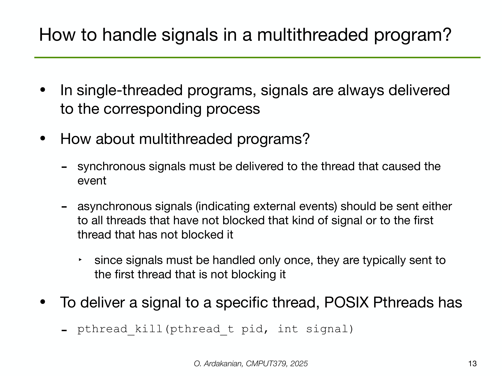

---

## 第 1 页


这页图片是课程讲义的封面，标题是“Operating System Concepts（操作系统概念）”，第15讲主题为“POSIX Thread Library（POSIX 线程库）”，作者是阿尔伯塔大学的 Omid Ardakanian。
下面我把“POSIX 线程库（通常叫 pthreads）”到底是什么、能做什么、怎么用，以及常见坑一次讲清楚。

# POSIX 线程库是什么

* **POSIX（Portable Operating System Interface）** 是一套类 Unix 的标准；其中一部分定义了**线程编程接口**。
* **pthreads** 是 C/C++ 中用于创建和管理线程的标准库，在 Linux、macOS、BSD 等平台广泛可用（Windows 需要兼容层或用 Win32 线程 API）。
* 它提供的能力：创建/退出线程、同步（互斥锁、条件变量、读写锁、屏障）、线程局部存储（TLS）、调度参数、取消（cancellation）等。

# 为什么要用线程

* **并行**：利用多核把可并行的任务同时执行（比如图像处理的分块）。
* **并发**：把 I/O 等待与计算重叠（比如服务器同时处理多连接）。
* **共享内存**：同一进程内线程共享地址空间，通信开销小（但也带来竞态风险）。

# 基本概念与常用函数

## 线程的生命周期

* 创建：`pthread_create(pthread_t *tid, const pthread_attr_t *attr, void *(*start)(void*), void *arg)`
* 退出：在线程函数里 `return` 或 `pthread_exit(void*)`
* 等待：`pthread_join(pthread_t tid, void **retval)`（等待一个“可连接 joinable”的线程结束并取回返回值）
* 分离：`pthread_detach(tid)` 把线程设为“分离 detached”，结束后系统自动回收，不能再 `join`

## 线程属性（可选）

* 用 `pthread_attr_t` 设置栈大小、是否可 `join`、调度策略/优先级（需要特权）等。

## 同步原语

* **互斥锁**：`pthread_mutex_t` / `pthread_mutex_init` / `pthread_mutex_lock` / `pthread_mutex_unlock`
保护临界区，防止多个线程同时修改共享数据而产生**竞态条件**。
* **条件变量**：`pthread_cond_t` / `pthread_cond_wait` / `pthread_cond_signal` / `pthread_cond_broadcast`
与互斥锁配合，用于“某个条件成立才继续”的等待/唤醒。
* **读写锁**：`pthread_rwlock_t`，多读者并行、写者独占。
* **屏障**：`pthread_barrier_t`，让一组线程都到达屏障点后再一起继续。
* **线程局部存储（TLS）**：`pthread_key_create` / `pthread_setspecific` / `pthread_getspecific` 为每个线程提供私有变量。

## 取消（取消点）

* `pthread_cancel(tid)` 请求取消，目标线程在**取消点**（如 `pthread_cond_wait`, `read`, `sleep`）检查并响应；
可通过 `pthread_setcancelstate` / `pthread_setcanceltype` 控制行为，并用清理处理器 `pthread_cleanup_push/pop` 做资源回收。

# 典型用法示例

## 1) 创建与 join

```c
#include <pthread.h>
#include <stdio.h>

void* worker(void* p) {
int id = *(int*)p;
printf("hello from thread %d\n", id);
return (void*)(long)(id * 2);  // 返回值可被 join 取回
}

int main() {
pthread_t t1, t2;
int a = 1, b = 2;
pthread_create(&t1, NULL, worker, &a);
pthread_create(&t2, NULL, worker, &b);

void* r1; void* r2;
pthread_join(t1, &r1);
pthread_join(t2, &r2);
printf("results: %ld, %ld\n", (long)r1, (long)r2);
return 0;
}
```

编译运行：`gcc main.c -pthread -o app`（或 `clang ... -pthread`）

## 2) 互斥锁 + 条件变量（简化生产者-消费者）

```c
#include <pthread.h>
#include <stdio.h>
#include <unistd.h>

int buf = 0;               // 共享资源：0 表示空，>0 表示有数据
pthread_mutex_t m = PTHREAD_MUTEX_INITIALIZER;
pthread_cond_t  cv_empty = PTHREAD_COND_INITIALIZER;
pthread_cond_t  cv_full  = PTHREAD_COND_INITIALIZER;

void* producer(void* _) {
for (int i = 1; i <= 5; i++) {
pthread_mutex_lock(&m);
while (buf != 0)                 // 必须用 while 防“虚假唤醒”
pthread_cond_wait(&cv_empty, &m);
buf = i;
printf("produced %d\n", i);
pthread_cond_signal(&cv_full);
pthread_mutex_unlock(&m);
usleep(100000);
}
return NULL;
}

void* consumer(void* _) {
for (int i = 1; i <= 5; i++) {
pthread_mutex_lock(&m);
while (buf == 0)
pthread_cond_wait(&cv_full, &m);
printf("consumed %d\n", buf);
buf = 0;
pthread_cond_signal(&cv_empty);
pthread_mutex_unlock(&m);
}
return NULL;
}

int main() {
pthread_t p, c;
pthread_create(&p, NULL, producer, NULL);
pthread_create(&c, NULL, consumer, NULL);
pthread_join(p, NULL);
pthread_join(c, NULL);
}
```

# 常见问题与最佳实践

* **总是配对加解锁**：任何可能提前返回/出错的路径都要 `unlock`；可用清理处理器或 RAII（C++）避免遗忘。
* **条件变量必须 while 判断**：防止虚假唤醒或条件已被其他线程消费。
* **避免死锁**：统一锁顺序；尽量缩小临界区；必要时用 `pthread_mutex_trylock` 或分层锁。
* **注意数据可见性**：pthreads 的锁和条件变量自带必要的内存栅栏；不要在未同步的情况下读写共享数据。
* **合理的线程数量**：CPU 密集型工作通常以“物理核数或逻辑核数”为上限；I/O 密集可以适当更多。
* **join vs detach**：需要拿返回值/确保回收就 `join`；否则 `detach`，防止“僵尸线程”（资源不被回收）。
* **编译链接**：多数平台需加 `-pthread`；这同时启用线程安全的 C 库选项和链接 pthread。
* **C++ 与更高层库**：C++11 的 `std::thread`, `std::mutex`, `std::condition_variable` 在 POSIX 系统上通常基于 pthreads 实现，接口更现代化。

# 小结

这页封面表示这一讲将系统讲解 **POSIX 线程库（pthreads）**：如何创建线程并发执行，以及用互斥锁/条件变量等机制对共享数据进行正确同步。掌握这些 API，你就能在类 Unix 系统上写出安全高效的多线程程序。
如果你想，我可以根据你的场景（CPU 密集还是 I/O 密集）给出更贴近的线程架构建议或把上面的示例改成你需要的版本。


---

## 第 2 页


这页在讲\*\*“线程实现/映射模型（threading models）”**——也就是**用户态线程**如何映射到**内核态线程\*\*。图里把内核空间和用户空间分开画出四种典型模型，并标注了优缺点；红叉表示在现代通用 OS 上已基本淘汰的方案。

先澄清两个概念：

* **用户线程（user threads）**：由语言运行时或库（如 pthreads、Java/Go 运行时等）在用户态创建/调度的抽象。
* **内核线程（kernel threads）**：由操作系统内核创建/调度，在 CPU 上真正执行。只有内核线程才能被多核并行调度、执行系统调用等。

# 四种映射模型

## 1) 一对一（1:1）—“几乎所有当前实现”

* **含义**：每创建一个用户线程，就对应创建一个内核线程；内核直接调度它们。
* **优点**

* 真正的**并行性**：多核上可以同时跑同一进程的多个线程。
* 简单、行为直观：阻塞系统调用只阻塞发起的那个线程；调试、诊断友好。
* 与 OS 调度、优先级、CPU 亲和等特性天然兼容。
* **缺点**

* **开销较高**：线程创建/销毁、上下文切换是内核操作；每个线程都要栈空间与内核资源。
* 线程很多时可遇到上限或调度压力。
* **现实**：Linux（NPTL）、Windows、macOS、FreeBSD 现在都是 1:1，所以图上写“almost all current implementations”。

## 2) 多对一（N:1）—已淘汰

* **含义**：很多用户线程映射到**同一个**内核线程；调度完全在用户态完成（所谓“绿线程”最早期形态）。
* **问题**

* **无法多核并行**：内核只看到一个可运行实体。
* **阻塞灾难**：一次阻塞系统调用会把整个进程挂住。
* **现状**：基本不用；图右上画了红叉并写着“不适合多核系统”。

## 3) 多对多（M\:N）—理论很美、实践较少

* **含义**：很多用户线程映射到**少量**（或等量）内核线程；用户态运行时在 N 个内核线程上调度 M 个用户线程。
* **潜在好处**

* 结合两边优势：既能多核并行，又能以很低的成本创建成千上万的用户线程（调度/切换大多在用户态）。
* 可把**阻塞操作封装成非阻塞**或在其他内核线程上“迁移”。
* **难点**

* 运行时与内核必须配合得非常好（如“scheduler activations” 之类机制）；边界情况复杂（系统调用、信号、页缺失、优先级传递等）。
* **现实**：少数系统/语言采用过或仍采用类似思想（例如早年的 Solaris MxN；现代 **Go** 的 goroutine 运行时本质上做“把很多 goroutine 映射到少量内核线程”的工作，但它为阻塞场景投入了大量工程手段）。由于实现复杂、可预期性差，**通用 OS 线程库主流没有采用**，图左下打了红叉。

## 4) 两级模型（two-level / 混合绑定）

* **含义**：是 M\:N 的一个变种：大多数用户线程由运行时在若干内核线程上调度，但**可以把部分用户线程“绑定（bound）”到固定的内核线程**以保证实时性或特殊需求。
* **优点**：兼顾灵活性与对关键线程的强保证。
* **现状**：历史上 Solaris 8/9 等用过；后来也大多转向 1:1。图右下红叉表示今天很少见。

# 关键影响点（为什么这事重要）

* **并行能力**：只有看到**多个内核线程**的模型（1:1、M\:N、two-level）才能让同一进程的线程在多核上同时跑。N:1 不行。
* **阻塞行为**：

* 1:1：一个线程阻塞不影响其他线程。
* N:1：任何阻塞都可能**拖死全部**。
* M\:N/两级：依赖运行时的“避阻塞”策略是否可靠。
* **上下文切换与创建成本**：

* 用户态调度（M\:N）更轻，但复杂；
* 1:1 更重但简单、可预测，OS 工具链支持最好。
* **资源与伸缩**：

* 1:1 线程太多会耗尽内核资源/内存；
* M\:N 能承载更多“轻量线程”（如 goroutine），但要求运行时成熟。

# 小结与实践建议

* 在通用系统编程（C/pthreads、C++、Java 等）里，你几乎就是在用 **1:1**——它是今天的事实标准。
* 若需要**海量并发且单任务很轻**（如高并发服务），可考虑**语言级“轻量线程”/协程**（Go、Rust async、Java Loom 虚拟线程等）。它们常在用户态做 M\:N 调度，但对应用开发者透明。
* 如果你只想“写对写稳”，牢记：**1:1 + 正确的同步**，避免共享数据竞争与死锁，比挑复杂模型更关键。

如果你愿意，我可以结合你的应用场景（CPU 密集还是 I/O 密集、线程数量级、是否需要协程）给出具体选型和代码骨架。


---

## 第 3 页


这页是在说明**一对一 (1:1) 线程映射模型**在主流系统（Linux、macOS、Windows）里的内部结构：**每一个用户线程 ↔ 正好一个内核线程**。理解图里的几个元素就明白了。

# 图中元素对应什么

* **Process 1 / Process 2**（右下）：两个进程的用户态地址空间，各自包含

* **Text**：程序代码段
* **Global data**：全局/静态数据
* **Heap**：堆
* **stack（A/B）**：每个线程自己的**用户态栈**（Thread A、B）。

> 同一进程的多个线程共享 Text/Global/Heap，但**不共享栈**。

* **Kernel-level threads（上半部分）**：这是内核看到并调度的实体。调度器只认识**内核线程**。

* **PCB**（Process Control Block）：进程控制块，每个进程一个（图中 PCB1、PCB2），记录进程级信息：地址空间、打开的文件、信号处理等。
* **TCB**（Thread Control Block）：线程控制块，每个线程一个（比如 TCB 1A、1B 属于进程1；TCB 2A、2B 属于进程2）。记录寄存器快照、优先级、调度状态、指向所属 PCB 的指针等。
* **Kernel-mode stack**（每个 TCB 旁边的 stack，粉色）：**内核态栈**。当线程陷入系统调用/中断时，CPU 会切到这个安全的内核栈执行内核代码，不能继续用不可信的用户栈。
* **threads of the kernel**（左上虚线框）：内核自己的工作线程（如 kswapd、kworker），不隶属于某个用户进程，也有 TCB 和内核栈。

# 1:1 模型的关键点

1. **一一对应**：用户创建一个线程 → 内核创建一个对应的内核线程（TCB + 内核栈）。
2. **由内核统一调度**：调度器直接在所有**可运行的内核线程**之间做上下文切换，因此能充分利用多核，多个线程可以真正**并行**运行。
3. **阻塞隔离**：某个线程执行阻塞系统调用（如 `read()`）时，只会阻塞它对应的内核线程，不会把同进程的其他线程也挂住。
4. **每线程两套栈**：同一线程有

* 用户态栈：运行应用代码时用；
* 内核态栈：执行内核代码（系统调用/异常/中断）时用。
5. **管理结构**：

* **PCB** 管进程级资源；
* **TCB** 管线程级运行状态；
* TCB 里会引用所属 PCB（因此能访问进程地址空间与资源）。

# 对开发者意味着什么

* 在 Linux 的 pthreads、C++ `std::thread`、Java 传统线程、Windows threads 等，默认就是这种 **1:1**。
* 优点：语义直观、工具好用（调试/分析）、真并行、阻塞不“拖全局”。
* 成本：创建/销毁/切换由内核完成，**开销比纯用户态调度大**；线程太多会占更多内核资源与内存（每线程栈与 TCB）。

# 小结

这页想传达：在现代通用 OS 中，**调度器只认识内核线程**。每个用户线程都有一个对应的**TCB + 内核态栈**，并且与其所属进程的 **PCB/地址空间**关联；因此 1:1 模型既简单又能在多核上高并行，是今天的主流实现。


---

## 第 4 页


这页在讲：**在多线程程序里调用 `fork()` 会发生什么。**

核心结论：
在一个**多线程**进程中调用 `fork()`，**子进程只会带着“调用 `fork()` 的那个线程”继续执行**，其他线程不会被复制到子进程里——因此子进程在诞生时是**单线程**的。

下面把关键细节讲清楚（基于 POSIX/Linux 的典型行为）：

### 1) 返回值 & 标识

* 父进程里：`fork()` 返回**子进程的 PID**。
* 子进程里：`fork()` 返回 **0**。
* 子进程有**新的 PID**；线程 ID 也只剩下**调用者那个线程**（其他线程消失）。

### 2) 地址空间（内存）

* 子进程获得父进程**内存的快照**（通常采用写时拷贝 COW，初始并不会真的复制所有页）。
* 全局/堆/栈等内容在 `fork()` 时看起来一样；之后父子各自修改互不影响。

### 3) 文件描述符与 I/O

* **打开的文件描述符**会被复制到子进程，**文件偏移量等内核状态共享底层对象**（引用计数+共享偏移）。
* 这意味着父子读写同一个 FD 时，**文件位置会相互影响**（除非你用 `dup`/`O_CLOEXEC` 或在 `exec` 后重新打开）。

### 4) 信号与屏蔽字

* 子进程继承**调用线程**的信号屏蔽字、处置方式（大体一致，挂起的实时信号不继承）。
* `alarm`/定时器等有细节差异，但可以理解为大多“继承配置，不继承队列中待送达的事件”。

### 5) 线程相关的坑（重点）

* 因为**只有调用者线程活着**，但**进程内的锁/互斥量/条件变量**等可能在 `fork()` 前被其他线程持有：

* 子进程里那些“被拿着的锁”**状态不确定**，如果你再去用这些同步原语，**可能死锁**


---

## 第 5 页


这页是“本节课要讲的三件事”。我给你把三个主题逐一解释清楚，并补上一些常见误区与小示例：

# 1) 隐式线程（implicit）vs. 显式线程（explicit）

**显式线程**：程序员自己创建/管理线程。

* 典型做法：`pthread_create`/`pthread_join`，手动用互斥锁、条件变量同步。
* 优点：可控性强（线程数、亲和性、绑定 CPU、优先级等）。
* 缺点：容易踩坑（竞争条件、死锁、资源泄露），代码复杂，不易扩展。

**隐式线程**：把“线程管理”交给**运行时/库/编译器/操作系统**。程序员只声明“任务/并行区域”，具体由框架把任务调度到线程上。

* 例子：OpenMP (`#pragma omp parallel for`)、Intel TBB、Cilk、GCD、Java/Futures、async/await、Python 的 `concurrent.futures`、以及**线程池**本身。
* 优点：简单好用、可移植、调度器会做工作窃取/负载均衡，避免你自己管线程生命周期。
* 缺点：细粒度控制较弱；遇到特殊性能/亲和性需求时可能不够灵活。

**怎么选？**

* 业务逻辑简单、任务量多且短：优先**隐式**（线程池/任务模型）。
* 需要精细控制、硬实时/绑定设备中断、特殊调度：考虑**显式**。

---

# 2) POSIX 线程（Pthreads）

Unix/Linux 上最常见的 C 级线程 API。掌握它就是理解多线程“底层原理”的关键。

**核心接口**

* 线程：`pthread_create` 创建、`pthread_join` 回收、`pthread_exit` 结束；可设**可连接/分离**（joinable/detached）。
* 互斥锁：`pthread_mutex_t`，`pthread_mutex_lock/unlock`；类型（普通/递归/错误检测）。
* 条件变量：`pthread_cond_t`，与互斥锁配合实现等待/通知（`pthread_cond_wait/signal/broadcast`）。
* 读写锁/自旋锁/屏障：`pthread_rwlock_t`，`pthread_spinlock_t`，`pthread_barrier_t`。
* 线程属性：`pthread_attr_t`（栈大小、调度策略等）。
* 线程私有存储（TLS）：`pthread_key_create` 等，为每线程保存独立数据。

**最小示例**

```c
#include <pthread.h>
#include <stdio.h>

void* worker(void* arg) {
long id = (long)arg;
printf("hello from thread %ld\n", id);
return NULL;
}

int main() {
pthread_t t;
pthread_create(&t, NULL, worker, (void*)1);
pthread_join(t, NULL);  // 等待子线程结束
return 0;
}
```

**常见坑**

* 忘记 `pthread_join` 导致**僵尸线程/资源泄露**；或错误地设为 detached。
* 锁顺序不一致 → **死锁**。
* 在条件变量上 wait 时**必须**持有对应互斥锁，并用**while**循环重检条件（处理虚假唤醒）。
* 与 `fork()` 交互：多线程进程里 `fork()` 后子进程只有调用者线程，锁状态可能损坏；推荐马上 `exec()`。
* 过多线程数造成**过度切换**与**内存占用**（每线程有栈）。

---

# 3) 线程池（Thread Pool）

**是什么**：预先创建一组“长期存活”的工作线程，配合**任务队列**。你把任务（函数/闭包）扔进队列，空闲工作线程取出执行。
**为什么用**：

* 避免“每个任务都创建/销毁线程”的高开销；
* **限制并发度**防止把机器跑爆；
* 更好的负载均衡与缓存局部性；
* 便于做**工作窃取**、定时/优先级调度。

**基本组成**

1. 任务队列（线程安全，通常是有界队列）。
2. N 个工作线程（启动后循环 `pop -> 执行 -> pop`）。
3. 提交接口（`submit(task)`/`enqueue`）。
4. 关闭/等待接口（`shutdown`/`await_termination`）。

**伪代码**

```c
while (running) {
task = queue.pop();      // 阻塞式获取
if (!task) continue;
task();                  // 执行用户函数
}
```

**使用建议**

* **CPU 密集**：线程数≈CPU 核数（或核数±一点点）。
* **IO 密集**：可适当更多，因为线程常被阻塞在 IO 上。
* 不要把**长时间阻塞**的任务塞进“CPU 计算池”，否则会把工作线程卡死（可以把 IO 与 CPU 分成两个池）。
* 任务应**短小可分解**，避免单个任务占用线程太久。
* 注意**取消/超时/优先级**策略；关闭时要 drain 队列并安全退出。
* 关注**虚假共享**、缓存行对齐，减少共享写热点。

---

## 小结 & 备考提示

* **显式 vs 隐式**：自己管线程（灵活但易错）vs 交给运行时（易用但控制弱）。
* **Pthreads**：理解底层并发原语（互斥锁/条件变量/TLS/属性）。
* **线程池**：现实工程里最常用的并行模型之一——“固定线程 + 任务队列”。
* 练习方向：

1. 用 `pthread` 写一个有界队列 + 生产者/消费者；
2. 实现一个最小线程池（`submit`、`shutdown`）；
3. 把计算任务改造成“任务切片”，感受池大小与吞吐的关系。

需要我给你一份最小线程池的 C 版本代码或作业题解析吗？


---

## 第 6 页


这页想表达：**并发程序很难写，也很难“证明”它们是正确的**。即使是像 Linux 这样被大量使用、代码质量很高的内核，在专门工具的帮助下也能挖出**成百上千个并发缺陷**（尤其是**数据竞争 data race**）。因此，**确保实现没有竞态和并发 bug 的重担，主要落在开发者身上**。

下面逐条拆解：

# 这条新闻在说什么

* Google 给 Linux 生态贡献了一个“并发消毒器”工具 **KCSAN（Kernel Concurrency Sanitizer）**。
* 它的目标是**动态发现数据竞争**：当两个或更多线程/CPU 核心在**没有同步**的情况下**读写同一内存位置**，就可能出现不可预期的结果。
* 文章里提到：**仅两天测试**，就发现了 **300+ 个独特的数据竞争**问题 —— 说明并发 bug 的**普遍性和隐蔽性**。

# 为什么并发程序这么难

1. **非确定性**：线程/核的交错顺序不可控，同一代码在不同运行里可能表现不同，导致“**幽灵/海森**”类的间歇性 bug。
2. **可见性与重排序**：CPU 与编译器会重排序；缓存一致性让“看见/没看见更新”的行为复杂，若没有**内存模型**与**同步原语**（锁/原子/屏障），就会出错。
3. **状态空间爆炸**：所有可能的线程交错组合极多，**靠测试覆盖不到**。
4. **同步原语易误用**：锁顺序不一致 → 死锁；锁粒度太粗 → 性能差；太细 → 复杂易错；条件变量忘记用 `while` 重检条件 → 逻辑缺陷。
5. **库/系统交互**：一次 `fork()`、一次信号、一次错误处理路径，都可能在并发环境下触发微妙问题。

# “数据竞争（data race）”到底是什么

* 典型定义：对同一内存地址的**至少两个并发访问**，其中**至少一个是写**，并且这些访问之间**没有正确的同步**（如互斥锁、原子操作、内存序）。
* 后果：读取到“半更新”的值、丢写、计数错乱、崩溃，或更诡异的未定义行为。

**简例（有问题的计数器）：**

```c
// 多个线程同时执行 inc()
int counter = 0;
void inc() { counter++; }   // 读-改-写不是原子的 → 数据竞争
```

**修正**：加锁或用原子：

```c
pthread_mutex_t m = PTHREAD_MUTEX_INITIALIZER;
void inc() { pthread_mutex_lock(&m); counter++; pthread_mutex_unlock(&m); }
// 或：std::atomic<int> counter{0}; counter.fetch_add(1, std::memory_order_relaxed);
```

# 如何“验证/发现”并发 bug

* **动态检测**（运行时）

* 用户态：ThreadSanitizer(TSAN)、AddressSanitizer(ASAN)；
* 内核态：**KCSAN** 等。
* 优点：易用、发现真实路径上的问题；缺点：依赖测试覆盖，可能漏报。
* **静态分析**：在不运行程序的情况下找可能的竞态路径；易有误报，但能覆盖更多路径。
* **形式化验证 / 模型检查**：从数学上穷举交错或证明性质；成本高、适合关键内核/协议的小范围模块。
* **工程实践**：

* 遵循**不共享就不需要同步**（尽量使用消息传递/不可变数据）；
* 采用**原子/锁**并清晰规定持锁范围与锁顺序；
* 把共享状态封装在**线程安全的抽象**内；
* 使用 **fuzz + sanitizers** 在 CI 中长期运行；
* 复现难的问题用**记录-回放**（RR 等）降低非确定性；
* 在代码评审中检查**内存模型**与**可见性**假设。

# 幻灯片的红字总结

> “把确保实现没有数据竞争和其他缺陷的重大责任，放在了开发者身上。”

意思是：工具能帮忙，但**最终可靠性取决于你的设计与实现**。写并发程序时，必须从一开始就考虑同步、内存模型与可验证性，而不是事后补救。

如果你愿意，我可以根据你的课程语言（C/C++/Java/Python）给一份“并发问题检查清单”和小练习答案。


---

## 第 7 页


这页在讲“**隐式线程（Implicit Threading）**”——把“开线程、管线程”的活交给**编译器和运行时库**，程序员只需要**标注哪些代码可以并行**。其中最常用的就是 **OpenMP**。

---

# 1) 为什么叫“隐式”

* 传统做法（显式线程）：你手写 `pthread_create/join`、锁、条件变量等。
* 隐式做法：你只在可并行的代码段前加**指令/注解**，编译器+运行时自动：

* 创建/复用线程（通常是一个线程池）
* 把循环或任务切分给各线程
* 做同步、分工、收尾
结果：更少的样板代码，更容易把**串行循环**改成**并行循环**。

---

# 2) OpenMP 是什么

* **一组编译器指令（pragma）+ 运行时库函数**（C/C++/Fortran 可用）。
* C 语言里，底层通常是**基于 pthread** 实现的。
* 你在代码里用 `#pragma omp ...` 标注并行区域，编译器据此**自动生成并发代码**。

最常见的指令：并行化 for 循环

```c
#include <omp.h>
#include <stdio.h>

int main() {
long sum = 0;
#pragma omp parallel for reduction(+:sum)
for (long i = 0; i < 100000000; ++i) {
sum += i;
}
printf("sum=%ld\n", sum);
}
```

编译运行（GCC/Clang）：

```
gcc -O2 -fopenmp main.c -o main
OMP_NUM_THREADS=8 ./main     # 用 8 个线程
```

* `#pragma omp parallel for`：开启一个并行区域，把 for 循环的迭代切给多个线程。
* `reduction(+:sum)`：让 `sum` 在每个线程局部累加，最后安全地合并成全局结果（避免数据竞争）。

---

# 3) OpenMP 常用概念速览

* **并行区域**：`#pragma omp parallel` 把一个代码块交给多线程一起执行。
* **循环并行**：`parallel for`/`for`（C++20 有 `omp parallel for simd` 等变体）。
* **任务并行**：`#pragma omp task` 把任意代码块封装为任务，由运行时调度。
* **数据作用域**：

* `shared(var)` 多线程共享；
* `private(var)` 每线程私有、未初始化；
* `firstprivate(var)` 每线程私有、用进入并行区时的值初始化；
* `default(none)` 强制显式声明（防止疏忽）。
* **同步**：

* `critical`/`atomic` 保护共享更新；
* `barrier` 线程在此汇合；
* `nowait` 取消隐式等待以提升并行度。
* **调度策略**（循环切片）：`schedule(static|dynamic|guided[,chunk])` 控制负载均衡。
* **运行时库函数**：`omp_get_num_threads()`、`omp_get_thread_num()`、`omp_set_num_threads(n)` 等。
* **环境变量**：`OMP_NUM_THREADS`（线程数）、`OMP_SCHEDULE`（默认调度）等。

---

# 4) 一个容易犯的错：变量作用域

错误示例（有竞态）：

```c
int hits = 0;
#pragma omp parallel for
for (int i = 0; i < N; ++i) {
if (pred(i)) hits++;   // 对共享变量并发写，数据竞争
}
```

修正 1（原子）：

```c
#pragma omp parallel for
for (int i = 0; i < N; ++i) {
if (pred(i)) {
#pragma omp atomic
hits++;
}
}
```

修正 2（推荐，归约）：

```c
int hits = 0;
#pragma omp parallel for reduction(+:hits)
for (int i = 0; i < N; ++i)
hits += pred(i);
```

---

# 5) 何时用 OpenMP/隐式线程

* **数据并行**的循环、可独立的批处理任务：几乎是“加指令就起飞”。
* 想快速验证并行潜力、又不想手写线程与锁时。
* 不太适合：需要非常细粒度的线程控制、复杂的跨阶段管道/拓扑、或对异步 I/O 有强依赖的场景（这类可能更适合显式线程、任务运行时、或 actor/消息模型）。

---

# 6) 要点小结

* 隐式线程 = 你说“**哪些能并行**”，编译器运行时来负责“**怎么并行**”。
* OpenMP 用 `#pragma omp ...` 标出并行区域；底层多用 pthread 实现。
* 把握三件事：**数据作用域**、**同步原语**、**调度策略**。
* 编译要加 `-fopenmp`，运行时可用 `OMP_NUM_THREADS` 控制线程数。

想不想我按你的课程作业/实验数据，帮你把某段循环改成 OpenMP，并给一版基准对比脚本？


---

## 第 8 页


这页讲的是 **显式线程库（Explicit Threading Libraries）**，也就是程序员**手动控制线程**的一类 API。下面逐点解释：

---

## 🧩 一、什么是显式线程库

“显式线程”指的是程序员**直接调用线程 API** 来创建、管理、同步线程。
与前面讲的“隐式线程（implicit threading）”不同——隐式线程让编译器或运行时帮你管线程，而显式线程要你自己操心。

常见接口包括：

* 创建 / 销毁线程
* 等待线程结束 (`join`)
* 加锁、同步、条件变量
* 线程局部存储（Thread Local Storage, TLS）

---

## 🧠 二、两种主要实现方式

### 1. 用户级线程库（User-Level Threads）

* 完全运行在**用户空间（user space）**。
* 内核只看到一个进程，不知道里面有多少线程。
* 线程调度、切换、同步都由库自己实现（例如在用户态用协程或 fiber 实现）。
* 优点：

* 切换速度快（不需要陷入内核）
* 适合大量轻量级任务
* 缺点：

* 如果一个线程执行系统调用被阻塞，**整个进程都会卡住**；
* 内核调度不了单个线程 → 无法利用多核并行。

👉 这就是所谓的 “**many-to-one 模型**”：多个用户线程对应一个内核线程。

---

### 2. 内核级线程库（Kernel-Level Threads）

* 每个线程都由内核管理，调度器能独立分配 CPU。
* 每个用户线程都映射到一个内核线程（**1:1 模型**）。
* 当一个线程被阻塞，其他线程仍能运行。
* 优点：

* 真正并行（尤其在多核系统上）；
* 内核能感知线程、分配资源。
* 缺点：

* 创建/切换线程需要系统调用 → 开销比用户级线程大。

---

## ⚙️ 三、三种常见线程库举例

1. **POSIX Threads（Pthreads）**

* UNIX / Linux 的标准线程 API；
* 可作为用户级库或内核级库实现；
* 几乎所有现代 UNIX 系统（Linux, macOS, BSD）都采用**内核级 + 1:1 模型**；
* C/C++ 程序广泛使用。

2. **Windows Thread Library**

* Windows 自带的内核线程 API（`CreateThread`, `WaitForSingleObject`, 等）；
* 与 Pthreads 类似，线程由内核调度。

3. **Java Threads**

* Java 虚拟机提供的线程 API；
* 通常底层仍调用操作系统的内核线程（在现代 JVM 中也是 1:1 映射）；
* 程序员用 `new Thread(...).start()` 启动线程。

---

## 🔗 四、Pthreads 的映射模型总结

| 模型               | 用户线程:内核线程       | 特点    | 举例                               |
| ---------------- | --------------- | ----- | -------------------------------- |
| **Many-to-One**  | 多个用户线程映射到一个内核线程 | 快但不并行 | 早期 Green Threads                 |
| **One-to-One**   | 每个用户线程一个内核线程    | 真并行   | 现代 Linux Pthreads, Windows, Java |
| **Many-to-Many** | 用户线程池映射到内核线程池   | 灵活但复杂 | Solaris, Windows Fiber, 部分研究型系统  |

---

## 🧩 五、小结

* **显式线程库 = 你手动调用 API 管线程。**
* 两种架构：

* 用户级：轻但不并行；
* 内核级：重但可多核并发。
* 现代系统几乎都用 **1:1（内核级）模型**。
* 典型库：`pthread`（UNIX）、`Win32 Threads`、`Java Threads`。

---

是否希望我再给你画一个图，展示 “many-to-one / one-to-one / many-to-many” 三种线程模型的结构？那样你会更直观地理解它们的区别。


---

## 第 9 页


这页是在概括 **POSIX 线程库（Pthreads）** 的要点，并和 **Windows 的 Win32 Threads** 做一个对照。

# 关键信息翻译与扩展

* **POSIX.1c（IEEE 1003.1c）是“线程创建与同步”的标准**
这是一套**接口/语义规范**（API/behavior），规定“怎么用、用完应产生什么效果”，**不规定底层如何实现**（实现可以因系统而异）。

* **Pthreads 是类 Unix 系统最常用的线程库**
如 Solaris / Linux / macOS。现代实现几乎都是**1:1 内核线程模型**：每个用户线程对应一个内核线程，能真正利用多核。

* **Win32 Threads 与 Pthreads 类似，但面向 Windows**
两者都提供创建线程、等待线程结束、同步原语（互斥锁、条件变量/事件等）等。

* **进程内的全局变量在所有线程间共享**
因为线程共享同一进程的地址空间：代码段、全局/堆、打开的文件描述符等都共享；每个线程仅有**私有栈**与**线程局部存储（TLS）**。

# API 速览（对应幻灯片底部示例）

## Pthreads（C/C++）

```c
void* thread_function(void* arg) {
// 在线程里运行的函数
return NULL;             // 也可 pthread_exit(retptr);
}

pthread_t tid;
pthread_attr_t attr;
pthread_attr_init(&attr);     // 可设置分离态、栈大小、调度策略等
pthread_create(&tid, &attr, thread_function, (void*)param);
// 结束/同步：
pthread_join(tid, NULL);      // 等待线程结束（joinable）
/* 或者 pthread_detach(tid);  // 分离态，结束后资源自动回收 */
```

**常见同步原语**：
`pthread_mutex_t`（互斥锁）、`pthread_cond_t`（条件变量）、`pthread_rwlock_t`（读写锁）、`pthread_barrier_t`（屏障）、`pthread_once`（一次性初始化）、`pthread_key_t`（TLS）。

## Win32 Threads（C/C++）

```c
DWORD WINAPI ThreadProc(LPVOID lpParam) {
return 0;
}

HANDLE h = CreateThread(
/*lpThreadAttributes=*/NULL,
/*dwStackSize=*/0,
/*lpStartAddress=*/ThreadProc,
/*lpParameter=*/&Param,
/*dwCreationFlags=*/0,
/*lpThreadId=*/&ThreadID);

WaitForSingleObject(h, INFINITE);  // 等待线程结束
CloseHandle(h);
```

**同步原语**：
`CRITICAL_SECTION`（轻量锁）、`Mutex`、`Semaphore`、`Event`、`SRWLOCK` 等；TLS 用 `TlsAlloc/TlsSetValue`。

# 小结与对比

| 方面     | Pthreads（POSIX）              | Win32 Threads                                  |
| ------ | ---------------------------- | ---------------------------------------------- |
| 标准/平台  | POSIX.1c，UNIX 家族             | Windows 平台 API                                 |
| 线程模型   | 现代实现 1:1 内核线程                | 1:1 内核线程                                       |
| 共享内存   | 进程内全局/堆共享                    | 同                                              |
| 常用同步   | mutex/condvar/rwlock/barrier | critical section/mutex/event/semaphore/SRWLOCK |
| 线程函数签名 | `void* (*)(void*)`           | `DWORD WINAPI fn(LPVOID)`                      |
| 等待结束   | `pthread_join`               | `WaitForSingleObject`                          |

**记忆点**：POSIX 定义的是**行为接口**，不是实现；Unix 用 **Pthreads**，Windows 用 **Win32**；**线程共享进程内的所有全局与堆数据**，因此需要同步来避免数据竞争。


---

## 第 10 页


这页是在总结 **Pthreads（POSIX 线程库）里最常用的线程原语**。核心概念：`pthread_t` 是**线程句柄（handle）**，你用它来引用/管理线程；各个 API 负责创建、等待、分离、取消、退出、发信号等。

下面逐条讲清楚，并给出要点与注意事项：

---

## 1) 线程句柄 `pthread_t`

* 这是**线程的标识/句柄**（类型实现因平台而异，可能是结构体/整数）。
* 你创建线程时会拿到一个 `pthread_t`，后续用它做 `pthread_join`、`pthread_detach`、`pthread_kill` 等操作。

---

## 2) 创建线程 `pthread_create`

```c
int pthread_create(pthread_t *tid,
const pthread_attr_t *attr,
void *(*start_routine)(void*),
void *arg);
```

* 在当前进程里**创建一个新线程**，返回其句柄到 `*tid`。
* `start_routine` 是线程入口函数，原型固定：`void* fn(void*)`；用 `arg` 传参。
* 返回值：0 表示成功；非 0 是错误码（不是 errno）。
* **默认是 joinable**（可被 `pthread_join` 回收）。

**常见坑**

* 入口函数要返回（或 `pthread_exit`），否则 `return` 会把返回值传给 `join`。
* 传给线程的参数通常要在堆上或是长生命周期对象，**不要传栈上临时地址**。

---

## 3) 线程属性 `pthread_attr_init` / `pthread_attr_destroy`

* `pthread_attr_t` 用来设置线程的**创建属性**：

* `detachstate`（是否分离）、`stacksize`（栈大小）、`guardsize`、调度策略/优先级、亲和性（平台相关）等。
* 使用顺序：`pthread_attr_init(&attr)` → 若干 `pthread_attr_set*` → 在 `pthread_create` 里传 `&attr` → `pthread_attr_destroy(&attr)`。

---

## 4) 等待结束 `pthread_join`

```c
int pthread_join(pthread_t tid, void **retval);
```

* **阻塞**调用线程，直到 `tid` 代表的线程退出；
* 若 `retval` 非空，会把目标线程**返回值指针**写入（对应 `start_routine` 的返回或 `pthread_exit(arg)` 的 `arg`）。
* 只能 `join` **joinable** 线程；对 detached 线程 `join` 会失败（`EINVAL`）。

**注意**

* 每个线程**最多被 join 一次**；
* 忘记 join 会导致**资源泄漏（线程栈等）**，除非一开始就创建为 detached。

---

## 5) 分离线程 `pthread_detach`

```c
int pthread_detach(pthread_t tid);
```

* 把线程标记为 **detached（分离态）**：线程结束时**自动回收资源**，**不能再 join**。
* 适用于“火并忘”（fire-and-forget）型后台任务。
* 二选一：**要么 join，要么 detach**，不要都不做。

---

## 6) 取消线程 `pthread_cancel`

```c
int pthread_cancel(pthread_t tid);
```

* 向目标线程发出**取消请求**（不是强杀）。
* 是否、何时生效取决于目标线程的**取消设置**：

* 取消类型：\*\*延迟（deferred，默认）\*\*或异步（async，危险极大，不建议）。
* 取消状态：启用/禁用（`pthread_setcanceltype/state`）。
* 延迟取消只在**取消点**生效（如 `pthread_cond_wait`, `read`, `sleep`, `pthread_testcancel` 等）。
* 当取消真正发生时，会像抛出一个“线程内异常”，触发**清理处理器**（见下一节）并终止线程。

---

## 7) 让出 CPU `pthread_yield`

* 等价于 `sched_yield()`，提示调度器“我现在可以让给别人”。
* **不是同步手段**，且不保证马上切走——仅作为调度 hint；很少需要显式调用。

---

## 8) 线程退出 `pthread_exit` 与清理处理器

```c
void pthread_exit(void *retval);
```

* 终止**当前线程**，把 `retval` 作为返回值供其他线程 `pthread_join` 获取。
* 与之相关的**清理处理器**：

```c
void cleanup(void *p) { /* 释放资源 */ }

void* worker(void* arg) {
pthread_cleanup_push(cleanup, res_ptr);
// 临界区/可能被取消的代码
pthread_cleanup_pop(/*execute?*/0); // 传 1 则此处立即执行 cleanup
return NULL;
}
```

* `pthread_cleanup_push` / `pthread_cleanup_pop` 是**成对的**宏，必须出现在同一语句块；
* 当线程被**取消**、调用 `pthread_exit`、或从 `start_routine` 正常返回时，按栈顺序执行已注册的清理回调（取消时一定执行；正常返回只有在 `pop(1)` 指定时执行）。

---

## 9) 向特定线程发信号 `pthread_kill`

```c
int pthread_kill(pthread_t tid, int sig);
```

* 给**同一进程内**的某个线程定向发送 `sig`（如 `SIGUSR1`）。
* 常用于唤醒/打断阻塞调用或触发自定义信号处理器；
* 与 `kill(pid, sig)`（向整个进程发信号）不同。

---

## 10) 实战小建议

* **生命周期**：创建后要么 `join`，要么 `detach`。
* **参数/返回值**：线程函数参数与返回值若指向堆内存，记得**由 join 方释放**。
* **同步**：任何共享数据都要用 mutex/原子/条件变量保护；条件变量 wait 必须配合 `while` 循环重检条件。
* **取消安全**：在可能成为取消点的临界区使用清理处理器，确保锁和资源能被释放。
* **错误处理**：Pthreads API 返回错误码（非 errno），不要忘记检查并据此处理（常见：`ESRCH` 目标线程不存在、`EINVAL` 参数无效、`EDEADLK` 自己 join 自己等）。

---

想要我给你一段**完整示例**（创建 N 个线程求和、支持取消、含 cleanup 和 join/detach 的正确用法）吗？我可以直接贴出可编译的 C 代码。


---

## 第 11 页


这页在说明 **Linux 上 Pthreads 的底层实现要点**：

---

## 1) `pthread_create` 底层用的是 **`clone()`** 系统调用

* `fork()` 把父进程**几乎整个**复制一份（写时拷贝），父子默认**不共享**地址空间/文件表/信号处理等（除非后续显式共享）。
* **`clone()` 可以“按需共享”**：通过一组标志位告诉内核，和调用者**共享哪些执行上下文**。
典型用于“创建线程”（NPTL 实现），常见标志包括：

* `CLONE_VM`：共享**地址空间**（线程看到同一堆/全局变量）
* `CLONE_FS`：共享工作目录、`umask` 等
* `CLONE_FILES`：共享**打开的文件表**
* `CLONE_SIGHAND`：共享**信号处理器**
* `CLONE_THREAD`：把新实体加入**同一线程组**（表现为同一进程里的另一个线程）
* `CLONE_SETTLS`：设置 TLS（线程局部存储）
* `CLONE_CHILD_CLEARTID` / `CLONE_CHILD_SETTID`：线程退出时清理 TID、唤醒等待者（`pthread_join` 能据此感知结束）

组合这些标志，内核创建的就不是“独立子进程”，而是**与调用者共享大部分资源的内核线程**——这就是我们在用户态看到的 `pthread_t`。

---

## 2) 线程同步原语基于 **`futex`（fast userspace mutex）** 系统调用

* 设计核心：**无竞争走用户态，竞争时才陷入内核**。

* **快路径（用户态）**：用原子指令（CAS、交换等）尝试获取/释放锁，无需系统调用 → 非常快。
* **慢路径（内核态）**：如果锁已被占用，线程执行 `futex()` 进入内核在**某个内存地址**上**睡眠**；解锁方用 `futex()` **唤醒**等待者。
* `pthread_mutex` / `pthread_cond` / `pthread_rwlock` 等都在此机制之上实现：

* **互斥锁加锁**：

1. `atomic` 抢占标志位；成功→返回；
2. 失败→`futex(FUTEX_WAIT, addr, expected)` 睡眠；
3. 解锁方 `futex(FUTEX_WAKE, addr, n)` 唤醒等待者。
* 支持变体：**私有/共享 futex**（跨进程共享内存）、**优先级继承（PI）futex** 防止优先级反转、**robust futex** 处理持锁线程崩溃。

---

## 3) 小对比与直觉

* `fork()`：复制出**新进程**；默认资源不共享。
* `clone()` + 特定标志：创建**同一进程内的新线程**；**共享**地址空间等资源。
* `futex`：让锁/条件变量在**无竞争时几乎零开销**，只有竞争才进入内核等待/唤醒。

---

## 4) 一句话总结

在 Linux 上，**Pthreads = 用 `clone()` 造线程 + 用 `futex` 撑起同步**。
这套设计兼顾了线程的共享语义与高性能：**共享由 `clone` 精准控制，性能由 `futex` 的“用户态快路径”保障**。


---

## 第 12 页


这页是在讲一个最小的 **Pthreads 例子**，以及如何编译运行。代码的作用：**为每个命令行参数创建一个线程**，每个线程打印自己的**进程 ID**和**线程 ID**以及传入的参数，然后退出。主线程调用 `pthread_exit(0)`，让进程一直存活到所有线程结束。

---

# 逐行解释

```c
#include <pthread.h>
#include <stdio.h>
#include <unistd.h>
```

* 引入 Pthreads、标准 I/O 和 `getpid()` 的头文件。

```c
void *thread_function(void *arg) {
int i; pid_t pid; pthread_t tid;
pid = getpid();          // 取得“进程 ID”（所有线程一样）
tid = pthread_self();    // 取得“线程句柄/ID”（每个线程不同）
printf("Process ID: %d, thread ID: %u, arg: %s\n",
(unsigned int) pid, (unsigned int) tid, (char *) arg);
return;                  // 等价于 pthread_exit(NULL);
}
```

* `thread_function` 是线程入口函数，签名固定：`void* (*)(void*)`。
* `getpid()`：同一进程内所有线程**PID 相同**。
* `pthread_self()`：得到当前线程的 `pthread_t` 句柄。
* 打印传入的参数 `arg`（被当作 `char*` 字符串）。
* `return;` 等价于 `pthread_exit(NULL)`，结束该线程。

> 注：`pthread_t` 不一定能安全地用 `%u` 打印，很多系统更适合 `printf("%lu",(unsigned long)tid)`，比较稳妥的比较方法是 `pthread_equal(t1,t2)`。

```c
int main(int argc, char *argv[]) {
int i, rval;
pthread_t tid;
for (i = 0; i < argc; ++i) {
rval = pthread_create(&tid, NULL, thread_function, (void*) argv[i]);
if (rval) perror("thread creation failed!");
}
pthread_exit(0);
}
```

* `pthread_create(&tid, attr, start, arg)`：创建线程。这里把 `argv[i]` 作为线程参数传入。
* 循环从 `i=0` 到 `argc-1`：**会包含 `argv[0]`（程序名）**。如果你只想为“用户参数”建线程，应从 `i=1` 开始。
* 出错就 `perror`。
* **没有 `pthread_join`**，而是在 `main` 里调用 `pthread_exit(0)`：

* 这会**结束主线程本身**，但让**进程继续存活**，直到所有其它线程结束（否则 `main` 返回会直接终止整个进程，子线程可能被强行结束）。
* 若需要收集线程返回值/错误码，应改为保存每个 `tid` 并逐个 `pthread_join(tid, ...)`。

---

# 编译与运行

* **一定要链接 pthread**：

```bash
gcc -Wall -O2 example.c -o example -pthread    # 或 -lpthread（-pthread 更推荐）
```
* 运行并传参：

```bash
./example A B C
```

可能输出（顺序不定，因为并发）：

```
Process ID: 12345, thread ID: 140234..., arg: ./example
Process ID: 12345, thread ID: 140234..., arg: A
Process ID: 12345, thread ID: 140234..., arg: B
Process ID: 12345, thread ID: 140234..., arg: C
```

---

# 这个例子里值得注意的点

* **参数生命周期**：`argv[i]` 指针在整个 `main` 生命周期内有效，线程内使用是安全的。不要把**栈上临时变量地址**传给线程。
* **输出交错**：多个线程同时 `printf` 可能交错；这里每行带 `\n`，在终端上通常是行缓冲，交错概率较小，但不是 100% 保证。
* **资源管理**：

* 线程默认是 *joinable*。当前代码没有 `join`，但因为主线程 `pthread_exit`，等待工作线程自然结束，资源会被系统回收。若要精确管理，可保存 `tid` 并 `join`。
* “火并忘”任务可 `pthread_detach(tid)`，结束后自动回收，且**不能再 join**。

---

# 小改进（更规范的打印 & 只为用户参数建线程）

```c
for (int i = 1; i < argc; ++i) {           // 跳过 argv[0]
int r = pthread_create(&tids[i-1], NULL, thread_function, argv[i]);
if (r != 0) { errno = r; perror("pthread_create"); }
}
...
printf("pid=%d tid=%lu arg=%s\n",
(int)getpid(), (unsigned long)pthread_self(), (char*)arg);
```

需要我把它改成“保存所有 `tid` 并逐个 `pthread_join` 的完整版本”给你吗？


---

## 第 13 页



这页在说：**多线程程序里，信号到底送到谁、怎么收？**

# 1) 单线程 vs 多线程

* **单线程进程**：信号送给**这个进程**（也就是唯一的那个执行流）。
* **多线程进程**：还要决定送到**哪一个线程**，因为不同线程可能**屏蔽（block）了不同的信号**。

> 在 POSIX 下，**信号屏蔽字是“线程私有”的**：每个线程可以用 `pthread_sigmask()` 屏蔽/解除某些信号。

# 2) 两类信号如何投递

## (A) 同步信号（synchronous）

由**当前执行的指令**引发：如 `SIGSEGV`（越界）、`SIGFPE`（算术错误）、`SIGILL`、`SIGBUS` 等。

* **必须送到“出事的那个线程”**，因为只有它的上下文需要被处理/终止。

## (B) 异步信号（asynchronous）

来自**外部事件或其他线程/进程**：如 `SIGINT`（Ctrl-C）、`SIGTERM`、`SIGALRM`、`SIGUSR1` 等。

* 它们针对**整个进程**发生，但**只能被处理一次**。
* 内核会在**未屏蔽该信号的线程**里选一个来递送（通常是**第一个未屏蔽的线程**）。
* 如果所有线程都屏蔽了该信号，信号会**挂起**，直到某个线程解除屏蔽再递送。

# 3) 精确发给某个线程

* 用 **`pthread_kill(pthread_t tid, int sig)`**：把 `sig` 定向发送到指定线程 `tid`。
常见用途：唤醒等待中的线程、让它退出循环、或触发线程专属的处理逻辑。

# 4) 正确的多线程信号处理模式（工程实践）

最常用、最稳妥的是\*\*“专用信号线程 + sigwait”\*\*：

1. **在主线程启动工作线程之前**，先用：

```c
sigset_t set; sigemptyset(&set);
sigaddset(&set, SIGINT); sigaddset(&set, SIGTERM); /* 需要集中处理的信号 */
pthread_sigmask(SIG_BLOCK, &set, NULL);  // 在主线程里屏蔽
```

因为**线程会继承创建者的屏蔽字**，这样**所有将要创建的工作线程也会屏蔽这些信号**。

2. 再创建一个**专门的“信号处理线程”**，在里面同步等待：

```c
void* sig_thread(void*) {
sigset_t set = ...;  // 与上面一致
for (;;) {
int sig; sigwait(&set, &sig);   // 阻塞等待（同步、无竞态）
switch (sig) {
case SIGINT: case SIGTERM:
/* 设置全局标志、唤醒条件变量、启动优雅关闭 */
break;
}
}
}
```

`sigwait()` 不依赖异步的信号处理器（handler），避免了**异步信号安全**的限制。

3. 若需要**定向通知**某个线程，可用 `pthread_kill(tid, SIGUSR1)`，前提是那个线程**未屏蔽**该信号并已设置信号处理方式或在 `sigwait` 集里等它。

# 5) 细节与常见坑

* **信号处理器只允许调用“异步信号安全（async-signal-safe）”的函数**（如 `write`, `_exit`），**不要**在 handler 里 `malloc/printf` 或加互斥锁。
* 处理同步致命信号（如 `SIGSEGV`）时，通常**让出错线程终止**或进程崩溃并生成 core；在多线程环境下强行恢复很危险。
* 与 `fork()` 配合：多线程进程里 `fork()` 之后**只有调用者线程存在**，在子进程里处理信号要格外小心，最好**立刻 `exec()`**。
* **实时信号**带队列语义和优先级，行为略不同，但“送到未屏蔽线程之一”的原则仍成立。

---

**一句话记忆**：

* **同步信号 → 谁闯祸送给谁（出错线程）。**
* **异步信号 → 进程级，只在未屏蔽的线程里挑一个送达。**
* 想稳：**统一屏蔽 + 专用信号线程 `sigwait()`**；想定向：`pthread_kill()`。


---

## 第 14 页


这页在讲 **如何“取消”一个线程（让它在没跑完前结束）**。要点：

# 两种取消方式

## 1) 异步取消（asynchronous cancellation）

* 其他线程一发起取消，请求就**立刻**把目标线程打断终止。
* 风险很大：目标线程可能正持有**锁/文件句柄/内存**等资源，**来不及释放**就被干掉 → 容易造成死锁、资源泄漏或数据损坏。
* 因危险，工程里几乎**不用**。

## 2) 延迟取消（deferred cancellation）✅（Pthreads 默认）

* 取消请求先**挂起**，目标线程只有在\*\*取消点（cancellation point）\*\*才会“看到请求并自杀”。
* 这样由**目标线程自己**按既定路径退出，能先**解锁/清理**，更安全。

典型**取消点**（POSIX 规定的一些阻塞/库函数）：`pthread_cond_wait/sleep/read/accept/poll/printf` 等。
也可以在计算循环里主动放一个**显式取消点**：`pthread_testcancel()`。

# 在 Pthreads 里怎么做

* 发送取消请求：

```c
pthread_cancel(pthread_t tid);
```

* 目标线程的取消行为可设置：

```c
// 启停取消
pthread_setcancelstate(PTHREAD_CANCEL_ENABLE or PTHREAD_CANCEL_DISABLE, &old);

// 取消类型：延迟(默认) 或 异步(不建议)
pthread_setcanceltype(PTHREAD_CANCEL_DEFERRED or PTHREAD_CANCEL_ASYNCHRONOUS, &old);
```

* 被取消时，`pthread_join(tid, &ret)` 里 `ret == PTHREAD_CANCELED`。

* **清理处理器**（确保退出前释放资源）：

```c
void cleanup(void *p) { unlock_and_free(p); }

void* worker(void* arg) {
pthread_cleanup_push(cleanup, arg_res);   // 入栈清理回调
// ... 可能阻塞/有取消点的代码 ...
pthread_cleanup_pop(1);                   // 1=此处也执行清理；0=仅在取消/exit时执行
return NULL;                              // 或 pthread_exit(...)
}
```

> `pthread_cleanup_push/pop` 必须成对、在同一词法块内。

# 实战建议（最佳实践）

1. **默认使用“延迟取消”**；除非你完全能保证异步取消不会破坏不变式（几乎不可能）。
2. 在可能成为取消点的临界区，**先持锁后立刻注册 cleanup**，确保取消时能解锁：

```c
pthread_mutex_lock(&m);
pthread_cleanup_push(unlock, &m);
// ... 临界区，可能阻塞在 cond_wait ...
pthread_cleanup_pop(1);   // 保证离开时解锁
```
3. 计算密集循环若需要可取消，**定期调用** `pthread_testcancel()`。
4. 取消只是“请求”，**目标线程决定何时接受**。如果你想“温柔退出”，也可以用**自定义标志**（原子布尔）而不是取消。
5. 取消后记得 `pthread_join`（或线程本身是 detached），避免资源悬挂。

**一句话总结**：

* 异步取消 = 立即打断，危险；
* **延迟取消 = 在取消点由线程自己善后退出（推荐）**；
* 通过 `pthread_cancel` 发起，配合 `pthread_setcancel*` 和 **cleanup** 保证安全回收。


---

## 第 15 页


> ⚠️ 本页多次重试仍超时，稍后请手动重试。

原因：Message: 多次重试后仍超时（共 5 次），请稍后再试。


---

## 第 16 页


这张幻灯片讲的是**多线程服务器（multithreaded server）**的基本原理及潜在问题。下面我给你做一个**详细、逐行的解释**。

---

## 🧩 一、代码含义：多线程服务器循环

```c
serverLoop() {
connection = AcceptNewConnection();
thread_fork(ServiceRequest, connection);
}
```

这段伪代码（loose syntax，表示非严格语法）描述了一个服务器的工作循环逻辑：

1. **`AcceptNewConnection()`**
等待并接受一个新的客户端连接请求（例如一个网页浏览器访问服务器）。
一旦有客户端连入，这个函数就返回一个表示该连接的对象（`connection`）。

2. **`thread_fork(ServiceRequest, connection)`**
为这个连接创建一个新的线程（thread）。
这个新线程负责处理客户端的请求（调用 `ServiceRequest(connection)`）。
同时，主线程（serverLoop）继续回到循环顶部，去等待更多新的连接请求。

📘 换句话说：

* 主线程专门“接客”（accept connections）；
* 每来一个新客户端，就新开一个“服务员线程”（service thread）单独处理它；
* 这样多个客户端可以\*\*并发（concurrent）\*\*地被服务。

---

## ⚠️ 二、问题：如果连接太多会怎样？

> “What if we get an arbitrarily large number of connection requests?”

也就是说：如果有**非常多的客户端同时连进来**，会发生什么？

幻灯片列出了三个主要问题：

### 1️⃣ 内存耗尽（might run out of memory）

每开一个新线程，操作系统都要为它分配栈空间（stack space）和其他资源。
线程太多，内存就会被消耗光，导致系统崩溃或拒绝新连接。

### 2️⃣ 创建与销毁线程的开销很大（high overhead）

频繁创建、销毁线程是昂贵的操作。
如果每个连接都开新线程，系统要不停地做线程管理工作，效率会下降。

### 3️⃣ 调度器压力大（scheduler trouble）

操作系统调度器需要在所有线程之间分配CPU时间。
线程太多会让调度器“忙不过来”，上下文切换（context switching）过于频繁，性能反而变差。

---

## 🔁 三、图示解释

底部的图说明了线程的创建与工作流程：

```
(1) request       → client  → server
(2) create thread → server  → thread
(3) resume listening for more requests
```

解释：

1. 客户端发出请求（request）。
2. 服务器收到请求后，创建一个新线程来专门处理它。
3. 服务器主线程立即返回去继续监听其他连接，不会阻塞。

这就是典型的“**每连接一个线程（thread-per-connection）**”模型。

---

## 🧠 四、总结与思考

| 优点            | 缺点          |
| ------------- | ----------- |
| 简单、直观，编程容易    | 内存占用高       |
| 每个连接独立线程，天然并发 | 创建/销毁线程成本高  |
| 适合少量连接的应用     | 线程过多时性能严重下降 |

因此，在现实中，大多数高性能服务器（如 Nginx、Java Netty、Go HTTP server）都会采用更高效的模型，比如：

* **线程池（thread pool）**；
* **事件驱动模型（event-driven I/O）**；
* **异步 I/O / epoll / select / kqueue**。

---

是否希望我进一步帮你解释这个例子如何改进，比如用“线程池版服务器”的伪代码对比？


---

## 第 17 页


这页在讲**线程池（Thread pool）**——一种用“固定数量的线程去循环接活儿”的并发模型，目的是降低开销、限制资源占用、并可控地承载负载。逐点解释如下：

# 1) 定义（Definition）

* 线程池 = 一组**工作线程（worker threads）**，它们反复从任务来源中取出\*\*回调函数（callback function）\*\*来执行。
* **回调函数**就是“把要做的活儿打包成一个函数”，提交给线程池，等某个线程空闲时就调用它。

# 2) 基本思想（Basic idea）

* **启动时就创建一批固定数量的线程**（比如 N 个），把它们放进“池子”，线程们**不退出、一直存活**，在后台**等待任务**。
* 当有任务到来时，把任务（回调/任务对象）放进队列；空闲线程从队列里取一个任务执行，执行完再回到队列口继续等下一个。

# 3) 为什么这样做（优点）

* **避免频繁创建/销毁线程的开销（overhead）**
线程的创建要分配栈、登记到调度器等，成本不小。预先建好并反复复用，**延迟更低**，尤其当任务本身很短小的时候优势更明显。
* **防止无限制建线程导致资源耗尽**
线程多会占用大量内存、造成激烈的 CPU 调度与上下文切换。线程池**上限可控**，避免“洪峰时把机器拖垮”。
* **可控的负载与吞吐**
你可以把线程数设置成与**CPU 核心数**（或 I/O 需求）匹配，从而平衡吞吐与延迟。

# 4) 和“每连接一个线程”模型的对比

* 传统“来了一个连接就 `thread_fork` 一个新线程”简单直观，但在高并发下会**线程爆炸**（内存、调度抖动、频繁创建销毁）。
* 线程池把“**线程数量固定**，**任务数量弹性**（排队）”——更稳、更省资源。

# 5) 典型结构（心智模型）

* **生产者—消费者**：
生产者把任务丢进**任务队列**；若队列非空，某个工作线程取出任务执行；执行完再取下一个。
* 可以配合**有界队列**实现**背压（backpressure）**：队列满了时，限制新任务（阻塞、丢弃、降级等策略）。

# 6) 伪代码（用线程池写服务器）

```c
init() {
pool = ThreadPool(num_threads = N); // 启动 N 个常驻工作线程
}

serverLoop() {
while (true) {
conn = AcceptNewConnection();            // 接受新连接
pool.submit(() => ServiceRequest(conn)); // 把处理逻辑作为回调投递给线程池
}
}
```

* `ThreadPool` 里通常维护：**工作线程数组 + 任务队列 + 关闭/唤醒机制**。

# 7) 怎样设置线程数（经验法则）

* **CPU 密集型**：≈ CPU 核心数（或 `cores` \~ `cores+1`），避免过多上下文切换。
* **I/O 密集型**：可**适当多于**核心数（因为很多线程在等待 I/O），具体取决于阻塞比例与延迟目标。
* 若任务里有**长阻塞**（数据库、网络、磁盘），要么增加线程数，要么改为**异步 I/O**或把长任务隔离到单独的池。

# 8) 队列与“拒绝策略”（重要的工程细节）

* **有界队列**能限制内存占用；队满时可以：

* **阻塞提交方**（背压），
* **直接拒绝/丢弃**并返回错误（例如 HTTP 503），
* **降级处理**（只接收高优先级任务），
* **调用者运行**（提交方线程自己执行，减缓新提交的速度）。
* 根据业务选择合适策略，避免雪崩。

# 9) 常见坑

* **死锁/饥饿**：任务 A 在线程池里等待任务 B 完成，但 B 也在同一个池里排队且被队列/线程上限挡住 → 互相等待。
解决：拆分池、提高并行度、避免在池内同步等待另一个池任务。
* **长任务拖慢短任务**：可用**优先级队列**或**将长短任务分池**。
* **无界队列占内存**：高峰期任务无限积压，最终 OOM。
* **阻塞调用太多**：导致线程都在等 I/O，吞吐下降；考虑异步或更多线程/分层架构。
* **错误的线程数**：过大→切换抖动；过小→硬件吃不满、排队延迟高。

# 10) 变体与实践

* **固定大小池（fixed）**：最常见、简单可控。
* **可伸缩池（cached/scaling）**：随负载增减线程，设上下限和回收策略。
* **工作窃取（work stealing）**：每线程本地队列 + 窃取平衡，提高缓存局部性与吞吐。

---

**一句话概括：**
线程池＝“先备好一撮工人，反复接活儿”，通过**复用线程**、**限制并发度**与**队列背压**，在高并发场景下取得**稳定且可控**的性能与资源占用。
如果你愿意，我可以帮你把上一页“每连接一线程”的代码改成“线程池版”的完整示例（C/Java/Go/Python 任你选）。


---

## 第 18 页


这页回答的是：**当“到来的请求数 > 线程池里的线程数”怎么办？**

# 核心流程（逐条对应幻灯片）

* **主线程只负责接活**：新请求一到，主线程把它**提交给线程池**就继续去等下一个请求；**不会 join 等待某个工作线程结束**（也就是工作线程是“可分离”的，独立干活）。
* **有空闲线程 → 立即处理**：线程池里若有空闲工作线程，就**被唤醒**来处理这次请求。
* **没空闲线程 → 入队等待**：否则，这个请求会被**放入“等待队列（Job Queue）”**，直到稍后有线程空出来。

* 这就是为什么需要一个**未完成请求的队列**：把“突发到来的活儿”先缓存起来。
* **线程复用**：某个线程完成当前任务后，**归还到线程池**（变成 idle），再**从队列里取下一份活**继续干。

# 图示怎么读

* 左边 **Producers**：请求的生产者（客户端连接、事件、任务提交者等），会源源不断产生活儿。
* 中间 **Job Queue（任务队列）**：承接高峰，缓存尚未被线程领取的任务（红框里排队的小圆点）。
* 右边 **Thread Pool（线程池）**：固定数量的工作线程（粉色块/波浪线），不断从队列里取任务处理；处理完就回到池里等下一个。

# 这样设计的好处

* **主线程不阻塞**：持续接受新请求，系统不“卡脖子”。
* **削峰填谷**：队列把突发流量暂存起来，线程池稳定消化。
* **复用线程**：避免频繁创建/销毁线程的高开销。

# 需要注意的工程细节（高并发时很关键）

* **队列是否有上限**：

* *有界队列*：能防止内存被无限占用，但**满了怎么办**要有策略（阻塞提交、丢弃/拒绝、降级、调用者运行等）。
* *无界队列*：实现简单，但高峰期可能导致**内存膨胀**和**高延迟**。
* **公平与优先级**：是否需要按先来先服务、或给某些任务更高优先级？
* **超时与取消**：入队等待太久要不要超时返回或取消？
* **监控与告警**：关注队列长度、任务等待时延、线程利用率，防止积压失控。

# 一句话总结

当请求数超过线程数时，**别到处再新建线程**，而是：**先把任务放入队列排队**，**等线程空闲再取**。线程执行完**回池复用**，主线程全程**不阻塞地继续接活**。这样既稳又可控。


---

## 第 19 页


这页在讲**Fork-Join（分叉-汇合）模型**：把一个大任务**分解**成若干可并行的小任务（fork），并行执行后**等待全部完成**再把结果**汇总**（join），主线程才继续往下走。

# 核心流程

1. **fork**
主线程根据要处理的任务数量/数据块数，**创建若干子线程**（或任务），并把各自的参数/数据片段传给它们去处理。

> “the number of forked threads depends on the number of tasks”：要开多少个取决于你要并行多少个子任务。

2. **并行执行**
各子线程/子任务**同时**处理各自的工作，彼此互不依赖或依赖很少（最好能独立）。

3. **join**
主线程在后续步骤前**等待（join）**所有子线程结束，收集它们的**结果**（例如局部和、部分排序结果、图遍历的片段等）。

4. **合并/继续**
所有子任务完成后，主线程**合并结果**（reduce/merge），然后继续执行后续逻辑。

# 与线程池的关系

* 幻灯片说它可以理解成**同步版**的线程池：

* 线程池常用于“**源源不断**接活”，主线程**不等**每个任务（异步、持续吞吐）。
* Fork-Join强调一次“**波次**”的并行：这一批子任务都做完再往下走（**同步屏障**的感觉）。
* 在很多实现里（如 Java `ForkJoinPool`、Cilk、OpenMP），底层也可能用**线程池 + 工作窃取**来高效运行 fork-join 任务，但从编程模型上看，你写的是**分解/合并**、并在某个点**等待全部完成**。

# 典型使用场景

* **分治算法**：快速排序、归并排序、矩阵乘法、FFT 等（把问题一分为二，再递归并行；到一定粒度再顺序做）。
* **批量独立任务**：图像处理的逐块滤波、地图任务、批量数据库计算等。
* **并行循环/归约**：把数组分片并行处理，最后合并结果（sum/min/max、直方图归并等）。

# 伪代码（简化示意）

```c
// 把数组分成 N 片并行求每片的和，然后再合并
partial_sums = []

fork N times:
partial_sums[i] = sum(slice_i)

join // 等全部子任务完成

total = reduce_sum(partial_sums)
```

# 优点

* **编程模型直观**：先分再合，易于把顺序程序改成并行。
* **结果时序明确**：`join`形成**同步点**；在它之后能保证所有并行阶段都已完成。

# 注意事项 / 常见坑

* **粒度选择**：子任务太细 → 线程创建/调度开销大；太粗 → 并行度不足。通常设置**阈值**：小到一定程度就顺序执行。
* **负载均衡**：任务大小不均会导致有的线程闲着，有的线程很忙；可用\*\*工作窃取（work stealing）\*\*或更均匀的分片。
* **共享数据同步**：若子任务写共享结构，要小心锁竞争；更推荐“**无共享/少共享** + 最后合并”。
* **线程数量**：不要每次 fork 都物理创建新线程；在工程上应复用运行时的执行器/池（例如 `ForkJoinPool`），由库决定实际并行度。

# 图示解读

* 左侧“main thread”发出两条虚线 **fork** 到两个并行的 **task**。
* 两个 task 各自完成后，以虚线 **join** 回主线程；主线程这时才继续后面的逻辑（比如合并结果）。

**一句话总结：**
Fork-Join = “**分治并行 + 同步汇合**”。先把大活拆成并行小活（fork），全部做完再统一收尾（join）。适合一次性批处理、分治算法与并行归约。


---

## 第 20 页


这页是作业要求：**用 POSIX 线程库（pthreads）实现一个“多线程版归并排序（merge sort）”。**
右侧小图展示了“fork-join”思路：把原数组一分为二，左半交给线程₀并行排序，右半交给线程₁并行排序；两边都排好后，主线程把两个有序子数组\*\*合并（merge）\*\*成最终有序数组。

下面把需求、做法与一个可直接运行的示例代码讲清楚。

---

# 要做什么（思路）

1. **分治**：把数组分成左右两半。
2. **并行**：当数据块足够大时，为“左半/右半”各开一个线程并行排序；太小就直接顺序排，省得创建线程的开销。
3. **汇合**：等待两个子线程 `pthread_join` 完成后，做一次“**归并**”把两段有序序列合成一段。
4. **控制并行度**：为了避免“线程爆炸”，常用两种限流方式：

* **阈值**：`n < THRESHOLD` 就不再开线程。
* **最大深度**：只在递归的前 `max_depth` 层开线程；更深的递归改为顺序执行。
两者可以二选一，也可同时用。

---

# 复杂度与效果

* 归并排序本身时间复杂度 **O(n log n)**，空间 **O(n)**（需要临时缓冲区）。
* 并行后理想加速在“前几层递归”，受线程调度、内存带宽、阈值选择影响。太多线程会因**上下文切换**与**内存拷贝**放大开销。

---

# 可运行示例（C + pthreads）

* 特点：同时使用“**阈值** + **最大并行深度**”来避免过多线程；到小块或深层时改为顺序版。
* 编译：`gcc -O2 -pthread mt_mergesort.c -o mt_mergesort`
* 运行：`./mt_mergesort 100000 4`（排 10 万个元素，最大并行深度 4）

```c
// mt_mergesort.c
#include <pthread.h>
#include <stdio.h>
#include <stdlib.h>
#include <string.h>
#include <time.h>

typedef struct {
int *a;            // 待排数组
int *tmp;          // 归并用临时缓冲
int l, r;          // 排序区间 [l, r)
int depth;         // 当前递归深度
int max_depth;     // 允许并行的最大深度
} Task;

static const int THRESHOLD = 1 << 13; // 小于该规模直接顺序排序（可按机器调整）

// 顺序归并：把 a[l:mid) 和 a[mid:r) 两段有序序列合并到 tmp，再拷回 a
static void merge(int *a, int *tmp, int l, int mid, int r) {
int i = l, j = mid, k = l;
while (i < mid && j < r) tmp[k++] = (a[i] <= a[j]) ? a[i++] : a[j++];
while (i < mid) tmp[k++] = a[i++];
while (j < r)   tmp[k++] = a[j++];
memcpy(a + l, tmp + l, (r - l) * sizeof(int));
}

// 顺序归并排序
static void mergesort_seq(int *a, int *tmp, int l, int r) {
if (r - l <= 1) return;
int mid = l + (r - l) / 2;
mergesort_seq(a, tmp, l, mid);
mergesort_seq(a, tmp, mid, r);
merge(a, tmp, l, mid, r);
}

// 线程入口：并行归并排序
void *mergesort_mt(void *arg) {
Task *t = (Task *)arg;
int n = t->r - t->l;
if (n <= 1) return NULL;

// 小块或超过并行深度 → 顺序
if (n < THRESHOLD || t->depth >= t->max_depth) {
mergesort_seq(t->a, t->tmp, t->l, t->r);
return NULL;
}

int mid = t->l + n / 2;

// 左右子任务
Task left  = { t->a, t->tmp, t->l, mid, t->depth + 1, t->max_depth };
Task right = { t->a, t->tmp, mid, t->r, t->depth + 1, t->max_depth };

pthread_t thL, thR;
int spawnL = 0, spawnR = 0;

// 尝试并行：分别给左右开线程
if (pthread_create(&thL, NULL, mergesort_mt, &left) == 0) spawnL = 1;
else mergesort_seq(left.a, left.tmp, left.l, left.r); // 创建失败就顺序

if (pthread_create(&thR, NULL, mergesort_mt, &right) == 0) spawnR = 1;
else mergesort_seq(right.a, right.tmp, right.l, right.r);

if (spawnL) pthread_join(thL, NULL);
if (spawnR) pthread_join(thR, NULL);

merge(t->a, t->tmp, t->l, mid, t->r);
return NULL;
}

static int is_sorted(int *a, int n) {
for (int i = 1; i < n; ++i) if (a[i-1] > a[i]) return 0;
return 1;
}

int main(int argc, char **argv) {
int n = (argc >= 2) ? atoi(argv[1]) : 1<<20; // 默认 1M 数
int max_depth = (argc >= 3) ? atoi(argv[2]) : 3;

int *a   = (int *)malloc(n * sizeof(int));
int *tmp = (int *)malloc(n * sizeof(int));
if (!a || !tmp) { fprintf(stderr, "malloc failed\n"); return 1; }

// 生成随机数据
srand(12345);
for (int i = 0; i < n; ++i) a[i] = rand();

Task root = { a, tmp, 0, n, 0, max_depth };

struct timespec t0, t1;
clock_gettime(CLOCK_MONOTONIC, &t0);
mergesort_mt(&root); // 直接在主线程调用（它会向下 fork 线程）
clock_gettime(CLOCK_MONOTONIC, &t1);

double ms = (t1.tv_sec - t0.tv_sec) * 1000.0
+ (t1.tv_nsec - t0.tv_nsec) / 1e6;
printf("n=%d, max_depth=%d, sorted=%s, time=%.2f ms\n",
n, max_depth, is_sorted(a, n) ? "yes" : "no", ms);

free(tmp);
free(a);
return 0;
}
```

**参数怎么选？**

* `THRESHOLD`：根据机器调；越大→更少线程，开销更低但并行度更低；越小→并行更多但可能切换开销变大。
* `max_depth`：大概不超过 `log2(线程数上限)`；例如想最多并发 16 个任务，就取 `max_depth≈4`。

---

# 常见坑 & 建议

* **线程太多**：别对每个很小的子数组都开线程；使用阈值/最大深度。
* **内存分配**：最好**复用一个大的临时数组**（示例中把 `tmp` 传下去）；避免每层递归都 `malloc`。
* **假共享/写放大**：merge 是内存拷贝密集，注意 CPU 缓存友好性（顺序访问即可）。
* **可测可调**：打印/监控耗时与并行度，调整 `THRESHOLD` 和 `max_depth` 以达到在你机器上的最佳效果。

如果你需要，我可以再给你一个**只用 join 两个子线程的最简 50 行版本**，或把它改成**稳定排序的泛型版本**（比较器 + 任意元素大小）。
