* 


---

## 第 1 页

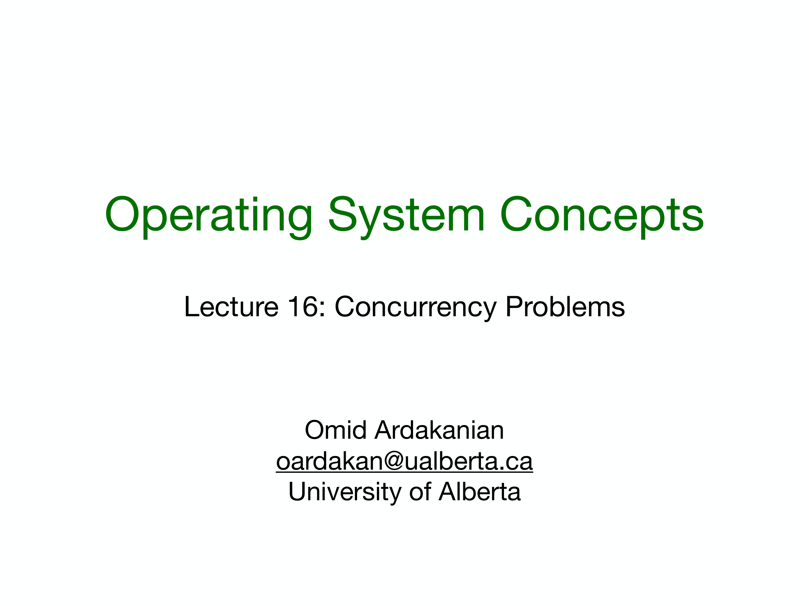

这是一本《操作系统（Operating System Concepts）》课程第16讲的标题页，主题是“并发(Concurrency)问题”。下面把“并发问题”在操作系统里的核心概念、典型故障与解决办法系统讲清楚。

# 1. 并发是什么？

* **并发**：多个线程/进程在同一时间段内“共同推进”各自的执行（单核是快速切换，多核是真并行）。
* 关键挑战：多个执行单元会**同时访问共享资源**（内存数据、文件、设备等），导致结果依赖于不可预知的执行顺序。

# 2. 三大正确性目标（ACV）

1. **原子性 Atomicity**：一组操作要么全做，要么全不做。
2. **一致性 Consistency**：并发执行后，系统状态必须满足不变式（比如余额不丢）。
3. **可见性/顺序性 Visibility/Ordering**：一个线程对共享变量的修改，对其他线程何时可见，以及指令是否按期望顺序生效（受缓存与编译器/CPU重排影响）。

# 3. 典型并发错误

* **竞态条件 Race Condition**：结果取决于“谁先谁后”。
  例：两个线程同时做 `x = x + 1`，如果读-改-写交错，可能只加一次。
* **临界区问题 Critical Section**：对共享数据的那段代码必须“互斥”。
* **丢失更新 Lost Update**：上例就是。
* **读脏数据/可见性问题**：一个线程看不到另一个线程已经更新的值（CPU缓存/编译器重排）。
* **死锁 Deadlock**：两个或多个线程相互等待，永远卡住。
* **活锁 Livelock**：大家都在忙着“礼让/重试”，却没有前进。
* **饥饿 Starvation**：某些线程长期拿不到资源。

# 4. 临界区的正确性条件（经典三条）

1. **互斥**：同一时刻仅一个线程在临界区内。
2. **进展性**：无人在临界区时，想进入的线程能在有限步骤内决定谁先进入。
3. **有界等待**：任何线程等待进入的时间是有上界的（避免饥饿）。

# 5. 同步原语与工具箱

* **硬件原子指令**：`test-and-set`、`compare-and-swap (CAS)`、`fetch-and-add`。
* **自旋锁 Spinlock**：忙等，适合临界区很短、在内核或多核上用。
* **互斥锁 Mutex**：阻塞式锁；进入失败会睡眠，减少 CPU 浪费。
* **信号量 Semaphore**：计数型资源控制；`P(wait)`/`V(signal)`。`1`值信号量≈互斥锁。
* **条件变量 Condition Variable**：配合互斥锁，用于“等待条件达成”（`wait` 自动释放锁并睡眠，`signal/broadcast` 唤醒）。
* **屏障 Barrier**：所有线程到齐再继续。
* **监视器 Monitor**：把“共享数据+互斥+条件变量”封装成安全对象（Java `synchronized`/`wait/notify`、C++条件变量等）。
* **内存模型与栅栏**：`memory fence`、`atomic<T>` 保证可见性与顺序性。

# 6. 经典并发问题（课程里常讲）

* **有界缓冲区/生产者-消费者**：用互斥锁保护缓冲区；两个条件变量 `not_full`/`not_empty` 控制生产与消费。
* **读者-写者 Readers–Writers**：读可并发、写需独占；策略要避免读者或写者饥饿。
* **哲学家进餐 Dining Philosophers**：互斥+避免死锁/饥饿（如拿叉顺序、服务生/限流、资源有序化）。
* **吸烟者问题、理发师问题**：练习条件同步与信号量用法。

# 7. 死锁详解

* **四个必要条件（Coffman）**

1. 互斥；2) 占有且等待；3) 不可抢占；4) 循环等待。

* **应对策略**

* **预防**：破坏一个必要条件（如资源有序化，禁止循环等待；可抢占等）。
* **避免**：运行时检查是否会进入不安全状态（如**银行家算法**）。
* **检测与恢复**：允许发生，周期检测环路并回滚/杀死进程。
* **工程规约**：锁顺序、细粒度/粗粒度组合、尽量缩短临界区、超时与故障切换。

# 8. 小例子（伪代码）

**错误的自增（竞态）：**

```c
// x 初始为 0，两个线程各执行 100000 次
x = x + 1; // 读-改-写非原子，结果可能 < 200000
```

**修正（互斥锁）：**

```c
lock(m);
x = x + 1;
unlock(m);
```

**生产者-消费者（条件变量要点）：**

```c
produce(v):
lock(m)
while buffer_full(): wait(not_full, m)
put(v)
signal(not_empty)
unlock(m)

consume():
lock(m)
while buffer_empty(): wait(not_empty, m)
v = get()
signal(not_full)
unlock(m)
```

`while`（而非 `if`）是为了防止“虚假唤醒”和竞态。

# 9. 性能与实践建议

* **优先用高层抽象**（监视器、线程池、Actor、消息队列）减少手写锁。
* **减小临界区**，尽量做**无锁数据结构**或**读写锁**优化读多写少场景。
* **避免在持锁时执行 I/O/阻塞操作**。
* **统一锁顺序**，必要时给锁加层级（lock hierarchy）。
* **用工具**：静态分析、线程检测器（ThreadSanitizer）、死锁检测器、竞态检测。
* **考虑事务内存/STM**（课程可能点到为止）。

---

总之，这一讲会带你识别并发中的“坑”（竞态、死锁、活锁、饥饿等），并学会用锁、信号量、条件变量、原子操作和设计规约来实现**正确且高效**的并发程序。需要我把某个经典问题（如哲学家/读者-写者）展开到可运行代码吗？


---

## 第 2 页

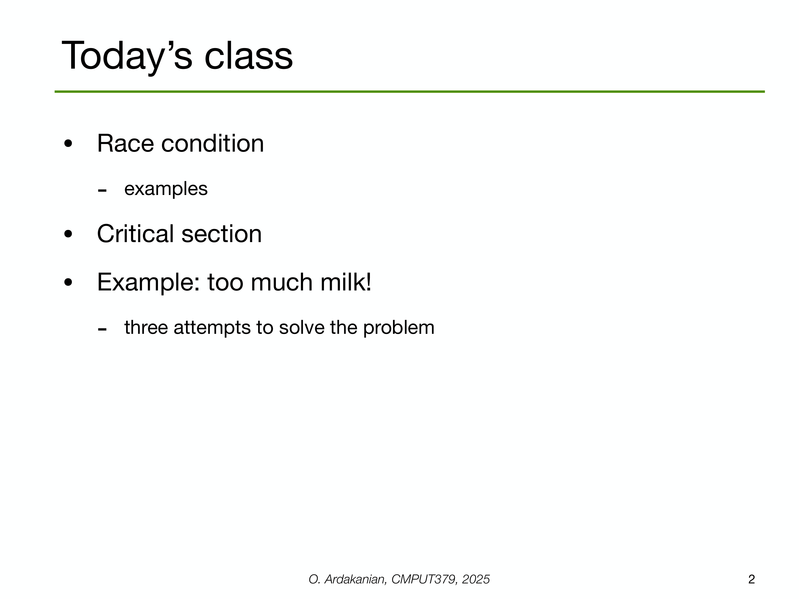

这页是本节课（并发问题）要讲的提纲。逐条翻译+深入解释如下：

# 1) Race condition（竞态条件）

**含义**：程序结果取决于多个线程/进程的**交错执行顺序**。当它们在没有正确同步的情况下读写**共享资源**（变量、文件、设备）时，谁先执行就决定结果，因而**不可预测**。

**最常见例子**

* 共享计数 `x = x + 1`：两个线程同时做“读→加一→写回”，若交错执行，会丢失一次更新，最终值比期望小。
* 转账：A、B两个操作在没有原子性保护下并发修改同一余额，可能出现“钱凭空消失或增加”。
* 检查再执行（check-then-act）：线程1先 `if (!exists) create()`，线程2几乎同时做同样检查，导致重复创建/写坏状态。

**要点**：出现竞态并不总是“错”，但**对共享状态的读写必须有同步**，否则就会错。

---

# 2) Critical section（临界区）

**含义**：访问/修改共享数据的那段代码，必须保证**同一时刻只有一个线程在里面**。

**正确性三条件**

1. **互斥**：一次只允许一个线程进入。
2. **进展性**：无人占用时，请求进入的线程在有限步骤内能选出下一个进入者。
3. **有界等待**：任何线程等待进入的时间有上界（避免饥饿）。

**常用实现手段**

* 互斥锁（mutex）、自旋锁（spinlock）
* 信号量（semaphore）
* 条件变量（condition variable）
* 原子指令/内存屏障（保证可见性和顺序）

---

# 3) 例子：“Too Much Milk!”（牛奶买多了）

这是教学中很经典的**两线程同步问题**：

* 两个室友（线程 A/B）共用一个冰箱（共享资源）。
* 规则：看到没牛奶就去买；但如果两人**同时发现没牛奶都去买**，回来就会发现**牛奶买多了**（竞态）。

目标：**在没有硬件锁和复杂原语的前提下**，仅用**共享布尔变量**（便利贴/flag）设计协议，使得两人不会同时去买（满足互斥与进展）。

### 3.1 天真解（失败）

```
if (no_milk) go_buy();
```

问题：A 与 B 几乎同时检查到 “no\_milk”，都去买 —— 出现竞态。

### 3.2 尝试一：各自放“我要去买”的便利贴（仍可能失败）

设共享变量：`A_wants`, `B_wants`，初始为 false。

```
Thread A:                 Thread B:
A_wants = true;           B_wants = true;
if (!B_wants) buy();      if (!A_wants) buy();
A_wants = false;          B_wants = false;
```

问题：若两人**同时**把 flag 设为 true，再各自检查到对方也为 true，就都**不去买**——造成**活锁/饥饿**（冰箱一直没牛奶）。

### 3.3 尝试二：加“轮到谁”的 turn 变量（仍有问题的版本）

引入 `turn ∈ {A,B}`，表示“礼让方向”。一种不完善的写法是：

```
Thread A:                         Thread B:
A_wants = true;                   B_wants = true;
turn = B;                         turn = A;
while (B_wants && turn==B) ;      while (A_wants && turn==A) ;
/* 临界区：去买牛奶 */
A_wants = false;                  B_wants = false;
```

这其实已经是**Peterson 两线程互斥算法**的核心——这个版本**是正确的**（见 3.4）。如果课堂里的“第二次尝试”写错顺序（例如先设 `turn` 再设 `*_wants` 或把等待条件写成 `if`），就会出错；正确顺序见下。

### 3.4 尝试三（正确解）：Peterson 算法

Peterson 算法在**仅有共享内存、顺序一致性**的假设下，能保证两线程互斥、进展与有界等待。

**线程 A：**

```c
A_wants = true;      // 表示我想进临界区
turn = B;            // 礼让对方，若对方也想，就先让 B
while (B_wants && turn == B) {
;                  // 忙等：只要对方想进且现在轮到对方，就等
}
/* 临界区：检查并购买牛奶（只会有一个人到这里） */
A_wants = false;     // 退出临界区
```

**线程 B：**

```c
B_wants = true;
turn = A;
while (A_wants && turn == A) { ; }
/* 临界区 */
B_wants = false;
```

**为什么正确？**

* 若两人同时想进：两人都把 `*_wants=true`，并把 `turn` 设为对方。最终 `turn` 会是其中一人的名字；轮到的那个人会等待，**另一个**因为 `turn` 不是对手，就能进入。
* **互斥**：不可能两人同时跳出 while。
* **进展**：如果只有一个人想进，不会被阻塞。
* **有界等待**：进入顺序由 `turn` 决定，避免饥饿。

> 注：在现代多核与弱内存模型下，要用**原子变量与内存栅栏**（如 C/C++ `std::atomic`）保持同样性质；教学题默认强内存模型。

---

## 小结

* **竞态条件**：并发对共享数据的无序访问导致不确定或错误结果。
* **临界区**：需要互斥保护的代码片段。
* **Too Much Milk**：用简陋原语构造互斥的练习；最终用 **Peterson 算法**得到正确解，体现三要素：**意向标志（wants）、礼让位（turn）、忙等等待**。

如果你愿意，我可以把 “Too Much Milk” 改写成 **C/C++/Java 的可运行示例**（含 `std::atomic` 或 `synchronized`），并附带一个模拟说明错误方案如何导致“买多/买不到”。


---

## 第 3 页

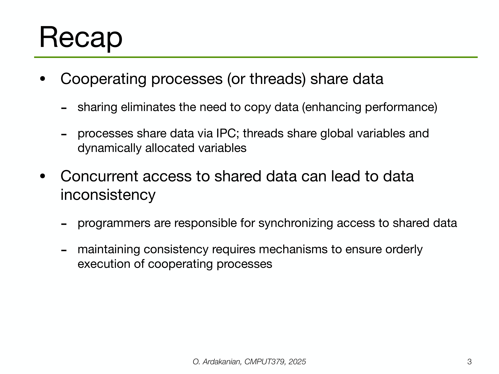

这页是对前置知识的回顾。逐条翻译+深入解释：

# 要点 1：协作的进程/线程会“共享数据”

* **为什么共享？** 不用把数据在它们之间来回拷贝 → **更高性能、低延迟**。
* **怎么共享？**

* **进程（processes）** 本身有各自独立的地址空间，想共享数据必须通过 **进程间通信（IPC）**：如管道、消息队列、共享内存、套接字、mmap 文件等。
* **线程（threads）** 属于同一进程，**天然共享** 该进程的全局变量、堆上动态分配的对象以及打开的文件描述符等；只有各自的栈是分开的。

> 小提示：线程共享更方便、更快，但也更“危险”，因为任何线程都能同时改同一块内存。

# 要点 2：并发访问共享数据会导致**数据不一致**

* **现象**：多个执行单元交错读写同一变量/结构体，产生**竞态**，结果依赖谁先谁后。

* 例：两个线程都执行 `balance = balance - 100`，若两次读到的都是旧值，就会“丢失一次更新”。
* 例：一个线程刚把 `ready=true` 写进缓存，另一个线程立刻读，但因为**可见性**问题（CPU 缓存/编译器重排），它可能仍看到 `false`。

* **谁来负责？** 课程强调：**程序员**必须为共享数据的访问加上**同步**。编译器和操作系统不会自动替你推断正确的同步策略。

* **如何保持一致性（有序执行）？** 需要机制来保证“谁先谁后”和“看见最新值”：

* **互斥/锁（mutex、读写锁、自旋锁）**：保证同一时刻只有一个线程进入**临界区**。
* **信号量（semaphore）**：控制可并发通过的数量（值为1时相当于互斥）。
* **条件变量（cond var）**：等待某个条件成立再继续（例如缓冲区非空/非满）。
* **原子操作与内存屏障（atomic/fence）**：解决可见性与指令重排问题。
* **更高层抽象**：监视器/`synchronized`、线程安全容器、Actor/消息传递、事务内存等。

> 核心目标：保证**原子性、可见性、顺序性**，从而维持数据的一致状态。

---

## 一句话总结

* 线程/进程协作通常要共享数据，这能加速，但也带来**竞态**风险。
* **程序员必须显式地使用同步原语**来保护临界区与通信顺序，否则就会产生**数据不一致**。需要我把某种 IPC 或锁的用法配上最小可运行示例吗？

---

## 第 4 页

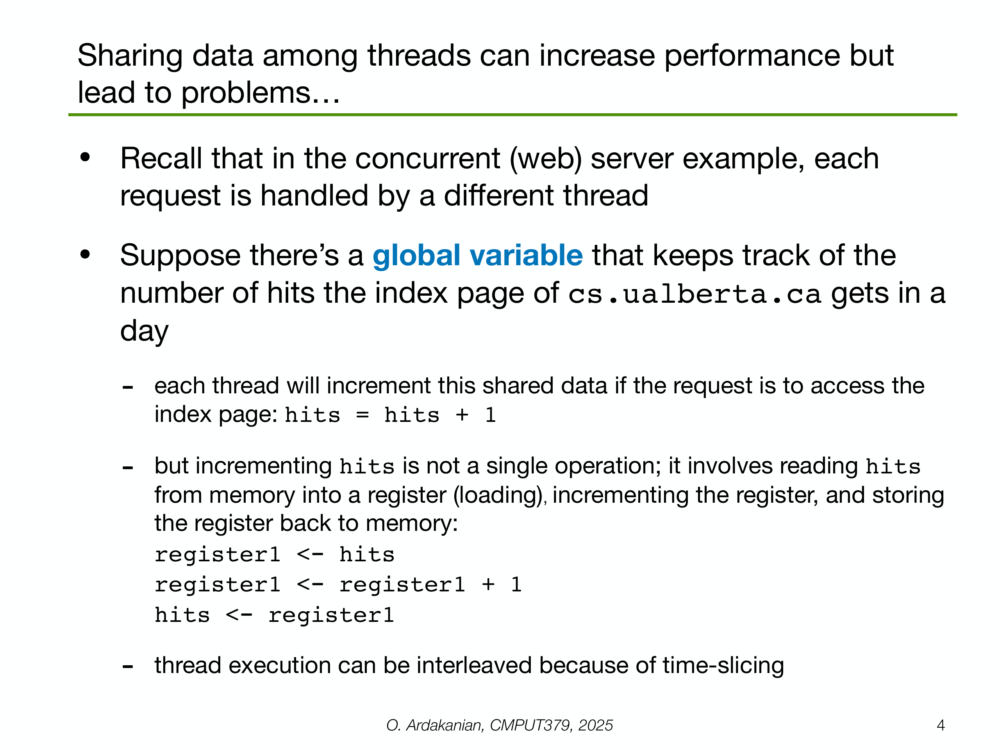

这页在讲：**多线程共享数据能提高性能，但也会带来“竞态条件（race condition）”**。用网站访问计数器 `hits` 举例说明为什么一个看似简单的 `hits = hits + 1` 在多线程中会出错。

# 场景

* 并发 Web 服务器：每个请求由**不同的线程**处理。
* 有一个**全局变量** `hits` 统计主页一天的访问次数。
* 每当有访问主页的请求到来，处理该请求的线程会执行：`hits = hits + 1`。

# 关键点：自增不是“一个原子操作”

从 CPU 视角，`hits = hits + 1` 分成三步（**读-改-写**）：

1. 读：`register1 <- hits`（把内存中的 `hits` 读到寄存器）
2. 改：`register1 <- register1 + 1`
3. 写：`hits <- register1`（把寄存器值写回内存）

这三步**无法保证同时完成**，中间可能被**时间片切换**打断，让别的线程插进来执行它的读改写。

# 会发生什么问题？（丢失更新 / 计数变少）

两条线程 T1、T2 同时给 `hits` 加 1，初值假设是 100：

* T1：读到 `hits=100` 放在寄存器 r1
* **切换**
* T2：也读到 `hits=100` 放在寄存器 r2
* T2：r2+1 → 101，写回内存，`hits=101`
* **切换**
* T1：r1+1 → 101，写回内存，`hits` 仍然是 **101**

期望值应该是 102，但结果只有 101 —— **一个更新被覆盖了**。这就是经典的竞态条件。

# 为什么更“棘手”

* **交错执行（interleaving）**：时间片切换随时发生，交错顺序不可预测，bug **不一定每次都复现**。
* **缓存与编译器优化**：每核的缓存、乱序执行、编译器重排，都可能让读/写看起来“延后/提前”，进一步放大问题。

# 正确做法（同步/原子化）

想保证“每次加 1 都不会丢”，要让“读-改-写”整体变成**不可分割**的原子序列，常见方法：

**方法 A：互斥锁（mutex）**

```c
pthread_mutex_t m = PTHREAD_MUTEX_INITIALIZER;

pthread_mutex_lock(&m);
hits = hits + 1;
pthread_mutex_unlock(&m);
```

* 保证同一时刻只有一个线程能执行这段代码。
* 简单可靠，但频繁加锁可能带来开销与争用。

**方法 B：原子操作（C11 `<stdatomic.h>` 或平台提供的原子类型）**

```c
#include <stdatomic.h>
atomic_int hits;

atomic_fetch_add(&hits, 1); // 原子加一
```

* 使用 CPU 的原子指令（如 `LOCK XADD` 等），读改写在硬件层面作为一个原子单元完成。
* 往往比互斥锁开销更低，适合简单计数器。

**方法 C：分片计数 + 合并**

* 每线程维护局部计数（线程本地存储 TLS），减少共享写入；周期性**汇总**到全局。
* 适合超高并发，能降低锁/原子热点，但统计不是绝对实时。

# 何时该选哪种？

* 仅仅是一个**计数器**：优先**原子加**；极端高并发再考虑**分片计数**。
* 涉及到**多个共享变量的一致性**（例如先读 A 再改 B）：用**互斥/读写锁**封住“临界区”。
* 读多写少：考虑**读写锁**或**无锁读取+偶尔原子写**。

# takeaway

* 在多线程里，**不要把简单的 `x++` 当成原子**。
* 对共享数据进行**同步或原子化**，否则就会遇到**竞态条件**导致的“偶发性错误”（如计数变少、数据错乱）。


---

## 第 5 页

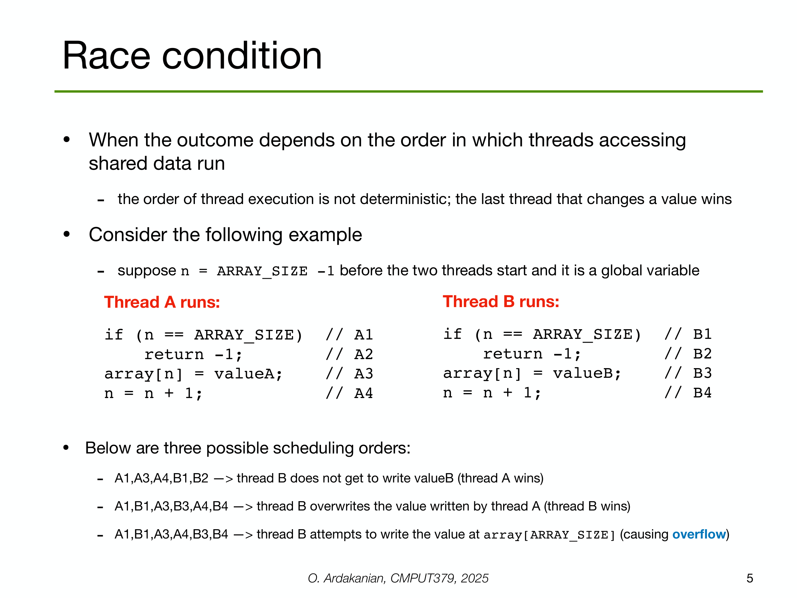

这页在讲**竞态条件（race condition）**：当多个线程并发访问/修改共享数据时，**结果取决于它们具体的交错顺序**，而这个顺序是不可预测的，所以程序会表现出**不确定性**，甚至越界崩溃。

# 场景设定

* 有一个全局数组 `array[ARRAY_SIZE]` 和全局计数 `n`，表示当前已用元素个数。
* 初始 `n = ARRAY_SIZE - 1`（还剩最后**一个**位置可写）。
* 两个线程 A、B 几乎同时尝试在末尾写入，然后把 `n` 加 1。
* 伪代码（每行标号 A1~~A4、B1~~B4 方便讨论）：

**Thread A**

```c
if (n == ARRAY_SIZE)    // A1
return -1;          // A2
array[n] = valueA;      // A3
n = n + 1;              // A4
```

**Thread B**

```c
if (n == ARRAY_SIZE)    // B1
return -1;          // B2
array[n] = valueB;      // B3
n = n + 1;              // B4
```

注意：`if (n==ARRAY_SIZE)` 与后面的写入/自增**不是原子**的“检查后执行（check-then-act）”。

# 三种可能的交错与后果（幻灯片列举）

> 线程执行的先后并不确定，“**最后一个修改值的线程赢**”。

1. **A1, A3, A4, B1, B2**

* A 先检查到 `n=ARRAY_SIZE-1`，写入 `array[n]`，然后 `n++` 变为 `ARRAY_SIZE`。
* B 再检查时看到 `n==ARRAY_SIZE`，返回 -1。
👉 **B 没写**，A “赢”；功能上似乎正确，但完全靠偶然的时序。

2. **A1, B1, A3, B3, A4, B4**

* 两者都在各自检查时看到 `n=ARRAY_SIZE-1`（都通过了检查）。
* A、B **先后都写到同一个槽** `array[ARRAY_SIZE-1]`：B 覆盖 A（或反之）。
* 之后两人都做 `n++` → `n` 变成 `ARRAY_SIZE+1`。
👉 **数据被覆盖，计数超了 1**，逻辑错误却未必立刻崩。

3. **A1, B1, A3, A4, B3, B4**

* A 写并 `n++` → `n=ARRAY_SIZE`。
* B 接着**仍然用它早先读到的旧 n** 去写 `array[n]`，此时就是 `array[ARRAY_SIZE]`（越界）。
👉 **数组越界（overflow）**，严重内存错误/崩溃。

总结：同一段代码，因为交错不同，会表现为**偶尔正常、偶尔覆盖、偶尔越界**——这就是竞态。

# 为什么会这样？

* `if (n==ARRAY_SIZE)` 与 `array[n]=...; n=n+1;` 之间没有同步保护；
* 多个线程在**检查—使用**之间插入彼此的修改，破坏了“检查时条件仍然成立”的假设；
* 自增 `n` 也不是原子操作。

# 正确做法（让“检查—写—递增”成为**不可分割**的一次性动作）

**方案 A：互斥锁（简单可靠）**

```c
pthread_mutex_t m = PTHREAD_MUTEX_INITIALIZER;

pthread_mutex_lock(&m);
if (n == ARRAY_SIZE) {
pthread_mutex_unlock(&m);
return -1;
}
array[n] = value;
n += 1;
pthread_mutex_unlock(&m);
```

* 整个临界区只有一个线程能进入，消除了交错。

**方案 B：原子 + CAS 循环（无锁风格，避免大临界区）**

```c
#include <stdatomic.h>
atomic_int n;

int idx;
while (1) {
int old = atomic_load_explicit(&n, memory_order_relaxed);
if (old == ARRAY_SIZE) return -1;
// 试图把 n 从 old 改为 old+1
if (atomic_compare_exchange_weak_explicit(
&n, &old, old+1,
memory_order_acq_rel, memory_order_relaxed)) {
idx = old;  // 抢到的下标
break;
}
// 失败则重试，old 已被刷新为当前值
}
array[idx] = value;  // 注意对 array 的发布/可见性，必要时加内存序
```

* 用 CAS 保证“**拿到唯一的下标**”；谁 CAS 成功谁写，避免覆盖与越界。
* 若对 `array[idx]` 的可见性有严格要求，需配合合适的内存序或栅栏。

**方案 C：用计数信号量表达“剩余槽位”**

```c
sem_t slots; // 初始化为 ARRAY_SIZE
sem_wait(&slots);      // 没槽位会阻塞
int i = atomic_fetch_add(&n, 1);
array[i] = value;
```

* `sem_wait` 保证不会超过容量；配合原子自增为每个线程分配唯一索引。

# 选择建议

* **入门/易维护**：互斥锁最稳。
* **高并发热点很短**：CAS 或 fetch\_add 往往更快。
* **容量受限的生产-消费**：信号量/有界队列语义更清晰。

# takeaway

* 任何“**检查后执行**”（check-then-act）在并发场景都要警惕：检查与执行之间必须**原子化**或**加锁**。
* 未同步的交错执行导致结果不确定、数据损坏，甚至越界崩溃——这就是**race condition**。


---

## 第 6 页

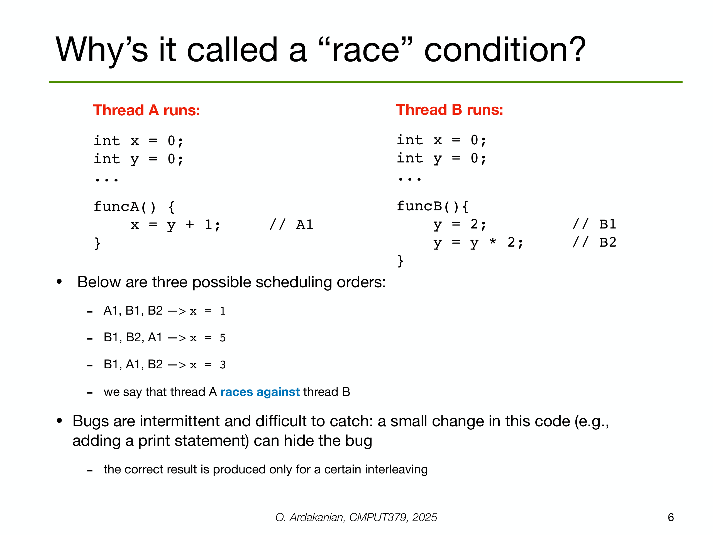

这页在解释**为什么叫“竞态（race）条件”**：
多个线程“**比赛（race）**”着去读取/修改共享变量，**谁先谁后**会直接决定最终结果，而这个先后顺序在并发中是**不确定**的。

# 代码设定

* 两个线程共享变量 `x, y`（初值都为 0）。
* 线程 A 执行：

```c
funcA() {
x = y + 1;    // A1：先读 y，再写 x
}
```
* 线程 B 执行：

```c
funcB() {
y = 2;        // B1
y = y * 2;    // B2  （把 y 变成 4）
}
```

注意：`x = y + 1` 也不是原子动作，它会**读取 y** 然后**计算并写回 x**；与此同时 B 在线程间可能已把 `y` 改了 0→2→4。

# 不同交错产生不同结果（谁“赢”）

幻灯片给了 3 种调度顺序（A1 / B1 / B2 的执行先后）：

1. **A1, B1, B2 → `x = 1`**

* A 先读到 `y = 0`，写 `x = 0 + 1 = 1`；
* 之后 B 把 `y` 改成 2 再改成 4。
* 结果：`x=1`（A 在 B 修改 y 之前“赢了”这场竞赛）。

2. **B1, B2, A1 → `x = 5`**

* B 先把 `y` 从 0 改到 2，再改到 4；
* A 再读到 `y = 4`，写 `x = 4 + 1 = 5`。
* 结果：`x=5`（B 完成后 A 再读，A 用的是最终的 y）。

3. **B1, A1, B2 → `x = 3`**

* B 把 `y` 先设为 2；
* A 立即读到 `y = 2`，写 `x = 3`；
* B 再把 `y` 乘 2 变成 4。
* 结果：`x=3`（A 读到了“中间态”的 y）。

结论：**同一份代码**，因为交错不同，`x` 可能是 **1、3 或 5**。这就是“race”：A 与 B 在**竞速读取/更新** `y`，最终谁在关键时刻先跑到就影响结果。

# 为什么这种 bug 难抓

* **间歇性**：只有在特定交错（时序）下才出错；加个 `printf`、调试器断点、甚至编译优化变化，都可能改变时序，让 bug “消失”。
* **不可重现**：线程调度受 CPU、负载、优化、缓存等影响，结果不稳定。

# 怎么修

* **互斥/锁**：把相关读写放进临界区确保一次只允许一个线程操作共享变量：

```c
pthread_mutex_lock(&m);
x = y + 1;
pthread_mutex_unlock(&m);
// 以及对修改 y 的位置做相同保护
```
* **内存模型/原子**：使用原子变量与适当的内存序（在这类读-后-写依赖上通常仍需同步来定义可见顺序）。
* **设计上避免共享**：将数据变为线程私有，或用消息传递/流水线，减少共享可变状态。

\*\*一句话：\*\*叫“race”是因为线程在“**竞速**”地访问共享数据，**执行先后**决定结果；不加同步就会出现不可预测的值。


---

## 第 7 页

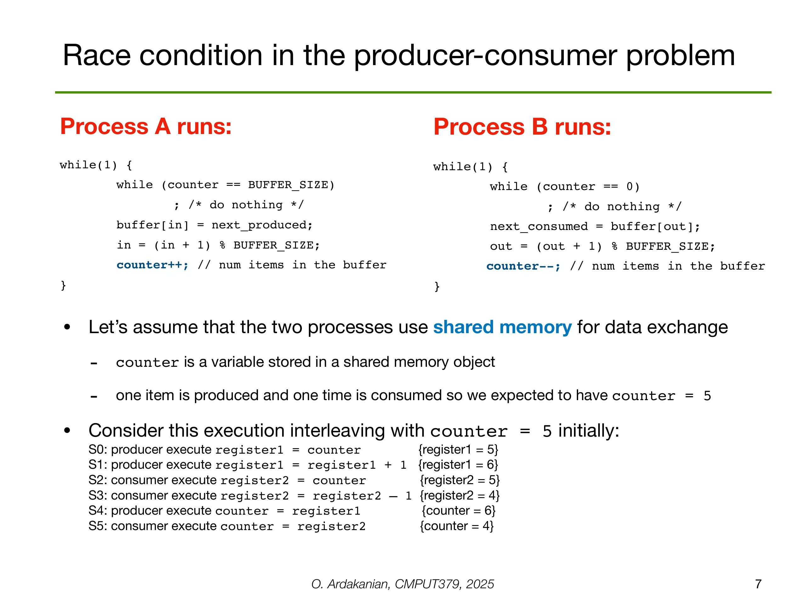

这页用**生产者-消费者**问题说明“**竞态条件**”如何把看似正确的计数搞错。

# 场景（共享内存 + 环形缓冲区）

* 两个进程/线程通过**共享内存**交换数据：一个是**生产者**（A），一个是**消费者**（B）。
* 共享状态：

* `buffer[]`：环形队列；
* `in`：写入位置；`out`：读出位置；
* `counter`：**缓冲区中当前元素个数**（全局共享变量）。
* 伪代码（关键行加粗）：

* 生产者 A：

```c
while (1) {
while (counter == BUFFER_SIZE) ;   // 满了就等
buffer[in] = next_produced;
in = (in + 1) % BUFFER_SIZE;
counter++;                          // **增加计数**
}
```
* 消费者 B：

```c
while (1) {
while (counter == 0) ;              // 空了就等
next_consumed = buffer[out];
out = (out + 1) % BUFFER_SIZE;
counter--;                          // **减少计数**
}
```

# 问题：`counter++ / counter--` 不是原子

* 自增/自减本质是**读-改-写**三步：读内存到寄存器 → 加/减 → 写回内存。
* A、B 交错执行时就会**丢失更新**（lost update）。

# 幻灯片给的交错示例（初始 `counter = 5`）

> 假设此时“生产了一个 item，消费了一个 item”，按道理**最终应仍为 5**。实际却变成 4。

逐步交错（寄存器 r1 给 A 用，r2 给 B 用）：

* **S0**：A 读 `counter` 到 r1（r1=5）
* **S1**：A 在寄存器里做 `r1 = r1 + 1`（r1=6）
* **S2**：B 读 `counter` 到 r2（r2=5） ← 注意：B 读到的是**旧值**
* **S3**：B 在寄存器里做 `r2 = r2 - 1`（r2=4）
* **S4**：A 把 r1 写回内存 → `counter = 6`
* **S5**：B 把 r2 写回内存 → `counter = 4`（**覆盖了 A 的更新**）

结果从 5 变成 4 —— 明显错误。这就是竞态：结果取决于交错顺序，且不可预测。

# 还隐藏着其他问题

* 代码里的 `while(counter==0) ;` / `while(counter==BUFFER_SIZE) ;` 是**忙等**（spin），会空耗 CPU。
* 即使忙等改成睡眠/唤醒，如果没有正确的**同步原语**保护 `counter/in/out` 的组合操作，仍会错。

# 正确做法（任选其一或组合）

**方案 A：信号量 + 互斥锁（经典生产者-消费者）**

```c
sem_t empty, full;           // empty=BUFFER_SIZE, full=0
pthread_mutex_t m = PTHREAD_MUTEX_INITIALIZER;

producer:
sem_wait(&empty);        // 保证有空位
pthread_mutex_lock(&m);
buffer[in] = item;
in = (in+1) % BUFFER_SIZE;
// 不需要单独维护 counter；或若维护，修改在锁内
pthread_mutex_unlock(&m);
sem_post(&full);         // 通知有新数据

consumer:
sem_wait(&full);         // 保证有数据
pthread_mutex_lock(&m);
item = buffer[out];
out = (out+1) % BUFFER_SIZE;
pthread_mutex_unlock(&m);
sem_post(&empty);        // 释放一个空位
```

* **语义清晰**：`full` 表示已有元素数，`empty` 表示剩余空位数；`m` 保护对 `buffer/in/out`（以及可选的 `counter`）的原子更新。

**方案 B：原子操作（只对计数）**

* 用 `atomic_int counter; atomic_fetch_add/sub(&counter, 1);`
* 但注意：只把 `counter` 原子化**不够**，对 `buffer/in/out` 的更新也必须**整体受保护**（锁或无锁队列算法）。

**方案 C：条件变量（避免忙等）**

```c
pthread_mutex_t m; pthread_cond_t not_full, not_empty;

producer:
pthread_mutex_lock(&m);
while (count == BUFFER_SIZE) pthread_cond_wait(&not_full, &m);
buffer[in] = item; in = (in+1)%N; count++;
pthread_cond_signal(&not_empty);
pthread_mutex_unlock(&m);

consumer:
pthread_mutex_lock(&m);
while (count == 0) pthread_cond_wait(&not_empty, &m);
item = buffer[out]; out = (out+1)%N; count--;
pthread_cond_signal(&not_full);
pthread_mutex_unlock(&m);
```

* 等价于“互斥锁 + 条件队列”，避免 CPU 空转。

# 要点总结

* 生产-消费里最常见的坑：把“检查→读/写→更新计数”分散成多个非原子操作。
* **必须**用同步原语把相关共享状态的变更变为**原子**：

* 空位/元素数量：由**信号量/条件变量**表达；
* 索引和缓冲写读：由**互斥锁**保护（或使用正确实现的无锁/有锁队列）。
* 忙等不可取；用 `sem/cond` 做阻塞与唤醒，既正确又高效。


---

## 第 8 页

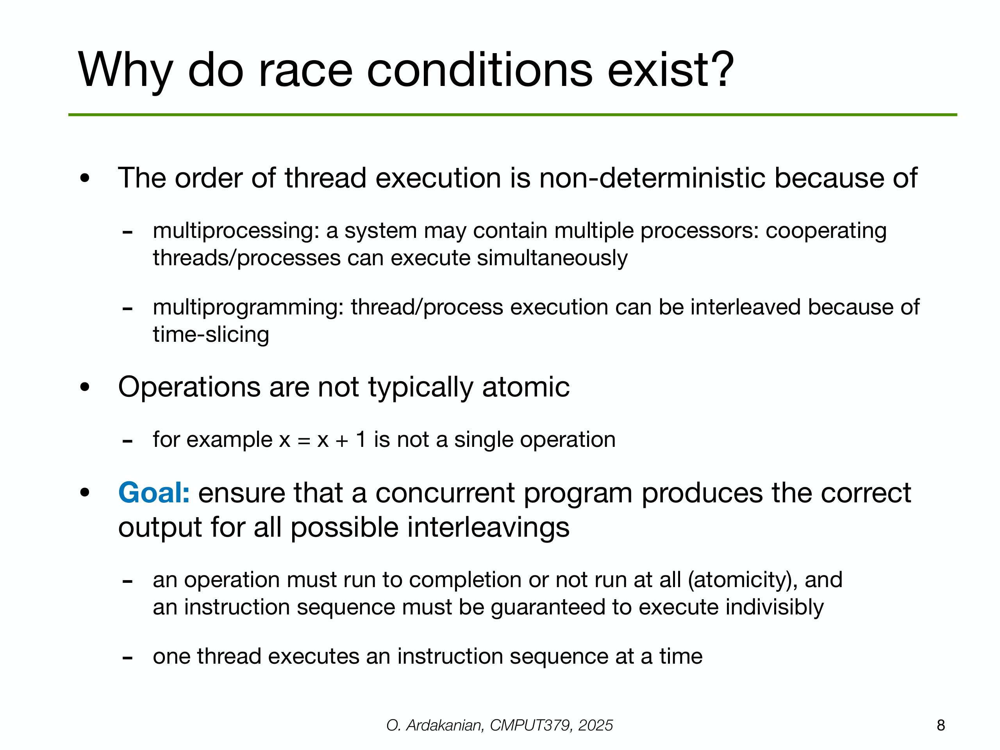

这页回答的是：**为什么会出现竞态条件（race condition）？** 以及并发程序应当追求的目标。

# 1) 竞态为何存在

**(a) 线程执行顺序是“非确定的”**

* **多处理器（multiprocessing）**：机器上有多个 CPU/核，多个线程**真并行**地同时执行；谁先改到共享变量，取决于当下的调度与硬件时序。
* **多道程序/时间片（multiprogramming / time-slicing）**：即便只有一个核，操作系统也会**分时**在不同线程间切换，导致指令序列被\*\*交错（interleaving）\*\*执行。
→ 结果：同一段代码，每次运行的交错顺序都可能不同，输出也就不同。

**(b) 操作通常不是原子的（non-atomic）**

* 例如 `x = x + 1` 并不是“一步”；它是**读 x → 加 1 → 写回**三步。
* 在这三步之间，调度器可能切到另一个线程，让它也去读/改/写同一个 `x`，从而产生**丢失更新**、越界等错误。

# 2) 我们的目标（Goal）

让**所有可能的交错**下，程序都得到**正确的结果**。这意味着：

* **原子性（Atomicity）**：
某个关键操作（或一小段指令序列）要么**完全执行**，要么**完全不执行**；对外观察不到“只做了一半”的中间状态。也就是说，这段指令序列在可见性上是**不可分割**的。
* **互斥（Mutual exclusion）**：
当某个线程在执行这段“关键序列”（临界区）时，**其他线程不能同时执行**这段序列；等价地，“一次只有一个线程”进入这段代码。

# 3) 如何实现这些性质（常见手段，帮助你联想）

* **锁/互斥量（mutex）、读写锁、临界区**：把“检查→更新→写回”等操作包在锁里，保证串行化。
* **原子操作**：`atomic_fetch_add`、CAS 等，用硬件指令让读改写整体成为一个原子动作。
* **信号量/条件变量/屏障**：在生产-消费、阶段同步等场景保证顺序与容量约束。
* **更少共享可变状态**：通过消息传递、不可变数据、线程本地存储等设计，直接减少竞争点。

# 4) 一句话

竞态之所以出现，是因为**并发下的执行顺序不可预测**，而我们编写的操作又往往**不是原子**。解决之道就是让关键操作**具备原子性/互斥性**，从而保证**任意交错都正确**。


---

## 第 9 页

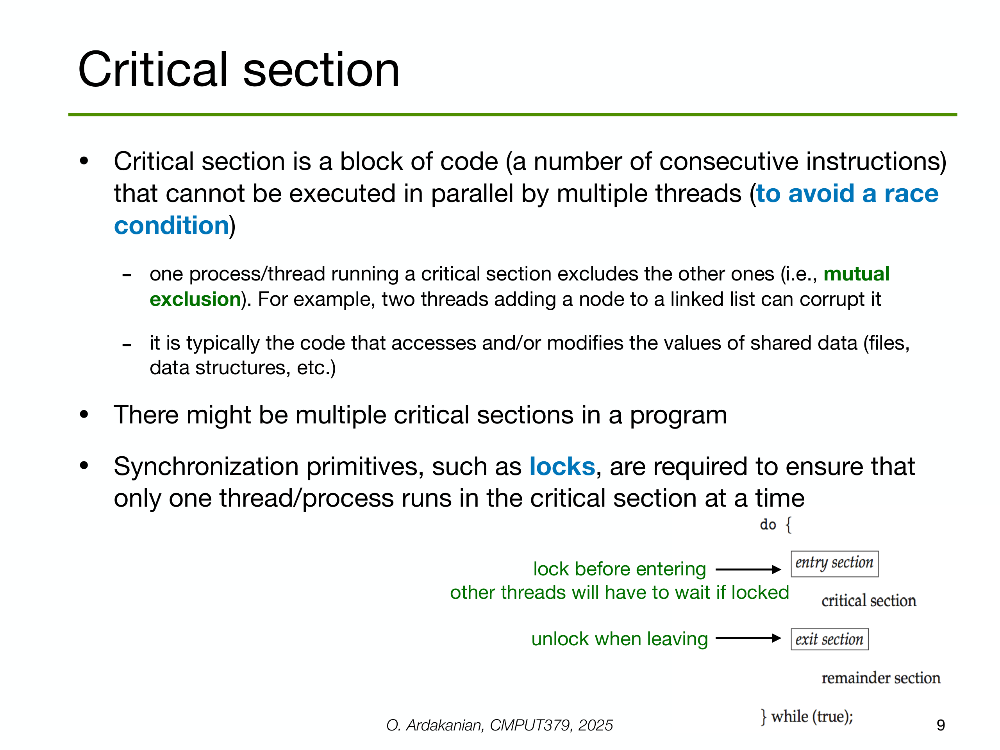

这页在讲**临界区（critical section）**：为避免**竞态条件**，程序中那段“会读/改共享数据”的代码，**一次只能被一个线程执行**。

# 核心概念

* **临界区**：一段连续指令（代码块），里面访问/修改**共享状态**（变量、文件、数据结构等）。
* **互斥（mutual exclusion）**：当某线程在临界区时，**其他线程必须被排除在外**，否则就可能把共享结构弄乱（例如两个线程同时向同一链表插入节点）。

# 程序里会有多处临界区

* 不同共享资源对应不同临界区（比如一个保护队列、一个保护计数器）。
* 每个临界区都要用**同步原语**保护。

# 如何保证“同一时间只有一个线程在临界区”？

* 依赖**同步原语**：最常见是**锁（lock / mutex）**；还包括读写锁、信号量、条件变量、原子操作、监视器（monitor）等。
* 进入/离开流程（右图示意）：

1. **entry section**：上锁（`lock()`）；若已被别人持有，就等待。
2. **critical section**：执行对共享数据的操作。
3. **exit section**：解锁（`unlock()`），唤醒等待者。
4. **remainder section**：执行与共享数据无关的普通代码。

# 典型代码（C/pthreads）

```c
pthread_mutex_t m = PTHREAD_MUTEX_INITIALIZER;

void push(int x) {
pthread_mutex_lock(&m);      // entry
// —— 临界区：访问共享栈/队列/计数器 ——
stack[top++] = x;
pthread_mutex_unlock(&m);    // exit
}
```

# 设计要点与常见坑

* **锁粒度**：锁太粗 → 并行度差；太细 → 复杂易错。
* **成对解锁**：任何可能的返回/异常路径都必须 `unlock()`。
* **避免死锁**：多把锁要遵循**一致的获取顺序**；必要时加超时或用可重入/层级锁。
* **尽量缩短临界区**：把计算放在锁外，只把“读改写共享状态”的最小片段放进锁内。
* **读多写少**：考虑**读写锁**（并发读，独占写）。
* **简单计数/标志位**：优先用**原子操作**代替大锁。

**一句话**：临界区就是“对共享数据的敏感操作块”。用锁等同步手段把它包起来，确保**任意并发交错下都不会出错**。


---

## 第 10 页

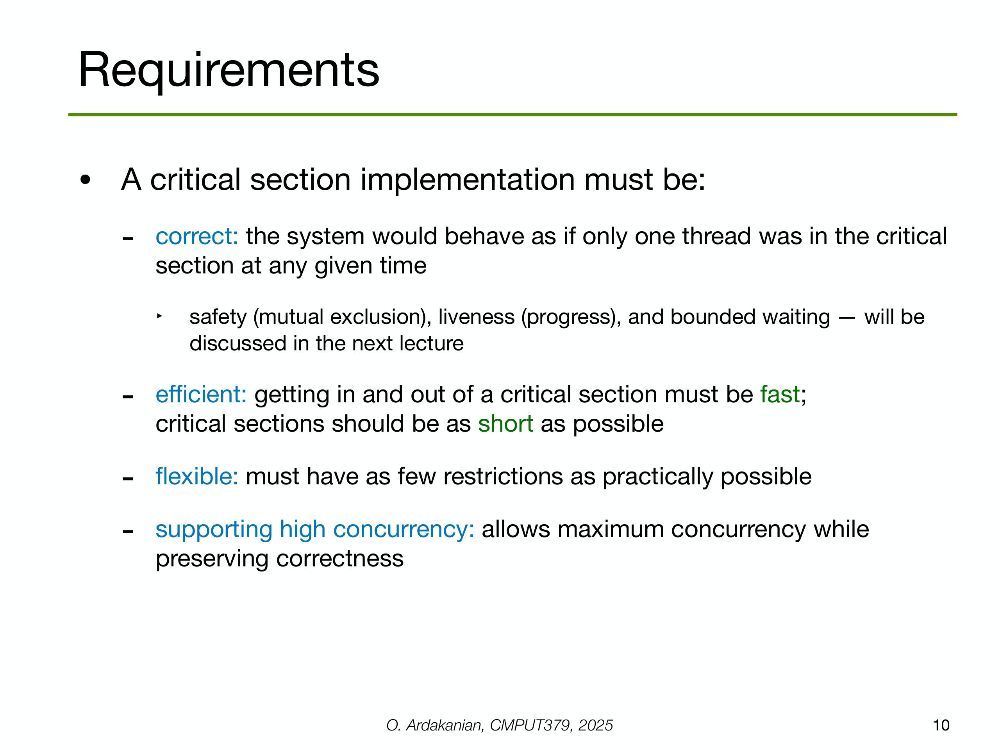

这页在讲：**一个“临界区”的实现需要满足哪些要求（Requirements）**，也就是并发控制机制该达到的目标。

# 1) 正确（correct）

* **语义**：任何时刻都应“看起来像只有一个线程在临界区里”——从而**避免竞态**。
* 常用的正确性子目标（下一讲会展开，但先直觉了解）：

* **Safety / Mutual Exclusion（安全/互斥）**：同一时刻**至多一个**线程处于临界区。
* **Liveness / Progress（活性/可推进）**：只要有人想进入且没有人实际在临界区，就**最终能有人进去**；系统不会卡死在门口。
* **Bounded Waiting（有界等待）**：每个请求进入临界区的等待次数是**有上界的**，防止某个线程无限饿死。

# 2) 高效（efficient）

* **进入/退出要快**：加锁/解锁、获取许可等开销要尽量小。
* **临界区要短**：把与共享数据无关的计算搬到锁外，缩短占锁时间，减少阻塞与上下文切换。

# 3) 灵活（flexible）

* **限制越少越好**：不要强迫线程以不必要的顺序或约束运行；API 要易用，适配不同场景（读多写少、批量操作、可重入等）。

# 4) 支持高并发（supporting high concurrency）

* 在保证正确性的前提下，**尽可能多地让线程并行**。
* 典型做法：

* **细化锁粒度**（例如分段锁/分桶锁）替代“大锁一把抓”。
* **读写锁**：允许并发读，写时独占。
* **无锁/原子操作**：在简单计数、队列等热点上减少锁竞争。
* **避免伪共享**、减少临界区内的 I/O/阻塞操作。

---

## 实战建议（如何同时满足这些要求）

* **只把“读改写共享状态”的最小片段放进锁内**；其余计算移到外面。
* **一致的加锁顺序**避免死锁；必要时设置**超时/回退**策略。
* **监控与调优**：记录锁等待时间、持锁时间、冲突次数，定位热点；必要时改用分段锁/读写锁/原子。
* **选择合适原语**：

* 计数器/标志位 → 原子 `fetch_add/compare_exchange`
* 读多写少 → 读写锁
* 生产-消费 → 互斥 + 条件变量/信号量
* **避免忙等**：优先使用条件变量/信号量唤醒，减少 CPU 浪费。

**一句话：**临界区机制要**正确（互斥+可推进+有界等待）**，同时**快且短**、**约束少**、并且**让系统尽可能并行**。


---

## 第 11 页

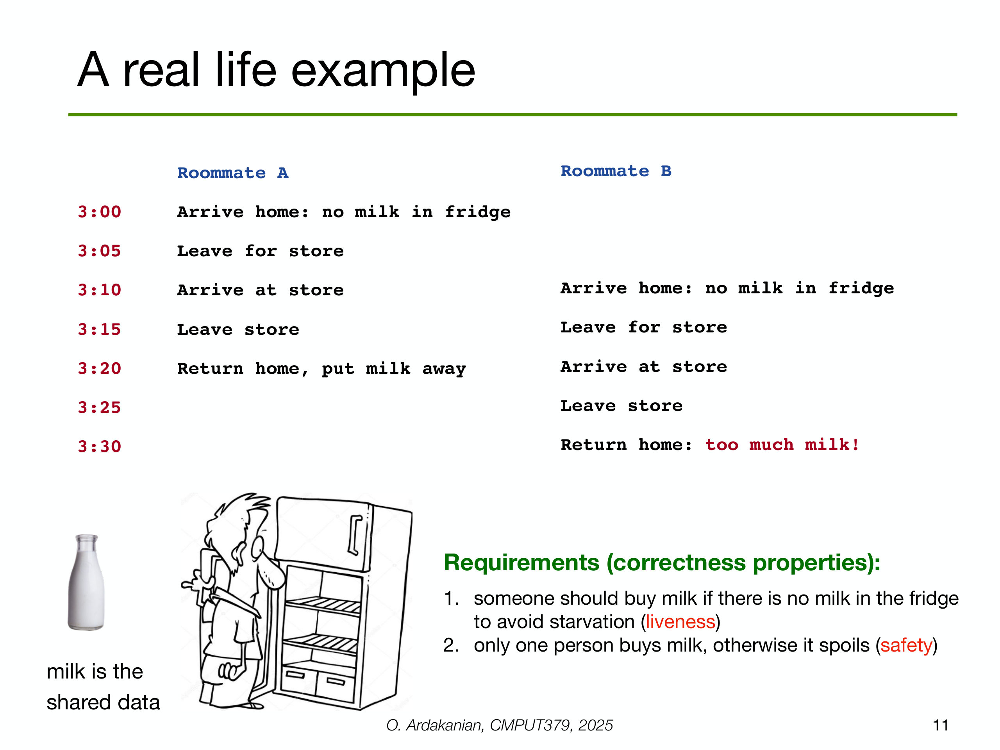

这页用“**买牛奶**”的室友故事，把**并发 + 临界区 + 正确性**讲人话。

# 场景（共享数据 = 冰箱里的牛奶）

* A 和 B 两位室友都独立行动：各自到家→发现**没牛奶**→去商店→买→回家放进冰箱。
* 由于他们**并发**地做同样的事，时间线上可能交错：两人都看到“没牛奶”，于是**都去买**。
* 结果：**牛奶太多**（浪费/变质）——这就像程序里的**竞态条件**。

# 两个正确性目标（右下角）

1. **活性（liveness）**：如果冰箱里**没有牛奶**，**应该有人去买**——不能大家都等，导致永远没牛奶（饿死/停滞）。
2. **安全（safety / 互斥）**：同一时刻**只能一个人去买**，否则就会“**买重了**”（数据损坏/逻辑错误）。

# 和并发程序的对应

* **检查—行动的非原子性**：
“看到没牛奶（检查）→去买（行动）”并不是原子步骤，中间可能发生**时序交错**：另一个人也做了同样的检查，导致**重复购买**。
这对应代码里常见的 `if (empty) fill();` 的**check-then-act**竞态。
* **需要临界区/协调机制**：
要么让“检查并决定去买”成为**互斥**（一次只能一个人做），要么用**协商标记**来避免两人同时买。

# 现实版“加锁”的几种做法（类比编程里的同步原语）

* **便签/标志（flag）**：先在门口贴“我去买奶了”（设置标志），别人看到就不去——像**互斥锁/自旋锁**。
* **分工协议**：A 工作日负责，B 周末负责——像**分片/无共享**设计，减少竞争点。
* **电话/消息**：发个消息确认是否有人在路上——像**条件变量/信号量**协调。

# 一句话

“牛奶故事”说明：**并发中的检查与行动如果不做原子化/互斥，就会出现竞态**。既要保证**一定有人买（活性）**，也要确保**不会两个人都买（安全）**。


---

## 第 12 页

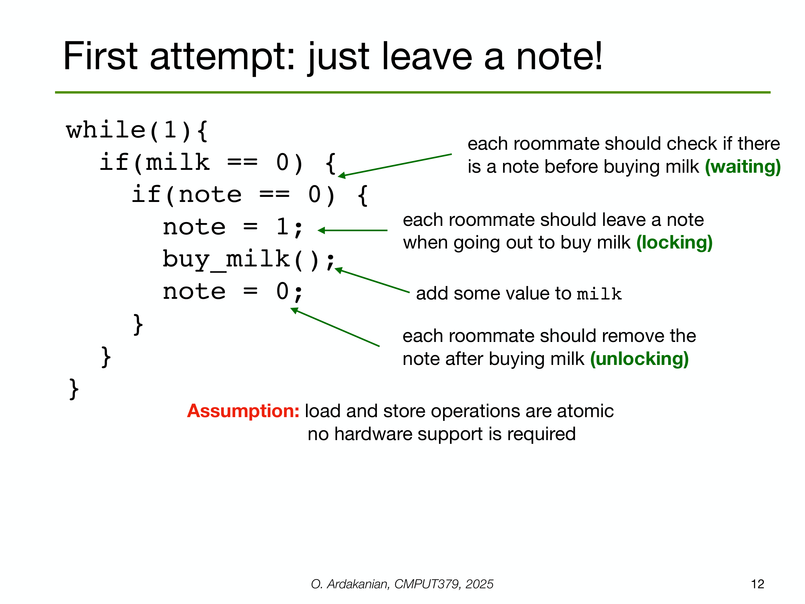

这页讲“**第一次尝试：留个纸条**”来避免两位室友（两个线程）同时去买奶——把**note**当作“简易锁”。

# 代码在说什么

```c
while (1) {
if (milk == 0) {           // 先检查共享状态：没牛奶？
if (note == 0) {         // 再看门口有没有“我去买奶”的纸条
note = 1;              // 没有就贴纸条（加锁）
buy_milk();            // 去买奶（临界区里的动作）
note = 0;              // 回来把纸条取下（解锁）
}
}
}
```

* `milk` 是共享数据；`note` 是“是否有人正在买奶”的标志。
* 绿色注释对应：
waiting（先看纸条）→ locking（贴纸条）→ 临界区（买奶，修改 milk）→ unlocking（取纸条）。
* 假设：**load/store 是原子的**（普通读写即可，不用特殊硬件指令）。

# 这个想法“看起来”对，但其实会翻车

这是经典的 **check-then-act** 竞态：**检查与设置不是原子整体**，两个线程可能这样交错：

**反例 1：同时出门（安全性失败，two buyers）**

1. A 看到 `milk==0` 且 `note==0`
2. B 也看到 `milk==0` 且 `note==0`
3. A：`note=1`；B：`note=1`（彼此覆盖，但都成功）
4. A、B 都去 `buy_milk()` → **买重了**

**反例 2：A 贴了纸条却被卡住（活性失败/饥饿）**

* A 执行到 `note=1` 后崩溃/阻塞，B 永远看到 `note==1` 而不去买 → **没人买奶**

**反例 3：可见性/重排问题（在多核/编译优化下更糟）**

* 如果没有内存屏障/同步，`note` 的更新对另一个核**可能暂时不可见**，或指令被重排，导致判断失真。

# 结论

* 单一的“纸条（note）”不足以提供**互斥 + 可推进**：

* 不能保证**只有一个**进入临界区（安全）；
* 也可能导致**永远没人能进入**（活性）。
* 需要更严谨的同步协议/原语：例如 **Peterson 算法**（双 `flag` + `turn`）、互斥锁、信号量、条件变量，或使用原子指令与内存序，才能真正实现正确的临界区。


---

## 第 13 页

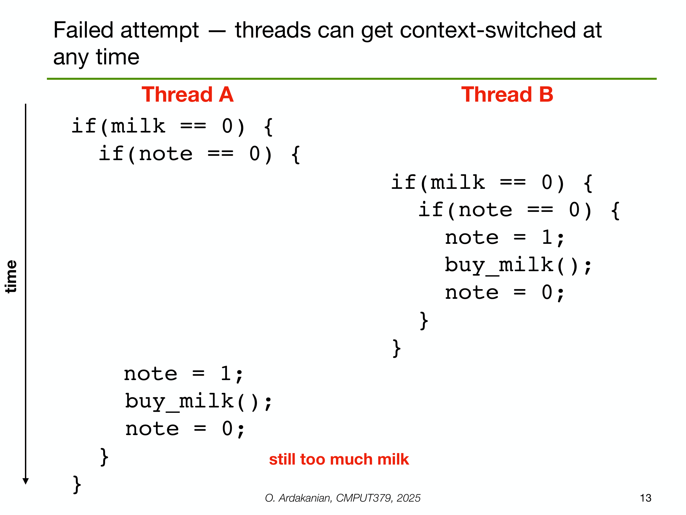

这页是在说明：**“留纸条”方案失败的根本原因是——线程可以在任何时刻被切换（context switch），导致检查与行动分离，产生竞态**。左侧是线程 A，右侧是线程 B，纵轴向下表示时间。

# 发生了什么（按图的交错顺序）

1. **A 执行到检查阶段**
`if (milk == 0) { if (note == 0) {`
—— A 看到“没牛奶、也没纸条”，**还没来得及写 `note=1`** 就被切走了。

2. **切到 B**

* B 也做同样检查：`if (milk == 0) { if (note == 0) {`
* B 看到的 `note` 仍是 0，于是：

```
note = 1;     // 贴纸条
buy_milk();   // 去买
note = 0;     // 回来取纸条
```

—— B 完成了一次购买。

3. **切回 A**
A 从刚才的位置继续执行（它当时“记得” note 是 0）：

```
note = 1;
buy_milk();
note = 0;
```

—— A 也买了一次。

**结果：还是买重了（still too much milk）**。

# 要点

* 问题不在于“写变量是否原子”，而在于\*\*“检查(note==0) → 设置(note=1)”之间不是一个原子步骤\*\*；
只要调度在两者之间切换，另一个线程就会在同样的前提下进入，导致**双重进入临界区**。
* 即使把 `note` 的读写做成原子，也**无法**解决 “check-then-act” 的竞态。
* 现实中还会叠加**内存可见性/重排**问题：B 对 `note` 的更新未必立刻对 A 可见，进一步放大错误。

# 该怎么做

* 使用**正确的互斥协议/原语**让“检查+占位+执行”成为**不可分割**的一次性动作：

* Peterson 算法（双标志 + `turn`）
* 互斥锁/自旋锁、信号量、条件变量
* 或使用库提供的锁/监视器（monitor）

一句话：**因为上下文切换随时可能发生，单一的 `note` 方案无法把“检查到占用”的全过程原子化，所以会失败。**


---

## 第 14 页

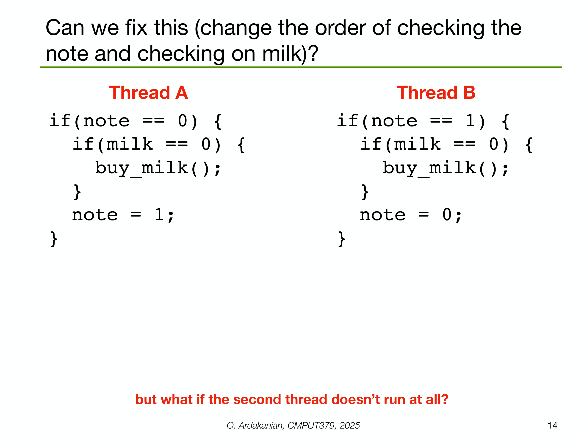

这页在问：**把检查顺序换一换能修好吗？**（先看 note 再看 milk），并给出一个“看似修好、实则翻车”的版本。

# 代码含义（A、B 两个线程）

**Thread A**

```c
if (note == 0) {
if (milk == 0) {
buy_milk();   // A 负责买奶
}
note = 1;         // 事后把 note 置 1
}
```

**Thread B**

```c
if (note == 1) {
if (milk == 0) {
buy_milk();   // B 也可能买奶（极少发生）
}
note = 0;         // B 负责把 note 清回 0
}
```

直观想法：

* A 只在 `note==0` 时行动；B 只在 `note==1` 时行动。
* 似乎能避免两人同时买。

# 实际问题：**活性（progress/liveness）完全靠 B“出手”**

* A 在买完奶之后，**把 `note` 设为 1**，而**只有 B** 会把它清回 0。
* **如果 B 没跑/被卡住**，`note` 会一直是 1。之后就算牛奶没了，A 也因为 `note!=0` **永远不再进入**它的分支；系统陷入**停滞**（没有人再买奶）。
* 幻灯片底部红字正是这个意思：*“如果第二个线程根本没跑怎么办？”* —— 就“饿死”了。

# 这版的性质

* **安全性（safety）**：基本能避免“两人同时买”（因为 B 的购买条件是 `note==1 && milk==0`，而 `note==1` 常常是 A 买完后才设置，此时 `milk!=0`）。
* **活性（liveness）**：**失败**。系统进展依赖于 B 来清旗；一旦 B 不工作，A 也被永久卡住。
* **有界等待**：也无法保证——A 可能永远等不到 `note` 变回 0。

# takeaway

换检查顺序并不能把“检查→占用→执行”变成**不可分割的原子动作**，还引入了对“另一个线程必须出现”的**单点依赖**。
想正确解决，需要**真正的互斥/同步协议**（如 Peterson 算法、互斥锁、信号量、监视器/条件变量等），而不是仅靠一个 `note` 的随意读写。


---

## 第 15 页

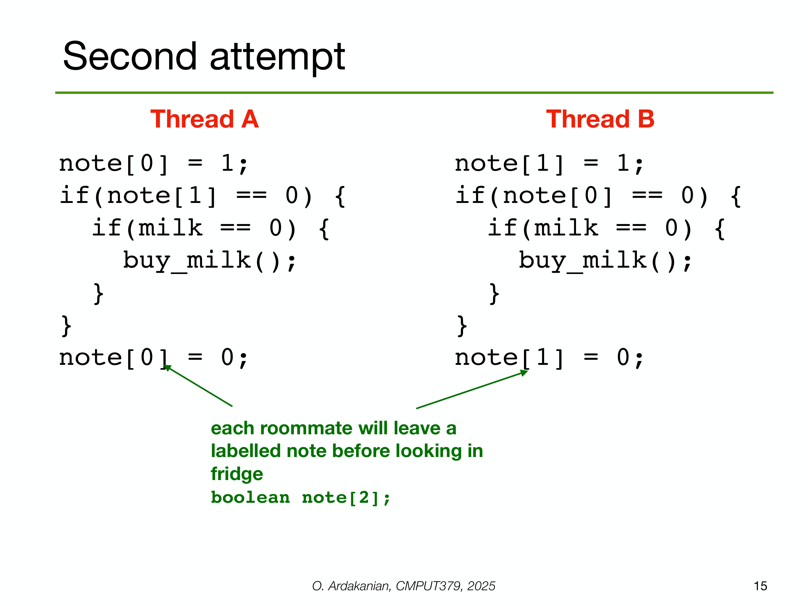

这页是“**第二次尝试**”：给每个室友各自一张标记纸条 `note[0]`、`note[1]`（布尔数组），谁要买奶就先把**自己的**纸条设为 1，再检查**对方**的纸条是否为 0，只有对方没在买时才去买。代码：

**Thread A**

```c
note[0] = 1;                 // 我要去买
if (note[1] == 0) {          // 对方没在买？
if (milk == 0) buy_milk();
}
note[0] = 0;                 // 我买完/放弃，撤条
```

**Thread B**

```c
note[1] = 1;
if (note[0] == 0) {
if (milk == 0) buy_milk();
}
note[1] = 0;
```

## 想要达到的效果

* **安全性（safety）**：只有当“对方不在买（note==0）”时，自己才买——直觉上能避免“两个人同时买”。

## 实际会发生什么

* **仍然可能卡住（活性问题）**：如果 A、B 几乎同时执行：

1. A 设 `note[0]=1`
2. B 设 `note[1]=1`
3. A 看到 `note[1]==1` → 不买，撤条 `note[0]=0`
4. B 看到 `note[0]==1` → 不买，撤条 `note[1]=0`
5. 两人下一轮又**同时**把自己的条设为 1……
这会反复“同时举手—看到对方也举手—同时放下”，**谁也没进临界区**，称为**活锁（livelock）**：大家都在忙，但系统**没有前进**（没有人买到奶）。

* **安全性基本能保证**：因为进入买奶的前提是“对方的 `note` 为 0”，两个线程**不可能**在同一时刻都满足这个条件，所以“两人同时买”的情况基本被避免了。但由于上面的“活锁”，**进展无法保证**。

## 结论

* “两张独立纸条”消除了大部分“同时进入”的风险，但**缺少**一个**决定谁先走的“裁判/让路规则”（tie-breaker）**，所以会活锁、缺少**有界等待/进展**保证。
* 正确做法是在此基础上再加一个\*\*`turn`（轮到谁）**变量：
这就是著名的 **Peterson 算法**（两个线程的正确互斥协议）：每人举旗 `flag[i]=true` 表示想进入，同时把 `turn` 让给对方；只有当“对方也想进且现在轮到对方”时自己等待，否则进入临界区。这样既**安全**又**有进展**且**有界等待\*\*。

> 小结：第二次尝试改善了安全性，却因为没有“公平的让路机制”而可能**活锁**；要修好，需要引入 `turn` 的**公平仲裁**（Peterson）。


---

## 第 16 页

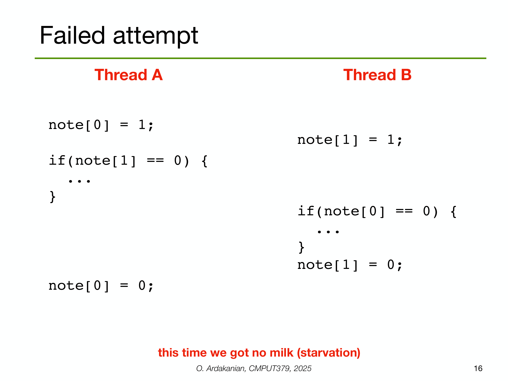

这页是在说明“**第二次尝试（两张便签）仍然会失败**”，失败的方式是**活性问题**：最后**没人买到牛奶（starvation）**。

# 代码回顾

* A：

```c
note[0] = 1;
if (note[1] == 0) { ... buy_milk(); ... }
note[0] = 0;
```
* B：

```c
note[1] = 1;
if (note[0] == 0) { ... buy_milk(); ... }
note[1] = 0;
```

# 为什么会“没有牛奶”？

一个可能的交错（两边几乎同时行动）：

1. A 先把 `note[0]=1`；B 也把 `note[1]=1`。
2. A 检查 `note[1]`，发现是 1 → **不进**临界区；
B 检查 `note[0]`，也发现是 1 → **不进**临界区。
3. A 执行 `note[0]=0`；B 执行 `note[1]=0`；这一轮**谁也没买**。
4. 接下来两人再次重复同样的动作……结果可能一直**重复让路**，系统“忙着让”却**没有任何进展**。

* **安全性（safety）**：基本守住了（不会两人同时买），因为进入条件是“对方便签为 0”。
* **活性（liveness/progress）**：**失败**。可能出现**活锁（livelock）**：双方不停地改自己便签、检查对方便签，但始终不进入临界区；从效果看就是**饥饿（starvation）**——一直买不到牛奶。

> 幻灯片底部 “this time we got no milk (starvation)” 就是在强调：这套协议没有保证“最终一定有人能买”。

# 核心问题

* 只有“各自的 flag（note\[i]）”，**没有打破对称的仲裁**；当两人同时想进时，双方都看到对方也想进，于是都退，让路→再次同时想进……**缺少进展保证与有界等待**。

# 怎么修？

* 在“各自举旗”的基础上，加一个\*\*`turn`（轮到谁）**的打破对称变量——这就是**Peterson 算法\*\*（两线程正确互斥：安全、可推进且有界等待）。
* 或者直接使用成熟的同步原语：**互斥锁、信号量、条件变量**、监视器等。

**一句话**：两张便签避免了“同时买”，但因为没有“谁先走”的规则，会出现双方都不买的情况；要解决，需要**再加一个公平仲裁（turn）或用锁**。


---

## 第 17 页

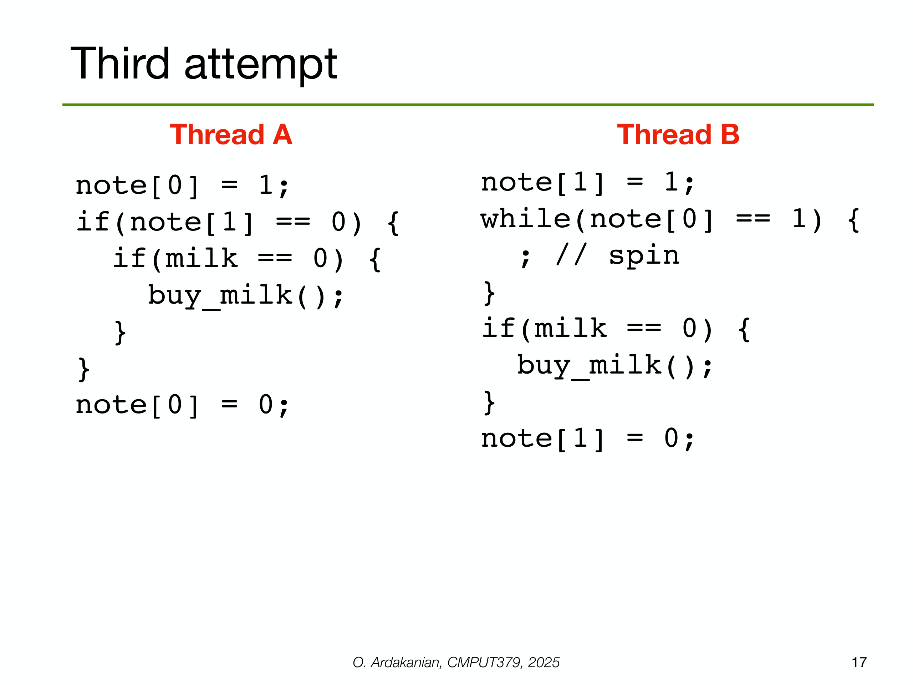

这页是“**第三次尝试**”：在“两张便签（note\[0], note\[1]）”的基础上做了**不对称**的改动，给 **A 优先级**、让 **B 让路并自旋等待**，试图避免之前的“活锁”。

# 代码在做什么

**A 线程**

```c
note[0] = 1;                 // A 表示“我想进”
if (note[1] == 0) {          // 只看一眼 B 是否想进
if (milk == 0) buy_milk();
}
note[0] = 0;                 // A 退出
```

**B 线程**

```c
note[1] = 1;                 // B 表示“我想进”
while (note[0] == 1) { ; }   // 只要 A 想进，就一直让路(自旋等待)
if (milk == 0) buy_milk();   // A 不想进了，B 再试
note[1] = 0;                 // B 退出
```

直觉：

* 如果两人同时想进，B 会看到 `note[0]==1`，**先让 A 进去**；A 做完把 `note[0]=0` 后，B 再继续。
* 这样确实**避免了活锁**（不会双方都不进）。

# 哪些是对的

* **安全性（mutual exclusion）基本满足**：当两人同时想买时，B 会在 `while(note[0]==1)` 里等，A 先买；A 退出后 B 才可能买，所以**不会两人同时买**。
* 避免了上一次“你让我我让你”的活锁。

# 仍然存在的问题

1. **饥饿/无界等待（starvation / unbounded waiting）**

* 这是一个**不公平**的协议：**B 永远在让 A**。
* 如果 A 非常频繁地到达（刚把 `note[0]=0`，立刻又 `=1`），调度器又偏心 A，B 可能**长时间甚至一直**在自旋里，得不到机会（**无界等待**）。
* 幻灯片此处的要点就是：虽然不再“买重”，但**B 可能一直买不到**。

2. **健壮性差**

* 如果 A 崩溃/卡住在 `note[0]=1`，**B 会永远自旋**（死等）。
* 仍没解决**内存可见性/重排**问题（需要内存屏障/原子访问才能严谨）。

3. **效率问题**

* B 的 `while(note[0]==1)` 是**忙等**，空耗 CPU。

# 小结 & 正解提示

* 第三版通过“不对称 + 自旋”解决了**活锁**，却牺牲了**公平与有界等待**，并带来**潜在死等**与**忙等**成本。
* 要真正同时满足：**安全（互斥）+ 活性（可推进）+ 有界等待（公平）**，需要**再加一个打破对称的仲裁变量 `turn`**：
这就是**Peterson 算法**（两线程互斥的经典正确方案）；或者，直接使用**互斥锁/读写锁/信号量/条件变量**等成熟原语。


---

## 第 18 页

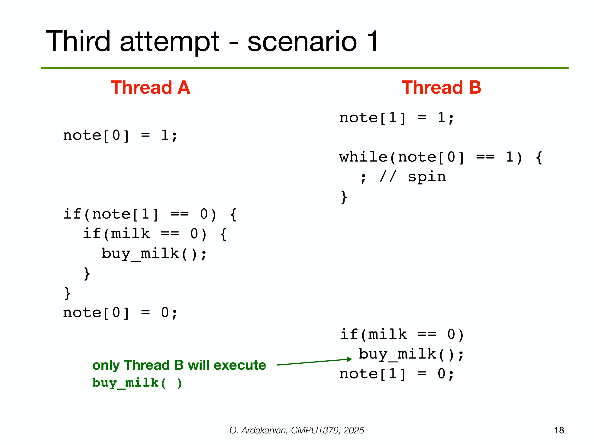

这页在说明**第三次尝试（A 有优先级、B 自旋等待）在“场景 1”下的执行结果**：**只有线程 B 会买奶**，不会发生两人同时买。

# 代码背景（第三次尝试回顾）

* **A**：

```c
note[0] = 1;
if (note[1] == 0) {
if (milk == 0) buy_milk();
}
note[0] = 0;
```
* **B**：

```c
note[1] = 1;
while (note[0] == 1) { ; }   // B 等 A
if (milk == 0) buy_milk();
note[1] = 0;
```

# 场景 1 的交错（按图从上到下）

1. A 先把 `note[0]=1`；B 也把 `note[1]=1`。
2. B 进入 `while(note[0]==1)` **自旋**（因为 A 的 note 现在是 1）。
3. A 继续往下执行，检查 `note[1]`：此时它看到 **`note[1]==1`**，因此 **A 不会买奶**（它的 `if(note[1]==0)` 不成立），随后把 `note[0]=0`。
4. B 的自旋条件现在变为假（`note[0]==0`），跳出循环；若 `milk==0`，**B 执行 `buy_milk()`**，最后 `note[1]=0`。

# 结果与意义

* **只有线程 B 执行 `buy_milk()`**（幻灯片绿色文字）。
* **安全性**：两人不会同时买；B 在等 A，A 又因为看到 `note[1]==1`而放弃进入，因此没有并发进入临界区。
* **但注意**：这个协议总体仍然**不公平**——如果 A 频繁地把 `note[0]`设回 1，B 可能长期在自旋里等待（无界等待/潜在饥饿）。这页只是展示其中一种交错下的“谁买奶”的结果。


---

## 第 19 页

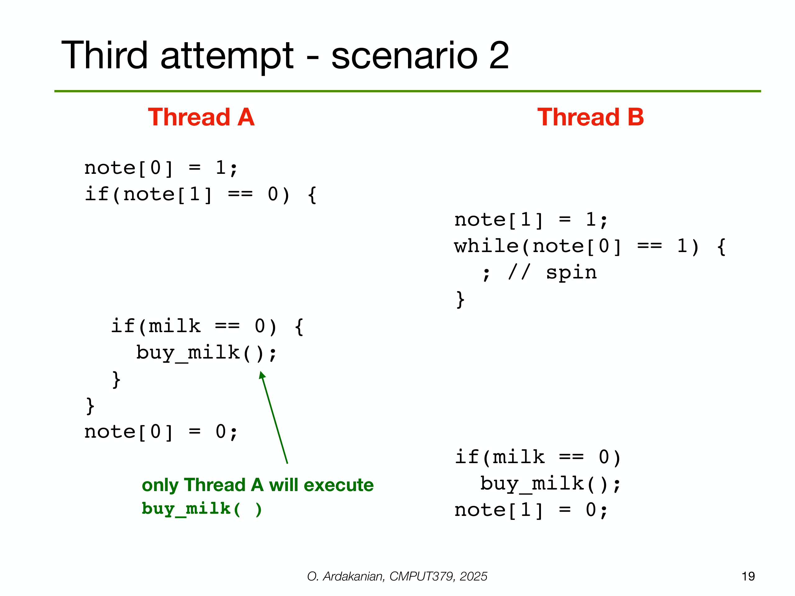

这页展示“**第三次尝试（A 优先、B 自旋）**在**场景 2**下的另一种交错结果”：**只有线程 A 会买奶**。

# 代码回顾

* A：

```c
note[0] = 1;
if (note[1] == 0) {
if (milk == 0) buy_milk();
}
note[0] = 0;
```
* B：

```c
note[1] = 1;
while (note[0] == 1) { ; }   // 自旋等 A
if (milk == 0) buy_milk();
note[1] = 0;
```

# 这一幕的时间顺序（为何只有 A 买）

1. **A 先“举旗”**：`note[0]=1`。
2. **A 立刻检查对方旗**：此时 **B 还没来得及把 `note[1]` 设为 1**，所以 A 看到 `note[1]==0`，进入分支。
3. A 见 `milk==0`，**执行 `buy_milk()`**，随后 `note[0]=0` 退出。
4. 这时 **B 才举旗并自旋**：`note[1]=1; while(note[0]==1){...}`，但很快看到 `note[0]==0` 跳出；由于 A 已经把奶买回来了，`milk!=0`，**B 不会再买**，最后 `note[1]=0`。

# 结论与意义

* 在这种交错下，**A 买奶，B 不买**（绿色文字 “only Thread A will execute buy\_milk()”）。
* 和上一页“场景 1”（只有 B 买）对应起来可见：这个协议保证了**不会两人同时买（安全性）**，但**谁买取决于交错时机**。
* 协议仍**不公平**：如果 A 频繁地把 `note[0]` 设为 1，B 可能长期在自旋里等待（**无界等待/潜在饥饿**），并且一旦 A 挂在 `note[0]=1` 上，B 会**一直自旋**。

> 想要既**安全**又**有进展且有界等待**，需要在两张“便签”基础上再加一个**仲裁变量 `turn`**（Peterson 算法），或直接使用**互斥锁/信号量/条件变量**等成熟同步原语。


---

## 第 20 页

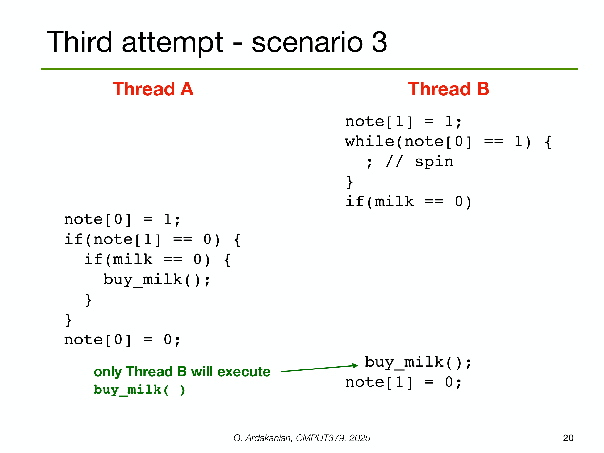

这页展示“**第三次尝试（A 优先、B 自旋）**的**场景 3**”——一种不同的交错顺序，结果依然是：**只有线程 B 会买奶**。

# 代码回顾

* A：

```c
note[0] = 1;
if (note[1] == 0) {
if (milk == 0) buy_milk();
}
note[0] = 0;
```

* B：

```c
note[1] = 1;
while (note[0] == 1) { ; }   // 自旋等 A
if (milk == 0) buy_milk();
note[1] = 0;
```

# 场景 3 的时间线（为何只有 B 买）

1. **B 先举旗**：`note[1] = 1`。
2. **B 检查并自旋**：进入 `while(note[0] == 1)`；此刻可能 `note[0]` 还没设，但随后……
3. **A 才举旗**：`note[0] = 1`（这使得 B 的自旋条件为真，B 持续等待）。
4. **A 检查对方旗**：A 看到 `note[1] == 1`，于是 **不进入买奶分支**；随后执行 `note[0] = 0`。
5. **B 结束自旋并购买**：`note[0]` 变 0，B 跳出自旋；若 `milk == 0`，B 执行 `buy_milk()`，最后 `note[1] = 0`。

\*\*结果：\*\*只有 **B** 执行 `buy_milk()`（幻灯片绿色标注）。

# 这说明了什么

* **安全性**仍成立：不会两人同时买（当 A 想进时 B 会让；A又因看到 B 想进而放弃）。
* **但公平/活性问题仍在**：该协议不对称，**B 可能长期自旋等待**（无界等待/潜在饥饿）；若 A 卡在 `note[0]=1`，B 甚至会永远自旋。

# 要想彻底正确

在“两张便签”的基础上再加一个**仲裁变量 `turn`**（谁先走由 `turn` 决定），形成**Peterson 算法**，即可同时获得：

* 安全（互斥）、
* 活性（能推进）、
* 有界等待（不饿死、有限次让路）。
或直接使用**互斥锁/信号量/条件变量**等成熟同步原语，避免忙等与可见性问题。


---

## 第 21 页

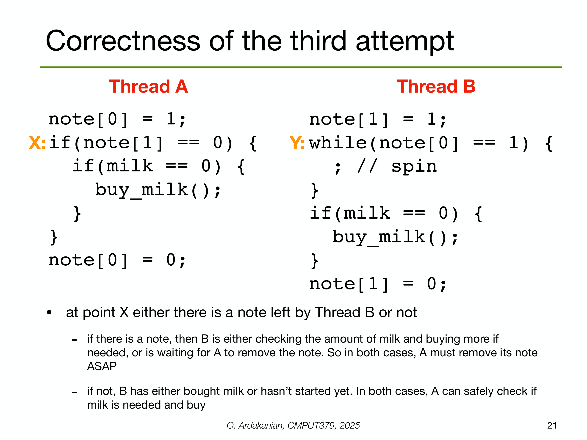

这页在论证**第三次尝试**（A 先举旗，B 自旋等待）在**互斥性（safety）**上是对的，但仍然**不公平/可能饥饿**。

# 代码回顾（标出 X、Y）

**Thread A**

```c
note[0] = 1;
X: if (note[1] == 0) {
if (milk == 0) buy_milk();
}
note[0] = 0;
```

**Thread B**

```c
note[1] = 1;
Y: while (note[0] == 1) { ; }   // 自旋
if (milk == 0) buy_milk();
note[1] = 0;
```

# 思路：分别看 X 与 Y 处系统的可能状态

## 在 X 点（A 正准备检查 `note[1]`）

这里只会有两种情况：

1. **`note[1] == 1`（B 的便签在）**
说明 B **要么正在检查/买奶**，要么**正等 A 把 `note[0]` 放下**（B 在 Y 自旋）。

* 不论哪种，A 都**不能进入**临界区（因为 `if (note[1]==0)` 不成立），随后 A 会把 `note[0]=0`。
* 这保证了 **A 与 B 不会同时买**。

2. **`note[1] == 0`（B 的便签不在）**
说明 B **还没开始**或**已经结束**。

* A 可以**安全地检查 `milk` 并决定是否买**。
* 若 A 买，之后会清 `note[0]=0`；若不买也会清。
* 同样不会与 B 并发进入临界区。

> 结论：以 X 为分界，A 不会与 B 同时处于买奶阶段，**互斥性成立**。

## 在 Y 点（B 在自旋 `while(note[0]==1)`）

* `note[0]==1` 表示 **A 想进入/可能在临界区**；因此 **B 必须等待**。
* 一旦 A 清 `note[0]=0`，B 才能跳出自旋，再检查 `milk`，决定是否买。
* 这也确保 **不可能并发**地执行 `buy_milk()`。

> 因而，A、B 之间始终是“要么 A 买，要么 B 买，要么都不买”，**不会两人同时买**。

# 这套协议的性质

* ✅ **Safety（互斥）**：成立。X、Y 两处的逻辑保证同一时刻最多一个线程能进入“买奶”临界区。
* ⚠️ **Liveness / Progress（可推进）**：**不保证**。若 A 频繁地把 `note[0]` 设回 1，B 可能长期卡在自旋里（进展慢甚至一直等）。
* ⚠️ **Bounded Waiting（有界等待）**：**不保证**。B 可能无限次地看到 `note[0]==1` 而让路，出现**饥饿**。若 A 崩溃停在 `note[0]=1`，B 还会**永远自旋**。
* ⚠️ **效率**：B 的自旋是**忙等**，浪费 CPU；而且在真实多核/编译优化下还需要**原子访问与内存序**来确保可见性。

# 正解提示

要想同时满足 **互斥 + 可推进 + 有界等待**，需要在两张便签的基础上加一个**打破对称的仲裁变量 `turn`**（Peterson 算法）；或者直接使用**互斥锁/信号量/条件变量**等成熟同步原语。


---

## 第 22 页

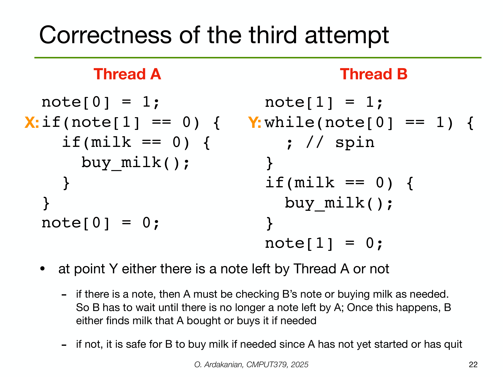

这页继续说明**第三次尝试**（A 先举旗、B 自旋）的**互斥性为什么成立**，但重点换到 **Y 点（在线程 B 视角）** 来看。

# 代码回顾（标出 X / Y）

**Thread A**

```c
note[0] = 1;
X: if (note[1] == 0) {
if (milk == 0) buy_milk();
}
note[0] = 0;
```

**Thread B**

```c
note[1] = 1;
Y: while (note[0] == 1) { ; }   // 自旋等待 A
if (milk == 0) buy_milk();
note[1] = 0;
```

# 在 **Y 点**，系统只可能有两种状态

1. **`note[0] == 1`（A 的便签在）**
这意味着：

* 要么 A 正在**检查 B 的便签/检查牛奶或买奶**；
* 要么 A 还没离开临界区（还没把 `note[0]` 清掉）。
因此 **B 必须等待** 直到 `note[0]` 变为 0（A 离开）。
一旦 `note[0]==0`，B 跳出自旋：
* 不是 A 刚买完（那 `milk!=0`，B 自然不买），
* 就是 A 放弃/没买（那 `milk==0`，B 去买）。
→ 这保证了 **A、B 不会同时买**。

2. **`note[0] == 0`（A 的便签不在）**
说明 A **还没开始**或者**已经退出**。

* 这时 **B 安全地检查 `milk` 并决定是否买**。
* 仍然不会与 A 并发进入临界区。

> 幻灯片下面两条文字就是这个意思：**在 Y 点，要么 A 的便签在（B等），要么不在（B可继续），两种情况下都不会出现并发买奶**。

# 结论

* ✅ **Safety（互斥）**：成立。A 与 B 不会同时执行 `buy_milk()`。
* ⚠️ **Liveness / Bounded Waiting（进展/有界等待）**：依旧**不保证**。如果 A 频繁把 `note[0]` 设回 1，B 可能长时间自旋（潜在饥饿）；若 A 崩在 `note[0]=1`，B 会一直卡住。
* ⚠️ **效率**：B 的 `while` 是忙等，浪费 CPU；真实系统还需考虑内存可见性/指令重排问题。

# 正解提示

想同时满足**互斥 + 可推进 + 有界等待**：

* 用 **Peterson 算法**（两张便签 + `turn` 打破对称），或
* 直接使用库提供的 **互斥锁/信号量/条件变量/monitor**。


---

## 第 23 页

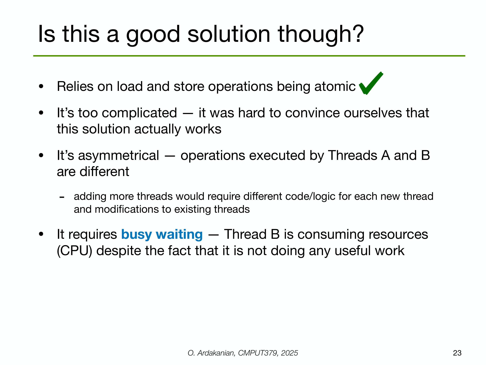

这页在反思：**第三次尝试（A 优先、B 自旋）是不是一个好方案？** 结论：**不是**。原因逐条解释——

1. **依赖“读写是原子的”** ✅
我们默认 `note[i]` 的读/写都是原子动作，且跨核可见。但在真实系统里，还涉及**缓存一致性、指令重排、内存屏障**等问题；单靠普通变量读写，很容易被优化或乱序打破假设。

2. **逻辑太复杂，难以确信正确性**
要通过枚举交错来证明“不会同时买奶”，既繁琐又脆弱。一旦代码稍改或扩展，很可能破功。

3. **不对称（asymmetrical），扩展性差**
A、B 的代码不一样（B 还要自旋让路给 A）。如果要支持\*\*>2 个线程\*\*，需要为每个线程写不同的逻辑，还得改已有线程的代码——**不可维护**。

4. **需要“忙等”（busy waiting）**
B 在 `while(note[0]==1)` 里空转占 CPU，却不做有效工作——浪费资源。在单核或高负载下尤其糟糕；若 A 崩在“举旗”状态，B 还会**一直占着 CPU**。

> 还有隐含问题：**不公平/可能饥饿**（B 可能长期进不去），**无界等待**，以及一旦 A 频繁“举旗”，系统进展受阻。

### 更好的做法

* 理论教学：用 **Peterson 算法**（两张 `flag` + `turn`）可在“两线程”场景下同时满足**互斥、可推进、有界等待**，但仍然是**忙等**，且难扩展到多线程/多核内存模型。
* 工程实践：直接使用操作系统/语言库提供的**互斥锁（mutex）**、**读写锁**、**信号量**、**条件变量**、**监视器（monitor）**等同步原语；或者用无锁结构时配合**原子操作与正确的内存序**。

**一句话**：第三次尝试能避免“同时进”，但**难证明、不可扩展、又浪费 CPU，还不公平**——不是工程上可取的方案。


---

## 第 24 页

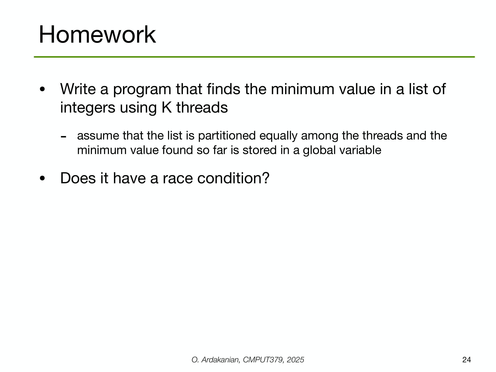

这页作业要你做两件事：

1. 用 **K 个线程**在一个整数数组里找**最小值**（把数组平均分给各线程）。
2. 思考：**把“当前最小值”放在一个全局变量**里，这样写会不会有**竞态条件**？

## 会不会有竞态？

**会**，如果每个线程都直接用下面这种“检查→更新”写法：

```c
// 伪代码（有竞态）
for x in my_chunk:
if (x < global_min)      // 读
global_min = x;      // 写
```

原因：`if (x < global_min)` 与 `global_min = x` 不是原子整体。
典型交错：

* 线程 A、B 同时看到 `global_min=10`；A 的 x=7，B 的 x=5。
* A 判断为真，准备写 7；B 也判断为真，准备写 5。
* 先写入 7，再写入 5 → 结果正确“看起来”是 5；
* 但也可能**先写入 5，再被 7 覆盖**，最后 `global_min=7`（错误）。
→ 这是标准 **check-then-act** 竞态。

---

## 正确实现的几种办法

### 方案 A：每线程局部最小 + 主线程归并（最简单、无锁）

* 每个线程**只在本地变量**里维护 `local_min`，遍历自己分片；
* 所有线程结束后，主线程在一个小数组里做一次顺序最小值（或用同一个线程安全容器收集）。
* 好处：**没有共享写**，天然无竞态；缺点：需要一次合并（但代价很小）。

**伪代码（C/pthreads 风格）**

```c
struct Arg { int *a, l, r; int local_min; };

void* worker(void* p) {
Arg* t = (Arg*)p;
int m = t->a[t->l];
for (int i = t->l+1; i < t->r; ++i) m = (t->a[i] < m ? t->a[i] : m);
t->local_min = m;
return NULL;
}

// 主线程：创建 K 个 Arg，把 [0..n) 均分给它们 -> pthread_join
// 最后在 arg[0..K-1].local_min 上做一次顺序 min 得到答案
```

### 方案 B：全局最小 + 互斥锁保护更新（容易但有锁开销）

```c
int global_min = INT_MAX;
pthread_mutex_t m = PTHREAD_MUTEX_INITIALIZER;

void* worker(void* p) {
int *a = ..., l = ..., r = ...;
for (int i = l; i < r; ++i) {
int x = a[i];
pthread_mutex_lock(&m);
if (x < global_min) global_min = x;
pthread_mutex_unlock(&m);
}
return NULL;
}
```

* 正确（原子性由锁保证），但**每次比较都加锁**开销较大。
* 可优化为：线程先算 `local_min`，**只在结束时**持锁一次把 `global_min = min(global_min, local_min)`。

### 方案 C：原子“取最小”更新（CAS 循环）

* 使用原子变量和 **compare-and-swap** 形成无锁最小值更新：

```c
_Atomic int global_min = INT_MAX;

void atomic_min(int x) {
int old = atomic_load_explicit(&global_min, memory_order_relaxed);
while (x < old &&
!atomic_compare_exchange_weak_explicit(
&global_min, &old, x,
memory_order_acq_rel, memory_order_relaxed)) {
// CAS 失败时 old 已更新为新值，循环重试
}
}
```

* 在遍历中对每个候选 `x` 调用 `atomic_min(x)`；正确且避免大锁，但在很多线程同时命中时会有 CAS 自旋。

---

## 推荐

* **教学/作业首选：方案 A（局部最小 + 归并）**：代码最清晰、**无竞态**、性能也好。
* 想体验同步：用**方案 B（结束时持锁一次）**，几乎没争用。
* 高级玩法：**方案 C（CAS）**，理解原子与内存序。

---

## 一句话答案

* 直接把“当前最小值”放在**全局变量**里并由各线程**随时读写**，**会有竞态条件**；
* 解决：**每线程局部最小再归并**，或用**互斥锁**/**原子 CAS**把“检查→更新”原子化。
