---

## 第 4 页

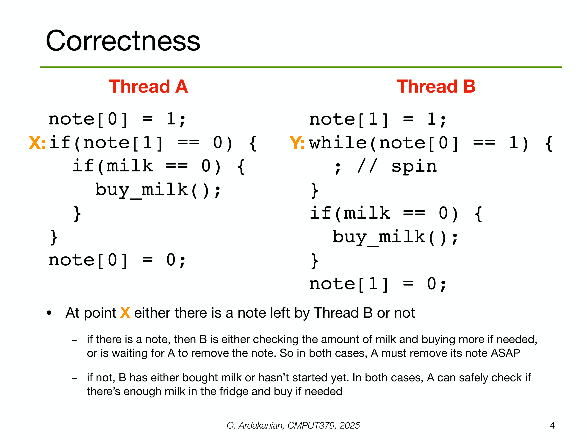

这页是在**证明第三次尝试（A 先举旗、B 自旋）从 A 的视角看为何满足“互斥”**。图里把关键检查点标成 **X**（A 要检查 `note[1]` 之前）和 **Y**（B 在 `while(note[0]==1)` 自旋处）。本页专看 **X 点**。

# 代码回顾（标出 X / Y）

* **A**：

```c
note[0] = 1;
X: if (note[1] == 0) {
if (milk == 0) buy_milk();
}
note[0] = 0;
```

* **B**：

```c
note[1] = 1;
Y: while (note[0] == 1) { ; }  // 自旋等待 A
if (milk == 0) buy_milk();
note[1] = 0;
```

# 在点 X，系统只有两种可能（对应幻灯片的两条小结）

### 情况 1：`note[1] == 1`（B 的便签在）

* 这表示 **B 要么正在检查/买奶，要么正卡在 Y 处等 A 放下便签**。
* 因而 A **不能进入临界区**（`if(note[1]==0)` 不成立），接下来 **A 应尽快把 `note[0]` 清成 0** 让 B 继续。
* 于是**不会出现 A、B 同时买奶**。

### 情况 2：`note[1] == 0`（B 的便签不在）

* 这表示 **B 还没开始** 或 **已经结束**。
* A 现在可以**安全地检查 `milk` 并在需要时买奶**，随后清 `note[0]`。
* 同样**不会并发地两人都买**。

> 结论：无论在 X 点看到 `note[1]` 是否存在，接下来的动作都保证**互斥（safety）**：要么 B 在/将要买，A让路；要么 B 不在，A 安全地买。

# 但仍需注意

* 这个方案虽然**保证互斥**，却**不保证进展/公平**：B 可能长期自旋（忙等、潜在饥饿），A 若一直举旗或挂起，B 会一直卡着。
* 工程上应采用 **Peterson 算法（加 `turn` 打破对称）** 或直接使用 **mutex/信号量/条件变量** 等同步原语。


---

## 第 5 页

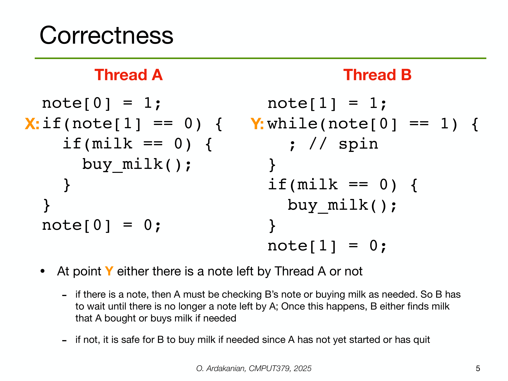

这页是在说明“**第三次尝试**（A 先举旗、B 自旋）**为什么在 B 的视角也能保证互斥**”。图里把关键位置标成 **X**（A 将要检查 `note[1]`）和 **Y**（B 在 `while(note[0]==1)` 自旋处）。本页文字讨论的是 **Y 点**。

# 代码回顾（标出 X / Y）

**Thread A**

```c
note[0] = 1;
X: if (note[1] == 0) {
if (milk == 0) buy_milk();
}
note[0] = 0;
```

**Thread B**

```c
note[1] = 1;
Y: while (note[0] == 1) { ; }   // 自旋等待 A
if (milk == 0) buy_milk();
note[1] = 0;
```

# 在 Y 点只可能有两种情况（因此保证互斥）

1. **`note[0] == 1`（A 的便签在）**
这说明 A 要么正**检查/买奶**，要么还没退出临界区。
→ B **必须等待**到 `note[0]` 变 0；等到 A 撤便签后，B 要么看到奶已被 A 买好，要么（`milk==0`）再去买。
**结论**：A、B 不会同时买。

2. **`note[0] == 0`（A 的便签不在）**
说明 A 还没开始或已经退出。
→ B 可**安全地**检查 `milk` 并在需要时买。
**结论**：同样不会与 A 并发进入临界区。

> 幻灯片下方两条 bullet 就是在阐释这两个分支：在 Y 点要么“要等 A 撤便签”，要么“可以直接去买”，两种情况下都**避免了并发买奶**（互斥性成立）。

# 但它仍不是“好方案”

* **不保证进展/公平（bounded waiting）**：A 频繁举旗时，B 可能长期自旋（饥饿）。
* **忙等**浪费 CPU；若 A 崩在 `note[0]=1`，B 会一直卡住。
* 真实多核还要考虑**可见性/重排**问题。

# 正解提示

要同时满足**互斥 + 可推进 + 有界等待**：

* 理论上可用 **Peterson 算法**（两张 `flag` + `turn` 打破对称）；
* 工程上直接用 **mutex / 读写锁 / 信号量 / 条件变量** 等同步原语。


---

## 第 6 页

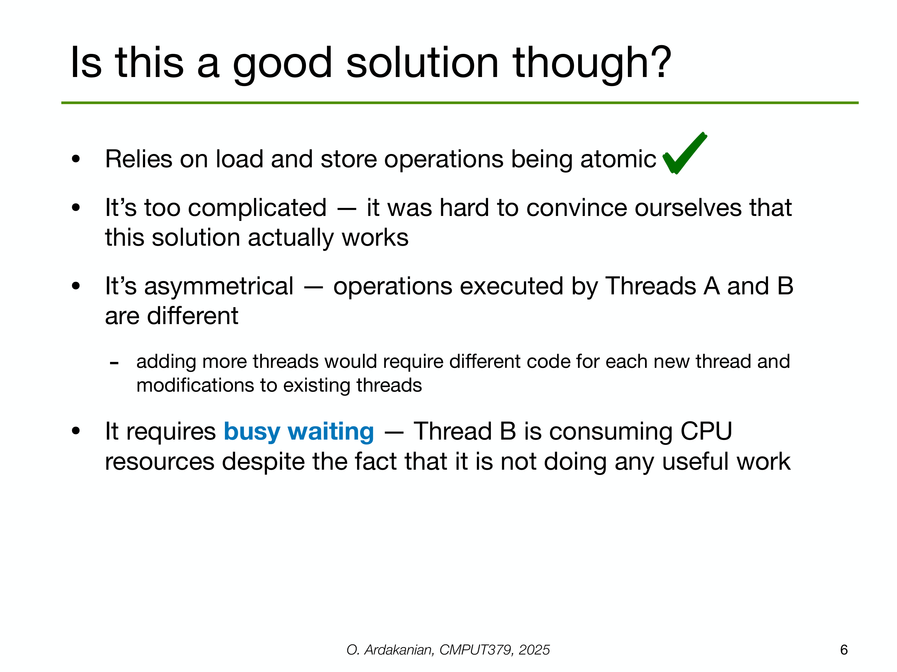

这页在反问：**第三次尝试（A 先举旗、B 自旋）到底是不是好方案？**
结论：**不是**。原因逐条解释——

1. **依赖“读/写是原子的”**（右侧打勾那条）

* 我们假设对 `note[i]` 的加载与存储是原子且立即可见。
* 现实里还涉及缓存一致性、编译器/CPU重排、内存屏障等；单靠普通读写很脆弱。

2. **太复杂，难以确信正确性**

* 需要用大量交错情形去证明“不同时进入临界区”，可读性与可维护性差；稍改就可能破功。

3. **不对称（asymmetrical），扩展性差**

* A 和 B 的代码逻辑不一样（B要自旋等A）。
* 如果增加到多于两个线程，每个线程都要写不同逻辑，还得改已有线程的代码——不可扩展、难维护。

4. **需要“忙等”（busy waiting）**

* B 在 `while (note[0] == 1)` 里空转耗 CPU，却不做有用工作；
* 若 A 挂在 `note[0]=1`，B 会一直自旋；在单核或高负载下尤其糟糕。

**更好的做法**

* 理论版：用 **Peterson 算法**（两张 `flag` + `turn` 打破对称），能满足：互斥、可推进、有界等待——但仍是忙等且只适用于两线程、对内存模型敏感。
* 工程版：直接使用操作系统/语言库提供的 **互斥锁（mutex）/读写锁/信号量/条件变量/监视器**，或在无锁场景使用**原子操作 + 正确内存序**；既正确又易维护，还能避免忙等。


---

## 第 7 页

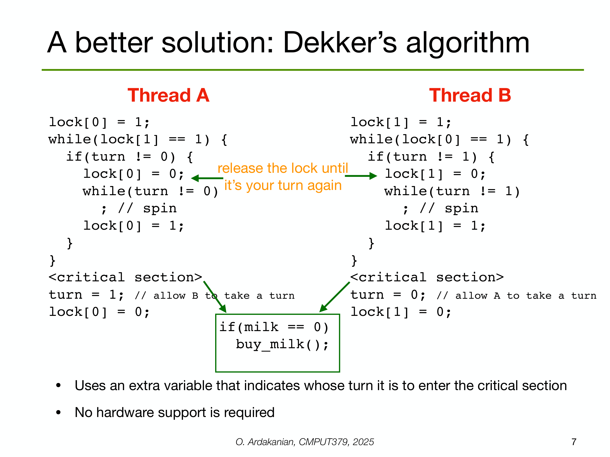

这页给出一个更好的两线程互斥方案：**Dekker 算法**。它在“各自举旗”的基础上，再加一个**轮转变量 `turn`** 来**打破对称**，从而同时保证：

* 互斥（不会同时进临界区）
* 可推进/无死锁（总能有人进去）
* 有界等待/公平（两边轮流，谁也不一直被饿着）

---

# 参与的共享变量

* `lock[2]`：每个线程的**意愿标志**（flag）。`lock[i]=1` 表示线程 *i* 想进入临界区。
* `turn`：**轮到谁**进入临界区（0 或 1）。

---

# 代码读法（左右对称）

以 **线程 A** 为例（B 同理换 0/1）：

```c
lock[0] = 1;                       // 我想进
while (lock[1] == 1) {             // 对方也想进？
if (turn != 0) {               // 不轮到我
lock[0] = 0;               // 让路：先放下自己的意愿
while (turn != 0) ;        // 自旋等待轮到我
lock[0] = 1;               // 轮到我了，再次声明想进
}
}
// —— 临界区 ——（真正的共享操作，比如 if(milk==0) buy_milk();）
turn = 1;                          // 出来时把机会让给对方
lock[0] = 0;                       // 我不想进了
```

**线程 B** 完全对称：把 0/1 调换，临界区结束时 `turn = 0; lock[1] = 0;`。

---

# 它为什么有效？

## 1) 互斥（Mutual Exclusion）

* 如果 A、B **不同时想进**：谁的 `lock` 先置 1，且看到对方 `lock` 为 0，就直接进；互斥自然成立。
* 如果 **两者同时想进**（都置 1）：进入 `while(lock[other]==1)`。此时看 `turn`：

* **不轮到自己**的一方会**主动让路**（把自己的 `lock` 置 0 并在 `turn` 上等待）；
* **轮到的一方**继续前进并进入临界区。
→ 永远不会两人同时跨过 `while`。

## 2) 可推进 / 无死锁（Progress）

* 同时竞争时，**恰有一方继续**（由 `turn` 决定），另一方等待；
* 进入的一方退出时**把 `turn` 让给对方**，保证等待方随后可进；
* 因此不存在“双方都卡着不前进”的局面。

## 3) 有界等待 / 公平（Bounded Waiting）

* 退出临界区的人**把 `turn` 交给对方**，下一次遇到冲突，对方优先；
* 不会出现某一方长期被另一个饿死（在持续冲突时，两边交替进入）。

---

# 和前面“便签方案”的对比

* 仅用 `note/lock`（举旗）会**活锁/饥饿**：两边同时想进时互相让来让去或一方长期被压制。
* **Dekker** 在举旗基础上加了 `turn`，**打破对称**，保证公平与进展。

---

# 代价与注意

* 仍然是**忙等（spin）**：在等待时消耗 CPU（教学用 OK，工程上更推荐 mutex/条件变量）。
* **内存模型**：理论上假设**读写是原子且顺序一致**。在现代多核/编译器优化下，要确保这些共享变量采用**原子访问与适当内存屏障**，否则可能被重排破坏语义。
* 仅适用于**两线程**；多线程扩展复杂（更常用 **Peterson 的 n 线程变体**很麻烦，工程上直接用锁）。

---

**一句话总结**：
Dekker 算法 = “举旗表意愿 + `turn` 轮转仲裁”。它让两线程在**不依赖特殊硬件指令**的前提下，实现**互斥、可推进、且公平**的进入临界区，但存在忙等与实现细节（内存模型）限制。


---

## 第 8 页

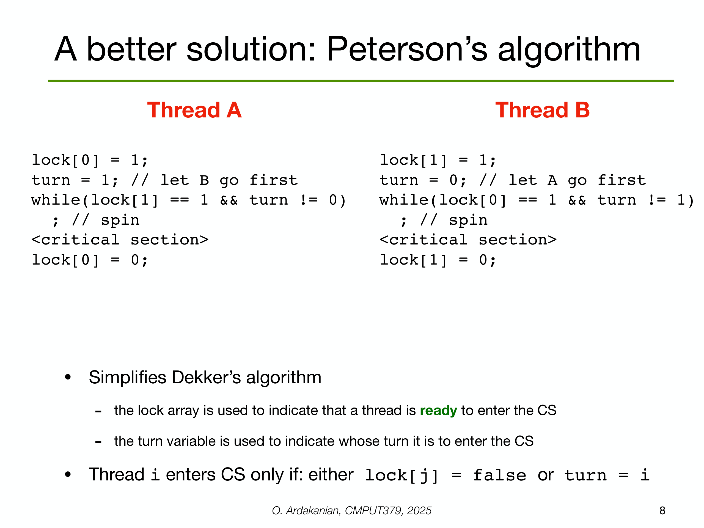

这页是在讲**Peterson 算法**——一个比 Dekker 更简洁的“两线程互斥”方案。它用两样共享变量就能确保**互斥（safety）**、**可推进（progress）**和**有界等待（公平）**：

* `lock[2]`（或叫 `flag[2]`）：第 *i* 个线程是否**准备进入**临界区（`1=true`）。
* `turn`：**轮到谁**先进入（0 或 1），用来在双方同时想进时**打破对称**。

# 代码怎么读

以线程 A（i=0）为例（B 对称，把 0/1 互换）：

```c
lock[0] = 1;           // 我准备进（举旗）
turn = 1;              // 谦让：让对方先来（若对方也想进）
while (lock[1] == 1 && turn != 0) {
;                  // 对方也想进且轮不到我 → 自旋等待
}
<critical section>     // 临界区：对共享数据的操作
lock[0] = 0;           // 退出：放下旗子
```

线程 B：

```c
lock[1] = 1;
turn = 0;
while (lock[0] == 1 && turn != 1) { ; }
<critical section>
lock[1] = 0;
```

> 幻灯片总结：**线程 i 只有在 `lock[j]==false`（对方不想进）或 `turn==i`（轮到自己）时才进入临界区。**

# 为什么有效（直觉证明）

* **互斥**：假设 A、B 同时想进 → 两人都把自己 `lock` 置 1，并把 `turn` 设给对方。最后 `turn` 的值只会是 0 或 1 中一个；

* 若 `turn==0`，A 的等待条件 `lock[1]==1 && turn!=0` 为假，A 进；B 等。
* 若 `turn==1`，B 进；A 等。
→ 不会同时进入。
* **可推进**：若只有一方想进，另一个 `lock` 为 0，等待条件立刻为假，直接进入。若双方竞争，`turn` 让其中一方先进，之后必有人进入。
* **有界等待/公平**：退出时把 `turn` 让给对方。持续冲突时双方**交替**获得进入权，不会饿死。

# 与前面方案相比

* 比“单/双便签”简单且**没有活锁**，比 **Dekker** 更简洁（不需要循环里反复放下/举起 flag）。
* 唯一的等待是短暂自旋（busy wait）；实际工程常用 OS/语言库的 **mutex/条件变量** 代替自旋。

# 实用注意

* 仍是**忙等**：在等待期间消耗 CPU；教学演示 OK，工程推荐用互斥锁等原语。
* **内存模型假设**：需要把 `lock[]`、`turn` 视为**原子变量**并保证读写次序（在 C/C++ 要用原子类型+合适内存序）；否则可能被编译器/CPU重排破坏语义。
* 仅适用于**两线程**；多线程推广复杂，实际开发直接用锁更可靠。

**一句话**：Peterson 算法 = “举旗表意愿 + `turn` 轮流”。在两线程场景下，它用极少的共享状态就实现了**互斥、进展、与公平**。


---

## 第 9 页

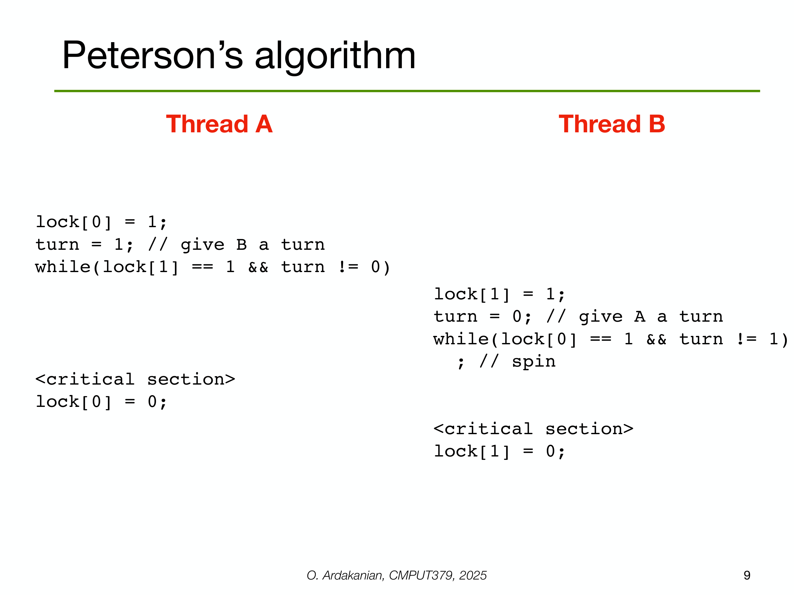

这页是在给出 **Peterson 算法** 的完整两线程版本（A 与 B 对称），用极少的共享变量就能实现**互斥（不会同时进临界区）**、**可推进（总能有人进）**、**有界等待（公平轮流）**。

---

## 共享变量

* `lock[2]`（或 `flag[2]`）：第 *i* 个线程是否**想进入临界区**。`lock[i]=1` 表示“我想进/准备进”。
* `turn`：**轮到谁**进入（0 或 1）。当双方同时想进时，用它打破对称：把机会让给对方。

---

## 代码怎么走（左右对称）

**Thread A（i=0）**

```c
lock[0] = 1;              // 我想进
turn = 1;                 // 让对方优先（若对方也想进）
while (lock[1] == 1 && turn != 0) {
;                     // 对方也想进且现在轮不到我 → 忙等
}
<critical section>         // 临界区
lock[0] = 0;              // 退出：不想进了
```

**Thread B（i=1）**

```c
lock[1] = 1;
turn = 0;                 // 让 A 优先
while (lock[0] == 1 && turn != 1) { ; }
<critical section>
lock[1] = 0;
```

> 进入条件总结：**线程 i 只有在** `lock[j]==0` **（对方不想进）或** `turn==i` **（轮到我）** 时才进临界区。

---

## 为什么有效（直觉证明）

### 1) 互斥（Mutual Exclusion）

* 若只有一方想进，例如 `lock[1]==0`，A 的 `while` 条件为假，A 直接进；B 同理。
* 若**两人同时**设置 `lock[i]=1`：随后双方都把 `turn` 设给对方，`turn` 的最终值只会是 0 或 1 中的一个。

* 若 `turn==0`，A 的等待条件 `lock[1]==1 && turn!=0` 为假 → A 进，B 等；
* 若 `turn==1`，B 进，A 等。
⇒ **绝不可能同时进入**。

### 2) 可推进（Progress）

* 如果临界区外有线程尝试进入，而另一方不想进（对应的 `lock` 为 0），它不会被无故阻塞。
* 双方同时竞争时，`turn` 决定其中一方立刻进入；**不会死锁**。

### 3) 有界等待 / 公平（Bounded Waiting）

* 每次离开临界区把 `turn` **让给对方**。若持续冲突，双方**交替**进入，不会出现一个线程一直进、另一个长期进不去的“饥饿”现象。

---

## 与前面“便签/不对称自旋”的区别

* 便签法只靠 `note`/`lock` 会出现**活锁/饥饿**；
* **Peterson** 在“举旗”外再加 `turn`，**打破对称**，兼顾互斥、进展与公平；而且逻辑更简洁（不需要在循环里放下/再举起标志）。

---

## 工程注意

* 仍是**忙等**（等待时占用 CPU）；真实项目通常用 **mutex/条件变量/信号量/monitor**。
* 要求共享变量的读写具备**原子性与正确的内存可见性/顺序**（在 C/C++ 应使用原子类型与合适的内存序），否则可能被编译器/CPU 重排破坏语义。
* 仅适合**两线程**；多线程版本复杂，工程上直接用锁更可靠。

**一句话**：Peterson 算法 = “举旗表意愿 + `turn` 轮流仲裁”，在两线程场景下，用最简单的手段实现**正确且公平的互斥进入临界区**。


---

## 第 10 页

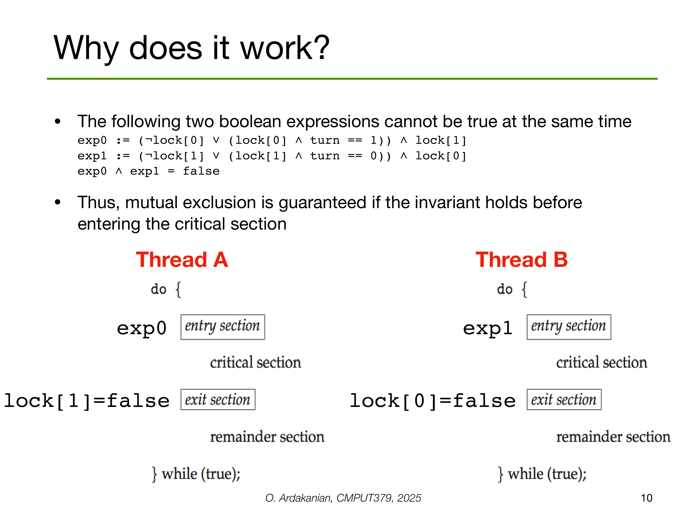

这页在用“**布尔不可能式**”解释：**Peterson 算法为什么一定能保证互斥**。

先回忆两件事：

* `lock[0]`/`lock[1]`（或 `flag[0/1]`）：线程 A/B 是否想进临界区（true=想进）。
* `turn∈{0,1}`：当双方都想进时，**优先让谁**。

进入条件（由 while 条件取反得出）：

* 线程 **A** 能进 ⇔ `¬lock[1] ∨ (turn==0)`
* 线程 **B** 能进 ⇔ `¬lock[0] ∨ (turn==1)`

把“自己想进”也加上（否则没意义），得到两条“进入谓词”：

* `enterA := lock[0] ∧ (¬lock[1] ∨ turn==0)`
* `enterB := lock[1] ∧ (¬lock[0] ∨ turn==1)`

若两线程**同时**进入临界区，就要求 `enterA ∧ enterB` 同时为真。把它展开可分两种情况：

1. 若 `lock[0]` 或 `lock[1]` 有一个为假，那一方根本不想进，与“同时进入”矛盾；
2. 若 **两者都为真**（双方都想进），就必须同时满足
`turn==0`（A 的条件）**且**`turn==1`（B 的条件）。
这是**不可能**的（同一时刻 `turn` 不能同时是 0 和 1）。

因此：

```
enterA ∧ enterB = false
```

也就是幻灯片上的结论：“这两个布尔表达式不可能同时为真 → 在进入临界区之前，互斥必然成立”。

再直观一点：

* **都举旗**时，二人都把 `turn` 让给对方；最终 `turn` 只有一个值（0 或 1），于是**只有被指向的那一方会继续**，另一方在门口自旋。
* **有人退出**时会把 `turn` 让给对方，下次冲突就换对方先进（保证进展与公平）。

这就是 Peterson 算法保证 **互斥** 的核心逻辑。


---

## 第 11 页

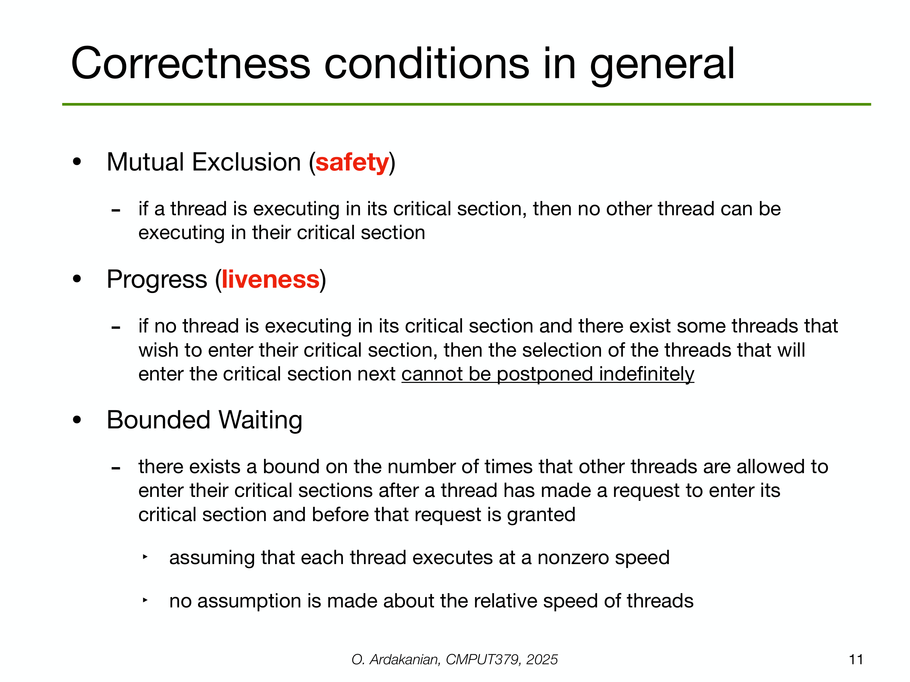

这页总结**并发临界区算法“正确性”的三大条件**，判断一个方案好不好就看它是否同时满足这三点：

# 1) Mutual Exclusion（安全性）

* 含义：**同一时刻最多只能有一个线程在临界区**。
* 直观：防止“同时改同一份共享数据”导致数据损坏。
* 例子：两个人不能同时“在冰箱里放牛奶”。

# 2) Progress（活性）

* 含义：**只要有线程想进临界区，系统就必须做出决定让某个线程尽快进去**，这个决定**不能被无限期拖延**。
* 直观：不能大家都在门口互相谦让或卡住，导致谁也进不去（无进展/活锁/死锁）。

# 3) Bounded Waiting（有界等待 / 公平）

* 含义：**当某个线程提出进入临界区的请求后，允许其他线程在它之前进入的次数是有上界的**；也就是说，请求者不会被**无限期饿死**。
* 假设：每个线程的执行速度>0，但**不假设**它们速度相对如何（快慢不影响公平性要求）。
* 直观：排队要“有限等待”，不能总是被别人插队。

---

**总之：**

* “安全”保证**不会错**，
* “活性”保证**能前进**，
* “有界等待”保证**不偏心**。
像 Peterson 算法在两线程场景下就同时满足这三条；而前面那些“便签方案”往往只满足一部分（如安全）却在活性/公平上翻车。


---

## 第 12 页

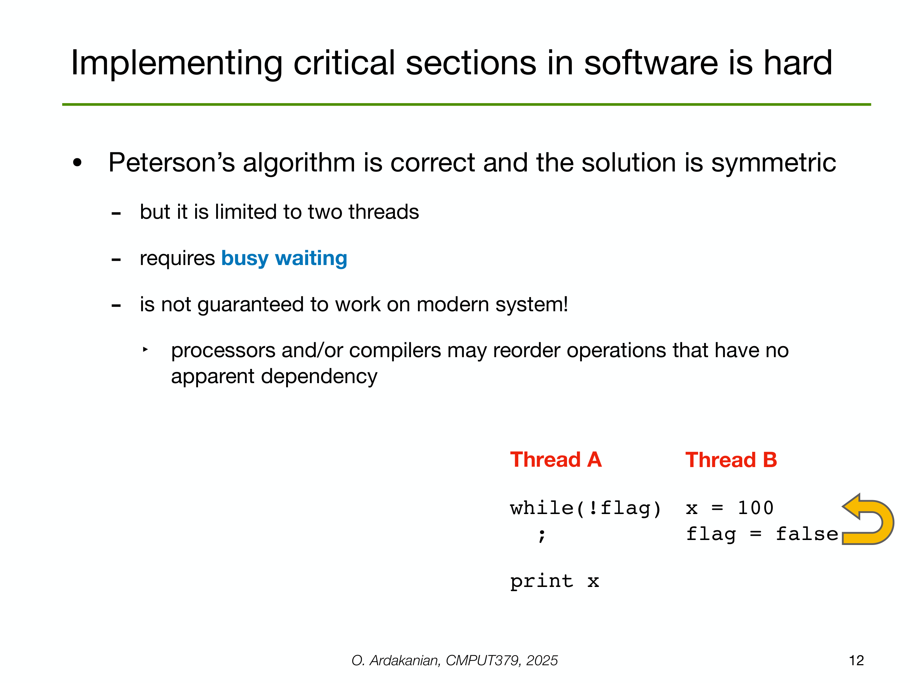

这页讲的是：**只用“软件协议”来实现临界区，其实很难在现代机器上可靠工作。**

# 要点

* **Peterson 算法是正确且对称的**（两线程都用同一段逻辑）。
但它有三个现实问题：

1. **只能用于两个线程**，推广到 N 线程既复杂又脆弱。
2. **忙等（busy waiting）**：等待时空转耗 CPU。
3. **在现代系统上不一定可靠**：因为 **编译器/CPU 可能对无显式依赖的读写做重排序**，破坏我们“按程序顺序执行”的假设。

# 右下角小例子（为什么会出问题）

```
Thread A:                    Thread B:
while (!flag) ;              x = 100;
print x                      flag = false;
```

直觉上：B 先把 `x=100`，再把 `flag=false`；A 只有在 `flag==true` 时才跳出循环并打印 x，所以 A 应该打印 100。

**但在现代 CPU/编译器上可能发生：**

* **写入重排**：B 的两条写操作可能被重排为先写 `flag=false` 再写 `x=100`（因为表面上“互不依赖”）。
* **可见性/缓存**：即使 B 先写了 `x=100`，A 也可能先“看见”`flag=false`，却**还没看到** `x=100` 的新值（缓存/乱序导致）。
* 结果：A 跳出自旋后 **读到旧的 `x`**（例如 0），打印错误值。
* 同理，A 一侧也可能发生**读的重排**或被优化器合并为“反复读取寄存器里的 flag”，导致永远看不到变化。

> 结论：**若不使用“原子变量 + 正确的内存序/栅栏”**，仅靠“普通变量 + 软件协议”容易被重排/缓存打破。

# 工程上的正确做法

* 使用语言/OS 提供的**同步原语**：互斥锁（mutex）、读写锁、条件变量、信号量、监视器等。

* 它们在实现里用到了**硬件原子指令**（如 test-and-set、compare-and-swap、LL/SC）和**内存屏障**，来禁止危险的重排，并保证跨核可见性。
* 如果确实要无锁：

* 用**原子类型**（C/C++ 的 `std::atomic`，Java 的 `Atomic*`）并选择恰当的**内存序**（acquire/release/seq\_cst）；
* 必要时手动插入**内存栅栏**（fence）。

# 一句话

**Peterson 等纯软件算法在教学上很好，但在现代编译器/多核内存模型下并不“天然可靠”。** 工程实践里，应依赖**原子指令 + 内存模型**或直接使用**互斥/条件变量**等成熟同步原语来实现临界区。


---

## 第 13 页

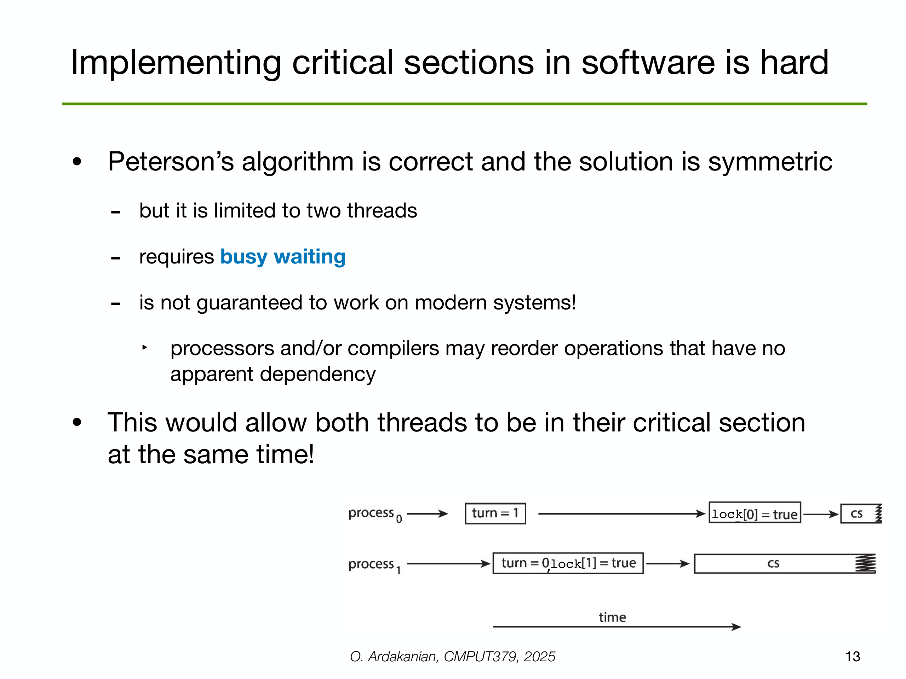

这页继续强调：**只用“纯软件协议”（如 Peterson）在现代系统上并不可靠**，因为**指令/内存重排**会破坏它的关键不变式，从而**让两个线程同时进临界区**。

# 主要观点

* Peterson 算法“理论上正确、左右对称”，但：

1. 仅适用于**两线程**；
2. 需要**忙等**；
3. **在现代 CPU/编译器上不一定成立**：对看起来“彼此无依赖”的读写，编译器和/或处理器可能**改变可见顺序**（reorder），或写回延迟，导致另一核看到的顺序不是程序代码的顺序。

# 下方时间线图在说明什么？

Peterson 的入口代码理想顺序是：
`lock[i] = true;  turn = j;  while (lock[j] && turn != i) ;`

但如果发生**写重排/可见性延迟**，两线程可能被观察为：

* **process₀**：先对外**可见** `turn = 1`，再可见 `lock[0] = true`，然后直接进 CS；
* **process₁**：先对外**可见** `turn = 0`，再可见 `lock[1] = true`，然后也进 CS。

此时两边在各自检查条件时看到的是：

* `lock[other] == false`（因为对方的 `lock` 还没“可见”），
* 无论 `turn` 是多少，`while(lock[other]==1 && turn!=self)` 的**左半边为假**，整个条件为假；
→ **两边都通过检查**，于是**同时进入临界区**——互斥性被破坏。

这正是图中两条时间线同时进入 “cs” 的原因：**写 `turn` 被提前、写 `lock` 被延迟/晚可见**。

# 现实中的正确做法

* **不要指望普通变量**遵守“程序次序即可见次序”。
* 用语言/库提供的**同步原语**（mutex、读写锁、条件变量、信号量、monitor），这些原语内部会使用**硬件原子指令 + 内存屏障**来禁止危险的重排并保证跨核可见性。
* 若一定要无锁/软件协议：

* 把 `lock[]`、`turn` 声明为**原子类型**（如 C/C++ 的 `std::atomic`、Java 的 `volatile`/`Atomic*`），
* 并使用**恰当的内存序**（至少 acquire/release，最好 `seq_cst`）来约束读写顺序与可见性。

**一句话**：在现代多核+优化编译器环境下，像 Peterson 这样的“纯软件互斥”若不配合**原子与内存屏障**，会被重排击穿，甚至**两线程同进临界区**；工程上应使用标准锁或带正确内存语义的原子操作。


---

## 第 14 页

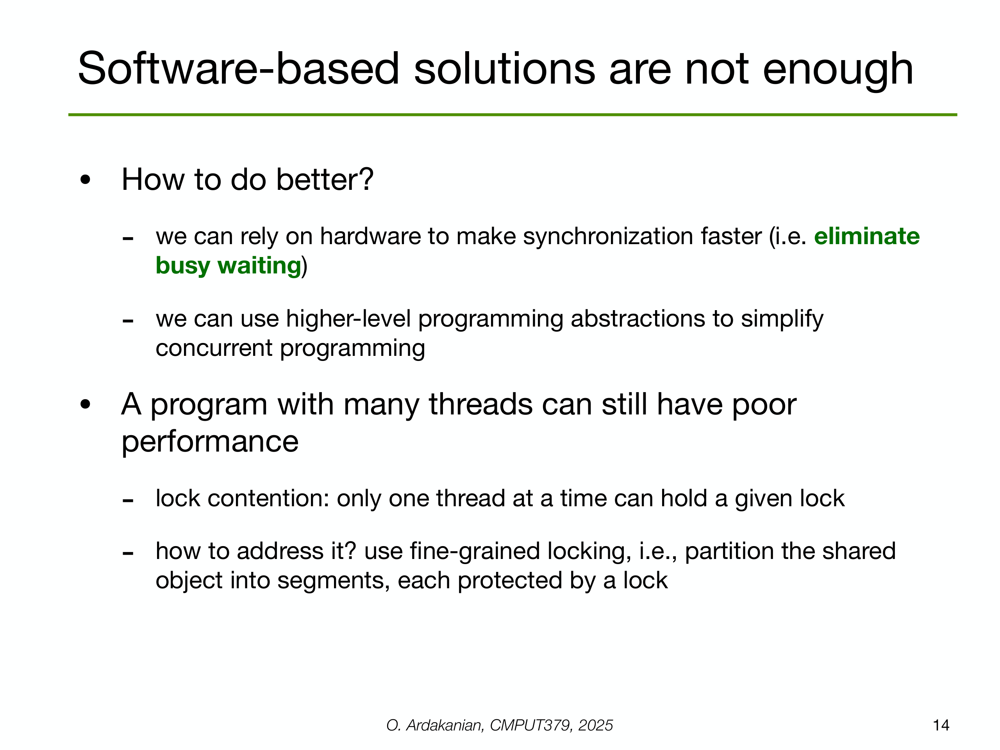

这页的主旨：**光靠“纯软件协议”不够**。在现代系统里，要想既正确又高效地实现临界区/同步，需要**依赖硬件与更高层抽象**；同时，即便线程很多，**性能也可能很差**，要用合适的策略缓解。

# 为什么“软件方案不够”

* 纯软件协议（Peterson、Dekker…）容易被**内存重排/可见性**击穿，而且通常需要**忙等（busy waiting）**，白白烧 CPU。
* 更好的做法：

* **依赖硬件**：用 CPU 提供的原子指令（CAS、xchg、LL/SC）和 **内存屏障**；操作系统/运行时据此实现**阻塞型**同步原语（避免忙等），如 `mutex`、`semaphore`、`condition variable`、`futex`、`park/unpark` 等。
* **用更高层抽象**：语言/库的并发结构（监视器 monitor、通道 channel、线程池、任务/期约、actor、消息队列等）把底层细节封装，写法更简单也更不易错。

# 线程多 ≠ 性能高

* **锁竞争（lock contention）**：同一把锁一次只能一个线程持有，其他线程会阻塞或自旋，吞吐下降、延迟增大。
* **如何缓解**

* **细粒度加锁（fine-grained locking）**：把“一个大共享对象”切分为多个片段/桶（shard/bucket），**每段各自一把锁**，提升并行度（如分段哈希表）。
* **读写锁（RWLock）**：读多写少的场景允许并发读、写时独占。
* **锁分离/锁耦合**：链表/跳表等按节点或层级加锁，减少热锁。
* **无锁/低锁**：用原子操作实现无锁队列、RCU 等，或减少共享可变状态（消息传递、数据分片）。
* **减少临界区**：把与共享状态无关的计算移出锁内，缩短持锁时间；避免在锁内做 I/O/阻塞操作。
* **线程池**：限制并发度、避免过度创建线程引发调度开销与竞争。

**一句话**：想“更好地做同步”，就**用硬件原语 + 阻塞型锁/条件变量**来消灭忙等，并用\*\*合理的并发设计（细粒度锁/读写锁/分片/线程池/无锁）\*\*来减少竞争、提升吞吐。


---

## 第 15 页

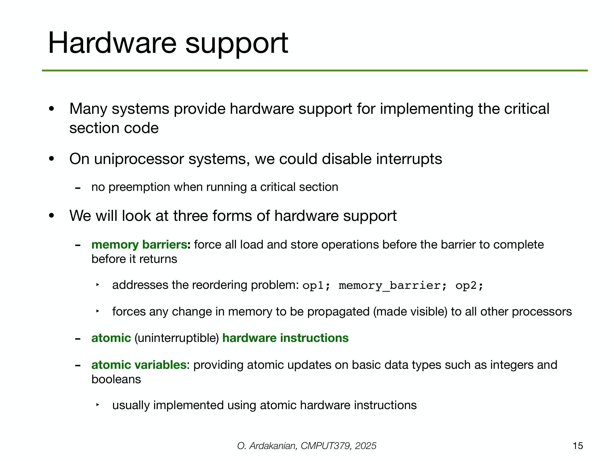

这页讲：**要把临界区（critical section）做对做快，离不开硬件支持**。纯软件协议容易被编译器/CPU 的重排和缓存可见性“坑”到；而硬件提供的原语能让同步既正确又高效。

# 总览

* 许多系统都提供**硬件级支持**来实现临界区。
* **单处理器**上（历史做法）：在进入临界区时**关中断**，这样期间不会被抢占；临界区执行完再开中断。（多核环境行不通，因为别的核还在跑。）

# 三类关键硬件支持

## 1) 内存屏障 / 栅栏（memory barriers / fences）

* 作用：**禁止指令/内存访问重排**，并**刷新内存可见性**。
写法抽象：`op1; memory_barrier(); op2;`
含义：在栅栏返回前，**栅栏之前的所有读写必须完成并对其他处理器可见**，栅栏之后的读写不能被提前。
* 解决的问题：

* 编译器/CPU 把看似无依赖的读写**重排**；
* 多核之间的**缓存可见性**延迟。
* 常见种类：**acquire/release/seq\_cst**（在 C/C++ 原子内存序或 Java `volatile` 语义里体现）。

## 2) 原子硬件指令（atomic hardware instructions）

* 这些指令在硬件层面**不可中断**，一次性完成“读-改-写”。常见有：

* **Test-and-Set**（TAS）
* **Compare-and-Swap**（CAS / CMPXCHG）
* **Fetch-and-Add/Sub/Or/Xor**
* **Load-Linked/Store-Conditional**（LL/SC，RISC 架构常见）
* 用途：自旋锁、无锁栈/队列、计数器等的基石；配合内存屏障就能构建更高层同步原语（mutex、semaphore、condvar）。

## 3) 原子变量（atomic variables）

* 语言/库层面的抽象：对整型、布尔等**提供原子更新与内存序语义**（比如 C++ `std::atomic<T>`、Java `Atomic*` / `volatile`）。
* 底层通常由**原子指令 + 合适的内存屏障**实现。
* 好处：写法安全、跨平台一致，避免手写易错的内联汇编或栅栏。

# 小结 & 何时用什么

* **只靠普通变量+软件协议不稳**：会被重排/可见性击穿。
* **正确姿势**：用**原子变量/原子指令**实现关键更新，用**内存屏障**保证顺序与可见性；更常见的是直接使用 OS/语言提供的**互斥锁、读写锁、信号量、条件变量**——这些原语内部已经替你处理好了上述细节。
* **多线程性能**仍要靠设计：缩短临界区、细粒度加锁、分片/分桶、读写锁、或无锁结构，减少锁竞争。


---

## 第 16 页

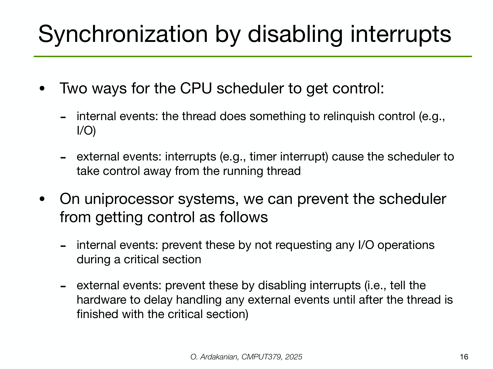

这页讲的是一种“**用关中断来做同步**”的老办法，以及它只在\*\*单处理器（uniprocessor）\*\*上才说得过去。

# 调度器怎么打断正在运行的线程？

* **内部事件（internal）**：线程自己让出 CPU，比如执行阻塞的 I/O、sleep、yield 等。
* **外部事件（external）**：**中断**触发（如定时器中断、设备中断），内核调度器被唤醒，把 CPU 抢走。

# 单处理器上如何“保证我执行临界区不被打断”

思路：**只要调度器拿不到控制权，我就不会在临界区被切走**。

* 对**内部事件**：在临界区里别做会阻塞/让出的操作（别发起 I/O、别 sleep/yield）。
* 对**外部事件**：**暂时关闭中断**（disable interrupts）。等临界区执行完，再开中断。这样外部中断不会发生，调度器也就无法抢占你。

> 直观：单核只有一个执行点；你不让自己让出 + 不让中断打断 ⇒ 在这段时间里必然是你在运行，因此“互斥”自然成立。

# 适用范围 & 局限（为什么今天很少这么做）

* ✅ 只在**单核内核态**的小临界区里偶尔用（例如非常底层的驱动/内核临界段）。
* ❌ **多核**无效：你关的是**本核**的中断，**别的核**仍可并行运行并访问同一共享数据。
* ❌ 用户态通常**不能关中断**（权限不足、危险）。
* ❌ 关中断时间过长会丢失/延迟外设事件，影响实时性与系统响应。
* ❌ 不能包含阻塞或长时间操作（否则系统“失聪”）。

# 更好的现代做法

在多核与用户态程序里，用**互斥锁、读写锁、信号量、条件变量**等；这些原语基于**原子指令 + 内存屏障**实现互斥与可见性，而不是靠“禁止调度”。


---

## 第 17 页

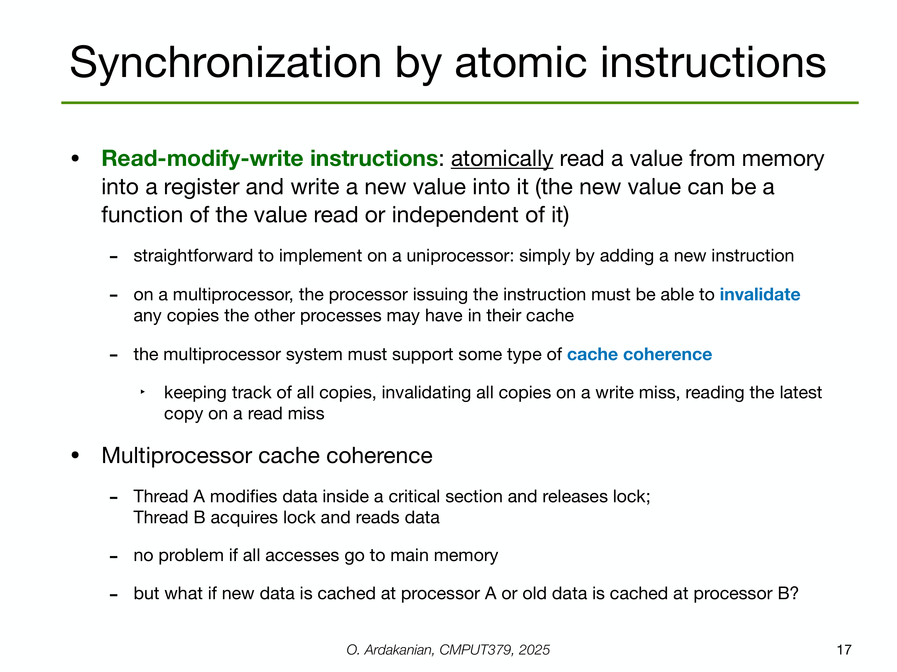

这页讲的是：**用“原子读–改–写（Read–Modify–Write, RMW）指令 + 缓存一致性”来做并发同步**，以及为什么在**多处理器**上必须考虑**缓存一致性（cache coherence）**。

# 1) 原子 RMW 指令是什么？

* 把“读内存→计算→写回”**一次性、不可中断**地完成的硬件指令。
* 典型例子：**test-and-set、compare-and-swap（CAS）、fetch-and-add** 等。
* 作用：可以在**一个原子步骤**里抢占/释放锁或更新共享计数器，从而实现互斥/同步。

**单核**好实现：只需一条新指令就能保证原子性。
**多核**难点：执行 RMW 的那个核必须让**其他核的缓存副本失效（invalidate）**，保证大家看到同一份最新值。

# 2) 为什么需要“缓存一致性（cache coherence）”？

多核都有各自的 L1/L2 缓存。如果：

* A 在线程的临界区里修改了共享数据并**释放锁**；
* B 随后获取锁并读取同一数据；
那么如果**没有一致性协议**：
* A 的新值可能**只在 A 的缓存**里，尚未对外可见；
* B 可能从**自己缓存的旧副本**读到**陈旧值**。
→ 这会破坏同步的语义（即“拿到锁就应看到前一个持锁者的更新”）。

**一致性协议（如 MESI）要做的事：**

* 跟踪每块缓存行在哪些核有副本；
* **写入时失效**其他副本（写命中/写回同步）；
* **读缺失时拿到最新版本**；
* 配合原子指令，保证 RMW 对所有核“看起来像一次瞬时的读改写”。

> 小结：**原子指令保证“这个位置的更新是不可被打断”**，**缓存一致性保证“这个更新能被其他处理器看到且不会读到旧值”**。

# 3) 还要注意“内存顺序/屏障”

即使一致性保证“最新值可见”，**指令重排**仍可能改变**先后关系**（例如先释放锁、后写数据被重排）。因此同步原语通常还会配合\*\*内存屏障（acquire/release/seq\_cst）\*\*来约束读写顺序，确保：

* **释放锁（release）之前的写**先对外可见；
* **获取锁（acquire）之后的读**看到这些写。

# 4) 这页的结论

* **同步靠两件硬货**：原子 RMW 指令 + 缓存一致性（再加上恰当的内存屏障）。
* 在多核上，如果没有一致性，**即使用了原子指令，线程仍可能看到旧数据**，导致错误。
* 因此现实中我们使用语言/OS 提供的**mutex/信号量/条件变量**等，它们内部已经正确地使用了这些硬件机制与内存序。


---

## 第 18 页

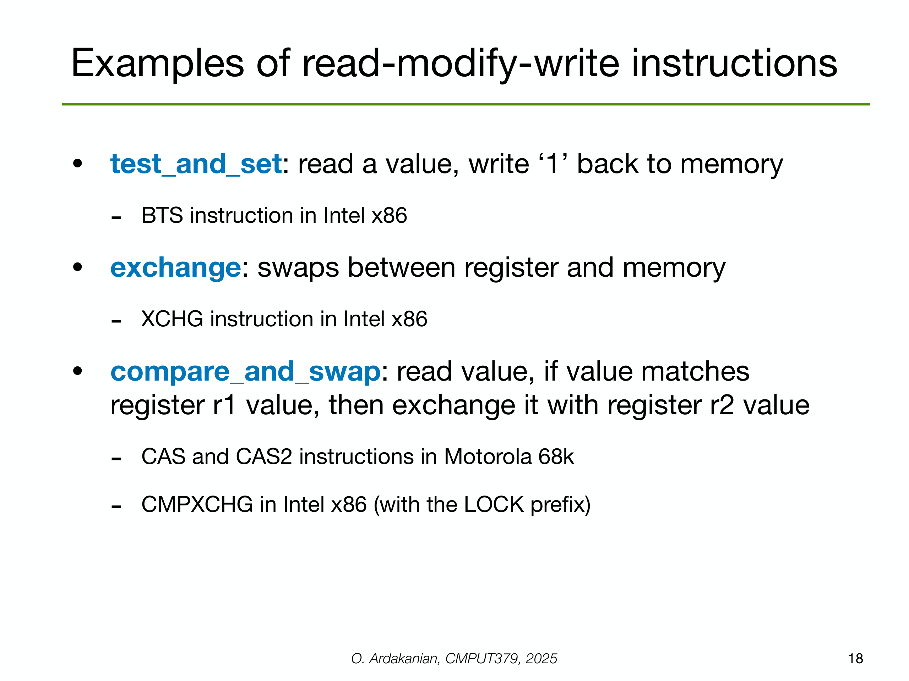

这页列举了几种常见的**原子“读-改-写”（Read-Modify-Write, RMW）指令**，它们能把“从内存读值→基于该值计算→把新值写回”这一串动作**一次性、不可被打断**地完成，是实现锁、无锁结构等并发原语的硬件基础。

# 三类指令举例

1. **test\_and\_set（测试并置位）**

* 作用：从内存读取一个位/字并**返回旧值**，同时把该位置为 **1** 再写回。
* 用途：实现最简单的自旋锁（如果返回的旧值是 0，说明之前没人持有；返回 1 则表示锁已被占用）。
* x86 对应：`BTS`（配合 `LOCK` 前缀常用于原子操作）。

2. **exchange（交换）**

* 作用：**寄存器与内存**之间做原子交换（swap）。
* 用途：也可实现自旋锁：把 1 放在寄存器里，与锁变量做 `XCHG`；若返回的是 0 表示锁原先空闲。
* x86 对应：`XCHG`（与内存操作天然是原子的；常见实现会带 `LOCK` 以确保多核一致性）。

3. **compare\_and\_swap / compare\_exchange（比较并交换，CAS）**

* 作用：读内存值，与寄存器 r1 的期望值比较；如果**相等**，就把寄存器 r2 的新值**写回**该内存，并返回“成功”；否则不写回，返回“失败”（同时把读到的实际值放回期望寄存器，便于重试）。
* 用途：无锁栈/队列、原子计数、原子最小值等；也是多数高层原子库的基石。
* 实现：Motorola 68k 的 `CAS/CAS2`；x86 的 `CMPXCHG`（通常带 `LOCK` 前缀以保证跨核原子性和缓存一致性）。

# 小结

* 这些 RMW 指令都保证**单条原子化**的读-改-写，因此别的线程/CPU **不可能**在读和写之间插队。
* 在多核环境中，它们通常配合 **`LOCK`/缓存一致性协议** 和 **内存屏障（acquire/release/seq\_cst）** 使用，才能既保证**原子性**又保证**可见性与正确顺序**。
* 上层库（如 `std::atomic`、Java `Atomic*`）就是在这些硬件能力之上构建出来的。


---

## 第 19 页

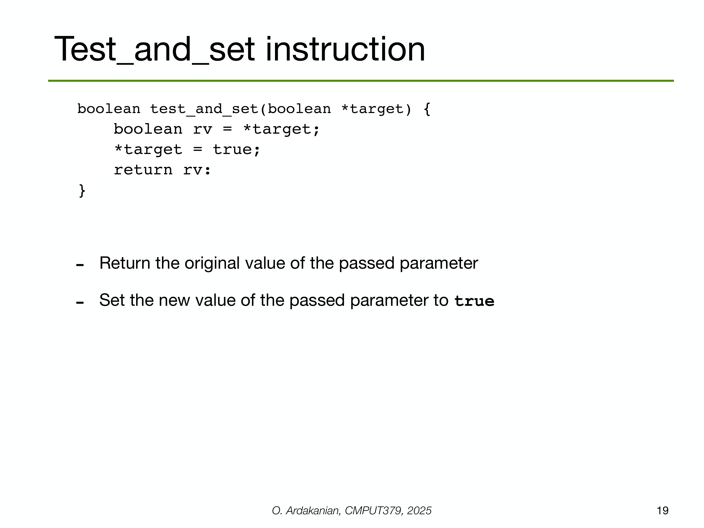

这页在讲\*\*`test_and_set` 指令\*\*（经典的“读—改—写”原子指令），以及它的语义。

# 它做了什么？

伪代码（幻灯片左侧）：

```c
boolean test_and_set(boolean *target) {
boolean rv = *target;  // 先把旧值读出来
*target = true;        // 再把内存里的值原子地置为 true
return rv;             // 返回“旧值”
}
```

**两点要义：**

1. **返回旧值**（调用时内存中原来的值）。
2. **原子地把目标位置为 `true`**。整个过程对其他处理器/线程来说是**不可分割**的一步。

> “原子”意味着：不会出现别的线程在读和写之间插队；要么看到旧值，要么看到新值，不会看到中间状态。

# 常见用途：自旋锁

把 `lock` 初始设为 `false` 表示空闲：

```c
// acquire
while (test_and_set(&lock) == true) {
; // busy wait：有人持有就自旋
}
// 临界区
...
// release
lock = false;
```

* 第一个调用 `test_and_set` 的线程会得到 `false`（旧值），并把锁置为 `true` → 获得锁。
* 其他线程调用时返回 `true`，在循环里自旋等待。

# 优点

* 简单，能用极少代码构建最小的互斥机制。
* 在硬件上有直接支持（x86 可用 `LOCK BTS` / `XCHG` 等实现）。

# 局限/注意

* **忙等（busy waiting）**：获取不到锁的线程会空转占 CPU。
* **可能饥饿/不公平**：没有排队顺序，某些线程可能长期抢不到。
* **缓存抖动**：多核上不断对同一缓存行写 `true` 会产生大量一致性流量。
* **内存顺序**：释放前要确保临界区写入对后续获锁者可见，通常需要**release** 语义；获取时需要 **acquire** 语义（高层语言用 `atomic_flag` / `std::atomic<bool>` 的 `test_and_set` / `clear` 已内建这些语义）。

# 更现代的替代/改进

* **ticket/queue 自旋锁**（公平队列化，减少饥饿）。
* **自旋 + 休眠**（自旋一段时间后阻塞，减少 CPU 浪费），内核里常见的 **futex**。
* 用 **CAS（compare-and-swap）** 实现更灵活的无锁结构或“自旋-退避”策略。
* 用户态应用优先使用库提供的 **mutex/condition variable**，内部已处理原子性与内存屏障问题。

**一句话**：`test_and_set` 原子地“读旧值并将其置真”。它是构建自旋锁等同步原语的最基础砖块，但要注意忙等、可见性和公平性问题。


---

## 第 20 页

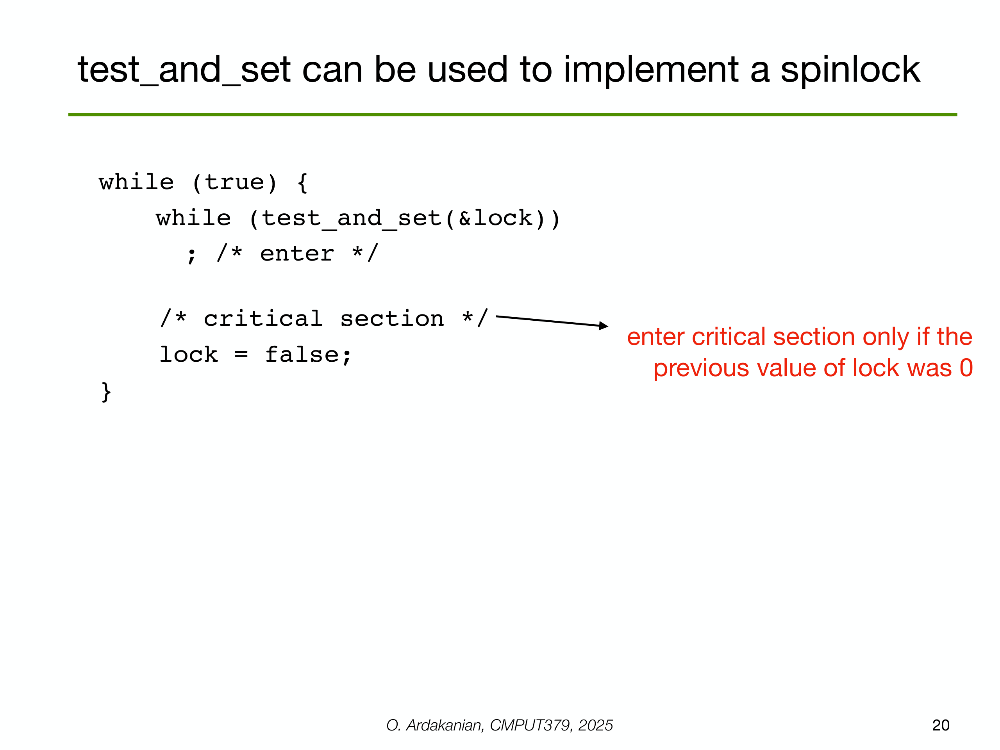

这页在说明：**用 `test_and_set` 指令就能实现一个自旋锁（spinlock）**，以及它的工作条件。

# 代码含义

```c
while (true) {
while (test_and_set(&lock))
;                 // 忙等，自旋等待锁变为可用

/* critical section */ // 只有拿到锁的线程才能执行
lock = false;          // 释放锁
}
```

* `lock` 初始为 `false`（空闲）。
* `test_and_set(&lock)` 是**原子**操作：返回 `lock` 的旧值，并把 `lock` 设成 `true`。

* 如果旧值是 **0/false**：说明之前没人持有锁，**当前线程获取成功**，跳出内层 `while` 进入临界区。
* 如果旧值是 **1/true**：说明有人持有锁，当前线程就在内层 `while` **自旋等待**（不断重试）。
* 临界区执行完后，`lock=false;` 释放锁，唤醒其他在自旋的线程去竞争。

> 右侧红字“only if the previous value of lock was 0” 就是在强调：**只有当锁上一刻是 0** 的线程才会进入临界区。

# 特性与问题

* ✅ **简单**、依赖硬件原子性即可实现互斥。
* ⚠️ **忙等**：等待者空转占 CPU（高并发/长临界区时浪费严重）。
* ⚠️ **不公平/可能饥饿**：没有排队顺序，可能总是某些线程“抢得到”。
* ⚠️ **缓存抖动**：许多线程不停把同一缓存行写为 `true`，一致性流量大。
* ⚠️ **内存顺序**：获取锁需要 **acquire** 语义，释放锁需要 **release** 语义（实际用 `std::atomic_flag::test_and_set/clear` 或平台锁来保证）。

# 常见改进

* **test–test–and–set**：外层先普通读 `while(lock) ;`，只有看到 `lock==false` 才做 `test_and_set`，降低总线写流量。
* **指数退避（backoff）**：失败后 sleep/yield 随机退避，减少竞争。
* **队列自旋锁（ticket/MCS）**：公平排队，减少饥饿与抖动。
* **自旋+阻塞**：自旋一小会儿后用 futex/条件变量阻塞，节省 CPU。
* **直接使用库的 mutex**：内部已处理原子性、内存屏障和公平性，工程上更合适。


---

## 第 21 页

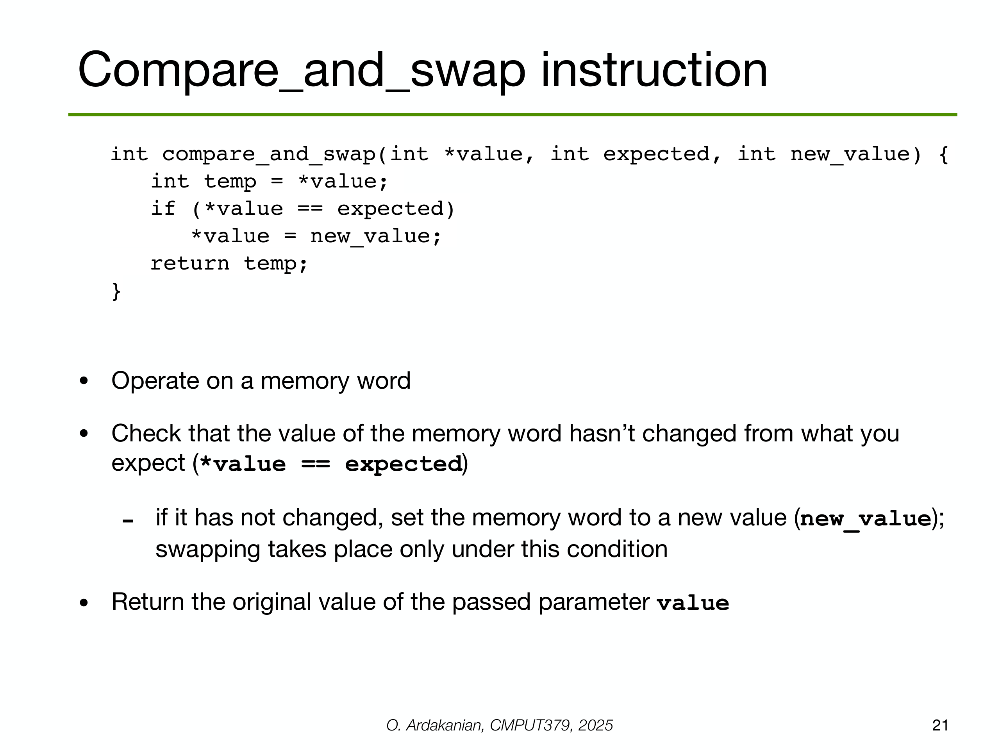

这页讲的是**CAS（Compare-And-Swap / Compare-And-Exchange）指令**的语义与用途。它是最常用的原子“读-改-写”原语之一。

# 它做了什么（语义）

伪代码（左上）：

```c
int compare_and_swap(int *value, int expected, int new_value) {
int temp = *value;              // 读出旧值
if (*value == expected)         // 只有当内存中的值还等于期望值时
*value = new_value;         // 才把它更新为新值（原子地）
return temp;                    // 返回旧值
}
```

* **原子性**：读、比较、写回这三个步骤作为一个不可分割的操作完成，其他线程无法在中途插队。
* **条件更新**：只有当内存中的值**尚未变化**（仍等于 `expected`）才写入 `new_value`；否则不写。
* **返回旧值**：调用者据此判断是否更新成功（常见做法：`return == expected` 即成功）。

# 为什么有用

* 可以把“检查→更新”这个容易产生竞态的序列**做成原子操作**。
* 是实现**无锁算法**、**自旋锁**、**原子计数器**、**线程安全容器**等的基石。

# 常见用法：CAS 循环

如果失败（说明有人抢先改了），就**读取最新值并重试**：

```c
int old = atomic_load(&x);
for (;;) {
int desired = old + 1;
if (atomic_compare_exchange_weak(&x, &old, desired)) break; // 成功
// 失败时 old 已被更新为当前实际值，继续用新 old 计算并重试
}
```

> 这就是“**读-算-尝试交换**（失败则重读）”的模式。

# 细节与注意

* **内存序**：要配合合适的内存语义（获取/释放或顺序一致 `seq_cst`），确保可见性与顺序正确。高层语言（C++ `std::atomic`, Java `Atomic*`）会提供带内存序的 CAS。
* **ABA 问题**：单纯比较值时可能把 “A→B→A” 的变化误判为“没变”。可用**版本号/指针标记**、**双宽 CAS（CAS2）** 或 **引用计数**等手段缓解。
* **自旋成本**：竞争激烈时 CAS 会频繁失败→重试，应结合**退避**（backoff）或改用队列化锁/阻塞锁。

**一句话**：CAS = “如果当前位置还是我期望的值，就把它原子地换成新值，否则啥也不做并告诉我失败”。它让我们在**不加大锁**的前提下，以**无锁/低锁**方式正确地更新共享状态。


---

## 第 22 页

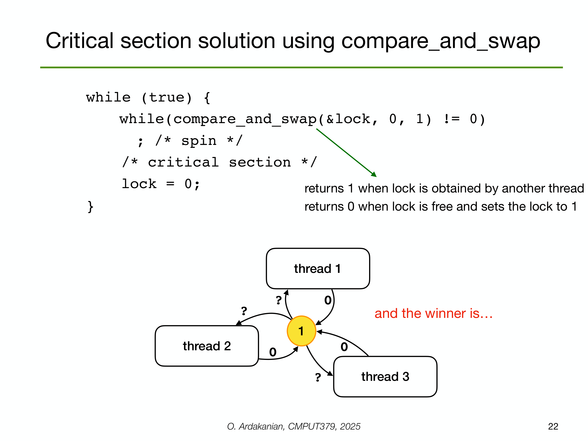

这页展示用 **CAS（compare\_and\_swap）** 来实现**自旋锁**，并说明它在多线程下的竞争过程。

# 代码在做什么

```c
while (true) {
while (compare_and_swap(&lock, 0, 1) != 0)
;                  // 自旋等待
/* critical section */ // —— 只有拿到锁的线程能进 ——
lock = 0;              // 释放锁
}
```

* `lock` 初始为 **0** 表示“空闲”，**1** 表示“已占用”。
* `compare_and_swap(&lock, 0, 1)` 的语义：

* **若** `lock==0`，就**原子地**把它改成 1，并返回旧值 **0**（表示成功抢到锁）。
* **否则**（`lock!=0`），不改值，返回旧值 **1**（表示有人持锁）。
* 内层 `while` 只有在 CAS 返回 **0** 时才退出 → 线程获得锁，进入临界区；否则一直自旋重试。

右侧文字说明：

* “returns 1 … obtained by another thread” = 发现锁已被别人占用（CAS 返回 1）。
* “returns 0 … and sets the lock to 1” = 锁空闲时 CAS 成功，把锁置 1 并返回 0。

# 底部示意图（“and the winner is …”）

* 多个线程（thread1/2/3）几乎同时对同一 `lock` 做 CAS。
* 由于 CAS 是**原子**的，**只有一个**线程能在那一刻把 `lock` 从 0 变成 1——**赢家**进入临界区；
* 其他线程读到的旧值是 1，CAS 失败，继续在外面自旋（问号表示“还在等/不确定何时成功”）。

# 特性与注意

* ✅ **互斥**：CAS 的原子性保证同一时刻最多一个线程把锁从 0→1。
* ⚠️ **忙等**：失败者不断重试，浪费 CPU；可用退避（backoff）/先读再 CAS（TTAS）缓解。
* ⚠️ **不公平**：没有排队顺序，可能出现饥饿；可改用 ticket/MCS 等队列自旋锁提高公平性与可扩展性。
* ⚠️ **内存序**：获取锁需要 **acquire** 语义、释放锁需要 **release** 语义，确保临界区写入对后续获锁者可见（用语言库自带的原子/互斥锁最稳妥）。


---

## 第 23 页

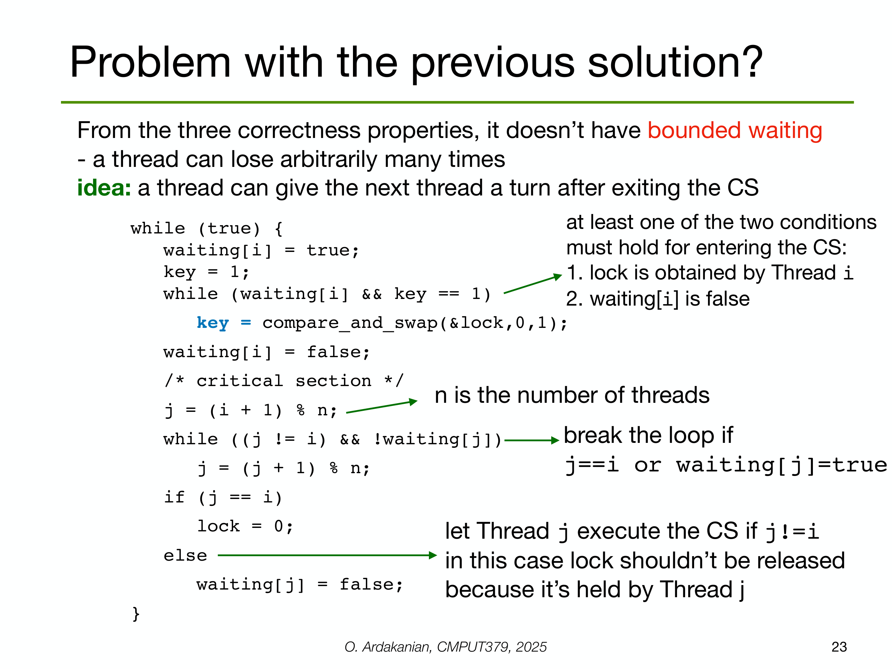

这页在指出：**用 CAS 做的普通自旋锁没有“有界等待（bounded waiting）”**——某个线程可能被**无限次插队**，长期抢不到锁；并给出一个\*\*“传棒（handoff/传递令牌）”**的改进，让等待是**有界且更公平\*\*的。

---

## 问题：CAS 自旋锁不公平

* 经典实现是：不停 `CAS(&lock, 0, 1)`。
* 多个线程同时竞争时，总是“恰好成功的那个”先进，其它人继续自旋。
* 这会导致**饥饿**：某线程可能**一直失败**→没有有界等待。

---

## 思路：退出临界区时**把机会明确交给下一个等待者**

核心做法：维护一个 `waiting[]` 数组，标记哪些线程**在等**。线程进入时既可依靠 CAS 抢到锁，也可以等“上一位”**点名**唤它进；退出时谁在等，就**把棒交给谁**。

---

## 代码读法（关键片段）

```c
while (true) {
waiting[i] = true;      // 我要排队
int key = 1;
// 进入条件：两者其一成立就能过
while (waiting[i] && key == 1) {
key = compare_and_swap(&lock, 0, 1);
// CAS 成功时 key=0（得到锁）→ 退出循环
// 若别人把棒交给我，会把 waiting[i] 置为 false → 也退出
}
waiting[i] = false;

/* critical section */

// 退出时寻找“下一个在等的人”
int j = (i + 1) % n;             // n 是线程数
while (j != i && !waiting[j])    // 跳过不在等的
j = (j + 1) % n;

if (j == i) {
// 没有人在等 → 直接把锁设空闲
lock = 0;
} else {
// 有人等 → 把“棒”交给 j
// 注意：此时 lock 不应释放为 0
waiting[j] = false;          // 唤醒 j，让它直接通过入口循环
}
}
```

### 入场逻辑（入口 while）

* **两条路任一满足即可进入：**

1. **CAS 抢锁成功**（`key` 从 1 变 0）；
2. **被前任点名**（有人把 `waiting[i]` 改成 `false`）。
* 所以注释写着 “at least one of the two conditions must hold”。

### 退场逻辑（交棒 vs 释放）

* **找到从自己之后的第一个正在等待的线程** `j`：

* 若**没人等**（绕一圈回到 `i`），**释放锁**（`lock=0`），让后来者再用 CAS 抢。
* 若**有人等**，**不把锁设 0**，而是**将 `waiting[j]=false`** —— 相当于直接让 `j` 通过入口 while，**无竞争进入临界区**（“传棒进入”）。

---

## 效果：满足“有界等待”

* 每次退出都**优先唤醒**队列里**自己后的第一个**等待者，**按环形顺序**前进；
* 因此每个提出请求的线程，在有限次别人进入之后，**一定会轮到它**——避免饥饿，实现 **bounded waiting**。
* 同时，仍保留 CAS 的快速路径：若没人等，后来的线程可直接 CAS 抢锁。

---

## 注意与拓展

* 这是“**公平自旋**”的一个思路（近似环形排队 + 交棒）。工业界常见的公平自旋锁有 **Ticket lock、MCS/CLH** 等，它们在规模和缓存抖动上表现更好。
* 工程实现需配合**原子读写与合适的内存序（acquire/release）**，保证“交棒前的数据写入”对接棒者可见。
* 在高争用或临界区偏长时，考虑“**自旋 + 阻塞**”（如 futex）以免浪费 CPU。


---

## 第 24 页

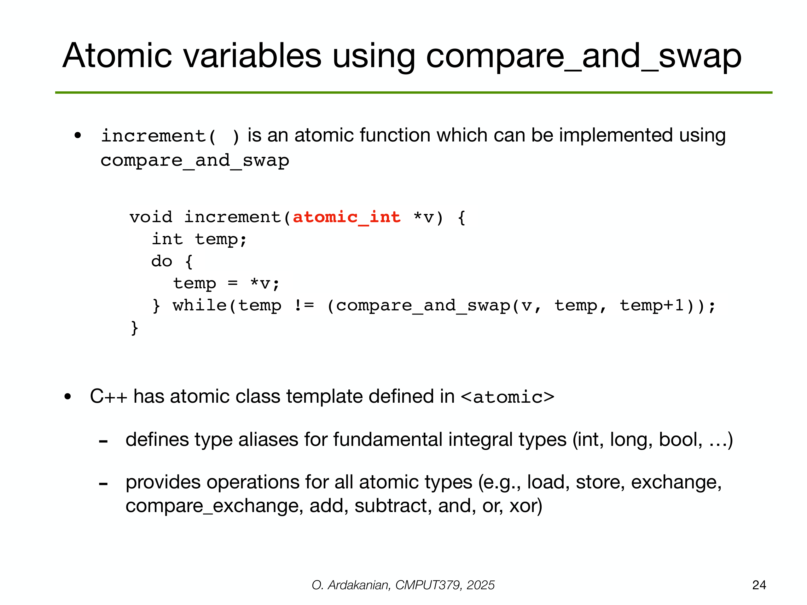

这页讲两件事：

1. \*\*用 CAS（compare\_and\_swap）实现“原子自增”\*\*的基本套路；
2. **C++ 的 `<atomic>` 标准库**已经把这套能力封装成易用的原子类型与操作。

---

# 1) CAS 实现原子自增 `increment()`

左侧伪代码：

```c
void increment(atomic_int *v) {
int temp;
do {
temp = *v;                         // 读当前值
} while (temp != compare_and_swap(v, temp, temp+1));
}
```

理解要点：

* `compare_and_swap(addr, expected, desired)` 的语义是**原子**地：

* 读取 `*addr` 的旧值并返回；
* **只有当**旧值等于 `expected` 时，才把 `desired` 写回 `*addr`。
* 如果 CAS **成功**：返回值等于 `expected`（也就是 `temp`），循环结束，`*v` 已原子+1。
* 如果 CAS **失败**：说明在我们计算 `temp+1` 期间，**别的线程改过 `*v`**。返回值≠`temp`，循环再次读取新值并重试。
* 这就是经典的 **CAS 循环**（读→算→尝试更新→失败就重读重试），在高并发下能够正确做“读-改-写”。

> 小提示：真实代码里会用库提供的 `atomic_compare_exchange_weak/strong`，并可加**指数退避**降低自旋开销。

---

# 2) C++ `<atomic>` 提供的原子类型与操作

* `<atomic>` 定义了原子整型、布尔、指针等（`std::atomic<int>`, `std::atomic<bool>`…），并提供：

* 基本操作：`load`、`store`、`exchange`、`compare_exchange_*`；
* 复合原子运算：`fetch_add/sub/and/or/xor` 等（更高效，无需手写 CAS 循环）。
* 这些操作都带**内存序**（`memory_order_acquire/release/seq_cst` 等），保证可见性与顺序正确；如果不熟，默认用 **`seq_cst`** 最保守安全。

---

## 实战要点/注意

* **竞争激烈时 CAS 会反复失败** → 用退避（backoff）或改用更合适的数据结构/锁（如队列自旋锁、互斥锁）。
* **ABA 问题**：只比较数值时可能把 A→B→A 当成“没变”。在指针无锁结构里可用版本号、tag、或双宽 CAS 缓解。
* 对简单计数，优先用 `v.fetch_add(1, memory_order_release)` / `v++`（原子重载），**比手写 CAS 循环更简洁高效**。
