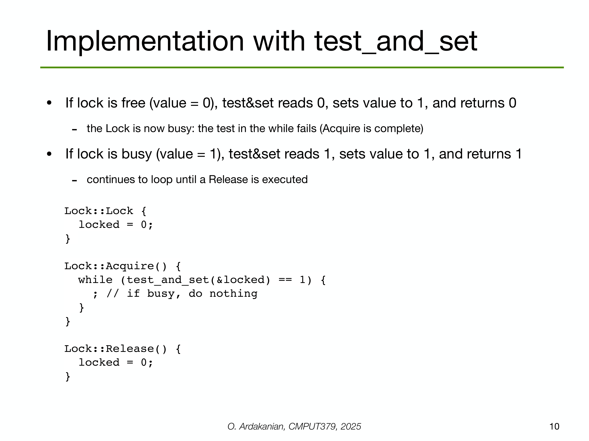

---

## 第 4 页


这页在讲 **互斥锁（Mutex lock）** 的概念与两种实现方式。

# 核心概念

* **互斥锁 = 一种高层并发抽象**：任意时刻**最多只有一个线程**能“持有”这把锁，从而进入被锁保护的**临界区**。其余线程必须等到锁被释放后才能进入。
* 典型接口：`lock()/unlock()` 或 `acquire()/release()`。进入前先加锁，结束后解锁。

# 两种常见实现

1. **自旋锁（spinlock）**——忙等

* 代码片段里的 `while (test_and_set(&lock)) ;` 就是自旋锁写法：

* `test_and_set` 是原子指令：返回旧值，同时把 `lock` 置为 `true`。
* 若旧值为 0（没人持有），当前线程获得锁；否则在 `while` 里**空转等待**（忙等）。
* 适用：**临界区极短**、**锁持有时间非常小**、或**内核态**需要避免睡眠的地方。
* 缺点：抢不到锁时**一直占用 CPU**；高争用时浪费大、还可能饥饿。

2. **阻塞型互斥锁**（下一页会讲）

* 抢不到锁时**让出 CPU**，线程被挂起，等锁可用再被唤醒。
* 适用：临界区可能比较长或竞争较多的场景。
* 成本：涉及内核调度/上下文切换，单次获取/释放开销高于自旋。

# 使用要点

* **正确配对**：进入临界区前 `lock()`，退出时务必 `unlock()`（可用 RAII/`defer` 防止遗漏）。
* **范围要小**：把与共享数据无关的工作移到锁外，**缩短持锁时间**，减少竞争。
* **避免在锁内阻塞**：例如 I/O、`sleep`、等待网络等会长时间占锁。
* **死锁风险**：多把锁要按**固定顺序**获取；避免“先后相反”的环路等待。
* **内存可见性**：库实现会在 `lock()` 上提供 **acquire** 语义，在 `unlock()` 上提供 **release** 语义，确保临界区内写入对后续获锁者可见；不要自己用普通变量冒充锁。

# 何时选哪种？

* **自旋锁**：锁极短、竞争不高、或不允许睡眠（中断上下文/内核关键路径）。
* **阻塞锁**：持锁时间可能较长、竞争明显的用户态程序（绝大多数应用）。

一句话：**Mutex 是“只让一个线程进门”的门闩**；自旋锁是在门口原地等，阻塞锁是先离开去休息，等叫号再来。


---

## 第 5 页


这页讲**阻塞型（blocking）互斥锁**是怎么工作的，并示范在“买牛奶”这个共享数据场景里的用法。

# 锁的抽象

```cpp
class Lock {
public:
void Acquire(); // 拿锁：若锁被占用→把当前线程放进等待队列并阻塞
void Release(); // 释放：解锁并唤醒等待队列里的一个线程
private:
int    locked;  // 锁状态（0 空闲 / 1 占用）
Queue  Q;       // 等待该锁的线程队列
}
```

* 与**自旋锁**不同：拿不到锁时不是原地空转吃 CPU，而是**睡眠等待**，锁可用时被唤醒。

# 使用模式（对称、简单）

```c
Lock milklock;            // 初始空闲
...
milklock.Acquire();       // 进入临界区前加锁
if (milk == 0)            // 访问/修改共享数据
buy_milk();
milklock.Release();       // 访问结束后解锁
```

* 这段就是“**临界区**”：加锁 → 访问共享数据 → 解锁。
* “symmetric solution” 表示所有线程都按同一套 Acquire/Release 规则，代码对称、好理解。

# 关键点

* **互斥**：同一时刻仅一个线程在临界区。
* **节能**：竞争时不忙等，阻塞让出 CPU。
* **公平性**：内部可用队列（FIFO）避免饥饿（实现细节决定程度）。
* **内存可见性**：Acquire 具 **acquire** 语义，Release 具 **release** 语义——保证临界区里的写对下一个获锁者可见。

# 实践注意

* 锁内尽量**短小**，避免在锁内做 I/O/长阻塞，减少竞争与死锁风险。
* 多把锁要固定顺序获取，避免**死锁**。
* 真实系统里，Acquire/Release 往往由 OS/运行时（如 pthread mutex、futex）实现，内部已用原子指令和内存屏障保证正确性。


---

## 第 6 页


这页用 **malloc/free** 做例子，说明“**在访问共享资源时要用锁把临界区包起来**”。

# 代码在表达什么

```c
void *malloc(size_t size) {
heaplock.acquire();                 // 1) 先加锁
p = allocate memory of the specified size;   // 2) 在堆上分配
heaplock.release();                 // 3) 解锁
return p;
}

void free(void *p) {
heaplock.acquire();                 // 1) 先加锁
deallocate memory & put it on free list;     // 2) 回收内存并放回空闲链表
heaplock.release();                 // 3) 解锁
}
```

* **heaplock** 这把锁保护“进程的堆（heap）数据结构”（空闲链表、伙伴系统等）。
* 因为**同一进程的所有线程共享堆**（底部蓝字提示），如果不加锁，多个线程同时修改空闲链表会造成**竞争/损坏**。

# 为什么要这样做

* `malloc/free` 会**读写共享的堆元数据**（如空闲块表）；必须保证**同一时刻只有一个线程**修改它 → 用互斥锁包装“临界区”。

# 工程要点

* 持锁范围要**尽可能小**：只包住必要的堆元数据操作，避免把用户代码或 I/O 放进锁里。
* 高性能分配器会用**细粒度锁/分段锁**或**每线程缓存（tcache）**，减少全局 `heaplock` 的竞争。
* 用 RAII（如 C++ `std::lock_guard`）防止异常路径**忘记释放锁**。
* 多把锁时要固定顺序，避免**死锁**。

一句话：**malloc/free 是对共享堆结构的“临界区访问”，必须先加锁后访问，完成后立即解锁**，否则并发线程会把堆元数据写乱。


---

## 第 7 页


这页讲**在单处理器（uniprocessor）上如何实现“阻塞型互斥锁”**：靠**短暂关中断**来保护锁的内部状态更新 + **阻塞/唤醒**等待线程的队列化逻辑。代码是伪码，思路如下。

---

## 关键背景

* 单核只有 **一个执行点**。只要不被中断/调度切走，就**不会有第二个线程同时修改同一把锁的内部状态**。
* 因此，进入/释放锁时先**临时关中断**（`intr_disable()`），就能把对 `locked` 和等待队列 `Q` 的修改做成**原子区**；最后**开中断**（`intr_enable()`）。
* 备注：x86 上常见的 **CLI**（关中断）/**STI**（开中断）是特权指令（底部蓝字）。

---

## Acquire（加锁）

```text
intr_disable();                 // 关中断，开始原子区
if (locked == 0) {              // 锁空闲
locked = 1;                 // 占有它
} else {                        // 锁已被占用
queue_add(Q, gettid());     // 把当前线程排队到等待队列
thread_block();             // 阻塞自己（让出 CPU，不忙等）
}
intr_enable();                  // 开中断，结束原子区
```

* 这里的**关键点**：把“检查锁状态 → 修改状态/入队 → 阻塞”做在**同一个原子区**里，避免**丢唤醒（lost wakeup）**：如果不关中断，可能刚入队还没阻塞就被唤醒信号错过。

---

## Release（解锁）

```text
intr_disable();
if (queue_empty(Q)) {           // 没人等
locked = 0;                 // 直接把锁置空闲
} else {                        // 有人在等
thread_unblock(queue_remove(Q)); // 唤醒队头线程
// 注意：此分支通常不把 locked=0 —— 采用“移交/传棒”语义
}
intr_enable();
```

* **无等待者**：把 `locked` 设 0，后来的线程再来拿。
* **有等待者**：**不把锁设 0**，而是唤醒队列里的下一个；这叫**锁传递（handoff）**：被唤醒的线程从 `thread_block()` 返回后**直接视为持有者**，进入临界区，避免与新来的线程发生竞争，能减少饥饿并提升公平性。

---

## 为什么可行（仅限单核）

* 关中断期间，**调度器拿不到控制权**，因此同一时刻不会有另一个线程并发修改 `locked/Q`。
* 多核上**不行**：你只能关本核中断，**其他核**仍可能并行访问这把锁；SMP 需要**原子指令（CAS、XCHG…）+ 内存屏障**或现成的自旋/阻塞锁实现。

---

## 工程注意

* **关中断窗口要极短**：只包住更新 `locked/Q` 的那几步；不要在关闭中断状态下做 I/O 或长操作。
* **队列语义**：通常按 FIFO 唤醒，获得**有界等待/更公平**。
* **内存语义**：Acquire/Release 实现应具备 **acquire/release** 屏障效果，保证临界区写入对后继获锁者可见。
* **用户态一般不能关中断**；这套模式主要用于**内核**的单核路径。应用程序请使用系统提供的 `mutex/condvar` 等原语。


---

## 第 8 页


这页在说：**在多处理器（多核）系统里，不能靠“关中断”来实现互斥锁**，因此获取/释放锁（`acquire/release`）必须用**原子硬件指令**来做。

**为什么关中断不行？**

* 单核时，执行 `CLI`（关中断）后调度器拿不到控制权，临界区就不会被打断。
* 多核时，**你只关了本核的中断**；其他核仍在并行运行，照样可以同时访问同一共享数据 → 仍然会竞争/破坏数据。

**怎么办？用硬件原子原语实现锁：**

* **`test_and_set`**：原子地“读旧值并把它置 1”。可做自旋锁/互斥量的基础。
* **`compare_and_swap`（CAS）**：原子地“如果内存值还等于期望值，就换成新值，否则不变”。可实现自旋锁、票据锁、无锁结构等。

**实现要点（隐含前提）：**

* 这些原子指令配合**缓存一致性协议**和**内存屏障（acquire/release）**，保证

* 原子性：同一时刻只有一个线程把锁从“空闲→占用”；
* 可见性与顺序：释放锁前的写对后续获锁者可见。

**一句话**：多核上，`CLI/STI` 不能提供进程间/核间的互斥；必须用 **`test_and_set` / `compare_and_swap`** 等**原子指令**来实现 `acquire/release`。


---

## 第 9 页


这页演示**用 CAS（compare\_and\_swap）实现一把最简单的自旋锁**，并说明 CAS 的基本语义。

# CAS 的语义（上半部分）

* **做什么**：把内存中 `addr` 的值与寄存器 `r1`（期望值 expected）比较；如果相等，就把寄存器 `r2`（新值 new）写回到 `addr`。

> 形式化：`if (*addr == r1) *addr = r2;`，整个过程**原子**完成。
* **返回值**：常见两种变体

1. 返回**布尔**：是否交换成功；
2. 返回**旧值**：交换前 `*addr` 的值（可据此判断是否成功）。

# 自旋锁实现（下半部分伪码）

```cpp
Lock::Lock() { locked = 0; }    // 0 表示空闲，1 表示已占用

Lock::Acquire() {
while (compare_and_swap(&locked, 0, 1) != 0)
; // 自旋等待：CAS 不成功就继续试
}

Lock::Release() {
locked = 0;                   // 释放锁
}
```

* `Acquire()`：只有当 `locked` 还是 **0** 时，CAS 才能把它原子地改成 **1** 并返回旧值 **0**，循环退出→拿到锁。否则返回 **1**，继续自旋。
* `Release()`：把 `locked` 置回 0，允许其他线程获取。

# 关键点与注意

* **互斥**：CAS 的原子性保证同一瞬间最多一个线程把 `locked` 从 0→1。
* **忙等**：这是**自旋锁**，抢不到锁会空转占 CPU；适合**临界区极短**的场景。
* **内存语义**：实际实现中，`Acquire` 需要 **acquire**，`Release` 需要 **release**，确保临界区写入对后续获锁者可见（用语言/库提供的原子原语即可）。
* **公平性**：这种裸自旋锁**不保证公平/有界等待**；激烈竞争时可考虑 ticket/MCS 锁，或“自旋+阻塞”（如 futex）。
* **优化**：常见“TTAS”（test-test-and-set）先普通读 `locked`，只有看到 0 才做 CAS，减小总线写入与缓存抖动。


---

## 第 10 页



这页演示**用 `test_and_set` 指令实现自旋锁**，以及它在“锁空闲/已占用”两种情况下的行为。

# `test_and_set` 的语义

* 它是一个**原子**操作：
**读出旧值** → **把内存位置置为 1（true）** → **返回旧值**。
* 因此：

* 如果锁变量 `locked==0`（空闲），`test_and_set(&locked)` 会返回 **0**，并把 `locked` 设为 **1**（占用成功）。
* 如果 `locked==1`（已占用），它返回 **1**，`locked` 仍为 **1**（占用失败）。

# 自旋锁实现（伪码）

```cpp
Lock::Lock() { locked = 0; }   // 0=空闲，1=占用

Lock::Acquire() {
while (test_and_set(&locked) == 1) {
; // 忙等：直到别人 Release
}
}

Lock::Release() { locked = 0; } // 释放锁
```

* `Acquire()` 中的 `while`：只有当 `test_and_set` 返回 **0** 时跳出循环，线程获得锁进入临界区；返回 **1** 就继续自旋等待。
* `Release()` 把 `locked` 设回 **0**，下一个线程的 `test_and_set` 才可能成功。

# 特性与注意

* ✅ **互斥**由原子性保证：同一时刻最多一个线程能把 0→1。
* ⚠️ **忙等**：失败线程持续占用 CPU；适合**临界区非常短**的场景。
* ⚠️ **不公平/可能饥饿**：没有排队顺序。
* ⚙️ **优化**：常用 **TTAS（test-test-and-set）**：先普通读 `locked` 为 0 才执行 `test_and_set`，减少总线写入与缓存抖动。
* 🧠 **内存顺序**：获取需 **acquire** 语义、释放需 **release** 语义（使用语言/库提供的原子锁即可满足）。


---

## 第 11 页


这页讲：**没法彻底消灭忙等（busy-waiting），但可以把忙等的范围压到最小**，做出更高效的锁。

# 思路

* 传统自旋锁：线程在**锁被占用**时，一直自旋等待锁**变空闲** → 长时间占 CPU。
* 改进：**只在很短的一小段代码上自旋**，用它来**原子地检查/修改“锁的状态”**；
一旦发现“锁已被占用”，**马上放弃 CPU（阻塞自己，进等待队列）**，而不是继续转圈。

> 关键点：**更新锁状态**那段代码是一个很短的“微临界区”，比真正受锁保护的业务临界区（读写共享数据）短得多，所以在这段上自旋的代价很低。

# 代码结构（伪代码含义）

```cpp
class Lock {
public:
void Acquire();
void Release();
private:
int locked;  // 锁是否被占用（0/1）
int guard;   // "守门变量"：仅用于原子地检查/修改 locked
Queue Q;     // 等待队列
};

Lock::Lock() {
locked = 0;  // 初始空闲
guard  = 0;  // 初始没人动“门”
}
```

* `guard` 是一个**极短自旋**的“门闩”：谁先用原子指令把 `guard` 从 0→1，就临时获得“修改锁元数据（locked/Q）”的**资格**；改完再把 `guard` 放回 0，让下一位来。
* `Acquire()` 的典型过程（概念）：

1. **自旋**尝试拿到 `guard`（这一步很短）；
2. 拿到后检查 `locked`：

* 如果 `locked==0`：把 `locked=1`，释放 `guard`，**直接进入临界区**；
* 如果 `locked==1`：把自己**放入队列并阻塞**，释放 `guard`（不再自旋耗 CPU）。
* `Release()`：同理，先拿 `guard`，若队列空就 `locked=0`；否则**唤醒**队头等待者（常用“传棒”语义），再释放 `guard`。

# 好处

* **大幅减少 busy-waiting 时间**：只在拿“门闩”时短暂自旋；真正等待锁时**阻塞**不耗 CPU。
* **扩展性更好**：竞争激烈时不造成大量缓存抖动和 CPU 浪费。
* **公平性可控**：用队列（FIFO）可实现**有界等待**，避免饥饿。

# 与纯自旋锁对比

* 纯自旋锁：竞争期**人人都在转**，耗 CPU；临界区越长越糟。
* 这里：自旋只发生在**guard 的极短窗口**；若锁忙，线程**睡眠**等待唤醒 → 既保证互斥，又更节能。

一句话：**把“忙等”缩到只围绕一个很短的“守门操作（guard）”，其余时间用阻塞排队**，就能得到既正确又高效的互斥锁实现。


---

## 第 12 页


这页把上一页的“**最小化忙等**”思路落成了具体伪代码：
用 **`guard`** 做一个**极短自旋的“门闩”**，只在拿/改锁状态这几步上自旋；一旦发现锁忙，就**把线程排队并阻塞**；释放时尽量\*\*把锁直接“传棒”\*\*给等待者。标题里的 *test\_and\_set — minimal waiting* 就是用 `test_and_set` 来实现这个“门闩”。

---

## Acquire（加锁）流程

```c
while (test_and_set(guard) == 1) ;     // 1) 自旋抢到 guard（极短）
if (locked != 0) {                     // 2) 锁正忙
queue_add(Q, gettid());            //    把自己加入等待队列
guard = 0;                         // 3) 先放开 guard，避免丢唤醒
thread_block();                    // 4) 阻塞自己（让出 CPU）
} else {                               // 2') 锁空闲
locked = 1;                        //    占有锁
guard  = 0;                        //    放开 guard
}
```

### 要点

* **只对 `guard` 自旋**：`test_and_set(guard)` 成功后，进入一个很短的“守门临界区”，期间**检查并更新 `locked/Q`**。
* **为什么先把 `guard=0` 再阻塞？**
防止**丢唤醒（lost wakeup）**：如果不先放开 guard，释放方可能找不到等待者/无法唤醒你，导致你永远睡着。
* 锁忙就**排队 + 阻塞**，不再无谓自旋；锁空闲就**立即抢占**。

---

## Release（解锁）流程

```c
while (test_and_set(guard) == 1) ;     // 1) 先拿到 guard（极短）
if (!queue_empty(Q)) {                 // 2) 有人在等
// 把锁“直接交给”队头线程（传棒）
thread_unblock(queue_remove(Q));   // 3) 唤醒它，让它成为下个持有者
} else {
locked = 0;                        // 2') 无人等待 → 置空闲
}
guard = 0;                             // 4) 释放 guard
```

### 要点

* **传棒语义（handoff）**：有人等时，不把 `locked` 置 0，而是直接唤醒队头；被唤醒者从 `thread_block()` 返回后即可进入临界区（通常实现会让它感知为已获锁），**减少与新来者竞争**，更公平也更高效。
* 无人等待才把 `locked=0`，留给后来的线程用 CAS/自旋去获取。

---

## 这个实现的好处

* **忙等最小化**：只在 `guard` 上短暂自旋；真正等待锁时是**阻塞**，不占 CPU。
* **避免丢唤醒**：Acquire 中**先放 guard 再阻塞**，Release 中**先拿 guard 再决定唤醒/释放**，两边的顺序保证状态一致。
* **更公平/有界等待**：用队列按 FIFO 唤醒，基本避免饥饿（取决于队列策略）。
* **可扩展**：较少缓存抖动/总线写入，比纯自旋锁在高争用下更稳。

---

## 实战注意

* `guard` 与 `locked` 的读写都要用**原子操作**并带**内存序**（Acquire/Release），保证可见性与顺序正确。
* 这是**阻塞型互斥锁**的经典结构（用户态常见实现是基于 **futex/pthread mutex**）；避免把长耗时操作放在持锁区。
* 多核环境下仍需 CPU 的**缓存一致性**支持；用户态不要自己关中断。


---

## 第 13 页


这页在解释上一页“最小化忙等”的细节设计背后的**原因与坑点**——对应三件事：

---

## 1) 为什么线程在阻塞自己之前要先把 `guard` 设为 0？

* **目的：保证活性（liveness）**。
若不先放开 `guard`，释放锁的线程可能拿不到 `guard`，就**没法唤醒**你；而你又马上去 `thread_block()`，结果变成**没人能唤醒你** → 你永远睡着（丢唤醒）。
* 先 `guard=0`，别的线程（释放方）才能进入“守门临界区”，完成**传棒/唤醒**动作，系统才能继续推进。

---

## 2) 为什么释放锁时要**把锁直接交给**等待队列里的下一个线程，而不是简单把锁设空闲、再把等待者放入就绪队列？

* **目的：保证互斥（mutual exclusion）并减少竞争**。
被唤醒的线程醒来时**并不持有 `guard`**，如果你把锁直接设为 0（空闲），就会出现：

* 醒来的等待者还没来得及拿锁；
* 新来的第三者可能在此时用 CAS 抢到锁，和“被唤醒者”**抢临界区**。
* 采用\*\*“传棒”（handoff）**：有人等待就**不把 `locked` 置 0\*\*，而是直接唤醒队头，让它获得下一个进入临界区的资格，避免并发抢锁，保证互斥与公平。

---

## 3) 如果在调用 `thread_block()` 的**正前一瞬**发生了上下文切换，而下一个线程释放了锁，会怎样？

* 会出现经典的**wakeup/waiting race（唤醒/入睡竞争）**：
释放者已经发出“唤醒”，但当前线程**尚未真正阻塞**；随后当前线程继续执行 `thread_block()` → 它会**睡死**，因为唤醒信号已经错过。
* **解决思路**：把“**释放 `guard`**”与“**阻塞当前线程**”这两个操作做成**一个原子步骤**（不可被切换/打断）。
在真实系统里，这通常依赖内核/运行时提供的原语（例如 **futex**、条件变量）来保证：

* 只有当你**已把自己标记为等待者**并且**把 `guard` 释放**后，内核才会把你睡下；
* 释放方在同一个“守门临界区”里看到这个状态，就能**可靠唤醒**你，避免“唤醒丢失”。

---

### 小结

* **先放 `guard` 再阻塞** → 防丢唤醒，保证活性。
* **释放方传棒给队头** → 避免新来者抢锁，保证互斥与公平。
* **把放 `guard` + 阻塞做原子化** → 消除唤醒/入睡竞争。
这些细节共同确保：**互斥正确**（safety）+ **可推进**（liveness）+ **不丢唤醒**（可靠性）。


---

## 第 14 页


这页在把\*\*“关中断实现锁”**和**“用 guard + 原子指令实现锁（多核可用）”**做**一一对应**对比，告诉你：
把单核里 `intr_disable()/intr_enable()` 保护的那段“原子区”，在多核上用**短暂自旋的 `guard`\*\*来替代即可。

---

## 左侧代码（关中断版本，适用于单核/内核态）

```c
Lock::Acquire(Thread T) {
intr_disable();                 // 进入原子区：调度器拿不到CPU
if (locked == 0) {              // 锁空闲
locked = 1;
} else {                        // 锁忙
queue_add(Q, T);              // 入等待队列
thread_block(T);              // 阻塞自己
}
intr_enable();                  // 退出原子区
}

Lock::Release() {
intr_disable();
if (queue_empty(Q)) {
locked = 0;                   // 无人等待 → 置空闲
} else {
thread_unblock(queue_remove(Q)); // 有人等待 → 唤醒队头（传棒）
}
intr_enable();
}
```

* 关键：**关/开中断**把“检查/更新锁状态 + 入队/唤醒”的操作做成**不可打断**的原子区，所以不会丢唤醒、不会被别的线程同时改 `locked/Q`。

---

## 右下角的替换说明（多核通用的 guard 版本）

> Replace:
>
> * `intr_disable()` → `while (test & set(guard)) ;`
> * `intr_enable()`  → `guard = 0;`

含义：

* 用\*\*`test_and_set(guard)` 的短暂自旋**来获取“守门权”，进入一个**极短\*\*的原子区；
* 在这个原子区里做**同样的事情**：检查/更新 `locked` 与等待队列 `Q`、决定阻塞或唤醒；
* 完成后把 `guard = 0`，让其他线程能进来；
* 真正拿不到锁的线程会被**排队 + 阻塞**（而不是长时间自旋），实现了**最小化忙等**。

---

## 为什么这样映射？

* 单核：关中断即可阻止并发修改。
* 多核：关本核中断**挡不住其他核**，所以把“不可并发修改”改为**用原子指令**保护的“**guard 原子区**”。
* 两者目标一致：保证 Acquire/Release 中对 `locked/Q` 的操作**原子**、**不丢唤醒**、**可传棒**。

---

## 小结

* 把 `intr_disable()/intr_enable()` 看成“**进入/退出原子区**”，在多核上就以
`while (test_and_set(guard)) ;` / `guard = 0;` 取代。
* 其余逻辑（入队、阻塞、唤醒、传棒）保持不变 → 得到**低忙等、可扩展**的阻塞型互斥锁实现。


---

## 第 15 页


这页讲“**两阶段锁（Two-phase locks）**”的思想：
获取锁时，**先短暂自旋一会儿（spin phase）**；如果还拿不到，**就把线程挂起睡眠（sleep phase）**，等被唤醒再继续。

## 为什么这么做？优势是什么

* **兼顾开销与效率（“两全其美”）**

* 若临界区很短、持锁者马上就会释放：自旋几微秒/毫秒就能接上，**避免一次阻塞/唤醒的系统调用与调度开销**（这些开销常高达 μs\~ms 级）。
* 若锁会等很久：自旋到上限后**转为睡眠**，**不白白耗 CPU**。
* **适应不同负载**

* 低\~中等争用：多数在自旋阶段就成功，**吞吐量与延迟都好**。
* 高争用/长临界区：迅速进入睡眠，**节能且避免缓存抖动**。
* **降低尾部延迟**

* 短暂自旋可以让“刚好要释放锁”的情况被立即接力，少一次上下文切换，**减少 99%/99.9% 延迟**。
* **实现简单、通用**

* 只是在阻塞锁前加一段有限自旋；内核里的 futex、用户态互斥量（如 pthread mutex 的 adaptive 变体）都采用类似思路。

## 关键实现点

* **自旋时长/次数的阈值**：固定次数、固定时间，或自适应（根据最近获得锁的等待时间、是否多核、持锁线程是否在同一核心上运行等）。
* **自旋期间要用无副作用的读/TTAS**：先普通读，只有看到空闲再 CAS，减少总线流量。
* **公平性**：两阶段锁多为“机会主义”，若需要严格公平/有界等待，要配合队列化（如 ticket/MCS）或在睡眠阶段按 FIFO 唤醒。
* **NUMA/功耗考虑**：长时间自旋在多核/NUMA 上会造成缓存抖动和能耗增加，所以**必须有“转睡眠”的第二阶段**。

## 何时适合 / 不适合

* 适合：**临界区短**、锁持有时间波动不大、**持锁线程可能很快释放**的路径（比如快速表项更新、短 I/O 提交等）。
* 不适合：**临界区长或不可预测**、单核系统（自旋几乎没意义）、或对**公平性**有强要求的场景（需队列锁）。

一句话：**两阶段锁先短转、再睡眠**，在“短等待”时省掉调度开销，在“长等待”时不浪费 CPU，因而在多数真实工作负载下更高效更稳。


---

## 第 16 页


这页在说：**光有锁不够**。
锁（mutex）只能解决“同一时刻只能有一个线程操作共享数据”（**互斥**）的问题，但在并发程序里，经常还需要“**满足某个条件才继续**”（**条件同步**），否则就应该等待。

# 例子：有界缓冲区（生产者-消费者）

* 生产者把数据放进一个固定大小的缓冲队列；
* 消费者从队列里取数据。

这个系统需要同时满足三类约束：

1. **互斥约束**
任何时刻**只能有一个线程**操作缓冲区（入队/出队/更新计数等）。
→ 用**锁**保护队列即可。

2. **调度约束（空时等待）**
当缓冲区**空(empty)**时，消费者**必须等待**生产者先放入数据；
不能在空的时候“抢”——否则就会取到不存在的数据。

3. **调度约束（满时等待）**
当缓冲区**满(full)**时，生产者**必须等待**消费者取走一些数据；
不能在满的时候继续放——否则会覆盖/越界。

> 结论：锁只能保证第 1 点（互斥）。第 2、3 点需要**条件同步机制**（如条件变量 `cond`、信号量 `empty/full` 或通道），让线程在“不满足条件时睡眠、条件满足时唤醒”。

一个典型做法（概念）：

* 用 `mutex` 保护队列；
* 用条件变量 `not_empty` 让消费者在空时等待；生产者放入后 `signal not_empty`；
* 用条件变量 `not_full` 让生产者在满时等待；消费者取出后 `signal not_full`。

这样才能同时保证：**正确性（不越界/不取空）**与**效率（不忙等）**。


---

## 第 17 页


这页在介绍**条件变量（Condition Variable, CV）**——一种用于**条件同步**的并发原语。

## 它是什么

* 条件变量不是锁；它**和互斥锁一起使用**。
* 它维护着**一队等待的线程**：这些线程在临界区里发现“条件不满足”（例如队列空/满）时，**暂时睡眠**，等别人把条件变成“满足”后被**唤醒**继续执行。

## 关键点

* **事件发生在临界区内部**：
条件（如“队列非空”“空间可用”）是根据**受互斥锁保护的数据**来定义的。只有在**持有锁**时检查/修改这些数据才是安全的。
* **典型接口语义**：

* `wait(cv, mutex)`：原子地“释放 mutex 并把线程睡下”；被唤醒时**再次自动加锁**（返回后你仍持有 mutex）。
* `signal(cv)`：唤醒**一个**等待线程。
* `broadcast(cv)`：唤醒**所有**等待线程（常用于条件一次性从不满足→满足，可能有多个等待者）。
* **为什么要在循环里等待**：
可能有**虚假唤醒**或被别的线程“抢走资源”。正确写法是：

```c
mutex.lock();
while (!condition) {           // 条件不满足就等待
cv.wait(mutex);
}
// 条件已满足，可安全操作共享数据
...
mutex.unlock();
```

## 小例子（有界缓冲区）

* 生产者：

```c
mutex.lock();
while (buffer_full())  cv.wait(mutex);
put_item();
cv_not_empty.signal();         // 告知消费者“非空”
mutex.unlock();
```
* 消费者：

```c
mutex.lock();
while (buffer_empty()) cv.wait(mutex);
get_item();
cv_not_full.signal();          // 告知生产者“未满”
mutex.unlock();
```

## 要记住

* **锁负责互斥**，**条件变量负责“等条件”**。
* 检查条件、改变共享状态、发信号（signal/broadcast）都应在**持锁**状态下完成，保证一致性与不丢唤醒。


---

## 第 18 页


这页讲**条件变量（Condition Variable, CV）的三种操作**，以及**为什么操作它时必须持有互斥锁**。

## 三个基本操作

1. **`Wait(cv, mutex)`（等待）**

* **做两件事且是原子的**：
① **释放**传入的 `mutex`；② 把当前线程**挂起**（睡眠，直到被通知）。
* 被唤醒后，`Wait` **返回前会再次获取同一把 `mutex`**，然后你才能继续检查/操作共享数据。
* 正确用法：**放在 `while (!condition) cv.wait(mutex);` 的循环里**（防虚假唤醒/被其他线程抢走资源）。

2. **`Notify(cv)` / `Signal(cv)`（通知一个）**

* 若有等待线程，**唤醒一个**，把它放入就绪队列（不是立刻运行，调度器稍后安排）。
* 适合用在“**一次状态变化只满足一个等待者**”的场景（例如仅放入了一个元素）。

3. **`NotifyAll(cv)` / `Broadcast(cv)`（通知所有）**

* **唤醒所有**在该 CV 上等待的线程，并放入就绪队列。
* 用于“**状态变化可能满足多个等待者**”或条件涉及**全局变化**（如关闭、重置）的场景。

> 注：很多库用名：`wait` / `signal` / `broadcast` 或 `wait` / `notify_one` / `notify_all`，语义一致。

## 为什么**必须持有锁**再做这些操作？

* **一致性**：`wait/signal/broadcast` 都与**受锁保护的共享状态**有关（队列是否为空、计数等）。
只有在**持锁**时检查/修改状态并决定是否等待/通知，才能避免竞态与丢唤醒。
* **不被交叉打断**：

* `wait` 里“释放锁并入睡”是**原子**步骤；
* 若不持锁，可能出现这样竞态：A 刚检查完条件准备睡，B 改变了条件并 `signal`，但 A 还没真正睡下 → **唤醒丢失**。持锁能把“检查条件→决定等待→原子释放锁并入睡”连起来，避免这个问题。

## 常见写法（示例）

```c
mutex.lock();
while (buffer_empty()) {            // 循环等待条件成立
cv_not_empty.wait(mutex);       // 原子：释放锁并睡眠；醒来前自动重新加锁
}
dequeue();
cv_not_full.notify_one();           // 在持锁状态下发通知
mutex.unlock();
```

## 小贴士

* **总是用 while 重新检查条件**（防虚假唤醒/被别人消耗了资源）。
* `notify_one` vs `notify_all`：前者减少惊群，后者用于多个等待者都可能被满足或有“全局唤醒”的情况。
* **通知也应在持锁状态**下发出（很多实现允许不持锁，但最佳实践是持锁发，确保状态与通知的顺序对等待者可见）。


---

## 第 19 页


这页是在给出**使用条件变量（CV）的标准协议/套路**。核心思想：**先上锁，检查条件；不满足就等待，满足就继续；等待与释放锁要“原子化”完成。**

## 正确步骤

1. **Acquire the lock**
先获取互斥锁，进入临界区，确保你检查/修改的共享状态是安全的。

2. **Check the condition inside the critical section**
在持锁状态下检查“等待条件”。注意这里的“condition is true/false”指的是**是否需要等待**的条件：

* **if condition is true → 需要等待**：
用 `cv.wait(mutex)` **原子地**释放锁并把线程阻塞；被唤醒后会**自动重新获得同一把锁**再返回。
* **if condition is false → 不需要等待**：
直接继续执行临界区的操作；做完再释放锁。

> 为什么一定要“持锁检查 + 原子等待”？
> 防止竞态与丢唤醒：保证“检查条件→决定等待→释放锁并睡眠”之间不会被其他线程打断。

## 标准用法（必须用循环）

```c
mutex.lock();
while (need_to_wait()) {       // 条件为“需要等待”时才进入等待
cv.wait(mutex);            // 原子：释放锁并睡眠；醒来前会重新加锁
}
// 条件已满足，执行临界区操作
...
mutex.unlock();
```

* **为什么用 while 不是 if**：防止**虚假唤醒**或被其他线程先一步消费资源，醒来后需要再次检查条件是否仍然满足。


---

## 第 20 页


这页用“可乐机”演示**条件变量 + 互斥锁**怎样实现“有界缓冲区”的生产者/消费者。

## 模型

* `count`：当前可乐数量；`n`：容量上限。必须保证 **0 ≤ count ≤ n**。
* 两个条件变量：

* `notFull`：**非满**（还有空位时为真）→ 生产者可以投放。
* `notEmpty`：**非空**（有可乐时为真）→ 消费者可以取走。
* 一把互斥锁 `lock` 保护共享状态（`count` 和缓冲区）。

## 投放（`Deposit()` = 生产者）

```cpp
lock->acquire();                 // 进入临界区
while (count == n)               // 满了就不能放
notFull.wait(&lock);         // 原子：释放锁并睡眠；被唤醒后自动重新加锁
// 走到这里说明 now: count < n
add coke;                        // 实际放入
count++;
notEmpty.notify();               // 告诉“消费者”：现在非空了
lock->release();
```

要点：

* **用 while** 防止虚假唤醒/被别人抢走空位。
* `wait(&lock)` 会**释放锁并睡眠**；醒来前**自动重新加锁**。
* **持锁发通知**（`notify`）确保“状态变化→通知”的顺序对别人可见，避免丢唤醒。

## 取走（`Remove()` = 消费者）

```cpp
lock->acquire();
while (count == 0)               // 空了就不能取
notEmpty.wait(&lock);
// 走到这里说明 now: count > 0
remove coke;                     // 实际取出
count--;
notFull.notify();                // 告诉“生产者”：现在未满
lock->release();
```

要点与上面对称：**空时等待**，**非空时消费**，消费后通知“未满”。

## 为什么这样写

* **锁负责互斥**：任何时刻只有一个线程能读写 `count` 或操作缓冲区。
* **条件变量负责“按条件等待”**：满/空时让线程睡眠，条件满足时被唤醒，**没有忙等**。
* **循环检查**：防止虚假唤醒或“被别的线程先一步改变状态”的竞态。
* **通知对象**：

* 这里用 `notify()`（= 唤醒一个等待者）即可；若一次更新可能满足多个等待者（例如一次性放入很多），可考虑 `notifyAll()`。

## 正确性小结

* 不会越界（`count` 不会 > `n` 或 < 0）。
* 不会丢唤醒（持锁检查条件并原子等待/通知）。
* 满时生产者睡、空时消费者睡；只在**条件满足**时运行临界区操作。
