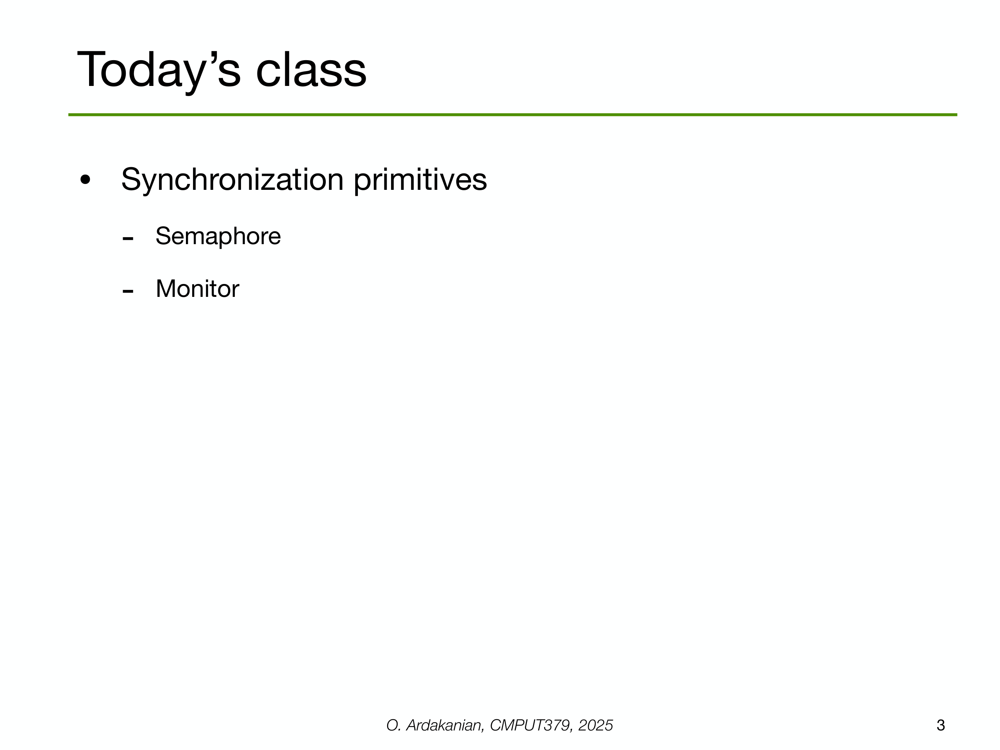

---

## 第 3 页



这页是本节课要讲的两个**同步原语**：**信号量（Semaphore）**和**监视器/管程（Monitor）**。下面把它们的概念、用法、对比和易错点说明白。

---

## 1) 信号量 Semaphore

**是什么**

* 一个**非负整数计数器**，提供两种原子操作：

* `P()`/`wait()`/`down()`：当计数>0 时做 `count--` 并继续；否则阻塞等待。
* `V()`/`signal()`/`up()`：做 `count++`，并唤醒**一个**等待者（若有）。
* 两类：

* **二值信号量**（0/1）≈ 互斥锁。
* **计数信号量**：表示可用资源的个数（连接池、并发限流）。

**典型用法**

* 互斥（binary semaphore）：

```c
// 初值 1
wait(m);         // 进入临界区
/* critical */
signal(m);       // 退出
```
* 有界缓冲区（生产者-消费者）：

```c
semaphore empty = n;  // 空位数
semaphore full  = 0;  // 商品数
semaphore mutex = 1;  // 保护队列

// 生产者
wait(empty);
wait(mutex);
enqueue(item);
signal(mutex);
signal(full);

// 消费者
wait(full);
wait(mutex);
item = dequeue();
signal(mutex);
signal(empty);
```

**优点/缺点**

* ✅ 简洁高效，可在内核/用户态广泛使用。
* ⚠️ **容易用错**：次序颠倒、漏 `signal` 会死锁；语义不自描述（`full/empty`靠约定）；不直接表达“条件谓词”。

---

## 2) 监视器 / 管程 Monitor

**是什么**

* 把**互斥**与**条件变量**封装到**模块/对象**里：

* 监视器内部**同一时刻只有一个线程**执行。
* 提供 `condition` 变量：`wait()` 让当前线程睡眠并释放监视器锁；`signal()/broadcast()` 唤醒等待者。
* 你在面向对象语言里常见到：`synchronized`（Java）、`@synchronized`（Obj-C）、`lock` + `condition_variable`（C++）组合就是监视器思想的具体化。

**典型用法（有界缓冲）**

```c++
// 伪代码
monitor BoundedBuffer {
queue Q; int n;
condition notFull, notEmpty;

put(x) {
while (Q.size()==n) notFull.wait();   // 释放内部锁并睡眠
Q.push(x);
notEmpty.signal();                    // 改变状态后发信号
}

get() {
while (Q.empty()) notEmpty.wait();
auto x = Q.pop();
notFull.signal();
return x;
}
}
```

**两种语义（要点）**

* **Hoare 语义**：`signal` 立刻把 CPU 让给被唤醒者（被唤醒者“马上”看到条件为真）。
* **Mesa 语义（实际更常见，如 POSIX/C++/Java）**：`signal` 只是把等待者放入就绪队列；被唤醒时必须**用 while 重新检查条件**，因为条件可能又变了。

**优点/缺点**

* ✅ 把数据和同步逻辑封装，接口语义清晰（例如 `put/get`），更不易犯错。
* ⚠️ 需要语言/库支持；若误用（不用 while、在解锁后 signal）仍会出错。

---

## 3) 二者如何取舍

* 需要表达**资源个数**或实现轻量限流 → **计数信号量**。
* 需要表达“**当条件满足再继续**”的逻辑，并希望封装临界区与等待/唤醒 → **监视器（互斥 + 条件变量）**。
* 简单互斥 → 二值信号量或互斥锁；通常首选**互斥锁**（语义更清晰，便于与条件变量配套）。

---

## 4) 常见陷阱

* **信号量顺序颠倒**（先 `signal` 再 `wait`）导致竞态或违背协议。
* **监视器中用 `if` 代替 `while`** → 假唤醒或条件被他人破坏。
* **修改共享状态后在锁外 `signal`** → 可能丢失唤醒。
* **优先级反转**：低优先级持锁阻塞高优先级；需“优先级继承”互斥或协议设计避免。

---

> 小结：今天这节课会把“**计数式的同步（信号量）**”与“**条件式的同步（监视器/管程）**”两大工具讲透：各自语义、标准写法、用在什么场景、以及避免死锁/丢失唤醒的技巧。


