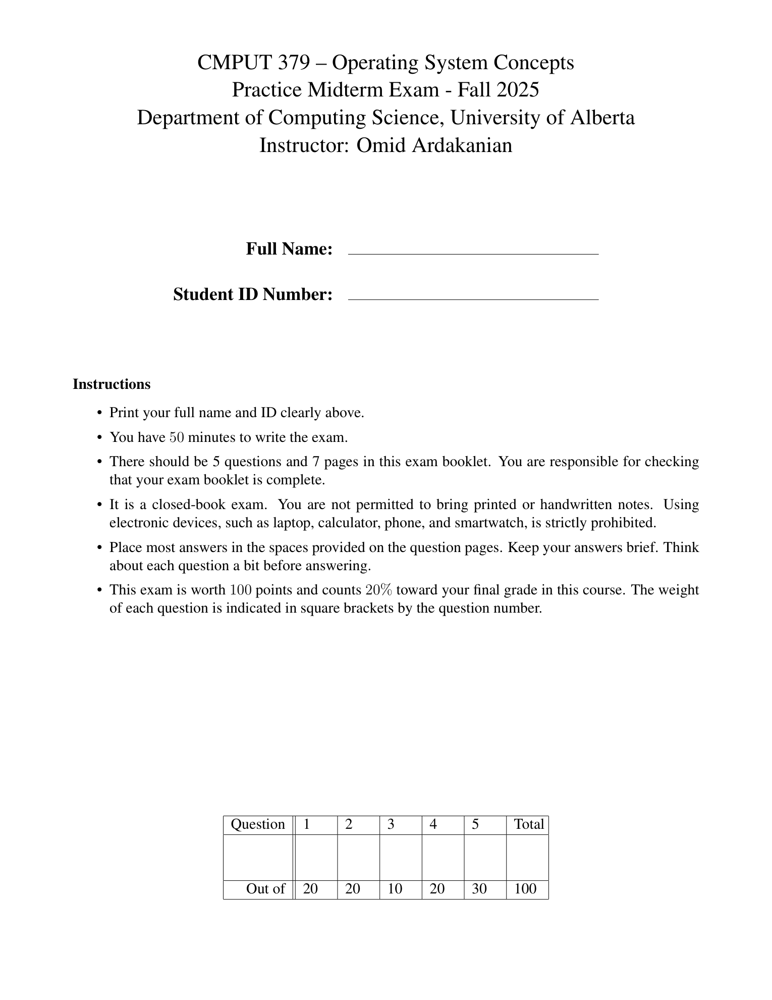
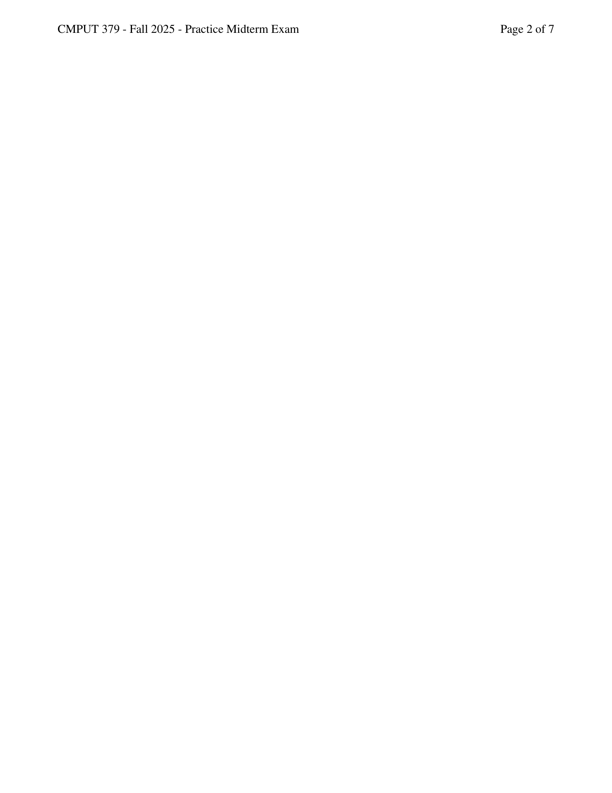
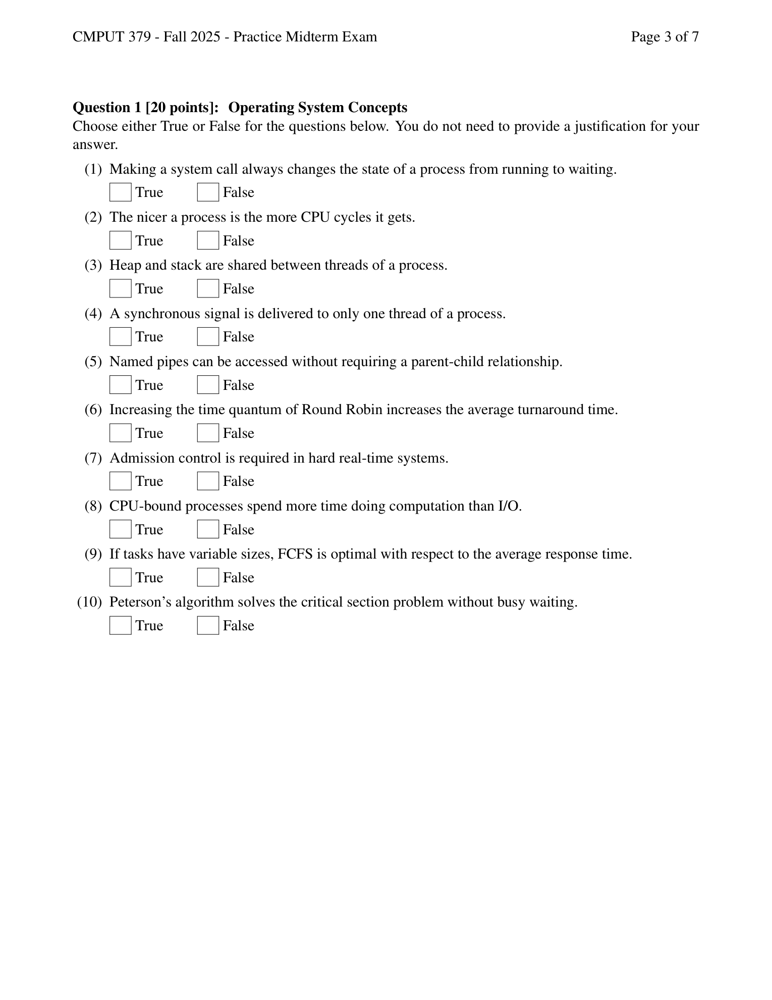
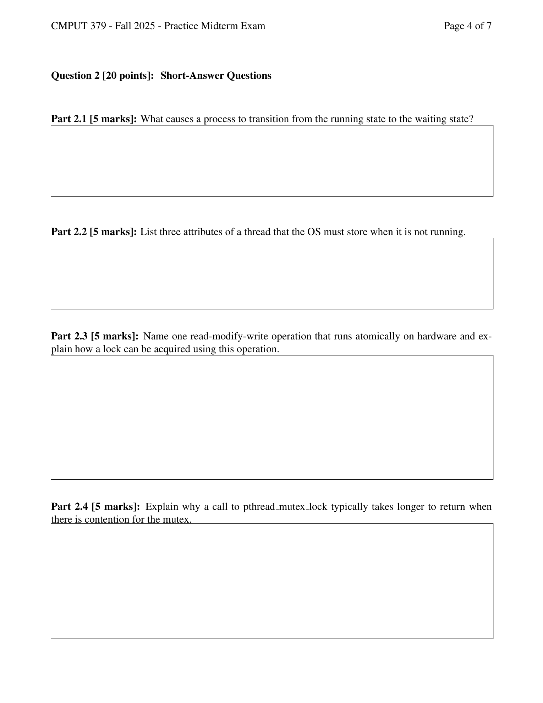
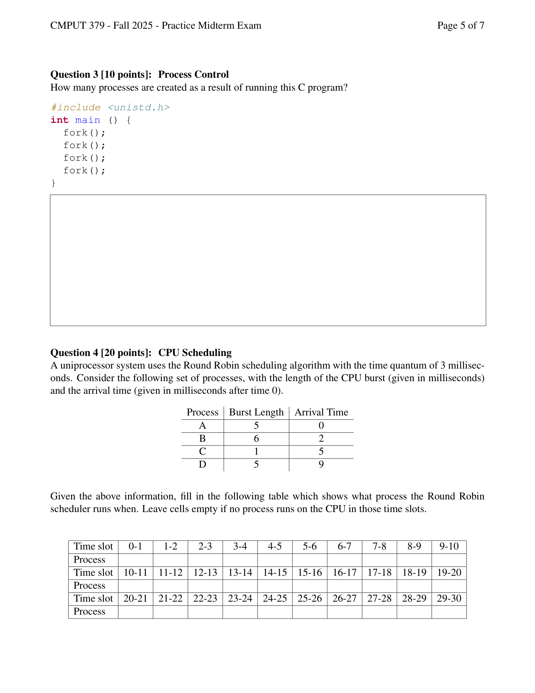
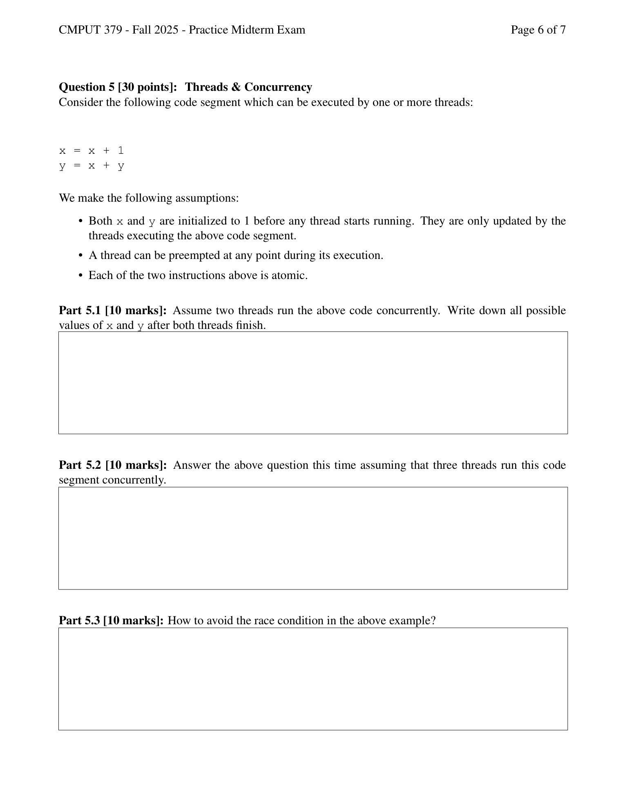

---

## 第 1 页

[media pointer="sediment://file_00000000f3e061f782403ef5d92d9c25"]
什么意思？详细解释

---

## 第 2 页

[media pointer="sediment://file_00000000b85861f7bb7034b882070917"]
什么意思？详细解释

---

## 第 3 页

[media pointer="sediment://file_00000000baac61f782d9a332dbd8ceb3"]
什么意思？详细解释

---

## 第 4 页

[media pointer="sediment://file_000000002c1461f78f1a558709701e39"]
什么意思？详细解释

---

## 第 5 页

[media pointer="sediment://file_00000000d4c861f5912561289e5838ac"]
什么意思？详细解释

---

## 第 6 页

[media pointer="sediment://file_00000000b5ac61f7bf274f1e8b08b59d"]
什么意思？详细解释
