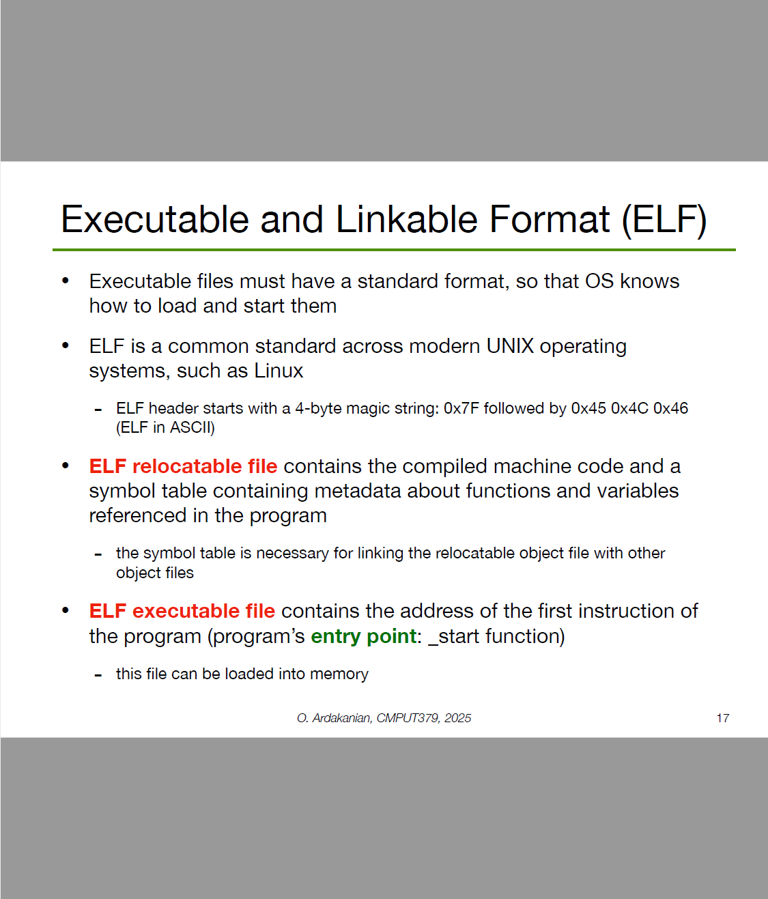
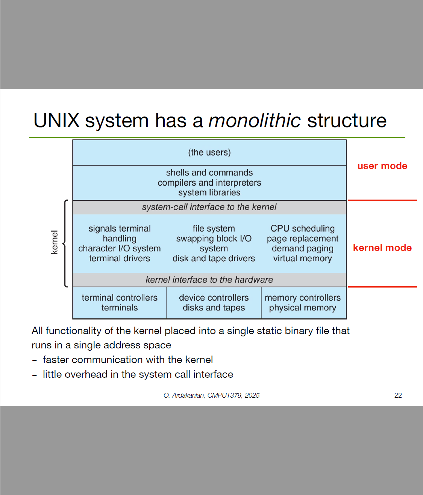

这张图片是课程讲义的封面页。标题是**Operating System Concepts（操作系统概念）**，副标题是**Lecture 2: Interaction with Hardware（第2讲：与硬件的交互）**。下面是授课老师（Omid Ardakanian）、邮箱和学校（阿尔伯塔大学）。
 它告诉你：这一讲会讲“操作系统如何跟计算机硬件打交道”。

# 这节课通常会讲什么？

## 1）操作系统在硬件与应用之间的定位

- **应用程序**（微信、浏览器）不能直接随意碰硬件（CPU、内存、磁盘、网卡），否则会混乱和不安全。
- **操作系统（OS）\**是“管理者/中间层”，提供统一接口，让应用通过\**系统调用**来请求服务，比如读文件、发网络包、分配内存。

## 2）用户态 / 内核态与系统调用

- CPU 有**两种特权级**：用户态（跑应用）和内核态（跑 OS 内核）。
- 应用要做敏感操作（读写磁盘、网络、创建进程）时，会通过**系统调用**（如 `read`, `write`, `open`, `socket`）切到**内核态**，由内核代为访问硬件，再切回用户态。
- 这种切换也叫**陷入/陷阱（trap）**。

## 3）中断（Interrupt）与异常（Exception）

- **中断**：硬件“打电话”给 CPU/OS，比如键盘按下、网卡收包、定时器到点、磁盘 I/O 完成。OS 的**中断处理程序**被触发，完成相应工作。
- **异常**：运行时错误或特殊事件（如除零、缺页）。OS 捕获后要么修复（加载缺失页面），要么终止进程。

## 4）设备与驱动、控制器、DMA

- 每类硬件都有**设备控制器**（会暴露寄存器/队列）。
- **设备驱动（driver）**是内核里的“翻译官”，把通用的 OS 请求变成设备能懂的命令。
- **DMA（直接内存访问）**：让设备绕过 CPU，直接把数据搬进内存，提高 I/O 性能；完成后用中断告知 OS。

## 5）I/O 方式：轮询 vs 中断、内存映射 I/O

- **轮询**：CPU 不断检查设备状态，简单但浪费 CPU。
- **中断驱动**：只有事件发生才处理，更高效。
- **内存映射 I/O（MMIO）**：把设备寄存器映射到内存地址空间，内核读写这些地址就是在“控制硬件”。

## 6）内存管理与硬件协作

- **MMU（内存管理单元）** + **页表** 实现虚拟内存；应用的地址被映射到物理内存/磁盘。
- **TLB** 是加速页表查询的缓存。
- **缺页中断**：访问不在内存的页 → 触发异常 → OS 把页从磁盘调入再继续执行。

## 7）进程/线程调度与上下文切换

- OS 通过**调度器**在多个任务间分时使用 CPU。
- **定时器中断**定期触发，OS 根据策略（如 CFS）决定是否切换任务。
- **上下文切换**保存/恢复寄存器、程序计数器等，因此太频繁会有开销。

## 8）存储与文件系统

- 应用的文件操作（打开、读写、关闭）→ 系统调用 → VFS（虚拟文件系统） → 具体文件系统（ext4、NTFS 等）→ 块设备驱动 → 磁盘控制器（常用 DMA）。
- OS 还会做**缓存/缓冲**、日志（journaling）来保证性能与一致性。

## 9）启动与安全隔离（简述）

- **启动流程**：固件（BIOS/UEFI）加载引导程序 → 加载内核 → 初始化驱动。
- **隔离与保护**：特权级、页表权限、IOMMU、防止应用滥用硬件或互相干扰。

# 一个直观的小例子

“程序读取文件的一次旅程”

1. 程序调用 `read(fd, buf, n)`（用户态）。
2. 触发系统调用陷入内核（切到内核态）。
3. VFS 找到文件所在磁盘块，发命令给磁盘控制器（通过驱动/MMIO）。
4. 控制器用 **DMA** 把数据拷进内存缓冲区，完成后**中断**通知内核。
5. 内核把数据拷到用户缓冲区 `buf`，返回用户态，`read` 完成。

如果你想，我可以把这些要点整理成**中文速记表/思维导图**或配上**流程图**来帮助记忆。


这是课件第一页，告诉你本节课要讲两件事：

1. 为什么要学习操作系统（OS）
2. 操作系统与硬件如何交互——重点会提到：CPU、寄存器、内存、设备控制器、以及中断体系。

下面把每一项都“拆开讲明白”。

# 为什么要学 OS？

- **OS 是“资源管家”**：它统一管理 CPU 时间、内存、磁盘、网络与外设，让多个程序安全、高效地共享硬件。
- **程序与硬件的“接口”**：应用不直接碰硬件，而是通过系统调用（如 `read/write/open/fork`）向 OS 请求服务。
- **并发与可靠性的核心**：进程/线程、同步（锁、信号量）、调度、崩溃隔离、权限控制，这些基础能力来自 OS。
- **性能与成本**：内存管理（缓存、虚拟内存）、I/O 调度、文件系统设计，直接影响程序的速度与资源开销。
- **通用底层思维**：理解 OS 原理能帮助你写出更快、更稳、更安全的代码，也有助于学习分布式系统、云计算、容器等。

# OS 与硬件如何交互（总览）

可以把 OS 看成位于“应用 ↔ 硬件”中间的一层：

- **向上**：提供系统调用与抽象（进程、线程、文件、套接字、虚拟内存）。
- **向下**：通过特权指令、驱动程序、DMA、中断，与硬件打交道。

接下来按清单逐个解释。

## CPU（中央处理器）

- **执行指令**：CPU 不断取指—译码—执行。OS 通过**调度器**决定“哪个进程/线程”在某个时刻占用 CPU。
- **特权级**：至少分**内核态**与**用户态**。应用在用户态运行；需要访问硬件或受保护资源时，通过**系统调用**“陷入（trap）”内核态，由 OS 代为执行。
- **上下文切换**：当从进程 A 切到 B 时，OS 要保存/恢复一组寄存器（见下节），这叫**上下文切换**，有一定开销。
- **时钟中断驱动的抢占**：定时器定期打断 CPU，OS 借机检查是否需要切换到更高优先级的任务（抢占式多任务）。

## 寄存器（Registers）

- **寄存器是 CPU 内部的超高速存储**，保存当前计算的关键状态：
  - **PC/IP**（程序计数器）：下一条要执行的指令地址
  - **SP**（栈指针）：指向当前调用栈顶
  - **通用寄存器**：临时数据、函数参数、返回值
  - **PSW/EFLAGS**（程序状态字）：条件标志位、当前特权级、是否开中断等
- **为什么重要**：上下文切换必须保存/恢复这套寄存器，保证任务恢复时从“原地”继续执行。

## 内存（Memory）

- **物理内存**：实际的 RAM 芯片。
- **虚拟内存**：OS 为每个进程提供独立的地址空间（看起来从 0 开始），通过 **MMU** 与页表将“虚拟地址 → 物理地址”映射，实现：
  - **隔离与保护**：一个进程不会随意读写另一个进程的内存或内核内存。
  - **按需分页/换页**：不常用的数据可放磁盘（交换区）；缺页时再调入。
  - **共享内存**：多进程高效通信的一种方式。
- **缓存层次**：CPU Cache（L1/L2/L3）→ 内存 → 磁盘；命中率影响性能。

## 设备控制器（Device Controllers）

- **是什么**：外设（磁盘、网卡、USB、GPU、显示器等）旁边的专用硬件，用来理解/执行与该设备相关的命令。
- **驱动程序（Driver）**：OS 中与控制器“说话”的软件，用寄存器/队列/DMA 描述符向控制器下发命令、读取状态。
- **DMA（直接内存访问）**：让设备在不占用 CPU 的情况下，把数据直接搬进内存或从内存读走，完成后再通过**中断**通知 OS。

## 中断体系（Interrupt Architecture）

- **中断**：设备或定时器向 CPU 发的异步信号，打断当前执行流，让 OS 立刻处理“更紧急”的事情。
- **中断向量表**：记录“不同中断号 → 对应的处理例程入口地址”。
- **硬中断 vs 软中断/陷入**：
  - **硬中断**：来自外设/时钟（例如磁盘完成、网卡收包）。
  - **软中断/陷入（trap）**：由指令触发（如系统调用、异常），用于从用户态进入内核。
- **流程示意**：
  1. 设备完成 I/O → 产生中断；
  2. CPU 保存现场、跳到内核的中断处理程序；
  3. 处理程序读状态、唤醒等待的进程、可能提交后续 I/O；
  4. 恢复现场，返回被中断的程序（或切到别的任务）。
- **屏蔽与优先级**：某些关键区段可临时“关中断/屏蔽指定中断”，系统为不同中断分配优先级以保证实时性。

# 一个完整的小例子（把这些点串起来）

应用要写文件 → 调用 `write()`（陷入内核） → 文件系统把数据交给磁盘**驱动** → 驱动把 DMA 描述符写入**设备控制器**寄存器并发起 DMA → 控制器把数据直接搬到磁盘缓存/介质 → 完成后发**中断** → OS 的中断处理程序标记 I/O 完成并唤醒进程 → 调度器决定是否立刻让该进程在 **CPU** 上继续跑 → 通过**上下文切换**恢复进程的寄存器 → 应用返回 `write()` 成功。

------

如果你愿意，我可以再画一张简单的“应用—OS—硬件”交互图，或用你熟悉的编程语言写个小实验（比如测量系统调用和上下文切换的开销），帮助更直观地理解。


下面这张幻灯片在回答一个问题：“为什么要学习操作系统（Operating System, OS）？”我按要点给你**翻译 + 解释 + 小例子**。

------

## 1) 了解 OS 的工作原理，对写出**高效且安全**的程序至关重要

- **高效（efficient）**：能以较少的 CPU、内存、I/O 资源完成同样工作。
  - *例子*：知道系统调用的开销、缓冲区大小对磁盘/网络吞吐的影响，就能把延迟从毫秒级降到微秒级。
- **可靠（reliable）**：程序很少崩溃或卡死。
  - *例子*：理解进程/线程与内核调度，就不容易写出在高负载下“偶发死锁”的代码。
- **复杂（complex）**：OS 要处理时序与并发等棘手问题。
  - *例子*：文件写入到底何时真正落盘？崩溃后如何不丢数据？这涉及缓冲、日志、同步等机制。
- **安全（secure）**：权限、隔离、防越权访问。
  - *例子*：明白用户态/内核态、沙箱、权限位（rwx）和进程隔离，才能写出更安全的服务。

> 核心思想：OS 是“资源管理器 + 抽象提供者”。懂它，才能把程序写得又快又稳又安全。

------

## 2) 学 OS 就是在学习**大型软件系统的设计**

- 幻灯片举例：**Windows Vista 超过 5000 万行代码**——提示你 OS 的**规模与工程复杂度**。
- 学 OS 能训练你：模块化设计、接口抽象、分层（驱动→内核→系统调用→库→应用）、以及如何在复杂系统里定位与修复问题。

------

## 3) 学 OS 会让你成为**更强的程序员**

- **权衡取舍（trade-off）**：性能 vs 可用性、性能 vs 设计简洁。
  - *例子*：是用同步阻塞模型写得简单，还是用异步/多线程模型换更高吞吐？
- **抽象管理复杂度**：用合适的抽象把难题“包起来”。
  - *例子*：
    - **进程/线程** 抽象 → 不必直接操心 CPU 的时分复用细节；
    - **文件系统** 抽象 → 不必直接操作磁盘扇区；
    - **虚拟内存** 抽象 → 让每个进程都像拥有独立、连续的地址空间。
- 这类能力可迁移到任何后端/系统开发：调优、排障、并发控制、内存管理、I/O 设计、故障恢复。

------

## 4) 这是一个**非常活跃的研究领域**

- **新应用场景**：云计算、移动与边缘计算、嵌入式与实时系统（汽车、工业控制、物联网）。
  - *为何活跃*：硬件形态多样（GPU、NPU、异构加速器），安全与能耗要求更苛刻，工作负载（AI/大数据）不断变化。
- **顶级学术会议**：
  - **SOSP**（ACM Symposium on Operating Systems Principles）
  - **OSDI**（USENIX Symposium on Operating Systems Design and Implementation）
     这些会议汇聚了操作系统与系统软件的前沿成果（比如新型文件系统、调度器、存储/网络栈、容器与虚拟化、安全隔离等）。

------

## 一句话带走

- 学 OS = 学**性能、可靠性、安全性、并发与抽象**。
- 这能直接提升你写高性能服务、做系统调优与排障的能力；同时打开通往大型工程与前沿研究的大门。

如果你愿意，我可以基于这张幻灯片给你做一份**入门学习路径**（进程/线程→调度→内存管理→文件系统→并发→虚拟化→安全）和配套的练手项目清单。


这页的意思：**操作系统（OS）无处不在**，不只是电脑，手机、车机、手表等都在跑某种 OS。四个框代表四大场景，每个场景的 OS 目标和功能各不相同。

# 1) Desktop & Laptop Computers（台式机/笔记本）

- **常见 OS**：Windows、macOS、Linux。
- **硬件**：多核 CPU、独显/集显、大内存、SSD、丰富外设（USB、摄像头、打印机…）。
- **OS 重点**：多任务/多用户、图形界面、文件系统、安全（权限/沙箱/加密）、驱动生态、兼容性与性能。
- **典型抽象**：进程/线程、虚拟内存、文件/目录、网络套接字、设备驱动。

# 2) Mobile Devices（手机/平板）

- **常见 OS**：Android、iOS（图里展示了不同移动界面）。
- **硬件**：ARM SoC、蜂窝/无线网络、触屏、摄像头、GPS、各类传感器。
- **OS 重点**：
  - **功耗管理**（省电、后台限制、Doze/Background Modes）；
  - **安全与权限**（应用沙箱、权限弹窗、应用商店签名/审核）；
  - **传感器与多媒体**（相机、麦克风、定位、手势）；
  - **连接**（蜂窝/蓝牙/Wi-Fi、推送通知、热点/投屏）。
- **开发模型**：应用受生命周期管理（前台/后台/挂起），系统调用多通过高层 API 暴露。

# 3) Embedded Computers（嵌入式设备，如车机、路由器、工业控制）

- **常见 OS**：嵌入式 Linux、QNX、VxWorks、FreeRTOS、Zephyr（有的属“实时 OS/RTOS”）。
- **硬件**：资源更受限（小内存、低频 CPU）、特定外设（传感器、总线、控制器）。
- **OS 重点**：
  - **实时性**（在严格时限内响应；如制动系统、工控）；
  - **可靠性/安全**（出错代价高，要容错、看门狗、分区隔离）；
  - **快速启动**与**长时间稳定运行**；
  - **定制化驱动**（CAN 总线、SPI/I²C、车载以太网等）。
- **特点**：常无完整桌面 GUI；只运行少量专用任务和服务。

# 4) Wearables（可穿戴：手表、手环、耳机等）

- **常见 OS**：watchOS、Wear OS、Fitbit OS、RTOS 变体。
- **硬件**：更小的电池与内存、低功耗 MCU/SoC、心率/加速度/血氧等传感器。
- **OS 重点**：**超低功耗**（深度睡眠/唤醒机制）、**传感器融合**、**健康数据**处理与同步（蓝牙到手机）、小屏交互与通知。

------

## 统一的核心思想

不管在哪种设备上，OS 都承担三件事：

1. **抽象**：把复杂硬件封装成通用接口（进程、文件、网络、设备）。
2. **管理**：调度 CPU、分配内存、管理 I/O、能耗与安全策略。
3. **隔离与保护**：用户态/内核态、权限/沙箱，避免应用互相干扰或破坏系统。

> 简单记忆：**电脑追求性能与通用性，手机强调功耗与安全，嵌入式看重实时与可靠，可穿戴则是极致省电与传感器。**
>  如果你愿意，我可以把这页内容整理成一张对比表或思维导图，方便背诵复习。


这是在讲“客户端-服务器（client–server）模型”。图里左边是**服务器**，右边是不同类型的**客户端**（台式机、笔记本、手机），中间通过**网络**连起来。下面两条要点意思是：

- 每个客户端都可以向服务器**发请求**（比如“帮我查一下这个关键字”）。
- 服务器**收到请求就执行**相应操作（跑查询、算结果、读写数据库/文件等），然后把**结果返回**给客户端。

# 关键概念

- **客户端（Client）**：发起请求的一方。浏览器、手机 App、桌面程序都可以是客户端。
- **服务器（Server）**：提供服务的一方，24/7 运行，等待并处理来自大量客户端的请求。
- **网络（Network）**：两者之间传输数据的通道（通常是 Internet/局域网）。

# 一次请求到底发生了什么（简化版）

1. 客户端构造请求（例如 HTTP GET/POST，或 RPC 调用）。
2. 通过网络协议（常见 **TCP**，也有 **UDP**）把请求发到服务器的指定端口（如 HTTP 80/443）。
3. 服务器进程在该端口**监听**，接收请求，交给应用逻辑处理。
4. 应用可能访问**数据库/缓存/文件/其他服务**来完成任务。
5. 生成**响应**（状态码+数据，如 JSON/HTML/图片等）。
6. 通过网络把响应发回客户机，客户端渲染或展示结果。

# 为什么要这样设计？

- **集中管理资源**：数据与业务逻辑放在服务器，统一更新、备份、权限控制更简单。
- **易扩展**：可以给服务器“加机器”（水平扩展）、加缓存、做负载均衡。
- **多端复用**：手机/电脑/平板都能用同一套服务。

# 常见例子

- 打开网页：浏览器（客户端）→ 发 HTTP 请求 → Web 服务器（Nginx/Apache/应用）→ 回网页内容。
- App 登录：App → 发送用户名/口令（经加密）→ 服务器验证 → 返回 token/会话。
- 搜索：客户端提交关键字 → 服务器查询索引 → 返回结果列表。

# 补充：一些术语你会常见

- **API**（应用程序接口）：客户端与服务器“约定”的请求与响应格式（REST、gRPC 等）。
- **无状态/有状态**：HTTP 常是**无状态**；需要会话时用 **Cookie/Session/Token** 保持登录状态。
- **并发与伸缩**：服务器要能同时处理很多请求（多进程/多线程/异步 I/O、负载均衡、缓存）。
- **安全**：HTTPS 加密、身份认证、权限控制、速率限制、审计等。

# 局限与挑战

- **单点故障**：一台服务器挂了就不可用 → 需主备/集群。
- **瓶颈与延迟**：高并发会压垮单台机器；跨地域网络会慢 → 需扩容、CDN、就近接入。
- **网络不可靠**：要做重试、超时、幂等设计。

**一句话总结**：客户端-服务器模型就是“多端发请求，中心来服务”的工作方式；它清晰分工、便于管理与扩展，是现代互联网应用最常见的架构基础。


这页在讲**客户端-服务器（client–server）模型**，以及在这个模型里**操作系统（OS）到底做了什么**。

## 图里发生了什么（按箭头 1→4）

- **Client A / Client B**：两台装了浏览器的电脑（左是 Windows，右是 macOS）。
- **Server**：一台跑 Linux 的服务器，上面有 **Web Server**（如 Nginx/Apache/Node 等）。

1. **Client A 发起请求**：浏览器要 `index.html`（HTTP GET）。
   - 浏览器通过 OS 的**系统调用**建立 TCP 连接（`socket()`, `connect()`），OS 的网络栈完成三次握手、分片、重传等细节。
2. **Server 侧读取文件**：Web 服务器进程被 OS 从**监听队列**里 `accept()` 到连接，随后用 `open()/read()` 或 `sendfile()` 读取 `index.html`（很多时候直接命中 OS 的**页缓存**）。
3. **Client B 也来要数据**：同时又来一个对 `data.json` 的请求（并发场景）。
4. **Server 侧再读另一个文件**：Web 服务器再次读取 `data.json`，把响应通过 OS 的网络栈发回去。客户端 OS 收到网卡中断，内核重组数据，浏览器再 `read()` 到字节并渲染。

> 你在图里看到的“hardware→OS→App”三层，表示**应用不直接碰硬件**，一切都要通过 OS 提供的抽象与保护。

## 这页下面四条 bullet 想教你的

1. **让多个（本地或远程）用户程序互相通信并共享数据**
   - OS 提供**进程间通信 IPC**（管道、共享内存、消息队列）与**网络套接字**（socket）。
   - 统一接口 = 程序跨平台更容易：Windows/macOS/Linux 都能“说同一种套接字语言”。
2. **处理并发请求**
   - Web 服务器可能用**多进程/多线程/事件驱动**（epoll/kqueue/IOCP）来同时服务很多连接。
   - **调度器**决定哪个线程何时上 CPU；**中断**与**DMA**让网络/磁盘 I/O 高效进行；**页缓存**减少磁盘读。
3. **用原子操作访问共享数据**
   - 为避免竞争条件，OS/CPU 提供**原子指令**与同步原语：原子加减、CAS、**mutex/sem**、**futex**、文件锁。
   - 例如统计在线人数、更新缓存、写日志时，靠这些机制保证一致性。
4. **保护系统免受恶意脚本/程序侵害**
   - **权限与隔离**：用户态/内核态、用户/组权限、文件 ACL；浏览器与服务进程尽量“最小权限运行”。
   - **内存与执行保护**：ASLR、DEP/NX、W^X；**沙箱/容器**（chroot、namespaces、AppArmor/SELinux）限制破坏面；**防火墙**控制网络访问。
   - OS不能阻止所有“网页层面”的攻击（如 XSS/CSRF），但能把影响**隔离在进程/用户/容器内**，避免殃及系统。

## 一句话总结

**浏览器↔服务器**这整条链路之所以能高效而安全地跑起来，是因为**操作系统**在背后提供了：通信抽象（socket）、并发与调度、可靠的文件/缓存/I/O，以及权限与隔离等安全机制。


“**Interfacing Hardware**” 直译就是**对接/连接硬件**。在计算机或嵌入式系统里，它指的是：**让软件与外部硬件设备可靠地“说话”并完成数据交换**。这件事既包含“电气层面”的连接，也包含“软件层面”的驱动与协议。下面把它拆开讲清楚。

# 一、电气层面：把线接对、信号对得上

- **电压/电流与逻辑电平**：3.3 V 或 5 V？是否需要**电平转换**（level shifter）？
- **接口与总线**：GPIO（并行）、UART、I²C、SPI、USB、PCIe、SATA、以太网等；每种都有**时序**与**带宽/延迟**特性。
- **时序与握手**：上升/下降沿、采样时刻、时钟频率、CS/ACK 等线的配合。
- **模拟/数字**：若是传感器输出模拟量，要经 **ADC**；控制电机可能要 **PWM**。
- **噪声与保护**：去抖动（按钮）、屏蔽/接地、光耦/继电器隔离、过流/反接保护。

# 二、软件层面：用驱动把设备“抽象”出来

- **设备控制器与寄存器**：每个外设有一组寄存器（控制/状态/数据）。
  - **内存映射 I/O（MMIO）**：把寄存器映射到地址空间，用读写内存的方式访问。
  - **端口 I/O（PIO）**：通过专门的指令读写 I/O 端口（x86 上的 `in/out`）。
- **驱动（Device Driver）**：内核里的模块，负责
  1. 初始化设备、设置 DMA/队列；
  2. 处理 **中断**（设备就绪/完成会打断 CPU）；
  3. 向上提供统一接口（如 Linux 的 `/dev/*`、`ioctl`、`sysfs`）。
- **数据路径（从应用到硬件）**
   应用 → **系统调用** → 内核 → **驱动** → 总线控制器（如 PCIe/USB 控制器）→ **设备寄存器/DMA**
   ← 设备发**中断**通知完成 ← 驱动把结果交回应用。
- **轮询 vs 中断**：
  - *轮询*：反复读状态位，简单但占 CPU；
  - *中断*：事件来再处理，省 CPU，适合高并发 I/O。
- **DMA**：设备直接读写内存，减少 CPU 拷贝；要注意**缓存一致性**与**对齐**。

# 三、跟操作系统有关的常见抽象

- **文件型接口**：串口/磁盘/摄像头被抽象成“文件”，`open/read/write` 即可。
- **网卡**：通过套接字 API（`socket/send/recv`），驱动负责包的发送接收与中断。
- **块设备**：磁盘由驱动 + 调度器 + 文件系统共同管理。
- **热插拔与枚举**：如 USB/PCIe 插上后由总线驱动**枚举**，再绑定具体设备驱动。

# 四、两个小例子（帮助建立直觉）

**1) 微控板点灯（GPIO，MMIO 方式）**

- 配置某引脚为输出 → 向“数据寄存器”写 1/0 → LED 亮/灭。
- 若用中断：按钮引脚配置为上升沿中断 → 中断服务程序里翻转 LED。

**2) 电脑读取磁盘**

- 应用 `read()` → 内核把读请求交给磁盘驱动 → 驱动把 DMA 描述符写入控制器寄存器 → 磁盘完成后发中断 → 驱动唤醒进程 → `read()` 返回数据。

# 五、常见坑与工程注意

- **电平/时序不匹配**、线太长导致反射/串扰。
- **端序/对齐**错误（大端/小端）。
- **DMA 与 CPU 缓存不一致**（需要 cache flush/invalidate）。
- **并发与竞态**：中断与应用/内核线程共享数据要加锁或使用无锁队列。
- **权限与安全**：用户态不能直接乱碰硬件；通过驱动与受控 API 访问。

**一句话总结**：Interfacing Hardware = 让软件通过**正确的电气连接 + 合适的协议/驱动**，去**可靠、高效、安全**地控制与使用硬件设备。
 如果你给我一个具体设备或场景（比如“用树莓派读 I²C 传感器”或“在 Linux 下写一个简单字符设备驱动”），我可以直接给你接线图/时序说明与示例代码。


这页讲“计算机系统的**组成与 I/O 工作方式**”。我把每条都翻译并顺带解释+小例子👇

------

## 1) CPUs, registers, 三级缓存、内存、磁盘

- **CPU**：真正执行指令的核心，可能有多核/超线程。
- **寄存器（registers）**：CPU 内部、容量极小但**最快**的存储。
- **三级缓存（L1/L2/L3 cache）**：在寄存器与内存之间做“加速层”，越靠近 L1 越小越快。
- **内存（DRAM）**：容量大、易失，速度比缓存慢。
- **磁盘（SSD/HDD）**：持久化存储，最慢但最便宜、容量最大。

> 这是经典**存储层级**：寄存器 < L1 < L2 < L3 < DRAM < SSD/HDD（从快到慢、从小到大）。

------

## 2) System bus：把 CPU、控制器（磁盘/I-O）、内存连起来的“高速公路”

- **系统总线**（广义地也包括内存总线、PCIe 等）提供**地址线、数据线、控制线**，让计算与设备能互相读写数据。
- 总线带宽是有限资源，谁都要用：CPU 取指/读写内存要用，I/O 控制器做 DMA 也要用，所以会**争用带宽**。

------

## 3) I/O 设备与控制器（controllers）

- **设备（device）**：硬盘、网卡、键盘、摄像头等外设本体。
- **控制器（controller）**：与总线对接、管理设备读写的“管家”（可能在主板或设备卡上）。
- **一个控制器可挂多个设备**：如 USB 主控接多个 USB 设备、SATA 控制器接多块盘。

### 并行与竞争

- **CPU 与控制器并行运行**：比如网卡在后台通过 **DMA** 把数据直接写入内存，CPU 同时在算别的事 → 这就是“异步 I/O”。
- 但**两者会竞争内存周期**：DMA 写内存要占用内存总线，CPU 此时访问内存可能被挡一挡；网卡/存储越快，争用越明显。

### 控制器里的缓冲与寄存器

- 控制器通常有**本地缓冲区**（暂存数据）和**专用寄存器**（命令/状态/地址等）。
- OS 需要按硬件手册把这些寄存器写好，比如：I/O 缓冲区地址、长度、方向（读/写）、启动位等。

### 设备驱动（device driver）

- **每种控制器在 OS 里都有驱动**：这是能听懂“硬件方言”的内核模块。
- 驱动负责：初始化硬件、设置寄存器/DMA 描述符、提交 I/O、处理超时与错误、把内核里的数据缓冲与应用层对接。

### 中断（interrupt）

- **控制器用中断通知 OS**：I/O 完成或出错时，向 CPU 发送中断信号。
- CPU 立即转去执行驱动的**中断服务程序（ISR）**：读取状态、清中断、唤醒等待的进程、提交下一批 I/O 等。
- 现代设备常用 **MSI/MSI-X**（消息信号中断），本质仍是“提醒 CPU 来处理我”。

------

## 一个完整小例子：读磁盘块

1. 应用 `read()` → 内核把请求交给**磁盘驱动**。
2. 驱动把**目标地址/长度/内存缓冲区地址**写入控制器寄存器或 DMA 描述符，并置位“开始”。
3. 控制器从磁盘取数据并通过 **DMA** 写入内存缓冲区（CPU 不必搬运数据）。
4. 完成后控制器**发中断**。
5. 驱动的 ISR 运行：检查状态→清中断→把数据标记为就绪→唤醒应用。
6. 应用返回 `read()`，拿到数据。

> 期间 CPU 与控制器**并行**，但在 DMA 写内存时会**竞争**内存带宽。

------

## 易混点速记

- **设备 vs 控制器**：设备是“干活的”，控制器是“会说总线语言的管家”。
- **轮询 vs 中断**：轮询是 CPU 不停问“好了吗？”，中断是设备主动喊“好了！”。
- **MMIO/端口 I/O**：驱动可通过**内存映射 I/O**把控制器寄存器当成内存地址来读写（x86 也有少见的端口 I/O 指令）。

如果你要，我可以画一张简图或给你做几道“判断哪个阶段会争用内存带宽/哪些寄存器必须设置”的练习题，帮你巩固这页内容。


这页在**回顾“存储层次结构（Memory Hierarchy）”**：为了让程序既“快”又“装得下”，计算机把存储做成多层，从**CPU 寄存器 → L1/L2/L3 缓存 → 主存（DRAM）→ 外存（SSD/闪存）**。越靠近 CPU 越**小、快、贵**；越远则**大、慢、便宜**。层次结构依赖**局部性（locality）\**与\**性价比取舍（cost-performance tradeoffs）**。

------

## 各层含义与大致数量级（图中的典型值）

- **寄存器（Registers）**：CPU 的“工作台”。
   体量：~~1–2 KB；延迟：~~**300 ps**（皮秒，10⁻¹²s，极快）。
- **L1 Cache**：离核心最近的缓存（常分指令/数据，各 ~~32 KB）。
   体量：**64 KB**；延迟：~~**1 ns**。
- **L2 Cache**：容量更大、稍慢。
   体量：**256 KB**；延迟：~**3–10 ns**。
- **L3 Cache**：跨核心共享（多数桌面/笔电）。
   体量：**4–8 MB（笔电）/ 8–32 MB（桌面）**；延迟：**10–20 ns**。
- **主存 DRAM（Memory）**：程序真正驻留的地方。
   容量：**4–16 GB（笔电）/ 8–64 GB（桌面）**；延迟：**50–100 ns**。
- **外存 Flash/SSD（Storage）**：持久化存储。
   容量：**256 GB–1 TB（笔电）/ 256 GB–2 TB（桌面）**；延迟：**50–100 μs**（微秒，10⁻⁶s）。

> 直觉标尺（以 3 GHz CPU 计，~0.33 ns/周期）：
>  L1 约几**个**周期；DRAM 约**百到三百**周期；SSD 约**几十万**周期。可见跨层 Miss 的代价非常大。

------

## 为什么这样设计？

- **程序员想要“又快又大”的内存，但“快=贵”**。
- 折中方案：把“很快但小”的层放在前面（命中大多数访问），把“很大但慢”的层放在后面（兜底）。
- **局部性**让它奏效：
  - **时间局部性**：刚用过的数据/代码，马上还会用。
  - **空间局部性**：用到地址 X，往往也会用到 X 附近（例如按顺序遍历数组）。
     硬件用**缓存行**（常见 64B）与**预取器**利用这种规律。

------

## 访问路径与代价

1. CPU 先查 **L1**；Miss → 查 **L2**；再 Miss → **L3**；
2. 仍 Miss → 去 **DRAM**；
3. 若数据不在内存（被换出），触发**缺页**，从 **SSD** 读入（微秒级，代价巨大）。
    **层级越往后，延迟指数级上升**（图底部的 10⁻¹² → 10⁻⁶ 就是在强调这个量级差）。

------

## 对编程/系统的启示（高分考点）

- **写出“缓存友好”的代码**：顺序遍历、块化（tiling/blocking）、少指针乱跳、结构体/数组布局合理、复用热数据。
- **降低 Miss 级别**：L1 Miss 还能挽救；掉到 DRAM/SSD 就很痛。
- **OS 也有“缓存”**：页缓存（page cache）把文件数据留在内存里；再读同一文件会命中内存而非磁盘。
- **TLB 也是层次的一环**：加速虚拟地址→物理地址的翻译；TLB Miss 也会拖慢性能。

**一句话记忆**：

> *近小快贵，远大慢便宜；靠局部性吃饭，尽量命中前层。*


下面这页在复习**存储层次结构（memory hierarchy）**。核心思想：
 **越靠上**（离 CPU 近）**越快、越小、越贵、易丢失（易失性）**；**越靠下**（离 CPU 远）**越慢、越大、越便宜、能掉电保存（非易失性）**。

# 1. 三个关键维度

- **速度/访问时间（access time）**：从发出请求到拿到数据要多长时间。图右侧箭头从上到下“更慢”。
- **容量（storage capacity）**：能放多少数据。图左侧箭头从上到下“更大”。
- **易失性（volatility）**：断电是否还在。断电就丢的是**易失性**（如 DRAM），断电不丢的是**非易失性**（如闪存、磁盘）。

# 2. 每一层在做什么

从上到下（CPU 一侧 → 外设/长期保存）：

- **寄存器（registers）**：CPU 内部的超高速小仓库，存放当前指令用到的值（如 PC、通用寄存器）。
- **高速缓存（cache：L1/L2/L3）**：用来缓存“**很可能马上又会用到**”的数据（时间/空间局部性）。自动由硬件管理，单位是**缓存行**（常见 64B）。
- **主存/内存（main memory / DRAM）**：程序运行的工作区。由操作系统用**虚拟内存**管理，调度单位是**页**（常见 4KB）。
- **非易失性存储（nonvolatile memory）**：如 **闪存/SSD**；掉电不丢，可做二级存储或“持久内存”。
- **硬盘驱动器（HDD）**：机械式，容量大、成本低，但有寻道/旋转延迟。
- **光盘/磁带（optical disk / magnetic tapes）**：访问更慢，常用于**冷数据/归档/备份**。
  - 幻灯片左下角的红字把它们按**技术类型**区分：
    - **Electrical（纯电）：** 闪存、SSD
    - **Mechanical（机械运动）：** HDD、光盘、磁带

上面三层（寄存器/Cache/内存）通常称为**主存储（primary storage）**；SSD/HDD 常叫**次级存储（secondary）**；光盘/磁带是**三级存储（tertiary）**。

# 3. 直觉用数据（数量级，帮助记忆）

（不同硬件会有差异，以下是常见数量级）

- 寄存器 / L1：~1 纳秒级
- L2/L3：几到十几纳秒
- DRAM：几十纳秒（~50–100 ns）
- NVMe SSD：~100 微秒级（读取）
- SATA SSD：~几百微秒
- HDD：~5–10 毫秒（寻道+旋转）
- 磁带：**秒到分钟级**（要找带、走带）

对比可见：**一次磁盘 I/O 的开销可能顶成千上万次内存访问**。

# 4. 为什么要分层？

因为**不可能**用又快又大的存储把所有数据都放上去（成本和功耗都不允许）。
 分层的目标：让**热数据**尽量待在上层，**冷数据**留在下层，从而既快又省钱。

# 5. 数据如何在层间流动（典型路径）

读取文件的一次旅程可理解为：

> 磁盘/SSD（块：4KB） → OS 页缓存（DRAM） → CPU 缓存行（64B） → 寄存器 → 指令使用
>  写入则反向，常配合**写回（write-back）\**与\**后台回刷**来平衡性能与一致性。

# 6. 与操作系统/程序设计的关系

- **局部性是王道**：按顺序访问、重用近期数据，命中率高 → 更快。
- **减少随机 I/O**：批量/顺序读写、使用缓存与预取。
- **合适的数据结构与块大小**：与缓存行、页、磁盘块对齐能减少 Miss。
- **持久化与崩溃一致性**：落盘次序、日志（WAL）、fsync、写屏障等保证断电不丢/不乱。

------

**一句话记忆**：**“上快小贵、下慢大便宜；上易失、下持久。”** 设计与调优的目的，就是让常用数据尽量“待在上面”，把慢层的影响降到最低。


这页在讲**单处理器系统** vs **多处理器系统** 的区别，以及对操作系统与性能的影响。逐条翻译+解释👇

------

## 单处理器（Single-processor）

- **定义**：整台机器只有**一个通用 CPU 核心**来运行用户程序/进程。
- **注意**：机器里可能还有“专用控制器/协处理器”（磁盘、键盘、显卡等的控制器/GPU），但**它们不跑用户进程**，只负责各自设备的工作。

> 心里图：一条收银台——所有顾客（进程）排同一队，CPU 一次只服务一个（通过时间片轮流）。

------

## 多处理器（Multiprocessor）

- **定义**：机器里有 **两个或更多“处理器”**（图里假设每个处理器只有单核 CPU）。
- **每个处理器**有**自己的一套寄存器和缓存（L1/L2…）**，但**共享同一主存（DRAM）**。
- **结果**：可以**同时**运行多个进程/线程 ⇒ **吞吐量提高**（单位时间完成的工作更多）。
- **代价**：需要**负载均衡**（让任务分配得均匀），否则某些 CPU 忙到爆、另一些闲着。

> 心里图：两条收银台——两位收银员（CPU）各自有抽屉（寄存器）和随手篮（缓存），但都去同一个后仓（主存）拿货。

------

## 操作系统在多处理器上的工作要点

1. **调度（Scheduling）**
   - OS 要把就绪的进程/线程分派到多个 CPU 上，并尽量保持**负载均衡**。
   - 常见策略：工作窃取、每核就绪队列+周期性均衡、CPU 亲和性（尽量在同一核/同一处理器上继续运行，减少缓存失效）。
2. **并发与同步**
   - 多核真并行意味着会有**竞态条件**；内核和用户程序都需要锁/原子操作/条件变量等同步原语。
   - 内核内部也要加锁（如就绪队列、文件系统元数据等）。
3. **缓存一致性与内存争用**
   - 各 CPU 有私有缓存但共享内存，因此需要**缓存一致性协议（如 MESI）**来保证大家看到的数据一致。
   - 多个 CPU 同时大量访问内存会**争用内存带宽/总线**；频繁写同一缓存行会出现“**伪共享**”导致性能抖动。
4. **中断与 I/O**
   - 中断可定向到某个 CPU 或在多 CPU 之间分配；网卡/存储中断的分散（RSS、MSI-X）能提升吞吐量。

------

## 性能认知小结

- **吞吐量**：多处理器通常更高。
- **单任务延迟**：不一定等比例下降，瓶颈可能在串行部分（Amdahl 定律）、内存/锁争用、I/O 等。
- **扩展性**：随着 CPU 数增加，调度、锁、内存体系结构（SMP/NUMA）都会影响最终可扩展上限。

------

## 术语补充（容易混淆）

- **单处理器 vs 多核**：本页“多处理器”画的是“多个处理器、每个单核”。现代 CPU 常见是**单处理器多核**，概念相近：多核=多个计算核心，各自有寄存器/L1/L2，通常共享部分更大层级缓存/内存。
- **超线程（SMT）**：一个物理核心对外呈现多个“逻辑 CPU”，并不等同于多个物理核心，但可改善吞吐。

------

## 一个极简例子

- 单处理器：两个 CPU 密集型进程 A、B 轮流跑，各拿 50% 时间。
- 双处理器：A 跑在 CPU0、B 跑在 CPU1，**并行**执行，总完成时间约减半；如果两者频繁写同一共享计数器，锁竞争会让加速效果下降，这就是并发开销。

如果你愿意，我可以给你一张速查表（调度/同步/缓存一致性/NUMA 要点）或出几道并发小题，快速检验你是否吃透这页内容。


下面这页讲的是“多核系统（multicore systems）”。逐条给你解释：

# 多核是什么

- **多核处理器**：在**一颗**物理芯片上集成了**多个计算核心（cores）**。每个核心都能独立执行指令，相当于把多台小CPU装进了一块芯片里。
- **和多处理器（multiprocessor）区别**：多处理器是**多块**CPU芯片插在同一主板上；多核是**一块**芯片里有多个核心。

# 核心里都有什么

- **寄存器（registers）**：核心内最快的存储，保存立即要用的数据。
- **L1缓存**：每个核心**私有**的一级缓存（通常分为指令L1I和数据L1D），速度极快、容量很小。
- **L2缓存**：这页图里把 **L2 画成多个核心**之间的**共享缓存**（有的架构把L2做成私有、把更大的 **L3** 作为共享，这取决于具体CPU设计，但思想类似：越靠近核心越小越快，越往下越大越慢）。
- **主存（main memory）**：所有核心最终都要访问同一片主内存。

# 为什么多核更高效

- **片上通信更快**：核心之间、核心到共享缓存的通信都在芯片内部完成（通过片上互连如环形/网格网络），延迟低、带宽高，比跨主板插槽（多处理器）要**更快**。
- **功耗更低**：片上连线短、驱动电路小，数据移动的能耗更低，所以总体**更省电**。
- **并行性**：可以把能并行的工作分给不同核心同时做，从而提升吞吐。

# 操作系统怎么看

- **N核 ≈ N个CPU**：操作系统把每个核心当作一个“处理器”（有时叫**逻辑CPU**）。调度器会把不同的**线程/进程**分派到不同核心上跑。
  - 如果还有“超线程/SMT”，每个核心可能再呈现为多个**逻辑CPU**，数量会是“核心数 × 每核线程数”。

# 编程与性能要点

- **程序得“会并行”才加速**：只有把工作拆成多线程/多进程并行执行，才能吃满多核；完全串行的代码在多核上也只能用到一个核心（受**Amdahl定律**限制）。
- **共享缓存的利弊**：共享的L2/L3让不同核心更容易互相看到数据、减少重复，但也可能产生**争用**。为保证数据一致，硬件使用**缓存一致性协议（如MESI）**。

# 图中的结构（从上到下）

1. 两个 **CPU core**（核心0、核心1），各自有**寄存器**和**L1缓存**（私有）。
2. 下面是**L2缓存（共享）**，供多个核心共同使用。
3. 最下方是**主内存**，所有核心最终都能访问它。

# 和多处理器（多插槽）的对比总结

- 多核：单芯片、多核心；**片上**通信，低延迟、低功耗。
- 多处理器：多芯片；芯片间通信走**插槽/总线/互连**，延迟高、功耗高，但可扩到**更多内存通道与总核心数**（常见于服务器）。

如果你愿意，我可以用一个小例子演示：同样是4个任务，单核要顺序跑4次；四核可以把4个任务同时分到4个核心，理想情况接近**4倍**速度（实际会受任务拆分、同步、缓存命中等因素影响）。


这页讲两个概念：**多道程序（multiprogramming）** 和 **多任务/分时（multitasking）**，以及它们与**调度（scheduling）**、**CPU 利用率**、**响应时间**的关系。

------

## 1) 多道程序（multiprogramming）

目的：**提高 CPU 利用率**。
 做法：**内存里同时驻留多条进程**（右图 OS 下面的 process1…4 就是“多道”），OS 选一个让它占用 CPU 运行；一旦该进程**结束或阻塞**（最常见是 I/O 等待），OS 就**切换**到另一进程继续把 CPU “喂满”。

- 没有多道时：只要程序在等 I/O，CPU 就空转。
- 有多道时：总有别的进程可用，**CPU 不闲着** → 吞吐量↑。
- 经典估算：若每个进程有概率 **p** 在等 I/O，内存里有 **n** 个独立进程，则 CPU 空闲概率约 **pⁿ**，
   **CPU 利用率 ≈ 1 − pⁿ**。例如 p=0.5、n=4 → 利用率 ≈ 94%。

> 多道程序更关注**资源利用率/吞吐量**，早期批处理系统就是这种思路。

------

## 2) 多任务/分时（multitasking）

是多道的“交互式升级版”，目标是**让用户感觉同时在运行并且很快有回应**（常见要求 <1s）。

- **时间片**：CPU 以很短的时间片（quantum）在进程间**频繁切换**，即使进程不阻塞也会被**时钟中断**剥夺（**抢占式**）。
- **调度**：决定“下一个谁上 CPU”的策略（如 RR 轮转、优先级、CFS 等）。
- **权衡**：时间片太小 → **上下文切换开销**大；太大 → **响应时间变差**。

> 多任务强调**交互体验/响应时间**，而不仅仅是把 CPU 塞满。

------

## 3) 与图的对应关系

- 右侧条形图表示**内存占用**：顶部是 **operating system**（内核与系统服务），下面“process1…4”是同时驻留的多个进程；纵轴 0→max 表示**可驻留进程的数量受内存限制**（这叫“多道度”）。
- OS 在这些进程之间**调度**：阻塞就换人；分时就按时间片轮换。

------

## 4) 相关要点（考试常考）

- **I/O-bound vs CPU-bound**：混合调度能兼顾高利用率与好响应。
- **并发 vs 并行**：单核靠**时间片并发**；多核上可**真正并行**（每核都有调度）。
- **过度多道会“抖动/颠簸”（thrashing）**：内存不够导致频繁换页，反而让 CPU 忙于搬页、利用率下降。

**一句话**：

- 多道程序 = “让 CPU 不闲着”；
- 多任务 = “让用户感觉一直在响应”；
- 两者都依赖 **调度** 来在进程间切换，只是优化目标不同。


这页在说明**多道程序（multiprogramming）是怎么让 I/O 与计算重叠，从而提高 CPU 利用率**的。把要点拆开讲：

# 1) 基本思想：I/O 等待时别空转

- 进程发起 I/O（读磁盘、网络收发、打印等）后通常会**阻塞**。
- **多道程序**让操作系统把这个阻塞的进程移到**设备等待队列**，同时把 CPU **切给别的就绪进程**继续算。
- 这样就把**慢 I/O**和**快计算**重叠起来：I/O 在设备上干活，CPU 不闲着。

一个典型流程（以 `read()` 为例）：

1. 进程 P1 调用 `read()`。
2. 内核把请求交给设备驱动，P1 状态改为 **blocked**，进入该设备的**等待队列**。
3. 调度器选择另一个就绪进程 P2 运行（**ready → running**）。
4. 设备侧把数据写入自己的**本地缓冲**或通过 **DMA** 填到内存。
5. I/O 完成后，设备向 CPU 发送**中断**（interrupt）。
6. CPU 进入中断处理：驱动清状态/搬运数据，把 P1 改为**ready**放回**就绪队列**。
7. 调度器择机切回 P1，`read()` 返回，P1 继续执行。

> 注：单核上是**并发（交错）**；多核上可能**并行**（P2 真正在另一核运行）。

# 2) Buffering（缓冲）

- 设备或内核会用**缓冲区**暂存数据，目的：
  - **解耦速度不匹配**（设备慢、CPU快/反之）。
  - **合并小 I/O**、减少上下文切换与磁盘寻道。
  - 支持**双缓冲/环形缓冲**，一个缓冲被设备填充，另一个被内核/应用消费（流水线化）。
- 例子：网卡的环形接收队列、磁盘页缓存、打印的 **spooling**（先落到文件，后台慢慢打）。

# 3) Interrupt handling（中断处理）

- **I/O 事件会触发中断**通知 CPU。中断到来时：
  1. CPU 保存当前上下文，跳到内核的中断服务例程（ISR）。
  2. 驱动读取设备状态，把数据从设备/ DMA 缓冲交给内核（必要时做唤醒）。
  3. 被阻塞等待该 I/O 的进程被**唤醒→就绪**，进入**ready queue**。
  4. 返回调度点，内核可能立刻或稍后切到该进程（取决于优先级/时间片等策略）。
- 与之相对的是**轮询**（polling）：CPU 不断查状态位，简单但浪费 CPU；高并发通常用中断更高效。

# 4) 相关概念与术语

- **进程状态机**：running ↔ ready ↔ blocked（waiting）。
- **设备队列**：每个 I/O 设备都有自己的等待队列。
- **DMA**：设备直接读写内存，减少 CPU 拷贝；要注意缓存一致性。
- **抢占式调度**：靠**时钟中断**打断运行中的进程，保证公平与响应性。

**一句话总结**：多道程序=“谁在等 I/O，谁先靠边站；CPU 立刻让给能干活的进程”。靠**缓冲**解耦速度、靠**中断**感知完成、靠**调度**快速切换，就能把 I/O 与计算高效地重叠起来。


这页讲**中断（Interrupt）**：设备控制器给 CPU 发一个“信号”，告诉它“有事了”（比如 I/O 完成）。下面把每点翻译并顺手串成流程👇

------

## 定义（Definition）

- **中断**：由**设备控制器**发送到 CPU 的**中断请求线**（IRQ）的信号，用来通知某个事件发生（例如磁盘读写完成）。

------

## 背景要点

- **控制器里有小处理器**：很多设备控制器本身带微控制器，能**异步**于主 CPU 自己干活（如 DMA 传数据）。
- **CPU 轮到“指令边界”就会感知中断**：概念上，CPU 每执行完一条指令就看一眼 IRQ 线；若有中断请求，就去处理。

------

## 触发后 CPU 做什么？

1. **捕获中断**
   - CPU 先把当前在做的事“按暂停”，读取**中断号**（是哪路设备发来的）。
2. **查“中断向量表”（interrupt vector）**
   - 内存里有张表，**下标=中断号**，**表项=对应处理函数（ISR）起始地址**。
   - 例如：`0: 键盘, 1: 鼠标, 2: 定时器, 3: 磁盘1 …`
3. **跳转到中断处理程序（ISR）**
   - CPU 跳转到该地址执行**设备专用的处理函数**（也叫中断服务例程）。
4. **保存与恢复上下文（context）**
   - 进入 ISR 前，硬件/内核会**保存被打断程序的状态**：通用寄存器、程序计数器（PC）等；
   - 处理完毕后**恢复状态**，让被打断的程序像什么都没发生过一样继续运行。
   - 这样做是因为 ISR 可能会修改寄存器/标志位等 CPU 状态。
5. **清中断**
   - ISR 通常会读写设备的**状态/控制寄存器**，**确认并清除中断**（告诉控制器“收到，别再响”），必要时提交下一次 I/O。

> 一句话：**“停→认→跳→救→清→回”**（停当前→认中断号→跳向量表→救现场→清中断→回原程序）。

------

## 为什么要有中断？（和轮询对比）

- **轮询**：CPU 不停问设备“好了吗？”——浪费 CPU。
- **中断**：设备“好了就叫我”——CPU 可去干别的，事件发生再来处理，效率更高，尤其配合 DMA。

------

## 几个容易混淆的点

- **中断号 ≠ 设备地址**：中断号只是**索引**，用来在向量表里找到 ISR 的**入口地址**。
- **中断 vs 异常/陷入（exception/trap）**：
  - 中断来自**外部设备**；
  - 异常/陷入来自**当前指令**（如除零、系统调用）。
- **必须清中断**：若 ISR 不清状态位/不发 EOI（End Of Interrupt），设备会一直“响个不停”。
- **并发与嵌套**：中断可能在中断里再来（嵌套中断），OS 会设**优先级/屏蔽（mask）**避免打架。
- **ISR 要短小**：很多系统把重活放在“下半部/软中断/任务队列”（Linux 的 softirq/tasklet、Windows 的 DPC），ISR 只做最关键的硬件收尾与唤醒。

------

## 一个超具体的小例子（磁盘读完成）

1. 磁盘控制器把数据用 **DMA** 写到内存缓冲区。
2. 完成后拉高 IRQ，**中断号=3**（举例）。
3. CPU 读到中断号 3 → 查向量表 **vector[3] = 0x2ff123010** → 跳到磁盘驱动的 ISR。
4. ISR 读取状态寄存器、确认无错、**清中断位**，把缓冲标记就绪、唤醒等待的进程。
5. 恢复寄存器/PC，回到被打断的程序继续执行。

------

## 记忆卡片

- **IRQ 来自设备**，**向量表定入口**，**ISR 清中断 + 保存/恢复上下文**。
- 中断=高效“回调”，让 CPU 不必傻等设备。

要不要我给你画一张**中断流程图**或做 3 题小测（比如“哪个步骤会修改 PC？为什么必须保存通用寄存器？”）来巩固？


下面这页讲的是**“基于中断的异步 I/O（Interrupt-based Asynchronous I/O）”**。核心思想：
 程序把 I/O 交给设备后**不等结果**，CPU 去干别的；等设备**自己做好**了，就用**中断**通知 CPU，CPU 进去做一小段**中断处理**，然后**回到原来被打断的程序**继续跑。

# 图上每条线表示什么

- 上面绿色线（CPU栏）：CPU此刻在干嘛——要么跑**用户程序**，要么在**处理中断**。
- 下面绿色线（I/O device栏）：设备的状态——要么**idle**，要么在**transferring**（传输中）。
- 竖直蓝条是关键事件：**I/O request**、**transfer done**、**interrupt signaled**、**interrupt handled** 等。

# 时间线逐步解读

1. **I/O request（发起 I/O）**
    用户程序调用读/写（或驱动发起 DMA）。I/O **开始**后，控制权**立刻返回**用户态（不等待完成）。
2. **CPU 去干别的**（图中红字“another user program will start running at this point”）
    发起 I/O 的进程通常会被内核标记为**等待 I/O**（不可运行），调度器就把 CPU 让给**另一个就绪的用户程序**。
    同时，设备在**后台传输**（常见用 DMA，CPU不必拷数据）。
3. **transfer done → interrupt signaled（设备完成并发中断）**
    设备把数据搬完/发送完，拉起中断线通知 CPU。
    这里“signaled”和“handled”之间有个**中断延迟**：CPU可能正执行别的代码，需等到允许抢占时进入中断。
4. **interrupt handled（CPU 进入中断处理程序 ISR）**
    CPU保存被打断程序的上下文→跳到驱动的**中断服务例程**：
   - 读取设备状态、确认中断（ack）
   - 处理尾巴活（如把DMA结果登记到缓冲区、更新请求队列）
   - 将等待该 I/O 的进程标记为**就绪**（唤醒）
5. **返回被打断的程序**（图中红字“return to the interrupted program”）
    ISR结束后，CPU要么**直接返回**到刚才那个被打断的用户程序，要么由调度器挑选**更合适的就绪进程**（可能就是刚被唤醒的发起者）。

此后又会出现新的 **I/O request → … → interrupt handled** 周期，图里右侧重复了一次这个过程。

# 关键概念对齐

- **异步 vs 同步**
  - 同步/阻塞 I/O：发起后**等**结果，CPU闲着或切走。
  - **异步 I/O**：发起后**不等**，继续执行别的任务，完成由**中断回调**通知。
- **中断 vs 轮询（polling）**
  - **中断**：设备主动“叫醒”CPU，CPU只在需要时介入，省CPU、低功耗。
  - 轮询：CPU不断问“好了没？”，简单但**浪费 CPU**、延迟也可能更高。

# 为什么这样做

- **提高CPU利用率**：I/O期间CPU不空等，去跑其他线程/进程。
- **低延迟/省电**：没有频繁轮询；数据多用DMA搬，CPU更轻松。
- **可并行**：多个 I/O 可以与计算重叠。

# 成本与注意点

- **开销**：中断进入/退出、上下文切换会带来少量开销和缓存污染。
- **风暴与合并**：高频设备（如网卡）可能产生“中断风暴”，需要**中断合并/coalescing**或**软中断/底半部**来摊平开销。
- **并发复杂度**：驱动和应用要正确处理竞态与回调。

# 一个迷你心智模型

- 发 I/O：`submit()` → 立刻返回
- 等通知：设备 **done** → **interrupt** → 驱动在 ISR 里 `complete()` → 唤醒等待者/触发回调
- 调度：谁就绪、谁优先，交给调度器决定；不一定马上切回原进程，但**可以**。

如果你想，我也可以用“同步阻塞 vs 轮询 vs 中断异步”的对比表或小伪代码，把三种写法的行为差异再展开说明。


这页在讲**中断处理的两个补充点**：
 ① 如何在“关键指令序列”里**暂缓**中断处理；② 当**可用向量不够**时怎么挂更多中断处理程序。

------

## 1) 如何暂缓中断？——两条中断请求线

- 现代 CPU 有两类中断线：
   **Maskable（可屏蔽）** 和 **Non-Maskable（不可屏蔽，NMI）**。
- **设备控制器**通常通过**可屏蔽线**发中断；当内核要执行**不可被打断的关键区**（更新共享状态、切换页表等）时，会**短暂关闭可屏蔽中断**（例如 x86 的 `cli` 关中断，结束后 `sti` 开中断）。
   这样可以避免关键区被 ISR（中断服务例程）打断导致**竞态**或状态不一致。
- **不可屏蔽中断 NMI**用于**严重硬件故障**（如内存校验不可恢复、看门狗超时）。它**不能被关闭**，哪怕在关键区也会打进来，以便尽快上报致命问题。

> 关键点：**只在非常短的临界区关可屏蔽中断**，否则会造成**中断延迟**、丢包/卡顿等副作用。

------

## 2) 向量不够怎么办？——Interrupt chaining（中断链）

- **中断向量表/IDT**每个条目只给出一个入口地址。但现实里可能**多个设备共用同一 IRQ**（如传统 PCI 的共享中断），或**驱动数量 > 向量条目数**。
- 解决办法：**链式挂接**。向量表的该项**指向一个链表的表头**；链上挂着多个处理程序。**内核按序调用**：
  1. 依次调用每个驱动的 ISR；
  2. 每个 ISR 先读自己的**状态寄存器**判断“是不是我的中断”；
  3. 不是 → 立刻返回；是 → 处理并**清中断**（写寄存器/发 EOI），返回“handled”；
  4. 一旦有人清除了该中断就**停止继续调用**。
- 这就是图右下角“向量项 → 多个方块”的含义：一个向量项挂接了一串处理程序。

> 注意：
>
> - **链要短、处理要快**，否则别的中断会被拖延。
> - 共享中断常配合**电平触发**（level-triggered）：只有**真正清除设备状态**，信号才消失，避免误判。
> - ISR 里做**最少工作**（top half），把耗时任务丢给**下半部**（softirq/tasklet/工作队列），尽快**重新开中断**。

------

### 小结

- **关可屏蔽中断**是为了保护极短的关键区；**NMI**用于致命故障，无法屏蔽。
- **中断链**允许多个驱动共享同一向量/IRQ：**逐个试、有人处理就停**。
   核心目标都是：在**正确性**与**中断延迟**之间取得平衡。


****这页在讲**中断处理的一些进阶问题**：如何“推迟/分流”中断、当中断资源不够用时怎么处理、以及如何区分紧急程度。

# 1) 关键序列里如何暂缓中断？→ 两条“中断请求线”

- **CPU 有两类中断线**：
  - **Maskable IRQ（可屏蔽）**：普通设备中断都走这条线；**可以被临时关闭/屏蔽**（如 x86 的 `cli/sti`，ARM 的 `cpsid/cpsie`）以保护**关键指令序列**（更新内核数据结构、切换栈等）不被打断。
  - **Non-Maskable Interrupt, NMI（不可屏蔽）**：**不能被关闭**，只留给致命硬件故障/看门狗/内存不可恢复错误等，保证再紧急也能打进来。
- 要点：在极短的关键区段里关闭**可屏蔽**中断（或提升中断屏蔽级别），做完立刻恢复；NMI 仍可进来。

# 2) 中断向量不够/一条线挂多个设备？→ **Interrupt chaining（中断链）**

- 当**可用的向量地址或物理 IRQ 线少于设备数**时，一个“向量表入口”会**指向一串处理函数的链表**。
- 中断到来后，**依次调用链上的处理函数**；每个驱动先读自己设备的状态寄存器，判断是不是“我触发的”：
  - 是 → 处理并**清除中断**，返回“已处理”；
  - 否 → 让链条继续。
- 这本质上就是“**共享中断**”，优点是能接更多设备，缺点是**额外遍历开销**，因此驱动要尽快判定并退出。

# 3) 怎么区分紧急与不紧急？→ **中断优先级（priority levels）**

- CPU/中断控制器（PIC/APIC、ARM GIC）给中断分**优先级**：
  - **高优先级**可以**打断**低优先级的处理中断（形成**中断嵌套**）；
  - 低优先级可能被**延后**，等高优先级处理完再继续。
- 典型策略：计时器/紧急电源/关键工业控制 > 网络/存储 > 人机输入等。
- OS 还会把**繁重工作下放**到“底半部/软中断/任务队列”（top half 只做快事：确认中断、搬指针/唤醒；慢事稍后做），既保证**中断延迟低**又不阻塞系统。

------

**小结**

- **暂缓**：只屏蔽可屏蔽中断（NMI 仍可进）。
- **过量**：用**中断链/共享中断**，逐个 handler 试。
- **轻重缓急**：靠**优先级与嵌套**先处理急件；把耗时活挪到“底半部”。这样既安全又高响应。


这页讲**Trap（陷阱）/Exception（异常）**：一种**由软件/CPU产生的“中断”**。它不是外设发来的“硬件中断”，而是**当前正在运行的那条指令**导致 CPU 主动切到内核去处理。

------

## 1) 定义（对应幻灯片）

> trap/exception 是 **software-generated interrupt**：
>  由**错误**（如除零）或**用户请求操作系统服务**（**系统调用 system call**）触发。

------

## 2) 它和“硬件中断”有什么不一样？

- **来源**：
  - **Trap/异常**：来自**CPU/软件内部**（执行了一条会出事的指令，或显式触发系统调用指令）。
  - **中断（Interrupt）**：来自**外设**（网卡、磁盘…）。
- **时序**：
  - **Trap/异常**是**同步**的——发生在某条具体指令上，每次重现都会在同一点触发。
  - **中断**是**异步**的——和当前指令无直接因果关系。
- **目的**：
  - 异常多为**错误处理**或**缺页等内核协助**；系统调用用于**进入内核**完成特权操作。
  - 中断用于**设备事件通知**（I/O 完成等）。

------

## 3) 处理流程（统一模型）

1. 程序执行到某条指令；
2. CPU 发现异常/执行了“陷阱指令”（如 `syscall`/`ecall`/`svc`/`int 0x80`）；
3. **保存上下文**（寄存器、程序计数器 PC 等），**切换到内核态**与内核栈；
4. 根据**Trap 向量表（trap vector）\**里的条目（“\*\*编号 → 处理例程入口地址\*\*”）跳到相应\**异常处理例程/系统调用处理函数**；
5. 处理完成后：
   - 对于**可恢复的 fault**（如缺页），可能**修好后重启同一条指令**；
   - 对于**系统调用**，执行内核服务，再**返回到下一条用户指令**；
   - 对于**致命异常**，内核通常结束进程（如 Linux 发 `SIGSEGV`）。

> 幻灯片右下角小表就是**Trap Vector**：
>  例：`0: 0x00080000 (非法地址)`、`1: 0x00100000 (内存越界)`、`2: 0x00100480 (非法指令)`、`3: 0x00123010 (系统调用)`
>  数字是**入口地址**，CPU用“异常号”当**下标**去取。

------

## 4) 常见类型与例子

- **除零**：`int x = 1/0;` → 算术异常。
- **非法地址/内存越界（segmentation fault）**：解引用野指针 `*(int*)0 = 1;`。
- **非法指令**：执行无效/未定义的操作码。
- **缺页（page fault）**：访问的虚拟页不在内存，内核装入后**重启该指令**。
- **系统调用（system call）**：用户态调用 `read/write/open` 等，通过专门的**陷阱指令**进入内核。
  - x86：`syscall`/`sysenter`/`int 0x80`
  - ARM：`svc`
  - RISC-V：`ecall`
     参数通常放在寄存器里，**系统调用号**决定调用哪个内核服务。

------

## 5) 细分术语（在教材/架构里常见）

- **Fault**：在问题指令**之前**报告，**可修复后重试同一指令**（如缺页）。
- **Trap（狭义）**：在问题指令**之后**报告，**返回到下一条指令**（如断点/单步、syscall）。
- **Abort**：严重错误，**不可恢复**（如硬件校验错误）。

------

## 6) 为什么要“Trap/系统调用”？

- **安全**：通过**模式切换（user → kernel）**把特权操作（I/O、内存管理、进程控制）限制在内核里。
- **稳定**：异常被统一捕获处理，不至于让整个系统崩溃。
- **性能权衡**：一次 trap 有不小开销（保存/恢复上下文、TLB/缓存影响），因此常见优化是**减少系统调用次数**（批量、缓冲、零拷贝等）。

------

### 速记

- **Trap**：当前指令“**自己喊停**”；
- **Interrupt**：外设“**外面叫停**”。
- 两者都靠“**向量表 → 处理例程入口地址**”，但来源和时序不同。

如果你愿意，我可以给你画一张“**系统调用路径**”示意图（用户态→陷阱→内核态→返回）或出几道判断题帮你自测。


这页讲 **操作系统的“保护机制”（Protection）**——为什么要区分**用户态(user mode)\**和\**内核态(kernel mode)**，以及**系统调用**是如何“跨越保护边界”的。逐条解释：

------

## 1) 为什么需要“保护”

- 普通应用代码可能**有 Bug 或恶意**。如果它能任意改设备寄存器、关中断、改页表，整个系统就会崩。
- 于是硬件+操作系统一起规定：**只有内核**能做“危险操作”，**用户程序**不行；用户若需要这些能力，只能**通过受控入口（系统调用）**申请。

------

## 2) 硬件怎么支持：模式位（status bit）

- CPU里有一个**当前特权级/模式位**，指示现在是**用户态(受限)\**还是\**内核态(特权)**。
  - 幻灯片里用“mode bit=1：user mode；mode bit=0：kernel mode”表示。
- 有的架构不止两种模式（例如 ARMv8 有多个异常级/模式），但核心思想一样：**分层的特权**。

------

## 3) 用户态 vs 内核态能干什么

- **用户态**（app、库代码运行的地方）
  - **不能**执行“特权指令”（privileged instructions）。
  - 受内存保护：只能访问自己的虚拟地址空间，不能直接摸内核内存或别的进程内存。
- **内核态**（OS/驱动运行的地方）
  - 拥有**硬件的全部权限**：能设页表/控制寄存器、管理中断、设定时钟、驱动I/O设备等。

**特权指令的例子**（幻灯片列了三类）：

- **I/O 控制**（访问设备寄存器、DMA、端口映射等）
- **定时器管理**（编程时钟中断、时间片）
- **中断管理**（开/关中断、配置中断控制器）

> 这些只能在**内核态**执行；用户态直接执行会被硬件**拦截/陷入异常**。

------

## 4) 跨越保护边界：系统调用（system call）

当用户程序需要做特权操作（比如读文件、创建进程、网络收发）时，不是自己做，而是：

1. **用户态**调用库函数（如 `read()`、`open()`），底层发出一个**陷入指令**（trap/syscall/sysenter 等）。
2. CPU根据硬件表跳到**内核入口**：
   - **自动切换到内核态**（mode bit 从 1→0），
   - 切到**内核栈**，
   - **保存现场**（寄存器/程序计数器），
   - 把系统调用号和参数传给内核。
3. **内核执行系统调用处理**：检查权限与参数、可能与驱动/文件系统交互、必要时发起 I/O。
4. 处理完后，执行**返回指令**（return from syscall）：
   - CPU把 **mode bit 从 0→1**，恢复被打断的用户态上下文，
   - 回到用户程序继续跑（或被调度器换成别的就绪进程）。

> 幻灯片下方的小图正是在画这个流程：
>  用户进程在 user mode 运行 → **calls system call**（触发 trap，进内核，mode=0）→ 内核里 **execute system call** → **return from system call**（回到 user mode，mode=1）。这条线就是“**crossing protection boundary**”（跨越保护边界）。

------

## 5) 和“中断(Interrupt)”的关系

- **系统调用**：由**程序主动**触发的**同步陷入**（想象成“有目的的跳进内核做事”）。
- **中断**：由**硬件异步**触发（设备完成I/O、定时器到期等），CPU被打断进入内核的**中断服务程序**。
- 二者都会导致**用户态→内核态**，但触发来源不同。

------

## 6) 这样设计带来的好处

- **安全隔离**：坏应用也只能在沙箱里折腾，伤不到内核和其他进程。
- **稳定性**：即便用户程序崩溃，内核仍可回收资源、保持系统运行。
- **可控性与审计**：所有敏感操作都通过可检查的系统调用路径进入，便于权限控制和日志。

------

## 7) 一句话总结

- **模式位**决定当前是否拥有特权；
- **特权指令**只能在**内核态**执行；
- **系统调用**是用户程序**受控地**获得内核帮助、临时进入特权世界的**唯一正门**；
- 返回后再回到**用户态**，继续安全运行。


第二个PPT


这页是第 3 讲的封面：**System Calls, Linking & Loading**（系统调用、链接与装载）。意思是这一讲会串起“一个程序从源码到运行”的核心链路，并讲清**应用如何进入内核、可执行文件如何做成、系统如何把它装进内存运行**。下面给你一个“从写到跑”的全流程速通版。

# 1) System Calls（系统调用）

**是什么**：应用请求操作系统服务的唯一正规通道（从用户态 → 内核态）。
 **为什么**：直接碰硬件既不安全也不兼容，必须走 OS 提供的受控接口。
 **怎么用**（以 Linux 为例）：

- 你在 C 里写 `read(fd, buf, n)`，其实是调用 **libc 的包装函数**；它把参数放到寄存器，设置**系统调用号**，执行 `syscall/sysenter` 指令→ **陷入内核**。
- 内核完成工作（如读磁盘/网络），把结果/错误码放回寄存器，**返回用户态**（`errno` 等于错因）。
- 常见系统调用族：
  - **文件/IO**：`open/read/write/close/stat/mmap/ioctl`
  - **进程控制**：`fork/execve/wait/exit/getpid`
  - **内存管理**：`mmap/brk/mprotect`
  - **网络**：`socket/bind/connect/accept/send/recv`
  - **时间/定时器**：`clock_gettime/nanosleep`
     **要点**：系统调用有**开销**（用户态↔内核态切换），会有**阻塞**（如 I/O），需要**调度**与**权限检查**（UID、capabilities、SELinux/AppArmor）。

# 2) Linking（链接）

把多个目标文件/库**拼装成**一个可执行文件或共享库的过程。

- **编译**：`gcc -c a.c b.c` → 得到 `a.o b.o`（只翻译，不合并）。
- **静态链接**：把库代码直接拷进程序里（`.a`），生成**大而独立**的二进制；启动快、部署简单，但**体积大**、**更新库要重编**。
- **动态链接**：只记录“我需要这个符号来自哪个 `.so/.dll`”，运行时再装；体积小、**可共享**、可热更新库（打补丁），但启动时要做**重定位/符号解析**。
- **符号解析与重定位**：链接器（`ld`）把**未定义符号**（函数/全局变量）与**定义处**配对，并把指令/地址里的占位写成正确偏移（**relocation**）。
- **文件结构**（ELF 为例）：`.text` 代码段、`.data` 已初始化数据、`.bss` 零初始化、符号表、重定位表等。
- **高级点**：
  - **PIC/PIE**（位置无关代码/可执行文件）配合 **ASLR** 增强安全。
  - **PLT/GOT**：为动态库提供**延迟绑定**（第一次调用函数再解析其真实地址）。
  - **链接顺序**与“undefined reference”“multiple definition”是常见坑。

# 3) Loading（装载）

**把可执行文件映射到新进程的虚拟地址空间并启动**。

- 典型入口：`execve(path, argv, envp)` 系统调用。
- **内核装载步骤（ELF）**：
  1. 创建进程地址空间，映射程序的各段（代码只读、数据可写），设置**栈**、**堆初始位置**；
  2. 把**动态链接器**（如 `ld-linux.so`）一起映射；
  3. 交给动态链接器：装入需要的 `.so`，做**重定位**，可能采用**按需/延迟绑定**；
  4. 设置入口地址与 `argc/argv/envp/auxv`，跳到 `main` 之前的启动例程（如 `_start`），再进入你的 `main`。
- **按需调页（demand paging）**：首次访问到的页才真正从磁盘读入 → **启动快、内存省**。
- **安全/隔离**：**ASLR** 打乱段地址；**只读/可执行分离（W^X）**；权限与能力限制。
- **共享**：相同 `.so` 的**代码页**在不同进程间可以物理共享（只读），减少内存占用。

# 串起来的“一次运行”小剧本

1. 你写 `hello.c` → `gcc hello.c -o hello`（**编译 + 链接**）。
2. 运行 `./hello`：Shell 调 `execve` → **装载** ELF、映射段、拉起动态链接器、做重定位 → 跳到 `_start` → `main`。
3. `printf` → 通过 `write` 的**系统调用**把字节写到标准输出；内核把数据发给终端设备。
4. `return 0` → 运行时库调用 `exit` → 内核回收资源、关闭文件描述符。

# 你可以试的观测工具

- `strace ./prog`：观察**系统调用序列**。
- `ldd ./prog`：看**动态依赖库**。
- `objdump -x` / `readelf -a`：看 **ELF 段/符号/重定位**。

> 一句话：**System call 负责“怎么跟 OS 说话”，Linking 负责“把程序和库拼成能跑的文件”，Loading 负责“把文件放进内存并启动起来”。**


这页在复习 **trap / exception（陷入 / 异常）** 的概念，以及“陷入向量（trap vector）”是怎么把不同类型的异常/系统调用，跳转到内核里对应的处理程序的。

------

## 1) Trap / Exception 是什么？

> **Trap（或 Exception）= 一种由软件/CPU 在执行指令时触发的“中断”。**
>  触发原因要么是**错误**（如被 0 除、非法内存访问、非法指令），要么是**主动请求内核服务**（**系统调用**）。

它跟**外设中断**的区别：

- **同步 vs 异步**：Trap 与正在执行的那条指令**同步**发生（就在该指令处），而设备中断是**异步**到来的外部事件。
- **来源**：Trap 由 **CPU/软件** 发现或发起；外设中断来自**设备控制器**。
- **可屏蔽性**：许多 trap（比如除零、页故障）**不可屏蔽**；设备中断通常是**可屏蔽**的。

------

## 2) Trap/Exception 的常见细分

- **Trap（陷入）**：**指令执行后**报告，返回时跳到**下一条指令**。典型例子：**系统调用、断点**。
- **Fault（故障）**：**指令尚未完成**即被打断；内核修复后会**重试同一条指令**。例子：**页故障**（缺页时把页面调进来再重试）。
- **Abort（中止）**：严重错误，**无法恢复**（如双重故障），进程通常被终止或系统崩溃。

------

## 3) Trap Vector（陷入向量）

右下表就是个“迷你版陷入向量”示例：
 把**异常号/类型 → 处理程序入口地址**做了映射，比如：

- `0: 0x00080000 → Illegal address`（非法地址）
- `1: 0x00100000 → Memory violation`（内存越界/保护错误）
- `2: 0x00100480 → Illegal instruction`（非法指令）
- `3: 0x00123010 → System call`（系统调用入口）

当异常发生时，CPU 会：

1. **保存现场**（程序计数器、标志位、栈指针等），切换到**内核态**与**内核栈**；
2. 按异常号在**向量表/IDT**中查入口地址；
3. 跳到对应的**内核处理例程**执行。

------

## 4) 系统调用是一次“受控的 trap”

以系统调用为例（不同架构指令不同）：

1. 用户程序把“**系统调用号**+**参数**”放到寄存器/栈里；
2. 执行**陷入指令**：x86 用 `syscall`/`int 0x80`，ARM 用 `svc`，RISC-V 用 `ecall`；
3. CPU 依据 **trap vector** 进入内核态的**syscall 入口**；
4. 内核校验参数、执行服务（可能阻塞/调度/访问设备）；
5. 把**返回值/错误码**放回寄存器，执行 `iret/sysret` 回到用户态，**从下一条指令继续**。

------

## 5) 错误类 trap 的处理

- **除零 / 非法指令**：内核通常向进程投递信号（Unix 上如 `SIGFPE`、`SIGILL`），默认会终止并生成 core；可被程序捕获。
- **内存访问违规**：如访问未映射/无权限地址；若是**缺页**且可修复，内核加载页面并**重试**；否则向进程发 `SIGSEGV`。

------

## 6) 记忆要点

- **Trap/Exception = 同步的软件生成中断**：用于**错误报告**或**进入内核**。
- **Trap vector**：把“异常号/系统调用号”映射到**内核处理函数**的表。
- **Trap/ Fault/ Abort** 的返回位置不同：**trap 下一条**、**fault 重试**、**abort 不可恢复**。

这就是幻灯片里“trap/exception 的定义 + trap 向量表”的完整含义与工作流程。


这页是**本节课的纲要**。我把每个点都“翻译+延展”成你上课需要掌握的要点和心里模型。

------

## 1) OS services（操作系统提供的服务）

### User interface（用户界面）

- **CLI**：Shell（bash、zsh、PowerShell）——命令行、脚本自动化。
- **GUI**：窗口、桌面、输入法、窗口管理器。
- **编程接口**：库函数（libc）把系统调用包起来给应用用。

### System calls: interface to OS services（系统调用：连接应用与内核）

- 应用通过**系统调用**进入内核完成特权操作：
  - 进程/线程：`fork/exec/exit/wait/clone`
  - 文件/IO：`open/read/write/close/ioctl`
  - 内存：`mmap/brk/munmap`
  - 网络：`socket/bind/connect/accept/send/recv`
  - 时间/定时器：`gettimeofday/clock_nanosleep`
- 心里模型：**用户态 →（trap）→ 内核态 → 返回**。系统调用号+寄存器参数决定调用哪个服务。

### Protection（保护/安全）

- **身份认证**：谁在运行（用户/进程的 UID/GID、token）。
- **授权**：谁能做什么（文件权限 rwx、ACL、能力 capabilities）。
- **隔离**：用户态/内核态、进程地址空间隔离、虚拟内存、沙箱/容器。
- **完整性与最小权限**：只授予完成任务必须的权限；越权访问→内核拒绝（如 `EPERM/EACCES`）。

------

## 2) Basics of compiling, linking, and loading（编译、链接与装载基础）

把“写的代码”变成“在内存里运行的指令”的流水线👇

1. **Compiling（编译）**
   - `source.c` → 编译器（如 `gcc/clang`）→ **目标文件** `source.o`（机器码+符号表，尚未拼装）。
   - 重要概念：**符号**（函数/全局变量名）、**节**（`.text` 代码、`.data` 已初始化数据、`.bss` 未初始化数据）。
2. **Linking（链接）**
   - 把多个 `.o` 和库合成**可执行文件**或**库**。
   - **静态链接**：把库代码拷进最终文件（.a）。
   - **动态链接**：运行时由**动态装载器**加载共享库（.so / .dll），体积小、可共享。
   - 关键动作：**符号解析**（谁定义/谁引用）、**重定位**（把相对/占位地址改成真实地址）。
   - 常见文件格式：ELF（Linux）、PE/COFF（Windows）、Mach-O（macOS）。
3. **Loading（装载/加载）**
   - 程序启动时，内核执行 `execve`：
     - 创建/替换进程地址空间，**映射**可执行文件的各个节到虚拟内存（代码、数据、栈、堆）。
     - 交给**动态装载器**（Linux 的 `ld-linux.so` 等）装入所需的共享库、做**运行时重定位**，设置入口 `_start`。
   - 最后跳到 C 运行库启动代码 → 调 `main()`。
   - 记住内存布局：`text | rodata | data | bss | heap →（向上长）| stack（向下长）`。

> 命令辅助你观察：`gcc -c a.c`、`ar rcs libx.a`、`ldd a.out`（看动态库依赖）、`readelf -h/ -S/ -s a.out`、`objdump -d a.out`。

------

## 3) OS structure（若时间允许）：内核结构风格

- **Monolithic（单体/模块化单体）**：大内核，驱动/文件系统/网络都在内核态，调用快；缺点是出错影响面大。*例：Linux（支持可加载内核模块）。*
- **Microkernel（微内核）**：最小化内核仅做 IPC、调度、内存管理等，驱动/文件系统在用户态服务进程；稳定、可隔离，但**跨边界消息**多，性能敏感。*例：MINIX、L4 家族。*
- **Hybrid/Layered（混合/分层）**：在实践中常折中，分层清晰、部分组件在内核。*例：Windows、XNU（macOS/iOS）。*
- **Exokernel/Library OS（研究型）**：极薄内核，应用/库直接管理资源，追求极限性能与可定制。

> 观察角度：**性能（系统调用/IPC 开销）**、**可靠性（故障隔离）**、**可维护性与可扩展性（模块化/驱动位置）**。

------

## 4) 你需要能回答的典型问题

- 为什么系统调用要经过“陷阱（trap）”切到内核态？这样做的安全/隔离意义是什么？
- 静态链接 vs 动态链接的取舍（体积、启动时间、更新、符号绑定时机）。
- 程序为什么需要重定位？PIE/ASLR 对地址有何影响？
- 单体内核与微内核的优缺点与适用场景。

------

### 速记版

- **OS services**：UI + Syscall + Protection。
- **编译→链接→装载**：机器码生成 → 符号解析与重定位 → 内核映射并启动。
- **内核结构**：单体快、微内核稳、混合折中；看性能/隔离/复杂度的权衡。

需要的话我可以给你做一页“**编译-链接-装载流程图**”或几道练习题（比如给一段 `read()` 调用，画出从用户态到内核态再返回的路径）。


这是在引出“**操作系统提供的服务（OS Services）**”。意思是：操作系统（OS）向**用户**和**程序**提供的一整套功能与接口，用来**抽象硬件、管理资源、保证安全与效率**。下面把常见服务按用途说明一下——

# 一、面向“用户/应用”的服务（你直接感知到的）

- **程序执行**：加载可执行文件、创建进程/线程、启动/暂停/结束、异常处理与返回码。
- **文件与目录**：创建/删除/重命名、读写/追加、权限与拥有者、路径与挂载、缓存（page cache）。
- **输入输出（I/O）**：统一的设备访问接口（键盘、显示器、磁盘、网卡、USB…），缓冲/缓存、排队、错误恢复。
- **进程间通信（IPC）与网络**：管道、共享内存、消息队列、信号、Socket（TCP/UDP）、RPC/HTTP 等。
- **用户界面（UI）**：命令行 Shell（bash、PowerShell）与图形界面（窗口、桌面、窗口管理器）。
- **错误检测与报告**：系统调用返回码、异常/信号（如 `SIGSEGV`）、日志。
- **时间服务**：时钟、定时器、睡眠/唤醒、超时（timeout）。

# 二、面向“系统/资源”的服务（你不直接看到，但时时在工作）

- **进程/线程管理**：调度（时间片、优先级、多核亲和性）、创建/回收、同步原语（锁、信号量、条件变量）。
- **内存管理**：虚拟内存、页表、分配/回收、分页/换入换出、内存映射文件（mmap）、保护（读/写/执行位）。
- **存储与文件系统管理**：多种文件系统（ext4、NTFS、APFS…）、日志（journaling）、配额、挂载、磁盘调度（电梯算法、CFQ、MQ）。
- **设备与驱动**：即插即用、驱动模型、DMA、缓存/缓冲、**假脱机**（spooling，比如打印）。
- **保护与安全**：用户/组与权限、ACL、沙箱/命名空间、SELinux/AppArmor、认证/授权、加密、审计与日志。
- **资源分配与记账（accounting）**：CPU/内存/IO/网络的配额与统计，cgroups/Job Objects。
- **电源与性能**：频率/功耗管理（DVFS）、休眠/唤醒、性能计数器。

# 三、如何“用到”这些服务：系统调用（System Call）

应用不是直接碰硬件，而是通过**系统调用**进入内核完成敏感操作（跨越“保护边界”）：

- 典型 POSIX 例子：
   `open/close/read/write/lseek`（文件I/O）
   `fork/exec/wait`（进程）
   `mmap/brk`（内存）
   `socket/connect/send/recv`（网络）
   `ioctl`（设备控制）
   返回时带错误码（如 `-1` 并设置 `errno`）。

# 四、两个小场景，看看背后有哪些服务在动

**1) 保存一个文档**
 GUI 点击保存 → 文件系统解析路径与权限 → 分配/扩展 inode 与数据块 → 写入页缓存 → I/O 调度器合并请求 → 驱动发起 DMA 到磁盘 → 可能写入日志区 → 刷盘（sync）。
 涉及：UI、文件系统、缓存、I/O 调度、驱动、权限/安全、错误报告。

**2) 浏览器打开网页**
 DNS 解析 → TCP 握手 → TLS 建连 → HTTP 请求/响应 → 数据到达触发中断 → 协议栈组包 → 交给应用进程缓冲。
 涉及：网络栈、定时器、内存/缓冲管理、中断、进程/线程与调度、IPC（浏览器多进程架构）。

# 五、为什么需要这些服务

- **抽象**：把“复杂、差异巨大的硬件”变成稳定易用的接口（文件、进程、套接字…）。
- **共享与隔离**：让多个应用**安全共享**同一硬件，又彼此隔离。
- **效率**：调度、缓存、DMA、零拷贝等把性能拉满。
- **可靠**：错误检测、日志、权限、审计让系统稳、可管、可追溯。

# 一句话

**OS Services = 抽象 + 管理 + 保护**：为应用提供统一好用的接口，同时把底层资源用得快、用得稳、用得安全。


这页在讲**操作系统（OS）到底提供哪些“服务”，以及应用是如何通过“系统调用（system calls）”使用这些服务**。图里的层次从下到上是：

- **hardware（硬件）**
- **operating system（操作系统内核 + 一些核心组件）**
- **services（OS 提供的服务能力）** ← 这一层通过 **system calls** 暴露给上层
- **user interfaces（用户界面：GUI/触屏/命令行）**
- **user & system programs（应用/系统程序）**

> 红字那句的意思：**系统调用就是应用进入 OS 服务的接口**（用户态→内核态）。

------

## OS 提供的主要服务（图中方块逐一解释 + 常见例子）

1. **program execution（程序装载与执行）**
   - 创建/结束进程、装载可执行文件。
   - 例：`fork/execve/exit/wait`（Linux），`CreateProcess/ExitProcess`（Windows）。
2. **I/O operations（输入输出）**
   - 访问设备与文件的统一接口。
   - 例：`open/read/write/close/ioctl`，Windows 的 `ReadFile/DeviceIoControl`。
   - 实际由**设备驱动**+**中断**完成，应用只见到抽象的“文件/设备句柄”。
3. **file systems（文件系统）**
   - 目录/权限/链接/缓冲与缓存（page cache）。
   - 例：`mkdir/link/unlink/stat/mmap`；支持 ext4/NTFS 等通过 **VFS** 抽象。
4. **communication（通信）**
   - 进程内/进程间/网络通信：管道、消息队列、共享内存、**socket**。
   - 例：`pipe/shmget/semop/socket/bind/connect/send/recv`。
5. **resource allocation（资源分配）**
   - **CPU 调度**（时间片、优先级/CFS）、**内存管理**（页表、TLB、缺页）、**I/O 调度**、端口/文件描述符/带宽配额等。
   - 例：`sched_yield/setpriority/mmap/brk/setrlimit`，cgroups/Job Object 等。
6. **accounting（计费/审计/统计）**
   - 记录谁用了什么资源，便于审计/配额/计费。
   - 例：`getrusage/acct`，系统日志、进程统计、磁盘配额。
7. **error detection（错误检测）**
   - 发现并上报软/硬件错误：CRC/ECC、奇偶校验、页故障、系统调用返回码（`errno`）等；必要时恢复或终止。
8. **protection & security（保护与安全）**
   - **身份认证**（用户/组）、**授权**（ACL/权限位/能力 capabilities）、**隔离**（用户态/内核态、进程地址空间、沙箱/容器）、**审计**（日志）、**缓解**（ASLR、W^X、SELinux/AppArmor、UAC）。

------

## “系统调用”在其中的作用（接口 vs 实现）

- 应用 →（库封装，如 libc / Win32）→ **system call**→ 内核服务
- 例如：点击 GUI 里“打开文件”
   `App` → `fopen()` → `open()` 系统调用 → 内核 VFS 查权限/页缓存 → 设备驱动读盘 → 返回文件描述符。
- **系统调用是 ABI**（二进制接口），保持稳定；上层的 API（如 `fopen`、Qt/Win32）可变化但最终会落到 syscalls。

------

## 这页的两点目标（底部 bullets 的含义）

- **让编程更容易、提升用户便利性**：把复杂硬件封装成通用抽象（进程、文件、网络）。
- **让系统高效安全地运行**：合理分配资源、记录与审计、发现错误并隔离故障/攻击。

------

### 速记

> **系统调用 = 门铃**；**OS 服务 = 警察/管家/会计/修理工**：
>  执行程序、做 I/O、管理文件、让进程互通、分配资源、记账、查错、保安全。


这页在回答：**“系统调用（system call）到底是什么？”**

## 一句话

**系统调用就是应用程序进入内核、请求操作系统服务的唯一正规通道。**
 用户态程序不能直接碰硬件/受保护资源，必须通过系统调用让内核代为完成。

## 为什么要有它

- **安全与隔离**：防止用户程序直接改设备/内存导致系统崩溃或越权。
- **抽象与可移植**：把硬件细节隐藏在统一接口后面（文件、进程、网络套接字…）。
- **资源管理**：CPU、内存、磁盘、网络等由内核按策略分配和回收。

## 工作流程（简化）

1. 程序调用库函数（如 `read()`、`open()`），库把**系统调用号 + 参数**放入寄存器。
2. 执行专门的**陷入指令**（如 x86 的 `syscall`/`int 0x80`，ARM 的 `svc`），**从用户态切到内核态**。
3. CPU 查**系统调用向量/表**，跳到对应的内核处理例程。
4. 内核做权限检查、调度/I/O/内存管理等实际工作。
5. 把**返回值**放回寄存器，切回用户态，函数返回。
    （失败时设置错误码 `errno`，如 `EACCES`、`ENOENT`。）

> 这就是 slide 里“trap（陷入）/exception 是由软件引发的中断，用于请求 OS 服务（system call）”的意思延续。

## 有多少、分哪些类

典型操作系统会提供**几百个**系统调用（~300–400）。常见类别与例子：

- **文件/设备 I/O**：`open` `read` `write` `close` `ioctl` `stat`
- **进程控制**：`fork` `execve` `exit` `wait` `kill`
- **内存管理**：`mmap` `brk` `munmap` `mprotect`
- **权限与属性**：`chmod` `chown` `umask` `setuid`
- **进程/线程通信（IPC）**：`pipe` `shmget` `semop`、`futex`
- **网络**：`socket` `bind` `connect` `send` `recv` `select`/`poll`/`epoll`
- **时间/定时器**：`gettimeofday` `clock_gettime` `nanosleep` `timerfd` 等

在 Linux 上，你可以在终端查 **man 第 2 节**（例如 `man 2 read` 或 `man 2 syscalls`）查看完整列表与用法。

## 一个极简示例

```c
int fd = open("data.txt", O_RDONLY);      // 进入内核查权限、定位文件、返回文件描述符
char buf[4096];
ssize_t n = read(fd, buf, sizeof(buf));   // 进入内核，可能阻塞等待磁盘/页面，读完再返回
close(fd);
```

## 额外小知识

- **系统调用 ≠ 库函数**：很多标准库函数只是“薄包装”；也有完全在用户态实现的库函数（如部分字符串处理），并不会陷入内核。
- **开销**：系统调用涉及用户态↔内核态切换，有一定成本；高性能程序会**批量**、**异步**或用 `mmap`/`readv`/`epoll` 等减少切换次数。
- **可移植性**：不同内核的系统调用集合/编号不同（Linux、BSD、Windows 不同）；尽量通过标准库/跨平台 API 使用。


这页在回答：“**系统调用（system call）到底是什么？**”

------

## 1) 什么是系统调用

- **系统调用就是应用进入内核、请求特权服务的正式入口**。
- 在类 UNIX 系统里，**C 标准库（glibc 等）\**会把每个系统调用\**封装成一个同名函数**，常见声明在 `<unistd.h>` 里（如 `read`, `write`, `fork`, `execve`, `mmap`…）。
- 调用路径心里图：
   **应用代码 → C 库封装函数 → 触发陷阱指令（trap）→ 内核中的 system call 处理例程 → 返回用户态**。

------

## 2) 两种调用方式

### A. 直接裸调用（raw system call）

- 用 C 库提供的 `syscall()`，手动指定**系统调用号**和参数：

  ```c
  #include <unistd.h>
  #include <sys/syscall.h>
  
  long n = syscall(SYS_write, 1, "hi\n", 3);  // 1=stdout
  ```

- 这叫 **raw system call**：最薄的一层封装，几乎直达内核。

- 缺点：**可移植性差**（不同架构/内核系统调用号可能不同），**错误处理要自己做**。

### B. 间接经由封装函数（wrapper）

- 更常见的用法：

  ```c
  #include <unistd.h>
  ssize_t n = write(1, "hi\n", 3);
  ```

- 这里的 `write()` 是 **libc 的封装函数**，内部才去发起系统调用；它会做一些**前/后置处理**：

  - 参数校验、类型转换
  - 把内核返回的负错误码转换为 `-1` 并设置 `errno`
  - 有时配合缓冲（`stdio` 家族）或重试可中断的调用等

> 结论：**能用封装就用封装**，除非你有特别原因（调试/性能实验/非标准调用）。

------

## 3) 更高层函数也会“间接触发”系统调用

- 例如 `printf()`（`<stdio.h>`）先做**字符串格式化/类型转换**，然后内部通常会通过 `write()` 把结果输出。
- `stdio` 是**带缓冲**的：
  - 对终端通常**行缓冲**（遇到 `\n` 或缓冲满才写）；
  - 重定向到文件时通常是**全缓冲**。
- 所以 `printf()` ≠ 立刻写磁盘，真正落到内核要看缓冲是否被刷新（`fflush`、`\n`、缓冲区满、程序退出时）。

------

## 4) （稍进阶）一次系统调用在硬件上的样子

- 在 Linux x86-64：
  - 把**系统调用号**放到 `rax`，参数依次放 `rdi, rsi, rdx, r10, r8, r9`；
  - 执行 `syscall` 指令 → **陷入内核态**；
  - 内核处理后返回，把结果放回 `rax`。
- glibc 再把结果转成用户可读的返回值/`errno`。

------

## 5) 你需要区分的几件事

- **系统调用 vs C 库函数**：
  - 不是所有 C 库函数都会进内核（例如 `strlen`, `memcpy` 完全在用户态完成）。
  - 有些高层函数会**间接触发多个系统调用**：`fopen()` 可能调用 `open`、`fcntl`；`malloc()` 可能调用 `mmap`/`brk` 扩展堆。
- **POSIX API vs Linux 内核 syscall 表**：
  - POSIX 定义了**可移植的接口**（如 `open`, `read`）；
  - 具体到底怎么陷入、系统调用号是多少，是**操作系统/架构实现细节**。

------

## 6) 一张口袋卡

- **system call**：应用进入内核的门。
- **`syscall(SYS_xxx, …)`**：裸用，少封装。
- **`write()/read()/socket()`**：libc 封装，负责参数/错误/缓冲。
- **`printf()`** → 先格式化，再经 `write()` 触发真正的系统调用。
- 优先用封装；要快时注意**减少系统调用次数**（批量、缓冲、零拷贝）。

如果你想，我可以给你画一张“printf 到 write 再到内核”的小流程图，或出两道题帮你判断哪些库函数会触发系统调用。


这页是在概览 **UNIX/Linux 的系统调用（system calls）**：应用想做“需要内核权限”的事（文件、进程、网络、内存等），就必须通过**系统调用**跨到内核里完成。下面按幻灯片的分类，把常见调用的作用、典型用法和注意点讲清楚（括号里是常见同族/变体）。

------

## 1) 进程控制（Process control）

- **`fork()`**：复制当前进程，得到**父/子**两份几乎相同的地址空间与描述符。父进程得到子PID、子进程得到0。
- **`exec()`**（`execl*`/`execv*`）：把**当前进程的代码和数据**替换为**新程序**并从其入口开始执行（PID不变）。
- **`wait()`/`waitpid()`**：父进程**等待**子进程结束并回收其退出状态，防止僵尸进程。
- **`exit()`/_`_exit()`**：让当前进程**结束**并返回状态码。
  - 补充：现代 Linux 还有 `clone()`/`vfork()`/`posix_spawn()` 等；信号相关 `kill()`/`sigaction()` 也归此类。

🧠 常见模式：

```c
pid_t pid = fork();
if (pid == 0) {               // 子进程
  execl("/bin/ls", "ls", "-l", NULL);
  _exit(127);                 // exec 失败才会到这里
} else {
  int status; waitpid(pid, &status, 0);  // 父进程等待
}
```

------

## 2) 内存管理（Memory management）

- **`brk()/sbrk()`**：调整**进程堆(Heap)的边界**；历史悠久，但现在多由 `malloc` 内部使用，且常被 **`mmap()`** 取代。
- **`mmap()/munmap()`**：把文件或匿名内存**映射到虚拟地址空间**（可实现零拷贝、共享内存）。
- **`mprotect()`**：修改一段内存的读/写/执行权限。
- **`mlock()/munlock()`**：锁定内存，避免被换出。
  - 提示：真实项目里 **`mmap`/`mprotect`** 更常见；直接用 `brk/sbrk` 手写分配器已不多见。

------

## 3) 文件/设备管理（File/device management）

UNIX 把“设备当文件”，用同一套接口操作。

- **`open()`** → 得到**文件描述符(fd)**；**`close()`** → 关闭。
- **`read()`/`write()`**：按**当前偏移**读写（字节流）。
- **`lseek()`**：移动文件偏移（随机读写）。
- **`stat()/fstat()/lstat()`**：取文件**元数据**（大小、类型、权限、时间戳等）。
- **`link()`/`unlink()`/`rename()`**：创建硬链接、删除目录项、重命名。
- **`ioctl()`**：**设备控制**的“万能门”（网卡、串口、终端等的专用命令）。
- 其他常用：`fsync()` 刷盘；`fcntl()` 控制描述符；`dup()` 复制 fd。

🔎 典型读文件：

```c
int fd = open("data.bin", O_RDONLY);
char buf[4096];
ssize_t n = read(fd, buf, sizeof(buf));
close(fd);
```

------

## 4) 信息维护（Information maintenance）

- **`getpid()`/`getppid()`**：当前/父进程 PID。
- **`sleep()`/`nanosleep()`**：睡眠指定时间。
- **`time()`/`clock_gettime()`**：当前时间、单调时钟等。
- **`uname()`**：系统信息；**`getrusage()`**：资源使用统计。
   （这类是“查询/计时/延时”等不直接操纵外设的服务。）

------

## 5) 保护（Protection）

- **`chmod()`**：改**权限位**（rwx，含 SUID/SGID 位）。
- **`chown()`**：改**拥有者/用户组**。
- 相关：`umask()` 设置默认权限掩码；`setuid()/setgid()`、Linux capabilities、ACL（高阶）。

------

## 6) 通信（Communications / IPC & Networking）

- **`pipe()`/`mkfifo()`**：匿名/命名管道（单机、字节流、父子/同机进程通信）。
- **`shm_open()` + `mmap()`**：**共享内存**（高性能、低拷贝）。
- **`socket()`**：网络**套接字**；配套：
  - 服务器端：`bind()` → `listen()` → `accept()`（建立连接）
  - 客户端：`connect()`
  - 传输：`send()/recv()`（TCP），`sendto()/recvfrom()`（UDP）
  - 事件复用：`select()/poll()/epoll`（高并发 I/O）

🧵 迷你 TCP 服务器骨架：

```c
int s = socket(AF_INET, SOCK_STREAM, 0);
bind(s, ...); listen(s, SOMAXCONN);
int c = accept(s, NULL, NULL);
send(c, "hi\n", 3, 0);
close(c); close(s);
```

------

## 补充要点

- **系统调用 vs. 库函数**：`read()`/`open()` 属于 **man section 2（内核调用）**；而 `fread()`/`fopen()` 是 **C 库**封装，最终还是落到系统调用上。
- **返回值与错误**：失败通常返回 `-1` 并设置 `errno`（如 `EINTR`、`EAGAIN`）。
- **一切皆文件**：设备、管道、套接字都抽象成“描述符”统一管理，这就是 UNIX 的简洁之道。

------

如果你想，我可以按你的侧重点（比如“网络”“文件 I/O”“进程与线程”）挑一类，给你更详细的流程图+常见坑点（阻塞/非阻塞、零拷贝、信号打断、权限模型等）。


这页在教你：**如何用 `strace` 观察一个程序实际向操作系统发了哪些系统调用**。
 命令行示例是：`strace pwd`（跟踪 `pwd` 运行时的系统调用）。

## `strace` 是什么

- 一个**系统调用跟踪器**：拦截并打印“用户态 → 内核态”的调用（如 `open/read/write/socket` 等）。
- 每一行基本格式：
   `syscall_name(arg1, arg2, …) = 返回值  [可选错误/耗时]`
   例如：`open("/etc/xxx", O_RDONLY) = -1 ENOENT` 表示打开失败，**ENOENT=文件不存在**。

## 你在截图里能看到的关键片段（简读）

- `execve("/bin/pwd", ["pwd"], …) = 0`
   进程由 shell `execve` 成 `pwd` 程序（装载并开始运行）。
- 一堆 `access/open/read/fstat/mmap/mprotect …`
   动态链接器在**找库、读库文件**并把它们**映射到内存**（mmap）——这是把程序“装进内存能跑”的步骤。
- `getcwd("/cshome/oardakan", 4096) = 17`
   取当前目录，返回长度 17。
- `write(1, "/cshome/oardakan\n", 17) = 17`
   把目录写到文件描述符 **1（标准输出）**，你在终端看到的那一行就是它打印的。
- `exit_group(0)`
   进程以状态码 0 正常退出。
- 诸如 `-1 ENOENT` 的行表示**查找某些文件失败**（比如尝试某些 `ld.so` 配置/locale 文件），属正常的“按顺序探测”。

## 常用 `strace` 玩法（超实用）

- 只看某类调用：
   `strace -e trace=file ./prog`（只看文件相关）
   `strace -e trace=network ./prog`（网络相关）
   `strace -e trace=process,signal`（进程/信号）
- 记录到文件并带时间/耗时：
   `strace -ff -o trace.log -tt -T ./prog`
  - `-ff`：子进程各写一个 `trace.log.<pid>`
  - `-tt`：时间戳；`-T`：每个调用花了多久
- 跟踪已在跑的进程：
   `strace -p <PID>`（需要权限）
- 汇总统计：
   `strace -c ./prog`（显示各系统调用次数、总耗时占比）
- 更多可读性：
   `-s 256`（打印更长的字符串），`-y`（显示 fd 指向的路径）

## 用途 & 限制

- **定位“为什么打不开/连不上/卡住”**：能直观看到路径、权限错误（`EACCES`）、不存在（`ENOENT`）、DNS/连接失败等。
- 它**只看得到系统调用**；库函数内部细节用 `ltrace`，性能/内核路径可用 `perf`/`ftrace`/`bpftrace`。
- 你通常只能跟踪**自己权限范围内**的进程（很多系统限制跨用户 `ptrace`）。

**一句话**：`strace` = 把程序与 OS 之间的“对话记录”打印出来；学会读 `open/read/write/exit` 这些行，你就能快速定位很多问题。


这页在讲：**应用程序通常通过“API 函数”而不是直接用系统调用来使用操作系统**；在类 UNIX 世界里，这套统一的 API 标准就叫 **POSIX**，而在 Windows 世界，标准 API 叫 **Win32 API**。

# 为什么用 API 而不是直接系统调用？

- **可移植性（portability）**：不同内核有不同的系统调用集合/编号/细节，但它们都提供一套**统一的上层函数**（POSIX）。你用 POSIX 函数写的程序，基本能在任何实现了 POSIX 的系统上编译运行（Linux、macOS、BSD、许多嵌入式 UNIX 等）。
- **易用性（ease of use）**：系统调用常常非常底层、接口生硬；API 会做一层包装（错误码、人类友好的参数、与标准库协同），并在必要时做兼容处理。

> 直观地说：**系统调用 = 直接对内核说话**；**POSIX/Win32 API = 通过“翻译官”说话**。绝大多数应用只跟“翻译官”打交道。

# 什么是 POSIX？

- **POSIX（Portable Operating System Interface）**：面向 UNIX 家族的一组**标准**，规定了应用可用的**接口**（进程、线程、文件/目录、I/O、网络、定时器、权限等），而不是规定内核内部怎么实现。
- **实现 POSIX 的系统**（如 Linux、macOS）必须至少实现**核心标准**（常称 POSIX.1）。
  - **POSIX.1c**：定义了**线程库**（pthreads）。
  - 还有实时扩展（POSIX.1b）等。
- 在 Linux 上，手册页（man 第 2 节/第 3 节）常会标明某个函数/行为是否纳入 POSIX 标准（例如 `man 2 open`、`man 3 pthread_create`）。

# Windows 呢？

- **Win32 API** 是 Windows 的标准应用编程接口。它提供与 POSIX 类似的能力（文件/进程/线程/网络/GUI 等），但**接口名称、语义、错误码**与 POSIX **并不相同**。
- 因此跨平台代码通常通过**抽象层/兼容库**来同时适配 POSIX 与 Win32。

# 一眼看懂的对比

| 维度       | POSIX（类 UNIX）                     | Win32（Windows）                                    |
| ---------- | ------------------------------------ | --------------------------------------------------- |
| 代表系统   | Linux、macOS、BSD                    | Windows                                             |
| 常见头文件 | `<unistd.h> <pthread.h> <fcntl.h>`   | `<windows.h>`                                       |
| 打开文件   | `int fd = open("a.txt", O_RDONLY);`  | `HANDLE h = CreateFileA("a.txt", GENERIC_READ, …);` |
| 线程创建   | `pthread_create(&t, …)`              | `CreateThread(…)`                                   |
| 套接字     | BSD sockets（`socket/bind/connect`） | Winsock（函数名类似，但初始化/细节不同）            |

# 开发者需要记住的要点

1. **优先用 API（POSIX/Win32）而不是裸 syscalls**：可移植、可维护。
2. **查标准 & man 手册**：看函数是否是 POSIX 规定的（移植性更好），还是某系统的扩展（如 Linux 专属 `epoll`）。
3. **线程与同步**：类 UNIX 用 **pthreads**；Windows 用 **Win32 线程/同步原语**。跨平台时用更高层库（如 C++ 标准线程、Boost、Qt、libuv 等）。
4. **错误处理**：POSIX 主要用 `errno`；Win32 用 `GetLastError()`，两者不可混用。
5. **系统调用仍然重要**：理解其原理（陷入、内核态/用户态切换、权限检查）有助于性能调优与排错，但日常编码以 API 为主。

**一句话总结：**
 POSIX/Win32 是“应用与操作系统之间的契约”。用它们写程序=更稳更易移植；直接系统调用=更贴底层但不通用。


这页是对 **“保护位（protection bit）/运行级别”** 的回顾：CPU 用一个**状态位（或若干位）\**指明当前是在\**用户态**还是**内核态**，从而把“能做危险事的指令”限制在内核里。

------

## 1) 硬件的运行模式（operation modes）

- CPU 的状态寄存器里有位（文中叫 **status bit**）表示当前模式：
  - **用户态（user mode）**：跑应用程序，**权限受限**。
  - **内核态（kernel/supervisor mode）**：跑操作系统内核，拥有硬件的**全部特权**。
- 有些架构不止两种模式（例如 ARM 家族有多种模式/异常级别，如 **EL0/EL1/EL2/EL3** 等），但核心思想一样：**分层授权**，越“低”的层级权限越大。

为什么要分层？
 → 因为应用代码可能**有 bug 或恶意**。把危险能力只给内核，才能保护系统与其他进程的安全和稳定。

------

## 2) 特权指令（privileged instructions）

只能在**内核态**执行的指令，典型包括：

- **I/O 控制**（端口 I/O、设备寄存器访问、DMA 设置等）
- **计时器与时钟管理**
- **中断开关/控制**（屏蔽/允许中断、设置中断向量）
- **内存管理相关**（修改页表、刷新 TLB、切换地址空间）
- **控制寄存器/系统寄存器操作**
   在用户态执行这些指令会触发异常（trap），由内核接手处理。

------

## 3) 系统调用 = 合法跨越“保护边界”的通道

- **用户程序**不能直接执行特权指令，但可以**发起系统调用（system call）**：
  1. 执行陷阱指令（如 `syscall`/`svc`/`ecall`），**硬件自动保存上下文并切换到内核态**；
  2. 进入内核相应的系统调用处理函数，由内核**代表用户**执行需要特权的操作；
  3. 处理完毕执行“从系统调用返回”的指令，**恢复用户态**与原寄存器状态。
- 这就是图里那条线的含义：**crossing protection boundary**
  - 进入内核：*trap → mode bit 变为 0（示意）*
  - 返回用户：*return → mode bit 变回 1*

> 直观理解：**用户态像普通住户**，**内核态像管理员**。住户不能直接进配电室（特权指令），但可以向管理员（系统调用）提出“帮我开灯/修水表”的请求。

------

## 4) 常见误区澄清

- **“保护位”不一定只有 1 位**：有的 CPU 用多位（如 x86 的 ring0–ring3 / ARM 的 EL0–EL3），但都能抽象成“用户态 vs 内核态”的二分法。
- **不是所有 C 库函数都会过保护边界**：`strlen`/`memcpy` 完全在用户态；`read`/`write`/`mmap` 会触发系统调用进入内核。
- **系统调用本身不是“更快”**：它有上下文切换与缓存/TLB 影响——所以要**合并调用、使用缓冲**来减少系统调用次数。

------

### 速记三句话

1. **状态位/运行级别**决定当前是用户态还是内核态。
2. **特权指令**只能在内核态执行，用于 I/O、内存和中断等“危险操作”。
3. **系统调用**是跨越保护边界的正规入口：用户态请求 → 内核代执 → 返回用户态。

愿不愿意我再配一张“从 `write()` 进入内核、再返回”的小流程图，或者来 3 道判断题检查你是否吃透了？


这页讲的是**内存保护（Memory protection）**里最朴素的一种硬件机制：**基址寄存器（base）+界限寄存器（limit）**。目标：

- 让**进程彼此隔离**；
- 让**用户程序不能碰到内核/OS** 的内存。

------

# 核心机制：base + limit

CPU在**用户态**每做一次内存访问（取指令或访问数据）都会做两步检查与转换：

1. **越界检查（bounds check）**
   - 用户程序给出的是**逻辑地址** `LA`（相对地址，从0开始）。
   - 硬件比较：`LA < limit`？
     - 若**不小于**：触发**陷阱/异常**（比如段错误），交给OS处理。
2. **重定位（relocation）**
   - 若在界限内，则把逻辑地址转换成**物理地址**：
      `PA = base + LA`
   - 然后用这个 `PA` 去真正访问内存。

> 直观理解：`base` 是该进程在物理内存中**起始位置**，`limit` 是它被分配的**大小**。用户只看到自己的“从0开始的小世界”，硬件把它安全地“搬运”到物理内存对应区间。

迷你“硬件伪代码”：

```text
if (user_mode) {
  if (LA >= limit) trap();      // 越界 -> 异常
  else PA = base + LA;          // 通过重定位访问
} else {
  // 内核态可有不同规则或不做此检查（视架构而定）
}
```

------

# 谁来设置 base/limit？

- **只有内核**能写 base/limit（特权寄存器）。
- **进程切换**时，OS把将要运行的进程的 base/limit **装载**到CPU寄存器里。
- 这样，**每个进程**都被“圈”在各自 `[base, base+limit)` 的物理区间，天然隔离。

------

# 图右侧在表达什么

- 竖条表示物理内存从低到高；顶部是**OS区域**，下方是若干**进程区域**。
- 对于某个进程，它的 `base` 指向该进程的**最低合法物理地址**；`base+limit` 是**最高边界**。所有访问都必须落在这个区间内。

------

# 优点与局限

**优点（为什么教科书先讲它）**

- 简单、快速：每次访问只要**比较 + 加法**，硬件易实现。
- 有效：能保护OS，也能让进程互不干扰。

**局限**

- **连续分配**：一个进程的物理内存必须是**一整块**，容易产生**外部碎片**，需要内存压缩/搬移。
- **粒度粗**：只有一个 `[base, limit)`，不方便**共享内存**、代码/数据分区、动态增长。
- **功能有限**：无法表达复杂的权限（如页级读/写/执行）。

> 因此现代系统普遍使用**分页（paging）\**或\**分段+分页**的MMU机制（每页/每段就有自己的“base/limit/权限”），但**base+limit**是理解更先进机制的基石：同样是“**越界检查 + 重定位**”的思想，只是粒度更细、能力更强。

------

# 小例子

假设某进程：`base = 10000`，`limit = 6000`

- 访问 `LA=3000` → `3000 < 6000` ✔，物理地址 `PA=13000`，合法。
- 访问 `LA=8000` → `8000 ≥ 6000` ✘，硬件触发异常，OS接管（通常杀进程或发信号）。

这就是这页想讲的全部：**硬件用 base/limit 把进程“围起来”，每次访问都先检查再重定位，从而实现最基本的内存保护。**


这页讲的是**定时器中断（timer interrupt）**——它是让系统“始终可抢占、可公平”的**保护机制**。

## 为什么需要它？

- 如果某个进程**不做 I/O、也不收信号**，比如一个 `while(1){}` 的死循环，**它会一直占着 CPU**。
- **定时器中断**按固定频率触发，把控制权从正在运行的进程**强制夺回到内核**，这样内核就能进行**调度**，把 CPU 让给别的进程 → 防止“CPU 被一个进程霸占”。

> 一句话：**没有定时器中断，抢占式多任务就没法实现**。

## 它是怎么工作的？

1. OS 使用可编程定时器（PIT/APIC/HPET 等）设置**周期性中断**（图中 Interrupt Vector 里带红框的 “timer” 项就是它的入口）。
2. 每次“tick”到来：
   - **保存当前进程上下文**、给它**计账**（本次用了多少 CPU）；
   - 检查**时间片**是否用完或是否有**更高优先级**的就绪任务；
   - 若需要，执行**上下文切换**（调度下一个进程）；
   - 驱动**超时/唤醒**（如 `sleep(10ms)` 到期）、更新系统时间等。

## 频率由谁决定？

- **由内核设置**。课件举例“每 100 微秒一次”；实际系统常见的基准频率（Linux 的 `HZ`）是 **100/250/1000 Hz**（10ms/4ms/1ms 一次），也可配合**高精度定时器**做到微秒级。
- 为省电，现代内核在空闲或只有单个任务时可启用**tickless（无周期 tick）**，减少无意义的中断。

## 和“保护”的关系

- 它保证**公平性与响应性**：即使应用写了死循环，最多**一个时间片**后就会被抢占。
- **用户态程序没有权限**去屏蔽/推迟定时器中断；
   内核为了实现**互斥的极短关键区**，可以**临时屏蔽可屏蔽中断**，但会尽快恢复（不可屏蔽中断 NMI 仍然会打进来）。

## 小例子（直觉）

```c
int main(){ while(1){} }
```

这段在运行时也**不会卡死整机**：每到一个定时器 tick，内核就会打断它并**调度**其他进程继续运行。

**要点记忆**：

> 定时器中断 = “系统的节拍器 + 抢占开关”。有了它，内核能定期收回控制权 → 调度、计时、唤醒、并保障系统不被单一进程拖垮。


这页把**操作系统提供的服务**与**硬件为这些服务提供的支撑**一一对应做了总复盘。按行解释：

------

## Interrupts（中断） ↔ 硬件：中断控制器、IRQ 线、向量表

- **OS 服务**：响应设备完成/异常、实现抢占式调度（打断正在运行的进程）。
- **硬件支撑**：
  - **中断控制器**（PIC/APIC、GIC）汇聚并仲裁各设备的中断；
  - **IRQ 线**（可屏蔽/不可屏蔽）把事件送到 CPU；
  - **中断向量表**把“中断号→处理程序入口”映射。
- **要点**：高优先级可嵌套低优先级；关键区可临时屏蔽可屏蔽中断。

## System calls（系统调用） ↔ 硬件：trap vector（陷入向量）

- **OS 服务**：应用受控地进入内核，请求文件/进程/网络等服务。
- **硬件支撑**：**陷入指令**（`syscall/svc/ecall`）+ **陷入向量表**定位到具体内核入口；CPU 切换到**内核态与内核栈**并保存现场。

## I/O（输入/输出） ↔ 硬件：interrupt + memory-mapped I/O（MMIO）

- **OS 服务**：设备驱动、块/字符设备抽象、页缓存、`read/write/mmap`。
- **硬件支撑**：
  - **中断**：完成即通知；
  - **MMIO**：把设备寄存器映射进地址空间，像内存读写那样控制设备；常配合 **DMA** 直接搬运数据。

## Protection（保护/安全） ↔ 硬件：特权级、特权指令、基址/界限寄存器、定时器中断

- **OS 服务**：用户态与内核态隔离、内存/设备访问控制。
- **硬件支撑**：
  - **运行级别**（user/kernel）与**特权指令**限制；
  - **基址/界限**（或分段/分页）做地址越界保护；
  - **定时器中断**用于强制切换与配额控制。

## Scheduling & accounting（调度与计费） ↔ 硬件：timer（定时器）

- **OS 服务**：时间片轮转、优先级调度、统计每个进程的 CPU 时间。
- **硬件支撑**：**可编程定时器**周期性产生中断，OS 在“时钟滴答”上做抢占与统计。

## Synchronization（并发同步） ↔ 硬件：原子指令（atomic operations）

- **OS 服务**：锁、信号量、条件变量、无锁结构。
- **硬件支撑**：**原子读改写**与**比较交换（CAS）/LL-SC**、内存屏障，保证并发下的正确性。

## Virtual memory（虚拟内存） ↔ 硬件：MMU 与 TLB

- **OS 服务**：每进程独立地址空间、按需分页、内存保护、共享内存、写时复制。
- **硬件支撑**：
  - **MMU**按**页表**把虚拟地址→物理地址；
  - **TLB**缓存最近的地址翻译；
  - **页故障**异常让内核可装入缺页或终止越界访问。

------

### 一张“读文件”的连贯例子

`read()` → **系统调用/陷入**进入内核 → **驱动**通过 **MMIO/DMA** 启动磁盘 I/O → 完成触发**中断** → 内核唤醒进程、根据**调度器/定时器**决定何时运行 → 内核用**原子/锁**维护缓存与队列 → **MMU/TLB**把用户虚拟地址映射到物理页，把数据拷到用户缓冲区 → 返回用户态。
 这一整套正是表格两列协同的结果。


这页标题是 **“Running a user program（运行一个用户程序）”**。意思是：从你在 shell 里敲下一条命令，到那个程序真正开始在 CPU 上跑，**操作系统都做了哪些步骤**。给你一套“从 0 到 1”的清晰流程（以 Linux 为例）：

------

# 一、从命令到新进程

1. **你在 shell 输入**：例如 `./a.out arg1`
2. **`fork()` 生子进程**：
   - shell 先 `fork()`，得到一个**几乎一模一样**的新进程（**写时复制 COW**，所以很快）。
3. **子进程 `execve()`**：
   - 子进程调用 `execve(path, argv, envp)`，**用新程序的镜像替换自己的地址空间**。
   - 这一步开始真正“运行用户程序”的装载流程。

------

# 二、内核装载可执行文件（ELF/PE 等）

1. **权限与文件检查**：能否执行？是否是脚本（`#!`）？是否有 SUID/SGID？
2. **解析可执行格式（ELF）**：
   - 读取 ELF 头，找到入口地址 `e_entry` 和各个段（`.text/.rodata/.data/.bss` 等）的映射方式。
3. **建立进程地址空间与页表**：
   - 把程序段**映射到虚拟内存**（通常用 `mmap`），设置访问权限（可执行/可写/只读）。
   - 设置**栈**（stack）、**堆起点**（brk）、VDSO 等。
   - 开启 **ASLR** 随机化各区间地址，提升安全性。
4. **准备初始栈内容**：
   - 把 `argc/argv/envp` 和 **auxv（辅助向量）**压到用户栈，后续运行时库会读取它们。
5. **初始化进程“上下文”**：
   - 设定寄存器（PC 指向入口地址、SP 指向用户栈），清理敏感寄存器，模式位切回**用户态**。
   - 继承父进程的**工作目录、umask、资源上限、打开的文件描述符（0/1/2 标准输入输出错误）**等凭据。

> 小结：到这一步，内核把“运行环境”搭好了，但很多程序还需要**动态链接**。

------

# 三、动态链接与启动到 `main`

1. **进入动态装载器**（如 `/lib64/ld-linux.so`）：
   - 解析依赖的共享库（`libc.so` 等）、**重定位符号**、解析 PLT/GOT。
   - 运行各库与程序的初始化钩子（`.init_array`）。
2. **运行时库接管并调用 `main`**：

- 典型路径：`_start → __libc_start_main → main(argc, argv, envp)`。
- 到这里，**你的 C/C++/Python 解释器等“用户代码”正式开始执行**。

------

# 四、运行期间发生什么

1. **系统调用（syscall）**：

- 需要 I/O、内存映射、进程管理等特权操作时，执行陷阱指令进入内核，完成后返回用户态。

1. **调度与抢占**：

- 定时器中断触发调度器；内核可把 CPU 切给别的就绪进程（**上下文切换**）。

1. **缺页与按需加载**：

- 访问未在内存的页触发**缺页异常**；内核把页从文件/交换区调入，再重试指令。

1. **信号**：

- 如 `SIGINT`、`SIGSEGV`、`SIGCHLD`；进程可自定义处理或被终止。

------

# 五、进程如何结束

1. **正常返回或显式退出**：

- `main` 返回或调用 `exit/_exit/exit_group`。`stdio` 刷新缓冲，内核清理资源、关闭文件。

1. **父进程回收状态**：

- shell 通过 `waitpid()` 获得退出码；进程彻底消失（非僵尸）。

------

## 口袋速记（10 秒回顾）

**shell: fork → child: execve → 内核：mmap 段/建页表/栈/ASLR → 动态装载器链接库 → `_start` 调 `main` → 运行中靠 syscall/调度/缺页 → `exit` 清理、父进程 wait。**

如果你想更直观，我可以用一张 ASCII 小流程图把这些步骤串起来，或给你一段最小 C 代码 + `strace` 的典型调用序列来对照理解。


这页在讲**从“程序(Program)”到“进程(Process)”**的全过程：**编译 → 链接 → 装载/运行**。右侧用 `gcc` 举了例子。

# 0. 程序 vs 进程

- **程序**：磁盘上的可执行文件或库文件，是静态的字节。
- **进程**：把程序装进内存后在CPU上运行的**一个实例**（可同时有多个实例）。

# 1) 编译（Compiling）

把源代码（如 `main.c`）翻译成**可重定位目标文件** `.o`：

- 命令：`gcc -c main.c` 生成 `main.o`
- 特点：已经是机器码了，但**有未解析的符号**（比如你调用的库函数 `printf`），地址还没最终确定；因此叫 **relocatable**（可重定位）。
- 目标文件里包含：代码段(.text)、数据段(.data/.bss)、符号表、重定位表等。

# 2) 链接（Linking）

把多个**可重定位目标文件**和**库**合成一个**可执行文件**：

- 命令：`gcc -o main main.o -lm`
  - `-lm` 链接数学库（`libm`）。
- 链接器做三件事：
  1. **符号解析**：把对函数/变量的引用指向它们的定义。
  2. **重定位**：给每个符号分配最终地址，并修补指令/数据中的引用。
  3. **合并段**：把各 `.o` 的段拼成程序的整体布局。
- 两种形式：
  - **静态链接**：把库代码复制进可执行文件（文件大、启动快、不可共享）。
  - **动态链接**（常见）：可执行文件里只记录“需要哪些 `.so`”，运行时由**动态链接器**加载并修复引用（共享库、体积小、便于更新）。

# 3) 装载与运行（Loading & Running）

当你在 shell 里敲 `./main` 时：

1. shell 通常先 `fork()` 出子进程，然后在子进程里调用 **`execve()` 系统调用**。
2. **内核装载器**读取可执行文件头（ELF），在**进程的虚拟地址空间**里**按需映射**程序的各段：
   - 代码(.text，常只读、可执行)
   - 只读数据(.rodata)、已初始化数据(.data)、未初始化数据(.bss)
   - 堆、栈、以及需要的**共享库**（由 **动态链接器 `ld-linux.so`/`ld.so`** 负责加载与符号绑定，可惰性绑定/PLT+GOT）。
3. 设定入口地址（`_start`），准备好 `argc/argv/envp`，把CPU控制权交给运行时启动代码，随后调用你的 `main()`。
4. 程序结束时调用 `exit()` 返回状态码，内核回收资源。

# 4) 图右侧命令对应关系

- `gcc -c main.c` → 生成 **object file**：`main.o`
- `gcc -o main main.o -lm` → 链接成 **executable file**：`main`（需要 `libm`）
- `./main` → 由装载器 + 动态链接器把它变成**内存中的进程**并开始执行

# 5) 关键术语再捋一下

- **Relocatable object file**：地址未最终确定、可被链接器放到任意位置的 `.o`。
- **Loader(装载器)**：执行 `execve()` 时由内核/动态链接器完成，把可执行文件映射入内存并准备运行。
- **动态库(DLL/.so)**：按需加载、可被多个进程共享的一份代码。

一句话：**编译**产出“零件”，**链接**把零件拼成“成品”，**装载**把成品放进内存并接上库、设好现场，最终在CPU上跑起来，这个活的实例就是**进程**。




这页在讲 **ELF（Executable and Linkable Format，可执行与可链接文件格式）**——Linux/UNIX 系统里二进制文件的通用“容器”。OS 之所以能**识别、装载并启动**一个程序，就是因为它符合 ELF 规范。

## 1) 为什么要有 ELF？

- **可执行文件必须有标准结构**，内核在执行 `execve()` 时才能：
  1. 识别这是个什么架构/位宽的程序；
  2. 找到**入口地址（entry point）**从哪条指令开始跑；
  3. 按描述把代码/数据**映射到内存**，并（如需）调用**动态链接器**装共享库。

ELF 文件开头有 16 字节“**魔数**”：`0x7F 'E' 'L' 'F'`，内核据此认出它是 ELF。

------

## 2) 两种常见 ELF 类型（本页重点）

> ELF 不止可执行一种；按用途常见三类：**ET_REL（可重定位）**、**ET_EXEC（可执行）**、**ET_DYN（共享库 / PIE）**。这里着重前两种。

### A. ELF **Relocatable file（可重定位目标文件）** —— `.o`

- 由编译器生成：`gcc -c a.c → a.o`。
- 内含：**机器码 + 各种 section（.text/.data/.bss/.rodata …）+ 符号表（.symtab）+ 重定位表（.rel/.rela）**。
- **用途**：给**链接器**使用。还没确定最终地址，代码里凡是引用外部符号的地方都留“**重定位条目**”，等待链接阶段统一修补。
- 没有单独入口点；**不能直接运行**。

### B. ELF **Executable file（可执行文件）** —— 最终可运行的程序

- 由链接器把多个 `.o`（和库）合并而来：`gcc a.o b.o -o prog`。
- 关键特征：
  - 有**程序头表（Program Headers）\**描述“该怎么把文件映射到内存”的\**段（segments）**，如 `PT_LOAD`；
  - 填好了**入口地址 `e_entry`**（通常指向运行时启动例程 `_start`）；
  - 大部分重定位已解决；若启用动态库，还会带**动态段（PT_DYNAMIC）\**和\**解释器（PT_INTERP）**，指向**动态链接器**（如 `/lib64/ld-linux-x86-64.so.2`）。
- **可以被内核装载运行**（按需调页，先映射后访问时再从磁盘读）。

> 备注：现代 Linux 默认把可执行也做成 **PIE（ET_DYN）** 类型以支持 ASLR，但本质仍是“可运行且带入口点”；理解思路与 ET_EXEC 类似。

------

## 3) 运行时到底发生了什么（简化版）

1. Shell 调 `execve("prog", …)`；内核读 ELF 头，验证魔数、架构等。
2. 按 **Program Headers** 把代码段/数据段**映射**到进程虚拟地址空间（只读/可写/可执行权限各不相同）。
3. 若存在 `PT_INTERP`，把**动态链接器**也映射进来，交给它去加载 `.so`、做剩余重定位（可能延迟到首次调用）。
4. 跳到 **`e_entry`（通常 `_start`）**，再进入你的 `main`。

------

## 4) 怎么自己看一眼？

```bash
file a.out                 # 看看是 ELF 多少位/什么类型
readelf -h a.out           # ELF 头；能看到 e_entry、类型(ET_EXEC/ET_DYN)
readelf -S a.out           # Section 列表（链接视角）
readelf -l a.out           # Program Headers（装载视角：PT_LOAD/PT_DYNAMIC/PT_INTERP…）
ldd a.out                  # 动态依赖库
objdump -x a.out | less    # 头/符号/重定位的综合信息
```

------

## 小结（对考试/面试友好）

- **ELF = 让 OS 能读懂二进制的标准容器**。
- **Relocatable（.o）**：给链接器用；有**符号表+重定位**，**不能直接跑**。
- **Executable/PIE**：给内核装载；有**入口点**和**映射描述（Program Headers）**，**可以运行**。
- 动态链接时还会带 `PT_INTERP` 指向**动态链接器**，启动时再把共享库补齐。


这页在讲 **ELF（Executable and Linkable Format，可执行与可链接格式）**：
 Linux/Unix 类系统把目标文件（.o）、可执行文件、共享库（.so）、甚至 core dump 都采用 ELF。**ELF 按“段(section)”把内容分区**，方便链接器与装载器分别处理。

下面把常见分区逐一解释（同时说明它们在**文件里**和**载入内存后**的作用）：

------

## .text — 机器码

- 放编译后的**指令代码**（函数体）。
- 运行时映射为**只读+可执行**（RX）。
- 可用 `objdump -drS a.out` 反汇编查看。

## .data — “已初始化”的全局/静态变量

- 例如：`int g = 42;  static int s = 1;`
- **文件里有内容**（因为初值不是全 0），运行时映射为**可读写**（RW）。

## .bss — “未初始化/零初始化”的全局/静态变量

- 例如：`int g2;  static int s2;`（默认初值为 0）。
- 在 **目标文件里不占空间**（类型是 `NOBITS`，只记录“需要多大”）；装载时由内核**分配并清零**相应内存。
- 这么做的原因：没必要把一堆 0 存到磁盘。

## .rodata — 只读数据

- 例如：字符串常量、`const` 常量表、`printf` 的格式串。
- 运行时通常随 `.text` 一起映射为**只读**（R）。

> 小例子

```c
int g = 42;        // .data
int g2;            // .bss
const char *s = "hi"; // "hi" 在 .rodata，指针本身在 .data
int add(int a,int b){ return a+b; } // .text
```

## .symtab — 符号表（静态）

- 记录**函数/全局变量**的名字、大小、所在节等信息。
- 便于链接、调试、反汇编；发布版常“strip”掉减少体积。
- 动态链接时还会有 `.dynsym`（给动态装载器用）。

## .rel.text / .rel.data（或 .rela.*）— 重定位信息

- **重定位（relocation）**：把在编译时还未知的地址/偏移，在**链接或装载**时**修正**。
- 例如：本文件调用了别处的 `printf`；链接器/动态装载器按这些表项把“占位符”改成正确地址。
- 32 位常见 `.rel*`，64 位多见 `.rela*`（多一个显式的 addend 字段）。

------

## “节(section)” vs “程序段(segment)”

- **节**：给**链接器**看的逻辑分类（上面这些）。
- **程序段**：给**装载器/内核**看的映射单元（`readelf -l` 可看）。通常把多个节按相同权限合并映射，例如：
  - **文本段**（RX）：`.text` + `.rodata`
  - **数据段**（RW）：`.data` + `.bss` + `.got` …
- 这样做便于**按页设置权限**（代码不可写、数据不可执行）。

------

## 常用查看命令（Linux）

- `readelf -S a.out`：看**节表**
- `readelf -l a.out`：看**程序段/内存映射**
- `objdump -h a.out`：各节大小与属性
- `nm -S a.out`：符号与其所在节
- `size a.out`：`.text/.data/.bss` 大小汇总

------

### 一句话总结

ELF 把程序拆成若干**节**：

- **.text** 放代码，**.data** 放“有初值”的全局/静态，**.bss** 记录“零初值”的大小（装载时清零），**.rodata** 放只读常量，**.symtab** 放符号表，**.rel\*/.rela*** 记录地址修正。
   链接器依据这些信息把各目标文件拼起来；装载器再把合并后的节按权限映射到内存，程序就能运行了。


这页展示“**从 C 源码到进程跑起来**”整条流水线：**预处理 → 编译 → 汇编 → 目标文件 → 链接 → 可执行文件 → 装载（加载）→ 进程**。图里每个框代表一步或一种产物。逐步拆解👇

------

## 1) 预处理（preprocessor）

- 输入：`source code in C`（`.c`）
- 动作：展开 `#include`、替换 `#define` 宏、去注释、条件编译。
- 产物：`expanded source code`（展开后的源码）。
- 常见命令：`gcc -E a.c`（只做预处理）
- 图中 “**macro definitions / include statements**” 就指这些。

------

## 2) 编译（compiler）

- 把**展开后的 C 代码**翻成**汇编代码**（与具体架构相关，x86/ARM 各不相同）。
- 产物：`assembly code`（`.s`）
- 常见命令：`gcc -S a.c`（生成汇编）

------

## 3) 汇编（assembler）

- 把汇编 `.s` 变成**目标文件** `.o`（**二进制机器码 + 元数据**）。
- 产物：`object file (binary)`（一个还不能独立运行的“拼装件”）
- 常见命令：`as a.s -o a.o` 或 `gcc -c a.c -o a.o`（编译并汇编成 `.o`）

### 目标文件里有什么（图右侧黄框）

- **.text**：指令（代码段）
- **.data**：已初始化的全局/静态数据
- **.bss**：未初始化数据（运行时置 0，占虚拟大小不占文件体积）
- **.symtab（符号表）**：记录**符号**（函数/变量）的名字、类型、所在段和偏移等
  - 图里的 `main()  T[0]`：`T` 表示在 **Text 段**，偏移大致为 0。
  - `var  D[24]`：`D` 表示在 **Data 段**，大小/偏移示意为 24。
  - `foo()  ?`：`?` 表示**未定义符号**（只是**引用**，实现不在本 `.o` 中）。
- 查看符号：`nm <object-file>`（图注也写了）

------

## 4) 链接（linker, `ld`）

- 输入：**多个 `.o`** + **库**（静态 `.a` / 动态 `.so`）
- 任务：
  1. **符号解析**：把“引用”（如 `foo()`）与某处的“定义”配对起来；
  2. **重定位**：把各个段和符号放到最终地址/偏移并修补跳转与数据引用；
  3. 生成**可执行文件**或**共享库**。
- 产物：`executable (binary)`（可执行）
- 说明：现代 `gcc` 会替你调用 `ld`；你也可以用 `ld` 直接链接。

### 静态 vs 动态

- **静态链接**：把库代码拷进可执行文件，体积变大、部署简单；
- **动态链接**：运行时由装载器把 `.so` 映射进进程，节省空间、可共享与更新。

------

## 5) 装载/加载（loader, 动态装载器）

- 运行可执行文件时，**内核**负责：
  - 验证可执行格式（如 ELF）、映射 `.text/.data/.bss`、建立页表、准备栈等；
  - 把**动态装载器**（Linux 上类似 `/lib64/ld-linux.so*`）映射到进程里。
- **动态装载器**随后会：
  - 装入程序依赖的**共享库**（图中 “**brings in dynamically loaded libraries**” 的红箭头）；
  - 做**运行时重定位**（PLT/GOT）、执行初始化代码；
  - 跳到程序入口，最终调用你的 `main()`。

------

## 6) 一个极简例子（`printf`）

1. 你写 `printf("hi\n");`；
2. 编译/汇编成 `a.o`，其中对 `printf` 是**未定义符号**；
3. 链接时把它解析到 `libc.so` 的 `printf` 实现；
4. 运行时，装载器把 `libc.so` 映射入进程，修好跳转；
5. 程序调用 `printf`，`stdio` 做格式化/缓冲，底层再通过 `write()` 触发**系统调用**把数据写到终端/文件。

------

## 7) 你可能会用到的命令速查

- 预处理：`gcc -E a.c -o a.i`
- 只到汇编：`gcc -S a.c -o a.s`
- 生成目标文件：`gcc -c a.c -o a.o`
- 查看符号：`nm a.o` / `readelf -s a.o`
- 直接链接：`ld a.o -o a.out`（通常用 `gcc a.o -o a.out` 更方便）
- 依赖查看：`ldd a.out`

------

### 口袋速记

**源码 →（预处理）→ 展开源码 →（编译）→ 汇编 →（汇编器）→ `.o`（带符号/重定位） →（链接器）→ 可执行文件/共享库 →（内核+动态装载器）→ 进程运行。**


这页讲 **“链接（Linking）”**：把多个 **可重定位目标文件**（`.o`）和库，变成**单个可执行文件**的过程。图里以 `main.o` 和 `foo.o` 为例，右边是最终的 `main` 可执行文件。

------

## 目标文件里都有啥

- **段/节（sections）**：`.text`（代码）、`.data`（已初始化数据）、`.bss`（未初始化数据）。
- **符号表（symbol table）**：记录“谁在哪里定义/引用”。
  - `T` = 在 **Text** 段里定义（函数）
  - `D` = 在 **Data** 段里定义（全局变量）
  - 括号里的数字（如 `T[20]`）表示**该符号在本节内的偏移**（示意）。
- **重定位表（.rel.text / .rel.data）**：告诉链接器**哪些位置需要修补**（比如“这里要调用 `func`，但地址还不知道”）。

> 图左下 `main.o` 的 `.rel.text` 里有 `func()`：说明 `main` 调用了 `func`，但 **`func` 不在 `main.o` 里定义**，得靠链接器去别的目标文件（这里是 `foo.o`）找。

------

## 链接器（ld）做的三件事

1. **合并（combine）**：把多个 `.o` 的同类段拼接起来
   - 结果里有一整块 **`text section`**（先放 `main.o` 的代码，再放 `foo.o` 的代码），以及一整块 **`data section`**。
2. **重定位（relocate）**：给每个节在可执行文件里安排**最终地址**，并据此计算**每个符号的最终地址**。
3. **符号解析（symbol resolution）**：把“未定义引用”指向它们的**唯一定义**，并**修补所有重定位点**（把“调用 func”处打上真正的地址或跳转距离）。
   - 若找不到定义 → **未定义符号错误**；
   - 若有多个强定义 → **重复定义错误**。

------

## 图中数字怎么读

- 右侧“symbol table”里：
  - `main()` → 地址 **100**
  - `func()` → 地址 **160**
  - `var` → 地址 **124**
  - `num` → 地址 **180**
- 这表示链接后，`main()` 的代码从 100 开始，`func()` 从 160 开始；`var`/`num` 分别在数据区 124/180 处。
- 链接器据此把 `main.o` 中“调用 `func` 的那条指令”修成跳到 **160** 的形式。
- 这些是**逻辑地址**（进程视角的地址/可执行文件内的虚拟布局）；真正运行时，装载器会把它们映射到进程的虚拟内存里。

------

## 一个最小例子（与图对应）

```
main.c
extern void func(void);
int var = 1234;
int main(void) { func(); return 0; }
foo.c
int num;          // 未初始化，全局 -> .bss
void func(void) { /* ... */ }
```

流程：

1. `gcc -c main.c foo.c` → 生成 `main.o` / `foo.o`（各自有符号表与重定位项）。
2. `gcc -o main main.o foo.o` → 链接：合并段、解析 `func`、修补调用点、分配最终地址 → 产出 `main`。
3. 运行 `./main` 时由装载器映射到内存，动态库的话还会再做一次**运行时重定位**。

------

## 小结

- **为什么要链接？** 把分散的代码/数据拼成一个整体，并把所有“未定地址”修成可用的**确定地址**。
- **关键概念**：段/符号表/重定位表 → **合并 + 符号解析 + 重定位** → 可执行文件的**最终布局**。


这页的题目是 **OS Structure（操作系统结构）**：指**内核与各子系统如何组织、分层与协作**。理解它能解释“为什么某些 OS 更快/更稳/更易扩展”。

# 常见内核结构（模型 + 优缺点 + 代表）

1. **Monolithic（整体式/单体内核）**
   - 结构：系统调用接口下，**调度器、内存管理、VFS、网络栈、驱动**都在**同一内核地址空间**。
   - 优点：**性能高**（少拷贝/少上下文切换）；实现简单。
   - 缺点：**出错面大**（任何驱动崩了都可能拖垮系统）。
   - 例子：**Linux（“模块化的单体”）**、传统 Unix、FreeBSD。
2. **Layered（分层式）**
   - 结构：严格 L0→Ln 分层：硬件 → 驱动 → 内核基础 → 文件/进程 → 系统调用 → 用户态。
   - 优点：**清晰可验证**、便于教学/形式化。
   - 缺点：层间必须“走正门”，**可能多次穿层而慢**。
   - 例子：早期教学/实验 OS。
3. **Microkernel（微内核）**
   - 结构：内核只留**最小集合**：线程调度、地址空间、IPC、中断；**文件系统、驱动、网络**放到**用户态服务器**。
   - 优点：**隔离强、可靠性高**（驱动挂了仅重启服务）；可热升级。
   - 缺点：**IPC/多次上下文切换开销**。
   - 例子：MINIX3、QNX、seL4。
4. **Hybrid（混合内核）**
   - 结构：借鉴微内核思想，但**很多服务仍在内核中**以保性能。
   - 例子：**Windows NT**、**macOS/iOS 的 XNU（Mach + BSD + IOKit）**。
   - 权衡：**性能**与**模块化/稳定性**之间取中间点。
5. **Modular（可装卸模块）**
   - 结构：单体内核 + **可加载内核模块（LKM）**，按需插拔驱动/文件系统。
   - 优点：**可扩展、便于维护**；缺点：模块仍在内核态，**同样有特权风险**。
   - 例子：Linux `insmod/modprobe`、FreeBSD `kldload`。
6. **Exokernel / Library OS（外核/库操作系统）**
   - 结构：内核只做**保护与资源多路复用**，把抽象（如文件/进程）**交给用户态库**实现；高度“应用专用”。
   - 优点：**极致性能/可定制**；缺点：**开发复杂**。
   - 例：Exokernel（研究）、MirageOS/Arrakis（相关思想）。

> 小结：**越往“单体”→性能好、风险大；越往“微内核/外核”→隔离好、潜在开销大**。很多现代 OS 选择“**混合 + 模块化**”做平衡。

# 典型子系统与层次关系（极简图）

```
用户空间:  应用/库  ──↕ 系统调用/IPC ──
内核空间:  [进程调度] [内存管理] [VFS/文件] [网络栈] [驱动] [安全/审计]
硬 件:     CPU  MMU  内存  磁盘/网卡/USB  中断/定时器
```

- **System Call Interface**：用户态进入内核的唯一正规通道。
- **Scheduler**：时间片/优先级，保证公平与响应。
- **Memory Manager**：虚拟内存、页表、缺页、mmap、页缓存。
- **VFS + FS**：统一文件接口 + 具体 ext4/NTFS 等实现。
- **Device Drivers**：通过中断/DMA 与设备交互。
- **Networking**：套接字、协议栈。
- **Security**：权限、能力、LSM（SELinux/AppArmor）、隔离/命名空间/容器。

# 与虚拟化/容器的关系

- **Type-1 Hypervisor**（裸机）与 **Type-2**（宿主式）在内核下方/旁侧引入“**Hypervisor 层**”，拦截特权操作并虚拟硬件。
- **容器**共享同一内核，用 **cgroups+namespaces** 做资源与名字隔离（是“进程级”隔离，不是“内核级”虚拟机）。

# 备考/面试速记

- **Linux**：*modular monolithic*；性能强，驱动生态丰富。
- **Windows/macOS**：*hybrid*；兼顾性能与模块化。
- **QNX/seL4/MINIX3**：*microkernel*；高可靠/安全场景。
- 关键权衡：**性能 vs 隔离/可维护性/可扩展性**。





这页讲的是：**UNIX 采用“单体（monolithic）内核”结构**。

## 单体内核是什么？

- **一个大的内核程序**在**同一内核地址空间**里运行，所有核心 OS 功能都在里面、都以**内核态**执行。
- 用户程序在**用户态**，通过**系统调用接口**进入内核；内核再直接和硬件控制器打交道。

## 内核里都装了什么（对应图中的模块）

- **进程/CPU 管理**：调度（scheduling）、时钟、优先级、统计。
- **内存管理**：虚拟内存、按需分页（demand paging）、页置换（page replacement）。
- **I/O 子系统**：字符/块 I/O、缓冲/缓存、文件系统（VFS、具体 FS）。
- **驱动程序**：终端、磁盘/磁带、网卡等设备驱动。
- **信号/终端处理**等其它内核服务。
- 最下层是**内核到硬件的接口**（中断控制器、设备/内存控制器等）。

> 心智图：
>  用户程序（user mode） → **系统调用界面** → 各种内核子系统（kernel mode） → **硬件接口** → 设备

## 为什么这么做（优点）

- **快**：各内核子系统之间是**函数调用**，不需要跨进程/跨地址空间的消息传递；
   系统调用只跨一次“用户态↔内核态”边界，**开销小、延迟低**。
- **路径短**：处理一次 `read()`/文件 I/O 时，VFS→块层→驱动一路都在内核里，减少上下文切换。

## 代价（缺点/权衡）

- **可靠性/安全**：任何内核代码（包括驱动）出错都可能**拖垮整个系统**；攻击面更大、TCB（可信基）更大。
- **可维护/可更新**：内核变大、耦合重；驱动更新通常需要内核模块或重启。
- **可移植性**：硬件相关代码很多，移植成本高于极简内核。

## 和微内核/混合内核对比（帮你定位概念）

- **微内核**：把驱动、文件系统等搬到**用户态服务**里；内核只留最小集合（调度、IPC、内存管理）。
   **优点**：隔离好、出故障不致命；**缺点**：服务间 IPC 多，**路径长/开销大**。
   （例：MINIX 3、QNX、seL4）
- **混合内核**：兼收并蓄（如 Windows NT、macOS 的 XNU）。

> **Linux/传统 UNIX = 单体内核**：今天的 Linux 虽然支持**可装载模块（LKM）**，但模块加载后仍在**同一内核态地址空间**里执行，本质仍是单体。

## 一个读文件的快路径例子

`read()`（用户态） → **syscall 陷入** → VFS 查找 inode/页缓存 → 块层发起 I/O → 驱动通过 DMA + 中断完成 → 返回数据给用户态。
 全程内核内部直连，**无需去用户态“文件服务器”再来回消息**，这就是单体内核强调的“更快的与内核通信/系统调用开销小”。


这页在说：**Linux 也是“单体（monolithic）内核”，但它是“模块化的单体内核”**。意思是：核心功能都在内核态里直接调用（不是像微内核那样用消息在多个服务进程之间来回），但很多功能做成**可按需装载的内核模块（LKM）**。

------

## 结构与分层（右图）

- **applications** 应用（用户态）
   通过 **glibc** 等库 → 走 **system-call interface**（系统调用接口）进入内核。
- **内核里的主要子系统（内核态）**
  - **CPU scheduler**（调度器）
  - **memory manager**（内存管理）
  - **file systems**（文件系统，如 ext4、xfs）
  - **networks (TCP/IP)**（网络协议栈）
  - **device drivers**（设备驱动：**block** 块设备如磁盘；**character** 字符设备如串口、键盘）
- 最下层是 **hardware**（硬件）。

> 单体的关键点：这些子系统都在**内核态**彼此**直接调用**，不需要跨进程 IPC。

------

## “核心 + 模块”的工作方式

- **核心（core）**：内核的基础部分（调度、内存、系统调用等）。
- **可装载模块（modules）**：驱动、文件系统、网络协议等可以在**启动时**或**运行时**加载/卸载。
  - 例子：`ext4.ko`、`e1000e.ko`、`nf_nat.ko`、`btrfs.ko`……
  - 命令：`lsmod` 看已加载模块；`modprobe <name>` 加载；`rmmod <name>` 卸载。
- **优点**
  - **无需重编译/重启内核**就能增删功能；节省内存（按需加载）。
  - 性能好：模块加载后与内核其他部分**同在内核态**，**调用开销低**。
- **接口与约束**
  - 模块通过**已导出符号**（`EXPORT_SYMBOL`）和**稳定的内核子系统接口**与核心/其他模块交互。
  - 模块必须与当前内核版本/配置匹配（常见 `vermagic` 校验；DKMS 可自动重建）。
  - 加载闭源模块会“**污染内核 taint**”，影响问题定位与支持。

------

## 与微内核的对比（帮你定位概念）

- **Linux（模块化单体）**：文件系统、网络、驱动都在内核态 → **高性能、低调用延迟**，但**内核崩溃影响面大**。
- **微内核**：把驱动/文件系统放到用户态服务进程，通过 IPC 与微内核通信 → **更强隔离/可恢复性**，但**额外开销**更高。

------

## 要点速记

1. **Linux 是单体内核**：核心功能在内核态直接协作，不走用户态服务。
2. **但它是“可插拔”的**：大量功能做成 **LKM**，可在**启动或运行时**装载。
3. **模块通过已知接口通信**，新增模块**不必重编内核**，性能仍接近内核本体。

如果你想，我可以给你列一份常见模块清单并说明它属于哪类子系统（驱动/文件系统/网络），便于对照 `lsmod` 学习。


这页在说：**Linux 也是“宏内核（monolithic kernel）”结构**，以及应用→glibc→系统调用→内核的分层关系，并给了内核源码目录的大致分工。

------

## “宏内核”到底是什么？

- **宏内核**：调度器、内存管理、文件系统、网络栈、驱动等**都在内核态里**，共享同一地址空间与接口，彼此可直接调用。
- 对比 **微内核**：只把最小功能放进内核（调度、IPC、最基础内存管理），其余服务在**用户态**通过消息传递协作。
- Linux 选宏内核，原因是：**性能高、实现直接、上下文切换少**。缺点是：**内核代码量大、出错影响面广**。
- 注：Linux 仍然是**可模块化的宏内核**——很多驱动/子系统可作为**可装载内核模块（LKM）**动态加载/卸载，并非“一个不可拆的巨型二进制”。

------

## glibc 在哪一层？

- **glibc（GNU C Library）**是 Linux 上最常用的 C 运行库，提供 POSIX 需求的函数（`printf`, `malloc`, 线程、locale、解析器、NSS…）。
- **关键作用**：
  1. **系统调用封装器（wrapper）**：例如 `write()`/`open()` 在用户态是 glibc 的函数，内部通过 **`syscall` 指令**（或 VDSO 等路径）进入内核。
  2. **更高层库功能**：`printf()` 会在用户态格式化字符串，最终还是调用 `write()` 这个**系统调用包装**把数据写到文件描述符。
- 你也可以不用 glibc（比如 **musl**、**uClibc**），但**系统调用这层“门”**是绕不开的。

**调用链示例**
 应用 `printf("hi\n")` → glibc 格式化 + 调 `write(fd, buf, n)` → 触发 **系统调用** → 进入 **内核** → 文件系统/驱动 → 返回 → glibc 把返回值交给应用。

------

## 右侧圆环图在表达什么

- 最里层：**kernel**（内核）。
- 外一圈：**system calls**（系统调用接口）——用户态进内核的唯一“正门”。
- 再外：**library routines**（如 glibc 提供的库函数）。
- 最外：**applications**（应用，含 **shell**，它只是一个普通用户进程，负责启动其它程序）。

------

## Linux 内核源码常见目录（幻灯片列举）

- `include/`：对外/对内头文件（结构体、常量、内核接口）。
- `kernel/`：内核核心组件（如调度器、fork、抢占、定时器、workqueue）。
- `arch/`：与架构相关的代码（x86/ARM/RISC-V… 的启动、异常、中断、syscall 门等）。
- `fs/`：各类**文件系统**与 VFS 层。
- `mm/`：**内存管理**（页表、分页、伙伴系统、slab、NUMA、OOM）。
- `ipc/`：进程间通信（SysV IPC、POSIX 消息队列/共享内存等）。
- `drivers/`：**设备驱动**（网卡、块设备、USB、GPU…，大量代码在这）。
- `usr/`：用户空间相关的生成/打包辅助（早期 initramfs 相关）。
- `lib/`：内核态通用库（位操作、压缩、字符串等）。
   （还有很多常见目录如 `net/`、`init/`、`security/`、`tools/` 等，这页没列出。）

------

## 一句话总结

- Linux 把大多数 OS 功能放在**同一个内核态**里（宏内核），以**系统调用**为边界对外服务。
- **glibc**位于应用与内核之间，既提供标准库功能，也作为**系统调用接口的封装**。
- 内核源码按职能拆在不同目录，协同实现进程、内存、文件系统、IPC、驱动等核心能力。


**

这页在讲：**macOS 的内核（Darwin/XNU）是“混合式（hybrid）结构”**——把 **Mach 微内核** 的思想和 **BSD** 子系统揉在一起，再配上 **IOKit/kexts 驱动框架**。右图就是它的分层。

------

## 先认名词

- **Darwin / XNU**：macOS 与 iOS 的开源内核与底座；XNU = “*X is Not Unix*”，内含 Mach + BSD + IOKit。
- **Mach**：微内核起家，擅长**IPC（进程间通信）\**与\**虚拟内存**。
- **BSD**：提供 **POSIX/Unix** 风格的接口与实现（进程/用户/权限、VFS、Socket 网络栈等）。
- **IOKit / kexts**：内核里的**面向对象驱动框架**；kext 是可加载内核扩展（driver）。

------

## 右图分层在说什么

1. **applications（应用）**
    你的 App、命令行工具等。
2. **library interface（系统库）**
    如 **libSystem**（包含 libc、pthread、libdispatch 等），把高层 API 转成“进入内核”的调用。
3. 两条“进内核的门”
   - **Mach traps**：Mach 的“陷阱”接口，做 **端口/消息、线程、虚拟内存** 等原语。
   - **BSD (POSIX) system calls**：`open/close/read/write/socket/...` 这些 Unix 调用。
4. **Mach kernel（XNU 内核主体）**
    里头有 **scheduling（调度）**、**IPC（消息传递）**、**memory management（虚拟内存）** 等 Mach 基元；
    一旁是 **iokit/kexts** 驱动框架；BSD 子系统也和 Mach 并排**在同一内核地址空间**。

> 这就是“**混合式**”：不是纯微内核（把文件系统/驱动都放用户态），而是把 **Mach + BSD + 驱动**大多**放进内核里**以减小开销，同时保留 Mach 的 IPC/VM 机制。

------

## Mach 微内核的关键点（图中“ports”）

- **消息传递（IPC）**通过 \**Mach ports\** 完成：port 相当于具备**能力（capability）**的消息队列；线程对 port 拥有 send/receive 权。
- 高层的 **XPC**/`launchd` 等通信，底层都是走 Mach 消息。
- **MIG（Mach Interface Generator）**把“消息接口描述”自动生成 stub/服务端代码，减少手写 IPC。

------

## 一条请求在 XNU 里的两种典型路径

- **POSIX 路径（文件/网络）**：
   `open("file")` → libSystem → **BSD 系统调用** → BSD 的 **VFS/Socket** → 若需访问设备，再调 **IOKit 驱动**。
- **Mach 路径（IPC/VM/线程）**：
   App → Mach **message** 到对应 **port**（如 WindowServer、launchd）→ 内核路由/校验 → 目标服务处理。

------

## 为什么做“混合式”？（优缺点）

- **优点（来自分层/微内核思想）**：
   模块化、可移植、便于设计/调试；IPC/VM 原语强大；驱动有统一 IOKit 框架。
- **缺点（纯微内核常见问题）**：
   层间通信/数据复制可能带来**额外开销**。
- **XNU 的折中**：把 BSD 与大部分核心服务**和 Mach 同处内核态**（少一次用户态↔内核态/服务器切换），**性能更好**，但仍保留 Mach 的抽象与 IPC 能力。

------

## 一些常见考点/易混概念

- **Mach traps vs BSD syscalls**：两套“进内核”的入口，前者管 Mach 原语（端口、VM、线程），后者管 POSIX（文件、网络、进程）。
- **进程/线程模型**：BSD 的“进程”映射到 **Mach task**；线程是 **Mach thread**，调度由 Mach 负责。
- **驱动位置**：在 XNU 里多数驱动是 **内核态（kext/IOKit）**，因此性能高；（延伸）近年的 **DriverKit** 正把部分驱动迁到用户态以增强安全，但思想仍与图一致：接口在上、实现可分层。

------

### 速记

> **macOS 内核 = Mach（IPC/VM/调度） + BSD（POSIX/进程/文件/网络） + IOKit（驱动）**，
>  大多**同处内核空间** → **Hybrid**：保留微内核抽象，又兼顾性能。


这页在讲 **Windows NT 的体系结构**——是“分层、模块化、带微内核影子”的**混合内核**。图右把各层关系画了出来。

# 大框架（从上到下）

**用户态（User mode）**

- **Environment Subsystems（环境子系统）**：为不同应用提供“语言/接口环境”。历史上有 **Win32、POSIX、OS/2** 三套入口（今天主要是 Win32；POSIX/OS2 为兼容而存在/已演变）。应用先调用这些 API。
- **Integral Subsystems**：安全（Security）、工作站/服务器服务等用户态系统服务。

**内核态（Kernel mode）**

- **Executive（执行体，ntoskrnl.exe 的主体）**：一组核心 OS 服务：
  - **Object Manager**（对象管理器）：统一的“句柄/对象”模型（文件、进程、线程、事件、互斥量……都当对象管理）。
  - **I/O Manager**：I/O 请求包（IRP）机制、驱动栈、缓存/过滤驱动。
  - **Virtual Memory Manager（VMM）**：虚拟内存、分页/换页。
  - **Process/Thread Manager**：进程/线程抽象与创建。
  - **Security Reference Monitor**：访问控制、安全描述符/ACL。
  - **IPC/同步、PnP、Power、Window Manager/GDI** 等子组件。
- **Kernel（狭义“内核”）**：夹在 HAL 与 Executive 之间，负责**线程调度、同步原语、陷入/中断处理、时钟**等最底层机制。
- **Kernel-mode Drivers**：设备驱动（总线/功能/过滤驱动等），以 IRP 方式串联成驱动栈。
- **HAL（Hardware Abstraction Layer，hal.dll）**：**硬件抽象层**。把不同平台/主板的中断控制器、计时器、DMA、I/O 端口、多处理器等差异**封装成统一接口**，驱动和内核通过 HAL 与硬件交互，从而提升可移植性。

# “一次系统调用”的通路（简化）

Win32 应用 → **Win32 API**（user32/Kernel32 等） → **ntdll.dll** 调用 **Native API** 并触发陷入 → 切到 **内核态** → **Executive** 对象/安全/内存/I/O 等子系统协同 → 若访问设备，走 **I/O 管理器 → 驱动栈** → 必要时经 **HAL** 操作硬件 → 完成后按原路返回用户态。

# 关键点对应 slide 要点

- **Layered architecture**：多层划分，模块清晰。
- **Windows executive 提供核心 OS 服务**（ntoskrnl.exe）；**Kernel** 位于 HAL 与 Executive 之间，抓“调度和中断”这类最基础功能。
- **Native API**（由 ntdll 暴露，供系统组件用）历史上**不公开/少文档化**；应用程序使用有文档的 **Win32 API**（以及过去的 POSIX/OS2 子系统）。
- **HAL** 让同一内核运行在不同硬件上：**驱动通过 HAL** 与硬件对接，而不是直接硬编码硬件细节。

# 和“单体 UNIX 内核”的区别（帮助理解）

- UNIX（Linux）把大部分子系统都放在一个单体内核里；Windows NT 把内核分成 **Kernel + Executive**，再加 **HAL** 与**用户态子系统**，整体更“分层/对象化”，属于**混合内核**：既有微内核的分层思路，又保留内核态的大量功能以保证性能。

**一句话**：Windows NT = 用户态子系统（Win32 等） + 内核态的 Executive/Kernel/驱动 + HAL 的分层组合；应用走 Win32，内核内部由对象模型与 I/O 管理器等协作，经 HAL 屏蔽硬件差异，完成高性能又可移植的系统服务。


这页就是“**作业布置**”。两件事：

------

## 1) 熟悉 Linux **系统调用（system calls）**

**目标**：知道“应用如何通过系统调用跨过保护边界，让内核替你做特权事”。
 **怎么学（动手为主）**：

- 快速总览：`man 2 syscalls`（系统调用总表）。

- 重点精读这几类（`man 2 XXX`）：

  - 进程与程序：`fork`, `execve`, `waitpid`, `exit`, `getpid`
  - 文件与目录：`open`, `read`, `write`, `close`, `lseek`, `stat`, `chmod`, `unlink`
  - 内存：`mmap`, `munmap`, `brk`
  - 时间与定时：`clock_gettime`, `nanosleep`
  - IPC/网络（先知道名字即可）：`pipe`, `dup`, `socket`, `bind`, `connect`, `accept`, `send/recv`, `select/poll/epoll`

- 工具两把：

  - **strace**：观察程序到底做了哪些系统调用。例：`strace -o trace.txt ls`，然后打开 `trace.txt` 看 `openat/read/write/...`。
  - **ltrace**（可选）：看 C 库函数层（如 `printf`→`write`）。

- 迷你练习（10 行 C 就够）：

  ```c
  #include <unistd.h>
  int main(){ const char*s="hi\n"; return write(1,s,3)==3?0:1; }
  ```

  编译运行：`gcc a.c -o a && strace ./a`，对照你看到的 `write(1,"hi\n",3) = 3` 理解“封装函数→系统调用”。

------

## 2) 读一篇关于 **链接与装载（linking & loading）** 的文章

**看点清单**（读时对号入座）：

- 编译产物与段：`.text/.data/.bss`、符号表、重定位表。
- **静态链接 vs 动态链接** 的权衡：体积、共享、更新、启动时延。
- 运行期装载器做什么：解析依赖、**PLT/GOT**、运行时重定位、初始化钩子。
- 常见调试工具与你要看的信息：
  - `readelf -h -S -l -d -r a.out`（头/段/程序头/动态区/重定位）
  - `nm a.o`（看符号是谁定义、谁未定义）
  - `ldd a.out`（依赖了哪些共享库）
  - `LD_DEBUG=libs ./a.out`（可选，打印装库过程）

**配套小实验**：

1. `echo 'int main(){return 0;}' > h.c`
   - 动态：`gcc h.c -o h && ldd h`
   - （可选）静态：`gcc -static h.c -o hs`（若系统有静态 glibc），对比 `size h hs`。
2. `readelf -d h` 看动态区里 `NEEDED` 项，对照 `ldd` 结果理解“谁会被装载”。

------

### 一张 60–90 分钟学习清单（可照做）

1. `man 2 syscalls` 浏览目录 → 精读 `open/read/write/mmap/fork/execve/waitpid`（20–30m）
2. 写上面的 10 行小程序，用 `strace` 跑一遍（10m）
3. 编译 `h.c`，用 `readelf/ldd/nm` 走查一次（15–20m）
4. 读文章时对照“看点清单”，做 2–3 个命令验证（20–30m）

需要的话我可以把这些步骤做成**检查清单/速查卡**或出几道巩固题（判断哪些是系统调用、哪些只是库函数）。