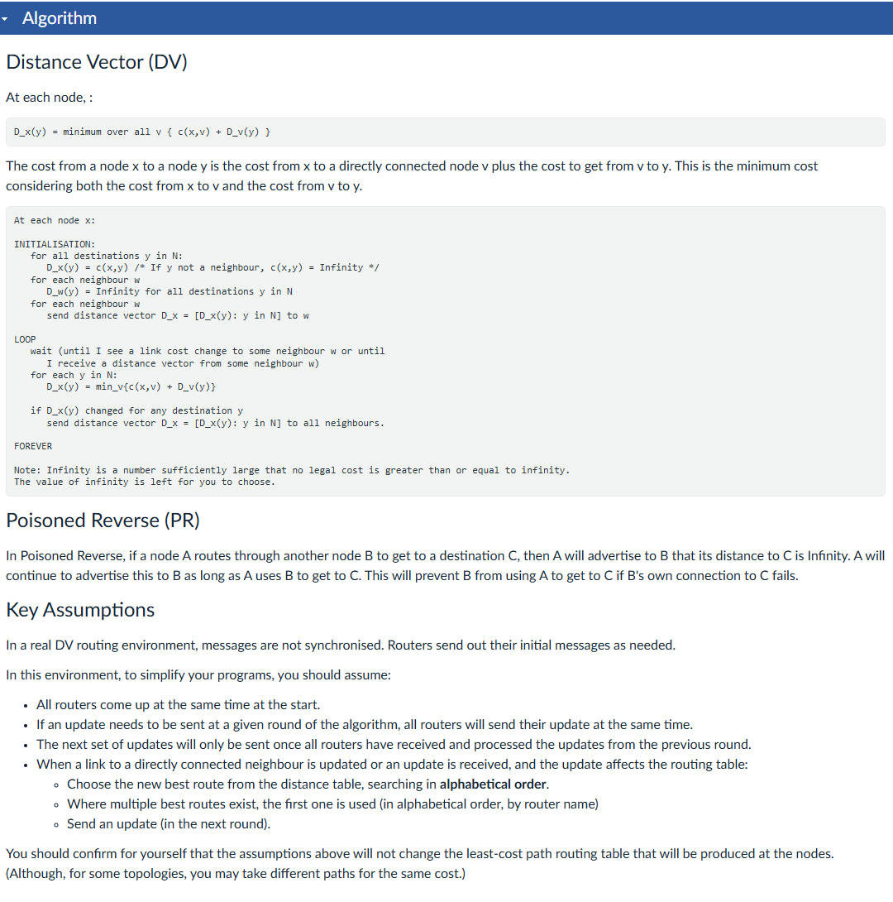

这张图片展示的是一个与计算机网络课程相关的实验或编程作业说明，主要是模拟和实现动态路由协议。以下是详细解释：

------

## **一、目标**

该作业的学习目标是：

1. **了解路由协议和路由信息传递的机制**；
2. **实际编程实现和测试路由协议**。

------

## **二、概述**

你将在这个实验中自己写代码，**模拟多个路由器之间的路由信息传播**，并通过运行结果验证你的模拟是否正确。

### 要点如下：

- 实现的是**距离向量（Distance Vector, DV）算法**。
- 如果你选择完成**额外部分（第二部分）**，还需要加入**毒性逆转（Poisoned Reverse, PR）算法**，来防止“路由环路”带来的性能问题。
- 你可以参考《计算机网络》第七版的5.2.2节内容。

------

## **三、你的任务**

### 必做部分（150分）：**实现DV算法**

你要编写一个程序，完成以下功能：

1. **从文件中读取网络拓扑信息**，并建立初始路由表。

2. **每个路由器根据距离向量算法，周期性地向邻居广播自己的路由表信息**，并接收邻居的信息进行更新：

   - 比较邻居提供的信息是否能让某些路径更短。
   - 如果能，就更新自己的路由表。

3. 最终每个节点（路由器）都应该**计算出最短路径**并稳定下来（收敛）。

4. > ## 一、距离向量（Distance Vector, DV）算法原理
   >
   > ### 1. **基本概念**
   >
   > - 每个路由器（节点）只知道：
   >   - **自己与邻居之间的距离（开销）**
   >   - **从邻居那里听说的到其他目的地的距离**
   > - 每个路由器维护一个**路由表**，表中记录了：
   >   - 每个目标节点的**最短距离**
   >   - **下一跳（即应该把数据包发给哪个邻居）**
   >
   > ### 2. **工作机制**
   >
   > DV算法基于 **贝尔曼-福特（Bellman-Ford）算法**，通过“邻居互相交换路由表”来更新自己的路由信息：
   >
   > #### 步骤如下：
   >
   > 1. 每个节点初始化自己的路由表：
   >
   >    - 到自己的距离为0；
   >    - 到其他节点的距离为无穷大（未知）。
   >
   > 2. 周期性地向所有邻居**广播自己的路由表**。
   >
   > 3. 每个节点收到邻居的路由表后，使用以下公式更新自己的路由表：
   >
   >    ```
   >    
   >    D[x][y] = min(D[x][y], cost(x, n) + D[n][y])
   >    ```
   >
   >    - D[x][y]：x到y的最小距离；
   >    - cost(x, n)：x到邻居n的开销；
   >    - D[n][y]：邻居n到y的距离。
   >
   > 4. 重复交换和更新，直到**所有节点的路由表不再变化**，即网络“收敛”。
   >
   > ### 3. **问题：慢收敛和路由环路**
   >
   > DV算法在网络变化（如断链）后更新较慢，可能导致“**路由环路**”和“**计数到无穷**”问题。

你需要实现的主要类或函数是：

- `DistanceVector`（距离向量算法核心）

------

### 附加部分（加分，最多+40分）：**实现Poisoned Reverse（PR）算法**

这是DV算法的一种改进策略：

- 如果你发现某个路径通过某个邻居是最佳路径，你在发信息给这个邻居时要“隐藏”这条路径（告诉邻居“我到这个目的地走不通”）。
- 这样可以避免环路和错误信息的传播。

你需要实现的类或函数是：

- `PoisonedReverse`（毒性逆转实现）

- > ## 二、毒性逆转（Poisoned Reverse）原理
  >
  > ### 1. **目的**
  >
  > **避免路由环路**和**加快收敛速度**。
  >
  > ### 2. **核心思想**
  >
  > 如果节点A通过节点B到达节点C是最优路径，那么：
  >
  > - 当A把自己的路由表发给B时，
  > - **它故意告诉B：我到C的距离是“无穷大”**。
  >
  > ### 3. **例子说明**
  >
  > 假设：
  >
  > - A → B：距离1
  > - B → C：距离1
  > - A → C：通过B，距离 = 1 + 1 = 2
  >
  > 此时，A告诉B：“我到C的距离是无穷大（即你别走我这里）”，这样当C断网或B失去连接时，**B不会从A那里接收到“错误的路径信息”**，从而防止B绕回A造成环路。
  >
  > ### 4. **效果**
  >
  > - 这是一个防止错误信息传播的技巧；
  > - 与“分裂地平线（Split Horizon）”类似，但更强；
  > - 会牺牲一些性能（因为要故意报告“坏”信息），但换来更高的协议稳定性。

------

## **四、任务执行提示**

- 你要从一个拓扑结构文件中读取数据。
- 编写程序实现DV算法（如果有时间和能力，也可实现PR算法）。
- 程序运行后，应能输出每个路由器稳定后的最终路由表。
- 你需要记录自己的开发过程和思路，写在实验日志中。

------

如果你需要，我可以：

- 解释“距离向量”和“毒性逆转”的原理；
- 帮你写这个模拟程序的结构框架；
- 分析你写的代码或调试错误。

需要哪方面帮助可以直接说。


这张图片是对你完成“路由协议编程作业”时所**允许使用的编程语言和软件要求**的说明。以下是详细解释：

------

## 一、你可以用什么语言编程？

你可以使用 **Java、C、C++、Python** 中的任何一种语言来完成这个作业，**但要注意以下限制**：

------

## 二、通用限制要求（无论用哪种语言）

### 1. 必须使用 `Makefile`（类似一个编译或运行脚本）

- **Makefile 是什么？**
   它是一个自动化构建文件，可以告诉系统如何编译和运行你的程序。
- 系统会自动调用 Makefile 来编译并测试你的代码，所以你必须写好它。
- 推荐学习网站：[makefile 教程网站](https://makefiletutorial.com/)

### 2. 编译器和语言版本必须符合规定

你写的程序要能在以下版本中正确运行：

| 语言   | 要求版本           |
| ------ | ------------------ |
| C/C++  | gcc/g++ 4.8.5      |
| Java   | Java JDK 1.8.0_201 |
| Python | Python 3.6.8       |

这些版本是服务器和实验室中配置的标准版本，**你不能用依赖更高版本语法或库的代码**。

------

## 三、不能用外部库或模块！

你的程序不能依赖任何外部的类、库或 Python 模块，只能使用语言本身的基本功能。

------

## 四、具体命令行运行方式（每种语言）

### **1. 如果你用 C 或 C++**

你的程序会被这样运行：

```bash
./路由程序       # 主程序
./PoisonedReverse  # 附加任务部分（可选）
```

你需要写一个 `Makefile` 来指定怎么编译这两个程序。例子可看上面教程网站。

> 好的！下面是一个适用于你本次作业的 **C语言 Makefile 模板**，它可以编译两个可执行文件：
>
> - `DistanceVector`：主程序（必做部分）
> - `PoisonedReverse`：附加部分（选做加分）
>
> ------
>
> ### **Makefile 内容如下：**
>
> ```makefile
> # 编译器
> CC = gcc
> 
> # 编译选项（-Wall 开启所有警告）
> CFLAGS = -Wall -std=c99
> 
> # 目标文件
> TARGETS = DistanceVector PoisonedReverse
> 
> # 默认目标（make 时执行）
> all: $(TARGETS)
> 
> # 生成主程序
> DistanceVector: DistanceVector.c
> 	$(CC) $(CFLAGS) -o DistanceVector DistanceVector.c
> 
> # 生成附加程序（可选）
> PoisonedReverse: PoisonedReverse.c
> 	$(CC) $(CFLAGS) -o PoisonedReverse PoisonedReverse.c
> 
> # 清理编译生成的文件
> clean:
> 	rm -f $(TARGETS)
> ```
>
> ------
>
> ### **使用方法：**
>
> 1. 确保你有 `DistanceVector.c` 和 `PoisonedReverse.c` 两个源文件（或只保留你用到的）。
>
> 2. 把上面的内容保存为一个名为 `Makefile` 的文件（无扩展名，首字母大写 M）。
>
> 3. 在终端中运行：
>
>    ```
>    make
>    ```
>
>    它会自动编译出两个可执行文件：
>
>    ```
>    ./DistanceVector
>    ./PoisonedReverse
>    ```
>
> 4. 如果想清除编译结果，运行：
>
>    ```
>    make clean
>    ```
>
> ------
>
> 如果你暂时还没写 `PoisonedReverse.c`，也可以注释掉那一部分，只保留 `DistanceVector`。
>  需要我帮你根据已有 `.c` 文件内容进一步完善这个 Makefile 吗？

------

### **2. 如果你用 Java**

你的程序会被这样运行：

```bash
java 路由程序
java PoisonedReverse
```

同样需要一个 `Makefile` 来确保编译生成 `.class` 文件。

------

### **3. 如果你用 Python**

你的程序会被这样运行：

```bash
./路由程序
./PoisonedReverse
```

#### 注意几点：

- **不能用 `make` 构建 Python 脚本**（Python 是解释型语言，不需要编译）；

- 文件必须加上**“shebang 行”**（第一行指定解释器），例如：

  ```python
  #!/usr/bin/env python3
  ```

  这样才能直接用 `./xxx.py` 来运行。

------

## 总结提示

你需要：

1. 选定语言后，确保你用的是指定版本；
2. 写好 `Makefile`（如果是 C/C++/Java）；
3. 不使用任何外部库；
4. 你的代码要能在 Linux 系统下命令行正常运行。




好的，以下是这张图中所有内容的**逐句中英文互译与详细解释**：

------

## **Algorithm（算法）**

### **Distance Vector (DV)**

> **At each node x,**
>  对于每个节点 x，
>  `Dₓ(y) = minimum over all v { c(x,v) + Dᵥ(y) }`

**解释：**
 节点 x 到目标 y 的最短路径，是比较它到所有邻居 v 的路径代价 `c(x,v)` 加上邻居 v 到目标 y 的代价 `Dᵥ(y)`，取其中最小的总和。

------

### **The cost from a node x to a node y...**

> The cost from a node x to a node y is the cost from x to a directly connected node v plus the cost to get from v to y.
>  从节点 x 到节点 y 的代价是：x 到某个直接相连邻居 v 的代价，加上 v 到 y 的代价。

> This is the minimum cost considering both the cost from x to v and the cost from v to y.
>  我们需要在所有可能的 v 中选出一个总代价最小的路径（x → v → y）。

------

### **Pseudo-code**（伪代码）

> 你提到的这段伪代码是 **距离向量路由算法（Distance Vector, DV）中“初始化阶段”的处理逻辑**，我们逐句详细解释：
>
> ------
>
> ## 原文伪代码：
>
> ```
> INITIALISATION:
> for all destinations y in N:
>     Dₓ(y) ← c(x,y)  /* If y not a neighbour, c(x,y) = Infinity */
> for each neighbour w:
>     Dₓ(y) ← Infinity for all destinations y in N
> for each neighbour w:
>     send distance vector Dₓ = [Dₓ(y): y in N] to w
> ```
>
> ------
>
> ## 中文逐句解释（含逻辑与含义）
>
> ------
>
> ### 第一句：
>
> > **for all destinations y in N:**
> >  **对于网络中所有目标节点 y：**
>
> 系统遍历整个网络中的每一个节点 y，不管它是不是邻居。
>
> ------
>
> > **Dₓ(y) ← c(x,y)**
> >  **把 x 到 y 的距离设置为：c(x,y)**
> >  意思是：
> >
> > - 如果 y 是 x 的邻居，`c(x,y)` 就是它们之间的链路开销；
> > - 如果 y 不是 x 的邻居，那么就设置 `c(x,y) = Infinity`，即不可达。
>
> **总结：**
>  这是在初始化“自己能直接到达哪些节点”的代价。
>
> ------
>
> ### 第二句：
>
> > **for each neighbour w:**
> >  **对于每个邻居 w：**
>
> > **Dₓ(y) ← Infinity for all destinations y in N**
> >  **把邻居 w 到所有目标 y 的距离都设为 Infinity（未知）**
>
> **解释：**
>
> - 初始时，x 并不知道邻居 w 的路由信息，所以把它“知道的所有目标”的代价都设为无穷大；
> - 等到邻居发送它自己的路由表以后，x 才会用这些数据更新。
>
> ------
>
> ### 第三句：
>
> > **for each neighbour w:**
> >  **对于每个邻居 w：**
>
> > **send distance vector Dₓ = [Dₓ(y): y in N] to w**
> >  **把自己的路由表 Dₓ（到所有 y 的估计距离）发给邻居 w**
>
> **解释：**
>
> - 路由器 x 会把它当前知道的“到每个节点 y 的最短距离”打包成一个路由向量；
> - 然后发送这个向量给所有邻居；
> - 邻居收到后会更新自己的路由表。
>
> ------
>
> ## 总体总结：
>
> 初始化阶段完成三件事：
>
> 1. **设定自己到每个节点的起始距离**；
> 2. **把邻居的路由信息初始化为空（Infinity）**；
> 3. **主动广播自己的路由表给邻居，为下一轮更新做准备**。
>
> ------
>
> 如果你需要，我可以将这段初始化伪代码翻译成 C 语言函数框架形式，是否需要我来帮你写？

------

> **LOOP**
>  循环阶段：

> wait (until I see a link cost change to some neighbour w or until I receive a distance vector from some neighbour w)
>  等待：直到某个邻居的链路代价发生变化，或者收到某个邻居 w 的更新。

> for each y in N:
>  对于所有目标 y：

> `Dₓ(y) = minᵥ{c(x,v) + Dᵥ(y)}`
>  更新 x 到 y 的最短距离：遍历每个邻居 v，看从 v 转发是否更便宜。

> if Dₓ(y) changed for any destination y
>  如果 x 到某个 y 的估值发生了改变：

> send distance vector Dₓ = [Dₓ(y): y in N] to all neighbours.
>  则向所有邻居广播新的路由表。

------

> **FOREVER**
>  永远循环（直到收敛）。

------

> **Note:**
>  注意：

> Infinity is a number sufficiently large that no legal cost is greater than or equal to infinity.
>  “无穷大”是一个非常大的数，确保任何合法的路径代价都不可能等于或大于它。

> The value of infinity is left for you to choose.
>  你可以自己决定这个“无穷大”具体是多少。

------

## **Poisoned Reverse (PR)**

> In Poisoned Reverse, if a node A routes through another node B to get to a destination C,
>  在毒性逆转策略中，如果节点 A 是通过节点 B 到达目标节点 C，

> then A will advertise to B that its distance to C is Infinity.
>  那么 A 会故意告诉 B：“我到 C 的距离是无穷大”。

> A will continue to advertise this to B as long as A uses B to get to C.
>  只要 A 仍然通过 B 到达 C，它就持续向 B 撒这个“谎”。

> This will prevent B from using A to get to C if B’s own connection to C fails.
>  这样一来，如果 B 自己通向 C 的链路断了，它就不会错误地通过 A 再走回 C，避免了环路。

------

## **Key Assumptions（关键假设）**

这些是假设条件，用来简化你的实现逻辑：

------

> In a real DV routing environment, messages are not synchronised.
>  在现实中的距离向量协议里，消息传递是不同步的。

> Routers send out their initial messages as needed.
>  路由器会在需要时发送自己的初始信息。

------

> In this environment, to simplify your programs, you should assume:
>  在本次实验中，为了简化程序，你可以假设：

------

> • All routers come up at the same time at the start.
>  所有路由器在程序开始时同时上线。

> • If an update needs to be sent at a given round of the algorithm, all routers will send their update at the same time.
>  如果一轮中需要发送更新，所有路由器会同时广播更新。

> • The next set of updates will only be sent once all routers have received and processed the updates from the previous round.
>  下一轮更新会在所有节点接收到并处理了前一轮的更新后才进行。

------

> • When a link to a directly connected neighbour is updated or an update is received, and the update affects the routing table:
>  当链路发生变化或收到更新且影响了路由表时：

> – Choose the new best route from the distance table, searching in **alphabetical order**.
>  – 在更新路由表时，如果有多条相同代价的路径，选**字母序更小的下一跳**。

> – Where multiple best routes exist, the one whose **neighbour is used** in **alphabetical order**, by **router name**.
>  – 如果代价相同的路径有多个，按邻居路由器的名称按字母序选最小的。

------

> • Send an update (in the next round).
>  • 下一轮再广播你的更新。

------

> You should confirm for yourself that the assumptions above will not change the least-cost path routing table that will be produced at the nodes.
>  你可以自己验证这些假设不会影响最终最短路径路由表的正确性。

> (Although, for some topologies, you may take different paths for the same cost.)
>  （当然，在某些网络结构中，相同的最短路径代价可能对应多条路径。）

------

如果你想，我可以帮你把这个伪代码转成 C 语言函数框架，是否需要？

# 代码

好的！下面是将你提供的**Distance Vector (DV) 算法伪代码**完整转写为一个**可嵌入的 C 语言函数框架**，适用于之前给出的邻接矩阵结构。

------

## ✅ 设计说明

- 每个路由器维护一张路由表：`distance[]`、`next_hop[]`
- 使用轮询模拟同步更新（符合你作业中“每轮统一更新”的要求）
- 使用 Bellman-Ford 核心逻辑
- 支持最多 26 个节点（A-Z）

------

## ✅ C语言函数框架代码

```c
#include <stdio.h>
#include <limits.h>
#include <string.h>

#define MAX_NODES 26
#define INF 9999

extern int adj[MAX_NODES][MAX_NODES];    // 外部定义的邻接矩阵
extern int node_exists[MAX_NODES];       // 外部定义的节点标记

int distance[MAX_NODES][MAX_NODES];      // 距离向量表：distance[src][dest]
int next_hop[MAX_NODES][MAX_NODES];      // 下一跳：next_hop[src][dest]

// 初始化每个路由器的距离向量
void initialize_distance_vector(int num_nodes) {
    for (int i = 0; i < num_nodes; ++i) {
        if (!node_exists[i]) continue;
        for (int j = 0; j < num_nodes; ++j) {
            if (!node_exists[j]) continue;
            if (i == j) {
                distance[i][j] = 0;
                next_hop[i][j] = j;
            } else if (adj[i][j] < INF) {
                distance[i][j] = adj[i][j];
                next_hop[i][j] = j;
            } else {
                distance[i][j] = INF;
                next_hop[i][j] = -1;
            }
        }
    }
}

// 执行 DV 算法直到收敛
void run_distance_vector(int num_nodes) {
    int changed;
    int step = 0;

    do {
        changed = 0;
        printf("=== Step %d ===\n", step);

        for (int i = 0; i < num_nodes; ++i) {
            if (!node_exists[i]) continue;

            // 遍历目标节点
            for (int j = 0; j < num_nodes; ++j) {
                if (i == j || !node_exists[j]) continue;

                int min_cost = distance[i][j];
                int best_hop = next_hop[i][j];

                // 尝试通过所有邻居中转
                for (int v = 0; v < num_nodes; ++v) {
                    if (!node_exists[v] || adj[i][v] >= INF) continue;

                    if (distance[v][j] >= INF) continue;

                    int new_cost = adj[i][v] + distance[v][j];

                    if (new_cost < min_cost || (new_cost == min_cost && v < best_hop)) {
                        min_cost = new_cost;
                        best_hop = v;
                        changed = 1;
                    }
                }

                distance[i][j] = min_cost;
                next_hop[i][j] = best_hop;
            }
        }

        step++;

    } while (changed);
}
```

------

## ✅ 如何使用？

在主函数中（或你拓扑构建完成后）：

```c
int max_index = 0;
for (int i = 0; i < MAX_NODES; i++) {
    if (node_exists[i] && i > max_index) max_index = i;
}
int num_nodes = max_index + 1;

initialize_distance_vector(num_nodes);
run_distance_vector(num_nodes);
```

------

## ✅ 接下来可做的事

1. 添加 `print_distance_table()` 在每轮输出；
2. 添加 `print_routing_table()` 输出最终路由表；
3. 集成 `Poisoned Reverse` 可选逻辑（我可为你补充）；
4. 添加自动判断收敛轮次与调试日志；

------

是否需要我：

- 将此函数**完整集成进你已有框架**并加上输出？
- 或者继续实现 `Poisoned Reverse` 版本的 DV 算法？

你可按需告诉我下一步！


当然可以，以下是你这张图中所有内容的**详细解释与中英文逐句翻译**：

------

## **标题：Sample Topology（示例拓扑）**

------

### **图上方部分：**

> **Consider the following network sample topology in our description of the required input format:**
>  请参考下方的网络示例拓扑，它将用于解释输入格式的要求：

**解释：**
 这张图展示了一个由三个路由器组成的简单网络拓扑结构，分别是 X、Y、Z 三个节点，它们之间有如下连接和链路代价（cost）：

- X 到 Y 的代价为 3
- Y 到 Z 的代价为 4
- X 到 Z 的代价为 9

这三条链路是**双向对等的**，即 X 到 Y 与 Y 到 X 的代价一样，默认都为无向图。

------

### **图下方部分：**

> **Your program will need to read input from the standard input (terminal/command line) to construct such a given topology.**
>  你的程序需要**从标准输入（终端或命令行）读取数据**，以构建如图所示的网络拓扑结构。

> **Then, perform the updates, as illustrated below, and also given via the standard input (terminal/command line).**
>  然后，根据下图所示的方式进行网络结构更新，这些更新也将通过标准输入给出。

**解释：**

- 你的程序起始会根据输入构建图上左边的网络；
- 然后，根据命令行输入的更新信息（如链路变化），更新拓扑，变成右边的网络结构。

------

### **图解说明：**

图中用红色箭头表示网络状态从“初始”变更为“更新”状态：

#### **左图（初始网络）：**

- X – Y = 3
- Y – Z = 4
- X – Z = 9

#### **右图（更新后网络）：**

- X – Z 的代价从 9 改为 1
- Y – Z 的链路被移除（不再连接）

更新后的网络：

- X – Y = 3
- X – Z = 1
- Y 与 Z 不再连接

------

> **Please refer to this sample topology with the following updates above when looking into the expected input examples below.**
>  在查看下方的输入格式示例时，请参考上述拓扑图和变更情况。

**解释：**

- 后续会有输入数据格式说明；
- 图中展示的就是这些输入的“对应可视化形式”，方便你理解输入数据表示的拓扑结构变化。

------

## **总结：**

这部分告诉你两点重要信息：

1. 你的程序必须**支持从命令行读取原始拓扑结构**（例如 `X Y 3` 表示 X 和 Y 之间的链路代价是 3）；
2. 你的程序还需要**支持根据输入动态更新网络结构**（例如移除 Y–Z 的连接，或更新 X–Z 的代价为 1）。

------

如你需要，我可以帮你写一个读取这种输入格式并构建拓扑图的 C 程序框架，要不要试试？

# 代码

当然可以！下面我为你提供一个**完整的 C 程序框架**，它可以读取你描述的**初始拓扑 + 拓扑更新输入格式**，并构建与更新图结构，支持你后续接入距离向量算法（DV算法）。

------

## ✅ 功能说明

该程序支持：

- 从命令行读取格式为 `节点名` → `START` → `链路信息` → `UPDATE` → `更新信息` → `END` 的完整输入；
- 自动添加新节点、更新边权重、移除边；
- 构建邻接矩阵并打印当前拓扑；
- 你可以直接在此基础上加入距离向量核心逻辑。

------

## ✅ C语言代码实现

```c
#include <stdio.h>
#include <stdlib.h>
#include <string.h>

#define MAX_NODES 26
#define INF 9999

int adj[MAX_NODES][MAX_NODES];  // 邻接矩阵：代价
int node_exists[MAX_NODES];     // 节点存在标志
int node_count = 0;

int name_to_index(char name) {
    return name - 'A';
}

char index_to_name(int idx) {
    return 'A' + idx;
}

void add_node_if_needed(char name) {
    int idx = name_to_index(name);
    if (!node_exists[idx]) {
        node_exists[idx] = 1;
        node_count++;
    }
}

void init_graph() {
    for (int i = 0; i < MAX_NODES; i++)
        for (int j = 0; j < MAX_NODES; j++)
            adj[i][j] = INF;
}

void print_topology() {
    printf("\n=== 当前网络拓扑 ===\n");
    for (int i = 0; i < MAX_NODES; i++) {
        if (!node_exists[i]) continue;
        for (int j = i + 1; j < MAX_NODES; j++) {
            if (!node_exists[j]) continue;
            if (adj[i][j] < INF)
                printf("%c — %c = %d\n", index_to_name(i), index_to_name(j), adj[i][j]);
        }
    }
    printf("====================\n");
}

void read_topology() {
    char line[100];
    printf("请输入节点名（每行一个），输入 START 结束：\n");

    // 读取节点
    while (fgets(line, sizeof(line), stdin)) {
        if (strncmp(line, "START", 5) == 0) break;
        char node = line[0];
        add_node_if_needed(node);
    }

    printf("请输入链路信息，格式：A B 3，输入 UPDATE 结束：\n");

    // 初始链路
    while (fgets(line, sizeof(line), stdin)) {
        if (strncmp(line, "UPDATE", 6) == 0) break;

        char a, b;
        int cost;
        if (sscanf(line, " %c %c %d", &a, &b, &cost) == 3) {
            add_node_if_needed(a);
            add_node_if_needed(b);
            int u = name_to_index(a), v = name_to_index(b);
            if (cost >= 0)
                adj[u][v] = adj[v][u] = cost;
            else
                adj[u][v] = adj[v][u] = INF;
        }
    }

    printf(">>> 初始拓扑构建完成，准备运行 DV 算法（你可以在这里插入算法）...\n");
    print_topology();
}

void read_updates() {
    char line[100];
    printf("请输入更新链路，格式：A B 1 或 A B -1，输入 END 结束：\n");

    while (fgets(line, sizeof(line), stdin)) {
        if (strncmp(line, "END", 3) == 0) break;

        char a, b;
        int cost;
        if (sscanf(line, " %c %c %d", &a, &b, &cost) == 3) {
            add_node_if_needed(a);
            add_node_if_needed(b);
            int u = name_to_index(a), v = name_to_index(b);
            if (cost >= 0)
                adj[u][v] = adj[v][u] = cost;
            else
                adj[u][v] = adj[v][u] = INF;
        }
    }

    printf(">>> 拓扑已更新，请重新运行 DV 算法（你可以在这里再次插入算法）...\n");
    print_topology();
}

int main() {
    init_graph();
    read_topology();   // 初始拓扑
    read_updates();    // 更新链路
    return 0;
}
```

------

## ✅ 接下来可以怎么做？

你可以：

1. 在 `read_topology()` 之后插入初始 **DV算法执行函数**；
2. 在 `read_updates()` 之后再次运行该算法以更新路由表；
3. 使用前面提供的 `print_distance_table()` 和 `print_routing_table()` 输出收敛过程和结果。

------

如果你需要，我可以：

- 把 Bellman-Ford 距离向量核心算法也加进来；
- 添加收敛检测机制；
- 模拟每轮路由器之间的信息交换。

是否继续为你写一个 **可运行的距离向量算法主循环 + 收敛判断**？


这张图是对程序输入格式（Input Format）的详细说明，用来描述路由拓扑结构及更新的输入方式。以下是**图中内容的逐句中英互译与详细解释**：

------

## **标题：Input Format（输入格式）**

> Your program will need to read input from the terminal/command line’s standard input.
>  你的程序需要从终端/命令行的标准输入中读取数据。

> The expected input format... is as follows:
>  期望的输入格式如下图所示：

------

### **输入示例（图中灰框部分）：**

```
X
Y
Z
START
X Z 9
X Y 3
Y Z 4
UPDATE
X Z 1
Y Z -1
END
```

------

## **1. The input begins with the name of each router/node in the topology.**

## **1. 输入的第一部分是拓扑中每个路由器/节点的名称。**

> Each name is on a new line.
>  每个名称一行。

> Router names can consist of any characters (except numbers) and are case-sensitive.
>  路由器名称可以是任意字符（不能是数字），并区分大小写。

> Router names may not contain spaces.
>  路由器名称不能包含空格。

> This section ends with the keyword “START”.
>  这部分以关键词 `START` 结尾。

**解释：**

- 第一部分是节点定义，如 `X`、`Y`、`Z`。
- 每行一个节点名，之后输入 `START` 表示节点定义结束。

------

## **2. The next input section contains the details of each link/edge in the topology.**

## **2. 第二部分是拓扑中各条链路/边的详细信息。**

> Written as the names of two routers/nodes, followed by the weight of that link/edge, all separated by spaces.
>  格式为两个节点名 + 链路权重（用空格隔开）。

> Format: “<router_name_1> <router_name_2> ”, e.g.
>  示例格式：

```
Y X 2
Y Z 1
```

> Weight values should always be integers.
>  权重必须是整数。

> A weight value of -1 indicates a link/edge to remove from the topology if present.
>  权重为 -1 表示要从拓扑中移除该链路（如果存在）。

> This section ends with the keyword “UPDATE”.
>  这一部分以关键词 `UPDATE` 结尾。

**解释：**

- 这部分定义的是节点间的初始链路及代价，例如：

  ```
  X Z 9   → 表示 X 和 Z 之间链路代价是 9
  ```

- 每行一条链路；

- `UPDATE` 表示链路定义结束，准备开始更新操作。

------

> **Your algorithm should run when the keyword “UPDATE” is entered...**
>  **你的程序应在读取到 “UPDATE” 时开始运行算法...**

> and bring your simulated routers’ routing tables and distance tables to convergence.
>  并模拟每个路由器的路由表和距离表，直到它们收敛（即稳定不变）。

> Then, show the Expected Output (refer to the section below) for each router.
>  然后打印每个路由器的最终路由表输出（输出格式在后续说明中）。

------

## **3. The input continues with the update details of each link/edge in the topology given a link and cost.**

## **3. 第三部分是对拓扑中链路的更新，包括新增、删除或修改代价。**

> The values in each of these sections should be used to update the current topology.
>  每一行都表示一个链路更新，应该用于更新已有拓扑。

> If a link is not included in any section, it should remain unchanged.
>  如果某条链路没有在此出现，则保持不变。

> As above, a weight value of -1 indicates a link/edge to remove from the topology if present.
>  和上面一样，权重为 -1 表示移除该链路。

> As an example, if an unseen new router/node name has been input in this section...
>  举个例子，如果某个新节点名字首次出现在这一部分...

> your program should be able to add this new router to the topology.
>  你的程序应能自动将这个新节点添加到网络中。

------

### **例子：**

```
Y A 10
```

> From the example input given above, your program should add A as a new router...
>  根据上面输入，你的程序应添加 A 为新路由器，并与 Y 建立一条代价为 10 的链路。

------

> A user may input 0 or more lines in the “UPDATE” section.
>  用户可以输入 0 条或多条更新指令。

> This section ends with the keyword “END”.
>  本部分以 `END` 表示结束。

------

> If there is input in the “UPDATE” section, your algorithm should be run...
>  如果有更新输入，你的程序应在读取 `UPDATE` 后再次运行算法...

> and bring your simulated routers’ routing tables and distance tables to convergence.
>  并让路由表和距离表再次收敛。

> Then, show the Expected Output for each router. After that, the program exits normally.
>  然后输出结果，程序正常退出。

> If no input is provided in the “UPDATE” section, the program exits normally when the keyword “END” is entered.
>  如果没有更新命令，一旦读取到 `END`，程序应正常退出。

------

## 总结

你需要编写的程序应当支持以下输入结构：

1. **节点定义（以 START 结束）**
2. **初始链路（以 UPDATE 开始）**
3. **拓扑更新（以 END 结束）**

程序应能构建网络图、计算最短路径、响应链路变更，并输出最终结果。

------

如果你想，我可以帮你写一个完整的输入解析框架（C语言），是否需要？

# 代码

很好！下面是一个**完整的输入解析框架（C语言）**，可以读取你所说格式的输入文件（或从终端/标准输入中读取），并构建拓扑结构，准备执行路由计算。

------

## ✅ **功能概述**

该框架支持：

- 读取节点名称（以 `START` 结束）
- 读取链路（以 `UPDATE` 结束）
- 读取链路更新（以 `END` 结束）
- 支持自动添加新节点、移除边、修改边代价
- 为后续距离向量算法作好结构准备

------

## ✅ **代码框架**

```c
#include <stdio.h>
#include <stdlib.h>
#include <string.h>

#define MAX_NODES 26
#define INF 9999

int adj_matrix[MAX_NODES][MAX_NODES];  // 邻接矩阵存储权重
int node_exists[MAX_NODES];            // 标记节点是否存在
int node_count = 0;

// 把节点名转为索引（A-Z）
int name_to_index(char name) {
    return name - 'A';
}

// 把索引转回字母
char index_to_name(int idx) {
    return 'A' + idx;
}

// 确保节点在集合中
void add_node_if_needed(char name) {
    int idx = name_to_index(name);
    if (!node_exists[idx]) {
        node_exists[idx] = 1;
        node_count++;
    }
}

// 初始化邻接矩阵
void init_adj_matrix() {
    for (int i = 0; i < MAX_NODES; i++) {
        for (int j = 0; j < MAX_NODES; j++) {
            adj_matrix[i][j] = INF;
        }
    }
}

void print_topology() {
    printf("\n=== 当前拓扑结构 ===\n");
    for (int i = 0; i < MAX_NODES; i++) {
        if (!node_exists[i]) continue;
        for (int j = 0; j < MAX_NODES; j++) {
            if (!node_exists[j]) continue;
            if (adj_matrix[i][j] < INF) {
                printf("%c — %c : %d\n", index_to_name(i), index_to_name(j), adj_matrix[i][j]);
            }
        }
    }
    printf("=====================\n");
}

int main() {
    char line[100];
    init_adj_matrix();

    printf("请输入路由器名称，输入 START 结束：\n");

    // 读取节点
    while (fgets(line, sizeof(line), stdin)) {
        if (strncmp(line, "START", 5) == 0) break;
        char name = line[0];
        add_node_if_needed(name);
    }

    printf("请输入初始链路信息，格式：X Y 9，输入 UPDATE 结束：\n");

    // 读取初始链路
    while (fgets(line, sizeof(line), stdin)) {
        if (strncmp(line, "UPDATE", 6) == 0) break;

        char a, b;
        int weight;
        if (sscanf(line, " %c %c %d", &a, &b, &weight) == 3) {
            add_node_if_needed(a);
            add_node_if_needed(b);
            int i = name_to_index(a);
            int j = name_to_index(b);
            if (weight >= 0) {
                adj_matrix[i][j] = adj_matrix[j][i] = weight;
            } else {
                adj_matrix[i][j] = adj_matrix[j][i] = INF;
            }
        }
    }

    // 此处应调用你的DV算法，计算初始路由表
    printf(">>> 执行初始距离向量算法（待补充）...\n");

    printf("请输入拓扑更新信息，格式：X Z 1 或 Y Z -1，输入 END 结束：\n");

    // 读取更新链路
    while (fgets(line, sizeof(line), stdin)) {
        if (strncmp(line, "END", 3) == 0) break;

        char a, b;
        int weight;
        if (sscanf(line, " %c %c %d", &a, &b, &weight) == 3) {
            add_node_if_needed(a);
            add_node_if_needed(b);
            int i = name_to_index(a);
            int j = name_to_index(b);
            if (weight >= 0) {
                adj_matrix[i][j] = adj_matrix[j][i] = weight;
            } else {
                adj_matrix[i][j] = adj_matrix[j][i] = INF;
            }
        }
    }

    // 此处应调用你的DV算法，再次更新路由表
    printf(">>> 执行更新后的距离向量算法（待补充）...\n");

    print_topology();

    return 0;
}
```

------

## ✅ **接下来你可以做什么？**

1. **实现距离向量算法主体逻辑**（Bellman-Ford）；
2. 使用前面提供的 `print_distance_table()` 和 `print_routing_table()` 函数进行输出；
3. 如果你想，我可以继续帮你集成这两个输出函数 + 更新传播机制。

是否要我帮你写一个可运行的**完整最小可行版本的 DV 算法主循环**？


这张图说明了：你编写的“距离向量路由算法”程序应如何输出结果（包括运行过程中的距离表和最终的路由表）。以下是内容的**详细解释和中英逐句翻译**：

------

## **背景说明**

> As this is Distance Vector, a node will only be able to communicate with its neighbours.
>  因为这是距离向量协议，一个节点只能与其邻居通信。

> Thus, node X can only tell if it is sending data to Y or Z.
>  所以，例如节点 X 只能判断它的数据是要发给 Y 还是 Z。

> You should indicate which interface the packets will be sent through, as shown below.
>  你应该显示每个数据包通过哪个“下一跳”路由器转发，如下图所示。

------

## **你的程序应输出两类信息：**

------

### **1. 在算法运行过程中输出每一步的“距离表” distance table**

> When running your algorithm to bring convergence to the routing tables,
>  当你的算法运行以让路由表收敛时，

> print the **distance table** of each router at each step in the following format:
>  每一步都要打印每个路由器的距离表，如下格式所示：

------

#### 示例输出：

```
Distance Table of router X at t=0:
    Y   Z
Y   2  INF
Z INF   7
```

------

### 对应格式说明（中英互译）：

> **The name of the router, and the current step (starting at 0).**
>  当前路由器的名字 + 当前算法步数（从0开始）。

> **The name of the destination router.**
>  每一行是目标节点的名称。

> **The name of the next hop router.**
>  每一列表示通过哪个下一跳节点转发。

> **The current known distance (from the current router, to the destination, via the next hop).**
>  表格中的值表示：从当前路由器 → 通过某个邻居 → 到达目标节点的估计总代价。

- INF 表示不可达；
- 如果没有与某个节点直接相连，它仍应出现在表中（即使是 INF）；
- 行列顺序必须按**路由器名称的字母顺序排列**；
- 每个路由器的表输出后用空行分隔；
- 这个表每一轮都要输出（直到收敛）。

------

### **2. 当算法收敛后，输出每个路由器的“最终路由表” routing table**

> Once the routing tables are converged, print the **routing table** of each router in the following format:
>  一旦路由表收敛，打印每个节点的最终“路由表”，格式如下：

------

#### 示例输出：

```
Routing Table of router X:
Y, Y, 2
Z, Y, 5
```

------

### 对应格式说明（中英互译）：

> **The name of the source router/node.**
>  当前路由器的名称（源节点）。

> **The name of the destination router/node.**
>  目标路由器的名称。

> **The name of an immediate neighbour of the source.**
>  到达目标节点的“下一跳”邻居名称。

> **The current total distance from the source router/node to the destination router/node via the next hop.**
>  通过这个“下一跳”到达目标的总路径代价。

> If a destination is unreachable from the source, output should look like：
>  如果无法到达目标，输出应为：

```
Y, INF, INF
```

> The destination needs to be printed in alphabetical order.
>  每个路由器的目标节点（每一行）也要按字母顺序输出。

> A blank line to separate each table.
>  每个路由器的输出用空行分隔。

------

> **Note:** This table should be printed for every router, in alphabetical order...
>  注意：每个路由器都要按字母序打印其最终路由表（目标节点也按字母序），

> Whenever multiple best routes exist for a destination, the first next hop is used (in alphabetical order).
>  如果有多条代价相同的最短路径，选择**字母序最小的下一跳**作为最终路由。

------

## 总结

你要实现两个输出阶段：

1. **每一步距离表输出**（Distance Table）：反映算法收敛过程；
2. **最终路由表输出**（Routing Table）：每个路由器到每个目标的最佳路径（包括下一跳和代价）；

------

如果你希望，我可以帮你写一份打印“距离表”和“路由表”的 C 语言代码模板，要吗？

# 代码

好的！以下是一个**简化的 C 语言模板**，帮助你打印出：

1. **Distance Table（距离表）**
2. **Routing Table（最终路由表）**

------

## 假设说明（简化版）：

- 我们使用最多 `MAX_ROUTERS` 个路由器；
- 使用邻接矩阵和路由表数组来存储距离信息；
- 所有名称用字母表示（如 X, Y, Z）；
- 距离表存储的是：`distance[via][dest]`；
- 路由表存储的是：`next_hop[dest]`；

------

## **C 语言代码模板如下：**

```c
#include <stdio.h>
#include <limits.h>
#include <string.h>

#define MAX_ROUTERS 26  // A-Z
#define INF 9999

// 将路由器名转为索引，例如 'A' → 0
int name_to_index(char name) {
    return name - 'A';
}

// 将索引转为字母，例如 0 → 'A'
char index_to_name(int idx) {
    return 'A' + idx;
}

// 打印距离表
void print_distance_table(char router_name, int step, int distance[MAX_ROUTERS][MAX_ROUTERS], int num_routers, int current_router) {
    printf("Distance Table of router %c at t=%d:\n", router_name, step);

    // 打印列名（下一跳）
    for (int via = 0; via < num_routers; ++via) {
        if (via == current_router) continue;
        printf("\t%c", index_to_name(via));
    }
    printf("\n");

    // 每一行表示目标
    for (int dest = 0; dest < num_routers; ++dest) {
        if (dest == current_router) continue;
        printf("%c\t", index_to_name(dest));
        for (int via = 0; via < num_routers; ++via) {
            if (via == current_router) continue;
            if (distance[via][dest] >= INF)
                printf("INF\t");
            else
                printf("%d\t", distance[via][dest]);
        }
        printf("\n");
    }

    printf("\n");  // 空行分隔
}

// 打印最终路由表
void print_routing_table(char router_name, int next_hop[MAX_ROUTERS], int cost[MAX_ROUTERS], int num_routers, int current_router) {
    printf("Routing Table of router %c:\n", router_name);
    for (int dest = 0; dest < num_routers; ++dest) {
        if (dest == current_router) continue;
        printf("%c, ", index_to_name(dest));
        if (cost[dest] >= INF) {
            printf("INF, INF\n");
        } else {
            printf("%c, %d\n", index_to_name(next_hop[dest]), cost[dest]);
        }
    }
    printf("\n");  // 空行分隔
}
```

------

## 使用方法：

- `print_distance_table(...)`：在每轮迭代中调用它；
- `print_routing_table(...)`：在收敛完成后调用它；
- 你需要自己实现 Bellman-Ford 逻辑来计算和更新 `distance`、`next_hop`、`cost` 表。

------

如果你已经完成了基本的 DV 算法，我可以帮你集成这些打印函数进去。是否也需要我提供一个完整主函数示例？


这张图展示了一个**距离向量（Distance Vector, DV）路由协议的输出示例**，具体说明了：

1. 每一轮算法迭代时，每个路由器的**距离表（Distance Table）**；
2. 当路由表收敛后，每个路由器的**最终路由表（Routing Table）**；
3. 更新链路后（如 `X-Z` 变为 1，`Y-Z` 被移除），算法重新收敛，打印新的距离表与路由表。

------

## **逐步详细解释：**

------

### **第一部分：初始拓扑运行过程（未更新前）**

#### 距离表（Distance Table）格式说明：

以 `Distance Table of router X at t=0:` 为例：

```
    Y   Z
Y   3  INF
Z INF   9
```

- 第一行是“下一跳”（邻居）
- 第一列是“目标节点”
- 表格中的值：从当前节点出发，经由某个邻居，到达目标节点的“当前估计总代价”

------

#### 示例 1：

```
Distance Table of router X at t=0:
    Y   Z
Y   3  INF
Z INF   9
```

**含义：**

- 路由器 X 知道：
  - 通过邻居 Y 到 Y 的代价是 3
  - 通过邻居 Z 到 Z 的代价是 9
  - 其它组合暂时不可达（INF）

------

#### 示例 2：

```
Distance Table of router Y at t=1:
    X   Z
X   3   13
Z  13    4
```

表示：

- 路由器 Y：
  - 通过邻居 X 到 X 是 3
  - 通过邻居 Z 到 X 是 13（即 Y→Z→X）
  - 通过邻居 Z 到 Z 是 4
  - 通过邻居 X 到 Z 是 13（Y→X→Z）

------

### **最终路由表（Routing Table）解释**

当路由表收敛（不再改变）时，输出：

```
Routing Table of router X:
Y,Y,3
Z,Y,7
```

**解释：**

- 到 Y：通过 Y，总代价 3
- 到 Z：通过 Y，总代价 7（X→Y→Z）

------

### **第二部分：拓扑更新后的结果（如 X-Z 改为 1，Y-Z 移除）**

再次打印更新后的 `Distance Table` 和 `Routing Table`

#### 例子：

```
Distance Table of router X at t=3:
    Y   Z
Y   3   5
Z   7   1
```

说明：

- X 通过 Y 到 Z 成本为 5（X→Y→Z）
- X 通过 Z 到 Z 成本为 1（X→Z）

------

### 路由器最终路由表更新如下：

```
Routing Table of router X:
Y,Y,3
Z,Z,1
```

解释：

- X 直接连到 Z 成本为 1，所以选择 Z 为下一跳
- 不再通过 Y

------

## **总结：**

1. **每一步 Distance Table** 展示了“当前估计代价矩阵”，用于模拟传播与更新；
2. **最终 Routing Table** 展示了从每个路由器出发到所有目的地的“最短路径决策”（下一跳 + 代价）；
3. **更新拓扑后**，DV 算法会重新运行，重新收敛，产生新的输出。

------

如果你需要，我可以根据这个输出格式帮你写 `print_distance_table()` 和 `print_routing_table()` 的代码。是否需要？