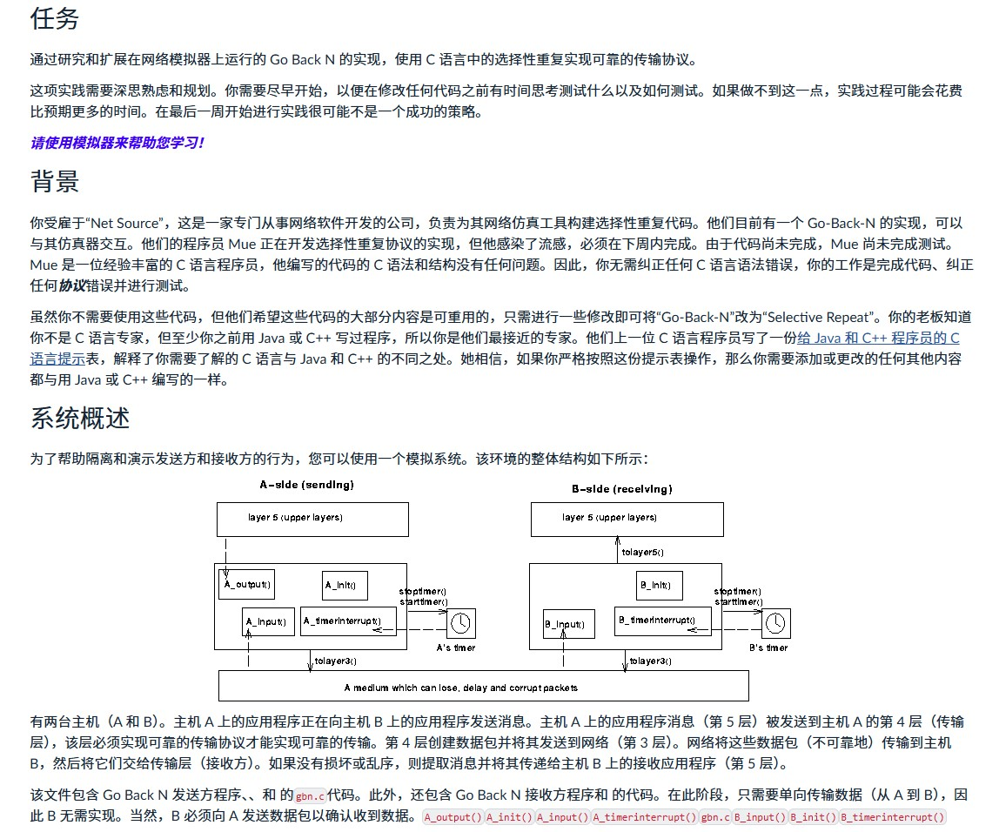
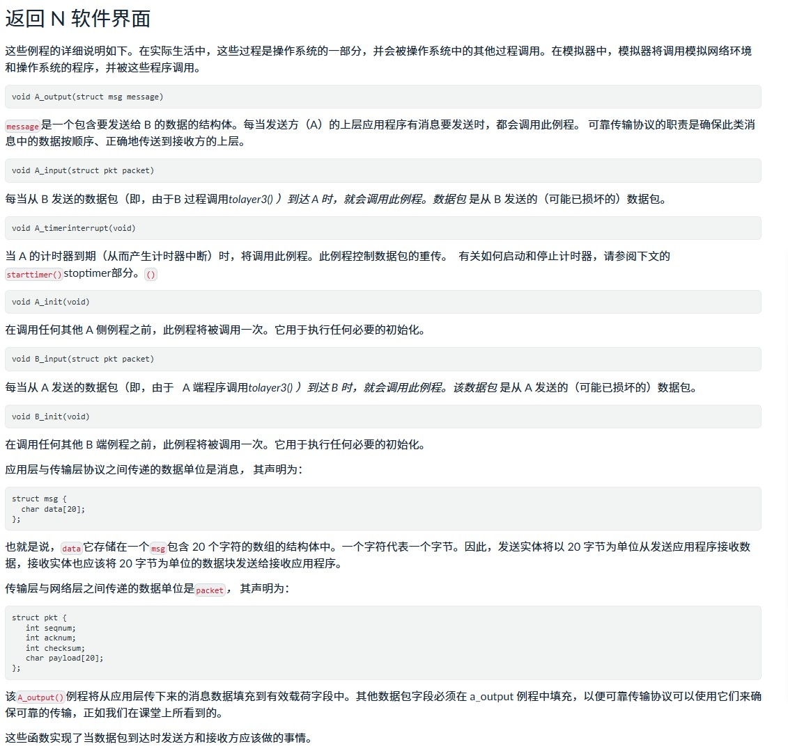
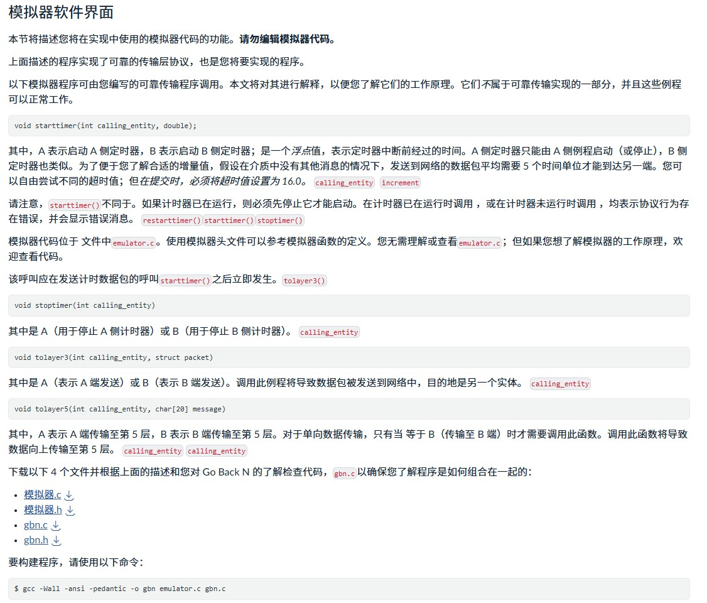
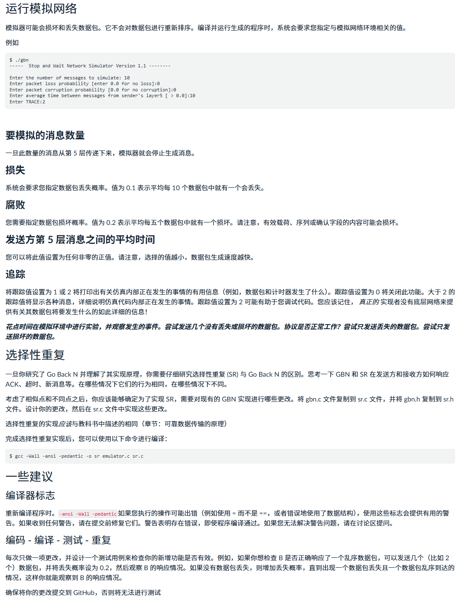

202504260008
后台姓名：单振鹭
用户ID：126764
用户1V1昵称：Cx330
学生需求类型：作业辅导
学生基础：比较差
期望上课时间：拉群沟通
学生DUE时间：5.5
用户类型：1v1老用户
院校：ADELAIDE
年级：研二
专业：计算机
科目代码：COMP SCI 7039
科目名称：new work &application
备注：优先女老师，需要认真备课规划好后续辅导进度 没有特别软件就正常编程   具体时间和作业辅导要求拉沟通



这张图片是一个关于**Go-Back-N 协议**实验任务的说明文档，主要用于网络协议模拟器的学习。以下是逐段详细解释：

------

### **任务**

你需要在网络模拟器中实现 **Go-Back-N（GBN）协议**，这个协议是一种带有确认的可靠数据传输协议。实现需要使用 C 语言，并理解如何处理包的发送、确认（ACK）和重传机制。

- **挑战点**：不仅要写出代码，还要思考并测试各种边界条件（如丢包、延迟等），这对调试与逻辑思维要求较高。
- **建议**：尽早开始，花时间研究现有代码，避免最后仓促应对。

------

### **背景**

你扮演的是一位程序员，被雇佣为网络仿真工具的开发者。客户已经有了一个 Go-Back-N 的实现，但他们希望你能扩展这个模拟器支持其他协议（如 Selective Repeat）。

- 客户有一名测试员（Mue），她会用 C 语言检查你的实现。
- 她不会帮助你，只会评估你的代码是否“可用且完整”，所以你必须确保代码正确实现核心功能。

另外，你的经理知道你是 Java 程序员，但希望你能通过这个项目学会 C 或 C++，而你必须用 Java 或 C++ 中学过的概念在 C 语言中实现 GBN。

------

### **系统概述**

图示展示了一个模拟网络传输的系统结构，用来展示发送方与接收方之间的数据传输行为。具体包括：

#### **左边 A-side（发送方）**

- `A_output()`: 上层应用请求发送数据
- `A_init()`: 初始化发送端
- `A_input()`: 接收来自 B 的 ACK 确认
- `A_timerinterrupt()`: 定时器中断时触发重传
- `A_timerstart()`/`A_timerstop()`: 控制定时器

#### **右边 B-side（接收方）**

- `B_input()`: 接收来自 A 的数据包
- `B_init()`: 初始化接收端
- `B_timerinterrupt()`: 一般在 Selective Repeat 中用，在 GBN 中不使用

#### **中间信道**

- 可以模拟丢包、延迟、乱序、损坏等不可靠传输特性

------

### **总结**

你要做的核心工作是修改或实现 `A_output()`、`A_input()`、`A_timerinterrupt()`、`A_init()`、`B_input()`、`B_init()` 这些函数，从而让模拟器能正确运行 Go-Back-N 协议。

要我接下来帮你分析代码结构还是讲 Go-Back-N 的工作原理？



这张图展示的是在网络模拟器中实现 **Go-Back-N 协议（GBN）** 时的**软件接口说明**，也就是你需要实现和理解的函数与结构。下面是逐条详细解释：

------

## **一、主要函数说明（你需要自己实现的部分）**

### 1. `void A_output(struct msg message)`

- **作用**：当发送方 A 的上层应用程序有数据要发送时，模拟器就会调用这个函数。
- **你要做的事**：把这个 `message` 封装成数据包（packet），放进发送窗口，开始发送，并启动定时器。
- **注意点**：你要实现发送缓存、窗口控制、定时器管理等 GBN 协议机制。

------

### 2. `void A_input(struct pkt packet)`

- **作用**：当 A 收到 B 发来的确认包（ACK）时，模拟器就会调用这个函数。
- **你要做的事**：处理这个确认包，判断是否是合法的 ACK，是的话就滑动窗口、停掉定时器或重启。

------

### 3. `void A_timerinterrupt(void)`

- **作用**：当定时器时间到了（说明等待 ACK 超时），模拟器调用此函数。
- **你要做的事**：根据 GBN 协议，重发窗口中所有未确认的数据包。

------

### 4. `void A_init(void)`

- **作用**：在模拟开始前，初始化 A 所需的变量，比如：窗口起点、最大窗口大小、缓冲区等。

------

### 5. `void B_input(struct pkt packet)`

- **作用**：当 B 收到 A 发送过来的数据包时，调用此函数。
- **你要做的事**：
  - 如果包没损坏并且是期望的包（按序到达），就交给上层；
  - 无论包是否按序，**都要回传一个 ACK** 给 A（GBN 的特点：即使包不对也要 ACK 上一个正确的）。

------

### 6. `void B_init(void)`

- **作用**：初始化接收方 B 的变量，比如期望接收的下一个序号等。

------

## **二、结构说明**

### `struct msg`

```c
struct msg {
  char data[20];
};
```

- **解释**：表示上层应用发来的消息，是一个固定长度 20 字节的字符数组。
- **注意**：这是你需要“打包”为 `struct pkt` 发送的数据内容。

------

### `struct pkt`

```c
struct pkt {
  int seqnum;
  int acknum;
  int checksum;
  char payload[20];
};
```

- **解释**：
  - `seqnum`：发送数据包的序号；
  - `acknum`：确认包中的确认号；
  - `checksum`：用于检测数据是否损坏；
  - `payload`：真正承载的数据（即 `message.data` 拷贝过来的内容）。

------

## **三、总结**

你要做的是：

- 在 `A_output` 中打包数据并发送；
- 在 `A_input` 中处理 ACK；
- 在 `A_timerinterrupt` 中处理超时重传；
- 在 `B_input` 中处理接收和生成 ACK；
- 分别在 `A_init` 和 `B_init` 中初始化变量。

这整个过程就是 Go-Back-N 协议的数据流控制与可靠传输机制。

如果你愿意，我可以帮你画一张时序图，或提供 GBN 的关键伪代码参考？



这张图片解释的是你即将使用的**网络模拟器软件接口**，主要是为了让你了解如何通过模拟器控制定时器、发送数据包以及停止定时器等操作。以下是逐段详细解释：

------

## **一、模拟器接口的作用**

- **重点**：这些函数不是你要实现的数据传输协议的一部分，而是模拟器提供的工具函数，用来帮助你：
  - 模拟“计时器”机制；
  - 模拟网络“发送数据包”到另一端；
  - 模拟停止计时器。
- **重要提示**：**不要修改模拟器代码**，你只需要调用这些函数。

------

## **二、模拟器函数说明**

### 1. `void starttimer(int calling_entity, double increment)`

- **作用**：开启定时器。你在发送数据后应该启动它，用于检测 ACK 是否超时。
- **参数解释**：
  - `calling_entity`：指定是哪个实体调用，0 表示 A（发送方），1 表示 B（接收方）。
  - `increment`：定时器间隔（单位：模拟时间），表示等多少时间后触发 `A_timerinterrupt()`。
- **注意**：模拟器只允许一个计时器处于运行状态。重复启动会被忽略。

------

### 2. `void stoptimer(int calling_entity)`

- **作用**：关闭指定实体的定时器，比如当你收到 ACK 后，可以关闭发送方的计时器。

------

### 3. `void tolayer3(int calling_entity, struct packet)`

- **作用**：把一个封装好的数据包“发送”到网络中，即发给另一端（从 A 发到 B 或反过来）。
- **你要做的事**：在 `A_output()` 中调用它来真正发包。

------

### 4. `void tolayer5(int calling_entity, char *data)`

- **作用**：当 B 收到正确无误且按序的数据包时，你需要把数据交给 B 的上层应用处理，用这个函数实现。
- **你要做的事**：在 `B_input()` 中，判断合法后调用它，把 `payload` 交给接收方应用层。

------

## **三、总结**

你自己要实现的是：

- **调用 `starttimer()` 启动定时器**
- **调用 `stoptimer()` 停止定时器**
- **调用 `tolayer3()` 发送数据包**
- **调用 `tolayer5()` 把合法数据交给应用层**

这些函数由模拟器实现，你只管调用即可。

------

## **四、模拟器文件结构**

- `emulator.c`：模拟器核心源码，不需要修改，只读懂也行。
- `gbn.c`：你要写的 Go-Back-N 协议逻辑代码文件。
- 编译指令如下：

```bash
gcc -Wall -ansi -pedantic -o gbn emulator.c gbn.c
```

表示用 `gcc` 编译 `emulator.c` 和你的 `gbn.c` 文件，生成一个名为 `gbn` 的可执行文件。

------

是否需要我给你一份 Go-Back-N 的 C 语言样例模板代码来帮你启动？



这张图解释了你如何**运行网络模拟器、设置模拟参数、理解传输过程中的各种异常情况**，以及将 Go-Back-N 扩展为 Selective Repeat 的方法。以下是详细解读：

------

## **一、运行模拟网络**

你编译好程序后，可以用如下命令启动：

```bash
$ ./gbn
```

运行后，模拟器会依次问你一些参数：

1. 要模拟的消息数量：你想发送多少条消息。
2. 数据包丢失概率（0–1）：比如 0.1 表示 10% 的包会丢失。
3. 数据包损坏概率（0–1）：比如 0.2 表示 20% 的包会被篡改。
4. 第五层发送间隔时间（单位：秒）：决定了应用层多久生成一个新数据包。
5. TRACE 级别：打印信息的详细程度，调试用。0 表示关闭，越大越详细。

------

## **二、模拟参数详解**

### 1. **要模拟的消息数量**

- 表示模拟器将从应用层发送多少条消息到传输层（`A_output()` 被调用次数）。
- 这些数据会在传输过程中可能丢失、损坏或延迟。

### 2. **丢失**

- 模拟器会随机“吞掉”一些包，不让它们送达接收方。
- 例如：丢失率设为 0.1，表示每 10 个包可能丢 1 个。

### 3. **腐败**

- 包虽然到达了，但内容被修改（模拟校验码失败），比如 payload 被篡改、seqnum 变错等。
- 损坏概率同样设为 0–1 之间的小数。

### 4. **第5层发送间隔**

- 控制应用层生成新消息的频率，时间越小意味着发送更快，可能导致拥塞或重传增多。
- 推荐从 `10` 秒起调试，成功后再缩短测试性能。

### 5. **TRACE 级别**

- 输出调试信息的详细程度，越高越详细，适合查问题。
- 推荐开发阶段设置为 2 或以上，最终测试时设为 0。

------

## **三、选择性重传（SR）扩展说明**

一旦你理解并实现了 GBN，下一步可以扩展成 Selective Repeat（SR）：

- **SR 区别**：不需要重传整个窗口，只重传丢失的包。
- 你需要对 `gbn.c` 稍作修改，保存为 `sr.c`，并创建 `sr.h`。
- 编译命令：

```bash
gcc -Wall -ansi -pedantic -o sr emulator.c sr.c
```

------

## **四、一些建议**

### **1. 编译器标志**

```bash
-Wall -ansi -pedantic
```

这些选项帮助你检查潜在错误，比如：

- 未使用变量；
- 格式问题；
- 不符合 ANSI C 的语法。

**强烈建议使用**，可以避免很多逻辑或语法错误。

------

### **2. 编码 - 编译 - 测试 - 重复**

建议：

- 每次只发几个包开始测试，比如发 2 条消息，设置高丢包/腐败率检查是否重发。
- 逐步放开限制（发 20 个消息、调小发送间隔），再检验可靠性和效率。
- 一步步构建调试，让逻辑稳定。

------

## **五、总结**

这一页讲的是**如何运行模拟器、设置丢包/损坏参数、观察协议是否正确应对异常、并最终扩展为更高级协议（SR）**。

如果你想，我可以：

- 帮你写一个初始版的 GBN 协议；
- 或者讲解 SR 的核心区别与关键实现要点？

你接下来是想要写代码还是继续理解协议逻辑？