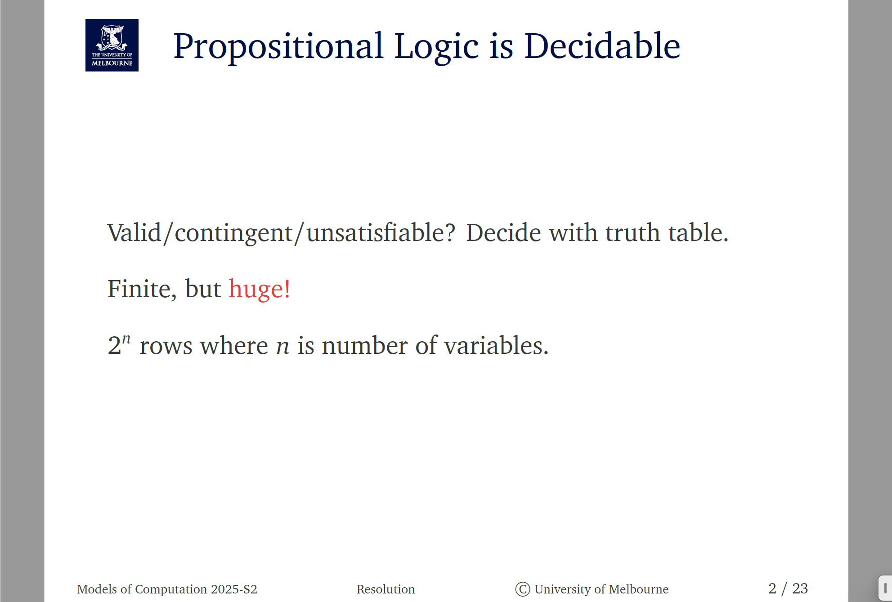
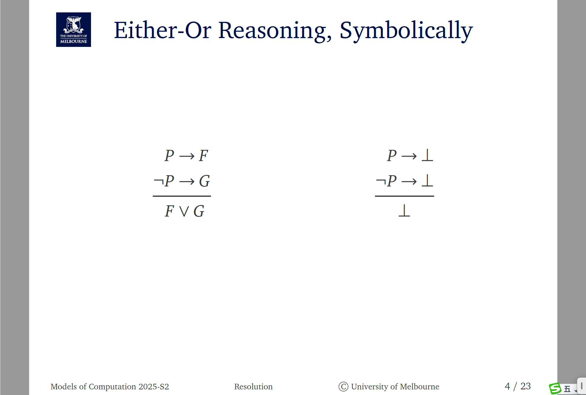
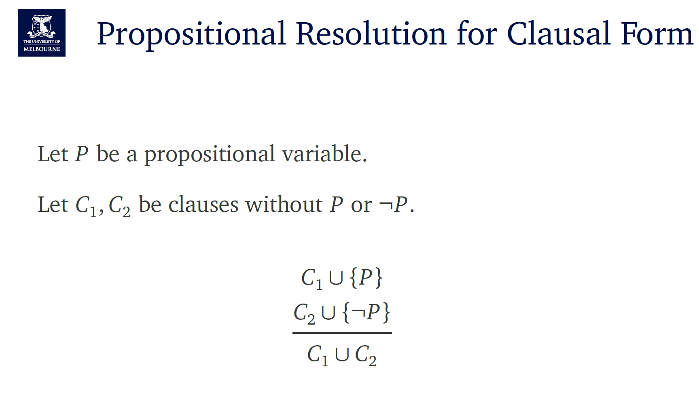

这是在回顾**“模型/满足 (models/satisfaction)”**这套记号，出现在命题逻辑里。

- 符号 **`⊨`**（也写作 `|=`）读作“**是……的模型**”或“**满足**”。
- **`v ⊨ F` 当且仅当（iff）在赋值 `v` 下公式 `F` 为真。**
   这里 `v` 是一个**赋值（valuation）**：把每个命题变元（P、Q…）映射到 **1（真）** 或 **0（假）**。图里的花括号如 `{P ↦ 1, Q ↦ 0}` 就表示这样的映射；没写到的变元无关本式子，可以随意取值。
- **`⊭`** 表示“不满足”。

再看例子与非例子（逐步算值）：

### 例子

1. `{P ↦ 1, Q ↦ 0} ⊨ P ∨ Q`
    在该赋值下：`P ∨ Q = 1 ∨ 0 = 1`，为真，所以满足。
2. `{P ↦ 0} ⊨ ¬P`
    `¬P = ¬0 = 1`，为真，所以满足。（这里没给出 Q，因为用不到。）

### 反例（不满足）

1. `{P ↦ 1, Q ↦ 0} ⊭ P → Q`
    蕴含 `A → B` **只在** `A=1 且 B=0` 时为假。这里 `1 → 0 = 0`，为假，所以**不**满足。
2. `{P ↦ 1} ⊭ ¬P`
    `¬P = ¬1 = 0`，为假，所以**不**满足。

> 小抄：
>
> - `¬1=0, ¬0=1`（非）
> - `1 ∨ 0 = 1`（或，任一真则真）
> - `A → B` 仅在 `A=1, B=0` 时为假，其余都为真。

这就是原文要表达的：**“某个赋值是否是某个公式的模型”，等价于“该公式在该赋值下是否为真”。**

# 讲义在说什么：等价（Equivalence）

- 记号 **`≡`** 读作“**在逻辑上等价**”（is logically equivalent to）。
- 定义：**`A ≡ B` 当且仅当，不论命题变元怎么取真/假，`A` 与 `B` 的真值总是相同。**
   等价也可写成 **`⊨ (A ↔ B)`**，或 **`A ⊨ B` 且 `B ⊨ A`**（互相蕴含）。

------

## 例子（Examples）

### 1) `P → Q ≡ ¬P ∨ Q`

蕴含只在 `P=1, Q=0` 时为假，其他为真；式子 `¬P ∨ Q` 也只有在 `P=1, Q=0` 时为假。
 真值表一致，因此等价。

| P    | Q    | P→Q  | ¬P∨Q |
| ---- | ---- | ---- | ---- |
| 1    | 1    | 1    | 1    |
| 1    | 0    | 0    | 0    |
| 0    | 1    | 1    | 1    |
| 0    | 0    | 1    | 1    |

### 2) `¬(P ∧ Q) ≡ ¬P ∨ ¬Q`（德·摩根律）

当且仅当 `P` 与 `Q` **不同时都真** 时为真，两边的真值也完全一致，所以等价。

| P    | Q    | P∧Q  | ¬(P∧Q) | ¬P∨¬Q |
| ---- | ---- | ---- | ------ | ----- |
| 1    | 1    | 1    | 0      | 0     |
| 1    | 0    | 0    | 1      | 1     |
| 0    | 1    | 0    | 1      | 1     |
| 0    | 0    | 0    | 1      | 1     |

------

## 非例子（Non-examples）

### 1) `P → Q ≢ R → S`

给出一个反例赋值就够了：取 `P=1, Q=1, R=1, S=0`
 则 `P→Q = 1`，但 `R→S = 0`，真值不同，所以**不**等价。

### 2) `P ∧ Q ≢ P ∨ Q`

取 `P=0, Q=1`：
 `P∧Q = 0`，`P∨Q = 1`，真值不同，因此**不**等价。

------

## 小结

- **等价**：两个公式在**所有**赋值下真值一致（同一张真值表），可互相替换而不改变任何复合公式的真假。
- 常见等价：`P→Q ≡ ¬P∨Q`、德·摩根律、双重否定等。
- 要证“不等价”，只需举出**一个**赋值使二者真值不同。

# 语义后果（Semantic Consequence）

**定义（与原文一致）：**
 **G 是 F 的语义后果，当且仅当 F 的每个模型也是 G 的模型。**
 简写：**`F ⊨ G`**，读作“F（语义上）蕴涵 G / entails”。

同义的几种说法（完全等价）：

- 对一切赋值 `v`：若 `v ⊨ F`，则必有 `v ⊨ G`。
- `⊨ (F → G)`（即 `F → G` 是永真式）。
- `F ∧ ¬G` **不可满足**（没有任何模型）。

**如何证明 / 反驳：**

- 想证明 `F ⊨ G`：说明“只要 F 真就必然 G 真”（可用真值表或一般性推理）。
- 想反驳 `F ⊨ G`：给一个**反模型**，使 **F 真而 G 假**（一次就够），于是 `F ⊭ G`。

**快例子：**

- `P ∧ Q ⊨ P`；`P ⊨ P ∨ Q`；`¬P ⊨ P → Q`。
- 反例：`P ∨ Q ⊭ P`（取 `P=0, Q=1`）。

**注（原文最后一行）：**
 **`F ≡ G` 当且仅当 `F ⊨ G` 且 `G ⊨ F`。**
 也就是互相蕴涵 ⇔ 逻辑等价。

这页在说明一句核心话：**命题逻辑是可判定的（decidable）**。

- **可判定**= 存在一种机械的算法，**有限步内**就能判断一个性质是/否。
- 对命题公式来说，要判断它是 **valid（永真）** / **contingent（或然）** / **unsatisfiable（不可满足）**，**只需做真值表**：
  1. 假设公式里有 nn 个不同变元。
  2. 枚举它们所有取值组合并计算公式的值。组合数是 **2n2^{n}**（每个变元要么真要么假）。
  3. 看最后一列：
     - 全是 1 → **valid**（恒真）；
     - 既有 1 又有 0 → **contingent**（有时真有时假）；
     - 全是 0 → **unsatisfiable**（恒假）。
- **Finite, but huge!** 虽然一定能判出来，但真值表的行数 **指数级** 增长：
   n=3⇒8n=3\Rightarrow 8 行，n=20⇒1,048,576n=20\Rightarrow 1{,}048{,}576 行，n=50⇒≈1.1×1015n=50\Rightarrow \approx 1.1\times10^{15} 行……
   所以“理论上可判定”，但**朴素真值表**在变量多时非常不实用——这也就是后续要学更高效方法（如化简、解析式、SAT/分辨率）的动机。
- 

> 

