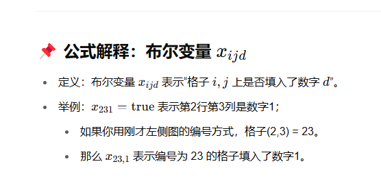

这张图片是墨尔本大学（The University of Melbourne）《COMP30026计算模型》课程的第1讲课件封面。下面是中英对照+逐项讲解，方便你向学生解释这门课程的基本情况。

------

## 📘 Slide 内容中英翻译与讲解

| 英文原文                              | 中文翻译                                   | 讲解说明                                                     |
| ------------------------------------- | ------------------------------------------ | ------------------------------------------------------------ |
| **The University of Melbourne**       | 墨尔本大学                                 | 澳大利亚著名八校联盟成员，计算机专业全球排名靠前。           |
| **COMP30026**                         | 课程代码：COMP30026                        | 通常表示“第三年计算机专业课程”COMP = Computer Science，30000 级别 = 高年级课程。 |
| **Models of Computation**             | **计算模型**                               | 本课程研究“计算的本质”和“计算能力的分类”。是理论计算机科学的核心内容。 |
| **Cezary Kaliszyk and William Umboh** | 主讲教师：Cezary Kaliszyk 与 William Umboh | 两位教授将共同负责该课程的授课与评估。学生可按需选择Office Hour讨论问题。 |
| **Lecture 1**                         | 第1讲                                      | 通常会介绍课程大纲、评估方式、背景知识要求等。               |
| **Introduction**                      | **导论**                                   | 开篇介绍：什么是“计算模型”？我们为什么要研究图灵机、可判定性与复杂性类？ |

------

## 🎓 补充讲解：什么是“计算模型”（Models of Computation）？

这是理论计算机科学中的一门基础课，它研究：

### ✅ 1. 什么是“可计算”？

- 哪些问题可以通过程序解决，哪些问题根本无法解决。
- 举例：图灵机能解决什么？有没有比图灵机更强的模型？

### ✅ 2. 如何“建模”计算过程？

- 图灵机（Turing Machine）
- 有限状态自动机（Finite Automata）
- λ演算（Lambda Calculus）
- 推理规则（Proof systems）
- 电路模型（Circuit Model）

### ✅ 3. 为什么要学习它？

- 为理解人工智能、编译器、自动机、程序验证、复杂性理论等课程打基础。
- 能力提升：抽象思维、逻辑推理、严谨证明能力。
- 与现代热门话题如图灵测试、AI可解释性、NP完全问题高度相关。

------

如你需要我帮你提炼 Lecture 1 的内容，或出一套中文讲稿、板书或PPT辅助文案，也可以继续发图或告诉我课程内容标题。


这张幻灯片是墨尔本大学《COMP30026 计算模型》（Models of Computation）课程的教学团队介绍页。下面为你提供完整的**中英对照翻译+逐项讲解**，适合用来向学生讲解师资团队组成。

------

## 🧑‍🏫 Slide 标题翻译

### **Teaching Staff: Who Are We?**

**教学团队：我们是谁？**

------

## 👨‍🎓 主讲教师 Lecturers

| 原文                                            | 中文翻译                           | 说明                                                         |
| ----------------------------------------------- | ---------------------------------- | ------------------------------------------------------------ |
| **Prof. Cezary Kaliszyk** (formal methods)      | Cezary Kaliszyk 教授（形式化方法） | 专攻理论计算、形式语言、证明系统，负责课程中的抽象模型、证明逻辑等核心内容。 |
| **Dr. William Umboh** (optimization algorithms) | William Umboh 博士（优化算法）     | 擅长算法设计与分析，讲授图论、可计算性、复杂性类等内容。     |

📌 小提示：
 “Formal methods” 是指使用逻辑工具和数学方法来验证程序正确性。
 “Optimization algorithms” 是指通过算法寻找问题的“最优解”，这对计算模型也至关重要。

------

## 👨‍🏫 课程主管助教 Head Tutor

| 原文         | 中文翻译             | 说明                                                         |
| ------------ | -------------------- | ------------------------------------------------------------ |
| **Ari Boyd** | Ari Boyd（首席助教） | 负责统筹所有助教工作、答疑协助、实验协调和评分管理。一般是博士生或研究人员担任。 |

------

## 👥 教学助教 Tutors

| 英文名单                                                     | 中文说明                                                     |
| ------------------------------------------------------------ | ------------------------------------------------------------ |
| Alexander Epstein, Alexander Shields, Angela Yuan, Ari Boyd, Colton Carner, Jonathan Purcell, Mark Raya, Philip Cervenjak, Rose-Maree Locsei, Samantha Tang, Tony He, Ziyu Li | 这些是辅导课教师，负责带领学生做练习（tutorial）、实验课（lab）、批改作业和答疑。他们来自博士生、高年级硕士生或研究人员。 |

📘 示例解释方式：
 你可以对学生说：

> “这门课的讲师团队很强大，两位教授分别擅长形式验证和算法优化。你们上 lecture 是由他们讲，lab 和 tutorial 是这些助教带你们完成练习。其中像 Tony He、Ziyu Li 等华人助教也许会带一些中文答疑。”

------

## 📝 总结语建议（可用于讲解结束）

这张幻灯片的重点是帮助学生认识到课程的“人”在哪里，出了问题该找谁：

- 有难懂概念？找**讲师**
- 作业不会？找**助教或 head tutor**
- 不知道去哪提问？看 LMS（在线系统）上 tutor 小组分配

如果你要讲这页PPT，可以加入一句：

> “记住这些名字，这学期他们会频繁出现在你们的答疑、作业反馈和评估中。”

如需我帮你制作中文版PPT讲稿或教学答疑提词卡，请继续发图或告知。


这张幻灯片延续上一页的内容，进一步解释**“复杂算法问题（Harder Algorithmic Problems）”**，重点强调了**逻辑编码（logical encoding）**在解决类似数独（Sudoku）这类问题中的作用。

------

## ✅ 中英文逐句对照翻译与详细讲解：

------

### 幻灯片标题

**Harder Algorithmic Problems**
 👉 更难的算法问题

这表明我们讨论的是**不容易解决、计算成本高的问题**，例如数独、图着色、SAT等。

------

### 幻灯片左侧图像

仍然是一张经典的**数独题图**。这是一个典型的**逻辑难题**，用来代表“计算复杂但可解”的问题。

------

### 第一条要点

**logical encoding allows to quickly develop an efficient solver for Sudoku**
 👉 **逻辑编码可以快速开发出高效的数独求解器**

#### 教学建议讲解：

> “虽然数独在理论上是一个NP完全问题，但我们可以通过**逻辑编码**的方式，把它转化成计算机能够理解和求解的逻辑公式，比如用**布尔可满足性问题（SAT）**。这样一来，借助现有的SAT求解器，计算机就可以非常快地找出数独的解。”

📌 举例补充：

- 数独可以转换为一个包含729个变量的SAT问题；
- 每个单元格是否为某个数字可以用布尔变量表示；
- 最终转化为一组逻辑约束条件，用SAT求解器来完成。

------

### 第二条要点

**similar “hard” tasks**
 👉 类似的“困难”任务

#### 教学建议讲解：

> “除了数独，还有很多问题也属于这类‘看起来简单，但算法上非常困难’的任务。比如说：
>
> - 地图着色问题（Graph Coloring）
> - 旅行商问题（TSP）
> - 布尔可满足性（SAT）
> - 排班问题（Scheduling）
>
> 这些问题的共同点是：**解的验证很快，但找到解很难**。”

------

## 📘 延伸知识（可选补充）

| 类型                 | 举例                        | 是否属于NP-Complete       |
| -------------------- | --------------------------- | ------------------------- |
| 可解但计算复杂的问题 | 数独、SAT、3-Coloring       | ✅ 是                      |
| 不可解问题           | Halting Problem（停机问题） | ❌ 不可判定（Undecidable） |

------

## 💡 建议课堂引导语

你可以这样讲给学生听：

> “我们刚刚看了数独，其实它背后代表的是一类**逻辑上能描述，但计算机要穷举尝试的复杂问题**。但幸运的是，有很多聪明的方法，比如**逻辑编码（logical encoding）**，能让计算机迅速找到解！这也引出了我们本课的主题：什么是可计算的？哪些问题可以高效求解？哪些不行？”

------

如需我继续讲解下一页，请继续上传图片或告诉我页码。也可以请求我为这17页整理出**一整套讲稿或导学稿**。


这张幻灯片继续解释“打印机管理器（Printer Manager）”状态模型，并引入了**两个重要的系统验证问题（Verification Questions）**，这些问题是**形式方法**和**模型检查（Model Checking）**课程中的核心内容。

------

## 🖨️ Printer Manager 打印管理器状态模型（二）

------

### 📖 中英文对照翻译

------

### 标题：

**Printer Manager**
 👉 打印机管理器

------

### 右侧说明文字：

#### Two users A and B

👉 有两个用户 A 和 B

- *Ii*：用户 *i*（A 或 B）空闲（Idle）
- *Ri*：用户 *i* 发起打印请求（Request）
- *Pi*：正在为用户 *i* 打印文档（Printing）

------

### ✅ Some questions 一些问题：

> 🔸 Is every *Pi* preceded by *Ri*?
>  → 每一次打印 *Pi*，是否都在此前有请求 *Ri*？
>  → 即：“打印是否一定是由请求触发的？”

> 🔸 Is every *Ri* eventually followed by *Pi*?
>  → 每一个请求 *Ri*，是否最终都会被执行为 *Pi*？
>  → 即：“请求是否最终都会被处理？”

------

### 🧠 教学重点（讲给学生听）：

这张幻灯片的核心，是让你**从形式逻辑的角度思考系统正确性问题**，对应的学术术语包括：

| 英文术语          | 中文解释                             | 所属领域                             |
| ----------------- | ------------------------------------ | ------------------------------------ |
| Safety Property   | 安全性性质：不该发生的事永远不会发生 | 例如：不能出现先打印后请求           |
| Liveness Property | 活性性质：应该发生的事最终会发生     | 例如：每个请求最终都会打印           |
| Temporal Logic    | 时序逻辑                             | 使用逻辑语言描述系统随时间变化的行为 |
| Model Checking    | 模型检查                             | 通过遍历状态图验证是否满足某种性质   |

------

### 🖼️ 图解说明（讲图）：

图中的每个圆圈是一个**系统状态**，两个用户可能处于空闲、请求、打印三种状态的任意组合，共形成若干状态节点。
 箭头表示“状态转换”，即系统根据用户操作从一个状态转移到另一个状态。

比如：

- 从 `I_A I_B` → `R_A I_B`：表示 A 发送了请求
- 从 `R_A I_B` → `P_A I_B`：表示系统为 A 开始打印

------

### ❓为什么提出这两个问题？

> “因为现实中你不能只靠程序运行效果来判断是否正确。你必须问：
>  —— 有没有哪种情况打印会发生但没有请求？
>  —— 有没有哪种请求永远得不到响应？”
>
> 这两个问题分别属于**安全性验证（safety）\**和\**活性验证（liveness）**，我们将会学会使用**有限状态机和时序逻辑**来检查它们。

------

### ✅ 总结（讲给学生）：

> “这一页就是我们**形式化验证（formal verification）**的起点。你需要掌握：
>
> 1. 如何建模一个实际系统的状态变化（如用户A/B请求打印）
> 2. 如何用状态图表达系统行为
> 3. 如何用逻辑问题分析系统是否合理（是否会漏打印？是否会出错？）
>
> 这就是你未来能做出可靠系统的第一步。”

------

如你需要我继续解释后续幻灯片，请回复“下一页”或继续发送截图。是否继续？

这张幻灯片是墨尔本大学“计算模型 COMP30026”课程的第五页，标题为：

------

## 🗺️ Coloring a Map 地图着色问题

------

### 🧠 中英文对照讲解：

------

### 🌍 图像内容：

这是一张美国地图，不同的州被涂上了不同的颜色（蓝色、橙色、黄色、绿色等）。目的是**相邻的州不能使用相同颜色**，这是典型的计算机科学中的**图着色问题（Graph Coloring Problem）**的可视化版本。

------

### 📚 背景知识：

#### 什么是地图着色问题？

地图着色问题是图论中的经典问题，形式化表述为：

> 给定一张地图，把所有区域（州）分别着色，要求：
>
> - 任意两个相邻的州使用不同颜色。
> - 使用的颜色数量尽可能少。

#### 应用在计算机科学中的形式：

- 每个州看作一个节点（顶点 vertex）；
- 相邻州之间画一条边（edge）；
- 为每个节点分配一个“颜色”（变量）；
- 要求所有相邻节点的颜色不同。

这就是一个**图着色问题 Graph Coloring**，更广义地属于**约束满足问题（CSP）**。

------

### 📌 教学重点（讲给学生听）：

> “大家看这张图，每个州就像是一个变量，它的‘颜色’就是我们要决定的值。
>  相邻的州不能一样颜色，这就形成了变量之间的‘约束条件’。”
>
> 我们将这个问题抽象成一个图模型，每个州是一个点，连接线表示相邻关系，然后我们要满足‘相邻点不同色’这个条件。

------

### 📎 相关知识点：

| 概念                           | 中文含义                                   | 举例                     |
| ------------------------------ | ------------------------------------------ | ------------------------ |
| 图着色（Graph Coloring）       | 给图中的顶点分配颜色，确保相邻顶点颜色不同 | 地图着色、考试排期       |
| 四色定理（Four Color Theorem） | 任意地图最多使用4种颜色即可实现合法着色    | 本图即使用了≤4色         |
| 约束满足问题（CSP）            | 一种求解变量满足特定约束的方法             | 数独、地图着色、课程安排 |
| NP完全问题（NP-Complete）      | 一类在理论上“难解”的问题，图着色是其中之一 | 本课程将深入讨论         |

------

### 🔍 后续可能探讨的内容：

- 如何用**布尔逻辑**表达这个问题？
- 如何用**自动求解器（如 SAT Solver）**来解出颜色分配？
- 这个问题为什么是**NP-完全问题**，计算复杂度如何？

------

### ✅ 总结给学生：

> “这张图不仅仅是地图，它背后是一类**重要的组合优化问题**，我们可以用图论、逻辑、甚至 SAT 求解器来求解它。这会是你学习计算模型与自动化推理中最具代表性的例子之一。”

------

如果你要我解释这一页后续的讲解内容、逻辑建模或如何用代码实现地图着色，可以继续发问。我可以给你详细推导。是否继续？


这张幻灯片来自墨尔本大学《COMP30026 计算模型（Models of Computation）》课程第6页，标题是：

------

## 💡 What do we need all this “theory” for?

我们为什么需要这些“理论”？

------

### 📘 中英翻译与详细讲解如下：

------

### ✳️ 开头语句：

> **Before computer science, there was only mathematics.**
>  在计算机科学诞生之前，世界上只有数学。

> **And large parts of computer science are still very mathematical!**
>  而如今计算机科学的很大一部分，仍然是高度数学化的！

🧠 教学提示：你可以用这句话强调**CS ≠ 编程语言本身**，而是有数学、逻辑、建模的强大基础。

------

### 🔍 六大理论核心模块（蓝色内容是关键词）：

| 模块              | 中文翻译      | 作用/解释                                            |
| ----------------- | ------------- | ---------------------------------------------------- |
| **Syntax**        | 语法          | 什么样的程序才是“合法的”？比如花括号配对、关键字拼写 |
| **Type systems**  | 类型系统      | 程序类型是否匹配？比如整数不能加字符串               |
| **Semantics**     | 语义          | 程序运行时会发生什么？是否和我们想象的一样？         |
| **Specification** | 规范/规格说明 | 程序应该做什么？即需求说明。                         |
| **Verification**  | 程序验证      | 如何数学地证明程序不会崩溃，并且确实满足规范？       |
| **Complexity**    | 复杂度        | 程序要用多少时间？多少内存？是否可行？               |

📌 举例讲解：

> 比如你写一个程序求质数，如果只是通过运行试一试，那只是测试；但如果你能**用数学方式证明程序永远不会出错**，那就是“程序验证”。

------

### ➕ 补充领域：

> **And more:**
>  还有更多领域，例如：

- 算法设计（Algorithm Design）
- 密码学（Cryptography）
- 程序分析（Program Analysis）
- 程序合成（Synthesis）等

这些都是理论计算机科学的重要分支。

------

### ✅ 结尾强调：

> **All used in the industry and active research areas.**
>  所有这些内容，在工业界都有真实用途，并且是当前研究的活跃前沿！

🧠 教师建议：这里可以引导学生理解，“理论 ≠ 没用”，恰恰相反，现代工业级软件、大型系统、AI 编译器、数据库优化器、甚至区块链智能合约的正确性验证，全都离不开这些理论。

------

### 🧑‍🏫 可用于讲解的总结语：

> “我们学习这些理论，不是为了‘考试’，而是为了真正掌握编程背后的原理和安全性。理论就像钢筋，是构筑工程系统的大脑和骨架。”

------

需要我继续解释第7页吗？或者需要我把这页内容整理成课堂讲稿或PPT讲义格式？


这页幻灯片是墨尔本大学《计算模型》（Models of Computation）课程第7页，标题是：

------

## 📘 Topic: Automata Theory

**主题：自动机理论**

------

### ✳️ 中英文逐句讲解如下：

------

### 🔍 1. 总述（自动机理论是什么）

> **Study of various idealized computing machines.**
>  对各种“理想化计算机”的研究。

💡 解释：
 这里的“计算机”并不指你日常使用的笔记本电脑，而是指像**有限状态自动机（Finite Automaton）**、**图灵机（Turing Machine）**这样的理论模型。
 这些模型是研究**“什么是可计算的”**的基础。

------

### 🧱 2. 自动机理论的三大子话题：

------

#### ✅ **How they work.**

它们是怎么运行的？

> 👉 研究这些模型的状态转换机制。例如：
>
> - 输入一个字符串，自动机会从一个状态转到另一个状态，最后是否接受该字符串？
> - 图灵机会如何读取带子、写入数据、移动读写头？

你可以把这比喻成：
 🧠“给机器一个输入，它是怎么做决策的？”

------

#### ✅ **What they can do (computability theory).**

它们能做什么？（即：计算能力有多强）

这是**可计算性理论（Computability Theory）**的核心问题：

> - 什么问题是**图灵机**可以解决的？
> - 是否存在一些问题是**所有机器都永远无法解决的**？

例如：

- 判定“这个程序是否会无限运行”就是**不可判定的**（停机问题）。

------

#### ✅ **Proving elementary properties.**

证明一些基本性质。

例如：

> - 有限自动机是否等价于正则表达式？（是的，可以证明）
> - 自动机是否对某个输入一定接受？是否可以转换成最小状态数？

这部分强调了**形式化数学证明**在CS中的作用。

------

### 🎓 教学建议总结：

你可以告诉学生：

> “自动机理论不是为了写代码，而是为了理解代码背后的‘计算极限’和‘模型抽象’。就像物理学要有牛顿力学、计算机也必须有图灵机。”

------

### 🧑‍🏫 拓展讨论可引导如下：

1. 图灵机是否能模拟任何现代编程语言？
2. 有限自动机能否识别所有语言？（答案是不能）
3. 为什么说图灵完备 ≠ 实际可解？

------

如果你需要我将本页内容整理成一份适合教学的中文讲稿、思维导图，或者用更生活化的语言向学生解释“什么是自动机”，我也可以继续补充。是否继续？


这张幻灯片是墨尔本大学《计算模型》（Models of Computation）课程第8页，标题为：

------

## 📘 Topic: Formal Language Theory

**主题：形式语言理论**

------

### 🧠 逐句中英解释如下：

------

### ✳️ **Study of sets of strings.**

**对字符串集合的研究。**

📘 解释：
 所谓“形式语言”是**一组符合某种语法规则的字符串集合**，比如：

- 所有由`a`和`b`组成，且以`a`结尾的字符串；
- 所有满足括号匹配的表达式。

这句话的核心是：

> 形式语言研究的对象是**哪些字符串是合法的？哪些是无效的？**

------

### 🔗 **Very close connection to automata theory.**

**它与自动机理论关系非常紧密。**

📘 解释：
 自动机是接受语言的“机器”，形式语言是“被接受的字符串集合”。

两者的关系可以概括为：

> 每一种“语言”（字符串集合）都可以由一种“自动机”识别，
>  每一种“自动机”也对应着一个能接受的语言。

比如：

- 正则语言 ↔ 有限自动机（DFA/NFA）
- 上下文无关语言 ↔ 下推自动机（PDA）

------

### ❓**What kinds of grammars correspond to what types of automata?**

**哪种语法结构对应哪类自动机？**

📘 解释：
 这是形式语言理论研究的核心问题之一。也就是著名的：

### 🌐 **Chomsky Hierarchy（乔姆斯基层次结构）**

| 语言类型 | 语法类型       | 对应的自动机       |
| -------- | -------------- | ------------------ |
| Type 3   | 正则语法       | 有限自动机 DFA/NFA |
| Type 2   | 上下文无关语法 | 下推自动机 PDA     |
| Type 1   | 上下文相关语法 | 线性有界自动机 LBA |
| Type 0   | 无限制语法     | 图灵机 TM          |

所以这个问题本质是：

> “不同复杂度的语法规则，需要用什么样的机器才能处理？”

------

### 🧑‍🏫 如何讲给学生听：

你可以这样解释给学生：

------

> “形式语言就像是一门‘计算机的语文课’，它关心的是**程序能读懂什么句子？**”
>
> 它不是人类语言，而是一组严格的、可以被机器识别的符号序列。
>
> 自动机就像一个‘语法检查器’，它要判断一个字符串是否符合规则。
>
> 比如：DFA能识别`abba`是否属于一个语言；PDA能判断括号是否配对。

------

### 📝 延伸教学建议：

- 举例讲解正则语法 → DFA
- 使用代码演示构造自动机识别某种语法
- 结合编译器讲解：前端词法/语法分析正是依赖这些理论

------

如需我继续解读后续幻灯片，或整理这部分成课堂讲稿/思维导图，也可以继续告诉我！是否继续？


这张幻灯片来自墨尔本大学的《Models of Computation 计算模型》课程，是第9页，标题是：

------

## 🎤 Over to You — Introductions

**轮到你了 —— 自我介绍**

------

### 📌 原文内容逐条翻译与讲解：

> ### **Please introduce yourself to your neighbours.**
>
> **请向你身边的同学做自我介绍。**

这是一节互动环节，鼓励大家在课堂上互相认识、打破陌生。

------

#### 🔶 **where you are from?**

**你来自哪里？**

📘 解释：可以是你的国家、城市，或者你成长的地方。
 🗣️ 示例回答：

> I'm from Hangzhou, China.
>  我来自中国杭州。

------

#### 🔶 **what degree program you are enrolled in?**

**你正在就读哪个学位项目？**

📘 解释：本科/硕士/博士，主修什么专业。
 🗣️ 示例回答：

> I'm a second-year undergraduate student in Computer Science.
>  我是计算机科学二年级本科生。

------

#### 🔶 **languages or programming languages that you speak?**

**你会说哪些语言或编程语言？**

📘 解释：既可以是自然语言（如中文、英语），也可以是你掌握的编程语言。
 🗣️ 示例回答：

> I speak English and Mandarin, and I use Python, C++, and Java.
>  我会说英语和中文，我会用 Python、C++ 和 Java 编程。

------

#### 🔶 **anything else that is interesting like: Which is the best city you have visited? Which is the greatest film ever made?**

**还可以聊聊其他有趣的事，比如：你去过最棒的城市是哪？你心中最棒的电影是哪部？**

📘 解释：老师希望大家能多说点有趣的、个性化的内容，增进交流。
 🗣️ 示例回答：

> The best city I've visited is Kyoto. The best film I've seen is "Interstellar".
>  我去过最棒的城市是京都，最喜欢的电影是《星际穿越》。

------

### 🧑‍🏫 课堂讲解建议：

你可以这样引导学生：

------

> 👋 “大家好，课程开始前，我们来个轻松的破冰环节。”
>
> “请你转向坐在你旁边的同学，互相做个简短介绍。”
>  “你可以聊聊你从哪里来，你学什么，会什么语言，还有你觉得最棒的电影或者最喜欢的城市。”
>
> “这不仅能帮助你们交朋友，也有助于今后小组讨论。”

------

### ✅ 总结中文模板供学生参考：

------

> 👋 大家好，我叫___，来自___。
>  我目前在读___专业，是一名___学生。
>  我会说___语言，也会编程语言比如___。
>  我去过最喜欢的城市是___，我最喜欢的电影是___。

------


这张幻灯片是《Models of Computation 计算模型》课程第10页，标题为：

------

## **Basic mathematical vocabulary**

**数学基础术语**

------

这是一个帮助学生适应“数学化思维”的引导内容。下面是逐条中英文翻译和详细解释，方便你在课堂上讲解：

------

### 🔶 Natural language is bulky and often ambiguous

**自然语言冗长且经常模糊不清**

🧠 **解释**：
 我们日常用的自然语言（如英语、中文）很灵活，但容易有歧义。例如：
 “他看到她拿着望远镜。”是谁拿着望远镜？这种模糊会造成误解。

📌 在数学和计算中，为了严谨，我们不能用这种模糊的语言。

------

### 🔶 To talk **precisely**, mathematics has its own vocabulary

**为了表达精确，数学有自己的专属词汇体系**

🧠 **解释**：
 数学不是“更高级的英语”，而是有一套特有“语法”的语言。
 比如，集合、函数、存在量词、∀、∃、推理规则等等。

这套语言用于清晰定义、严格推理，避免歧义。

------

### 🔶 Main items: **definitions** and **proofs**

**两大核心：定义（definitions）和证明（proofs）**

🧠 **解释**：

1. **定义**：明确概念，比如“图是由点和边组成的集合”
2. **证明**：用逻辑方法，说明某个结论一定成立，比如“若图是连通的，则存在一棵生成树”

📣 在计算理论中，比如自动机、图灵机、可计算性等概念，全都要用精确定义和逻辑证明。

------

### 🔶 This is like learning a new language:

**这就像在学一门新语言：**

#### 🔸 only way to learn it is to **just do it**

**唯一的方法是：直接开始练！**

#### 🔸 even if strange in the beginning!

**哪怕一开始你觉得很陌生，也要坚持练！**

🧠 **解释**：
 刚开始学计算模型或形式语言时，你可能觉得这些定义和符号很“抽象”或“不自然”。但这就像学英语的语法，只有多看多用，才能习惯。

📘 教师可举例说明：

> 证明“DFA能识别的语言是正则语言”一开始很难，但练多了就自然了。

------

### 🎓 课堂建议：

你可以这样向学生说：

------

> “这节课之后你会发现，我们正在学习的不只是内容，而是一种**语言**。”
>  “数学语言不是用来‘背’的，而是用来‘练’的。你只有自己动手写定义、做证明，才能掌握它。”
>  “一开始别怕看不懂，这就是你‘学会一门新语言’的必经阶段！”

------


这张幻灯片是《Models of Computation 计算模型》课程第11页，标题是：

------

## **Basic Symbols**

**基础逻辑符号**

------

这是在讲解**数理逻辑中最基本的逻辑运算符**，学生后续会在推理、证明、自动机理论中频繁使用这些符号。

我们逐行来做中英解释，并配合课堂讲解建议👇：

------

### **Symbol: ∧**

**英文读法**：`and (conjunction)`
 **中文释义**：**且**（合取）

🧠 **解释**：
 这是**逻辑“与”**，只有当两个条件都成立时，整体才为真。

📌 例子：

```
P: 今天下雨  
Q: 我带伞  
P ∧ Q：今天下雨并且我带伞（两个都是真的）
```

------

### **Symbol: ∨**

**英文读法**：`or (disjunction)`
 **中文释义**：**或**（析取）

🧠 **解释**：
 这是**逻辑“或”**，只要有一个条件为真，整体就为真。**不是排他或！**

📌 例子：

```
P: 明天下雪  
Q: 明天下雨  
P ∨ Q：明天下雪或下雨（只要下任意一个就算成立）
```

------

### **Symbol: →**

**英文读法**：`implies (implication)`
 **中文释义**：**蕴含、推出**

🧠 **解释**：
 这是“如果…那么…”结构，在逻辑中是**条件推理**。

📌 例子：

```
P: 你考试及格  
Q: 你能毕业  
P → Q：如果你考试及格，那么你能毕业
```

📌 **注意**：P 为假时，P → Q 也为真（逻辑里成立）。

------

### **Symbol: ¬**

**英文读法**：`not (negation)`
 **中文释义**：**非、否定**

🧠 **解释**：
 这个符号用来表示“不是”、“不满足”的意思。

📌 例子：

```
P: 我今天有课  
¬P：我今天没课
```

------

### 📣 课堂讲解建议

你可以这样介绍：

> “这些是我们推理语言的基础‘字母’。你们会像学英语字母一样，把它们用得非常熟练。”
>  “数学符号虽然看起来冷冰冰，但其实是为了让我们写得‘短、准、严’。”

🔧 板书演示建议：

| P    | Q    | P ∧ Q | P ∨ Q | P → Q | ¬P   |
| ---- | ---- | ----- | ----- | ----- | ---- |
| T    | T    | T     | T     | T     | F    |
| T    | F    | F     | T     | F     | F    |
| F    | T    | F     | T     | T     | T    |
| F    | F    | F     | F     | T     | T    |

------


这张图片来自墨尔本大学的幻灯片，标题为“Sudoku solution”，主要讲述如何用**命题逻辑（Boolean）编码**数独问题。我们来一步步详细解释这张图中每一部分的含义：

------

## 📌 左边的图（编号 11 ~ 99 的方格）

这是一个 **9x9 数独网格的编号方式**，将每个格子从左到右、从上到下按顺序编号：

- 第一行编号是 11 到 19，对应数独的第一行第1列到第9列；
- 第二行是 21 到 29，依此类推；
- 第九行是 91 到 99。

这个编号用于在布尔变量中表示每一个格子的位置。

------

## 📌 右边的图（部分填入的数独盘面）

这是一个 **部分填入数字的数独题目**。例如：

- 第1行的第2列是数字 6；
- 第2行第2列是 8，第3列是 3；
- 第9行第4列是 5，第6列是 8，等等。

这些是预先设定的已知条件（约束），你需要填入剩下的格子，使得最终每行、每列、每个九宫格都包含 1-9 的数字。

------

## 📌 下方蓝色标题栏：Propositional (Boolean) Encoding

表示我们要用布尔变量（true/false）将数独问题“翻译”为布尔逻辑表达式，从而用 **SAT 求解器**等工具求解它。

------

- 

------

## 📌 括号中的公式：

这是布尔表达式的形式，例如：

```
(x₁₁₁ ∨ x₁₁₂ ∨ x₁₁₃ ∨ ... ∨ x₁₁₉) ∧ (x₁₂₁ ∨ ...) ∧ ...
```

解释如下：

1. `x₁₁₁ ∨ x₁₁₂ ∨ ... ∨ x₁₁₉`：第1行第1列（格子11）必须填一个数字1~9中的某个；
   - 意思是这个格子 **必须有一个数字**；
2. 后续 `∧`（AND）连接的其他表达式是对所有格子的类似约束：
   - 每个格子都**必须有一个数**；
   - 每个格子**只能有一个数**；
   - 每一行、每一列、每个九宫格中的数字都必须互不重复。

这些约束会通过一系列布尔表达式组合起来，形成完整的数独SAT模型。

------

## ✅ 总结：这张图的含义

你看到的是如何把数独问题形式化成逻辑问题的一部分：

- **将数独格子编号**为11-99；
- **定义布尔变量** xijdx_{ijd} 表示位置(i,j)上填的是数字d；
- **用逻辑公式约束**数独的规则（每格一个数字、不重复等）；
- 最终可以**用SAT求解器自动求解**数独。

------

如果你想，我可以：

- 帮你把整个数独题目转成完整的布尔表达式；
- 用Python写一个SAT编码器；
- 或者直接帮你解这个题目。

你需要我帮你哪一步？

------


这张是墨尔本大学《计算模型》（Models of Computation）课程第 12 页幻灯片，标题为：

------

## **Sudoku solution**

## 数独求解

------

本页介绍了**如何将数独问题转化为布尔逻辑问题（Propositional Logic）**，也就是用我们上节课讲的“命题逻辑”或“布尔变量”来建模解题。

------

### 🧩 数独是什么？

右上角图展示了一个**标准的 9×9 数独题目**：

- 填满整个 9×9 表格
- 每行、每列、每个 3×3 宫内，数字 1–9 **不能重复**

------

### 🧠 数独问题如何“形式化”？

左上角那个 9×9 的格子，每个格子用两位数表示，如：

- `11` 表示第1行第1列，
- `94` 表示第9行第4列。

------

### 🔠 下方是**逻辑建模**（Propositional/Boolean Encoding）解释：

#### `x_ijd` 是一个布尔变量：

意思是：“第 i 行 第 j 列 的格子里填的是数字 d”

> 例如：
>  `x_237 = true` 表示第2行第3列填的是7。

------

### 接下来是**约束条件（逻辑公式）**：

------

#### **1. 至少填一个数**：

```
∧ { at-least-one({x_ijd | d ∈ D}) | i, j ∈ D }
```

- 对于每一个格子 `(i,j)`，我们要求在所有可能数字 d 中，**至少有一个 x_ijd 为真**。
- 否则这个格子就没填数。

------

#### **2. 最多填一个数**：

```
∧ { at-most-one({x_ijd | d ∈ D}) | i, j ∈ D }
```

- 每个格子不能填两个数，即最多只能有一个 x_ijd 为 true。

------

这只是数独逻辑编码的一部分，完整的建模还包括：

- 每一行中 1~9 各出现一次
- 每一列中 1~9 各出现一次
- 每个 3×3 宫中 1~9 各出现一次

这些都可以写成**布尔逻辑公式**

------

### ✅ 最后一句话重点解释：

> **formula is satisfiable**（公式可满足）
>  ⇔ **puzzle is solvable**（数独可解）

🧠 意思是：

- 如果你写出的这些布尔公式 **有一个解（satisfiable）**，就说明这个数独题目有解。
- 反过来，如果数独题目能解出来，那这个布尔公式一定是满足的。

------

### 🧑‍🏫 如何讲给学生听：

你可以这样说：

> “我们把数独看作是一个逻辑谜题，把‘数字填哪里’转换成布尔变量（真假变量），然后用一系列逻辑公式去描述规则。这就是所谓的**逻辑编码**。”
>
> “这样做的好处是，我们就可以用**计算机里的 SAT 求解器**来自动解数独！”

------

### 📌 总结核心概念（可板书）：

| 数独格子建模   | 逻辑解释             |
| -------------- | -------------------- |
| `x_ijd = true` | 第 i 行 j 列是数字 d |
| 至少一个       | 每格必须填一个数     |
| 最多一个       | 每格不能填两个数     |
| 逻辑可满足     | 数独可解             |

------


这张幻灯片展示的是一个经典的数学逻辑问题，用**布尔逻辑（Propositional Encoding）**方式来表达“毕达哥拉斯三元组着色问题”（**Pythagorean Triples Color Problem**）。

------


------

## 🔢 举个例子

如果你把自然数 1, 2, 3, ... 染色为红或蓝（就像二元变量），你需要确保：

- 没有任何满足 a2+b2=c2 的三元组中，a,b,c 三个数颜色一样。

------

## 🔁

------

## 💻 

这张幻灯片是对上一页“毕达哥拉斯三元组染色问题”**最终解答**的总结，非常适合讲给学生听来激发兴趣与对计算复杂性的认识。我们逐行讲解如下：

------

## 🧩 Slide 标题：**Solution 解决方案**

------

### ✅ 中文逐句讲解与翻译：

------

### 🔴 `NO if (and only if) n ≥ 7825`

> **只要 `n ≥ 7825`，答案就是** ❌ **“不可以染色”**

翻译：

> **不可以用两种颜色去染所有自然数，使得任意满足 x2+y2=z2 的三元组不会全是同色的**，
>  当且仅当染色范围是从 1 到 **7825**（及以上）。

📌 这说明：**对于 7825 个数，绝对无解（不满足）！**

------

### ⏱️ `2 days (in May 2016)`

```
on University of Texas’ Stampede supercomputer with 800 processors
```

翻译：

> 这个问题的证明是在 **2016年5月**，由美国**德州大学的 Stampede 超级计算机**完成的，
>  该计算机拥有 **800 个处理器**，共耗时 **两天**。

你可以补充给学生讲：
 🖥️ Stampede 是当时美国最强的高性能并行计算机之一。证明这个“不可染色”的命题需要大量 SAT 求解与并行验证。

------

### 💾 `200 terabyte proof of unsatisfiability`

翻译：

> 这份“**无法满足的证明（unsatisfiability proof）**”占用了 **200 TB（200万兆字节）**的空间！

📌 提醒学生：这个量级大得惊人！
 🧠 它不是给人看的，而是给计算机 SAT solver 自动验证的，称为“machine-checkable proof”（机器可验证的证明）。

------

### 📰 `extensive media coverage (Nature)`

翻译：

> 这项成果被《**自然（Nature）**》等主流媒体广泛报道，成为计算机科学中的一次重要突破！

------

## 🧑‍🏫 教学建议讲法：

你可以这样讲：

> “上一页我们看到毕达哥拉斯三元组染色问题能转化为逻辑约束问题，变成布尔可满足性（SAT）问题。那我们想：是不是任意给定一个最大数 nn，总能找到一种可行染色方案？
>
> 结果出乎意料 —— 当 n≥7825n ≥ 7825 时，**不存在任何满足这些约束的染色方案**，这个结果用了超级计算机 Stampede，800个核心连续跑了2天，还输出了一份200TB大的不可满足性证明！
>
> 这个问题也展示了 SAT 技术和自动化证明的威力。”

------

### 🔍 拓展讲解：

你可以鼓励学生阅读相关论文：

- Heule, M.J.H., Kullmann, O. & Marek, V. (2016). *Solving and verifying the boolean Pythagorean triples problem via cube-and-conquer.*
   Appeared in **Nature** Vol. 536, pp. 206–209.

------

如需我帮助你出板书内容、学生互动问题，或做一张“计算复杂性 VS 实际计算能力”的对比图，也欢迎告诉我！


这张幻灯片的标题是 **“Learning Support（学习支持）”**，是给学生说明这门课在课后答疑、在线帮助、教学材料获取等方面有哪些具体支持措施。

以下是逐句中英翻译与解释，非常适合在开学第一节课对学生进行说明：

------

## 📘 Slide 标题：**Learning Support 学习支持**

------

### ✅ 正文内容逐行翻译与讲解：

------

### ✉️ Teaching materials will be posted on the LMS every week.

👉 **每周都会在 LMS 上发布教学材料。**
 解释：
 LMS 是 Learning Management System（学习管理系统），像 Canvas、Blackboard 或 Moodle 等系统。老师会把**讲义、习题、参考资料等上传至 LMS 平台**，建议学生每周定期查看。

------

### 👩‍🏫 Lecturers and tutors will answer your questions

- **during and after class**

👉 **讲师和助教会在课上和课后回答你的问题。**
 解释：
 强调互动不仅限于课堂上，**下课后也欢迎提问**。你可以建议学生主动提问，尤其是在自己卡住的问题上。

------

### 💬 Staff will also answer questions on (Ed) (Recommended!)

👉 **老师也会在 Ed 平台上回答问题（推荐使用）**
 解释：
 “**Ed**”是一个类似于在线问答讨论区的平台，专门用于课程提问、讨论、通知。

- 学生可以匿名或实名提问
- 同学之间也可以互相回答
- 老师和助教会跟进答复

你可以告诉学生：**“不懂就问，越早越好，Ed 是你的随身教室。”**

------

### 📅 I will be running consultations every Friday, 10–11am.

👉 **我每周五上午 10 点到 11 点会提供答疑时间（consultation hour）**
 解释：
 这是老师开放给所有学生的固定问答时段，类似于**“开放办公室时间”**。你可以在这段时间来找老师：

- 讨论作业
- 深入问题
- 补课内容
- 甚至探讨更高级的话题（如果你感兴趣）

------

## 🎯 教学建议口吻讲法：

你可以这样讲：

> “大家不用担心学不懂的问题，老师和助教会在课堂上、课后、Ed 平台，甚至每周五都有答疑时间支持你们。我们的目标是让你在理论课程中也能感受到温暖和踏实。”

------

如果你需要我帮你写一段幽默但鼓励学生提问的开场白，我也可以帮你写出来用于第一节课！


这张幻灯片的标题是 **“Expectations（课程期望）”**，用于在课程一开始就明确告诉学生：**要掌握计算模型这门课，光听课是不够的，需要主动练习，并从第一周就积极参与教学活动。**

------

## 📝 幻灯片内容逐句中英翻译与讲解：

------

### 🔹 You won’t truly master problem-solving just by watching lectures.

👉 **你无法仅靠听课就真正掌握问题求解的能力。**

解释：
 这是在告诉学生，**“被动学习”是不够的**。就像学骑自行车光看教学视频是学不会的，算法思维也需要不断练习、动手做题，才能掌握。

------

### 🔴 Deliberate practice is the right way.

👉 **刻意练习才是正道。**

解释：
 这句话强调了**“有意识、有目标地练习”**（而不是随便刷题）是提升能力的唯一可靠方式。你可以补充说：

> “比如遇到不会的题，试着先自己想，想不出来再看提示，最后再反复写一遍。不要只看答案。”

------

### 🔔 Attend the tutorials! They start in week 1!

👉 **务必参加辅导课！第一周就开始了！**

解释：

- **tutorials** 是辅导课或小班习题课（和lecture不同）
- 从**第一周就开始**说明这门课节奏快、要求高

你可以提醒学生：

> “不要以为前几周还没作业就可以不来，tutorial 上会讲解关键练习题，直接影响你之后是否能跟上！”

------

## 🎯 建议的口语教学讲法示例：

你可以在第一节课这样说：

> “大家注意，这门课不只是看老师讲得多厉害，更重要的是你们自己要练。我们知道数学推理一开始可能有点抽象，但只有你亲自做、反复做，才真的能掌握。辅导课第一周就开始，不要错过！”

------

需要我根据这个内容写一个更生动的开场演讲或口播稿，也可以继续告诉我！


这页幻灯片是 COMP30026《计算模型》（Models of Computation）课程的 **Assessment（考核方式）** 说明页，也是整个教学介绍的最后一页（第 17 页）。它分成两个部分：课程评分组成与学术诚信要求。

------

## 🎓 上半部分：考核组成（Components）

### 🔸A 3-hour end-of-semester exam (70% of the final mark)

👉 **期末考试 3 小时，占总评成绩的 70%**

解释：这是这门课的主要评分部分，考试形式一般是解题为主，题目覆盖课程主要理论与方法。

------

### 🔸Two assignments (due ≈ Weeks 6 and 11) (12% each)

👉 **两次作业，分别在第 6 周和第 11 周左右截止，每次占 12%**

解释：这两个作业很可能是**理论推导 + 实操建模（如自动机/逻辑/图灵机）**，会占据不少时间，一定要提前规划。

------

### 🔸Weekly worksheets (12 sheets, best 9 of 12)

👉 **每周练习题，共 12 次，取最好的 9 次计分**

补充说明：

- **No extension to the worksheet deadlines**
   👉 **练习题无延期政策**
- **No supplementary worksheets**
   👉 **没有补交或补题选项**
- **That’s why we have the best 9 of 12 rule**
   👉 **所以我们采用“12 选 9”的规则**（留给你犯错/请假/身体不适的空间）

------

## ⚠️ 下半部分：Academic misconduct is taken seriously（学术不端将被严肃处理）

### 🔸We do our best job to prevent this from happening

👉 **我们会尽力防止学术不端行为发生**

说明：这包括使用查重系统、人工比对、交叉检测代码等。

------

### 🔸Will report any potential misconduct that we find to the University for action

👉 **如发现任何潜在的抄袭、代写、违规行为，将上报校方处理**

说明：**一旦上报，你可能会面临课程挂科、学术警告，甚至停学处分。**

------

## ✅ 中文课堂总结讲解建议（适合你对学生说）：

> “我们这门课评分结构很清楚：70% 靠期末考试，两个作业各占 12%，再加上 12 份练习里选最好的 9 份算分。如果哪周来不及做，就当那一周被 drop 掉了，所以不会补题。记住！期末是大头，不能忽视！”
>
> “另外，我必须强调：抄袭和代写是坚决禁止的。我们有机制会查出来，一旦查到就直接上报学校，后果大家自己承担。合作讨论没问题，但每个人都要独立完成属于自己的作业。”


S


第二个PPT


这页是墨尔本大学课程 COMP30026《计算模型（Models of Computation）》**第二讲（Lecture 2）**的封面幻灯片。

------

### 🟦 英文内容逐项解释：

- **COMP30026**
   这是这门课在墨大课程系统中的代码编号。前缀 COMP 表示计算机科学（Computer Science）课程，30026 表示这是三年级高年级本科生课。
- **Models of Computation**
   “计算模型”：本课程核心研究的是**计算的本质**，也就是“什么能被计算、如何计算、用什么理论工具刻画计算”。它通常涵盖：
  - 自动机理论（Finite Automata）
  - 图灵机（Turing Machines）
  - 可计算性理论（Computability Theory）
  - 复杂性理论（Complexity Theory）
- **Cezary Kaliszyk and William Umboh**
   本课程的两位主讲教师。
- **Lecture 2: Propositional Logic**
   第二讲主题是**命题逻辑（Propositional Logic）**，这是整个理论计算的起点，也可以理解为“计算的语言”。
   主要内容会包括：
  - 命题与真值（propositions and truth values）
  - 逻辑联结词（如 and ∧, or ∨, not ¬, implies →）
  - 真值表（truth tables）
  - 逻辑等价与蕴含（logical equivalence & entailment）
  - 使用命题逻辑进行**形式化表达与推理**

------

### 🧠 给学生的课堂讲解建议（中英结合）：

> “我们今天正式进入本课程的 Lecture 2 —— Propositional Logic 命题逻辑。它是整个计算模型体系的基础。就像学习一门新语言一样，我们必须先掌握它的基本语法和词汇。在计算机科学中，我们用逻辑符号（比如 and ∧、or ∨、not ¬）来精确表达程序的行为和系统的状态。”
>
> “你们会发现，命题逻辑不仅仅是‘会做题’，更重要的是，它为后续自动机、图灵机、可判定性等高级主题提供了严谨的语言工具。就像你写程序要会语言一样，想要推理复杂系统，也必须掌握逻辑。”


这张幻灯片是 Lecture 2 的**课程导入页（Overview）**，用来回顾上一讲的内容并介绍本节课的目标。以下是详细的中英翻译与讲解，方便你讲给学生听：

------

### 🟦 英文原文拆解与翻译

#### 🔹 Last time（上次我们讲了）

- **Overview of the subject**
   ➜ 本课程的整体介绍
   ✅ 中文解释：我们了解了“计算模型”这门课的大致范围，比如计算是什么、为什么要研究计算模型，以及它和逻辑的关系。
- **A few problems solvable with logic**
   ➜ 一些可以用逻辑解决的问题
   ✅ 中文解释：我们举了几个实际问题，比如数独（Sudoku）、图着色问题（Map Coloring）等，说明逻辑不仅是抽象的，而是有能力解决真实世界问题的工具。

------

#### 🔹 Today（今天我们要讲）

- **Formal propositional logic**
   ➜ 形式化的命题逻辑
   ✅ 中文解释：我们将从非正式的逻辑思维过渡到**形式化语言**，学习命题逻辑的表达方式、语法、真值表、逻辑等价和推理规则等。这是进入自动化推理和算法设计的第一步。
- **Soon: Mechanized proof**
   ➜ 很快将介绍：自动化证明（机械化证明）
   ✅ 中文解释：后续课程中我们会看到，计算机也可以“做逻辑推理”。我们将学习如何把逻辑翻译成可以由计算机程序验证和推理的形式。这是现代形式验证（Formal Verification）和自动定理证明的核心基础。

------

### 🧑‍🏫 给学生讲解建议：

> “同学们，上节课我们简单地介绍了这门课的内容和它为何重要，并通过数独、四色地图等问题感受到逻辑的实际能力。今天我们正式进入 **命题逻辑**，也就是逻辑的第一步。我们不仅会讲怎么写公式，还要学会判断真假、推理关系。这不仅对我们以后写程序、建模型有帮助，也为我们探索更复杂的自动机与可计算性打好基础。”
>
> “另外，我想预告一下，我们很快会看到**机械化证明**，也就是‘计算机帮你做逻辑推理’，这在 AI 和软件验证中是非常核心的能力！”

------


这张幻灯片标题为：

### **“Propositional = Boolean Logic”**

### **“命题逻辑 = 布尔逻辑”**

------

## 🟦 中英逐句翻译与讲解

### 🔹 Until the mid-19th century, “logic” meant Aristotelian logic.

**直到19世纪中叶，“逻辑”基本等同于亚里士多德逻辑。**

🧾 解释：
 这句话的意思是，在19世纪之前，人们对“逻辑”的理解主要停留在亚里士多德提出的**三段论逻辑（Syllogism）**，即“所有人都会死，苏格拉底是人，所以苏格拉底会死”这种推理方式。这是哲学式的、语言化的逻辑。

------

### 🔹 George Boole took an algebraic view of logic.

**乔治·布尔（George Boole）用代数的方式重新理解了逻辑。**

🧾 解释：
 乔治·布尔是一位数学家，他是**现代布尔代数（Boolean Algebra）**的奠基人。他提出：我们可以用类似于代数符号的方式来表示“真/假”（true/false）逻辑命题，比如用 1 表示真、0 表示假。
 这让“逻辑”变成了可以进行计算和符号运算的对象，是计算机科学的关键一步。

------

### 🔹 Deep connection between logic and arithmetic.

**逻辑与算术之间有着深层次的联系。**

🧾 解释：
 布尔将逻辑变成一种类似算术的形式，从而为后来的“数字逻辑电路”和“计算机编程”打下了数学基础。比如布尔逻辑中的运算（与 ∧，或 ∨，非 ¬）就像加减法一样，可以写成公式、组合、推理。

------

## 🖼️ 图片注解：

- **Figure: George Boole, circa 1864**
   图像：乔治·布尔，大约1864年
   📚 他出版的代表作是《逻辑的数学分析》（An Investigation of the Laws of Thought），是现代逻辑的源头之一。

------

## 🧑‍🏫 教师讲解建议：

你可以这样向学生介绍这页内容：

> “在计算机发明之前，人们理解的‘逻辑’主要是哲学和语言意义上的，比如亚里士多德的三段论。
>  但到19世纪中期，一位叫 George Boole 的数学家做了一件革命性的事：他发现逻辑其实可以像代数一样用公式表达！
>  他发明了布尔代数，也就是我们今天讲的‘命题逻辑’的基础，计算机能进行逻辑判断、1 和 0 的运算，本质上都是建立在他提出的这个逻辑代数系统上的。”

------

是否继续帮你讲解下一页？继续上传即可，我会提供清晰专业的中英讲解稿。


这页标题是：

------

## 🔎 **Intro Puzzle 入门谜题**

这是在正式讲解命题逻辑（Propositional Logic）前的一个“逻辑谜题”，目的是激发学生思考、训练他们用**布尔逻辑表达陈述**的能力。

------

### 🟦 英文原文内容 & 中文翻译

> **Heidi, Dina and Louise are being questioned by their aunt.**
>  **海蒂（Heidi）、迪娜（Dina）和路易丝（Louise）正在接受她们姨妈的问询。**

------

> **Here is what they say:**
>  **她们分别说了以下话：**

> **Heidi:** “Dina and Louise had equal share in it; *if one is guilty, so is the other*.”
>  **海蒂：** “迪娜和路易丝是共同参与的；**如果其中一人有罪，另一人也有罪**。”

> **Dina:** “If Heidi is guilty, then so am I.”
>  **迪娜：** “**如果海蒂有罪，那我也有罪。**”

> **Louise:** “Dina and I are *not* both guilty.”
>  **路易丝：** “我和迪娜**不可能同时有罪**。”

------

> **Their aunt, knowing that they are honest kids, realises that they cannot tell a lie.**
>  **她们的姨妈知道这几个孩子从不说谎，所以每个人说的都是真的。**

------

> **Has she got sufficient information to decide who (if any) are guilty?**
>  **她现在是否有足够的信息来判断谁（如果有）是有罪的？**

------

### 🧠 教学解释建议：

你可以向学生这样讲解：

------

> “大家注意：这是一个典型的命题逻辑推理题，三个陈述句、三个角色、全部都说了真话——我们要用逻辑的方法判断哪几个是‘有罪者’。
>
> - **海蒂说的是‘等价’命题**：Dina 和 Louise 要么都无罪，要么都有罪；
> - **迪娜说的是‘蕴含’命题**：如果 Heidi 有罪，则她也有；
> - **路易丝说的是‘不能同时成立’**：Dina 和她自己不能都有罪。
>
> 题目的关键是‘不能说谎’，所以我们假设不同人的有罪/无罪状态，再反推是否每句话都成立。
>
> 这是典型的布尔逻辑谜题，它帮助我们理解 **逻辑命题之间的关系是如何用符号表达和推理的**。”

------

### 🧮 可进一步引导学生写出符号形式：

令

- HH：Heidi 有罪
- DD：Dina 有罪
- LL：Louise 有罪

则三个命题为：

1. D↔LD \leftrightarrow L（海蒂说的）
2. H→DH \rightarrow D（迪娜说的）
3. ¬(D∧L)\neg(D \land L)（路易丝说的）

------

然后通过列举所有可能的 H,D,L∈{true,false}H, D, L \in \{ \text{true}, \text{false} \}，判断哪些组合让三个命题都成立，从而得出唯一符合逻辑的答案。

✅ 答案提示（可不急着揭晓）：**只有 Louise 是有罪的（L=true，H=false，D=false）**。

------

是否要我继续帮你解这道题的完整逻辑推理过程？也可以继续上传下一页，我接着为你讲解。


这张幻灯片是命题逻辑（Propositional Logic）中非常重要的一页，它定义了**命题公式的构造规则**。

------

## 📘 幻灯片标题：**Definition 定义**

> “propositional formulas are built from…”
>  “命题逻辑公式是由以下构件构成的：”

------

### 🔹 左侧定义（构造元素）

| 构件类型（Component） | 记号                                  | 读法          | 中文解释                                     |
| --------------------- | ------------------------------------- | ------------- | -------------------------------------------- |
| **atoms** 原子命题    | P,Q,R,P1,P2,…P, Q, R, P_1, P_2, \dots | -             | 基本命题单位（不能再分的命题，比如“下雨了”） |
| **bottom** 假命题     | ⊥\bot                                 | false         | 永远为假，逻辑上是“矛盾”或“失败”             |
| **top** 真命题        | ⊤\top                                 | true          | 永远为真，逻辑上是“恒真”或“公理”             |
| **negation** 否定     | ¬P\neg P                              | “not PP”      | 非P，表示P为假                               |
| **conjunction** 合取  | P∧QP \land Q                          | “P and Q”     | 且，两者都为真才为真                         |
| **disjunction** 析取  | P∨QP \lor Q                           | “P or Q”      | 或，只要一个为真就为真                       |
| **implication** 蕴含  | P→QP \rightarrow Q                    | “if P then Q” | 如果P为真，则Q也为真                         |

------

### 🔹 底部红色语法定义

φ::=P  ∣  ⊥  ∣  ⊤  ∣  (¬φ)  ∣  (φ∧φ)  ∣  (φ∨φ)  ∣  (φ→φ)\varphi ::= P \;|\; \bot \;|\; \top \;|\; (\neg \varphi) \;|\; (\varphi \land \varphi) \;|\; (\varphi \lor \varphi) \;|\; (\varphi \rightarrow \varphi)

这表示**一个合法的命题逻辑公式**（用 φ\varphi 表示）可以是以下几种形式之一：

- PP：一个原子命题；
- ⊥\bot：假；
- ⊤\top：真；
- ¬φ\neg \varphi：对某个命题取反；
- φ∧φ\varphi \land \varphi：两个命题取“且”；
- φ∨φ\varphi \lor \varphi：两个命题取“或”；
- φ→φ\varphi \rightarrow \varphi：一个命题“推出”另一个。

------

### 🧠 给学生的讲解建议：

你可以这么讲：

------

> “这张幻灯片是命题逻辑的语法基础，它告诉我们**哪些公式是‘合法的命题公式’**。逻辑公式的结构就像‘拼积木’，你可以从最基本的原子命题开始，逐步使用逻辑符号组合成更复杂的表达。
>
> 比如：
>
> - ¬P\neg P：这是对一个命题的否定；
> - P∧QP \land Q：表示两个命题同时为真；
> - P→QP \rightarrow Q：表示‘如果P成立，那么Q也必须成立’。
>
> 底部的红色语法定义是用**BNF（巴科斯范式）**形式写的语法生成规则，意思是：
>  “一个公式 φ\varphi 可以由 P、真、假、非、与、或、蕴含构成。”
>
> **理解这些构造规则，是之后做推理、证明、写逻辑表达式的基础。**”

------


这页PPT标题是 **"Some Well-Formed Formulas"（一些良构公式）**，内容是逻辑课中介绍命题逻辑表达式的格式规范和逻辑练习题。下面是详细的中英解释，便于你向学生讲解：

------

### 🔵 标题：Some Well-Formed Formulas

**中文翻译：一些良构公式**
 解释：在命题逻辑中，一个“良构公式”（well-formed formula, 简写为 wff）指的是按照逻辑语法规则构造出来的、形式正确的逻辑表达式。

------

### 📌 左边公式部分解释：

1. **P**
   - 这是最简单的命题公式，只包含一个命题符号（原子命题）。
   - 中文解释：一个基本命题，比如“今天下雨”。
2. **(P → Q)**
   - 读作“如果P，那么Q”，即“蕴含”关系。
   - 中文：如果今天下雨，那么我会带伞。
3. **(P ∨ ¬P)**
   - 读作“P或者非P”，经典逻辑中的“排中律”（Law of the Excluded Middle）。
   - 中文：要么今天下雨，要么今天不下雨（必然为真）。
4. **¬(P ∧ ¬P)**
   - 否定一个“矛盾”，即“不可能P和非P同时为真”。
   - 中文：今天不可能又下雨又不下雨（矛盾律）。
5. **(P → ¬P)**
   - 读作“如果P成立，那么P不成立”，逻辑上是个自相矛盾的表达式。
   - 中文：如果今天下雨，那它其实没下雨（这通常是个假命题）。
6. **(((P → Q) → P) → P)**
   - 这是一个经典逻辑中较复杂的结构，叫做 **Peirce’s Law（皮尔士律）**。
   - 中文：如果“如果P推出Q”能推出P，那么P一定是真的。
   - 注：这条公式在经典逻辑中成立，但在直觉主义逻辑中不成立。

------

### 🧠 Quiz（小测验）：

**Can we express an “if and only if” with what we have?**
 **我们能用已有的符号表达“当且仅当”吗？**

- 题设：我们目前只有 →（蕴含）、¬（否定）、∧（合取）、∨（析取）

- **答案：Yes（可以）**

  - **P ↔ Q**（P当且仅当Q）可以写成：

    > **(P → Q) ∧ (Q → P)**
    >  中文解释：“如果P成立，那么Q成立，且如果Q成立，那么P也成立。”

------

### ✅ 教学建议：

你可以通过这些公式，引导学生掌握逻辑表达式的构造方法：

- 练习从自然语言转为逻辑符号
- 观察逻辑恒真式（如第3条）和矛盾式（如第4条）
- 理解复杂公式（如第6条）的意义及其逻辑结构
- 最后通过Quiz启发学生思考如何组合已有符号来表达新概念（比如↔）


这张幻灯片的标题是 **“Notational Conventions”**，意思是“符号约定”或“记号规范”。它告诉我们在命题逻辑（Propositional Logic）中，如何**规范书写逻辑公式**，避免歧义。这是教学中非常重要的一部分，特别适合用来讲解公式“谁先谁后”的理解方式。

------

### 🔵 标题：Notational Conventions

**中文翻译：记号规范 / 符号约定**

------

### 📌 内容逐条中英解释如下：

#### ▪️ Omit outer parentheses

**省略最外层括号**

- 例如：我们通常把 `((P ∧ Q))` 写作 `P ∧ Q`，因为最外层括号没必要存在。
- 类比写数学算式时，不写最外层的括号一样。

------

#### ▪️ Negation binds stronger than ∧, ∨

**否定运算（¬）的优先级高于合取（∧）和析取（∨）**

- 例如：`¬P ∧ Q` 实际上是 `(¬P) ∧ Q`，而不是 `¬(P ∧ Q)`
- 就像乘法优先于加法一样，**先做否定**。

------

#### ▪️ ∧, ∨ bind stronger than implication

**合取（∧）和析取（∨）的优先级高于蕴含（→）**

- 例如：`P ∧ Q → R` 实际上是 `(P ∧ Q) → R`
   意思是“如果P和Q都为真，那么R为真”
- 而不是 `P ∧ (Q → R)`

------

#### ▪️ → is right-associative: P → Q → R denotes P → (Q → R)

**“蕴含”运算符（→）是右结合的：P → Q → R 表示 P → (Q → R)**

- 举个例子：`P → Q → R` 实际上是 `P → (Q → R)`
   表示：“如果P为真，那么（如果Q为真，则R为真）”

------

#### ▪️ Warning: P ∧ Q ∨ R is AMBIGUOUS

**⚠️警告：P ∧ Q ∨ R 是有歧义的表达式！**

- 因为没有括号，这个公式可以理解为：
  - `(P ∧ Q) ∨ R` （P和Q同为真，或者R为真）
  - `P ∧ (Q ∨ R)` （P为真，且Q或R为真）
- 所以，这样写是不规范的。**建议加括号，避免歧义。**

------

### ✅ 教学建议：

你可以用以下方式帮助学生理解：

- 举几个例子，写出加括号与不加括号的表达式，对比其含义差异；
- 提醒他们，在写长公式时**宁可多写括号，也不要省略不该省略的括号**；
- 举个反例，比如布尔逻辑中的 `¬P ∨ Q` 和 `¬(P ∨ Q)`，含义完全不同。

------


这张幻灯片的标题是 **“Examples”**，中文是“示例”。它展示了两个**命题逻辑公式（propositional formulas）\**及其对应的\**语法树（parse tree）**，用于帮助学生理解逻辑表达式的结构和解析方式。

------

## 🟦 标题：Examples（示例）

------

## 🧠 中心概念：Parse Tree（语法树）

语法树是一个树状结构，用来展示一个逻辑公式是如何通过语法规则逐步构造出来的。每一个逻辑符号（比如 ∧、∨、¬、→）都是树中的节点，它的子节点是它所作用的子公式。

------

## 📌 左边公式解释：

### ➤ 公式：

¬(¬(P∨(Q∧¬P))→R)\neg \left( \neg (P \lor (Q \land \neg P)) \rightarrow R \right)

中文解释：
 “不是这样一种情况：‘不是（P 或者（Q 且非 P））’ 推出 R”

### ➤ 对应语法树（从上往下解释）：

1. 顶部是 `¬`，表示整个公式的最外层是“非”
2. 下一层是 `→`（蕴含），连接两个子公式
3. 左侧是一个 `¬` 运算，里面是一个 `∨`（析取）运算
4. `∨` 运算连接 `P` 和一个合取 `∧`（Q 与 ¬P）
5. 整体表达了一个复杂的嵌套公式

------

## 📌 右边公式解释：

### ➤ 公式：

¬(P∨Q)∧(¬P→R)\neg (P \lor Q) \land (\neg P \rightarrow R)

中文解释：
 “非（P 或 Q）” 与 “非P 蕴含 R”

### ➤ 对应语法树结构：

- 根节点是合取符号 `∧`
- 左子树是 `¬` 运算，下面是 `∨` 运算：`P` 与 `Q`
- 右子树是蕴含 `→`，左边是 `¬P`，右边是 `R`

------

## 📝 幻灯片底部的公式提示：

这行展示了几种不同写法：

```
¬¬P ∨ Q ∧ ¬P → R
¬¬(P ∨ Q) ∧ ¬P → R
```

这些都是逻辑表达式的例子，强调了加括号的重要性，否则运算顺序会不同，含义也会不同。

------

## ✅ 教学讲解建议：

你可以这样给学生讲：

- **什么是语法树**：就像句子的“语法分析图”，可以看出哪个运算符是“爸爸”，哪个是“儿子”；
- **语法树的作用**：帮我们清晰地理解复杂逻辑公式的结构，避免歧义；
- **为什么要加括号**：不加括号，大家解读顺序可能不同，计算结果也不同；
- **练习建议**：可以要求学生根据公式画出自己的语法树，训练他们对结构的理解。


这张幻灯片的标题是 **“Boolean Semantics: Connectives”**，中文为**“布尔语义：连接词”**，主要内容是讲解布尔逻辑中命题连接词的**真值函数（truth function）**及其对应的**真值表（truth table）**。

------

## 🟦 标题：Boolean Semantics: Connectives

**布尔语义：逻辑连接词**

------

## 📘 Definition (Truth function)

**定义：真值函数**
 A function from truth values to truth values.
 **一个从真值映射到真值的函数。**

简单说就是：
 每个逻辑连接词（如 ∧、∨、→ 等）都是一个函数，接受输入（如 A 和 B 的真假），输出结果（整个逻辑表达式的真假）。

------

## 🧩 Boolean truth values

布尔真值只有两个：

- `t` 表示 true（真）
- `f` 表示 false（假）
   有时也记作：
- `1` 和 `0`
- `⊤`（真）和 `⊥`（假）

------

## 🔶 Usually presented as a **truth table**

通常我们用**真值表**来表示这些函数的输出。

------

## 📊 表格解读（Truth Table）：

| A    | B    | ¬A   | A∧B  | A∨B  | A→B  | A↔B  |
| ---- | ---- | ---- | ---- | ---- | ---- | ---- |
| 0    | 0    | 1    | 0    | 0    | 1    | 1    |
| 0    | 1    | 1    | 0    | 1    | 1    | 0    |
| 1    | 0    | 0    | 0    | 1    | 0    | 0    |
| 1    | 1    | 0    | 1    | 1    | 1    | 1    |

解释每一列：

- `A`, `B`：输入变量的真假，0 表示假，1 表示真；
- `¬A`：非 A（如果 A 是假，则结果为真）；
- `A∧B`：A 与 B 同时为真时，结果为真；
- `A∨B`：A 或 B 任一为真，结果就为真；
- `A→B`：蕴含，“如果 A，则 B”，只在 A 为真且 B 为假时结果为假；
- `A↔B`：双条件，A 和 B 相同（都真或都假）时结果为真。

------

## ✅ 教学建议（讲给学生听）：

你可以这样讲：

> 同学们，我们现在进入了“布尔语义”的部分，也就是：我们写下来的逻辑公式，它到底是什么意思？
>  实际上每个连接词就像是一个函数，它接收真假（0 和 1）当作输入，输出也是真假。
>  这张表就是“真值表”，它列举了所有可能的组合。我们后续解逻辑题的时候，都会经常查它。

你还可以举个例子：

比如 `A → B` 只有在 A 为真、B 为假时才为假，这是我们解“条件语句”时最重要的逻辑。

------


这张幻灯片的标题是：

## **Boolean Semantics: Letters**

**布尔语义：命题字母**

这页主要讲的是**“真值赋值”（Truth Assignment）**的概念，也就是给每个逻辑变量分配真假值。下面是详细中英解释：

------

### 🔺第一句：

**Propositional letters are Boolean variables.**
 **命题字母是布尔变量。**

我们在逻辑中常见的 `P`、`Q`、`R` 等符号，其实就像变量一样，它们可以取两个值：

- 真（True, 记作 1 或 t）
- 假（False, 记作 0 或 f）

------

### 📘蓝框标题：Definition (Truth assignment)

**定义（真值赋值）**
 A function from propositional letters to truth values.
 **这是一个从命题字母到真值的函数。**

也就是说，我们给每个字母（变量）指定一个真或假的值。这种映射就叫做真值赋值。

------

### ✏️ Usual notation（常见写法）：

v={P↦1,Q↦0}v = \{P \mapsto 1, Q \mapsto 0\}

意思是这个赋值函数 vv 表示：

- PP 被赋值为 1（真）
- QQ 被赋值为 0（假）

这是数学中的映射符号“↦”，意思是“被映射为”。

------

### ✅ 接下来：

v(P)=1v(P) = 1  

表示：变量 PP 的值是 1，即为真。

v(Q)=v(R)=⋯=v(Z)=0v(Q) = v(R) = \cdots = v(Z) = 0  

表示：变量 QQ、RR、一直到 ZZ 的值全是 0，即为假。

------

### 🎓 给学生讲的时候你可以这样说：

> 各位同学，我们上一页讲了“真值表”，那怎么知道一个公式在某个情况下到底是真还是假呢？
>  就得先把里面每一个变量赋上值！
>  就像编程时我们给变量 x, y 赋值一样，这在逻辑里叫做“真值赋值”。

> 比如现在我说 PP 是真，QQ 是假，那我们就可以代入去分析公式 P∧QP \land Q 是不是成立。

> 所以这个函数 vv 就相当于是布尔世界里的“赋值规则”，告诉我们每个字母的真假。

------

如果你想，我可以帮你制作一页中文教学PPT的内容版本，便于课堂讲解。需要吗？

这张幻灯片的标题是：

## **Truth of a Formula**

**公式的真值**

它讨论的是：在已知某些变量真假的前提下，我们如何判断一个逻辑公式是否为真？

------

### 🟦 第一行：

**Let** v={P↦1,Q↦0}v = \{P \mapsto 1, Q \mapsto 0\}
 **设定赋值函数** vv，其中：

- P=1P = 1：变量 PP 为真（True）
- Q=0Q = 0：变量 QQ 为假（False）

这个就是我们当前给出的布尔赋值背景。

------

### 📢 红字 Poll 意思是“投票”或“小测问答”：

**Poll: Which of these formulas are true under vv?**
 **问答：在当前赋值下，以下哪些公式为真？**

------

我们一个个来看这些公式在赋值 vv 下的真假情况：

------

### ✅ 1. P∧QP \land Q（与）

- P=1P = 1，Q=0Q = 0
- 1∧0=01 \land 0 = 0
   ➡️ **结果是假**。

------

### ✅ 2. (P∨Q)∧(P∨R)(P \lor Q) \land (P \lor R)

- P=1P = 1，Q=0Q = 0，RR 未知 → 一般假设为假（0），如果未赋值。
- P∨Q=1∨0=1P \lor Q = 1 \lor 0 = 1
- P∨R=1∨0=1P \lor R = 1 \lor 0 = 1
- 所以整体：1∧1=11 \land 1 = 1
   ➡️ **结果为真**。

------

### ✅ 3. P→QP \to Q（蕴含）

- P=1P = 1，Q=0Q = 0
- 真蕴含假是唯一的假，结果为：
   ➡️ **假**。

------

### ✅ 4. ¬P→¬Q\lnot P \to \lnot Q

- ¬P=0\lnot P = 0，¬Q=1\lnot Q = 1
- 0→1=10 \to 1 = 1
   ➡️ **真**。

------

### 🔤 最后一行：

**Shorthand: “v⊨φv \models \varphi” means “φ\varphi is true under vv”.**
 **简写形式：v⊨φv \models \varphi 表示“在赋值 vv 下，公式 φ\varphi 为真”。**

这是逻辑中的常见符号表示方法：

- v⊨φv \models \varphi：**v 使得 φ 成立（为真）**
- “models” 意思是“使满足、满足语义条件”。

------

### 🧠 课堂讲解建议：

你可以这样向学生解释：

> 同学们，现在我们已经给定了每个变量的真值（P 为真，Q 为假），
>  我们要问的问题是：在这个前提下，这些公式是否成立？
>  就像数学中的代入运算，我们把真假代入逻辑公式中，然后按照逻辑运算规则算出最终结果。
>
> 注意：
>
> - “∧” 是“与”，两个都真才为真；
> - “∨” 是“或”，有一个为真就为真；
> - “→” 是“蕴含”，只有“真 → 假”为假，其它都是为真；
> - “¬” 是“非”，真变假，假变真。

然后鼓励学生一个个代入，训练“逻辑思维+运算熟练度”。

------


这张幻灯片标题为：

## **Truth Tables for Formulas**

**公式的真值表**

它展示了一个包含三个命题变元 P,Q,RP, Q, R 的逻辑公式：

((P∧Q)∨R)((P \land Q) \lor R)

并给出了在所有 P,Q,RP, Q, R 可能取值组合下的真值计算结果。

------

### 🔍 表格结构解释

这个表是一个 **真值表（truth table）**，列出了所有变量组合下逻辑公式的真假情况。

| P    | Q    | R    | (P∧Q)(P \land Q) | ((P∧Q)∨R)((P \land Q) \lor R) |
| ---- | ---- | ---- | ---------------- | ----------------------------- |
| 0    | 0    | 0    | 0                | **0**                         |
| 0    | 0    | 1    | 0                | **1**                         |
| 0    | 1    | 0    | 0                | **0**                         |
| 0    | 1    | 1    | 0                | **1**                         |
| 1    | 0    | 0    | 0                | **0**                         |
| 1    | 0    | 1    | 0                | **1**                         |
| 1    | 1    | 0    | 1                | **1**                         |
| 1    | 1    | 1    | 1                | **1**                         |

------

### 🧠 运算步骤详解（逐行讲解建议）

> 现在我们来一步步讲公式 ((P∧Q)∨R)((P \land Q) \lor R) 是怎么被计算的：

#### 示例第1行：

- P=0,Q=0,R=0P = 0, Q = 0, R = 0
- P∧Q=0∧0=0P \land Q = 0 \land 0 = 0
- 0∨R=0∨0=00 \lor R = 0 \lor 0 = 0

➡️ 结果为 0（假）

------

#### 示例第2行：

- P=0,Q=0,R=1P = 0, Q = 0, R = 1
- P∧Q=0∧0=0P \land Q = 0 \land 0 = 0
- 0∨1=10 \lor 1 = 1

➡️ 结果为 1（真）

------

### 🌟 教学重点：

你可以这样对学生说：

> 这个表告诉我们：逻辑公式不是凭直觉判断真假，而是像函数一样可以“代入变量”后算出来的。
>  真值表就像是一个完整的“查表工具”，我们可以用它来验证逻辑公式在不同情况是否成立。

------

### 📌 补充术语中英文对照

| 英文术语             | 中文解释         |
| -------------------- | ---------------- |
| Truth Table          | 真值表           |
| Conjunction (∧\land) | 合取（“与”操作） |
| Disjunction (∨\lor)  | 析取（“或”操作） |
| Formula              | 逻辑公式         |
| Propositional Logic  | 命题逻辑         |

------


这张幻灯片的标题是：

## **Poll**

**小测 / 提问**

------

### 英文原文：

> Which of these have the same truth tables?
>  这些公式中哪些具有相同的真值表？

------

### 中译解释：

**问题是：**下面哪组公式在逻辑意义上是“等价”的？
 也就是说，它们在所有可能的 P,Q,RP, Q, R 取值下，输出结果（真/假）始终一致。

------

### 选项解析：

#### **1.** P→QP \rightarrow Q 和 ¬Q→¬P\neg Q \rightarrow \neg P

这是经典的 **逆否命题** 等价规律。
 我们知道：

P→Q≡¬Q→¬PP \rightarrow Q \equiv \neg Q \rightarrow \neg P

✅ 所以这组公式真值表完全一致。

------

#### **2.** (P→Q)∧(P→R)(P \rightarrow Q) \land (P \rightarrow R) 和 P→(Q∧R)P \rightarrow (Q \land R)

这一组 **不等价**！

- 左边意思是：
   “只要 PP 成立，那么 QQ 和 RR 分别都要成立”
- 右边意思是：
   “只要 PP 成立，那么 QQ 和 RR 必须**同时**成立”

一个是两个条件分别成立，另一个是“合体”条件成立，
 它们在真值表中是**不完全相等**的。

✖️ 不等价。

------

#### **3.** (P→R)∧(Q→R)(P \rightarrow R) \land (Q \rightarrow R) 和 (P∧Q)→R(P \land Q) \rightarrow R

这一组也 **不等价**。

- 左边意思是：“如果 PP 成立，则 RR 成立，同时如果 QQ 成立，则 RR 成立”
- 右边意思是：“只有当 PP 和 QQ 同时为真时，才要求 RR 为真”

所以，在 P=1,Q=0,R=0P=1, Q=0, R=0 的情况下，左边是**真**（因为 Q→R=1Q \rightarrow R = 1），
 但右边是**真**（因为前件为假），所以还一致。但其它行不一定。

你可以让学生**画个真值表**来验证！

✖️ 不等价（多数情况下不同）。

------

### ✅ 正确答案是：

**选项1** 是等价的。

------

### 🪧 提示解释（Hint）

> **Hint**:
>  P→QP \rightarrow Q has the same truth table as ¬P∨Q\neg P \lor Q

这句是逻辑里一个基本恒等式，也叫**蕴含公式恒等式**。
 可用于帮助学生**转换表达**，或者**构造真值表**时更容易操作。

------

### 📚 术语中英对照

| 英文符号     | 中文含义           |
| ------------ | ------------------ |
| →\rightarrow | 蕴含（如果……则……） |
| ¬\neg        | 否定（非）         |
| ∧\land       | 合取（与）         |
| ∨\lor        | 析取（或）         |
| truth table  | 真值表             |
| equivalent   | 等价的             |

------

### 🧠 建议讲法：

你可以这么对学生说：

> 今天我们要动手来判断几个逻辑公式是否“语义等价”，也就是说，不管变量怎么变化，它们的真值表结果都一样。
>  我们可以先用公式的变形规则来分析，也可以真正去画真值表验证。

> 要记得：
>  P→Q≡¬P∨QP \rightarrow Q \equiv \neg P \lor Q
>  P→Q≡¬Q→¬PP \rightarrow Q \equiv \neg Q \rightarrow \neg P（这叫逆否等价）


这张幻灯片的主题是：

------

## **Logical Equivalence**

## **逻辑等价性**

------

### ✅ 英文原文解释：

> **Definition**
>  Formulas are *logically equivalent* **iff** they have equal truth values under **every** truth assignment.

> **Shorthand:**
>  “F ≡ G” means “F is logically equivalent to G”.

------

### 🇨🇳 中文翻译与讲解：

### 📘 定义（逻辑等价）：

> 如果两个逻辑公式在**所有可能的真值赋值**下都具有**相同的真值**，那么这两个公式就是**逻辑等价**的（logically equivalent）。

其中的 **“iff”** 是数学里的缩写，表示：

> **if and only if（当且仅当）**

意思是这是一个“充要条件”，也就是“双向成立”。

------

### 🧠 举例理解：

比如我们之前提到：

P→Q≡¬P∨QP \rightarrow Q \equiv \neg P \lor Q

这就意味着：
 无论 PP 和 QQ 取何种真值（0 或 1），这两个公式**最终结果永远一致**。

------

### 📝 速记符号说明：

> “F ≡ G” 的意思是
>  **F 和 G 在逻辑上等价**

在教学中我们可以强调这是比 “看起来相似” 更强的标准，**必须在所有情况下一致**才叫等价。

------

### ✅ 建议课堂讲法：

你可以这样讲给学生听：

------

> 同学们，我们现在讲到一个非常关键的逻辑概念：**逻辑等价（Logical Equivalence）**。
>
> 这是什么意思呢？它要求两个公式在“任何真值组合”下的结果都完全相同。
>
> 举个例子，P→QP \rightarrow Q 和 ¬P∨Q\neg P \lor Q 看起来不一样，但其实你不管把 PP 和 QQ 取 0 或 1，它们最后的输出结果都是一样的。这种关系我们就写作：
>
> P→Q≡¬P∨QP \rightarrow Q \equiv \neg P \lor Q
>
> 我们用这个“≡”符号，来表示两个公式在逻辑上是一样的。

------

### 📚 补充术语中英对照表：

| 符号 / 术语        | 英文                 | 中文                 |
| ------------------ | -------------------- | -------------------- |
| ≡\equiv            | logically equivalent | 逻辑等价             |
| iff                | if and only if       | 当且仅当（充要条件） |
| truth assignment   | 真值赋值             | 给命题变量赋 0 或 1  |
| equal truth values | 相同的真值           | 输出结果始终一致     |

------


这张幻灯片的主题是：

------

## ❗️Warning: “→” is weird!

## ❗️警告：“→”逻辑蕴含符号很奇怪！

------

### ✅ 英文原文解释：

> **Often read as “implies”, but causality is not required!**
>  通常我们会把“→”读作“推出”或“意味着”，但**它并不代表因果关系**！

幻灯片左边是真值表，右边是两个英语例句作为对比说明：

------

### 📊 左侧真值表含义（逻辑蕴含 A → B）：

| A    | B    | A → B |
| ---- | ---- | ----- |
| 0    | 0    | 1     |
| 0    | 1    | 1     |
| 1    | 0    | 0     |
| 1    | 1    | 1     |

在逻辑中，“A → B”只有在 A 为真、B 为假时，整个命题为假。其余三种情况都为真。

------

### 🇨🇳 中文翻译与解释：

### 📌“→”的含义不等于“因果”！

在我们日常生活中，“如果 A 那么 B”常常代表着一种因果关系，比如：

> 如果你按了按钮，灯就亮。

但在逻辑学里，“A → B”只是表示：
 **“只要 A 为真，就要求 B 也为真，否则整个公式为假”**。

------

### 🤯 举例讲解（右侧英语句子分析）：

#### 例句1：

> If there are no bugs, then the program runs correctly.
>  如果没有 bug，那么程序运行正确。

这句话在逻辑上和我们生活经验一致：
 “A 为真 → B 应该为真，否则这句话为假。”

------

#### 例句2（讽刺性质）：

> If Melbourne is in Queensland, then Brisbane is in Victoria.
>  如果墨尔本在昆士兰州，那么布里斯班就在维多利亚州。

你一听这句话就知道前提是**假的**，结果也是**假的**，但按照逻辑的真值表，这句话是 **真的**！

为什么？因为前提是假的，在逻辑上整个“→”就视为真！

------

### 🧠 总结给学生的讲法：

你可以这样讲给学生听：

------

> 同学们，我们今天要讲的重点是：“→”（逻辑蕴含）这个符号看起来简单，其实是逻辑中最容易被误解的部分！
>
> 在日常语言中，“如果 A 那么 B”好像总是有点因果关系，仿佛 A 发生才会“导致”B。
>
> 但在**形式逻辑**里，“A → B”只是一种**真值关系**。只要 A 是假的，不管 B 是真是假，整个式子都被判为“真”！
>
> 所以你可以看到：**“如果墨尔本在昆士兰，那么布里斯班在维多利亚”**这样看似荒谬的话，在逻辑上竟然是“真”的！
>
> 所以我们一定要牢记一点：**“→” 是关于真假，不是关于因果！**

------

### 🔁 真值回顾小结：

| A    | B    | A → B | 说明                     |
| ---- | ---- | ----- | ------------------------ |
| 0    | 0    | 1     | 假前提，“不负责任”地为真 |
| 0    | 1    | 1     | 假前提，不管结论，仍为真 |
| 1    | 0    | 0     | 真前提 → 假结论 = ❌错误  |
| 1    | 1    | 1     | 真前提 → 真结论 = ✅正确  |

------

如果你愿意，我也可以帮你出一两个练习题，用“→”的真值判断来训练学生。要不要？


这页讲的是命题逻辑中的一个**非常重要的推理规则**——**Modus Ponens（肯定前件式）**。我们来中英互译并详细解释，帮助你给学生讲清楚：

------

## 🎯 英文标题：Modus Ponens

## 🧠 中文标题：肯定前件式

------

### 📌 原文逻辑公式：

P→Q,P∴Q\frac{P \rightarrow Q, \quad P}{\therefore Q}

意思是：

- 如果你知道 **P 蕴含 Q**（即：如果 P 成立，那么 Q 成立），
- 又知道 **P 成立**，
- 那么你可以**合理推出 Q 成立**。

------

### 📚 中文翻译和解释：

这条规则的含义就是：

> “既然你已经知道如果发生 P，那么就会发生 Q，
>  又知道 P 的确发生了，
>  那么你就能确认 Q 一定发生。”

它是一条**经典的有效推理规则**，我们在日常推理中也经常使用：

------

### 🧾 举个例子：

> **前提1：** 如果你完成作业（P），你就可以出去玩（Q）。
>  **前提2：** 你确实完成了作业（P）。
>  **结论：** 所以你可以出去玩（Q）！

------

### ✅ 下方英文原文解释翻译：

> **A rule is sound if every model of the premises is a model of the conclusion.**
>  **一条规则是“可靠的”（sound），当且仅当每一个使前提成立的“模型”（赋值）也使结论成立。**

也就是说：你**不能从真前提推出假结论**。如果一个推理规则在所有情形下都能“从真推出真”，那么它就是可靠的。

------

### ❗Challenge: prove that modus ponens is sound

> 挑战：**请你证明 Modus Ponens 是 sound 的。**

------

### 🧠 如何给学生讲清楚这个 Challenge？

你可以这样引导学生：

> 设我们有两个前提：
>
> - P→QP \rightarrow Q 为真
> - PP 为真
>
> 那么我们想知道 Q 是不是一定也为真。

你可以引导学生回忆“逻辑蕴含”的真值表：

| P    | Q    | P→QP \rightarrow Q     |
| ---- | ---- | ---------------------- |
| 1    | 1    | 1 ✅（前提真 → 结论真） |
| 1    | 0    | 0 ❌（这种情况不成立）  |
| 0    | 1    | 1 ✅（前提假 → 无责任） |
| 0    | 0    | 1 ✅（前提假 → 无责任） |

现在我们的情况是：

- P=1P = 1（前提为真）
- P→Q=1P \rightarrow Q = 1（整个蕴含为真）

那就说明 Q 只能等于 1，否则 P→QP \rightarrow Q 就不成立了！

✅ 所以我们得出结论：Q 必然为真！

------

### 🎯 最后总结给学生听：

> 同学们，**Modus Ponens 是命题逻辑中最核心的推理工具**之一。
>  它告诉我们：只要“如果 P 则 Q”为真，且 P 成立，那么 Q 一定也要成立。
>  而这条规则之所以 **sound（可靠）**，是因为在所有的真值分配（模型）下，它都不会从真推出假！

------

如你需要，我可以再做一个表格或图示，帮你画出模型验证图或者出一个“P 和 Q 分别取值”的题目训练学生是否掌握了。如果想要练习题，告诉我即可。


好的，我们来对这段英文进行**逐句中英翻译和详细解释**，适合你讲给学生听，清楚表达内容、背景和重点。

------

## 📘 原文标题：**Mathematical Background**

📖 中文翻译：**数学背景**

------

### 📜 引用部分（原文）：

> *“I found that every number, which may be expressed from one to ten, surpasses the preceding by one unit: afterwards the ten is doubled or tripled … until a hundred; then the hundred is doubled and tripled in the same manner as the units and the tens … and so forth to the utmost limit of numeration.”*
>  — Muhammad ibn Mūsā al-Khwārizmī, 820, translation by Fredric Rosen, 1831.

------

### 📘 中文翻译与解释：

> **“我发现，从一到十的每个数字，相比前一个数字都多一个单位；接着，十会翻倍或三倍……直到一百；然后一百也会以同样方式被翻倍和三倍，如同个位和十位一样……如此类推，直到数数的极限。”**
>  —— 穆罕默德·伊本·穆萨·花剌子密，公元820年，弗雷德里克·罗森于1831年翻译。

🔍 **讲解**：这是花剌子密（算法/代数之父）的经典描述，说明了数的构造和进展方式。他通过观察数字如何从单位数、十位、百位逐步扩展，展现了早期伊斯兰数学对“数系统”的理解。这种逻辑性也正是后来的数学体系和算法设计的基础。

------

### 📘 正文第一段（原文）：

> In this chapter we review some of the mathematical concepts that we use in this book. These concepts are typically covered in courses or textbooks on “mathematics for computer science” or “discrete mathematics”; see the “Bibliographical Notes” section (Section 1.9) for several excellent resources on these topics that are freely-available online.

------

### 📘 中文翻译与解释：

> **在本章中，我们回顾一些本书中使用的数学概念。这些概念通常出现在“计算机科学数学”或“离散数学”的课程或教材中；你可以查阅“参考书目说明”（第1.9节）获取一些优秀的公开资源。**

🔍 **讲解**：

- 作者在这里强调：本书后续会大量用到一些数学内容，这些数学基础（比如集合、逻辑、图论等）常见于“离散数学”或“计算机数学”课程。
- 鼓励学生查阅额外资料补充知识，特别是网络上可以自由访问的资源。

------

### 📘 正文第二段（原文）：

> *A mathematician’s apology.* Some students might wonder why this book contains so much math. The reason is that mathematics is simply a language for modeling concepts in a precise and unambiguous way. In this book we use math to model the concept of computation.

------

### 📘 中文翻译与解释：

> ***数学家的辩白\***：有些学生可能会好奇，这本书为什么包含这么多数学内容。原因是：数学本质上是一种语言，用来**精确且无歧义地表达概念**。而在本书中，我们将用数学来**建模“计算”这一概念**。

🔍 **讲解**：

- 作者引用 “数学家的辩白”（向G.H. Hardy致敬），为书中大量使用数学做“辩解”；
- 强调数学的功能不仅是做运算，而是**作为一种严谨表达和思维的语言**；
- 这里提出关键目标：**用数学来理解什么是“计算”** —— 这是计算理论的核心任务。

------

### 📘 最后一句（原文）：

> For example, we will consider questions such as “is there an efficient ...

（句子未完整）

------

### 📘 中文翻译与解释（前半句）：

> **例如，我们将探讨这样的问题：“是否存在一种高效的……”**

🔍 **讲解**：

- 作者准备引出后续例子，比如“是否存在一个高效的排序算法？”“我们能否在有限时间内解决某个问题？”
- 这预示本书将深入算法效率、复杂性、可计算性等内容。

------

## 🧑‍🏫 总结适合学生讲解的核心：

### 🌟 要点一：**数学是工具，不只是运算**

> 数学提供的是一种“表达语言”，我们用它来精确描述和分析概念，比如“什么是算法”“问题能否解决”“解决是否高效”。

### 🌟 要点二：**离散数学是基础**

> 计算机科学中很多内容（如图结构、逻辑判断、集合操作）都是离散的，需要数学工具去处理。

### 🌟 要点三：**历史文化背景丰富**

> 作者引用伊斯兰数学家花剌子密的原话，说明“数的建构”在人类历史中早就被深刻研究，这与我们今天研究算法的方式一脉相承。

------

需要我为你把这页内容制作成讲义或PPT格式讲稿也可以！是否继续？


当然可以！我们继续以**中英文对照 + 教学式解释**的方式，为你逐句翻译并整理适合讲给学生听的版本。

------

## 📘 标题：**1.1 THIS CHAPTER: A READER’S MANUAL**

📖 中文翻译：**本章说明：读者指南**

------

## ✅ 第一段（原文）：

> Depending on your background, you can approach this chapter in two different ways:

📖 中文翻译：

> 根据你的背景知识，你可以用两种不同方式来阅读本章内容：

👨‍🏫 教学解释：

- 作者针对不同基础的读者，提供了**灵活的阅读策略**；
- 强调不是每个人都需要从头到尾细读这一章。

------

## ✅ 第一种情况（原文）：

> • If you have already taken “discrete mathematics”, “mathematics for computer science” or similar courses, you do not need to read the whole chapter.

📖 中文翻译：

> • 如果你已经学过“离散数学”、“计算机科学数学”或类似课程，你**不需要完整阅读本章**。

👨‍🏫 教学解释：

- 有这类背景的学生，已经熟悉了本章内容（如集合、逻辑、图论等基础）；
- 建议只快速浏览关键内容，**不浪费时间复习已知知识**。

------

## ✅ 后续建议（原文）：

> You can just take a quick look at Section 1.2 to see the main tools we will use, Section 1.7 for our notation and conventions, and then skip ahead to the rest of this book.

📖 中文翻译：

> 你可以快速浏览 **第1.2节**（将使用的主要工具），**第1.7节**（记号与惯例），然后直接跳过本章，继续阅读后续内容。

👨‍🏫 教学解释：

- 指出关键部分：
  - **1.2节：工具概览**
  - **1.7节：本书中的符号规则**
- 避免重复学习，专注在你还不熟悉的内容上。

------

## ✅ 轻松阅读建议（原文）：

> Alternatively, you can sit back, relax, and read this chapter just to get familiar with our notation, as well as to enjoy (or not) my philosophical musings and attempts at humor.

📖 中文翻译：

> 或者你也可以轻松地坐下来，把这章当作一个熟悉符号系统的过程，顺便欣赏（或忍受）我一些哲学思考与幽默尝试。

👨‍🏫 教学解释：

- 作者语气轻松，说明即使不强制读，也可以“享受式阅读”；
- 符号熟悉有助于理解后续章节。

------

## ✅ 第二种情况（原文）：

> • If your background is less extensive, see Section 1.9 for some resources on these topics. This chapter briefly covers the concepts that we need, but you may find it helpful to see a more in-depth treatment.

📖 中文翻译：

> • 如果你的基础较薄弱，请查看 **第1.9节**，那里有关于本章主题的资源推荐。本章会简要介绍我们需要的概念，但你可能会希望阅读更深入的资料来帮助理解。

👨‍🏫 教学解释：

- 如果没学过离散数学，这章**非常重要**；
- 作者推荐了额外资料供深入学习（例如网络课程、书籍）。

------

> As usual with math, the best way to get comfortable with this material is to work out exercises on your own.

📖 中文翻译：

> 和学习数学一样，熟悉这些内容的**最好方法就是自己动手做练习**。

👨‍🏫 教学解释：

- 强调主动练习，光看不练是不够的；
- 可布置习题帮助学生巩固概念。

------

## ✅ 第三条建议（原文）：

> • You might also want to start brushing up on *discrete probability*, which we’ll use later in this book (see Chapter 18).

📖 中文翻译：

> • 你可能还需要预习一下“**离散概率**”，我们会在本书后面用到它（见第18章）。

👨‍🏫 教学解释：

- 作者提前提醒学生，**离散概率**（如独立事件、期望值）是后续章节的基础；
- 可以建议学生复习概率论的初步内容。

------

## 🧑‍🏫 总结给学生听的三条要点：

### 🎯 1. 学过离散数学的读者：可跳读，仅看关键小节（1.2、1.7）。

### 🎯 2. 没有基础的读者：认真读这一章，并参考1.9节推荐的资源。

### 🎯 3. 预先了解“离散概率”会帮你更好理解第18章内容。

------

如你需要，我可以：

- 帮你做这页内容的讲义（含重点词汇/术语解释）；
- 设计配套练习题；
- 或者整理成PPT讲课稿。

需要我哪方面帮助？