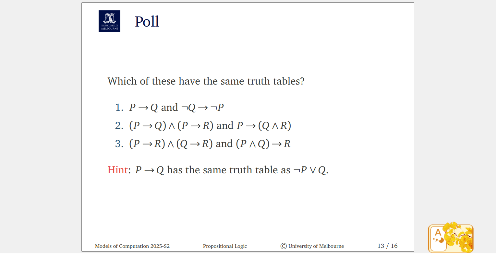
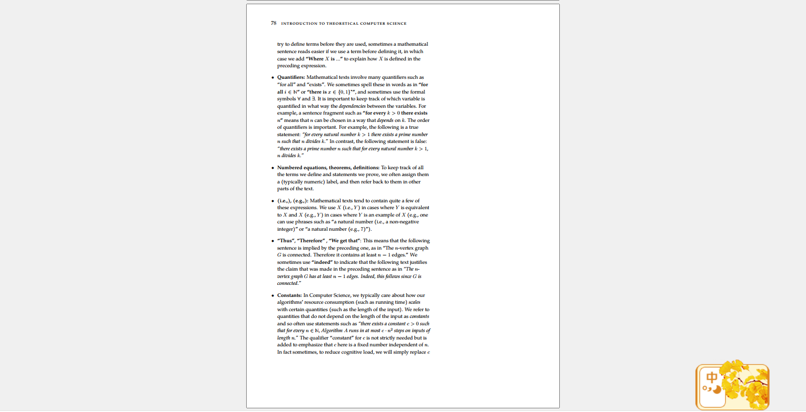

这张幻灯片延续上一页的内容，进一步解释**“复杂算法问题（Harder Algorithmic Problems）”**，重点强调了**逻辑编码（logical encoding）**在解决类似数独（Sudoku）这类问题中的作用。

------

## ✅ 中英文逐句对照翻译与详细讲解：

------

### 幻灯片标题

**Harder Algorithmic Problems**
 👉 更难的算法问题

这表明我们讨论的是**不容易解决、计算成本高的问题**，例如数独、图着色、SAT等。

------

### 幻灯片左侧图像

仍然是一张经典的**数独题图**。这是一个典型的**逻辑难题**，用来代表“计算复杂但可解”的问题。

------

### 第一条要点

**logical encoding allows to quickly develop an efficient solver for Sudoku**
 👉 **逻辑编码可以快速开发出高效的数独求解器**

#### 教学建议讲解：

> “虽然数独在理论上是一个NP完全问题，但我们可以通过**逻辑编码**的方式，把它转化成计算机能够理解和求解的逻辑公式，比如用**布尔可满足性问题（SAT）**。这样一来，借助现有的SAT求解器，计算机就可以非常快地找出数独的解。”

📌 举例补充：

- 数独可以转换为一个包含729个变量的SAT问题；
- 每个单元格是否为某个数字可以用布尔变量表示；
- 最终转化为一组逻辑约束条件，用SAT求解器来完成。

------

### 第二条要点

**similar “hard” tasks**
 👉 类似的“困难”任务

#### 教学建议讲解：

> “除了数独，还有很多问题也属于这类‘看起来简单，但算法上非常困难’的任务。比如说：
>
> - 地图着色问题（Graph Coloring）
> - 旅行商问题（TSP）
> - 布尔可满足性（SAT）
> - 排班问题（Scheduling）
>
> 这些问题的共同点是：**解的验证很快，但找到解很难**。”

------

## 📘 延伸知识（可选补充）

| 类型                 | 举例                        | 是否属于NP-Complete       |
| -------------------- | --------------------------- | ------------------------- |
| 可解但计算复杂的问题 | 数独、SAT、3-Coloring       | ✅ 是                      |
| 不可解问题           | Halting Problem（停机问题） | ❌ 不可判定（Undecidable） |

------

## 💡 建议课堂引导语

你可以这样讲给学生听：

> “我们刚刚看了数独，其实它背后代表的是一类**逻辑上能描述，但计算机要穷举尝试的复杂问题**。但幸运的是，有很多聪明的方法，比如**逻辑编码（logical encoding）**，能让计算机迅速找到解！这也引出了我们本课的主题：什么是可计算的？哪些问题可以高效求解？哪些不行？”

------

如需我继续讲解下一页，请继续上传图片或告诉我页码。也可以请求我为这17页整理出**一整套讲稿或导学稿**。


这张幻灯片继续解释“打印机管理器（Printer Manager）”状态模型，并引入了**两个重要的系统验证问题（Verification Questions）**，这些问题是**形式方法**和**模型检查（Model Checking）**课程中的核心内容。

------

## 🖨️ Printer Manager 打印管理器状态模型（二）

------

### 📖 中英文对照翻译

------

### 标题：

**Printer Manager**
 👉 打印机管理器

------

### 右侧说明文字：

#### Two users A and B

👉 有两个用户 A 和 B

- *Ii*：用户 *i*（A 或 B）空闲（Idle）
- *Ri*：用户 *i* 发起打印请求（Request）
- *Pi*：正在为用户 *i* 打印文档（Printing）

------

### ✅ Some questions 一些问题：

> 🔸 Is every *Pi* preceded by *Ri*?
>  → 每一次打印 *Pi*，是否都在此前有请求 *Ri*？
>  → 即：“打印是否一定是由请求触发的？”

> 🔸 Is every *Ri* eventually followed by *Pi*?
>  → 每一个请求 *Ri*，是否最终都会被执行为 *Pi*？
>  → 即：“请求是否最终都会被处理？”

------

### 🧠 教学重点（讲给学生听）：

这张幻灯片的核心，是让你**从形式逻辑的角度思考系统正确性问题**，对应的学术术语包括：

| 英文术语          | 中文解释                             | 所属领域                             |
| ----------------- | ------------------------------------ | ------------------------------------ |
| Safety Property   | 安全性性质：不该发生的事永远不会发生 | 例如：不能出现先打印后请求           |
| Liveness Property | 活性性质：应该发生的事最终会发生     | 例如：每个请求最终都会打印           |
| Temporal Logic    | 时序逻辑                             | 使用逻辑语言描述系统随时间变化的行为 |
| Model Checking    | 模型检查                             | 通过遍历状态图验证是否满足某种性质   |

------

### 🖼️ 图解说明（讲图）：

图中的每个圆圈是一个**系统状态**，两个用户可能处于空闲、请求、打印三种状态的任意组合，共形成若干状态节点。
 箭头表示“状态转换”，即系统根据用户操作从一个状态转移到另一个状态。

比如：

- 从 `I_A I_B` → `R_A I_B`：表示 A 发送了请求
- 从 `R_A I_B` → `P_A I_B`：表示系统为 A 开始打印

------

### ❓为什么提出这两个问题？

> “因为现实中你不能只靠程序运行效果来判断是否正确。你必须问：
>  —— 有没有哪种情况打印会发生但没有请求？
>  —— 有没有哪种请求永远得不到响应？”
>
> 这两个问题分别属于**安全性验证（safety）\**和\**活性验证（liveness）**，我们将会学会使用**有限状态机和时序逻辑**来检查它们。

------

### ✅ 总结（讲给学生）：

> “这一页就是我们**形式化验证（formal verification）**的起点。你需要掌握：
>
> 1. 如何建模一个实际系统的状态变化（如用户A/B请求打印）
> 2. 如何用状态图表达系统行为
> 3. 如何用逻辑问题分析系统是否合理（是否会漏打印？是否会出错？）
>
> 这就是你未来能做出可靠系统的第一步。”

------

如你需要我继续解释后续幻灯片，请回复“下一页”或继续发送截图。是否继续？

这张幻灯片是墨尔本大学“计算模型 COMP30026”课程的第五页，标题为：

------

## 🗺️ Coloring a Map 地图着色问题

------

### 🧠 中英文对照讲解：

------

### 🌍 图像内容：

这是一张美国地图，不同的州被涂上了不同的颜色（蓝色、橙色、黄色、绿色等）。目的是**相邻的州不能使用相同颜色**，这是典型的计算机科学中的**图着色问题（Graph Coloring Problem）**的可视化版本。

------

### 📚 背景知识：

#### 什么是地图着色问题？

地图着色问题是图论中的经典问题，形式化表述为：

> 给定一张地图，把所有区域（州）分别着色，要求：
>
> - 任意两个相邻的州使用不同颜色。
> - 使用的颜色数量尽可能少。

#### 应用在计算机科学中的形式：

- 每个州看作一个节点（顶点 vertex）；
- 相邻州之间画一条边（edge）；
- 为每个节点分配一个“颜色”（变量）；
- 要求所有相邻节点的颜色不同。

这就是一个**图着色问题 Graph Coloring**，更广义地属于**约束满足问题（CSP）**。

------

### 📌 教学重点（讲给学生听）：

> “大家看这张图，每个州就像是一个变量，它的‘颜色’就是我们要决定的值。
>  相邻的州不能一样颜色，这就形成了变量之间的‘约束条件’。”
>
> 我们将这个问题抽象成一个图模型，每个州是一个点，连接线表示相邻关系，然后我们要满足‘相邻点不同色’这个条件。

------

### 📎 相关知识点：

| 概念                           | 中文含义                                   | 举例                     |
| ------------------------------ | ------------------------------------------ | ------------------------ |
| 图着色（Graph Coloring）       | 给图中的顶点分配颜色，确保相邻顶点颜色不同 | 地图着色、考试排期       |
| 四色定理（Four Color Theorem） | 任意地图最多使用4种颜色即可实现合法着色    | 本图即使用了≤4色         |
| 约束满足问题（CSP）            | 一种求解变量满足特定约束的方法             | 数独、地图着色、课程安排 |
| NP完全问题（NP-Complete）      | 一类在理论上“难解”的问题，图着色是其中之一 | 本课程将深入讨论         |

------

### 🔍 后续可能探讨的内容：

- 如何用**布尔逻辑**表达这个问题？
- 如何用**自动求解器（如 SAT Solver）**来解出颜色分配？
- 这个问题为什么是**NP-完全问题**，计算复杂度如何？

------

### ✅ 总结给学生：

> “这张图不仅仅是地图，它背后是一类**重要的组合优化问题**，我们可以用图论、逻辑、甚至 SAT 求解器来求解它。这会是你学习计算模型与自动化推理中最具代表性的例子之一。”

------

如果你要我解释这一页后续的讲解内容、逻辑建模或如何用代码实现地图着色，可以继续发问。我可以给你详细推导。是否继续？


这张幻灯片来自墨尔本大学《COMP30026 计算模型（Models of Computation）》课程第6页，标题是：

------

## 💡 What do we need all this “theory” for?

我们为什么需要这些“理论”？

------

### 📘 中英翻译与详细讲解如下：

------

### ✳️ 开头语句：

> **Before computer science, there was only mathematics.**
>  在计算机科学诞生之前，世界上只有数学。

> **And large parts of computer science are still very mathematical!**
>  而如今计算机科学的很大一部分，仍然是高度数学化的！

🧠 教学提示：你可以用这句话强调**CS ≠ 编程语言本身**，而是有数学、逻辑、建模的强大基础。

------

### 🔍 六大理论核心模块（蓝色内容是关键词）：

| 模块              | 中文翻译      | 作用/解释                                            |
| ----------------- | ------------- | ---------------------------------------------------- |
| **Syntax**        | 语法          | 什么样的程序才是“合法的”？比如花括号配对、关键字拼写 |
| **Type systems**  | 类型系统      | 程序类型是否匹配？比如整数不能加字符串               |
| **Semantics**     | 语义          | 程序运行时会发生什么？是否和我们想象的一样？         |
| **Specification** | 规范/规格说明 | 程序应该做什么？即需求说明。                         |
| **Verification**  | 程序验证      | 如何数学地证明程序不会崩溃，并且确实满足规范？       |
| **Complexity**    | 复杂度        | 程序要用多少时间？多少内存？是否可行？               |

📌 举例讲解：

> 比如你写一个程序求质数，如果只是通过运行试一试，那只是测试；但如果你能**用数学方式证明程序永远不会出错**，那就是“程序验证”。

------

### ➕ 补充领域：

> **And more:**
>  还有更多领域，例如：

- 算法设计（Algorithm Design）
- 密码学（Cryptography）
- 程序分析（Program Analysis）
- 程序合成（Synthesis）等

这些都是理论计算机科学的重要分支。

------

### ✅ 结尾强调：

> **All used in the industry and active research areas.**
>  所有这些内容，在工业界都有真实用途，并且是当前研究的活跃前沿！

🧠 教师建议：这里可以引导学生理解，“理论 ≠ 没用”，恰恰相反，现代工业级软件、大型系统、AI 编译器、数据库优化器、甚至区块链智能合约的正确性验证，全都离不开这些理论。

------

### 🧑‍🏫 可用于讲解的总结语：

> “我们学习这些理论，不是为了‘考试’，而是为了真正掌握编程背后的原理和安全性。理论就像钢筋，是构筑工程系统的大脑和骨架。”

------

需要我继续解释第7页吗？或者需要我把这页内容整理成课堂讲稿或PPT讲义格式？


这页幻灯片是墨尔本大学《计算模型》（Models of Computation）课程第7页，标题是：

------

## 📘 Topic: Automata Theory

**主题：自动机理论**

------

### ✳️ 中英文逐句讲解如下：

------

### 🔍 1. 总述（自动机理论是什么）

> **Study of various idealized computing machines.**
>  对各种“理想化计算机”的研究。

💡 解释：
 这里的“计算机”并不指你日常使用的笔记本电脑，而是指像**有限状态自动机（Finite Automaton）**、**图灵机（Turing Machine）**这样的理论模型。
 这些模型是研究**“什么是可计算的”**的基础。

------

### 🧱 2. 自动机理论的三大子话题：

------

#### ✅ **How they work.**

它们是怎么运行的？

> 👉 研究这些模型的状态转换机制。例如：
>
> - 输入一个字符串，自动机会从一个状态转到另一个状态，最后是否接受该字符串？
> - 图灵机会如何读取带子、写入数据、移动读写头？

你可以把这比喻成：
 🧠“给机器一个输入，它是怎么做决策的？”

------

#### ✅ **What they can do (computability theory).**

它们能做什么？（即：计算能力有多强）

这是**可计算性理论（Computability Theory）**的核心问题：

> - 什么问题是**图灵机**可以解决的？
> - 是否存在一些问题是**所有机器都永远无法解决的**？

例如：

- 判定“这个程序是否会无限运行”就是**不可判定的**（停机问题）。

------

#### ✅ **Proving elementary properties.**

证明一些基本性质。

例如：

> - 有限自动机是否等价于正则表达式？（是的，可以证明）
> - 自动机是否对某个输入一定接受？是否可以转换成最小状态数？

这部分强调了**形式化数学证明**在CS中的作用。

------

### 🎓 教学建议总结：

你可以告诉学生：

> “自动机理论不是为了写代码，而是为了理解代码背后的‘计算极限’和‘模型抽象’。就像物理学要有牛顿力学、计算机也必须有图灵机。”

------

### 🧑‍🏫 拓展讨论可引导如下：

1. 图灵机是否能模拟任何现代编程语言？
2. 有限自动机能否识别所有语言？（答案是不能）
3. 为什么说图灵完备 ≠ 实际可解？

------

如果你需要我将本页内容整理成一份适合教学的中文讲稿、思维导图，或者用更生活化的语言向学生解释“什么是自动机”，我也可以继续补充。是否继续？


这张幻灯片是墨尔本大学《计算模型》（Models of Computation）课程第8页，标题为：

------

## 📘 Topic: Formal Language Theory

**主题：形式语言理论**

------

### 🧠 逐句中英解释如下：

------

### ✳️ **Study of sets of strings.**

**对字符串集合的研究。**

📘 解释：
 所谓“形式语言”是**一组符合某种语法规则的字符串集合**，比如：

- 所有由`a`和`b`组成，且以`a`结尾的字符串；
- 所有满足括号匹配的表达式。

这句话的核心是：

> 形式语言研究的对象是**哪些字符串是合法的？哪些是无效的？**

------

### 🔗 **Very close connection to automata theory.**

**它与自动机理论关系非常紧密。**

📘 解释：
 自动机是接受语言的“机器”，形式语言是“被接受的字符串集合”。

两者的关系可以概括为：

> 每一种“语言”（字符串集合）都可以由一种“自动机”识别，
>  每一种“自动机”也对应着一个能接受的语言。

比如：

- 正则语言 ↔ 有限自动机（DFA/NFA）
- 上下文无关语言 ↔ 下推自动机（PDA）

------

### ❓**What kinds of grammars correspond to what types of automata?**

**哪种语法结构对应哪类自动机？**

📘 解释：
 这是形式语言理论研究的核心问题之一。也就是著名的：

### 🌐 **Chomsky Hierarchy（乔姆斯基层次结构）**

| 语言类型 | 语法类型       | 对应的自动机       |
| -------- | -------------- | ------------------ |
| Type 3   | 正则语法       | 有限自动机 DFA/NFA |
| Type 2   | 上下文无关语法 | 下推自动机 PDA     |
| Type 1   | 上下文相关语法 | 线性有界自动机 LBA |
| Type 0   | 无限制语法     | 图灵机 TM          |

所以这个问题本质是：

> “不同复杂度的语法规则，需要用什么样的机器才能处理？”

------

### 🧑‍🏫 如何讲给学生听：

你可以这样解释给学生：

------

> “形式语言就像是一门‘计算机的语文课’，它关心的是**程序能读懂什么句子？**”
>
> 它不是人类语言，而是一组严格的、可以被机器识别的符号序列。
>
> 自动机就像一个‘语法检查器’，它要判断一个字符串是否符合规则。
>
> 比如：DFA能识别`abba`是否属于一个语言；PDA能判断括号是否配对。

------

### 📝 延伸教学建议：

- 举例讲解正则语法 → DFA
- 使用代码演示构造自动机识别某种语法
- 结合编译器讲解：前端词法/语法分析正是依赖这些理论

------

如需我继续解读后续幻灯片，或整理这部分成课堂讲稿/思维导图，也可以继续告诉我！是否继续？


这张幻灯片来自墨尔本大学的《Models of Computation 计算模型》课程，是第9页，标题是：

------

## 🎤 Over to You — Introductions

**轮到你了 —— 自我介绍**

------

### 📌 原文内容逐条翻译与讲解：

> ### **Please introduce yourself to your neighbours.**
>
> **请向你身边的同学做自我介绍。**

这是一节互动环节，鼓励大家在课堂上互相认识、打破陌生。

------

#### 🔶 **where you are from?**

**你来自哪里？**

📘 解释：可以是你的国家、城市，或者你成长的地方。
 🗣️ 示例回答：

> I'm from Hangzhou, China.
>  我来自中国杭州。

------

#### 🔶 **what degree program you are enrolled in?**

**你正在就读哪个学位项目？**

📘 解释：本科/硕士/博士，主修什么专业。
 🗣️ 示例回答：

> I'm a second-year undergraduate student in Computer Science.
>  我是计算机科学二年级本科生。

------

#### 🔶 **languages or programming languages that you speak?**

**你会说哪些语言或编程语言？**

📘 解释：既可以是自然语言（如中文、英语），也可以是你掌握的编程语言。
 🗣️ 示例回答：

> I speak English and Mandarin, and I use Python, C++, and Java.
>  我会说英语和中文，我会用 Python、C++ 和 Java 编程。

------

#### 🔶 **anything else that is interesting like: Which is the best city you have visited? Which is the greatest film ever made?**

**还可以聊聊其他有趣的事，比如：你去过最棒的城市是哪？你心中最棒的电影是哪部？**

📘 解释：老师希望大家能多说点有趣的、个性化的内容，增进交流。
 🗣️ 示例回答：

> The best city I've visited is Kyoto. The best film I've seen is "Interstellar".
>  我去过最棒的城市是京都，最喜欢的电影是《星际穿越》。

------

### 🧑‍🏫 课堂讲解建议：

你可以这样引导学生：

------

> 👋 “大家好，课程开始前，我们来个轻松的破冰环节。”
>
> “请你转向坐在你旁边的同学，互相做个简短介绍。”
>  “你可以聊聊你从哪里来，你学什么，会什么语言，还有你觉得最棒的电影或者最喜欢的城市。”
>
> “这不仅能帮助你们交朋友，也有助于今后小组讨论。”

------

### ✅ 总结中文模板供学生参考：

------

> 👋 大家好，我叫___，来自___。
>  我目前在读___专业，是一名___学生。
>  我会说___语言，也会编程语言比如___。
>  我去过最喜欢的城市是___，我最喜欢的电影是___。

------


这张幻灯片是《Models of Computation 计算模型》课程第10页，标题为：

------

## **Basic mathematical vocabulary**

**数学基础术语**

------

这是一个帮助学生适应“数学化思维”的引导内容。下面是逐条中英文翻译和详细解释，方便你在课堂上讲解：

------

### 🔶 Natural language is bulky and often ambiguous

**自然语言冗长且经常模糊不清**

🧠 **解释**：
 我们日常用的自然语言（如英语、中文）很灵活，但容易有歧义。例如：
 “他看到她拿着望远镜。”是谁拿着望远镜？这种模糊会造成误解。

📌 在数学和计算中，为了严谨，我们不能用这种模糊的语言。

------

### 🔶 To talk **precisely**, mathematics has its own vocabulary

**为了表达精确，数学有自己的专属词汇体系**

🧠 **解释**：
 数学不是“更高级的英语”，而是有一套特有“语法”的语言。
 比如，集合、函数、存在量词、∀、∃、推理规则等等。

这套语言用于清晰定义、严格推理，避免歧义。

------

### 🔶 Main items: **definitions** and **proofs**

**两大核心：定义（definitions）和证明（proofs）**

🧠 **解释**：

1. **定义**：明确概念，比如“图是由点和边组成的集合”
2. **证明**：用逻辑方法，说明某个结论一定成立，比如“若图是连通的，则存在一棵生成树”

📣 在计算理论中，比如自动机、图灵机、可计算性等概念，全都要用精确定义和逻辑证明。

------

### 🔶 This is like learning a new language:

**这就像在学一门新语言：**

#### 🔸 only way to learn it is to **just do it**

**唯一的方法是：直接开始练！**

#### 🔸 even if strange in the beginning!

**哪怕一开始你觉得很陌生，也要坚持练！**

🧠 **解释**：
 刚开始学计算模型或形式语言时，你可能觉得这些定义和符号很“抽象”或“不自然”。但这就像学英语的语法，只有多看多用，才能习惯。

📘 教师可举例说明：

> 证明“DFA能识别的语言是正则语言”一开始很难，但练多了就自然了。

------

### 🎓 课堂建议：

你可以这样向学生说：

------

> “这节课之后你会发现，我们正在学习的不只是内容，而是一种**语言**。”
>  “数学语言不是用来‘背’的，而是用来‘练’的。你只有自己动手写定义、做证明，才能掌握它。”
>  “一开始别怕看不懂，这就是你‘学会一门新语言’的必经阶段！”

------


这张幻灯片是《Models of Computation 计算模型》课程第11页，标题是：

------

## **Basic Symbols**

**基础逻辑符号**

------

这是在讲解**数理逻辑中最基本的逻辑运算符**，学生后续会在推理、证明、自动机理论中频繁使用这些符号。

我们逐行来做中英解释，并配合课堂讲解建议👇：

------

### **Symbol: ∧**

**英文读法**：`and (conjunction)`
 **中文释义**：**且**（合取）

🧠 **解释**：
 这是**逻辑“与”**，只有当两个条件都成立时，整体才为真。

📌 例子：

```
P: 今天下雨  
Q: 我带伞  
P ∧ Q：今天下雨并且我带伞（两个都是真的）
```

------

### **Symbol: ∨**

**英文读法**：`or (disjunction)`
 **中文释义**：**或**（析取）

🧠 **解释**：
 这是**逻辑“或”**，只要有一个条件为真，整体就为真。**不是排他或！**

📌 例子：

```
P: 明天下雪  
Q: 明天下雨  
P ∨ Q：明天下雪或下雨（只要下任意一个就算成立）
```

------

### **Symbol: →**

**英文读法**：`implies (implication)`
 **中文释义**：**蕴含、推出**

🧠 **解释**：
 这是“如果…那么…”结构，在逻辑中是**条件推理**。

📌 例子：

```
P: 你考试及格  
Q: 你能毕业  
P → Q：如果你考试及格，那么你能毕业
```

📌 **注意**：P 为假时，P → Q 也为真（逻辑里成立）。

------

### **Symbol: ¬**

**英文读法**：`not (negation)`
 **中文释义**：**非、否定**

🧠 **解释**：
 这个符号用来表示“不是”、“不满足”的意思。

📌 例子：

```
P: 我今天有课  
¬P：我今天没课
```

------

### 📣 课堂讲解建议

你可以这样介绍：

> “这些是我们推理语言的基础‘字母’。你们会像学英语字母一样，把它们用得非常熟练。”
>  “数学符号虽然看起来冷冰冰，但其实是为了让我们写得‘短、准、严’。”

🔧 板书演示建议：

| P    | Q    | P ∧ Q | P ∨ Q | P → Q | ¬P   |
| ---- | ---- | ----- | ----- | ----- | ---- |
| T    | T    | T     | T     | T     | F    |
| T    | F    | F     | T     | F     | F    |
| F    | T    | F     | T     | T     | T    |
| F    | F    | F     | F     | T     | T    |

------


这张图片来自墨尔本大学的幻灯片，标题为“Sudoku solution”，主要讲述如何用**命题逻辑（Boolean）编码**数独问题。我们来一步步详细解释这张图中每一部分的含义：

------

## 📌 左边的图（编号 11 ~ 99 的方格）

这是一个 **9x9 数独网格的编号方式**，将每个格子从左到右、从上到下按顺序编号：

- 第一行编号是 11 到 19，对应数独的第一行第1列到第9列；
- 第二行是 21 到 29，依此类推；
- 第九行是 91 到 99。

这个编号用于在布尔变量中表示每一个格子的位置。

------

## 📌 右边的图（部分填入的数独盘面）

这是一个 **部分填入数字的数独题目**。例如：

- 第1行的第2列是数字 6；
- 第2行第2列是 8，第3列是 3；
- 第9行第4列是 5，第6列是 8，等等。

这些是预先设定的已知条件（约束），你需要填入剩下的格子，使得最终每行、每列、每个九宫格都包含 1-9 的数字。

------

## 📌 下方蓝色标题栏：Propositional (Boolean) Encoding

表示我们要用布尔变量（true/false）将数独问题“翻译”为布尔逻辑表达式，从而用 **SAT 求解器**等工具求解它。

------

- 

------

## 📌 括号中的公式：

这是布尔表达式的形式，例如：

```
(x₁₁₁ ∨ x₁₁₂ ∨ x₁₁₃ ∨ ... ∨ x₁₁₉) ∧ (x₁₂₁ ∨ ...) ∧ ...
```

解释如下：

1. `x₁₁₁ ∨ x₁₁₂ ∨ ... ∨ x₁₁₉`：第1行第1列（格子11）必须填一个数字1~9中的某个；
   - 意思是这个格子 **必须有一个数字**；
2. 后续 `∧`（AND）连接的其他表达式是对所有格子的类似约束：
   - 每个格子都**必须有一个数**；
   - 每个格子**只能有一个数**；
   - 每一行、每一列、每个九宫格中的数字都必须互不重复。

这些约束会通过一系列布尔表达式组合起来，形成完整的数独SAT模型。

------

## ✅ 总结：这张图的含义

你看到的是如何把数独问题形式化成逻辑问题的一部分：

- **将数独格子编号**为11-99；
- **定义布尔变量** xijdx_{ijd} 表示位置(i,j)上填的是数字d；
- **用逻辑公式约束**数独的规则（每格一个数字、不重复等）；
- 最终可以**用SAT求解器自动求解**数独。

------

如果你想，我可以：

- 帮你把整个数独题目转成完整的布尔表达式；
- 用Python写一个SAT编码器；
- 或者直接帮你解这个题目。

你需要我帮你哪一步？

------


这张是墨尔本大学《计算模型》（Models of Computation）课程第 12 页幻灯片，标题为：

------

## **Sudoku solution**

## 数独求解

------

本页介绍了**如何将数独问题转化为布尔逻辑问题（Propositional Logic）**，也就是用我们上节课讲的“命题逻辑”或“布尔变量”来建模解题。

------

### 🧩 数独是什么？

右上角图展示了一个**标准的 9×9 数独题目**：

- 填满整个 9×9 表格
- 每行、每列、每个 3×3 宫内，数字 1–9 **不能重复**

------

### 🧠 数独问题如何“形式化”？

左上角那个 9×9 的格子，每个格子用两位数表示，如：

- `11` 表示第1行第1列，
- `94` 表示第9行第4列。

------

### 🔠 下方是**逻辑建模**（Propositional/Boolean Encoding）解释：

#### `x_ijd` 是一个布尔变量：

意思是：“第 i 行 第 j 列 的格子里填的是数字 d”

> 例如：
>  `x_237 = true` 表示第2行第3列填的是7。

------

### 接下来是**约束条件（逻辑公式）**：

------

#### **1. 至少填一个数**：

```
∧ { at-least-one({x_ijd | d ∈ D}) | i, j ∈ D }
```

- 对于每一个格子 `(i,j)`，我们要求在所有可能数字 d 中，**至少有一个 x_ijd 为真**。
- 否则这个格子就没填数。

------

#### **2. 最多填一个数**：

```
∧ { at-most-one({x_ijd | d ∈ D}) | i, j ∈ D }
```

- 每个格子不能填两个数，即最多只能有一个 x_ijd 为 true。

------

这只是数独逻辑编码的一部分，完整的建模还包括：

- 每一行中 1~9 各出现一次
- 每一列中 1~9 各出现一次
- 每个 3×3 宫中 1~9 各出现一次

这些都可以写成**布尔逻辑公式**

------

### ✅ 最后一句话重点解释：

> **formula is satisfiable**（公式可满足）
>  ⇔ **puzzle is solvable**（数独可解）

🧠 意思是：

- 如果你写出的这些布尔公式 **有一个解（satisfiable）**，就说明这个数独题目有解。
- 反过来，如果数独题目能解出来，那这个布尔公式一定是满足的。

------

### 🧑‍🏫 如何讲给学生听：

你可以这样说：

> “我们把数独看作是一个逻辑谜题，把‘数字填哪里’转换成布尔变量（真假变量），然后用一系列逻辑公式去描述规则。这就是所谓的**逻辑编码**。”
>
> “这样做的好处是，我们就可以用**计算机里的 SAT 求解器**来自动解数独！”

------

### 📌 总结核心概念（可板书）：

| 数独格子建模   | 逻辑解释             |
| -------------- | -------------------- |
| `x_ijd = true` | 第 i 行 j 列是数字 d |
| 至少一个       | 每格必须填一个数     |
| 最多一个       | 每格不能填两个数     |
| 逻辑可满足     | 数独可解             |

------


这张幻灯片展示的是一个经典的数学逻辑问题，用**布尔逻辑（Propositional Encoding）**方式来表达“毕达哥拉斯三元组着色问题”（**Pythagorean Triples Color Problem**）。

------


------

## 🔢 举个例子

如果你把自然数 1, 2, 3, ... 染色为红或蓝（就像二元变量），你需要确保：

- 没有任何满足 a2+b2=c2 的三元组中，a,b,c 三个数颜色一样。

------

## 🔁

------

## 💻 

这张幻灯片是对上一页“毕达哥拉斯三元组染色问题”**最终解答**的总结，非常适合讲给学生听来激发兴趣与对计算复杂性的认识。我们逐行讲解如下：

------

## 🧩 Slide 标题：**Solution 解决方案**

------

### ✅ 中文逐句讲解与翻译：

------

### 🔴 `NO if (and only if) n ≥ 7825`

> **只要 `n ≥ 7825`，答案就是** ❌ **“不可以染色”**

翻译：

> **不可以用两种颜色去染所有自然数，使得任意满足 x2+y2=z2 的三元组不会全是同色的**，
>  当且仅当染色范围是从 1 到 **7825**（及以上）。

📌 这说明：**对于 7825 个数，绝对无解（不满足）！**

------

### ⏱️ `2 days (in May 2016)`

```
on University of Texas’ Stampede supercomputer with 800 processors
```

翻译：

> 这个问题的证明是在 **2016年5月**，由美国**德州大学的 Stampede 超级计算机**完成的，
>  该计算机拥有 **800 个处理器**，共耗时 **两天**。

你可以补充给学生讲：
 🖥️ Stampede 是当时美国最强的高性能并行计算机之一。证明这个“不可染色”的命题需要大量 SAT 求解与并行验证。

------

### 💾 `200 terabyte proof of unsatisfiability`

翻译：

> 这份“**无法满足的证明（unsatisfiability proof）**”占用了 **200 TB（200万兆字节）**的空间！

📌 提醒学生：这个量级大得惊人！
 🧠 它不是给人看的，而是给计算机 SAT solver 自动验证的，称为“machine-checkable proof”（机器可验证的证明）。

------

### 📰 `extensive media coverage (Nature)`

翻译：

> 这项成果被《**自然（Nature）**》等主流媒体广泛报道，成为计算机科学中的一次重要突破！

------

## 🧑‍🏫 教学建议讲法：

你可以这样讲：

> “上一页我们看到毕达哥拉斯三元组染色问题能转化为逻辑约束问题，变成布尔可满足性（SAT）问题。那我们想：是不是任意给定一个最大数 nn，总能找到一种可行染色方案？
>
> 结果出乎意料 —— 当 n≥7825n ≥ 7825 时，**不存在任何满足这些约束的染色方案**，这个结果用了超级计算机 Stampede，800个核心连续跑了2天，还输出了一份200TB大的不可满足性证明！
>
> 这个问题也展示了 SAT 技术和自动化证明的威力。”

------

### 🔍 拓展讲解：

你可以鼓励学生阅读相关论文：

- Heule, M.J.H., Kullmann, O. & Marek, V. (2016). *Solving and verifying the boolean Pythagorean triples problem via cube-and-conquer.*
   Appeared in **Nature** Vol. 536, pp. 206–209.

------


S


第二个PPT

> 


这张幻灯片是 Lecture 2 的**课程导入页（Overview）**，用来回顾上一讲的内容并介绍本节课的目标。以下是详细的中英翻译与讲解，方便你讲给学生听：

------

### 🟦 英文原文拆解与翻译

#### 🔹 Last time（上次我们讲了）

- **Overview of the subject**
   ➜ 本课程的整体介绍
   ✅ 中文解释：我们了解了“计算模型”这门课的大致范围，比如计算是什么、为什么要研究计算模型，以及它和逻辑的关系。
- **A few problems solvable with logic**
   ➜ 一些可以用逻辑解决的问题
   ✅ 中文解释：我们举了几个实际问题，比如数独（Sudoku）、图着色问题（Map Coloring）等，说明逻辑不仅是抽象的，而是有能力解决真实世界问题的工具。

------

#### 🔹 Today（今天我们要讲）

- **Formal propositional logic**
   ➜ 形式化的命题逻辑
   ✅ 中文解释：我们将从非正式的逻辑思维过渡到**形式化语言**，学习命题逻辑的表达方式、语法、真值表、逻辑等价和推理规则等。这是进入自动化推理和算法设计的第一步。
- **Soon: Mechanized proof**
   ➜ 很快将介绍：自动化证明（机械化证明）
   ✅ 中文解释：后续课程中我们会看到，计算机也可以“做逻辑推理”。我们将学习如何把逻辑翻译成可以由计算机程序验证和推理的形式。这是现代形式验证（Formal Verification）和自动定理证明的核心基础。

------

### 🧑‍🏫 给学生讲解建议：

> “同学们，上节课我们简单地介绍了这门课的内容和它为何重要，并通过数独、四色地图等问题感受到逻辑的实际能力。今天我们正式进入 **命题逻辑**，也就是逻辑的第一步。我们不仅会讲怎么写公式，还要学会判断真假、推理关系。这不仅对我们以后写程序、建模型有帮助，也为我们探索更复杂的自动机与可计算性打好基础。”
>
> “另外，我想预告一下，我们很快会看到**机械化证明**，也就是‘计算机帮你做逻辑推理’，这在 AI 和软件验证中是非常核心的能力！”

------


这张幻灯片标题为：

### **“Propositional = Boolean Logic”**

### **“命题逻辑 = 布尔逻辑”**

------

## 🟦 中英逐句翻译与讲解

### 🔹 Until the mid-19th century, “logic” meant Aristotelian logic.

**直到19世纪中叶，“逻辑”基本等同于亚里士多德逻辑。**

🧾 解释：
 这句话的意思是，在19世纪之前，人们对“逻辑”的理解主要停留在亚里士多德提出的**三段论逻辑（Syllogism）**，即“所有人都会死，苏格拉底是人，所以苏格拉底会死”这种推理方式。这是哲学式的、语言化的逻辑。

------

### 🔹 George Boole took an algebraic view of logic.

**乔治·布尔（George Boole）用代数的方式重新理解了逻辑。**

🧾 解释：
 乔治·布尔是一位数学家，他是**现代布尔代数（Boolean Algebra）**的奠基人。他提出：我们可以用类似于代数符号的方式来表示“真/假”（true/false）逻辑命题，比如用 1 表示真、0 表示假。
 这让“逻辑”变成了可以进行计算和符号运算的对象，是计算机科学的关键一步。

------

### 🔹 Deep connection between logic and arithmetic.

**逻辑与算术之间有着深层次的联系。**

🧾 解释：
 布尔将逻辑变成一种类似算术的形式，从而为后来的“数字逻辑电路”和“计算机编程”打下了数学基础。比如布尔逻辑中的运算（与 ∧，或 ∨，非 ¬）就像加减法一样，可以写成公式、组合、推理。

------

## 🖼️ 图片注解：

- **Figure: George Boole, circa 1864**
   图像：乔治·布尔，大约1864年
   📚 他出版的代表作是《逻辑的数学分析》（An Investigation of the Laws of Thought），是现代逻辑的源头之一。

------

## 🧑‍🏫 教师讲解建议：

你可以这样向学生介绍这页内容：

> “在计算机发明之前，人们理解的‘逻辑’主要是哲学和语言意义上的，比如亚里士多德的三段论。
>  但到19世纪中期，一位叫 George Boole 的数学家做了一件革命性的事：他发现逻辑其实可以像代数一样用公式表达！
>  他发明了布尔代数，也就是我们今天讲的‘命题逻辑’的基础，计算机能进行逻辑判断、1 和 0 的运算，本质上都是建立在他提出的这个逻辑代数系统上的。”

------

是否继续帮你讲解下一页？继续上传即可，我会提供清晰专业的中英讲解稿。


这页标题是：

------

## 🔎 **Intro Puzzle 入门谜题**

这是在正式讲解命题逻辑（Propositional Logic）前的一个“逻辑谜题”，目的是激发学生思考、训练他们用**布尔逻辑表达陈述**的能力。

------

### 🟦 英文原文内容 & 中文翻译

> **Heidi, Dina and Louise are being questioned by their aunt.**
>  **海蒂（Heidi）、迪娜（Dina）和路易丝（Louise）正在接受她们姨妈的问询。**

------

> **Here is what they say:**
>  **她们分别说了以下话：**

> **Heidi:** “Dina and Louise had equal share in it; *if one is guilty, so is the other*.”
>  **海蒂：** “迪娜和路易丝是共同参与的；**如果其中一人有罪，另一人也有罪**。”

> **Dina:** “If Heidi is guilty, then so am I.”
>  **迪娜：** “**如果海蒂有罪，那我也有罪。**”

> **Louise:** “Dina and I are *not* both guilty.”
>  **路易丝：** “我和迪娜**不可能同时有罪**。”

------

> **Their aunt, knowing that they are honest kids, realises that they cannot tell a lie.**
>  **她们的姨妈知道这几个孩子从不说谎，所以每个人说的都是真的。**

------

> **Has she got sufficient information to decide who (if any) are guilty?**
>  **她现在是否有足够的信息来判断谁（如果有）是有罪的？**

------

### 🧠 教学解释建议：

你可以向学生这样讲解：

------

> “大家注意：这是一个典型的命题逻辑推理题，三个陈述句、三个角色、全部都说了真话——我们要用逻辑的方法判断哪几个是‘有罪者’。
>
> - **海蒂说的是‘等价’命题**：Dina 和 Louise 要么都无罪，要么都有罪；
> - **迪娜说的是‘蕴含’命题**：如果 Heidi 有罪，则她也有；
> - **路易丝说的是‘不能同时成立’**：Dina 和她自己不能都有罪。
>
> 题目的关键是‘不能说谎’，所以我们假设不同人的有罪/无罪状态，再反推是否每句话都成立。
>
> 这是典型的布尔逻辑谜题，它帮助我们理解 **逻辑命题之间的关系是如何用符号表达和推理的**。”

------

### 🧮 可进一步引导学生写出符号形式：

令

- HH：Heidi 有罪
- DD：Dina 有罪
- LL：Louise 有罪

则三个命题为：

1. D↔LD \leftrightarrow L（海蒂说的）
2. H→DH \rightarrow D（迪娜说的）
3. ¬(D∧L)\neg(D \land L)（路易丝说的）

------

然后通过列举所有可能的 H,D,L∈{true,false}H, D, L \in \{ \text{true}, \text{false} \}，判断哪些组合让三个命题都成立，从而得出唯一符合逻辑的答案。

✅ 答案提示（可不急着揭晓）：**只有 Louise 是有罪的（L=true，H=false，D=false）**。

------

是否要我继续帮你解这道题的完整逻辑推理过程？也可以继续上传下一页，我接着为你讲解。


这张幻灯片是命题逻辑（Propositional Logic）中非常重要的一页，它定义了**命题公式的构造规则**。

------

## 📘 幻灯片标题：**Definition 定义**

> “propositional formulas are built from…”
>  “命题逻辑公式是由以下构件构成的：”

------

### 🔹 左侧定义（构造元素）

| 构件类型（Component） | 记号                                  | 读法          | 中文解释                                     |
| --------------------- | ------------------------------------- | ------------- | -------------------------------------------- |
| **atoms** 原子命题    | P,Q,R,P1,P2,…P, Q, R, P_1, P_2, \dots | -             | 基本命题单位（不能再分的命题，比如“下雨了”） |
| **bottom** 假命题     | ⊥\bot                                 | false         | 永远为假，逻辑上是“矛盾”或“失败”             |
| **top** 真命题        | ⊤\top                                 | true          | 永远为真，逻辑上是“恒真”或“公理”             |
| **negation** 否定     | ¬P\neg P                              | “not PP”      | 非P，表示P为假                               |
| **conjunction** 合取  | P∧QP \land Q                          | “P and Q”     | 且，两者都为真才为真                         |
| **disjunction** 析取  | P∨QP \lor Q                           | “P or Q”      | 或，只要一个为真就为真                       |
| **implication** 蕴含  | P→QP \rightarrow Q                    | “if P then Q” | 如果P为真，则Q也为真                         |

------

### 🔹 底部红色语法定义

φ::=P  ∣  ⊥  ∣  ⊤  ∣  (¬φ)  ∣  (φ∧φ)  ∣  (φ∨φ)  ∣  (φ→φ)\varphi ::= P \;|\; \bot \;|\; \top \;|\; (\neg \varphi) \;|\; (\varphi \land \varphi) \;|\; (\varphi \lor \varphi) \;|\; (\varphi \rightarrow \varphi)

这表示**一个合法的命题逻辑公式**（用 φ\varphi 表示）可以是以下几种形式之一：

- PP：一个原子命题；
- ⊥\bot：假；
- ⊤\top：真；
- ¬φ\neg \varphi：对某个命题取反；
- φ∧φ\varphi \land \varphi：两个命题取“且”；
- φ∨φ\varphi \lor \varphi：两个命题取“或”；
- φ→φ\varphi \rightarrow \varphi：一个命题“推出”另一个。

------

### 🧠 给学生的讲解建议：

你可以这么讲：

------

> “这张幻灯片是命题逻辑的语法基础，它告诉我们**哪些公式是‘合法的命题公式’**。逻辑公式的结构就像‘拼积木’，你可以从最基本的原子命题开始，逐步使用逻辑符号组合成更复杂的表达。
>
> 比如：
>
> - ¬P\neg P：这是对一个命题的否定；
> - P∧QP \land Q：表示两个命题同时为真；
> - P→QP \rightarrow Q：表示‘如果P成立，那么Q也必须成立’。
>
> 底部的红色语法定义是用**BNF（巴科斯范式）**形式写的语法生成规则，意思是：
>  “一个公式 φ\varphi 可以由 P、真、假、非、与、或、蕴含构成。”
>
> **理解这些构造规则，是之后做推理、证明、写逻辑表达式的基础。**”

------


这页PPT标题是 **"Some Well-Formed Formulas"（一些良构公式）**，内容是逻辑课中介绍命题逻辑表达式的格式规范和逻辑练习题。下面是详细的中英解释，便于你向学生讲解：

------

### 🔵 标题：Some Well-Formed Formulas

**中文翻译：一些良构公式**
 解释：在命题逻辑中，一个“良构公式”（well-formed formula, 简写为 wff）指的是按照逻辑语法规则构造出来的、形式正确的逻辑表达式。

------

### 📌 左边公式部分解释：

1. **P**
   - 这是最简单的命题公式，只包含一个命题符号（原子命题）。
   - 中文解释：一个基本命题，比如“今天下雨”。
2. **(P → Q)**
   - 读作“如果P，那么Q”，即“蕴含”关系。
   - 中文：如果今天下雨，那么我会带伞。
3. **(P ∨ ¬P)**
   - 读作“P或者非P”，经典逻辑中的“排中律”（Law of the Excluded Middle）。
   - 中文：要么今天下雨，要么今天不下雨（必然为真）。
4. **¬(P ∧ ¬P)**
   - 否定一个“矛盾”，即“不可能P和非P同时为真”。
   - 中文：今天不可能又下雨又不下雨（矛盾律）。
5. **(P → ¬P)**
   - 读作“如果P成立，那么P不成立”，逻辑上是个自相矛盾的表达式。
   - 中文：如果今天下雨，那它其实没下雨（这通常是个假命题）。
6. **(((P → Q) → P) → P)**
   - 这是一个经典逻辑中较复杂的结构，叫做 **Peirce’s Law（皮尔士律）**。
   - 中文：如果“如果P推出Q”能推出P，那么P一定是真的。
   - 注：这条公式在经典逻辑中成立，但在直觉主义逻辑中不成立。

------

### 🧠 Quiz（小测验）：

**Can we express an “if and only if” with what we have?**
 **我们能用已有的符号表达“当且仅当”吗？**

- 题设：我们目前只有 →（蕴含）、¬（否定）、∧（合取）、∨（析取）

- **答案：Yes（可以）**

  - **P ↔ Q**（P当且仅当Q）可以写成：

    > **(P → Q) ∧ (Q → P)**
    >  中文解释：“如果P成立，那么Q成立，且如果Q成立，那么P也成立。”

------

### ✅ 教学建议：

你可以通过这些公式，引导学生掌握逻辑表达式的构造方法：

- 练习从自然语言转为逻辑符号
- 观察逻辑恒真式（如第3条）和矛盾式（如第4条）
- 理解复杂公式（如第6条）的意义及其逻辑结构
- 最后通过Quiz启发学生思考如何组合已有符号来表达新概念（比如↔）


这张幻灯片的标题是 **“Notational Conventions”**，意思是“符号约定”或“记号规范”。它告诉我们在命题逻辑（Propositional Logic）中，如何**规范书写逻辑公式**，避免歧义。这是教学中非常重要的一部分，特别适合用来讲解公式“谁先谁后”的理解方式。

------

### 🔵 标题：Notational Conventions

**中文翻译：记号规范 / 符号约定**

------

### 📌 内容逐条中英解释如下：

#### ▪️ Omit outer parentheses

**省略最外层括号**

- 例如：我们通常把 `((P ∧ Q))` 写作 `P ∧ Q`，因为最外层括号没必要存在。
- 类比写数学算式时，不写最外层的括号一样。

------

#### ▪️ Negation binds stronger than ∧, ∨

**否定运算（¬）的优先级高于合取（∧）和析取（∨）**

- 例如：`¬P ∧ Q` 实际上是 `(¬P) ∧ Q`，而不是 `¬(P ∧ Q)`
- 就像乘法优先于加法一样，**先做否定**。

------

#### ▪️ ∧, ∨ bind stronger than implication

**合取（∧）和析取（∨）的优先级高于蕴含（→）**

- 例如：`P ∧ Q → R` 实际上是 `(P ∧ Q) → R`
   意思是“如果P和Q都为真，那么R为真”
- 而不是 `P ∧ (Q → R)`

------

#### ▪️ → is right-associative: P → Q → R denotes P → (Q → R)

**“蕴含”运算符（→）是右结合的：P → Q → R 表示 P → (Q → R)**

- 举个例子：`P → Q → R` 实际上是 `P → (Q → R)`
   表示：“如果P为真，那么（如果Q为真，则R为真）”

------

#### ▪️ Warning: P ∧ Q ∨ R is AMBIGUOUS

**⚠️警告：P ∧ Q ∨ R 是有歧义的表达式！**

- 因为没有括号，这个公式可以理解为：
  - `(P ∧ Q) ∨ R` （P和Q同为真，或者R为真）
  - `P ∧ (Q ∨ R)` （P为真，且Q或R为真）
- 所以，这样写是不规范的。**建议加括号，避免歧义。**

------

### ✅ 教学建议：

你可以用以下方式帮助学生理解：

- 举几个例子，写出加括号与不加括号的表达式，对比其含义差异；
- 提醒他们，在写长公式时**宁可多写括号，也不要省略不该省略的括号**；
- 举个反例，比如布尔逻辑中的 `¬P ∨ Q` 和 `¬(P ∨ Q)`，含义完全不同。

------


这张幻灯片的标题是 **“Examples”**，中文是“示例”。它展示了两个**命题逻辑公式（propositional formulas）\**及其对应的\**语法树（parse tree）**，用于帮助学生理解逻辑表达式的结构和解析方式。

------

## 🟦 标题：Examples（示例）

------

## 🧠 中心概念：Parse Tree（语法树）

语法树是一个树状结构，用来展示一个逻辑公式是如何通过语法规则逐步构造出来的。每一个逻辑符号（比如 ∧、∨、¬、→）都是树中的节点，它的子节点是它所作用的子公式。

------

## 📌 左边公式解释：

### ➤ 公式：

¬(¬(P∨(Q∧¬P))→R)\neg \left( \neg (P \lor (Q \land \neg P)) \rightarrow R \right)

中文解释：
 “不是这样一种情况：‘不是（P 或者（Q 且非 P））’ 推出 R”

### ➤ 对应语法树（从上往下解释）：

1. 顶部是 `¬`，表示整个公式的最外层是“非”
2. 下一层是 `→`（蕴含），连接两个子公式
3. 左侧是一个 `¬` 运算，里面是一个 `∨`（析取）运算
4. `∨` 运算连接 `P` 和一个合取 `∧`（Q 与 ¬P）
5. 整体表达了一个复杂的嵌套公式

------

## 📌 右边公式解释：

### ➤ 公式：

¬(P∨Q)∧(¬P→R)\neg (P \lor Q) \land (\neg P \rightarrow R)

中文解释：
 “非（P 或 Q）” 与 “非P 蕴含 R”

### ➤ 对应语法树结构：

- 根节点是合取符号 `∧`
- 左子树是 `¬` 运算，下面是 `∨` 运算：`P` 与 `Q`
- 右子树是蕴含 `→`，左边是 `¬P`，右边是 `R`

------

## 📝 幻灯片底部的公式提示：

这行展示了几种不同写法：

```
¬¬P ∨ Q ∧ ¬P → R
¬¬(P ∨ Q) ∧ ¬P → R
```

这些都是逻辑表达式的例子，强调了加括号的重要性，否则运算顺序会不同，含义也会不同。

------

## ✅ 教学讲解建议：

你可以这样给学生讲：

- **什么是语法树**：就像句子的“语法分析图”，可以看出哪个运算符是“爸爸”，哪个是“儿子”；
- **语法树的作用**：帮我们清晰地理解复杂逻辑公式的结构，避免歧义；
- **为什么要加括号**：不加括号，大家解读顺序可能不同，计算结果也不同；
- **练习建议**：可以要求学生根据公式画出自己的语法树，训练他们对结构的理解。


这张幻灯片的标题是 **“Boolean Semantics: Connectives”**，中文为**“布尔语义：连接词”**，主要内容是讲解布尔逻辑中命题连接词的**真值函数（truth function）**及其对应的**真值表（truth table）**。

------

## 🟦 标题：Boolean Semantics: Connectives

**布尔语义：逻辑连接词**

------

## 📘 Definition (Truth function)

**定义：真值函数**
 A function from truth values to truth values.
 **一个从真值映射到真值的函数。**

简单说就是：
 每个逻辑连接词（如 ∧、∨、→ 等）都是一个函数，接受输入（如 A 和 B 的真假），输出结果（整个逻辑表达式的真假）。

------

## 🧩 Boolean truth values

布尔真值只有两个：

- `t` 表示 true（真）
- `f` 表示 false（假）
   有时也记作：
- `1` 和 `0`
- `⊤`（真）和 `⊥`（假）

------

## 🔶 Usually presented as a **truth table**

通常我们用**真值表**来表示这些函数的输出。

------

## 📊 表格解读（Truth Table）：

| A    | B    | ¬A   | A∧B  | A∨B  | A→B  | A↔B  |
| ---- | ---- | ---- | ---- | ---- | ---- | ---- |
| 0    | 0    | 1    | 0    | 0    | 1    | 1    |
| 0    | 1    | 1    | 0    | 1    | 1    | 0    |
| 1    | 0    | 0    | 0    | 1    | 0    | 0    |
| 1    | 1    | 0    | 1    | 1    | 1    | 1    |

解释每一列：

- `A`, `B`：输入变量的真假，0 表示假，1 表示真；
- `¬A`：非 A（如果 A 是假，则结果为真）；
- `A∧B`：A 与 B 同时为真时，结果为真；
- `A∨B`：A 或 B 任一为真，结果就为真；
- `A→B`：蕴含，“如果 A，则 B”，只在 A 为真且 B 为假时结果为假；
- `A↔B`：双条件，A 和 B 相同（都真或都假）时结果为真。

------

## ✅ 教学建议（讲给学生听）：

你可以这样讲：

> 同学们，我们现在进入了“布尔语义”的部分，也就是：我们写下来的逻辑公式，它到底是什么意思？
>  实际上每个连接词就像是一个函数，它接收真假（0 和 1）当作输入，输出也是真假。
>  这张表就是“真值表”，它列举了所有可能的组合。我们后续解逻辑题的时候，都会经常查它。

你还可以举个例子：

比如 `A → B` 只有在 A 为真、B 为假时才为假，这是我们解“条件语句”时最重要的逻辑。

------


这张幻灯片的标题是：

## **Boolean Semantics: Letters**

**布尔语义：命题字母**

这页主要讲的是**“真值赋值”（Truth Assignment）**的概念，也就是给每个逻辑变量分配真假值。下面是详细中英解释：

------

### 🔺第一句：

**Propositional letters are Boolean variables.**
 **命题字母是布尔变量。**

我们在逻辑中常见的 `P`、`Q`、`R` 等符号，其实就像变量一样，它们可以取两个值：

- 真（True, 记作 1 或 t）
- 假（False, 记作 0 或 f）

------

### 📘蓝框标题：Definition (Truth assignment)

**定义（真值赋值）**
 A function from propositional letters to truth values.
 **这是一个从命题字母到真值的函数。**

也就是说，我们给每个字母（变量）指定一个真或假的值。这种映射就叫做真值赋值。

------

### ✏️ Usual notation（常见写法）：

v={P↦1,Q↦0}v = \{P \mapsto 1, Q \mapsto 0\}

意思是这个赋值函数 vv 表示：

- PP 被赋值为 1（真）
- QQ 被赋值为 0（假）

这是数学中的映射符号“↦”，意思是“被映射为”。

------

### ✅ 接下来：

v(P)=1v(P) = 1  

表示：变量 PP 的值是 1，即为真。

v(Q)=v(R)=⋯=v(Z)=0v(Q) = v(R) = \cdots = v(Z) = 0  

表示：变量 QQ、RR、一直到 ZZ 的值全是 0，即为假。

------

### 🎓 给学生讲的时候你可以这样说：

> 各位同学，我们上一页讲了“真值表”，那怎么知道一个公式在某个情况下到底是真还是假呢？
>  就得先把里面每一个变量赋上值！
>  就像编程时我们给变量 x, y 赋值一样，这在逻辑里叫做“真值赋值”。

> 比如现在我说 PP 是真，QQ 是假，那我们就可以代入去分析公式 P∧QP \land Q 是不是成立。

> 所以这个函数 vv 就相当于是布尔世界里的“赋值规则”，告诉我们每个字母的真假。

------

如果你想，我可以帮你制作一页中文教学PPT的内容版本，便于课堂讲解。需要吗？

这张幻灯片的标题是：

## **Truth of a Formula**

**公式的真值**

它讨论的是：在已知某些变量真假的前提下，我们如何判断一个逻辑公式是否为真？

------

### 🟦 第一行：

**Let** v={P↦1,Q↦0}v = \{P \mapsto 1, Q \mapsto 0\}
 **设定赋值函数** vv，其中：

- P=1P = 1：变量 PP 为真（True）
- Q=0Q = 0：变量 QQ 为假（False）

这个就是我们当前给出的布尔赋值背景。

------

### 📢 红字 Poll 意思是“投票”或“小测问答”：

**Poll: Which of these formulas are true under vv?**
 **问答：在当前赋值下，以下哪些公式为真？**

------

我们一个个来看这些公式在赋值 vv 下的真假情况：

------

### ✅ 1. P∧QP \land Q（与）

- P=1P = 1，Q=0Q = 0
- 1∧0=01 \land 0 = 0
   ➡️ **结果是假**。

------

### ✅ 2. (P∨Q)∧(P∨R)(P \lor Q) \land (P \lor R)

- P=1P = 1，Q=0Q = 0，RR 未知 → 一般假设为假（0），如果未赋值。
- P∨Q=1∨0=1P \lor Q = 1 \lor 0 = 1
- P∨R=1∨0=1P \lor R = 1 \lor 0 = 1
- 所以整体：1∧1=11 \land 1 = 1
   ➡️ **结果为真**。

------

### ✅ 3. P→QP \to Q（蕴含）

- P=1P = 1，Q=0Q = 0
- 真蕴含假是唯一的假，结果为：
   ➡️ **假**。

------

### ✅ 4. ¬P→¬Q\lnot P \to \lnot Q

- ¬P=0\lnot P = 0，¬Q=1\lnot Q = 1
- 0→1=10 \to 1 = 1
   ➡️ **真**。

------

### 🔤 最后一行：

**Shorthand: “v⊨φv \models \varphi” means “φ\varphi is true under vv”.**
 **简写形式：v⊨φv \models \varphi 表示“在赋值 vv 下，公式 φ\varphi 为真”。**

这是逻辑中的常见符号表示方法：

- v⊨φv \models \varphi：**v 使得 φ 成立（为真）**
- “models” 意思是“使满足、满足语义条件”。

------

### 🧠 课堂讲解建议：

你可以这样向学生解释：

> 同学们，现在我们已经给定了每个变量的真值（P 为真，Q 为假），
>  我们要问的问题是：在这个前提下，这些公式是否成立？
>  就像数学中的代入运算，我们把真假代入逻辑公式中，然后按照逻辑运算规则算出最终结果。
>
> 注意：
>
> - “∧” 是“与”，两个都真才为真；
> - “∨” 是“或”，有一个为真就为真；
> - “→” 是“蕴含”，只有“真 → 假”为假，其它都是为真；
> - “¬” 是“非”，真变假，假变真。

然后鼓励学生一个个代入，训练“逻辑思维+运算熟练度”。

------


这张幻灯片标题为：

## **Truth Tables for Formulas**

**公式的真值表**

它展示了一个包含三个命题变元 P,Q,RP, Q, R 的逻辑公式：

((P∧Q)∨R)((P \land Q) \lor R)

并给出了在所有 P,Q,RP, Q, R 可能取值组合下的真值计算结果。

------

### 🔍 表格结构解释

这个表是一个 **真值表（truth table）**，列出了所有变量组合下逻辑公式的真假情况。

| P    | Q    | R    | (P∧Q)(P \land Q) | ((P∧Q)∨R)((P \land Q) \lor R) |
| ---- | ---- | ---- | ---------------- | ----------------------------- |
| 0    | 0    | 0    | 0                | **0**                         |
| 0    | 0    | 1    | 0                | **1**                         |
| 0    | 1    | 0    | 0                | **0**                         |
| 0    | 1    | 1    | 0                | **1**                         |
| 1    | 0    | 0    | 0                | **0**                         |
| 1    | 0    | 1    | 0                | **1**                         |
| 1    | 1    | 0    | 1                | **1**                         |
| 1    | 1    | 1    | 1                | **1**                         |

------

### 🧠 运算步骤详解（逐行讲解建议）

> 现在我们来一步步讲公式 ((P∧Q)∨R)((P \land Q) \lor R) 是怎么被计算的：

#### 示例第1行：

- P=0,Q=0,R=0P = 0, Q = 0, R = 0
- P∧Q=0∧0=0P \land Q = 0 \land 0 = 0
- 0∨R=0∨0=00 \lor R = 0 \lor 0 = 0

➡️ 结果为 0（假）

------

#### 示例第2行：

- P=0,Q=0,R=1P = 0, Q = 0, R = 1
- P∧Q=0∧0=0P \land Q = 0 \land 0 = 0
- 0∨1=10 \lor 1 = 1

➡️ 结果为 1（真）

------

### 🌟 教学重点：

你可以这样对学生说：

> 这个表告诉我们：逻辑公式不是凭直觉判断真假，而是像函数一样可以“代入变量”后算出来的。
>  真值表就像是一个完整的“查表工具”，我们可以用它来验证逻辑公式在不同情况是否成立。

------

### 📌 补充术语中英文对照

| 英文术语             | 中文解释         |
| -------------------- | ---------------- |
| Truth Table          | 真值表           |
| Conjunction (∧\land) | 合取（“与”操作） |
| Disjunction (∨\lor)  | 析取（“或”操作） |
| Formula              | 逻辑公式         |
| Propositional Logic  | 命题逻辑         |

------



这张幻灯片的标题是：

## **Poll**

**小测 / 提问**

------

### 英文原文：

> Which of these have the same truth tables?
>  这些公式中哪些具有相同的真值表？

------

### 中译解释：

**问题是：**下面哪组公式在逻辑意义上是“等价”的？
 也就是说，它们在所有可能的 P,Q,RP, Q, R 取值下，输出结果（真/假）始终一致。

------

### 选项解析：

#### **1.** P→QP \rightarrow Q 和 ¬Q→¬P\neg Q \rightarrow \neg P

这是经典的 **逆否命题** 等价规律。
 我们知道：

P→Q≡¬Q→¬PP \rightarrow Q \equiv \neg Q \rightarrow \neg P

✅ 所以这组公式真值表完全一致。

------

#### **2.** (P→Q)∧(P→R)(P \rightarrow Q) \land (P \rightarrow R) 和 P→(Q∧R)P \rightarrow (Q \land R)

这一组 **不等价**！

- 左边意思是：
   “只要 PP 成立，那么 QQ 和 RR 分别都要成立”
- 右边意思是：
   “只要 PP 成立，那么 QQ 和 RR 必须**同时**成立”

一个是两个条件分别成立，另一个是“合体”条件成立，
 它们在真值表中是**不完全相等**的。

✖️ 不等价。

------

#### **3.** (P→R)∧(Q→R)(P \rightarrow R) \land (Q \rightarrow R) 和 (P∧Q)→R(P \land Q) \rightarrow R

这一组也 **不等价**。

- 左边意思是：“如果 PP 成立，则 RR 成立，同时如果 QQ 成立，则 RR 成立”
- 右边意思是：“只有当 PP 和 QQ 同时为真时，才要求 RR 为真”

所以，在 P=1,Q=0,R=0P=1, Q=0, R=0 的情况下，左边是**真**（因为 Q→R=1Q \rightarrow R = 1），
 但右边是**真**（因为前件为假），所以还一致。但其它行不一定。

你可以让学生**画个真值表**来验证！

✖️ 不等价（多数情况下不同）。

------

### ✅ 正确答案是：

**选项1** 是等价的。

------

### 🪧 提示解释（Hint）

> **Hint**:
>  P→QP \rightarrow Q has the same truth table as ¬P∨Q\neg P \lor Q

这句是逻辑里一个基本恒等式，也叫**蕴含公式恒等式**。
 可用于帮助学生**转换表达**，或者**构造真值表**时更容易操作。

------

### 📚 术语中英对照

| 英文符号     | 中文含义           |
| ------------ | ------------------ |
| →\rightarrow | 蕴含（如果……则……） |
| ¬\neg        | 否定（非）         |
| ∧\land       | 合取（与）         |
| ∨\lor        | 析取（或）         |
| truth table  | 真值表             |
| equivalent   | 等价的             |

------

### 🧠 建议讲法：

你可以这么对学生说：

> 今天我们要动手来判断几个逻辑公式是否“语义等价”，也就是说，不管变量怎么变化，它们的真值表结果都一样。
>  我们可以先用公式的变形规则来分析，也可以真正去画真值表验证。

> 要记得：
>  P→Q≡¬P∨QP \rightarrow Q \equiv \neg P \lor Q
>  P→Q≡¬Q→¬PP \rightarrow Q \equiv \neg Q \rightarrow \neg P（这叫逆否等价）


这张幻灯片的主题是：

------

## **Logical Equivalence**

## **逻辑等价性**

------

### ✅ 英文原文解释：

> **Definition**
>  Formulas are *logically equivalent* **iff** they have equal truth values under **every** truth assignment.

> **Shorthand:**
>  “F ≡ G” means “F is logically equivalent to G”.

------

### 🇨🇳 中文翻译与讲解：

### 📘 定义（逻辑等价）：

> 如果两个逻辑公式在**所有可能的真值赋值**下都具有**相同的真值**，那么这两个公式就是**逻辑等价**的（logically equivalent）。

其中的 **“iff”** 是数学里的缩写，表示：

> **if and only if（当且仅当）**

意思是这是一个“充要条件”，也就是“双向成立”。

------

### 🧠 举例理解：

比如我们之前提到：

P→Q≡¬P∨QP \rightarrow Q \equiv \neg P \lor Q

这就意味着：
 无论 PP 和 QQ 取何种真值（0 或 1），这两个公式**最终结果永远一致**。

------

### 📝 速记符号说明：

> “F ≡ G” 的意思是
>  **F 和 G 在逻辑上等价**

在教学中我们可以强调这是比 “看起来相似” 更强的标准，**必须在所有情况下一致**才叫等价。

------

### ✅ 建议课堂讲法：

你可以这样讲给学生听：

------

> 同学们，我们现在讲到一个非常关键的逻辑概念：**逻辑等价（Logical Equivalence）**。
>
> 这是什么意思呢？它要求两个公式在“任何真值组合”下的结果都完全相同。
>
> 举个例子，P→QP \rightarrow Q 和 ¬P∨Q\neg P \lor Q 看起来不一样，但其实你不管把 PP 和 QQ 取 0 或 1，它们最后的输出结果都是一样的。这种关系我们就写作：
>
> P→Q≡¬P∨QP \rightarrow Q \equiv \neg P \lor Q
>
> 我们用这个“≡”符号，来表示两个公式在逻辑上是一样的。

------

### 📚 补充术语中英对照表：

| 符号 / 术语        | 英文                 | 中文                 |
| ------------------ | -------------------- | -------------------- |
| ≡\equiv            | logically equivalent | 逻辑等价             |
| iff                | if and only if       | 当且仅当（充要条件） |
| truth assignment   | 真值赋值             | 给命题变量赋 0 或 1  |
| equal truth values | 相同的真值           | 输出结果始终一致     |

------


这张幻灯片的主题是：

------

## ❗️Warning: “→” is weird!

## ❗️警告：“→”逻辑蕴含符号很奇怪！

------

### ✅ 英文原文解释：

> **Often read as “implies”, but causality is not required!**
>  通常我们会把“→”读作“推出”或“意味着”，但**它并不代表因果关系**！

幻灯片左边是真值表，右边是两个英语例句作为对比说明：

------

### 📊 左侧真值表含义（逻辑蕴含 A → B）：

| A    | B    | A → B |
| ---- | ---- | ----- |
| 0    | 0    | 1     |
| 0    | 1    | 1     |
| 1    | 0    | 0     |
| 1    | 1    | 1     |

在逻辑中，“A → B”只有在 A 为真、B 为假时，整个命题为假。其余三种情况都为真。

------

### 🇨🇳 中文翻译与解释：

### 📌“→”的含义不等于“因果”！

在我们日常生活中，“如果 A 那么 B”常常代表着一种因果关系，比如：

> 如果你按了按钮，灯就亮。

但在逻辑学里，“A → B”只是表示：
 **“只要 A 为真，就要求 B 也为真，否则整个公式为假”**。

------

### 🤯 举例讲解（右侧英语句子分析）：

#### 例句1：

> If there are no bugs, then the program runs correctly.
>  如果没有 bug，那么程序运行正确。

这句话在逻辑上和我们生活经验一致：
 “A 为真 → B 应该为真，否则这句话为假。”

------

#### 例句2（讽刺性质）：

> If Melbourne is in Queensland, then Brisbane is in Victoria.
>  如果墨尔本在昆士兰州，那么布里斯班就在维多利亚州。

你一听这句话就知道前提是**假的**，结果也是**假的**，但按照逻辑的真值表，这句话是 **真的**！

为什么？因为前提是假的，在逻辑上整个“→”就视为真！

------

### 🧠 总结给学生的讲法：

你可以这样讲给学生听：

------

> 同学们，我们今天要讲的重点是：“→”（逻辑蕴含）这个符号看起来简单，其实是逻辑中最容易被误解的部分！
>
> 在日常语言中，“如果 A 那么 B”好像总是有点因果关系，仿佛 A 发生才会“导致”B。
>
> 但在**形式逻辑**里，“A → B”只是一种**真值关系**。只要 A 是假的，不管 B 是真是假，整个式子都被判为“真”！
>
> 所以你可以看到：**“如果墨尔本在昆士兰，那么布里斯班在维多利亚”**这样看似荒谬的话，在逻辑上竟然是“真”的！
>
> 所以我们一定要牢记一点：**“→” 是关于真假，不是关于因果！**

------

### 🔁 真值回顾小结：

| A    | B    | A → B | 说明                     |
| ---- | ---- | ----- | ------------------------ |
| 0    | 0    | 1     | 假前提，“不负责任”地为真 |
| 0    | 1    | 1     | 假前提，不管结论，仍为真 |
| 1    | 0    | 0     | 真前提 → 假结论 = ❌错误  |
| 1    | 1    | 1     | 真前提 → 真结论 = ✅正确  |

------

如果你愿意，我也可以帮你出一两个练习题，用“→”的真值判断来训练学生。要不要？


这页讲的是命题逻辑中的一个**非常重要的推理规则**——**Modus Ponens（肯定前件式）**。我们来中英互译并详细解释，帮助你给学生讲清楚：

------

## 🎯 英文标题：Modus Ponens

## 🧠 中文标题：肯定前件式

------

### 📌 原文逻辑公式：

P→Q,P∴Q\frac{P \rightarrow Q, \quad P}{\therefore Q}

意思是：

- 如果你知道 **P 蕴含 Q**（即：如果 P 成立，那么 Q 成立），
- 又知道 **P 成立**，
- 那么你可以**合理推出 Q 成立**。

------

### 📚 中文翻译和解释：

这条规则的含义就是：

> “既然你已经知道如果发生 P，那么就会发生 Q，
>  又知道 P 的确发生了，
>  那么你就能确认 Q 一定发生。”

它是一条**经典的有效推理规则**，我们在日常推理中也经常使用：

------

### 🧾 举个例子：

> **前提1：** 如果你完成作业（P），你就可以出去玩（Q）。
>  **前提2：** 你确实完成了作业（P）。
>  **结论：** 所以你可以出去玩（Q）！

------

### ✅ 下方英文原文解释翻译：

> **A rule is sound if every model of the premises is a model of the conclusion.**
>  **一条规则是“可靠的”（sound），当且仅当每一个使前提成立的“模型”（赋值）也使结论成立。**

也就是说：你**不能从真前提推出假结论**。如果一个推理规则在所有情形下都能“从真推出真”，那么它就是可靠的。

------

### ❗Challenge: prove that modus ponens is sound

> 挑战：**请你证明 Modus Ponens 是 sound 的。**

------

### 🧠 如何给学生讲清楚这个 Challenge？

你可以这样引导学生：

> 设我们有两个前提：
>
> - P→QP \rightarrow Q 为真
> - PP 为真
>
> 那么我们想知道 Q 是不是一定也为真。

你可以引导学生回忆“逻辑蕴含”的真值表：

| P    | Q    | P→QP \rightarrow Q     |
| ---- | ---- | ---------------------- |
| 1    | 1    | 1 ✅（前提真 → 结论真） |
| 1    | 0    | 0 ❌（这种情况不成立）  |
| 0    | 1    | 1 ✅（前提假 → 无责任） |
| 0    | 0    | 1 ✅（前提假 → 无责任） |

现在我们的情况是：

- P=1P = 1（前提为真）
- P→Q=1P \rightarrow Q = 1（整个蕴含为真）

那就说明 Q 只能等于 1，否则 P→QP \rightarrow Q 就不成立了！

✅ 所以我们得出结论：Q 必然为真！

------

### 🎯 最后总结给学生听：

> 同学们，**Modus Ponens 是命题逻辑中最核心的推理工具**之一。
>  它告诉我们：只要“如果 P 则 Q”为真，且 P 成立，那么 Q 一定也要成立。
>  而这条规则之所以 **sound（可靠）**，是因为在所有的真值分配（模型）下，它都不会从真推出假！

------

如你需要，我可以再做一个表格或图示，帮你画出模型验证图或者出一个“P 和 Q 分别取值”的题目训练学生是否掌握了。如果想要练习题，告诉我即可。


好的，我们来对这段英文进行**逐句中英翻译和详细解释**，适合你讲给学生听，清楚表达内容、背景和重点。

------

## 📘 原文标题：**Mathematical Background**

📖 中文翻译：**数学背景**

------

### 📜 引用部分（原文）：

> *“I found that every number, which may be expressed from one to ten, surpasses the preceding by one unit: afterwards the ten is doubled or tripled … until a hundred; then the hundred is doubled and tripled in the same manner as the units and the tens … and so forth to the utmost limit of numeration.”*
>  — Muhammad ibn Mūsā al-Khwārizmī, 820, translation by Fredric Rosen, 1831.

------

### 📘 中文翻译与解释：

> **“我发现，从一到十的每个数字，相比前一个数字都多一个单位；接着，十会翻倍或三倍……直到一百；然后一百也会以同样方式被翻倍和三倍，如同个位和十位一样……如此类推，直到数数的极限。”**
>  —— 穆罕默德·伊本·穆萨·花剌子密，公元820年，弗雷德里克·罗森于1831年翻译。

🔍 **讲解**：这是花剌子密（算法/代数之父）的经典描述，说明了数的构造和进展方式。他通过观察数字如何从单位数、十位、百位逐步扩展，展现了早期伊斯兰数学对“数系统”的理解。这种逻辑性也正是后来的数学体系和算法设计的基础。

------

### 📘 正文第一段（原文）：

> In this chapter we review some of the mathematical concepts that we use in this book. These concepts are typically covered in courses or textbooks on “mathematics for computer science” or “discrete mathematics”; see the “Bibliographical Notes” section (Section 1.9) for several excellent resources on these topics that are freely-available online.

------

### 📘 中文翻译与解释：

> **在本章中，我们回顾一些本书中使用的数学概念。这些概念通常出现在“计算机科学数学”或“离散数学”的课程或教材中；你可以查阅“参考书目说明”（第1.9节）获取一些优秀的公开资源。**

🔍 **讲解**：

- 作者在这里强调：本书后续会大量用到一些数学内容，这些数学基础（比如集合、逻辑、图论等）常见于“离散数学”或“计算机数学”课程。
- 鼓励学生查阅额外资料补充知识，特别是网络上可以自由访问的资源。

------

### 📘 正文第二段（原文）：

> *A mathematician’s apology.* Some students might wonder why this book contains so much math. The reason is that mathematics is simply a language for modeling concepts in a precise and unambiguous way. In this book we use math to model the concept of computation.

------

### 📘 中文翻译与解释：

> ***数学家的辩白\***：有些学生可能会好奇，这本书为什么包含这么多数学内容。原因是：数学本质上是一种语言，用来**精确且无歧义地表达概念**。而在本书中，我们将用数学来**建模“计算”这一概念**。

🔍 **讲解**：

- 作者引用 “数学家的辩白”（向G.H. Hardy致敬），为书中大量使用数学做“辩解”；
- 强调数学的功能不仅是做运算，而是**作为一种严谨表达和思维的语言**；
- 这里提出关键目标：**用数学来理解什么是“计算”** —— 这是计算理论的核心任务。

------

### 📘 最后一句（原文）：

> For example, we will consider questions such as “is there an efficient ...

（句子未完整）

------

### 📘 中文翻译与解释（前半句）：

> **例如，我们将探讨这样的问题：“是否存在一种高效的……”**

🔍 **讲解**：

- 作者准备引出后续例子，比如“是否存在一个高效的排序算法？”“我们能否在有限时间内解决某个问题？”
- 这预示本书将深入算法效率、复杂性、可计算性等内容。

------

## 🧑‍🏫 总结适合学生讲解的核心：

### 🌟 要点一：**数学是工具，不只是运算**

> 数学提供的是一种“表达语言”，我们用它来精确描述和分析概念，比如“什么是算法”“问题能否解决”“解决是否高效”。

### 🌟 要点二：**离散数学是基础**

> 计算机科学中很多内容（如图结构、逻辑判断、集合操作）都是离散的，需要数学工具去处理。

### 🌟 要点三：**历史文化背景丰富**

> 作者引用伊斯兰数学家花剌子密的原话，说明“数的建构”在人类历史中早就被深刻研究，这与我们今天研究算法的方式一脉相承。

------

需要我为你把这页内容制作成讲义或PPT格式讲稿也可以！是否继续？


当然可以！我们继续以**中英文对照 + 教学式解释**的方式，为你逐句翻译并整理适合讲给学生听的版本。

------

## 📘 标题：**1.1 THIS CHAPTER: A READER’S MANUAL**

📖 中文翻译：**本章说明：读者指南**

------

## ✅ 第一段（原文）：

> Depending on your background, you can approach this chapter in two different ways:

📖 中文翻译：

> 根据你的背景知识，你可以用两种不同方式来阅读本章内容：

👨‍🏫 教学解释：

- 作者针对不同基础的读者，提供了**灵活的阅读策略**；
- 强调不是每个人都需要从头到尾细读这一章。

------

## ✅ 第一种情况（原文）：

> • If you have already taken “discrete mathematics”, “mathematics for computer science” or similar courses, you do not need to read the whole chapter.

📖 中文翻译：

> • 如果你已经学过“离散数学”、“计算机科学数学”或类似课程，你**不需要完整阅读本章**。

👨‍🏫 教学解释：

- 有这类背景的学生，已经熟悉了本章内容（如集合、逻辑、图论等基础）；
- 建议只快速浏览关键内容，**不浪费时间复习已知知识**。

------

## ✅ 后续建议（原文）：

> You can just take a quick look at Section 1.2 to see the main tools we will use, Section 1.7 for our notation and conventions, and then skip ahead to the rest of this book.

📖 中文翻译：

> 你可以快速浏览 **第1.2节**（将使用的主要工具），**第1.7节**（记号与惯例），然后直接跳过本章，继续阅读后续内容。

👨‍🏫 教学解释：

- 指出关键部分：
  - **1.2节：工具概览**
  - **1.7节：本书中的符号规则**
- 避免重复学习，专注在你还不熟悉的内容上。

------

## ✅ 轻松阅读建议（原文）：

> Alternatively, you can sit back, relax, and read this chapter just to get familiar with our notation, as well as to enjoy (or not) my philosophical musings and attempts at humor.

📖 中文翻译：

> 或者你也可以轻松地坐下来，把这章当作一个熟悉符号系统的过程，顺便欣赏（或忍受）我一些哲学思考与幽默尝试。

👨‍🏫 教学解释：

- 作者语气轻松，说明即使不强制读，也可以“享受式阅读”；
- 符号熟悉有助于理解后续章节。

------

## ✅ 第二种情况（原文）：

> • If your background is less extensive, see Section 1.9 for some resources on these topics. This chapter briefly covers the concepts that we need, but you may find it helpful to see a more in-depth treatment.

📖 中文翻译：

> • 如果你的基础较薄弱，请查看 **第1.9节**，那里有关于本章主题的资源推荐。本章会简要介绍我们需要的概念，但你可能会希望阅读更深入的资料来帮助理解。

👨‍🏫 教学解释：

- 如果没学过离散数学，这章**非常重要**；
- 作者推荐了额外资料供深入学习（例如网络课程、书籍）。

------

> As usual with math, the best way to get comfortable with this material is to work out exercises on your own.

📖 中文翻译：

> 和学习数学一样，熟悉这些内容的**最好方法就是自己动手做练习**。

👨‍🏫 教学解释：

- 强调主动练习，光看不练是不够的；
- 可布置习题帮助学生巩固概念。

------

## ✅ 第三条建议（原文）：

> • You might also want to start brushing up on *discrete probability*, which we’ll use later in this book (see Chapter 18).

📖 中文翻译：

> • 你可能还需要预习一下“**离散概率**”，我们会在本书后面用到它（见第18章）。

👨‍🏫 教学解释：

- 作者提前提醒学生，**离散概率**（如独立事件、期望值）是后续章节的基础；
- 可以建议学生复习概率论的初步内容。

------

## 🧑‍🏫 总结给学生听的三条要点：

### 🎯 1. 学过离散数学的读者：可跳读，仅看关键小节（1.2、1.7）。

### 🎯 2. 没有基础的读者：认真读这一章，并参考1.9节推荐的资源。

### 🎯 3. 预先了解“离散概率”会帮你更好理解第18章内容。

------

如你需要，我可以：

- 帮你做这页内容的讲义（含重点词汇/术语解释）；
- 设计配套练习题；
- 或者整理成PPT讲课稿。

需要我哪方面帮助？


这页标题为**"1.2 A QUICK OVERVIEW OF MATHEMATICAL PREREQUISITES"（1.2 数学先修知识速览）**，是给学生快速梳理之后章节所需的基本数学概念。适合上课讲解“离散数学”“理论计算机科学”“算法分析”前进行预热。

------

## 🧠 全文逐句中英文解释 + 教学讲解建议

------

### 📌 标题部分

**英文原文**：

> 1.2 A QUICK OVERVIEW OF MATHEMATICAL PREREQUISITES

**中文翻译**：

> 1.2 数学先修知识速览

📍**讲解建议**：
 告诉学生：这一节是“知识准备区”。如果你之前学过离散数学，可以快速过一遍复习；否则请务必理解这些术语——后面的内容都会用到。

------

### 🔹引导段

**英文**：

> The main mathematical concepts we will use are the following.
>  We just list these notions below, deferring their definitions to the rest of this chapter.
>  If you are familiar with all of these, then you might want to just skip to Section 1.7 to see the full list of notation we use.

**中文翻译**：

> 本书将使用的主要数学概念如下。
>  这里先简要列出这些术语，具体定义将在本章后面展开。
>  如果你对这些内容都已经熟悉，可以直接跳到1.7节查看我们用到的所有符号。

📍**讲解建议**：
 提醒学生，这些都是基本术语，不理解会影响后面章节的理解；但如果是“离散数学熟手”，可以快速扫过。

------

### ✅ 各知识点逐项解释

------

#### 1️⃣ **Proofs 证明**

**英文**：

> This book involves a heavy dose of formal mathematical reasoning, which includes mathematical definitions, statements, and proofs.

**中文翻译**：

> 本书大量涉及形式化的数学推理，包括数学定义、命题陈述和证明。

📍**讲解建议**：
 强调“数学证明是理论计算机的核心”，所有算法的正确性与复杂度都要靠“形式证明”来保证。

------

#### 2️⃣ **Sets and Set Operations 集合与集合运算**

**英文**：

> We use the basic set relations of membership (∈) and containment (⊆), and set operations, principally union (∪), intersection (∩), and set difference (∖).

**中文翻译**：

> 我们会使用基本的集合关系，如成员关系（∈）和包含关系（⊆），以及主要的集合运算，如并集（∪）、交集（∩）和差集（∖）。

📍**讲解建议**：
 可用 Venn 图辅助讲解三大集合运算；提醒学生：这些符号在算法的集合分析（如图遍历、搜索空间）中很常见。

------

#### 3️⃣ **Cartesian Product and Kleene Star 笛卡尔积与克林闭包**

**英文**：

> Cartesian product of two sets A and B, denoted as A × B, is the set of pairs (a, b) where a ∈ A and b ∈ B.
>  Aⁿ = A × A × … × A
>  A* is the union of Aⁿ for all n ∈ {0, 1, 2, …}.

**中文翻译**：

> 两个集合 A 和 B 的笛卡尔积，记作 A × B，是所有形式为 (a, b) 的有序对组成的集合，其中 a 属于 A，b 属于 B。
>  Aⁿ 表示 A 的 n 重笛卡尔积（如 A² = A × A）。
>  A* 是 Aⁿ 对所有 n ∈ {0, 1, 2, …} 的并集，也叫克林闭包（Kleene Star）。

📍**讲解建议**：
 可举例如 A = {0,1}，则 A² = {(0,0),(0,1),(1,0),(1,1)}，而 A* 就是“所有由 A 中元素组成的任意长度字符串”——在**正则表达式和自动机理论**中非常常见。

------

#### 4️⃣ **Functions 函数**

**英文**：

> The domain and codomain of a function, properties such as being one-to-one (injective) or onto (surjective), as well as partial functions.

**中文翻译**：

> 函数的定义域与值域，以及其性质如一一映射（单射 injective）、满射（onto surjective）、以及偏函数（partial function）等。

📍**讲解建议**：
 建议学生画映射图辅助理解单射/满射；特别注意：偏函数允许**部分元素无定义值**，这在实际算法设计中很常见（如：除以零时函数无定义）。

------

#### 5️⃣ **Logical Operations 逻辑运算**

**英文**：

> The operations AND (∧), OR (∨), and NOT (¬) and the quantifiers “there exists” (∃) and “for all” (∀).

**中文翻译**：

> 逻辑运算包括 与（∧）、或（∨）、非（¬）运算，以及量词“存在”（∃）和“任意/所有”（∀）。

📍**讲解建议**：
 这些是形式逻辑的基本运算，贯穿整个“证明”“命题”和“算法正确性”分析；一定要让学生能熟练读懂这些符号表示的逻辑语句。

------

#### 6️⃣ **Basic Combinatorics 基础组合数学**

**英文**：

> Notions such as  (nk)\binom{n}{k}  (the number of k-sized subsets of a set of size n).

**中文翻译**：

> 如组合数 (nk)\binom{n}{k}，表示从 n 个元素中选出 k 个元素的子集的个数。

📍**讲解建议**：
 简单讲解组合公式 (nk)=n!k!(n−k)!\binom{n}{k} = \frac{n!}{k!(n-k)!}，并指出：它常用于分析算法复杂度（如暴力法遍历子集总数）。

------

## ✅ 小结教学结构建议

你可以这样讲这一页内容：

| 模块                   | 中文说明           | 举例讲法                               |
| ---------------------- | ------------------ | -------------------------------------- |
| 1. 证明                | 数学逻辑的核心     | 比如你说一个算法总能停机，必须给出证明 |
| 2. 集合运算            | 并集、交集、差集   | 用Venn图演示                           |
| 3. 笛卡尔积 & 克林闭包 | 字符串集生成       | 正则表达式中的 `a*`                    |
| 4. 函数类型            | 单射、满射、偏函数 | 映射图举例子                           |
| 5. 逻辑符号            | ∧ ∨ ¬ ∃ ∀          | 翻译逻辑语句                           |
| 6. 组合数学            | 组合数计算         | 从5个元素中选3个是多少种               |

------

如果你需要我把这两页内容整理成教学PPT结构或者中文讲义，我也可以帮你整理。是否继续？

![你上传的这页来自计算机科学数学背景教材，继续的是**1.2 数学先修知识**的后半部分，并引入**1.3 如何阅读数学文本（Reading Mathematical Texts）**的内容。这部分非常适合课堂导入和学习方法讲解，尤其对初学者帮助很大。

下面我为你逐段整理**中英文对照解释 + 教学讲解建议**：

------

## 📚 第三页讲解内容汇总

------

### 🔸 补充 1.2 数学先修知识（续）

------

#### **Graphs 图结构**

**英文**：

> Undirected and directed graphs, connectivity, paths, and cycles.

**中文翻译**：

> 无向图与有向图、连通性、路径和回路。

📍**讲解建议**：这些图论基础在算法中非常常见，比如图遍历（DFS/BFS）、最短路径、连通块判定等。

------

#### **Big-O Notation 大O表示法**

**英文**：

> O,o,Ω,ω,ΘO, o, \Omega, \omega, \Theta notation for analyzing asymptotic growth of functions.

**中文翻译**：

> 使用 O,o,Ω,ω,ΘO, o, \Omega, \omega, \Theta 表示法来分析函数的渐进增长行为。

📍**讲解建议**：是算法复杂度分析的核心符号，建议通过例子对比 O(n)、O(n²)、O(log n) 的差异。

------

#### **Discrete Probability 离散概率**

**英文**：

> We will use probability theory, and specifically probability over finite sample spaces such as tossing n coins, including notions such as **random variables**, **expectation**, and **concentration**.

**中文翻译**：

> 我们将使用概率论，特别是在有限样本空间（如抛 n 次硬币）下的概率概念，包括**随机变量**、**期望**和**集中性**等。

📍**讲解建议**：
 告诉学生这些内容主要在后半本书（比如第18章）详细使用，但提前掌握基础概率论思维很重要，例如用来分析随机算法。

------

#### ✅ 总结句

**英文**：

> In the rest of this chapter... partly to remind... and partly to introduce our notation and conventions...

**中文翻译**：

> 本章接下来的内容将简要回顾以上概念，部分是为了帮助大家温故知识，部分是为了引入我们本书所采用的符号与约定。

📍**讲解建议**：这就像课前扫清“工具箱”，为后面深入的推理做好准备。

------

## 🔺1.3 READING MATHEMATICAL TEXTS

### “如何阅读数学文本”章节导入

------

#### **第一段：为什么数学需要“术语”与“压缩表达”**

**英文**：

> Mathematicians use jargon... to make terms precise and introduce shorthand for concepts that are frequently reused.
>  Mathematical texts tend to “pack a lot of punch” per sentence...

**中文翻译**：

> 数学家使用术语，和工程、法律、医学等其他专业一样，是为了使术语更加**精确**，并对常用概念引入**简写**。
>  数学文本每句话都信息密度极高，常常“一句话讲完一个知识点”。

📍**讲解建议**：
 告诉学生：数学语言是“压缩语言”，所以看起来难读，但读懂后反而很高效。学会解压缩一行公式、理解一个定义，是本课程要练的能力。

------

#### **第二段：阅读数学材料的价值**

**英文**：

> ... reading mathematical texts becomes easier and jargon is no longer an issue.
>  Moreover, reading mathematical texts is one of the most transferable skills...

**中文翻译**：

> 随着练习的增加，阅读数学材料将变得更容易，术语也不再成为障碍。
>  而且，阅读数学文本是最具“可迁移性”的技能之一...

📍**讲解建议**：
 强调：“阅读数学”的能力不仅限于数学，还能帮助学生更好地理解技术、医学、甚至文化文献等各种严谨结构的资料。

------

#### **第三段：你会遇到新概念，但这就是成长过程**

**英文**：

> ...you will encounter texts that use new concepts you have not seen before...
>  Being able to internalize and work with new definitions can be hugely important.

**中文翻译**：

> …你会遇到许多你从未接触过的新概念……
>  能够快速掌握并运用新定义是非常重要的技能。

📍**讲解建议**：
 鼓励学生面对不熟悉的定义不要畏惧。这是每一位程序员、研究人员、开发者都必须经历的成长过程。

------

#### **结尾句**

**英文**：

> The basic components of a mathematical text are **definitions**, **assertions**, and **proofs**.

**中文翻译**：

> 数学文本的基本组成部分是：**定义**、**命题（陈述）\**与\**证明**。

📍**讲解建议**：
 这句话可以用作总结：阅读数学就像学一门语言，三大核心词类是“定义、命题、证明”。

------

## 📷 图示说明（Figure）

- **Figure 1.1**：截自 AlphaGo Zero 的方法论文，展示现实中的严肃数学文本。
- **Figure 1.2**：Zerocash（加密货币）论文，强调数学写作的实际应用。

📍**讲解建议**：告诉学生，这些“现实世界的科研成果”都用到本章讲到的数学语言和结构，阅读数学文本是迈向科技前沿的重要技能。

------

## 📌 总结教学提示：

你可以将这一页课程设计为：

| 模块             | 内容                       | 课堂活动建议           |
| ---------------- | -------------------------- | ---------------------- |
| 数学工具补充     | 图、复杂度、大O、概率论    | 举例图遍历、复杂度排序 |
| 数学文本解读训练 | 术语密集、读懂公式         | 逐句拆解教材原文公式   |
| 技能迁移价值     | 数学阅读可用于科技、加密等 | 展示真实论文截图       |
| 核心结构记忆     | 定义、命题、证明           | 板书归纳并配公式范例   |

------

如果你希望我把这几页整合成一份**中文教学讲义、PPT**或**配套练习题**，我可以继续帮你。要继续生成吗？](reademe.assets/image-20250802221401775.png)


这页内容来自一本数学导论教材，主要讲的是**数学中的定义、断言（定理、引理、主张）和证明**。下面是详细解释，并附上中英文对照，适合你用来给学生讲解：

------

### 🔹1.3.1 Definitions 定义

**英文原文简述**：

> Mathematicians often define new concepts in terms of old concepts.
>  For example, here is a mathematical definition...
>  *Definition 1.1 – One to one function*...

**中文解释**：
 数学家通常通过已有概念来定义新概念。比如这里有一个典型的数学定义 ——
 **定义1.1：单射（One-to-one function）**
 设 S,TS, T 为集合，如果一个函数 f:S→Tf: S \to T 满足：
 对于所有 x,x′∈Sx, x' \in S，若 x≠x′x \ne x'，则 f(x)≠f(x′)f(x) \ne f(x')，
 我们就说这个函数是“单射”（也叫做“单一映射”或“单一对应”）。

**学生讲解建议**：

- 用学生熟悉的例子举例，比如学号和学生的映射就是单射。
- 强调“一一对应”的意思是：“不同的输入 → 不同的输出”。

------

### 🔹小贴士（蓝色小段解释）

> When reading such a definition, it's useful to annotate it...

**中文解释**：
 阅读定义时，可以用笔在旁边注释，比如标出变量代表什么，是函数？元素？集合？
 甚至可以尝试用自己的话给朋友解释一下这个定义，有助于真正理解。

**学生讲解建议**：

- 鼓励学生用自己的方式复述定义。
- 建议用不同颜色笔标注“集合”“函数”“条件”。

------

### 🔹图 1.3 图解说明（红框中注释定义结构）

> Figure 1.3: An annotated form of Definition 1.1...

**中文解释**：
 这是定义1.1的注解版，图中用不同颜色标出：

- 要定义的术语（“one to one function”）；
- 对象（函数 f:S→Tf: S \to T）；
- 条件（x≠x′x \ne x' 时 f(x)≠f(x′)f(x) \ne f(x')）。

**学生讲解建议**：

- 帮助学生理解一个完整的数学定义通常包含三个部分：
  1. **被定义的术语**
  2. **作用对象**
  3. **满足的条件**

------

### 🔹1.3.2 Assertions: Theorems, Lemmas, Claims 断言：定理、引理、主张

**英文简述**：

> Theorems, lemmas, claims... All correspond to statements that have been proven to be true...

**中文解释**：

- **定理（Theorem）**：重要的结论，需要记住并强调。
- **引理（Lemma）**：为证明其他定理所需的辅助性结论。
- **主张（Claim）**：临时小结论，在证明中用来推进逻辑。

**学生讲解建议**：

- 强调这三种说法本质都是“已被证明”的结论。
- 引导学生理解“Claim → Lemma → Theorem”是一个从小到大的重要性递进。

------

### 🔹1.3.3 Proofs 证明

**英文简述**：

> Mathematical proofs are the arguments we use to demonstrate that theorems are true...

**中文解释**：
 数学证明是我们用来说明定理、引理、主张为真的方法。

- 一个证明就像是一个“密不透风的论证”，让人确信结论无误。
- 但在数学学习中，比起背证明，更重要的是**理解定义**和**掌握定理的内容**。

**学生讲解建议**：

- 强调：不要一开始就死背证明，要先理解概念。
- 可以用生活例子类比，比如“你如何证明朋友迟到了？”——就是通过一系列“逻辑链”推理。

------

如需我帮你制作成学生版讲义或PPT，随时告诉我。是否还需要配中文例题？

![你上传的是第 **1.4 节 Basic Discrete Math Objects（基础离散数学对象）** 的第一页，具体为 **1.4.1 Sets（集合）** 的介绍内容。本页讲的是“集合”这一最基本的离散数学概念，非常适合用于入门教学。

------

## 🧠 全页逐句详细中英解释 + 教学讲解建议

------

### 🔸章节标题

**英文**：

> 1.4 BASIC DISCRETE MATH OBJECTS
>  1.4.1 Sets

**中文翻译**：

> 1.4 基础离散数学对象
>  1.4.1 集合（Sets）

📍教学建议：这节是整个离散数学的起点。集合是描述、表示与操作“有限或无限数据对象”的根本形式。

------

### 📌 段落1：集合的定义与写法

**英文原文**：

> A set is an unordered collection of objects.

**中文翻译**：

> 集合是一个**无序的对象集合**。

📍讲解建议：重点强调“无序”这一特性。集合中 {2, 4, 7} 与 {7, 2, 4} 是**完全相同的集合**，这与数组等结构不同。

------

#### 示例讲解

**英文**：

> For example, when we write S={2,4,7}S = \{2, 4, 7\}, we mean that SS denotes the set that contains the numbers 2, 4, and 7.

**中文翻译**：

> 例如，当我们写作 S={2,4,7}S = \{2, 4, 7\} 时，表示集合 S 包含数字 2、4 和 7。

**英文**：

> We use the notation “2 ∈ S” to denote that 2 is an element of S.

**中文翻译**：

> 用符号 “2 ∈ S” 表示数字2是集合 S 的一个元素。

📍教学建议：学生常见错误是混淆“集合”和“列表”。可在课堂上让学生练习“判断 ∈ 与 ⊆ 的区别”。

------

### 📌 段落2：集合的大小与子集关系

**英文**：

> The cardinality of a finite set S, denoted by ∣S∣|S|, is the number of elements it contains.

**中文翻译**：

> 一个有限集合 S 的**基数**（元素个数）用 ∣S∣|S| 表示。

**英文**：

> A set SS is a **subset** of a set TT, denoted by S⊆TS \subseteq T, if every element of SS is also an element of TT.

**中文翻译**：

> 如果集合 SS 中的每个元素也属于集合 TT，则称 SS 是 TT 的子集，记作 S⊆TS \subseteq T。

📍教学建议：强调子集是“包含关系”，不是相等。举例：{2, 4} ⊆ {2, 4, 7}。

------

### 📌 段落3：空集与真子集

**英文**：

> The set that contains no elements is known as the **empty set**, denoted by ∅\emptyset.

**中文翻译**：

> 不包含任何元素的集合称为空集，记作 ∅\emptyset。

**英文**：

> If AA is a subset of BB that is not equal to BB, we say that AA is a **strict subset** of BB, and denote this by A⊂BA \subset B.

**中文翻译**：

> 如果集合 AA 是集合 BB 的子集且不等于 BB，称 AA 是 BB 的**真子集**，记作 A⊂BA \subset B。

📍教学建议：画维恩图（Venn Diagram）帮助学生理解 ∅、⊆、⊂ 三者的区别。

------

### 📌 段落4：集合的表示法（列举法 vs 描述法）

**英文**：

> We can define sets by either listing all their elements or by writing down a rule that they satisfy such as
>  EVEN = {x∣x=2y for some non-negative integer y}\{x \mid x = 2y\text{ for some non-negative integer } y\}

**中文翻译**：

> 我们可以用**列举法**（列出所有元素），也可以用**描述法**（写出元素满足的规则）来定义集合。
>  例如，EVEN 可以定义为：{x∣x=2y,y为非负整数}\{x \mid x = 2y, y 为非负整数\}

📍教学建议：可以黑板上同步写出两种形式：

- EVEN = {0, 2, 4, 6, ...}
- EVEN = {x | x = 2y 且 y ∈ ℕ}

------

### 📌 段落5：集合的大小范围

**英文**：

> A set can be either finite (such as the set {2,4,7}\{2, 4, 7\}) or infinite (such as the set EVEN).

**中文翻译**：

> 集合可以是**有限的**（如 {2,4,7}\{2, 4, 7\}），也可以是**无限的**（如 EVEN）。

📍教学建议：区分有限 vs 无限集合。EVEN 无限但可定义；英语元音集合 {a, e, i, o, u} 是有限集合。

------

### 📌 段落6：集合元素不一定是“数”

**英文**：

> Elements of a set don’t have to be numbers...
>  E.g., the set of vowels in English {a, e, i, o, u}, or the set of U.S. cities with population over 1 million.

**中文翻译**：

> 集合的元素**不一定是数字**。例如，英语中的元音集合 {a, e, i, o, u}，或全美人口超百万的城市集合。

📍教学建议：引导学生思考集合的泛化能力——数据结构、文本、对象都可以作为集合元素。

------

### 📌 段落7：集合的集合与高级嵌套结构

**英文**：

> A set can even have other sets as elements, such as {∅,{1,2},{1,2,3}}\{\emptyset, \{1, 2\}, \{1, 2, 3\}\}

**中文翻译**：

> 集合的元素还可以是**集合本身**，例如：{∅,{1,2},{1,2,3}}\{\emptyset, \{1, 2\}, \{1, 2, 3\}\}

📍教学建议：这是后续“集合论基础”或“函数图像”常见结构，也常出现在**树形结构的定义**中。

------

### 📌 段落8：集合运算（开头）

**英文**：

> The **union** of two sets S,TS, T, denoted by S∪TS \cup T...
>  The **intersection** of SS and TT, denoted by S∩TS \cap T...

**中文翻译**：

> 两集合 SS 与 TT 的**并集**记作 S∪TS \cup T，表示属于 SS 或 TT 的所有元素；
>  **交集** S∩TS \cap T 表示同时属于 SS 与 TT 的元素集合。

📍教学建议：此处可引导学生画集合图辅助理解交、并概念，并准备布尔代数与集合等价性分析。

------

## ✅ 课堂讲解总结建议

| 教学模块     | 中文解释                   | 示例建议                |
| ------------ | -------------------------- | ----------------------- |
| 集合定义     | 无序、不重复的数据对象集合 | {2,4,7}、{a,e,i,o,u}    |
| ∈ 与 ⊆       | 元素 vs 子集               | 2 ∈ A；{2,4} ⊆ A        |
| 空集与真子集 | ∅, ⊂                       | ∅ ⊆ A；{1,2} ⊂ {1,2,3}  |
| 表示方法     | 列举 vs 描述               | {0,2,4,...} vs {x       |
| 有限 vs 无限 | {1,2,3} vs 自然数集        |                         |
| 集合嵌套     | {∅, {1}, {2,3}}            |                         |
| 集合运算     | 并集 ∪，交集 ∩             | {1,2} ∪ {2,3} = {1,2,3} |

------

如果你想继续讲下一页（比如补充并集、交集、差集的例子），或让我帮你整理这几页成【中文教学讲义】【PPT课件】【随堂练习题】，可以直接告诉我！需要我继续吗？](reademe.assets/image-20250802221557089.png)


这页讲的是集合论中的几个核心概念，主要包括：

------

## 🔹**Tuples, Lists, Strings, Sequences**

### 元组、列表、字符串与序列（有序集合）

------

### 🧩英文原文简要：

- **A tuple is an ordered collection of items.**
   元组是一种**有顺序的集合**，比如 (1,5,2) 就是一个 3 元组（3-tuple），也可以叫做 triple。
- 元素之间的顺序是重要的，所以 (1,5,2) ≠ (2,5,1)。
- 当元组中元素来自于 {0,1} 时，就叫做 **string（字符串）**。
- **长度为 n 的元组**可用自然数集合 [n]（即 {0,1,...,n-1}）来标记索引。
- **有限元组**叫作 tuple，**无限有序集合**常称为 sequence（序列）。

📌可视为：

> 元组 = 有限序列；
>  序列 = 可能无限长的元组。

------

### 🧩中英对照讲解（适合给学生用）：

| 英文术语 | 中文解释                     | 举例说明         |
| -------- | ---------------------------- | ---------------- |
| Tuple    | 元组：有序排列的元素集       | (1,5,2)、(a,b,c) |
| String   | 字符串：由 {0,1} 组成的元组  | (0,1,1,0)        |
| Sequence | 序列：也可理解为无限长的元组 | a₀, a₁, a₂, ...  |

👩‍🏫教学建议：

- 强调“有序”的意思，顺序一变就不是原来的元组。
- 可以让学生用 Python 举例 `(1,2) != (2,1)`。
- 用现实例子讲“序列”：如“每天的气温记录”就是一个数值序列。

------

## 🔹**Cartesian Product**

### 笛卡尔积：集合之间的“配对”组合

------

### 🧩英文原文简要：

- 如果 S,TS, T 是两个集合，则它们的**笛卡尔积** S×TS \times T 是所有形式为 (s,t)(s,t) 的组合，其中 s∈Ss \in S, t∈Tt \in T。
- 举例：
   若 S={1,2,3}S = \{1, 2, 3\}, T={10,12}T = \{10, 12\}，
   那么 S×T={(1,10),(2,10),(3,10),(1,12),(2,12),(3,12)}S \times T = \{ (1,10), (2,10), (3,10), (1,12), (2,12), (3,12) \}。

------

### 🧩中英对照讲解：

| 英文术语          | 中文解释                       | 举例说明                                                     |
| ----------------- | ------------------------------ | ------------------------------------------------------------ |
| Cartesian Product | 笛卡尔积：集合间元素的配对组合 | S={1,2},T={a,b}⇒S×T={(1,a),(1,b),(2,a),(2,b)}S = \{1,2\}, T = \{a,b\} \Rightarrow S \times T = \{(1,a),(1,b),(2,a),(2,b)\} |
| S × S             | S 与自身做笛卡尔积             | 得到所有二元组：如 (1,1), (1,2), ...                         |
| Sⁿ                | 自我笛卡尔积 n 次              | 得到 n 元组                                                  |

👩‍🏫教学建议：

- 可以用“坐标轴上的点 (x, y)”来类比笛卡尔积。
- 让学生画图体会：比如 S = {1,2}, T = {a,b}，S×T 就是一个表格里所有可能组合。

------

## 🔹**1.4.2 Special Sets 特殊集合**

------

### 🧩英文原文简要：

- 我们将经常使用以下集合：
  - N={0,1,2,… }\mathbb{N} = \{0, 1, 2, \dots\}：自然数（非负整数）
  - [n]={0,...,n−1}[n] = \{0, ..., n-1\}：从0开始到n-1的自然数
  - Z={…,−2,−1,0,1,2,… }\mathbb{Z} = \{\dots, -2, -1, 0, 1, 2, \dots\}：整数集
  - R\mathbb{R}：实数集

📝注：N 通常有些教材会从 1 开始，也有从 0 开始的，这本书采用从 0 开始。

------

### 🧩中英对照讲解：

| 集合符号    | 中文名称             | 元素示例                   |
| ----------- | -------------------- | -------------------------- |
| N\mathbb{N} | 自然数集合           | 0, 1, 2, 3, ...            |
| [n][n]      | 从 0 到 n-1 的集合   | 若 n=4, 则 [4] = {0,1,2,3} |
| Z\mathbb{Z} | 整数集合（包含负数） | ..., -2, -1, 0, 1, 2, ...  |
| R\mathbb{R} | 实数集合             | 所有小数、整数、无理数     |

👩‍🏫教学建议：

- 让学生注意：有的书里 N\mathbb{N} 从 1 开始，有的从 0 开始，要看清定义。
- 可以在黑板上画出这些集合在数轴上的位置。

------

如果你需要我把这些内容整理成教案或练习题，我可以继续帮你扩展。是否还需要学生练习题？

![你上传的是 **1.4 BASIC DISCRETE MATH OBJECTS（基础离散数学对象）** 的后续页面，继续讲解集合相关的内容，特别是**字符串（Strings）\**与\**Kleene 星号（\*）操作**。这部分在自动机、编译原理、算法设计中非常常见，非常适合作为课堂引入“形式语言与计算”部分。

------

## 🧠 逐段详细中英解释 + 教学讲解建议（本页）

------

### 🔹段落标题：Strings 字符串

------

### 1️⃣ 定义：长度为 n 的二进制字符串集合

**英文**：

> Another set we will use time and again is
>  0,1n={(x0,x1,...,xn−1)∣x0,...,xn−1∈{0,1}}{0,1}^n = \{(x_0, x_1, ..., x_{n-1}) \mid x_0, ..., x_{n-1} \in \{0, 1\} \}
>  which is the set of all n-length binary strings.

**中文翻译**：

> 我们将反复使用的另一个集合是
>  0,1n={(x0,x1,...,xn−1)∣xi∈{0,1}}{0,1}^n = \{(x_0, x_1, ..., x_{n-1}) \mid x_i \in \{0,1\} \}
>  表示**所有长度为 n 的二进制字符串**的集合。

📍**讲解建议**：
 说明 0,1n{0,1}^n 就是 “n 位由 0 和 1 组成的所有组合”。举例说明 0,13={000,001,010,...,111}{0,1}^3 = \{000, 001, 010, ..., 111\}，共 2n2^n 个。

------

### 2️⃣ 符号与记法

**英文**：

> We write the string (x0,x1,...,xn−1)(x_0, x_1, ..., x_{n-1}) as simply x0x1...xn−1x_0x_1...x_{n-1}.

**中文翻译**：

> 字符串 (x0,x1,...,xn−1)(x_0, x_1, ..., x_{n-1}) 通常简写为 x0x1...xn−1x_0x_1...x_{n-1}。

📍**讲解建议**：
 强调这是为了简洁。程序设计语言中如 Python/C++ 也都默认这种写法。

------

### 3️⃣ 字符串元素的索引访问

**英文**：

> For every string x∈{0,1}nx \in \{0,1\}^n and i∈[n]i \in [n], we write xix_i for the ii-th element of xx.

**中文翻译**：

> 对于每个字符串 x∈{0,1}nx \in \{0,1\}^n，若 i∈[n]i \in [n]，我们用 xix_i 表示其第 ii 位字符。

📍**讲解建议**：
 这类似数组索引访问。提醒学生区分“下标从 0 开始”还是“从 1 开始”。

------

### 4️⃣ 全部长度的二进制串（Kleene 星号）

**英文**：

> We also often talk about the set of binary strings of **all lengths**, which is
>  {0,1}∗=⋃n=0∞{0,1}n\{0,1\}^* = \bigcup_{n=0}^{\infty} \{0,1\}^n

**中文翻译**：

> 我们还经常使用所有长度的二进制串的集合，记作
>  {0,1}∗=⋃n=0∞{0,1}n\{0,1\}^* = \bigcup_{n=0}^{\infty} \{0,1\}^n

📍**讲解建议**：
 这是 Kleene Star 的核心定义：表示“所有长度的串（包括空串）”。是正则表达式等理论的基础。

------

### 5️⃣ 另一种表示法

**英文**：

> Another way to write this set is
>  {0,1}∗={0,1}0∪{0,1}1∪{0,1}2∪…\{0,1\}^* = \{0,1\}^0 \cup \{0,1\}^1 \cup \{0,1\}^2 \cup \dots
>  or more concisely
>  {0,1}∗=⋃n∈N{0,1}n\{0,1\}^* = \bigcup_{n \in \mathbb{N}} \{0,1\}^n

**中文翻译**：

> 另一种写法是
>  {0,1}∗={0,1}0∪{0,1}1∪{0,1}2∪…\{0,1\}^* = \{0,1\}^0 \cup \{0,1\}^1 \cup \{0,1\}^2 \cup \dots
>  或更简洁地写成
>  {0,1}∗=⋃n∈N{0,1}n\{0,1\}^* = \bigcup_{n \in \mathbb{N}} \{0,1\}^n

📍**讲解建议**：
 引导学生理解“∗ 号”不仅代表“多个”，也**包括 0 次（即空串）**，这是很多人初学时的误区。

------

### 6️⃣ 空串定义

**英文**：

> The set {0,1}∗\{0,1\}^* includes the “string of length 0” or “the empty string”, which we denote by ε\varepsilon.

**中文翻译**：

> {0,1}∗\{0,1\}^* 包括“长度为 0 的字符串”，即**空串**，记作 ε\varepsilon。

📍**讲解建议**：
 让学生理解：空串是一个合法的字符串，尤其在自动机的接受路径、递归定义中非常重要。

------

### 7️⃣ 一般化 Kleene Star 操作

**英文**：

> For every set Σ\Sigma, we define Σ∗=⋃n∈NΣn\Sigma^* = \bigcup_{n \in \mathbb{N}} \Sigma^n

**中文翻译**：

> 对于任意集合 Σ\Sigma，我们定义 Σ∗=⋃n∈NΣn\Sigma^* = \bigcup_{n \in \mathbb{N}} \Sigma^n

📍**讲解建议**：
 这是泛化定义，不限于 {0,1}，也可以是 Σ={a,b,c}\Sigma = \{a,b,c\} 这样的字母表。

------

### 8️⃣ 串连接（concatenation）

**英文**：

> The concatenation of two strings x∈Σnx \in \Sigma^n and y∈Σmy \in \Sigma^m is obtained by writing yy after xx. That is, if
>  x=(x0,...,xn−1)x = (x_0, ..., x_{n-1}) and y=(y0,...,ym−1)y = (y_0, ..., y_{m-1}), then xy=(x0,...,xn−1,y0,...,ym−1)xy = (x_0, ..., x_{n-1}, y_0, ..., y_{m-1})

**中文翻译**：

> 两个字符串 x∈Σnx \in \Sigma^n、y∈Σmy \in \Sigma^m 的连接（concatenation）是将 yy 拼接到 xx 后面。
>  即：若 x=(x0,...,xn−1)x = (x_0, ..., x_{n-1})，y=(y0,...,ym−1)y = (y_0, ..., y_{m-1})，则
>  xy=(x0,...,xn−1,y0,...,ym−1)xy = (x_0, ..., x_{n-1}, y_0, ..., y_{m-1})

📍**讲解建议**：
 可以类比字符串拼接操作 `s1 + s2`，非常常见于程序设计、正则语言、自动机状态转换。

------

## ✅ 本页重点概念整理（适合课堂板书）

| 概念                | 符号            | 含义                         | 示例                                                         |
| ------------------- | --------------- | ---------------------------- | ------------------------------------------------------------ |
| 长度为 n 的二进制串 | {0,1}n\{0,1\}^n | 所有长度为 n 的 0/1 串       | {000,001,...,111}\{000, 001, ..., 111\}                      |
| 所有长度的二进制串  | {0,1}∗\{0,1\}^* | 所有长度 ≥0 的串（包括空串） | ε,0,1,00,01,...\varepsilon, 0, 1, 00, 01, ...                |
| 空串                | ε\varepsilon    | 长度为 0 的字符串            | ""                                                           |
| Kleene Star         | Σ∗\Sigma^*      | 任意集合 Σ\Sigma 的所有串    | 若 Σ={a,b}\Sigma=\{a,b\}，则 Σ∗={ε,a,b,aa,ab,...}\Sigma^* = \{\varepsilon, a, b, aa, ab, ...\} |
| 串连接              | xyxy            | 拼接 x 与 y                  | x=ab,y=cd⇒xy=abcdx=ab, y=cd \Rightarrow xy=abcd              |

------

## 📘 建议课后练习题（可用于PPT或课堂练习）

1. 写出 {0,1}2\{0,1\}^2、{0,1}3\{0,1\}^3 的所有元素。
2. 判断以下哪些字符串属于 {a,b}∗\{a,b\}^*：aab、abc、ε、bbaa
3. 写出 Σ∗\Sigma^* 中前10个元素，若 Σ={x,y}\Sigma = \{x,y\}
4. 如果 x=101x = 101, y=00y = 00，写出 xyxy

------

如果你需要我把这一页连同前几页整理成**完整中文讲义**、**PPT 课件**、或**练习册文档**，可以继续告诉我，我可以帮你完整输出一份教学材料。需要继续下一页吗？](reademe.assets/image-20250802221719560.png)


这页讲的是理论计算机科学和离散数学中的基础概念——**函数（Function）**，特别是函数的定义、表示方法以及“单射（Injective）”“满射（Surjective）”“双射（Bijective）”等概念。

以下是详细解释及中英对照，适合你用于教学讲解：

------

## 🔹1.4.3 Functions（函数）

------

### 🧩英文原文讲解（总结）：

如果 SS 和 TT 是非空集合，一个函数 FF 从 SS 到 TT 写作：

F:S→TF: S \to T

它将 SS 中的每个元素 xx 映射到 TT 中的一个元素 F(x)F(x)。

- SS 是函数的 **定义域（domain）**
- TT 是函数的 **值域（codomain）**
- 所有实际被映射到的 TT 中的元素构成了函数的 **像（image）**

------

### 🧩中文对照解释：

| 数学术语 | 中文解释 | 英文原文摘要                                                 |
| -------- | -------- | ------------------------------------------------------------ |
| Domain   | 定义域   | The set SS is known as the domain                            |
| Codomain | 值域     | The set TT is known as the codomain                          |
| Image    | 像       | The image is the subset of the codomain that is actually used |

**表格示例解释（图中 Table 1.1）：**
 给出函数 F(x)=xmod  2F(x) = x \mod 2，将数字 0–9 映射为 0 或 1：

| 输入 Input | 输出 Output |
| ---------- | ----------- |
| 0          | 0           |
| 1          | 1           |
| 2          | 0           |
| 3          | 1           |
| 4          | 0           |
| ...        | ...         |

👩‍🏫讲课建议：

- 可引导学生用 Python 验证 `x % 2`
- 强调“像”是实际用到的输出，而值域可能更大（但未必用完）

------

## 🔹Injective / Surjective / Bijective（单射 / 满射 / 双射）

------

### 🧩中英对照讲解：

| 类型       | 中文名 | 数学定义                                                 | 中文解释                                          |
| ---------- | ------ | -------------------------------------------------------- | ------------------------------------------------- |
| Injective  | 单射   | 若 x≠y⇒F(x)≠F(y)x \ne y \Rightarrow F(x) \ne F(y)        | 不同输入 → 不同输出；不会有两个元素映射到同一个值 |
| Surjective | 满射   | 对于任意 y∈Ty \in T，存在 x∈Sx \in S 使得 F(x)=yF(x) = y | 值域中的每个元素都至少被命中一次                  |
| Bijective  | 双射   | 同时满足单射和满射                                       | 一一对应，输入输出无重复也无遗漏                  |

📌小贴士：

- 单射：一对一（injective）→ 不撞车
- 满射：覆盖面（surjective）→ 没遗漏
- 双射：一一对应（bijective）→ 完美配对

👩‍🏫教学建议：

- 用“学生 → 学号”类比单射；“学号 → 学生”若每个学号都能找到学生，就是满射。
- 让学生画图，理解这些函数映射关系。

------

## 🔹关于“逆函数（Inverse Function）”的引出：

> 若 F:S→TF: S \to T 是双射，则存在逆函数 F−1:T→SF^{-1}: T \to S

**中文解释**：
 如果一个函数是双射，那它一定有“逆操作”可以从输出推回输入。

举例：
 若 F(x)=x+1F(x) = x + 1，则 F−1(y)=y−1F^{-1}(y) = y - 1

👩‍🏫教学建议：

- 可以出题让学生写出简单函数的逆函数。
- 强调：**只有双射函数才有严格定义的逆函数！**

------

## 🧮补充小贴士（页角黄框内容）：

> 若 amod  d=ra \mod d = r，表示“a 除以 d 的余数为 r”。

**中英简译**：

- “mod” 是取模运算（模除）
- x≡ymod  dx \equiv y \mod d：表示 x 和 y 在模 d 意义下是同余的（即 x - y 可被 d 整除）

👩‍🏫教学建议：

- 多用例子说明 `%` 取模的含义
- 解释 `mod` 与余数的对应关系（例如 7mod  3=17 \mod 3 = 1）

------

如需，我可以帮你把这些内容整理成一页PPT或板书总结，便于课堂展示。需要吗？


![你上传的这页是《Mathematical Background》第 55 页，主题为 **函数（Functions）**，重点包括：

- 全函数（total functions）与偏函数（partial functions）的区别
- 函数组合与基本结论
- 一一对应（bijection）、单射（injection）、满射（surjection）的图解
- 如何定义集合的“大小”等价性

这一页非常关键，是理解离散数学、集合论和计算复杂度理论的核心。

------

## 🧠 本页内容详细中英解释 + 教学讲解建议

------

### 🔹函数的“全定义”与“偏定义”（Partial vs Total Functions）

------

#### ✅ 总定义（Total Functions）

**英文**：

> A total function is defined on every element of its domain.

**中文翻译**：

> **全函数**是在其定义域中的每一个元素上都有定义的函数。

📍教学建议：举例如 f(x)=x2f(x) = x^2，在 R\mathbb{R} 上就是全函数，因为每个实数都有平方。

------

#### ✅ 偏函数定义（Partial Functions）

**英文**：

> A partial function is allowed to be undefined on some subset of its domain.

**中文翻译**：

> **偏函数**允许在其定义域的某些元素上**没有定义**。

📍教学建议：
 可以举例说明：

- 函数 f(x)=1xf(x) = \frac{1}{x} 在 R\mathbb{R} 上是偏函数，因为在 x=0x=0 处无定义。
- 或者 f(n) = \text{f(n) = }  “当 n 是偶数时返回 n/2，否则无定义”。

------

#### ✅ 进一步说明

**英文**：

> When we want to emphasize that a function ff from AA to BB might not be total, we will write f:A→⊥Bf: A \to_\bot B

**中文翻译**：

> 当我们要强调函数 ff 从集合 AA 到 BB 可能不是全定义时，会写作 f:A→⊥Bf: A \to_\bot B

📍讲解建议：强调 ⊥\bot 表示“失败”或“未定义”。比如运行异常时程序返回 error。

------

### 🔹基本函数运算：组合与性质（Basic Facts about Functions）

------

#### 1️⃣ 函数组合（Composition）

**英文**：

> If f:S→Tf: S \to T and g:T→Ug: T \to U are one-to-one functions, then their composition H=g∘fH = g \circ f is also one-to-one.

**中文翻译**：

> 如果 f:S→Tf: S \to T 和 g:T→Ug: T \to U 都是**单射**，那么它们的复合函数 H=g∘fH = g \circ f 也是单射。

📍讲解建议：让学生理解 g(f(x))g(f(x)) 就是组合函数。强调组合函数保留原函数的单射性（Injective）。

------

#### 2️⃣ 单射与逆函数（Injections and Inverses）

**英文**：

> If f:S→Tf: S \to T is one-to-one, then there exists an onto function G:T→SG: T \to S such that G(f(s))=sG(f(s)) = s

**中文翻译**：

> 如果 f:S→Tf: S \to T 是单射，那么存在满射 G:T→SG: T \to S，使得 G(f(s))=sG(f(s)) = s

📍讲解建议：引导学生理解这是**逆函数的存在条件**，即 injective implies a left-inverse exists.

------

#### 3️⃣ 满射与右逆函数（Surjections and Inverses）

**英文**：

> If f:S→Tf: S \to T is onto, then there exists a one-to-one function G:T→SG: T \to S such that f(G(t))=tf(G(t)) = t

**中文翻译**：

> 如果 f:S→Tf: S \to T 是满射，那么存在单射 G:T→SG: T \to S，使得 f(G(t))=tf(G(t)) = t

📍讲解建议：这是右逆的存在条件：surjective ⇒ right-invertible。

------

### 🔹集合大小的等价性定义：有限集的大小 = 存在双射

------

#### 三个条件等价（Equivalent Conditions）

**英文**：

> If SS and TT are non-empty finite sets, the following are equivalent:
>  (a) ∣S∣=∣T∣|S| = |T|,
>  (b) there is a one-to-one function f:S→Tf: S \to T,
>  (c) there is an onto function G:T→SG: T \to S

**中文翻译**：

> 如果 SS、TT 是非空有限集合，下面三者是等价的：
>  (a) ∣S∣=∣T∣|S| = |T|；
>  (b) 存在一个从 SS 到 TT 的单射函数；
>  (c) 存在一个从 TT 到 SS 的满射函数。

📍教学建议：强调这是集合大小的等价定义，在计数原理、复杂度理论中反复出现。

------

### 🔹图示：三种函数类型的可视化（Figure 1.4）

**图示说明**：

> 图中展示了三种不同的函数类型：

- FF：一个 onto 函数（满射）
- GG：一个 one-to-one 函数（单射）
- HH：既非单射也非满射

📍讲解建议：图解是学生理解函数抽象定义的好帮手，鼓励学生多画映射图。

------

## ✅ 课堂教学结构建议

| 模块           | 中文标题                         | 概念重点               | 举例建议                          |
| -------------- | -------------------------------- | ---------------------- | --------------------------------- |
| 函数类型       | 全函数 vs 偏函数                 | 是否对所有输入都有定义 | f(x)=1/xf(x)=1/x 是偏函数         |
| 函数组合       | g∘fg \circ f                     | 单射组合仍为单射       | f(x)=2x,g(x)=x+1f(x)=2x, g(x)=x+1 |
| 逆函数条件     | 单射 ⇒ 存在左逆，满射 ⇒ 存在右逆 |                        | 画图辅助                          |
| 集合大小等价性 | 定义等大小三条件                 |                        | (                                 |
| 图解函数       | 单射、满射、双射                 |                        | 手绘练习                          |

------

## 🧪 建议课后练习题

1. 判断以下函数是否为偏函数或全函数（给出定义域）
2. 若 f(x)=2xf(x) = 2x，g(x)=x+3g(x) = x + 3，写出 g∘fg \circ f 和 f∘gf \circ g
3. 给出一个函数是单射但不是满射的例子
4. 利用图像说明 f:A→Bf: A \to B 是双射的条件
5. 若集合 A={1,2,3}A = \{1,2,3\}, B={a,b,c}B = \{a,b,c\}，写出所有可能的双射函数个数

------

需要我继续整理下一页，或为你生成 PPT/讲义/练习册版本吗？或者为这些内容制作可打印的黑板图例？欢迎告诉我你的授课计划，我可帮你完整打包教学资料。](reademe.assets/image-20250802221916267.png)


这页内容来自《理论计算机科学导论》，主要包括两个部分：

------

## 🔹1.4.3 Lemma 1.2 的证明（关于双射函数的逆函数）

### ✅ 中英对照讲解：

**📘英文原文摘要**：

> Lemma 1.2: 若 F:S→TF: S \to T 是单射（injective），且 S,TS, T 非空，那么存在一个函数 G:T→SG: T \to S，使得 G(F(s))=sG(F(s)) = s，对所有 s∈Ss \in S 成立。

**📙中文解释**：
 引理1.2：如果一个函数 FF 是**单射（即不同输入不会得到相同输出）**，
 那么我们就可以“反向追踪”它的值：也就是说，可以找到一个函数 GG 从 T→ST \to S，使得你从 ss 出发，经过 FF 到 TT，再通过 GG 回来，又回到原来的 ss。

这个 GG 并不是严格意义上的“逆函数”，因为它可能在整个 TT 上没有定义；但它在 F(s)F(s) 上能“反推出” ss。

👩‍🏫**教学建议**：

- 用“钥匙和锁”的类比讲：如果每把钥匙只开一把锁（单射），那么你可以通过锁找到是哪把钥匙开的。
- 强调这里不是双射，因此 G 可能不是完全函数，但在像上有定义。

------

## 🔹1.4.4 Graphs 图（重点）

### ✅ 中英对照讲解：

### 📘英文原文摘要：

> Graphs come in two basic flavors: **undirected** and **directed**.
>  图主要有两种类型：**无向图** 和 **有向图**

------

### 🔸定义 Definition

| 英文术语                | 中文解释                 | 说明                                                  |
| ----------------------- | ------------------------ | ----------------------------------------------------- |
| Graph G=(V,E)G = (V, E) | 图 = 顶点集 VV + 边集 EE | 顶点是点，边是连接点的线                              |
| Undirected Graph        | 无向图                   | 边不区分方向，(u,v)∈E(u,v) \in E 表示 uu 和 vv 是邻居 |
| Directed Graph          | 有向图                   | 边有方向，记为 (u→v)(u \rightarrow v)，方向重要       |

👩‍🏫教学建议：

- 用同学之间“握手”表示无向图，用“谁给谁传纸条”表示有向图。
- 让学生画图区分 undirected 和 directed edges。

------

### 🔸图中路径、度等概念

| 术语               | 英文定义                                                     | 中文解释                         |
| ------------------ | ------------------------------------------------------------ | -------------------------------- |
| Degree of a vertex | number of edges incident to it                               | 一个点的度 = 连接到它的边数      |
| Path               | sequence of vertices u0,...,uku_0, ..., u_k where each (ui,ui+1)(u_i, u_{i+1}) is in EE | 路径：一连串相连的点             |
| Cycle              | path where u0=uku_0 = u_k                                    | 回路：起点和终点是同一个点的路径 |

📌 图例说明（Figure 1.5）：

- 左图：无向图，有 6 个顶点和 7 条边。
- 右图：有向图，边是有方向的箭头。

------

## 🔹🧠教学建议总结

- 通过图画帮助学生理解“边”的方向感。
- 强调图模型在计算机中的应用：如社交网络、地图、网络连接等。
- 出几个问题让学生判断“是否为路径”“是否为回路”等。

------

如你需要为学生准备板书模板或练习题，我可以按这页内容继续扩展练习。需要吗？

![你上传的是教材《Mathematical Background》第 57 页的内容，主要讲解**图论（Graph Theory）中的基本连通性概念与引理（Lemmas）**，尤其是**无向图中的路径与连通性**，并附带一个练习题（Exercise 1.1）的证明。

这页内容属于离散数学图论部分的核心基础，适合在讲解“图的结构”“连通图”“简单路径”等概念时使用。

------

## 🧠 本页内容逐段中英解释 + 教学讲解建议

------

### 🔹图的连通性定义（Graph Connectivity）

------

#### 📘 英文：

> We say that the graph GG is connected if every pair of vertices in it is connected.

#### 📙 中文翻译：

> 如果图中**任意一对顶点**之间都有一条路径连接，我们就称这个图是**连通的（connected）**。

📍**讲解建议**：通过图示演示“连通图”和“不连通图”的区别。例如把一个点孤立出来后，整张图就不是连通图。

------

### 🔹图的基础引理介绍（Basic Lemmas for Undirected Graphs）

教材列出了一组经典图论引理 Lemma 1.4–1.6，是理解图结构的关键。

------

#### ✅ Lemma 1.4

**英文**：

> In any undirected graph G=(V,E)G = (V, E), the sum of the degrees of all vertices is equal to twice the number of edges.

**中文翻译**：

> 在任何无向图 G=(V,E)G = (V, E) 中，所有顶点的度数之和等于边数的两倍。

📍教学建议：这个结论来源于每条边连接两个顶点，因而被计算了两次。可配合一个 5-6 边小图让学生验证。

------

#### ✅ Lemma 1.5

**英文**：

> The connectivity relation is **transitive**... if uu is connected to vv, and vv is connected to ww, then uu is connected to ww.

**中文翻译**：

> 连通关系是**传递的**：如果 uu 连通 vv，且 vv 连通 ww，则 uu 连通 ww。

📍讲解建议：可以类比“朋友的朋友也是朋友”的关系。

------

#### ✅ Lemma 1.6

**英文**：

> For every undirected graph G=(V,E)G = (V, E) and connected pair u,vu, v, the shortest path from uu to vv is **simple**.

**中文翻译**：

> 对于任何无向图 G=(V,E)G = (V, E) 中的任意一对连通点 u,vu, v，它们之间的**最短路径是简单路径（simple path）**。

📍教学建议：

- **简单路径（simple path）**：路径中不重复经过任何顶点。
- 说明为什么最短路径不可能“绕路”或“回头”。

------

### 🔹图示讲解（Figure 1.6）

**英文图注**：

> If there is a path from uu to vv in a graph that passes twice through a vertex, then we can “shortcut” it...

**中文翻译**：

> 如果图中 uu 到 vv 的路径中某个顶点被重复访问了两次，我们就可以“截断”这条路径，将中间重复段移除，从而变成**简单路径**。

📍图解说明（图中W被访问两次）：

- 原路径为 u→w→...→w→vu \to w \to ... \to w \to v
- 可删除中间的“绕圈”段，留下直接路径 u→w→vu \to w \to v

------

### 🔸练习题解：Exercise 1.1 – Prove Lemma 1.6

------

#### 📌题目：

> Prove that connected vertices have simple paths. Prove Lemma 1.6

📙中文翻译：

> 证明：若两个顶点是连通的，则它们之间存在一条简单路径（即 Lemma 1.6）

------

#### 📘解答（简要）：

> The proof follows the idea illustrated in Fig. 1.6.
>  One complication is that there can be more than one vertex that is visited twice.

📙中文翻译：

> 证明思路基于图 1.6 的直觉：
>  如果路径中某个顶点被访问多次，则可以将这段“绕路”部分去掉。
>  唯一的复杂之处在于：可能不止一个顶点被重复访问。

📍讲解建议：

- 说明“剪掉环”的操作类似于剪纸：剪掉中间部分不影响端点连通性。
- 可拓展为 BFS 求最短路径中自动避免环的特性。

------

## ✅ 本页知识点总结与板书建议

| 概念               | 内容                                                         | 举例           |
| ------------------ | ------------------------------------------------------------ | -------------- |
| 连通图             | 任意点对之间有路径                                           | 单个连通分量   |
| 顶点度数           | 所有点的度数之和 = 边数 × 2                                  | 小图验证       |
| 路径传递性         | u↔vu \leftrightarrow v, v↔wv \leftrightarrow w ⇒ u↔wu \leftrightarrow w | 路径拼接       |
| 简单路径           | 不重复走点的路径                                             | BFS 得到的路径 |
| 最短路径是简单路径 | 环只会增加长度                                               | 图 1.6         |

------

## 🧪 课后练习题建议

1. 给出一个图，求每个点的度数，验证边数×2是否成立。
2. 画出一个从 A 到 B 的路径，其中某点被重复走，试着简化它。
3. 给出一个图，判断它是否连通。如果不连通，有多少个连通分量？
4. 用 BFS 求任意两点的最短路径，并验证其为简单路径。

------

如你需要我将以上内容整理为**中文教学讲义**、**PPT课件**、或配套习题、图示图例、课堂互动练习，请告诉我，我可为你一键打包。需要继续下一页吗？](reademe.assets/image-20250802222055514.png)

![这一页继续讲解**图论（Graph Theory）**中的核心概念，聚焦于：

1. **Shortest path 最短路径与简单路径**
2. **Directed Graph 有向图的定义**
3. **Remark 1.7：如何找到证明（Finding proofs）**

以下是详细解释与中英对照，适合用来向学生讲解：

------

## 🔷一、最短路径与简单路径（Shortest path vs. Simple path）

------

### 📘英文原文简述：

> If there is a shortest path between uu and vv, then it must be a simple path.

即：**在图 G=(V,E)G=(V,E) 中，如果 uu 到 vv 存在一条最短路径，那么这条路径一定是简单路径（没有重复点）**。

------

### 📙中文解释：

在图中，从点 uu 到点 vv 的最短路径，如果路径中有重复的顶点，我们可以“绕开重复”，构造一条更短的路径，**这会导致原来的路径就不是最短的了，矛盾！**

因此，**最短路径一定不会重复走点 → 也就是一个简单路径。**

👩‍🏫教学建议：

- 给学生举例说明：“最短路线”不可能兜圈子（重复经过某个点）。
- 用生活类比：“从家到学校最短路线，如果你绕远了就不是最短”。

------

## 🔷二、Remark 1.7 – Finding Proofs 找到证明的方法

------

### 📘英文原文摘要：

> A good example of the process of finding a proof.
>  Start by trying to understand what the statement means...

------

### 📙中文解释：

这是一个非常典型的“如何找到一个数学证明”的例子：

- 首先弄懂题目在说什么；
- 然后提出一些猜想或中间结果；
- 再用已有定义或逻辑推理去验证。

📌重要提醒：**初步证明**可以不太正规，但逻辑要清晰，不能违反前提条件。

👩‍🏫教学建议：

- 鼓励学生大胆猜测，然后再去检验；
- 告诉学生“证明不是一开始就完美的”，可以从草稿思路入手逐步优化。

------

## 🔷三、1.4.4 Definition 1.3：有向图的定义（Directed Graph）

------

### 📘英文原文摘要：

> A directed graph G=(V,E)G = (V, E) consists of:

- 一个顶点集合 VV
- 一个边集合 E⊆V×VE \subseteq V \times V

> 如果 (u,v)∈E(u, v) \in E，表示有一条边从 uu 指向 vv

------

### 📙中文解释：

**有向图（Directed Graph）**：边是**有方向的**，例如从 u→vu \to v。

定义：

- **出邻居（out-neighbor）**：如果 u→vu \to v，则 vv 是 uu 的出邻居
- **入邻居（in-neighbor）**：如果 v→uv \to u，则 vv 是 uu 的入邻居

**入度（in-degree）** = 指向该点的边数
 **出度（out-degree）** = 从该点出发的边数

------

### 🧩中英术语对照表：

| 术语英文       | 中文对应 | 解释                   |
| -------------- | -------- | ---------------------- |
| Directed graph | 有向图   | 边有方向，表示单向关系 |
| Out-neighbor   | 出邻居   | 被此顶点指向的点       |
| In-neighbor    | 入邻居   | 指向此顶点的点         |
| In-degree      | 入度     | 被指向次数             |
| Out-degree     | 出度     | 指向别人次数           |

👩‍🏫教学建议：

- 用箭头图帮助学生可视化入/出方向；
- 举生活例子：“你发短信给谁”是 out-neighbor，“谁发你”是 in-neighbor。

------

## ✳️总结讲法建议：

1. 强调图中路径不能“自绕”才能最短；
2. 鼓励学生学会用“画图 + 推理”找证明；
3. 有向图中“谁指向谁”的方向关系要理清；
4. 入度与出度等概念非常基础，考试常考。

------

如你需要配套板书图示或图论习题集（选择题/证明题/图形题），可以继续告诉我，我可以生成整页学生讲义内容。是否需要？](reademe.assets/image-20250802222109935.png)

![这一页继续讲解**图论（Graph Theory）**中的核心概念，聚焦于：

1. **Shortest path 最短路径与简单路径**
2. **Directed Graph 有向图的定义**
3. **Remark 1.7：如何找到证明（Finding proofs）**

以下是详细解释与中英对照，适合用来向学生讲解：

------

## 🔷一、最短路径与简单路径（Shortest path vs. Simple path）

------

### 📘英文原文简述：

> If there is a shortest path between uu and vv, then it must be a simple path.

即：**在图 G=(V,E)G=(V,E) 中，如果 uu 到 vv 存在一条最短路径，那么这条路径一定是简单路径（没有重复点）**。

------

### 📙中文解释：

在图中，从点 uu 到点 vv 的最短路径，如果路径中有重复的顶点，我们可以“绕开重复”，构造一条更短的路径，**这会导致原来的路径就不是最短的了，矛盾！**

因此，**最短路径一定不会重复走点 → 也就是一个简单路径。**

👩‍🏫教学建议：

- 给学生举例说明：“最短路线”不可能兜圈子（重复经过某个点）。
- 用生活类比：“从家到学校最短路线，如果你绕远了就不是最短”。

------

## 🔷二、Remark 1.7 – Finding Proofs 找到证明的方法

------

### 📘英文原文摘要：

> A good example of the process of finding a proof.
>  Start by trying to understand what the statement means...

------

### 📙中文解释：

这是一个非常典型的“如何找到一个数学证明”的例子：

- 首先弄懂题目在说什么；
- 然后提出一些猜想或中间结果；
- 再用已有定义或逻辑推理去验证。

📌重要提醒：**初步证明**可以不太正规，但逻辑要清晰，不能违反前提条件。

👩‍🏫教学建议：

- 鼓励学生大胆猜测，然后再去检验；
- 告诉学生“证明不是一开始就完美的”，可以从草稿思路入手逐步优化。

------

## 🔷三、1.4.4 Definition 1.3：有向图的定义（Directed Graph）

------

### 📘英文原文摘要：

> A directed graph G=(V,E)G = (V, E) consists of:

- 一个顶点集合 VV
- 一个边集合 E⊆V×VE \subseteq V \times V

> 如果 (u,v)∈E(u, v) \in E，表示有一条边从 uu 指向 vv

------

### 📙中文解释：

**有向图（Directed Graph）**：边是**有方向的**，例如从 u→vu \to v。

定义：

- **出邻居（out-neighbor）**：如果 u→vu \to v，则 vv 是 uu 的出邻居
- **入邻居（in-neighbor）**：如果 v→uv \to u，则 vv 是 uu 的入邻居

**入度（in-degree）** = 指向该点的边数
 **出度（out-degree）** = 从该点出发的边数

------

### 🧩中英术语对照表：

| 术语英文       | 中文对应 | 解释                   |
| -------------- | -------- | ---------------------- |
| Directed graph | 有向图   | 边有方向，表示单向关系 |
| Out-neighbor   | 出邻居   | 被此顶点指向的点       |
| In-neighbor    | 入邻居   | 指向此顶点的点         |
| In-degree      | 入度     | 被指向次数             |
| Out-degree     | 出度     | 指向别人次数           |

👩‍🏫教学建议：

- 用箭头图帮助学生可视化入/出方向；
- 举生活例子：“你发短信给谁”是 out-neighbor，“谁发你”是 in-neighbor。

------

## ✳️总结讲法建议：

1. 强调图中路径不能“自绕”才能最短；
2. 鼓励学生学会用“画图 + 推理”找证明；
3. 有向图中“谁指向谁”的方向关系要理清；
4. 入度与出度等概念非常基础，考试常考。

------

如你需要配套板书图示或图论习题集（选择题/证明题/图形题），可以继续告诉我，我可以生成整页学生讲义内容。是否需要？](reademe.assets/image-20250802222158490.png)


你上传的这页是教材《Mathematical Background》第59页，主要讲解：

1. **有向图（Directed Graphs）与有向无环图 DAG 的定义**
2. **有向图的三个基本引理（Lemma 1.10–1.12）**
3. **标记图（Labeled Graphs）说明**
4. **逻辑运算与量词（Logic operators and quantifiers）入门**

这页内容在算法与图论中极为常见，是讲解 **拓扑排序、依赖关系图、命题逻辑与形式化表达** 的重要基础。

------

## 🧠 全页中英文讲解 + 教学建议

------

### 🔹Directed Acyclic Graphs (DAGs) — 有向无环图定义

------

#### ✅ Definition 1.9

**英文**：

> We say that G=(V,E)G = (V, E) is a **directed acyclic graph (DAG)** if it is a directed graph and there does not exist a list of vertices u1,u2,...,uk∈Vu_1, u_2, ..., u_k \in V such that u1=uku_1 = u_k and for every i∈[k−1]i \in [k-1], the edge ui→ui+1u_i \to u_{i+1} is in EE.

**中文翻译**：

> 如果图 G=(V,E)G = (V, E) 是一个**有向图**，并且图中不存在一个顶点序列 u1,u2,...,uku_1, u_2, ..., u_k，使得 u1=uku_1 = u_k 且从 u1→u2→⋯→uku_1 \to u_2 \to \dots \to u_k 都是图中的边，那么这个图就被称为**有向无环图（DAG）**。

📍**讲解建议**：

- 强调 DAG 没有“回路”，适合表示“依赖关系”“前置约束”。
- 举例：课程安排图、项目依赖图、编译顺序图等。

------

### 🔹三个 DAG 的基本引理（Lemmas 1.10–1.12）

------

#### ✅ Lemma 1.10

**英文**：

> In any directed graph G=(V,E)G = (V, E), the sum of the in-degrees is equal to the sum of the out-degrees, which is equal to the number of edges.

**中文翻译**：

> 在任意有向图中，所有顶点的**入度之和**等于**出度之和**，且等于**边的总数**。

📍**讲解建议**：每条边有一个起点和终点，因此对两个方向各贡献 1。可以画图验证。

------

#### ✅ Lemma 1.11

**英文**：

> In any directed graph GG, if there is a path from uu to vv and a path from vv to uu, then there is a path from uu to uu.

**中文翻译**：

> 如果有路径从 uu 到 vv，又有路径从 vv 到 uu，那么图中就存在从 uu 到自己的路径。

📍**讲解建议**：这是判断图中存在“环”的一种方法。DAG 不允许这种结构。

------

#### ✅ Lemma 1.12

**英文**：

> For every directed graph G=(V,E)G = (V, E) and a pair u,vu,v such that there is a path from uu to vv, the **shortest path** from uu to vv is **simple**.

**中文翻译**：

> 在任意有向图中，如果 uu 与 vv 连通，则它们之间的**最短路径**是**简单路径**（即不重复经过某点）。

📍**讲解建议**：
 配合无向图中的 Lemma 1.6 使用。说明“最短路径不能包含环”的性质。

------

### 🔸黄色提示框：**Remark 1.13 — Labeled Graphs（标记图）**

------

#### ✅ 内容摘要

**英文**：

> For some applications, we will consider **labeled graphs**, where the vertices or edges have associated **labels** (e.g., numbers, strings, or members of some other set).

**中文翻译**：

> 在某些应用中，我们会使用**标记图（labeled graphs）**，其中每个顶点或边都附有一个**标签（label）**，比如数字、字符串或其他集合中的元素。

📍**讲解建议**：
 举例说明：

- 顶点标记：表示“任务ID”、“城市名”
- 边标记：表示“距离”、“费用”、“依赖权重”

------

### 🔹逻辑运算与量词（1.4.5 Logic Operators and Quantifiers）

------

#### ✅ 基本命题逻辑运算

**英文**：

> If PP and QQ are statements that can be true or false, then:

- P∧QP \land Q：P 与 Q 同时为真
- P∨QP \lor Q：P 或 Q 至少一个为真
- ¬P\neg P：P 的否定
- P→QP \rightarrow Q：蕴含关系：若 P 为真则 Q 也为真
- P  ⟺  QP \iff Q：等价关系：P 与 Q 真值相同

📍**讲解建议**：
 可使用真值表帮助学生理解。强调这套逻辑在之后的“命题证明”、“自动机条件”中广泛使用。

------

#### ✅ 带参数的命题（量词引入）

**英文**：

> Suppose that P(z)P(z) is a statement that depends on some parameter zz...

**中文翻译**：

> 假设 P(z)P(z) 是一个带有参数 zz 的陈述，它表示“对于某些 zz 值来说是否成立”。

📍**讲解建议**：
 这引出两个核心量词：

- 存在量词 ∃：“存在某个 z，使得 P(z) 成立”
- 全称量词 ∀：“对所有 z，P(z) 都成立”

------

## ✅ 课堂知识点结构图建议（用于板书）

| 模块       | 概念                                       | 关键定义/公式                                | 示例            |
| ---------- | ------------------------------------------ | -------------------------------------------- | --------------- |
| DAG        | 无环的有向图                               | 不存在 u1→⋯→uk=u1u_1 \to \dots \to u_k = u_1 | 拓扑排序图      |
| 有向图性质 | 入度=出度=边数                             | Lemma 1.10                                   | 手画图验证      |
| 简单路径   | 最短路径不含重复点                         | Lemma 1.12                                   | BFS 找最短路径  |
| 标记图     | 顶点/边有附加标签                          | L:V∪E→LL: V \cup E \to \mathcal{L}           | 有权图、语义图  |
| 命题逻辑   | P∧QP \land Q, ¬P\neg P, P→QP \rightarrow Q | 真值表                                       | 形式化语言      |
| 量词       | ∀、∃                                       | P(z)                                         | 存在唯一路径 ∃! |

------

## 🧪 课后练习建议

1. 判断以下图是否为 DAG，并说明原因。
2. 给定一个有向图，计算入度、出度总和，验证是否相等。
3. 写出命题 PP: “一个数是偶数”，QQ: “它可以被2整除”。用命题逻辑连接它们。
4. 用自然语言写出命题：“所有偶数都能被2整除”，并翻译成形式表达式。
5. 构造一个带顶点标签的有向图，例如城市为顶点，标签为城市名。

------

如需我整理这些页内容为**中文讲义、PPT、思维导图或测试题包**，可继续告知。我也可为你输出教学课件一整套内容。需要继续下一页吗？

![image-


你上传的是教材《Mathematical Background》第61页，内容聚焦于：

1. **自由变量（free variables）与束缚变量（bound variables）**
2. **数学表达中的变量作用域（scope）**
3. **数学语言和编程语言的类比**（Remark 1.14）

这页内容非常适合讲给编程背景的学生，帮助他们理解形式化语言、逻辑表达与变量命名之间的联系。

------

## 🧠 全页逐句中英讲解 + 教学建议

------

### 🔸1. 数学语句中的自由变量与束缚变量

------

#### ✅ 公式（1.2）

**英文**：

> ∃ₐ∃ᵦ (a ≠ b) ∧ (n = a × b)

**中文翻译**：

> 存在某个 a 和 b，使得 a ≠ b 且 n = a × b。

📌 **解释**：

- **a、b 是被量词 ∃ 绑定的变量** → **束缚变量（bound）**
- **n 是未被绑定的变量** → **自由变量（free）**

📍**教学建议**：
 强调：自由变量的值需**外部指定**，而束缚变量是**临时变量，仅在表达式内部使用**。

------

#### ✅ 示例说明：

**英文**：

> Since n is free, it can be set to any value, and the truth of the statement (1.2) depends on the value of n.

**中文翻译**：

> 由于 n 是自由变量，因此它可以取任意值，语句 (1.2) 的真假取决于 n 的具体取值。

📌 示例：

- 若 n = 8，则 (1.2) 为真（因为 2×4 = 8）
- 若 n = 11，则 (1.2) 为假（11 是质数）

------

### 🔸2. 编程语言中的变量作用域类比

------

#### ✅ C语言代码对比

**英文**：

```c
for (int i = 0; i < n; i++) {
  printf("*");
}
```

**中文解释**：

- `i` 是束缚变量（作用域在 `for` 循环内）
- `n` 是自由变量（必须在外部定义）

📍**教学建议**：
 引导学生把形式逻辑中的 ∃ 和 ∀ 看作是类似于编程中的 `for` 和 `if`。变量作用域本质一致。

------

### 🔸3. 变量名可重命名（Bound Variables Can Be Renamed）

------

#### ✅ 公式（1.3）

**英文**：

> ∃ₐ∃ᵦ (a ≠ b) ∧ (n = a × b)
>  = ∃ₓ∃ᵧ (x ≠ y) ∧ (n = x × y)

**中文翻译**：

> 将束缚变量 a、b 重命名为 x、y，**不影响表达式含义**

📍**教学建议**：
 强调：变量重命名不会改变“逻辑结构”。就像程序中把 `int i` 改成 `int j` 不影响循环功能。

------

#### ✅ C语言示例对比

```c
for (int j = 0; j < n; j++) {
  printf("*");
}
```

和原来的 i 版本完全等价。

------

### 🔶 黄色说明框：**Remark 1.14 – 数学 vs 编程语言变量**

------

#### ✅ 英文摘要：

> Mathematical notation has a lot of similarities with programming languages...
>  One complication is that the wrong use of variables in proofs can cause confusion.

#### ✅ 中文翻译摘要：

> 数学符号系统和编程语言有很多相似之处：

- 都用于精确地表达逻辑与结构；
- 都有变量作用域、命名约定等。

> 但也存在文化差异，例如数学中通常以句子形式描述，而编程更倾向于格式化表达。
>  一个常见问题是：**错误地使用变量名会引发理解混乱**，特别是在复杂证明中。

📍**教学建议**：
 这是**程序员学生的福音**段落。提醒他们：数学与编程的“变量作用域”和“变量名重用规则”几乎一致。

------

## ✅ 板书与教学建议结构

| 概念              | 数学定义                     | 编程类比                        | 示例    |
| ----------------- | ---------------------------- | ------------------------------- | ------- |
| 自由变量（free）  | 没有被量词 ∃ 或 ∀ 绑定的变量 | 全局变量或函数外部变量          | n       |
| 束缚变量（bound） | 被量词绑定的临时变量         | 局部变量，如 for (int i...)     | i, a, b |
| 重命名不影响含义  | ∃a∃b(...) = ∃x∃y(...)        | for (int i...) = for (int j...) | ✅       |
| 变量作用域        | 数学：仅在量词后有效         | 编程：块作用域（{}）            | ❗       |

------

## 🧪 建议课后练习题

1. 判断下列公式中哪个变量是自由变量，哪个是束缚变量：

   - ∃x (x + y = 3)
   - ∀n ∃a ∃b (n = a × b) ∧ (a ≠ b)

2. 重写以下表达式，使用不同的变量名但保持语义不变：

   - ∃i ∃j (i + j = n)

3. 比较以下 C 语言代码是否等价，为什么？

   ```c
   for (int i = 0; i < n; i++) ...
   for (int k = 0; k < n; k++) ...
   ```

------

如你需要我将这些内容整理为**PPT课件、中文讲义、练习册、板书图卡**等，请继续告诉我，我可以帮你完整打包这一章节的教学资料。是否继续下一页？

![这页讲的是计算机理论中的一个非常核心的工具概念：**渐近分析与大 O 记法（Asymptotics and Big-O notation）**。这是分析算法复杂度的关键内容。以下是详细解释 + 中英对照，方便你讲给学生听：

------

## 🔶章节标题：1.4.8 Asymptotics and Big-O notation

📘渐近分析与大O记法

------

### 📌段落核心内容解读：

------

### 📖英文原文摘要：

> It is often very cumbersome to describe precisely quantities such as running time...
>  we want to understand the **scaling behavior** of the quantity.

------

### 📙中文解释：

我们在分析算法效率（如运行时间）时，不太关心具体是 100ms 还是 105ms，而是关心它随着输入规模 n 增大时增长得有多快。
 比如：

- n2n^2 级别算法 比 nlog⁡nn \log n 增长得快
- 所以我们想研究的是“增长趋势”或“规模行为（scaling behavior）”

------

### 📘英文段落摘录：

> For this purpose, O-notation is extremely useful...
>  we can say that both `100n² + 10n and 10n²` are simply `Θ(n²)`

------

### 📙中文解释：

为了简化分析，我们引入**O记法（Big-O notation）**，它可以用来“忽略不重要的细节（如系数）”，只保留最重要的增长项。

例如：

- `100n² + 10n` 和 `10n²` 都可以简写为 `Θ(n²)`（读作“theta of n square”），表示它们**增长速度一样**

再比如：

- 如果 `F(n) = o(G(n))`，表示 `F(n)` 比 `G(n)` 增长得慢得多
- 如果 `F(n) = O(G(n))`，表示 `F(n)` 增长**最多**像 `G(n)` 一样快（上界）

------

### 🔠术语解释表：

| 记号                | 中文含义 | 数学解释                                                | 举例                |
| ------------------- | -------- | ------------------------------------------------------- | ------------------- |
| O(g(n))O(g(n))      | 上界     | f(n)≤c⋅g(n)f(n) \leq c \cdot g(n)                       | 10n = O(n²) ✅       |
| Θ(g(n))\Theta(g(n)) | 紧确界   | f(n)=c⋅g(n)f(n) = c \cdot g(n)                          | 5n² + 10n = Θ(n²) ✅ |
| o(g(n))o(g(n))      | 严格小于 | lim⁡n→∞f(n)g(n)=0\lim_{n\to\infty} \frac{f(n)}{g(n)} = 0 | n = o(n²) ✅         |

------

### 📘经典引用：

> “log log n has been proved to go to infinity, but has never been observed to do so.” —— 这句幽默名言说明：
>  虽然 `log(log n)` 理论上是发散的，但**实际中增长极慢**，几乎看不出。

👩‍🏫讲课建议：

- 用对比图或表格让学生感受 nn, nlog⁡nn \log n, n2n^2, 2n2^n 的增长速度。
- 强调：**忽略常数系数和低阶项**是 Big-O 的核心思想！

------

## ✳️配套讲解建议（课堂结构）：

1. 先举例说明：为什么我们不关心具体运行时间，而关心“增长快慢”
2. 举例对比几个常见函数 nn、n2n^2、log⁡n\log n、2n2^n
3. 引入 Big-O 表达法，并说明它只保留“主导项”
4. 用生活例子或图表加强记忆，如“打水桶 vs 抬油罐 vs 灌水池”

------

如需，我可以帮你补充图形可视化对比图或生成练习题。你要不要一份“复杂度函数排序练习题”？或者整理成一页讲义PPT？](reademe.assets/image-20250802222516016.png)

`

------

### 📙中文解释：

为了简化分析，我们引入**O记法（Big-O notation）**，它可以用来“忽略不重要的细节（如系数）”，只保留最重要的增长项。

例如：

- `100n² + 10n` 和 `10n²` 都可以简写为 `Θ(n²)`（读作“theta of n square”），表示它们**增长速度一样**

再比如：

- 如果 `F(n) = o(G(n))`，表示 `F(n)` 比 `G(n)` 增长得慢得多
- 如果 `F(n) = O(G(n))`，表示 `F(n)` 增长**最多**像 `G(n)` 一样快（上界）

------

### 🔠术语解释表：

| 记号                | 中文含义 | 数学解释                                                | 举例                |
| ------------------- | -------- | ------------------------------------------------------- | ------------------- |
| O(g(n))O(g(n))      | 上界     | f(n)≤c⋅g(n)f(n) \leq c \cdot g(n)                       | 10n = O(n²) ✅       |
| Θ(g(n))\Theta(g(n)) | 紧确界   | f(n)=c⋅g(n)f(n) = c \cdot g(n)                          | 5n² + 10n = Θ(n²) ✅ |
| o(g(n))o(g(n))      | 严格小于 | lim⁡n→∞f(n)g(n)=0\lim_{n\to\infty} \frac{f(n)}{g(n)} = 0 | n = o(n²) ✅         |

------

### 📘经典引用：

> “log log n has been proved to go to infinity, but has never been observed to do so.” —— 这句幽默名言说明：
>  虽然 `log(log n)` 理论上是发散的，但**实际中增长极慢**，几乎看不出。

👩‍🏫讲课建议：

- 用对比图或表格让学生感受 nn, nlog⁡nn \log n, n2n^2, 2n2^n 的增长速度。
- 强调：**忽略常数系数和低阶项**是 Big-O 的核心思想！

------

## ✳️配套讲解建议（课堂结构）：

1. 先举例说明：为什么我们不关心具体运行时间，而关心“增长快慢”
2. 举例对比几个常见函数 nn、n2n^2、log⁡n\log n、2n2^n
3. 引入 Big-O 表达法，并说明它只保留“主导项”
4. 用生活例子或图表加强记忆，如“打水桶 vs 抬油罐 vs 灌水池”

------

如需，我可以帮你补充图形可视化对比图或生成练习题。你要不要一份“复杂度函数排序练习题”？或者整理成一页讲义PPT？

![你上传的是教材《Mathematical Background》第 63 页的内容，聚焦于**大 O 记号（Big-O Notation）及其变体：Ω、Θ、o、ω**的形式定义与理解，并通过图表和“经验规则”来辅助学生直观掌握。这是**算法复杂度分析的核心工具之一**，在所有理论计算机科学和实际工程中广泛使用。

------

## ✅ 全页内容中英解释 + 教学讲解建议

------

### 🔴 红框定义：Definition 1.15 — Big-O Notation（大O记法）

------

#### 🧾 英文原文：

Let R+={x∈R∣x>0}\mathbb{R}_+ = \{ x \in \mathbb{R} \mid x > 0 \}.
 For functions F,G:N→R+F, G: \mathbb{N} \rightarrow \mathbb{R}_+:

- F=O(G)F = O(G)：∃ a,N0>0a, N_0 > 0，使得对所有 n>N0n > N_0，有 F(n)≤a⋅G(n)F(n) \leq a \cdot G(n)
- F=Ω(G)F = \Omega(G)：∃ a,N0>0a, N_0 > 0，对所有 n>N0n > N_0，有 F(n)≥a⋅G(n)F(n) \geq a \cdot G(n)
- F=Θ(G)F = \Theta(G)：当且仅当 F=O(G)F = O(G) 且 G=O(F)G = O(F)
- F=o(G)F = o(G)：当 lim⁡n→∞F(n)G(n)=0\lim_{n \to \infty} \frac{F(n)}{G(n)} = 0
- F=ω(G)F = \omega(G)：当 lim⁡n→∞F(n)G(n)=∞\lim_{n \to \infty} \frac{F(n)}{G(n)} = \infty

------

#### 📘 中文翻译：

设 R+\mathbb{R}_+ 是所有正实数的集合，若函数 F,G:N→R+F, G: \mathbb{N} \to \mathbb{R}_+，则我们有：

| 记号                | 读法         | 意义     | 中文说明                |
| ------------------- | ------------ | -------- | ----------------------- |
| F=O(G)F = O(G)      | Big-O        | 上界     | F 增长速度最多与 G 相同 |
| F=Ω(G)F = \Omega(G) | Big-Omega    | 下界     | F 至少增长得像 G 那样快 |
| F=Θ(G)F = \Theta(G) | Big-Theta    | 同阶     | F 和 G 增长完全同步     |
| F=o(G)F = o(G)      | little-o     | 明显更慢 | F 的增长远小于 G        |
| F=ω(G)F = \omega(G) | little-omega | 明显更快 | F 的增长远快于 G        |

📍**讲解建议**：
 重点强调常数倍不影响增长率（例如 nn 与 10n10n 同阶），只有主项主导渐进行为。

------

### 📊 图解（Figure 1.17）

图像展示两个函数 f(n)=n2+100nf(n) = n^2 + 100n 和 g(n)=n2g(n) = n^2，说明随着 n 趋大，两者几乎重合：

📌 结论：f(n)=Θ(n2)f(n) = \Theta(n^2)

📍**讲解建议**：使用图像帮助学生感知“低阶项与常数项最终不重要”的含义。

------

### 🟡 正文解读

------

#### ✅ 使用“等号”的语义提醒

**英文**：

> Using the equality sign for O-notation is extremely common, but is somewhat of a misnomer...

**中文翻译**：

> 使用等号“=”写 O 记法是非常常见的，但其实并不代表真正的“相等”。

📌 核心提醒：

- F=O(G)F = O(G) 表示 F 是函数集合 O(G) 的成员，**不是**“F 与 G 相等”。

------

#### ✅ O 记号适用于“匿名函数”（anonymous function）

**示例**：

> 写 f(n)=O(n2)f(n) = O(n^2) 意思是：f 增长速度最多为 n²。

📍教学建议：你可以举例说明实际算法中如何使用匿名 O 估计，如排序算法时间复杂度 T(n)=O(nlog⁡n)T(n) = O(n \log n)。

------

### ✅ 经验法则总结（1.4.9 “Rules of Thumb” for Big-O）

------

#### 1️⃣ **常数项不影响复杂度**

**英文**：

> If F(n)=O(G(n))F(n) = O(G(n)), then 100F(n)=O(G(n))100F(n) = O(G(n))

**中文翻译**：

> Big-O 中可以忽略常数倍的影响，前面乘 100 不变。

------

#### 2️⃣ **只取最大阶的项**

**英文**：

> For example, n3+100n2+10n=Θ(n3)n^3 + 100n^2 + 10n = \Theta(n^3)

**中文翻译**：

> 多项式中，我们只看最高次项，其主导增长趋势。

📍教学建议：推荐让学生练习将以下函数化简为 O 表达式：

- n2+n+1n^2 + n + 1
- 3n4+5n23n^4 + 5n^2
- nlog⁡n+1000nn\log n + 1000n

------

## ✅ 课堂知识图谱（板书建议）

| 符号                | 中文名称 | 直觉解释    | 示例                        |
| ------------------- | -------- | ----------- | --------------------------- |
| O(g(n))O(g(n))      | 上界     | 不超过 g    | n=O(n2)n = O(n^2)           |
| Ω(g(n))\Omega(g(n)) | 下界     | 不小于 g    | n2=Ω(n)n^2 = \Omega(n)      |
| Θ(g(n))\Theta(g(n)) | 同阶     | 等价增长    | 3n2=Θ(n2)3n^2 = \Theta(n^2) |
| o(g(n))o(g(n))      | 远小于   | 比 g 小很多 | n=o(n2)n = o(n^2)           |
| ω(g(n))\omega(g(n)) | 远大于   | 比 g 快很多 | n3=ω(n)n^3 = \omega(n)      |

------

## 🧪 建议课后练习题

1. 判断以下函数关系是否成立，并说明原因：
   - n∈O(n2)n \in O(n^2)
   - n3∈o(n4)n^3 \in o(n^4)
   - n2+n+1=Θ(n2)n^2 + n + 1 = \Theta(n^2)
2. 写出以下函数的 Big-O 表达式：
   - f(n)=5n3+20nf(n) = 5n^3 + 20n
   - g(n)=nlog⁡n+n2g(n) = n \log n + n^2
3. 举例说明为什么 f(n)=O(g(n))f(n) = O(g(n)) 不代表两函数相等。
4. 图解 f(n)=n2+10nf(n) = n^2 + 10n 和 g(n)=n2g(n) = n^2，说明为何它们是 Θ(n2)\Theta(n^2)

------

需要我将这几页内容整理为教学PPT、练习册、中文讲义、可打印思维导图等教学资料吗？是否继续下一页？](reademe.assets/image-20250802223007829.png)


这页内容包含两个重要部分，分别是：

------

## 🔶**大O记法的应用总结（Big-O应用）**

（左中橙色框 Remark 1.16）

------

### 📘英文原文要点：

> While Big-O notation is often used to analyze algorithms, it can also be used more broadly to describe any function's growth rate relative to a positive number...

------

### 📙中文解释：

虽然我们常在算法分析中使用大O记法，但它实际上可以用于描述**任何数量随变量增长的渐近行为**，不仅限于计算时间、内存使用等。

🔸**它可以泛化到更广泛的数学问题**，例如著名的黎曼猜想（Riemann Hypothesis）：

> 它预测在0和x之间的质数数量是：

\frac{x}{\log x} + O\left(\sqrt{x} \log x\right)
 ]

即：质数分布的大致数量级为 xlog⁡x\frac{x}{\log x}，其误差项不会超过 O(xlog⁡x)O(\sqrt{x} \log x)。

👩‍🏫教学建议：

- 告诉学生，大O不是“专属于算法”的，它是一种**分析增长趋势的语言**。
- 提醒学生注意“误差控制”这种应用方式。

------

## 🔶**1.5 PROOFS 数学证明简述**

------

### 📘英文原文摘要：

> Many people think of mathematical proofs as logical steps from axioms to conclusions...
>  But in essence, a mathematical proof is just an argument that convinces the reader a statement is true beyond any doubt.

------

### 📙中文解释：

很多人以为“证明”就是从公理出发、通过逻辑推导得出结论，虽然没错，但更本质上：

> **证明就是要让人信服某个结论是无可置疑地正确。**

------

### 🪜写出一个好证明需三步：

1. **理解**你要证明的命题到底是什么意思；
2. **说服自己**这个命题确实为真；
3. **清楚简洁地写出来**，用通俗易懂的语言和逻辑（只有必要时才用公式或符号）。

------

### ✅中英术语对照总结：

| 术语      | 中文含义 | 举例说明                   |
| --------- | -------- | -------------------------- |
| Proof     | 数学证明 | 用逻辑推理展示命题成立     |
| Axiom     | 公理     | 无需证明的基本前提         |
| Deduction | 推演     | 从前提一步步推出结论       |
| Convince  | 使信服   | 证明的核心目的就是让别人信 |

👩‍🏫教学建议：

- 鼓励学生不要一开始就“照搬模版”，而是从“你自己为什么相信它”为出发点；
- 强调“好证明 = 逻辑清楚 + 语言简洁 + 说服力强”。

------

## ✅课堂小结建议：

- 📌**大O应用**不仅用于算法，也用于数学中的“误差控制”与“增长评估”
- 📌**数学证明**最关键的是让人信服，而不是写得花哨复杂
- 📌教学目标：训练学生**清晰思考 + 清晰表达**

------

如果你需要我为这页内容设计一节“如何写好数学证明”的微型教学脚本或板书框架，请告诉我，我可以继续准备。你是否希望为学生设计一个小的“练习证明写作”任务？

![你上传的这页是《Mathematical Background》第 65 页，讲的是**如何写数学证明（proofs）**，并将其与**编写程序（programs）**进行类比。整页内容强调了“理解证明的结构”和“写作风格”的重要性。

------

## ✅ 本页内容逐段详细中英解释 + 教学建议

------

### 📌 第一段：**Why understanding is the first step**

**英文原文：**

> In many cases, the first part is the most important one... The combination of all steps yields the desired statement.

**中文翻译：**
 在很多情况下，第一步（理解陈述的含义）是最重要的。
 理解一个命题的意思，往往就等于理解了一半的证明。
 在证明的最后部分，我们通常会将整个推理拆解为“基础步骤”，每一步都要足够简单到“显而易见”。所有这些步骤组合起来，就构成了我们要证明的命题。

📍教学提示：强调“理解问题比写出答案更关键”，特别适合布置“证明草图”练习。

------

### 🔷 1.5.1 Proofs and Programs（证明与程序）

------

#### 🧾 原文翻译：

> There is a great deal of similarity between the process of writing proofs and that of writing programs, and both require a similar set of skills.

写证明和写程序之间有很多相似之处，它们都需要类似的技能。

------

#### ✅ 写一个程序或证明的步骤如下：

1. **Understand what is the task.**
    理解我们要让程序完成什么任务。
    ➜ 就像写证明前必须明确“要证什么”。
2. **Convince yourself it can be done.**
    说服自己这个任务可以完成。你可能会在白板或草稿纸上画出思路，拆解成更小的步骤。
    ➜ 教师可以让学生先写“证明规划”。
3. **Convert into code or steps.**
    把任务转换成程序语言中计算机可以理解的语句，或是写出清晰的逻辑推理步骤。
    ➜ 最终形成“形式证明”。

------

#### 🧠 补充说明：

- 程序的读者是**计算机**，证明的读者是**人类**。
- 因此，**证明必须清晰易懂（readability）**，就像好的程序应易于维护一样。

------

📍教学建议：

你可以让学生练习“证明转程序”——例如：

- 证明“一个数组中最大元素存在”
- 程序实现“找最大值”

用这类例子帮助学生感知“逻辑拆解”与“可读性”的价值。

------

### 🔷 1.5.2 Proof writing style（证明写作风格）

------

#### 🧾 翻译：

> A mathematical proof is a piece of writing...

数学证明是写作的一种形式，它有特定的风格、结构和偏好。

- 就像写作文一样，**要练习清晰表达和逻辑紧凑**。
- 每一行都要有意义，不能出现无关内容或“跑题”。

------

#### ✅ 关于写作建议：

> In a proof for the statement X...

- “Proof:” 和 “Q.E.D.” 之间的内容应**完全聚焦于 X 的成立**。
- 避免跑题、举例、闲话等干扰内容。
- 读者应该能一眼看出每一句话的目的，**句句有意义，行行推进**。

------

📍教学建议：

- 强调“Proof ≠ 想法的记录，而是讲给别人听的逻辑过程”。
- 可以练习“修改冗长证明”，让学生去掉废话、保持节奏。

------

## ✅ 教师课堂导图/板书建议

------

```
✍️ 写证明像写程序：

1. 理解任务（理解要证什么）
2. 说服自己可以完成（证明思路规划）
3. 写出可读步骤（逻辑拆解、条理清晰）

🧠 编程是写给计算机看，证明是写给人类看 ➜ 可读性至上！

🖊️ 证明写作风格：

- 不跑题，不说废话
- 每句话有逻辑推进
- 明确指出所要证明内容
- “Proof: ... Q.E.D.” 之间是最核心内容
```

------

## 🧪 推荐课堂练习：

1. 写出一段程序，求最大数。再写出证明“最大数存在”的步骤，进行类比分析。
2. 给出以下证明草稿，修改为符合写作规范的简洁证明：

> “首先我们注意到 n 这个数挺大的，似乎比 n-1 要大，那么我们可以想到可能 n 会比较特殊，所以我们就试试 n-1 的情况，然后看看 n 怎么办，总之我们就能得到结果……”

1. 小组互评：学生交换证明草稿，标注是否每一句都有用，有没有啰嗦之处。

------

是否需要我把这一页内容整理为**中文PPT课件**、**讲义**或配套**练习册**？我们也可以继续讲解下一页。](reademe.assets/image-20250802223048200.png)


这页内容继续讲解数学证明（Proofs），特别聚焦于：

------

## 🔶1.5.3 常见证明模式（**Patterns in Proofs**）

包括：

- 写证明时该自问的四个问题
- 具体证明技巧：“**反证法（proof by contradiction）**”
- 应用案例：“**√2 是无理数的证明**”

------

### ✅🧠一、写证明时要问自己的 4 个问题（中英对照）

| 问题英文                                                   | 中文解释                               |
| ---------------------------------------------------------- | -------------------------------------- |
| 1. Is this sentence asserting that some statement is true? | 这句话是否在说明某个命题为真？         |
| 2. If so, does it follow from the previous steps?          | 它是否是前面步骤的逻辑推论？           |
| 3. What is the role of this sentence or equation?          | 它在整个证明中的作用是什么？           |
| 4. Would the answers to 1-3 be clear to the reader?        | 读者能明白这些吗？要不要重写或加解释？ |

👩‍🏫教学建议：

- 训练学生每写一行证明都自问这四点；
- 鼓励写清晰逻辑而不是“塞满公式”。

------

## 🔷二、典型技巧：**反证法 Proof by Contradiction**

------

### 📘英文解释：

> One way to prove that X is true is to suppose that X is false and reach a contradiction.

------

### 📙中文解释：

反证法就是：

> 假设命题 X 是错的 → 推导出矛盾 → 说明假设不成立 → 原命题 X 为真。

------

### ✅应用示例：引理 Lemma 1.17

> **引理 1.17：没有自然数 a,ba, b 使得 2=ab\sqrt{2} = \frac{a}{b}**
>  即：**2\sqrt{2} 不是有理数**

------

### ✍️证明（精简讲解）：

1. 假设 2=ab\sqrt{2} = \frac{a}{b}，其中 a,ba, b 是互素的最小自然数。
2. 两边平方得：2=a2b2⇒a2=2b22 = \frac{a^2}{b^2} \Rightarrow a^2 = 2b^2
3. 所以 a2a^2 是偶数 → aa 是偶数 → 令 a=2ka = 2k
4. 带回得：4k2=2b2⇒b2=2k24k^2 = 2b^2 \Rightarrow b^2 = 2k^2 → bb 也是偶数
5. 但这说明 a,ba, b 都是偶数 → 有公因数 2，矛盾！

📌所以假设不成立，2\sqrt{2} 不是有理数。

👩‍🏫教学建议：

- 这是最经典的反证法例子，强烈推荐讲！
- 建议学生画流程图表示“假设→推导→矛盾”。

------

## 📌课堂建议总结

| 项目      | 教学建议                                          |
| --------- | ------------------------------------------------- |
| 💡反证法   | 用√2的例子训练推理链条                            |
| ✍️书写检查 | 训练学生写完每步都检查“这句话有意义吗？”          |
| 📚写作资源 | 可让学生参考推荐的数学写作指南，如 Lee 的 handout |

------

如你需要我为这个证明设计练习题（如：√3、√5 不是有理数），或整理成PPT讲义，请告诉我，我可以立即生成。需要吗？


你上传的是第 67 页，继续讲解**如何写不同类型的数学证明**，这一页特别重要，因为它系统地列出了五种常见的证明类型。下面我为你按模块逐段**中英互译 + 讲解重点**，方便你给学生上课用。

------

## ✅ 页标题：Proofs of a universal statement

**通用命题的证明方式**

------

### ✅ 1. 证明“对于所有”的命题（universal statement）

**英文原文：**

> Often we want to prove a statement X of the form “Every object of type P has property P”.

**中文翻译：**
 我们常常要证明这样的命题 X：“所有满足条件 P 的对象都具有性质 Q。”

**教学讲解：**
 这种是我们最常见的“全称量词”命题，比如“所有偶数都能表示为两个质数之和”。

------

### 📌 示例：Lemma 1.18

> For every natural number n∈Nn \in \mathbb{N}, either nn or n+1n + 1 is even.

**中文翻译：**
 对于每一个自然数 nn，nn 或 n+1n+1 中必有一个是偶数。

**证明（中文讲解）**：

- 如果 nn 是偶数，命题成立。
- 如果 nn 是奇数，则 n+1n+1 为偶数，命题依然成立。

📍教学提示：强调“分类讨论”的方法。也可布置学生证明类似命题练习。

------

### ✅ 2. Implication 型证明（条件命题）

**英文原文：**

> Another common case is that the statement X has the form “A implies B”.

**中文翻译：**
 另一类常见命题是：“若 A 成立，则 B 成立。”

------

### 📌 示例：Lemma 1.19

**如果 b2≥4acb^2 \geq 4ac，则一元二次方程有解。**

**证明讲解：**

- 先设 b2≥4acb^2 \geq 4ac
- 则判别式非负，根存在
- 套入求根公式推导出结果。

**式子 (1.4)** 是推导过程的一部分，最后还整理了这个式子以进一步说明结果成立。

📍教学建议：引导学生掌握“从前件 A 出发，逐步推出后件 B”的逻辑链条。

------

### ✅ 3. Equivalence（等价命题证明）

**英文原文：**

> If a statement has the form “A if and only if B”...

**中文翻译：**
 如果命题是“A 当且仅当 B”，我们就必须分别证明：

- A 推出 B（充分性）
- B 推出 A（必要性）

📍教学建议：可以用“数为偶数 ⇔ 能被 2 整除”做例子，说明“双向证明”要分两部分写。

------

### ✅ 4. Combining multiple intermediate steps（合并多个步骤的证明）

**英文原文：**

> When a proof is more complex, it is often broken into several steps...

**中文翻译：**
 当命题较复杂时，可以将其拆成多个中间命题，例如要证明 X，先证明 X₁、X₂、X₃，再说明 X₁ ∧ X₂ ∧ X₃ ⇒ X。

📍教学建议：适用于证明较大命题时的“拼图式结构”，可让学生画结构图或“证明流程图”。

------

### ✅ 5. Proof by case distinction（分类讨论法）

**英文原文：**

> A special case of the above, where we split into several cases C₁, ..., Cₖ.

**中文翻译：**
 这是一种特殊的“合并”方式：我们将情形分成多个独立的子情况 C₁, C₂, ..., Cₖ，然后逐个证明每一情况都能得出结论 X。

📍教学建议：

- 和“枚举法”“穷举法”结合讲。
- 用“整数奇偶性分类”或“函数定义分段讨论”作为例题更易理解。

------

## ✅ 黑板/板书框架建议

------

```
🧩 数学常见五种证明类型：

1️⃣ 通用命题证明（For all...） ➜ 例：n或n+1是偶数
2️⃣ 条件命题证明（If A, then B） ➜ 判别式有根推导
3️⃣ 等价命题证明（A iff B） ➜ 双向分别证明
4️⃣ 合并中间结论（分步→合一） ➜ 拼图式结构
5️⃣ 分类讨论（多种情况都成立） ➜ 分情况枚举法

每类证明配合练习效果更好！

✏️ 建议练习：  
- 写出每种类型的一个例子  
- 判断教材中的某个命题属于哪种证明结构
```

------

需要我把这些讲解内容整理成**中文PPT课件/可打印讲义**或继续下一页内容讲解吗？

这页内容是《Introduction to Theoretical Computer Science》中关于数学证明的进一步补充，讲解了：

1. **数学归纳法的介绍**
2. **“不失一般性”（WLOG）是什么**
3. **附录：分层式证明（Hierarchical Proofs）建议**

以下为详细解释和中英对照，适合你课堂讲解使用：

------

## 🔶1.5.3（续）Proofs by Induction 归纳法证明

------

### 📘英文简述：

> We discuss induction and give an example in Section 1.6.1 below.
>  These proofs involve a sequence of intermediate claims X0,X1,...,XkX_0, X_1, ..., X_k，
>  and we prove X0X_0 is true, and that Xi⇒Xi+1X_i \Rightarrow X_{i+1}...

------

### 📙中文解释：

**数学归纳法**是一种常见的证明方式，适用于“对所有自然数成立”的命题。

基本形式是：

1. **基础步骤**（base case）：证明最小值成立（如 X0X_0）
2. **归纳步骤**（inductive step）：假设 XkX_k 成立，证明 Xk+1X_{k+1} 也成立

👩‍🏫教学建议：

- 类比“爬楼梯”：先跨出第一阶（base case），再证明“从一阶能到下一阶”（inductive step）

------

## 🔶“WLOG” = Without Loss of Generality（不失一般性）

------

### 📘英文解释：

> This term is used to simplify proofs by reducing case distinctions...

------

### 📙中文解释：

**WLOG（Without Loss of Generality）不失一般性**的意思是：
 “我们假设某个特定情况成立，不会丢掉其他情况”。

⚠️但要特别小心！**你必须能说明为什么这种假设不会漏掉其他情形！**

👩‍🏫教学建议：

- 举例讲：“我们可以假设 x≤yx \leq y，因为如果不是，可以交换变量”。
- 强调使用 WLOG 前必须验证所有情况**对称等价**。

------

## 🔶附录 Remark 1.20 – 分层式证明（Hierarchical Proofs）

------

### 📘英文解释摘要：

> Leslie Lamport suggests that proofs should be written in a more formal and rigorous way...

------

### 📙中文解释：

著名计算机科学家 Leslie Lamport（LaTeX作者）建议使用更结构化的**分层式证明格式**：

🧱 **分层证明结构：**

1. 每个“如果A，则B”的命题写成编号小段
2. 每段说明这个子命题是如何由前面逻辑推导来的
3. 每一子结论本身也可以包含子步骤（嵌套）

🟡 **优点**：结构清晰，便于程序验证
 🔴 **缺点**：不够直观阅读，读者容易失去“主要论证 vs. 细节”的判断

------

### 🧠术语总结中英对照：

| 英文术语           | 中文解释   | 教学建议                       |
| ------------------ | ---------- | ------------------------------ |
| Induction          | 归纳法     | 用于证明“对所有自然数成立”     |
| WLOG               | 不失一般性 | 简化情况分析前，必须验证合法性 |
| Hierarchical proof | 分层式证明 | 类似“程序代码结构”，清晰但繁琐 |

------

## ✅教学建议小结

| 项目        | 建议讲法                                       |
| ----------- | ---------------------------------------------- |
| Induction   | 用“爬楼梯”类比结构清晰                         |
| WLOG        | 强调不能乱用，必须有对称性                     |
| Lamport建议 | 适合高级推理课程，非初学者必学内容，但值得了解 |

------

是否需要我把这些内容整理成一页结构化讲义或板书草图？还可以附带几道 WLOG 正误判断题帮助学生练习。需要吗？

![你上传的是第 69 页，标题是 **1.6 Extended Example: Topological Sorting 拓扑排序扩展示例**，是算法课程中非常关键的一个例子。这一页是“引入与定义”部分，下面我为你分段进行**中英文解释 + 教学重点提炼**，便于你在讲解中结合板书和图示。

------

## 🔺章节标题：1.6 拓展示例：拓扑排序

### **1.6 EXTENDED EXAMPLE: TOPOLOGICAL SORTING**

------

### 📌 第一段：引入拓扑排序（拓扑排序的概念和应用）

**英文原文：**

> In this section we will prove the following: every directed acyclic graph (DAG...) can be arranged in layers so that for all directed edges ... the layer of v is larger than the layer of u.
>  This is known as topological sorting and is used in many applications...

**中文翻译：**
 在本节中，我们将证明：**任何有向无环图（DAG）都可以按层次结构进行排列，使得所有边的方向都从较低层指向较高层。**
 这种排列方式称为**拓扑排序（Topological Sorting）**，广泛应用于任务调度、构建系统、软件依赖管理、电子表格计算等多个场景。

📍**教学重点：**

- 拓扑排序是**DAG的核心结构特征**。
- **边的方向必须遵循层次递增（f(u) < f(v)）**。

------

### 📷 图解说明：Figure 1.8

- 图示了一个课程依赖图，每一层表示一个学期。
- 边表示“先修课程要求”，所以课程只能从前面的层次学起。

📍**教学建议：**
 举例说明：课程安排图（如图右），A课程 → B课程（说明 A 是 B 的先修课），必须先学完 A 才能安排 B。

------

### 📌 第二段：定义 Layering 分层函数

**Definition 1.21 – Layering of a DAG**

**英文原文：**

> Let G=(V,E)G = (V, E) be a directed graph. A layering of G is a function f:V→Nf: V \rightarrow \mathbb{N} such that for every edge u→v∈Eu \rightarrow v \in E, f(u)<f(v)f(u) < f(v).

**中文翻译：**
 设 G=(V,E)G = (V, E) 为有向图，则其一个分层（Layering）是一个函数 ff，将每个顶点映射为一个自然数，使得对图中任意一条边 u→vu \rightarrow v，都有 f(u)<f(v)f(u) < f(v)。

📍**教学重点：**

- 强调“边的起点在前，终点在后”。
- 这个定义**本质上就是拓扑排序的数学定义**。

------

### 📌 第三段：定理 1.22 – 拓扑排序 ⇔ 无环图

**Theorem 1.22 – Topological Sort**

**英文原文：**

> Let GG be a directed graph. Then GG is acyclic **if and only if** there exists a layering ff of GG.

**中文翻译：**
 设 GG 为有向图。则当且仅当 GG 是无环图时，它存在一个分层函数 ff。

📍**教学重点：**

- “当且仅当”说明这是一条**双向命题**，我们需要**两个引理来分别证明充分性与必要性**。

------

### 📌 第四段：拆解定理为两个引理

- **Lemma 1.23：** 如果 GG 是无环图 ⇒ 一定存在 layering
- **Lemma 1.24：** 如果 GG 存在 layering ⇒ 一定是无环图

📍**教学建议：**
 提示学生注意“构造证明 + 反证法”的思维模式，将拓扑排序的定义与 DAG 的无环特性**等价连接**。

------

## ✅ 板书建议结构（可照此方式讲解）

```
📘 主题：拓扑排序 (Topological Sorting)

🎯 问题目标：
任意有向无环图 DAG 是否一定可以“按层排序”？

🧮 定义（Definition 1.21）：
Layering 函数 f: V → ℕ 满足每条边 u→v 有 f(u) < f(v)

📜 定理（Theorem 1.22）：
G 是 DAG ⇔ G 存在合法的 Layering

拆解：
🔹 Lemma 1.23: DAG 一定有 Layering （构造法）
🔹 Lemma 1.24: 有 Layering ⇒ G 一定无环（反证法）

🧭 应用场景：
- 课程安排
- 构建系统
- 编译器优化
```

------

如需我继续讲解 Lemma 1.23 和 1.24（构造法与反证法部分）或生成板书模板，请告诉我。这个例子是很好的“算法 + 证明技巧”结合点。](reademe.assets/image-20250802223336120.png)


这页是《Introduction to Theoretical Computer Science》第70页，内容围绕**定理 1.22 的证明思路**，并引入了**数学归纳法（mathematical induction）**的具体使用方法。非常适合作为“图论 + 归纳法结合证明”的教学案例。

------

## 🔶一、证明 DAG 可分层无环的引理（Lemma 1.23）

------

### 📘英文内容摘要：

为了证明 Theorem 1.22，需要先证明 Lemma 1.23 和 1.24。
 Lemma 1.24 的证明不难，它说：

> 如果一个有向图 GG 中有一个环（cycle），那么我们绕着环走，总会回到起点，这样所有边的层数都会递增，这是不可能的——因为最后一个点要回到第一个点，矛盾！

------

### 📙中文解释：

**核心逻辑是反证法**：

1. 假设有向图 G=(V,E)G = (V, E) 是无环的；
2. 存在一组点 u0,u1,...,uku_0, u_1, ..., u_k，形成一个环；
3. 定义一个层函数 f:V→Nf: V \to \mathbb{N}，使得每条边都从低层指向高层；
4. 但从 u0→u1→⋯→uk=u0u_0 \to u_1 \to \dots \to u_k = u_0，边层数必须递增，但最终又回到 u0u_0，矛盾！

> 所以无环图不可能存在这种“边全都向上”的闭环。

👩‍🏫教学建议：

- 鼓励学生画出一个三角形环图，尝试给每个点分层就能直观看到矛盾；
- 引导学生从反证角度思考路径循环意味着什么。

------

## 🔷蓝框提示：对学生的挑战建议

------

> “If you have not seen the proof of this before... it would be an excellent port for you to try to prove it yourself.”

📙中文翻译：

> 如果你之前没见过这个证明，这是一个很棒的练习点。你可以试着自己想一下，为什么有向无环图（DAG）能用“层级函数” ff 表示每条边从低层到高层。

👩‍🏫教学建议：

- 可布置为“课后挑战题”，让学生尝试手动画图 & 构造层函数；
- 或小组讨论：如何设计 f(v)f(v) 使得边满足 f(u)<f(v)f(u) < f(v)？

------

## 🔶二、1.6.1 数学归纳法的应用（Mathematical induction）

------

### 📘英文解释：

> One approach is to try proving for small graphs (1, 2, 3 vertices)，然后尝试推广到更大图 —— 这就是归纳法。

------

### 📙中文解释：

我们可以从**小规模图开始尝试**（如 1、2、3 个点的 DAG），
 验证命题成立，然后尝试推广到任意大小的 DAG，
 这种“先从简单情形出发再逐步推广”的过程，就是**数学归纳法**。

> 它实际是对**Modus Ponens 推理规则**的应用：

如果 P 成立，且 P 推出 Q，那就可以断定 Q 成立。\text{如果 P 成立，且 P 推出 Q，那就可以断定 Q 成立。}

👩‍🏫教学建议：

- 引导学生回顾归纳法的两个步骤：**基础情形** + **归纳步骤**
- 图 1.9 的三张小图可用来演示“验证小图”的过程。

------

## 🔷图 Figure 1.9 的作用

展示了：

- 三个不同大小的 DAG（两个点、三个点）；
- 如何为每个顶点分配层数，使得所有边指向更高层。

📙中文讲解：
 “你看这三个图，每个点都被标了一个数字（层数），箭头总是从数字小的指向数字大的，这就叫做 DAG 的合法分层。”

------

## ✅教学建议总结

| 模块                | 教学建议                                               |
| ------------------- | ------------------------------------------------------ |
| Lemma 1.24 反证法   | 画出环图，手动尝试标层，发现矛盾                       |
| Lemma 1.23 引导尝试 | 先从小图验证，引入归纳法                               |
| 归纳法引导          | 强调两个关键：验证基础情况，完成归纳步骤               |
| 图示教学            | 图 1.9 是绝佳视觉教学材料，可让学生画出自己的 DAG 分层 |

------

是否需要我为你制作一页带图讲义，或出几道 DAG 层级构造练习题？我可以配合板书格式给出完整结构。是否需要？

![你这页是第 71 页，讲的是**数学归纳法的原理与运用（Proof by Induction）**，用于证明 **Lemma 1.23（DAG 一定有合法层级函数）**。

我按结构给你分段翻译与教学讲解，便于你讲课。

------

## 📘 小节标题：1.6.2 Proving the result by induction

【通过归纳法证明结论】

------

### 📍第一段：归纳法的结构与流程（概念讲解）

**英文原文摘要：**

> In the setting of proofs by induction we typically have a statement Q(k)...
>  (a) Q(0) is true, and (b) for every k > 0, if Q(0), ..., Q(k−1) are all true then Q(k) is true.

**中文翻译解释：**
 当我们使用**数学归纳法**时，通常是围绕某个**带参数 k 的命题 Q(k)** 进行证明，步骤如下：

1. **基础情形 Base Case**：证明 Q(0) 成立。
2. **归纳假设 Inductive Hypothesis**：假设 Q(0), Q(1), ..., Q(k−1) 都成立。
3. **归纳步骤 Inductive Step**：在假设前面都成立的前提下，证明 Q(k) 也成立。

这时候我们就可以说：**对所有 k，Q(k) 都成立**。

📍**讲解建议：**
 可以用“爬楼梯”类比——只要第一阶能站稳（基础情形），又能从第 k−1 阶上到第 k 阶（归纳步骤），那就可以无限往上爬。

------

### 🧠 引申概念：“强归纳 vs 弱归纳”

- **强归纳（strong induction）**：归纳假设用的是 Q(0)...Q(k−1) 全部。
- **弱归纳（weak induction）**：只用 Q(k−1) 来推 Q(k)。

📍**教学建议：**
 强调这两种方法是**逻辑上等价的**，但强归纳在图论、算法中更常用，适用于需要“前面全部成立”的场景。

------

### 🟨 黄色提醒框：Remark 1.25 —— Induction and Recursion

**英文摘要：**

> Proofs by induction are closely related to algorithms by recursion... In recursion we ask: what if I already had the answer for smaller inputs?

**中文翻译与解释：**
 数学归纳法与递归算法密切相关：

- 归纳法：设想“如果我已经知道了前面的小规模情形”（k−1 或更小），能否推出更大的情形？
- 递归算法：解决问题时也会问“如果我知道小一点的结果，我该怎么用它解决当前问题？”

📍**教学重点：**
 **归纳 = 推理思维，递归 = 算法执行。**
 用“分治策略”类比，归纳是“自底向上”，递归是“自顶向下”，逻辑一体两面。

------

### 📍最后一段：将归纳法应用到拓扑排序证明中

**原文：**

> We will use induction on the number of vertices n... define Q(n) as: “For every DAG G = (V,E) with n vertices, there is a layering f of G.”

**翻译：**
 我们将对顶点数 nn 使用数学归纳法，定义归纳命题为：

> **Q(n)**：对任意一个包含 n 个顶点的有向无环图 G=(V,E)G = (V,E)，都存在一个合法的分层函数 ff。

📍**教学建议：**

- 这就是我们前面提到的 **Lemma 1.23** 的命题表达式。
- 后续会逐步执行“基础情形 + 归纳步骤”来完成证明。

------

## ✅ 板书建议结构

```
📘 数学归纳法结构
Base Case: 验证 Q(0) 成立
Inductive Hypothesis: 假设 Q(0)...Q(k-1) 成立
Inductive Step: 推出 Q(k) 成立

📘 强归纳 vs 弱归纳
弱归纳：只用 Q(k−1)
强归纳：用 Q(0)...Q(k−1)

📘 应用到图论：定义 Q(n)
Q(n): “对任意 n 个顶点的 DAG，都存在合法 layering”
→ 将用于证明 Lemma 1.23
```

------

如你接下来要讲**如何构造 Layering 的过程（构造法）\**或\**完整的归纳证明推理链条**，我可以继续帮你逐步拆解。你也可以告诉我是否需要配合代码或图示说明。](reademe.assets/image-20250802223500133.png)


这页内容是对 **Lemma 1.23（引理1.23）** 的**形式化证明**，讲的是如何使用**数学归纳法**证明有向无环图（DAG）可以分层的结论。页中解释了证明的策略、归纳假设，以及“源点”的作用。

下面是详细解释和中英对照，适合你用来给学生讲解：

------

## ✅ 页面结构概览：

- 🔹上半页：讲解证明思路（直觉/策略）
- 🔹中下部：Lemma 1.23 的形式化证明
- 🔹页脚右注：“使用 n=0 作为 base case 的说明”
- 🔹关键词提示：“QED”、source vertex（源点）

------

## 🔶一、证明思路讲解（直觉层面）

------

### 📘英文简述：

> To prove Lemma 1.23, we transform the task of layering GG into a recursive task:
>  找一个入度为0的点，把它放在第一层，然后从图中移除，递归地对剩下的图分层。

------

### 📙中文解释：

**我们要证明：**任意一个 DAG（无环有向图）可以被分层，
 即图中每条边都从较低层指向较高层。

**证明策略如下：**

1. **归纳法核心思想**：
   - 若图有 nn 个顶点，就设立命题 Q(n)Q(n)：图 GG 可以被分层。
   - 证明 Q(0)Q(0) 成立（空图 trivially 可分层）
   - 假设 Q(n−1)Q(n-1) 成立，证明 Q(n)Q(n) 成立（归纳步骤）
2. **如何进行归纳步骤：**
   - 找一个**入度为 0 的点**（称为 source）；
   - 将它分配给第 1 层；
   - 移除这个点，对剩下的 n−1n-1 个顶点做归纳处理。

👩‍🏫教学建议：

- 可以让学生画出一个简单 DAG，让他们手动执行“找源点→移除→再找源点→分层”这个过程。

------

## 🔷二、Lemma 1.23 的正式证明（结构分析）

------

### 📘英文精要：

> Let G=(V,E)G = (V, E) be a DAG with n=∣V∣n = |V|.
>  Prove by induction on nn.
>
> - Base case: n=0n=0，空图，成立
> - Inductive hypothesis: 对所有顶点数 ≤ n−1n-1 的图成立
> - 要证明：GG 也可以分层

> Claim: GG 至少有一个入度为 0 的点。

------

### 📙中文解释：

我们构造性的证明一个中间结论（Claim）：

- 如果 DAG 没有入度为 0 的点，就能在图中构造一个**有向环**，矛盾！

📌 所以 DAG 必定存在一个入度为 0 的点 → 可以选作第 1 层顶点。

然后移除该点，对剩下的图递归处理（根据归纳假设）。

------

## ✳️术语中英对照表

| 英文术语                          | 中文解释                                     |
| --------------------------------- | -------------------------------------------- |
| DAG (Directed Acyclic Graph)      | 有向无环图                                   |
| Source / vertex of in-degree zero | 入度为 0 的顶点（源点）                      |
| Layering                          | 分层，每一层的点之间无边，边只从低层指向高层 |
| Inductive hypothesis              | 归纳假设                                     |
| Base case                         | 基础情形                                     |
| QED (Quod Erat Demonstrandum)     | “证毕”拉丁缩写，表明证明完结                 |

------

## 📘页脚小贴士内容翻译（右侧黄色框）：

> 使用 n=0n=0 作为基础情形在逻辑上是合理的，但对初学者可能有些混乱。
>  更清晰的方式是从 n=1n=1 开始证明，并使用 n=0n=0 作为边界前提。

------

## 🧠教学建议总结

| 模块       | 建议讲法                                           |
| ---------- | -------------------------------------------------- |
| 直觉层面   | 引导学生通过“手动分层 + 找入度为0的点”理解整体策略 |
| 归纳法步骤 | 强调“假设 n-1 成立 → 推出 n 成立”是核心逻辑        |
| Claim 构造 | 反证法构造环，训练学生对“无环性”的理解             |
| 写作训练   | 可以让学生尝试写出类似结构的“构造性证明”           |

------

是否需要我根据这页内容为学生生成一页“归纳法 + DAG 分层”的练习题讲义？
 包括：填空题、找源点题、自己写出 DAG 的分层结构题目。是否继续？


这页内容是对上文“用归纳法证明有向无环图存在合法层级（layering）”的**归纳步骤部分**进行详细推理，同时还介绍了阅读证明的技巧与提醒。

下面为你分段中英对照翻译讲解，方便教学。

------

## ✅ 本页结构概览

- 🧮 构造函数 ff 的定义与分析（归纳步骤）
- 📌 四种情况讨论（Case 1–4）
- ✅ 完成证明（Thus, ff is a valid layering）
- 📘 蓝色框：如何读懂一个数学证明
- 📚 进入新节：1.6.3 Minimality and uniqueness（最小性与唯一性）

------

## 🔍 构造函数 ff 的定义与分析

### 📖 英文原文：

> We define f:V→Nf : V \rightarrow \mathbb{N} as follows:

f(v) = \begin{cases}
 f'(v) + 1 & \text{if } v \neq v_0 \
 0 & \text{if } v = v_0
 \end{cases}
 ]

### 🧠 中文解释：

我们从归纳假设出发，设 G′=G∖{v0}G' = G \setminus \{v_0\} 是移除顶点 v0v_0 的子图，它有 n−1n - 1 个顶点，因此已有合法层级函数 f′f'。

现在我们定义新的层级函数 ff，在原图 GG 上作用：

- 对于 v≠v0v \neq v_0，令 f(v)=f′(v)+1f(v) = f'(v) + 1
- 对于 v=v0v = v_0，令 f(v)=0f(v) = 0

📌 这个定义的意义是：将 v0v_0 放在最底层（第0层），所有其它点层级统一 +1，从而保持方向一致性。

------

## 🧩 四种情况分析

接下来要证明：**对所有边 u→vu \to v，都有 f(u)<f(v)f(u) < f(v)**，才能称 ff 是合法的分层。

我们考虑所有可能的边 u→vu \to v 的来源位置：

------

### ✅ Case 1: u≠v0u \neq v_0 且 v≠v0v \neq v_0

- 原图中这条边还在 G′G' 中。
- 所以归纳假设成立，f′(u)<f′(v)f'(u) < f'(v)
- 那么 f(u)=f′(u)+1<f′(v)+1=f(v)f(u) = f'(u) + 1 < f'(v) + 1 = f(v)

🔁 保持严格小于，成立！

------

### ✅ Case 2: u=v0,v≠v0u = v_0, v \neq v_0

- f(u)=0f(u) = 0，f(v)=f′(v)+1>0f(v) = f'(v) + 1 > 0

🟢 成立！

------

### ❌ Case 3: u≠v0,v=v0u \neq v_0, v = v_0

- 这是“指向 v0v_0”的边。但我们选的 v0v_0 是**没有入边的点**，所以这种情况不可能发生！

------

### ❌ Case 4: u=v=v0u = v = v_0

- 这是一条自环（self loop），但 DAG 中不允许有环，所以也不可能存在。

------

### ✅ 结论：

所有合法边都满足 f(u)<f(v)f(u) < f(v)，所以 ff 是一个合法的分层函数，完成证明。

------

## 📘 蓝色框：如何读懂一个证明

> Reading a proof is no less of an important skill...

**中英讲解：**

**📌 读懂证明不比写证明容易！**
 你要带着以下问题去读每一步：

1. **我们要证明什么？**（What's the goal?）
2. **我们假设了什么？**（What are we assuming?）
3. **我们现在在做什么？这步想要达成什么？**（What's the purpose of this step?）

✅ 建议教学时带学生标注这些点，训练“带着问题读数学”的能力。

------

## 📘 引出新节：1.6.3 Minimality and Uniqueness

> Theorem 1.22 guarantees that for every DAG... but this layering is not necessarily unique.

**翻译与教学预告：**

上面我们证明了每个 DAG 一定有合法分层，但一个图可能对应**多个不同的分层方式**。例如：

- 你可以在每个点的层数上 +2，而不影响边的方向性。
- 所以下一节将讲“最小层级”和“唯一层级”的问题。

------

## 📋 板书结构建议

```
📌 构造层级函数 f(v)
f(v) = f'(v) + 1  (v ≠ v₀)
f(v₀) = 0

🔍 验证 f 是合法层级（四种情况）
Case 1: u,v ≠ v₀      → f(u) < f(v)
Case 2: u = v₀        → f(u)=0 < f(v)
Case 3: v = v₀        → ❌ 无入边，不可能
Case 4: u = v = v₀    → ❌ 自环，不允许

✅ 结论：f 是合法分层，完成证明。

🧠 阅读证明技巧：
- 目标是什么？
- 当前假设了什么？
- 每一步的作用？
```

------

如果你还需要讲“层级最小性”“拓扑排序算法的具体实现”等，我可以继续为你详细拆解。

这页内容围绕的是**Theorem 1.26（定理 1.26）**，讨论的是 **DAG（有向无环图）中的最小分层（minimal layering）是唯一的**，并提供了归纳法证明。

这是图论和理论计算机科学中一个非常基础而重要的定理，适合教学中作为“最小性 + 唯一性 + 归纳法”三重结合的典型例子。

------

## 🔷一、Theorem 1.26 中英对照

------

### 📘英文原文（节选）：

> Let G=(V,E)G = (V, E) be a DAG. We say that a layering f:V→Nf : V \to \mathbb{N} is **minimal** if for every vertex vv...

------

### 📙中文翻译：

**定理 1.26（最小分层是唯一的）**
 设 G=(V,E)G = (V, E) 是一个有向无环图（DAG），
 若存在两个最小分层函数 f,g:V→Nf, g: V \to \mathbb{N}，
 那么对每个点 v∈Vv \in V，有 f(v)=g(v)f(v) = g(v)，
 即：**最小分层是唯一的。**

------

### 🔸什么是最小分层 minimal layering？

对每个点 vv 来说：

- 如果 vv 是**源点**（入度为 0），则 f(v)=0f(v) = 0；
- 否则，f(v)=min⁡(f(u)+1)f(v) = \min(f(u) + 1)，其中 uu 是指向 vv 的前驱。

也就是说：
 **每个点被放在能满足有向边指向更高层的最“低”层级。**

------

## 🔶二、证明思路（红字部分）

------

### 📘英文简述：

> The idea is to prove the theorem by **induction on the layers**...

------

### 📙中文解释：

- 使用**按层归纳法（induction on layer index）**
- 若 f,gf, g 都是最小分层函数，那么在每层上它们必须一致

**关键观察：**

- 层级为 0 的点一定是所有源点（没有入边的点）；
- 对于更高层 ii，根据最小性，它们只能比其前驱多 1；
- 因此，从底层推上去，每层都唯一确定，无法有多个可能。

------

## ✳️三、形式化证明（Proof of Theorem 1.26）

------

### 📘结构总结：

1. **归纳对象**：分层值 f(v)f(v)（从 0 开始）
2. **基础情况**：所有 f(v)=0f(v) = 0 的点必须一致（即所有入度为0的点）
3. **归纳步骤**：若对所有 f(v)<if(v) < i 的点都有 f(v)=g(v)f(v) = g(v)，
    那么根据最小分层定义，f(v)=min⁡(f(u)+1)f(v) = \min(f(u)+1)，
    而前驱 uu 的值已知，所以 f(v)f(v) 也唯一确定 → f(v)=g(v)f(v) = g(v)

最终推出 f=gf = g

------

### 📙中文总结讲解：

- **最小分层是“递推确定”的：**
   每一层的值只能在满足“所有边指向更高层”的前提下**尽可能小**，
   因此每个点的层数是唯一的。

👩‍🏫教学建议：

| 讲授技巧 | 内容                                                         |
| -------- | ------------------------------------------------------------ |
| 图示法   | 给出一个小型 DAG，引导学生手动计算分层                       |
| 引导归纳 | 从 f=0 开始逐层推进，每层唯一决定                            |
| 举反例   | 说明如果允许非最小层级，f 和 g 可以不相等；而 minimal 则唯一 |

------

## 🧠关键词术语中英对照

| 术语                         | 中文解释                           |
| ---------------------------- | ---------------------------------- |
| DAG (Directed Acyclic Graph) | 有向无环图                         |
| Layering                     | 分层，节点分配到某一层             |
| Minimal layering             | 最小分层，层数尽量低但满足方向约束 |
| Unique                       | 唯一性                             |
| Induction on layer           | 按层归纳                           |
| Base case                    | 基础情况                           |
| QED                          | “证毕”，拉丁文结语，表明证明完成   |

------

如果你需要我生成一页可供学生练习的“DAG最小分层+唯一性判断”题单，或者制作一张教学板书图例图解 DAG 分层推导，请告诉我。我可以立刻制作。是否继续？


这页内容包括两个部分：

------

## ✅ 上半部分：补充 Theorem 1.26 证明的最后一步

## ✅ 下半部分：第 1.7 节 “本书的符号与约定 Notation and Conventions”

我将分别进行详细解释与中英互译，并给出讲课建议。

------

## 🔚 上半部分：Theorem 1.26 证明最后一段（接续上页）

### 📖 英文原文：

> If f(v)=if(v) = i then there must exist some in-neighbor uu of vv such that f(u)=i−1f(u) = i - 1.
>  By the inductive hypothesis we get that g(u)≥i−1g(u) \geq i - 1, and since gg is a valid layering it must hold that g(v)>g(u)g(v) > g(u) which means that g(v)≥i=f(v)g(v) \geq i = f(v).

------

### 🌐 中文翻译讲解：

假设现在我们有一个层级函数 ff，并且对某个顶点 vv，我们知道 f(v)=if(v) = i。
 根据层级定义，说明 vv 有一个入邻居 uu，使得 f(u)=i−1f(u) = i - 1。

利用归纳假设我们知道 g(u)≥i−1g(u) \geq i - 1，而又因为 gg 是合法的分层函数（即边要满足从低层指向高层），所以有：

g(v)>g(u)≥i−1⇒g(v)≥i=f(v)g(v) > g(u) \geq i - 1 \Rightarrow g(v) \geq i = f(v)

✅ 因此得出结论：函数 gg 的每个值都至少与 ff 的值一样大。

------

## 📘 蓝色提示框翻译：

> 这个定理（1.26）的证明是完全严密的，不过采用了比较随意的语言。请务必认真通读它，并确保你真的理解了这个定理是如何严密成立的。

🎓 **讲课建议：** 可以让学生尝试“反证法”，问他们如果 g(v)<f(v)g(v) < f(v) 会有什么矛盾产生？

------

## 🔤 Section 1.7：本书中的符号与约定 Notation and Conventions

这一节是本书使用的数学符号的“特别说明”，尤其是和传统略有不同的地方，非常适合在开学第一讲就跟学生讲清楚。

------

### ✅ 讲解与中英对照如下：

------

### **1. 自然数的定义（含 0）：**

> We index the natural numbers N\mathbb{N} starting with 0.

**中文：**
 自然数 N\mathbb{N} 是从 0 开始编号的，即：

N={0,1,2,3,… }\mathbb{N} = \{0, 1, 2, 3, \dots\}

这与某些教材从 1 开始的定义不同，在计算机科学中常见从 0 开始。

------

### **2. 索引集合 [n] 的定义：**

> We also index the set [n] starting with 0...

[n] := {0, 1, \dots, n-1}
 ]

**中文：**
 集合 [n][n] 表示从 0 到 n−1n-1 的整数集合。
 例如，[5]={0,1,2,3,4}[5] = \{0, 1, 2, 3, 4\}

（而很多数学教材定义为 {1,2,...,n}\{1, 2, ..., n\}，请注意差异）

------

### **3. 字符串的长度下标也是从 0 开始**

> Similarly, we index our strings with 0, and hence a string x∈{0,1}nx \in \{0,1\}^n writes as x0,x1,…,xn−1x_0, x_1, \dots, x_{n-1}

**中文：**
 字符串也从下标 0 开始编号。例如长度为 3 的二进制串 “101” 表示为 x0=1,x1=0,x2=1x_0 = 1, x_1 = 0, x_2 = 1

------

### **4. 1ⁿ 并不等于数字 1**

> If nn is a natural number then 1n1^n does not equal the number 1 but rather this is the length n string 11…1.

**中文：**
 1n1^n 表示一个长度为 nn 的全 1 字符串，而不是数学中的 11 的 nn 次幂。

------

### **5. Partial Functions 部分函数：**

> Partial functions are functions that are not necessarily defined on all inputs...

**中文：**
 部分函数是指**不是对所有输入都有定义**的函数。
 我们用 f:A↛Bf : A \nrightarrow B 表示（箭头上有小钩）
 而**全函数**（每个输入都有输出）用 f:A→Bf : A \rightarrow B

------

### **6. 布尔函数 Boolean Function 的定义**

> We will mostly describe our computation problems in terms of computing a Boolean function f:{0,1}n→{0,1}f : \{0,1\}^n \rightarrow \{0,1\}

**中文：**
 我们会将计算问题描述为布尔函数计算问题。例如函数接收一个 n 位二进制字符串，输出 0 或 1。
 等价于判定语言（Language）是否属于某个集合。

------

### **7. 地板符号与天花板符号：**

> We use ⌊x⌋\lfloor x \rfloor and ⌈x⌉\lceil x \rceil...

**中文：**

- ⌊x⌋\lfloor x \rfloor：向下取整（floor）
- ⌈x⌉\lceil x \rceil：向上取整（ceiling）

------

## 📋 建议在课堂上的使用：

| 符号                                    | 含义说明                   | 例子                           |
| --------------------------------------- | -------------------------- | ------------------------------ |
| N\mathbb{N}                             | 自然数（从 0 开始）        | {0, 1, 2, 3, ...}              |
| [n][n]                                  | {0, 1, ..., n-1}           | [4] = {0,1,2,3}                |
| 1n1^n                                   | 长度为 n 的字符串“111...1” | 13="111"1^3 = "111"            |
| f:A→Bf : A \rightarrow B                | 全函数，定义在所有输入上   |                                |
| f:A↛Bf : A \nrightarrow B               | 部分函数，部分输入没有定义 |                                |
| f:{0,1}n→{0,1}f : \{0,1\}^n \to \{0,1\} | 布尔函数                   | 判定某个输入是否满足条件       |
| ⌊x⌋\lfloor x \rfloor                    | 向下取整                   | ⌊3.7⌋=3\lfloor 3.7 \rfloor = 3 |
| ⌈x⌉\lceil x \rceil                      | 向上取整                   | ⌈3.1⌉=4\lceil 3.1 \rceil = 4   |

------

如果你希望我把整个第1章内容按讲义结构整理，我可以继续拆解并生成PPT提纲与讲稿。需要吗？

这页是《Introduction to Theoretical Computer Science》第76页，属于前言中**数学表达规范说明**的部分，解释了计算机科学中常见的数学写法、记号约定、变量命名风格等内容。

适合在课程初期给学生讲解“我们接下来写的公式、函数符号到底代表什么”，帮助建立统一表达认知。

------

## 🔷一、数学表达和符号解释（中英对照）

------

### 📘英文段落摘录与中文翻译：

------

### ❶ 取整、取模

> We use ⌊x⌋ and ⌈x⌉ for floor and ceiling...
>  x mod y 表示 x 除以 y 的“余数”

📙中文解释：

- ⌊x⌋ 表示**向下取整**（floor）
- ⌈x⌉ 表示**向上取整**（ceiling）
- `x mod y` 表示 **x 除以 y 的余数**

💡 例子：
 ⌊3.6⌋ = 3，⌈3.6⌉ = 4
 7 mod 3 = 1

------

### ❷ 默认以 2 为底的对数

> We default to logarithm in base two. Thus, log n = log₂ n.

📙中文解释：

- 如果未特别说明，**log n 就表示以 2 为底的对数**。

------

### ❸ 渐近函数记法：poly 和 polylog

> We will also use the notation f(n) = poly(n) as shorthand for f(n) = O(nᵏ)

📙中文解释：

| 记法       | 全称             | 中文含义                     |
| ---------- | ---------------- | ---------------------------- |
| poly(n)    | polynomial       | 多项式阶，例如 O(n²)、O(n⁵)  |
| polylog(n) | poly-logarithmic | 多重对数阶，例如 O((log n)³) |

✳️ poly(n) ≈ O(nᵏ)，polylog(n) ≈ O((log n)ᵏ)

------

### ❹ 使用撇号变量 x′, x″, etc.

> We use the apostrophe to enrich our set of identifiers...

📙中文解释：

- 如果变量不够用，会写成 x′（x 的“变体”），x″，x‴ 表示同类对象的不同实例。

------

### ❺ 使用“整数常数”避免认知负担（cognitive load）

> To save on “cognitive load” we often use round constants such as 10, 100, 1000...

📙中文解释：

- 教材中常出现像 1000、100、10 这样的“整数字常数”，
- 它们**不代表有什么深意**，只是为了便于阅读；
- 有时这些常数可被缩小或扩大很多倍，但我们用整数字简化表达。

🧠 举例教学建议：

> “算法A用了最多1000·n²时间”并不意味着真的是1000；可能实际是1100或900，这只是近似写法。

------

## 🔶二、1.7.1 节预告：变量命名规范

------

> Like programming, mathematics is full of **variables**...

📙中文翻译摘要：

- 数学和编程一样，变量很多。
- 建议为不同类型的对象（数字、字符串、集合、函数等）使用不同命名习惯；
- 教材会在 1.7.1 节中提供“变量命名规范”（例如 i,j,k 表示整数；x,y 表示实数等）

------

## 🧠 教学建议总结（适合入门第一课）

| 模块         | 建议                                         |
| ------------ | -------------------------------------------- |
| log 默认解释 | 统一写法：log n = log₂ n，除非特别注明       |
| poly 记法    | 强调是 O(nᵏ) 的简记形式                      |
| 变量命名     | 教授写法 x, x′, x″，表示不同版本对象         |
| 常数使用     | 告诉学生：常数如1000只是大致估计，非严格边界 |
| 模与取整     | 用整数例子说明 floor/ceil/mod 的区别         |

------

是否需要我为这页内容整理一张“术语速查表”或板书总结页，供学生打印或记笔记用？也可配套小测试题（判断题+填空）。是否继续？


很好！这页是教材中第 77 页，主要内容是：

## 一、常用符号表（Table 1.2）

## 二、术语惯用表达（Section 1.7.2 Some idioms）

我将逐条为你翻译和解释这些内容，并提供适合教学的讲解建议。

------

## 📘 一、Table 1.2: 本书中常见符号对应含义（Convention for Identifiers）

| 符号                           | 通常表示的对象类型                                           | 中文解释                                               |
| ------------------------------ | ------------------------------------------------------------ | ------------------------------------------------------ |
| i,j,k,ℓ,m,ni, j, k, \ell, m, n | Natural numbers, e.g. ∈N={0,1,2,...}\in \mathbb{N} = \{0,1,2,...\} | 自然数，例如 n∈Nn \in \mathbb{N}，从 0 开始            |
| ϵ,δ\epsilon, \delta            | Small positive real numbers                                  | 非常接近于 0 的小正实数（用于极限、证明）              |
| x,y,z,u,vx, y, z, u, v         | Strings in {0,1}∗\{0,1\}^*，或其他对象                       | 通常是二进制字符串，也可代表变量或节点                 |
| GG                             | A graph 图，一般由顶点集 VV 和边集 EE 组成                   | 图结构，如 G=(V,E)G = (V,E)                            |
| SS                             | Set 集合                                                     | 任意集合，如状态集合、字符集合等                       |
| f,g,hf, g, h                   | 有限函数，常常是从字符串到布尔值的映射                       | 例如 f:{0,1}n→{0,1}f: \{0,1\}^n \rightarrow \{0,1\}    |
| F,G,HF, G, H                   | 无限函数（或函数族），可视情况表示图或函数                   | 例如 F:{0,1}n→{0,1}mF: \{0,1\}^n \rightarrow \{0,1\}^m |
| A,B,CA, B, C                   | Boolean circuits 布尔电路                                    | 用于构造逻辑电路的变量集合                             |
| MM                             | 图灵机                                                       | MM 代表一个图灵机模型                                  |
| P,QP, Q                        | Propositions 命题公式                                        | 通常用于逻辑表达                                       |
| TT                             | Function mapping N to N with time bound                      | 表示算法运行时间的函数，如 T(n)=O(n2)T(n) = O(n^2)     |
| cc                             | Positive constant 正数常数                                   | 通常是存在性的常数，如 T(n)≤c⋅nT(n) \leq c \cdot n     |
| Σ\Sigma                        | 有限字符集（常用于构造字符串）                               | 如二进制字符集 Σ={0,1}\Sigma = \{0,1\}，英语字符集等   |

------

### 🎓 教学建议：

你可以把这页作为“统一记号语言”的复习页，重点解释以下三类：

1. 数字类符号（如 n,i,mn, i, m）通常表示数量或编号
2. 函数类（如 f,g,Ff, g, F）注意区分**有限函数 vs 无限函数**
3. 图论类（如 G,V,E,u,vG, V, E, u, v）一定结合图例展示

------

## 🗣 二、Section 1.7.2：Some idioms（常见数学表达方式）

这节讲的是“数学语言中常用表达法”——虽然不是定义，但经常被用来“约定俗成”地表示某些操作或含义。

------

### 📖 英文原文：

> “Let X be ..., ” “let X denote ...”, or “let X = ...”.
>  These are all different ways to say that we are **defining** the symbol X to stand for whatever expression is in the ...

------

### 🌐 中文解释：

- “设 X=...X = ...”、“记作 X:=...X := ...”、“我们令 XX 表示...”
   这些都是**在定义 X**，即用 XX 表示某个表达式或结构。

比如你看到：

- “Let G=(V,E)G = (V, E) be a graph.”
- “Let f(x)=x2f(x) = x^2”

都是在定义这个符号的用途。

------

### ✨ 教学建议：

可以结合例题举例：
 比如“我们令 SS 表示满足某性质的所有数的集合”，这时候你不是求出 SS，而是给它**一个名字**。

------

## ✅ 总结口播稿建议（适合老师上课讲）：

> “大家在读英文数学教材的时候，经常会看到 `Let X = ...`、`Let X denote ...` 这样的句子。这是数学语言中很常见的一种**定义方式**，意思就是：我们从现在开始把这个表达式，简称为 XX，以后都用它来代替，省得写那么长。
>  比如说图 G=(V,E)G = (V, E)，你可以写一次之后，后面都简称 GG。再比如函数 T(n)=O(n2)T(n) = O(n^2)，你也可以令它为一个名字。”

------

是否需要我为 Table 1.2 内容配图或生成学生讲义样式 PDF？我也可以帮你整理这些内容成教学PPT提纲。

这页内容是《Introduction to Theoretical Computer Science》第78页，讲解了**数学表达中的语言规范和逻辑结构用词**，非常适合在入门阶段帮助学生理解数学写作中常见的关键词、符号、语法结构等如何使用。

------

## 🔷一、核心主题：数学表达清晰性的构建方式

------

### ✅ 1. **Quantifiers（量词）**

> “for all” and “there exists” 是最常见的两个数学量词。

📙中文解释：

- “for all x ∈ S” → 对所有 x 属于集合 S；
- “there exists x ∈ S” → 存在 x 属于 S，使得…

✅ 教学重点提示：

- **量词顺序**和**变量之间的依赖关系**至关重要。
- 举例对比（见原文）：

| 正确表达                                                     | 错误表达                                                     |
| ------------------------------------------------------------ | ------------------------------------------------------------ |
| “For every natural number k, there is a prime number n such that n divides k.” | “There exists a prime number n such that for every k, n divides k.” |

👩‍🏫讲解建议：

- 用“对所有学生都有一本书”vs“有一本书属于所有学生”做生活类比。
- 教学生识别变量作用范围（scope of quantifiers）。

------

### ✅ 2. **Numbered equations, theorems, definitions（编号表达式）**

📙中文解释：

- 在数学写作中，我们经常给公式、定理、定义编号，便于引用。
- 比如：“由定理1.4可得…”这类写法在严谨写作中很常见。

👩‍🏫讲解建议：

- 鼓励学生写长证明时使用编号和引用，训练“逻辑追踪”。

------

### ✅ 3. **i.e., e.g., such as（举例和解释词）**

- **i.e.** = that is（即）
- **e.g.** = for example（例如）
- **such as** = 比如…

👩‍🏫讲解建议：

- 帮助学生区分“i.e.”是解释，“e.g.”是举例，不能混用。

------

### ✅ 4. **Thus / Therefore / Indeed（因果推理连接词）**

📙中文解释：

- “Thus”“Therefore”=“因此”，表示**前一句推导出当前结论**
- “Indeed”=“的确”，表示接下来将说明前一句主张是如何成立的。

👩‍🏫讲解建议：

- 教学生如何用“Thus/Therefore”组织证明结尾；
- “Indeed”常用于中段插入强调性解释，提示学生其逻辑地位不同。

------

### ✅ 5. **Constants（常数）在计算复杂度中的用法**

📙中文解释：

- 在计算复杂度中，“常数”指的是**与输入大小无关的固定值**。
- 比如：
   “算法在所有输入长度 n 上的运行时间不超过 c·n”
   其中 c 是一个常数，强调增长受 n 控制，c 只是系数。

👩‍🏫教学建议：

- 强调常数 c 是任意但固定的 → 训练学生理解 Big-O 忽略常数的含义；
- 举例解释“最多运行1000·n²”的意思 ≠ 恰好 1000。

------

## 📘术语小词典中英对照（适合板书）

| 英文表达         | 中文意思       | 用法建议           |
| ---------------- | -------------- | ------------------ |
| for all (∀)      | 对所有…        | 量词               |
| there exists (∃) | 存在…          | 量词               |
| i.e.             | 即…            | 解释说明           |
| e.g.             | 例如           | 举例说明           |
| thus / therefore | 因此           | 用于推导结论       |
| indeed           | 的确、确认解释 | 用于说明上文原因   |
| constant         | 常数           | 与输入无关、可忽略 |

------

## ✅课堂建议：

| 模块           | 活动建议                                                   |
| -------------- | ---------------------------------------------------------- |
| 量词识别       | 给出句子，让学生判断正确性，如量词顺序错的例子             |
| 英语逻辑词填空 | 让学生选择合适的词填入 e.g. / i.e. / thus / indeed         |
| 常数与 O(n)    | 引导学生画出 O(n)、O(2n)、O(100n) 的对比图，看它们形状一样 |

------

是否需要我将这些内容整理为“数学表达术语速查表”或生成教学练习题？你也可以让我出几道填空/选择题巩固这些逻辑词汇。需要的话请告诉我！


这页是教材第79页，主要包括两个部分：

- 左上方蓝框总结了**本章回顾**（Chapter Recap）
- 下半部分是**练习题 Section 1.8 EXERCISES**

我将逐条为你解释内容、翻译成中文，并提供讲课建议。

------

## 📘 Chapter Recap 本章小结（蓝色提示框）

英文原文：

> - The basic “mathematical data structures” we’ll use are numbers, sets, tuples, strings, graphs and functions.
> - We can use basic objects to define more complex notions. For example, graphs can be defined as a list of pairs.
> - Given precise **definitions** of objects, we can state unambiguous and precise statements. We can then use mathematical proofs to determine whether these statements are true or false.
> - A mathematical proof is not a formal ritual but rather a clear, precise and “bulletproof” argument certifying the truth of a certain statement.
> - Big-O notation is an extremely useful formalism to suppress less significant details and allows us to focus on the high-level behavior of quantities of interest.
> - The only way to get comfortable with mathematical notions is to apply them in the context of solving problems. You should expect to need to go back again and again to the definitions and notation in this chapter as you work through problems in this course.

------

### 📗 中文逐句翻译 + 讲课提示：

1. **我们会使用的基础“数学数据结构”包括**：
    数字（numbers）、集合（sets）、元组（tuples）、字符串（strings）、图（graphs）和函数（functions）。
    👉【教学建议】用例子展示这些结构如何表示问题，比如图论、排序。
2. **我们可以用简单的对象来定义复杂结构**。
    例如：图可以被定义为“点对的列表”。
    👉【教学建议】强调“抽象建模”的基本能力：把复杂关系转化为数学模型。
3. **一旦我们有了精确的定义，就可以提出明确且无歧义的陈述**，并通过数学证明判断它们是对还是错。
    👉【教学建议】解释“定义-命题-证明”这套系统，是数学严谨的基础。
4. **数学证明并不是仪式化的背诵，而是**清晰、精准、无懈可击的推理过程，用来“验证”命题的真实性。
    👉【教学建议】鼓励学生理解而非背诵，练习判断哪一步使用了哪些假设。
5. **Big-O记号是一种非常有用的形式工具**，它帮助我们忽略细节，只关注重要的数量级增长行为。
    👉【教学建议】可举出 O(n)、O(n²)、O(log n) 等例子，比较它们随 n 增大变化的趋势。
6. **掌握这些数学概念的唯一方法是实际使用它们来解决问题**。
    学生需要**不断回看本章中的定义和记号**，在实际应用中逐渐理解和熟练。
    👉【教学建议】鼓励学生在习题中不断翻回前面找定义，不要急于“背会”，而是“会用”。

------

## 📝 练习题 Section 1.8 EXERCISES

------

### 🧠 Exercise 1.1 — Logical expressions（逻辑表达）

a. 写出一个逻辑表达式 φ(x)\varphi(x)，变量是 x0,x1,x2x_0, x_1, x_2，操作符包括 AND, OR, NOT，使得 φ(x)\varphi(x) 在 **大多数输入为 True** 时输出 True。

**中文解释**：如果 x0,x1,x2x_0, x_1, x_2 中有两个或以上为 True，那么整体为 True。
 👉 讲课时建议带着学生构造表达式，例如：

(x0∧x1)∨(x0∧x2)∨(x1∧x2)(x_0 \land x_1) \lor (x_0 \land x_2) \lor (x_1 \land x_2)

这个表达式的含义就是“任意两个为真即可为真”。

------

b. 写出一个逻辑表达式 φ(x)\varphi(x)，变量是 x0,x1,x2x_0, x_1, x_2，要求当它们的和是奇数（odd）时为真。

**中文解释**：当 x0+x1+x2x_0 + x_1 + x_2 是奇数（如1或3）时，φ\varphi 输出 True。
 👉 可引导学生用异或（XOR）表达：

φ(x)=x0⊕x1⊕x2\varphi(x) = x_0 \oplus x_1 \oplus x_2

------

### 🧠 Exercise 1.2 — Quantifiers（量词）

这题是练习用符号 ∀\forall、∃\exists 等进行**逻辑表达式书写**。

a. 写出一个表达式 φ(n,k)\varphi(n,k)，对所有自然数 n,kn, k，当且仅当 kk 整除 nn 时为真。
 即：

φ(n,k)=True  ⟺  k∣n\varphi(n, k) = \text{True} \iff k \mid n

👉 对学生讲时可以引导写出形式：

φ(n,k):∃m∈Ns.t.n=k⋅m\varphi(n,k): \exists m \in \mathbb{N} \quad \text{s.t.} \quad n = k \cdot m

------

b. 写出表达式 φ(n)\varphi(n)，当且仅当 nn 是 2 的幂时为真。
 👉 讲解建议举例 1,2,4,8,16...1,2,4,8,16...，并鼓励学生写出等价定义：

φ(n):∃k∈N,n=2k\varphi(n): \exists k \in \mathbb{N}, \quad n = 2^k

------

## ✅ 小结讲稿建议：

> “今天我们回顾了数学建模中最基本的构件：集合、图、函数和逻辑表达式。我们强调了‘精确定义’和‘形式化推理’的重要性，证明不是背诵，而是讲清楚每一步的原因。而 Big-O 让我们关注主要复杂度，不被细节干扰。
>  最重要的：学数学，不在于你记住了什么定义，而在于你是否能用这些定义去解决真实的问题。”

------

如果你需要，我也可以把这些内容整理成：

- 🧾 讲义PDF（中英对照）
- 🧑‍🏫 教学PPT
- 🧠 学生练习答案详解

需要哪一种形式，我可以立即为你准备。

这是《Introduction to Theoretical Computer Science》第80页的**习题部分（Exercises）**，主要考察学生对集合、函数映射、集合计数、归纳法等基本概念的掌握。以下是详细中英文对照解释，可用于课上讲解和作业布置：

------

## 🔴 Exercise 1.3：用英语描述公式

**原题：**
 Describe the following statement in English words:
 ∀v∃p∃q∀a,b ( (a × b ≠ p) ∨ (a × b ≠ q) ∨ (a × b = v) ).

**中文解释：**
 请用英语描述下列逻辑表达式的含义：
 对任意 v，存在某个 p 和某个 q，使得对于所有 a 和 b，满足：(a×b ≠ p) 或 (a×b ≠ q) 或 (a×b = v)。

**教学提示：**
 这题考察学生对**量词**和**布尔表达式**的语义理解。可引导学生逐步“解包”每个逻辑符号含义。

------

## 🔴 Exercise 1.4：集合构造记法（Set construction notation）

**a.** S={x∈{0,1}100:∀i∈[99],xi=xi+1}S = \{x \in \{0,1\}^{100} : \forall i \in [99], x_i = x_{i+1} \}
 **b.** T={x∈{0,1}{1,2,…,12}:xi≠xj if i≠j}T = \{x \in \{0,1\}^{\{1,2,\dotsc,12\}} : x_i \ne x_j \text{ if } i \ne j\}

**中文解释：**
 a. 构造所有长度为100的二进制串，其中任意相邻两位都相等（即 000... 或 111...）。
 b. 构造一个从 1 到 12 的索引到 0 或 1 的映射，要求不同索引不能映射成相同的值 —— 不可能存在，因为只有两个值（鸽巢原理可说明）。

------

## 🔴 Exercise 1.5：一一映射的存在性

对于每组集合 S 和 T，判断是否存在一个一一映射 S→TS \to T。

**a.** 若 n>10n > 10，S 为所有长度为 n 的 0-1 串，T 为十进制数对。
 **b.** S 为所有 {0,1}n\{0,1\}^n 到 {0,1}\{0,1\} 的函数，T 为所有 {0,1}n+1\{0,1\}^{n+1} 的串。
 **c.** S 是所有小于 n 的素数，T 为 {0,1}log⁡2n−1\{0,1\}^{\log_2 n - 1}。

**中文提示：**
 这题训练学生掌握**集合大小对比**与**函数可逆性**：一一映射只在 ∣S∣≤∣T∣|S| \leq |T| 情况下可能存在。

------

## 🔴 Exercise 1.6：包含-排除原理（Inclusion-Exclusion）

**a.** 对两个有限集合 A, B，证明公式：
 ∣A∪B∣=∣A∣+∣B∣−∣A∩B∣|A \cup B| = |A| + |B| - |A \cap B|

**b.** 更通用版本：设有 n 个集合，使用包含-排除原理进行下界估计。
 **c.** 极端例子：若每个集合大小都相同，且交集足够小，则可以推出存在两个几乎不相交的集合。

**中文解释：**
 这是计数问题的重要工具，适合结合维恩图教学。

------

## 🔴 Exercise 1.7：映射函数是单射的一一性

证明：若集合 S 和 T 有限，函数 F:S→TF : S \to T 是单射（one-to-one），则：
 ∣S∣≤∣T∣|S| \leq |T|

**补充讲解：**
 此题可用反证法引导学生理解函数映射与集合大小关系。

------

## 🔴 Exercise 1.8：映射是满射时

若 F:S→TF : S \to T 是满射（onto），则有：
 ∣S∣≥∣T∣|S| \geq |T|
 教学可结合函数图示展示映射覆盖全部 T 的条件。

------

## 🔴 Exercise 1.9：从 S 到 T 的函数总数

证明：从大小为 n 的集合 S 到大小为 t 的集合 T 的所有函数总数为：
 ∣T∣∣S∣|T|^{|S|}

**教学建议：**
 使用树状图或组合计数方法，让学生直观理解每个元素有 t 个选择，重复使用幂运算表示。

------

## 🔴 Exercise 1.10：数学归纳法应用

设 {Sn}n≥0\{S_n\}_{n \geq 0} 是一个数列，满足：

- S0≤100S_0 \leq 100
- 对所有 n>1n > 1，有：Sn≤S⌊n/2⌋+2nS_n \leq S_{\lfloor n/2 \rfloor} + 2n

请使用归纳法证明：
 Sn≤100n for all nS_n \leq 100n \text{ for all } n

**教学建议：**
 这是归纳法与不等式结合的练习，引导学生使用**归纳假设**进行代入证明。

------

## 📘课后建议：

| 练习    | 技能训练目标           |
| ------- | ---------------------- |
| 1.3     | 逻辑量词翻译与解释     |
| 1.4     | 数学集合构造与符号熟练 |
| 1.5–1.8 | 函数映射与集合计数关系 |
| 1.9     | 组合计数原理           |
| 1.10    | 递推式与归纳法         |

------

如需我将这些整理成练习讲义或制作课堂测验题，请告诉我你需要的格式（例如 Word/PDF/思维导图）。我也可以为每题准备提示与引导问题帮助学生更好思考。需要的话欢迎继续说！

![这页是**教材第81页**，内容包含：

1. **练习题 Exercise 1.11–1.15**（图论 + 渐进符号 + 函数比较）
2. **参考文献说明 1.9 Bibliographical Notes**

下面我将按题目顺序详细解释，并附上**中英对照翻译**和适合你讲课的思路提示。

------

## 📘 Exercise 1.11

> **Prove that for every undirected graph G of 100 vertices**,
>  if every vertex has degree at most 4,
>  then there exists a subset S of at least 20 vertices
>  such that no two vertices in S are neighbors of one another.

🔹**题目翻译**：
 请证明：对于任意一个有100个顶点的无向图 GG，若每个顶点的度（即邻居个数）最多为 4，那么一定存在一个**至少包含20个顶点的集合 SS**，使得其中**任意两个点都互不相邻**。

📌**讲解要点**：

- 这是一道典型的**图的独立集（Independent Set）问题**
- 用**贪心算法**构造法或图染色思想也可辅助理解。
- 可鼓励学生写出构造过程或用极端反例反推。

------

## 📘 Exercise 1.12 — O-notation 比较函数增长

> For each pair of functions F,GF, G，判断：
>  哪些满足 F=O(G)F = O(G)、F=Θ(G)F = \Theta(G)、或 F=Ω(G)F = \Omega(G)？

🔹函数对列表：

a. F(n)=nF(n) = n, G(n)=100nG(n) = 100n
 b. F(n)=nF(n) = n, G(n)=nG(n) = \sqrt{n}
 c. F(n)=log⁡nF(n) = \log n, G(n)=2log⁡nG(n) = 2^{\sqrt{\log n}}
 d. F(n)=nF(n) = \sqrt{n}, G(n)=2nG(n) = 2^{\sqrt{n}}
 e. F(n)=(nn)F(n) = \binom{n}{\sqrt{n}}, G(n)=2nG(n) = 2^n

📌**讲解建议**：

- 引导学生从定义理解：
  - F=O(G)F = O(G)：F 的增长**不快于** G
  - F=Ω(G)F = \Omega(G)：F 的增长**不慢于** G
  - F=Θ(G)F = \Theta(G)：F 和 G 同阶增长
- 引入对数、幂函数和组合数增长的直觉估算
- e 项提示中提到可使用 Stirling 公式（近似阶乘），可以顺带讲一下 Stirling's Approximation。

------

## 📘 Exercise 1.13

> Give an example of a pair of functions F,G:N→NF, G : \mathbb{N} \to \mathbb{N}
>  such that neither F=O(G)F = O(G) nor G=O(F)G = O(F) holds.

🔹**题目翻译**：
 举出两个函数 F(n),G(n)F(n), G(n)，使得这两个函数**谁都不是谁的 O**，也就是说，它们**在渐进行为上没有可比性**。

📌**讲解建议**：

- 让学生思考**“交替振荡”的函数**，例如：

  F(n)={n,if n is even1,if n is odd,G(n)={1,if n is evenn,if n is oddF(n) =  \begin{cases} n, & \text{if } n \text{ is even} \\ 1, & \text{if } n \text{ is odd} \end{cases}, \quad G(n) = \begin{cases} 1, & \text{if } n \text{ is even} \\ n, & \text{if } n \text{ is odd} \end{cases}

- 它们之间没有稳定的“上界”或“下界”关系。

------

## 📘 Exercise 1.14

> Prove that for every undirected graph GG on nn vertices,
>  if GG has at least nn edges, then GG contains a **cycle**.

🔹**题目翻译**：
 证明：对于任意 nn 个顶点的无向图 GG，若其边数 ≥ nn，则图中必含有**环（cycle）**。

📌**讲解建议**：

- 引导学生回顾树的性质：**无环图最多有 n−1n-1 条边**
- 超过 n 条边意味着必然有回路
- 可从“构造生成树 + 加边”角度讲解

------

## 📘 Exercise 1.15

和 1.11 几乎一样，但点数从 100 换成了 1000，要求从中选出不相邻的**至少200个顶点**的集合。考察的是规模推广。

------

## 📚 1.9 Bibliographical Notes 参考文献说明

> - “A Mathematician’s Apology” — 提到 Hardy 的数学美学小册子。虽然 Hardy 观点不总正确，但影响深远。
> - 推荐在线资源：

- MIT 6.042J《Mathematics for Computer Science》课程笔记
- Berkeley CS 70《Discrete Math and Probability》

📌**教学建议**：

- 鼓励学生阅读教材以外的内容
- 给出公开资源链接，如：[MIT OCW](https://ocw.mit.edu/courses/electrical-engineering-and-computer-science/6-042j-mathematics-for-computer-science-fall-2005/) 或 [Berkeley CS70](https://cs70.org/)

------

## ✅ 总结：这一页可以这样讲给学生

> 今天我们学习了几道非常经典的图论与复杂度练习题。这些题目训练你判断函数增长速度，构造无交错集合，以及理解图的结构性质，如环、独立集。最后，推荐大家课外阅读 MIT 与 Berkeley 的公开课笔记，尤其是 MIT 的《Mathematics for CS》，非常系统且深入。

如需我整理这些题目的**答案详解/讲义/PPT/练习题模板**，告诉我即可。](reademe.assets/image-20250802224209671.png)


这页内容是《Introduction to Theoretical Computer Science》第82页，主要讲的是 **函数与图（Function and Graph）之间的关系，以及图的入度（in-degree）和函数类型（单射、一一映射）之间的联系**。以下是详细中英对照讲解，便于你给学生解释：

------

## 📘 英文原文摘录与解释

> The word **graph** in the sense of **Definition 1.3** was coined by the mathematician **Sylvester** in 1878...

**中文解释：**
 “图”这个术语（在定义 1.3 中的意义）最早由数学家 **Sylvester** 于1878年提出，用来描述化学结构图，用于表示分子中的原子连接关系。

> There is an unfortunate confusion between this term and the more common usage of the word “graph”...

**说明：**
 在英文中，“graph” 既可以表示**图论中的图**，也可以表示“函数图像”，这两个意义在数学教学中常被混淆。作者在这里提醒学生注意区分。

------

## ✅ 如何将函数表示成一个图（Graph of a Function）

> One way to relate these two notions is to identify every function f:A→Bf : A \rightarrow B with the directed graph GfG_f...

**中文解释：**
 我们可以通过构造有向图 GfG_f 来表示一个函数 f:A→Bf: A \to B。
 这个图的构造方式如下：

- 顶点集合是 V=A∪BV = A \cup B
- 边集合为：对每一个 x∈Ax \in A，在图中添加一条从 xx 指向 f(x)f(x) 的边

------

## 🔁 函数类型与入度关系（In-degree）

- 如果函数 ff 是**单射（injective）**：
   那么图中每个 y∈By \in B 的入度 **最多为 1**。

  > every vertex in B has in-degree at most one

- 如果函数 ff 是**满射（onto/surjective）**：
   那么图中每个 y∈By \in B 的入度 **至少为 1**。

  > every vertex in B has in-degree at least one

- 如果函数 ff 是**双射（bijective）**：
   那么图中每个 y∈By \in B 的入度 **恰好为 1**。

  > every vertex in B has in-degree exactly equal to one

------

## 📌 中文总结（教学要点）

| 函数类型           | 图中入度 in-degree 特征（B 集合中顶点） |
| ------------------ | --------------------------------------- |
| 单射（Injective）  | 每个顶点入度 ≤ 1（最多有一条边指向）    |
| 满射（Surjective） | 每个顶点入度 ≥ 1（至少有一条边指向）    |
| 双射（Bijective）  | 每个顶点入度 = 1（恰好一条边指向）      |

------

## 🎓 适合怎么讲给学生？

你可以这样引导学生理解：

1. **想象函数 f:A→Bf: A \to B 就是一群箭头**：每个箭头从 A 指向 B。
2. 每个箭头代表一个“映射关系”，图就表示这个过程。
3. 观察每个点的“入度”：
   - 有没有“多个箭头指向同一个点”（不是单射）
   - 有没有“有些点没人指向”（不是满射）
   - 所有点都被指且只被一个指向（就是双射）

------

## 🔚 页末句子

> *Carl Pomerance’s quote is taken from the home page of Doron Zeilberger.*

这是对引文出处的说明，可以略过教学，除非学生对作者背景感兴趣。

------

如需我继续为你整理每页讲解对照、PPT 课件，或为练习题设计题解、互动活动，欢迎继续告诉我你的需求！

   


第四个PPT


你这页是来自**墨尔本大学 COMP30026《Models of Computation》课程 Week 1 的练习题**，主要分三部分：破冰活动、Post Correspondence Problem（P.C.P.，邮差对应问题）和逻辑推理题。以下是详细中文翻译、解释与讲解建议。

------

## 🧩 T1.1 Icebreaker Activities 破冰活动

> 每位学生需依次和大家分享以下内容：

**(a)** 你的名字
 **(b)** 你现在就读的学位
 **(c)** 你今年学到的一件新知识（可以是学科外的）
 **(d)** 你对这门课程最期待的内容

📌 **讲解建议**：
 这部分用于打破沉默、建立信任。你可以先举例：

- **(a)** “My name is Alex.”
- **(b)** “I’m studying Master of Information Technology.”
- **(c)** “I recently learned how neural networks can hallucinate false facts.”
- **(d)** “I’m looking forward to understanding Turing Machines.”

------

## 🧩 T1.2 Post’s Correspondence Problem (P.C.P.)

### ✅ 问题介绍（中英对照）

> **英文原文**：
>  We have a finite set of “dominoes” such as
>  [图示：三张牌，每张上面和下面写着字符串，例如 a/ab、abc/c、ε/abc]

> Each domino has a string in the upper half and one in the lower half.
>  The goal is to **find a sequence of dominoes**, which when laid side by side,
>  forms the **same string** on the top and bottom.

> You can reuse dominoes and don’t have to use all.

------

> **中文解释**：
>  我们有若干张“多米诺牌”（类似骨牌），每张牌的上面和下面分别写着一个字符串。

目标是找到一组这些牌（可以重复使用，也可以不全用），使得**按顺序排列时，上半部分拼出来的字符串和下半部分一模一样**。

------

### ✅ 示例分析

图中示例牌如下：

1. a / ab
2. abc / c
3. ε / abc（ε 表示空串）

上面的解是：[3,1,2]，也就是：

- 顶部：ε + a + abc = **aabc**
- 底部：abc + ab + c = **aabc**

完全一致 ✅

------

### 🧠 问题练习：

**(a)** Can you find a solution to

[aab][abcc][εabc]\left[\begin{array}{c} a \\ ab \end{array}\right] \quad \left[\begin{array}{c} abc \\ c \end{array}\right] \quad \left[\begin{array}{c} \varepsilon \\ abc \end{array}\right]

✔ 已经给出过解答。

------

**(b)** How about

[aba][bab]\left[\begin{array}{c} ab \\ a \end{array}\right] \quad \left[\begin{array}{c} b \\ ab \end{array}\right]

尝试组合看看是否存在：

- 顶部 ab + b = abb
- 底部 a + ab = aab ❌ 不等
- 尝试其他组合：b + ab → b + ab = bab（上） vs ab + a = aba（下） ❌

📌 **这个问题可以用暴力尝试，也可以在课后引入不可判定性的概念（P.C.P 是不可判定的）**

------

**(c)** How about

[aa][bbb][bbbb]\left[\begin{array}{c} a \\ a \end{array}\right] \quad \left[\begin{array}{c} b \\ bb \end{array}\right] \quad \left[\begin{array}{c} bbb \\ b \end{array}\right]

试试顺序 [2,3]:

- 顶部：b + bbb = bbbb
- 底部：bb + b = bbb ❌ 不等

试试 [3,2]:

- 顶部：bbb + b = bbbb
- 底部：b + bb = bbb ❌ 仍不等

试 [1,2,3,2] ... 很复杂，需要程序暴力搜索或系统策略。

------

## 🃏 T1.3 逻辑思辨题：三张牌的问题

> 桌上有三张面朝下的卡片，一张是红色，一张是黑色，一张是小丑（不是红也不是黑）。每张卡片的背后写着一句话：

- Card 1: “Card 3 is the joker!”
- Card 2: “Card 1 is black.”
- Card 3: “I am the joker!”

🧠 **你需要判断哪张牌是哪种颜色或类型**。

📌 **教学建议**：

- 这是典型的“逻辑推理 + 谎言检测”题目
- 你可以设置前提“只有一句话为真”
- 或者用真值表逐个枚举验证每个断言

------

## ✅ 总结建议（讲课版）

你可以对学生这样说：

> 今天我们进行了一些有趣的练习，包括破冰介绍、组合字符串的邮差问题（P.C.P.），以及逻辑卡片推理题。这些问题背后不仅训练逻辑推理，更是计算理论中著名的不可判定问题（像 P.C.P.）的实际例子。以后我们会从这些小游戏深入到图灵机、语言判定、可计算性等更严肃的主题。

需要我为这几题提供【PPT讲解 + 解析模板 + 中文讲义】的话，可以继续发给我。


这页是《Introduction to Theoretical Computer Science》的练习题部分（页码 2），标题为 **Homework Problems（课后作业题）**。下面是对每道题的详细解释和中英文对照，方便你给学生讲解：

------

### ✅ P.1.1

> For each case from [1.12] which has no solution, write a proof of that fact. Try to make your answer as short as possible, but do not sacrifice rigor.

**中文翻译：**
 对于第 [1.12] 节中那些**没有解的情况**，请写出一个**证明**，说明为何没有解。
 尽量保持答案简洁，但不要牺牲**严密性**。

**教学提示：**

- 回顾第1.12节的三张卡片谜题（三张卡片：红的、黑的、小丑，正反两面有真假句子）
- 学生要学会**反证法**或**枚举排除**

------

### ✅ P.1.2（路径计数问题）

> Consider a square grid with 2 columns and 4 rows. We want to find out how many different paths there are that one can travel along, starting from the bottom left...

**中文翻译：**
 考虑一个**2列4行的网格**，我们要计算从左下角出发到右上角，一共能走多少条路径，**每次只能向右或向上走一步**。
 定义 f(x,y)f(x, y) 表示从原点走到位置 (x, y) 的路径条数。

#### 子题 a：

> Write down a table of the values of f(x, y) when x and y range from 1 to 4...

**中文解释：**
 绘制一个 4×2 的表格，列出每个点的 f(x,y)f(x, y) 值。注意：

- f(1,1)=1f(1,1)=1：起点
- f(x,y)=f(x−1,y)+f(x,y−1)f(x,y) = f(x-1,y) + f(x,y-1)：递推式

#### 子题 b：

> Discuss what we mean by “path”. How might we represent it mathematically?

**中文解释：**
 讨论“路径”在数学中如何定义？（可以用组合学、递归方式表达）

#### 子题 c：

> Propose and justify two different formulas for calculating f(x,y)f(x, y)...

**中文解释：**
 提出两种不同的方法来计算路径数，并分析优缺点。
 提示：用**递归**和**动态规划（DP）**两种方式。

#### 子题 d (Optional)：

> Prove by induction that the two formulas are equivalent...

**中文解释：**
 **可选题**：用数学归纳法证明两种计算方式是等价的。
 （可跳过，但这是一个**很好的进阶练习**）

------

### ✅ P.1.3（形式化逻辑练习）

> Put each premise and deduction in your answer to 1.15(b) on a separate line of a numbered list.

**中文翻译：**
 将你在题目 1.15(b) 中写下的**每一条前提和推理**，单独列在编号列表中。

#### 子题 a：

> Next to each premise, write down that it is a premise...

**中文解释：**
 在每行前提边写上“premise”，在每条推理边写清它是由哪些前提/推理得出的。

#### 子题 b：

> Split each nontrivial deduction into simpler ones...

**中文解释：**
 将复杂的推理一步步分解成更简单的推理，直到每一步都由**前提**或**明显推论**组成。

**提示 Hint：**

- 如果使用反证法 P⇒矛盾P \Rightarrow \text{矛盾}，你可以建立一个子证明
- 使用“reductio ad absurdum”（归谬法）

------

## 📚 建议教学方式

你可以：

1. **P.1.1** 结合三卡片谜题，引导学生通过逻辑判断推导出矛盾。
2. **P.1.2** 制作一个网格图，带领学生手算路径数，再介绍递推与动态规划。
3. **P.1.3** 安排学生把 1.15 的答案形式化，做成编号步骤，训练逻辑表达。

------

如需我为这部分配图讲解、出参考答案或生成中文讲义，随时告诉我！