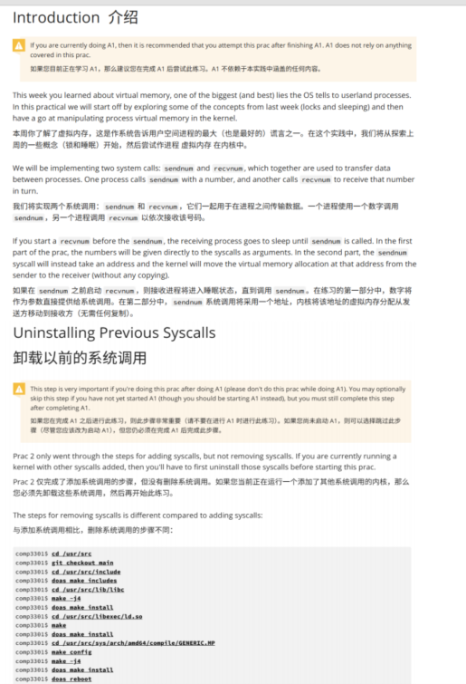

这张图片描述了在内核编程环境中实现和卸载系统调用（syscalls）的过程。

以下是对图片内容的详细解释：

### **介绍**

- 这一部分介绍了与**虚拟内存**相关的实践任务，这是你在前一周学习的一个概念，并且它与操作系统中的**系统调用（syscalls）**相关。
- 图片指出，如果你正在进行某个任务（**A1**），应该先完成该任务再进行当前的任务（**Prac 2**）。
- **虚拟内存**让操作系统为进程提供了一个大而连续的内存空间的幻觉，尽管物理内存可能是碎片化的。这个练习将探索如何在进程之间传递和管理虚拟内存。

### **系统调用（sendnum 和 recvnum）**

- 该练习涉及实现两个系统调用：`sendnum` 和 `recvnum`。这些系统调用将允许两个进程交换数字。

  - **sendnum**：一个进程将数字通过 `sendnum` 发送给另一个进程。
  - **recvnum**：接收进程将使用 `recvnum` 来接收数字。

  这里的关键是两个系统调用之间的**交互**，一个进程发送数字，另一个进程接收数字。

- 系统调用的流程如下：

  1. **`sendnum`** 将一个数字发送出去。
  2. 接收数字的进程会进入**睡眠状态**，直到调用 **`sendnum`**，也就是说它会等待接收到信号后再被唤醒并处理这个数字。
  3. **`recvnum`** 会在 **`sendnum`** 后被调用，允许接收方获取发送方的数据虚拟内存地址。

### **卸载以前的系统调用**

- 图片讨论了**卸载以前的系统调用**这一步骤，以防与当前任务冲突。
- 目标是在开始新的任务之前**清理**任何之前安装的系统调用。
- 它建议运行以下命令：
  - `make clean`：清理掉旧的编译文件。
  - `make install`：安装必要的文件。
  - 这样可以确保环境在添加新系统调用时不会与旧的系统调用发生冲突。

### **卸载系统调用的步骤**

- 卸载旧的系统调用时，需要遵循特定的步骤来**正确删除它们**。这可能涉及清理旧的内核构建文件或移除旧的实现，避免它们干扰新的更改。
- **卸载系统调用**的过程与**添加系统调用**不同。你需要确保环境已经正确清理，不含有任何不必要的旧系统调用，这样才能顺利开始新的任务。

### 结论

这张图片提供了一个关于在内核编程中使用系统调用的练习教程，重点是管理进程间的虚拟内存。它指导你如何**实现**新的系统调用以及如何**卸载**旧的系统调用，以确保工作环境的干净和顺利。


这张图片提供了有关**基础代码补丁**的说明，主要针对一个编程实践任务，详细解释了如何应用和使用代码补丁来实现新的系统调用。

### 详细解释：

### **Base Code Patch / 基本代码补丁**

- **这部分说明**与之前的任务相似，重点是创建新的系统调用。图片提到，在你已经了解了如何创建系统调用的过程后，这一实践将提供一个**基础代码补丁**，帮助你快速启动并专注于本次任务的核心部分，而不需要从头开始。
- 这部分的目标是通过使用给定的代码补丁，使你能更快速地完成新的系统调用的实现。

### **代码补丁链接**

- 图片给出了代码补丁的链接，供你下载使用：
  - `https://stluc.manta.uqcloud.net/comp3301/public/p3-base.patch`
  - 这个补丁包含了一个**基础代码模板**，它是你完成任务的起点。你应该应用这个补丁到你任务的基础代码树上。

### **如何应用补丁**

- 在图片中提供了详细的命令行步骤，告诉你如何应用这个代码补丁：

  - `git checkout -b p3`：创建并切换到一个新的分支 `p3`。
  - `git am /path/to/p3-base.patch`：将代码补丁应用到新的分支上。

  这意味着，你需要将补丁文件（`p3-base.patch`）下载到本地，然后使用 Git 工具将它应用到你的项目中。

### **补丁内容**

- 这个补丁将添加两个新的系统调用：
  - **syscalls.master** 文件：它会设置一个新的头文件 `sys/sendnum.h`。
  - 另外，补丁文件中还会定义一个新的系统调用 `sys/kern/sendnum.c`，并且在第二部分任务（p2）中，你将需要实现与之相关的代码。

### **新的系统调用定义**

- 在任务中，你将定义以下两个系统调用：

  - **sendnum**：一个发送数字的系统调用。
  - **recvnum**：一个接收数字的系统调用。

  这两个系统调用将分别在内核中定义，并通过相应的文件与函数进行实现。

### 结论

- 这个补丁文件是用于帮助你实现新的系统调用，它为你提供了创建系统调用所需的基本代码框架。
- 你需要按照说明将这个补丁应用到你的代码中，并完成相应的系统调用的实现。


这张图片提供了有关**实现 sys_sendnum() 和 sys_recvnum()** 系统调用的详细说明。下面是对每个部分的详细解释：

### **sys_sendnum() 和 sys_recvnum() 的实现**

这部分介绍了如何实现两个系统调用：

- **sys_sendnum()**：该函数将一个数字作为参数，发送给内核。这个数字将被保存在内核空间，以便接收进程调用 `recvnum` 时获取。
- **sys_recvnum()**：该函数接收一个整数，并将其存储在提供的地址中。如果有数字已经等待接收（即发送方已经调用了 `sendnum`），`recvnum` 会立即返回该数字，否则它会将接收进程挂起（睡眠状态），直到数字可用。

### **sys_sendnum() 细节**

- `sys_sendnum` 接受一个数字作为参数并将其发送给内核，数字保存在内核空间。
- 系统调用 `recvnum` 会返回该数字。调用 `recvnum` 的进程会挂起（进入睡眠状态），直到 `sendnum` 被调用并有数字可以接收。
- 如果系统调用失败或遇到错误，`sys_sendnum` 会返回错误信息，如 `EBUSY`，表示数字已在传输过程中，不能同时发送多个数字。

### **sys_recvnum() 细节**

- `sys_recvnum` 会从内核读取一个数字并将其写入给定的地址。
- 如果没有数字可用，进程会进入睡眠状态，等待数字可用。一旦数字可用，进程会被唤醒并继续执行。
- 进程可以通过 **`interrupt`** 机制中断休眠（例如，可以通过发送 Ctrl + C 信号来终止进程）。

### **系统调用原型**

- **sys_sendnum** 和 **sys_recvnum** 的原型已经准备好，并可以在 `usr/src/sys/kern/kern_sendnum.c` 和 `usr/src/sys/kern/kern_recvnum.c` 文件中填充。你需要在这些文件中实现具体的功能。

### **建议**

1. **进程间的关系**：
   - 调用 `sys_sendnum` 和 `sys_recvnum` 的进程不需要是父子进程或同一程序的进程。它们可以是不同的进程，不要假设它们是相同的程序。
2. **简单的实现方法**：
   - 一种简单的实现方法是将发送的数字存储在 `sendnum` 中的一个全局变量中，并在 `recvnum` 中取出。这种方式非常简单，但也有效。
3. **线程安全问题**：
   - 因为 `sys_sendnum` 和 `sys_recvnum` 是由不同的进程（线程）调用的，所以如果它们共享某个全局变量，可能会导致并发问题。建议使用 **`spinlock`** 或类似的同步机制，确保只有一个进程可以访问共享数据。
4. **程序的睡眠和唤醒**：
   - 你可以使用 **`sleep()`** 和 **`wakeup()`** 来管理进程的睡眠和唤醒。特别是，进程调用 `recvnum` 后，如果没有数字，它将进入睡眠状态，直到有数字可以接收。
   - **注意**：你应该始终使用 **`patch`**，并确保适当的进程休眠机制。不要忘记在实现中包含适当的睡眠函数（如 **`sleep()`**）。

### **补充建议**

- 代码中提到的 `PATCH` 和 **`sleep()`** 函数的使用，以及如何使用它们来处理进程的休眠和唤醒，是非常重要的细节。

### **总结**

这张图片为实现 `sys_sendnum()` 和 `sys_recvnum()` 系统调用提供了详细的指导，重点强调了如何管理数字的发送与接收、进程的睡眠与唤醒、以及线程安全问题。

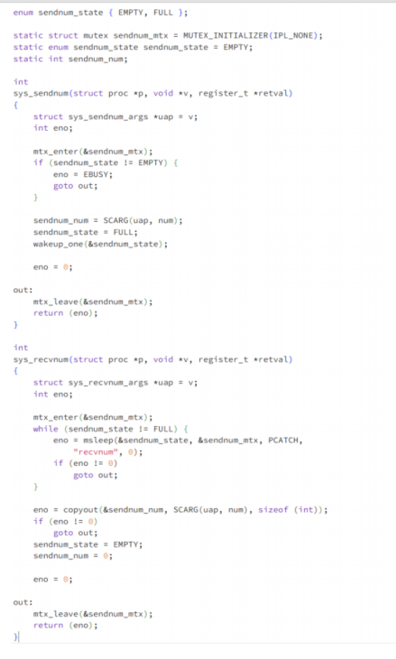

这段代码是实现两个系统调用（`sys_sendnum` 和 `sys_recvnum`）的示例，目的是在内核中发送和接收数字。代码使用了互斥锁和条件变量来确保多进程之间的同步。下面是对每一部分代码的详细解释：

### **枚举类型 `sendnum_state`**

```c
enum sendnum_state { EMPTY, FULL };
```

- `sendnum_state` 枚举有两个状态：`EMPTY` 和 `FULL`。
- `EMPTY` 表示没有数字可以发送，`FULL` 表示有数字已准备好可以被接收。

### **全局变量**

```c
static struct mtx sendnum_mtx = MUTEX_INITIALIZER(IPL_NONE);
static enum sendnum_state sendnum_state = EMPTY;
static int sendnum_num;
```

- `sendnum_mtx` 是一个互斥锁（mutex），用于保证对 `sendnum_state` 和 `sendnum_num` 的访问是线程安全的。
- `sendnum_state` 用于表示当前发送数字的状态，初始为 `EMPTY`，表示没有数字可以发送。
- `sendnum_num` 保存待发送的数字。

### **`sys_sendnum` 系统调用实现**

```c
int sys_sendnum(struct proc *p, void *v, register_t *retval) {
    struct sys_sendnum_args *uap = v;
    int eno;

    mtx_enter(&sendnum_mtx);
    if (sendnum_state != EMPTY) {
        eno = EBUSY;
        goto out;
    }

    sendnum_num = SCARG(uap, num);
    sendnum_state = FULL;
    wakeup_one(&sendnum_state);

    eno = 0;
out:
    mtx_leave(&sendnum_mtx);
    return (eno);
}
```

- **功能**：`sys_sendnum` 发送一个数字到内核并改变 `sendnum_state` 为 `FULL`，表示数字已准备好接收。
- **过程**：
  1. 进入互斥锁，确保线程安全。
  2. 检查 `sendnum_state` 是否是 `EMPTY`，如果不是，返回 `EBUSY`，表示已经有数字在传输中，不能再发送数字。
  3. 获取传入的数字（`SCARG(uap, num)`）并将其存储在 `sendnum_num` 中。
  4. 更新 `sendnum_state` 为 `FULL`，表示数字已准备好。
  5. 使用 `wakeup_one(&sendnum_state)` 唤醒一个等待接收数字的进程。
  6. 离开互斥锁并返回 `eno`。

### **`sys_recvnum` 系统调用实现**

```c
int sys_recvnum(struct proc *p, void *v, register_t *retval) {
    struct sys_recvnum_args *uap = v;
    int eno;

    mtx_enter(&sendnum_mtx);
    while (sendnum_state != FULL) {
        eno = msleep(&sendnum_state, &sendnum_mtx, PCATCH, "recvnum", 0);
        if (eno != 0)
            goto out;
    }

    eno = copyout(&sendnum_num, SCARG(uap, num), sizeof(int));
    if (eno != 0)
        goto out;

    sendnum_state = EMPTY;
    sendnum_num = 0;

    eno = 0;
out:
    mtx_leave(&sendnum_mtx);
    return (eno);
}
```

- **功能**：`sys_recvnum` 从内核接收一个数字，并将其存储在用户空间的指定位置。
- **过程**：
  1. 进入互斥锁，确保线程安全。
  2. 使用 `while (sendnum_state != FULL)` 进入循环，检查 `sendnum_state` 是否为 `FULL`。如果没有数字可以接收（即状态为 `EMPTY`），则调用 `msleep` 将进程挂起，直到 `sendnum_state` 被改变为 `FULL`，表示有数字可以接收。
  3. 如果 `msleep` 被中断（`eno != 0`），退出。
  4. 使用 `copyout` 将内核中的数字（`sendnum_num`）复制到用户空间指定的地址（`SCARG(uap, num)`）。
  5. 接收数字后，将 `sendnum_state` 设置为 `EMPTY`，并清空 `sendnum_num`。
  6. 离开互斥锁并返回 `eno`。

### **解释**

1. **互斥锁** (`mtx_enter` 和 `mtx_leave`): 用于在访问共享资源（如 `sendnum_state` 和 `sendnum_num`）时确保线程安全。
2. **进程睡眠** (`msleep`): 如果没有数字可用接收，调用 `msleep` 会让进程进入睡眠状态，直到有新的数字可供接收。
3. **进程唤醒** (`wakeup_one`): 当数字准备好时，调用 `wakeup_one` 唤醒一个等待的进程。

### 总结

- `sys_sendnum` 用于发送一个数字并将状态改为 `FULL`，然后唤醒等待的接收进程。
- `sys_recvnum` 用于接收数字，如果没有数字，进程会睡眠，直到数字准备好。然后接收数字并将状态改为 `EMPTY`。

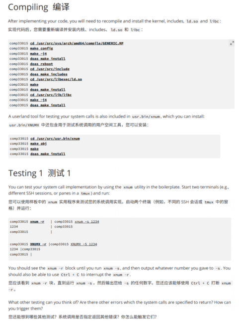

这张图片描述了**编译**和**测试**系统调用代码的步骤。以下是详细的解释：

### **编译 (Compiling)**

- **代码编译**：在实现了系统调用之后，需要重新编译和安装内核。这些步骤包括：

  - **`make config`**：配置编译选项。
  - **`make`**：进行编译。
  - **`make install`**：安装编译好的文件，包括相关的库文件如 `ld.so` 和 `libc`。

  执行的命令如下：

  ```bash
  comp33015$ cd /usr/src/arch/amdk6/compile/GENERIC_MP
  comp33015$ make config
  comp33015$ make
  comp33015$ make install
  comp33015$ cd /usr/src/lib/lib1
  comp33015$ make
  comp33015$ make install
  ```

- 这些命令的目的是确保所有的源代码都被正确编译并安装到系统中。特别地，它会将 **`ld.so`** 和 **`libc`** 等重要的库文件安装到系统中，以保证系统调用能够正常工作。

- 之后，图片提到了一些 **用户空间工具**，用于测试系统调用。你可以通过以下命令安装：

  ```bash
  comp33015$ cd /usr/src/usr.bin/xnum
  comp33015$ make
  comp33015$ make install
  ```

### **测试 (Testing 1)**

- **测试系统调用**：测试你的系统调用代码是否正确，可以使用 `xnum` 工具。你可以通过 **SSH** 启动两个终端（或者通过 **tmux** 启动多个会话）来进行测试。

  - 在两个终端中分别运行以下命令：

  ```bash
  comp33015$ xnum -t
  comp33015$ xnum -s 1234
  ```

  这将启动一个命令行程序，模拟系统调用的发送和接收。

- **`xnum` 工具的使用**：

  - 你可以通过 `xnum` 工具来模拟进程间的通信。一端将通过 **`xnum -s`** 发送数字（例如，发送 1234），另一端则通过 **`xnum -t`** 进行接收，来测试 `sendnum` 和 `recvnum` 系统调用的功能。

- **调试和中断**：

  - 在测试过程中，你可以通过按 **Ctrl+C** 来中断进程并观察系统的反应。如果系统工作正常，进程应该能够按预期发送和接收数字。

### **总结**

1. **编译步骤**：你需要执行一系列的命令来编译和安装内核及相关库，以确保系统调用代码被正确集成到操作系统中。
2. **测试步骤**：使用 `xnum` 工具进行系统调用的测试，模拟数字的发送和接收，验证系统调用是否按预期工作。

### **其他建议**

- 图片中的内容还鼓励你考虑其他测试方案，以及系统调用可能返回的错误代码。这有助于全面验证系统调用的功能并确保其鲁棒性。

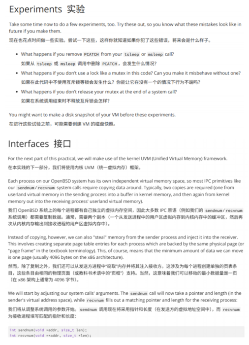

这张图片描述了实验和接口部分的内容，特别是针对**系统调用**和**虚拟内存（VM）**的一些细节。以下是对每部分内容的详细解释：

### **实验 (Experiments)**

- **实验目的**：图片建议进行一些实验，以便了解可能遇到的错误，并帮助你在未来避免这些错误。

  **实验问题**：

  1. **如果你从 `sleep()` 或 `msleep()` 中移除 `PCATCH` 会发生什么？**
     - `PCATCH` 是一个标志，用于允许进程在休眠时被中断。移除它可能导致进程无法被外部信号中断，从而阻塞在 `sleep()` 或 `msleep()` 中，直到指定的条件满足。
  2. **如果代码中没有使用互斥锁（mutex），会发生什么？**
     - 如果没有使用互斥锁来保护共享资源，可能会导致**竞态条件**（race conditions），即多个进程同时访问共享数据，导致数据不一致或系统崩溃。
  3. **如果在系统调用结束时进行虚拟内存的快照（snapshot）会怎么样？**
     - 在系统调用结束时进行虚拟内存的快照，可以记录进程的当前状态和内存布局，帮助调试和分析内存使用情况，尤其在出错时可以回溯。

- **虚拟机快照**：如果你在进行实验前想要测试，建议创建一个虚拟机的快照，以便在实验过程中出现问题时能够恢复到初始状态。

### **接口 (Interfaces)**

- **UVM（统一虚拟内存）框架**：接下来的实验部分将使用OpenBSD内核的统一虚拟内存（UVM）框架。该框架允许进程共享物理内存，并管理虚拟内存映射。

  **每个进程的虚拟内存**：

  - 在OpenBSD中，每个进程有自己的独立虚拟内存空间。通常，系统调用（例如IPC）会涉及将数据从发送进程的用户空间复制到内核空间的缓冲区，然后再传输到接收进程。
  - 发送进程和接收进程各自会持有用户虚拟内存的副本，通常是通过复制数据到内核内存（通常是共享内存）来实现。这种方式提高了效率，但需要谨慎处理内存映射。

- **数据传输方式**：

  - 在实验中，数据的传输将涉及到虚拟内存的处理。特别地，`sendnum` 和 `recvnum` 这两个系统调用可能涉及将数据从发送进程的虚拟内存转移到接收进程的内存中。
  - 代码中的关键操作包括创建共享内存页，允许两个进程直接在物理内存中共享数据。

- **虚拟内存的“偷取”**：

  - 该部分提到，可以通过“偷取”进程的虚拟内存，意味着数据不会从发送进程的内存中复制出来，而是直接被映射到接收进程的内存空间中。这涉及到创建共享物理页面并通过该页面交换数据，这种方式比复制数据更高效。

### **系统调用参数调整**

- 接下来你将调整系统调用的参数，例如 `sendnum` 系统调用将使用指针来传递数字数据。这些系统调用将通过 `sendnum` 和 `recvnum` 来实现跨进程的数据交换。

### **总结**

- 本部分通过介绍如何使用虚拟内存框架来共享数据和优化进程间通信，为你后续的实验和系统调用实现提供了理论和实践支持。
- 进行实验时，你需要注意进程间的数据传输、内存管理以及潜在的竞态条件问题。


这张图片提供了如何在内核编程中使用 **`mmap`** 系统调用进行内存分配，以及如何在修改后的系统调用中使用内存映射来进行数据传输的具体方法。以下是详细解释：

### **使用 `mmap` 分配内存**

1. **内存分配**：

   - 要为结构体分配整个页面的内存，使用 `mmap` 系统调用。除了用于映射文件内存，`mmap` 还可以为进程分配“匿名”的虚拟内存，即没有与任何文件关联的内存。
   - 代码如下：

   ```c
   struct xnump_page *p;
   p = mmap(
       NULL,                              // 我们不关心地址在哪里
       sizeof(struct xnump_page),         // 分配的内存大小
       PROT_READ | PROT_WRITE,             // 使内存可读和可写
       MAP_PRIVATE | MAP_ANON,             // 给我们“匿名”的私有内存
       -1,                                 // 无文件描述符与其关联
       0                                   // 文件偏移量
   );
   if (p == MAP_FAILED) {
       err(1, "mmap");                     // 如果映射失败，则打印错误信息
   }
   p->xp_magic = ...;                      // 设置结构体的初始值
   p->xp_num = ...;
   ```

   - **解释**：
     - `mmap` 系统调用通过为结构体分配一个页面大小的内存块，使结构体 `xnump_page` 的数据能够存放在这块内存区域。
     - `MAP_ANON` 表示这是匿名内存，不与任何文件关联。
     - `PROT_READ | PROT_WRITE` 表示分配的内存既可以读也可以写。
     - 如果映射失败，返回 `MAP_FAILED`，并输出错误信息。

2. **在发送端使用映射的内存**：

   - 使用 `mmap` 分配的内存可以作为修改后的 `sendnum` 系统调用的第一个参数，来发送该结构体的内容：

   ```c
   if (sendnum(p, sizeof(struct xnump_page))) {
       err(1, "sendnum");
   }
   ```

   - **解释**：
     - 结构体 `xnump_page` 的指针 `p` 作为参数传递给 `sendnum` 系统调用，并指定结构体的大小。通过这种方式，发送端将结构体数据通过系统调用发送给接收端。

### **接收端处理内存映射**

- **接收端**：在接收端，不需要使用 `mmap` 或其他复杂操作，只需使用指针来指向接收的内存地址，并检查传递的魔法值（magic value）来确保数据的有效性。代码如下：

  ```c
  if (recvnum((void **) &p, &len)) {
      err(1, "recvnum");
  }
  if (len < sizeof(struct xnump_page)) {
      errx(1, "received memory too small");
  }
  p->xp_magic = ...;
  if (p->xp_magic != ...) {
      errx(1, "magic number invalid");
  }
  printf("%d\n", p->xp_num);
  ```

  - **解释**：
    - `recvnum` 从接收端接收数据，`p` 将指向接收到的内存区域。
    - 检查接收到的数据大小是否符合预期（即 `sizeof(struct xnump_page)`）。
    - 验证接收到的数据是否包含有效的魔法值（`xp_magic`）。
    - 如果所有验证通过，则打印接收到的数字。

### **修改后的代码**

- 图片建议修改 `xnum.c` 文件中的代码。首先，确保代码能编译通过，并检查它是否符合要求。然后可以在实现系统调用后再次进行测试。

### **总结**

1. **内存分配**：使用 `mmap` 为结构体分配匿名的虚拟内存，这样可以为进程提供独立的内存区域，不与任何文件关联。
2. **数据发送与接收**：通过修改后的 `sendnum` 和 `recvnum` 系统调用，可以在进程间传递数据，接收端验证数据的有效性。
3. **实验修改**：修改代码后，确保它可以编译并运行，然后通过相应的测试验证系统调用的功能。

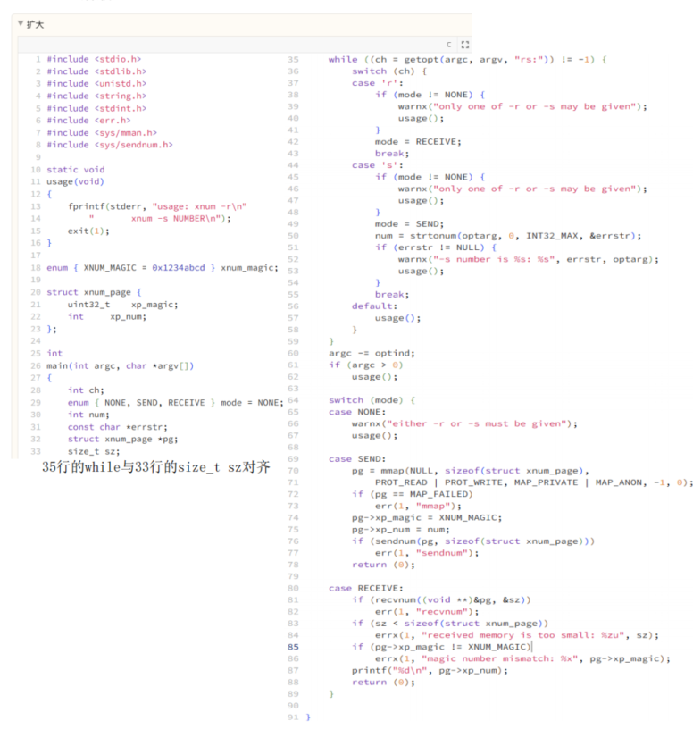

这段代码是一个基于 `mmap` 系统调用实现进程间通信的程序，具体涉及发送和接收数字的操作。程序的结构和功能如下：

### **代码分析**

#### **包含头文件和定义常量**

```c
#include <stdio.h>
#include <stdlib.h>
#include <string.h>
#include <unistd.h>
#include <err.h>
#include <sys/mman.h>
#include <sys/sendnum.h>

static void usage(void)
{
    fprintf(stderr, "usage: xnum -r\n");
    fprintf(stderr, "       xnum -s NUMBER\n");
    exit(1);
}

enum { XNUM_MAGIC = 0x1234abcd } xnum_magic;
```

- **头文件**：引入了常用的库文件，如 `stdio.h`, `stdlib.h`, `unistd.h`，以及操作系统相关的 `mmap` 和 `sendnum.h`。
- **`usage` 函数**：定义了程序的使用方法，当用户输入错误时显示帮助信息。

#### **结构体定义**

```c
struct xnum_page {
    uint32_t xp_magic;  // 魔法值，用于校验数据
    int xp_num;         // 存储数字
};
```

- **`xnum_page` 结构体**：用于存储发送和接收的数据，包括 `xp_magic` （魔法值）和 `xp_num` （实际的数字）。

#### **`main` 函数**

```c
int main(int argc, char *argv[])
{
    int ch;
    enum { NONE, SEND, RECEIVE } mode = NONE;
    int num;
    const char *errstr;
    struct xnum_page *pg;
    size_t sz;
```

- **`main` 函数**：这是程序的入口，首先处理命令行参数，设置模式为 `NONE`, `SEND`, 或 `RECEIVE`，根据用户的输入来决定是发送数字还是接收数字。

#### **命令行参数解析**

```c
while ((ch = getopt(argc, argv, "rs:")) != -1) {
    switch (ch) {
        case 'r':  // 接收模式
            if (mode != NONE) {
                warnx("only one of -r or -s may be given");
                usage();
            }
            mode = RECEIVE;
            break;
        case 's':  // 发送模式
            if (mode != NONE) {
                warnx("only one of -r or -s may be given");
                usage();
            }
            mode = SEND;
            num = strtonum(optarg, 0, INT32_MAX, &errstr);
            if (errstr != NULL) {
                warnx("number is %s: %s", errstr, optarg);
                usage();
            }
            break;
        default:
            usage();
    }
}
```

- **命令行参数解析**：程序支持 `-r`（接收）和 `-s NUMBER`（发送数字）两个选项。通过 `getopt` 获取命令行参数并设置模式 (`mode`)。
- **`strtonum`**：用于将字符串转换为数字，并验证输入是否在有效范围内。

#### **内存分配和映射**

```c
switch (mode) {
    case NONE:
        warnx("either -r or -s must be given");
        usage();
    case SEND:
        pg = mmap(NULL, sizeof(struct xnum_page),
                  PROT_READ | PROT_WRITE, MAP_PRIVATE | MAP_ANON,
                  -1, 0);
        if (pg == MAP_FAILED) {
            err(1, "mmap");
        }
        pg->xp_magic = XNUM_MAGIC;
        pg->xp_num = num;
        if (sendnum(pg, sizeof(struct xnum_page))) {
            err(1, "sendnum");
        }
        return 0;
```

- **`SEND` 模式**：
  - 使用 `mmap` 分配一块匿名内存来存储 `xnum_page` 结构体。这块内存不与任何文件关联，只有进程之间共享。
  - 设置 `xp_magic` 为预定义的魔法值，确保数据的有效性。
  - 使用 `sendnum` 系统调用发送这块内存中的数据。

#### **接收模式**

```c
    case RECEIVE:
        if (recvnum((void **)&pg, &sz)) {
            err(1, "recvnum");
        }
        if (sz < sizeof(struct xnum_page)) {
            errx(1, "received memory too small: %zu", sz);
        }
        if (pg->xp_magic != XNUM_MAGIC) {
            errx(1, "magic number mismatch: %x", pg->xp_magic);
        }
        printf("%d\n", pg->xp_num);
        return 0;
}
```

- **`RECEIVE` 模式**：
  - 使用 `recvnum` 接收数据，并将接收到的内存映射到 `pg` 指针中。
  - 检查接收到的内存大小是否正确（即是否足够大以存储 `xnum_page`）。
  - 校验 `xp_magic` 确保数据的正确性。
  - 如果一切正常，打印接收到的数字。

### **总结**

- **内存映射**：通过 `mmap` 分配匿名内存，这块内存用于存储传输的数据。
- **数据传输**：使用 `sendnum` 和 `recvnum` 进行进程间通信，将数据从一个进程传输到另一个进程。
- **命令行参数**：程序支持接收和发送模式，用户通过命令行参数选择操作模式并传递数据。

这段代码演示了如何利用内存映射和系统调用实现进程间的数字传输，且通过魔法值进行数据验证，确保数据的正确性。


这张图片提供了**第二阶段实现**的指导，重点介绍了如何在系统调用中正确实现**进程间同步**和**虚拟内存映射**，以便完成数字的传输。以下是对内容的详细解释：

### **实验步骤：**

1. **进程间同步**：
   - **同步操作**：在实现系统调用时，首先确保 `sendnum` 和 `recvnum` 能够正确地同步，确保在调用时两个进程能够正确阻塞直到彼此完成。
   - **步骤分为两部分**：
     - 让 `sendnum` 和 `recvnum` 正确工作，并保证它们能够在一个进程完成之前阻塞另一个进程。
     - 然后，实施实际的数字传输。
2. **同步的扩展**：
   - **同步实现**：同步操作应该类似于你在前一部分做的工作，但现在两个进程需要“休眠”状态（即等待）并且可能需要一些额外的全局变量或标志位来控制。可以通过同步机制确保两个进程完成工作后同时结束。
   - 这部分重点在于**进程的休眠和唤醒机制**，确保数据传输是按顺序进行的，不会发生数据丢失或竞争条件。
3. **虚拟内存映射和数据传输**：
   - **虚拟内存映射**：为了处理虚拟内存地址的映射，你需要使用 `uvm_share` 函数。该函数用于将内存区域共享给不同进程。你需要查阅内核文档来理解 `uvm_share` 函数的实现和使用方式。
   - **`uvm_share` 的使用**：`uvm_share` 是实现共享内存映射的一种方法，它允许多个进程共享相同的内存区域。
     - **注意**：`uvm_share` 是一种危险的操作，且在文档中有时描述得不太详细，因此需要小心使用。
     - **UVM 框架**：`uvm` 是 OpenBSD 系统中用于虚拟内存管理的框架。通过它，可以实现进程间共享内存的传输。
4. **使用 `vm_map` 函数**：
   - 在你的代码中，你应该已经见过如何使用 `vm_map` 为进程创建映射。`vm_map` 是一个非常关键的系统调用，它能够将物理内存映射到进程的虚拟内存中。
   - 你需要确保映射到目标进程的内存地址是指向目标地址空间的有效指针。
5. **`sys_query` 系统调用**：
   - 为了获取虚拟内存地址映射的相关信息，你可以使用 `sys_query` 系统调用来获取当前进程的虚拟内存状态，具体是通过 `vm_query()` 来获取虚拟内存的映射信息。
   - 这可以帮助你确保 `sendnum` 和 `recvnum` 系统调用的参数和内存映射在发送和接收过程中是正确的。
6. **映射移除**：
   - 在完成传输后，你还需要移除对原始进程的内存映射。你可以使用 `munmap` 函数来删除映射，确保不会占用不必要的内存。
   - `munmap` 用于卸载已映射的内存区域。通过它，进程可以释放共享内存，避免内存泄漏。

### **具体操作：**

- 在使用 `uvm_share` 后，需要注意进程内存的映射、传输以及解除映射的操作。要确保每一步都正确执行，避免内存泄漏或同步错误。
- `sendnum` 和 `recvnum` 的系统调用将通过 **共享内存映射** 实现进程间的数据传输，而同步机制确保了进程间的协调和数据一致性。

### **总结：**

- **同步机制**：确保 `sendnum` 和 `recvnum` 系统调用能够在正确的时间进行阻塞和唤醒操作，防止竞争条件。
- **内存映射**：通过 `uvm_share` 和 `vm_map` 实现进程间的虚拟内存映射，使得数据可以通过共享内存进行传输。
- **移除映射**：完成数据传输后，使用 `munmap` 移除内存映射，确保资源被正确释放。

这部分内容指导你如何在内核中处理进程间的内存共享、映射和同步，以实现高效且安全的系统调用实现。

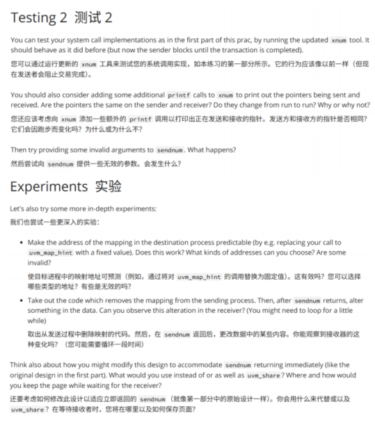

这张图片提供了**第二次测试**和**实验**部分的内容，具体是测试和修改系统调用（`sendnum` 和 `recvnum`）以实现进程间的数据传输，并验证系统调用的有效性和健壮性。以下是详细解释：

### **测试 2 (Testing 2)**

1. **测试系统调用的更新**：
   - 你可以通过运行更新后的 `xnum` 工具来测试你系统调用的实现，类似于前一部分的测试。
   - 系统的行为应该和之前一样，只不过现在发送方会阻塞直到事务完成。也就是说，在完成数据传输之前，发送方将被阻塞，接收方在完成接收操作后才能继续执行。
   - 通过观察测试结果，验证进程间的阻塞和数据传输是否按预期工作。
2. **额外的 `printf` 调试输出**：
   - 建议在测试中加入额外的 `printf` 调用，以打印出发送和接收的指针地址。观察这些指针在发送方和接收方之间的变化。
   - **问题**：发送方和接收方的指针地址会变化吗？如果会，为什么会变化，或者为什么不变化？
   - **目标**：通过打印指针地址来调试进程间的内存映射，确保数据传输正确。
3. **提供无效的参数**：
   - 尝试向 `sendnum` 系统调用传递一些无效的参数。观察系统如何处理无效参数。比如传递不合法的地址或大小等。
   - **问题**：传递无效参数时，会发生什么？系统如何反应？

### **实验 (Experiments)**

1. **使目标进程的映射地址可预测**：
   - **目标**：让目标进程的内存映射地址变得可预测。你可以通过用固定的值替代 `uvm_map_hint` 来实现这一点，看看这种方式是否有效。
   - **问题**：你可以选择哪些地址？这些地址是否有效？有没有无效的地址？
     - `uvm_map_hint` 是一个帮助映射内存的提示值，可以用来影响内存映射的结果。通过固定该值，你可以控制映射的地址，但需要验证其可行性。
2. **移除发送进程的映射**：
   - **操作**：在发送完成后，移除发送进程的内存映射。你可以尝试去掉映射，看看是否会影响数据传输的正确性。
   - **问题**：移除映射后，接收方是否能成功接收到数据？你需要在接收方等待一段时间，看看是否能够成功获取数据。
3. **修改设计来适应立即返回的 `sendnum`**：
   - **问题**：考虑如何修改设计，使得 `sendnum` 在发送后立即返回，而不阻塞直到接收完成。你可以尝试使用 `uvm_share`，这允许进程共享内存而不必阻塞。
   - **进一步问题**：在这种设计中，`sendnum` 和 `recvnum` 如何协调？你会在哪个地方使用 `uvm_share`？这样设计是否会影响接收方的等待行为？

### **总结**

- **测试系统调用**：首先，验证 `sendnum` 和 `recvnum` 是否按照要求阻塞和传输数据，然后进行更深入的调试，检查指针地址的变化，并尝试无效参数的处理。
- **实验**：包括让内存映射地址可预测、测试内存映射移除后的行为、以及修改设计以使得发送操作立即返回。这些实验可以帮助你进一步理解内存映射和进程间同步的细节，并改进系统调用的实现。


```c
#include <sys/param.h>           // 系统参数相关头文件

#include <sys/types.h>           // 系统类型定义头文件

#include <sys/proc.h>            // 进程相关头文件
#include <sys/systm.h>           // 系统调用和内核函数头文件
#include <sys/syscall.h>         // 系统调用定义头文件
#include <sys/mutex.h>           // 互斥锁相关头文件
#include <sys/errno.h>           // 错误码定义头文件

/* These are required for sys/syscallargs.h */
#include <sys/socket.h>          // 套接字相关头文件（syscallargs.h需要）
#include <sys/mount.h>           // 挂载相关头文件（syscallargs.h需要）

#include <sys/syscallargs.h>     // 系统调用参数定义头文件

#include <sys/sendnum.h>         // sendnum系统调用相关头文件

#include <uvm/uvm.h>             // 用户虚拟内存管理头文件
#include <uvm/uvm_param.h>       // UVM参数定义头文件
#include <uvm/uvm_addr.h>        // UVM地址管理头文件

enum sendnum_flags {            // 定义sendnum操作的状态标志枚举
	SEND_WAITING	= (1<<0),   // 发送方等待标志
	RECV_WAITING	= (1<<1),   // 接收方等待标志
	TRANSFER_DONE	= (1<<2),   // 传输完成标志
};                              // 这些标志可以使用位运算进行组合

static struct mutex sendnum_mtx = MUTEX_INITIALIZER(IPL_NONE);  // 初始化互斥锁，用于保护共享数据
static uint32_t sendnum_flags = 0;      // 状态标志变量，初始为0
static vaddr_t sendnum_saddr;           // 发送方地址变量
static vaddr_t sendnum_daddr;           // 接收方地址变量
static size_t sendnum_len;              // 传输长度变量
static struct proc *sendnum_sender = NULL;  // 发送方进程指针，初始为NULL
static struct proc *sendnum_receiver = NULL;  // 接收方进程指针，初始为NULL

static int                              // 静态函数，完成内存传输操作
sendnum_finish(void)
{
	struct vm_map *dmap, *smap;    // 定义接收方和发送方的虚拟内存映射指针
	vaddr_t daddr, saddr;          // 定义目标地址和源地址变量
	int eno;                       // 错误码变量
	size_t len;                    // 长度变量
	struct uvm_map_deadq dead;     // 定义UVM映射死亡队列，用于管理被删除的映射

	MUTEX_ASSERT_LOCKED(&sendnum_mtx);  // 断言检查互斥锁是否已锁定

	if (!(sendnum_flags & SEND_WAITING))  // 检查是否有发送方在等待
		return (EAGAIN);                // 如果没有，返回EAGAIN错误
	if (!(sendnum_flags & RECV_WAITING))  // 检查是否有接收方在等待
		return (EAGAIN);                // 如果没有，返回EAGAIN错误

	KASSERT(!(sendnum_flags & TRANSFER_DONE));  // 断言检查传输是否未完成
	KASSERT(sendnum_sender != NULL);            // 断言检查发送方进程指针非空
	KASSERT(sendnum_receiver != NULL);          // 断言检查接收方进程指针非空

	smap = &sendnum_sender->p_vmspace->vm_map;  // 获取发送方的虚拟内存映射
	dmap = &sendnum_receiver->p_vmspace->vm_map;  // 获取接收方的虚拟内存映射

	len = sendnum_len;              // 获取传输长度
	saddr = sendnum_saddr;          // 获取源地址

	/* Round len up to a whole page. */
	len = round_page(len);          // 将长度向上舍入为整页大小

again:  // 标签，用于地址不可用时重试
	/* First, work out what destination address to put it at. */
	// 首先，确定目标地址
	daddr = uvm_map_hint(sendnum_receiver->p_vmspace, PROT_READ,  // 获取接收方合适的映射地址
	    VM_MIN_ADDRESS, VM_MAXUSER_ADDRESS);
	eno = uvm_map_mquery(dmap, &daddr, len, UVM_UNKNOWN_OFFSET, 0);  // 查询目标地址是否可用
	if (eno)  // 如果不可用
		return (eno);  // 返回错误码

	/* Now we copy the mapping. */
	// 现在复制映射（注意：不是复制数据，而是共享内存页）
	eno = uvm_share(dmap, daddr, PROT_READ, smap, saddr, len);  // 在接收方映射中共享发送方的内存页
	/* We get ENOMEM if the daddr is not available */
	if (eno == ENOMEM)  // 如果地址不可用（ENOMEM错误）
		goto again;    // 跳转到again标签重试

	/* And delete the original one. */
	// 删除发送方的原始映射
	TAILQ_INIT(&dead);  // 初始化死亡队列
	vm_map_lock(smap);  // 锁定发送方的虚拟内存映射
	uvm_unmap_remove(smap, saddr, saddr + len, &dead, FALSE, TRUE, FALSE);  // 移除发送方的内存映射
	vm_map_unlock(smap);  // 解锁发送方的虚拟内存映射
	uvm_unmap_detach(&dead, 0);  // 分离死亡队列中的映射项

	sendnum_daddr = daddr;  // 保存实际使用的目标地址
	sendnum_flags |= TRANSFER_DONE;  // 设置传输完成标志
	wakeup(&sendnum_flags);  // 唤醒等待sendnum_flags的进程

	return (0);  // 返回成功
}

int  // sendnum系统调用的实现
sys_sendnum(struct proc *p, void *v, register_t *retval)
{
	struct sys_sendnum_args *uap = v;  // 将系统调用参数转换为适当的类型
	int eno;  // 错误码变量

	mtx_enter(&sendnum_mtx);  // 获取互斥锁
	if (sendnum_flags & (SEND_WAITING | TRANSFER_DONE)) {  // 检查是否已有发送方在等待或传输正在进行
		eno = EBUSY;  // 设置错误码为EBUSY
		goto out;     // 跳转到out标签
	}

	sendnum_flags |= SEND_WAITING;  // 设置发送方等待标志
	sendnum_sender = p;             // 保存发送方进程指针
	sendnum_saddr = (vaddr_t)SCARG(uap, addr);  // 获取用户传递的源地址
	sendnum_len = SCARG(uap, len);  // 获取用户传递的长度

	eno = sendnum_finish();  // 尝试完成传输
	if (eno != 0 && eno != EAGAIN) {  // 如果出错且不是EAGAIN错误
		sendnum_flags &= ~SEND_WAITING;  // 清除发送方等待标志
		sendnum_sender = NULL;           // 重置发送方进程指针
		goto out;                        // 跳转到out标签
	}

	while (!(sendnum_flags & TRANSFER_DONE)) {  // 等待传输完成
		eno = msleep(&sendnum_flags, &sendnum_mtx, PCATCH,  // 睡眠等待，可被信号中断
		    "sendnum", 0);  // 睡眠原因是"sendnum"，超时时间为0（无限等待）
		if (eno != 0) {  // 如果被信号中断
			sendnum_flags &= ~SEND_WAITING;  // 清除发送方等待标志
			sendnum_sender = NULL;           // 重置发送方进程指针
			goto out;                        // 跳转到out标签
		}
	}

	sendnum_flags &= ~SEND_WAITING;  // 清除发送方等待标志
	if (!(sendnum_flags & RECV_WAITING))  // 如果接收方不再等待
		sendnum_flags &= ~TRANSFER_DONE;  // 清除传输完成标志

	eno = 0;  // 设置错误码为成功

out:
	mtx_leave(&sendnum_mtx);  // 释放互斥锁
	return (eno);  // 返回结果
}

int  // recvnum系统调用的实现
sys_recvnum(struct proc *p, void *v, register_t *retval)
{
	struct sys_recvnum_args *uap = v;  // 将系统调用参数转换为适当的类型
	int eno;  // 错误码变量

	mtx_enter(&sendnum_mtx);  // 获取互斥锁

	if (sendnum_flags & (RECV_WAITING | TRANSFER_DONE)) {  // 检查是否已有接收方在等待或传输正在进行
		eno = EBUSY;  // 设置错误码为EBUSY
		goto out;     // 跳转到out标签
	}

	sendnum_flags |= RECV_WAITING;  // 设置接收方等待标志
	sendnum_receiver = p;           // 保存接收方进程指针

	eno = sendnum_finish();  // 尝试完成传输
	if (eno != 0 && eno != EAGAIN) {  // 如果出错且不是EAGAIN错误
		sendnum_flags &= ~RECV_WAITING;  // 清除接收方等待标志
		sendnum_receiver = NULL;         // 重置接收方进程指针
		goto out;                        // 跳转到out标签
	}

	while (!(sendnum_flags & TRANSFER_DONE)) {  // 等待传输完成
		eno = msleep(&sendnum_flags, &sendnum_mtx, PCATCH,  // 睡眠等待，可被信号中断
		    "recvnum", 0);  // 睡眠原因是"recvnum"，超时时间为0（无限等待）
		if (eno != 0) {  // 如果被信号中断
			sendnum_flags &= ~RECV_WAITING;  // 清除接收方等待标志
			sendnum_receiver = NULL;         // 重置接收方进程指针
			goto out;                        // 跳转到out标签
		}
	}

	sendnum_flags &= ~RECV_WAITING;  // 清除接收方等待标志
	if (!(sendnum_flags & SEND_WAITING))  // 如果发送方不再等待
		sendnum_flags &= ~TRANSFER_DONE;  // 清除传输完成标志

	eno = copyout(&sendnum_daddr, SCARG(uap, addr), sizeof(void *));  // 将实际的目标地址复制到用户空间
	if (eno)  // 如果复制失败
		goto out;  // 跳转到out标签
	eno = copyout(&sendnum_len, SCARG(uap, len), sizeof(size_t));  // 将实际的长度复制到用户空间
	if (eno)  // 如果复制失败
		goto out;  // 跳转到out标签

	eno = 0;  // 设置错误码为成功

out:
	mtx_leave(&sendnum_mtx);  // 释放互斥锁
	return (eno);  // 返回结果
}
```

第二个ppt


这张图片是关于在 OpenBSD 操作系统中编写设备驱动程序的技术指南，以下是各部分内容的详细解释：

1. **Skeleton (框架)**:
    这是指设备驱动程序的基本结构或框架。在编写驱动程序时，通常会先搭建一个“框架”或模板，然后在其基础上添加具体的功能。
2. **Magic Numbers (神奇数字)**:
    这里的“神奇数字”是指用于标识设备的特定数字或值。它们通常用于唯一标识某种设备类型，在内核中发挥着标识和分配的作用。
3. **设备驱动程序函数**:
   - 该部分提到，我们需要在内核端声明设备驱动程序函数，方便系统为驱动程序分配一个设备主编号（在这里是 "PS device"）。
   - 以 `psd` 作为设备名称，表示一个 "PS 设备"。
   - 目标是将这个驱动程序注册为一个字符设备（character device）。
4. **创建分支并检出**:
   - 该指南建议在 OpenBSD 源代码树中创建一个新的分支，用于驱动程序开发（命令：`git checkout -b ps5 openbsd-7.3`）。
   - 接下来，通过 `git` 命令检出该分支并开始开发工作。
5. **在 OpenBSD 中的设备主编号**:
   - 这部分说明设备的主编号是与体系架构（如 AMD64）相关的。设备的具体信息通常会在 `sys/arch/amd64/amd64/conf.c` 文件中进行添加。
   - 在该文件中，我们将设备信息与体系架构结合起来，确保设备能正确识别和管理。
6. **定义声明宏**:
   - 在开始驱动程序开发之前，需要定义一个“声明”宏，这些宏的作用是声明设备的相关操作函数（如 `open`, `close`, `read`, `write`, `ioctl` 等）。
   - 这些宏通常定义在 `sys/sys/conf.h` 文件中，分别是 `cdev_x_init` 和 `cdev_x_decl` 宏。
7. **驱动程序初始化**:
   - 该部分提到定义一个驱动程序初始化宏。驱动程序的基本函数如 `open`, `close`, `read`, `write`, `ioctl` 都需要被实现。
   - `cdev_p5_init` 函数将成为初始化驱动程序时使用的函数。

总结来说，这个指南的核心目的是帮助开发者在 OpenBSD 系统中建立设备驱动程序的框架，特别是为 "PS 设备" 创建一个驱动程序，并确保它在系统中正确注册和初始化。

如果你需要对某个部分有更深入的理解，随时可以告诉我！


这张图片是关于在 OpenBSD 操作系统中编写设备驱动程序的技术指南，下面是具体内容的详细解释：

### 1. **Magic Numbers (神奇数字)**

- **Magic Numbers** 是指一些特定的数字，用于标识设备。例如，在内核中使用特定的数字来识别设备类型，这些数字称为 "魔数"。
- 在本例中，使用 `psd`（代表 "PS 设备"）来为设备分配一个设备主编号，并使其成为字符设备。

### 2. **创建分支并检出**

- 图中提到要基于 `openbsd-7.3` 标签创建一个新的分支。这个分支将用来开发驱动程序，具体的命令是：

  ```
  $ git checkout -b ps5 openbsd-7.3
  $ git checkout -b ps5 openbsd-7.7
  ```

  这些命令分别创建并切换到新的分支，适用于 OpenBSD 7.3 和 7.7。

### 3. **设备主编号与架构**

- 在 OpenBSD 中，设备主编号是与架构相关的。在本例中，要为新的设备添加主编号，并将其添加到 OpenBSD 的 `sys/arch/amd64/amd64/conf.c` 文件中。

### 4. **声明宏定义**

- 在添加设备之前，需要定义一个“声明”宏（这些宏的形式类似于 `cdev_x_init()` 和 `cdev_x_decl()`），这些宏用于声明设备的驱动程序函数。相关宏定义通常位于 `sys/sys/conf.h` 文件中。

### 5. **定义驱动程序操作函数**

- 这部分提到，我们希望驱动程序最终能够处理 `open`、`close`、`read`、`write` 和 `ioctl` 这几个操作。首先，需要定义 `cdev_*_init` 宏来初始化驱动程序。

### 6. **寻找并修改 `cdev_tape_init`**

- 图中还提到，寻找一个类似于 `cdev_tape_init` 的函数。`cdev_tape_init` 是 OpenBSD 中用于初始化设备的函数，驱动程序需要有与之类似的函数，并修改为我们自己的函数名。在这段代码中，将其修改为 `cdev_p5_init`：

  ```c
  #define cdev_p5d_init(c, n) { \
    dev_init(c,n,open), dev_init(c,n,close), dev_init(c,n,read), \
    dev_init(c,n,write), dev_init(c,n,ioctl), (dev_type_stop((**)) enodev, \
    0, (dev_type_map((**))) enodev, \
    0, 0, seltrue_kqfilter \
  }
  ```

### 总结

这段内容主要是关于如何为一个新设备创建驱动程序并在 OpenBSD 内核中注册该设备。通过定义相关的宏、初始化函数以及设备操作函数，开发者可以在系统中正确地添加新的设备。`Magic Numbers` 是设备标识的一部分，`cdev_*_init` 宏和 `cdev_tape_init` 函数用于初始化设备的基本操作（如打开、关闭、读取、写入等）。

如果你对某个部分需要进一步解释，或者想要更详细的代码实现，请告诉我！


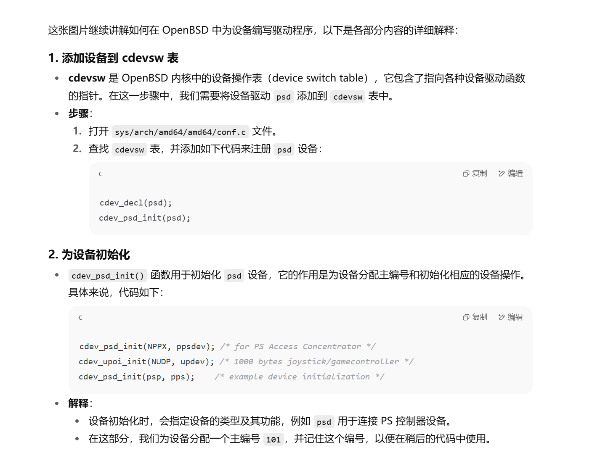


这张图片继续介绍如何编写 OpenBSD 设备驱动程序，下面是详细解释：

### 1. **设计（Design）部分**

该部分介绍了如何设计设备驱动程序的核心功能，特别是在设备与进程之间的通信和同步方面：

- **允许一个进程写入一个整数 (`int`) 到设备**：
  - 首先，设备驱动程序应当允许进程通过 `write()` 向设备写入一个整数（`int`）。
- **允许另一个进程读取该整数**：
  - 另外一个独立的进程可以通过 `read()` 操作读取这个整数。
- **进程写入时的行为**：
  - 如果设备尚未有其他等待的进程，当一个数字被写入设备时，`write()` 会立即返回。
  - 如果设备已有进程在等待写入数据，那么新的写入操作应当返回错误 `EBUSY`（设备忙）。
- **进程读取时的行为**：
  - 当设备没有数字可以读取时，`read()` 应当使进程进入阻塞状态（即休眠），直到有数据可用。
  - 如果 `read()` 被请求读取的字节数为非预期数值（如：不符合要求的字节数），则应该返回 `EINVAL`（无效参数）。

这些设计部分主要描述了设备如何与多个进程进行数据交换，并考虑了进程之间的同步问题，确保设备可以按需处理多个读写请求。

### 2. **实现（Implementation）部分**

在实现部分，指导如何在代码中完成这些设计的具体实现：

- **文件实现位置**：
  - 需要在 `sys/dev/psd.c` 文件中完成代码的编写。
- **与上次实验代码的相似性**：
  - 这部分代码应该与上次实验中的代码相似，可以复制以前的实现代码（特别是 `psdread()` 和 `psdwrite()` 函数），这会让代码的编写变得更加容易。
- **使用 `umio(9)` 替代 `copyout()` 和 `copyin()`**：
  - 在处理设备读写操作时，应该使用 `umio(9)` 函数，而不是 `copyout()` 和 `copyin()`，因为 `umio` 是更为适合的接口。
- **使用 `malloc()` 动态分配内存**：
  - 你可以使用 `malloc()` 动态分配内存来存储整数（比如在 `psdtatch()` 函数中），不过要注意分配的内存是用于内核中的，并且不应该直接使用用户空间的内存。

### 3. **总结**

这部分内容的主要目的是介绍如何在设备驱动程序中实现基本的读写操作，处理多个进程对设备的访问和同步。特别是通过正确的返回值和阻塞机制来保证设备在多进程环境中的正常工作。同时，指南还建议使用 OpenBSD 系统中的一些现有命令来简化测试过程，而不是从头开始编写所有测试代码。

如果你对实现细节或者某个部分有疑问，随时告诉我！


第二个PPT


这张图片继续介绍如何在 OpenBSD 中实现设备驱动程序，特别是如何使用模板来快速启动工作。以下是详细的解释：

### 1. **Boilerplate 模板**

- **Boilerplate 模板**：这部分讲解了如何利用一个预先构建好的模板，跳过一些基础步骤，直接为开发设备驱动创建一个框架。模板文件已经包含了创建设备驱动程序的基本内容，您可以基于此文件继续进行开发。
  - 由于您已经掌握了如何创建设备驱动并将其挂载到 PCI 设备的步骤，这一周您将会使用模板来跳过一些基础操作。
  - 模板将自动为您配置必要的驱动组件，包括添加设备相关的设置和配置。

### 2. **创建分支并下载模板**

- **创建新分支**：您需要为第六部分创建一个新的分支，并下载模板。具体步骤如下：

  ```bash
  $ git checkout -b p6 openbsd-7.7
  $ ftp https://sltuc.manta.uqcloud.net/comp3301/public/p6-base-patch-2025.patch
  $ git am < p6-base-patch-2025.patch
  $ git rm p6-base-patch-2025.patch
  ```

- **说明**：

  - `git checkout -b p6 openbsd-7.7`：从 OpenBSD 7.7 创建一个新的分支 `p6`。
  - `ftp`：使用 `ftp` 命令从指定链接下载模板补丁文件。
  - `git am`：应用下载的补丁。
  - `git rm`：删除已下载的补丁文件。

- **使用 `git show --stat` 查看更改的文件**：

  - 通过 `git show --stat`，您可以查看哪些文件已经发生了变化，确保补丁正确应用。

  ```bash
  $ git show --stat
  ```

### 3. **模板的作用**

- 模板的作用是为驱动程序的实现提供一个基本框架。它设置了自动配置（`autoconf(9)`）的部分，并为 AMD64 添加了一个主编号为 102 的设备。

### 4. **代码写入的位置**

- 驱动程序代码应该写入到 `sys/dev/pci/p6stats.c` 文件中。这个文件就是设备驱动程序的核心文件，您将在这个文件中编写驱动程序的逻辑。

### 5. **总结**

- 这部分内容帮助您通过使用模板，快速启动设备驱动的开发工作。模板为您提供了一个初步的框架，减少了重复的配置工作，并确保您可以专注于编写设备驱动的核心功能。
- 最后，模板会在 `sys/dev/pci/p6stats.c` 文件中留下工作空间，您可以开始在此文件中编写驱动程序的实际代码。

如果您对某个部分有疑问，或者需要进一步的帮助，随时告诉我！


这段内容描述的是如何通过 DMA（直接内存访问）技术实现一个设备计算任务，并向 CPU 发出中断信号，通知计算任务已完成，具体内容如下：

### 1. **设备如何与内存交互**：

- 文中提到，我们将创建一个指向主内存中数据的指针，这个指针包含了要传递给设备的数据大小及其位置，同时为设备提供一个内存位置，让它可以直接通过总线控制器读取和写入系统的 DRAM（动态随机访问内存）。这意味着设备将通过其总线主设备 DMA 功能，直接读取和写入内存，而不需要 CPU 的干预。

### 2. **门控寄存器 (Doorbell Register)**：

- 除了指向输入数据的寄存器和表示输入整数数量的寄存器外，文中介绍了一个叫做“门控寄存器”（doorbell register）的寄存器。门控寄存器是 DMA 功能中常见的一个寄存器，用于通知设备输入和输出缓冲区已准备好进行 DMA 访问。当输入数据和输出缓冲区准备好时，设备将使用门控寄存器向 DMA 发送消息。
- 在此情况下，门控寄存器将仅通过偏移量写入 DMA 来指示数据有多少可用。这意味着我们只需写入偏移量即可，不需要具体的数据内容。门控寄存器的内容将被设备读取，并触发计算。

### 3. **计算任务的流程**：

- **设备完成计算后**，通过 DMA 完成任务后，它会通过 MSI-X 中断通知 CPU，告知它任务已经完成，输出缓冲区中的数据可以读取。
- **具体步骤**：
  1. **设置输入缓冲区**，将其地址写入 `IBASE` 寄存器，并将整数数量写入 `ICOUNT` 寄存器。
  2. **设置输出缓冲区**，将其地址写入 `OBASE` 寄存器。
  3. **执行内存屏障**，确保数据写入操作的顺序和完整性。
  4. **写入门控寄存器**，启动设备计算任务。
  5. **等待中断**，设备完成计算后通过中断通知 CPU。
  6. **从输出缓冲区读取数据**，任务完成后，CPU 从输出缓冲区读取计算结果。

### 4. **输出缓冲区格式**：

输出缓冲区的格式如下所示：

- **偏移量 0x00**，大小 64 位，`COUNT`：处理的整数数量。
- **偏移量 0x08**，大小 64 位，`SUM`：所有整数的总和。
- **偏移量 0x10**，大小 64 位，`MEAN`：所有整数的均值，向下舍入。
- **偏移量 0x18**，大小 64 位，`MEDIAN`：所有整数的中位数。
- **偏移量 0x20**，8 字节，**保留供未来使用**。

### 5. **总结**：

- 通过这种方式，设备能够通过 DMA 直接从内存读取数据，并将计算结果通过中断返回给 CPU，减少了 CPU 的参与，提高了效率。这种方法在需要进行大量计算并且要求低延迟的系统中非常有效。

简而言之，这段内容描述了如何通过 DMA 技术与设备进行高效的数据交互，并通过门控寄存器和中断机制协调设备和 CPU 之间的工作。


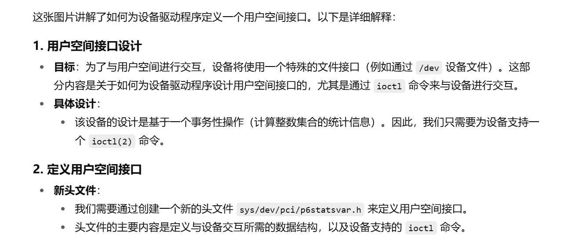


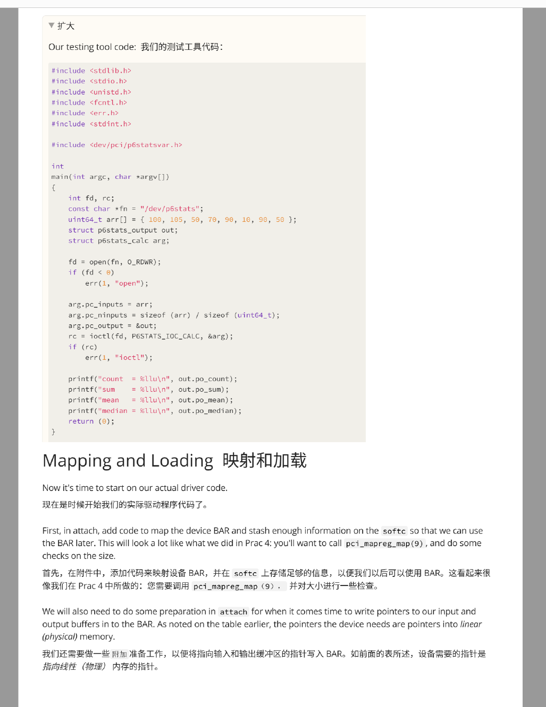


这张图片继续讲解如何实现 OpenBSD 中设备驱动程序的 `ioctl` 功能，特别是如何处理 `ioctl` 命令以及与用户空间的交互。以下是详细的解释：

### 1. **实现 `ps6statsioctl()`**

- **实现 `ps6statsopen()` 和 `ps6statsclose()` 后，继续实现 `ps6statsioctl()`**：
  - 这部分代码是实现设备与用户空间交互的关键。通过 `ps6statsioctl()` 函数，驱动程序能够响应来自用户空间的 `ioctl` 请求。

### 2. **支持的 `ioctl` 命令**

- **支持的 `ioctl` 命令**：
  - 该驱动程序将只支持 `P6STATS_IOC_CALC` 命令，因此如果 `cmd` 中的命令与该命令不符，应该返回 `ENXIO` 错误。
- **命令返回早期错误**：
  - 如果 `cmd` 不是 `P6STATS_IOC_CALC`，则需要尽早返回 `ENXIO` 错误。

### 3. **数据参数转换**

- **转换数据参数为 `struct p6stats_calc \*`**：
  - 将 `data` 参数转换为 `struct p6stats_calc *` 类型，以便可以直接读取数据字段。 `struct p6stats_calc` 是我们在之前定义的数据结构，用来传递用户空间请求的参数。

### 4. **内存映射与数据传输**

- **使用 `bus_dmamap_load_uio()`**：
  - 为了实现从用户空间到内核空间的内存传输，我们将使用 `bus_dmamap_load_uio()` 函数。这是内核与用户空间内存交互的常用方法，特别是当我们需要从用户空间获取数据时。

### 5. **创建 `struct uio` 结构体**

- **创建 `struct uio` 结构体**：
  - 需要构建一个 `struct uio` 结构体，表示用户空间的 I/O 请求。`struct uio` 在 `read()` 或 `write()` 操作中起到关键作用，用于管理内存映射以及数据传输。
- **结构体字段**：
  - `uio_iov`: 指向 `iovec` 的指针，表示数据缓冲区。
  - `uio_iovcnt`: 设置为 1，因为我们只有一个 `iovec`。
  - `uio_resid`: 与 `iov_len` 相同，表示剩余数据的字节数。
  - `uio_rw`: 对于输入使用 `UIO_WRITE`，对于输出使用 `UIO_READ`，区分了读写操作。
  - `uio_proc`: 该字段指向当前进程的结构体 `proc`，表示发起请求的进程。

### 6. **简化解释：**

- **目标**：为了实现设备与用户空间的交互，`ioctl` 命令通过 `ps6statsioctl()` 函数处理。具体来说：
  - 首先，检查命令是否正确（即是否为 `P6STATS_IOC_CALC`）。
  - 然后，使用 `bus_dmamap_load_uio()` 函数将用户空间数据映射到内核空间，以便进行计算。
  - 最后，构建 `struct uio` 结构体，设置相关字段，确保数据能够正确地从用户空间传输到内核，并执行所需的计算。

### 7. **总结**

- 这部分讲解了如何处理用户空间通过 `ioctl` 发出的请求，如何使用 `struct uio` 和内存映射技术确保数据能够正确传输。
- 通过正确使用 `struct uio` 结构体，我们能够在内核和用户空间之间传递数据，并执行计算等任务。

如果您对某个部分有疑问，或者需要更详细的代码实现，随时告诉我！


这段内容主要讨论了如何实现设备的 DMA（直接内存访问）和中断处理。这两者在硬件设备驱动中非常重要，帮助设备和主机之间高效地传输数据，同时管理设备的中断请求。以下是详细解释：

### DMA（直接内存访问）处理

1. **DMA 写入操作**：
   - 在驱动程序中，`bus_dmamap_load_uio()` 被用来处理 DMA 写入操作。这里的 `bus_dmamap_load_uio()` 会将数据从主机传输到设备。这是 DMA 写入的第一步，将输入数据从用户空间传递到内核的设备缓冲区。DMA 写入操作是由主机发起的，设备不需要直接参与。
2. **构建输出缓冲区**：
   - 类似地，输出缓冲区的设置也需要通过 `bus_dmamap_load_uio()` 来完成，不过这次的操作是用于读取操作（使用 `BUS_DMA_READ`）。设备通过这个过程将数据写入缓冲区，主机从设备读取数据。
3. **内存同步**：
   - 在数据传输过程中，必须保证主机和设备之间的内存访问顺序是正确的。使用 `bus_dmamap_sync()` 来确保缓冲区的内容在主机和设备之间同步，避免读取或写入时出现不一致的情况。
   - `bus_dmamap_sync()` 会确保数据在传输前的内存内容是同步的，并且避免设备访问已经被修改的数据。
4. **准备 DMA 缓冲区**：
   - 使用 `bus_dmamap_t` 来映射设备的内存区域。这是通过 `bus_dmamap_load()` 来设置 DMA 的输入和输出缓冲区。这一步会确保设备在读取和写入数据时能够使用正确的内存地址。
5. **内存屏障**：
   - 通过 `bus_dmamap_sync()` 进行内存同步，确保数据传输正确完成。并使用 `BUS_DMA_SYNCPOSTREAD` 和 `BUS_DMA_SYNCPOSTWRITE` 来标记数据传输已经结束。

### 中断处理

1. **配置设备中断**：
   - 在 `attach` 函数中，我们需要设置设备的中断，并注册中断处理函数。`pci_intr_map_msix()` 被用来进行中断映射，`pci_intr_establish()` 用来设定中断的优先级以及中断服务程序。
   - 通过这些函数，驱动程序可以告诉操作系统设备在发生中断时应该如何响应。
2. **中断向量和优先级设置**：
   - `pci_intr_map_msix()` 用于分配设备的中断向量。设备的中断向量在系统中是唯一的，这个中断向量会被映射到特定的中断处理程序。
   - 中断优先级（也叫 IPL，Interrupt Priority Level）决定了设备中断的处理优先级。高优先级的中断会先于低优先级的中断被处理。
3. **中断处理函数**：
   - 在设备中断发生时，系统会调用定义的中断处理函数。这个函数通常是静态的，例如 `static int p6stats_intr(void *arg)`。当设备发生中断时，处理函数会被触发，用于处理设备发出的中断请求。

### 总结

- **DMA**：直接内存访问技术帮助设备与主机之间高效地交换数据，不需要主机的中介参与。通过 DMA，数据可以直接从主机内存传输到设备内存，反之亦然。
- **中断处理**：设备通过中断机制通知主机处理特定事件，而不需要持续占用 CPU 资源。通过中断处理，操作系统可以在事件发生时自动响应，避免轮询浪费资源。

这两者的结合提高了硬件和软件之间的互动效率，特别是在实时操作系统和高性能应用中。


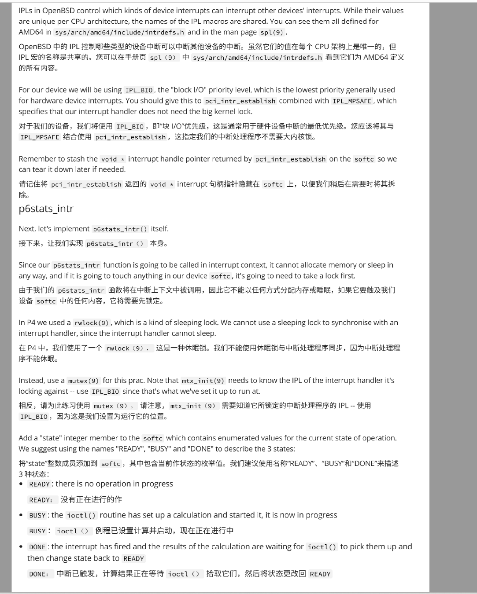

这段内容详细描述了如何在 OpenBSD 中为设备驱动实现中断处理机制，并讲解了如何使用 `IPL`（Interrupt Priority Levels，中断优先级等级）来管理设备间的中断优先级。此外，还讲述了如何为设备驱动实现中断处理程序 `p6stats_intr()`，并且提到了使用 `mutex` 来进行中断保护。具体内容如下：

### 1. **IPL（中断优先级等级）**：

- **IPL 在 OpenBSD 中的作用**：在 OpenBSD 中，IPL 值用于控制哪些中断可以打断其他设备的中断。每个 CPU 都有自己的中断优先级（IPL），这些优先级会决定中断的响应顺序。例如，当一个设备的中断触发时，较高优先级的中断会先处理，较低优先级的中断可能会被延迟。
- **对于本设备驱动的配置**：在本设备的处理中，选择使用 `IPL_BIO`，这是最低的优先级，通常用于硬件设备的中断。该优先级用于处理与设备输入输出（I/O）相关的中断。
- **设置 PCI 中断处理器**：使用 `pci_intr_establish()` 函数来注册中断处理程序，并结合 `IPL_MPSAFE` 来表示我们的中断处理程序不需要获得内核的主锁（不需要执行内核级的同步）。
- **移除中断处理程序**：要注意的是，需要在 `pci_intr_establish()` 返回的 `void *` 中断句柄被保存后，确保在设备移除时使用 `pci_intr_disestablish()` 来正确拆除中断处理程序。

### 2. **`p6stats_intr()` 中断处理程序**：

- 该函数是中断处理程序，要求它在中断上下文中调用。由于它在中断上下文中执行，它不能分配内存或者进行任何会导致睡眠的操作。因此，它必须首先检查设备是否准备好，可以进行处理。为了确保这一点，设备需要使用 `softc` 来管理设备的状态。

### 3. **互斥锁 `mutex` 的使用**：

- **使用 `mutex` 代替 `rwlock`**：在之前的代码中，我们使用了 `rwlock()`（读写锁）。但是在中断处理程序中，我们不能使用休眠锁来同步操作，因此改用了 `mutex` 来代替，这样可以保证中断上下文中的同步工作。`mutex_init()` 函数需要传递 `IPL_BIO` 参数，这是因为我们需要确保互斥锁与中断处理程序的 IPL（中断优先级等级）一致。
- **为何使用 `mutex`**：`mutex` 用来避免在中断上下文中对设备资源的竞态访问。它可以有效地防止多次中断触发时导致的资源冲突。

### 4. **设备状态的管理**：

- **设备状态管理**：为了跟踪设备的当前操作状态，建议使用一个名为 `state` 的成员来表示设备的状态。该状态将包含以下三个值：
  - **READY**：没有操作在进行（即没有正在处理的任务）。
  - **BUSY**：设备当前正在进行计算操作（例如，执行 `ioctl()`）。
  - **DONE**：设备完成了计算，结果等待 `ioctl()` 调用来取回，然后状态会变回 `READY`。

这个状态管理机制帮助设备驱动更好地管理设备的操作流程，确保每个任务的状态都能正确跟踪。

### 总结：

这段内容讨论了如何使用 OpenBSD 中的中断处理机制，结合合适的 IPL 值来确保设备中断的高效处理，同时避免在中断上下文中进行耗时操作。通过合理使用 `mutex` 来保证设备资源的同步，确保在处理中断时不会引发竞争条件。状态管理的引入进一步优化了设备的操作流程，确保设备任务的顺利进行。


这张图片继续讲解如何在 OpenBSD 中完成设备驱动程序的实现，并进行测试。以下是详细解释：

### 1. **设置设备状态**

- **在 `ps6stats_intr()` 中设置设备状态**：
  - 在 `ps6stats_intr()` 中设置适当的设备状态。例如，设置设备状态为 `READY`，表示驱动程序已经准备好执行任务。
  - 为了确保多个进程可以安全地操作，需要使用互斥锁（mutex）进行同步。
  - 使用 `msleep(9)` 来挂起设备，等待任务完成。
  - 使用 `wakeup(9)` 来唤醒设备，使设备恢复工作。

### 2. **修改代码以控制设备状态**

- **在 `ps6statsioctl()` 中设置 `ps6stats_intr()` 的状态**：
  - 当调用 `ps6statsioctl()` 时，要进入 `ps6stats_intr()` 并修改状态。等待计算完成后，使用 `msleep(9)` 来挂起设备，并使用 `wakeup(9)` 唤醒设备，确保设备处于正确的同步状态。
- **处理设备状态为 `READY`**：
  - 在 `ps6statsioctl()` 中，确保在完成所有计算操作后，设备状态被正确地设置为 `READY`。这一步确保设备可以开始新一轮的计算。

### 3. **实现互斥锁和等待**

- **使用互斥锁（mutex）**：
  - 在 `ps6stats_intr()` 中，确保使用互斥锁来防止多个进程同时访问设备，造成冲突或不一致的状态。
- **调用 `wakeup(9)`**：
  - 当设备的状态发生变化并准备好后，需要调用 `wakeup(9)` 来通知等待的进程设备已经准备好进行新任务。

### 4. **测试设备**

- **创建设备文件**：

  - 使用 `mknod` 命令为设备创建节点，并确保设备的主编号为 102 和次编号为 0，且权限为 `crw-rw-rw-`，确保用户有足够的权限访问设备。

  示例命令：

  ```bash
  $ doas mknod /dev/p6stats c 102 0
  $ doas chmod 666 /dev/p6stats
  $ ls -la /dev/p6stats
  ```

  该命令的作用是确保设备文件创建正确，并且具有合适的权限。

- **运行测试程序**：

  - 如果设备文件创建成功，并且权限设置正确，可以运行简单的测试程序来验证设备是否可以正常工作。

  测试程序代码将会尝试通过打开 `/dev/p6stats` 设备文件，调用 `ioctl` 等操作，确认设备是否按预期工作。

### 5. **总结**

- **设备状态管理**：
  - 在设备驱动程序中，设备的状态需要合理管理，确保在执行不同任务时，设备的状态是同步的，多个进程不会同时访问设备，防止竞争条件。
- **设备测试**：
  - 在完成驱动程序实现后，首先要确保设备节点正确创建，并且设备具有适当的权限。
  - 之后，运行简单的测试程序，确保设备能够正确响应 `ioctl` 请求。
- **准备好进行测试**：
  - 最后，确保设备文件创建无误并已安装好驱动程序，然后运行相应的测试代码，确保所有功能正常工作。

如果您有任何问题，或需要进一步的帮助，随时告诉我！


这张图片讲解了如何在 OpenBSD 中使用物理连续缓冲区（Physical Contiguous Buffers）来解决内存分配的问题，特别是通过 `bus_dmamap_load_uio()` 函数进行 DMA（直接内存访问）操作时遇到的 `EBFSG` 错误。以下是详细的解释：

### 1. **问题背景**

- **为什么 `bus_dmamap_load_uio()` 返回 `EBFSG` 错误？**
  - 在上一个步骤中，当你添加了足够多的内存页或分配特定的内存时，`bus_dmamap_load_uio()` 返回了 `EBFSG` 错误。这个错误是因为，即使一个整数数组看起来像一个连续的内存块，实际上它可能并不在物理内存中是连续的。内存分配可能已经被系统碎片化，导致内存不连续。
  - **原因**：
    
    - 操作系统在启动后，物理内存通常是碎片化的，内存页之间可能不连续。内核在给用户空间分配内存时，通常会要求 4 页内存，而这几页内存可能并不在物理内存中是连续的。
    
    - > DMA（直接内存访问）需要使用物理连续的内存块（Physical Contiguous Buffers）来进行数据传输的原因，主要与硬件和内存访问的特性有关。以下是一些关键原因，解释为什么 DMA 需要物理连续的内存块：
      >
      > ### 1. **硬件访问限制**
      >
      > - **DMA 控制器的要求**：很多 DMA 控制器（尤其是老式的或低端的硬件）只能处理物理内存中的连续块。当 DMA 控制器传输数据时，它必须能够一次性将数据从源地址传输到目标地址。对于非连续的内存块，DMA 控制器可能无法正确访问多个不连续的内存区域。
      > - **效率问题**：DMA 控制器通常是通过一次内存访问（一次传输操作）来读取和写入数据的。通过非连续的内存区域进行 DMA 传输，需要多次的地址转换和分段操作，这会大大降低传输效率，并且增加了对 DMA 控制器的额外负担。
      >
      > ### 2. **地址映射与内存管理**
      >
      > - **映射复杂性**：对于不连续的内存区域，每个内存块的地址可能需要不同的转换或者多个映射。而对于连续的物理内存区域，操作系统可以直接为 DMA 控制器提供一个简单的线性地址空间，这使得 DMA 更容易进行地址映射。
      > - **缓存一致性**：连续的内存区域有助于避免缓存一致性问题，尤其是在现代硬件架构中，DMA 操作涉及到内存与设备之间的数据交换。非连续的内存区域可能会导致缓存一致性问题，从而影响传输的正确性。
      >
      > ### 3. **性能优化**
      >
      > - **减少内存碎片**：DMA 通常需要高速传输大量数据，因此内存的连续性可以有效减少碎片问题。使用连续的内存块能够减少内存管理过程中可能的延迟。
      > - **DMA 性能**：当数据存储在连续的物理内存块中时，内存访问的局部性更好，系统可以更高效地使用缓存和预取机制，进而提高数据传输的速度。
      >
      > ### 4. **与 `bus_dmamap_load_uio()` 函数的关系**
      >
      > - **`bus_dmamap_load_uio()` 函数**：该函数用于加载一个用户空间的 I/O 操作映射，目的是将内存地址与设备的 DMA 映射关联起来。在这个过程中，物理连续的内存块有助于确保映射过程的高效性和稳定性。如果传递给该函数的是非连续的内存块，DMA 控制器可能无法正确完成内存映射，从而导致错误（如 `EBFSG` 错误）。
      > - **`EBFSG` 错误**：这个错误通常表示物理内存无法满足 DMA 操作对连续内存块的需求，或者系统无法在物理内存中找到足够连续的空间来满足请求。这可能会在通过 `bus_dmamap_load_uio()` 或类似函数进行 DMA 操作时发生。
      >
      > ### 5. **如何解决这个问题**
      >
      > - **使用物理连续缓冲区**：为了避免 `EBFSG` 错误，通常建议使用物理连续的内存缓冲区。这可以通过以下方式解决：
      >   1. 在操作系统中使用 **物理连续内存分配**（例如，通过 `bus_dmamap_alloc()` 或类似方法）。
      >   2. 使用内存池或大块的内存分配，确保内存是连续的，满足 DMA 控制器的需求。
      >   3. 如果系统不支持大块的连续内存分配，可以使用 **分页方式**，并通过 DMA 控制器支持的 **分段传输** 或 **scatter-gather DMA** 技术来弥补内存的不连续性。
      >
      > ### **总结**
      >
      > DMA 需要物理连续的内存块，主要是为了简化硬件地址映射、优化传输性能，并避免内存管理中的复杂性。当使用 `bus_dmamap_load_uio()` 或类似函数进行 DMA 操作时，如果内存块不连续，可能会导致无法正确映射内存，进而触发错误（如 `EBFSG` 错误）。因此，通过确保物理连续缓冲区的使用，可以避免此类问题，提高 DMA 操作的效率和稳定性。

### 2. **Bounce Buffers（退回缓冲区）**

- **解决方案：Bounce Buffer（退回缓冲区）**
  - 一个常见的解决方案是使用 **bounce buffer**，即分配一个物理连续的缓冲区，由硬件使用。数据会被从用户空间拷贝到缓冲区，然后将物理地址传递给硬件使用。
  - **具体步骤**：
    - 使用 `bus_dmamem_alloc()` 函数为设备预分配连续的物理内存，并将数据从用户空间复制到缓冲区，再将其传递给硬件使用。

### 3. **`bus_dmamem_alloc()` 函数**

- **功能**：
  - `bus_dmamem_alloc()` 函数用于内核中预分配与 DMA 范围匹配的连续内存页。
  - 该函数会分配一定数量的连续内存页，且这些内存页将与 DMA 操作兼容。
  - 分配的内存必须满足硬件对 DMA 的要求，若无法满足要求，则 DMA 操作无法进行。
- **使用方法**：
  - 使用 `bus_dmamem_alloc()` 分配内存并使用 `bus_dmamap_map()` 和 `bus_dmamap_load_raw()` 将数据映射到预分配的内存区域。
  - `bus_dmamap_load_uio()` 不能直接用于通过 `bus_dmamem_alloc()` 分配的内存，需要通过合适的映射和加载机制来进行数据的处理。

### 4. **`bus_dmamem_alloc()` 与 `struct bus_dma_segment_t`**

- **`struct bus_dma_segment_t` 结构体**：
  - `bus_dmamem_alloc()` 返回的内存地址会存储在 `struct bus_dma_segment_t` 结构体中。通过这些结构体，我们可以将内存区域映射到硬件的 DMA 地址。
  - 这些返回的内存段只能使用 `bus_dmamap_map()` 和 `bus_dmamap_load_raw()` 来加载，而不能直接用于 `bus_dmamap_load_uio()`。

### 5. **获取虚拟地址**

- **获取虚拟地址**：
  - 要获取从 `bus_dmamem_alloc()` 返回的物理内存对应的虚拟地址，可以使用 `cardr_t` 类型并将其转换为可以读写的指针，从而允许内核访问该内存。

### 6. **总结**

- 这部分内容介绍了如何使用 **bounce buffer** 来解决内存不连续问题，确保数据能以连续的方式传输到硬件中。
- 通过 `bus_dmamem_alloc()` 函数来分配连续的内存，并通过其他 DMA 相关函数来映射和加载内存，这使得硬件能够正确访问数据。

这为解决 `bus_dmamap_load_uio()` 中的内存不连续问题提供了一个有效的解决方案。如果你有任何问题，或者想了解更多细节，请随时告诉我！


这段内容描述了如何处理设备驱动中的 DMA 操作和数据缓冲区，特别是在处理较大的数据缓冲区时，如何使用 `scatter-gather DMA` 技术来提高设备的效率。

### 1. **DMA 处理**：

- 在设备准备好进行 DMA 操作时，我们使用 `bus_dmamap_load_raw()` 函数来加载内存到 `bus_dmamap_t` 中，以进行 DMA 操作，而不是使用 `bus_dmamap_load()`。这种方式可以提高效率，因为它避免了不必要的内存操作，直接为 DMA 准备数据。
- **测试和错误处理**：我们在代码中加入了处理 `EFBIG` 错误的逻辑，通过分配一个“回跳缓冲区”（bounce buffer）并将数据复制到该缓冲区，从而避免了内存不足的错误。然后，我们继续进行 DMA 操作。
- **错误修复**：接着我们对以前的错误测试用例进行测试，检查修复是否有效，并探索如何在 `bus_dmamap_alloc()` 调用前进行更多修复。这个过程帮助我们发现 DMA 配置中潜在的问题。

### 2. **更多的修复**：

- 在这段内容的后半部分，提到了一些更深入的修复。如果我们希望 P6 设备能够处理更大的数据缓冲区（即需要多个缓冲区而不是一个），我们需要修改驱动以支持更大数据的 DMA 操作。
- **`scatter-gather DMA` 技术**：当设备需要处理多个数据块时（如多个 `(pointer, length)` 元组），我们可以使用 `scatter-gather DMA` 技术。该技术将多个数据块视为一个大的缓冲区，允许 DMA 操作时按顺序处理多个内存区域。它非常适用于需要处理大量数据的设备。

### 3. **总结与实践**：

- **实践中的应用**：在接下来的作业（A2）中，您将看到一个设备示例，该设备广泛使用 `scatter-gather DMA` 技术。这将展示如何在实际应用中处理更大、更复杂的 DMA 数据传输。

### 4. **如何使用 `scatter-gather DMA`**：

- 设备在写数据时使用 `scatter DMA`，当设备读取数据时使用 `gather DMA`。这两种方式在支持 DMA 的设备中非常常见。`scatter DMA` 允许将数据分散到多个内存位置进行写入，而 `gather DMA` 则允许设备将数据从多个位置收集到一个缓冲区进行读取。

总之，这段内容讲解了如何通过 DMA 操作处理较大的数据缓冲区，并介绍了 `scatter-gather DMA` 技术，以提高设备的性能和效率。它还提到了如何进行错误处理以及如何在驱动程序中管理 DMA 配置。


第三个PPT


这张图片讲解了如何在 OpenBSD 中使用非阻塞 I/O 来提高程序的效率，特别是在设备驱动中。以下是详细解释：

### 1. **引入非阻塞 I/O（Non-blocking I/O）**

- **阻塞 I/O**：在传统的阻塞 I/O 模式下，当用户请求数据时，例如调用 `read()` 或 `write()`，程序会被挂起，直到 I/O 操作完成。以网络套接字为例，程序可能会等待网络数据到达，这时程序就会暂停，直到操作完成。
- **非阻塞 I/O**：在实际应用中，进程可以在等待 I/O 时执行其他工作。为此，可以使用非阻塞 I/O。当文件描述符以 `O_NONBLOCK` 标志打开时，I/O 操作会立即返回。如果设备当前没有准备好，`read()` 会返回错误代码（例如：`EAGAIN`），`write()` 会返回 `EBUSY` 错误。
  - **`EAGAIN` 错误**：表示读取的数据尚未准备好，程序可以稍后再试。
  - **`EBUSY` 错误**：表示写入的设备忙，程序可以稍后再试。
- **优势**：
  - 非阻塞 I/O 允许程序继续执行其他任务，无需在 I/O 操作完成之前停滞。
  - 程序可以使用 `select()` 或 `poll()` 等机制来检查何时可以继续进行 I/O 操作。

### 2. **如何在驱动程序中实现非阻塞 I/O**

- **实现非阻塞 I/O**：
  - 在 `ioctl()` 系统调用中，可以实现非阻塞 I/O 行为。例如，可以检查文件描述符是否带有 `O_NONBLOCK` 标志。
  - 对于 `read()` 操作，如果数据尚未准备好，返回 `EAGAIN`；对于 `write()` 操作，如果设备忙，返回 `EBUSY`。

### 3. **使用事件机制**

- **事件机制**：
  - 用户程序可以通过事件机制来检查设备是否已准备好执行某些操作。
  - 事件机制允许程序通过轮询或等待系统通知，得知何时可以继续进行 I/O 操作。
- **例如**：使用 `select()` 或 `kqueue()` 系统调用，用户程序可以等待直到 I/O 操作可以继续进行。

### 4. **修改代码实现**

- **任务**：
  - 对于这次实验，任务是将 `ps6statsioctl()` 中的代码拆分为两个单独的 `read` 和 `write` 操作，并实现非阻塞 I/O。
  - 您需要实现一个事件系统，使得用户程序可以通过事件来检查设备是否准备好。

### 5. **Boilerplate（模板）**

- **使用模板**：
  - 如果您不想从头开始编写代码，可以使用一个模板来实现这一部分功能。您可以选择从分支 `p7` 开始，下载并应用该补丁，或者从头开始编写自己的驱动代码。

### 6. **创建分支并下载模板**

- **创建新的分支**：

  - 您可以创建一个新的分支来实现实验，或者使用示例代码的解决方案创建新分支。下载补丁并应用：

    ```bash
    $ git checkout -b p7 openbsd-7.7
    $ ftp https://sltuc.manta.uqcloud.net/comp3301/public/p7-base-patch.patch
    $ git am < p7-base-patch.patch
    $ git rm p7-base-patch.patch
    ```

### 7. **总结**

- **非阻塞 I/O** 的实现允许进程在等待 I/O 操作完成时，继续执行其他任务。通过使用事件机制，用户程序可以在不阻塞的情况下检查设备是否准备好。
- 在本次实验中，您将通过修改驱动代码实现非阻塞 I/O，处理设备的 `read` 和 `write` 操作。

如果您有更多问题或对某个步骤不清楚，请告诉我！


这段内容描述了如何在设备驱动中添加 `read()` 和 `write()` 系统调用的入口点，进一步将之前使用的 `ioctl()` 命令分拆为独立的读取和写入操作。具体细节如下：

### 1. **背景介绍**：

- **问题的背景**：之前，在第6部分的实验中，我们使用 `ioctl()` 来获取设备的状态信息。设备会在获取状态时休眠，直到设备完成计算再唤醒。在这个过程中，设备的 `ioctl()` 调用需要等待直到设备准备好输出数据。
- **目标**：我们希望将 `read()` 和 `write()` 操作分离出来，因为现在需要设备能在 `read()` 和 `write()` 调用时处理相应的输入和输出。这将允许设备在不阻塞其他操作的情况下处理这些请求。

### 2. **步骤一：添加新的入口点**：

- **更新设备驱动**：首先，我们需要更新驱动程序，以便它能够同时处理 `read()` 和 `write()` 操作，分别处理设备的数据读取和写入任务。设备驱动将根据操作类型来调用不同的函数。
- **如何实现**：首先，添加新的入口点，更新设备的 `read` 和 `write` 函数。如果设备不支持这些操作，我们将返回一个 `ENODEV` 错误，表示设备不支持读写操作。

### 3. **修改 `conf.h` 文件**：

- **设备配置**：我们需要在 `sys/conf.h` 文件中进行适当的修改，确保设备的 `open`、`close`、`ioctl`、`read` 和 `write` 操作都能被正确地定义并关联到设备驱动的相应函数。
- **如何修改**：从第5部分开始，我们已经为设备（如 p6stats）定义了相关的操作。如果在 `conf.h` 文件中没有为设备设置 `read` 和 `write`，我们需要在文件中添加这些定义。

### 4. **新的 `read` 和 `write` 定义**：

- 现在，设备驱动需要在 `sys/conf.h` 文件中为 `read` 和 `write` 函数创建入口点，像下面的示例一样：

  ```c
  /* open, close, read, write, ioctl, kqfilter */
  #define dev_uinput_init(c,n) { \
      dev_init(c,n,open), dev_init(c,n,close), dev_init(c,uhid,read), \
      dev_init(c,uhid,write), dev_init(c,joystick,read), \
      dev_init(c,joystick,write), dev_init(c,uhid,kqfilter) \
  }
  ```

### 5. **更进一步的实现**：

- 该段内容还提到，接下来我们需要实现 `kqfilter()`（用于处理设备的事件过滤器），并在 refactor 时将其与 `read()` 和 `write()` 一起实现。最初的实现会很简单，但随着代码的重构，我们将逐渐改进它的结构。

### 6. **总结**：

- 本段内容的核心是将之前集中在 `ioctl()` 中的设备操作功能拆分为独立的 `read()` 和 `write()` 操作。这将使设备驱动程序更加模块化，能够分别处理设备的输入输出请求，避免了将所有功能都放在 `ioctl()` 中的冗余。
- 同时，设备驱动的入口点将与设备类型关联，这样可以通过 `sys/conf.h` 文件对每个设备的操作进行适配，确保 `read`、`write`、`ioctl` 等操作能够正确调用。

简而言之，这段内容描述了如何根据设备的功能要求，在驱动中为设备添加新的入口点，并将之前的 `ioctl()` 操作分拆成更明确的读写操作。


这段文字看起来是与Linux内核模块编程有关的代码文档或教程，内容主要涉及创建字符设备驱动程序中的函数存根（stub）。

以下是详细解释：

1. **代码定义（驱动程序初始化）：**
   - 代码中定义了宏，用于初始化设备的各个操作函数，比如打开、关闭、读取、写入、执行I/O控制（`ioctl`）和处理`kfilter`等。
   - 这些函数是占位符（"存根"），意味着你需要在这些位置添加实际的功能代码。
2. **入口点解释：**
   - 文中提到，设备驱动程序的入口点将命名为 `p6statsxxx`（这是一个占位符名称）。这表示像打开、关闭、读取、写入等操作函数将会按照 `p6statsxxx` 格式命名。
3. **添加函数存根：**
   - 文中建议向驱动程序中添加函数存根，意味着你需要定义这些操作的函数签名，比如 `read`、`write`、`ioctl` 等。
   - 存根函数目前并未实现实际功能，它们仅仅返回 `ENODEV` 错误码，表示设备不可用或者操作没有实现。
4. **函数存根的代码示例：**
   - 例如，`p6statswrite`、`p6statsread` 和 `p6statskfiler` 这些函数存根示例，当前实现只是简单返回 `ENODEV`，表示设备不可用或该操作未实现。

总结来说，这部分内容帮助你搭建了驱动程序的基本结构，定义了所需的函数，但是并没有实现具体的功能。目标是确保驱动程序能够编译通过，之后可以根据需要扩展这些函数，处理实际的设备操作。


这张图片讲解了如何在 OpenBSD 中实现设备驱动程序中的 **read** 和 **write** 操作，特别是在使用 DMA（直接内存访问）时如何处理用户空间与内核空间之间的数据传输。以下是详细的解释：

### 1. **重新编译内核**

- 在这部分，作者提醒用户重新编译内核。由于更新了 `conf.h` 文件，需要重新配置并编译内核。

  **命令**：

  - 配置内核：

    ```bash
    $ cd /usr/src/sys/arch/amd64
    $ config GENERIC.MP
    ```

  - 编译内核：

    ```bash
    $ cd /usr/src/sys/arch/amd64/compile/GENERIC.MP
    $ make
    $ doas make install
    ```

  - 重启系统以应用新内核：

    ```bash
    $ doas reboot
    ```

  **解释**：配置和编译新的内核是为了让更新后的设备驱动代码能够在系统中生效。需要重新配置内核来使 `GENERIC.MP` 内核配置生效。

### 2. **实现 `read` 和 `write` 操作**

- **拆分功能**：在驱动程序中，我们要将 `read` 和 `write` 操作的功能拆分成不同的入口点。这是为了让驱动更好地管理输入输出操作。
- **写操作 (`write`)**：
  - 用户空间提供一个包含 `uint64_t` 数组的缓冲区。驱动程序首先会验证这个缓冲区的大小，确保它是 `uint64_t` 的倍数，并且输入数据的总数不超过最大允许值 `PC_RQ_COUNT_MAX`。
  - 如果设备当前处于忙碌状态，驱动程序应该使进程进入睡眠状态，直到设备准备好。
  - **DMA 操作**：一旦设备准备好，驱动程序将数据从用户空间缓冲区复制到内核空间的缓冲区，并且分配相应的 DMA 缓冲区来执行数据的传输。
- **设备准备工作**：
  - 在 DMA 传输之前，驱动程序需要对设备的相关寄存器进行编程，以便设备能够执行计算并准备好进行数据传输。

### 3. **处理 DMA 错误**

- 在处理 `read` 和 `write` 操作时，设备驱动程序必须处理各种错误情况，例如：

  - **EINVAL**：输入缓冲区无效。
  - **ENXIO**：请求的设备不可用或无效的 I/O 操作。
  - **ENOMEM**：内存不足，无法分配所需的缓冲区。
  - **EIO**：DMA 操作或映射失败。

  **DMA 错误处理**：

  - 当 DMA 操作失败时，驱动程序需要执行适当的错误处理，例如释放资源，通知用户发生了错误等。

### 4. **总结**

- **`read` 和 `write` 操作**：驱动程序需要通过 `read` 和 `write` 操作来管理用户空间与内核空间之间的数据传输。对于大块数据的传输，使用 DMA 来提高效率。
- **DMA 操作**：DMA 用于从用户空间复制数据到内核空间，或者将数据从内核空间传输到设备。必须确保内存连续性，以便 DMA 操作能够成功执行。
- **错误处理**：驱动程序需要处理可能出现的各种错误，确保设备能够可靠地与用户空间交互。

如果你对某个细节有疑问，或者需要更多帮助来理解具体的实现步骤，请告诉我！


这段内容详细描述了如何在设备驱动中实现 `read()` 操作，以及如何使用 DMA（直接内存访问）在用户空间和设备之间传递数据。具体内容如下：

### 1. **`read()` 操作的实现**：

- **反向读取**：在设备驱动中，`read()` 操作的实现是相反的。设备将数据传输到用户空间，这需要在用户提供的缓冲区（比如 `p6stats_output` 结构）中复制数据。

- **结构定义**：用户提供一个足够大的缓冲区来存储从设备读取的数据，缓冲区定义如下：

  ```c
  struct p6stats_output {
      uint32_t po_count;
      uint32_t po_sum;
      uint32_t po_mean;
      uint32_t po_median;
      uint32_t po_rsvd[8];
  };
  ```

- **同步 DMA 操作**：在开始读取之前，驱动需要确保设备状态有效，并同步输出 DMA 缓冲区，确保 CPU 可以访问数据。驱动会将结果复制到用户提供的缓冲区中。数据传输后，DMA 映射会被卸载和清理，设备的状态将恢复为 `READY`，允许继续提交新的请求。

### 2. **错误处理**：

在 `read()` 操作中，可能会遇到一些错误情况，必须进行相应的处理。这些错误包括但不限于：

- **`ENOMEM`**：提供的缓冲区不足，表示内存空间不够。
- **`ENOSPC`**：设备没有足够的空间来进行操作。
- **`EIO`**：DMA 相关错误，表示 DMA 操作失败。

### 3. **内存映射和同步**：

- **DMA 缓冲区管理**：需要仔细考虑 DMA 缓冲区的分配方式以及驱动如何保持映射信息。`bus_dmamap` 系列函数将是设置、同步和拆除映射的关键。
- **同步操作**：DMA 操作涉及到内存映射和同步，需要在读取数据时，确保 DMA 操作的正确性，并清理掉不再需要的 DMA 映射。

### 4. **修改驱动的其他部分**：

- **代码重构**：为了实现这些新功能，需要在驱动的其他部分进行一些小的修改。通常，重构需要在多个代码位置添加不同的位，以确保功能的稳定性和一致性。
- **`uios` 和 `uio` 结构**：驱动需要正确使用用户提供的 `uio` 结构，而不是自己创建它。`uio` 结构通常由用户空间提供，并且驱动不需要自行构建它。

### 5. **下一步工作**：

- 在完成了上述功能后，下一步将是更新 `p6stats` 测试程序，基于当前的设备驱动功能进行测试。通过更新测试程序，确保设备驱动能够在实际环境中运行并进行调试。

### 总结：

这段内容的核心在于介绍如何在设备驱动中实现 `read()` 操作，使用 DMA 传输数据，并确保数据正确同步和传递。此外，还提到了如何处理潜在的错误，以及如何管理内存映射和同步，确保设备驱动的稳定性和正确性。


这段文字是关于用户空间程序测试的说明，用于验证您在先前编写的 `p6stats` 驱动程序的功能是否正常工作。

以下是详细解释：

1. **测试目标：**
   - 目标是创建一个用户空间程序，它可以验证您在 `p6stats` 驱动程序中的读写操作是否按预期工作。
   - 该程序需要能够在只读模式、只写模式或默认的读写模式下运行，如果没有显式给出参数，程序应当假设为读写模式。
2. **程序行为：**
   - 在 `p6stats` 驱动程序的测试中，程序的行为应能与驱动程序的接口直接交互。
   - 具体来说，用户程序通过命令行参数来控制其行为，传递 `-r` 或 `-w` 来选择读或写模式，或者 `-rw` 来选择读写模式。程序应接受最多几个命令行参数。
3. **读取和显示数据：**
   - 在读取模式下，程序应从驱动程序中获取数据，并显示结果，例如显示计数、总和、平均值和中位数等统计信息。
   - 输出的结果应该是清晰且易于理解的，能够让用户看到从驱动程序中提取的数据统计信息。
4. **错误处理：**
   - 程序需要能够优雅地处理错误。例如，如果程序在读模式下运行时没有传递明确的标志，或者发生了其他常规的 I/O 错误，程序应该提供适当的错误信息。
5. **命令行示例：**
   - 文中举了几个命令行的示例，展示了如何使用 `p6stats` 测试程序：
     - `./p6stats -r` 表示只读取数据
     - `./p6stats -w` 表示只写入数据
     - `./p6stats -rw` 表示同时读取和写入数据
     - `./p6stats -rw 1 2 3 4 5` 表示传递明确的读写操作并指定参数
6. **使用 `getopt` 处理命令行标志：**
   - 建议使用 `getopt` 来解析命令行参数，以清晰地处理 `-r`、`-w` 等标志。这有助于简化命令行参数的解析工作。
7. **数据传输：**
   - 当读取数据时，程序应将驱动程序返回的数据填充到 `p6stats_output` 中并显示，确保程序能够正确地读取并显示来自设备的数据。

总结来说，这段文字的主要目的是指导您编写一个用户空间程序来测试和验证您的 `p6stats` 驱动程序，确保驱动在不同模式下的功能正常，并且能够正确显示从驱动获取的数据。


这张图片讲解了如何在用户程序和内核驱动中实现非阻塞 I/O 操作，以下是详细的解释：

### 1. **用户程序的解决方案**

- **编译前的准备**：
  - 为了确保程序能够正确编译，您需要将 `P6_RQ_COUNT_MAX` 移动到 `p6statsvar.h` 文件中，并在 `/usr/src/includes` 下运行 `make includes`。
  - 这个步骤确保了程序能够正确地访问 `P6_RQ_COUNT_MAX` 变量并顺利编译。

### 2. **内核驱动中的修改**

- **添加非阻塞 I/O 支持**：
  - 在内核驱动中，修改的目标是支持非阻塞 I/O 操作。通过设置文件描述符的 `O_NONBLOCK` 标志来实现。
- **非阻塞 I/O**：
  - **`O_NONBLOCK` 标志**：当在打开文件描述符时指定 `O_NONBLOCK` 标志时，所有后续的 `read()` 和 `write()` 调用都会自动变成非阻塞的。
  - 在内核中，这个标志被传递到驱动程序的入口点（如 `d_read` 和 `d_write`）。驱动程序需要检查设备的准备状态，决定是否阻塞进程，或者在设备尚未准备好时立即返回。

### 3. **非阻塞 `read` 和 `write` 操作**

- **用户程序角度**：
  - 在用户程序角度，如果设备数据尚未准备好，`read()` 或 `write()` 将立即返回一个错误（例如，`EBUSY`），而不是阻塞进程等待。
- **内核中处理**：
  - 在内核中，驱动程序通过检查设备是否准备好（例如设备是否有数据可读或是否可以写入），决定是否阻塞进程。如果设备不准备好，则 `read()` 或 `write()` 会立即返回，带有适当的错误代码，如 `EBUSY`。

### 4. **非阻塞写操作（Non-Blocking Write）**

- **设置 `O_NONBLOCK` 标志**：
  - 对于非阻塞的写操作，驱动程序必须检查设备的状态。如果设备忙碌，`write()` 操作将立即返回 `EBUSY`，并且不会阻塞进程等待设备准备好。
- **如何处理设备阻塞**：
  - 在非阻塞模式下，驱动程序不能让进程在设备处于准备状态时阻塞。它必须立即返回并告知进程设备当前不可用。

### 5. **总结**

- **非阻塞 I/O** 使得用户程序可以继续执行，而不必在等待 I/O 操作完成时被阻塞。通过 `O_NONBLOCK` 标志，程序可以处理非阻塞的读取和写入请求。
- **内核中的支持**：内核通过检查设备状态来决定是否进行阻塞，如果设备未准备好，操作会立即返回错误代码。

这些修改使得程序可以在设备未准备好时继续执行其他任务，而不是被阻塞在 I/O 操作上。

如果您对非阻塞 I/O 实现有任何疑问或需要更详细的代码示例，请告诉我！


这段内容描述了如何在设备驱动中实现非阻塞读取和写入操作，并使用 `IO_NONBLOCK` 标志来控制设备的阻塞行为。具体内容如下：

### 1. **非阻塞模式的工作原理**：

- **`IO_NDELAY` 标志**：当设备请求使用 `IO_NDELAY` 标志时，驱动程序不应该等待结果完成。即使数据还没有处理完或者没有数据被写入，驱动程序应该立即返回 `EAGAIN` 错误。
- **中断等待和资源保护**：虽然驱动程序允许在需要的情况下使用互斥锁（mutex）来保护共享数据结构，但如果请求非阻塞模式时，驱动程序不应该因等待资源而阻塞太久。非阻塞模式下，一旦请求失败，应该迅速返回 `EAGAIN` 错误。

### 2. **实现非阻塞模式的步骤**：

- **步骤一：修改用户程序**：要求用户在之前的程序中添加 `O_NONBLOCK` 标志。当该标志被设置时，设备驱动应打开设备并执行非阻塞模式下的读取和写入操作。

- **代码示例**：在用户程序中，通过添加 `O_NONBLOCK` 标志来控制是否使用非阻塞模式：

  ```c
  switch (opt) {
      case 'n': nonblock = 1; break;
      default: usage(argv[0]);
  }
  
  if (nonblock)
      flags |= O_NONBLOCK;
  
  fd = open("/dev/p6stats", flags);
  ```

### 3. **修改 `write` 函数**：

- **`write` 函数修改**：驱动的 `write` 函数需要根据是否设置了 `IO_NDELAY` 标志来判断是否进入非阻塞模式。如果设备状态是 `P6_S_DONE`（表示设备已经完成计算），驱动应该继续等待，直到设备准备好。但如果请求是非阻塞模式，驱动应该立刻返回 `EAGAIN` 错误。

- **代码实现**：

  ```c
  if (ISSET(flags, IO_NDELAY)) {
      if (sc->sc_state != P6_S_DONE) {
          error = EBUSY;
          goto unlock;
      }
  } else {
      /* Wait for result */
      while (sc->sc_state != P6_S_DONE) {
          error = msleep(&sc->sc_state, &sc->sc_mtx,
                         PRIBIO | PCATCH, "%wait", INFSLP);
          if (error != 0)
              goto unlock;
      }
  }
  ```

- **说明**：当设置了 `IO_NDELAY` 标志时，`write` 函数不会阻塞，若设备状态不为 `P6_S_DONE`，即设备未完成操作时，函数会返回 `EBUSY` 错误。如果没有设置 `IO_NDELAY` 标志，驱动将等待设备完成工作，然后继续执行。

### 4. **测试**：

- 要测试这个功能，用户程序需要从之前的练习扩展，添加 `O_NONBLOCK` 标志。设备驱动会根据此标志来决定是否在非阻塞模式下进行读取和写入。

### 5. **总结**：

- 该段内容的核心是如何实现非阻塞 I/O 操作，特别是在驱动中使用 `IO_NDELAY` 标志来控制读取和写入操作的阻塞行为。如果设备当前不能立即处理请求，驱动会返回 `EAGAIN` 错误，告知用户重新尝试。通过这种方式，驱动能够在不阻塞其他操作的情况下执行 I/O 操作，适用于要求高实时性和低延迟的应用场景。


这段文字讲解的是在驱动程序中实现非阻塞I/O操作，以及如何使用`kqueue`过滤器和事件机制来支持事件驱动的I/O。

以下是详细解释：

1. **非阻塞I/O和事件驱动I/O：**
   - 文中首先提到，已经实现了非阻塞I/O功能，接下来要为用户程序提供一种方式，使其能够高效地轮询设备的状态，而无需执行读写操作。
   - 该机制还支持事件驱动的I/O，即在设备准备好进行读写时触发事件。具体来说，OpenBSD提供了`kqueue`机制，用于支持这一功能。
2. **kqueue过滤器：**
   - `kqueue`是一种高效的事件通知机制，它允许用户进程检查设备是否准备好进行读写操作，而不需要进行阻塞操作。
   - 这种机制特别适用于需要同时处理多个文件描述符或设备的情况，可以显著提高程序的响应能力。
3. **通过实现kqueue过滤器来提供非阻塞事件驱动I/O：**
   - 文中指出，通过在驱动程序中实现`kqueue`过滤器，可以实现非阻塞的、基于事件的设备访问。通过这种方式，用户程序能够等待设备准备好进行操作，而不需要主动轮询。
4. **关键数据结构：**
   - 实现`kqueue`过滤器依赖于三个关键的结构体：`struct knote`、`struct klist` 和 `struct filterops`。
   - 这些结构体用于管理事件的注册、处理和通知。
5. **`struct knote` 结构：**
   - `struct knote`代表了由用户进程附加的单个事件。当进程调用`kqueue()`时，内核会创建一个`knote`来跟踪事件。
   - 每个`knote`对象代表一个I/O事件，它会在事件发生时被内核触发，用来通知相应的进程。
6. **`struct knote` 中的关键字段：**
   - `knote`结构体中的重要字段将会记录与事件相关的各种信息，这些信息包括事件的类型、状态和处理函数等。具体实现将根据驱动程序的需求来设计。

总结来说，这段内容主要介绍了如何在驱动程序中实现`kqueue`事件过滤器，从而实现非阻塞、事件驱动的I/O操作。通过`kqueue`，用户程序能够高效地等待设备准备好进行读写，避免了传统的阻塞式I/O操作，提高了系统的响应性和效率。


这张图片讲解了 OpenBSD 中 `struct knote` 结构体的重要字段和功能，特别是它在 I/O 事件处理中的作用。以下是详细的解释：

### 1. **`struct knote` 中的关键字段**

`struct knote` 是用于处理 I/O 事件和设备状态的结构体。它的关键字段包括：

- **`kn_filter`**：
  - 该字段决定了 `knote` 跟踪的是哪类事件。例如，`EVFILT_READ` 表示跟踪读取事件，`EVFILT_WRITE` 表示跟踪写入事件。
  - **作用**：确定 `knote` 是否追踪读取或写入操作。
- **`kn_flags`**：
  - 该字段用于控制 `knote` 的行为。例如，`EV_EOF` 表示文件的结束，`EV_ONESHOT` 表示一次性事件。
  - **作用**：控制 `knote` 的标志位，决定它的行为。
- **`kn_hook`**：
  - 指向特定设备的指针，通常指向驱动程序的 `softc` 结构。
  - **作用**：存储与特定设备相关的数据。
- **`kn_fop`**：
  - 指向与 `knote` 相关的过滤操作的指针，通常是一个 `struct filterops` 类型的指针。
  - **作用**：指向过滤操作，以便在 `knote` 中执行特定的处理。
- **`kn_data`**：
  - 由驱动程序设置，表示可以读取或写入的字节数或空间。
  - **作用**：记录可以读取或写入的数据量。
- **`kn_status`**：
  - 内部驱动程序或 `knote` 使用的状态信息，在事件处理中使用。
  - **作用**：存储 `knote` 的状态，帮助管理事件处理。

### 2. **常见事件类型及其含义**

- **`EVFILT_READ`**：
  - 表示设备数据可以读取。`kn_data` 字段表示可以读取的字节数。设备可用数据的大小显示在 `kn_data` 中。
  - **作用**：用于读取操作的事件，`kn_data` 存储设备提供的可读取字节数。
- **`EVFILT_WRITE`**：
  - 表示设备可以接受写入。`kn_data` 表示可以写入的字节数。
  - **作用**：用于写入操作的事件，`kn_data` 存储设备可以接受的字节数。

### 3. **提示参数（Hint Parameter）**

- **`hint` 参数**：

  - `hint` 是一个整数值，由驱动程序通过 `knote(&sc->sc_klist, hint)` 传递，表示发生了某种类型的事件。
  - **作用**：指示驱动程序在事件发生时设置相应的 `knote` 状态。驱动程序可以定义自己的提示，以下是几个示例：
  - `hint = 1`：表示新的数据可以读取。
  - `hint = 2`：表示可以接受写入。
  - `hint = 3`：表示可以发送数据到设备。

  **注意**：`f_event()` 函数接收该 `hint`，并决定是否将 `knote` 标记为准备好处理的状态。

### 4. **作用与意义**

- **触发 `knote`**：
  - `knote` 结构体的功能是跟踪和管理 I/O 事件。当设备准备好时，`knote` 可以通过事件机制唤醒相关的进程或线程。这使得内核能够在设备准备好时通知用户空间，减少阻塞和等待。
- **在事件系统中的角色**：
  - `knote` 作为事件通知的一部分，帮助内核处理 I/O 事件。通过管理 `knote`，内核可以决定何时应触发特定事件，避免无谓的等待。

### 5. **总结**

- `struct knote` 是处理设备事件和状态的重要结构体。它允许驱动程序和内核有效地管理和通知用户空间关于设备状态的信息。
- 通过 `knote` 和事件机制，内核能够精确地控制设备与用户空间之间的交互，确保高效的 I/O 处理和资源管理。

如果你对 `struct knote` 结构体或事件处理有任何问题，随时告诉我！


这段内容详细解释了如何使用 `klist` 和 `filterops` 来管理与设备相关的事件通知。它描述了如何使用 `klist` 来管理设备事件，通知等待的进程，并使用 `filterops` 来处理设备与事件通知相关的操作。具体内容如下：

### 1. **`struct klist` 结构体**：

每个支持 `kqueue` 的设备都会维护一个 `klist`，这个结构体用于管理和通知设备的 `knote`。`klist` 提供了管理和通知 `knote` 的功能，包括：

- **初始化 `klist`**：使用 `klist_init(&sc->sc_klist, hint)` 初始化 `klist`。
- **通知事件**：使用 `knote(&sc->sc_klist, hint)` 来通知所有的 `knote`，表示某个事件发生了。
- **移除 `knote`**：使用 `knote_detach(&sc->sc_klist, kn)` 从列表中移除指定的 `knote`。

`klist` 结构体的作用是广播就绪事件给所有等待的进程，这样可以高效地管理等待事件的进程。

### 2. **`struct filterops` 结构体**：

`filterops` 结构体定义了驱动与 `knotes` 交互的方式。它包含了一系列的函数指针，用于管理和操作 `knotes`。以下是 `filterops` 中的一些重要操作：

- **`f_attach`**：当一个 `knote` 被添加到设备时调用。此函数用于将 `knote` 附加到设备上。
- **`f_detach`**：当一个 `knote` 被移除或关闭时调用。此函数用于在设备上移除 `knote`。
- **`f_event`**：当事件准备好时，驱动程序通知进程事件已经可读或可写。此函数用于确定事件是否准备好。
- **`f_process`**：当用户空间程序检索事件时调用，通常会包装 `knote_process(kn, kdev)` 来处理事件。
- **`f_modify`**：可选操作，用于在 `knote` 附加后更新其参数。

**`filterops` 结构体中的标志 `f_flags`**：

- **`FILTEROP_ISFD`**：表示文件描述符。
- **`FILTEROP_KNOTE`**：表示这是一个与文件描述符相关的 `knote`。
- **`FILTEROP_MPSAFE`**：表示这个操作是线程安全的，无需内核锁。

### 3. **总结**：

- `klist` 是设备事件管理的核心，它能够有效地将事件广播给所有等待的进程，确保事件的处理和同步。
- `filterops` 提供了与设备事件相关的操作接口，驱动程序通过这些操作来处理 `knotes` 的附加、移除、事件通知和参数修改等操作。

简而言之，这段内容介绍了如何使用 `klist` 和 `filterops` 结构体来管理设备事件的通知、处理和同步操作，特别是在支持 `kqueue` 的设备中如何实现事件的高效管理。


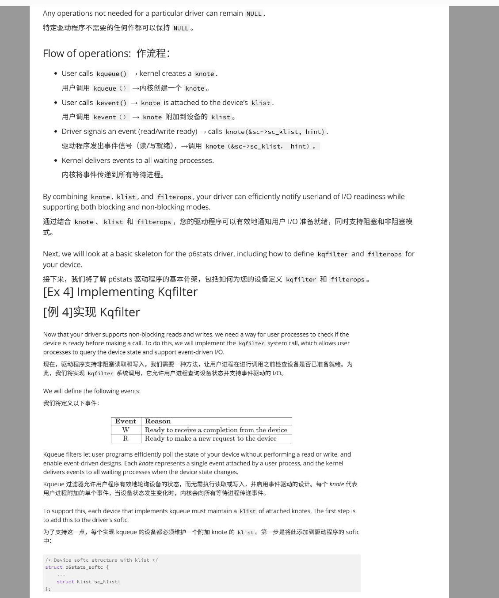

这段文字详细描述了如何在驱动程序中实现`kqfilter`（kqueue过滤器）以及相关操作的流程，帮助用户程序实现非阻塞I/O和事件驱动I/O。

以下是详细解释：

### 1. **操作流程（Flow of operations）**

- **用户调用`kqueue()`**：内核会创建一个`knote`。`knote`是一个表示事件的结构体，关联到特定的设备。
- **用户调用`kevent()`**：`knote`会被附加到设备的`klist`中，`klist`是一个设备事件列表。
- **驱动程序调用事件（读/写就绪）**：驱动程序在设备准备好读取或写入时，会调用`knote(&sc->sc_klist, hint)`将事件通知内核。
- **内核将事件分发给等待的进程**：一旦设备的状态改变，内核会将事件通知所有等待的进程。

### 2. **kqueue 过滤器的作用**

- `kqueue` 过滤器允许用户程序在不执行读写操作的情况下，轮询设备的状态。这也使得驱动程序能够支持非阻塞I/O。
- 每个`knote`代表一个由用户进程附加的单一事件，当设备状态发生变化时，内核会通过`knote`来通知用户进程。

### 3. **klist和filterops**

- 通过结合`kqueue`、`klist`和`filterops`，可以在驱动程序中高效地通知用户程序设备是否准备好进行I/O操作，同时支持阻塞和非阻塞模式。
- `klist`是与设备关联的一个事件列表，存储所有等待事件的`knote`。
- `filterops`是定义事件处理操作的结构，控制事件发生时的行为。

### 4. **关键数据结构：**

- **`struct knote`**：表示附加到用户进程的事件，内核会创建并跟踪这些事件。
- **`struct klist`**：设备关联的事件列表，存储多个`knote`。
- **`struct filterops`**：包含事件处理逻辑的结构体，定义了如何处理这些事件。

### 5. **驱动程序的实现**

- 在驱动程序中，需要维护一个`klist`，并将事件（如I/O完成、准备好接收数据等）附加到`klist`中。
- 设备结构体需要有一个`klist`字段，这样可以将多个事件附加到设备的`klist`中，从而处理多重设备的事件。

### 6. **实例化`kfilter`**

- 在实现`kfilter`时，首先需要为设备结构定义`klist`，并设置相关的事件处理逻辑。通过这个机制，驱动程序能够支持事件驱动的I/O操作。

总结来说，这段内容介绍了如何在驱动程序中实现`kqfilter`，使驱动程序能够支持事件驱动的I/O和非阻塞I/O操作。通过使用`kqueue`和`knote`，用户程序可以高效地等待设备准备好进行读写操作，而无需轮询或阻塞式等待。


这张图片讲解了如何在 OpenBSD 驱动程序中定义事件过滤操作，并实现事件驱动模型。以下是详细解释：

### 1. **定义事件过滤操作**

- **过滤操作的定义**：
  - 驱动程序需要为每个事件定义过滤操作，这些操作会在相应事件发生时执行。
  - 初始时，所有函数指针都会被设置为 `NULL`，直到您实际实现它们。

```c
/* filterops structures with all function NULL initially */
struct filterops p6stats_read_filterops = {
    .f_flags = NULL,
    .f_attach = NULL,
    .f_detach = NULL,
    .f_event = NULL,
    .f_process = NULL,
    .f_modify = NULL,
};

struct filterops p6stats_write_filterops = {
    .f_flags = NULL,
    .f_attach = NULL,
    .f_detach = NULL,
    .f_event = NULL,
    .f_process = NULL,
};
```

- **字段解释**：
  - `f_flags`：控制过滤器行为的标志位，通常用于设置事件的标志。
  - `f_attach`：用于附加过滤器的函数，表示将 `knote` 连接到驱动程序时调用。
  - `f_detach`：从驱动程序移除 `knote` 时调用的函数。
  - `f_event`：事件触发时调用的函数。
  - `f_process`：处理事件的函数，通常用于处理中断或信号。
  - `f_modify`：修改 `knote` 状态的函数（如果需要）。

### 2. **`kqfilter` 入口点**

- **`kqfilter` 函数**：
  - 当进程附加一个 `knote` 到设备时，内核会调用 `kqfilter` 入口点。这个函数会接收和处理与设备事件相关的过滤操作。

```c
/* kqfilter function skeleton */
int p6stats_kqfilter(struct file *fp, struct knote *kn)
{
    struct p6stats_softc *sc = fp->f_data; /* pointer to device softc */

    switch (kn->kn_filter) {
    case EVFILT_READ:
        /* your code here */
        break;
    case EVFILT_WRITE:
        /* your code here */
        break;
    default:
        return (EINVAL);
    }

    /* your code here */
    return (0);
}
```

- **`kqfilter` 函数的作用**：
  - `kqfilter` 用于事件通知机制，当用户空间进程通过 `kqueue` 机制监视设备时，设备会将 `knote` 附加到设备中，然后在事件发生时触发相关的回调函数。
  - 例如，当 `knote` 过滤器类型是 `EVFILT_READ` 时，驱动程序会在事件触发时执行读取相关的代码，进行相应的操作。
- **设备 `softc` 结构**：
  - `sc = fp->f_data;`：从文件描述符中获取指向设备 `softc`（设备软控制结构）的指针。这个结构包含了与设备相关的状态信息。

### 3. **事件驱动的框架**

- **`kqfilter` 作为框架的一部分**：
  - `kqfilter` 作为事件驱动访问驱动程序的框架之一，负责处理设备的 I/O 事件。当设备有数据可读或可写时，相关的 `knote` 会触发相应的事件。
  - 驱动程序在下一步中将根据这些事件，执行适当的读取或写入操作。

### 4. **总结**

- 在 OpenBSD 中，使用 `kqfilter` 作为事件驱动模型的一部分，允许驱动程序通过 `knote` 来实现对 I/O 操作的过滤和处理。
- 驱动程序需要定义不同的事件处理逻辑，使用 `f_event` 和 `f_process` 等函数来处理不同类型的事件。`kqfilter` 则是该框架的核心，用于在事件发生时触发相应的处理。

如果您有任何问题，或对代码的实现细节有疑问，请告诉我！


这段内容描述了如何修改设备驱动程序以支持事件驱动的 I/O 操作，特别是使用 `kqueue` 和 `kfilter` 来实现 `read` 和 `write` 操作的事件通知。具体解释如下：

### 1. **任务描述**：

- **目标**：将 `p6stats` 驱动程序扩展为支持基于事件驱动的 I/O 操作，这意味着需要实现 `kfilter` 函数，以便将 `knote` 附加到设备的 `klist` 中。设备的状态变化时会通知所有等待的进程。

### 2. **事件驱动的 I/O 操作**：

- **`write` 操作**：当用户程序对设备执行写操作时，如果设备准备好写入数据，驱动程序返回一个表示数据已准备好的标志。否则，如果设备尚未准备好，驱动程序将返回一个 `0`，表示没有数据可写。
- **`read` 操作**：类似地，当设备准备好读取数据时，驱动程序应该返回一个表示数据已准备好的标志，并提供读取的数据量。如果设备尚未准备好，应该返回 `0`，表示没有数据可读。

### 3. **通知等待的进程**：

- 设备驱动需要在设备准备好进行读取或写入操作时，通知所有等待的进程。具体操作是通过 `klist` 来管理和通知设备的 `knote`。每当设备的状态变化时，驱动程序调用 `knote()` 来通知等待的进程。

### 4. **提示**：

- **`knote` 的添加与移除**：当新的 `knote` 被附加到设备时，驱动程序需要正确地设置 `filterops` 指针，并将 `knote` 关联到设备的状态钩子（`kn->kn_hook`）。每当设备的状态变化时，驱动程序应使用 `knote()` 来通知所有等待的进程。
- **设备状态变化时的处理**：当设备的状态发生变化时，驱动程序应通过 `knote()` 通知所有正在等待的进程，以确保它们及时获取更新的数据。

### 5. **`f_event` 的重要性**：

- `f_event` 是 `filterops` 结构体中的一个关键部分，它决定了设备是否已准备好执行读取或写入操作。具体来说，`f_event` 函数会根据设备当前的状态来判断设备是否已准备好进行操作。

### 6. **示例与参考**：

- **示例驱动程序**：如果需要查看具体的实现，`if_tun` 和 `bpf` 驱动程序是很好的参考，可以在 `/usr/src/sys/net/if_tun.c` 和 `/usr/src/sys/net/bpf.c` 中找到它们的代码。

### 7. **总结**：

这段内容的重点是指导如何修改设备驱动，以便它能够支持事件驱动的 I/O 操作。驱动程序需要使用 `kqueue` 和 `kfilter` 来管理和通知设备的事件，确保设备的状态变化能够及时通知到所有等待的进程。


这段内容描述了如何更新用户空间程序，以便支持设备的可读性或可写性检查，并给出相应的反馈。具体目标是通过使用`kevent`系统来帮助用户进程检测设备是否已准备好进行读或写操作，同时避免阻塞。

### 1. **目标**

- 现在，驱动程序已经支持`kqfilter`，接下来需要扩展用户空间测试程序，支持对设备的可读性和可写性进行检查。使用`kevent`，可以实现这种功能，即在不进行读写操作的情况下检查设备是否准备好进行读或写。
- 该过程通过提供设备状态的即时反馈，避免了传统的阻塞式等待。

### 2. **用户空间程序的更新任务**

- 更新测试程序，支持两个新选项：
  - **`-r`**：检查设备是否准备好读取。
  - **`-w`**：检查设备是否准备好写入。
- 这两个选项将与现有的`-r`、`-w`和`-rw`标志一起使用。
- 当用户选择`-r`或`-w`时，程序应创建一个`kqueue`，并注册适当的`EVFILT_READ`或`EVFILT_WRITE`过滤器，通过零超时检查设备的可读性或可写性。
- 程序应打印相应的消息，如“设备已准备好进行输入”、“设备不准备好”等。

### 3. **程序行为**

- 当指定`-r`或`-w`时，程序应执行标准的读取和/或写入操作。如果未指定有效操作，则应提供适当的“无效操作”消息。
- 例如，当设备准备好进行读操作时，程序应打印“Read is ready”；当设备未准备好时，打印“Read is not ready”。
- 用户程序应通过`kevent()`注册事件，并检查设备是否准备好进行操作。若设备未准备好，`kevent()`将返回相应的事件，用户程序可以根据返回结果给出合适的消息。

### 4. **如何实现**

- **创建`kqueue`**：通过`kevent()`来注册设备的事件检查。使用`EVFILT_READ`和`EVFILT_WRITE`过滤器来检查设备是否可以读取或写入。
- **`kevent()`函数的使用**：调用两次`kevent()`函数，第一次注册事件，第二次执行零超时的准备性检查。返回的事件将用于确定设备是否准备好进行读取或写入。

### 5. **解决方案**

- **用户程序解决方案**：提供了如何使用`kevent()`来注册事件，并通过检查设备的`filter`字段来查询设备的准备状态。该程序会根据设备是否准备好进行读写操作，给出反馈。
- **内核程序解决方案**：对于内核，提供了如何实现`kqueue`的相关代码，以及如何与用户程序交互以实现事件驱动的I/O。

### 6. **总结**

- 通过在用户空间程序中实现`kevent`，程序可以高效地检查设备是否准备好进行I/O操作，而无需阻塞。通过适当的事件和超时机制，能够实时反馈设备状态，从而提高系统响应效率。