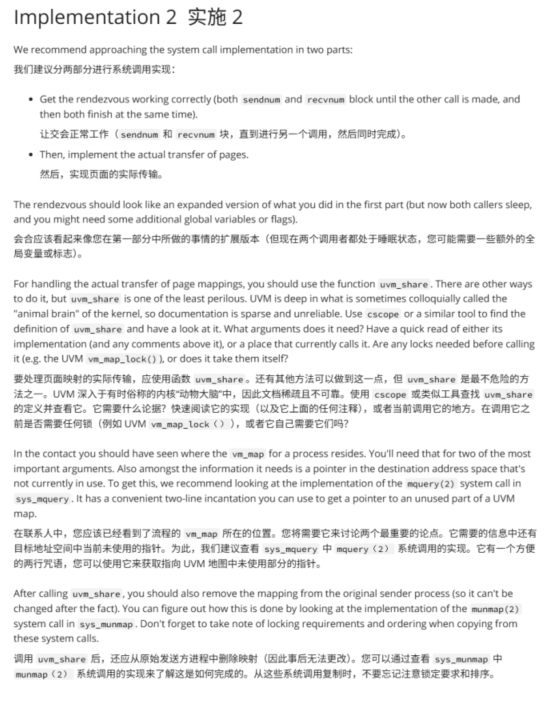

这张图片描述了在内核编程环境中实现和卸载系统调用（syscalls）的过程。

以下是对图片内容的详细解释：

### **介绍**

- 这一部分介绍了与**虚拟内存**相关的实践任务，这是你在前一周学习的一个概念，并且它与操作系统中的**系统调用（syscalls）**相关。
- 图片指出，如果你正在进行某个任务（**A1**），应该先完成该任务再进行当前的任务（**Prac 2**）。
- **虚拟内存**让操作系统为进程提供了一个大而连续的内存空间的幻觉，尽管物理内存可能是碎片化的。这个练习将探索如何在进程之间传递和管理虚拟内存。

### **系统调用（sendnum 和 recvnum）**

- 该练习涉及实现两个系统调用：`sendnum` 和 `recvnum`。这些系统调用将允许两个进程交换数字。

  - **sendnum**：一个进程将数字通过 `sendnum` 发送给另一个进程。
  - **recvnum**：接收进程将使用 `recvnum` 来接收数字。

  这里的关键是两个系统调用之间的**交互**，一个进程发送数字，另一个进程接收数字。

- 系统调用的流程如下：

  1. **`sendnum`** 将一个数字发送出去。
  2. 接收数字的进程会进入**睡眠状态**，直到调用 **`sendnum`**，也就是说它会等待接收到信号后再被唤醒并处理这个数字。
  3. **`recvnum`** 会在 **`sendnum`** 后被调用，允许接收方获取发送方的数据虚拟内存地址。

### **卸载以前的系统调用**

- 图片讨论了**卸载以前的系统调用**这一步骤，以防与当前任务冲突。
- 目标是在开始新的任务之前**清理**任何之前安装的系统调用。
- 它建议运行以下命令：
  - `make clean`：清理掉旧的编译文件。
  - `make install`：安装必要的文件。
  - 这样可以确保环境在添加新系统调用时不会与旧的系统调用发生冲突。

### **卸载系统调用的步骤**

- 卸载旧的系统调用时，需要遵循特定的步骤来**正确删除它们**。这可能涉及清理旧的内核构建文件或移除旧的实现，避免它们干扰新的更改。
- **卸载系统调用**的过程与**添加系统调用**不同。你需要确保环境已经正确清理，不含有任何不必要的旧系统调用，这样才能顺利开始新的任务。

### 结论

这张图片提供了一个关于在内核编程中使用系统调用的练习教程，重点是管理进程间的虚拟内存。它指导你如何**实现**新的系统调用以及如何**卸载**旧的系统调用，以确保工作环境的干净和顺利。


这张图片提供了有关**基础代码补丁**的说明，主要针对一个编程实践任务，详细解释了如何应用和使用代码补丁来实现新的系统调用。

### 详细解释：

### **Base Code Patch / 基本代码补丁**

- **这部分说明**与之前的任务相似，重点是创建新的系统调用。图片提到，在你已经了解了如何创建系统调用的过程后，这一实践将提供一个**基础代码补丁**，帮助你快速启动并专注于本次任务的核心部分，而不需要从头开始。
- 这部分的目标是通过使用给定的代码补丁，使你能更快速地完成新的系统调用的实现。

### **代码补丁链接**

- 图片给出了代码补丁的链接，供你下载使用：
  - `https://stluc.manta.uqcloud.net/comp3301/public/p3-base.patch`
  - 这个补丁包含了一个**基础代码模板**，它是你完成任务的起点。你应该应用这个补丁到你任务的基础代码树上。

### **如何应用补丁**

- 在图片中提供了详细的命令行步骤，告诉你如何应用这个代码补丁：

  - `git checkout -b p3`：创建并切换到一个新的分支 `p3`。
  - `git am /path/to/p3-base.patch`：将代码补丁应用到新的分支上。

  这意味着，你需要将补丁文件（`p3-base.patch`）下载到本地，然后使用 Git 工具将它应用到你的项目中。

### **补丁内容**

- 这个补丁将添加两个新的系统调用：
  - **syscalls.master** 文件：它会设置一个新的头文件 `sys/sendnum.h`。
  - 另外，补丁文件中还会定义一个新的系统调用 `sys/kern/sendnum.c`，并且在第二部分任务（p2）中，你将需要实现与之相关的代码。

### **新的系统调用定义**

- 在任务中，你将定义以下两个系统调用：

  - **sendnum**：一个发送数字的系统调用。
  - **recvnum**：一个接收数字的系统调用。

  这两个系统调用将分别在内核中定义，并通过相应的文件与函数进行实现。

### 结论

- 这个补丁文件是用于帮助你实现新的系统调用，它为你提供了创建系统调用所需的基本代码框架。
- 你需要按照说明将这个补丁应用到你的代码中，并完成相应的系统调用的实现。


这张图片提供了有关**实现 sys_sendnum() 和 sys_recvnum()** 系统调用的详细说明。下面是对每个部分的详细解释：

### **sys_sendnum() 和 sys_recvnum() 的实现**

这部分介绍了如何实现两个系统调用：

- **sys_sendnum()**：该函数将一个数字作为参数，发送给内核。这个数字将被保存在内核空间，以便接收进程调用 `recvnum` 时获取。
- **sys_recvnum()**：该函数接收一个整数，并将其存储在提供的地址中。如果有数字已经等待接收（即发送方已经调用了 `sendnum`），`recvnum` 会立即返回该数字，否则它会将接收进程挂起（睡眠状态），直到数字可用。

### **sys_sendnum() 细节**

- `sys_sendnum` 接受一个数字作为参数并将其发送给内核，数字保存在内核空间。
- 系统调用 `recvnum` 会返回该数字。调用 `recvnum` 的进程会挂起（进入睡眠状态），直到 `sendnum` 被调用并有数字可以接收。
- 如果系统调用失败或遇到错误，`sys_sendnum` 会返回错误信息，如 `EBUSY`，表示数字已在传输过程中，不能同时发送多个数字。

### **sys_recvnum() 细节**

- `sys_recvnum` 会从内核读取一个数字并将其写入给定的地址。
- 如果没有数字可用，进程会进入睡眠状态，等待数字可用。一旦数字可用，进程会被唤醒并继续执行。
- 进程可以通过 **`interrupt`** 机制中断休眠（例如，可以通过发送 Ctrl + C 信号来终止进程）。

### **系统调用原型**

- **sys_sendnum** 和 **sys_recvnum** 的原型已经准备好，并可以在 `usr/src/sys/kern/kern_sendnum.c` 和 `usr/src/sys/kern/kern_recvnum.c` 文件中填充。你需要在这些文件中实现具体的功能。

### **建议**

1. **进程间的关系**：
   - 调用 `sys_sendnum` 和 `sys_recvnum` 的进程不需要是父子进程或同一程序的进程。它们可以是不同的进程，不要假设它们是相同的程序。
2. **简单的实现方法**：
   - 一种简单的实现方法是将发送的数字存储在 `sendnum` 中的一个全局变量中，并在 `recvnum` 中取出。这种方式非常简单，但也有效。
3. **线程安全问题**：
   - 因为 `sys_sendnum` 和 `sys_recvnum` 是由不同的进程（线程）调用的，所以如果它们共享某个全局变量，可能会导致并发问题。建议使用 **`spinlock`** 或类似的同步机制，确保只有一个进程可以访问共享数据。
4. **程序的睡眠和唤醒**：
   - 你可以使用 **`sleep()`** 和 **`wakeup()`** 来管理进程的睡眠和唤醒。特别是，进程调用 `recvnum` 后，如果没有数字，它将进入睡眠状态，直到有数字可以接收。
   - **注意**：你应该始终使用 **`patch`**，并确保适当的进程休眠机制。不要忘记在实现中包含适当的睡眠函数（如 **`sleep()`**）。

### **补充建议**

- 代码中提到的 `PATCH` 和 **`sleep()`** 函数的使用，以及如何使用它们来处理进程的休眠和唤醒，是非常重要的细节。

### **总结**

这张图片为实现 `sys_sendnum()` 和 `sys_recvnum()` 系统调用提供了详细的指导，重点强调了如何管理数字的发送与接收、进程的睡眠与唤醒、以及线程安全问题。


这段代码是实现两个系统调用（`sys_sendnum` 和 `sys_recvnum`）的示例，目的是在内核中发送和接收数字。代码使用了互斥锁和条件变量来确保多进程之间的同步。下面是对每一部分代码的详细解释：

### **枚举类型 `sendnum_state`**

```c
enum sendnum_state { EMPTY, FULL };
```

- `sendnum_state` 枚举有两个状态：`EMPTY` 和 `FULL`。
- `EMPTY` 表示没有数字可以发送，`FULL` 表示有数字已准备好可以被接收。

### **全局变量**

```c
static struct mtx sendnum_mtx = MUTEX_INITIALIZER(IPL_NONE);
static enum sendnum_state sendnum_state = EMPTY;
static int sendnum_num;
```

- `sendnum_mtx` 是一个互斥锁（mutex），用于保证对 `sendnum_state` 和 `sendnum_num` 的访问是线程安全的。
- `sendnum_state` 用于表示当前发送数字的状态，初始为 `EMPTY`，表示没有数字可以发送。
- `sendnum_num` 保存待发送的数字。

### **`sys_sendnum` 系统调用实现**

```c
int sys_sendnum(struct proc *p, void *v, register_t *retval) {
    struct sys_sendnum_args *uap = v;
    int eno;

    mtx_enter(&sendnum_mtx);
    if (sendnum_state != EMPTY) {
        eno = EBUSY;
        goto out;
    }

    sendnum_num = SCARG(uap, num);
    sendnum_state = FULL;
    wakeup_one(&sendnum_state);

    eno = 0;
out:
    mtx_leave(&sendnum_mtx);
    return (eno);
}
```

- **功能**：`sys_sendnum` 发送一个数字到内核并改变 `sendnum_state` 为 `FULL`，表示数字已准备好接收。
- **过程**：
  1. 进入互斥锁，确保线程安全。
  2. 检查 `sendnum_state` 是否是 `EMPTY`，如果不是，返回 `EBUSY`，表示已经有数字在传输中，不能再发送数字。
  3. 获取传入的数字（`SCARG(uap, num)`）并将其存储在 `sendnum_num` 中。
  4. 更新 `sendnum_state` 为 `FULL`，表示数字已准备好。
  5. 使用 `wakeup_one(&sendnum_state)` 唤醒一个等待接收数字的进程。
  6. 离开互斥锁并返回 `eno`。

### **`sys_recvnum` 系统调用实现**

```c
int sys_recvnum(struct proc *p, void *v, register_t *retval) {
    struct sys_recvnum_args *uap = v;
    int eno;

    mtx_enter(&sendnum_mtx);
    while (sendnum_state != FULL) {
        eno = msleep(&sendnum_state, &sendnum_mtx, PCATCH, "recvnum", 0);
        if (eno != 0)
            goto out;
    }

    eno = copyout(&sendnum_num, SCARG(uap, num), sizeof(int));
    if (eno != 0)
        goto out;

    sendnum_state = EMPTY;
    sendnum_num = 0;

    eno = 0;
out:
    mtx_leave(&sendnum_mtx);
    return (eno);
}
```

- **功能**：`sys_recvnum` 从内核接收一个数字，并将其存储在用户空间的指定位置。
- **过程**：
  1. 进入互斥锁，确保线程安全。
  2. 使用 `while (sendnum_state != FULL)` 进入循环，检查 `sendnum_state` 是否为 `FULL`。如果没有数字可以接收（即状态为 `EMPTY`），则调用 `msleep` 将进程挂起，直到 `sendnum_state` 被改变为 `FULL`，表示有数字可以接收。
  3. 如果 `msleep` 被中断（`eno != 0`），退出。
  4. 使用 `copyout` 将内核中的数字（`sendnum_num`）复制到用户空间指定的地址（`SCARG(uap, num)`）。
  5. 接收数字后，将 `sendnum_state` 设置为 `EMPTY`，并清空 `sendnum_num`。
  6. 离开互斥锁并返回 `eno`。

### **解释**

1. **互斥锁** (`mtx_enter` 和 `mtx_leave`): 用于在访问共享资源（如 `sendnum_state` 和 `sendnum_num`）时确保线程安全。
2. **进程睡眠** (`msleep`): 如果没有数字可用接收，调用 `msleep` 会让进程进入睡眠状态，直到有新的数字可供接收。
3. **进程唤醒** (`wakeup_one`): 当数字准备好时，调用 `wakeup_one` 唤醒一个等待的进程。

### 总结

- `sys_sendnum` 用于发送一个数字并将状态改为 `FULL`，然后唤醒等待的接收进程。
- `sys_recvnum` 用于接收数字，如果没有数字，进程会睡眠，直到数字准备好。然后接收数字并将状态改为 `EMPTY`。


这张图片描述了**编译**和**测试**系统调用代码的步骤。以下是详细的解释：

### **编译 (Compiling)**

- **代码编译**：在实现了系统调用之后，需要重新编译和安装内核。这些步骤包括：

  - **`make config`**：配置编译选项。
  - **`make`**：进行编译。
  - **`make install`**：安装编译好的文件，包括相关的库文件如 `ld.so` 和 `libc`。

  执行的命令如下：

  ```bash
  comp33015$ cd /usr/src/arch/amdk6/compile/GENERIC_MP
  comp33015$ make config
  comp33015$ make
  comp33015$ make install
  comp33015$ cd /usr/src/lib/lib1
  comp33015$ make
  comp33015$ make install
  ```

- 这些命令的目的是确保所有的源代码都被正确编译并安装到系统中。特别地，它会将 **`ld.so`** 和 **`libc`** 等重要的库文件安装到系统中，以保证系统调用能够正常工作。

- 之后，图片提到了一些 **用户空间工具**，用于测试系统调用。你可以通过以下命令安装：

  ```bash
  comp33015$ cd /usr/src/usr.bin/xnum
  comp33015$ make
  comp33015$ make install
  ```

### **测试 (Testing 1)**

- **测试系统调用**：测试你的系统调用代码是否正确，可以使用 `xnum` 工具。你可以通过 **SSH** 启动两个终端（或者通过 **tmux** 启动多个会话）来进行测试。

  - 在两个终端中分别运行以下命令：

  ```bash
  comp33015$ xnum -t
  comp33015$ xnum -s 1234
  ```

  这将启动一个命令行程序，模拟系统调用的发送和接收。

- **`xnum` 工具的使用**：

  - 你可以通过 `xnum` 工具来模拟进程间的通信。一端将通过 **`xnum -s`** 发送数字（例如，发送 1234），另一端则通过 **`xnum -t`** 进行接收，来测试 `sendnum` 和 `recvnum` 系统调用的功能。

- **调试和中断**：

  - 在测试过程中，你可以通过按 **Ctrl+C** 来中断进程并观察系统的反应。如果系统工作正常，进程应该能够按预期发送和接收数字。

### **总结**

1. **编译步骤**：你需要执行一系列的命令来编译和安装内核及相关库，以确保系统调用代码被正确集成到操作系统中。
2. **测试步骤**：使用 `xnum` 工具进行系统调用的测试，模拟数字的发送和接收，验证系统调用是否按预期工作。

### **其他建议**

- 图片中的内容还鼓励你考虑其他测试方案，以及系统调用可能返回的错误代码。这有助于全面验证系统调用的功能并确保其鲁棒性。


这张图片描述了实验和接口部分的内容，特别是针对**系统调用**和**虚拟内存（VM）**的一些细节。以下是对每部分内容的详细解释：

### **实验 (Experiments)**

- **实验目的**：图片建议进行一些实验，以便了解可能遇到的错误，并帮助你在未来避免这些错误。

  **实验问题**：

  1. **如果你从 `sleep()` 或 `msleep()` 中移除 `PCATCH` 会发生什么？**
     - `PCATCH` 是一个标志，用于允许进程在休眠时被中断。移除它可能导致进程无法被外部信号中断，从而阻塞在 `sleep()` 或 `msleep()` 中，直到指定的条件满足。
  2. **如果代码中没有使用互斥锁（mutex），会发生什么？**
     - 如果没有使用互斥锁来保护共享资源，可能会导致**竞态条件**（race conditions），即多个进程同时访问共享数据，导致数据不一致或系统崩溃。
  3. **如果在系统调用结束时进行虚拟内存的快照（snapshot）会怎么样？**
     - 在系统调用结束时进行虚拟内存的快照，可以记录进程的当前状态和内存布局，帮助调试和分析内存使用情况，尤其在出错时可以回溯。

- **虚拟机快照**：如果你在进行实验前想要测试，建议创建一个虚拟机的快照，以便在实验过程中出现问题时能够恢复到初始状态。

### **接口 (Interfaces)**

- **UVM（统一虚拟内存）框架**：接下来的实验部分将使用OpenBSD内核的统一虚拟内存（UVM）框架。该框架允许进程共享物理内存，并管理虚拟内存映射。

  **每个进程的虚拟内存**：

  - 在OpenBSD中，每个进程有自己的独立虚拟内存空间。通常，系统调用（例如IPC）会涉及将数据从发送进程的用户空间复制到内核空间的缓冲区，然后再传输到接收进程。
  - 发送进程和接收进程各自会持有用户虚拟内存的副本，通常是通过复制数据到内核内存（通常是共享内存）来实现。这种方式提高了效率，但需要谨慎处理内存映射。

- **数据传输方式**：

  - 在实验中，数据的传输将涉及到虚拟内存的处理。特别地，`sendnum` 和 `recvnum` 这两个系统调用可能涉及将数据从发送进程的虚拟内存转移到接收进程的内存中。
  - 代码中的关键操作包括创建共享内存页，允许两个进程直接在物理内存中共享数据。

- **虚拟内存的“偷取”**：

  - 该部分提到，可以通过“偷取”进程的虚拟内存，意味着数据不会从发送进程的内存中复制出来，而是直接被映射到接收进程的内存空间中。这涉及到创建共享物理页面并通过该页面交换数据，这种方式比复制数据更高效。

### **系统调用参数调整**

- 接下来你将调整系统调用的参数，例如 `sendnum` 系统调用将使用指针来传递数字数据。这些系统调用将通过 `sendnum` 和 `recvnum` 来实现跨进程的数据交换。

### **总结**

- 本部分通过介绍如何使用虚拟内存框架来共享数据和优化进程间通信，为你后续的实验和系统调用实现提供了理论和实践支持。
- 进行实验时，你需要注意进程间的数据传输、内存管理以及潜在的竞态条件问题。


这张图片提供了如何在内核编程中使用 **`mmap`** 系统调用进行内存分配，以及如何在修改后的系统调用中使用内存映射来进行数据传输的具体方法。以下是详细解释：

### **使用 `mmap` 分配内存**

1. **内存分配**：

   - 要为结构体分配整个页面的内存，使用 `mmap` 系统调用。除了用于映射文件内存，`mmap` 还可以为进程分配“匿名”的虚拟内存，即没有与任何文件关联的内存。
   - 代码如下：

   ```c
   struct xnump_page *p;
   p = mmap(
       NULL,                              // 我们不关心地址在哪里
       sizeof(struct xnump_page),         // 分配的内存大小
       PROT_READ | PROT_WRITE,             // 使内存可读和可写
       MAP_PRIVATE | MAP_ANON,             // 给我们“匿名”的私有内存
       -1,                                 // 无文件描述符与其关联
       0                                   // 文件偏移量
   );
   if (p == MAP_FAILED) {
       err(1, "mmap");                     // 如果映射失败，则打印错误信息
   }
   p->xp_magic = ...;                      // 设置结构体的初始值
   p->xp_num = ...;
   ```

   - **解释**：
     - `mmap` 系统调用通过为结构体分配一个页面大小的内存块，使结构体 `xnump_page` 的数据能够存放在这块内存区域。
     - `MAP_ANON` 表示这是匿名内存，不与任何文件关联。
     - `PROT_READ | PROT_WRITE` 表示分配的内存既可以读也可以写。
     - 如果映射失败，返回 `MAP_FAILED`，并输出错误信息。

2. **在发送端使用映射的内存**：

   - 使用 `mmap` 分配的内存可以作为修改后的 `sendnum` 系统调用的第一个参数，来发送该结构体的内容：

   ```c
   if (sendnum(p, sizeof(struct xnump_page))) {
       err(1, "sendnum");
   }
   ```

   - **解释**：
     - 结构体 `xnump_page` 的指针 `p` 作为参数传递给 `sendnum` 系统调用，并指定结构体的大小。通过这种方式，发送端将结构体数据通过系统调用发送给接收端。

### **接收端处理内存映射**

- **接收端**：在接收端，不需要使用 `mmap` 或其他复杂操作，只需使用指针来指向接收的内存地址，并检查传递的魔法值（magic value）来确保数据的有效性。代码如下：

  ```c
  if (recvnum((void **) &p, &len)) {
      err(1, "recvnum");
  }
  if (len < sizeof(struct xnump_page)) {
      errx(1, "received memory too small");
  }
  p->xp_magic = ...;
  if (p->xp_magic != ...) {
      errx(1, "magic number invalid");
  }
  printf("%d\n", p->xp_num);
  ```

  - **解释**：
    - `recvnum` 从接收端接收数据，`p` 将指向接收到的内存区域。
    - 检查接收到的数据大小是否符合预期（即 `sizeof(struct xnump_page)`）。
    - 验证接收到的数据是否包含有效的魔法值（`xp_magic`）。
    - 如果所有验证通过，则打印接收到的数字。

### **修改后的代码**

- 图片建议修改 `xnum.c` 文件中的代码。首先，确保代码能编译通过，并检查它是否符合要求。然后可以在实现系统调用后再次进行测试。

### **总结**

1. **内存分配**：使用 `mmap` 为结构体分配匿名的虚拟内存，这样可以为进程提供独立的内存区域，不与任何文件关联。
2. **数据发送与接收**：通过修改后的 `sendnum` 和 `recvnum` 系统调用，可以在进程间传递数据，接收端验证数据的有效性。
3. **实验修改**：修改代码后，确保它可以编译并运行，然后通过相应的测试验证系统调用的功能。


这段代码是一个基于 `mmap` 系统调用实现进程间通信的程序，具体涉及发送和接收数字的操作。程序的结构和功能如下：

### **代码分析**

#### **包含头文件和定义常量**

```c
#include <stdio.h>
#include <stdlib.h>
#include <string.h>
#include <unistd.h>
#include <err.h>
#include <sys/mman.h>
#include <sys/sendnum.h>

static void usage(void)
{
    fprintf(stderr, "usage: xnum -r\n");
    fprintf(stderr, "       xnum -s NUMBER\n");
    exit(1);
}

enum { XNUM_MAGIC = 0x1234abcd } xnum_magic;
```

- **头文件**：引入了常用的库文件，如 `stdio.h`, `stdlib.h`, `unistd.h`，以及操作系统相关的 `mmap` 和 `sendnum.h`。
- **`usage` 函数**：定义了程序的使用方法，当用户输入错误时显示帮助信息。

#### **结构体定义**

```c
struct xnum_page {
    uint32_t xp_magic;  // 魔法值，用于校验数据
    int xp_num;         // 存储数字
};
```

- **`xnum_page` 结构体**：用于存储发送和接收的数据，包括 `xp_magic` （魔法值）和 `xp_num` （实际的数字）。

#### **`main` 函数**

```c
int main(int argc, char *argv[])
{
    int ch;
    enum { NONE, SEND, RECEIVE } mode = NONE;
    int num;
    const char *errstr;
    struct xnum_page *pg;
    size_t sz;
```

- **`main` 函数**：这是程序的入口，首先处理命令行参数，设置模式为 `NONE`, `SEND`, 或 `RECEIVE`，根据用户的输入来决定是发送数字还是接收数字。

#### **命令行参数解析**

```c
while ((ch = getopt(argc, argv, "rs:")) != -1) {
    switch (ch) {
        case 'r':  // 接收模式
            if (mode != NONE) {
                warnx("only one of -r or -s may be given");
                usage();
            }
            mode = RECEIVE;
            break;
        case 's':  // 发送模式
            if (mode != NONE) {
                warnx("only one of -r or -s may be given");
                usage();
            }
            mode = SEND;
            num = strtonum(optarg, 0, INT32_MAX, &errstr);
            if (errstr != NULL) {
                warnx("number is %s: %s", errstr, optarg);
                usage();
            }
            break;
        default:
            usage();
    }
}
```

- **命令行参数解析**：程序支持 `-r`（接收）和 `-s NUMBER`（发送数字）两个选项。通过 `getopt` 获取命令行参数并设置模式 (`mode`)。
- **`strtonum`**：用于将字符串转换为数字，并验证输入是否在有效范围内。

#### **内存分配和映射**

```c
switch (mode) {
    case NONE:
        warnx("either -r or -s must be given");
        usage();
    case SEND:
        pg = mmap(NULL, sizeof(struct xnum_page),
                  PROT_READ | PROT_WRITE, MAP_PRIVATE | MAP_ANON,
                  -1, 0);
        if (pg == MAP_FAILED) {
            err(1, "mmap");
        }
        pg->xp_magic = XNUM_MAGIC;
        pg->xp_num = num;
        if (sendnum(pg, sizeof(struct xnum_page))) {
            err(1, "sendnum");
        }
        return 0;
```

- **`SEND` 模式**：
  - 使用 `mmap` 分配一块匿名内存来存储 `xnum_page` 结构体。这块内存不与任何文件关联，只有进程之间共享。
  - 设置 `xp_magic` 为预定义的魔法值，确保数据的有效性。
  - 使用 `sendnum` 系统调用发送这块内存中的数据。

#### **接收模式**

```c
    case RECEIVE:
        if (recvnum((void **)&pg, &sz)) {
            err(1, "recvnum");
        }
        if (sz < sizeof(struct xnum_page)) {
            errx(1, "received memory too small: %zu", sz);
        }
        if (pg->xp_magic != XNUM_MAGIC) {
            errx(1, "magic number mismatch: %x", pg->xp_magic);
        }
        printf("%d\n", pg->xp_num);
        return 0;
}
```

- **`RECEIVE` 模式**：
  - 使用 `recvnum` 接收数据，并将接收到的内存映射到 `pg` 指针中。
  - 检查接收到的内存大小是否正确（即是否足够大以存储 `xnum_page`）。
  - 校验 `xp_magic` 确保数据的正确性。
  - 如果一切正常，打印接收到的数字。

### **总结**

- **内存映射**：通过 `mmap` 分配匿名内存，这块内存用于存储传输的数据。
- **数据传输**：使用 `sendnum` 和 `recvnum` 进行进程间通信，将数据从一个进程传输到另一个进程。
- **命令行参数**：程序支持接收和发送模式，用户通过命令行参数选择操作模式并传递数据。

这段代码演示了如何利用内存映射和系统调用实现进程间的数字传输，且通过魔法值进行数据验证，确保数据的正确性。



这张图片提供了**第二阶段实现**的指导，重点介绍了如何在系统调用中正确实现**进程间同步**和**虚拟内存映射**，以便完成数字的传输。以下是对内容的详细解释：

### **实验步骤：**

1. **进程间同步**：
   - **同步操作**：在实现系统调用时，首先确保 `sendnum` 和 `recvnum` 能够正确地同步，确保在调用时两个进程能够正确阻塞直到彼此完成。
   - **步骤分为两部分**：
     - 让 `sendnum` 和 `recvnum` 正确工作，并保证它们能够在一个进程完成之前阻塞另一个进程。
     - 然后，实施实际的数字传输。
2. **同步的扩展**：
   - **同步实现**：同步操作应该类似于你在前一部分做的工作，但现在两个进程需要“休眠”状态（即等待）并且可能需要一些额外的全局变量或标志位来控制。可以通过同步机制确保两个进程完成工作后同时结束。
   - 这部分重点在于**进程的休眠和唤醒机制**，确保数据传输是按顺序进行的，不会发生数据丢失或竞争条件。
3. **虚拟内存映射和数据传输**：
   - **虚拟内存映射**：为了处理虚拟内存地址的映射，你需要使用 `uvm_share` 函数。该函数用于将内存区域共享给不同进程。你需要查阅内核文档来理解 `uvm_share` 函数的实现和使用方式。
   - **`uvm_share` 的使用**：`uvm_share` 是实现共享内存映射的一种方法，它允许多个进程共享相同的内存区域。
     - **注意**：`uvm_share` 是一种危险的操作，且在文档中有时描述得不太详细，因此需要小心使用。
     - **UVM 框架**：`uvm` 是 OpenBSD 系统中用于虚拟内存管理的框架。通过它，可以实现进程间共享内存的传输。
4. **使用 `vm_map` 函数**：
   - 在你的代码中，你应该已经见过如何使用 `vm_map` 为进程创建映射。`vm_map` 是一个非常关键的系统调用，它能够将物理内存映射到进程的虚拟内存中。
   - 你需要确保映射到目标进程的内存地址是指向目标地址空间的有效指针。
5. **`sys_query` 系统调用**：
   - 为了获取虚拟内存地址映射的相关信息，你可以使用 `sys_query` 系统调用来获取当前进程的虚拟内存状态，具体是通过 `vm_query()` 来获取虚拟内存的映射信息。
   - 这可以帮助你确保 `sendnum` 和 `recvnum` 系统调用的参数和内存映射在发送和接收过程中是正确的。
6. **映射移除**：
   - 在完成传输后，你还需要移除对原始进程的内存映射。你可以使用 `munmap` 函数来删除映射，确保不会占用不必要的内存。
   - `munmap` 用于卸载已映射的内存区域。通过它，进程可以释放共享内存，避免内存泄漏。

### **具体操作：**

- 在使用 `uvm_share` 后，需要注意进程内存的映射、传输以及解除映射的操作。要确保每一步都正确执行，避免内存泄漏或同步错误。
- `sendnum` 和 `recvnum` 的系统调用将通过 **共享内存映射** 实现进程间的数据传输，而同步机制确保了进程间的协调和数据一致性。

### **总结：**

- **同步机制**：确保 `sendnum` 和 `recvnum` 系统调用能够在正确的时间进行阻塞和唤醒操作，防止竞争条件。
- **内存映射**：通过 `uvm_share` 和 `vm_map` 实现进程间的虚拟内存映射，使得数据可以通过共享内存进行传输。
- **移除映射**：完成数据传输后，使用 `munmap` 移除内存映射，确保资源被正确释放。

这部分内容指导你如何在内核中处理进程间的内存共享、映射和同步，以实现高效且安全的系统调用实现。


这张图片提供了**第二次测试**和**实验**部分的内容，具体是测试和修改系统调用（`sendnum` 和 `recvnum`）以实现进程间的数据传输，并验证系统调用的有效性和健壮性。以下是详细解释：

### **测试 2 (Testing 2)**

1. **测试系统调用的更新**：
   - 你可以通过运行更新后的 `xnum` 工具来测试你系统调用的实现，类似于前一部分的测试。
   - 系统的行为应该和之前一样，只不过现在发送方会阻塞直到事务完成。也就是说，在完成数据传输之前，发送方将被阻塞，接收方在完成接收操作后才能继续执行。
   - 通过观察测试结果，验证进程间的阻塞和数据传输是否按预期工作。
2. **额外的 `printf` 调试输出**：
   - 建议在测试中加入额外的 `printf` 调用，以打印出发送和接收的指针地址。观察这些指针在发送方和接收方之间的变化。
   - **问题**：发送方和接收方的指针地址会变化吗？如果会，为什么会变化，或者为什么不变化？
   - **目标**：通过打印指针地址来调试进程间的内存映射，确保数据传输正确。
3. **提供无效的参数**：
   - 尝试向 `sendnum` 系统调用传递一些无效的参数。观察系统如何处理无效参数。比如传递不合法的地址或大小等。
   - **问题**：传递无效参数时，会发生什么？系统如何反应？

### **实验 (Experiments)**

1. **使目标进程的映射地址可预测**：
   - **目标**：让目标进程的内存映射地址变得可预测。你可以通过用固定的值替代 `uvm_map_hint` 来实现这一点，看看这种方式是否有效。
   - **问题**：你可以选择哪些地址？这些地址是否有效？有没有无效的地址？
     - `uvm_map_hint` 是一个帮助映射内存的提示值，可以用来影响内存映射的结果。通过固定该值，你可以控制映射的地址，但需要验证其可行性。
2. **移除发送进程的映射**：
   - **操作**：在发送完成后，移除发送进程的内存映射。你可以尝试去掉映射，看看是否会影响数据传输的正确性。
   - **问题**：移除映射后，接收方是否能成功接收到数据？你需要在接收方等待一段时间，看看是否能够成功获取数据。
3. **修改设计来适应立即返回的 `sendnum`**：
   - **问题**：考虑如何修改设计，使得 `sendnum` 在发送后立即返回，而不阻塞直到接收完成。你可以尝试使用 `uvm_share`，这允许进程共享内存而不必阻塞。
   - **进一步问题**：在这种设计中，`sendnum` 和 `recvnum` 如何协调？你会在哪个地方使用 `uvm_share`？这样设计是否会影响接收方的等待行为？

### **总结**

- **测试系统调用**：首先，验证 `sendnum` 和 `recvnum` 是否按照要求阻塞和传输数据，然后进行更深入的调试，检查指针地址的变化，并尝试无效参数的处理。
- **实验**：包括让内存映射地址可预测、测试内存映射移除后的行为、以及修改设计以使得发送操作立即返回。这些实验可以帮助你进一步理解内存映射和进程间同步的细节，并改进系统调用的实现。


```c
#include <sys/param.h>           // 系统参数相关头文件

#include <sys/types.h>           // 系统类型定义头文件

#include <sys/proc.h>            // 进程相关头文件
#include <sys/systm.h>           // 系统调用和内核函数头文件
#include <sys/syscall.h>         // 系统调用定义头文件
#include <sys/mutex.h>           // 互斥锁相关头文件
#include <sys/errno.h>           // 错误码定义头文件

/* These are required for sys/syscallargs.h */
#include <sys/socket.h>          // 套接字相关头文件（syscallargs.h需要）
#include <sys/mount.h>           // 挂载相关头文件（syscallargs.h需要）

#include <sys/syscallargs.h>     // 系统调用参数定义头文件

#include <sys/sendnum.h>         // sendnum系统调用相关头文件

#include <uvm/uvm.h>             // 用户虚拟内存管理头文件
#include <uvm/uvm_param.h>       // UVM参数定义头文件
#include <uvm/uvm_addr.h>        // UVM地址管理头文件

enum sendnum_flags {            // 定义sendnum操作的状态标志枚举
	SEND_WAITING	= (1<<0),   // 发送方等待标志
	RECV_WAITING	= (1<<1),   // 接收方等待标志
	TRANSFER_DONE	= (1<<2),   // 传输完成标志
};                              // 这些标志可以使用位运算进行组合

static struct mutex sendnum_mtx = MUTEX_INITIALIZER(IPL_NONE);  // 初始化互斥锁，用于保护共享数据
static uint32_t sendnum_flags = 0;      // 状态标志变量，初始为0
static vaddr_t sendnum_saddr;           // 发送方地址变量
static vaddr_t sendnum_daddr;           // 接收方地址变量
static size_t sendnum_len;              // 传输长度变量
static struct proc *sendnum_sender = NULL;  // 发送方进程指针，初始为NULL
static struct proc *sendnum_receiver = NULL;  // 接收方进程指针，初始为NULL

static int                              // 静态函数，完成内存传输操作
sendnum_finish(void)
{
	struct vm_map *dmap, *smap;    // 定义接收方和发送方的虚拟内存映射指针
	vaddr_t daddr, saddr;          // 定义目标地址和源地址变量
	int eno;                       // 错误码变量
	size_t len;                    // 长度变量
	struct uvm_map_deadq dead;     // 定义UVM映射死亡队列，用于管理被删除的映射

	MUTEX_ASSERT_LOCKED(&sendnum_mtx);  // 断言检查互斥锁是否已锁定

	if (!(sendnum_flags & SEND_WAITING))  // 检查是否有发送方在等待
		return (EAGAIN);                // 如果没有，返回EAGAIN错误
	if (!(sendnum_flags & RECV_WAITING))  // 检查是否有接收方在等待
		return (EAGAIN);                // 如果没有，返回EAGAIN错误

	KASSERT(!(sendnum_flags & TRANSFER_DONE));  // 断言检查传输是否未完成
	KASSERT(sendnum_sender != NULL);            // 断言检查发送方进程指针非空
	KASSERT(sendnum_receiver != NULL);          // 断言检查接收方进程指针非空

	smap = &sendnum_sender->p_vmspace->vm_map;  // 获取发送方的虚拟内存映射
	dmap = &sendnum_receiver->p_vmspace->vm_map;  // 获取接收方的虚拟内存映射

	len = sendnum_len;              // 获取传输长度
	saddr = sendnum_saddr;          // 获取源地址

	/* Round len up to a whole page. */
	len = round_page(len);          // 将长度向上舍入为整页大小

again:  // 标签，用于地址不可用时重试
	/* First, work out what destination address to put it at. */
	// 首先，确定目标地址
	daddr = uvm_map_hint(sendnum_receiver->p_vmspace, PROT_READ,  // 获取接收方合适的映射地址
	    VM_MIN_ADDRESS, VM_MAXUSER_ADDRESS);
	eno = uvm_map_mquery(dmap, &daddr, len, UVM_UNKNOWN_OFFSET, 0);  // 查询目标地址是否可用
	if (eno)  // 如果不可用
		return (eno);  // 返回错误码

	/* Now we copy the mapping. */
	// 现在复制映射（注意：不是复制数据，而是共享内存页）
	eno = uvm_share(dmap, daddr, PROT_READ, smap, saddr, len);  // 在接收方映射中共享发送方的内存页
	/* We get ENOMEM if the daddr is not available */
	if (eno == ENOMEM)  // 如果地址不可用（ENOMEM错误）
		goto again;    // 跳转到again标签重试

	/* And delete the original one. */
	// 删除发送方的原始映射
	TAILQ_INIT(&dead);  // 初始化死亡队列
	vm_map_lock(smap);  // 锁定发送方的虚拟内存映射
	uvm_unmap_remove(smap, saddr, saddr + len, &dead, FALSE, TRUE, FALSE);  // 移除发送方的内存映射
	vm_map_unlock(smap);  // 解锁发送方的虚拟内存映射
	uvm_unmap_detach(&dead, 0);  // 分离死亡队列中的映射项

	sendnum_daddr = daddr;  // 保存实际使用的目标地址
	sendnum_flags |= TRANSFER_DONE;  // 设置传输完成标志
	wakeup(&sendnum_flags);  // 唤醒等待sendnum_flags的进程

	return (0);  // 返回成功
}

int  // sendnum系统调用的实现
sys_sendnum(struct proc *p, void *v, register_t *retval)
{
	struct sys_sendnum_args *uap = v;  // 将系统调用参数转换为适当的类型
	int eno;  // 错误码变量

	mtx_enter(&sendnum_mtx);  // 获取互斥锁
	if (sendnum_flags & (SEND_WAITING | TRANSFER_DONE)) {  // 检查是否已有发送方在等待或传输正在进行
		eno = EBUSY;  // 设置错误码为EBUSY
		goto out;     // 跳转到out标签
	}

	sendnum_flags |= SEND_WAITING;  // 设置发送方等待标志
	sendnum_sender = p;             // 保存发送方进程指针
	sendnum_saddr = (vaddr_t)SCARG(uap, addr);  // 获取用户传递的源地址
	sendnum_len = SCARG(uap, len);  // 获取用户传递的长度

	eno = sendnum_finish();  // 尝试完成传输
	if (eno != 0 && eno != EAGAIN) {  // 如果出错且不是EAGAIN错误
		sendnum_flags &= ~SEND_WAITING;  // 清除发送方等待标志
		sendnum_sender = NULL;           // 重置发送方进程指针
		goto out;                        // 跳转到out标签
	}

	while (!(sendnum_flags & TRANSFER_DONE)) {  // 等待传输完成
		eno = msleep(&sendnum_flags, &sendnum_mtx, PCATCH,  // 睡眠等待，可被信号中断
		    "sendnum", 0);  // 睡眠原因是"sendnum"，超时时间为0（无限等待）
		if (eno != 0) {  // 如果被信号中断
			sendnum_flags &= ~SEND_WAITING;  // 清除发送方等待标志
			sendnum_sender = NULL;           // 重置发送方进程指针
			goto out;                        // 跳转到out标签
		}
	}

	sendnum_flags &= ~SEND_WAITING;  // 清除发送方等待标志
	if (!(sendnum_flags & RECV_WAITING))  // 如果接收方不再等待
		sendnum_flags &= ~TRANSFER_DONE;  // 清除传输完成标志

	eno = 0;  // 设置错误码为成功

out:
	mtx_leave(&sendnum_mtx);  // 释放互斥锁
	return (eno);  // 返回结果
}

int  // recvnum系统调用的实现
sys_recvnum(struct proc *p, void *v, register_t *retval)
{
	struct sys_recvnum_args *uap = v;  // 将系统调用参数转换为适当的类型
	int eno;  // 错误码变量

	mtx_enter(&sendnum_mtx);  // 获取互斥锁

	if (sendnum_flags & (RECV_WAITING | TRANSFER_DONE)) {  // 检查是否已有接收方在等待或传输正在进行
		eno = EBUSY;  // 设置错误码为EBUSY
		goto out;     // 跳转到out标签
	}

	sendnum_flags |= RECV_WAITING;  // 设置接收方等待标志
	sendnum_receiver = p;           // 保存接收方进程指针

	eno = sendnum_finish();  // 尝试完成传输
	if (eno != 0 && eno != EAGAIN) {  // 如果出错且不是EAGAIN错误
		sendnum_flags &= ~RECV_WAITING;  // 清除接收方等待标志
		sendnum_receiver = NULL;         // 重置接收方进程指针
		goto out;                        // 跳转到out标签
	}

	while (!(sendnum_flags & TRANSFER_DONE)) {  // 等待传输完成
		eno = msleep(&sendnum_flags, &sendnum_mtx, PCATCH,  // 睡眠等待，可被信号中断
		    "recvnum", 0);  // 睡眠原因是"recvnum"，超时时间为0（无限等待）
		if (eno != 0) {  // 如果被信号中断
			sendnum_flags &= ~RECV_WAITING;  // 清除接收方等待标志
			sendnum_receiver = NULL;         // 重置接收方进程指针
			goto out;                        // 跳转到out标签
		}
	}

	sendnum_flags &= ~RECV_WAITING;  // 清除接收方等待标志
	if (!(sendnum_flags & SEND_WAITING))  // 如果发送方不再等待
		sendnum_flags &= ~TRANSFER_DONE;  // 清除传输完成标志

	eno = copyout(&sendnum_daddr, SCARG(uap, addr), sizeof(void *));  // 将实际的目标地址复制到用户空间
	if (eno)  // 如果复制失败
		goto out;  // 跳转到out标签
	eno = copyout(&sendnum_len, SCARG(uap, len), sizeof(size_t));  // 将实际的长度复制到用户空间
	if (eno)  // 如果复制失败
		goto out;  // 跳转到out标签

	eno = 0;  // 设置错误码为成功

out:
	mtx_leave(&sendnum_mtx);  // 释放互斥锁
	return (eno);  // 返回结果
}
```

第二个ppt

