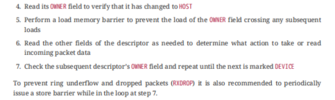
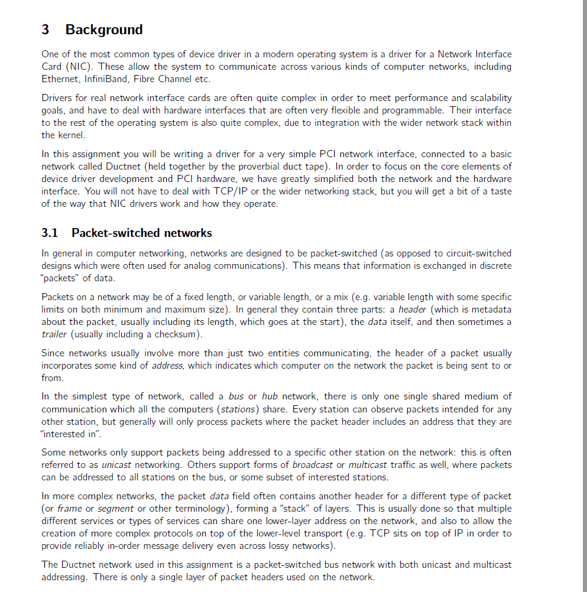
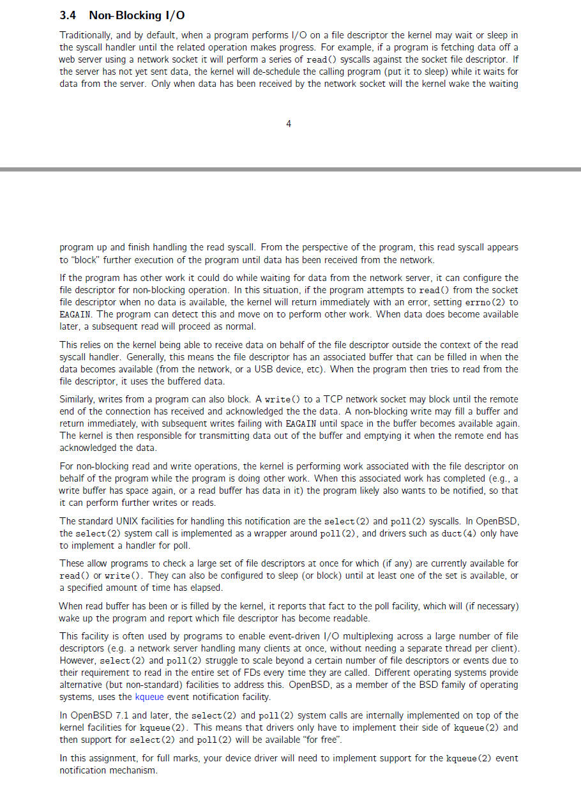
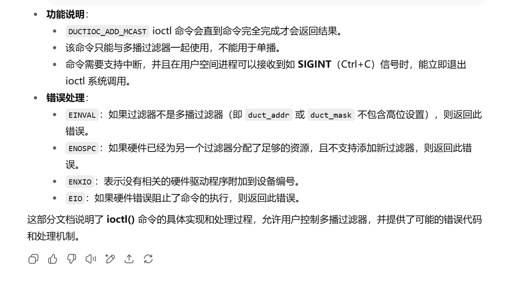
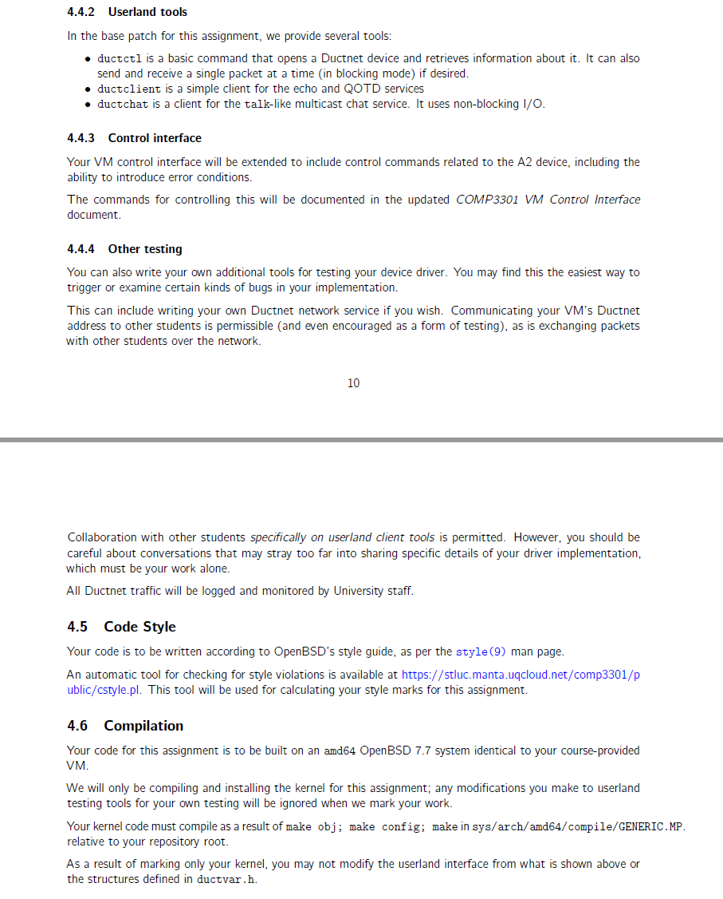
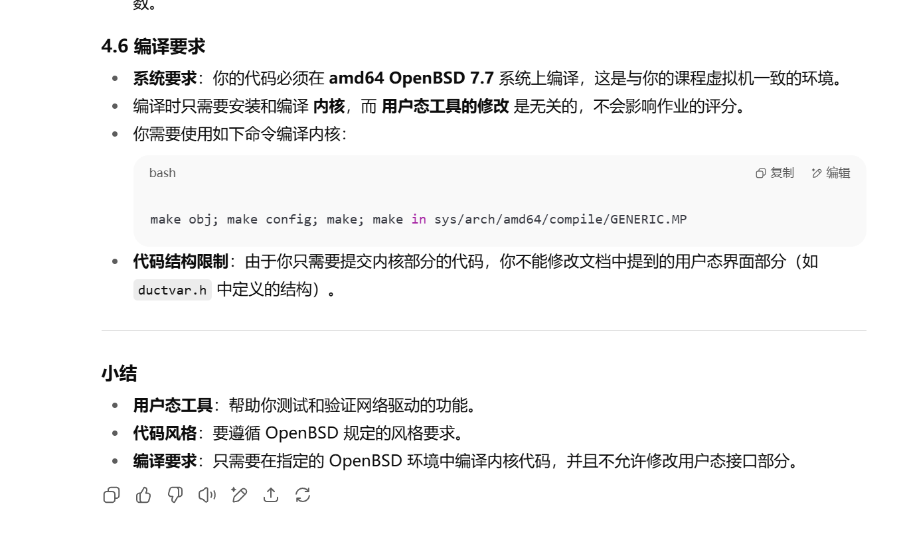

这份文档描述了一个名为"Ductnet"的虚拟网络设备，主要用于在一个简化的网络中传输数据包。以下是各个部分的详细解释：

### 1. **引言**

- **COMP3301 A2设备**：这是一个虚拟的PCI（外围组件互连）设备，用于在名为"Ductnet"的简化网络中传输数据包。
- **Ductnet的特点**：
  - **简单的描述符环DMA结构**：表示该设备使用直接内存访问（DMA）进行数据传输，采用描述符环结构。这种结构允许高效的数据传输，减少CPU的干预。
  - **全双工同时发送与接收操作**：意味着设备可以同时发送和接收数据，这样可以提高通信效率。
  - **支持双中断，且支持64位MSI-X中断**：意味着该设备支持多种中断方式，能够在事件发生时通知CPU，并且支持64位消息信号中断（MSI-X），有助于提高性能。
  - **总是启用中断合并**：这可能意味着多个中断会被合并成一个事件来减少CPU负担，从而提高效率。

### 2. **Ductnet**

- **分组交换网络**：Ductnet被描述为一个分组交换网络，意味着数据是以离散的分组（Packets）形式进行传输的。每个分组有源地址（发送方）和目标地址（接收方）。
- **总线拓扑**：网络中的所有设备都连接到一根共享的总线上，因此所有设备都能接收到相同的流量。
- **网络传输**：
  - **分组**：数据通过分组进行传输。每个分组都有一个定义的长度，源地址（发送者的地址）和目标地址（接收者的地址）。
  - **地址**：Ductnet网络中的每个设备都有一个32位的地址。地址的最高位用于标识多播组地址，即多个设备可以同时接收同一个分组。
- **数据包结构**：
  - 包括一个头部（数据包的前部分）和数据（数据包的内容）。
  - **头部结构**：
    - **源地址（Source）**：32位字段，表示发送站点的地址。
    - **目标地址（Destination）**：32位字段，表示接收站点的地址。
    - **长度（Length）**：32位字段，表示数据部分的大小（字节数）。
    - **保留字段（Reserved）**：为未来使用或填充保留的空间。
    - **数据（Data）**：实际的数据内容。
- **字节顺序**：文档提到所有字段都是以小端字节顺序（little-endian）进行传输的，即最不重要的字节首先被传输。
- **虚拟硬件**：每个Ductnet网络中的设备都有一个虚拟地址，这个地址在每次重启时可能会发生变化。

总的来说，这份文档详细描述了一个用于在简化网络中传输数据包的虚拟PCI网络设备的技术规格。

这部分文档描述了**COMP3301 A2设备的PCI接口**，提供了有关该设备如何通过PCI总线进行通信的详细信息。以下是每个部分的详细解释：

### 3. **PCI接口**

- **设备识别**：所有COMP3301设备使用PCI供应商ID为`0x3301`。该A2设备通过PCI配置空间的Type-0头部中的设备ID`0x2800`来识别。
- **PCI BAR（基址寄存器）**：A2设备有两个PCI基址寄存器（BAR）。BAR用于告诉操作系统设备的内存映射区域以及如何与该设备通信。

### **BAR 介绍**

设备有两个BAR，分别位于：

1. **BAR 0**：在PCI配置空间中的偏移地址`0x10`，类型为`MEM32`，表示操作设备的主内存BAR。
2. **BAR 1**：在偏移地址`0x18`，类型为`MEM32`，表示MSI-X配置表。

### **主BAR寄存器结构**

主BAR的长度是`0x88`，其寄存器结构如下图所示。该寄存器用于设备与主机之间的通信。未在图中显示的其他BAR字节保留供未来使用（RFU，Reserved For Future Use）。保留字节，包括图中显示的字节，不可被驱动程序读取或写入。

### **寄存器字段解释**

- **寄存器偏移地址**：这些寄存器的偏移地址在图中给出（例如，`0x00`, `0x08`, `0x10`等），每个寄存器都具有不同的功能和作用。
- **寄存器说明**：
  - **VMaj & VMin**：这两个寄存器是32位只读寄存器，分别表示该设备的规格版本的主版本号（VMaj）和次版本号（VMin）。这两个字段可以帮助系统识别设备规格的版本。
  - **FLAGS & HWADDR**：`FLAGS`寄存器是标志寄存器，`HWADDR`寄存器包含设备的硬件地址，它是Ductnet网络上此设备的唯一标识地址。这个硬件地址将插入到发送数据包的头部，并作为接收单播数据包的目标地址。
  - **CMDBASE**：表示命令基地址，用于指向设备的命令寄存器区域。
  - **CMDShift**、**TXBASE**、**RXBASE**等：这些寄存器大多数用于数据传输的控制，如数据发送的起始地址、接收数据的起始地址等。
  - **EVFLAGS**、**DBELL**：用于事件标志和设备的中断通知。

### **总结**

- **硬件地址（HWADDR）**：这个寄存器包含设备在Ductnet网络上的硬件地址，这是一个32位地址，插入到数据包的头部，并作为目标地址发送单播数据包。
- **规格版本**：通过`VMaj`和`VMin`寄存器，可以了解设备的规格版本。此设备的规格为2,0版，意味着它属于第二版，次版本为0。
- **其他寄存器**：除了列出的寄存器外，图中还展示了许多其他寄存器（如`TXSHIFT`，`RXSHIFT`，`EVFLAGS`等），这些用于控制数据传输、事件标志以及设备状态。

简而言之，这段内容讲述了A2设备如何通过PCI接口与系统交互，通过PCI寄存器进行内存和数据的读写，并描述了如何在Ductnet网络中标识该设备的硬件地址。

这部分文档继续详细描述了A2设备的寄存器及其中断处理机制。以下是每个部分的详细解释：

### **寄存器详细说明**

1. **FLAGS寄存器**：
   - 用于存储设备的错误标志，表示设备的操作条件无效。它会指示设备出现了错误或需要某种操作。**错误标志**会触发MSI-X中断向量0（第二个向量）。一旦这个条件发生，设备会停止操作，并且会在**重置**时进行处理。
2. **CMDBASE和CMDSHIFT寄存器**：
   - **CMDBASE**寄存器包含命令描述符环的基线（物理）地址。命令描述符用于控制设备的操作，比如启动和管理接收环（RX环）。
   - **CMDSHIFT**寄存器包含计算描述符数量所需的位移。它帮助决定命令描述符的数量，这通常是2的幂（比如8, 16, 32等）。这些寄存器需要由设备驱动程序写入，用于将数据包发送到Ductnet网络。
3. **TXBASE和TXSHIFT寄存器**：
   - **TXBASE**寄存器包含发送描述符环的基线（物理）地址。该描述符环用于将数据包发送到Ductnet网络。
   - **TXSHIFT**寄存器包含计算描述符数量所需的位移。
   - 这些寄存器是由设备驱动程序写入的，允许设备将数据包发送到网络。
4. **RXBASE和RXSHIFT寄存器**：
   - **RXBASE**寄存器包含接收描述符环的基线（物理）地址，用于接收数据包。
   - **RXSHIFT**寄存器与TXSHIFT相似，计算接收描述符的数量。设备驱动程序会写入这些寄存器，用于从Ductnet网络接收数据包。
5. **EVFLAGS寄存器**：
   - **EVFLAGS**寄存器包含由设备设置的标志，用于指示中断的原因。它会触发设备的**MSI-X中断向量0**（即常规的中断）。
   - 该寄存器在**清除标志**时是"清零"的，即设备会将其写入0，并且它将不会再次读取，直到标志被清除。
6. **DBELL寄存器**：
   - **DBELL**寄存器是由设备驱动程序写入的，用于唤醒设备并在命令或传输描述符环中写入新的条目。这个寄存器的写入会触发设备操作的启动。
   - **DBELL**寄存器的高位（`0x80000000`）在写入传输描述符时用于标识数据包传输的开始，并且在写入命令描述符时会被清除。

### **中断向量**

该设备支持两种MSI-X中断向量，分别如下：

1. **MSI-X中断向量 0**：
   - 当**新事件**发生时触发，表示有新事件发生且需要设备处理。
2. **MSI-X中断向量 1**：
   - 当设备遇到**致命错误**时触发，此时**FLAGS**寄存器中的位可以用于诊断。

**总结**：

- 设备寄存器的功能主要围绕数据传输的控制和错误检测。例如，**FLAGS寄存器**用于错误标志，**CMDBASE和CMDSHIFT**控制命令描述符的传输，**TXBASE和RXBASE**控制发送和接收的数据描述符。
- **EVFLAGS和DBELL**寄存器则用于事件标志的管理和设备启动。
- 设备还通过**MSI-X中断向量**进行中断处理，能够响应新事件或致命错误。

### **字节顺序**

所有通过该设备处理的多字节整数均以**小端字节顺序**存储，即低字节优先。

总结来说，这部分文档提供了关于设备如何通过寄存器控制数据包的发送、接收以及错误管理的详细信息，同时也描述了设备的中断机制。

这部分文档描述了**设备操作流程**，详细说明了驱动程序如何与设备交互，进行数据包的发送与接收。以下是每个步骤的详细解释：

### **操作流程（Flow of Operation）**

1. **设备启动时的初始化**
   - **检查版本信息**：启动时，驱动程序应该检查设备的版本号（`VMaj` 和 `VMin`寄存器）以确保设备兼容。
   - **读取硬件地址**：驱动程序还需要读取设备的硬件地址（`HWADDR`寄存器），以确保能够正确地报告该设备在网络上的地址。
   - **分配内存**：驱动程序应为命令描述符、发送描述符、接收描述符及环形缓冲区分配连续的内存空间，并初始化所有描述符。
2. **初始化描述符后**
   - 在初始化完描述符后，驱动程序应将命令描述符环（`CMDBASE`和`CMDSHIFT`寄存器）、发送描述符环（`TXBASE`和`TXSHIFT`寄存器）、接收描述符环（`RXBASE`和`RXSHIFT`寄存器）的值写入PCI配置寄存器中。
3. **开始数据包操作**
   - **启动命令**：要开始正常的设备操作（包括接收数据包），驱动程序应通过命令环发送一个**START命令**。当这个命令完成时，设备的正常操作就开始了。
   - **发送数据包**：要发送数据包，驱动程序需要将数据包写入下一个可用的发送描述符，并修改该描述符的所有者标志（`OWNER`）。然后，驱动程序将描述符的环索引写入到**DBELL寄存器**中，以触发数据包的发送。
4. **数据包发送完成后的处理**
   - 一旦数据包发送完成，驱动程序可以释放相关的缓冲区，**改变描述符的所有权**为主机，并通过设置**TXCOMP**标志来生成一个中断事件（触发MSI-X向量0的中断）。
5. **接收数据包**
   - 在接收数据包之前，驱动程序需要使用**ADDFILT**命令来设置接收描述符的接收地址。这个地址应该是设备的唯一硬件地址（即接收单播数据包的目标地址），并且可以接收来自其他多播地址的包。
   - **接收描述符设置**：驱动程序需要为接收数据包分配合适数量的描述符，并为这些描述符设置缓冲区。每当数据包被接收时，设备会检查接收环中的下一个描述符。如果该描述符设置为“设备拥有”状态，驱动程序会将数据包写入该缓冲区，并将描述符的所有权更改为主机，并生成一个中断。
6. **处理中断**
   - 每当中断发生时，驱动程序需要检查**EVFLAGS寄存器**，以确定是哪个描述符环触发了中断。驱动程序会检查设备最后写入的位置，并继续处理数据包，直到找到一个新的描述符，并将其所有权更改为主机。
7. **停止操作**
   - 要停止数据包操作，驱动程序应通过命令环发送一个**STOP命令**，并等待该命令完成。一旦停止命令完成，所有的描述符环都可以被安全地清理，驱动程序可以释放所有的缓冲区，确保设备处于无活动状态。
8. **重新开始操作**
   - 如果在以后需要重新启动正常操作，驱动程序应通过发送**START命令**重新启动传输和接收描述符环。此时，描述符环将重置为初始状态，设备将恢复正常操作。

### **总结**

- **数据传输控制**：驱动程序负责管理命令描述符和数据描述符的环形缓冲区，以确保数据包能够正确地发送和接收。
- **事件处理**：通过检查事件标志（`EVFLAGS`）和中断向量，驱动程序能够处理接收到的数据包，并在发送完成后释放资源。
- **状态管理**：设备的操作状态通过描述符的所有权和事件标志来管理，确保数据包传输过程中的控制和同步。

这部分文档提供了详细的操作步骤，指导如何通过驱动程序控制设备进行数据的发送和接收。

这部分文档详细描述了A2设备中使用的**描述符环（Descriptor Rings）**的工作原理。描述符环是设备管理数据传输的一种方式，特别是在发送和接收数据包时。以下是对文档内容的详细解释：

### **1. 描述符环的概念**

- 每个描述符环是由设备驱动程序分配的一段**连续的线性内存**。描述符环存储了有关数据包的信息，比如数据包的状态和它的物理位置。
- 每个环的地址被写入到PCI配置空间的寄存器中：`TXBASE`（发送描述符环）、`RXBASE`（接收描述符环）、或`CMDBASE`（命令描述符环）。
- 每个环的**大小**作为位移值（shift value）被写入到寄存器中：`TXSHIFT`、`RXSHIFT`或`CMDSHIFT`。

### **2. 描述符的大小和初始化**

- 每个描述符的**大小是64字节**，这对于每个环中的每个描述符都是固定的。
- **驱动程序**需要初始化整个描述符环并确保所有描述符都在环中分配完毕。描述符环的地址和大小分别写入到相应的寄存器中（如`TXBASE`、`TXSHIFT`等）。

### **3. 环的大小和位移**

- **环的大小**是由描述符的数量和每个描述符的大小决定的。描述符数量通常是2的幂。

  - 例如，如果发送环由一个4KB的页面组成，并且每个描述符占64字节，那么每个环将有64个描述符（4KB / 64字节 = 64）。在这种情况下，驱动程序需要将数字6（即`1 << 6 = 64`）写入到**TXSHIFT寄存器**中。

- > 这是一个非常好的问题！你提到的**文件描述符**和文档中提到的**传输/接收描述符**实际上是两种不同的概念，虽然它们都用于管理数据传输，但在功能和结构上有所不同。
  >
  > ### **1. 文件描述符（File Descriptor）**
  >
  > 在操作系统中，**文件描述符**通常是一个**整数**，用于标识和访问打开的文件或其他I/O资源。它只是一个**索引**，操作系统通过它来查找和管理文件的元数据，如文件的打开模式、文件位置指针等。文件描述符的作用是让应用程序能够通过数字标识文件，从而执行读写等操作。
  >
  > - **结构简单**：文件描述符本身并不包含文件的实际内容，而是指向文件元数据的一个标识符，通常只是一个整数（例如`int`类型）。
  > - **用途**：主要用于文件系统，管理打开的文件、网络连接、管道等。
  >
  > ### **2. 传输描述符（Transmit Descriptor）**
  >
  > 而在**网络编程**或者类似于这份文档中的设备编程中，**传输描述符**（以及**接收描述符**）是设备或驱动程序用来管理数据包和I/O操作的**结构体**。这种描述符不仅仅是一个索引，它通常包含许多字段，用来描述数据包的各个方面，比如：
  >
  > - **数据包的长度**
  > - **数据包的目标或源地址**
  > - **数据的指针（指向缓冲区的内存地址）**
  > - **状态信息（例如是否已完成发送或接收）**
  > - **所有权信息（设备或主机）**
  >
  > 在你提到的文档中，描述符的大小是**64字节**，它包含了多个字段（如地址、长度、状态、指针等），这些字段对于设备进行有效的数据传输、错误检测和状态管理非常重要。因此，描述符本身的大小较大，不同于简单的**文件描述符**。
  >
  > ### **为什么传输描述符这么大（64字节）？**
  >
  > 1. **需要更多的字段**：传输描述符不仅包含文件描述符所包含的地址或状态，还涉及到数据包的详细信息（如数据长度、源/目标地址、数据缓冲区的指针等）。为了管理这些数据，描述符需要更大的空间。
  > 2. **支持复杂操作**：设备描述符需要管理复杂的硬件操作，如数据包的发送和接收。描述符不仅需要指示数据的位置，还需要跟踪多个环形缓冲区的状态、指示设备是否已经处理完数据等。
  > 3. **内存对齐**：描述符通常会根据硬件要求进行内存对齐，这可能导致每个字段的大小达到一定的字节数。64字节的大小有时是为了在内存中保证对齐，以提高设备和CPU访问内存的效率。
  >
  > ### **文件描述符 vs 设备描述符的区别**：
  >
  > | 特点     | 文件描述符                    | 设备描述符                                                  |
  > | -------- | ----------------------------- | ----------------------------------------------------------- |
  > | **大小** | 通常是一个`int`（4字节）      | 64字节（包含多个字段和指针等信息）                          |
  > | **功能** | 仅用于标识打开的文件或I/O资源 | 用于管理数据包传输，包括源/目标地址、数据长度、缓冲区指针等 |
  > | **用途** | 操作系统内部用于文件操作      | 用于网络设备、DMA（直接内存访问）等设备的I/O操作管理        |
  > | **结构** | 简单的整数标识符              | 包含多个字段，如地址、状态、长度等                          |
  >
  > ### **总结**：
  >
  > - **文件描述符**主要用于标识文件或I/O资源，它是一个简单的整数，功能相对简单。
  > - **设备描述符**则更为复杂，它涉及到数据传输的各个方面，需要更多字段来管理数据包的发送、接收、状态、地址等信息。因此它的大小较大，通常是64字节。
  >
  > 你学到的文件描述符和这里的设备描述符属于不同层面的抽象，前者是用于操作系统的文件管理，后者是网络设备或硬件设备的数据管理。

### **4. 描述符的所有权（OWNER）**

- 每个描述符有一个**OWNER字段**，该字段用于指示当前该描述符的所有者是**主机**还是**设备**。

  - 在发送环中，**OWNER字段**为设备所有时，表示该描述符包含一个准备发送的数据包，设备可以立即开始发送。
  - 在接收环中，**OWNER字段**为主机所有时，表示该描述符包含一个已接收的数据包，驱动程序可以取出该数据包并进行处理。

- > 这段话描述的是网络设备驱动程序与硬件（网卡）之间通过**描述符（Descriptor）** 和**环形缓冲区（Ring Buffer）** 进行高效数据传输的核心机制。**OWNER 字段**是实现硬件与软件（主机驱动）同步的关键标志。下面详细解释其含义：
  > ---
  > ### **核心概念**
  > 1. **描述符 (Descriptor)**：
  >    * 是一个数据结构，通常包含指向数据包缓冲区的指针、数据包长度、状态信息（如校验和结果、错误标志）以及关键的 **OWNER 字段**。
  >    * 它本身不存储数据包内容，而是描述数据包的位置和属性。
  > 2. **环形缓冲区 (Ring Buffer)**：
  >    * 是内存中一块连续区域，组织成环形队列，存放描述符。
  >    * 分为 **发送环 (Transmit Ring, TX Ring)** 和 **接收环 (Receive Ring, RX Ring)**。
  > 3. **OWNER 字段**：
  >    * 一个简单的位标志（通常 1 位），只有两个值：
  >      * **主机所有 (Host Owned / Software Owned)**：通常表示 `0`。
  >      * **设备所有 (Device Owned / Hardware Owned)**：通常表示 `1`。
  >    * **作用**：明确指示当前哪个实体（主机驱动或网卡硬件）有权操作该描述符及其关联的数据包缓冲区。这是硬件和软件之间**同步的基石**。
  > ---
  > ### **在发送环 (TX Ring) 中的工作流程**
  > 1. **驱动准备发送数据包**：
  >    * 驱动程序从应用程序或网络栈获取一个要发送的数据包。
  >    * 驱动在内存中分配一个缓冲区，将数据包复制进去。
  >    * 驱动在 TX Ring 中找到一个**空闲的描述符**（其 OWNER 字段为 **主机所有**）。
  >    * 驱动设置该描述符：
  >      * 将描述符的指针指向存放数据包的内存缓冲区。
  >      * 设置数据包长度。
  >      * **将 OWNER 字段设置为 `设备所有`**。
  >    * **关键点**：驱动设置 `OWNER = 设备所有` 后，就**不再触碰**这个描述符及其缓冲区。它把控制权交给了硬件。
  > 2. **硬件发送数据包**：
  >    * 网卡硬件持续轮询（或通过中断通知）TX Ring。
  >    * 当硬件发现一个描述符的 **OWNER 字段为 `设备所有`** 时：
  >      * 它知道这个描述符包含一个**有效、准备发送**的数据包。
  >      * 硬件读取描述符中的指针和长度。
  >      * 硬件从内存中读取数据包内容，并通过物理网络接口发送出去。
  >    * 发送完成后：
  >      * 硬件可能会更新描述符的状态字段（如设置发送完成标志、记录时间戳）。
  >      * **硬件将 OWNER 字段设置回 `主机所有`**。
  >      * 硬件可能会触发一个中断通知驱动有发送完成（或驱动轮询发现状态变化）。
  > 3. **驱动处理发送完成**：
  >    * 驱动检测到描述符的 **OWNER 字段变回 `主机所有`**。
  >    * 驱动知道该数据包已成功发送（或检查状态字段确认）。
  >    * 驱动释放该描述符关联的内存缓冲区（或标记为可重用）。
  >    * 该描述符现在变为**空闲**，可以用于下一次发送。
  >    **总结 (TX Ring)**：
  > * **`OWNER = 设备所有`**：**“硬件请发送这个包！”**。描述符包含一个**有效、待发送**的数据包，硬件拥有操作权。
  > * **`OWNER = 主机所有`**：**“这个包我（驱动）处理完了，你可以用了”** 或 **“这个描述符是空的，你可以放新包”**。描述符空闲或已完成发送，驱动拥有操作权。
  > ---
  > ### **在接收环 (RX Ring) 中的工作流程**
  > 1. **驱动初始化接收环**：
  >    * 驱动程序在内存中预先分配一组**空的缓冲区**（用于存放即将接收的数据包）。
  >    * 驱动在 RX Ring 中创建描述符，每个描述符指向一个空的接收缓冲区。
  >    * 驱动**将所有描述符的 OWNER 字段初始化为 `设备所有`**。
  >    * **关键点**：驱动设置 `OWNER = 设备所有` 后，就**不再触碰**这些描述符及其缓冲区。它把缓冲区“借”给了硬件，让硬件往里面填数据。
  > 2. **硬件接收数据包**：
  >    * 当网卡从网络接收到一个数据包时：
  >      * 硬件在 RX Ring 中查找一个 **OWNER 字段为 `设备所有`** 的描述符。
  >      * 硬件知道这个描述符指向一个**空的、可用的**接收缓冲区。
  >      * 硬件将接收到的数据包**写入**该描述符指向的内存缓冲区。
  >      * 硬件更新描述符：
  >        * 设置实际接收到的数据包长度。
  >        * 设置状态信息（如校验和结果、错误标志）。
  >        * **将 OWNER 字段设置为 `主机所有`**。
  >      * 硬件触发一个中断通知驱动有新数据包到达。
  > 3. **驱动处理接收到的数据包**：
  >    * 驱动在中断处理程序或轮询过程中，检测到 RX Ring 中有描述符的 **OWNER 字段为 `主机所有`**。
  >    * 驱动知道该描述符指向的缓冲区中包含一个**新接收到的、完整的数据包**。
  >    * 驱动读取描述符中的长度和状态信息。
  >    * 驱动将缓冲区中的数据包内容传递给网络协议栈进行处理。
  >    * 驱动**重新初始化**该描述符：
  >      * 分配一个新的空缓冲区（或复用旧缓冲区）。
  >      * 更新描述符指针指向新缓冲区。
  >      * **将 OWNER 字段设置回 `设备所有`**。
  >    * 该描述符现在又可以被硬件用于接收下一个数据包。
  >    **总结 (RX Ring)**：
  > * **`OWNER = 设备所有`**：**“硬件请用这个空缓冲区收包！”**。描述符指向一个**空的、可用**的接收缓冲区，硬件拥有写入权。
  > * **`OWNER = 主机所有`**：**“这个包我（硬件）收好了，你来处理吧！”**。描述符指向一个**已填充、待处理**的数据包，驱动拥有读取和处理权。
  > ---
  > ### **为什么需要 OWNER 字段？核心目的**
  > 1. **同步与互斥**：
  >    * 确保硬件和软件**不会同时操作同一个描述符或其缓冲区**。这是防止数据损坏、状态混乱的关键。
  >    * OWNER 字段就像一个**简单的锁**或**通行证**。只有拥有通行证（OWNER）的一方才能操作。
  > 2. **高效通信**：
  >    * 避免了复杂的锁机制（在高速网络环境下，锁开销巨大）。
  >    * 硬件和软件通过**轮询或中断**检查 OWNER 状态，实现高效的、基于状态的协作。
  > 3. **状态指示**：
  >    * 清晰地表明了描述符及其关联缓冲区的**当前状态**（是空闲的、待发送的、已发送的、待接收的、已接收的）。
  > 4. **环形缓冲区管理**：
  >    * 是驱动和硬件在环形队列中**推进“头”和“尾”指针**的依据。硬件根据 OWNER 找到可操作的描述符，驱动根据 OWNER 找到已完成或可重用的描述符。
  > ---
  > ### **简单比喻**
  > * **想象一个共享的办公桌（环形缓冲区），上面放着一些文件盒（描述符），每个盒子可以放一份文件（数据包）。**
  > * **OWNER 字段就是盒子上的标签：**
  >   * **“主机所有”**：标签写着 **“员工（驱动）专用”**。员工可以往盒子里放新文件（发送准备），或取走处理完的文件（接收处理）。
  >   * **“设备所有”**：标签写着 **“快递员（硬件）专用”**。快递员可以从盒子里取走文件发送出去（发送），或把新收到的文件放进盒子（接收）。
  > * **规则**：
  >   * 只有标签写着“快递员专用”的盒子，快递员才能碰（发送或接收）。
  >   * 只有标签写着“员工专用”的盒子，员工才能碰（放新文件或取走文件）。
  >   * 当一方操作完盒子后，必须**更换标签**，把控制权交给另一方。
  > ---
  > ### **总结**
  > * **OWNER 字段是描述符中至关重要的同步标志。**
  > * **在发送环 (TX Ring) 中：**
  >   * `OWNER = 设备所有`：描述符包含**待发送**的数据包，硬件可发送。
  >   * `OWNER = 主机所有`：描述符**空闲或已完成发送**，驱动可重用。
  > * **在接收环 (RX Ring) 中：**
  >   * `OWNER = 设备所有`：描述符指向**空缓冲区**，硬件可写入接收包。
  >   * `OWNER = 主机所有`：描述符包含**已接收**的数据包，驱动可处理。
  > * **核心作用**：确保硬件和软件在操作描述符及其数据缓冲区时**互不冲突**，实现高效、可靠的数据包收发。理解 OWNER 字段的状态转换是理解高性能网络驱动工作原理的基础。
  >
  > --------------------------------
  > 以上内容由AI生成，仅供参考和借鉴

### **5. 描述符环的工作方式**

- 描述符环是一个**循环缓冲区（Circular Buffer）**，这意味着当环的末尾被访问时，生产者（设备或主机）会“回绕”到环的开头，即从索引0开始（这就是“环”的含义）。消费者（通常是驱动程序）只会读取上一个未被消费的描述符。
- **发送环**：
  - 一旦描述符的所有权被设置为设备所有，设备可以立即开始发送数据包。在写入**DBELL寄存器**后，设备开始传输数据包。为了确保数据传输顺利进行，驱动程序必须确保在写入描述符的**OWNER字段**之前，其他所有字段（如数据包的内容和描述符的其它元数据）已被写入内存。
- **接收环**：
  - **接收环的描述符**只会被设备在接收到数据包时更新，之后它们会通过修改**OWNER字段**将所有权交给主机。主机收到所有权后，就可以读取数据包并处理它。

### **6. 描述符的使用顺序**

- **描述符必须按顺序使用**：即设备不会发送描述符1，直到描述符0已传输完成；同样，接收描述符也必须按顺序使用。

### **总结**

- **描述符环**：设备使用描述符环来管理数据包的传输。每个环由多个64字节的描述符组成，环的大小是描述符数量的2的幂。
- **所有权管理**：每个描述符都有一个`OWNER`字段，表示描述符当前的所有者是主机还是设备。
- **环的工作机制**：描述符环是一个循环缓冲区，生产者和消费者轮流访问它，确保数据的连续传输。
- **发送和接收**：设备通过更新描述符的所有权来开始发送数据包，主机通过读取描述符来处理接收的数据包。

这段内容提供了A2设备如何通过描述符环进行数据传输的详细工作流程。

这部分文档详细描述了**传输描述符（Transmit Descriptor）**和**接收描述符（Receive Descriptor）**的结构。它们是A2设备用于管理数据包传输的关键部分。以下是该段内容的详细解释：

### **描述符结构**

每个描述符都有一个固定的结构，包含多个字段来描述数据包的状态和处理信息。结构在不同的环（如传输环或接收环）中有所不同，但一些字段是共同的。

### **描述符字段解释**：

| 字段名称        | 地址偏移 | 说明                                                         |
| --------------- | -------- | ------------------------------------------------------------ |
| **OWNER**       | `0x00`   | 该字段表示描述符的所有者，设置为`DEVICE`时，表示设备拥有该描述符，表示数据包准备好发送；设置为`HOST`时，表示主机拥有该描述符，表示接收的数据包准备被主机处理。 |
| **RESERVED**    | `0x04`   | 保留字段，通常不使用。                                       |
| **PKTLEN**      | `0x08`   | 设备用于接收描述符时写入的字段，指示接收到的数据包的总长度。它在传输描述符中不使用。 |
| **LENGTH1**     | `0x10`   | 在传输描述符中，表示数据包的长度。                           |
| **LENGTH2**     | `0x12`   | 用于存储额外的传输数据长度。                                 |
| **DESTINATION** | `0x14`   | 传输描述符中，用于指定数据包的目标地址。接收描述符中，此字段用于存储接收数据包的源地址。 |
| **SOURCE**      | `0x16`   | 接收描述符中，表示源地址。                                   |
| **POINTER1**    | `0x18`   | 指向用于接收数据或发送数据的缓冲区的指针。                   |
| **POINTER2**    | `0x20`   | 第二个指向缓冲区的指针。                                     |
| **POINTER3**    | `0x28`   | 第三个指向缓冲区的指针。                                     |
| **POINTER4**    | `0x30`   | 第四个指向缓冲区的指针。                                     |

### **字段详细说明**：

1. **OWNER字段**：
   - 用来表示该描述符的所有者。它的值可以是**DEVICE**（设备）或**HOST**（主机）。
   - 在**传输环（Transmit Ring）\**中，描述符的\**OWNER字段**被设置为**DEVICE**，表示设备控制该描述符并准备发送数据包。
   - 在**接收环（Receive Ring）\**中，描述符的\**OWNER字段**被设置为**HOST**，表示接收到的数据包已经准备好供主机处理。
2. **PKTLEN字段**：
   - 该字段在接收描述符中由设备写入，用于指示接收数据包的总长度（即数据包的大小）。它不在传输描述符中使用。
3. **LENGTH1 和 LENGTH2字段**：
   - 这两个字段在传输描述符中使用，**LENGTH1**表示数据包的长度，**LENGTH2**可以用于存储额外的长度信息。
   - 在接收描述符中，这些字段可能用来指示接收到的数据包的长度。
4. **DESTINATION字段**：
   - 在**传输描述符**中，`DESTINATION`字段用于指定数据包的目标地址，即数据包将要发送到的地址。
   - 在**接收描述符**中，`DESTINATION`字段没有被使用，改为存储**源地址**（即发送方地址）。
5. **SOURCE字段**：
   - 在**接收描述符**中，`SOURCE`字段存储接收到的数据包的发送方地址。
   - 该字段不在传输描述符中使用。
6. **POINTER字段**：
   - 这些字段指向用于存储数据包内容的缓冲区。它们是指向线性内存缓冲区的指针，用于存储或传输数据。
   - **POINTER1**、**POINTER2**、**POINTER3**和**POINTER4**可能是不同的缓冲区或内存位置的指针，这取决于数据包的大小和结构。

### **描述符的工作原理**

- **传输描述符**：在设备发送数据包时，设备将描述符的所有权设置为**DEVICE**，并通过**POINTER字段**指向缓冲区。设备将数据包的目标地址写入**DESTINATION**字段，并在传输完成后释放描述符。
- **接收描述符**：在接收数据包时，设备设置描述符的所有权为**HOST**，并通过**SOURCE**字段存储接收到的源地址，**PKTLEN**字段指示数据包的长度。主机在处理完数据包后，会将描述符的所有权返回给设备，表示可以继续处理其他数据包。

### **总结**：

- **描述符**用于标识数据包的状态和位置，并通过**OWNER字段**表示谁拥有描述符（设备或主机）。
- **PKTLEN**、**LENGTH**和**POINTER**等字段用于存储数据包的长度和存储位置。
- **传输描述符**用于发送数据包，**接收描述符**用于接收数据包，它们是通过环形缓冲区进行管理的。

这些描述符的操作顺序和字段内容对于设备和主机之间的协作至关重要。

这部分文档描述了**描述符的初始状态（Initial Descriptor State）\**以及\**如何传输数据包（Transmitting a Packet）**。下面是详细的解释：

### **6.2 初始描述符状态（Initial Descriptor State）**

在设备启动时，驱动程序需要对传输环和接收环进行初始化。初始化的具体步骤如下：

1. **设置OWNER字段**：驱动程序需要将每个描述符的`OWNER`字段设置为**HOST**。这意味着在初始化时，描述符的所有权属于主机，表示主机控制这些描述符。
2. **填充其他字段为零**：除了`OWNER`字段，所有其他字段应该被初始化为零。这确保了在环初始化时，其他字段不会包含任何错误数据。

对于传输环和接收环的初始化，必须在执行`START`命令之前完成，或者在写入`BASE`和`SHIFT`寄存器之后执行初始化。

对于命令环（Command ring）的初始化，所有描述符必须在写入`CMDBASE`寄存器之前由主机驱动程序初始化。

### **6.3 传输数据包（Transmitting a Packet）**

假设主机驱动程序要将一个数据包发送到站点地址`0x12345678`，数据包的线性地址为`0xabcde1200`，长度为`0x10`字节。接下来，描述符环中的下一个空闲描述符的索引为5（即在索引5处）。

为确保数据包成功传输，驱动程序需要按照以下步骤进行操作：

1. **定位下一个空闲的传输描述符**：
   - 驱动程序首先需要定位传输环中下一个空闲的描述符。这是为了为即将发送的数据包分配一个描述符。
2. **检查描述符的所有权**：
   - 驱动程序需要检查描述符的`OWNER`字段，确保它已经被设置为**HOST**，表示主机控制该描述符，并且它可以继续配置描述符。
3. **写入描述符的字段**：
   - 驱动程序需要将描述符的字段写入适当的值：
     - **OWNER字段**：设置为`DEVICE`，表示设备将接管该描述符。
     - **DESTINATION字段**：设置为目标地址（`0x12345678`），即数据包的目标地址。
     - **LENGTH字段**：设置为数据包的长度（`0x10`字节）。
     - **POINTER字段**：设置为数据包的线性地址（`0xabcde1200`）。
     - **其他LENGTH字段**：设置为零。
4. **执行存储屏障（Store Memory Barrier）**：
   - 驱动程序执行存储屏障操作，以确保在写入**OWNER字段**之前，所有的数据写入操作（如目标地址和长度等）已经完成。这可以防止数据在描述符的更新过程中被错误地交错或遗漏。
5. **再次将OWNER字段设置为DEVICE**：
   - 驱动程序需要将描述符的**OWNER字段**设置为`DEVICE`，表示设备将控制该描述符并开始处理数据包的发送。
6. **写入描述符的索引到DBELL寄存器**：
   - 驱动程序将当前描述符的索引（例如`0x5`）写入到`DBELL`寄存器中，以触发设备开始处理数据包。
7. **数据包传输完成后的操作**：
   - 一旦数据包被传输完成，设备将设置`TXCOMP`标志，并发出一个MSI-X中断信号，通知主机数据包已传输完成。设备的所有权字段将被设置为`HOST`，指示主机可以重新使用这个描述符。

### **总结**

- **描述符初始化**：驱动程序在设备启动时会初始化所有的描述符环，设置描述符的所有权为主机，并将其他字段清零。
- **数据包传输**：主机驱动程序通过设置传输描述符中的字段（如目标地址、数据长度和指针等）来准备数据包传输。通过一系列步骤，驱动程序确保数据包被正确传输，并在完成后触发中断通知主机。

这部分内容的重点是描述符的初始化和数据包传输的具体步骤，确保设备和主机之间的数据传输过程按预期顺利进行。

这两部分文档描述了**接收数据包**和**处理事件**的过程，以及如何管理描述符的状态。下面是详细的解释：

### **6.4 接收数据包（Receiving packets）**

假设主机驱动程序准备接收数据包，驱动程序已经为接收数据分配了两个**4KB页面**（总共8KB的数据空间），并且这些页面的地址是`0xabcde1000`和`0xabcde5000`。这两个页面是线性不连续的。下一个空闲的接收描述符在接收描述符环的索引为`0x31`。

为确保可以接收数据包，驱动程序需要执行以下步骤：

1. **定位下一个空闲的接收描述符**：
   - 驱动程序首先需要定位接收描述符环中的下一个空闲描述符。
2. **检查描述符的所有权字段（OWNER）**：
   - 驱动程序需要检查该描述符的`OWNER`字段，确保它已被设置为**HOST**。这意味着主机拥有该描述符，表示它可以继续处理该描述符并读取数据。
3. **写入描述符的字段**：
   - 驱动程序将描述符的字段写入适当的值：
     - **OWNER字段**：设置为`DEVICE`，表示设备将接管该描述符。
     - **LENGTH字段**：设置接收数据的长度为`0x1000`字节。
     - **POINTER字段**：设置指向接收缓冲区的指针，指向内存地址`0xabcde1000`。
     - 其他字段如`LENGTH2`和`POINTER2`需要设置为零。
4. **执行存储屏障**：
   - 驱动程序需要执行**存储屏障**，确保在写入`OWNER`字段之前，其他数据已经正确地写入内存。
5. **再次设置OWNER字段为DEVICE**：
   - 然后，驱动程序需要将描述符的`OWNER`字段再次设置为`DEVICE`，表示设备可以控制该描述符并开始接收数据包。
6. **执行存储屏障**：
   - 为确保同步，驱动程序需要执行第二次存储屏障，确保所有的数据写入已经完成。

### **6.5 处理事件（Handling events）**

这部分文档描述了设备中断和事件的处理。事件通过`EVFLAGS`寄存器来指示，`EVFLAGS`寄存器的结构如下：

| 位   | 31      | 30      | 29     | 28     | 27     | 26   | 25   | 24   | 23   | 22   | 21   | 20   | 19   | 18   | 17   | 16   |
| ---- | ------- | ------- | ------ | ------ | ------ | ---- | ---- | ---- | ---- | ---- | ---- | ---- | ---- | ---- | ---- | ---- |
| 预留 | RXJUMBO | CMDCOMP | RXDROP | RXCOMP | TXCOMP |      |      |      |      |      |      |      |      |      |      |      |

每个事件类型的含义如下：

- **TXCOMP**：表示传输描述符已经完成，可以进行后续操作。
- **RXCOMP**：表示接收描述符已经完成，可以读取接收数据。
- **CMDCOMP**：表示命令描述符已经完成。
- **RXDROP**：表示由于接收环缓冲区不足，丢弃了接收到的数据包。
- **RXJUMBO**：表示接收到的包大小超过了接收环的限制（通常是大包丢失时的标志）。

假设驱动程序没有处理完成中断，并且正在接收事件，驱动程序需要执行以下步骤：

1. **等待设备发出MSI中断（MSI interrupt）**：
   - 驱动程序首先等待设备发出一个MSI中断，表明有事件已经发生。
2. **检查`EVFLAGS`寄存器**：
   - 驱动程序检查`EVFLAGS`寄存器，查看是否有事件标志，确定是哪种类型的事件已经发生。
3. **处理已完成的描述符**：
   - 驱动程序开始处理`EVFLAGS`寄存器中标记为已完成的描述符，通常意味着处理接收到的数据包。
4. **检查描述符的所有权**：
   - 驱动程序继续检查每个描述符的`OWNER`字段，直到所有描述符的`OWNER`字段标记为`DEVICE`，表明这些描述符已完成。
5. **执行额外的内存同步**：
   - 为确保数据的正确性，驱动程序可能需要执行内存屏障，防止在处理描述符时数据被错乱。

### **总结**

- **接收数据包**：驱动程序需要在接收环中找到空闲描述符并为其配置地址、长度等字段，然后将描述符的所有权交给设备，准备接收数据包。
- **处理事件**：驱动程序需要根据事件标志（`EVFLAGS`寄存器中的标志）来处理完成的描述符，并确保所有数据包都被正确处理。在此过程中，驱动程序需要读取和更新描述符的所有权字段，并执行适当的内存同步操作。

这部分内容帮助驱动程序管理和处理从设备接收到的数据包，并确保高效和同步的操作。

这部分文档介绍了**命令环（Command Ring）**的结构，特别是**命令描述符（Command Descriptor）**的工作方式。命令环用于处理命令操作，如启动或停止数据包的传输，以及管理接收过滤器等。以下是详细的解释：

### **7. Command Ring（命令环）**

命令环类似于接收描述符和传输描述符的环结构。它也由设备驱动程序分配的一块连续的线性内存组成。命令环的地址被写入到**CMDBASE**寄存器（位于BAR 0中），并且其大小通过**CMDSHIFT**寄存器以位移值的形式指定。

- **命令描述符的大小**是**32字节**，它的功能和接收、传输描述符类似，但主要用于控制和管理设备的操作。
- **命令环**用于执行各种控制命令，如启动和停止数据包传输，添加或移除接收过滤器等。

### **命令环中的描述符**

命令环描述符定义了用于管理设备操作的命令。它们的用途如下：

| #    | Mnemonic | 用途                                      |
| ---- | -------- | ----------------------------------------- |
| 1    | START    | 启动正常数据包操作                        |
| 2    | STOP     | 停止正常数据包操作及所有的传输/接收环轮询 |
| 3    | ADDFLT   | 向接收环添加地址过滤器                    |
| 4    | RMVFLT   | 从接收环移除地址过滤器                    |

### **7.1 命令描述符（Command Descriptor）**

命令描述符的结构如下所示：

| 字段           | 偏移地址 | 说明                                                         |
| -------------- | -------- | ------------------------------------------------------------ |
| **OWNER**      | `0x00`   | 描述符的所有权字段，值为**DEVICE**（0x55）或**HOST**（0xAA）。 |
| **TYPE**       | `0x04`   | 描述符类型，包含命令编号，标明命令是启动、停止、添加过滤器还是移除过滤器等。 |
| **ERR**        | `0x08`   | 错误标志，设备在处理每个命令后会写入此字段，表示命令的处理结果。 |
| **FILTMASK**   | `0x10`   | 仅用于**ADDFLT**和**RMVFLT**命令，表示过滤器掩码。           |
| **FILTERADDR** | `0x14`   | 仅用于**ADDFLT**和**RMVFLT**命令，表示要添加或移除的地址过滤器的地址。 |

### **字段说明：**

1. **OWNER字段**：
   - `OWNER`字段指示该描述符的所有权。它的值可以是：
     - **DEVICE**（0x55）：表示设备控制该描述符。
     - **HOST**（0xAA）：表示主机控制该描述符。
2. **TYPE字段**：
   - `TYPE`字段用于存储描述符的类型，指示命令的类型。它包含命令编号（如启动、停止、添加过滤器等）。
3. **ERR字段**：
   - `ERR`字段由设备在处理命令后写入，表示命令的处理结果。常见的错误代码包括`0x08`（命令成功）和`0xFF`（命令失败）。
4. **FILTMASK字段**：
   - 该字段仅用于**ADDFLT**和**RMVFLT**命令，表示要添加或移除的过滤器的掩码。它决定了哪些数据包将通过该过滤器。
5. **FILTERADDR字段**：
   - 该字段也仅用于**ADDFLT**和**RMVFLT**命令，指定地址过滤器的目标地址。该地址决定了哪些数据包应该被接收。

### **总结**

命令环用于管理设备的操作命令，驱动程序通过命令描述符发出命令来控制设备，如启动数据传输、停止操作、添加或移除地址过滤器等。命令描述符结构较为简单，但它们对于控制设备的工作流程至关重要。

- **描述符字段**：
  - `OWNER`字段指示命令的所有者（主机或设备）。
  - `TYPE`字段标识命令类型。
  - `ERR`字段记录命令执行的结果。
  - `FILTMASK`和`FILTERADDR`用于添加或移除接收过滤器。

命令描述符是设备和主机之间协作的基础，允许主机通过驱动程序控制设备的操作，如数据包传输的开始和停止。

这段内容介绍了 **START** 和 **STOP** 命令在设备中启动和停止数据包处理的功能。

### **START命令：**

- **用途：** 启动数据包处理。
- **有效性条件：**
  - `RXBASE/RXSHIFT` 和 `TXBASE/TXSHIFT` 寄存器已写入有效值。
  - 接收和发送描述符环已初始化为所需的初始值。
  - `EVFLAGS` 寄存器在最后一次 `STOP` 命令之后已经被读取（重置为零）。
  - `FLAGS` 寄存器为空。

### **START命令错误：**

- 错误代码 1：**已经在运行**，即之前已经执行过 `START` 命令。

### **STOP命令：**

- **用途：** 停止数据包处理。`STOP` 命令将停止所有的包处理，包括 RX 和 TX 描述符的环上的数据包传输和接收。
- **有效性条件：**
  - 必须先执行并成功执行过 `START` 命令。

### **STOP命令错误：**

- 错误代码 1：**已经停止**，即 `START` 命令未曾执行或 `STOP` 命令已经执行过。

### 总结：

- **START命令** 启动数据包处理，要求一些寄存器已被正确配置。
- **STOP命令** 停止数据包处理，并确保所有相关活动已停止。

这段内容介绍了 **ADDFFILT** 和 **RMFILT** 命令的功能和使用方法，主要用于从接收环中添加和移除地址过滤器。以下是详细的解释：

### ADDFFILT 命令：

- **功能**：该命令将地址过滤器添加到接收环中。
- **工作原理**：当设备从Ductnet网络接收数据包时，它会将数据包的目标地址与一系列“过滤器”进行匹配。如果任何过滤器与数据包匹配，则该数据包被放入接收环。否则，数据包将被丢弃。
- **过滤器组成**：每个过滤器包含两个字段：
  - **FILTMASK**：掩码位。
  - **FILTADDR**：地址字段。掩码与数据包的目标地址进行按位与运算，然后与地址值进行比较。
  - 匹配条件：如果目标地址与掩码按位与运算后的结果相等，则匹配。
- **注意**：过滤器添加后，接收环将开始接收数据包，直到至少执行了一个 ADDFFILT 命令。

### RMFILT 命令：

- **功能**：该命令从接收环中移除一个地址过滤器。
- **工作原理**：移除过滤器时，两个字段（掩码和地址）必须与之前通过 ADDFFILT 添加的过滤器完全匹配。一个 RMFILT 命令将撤销与之匹配的 ADDFFILT 命令的效果。
- **注意**：可以添加重叠的过滤器，但设备不会验证过滤器链的重叠或重复性。

### 其他信息：

- **过滤器操作的时间**：这些命令可以在任何时间执行，无论数据包处理引擎是否运行。
- **设备支持的过滤器数量**：从版本 2.0 开始，设备最多支持 16 个硬件接收过滤器。

### 错误代码：

- **ADDFFILT 错误代码**：
  - `#1`：没有更多的过滤器空间。
- **RMFILT 错误代码**：
  - `#1`：未找到完全匹配的过滤器进行移除。

总结来说，ADDFFILT 和 RMFILT 命令是用于动态管理网络接收过滤器的工具，帮助控制哪些数据包能够进入接收环。

这张图解释了 `FLAGS` 寄存器（在 BAR 中）的位结构和不同的错误标志。`FLAGS` 寄存器包含多个标志位，用于指示设备在操作过程中遇到的错误或问题。

### 标志位解释：

- **FLTB**：设备在追踪由 BAR 提供的指针时，遇到页面错误、总线错误或访问违规。
- **FLTR**：设备在追踪由描述符环提供的指针时，遇到页面错误、总线错误或访问违规。
- **SEQ**：设备检测到一个操作顺序错误（例如，在移位寄存器有效之前，向 `DBELL` 寄存器写入数据）。
- **HWERR**：设备出现了硬件错误。
- **RST**：设备被驱动程序在写入时设置为重置过程的一部分，始终读取为零。

### 行为描述：

- **任何一个标志位被设置时**，设备将停止工作，需要通过复位来恢复服务。
- **MSI-X 中断**：设置 `FLAGS` 中的任何位将触发 MSI-X 中断向量 1（如果启用了 MSI-X）。这与正常的完成流量中使用的中断向量是不同的。
- **寄存器写入**：只允许在复位过程中写入 `FLAGS` 寄存器，并且必须是完整的 32 位写入。**只有 `RST` 位可以被写入**，其他位在写入时会被忽略。

### 总结：

`FLAGS` 寄存器用于监测和响应设备的错误，并控制设备的停止与复位。 任何错误都会触发中断，并需要在复位后重新启动设备。

这段内容描述了如何在出现错误时执行设备的**复位操作**。步骤如下：

### 1. 写入 `0x80000000`（使 `RST = 1`）到 `FLAGS` 寄存器：

- 在设备的 **BAR** (Base Address Register) 中，写入 `0x80000000`，这将触发复位操作。此时 `RST` 标志位被设置为 1。

### 2. 持续轮询 `FLAGS` 寄存器，直到它的 32 位值返回为 0：

- 轮询 `FLAGS` 寄存器，直到它返回 0，表示复位操作已经完成。

### 为了处理硬件或总线故障，建议：

- 驱动程序应限制轮询的时间，避免无限制地等待。如果需要，可以回退到定期定时器检查。

### 复位操作的影响：

- 所有未完成的操作和设备的 **DMA**（直接内存存取）操作将被放弃。
- 然而，某些正在进行中的操作可能会在 `FLAGS` 寄存器的值为 0 之前完成（这些操作可能会触发一个 MSI 中断，使用向量 0）。
- 一旦 `FLAGS` 寄存器读取到 0，所有未完成的操作都会被终止。

### 总结：

- 复位设备时，所有当前操作将被放弃，设备恢复到初始状态，等待新的命令执行。

第二个PPT

这段内容是关于 **COMP3301 2025 作业 2 - PCI 设备驱动** 的学术诚信声明和代码使用/引用的规则。

### 1. **学术诚信**：

- **所有作业都是个人完成的**。你可以讨论编程的方面和评估规范，但不要主动帮助其他学生完成实际的代码编写。
- **禁止抄袭**：将自己的代码让别人查看或共享（无论是打印版还是电子版），是作弊行为。
- 所有提交的代码都将接受**自动化检查**，以检测是否有抄袭或串通的行为。
- 如果发现不符合学术规范，学校将采取**纪律处分**。
- **不允许公开发布代码**：不得在公共论坛或公共代码仓库（例如 GitHub）上发布自己的作业代码，即使是私人帖子也是不允许的。你必须遵守以下代码使用和引用规则，并确保所有提交到 Git 仓库的代码都符合这些规则。

### 2. **代码的来源和使用/引用规则**（表格）：

| 代码来源                                                     | 使用/引用规则                                                |
| ------------------------------------------------------------ | ------------------------------------------------------------ |
| **教学团队提供的代码**：教学团队在本学期通过教学平台或讨论论坛提供的代码 | **允许自由使用，无需引用**，但如果有人询问代码来源，你需要能够指出来源。 |
| **自己在本学期为本课程编写的代码**：你自己为本学期的作业编写的代码 | **允许自由使用，无需引用**，前提是你没有分享或发布过该代码。 |
| **自己之前编写的未公开代码**：你以前在其他课程或因其他原因编写的代码，但该代码没有与他人共享或提交评估 | **条件适用，需要引用**，必须在相应代码旁边注明来源。如果没有适当引用，这将被视为学术不端行为。 |

这段内容的核心目的是强调在作业中严格遵守学术诚信，确保代码的原创性和适当引用他人工作的必要性。

这段内容是关于编程作业中如何引用代码来源的规定，主要是关于使用AI工具、其他来源代码的引用和学习来源代码的情况。下面是详细的解释：

### C 代码的来源：

1. **使用AI工具或机器翻译（MT）生成的代码**：
   - 学生可以使用AI工具来辅助编写代码，但必须对所提交的代码进行深入的理解和批判性分析，因为AI只能在某些任务上提供有限的支持。成功完成作业需要学生自己独立理解代码，而不仅仅依赖AI工具生成的代码。
2. **从其他来源复制的代码**：
   - **来源包括**：
     - 从网站或论坛（如 Stack Overflow、CSDN）复制的代码；
     - 从公共或私人代码库复制的代码；
     - 从教材、出版物、视频、应用程序复制的代码；
     - 从教学人员提供的代码（包括以前的课程材料）；
     - 完全或部分由其他人编写的代码（包括在教学人员的帮助下编写的）；
     - 由AI工具生成的代码；
     - 你编写的并且提供给其他学生使用的代码；
     - 其他任何未在上表中列出的来源。
   - **引用要求**：
     - 如果你使用了上述来源的代码，必须在代码旁边注明来源，否则将被视为学术不端行为。
3. **学习过的代码**：
   - 学生通过阅读书籍、网站、讨论、视频等渠道学习到的代码可以使用，但前提是不直接复制代码，而是理解并改编其中的思想。
   - **条件**：
     - 允许使用这些代码，但你必须理解代码并且能够解释代码的来源。如果没有正确引用来源，这将被视为学术不端行为。

### **禁止的行为**：

- 不能使用未经引用的复制代码。如果你引用了代码，但没有正确标明来源，代码将被视为不具学术价值，且作业将从评分中移除（可能导致作业无法编译或得不到任何分数）。
- 如果使用了没有引用来源的代码，或将其他编程语言转为C语言的代码，且没有适当引用，将视为学术不端行为。

总结：

- 学生需要对作业中使用的所有代码来源进行引用，尤其是从AI工具、网络平台、公共库等复制的代码。如果没有正确引用，将被视为学术不端，影响评分。

这段文字描述了一个关于开发 OpenBSD 内核驱动程序的任务，旨在支持一个简化的网络接口设备。任务的目的是展示学生在操作系统内核环境中应用低级 C 编程技能的能力。

具体内容包括：

1. **任务要求**：
   - 开发一个 OpenBSD 内核驱动程序，支持 Ductnet 网络设备。
   - 学生将获得 Ductnet 设备的规格说明，设备将在 COMP3301 虚拟机上模拟，并且学生代码将在这些虚拟机上测试。
2. **目的**：
   - 展示学生理解并阅读技术规格的能力。
   - 应用低级 C 编程技能。
3. **附加说明**：
   - 需要与 **COMP3301 A2 Device Interface Specification** 文档一起阅读，该文档包含硬件接口的详细技术要求，学生的驱动程序必须按照这些要求来实现。

总结来说，这是一项设计并实现 OpenBSD 网络接口驱动的作业，强调低级编程技能和对硬件设备规格的理解。

这段内容是关于 **网络设备驱动程序** 的背景介绍，重点介绍了 **PCI网络接口卡驱动程序** 的开发和 **数据包交换网络** 的基本概念。

### 3 Background（背景）

- 现代操作系统中最常见的设备驱动程序类型之一是 **网络接口卡驱动程序（NIC Driver）**。这些驱动程序使操作系统能够通过各种计算机网络进行通信，例如以太网、InfiniBand、光纤通道等。
- **NIC驱动程序** 的开发通常很复杂，因为需要满足性能和可扩展性目标，同时还需要处理硬件接口，这些接口通常非常灵活且可编程。此外，操作系统的其余部分（如网络栈）的集成也使得开发变得复杂。
- 这次作业要求学生编写一个非常简单的 **PCI网络接口卡驱动程序**，并将其连接到一个基础的网络，称为 **Ductnet**（这实际上是一个非常基础的网络）。作业中为了聚焦核心的设备驱动开发和 PCI 硬件部分，简化了网络和硬件接口的复杂性，学生不需要处理TCP/IP或其他复杂的网络协议栈，但可以体验网络接口卡（NIC）驱动程序如何工作和操作。

### 3.1 Packet-switched networks（数据包交换网络）

- 在计算机网络中，网络设计通常采用 **数据包交换（packet-switched）**，而非 **电路交换（circuit-switched）**，后者曾经用于模拟通信。数据包交换意味着信息以 **离散的数据包** 形式进行交换。
- **数据包** 在网络中通常有固定的长度或可变长度（例如，具有特定最小和最大长度限制）。一般来说，数据包包含三个部分：
  - **头部（header）**：包含关于数据包的元数据，通常包括数据包的长度（即数据包的开始部分）。
  - **数据部分（data）**：数据包的实际数据。
  - **尾部（trailer）**：通常包括校验和（checksum）等。
- 网络中不仅有两个通信实体，还包含 **地址（address）**，即数据包的头部会指明数据包是发送到哪个计算机的。
- **总线型网络**（bus network）是最简单的一种网络，所有计算机（站点）共享同一个通信介质。每个站点都可以观察到发送给其他站点的包，但只会处理那些地址为本站的包。
- 有些网络只允许数据包被发送到网络上的特定站点，这通常称为 **单播（unicast）**。而其他类型的网络则支持 **广播（broadcast）** 或 **多播（multicast）**，其中数据包可以被发送到所有或多个感兴趣的站点。
- 在更复杂的网络中，数据包字段会包含另一种数据包头部，用于描述不同类型的协议数据包（如帧或段），它们通常包含 **协议栈（stack）** 中的多个层。这样可以确保多个不同协议和服务共享底层网络（即 **TCP/IP**）来实现可靠的消息传递。

在作业中使用的 **Ductnet** 网络支持 **单播和多播** 地址，意味着有多个数据包头可以用于不同的网络地址。

这段文字讲解了与PCI总线和描述符环相关的内容，具体的解释如下：

### **PCI总线**

- **定义**：PCI（外设组件互连）是最常用的网络接口卡与主CPU连接的方式。最早由Intel为x86 PC平台开发，但现在也被其他CPU架构广泛使用。

- **作用**：PCI总线定义了附加卡和设备的物理连接器、电气信号以及添加卡和组件的逻辑数据流。

- **主要特点**：

  - **内存映射的设备**：PCI总线专注于外设，这些外设可以通过内存映射寄存器操作。现代的PCI设备还具有DMA（直接内存访问）功能，允许操作系统和固件自动发现设备，配置内存映射寄存器区域的位置和大小。
  - **设备的配置和控制**：支持对设备进行配置和控制，例如启用或禁用DMA操作。

  该部分提到，OpenBSD中的设备驱动程序实现和实际应用会帮助学生深入理解如何操作PCI设备。

### **描述符环**

- **定义**：描述符环（descriptor rings）是DMA设备驱动中用于描述内存的一种常见机制，允许高效地传输数据。
- **工作原理**：描述符环是一个内存区域，其中存储了指向设备的命令或来自设备的响应。这些命令被当作循环缓冲区操作，设备驱动程序向环内写入命令，设备读取并执行这些命令。
  - **用途**：这种方式可以使得设备在短时间内执行大量命令，无需等待前一个命令完成。
- **网络接口卡的描述符环**：
  - 网络接口卡通常会有多个环，其中一些环被预留用于从主机发送数据包（**TX环或发送环**），另一些则用于接收来自网络的数据包（**RX环或接收环**）。
  - **工作方式**：
    - 主机通常保持发送环（TX环）为空，只在有数据需要发送时才将数据加入。
    - 接收环（RX环）保持为空，当有新的数据包到达时，设备会将接收到的数据放入接收环。
    - **控制环**：网络接口卡也可以有专门用于控制命令的环，这些环与TX和RX环有不同的功能。
- **PCI接口与描述符环**：
   该段文字还提到，作业中的PCI接口包括了一个描述符环接口，其中包含一个发送环（TX环）、接收环（RX环）和一个控制命令环。

### **总结**：

- **PCI总线**：用于设备与主机的连接，支持内存映射和DMA，适合高效的数据传输。
- **描述符环**：利用DMA高效地管理数据流，是现代设备驱动程序的重要组成部分，尤其适用于网络接口卡。

这段文字解释了**非阻塞 I/O**（Non-Blocking I/O）的概念以及如何在操作系统中处理文件描述符的输入输出操作。

### 主要内容：

1. **阻塞 I/O**：
   - 默认情况下，当程序对文件描述符执行 I/O 操作时，内核会等待操作完成或进展。例如，如果程序正在从网络套接字读取数据，程序会执行一系列的 `read()` 系统调用。如果服务器尚未发送数据，内核会使调用程序进入“睡眠”状态，等待数据到达。当数据到达时，内核会唤醒程序继续执行。
2. **非阻塞 I/O**：
   - 如果程序有其他工作需要执行，可以在等待数据时使用**非阻塞 I/O**。具体做法是配置文件描述符为非阻塞模式。如果程序尝试从文件描述符读取数据但没有数据，内核会立即返回一个错误，设置 `errno` 为 `EAGAIN`。程序可以检测这个错误并继续执行其他工作，直到数据可用时，再执行 `read()` 操作。
3. **写操作的阻塞与非阻塞**：
   - 写操作也可能会阻塞。例如，调用 `write()` 写入数据到网络套接字时，如果远程端没有接收并确认数据，写操作将会阻塞，直到缓冲区中有空间可用。非阻塞写入会填充缓冲区并返回 `EAGAIN` 错误，直到缓冲区有足够空间。
4. **内核与文件描述符的工作**：
   - 内核在程序等待 I/O 数据时会为文件描述符执行必要的工作。程序可以在等待数据时执行其他任务。当与文件描述符相关的操作完成时（例如，写缓冲区有空间或读缓冲区有数据），内核会通知程序，程序再进行读取或写入操作。
5. **`select()` 和 `poll()` 系统调用**：
   - 这两个系统调用用于处理多个文件描述符的事件等待。在 OpenBSD 中，`select()` 被实现为 `poll()` 的包装器，而设备驱动（如 `duct(4)`）只支持 `poll()` 系统调用。
6. **事件通知机制：`kqueue`**：
   - 在 OpenBSD 7.1 及以后版本，`select()` 和 `poll()` 被实现为 `kqueue()` 上的系统调用。驱动程序只需实现 `kqueue()` 事件通知机制即可免费获得对 `select()` 和 `poll()` 的支持。
7. **作业要求**：
   - 在此任务中，为获得满分，学生的设备驱动程序需要实现对 `kqueue()` 事件通知机制的支持。

### 总结：

- **非阻塞 I/O**使得程序可以在等待数据时继续执行其他任务，通过检测错误 `EAGAIN` 来判断数据是否已准备好。
- **`select()` 和 `poll()`** 用于在多个文件描述符之间进行事件选择，而 **`kqueue()`** 提供了一个更高效的事件通知机制。
- 在 OpenBSD 中，驱动程序需要实现 `kqueue()` 来支持这些机制。

这段内容来自于 **COMP3301 2025 Assignment 2**，要求开发一个 **PCI设备驱动程序**，实现对网络设备的基本控制。

### 4 Specifications（规格）

#### **任务概述**：

- 您需要开发一个驱动程序，名为 **duct**，它将附加到指定的 PCI 设备，并通过设备文件提供对 **Ductnet 网络** 的访问。
- 该驱动程序将作为一个字符设备，通过 **/dev** 目录中的设备特殊文件提供对网络的访问。
- 驱动程序将实现与 **read/write** 和 **ioctl** 接口的集成。

#### **设备功能**：

- 驱动程序必须实现设备的所有基本功能，包括：
  1. 分配和配置 **描述符环**（descriptor rings）。
  2. 发送控制命令以启动数据包处理，并添加 **单播地址过滤器**。
  3. 通过 **TX 环**（发送数据包）。
  4. 通过 **RX 环**（接收数据包）。
  5. 根据 **ioctl** 请求添加或删除 **多播地址过滤器**。
  6. 在 **FLAGS** 寄存器中检测硬件错误。
- 您还需要实现停止数据包处理和释放 **RX 缓冲区**（当用户空间程序打开设备文件时），以便有效地管理数据处理。
- 可以选择实现 **设备重置功能**，即当发生致命错误时，重置设备。但不会为此功能奖励额外分数。
- 驱动程序必须能够处理传输和接收的数据包，数据包的最大大小为 **16384 字节**。
- 您可以选择如何处理 **FLAGS** 寄存器的错误检查（例如，使用 `printf` 来打印错误信息）。
- 如果发生致命错误，驱动程序应在 **EVFLAGS** 寄存器中检测到错误并打印简要的错误描述。

#### **并发性（Concurrency）**：

- 驱动程序必须支持多个 **用户空间进程/线程** 同时访问设备的特殊文件接口。即支持多线程和多进程访问。
- 当多个线程或进程同时进入 **read()** 函数时，可以容许数据包按照顺序进入，但如果某些线程阻塞，其他线程应能继续访问。
- **写操作（write）** 或 **ioctl** 操作也可以在多个进程间并发执行，只要确保每个操作的顺序性。

这段文字涉及到设备驱动程序接口，主要讲解了设备特殊文件的接口和操作步骤。具体内容如下：

### **设备特殊文件接口 (Device special file interface)**

1. **设备主设备号和从设备号**：
   - **主设备号**：用于标识设备类型。对于 `duct(4)` 设备，主设备号是 **102**。
   - **从设备号**：与设备实例相关，每个设备实例会有一个唯一的从设备号。例如，`/dev/duct0`、`/dev/duct1` 和 `/dev/duct2`，它们的从设备号分别是 **0**、**1**、**2**。
2. **命名规范**：
   - 设备文件必须遵循 `/dev/ductX` 的格式，其中 `X` 是设备的单位数字符串。
   - 例如：
     - `/dev/duct0` 对应主设备号 102，从设备号 0；
     - `/dev/duct1` 对应主设备号 102，从设备号 1；
     - `/dev/duct2` 对应主设备号 102，从设备号 2。
3. **附加的错误码**：
   - 驱动程序可以返回附加的 `errno` 错误码，尤其是在发生不在标准 `errno` 和描述符中列出的情况时。

------

### **open() 入口点 (open() entry point)**

1. **打开设备时的处理**：
   - `open()` 函数应该确保设备的从设备号与相应的内核驱动程序实例关联。
   - 还应设置设备所需的资源，这样可以在设备开始操作时分配必要的资源。
   - 需要注意：资源仅在设备正在使用时才会消耗，因此不应该在不必要时分配资源。
2. **权限检查**：
   - 设备的访问控制依赖于文件系统的权限（检查设备文件的权限）。
3. **设备打开后的操作**：
   - 在设备打开后，设备驱动程序需要将设备放置在一个状态中，确保它能够接收单播包（即使没有线程或进程调用 `read()`）。
   - 如果设备已经打开且 `read()` 函数尚未调用，则必须至少能够排队 64 个包，以便在调用 `read()` 时能被处理。
   - 如果设备接收到超过 64 个包，并且 `read()` 还未被调用，则可以丢弃剩余的包。
4. **错误返回**：
   - 如果 `open()` 执行失败，应返回错误码：
     - **ENXIO**：没有为相关单位号附加硬件驱动。
     - **ENOMEM**：内核无法分配所需资源。

------

### **close() 入口点 (close() entry point)**

1. **释放资源**：
   - `close()` 函数用于释放由 `open()` 分配的资源。
   - 一些驱动程序资源可以在 `open()` 中分配，但无需在 `close()` 中释放，除非这些资源在后续的 `open()` 中被再次使用。
2. **I/O 操作**：
   - 如果有正在进行的 I/O 操作（例如 `read()` 正在执行），`close()` 必须等待这些操作完成后才能返回。
3. **关闭设备时的处理**：
   - 当关闭特定的设备时（例如 `duct(4)` 设备），如果多播过滤器被添加到设备中，则需要移除多播过滤器。
4. **错误处理**：
   - 如果在执行 `close()` 时发生错误，或设备返回错误，相关错误信息将通过系统日志进行记录。

------

### **总结**：

- **设备特殊文件接口**：管理设备驱动程序与硬件的交互，使用主设备号和从设备号标识不同的设备实例。
- **open()**：在打开设备时，检查权限并分配所需资源，确保设备能正常接收数据包。
- **close()**：释放资源，确保所有 I/O 操作完成后才能关闭设备，并清理相关的多播过滤器。

这页规定了你要在驱动里实现的 **read() / write() / kqfilter()** 语义（面向 *duct(4)* 这个简化网卡）。可以把它当成“用户态程序通过文件描述符与网卡设备交互时，内核应当怎么做”的规范。

------

## 4.2.3 `read()`

**作用**：从 Ductnet 网络**取出 1 个数据包**到用户缓冲区（一次只收一个包）。

- **缓冲区布局**：把**完整的 Ductnet 头**放在用户缓冲区**起始**，后面接 payload。头里有 `SOURCE/DESTINATION/LENGTH/reserved`（字段细节见设备规范）。
- **用户缓冲太小**：就**截断**（只拷到能放下的长度），包余下的字节直接**丢弃**。
- **阻塞语义（默认）**：如果当前**没有包可读**，`read()` 会阻塞到有包为止；阻塞必须是**可被信号打断**的（例如 Ctrl+C），被打断后应**立刻返回**（通常 errno 为 `EINTR`）。
- **非阻塞**：若 FD 设为 O_NONBLOCK，且**暂时无包**，立刻返回 `-1/EAGAIN`。之后有包再读就正常。
- **可能的错误码**
  - `EAGAIN`：非阻塞但现在没数据
  - `EIO`：硬件错误导致无法接收

> 实现提示：用内核的 UIO 框架搬数据（支持把头/负载放进不同 iovec 也方便）。

------

## 4.2.4 `write()`

**作用**：**发送 1 个数据包**到 Ductnet（一次只发一个包）。

- **用户缓冲区内容**：开头要带**完整 Ductnet 头**（`SOURCE/DESTINATION/LENGTH/reserved`），紧随其后是 payload。
  - **`SOURCE` 字段由内核/设备覆盖**（以设备自身地址为准）。
  - **`LENGTH` 必须匹配**用户提供的数据长度；不匹配应返回错误。
- **用户没给完整包**：直接**报错，不发送**。
- **阻塞语义（默认）**：默认 **阻塞到该包已被发送**（注意是“已发出/被设备接受”，不是仅仅进入内核队列）。
- **非阻塞**：
  - **TX ring 有空位** ⇒ 把数据**复制到内核缓冲并入队**后**立即返回**；
  - **TX ring 无空位** ⇒ 立刻 `-1/EAGAIN`。
- **可能的错误码**
  - `EINVAL`：包头无效或数据被截断/长度不合法
  - `EAGAIN`：非阻塞且 TX ring 暂无空间
  - `EIO`：硬件错误导致无法发送

------

## 4.2.5 `kqfilter()`

**用途**：与 **kqueue(2)** 对接的入口，告诉内核此设备 **何时可读/可写**，从而让上层的 `kqueue`/`poll`/`select` 正常工作（在 OpenBSD 里后两者是基于 kqueue 的）。

- 你需要为设备实例注册并驱动相应的 **knote**，在状态变化时 **唤醒** 等待的事件。
- 规范给出两类可观察事件（概念上可以理解成你要在状态变化时触发的“就绪”条件）：
  - **`W`**：**可写**——TX ring 有空位，**可以写入新包**
  - **`R`**：**可读**——**有新包**到达，**可以被拷到用户态**
- 一旦 RX 有包或 TX 释放了空间，你需要调用相应的通知（例如 knote/selnotify）让内核把等待的线程从 `kqueue/poll/select` 中唤醒。

------

### 小结（你在驱动里要做到的要点）

- **一次 read/write 只处理一个包**。
- **read：** 头在前，缓冲不够就**截断+丢余部**；默认阻塞、可被信号打断；非阻塞返回 `EAGAIN`。
- **write：** 头在前，`SOURCE` 由驱动覆写，`LENGTH` 要校验；默认阻塞到**发送完成**；非阻塞没位就 `EAGAIN`。
- **kqfilter：** 正确报告 **可读/可写** 两类就绪，驱动在 RX 到包或 TX 释放空间时**通知**内核。
- 按规范返回 `EINVAL/EAGAIN/EIO` 等合适的 errno。

