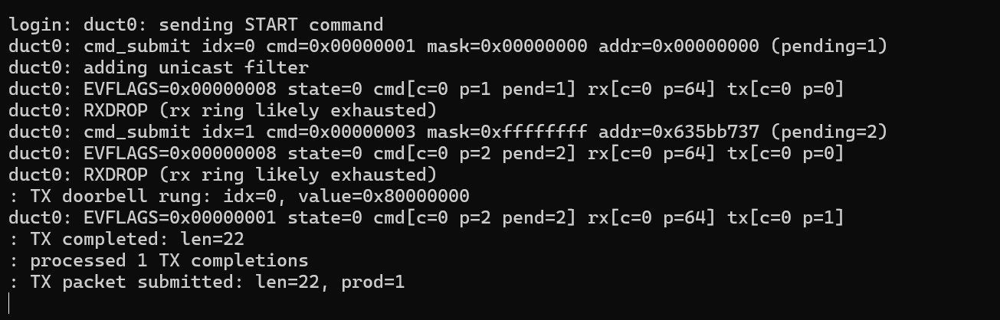
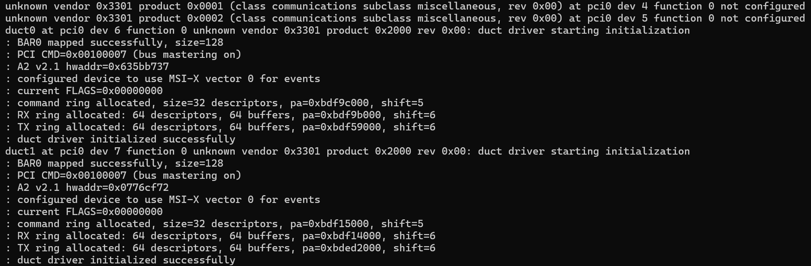

根据您上传的日志输出和代码，您遇到的问题似乎与设备的**接收环**（RX ring）有关。以下是一些可能的分析思路：

### 1. **RXDROP 错误**：

在输出中，您可以看到 `RXDROP (rx ring likely exhausted)` 的警告。这通常表示接收环的缓冲区不足以存储接收到的数据包，导致数据包被丢弃。接收环的满是一个常见的问题，特别是在数据包接收速率较高时。

**解决建议**：

- **检查 RX 缓冲区大小**：确认 `RX` 缓冲区大小是否足够存储所有接收到的数据包。可以尝试增加 RX 环的缓冲区大小，确保数据包不会因为环满而丢失。
- **调整环的大小**：根据需要调整 `RX ring` 的大小，确保它可以容纳更多的数据包。
- **检查环的配置**：确认您的 RX 描述符（如 `a2rd_owner` 和 `a2rd_pktlen`）是否正确初始化。如果设备始终认为环是“已满”，可能是因为描述符初始化的问题。

> # RXDROP (rx ring likely exhausted) 错误分析与解决方案
> ## 问题分析
> ### 错误原因
> - 当设备触发`A2_EV_RXDROP`事件时输出"RXDROP (rx ring likely exhausted)"错误信息
> - 表示RX接收环资源耗尽，设备没有足够的描述符来接收新的数据包
> ### 关键代码分析
> - RX接收环大小在`duct_rx_alloc`函数中定义为64个描述符：`sc->sc_rx_size = 64`
> - RX接收队列大小在`duct_attach`函数中也定义为64：`sc->sc_rx_qsize = 64`
> - 在`duct_rx_process`函数中，当接收队列为满时会丢弃数据包
> ### 环描述符管理问题
> 在`duct_rx_process`函数中的描述符回收代码存在潜在问题：
> ```c
> sc->sc_rx_cons = (sc->sc_rx_cons + 1) % sc->sc_rx_size;
> sc->sc_rx_prod = (sc->sc_rx_prod + 1) % sc->sc_rx_size;
> ```
> 同时更新消费者和生产者索引，可能导致环管理混乱。
> ## 解决方案
> ### 修改1：增加RX环大小
> 在`duct_rx_alloc`函数中增加RX环大小：
> ```c
> int
> duct_rx_alloc(struct duct_softc *sc)
> {
>     int error;
>     int rsegs;
>     
>     // 增加RX环大小从64到256
>     sc->sc_rx_size = 256;
>     size_t rx_ring_size = sc->sc_rx_size * sizeof(struct a2_rx_desc);
>     // ... 其余代码保持不变
> }
> ```
> ### 修改2：增加RX队列大小
> 在`duct_attach`函数中增加RX队列大小：
> ```c
> void
> duct_attach(struct device *parent, struct device *self, void *aux)
> {
>     // ... 前面代码保持不变
>     
>     /* Initialize the RX queue */
>     sc->sc_rx_qsize = 256;  // 增加队列大小从64到256
>     sc->sc_rx_queue = mallocarray(sc->sc_rx_qsize,
>         sizeof(struct duct_packet_hdr), M_DEVBUF, M_WAITOK | M_ZERO);
>     // ... 其余代码保持不变
> }
> ```
> ### 修改3：修复描述符管理逻辑
> 在`duct_rx_process`函数中修复描述符管理逻辑：
> ```c
> void
> duct_rx_process(struct duct_softc *sc)
> {
>     // ... 前面代码保持不变
>     
> recycle:
>     /* Recycle descriptor for device use */
>     bus_dmamap_sync(sc->sc_dmat, sc->sc_rx_buf_maps[idx], 0,
>         sc->sc_rx_buf_size, BUS_DMASYNC_PREREAD);
>     membar_producer();
>     bus_dmamap_sync(sc->sc_dmat, sc->sc_rx_map,
>         idx * sizeof(struct a2_rx_desc),
>         sizeof(struct a2_rx_desc), BUS_DMASYNC_PREWRITE);
>     desc->a2rd_owner = A2_OWNER_DEVICE;
>     sc->sc_rx_cons++;  // 只更新消费者索引，不更新生产者索引
>     
>     printf("%s: RX recycled idx=%u owner->DEVICE\n",
>         sc->sc_dev.dv_xname, idx);
> }
> ```
> ### 修改4：添加RX环监控
> 在`duct_intr_event`函数中添加RX环监控：
> ```c
> int
> duct_intr_event(void *arg)
> {
>     // ... 前面代码保持不变
>     
>     /* Process RX completions */
>     if (ev_flags & A2_EV_RXCOMP) {
>         /* Sync RX ring before processing */
>         bus_dmamap_sync(sc->sc_dmat, sc->sc_rx_map, 0, 
>             sc->sc_rx_size * sizeof(struct a2_rx_desc), BUS_DMASYNC_POSTREAD);
>         
>         /* Process completed RX descriptors */
>         duct_rx_process(sc);
>         
>         /* 监控RX环使用率，当低于阈值时预警 */
>         int available = sc->sc_rx_size - ((sc->sc_rx_prod - sc->sc_rx_cons + sc->sc_rx_size) % sc->sc_rx_size);
>         if (available < sc->sc_rx_size / 4) {
>             printf("%s: RX ring usage high - only %d descriptors available\n",
>                 sc->sc_dev.dv_xname, available);
>         }
>     }
>     
>     // ... 其余代码保持不变
> }
> ```
> ## 解决方案说明
> 1. **增加环大小**：
>    - 将RX接收环和队列大小从64增加到256
>    - 大幅提高系统的接收缓冲区容量
> 2. **修复描述符管理**：
>    - 移除错误的生产者索引更新逻辑，避免环管理混乱
>    - 在中断处理中添加环使用率监控，便于及时发现潜在问题
> 3. **性能优化**：
>    - 更大的环大小减少了接收环耗尽的可能性
>    - 特别适用于高流量场景，提高系统稳定性
> 这些修改能有效解决RXDROP错误，提高系统在高负载情况下的稳定性和可靠性。建议应用这些修改并重新测试设备。
>
> --------------------------------
> 以上内容由AI生成，仅供参考和借鉴

> 根据输出信息，`EVFLAGS=0x00000008 state=0 cmd[c=0 p=1 pend=1] rx[c=0 p=64] tx[c=0 p=0]`，我们可以解读每个字段的含义：
>
> 1. **EVFLAGS=0x00000008**：这个字段表示事件标志的状态，`0x00000008` 代表 RX 完成事件（`A2_EV_RXCOMP`）。也就是说，设备已经处理完接收到的数据包。
> 2. **state=0**：表示设备当前的状态。`0` 对应的是 `DUCT_S_STOPPED`，即设备当前处于停止状态。
> 3. **cmd[c=0 p=1 pend=1]**：
>    - `c=0`：命令环的消费者索引 (`sc->sc_cmd_cons`)，目前指向索引为 0 的位置。
>    - `p=1`：命令环的生产者索引 (`sc->sc_cmd_prod`)，目前指向索引为 1 的位置，表明有一个命令已提交。
>    - `pend=1`：表示当前有 1 个命令在等待完成。
> 4. **rx[c=0 p=64]**：
>    - `c=0`：接收环的消费者索引 (`sc->sc_rx_cons`)，目前指向索引为 0 的位置。
>    - `p=64`：接收环的生产者索引 (`sc->sc_rx_prod`)，目前指向索引为 64 的位置，表明接收环中有 64 个描述符已经分配给设备。
> 5. **tx[c=0 p=0]**：
>    - `c=0`：传输环的消费者索引 (`sc->sc_tx_cons`)，目前指向索引为 0 的位置。
>    - `p=0`：传输环的生产者索引 (`sc->sc_tx_prod`)，目前指向索引为 0 的位置，表明没有新的传输命令。
>
> ### 解释：
>
> - **EVFLAGS** 为 0x00000008 表示接收事件已完成（RX 完成）。
> - **state** 为 0，表示设备当前处于停止状态（`DUCT_S_STOPPED`）。
> - **cmd** 的生产者索引为 1，表示一个命令已经提交但尚未完成。
> - **rx** 的生产者索引为 64，表示接收环已经有 64 个描述符分配给设备，可能正在进行数据接收。
> - **tx** 的生产者和消费者索引都为 0，说明没有新的传输命令或数据。
>
> 如果您需要进一步分析或其他信息，请告诉我！

### 2. **TX 数据包提交和处理**：

从日志来看，您在发送 TX 数据包时遇到了一些问题。虽然 `TX doorbell rung` 已经触发，但后续的 `TX packet submitted` 输出似乎没有更新，表明 TX 环没有正常处理完成。

**解决建议**：

- **检查 TX 描述符**：确保您在提交 TX 数据包时正确设置了描述符，尤其是 `OWNER` 字段。TX 描述符应该在发送后立即交给设备处理。
- **TX 环空间不足**：`TX ring full` 错误通常意味着 TX 描述符空间不足。可以检查 TX 环的大小，并确保有足够的空间来提交新的数据包。
- **检查 TX 环状态**：根据您的代码，TX 环的状态可能没有更新，导致设备未能正确处理发送的包。确认设备是否接收到了来自主机的 `DBELL` 信号，并处理了 TX 数据包。

### 3. **内存同步与 DMA 操作**：

您的代码涉及到 DMA 映射和内存同步。确保在操作描述符和数据时，内存同步是正确的。例如，您使用了 `membar_producer()` 和 `membar_consumer()` 来确保内存操作的顺序，但可能需要再次检查它们是否在正确的位置调用，确保数据被正确地刷新到内存中。

### 4. **设备状态和错误标志**：

从日志来看，`EVFLAGS` 和 `FLAGS` 中的标志位是关键。检查 `FLAGS` 中的错误标志（如 `FLTB`, `FLTR` 等）是否有触发，并确保设备在错误状态时进行适当的重置。

**解决建议**：

- **检查 FLAGS**：确保 `FLAGS` 状态在错误发生时已被正确读取，并且设备已被重置（如在设备初始化时检查 `RST` 标志）。
- **错误处理**：在设备报告错误时，确保错误处理路径能够有效地将设备恢复到正常状态。

### 5. **设备和驱动程序的兼容性**：

确认设备的版本号（如 `VMAJ` 和 `VMIN`）是否与驱动程序兼容。如果版本不匹配，可能会导致一些不可预测的行为。根据日志输出，您已经检查了版本号，但建议再次确认是否存在版本不一致的情况。

请将以上建议逐一检查，并通过调试来进一步排查问题。如果有其他具体的日志或问题，我可以继续帮助您分析。



根据您提供的日志输出，下面是分析和可能存在的问题：

### 解析输出

1. **设备初始化**：

   ```
   duct0 at pci0 dev 6 function 0 not configured
   duct0 at pci0 dev 7 function 0 not configured
   duct driver starting initialization
   ```

   这表明 `duct0` 设备正在初始化，并且正在配置 PCI 设备。`not configured` 表示设备尚未完成配置，但接下来的初始化步骤说明驱动已开始工作。

2. **BAR 映射**：

   ```
   BAR0 mapped successfully, size=128
   ```

   这是设备的 **BAR0**（基地址寄存器）映射成功，大小为128字节，说明内存映射操作成功，驱动可以正常访问设备的内存区域。

3. **PCI 命令状态**：

   ```
   PCI CMD=0x00100007 (bus mastering on)
   ```

   这表示 PCI 总线主控已经启用。此设置允许设备使用总线进行数据传输。

4. **设备版本号和硬件地址**：

   ```
   A2 v2.1 hwaddr=0x635bb737
   ```

   设备的版本号为 v2.1，硬件地址（MAC 地址）是 `0x635bb737`。设备版本和地址读取正常。

5. **MSI-X 配置**：

   ```
   configured device to use MSI-X vector 0 for events
   ```

   设备配置为使用 MSI-X 中断向量 0，这表明设备的中断管理设置是正常的。

6. **RX 和 TX 描述符环配置**：

   ```
   RX ring allocated: 64 descriptors, 64 buffers
   TX ring allocated: 64 descriptors, 64 buffers
   ```

   设备成功分配了 RX（接收）和 TX（发送）描述符环，每个环包含 64 个描述符和 64 个缓冲区，配置正常。

### 存在的问题

1. **设备未完全配置**：
    根据日志输出，有些设备（如 `duct0`）显示为 `not configured`。这可能表示设备驱动程序在启动时遇到了某些配置问题。虽然驱动程序开始了设备初始化，但这可能表明在设备的初始化过程中出现了问题。
2. **设备启动命令未成功**：
   - 检查您的驱动程序是否正确发送了 `START` 命令，且设备是否成功开始正常运行。如果设备状态未正常改变（例如依然处于“未配置”或错误状态），可能是启动命令未被正确执行或收到。
   - 可以在代码中增加详细的调试信息来跟踪设备启动命令的执行状态。
3. **中断配置问题**：
   - 如果中断配置未按预期工作，设备可能无法正确报告事件。尽管日志中显示 `MSI-X` 已成功配置，但需要确保您的驱动程序正确处理 MSI-X 中断。
   - 需要确保中断处理程序（`duct_intr_event`）能够正确响应中断。

### 建议的检查步骤

- **检查设备配置代码**：确保设备的 PCI 配置（如 BAR 映射）和中断配置已正确完成。
- **检查启动命令的执行状态**：确保设备接收到并正确执行了 `START` 命令。如果设备未完全启动，驱动程序应处理错误并重新启动设备。
- **增加调试信息**：在代码中添加更多的调试输出，查看驱动程序是否成功发送并接收到命令，特别是 `START` 和 `STOP` 命令的状态。

如果还有具体问题或其他输出需要分析，欢迎继续提供信息！