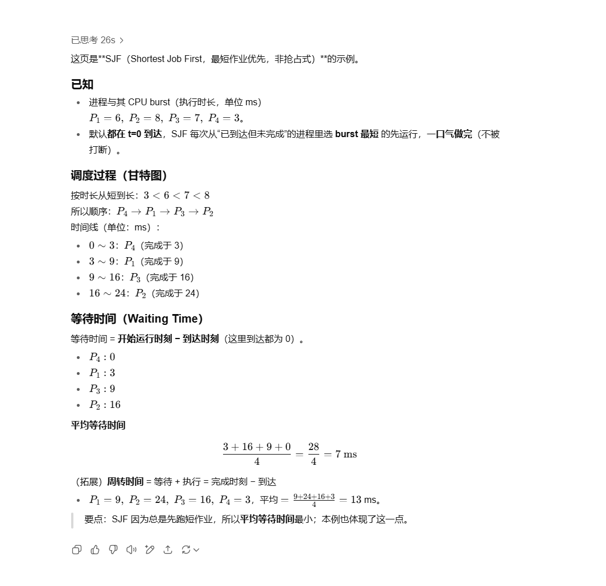
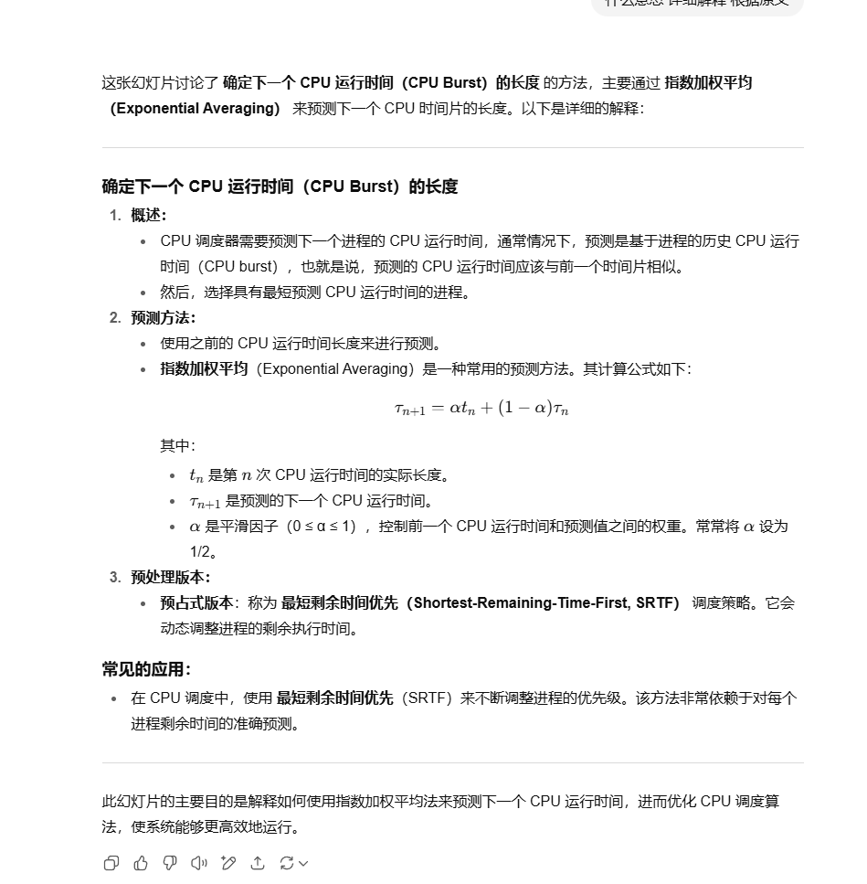
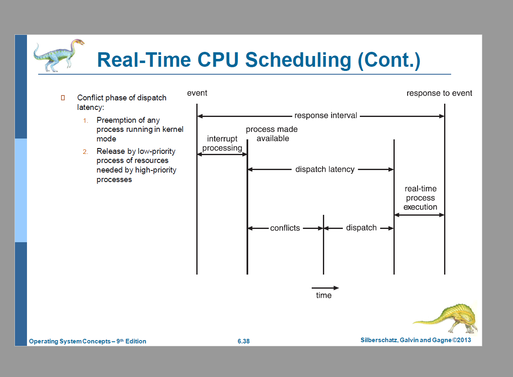

![这是让你用**时间片=1ms 的 Round Robin（RR）调度**把表格补全。

**怎么做（步骤）：**

1. 从时间 t=0 开始建一个**就绪队列**（FIFO）。
2. 每来一个任务（按到达时间）就入队。
3. 每次从队首取一个任务运行 **1ms**：
   - 其剩余执行时间 −1；时间 t+1。
   - 期间有新任务到达就入队尾。
   - 若该任务还有剩余时间，则把它放回队尾；若刚好做完，记录它的**完成时间**。
4. 全部完成后算：
   - **Turnaround** = 完成时间 − 到达时间
   - **Waiting** = Turnaround − 执行时间
   - **Deadline Miss?**：完成时间 > Deadline 则为 *Yes*
   - **平均等待/周转**：各自求平均
   - **吞吐量**＝完成作业数 ÷ 总用时（秒）

------

### 本题数据

任务到达：`0,1,2,3,4`
 执行时间：`20,5,2,4,3`（ms）
 时间片：`1ms`（上下文开销忽略）

**RR 执行轨迹（前半段）：**
 0–1:T1，1–2:T2，2–3:T1，3–4:T3，4–5:T2，5–6:T4，6–7:T1，7–8:T5，8–9:T3(完成)，
 9–10:T2，10–11:T4，11–12:T1，12–13:T5，13–14:T2，14–15:T4，15–16:T1，16–17:T5(完成)，
 17–18:T2(完成)，18–19:T4(完成)，之后一直是 T1 直到 34ms 完成。

------

## 填好的表

| Task | Arrival | Exec | Deadline | Completion | Turnaround | Waiting | Miss?   |
| ---- | ------- | ---- | -------- | ---------- | ---------- | ------- | ------- |
| 1    | 0       | 20   | 33       | **34**     | **34**     | **14**  | **Yes** |
| 2    | 1       | 5    | 6        | **18**     | **17**     | **12**  | **Yes** |
| 3    | 2       | 2    | 8        | **9**      | **7**      | **5**   | **Yes** |
| 4    | 3       | 4    | 29       | **19**     | **16**     | **12**  | **No**  |
| 5    | 4       | 3    | 35       | **17**     | **13**     | **10**  | **No**  |

（单位：ms）

- **平均等待时间** = (14+12+5+12+10)/5 = **10.6 ms**
- **平均周转时间** = (34+17+7+16+13)/5 = **17.4 ms**
- **吞吐量** = 5 作业 / 34ms = 5 / 0.034 ≈ **147.06 jobs/s**

这就是“怎么做”的全过程：用 1ms 轮转模拟 → 记录完成时间 → 计算周转/等待 → 判断是否错过截止时间 → 统计平均与吞吐量。](reademe.assets/image-20250814211041558.png)

**核心原则：先来先服务的“循环队列”。**
 时间片轮转（Round Robin, RR）用一个**就绪队列（FIFO）**保存“可运行”的任务。调度器每次给队首任务一个固定长度的时间片（quantum），到点就换下一个。

### 决策规则（单核、等优先级的经典 RR）

1. **时钟到点或任务提前让出**时触发调度：

   - 时间片**用完**但任务还没结束 → 把它放到**队尾**，从队首取下一个任务运行。
   - 任务**阻塞/等待I/O**或**正常结束**在时间片内发生 → **不入队**（阻塞去等待队列，结束则消失），马上从就绪队列队首取下一个。

2. **新任务到达**（或阻塞任务被唤醒）→ **入队尾**。

   > 到达本身**不会抢占**正在运行的任务；只有在当前时间片结束或当前任务阻塞时才切换。

3. **就绪队列空** → 处理器空闲，直到有新任务入队。

4. **复杂度**：取/放都在队首/队尾，**O(1)**。

简明伪代码：

```text
on tick or voluntary_yield or block or exit:
    if current is RUNNING and tick == quantum:
        enqueue_tail(ready_q, current)
    // else: if current BLOCKED or EXIT, don't re-enqueue

    next = dequeue_head(ready_q)
    if next != NULL:
        context_switch_to(next)
    else:
        idle()
```

### 队列在一次时间片内外的变化（小例）

到达：t=0:A，t=1:B，t=2:C；quantum=1

- t=0 队列=[A]；运行A → A剩余>0 → 入队尾 → 队列=[A]
- t=1 B到达 → 入队尾 → 队列=[A,B]；运行队首A完成这一片 → A入队尾 → 队列=[B,A]
- t=2 C到达 → 入队尾 → 队列=[B,A,C]；运行B… 如此循环。

### 变种与细节

- **带优先级的 RR**：先选“最高优先级的非空队列”，在该队列内按上面的 RR；常见于**多级反馈队列**（MLFQ）。
- **多核**：每核一个就绪队列或全局队列；本质仍是“从队首取、到队尾放”，外加负载均衡。
- **量子大小的影响**：
  - 太小 → 切换开销大；
  - 太大 → 接近 FCFS，交互性差。
- **抢占点**：经典 RR 只在**时间片用尽**或**任务主动停止**时抢占；新到达不会立刻抢占。

这就是“下一轮执行谁”的全部逻辑：**从就绪队列队首拿一个；用完时间片还没完成就丢到队尾；有新来的都加到队尾。**

下面是 **EDF（Earliest Deadline First，最早截止期优先）** 的做法与结果。

## 原理（本题用“抢占式 EDF”）

- 在任意调度点（任务到达、当前任务完成/阻塞）选择**绝对截止时间最早**的就绪任务运行。
- 若有新到达的任务**截止更早**，则**立即抢占**当前任务。
- 忽略上下文切换开销。

> 题目数据（到达/执行/截止）
>  T1:(0,20,33)  T2:(1,5,6)  T3:(2,2,8)  T4:(3,4,29)  T5:(4,3,35)

## 调度轨迹（Gantt）

- 0–1: **T1**（此时只有 T1）
- 1–6: **T2**（6 < 33，抢占 T1，运行到完成）
- 6–8: **T3**（8 最早）
- 8–12: **T4**
- 12–31: **T1**（剩余 19ms，截止 33）
- 31–34: **T5**

最后完成时间：T2=6，T3=8，T4=12，T1=31，T5=34（总时长 34ms）。

## 填表结果

| 任务 | 到达 | 执行 | 截止 | 完成时间 | 周转时间(完成-到达) | 等待时间(周转-执行) | 超期? |
| ---- | ---- | ---- | ---- | -------- | ------------------- | ------------------- | ----- |
| 1    | 0    | 20   | 33   | **31**   | **31**              | **11**              | 否    |
| 2    | 1    | 5    | 6    | **6**    | **5**               | **0**               | 否    |
| 3    | 2    | 2    | 8    | **8**    | **6**               | **4**               | 否    |
| 4    | 3    | 4    | 29   | **12**   | **9**               | **5**               | 否    |
| 5    | 4    | 3    | 35   | **34**   | **30**              | **27**              | 否    |

> 说明：若完成时间 ≤ 截止，则不算 miss；等于也算达标。

## 汇总指标

- **Average Waiting Time** = (11+0+4+5+27)/5 = **9.4 ms**
- **Average Turnaround Time** = (31+5+6+9+30)/5 = **16.2 ms**
- **Throughput** = 5 作业 / 34 ms = 5 / 0.034 ≈ **147.06 jobs/s**

这样就完成了 EDF 的表格：先按“谁的截止最早谁先跑”的规则列出调度顺序，得到完成时间，再计算周转和等待，并判断是否超期。

3301

ppt











