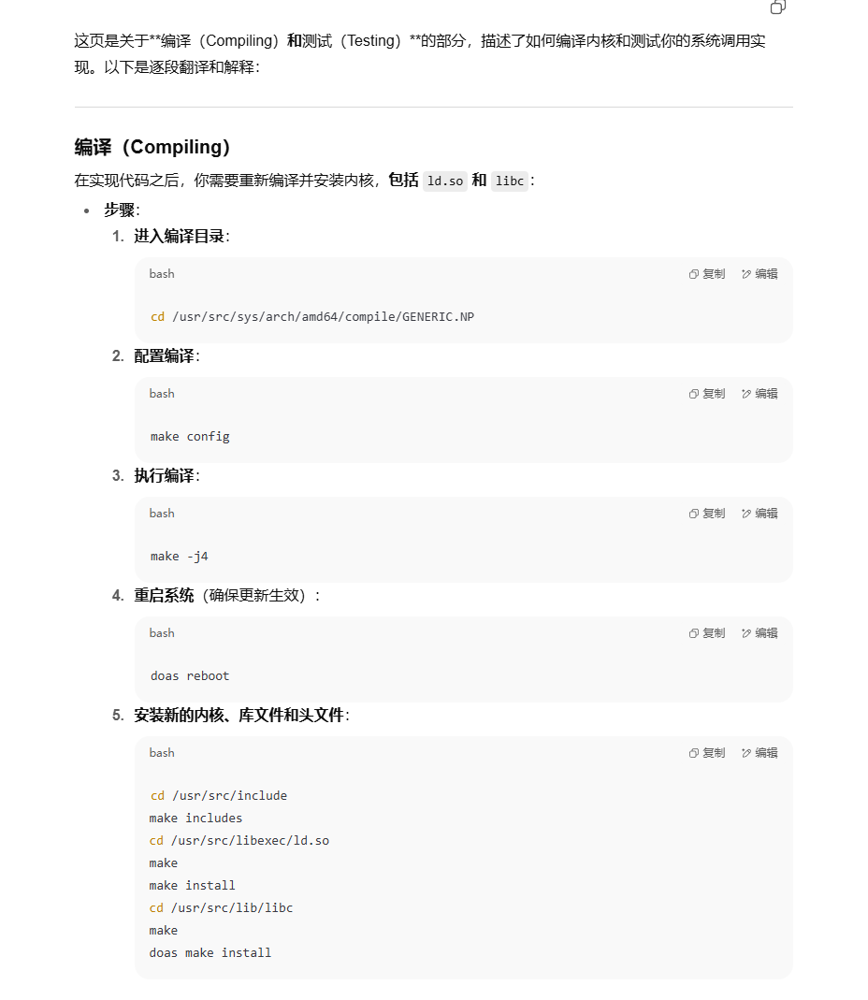

这是一个**内核里演示“生产者—消费者/条件变量”**的最小例子。它用两个系统调用：

- `sys_sendnum(...)`：生产者，把一个 `int` 送到内核里的“单槽邮箱(single-slot mailbox)”；
- `sys_recvnum(...)`：消费者，从邮箱里取出那个 `int`（如果当前没有数据就睡眠等待）。

下面按代码块逐行说明。

------

### 全局状态与锁

```c
enum sendnum_state { EMPTY, FULL };

static struct mutex sendnum_mtx = MUTEX_INITIALIZER(IPL_NONE);
static enum sendnum_state sendnum_state = EMPTY;
static int sendnum_num;
```

- **`sendnum_state`**：邮箱当前是否有数据。只有两种：`EMPTY`（空）或 `FULL`（有一个数）。
- **`sendnum_num`**：真正存放的那一个 `int`。
- **`sendnum_mtx`**：互斥锁，保护上面两个变量的并发访问。`IPL_NONE` 表示不提升中断优先级（普通睡眠锁）。

> 这个实现是**全局**的：系统里只有一个“槽”，所有进程都共用它，仅作教学/示例。

------

### 发送：`sys_sendnum`

```c
int sys_sendnum(struct proc *p, void *v, register_t *retval)
{
    struct sys_sendnum_args *uap = v;
    int eno;

    mtx_enter(&sendnum_mtx);                 // 加锁

    if (sendnum_state != EMPTY) {            // 槽已满，不能再写
        eno = EBUSY;                         // 返回“忙碌/资源正被使用”
        goto out;
    }

    sendnum_num = SCARG(uap, num);           // 从用户参数取出要发送的数
    sendnum_state = FULL;                    // 标记为“有数据”
    wakeup_one(&sendnum_state);              // 唤醒一个在该条件上睡眠的接收者

    eno = 0;
out:
    mtx_leave(&sendnum_mtx);                 // 解锁
    return (eno);
}
```

要点：

- `SCARG(uap, num)` 是 BSD 系列内核宏，从系统调用参数结构里取 `num`。
- 如果邮箱不是空的，直接报错 `EBUSY`；这体现“单槽”设计：**最多只能挂一个值**。
- `wakeup_one(&sendnum_state)` 把在同一个“等待通道”（这里选用 `&sendnum_state` 这个地址）睡眠的**一个**线程唤醒。

------

### 接收：`sys_recvnum`

```c
int sys_recvnum(struct proc *p, void *v, register_t *retval)
{
    struct sys_recvnum_args *uap = v;
    int eno;

    mtx_enter(&sendnum_mtx);                 // 加锁

    while (sendnum_state != FULL) {          // 条件不满足就睡
        eno = msleep(&sendnum_state, &sendnum_mtx, PCATCH, "recvnum", 0);
        if (eno != 0)                        // 被信号打断等，带 errno 返回
            goto out;
    }

    eno = copyout(&sendnum_num, SCARG(uap, num), sizeof(int)); // 拷到用户空间
    if (eno != 0)
        goto out;

    sendnum_state = EMPTY;                   // 取走后把槽清空
    sendnum_num = 0;
    eno = 0;

out:
    mtx_leave(&sendnum_mtx);                 // 解锁
    return (eno);
}
```

要点：

- `while (sendnum_state != FULL)`：典型的**条件变量**写法。不是 `if` 而是 `while`，为了防止“虚假唤醒/竞态”，被唤醒后要**重新检查条件**。
- `msleep(chan, mtx, flags, wmesg, timo)`：
  - 这里的等待通道 `chan` 选的是 `&sendnum_state`，和 `wakeup_one` 对应上。
  - `msleep` 在睡眠时会**暂时释放 `mtx`**，被唤醒后再**自动重新加锁**，保证条件检查和状态修改是受保护的。
  - `PCATCH` 表示可被信号中断；若收到信号，`msleep` 返回非 0（通常是 `EINTR`/`ERESTART`），于是跳到 `out` 提前返回。
  - `"recvnum"` 是睡眠原因字符串，`ps`/`top` 的 `wchan` 可看到它；`timo=0` 表示无超时。
- `copyout` 把内核里的 `sendnum_num` 复制到用户传入的指针位置。如果用户指针无效会返回 `EFAULT` 等错误。
- 成功取出后把状态改回 `EMPTY`，并把 `sendnum_num` 置 0，释放槽位给下一个发送者。

------

### 行为小结（时间线）

1. 进程A调用 `recvnum`：发现邮箱是空的 → 在 `&sendnum_state` 上**睡眠**（锁在睡眠期间被释放）。
2. 进程B调用 `sendnum`：拿锁→写入数→`FULL`→`wakeup_one(...)` 唤醒一个接收者→返回。
3. A 被唤醒，重新拿到锁，看到 `FULL` → `copyout` 到用户缓冲区 → 清空为 `EMPTY` → 返回。
4. 若此时又有接收者进来，会再次睡眠直到有人发送。

------

### 可能的返回错误

- `EBUSY`：发送时槽已满（尚未被接收）。
- `EINTR`/`ERESTART`：接收时睡眠被信号打断（由 `PCATCH` 允许）。
- `EFAULT` 等：`copyout` 失败（用户地址非法）。

------

### 你可以从这个示例看到的模式

- **互斥锁 + 条件变量（sleep/wakeup）** 的经典用法；
- **“单槽信箱”** 语义：最多缓存一个元素，提供背压（发送者在满时直接失败）；
- 系统调用参数处理：`SCARG`/`copyin`/`copyout`；
- 统一的 `goto out` 解锁/收尾风格，避免错误路径漏解锁。

如果你愿意，我可以把它改造成“多槽循环队列”（允许同时缓存 N 个值）或加上超时参数，方便你对比理解。





![这是“**测试 1**”那一页在讲：用随作业给的 **xnum** 小程序来验证你实现的两个系统调用（`sendnum/recvnum`）。
 核心：开**两个终端**（或 tmux 两个 pane），一个当“接收者”，一个当“发送者”。

------

### 怎么做

1. 终端 A（接收）

```
$ xnum -r
```

它会**阻塞**（一直不打印、不退出），表示 `recvnum()` 在等数据。

1. 终端 B（发送）

```
$ xnum -s 1234
```

把数字 **1234** 通过 `sendnum()` 送进内核里的“单槽邮箱”。命令立即返回。

1. 终端 A 此时会打印：

```
1234
```

然后退出——说明 `recvnum()` 收到了刚才发送的数。

> 截图里左右两块并排的命令行只是为了表示两个终端；中间那条竖线不是命令的一部分。
>  你也可以发负数，比如 `xnum -s -1234`，接收端会打印 `-1234`。

1. 你还应该能在终端 A 按 **Ctrl+C** 中断 `xnum -r`。
    这会给进程发 `SIGINT`，由于 `recvnum()` 里 `msleep(..., PCATCH, ...)` 允许信号打断，它会带错误码返回，程序退出。

------

### 还可以做的检查（按原型可能出现的返回值去测）

- **`EBUSY`（槽已满）**：
   在没有接收者消费的情况下连续两次发送：

  ```
  $ xnum -s 1     # 成功，槽变 FULL
  $ xnum -s 2     # 第二次应报错（忙）
  ```

- **并发/唤醒语义**：
   开两个接收者：

  ```
  A$ xnum -r
  B$ xnum -r
  C$ xnum -s 567
  ```

  只有**其中一个**接收者应打印 `567` 并退出（因为内核用的是 `wakeup_one`），另一个仍然阻塞，直到再发送一次。

- **先发后收**：
   先 `xnum -s 42`，再 `xnum -r`，接收端应**立刻**打印 42（因为槽已是 FULL）。

- **信号打断（`EINTR/ERESTART`）**：
   让接收端阻塞，然后发 Ctrl+C；它应退出而不会影响槽状态。

- **基础健壮性**：
   多次往返发送/接收、发送大/小/负数、在 tmux 或不同 SSH 会话中都能工作。

这些行为与之前那段内核代码一致：有一个受互斥锁保护的**单槽**缓冲区（`EMPTY/FULL`），`sendnum()` 在满时返回 `EBUSY`，`recvnum()` 在空时睡眠，被 `sendnum()` 的 `wakeup_one()` 唤醒；`PCATCH` 允许用 Ctrl+C 打断等待。](READEME.assets/image-20250814205718508.png)


这段话是在说：**把 `sendnum/recvnum` 这对系统调用改成“同步会合（rendezvous）”语义**，并告诉你接下来要在源码里改什么、怎么重新生成/编译，再用 `xnum` 程序测试。

------

## 1) 新语义到底是什么？

- **`sendnum()` 不再“放进缓冲区后马上返回”，而是会一直阻塞**，直到有一个进程调用了 **`recvnum()`** 来与之“配对”。
- **同时只能有一个发送者在等待**。如果此时又来第二个 `sendnum()`，**直接失败**：返回 `-1`，并把 `errno` 设为 **`EBUSY`**。
- `recvnum()` 的行为是：若当前正有一个 `sendnum()` 在等，就**立刻取走**那个数，然后两边都返回；若没有发送者，则 `recvnum()` 阻塞，直到有 `sendnum()` 到来。

这就是“会合式/同步式 IPC”（类似 CSP 的 channel）：**没有内核里的持久缓冲**，一次发送一定要等到对应的一次接收。

### 为什么要这样改？

原文说这样做可以“避免在 UVM 中在接收者可用之前就去取消映射发送者的页面”，也就是**省掉在内核里临时缓存/搬运数据的麻烦**：等接收者到了再一次性交接，代码简单很多。

------

## 2) 和旧版的差别

| 行为                     | 旧版（单槽缓冲）                     | 新版（会合）                      |
| ------------------------ | ------------------------------------ | --------------------------------- |
| `sendnum()` 在无人接收时 | 直接把数放进“槽”，若槽已满则 `EBUSY` | **阻塞等待** 直到有 `recvnum()`   |
| “已在等待的发送者”       | 不存在或只表示“槽满”                 | **最多允许 1 个**；再来就 `EBUSY` |
| 缓冲                     | 有 1 个“槽”                          | **无缓冲**，一发一收同时完成      |

------

## 3) 大致实现思路（便于你对照改代码）

你可以用一个简单的状态机来实现（示意）：

```c
enum state { IDLE, SENDER_WAITING, RECEIVER_WAITING };

static struct mutex mtx = MUTEX_INITIALIZER(IPL_NONE);
static enum state st = IDLE;
static int value;              // 发送的数
static int sender_done;        // 接收端取走后的“确认”标志
```

- **sendnum()**
  1. 加锁；若 `st == SENDER_WAITING` → 返回 `EBUSY`。
  2. 保存 `value`，设 `st = SENDER_WAITING`，`sender_done = 0`，`wakeup_one` 唤醒接收者。
  3. `while (!sender_done) msleep(..., PCATCH, ...)`；被接收者取走后置位并唤醒你；期间可被 Ctrl+C 打断返回 `EINTR/ERESTART`。
- **recvnum()**
  1. 加锁；`while (st != SENDER_WAITING) msleep(..., PCATCH, ...)`。
  2. `copyout(value, 用户指针)`；成功后 `sender_done = 1; st = IDLE; wakeup_one(等待中的发送者)`；解锁返回。

> 注意用 `while` 重查条件，`msleep`/`wakeup_one` 的等待通道（`chan`）要两边一致；`msleep` 会在睡眠时释放锁，被唤醒后再自动加回锁。

------

## 4) 需要你在仓库里做的改动（按原文提示）

1. **更新系统调用定义**（就像你在 prac2 做的那样）：
   - 编辑 `syscalls.master`（加入/调整 `sendnum`、`recvnum` 的项；编号、原型保持一致即可）。
   - 到 `sys/kern` 运行 **`make syscalls`** 生成 `sys/syscall{,_args}.h` 等。
   - 若有声明头：编辑 **`sys/sendnum.h`** 与用户态头文件保持一致。
2. **重建并安装**：
   - 重新编译并安装内核；
   - 重新安装 includes；
   - 重建并安装 `ld.so` 和 `libc`（因为新增/变更了系统调用号与 stub）。
3. **更新测试程序 `xnum.c`** 以适配新语义（通常不改参数，只是行为预期不同）。

> 如果只是“语义变化、原型不变”，上面很多步骤会非常快，但**改了 `syscalls.master` 就必须 `make syscalls` 并重建 libc/ld.so**，这样用户态才能正确调用新的系统调用号。

------

## 5) 改完以后如何检验

- 开两个终端：
   A：`xnum -r`（阻塞）
   B：`xnum -s 1234` → A 立刻打印 `1234`，两端都返回。
- 先发后收：
   B：`xnum -s 7`（此时应**阻塞**）
   A：`xnum -r` → 立刻打印 `7`，B 也随之返回。
- 并发两个发送者：
   B1：`xnum -s 1`（阻塞等待）
   B2：`xnum -s 2` → 直接失败 `EBUSY`。
- Ctrl+C：对正在 `-r` 或正在等待的 `-s` 按 **Ctrl+C**，程序应被信号打断退出（`msleep` 的 `PCATCH` 生效）。

这样，你就把系统调用从“带 1 个槽的缓冲模型”切到了**真正的会合式（无缓冲）模型**，为之后在 UVM 里的实现简化铺平了路。


![这段代码是示例工具 **xnum** 的用户态实现，用来测试你写的两个系统调用 **sendnum / recvnum**。它做的事很简单：

- 运行 `xnum -s <NUMBER>`：把一个包含数字的“页”送给接收者；
- 运行 `xnum -r`：从发送者那里接收那一页并把数字打印出来。
   按照你前面改过的“会合（rendezvous）语义”，发送端会一直等到有接收端配对，接收端在没有发送者时会阻塞，Ctrl+C 可以打断等待。

下面按代码自上而下解释每一块在干什么。

------

### 头文件（1–12 行）

```c
#include <err.h>          // err(), errx(), warnx() 的声明
#include <unistd.h>       // getopt(), close() 等
#include <sys/mman.h>     // mmap()、PROT_*/MAP_* 宏
#include <sys/sendnum.h>  // 你实现的 sendnum()/recvnum() 用户态封装
```

- `err()/errx()/warnx()` 是 BSD 的错误处理函数：
  - `warnx(fmt, ...)`：打印警告，不退出。
  - `err(exitcode, "tag")`：等价于 `perror` + 退出。
  - `errx(exitcode, fmt, ...)`：打印自定义信息 + 退出。

### usage()（14–19 行）

打印用法并 `exit(1)`。

### 整型“魔数”和用户页结构（21–28 行）

```c
enum { XNUM_MAGIC = 0x1234abcd };

struct xnum_page {
    uint32_t xp_magic;   // 魔数，用来校验收到的内存内容是否正确
    int      xp_num;     // 要传递的那个数字
};
```

- 发送端会把 `xp_magic` 设成常量 `XNUM_MAGIC`；接收端收到后会检查这个值，防止把乱内存当成合法数据。

### main 的局部变量（30–37 行）

```c
int ch;
enum { NONE, SEND, RECEIVE } mode = NONE; // 记录选择了 -s 还是 -r
int num;                                  // -s 的数字
const char *errstr;                       // strtonum 的错误字符串
struct xnum_page *pg;                     // 指向传输页的指针
size_t sz;                                // 接收时得到的页大小
```

### 解析命令行（35–59 行）

```c
while ((ch = getopt(argc, argv, "r:s:")) != -1) {
    switch (ch) {
    case 'r':
        if (mode != NONE) { warnx("only one of -r or -s may be given"); usage(); }
        mode = RECEIVE;
        break;
    case 's':
        if (mode != NONE) { warnx("only one of -r or -s may be given"); usage(); }
        mode = SEND;
        num = strtonum(optarg, 0, INT32_MAX, &errstr);
        if (errstr != NULL) { warnx("-s number is %s: %s", errstr, optarg); usage(); }
        break;
    default:
        usage();
    }
}
argc -= optind;
if (argc > 0) usage();
```

- `getopt("r:s:")`：`-r` 无参数，`-s` 后必须跟一个数字。
- `strtonum()` 会把 `optarg` 转成整数，并做范围校验（这里是 `0..INT32_MAX`）。如果非法，`errstr` 会告诉你是 “too small/too large/invalid”。

### 根据模式执行（61 行起）

#### 1) 发送模式 `-s`（66–76 行）

```c
pg = mmap(NULL, sizeof(struct xnum_page),
          PROT_READ | PROT_WRITE, MAP_PRIVATE | MAP_ANON, -1, 0);
if (pg == MAP_FAILED) err(1, "mmap");

pg->xp_magic = XNUM_MAGIC; // 写入魔数与数据
pg->xp_num   = num;

if (sendnum(pg, sizeof(struct xnum_page)))
    err(1, "sendnum");
```

- 用 `mmap(MAP_ANON)` 在本进程里**匿名映射**一页（可读写），作为要“交给接收者”的内存。
- 把魔数和数字写进去。
- 调 `sendnum(ptr, size)`：把这块内存“发送”出去。
  - 在“会合”语义下，这个调用会**阻塞**直到有 `recvnum` 配对成功。
  - 返回非 0 说明失败（比如当前已有别的发送者在等，被内核以 `EBUSY` 拒绝，或被信号打断），`err()` 会打印错误并退出。

> 这里没有 `munmap()`，因为程序在发送之后就退出；进程结束时内核会回收映射。

#### 2) 接收模式 `-r`（78–88 行）

```c
if (recvnum((void **)&pg, &sz))
    err(1, "recvnum");

if (sz < sizeof(struct xnum_page))
    errx(1, "received memory is too small: %zu", sz);

if (pg->xp_magic != XNUM_MAGIC)
    errx(1, "magic number mismatch: %x", pg->xp_magic);

printf("%d\n", pg->xp_num);
return 0;
```

- `recvnum((void **)&pg, &sz)`：阻塞直到有发送者到来；返回时把**收到的内存所在地址**写到 `pg`，把**内存大小**写到 `sz`。
  - 若被 Ctrl+C 打断，或其他错误，会返回非 0，`err()` 打印并退出。
- 做两项完整性检查：
  1. `sz` 必须至少能容纳一个 `struct xnum_page`；
  2. `xp_magic` 必须等于 `XNUM_MAGIC`。
- 最后打印 `xp_num`。这样你在另一个终端看见的就是发送端提供的数字。

------

### 运行时的几个典型场景

- **最基本**

  ```
  终端A$ xnum -r             # 阻塞等待
  终端B$ xnum -s 1234        # 发送；两端同时返回
  终端A输出：1234
  ```

- **两个发送者**

  ```
  B1$ xnum -s 1   # 等待
  B2$ xnum -s 2   # 直接失败 -> errno=EBUSY
  ```

  因为内核只允许一个发送者在“会合点”上等待。

- **Ctrl+C 打断接收**

  ```
  A$ xnum -r      # 等待
  (按 Ctrl+C)     # recvnum 返回 EINTR，程序退出
  ```

------

### 关于你标注的“35行的 while 与 33 行的 size_t sz 对齐”

这只是你在截图里做的对齐标注：

- 第 33 行定义了 `size_t sz;`（接收时用来返回大小）；
- 第 35 行开始的 `while ((ch = getopt...))` 是解析命令行参数的循环。
   两者没有语义上的关联，只是代码排版上的“纵向对齐”。

------

**总结**：
 `xnum` 是一个很小的用户态测试程序。发送端 `-s` 用 `mmap` 准备一段内存、写入魔数和数字，然后通过 `sendnum()` 把这段内存“会合式”交给接收端；接收端 `-r` 用 `recvnum()` 拿到这段内存的指针和长度，做检查后把数字打印出来。整个过程正好验证了你对 `sendnum/recvnum` 的实现是否满足“会合 + 页面交接”的语义。](READEME.assets/image-20250814210150843.png)


![这页在讲“**实施 2**：把页真正从发送者进程交给接收者”，并给出一条安全、可操作的路线图。浓缩成两步：

------

## 一、先把“会合（rendezvous）”握手跑通

- 目标：**`sendnum` 和 `recvnum` 都会阻塞**，直到另一方到来，同时完成并一起返回。
- 这基本是你在“实施 1”里做过的扩展版：
  - 需要一些**全局状态**（如“是否已有发送者在等、要传多大、是否完成”等标志），用**互斥锁**保护；
  - `sendnum`：若已有发送者等待 → 立刻 `EBUSY`；否则记录参数置“发送者等待”，`msleep(..., PCATCH, ...)` 等接收者；
  - `recvnum`：若无发送者 → 睡眠；有则开始配对，把结果写回，双方互唤醒并同时返回。
- 这一阶段**不搬页，仅做握手**，验证阻塞/唤醒/信号中断等行为正确。

------

## 二、实现“页的实际转交”

关键是用 **`uvm_share`** 把发送者地址空间里的那段映射**共享/移交**到接收者的地址空间（课程建议里，这条路“最不容易踩坑”）。

### 你需要知道/准备的东西

1. **`uvm_share` 的用法**

   - 用 `cscope`（或等价工具）直接跳到 `uvm_share` 的定义：看它的**参数**都是什么；调用前是否需要你**自己持有 vm_map 的锁**，还是它内部会拿；是否需要页对齐、长度取整等。

   - 顺手看看目前哪些内核路径在调用它，学它们的**加锁顺序**。

   - > **简短结论**：
     >  `uvm_share` 是 OpenBSD/（类）BSD 的 UVM（Unified Virtual Memory）子系统里的一个**内核帮助函数**，用来**把一个进程地址空间中的现有映射“共享到”另一个地址空间**——也就是在**不复制页面数据**的前提下，让目标进程得到同一段内存的映射（两边指向同一组物理页/同一底层对象）。它做的是**映射别名（aliasing）**，不是拷贝。
     >
     > ------
     >
     > ## 它大致做了什么
     >
     > - 输入：**源** `vm_map`、源起始虚拟地址、长度，以及**目标** `vm_map`（还需要目标起始地址或让它回填一个可用地址；具体看你源码里的原型）。
     > - 动作：在目标 `vm_map` 中**建立一段新的映射**，指向与源映射**同一个**底层对象/匿名页链（amap/anon 或 uvm_object）；相应增加引用计数并做必要的 pmap 映射。
     > - 结果：两个进程看到的是同一批物理页；如果后续你再把源处 `unmap` 掉（用 `munmap` 的内核实现那一套），就实现了“把页转交给接收者”。
     >
     > > 作业里建议用它来完成 **sendnum/recvnum** 的“页转交”：
     > >  先 `uvm_share`（把发送者的页映射到接收者），**再**按 `munmap(2)` 的实现把发送者原映射移除——这样没有任何数据拷贝，复杂度是 O(1)。
     >
     > ------
     >
     > ## 调用前后的常见约束（按你树里的实现为准）
     >
     > - **页对齐**：起始地址要 `trunc_page`，长度要 `round_page`。不对齐通常会返回 `EINVAL`。
     > - **目标区间必须空闲**：若你传的是固定目标地址，区间不能已有映射；否则可能 `EBUSY/ENOMEM`。
     >    → 这就是文档让你去看 **`mquery(2)` 的内核实现**的原因：照它的“两行咒语”在目标 `vm_map` 里找一段**未使用**的地址回来当目的端。
     > - **加锁顺序**：是否需要你**事先持有** `vm_map` 的写锁（`vm_map_lock`）取决于版本；有的实现由 `uvm_share` 内部上锁，有的要求调用者按指定顺序锁好 **dst→src** 或类似顺序。
     >    → 按原文提示，用 cscope 直接看 `uvm_share` 的注释/调用者，照抄它们的锁策略。
     > - **返回值**：成功返回 0；参数非法/不对齐/区间无效 → `EINVAL`；目标放不下/条目插入失败 → `ENOMEM`；目标地址被占用或状态不允许 → `EBUSY`（具体码以实现为准）。
     >
     > ------
     >
     > ## 在你的作业里怎样串起来（示意流程）
     >
     > 1. `recvnum` 与 `sendnum` 先完成**会合**（两边互等，配对成功后一起继续）。
     > 2. `recvnum` 中：
     >    - 拿到 `src_map = sender->p_vmspace->vm_map`、`dst_map = curproc->p_vmspace->vm_map`；
     >    - 用 `mquery` 的做法在 `dst_map` 找到一段空闲地址 `dst`；
     >    - 调 `uvm_share(src_map, src_addr, len, dst_map, &dst /*或按你原型传参*/)`；
     >    - 成功后，按 `sys_munmap` 的实现把 `src_map` 上 `[src_addr, len]` **解映射**；
     >    - 把 `dst` 和 `len` 通过 `copyout` 返给用户态。
     > 3. 任何一步失败都要**回滚/解锁**，并把 errno 传回。
     >
     > ------
     >
     > ## 和其它方式的区别
     >
     > - `uvm_share`：**不复制**页，只建立别名映射，最快、最省内存；非常适合“把页面从甲进程**转交**给乙进程”的场景（配合随后对甲的 `unmap`）。
     > - 直接 `uvm_map`/`uvm_fault`＋拷贝：会产生**数据复制**或重新分配匿名页，既慢又多占内存，不是这里想要的。
     > - `copyin/copyout`：只适合少量数据；页级交接用它们会把页内容**逐字节搬运**，性能差。
     >
     > ------
     >
     > ### 一句话记忆
     >
     > > **`uvm_share` = 把“这段已映射的内存”在另一个地址空间里“再映射一遍”（共享同一物理页），常配合随后对源处 `munmap`，实现零拷贝的“页面移交”。**
     >
     > 具体函数原型、需要谁先上锁、允许的标志位可能因你的内核版本不同而略有差别——**以你源码树里的 `uvm_share` 定义与注释为准**。如果你贴出那段定义，我可以帮你逐参数解读。

2. **如何拿到进程的 vm_map**

   - 在前面的“联系”部分你应该见过：进程的地址空间在 `p->p_vmspace->vm_map`（不同版本字段名可能略有差异，按你源码为准）。

3. **在接收者地址空间里找一个“未被使用”的目的地址**

   - 推荐**抄作业**：看 `mquery(2)` 的内核实现（文中写在 `sys_mquery`/`sys_nquery`），里面有个“两行咒语”能返回**某个 vm_map 中一段空闲区域的起始指针**。把那段逻辑搬来给 `recvnum` 用，就能得到目的地址。

4. **转交后要把发送者的原映射去掉**

   - 这避免“发完后还能改”的情况。看 `munmap(2)` 的内核实现（`sys_munmap`）学会**正确的解映射流程与加锁顺序**，照着做。

### 典型的数据流/控制流（伪代码级指南）

> 下面只给结构和关键点，具体 API/锁名以你的源码为准。

**全局状态（受互斥锁保护）**

```c
struct {
  struct mutex mtx;
  int sender_waiting;          // 是否已有发送者在等
  struct proc *sp;             // 发送者进程
  vaddr_t s_addr; vsize_t s_len;   // 发送者想转交的用户区地址和长度（页对齐）
  vaddr_t dst_addr; vsize_t dst_len; // 实际映射到接收者的地址/长度
  int done;                    // 传输完成标志，用于唤醒发送者
} R;
```

**`sendnum(p, user_ptr, len)`**

1. 参数检查：用户指针是否用户态、**页对齐**，长度>0、**向上取整到页大小**；（对齐/取整不合法 → `EINVAL`）。
2. `mtx_enter(&R.mtx)`；若 `R.sender_waiting` → `EBUSY` 返回。否则：
   - 记录 `R.sender_waiting=1; R.sp=p; R.s_addr=user_ptr; R.s_len=len; R.done=0;`
   - `wakeup_one(&R)`（唤醒潜在的接收者）。
   - `while (!R.done) { eno = msleep(&R, &R.mtx, PCATCH, "sendnum", 0); if (eno) { // 被信号打断     // 清理：撤销等待状态，唤醒接收者让它知道发送者消失     R.sender_waiting=0; ...; mtx_leave(&R.mtx); return eno; } }`
3. 成功路径：`R.sender_waiting=0;` 释放锁并返回 0。

**`recvnum(p, \**out_ptr, \*out_len)`**

1. `mtx_enter(&R.mtx)`；`while (!R.sender_waiting) { eno = msleep(&R, &R.mtx, PCATCH, "recvnum", 0); if (eno) { mtx_leave(); return eno; } }`

2. 现在有发送者：拿到 `src_map = R.sp->p_vmspace->vm_map;`，`dst_map = p->p_vmspace->vm_map;`，`src = R.s_addr; len = R.s_len;`

3. **选一个空闲目的地址**：参考 `sys_mquery` 的两行代码，在 `dst_map` 中找 `dst`（满足页对齐且区域空闲）。

4. **实际转交**：

   - 按 `uvm_share` 的要求处理**锁顺序**（常见是先锁 `dst_map` 再锁/或内部锁 `src_map`，以源码为准），然后

     ```c
     error = uvm_share(src_map, dst_map, src, len, &dst /* 以及所需的 prot/flag 参数 */);
     ```

   - 如果 `uvm_share` 成功，**立即在发送者原处 `unmap`**：照抄 `sys_munmap` 的做法，把 `[src, len]` 从 `src_map` 中移除。
      （注意：按你源码的锁规则，可能需要先释放某个锁再拿另一个；严格遵守现有实现的次序。）

5. **把结果回给用户**：`copyout(&dst, out_ptr, sizeof(dst)); copyout(&len, out_len, sizeof(len));`

6. 设 `R.done=1; wakeup_one(&R)`（唤醒发送者一起返回）；`mtx_leave(&R.mtx)`；返回 0。

### 细节与坑点清单

- **页对齐与长度取整**：`start = trunc_page(user_ptr); len = round_page(user_ptr + len) - start;`
   接收端的 `sz` 要按“取整后”的长度返回，用户态按它做安全校验。
- **信号**：两端睡眠都用 `PCATCH`，被 `Ctrl+C` 等信号打断要**干净地回滚状态**并返回 `EINTR/ERESTART`。
- **一次只允许一个发送者排队**：这是规范的一部分；第二个发送者立刻 `EBUSY`。
- **错误路径清理**：`uvm_share` 或 `unmap` 出错时，确保不遗留“半共享”状态；解锁顺序保持与成功路径一致。
- **锁**：严格按你源码里 `uvm_*`、`sys_munmap` 的锁注释来：谁在内部上锁、你是否需要外层持锁、两张 `vm_map` 同时参与时的**顺序**。

------

## 作业里的“查代码导航”提示回放

- UVM 被称作内核的“动物脑”，文档少且容易误解，所以**直接看源码**最可靠：
  - 先看 **`uvm_share`** 定义与已有调用者；
  - 找到进程的 **`vm_map`**；
  - **参考 `mquery(2)` 的实现**拿“未用地址”；
  - **参考 `munmap(2)` 的实现**做发送端的**删除映射**；
  - 每一步都留意**锁**和**调用顺序**。

照这套流程做，你先把握“会合”时机，再把实际页映射转到接收者、并从发送者摘掉，`xnum -s/-r` 就会在新语义下工作起来。](READEME.assets/image-20250814210318812.png)


![这页（“Testing 2 / 实验 2”）在说：现在你已经把 **rendezvous（会合）语义** 和 **页转交**用 `uvm_share` 做出来了，接下来要**怎么测**、**还能做哪些更深入的小实验**。下面按原文逐点解释，并告诉你每一步“应该看到什么、为什么”。

------

## 基本测试（和 Testing 1 类似，但行为有关键变化）

- 用更新后的 **xnum**：
  - 终端A：`xnum -r` —— 阻塞等待。
  - 终端B：`xnum -s 1234` —— **现在发送端会阻塞**，直到接收端完成配对并把页映射过去，事务结束后两端一起返回。
- 这验证了：两端都可能睡眠；事务只在**两边都准备好**时完成。

### 打印指针做可视化

建议在 `xnum.c` 里加几行 `printf`：

- 发送端 `-s`：`printf("sender page=%p size=%zu\n", pg, sizeof *pg);`
- 接收端 `-r`：在 `recvnum()` 成功后
   `printf("receiver page=%p size=%zu\n", pg, sz);`

观察并思考：

- **发送端与接收端的指针会相同吗？**
   一般**不同**。它们属于两个**独立地址空间**；接收端的虚拟地址是你通过 `mquery`/`uvm_map_hint` 找到的一个空闲区。
- **每次运行会变化吗？**
   常常**会变化**，因为 ASLR 和不同进程的内存布局导致 `mmap/mquery` 选择的空闲区不同；同一次运行内不会变。

### 非法参数试验（`sendnum`）

给 `sendnum` 故意传错：

- 地址**未映射**或**不是用户空间** → 预期 `EFAULT`。
- **未页对齐**/长度为 0/长度不是页大小的整数倍（若你做了取整校验）→ 预期 `EINVAL`。
- **已有另一个发送者**在等 → 预期 `EBUSY`。
- 等待中 **Ctrl+C** 打断 → 预期 `EINTR/ERESTART`。
- 目标进程映射失败（比如找不到空闲区）→ 发送方最终也会失败（通常 `ENOMEM`），你应把错误透传给用户。

> 运行时你会看到 `xnum -s` 返回 `-1` 并设置 `errno`，这是正确表现。

------

## Experiments（更深入的实验）

### 1) 让接收端的地址“可预测”

- 把你找目的地址的那段代码改成固定 hint（例如始终传同一个 `uvm_map_hint` 值）。
- 观察：
  - 有时**成功**（该区域当前空闲且合法）；
  - 有时**失败**（地址被占/越界/未对齐/操作系统忽略 hint）。
- 你能选择哪些地址？
  - 必须是**用户空间**、**页对齐**、**当前未映射**的区间；
  - 被栈、堆、共享库、主程序占着的范围都不行；
  - 不要用 `MAP_FIXED` 去硬压覆写（容易踩坑）。

### 2) 不从发送者那边 `unmap`，看看会怎样

- 暂时**删掉**你“发送端取消映射”的那几行（照原文就是把 `munmap` 的那段先注释掉）。
- 运行：`xnum -r` / `xnum -s` 完成后，在**发送端**继续**修改**这块内存的数据；
- 观察接收端：你应该能看到**变化被接收端观察到**（可能需要循环打印一会儿）。
  - 原因：`uvm_share` 让两边**共享同一批物理页**；只要你没有把发送端 unmap 掉，两个虚拟地址都指向同一底层对象，写一边另一边可见。

### 3) 思考：如果要让 `sendnum` “立刻返回”（回到最初那种语义）

- 你就**不能指望接收端马上到场**，必须在内核**临时保存**这批页。两种典型做法：
  1. **复制**：`copyin` 到内核缓冲区，稍后 `copyout` 给接收者（简单但有拷贝开销）；
  2. **引用/钉住页**：给这段匿名页**加引用并 wiring**，把它从发送者地址空间“借出”挂到一个内核队列，等接收者到来再 `uvm_share` 给它（需要更多元数据：谁拥有、超时/取消、多个发送者排队等，并小心锁顺序）。
- 这正是作业让我们改成 rendezvous 的动机：**避免**在内核里长期保存/管理页的复杂性。

------

## 你应该看到的结论/现象

- 发送端现在**会阻塞**，直到接收端配对完成。
- 打印的指针**大多不同**且**多次运行会变**（ASLR + 空闲区选择）。
- 非法参数按规范报错（`EINVAL/EFAULT/EBUSY/EINTR/ENOMEM` 等）。
- 若不 `unmap` 发送者，双方**共享**同一物理页，发送端后续写入**接收端可见**。

这些测试能帮助你确认：握手逻辑正确、`uvm_share` 真在做“零拷贝共享”、错误路径也能按预期工作。](READEME.assets/image-20250814210630675.png)