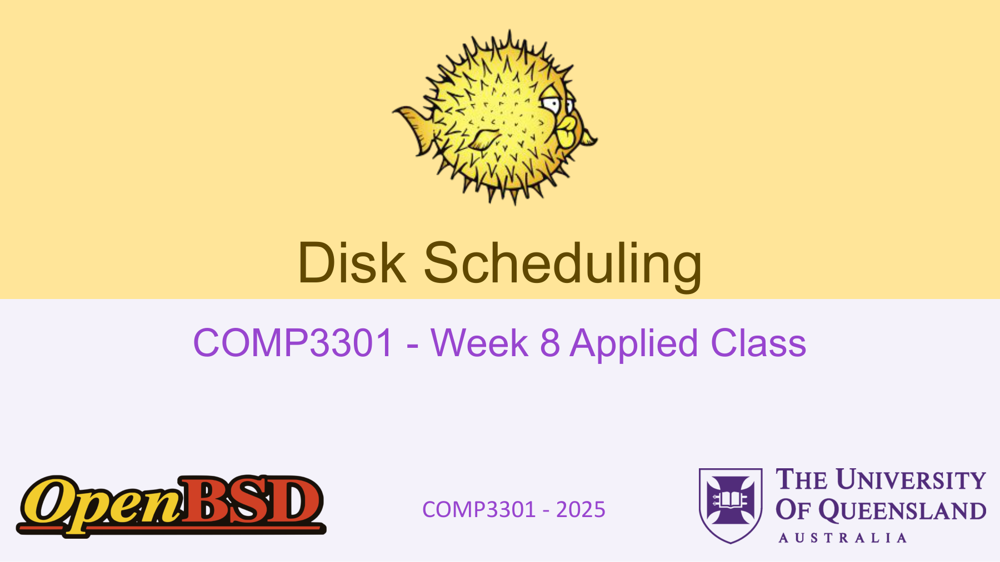
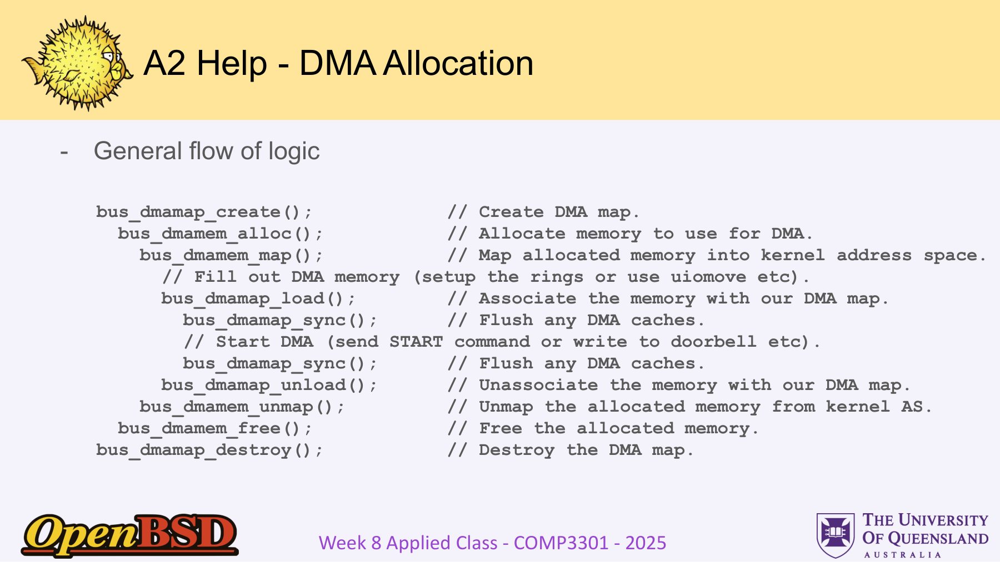
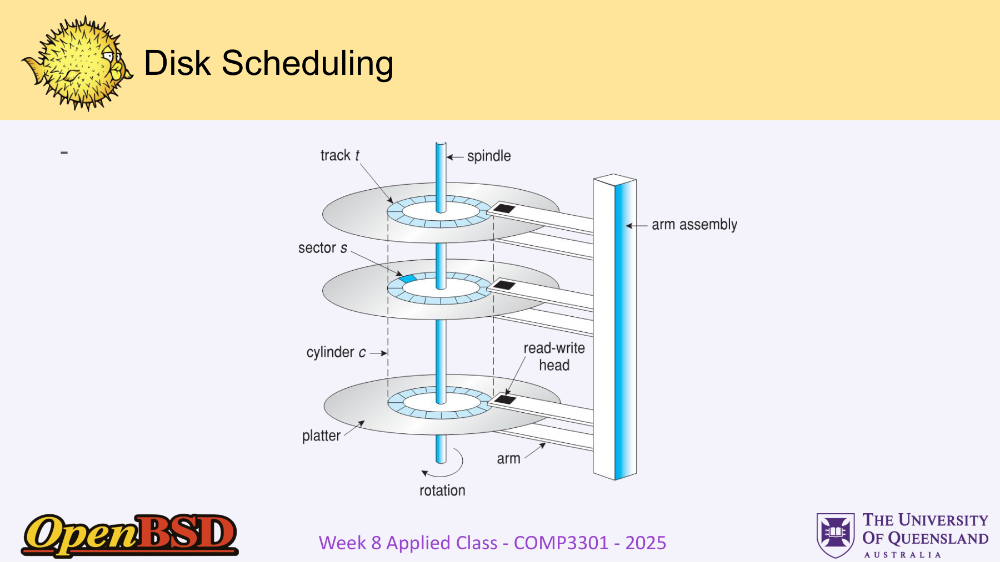
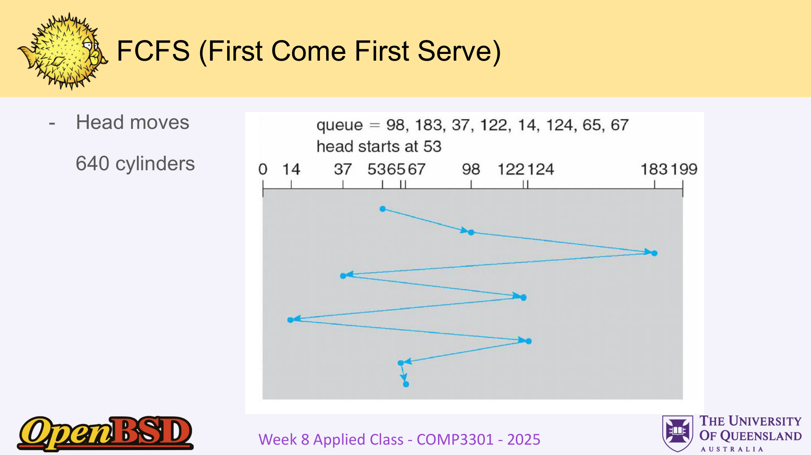
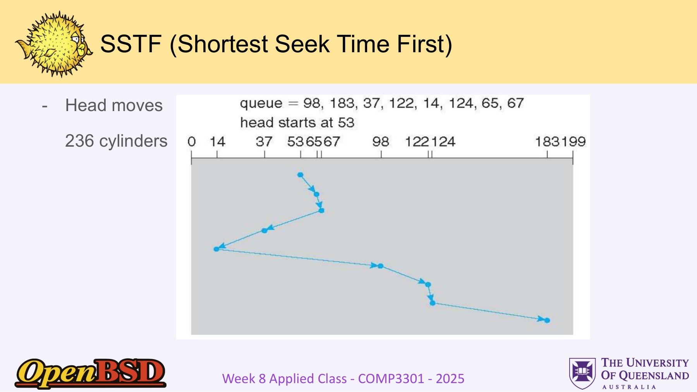
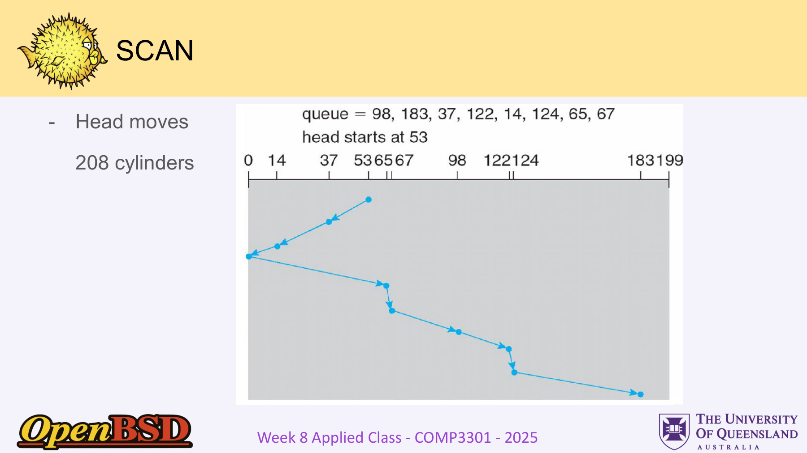
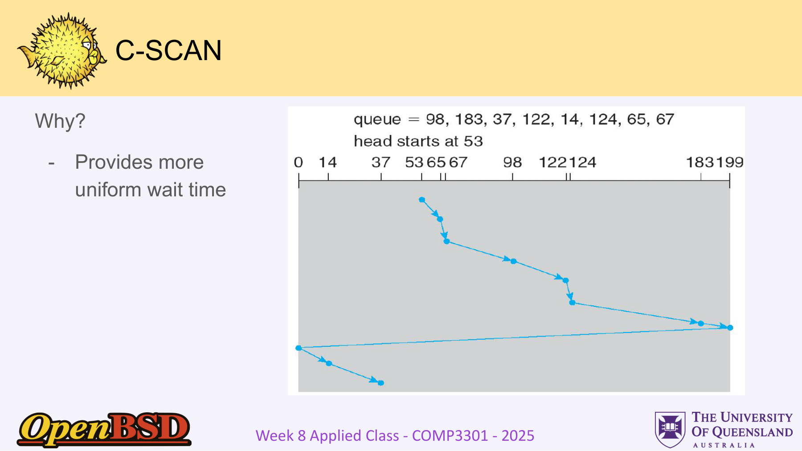
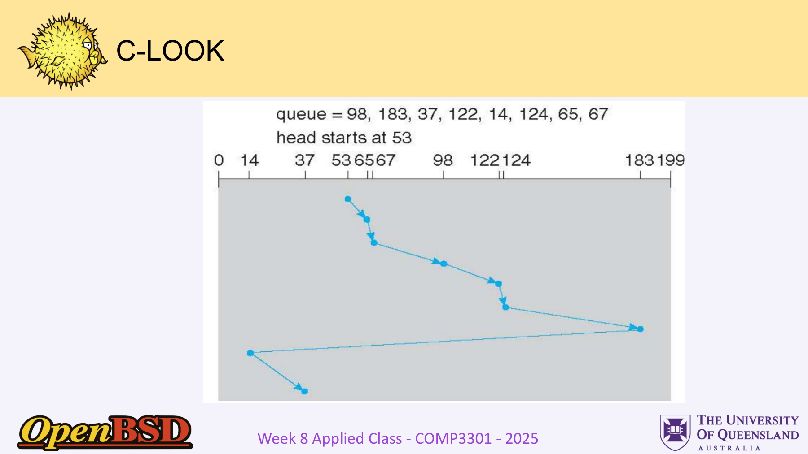
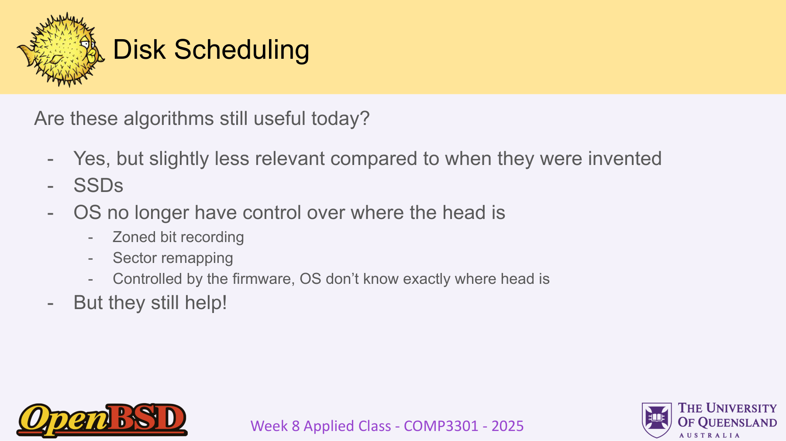
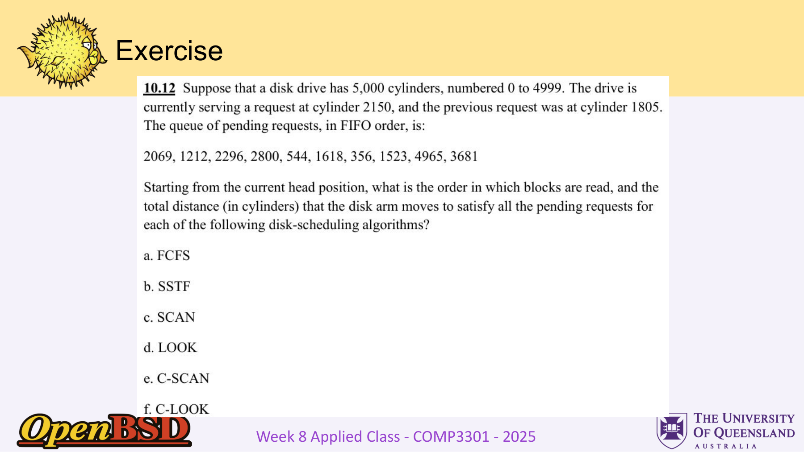

---

## 第 1 页



**提问：** 这张截图里的内容是什么意思？请面向初学者详细解释，分点讲清楚。

下面按“看图 → 概念 → 算法 → 举例 → 课堂会做什么 → 入门建议”的顺序给你讲清楚。


# 这张截图在说什么


* 主题标题：**Disk Scheduling（磁盘调度）** —— 操作系统里决定“磁头先服务哪一个磁盘读写请求”的方法。

* 课程信息：**COMP3301**（通常是操作系统课程代码），**Week 8 Applied Class** 表示第 8 周的应用/实操课，**2025** 学年。

* 标识与 logo：上方的河豚是 **OpenBSD** 的吉祥物（Puffy），左下角也写了 *OpenBSD*，说明课堂可能用 OpenBSD 作为示例操作系统；右下角是 **昆士兰大学（The University of Queensland, Australia）** 的校徽。


# 为什么需要“磁盘调度”


把机械硬盘（HDD）想成一叠会旋转的盘片和一个会来回移动的磁头：


* 完成一次读写大致有三种时间开销：


  1. **寻道时间**（磁头移动到目标磁道），

  2. **旋转延迟**（等目标扇区转到磁头下），

  3. **传输时间**（真正读/写数据）。

* 前两项最花时间，**调度的目标**就是安排请求顺序，尽量减少磁头来回折返，降低平均等待时间、提高吞吐量，并兼顾**公平**（别让某些请求一直饿着）。


> 注：对 **SSD** 来说没有“旋转/寻道”，调度影响较小，但**合并小请求、限时请求**等策略仍然有用。


# 常见调度算法（按直觉理解）


* **FCFS（先来先服务）**：按到达顺序一个个处理。优点：简单公平；缺点：磁头可能“之”字形乱跑，平均延迟大。

* **SSTF（最短寻道优先）**：每次选离**当前位置**最近的请求。优点：通常比 FCFS 快；缺点：可能让远端请求**饥饿**（长时间轮不到）。

* **SCAN（电梯算法）**：磁头像电梯一样**按一个方向**一路服务到尽头，再掉头回来。优点：来回有次序，抖动小；缺点：两端请求等待可能更久。

* **C-SCAN（循环扫描）**：只往一个方向服务，到尽头后**直接回到起点**再继续（不在回程服务）。优点：等待时间更**均匀**；缺点：有一次“回卷”的额外移动。

* **LOOK / C-LOOK**：与 SCAN/C-SCAN 类似，但**只走到最外侧的最后一个请求**为止（不硬到盘面边界）。常见于教材。

* **Deadline/Noop/BFQ 等（现代 OS 调度器）**：综合“最短寻道、截止时间、带宽公平”等因素，适配 HDD/SSD、桌面/服务器不同场景。


# 一个超小例子（帮你体会差别）


假设磁头当前在 **50** 号磁道；等待请求到这些磁道：**23, 89, 132, 42, 187**


* **FCFS**（按到达：23→89→132→42→187）：磁头总移动 =

  |50-23| + |23-89| + |89-132| + |132-42| + |42-187|

  \= 27 + 66 + 43 + 90 + 145 = **371**（步）

* **SSTF**（每次选最近）：

  50→42（8），42→23（19），23→89（66），89→132（43），132→187（55）

  总移动 = 8 + 19 + 66 + 43 + 55 = **191**（步）

  直观上：**SSTF** 大幅减少了来回折返的距离，但要小心“饿着远处的请求”。


# 课堂上通常会做什么


* 给出“**当前磁头位置** + **一串请求** + **（可能的）初始方向**”，

  你要：


  1. 画出磁头移动轨迹（或列出顺序），

  2. 计算**总移动距离 / 平均寻道**，

  3. 比较不同算法的结果与优缺点（是否存在饥饿、是否更公平）。

* 结合 **OpenBSD**（或类 Unix）里 I/O 队列的实现与调度策略做观察或练习。


# 容易踩的坑与小技巧


* **方向很重要**：SCAN/LOOK 系列需要先约定初始方向。

* **边界怎么处理**：SCAN 是否走到盘面最外/最内？LOOK 只到最后一个请求就回头。题目会写清楚。

* **时间 vs 顺序**：有的题只给“集合”，有的题有**到达时间**（动态加入队列），解法会不同。

* **SSD 场景**：别死记“电梯一定最好”。SSD 常用更简单或以截止时间为主的策略（如 Noop/Deadline），关注**吞吐与尾延迟**。


# 入门学习路径


1. 先掌握 **FCFS / SSTF / SCAN / C-SCAN / LOOK / C-LOOK** 的“口头规则”。

2. 练习 3～5 组小序列，亲手算**总寻道**和**平均等待**。

3. 思考“**公平 vs 性能**”的权衡，再了解现代调度器（Deadline、BFQ 等）如何折中。


如果你愿意，我可以给你出几道“从易到难”的练习题，带你一起一步步算。


---

## 第 2 页



**提问：** 这张截图里的内容是什么意思？请面向初学者详细解释，分点讲清楚。

好！这页投影片是在给 **COMP3301（操作系统课）A2 作业**做辅导，主题是 **DMA 内存申请/使用流程**，用的接口是 *OpenBSD*（以及很多 BSD/Unix 上通用的）`bus_dma(9)`。下面用“先讲概念—再走流程—最后给提示”的方式，面向初学者分点说明。


---


# 先弄清几个名词


* **DMA（Direct Memory Access）直接内存访问**

  让**设备**自己把数据读/写到**内存**，不需要 CPU 逐字节搬运，速度快、CPU 负担小。

* **DMA-safe 内存**

  设备能“看见”的物理内存。它可能要求**对齐、连续性、地址上限**（比如 32 位设备只能访问 4 GB 以内）等约束。

* **DMA map（DMA 映射）**

  一份“清单”，记录这块内存对**设备**来说的可用（总线/物理）地址与分段信息，驱动把这份清单告诉设备用。

* **cache 同步（sync）**

  CPU 有缓存，设备看的是内存；开始 DMA 前/结束后要**冲刷或失效缓存**，避免互相看见的不是最新数据。

* **ring（环形队列）/doorbell（门铃寄存器）**

  很多网卡/存储控制器用环形描述符；“门铃”是驱动写一个寄存器告诉设备“开始/我放好工作项了”。


---


# 投影片里的流程逐行白话


（左边是函数名，右边是做什么）


1. `bus_dmamap_create();`

   建一个 **DMA map** 容器（只创建“清单本”，**不**分配内存）。


2. `bus_dmamem_alloc();`

   申请一块 **满足 DMA 约束** 的物理内存（可能要连续/对齐/边界约束）。


3. `bus_dmamem_map();`

   把上面这块物理内存**映射进内核虚拟地址空间**，这样**CPU**能用指针去读写、初始化它。


4. `// Fill out DMA memory (setup the rings or use uiomove etc).`

   在这块内存里**放入要给设备看的内容**：例如建立环形描述符、把要发的数据拷进去等。


5. `bus_dmamap_load();`

   把这块内存**装入 DMA map**：生成“设备可用地址 + 分段”信息，驱动稍后会把这些地址写进设备寄存器。


6. `bus_dmamap_sync();`（第一次，常见为 **PREWRITE/PREREAD**）

   **开始 DMA 前**做缓存同步：


   * 设备要**读**我们准备的数据 ⇒ `PREWRITE`（把 CPU 缓存刷到内存）；

   * 设备要**写**到内存 ⇒ `PREREAD`（把相关缓存失效，避免读到旧值）。


7. `// Start DMA (send START command or write to doorbell etc).`

   **启动设备**：写门铃/控制寄存器，让它按我们给的 DMA 地址去搬数据。


8. `bus_dmamap_sync();`（第二次，常见为 **POSTWRITE/POSTREAD**）

   **DMA 完成后**再同步：


   * 设备**写**完 ⇒ `POSTREAD`（失效 CPU 缓存，让 CPU 读到设备写的新数据）；

   * 设备**读**完 ⇒ `POSTWRITE`（可做必要的栅栏/收尾）。


9. `bus_dmamap_unload();`

   把这块内存**从 DMA map 解绑**（清理那份“清单”里的关联）。


10. `bus_dmamem_unmap();`

    取消内核虚拟地址映射（CPU 不再直接访问这块内存）。


11. `bus_dmamem_free();`

    **释放**之前为 DMA 申请的物理内存。


12. `bus_dmamap_destroy();`

    **销毁** DMA map（和第 1 步成对）。


> 小记忆法：

> **create/destroy**、**alloc/free**、**map/unmap**、**load/unload**、**sync(前后各一次)**、中间**start DMA**。


---


# 把它类比成“快递仓库”的流程


* `create`：先准备一本**出库清单**（map）。

* `alloc`：从仓库划一块**合规区域**（DMA-safe 物理内存）。

* `map`：给员工开门让他能**进去摆货**（内核能访问）。

* **填货**：把**包裹/清单**（环/数据）摆好。

* `load`：把**路线清单**整理好交给快递车（设备可用地址）。

* `sync`(PRE)：**关上仓库门**并点货（缓存一致）。

* **Start**：按**门铃**叫车出发。

* `sync`(POST)：车回来了，**再点货**（确保 CPU 看到最新）。

* `unload/unmap/free/destroy`：**撤场**、还场地、销档案。


---


# 新手最容易踩的点


* **方向别搞错**：


  * 设备要“读我们的数据” ⇒ `PREWRITE` / `POSTWRITE`；

  * 设备要“写到内存” ⇒ `PREREAD` / `POSTREAD`。

    （不同系统宏名略有差异，但语义就是：DMA 前后的**缓存清洗/失效**）

* **load/unload 必须成对**，否则设备可能还在用旧地址。

* **map/unmap** 与 **alloc/free** 成对；长期共享的环一般**长期映射**，一次性缓冲区可以用完就卸。

* **对齐/边界**：网卡/存储控制器常要求 16/32/64 字节甚至页对齐；有时还要“不可跨越某个边界”。

* **错误处理**：任何一步失败都要按已完成的**逆序**清理（RAII 思维）。


---


# 一段极简“伪代码”帮助你把顺序记牢


```c

// 省略参数细节，只展示顺序

bus_dmamap_create(..., &map);

bus_dmamem_alloc(..., &segs, &nsegs);

bus_dmamem_map(..., segs, nsegs, &kva);


// 初始化环/缓冲

init_rings_at(kva);


bus_dmamap_load(..., map, kva, size);

bus_dmamap_sync(..., map, PREWRITE /* 或 PREREAD */);


// 启动设备

write_doorbell(...);


// DMA 完毕（中断回调里）

bus_dmamap_sync(..., map, POSTWRITE /* 或 POSTREAD */);

bus_dmamap_unload(..., map);


bus_dmamem_unmap(..., kva);

bus_dmamem_free(..., segs, nsegs);

bus_dmamap_destroy(..., map);

```


---


如果你手头有 A2 题目里给定的**缓冲区大小/对齐**或需要选用的 **sync 标志**，我可以直接帮你把这段流程改成可用的模板代码，并标注每行该放哪些参数。


---

## 第 3 页


**提问：** 这张截图里的内容是什么意思？请面向初学者详细解释，分点讲清楚。

下面把这页投影片的意思，按“在讲啥 → 关键概念 → 怎么用 → 什么时候别用 → 不用也行的保守做法 → 快速决策表”的顺序讲清楚。


# 这页在讲啥


* 题目：**A2 Help – DMA Allocation**。

* 要点：**可以直接把一个 UIO（用户缓冲的描述）装进 DMA map，然后对“用户内存”直接做 DMA**。这样**步骤更少、性能更好**，但有**条件和限制**。


# 关键概念（先有这些直觉）


* **UIO**：内核里描述“用户空间 I/O 缓冲”的结构（含若干 `iovec`）。它可能对应**多段**物理页。

* **DMA map**：给设备看的地址清单（散/聚列表）。硬件能接收的**段数有限**（本页示例提到**最多 4 段**）。

* **非阻塞模式（O\_NONBLOCK）**：驱动发起 I/O 后**立刻返回**，用户线程可马上继续干别的。

* **Bounce buffer（回弹缓冲）**：内核先申请一块**自己的 DMA 安全内存**，把用户数据**拷贝**进去（或从里面拷回用户），再让设备对这块内核缓冲做 DMA。可靠，代价是**多一次拷贝**。


# 直接对 UIO 做 DMA：怎么用（更快、步骤少）


典型调用顺序（省略参数）：


1. `bus_dmamap_create()` —— 创建 DMA map。

2. `bus_dmamap_load_uio()` —— 用 **UIO**（而不是你自己分配的缓冲）来**装入**这次 DMA 的地址段。

3. （按常规发起 DMA：写门铃/下发命令；并做 `bus_dmamap_sync()` 的 PRE/POST 同步，这些在上一页流程里）

4. `bus_dmamap_unload()` —— 用完解绑。

5. `bus_dmamap_destroy()` —— 销毁 map。


**好处**


* **不再 `alloc/map/copy`** 新内存，省去了“申请 DMA 内存 + 把用户数据拷过去/拷回来”的步骤。

* **更少 CPU 拷贝 → 更低延迟/更高吞吐**。


# 什么时候**不能**这么做（两大限制）


1. **碎片太多**


   * 硬件/驱动的 DMA map 仅支持**最多 4 段**（“4 DMA pointers”）。

   * 如果 UIO 对应的物理内存被分成 **>4 段**，`load_uio` 就**装不下**，直接失败。

2. **非阻塞模式**


   * 这种方式是**直接对用户内存做 DMA**。非阻塞下**你很快就返回**，而用户代码可能**立刻修改/释放**这块内存。

   * 于是设备还在 DMA，用户已改了内存，**数据就不可靠**；因此**不适用非阻塞**。


# 不用也行的保守做法（简单但多一次拷贝）


* **始终用 bounce buffer**：


  1. 用 `bus_dmamem_alloc/map` 申请内核 DMA 缓冲；

  2. 需要写设备：把用户数据拷到这块缓冲；需要读设备：DMA 完成后再从缓冲拷回用户；

  3. 照常 `load/sync/start/sync/unload`；

  4. 用完再 `unmap/free`。

* **优点**：逻辑最简单，**阻塞/非阻塞都安全**，也不怕用户缓冲碎片化。

* **缺点**：多一次内存拷贝，性能比直接 `load_uio` 稍差。


# 快速决策表（A2 写驱动时照这个选）


* **非阻塞（O\_NONBLOCK）**？👉 **用 bounce buffer**。

* **阻塞 & UIO ≤4 个物理连续段**？👉 可以考虑 **`bus_dmamap_load_uio` 直 DMA**。

* **段数超限或你不想处理边界情况**？👉 **用 bounce buffer**，最省心。


> 小提示

>

> * 不管走哪条路，**PRE/POST 的 `bus_dmamap_sync()`** 仍要按方向（设备读/设备写）做好缓存一致性。

> * `create/destroy`、`load/unload` 要**成对**；错误路径按**逆序清理**。


如果你把作业里“是否非阻塞”“设备最多段数”“缓冲大小”告诉我，我可以按你的场景给出一段最简模板（直 DMA 版 / bounce 版各一份）。


---

## 第 4 页



**提问：** 这张截图里的内容是什么意思？请面向初学者详细解释，分点讲清楚。

下面把这页投影片（“Disk Scheduling”）讲清楚。它用一张**机械硬盘（HDD）结构图**解释为什么要做“磁盘调度”。


# 这页在说什么


* 主题：**Disk Scheduling（磁盘调度）**——决定磁头按什么顺序处理读写请求，目的是**更快**、**更公平**。

* 角落的标识：左下 *OpenBSD*、右下昆士兰大学 UQ；“Week 8 Applied Class – COMP3301 – 2025” 是课程信息。


# 图里每个标签是什么意思


* **platter（盘片）**：一张张圆盘，用来存数据；两面都能存。

* **spindle（主轴）**：盘片穿在上面的轴；盘片围着它**高速旋转**（rotation）。

* **read-write head（读写磁头）**：悬在每张盘片表面上方，负责真正的读写。

* **arm / arm assembly（磁臂/磁臂组件）**：带着所有磁头**沿半径方向**一起移动。注意：**一动全动**——所有磁头会同时到达同一“半径位置”。

* **track t（磁道）**：在同一张盘片上，按半径位置形成的**同心圆**轨道。

* **sector s（扇区）**：磁道被切成的“**小扇形块**”，是最小读写单位（常见 512B 或 4KB，图上不强调大小，只说明概念）。

* **cylinder c（柱面）**：**所有盘片上“同一半径”的那一圈磁道的集合**。因为磁臂一起动，切换到某个柱面后，换“层”（不同盘面）不需要再移动磁臂。


# 为什么这跟“调度”有关


一次磁盘 I/O 的时间主要由三部分组成：


1. **寻道时间**：磁臂把磁头**移到目标柱面**（最耗时）。

2. **旋转延迟**：等盘片旋转到让**目标扇区**跑到磁头下面。

3. **传输时间**：真正把数据读/写出来（相对前两者常更短）。


调度算法（如 FCFS、SSTF、SCAN/C-SCAN/LOOK 等）的目标都是：


* **尽量少让磁头来回**（减少寻道）；

* **顺带降低等待旋转的时间**；

* **兼顾公平**（别让某些请求一直等）。


# 用这张图建立直觉


* 你可以把一次请求想成：**(柱面 c, 磁道/半径, 扇区 s)**。

* **改变柱面**需要移动磁臂（贵）；**同柱面不同盘面**只切换磁头（便宜）；**同磁道不同扇区**靠旋转等一下（中等）。

* 所以：**把“相近柱面”的请求排在一起**，通常最省时间——这就是很多调度算法有效的原因。


# 小提示


* **SSD**没有盘片/磁头/旋转，调度影响小很多，但在 HDD（机械硬盘）上，这些结构细节决定了性能。

* 课堂接下来通常会给一串 I/O 请求，要求你按不同算法排顺序并比较总“磁头移动距离/平均等待时间”。


如果你愿意，我可以基于这张图，现给你几道从易到难的练习，带你一步步算清不同调度算法的差异。


---

## 第 5 页



**提问：** 这张截图里的内容是什么意思？请面向初学者详细解释，分点讲清楚。

下面把这页投影片（**FCFS：First Come First Serve，先来先服务**）讲清楚，并把图里的“640 cylinders”一步步算出来。


# 这页在讲啥


* 主题：**磁盘调度的 FCFS 算法**。

* 队列（按到达顺序处理）：`[98, 183, 37, 122, 14, 124, 65, 67]`

* 初始磁头位置：`53`

* 结论（图左）：**磁头一共移动 640 个柱面（cylinders）**。


# FCFS 是什么


* 规则最简单：**按请求到达的先后顺序**处理，不做任何“就近”优化。

* 优点：实现简单、**公平**（先来先做）。

* 缺点：可能让磁头“来回折返”，总移动距离大、平均等待时间高。


# 图是怎么画的


* 横轴是**柱面号**（cylinder，表示磁头的“半径位置”）。

* 纵向是“时间向下”，折线表示磁头**按队列顺序**从一个柱面跑到下一个柱面。


# 640 是怎么得到的（逐步相减再相加）


从 53 开始，依次到每个请求位置，**把相邻两步的差的绝对值相加**：


```

53 → 98   : |98-53|  = 45

98 → 183  : |183-98| = 85

183 → 37  : |37-183| = 146

37 → 122  : |122-37| = 85

122 → 14  : |14-122| = 108

14 → 124  : |124-14| = 110

124 → 65  : |65-124| = 59

65 → 67   : |67-65|  = 2

总计 = 45+85+146+85+108+110+59+2 = **640**

```


> 补充：共有 8 次移动，所以**平均每次寻道 ≈ 640 / 8 = 80 柱面**（课堂上常用这个指标比较算法）。


# 小结 & 对比提示


* FCFS 不考虑“就近”，在像本例这样跨越大的请求时会**走很多冤枉路**。

* 后续课程会用同一组请求比较 **SSTF、SCAN、C-SCAN/LOOK** 等算法，通常能显著减少总移动距离，从而降低平均等待时间。

* 注：这里仅统计**寻道**；真实 I/O 还受**旋转延迟**和**传输时间**影响。SSD 不涉及寻道/旋转，此类算法意义就小得多。


---

## 第 6 页



**提问：** 这张截图里的内容是什么意思？请面向初学者详细解释，分点讲清楚。

下面把这页投影片（**SSTF：Shortest Seek Time First，最短寻道优先**）讲清楚，并把图里“**236 cylinders**”一步步算出来。


# 这页在说什么


* 队列（待处理柱面号）：`[98, 183, 37, 122, 14, 124, 65, 67]`

* 初始磁头位置：`53`

* **SSTF 规则**：每一步都选择**离当前磁头最近**的那个请求（最小 |目标–当前位置|）。

* 左侧结论：**磁头共移动 236 个柱面**；图中的折线就是按该顺序走的轨迹。


# 按 SSTF 的处理顺序与每步位移


从 53 开始，逐步选最近的：


1. 近邻：65（距离 |65−53|=**12**）→ 53→65

2. 近邻：67（|67−65|=**2**） → 65→67

3. 近邻：37（|37−67|=**30**） → 67→37

4. 近邻：14（|14−37|=**23**） → 37→14

5. 近邻：98（|98−14|=**84**） → 14→98

6. 近邻：122（|122−98|=**24**） → 98→122

7. 近邻：124（|124−122|=**2**） → 122→124

8. 剩余：183（|183−124|=**59**） → 124→183


**总移动**：

12 + 2 = 14

14 + 30 = 44

44 + 23 = 67

67 + 84 = 151

151 + 24 = 175

175 + 2 = 177

177 + 59 = **236**（与投影片一致）


> 顺序总结：**53 → 65 → 67 → 37 → 14 → 98 → 122 → 124 → 183**


# 直观理解与优缺点


* **好处**：通常比 FCFS 少很多来回折返，本例 FCFS 是 640，而 **SSTF 只有 236**；平均每次寻道 ≈ 236 ÷ 8 = **29.5** 个柱面。

* **风险**：**饥饿**——离得远的请求（比如这里的 183）可能一直被近处的新请求“挤掉”，排到很后面。


这页的图就是把上面这套“每次挑最近”的过程画成了横轴为柱面的折线轨迹。


---

## 第 7 页



**提问：** 这张截图里的内容是什么意思？请面向初学者详细解释，分点讲清楚。

下面把这页投影片（**SCAN 电梯算法**）讲清楚，并把左侧写的 **“Head moves 208 cylinders”** 一步步算出来。


# 这页在说什么


* **任务队列**：`[98, 183, 37, 122, 14, 124, 65, 67]`

* **初始磁头**：在柱面 `53`

* **SCAN（电梯）思想**：磁头像电梯一样**先朝一个方向一路扫**，遇到该方向上的请求就服务；到这边**最远的请求**后再**掉头**，继续按相反方向处理。


> 说明：教科书里“经典 SCAN”会一直扫到磁盘边缘再回头；**这一页用的是“到本侧最后一个请求就回头”的做法**（也叫 **LOOK** 变体），所以总位移是 208，而不是扫到 0 再回头的 236。


# 本页图里的实际服务顺序（先向左）


从 53 开始先向小号扫 → 到最左的请求（14）再回头：


```

53 → 37 → 14 ⇢⇢（掉头）⇢⇢ 65 → 67 → 98 → 122 → 124 → 183

```


# 为什么是 208 个柱面（逐步相减求和）


把相邻两次的位置差的绝对值相加：


* 53→37：|37−53| = 16

* 37→14：|14−37| = 23

* 14→65：|65−14| = 51

* 65→67：|67−65| = 2

* 67→98：|98−67| = 31

* 98→122：|122−98| = 24

* 122→124：|124−122| = 2

* 124→183：|183−124| = 59

  **总计：16+23+51+2+31+24+2+59 = 208**


> 平均每次寻道 ≈ 208 ÷ 8 = **26** 个柱面（同一组数据里：FCFS=640、SSTF=236，此例中 SCAN 最省）。


# SCAN 的直观优缺点


* **优点**：一次“扫”能把同向上的请求顺便处理掉，**减少来回折返**；相比 SSTF，更**不容易饥饿**远处请求（每次来回都会轮到边缘一侧）。

* **要点**：必须**约定初始方向**；还要说明是**到磁盘边缘回头（SCAN）**还是**到最远请求回头（LOOK）**。本页采用后者。


如果你愿意，我可以用同一批请求把 **C-SCAN / C-LOOK** 也算一遍，顺带做个对比表。


---

## 第 8 页



**提问：** 这张截图里的内容是什么意思？请面向初学者详细解释，分点讲清楚。

下面把这页（**C-SCAN：Circular SCAN**）讲清楚，并给出同一组请求下的服务顺序与位移计算。


# 这页在讲啥


* **队列**：`[98, 183, 37, 122, 14, 124, 65, 67]`

* **起始磁头**：`53`

* **C-SCAN 规则**：只按**一个方向**服务（像电梯只“上行”载客），到**磁盘一端**后**直接回到另一端**，回程**不服务**请求。好处：不同位置的请求**等待时间更均匀**（不会因刚掉头而让某一侧长期受冷落）。


# 本页图中的方向与顺序（选“向右增大”）


服务 >53 的都先做，再“回卷”至 0，然后继续向右：


```

53 → 65 → 67 → 98 → 122 → 124 → 183 → 199(端点, 不服务)

→ 0(回卷, 不服务) → 14 → 37

```


# 头移动了多少（按 0..199 的盘面，计入“回卷”的物理移动）


逐步相减并相加：


* 53→65: 65−53 = 12

* 65→67: 2   （累计 14）

* 67→98: 31  （45）

* 98→122: 24（69）

* 122→124: 2（71）

* 124→183: 59（130）

* 183→199: 16（146）  ← 到右端

* 199→0: 199（345）   ← 回卷（不服务）

* 0→14: 14（359）

* 14→37: 23（**382**）


**总寻道：382 个柱面。**

（注意：有些教材把“回卷”视作不计成本的跳转，那样数字会更小；但从机械移动来看，通常把它计入。）


# 和其他算法的直觉对比


* **FCFS**：640（先来先做，来回折返多）

* **SSTF**：236（每次挑最近，可能饥饿）

* **SCAN/LOOK**（上一页的变体）：208（到一侧最后一个请求再回头，移动更少）

* **C-SCAN**：**等待时间更均匀**，但**总移动可能更大**（本例 382）。


# 小提醒


* 若用 **C-LOOK**（只到**最大请求**就回卷到**最小请求**，不扫到盘端），本例约 **322** 个柱面：在“183→199→0”这段变为“183→14”（169）。

* 做题前要**说明是否计入回卷距离**、**初始方向**以及采用 **C-SCAN 还是 C-LOOK**。


---


---

## 第 1 页



**提问：** 这张截图里的内容是什么意思？请面向初学者详细解释，分点讲清楚。

下面把这张“C-LOOK”截图给初学者拆开讲：


# 这图在说什么？


* 背景是**硬盘磁头调度**：磁头在不同“柱面”（0～199 这些刻度）之间移动来处理读写请求。

* 顶部 `queue = 98, 183, 37, 122, 14, 124, 65, 67` 表示**等待队列**里的柱面号。

* `head starts at 53` 表示**磁头初始位置**在柱面 53。

* 中间那条横轴（0、14、37、53、65、67、98、122、124、183、199）是**柱面坐标**。

* 蓝色折线与箭头表示**磁头移动的顺序**；下面那条很长的蓝线是“**回跳**”（不服务任何请求的移动）。


# C-LOOK 是什么？


* 它是 **LOOK** 的“循环（Circular）”版本。

* 规则：


  1. 选择一个方向（图里是从 53 向右，也就是柱面号变大）；

  2. **只处理该方向上所有请求，直到该方向上最后一个请求为止**（不会硬冲到最尽头 199）；

  3. 到头后**直接“跳回”到另一端最小的那个请求**，继续按同一方向处理（形成“环”）。

* 区别对比：


  * **SCAN** 会扫到磁盘端点再折返；**LOOK** 只扫到“最后一个需要的请求”就折返。

  * **C-SCAN** 把返回路上的请求都忽略；**C-LOOK** 也是忽略，但同样只到“最后一个需要的请求”再回跳，不去端点。


# 按这张图一步步跑一遍


先把队列按柱面号从小到大排一下：

`[14, 37, 65, 67, 98, 122, 124, 183]`


从 53 **向右**（变大）开始服务：


1. 53 → **65**（服务 65）

2. 65 → **67**

3. 67 → **98**

4. 98 → **122**

5. 122 → **124**

6. 124 → **183**（此方向的最后一个请求）


到这儿结束“向右”后，**C-LOOK 回跳**到最小的请求（不处理中间的任何柱面）：

7\) 183 ⇢ **14**（回跳，图里是底部那条长直线）

8\) 14 → **37**（继续向右方向处理剩余的）


# 总寻道量（这张图对应的数字）


把每一步的移动量相加（单位：柱面）：


* 53→65: 12

* 65→67: 2

* 67→98: 31

* 98→122: 24

* 122→124: 2

* 124→183: 59

* 183⇢14（回跳）: 169

* 14→37: 23


**合计：12 + 2 + 31 + 24 + 2 + 59 + 169 + 23 = 322 柱面。**

注意：虽然“回跳”不服务请求，但**物理上仍要移动**，因此也计入总寻道量。


# 为什么要用 C-LOOK？


* **更公平、等待时间更可控**：同一方向批量处理，避免来回“抖动”。

* **比 SCAN/C-SCAN 少走冤枉路**：不会扫到磁盘物理端点，只到最后一个实际请求。

* **吞吐与响应的折中**：比最短寻道优先（SSTF）更公平；比 FCFS 更高效。


# 容易混淆的点


* **“回跳”不是瞬移**：只是“不服务”，但依然消耗移动距离。

* **C-LOOK ≠ LOOK**：LOOK 会在最后一个请求处**掉头**；C-LOOK 是**回到最小请求处继续同向**。

* 方向如何选？很多教材默认“向右”，也可以按“离当前头最近的一侧”来定，**但一旦选定，本轮就保持**。


# 一句话总结


这图演示了 **C-LOOK 磁盘调度**：从 53 起向右依次服务 65→67→98→122→124→183，随后**回跳**到最小请求 14，再服务 37；整轮移动了 **322** 个柱面。


---

## 第 2 页



**提问：** 这张截图里的内容是什么意思？请面向初学者详细解释，分点讲清楚。

下面把这页“Disk Scheduling（磁盘调度）”的要点给初学者分点讲清楚：


# 这页在回答什么？


* 标题的问题是：**这些磁盘调度算法今天还有用吗？**


# 先知道“磁盘调度”是啥


* 传统机械硬盘（HDD）里有会移动的**磁头**，读写不同柱面要“来回跑”。

* **调度算法**（如 FCFS、SSTF、SCAN/LOOK/C-LOOK 等）决定**先服务哪个 I/O 请求**，目标是减少移动距离（寻道）→ **更快、更公平**。


# 为什么“比当年稍微没那么重要了”


* **SSD 普及**


  * SSD 没有磁头、没有转盘，\*\*不存在“寻道”\*\*这个瓶颈；随机访问几乎和顺序访问一样快，因此“减少寻道”的价值变小。

* **现代硬盘/固件自己在“捣鼓”顺序**


  * **分区分区写密度（Zoned Bit Recording, ZBR）**：不同磁道密度不同、转速一致，盘内位置与速度/容量的关系更复杂。

  * **扇区重映射**：坏块会被透明替换到备用扇区，**逻辑块号 ≠ 真实物理位置**。

  * **硬盘固件/主控自行重排请求**（例如 NCQ）：设备端也会做“电梯式”优化。

  * 结果是：**操作系统不再确切知道、也很难直接控制磁头在哪儿**，OS 层调度对真实机械运动的影响被“稀释”了。


# 但它们**仍然有用**


* **在依然使用 HDD 的场景**（数据中心冷数据、NAS、监控归档等），降低寻道仍然能显著提速、降耗。

* **合并与批处理**：OS 调度器会把**相邻的小 I/O 合并成大顺序 I/O**，减少设备/总线开销（SSD 也受益）。

* **公平与延迟控制**：避免某些进程被“饿死”，给前台交互/后台批处理**不同优先级**。

* **整机层面的排队**：即使设备端再聪明，**主机侧**仍要决定“谁先发请求”，这影响应用的尾延迟与吞吐。

* **混合/网络存储**：RAID、SAN、iSCSI、云盘等仍存在排队与合并问题，调度策略依旧重要。


# 给初学者的直观结论


* **有用，但没有过去那么关键**：


  * 对 **SSD 主打** 的个人电脑/服务器：选择简单、延迟友好的调度（如 noop/deadline/bfq/mq-deadline 等不同系统的实现）即可，收益主要来自**合并、公平**而非“寻道”。

  * 对 **HDD 较多** 的场景：SCAN/LOOK/C-LOOK 这类“顺着一个方向服务一批”的思想，仍能**明显减少来回移动**、提升吞吐。

* 记住一句话：**设备在变聪明，OS 不能精确指挥磁头了，但好的调度仍能减少无谓的等待，改善整体体验。**


---

## 第 1 页



**提问：** 这张截图里的内容是什么意思？请面向初学者详细解释，分点讲清楚。

这张截图来自一门关于操作系统或计算机科学的课程，内容涉及磁盘调度算法。让我为你详细解释一下其中的内容：

### 题目概述：

* **背景**：这道题讨论的是磁盘调度问题，特别是在一个具有5000个磁道（编号从0到4999）的磁盘驱动器上如何根据不同的磁盘调度算法来安排磁头的移动。

* **问题描述**：磁盘正在处理请求，当前磁头位置是 **2150**，并且前一个请求位于 **1805** 磁道。接下来，列出了一个等待处理的磁盘请求队列，这些请求是按先进先出（FIFO）顺序给出的。队列中有以下请求：

  ```
  2069, 1212, 2296, 2800, 544, 1618, 356, 1523, 4965, 3681
  ```

* **任务**：从当前磁头位置（2150）开始，计算磁头如何移动，以满足所有待处理的请求。并且，要求按照不同的磁盘调度算法（包括 FCFS, SSTF, SCAN 等）来计算磁头的移动顺序和移动的总距离。

### 详细解释：

1. **磁盘调度算法**：
   磁盘调度算法的目的是决定磁盘头在磁盘上的运动顺序，以最小化磁头的总移动距离，从而提高磁盘的性能和效率。

2. **给定的调度算法**：

   * **a. FCFS (First Come, First Serve)**：
     先进先出算法，按请求队列中出现的顺序处理每个磁盘请求。磁头依次按照队列中的顺序移动。

   * **b. SSTF (Shortest Seek Time First)**：
     最短寻道时间优先算法，选择离当前磁头位置最近的请求来处理，以最小化每次移动的时间。

   * **c. SCAN**：
     扫描算法，磁头从当前方向开始，按照一个方向依次处理所有请求，直到到达磁盘的一端，然后反向扫描。

   * **d. LOOK**：
     LOOK 算法类似于 SCAN，但在到达请求队列的最后一个请求时，会停止，而不是继续到达磁盘的最远端。

   * **e. C-SCAN (Circular SCAN)**：
     圆形扫描算法，类似于 SCAN，但当磁头到达磁盘的最远端时，它会立即返回起点，并继续扫描。

   * **f. C-LOOK (Circular LOOK)**：
     圆形 LOOK 算法与 C-SCAN 相似，磁头会在扫描完请求后返回起点，但不会扫描整个磁盘。

3. **任务目标**：

   * **订单**：对于每种调度算法，首先要计算磁头的移动顺序。
   * **总距离**：然后计算磁头从一个位置到另一个位置的移动总距离，单位是“磁道数”。

### 题目要求的解答方式：

* 你需要模拟每个调度算法，并根据当前的磁头位置和请求队列，计算磁头的移动顺序。
* 对于每种算法，计算并比较磁头移动的总距离，确定哪种算法最有效。

### 初学者的重点理解：

1. **磁头移动**：磁盘调度算法是为了优化磁头的移动顺序，使得磁头移动的总距离最短，从而提高磁盘的响应速度。
2. **不同的调度策略**：每个调度算法的工作方式不同，会影响磁头的移动顺序和所需的总距离。例如，FCFS 可能导致磁头移动的距离较长，而 SSTF 通过总是选择最短距离的请求，可能减少总移动距离。
3. **应用场景**：在实际的计算机系统中，这些算法用于优化磁盘访问速度，尤其是在有大量并发磁盘请求时。

如果你需要更具体的计算过程或任何算法的详细步骤，请告诉我！


---

## 第 2 页


**提问：** 这张截图里的内容是什么意思？请面向初学者详细解释，分点讲清楚。

这张截图是课程幻灯片的最后一页，内容涉及 **OpenBSD** 和 **COMP3301 - 2025** 课程。让我为你逐步解释截图中的内容：

### 内容分析：

1. **背景和主题**：

   * **背景色**：黄色背景给人一种温暖的感觉。
   * **文字**：

     * **“Happy devving!”**：这句话是对开发人员的一种轻松的鼓励，意思是“祝编程愉快”或“开心编程”。这是对学习计算机科学或开发工作的一种友好、鼓励性的话语。
     * **“Thanks for coming.”**：这句话表示感谢听众参加或参与此次课程或活动，是对学生或听众的一种感谢和礼貌的表达。

2. **图标和标志**：

   * **OpenBSD**：OpenBSD 是一种类 Unix 操作系统，强调安全性、代码整洁性以及提供免费的开放源代码软件。它在学术界和开发者中非常受欢迎，特别是在网络安全领域。OpenBSD 的标志出现在左下角，给人一种专业、技术性的印象。

   * **University of Queensland（昆士兰大学）**：右下角的标志显示出这门课程由 **昆士兰大学** 提供。它说明这是一门该大学的课程，可能是计算机科学或者操作系统相关的课程。

3. **课程信息**：

   * **COMP3301 - 2025**：这表示这门课程的编号是 **COMP3301**，并且这是 2025 年的课程。这是计算机科学或相关领域的一个课程编号，通常是关于操作系统、计算机网络、编程等技术性内容的课程。

### 适合初学者的重点解释：

* **“Happy devving!”** 是一种对编程人员的鼓励和祝福，提醒你享受编程的过程。
* **OpenBSD** 是一种开源操作系统，特别重视安全性，可能在这个课程中会用到它。
* **感谢和课程信息**：幻灯片的最后感谢学生们的到来，并提供了课程的信息，表明这是一门昆士兰大学的 **COMP3301** 课程，意味着你正在学习有关操作系统、计算机安全等领域的知识。

### 总结：

这是一个课程结束时的幻灯片，通常出现在讲座或课程结束时，表达感谢并提供一些额外的信息或鼓励。它同时提到了相关的技术内容和课程信息。
