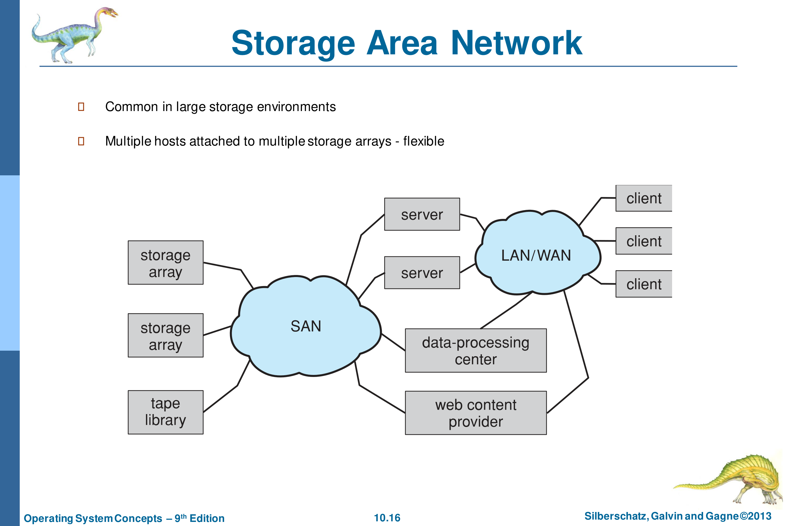
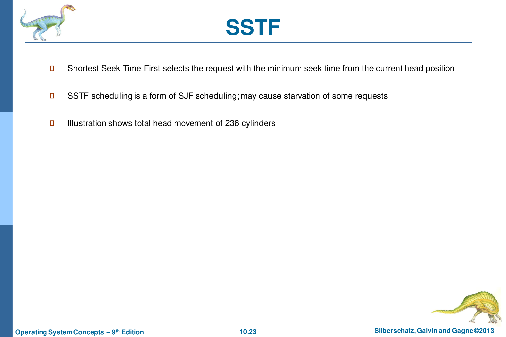

---

## 第 1 页

**提问：** 这张截图里的内容是什么意思？请面向初学者详细解释，分点讲清楚。

这张截图看起来是一个计算机操作系统（Operating System, OS）课程的讲义或幻灯片的封面，内容的主题是“Mass-Storage Systems”（大规模存储系统）。我会详细解释其中的每个部分：

### 1. 课程名称

* **COMP3301**: 这是课程的编号，通常是大学课程编号，用来标识不同的课程。
* **Mass-Storage Systems**: 这门课的主题是“大规模存储系统”，也就是计算机系统中用于存储大量数据的硬件和技术。这可能包括硬盘、固态硬盘（SSD）、磁带存储等。
* **\[Based on Chapter 10, OSC]**: 表示这部分内容是基于《Operating System Concepts》（《操作系统概念》）一书的第10章。OSC是一本常用的操作系统教材，作者是Silberschatz、Galvin 和 Gagne。

### 2. 书籍引用

* **Operating System Concepts – 9th Edition**: 这是这本书的版本，9th Edition是第9版。这本书是学习操作系统概念和原理的经典教材，内容包括操作系统的基础理论、设计、实现等。
* **Silberschatz, Galvin and Gagne**: 这是这本书的作者，分别是 Abraham Silberschatz、Peter B. Galvin 和 Greg Gagne。

### 3. 图像

* 图片中显示的是一只恐龙。虽然它的具体含义可能需要根据课件上下文来理解，但通常这类插图可能用于吸引注意力，或者与教学内容进行某种幽默或有趣的联结。

### 4. 教学内容

* 这张截图可能是介绍存储系统相关的课程内容，而“大规模存储系统”是一个非常重要的操作系统主题，因为随着数据量的增加，如何有效存储、管理、备份数据变得尤为重要。

### 5. 主要概念

* **大规模存储系统**（Mass-Storage Systems）是指用于长期存储大量数据的硬件设备。常见的包括：

  * **硬盘（HDD）**: 磁盘存储，长期以来是计算机的主要存储介质。
  * **固态硬盘（SSD）**: 比硬盘更快的存储设备，使用闪存技术。
  * **光盘和磁带**: 用于备份或长期存储数据的设备。
  * **云存储**: 网络上的远程存储系统，也可以视为大规模存储的一部分。

### 结论

这张截图是一个操作系统课程的一部分，主题围绕“大规模存储系统”展开，主要讲解如何在操作系统中管理和使用这些存储设备。这对于理解计算机如何存储数据、如何确保数据的持久性和安全性非常重要。

---

## 第 2 页

**提问：** 这张截图里的内容是什么意思？请面向初学者详细解释，分点讲清楚。

这张截图是关于“大规模存储系统”主题的课程讲义的一个具体内容。以下是每个要点的详细解释：

### 1. **Overview of Mass Storage Structure（大规模存储结构概述）**

* 这一部分介绍了大规模存储系统的整体结构。大规模存储系统涉及如何组织、管理和优化存储设备，以高效存储大量数据。了解这个概述有助于理解如何设计和管理计算机系统中的存储部分。

### 2. **Disk Structure（磁盘结构）**

* 磁盘结构指的是磁盘如何物理和逻辑地组织数据。磁盘一般由多个圆形的磁盘盘片组成，这些盘片上有多个扇区，每个扇区存储数据。了解磁盘结构有助于优化磁盘的读写操作。

### 3. **Disk Attachment（磁盘连接）**

* 磁盘连接讨论的是计算机如何与磁盘存储设备进行连接。常见的连接方式包括SATA、SCSI和USB等。磁盘连接的类型和速度直接影响存储性能。

### 4. **Disk Scheduling（磁盘调度）**

* 磁盘调度是操作系统如何决定哪个请求最先被处理。由于磁盘的访问速度相对较慢，合理的调度算法可以减少磁盘的访问时间，提高性能。常见的磁盘调度算法有FCFS（先来先服务）、SSTF（最短寻道时间优先）等。

### 5. **Disk Management（磁盘管理）**

* 磁盘管理包括如何在磁盘上分配空间、管理文件以及执行相关的任务。磁盘管理涉及磁盘的格式化、文件系统的管理等。合理的磁盘管理可以优化存储空间的利用率，避免碎片化现象。

### 6. **Swap-Space Management（交换空间管理）**

* 交换空间是指操作系统使用硬盘的一部分空间来临时存放内存中不常用的数据。这通常在内存不足时发生。交换空间管理是操作系统在物理内存不足时确保系统稳定运行的一个重要部分。

### 7. **RAID Structure（RAID结构）**

* RAID（Redundant Array of Independent Disks）是一种磁盘阵列技术，通过将多个硬盘组合成一个存储单元，既提高了存储的性能，也增强了数据的安全性。RAID有多种级别（如RAID 0、RAID 1、RAID 5等），它们分别提供不同的性能和容错能力。

### 8. **Stable-Storage Implementation（稳定存储实现）**

* 稳定存储指的是一种可以确保数据持久化并在系统崩溃或断电后仍能恢复的存储方式。实现稳定存储通常需要特殊的硬件或软件技术来确保数据的一致性和可靠性。

---

### 总结

这张幻灯片列出了“大规模存储系统”主题的各个方面，包括如何组织和管理磁盘、如何提升存储效率、如何提高数据的安全性等。这些都是操作系统如何与存储设备交互并优化性能的关键概念。

---

## 第 3 页

**提问：** 这张截图里的内容是什么意思？请面向初学者详细解释，分点讲清楚。

这张截图展示了“大规模存储系统”课程的学习目标（Objectives）。以下是每个目标的详细解释：

### 1. **To describe the physical structure of secondary storage devices and its effects on the uses of the devices**

* **描述二级存储设备的物理结构及其对设备使用的影响**：

  * 二级存储设备是指硬盘、固态硬盘（SSD）、光盘等，区别于计算机的主存（RAM）。物理结构包括这些设备的内部构造，如磁盘盘片、磁头、存储单元等。
  * 学生需要理解这些物理结构如何影响设备的使用效率，例如，磁盘的旋转速度（转速）影响数据的读取速度，固态硬盘没有机械部件，因而速度更快。
  * 了解这些结构有助于优化存储系统的设计和选择最合适的设备。

### 2. **To explain the performance characteristics of mass-storage devices**

* **解释大规模存储设备的性能特征**：

  * 性能特征指的是存储设备的速度、容量、可靠性等方面的表现。不同的存储设备有不同的性能指标，如：

    * **读取/写入速度**：指数据从存储设备读取或写入的速度。
    * **容量**：存储设备可以存储的数据量。
    * **持久性**：数据存储的稳定性，是否能在断电等异常情况下保持数据。
  * 了解这些性能特征对于选择合适的存储设备、优化存储性能非常重要。

### 3. **To evaluate disk scheduling algorithms**

* **评估磁盘调度算法**：

  * 磁盘调度算法用于决定操作系统如何安排磁盘的读写操作。由于磁盘的机械性质，合理的调度可以提高性能，减少等待时间和寻道时间。
  * 常见的调度算法有：

    * **先来先服务（FCFS）**：按照请求的顺序处理。
    * **最短寻道时间优先（SSTF）**：优先处理离当前位置最近的请求。
    * **电梯算法（SCAN）**：磁头像电梯一样在盘片上来回移动，按顺序处理请求。
  * 了解这些算法有助于优化磁盘的使用效率，减少等待时间，提高系统性能。

### 4. **To discuss operating-system services provided for mass storage, including RAID**

* **讨论操作系统为大规模存储提供的服务，包括RAID**：

  * 操作系统不仅仅管理磁盘的读写，还提供一些服务来增强存储的安全性、性能和可靠性。例如：

    * **RAID（冗余磁盘阵列）**：通过将多个硬盘组合成一个阵列来提高性能（例如RAID 0）或增强数据冗余保护（例如RAID 1和RAID 5）。RAID技术可以容错、提高速度和数据可靠性。
    * **文件系统**：操作系统管理数据存储的方式，确保数据的组织、查找和访问效率。
    * **磁盘缓存**：操作系统使用缓存技术提高存储设备的读写速度。
  * 了解这些服务帮助学生深入理解操作系统如何有效管理大量数据，并确保数据的安全与快速存取。

---

### 总结

这些目标概述了学习“大规模存储系统”时要掌握的核心知识点。理解这些目标有助于学生了解操作系统如何与硬件交互，以及如何高效管理和优化存储设备，从而提供更快、更可靠的存储服务。

---

## 第 4 页

**提问：** 这张截图里的内容是什么意思？请面向初学者详细解释，分点讲清楚。

这张截图的内容涉及“大规模存储结构”的概述，主要描述了磁盘存储设备的基本工作原理和技术。接下来，我会逐一解释每个要点：

### 1. **Magnetic disks provide bulk of secondary storage of modern computers**

* **磁盘提供现代计算机的主要二级存储**：

  * 磁盘（如硬盘）是计算机存储设备的主要类型之一，通常用于存储操作系统、应用程序和大量数据。它们属于“二级存储”，与“主存”（RAM）不同，二级存储用于长期存储数据。

### 2. **Drives rotate at 60 to 250 times per second**

* **磁盘驱动器每秒旋转60到250次**：

  * 磁盘驱动器（如传统的硬盘驱动器，HDD）通过旋转磁盘盘片来读取和写入数据。旋转速度通常以每分钟多少转（RPM）来表示。例如，常见的硬盘转速为7200 RPM或10000 RPM。旋转速度越高，读取和写入数据的速度就越快。

### 3. **Transfer rate is rate at which data flow between drive and computer**

* **传输速率是指数据在驱动器和计算机之间流动的速度**：

  * 传输速率是指数据从硬盘到计算机的传输速度，通常以MB/s（兆字节每秒）为单位。传输速率越高，数据读取和写入的速度就越快。

### 4. **Positioning time (random-access time) is time to move disk arm to desired cylinder (seek time) and time for desired sector to rotate under the disk head (rotational latency)**

* **定位时间（随机访问时间）是将磁盘臂移动到所需磁道的时间（寻道时间）以及所需扇区旋转到磁头下的时间（旋转延迟）**：

  * 磁盘有多个盘片和磁道，磁头需要根据数据存储的位置移动到正确的磁道，读取数据。这些操作的总时间称为“随机访问时间”，包括：

    * **寻道时间**：磁头需要移动到数据所在的磁道所花费的时间。
    * **旋转延迟**：等到磁盘转到正确位置（使数据所在的扇区对准磁头）的时间。

### 5. **Head crash results from disk head making contact with the disk surface**

* **磁头崩溃是指磁头与磁盘表面接触**：

  * 磁头崩溃是一种故障情况，当磁盘头与盘片表面发生碰撞时，可能会导致数据丢失，甚至损坏磁盘。这种情况通常是由于硬盘的机械故障、外部冲击或过度磨损引起的。

### 6. **Disks can be removable**

* **磁盘可以是可拆卸的**：

  * 一些磁盘（如USB闪存驱动器、外部硬盘等）是可拆卸的，意味着它们可以在不关闭计算机的情况下插拔，便于数据交换和备份。

### 7. **Drive attached to computer via I/O bus**

* **驱动器通过I/O总线与计算机连接**：

  * 磁盘驱动器与计算机的连接通过输入输出（I/O）总线进行。这些总线使计算机能够与磁盘驱动器交换数据。常见的总线包括SATA（串行ATA）、USB、SCSI等。

### 8. **Busses vary, including EIDE, ATA, SATA, USB, Fibre Channel, SCSI, SAS, Firewire**

* **总线种类多样，包括EIDE、ATA、SATA、USB、光纤通道、SCSI、SAS、Firewire等**：

  * 这些是不同的I/O总线标准，用于连接硬盘驱动器与计算机。例如：

    * **SATA**：一种常用的高速连接硬盘的标准。
    * **USB**：常用于连接外部驱动器或闪存。
    * **SCSI**、**Fibre Channel**等：用于更高性能的存储设备，通常用于服务器和企业级应用。

### 9. **Host controller in computer uses bus to talk to disk controller built into drive or storage array**

* **计算机中的主控制器使用总线与驱动器或存储阵列中的磁盘控制器通信**：

  * 计算机中的主控制器（Host Controller）通过I/O总线与磁盘控制器进行通信。磁盘控制器是硬盘驱动器中的一个组件，负责协调与计算机之间的数据传输。

---

### 总结

这张幻灯片介绍了磁盘存储设备（特别是硬盘）的结构和工作原理，解释了磁盘如何通过旋转、定位和数据传输来读写数据。它还讨论了与计算机连接的不同总线类型以及磁头崩溃等可能的硬件故障。了解这些基础有助于学生掌握磁盘存储的核心概念，并能在实际应用中选择合适的存储设备和接口。

---

## 第 5 页

**提问：** 这张截图里的内容是什么意思？请面向初学者详细解释，分点讲清楚。

这张截图展示了**移动磁头磁盘机制**（Moving-head Disk Mechanism）的示意图，主要讲解了硬盘（特别是机械硬盘）中磁头如何在磁盘上工作。以下是图中各个元素的详细解释：

### 1. **Spindle（主轴）**

* 主轴是硬盘内部的中心轴，所有的磁盘盘片都通过主轴固定并围绕它旋转。它的旋转使得磁盘能够不断转动，以便磁头可以读取或写入数据。

### 2. **Track（磁道）**

* 磁道是盘片上的圆形轨迹，每个磁道可以存储数据。磁盘的每个盘片都有多个同心圆形的磁道，数据被按磁道存储。每个磁道上的数据是连续的，可以通过磁头读取。

### 3. **Sector（扇区）**

* 扇区是磁道上进一步划分的小单位。每个扇区是磁盘中最小的数据存储单元，通常为512字节或更大。每个扇区都有一个独特的地址，用于定位和读取数据。

### 4. **Cylinder（柱面）**

* 柱面是由多个磁盘盘片的同一位置的磁道组合而成。所有盘片上相同位置的磁道（即同一个柱面）会形成一个虚拟的“柱面”。磁头可以在柱面内移动来读取不同盘片上的数据。

### 5. **Platter（盘片）**

* 磁盘（硬盘）通常由多个盘片组成，每个盘片由两面（上面和下面）用于存储数据。盘片是被固定在主轴上的，并且围绕主轴旋转。

### 6. **Read-Write Head（读写头）**

* 读写头是硬盘上用于读取和写入数据的磁头。磁头会在磁盘的磁道上移动，在旋转的盘片上进行数据读取和写入。当需要访问特定的磁道时，磁头会移动到相应位置。

### 7. **Arm（臂）**

* 磁头通常是通过一个机械臂（arm）来控制的。磁头通过这个臂在磁盘表面上方或下方进行定位。臂可以在盘片的不同位置之间移动，以便读取和写入数据。

### 8. **Arm Assembly（臂组件）**

* 臂组件是整个磁头控制系统的一个部分，负责控制所有臂的运动。每个磁头都固定在臂的末端，臂会根据需要在盘片上进行移动，从而实现数据访问。

### 9. **Rotation（旋转）**

* 磁盘在工作时会围绕主轴旋转，通常每分钟旋转60到250次。这个旋转动作帮助磁头将目标数据所在的扇区快速对准，以便进行数据的读取和写入。

---

### 总结

这张图描述了机械硬盘内部的工作原理。硬盘通过旋转盘片和移动磁头来定位和访问存储在磁道和扇区中的数据。磁头通过臂在盘片上移动，并根据旋转盘片的同步来读取或写入数据。理解这些机制有助于深入理解硬盘的性能，特别是影响磁盘访问时间的因素，例如寻道时间和旋转延迟。

---

## 第 6 页

**提问：** 这张截图里的内容是什么意思？请面向初学者详细解释，分点讲清楚。

这张截图介绍了**磁盘存储**（Magnetic Disks）的一些重要性能指标和参数。以下是对图中内容的详细解释：

### 1. **Platters range from .85” to 14” (historically)**

* **磁盘盘片的尺寸范围**：

  * 盘片是硬盘中用于存储数据的圆形盘片，过去其尺寸范围从0.85英寸到14英寸。但随着技术的进步，现代硬盘通常使用较小的盘片，常见的尺寸为3.5英寸、2.5英寸和1.8英寸。这些尺寸影响硬盘的容量和物理大小。

### 2. **Commonly 3.5”, 2.5”, and 1.8”**

* **常见的磁盘盘片尺寸**：

  * 现在常见的硬盘尺寸包括：

    * **3.5英寸**：常用于台式机的硬盘。
    * **2.5英寸**：常用于笔记本电脑和移动硬盘。
    * **1.8英寸**：通常用于更小型的设备，如某些便携式硬盘。

### 3. **Range from 30GB to 3TB per drive**

* **硬盘的存储容量范围**：

  * 硬盘的存储容量可以从30GB（较小容量的硬盘）到3TB（非常大的硬盘）。存储容量影响硬盘能存储的数据量。

### 4. **Performance（性能）**

* 硬盘的性能涉及数据传输速度、寻道时间等因素，下面是几个关键的性能指标：

* **Transfer Rate – theoretical – 6 Gb/sec**

  * **理论传输速率**：硬盘的理论最大传输速率为6 Gb/s（千兆比特每秒）。这表示在最佳条件下，硬盘与计算机之间的最大数据传输速度。

* **Effective Transfer Rate – real – 1Gb/sec**

  * **实际传输速率**：由于各种因素（如磁盘上的碎片、设备接口等），实际的传输速率通常低于理论值。在这个例子中，硬盘的实际传输速率为1 Gb/s。

* **Seek time from 3ms to 12ms – 9ms common for desktop drives**

  * **寻道时间**：寻道时间是指硬盘磁头定位到特定磁道所需的时间。对于桌面硬盘来说，常见的寻道时间大约为9毫秒（ms）。寻道时间越短，硬盘的响应速度越快。

* **Average seek time measured or calculated based on 1/3 of tracks**

  * **平均寻道时间的计算**：通常，平均寻道时间是通过计算硬盘磁头在大约三分之一的磁道之间移动所需的时间来得出的。

### 5. **Latency based on spindle speed**

* **基于主轴速度的延迟**：

  * 硬盘的旋转速度影响数据访问的延迟。硬盘的主轴速度通常以\*\*转速（RPM）\*\*来表示，影响读取数据的时间延迟。主轴转速越高，旋转延迟越小，数据访问越快。

* **1 / (RPM / 60) = 60 / RPM**

  * 这公式表示旋转延迟的计算方法。假设硬盘的转速是RPM，则旋转延迟为60除以RPM。例如，如果硬盘的转速是7200 RPM，则旋转延迟约为60 / 7200 = 0.00833秒。

### 6. **Average latency = ½ latency**

* **平均延迟 = ½ 旋转延迟**：

  * 由于硬盘的旋转是循环的，所以平均延迟通常被计算为旋转延迟的一半。即磁头在磁盘表面上等待旋转到合适位置的平均时间。

### 7. **Spindle (RPM) and Average Latency (ms)**

* 这部分展示了不同转速（RPM）下的**平均延迟**（单位：毫秒）。例如：

  * **4200 RPM**的硬盘平均延迟为**7.14毫秒**。
  * **5400 RPM**的硬盘平均延迟为**5.56毫秒**。
  * **7200 RPM**的硬盘平均延迟为**4.17毫秒**。
  * **10000 RPM**的硬盘平均延迟为**3毫秒**。
  * **15000 RPM**的硬盘平均延迟为**2毫秒**。

### 总结：

这张截图展示了硬盘的一些性能指标，主要包括：

* **磁盘尺寸**：通常为3.5英寸、2.5英寸和1.8英寸。
* **存储容量**：从30GB到3TB不等。
* **性能指标**：包括理论和实际的传输速率、寻道时间和旋转延迟。
* **主轴转速与延迟**：硬盘的转速影响数据访问的速度和延迟。

---

## 第 7 页

**提问：** 这张截图里的内容是什么意思？请面向初学者详细解释，分点讲清楚。

这张截图讨论了**磁盘性能**，特别是**磁盘访问时间**和**平均I/O时间**的计算。以下是详细的解释：

### 1. **Access Latency = Average access time + average latency**

* **访问延迟 = 平均访问时间 + 平均延迟**：

  * **访问延迟**是指从发出数据请求到数据开始传输的总时间。
  * 计算公式包括：

    * **平均访问时间**：即磁头定位到目标位置所花费的时间（包括寻道时间）。
    * **平均延迟**：即磁盘旋转到正确位置的时间，通常与转速（RPM）相关。

* **For fastest disk 3ms + 2ms = 5ms**

  * 对于最快的硬盘，假设寻道时间为3ms，旋转延迟为2ms，总访问延迟为5ms。

* **For slow disk 9ms + 5.56ms = 14.56ms**

  * 对于较慢的硬盘，假设寻道时间为9ms，旋转延迟为5.56ms，总访问延迟为14.56ms。

### 2. **Average I/O time = average access time + (amount to transfer / transfer rate) + controller overhead**

* **平均I/O时间 = 平均访问时间 + (传输量 / 传输速率) + 控制器开销**：

  * **传输量/传输速率**：数据传输的时间，取决于传输速率（即磁盘和计算机之间的数据传输速度）。
  * **控制器开销**：硬盘控制器处理数据请求的额外时间。

### 3. **For example to transfer a 4KB block on a 7200 RPM disk with a 5ms average seek time, 1Gb/sec transfer rate with a .1ms controller overhead =**

* **例如，传输一个4KB的块**：

  * 假设使用7200 RPM的硬盘，平均寻道时间为5ms，传输速率为1Gb/s（千兆位每秒），控制器开销为0.1ms。
  * 公式计算步骤如下：

### 4. **5ms + 4.17ms + 0.1ms + transfer time**

* **5ms + 4.17ms + 0.1ms + 传输时间**：

  * **寻道时间**：5ms
  * **旋转延迟**：7200 RPM的硬盘的平均延迟为4.17ms（根据之前的计算图）。
  * **控制器开销**：0.1ms
  * **传输时间**：根据传输速率，计算传输4KB数据所需的时间。

### 5. **Transfer time = 4KB / 1Gb/s \* 8Gb / GB \* 1GB / 1024²KB = 32 / (1024²) = 0.031 ms**

* **传输时间计算**：

  * 传输时间是指从硬盘传输4KB数据所需的时间。
  * 传输速率是1Gb/s（千兆比特每秒），要计算4KB的数据传输时间：

    * 4KB的数据可以转换为32千位（Kb），然后根据传输速率（1Gb/s），得出0.031ms的传输时间。

### 6. **Average I/O time for 4KB block = 9.27ms + 0.031ms = 9.301ms**

* **4KB数据块的平均I/O时间**：

  * **9.27ms**：是之前计算的访问延迟（包括寻道时间和旋转延迟）。
  * **0.031ms**：是计算出来的4KB数据传输时间。
  * 合起来，**平均I/O时间**为**9.301ms**。

### 总结：

这张图展示了计算**磁盘访问时间**和**I/O操作时间**的过程。主要包括：

1. **访问延迟**：由寻道时间和旋转延迟组成。
2. **平均I/O时间**：计算磁头定位、数据传输和控制器开销的总时间。
3. 通过具体例子，展示了如何计算传输4KB数据所需的总时间，包含了磁头移动、旋转延迟和控制器开销等因素。

了解这些计算有助于优化磁盘的性能，并帮助选择适合的存储设备。

---

## 第 8 页

**提问：** 这张截图里的内容是什么意思？请面向初学者详细解释，分点讲清楚。

这张截图介绍的是**第一个商业化的磁盘驱动器**（The First Commercial Disk Drive）。它讲述了1960年代初期IBM公司发布的磁盘存储系统的历史。以下是详细的解释：

### 1. **1956 IBM RAMDAC computer included the IBM Model 350 disk storage system**

* **1956年，IBM RAMDAC计算机包含了IBM 350型磁盘存储系统**：

  * 这是世界上第一个商业化的磁盘存储系统，它是IBM公司推出的一部分。
  * **RAMDAC** 是一种用于计算机的图形显示系统，它包括了IBM 350磁盘存储系统。这个磁盘存储系统被视为磁盘存储技术的先驱。

### 2. **5M (7 bit) characters**

* **5百万（7位）字符**：

  * 这个磁盘存储系统能够存储约5百万个字符。每个字符由7个比特（bit）组成。这个存储容量在当时是非常先进的，能够存储大量数据。

### 3. **50 x 24” platters**

* **50个24英寸的盘片**：

  * IBM 350磁盘存储系统使用了50个直径为24英寸（约61厘米）的盘片（platters）来存储数据。盘片是硬盘内部的圆形存储介质，用来存储数据。
  * 相较于现代硬盘，盘片的尺寸非常大，这在今天看来是非常原始的硬件。

### 4. **Access time = < 1 second**

* **访问时间小于1秒**：

  * 访问时间指的是磁盘头从当前位置移动到需要读取的数据所在位置的时间。在这个磁盘存储系统中，访问时间小于1秒，这在当时是非常快速的。
  * 相较于今天的硬盘，虽然访问时间已经缩短到了几毫秒，但在那个时代，访问时间小于1秒已经是非常先进的技术。

### 5. **图片说明**

* 图片展示的是IBM 350磁盘存储系统的实物，正在被装卸。可以看出，这个设备非常庞大，几乎需要飞机来运输。
* 设备的巨大尺寸与现代硬盘的相对小巧形成了鲜明对比，显示了当时磁盘存储技术的体积和重量。

### 总结：

这张截图展示了IBM 350型磁盘存储系统的历史，它是世界上第一个商业化的磁盘存储设备，具有：

* 存储大约5百万个7位字符，
* 50个24英寸的大盘片，
* 小于1秒的访问时间。

这些特性在当时是革命性的技术，尽管今天的磁盘存储设备在容量和速度上远远超越了它，但IBM 350型磁盘存储系统标志着现代计算机存储技术的开端。

---

## 第 9 页

**提问：** 这张截图里的内容是什么意思？请面向初学者详细解释，分点讲清楚。

这张截图讲解了\*\*固态硬盘（SSD）\*\*的特点和优势。以下是对每个要点的详细解释：

### 1. **Nonvolatile memory used like a hard drive**

* **固态硬盘使用非易失性内存，类似于硬盘**：

  * **非易失性内存**是指断电后数据依然能保持的内存类型。固态硬盘（SSD）使用的是非易失性闪存（例如NAND闪存），与传统的机械硬盘（HDD）不同，后者通常依赖于机械部件来存储数据。
  * SSD能够像硬盘一样作为存储设备，在计算机中保存操作系统、应用程序和数据。

### 2. **Many technology variations**

* **许多技术变种**：

  * 固态硬盘有多种不同的技术实现。例如，闪存的类型（如SLC、MLC、TLC）和存储控制器的设计等因素都会影响SSD的性能和寿命。

### 3. **Can be more reliable than HDDs**

* **比硬盘更可靠**：

  * 由于没有机械运动部件，SSD相比传统的硬盘（HDD）更可靠。硬盘容易受到震动或物理损坏的影响，而SSD则不容易受这些问题的影响。

### 4. **More expensive per MB**

* **每MB更贵**：

  * 由于生产成本高，固态硬盘的存储单元比传统硬盘的存储单元更贵。因此，SSD的价格通常比HDD更高，特别是在容量相同的情况下。

### 5. **Maybe have shorter life span**

* **可能寿命较短**：

  * SSD的寿命受到写入次数的限制。每个存储单元的闪存只能被擦写和写入有限的次数，尤其是使用TLC或QLC闪存的SSD。虽然现代SSD技术已经大大提高了寿命，但仍然比HDD短。

### 6. **Less capacity**

* **较小的存储容量**：

  * 固态硬盘的容量通常低于传统硬盘。虽然高端SSD已经提供了数TB的存储，但在同等价格下，SSD的容量通常低于HDD。

### 7. **But much faster**

* **但速度更快**：

  * 固态硬盘的最大优势之一是它的读写速度远远快于传统硬盘。SSD几乎没有延迟，读取数据时不需要移动机械部件，因此其速度比硬盘快得多。

### 8. **Busses can be too slow -> connect directly to PCI for example**

* **总线可能太慢 -> 例如可以直接连接到PCI**：

  * 传统的硬盘和大部分SSD通常通过SATA接口与计算机连接，SATA接口的带宽有限。因此，为了充分利用SSD的高速度，现代SSD可以直接通过更高速的接口（如PCIe）与计算机连接，这样能够实现更高的传输速率。

### 9. **No moving parts, so no seek time or rotational latency**

* **没有移动部件，因此没有寻道时间或旋转延迟**：

  * 与硬盘不同，SSD没有任何机械部件（如磁头和盘片）。这意味着SSD没有“寻道时间”（磁头在磁盘表面上移动到指定位置的时间）或“旋转延迟”（磁盘旋转到正确位置的时间），这使得SSD在数据访问速度上有很大的优势。

### 10. **图片说明**

* 图片显示了两种常见的固态硬盘（SSD）。一块是带有闪存芯片的裸片，另一块是装在外壳中的32GB SSD。图片展示了SSD的现代外观，通常它们比传统硬盘更小巧和紧凑。

---

### 总结：

这张截图讲解了\*\*固态硬盘（SSD）\*\*与传统硬盘（HDD）之间的区别：

* **SSD**没有机械部件，提供更快的读取和写入速度，同时因为没有旋转和寻道时间，性能大大优于传统硬盘。
* **SSD**的成本较高，每MB的价格比HDD贵，而且容量较小，但在现代计算机系统中，SSD因其高速和耐用性越来越受到青睐。

---

## 第 10 页

**提问：** 这张截图里的内容是什么意思？请面向初学者详细解释，分点讲清楚。

这张截图讲解了\*\*固态混合硬盘（SSHD）\*\*的特点。下面是对各个要点的详细解释：

### 1. **Solid State Hybrid Drives, eg Apple Fusion drive**

* **固态混合硬盘（SSHD），例如苹果Fusion驱动**：

  * \*\*固态混合硬盘（SSHD）\*\*是结合了固态硬盘（SSD）和传统机械硬盘（HDD）的特点的存储设备。它将快速的固态存储与大容量的磁盘存储结合起来，以提高存储性能和容量。
  * **Apple Fusion drive**是苹果公司推出的一个典型例子，它将SSD和HDD结合在一起，常见于iMac和MacBook中。

### 2. **Incorporate Flash Drive and Magnetic Disk drive**

* **结合了闪存驱动和磁盘驱动**：

  * SSHD将两种存储技术结合在一起：一部分是闪存（通常用于高速存储），另一部分是传统的磁盘存储（用于大容量存储）。通过这样的组合，系统可以提供较快的数据访问速度，同时保持较大的存储容量。

### 3. **May use Flash as a cache, or else may be two separate drives with one interface**

* **可能使用闪存作为缓存，或者可能是两个独立的驱动器，使用一个接口**：

  * 有些SSHD将闪存作为缓存来加速磁盘的读取操作，常见的做法是将经常使用的数据存储在闪存中，以提高访问速度。
  * 也有些SSHD将SSD和HDD分开管理，尽管它们使用一个接口连接到计算机。在这种情况下，操作系统可以智能地管理这两个驱动器。

### 4. **Reduced power consumption for laptops**

* **减少笔记本电脑的电力消耗**：

  * 由于SSHD结合了SSD和HDD的优势，闪存部分的快速访问特性可以降低磁盘的能量消耗。SSD在读取数据时不需要像传统硬盘那样旋转，因此功耗较低。这对于笔记本电脑等电池供电设备特别重要。

### 5. **May be manual or automatic configuration (eg OS moves commonly used files to SSD)**

* **可能是手动或自动配置（例如操作系统将常用文件移动到SSD）**：

  * SSHD的配置可以是手动的，也可以是自动的。操作系统可能自动管理数据，将经常访问的文件放入SSD，而将不常用的数据放入HDD。这种方式有助于提高数据访问效率和优化存储性能。
  * 当然，也可以让用户手动配置，决定哪些数据存放在SSD，哪些数据存放在HDD。

### 6. **图片说明**

* 图片展示了SSHD的外观。左侧是传统的硬盘（HDD），中间是结合了SSD的混合硬盘（SSHD），右侧是固态硬盘（SSD）。图示帮助理解SSHD如何结合SSD和HDD的特性，提供较高的性能和存储容量。

---

### 总结：

\*\*固态混合硬盘（SSHD）\*\*结合了SSD和HDD的优点，旨在提供快速的存储访问（来自SSD）以及大容量存储（来自HDD）。它能够减少笔记本等设备的功耗，并且通过智能配置（自动或手动），优化存储和数据访问性能。SSHD适合需要平衡存储容量和速度的场景，尤其是对于希望提高性能同时控制成本的用户。

---

## 第 11 页

**提问：** 这张截图里的内容是什么意思？请面向初学者详细解释，分点讲清楚。

这页在讲一种“老而常青”的存储介质——**磁带（Magnetic Tape）**。给初学者可这样理解：

### 磁带是什么？

* 早期的**二级存储介质**（不是内存，属于长期保存数据的介质）。
* 形态从最早的**开卷盘**，发展为今天常见、便携、密封的**磁带盒/磁带卡带（cartridge）**。

### 有什么优点？

* **保存时间长**、**容量大**：单盒典型可到 **200GB～1.5TB**（不同年代/型号不同）。
* **成本低**：以每TB计算的价格通常比磁盘、SSD 便宜，适合放很多“冷数据”。
* **顺序读取速度并不慢**：当磁头已经对准数据时，**传输速率可与磁盘相当**（如 **≥140MB/s**）。

### 关键限制

* **访问时间慢**：

  * 磁带是**顺序介质**，就像录音带，要读中间的歌必须**快进/倒带**到那个位置。
  * 做“随机访问”时，**大约比磁盘慢 1000 倍**；因此不适合频繁、随机的小块读取。
* **定位开销大**：数据放在一条长带子上，需要把带子**卷到读写磁头**下面才能开始传输。

### 典型用途

* **备份/归档**：存长期很少访问的数据（合规留存、历史日志、影像素材等）。
* **系统间数据交换**：一次性写入、离线转运。

### 工作方式（顺序存取的直观图景）

1. 把磁带装到机里 →
2. 通过电机让磁带**前后卷动**，直到目标数据**到达读写头** →
3. 一旦对上位置，就能以较高速率连续读/写**大片顺序数据**。

### 规模化使用：机器人磁带库

* 数据中心里会用**机器人磁带库（tape library）**：机械臂在成千上万盘磁带中**取放**指定磁带。
* 好处：库容巨大、成本低；
* 代价：**装载/定位有“多秒级”延迟**（等机械臂拿带子、装带子、快进定位）。

---

**一句话总结**：磁带不适合像磁盘/SSD 那样做频繁随机访问，但**超低成本、超大容量、长期可靠**，因此非常适合**备份与归档**这类“写入后很少再动”的场景。

---

## 第 12 页

**提问：** 这张截图里的内容是什么意思？请面向初学者详细解释，分点讲清楚。

这张截图介绍了**磁盘结构**（Disk Structure）的基本概念。以下是详细的解释，适合初学者理解：

### 1. **Disk drives are addressed as large 1-dimensional arrays of logical blocks**

* **硬盘驱动器被作为一个大的1维逻辑块数组来寻址**：

  * 磁盘的存储被视为一长串逻辑块（logical blocks）。每个逻辑块是最小的数据存储单位，可以理解为一个存储区，每个逻辑块通常有固定大小（比如512字节）。
  * 磁盘被“格式化”后，这些逻辑块就成为了硬盘上的数据单位。

### 2. **Low-level formatting creates logical blocks on physical media**

* **低级格式化将逻辑块创建在物理介质上**：

  * 物理硬盘的表面被划分为很多个**扇区（sector）**，每个扇区包含一定量的数据。在低级格式化的过程中，硬盘被分成多个逻辑块，这些逻辑块是操作系统管理和存取数据的基本单位。

### 3. **The 1-dimensional array of logical blocks is mapped into the sectors of the disk sequentially**

* **这些逻辑块按照顺序映射到磁盘的扇区上**：

  * 逻辑块的排列是顺序的。比如，磁盘上第一个逻辑块就映射到第一个扇区，第二个逻辑块映射到第二个扇区，以此类推。这样有助于提高数据的读写效率。

### 4. **Sector 0 is the first sector of the first track on the outermost cylinder**

* **扇区0是最外圈第一个磁道的第一个扇区**：

  * 磁盘的每一层（每个盘片）都有很多磁道（track）。扇区0通常指的是最外圈的第一个磁道上的第一个扇区。

### 5. **Mapping proceeds in order through that track, then the rest of the tracks in that cylinder, and then through the rest of the cylinders from outermost to innermost**

* **映射按顺序进行：首先是当前磁道中的扇区，然后是当前柱面中的其他磁道，再接着是从外圈到内圈的其他柱面**：

  * 硬盘的结构是层状的，每个层次上都有多个磁道。首先会读取外圈的磁道，再逐步读取磁道内的扇区，最后进入到磁盘更内部的磁道。

### 6. **Logical to physical address should be easy**

* **逻辑地址到物理地址的映射应该是简单的**：

  * 磁盘的逻辑块在操作系统中有对应的物理地址，理论上，通过合理的映射，操作系统可以轻松地从逻辑地址转换到物理地址，知道数据具体存储的位置。

* **Except for bad sectors**

  * 需要注意的是，某些磁盘上的扇区可能损坏（坏道），这些扇区会被标记为不能使用，这使得逻辑到物理地址的映射变得更加复杂。

* **Non-constant # of sectors per track via constant angular velocity**

  * 由于磁盘的转速是恒定的，因此每个磁道上的扇区数并不是固定的。外圈磁道的长度较长，所以它们包含的扇区更多；而内圈的磁道较短，包含的扇区则较少。

### 7. **Older disks would allow physical addressing (Cylinder Number, Sector Number, Head Number), but most disks now only have (linear) logical addressing**

* **早期的磁盘允许物理寻址（如柱面号、扇区号、磁头号），但现代大多数磁盘使用（线性）逻辑寻址**：

  * 在早期，磁盘的寻址方式使用**物理寻址**，即通过柱面号、扇区号和磁头号来定位数据的位置。这样操作系统能够非常精确地定位数据存放位置。
  * 然而，现在的硬盘大多采用**逻辑寻址**方式，操作系统通过逻辑块编号来寻址，而不关心物理位置。磁盘的内部结构对操作系统是透明的，这样可以简化操作。

* **This means the OS does not know exactly where a disk block is located**:

  * 由于现代磁盘使用逻辑寻址，操作系统并不知道数据在磁盘上的物理位置。这种抽象使得操作系统可以更灵活地管理磁盘，方便进行磁盘优化（如磁盘碎片整理等）。

---

### 总结：

这张截图介绍了磁盘的基本结构，特别是如何从逻辑地址到物理地址的映射。硬盘的磁道、扇区和柱面形成了数据的物理存储结构，而操作系统通过逻辑块来管理磁盘存储。随着技术的进步，现代磁盘采用了**逻辑寻址**，使得数据存取变得更加高效和灵活，同时也隐藏了磁盘的物理布局，简化了操作系统的管理工作。

---

## 第 13 页

**提问：** 这张截图里的内容是什么意思？请面向初学者详细解释，分点讲清楚。

这张截图讲解了\*\*磁盘连接（Disk Attachment）\*\*的概念，具体包括了存储设备如何通过输入输出（I/O）端口与计算机连接。下面是对每个要点的详细解释：

### 1. **Host-attached storage accessed through I/O ports talking to I/O busses**

* **主机附加存储通过I/O端口与I/O总线连接**：

  * 存储设备通常通过I/O端口（如USB、SATA、SCSI等）与计算机主机连接。这些端口与I/O总线交互，I/O总线是数据在计算机和设备之间传输的通道。

### 2. **SCSI itself is a bus, up to 16 devices on one cable**

* **SCSI本身是一个总线，最多支持16个设备通过一根电缆连接**：

  * **SCSI（Small Computer System Interface）** 是一种常见的存储接口，它允许多个设备通过一条数据线（总线）连接到计算机。通常，SCSI设备的数量可以达到16个，这使得它非常适合企业和服务器环境中需要多个存储设备的情况。

### 3. **SCSI initiator requests operation and SCSI targets perform tasks**

* **SCSI发起器请求操作，SCSI目标执行任务**：

  * 在SCSI协议中，**发起器（Initiator）** 是发起操作请求的设备（通常是计算机本身），而**目标（Target）** 是执行操作的设备（如硬盘）。发起器向目标设备发送命令，目标设备根据命令执行相应的操作。

### 4. **Each target can have up to 8 logical units (disks attached to device controller)**

* **每个目标可以有最多8个逻辑单元（附加到设备控制器的磁盘）**：

  * 每个SCSI目标可以包含多个**逻辑单元**（Logical Units，简称LUN）。LUN是磁盘阵列中每个物理磁盘或分区的逻辑表示。一个SCSI目标可以包含最多8个这样的逻辑单元。

### 5. **FC (Fibre Channel) is high-speed serial architecture**

* **FC（光纤通道）是高速串行架构**：

  * **光纤通道（Fibre Channel）** 是一种专门为高速数据传输设计的网络架构，通常用于大规模存储区域网络（SANs）。与传统的SCSI不同，Fibre Channel能够支持更高的数据传输速率，适用于数据密集型应用和企业级存储需求。

### 6. **Can be switched fabric with 24-bit address space – the basis of storage area networks (SANs) in which many hosts attach to many storage units**

* **可以通过交换结构提供24位地址空间——这是存储区域网络（SAN）的基础，其中许多主机连接到许多存储单元**：

  * 光纤通道采用交换结构（switch fabric），支持24位地址空间。这意味着它可以支持大量的存储设备和计算机主机之间的连接，构成一个高效的**存储区域网络（SAN）**。在SAN中，多个主机可以访问多个存储设备，适用于企业级存储和高性能计算环境。

### 7. **I/O directed to bus ID, device ID, logical unit (LUN)**

* **I/O操作根据总线ID、设备ID和逻辑单元（LUN）进行定向**：

  * 在进行I/O操作时，系统会使用**总线ID**（指示设备所连接的总线）、**设备ID**（指示特定设备）和**逻辑单元ID（LUN）**（指示磁盘阵列中的特定磁盘或分区）来定位和操作设备。这样的结构帮助计算机准确地访问存储设备上的数据。

---

### 总结：

这张截图详细讲解了磁盘和存储设备如何通过不同的接口（如SCSI、光纤通道等）与计算机主机连接。主要涉及：

* **SCSI** 总线的工作原理，其中多个设备可以通过一根电缆连接，并由发起器请求操作。
* **光纤通道（FC）** 作为一种高速存储连接技术，通常用于企业级存储区域网络（SAN），支持大量设备的连接和高效的数据传输。
* **I/O寻址**的方式，通过总线ID、设备ID和LUN来精确定位存储设备。

理解这些概念有助于深入了解如何在计算机系统中配置和管理存储设备，特别是在复杂的存储环境中。

---

## 第 14 页

**提问：** 这张截图里的内容是什么意思？请面向初学者详细解释，分点讲清楚。

这张截图的内容是一个演示文稿的结束页面，通常在讲解完课程内容后出现，询问听众是否有问题。

### 详细解释：

* **标题：Questions?（有问题吗？）**

  * 这是一个典型的提示，表示演讲或演示结束，询问听众是否对内容有疑问。
  * 这个问题通常是在讲解完某一主题后，给听众提供提问的机会，帮助他们更好地理解刚才讨论的内容。

---

### 总结：

这是课程演讲的一个常见部分，表示讲解完毕并鼓励听众提出问题，以便澄清不清楚的地方。如果你有任何疑问，通常在这种页面上，你可以进行提问或讨论。

---

## 第 15 页

**提问：** 这张截图里的内容是什么意思？请面向初学者详细解释，分点讲清楚。

这张截图介绍了\*\*存储阵列（Storage Array）\*\*的概念。以下是详细的解释，适合初学者理解：

### 1. **Can just attach disks, or arrays of disks**

* **可以连接单个磁盘或磁盘阵列**：

  * 存储阵列不仅可以连接一个硬盘，还可以连接多个硬盘（磁盘阵列）。磁盘阵列通过不同的方式组合多个硬盘，以提供更高的存储容量和性能。

### 2. **Storage Array has controller(s), provides features to attached host(s)**

* **存储阵列有控制器，提供给连接的主机（host）特性**：

  * 存储阵列配备了一个或多个**控制器**，这些控制器负责管理磁盘阵列并提供功能，如数据读写、数据保护、负载均衡等。
  * 主机（例如计算机、服务器）通过连接到这些控制器来访问存储阵列。

### 3. **Ports to connect hosts to array**

* **端口用于连接主机到存储阵列**：

  * 存储阵列有多个端口，用来与计算机或其他设备的主机进行连接。这些端口可能包括网络端口（如以太网端口）或专用存储网络端口（如Fibre Channel端口）。

### 4. **Memory, controlling software (sometimes NVRAM, etc)**

* **内存、控制软件（有时是NVRAM等）**：

  * 存储阵列可能配备有内存，用于缓存数据，提高存取速度。
  * 控制软件管理存储阵列的所有操作，确保数据正确存储和访问。**NVRAM**（非易失性RAM）是用来存储控制信息和缓存数据的一种内存，它在断电后仍能保存数据。

### 5. **A few to thousands of disks**

* **从几块到数千块磁盘**：

  * 存储阵列可以由几块硬盘组成，也可以扩展到几千块硬盘，特别是在企业级存储系统中。

### 6. **RAID, hot spares, hot swap (discussed later)**

* **RAID、热备份、热插拔（稍后讨论）**：

  * **RAID（冗余磁盘阵列）**：是将多个硬盘组合成一个逻辑单元，提供冗余、数据恢复或性能提升。
  * **热备份（hot spares）**：是指在磁盘阵列中预留备用磁盘，以便主磁盘发生故障时自动替换，保证数据的持续可用性。
  * **热插拔（hot swap）**：允许在不关闭计算机系统的情况下更换硬盘，这对于提高系统的可用性非常重要。

### 7. **Shared storage -> more efficiency**

* **共享存储 -> 更高效**：

  * 存储阵列可以作为**共享存储**，这意味着多个主机（如多台服务器）可以同时访问这些存储设备。这提高了存储的利用率和管理效率，特别是在企业级环境中，多个用户和应用程序可以共享同一存储资源。

### 8. **Features found in some file systems**

* **某些文件系统中的特性**：

  * **快照（Snapshots）**：创建文件系统在特定时间点的副本，方便备份和恢复。
  * **克隆（Clones）**：类似于快照，但可以进行读写操作的副本，通常用于开发和测试环境。
  * **精简配置（Thin provisioning）**：分配存储空间时不立即分配所有空间，而是按需分配，这样可以节省存储资源。
  * **复制（Replication）**：将数据在多个存储设备或位置之间复制，以提高数据的可用性和灾难恢复能力。
  * **去重（Deduplication）**：去除重复数据，仅存储唯一的数据副本，从而节省存储空间。

---

### 总结：

这张截图讲解了**存储阵列（Storage Array）**的基本结构和功能。存储阵列通过控制器管理多个硬盘，提供冗余、数据保护和高效的存储管理。它支持**RAID**、**热备份**和**热插拔**等功能，能够提供高效的共享存储，适合多个主机共同使用。此外，现代存储阵列还支持许多高级功能，如**快照、克隆、精简配置、复制和去重**等，有助于提高存储的效率和数据保护能力。

---

## 第 16 页

**提问：** 这张截图里的内容是什么意思？请面向初学者详细解释，分点讲清楚。

下面这页在讲**存储区域网络（SAN, Storage Area Network）**。把它当成一条**专门给“存储流量”走的高速公路**，和普通办公网络（LAN/WAN）分开。

### 是什么

* **SAN**：把很多服务器和很多存储设备（存储阵列、磁带库等）通过**专用的高速网络**连在一起，提供\*\*块级（Block）\*\*存储给服务器使用。
* 和图里的**LAN/WAN**不同：LAN/WAN 传的是网页、数据库请求、文件共享等“业务流量”；**SAN 只承载磁盘读写流量**。

### 为什么用（图上左/右两朵“云”的含义）

* **大规模环境常见**（第一条 bullet）：数据中心里，很多服务器需要访问很多存储，SAN最灵活。
* **多主机 ⇄ 多阵列**（第二条 bullet）：任意服务器都能被分配到任意阵列上的逻辑卷/ LUN，扩展、迁移都方便。

### 典型连接（对应示意图）

* **左侧**：多台 *storage array*（存储阵列）和 *tape library*（磁带库）接入 **SAN**。
* **中间**：服务器既接 **SAN**（拿存储），也接 **LAN/WAN**（对外提供服务）。
* **右侧**：客户端（client）只连 **LAN/WAN**，通过应用服务器间接使用存储；*data-processing center*、*web content provider* 也是同理。

### 关键部件 & 协议

* **存储阵列**：提供容量、RAID、快照、复制等功能。
* **交换网络**：常见是 **Fibre Channel（FC）** 交换机；也可用 **iSCSI**（走以太网）、**FCoE**、更新的 **NVMe-oF**。
* **主机适配器**：服务器上的 HBA/NIC，对应 FC 或以太网协议。
* **LUN / 多路径**：把阵列里的逻辑卷映射给服务器（LUN Masking / Zoning），通常配置**多条路径**容错与提速。

### 优点

* **高性能、低延迟**（专网+协议为存储优化）。
* **集中管理**：容量统一池化，细粒度分配/扩容。
* **高可用**：多控制器、多路径、阵列级保护（RAID、快照、复制）。
* **灵活性**：服务器间迁移数据/接管业务更容易（虚拟化、数据库等场景非常常见）。

### 注意/代价

* **成本与复杂度高**：需要专用交换机、适配器、专业运维。
* 对小规模/简单场景，**DAS**（直连存储）或 **NAS**（走文件协议的网络存储）可能更省心。

### 一句话记忆

> **SAN = 多主机通过专用高速网络访问多存储阵列的“块存储专网”**；客户端并不直接上 SAN，而是经由服务器。

---

## 第 17 页

**提问：** 这张截图里的内容是什么意思？请面向初学者详细解释，分点讲清楚。

这张截图是对\*\*存储区域网络（SAN）\*\*的进一步解释，继续讨论如何通过网络提供存储，并讲解了如何管理存储设备。下面是详细的分点解释：

### 1. **SAN is one or more storage arrays**

* **SAN 是一个或多个存储阵列**：

  * 存储区域网络（SAN）由一个或多个存储阵列组成，这些阵列是磁盘或其他存储设备的集合，用于提供存储资源。多个存储阵列可以通过网络进行互联，形成一个集中的存储资源池。

### 2. **Connected to one or more Fibre Channel switches**

* **连接到一个或多个光纤通道交换机（Fibre Channel switches）**：

  * 存储阵列通过 **光纤通道（Fibre Channel, FC）** 网络连接到交换机。光纤通道是一种高性能、低延迟的通信协议，专为存储设备和服务器之间的高速数据传输设计。通过这些交换机，存储阵列可以与计算机、服务器或其他设备进行数据交换。

### 3. **Hosts also attach to the switches**

* **主机也连接到交换机**：

  * 服务器或主机（Hosts）通过 **Fibre Channel 交换机** 连接到存储阵列。这样，主机可以访问存储阵列中的数据并进行读写操作。

### 4. **Storage made available via LUN (Logical Unit Number) Masking from specific arrays to specific servers**

* **存储通过LUN（逻辑单元号）屏蔽从特定阵列分配给特定服务器**：

  * 存储阵列中的存储单元通常被划分为多个**逻辑单元**（LUN）。**LUN Masking** 是一种技术，允许存储阵列管理员将特定的 LUN 分配给特定的主机或服务器。这样，服务器只能访问被分配给它的 LUN，确保安全和效率。
  * **LUN** 是存储设备上一个虚拟化的存储单元，通常对应一个磁盘或磁盘的一部分。

### 5. **Easy to add or remove storage, add new host and allocate it storage**

* **容易添加或移除存储，添加新主机并分配存储**：

  * SAN 提供了灵活的存储管理方式，可以根据需要动态地添加或移除存储设备。当需要更多存储时，只需将新的存储阵列接入 SAN 中并配置，就可以为新主机或现有主机分配存储资源。
  * 新的服务器可以很容易地连接到 SAN，并根据需要获取存储。

### 6. **Over low-latency Fibre Channel fabric**

* **通过低延迟的光纤通道网络**：

  * **光纤通道网络**（Fibre Channel fabric）是一种高速、低延迟的网络架构，它是 SAN 的核心。它保证了数据传输的高速度和低延迟，适合于需要高速数据访问的环境，如企业级数据中心和大规模存储。

---

### 总结：

这张截图进一步说明了 SAN 的架构和功能。SAN 连接了多个存储阵列和主机服务器，主机通过光纤通道交换机访问存储资源。通过 **LUN Masking** 技术，存储管理员可以精确地将存储资源分配给特定的主机。SAN 的灵活性使得它特别适合需要动态扩展和高效存储管理的大型企业环境。此外，**光纤通道** 提供了高速低延迟的通信，确保了数据在存储和主机之间的快速传输。

---

## 第 18 页

**提问：** 这张截图里的内容是什么意思？请面向初学者详细解释，分点讲清楚。

这张截图介绍了**网络附加存储（NAS, Network-Attached Storage）**，并讨论了如何通过网络提供存储服务。下面是对每个要点的详细解释，适合初学者理解：

### 1. **Network-attached storage (NAS) is storage made available over a network rather than over a local connection (such as a bus)**

* **网络附加存储（NAS）是通过网络而不是本地连接（如总线）提供的存储**：

  * NAS 是一种将存储设备（如硬盘、磁盘阵列）通过网络提供给计算机使用的方式。与传统的通过数据总线直接连接到计算机的存储不同，NAS 使用网络连接（例如以太网）来访问数据，通常用于共享存储资源。

### 2. **Remotely attaching to file systems**

* **远程附加到文件系统**：

  * NAS 让计算机远程访问文件系统。通过网络，多个计算机可以访问同一个文件系统中的文件，就像它们存储在本地硬盘上一样。

### 3. **NFS (Network File System) and CIFS (Common Internet File System) are common protocols**

* **NFS（网络文件系统）和CIFS（通用互联网文件系统）是常见的协议**：

  * **NFS**：是 UNIX 和 Linux 系统中常用的协议，允许计算机通过网络访问远程文件。
  * **CIFS**：是 Windows 操作系统使用的文件共享协议，通常用于 Windows 计算机之间的文件共享。
  * 这些协议使得计算机可以像访问本地硬盘一样访问远程的文件系统。

### 4. **Implemented via remote procedure calls (RPCs) between host and storage over typically TCP or UDP on IP network**

* **通过远程过程调用（RPC）在主机和存储之间实现，通常使用 TCP 或 UDP 协议通过 IP 网络通信**：

  * **远程过程调用（RPC）** 是一种通信协议，允许程序在网络上请求远程服务器执行某些操作。在 NAS 中，主机（如计算机）通过 RPC 请求存储系统上的文件操作。
  * 通常，这些通信是通过 IP 网络（如局域网 LAN 或广域网 WAN）使用 **TCP** 或 **UDP** 协议来实现的。

### 5. **iSCSI protocol uses IP network to carry the SCSI protocol**

* **iSCSI 协议使用 IP 网络来承载 SCSI 协议**：

  * **iSCSI**（Internet Small Computer System Interface）是一种基于 IP 网络传输的协议，用于远程访问存储设备。iSCSI 使得存储设备可以通过网络与计算机连接，使用 **SCSI**（小型计算机系统接口）协议进行数据传输。
  * iSCSI 将传统的 SCSI 协议通过 IP 网络传输，允许计算机远程访问存储设备，就像它们直接连接到本地硬盘一样。

### 6. **Remotely attaching to devices (blocks)**

* **远程附加到设备（块）**：

  * 在 iSCSI 中，存储设备被划分为**块**（block）。这些块被远程附加到计算机上，使得计算机可以像访问本地磁盘一样访问远程存储设备的块级数据。

### 7. **示意图说明**

* 图示展示了一个 **NAS 网络架构**：

  * 多个 **NAS 设备** 连接到 **LAN/WAN（局域网/广域网）** 网络。
  * 这些设备通过网络提供存储资源，多个 **客户端** 通过网络访问这些存储设备。

---

### 总结：

这张截图讲解了 **网络附加存储（NAS）** 的概念，解释了如何通过网络提供文件系统访问和块级存储。主要内容包括：

* **NAS** 通过网络连接而非本地总线连接存储设备，多个主机可以远程访问存储。
* 通过 **NFS** 和 **CIFS** 等协议，计算机可以远程挂载文件系统。
* **iSCSI** 协议则通过 **IP 网络** 实现块级存储的远程连接。
* **RPC** 和 **TCP/UDP** 协议支持主机和存储之间的通信。

NAS 是一种常见的网络存储方案，适用于文件共享、远程备份等场景。

---

## 第 19 页

**提问：** 这张截图里的内容是什么意思？请面向初学者详细解释，分点讲清楚。

这张截图的内容是**提问环节**，通常是在讲解完某个部分或课程后，邀请听众提问。具体解释如下：

### **Questions?（有问题吗？）**

* 这是一个常见的提示，表示演示或讲解的内容已经结束，演讲者或者讲解者在此时询问听众是否有任何疑问。
* 这种提问环节通常发生在课程、会议或演讲结束时，提供一个机会让听众进一步理解内容，或者针对讲解中不清楚的地方进行提问。

### **目的：**

* **澄清疑惑**：让听众有机会提出在讲解过程中没有理解的部分。
* **加强互动**：这种提问方式增加了演讲者与听众之间的互动，帮助确保听众能够掌握讲解的内容。

在这种情况下，如果你有任何关于内容的疑问或不理解的部分，演讲者会在此环节进行回答。

---

## 第 20 页

**提问：** 这张截图里的内容是什么意思？请面向初学者详细解释，分点讲清楚。

这张截图讨论了\*\*磁盘调度（Disk Scheduling）\*\*的基本概念，重点是如何提高磁盘访问效率。以下是每个要点的详细解释，适合初学者理解：

### 1. **The operating system is responsible for using hardware efficiently — for the disk drives, this means having a fast access time and disk bandwidth**

* **操作系统负责高效地使用硬件——对于磁盘驱动器，这意味着需要快速的访问时间和磁盘带宽**：

  * 操作系统需要有效地管理硬盘的读写操作，确保磁盘访问的时间尽可能短，并提高数据传输速度。这两者的优化对于系统的整体性能非常重要。
  * \*\*访问时间（Access Time）\*\*是指从请求磁盘操作到开始执行的时间，包括寻道时间和旋转延迟。
  * \*\*磁盘带宽（Disk Bandwidth）\*\*是指单位时间内能够传输的数据量，通常以字节/秒为单位。

### 2. **Minimize seek time**

* **最小化寻道时间**：

  * **寻道时间**是指磁盘磁头从当前位置移动到目标位置的时间。磁头需要移动到数据存储所在的磁道，才能读取或写入数据。
  * 寻道时间是影响磁盘性能的重要因素，减少寻道时间意味着磁盘能更快地响应读写请求。

### 3. **Seek time ≈ seek distance**

* **寻道时间大约等于寻道距离**：

  * 寻道时间与磁头需要移动的距离成正比。磁头要读取或写入数据的磁道越远，寻道时间越长。
  * 在实际操作中，操作系统会尽量优化磁头的移动路径，以减少寻道时间。

### 4. **Disk bandwidth is the total number of bytes transferred, divided by the total time between the first request for service and the completion of the last transfer**

* **磁盘带宽是指传输的总字节数，除以从第一次请求服务到完成最后一次传输所需的总时间**：

  * 这里描述了如何计算磁盘带宽：带宽是通过总共传输的数据量除以处理这些数据所花费的时间来得到的。
  * 计算公式可以帮助评估磁盘在处理数据时的效率。例如，如果磁盘传输了100GB的数据，完成这些传输总共花费了10秒钟，那么磁盘的带宽就是 100GB / 10s = 10GB/s。

---

### 总结：

* **磁盘调度**的目标是优化磁盘访问效率，特别是通过减少**寻道时间**（磁头定位的时间）和提高**磁盘带宽**（单位时间内传输的数据量）。
* 操作系统在磁盘调度中起着关键作用，它通过合理安排磁盘请求的顺序，尽量减少磁头的移动距离，从而降低寻道时间。

---

## 第 21 页

**提问：** 这张截图里的内容是什么意思？请面向初学者详细解释，分点讲清楚。

这张截图讨论了\*\*磁盘调度（Disk Scheduling）\*\*的更多细节，特别是操作系统如何管理磁盘I/O请求和调度这些请求。以下是详细的分点解释，适合初学者理解：

### 1. **There are many sources of disk I/O request**

* **磁盘I/O请求的来源有很多**：

  * **操作系统（OS）**：操作系统会生成磁盘I/O请求，比如文件系统的读写操作。
  * **系统进程（System processes）**：系统进程会需要访问磁盘，例如日志文件的写入。
  * **用户进程（User processes）**：用户启动的程序也会请求磁盘操作，如打开文件或保存数据。

### 2. **I/O request includes input or output mode, disk address, memory address, number of sectors to transfer**

* **I/O请求包括输入或输出模式、磁盘地址、内存地址、以及要传输的扇区数量**：

  * 每个磁盘I/O请求通常包含以下信息：

    * **输入或输出模式**：是读取数据还是写入数据。
    * **磁盘地址**：请求的起始位置。
    * **内存地址**：将数据传输到/从哪个内存位置。
    * **扇区数量**：需要传输多少扇区的数据。

### 3. **OS maintains queue of requests, per disk or device**

* **操作系统为每个磁盘或设备维护一个请求队列**：

  * 操作系统会把所有的磁盘I/O请求按顺序放入队列中。多个进程可能同时请求磁盘操作，操作系统通过队列来管理这些请求。

### 4. **Idle disk can immediately work on I/O request, busy disk means work must queue**

* **空闲磁盘可以立即处理I/O请求，而忙碌的磁盘意味着工作必须排队**：

  * 当磁盘空闲时，操作系统可以直接处理队列中的I/O请求。
  * 如果磁盘忙碌，那么新的请求就需要排队等待，直到磁盘可用。

### 5. **Optimization algorithms only make sense when a queue exists**

* **优化算法只有在存在队列时才有意义**：

  * 只有当磁盘请求队列中有多个请求需要处理时，才需要使用磁盘调度算法（优化算法）。这些算法的目标是优化磁盘访问的顺序，减少寻道时间和提高效率。

### 6. **Note that drive controllers have small buffers and can manage a queue of I/O requests (of varying “depth”)**

* **注意，磁盘控制器有小型缓冲区，可以管理I/O请求的队列（队列的深度不同）**：

  * 磁盘控制器通常有一个小缓冲区，用于存储I/O请求。缓冲区的大小决定了可以同时处理多少个请求，队列的深度表示队列中可以排队的请求数量。

### 7. **Several algorithms exist to schedule the servicing of disk I/O requests**

* **有多种算法可以调度磁盘I/O请求的服务**：

  * 存在多种磁盘调度算法，这些算法决定了处理磁盘I/O请求的顺序。常见的调度算法包括FCFS（先来先服务）、SSTF（最短寻道时间优先）等。

### 8. **The analysis is true for one or many platters**

* **这种分析适用于一个或多个盘片**：

  * 磁盘可以有多个盘片，操作系统的调度算法也适用于具有多个盘片的磁盘阵列（例如RAID阵列）。

### 9. **We illustrate scheduling algorithms with a request queue (0-199)**

* **我们通过一个请求队列（0-199）来展示调度算法**：

  * 在这一部分，图示展示了一个磁盘请求队列（请求编号从0到199），用来演示不同的磁盘调度算法是如何工作的。

* **示例请求队列**：`98, 183, 37, 122, 14, 124, 65, 67`，**当前磁头位置**：53。

---

### 总结：

这张截图详细讲解了**磁盘调度**的过程，重点是：

* **磁盘I/O请求的来源**：操作系统、系统进程、用户进程都可以发出磁盘I/O请求。
* **请求队列**：操作系统将所有请求排队，磁盘空闲时可以立即处理，忙碌时请求会排队。
* **调度算法**：当请求很多时，调度算法会决定磁盘如何处理这些请求，以减少寻道时间和提高效率。
* **队列管理**：磁盘控制器会管理这些I/O请求队列，并使用缓冲区存储等待处理的请求。

---

## 第 22 页

**提问：** 这张截图里的内容是什么意思？请面向初学者详细解释，分点讲清楚。

这张截图展示了\*\*FCFS（First-Come, First-Served，先来先服务）\*\*磁盘调度算法的示意图。以下是对内容的详细解释，适合初学者理解：

### 1. **FCFS (First-Come, First-Served)**

* \*\*先来先服务（FCFS）\*\*是一种磁盘调度算法，其中请求按它们到达的顺序进行处理。也就是说，第一个请求的任务会最先被处理，然后依次处理后续请求。
* 在图中，磁头会根据请求的顺序依次移动到目标位置。

### 2. **Illustration shows total head movement of 640 cylinders**

* **插图显示了磁头总共移动了640个磁道（cylinders）**：

  * 图中的“磁头”代表硬盘上的读取/写入磁头，它的移动决定了磁盘的寻道时间。图中的数据展示了磁头为了完成所有请求需要移动的总距离：**640个磁道**。

### 3. **Queue = 98, 183, 37, 122, 14, 124, 65, 67**

* **请求队列**：`98, 183, 37, 122, 14, 124, 65, 67`：

  * 这些是等待服务的磁盘请求，它们指定了请求的目标磁道号。磁头将按这个顺序处理这些请求。
  * **磁头起始位置**：53。
  * 这意味着磁头会先去磁道98，然后是183，再到37，以此类推。

### 4. **Head starts at 53**

* **磁头从位置53开始**：

  * 在调度开始时，磁头的起始位置是53，之后它会按请求队列顺序移动到其他磁道。

### 5. **Graph (blue arrows)**

* **图中的蓝色箭头表示磁头的移动**：

  * 每个箭头表示磁头从当前位置移动到下一个请求的目标位置。例如，磁头从53移动到98，从98移动到183，依此类推。
  * 每个箭头之间的距离表示磁头需要移动的距离，即**寻道时间**。

### 6. **Total head movement**

* 图中的箭头展示了磁头的具体移动路径。通过计算从当前位置到每个请求位置的距离，可以得到**磁头的总移动距离**。
* 在这个例子中，总的磁头移动距离为**640个磁道**。

---

### 总结：

这张截图展示了**先来先服务（FCFS）磁盘调度算法**的一个示例。磁头按照请求队列的顺序移动，从起始位置53开始，依次前往其他磁道。图中展示了磁头每次的移动路径和总共移动的距离。在**FCFS算法**中，磁头只考虑请求的到达顺序，而不考虑磁道之间的距离，因此可能会导致较长的寻道时间。

---

## 第 23 页

**提问：** 这张截图里的内容是什么意思？请面向初学者详细解释，分点讲清楚。

这张截图介绍了\*\*SSTF（Shortest Seek Time First，最短寻道时间优先）\*\*磁盘调度算法。下面是详细的分点解释：

### 1. **Shortest Seek Time First selects the request with the minimum seek time from the current head position**

* **最短寻道时间优先（SSTF）选择与当前磁头位置最接近的请求**：

  * 在 **SSTF** 算法中，操作系统会选择距离当前磁头位置最近的磁盘I/O请求来处理。这样做是为了最小化磁头的移动距离，从而减少寻道时间（即磁头从当前位置到目标位置的移动时间）。

### 2. **SSTF scheduling is a form of SJF scheduling; may cause starvation of some requests**

* **SSTF调度是SJF调度的一种形式；可能会导致某些请求的饿死**：

  * **SSTF** 可以看作是 **SJF（Shortest Job First，最短作业优先）** 的一种变体，**SJF** 是根据作业执行的时间来优先调度的，SSTF是根据磁头的当前位置来选择最短的寻道时间。
  * **饿死（Starvation）**：如果某些请求总是比其他请求更接近磁头的位置，它们可能会被优先处理，而其他较远的请求就可能被一直推迟处理，这种情况被称为**请求饿死**。在极端情况下，一些请求可能永远不会得到处理。

### 3. **Illustration shows total head movement of 236 cylinders**

* **插图显示磁头的总移动距离为236个磁道（cylinders）**：

  * 图示展示了使用 **SSTF** 算法时，磁头的总移动距离。在这种调度策略下，磁头移动了 **236个磁道**，这代表了完成所有请求的磁头的总移动量。

---

### 总结：

* **SSTF**（最短寻道时间优先）是一种磁盘调度算法，它优先处理与磁头当前位置最接近的磁盘请求，从而最小化寻道时间，提高效率。
* 但 **SSTF** 可能导致 **饿死**，即某些请求如果总是距离磁头较远，它们可能会长时间得不到处理。
* 插图中展示了一个示例，计算了总的磁头移动距离为 **236个磁道**。

---

## 第 24 页

**提问：** 这张截图里的内容是什么意思？请面向初学者详细解释，分点讲清楚。

这张截图继续展示了\*\*SSTF（Shortest Seek Time First，最短寻道时间优先）\*\*磁盘调度算法的应用。下面是详细的分点解释，适合初学者理解：

### 1. **Queue = 98, 183, 37, 122, 14, 124, 65, 67**

* **请求队列**：`98, 183, 37, 122, 14, 124, 65, 67`：

  * 这些是等待处理的磁盘请求，表示每个请求的目标磁道号。磁头将根据距离当前位置最近的请求依次处理这些请求。

### 2. **Head starts at 53**

* **磁头起始位置是53**：

  * 在这个例子中，磁头的初始位置是53，之后磁头会根据 **SSTF** 算法处理请求，即首先选择距离当前位置最近的请求进行处理。

### 3. **Illustration shows the total head movement**

* **插图显示了磁头的总移动**：

  * 图中的蓝色箭头表示磁头的移动路径。磁头会根据最短寻道时间的原则，依次访问请求队列中的各个磁道。
  * 这张图展示了磁头从当前位置（53）开始，依次移动到请求队列中的目标磁道。每次移动都表示磁头寻道的过程，计算出的总寻道距离会在图中显示。

### 4. **Graph with blue arrows showing head movement**

* **图示中的蓝色箭头显示了磁头的移动**：

  * 图中的蓝色箭头表示磁头从一个磁道移动到另一个磁道的路径。根据 **SSTF** 算法，磁头每次都选择离当前位置最近的磁道来处理。
  * 例如，磁头从位置 **53** 移动到 **37**，接着移动到 **65**，然后是 **67**，依此类推。

### 5. **Total head movement: 236 cylinders**

* **总磁头移动距离：236个磁道**：

  * 图示显示了磁头在整个调度过程中移动的总距离。通过计算每次移动的距离，可以得到总的磁头移动量：**236个磁道**。
  * 这表示完成所有请求所需的磁头寻道总距离。

---

### 总结：

这张截图展示了 **SSTF**（最短寻道时间优先）调度算法的具体实现：

* 磁头从起始位置 **53** 开始，依次访问请求队列中的磁道，选择离当前位置最近的磁道来处理。
* 通过这种方式，SSTF 算法减少了磁头的总寻道时间。
* 图示中蓝色箭头展示了磁头的移动路径，整个过程的总寻道距离为 **236个磁道**。

SSTF 的优点是减少了寻道时间，但它也可能导致某些请求长时间得不到处理（即“饿死”）。

---

## 第 25 页

**提问：** 这张截图里的内容是什么意思？请面向初学者详细解释，分点讲清楚。

这张截图介绍了**SCAN**磁盘调度算法。以下是详细的分点解释，适合初学者理解：

### 1. **The disk arm starts at one end of the disk, and moves toward the other end, servicing requests until it gets to the other end of the disk, where the head movement is reversed and servicing continues.**

* **磁头从磁盘的一端开始，向另一端移动，直到磁盘的另一端，在那里磁头的移动方向反转，继续服务请求**：

  * **SCAN** 算法的基本思想是：磁头从磁盘的一端开始，按照一个方向处理磁盘上的请求，直到到达磁盘的另一端。当磁头到达另一端时，它的方向反转，继续处理队列中的请求。
  * 可以把它想象成电梯的移动：电梯从一楼升到顶楼，顶楼停满人后，电梯再降到一楼。

### 2. **SCAN algorithm Sometimes called the elevator algorithm**

* **SCAN算法有时被称为电梯算法**：

  * 由于其工作原理类似电梯的升降方式，**SCAN**算法也常被称为**电梯算法**。
  * 就像电梯从楼层到楼层移动一样，**SCAN**算法使磁头不断地在磁盘上来回移动，直到所有请求被处理完。

### 3. **Illustration shows total head movement of 208 cylinders**

* **插图显示磁头总共移动了208个磁道**：

  * 图示展示了使用 **SCAN** 算法时，磁头总共的移动距离。总的移动距离为 **208个磁道**。
  * 通过图示可以看到磁头如何来回移动，计算总的寻道距离。

### 4. **But note that if requests are uniformly dense, largest density at other end of disk and those wait the longest**

* **但请注意，如果请求均匀分布，磁盘另一端的请求密度最大，且这些请求会等待最长时间**：

  * 如果磁盘上的请求在磁盘两端均匀分布，**SCAN** 算法可能会导致磁头最远端的请求等待时间最长。
  * 例如，磁头从一端移动到另一端时，磁头的每次来回都会处理一些请求。但是如果大部分请求都在磁盘的另一端，磁头会反复地经过已处理的请求区域，而最远端的请求会因为磁头的来回移动而等待更长时间。

---

### 总结：

**SCAN** 算法的工作原理是磁头从磁盘一端开始，向另一端移动，在移动过程中处理所有请求。到达另一端后，磁头的方向反转，继续向回移动并处理请求。虽然该算法的工作方式类似电梯的升降，但如果请求分布不均匀，某些请求可能需要长时间等待，因此需要谨慎考虑调度策略。

---

## 第 26 页

**提问：** 这张截图里的内容是什么意思？请面向初学者详细解释，分点讲清楚。

这张截图继续展示了**SCAN**磁盘调度算法的应用。以下是对内容的详细解释：

### 1. **Queue = 98, 183, 37, 122, 14, 124, 65, 67**

* **请求队列**：`98, 183, 37, 122, 14, 124, 65, 67`：

  * 这些数字表示磁盘上的请求，每个数字代表一个磁道号。磁头将根据 **SCAN** 算法的规则来服务这些请求。

### 2. **Head starts at 53**

* **磁头从53的位置开始**：

  * 磁头的起始位置是53，然后它按照 **SCAN** 算法的规则开始服务请求。

### 3. **SCAN Algorithm Behavior**

* 在 **SCAN** 算法中，磁头首先朝一个方向（从53开始）移动，直到到达磁盘的一端，然后方向反转，开始服务另一个方向上的请求。
* 在这个例子中，磁头会首先服务较靠近磁头的请求，直到达到磁盘的最远端。然后，磁头会反向继续服务剩余的请求。

### 4. **Graph showing total head movement**

* **图示显示了磁头的总移动**：

  * 图中的蓝色箭头显示了磁头的移动路径。磁头从起始位置 **53** 开始，按照 **SCAN** 算法依次处理请求。
  * 磁头的移动路径包括从 **53** 到 **37**，然后继续到更远的请求，直到磁头到达磁盘的最远端，再开始反向移动。

### 5. **Total head movement: 208 cylinders**

* **总磁头移动距离：208个磁道**：

  * 图示显示了磁头在整个调度过程中移动的总距离。在这个例子中，总的磁头移动距离为 **208个磁道**。
  * 通过计算磁头从起始位置到达各个请求的位置，可以得到总的寻道距离。

---

### 总结：

这张截图展示了 **SCAN** 磁盘调度算法的具体实现：

* 磁头从 **53** 位置开始，依次向外移动处理请求，直到到达磁盘的一端。
* 当磁头到达磁盘的最远端时，反转方向并开始返回，继续处理剩余请求。
* 整个过程的总寻道距离为 **208个磁道**。

**SCAN** 算法的优点是相对公平，因为它确保磁头总是按照一个方向移动，不会让某一端的请求被无限期推迟。

---

## 第 27 页

**提问：** 这张截图里的内容是什么意思？请面向初学者详细解释，分点讲清楚。

这张截图展示了**C-SCAN**（循环扫描）磁盘调度算法。以下是适合初学者的详细解释：

### 1. **Provides a more uniform wait time than SCAN**

* **C-SCAN提供比SCAN算法更均匀的等待时间**：

  * 与传统的 **SCAN** 算法相比，**C-SCAN** 算法能够使得所有请求的等待时间更加均匀。
  * 这是因为 **C-SCAN** 会避免磁头的反向移动，不会导致一些请求的等待时间过长，尤其是磁盘一端的请求。

### 2. **The head moves from one end of the disk to the other, servicing requests as it goes**

* **磁头从磁盘的一端开始，向另一端移动，并在移动过程中处理请求**：

  * 与 **SCAN** 算法类似，**C-SCAN** 算法首先会从磁盘的一端开始，按照一个方向依次服务磁盘上的请求。
  * 磁头按顺序移动，直到到达磁盘的另一端。

### 3. **When it reaches the other end, however, it immediately returns to the beginning of the disk, without servicing any requests on the return trip**

* **当磁头到达另一端时，它会立即返回磁盘的起始位置，而不会在回程途中处理任何请求**：

  * 这是 **C-SCAN** 算法的核心区别：当磁头到达磁盘的最远端时，它不会再反向处理请求，而是立刻返回磁盘的起始端。
  * **C-SCAN** 保证了所有的请求都按顺序在同一方向处理，从而使得每次请求的等待时间更加均匀。

### 4. **Treats the cylinders as a circular list that wraps around from the last cylinder to the first one**

* **将磁道视为一个圆形列表，从最后一个磁道回绕到第一个磁道**：

  * **C-SCAN** 将磁盘上的所有磁道看作一个“循环链表”，当磁头到达磁盘的最后一个磁道时，它会立即回绕到第一个磁道。
  * 这种方式使得磁头能够快速循环访问所有请求，不会有反向的等待。

### 5. **Total number of cylinders?**

* **总磁道数？**：

  * 这部分提示我们在计算磁头移动的距离时，应该考虑磁盘上的磁道总数。
  * 磁道的总数影响 **C-SCAN** 算法的效率和所需的移动距离。

---

### 总结：

**C-SCAN** 算法是 **SCAN** 算法的一种改进。它的工作原理是：

* 磁头从磁盘的一端移动到另一端，依次处理请求；
* 到达磁盘的最远端后，磁头不会反向，而是立刻回绕到磁盘的起始端，并继续处理请求。
* 通过这种方式，**C-SCAN** 提供了更加均匀的等待时间，避免了某些请求因反向移动而长时间等待。

---

## 第 28 页

**提问：** 这张截图里的内容是什么意思？请面向初学者详细解释，分点讲清楚。

这张截图展示了**C-SCAN**（循环扫描）磁盘调度算法的具体操作。以下是详细的解释：

### 1. **Queue = 98, 183, 37, 122, 14, 124, 65, 67**

* **队列中的请求**：

  * 这些数字代表磁盘上的请求队列。每个数字表示一个磁盘的柱面位置（或者说是磁道号），请求队列的顺序是：98, 183, 37, 122, 14, 124, 65, 67。

### 2. **Head starts at 53**

* **磁头的初始位置**：

  * 在这个例子中，磁头从柱面位置53开始。

### 3. **Operation of C-SCAN**

* **C-SCAN的操作**：

  * **C-SCAN** 算法首先会从磁头的当前位置（53柱面）开始，按照一个方向移动，依次访问请求队列中的请求。
  * 一旦磁头到达磁盘的最远端（比如最大柱面位置），它会立即返回到最初的位置（柱面0），并开始新的扫描。
  * 重要的是，**C-SCAN** 只有在扫描过程中才处理请求，而在返回时不会处理任何请求，这与 **SCAN** 算法的反向移动不同。

### 4. **Illustration**

* **图示解释**：

  * 上方的图示展示了磁头从53柱面开始移动，并服务了队列中的请求。
  * 图中的蓝色箭头代表磁头的移动方向和位置。磁头首先移动到较远的请求位置，之后回绕到磁盘的开始处，并继续处理其余的请求。
  * 这就是 **C-SCAN** 算法的工作方式：磁头循环式地从一端到达另一端，并返回处理请求。

### 5. **Cylinder Numbers**

* **柱面号码**：

  * 图中的柱面号码从0到199，表示磁盘的所有柱面。请求的队列就是依据这些柱面号码排布的。

### 总结：

* **C-SCAN** 是一种磁盘调度算法，优化了请求的服务顺序。
* 它确保了等待时间更加均匀，避免了传统 **SCAN** 算法中的反向服务所带来的问题。
* 在该算法中，磁头从一端移动到另一端，然后立即回绕到起始端，继续处理后续的请求。

---

## 第 29 页

**提问：** 这张截图里的内容是什么意思？请面向初学者详细解释，分点讲清楚。

这张截图介绍了 **C-LOOK** 磁盘调度算法，它是 **LOOK** 和 **C-SCAN** 算法的改进版本。以下是详细解释：

### 1. **LOOK 是 SCAN 的一种版本，C-LOOK 是 C-SCAN 的一种版本**

* **LOOK 算法** 和 **SCAN 算法**：这两者的差别主要在于磁头的移动方式。LOOK 算法会根据请求的分布来决定磁头的移动范围，而不需要总是从一端移动到另一端。相对来说，SCAN 总是从一端走到另一端，然后再反向移动。
* **C-LOOK 算法** 是 C-SCAN 算法的变种，C-SCAN 会在扫描到磁盘的最远端时立即返回起点，而不再扫描返回路径上的请求。C-LOOK 也类似，只是它不会完全走到磁盘的最远端，而是直接停在最后一个请求的位置，然后回头。

### 2. **磁头只会到达每个方向上的最后一个请求的位置，然后立即反向，而不是先走到磁盘的另一端**

* **C-LOOK 操作**：

  * 磁头首先沿着一个方向移动，直到到达最远的请求位置。
  * 然后，磁头会立即反向，而不需要走到磁盘的另一端。这样可以减少不必要的磁头移动，从而提高调度效率。

### 3. **将柱面看作一个循环列表，从最后一个柱面回绕到第一个柱面**

* 在 **C-LOOK** 算法中，磁头的移动被视作一种“循环”的方式。当磁头到达最后一个请求的位置后，它会直接跳回第一个请求的位置，而不是从一个极端到另一个极端完全扫描。
* 这与 **C-SCAN** 类似，但 **C-LOOK** 在到达最大请求位置后，不会再移动到磁盘的极限位置（即磁盘的最远端），这减少了不必要的操作。

### 4. **问题**：磁盘的总柱面数是多少？

* 这里的问题可能是想询问磁盘的总柱面数，因为 **C-LOOK** 算法的效率可能会受到磁盘的总大小（柱面数）的影响。

### 总结：

* **C-LOOK** 是一种高效的磁盘调度算法，它通过限制磁头的移动范围，避免了不必要的磁头跳跃，从而提高了效率。相比 **C-SCAN**，它通过不走到磁盘的极限位置，减少了反向扫描的浪费。

---

## 第 30 页

**提问：** 这张截图里的内容是什么意思？请面向初学者详细解释，分点讲清楚。

这张截图展示的是 **C-LOOK** 算法的具体示例。它描述了磁盘调度算法中磁头的移动方式。以下是对截图内容的详细解释：

### 1. **队列 (queue) 和初始磁头位置**

* **队列**：显示了需要访问的磁盘位置（柱面）。这些位置分别是 98、183、37、122、14、124、65 和 67。
* **磁头起始位置**：磁头开始时位于柱面 53 的位置。

### 2. **磁头的移动方式**

* **C-LOOK 算法**：磁头将会按顺序服务请求，首先沿着一个方向移动，直到到达最后一个请求的位置。当磁头到达最远的请求（例如柱面183）时，它不会再继续移动到磁盘的另一端，而是立即反向返回去服务最初的请求（例如柱面14）。
* **图中的轨迹**：图中展示了磁头从柱面53开始移动，按顺序访问队列中的请求，并最终返回。

### 3. **示意图解释**

* **请求顺序**：根据队列中的请求，磁头先沿一个方向（从53到183）移动，完成该方向上的请求后，磁头会反向回到最开始的位置，避免走到磁盘的另一端。
* **柱面移动**：图中清晰地标出了每个请求的访问顺序以及磁头的移动路径，表现出了 **C-LOOK** 算法通过直接跳转的方式来优化访问时间。

### 4. **总体柱面移动**

* 图中的路径展示了磁头从一个柱面到另一个柱面的移动。通过这种方式，C-LOOK 算法减少了不必要的磁头移动，使得请求的处理更加高效。

### 5. **总结**

* **C-LOOK 算法** 的优点：相较于 **SCAN** 和 **C-SCAN**，**C-LOOK** 更加高效，它避免了磁头不必要的走到磁盘的一端，从而节省了时间。
* 这种方法的实现方式是将请求分为两段：一段是从当前磁头位置到最远的请求，另一段是直接跳到最近的请求进行反向服务。

这种图示有助于初学者理解磁头如何根据 **C-LOOK** 算法在磁盘上服务请求，从而减少了磁头的来回移动，提高了调度效率。

---

## 第 31 页

**提问：** 这张截图里的内容是什么意思？请面向初学者详细解释，分点讲清楚。

这张截图讲述的是 **磁盘调度算法** 的选择，特别是如何根据不同的需求选择合适的调度算法。以下是逐点解释：

### 1. **SSTF（最短寻道时间优先）算法**

* **常见且自然**：SSTF 是一种非常常见的磁盘调度算法，它的原理是选择当前磁头位置距离最小的请求进行服务。这种算法非常直观，能够快速响应靠近的请求。
* **优点**：简单且有效，尤其是在请求数量不多的情况下表现较好。

### 2. **SCAN 和 C-SCAN 算法**

* **适合重负载系统**：如果系统对磁盘的负载较重（例如频繁的磁盘访问），那么 SCAN 和 C-SCAN 算法会更合适。
* **较少的请求饥饿**：这两个算法可以有效减少请求饥饿问题（即某些请求长时间得不到处理）。
* **不同的访问模式**：SCAN 算法和 C-SCAN 算法的关键是磁头的来回扫描，能够保证所有请求在有限的时间内得到服务。

### 3. **性能依赖于请求的数量和类型**

* **请求类型**：不同的磁盘调度算法适用于不同数量和类型的请求，选择合适的调度算法可以提升性能。
* **请求模式**：例如，如果有很多集中在某个特定区域的请求，可能 SCAN 或 C-SCAN 会更有效。而 SSTF 更适合请求分布相对均匀的情况。

### 4. **请求服务受到文件分配方法的影响**

* **文件分配方法和元数据布局**：磁盘请求的调度可以受到文件系统如何分配文件和存储元数据的影响。如果文件被分散存储，磁盘调度的策略可能需要作出调整。

### 5. **磁盘调度算法的模块化设计**

* **算法可替换**：操作系统应将磁盘调度算法设计成一个独立的模块，这样可以在需要时更换不同的算法。例如，可以根据磁盘的负载情况或请求模式切换算法。
* **灵活性**：这种设计使得操作系统可以根据实际情况选择最合适的算法进行调度。

### 6. **默认算法的选择**

* **SSTF 或 LOOK**：SSTF 或 LOOK 算法都是合适的默认选择。SSTF 简单且自然，而 LOOK 则通过减少不必要的磁头回退，提高了效率，尤其适用于请求较为均匀的场景。

### 7. **关于旋转延迟**

* **旋转延迟难以计算**：旋转延迟是指磁盘转速对请求响应时间的影响。操作系统很难准确计算旋转延迟，因此通常通过其他方式优化调度，尽量减少这种影响。

### 8. **磁盘基于队列的排队方式**

* **队列排序的影响**：磁盘请求队列的排序方式可能影响操作系统的调度效率。操作系统需要在处理磁盘请求时考虑如何优化队列的排序，以提高整体的 I/O 性能。

---

### 总结：

这张截图重点讨论了选择磁盘调度算法时需要考虑的因素，尤其是如何根据系统的负载和请求特性来选择合适的算法。**SSTF** 适用于低负载的系统，**SCAN** 和 **C-SCAN** 更适合高负载环境。操作系统的设计应当考虑到磁盘调度模块的灵活性，能够根据需求进行调整。同时，算法的选择还受到磁盘旋转延迟和队列管理的影响。

---

## 第 32 页

**提问：** 这张截图里的内容是什么意思？请面向初学者详细解释，分点讲清楚。

这张截图显示的是一个演示文稿的结尾部分，标题是“**Questions?**”（问题？）。通常这表示演讲或讲解的结束，主持人或讲师询问听众是否有任何问题或需要进一步澄清的内容。具体解释如下：

### 1. **标题“Questions?”**

* 这是演讲者或者演示文稿的主持人用来邀请听众提问的常见短语。它通常出现在讲解的最后，表示现在是时候让听众提出疑问或者请求进一步的解释。

### 2. **空白页面**

* 页面没有其他内容，除了问题提示。这是为了给听众提供时间来提问，或者为讲师留出空间来回答这些问题。
* 这个页面通常出现在一个演讲或者课程的结束部分，目的是鼓励互动，让听众提出他们可能没有理解的地方。

### 3. **“Operating System Concepts – 9th Edition”**

* 这个文字部分显示了讲义或教材的名称和版本：“操作系统概念（第9版）”。这表明该讲座或者幻灯片是基于《操作系统概念》这本书的内容。

### 总结：

此页的内容主要是为了提醒听众，如果有任何问题或不明白的地方，现在是提问的时间。这通常是一个互动环节，旨在解决听众在讲解过程中可能存在的疑惑。

---

## 第 33 页

**提问：** 这张截图里的内容是什么意思？请面向初学者详细解释，分点讲清楚。

这张截图是关于**磁盘管理**的内容，主要介绍了操作系统如何管理磁盘，确保数据存储的高效和可靠。以下是对内容的详细解释：

### 1. **低级格式化（Low-level formatting）或物理格式化（Physical formatting）**

* 这一步是将磁盘划分为磁头可以读写的**扇区（sectors）**。每个扇区都能存储数据，并包含头部信息和错误校验码（ECC）。
* **扇区大小**：每个扇区通常为**512字节**的数据，虽然大小可以选择性调整。
* **物理格式化**是硬盘准备工作的第一步，确保磁盘的每个扇区都能被系统正确识别。

### 2. **分区（Partition）磁盘**

* 为了有效地使用磁盘，操作系统需要在磁盘上记录其自己的数据结构，分区磁盘将磁盘划分为多个区域，这些区域每个都可以被视作一个**逻辑磁盘**。
* \*\*逻辑格式化（Logical formatting）\*\*或称“创建文件系统”，它是在每个磁盘分区内进行的。

### 3. **簇（Clusters）**

* 为了提高效率，大多数文件系统将磁盘上的块（block）组织成**簇（cluster）**。簇是一组块，文件的I/O通常是以簇为单位进行的，而不是单个块。
* \*\*块（block）\*\*是磁盘最小的读写单位，\*\*簇（cluster）\*\*是文件系统用来管理磁盘的较大单位。

### 4. **原始磁盘访问（Raw disk access）**

* 对于一些应用（例如数据库）来说，它们可能需要直接访问磁盘块来进行自己的块管理，而绕过操作系统的文件系统管理。操作系统允许这种直接的原始磁盘访问，以便应用有更多的控制权。

### 5. **引导块（Boot block）**

* 引导块用于初始化操作系统的启动。操作系统的\*\*启动程序（bootstrap loader）**通常存储在**引导分区（boot partition）\*\*的引导块中。引导块存储在只读内存（ROM）中，当计算机启动时，首先会加载这个程序来启动系统。
* 引导程序的作用是启动操作系统并确保系统能够正常运行。

### 6. **扇区稀疏（Sector sparing）**

* **扇区稀疏**是处理坏块的技术。当磁盘出现坏块时，系统通过使用备用块（坏块被替换）来确保磁盘仍然可以正常使用，避免数据丢失。

### 关键点总结：

* 磁盘通过低级格式化（物理格式化）划分为扇区，操作系统通过逻辑格式化管理磁盘的文件存储。
* 为了提高效率，文件系统使用簇来管理磁盘上的数据块。
* 操作系统通过引导块来启动，并提供原始磁盘访问给特定应用。
* 使用技术如**扇区稀疏**来处理磁盘上的坏块。

这种磁盘管理机制确保了磁盘的高效使用、可靠的数据存储和高效的系统启动。

---

## 第 34 页

**提问：** 这张截图里的内容是什么意思？请面向初学者详细解释，分点讲清楚。

这张截图展示了在 Windows 操作系统中从磁盘启动的过程，具体是指如何使用 **主引导记录（MBR，Master Boot Record）** 来启动系统。

### 1. **MBR（主引导记录）**

* **MBR** 是磁盘的第一部分，通常位于磁盘的第一个扇区。它的主要作用是告诉操作系统如何启动系统，并且保存了磁盘分区的相关信息。
* MBR 包含了两个主要部分：

  * **引导代码（Boot Code）**：这段代码负责启动操作系统。它会首先加载操作系统的引导程序（例如 Windows 的引导程序）。
  * **分区表（Partition Table）**：这部分记录了磁盘上所有分区的信息，包括每个分区的起始位置、大小和类型。最多可以有四个主分区（如截图所示的四个分区）。

### 2. **分区（Partitions）**

* **分区 1, 2, 3, 4**：磁盘可以分为多个部分，每个部分叫做分区。每个分区可以用来存储数据或操作系统。
* 操作系统会根据分区表的记录，找到包含启动文件的 **引导分区（Boot Partition）**，并在这个分区上查找并加载操作系统的引导程序。

### 3. **引导分区（Boot Partition）**

* **引导分区** 是包含操作系统引导程序的分区。操作系统的启动过程从这个分区开始。操作系统的引导程序会被加载到内存中，并启动计算机。

### 过程简述：

1. **计算机启动**：计算机上电后，BIOS 或 UEFI（现代计算机的固件）会读取硬盘的第一个扇区，即 **MBR**。
2. **MBR 查找引导分区**：MBR 包含的分区表会告诉计算机哪个分区包含操作系统的启动程序。然后，MBR 会加载引导代码。
3. **引导操作系统**：引导代码从引导分区加载操作系统的启动程序，操作系统的启动程序会继续加载其他所需的文件和驱动程序，最终启动操作系统。

### 总结：

* **MBR** 是磁盘的引导记录，包含了磁盘的分区信息和启动操作系统所需的代码。
* **分区表** 记录了磁盘分区的信息，最多支持 4 个主分区。
* 操作系统的引导代码位于引导分区，它是启动操作系统的关键部分。

这种结构在 Windows 和许多其他操作系统的启动过程中非常常见。

---

## 第 35 页

**提问：** 这张截图里的内容是什么意思？请面向初学者详细解释，分点讲清楚。

这张截图讲解的是 **交换空间（Swap Space）管理**，在虚拟内存中，操作系统将硬盘空间用作主内存的扩展，从而帮助系统处理超出物理内存的需求。以下是这张截图的详细解释：

### 1. **交换空间（Swap Space）**

* **虚拟内存使用硬盘空间** 作为主内存的扩展。虚拟内存让操作系统能够让程序认为它有比实际物理内存更多的内存。
* 由于内存容量的增加，使用交换空间的情况已经不如以前常见，但它仍然在一些系统中发挥着重要作用。

### 2. **交换空间的分配方式**

* **交换空间可以从常规文件系统中划分**，也可以专门创建一个独立的磁盘分区来作为交换空间（通常称为“raw”分区）。
* 在分配交换空间时，操作系统会根据需要将数据从内存“交换”到磁盘的交换区。

### 3. **交换空间管理**

* **4.3BSD 系统**：在进程启动时，分配交换空间，通常用于存储文本段（程序代码）和数据段（程序数据）。

  * **交换空间映射（swap maps）**：内核使用交换空间映射来跟踪交换空间的使用情况。
* **Solaris 2 系统**：只有在脏页面（即已经修改但未保存到磁盘的内存页面）被迫从物理内存中移除时，才会分配交换空间，而不是在虚拟内存页第一次创建时就分配。

  * **文件数据写入交换空间**：文件数据会被写入交换空间，直到需要写入文件系统。
  * **其他脏页面**：如果没有其他地方存放脏页面，它们会被移动到交换空间。
  * **文本段页面被丢弃**：文本段的页面会被丢弃，并在需要时从文件系统重新读取。

### 4. **如果系统用尽了交换空间怎么办？**

* 系统可能会用尽交换空间，特别是在内存需求非常高的情况下。如果没有足够的交换空间，系统会出现性能问题，甚至可能导致程序崩溃或系统挂起。

### 5. **多个交换空间**

* **一些系统允许多个交换空间**：这意味着操作系统可以使用多个交换分区或文件，而不是仅仅依赖一个交换空间。通过这种方式，系统能够更灵活地管理内存和存储资源。

### 总结：

* **交换空间** 是硬盘上的一块区域，用于存储从物理内存中交换出来的数据。它是虚拟内存管理的重要组成部分。
* 不同操作系统有不同的交换空间管理方式，4.3BSD 和 Solaris 是两个不同的例子，它们在交换数据时的行为有所不同。
* **交换空间不足时**，系统会出现内存溢出或性能瓶颈，这时操作系统可能会采取一些措施来解决，但通常这种情况会导致系统变得缓慢或不稳定。

通过这种方式，虚拟内存技术允许操作系统更加高效地利用有限的物理内存资源，扩展了可以运行的程序数量和程序的内存需求。

---

## 第 36 页

**提问：** 这张截图里的内容是什么意思？请面向初学者详细解释，分点讲清楚。

这张截图显示的是一张包含 **“问题？”** 的幻灯片，通常这张幻灯片用于演示结束时，鼓励听众提问或讨论有关内容的问题。在这里，它没有给出具体的技术内容或图解，而是表示演示的结束，并邀请观众提出任何疑问。它用于课程、讲座或任何教育场景中，以便加深对内容的理解并解答学生的疑惑。

### 这张幻灯片的主要功能：

1. **开放提问环节**：

   * 听众可以根据演讲或展示内容提出问题，讲解者会解答这些问题，以帮助大家理解内容。
2. **结束演讲部分**：

   * 这通常意味着演讲内容已经结束，接下来的时间将用于回答问题或者进行讨论。

对于学习者来说，这是一个机会，可以就幻灯片中讲解的技术或概念提出自己的疑惑。

如果你有任何关于之前截图内容的疑问，或者希望更详细地了解某些技术概念，请随时提问！

---

## 第 37 页

**提问：** 这张截图里的内容是什么意思？请面向初学者详细解释，分点讲清楚。

这张截图介绍的是 **RAID结构**，RAID（冗余独立磁盘阵列）是一种将多个硬盘驱动器结合在一起的存储技术，目的是提高数据的可靠性、性能以及存储容量。以下是这张截图内容的详细解释：

### 1. **RAID概念**

* **RAID（冗余独立磁盘阵列）**：RAID是通过将多个硬盘驱动器组成一个阵列来提供数据冗余，即使某个硬盘故障，也不会丢失数据，从而提高存储的可靠性。
* **通过冗余提供可靠性**：冗余指的是系统使用额外的硬盘来存储数据副本。如果一个硬盘损坏，数据仍然可以通过其他硬盘恢复。

### 2. **术语定义**

* **Mean time to failure（MTTF，平均故障时间）**：是指硬盘阵列发生故障前的平均时间。在RAID中，多个硬盘的冗余配置可以延长整个阵列的MTTF。
* **Mean time to repair（MTTR，平均修复时间）**：指发生硬盘故障后，系统恢复正常的平均时间。通常情况下，RAID系统会在硬盘故障时进行修复。
* **Mean time to data loss（MTDL，数据丢失的平均时间）**：这是指在发生硬盘故障的情况下，数据丢失的风险时间。RAID冗余配置会降低数据丢失的风险。

### 3. **镜像硬盘的故障率**

* 如果RAID阵列中的镜像硬盘独立故障，假设硬盘的 **平均故障时间（MTTF）为1300000小时**，而 **修复时间（MTTR）为10小时**，那么**数据丢失的平均时间**计算为：

  * 数据丢失的时间 = 100,000² / (2 \* 10) = 500 \* 10^6小时，约为 **57,000年**。
* 这表明RAID配置可以大大降低数据丢失的风险，尤其是当硬盘故障时，可以快速恢复。

### 4. **与NVRAM结合**

* **NVRAM（非易失性随机存取存储器）**：常与RAID技术结合，以提高写入性能。NVRAM能够保留数据，即使电源丧失时，也能保证数据不丢失。

### 5. **RAID的六种级别**

* RAID有六个不同的级别（例如RAID 0、RAID 1、RAID 5等），每个级别都有不同的性能和冗余策略。每种级别在存储效率、数据冗余、读写性能等方面有所不同。

### 总结：

RAID结构是一种将多个硬盘组合为一个阵列的技术，通过冗余和性能优化，减少硬盘故障对数据的影响。RAID的不同级别提供了不同的性能和冗余选项，可以根据实际需求选择合适的RAID级别。同时，结合NVRAM可以进一步提升RAID阵列的写入性能。

---

## 第 38 页

**提问：** 这张截图里的内容是什么意思？请面向初学者详细解释，分点讲清楚。

这张截图进一步讲解了 **RAID** 的结构和几种常见的RAID配置，特别是关于如何提高存储性能和可靠性，以下是对每个要点的详细解释：

### 1. **RAID技术的进步**

* **RAID（冗余独立磁盘阵列）**：是将多个磁盘组合为一个阵列，以提高存储性能和数据冗余，从而避免单个磁盘故障带来的数据丢失。
* **多磁盘工作**：RAID技术通过将多个硬盘组合在一起，使得它们能够协同工作，提高了数据的读写性能和可靠性。

### 2. **磁盘条带化（Disk Striping）**

* **磁盘条带化**：将数据分割成多个小块（条带），然后将这些小块并行写入不同的硬盘中，从而提高了存储设备的读取和写入速度。通过这种方式，可以在多个磁盘上分散数据，提高系统的吞吐量。

### 3. **RAID配置类型及其特点**

* **镜像或影像（RAID 1）**：这种配置会在每个硬盘上存储相同的数据副本，保证数据冗余，从而提高存储的可靠性。RAID 1确保在一个硬盘故障时，数据仍然可用。
* **条带化镜像（RAID 1+0）或镜像条带（RAID 0+1）**：这两种配置结合了RAID 1的冗余和RAID 0的性能优势，提供了较高的性能和数据可靠性。
* **块间隔奇偶校验（RAID 4、5、6）**：这类配置使用奇偶校验存储数据冗余，减少了数据存储的冗余性，同时保持一定的可靠性。RAID 5是最常用的，因为它具有较好的冗余和性能平衡。

### 4. **RAID中的冗余性和故障恢复**

* 即使在RAID阵列中的磁盘发生故障，存储阵列本身可能仍然会失败，因此需要进行数据 **自动复制（replication）**，以确保数据的高可用性和安全性。
* **热备盘（Hot-Spares）**：在很多RAID系统中，会留出少数几个未分配的硬盘作为热备盘。当一个硬盘发生故障时，系统会自动使用热备盘替换故障硬盘，并将数据重新构建到新的硬盘上，从而实现快速恢复。

### 总结：

RAID技术通过磁盘条带化和镜像等方式提升了存储系统的性能和可靠性。RAID 1提供了数据冗余，RAID 0则通过条带化提高性能，RAID 5和RAID 6则通过奇偶校验在确保数据冗余的同时，减少了存储的空间浪费。结合自动数据复制和热备盘，RAID系统能够在硬盘发生故障时快速恢复，保证数据安全性。

---

## 第 39 页

**提问：** 这张截图里的内容是什么意思？请面向初学者详细解释，分点讲清楚。

这张截图展示了不同 **RAID（冗余独立磁盘阵列）** 等级的结构。RAID 是通过多个硬盘的组合来提高存储系统的性能和冗余度。以下是每个RAID级别的详细解释：

### 1. **RAID 0：非冗余条带化（Non-redundant striping）**

* **描述**：RAID 0 通过将数据分割成块并均匀地分布在多个磁盘上来提高性能。它没有冗余，因此无法容忍磁盘故障。如果一个磁盘失败，所有数据将丢失。
* **特点**：提供最好的性能，但没有冗余保护。
* **结构**：数据条带（C）分布在多个磁盘上。

### 2. **RAID 1：镜像磁盘（Mirrored disks）**

* **描述**：RAID 1 使用两块或更多的磁盘存储完全相同的数据，形成数据的镜像。这样可以提高数据的安全性，因为一个磁盘故障时，另一个磁盘仍然保存着数据。
* **特点**：高可靠性和数据冗余，但存储效率较低（需要两倍的磁盘空间）。
* **结构**：每个磁盘存储相同的数据（P 表示冗余数据）。

### 3. **RAID 2：内存式错误校正代码（Memory-style error-correcting codes）**

* **描述**：RAID 2 使用带有错误校验码的内存样式的方法，类似于存储数据时的ECC（错误校正码）。此级别主要通过错误校正来提高数据的可靠性。
* **特点**：RAID 2 在实际应用中并不常见，因为其复杂且开销大。
* **结构**：通过使用多个磁盘来存储数据和校验位（P）来保证数据的正确性。

### 4. **RAID 3：位间隔校验（Bit-interleaved parity）**

* **描述**：RAID 3 使用位间隔校验技术，它将数据位分布到不同的磁盘上，并使用一个磁盘存储校验数据，以便于在磁盘故障时进行恢复。
* **特点**：RAID 3 有较高的性能，但也可能在高负载下成为瓶颈。
* **结构**：数据位（P）和校验位分布在不同磁盘上。

### 5. **RAID 4：块间隔校验（Block-interleaved parity）**

* **描述**：RAID 4 是 RAID 3 的扩展，它将数据分为块并将它们条带化地存储在多个磁盘上，但一个磁盘仍然存储校验数据。每个磁盘负责一个数据块的存储。
* **特点**：提高了性能，但仍然可能会受到校验磁盘的瓶颈影响。
* **结构**：数据块（P）分布在多个磁盘，校验位（P）存储在单独的磁盘上。

### 6. **RAID 5：块间隔分布式校验（Block-interleaved distributed parity）**

* **描述**：RAID 5 使用分布式的校验块，数据和校验块交替分布在所有磁盘上。它提供了数据冗余并且没有单一的校验磁盘，因此性能更好，尤其在多个磁盘故障时仍然能够保证数据的完整性。
* **特点**：RAID 5 在性能和冗余之间提供了平衡，是最常用的RAID级别之一。
* **结构**：数据和校验位分布在不同的磁盘上（P 表示数据，P 表示校验）。

### 7. **RAID 6：双重冗余（P + Q redundancy）**

* **描述**：RAID 6 是 RAID 5 的扩展，它使用双重校验来增加数据的安全性。即使两个磁盘同时发生故障，RAID 6 也能够恢复数据。
* **特点**：提供最高的冗余性，适用于对数据安全要求极高的应用。
* **结构**：数据和双重校验位（P 和 Q）分布在所有磁盘上，提供额外的数据保护。

### 总结：

* RAID 0 提供最高的性能，但没有冗余；
* RAID 1 提供冗余，适合要求高可靠性的环境；
* RAID 5 和 RAID 6 提供性能和冗余的平衡，其中 RAID 6 提供更高的容错能力；
* RAID 2 和 RAID 3 虽然曾经存在，但在现代应用中较少使用。

RAID 的选择通常取决于系统的性能需求、冗余需求以及存储空间的效率需求。

---

## 第 40 页

**提问：** 这张截图里的内容是什么意思？请面向初学者详细解释，分点讲清楚。

这张截图展示了 **RAID 0+1** 和 **RAID 1+0** 的结构以及它们在单个磁盘故障情况下的表现。下面我将分点详细解释这些内容：

### RAID 0+1 与 RAID 1+0 介绍

* **RAID 0+1** 和 **RAID 1+0** 是结合了 **RAID 0** 和 **RAID 1** 的两种混合模式。

  * **RAID 0** 提供条带化技术，主要提升性能，但没有冗余。
  * **RAID 1** 提供镜像（冗余），即每个磁盘的内容都有一个备份副本，因此可以提高数据的可靠性。

#### RAID 0+1（条带化镜像）

* **结构**：RAID 0+1 首先将数据进行条带化（RAID 0），然后将整个 RAID 0 阵列镜像到另一个磁盘组（RAID 1），因此每个条带有一个镜像。
* **单个磁盘故障的影响**：如果其中一个磁盘发生故障，另一个镜像磁盘仍然有数据，不会丢失。因为每个条带的副本都存在于不同的磁盘上，故容忍一个磁盘的损坏。

**图示说明**：

* **图 a)** 展示了 RAID 0+1 结构，在发生单个磁盘故障后，数据不会丢失，因为 RAID 1 镜像仍然存在，数据从备份中恢复。

#### RAID 1+0（镜像条带化）

* **结构**：RAID 1+0 首先将磁盘镜像（RAID 1），然后将这些镜像进行条带化（RAID 0）。与 RAID 0+1 不同的是，这种配置先进行镜像，再进行条带化。
* **单个磁盘故障的影响**：如果一个磁盘发生故障，RAID 1+0 依然能够在同一镜像组内恢复数据，性能不会受到大影响，因为每个数据都有多个备份副本。

**图示说明**：

* **图 b)** 展示了 RAID 1+0 结构，在发生单个磁盘故障时，数据依然能够从其他镜像磁盘中恢复。

### 关键区别

* **RAID 0+1**：数据首先通过条带化分割到不同的磁盘组，再对整个阵列进行镜像。其缺点是，如果镜像中的一个磁盘失败，整个阵列可能会失效，因为失去的镜像会影响数据的完整性。
* **RAID 1+0**：数据首先被镜像，然后进行条带化。其优势在于即使其中一个磁盘故障，数据也能通过同一镜像组恢复，而且性能也能得到保证。

### 总结

* **RAID 0+1** 更适用于容忍磁盘故障且追求冗余的场景，但对磁盘故障的处理不如 **RAID 1+0** 高效。
* **RAID 1+0** 在数据恢复和性能方面都更具优势，是更常见的混合RAID结构。

---

## 第 41 页

**提问：** 这张截图里的内容是什么意思？请面向初学者详细解释，分点讲清楚。

这张截图介绍了 RAID 系统中的一些附加功能，下面是对每个功能的详细解释：

### 1. **快照（Snapshot）**

* **定义**：快照是文件系统在某一时刻的“快照”，即在一组变化发生之前的状态。它记录了某个时刻的数据，以便在后续需要时恢复或查看。
* **用途**：可以用于备份或灾难恢复，确保在进行重要数据操作时可以恢复到某个安全点。
* **应用**：快照功能通常用于需要频繁保存数据状态的应用，如数据库系统和虚拟化平台。
* **详细**：在第12章中会深入讨论快照功能。

### 2. **复制（Replication）**

* **定义**：复制是一种自动化的技术，能够将数据写入多个位置或站点，以提供冗余和灾难恢复能力。
* **同步与异步**：复制可以是同步的（数据在主站点和备站点同时更新）或异步的（主站点的数据更新不会立刻同步到备站点）。
* **用途**：用于确保在一个站点发生故障时，数据不会丢失，可以通过其他站点恢复数据。

### 3. **热备用磁盘（Hot Spare Disk）**

* **定义**：热备用磁盘是一种未被使用的磁盘，它会自动替代故障磁盘，并尽快重新构建RAID阵列，以确保数据冗余和系统运行不中断。
* **工作原理**：当RAID阵列中的一个磁盘发生故障时，热备用磁盘会立即替换故障磁盘并开始重建数据。
* **优势**：使用热备用磁盘可以显著减少系统的修复时间（**Mean Time to Repair**），确保磁盘故障时系统能够快速恢复。

### 总结：

这些附加功能使得RAID系统不仅提供基本的冗余和性能提升，还增加了系统的可靠性、恢复能力和灵活性：

* 快照允许快速恢复数据状态。
* 复制保障了数据在不同站点之间的一致性，适用于灾难恢复。
* 热备用磁盘提高了故障恢复速度，减少了系统停机时间。

这些功能适用于要求高可用性和数据可靠性的环境，如企业级存储和云计算平台。

---

## 第 42 页

**提问：** 这张截图里的内容是什么意思？请面向初学者详细解释，分点讲清楚。

这张截图显示的是幻灯片的最后一页，内容是提问环节，表示这部分的内容已经结束，接下来是一个开放的问答时间。以下是一些详细的解释：

### 1. **Questions?**

* **意义**：这是一个常见的结束语，表示在这个话题讲解完后，演讲者或讲师欢迎听众提出问题。这里表明，关于RAID（冗余磁盘阵列）及相关内容的讨论已经结束，接下来的时间是为了回答任何听众可能有的问题。

### 2. **背景**：

* 这张幻灯片是关于操作系统中RAID技术的内容，可能已经涵盖了RAID的各个级别、功能、管理、优缺点等重要主题。通过这种形式，讲解者可以清晰地了解学生是否掌握了所讲解的内容，并对不懂的问题进行进一步解释。

### 总结：

这张幻灯片的核心内容是“问题环节”，是典型的讲解后的互动环节，目的是帮助学生或听众澄清任何不清楚的地方。如果你有任何关于RAID、文件系统、硬盘管理等技术问题，可以在这个环节提出来进行讨论。

---

## 第 43 页

**提问：** 这张截图里的内容是什么意思？请面向初学者详细解释，分点讲清楚。

这张截图介绍了与RAID相关的扩展技术，特别是 **ZFS**（Zettabyte File System） 的功能和特性。以下是对截图内容的详细解释：

### 1. **RAID alone does not prevent or detect data corruption or other errors, just disk failures**

* **RAID 的局限性**：RAID（冗余磁盘阵列）本身只能在硬盘出现故障时提供容错能力，但它并不检测或防止数据损坏（如文件系统错误、坏扇区等）。
* **总结**：RAID 只是提高了数据存储的可靠性，并不能解决数据的完整性问题。

### 2. **Solaris ZFS adds checksums of all data and metadata**

* **ZFS 添加校验和**：在 Solaris 操作系统中，ZFS 文件系统通过为所有数据和元数据添加 **校验和** 来增强数据完整性。
* **校验和的作用**：校验和是一种用于验证数据是否发生变化的技术。通过计算并存储每块数据的校验和，可以检查数据是否被篡改或者损坏。

### 3. **Checksums kept with pointer to object, to detect if object is the right one and whether it changed**

* **校验和与对象的指针一起存储**：每个数据对象都有一个指针与之关联，并且校验和与该对象一起存储。这样可以确保：

  * **对象是否正确**：可以确保检索到的数据是否为原始数据。
  * **数据是否发生变化**：如果数据被篡改或损坏，校验和不匹配，从而可以检测并修复问题。

### 4. **Can detect and correct data and metadata corruption**

* **检测与修复数据和元数据损坏**：通过校验和技术，ZFS 可以检测和修复数据或元数据的损坏，确保数据的可靠性。

### 5. **ZFS also removes volumes, partitions**

* **ZFS 管理卷和分区**：ZFS 不仅管理磁盘和数据，还能够处理卷（volumes）和分区（partitions）的创建和删除。
* **这意味着 ZFS 不仅仅是管理文件系统，还能管理整个存储环境，包括分区和卷的动态管理。**

### 6. **Disks allocated in pools**

* **磁盘分配到池（pools）**：在 ZFS 中，磁盘不再是独立的管理单元，而是通过 **存储池（pools）** 进行统一管理。
* **存储池的概念**：存储池是由一个或多个磁盘组成的资源池，ZFS 在池中分配磁盘空间，提供更灵活的数据管理和冗余功能。

### 7. **Filesystems with a pool share that pool, use and release space like malloc() and free() memory allocate/release calls**

* **像 malloc() 和 free() 调用一样的空间管理**：ZFS 使用存储池，文件系统共享这个池，动态地申请和释放空间，就像在编程中使用 `malloc()` 和 `free()` 动态分配和释放内存一样。这意味着存储空间的管理更加灵活和高效，避免了传统磁盘分区方案的限制。

### 总结：

这张幻灯片介绍了 **ZFS 文件系统** 提供的一些增强功能，主要包括：

1. 通过校验和提高数据完整性；
2. 检测和修复数据或元数据的损坏；
3. 提供更灵活的存储管理方式，通过存储池（pools）管理磁盘空间；
4. 动态申请和释放空间，提升了存储的效率和可靠性。

ZFS 作为一个现代化的文件系统，解决了许多传统文件系统的问题，特别是在数据完整性和存储管理方面。

---

## 第 44 页

**提问：** 这张截图里的内容是什么意思？请面向初学者详细解释，分点讲清楚。

这张截图展示了 **ZFS** 文件系统如何为所有的元数据和数据计算 **校验和（checksum）**。下面是对截图内容的详细解释：

### 1. **ZFS 校验和的功能**

* **ZFS 校验和所有的元数据和数据**：ZFS 文件系统对存储的所有数据和元数据使用校验和。校验和用于检测数据的完整性，确保数据没有损坏或者发生变化。
* **校验和的作用**：通过计算和存储校验和，ZFS 可以在读取数据时比对校验和，检测是否发生了损坏或篡改。一旦发现不匹配，可以采取修复措施（例如从冗余数据中恢复）。

### 2. **结构解析**

* **元数据块（Metadata Block）**：在 ZFS 中，数据是通过元数据块来组织的。每个元数据块存储数据项的地址，并且每个地址都有一个对应的校验和。

  * **元数据块 1**：

    * **地址 1、地址 2**：存储数据的位置。
    * **校验和 MB2**：用来验证元数据块 1 内容的校验和。
  * **元数据块 2**：

    * **地址和校验和**：类似地，元数据块 2 存储了数据的位置和它的校验和（D1 和 D2）。

### 3. **数据块（Data Block）**

* **数据块 1 和数据块 2**：在 ZFS 中，每个数据块也会有对应的校验和。数据块存储的是实际的用户数据，例如文件的内容。

  * **数据 1 和数据 2**：这些表示数据块中的实际存储内容，每个数据块都有对应的校验和（D1 和 D2），确保数据未被损坏。

### 4. **数据一致性**

* ZFS 通过为每个数据块和元数据块计算并存储校验和，能够确保：

  * **数据是否完整**：校验和用于验证数据在存储和传输过程中是否完整、未被篡改。
  * **元数据的准确性**：元数据（如文件地址、文件属性等）的完整性也受到校验和保护，避免了文件系统出现故障。

### 总结：

* **ZFS 校验和机制**：

  1. 为每个 **元数据块** 和 **数据块** 计算并存储校验和。
  2. 校验和用来确保数据的完整性和正确性。
  3. 如果读取数据时发现校验和不匹配，ZFS 可以自动检测到错误，甚至修复数据损坏。

这使得 ZFS 成为一个非常强大和可靠的文件系统，它能够保护数据免受损坏，同时提高数据完整性和恢复能力。

---

## 第 45 页

**提问：** 这张截图里的内容是什么意思？请面向初学者详细解释，分点讲清楚。

这张截图展示了 **传统存储** 和 **ZFS 存储池** 的对比。我们可以从两种存储方式的结构和工作方式来理解：

### 1. **传统存储（Traditional Volumes and File Systems）**：

* **多个文件系统（FS）**：在传统的存储方式中，文件系统（FS）是独立的，每个文件系统都有自己的存储空间和管理结构。
* **多个存储卷（Volume）**：每个文件系统下面有独立的存储卷。一个存储卷可能会包含数据，也可能包含与文件系统相关的元数据。每个存储卷管理其对应的磁盘空间。
* **独立磁盘（Disk）**：每个存储卷都直接映射到物理磁盘，存储管理是较为分散的。

总结：

* 传统存储通过为每个文件系统分配独立的存储卷，操作起来较为繁琐且管理不够灵活。

### 2. **ZFS 存储池（ZFS and Pooled Storage）**：

* **ZFS 文件系统**：在 ZFS 存储管理中，文件系统（ZFS）并不是独立的，而是可以组成一个统一的 **存储池（Storage Pool）**。ZFS 文件系统从存储池中获取资源，而无需单独管理每个磁盘。
* **存储池（Storage Pool）**：所有的 ZFS 文件系统共享同一个存储池。这个存储池由多个物理磁盘或虚拟磁盘组成，ZFS 会智能地管理磁盘之间的数据存取、冗余和分配。
* **灵活的存储管理**：与传统存储系统不同，ZFS 存储池提供了更灵活的存储管理，因为磁盘资源是集中管理的，可以动态调整，增加新磁盘而不需要重构现有的文件系统。

总结：

* ZFS 的存储池机制使得磁盘管理更为灵活，支持动态扩展、数据冗余、自动修复等功能，提供了更加高效的存储解决方案。

### **总结对比**：

* **传统存储**：每个文件系统和存储卷独立，管理和扩展时需要处理多个磁盘和文件系统的配置。
* **ZFS 存储池**：多个 ZFS 文件系统共享同一个存储池，提供更加集中、灵活和高效的存储管理。

---

## 第 46 页

**提问：** 这张截图里的内容是什么意思？请面向初学者详细解释，分点讲清楚。

这张截图讲解了 **稳定存储** 的实现方法，特别是关于如何保证数据在写入过程中不会丢失的技术细节。我们可以逐步拆解来理解其内容：

### **稳定存储概述**

* **稳定存储的要求**：稳定存储确保数据不会因为故障等原因而丢失。

  * 这意味着即使发生故障或系统崩溃，数据仍然能够恢复。

### **如何实现稳定存储**

1. **信息复制**：

   * 将数据复制到多个非易失性存储介质中，这些介质有独立的故障模式。例如，可以将数据写入两个硬盘或存储系统，确保即使一个硬盘失败，数据仍然能从另一个硬盘恢复。

2. **更新控制**：

   * 在数据传输或恢复过程中，确保信息更新是有控制的。这意味着，在传输数据或恢复数据时，要确保在发生故障时可以恢复稳定的状态。

### **磁盘写入的三种结果**

当数据写入磁盘时，会有三种可能的结果：

1. **成功完成**：数据正确地写入了磁盘，所有数据都完好无损。

2. **部分失败**：写入过程中发生了故障，导致只有部分数据成功写入磁盘。出现这种情况时，写入的部分数据可能会损坏。

3. **完全失败**：磁盘写入操作在开始之前就发生了故障，因此，磁盘上的数据保持原样，没有发生任何更新。

### **如何应对写入失败**

如果在数据写入的过程中发生故障，系统如何处理呢？

* **恢复程序**：系统会使用恢复程序将数据块恢复到一致的状态。具体来说，系统通过以下步骤进行恢复：

  1. 为每个逻辑块保留两个物理块。
  2. **第一次写入**：首先将数据写入第一个物理块。
  3. **第二次写入**：如果第一次写入成功，数据将被写入第二个物理块。
  4. **完成确认**：只有在第二次写入成功后，系统才会确认操作完成。
* **NVRAM的使用**：系统通常使用 **NVRAM**（非易失性随机访问存储器）作为一个物理存储来加速写入过程。NVRAM 具有断电后仍然能保持数据的特性，可以作为稳定存储的一部分。

### **总结**

这张截图解释了如何通过技术手段确保数据在存储过程中的稳定性。主要的策略包括：通过复制和控制更新来避免数据丢失，以及在磁盘写入失败时使用备份技术进行恢复。系统还可以使用 **NVRAM** 来提高写入的效率和安全性。

---

## 第 47 页

**提问：** 这张截图里的内容是什么意思？请面向初学者详细解释，分点讲清楚。

这张截图是演示文稿的最后一页，显示了一个“问题？”（Questions?）的提示，表示该部分内容结束，并邀请听众或观众提出问题。这里有几个关键要素：

1. **"Questions?"**：这是一个常见的结尾，用于提醒听众，演讲或展示的内容已经讲解完毕，并邀请他们提出任何疑问或需要澄清的地方。

2. **图片**：截图中还包含一只恐龙的图片，它位于屏幕的下方。这个插图可能是本演示文稿的标志或用作视觉吸引，通常并不直接与演示内容相关。

3. **蓝色条形图**：顶部有一个蓝色条形图，可能是为了视觉美化，或者用来区分不同部分的内容。

### 总结：

* 这张截图的主要目的是提供一个互动的机会，让观众提出问题并进行讨论。
* 插图和设计元素（如条形图）增加了页面的可视性和吸引力。

如果你对演示的某个部分有问题，现在是提问的时机！
