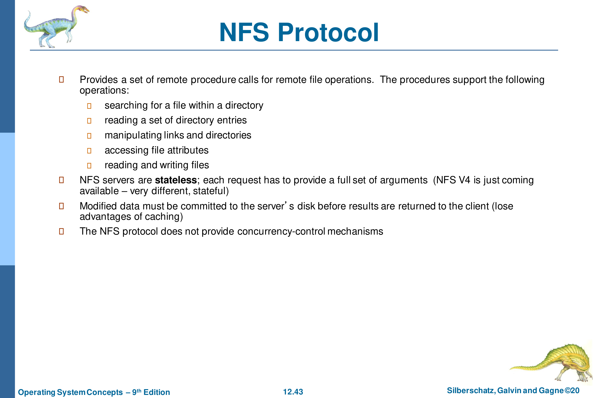

---

## 第 1 页


**提问：** 这张截图里的内容是什么意思？请面向初学者详细解释，分点讲清楚。

下面这张截图是某门操作系统课程的一页标题页。它在说什么、要讲什么？我给你用入门者能听懂的方式分点说明。

# 这页写了什么

* **课程名**：COMP3301
* **主题**：File System Implementation（文件系统的实现）
* **依据**：参考教材 *Operating System Concepts*（《操作系统概念》）第9版第12章
* **作者**：Silberschatz、Galvin、Gagne（标题页右下角有版权信息）
* 中间的小恐龙只是这本教材传统的配图，没有技术含义。

# “文件系统”到底是什么？

* 是**操作系统**中负责**在持久化介质（硬盘、SSD、U盘）上组织、存储、查找文件**的一层软件。
* 你在桌面上看到的文件/文件夹、打开/保存的动作，背后都由文件系统完成。

# 这类课通常会讲的核心内容（按从概念到实现的顺序）

1. **基本对象**

   * **文件（File）**：一串字节 + 描述它的信息（大小、时间、权限等）。
   * **目录（Directory/Folder）**：把名字映射到文件或子目录的“表”。
   * **元数据（Metadata）**：除内容外的描述信息（创建时间、权限、拥有者……）。
   * **块/页（Block/Page）**：磁盘读写的基本单位（如 4KB）。

2. **磁盘上的布局（On-disk layout）**

   * **分区/卷（Partition/Volume）** → **超级块/卷标（Superblock）**：记录整个文件系统的配置。
   * **索引区（如 inode/MFT）**：保存每个文件的元数据与指向数据块的“指针”。
   * **数据区**：真正存放文件内容的块。

3. **文件的寻址方式（内容放哪、怎么找到）**

   * **连续分配**：一口气占连续的块（快、但容易碎片化）。
   * **链式分配**：每块指向下一块（容易遍历、随机访问慢）。
   * **索引分配**：用一个或多级“索引表”记录所有数据块位置（如 UNIX 的 **inode**、FAT、B 树等）。
   * 现实系统往往用**多级索引**或**混合策略**（小文件直接/间接指针，大文件再加双/三级间接）。

4. **目录实现与路径解析**

   * 目录是“名字→对象（inode/记录）”的映射，可能用**线性表**、**哈希**或**B 树**保存。
   * 解析 `/home/alice/notes.txt` 时，内核会从根目录开始一层层查表，直到定位到该文件的索引节点。

5. **空闲空间管理**

   * 用**位图（bitmap）**或**空闲链表**记录哪些块可用；分配时可能用首次适配、最佳适配等策略。

6. **读写路径（系统调用到磁盘的旅程）**

   * 程序调用 `open/read/write/close` → \*\*VFS（虚拟文件系统层）\*\*统一接口 → 具体文件系统驱动（ext4/NTFS/APFS 等）→ **块设备驱动** → 磁盘。
   * **页缓存/缓冲区缓存**：把常用数据保存在内存里，加快读写；写回策略有**延迟写（write-back）**与**直写（write-through）**。

7. **一致性与崩溃恢复**

   * **日志（Journaling / 写前日志 WAL）**：先把“将要做的修改”写到日志，崩溃后可重放或回滚。
   * **检查与修复（fsck）**、\*\*写时复制（Copy-on-Write，如 ZFS、btrfs）\*\*也是常见思路。

8. **挂载与多文件系统**

   * 把不同分区/设备上的文件系统“挂载（mount）”到统一的目录树下，VFS 让它们看起来像一个整体。

9. **权限与安全（入门了解）**

   * UNIX 权限位 `rwx`、用户/组/其他；更细的 **ACL**；时间戳（atime/mtime/ctime）。

10. **性能与权衡**

* **块大小**、**预读（read-ahead）**、**写合并**、**日志模式**、**碎片整理**、SSD 的 **对齐/磨损均衡** 等都会影响性能与寿命。

# 一个直观小例子：打开并读取文件发生了什么

1. 你调用 `open("notes.txt")`。
2. 内核从当前目录的目录表里找到 `notes.txt` 对应的 **inode**（或等价结构）。
3. 根据 inode 里的“块指针”，定位到该文件的数据块；如果不在内存缓存里，就从磁盘读入。
4. `read()` 把请求的字节从缓存拷给你的进程；`write()` 先改缓存，稍后按策略写回磁盘（或立刻写）。
5. `close()` 释放内核中的打开文件记录，必要时触发元数据更新与写回。

# 入门学习建议

* 先把**名词**捋清（文件/目录/块/inode/超级块/日志/VFS）。
* 画出**层次图**：应用 → VFS → 具体 FS → 块设备 → 磁盘。
* 跟着一本教材（截图里的 OSC 第12章就是经典）看：**分配方式→目录实现→缓存→一致性**。
* 结合一个真实文件系统读资料（如 ext4 或 NTFS），把抽象概念对上具体实现。

如果你愿意，我可以按这些要点给你做一页“速查表”，或用一个简单示意图把“打开文件”的路径画出来。


---

## 第 2 页


**提问：** 这张截图里的内容是什么意思？请面向初学者详细解释，分点讲清楚。

下面这页是“**文件系统实现**（File System Implementation）”章节的**提纲**。每一行都是这一章要讲的一块内容。按入门者视角，我把每个点都解释一下，并配上直观比喻。

# 这页在说什么

课程会依次讲：

1. 文件系统由哪些部分组成；2) 这些部分在系统里怎么实现；3) 目录（文件夹）内部怎么做；4) 文件内容在磁盘上如何分配；5) 空闲空间怎么管理；6) 怎么提速；7) 崩溃后如何恢复；8) 网络文件系统（NFS）。

---

## 1) File-System Structure（文件系统结构）

* **层次结构**（像楼房的楼层）
  应用程序 → 系统调用（open/read/write）→ **VFS**（虚拟文件系统，统一接口）→ 具体文件系统（ext4/NTFS/APFS…）→ 块设备层 → 磁盘/SSD。
* **磁盘上的布局**（房子的平面图）

  * **超级块/卷信息**：记录“这座房子怎么建”的总说明。
  * **索引区（inode/MFT）**：每个文件的“身份证”。
  * **数据区**：真正的文件内容。
  * （有些还有）**日志区/快照区**：用来恢复一致性。
* **缓存**：把常用数据放内存里（页缓存/缓冲区），减少磁盘访问。

## 2) File-System Implementation（文件系统在内核里的实现）

* **打开文件**会在内核里建立记录：

  * **每进程文件描述符表**（0/1/2、3…）
  * **系统级“打开文件表”**（记录读写位置、模式等）
  * **内存中的 inode/FCB**（文件元数据和指向数据块的指针）
* **读写路径**：read/write 先打到缓存，内核按策略把修改写回磁盘（直写或延迟写）。

## 3) Directory Implementation（目录的实现）

* 目录本质是“**名字 →（inode/对象）**”的映射表。
* 常见实现：

  * **线性表**（简单，但查找可能慢）
  * **哈希表**（查找快）
  * **B-树/B+树**（适合海量条目、范围查询）
* **路径解析**：按层级从根目录一路查到目标（如 `/home/alice/a.txt`）。

## 4) Allocation Methods（数据分配方式）

把文件内容放到哪些块、如何记录？

* **连续分配**：一段连续块（顺序读很快，容易碎片化，不易扩容）。
* **链式分配**：每块指向下一块（易扩展，随机访问慢）。
* **索引分配**：用索引块/表列出所有数据块位置（UNIX **inode** 的直接/间接指针、FAT 表、B-树/extent）。
* **extent（区段）**：记录“从X开始连续N块”，兼顾大文件效率。

## 5) Free-Space Management（空闲空间管理）

* **位图（bitmap）**：1/0 表示块是否空闲（查找/统计快）。
* **空闲链表/分组/计数**：把空闲块串起来或按段记录。
* **分配策略**：首次适配、最佳适配、预分配一小段以减少碎片。
* 同理还有**空闲 inode 管理**。SSD 还会涉及 **TRIM** 告知未用块。

## 6) Efficiency and Performance（效率与性能）

* **缓存**与**预读**（read-ahead）、**写合并/延迟写**（write-back）。
* **块大小/对齐**：更大的块顺序吞吐高，但小文件可能浪费空间。
* **日志模式**、**多队列 I/O**、**异步 I/O**、**合并小写入**、**目录索引**等优化。
* **碎片整理**、**预分配（extents）**，以及针对 SSD 的对齐与磨损均衡。

## 7) Recovery（故障恢复）

* **日志（Journaling / 写前日志）**：先把“要做的更改”写到日志，崩溃后**重放/回滚**保证一致性。
* **一致性检查工具（fsck/chkdsk）**：扫描并修复结构错误。
* **写时复制（Copy-on-Write）**与**快照**（ZFS/btrfs）：修改生成新版本，天生易于回滚。

## 8) NFS（Network File System，网络文件系统）

* 让**远端服务器上的文件**像本地一样被访问（通过**挂载**）。
* 关注点：**缓存一致性**、**权限/认证**（NFSv4 常配合 Kerberos）、**无/有状态协议**、网络故障处理。
* 类似方案还有 SMB/CIFS、SSHFS 等。

---

## 一句话心智图

> “名字怎么找（目录）→ 找到后它的‘身份证’里记了哪些数据块（分配方式）→ 空出来的块怎么登记（空闲管理）→ 读写怎么快（性能）→ 崩溃后怎么不丢（恢复）→ 远程怎么像本地（NFS）。”

如果你想，我可以把这一页提纲扩成一页“速查表”，或画一张“open/read/write 的数据流”示意图，帮你期末复习。


---

## 第 3 页


**提问：** 这张截图里的内容是什么意思？请面向初学者详细解释，分点讲清楚。

这页标题是 **Objectives（学习目标）**。它告诉你本章学完后要会什么。共有三条，我按入门者视角把每条都“翻译 + 补充解释”。

---

## 1) 了解**本地文件系统**与**目录结构**的实现细节

* **本地文件系统（local FS）**：安装在你自己的磁盘/SSD/U 盘上的文件系统（如 ext4、NTFS、APFS）。
* 你需要理解并能口述/画图说明：

  * **磁盘上的布局**：超级块/卷信息（记录 FS 配置）、索引节点区（inode/MFT，存元数据与指针）、数据区（真正的内容）。
  * **内存中的数据结构**：页缓存、打开文件表、inode 缓存等。
  * **目录结构怎么做**：目录其实是“**名字 → 对象**”的表；实现可用线性表、哈希、B-树等；路径解析如何一层层找到目标（如 `/home/a/b.txt`）。
  * **常用操作的执行流程**：open/read/write/close 从系统调用到磁盘的一步步过程。
* **类比**：把磁盘想成仓库；目录是货物清单，inode 是每件货的“身份证”，数据块是货物本体。

## 2) 理解**远程文件系统**的实现思路

* **远程文件系统（remote FS）**：文件实际在网络另一台机器上，但在你电脑上看起来像本地目录（典型有 **NFS、SMB/CIFS**）。
* 你需要知道：

  * **客户端/服务器模型**与挂载（mount）。
  * **缓存与一致性**：本地缓存能提速，但要解决“别人改了文件我这边何时看到”的问题（租约、回调、写回策略等）。
  * **有/无状态协议**差异、网络故障重试、超时与恢复。
  * **权限与安全**：身份认证（如 NFSv4 + Kerberos）、访问控制如何传递。
* **类比**：把对方的仓库通过一条“传送带”接到你仓库的某一排货架上；你取货时要考虑传送带的延迟、断线与对账。

## 3) 讨论**块分配**与**空闲块管理**及其权衡

* **块（block）**：磁盘读写的最小单位（常见 4KB）。文件内容由若干块组成。
* **块分配方法**（文件内容放哪、怎么记）：

  * **连续分配**：一串连续块（顺序读快；扩容难、易碎片）。
  * **链式分配**：块之间用“下一块指针”串起来（易扩展；随机访问慢）。
  * **索引分配**：用索引表/多级指针记录所有块位置（如 inode 的直接/间接指针、**extent** 记录“从 X 开始 N 块”）。
* **空闲块管理**（哪些块可用、怎么找）：

  * **位图（bitmap）**、空闲链表、分组/计数等。
* **权衡（trade-offs）**：

  * 顺序吞吐 vs. 随机访问；小文件空间利用率 vs. 管理开销；实现复杂度 vs. 性能；HDD 与 SSD 的差异（对齐、磨损均衡、TRIM）。
* **你要能做的**：给定一个工作负载（大量小文件？大文件顺序写？），说出更合适的分配/管理策略，并能解释理由。

---

### 小结（拿到题目你该能回答的问题）

* “一个本地文件从路径到内容，内核是怎么一步步找到并读到内存的？”
* “把远端共享目录挂到本地后，读写是如何经过网络完成并保持一致性的？”
* “为什么某些系统选择 extent/日志/位图？它们各自带来的好处与代价是什么？”

如果你想，我可以把这三条目标各自配一张“流程/结构”图，做成一页速查表，复习更高效。


---

## 第 4 页


**提问：** 这张截图里的内容是什么意思？请面向初学者详细解释，分点讲清楚。

这页叫 **File-System Structure（文件系统结构）**。它在用“自上而下”的方式告诉你：文件是什么、文件系统做什么、磁盘怎么读写、系统里有哪些关键模块。按入门者视角分点解释如下：

---

## 1) File structure（文件的本质）

* **逻辑存储单元（logical storage unit）**：
  文件对用户来说就是“一串有序的字节/记录”，是**逻辑**概念，不关心磁盘上是否连续。
* **相关信息的集合（collection of related information）**：
  一个文件把彼此相关的数据放在一起，例如一篇论文的正文、一本相册的照片。

> 记住：**逻辑视角**（文件/路径/名字）与**物理视角**（磁盘哪些块）是分离的。

---

## 2) File system resides on secondary storage（文件系统住在“二级存储”上）

* **二级存储**：掉电不丢的数据介质，如 HDD/SSD/U 盘（相对“一级”的内存）。
* 文件系统的两个核心职责：

  1. **用户接口**：把复杂的存储变成好用的模型（文件、目录、路径、权限）。
  2. **逻辑到物理映射**：把“notes.txt 第 1000 个字节”翻译成“磁盘上的第 X 个数据块”。
* 它要做到**高效**（快、占用少）和**方便**（易用、可靠）：靠目录索引、缓存、日志等机制支持“存、找、取”都顺畅。

---

## 3) Disk provides in-place rewrite & random access（磁盘可原地改写、随机访问）

* **原地改写**：可以在同一物理位置覆盖写入（区别于只追加的介质）。
* **随机访问**：能直接跳到任意位置读写（不像磁带必须顺序走）。
* **I/O 以块为单位（blocks of sectors）**：

  * \*\*扇区（sector）\*\*是磁盘最小物理读写单位（教材常以 512B 举例；现代盘/SSD 多为 4KB）。
  * \*\*块（block）\*\*是操作系统用的管理单位，通常由若干扇区组成（如 4KB）。
  * 一次磁盘 I/O 往往读/写“整块数据”，不是随便几个字节。

---

## 4) File Control Block（FCB，文件控制块）

* 是**保存文件元数据的结构体**（不同系统名字不同；UNIX 叫 **inode**，NTFS 是 **MFT entry**）。
* 里面通常有：文件大小、时间戳、拥有者/权限、指向数据块的“地址/指针”等。
* **名字**一般存放在目录项里，目录项再指向 FCB/inode。

---

## 5) Device driver（设备驱动）

* 内核中与硬件打交道的模块：负责把“读块 #1234”的请求转换为控制器命令、DMA 传输、中断处理等。
* 驱动屏蔽了不同硬件的差异，让更上层只面对统一接口。

---

## 6) File system organized into layers（分层组织）

可以把文件系统想成一叠层次，从应用到硬件依次是：

```
应用程序 / 库
  ↓  系统调用 (open/read/write)
VFS（虚拟文件系统，统一接口）
  ↓
具体文件系统（ext4/NTFS/APFS…）
  ↓
缓存/缓冲区（页缓存、目录缓存）
  ↓
通用块层 / I/O 调度
  ↓
设备驱动
  ↓
磁盘/SSD 硬件
```

---

## 一句话总结

* **文件**是给人看的“逻辑抽象”；
* **文件系统**把这份抽象**映射**到磁盘上的数据块，并提供**高效+方便**的访问；
* **驱动**与**分层结构**让上层不用关心具体硬件细节；
* **I/O 按块**进行，FCB/inode 记录“这份文件在哪里、怎么取”。

如果你愿意，我可以再给你画一张“从 `read()` 到磁盘”的流程小图，帮助记忆这些层是如何协作的。


---

## 第 5 页


**提问：** 这张截图里的内容是什么意思？请面向初学者详细解释，分点讲清楚。

这页题为 **Layered File System（分层文件系统）**。图里从上到下画了 6 层：
application programs → logical file system → file-organization module → basic file system → I/O control → devices。
意思是：一次文件操作会**逐层下沉**，每层各司其职。给你按入门者能懂的方式逐层解释：

---

## 1) application programs（应用程序）

* 你写的/用的程序：编辑器、浏览器、`cat`、`cp` 等。
* 只会调用标准**系统调用**或库函数（`open/read/write/close`），不关心底下磁盘长什么样。

## 2) logical file system（逻辑文件系统）

* 负责**名字到对象**的逻辑：路径解析、权限检查、文件/目录的通用规则。
* 管理**元数据**（大小、时间、权限、拥有者）与**目录项**；在类 UNIX 中对应 **VFS 层 + inode/目录缓存**。
* 输出结果：定位到“这是哪个文件（索引节点/FCB）”。

> 可把它理解成“管名字与规则的书记官”。

## 3) file-organization module（文件组织模块）

* 负责**内容在磁盘上的布局**：

  * 选择/维护**分配方式**（连续、链式、索引、extent）。
  * **空闲空间管理**（位图、空闲链表）。
  * 计算“这个文件的第 N 个字节 → 哪些数据块”。
* 输出结果：一串**块号/物理位置**要被读写。

> 它像“库房调度员”，查清楚货物具体在哪几号货架。

## 4) basic file system（基础文件系统层）

* 把“读/写这些块”的请求**封装成通用块 I/O**，并与**缓存**（页缓存/缓冲区缓存）打交道：预读、写回、合并小 I/O。
* 可能和 I/O 调度器合作（重排请求以提高吞吐）。

> 像“运输计划员”，把若干货位需求打包成运输任务，并尽量走最省时路线。

## 5) I/O control（I/O 控制）

* **设备无关 I/O** + **设备驱动**：把通用块 I/O 变成控制器能懂的命令（DMA、队列、队深、完成中断等）。
* 处理错误、超时与重试。

> 就是“司机 + 车管”，具体怎么发动车、走哪条线、怎么回报状态。

## 6) devices（设备）

* 真实硬件：HDD、SSD、NVMe、U 盘等；它们负责把某个**扇区/块**的比特读/写出来。

---

## 一次 `read("a.txt")` 发生了什么（把图串起来）

1. **应用** 调用 `read()`。
2. **逻辑 FS** 解析路径 `/dir/a.txt`，检查权限，找到该文件的 inode/FCB。
3. **文件组织模块** 计算所需字节对应的**数据块列表**（比如块 #120、#121）。
4. **基础 FS** 先看缓存是否命中；不命中就发出块 I/O 请求，并做预读/合并。
5. **I/O 控制** 通过驱动把请求下发到设备，等待中断回报完成。
6. **设备** 读出数据；数据上送到缓存，再拷给应用。

---

## 记忆小口诀

> **名与规（logical）→ 放哪儿（organization）→ 怎么取（basic）→ 怎么开车（I/O control）→ 真车（device）**。

理解这张图的要点：**逻辑与物理分离、按层解耦**。上层换文件系统（ext4→xfs）或下层换硬件（SATA→NVMe），中间层保证“接口不变，内部可替换”。


---

## 第 6 页


**提问：** 这张截图里的内容是什么意思？请面向初学者详细解释，分点讲清楚。

这页叫 **File System Layers（文件系统各层职责）**，主要讲“读/写一个文件时，每一层各干什么”。图上点到的关键词我按入门者视角拆开解释：

---

## 1) Device drivers（设备驱动，I/O 控制层）

* **做什么**：直接和硬件控制器打交道，把更上层的“读块/写块”请求，变成硬件能懂的命令（启动 DMA、排队、处理中断、重试等）。
* **教材示例**：
  “读取 drive1 上 **柱面(cylinder) 72，磁道(track) 2，扇区(sector) 10** 的数据，放进内存地址 1060”。
  （现代设备常用 **LBA 逻辑块地址**，但含义一样：精确到硬件位置。）
* **你可以把它当作**：会说“硬件语言”的翻译官。

## 2) Basic file system（基础文件系统层）

* **做什么**：接收上层指令，如 “**取回 block 123**”，先查**缓存**，不命中再发给驱动；同时负责把多个小请求合并、顺序化以提高吞吐。
* **位置**：夹在“文件组织”与“设备驱动”之间，偏向“块 I/O 管理”。

## 3) Buffers & Caches（缓冲区 与 缓存）

* **缓冲区（buffer）**：**在路上**的数据临时停靠地，解决“生产/消费速度不一致”的问题（例如网卡/磁盘一次传一整块）。
* **缓存（cache）**：**为提高速度**把**经常访问的数据**留在内存，下次直接命中（如页缓存、目录项缓存）。
* **管理内容**：创建/释放、替换策略（常见 LRU）、写回策略（write-back/through）。

## 4) File organization module（文件组织模块）

* **做什么**：理解“文件、逻辑地址、物理块”三者关系。

  * 选择/维护**分配方式**（连续、链式、索引、extent）。
  * **空闲空间管理**（位图、空闲链表）。
  * 把“文件偏移”转换成“逻辑块号”，再进一步交给基础层。
* **核心两件事**：

  1. **Translate logical block # → physical block #**（逻辑块号 → 物理块号/位置）；
  2. **Manage free space & disk allocation**（管理空闲块与分配/回收）。

---

## 串起来看一次读流程（简化）

1. 上层提出：“读 `foo.txt` 的第 20KB”。
2. **文件组织模块**：查元数据/索引 → 算出对应的**逻辑块号**列表。
3. **基础文件系统**：先查**缓存**；未命中则发起对这些块的 I/O 请求（可能合并/预读）。
4. **设备驱动**：把请求翻译为硬件命令，设备把数据读到内存；完成后上送到缓存，再交给应用。

---

### 小结

* **驱动**：会说硬件话。
* **基础层**：管块 I/O 与缓存。
* **文件组织**：管文件如何映射到块、以及空闲块怎么管理。
* 三者配合，完成从“文件里的第 N 个字节”到“磁盘上具体几块数据”的全过程。


---

## 第 7 页


**提问：** 这张截图里的内容是什么意思？请面向初学者详细解释，分点讲清楚。

这页是 **File System Layers（续）**，补充说明“**逻辑文件系统层**干什么、分层有什么利弊、现实里有哪些文件系统”。给你分点讲清：

---

## 1) Logical file system（逻辑文件系统）到底管什么？

* **管理元数据（metadata）**
  保存/维护文件的“说明书”：大小、时间、权限、拥有者、以及数据块位置的索引等。
* **把名字 → 号码/句柄**
  解析路径，把 `"/home/a.txt"` 映射成文件的**编号**（UNIX 里的 **inode**，通称 **FCB**）或**文件句柄**（打开后的内核对象）。
* **目录管理**
  维护“名字→对象”的表，支持创建/删除/重命名、遍历目录、路径解析缓存。
* **保护/权限**
  检查 `rwx`、ACL、拥有者/组等，决定谁能读写执行。

> 直观理解：**逻辑层是“名册与规章处”**——管名字、管规则、管说明书；不直接碰硬件。

---

## 2) 为什么要“分层”？优点与代价

* **优点**

  * **降复杂度、便于复用**：上层不管硬件细节；同一套逻辑可套在 ext4、NTFS、NFS 等不同实现上。
  * **可替换性强**：换硬盘/换具体文件系统，上层接口不变。
* **代价**

  * **有额外开销**：多一层就多一次接口调用、检查、缓存维护；在极端场景下可能略降性能。
  * **实现方式灵活**：这是**逻辑层次**的概念，不限定具体写法，OS 设计者可用任意编码方式实现（模块、对象、函数指针等）。

---

## 3) 现实世界里有很多文件系统（同一操作系统里也常并存）

* **不同介质有不同格式**

  * **CD/DVD**：ISO-9660（光盘标准）。
* **各家传统/主流**

  * **UNIX**：UFS、FFS（早期经典）。
  * **Windows**：FAT/FAT32（简单、老）、**NTFS**（现代，带日志、ACL 等）。
  * **Linux**：几十种实现，历史主线 **ext2/ ext3**（ext3 加了日志；后续常见还有 ext4）。
* **分布式 / 新型**

  * **NFS/AFS/GoogleFS(GFS)** 等分布式；**ZFS**（写时复制+校验）、**Oracle ASM**（存储管理）、**FUSE**（在用户态编写文件系统的框架）。

> 关键体会：**同一台机器可以同时“挂载”多种文件系统**，靠上面的逻辑层（如 VFS）把它们统一成“像一个树”的目录视图。

---

### 小结

* 逻辑文件系统层：**名→号**、**目录**、**权限**、**元数据**。
* 分层：**好维护/可替换** ↔ **引入少量开销**。
* 文件系统种类繁多：为**不同操作系统、介质、场景**优化，各有取舍。


---

## 第 8 页


**提问：** 这张截图里的内容是什么意思？请面向初学者详细解释，分点讲清楚。

这页叫 **File-System Implementation（文件系统的实现）**。它回答：操作系统提供 `open/read/write` 这些 API，**底层是靠哪些“盘上结构”和“内存结构”实现的？** 逐条翻译+解释如下：

---

## 1) 有 API，还需要哪些结构？

* **两类结构**：

  * **On-disk（在磁盘上）**：随文件系统一起长期存放的数据结构。
  * **In-memory（在内存中）**：运行时的缓存/表格，用来加速与维护状态（如打开文件表、目录缓存、超级块副本等）。

---

## 2) Boot control block（引导控制块，*仅当该分区能引导操作系统时才有*）

* **作用**：存着“从这个卷启动系统”所需的信息。
* **位置**：通常在卷的**第一个块**（例如 PC 上常说的“引导扇区/MBR/Boot Sector”）。
* **你可以把它看作**：这块盘/分区的“启动入口说明书”。

---

## 3) Volume control block（卷控制块）

> 不同系统叫法不同：UNIX 系列叫 **superblock（超级块）**，NTFS 里有 **Master File Table（MFT）** 等承担类似卷级信息。

* **记录整个卷的元信息**，例如：

  * 总块数、空闲块数、**块大小**；
  * 空闲空间的数据结构位置（位图/空闲表等）。
* **作用**：是“这套文件系统怎么被组织”的**总目录/配置表**。

---

## 4) Directory structure（目录结构）

* **功能**：把**名字**映射到**文件标识**（如 inode 号/MFT 记录号），并组织层级（文件夹套文件夹）。
* **你可以理解为**：名字 → 身份证号 的“通讯录/电话簿”。
* 一些系统还会有“**主文件表**”之类的集中索引供目录引用。

---

## 5) Per-file File Control Block（FCB，文件控制块）

> UNIX 里对应 **inode**；NTFS 对应 **MFT entry**。

* **每个文件一个**，保存该文件的大量细节：

  * **标识**（inode 号/记录号）、**权限**、**拥有者/组**、**大小**；
  * **时间戳**（创建/修改/访问时间）；
  * （通常还包含）指向**数据块**的位置/索引。
* **作用**：文件的“身份证+索引卡”。

---

## 6) 这些结构如何配合完成一次打开/读取？

1. 应用 `open("/dir/a.txt")`。
2. **目录结构** 根据路径把名字找成“FCB/inode 编号”。
3. 读取该文件的 **FCB**，拿到权限/大小和**数据块索引**。
4. 根据 **卷控制块** 提供的布局/块大小信息，定位到具体**物理块**。
5. 内核把块读入**内存缓存**，`read()` 把字节交给应用。
6. 若是可引导卷，**引导控制块**仅在系统启动时参与，不影响普通读写。

---

## 7) 小结（记忆法）

* **Boot 控制块**：能不能从这卷**启动**。
* **Volume/Superblock**：这卷**总体怎么组织**（块数、空闲、块大小）。
* **Directory**：**名字 → 号码**。
* **FCB/inode**：**每个文件的详细档案**（含数据位置）。
* **In-memory**：运行时的各种**缓存/表**，让上面这些操作更快。

把这四类“在盘上”的核心结构捋顺，再结合“内存中的缓存”，你就能把 `open/read/write` 的幕后工作串起来了。


---

## 第 9 页


**提问：** 这张截图里的内容是什么意思？请面向初学者详细解释，分点讲清楚。

这页讲的是：\*\*文件系统在“内存里”需要哪些数据结构，`open` / `read` 时它们如何配合。\*\*按入门者视角分点解释：

---

## A. 内存中的关键结构（OS 维护）

* **Mount table（挂载表）**

  * 记录**有哪些文件系统被挂载**、各自的**挂载点**（如 `/`, `/home`, `/mnt/usb`）、**类型**（ext4/NTFS/NFS…）以及相关参数。
  * 作用：把多种文件系统拼成**一棵统一目录树**，供 VFS 查找。
* **Superblock / inode（缓存）**

  * 把磁盘上的卷信息（superblock）和文件“身份证”（inode/FCB）缓存在内存，减少反复读盘。
* **Directory / dentry cache（目录项缓存）**

  * 缓存“名字 → inode”的映射，加速路径解析（如反复访问 `/home/alice`）。
* **Open file table（系统级“打开文件表”）**

  * 每个“被打开”的文件有一条记录：当前读写位置、打开模式、引用计数等。
* **Per-process FD table（每进程文件描述符表）**

  * 进程视角的 0/1/2/3… → 指向系统级“打开文件表”的条目。
* **Buffer / Page cache（缓冲区 / 页缓存）**

  * **Buffer**：数据“在路上”时的临时落脚点（I/O 对齐、合并）。
  * **Page cache**：把**常用的数据块**留在内存，下次读命中就不必访问磁盘。

---

## B. `open` 和 `read` 时会发生什么？

> 幻灯片提到后面两张图：12-3(a) 是 **open**，12-3(b) 是 **read**。这里用文字走一遍流程。

### 1) `open("path")`（打开文件）

1. **查挂载表 / VFS**：从根开始按照路径在**目录项缓存**里找；没命中就读目录块并填充缓存。
2. 找到目标名字对应的 **inode/FCB**（若未在内存，则从磁盘读入并建缓存）。
3. **权限检查**（用户、组、rwx/ACL）。
4. 在**系统级打开文件表**中新建条目，初始化**当前偏移**等状态。
5. 把这条记录的指针放进**进程的 FD 表**，返回一个**文件句柄/描述符**（供后续 `read/write` 使用）。

### 2) `read(fd, buf, n)`（读取文件）

1. 根据进程的 **FD → 系统级打开文件表** → 定位到该文件的 **inode** 与**当前偏移**。
2. 计算涉及哪些**数据块/页**，先查 **page cache**：

   * **命中**：直接把数据从缓存**拷贝**到用户缓冲区 `buf`（内核→用户空间）。
   * **未命中**：向 **I/O 层/设备驱动**发起读请求，把块读到**buffer/page cache**，再拷贝给 `buf`。
3. 更新**当前偏移**；把读取到的字节数返回给应用。

> 备注：有的场景会用 `mmap` 或“零拷贝”减少拷贝次数，但入门理解为“先到内核缓存，再拷到用户缓冲区”即可。

---

## C. 关键词回顾（对照幻灯片原话）

* **“Mount table storing … mounts, mount points, file system types”**：挂载表记录挂载点与类型。
* **“Plus buffers hold data blocks from secondary storage”**：缓冲/缓存承接来自磁盘的数据块。
* **“Open returns a file handle for subsequent use”**：`open` 返回**文件句柄/描述符**，以后 `read/write/close` 都用它。
* **“Data from read eventually copied to specified user process memory address”**：`read` 的数据最终会被**拷贝到进程给定的内存地址**（`buf`）。

---

### 一句话总结

> **挂载表**决定“整棵树从哪来”；**目录/ inode 缓存**帮你“快找人”；**打开文件表 + FD 表**记录“谁在用”；**buffer/page cache**让读写“更省盘”。`open` 建立关系，`read` 通过缓存把数据从磁盘搬进你的进程内存。


---

## 第 10 页


**提问：** 这张截图里的内容是什么意思？请面向初学者详细解释，分点讲清楚。

这页图叫 **In-Memory File System Structures（内存中的文件系统结构）**，分成两幅：
(a) 讲 **open(文件名)** 时内核用到哪些结构；(b) 讲 **read(文件描述符)** 时怎么通过两张“打开文件表”把数据读出来。按入门者视角分点说明：

---

## 上半图 (a)：`open(file name)` 发生了什么

* **左边 user space**：你的程序调用 `open("path/to/a.txt")`。
* **中间 kernel memory 的 directory structure（目录结构/目录项缓存 dentry）**：

  1. 内核按路径逐层查目录；命中缓存就直接用，没命中就去磁盘读目录块并把结果放进缓存。
  2. 找到目标名字对应的**文件控制块 FCB**（UNIX 里叫 **inode**）的位置。
* **右边 secondary storage（外存/磁盘）**：

  * **directory structure**：磁盘上的真正目录块，里面是“名字→FCB/inode 号”的条目。
  * **file-control block**：每个文件的“身份证+索引卡”（权限、大小、时间、数据块指针等）。
* **要点**：`open` 的核心是**把“文件名”解析成“那个文件的 FCB/inode”**，并把必需的元数据读到内存，为后续读写做准备；同时在内核里创建“打开文件”的记录（见下图）。

---

## 下半图 (b)：`read(index)` 发生了什么

> 这里的 **index** 指你程序里的**文件描述符**（fd），比如 3、4……它是打开后返回的“句柄”。

* **per-process open-file table（每进程打开文件表）**：

  * 进程自己的小表：fd → 指向**系统级打开文件表**的某一项，并保存当前读写偏移等。
* **system-wide open-file table（系统级打开文件表）**：

  * 全系统共享的大表：每项对应一个“被打开”的文件，记录：引用计数、打开模式、指向该文件 **FCB/inode** 的指针等。
* **secondary storage**：

  * **file-control block（FCB/inode）**：告诉内核“内容在哪些数据块”。
  * **data blocks**：真正的文件内容所在的块；读出来会先进入内核缓存，再拷贝到用户缓冲区。
* **读的路径串起来**：

  1. 程序 `read(fd, buf, n)` → 通过**每进程表**找到**系统级表**那一项；
  2. 由该项关联到**FCB/inode** → 计算需要的**数据块**；
  3. 若块在**页缓存**已存在，直接拷贝；否则从**磁盘**读入缓存，再拷到 `buf`；
  4. 更新“当前偏移”。

---

## 一眼记住的对照表

* **open(名字)**：**名字解析** → 找 **FCB/inode** → 建立“打开文件表”记录 → 返回 **fd**。
* **read(fd)**：**fd → 每进程表 → 系统级表 → FCB/inode → 数据块** → 缓存 → 复制给应用。

这样把“名→号（FCB/inode）→块”的链条记住，再理解两层“打开文件表”的分工，就能看懂这张图了。


---

## 第 11 页


**提问：** 这张截图里的内容是什么意思？请面向初学者详细解释，分点讲清楚。

这页讲的是 **“目录（directory）在磁盘上到底怎么实现”**。目录本质上是\*\*“文件名 → 文件记录(如 inode/FCB) 的映射表”**。常见两类做法：**线性表**和**哈希表\*\*（以及可延伸到 B+ 树）。逐点解释——

---

## 1) Linear list（线性表/顺序表）

* **怎么做**：目录就是一串记录，每条记录包含
  `文件名  → 指针（到 inode/FCB；有的课件简写为数据块指针）`。
  存放时“挨个排队”。
* **优点**：

  * 实现**最简单**。
  * **插入**新条目常见是**追加**，成本低。
* **缺点**：

  * **查找慢**：找 `report.txt` 需要**从头到尾**比名字，最坏 O(n)。
  * **删除/重命名** 可能产生“空洞”或需要移动数据。
* **改良思路**：

  * **按字母排序**并维护**链表**（仍然 O(n) 搜索，但遍历更整齐）。
  * 直接换成**B+ 树**存储目录项（见下文），让查找变成 O(log n)。

---

## 2) Hash table（哈希表目录）

* **怎么做**：对“文件名”做哈希，落到某个**桶**，桶里保存对应目录项（常是“线性表 + 哈希索引”的组合）。
* **好处**：

  * **显著减少查找时间**：理想情况下接近 O(1)。
* **注意点/代价**：

  * **碰撞（collision）**：不同文件名算出同一桶，需要**冲突处理**：

    * **链式溢出（chained overflow）**：每个桶里用链表挂多条记录（最常见）。
    * 或者**开放定址**（较少用于目录实现）。
  * **更适合定长目录项**；若是**变长文件名**，要设计额外结构存放名字，或只把名字哈希值放在表里。
  * 需要管理**装载因子**与**扩容**，否则桶太挤会退化变慢。

---

## 3) B+ 树目录（课件作为线性表的改进选项提到）

* **怎么做**：目录项按\*\*键（文件名）\*\*有序存储在 B+ 树的叶子节点，内部节点是索引。
* **优点**：

  * **搜索 / 插入 / 删除** 都是 **O(log n)**，适合**超大目录**（几十万条）。
  * 叶子节点链起来，**范围/顺序遍历**很高效（比如按字母列目录）。
* **成本**：实现复杂度更高，占用更多元数据空间。
* **现实例子**：许多现代文件系统的**大目录**都用 B+ 树或其变体（如 ext4 的 htree、NTFS/HFS+/XFS 目录索引）。

---

## 该选哪个？（直觉指南）

* **小目录**（几十、几百个文件）：线性表简单够用。
* **中大目录**：哈希目录很快，但要处理碰撞；
* **特大目录/需要有序遍历**：B+ 树更稳、更通用。

---

## 一个快速对比的小例子

* 目录里有 100,000 个文件，要找 `report.txt`：

  * **线性表**：最坏要比 100,000 次名字。
  * **哈希表**：算一次哈希，直接落桶，桶里可能检查几项就找到。
  * **B+ 树**：走树高 \~ `log_B(100000)` 次磁盘/缓存访问，稳定可控，还能顺序输出“report\*.txt”。

---

### 小结

* **目录 = 名字→文件记录**。
* **线性表**：易实现，查找 O(n)。
* **哈希表**：查找近 O(1)，要处理**碰撞**和**扩容/定长**等细节。
* **B+ 树**：查找/插入/删除 O(log n)，适合**超大且需排序/范围查询**的目录。


---

## 第 12 页


**提问：** 这张截图里的内容是什么意思？请面向初学者详细解释，分点讲清楚。

这页只有一个大标题 **“Questions?”**，意思是：到这里本章告一段落，进入**提问 / 讨论 / 回顾**环节。老师通常会在这页停下，回答问题或做小测。
为了初学者不犯迷糊，我给你一份**复习清单 + 常见考点速答**，你可以对照自测：

# 你应该能回答的关键问题

* **文件系统分层各管什么？**
  逻辑文件系统（名与权限/元数据）→ 文件组织模块（块分配、空闲管理、逻辑块→物理块）→ 基础文件系统（页缓存/块I/O）→ I/O控制/驱动（和硬件说话）→ 设备（HDD/SSD）。
* **FCB / inode 是啥？与文件名啥关系？**
  FCB/inode 是“文件身份证+索引卡”（权限、大小、时间、块地址…）；文件名放在目录项里，目录项**指向** inode/FCB。
* **open() 做了哪几步？**
  路径解析→找到目录项→拿到 inode/FCB→权限检查→在“系统级打开文件表”建条目→把指针放入“进程FD表”，返回 fd。
* **read() 路径怎么走？**
  fd→进程FD表→系统级打开文件表→inode/FCB→计算数据块→页缓存命中就拷贝；未命中则驱动从盘读入缓存再拷给用户缓冲区。
* **目录如何实现？**
  线性表（简单但查找 O(n)）；哈希目录（快但有碰撞与扩容）；B+树/htree（查找/插入 O(log n)，适合超大目录与有序遍历）。
* **块、扇区、页的区别？**
  扇区：设备最小物理单位（常见4KB/512B）。块：OS管理/分配单位（通常多个扇区）。页：内存管理单位（常 4KB），页缓存按页存数据。
* **buffer 和 cache 有何不同？**
  buffer：在路上的临时落脚点（为对齐/合并 I/O）。cache：为加速，把**常用**数据留在内存，下次命中无需访问磁盘。
* **卷/超级块/引导块分别是什么？**
  引导块：可启动分区用于启动的信息；超级块/卷控制块：记录整个卷的配置（块大小、总块数、空闲块位置…）。
* **常见数据分配方式的取舍？**
  连续（顺序快但易碎片/扩容难）、链式（易扩展但随机慢）、索引/多级指针或 extent（通用高效，元数据更复杂）。
* **为何要分层？缺点是什么？**
  好维护、可替换、可支持多种FS；代价是多一点接口/缓存管理开销，极端场景下会带来微小性能损失。

想练手的话，我可以给你出 5 道小题或画一张“open/read 数据流”小图，帮你在 5 分钟内过一遍重点。


---

## 第 13 页


**提问：** 这张截图里的内容是什么意思？请面向初学者详细解释，分点讲清楚。

这页在讲一种**磁盘块分配方式：连续分配（Contiguous allocation）**。它回答“**文件内容在磁盘上怎么摆放**”这个问题里的第一种做法。

---

## 先把概念捋清

* **块（block）**：磁盘/SSD 读写的基本单位（例如 4KB）。
* **分配方法（allocation method）**：操作系统把哪些块分给一个文件、并如何记录这些块的位置。

---

## 连续分配是什么？

* **定义**：一个文件占用一段**连续的块**。
  例：文件 F 从**起始块**100开始，占用**长度**为 8 个块 → 实际是 100\~107。
* **元数据很简单**：只需在 FCB/inode 里记 `start_block` 和 `length`（再加文件大小）。

---

## 为什么它通常最快？

* **顺序访问**：对机械硬盘几乎**一次寻道后连续读**，吞吐量最高。
* **随机访问也简单**：第 *k* 个字节所在块 = `start + floor(k / block_size)`，常数时间就能算出位置。
* **预读友好**：系统可以成批把接下来的块读入缓存。

> 在 SSD 上顺序/随机差距小很多，但连续布局仍减少元数据/索引跳转和管理开销。

---

## 连续分配的麻烦点（课件强调的缺点）

1. **需要预先知道文件大小**

   * 因为要一次性找出足够长的“连续空洞”。如果文件后来**长胖**了，后面紧挨着没有空位，就得**搬家**。
2. **外部碎片（external fragmentation）**

   * 反复创建/删除不同大小的文件后，空闲空间被撕成很多小缝隙；**总空闲够**，却**找不到一段够长**的连续空间分给新大文件。
3. **需要“整理/压缩”（compaction / defragmentation）**

   * **离线（off-line/downtime）**：停机或卸载卷后重排文件，体验好但要停服。
   * **在线（on-line）**：不停机迁移块，复杂且有运行时开销。
4. **增长策略的权衡**

   * 预留额外空间可减少搬家，但可能造成**内部碎片**（多占了一些用不到的块）。

---

## 适用/不适用的场景

* **非常适合**：大小固定、基本只读的内容（如光盘 ISO、媒体只读资源、老式文件系统）。
* **不太合适**：经常增长/缩小、文件大小差异很大的通用工作负载。

---

## 一句话记忆

> **快且简单**（只记起点与长度），但**怕变动**（增长难）且**会碎**（外部碎片 → 需要整理）。


---

## 第 14 页


**提问：** 这张截图里的内容是什么意思？请面向初学者详细解释，分点讲清楚。

这页讲的是**连续分配（Contiguous Allocation）下，“文件内的逻辑地址”如何转换成“磁盘上的物理位置”**。图里给了一个小磁盘（块号 0–31）和右侧的目录表；左侧给出换算公式。

---

## 1) 图上每个元素是什么意思

* **磁盘圆柱**：被切成很多**块**（block），编号 0、1、2…
  灰色块表示**被某个文件占用**，白色是**空闲**。
* **目录表（directory）**：每个文件一条记录：

  * `start`：该文件**起始块号**
  * `length`：占用的**块数**
    例如：`list: start=28, length=4` → `list` 占用 **28,29,30,31** 四个块。
* **连续分配的含义**：一个文件的所有块在磁盘上**连续相邻**。

---

## 2) “逻辑地址 → 物理位置”的换算

设**块大小**为 512 字节（图中写着 `LA/512`）：

* 给定文件内的**逻辑地址 LA**（从文件开头起算的**字节偏移**）。
* 做**整除**和**取余**：

  * `Q = LA // 512`（商）→ 该字节位于**第 Q 个块**（相对文件起点数的第 Q 块）
  * `R = LA % 512`（余）→ 在该块内的**偏移**（0\~511）
* 再用目录表的 `start`：

  * **要访问的物理块号 = `start + Q`**
  * **在该块内的偏移 = `R`**
* 如果 `Q ≥ length`，说明越过了该文件分到的块 → **超出文件范围（EOF/错误）**。

> 公式（图中原文）：
> `Block to be accessed = Q + starting address`
> `Displacement into block = R`

---

## 3) 两个算例（对照右侧目录）

**例1：文件 `list`，start=28，length=4**

* 想读**文件内第 700 字节**（`LA=700`）
* `Q = 700 // 512 = 1`，`R = 700 % 512 = 188`
* 物理块 = `28 + 1 = 29`，块内偏移 = `188`
  → 到**块 29**的第 **188** 字节处取数据。

**例2：文件 `mail`，start=19，length=6**

* 想读**文件内第 2500 字节**（`LA=2500`）
* `Q = 2500 // 512 = 4`，`R = 2500 % 512 = 452`
* 物理块 = `19 + 4 = 23`，块内偏移 = `452`
  → 到**块 23**的第 **452** 字节。

---

## 4) 小结

* 连续分配下，**目录只需存“起点 + 长度”**，定位非常快：一次整除/取余就能算出**块号与块内偏移**。
* 代价是：需要提前有一段**连续空闲空间**，文件**增长困难**，会产生**外部碎片**（这在前一页已讨论）。


---

## 第 15 页


**提问：** 这张截图里的内容是什么意思？请面向初学者详细解释，分点讲清楚。

这页讲的是 **“基于 Extent 的文件系统”**——很多现代文件系统在“连续分配”的基础上做的改进。

---

## 1) 先定义：什么是 *extent*？

* **extent = 一段连续的磁盘块**（一口气相邻的 N 个块）。
* 文件不是一块一块零散分配，而是以**若干个 extent** 为单位来分配。
* 因此：**一个文件 = 1 个或多个 extent**。

---

## 2) 为什么用 extent（好处）

* **顺序读写快**：每个 extent 内是连续空间，像连续分配一样高效。
* **元数据更少**：记录“起始块 + 长度”即可；比“每个块一个指针”的方案（比如单个块指针或大量间接指针）更省空间、查找更快。
* **更易增长**：当前 extent 不够时，可以**再追加一个新的 extent**，不必整体搬家（传统连续分配常要搬迁）。
* **外部碎片减轻**：系统倾向分配“大段连续空间”，总体碎片化比完全随机的小块分配低。

---

## 3) 代价与权衡

* **可能产生多个 extent**：文件不断增长/截断后，会被切成多段，顺序性变差（但通常仍比细碎的单块分配好）。
* **实现更复杂**：需要维护**extent 表/树**（常见用 B+ 树/平衡树来管理“起点-长度”的区间）。
* **小文件与最小粒度**：若最小可分配的 extent 较大，可能对极小文件有些浪费（现代系统会做专门优化，如把小文件直接塞进 inode/记录中）。

---

## 4) 逻辑地址如何映射到物理位置（直观版）

* 每条 extent 记录：`(start_block, length)`
* 给定文件内偏移（逻辑地址）：

  1. 在 **extent 表**里找到包含该偏移的那一段（例如通过 B+ 树查找）。
  2. 物理块号 = `extent.start_block + (逻辑偏移 / 块大小) - extent内起始块序号`
  3. 块内偏移 = `逻辑偏移 % 块大小`

**小例子**
文件由两段：`e1=(100, 8)`、`e2=(1000, 4)`；块大小 4KB。
要读第 20KB（= 5 块）处：前 8 块在 e1 内，**第 5 块**仍在 e1 → 物理块 `100 + 5 = 105`。

---

## 5) 放到现实里

* “基于 extent”的思路已是主流：很多现代 FS（如 ext4、XFS、NTFS、APFS、btrfs、ZFS 等）都用“**起点 + 长度**”来描述文件占用的连续区段，并用树结构索引这些区段。

---

### 一句话记忆

> **extent = 连续的一大段块**；
> **按段分配**让顺序访问像连续分配一样快，又能像索引分配那样**逐段扩展**，用少量元数据记录大范围数据。


---

## 第 16 页


**提问：** 这张截图里的内容是什么意思？请面向初学者详细解释，分点讲清楚。

这页只有一个大标题 **“Questions?”**，意思是：这一小节讲完，进入**提问/讨论/复盘**时间。为了你能快速回顾，我把刚才关键点做成速记+自测：

# 本节速记（你该掌握的）

* **连续分配（Contiguous allocation）**

  * 文件占用一段相邻的块；元数据只需**起始块 `start` + 块数 `length`**。
  * 定位：给定逻辑地址 `LA` 和块大小 `B` → `Q=LA//B`，`R=LA%B`；**物理块 = `start+Q`，块内偏移 = `R`**。
  * **优点**：顺序读写快、随机定位简单。
  * **缺点**：外部碎片；文件增长难，常需离线/在线整理（defrag）。
* **Extent-based（基于区段）**

  * **extent = 一段连续块**；**一个文件 = 1 个或多个 extent**。
  * 兼顾：每段里顺序快，整体上可以按段扩展；元数据记“起点+长度”，常用树结构索引。
  * 权衡：文件频繁增长/截断会形成多段；实现比纯连续分配复杂。

# 3 道自测（附简答）

1. **为何连续分配定位快？**
   因为只需 `start + Q` 就能算出物理块，不必遍历指针或索引表。
2. **外部碎片是什么，如何缓解？**
   空闲被撕成很多小段，虽然总量足但找不到一整段；通过**整理/压缩**或改用 **extent/索引分配**缓解。
3. **extent 的核心优势？**
   用少量元数据描述**大段连续空间**，顺序访问快且**可按段扩展**，减少碎片与搬家成本。

需要我把这些要点做成一页“期末速查表”或出几道练习题吗？


---

## 第 17 页


**提问：** 这张截图里的内容是什么意思？请面向初学者详细解释，分点讲清楚。

这页讲**磁盘块分配的第二种做法：链式分配（Linked allocation）**，以及它的改良版 **FAT（File Allocation Table）**。要点分解如下：

---

## 一、链式分配（Linked allocation）

* **基本思想**：
  每个文件被存成**块的链表**：目录/FCB 里只记录**第一个块号**（有时也记最后一个）；
  每个数据块尾部保存**指向下一块的指针**；最后一块指向 **nil/EOF**。
* **优点**

  * **无外部碎片**：新块随便找空块接到链尾即可，**文件能任意增长**，不必整理（compaction）。
  * **新增块简单**：需要时向“空闲空间管理器”要一个空块，挂上去。
* **缺点**

  * **随机访问很慢**：想读第 *k* 块，必须从头**一跳一跳**追指针（可能产生很多磁盘寻道/I/O）。
  * **可靠性问题**：链上某个指针坏了，**整条后续数据丢失**。
  * **空间开销**：每个块要留出**指针字段**；为减少跳转，可把块**成组(cluster)**分配，但会带来**内部碎片**（最后一组可能没用满）。

---

## 二、FAT 变体（File Allocation Table）

* **怎么做**：
  在卷的开头放一张**表（FAT）**：**“块号 → 下一块号/EOF/空闲”**。
  目录项保存“文件的首块号”。遍历文件时，不再读数据块尾指针，而是**在内存中的 FAT 表里查下一块**。
* **好处**

  * 逻辑仍是“链式”，但**快得多、可缓存**：追链大多在内存里完成。
  * **新块分配简单**：在 FAT 中找空闲项填入即可。
* **局限**

  * 表本身很大（随磁盘变大而线性增长），**损坏会影响全盘**；
  * 仍然可能**分散在盘上**，顺序访问还好，随机访问仍不如索引/extent 类方法。

---

## 该法何时适用？

* **顺序访问为主、文件能频繁增长**的场景（如日志）较合适；
* 若要**大量随机读**或**超大目录/大文件**，更常用 **索引分配/extent（区段）** 等方案。


---

## 第 18 页


**提问：** 这张截图里的内容是什么意思？请面向初学者详细解释，分点讲清楚。

这页在介绍**链式分配（Linked Allocation）**，并用一个小图说明“一个磁盘块里长什么样”。

# 图上在说什么

* **每个文件 = 一条由很多磁盘块组成的链表**。
  这些块**可以分散在磁盘任意位置**，不要求连续。
* 右侧小方框表示**一个磁盘块的结构**：
  上面一小条是 **pointer（指针）**，存“**下一个块**的块号”；下面大块是**真正的数据区**。
  最后一个块的指针是 **nil/EOF**，表示链表结束。

# 它是怎么用的

1. 目录/FCB 里保存**首块号**（有时也存尾块号）。
2. 读文件时：从首块开始，**按指针**一个块一个块往后读。
3. 文件增长：向空闲空间管理器要一个新块，把它的块号写进**当前尾块的指针**即可。

# 优缺点一眼看懂

* ✅ **没有外部碎片**：新块随处可接到尾部，文件易于增长。
* ✅ **实现简单**：目录只需记首块；扩容只改尾指针。
* ⚠️ **随机访问慢**：要找第 *k* 个块，必须从头**一路跟指针**，会产生多次寻道/I/O。
* ⚠️ **可靠性风险**：链中某个**指针损坏**，其后的数据都可能丢失。
* ⚠️ **空间开销**：每个块都要腾出几字节放“下一块指针”，可用数据略变少。

# 迷你示例

* 文件首块号为 `5`；块 `5 → 12 → 2 → 9 → EOF`
  顺序读取会按 5、12、2、9 的次序访问。
  若块大小 4KB、指针占 8B，则每块可用数据约 **4096−8=4088B**。

> 总结：**链式分配**用“每块带一个下一块指针”的办法，让文件可以**分散存放且易扩展**，非常适合**顺序访问**；但**随机定位**和**可靠性**是它的主要短板。


---

## 第 19 页


**提问：** 这张截图里的内容是什么意思？请面向初学者详细解释，分点讲清楚。

这页在讲**链式分配（Linked Allocation）里，如何把“文件内的逻辑地址 LA”换算到“磁盘上的哪一块、块内哪个字节”**。

# 关键点

* **链式分配回顾**：每个文件是一条由许多磁盘块组成的**链表**；每个块里有一小段**指针**（指向下一块），剩下的才是**数据区**。
* **可用数据大小**：设磁盘**块大小 = 512B**，指针占 **1B**，那么**每块可存数据 = 511B**。
  这就是图里写的 **LA/511**。

# 映射（Mapping）步骤

1. **把逻辑地址 LA 分解**
   计算

   * `Q = LA ÷ 511`（商）→ 目标在**文件的第 Q 个数据块**（从 0 开始计数）。
   * `R = LA mod 511`（余数）→ 在该块**数据区**里的偏移（0\~510）。
2. **找到物理块**

   * 从文件**首块**开始，顺着“下一块”指针**跳 Q 次**；落到的那一块就是要访问的**物理块**。

     > 这也是链式分配随机访问慢的原因：要走很多“指针跳”与磁盘寻道。
3. **块内偏移**

   * 因为块开头占了 **1B 指针**，所以块内真实位置 = **`R + 1`**。
   * 一般化写法：若指针占 `P` 字节、块大小 `B`，则

     * 每块可用数据 = `B - P`
     * `Q = LA ÷ (B - P)`，`R = LA mod (B - P)`
     * 块内偏移 = **`R + P`**（若指针放在块尾，则直接是 `R`）。

# 小例子

* 块大小 512B，指针 1B；**LA = 1300**。
* 计算：

  * `Q = 1300 ÷ 511 = 2`（因为 511×2=1022）
  * `R = 1300 − 1022 = 278`
* 做法：从首块开始沿“下一块”指针**跳 2 次**，到达第 3 个块；块内偏移 = **`278 + 1 = 279`** 字节处。

# 一句话总结

> 在链式分配中，**先用“每块可用数据大小”把 LA 拆成 (第几块 Q, 块内偏移 R)**，然后**沿链表跳 Q 次**定位到物理块，考虑块内预留的指针区，**最终偏移 = R + 指针大小**。顺序读友好，但**随机定位**会很慢。


---

## 第 1 页


**提问：** 这张截图里的内容是什么意思？请面向初学者详细解释，分点讲清楚。

下面这张图在讲一种**文件在磁盘上的存放方式——链式分配（Linked Allocation）**。把它按新手能懂的角度分点说明：

---

## 1) 先认图

* 左边像“柱子”的东西代表**磁盘**（更准确地说，是被切成一格一格的磁盘**块/簇**）。
  每个小方格就是一个块，旁边的数字（0、1、2、…31）是块号。
* 一些小方格被涂成灰色并且有**箭头**连起来——这些**灰色块**就是某个文件占用的块，**箭头表示“下一个块在哪里”**。
* 右上角的小表格写着 `directory`（目录/文件表），里面有一行：

  ```
  file  start  end
  jeep   9     25
  ```

  它的意思是：文件名叫 **jeep**，这个文件的**第一个块**是 9 号块，**最后一个块**是 25 号块。

---

## 2) 链式分配的核心思想

* **文件并不要求存放在连续的块里**；磁盘上哪里有空就用哪里。
* 为了把这些零散的块“串起来”，**每个块里存一个“指向下一个块的指针”**（图里用箭头画出来）。
* 这样就形成了一条**链表**：
  读取时，从目录表拿到“起点”（start=9），然后沿着箭头一路找下去，直到最后一个块（end=25，或者“指针为空/null”）。

> 可以把它想成“寻宝地图”：第一张地图（起点块）告诉你下一张地图（下一个块）在哪里，一直找，直到最后一张。

---

## 3) 图里每个元素具体表示什么

* **灰色方格**：被文件 jeep 占用的块。
* **箭头**：这个块的“下一个块号”。
  例如：从 9 号块顺着箭头可能到 11 号块，再到 2x 号块……最后到 25 号块。
* **目录项的 start / end**：

  * `start=9`：从 9 号块开始读这个文件。
  * `end=25`：最后一个块是 25（方便判断读到头了，也方便**在末尾追加**：直接把 25 的“下一个”改成新块就行）。

---

## 4) 读写是怎么进行的

* **顺序读**：
  1）查目录拿到 start=9；
  2）读取 9 号块 → 看它指向谁 → 去读下一个块……
  3）直到读到 end（或“指针为空”）。
  这对**顺序访问**来说很自然。
* **随机读第 k 个块**：
  必须从起点开始，沿着指针走 k-1 次才能到达；因此**随机访问慢**。
* **追加写**：
  目录里已经知道 end=25；给 25 找到一个新的空块，把 25 的“下一块”指向新块，再把目录里的 end 改成新块号，完成。

---

## 5) 这种方式的优点

* **不会产生外部碎片**：块不必连续，哪里有空就放哪里。
* **文件可轻松增长/缩短**：加块、删块就是改几条“指针”。
* **实现简单**：每个文件天然就是一条链。

---

## 6) 这种方式的缺点

* **随机访问慢**：要找第 N 个块必须从头“数”到它，时间是 O(N)。
* **多次磁头寻道，顺序读也可能变慢**：块分散在磁盘各处，读一条链可能频繁跳来跳去。
* **有指针开销与可靠性问题**：每个块要占几个字节存“下一个块号”；一旦某个指针坏了（链断裂），**后半个文件可能都丢**。
* **最后一个块常常用不满**（这点所有方法都会有），会有一点点“内部浪费”。

---

## 7) 常见改进（了解即可）

* **FAT（文件分配表）**：不把“下一个块号”放在每个块里，而是集中放在一张大表里，这样查找和修复更方便（早期 DOS/Windows 的 FAT12/16/32 就是这个思路）。
* **索引分配/Extent 分配**：用“索引块”或“范围”记录很多块的位置，**随机访问更快**，是现代文件系统更常用的做法。

---

## 8) 一句话总结

* 这张图就是在展示：**文件 jeep 的数据分散在多个磁盘块中，每个块通过指针连成一条链；目录记录起点和终点。**
* 好处是“简单、灵活、无外部碎片”，坏处是“随机访问慢、指针有开销且链断风险”。


---

## 第 2 页


**提问：** 这张截图里的内容是什么意思？请面向初学者详细解释，分点讲清楚。

# FAT（File-Allocation Table）图解——新手友好版

这张图展示的是**文件分配表 FAT** 的工作方式。FAT 是早期 DOS/Windows 等文件系统常用的结构，用来记录“每个磁盘块的下一个是谁”，从而把一个文件的所有数据块串成一条链。

---

## 1) 图里都画了什么

* **左上角 directory entry（目录项）**

  * `name = test`：文件名叫 *test*。
  * `start block = 217`：这个文件的**第一个数据块**是 217 号块。
* **右侧长条表格 FAT**

  * 可以把它想成一个数组：**索引 = 块号**，**表项的值 = 该块的“下一个块号”**。
  * 例如图中：

    * FAT\[217] = 618（说明 217 的下一个是 618）
    * FAT\[618] = 339（618 的下一个是 339）
    * FAT\[339] = -1（**结束标记**，表示到头了）
* 箭头表示**沿着 FAT 表项**从一个块跳到下一个块，直到遇到结束标记。

---

## 2) FAT 的核心思想（和链表一样）

* **每个文件是“一串块”**，并不要求这些块在磁盘上连续。
* 但“指向下一个”的信息**不存放在块里**，而是**集中放在 FAT 这张表里**。
* 目录项只需记住文件的**起始块号**即可（图中是 217）。

---

## 3) 读一个文件时怎么做

以文件 *test* 为例：

1. 从目录得到起点：`start = 217`。
2. 查表：FAT\[217] = 618 → 下一块是 618。
3. 再查：FAT\[618] = 339 → 下一块是 339。
4. FAT\[339] = -1 → **结束**。
5. 按“217 → 618 → 339”的顺序去读这些块，文件数据就拼起来了。

> 重点：**查“下一块”是在内存里的 FAT 表完成的**（系统会把 FAT 读入内存缓存），不用去每个数据块里找指针，所以跟“每块内置指针”的链式分配相比，**跟随链条更快、更省磁头寻道**。

---

## 4) 写入/删除时怎么改表

* **追加写**：

  * 找到一个空闲块（其 FAT 表项为 0/空闲值），假设是 500。
  * 把“当前最后块”的 FAT 表项从 `-1` 改成 `500`，再把 FAT\[500] 设为 `-1`。
  * 目录的 `end` 不需要存，末块可通过 `-1` 判断。
* **删除文件**：

  * 从起点开始顺着 FAT 链走一遍，把经过的每个表项都改回“空闲标记”（通常是 0），这些块就都回收了。

---

## 5) FAT 表里常见的“特殊值”

* **0**：空闲块（未分配）。
* **-1** 或 **EOC（End Of Chain）**：链表结束。
* 还有可能有“坏块标记”等。

  > 不同 FAT 变体（FAT12/16/32）用的具体数值不同，图里用 `-1` 只是教学示意。

---

## 6) FAT 的优缺点

**优点**

* 实现简单、结构直观；
* **顺序读效率尚可**，并且“找下一块”在内存表里完成；
* **扩展/收缩文件容易**（改表项即可）；
* 空闲块管理简单（看表项为 0 的就是空闲）。

**缺点**

* **随机访问仍是 O(n)**：想要第 k 个块，必须从起点沿链数过去；
* **外部碎片依然存在**：块分散，磁头来回跳；
* **表会比较大**：磁盘有多少块，FAT 就要有多少表项；
* **表是全局要害**：一旦 FAT 自身损坏，恢复难度大（所以常会做备份）。

---

## 7) 和“链式分配（Linked Allocation）”的关系

* 本质都是“把零散块连成链”。
* **链式分配**：指针存**数据块里**；
* **FAT**：指针存**集中表**里（更容易一次性读入内存、跟随更快，也便于检查/修复）。
* 但两者都不擅长随机访问，容易碎片化；现代文件系统更常用\*\*索引/区间（extent）\*\*等方式改进。

---

### 一句话总结

这张图在告诉你：\*\*目录只记起点（217），真正的“块链关系”全在 FAT 里：217→618→339→(-1 结束)。\*\*FAT 通过一张表把文件的块串起来，读写时就按表“追链”完成。


---

## 第 3 页


**提问：** 这张截图里的内容是什么意思？请面向初学者详细解释，分点讲清楚。

这页其实**没有新知识点**，就是一张讲义里常见的\*\*“Questions?”（提问/答疑）\*\*页，用来提示“本章内容讲完了，大家可以提问/讨论”。
结合你前两张图（链式分配、FAT）的上下文，给你一个“新手友好”的要点复盘 + 可提问题清单，方便自测或课堂讨论。

---

## 这页的作用

* 提醒：上一个知识块讲完（这里是**文件在磁盘上的分配方式**）。
* 用途：留出时间**回顾要点、澄清困惑、做练习题**。
* 对自学者：把它当作**检查点**——能否把刚学的内容用自己的话讲清楚？

---

## 刚学内容的超简复盘

1. **链式分配（Linked Allocation）**

* 文件由许多“块”组成，每块里**存放指向下一个块的指针**，形成链表；目录保存**起始块**（有时也保存最后块）。
* **优点**：不要求连续空间、扩容容易、无外部碎片。
* **缺点**：随机访问慢（找第 k 块要从头数）、指针有额外开销，某个指针坏了可能**链断**。

2. **FAT（File-Allocation Table）**

* 把“每块的下一个块号”**集中**放在一张表（FAT）里：`FAT[块号] = 下一块号/EOC`。目录项只要存**起始块**。
* **优点**：追链在内存表里完成，通常比每块内置指针更快；管理空闲块简单。
* **缺点**：随机访问仍慢；表本身可能很大且是**单点关键**；文件仍会碎片化。

---

## 适合在这页提的问题（示例）

1. **顺序/随机访问**

   * 顺序读一个文件在链式分配与 FAT 中如何进行？
   * 读第 *k* 个块的时间复杂度是多少？（答案：**O(k)**）

2. **文件增长与删除**

   * 追加一个块需要改哪些信息？（链式：改末块指针；FAT：把末块的表项指向新块、把新块表项设为 EOC）
   * 删除文件怎样回收空间？（沿链把表项/指针清成“空闲”）

3. **结束与损坏**

   * 如何判断到达文件末尾？（遇到 **EOC/−1**）
   * 如果链中某个指针/表项损坏，会发生什么？（后半数据不可达；FAT 常做备份或通过扫描修复）

4. **碎片与开销**

   * 外部碎片与内部碎片分别是什么？这两种方法谁更容易出现哪一种？
   * FAT 为什么会“表很大”？如何通过**增大簇（块）大小**折中，副作用是什么？（内部碎片增大）

5. **对比其它方法**

   * 链式/FAT 与 **索引分配** 或 **Extent（区间）分配**相比各自适用在什么场景？
   * 为什么现代通用文件系统更偏向索引/extent？

6. **小练习**

   * 给出一段 FAT 片段（例如：`FAT[217]=618, FAT[618]=339, FAT[339]=EOC`），**写出文件块访问顺序**。
   * 画出追加一个新块后的 FAT 变化。

---

## 如何利用这页做自测

* 用 1 分钟**口述**解释“链式分配”和“FAT”的工作流程与优缺点。
* 拿一张纸，随手写一个 FAT 例子并演练“读→追加→删除”的步骤。
* 能把“为什么随机访问慢”讲到位，基本就过关了。

> 总之：这页是**提问/复盘页**。如果上述问题你都能回答，就说明这部分内容已经掌握得不错啦。


---

## 第 4 页


**提问：** 这张截图里的内容是什么意思？请面向初学者详细解释，分点讲清楚。

# 索引分配（Indexed Allocation）—看懂这页图就够了

这张幻灯片在介绍**文件在磁盘上的“索引分配”方法**。它是相对于“链式分配 / FAT”的另一种思路。

---

## 1) 图上在画什么

* **index table（索引表/索引块）**：左边的竖条就是一个**索引块**，里面是一格一格的**指针**（地址）。
* **右边的小方块**：每个都是一个**数据块**（存放文件真正的数据）。
* **箭头**：索引块的第 i 个指针 → 指向文件的第 i 个数据块。

  > 也就是“通过索引块，直接跳到第 i 个数据块”。

---

## 2) 索引分配的核心思想

* **每个文件有自己单独的索引块（或多个索引块）**。
* 索引块里只放**指针数组**：`index[i] = 第 i 个数据块的物理块号`。
* 数据块可以分散在磁盘任何位置，不要求连续，也不需要在数据块里存“下一个”的指针。

---

## 3) 读/写文件怎么进行

* **顺序读**：从 `index[0]` 开始，按 `index[1]、index[2]…` 依次取块号去读即可。
* **随机读第 k 个数据块**：直接查 `index[k]`，**一次表查找就能定位**（O(1)），比链式/FAT 追链快。
* **追加写**：为文件分配一个新的空闲数据块，把它的块号写进索引块下一个空位即可。
* **删除文件**：遍历索引块的所有指针，逐个回收对应数据块，然后回收索引块。

---

## 4) 一个直观小例子

* 假设**块大小 4KB**，指针占 **4 字节**。
* 一个索引块能放 `4KB / 4B = 1024` 个指针 → 能直接索引 **1024 个数据块**。
* 每个数据块 4KB，则单个索引块可管理的文件大小 ≈ `1024 × 4KB = 4MB`。

  > 文件更大时，就需要**多个索引块**或**多级索引**（见下）。

---

## 5) 优缺点一屏看懂

**优点**

* **随机访问快**：通过数组下标直接跳到目标块。
* **无外部碎片**：数据块可分散存放；文件扩展方便。
* **数据块里没有指针开销**（指针集中放在索引块）。
* **容易并行/预读**：知道后续一串块号，磁盘调度更友好。

**缺点**

* **索引块有额外空间开销**（指针数组）。
* **小文件也要有索引块**：可能显得浪费（因此很多系统把很小的文件直接放在 inode 内，见下）。
* **索引块丢失风险**：这个文件的“地图”就没了（实际系统会有校验/日志/备份来缓解）。

---

## 6) 常见变体（了解即可）

* **多索引块（linked index blocks）**：单个索引块不够时，再分配更多索引块，用链或表结构把它们组织起来。
* **多级索引（single/double/triple indirect）**：索引块里不是直接指向数据块，而是指向“次级索引块”。

  * 例如传统 Unix 的 **inode**：

    * 若干**直接指针**（直接到数据块）；
    * **一次间接**指针（到一个索引块）；
    * **二次/三次间接**指针（层层扩展，支持超大文件）。
* **小文件内联**：非常小的文件直接放在 inode/目录项里，避免单独分配索引块的浪费。

---

## 7) 和链式分配 / FAT 的对比（快速记忆）

* **链式/FAT**：逻辑上是“追链”，找第 *k* 块要走 *k* 步（FAT 把链表集中到表里但仍需逐步跟随）。
* **索引分配**：逻辑上是“数组下标”，找第 *k* 块**一次定位**，随机访问明显更强。

---

### 一句话总结

**索引分配 = 给每个文件配一张“目录页”（索引块），目录的第 i 行直接写着“第 i 页（数据块）在哪”。**
这样文件可以分散存放但仍能**快速随机定位**；代价是需要为指针数组付出一些索引空间。


---

## 第 5 页


**提问：** 这张截图里的内容是什么意思？请面向初学者详细解释，分点讲清楚。

# Indexed Allocation 示例图（新手版讲解）

这页在用一个具体例子演示**索引分配**是怎样把一个文件映射到磁盘上的。

---

## 1) 先认图

* 左边的圆柱是**磁盘**，小方格是**磁盘块**（0～31 号）。
* 右上角的 `directory`（目录项）写着：

  ```
  file  index block
  jeep     19
  ```

  含义：文件 **jeep** 的**索引块**在 **19 号块**。
* 右下角放大的“19 号块”里面是一列数字：
  `9, 16, 1, 10, 25, -1, -1, -1`
  这就是**索引块的内容**——每个数字都是“该文件的第 i 个数据块”的**块号**。
* 从 19 号块画出的箭头分别指向磁盘上的 9、16、1、10、25 号块（这些灰色块就是 jeep 的**数据块**）。

---

## 2) 这个例子说明了什么

* **每个文件有自己的索引块**（这里是 19）。
* 索引块里放的是一个**指针数组**：

  * 第 0 个指针 → 9 号数据块
  * 第 1 个指针 → 16 号数据块
  * 第 2 个指针 → 1 号数据块
  * 第 3 个指针 → 10 号数据块
  * 第 4 个指针 → 25 号数据块
  * 后面的 `-1` 表示**没有更多数据块**（或空位/终止标记，教材里用 -1 示意）。
* 所以 jeep 文件一共用了 **5 个数据块**：`[9, 16, 1, 10, 25]`，它们在磁盘上**可以不连续**、随处安放。

---

## 3) 读文件是怎么走的

* **顺序读**：
  1）从目录知道索引块号是 19；
  2）读 19 号块得到列表 `[9,16,1,10,25]`；
  3）按顺序去读这些块，把内容拼起来即可。
* **随机读第 k 个数据块**（例如第 3 个，k=2）：
  直接在 19 号索引块里取第 2 项 → 块号 1 → 去读 1 号块。

  > 核心：**一次表查找就能定位**，随机访问很快。

---

## 4) 写入/扩容/删除如何操作

* **追加**：新分配一个空闲块（假设是 30），把 30 写入索引块中下一个 `-1` 的位置即可。
* **删除**：扫描索引块列出的所有块号（9、16、1、10、25…），逐个回收；最后回收索引块 19。
* **移动/替换**：若某个数据块坏了，可以把内容拷到新块，再把索引块里相应的那一项改成新块号。

---

## 5) 和链式分配 / FAT 的区别（快速对比）

* **链式 / FAT**：要找第 *k* 块需要**沿链前进**（虽说 FAT 把“链”集中在表里，但仍需逐项跟随）。
* **索引分配**：像“数组下标”一样，**随机访问 O(1)**，定位更快；代价是**有一个索引块的空间开销**。

---

## 6) 一句话总结

这张图展示了：**目录项只记“索引块号=19”，索引块 19 里依次列出 jeep 文件的数据块号 `[9,16,1,10,25]`，因此文件可以零散存放，却能被快速定位与读取。**


---

## 第 6 页


**提问：** 这张截图里的内容是什么意思？请面向初学者详细解释，分点讲清楚。

# Indexed Allocation（续）这页在说啥？—新手版

这页是在把“**索引分配**”的优点和**地址映射**方法讲清楚，并给了一个具体的数值例子。逐条看：

---

## 1) 需要“索引表（index table）”

* 每个文件都有自己的**索引块/索引表**：里面是一串指针，`index[i]` 指向**第 i 个数据块**。
* 目录项里只需保存“这个文件的索引块在哪”。

---

## 2) 支持**随机访问**

* 想读文件的第 *k* 个块：直接在索引表里取 `index[k]`，一步定位，**O(1)**。
* 这比链式/FAT 逐步“追链”快很多。

---

## 3) 动态扩展，不产生**外部碎片**

* 数据块可以分散在磁盘任意空闲位置，文件变大时只需再找空块，把块号写进索引表即可。
* 代价：**索引块本身有开销**（要占用一些空间来存这些指针）。

---

## 4) 逻辑地址 → 物理位置：用“商和余数”

图中的 `LA/512 → Q、R` 就是说：

* **LA**：Logical Address，文件里的**字节偏移**（从 0 开始）。
* **512**：块大小（每块 512B）。
* **Q = ⌊LA / 512⌋**：在文件中属于**第 Q 个数据块**（用于在索引表里取第 Q 项）；
* **R = LA mod 512**：在这个数据块里的**字节内偏移**。

> 步骤：
> 1）`Q = floor(LA/512)`，去索引表拿 `P = index[Q]`（物理块号）；
> 2）在物理块 `P` 里，从偏移 `R` 处开始读写数据。

**小例子**：
假设要访问 `LA = 13,000`：

* `Q = 13000 // 512 = 25`，`R = 13000 % 512 = 200`。
* 找 `index[25]` 得到物理块号 `P`，然后在块 `P` 的**第 200 字节**处读/写。

---

## 5) 例子里的数值：为什么“只要 1 个索引块”

* 给定：**最大文件大小 = 256KB**，**块大小 = 512B**。
* 这个文件最多占 **256KB / 512B = 512 个数据块**。
* 因而索引表需要**最多 512 个条目**。
* 幻灯片说“只需要 1 个索引块”，意思是：**在这个简化示例里，一个索引块能容纳 512 个指针**，所以一个索引块就够了。

  > 现实系统里“每个指针需要的字节数”往往更大（要能标识全盘的块号），于是**可能需要多个索引块或使用多级索引（single/double/triple indirect）**。这页只是强调**思路与映射方法**。

---

## 6) 一屏总结

* 索引分配 = 给文件一张“目录页”（索引块），第 *i* 行直接写第 *i* 个数据块在哪里。
* **随机定位快**、**易扩展**、**无外部碎片**；付出的代价是**索引块的空间开销**。
* 访问地址时：**商 Q 选块，余数 R 定块内偏移**。


---

## 第 7 页


**提问：** 这张截图里的内容是什么意思？请面向初学者详细解释，分点讲清楚。

# Indexed Allocation – Mapping（续）这页讲了什么？

这页是在说明：**当文件可能“无限大”**时，索引分配如何把**逻辑地址 LA** 映射到**物理块**。做法是让**多个索引块互相“串联”**（linked scheme）。

---

## 1) 先定参数与术语

* **块大小 = 512 个 word**（注意这里按 *word* 计，不是字节）。
* **索引块**：专门存放“数据块指针”的块。
  为了能串很多索引块，**索引块里有 1 个表项用来指向“下一个索引块”**，因此：

  * 每个索引块**可用来指向的数据块数 = 512 − 1 = 511 个**。
* **LA（Logical Address）**：文件内的逻辑偏移（以 word 为单位）。
* **displacement（偏移）**：在某个结构中的位置编号。

---

## 2) 为什么公式里会出现 **512 × 511**

* 一个索引块最多覆盖的**文件内容大小**
  \=（它能指向的数据块数 511）×（每个数据块的大小 512 word）
  \= **512 × 511 word**。
* 所以**每跨过一个索引块的“覆盖范围”**，逻辑地址就减少 512×511 个 word。

---

## 3) 两步分解（商/余数法）

把 LA 依次做“商和余数”，逐层定位：

### 第 1 步：选中**第几个索引块**

```
Q1 = floor( LA / (512 × 511) )
R1 = LA mod   (512 × 511)
```

* **Q1**：要用到的**索引块序号**（第几个索引块；从 0 开始）。
* **R1**：在这个索引块所覆盖的范围内，还剩下的逻辑偏移。

> 实际访问时：顺着“索引块 → 下一个索引块”的**链**走到第 Q1 个索引块。

### 第 2 步：在选中索引块里选**第几个数据块**，以及块内偏移

```
Q2 = floor( R1 / 512 )
R2 = R1 mod   512
```

* **Q2**：在这个**索引块**里的第几个指针（0..510），也就是**第几个数据块**。
* **R2**：落到该数据块后，**块内的 word 偏移**（0..511）。

**最终过程**：

1. 找到第 Q1 个索引块；
2. 读它的第 Q2 个指针，得到**物理数据块号 P**；
3. 在物理块 P 的**偏移 R2** 处进行读/写。

---

## 4) 具体算一个小例子

* 设 **LA = 280,000**（word）。
* **Q1 =** ⌊280,000 / (512×511)⌋ = ⌊280,000 / 261,632⌋ = **1**
  → 用到**第 1 个索引块**（从 0 计数即“第二个”）。
* **R1 =** 280,000 − 1×261,632 = **18,368**
* **Q2 =** ⌊18,368 / 512⌋ = **35**
  → 选该索引块里的**第 35 个指针**所指的数据块。
* **R2 =** 18,368 mod 512 = **448**
  → 在该数据块内的**第 448 个 word**处访问。

---

## 5) 这套“链接的索引块”有什么意义

* **文件大小不再受单个索引块容量限制**：索引块之间再用一个表项把下一个索引块串起来（Linked scheme），
  理论上文件大小只受磁盘总容量限制。
* **随机访问仍然高效**：只要能较快定位到第 Q1 个索引块（可缓存或有更高层目录），块内再用 Q2、R2 即可。
* **代价**：

  * 索引块占空间（指针开销）；
  * 多个索引块链在一起时，定位第 Q1 个索引块可能要多跳几次（可通过缓存、间接层次等优化）。

---

### 一句话总结

**把 LA 先除以 512×511 确定“第几个索引块”（Q1），再除以 512 确定“索引块里的第几个数据块”（Q2），最后用余数 R2 做“块内偏移”。**
通过把索引块**链接**起来，文件就能“无限扩展”而仍保持可接受的随机访问能力。


---

## 第 8 页


**提问：** 这张截图里的内容是什么意思？请面向初学者详细解释，分点讲清楚。

# Indexed Allocation – 两级索引映射（这页在讲什么）

这页把**索引分配**扩展到“**两级索引**”，并给出把**逻辑地址 LA** → **物理块**的计算方法。目的是：让文件**可以非常大**，同时依然能**快速随机访问**。

---

## 1) 什么是“两级索引”

* 给每个文件一棵两层的“目录树”：

  * **外层索引块（outer index）**：里面每一项指向一个**内层索引块**。
  * **内层索引块（index table）**：里面每一项指向一个**数据块**。
* 这样外层有 *N* 个指针、内层也有 *N* 个指针时，最多能寻址 **N × N 个数据块**。

> 幻灯片里的直觉数字：
> 若**块大小 4KB**，指针 **4B**，一个索引块可放 **1024** 个指针；两级索引可寻址约 **1024×1024 ≈ 1,048,576** 个数据块；若数据块也为 **4KB**，最大文件 ≈ **4GB**。

---

## 2) 用“商/余数”把 LA 分两层定位

这页用“每块 **512 个 word**”来写公式（仅为说明方便）。

设

* **B = 512**（每个**数据块**大小，单位：word）
* **N = 512**（每个**索引块**可容纳的指针数）

把 **LA（逻辑地址，单位：word）** 两次“除法分解”：

### 第 1 步：找**哪个内层索引块**

```
Q1 = floor( LA / (N × B) )     ← 选外层索引块中的第 Q1 项（拿到“某个内层索引块”）
R1 = LA mod   (N × B)
```

### 第 2 步：在该内层索引块里，找**哪个数据块** + **块内偏移**

```
Q2 = floor( R1 / B )            ← 选该内层索引块里的第 Q2 项（拿到“数据块号”）
R2 = R1 mod   B                 ← 在该数据块内的偏移（word）
```

**访问流程**：
外层索引块\[Q1] → 找到内层索引块 → 读取内层索引块\[Q2] 得到**物理数据块 P** → 在块 P 的偏移 **R2** 处读/写。

---

## 3) 为什么这样做

* **文件可很大**：索引能力从 *N*（一级索引）提升到 **N²**（两级）。
* **随机访问高效**：只需两次表索引（外层一次、内层一次）+ 块内偏移计算。
* **代价**：多了外层/内层索引块的**指针开销**；但这是换取超大文件和 O(1) 随机定位的常见做法。

---

## 4) 把公式换成 4KB/4B 的常见版本（便于实操）

* 若 **块=4KB**、**指针=4B** ⇒ 一个索引块 **N=1024** 项，数据块内字节偏移 **B=4096**。
* 则：

  ```
  Q1 = floor(LA / (1024 × 4096))
  R1 = LA mod   (1024 × 4096)
  Q2 = floor(R1 / 4096)
  R2 = R1 mod   4096
  ```

  （这里 LA 以**字节**为单位时，R2 就是块内字节偏移。）

---

### 一句话总结

**两级索引**= 外层选“哪个内层索引块”（Q1），内层选“哪个数据块”（Q2），再用 **R2** 做块内偏移。
它让索引能力从 *N* 提升到 **N²**，因此能支持超大文件，同时保持**快捷的随机访问**。


---

## 第 9 页


**提问：** 这张截图里的内容是什么意思？请面向初学者详细解释，分点讲清楚。

# Indexed Allocation – 两级索引映射（示意图讲解）

这页把\*\*两级索引（outer-index + index table）\*\*画成了结构图，展示“目录/ inode → 外层索引 → 内层索引 → 数据块（file）”的指向关系。

---

## 1) 图上各部分代表什么

* **左边小矩形**：可以理解为**目录项 / inode**（文件的元数据入口）。
* **outer-index（外层索引块）**：一个块，里面有很多**指针项**；
  每一项**指向一个内层索引块**（图中线连到中间的 `index table`）。
* **index table（内层索引块）**：也是一块“指针数组”；
  这里面的每一项**直接指向一个数据块**（图中最右侧 `file` 的小方块）。
* **file（数据块）**：文件真正存放数据的块，每个方块就是一个数据块。

> 读图思路：**入口 → 找到外层索引的第 i 项 → 它指向一个内层索引块 → 在该内层索引块里取第 j 项 → 得到目标数据块**。

---

## 2) 为什么要两级索引

* **容量可大幅提升**：
  若一个索引块可容纳 *N* 个指针，则两级索引可寻址 **N × N** 个数据块（远大于一级索引的 *N*）。
* **随机访问仍然快**：
  只需两次数组下标定位（外层一次、内层一次），再加上块内偏移，复杂度近似 **O(1)**。
* **空间开销可控**：
  仅为索引块付出指针开销；文件变大时按需再分配索引块。

---

## 3) 访问一个逻辑地址（LA）的步骤（直观版）

1. **确定外层索引项**：用 LA 除以“每个内层索引块能覆盖的字节数”，得到商 **Q1**（外层下标）。
2. **确定内层索引项**：用上一步的余数再除以“数据块大小”，得到商 **Q2**（内层下标）。
3. **块内偏移**：再取余得到 **R**，表示在目标数据块内的偏移。
4. **实际访问**：

   * 从外层索引读取第 Q1 项 → 得到某个内层索引块；
   * 在该内层索引块取第 Q2 项 → 得到**物理数据块号**；
   * 在该块的偏移 R 处读/写。

---

## 4) 追加/缩小文件会发生什么

* **追加**：如果当前内层索引块还有空位，就把新数据块号写入下一项；满了就**新建一个内层索引块**，并在外层索引里再开一项指向它。
* **删除/缩小**：逆向回收数据块；若某个内层索引块变空，也把外层对应指针清掉并回收该内层索引块。

---

## 5) 和一级索引 / FAT / 链式分配的对比

* **一级索引**：随机访问快，但能覆盖的数据块数受单个索引块容量限制。
* **两级索引**：把能力从 *N* 提升为 **N²**，同时保持随机访问优势。
* **FAT/链式**：容易扩展但随机访问慢，需要逐项“追链”。

---

### 一句话总结

这张图是在强调层次：**入口 → 外层索引（选哪一个内层索引块） → 内层索引（选哪个数据块） → 文件数据块**。
两级索引通过“二次下标 + 块内偏移”实现**既能支持超大文件，又能快速随机访问**。


---

## 第 10 页


**提问：** 这张截图里的内容是什么意思？请面向初学者详细解释，分点讲清楚。

# UNIX UFS 的“组合方案”：直指针 + 单/双/三重间接指针

这页在讲 **UFS/inode** 如何把一个文件映射到磁盘块：**小文件走“直达”，大文件走“多级索引”**。图里左边是 inode，右边是数据块（标 “data”）。

---

## 1) inode 里都放了什么

* **mode**：类型与权限（rwx、文件/目录等）
* **owners (2)**：属主与属组
* **timestamps (3)**：atime / mtime / ctime
* **size, block count**：文件大小与占用块数
* **direct blocks**：若干个**直接指针**，每个直接指向一个数据块
* **single indirect**：指向**一个“索引块”**（索引块里是一串指针，每个再指向一个数据块）
* **double indirect**：指向“**二级**索引”：先到一级索引块，再到二级索引块，最后到数据块
* **triple indirect**：同理，**三级**索引，层层跳转到数据块

> 右侧每个小方块 = **4KB 数据块**；指针为 **32 位**（4 字节）。

---

## 2) 为什么这样设计（“组合方案”的直觉）

* **小文件快又省**：只用 **direct**，一次跳转直达数据块（不需要额外索引块）
* **文件变大可扩展**：超出直指针后，依次启用 **单/双/三重间接**，容量迅速扩大
* **随机访问仍高效**：定位一个偏移，最多走 3 层索引（深度固定在 0～3）

---

## 3) 用 4KB 块 + 32 位指针算算“可寻址能力”

* 一个索引块能放的指针数：**4KB / 4B = 1024 项**
* **单重间接**：可再引用 **1024 个数据块** ⇒ `1024 × 4KB ≈ 4MB`
* **双重间接**：`1024 × 1024` 个数据块 ⇒ `≈ 4GB`
* **三重间接**：`1024³` 个数据块 ⇒ `≈ 4TB`
* **直指针部分**：若 inode 里有 *D* 个 direct 指针（UFS 常见 **12 个**），则覆盖 `D × 4KB`（例如 12×4KB=**48KB**）

> 旁注里提到“**32-bit file pointer 的限制**”：层级理论上能指向非常多的块，但总体还能受到 32 位寻址或实现细节的上限约束；更大的文件系统通常使用更大的地址/块号（如 64 位）。

---

## 4) 映射一个“文件内偏移”怎么走（口令版）

1. 若偏移 < `D × 4KB` → **direct**：直接用第 `k` 个直指针
2. 否则进入 **single indirect**：在索引块里按下标取出“第 k 个数据块指针”
3. 若还不够大 → **double**：外层索引里先选哪一个内层索引块，再在内层选第 k 个数据块
4. 超大时 → **triple**：再多一层，同样“外层→中层→内层→数据块”

---

## 5) 一句话总结

UFS 的 inode 把**直指针**和**一/二/三重间接指针**组合在一起：
**小文件**只用直指针，**大文件**靠多级索引扩容；**访问任意偏移**至多经过 3 层索引即可定位到 4KB 数据块。


---

## 第 11 页


**提问：** 这张截图里的内容是什么意思？请面向初学者详细解释，分点讲清楚。

# Performance（性能对比）—这页在说什么

这页总结：**不同文件分配方法在不同访问模式下的性能特点**，以及一些工程折中。给新手的要点如下：

---

## 1) 没有绝对最优，取决于“访问模式”

* **顺序访问多**？**随机访问多**？文件会不会**增长**？大小是否**已知**？
  不同答案，就该选不同的分配方法。

---

## 2) 连续分配（Contiguous allocation）

* **特点**：把文件的块放成**物理上连续**的一段。
* **性能**：

  * **顺序访问**：磁头几乎不跳，吞吐量最高。
  * **随机访问**：通过“起始块 + 偏移”直接算位置，也很快。
* **缺点**：容易**外部碎片**；文件**长大困难**（后面不一定有空位）。

> 适合：大小已知、基本不增长、经常顺序/随机读的文件（如只读媒体文件）。

---

## 3) 链式分配（Linked allocation）

* **特点**：每个数据块里存“下一个块”的指针，像链表。
* **性能**：

  * **顺序访问**还行（沿链读下去）。
  * **随机访问**差（找第 *k* 块要从头走 *k* 次）。
* **优点**：无外部碎片，**追加容易**。
* **缺点**：指针开销、链断风险、磁头跳动多。

> 适合：**追加式顺序写/读**（如日志）而非随机读。

---

## 4) 索引分配（Indexed allocation）

* **特点**：为每个文件准备**索引块（表）**，表项直接给出“第 *i* 个数据块在哪”。可扩展到**单/双/三重间接**。
* **性能**：

  * **随机访问**快（数组下标 O(1)）。
  * 但一次访问可能需要**先读索引块**再读数据块：

    * 一级索引：**1 次索引块 + 1 次数据块**
    * 二级索引：**2 次索引块 + 1 次数据块**
* **缺点**：索引块开销、更复杂。

> 适合：**随机访问多**、文件可能变大的场景（通用文件系统的主流做法）。

---

## 5) “声明访问类型再选法”（slide 第三条）

* 一些系统/场景在**创建文件时**就让你说明用途：

  * 如果是**只读、大小固定** → 优先给**连续分配**。
  * 如果是**不断追加** → 用**链式/日志式**更合适。
* 这样能**提前优化布局**，提升后续性能。

---

## 6) 索引方式的额外说明（slide 第四条）

* **“单次块访问可能需要先读 2 个索引块，再读数据块”**：
  指的是**双重间接**的情况；深度越大，前置的索引块 I/O 越多（缓存能缓解）。

---

## 7) Clustering（簇/成组分配）

* **做法**：把多个逻辑块捆绑为一个更大的\*\*分配单位（簇）\*\*一次拿下。
* **好处**：减少索引项数量与元数据/系统调用次数，**提升吞吐、降低 CPU 开销**；顺序读写更连贯。
* **代价**：可能增大**内部碎片**（最后一个簇用不满也占空间）。

---

## 8) 实战选择小抄

* **已知大小、很少改动** → 连续分配/extent（高吞吐 + 快随机）。
* **流式追加、顺序读** → 链式或日志结构（易扩展）。
* **随机访问频繁、大小不确定** → 索引/多级索引（inode、UFS/EXT 等）。
* 现代文件系统常用**extent + 多级索引**并配合**预分配、聚簇、缓存**，综合取长补短。

> 一句话：**根据访问模式选布局**，并用**聚簇/缓存**等手段把额外开销压小，才能得到最好的“性能—空间—复杂度”平衡。


---

## 第 12 页


**提问：** 这张截图里的内容是什么意思？请面向初学者详细解释，分点讲清楚。

这页只是课件里的 **“Questions?”（提问/答疑）** 页，提示这一小节讲完了。为了你自查，我把这一组“文件分配方法”要点精炼成清单，并给出可自测的小题。

---

## 一屏复盘（超精简）

* **连续分配（Contiguous）**：块物理连续。顺序、随机都快；缺点是外部碎片、难以增长。
* **链式分配（Linked）**：每块存“下一块”指针；顺序还行，随机差；易扩展、无外部碎片。
* **FAT**：把“下一块号”集中到**文件分配表**里；追链在内存表里完成，比纯链式更快，但随机仍要逐项跟随；表有空间/可靠性代价。
* **索引分配（Indexed）**：每文件有**索引块**（指针数组）；随机定位 O(1)；有索引开销。可做 **单/双/三重间接** 扩容。
* **UNIX UFS 组合方案（inode）**：若干 **direct**（小文件直达）＋ single/double/triple indirect（大文件扩展）。典型 4KB 块、32 位指针时：

  * 1 索引块≈1024项；单重≈4MB，双重≈4GB，三重≈4TB（粗略量级）。
* **地址映射思路（商/余数）**：

  * 一级：`Q=LA/B` 选第 Q 个数据块，`R=LA%B` 为块内偏移。
  * 两级：`Q1=LA/(N·B)` 选外层项；`Q2=(LA%(N·B))/B` 选内层项；`R=LA%B`。
* **性能取舍**：最佳方案取决于访问模式；索引法随机快但可能多一次/两次“先读索引块”；**聚簇/预分配**能提高吞吐、降 CPU 开销。

---

## 快速决策小抄

* **尺寸已知、基本只读** → 连续/extent。
* **持续追加、顺序读** → 链式/日志结构。
* **随机访问频繁、尺寸不确定** → 索引/多级索引（inode）。

---

## 自测 6 题（看会不会做）

1. 为什么连续分配随机访问也很快？它的代价是什么？
2. FAT 和纯链式的本质相同点、不同点各一条。
3. 索引分配中，为什么说随机访问是 O(1)？开销体现在哪？
4. 4KB 块、4B 指针：一个索引块可存几项？单重间接最多覆盖多少数据？（答：1024项，≈4MB）
5. UFS 有 12 个 direct 指针，小于多大时只用 direct？（答：≈48KB）
6. 两级索引：块大小 B=4096，索引项数 N=1024。给定 LA=10,000,000（字节），求 `(Q1,Q2,R)`：

   * `Q1=floor(LA/(N·B))`，`Q2=floor((LA%(N·B))/B)`，`R=LA%B`（代入数值算出即可）。

---

## 常见易错点

* 把 **块大小** 和 **指针大小** 混淆（会算错 N）。
* 忘了多级索引会多一次/两次 **索引块 I/O**（缓存可缓解）。
* 以为链式“随机也快”——不是的，得从头追链。

如果你愿意，我也可以把自测第 6 题按你指定的数字**现场算一遍**，或给你几道练习题带答案。


---

## 第 13 页


**提问：** 这张截图里的内容是什么意思？请面向初学者详细解释，分点讲清楚。

这页只是课件里的 **“Questions?”（提问/答疑）** 页，提示这一小节讲完了。为了你自查，我把这一组“文件分配方法”要点精炼成清单，并给出可自测的小题。

---

## 一屏复盘（超精简）

* **连续分配（Contiguous）**：块物理连续。顺序、随机都快；缺点是外部碎片、难以增长。
* **链式分配（Linked）**：每块存“下一块”指针；顺序还行，随机差；易扩展、无外部碎片。
* **FAT**：把“下一块号”集中到**文件分配表**里；追链在内存表里完成，比纯链式更快，但随机仍要逐项跟随；表有空间/可靠性代价。
* **索引分配（Indexed）**：每文件有**索引块**（指针数组）；随机定位 O(1)；有索引开销。可做 **单/双/三重间接** 扩容。
* **UNIX UFS 组合方案（inode）**：若干 **direct**（小文件直达）＋ single/double/triple indirect（大文件扩展）。典型 4KB 块、32 位指针时：

  * 1 索引块≈1024项；单重≈4MB，双重≈4GB，三重≈4TB（粗略量级）。
* **地址映射思路（商/余数）**：

  * 一级：`Q=LA/B` 选第 Q 个数据块，`R=LA%B` 为块内偏移。
  * 两级：`Q1=LA/(N·B)` 选外层项；`Q2=(LA%(N·B))/B` 选内层项；`R=LA%B`。
* **性能取舍**：最佳方案取决于访问模式；索引法随机快但可能多一次/两次“先读索引块”；**聚簇/预分配**能提高吞吐、降 CPU 开销。

---

## 快速决策小抄

* **尺寸已知、基本只读** → 连续/extent。
* **持续追加、顺序读** → 链式/日志结构。
* **随机访问频繁、尺寸不确定** → 索引/多级索引（inode）。

---

## 自测 6 题（看会不会做）

1. 为什么连续分配随机访问也很快？它的代价是什么？
2. FAT 和纯链式的本质相同点、不同点各一条。
3. 索引分配中，为什么说随机访问是 O(1)？开销体现在哪？
4. 4KB 块、4B 指针：一个索引块可存几项？单重间接最多覆盖多少数据？（答：1024项，≈4MB）
5. UFS 有 12 个 direct 指针，小于多大时只用 direct？（答：≈48KB）
6. 两级索引：块大小 B=4096，索引项数 N=1024。给定 LA=10,000,000（字节），求 `(Q1,Q2,R)`：

   * `Q1=floor(LA/(N·B))`，`Q2=floor((LA%(N·B))/B)`，`R=LA%B`（代入数值算出即可）。

---

## 常见易错点

* 把 **块大小** 和 **指针大小** 混淆（会算错 N）。
* 忘了多级索引会多一次/两次 **索引块 I/O**（缓存可缓解）。
* 以为链式“随机也快”——不是的，得从头追链。

如果你愿意，我也可以把自测第 6 题按你指定的数字**现场算一遍**，或给你几道练习题带答案。


---

## 第 14 页


**提问：** 这张截图里的内容是什么意思？请面向初学者详细解释，分点讲清楚。

这页只是课件里的 **“Questions?”（提问/答疑）** 页，提示这一小节讲完了。为了你自查，我把这一组“文件分配方法”要点精炼成清单，并给出可自测的小题。

---

## 一屏复盘（超精简）

* **连续分配（Contiguous）**：块物理连续。顺序、随机都快；缺点是外部碎片、难以增长。
* **链式分配（Linked）**：每块存“下一块”指针；顺序还行，随机差；易扩展、无外部碎片。
* **FAT**：把“下一块号”集中到**文件分配表**里；追链在内存表里完成，比纯链式更快，但随机仍要逐项跟随；表有空间/可靠性代价。
* **索引分配（Indexed）**：每文件有**索引块**（指针数组）；随机定位 O(1)；有索引开销。可做 **单/双/三重间接** 扩容。
* **UNIX UFS 组合方案（inode）**：若干 **direct**（小文件直达）＋ single/double/triple indirect（大文件扩展）。典型 4KB 块、32 位指针时：

  * 1 索引块≈1024项；单重≈4MB，双重≈4GB，三重≈4TB（粗略量级）。
* **地址映射思路（商/余数）**：

  * 一级：`Q=LA/B` 选第 Q 个数据块，`R=LA%B` 为块内偏移。
  * 两级：`Q1=LA/(N·B)` 选外层项；`Q2=(LA%(N·B))/B` 选内层项；`R=LA%B`。
* **性能取舍**：最佳方案取决于访问模式；索引法随机快但可能多一次/两次“先读索引块”；**聚簇/预分配**能提高吞吐、降 CPU 开销。

---

## 快速决策小抄

* **尺寸已知、基本只读** → 连续/extent。
* **持续追加、顺序读** → 链式/日志结构。
* **随机访问频繁、尺寸不确定** → 索引/多级索引（inode）。

---

## 自测 6 题（看会不会做）

1. 为什么连续分配随机访问也很快？它的代价是什么？
2. FAT 和纯链式的本质相同点、不同点各一条。
3. 索引分配中，为什么说随机访问是 O(1)？开销体现在哪？
4. 4KB 块、4B 指针：一个索引块可存几项？单重间接最多覆盖多少数据？（答：1024项，≈4MB）
5. UFS 有 12 个 direct 指针，小于多大时只用 direct？（答：≈48KB）
6. 两级索引：块大小 B=4096，索引项数 N=1024。给定 LA=10,000,000（字节），求 `(Q1,Q2,R)`：

   * `Q1=floor(LA/(N·B))`，`Q2=floor((LA%(N·B))/B)`，`R=LA%B`（代入数值算出即可）。

---

## 常见易错点

* 把 **块大小** 和 **指针大小** 混淆（会算错 N）。
* 忘了多级索引会多一次/两次 **索引块 I/O**（缓存可缓解）。
* 以为链式“随机也快”——不是的，得从头追链。

如果你愿意，我也可以把自测第 6 题按你指定的数字**现场算一遍**，或给你几道练习题带答案。


---

## 第 15 页


**提问：** 这张截图里的内容是什么意思？请面向初学者详细解释，分点讲清楚。

这页只是课件里的 **“Questions?”（提问/答疑）** 页，提示这一小节讲完了。为了你自查，我把这一组“文件分配方法”要点精炼成清单，并给出可自测的小题。

---

## 一屏复盘（超精简）

* **连续分配（Contiguous）**：块物理连续。顺序、随机都快；缺点是外部碎片、难以增长。
* **链式分配（Linked）**：每块存“下一块”指针；顺序还行，随机差；易扩展、无外部碎片。
* **FAT**：把“下一块号”集中到**文件分配表**里；追链在内存表里完成，比纯链式更快，但随机仍要逐项跟随；表有空间/可靠性代价。
* **索引分配（Indexed）**：每文件有**索引块**（指针数组）；随机定位 O(1)；有索引开销。可做 **单/双/三重间接** 扩容。
* **UNIX UFS 组合方案（inode）**：若干 **direct**（小文件直达）＋ single/double/triple indirect（大文件扩展）。典型 4KB 块、32 位指针时：

  * 1 索引块≈1024项；单重≈4MB，双重≈4GB，三重≈4TB（粗略量级）。
* **地址映射思路（商/余数）**：

  * 一级：`Q=LA/B` 选第 Q 个数据块，`R=LA%B` 为块内偏移。
  * 两级：`Q1=LA/(N·B)` 选外层项；`Q2=(LA%(N·B))/B` 选内层项；`R=LA%B`。
* **性能取舍**：最佳方案取决于访问模式；索引法随机快但可能多一次/两次“先读索引块”；**聚簇/预分配**能提高吞吐、降 CPU 开销。

---

## 快速决策小抄

* **尺寸已知、基本只读** → 连续/extent。
* **持续追加、顺序读** → 链式/日志结构。
* **随机访问频繁、尺寸不确定** → 索引/多级索引（inode）。

---

## 自测 6 题（看会不会做）

1. 为什么连续分配随机访问也很快？它的代价是什么？
2. FAT 和纯链式的本质相同点、不同点各一条。
3. 索引分配中，为什么说随机访问是 O(1)？开销体现在哪？
4. 4KB 块、4B 指针：一个索引块可存几项？单重间接最多覆盖多少数据？（答：1024项，≈4MB）
5. UFS 有 12 个 direct 指针，小于多大时只用 direct？（答：≈48KB）
6. 两级索引：块大小 B=4096，索引项数 N=1024。给定 LA=10,000,000（字节），求 `(Q1,Q2,R)`：

   * `Q1=floor(LA/(N·B))`，`Q2=floor((LA%(N·B))/B)`，`R=LA%B`（代入数值算出即可）。

---

## 常见易错点

* 把 **块大小** 和 **指针大小** 混淆（会算错 N）。
* 忘了多级索引会多一次/两次 **索引块 I/O**（缓存可缓解）。
* 以为链式“随机也快”——不是的，得从头追链。

如果你愿意，我也可以把自测第 6 题按你指定的数字**现场算一遍**，或给你几道练习题带答案。


---

## 第 16 页


**提问：** 这张截图里的内容是什么意思？请面向初学者详细解释，分点讲清楚。

# Free-Space Management（续）—“分组法”和“计数法”新手解读

这一页在讲**除了位图以外**，文件系统还会用两种“**空闲块列表**”的改进方法来管理磁盘上的空闲块（block/cluster）：

---

## 1) 背景：free-space list

* 系统需要一份“**空闲块清单**”，用来快速找出可用块并在释放时把块归还。
* 传统做法之一是**链表**：每个空闲块里存“下一个空闲块”的地址。
  这页介绍的是对这种链表的两种优化：**Grouping（分组）** 和 **Counting（计数）**。

---

## 2) Grouping（分组法）

**想法**：把“下一批空闲块的地址”集中存在**一个空闲块里**，而不是一个块指一个块地串。

* 具体做法

  * 选一个空闲块作为“**指针块**”。在它的内容区里写入**接下来 n−1 个空闲块的地址**。
  * 再加一个\*\*指向下一“指针块”\*\*的指针（继续记录更多的空闲块地址）。
  * 分配时，直接从当前指针块里拿地址即可；用完这一批，就跳到下一个指针块。

* 小例子

  * 块 A（指针块）里记录：`{B, C, D}` + “下一指针块 = E”。
  * 需要三个空闲块时，依次取 B、C、D；需要更多时切换到指针块 E。

* 优点/适用

  * **一次 I/O 就能拿到一组空闲块**，适合一次分配多个块（例如写大文件、做聚簇/预分配）。
  * 比一条一条的链表**更少磁盘寻址**。

* 局限

  * 仍依赖“指针块”的读取；空闲块高度碎片化时，组内块可能分散。

---

## 3) Counting（计数法）

**想法**：现实里常常成片地释放/使用空间（连续分配、extent、clustering 会制造**连续空闲段**）。
那就别一块一块记，而是用“**起始地址 + 连续个数**”来压缩表示。

* 具体做法

  * 空闲列表的每一项是 `(start, count)`：从 `start` 开始连续 `count` 个块空闲。
  * 分配时，若需要 k 个块，就在某条 `(start, count)` 中切一段出来，并调整剩余的计数；
    释放时，尝试**与相邻空闲段合并**（coalesce）。

* 小例子

  * `(120, 8)` 表示 120～127 号块空闲；
  * 分配 3 个块 → 取 120～122，条目变成 `(123, 5)`。

* 优点/适用

  * **极其紧凑**，连续空闲越多，压缩越好；
  * 很适合**连续分配 / extent / 聚簇**等策略。

* 局限

  * **碎片多**时，每段很短、条目会变多；
  * 释放时需要与邻段**合并**，实现要处理边界与排序。

---

## 4) 和位图/简单链表的对比（怎么选）

* **位图**：1 bit/块，空间最省，支持用位运算快速找首个空闲或连续区段；适合通用场景。
* **分组法**：一次读到**多块地址**，适合批量分配、减少 I/O。
* **计数法**：连续空闲丰富时**最紧凑**、查找连续 k 块很高效；但碎片多时效果打折。
* **简单链表**：实现最简单，但定位/批量分配效率最低。

---

## 5) 快速记忆

* **Grouping = 把“很多 next”塞进一个块里**（一批一批拿）。
* **Counting = 记“起点 + 数量”**（连续更省）。

这两种方法都是为了让**找空闲块更快、开销更小**，具体用哪种取决于文件系统的分配策略（连续/extent/聚簇）和磁盘碎片状况。


---

## 第 17 页


**提问：** 这张截图里的内容是什么意思？请面向初学者详细解释，分点讲清楚。

> ⚠️ 未能复制为 Markdown，以下为纯文本回退：

Your key have triggered the usage frequency limit of gpt-5, the current limit is 40 times/3h0m0s, please wait 171 seconds before trying again. 您的 key 已经触发 gpt-5 使用频率限制，当前限制为 40 次/3h0m0s，请等待 171 秒后再试。


---

## 第 18 页


**提问：** 这张截图里的内容是什么意思？请面向初学者详细解释，分点讲清楚。

> ⚠️ 未能复制为 Markdown，以下为纯文本回退：

Your key have triggered the usage frequency limit of gpt-5, the current limit is 40 times/3h0m0s, please wait 144 seconds before trying again. 您的 key 已经触发 gpt-5 使用频率限制，当前限制为 40 次/3h0m0s，请等待 144 秒后再试。


---

## 第 19 页


**提问：** 这张截图里的内容是什么意思？请面向初学者详细解释，分点讲清楚。

> ⚠️ 未能复制为 Markdown，以下为纯文本回退：

Your key have triggered the usage frequency limit of gpt-5, the current limit is 40 times/3h0m0s, please wait 117 seconds before trying again. 您的 key 已经触发 gpt-5 使用频率限制，当前限制为 40 次/3h0m0s，请等待 117 秒后再试。


---

## 第 20 页


**提问：** 这张截图里的内容是什么意思？请面向初学者详细解释，分点讲清楚。

> ⚠️ 未能复制为 Markdown，以下为纯文本回退：

Your key have triggered the usage frequency limit of gpt-5, the current limit is 40 times/3h0m0s, please wait 90 seconds before trying again. 您的 key 已经触发 gpt-5 使用频率限制，当前限制为 40 次/3h0m0s，请等待 90 秒后再试。


---

## 第 21 页


**提问：** 这张截图里的内容是什么意思？请面向初学者详细解释，分点讲清楚。

> ⚠️ 未能复制为 Markdown，以下为纯文本回退：

Your key have triggered the usage frequency limit of gpt-5, the current limit is 40 times/3h0m0s, please wait 63 seconds before trying again. 您的 key 已经触发 gpt-5 使用频率限制，当前限制为 40 次/3h0m0s，请等待 63 秒后再试。


---

## 第 22 页


**提问：** 这张截图里的内容是什么意思？请面向初学者详细解释，分点讲清楚。

rf_irq_handler


---

## 第 23 页


**提问：** 这张截图里的内容是什么意思？请面向初学者详细解释，分点讲清楚。

rf_irq_handler


---

## 第 24 页



**提问：** 这张截图里的内容是什么意思？请面向初学者详细解释，分点讲清楚。

# NFS Protocol（网络文件系统协议）—新手友好解读

把它理解成：**把远程服务器上的目录“挂载”到本机**，像本地盘一样用，但所有文件操作其实都是**通过网络发请求**给服务器完成。

---

## 1) NFS 提供了什么？

NFS 用一组 **RPC（Remote Procedure Call，远程过程调用）** 来完成常见文件操作，包括：

* **在目录里查找文件**（如 `lookup`）
* **读取目录项列表**（如 `readdir`）
* **创建/删除链接与目录**（操纵目录结构）
* **读取文件属性**（大小、时间戳、权限等）
* **读写文件数据**

> 你的 `ls /mnt/nfs`、`cat`、`cp` 等命令，最终都会变成这些 RPC 请求在网络里跑。

---

## 2) “无状态（stateless）”是什么意思？有什么影响？

* 早期 NFS（v2/v3）**服务器是无状态**：
  服务器**不记住客户端的上下文**（如打开了哪些文件、读到第几字节），**每个请求都必须带齐全部信息**（文件句柄、偏移、长度、权限等）。
* **好处**：服务器**重启/崩溃后恢复更容易**，因为没有会话状态要同步或回放。
* **代价**：

  * 每次请求都要包含完整参数，**开销略大**；
  * 某些高级特性（锁、委托等）实现受限或需要**额外的辅助协议**。

> 幻灯片上注：**NFSv4** 与 v2/v3 很不同——**v4 是“有状态”**（支持会话、锁、委托，一体化安全与防火墙友好等）。

---

## 3) 为什么“写入必须先落盘”？

* 为了在“无状态”的前提下保证**崩溃一致性**，NFS 服务器通常在回复客户端“写成功”前，**把修改真正写到服务器磁盘**（commit）。
* **影响**：牺牲了一些**缓存带来的速度优势**（比完全异步写慢），但提高了可靠性。

  > 实务中可通过挂载选项与 NFSv3 的 `COMMIT` 等机制折中，但这页强调的是保守的一致性语义。

---

## 4) 并发控制（锁）呢？

* **协议本身不提供并发控制**（不直接内建文件锁）。
* 早期实现靠**额外的锁管理协议**（如 NLM/NSM）或应用层/操作系统的\*\*建议锁（advisory locking）\*\*来协作。
* 在 **NFSv4** 中，锁能力被**集成到协议**里（这页仅提示“早期版本不带并发控制”）。

---

## 5) 一张图式类比

* **本地 FS**：函数调用 → 内核 → 磁盘
* **NFS**：函数调用 → 内核把它打包成 **RPC** → 通过网络发到 **NFS 服务器** → 服务器执行真正的文件系统操作 → 回包

---

## 6) 你需要记住的关键词

* **RPC**：远程过程调用，是 NFS 的“运输工具”。
* **Stateless（无状态）**：v2/v3 的核心特点；每个请求**自描述**。
* **Commit/落盘**：回复前把数据写到服务器磁盘，保证崩溃后数据不丢。
* **No built-in concurrency**：早期协议本身不含锁，要靠外部机制；**v4 改善**。

---

## 7) 小结

* NFS 让你**像本地一样用远程文件**。
* 早期版本为简单与健壮采用**无状态设计**，因此**请求必须自包含、写入需落盘、锁需额外机制**。
* **NFSv4** 则转向**有状态**，在性能与功能（锁、安全）上更接近本地语义。


---

## 第 25 页


**提问：** 这张截图里的内容是什么意思？请面向初学者详细解释，分点讲清楚。

# NFS Protocol（网络文件系统协议）—新手友好解读

把它理解成：**把远程服务器上的目录“挂载”到本机**，像本地盘一样用，但所有文件操作其实都是**通过网络发请求**给服务器完成。

---

## 1) NFS 提供了什么？

NFS 用一组 **RPC（Remote Procedure Call，远程过程调用）** 来完成常见文件操作，包括：

* **在目录里查找文件**（如 `lookup`）
* **读取目录项列表**（如 `readdir`）
* **创建/删除链接与目录**（操纵目录结构）
* **读取文件属性**（大小、时间戳、权限等）
* **读写文件数据**

> 你的 `ls /mnt/nfs`、`cat`、`cp` 等命令，最终都会变成这些 RPC 请求在网络里跑。

---

## 2) “无状态（stateless）”是什么意思？有什么影响？

* 早期 NFS（v2/v3）**服务器是无状态**：
  服务器**不记住客户端的上下文**（如打开了哪些文件、读到第几字节），**每个请求都必须带齐全部信息**（文件句柄、偏移、长度、权限等）。
* **好处**：服务器**重启/崩溃后恢复更容易**，因为没有会话状态要同步或回放。
* **代价**：

  * 每次请求都要包含完整参数，**开销略大**；
  * 某些高级特性（锁、委托等）实现受限或需要**额外的辅助协议**。

> 幻灯片上注：**NFSv4** 与 v2/v3 很不同——**v4 是“有状态”**（支持会话、锁、委托，一体化安全与防火墙友好等）。

---

## 3) 为什么“写入必须先落盘”？

* 为了在“无状态”的前提下保证**崩溃一致性**，NFS 服务器通常在回复客户端“写成功”前，**把修改真正写到服务器磁盘**（commit）。
* **影响**：牺牲了一些**缓存带来的速度优势**（比完全异步写慢），但提高了可靠性。

  > 实务中可通过挂载选项与 NFSv3 的 `COMMIT` 等机制折中，但这页强调的是保守的一致性语义。

---

## 4) 并发控制（锁）呢？

* **协议本身不提供并发控制**（不直接内建文件锁）。
* 早期实现靠**额外的锁管理协议**（如 NLM/NSM）或应用层/操作系统的\*\*建议锁（advisory locking）\*\*来协作。
* 在 **NFSv4** 中，锁能力被**集成到协议**里（这页仅提示“早期版本不带并发控制”）。

---

## 5) 一张图式类比

* **本地 FS**：函数调用 → 内核 → 磁盘
* **NFS**：函数调用 → 内核把它打包成 **RPC** → 通过网络发到 **NFS 服务器** → 服务器执行真正的文件系统操作 → 回包

---

## 6) 你需要记住的关键词

* **RPC**：远程过程调用，是 NFS 的“运输工具”。
* **Stateless（无状态）**：v2/v3 的核心特点；每个请求**自描述**。
* **Commit/落盘**：回复前把数据写到服务器磁盘，保证崩溃后数据不丢。
* **No built-in concurrency**：早期协议本身不含锁，要靠外部机制；**v4 改善**。

---

## 7) 小结

* NFS 让你**像本地一样用远程文件**。
* 早期版本为简单与健壮采用**无状态设计**，因此**请求必须自包含、写入需落盘、锁需额外机制**。
* **NFSv4** 则转向**有状态**，在性能与功能（锁、安全）上更接近本地语义。


---

## 第 26 页


**提问：** 这张截图里的内容是什么意思？请面向初学者详细解释，分点讲清楚。

# NFS Protocol（网络文件系统协议）—新手友好解读

把它理解成：**把远程服务器上的目录“挂载”到本机**，像本地盘一样用，但所有文件操作其实都是**通过网络发请求**给服务器完成。

---

## 1) NFS 提供了什么？

NFS 用一组 **RPC（Remote Procedure Call，远程过程调用）** 来完成常见文件操作，包括：

* **在目录里查找文件**（如 `lookup`）
* **读取目录项列表**（如 `readdir`）
* **创建/删除链接与目录**（操纵目录结构）
* **读取文件属性**（大小、时间戳、权限等）
* **读写文件数据**

> 你的 `ls /mnt/nfs`、`cat`、`cp` 等命令，最终都会变成这些 RPC 请求在网络里跑。

---

## 2) “无状态（stateless）”是什么意思？有什么影响？

* 早期 NFS（v2/v3）**服务器是无状态**：
  服务器**不记住客户端的上下文**（如打开了哪些文件、读到第几字节），**每个请求都必须带齐全部信息**（文件句柄、偏移、长度、权限等）。
* **好处**：服务器**重启/崩溃后恢复更容易**，因为没有会话状态要同步或回放。
* **代价**：

  * 每次请求都要包含完整参数，**开销略大**；
  * 某些高级特性（锁、委托等）实现受限或需要**额外的辅助协议**。

> 幻灯片上注：**NFSv4** 与 v2/v3 很不同——**v4 是“有状态”**（支持会话、锁、委托，一体化安全与防火墙友好等）。

---

## 3) 为什么“写入必须先落盘”？

* 为了在“无状态”的前提下保证**崩溃一致性**，NFS 服务器通常在回复客户端“写成功”前，**把修改真正写到服务器磁盘**（commit）。
* **影响**：牺牲了一些**缓存带来的速度优势**（比完全异步写慢），但提高了可靠性。

  > 实务中可通过挂载选项与 NFSv3 的 `COMMIT` 等机制折中，但这页强调的是保守的一致性语义。

---

## 4) 并发控制（锁）呢？

* **协议本身不提供并发控制**（不直接内建文件锁）。
* 早期实现靠**额外的锁管理协议**（如 NLM/NSM）或应用层/操作系统的\*\*建议锁（advisory locking）\*\*来协作。
* 在 **NFSv4** 中，锁能力被**集成到协议**里（这页仅提示“早期版本不带并发控制”）。

---

## 5) 一张图式类比

* **本地 FS**：函数调用 → 内核 → 磁盘
* **NFS**：函数调用 → 内核把它打包成 **RPC** → 通过网络发到 **NFS 服务器** → 服务器执行真正的文件系统操作 → 回包

---

## 6) 你需要记住的关键词

* **RPC**：远程过程调用，是 NFS 的“运输工具”。
* **Stateless（无状态）**：v2/v3 的核心特点；每个请求**自描述**。
* **Commit/落盘**：回复前把数据写到服务器磁盘，保证崩溃后数据不丢。
* **No built-in concurrency**：早期协议本身不含锁，要靠外部机制；**v4 改善**。

---

## 7) 小结

* NFS 让你**像本地一样用远程文件**。
* 早期版本为简单与健壮采用**无状态设计**，因此**请求必须自包含、写入需落盘、锁需额外机制**。
* **NFSv4** 则转向**有状态**，在性能与功能（锁、安全）上更接近本地语义。
