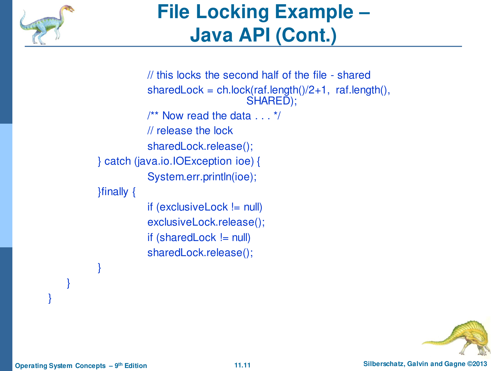
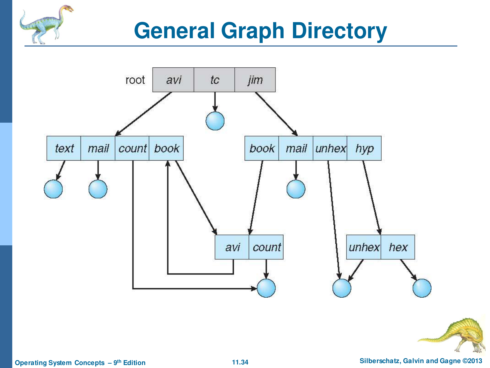

---

## 第 1 页


**提问：** 这张截图里的内容是什么意思？请面向初学者详细解释，分点讲清楚。

下面这张图其实是一本操作系统课件的“标题页”。它告诉你这节课讲什么、参考哪本书。面向初学者，我把关键信息和会学到的概念分点说明：


# 这页标题在说什么


* **COMP3301**：通常是某所大学的一门课程编号（多半是“操作系统”或相关课程）。

* **File-System Interface（文件系统接口）**：本节课的主题——程序/用户如何通过系统调用与**文件与目录**打交道。

* **\[Based on Chapter 11, OSC]**：内容基于教材《Operating System Concepts（操作系统概念）》第9版的**第11章**（作者 Silberschatz、Galvin、Gagne；封面常见小恐龙图案就是书的标志）。


# “文件系统接口”到底讲什么？


> 重点是**接口/用法**，不是底层实现（如磁盘分配算法）。学完能理解“程序如何读写文件、管理目录、设置权限”等。


1. **文件（File）是什么**


* 抽象来看就是**字节序列**（文本、图片、可执行文件都属于文件）。

* 常见**属性（元数据）**：名字、大小、创建/修改/访问时间、拥有者与权限、类型/标识符等。

* 新手记忆法：**名字找得到、属性看得见、内容读得到**。


2. **对文件能做的操作（系统调用/API）**


* 创建/删除：`create` / `delete`

* 打开/关闭：`open` / `close`（打开后得到**文件描述符/句柄**）

* 读/写：`read` / `write`

* 移动读写位置：`seek`（比如从第100个字节开始读）

* 其他：重命名 `rename`、截断 `truncate` 等

  小例：Python 里 `f = open("a.txt"); data = f.read(); f.close()` 就是使用接口。


3. **文件类型与扩展名**


* **常规文件**、**目录**、**设备文件**等（类 UNIX 下的分类）。

* 扩展名（.txt/.jpg/.exe）是**约定**而非必须，但在 Windows 等系统中常用于关联程序。


4. **目录（Directory）与路径**


* 目录就是“**名字到文件的映射表**”，支持**树形层级**。

* **绝对路径**（从根开始，如 `/usr/bin`）与**相对路径**（从当前目录出发，如 `../docs`）。

* 典型结构：单级目录 → 两级目录 → **树形目录**；也会提到**无环图结构**（支持共享/链接）。


5. **链接（Links）**


* **硬链接（hard link）**：多个名字指向同一文件内容实体（同一 inode）。

* **符号链接/软链接（symlink）**：像“快捷方式”，保存的是**目标路径**。

  新手规则：删掉**源文件**时，硬链接内容还在；软链接会“断裂”。


6. **文件共享与锁**


* 多用户/多进程可能同时访问同一文件。

* **锁（file lock）**：避免写冲突；有\*\*建议性（advisory）**和**强制性（mandatory）\*\*两类。

* **一致性语义**：一个进程写完，其他人**何时**能看到更新（不同系统/网络文件系统可能不同）。


7. **权限与保护**


* 典型 UNIX 权限：`r`（读）`w`（写）`x`（执行），按**拥有者/同组/其他人**三类控制，例如 `rwxr-x---`。

* Windows 常见 **ACL（访问控制表）**：给具体用户/组分配细粒度权限。


8. **挂载（Mount）与卷（Volume/Partition）**


* 多个磁盘/分区如何“接入”到同一棵目录树，比如把 U 盘**挂载**到 `/mnt/usb`，看起来像树上的一个子目录。


9. **访问方法**


* **顺序访问**（从头到尾读，如流式播放）、**直接/随机访问**（可跳到任意位置）、以及**索引访问**等抽象。


# 和命令行/代码如何对应（感受一下）


* 命令行：`ls`（列目录）、`cat`（读文件）、`touch`（创建空文件）、`rm`（删除）、`mkdir`/`rmdir`（目录）、`ln` / `ln -s`（硬/软链接）、`chmod`（改权限）、`mount`（挂载）。

* 代码（概念对照）：`open`→拿到句柄，`read/write`→读写字节，`close`→释放资源，`stat`→读元数据，`chmod/chown`→改权限/拥有者。


# 你需要带着哪些问题去读这章


* “程序为什么要先**open**才能**read/write**？”

* “**路径解析**是怎么从字符串变成具体文件的？”

* “为什么同一个文件会有多个名字（链接）？”

* “不同权限/锁会如何影响并发读写？”


# 小结


* 这页不是内容本身，而是\*\*“操作系统课程中文件系统接口”**的**目录标题\*\*。

* 学这章的目标：理解**程序如何通过操作系统提供的接口来管理文件与目录**，以及**权限、共享、链接、挂载**这些日常开发都会遇到的概念。


如果你愿意，我可以用你熟悉的语言（比如 Python/C/Java）给你做一份“文件常见操作”的最小代码清单，配上运行效果说明。


---

## 第 2 页


**提问：** 这张截图里的内容是什么意思？请面向初学者详细解释，分点讲清楚。

先说明一下：你发的那行英文 *“File … not found in file service”* 是上传时的系统报错，和截图内容无关。下面是对截图里这页课件（“File-System Interface”）的入门解释——它列的是本节课将讲的六个主题，分别是什么意思、为什么要学、举个小例子：


1. 文件概念（File Concept）


* **是什么**：操作系统把数据抽象成“文件”，本质是**一串字节**。

* **有啥属性**：名字、大小、时间戳、拥有者、权限、类型等（统称**元数据/属性**）。

* **能做什么**：创建/删除、打开/关闭、读/写、定位（seek）、重命名等。

* **小例子**：Python 里 `open("a.txt") → read() → close()`；命令行里 `ls`、`cat`、`rm`。


2. 访问方法（Access Methods）


* **顺序访问**：像读小说，从头到尾 `read()`；适合日志、流媒体。

* **直接/随机访问**：可跳到任意位置读/写（通过 `seek`）；适合数据库、视频快进。

* **索引式访问**：先用索引定位，再读数据（概念上类似书的目录）。


3. 磁盘与目录结构（Disk and Directory Structure）


* **目录是啥**：把“名字 → 文件”的映射组织成**树**（文件夹套文件夹）。

* **路径**：绝对路径 `/usr/bin` vs 相对路径 `../docs`。

* **链接**：硬链接=同一内容多个名字；软链接=“快捷方式”。

* **你能感受到的**：资源管理器/Finder 左边那棵文件夹树就是它的体现。


4. 文件系统挂载（File-System Mounting）


* **做什么**：把一个存储设备/分区（U 盘、硬盘分区、网络盘）**接到**现有目录树的某个点。

* **效果**：看起来像多了一个子目录而不是“另一个世界”。

* **例子**：Linux 把 U 盘挂到 `/mnt/usb`；Windows 给它分配盘符 `E:`。


5. 文件共享（File Sharing）


* **问题**：多用户/多进程同时读写同一文件会冲突吗？

* **手段**：文件锁（建议性/强制性）、共享模式、网络文件系统的缓存一致性规则。

* **例子**：两个人同时写 Excel，系统可能提示“只读”或让你等待释放锁。


6. 保护（Protection）


* **目的**：让合适的人做合适的事，防止误操作/越权。

* **典型机制**：


  * UNIX 权限位 `rwx`（读/写/执行）按“拥有者/同组/其他人”分配，如 `rwxr-x---`；

  * Windows/企业环境常用 **ACL**（访问控制表）给具体用户/组细粒度授权。

* **相关操作**：`chmod` 改权限、`chown` 改拥有者，或在属性窗口里勾选。


——小结——

这页是“**文件系统接口**”的提纲：从**文件是什么** → **怎么访问** → **如何在磁盘/目录里组织** → **怎么把不同设备接入** → **如何多人共享** → **如何设权限**。理解这些接口，才能在代码和系统里**正确、安全、可并发**地使用文件。

如果你愿意，我可以用你常用的语言（如 Python/C）给你整理一份“文件常用操作”速查表+示例。


---

## 第 3 页


**提问：** 这张截图里的内容是什么意思？请面向初学者详细解释，分点讲清楚。

这页是“**Objectives（本节课的学习目标）**”。它把这一章（文件系统接口）要解决的四个核心问题列出来。给初学者的逐条解释如下：


# 1) 解释文件系统的作用（function of file systems）


* **它是谁？** 文件系统是操作系统里**管理数据文件的模块**，相当于一座“图书馆”的管理员。

* **它做什么？**


  * **命名**：给数据起名字（`report.docx`）。

  * **组织**：把文件放进**目录/文件夹**，形成树状结构，方便查找。

  * **持久化**：掉电重启后数据仍在（写到磁盘/SSD）。

  * **元数据管理**：记录大小、时间、权限、拥有者等。

  * **性能与可靠性**：尽量让读写快、崩溃后不丢数据（如日志/校验）。

* **为什么要学？** 你每天保存、复制、移动、删除文件，背后都经过它的安排。


# 2) 描述文件系统的接口（interfaces to file systems）


* **给“人”的接口**：图形界面（资源管理器/Finder）、命令行（`ls`、`cp`、`rm`、`mkdir`）。

* **给“程序”的接口（系统调用/API）**：常见有

  `open`（打开）→ `read/write`（读写） → `lseek`（移动读写位置） → `close`（关闭），

  以及 `create/delete/rename/stat/chmod` 等。

* **入门理解**：程序不能直接摸磁盘，必须**通过这些接口**向操作系统提出“读写申请”。


# 3) 讨论设计取舍（tradeoffs）


这部分会讲：不同设计会影响**速度、空间、易用性、并发安全**，需要做权衡。


* **访问方法（access methods）**


  * **顺序访问**：从头到尾（读日志/看电影）。

  * **随机访问**：可跳到任意位置（数据库、视频拖动）。

  * **取舍**：顺序适合大文件流式读，随机适合频繁定位；底层数据布局也会随之优化不同。


* **文件共享（file sharing）**


  * 多个用户/程序同时访问同一文件会怎样？

  * **一致性语义**（别人何时能看到你写入的内容）在本地FS、网络FS可能不同。

  * **取舍**：共享越容易，越要考虑冲突与一致性成本。


* **文件锁（file locking）**


  * 防止“两个厨师同时改一锅汤”。

  * **建议锁** vs **强制锁**、**共享锁（读）** vs **独占锁（写）**。

  * **取舍**：锁严一些更安全，但可能降低并发与易用性（例如“文件正在使用，无法删除”）。


* **目录结构（directory structures）**


  * **单级/两级/树形**，甚至**无环图（支持链接/共享）**。

  * **取舍**：结构越灵活，路径解析越复杂；越简单，越可能重名或难组织。


# 4) 探索文件系统的保护（file-system protection）


* **目的**：只让“该看的人能看、该改的人能改”，防止误删、越权与恶意访问。

* **常见机制**：


  * **UNIX 权限位**：`r`（读）`w`（写）`x`（执行），按**拥有者/同组/其他人**三类，如 `rwxr-x---`。

  * **ACL**（访问控制表）：对具体用户/组设置更细的权限（Windows/企业环境常见）。

  * **配套手段**：用户/组、默认权限（umask）、审计日志、磁盘配额、加密等。

* **小例子**：只允许自己读写一个文件 → `chmod 600 secret.txt`。


---


## 一句话总览


* **这章要你会**：文件系统干啥 → 程序如何通过接口用它 → 设计上有哪些取舍（访问/共享/锁/目录） → 如何做权限与保护。

* **学完能做**：用命令行/代码**规范、安全地**创建、组织、读写和共享文件，并理解背后的原因。


如果你想，我可以用你熟悉的语言（如 Python 或 C）给你做一页“文件常用操作速查表 + 迷你示例”。


---

## 第 4 页


**提问：** 这张截图里的内容是什么意思？请面向初学者详细解释，分点讲清楚。

这页的标题是 **File Concept（文件的概念）**。它想传达：**在操作系统里，“文件”是一段连续编号的字节序列，至于这些字节代表什么，由创建它的程序/人来决定**。给新手的逐条解释：


# 1) “Contiguous logical address space”


* **意思**：从程序的角度看，一个文件就是从**第 0 个字节到第 N−1 个字节**的**连续逻辑地址**；读写时用“**偏移量 + 长度**”（例如“从第 100 个字节开始读 20 个字节”）。

* **为何叫“逻辑”**：虽然在磁盘上可能被分成很多块分散存放，但操作系统把它**抽象成连续**的，程序不必关心物理位置。

* **相关操作**：`open → read/write → lseek(移动读写位置) → close`。


# 2) “Types: Data / Program”


* 这是**按用途**而非操作系统强制的硬分类；大多数系统把文件都当作“字节流”，只是**应用**按不同规则解释。

* **Data（数据文件）**：存放内容数据，常见三种表示方式


  * **numeric**：**数值**数据。可以是**文本形式**（字符串 `"123.45"`）或**二进制形式**（按 IEEE754/整型字节写入）。

  * **character**：**字符/文本**数据（如 UTF-8 文本、CSV、JSON、代码等）。

  * **binary**：**二进制**数据（图片 JPG/PNG、音频 MP3、压缩包 ZIP 等），用文本编辑器打开会是“乱码”。

* **Program（程序文件）**：能被系统当作程序来运行的文件（**可执行文件**、脚本等）。


  * 例如 Windows 的 `.exe`（PE 格式）、Linux 的 ELF、macOS 的 Mach-O；是否能运行还要看**执行权限**（如 UNIX 下的 `x` 位）。


# 3) “Contents defined by file’s creator”


* **文件内部结构由创建它的程序决定**，操作系统**不规定**“文件里必须如何排版”。


  * 比如**文本文件**可以是 Markdown、CSV、源代码等；

  * **二进制文件**如 JPEG/PNG 都有自己的**格式头/魔数**和字段布局；

  * \*\*源代码文件（source file）\*\*是“人可读的文本”，如 `.c/.py/.java`；

  * \*\*可执行文件（executable file）\*\*是“机器可执行的二进制”，由编译/链接从源代码生成。

* **扩展名**（.txt、.c、.exe）主要是**约定**和给人的提示；很多系统更依赖**文件头（magic number）**或**权限位**来识别类型。


# 4) 实用小贴士（把概念落地）


* **文本 vs 二进制**：在代码里打开文件时要选对模式（如 Python 的 `"r"` 文本、`"rb"` 二进制），否则可能在不同平台换行/编码上踩坑。

* **查看类型**：Linux/macOS 下用 `file yourfile` 可猜测文件格式；`hexdump -C` 能以十六进制查看原始字节。

* **读写心智模型**：永远把文件当作“**一串字节**”；理解了偏移量、长度和编码/格式，其他接口就顺了。


**一句话总结**：文件=**连续的字节序列（逻辑上）**；**数据文件**与**程序文件**只是用途不同；**具体内容/格式由创建者决定**（文本、源代码、可执行等只是最常见的几类）。


---

## 第 5 页


**提问：** 这张截图里的内容是什么意思？请面向初学者详细解释，分点讲清楚。

这页讲的是**File Attributes（文件属性/元数据）**——也就是“除了文件内容之外，操作系统为每个文件保存的一组信息”。面向初学者，逐条解释如下（括号里给了直观例子/命令）：


---


## 什么是“文件属性（元数据）”


* 文件不只有**内容**；系统还保存**描述文件的资料**，如名字、大小、时间、权限、位置等。

* 这些资料一般**存放在目录结构里**（类 UNIX 放在 inode/目录项，Windows 放在 MFT/目录项），写在**磁盘上**，掉电也不会丢。


---


## 主要属性逐条解释


1. **Name（名字）**


   * 给人看的、人类可读的标识，比如 `report.docx`。

   * 只是“**目录里的一条记录**”，不是文件的“真实身份”。同名可以出现在不同文件夹。


2. **Identifier（标识符）**


   * 文件系统内部使用的**唯一编号**，区分每个文件（类 UNIX 叫 **inode 号**；NTFS 有文件引用号）。

   * 重点：**重命名不会变**标识符；**硬链接**就是多个名字指向**同一个标识符**。

   * 查看例子：`ls -li file`（看 inode 号）。


3. **Type（类型）**


   * 给系统或工具判断“这是什么文件”。

   * 类 UNIX 的类型包含：**普通文件、目录、符号链接、字符/块设备、FIFO、socket** 等（`ls -l` 开头的 `- d l c b p s`）。

   * 扩展名（.txt/.png/.exe）只是**约定**；有些系统也看**文件头/magic** 或脚本首行 `#!`。


4. **Location（位置）**


   * 指向文件在设备上的**存放位置**（若干数据块的地址）。

   * 程序看到的是**连续的逻辑字节序**，实际在磁盘上可能分散；这层映射由文件系统管理。


5. **Size（大小）**


   * 当前文件的**逻辑大小**（字节数）。

   * 小窍门：`ls -l` 显示逻辑大小；`du -h` 显示**占用磁盘空间**（含对齐/稀疏文件差异）。


6. **Protection（保护/权限）**


   * 控制**谁能读/写/执行**。

   * UNIX：三类主体（**owner/ group/ others**）× 三种权限 `r w x`，如 `rwxr-x---`；可再用 **ACL** 做细粒度授权。

   * Windows：主要用 **ACL**（文件属性→安全）。

   * 目录的 `x` 表示“可进入/遍历”，不是“执行”。


7. **Time, date, and user identification（时间戳与用户标识）**


   * 常见三个时间：


     * **mtime**：内容最后修改时间；
    
     * **atime**：最后访问时间；
    
     * **ctime**（UNIX）：元数据变更时间（不是“创建时间”）。

   * Windows 另外常见 **Creation time**（创建时间）。

   * **用户标识**：文件的**拥有者**与**所属组**（用于权限判断、审计与用量统计）。

   * 查看例子：`stat file`。


8. **Variations & Extended Attributes（扩展属性）**


   * 各系统实现有差异；还可能有**扩展属性**：如校验和（checksum）、MIME 类型、标签、SELinux 上下文、macOS 的 `xattr`，甚至 NTFS 的**备用数据流**。

   * 用途：完整性校验、索引、额外安全信息等。

   * 例子：`xattr`（macOS）、`getfattr`（Linux）。


9. **“Information kept in the directory structure”**


   * 幻灯片最后两点在强调：**这些属性保存在目录/索引结构中，并写在磁盘上**，属于**元数据**，不是文件内容本身。

   * 程序通过 `stat()` 等接口读取这些属性。


---


## 新手易错点（速记）


* **名字 ≠ 身份**：真正的身份是**标识符**；改名不改“人”。

* **大小有两种看法**：逻辑大小 vs 占用空间（稀疏文件会小看）。

* **ctime 不是创建时间**（在 UNIX），而是“元数据变化时间”。

* **执行权限**对可执行文件/脚本生效；没有 `x` 即使是 ELF/EXE 也跑不了（在 UNIX）。


---


### 对照命令小抄


* 查看权限/类型/大小/时间：`ls -l`

* 看 inode（标识符）：`ls -li`

* 看详细元数据：`stat file`

* 改权限：`chmod 640 file`

* 改拥有者/组：`chown user:group file`


**一句话总结**：文件属性=“描述文件的身份证 + 安全规则 + 时间记录 + 存放位置”的一整套信息；它们存于目录/索引结构里，由操作系统维护，用来让文件**可定位、可识别、可管控**。


---

## 第 6 页


**提问：** 这张截图里的内容是什么意思？请面向初学者详细解释，分点讲清楚。

这页是 **macOS 的“显示简介（Get Info）”窗口** 示例，文件名是 `11.tex`。它把一个文件的**元数据/属性**集中展示，并允许你修改部分设置。给新手的逐项说明：


> 如何打开：在 Finder 里选中文件 → 右键“显示简介”，或按 **⌘I**。


## 窗口各区块说明


1. **标题 & 修改时间**


* 顶部显示文件名 `11.tex` 和大小；旁边一行写着 **Modified（修改时间）**。


2. **Spotlight Comments（聚焦注释）**


* 你可以写备注。macOS 的搜索（Spotlight）会把这里的内容也纳入索引，方便搜索。


3. **General（通用信息）**


* **Kind**：文件种类（这里是 *TeX Document*）。

* **Size**：两种大小——


  * “111,389 bytes” 是**逻辑大小**（内容字节数）；

  * “(115 KB on disk)” 是**占用磁盘空间**（含对齐等开销）。

* **Where**：文件**路径**（在磁盘上的位置）。

* **Created / Modified**：**创建时间**与**最后修改时间**。

* **Label**（或“标签/颜色标签”）：给文件打颜色或标签。

* **Stationery pad**：勾选后，这个文件像“模板”；每次打开会自动复制一份。

* **Locked**：勾选后**锁定**，防止修改或删除（需先解锁才可编辑）。


4. **More Info**


* 常见有 **Last opened**（上次打开时间）等扩展信息。


5. **Name & Extension（名称与扩展名）**


* 可在此**重命名**。

* **Hide extension**：仅**隐藏扩展名的显示**，不改变文件类型。

* 注意：随意更改扩展名可能导致无法用正确应用打开。


6. **Open with（打开方式）**


* 指定**默认应用**来打开此类文件。

* **Change All…**：把这个默认应用应用到**所有同扩展名**的文件。


7. **Preview（预览）**


* 显示文件内容小预览（等同于 Quick Look 的缩略图）。


8. **Sharing & Permissions（共享与权限）**


* 列出**拥有者/群组/所有人**及其权限：


  * **Read & Write**（可读可写）、**Read only**（只读）、**No Access**（无访问）。

* 这里对应的是 UNIX 的**拥有者、组、其他人**与 `rwx` 权限；调权限需要相应授权。


## 这页和“文件属性”的对应关系


* **Name**（名称）→ “Name & Extension”。

* **Type**（类型）→ “Kind”。

* **Location**（位置）→ “Where”。

* **Size**（大小）→ “Size（逻辑 vs on-disk）”。

* **Times**（时间戳）→ “Created / Modified / Last opened”。

* **Protection**（保护/权限）→ “Sharing & Permissions”。

* **Extended attributes**（扩展属性）→ “Spotlight Comments、标签、锁定、模板”等。


### 小贴士


* **锁定**能防手滑；要修改先取消勾选。

* \*\*模板（Stationery pad）\*\*适合反复基于同一文件创建新文档。

* **默认打开方式**不对时，到“Open with”里选对应用并点“Change All…”。

* 逻辑大小和“占用磁盘空间”不同；稀疏文件/对齐会让后者更大。


---

## 第 7 页


**提问：** 这张截图里的内容是什么意思？请面向初学者详细解释，分点讲清楚。

这页是 **macOS 的“显示简介（Get Info）”窗口** 示例，文件名是 `11.tex`。它把一个文件的**元数据/属性**集中展示，并允许你修改部分设置。给新手的逐项说明：


> 如何打开：在 Finder 里选中文件 → 右键“显示简介”，或按 **⌘I**。


## 窗口各区块说明


1. **标题 & 修改时间**


* 顶部显示文件名 `11.tex` 和大小；旁边一行写着 **Modified（修改时间）**。


2. **Spotlight Comments（聚焦注释）**


* 你可以写备注。macOS 的搜索（Spotlight）会把这里的内容也纳入索引，方便搜索。


3. **General（通用信息）**


* **Kind**：文件种类（这里是 *TeX Document*）。

* **Size**：两种大小——


  * “111,389 bytes” 是**逻辑大小**（内容字节数）；

  * “(115 KB on disk)” 是**占用磁盘空间**（含对齐等开销）。

* **Where**：文件**路径**（在磁盘上的位置）。

* **Created / Modified**：**创建时间**与**最后修改时间**。

* **Label**（或“标签/颜色标签”）：给文件打颜色或标签。

* **Stationery pad**：勾选后，这个文件像“模板”；每次打开会自动复制一份。

* **Locked**：勾选后**锁定**，防止修改或删除（需先解锁才可编辑）。


4. **More Info**


* 常见有 **Last opened**（上次打开时间）等扩展信息。


5. **Name & Extension（名称与扩展名）**


* 可在此**重命名**。

* **Hide extension**：仅**隐藏扩展名的显示**，不改变文件类型。

* 注意：随意更改扩展名可能导致无法用正确应用打开。


6. **Open with（打开方式）**


* 指定**默认应用**来打开此类文件。

* **Change All…**：把这个默认应用应用到**所有同扩展名**的文件。


7. **Preview（预览）**


* 显示文件内容小预览（等同于 Quick Look 的缩略图）。


8. **Sharing & Permissions（共享与权限）**


* 列出**拥有者/群组/所有人**及其权限：


  * **Read & Write**（可读可写）、**Read only**（只读）、**No Access**（无访问）。

* 这里对应的是 UNIX 的**拥有者、组、其他人**与 `rwx` 权限；调权限需要相应授权。


## 这页和“文件属性”的对应关系


* **Name**（名称）→ “Name & Extension”。

* **Type**（类型）→ “Kind”。

* **Location**（位置）→ “Where”。

* **Size**（大小）→ “Size（逻辑 vs on-disk）”。

* **Times**（时间戳）→ “Created / Modified / Last opened”。

* **Protection**（保护/权限）→ “Sharing & Permissions”。

* **Extended attributes**（扩展属性）→ “Spotlight Comments、标签、锁定、模板”等。


### 小贴士


* **锁定**能防手滑；要修改先取消勾选。

* \*\*模板（Stationery pad）\*\*适合反复基于同一文件创建新文档。

* **默认打开方式**不对时，到“Open with”里选对应用并点“Change All…”。

* 逻辑大小和“占用磁盘空间”不同；稀疏文件/对齐会让后者更大。


---

## 第 8 页


**提问：** 这张截图里的内容是什么意思？请面向初学者详细解释，分点讲清楚。

这页讲 **Open Files（已打开的文件）**：当你在程序里 `open("a.txt")` 时，操作系统为“这个打开着的文件”维护一堆数据，方便之后的 `read / write / close`。逐条拆解如下（配一个生活比喻：**图书馆借书**）：


---


## 打开文件时，系统都记录了什么？


1. **Open-file table（打开文件表）**


   * 作用：记录**当前系统里哪些文件处于“打开”状态**。

   * 位置：在内核里（对程序不可见）。

   * 比喻：图书馆的**借阅登记簿**——哪本书被借出、由谁持有、怎么借的。


2. **File pointer（文件指针/偏移）**


   * 含义：**下一次读/写从文件的第几个字节开始**。每个“打开者”都有自己的位置。

   * 作用：你读了 100 个字节，文件指针就自动往后移 100，下一次从那里接着读。

   * 比喻：**书签**，帮你记住上次看到第几页。

   * 小提醒：很多系统把“文件指针”存放在“**一次打开**”的对象里；同一次打开复制出的句柄（如 `dup`/`fork`）会**共享**这个位置。


3. **File-open count（打开计数/引用计数）**


   * 含义：**有多少次“打开”指向这同一个文件对象**。

   * 作用：只有当**最后一个**打开者 `close()` 后，系统才会把这个文件对象从 open-file table 里移走、释放缓存。

   * 比喻：同一本书被多人借走时的**人数计数**；最后一个人还书，馆员才把“借出”状态清掉。

   * 现实效果：在类 UNIX 系统中，**即使删除了文件名**，只要有人还打开着，内容仍可用；等计数归零才真正回收。


4. **Disk location cache（磁盘位置/访问信息缓存）**


   * 含义：为了加速访问，系统会缓存**这个文件的关键元数据**（如磁盘块位置、索引节点信息），有的还会把**部分内容页**缓存到内存。

   * 作用：减少每次读写都去“翻目录/找磁盘块”的开销。

   * 比喻：馆员把这本书的**书架坐标**记在便笺上，下次更快找到。


5. **Access rights / mode（访问权限与打开模式）**


   * 含义：对**本次打开**允许的操作与标志，如**只读/只写/读写、追加（append）、截断（truncate）、是否同步写**等。

   * 作用：后续每次 `read/write` 都会据此**检查是否允许**；不合规会报错（如对只读句柄写入）。

   * 比喻：你手里的**借阅证类型**——只许看、不许写批注；或必须在阅览室使用等。


---


## 一次完整流程（心智模型）


1. 程序 `open("a.txt", O_RDONLY)`：


   * 内核在 **open-file table** 新建/复用一个条目；

   * 记录 **磁盘位置缓存**、**打开模式**；

   * **打开计数 +1**；

   * 给进程返回一个**句柄/文件描述符**（如 3）。


2. 程序 `read(fd, ...)` / `write(fd, ...)`：


   * 内核检查此 **fd 的访问模式**；

   * 用当前 **file pointer** 定位数据并执行 I/O；

   * 成功后**更新 file pointer**（像书签往后挪）。


3. 程序 `close(fd)`：


   * 该打开实例的**计数 −1**；若降到 0，内核**移除表项并释放缓存**。


---


## 为什么要有这些结构？


* **性能**：缓存位置/内容 → 少走弯路，I/O 更快。

* **正确性**：文件指针与模式 → 保证读写顺序与权限检查。

* **资源管理**：打开计数 → 确保**最后一个**关闭后才回收资源，不会“半路撂挑子”。


---


## 小贴士（你能看到/用到的）


* 在类 UNIX 系统里：


  * 进程的**文件描述符表**把 `0/1/2` 分别指向标准输入/输出/错误，新的 `open` 往往从 3 开始。

  * `lsof` 可以查看系统/进程的**已打开文件**；`/proc/<pid>/fd/` 能看到句柄链接到的目标。

* Windows 里常称“**句柄（handle）**”，概念相同：每个 handle 关联一次打开、包含模式/位置/计数等信息。


**一句话总结**：

“打开一个文件”并不只是拿到一个名字，而是让内核在**打开文件表**里给你创建（或复用）一个**打开实例**：带有**书签（file pointer）**、**权限与模式**、**缓存的位置信息**，并用**计数**来在最后一个关闭时清理。理解它们，就能读懂为什么有时“文件正在使用、无法删除”，以及为什么多进程/多句柄的读写会相互影响。


---

## 第 9 页


**提问：** 这张截图里的内容是什么意思？请面向初学者详细解释，分点讲清楚。

这页讲 **Open File Locking（打开文件后的加锁）**：当多个进程可能同时读/写同一个文件时，用“锁”来**协调**，避免冲突或数据损坏。给新手的逐条说明如下：


---


## 1) 什么是文件锁？


* 一种由**操作系统/文件系统**提供的机制，用来**在读写前先占位**，别人是否能同时操作由锁来决定。

* 目的：避免“两个程序同时写同一份文件”导致**内容混乱**或**覆盖**。


---


## 2) 两类常见锁（类比“读者-写者锁”）


* **Shared lock（共享锁）= 读锁**


  * 多个进程**可以同时获取**。

  * 适用：大家只是读、**不修改**；例如多个程序查看同一日志。

* **Exclusive lock（独占锁）= 写锁**


  * 同一时间**只有一个**进程能拿到。

  * 适用：需要**写入/修改**文件；拿到独占锁后别人不能写（通常也不能再拿共享锁）。


> 规则口诀：**读可并行，写需独占**；有写时禁止一切新读写。


---


## 3) 锁在做什么？


* **Mediates access（协调访问）**：谁能在什么时候读/写，由锁的类型与当前持有者决定。

* 锁可以是**整文件**级，也可以是**字节范围/记录**级（Record locking），只保护文件的一段。


---


## 4) 两种执行方式：Mandatory vs Advisory


* **Mandatory（强制锁）**


  * **系统强制执行**：如果锁与请求冲突，内核会**直接拒绝或阻塞**操作，应用绕不过去。

  * 好处：更安全；坏处：可能让程序“卡住”。

  * 在一些系统/场景（如 Windows、部分网络文件系统或特殊配置的 Linux）较常见。

* **Advisory（建议锁）**


  * **协作式**：内核记录锁，但其他进程要**自觉遵守**——调用相同的加锁 API 才会看到/尊重它。

  * 如果程序**忽略锁**，仍可能写进去。

  * 这是 **UNIX/Linux 默认**的做法（`flock` / `fcntl` 等）。


> 新手提示：大多数本地 Linux 程序间使用**建议锁**就够了；跨进程必须**都使用同一套锁 API** 才能互相看见。


---


## 5) 使用与生命周期（常见行为）


* **获取锁** → 成功则继续读写；失败时**阻塞等待**或**立即返回错误**（看你选择的模式）。

* **释放锁** → 正常 `close()` 文件句柄会释放；进程退出时内核也会清理（网络/异常断开时需小心“租约”超时）。

* **删除中的文件**：在类 UNIX 下，即使文件名被删除，只要仍有进程打开并持锁，内容仍存在，锁也仍生效，直到最后一个关闭。


---


## 6) 典型场景与做法


* **多人只读**：读前加**共享锁**；读取完释放。

* **单人写**：写前加**独占锁**；写完再释放，保证别人期间不能读到“半成品”。

* **只锁一段**：多个进程更新同一文件的不同区块时，用**记录级锁**减少互相等待。

* **锁文件（.lock）模式**：某些工具不用系统锁，而是在同目录创建 `xxx.lock` 文件表示占用——这也是**建议式**的一种，依赖大家约定俗成。


---


## 7) 踩坑与规避


* **死锁**：两个进程各持一把锁又互等另一把 → 统一**加锁顺序**、设置**超时/重试**。

* **忽略锁**：混用不兼容的 API 或有程序没加锁 → 统一技术栈/库，或改用强制锁环境。

* **网络文件系统**：NFS/SMB 的锁可能由**锁管理服务**协调，网络抖动会导致锁恢复/租约问题 → 使用官方建议的挂载与锁配置。


---


### 一句话总结


* **共享锁**让多个“读者”并行；**独占锁**保证“写者”独占。

* **强制锁**由系统阻止冲突；**建议锁**靠程序自觉遵守。

* 选对锁型和执行方式，才能让多进程/多机对同一文件的访问既**安全**又**高效**。


---

## 第 10 页


**提问：** 这张截图里的内容是什么意思？请面向初学者详细解释，分点讲清楚。

这页演示的是\*\*用 Java NIO 给文件“加锁”\*\*的最小示例。核心思想：当多个程序可能同时访问同一个文件时，先“占坑”（加锁）再读写，避免冲突。


---


## 代码在做什么（按行解释）


1. `import java.io.*; import java.nio.channels.*;`

   使用 **RandomAccessFile**（可随机读写）和 **FileChannel / FileLock** 这组 NIO 类。


2. `public static final boolean EXCLUSIVE = false; public static final boolean SHARED = true;`

   在 **FileChannel.lock(position, size, shared)** 里，第三个参数含义是“是否共享锁”。


   * `true` → 共享锁（读锁）

   * `false` → 独占锁（写锁）


3. `RandomAccessFile raf = new RandomAccessFile("file.txt", "rw");`

   以**读写模式**打开 `file.txt`。


4. `FileChannel ch = raf.getChannel();`

   拿到与文件绑定的 **通道**（Channel）。Java 的文件锁是对 *Channel* 施加的。


5. `exclusiveLock = ch.lock(0, raf.length()/2, EXCLUSIVE);`

   在文件区间 **\[0, 文件一半)** 上**加独占锁**（因为 `EXCLUSIVE=false` → 非共享 = 独占）。


   * `position`：起始位置字节偏移（这里从 0 开始）

   * `size`：锁定的长度（这里是文件的一半）

   * `shared`：是否共享（`false` = 独占）


6. `/** Now modify the data ... */`

   在这段被锁定的区域内安全地写数据（别人拿不到冲突锁）。


7. `exclusiveLock.release();`

   **释放锁**。之后别忘了关闭 `ch` 和 `raf`（示例里省略了）。


---


## 概念速通


* **共享锁（Shared / 读锁）**：允许多个进程同时获得（只读不写）。

  `ch.lock(0, len, /*shared=*/true)`


* **独占锁（Exclusive / 写锁）**：同一时刻只能一个持有（用于写）。

  `ch.lock(0, len, /*shared=*/false)`


* **分段/记录级锁**：像示例那样只锁文件的一部分，减少互相等待；要锁整文件可用 `position=0, size=Long.MAX_VALUE`（或文件真实大小）。


* **阻塞 vs 非阻塞**：


  * `lock(...)`：拿不到会**阻塞等待**；

  * `tryLock(...)`：**非阻塞**，拿不到直接返回 `null`（同 JVM 内重叠锁会抛 `OverlappingFileLockException`）。


* **释放时机**：显式 `release()`；**关闭 Channel 或进程退出**时也会释放。


* **跨平台语义**：


  * 在许多 UNIX/Linux 上，文件锁通常是**建议式**（advisory）：只有**也使用锁 API** 的程序才会“看得见并遵守”。

  * Windows 上更接近**强制式**：系统会阻止冲突访问。

  * 结论：**所有参与读写的程序都要用同一种锁机制**。


---


## 更“规范”的写法（带资源释放）


```java

try (RandomAccessFile raf = new RandomAccessFile("file.txt", "rw");

     FileChannel ch = raf.getChannel()) {

    FileLock lock = ch.lock(0, raf.length()/2, false); // 独占锁

    try {

        // TODO: 在锁住的区域里读写

    } finally {

        lock.release(); // 确保释放

    }

}

```


---


## 常见问题


* **如果另一个进程想拿冲突锁？**

  `lock` 会阻塞；`tryLock` 会返回 `null`（同 JVM 自己重叠会抛异常）。


* **想只读共享？**

  把第三个参数改为 `true`，并以只读方式打开文件（或保证只读操作）。


* **为什么要锁“半个文件”？**

  演示“**记录级/区域锁**”能力：只保护会被修改的那段数据，提升并发。


**一句话总结**：这段代码用 Java NIO 的 `FileChannel.lock()` 在文件的前半段加了**独占锁**，写完后 `release()` 释放。记住三个参数（起点、长度、是否共享）和“所有参与者都要用锁”的原则，就能在多进程/多线程环境里更安全地读写文件。


---

## 第 11 页



**提问：** 这张截图里的内容是什么意思？请面向初学者详细解释，分点讲清楚。

这页演示的是\*\*用 Java NIO 给文件“加锁”\*\*的最小示例。核心思想：当多个程序可能同时访问同一个文件时，先“占坑”（加锁）再读写，避免冲突。


---


## 代码在做什么（按行解释）


1. `import java.io.*; import java.nio.channels.*;`

   使用 **RandomAccessFile**（可随机读写）和 **FileChannel / FileLock** 这组 NIO 类。


2. `public static final boolean EXCLUSIVE = false; public static final boolean SHARED = true;`

   在 **FileChannel.lock(position, size, shared)** 里，第三个参数含义是“是否共享锁”。


   * `true` → 共享锁（读锁）

   * `false` → 独占锁（写锁）


3. `RandomAccessFile raf = new RandomAccessFile("file.txt", "rw");`

   以**读写模式**打开 `file.txt`。


4. `FileChannel ch = raf.getChannel();`

   拿到与文件绑定的 **通道**（Channel）。Java 的文件锁是对 *Channel* 施加的。


5. `exclusiveLock = ch.lock(0, raf.length()/2, EXCLUSIVE);`

   在文件区间 **\[0, 文件一半)** 上**加独占锁**（因为 `EXCLUSIVE=false` → 非共享 = 独占）。


   * `position`：起始位置字节偏移（这里从 0 开始）

   * `size`：锁定的长度（这里是文件的一半）

   * `shared`：是否共享（`false` = 独占）


6. `/** Now modify the data ... */`

   在这段被锁定的区域内安全地写数据（别人拿不到冲突锁）。


7. `exclusiveLock.release();`

   **释放锁**。之后别忘了关闭 `ch` 和 `raf`（示例里省略了）。


---


## 概念速通


* **共享锁（Shared / 读锁）**：允许多个进程同时获得（只读不写）。

  `ch.lock(0, len, /*shared=*/true)`


* **独占锁（Exclusive / 写锁）**：同一时刻只能一个持有（用于写）。

  `ch.lock(0, len, /*shared=*/false)`


* **分段/记录级锁**：像示例那样只锁文件的一部分，减少互相等待；要锁整文件可用 `position=0, size=Long.MAX_VALUE`（或文件真实大小）。


* **阻塞 vs 非阻塞**：


  * `lock(...)`：拿不到会**阻塞等待**；

  * `tryLock(...)`：**非阻塞**，拿不到直接返回 `null`（同 JVM 内重叠锁会抛 `OverlappingFileLockException`）。


* **释放时机**：显式 `release()`；**关闭 Channel 或进程退出**时也会释放。


* **跨平台语义**：


  * 在许多 UNIX/Linux 上，文件锁通常是**建议式**（advisory）：只有**也使用锁 API** 的程序才会“看得见并遵守”。

  * Windows 上更接近**强制式**：系统会阻止冲突访问。

  * 结论：**所有参与读写的程序都要用同一种锁机制**。


---


## 更“规范”的写法（带资源释放）


```java

try (RandomAccessFile raf = new RandomAccessFile("file.txt", "rw");

     FileChannel ch = raf.getChannel()) {

    FileLock lock = ch.lock(0, raf.length()/2, false); // 独占锁

    try {

        // TODO: 在锁住的区域里读写

    } finally {

        lock.release(); // 确保释放

    }

}

```


---


## 常见问题


* **如果另一个进程想拿冲突锁？**

  `lock` 会阻塞；`tryLock` 会返回 `null`（同 JVM 自己重叠会抛异常）。


* **想只读共享？**

  把第三个参数改为 `true`，并以只读方式打开文件（或保证只读操作）。


* **为什么要锁“半个文件”？**

  演示“**记录级/区域锁**”能力：只保护会被修改的那段数据，提升并发。


**一句话总结**：这段代码用 Java NIO 的 `FileChannel.lock()` 在文件的前半段加了**独占锁**，写完后 `release()` 释放。记住三个参数（起点、长度、是否共享）和“所有参与者都要用锁”的原则，就能在多进程/多线程环境里更安全地读写文件。


---

## 第 12 页


**提问：** 这张截图里的内容是什么意思？请面向初学者详细解释，分点讲清楚。

这页只有一个大标题 **“Questions?”（有问题吗？）**。它是讲完一章后的**提问/Q\&A 提示页**，意思是：老师讲到这里，欢迎大家发问、讨论或回顾关键点。面向初学者，我给你：


# 这章的超简回顾


* 文件=**连续的逻辑字节序列**；格式由**创建者/应用**定义。

* 常见**文件属性**：名字、唯一标识（inode/ID）、类型、位置、大小、时间戳、拥有者与权限。

* **打开文件**会在内核中建立条目：文件指针、打开计数、缓存的磁盘位置信息、访问模式等。

* **文件锁**用来协调并发访问：共享锁（读）可多人持有；独占锁（写）单人持有；有**强制**与**建议**两种语义。

* 目录=名字到文件的映射；还有硬链接/软链接、挂载点等概念。


# 新手常问的好问题（你可以自测/发问）


* “**名字**改了，文件就变了吗？和\*\*标识符（inode）\*\*什么关系？”

* “**mtime / atime / ctime** 分别表示什么？为什么 ctime 不是创建时间（在类 UNIX）？”

* “**硬链接**与**软链接**区别？删源文件后各自会发生什么？”

* “**文件指针**是每个进程各自一份吗？`dup`/`fork` 后是否共享位置？”

* “把文件**删掉但仍被进程打开**会怎样？（类 UNIX 下内容仍在，计数归零才回收）”

* “**共享锁**和**独占锁**能否只锁文件的一段？（记录级/范围锁）”

* “**强制锁** vs **建议锁**：不同系统上行为有什么差异？混用会出什么问题？”

* “为什么 `ls -l` 的大小和 `du -h` 不同？（逻辑大小 vs 占用空间、稀疏文件）”

* “目录上的 `x` 权限代表什么？（可进入/遍历，不是执行程序）”

* “挂载（mount）后为什么 U 盘像是目录的一部分？”


# 小练习（检验是否掌握）


* 用一句话解释：**文件**和**文件属性**的区别。

* 说出三条会导致**权限被拒绝**的常见原因。

* 画个图：两个进程分别加共享/独占锁，会发生什么？

* 想一想：为什么顺序访问的大文件通常比随机小块访问更快？


如果你愿意，我还能按你常用语言（Python/Java/C）给一页“文件读写+加锁”的最小示例清单，配运行要点。


---

## 第 13 页


**提问：** 这张截图里的内容是什么意思？请面向初学者详细解释，分点讲清楚。

这页只有一个大标题 **“Questions?”（有问题吗？）**。它是讲完一章后的**提问/Q\&A 提示页**，意思是：老师讲到这里，欢迎大家发问、讨论或回顾关键点。面向初学者，我给你：


# 这章的超简回顾


* 文件=**连续的逻辑字节序列**；格式由**创建者/应用**定义。

* 常见**文件属性**：名字、唯一标识（inode/ID）、类型、位置、大小、时间戳、拥有者与权限。

* **打开文件**会在内核中建立条目：文件指针、打开计数、缓存的磁盘位置信息、访问模式等。

* **文件锁**用来协调并发访问：共享锁（读）可多人持有；独占锁（写）单人持有；有**强制**与**建议**两种语义。

* 目录=名字到文件的映射；还有硬链接/软链接、挂载点等概念。


# 新手常问的好问题（你可以自测/发问）


* “**名字**改了，文件就变了吗？和\*\*标识符（inode）\*\*什么关系？”

* “**mtime / atime / ctime** 分别表示什么？为什么 ctime 不是创建时间（在类 UNIX）？”

* “**硬链接**与**软链接**区别？删源文件后各自会发生什么？”

* “**文件指针**是每个进程各自一份吗？`dup`/`fork` 后是否共享位置？”

* “把文件**删掉但仍被进程打开**会怎样？（类 UNIX 下内容仍在，计数归零才回收）”

* “**共享锁**和**独占锁**能否只锁文件的一段？（记录级/范围锁）”

* “**强制锁** vs **建议锁**：不同系统上行为有什么差异？混用会出什么问题？”

* “为什么 `ls -l` 的大小和 `du -h` 不同？（逻辑大小 vs 占用空间、稀疏文件）”

* “目录上的 `x` 权限代表什么？（可进入/遍历，不是执行程序）”

* “挂载（mount）后为什么 U 盘像是目录的一部分？”


# 小练习（检验是否掌握）


* 用一句话解释：**文件**和**文件属性**的区别。

* 说出三条会导致**权限被拒绝**的常见原因。

* 画个图：两个进程分别加共享/独占锁，会发生什么？

* 想一想：为什么顺序访问的大文件通常比随机小块访问更快？


如果你愿意，我还能按你常用语言（Python/Java/C）给一页“文件读写+加锁”的最小示例清单，配运行要点。


---

## 第 14 页


**提问：** 这张截图里的内容是什么意思？请面向初学者详细解释，分点讲清楚。

这页只有一个大标题 **“Questions?”（有问题吗？）**。它是讲完一章后的**提问/Q\&A 提示页**，意思是：老师讲到这里，欢迎大家发问、讨论或回顾关键点。面向初学者，我给你：


# 这章的超简回顾


* 文件=**连续的逻辑字节序列**；格式由**创建者/应用**定义。

* 常见**文件属性**：名字、唯一标识（inode/ID）、类型、位置、大小、时间戳、拥有者与权限。

* **打开文件**会在内核中建立条目：文件指针、打开计数、缓存的磁盘位置信息、访问模式等。

* **文件锁**用来协调并发访问：共享锁（读）可多人持有；独占锁（写）单人持有；有**强制**与**建议**两种语义。

* 目录=名字到文件的映射；还有硬链接/软链接、挂载点等概念。


# 新手常问的好问题（你可以自测/发问）


* “**名字**改了，文件就变了吗？和\*\*标识符（inode）\*\*什么关系？”

* “**mtime / atime / ctime** 分别表示什么？为什么 ctime 不是创建时间（在类 UNIX）？”

* “**硬链接**与**软链接**区别？删源文件后各自会发生什么？”

* “**文件指针**是每个进程各自一份吗？`dup`/`fork` 后是否共享位置？”

* “把文件**删掉但仍被进程打开**会怎样？（类 UNIX 下内容仍在，计数归零才回收）”

* “**共享锁**和**独占锁**能否只锁文件的一段？（记录级/范围锁）”

* “**强制锁** vs **建议锁**：不同系统上行为有什么差异？混用会出什么问题？”

* “为什么 `ls -l` 的大小和 `du -h` 不同？（逻辑大小 vs 占用空间、稀疏文件）”

* “目录上的 `x` 权限代表什么？（可进入/遍历，不是执行程序）”

* “挂载（mount）后为什么 U 盘像是目录的一部分？”


# 小练习（检验是否掌握）


* 用一句话解释：**文件**和**文件属性**的区别。

* 说出三条会导致**权限被拒绝**的常见原因。

* 画个图：两个进程分别加共享/独占锁，会发生什么？

* 想一想：为什么顺序访问的大文件通常比随机小块访问更快？


如果你愿意，我还能按你常用语言（Python/Java/C）给一页“文件读写+加锁”的最小示例清单，配运行要点。


---

## 第 15 页


**提问：** 这张截图里的内容是什么意思？请面向初学者详细解释，分点讲清楚。

这页只有一个大标题 **“Questions?”（有问题吗？）**。它是讲完一章后的**提问/Q\&A 提示页**，意思是：老师讲到这里，欢迎大家发问、讨论或回顾关键点。面向初学者，我给你：


# 这章的超简回顾


* 文件=**连续的逻辑字节序列**；格式由**创建者/应用**定义。

* 常见**文件属性**：名字、唯一标识（inode/ID）、类型、位置、大小、时间戳、拥有者与权限。

* **打开文件**会在内核中建立条目：文件指针、打开计数、缓存的磁盘位置信息、访问模式等。

* **文件锁**用来协调并发访问：共享锁（读）可多人持有；独占锁（写）单人持有；有**强制**与**建议**两种语义。

* 目录=名字到文件的映射；还有硬链接/软链接、挂载点等概念。


# 新手常问的好问题（你可以自测/发问）


* “**名字**改了，文件就变了吗？和\*\*标识符（inode）\*\*什么关系？”

* “**mtime / atime / ctime** 分别表示什么？为什么 ctime 不是创建时间（在类 UNIX）？”

* “**硬链接**与**软链接**区别？删源文件后各自会发生什么？”

* “**文件指针**是每个进程各自一份吗？`dup`/`fork` 后是否共享位置？”

* “把文件**删掉但仍被进程打开**会怎样？（类 UNIX 下内容仍在，计数归零才回收）”

* “**共享锁**和**独占锁**能否只锁文件的一段？（记录级/范围锁）”

* “**强制锁** vs **建议锁**：不同系统上行为有什么差异？混用会出什么问题？”

* “为什么 `ls -l` 的大小和 `du -h` 不同？（逻辑大小 vs 占用空间、稀疏文件）”

* “目录上的 `x` 权限代表什么？（可进入/遍历，不是执行程序）”

* “挂载（mount）后为什么 U 盘像是目录的一部分？”


# 小练习（检验是否掌握）


* 用一句话解释：**文件**和**文件属性**的区别。

* 说出三条会导致**权限被拒绝**的常见原因。

* 画个图：两个进程分别加共享/独占锁，会发生什么？

* 想一想：为什么顺序访问的大文件通常比随机小块访问更快？


如果你愿意，我还能按你常用语言（Python/Java/C）给一页“文件读写+加锁”的最小示例清单，配运行要点。


---

## 第 16 页


**提问：** 这张截图里的内容是什么意思？请面向初学者详细解释，分点讲清楚。

这页讲的是 **Access Methods（文件访问方法）**：程序如何“走进”一个文件去读写数据。核心有两类——**顺序访问**和**直接（随机）访问**。逐条解释：


---


## 一、Sequential Access（顺序访问）


> 把文件当成从头到尾的一条带子，**当前读写位置**只会往前走。


* **典型操作**


  * `read next`：从当前位置读下一段数据（如下一行/下一块），读完**位置自动前移**。

  * `write next`：把数据写在当前位置之后，写完**位置自动前移**（常见是“追加”）。

  * `reset`：把位置**重置到开头**（回带/rewind）。

  * `no read after last write (rewrite)`：很多“严格顺序”模型里，**刚写完不能立刻读**，需要先“重置/重定位”（或用 `rewrite` 覆盖刚才那块）；这是早期顺序文件接口的规范，避免读到未刷新的一致性问题。


* **适合场景**：日志、流媒体、文本逐行处理——“**从头读到尾**”最顺手也最高效（系统可做顺序预读）。


* **现实代码映射**


  * Python：`for line in f: ...`、`f.write(...)`；回到开头：`f.seek(0)`

  * C：`fgets/printf`；回到开头：`rewind(fp)` 或 `fseek(fp, 0, SEEK_SET)`


---


## 二、Direct Access（直接/随机访问）


> 把文件看成由\*\*固定长度的逻辑记录（blocks/records）\*\*组成，**可以跳到第 n 条记录**读写。


* **文件模型**：*file is fixed length logical records*

  也就是把文件按统一大小切成记录（比如每条 128B 或 4KB），便于 O(1) 定位。


* **典型操作**


  * `read n` / `write n`：直接读/写**第 n 条**记录。

  * `position to n`：把当前位置**移动到第 n 条**（类似 `seek`）。

  * `read next` / `write next`：在定位到 n 后，也能继续顺序地“下一条”。

  * `rewrite n`：**就地修改**第 n 条记录。


* **n 的含义**：*relative block number*（**相对块号**，从 0 开始的逻辑编号）。

  程序只管“第 n 块”，**底层具体放在哪些磁盘块由操作系统决定**（这也就引出后续第 12 章的“空间分配问题”——连续/链式/索引等）。


* **适合场景**：数据库页、索引文件、固定长度表——需要“**随机定位第 i 条记录**”。


* **现实代码映射**


  * C：`fseek(fp, n*record_size, SEEK_SET); fread(...);` 或 `pread(fd, buf, sz, n*record_size)`

  * Java：`RandomAccessFile.seek(n*recordSize); read/write`

  * Python：`f.seek(n*record_size); f.read(record_size)`


---


## 该用哪一种？


* **顺序访问**：数据本就按顺序消费，或你想要**最大吞吐**（顺序读写对磁盘/SSD/缓存更友好）。

* **直接访问**：需要**随机跳转**到任意位置、**就地更新**某条记录，或按编号快速定位。


---


## 小结一句话


* **顺序访问** = 只能向前读/写，必要时“回带/重置”；最简单、最快。

* **直接访问** = 先把文件抽象成**固定长度的记录**，用**相对块号 n** 进行 `seek + read/write`；程序只看逻辑编号，**物理放置由 OS 决定**。


---

## 第 17 页


**提问：** 这张截图里的内容是什么意思？请面向初学者详细解释，分点讲清楚。

这页在讲：**怎么在“直接访问（随机访问）”文件的基础上，模拟出“顺序访问”接口**。做法很简单——**维护一个“当前记录号”`cp`**（current position = 相对块号），每次顺序读写都用它来定位，然后把它加一。


## 背景回顾


* **直接访问文件**：把文件看成许多**固定长度的逻辑记录**（blocks/records），能按编号 `n` 随机读写。

* **顺序访问**：只提供“读下一条/写下一条/回到开头”这类从前到后的操作。


## 映射规则（表中三行的含义）


* **reset** → `cp = 0;`

  把“当前记录号”重置到文件开头。

* **read next** → `read cp;  cp = cp + 1;`

  读取第 `cp` 条记录，再把位置前移一条。

* **write next** → `write cp;  cp = cp + 1;`

  写入第 `cp` 条记录，再把位置前移一条。


> 也就是说：**顺序读/写 = 先用 `cp` 做一次随机读/写，再 `cp++`**。


## 直观小例子


* 设每条记录 **4KB**，初始 `cp=0`：


  * 第一次 `read next` → 读偏移 `0*4KB=0`；`cp=1`

  * 第二次 `read next` → 读偏移 `1*4KB=4KB`；`cp=2`

  * 第三次 `write next` → 写偏移 `2*4KB=8KB`；`cp=3`


## 伪代码长这样


```pseudo

cp = 0                 // reset

function readNext():

    readRecord(cp)     // 等价于 seek(cp*record_size); read(...)

    cp = cp + 1


function writeNext(data):

    writeRecord(cp, data)

    cp = cp + 1

```


## 要点与注意


* 这个办法**假定记录是定长**；若是变长记录，就需要额外的**索引**或扫描来确定 `cp` 对应的字节偏移。

* `cp` 是\*\*一次打开（open）\*\*的私有状态（像文件指针），多个进程/句柄各自维护自己的 `cp`。

* 反过来，在“只有顺序接口”的系统里想做“直接访问”就低效了：要读第 `n` 条，得**顺序跳过前 n 条**。


**一句话总结**：把顺序访问当作“在随机访问之上，多了个会自增的当前位置 `cp`”。这样就能用“读/写编号为 `cp` 的记录 + `cp++`”来完全模拟顺序接口。


---

## 第 18 页


**提问：** 这张截图里的内容是什么意思？请面向初学者详细解释，分点讲清楚。

这页在讲：\*\*除了“顺序访问 / 直接（随机）访问”之外，还能用“索引”把文件访问得更快、更聪明。\*\*要点分解如下：


---


## 1) 思想总览


* “其他访问方法”一般都是**在基础方法之上**搭建出来的（底层还是顺序读写或随机 `seek`）。

* 核心做法：**给文件建立一个索引（index）**，把“键（key）→ 物理位置（块号/偏移）”记下来，这样查找时就不用全文件扫一遍。


类比：超市的**条形码（UPC）**就是“键”，收银系统用它去**索引表**里直接定位到该商品的信息所在地。


---


## 2) 索引如何放置与分层


* **小索引**：可以常驻**内存**，查一次表就能知道去文件的哪个位置读。

* **索引太大**：就把完整索引放**磁盘**，内存只放一小层“**主索引**”（index of index）——先用主索引定位到**次级索引块**，再从次级索引块定位到**数据块**。

  这其实就是“**分层/稀疏索引**”的思想（现实里常见 B-tree/B+树就这么干）。


---


## 3) IBM 的 ISAM（Indexed Sequential Access Method）


> 经典的“**索引 + 顺序**”混合方法。


* **小的主索引**：常驻内存或易于快速加载，条目较少。

* **次级索引块**：在磁盘上，主索引的每项指向一个**次级索引块**。

* **数据文件**：**按某个键排序**存放（范围查询很快）。

* **OS 负责**这些维护（在老系统/主机上由操作系统提供此访问方法）。

* 读流程：主索引 → 次级索引块 → 被排序的数据块（很像电话簿先翻字母再翻页）。

* 写/插入：可能涉及**溢出区**或重建索引；更新成本较高，适合**读多写少**的场景。


---


## 4) VMS 的例子


* VMS 系统直接提供两类文件：


  * **Indexed file（带索引文件）**：系统层面内建索引；

  * **Relative file（相对文件）**：把记录按**相对记录号**（RRN）编号，便于直接按编号随机访问。

* 说明：有些操作系统/文件系统**原生支持**更高级的访问方式，而不只是“字节流”。


---


## 5) 这些方法的共同点与权衡


**共同点**


* 都是“**键 → 位置**”的映射；真正读数据时，底层仍靠**顺序/随机**两种基础操作完成。

* 常把**热点的索引**放内存，**完整索引**放磁盘，并做**分层**以减少 I/O。


**优点**


* **点查**和**范围查**（文件已排序）速度快；

* 读放大小、访问更可预测。


**代价**


* **占空间**（索引本身）；

* **维护成本**（插入/删除要更新索引，写放大）；

* **并发/一致性**需要锁或日志来保障。


---


## 6) 把概念落到实操（简单心智模型）


* 你有一个按行存储的 `products.csv`，每行以 `product_id` 为键。

* 扫一遍文件，记录 `product_id → 字节偏移` 到 `index.bin`。

* 查询时：先在内存中或磁盘上**查索引**拿到偏移，再 `seek(offset)` 读这一行——**无需全表扫描**。


伪代码：


```text

# 建索引

for each record at offset:

    index[record.key] = offset


# 查数据

offset = index[key]

seek(fd, offset); line = readLine(fd)

```


---


### 一句话总结


“其他访问方法”的本质是：**给文件建立索引（可能分层、部分常驻内存）**，用“键→位置”把定位成本降低到近似 O(1)/O(log n)。IBM 的 **ISAM** 是代表性实现：**主索引 + 次级索引块 + 按键排序的数据文件**；在某些系统（如 VMS）甚至由操作系统直接提供“索引文件/相对文件”这种更高层的访问抽象。


---

## 第 19 页


**提问：** 这张截图里的内容是什么意思？请面向初学者详细解释，分点讲清楚。

这页在演示\*\*“索引文件 + 相对文件（relative file）”**如何配合，让我们**按键快速定位一条记录\*\*。


## 图里都有谁


* **左侧：index file（索引文件）**


  * 按“键（key）”排序保存，例如这里用 **last name（姓氏）**。

  * 每一行有：**键 → 逻辑记录号（logical record number, RRN）**。

* **右侧：relative file（相对文件）**


  * 由**固定长度的记录**组成（第 0 条、第 1 条、第 2 条……）。

  * 每条记录里是真正的数据字段：如 `smith, john | social-security | age`。


## 查找一条记录怎么走


1. 你给出键：比如 **"Smith"**。

2. 在**索引文件**里找到这一行，得到一个 **RRN（逻辑记录号）**。

3. 用 RRN 计算这条记录在**相对文件**中的位置：


   * 偏移量 = `RRN × RECORD_SIZE`（记录大小是固定的）。

4. 直接 `seek` 到这个偏移，读出整条记录（姓名、社保号、年龄等）。


伪代码：


```text

rrn = index["Smith"]              # 1) 通过键查索引

offset = rrn * RECORD_SIZE        # 2) 计算在相对文件里的位置

seek(relative_fd, offset)         # 3) 跳转

record = read(relative_fd, RECORD_SIZE)  # 4) 读取记录

```


## 为什么这样设计


* **快**：查一次索引（可常驻内存或做成多级索引），就能 O(1)/O(log n) 地跳到目标记录。

* **简单**：相对文件固定记录长，偏移计算直接；顺序遍历也容易。

* **可扩展**：一个文件可以有多个索引（按姓氏、ID 等）。


## 小提醒


* 同一键（如很多 “Smith”）的情况，索引会指向一个**桶/列表**或“范围”，再在范围里找具体人。

* 插入/删除需要**维护索引**，代价比纯顺序文件高。

* 这个思路就是早期 **ISAM（Indexed Sequential Access Method）** 的核心；现代数据库的 **B+ 树索引**也是类似理念。


**一句话总结**：**索引文件**负责“键 → 记录号”的快速定位，**相对文件**按记录号等距存放真实数据；两者配合，实现对大文件的**快速按键访问**。


---

## 第 20 页


**提问：** 这张截图里的内容是什么意思？请面向初学者详细解释，分点讲清楚。

这页只有一个大标题 **“Questions?”（有问题吗？）**——是本小节结束时的**提问/Q\&A 提示页**。结合前面几页，这里在邀请你就“文件访问方法”提问。给你一份**超简回顾 + 自测清单**：


# 本节要点速记


* **顺序访问（Sequential）**：只向前“读下一块/写下一块”，必要时 `rewind/reset` 回到开头。简单高吞吐。

* **直接访问（Direct/Random）**：把文件看作**定长记录**；可按**相对块号 n** `seek` 到任意位置 `read/write`。

* **顺序可由直接访问模拟**：维护当前记录号 `cp`；`read cp; cp++` / `write cp; cp++`。

* **带索引的访问**：在文件外建立**索引（key → 位置/记录号）**，热点索引进内存，完整索引在磁盘；典型方案 **ISAM**（主索引→次级索引→排序的数据）。

* **索引文件 + 相对文件**：索引按键保存**RRN（逻辑记录号）**，相对文件用**定长记录**存数据；查找：键 → RRN → `offset = RRN * record_size`。


# 自测/可提问题


* 什么时候选**顺序**，什么时候选**直接**？理由各是啥？

* “**相对块号**”与物理磁盘块是什么关系？（逻辑编号由 OS 映射到物理位置）

* 为什么**顺序访问**通常比随机访问快？

* 用**变长记录**时，若还想随机定位，应该如何设计？（长度前缀 + 索引）

* 画出“**索引文件 → 相对文件**”的查找流程；键重复时怎么处理？

* ISAM/分层索引的**优缺点**是什么？（读快、写维护贵）


# 小练习（动手更牢）


* 用你熟悉的语言实现：


  1. 把文本切成**定长记录**；提供 `read(n)` / `write(n)` 与“顺序接口”。

  2. 为按“ID”查询的 CSV 建一个**键→字节偏移**的索引文件，支持 O(1)/O(log n) 查询。


想要的话，我可以直接给你一份 Python/Java/C 的“定长记录 + 简易索引”示例代码，带运行说明。


---

## 第 21 页


**提问：** 这张截图里的内容是什么意思？请面向初学者详细解释，分点讲清楚。

这页讲 **Directory Structure（目录结构）**——操作系统如何用“目录”来管理和定位所有文件。


# 核心概念


* **目录是“名字到文件”的映射表。**

  每个目录里有很多**条目（node/entry）**，每条记录至少包含：

  **文件名 → 指针**（指向该文件的真实信息/标识符，如 UNIX 的 inode）。

* **目录与文件都存放在磁盘上并会持久保存。**

  平时为了加速会缓存到内存，但源数据在磁盘中。


# 它长什么样


* 目录里既可以放**文件**，也可以放**子目录**，从而形成一棵**层级树**（/ 根目录 → 子目录 → … → 文件）。

* 图上“Directory”中的圆点代表**目录条目**，下面的 F1、F2…表示**被指向的文件**。


# 它解决什么问题


* **命名**：给字节内容取人类可读的名字（report.txt）。

* **分组**：把相关文件放在同一目录/子目录。

* **定位**：通过条目中的“指针”快速找到文件在磁盘上的位置（间接地）。


# 路径解析是怎么做的（简化版）


以 `/home/alice/report.txt` 为例：


1. 从根目录 `/` 开始查找条目 `home`；

2. 进入 `home` 目录再找 `alice`；

3. 在 `alice` 目录中找 `report.txt` 的条目；

4. 用条目里的指针（如 inode 号）拿到文件的元数据与数据块位置，然后打开读写。


# 和常用操作的对应


* `mkdir`/`rmdir`：增删**目录**（即增删“映射表”）。

* `ls`：列出目录里的**条目**。

* `mv`/重命名：修改**目录条目**（名字或所在目录），文件本体不变。

* `rm`：删除目录里的**那条记录**；若还有其他硬链接或进程打开，数据暂不会立刻回收。


> 小记：在类 UNIX 中，**目录本身也是一种特殊文件**，其内容就是“文件名 → inode”的列表；Windows 的 NTFS 也有类似的思想（MFT+目录索引）。


**一句话**：目录结构就是“**把所有文件的名字和指向它们的指针整理成层级表**”，让我们能用路径快速找到并管理文件。


---

## 第 22 页


**提问：** 这张截图里的内容是什么意思？请面向初学者详细解释，分点讲清楚。

这页讲 **Disk Structure（磁盘/卷的结构）**：磁盘如何被切分、怎么承载文件系统，以及系统如何识别和管理它们。逐条给新手说明：


---


## 1) Partition（分区）


* 一块物理磁盘可以被**划成多个分区**（partition）。

* 不同系统里也叫 **slices / minidisks**（同义词）。

* 直觉类比：把一个大仓库隔成几间房，每间可以装不同东西或给不同用途。


## 2) RAID（冗余阵列）


* **多块磁盘**可以组合成一个**逻辑磁盘**来提高**可靠性/性能**：


  * RAID1 镜像（容错）、RAID0 条带（提速无容错）、RAID5/6 带校验（兼顾）。

* 可以对**整盘或分区**做 RAID。对上层看起来就是一块更大的“磁盘”。


## 3) Raw vs Formatted


* **raw（裸设备）**：直接把分区当**字节块设备**用，**不建立文件系统**。


  * 例：交换分区（swap）、数据库原始设备、某些虚拟化/日志设备。

* **formatted with a file system（格式化）**：在分区上**创建文件系统**（如 NTFS、ext4、APFS），才能有“文件/目录”。


## 4) Volume（卷）


* **承载一个文件系统的实体**叫“卷”（volume）：可以是一整个磁盘、一个分区，或一个 RAID/LVM 逻辑卷。

* 在 Windows 里常见成**盘符**（C:, D:）；在 macOS/Linux 中是**挂载点**（如 `/`, `/home`, `/Volumes/USB`）。


## 5) 设备目录 / 卷目录表（device directory / volume table of contents）


* 系统需要知道“这块卷上是什么文件系统、从哪儿开始”。

* 信息存放在：


  * **设备目录**（OS 维护的可用设备/卷列表；类 Unix 的 `/dev` + 挂载信息），或

  * **卷目录表 VTOC（Volume Table Of Contents）/超级块 superblock** 之类的**卷内元数据**，用于描述该卷的布局与文件系统信息。


## 6) 通用 vs 专用 文件系统


* **通用（general-purpose）**：日常存储用，如 **NTFS / exFAT / ext4 / APFS / XFS**。

* **专用（special-purpose）**：为特定介质/场景设计，如 **ISO9660（光盘）**、**FAT（固件/相机卡）**、**tmpfs（内存盘）**、**只读/日志/网络文件系统（NFS/SMB）**。

* **同一操作系统中可同时存在多种文件系统**。


---


## 把概念落到你的电脑（举例）


* **Windows**：一块 SSD → 分成 `C:`（NTFS, 系统盘）+ `D:`（NTFS, 数据盘）；再外接一块移动硬盘（exFAT）。

* **Linux**：一块 NVMe → 分区 `/`（ext4）、`/home`（XFS）、`swap`（raw）；再将两块 SATA 盘做 **RAID1**，挂载到 `/data`。

* **macOS**：APFS 容器里有多个**卷（Volume）**：`Macintosh HD`、`Data`、`Preboot` 等，分别挂载到不同路径。


---


## 常用操作（只需知道名字）


* **查看/分区**：Windows“磁盘管理”，Linux `lsblk`/`fdisk`/`parted`。

* **创建文件系统**：`mkfs.ext4 /dev/sda1`、`mkfs.xfs` 等。

* **挂载/卸载**：`mount` / `umount`。

* **做 RAID**：硬件 RAID（主板/阵列卡）或软件 RAID（Linux `mdadm`）。


**一句话总结**：

物理磁盘可以被**分区**，多个分区/磁盘还能通过 **RAID** 组合；每个分区/逻辑卷要么被当作 **raw** 使用，要么**格式化成某种文件系统**成为一个**卷**；系统通过**设备目录/卷内元数据**认识这些卷，在同一台机器上可以并存多种**通用/专用文件系统**。


---


---

## 第 23 页


**提问：** 这张截图里的内容是什么意思？请面向初学者详细解释，分点讲清楚。

这张截图展示的是一个典型的文件系统组织结构。它出自《操作系统概念》一书，解释了如何在磁盘上组织文件和目录。接下来，我将逐点为初学者讲解图中展示的内容。

### 1. **文件系统的基本概念**

* 文件系统是操作系统的一部分，它管理计算机中如何存储、组织、检索文件。
* 这里的图示展示了磁盘分区（Partition）和文件如何组织在磁盘上。

### 2. **磁盘与分区**

* 磁盘（disk）是硬盘或其他存储设备，用于存储数据。
* 分区（partition）是磁盘上划分出的不同区域，每个分区可以作为一个独立的逻辑存储空间。例如，图中有三个分区：**Partition A**、**Partition B** 和 **Partition C**。

### 3. **目录（Directory）**

* 目录是文件系统中存放文件名称及其对应信息（例如文件路径）的地方。文件目录可以视为文件的“索引”。
* 图中每个分区（Partition A、B、C）中都有一个\*\*目录（directory）\*\*部分，用于存储相关的文件信息。

### 4. **文件（Files）**

* 文件是存储在磁盘上的数据单元，可以是文本文件、图像文件、程序文件等。
* 在每个分区下，都有\*\*文件（files）\*\*部分，表示该分区上存储的具体文件数据。例如，Partition A、B、C 下都有各自的文件数据。

### 5. **磁盘与分区的关系**

* 图中表示了三个不同的磁盘（disk 1、disk 2、disk 3），每个磁盘包含不同的分区。
* **磁盘 1**包含Partition A和B，它们都有文件和目录。
* **磁盘 2**包含Partition C，也有它自己的文件和目录。
* 这样的布局可能用于增加存储容量、分配特定的数据给不同磁盘，或者提供数据备份和冗余。

### 6. **典型的文件系统组织**

* 这种组织方式通常会把一个磁盘分成多个分区，每个分区都有一个目录和文件。目录记录了文件的位置和名字，文件则是实际存储的数据。
* 这种结构对于管理大容量数据和提高磁盘利用率是非常有效的。

### 总结：

这张图通过展示如何在磁盘和分区上组织目录与文件，帮助我们理解操作系统如何管理存储设备，分配空间和存储文件。每个分区通过目录来管理其中的文件，而磁盘可以包含多个分区，每个分区相对独立。


---

## 第 24 页


**提问：** 这张截图里的内容是什么意思？请面向初学者详细解释，分点讲清楚。

这张截图展示了不同类型的文件系统，并以 **Solaris 操作系统** 为例，列出了几种特定用途的文件系统。以下是对截图内容的详细解释：

### 1. **文件系统的分类**

* 文件系统（File System, FS）是操作系统用来管理数据存储的机制。在操作系统中，我们通常讨论的是**通用文件系统**（general-purpose file systems），也就是用于存储常规文件数据的文件系统。
* 然而，操作系统中经常会有多种文件系统，包括一些**专用文件系统**，这些文件系统并不适用于普通数据存储，通常具有特定功能。

### 2. **Solaris 操作系统中的文件系统**

这部分列举了 **Solaris** 操作系统中的几种文件系统，每种都有其独特的用途：

* **tmpfs**：

  * **tmpfs** 是一种基于内存的文件系统（memory-based file system），它是**易失性的（volatile）**，意味着它存储的数据在系统关闭或重启时会丢失。
  * 它主要用于**快速的临时I/O操作**，例如存储临时文件。因为是基于内存的，访问速度较快。

* **objfs**：

  * **objfs** 是一个接口文件系统，允许程序访问内核内存中的符号，常用于**调试**过程。
  * 通过 objfs，开发人员可以调试操作系统的内核部分，获取内核的符号信息。

* **ctfs**：

  * **ctfs** 是一种特殊的文件系统，叫做**合同文件系统**，用于管理系统中\*\*守护进程（daemons）\*\*的操作。
  * 它主要与 Solaris 中的守护进程相关，用于与进程的“合同”相关的文件操作。

* **lofs**：

  * **lofs** 是一种**回环文件系统（loopback file system）**，它允许将一个文件系统**挂载到另一个文件系统的位置**。
  * 通过 lofs，可以在一个文件系统的路径下访问另一个文件系统的内容，这在一些特殊需求场景中非常有用。

* **procfs**：

  * **procfs** 是操作系统中的一个文件系统，它提供了\*\*访问进程结构（process structures）\*\*的接口。
  * 进程相关的信息可以通过 procfs 访问，它使得用户能够查看系统中正在运行的进程信息和状态。

* **ufs** 和 **zfs**：

  * **ufs** 和 **zfs** 是两种**通用文件系统**，用于管理文件数据的存储。它们适用于大多数常规存储需求。
  * **ufs**（Unix File System）是一种传统的文件系统，较为简单。
  * **zfs** 是较新的文件系统，提供高级的存储功能，如数据冗余、压缩、快照等。

### 3. **总结**

* **一般文件系统**：主要用于存储普通的文件数据（例如，ufs和zfs）。
* **特殊文件系统**：用于系统管理、调试或提供特定功能的文件系统。例如，tmpfs、objfs、ctfs 和 lofs 都是用于特定操作的文件系统。

### 小结：

这张图强调了操作系统中的多样化文件系统。虽然我们通常讨论的是常规的通用文件系统，但有很多特殊用途的文件系统也在不同的操作系统中发挥着重要作用。图中展示了这些不同类型文件系统的例子，并通过 Solaris 操作系统的不同实例来加以说明。


---

## 第 25 页


**提问：** 这张截图里的内容是什么意思？请面向初学者详细解释，分点讲清楚。

这张截图列出了操作系统在处理目录时会执行的一些常见操作。目录（Directory）是存储文件和文件夹的地方，它帮助用户管理存储的数据。以下是对截图内容的详细解释：

### 1. **Search for a file（搜索文件）**

* **描述**：在文件系统中查找特定的文件。操作系统会根据用户输入的文件名或者其他条件（如文件扩展名、大小等）搜索指定目录中的文件。
* **应用**：用户可以使用搜索命令或文件管理器来找到文件，无论文件存储在本地磁盘还是网络共享中。

### 2. **Create a file（创建文件）**

* **描述**：在目录中创建新的文件。这通常通过打开一个新的文件并写入内容来实现。
* **应用**：用户可以通过文本编辑器、编程环境或命令行创建新文件。创建文件时，操作系统会分配空间并更新文件目录。

### 3. **Delete a file（删除文件）**

* **描述**：从文件系统中删除指定的文件，释放该文件占用的空间。
* **应用**：删除文件时，操作系统会更新文件目录，并清理磁盘上的数据。值得注意的是，删除的文件可能先移到回收站或垃圾桶，直到最终彻底清除。

### 4. **List a directory（列出目录）**

* **描述**：列出目录中的所有文件和子目录。这是一种查看某个目录内容的方法，通常会显示文件的名称、大小、修改日期等信息。
* **应用**：用户可以使用命令行工具（如 `ls` 在Linux中）或文件管理器来列出目录中的内容，便于浏览和管理文件。

### 5. **Rename a file（重命名文件）**

* **描述**：更改文件的名称，而不改变文件的内容或位置。
* **应用**：通过文件管理器或命令行工具（如 `mv` 命令）可以轻松重命名文件。重命名操作不会影响文件的数据，仅仅是更改了文件的标识符（名称）。

### 6. **Traverse the file system（遍历文件系统）**

* **描述**：遍历文件系统指的是系统或用户按照层次结构依次访问文件和目录。例如，从根目录开始，逐层进入子目录，直到找到目标文件。
* **应用**：操作系统会提供一种方式来帮助用户浏览整个文件系统结构，例如文件资源管理器，或者通过命令行来逐步进入不同的目录。

### 总结：

这张图列出了常见的文件操作，包括搜索、创建、删除、列出、重命名和遍历目录等操作。这些操作帮助用户有效地管理计算机中的文件和目录，使文件系统变得更加高效和有序。


---

## 第 26 页


**提问：** 这张截图里的内容是什么意思？请面向初学者详细解释，分点讲清楚。

这张截图展示了如何**逻辑地组织目录**，以便更高效地管理文件。它解释了目录结构如何优化文件管理，特别是在**效率**、**命名**和**分组**方面。以下是详细的解释：

### 1. **Efficiency – Locating a file quickly（效率：快速定位文件）**

* **描述**：文件系统的一个重要目标是**提高效率**，即快速找到用户需要的文件。
* **应用**：如果文件系统结构合理，用户可以迅速通过目录路径定位到特定文件。比如，文件的路径或索引方式可以采用分层结构，避免手动搜索所有文件，提高查找效率。

### 2. **Naming – Convenient to users（命名：对用户友好）**

* **描述**：文件命名应该便于用户使用和记忆。合理的命名方式可以大大提高文件管理的效率。
* **具体说明**：

  * **两个用户可以使用相同的文件名**：例如，用户A和用户B可以分别创建名为 `document.txt` 的文件，这两个文件可以存在于不同的目录或不同的用户空间中，从而避免文件冲突。
  * **同一个文件可以有多个不同的名字**：文件可以有多个“别名”或“硬链接”，允许一个文件通过不同的名称或路径访问。例如，同一个文件可以在不同目录中有不同名称，访问时可以通过不同的路径来定位。

### 3. **Grouping – Logical grouping of files by properties（分组：按属性进行逻辑分组）**

* **描述**：文件可以根据属性进行**逻辑分组**，以便于管理和访问。例如，所有与某种特定类型或功能相关的文件可以放在一起。
* **示例**：

  * **所有的 Java 程序**：可以将所有 Java 程序文件按特定目录或文件夹分组，例如 `JavaPrograms` 文件夹。
  * **所有的游戏文件**：所有与游戏相关的文件也可以按照属性分组，如将所有游戏文件放入一个名为 `Games` 的目录中。
* 这种分组方法使得用户能够快速访问和管理相关文件，提高了系统的组织性。

### 总结：

这张图强调了如何根据效率、命名和分组来优化文件目录结构：

* **效率**：通过合理的目录结构，帮助快速定位文件。
* **命名**：文件命名应简洁易懂，并且允许多个用户使用相同文件名或一个文件有多个名称。
* **分组**：文件根据功能或属性分组，方便用户管理和查找。

这种逻辑组织方式有助于提高文件的管理效率，使得系统更加有序和易于使用。


---

## 第 27 页


**提问：** 这张截图里的内容是什么意思？请面向初学者详细解释，分点讲清楚。

这张截图展示了**单层目录（Single-Level Directory）**的概念，并指出了使用这种文件系统结构时可能遇到的**命名问题**和**分组问题**。以下是对截图内容的详细解释：

### 1. **Single-Level Directory（单层目录）**

* **描述**：单层目录结构意味着所有的文件都存储在同一个目录下，没有子目录的层级结构。
* **示意图**：在图中，可以看到**一个目录**下有多个文件：`cat`、`bo`、`a`、`test`、`data`、`mail`、`cont`、`hex`、`records` 等。这些文件都处于同一个目录层级中。
* **适用场景**：这种目录结构简单，适合文件数量不多的情况。

### 2. **Naming Problem（命名问题）**

* **描述**：由于所有文件都在同一个目录下，它们必须有唯一的文件名。如果多个用户或多个文件想使用相同的名称，就会发生**命名冲突**。
* **问题**：

  * 例如，如果用户A和用户B都创建了名为 `test` 的文件，它们不能同时存在于同一个目录中，必须通过某种方式进行区分。
  * 如果没有明确的命名规则，可能导致文件名称重复，从而无法准确识别文件内容。
* **举例**：如果有两个文件都叫 `test`，操作系统无法区分它们，这就可能导致查找和访问文件时产生混乱。

### 3. **Grouping Problem（分组问题）**

* **描述**：在单层目录结构中，所有文件都平铺在一个目录下，**缺乏逻辑分组**，导致文件管理变得困难。
* **问题**：

  * 比如，目录中有很多文件，这些文件可能来自不同的项目或不同的功能模块，但它们都处在同一个目录中，难以按照用途或类别进行分类。
  * 如果目录中的文件越来越多，用户很难快速找到特定的文件，导致管理混乱。
* **举例**：如果有许多文档、图像、程序和配置文件都存储在同一个目录下，用户就很难快速区分和访问每种类型的文件。

### 4. **总结**

* **单层目录**结构虽然简单，但随着文件数量的增加，它会导致**命名冲突**和**文件分类**上的问题。
* **命名问题**指的是文件名必须是唯一的，在同一目录下不允许重复。
* **分组问题**指的是没有子目录结构，使得不同类型的文件无法有效分组，导致文件管理不方便。

### 为什么不使用单层目录？

* 随着文件数量的增加，单层目录的管理会变得非常困难。操作系统通常采用更复杂的目录结构（如多层目录结构），以解决命名冲突和文件分类的问题。


---

## 第 28 页


**提问：** 这张截图里的内容是什么意思？请面向初学者详细解释，分点讲清楚。

这张截图展示了\*\*二层目录结构（Two-Level Directory）\*\*的概念，并解释了它的特点。二层目录结构相比单层目录结构更有效，尤其在管理多个用户的文件时。下面是对截图内容的详细解释：

### 1. **Two-Level Directory（两层目录）**

* **描述**：在二层目录结构中，系统为每个用户创建了一个单独的目录（用户目录）。这些用户目录都位于一个\*\*主文件目录（master file directory）\*\*下，主目录包含所有用户的目录。
* **结构**：

  * 图中，**主文件目录**包含多个子目录，分别对应每个用户（如 `user 1`、`user 2`、`user 3` 和 `user 4`）。
  * 每个用户目录下都有该用户的文件，目录包括 `cat`、`bo`、`a`、`test`、`data` 等文件。

### 2. **Path Name（路径名）**

* **描述**：在二层目录结构中，每个文件都有一个**路径名**。路径名指明了文件的位置，包括从主目录到文件的完整路径。
* **示例**：例如，`user 1` 下的文件 `cat` 的路径名是 `master directory > user 1 > cat`，这表明文件 `cat` 存储在 `user 1` 目录下。

### 3. **可以为不同用户使用相同的文件名**

* **描述**：在这种结构中，不同的用户可以使用相同的文件名，因为每个用户都有自己的目录。也就是说，**同名文件可以存在于不同用户的目录中**，而不会发生冲突。
* **示例**：`user 1` 和 `user 2` 都可以拥有一个名为 `data` 的文件，而不会互相影响，因为它们位于各自的目录中。

### 4. **高效的文件搜索**

* **描述**：由于每个用户都有独立的目录，搜索文件时可以只在特定的用户目录中进行查找，而不需要遍历所有文件。这种结构使得文件搜索更加高效。
* **示例**：如果用户想找 `user 2` 的 `data` 文件，操作系统只需要在 `user 2` 目录中搜索，而不需要查看其他用户的目录。

### 5. **没有分组功能**

* **描述**：虽然二层目录结构解决了文件命名冲突和提高了搜索效率，但它依然没有提供像多层目录结构那样的**分组功能**。所有文件依然是直接挂在用户目录下，没有进一步的分组或分类。
* **问题**：如果每个用户有大量文件，可能还是会遇到文件管理混乱的情况，因为所有文件都直接放在用户目录中，无法按类别（例如文档、图片、程序等）进行细分。

### 总结：

二层目录结构解决了**单层目录结构**的文件命名和搜索效率问题：

* **路径名**确保文件的位置清晰，避免了命名冲突；
* **相同文件名可以出现在不同用户的目录中**，不同用户可以自由命名；
* 提供了**高效的搜索**方式，通过用户目录直接定位；
* **缺点**是它没有提供更进一步的**文件分组**功能，所有文件仍然直接挂在用户的主目录下。

这种结构适合于用户数量不多且文件分类较简单的情况，但随着文件量和用户数的增多，可能需要引入更复杂的多层目录结构来进一步优化管理。


---

## 第 29 页


**提问：** 这张截图里的内容是什么意思？请面向初学者详细解释，分点讲清楚。

这张截图展示了\*\*树形目录结构（Tree-Structured Directories）\*\*的示意图，这是现代操作系统中常用的文件系统组织方式。树形结构使得目录层次更加清晰，便于管理和访问文件。以下是对图中内容的详细解释：

### 1. **树形目录结构（Tree-Structured Directories）**

* **描述**：树形目录结构是一种层级化的文件管理方式，其中目录被组织成类似树木的分支，每个节点可以是一个目录或文件。每个目录下面可以有子目录或文件。
* **图示**：

  * **root（根目录）** 是树的最顶端，它是文件系统的起点。
  * 从根目录开始，可以通过不同的分支进入不同的子目录。例如，根目录下有 `spell`、`bin` 和 `programs` 等目录。
  * 每个子目录下还可以有更多的子目录和文件，例如，`bin` 目录下有 `stat`、`mail` 和 `dist` 等目录，而 `programs` 目录下有 `p`、`e` 和 `mail` 等目录。

### 2. **层级结构**

* **描述**：树形目录的每一层都可以包含多个目录或文件。每个目录都可以包含子目录（称为**子节点**），而文件则是**叶子节点**，它们没有子节点。
* **示例**：

  * 在 `root` 目录下，有两个子目录 `spell` 和 `bin`。
  * 在 `bin` 目录下，又有三个子目录 `stat`、`mail` 和 `dist`。
  * 这些子目录在树形结构中像分支一样延伸，逐步形成更深的层级。

### 3. **路径名（Path Name）**

* **描述**：每个文件或目录都有一个唯一的路径，表示从根目录到达该文件或目录的路径。例如，文件 `prog` 的路径名可以表示为 `root > spell > prog`。
* **示例**：

  * `root > bin > find` 表示文件 `find` 位于 `bin` 目录下，而 `bin` 又位于 `root` 目录下。
  * `root > programs > p > list` 表示文件 `list` 位于 `p` 目录下，而 `p` 又是 `programs` 目录的子目录。

### 4. **文件和目录的关系**

* **目录**：树形目录结构中的每个框架（如 `spell`、`bin`、`programs`）都是一个目录。目录可以包含子目录和文件，它们是层级结构的“节点”。
* **文件**：在树的最底层（叶子节点）的是文件（例如，`list`、`find` 和 `obj`）。这些文件不再有子目录。

### 5. **优点**

* **清晰的结构**：树形结构使得文件和目录的层级关系一目了然，便于用户浏览和管理。
* **高效的文件查找**：通过路径名，可以快速定位到特定的文件或目录。
* **灵活性**：每个目录可以有多个子目录或文件，用户可以根据需要创建新的层级结构。

### 6. **总结**

树形目录结构是一种非常常见且高效的目录组织方式，它通过层次化的方式组织文件和目录，使得文件系统更加有序、易于管理。每个目录都可以包含多个子目录和文件，从根目录到目标文件的路径可以通过路径名来明确表示。树形结构提供了清晰的层级视图，帮助用户快速找到所需文件。


---

## 第 30 页


**提问：** 这张截图里的内容是什么意思？请面向初学者详细解释，分点讲清楚。

这张截图继续讨论了**树形目录结构（Tree-Structured Directories）**的优点，尤其是在文件管理中的**搜索效率**和**分组能力**，并介绍了如何通过命令行在树形目录结构中进行导航。以下是对图中内容的详细解释：

### 1. **Efficient Searching（高效的搜索）**

* **描述**：树形目录结构通过层次化的方式组织文件，这使得文件的查找更加高效。
* **原因**：每个文件和目录都有明确的路径，操作系统可以快速定位到目标文件，而不需要遍历整个文件系统。
* **举例**：如果你知道文件 `prog` 位于 `/spell/mail/prog` 目录下，操作系统可以直接跳转到这个目录，而不需要检查其他无关的目录或文件。

### 2. **Grouping Capability（分组能力）**

* **描述**：树形目录结构允许将文件按照不同的属性或功能进行**分组**。
* **原因**：由于每个目录可以包含多个子目录和文件，可以根据文件的类型、用途等将其组织成不同的类别。
* **举例**：在 `spell` 目录下，可以有 `mail`、`prog` 等子目录，每个子目录可以存放与其相关的文件。例如，`prog` 目录下可以存放程序文件，`mail` 目录下可以存放邮件相关的文件。

### 3. **Current Directory (Working Directory)（当前目录/工作目录）**

* **描述**：在操作系统中，当前目录是指你正在访问或操作的目录。可以通过命令行中的`cd`命令来更改当前工作目录。
* **命令示例**：

  * `cd /spell/mail/prog`：该命令将当前工作目录更改为 `/spell/mail/prog` 目录。此时，所有对文件的操作（如查看、修改等）都将在该目录下进行。
  * `type list`：该命令用于查看当前目录下名为 `list` 的文件的内容。假设 `list` 文件存在于 `/spell/mail/prog` 目录下，执行该命令后，操作系统会显示该文件的内容。

### 总结：

* **高效搜索**：树形结构帮助快速定位目标文件，避免了遍历所有文件的时间浪费。
* **分组能力**：通过目录层次结构，可以对文件进行有意义的分组，便于管理和查找。
* **工作目录**：用户可以通过命令行切换当前工作目录，在当前目录下执行各种文件操作。

树形目录结构不仅使文件管理更加清晰，而且增强了系统的搜索效率和文件分类能力。这些优势让用户能够更高效地进行文件查找和管理。


---

## 第 31 页


**提问：** 这张截图里的内容是什么意思？请面向初学者详细解释，分点讲清楚。

这张截图继续讨论**树形目录结构（Tree-Structured Directories）**，并介绍了文件和目录操作的几个重要命令。以下是详细解释：

### 1. **Absolute or Relative Path Name（绝对路径名或相对路径名）**

* **描述**：

  * **绝对路径名（Absolute Path Name）**：指从文件系统的根目录（`/`）开始，到目标文件或目录的完整路径。例如，`/spell/mail/prog` 表示从根目录到 `prog` 文件的路径。
  * **相对路径名（Relative Path Name）**：是指相对于当前目录的路径，不需要从根目录开始。例如，如果当前目录是 `/spell/mail`，那么文件 `prog` 的相对路径就是 `prog`。

* **示例**：

  * 绝对路径：`/spell/mail/prog`
  * 相对路径：`prog`（如果当前目录已经是 `/spell/mail`）

### 2. **Creating a New File is Done in Current Directory（在当前目录中创建新文件）**

* **描述**：当用户在命令行中创建一个新文件时，文件将被创建在**当前工作目录**中，除非指定其他路径。
* **示例**：如果你正在 `/spell/mail` 目录中，你创建的新文件将位于该目录下，命令可能是：

  * `touch newfile` 这样就会在当前目录下创建一个名为 `newfile` 的文件。

### 3. **Delete a File（删除文件）**

* **描述**：删除文件的命令是 `rm <file-name>`，它会删除指定的文件。
* **示例**：`rm file1` 会删除当前目录下的 `file1` 文件。需要注意的是，删除文件是不可恢复的，因此使用时要小心。

### 4. **Creating a New Subdirectory in Current Directory（在当前目录中创建新子目录）**

* **描述**：使用 `mkdir <dir-name>` 命令可以在当前目录中创建一个新的子目录。
* **示例**：

  * 如果当前目录是 `/spell/mail`，你想创建一个名为 `count` 的新目录，可以使用以下命令：
  * `mkdir count`。执行后，会在当前目录 `/spell/mail` 下创建一个新目录 `count`。

### 5. **Example: Creating a New Directory in `/mail` Directory（示例：在 `/mail` 目录中创建新目录）**

* **描述**：假设你已经在 `/mail` 目录下，你可以在这个目录中创建新目录 `count`。
* **命令**：`mkdir count` 在当前目录下创建一个名为 `count` 的子目录，目录结构将如下所示：

  ```
  mail
  ├── prog
  ├── copy
  ├── prt
  ├── exp
  └── count  ← 新创建的目录
  ```

### 6. **Deleting "mail" → Deleting the Entire Subtree Rooted by "mail"（删除 "mail" → 删除以 "mail" 为根的整个子树）**

* **描述**：在树形目录结构中，删除一个目录（如 `mail`）时，它不仅会删除该目录本身，还会删除它下面的所有子目录和文件。换句话说，**删除目录会删除整个子树**。
* **示例**：

  * 如果你执行 `rm -r mail` 命令，这将删除 `mail` 目录以及它下面的所有内容，包括 `prog`、`copy`、`prt`、`exp` 和 `count` 子目录。删除后，`mail` 目录将完全消失，其下的所有内容也会被删除。

### 总结：

这张图介绍了如何在树形目录结构中操作文件和目录：

* **绝对路径和相对路径**：可以使用绝对路径（从根目录开始）或相对路径（相对于当前目录）来访问文件。
* **创建和删除文件/目录**：文件和目录的创建和删除通常是在**当前目录**进行的。使用命令 `touch` 创建文件，使用 `rm` 删除文件，使用 `mkdir` 创建目录。
* **删除目录及其内容**：删除一个目录时，整个目录及其子目录和文件都会被删除，类似于删除一棵树及其所有分支。

这些命令和操作帮助用户有效地管理和维护树形结构中的文件和目录。


---

## 第 32 页


**提问：** 这张截图里的内容是什么意思？请面向初学者详细解释，分点讲清楚。

这张截图展示了**无环图目录结构（Acyclic-Graph Directories）**，这是一种允许目录或文件在不同位置共享的结构。与传统的树形结构不同，图形结构允许多个路径指向相同的目录或文件。以下是对截图内容的详细解释：

### 1. **Acyclic-Graph Directories（无环图目录结构）**

* **描述**：无环图（Acyclic Graph）目录结构是一种扩展了树形目录结构的文件管理方式，允许目录或文件在不同位置共享。它的特点是没有环路，即没有路径可以回到自己。
* **与树形目录的区别**：树形目录结构中每个目录都有一个唯一的父目录，而在无环图结构中，多个目录和文件可以共享相同的目录或文件路径。

### 2. **共享子目录和文件**

* **描述**：无环图目录结构的一个关键特点是**共享**，即一个文件或目录可以同时存在于多个父目录下。这样可以避免重复存储相同的文件或目录。
* **示例**：图中 `list` 目录既存在于 `dict` 目录下，也存在于 `spell` 目录下。这样，`list` 文件可以通过不同的路径访问，而不需要重复存储。

### 3. **目录结构分析**

* **根目录（root）**：所有目录和文件的起点。
* **dict 目录**：从根目录（root）开始，`dict` 目录有两个子目录：`list` 和 `all`，其中 `list` 目录又指向 `w` 和 `count` 目录。
* **spell 目录**：与 `dict` 目录共享 `list` 目录，`spell` 目录下有 `count` 和 `words` 目录。
* **count 目录**：`count` 目录在 `dict` 和 `spell` 目录中都有出现。
* **list 目录**：`list` 目录不仅存在于 `dict` 和 `spell` 目录下，还指向其他的子目录 `rade` 和 `w7`。
* **其他目录**：`rade` 和 `w7` 是 `list` 目录中的子目录。

### 4. **优势和应用**

* **节省空间**：通过共享目录和文件，减少了重复存储数据。例如，`list` 目录只需要存储一次，而可以在多个目录中访问。
* **便捷的访问**：用户可以通过多条路径访问相同的文件或目录，提高了访问的灵活性。
* **避免重复**：无环图目录结构有效避免了目录和文件的重复存储，减少了空间浪费。

### 5. **无环性**

* **无环图**的关键特征是**无循环**，即从一个目录或文件出发，无法回到原点。这意味着在结构中不会形成死循环，保持文件系统的清晰和稳定。

### 6. **总结**

无环图目录结构是树形目录的一种扩展，允许目录和文件在多个位置共享，节省空间并提高访问灵活性。它通过图形结构提供了比树形结构更高效的文件管理方式，尤其在需要频繁共享文件和目录时，具有明显优势。

这种结构虽然提供了更强大的功能，但也增加了文件管理的复杂性。操作系统需要设计有效的机制来管理这些共享的路径和避免潜在的环路。


---

## 第 33 页


**提问：** 这张截图里的内容是什么意思？请面向初学者详细解释，分点讲清楚。

这张截图继续讨论了**无环图目录结构（Acyclic-Graph Directories）**，并探讨了目录中\*\*文件别名（aliasing）\*\*的使用以及删除文件时可能遇到的问题和解决方案。以下是对截图内容的详细解释：

### 1. **Two Different Names (Aliasing) - 两个不同的名称（别名）**

* **描述**：在无环图目录结构中，同一个文件或目录可以有多个名字，也就是**别名（aliasing）**。通过不同的路径访问相同的文件或目录是合法的。
* **示例**：例如，`list` 目录可以在 `dict` 和 `spell` 目录中都有指向该目录的路径。这样，`list` 就有两个名字，一个在 `dict` 中，另一个在 `spell` 中。

### 2. **If dict deletes list → Dangling Pointer（如果 dict 删除了 list → 悬空指针）**

* **描述**：假设 `dict` 目录删除了 `list` 目录（无论是删除整个目录还是删除某个路径指向 `list` 的链接），这会导致\*\*悬空指针（dangling pointer）\*\*问题。悬空指针是指指向已经删除的目录或文件的指针，导致系统无法找到该文件或目录。
* **问题**：如果一个目录（如 `dict`）删除了对 `list` 的引用，但其他目录（如 `spell`）仍然引用 `list`，那么指向 `list` 的指针就变成了悬空指针，导致无法正确访问该目录。

### 3. **Solutions (解决方案)**

* **解决方案**：为了解决悬空指针问题，操作系统通常使用以下几种方法：

  * **Backpointers（回指针）**：使用回指针（从文件或目录到其父目录的指针），这样删除文件或目录时，操作系统可以追溯所有指向该文件或目录的指针，确保在删除时删除所有相关指针。

    * **问题**：回指针可能导致存储空间开销，尤其是当记录大小不固定时（例如，不同目录的指针数量不同）。
  * **Backpointers using a daisy chain organization（使用链式结构的回指针）**：一种方法是使用链式组织结构，指针可以形成一个链条，便于管理和删除。
  * **Entry-hold-count solution（条目持有计数解决方案）**：使用条目持有计数，每当某个目录或文件被引用时，计数器增加；当计数器为零时，可以安全地删除该文件或目录。

### 4. **New Directory Entry Type（新目录条目类型）**

* **描述**：为了更好地管理目录中的文件和目录，操作系统引入了**新的目录条目类型**，包括**链接（Link）**和**解决链接（Resolve the link）**。

* **Link（链接）**：链接是指**为现有文件或目录创建另一个名称（或指针）**。通过链接，多个目录或位置可以共享同一个文件或目录。

  * **示例**：如果 `dict` 和 `spell` 都有指向 `list` 的链接，那么 `list` 就有两个名称，分别通过 `dict` 和 `spell` 访问。

* **Resolve the Link（解决链接）**：当需要访问文件时，可以“**解决链接**”，即跟随链接的指针找到文件的实际位置。

  * **示例**：如果用户访问了 `dict` 中的 `list`，操作系统会解析该链接并找到实际存储在文件系统中的 `list` 目录。

### 总结：

* **别名（Aliasing）**：无环图目录结构支持文件或目录的多个名称，允许文件在不同位置共享。
* **悬空指针问题**：当删除文件或目录时，可能会出现指向已删除文件的悬空指针，导致无法正确访问该文件。
* **解决方案**：使用回指针、链式结构和条目持有计数等方法来解决悬空指针问题，确保在删除文件或目录时不会留下错误的指针。
* **链接与解析**：通过\*\*链接（Link）**和**解析链接（Resolve the link）\*\*机制，操作系统可以允许一个文件有多个名称，并在需要时正确解析链接以访问实际文件。

这种无环图目录结构为文件共享和管理提供了强大的支持，但也带来了新的挑战，特别是在删除文件时需要确保所有引用得到正确处理。


---

## 第 34 页



**提问：** 这张截图里的内容是什么意思？请面向初学者详细解释，分点讲清楚。

这张截图展示了**通用图形目录结构（General Graph Directory）**，它是一种比树形目录结构更加灵活的文件系统结构，允许文件和目录之间有更多的共享和交互。以下是对截图内容的详细解释：

### 1. **General Graph Directory（通用图形目录结构）**

* **描述**：在通用图形目录结构中，目录和文件的关系不再严格遵循树形结构，而是可以形成一个更为灵活的图形结构。不同的目录可以共享文件或子目录，形成图的节点和边，而不仅仅是层级关系。
* **图示**：图中展示了一个带有多个路径的文件目录结构，目录和文件之间通过**有向边**连接。比如，`avi` 目录下的 `book` 和 `count` 目录，在其他地方也能通过不同路径访问。

### 2. **根目录（root）**

* **描述**：图中的 `root` 是文件系统的起始点或根目录。所有的文件和目录都从根目录开始，形成树形或图形结构。

### 3. **子目录（如 `avi`、`tc`、`jim` 等）**

* **描述**：`root` 目录下有多个子目录（如 `avi`、`tc`、`jim`）。这些子目录可能会包含不同的文件或其他子目录。
* **示例**：`avi` 目录下有 `text`、`mail`、`count` 和 `book` 子目录，而 `tc` 目录下有 `book`、`mail`、`unhex` 和 `hyp` 子目录。

### 4. **共享目录和文件**

* **描述**：在通用图形目录结构中，同一个文件或目录可以在多个位置出现。例如：

  * `avi` 目录下有一个 `book` 子目录，而 `tc` 目录也有一个 `book` 子目录。这样的目录结构允许不同的目录共享相同的子目录或文件。
  * `avi` 目录和 `tc` 目录都包含一个指向 `count` 目录的路径。
* **共享的好处**：通过共享目录和文件，系统可以避免重复存储，节省空间，同时允许用户从多个路径访问相同的内容。

### 5. **有向边（Directed Edges）**

* **描述**：图形中的有向边表示文件或目录之间的关系。例如，`avi` 目录下有多个指向子目录的边，而这些子目录可以被其他目录共享或引用。
* **示例**：从 `root` 到 `avi`、`tc` 和 `jim` 之间有边连接，从而形成一个有向图，指示目录之间的路径。

### 6. **目录结构中的循环**

* **描述**：通用图形目录结构允许目录之间的交叉引用（共享），这使得某些目录和文件可以通过多条路径访问。但是，这种结构并不允许**循环**存在，因为那样会导致无限的路径引用。
* **示例**：在这个结构中，虽然 `avi` 和 `tc` 都共享一些目录（如 `book`），但是它们不会形成闭环（即不会出现循环引用的情况）。

### 7. **总结**

* **灵活性**：通用图形目录结构比传统的树形目录结构更加灵活，允许文件和目录在不同的位置共享，形成一个更复杂的图形结构。
* **文件共享**：目录之间的共享使得同一个文件或子目录可以从不同路径访问，从而提高了系统的资源利用效率。
* **有向图结构**：这种结构通过有向边表示目录和文件的关系，使得路径的查找变得更加直观和灵活。

### 例子总结：

在图中，`avi` 和 `tc` 目录共享 `book` 和 `mail` 目录，而其他文件（如 `count`、`unhex`）在不同的目录中有不同的路径。这种结构允许不同的目录和文件通过共享而减少重复存储，增强了系统的灵活性。


---

## 第 35 页


**提问：** 这张截图里的内容是什么意思？请面向初学者详细解释，分点讲清楚。

这张截图继续讨论了\*\*通用图形目录结构（General Graph Directory）\*\*中的一个重要问题——**如何确保目录结构中没有循环**。以下是对截图内容的详细解释：

### 1. **How do we guarantee no cycles?（如何确保没有循环？）**

* **描述**：在图形目录结构中，由于目录和文件可以通过多个路径共享，存在一个潜在的风险，那就是形成循环。也就是说，目录和文件可能相互指向，从而形成闭环（即从一个目录出发，可以通过多个链接最终回到同一个目录）。
* **问题**：如果形成了循环，会导致无限的路径引用，最终可能导致系统无法正常访问或删除文件和目录。为了避免这种情况，需要采取措施来确保没有环路。

### 2. **Allow only links to files, not subdirectories（只允许文件链接，不允许子目录链接）**

* **描述**：一种防止循环的方法是**限制只允许文件之间的链接，而不允许子目录之间的链接**。这意味着，文件可以在多个目录中共享（通过链接），但是目录本身不能互相链接，避免了子目录之间可能形成的环路。
* **示例**：假设你有一个目录 `dir1`，它可以包含文件 `file1`。你可以在其他目录中为 `file1` 创建链接，但不允许创建一个链接让 `dir1` 指向 `dir2`，并且再从 `dir2` 指向 `dir1`，这样就避免了形成环路。

### 3. **Garbage Collection（垃圾回收）**

* **描述**：**垃圾回收**是指删除不再使用或无法访问的文件和目录，以释放系统资源。在图形目录结构中，如果删除一个文件或目录，它的链接可能不会立即被删除，导致一些无效的指针存在，这会影响系统性能。
* **举例**：假设你删除了一个文件，但在其他目录中仍然有该文件的链接。垃圾回收机制会定期检查这些无效的链接，并将它们删除，以确保系统不再浪费存储空间。

### 4. **Cycle Detection Algorithm（循环检测算法）**

* **描述**：在向目录中添加新的链接时，需要使用**循环检测算法**来确保新的链接不会导致目录或文件结构中出现循环。每当创建一个新的链接时，系统会检查该链接是否导致了一个环路。
* **工作原理**：假设你想在目录 `dir1` 中创建一个指向 `dir2` 的新链接，系统会检查从 `dir2` 到 `dir1` 的路径是否已经存在，如果存在，则说明形成了一个环路，系统将阻止这个链接的创建。
* **目的**：通过在每次创建链接时进行循环检测，确保文件系统结构保持无环，这对于维护文件系统的稳定性和可操作性非常重要。

### 总结：

* **避免循环**：通过只允许文件之间的链接、使用垃圾回收机制和循环检测算法，系统可以有效避免无环图结构中出现循环。
* **垃圾回收**：确保无效链接被及时清理，避免占用系统资源。
* **循环检测算法**：在每次添加新链接时，检查是否会形成环路，保证目录结构的稳定性。

通过这些方法，操作系统能够在提供灵活的文件共享和访问方式的同时，避免复杂的环路问题，确保文件系统的健康和高效运行。


---

## 第 36 页


**提问：** 这张截图里的内容是什么意思？请面向初学者详细解释，分点讲清楚。

这张截图的内容非常简单，它只是显示了一个标题“**Questions?**”（有问题吗？），看起来是一个演示文稿的结束部分，可能是在提问环节开始时使用的幻灯片。下面是对这张截图的详细解释：

### 1. **Questions?（有问题吗？）**

* **描述**：这是一个常见的幻灯片内容，通常用于结束某个演示或讲解后，询问听众是否有任何问题。它提醒观众，如果他们对演示内容有疑问，可以提出来。
* **作用**：这张幻灯片的目的是让听众有机会提出不清楚的部分，或者就某些具体的内容寻求进一步的解释或讨论。

### 2. **场景和应用**

* **在课堂或演示中**：通常这种幻灯片会在讲解结束后出现，老师或者演讲者会邀请观众或学生提问。如果你在听讲座或课堂时，看到这个幻灯片，说明演讲即将结束，可能是该时段的总结或互动环节。
* **鼓励互动**：这是鼓励观众参与和互动的时刻，可以帮助澄清疑惑，进一步深化对讲解内容的理解。

### 总结：

这张幻灯片的作用是结束某个演示并鼓励听众提问。它提示观众可以在此时提出任何关于演示内容的问题，以便进行更深入的讨论。


---

## 第 37 页


**提问：** 这张截图里的内容是什么意思？请面向初学者详细解释，分点讲清楚。

这张截图的内容非常简单，它只是显示了一个标题“**Questions?**”（有问题吗？），看起来是一个演示文稿的结束部分，可能是在提问环节开始时使用的幻灯片。下面是对这张截图的详细解释：

### 1. **Questions?（有问题吗？）**

* **描述**：这是一个常见的幻灯片内容，通常用于结束某个演示或讲解后，询问听众是否有任何问题。它提醒观众，如果他们对演示内容有疑问，可以提出来。
* **作用**：这张幻灯片的目的是让听众有机会提出不清楚的部分，或者就某些具体的内容寻求进一步的解释或讨论。

### 2. **场景和应用**

* **在课堂或演示中**：通常这种幻灯片会在讲解结束后出现，老师或者演讲者会邀请观众或学生提问。如果你在听讲座或课堂时，看到这个幻灯片，说明演讲即将结束，可能是该时段的总结或互动环节。
* **鼓励互动**：这是鼓励观众参与和互动的时刻，可以帮助澄清疑惑，进一步深化对讲解内容的理解。

### 总结：

这张幻灯片的作用是结束某个演示并鼓励听众提问。它提示观众可以在此时提出任何关于演示内容的问题，以便进行更深入的讨论。


---

## 第 38 页


**提问：** 这张截图里的内容是什么意思？请面向初学者详细解释，分点讲清楚。

这张截图展示了\*\*挂载点（Mount Point）\*\*的概念，它是文件系统的一部分。我们来看一下它的含义和结构：

### 1. **Mount Point（挂载点）**

* **定义**：挂载点是文件系统中的一个位置，允许将一个新的文件系统“挂载”到当前的文件系统中。这样，操作系统可以通过一个目录路径访问其他存储设备或分区上的数据。
* **图示**：图中展示的是一个文件系统结构，其中有一个挂载点（`/`）。

### 2. **文件系统结构（树形结构）**

* **根目录（`/`）**：图中的根目录（`/`）是整个文件系统的起始点。
* **`users` 目录**：`/` 目录下有一个 `users` 目录，它包含了多个子目录，例如 `sue` 和 `jane`。

  * **`sue` 和 `jane` 目录**：这些是两个用户的目录，它们在 `users` 目录下。每个用户目录下可以有自己的文件和子目录。
* **`prog` 和 `doc` 目录**：在 `jane` 目录下，有两个子目录，`prog` 和 `doc`，它们可能包含与程序和文档相关的文件。

### 3. **挂载点的功能**

* 在这种结构中，挂载点是用来将外部的存储设备或文件系统集成到当前目录树中的。
* **示例**：假设我们将一个外部磁盘挂载到 `/jane/prog` 目录。这样，用户访问 `/jane/prog` 时，操作系统会将数据从外部磁盘加载进来，而不是访问本地文件系统的数据。

### 4. **总结**

* **挂载点**允许将一个外部存储或分区集成到现有的文件系统中，形成一个统一的访问路径。
* 在图中，`/` 目录是根目录，`users` 是用户目录，它包含子目录 `sue` 和 `jane`，而 `jane` 目录下有 `prog` 和 `doc` 两个子目录。
* 这种挂载点结构让操作系统能够灵活地管理和访问多个存储设备或分区。

### 5. **为什么使用挂载点？**

* **扩展存储**：可以把不同的磁盘或分区挂载到文件系统中，扩展存储空间。
* **共享资源**：通过挂载点，多个用户可以访问不同存储设备上的资源，保持文件系统的统一管理。

这就是挂载点的基本概念，它是操作系统文件系统管理中的一个重要部分，使得多个存储设备可以无缝地集成到一个整体文件系统中。


---

## 第 39 页


**提问：** 这张截图里的内容是什么意思？请面向初学者详细解释，分点讲清楚。

这张截图展示了\*\*挂载点（Mount Point）\*\*的概念，它是文件系统的一部分。我们来看一下它的含义和结构：

### 1. **Mount Point（挂载点）**

* **定义**：挂载点是文件系统中的一个位置，允许将一个新的文件系统“挂载”到当前的文件系统中。这样，操作系统可以通过一个目录路径访问其他存储设备或分区上的数据。
* **图示**：图中展示的是一个文件系统结构，其中有一个挂载点（`/`）。

### 2. **文件系统结构（树形结构）**

* **根目录（`/`）**：图中的根目录（`/`）是整个文件系统的起始点。
* **`users` 目录**：`/` 目录下有一个 `users` 目录，它包含了多个子目录，例如 `sue` 和 `jane`。

  * **`sue` 和 `jane` 目录**：这些是两个用户的目录，它们在 `users` 目录下。每个用户目录下可以有自己的文件和子目录。
* **`prog` 和 `doc` 目录**：在 `jane` 目录下，有两个子目录，`prog` 和 `doc`，它们可能包含与程序和文档相关的文件。

### 3. **挂载点的功能**

* 在这种结构中，挂载点是用来将外部的存储设备或文件系统集成到当前目录树中的。
* **示例**：假设我们将一个外部磁盘挂载到 `/jane/prog` 目录。这样，用户访问 `/jane/prog` 时，操作系统会将数据从外部磁盘加载进来，而不是访问本地文件系统的数据。

### 4. **总结**

* **挂载点**允许将一个外部存储或分区集成到现有的文件系统中，形成一个统一的访问路径。
* 在图中，`/` 目录是根目录，`users` 是用户目录，它包含子目录 `sue` 和 `jane`，而 `jane` 目录下有 `prog` 和 `doc` 两个子目录。
* 这种挂载点结构让操作系统能够灵活地管理和访问多个存储设备或分区。

### 5. **为什么使用挂载点？**

* **扩展存储**：可以把不同的磁盘或分区挂载到文件系统中，扩展存储空间。
* **共享资源**：通过挂载点，多个用户可以访问不同存储设备上的资源，保持文件系统的统一管理。

这就是挂载点的基本概念，它是操作系统文件系统管理中的一个重要部分，使得多个存储设备可以无缝地集成到一个整体文件系统中。


---

## 第 40 页


**提问：** 这张截图里的内容是什么意思？请面向初学者详细解释，分点讲清楚。

这张截图展示了\*\*挂载点（Mount Point）\*\*的概念，它是文件系统的一部分。我们来看一下它的含义和结构：

### 1. **Mount Point（挂载点）**

* **定义**：挂载点是文件系统中的一个位置，允许将一个新的文件系统“挂载”到当前的文件系统中。这样，操作系统可以通过一个目录路径访问其他存储设备或分区上的数据。
* **图示**：图中展示的是一个文件系统结构，其中有一个挂载点（`/`）。

### 2. **文件系统结构（树形结构）**

* **根目录（`/`）**：图中的根目录（`/`）是整个文件系统的起始点。
* **`users` 目录**：`/` 目录下有一个 `users` 目录，它包含了多个子目录，例如 `sue` 和 `jane`。

  * **`sue` 和 `jane` 目录**：这些是两个用户的目录，它们在 `users` 目录下。每个用户目录下可以有自己的文件和子目录。
* **`prog` 和 `doc` 目录**：在 `jane` 目录下，有两个子目录，`prog` 和 `doc`，它们可能包含与程序和文档相关的文件。

### 3. **挂载点的功能**

* 在这种结构中，挂载点是用来将外部的存储设备或文件系统集成到当前目录树中的。
* **示例**：假设我们将一个外部磁盘挂载到 `/jane/prog` 目录。这样，用户访问 `/jane/prog` 时，操作系统会将数据从外部磁盘加载进来，而不是访问本地文件系统的数据。

### 4. **总结**

* **挂载点**允许将一个外部存储或分区集成到现有的文件系统中，形成一个统一的访问路径。
* 在图中，`/` 目录是根目录，`users` 是用户目录，它包含子目录 `sue` 和 `jane`，而 `jane` 目录下有 `prog` 和 `doc` 两个子目录。
* 这种挂载点结构让操作系统能够灵活地管理和访问多个存储设备或分区。

### 5. **为什么使用挂载点？**

* **扩展存储**：可以把不同的磁盘或分区挂载到文件系统中，扩展存储空间。
* **共享资源**：通过挂载点，多个用户可以访问不同存储设备上的资源，保持文件系统的统一管理。

这就是挂载点的基本概念，它是操作系统文件系统管理中的一个重要部分，使得多个存储设备可以无缝地集成到一个整体文件系统中。


---

## 第 41 页


**提问：** 这张截图里的内容是什么意思？请面向初学者详细解释，分点讲清楚。

这张截图展示了\*\*挂载点（Mount Point）\*\*的概念，它是文件系统的一部分。我们来看一下它的含义和结构：

### 1. **Mount Point（挂载点）**

* **定义**：挂载点是文件系统中的一个位置，允许将一个新的文件系统“挂载”到当前的文件系统中。这样，操作系统可以通过一个目录路径访问其他存储设备或分区上的数据。
* **图示**：图中展示的是一个文件系统结构，其中有一个挂载点（`/`）。

### 2. **文件系统结构（树形结构）**

* **根目录（`/`）**：图中的根目录（`/`）是整个文件系统的起始点。
* **`users` 目录**：`/` 目录下有一个 `users` 目录，它包含了多个子目录，例如 `sue` 和 `jane`。

  * **`sue` 和 `jane` 目录**：这些是两个用户的目录，它们在 `users` 目录下。每个用户目录下可以有自己的文件和子目录。
* **`prog` 和 `doc` 目录**：在 `jane` 目录下，有两个子目录，`prog` 和 `doc`，它们可能包含与程序和文档相关的文件。

### 3. **挂载点的功能**

* 在这种结构中，挂载点是用来将外部的存储设备或文件系统集成到当前目录树中的。
* **示例**：假设我们将一个外部磁盘挂载到 `/jane/prog` 目录。这样，用户访问 `/jane/prog` 时，操作系统会将数据从外部磁盘加载进来，而不是访问本地文件系统的数据。

### 4. **总结**

* **挂载点**允许将一个外部存储或分区集成到现有的文件系统中，形成一个统一的访问路径。
* 在图中，`/` 目录是根目录，`users` 是用户目录，它包含子目录 `sue` 和 `jane`，而 `jane` 目录下有 `prog` 和 `doc` 两个子目录。
* 这种挂载点结构让操作系统能够灵活地管理和访问多个存储设备或分区。

### 5. **为什么使用挂载点？**

* **扩展存储**：可以把不同的磁盘或分区挂载到文件系统中，扩展存储空间。
* **共享资源**：通过挂载点，多个用户可以访问不同存储设备上的资源，保持文件系统的统一管理。

这就是挂载点的基本概念，它是操作系统文件系统管理中的一个重要部分，使得多个存储设备可以无缝地集成到一个整体文件系统中。


---

## 第 42 页


**提问：** 这张截图里的内容是什么意思？请面向初学者详细解释，分点讲清楚。

这张截图展示了\*\*挂载点（Mount Point）\*\*的概念，它是文件系统的一部分。我们来看一下它的含义和结构：

### 1. **Mount Point（挂载点）**

* **定义**：挂载点是文件系统中的一个位置，允许将一个新的文件系统“挂载”到当前的文件系统中。这样，操作系统可以通过一个目录路径访问其他存储设备或分区上的数据。
* **图示**：图中展示的是一个文件系统结构，其中有一个挂载点（`/`）。

### 2. **文件系统结构（树形结构）**

* **根目录（`/`）**：图中的根目录（`/`）是整个文件系统的起始点。
* **`users` 目录**：`/` 目录下有一个 `users` 目录，它包含了多个子目录，例如 `sue` 和 `jane`。

  * **`sue` 和 `jane` 目录**：这些是两个用户的目录，它们在 `users` 目录下。每个用户目录下可以有自己的文件和子目录。
* **`prog` 和 `doc` 目录**：在 `jane` 目录下，有两个子目录，`prog` 和 `doc`，它们可能包含与程序和文档相关的文件。

### 3. **挂载点的功能**

* 在这种结构中，挂载点是用来将外部的存储设备或文件系统集成到当前目录树中的。
* **示例**：假设我们将一个外部磁盘挂载到 `/jane/prog` 目录。这样，用户访问 `/jane/prog` 时，操作系统会将数据从外部磁盘加载进来，而不是访问本地文件系统的数据。

### 4. **总结**

* **挂载点**允许将一个外部存储或分区集成到现有的文件系统中，形成一个统一的访问路径。
* 在图中，`/` 目录是根目录，`users` 是用户目录，它包含子目录 `sue` 和 `jane`，而 `jane` 目录下有 `prog` 和 `doc` 两个子目录。
* 这种挂载点结构让操作系统能够灵活地管理和访问多个存储设备或分区。

### 5. **为什么使用挂载点？**

* **扩展存储**：可以把不同的磁盘或分区挂载到文件系统中，扩展存储空间。
* **共享资源**：通过挂载点，多个用户可以访问不同存储设备上的资源，保持文件系统的统一管理。

这就是挂载点的基本概念，它是操作系统文件系统管理中的一个重要部分，使得多个存储设备可以无缝地集成到一个整体文件系统中。


---

## 第 43 页


**提问：** 这张截图里的内容是什么意思？请面向初学者详细解释，分点讲清楚。

这张截图展示了\*\*挂载点（Mount Point）\*\*的概念，它是文件系统的一部分。我们来看一下它的含义和结构：

### 1. **Mount Point（挂载点）**

* **定义**：挂载点是文件系统中的一个位置，允许将一个新的文件系统“挂载”到当前的文件系统中。这样，操作系统可以通过一个目录路径访问其他存储设备或分区上的数据。
* **图示**：图中展示的是一个文件系统结构，其中有一个挂载点（`/`）。

### 2. **文件系统结构（树形结构）**

* **根目录（`/`）**：图中的根目录（`/`）是整个文件系统的起始点。
* **`users` 目录**：`/` 目录下有一个 `users` 目录，它包含了多个子目录，例如 `sue` 和 `jane`。

  * **`sue` 和 `jane` 目录**：这些是两个用户的目录，它们在 `users` 目录下。每个用户目录下可以有自己的文件和子目录。
* **`prog` 和 `doc` 目录**：在 `jane` 目录下，有两个子目录，`prog` 和 `doc`，它们可能包含与程序和文档相关的文件。

### 3. **挂载点的功能**

* 在这种结构中，挂载点是用来将外部的存储设备或文件系统集成到当前目录树中的。
* **示例**：假设我们将一个外部磁盘挂载到 `/jane/prog` 目录。这样，用户访问 `/jane/prog` 时，操作系统会将数据从外部磁盘加载进来，而不是访问本地文件系统的数据。

### 4. **总结**

* **挂载点**允许将一个外部存储或分区集成到现有的文件系统中，形成一个统一的访问路径。
* 在图中，`/` 目录是根目录，`users` 是用户目录，它包含子目录 `sue` 和 `jane`，而 `jane` 目录下有 `prog` 和 `doc` 两个子目录。
* 这种挂载点结构让操作系统能够灵活地管理和访问多个存储设备或分区。

### 5. **为什么使用挂载点？**

* **扩展存储**：可以把不同的磁盘或分区挂载到文件系统中，扩展存储空间。
* **共享资源**：通过挂载点，多个用户可以访问不同存储设备上的资源，保持文件系统的统一管理。

这就是挂载点的基本概念，它是操作系统文件系统管理中的一个重要部分，使得多个存储设备可以无缝地集成到一个整体文件系统中。


---

## 第 44 页


**提问：** 这张截图里的内容是什么意思？请面向初学者详细解释，分点讲清楚。

这张截图展示了\*\*挂载点（Mount Point）\*\*的概念，它是文件系统的一部分。我们来看一下它的含义和结构：

### 1. **Mount Point（挂载点）**

* **定义**：挂载点是文件系统中的一个位置，允许将一个新的文件系统“挂载”到当前的文件系统中。这样，操作系统可以通过一个目录路径访问其他存储设备或分区上的数据。
* **图示**：图中展示的是一个文件系统结构，其中有一个挂载点（`/`）。

### 2. **文件系统结构（树形结构）**

* **根目录（`/`）**：图中的根目录（`/`）是整个文件系统的起始点。
* **`users` 目录**：`/` 目录下有一个 `users` 目录，它包含了多个子目录，例如 `sue` 和 `jane`。

  * **`sue` 和 `jane` 目录**：这些是两个用户的目录，它们在 `users` 目录下。每个用户目录下可以有自己的文件和子目录。
* **`prog` 和 `doc` 目录**：在 `jane` 目录下，有两个子目录，`prog` 和 `doc`，它们可能包含与程序和文档相关的文件。

### 3. **挂载点的功能**

* 在这种结构中，挂载点是用来将外部的存储设备或文件系统集成到当前目录树中的。
* **示例**：假设我们将一个外部磁盘挂载到 `/jane/prog` 目录。这样，用户访问 `/jane/prog` 时，操作系统会将数据从外部磁盘加载进来，而不是访问本地文件系统的数据。

### 4. **总结**

* **挂载点**允许将一个外部存储或分区集成到现有的文件系统中，形成一个统一的访问路径。
* 在图中，`/` 目录是根目录，`users` 是用户目录，它包含子目录 `sue` 和 `jane`，而 `jane` 目录下有 `prog` 和 `doc` 两个子目录。
* 这种挂载点结构让操作系统能够灵活地管理和访问多个存储设备或分区。

### 5. **为什么使用挂载点？**

* **扩展存储**：可以把不同的磁盘或分区挂载到文件系统中，扩展存储空间。
* **共享资源**：通过挂载点，多个用户可以访问不同存储设备上的资源，保持文件系统的统一管理。

这就是挂载点的基本概念，它是操作系统文件系统管理中的一个重要部分，使得多个存储设备可以无缝地集成到一个整体文件系统中。


---

## 第 45 页


**提问：** 这张截图里的内容是什么意思？请面向初学者详细解释，分点讲清楚。

这张截图展示了\*\*挂载点（Mount Point）\*\*的概念，它是文件系统的一部分。我们来看一下它的含义和结构：

### 1. **Mount Point（挂载点）**

* **定义**：挂载点是文件系统中的一个位置，允许将一个新的文件系统“挂载”到当前的文件系统中。这样，操作系统可以通过一个目录路径访问其他存储设备或分区上的数据。
* **图示**：图中展示的是一个文件系统结构，其中有一个挂载点（`/`）。

### 2. **文件系统结构（树形结构）**

* **根目录（`/`）**：图中的根目录（`/`）是整个文件系统的起始点。
* **`users` 目录**：`/` 目录下有一个 `users` 目录，它包含了多个子目录，例如 `sue` 和 `jane`。

  * **`sue` 和 `jane` 目录**：这些是两个用户的目录，它们在 `users` 目录下。每个用户目录下可以有自己的文件和子目录。
* **`prog` 和 `doc` 目录**：在 `jane` 目录下，有两个子目录，`prog` 和 `doc`，它们可能包含与程序和文档相关的文件。

### 3. **挂载点的功能**

* 在这种结构中，挂载点是用来将外部的存储设备或文件系统集成到当前目录树中的。
* **示例**：假设我们将一个外部磁盘挂载到 `/jane/prog` 目录。这样，用户访问 `/jane/prog` 时，操作系统会将数据从外部磁盘加载进来，而不是访问本地文件系统的数据。

### 4. **总结**

* **挂载点**允许将一个外部存储或分区集成到现有的文件系统中，形成一个统一的访问路径。
* 在图中，`/` 目录是根目录，`users` 是用户目录，它包含子目录 `sue` 和 `jane`，而 `jane` 目录下有 `prog` 和 `doc` 两个子目录。
* 这种挂载点结构让操作系统能够灵活地管理和访问多个存储设备或分区。

### 5. **为什么使用挂载点？**

* **扩展存储**：可以把不同的磁盘或分区挂载到文件系统中，扩展存储空间。
* **共享资源**：通过挂载点，多个用户可以访问不同存储设备上的资源，保持文件系统的统一管理。

这就是挂载点的基本概念，它是操作系统文件系统管理中的一个重要部分，使得多个存储设备可以无缝地集成到一个整体文件系统中。


---

## 第 46 页


**提问：** 这张截图里的内容是什么意思？请面向初学者详细解释，分点讲清楚。

这张截图展示了\*\*挂载点（Mount Point）\*\*的概念，它是文件系统的一部分。我们来看一下它的含义和结构：

### 1. **Mount Point（挂载点）**

* **定义**：挂载点是文件系统中的一个位置，允许将一个新的文件系统“挂载”到当前的文件系统中。这样，操作系统可以通过一个目录路径访问其他存储设备或分区上的数据。
* **图示**：图中展示的是一个文件系统结构，其中有一个挂载点（`/`）。

### 2. **文件系统结构（树形结构）**

* **根目录（`/`）**：图中的根目录（`/`）是整个文件系统的起始点。
* **`users` 目录**：`/` 目录下有一个 `users` 目录，它包含了多个子目录，例如 `sue` 和 `jane`。

  * **`sue` 和 `jane` 目录**：这些是两个用户的目录，它们在 `users` 目录下。每个用户目录下可以有自己的文件和子目录。
* **`prog` 和 `doc` 目录**：在 `jane` 目录下，有两个子目录，`prog` 和 `doc`，它们可能包含与程序和文档相关的文件。

### 3. **挂载点的功能**

* 在这种结构中，挂载点是用来将外部的存储设备或文件系统集成到当前目录树中的。
* **示例**：假设我们将一个外部磁盘挂载到 `/jane/prog` 目录。这样，用户访问 `/jane/prog` 时，操作系统会将数据从外部磁盘加载进来，而不是访问本地文件系统的数据。

### 4. **总结**

* **挂载点**允许将一个外部存储或分区集成到现有的文件系统中，形成一个统一的访问路径。
* 在图中，`/` 目录是根目录，`users` 是用户目录，它包含子目录 `sue` 和 `jane`，而 `jane` 目录下有 `prog` 和 `doc` 两个子目录。
* 这种挂载点结构让操作系统能够灵活地管理和访问多个存储设备或分区。

### 5. **为什么使用挂载点？**

* **扩展存储**：可以把不同的磁盘或分区挂载到文件系统中，扩展存储空间。
* **共享资源**：通过挂载点，多个用户可以访问不同存储设备上的资源，保持文件系统的统一管理。

这就是挂载点的基本概念，它是操作系统文件系统管理中的一个重要部分，使得多个存储设备可以无缝地集成到一个整体文件系统中。


---

## 第 47 页


**提问：** 这张截图里的内容是什么意思？请面向初学者详细解释，分点讲清楚。

这张截图展示了\*\*挂载点（Mount Point）\*\*的概念，它是文件系统的一部分。我们来看一下它的含义和结构：

### 1. **Mount Point（挂载点）**

* **定义**：挂载点是文件系统中的一个位置，允许将一个新的文件系统“挂载”到当前的文件系统中。这样，操作系统可以通过一个目录路径访问其他存储设备或分区上的数据。
* **图示**：图中展示的是一个文件系统结构，其中有一个挂载点（`/`）。

### 2. **文件系统结构（树形结构）**

* **根目录（`/`）**：图中的根目录（`/`）是整个文件系统的起始点。
* **`users` 目录**：`/` 目录下有一个 `users` 目录，它包含了多个子目录，例如 `sue` 和 `jane`。

  * **`sue` 和 `jane` 目录**：这些是两个用户的目录，它们在 `users` 目录下。每个用户目录下可以有自己的文件和子目录。
* **`prog` 和 `doc` 目录**：在 `jane` 目录下，有两个子目录，`prog` 和 `doc`，它们可能包含与程序和文档相关的文件。

### 3. **挂载点的功能**

* 在这种结构中，挂载点是用来将外部的存储设备或文件系统集成到当前目录树中的。
* **示例**：假设我们将一个外部磁盘挂载到 `/jane/prog` 目录。这样，用户访问 `/jane/prog` 时，操作系统会将数据从外部磁盘加载进来，而不是访问本地文件系统的数据。

### 4. **总结**

* **挂载点**允许将一个外部存储或分区集成到现有的文件系统中，形成一个统一的访问路径。
* 在图中，`/` 目录是根目录，`users` 是用户目录，它包含子目录 `sue` 和 `jane`，而 `jane` 目录下有 `prog` 和 `doc` 两个子目录。
* 这种挂载点结构让操作系统能够灵活地管理和访问多个存储设备或分区。

### 5. **为什么使用挂载点？**

* **扩展存储**：可以把不同的磁盘或分区挂载到文件系统中，扩展存储空间。
* **共享资源**：通过挂载点，多个用户可以访问不同存储设备上的资源，保持文件系统的统一管理。

这就是挂载点的基本概念，它是操作系统文件系统管理中的一个重要部分，使得多个存储设备可以无缝地集成到一个整体文件系统中。


---

## 第 48 页


**提问：** 这张截图里的内容是什么意思？请面向初学者详细解释，分点讲清楚。

这张截图展示了\*\*挂载点（Mount Point）\*\*的概念，它是文件系统的一部分。我们来看一下它的含义和结构：

### 1. **Mount Point（挂载点）**

* **定义**：挂载点是文件系统中的一个位置，允许将一个新的文件系统“挂载”到当前的文件系统中。这样，操作系统可以通过一个目录路径访问其他存储设备或分区上的数据。
* **图示**：图中展示的是一个文件系统结构，其中有一个挂载点（`/`）。

### 2. **文件系统结构（树形结构）**

* **根目录（`/`）**：图中的根目录（`/`）是整个文件系统的起始点。
* **`users` 目录**：`/` 目录下有一个 `users` 目录，它包含了多个子目录，例如 `sue` 和 `jane`。

  * **`sue` 和 `jane` 目录**：这些是两个用户的目录，它们在 `users` 目录下。每个用户目录下可以有自己的文件和子目录。
* **`prog` 和 `doc` 目录**：在 `jane` 目录下，有两个子目录，`prog` 和 `doc`，它们可能包含与程序和文档相关的文件。

### 3. **挂载点的功能**

* 在这种结构中，挂载点是用来将外部的存储设备或文件系统集成到当前目录树中的。
* **示例**：假设我们将一个外部磁盘挂载到 `/jane/prog` 目录。这样，用户访问 `/jane/prog` 时，操作系统会将数据从外部磁盘加载进来，而不是访问本地文件系统的数据。

### 4. **总结**

* **挂载点**允许将一个外部存储或分区集成到现有的文件系统中，形成一个统一的访问路径。
* 在图中，`/` 目录是根目录，`users` 是用户目录，它包含子目录 `sue` 和 `jane`，而 `jane` 目录下有 `prog` 和 `doc` 两个子目录。
* 这种挂载点结构让操作系统能够灵活地管理和访问多个存储设备或分区。

### 5. **为什么使用挂载点？**

* **扩展存储**：可以把不同的磁盘或分区挂载到文件系统中，扩展存储空间。
* **共享资源**：通过挂载点，多个用户可以访问不同存储设备上的资源，保持文件系统的统一管理。

这就是挂载点的基本概念，它是操作系统文件系统管理中的一个重要部分，使得多个存储设备可以无缝地集成到一个整体文件系统中。
