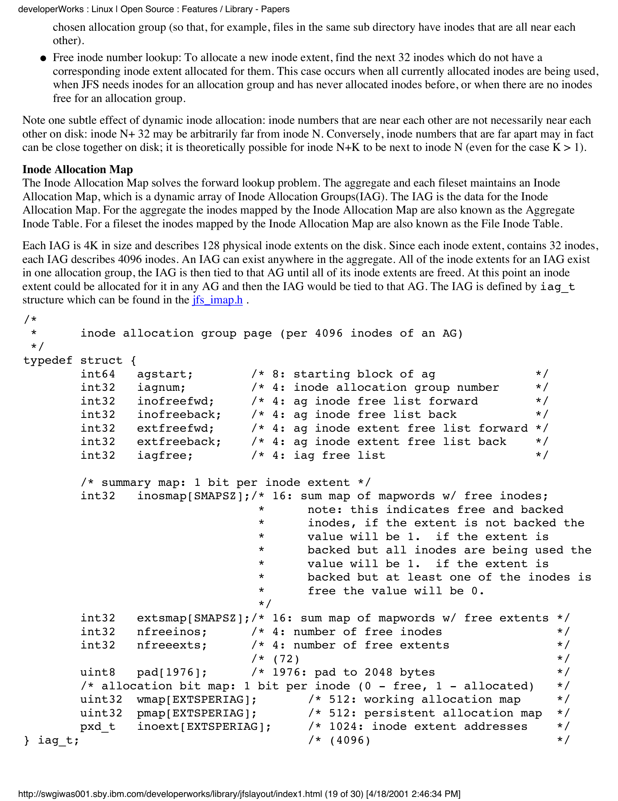
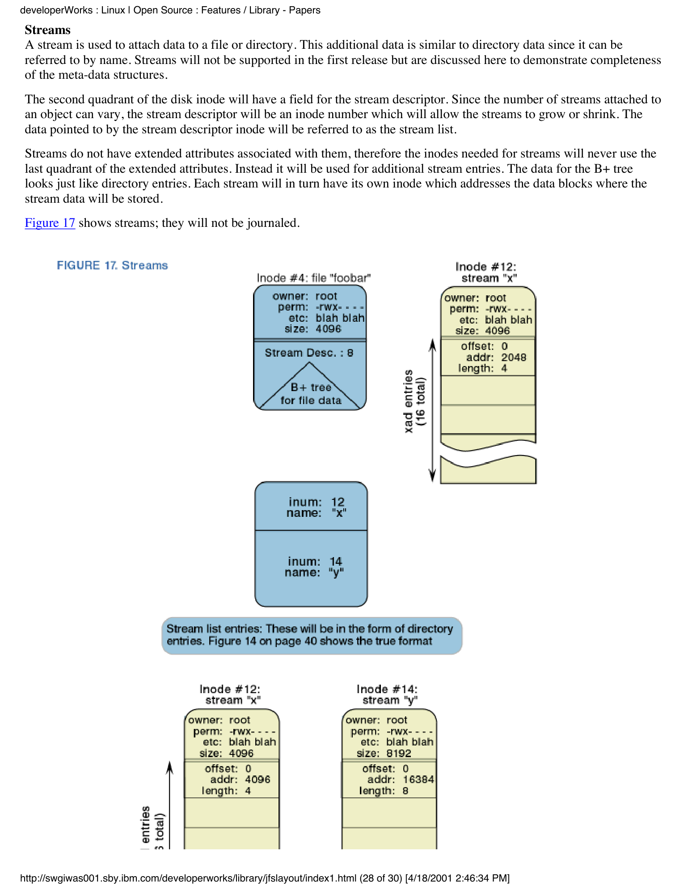

---

## 第 1 页


**提问：** 这张截图里的内容是什么意思？请面向初学者详细解释，分点讲清楚。

# 这页在讲什么


这是 IBM developerWorks 上的一篇老文章（2000 年）在介绍 **JFS（Journaled File System，日志式文件系统）磁盘上的“布局”（on-disk layout）**——也就是 JFS 把数据和元数据在磁盘里是如何分块、分层、索引和管理的。读它的目的：搞清楚 JFS 为什么可靠、怎么提高性能，以及它用了哪些数据结构（比如 **B+ 树**）与概念（分区、聚合、分配组、文件集等）。


---


# 先把几个关键词说人话


* **文件系统（FS）**：操作系统用来在磁盘上存放和查找文件的一整套规则和结构。

* **日志（Journaled）**：把即将进行的更改先写到一份“日志”，宕机时可通过日志把未完成的操作补完或回滚，提升可靠性。

* **磁盘布局（on-disk layout）**：文件系统在磁盘上如何切块、编号、建目录与索引的具体“版图”。


---


# JFS 的“大地图”（从大到小）


可以把磁盘想成一块大地，JFS 先把它分层组织——


1. **Partition（分区）**

   物理磁盘被工具（如 FDISK）切成的连续区域。


   * 有一个 **块大小**（常见 512 字节），决定最小 I/O 单位。

   * 有 **块总数 Nblocks**，以及抽象的地址范围 `[0 .. Nblocks-1]`。

   * 你可以把它理解为“地块的边界”。


2. **Aggregate（聚合）**

   JFS 在一个分区上创建的 **空间池**。它把“怎么分配磁盘空间”和“挂载出的文件树”这两件事解耦。


   * 每个分区上 **一个聚合**。

   * 一个聚合里 **可以容纳多个文件集（fileset）**（文章提到当时首版实际上只支持一个，但元数据按“将来多个”设计）。


3. **Allocation Group，AG（分配组）**

   把一个聚合再切成几块较大的区域，便于并行与局部性（不同地方同时分配、减少碎片）。


   * 你可以把它想成“片区/行政区”。


4. **Fileset（文件集）**

   可挂载的一棵文件/目录子树（用户看到的“文件系统”长相）。


   * 一个聚合里理论上可有多个文件集；每个文件集里有自己的目录、文件等。


5. **Inode / Extent / Block（元数据与数据）**


   * **Inode**：记录“谁的文件、大小、权限、数据放在哪”。

   * **Extent**：一段连续的块（比一块更大一点的连续区），便于少碎片、高吞吐。

   * **Block**：最小的存储单位（上面说的 512B 只是常见值）。


6. **B+ 树**

   JFS 在很多地方用 **B+ 树** 做索引（例如目录项、空间分配表、extents 等），用来 **加快查找与插入**，并让结构随磁盘规模扩展。


> 小结：**磁盘分区 → 聚合（空间池） → 分配组（AG） → 文件集（你挂载看到的树） → 目录/文件（由 inode + extents + blocks 组成）**。


---


# 页面里各小节在说什么（对应右侧目录）


* **Partitions, aggregates, AGs, filesets**：先给出“大图景”，定义上面这些层次与关系。

* **Extents, inodes, B+ trees**：解释文件/目录的数据如何被一段段连续空间（extents）保存，元数据用 inode 描述，并用 B+ 树来做高效索引。

* **Block Allocation Map / Inode allocations / Fileset allocation inodes**：怎么记录“哪些块/哪些 inode 空闲或已用”，以便快速分配和回收。

* **File / Symbolic link / Directory**：单个文件、符号链接、目录在磁盘上的具体布局与结构。

* **ACL / Extended Attribute (EA) / Streams**：访问控制列表、扩展属性、数据流等高级特性在盘上的组织方式。

* **Aggregate with a fileset**：把上述元素拼成一个完整例子。

* **Summary / Resources**：总结与进一步阅读。


---


# 用类比再捋一遍


* **分区**＝一块围好的土地

* **聚合**＝这块地上的“仓库园区”（集中管理地皮）

* **分配组**＝园区里的不同分区块（A 区、B 区…）

* **文件集**＝某家公司承租的一整个仓库区域（对外可“挂载/进入”）

* **inode**＝每个货物（文件）的详细卡片

* **extent**＝连续的一排货架

* **B+ 树索引**＝能快速找到“哪排货架放着哪件货”的目录系统

* **日志**＝每次搬运前先写一张操作单，出事可据此恢复


---


# 为什么这样设计？


* **可靠**：日志先行，掉电/宕机后能恢复到一致状态。

* **快**：B+ 树 + 连续的 extents，查找和顺序读写都高效。

* **可扩展**：AG 把大空间分块管理，减少争用；聚合与文件集解耦，便于将来一个空间池里挂多棵文件树。


---


# 一句话总结


这页是在给你建立 JFS 的“地图”和“索引”观：**把磁盘先分层（分区→聚合→AG→文件集），再用 inode + extents 存文件，用 B+ 树做索引，用日志保可靠**。理解了这张“地图”，后面的每个小节（块分配、目录结构、ACL 等）就只是把这张图填得更细。


---

## 第 2 页


**提问：** 这张截图里的内容是什么意思？请面向初学者详细解释，分点讲清楚。

下面这页图是在**可视化 JFS（日志式文件系统）里“一个聚合（aggregate）在磁盘上的布局”**。把它当成一张“土地使用规划图”。我按从上到下、从左到右讲清楚：


---


## 先认识两个概念


* **聚合（aggregate）**：JFS 在一个分区上建立的**空间池**，后面可以在里面放一个或多个“文件集（fileset）”，也就是对外可挂载的那棵文件树。

* **聚合块大小（aggregate block size）**：在这张图的示例里是 **1KB**，刻度轴上“0、1、2…”就是第几个聚合块。真实系统可选 512/1024/2048/4096 字节。


---


## 这张图每一块代表什么


1. **前 32KB 预留区（RESERVED）**


   * 顶部一整条“RESERVED”：说明聚合开头**固定预留 32KB**，可能给引导信息、对齐等用途，不放文件系统结构。


2. **主/备超块（Primary/Secondary Aggregate Superblock）**


   * 在块号 **32** 处有 **Primary Aggregate Superblock（主超块）**，在右边 **60** 附近有 **Secondary（备份超块）**。

   * **超块**记录这整个聚合的关键参数：大小、块大小、版本、校验等；放两份是为了**容错**。


3. **控制页（Control Page）**


   * 主超块后面紧跟一个 **Control Page**，里面通常是一些管理用的指针/计数/版本号，帮助定位其它元数据。


4. **IAG（Inode Allocation Group 描述）**


   * 再往后是 **IAG**：用于**成组管理 inode** 的分配，方便并行与减少碎片。


5. **聚合 inode 表（Aggregate Inode Table, AIT）**


   * 你看到一条“Aggregate Inode Table: 32 inodes (16KB)” 的带状区域，以及下面“Secondary AIT”。

   * 这说明**每 16KB 里有 32 个 inode**（= 每个 inode 512B）。

   * 这些 inode 不是用户文件的，而是\*\*“aggrinode”（聚合内部文件的 inode）\*\*，用来管理文件系统自身的数据结构。


     * 图中举了几个例子：


       * **aggrinode #1: “self”** → 描述 AIT 自己（自举）。
    
       * **aggrinode #2: block map** → 指向**块分配位图文件**（记录哪个块已用/空闲）。
    
       * **aggrinode #4: bad blocks** → 记录**坏块**列表。
    
     * 每个 aggrinode 右侧的小卡片里有字段：`owner/perm/size/offset/addr/length`，这表示这个“内部文件”的**大小**以及它的数据在磁盘上的**若干个 extent（连续区）**，比如“addr: 36 length: 8”= 从块 36 开始连续 8 个块。


6. **块分配图（Block Allocation Map）**


   * 在块号 **64** 开始的蓝色大块，就是**整个聚合的位图/区图**：一位或一段表示一个块（或一组块）是否被占用。

   * AIT 里的 **aggrinode #2** 就是把它当作一个“文件”来描述和索引的。


7. **副本区域（Secondary AIT / Secondary Aggregate Inode Allocation Map）**


   * 关键的表和位图**也会放副本**（比如 Secondary AIT、Secondary…Allocation Map），继续提升可靠性。


8. **文件集开始（fileset 0 begins here）**


   * 看到“**fileset 0 begins here**”：从这里往后就是你真正会看到的**用户文件/目录**所在的空间。

   * 图里写“（described in aggrinode 16）”，意思是 **aggrinode #16** 是**文件集 0** 的“目录入口/描述符”。


---


## 图下面两条文字在说什么


* **一个聚合具备：**


  1. **前 32KB 的预留区**。

  2. **固定的聚合块大小**（可为 512、1024、2048 或 4096 字节，但**不能小于分区块大小**）。块大小决定了该聚合里**最小分配单位**。


---


## 用类比快速回忆


* 预留区＝“红线内不许建”的缓冲带

* 主/备超块＝“地籍总信息”的两份存档

* 控制页/IAG＝管理科与分配科

* AIT（+ aggrinode）＝**文件系统自己的文件卡片**

* Block Allocation Map＝地块占用的**总平面图**

* fileset 0＝第一家正式入驻的“租户”（用户文件/目录）

* 多处“Secondary …”＝关键档案的**备份柜**


---


### 一句话总结


这张图展示了 **JFS 在一个聚合里的元数据如何分布与互相指向**：

预留区 → 主/备超块 → 控制/分配结构（IAG、块位图） → 聚合用的 inode 表（描述这些结构本身） → 最后才是**文件集区域**给用户文件使用；关键信息都有**冗余副本**，靠 **extents + 位图 + B+ 树** 等机制实现高性能与高可靠。


---

## 第 3 页


**提问：** 这张截图里的内容是什么意思？请面向初学者详细解释，分点讲清楚。

下面这页是在**解释 JFS 的“聚合（aggregate）”里都放了哪些关键结构、它们怎么定位，以及聚合里若干“特殊 inode”的用途**。按新手思路分点说明：


---


## 一、别把两个“块大小”混淆


* **分区块大小（partition block size）**：由磁盘/分区决定的最小 I/O 单位（常见 512B）。

* **聚合块大小（aggregate block size）**：JFS 在这个聚合里自己规定的最小**空间分配**单位（可为 512/1K/2K/4K，不得小于分区块大小）。


---


## 二、聚合中有哪些“核心部件”（都是系统级元数据）


把它们想成“系统文件”（由专门的 inode 描述），关键的都会**放两份**以便恢复：


1. **主/备聚合超块（Primary/Secondary Aggregate Superblock）**


   * 记录聚合的总参数：大小、分配组数、块大小、版本等。

   * 备超块是主超块的直接拷贝；主损坏时可用备份启动恢复。

   * 这些超块在**固定位置**，这样系统不依赖其他结构也能先找到它们。


2. **聚合 inode 表（Aggregate Inode Table, AIT）**


   * 一组 inode，**专门描述“聚合级”的控制结构**（块位图、坏块表、日志位置等）。

   * 这些 inode 不属于任何用户目录，用户看不到。


3. **副本聚合 inode 表（Secondary AIT）**


   * 把上面那批“关键 inode”再复制一份；复制的是“如何找到数据”的索引，不是把数据本体再写一遍。


4. **聚合 inode 映射（Aggregate Inode Map）**


   * 记录 AIT 中每个 inode 的**是否已分配**、**在盘上的位置**等状态。


5. **副本聚合 inode 映射（Secondary Aggregate Inode Map）**


   * 因为 AIT 有副本，所以**映射也有独立的副本结构**来管理那一份。


6. **块分配图（Block Allocation Map）**


   * 管理整个聚合里**每个数据块**是否空闲/占用，基本是“一块对应一位/一格”。


7. **fsck 工作区（fsck working space）**


   * 给 `fsck`（一致性检查修复工具）用来**跟踪每个块使用情况**的专用空间。

   * JFS 支持巨型聚合，内存可能不够，所以把这份位图放在盘上。

   * 位置由超块描述，**在聚合末尾**。


8. **内联日志（In-line Log）**


   * 记录元数据更改的日志空间（便于崩溃恢复）。

   * 位置也由超块描述，**紧跟在 fsck 工作区后面**。


---


## 三、聚合里的“特殊 inode 编号”都管什么


> 创建聚合时先分配第一段 AIT，之后按需增减。下面这些 **Aggregate inode** 是按号码约定用途的“系统文件”：


* **0 号**：保留不用。

* **1 号 “self”**：描述 **AIT 自己**（一个“自描述”的文件）。


  * 这会产生“先有鸡还是先有蛋”的定位问题——JFS规定：**第一段 AIT 放在主超块后 4KB 的固定位置**，这样系统总能先找到 1 号，再沿着 1 号里的 **B+ 树索引** 找到整张 AIT。

  * 为了找到**副本 AIT**，超块里还保存了“副本 AIT 第一段”的位置；据此能定位“副本的 1 号”及其余表项。

* **2 号**：描述 **块分配图（Block Allocation Map）**。

* **3 号**：描述 **内联日志**（挂载时会用到；inode 已分配，但日志内容不是普通数据文件那样写入）。

* **4 号**：**坏块表**。格式化时发现的坏块会在块图里标记为已占用，这个 inode 的“数据”就是这些坏块范围。

* **5～15 号**：预留给将来扩展。

* **从 16 号开始**：**每个文件集（fileset）一个 inode**，称为 **Fileset Allocation Map inode**，用来描述该文件集的控制结构。新增文件集时，AIT 可能需要“长大”来容纳新的这些 inode。


---


## 四、这页要你记住的要点


* 关键元数据**都有副本**，位置可通过**固定规则 + 超块记录**快速找到。

* AIT/块图/日志/坏块表等，都被当作**普通文件那样由 inode + extent 描述**，只是这些文件属于“系统域”。

* `fsck` 与“日志”各有专属空间：一个在末尾作工作位图，一个紧随其后记录元数据变更。


---

## 第 4 页


**提问：** 这张截图里的内容是什么意思？请面向初学者详细解释，分点讲清楚。

下面这页主要讲两件事：**分配组（Allocation Groups, AGs）** 和 **文件集（Filesets）**，并用一张图把“一个聚合里包含两个文件集”的布局画出来。按新手思路分点讲清楚👇


---


## 1) Allocation Groups（分配组）——把大空间切成几块好管理


**是什么**


* 把一个聚合（aggregate）再切成多个“大块”（AG0、AG1…）。每个 AG 里都能独立地分配空间。


**为什么要用 AG**（性能与可扩展性）


* **提高局部性**：尽量把相关数据放近一些（例如目录里的文件常被一起访问；顺序读/写会更快）。

* **减少争用/便于并行**：多个线程/CPU 可以在不同 AG 里同时分配空间，锁冲突更少。

* **分散无关数据**：把不相关的数据分布到不同 AG，避免“一个地方挤爆”。


**如何编号**


* AG 用 **从 0 开始的编号**（AG number）。


**AG 的“大小”怎么定**


* 需要选择一个**固定的 AG 大小**，以减少将来扩容/收缩时要改的元数据次数；JFS **最多 128 个 AG**。

* **AG 大小的最小值**：不得小于 **8192 个“聚合块”**（如果聚合块是 1KB，那么最少 8MB/AG）。

* **AG 大小必须是 2 的幂 ×（一个 dmap page 能描述的块数）**。这是为了跟块分配位图（Block Allocation Map）对齐，便于管理。

* **写在超块里**：所选 AG 大小会记录到 **Aggregate Superblock**。


**如果聚合总大小不是 AG 大小的整数倍**


* 最后一个 AG 会是“**部分 AG**”。逻辑上把它当作完整 AG 管理，但块分配图会把**不存在的块标记为已占用**，从而保证不会被分配到“虚空”。


> 小例子：聚合有 10,000 个块，AG 大小设成 8192 块

> → AG0 = 8192 块；AG1 = 1808 块（部分 AG）。AG1 里“多出来”的那部分会在位图里标成“已占用”，避免被误用。


---


## 2) Filesets（文件集）——聚合里的“可挂载子树”


**是什么**


* 一个文件集就是“一组文件和目录”，能作为**独立的挂载点**（一棵完整的子树）。

* 一个文件集**完全包含在聚合里**。


**能有几个**


* **可以有多个文件集**共存在同一聚合中（图里就有 **fileset 0** 和 **fileset 1**）。


**怎么用空间**


* 多个文件集**共享同一个“空闲块池”**（由聚合级别的控制结构定义，比如 Block Allocation Map）。

* 也就是说，空间是在聚合层统一管理；文件集只是“组织文件的视图/树”。


---


## 3) 图（Figure 2）怎么读：一个聚合里包含两个文件集


> 这张图延续前面讲的结构：超块、控制页、IAG、聚合 Inode 表（AIT）、以及“aggrinode #1/#2”等。


* **上半段：聚合级结构**


  * 左边依次是 **RESERVED（预留区）→ 主超块 → Control Page → IAG**。

  * 接着是 **Aggregate Inode Table（AIT）**；蓝色小圆数字是 **聚合 inode 的编号**。

  * **aggrinode #1 (“self”)**：描述 **AIT 自己**的“文件”，卡片里列出它的 **extents（数据在哪、每段多长）**。

  * **aggrinode #2（block map）**：描述 **块分配图**的 extents。

  * 右边是 **Secondary Superblock（备份超块）**。


* **下半段：文件集出现**


  * **Fileset 0**：出现“**Fileset 0 Inode Table: 1st extent**”字样，表示**文件集 0 的 inode 表的第一段**从这里开始（注意：inode 表可能分成多段存，不一定连续，这就是“extent”的意义）。

  * 你还能看到 fileset 也有**自己的 Control Page、IAG**（用于这个 fileset 的 inode 分配/管理），位置被标在相应的块号附近。

  * **Fileset 1**：紧随其后开始，也有自己的 **Control Page / IAG**。

  * 两个文件集**共享上面的聚合级块分配图**，所以它们的空间来源于同一个大池子。


> 关键理解：

>

> * **聚合级**：管“全局空间”和关键元数据（超块、块位图、聚合 inode 表等）。

> * **文件集级**：管“某棵文件树”的 inode/目录/文件，但**不各自私有空间**，而是向聚合级的空闲池要块。

> * **extent**：任何“大文件”（包括元数据文件，如 AIT、块位图、fileset 的 inode 表）在磁盘上都可能由多段连续区组成。


---


## 4) 记住三句话


1. **AG = 把聚合切分成可并行、局部性更好的大块**；最多 128 个，大小有对齐规则，末尾可有“部分 AG”。

2. **Fileset = 可挂载的文件树**；一个聚合可以有多个 fileset，它们**共享**聚合的空闲块池。

3. 图里蓝线箭头展示了：**聚合 inode（aggrinode）如何描述各个关键结构的 extents**，以及 **fileset 的 inode 表如何在聚合里就位**。


---

## 第 5 页


**提问：** 这张截图里的内容是什么意思？请面向初学者详细解释，分点讲清楚。

下面这页在讲 **“一个 fileset（文件集）里到底有哪些结构、每个 inode 编号干什么、文件数据如何用 extent + B+ 树来管理”**。配图（Figure 2）是“一个聚合里有两个文件集”的放大图。按新手思路分点说明👇


---


## 1) Fileset 里都包含什么


* **Fileset Inode Table（FIT，文件集的 inode 表）**

  存放**描述整个 fileset 控制结构**的一组 inode（逻辑上就是一串 inode）。

* **Fileset Inode Allocation Map（FIAM，文件集 inode 分配图）**

  记录 FIT 里每个 inode 的**是否已分配**、**在磁盘哪儿**。


  * 指向这些东西的“**超级 inode**”（super-inode，其实就是一个普通 inode）并不在 fileset 里，而是在**聚合的 AIT（Aggregate Inode Table）**中；AIT 本身有主/备两份，所以指向 fileset 元数据的“超级 inode”也有**副本**。

  * 刚创建 fileset 时，先给 FIT 分配第一段空间（一个 **extent**），之后需要时再**按需扩/缩**。


> 图里能看到：

>

> * “**fileset inode #2**：fileset 0 的根目录”，

> * “**ACL file**：看起来就是普通 inode，只是数据是 ACL 条目”，

> * 旁注：“**IAG 指到的 fileset inodes 不一定贴着 IAG 放**，**fileset 的文件可以分配在磁盘任何位置**，甚至和别的 fileset 交错”。


---


## 2) Fileset 里的 inode 编号约定


* **inode 0**：保留不用。

* **inode 1**：放一些**FIAM 装不下的额外控制信息**。

* **inode 2**：**根目录**（JFS 沿用 Unix 习惯，文件系统/文件集的根目录 inode 通常是 2）。

* **inode 3**：这个 fileset 的 **ACL 文件**。

* **inode 4 起**：普通对象使用（用户文件、目录、符号链接等）。


---


## 3) Extents、Inodes、B+ 树（JFS 存储文件的三件套）


* **Extent（区段）**


  * 一个对象（文件/目录等）在磁盘上的存储是由\*\*若干个“连续聚合块的片段”\*\*组成的，这个片段就叫 extent。

  * 一个 extent **完全位于一个聚合内**（因此也在同一分区内）；**大的 extent 可以跨多个分配组（AG）**。

  * extent 的大小是可变的：**至少 1 个聚合块**，上限很大（文中给的量级是 **2^24−1 个聚合块**）。

* **Inode（索引节点）**


  * 每个 JFS 对象都有一个 inode：记录所有常见元数据（大小、时间戳、类型等）。

  * **关键**：inode 里还保存一棵 **B+ 树**，用于**索引这个对象的 extents**（哪一段从哪儿开始、多长）。

* **B+ 树（索引）**


  * 让**插入新 extent、查找某个偏移对应的 extent**变得很快、可扩展。

  * 除了超块，JFS 的大多数**元数据结构都被当作“文件”来存**（由 inode + extents + B+ 树描述），这使得**磁盘布局天然可扩展**：加新能力 ≈ 加几个“系统文件”。


---


## 4) 如何读这张图（Figure 2）的关键标注


* “**Fileset 0 Inode Aggregate Map: 1st/2nd extent**”

  → fileset 0 的 inode 表并不一定连续存放，可能由**多段 extent** 组成。

* “**2nd Half of fileset Superblock Information**”

  → fileset 级别的关键信息也可能分布在多段里。

* “**IAG**（Inode Allocation Group）”

  → fileset 也有自己的 inode 分配管理结构。


---


## 5) 记忆小抄


1. **Fileset = 一棵可挂载的子树**，有自己的 inode 表 + inode 分配图；它们被“超级 inode”挂在**聚合的 AIT**下，且有副本。

2. **inode 编号规则简单**：0 保留，1 额外信息，2 根目录，3 ACL，4 起是普通对象。

3. **文件由 extents 组成，inode 里用 B+ 树索引这些 extents**——查找快、扩容容易；JFS 把几乎所有元数据都“文件化”，从而让磁盘布局更易扩展。


---

## 第 6 页


**提问：** 这张截图里的内容是什么意思？请面向初学者详细解释，分点讲清楚。

下面这页讲三块：**extent（区段）到底怎么计、JFS 的分配与碎片整理策略、inode（索引节点）怎么设计与分配**。给初学者分点捋清👇


---


## 一、Extent 是什么、怎么“量”


* **Extent**＝一段**连续**的聚合块（aggregate blocks），是 JFS 分配空间的基本单位。

* 要描述一个 extent 只需要两样：


  1. **长度**（多少个聚合块）

  2. **起始地址**（从聚合开头起第几个聚合块）

* **长度字段用 24 位**，所以一个 extent 的长度范围：**1 ～ (2²⁴ − 1) 块**。


  * 如果聚合块= **512B**：最大 extent ≈ `512 × (2²⁴ − 1)` ≈ **接近 8 GiB**（差 512B）。

  * 如果聚合块= **4096B**：最大 extent ≈ `4096 × (2²⁴ − 1)` ≈ **接近 64 GiB**（差 4 KB）。

  * 注意：这是**单个 extent 的上限**，不是整个文件或文件系统的上限。


---


## 二、为什么用 extent + 可选块大小


* 你可把聚合块大小设小一点（如 512B）来**减少小文件的“内部碎片”**；JFS 不需要额外的“小碎片支持”机制。

* JFS 的分配策略**尽量给大文件少量且尽可能大的连续 extents**：


  * 好处：顺序 I/O 更快、定位少、吞吐高。

  * 但有时做不到，例如：


    * **写时复制（COW）**：复制一个文件的某段可能把大 extent 切成多个小的连续段；
    
    * **压缩文件**：JFS 解压需要把整个 extent 读入内存，所以会**限制压缩文件的 extent 大小**以避免内存不够。

* **碎片整理（defragmentation）工具**：


  * 动态分配/回收可变大小的 extent 会产生**外部碎片**；整理工具会把到处散的小 extents **合并成更大的**，提升顺序性与性能。


---


## 三、Inode（索引节点）里装了什么


* **JFS 的磁盘 inode 固定 512B**，包含四类信息：


  1. **POSIX 基本属性**（所有者、权限、时间戳、类型等）

  2. **JFS 特有/环境信息 + B+ 树的“根部”头信息**

  3. **extent 分配描述符**（要么是 B+ 树根，要么是**内联数据**）

  4. **扩展属性/更多内联数据/更多 extent 描述符**

* 关键点：**每个对象的 extents 由 inode 里的 B+ 树索引**，查找/插入新 extent 都很快。


---


## 四、JFS 的 inode 是**动态分配**的（而不是预留一大片固定 inode 区）


**优势**


* **inode 表块可以放在磁盘任何位置**，**inode 编号与物理位置解耦**：


  * 聚合重组、fileset 重新组织、更改块布局时，inode **编号可不变**；

  * **克隆一个 fileset** 时，只需复制 inode 本身，新的 inode **保持原编号**，目录结构不用改。

* **无需“预估你需要多少 inode”**：JFS 动态创建，官方描述为“可分配的 inode 数量可达你需要的 10 倍”（相对一些需要大幅预留的 FS）。

* **大文件更友好**：静态一次性预留 inode 容易在多个 AG 里占块；动态分配更节省、也更连续。


**代价 / 难点**


* 静态布局“看一眼就知道 inode 在哪”；动态布局则需要\*\*映射结构（maps）\*\*去记录“哪些地方存着 inode”。

* 这些映射对一致性很重要，复制它们会有**额外开销**；JFS 通过**复制 B+ 树等关键结构**来降低丢失风险，确保能重新找到这些映射。


**怎么分配**


* JFS 以\*\*“inode extents”**的形式批量分配 inode：即在磁盘上拿下一段**连续的 inode 区\*\*（一串连续的 inode 槽），需要就再要新的一段。


---


## 五、你需要记住的小结


* **Extent = 连续块**，长度 24 位上限 ⇒ 单个 extent 最大接近 8 GiB（512B 块）或 64 GiB（4 KB 块）。

* **策略**：尽量给大而少的连续 extents；必要时再碎片整理把小段合并。

* **Inode(512B)** 里包含元数据 + **B+ 树索引 extents**。

* **Inode 动态分配**让编号与位置解耦、易扩展/克隆，但需要可靠的映射结构来管理。


---

## 第 7 页


**提问：** 这张截图里的内容是什么意思？请面向初学者详细解释，分点讲清楚。

下面这页讲两块内容：**inode 的批量分配与标识**，以及 **B+ 树里“extent 记录”（xad）的数据结构**。我按新手思路分点说明👇


---


## 一、inode 是怎么成批分配、怎么被识别的


* **inode-extent 的概念**


  * JFS 把 inode 也是按“extent（连续区）”成批拿盘：**一个 inode-extent 固定包含 32 个 inode**。

  * 每个磁盘 inode = **512B**，所以 **一个 inode-extent = 32 × 512B = 16KB**。


* **新拿到的 inode-extent 先是不初始化的**


  * 但是 `fsck` 需要至少能判断“这个 inode 是否在用”。

  * 因此**一旦把某个 inode 标记为“已用”**，就会先写入几项最小信息：


    * **fileset 号、inode 号、时间戳**；
    
    * **它所在的 inode 分配组（IAG）块地址**。

  * 之后靠 inode 里的 **link 计数（硬链接数）** 也能判断“是否在用”。


* **动态 inode 分配 ⇒ inode 号与物理位置无关**


  * 不能像老式静态布局那样“根据编号算位置”。

  * 所以 JFS 用 **Inode Allocation Map（inode 分配图）** 来**查找每个 inode 在哪**。


* **“生成号（generation number）”怎么做**


  * 老做法：给**每个 inode**一个独立计数器；但在动态分配里，那块盘位可能日后拿去存别的，不再是 inode。

  * JFS 的做法：使用**全局一个“inode 生成计数器”**，**每分配一个新 inode 就自增一次**，而不是“重用某个 inode 时才增它自己的计数”。（配合 NFS 等可检测“同号不同代”的情况。）


---


## 二、B+ 树与 xad：文件里每段数据（extent）如何被描述


* **为什么用 B+ 树**


  * 文件/目录最常见操作是**读写**和**顺序追加**；B+ 树能：


    * **快速查找**某个偏移属于哪个 extent；
    
    * **高效追加/插入**新的 extent；
    
    * 删除文件时也能**遍历**整棵树把所有 extent 回收。


* **extent 描述符 xad（extent allocation descriptor）**


  * JFS 用一个结构体 **`xad_t`** 来描述一段 extent，并加上两个对插入/追加很关键的字段：


    * **逻辑偏移**（这段 extent 在**文件内**从哪个偏移开始）；
    
    * **标志位**（如 copy-on-write、是否已分配但尚未落盘记录、压缩相关信息等）。


* **结构字段（合并图中定义翻译）**


  ```c

  struct xad {

      unsigned flag : 8;   // 标志位

      unsigned rsvrd:16;   // 保留，恒为 0

      unsigned off1 : 8;   // ↓ 这两项拼成 40 位“逻辑偏移”

      uint32   off2;       // （单位=聚合块大小）

      unsigned len  :24;   // 长度（24 位，单位=聚合块数）

      unsigned addr1: 8;   // ↓ 这两项拼成 40 位“物理起始地址”

      uint32   addr2;      // （单位=聚合块大小）

  };

  ```


  * **`off1+off2`（40 位）**：extent **在文件内的逻辑起点**（以“聚合块”为单位；换算字节需乘聚合块大小）。

  * **`len`（24 位）**：extent **长度**（多少个聚合块）。

  * **`addr1+addr2`（40 位）**：extent **在磁盘上的物理起始块号**（从聚合开头起算）。

  * **`flag`**：各种状态标志；**`rsvrd`**：预留。


* **xad 同时描述两个“区间”**


  1. **物理区间**：磁盘上从 `xad_address` 开始、连续 `xad_length` 个聚合块；

  2. **逻辑区间**：文件内从 `xad_offset` 开始、长度同为 `xad_length` 的数据范围。


  > B+ 树节点里放的就是一串这样的 xad；查找“文件偏移 X”时，沿树找到覆盖该逻辑区间的记录即可。


---


### 一句话小结


* JFS **按 16KB 一组**批量分配 inode，最小信息先写入便于 `fsck` 判断是否在用；**inode 号与位置解耦**，靠 **inode 分配图** 来找。

* 文件的数据用 **B+ 树 + xad** 记录：每条 xad 给出“**文件内哪段**对应磁盘上的**哪段连续块**，长度多少”，从而让查找、追加、删除都高效且可扩展。


---

## 第 8 页


**提问：** 这张截图里的内容是什么意思？请面向初学者详细解释，分点讲清楚。

这页在继续说明 **xad（extent 记录）是怎么把“文件里的哪一段数据”对应到“磁盘上的哪一段块”**，以及 **inode 里如何存这些记录**。给新手分点讲：


---


## 1) xad 的“两个区间”（逻辑区间 vs 物理区间）


* **逻辑区间（文件内）**


  * 起点：`xad_offset`（单位=**聚合块**数 AGBS）

  * 长度：`xad_length`（单位=聚合块数）

  * 换成“字节”= `xad_offset * AGBS` 到 `xad_offset * AGBS + xad_length * AGBS`。

  * 结论：**文件中的 extent 总是按“聚合块大小”的边界对齐**（因为 offset/length 都以“块”为单位）。


* **物理区间（磁盘上/聚合内）**


  * 起点：`xad_address`（第几个聚合块）

  * 长度：同样是 `xad_length` 个聚合块。


> 图里那根蓝色条就表示：文件里从某个偏移开始的一段数据，被放在聚合里的某个连续块区。


---


## 2) B+ 树如何用 xad 来索引数据


* **JFS 除了目录以外的对象**，都用**同一种 B+ 树结构**来管理 extents。

* **键（key）**= xad 的 **offset**（文件内偏移），所以能快速找到“文件偏移 X 属于哪个 extent”。

* B+ 树的节点里放的就是一条条 **xad 结构**，并按 offset 有序排列。


---


## 3) inode 里怎么存放这些东西（小文件优化 & 大文件扩展）


* 每个磁盘 inode 的后半部分有个 **“数据描述头”**，说明这半块区域里到底存了什么：


  * **小文件**：如果数据本体够小，**直接内联在 inode 里**（不需要 extents/B+ 树，读起来更快）。

  * **大文件**：放不下就把数据放到 **extents** 里，此时 inode 里会存 **B+ 树的根节点**。

* **头部还会写明**：“已经用的 xad 数量”和“还能再放几个 xad”。

* **通常 inode 里预留 8 个 xad 槽位**：


  * **≤ 8 个 extents** 的文件：这 **8 条 xad 就是叶子节点**——inode 直接指向数据 extents（图下“Example 1”说的就是这种）。

  * **> 8 个 extents**：inode 里的 xad 改成**指向 B+ 树的下一层节点**（内部或叶子），树就能继续长，适配更碎/更大的文件。


---


## 4) 一句话记忆


**xad =（文件内起点、长度）↔（磁盘起点、长度）**，单位都是“聚合块”；

**B+ 树按 offset 建索引**，小文件数据可直接塞进 inode；一般有 **8 个 xad 位**，够用就直指数据，不够用就长成一棵树。


---

## 第 9 页


**提问：** 这张截图里的内容是什么意思？请面向初学者详细解释，分点讲清楚。

这页（Figure 4）是在用三个例子，教你**当一个文件拥有的 extents（连续区段）越来越多时，JFS 的 B+ 树怎么“长高”**。核心思路：

inode 里有 **8 个 xad 槽位**（extent 记录）。当 extents 少时，inode 直接指向数据；多了，就把这 8 个槽位用来**指向树节点**（叶子或内部节点），从而扩展容量。


---


## 先回忆几个词


* **extent**：文件在盘上的一段连续块。

* **xad**：记录一个 extent 的“文件内偏移、长度、磁盘起址”。B+ 树的节点里就是一串 xad。

* **叶子节点**：里面的 xad 直接指向“数据 extents”。

* **内部节点**：里面的 xad 指向“下一层节点”（不是数据）。


---


## 例子 1（在上一页已说明，这里只复习）


**≤ 8 个 extents**：

inode 里的 8 个 xad **就当成叶子节点**，直接指向数据 extents。树高=1。


---


## 例子 2（图上方）


**9 ～ 254 个 extents**：


* inode 的 8 个槽位里，**只需 1 个 xad 指向一个叶子节点**；

* 这个**叶子节点**最多能装 **254 条 xad**，每条都指向一个数据 extent；

* 其它 7 个槽位暂时空着。

  👉 树高=2，容量上限＝**254 个 extents**。


（图里你会看到 inode 的第一个 xad 写着 `addr: 412, length: 4` 之类——表示“叶子节点存在聚合块 412 起、占 4 个块”；叶子节点右边画着可容纳 **254** 个 xad 记录。）


---


## 例子 3（图中间）


**255 ～ 2032 个 extents**：


* 需要多个叶子节点；

* **inode 最多可用 8 个 xad，每个都指向一个叶子节点**；

* 每个叶子节点各自最多再装 **254** 个 xad（直接指向数据）。

  👉 树高=2，容量上限＝**8 × 254 = 2032 个 extents**。

  （图里能看到 inode 的第 1、2 个 xad 分别指到两个叶子节点，这些叶子节点的“header”把兄弟叶子链在一起，便于顺序遍历。）


---


## 例子 4（图下方）


**> 2032，直到非常多（最多 516,128）个 extents**：


* 这时 inode 的 8 个 xad **改为指向“内部节点”**；

* **每个内部节点**又能指向 **最多 254 个叶子节点**；

* **每个叶子节点**依旧能指向 **最多 254 个数据 extents**。

  👉 树高=3，容量上限＝**8 × 254 × 254 = 516,128 个 extents**。

  （图里你会看到：inode 的第 1 个 xad 指到一个“内部节点”，这个内部节点再指向 254 个叶子；inode 的第 2 个 xad 可指到另一个内部节点……）


---


## 读图小技巧


* **inode 面板**：上半是“B+tree header”，下半写着 8 个 `xad entries`。

* **节点块上的数字**（如 380、412、560…）：表示该节点在聚合里的**起始块号**；旁边的 `length: 4` 表示该节点占用的块数。

* **“254 xad leaf node entries”**：该节点里能放的 xad 条数上限。

* **兄弟相连**：叶子（以及内部）节点的头部保存兄弟指针，顺序扫描会更快。


---


### 一句话总结


当 extents 少时，**inode 直接指数据**；变多了就**长出一层叶子**；更多时再**加一层内部节点**。每层都以 **“最多 8 个指针 × 每节点 254 条 xad”** 的规律扩展，最大能管理 **516,128** 个 extents。


---

## 第 1 页


**提问：** 这张截图里的内容是什么意思？请面向初学者详细解释，分点讲清楚。

这张截图的内容来自于开发文档，解释了在使用JFS（Journaled File System，日志文件系统）时，如何利用扩展描述符和XAD结构来管理文件分配。以下是详细的解释：

1. **文件分配结构：**

   * 在JFS文件系统中，文件数据不是直接存储在磁盘上的，而是通过一个结构化的方式来管理，这些结构称为“扩展描述符（extent descriptors）”和“XAD结构”。
   * 一个文件在JFS中是通过这些结构来跟踪和管理磁盘上分配的空间。

2. **扩展描述符与XAD结构：**

   * **扩展描述符（Extent Descriptor）：** 这个结构用于描述文件数据存储在磁盘上的位置。它记录了文件的一个连续区域的起始位置和长度。
   * **XAD结构：** 这是JFS用来管理文件空间分配的具体结构。每个XAD结构记录一个文件的一个数据块的物理位置。

3. **B+树的使用：**

   * JFS使用一种称为B+树的数据结构来管理文件系统中的空间分配。B+树是一种平衡树，它可以有效地插入、删除和搜索数据。
   * 每个文件的B+树根节点是通过一个称为XAD结构的节点来管理的。
   * 当文件的数据增加时，新的XAD结构会被添加到B+树中，以便继续跟踪文件的分配情况。

4. **扩展分配：**

   * 文件的空间不是一次性全部分配的，而是随着数据的增加逐渐分配。当文件的一个节点（例如叶节点）被填满时，JFS会为文件的B+树分配更多的空间来继续存储新的数据。
   * 当空间用尽时，JFS会“分裂”B+树，即将其分为多个节点，每个新节点会包含指向新分配空间的XAD结构。

5. **例子解释：**

   * **连续分配：** 如果文件数据是连续存储的，则只需要一个XAD结构来表示文件的所有数据。例如，一个1MB的文件，可以通过一个XAD结构来管理。
   * **分成多个部分存储：** 如果文件被分成多个部分存储（例如在磁盘上分为多个块），那么每个部分会有一个XAD结构来分别表示这些块的位置。
   * **带“空洞”的文件（稀疏文件）：** 如果文件中有部分空间没有被使用（即“空洞”），那么只会为使用的部分分配XAD结构。

6. **具体例子：**

   * **1041377字节文件，连续分配：** 如果一个1041377字节的文件被连续存储，它只需要一个XAD结构来描述。这个结构记录了文件在磁盘上的起始位置和占用的空间。
   * **1041377字节文件，分成三部分：** 如果这个文件被拆分成三部分存储，每部分会有一个独立的XAD结构。这样可以有效地管理不连续的文件空间。
   * **1041377字节的稀疏文件：** 如果文件在某些地方存在“空洞”（没有数据的地方），那么只有实际存储数据的部分会有XAD结构。

总结来说，这部分内容详细介绍了JFS如何通过扩展描述符和XAD结构来高效地管理文件在磁盘上的存储位置，特别是在文件逐步增长和分配空间时，如何动态地管理和分配磁盘空间。


---

## 第 2 页


**提问：** 这张截图里的内容是什么意思？请面向初学者详细解释，分点讲清楚。

这张截图继续说明了JFS（日志文件系统）如何管理文件的存储结构，尤其是在涉及到“稀疏文件”时的存储机制。下面我将逐点解释截图的内容，以便您更好地理解：

### 1. **XAD结构与文件的存储：**

* **XAD结构：** 如前所述，XAD结构用于描述文件在磁盘上分配的空间。每个XAD结构记录了文件中某一部分的物理位置（如起始地址、长度等）。
* **“偏移量（offset）”** 记录了从文件的起始位置开始，当前XAD描述的存储位置。
* **“长度（length）”** 表示该XAD结构所描述的空间范围的大小（以块为单位，通常是1KB的块）。
* **“地址（address）”** 是物理存储地址，指示该部分数据的存储位置。

### 2. **具体示例解析：**

这段截图提供了一个文件在磁盘上是如何通过多个XAD结构进行管理的示例。以下是三个XAD结构的详细信息：

* **xad #0:**

  * **偏移量（offset）为0**：表示文件从头开始存储。
  * **长度（length）为495**：表示文件的前495个1KB的磁盘块是连续存储的。
  * **地址（address）为xxxxx**：代表磁盘上存储这些数据的位置（用“xxxxx”表示，实际是物理存储地址）。

* **xad #1:**

  * **偏移量（offset）为495**：表示接下来的部分从文件的第495个1KB块开始。
  * **长度（length）为22**：表示文件的下一个部分占用了22个1KB的磁盘块。
  * **地址（address）为yyyyy**：指示这个部分数据存储在磁盘上的位置。

* **xad #2:**

  * **偏移量（offset）为517**：表示这个部分从文件的第517个1KB块开始（计算是495+22=517）。
  * **长度（length）为500**：表示文件的最后部分占用了500个1KB的磁盘块。
  * **地址（address）为zzzzz**：指示数据的存储位置。

### 3. **关于偏移量（xad\_offset）字段：**

* **普通文件：** 解释了XAD结构中的`xad_offset`字段如何随着文件的分配而增加。每个XAD结构的偏移量都会是前一个XAD结构的偏移量与长度之和。例如，第一个XAD的偏移量是0，第二个XAD的偏移量是495，第三个XAD的偏移量是517（495 + 22）。
* **非稀疏文件：** 对于一个连续存储的文件，`xad_offset`字段是可以通过前一个XAD的偏移量和长度来推算出来的。

### 4. **稀疏文件（Sparse Files）的示例：**

* **稀疏文件：** 在JFS中，如果文件中有部分数据是空的（即“稀疏”），则这些空的部分不会被实际写入磁盘，只会用来占位。例如，在一个文件中，某部分数据已经写入，但其他部分没有数据，这时JFS只会分配实际写入数据的磁盘空间，而将未写入的部分保持为空。

具体来说，在例子中：

* 文件的前两个字节写入了“hi”。
* 然后写入了1022字节的零（稀疏部分）。
* 最后写入了“bye”，这是文件的最后三个字节。

### 5. **如何分配XAD结构：**

* **稀疏文件的分配：** 即使文件中有空的部分，JFS依然会为实际存储数据的部分分配XAD结构。例如，在这个文件的例子中，尽管中间有空白的空间，JFS依然为存储“hi”和“bye”数据的部分分别分配了XAD结构。

* **xad #0:** 描述了存储“hi”的部分，这个部分占用一个1KB的磁盘块。

* **xad #1:** 描述了存储“bye”的部分，它也占用一个1KB的磁盘块。

### 6. **重要说明：**

* **偏移量（offset）的作用：** `xad_offset`字段对于描述文件的物理存储位置是至关重要的。通过查看这些偏移量，JFS能够精确地确定文件数据在磁盘上的存储位置。对于稀疏文件，偏移量仍然会被记录，只是空白的部分不会占用物理空间。

* **文件系统的优化：** JFS通过使用这些XAD结构来确保磁盘空间的高效使用，即使是稀疏文件也能得到有效管理，而不会浪费磁盘空间。

### 总结：

这部分内容详细介绍了JFS如何处理稀疏文件的分配。即使文件中有空白部分，JFS依然为实际存储的数据部分分配XAD结构，并且使用`xad_offset`字段来准确标识每个数据块的起始位置。


---

## 第 3 页


**提问：** 这张截图里的内容是什么意思？请面向初学者详细解释，分点讲清楚。

这张截图继续说明了JFS（日志文件系统）如何管理文件存储，尤其是在文件非常大的情况下，如何使用多个XAD结构来描述文件的磁盘块分配。截图还介绍了块分配映射（Block Allocation Map）如何用于管理磁盘块的分配。以下是详细的解释：

### 1. **16GB文件，连续分配：**

该示例描述了一个16GB大小的文件，它在磁盘上是连续存储的。对于这样的大文件，JFS需要使用多个XAD结构来描述文件在磁盘上的分配。

* **XAD结构的长度字段：** XAD结构中的`length`字段只有24位，因此它能表示的最大值是2²⁴ - 1。如果聚合块的大小是1KB（如本例所示），那么一个XAD结构能够描述的最大文件大小是(2²⁴ - 1) × 1KB ≈ 16GB。因此，即使文件在磁盘上是连续存储的，JFS也需要多个XAD结构来描述整个文件。

**举例：**

* **xad #0:**

  * **偏移量（offset）为0**：表示文件的起始位置。
  * **长度（length）为16777215**：表示该部分文件占用了16777215个1KB的磁盘块（即16GB减去1KB）。
  * **地址（address）为12345**：表示存储这部分数据的磁盘位置（以物理地址表示）。
* **xad #1:**

  * **偏移量（offset）为16777215**：表示该部分文件的起始位置，从前一个XAD结构结束的位置开始。
  * **长度（length）为1**：表示该部分文件占用了1个1KB的磁盘块。
  * **地址（address）为16789560**：表示这部分数据的磁盘存储位置。

**总结：**

* 对于大文件，JFS需要多个XAD结构来描述文件的每个扩展，即使文件在磁盘上是连续存储的。
* 每个XAD结构都有一个`offset`，指示该部分数据的起始位置，`length`表示文件该部分的长度（以1KB为单位），`address`表示物理存储位置。

### 2. **块分配映射（Block Allocation Map）：**

* **块分配映射的用途：** 块分配映射（Block Allocation Map，简称BAM）用于跟踪磁盘块的分配状态（哪些块已经分配，哪些块是空闲的）。它是由“聚合inode 2”管理的文件，所有文件系统都会使用此映射来管理磁盘空间。

* **文件系统与聚合：** 在JFS中，多个文件系统可以共用一个聚合。一个聚合可以包括多个文件系统，而这些文件系统共享聚合中的磁盘块。块分配映射帮助管理这些共享磁盘块，确保每个文件系统都能够正确分配和释放空间。

* **BAM的动态变化：** 块分配映射的大小会随着聚合的扩展或收缩而动态变化。每当磁盘空间增加或减少时，BAM也会随之调整，以适应新的磁盘块分配。

### 3. **BAM的结构与索引：**

* **BAM的结构：** BAM本身是一个文件，包含了描述磁盘块分配状态的数据。每个BAM文件的页面大小为4KB，包含多个“控制页面”和“数据页面”。这些页面的结构如下：

  * **bmap控制页面（bmap control page）：** 这些页面用于管理块分配映射的控制信息。
  * **dmap控制页面（dmap control page）：** 这些页面管理数据块的分配控制信息。
  * **dmap页面（dmap page）：** 这些页面包含具体的磁盘块分配数据。

* **BAM的索引：** BAM通过一个块映射inode进行索引。每个BAM页面负责管理不同的磁盘块，确保每个磁盘块是否被分配得当。

### 4. **总结与概念解释：**

* **文件大于单个XAD的表示范围时，如何处理：** 对于像16GB这样的大文件，JFS会使用多个XAD结构，即使文件是连续存储的。这是因为XAD结构的`length`字段的大小有限，不能直接表示这么大的文件。

* **BAM的重要性：** 块分配映射是JFS管理磁盘空间的核心机制，它确保了多个文件系统可以共享磁盘空间，并且每个文件系统都能有效地分配和释放空间。

### 总结：

这部分内容深入探讨了如何处理非常大的文件，以及如何使用多个XAD结构来表示这些文件。此外，它还介绍了块分配映射（BAM）的作用，BAM帮助管理文件系统中磁盘块的分配情况，确保磁盘空间的有效使用和管理。


---

## 第 4 页


**提问：** 这张截图里的内容是什么意思？请面向初学者详细解释，分点讲清楚。

这张截图介绍了JFS文件系统中的块分配映射（Block Allocation Map，简称BAM）的具体结构和功能，特别是在如何组织和管理磁盘块的分配。以下是逐点的详细解释，帮助初学者理解这些概念：

### 1. **块分配映射的逻辑与物理结构：**

* **逻辑结构：** 块分配映射（BAM）通过多层结构来管理磁盘块的分配。每一层（L0, L1, L2等）表示一种分配的层次。

  * **L0, L1, L2：** 这些是映射的不同层级，每一层都有自己的作用，帮助定位磁盘上特定块的状态。
  * **Dmap0, Dmap1, Dmap1023：** 这些是存储在不同层级上的映射表，用来表示每个磁盘块是否已分配。

* **物理结构：** 每个映射页的大小为4KB，每个dmap控制页面（dmap control page）包含对这些磁盘块的映射。每个dmap控制页面包含多个bit，每个bit表示一个磁盘块的分配状态。

  * 每个dmap结构的每个bit表示一个磁盘块的分配状态：0代表未分配，1代表已分配。

* **每个dmap包含一个bit：** 每个dmap结构用于表示一个聚合块（aggregate block），并且每个bit表示该聚合块的分配状态。这些信息存储在物理页面中。

### 2. **层次结构的作用：**

* **分层管理：** JFS使用分层结构来优化磁盘块的分配和查找性能。每一层（如L0, L1, L2）代表磁盘块分配的不同层级，每个层级负责管理越来越大的范围。

  * **L0**：管理最小的块，适合快速分配。
  * **L1** 和 **L2**：分别管理更大的块范围，帮助定位较大的空闲块。
* **聚合块（aggregate block）：** 这些块是文件系统中用于存储文件数据的基本单元。每个dmap页面表示一定数量的聚合块，随着文件系统的使用，JFS会持续更新这些块的分配信息。

### 3. **BAM的工作方式：**

* **工作映射（Working Map）：** 用于记录当前磁盘块的分配状态。每当磁盘块被分配或释放时，工作映射都会更新。工作映射与持久映射（persistent map）不同，持久映射记录的是文件系统的永久分配状态。

* **持久映射（Persistent Map）：** 记录磁盘块的永久分配状态，即已经提交的分配信息。如果磁盘块被分配，它会在持久映射中更新为已分配状态。当一个块被释放，它在持久映射中也会被标记为未分配。

### 4. **BAM的更新与故障恢复：**

* **数据一致性：** JFS采用一致性策略，确保在系统发生故障时，块分配映射仍然保持一致。这意味着，即使在系统崩溃后，文件系统能够通过BAM恢复到正确的状态。

* **更新策略：** 每次磁盘块的分配或释放都会导致工作映射和持久映射的更新。分配的块将被更新为“已分配”，释放的块将被更新为“未分配”。

### 5. **dmap控制页面（dmap control page）：**

* 每个dmap控制页面包含了1024个bit，每个bit对应一个磁盘块。当JFS需要管理磁盘块时，它会使用这些控制页面来确定哪些块已分配，哪些块是空闲的。
* 每个控制页面都由`struct dmapctl_t`（在`jfs_dmap.h`中定义）管理，确保映射信息的一致性和正确性。

### 6. **树结构（Tree Structure）:**

* **树结构表示：** 从BAM的一个dmap结构中，JFS构建了一个树结构来记录连续的磁盘块。每个树节点表示一组连续的磁盘块，树的最底层记录的是文件中的最小连续块。
* **树的各个级别：** 树的不同级别管理不同大小的块，帮助文件系统更高效地管理磁盘空间。

### 7. **dmap的详细字段：**

* **树的详细字段：** 在dmap结构中，`tree`字段表示文件系统管理的连续磁盘块集合。每个树的层次表示不同粒度的块范围，底层是最小的块，最上层则是更大范围的块。
* **工作映射与持久映射：** 通过这种树形结构，JFS能够高效地管理磁盘块并确保工作映射与持久映射之间的一致性。

### 总结：

这部分内容介绍了JFS文件系统如何使用块分配映射（BAM）来管理磁盘空间。通过分层结构，BAM能够高效地管理磁盘块的分配和释放。每个dmap控制页面用来记录聚合块的状态，树结构则帮助高效地管理连续磁盘块的分配。JFS的这种管理方式确保了文件系统在大规模数据操作中仍然保持高效和一致性。


---

## 第 5 页


**提问：** 这张截图里的内容是什么意思？请面向初学者详细解释，分点讲清楚。

这张截图描述了JFS文件系统中如何使用\*\*二进制伙伴系统（Binary Buddy System）\*\*来完成块分配映射（Block Allocation Map，BAM）中的叶子级别。它进一步展示了如何根据位图（bitmap）中的空闲位信息来构建树形结构。下面是逐点的详细解释：

### 1. **树形结构与位图：**

* **树形结构：** JFS中的BAM树由多层级组成，每个节点代表文件系统中一个磁盘块的分配状态。树的叶子级别存储的是每个块的实际分配状态（已分配或未分配）。树的每一层都汇聚了更高层次的信息，最终指向每个磁盘块的具体状态。
* **位图（Bitmap）：** 位图用于表示磁盘块的分配情况。每个bit表示一个磁盘块的状态：`0`表示未分配，`1`表示已分配。通过位图，JFS可以快速查找空闲块和已分配块。

### 2. **二进制伙伴系统（Binary Buddy System）：**

* **作用：** 二进制伙伴系统用于优化空闲块的管理。当需要为文件分配空间时，JFS会寻找一段连续的空闲块。如果这段空闲块的大小是2的幂次方（如1, 2, 4, 8, ...），就能有效地管理这些空闲空间。该系统通过将连续的空闲块“配对”来减少碎片化。
* **工作原理：**

  * 在JFS中，首先根据位图获取连续的空闲bit串，然后将这些空闲块（以2的幂次方为单位）分配给需要空间的文件。每个“配对”块被分配时，会在树形结构的叶子级别更新相应的信息。
  * 如果块已被分配，则相应的位置会被标记为已分配（1）；如果空闲，则标记为0。

### 3. **树的分层结构：**

* **层级划分：** 这张截图展示了一个包含342个元素的树结构：

  * **根节点**指向其他子树，最终通过多个层级汇聚到叶子级别，每一层表示不同的聚合块（aggregate block）的状态。
  * **叶子级别**是最终决定块是否已分配的层次，在树的底层，通过二进制伙伴系统来表示哪些块是空闲的。
* **树结构的分布：**

  * 树的每一层都有不同数量的节点。例如，根节点有12个子节点（表示12个大块），第二层有64个节点（表示64个小块），底层有256个节点，最终表示每个磁盘块的状态。
* **层级说明：**

  * **L0, L1, L2：** 每个表示不同层级的树，负责不同范围的磁盘块分配。底层（L2）负责最小的磁盘块范围，而较高层（L0）则覆盖较大的块范围。
  * **dmap控制页面：** 每个页面包括了多个子树，每个子树负责一部分位图的分配信息。

### 4. **如何处理位图：**

* **位图的处理：** 每一层的树结构是基于位图的信息建立的。每个“位图字”中的bit串（0或1）会被转换成一个“二进制伙伴”的信息，用来表示是否有足够的空闲空间。

* **位图的最长空闲串：** 为了优化空间利用，JFS会找到位图中连续的最长空闲bit串（表示空闲空间），然后使用这些连续空闲的空间来分配磁盘块。

* **表示分配状态：** 位图中的每个bit表示一个磁盘块，0表示该块空闲，1表示已分配。JFS通过处理这些位图并利用二进制伙伴系统来分配磁盘块。

### 5. **位图中的示例：**

* **位图与伙伴系统：**

  * **位图样本：** 位图中的每一位表示一个磁盘块的状态。如果连续有空闲的块，它们会被匹配为二进制伙伴（如在位图中找到一个连续的空闲区域，例如连续的几个0）。
  * **二进制伙伴字符串的示例：** 位图样本中的“0”表示空闲，而“1”表示已分配。JFS会查找最长的空闲位串并将其分配给需要的文件。

### 6. **总结：**

这部分内容介绍了如何通过位图和二进制伙伴系统来优化磁盘块的分配和管理。JFS通过树形结构将块分配信息分层管理，通过二进制伙伴系统来高效地处理空闲块的分配，减少碎片化，并确保磁盘空间的有效利用。每个层级的树帮助JFS快速定位空闲块，并通过位图来标记哪些块可以被分配或释放。


---

## 第 6 页


**提问：** 这张截图里的内容是什么意思？请面向初学者详细解释，分点讲清楚。

这张截图继续解释了JFS文件系统如何使用\*\*二进制伙伴系统（Binary Buddy System）\*\*来管理块分配映射（Block Allocation Map，BAM），并介绍了如何扩展文件系统以支持更大的聚合块。下面是逐点的详细解释：

### 1. **二进制伙伴系统与树的叶子节点：**

* **二进制伙伴系统：** 在JFS中，二进制伙伴系统用于处理位图中的空闲块。位图的每一位表示一个磁盘块的状态（0为空闲，1为已分配）。系统通过查找位图中连续的空闲位串来决定如何分配块。
* **树的叶子节点：** 树的叶子节点用于记录具体的磁盘块的分配信息。树结构是通过二进制伙伴系统完成的，尤其是树的最底层，即叶子级别，记录了每个块的实际状态。

### 2. **如何计算叶子节点：**

* **图示解读：**

  * **Indices（索引）：** 位于上方的部分表示树的结构索引，指示了位图中空闲块的分布。
  * **Tree（树结构）：** 这里展示了通过二进制伙伴系统形成的树，每个节点表示一个空闲块的范围。
  * **Array（数组）：** 该部分展示了位图中空闲块的具体状态，值为`-1`表示这些块已经被组合到一起，形成一个大的空闲区域（即伙伴块）。

* **计算过程：** 这个图展示了如何使用二进制伙伴系统来计算树的叶子节点。例如，从位图中找出最大的连续空闲块（如5个空闲块），这些空闲块会被组合起来形成一个更大的空闲区域（使用二进制伙伴表示）。

* **合并：** 右侧的伙伴块被标记为`-1`，表示这些块已经合并在一起，形成一个新的大的空闲块。

### 3. **块分配映射控制页面：**

* **控制页面的作用：** 块分配映射的控制页面用于管理整个文件系统中块的分配状态。每个页面包含1024个元素，这些元素代表位图中的块的分配信息。

  * **L0, L1, L2页面：** 根据树的层级结构，L0页面、L1页面和L2页面分别包含不同数量的块的分配信息。L0页面是最基础的，用于表示最小的空闲块；L1和L2页面则包含较大块的分配信息。

### 4. **扩展块分配映射以增加文件系统空间：**

* **扩展聚合块：** 为了支持更大的文件系统，JFS需要扩展块分配映射，确保能够有效管理更多的磁盘块。这涉及到增加额外的聚合块（aggregate block）。
* **空间分配策略：**

  * **第1步：** 如果现有的聚合块有足够的空间，JFS可以直接在现有聚合块中分配空间，并扩展块分配映射。
  * **第2步：** 如果没有足够的空间，JFS会通过分配新的聚合块来扩展文件系统。这些新的块会用来更新块分配映射，以支持未来的文件系统扩展。
  * **第3步：** JFS会利用一些空闲的聚合块，这些块当前未被使用，重新分配它们以扩展文件系统。

### 5. **块分配映射的恢复：**

* **修复和恢复：** 块分配映射不是日志化的（non-journaled），这意味着它可能在系统崩溃后需要通过`fsck`或`logredo`等工具进行修复。JFS使用\*\*工作映射（Working Map）**和**持久映射（Persistent Map）\*\*来确保文件系统状态的一致性，并能够在系统恢复后保持正常运行。
* **一致性：** JFS通过这两种映射，确保即使在系统发生故障后，文件系统依然能够恢复到一致的状态，避免数据损坏。

### 6. **总结：**

* 这部分内容介绍了如何通过二进制伙伴系统完成块分配映射树的叶子节点，优化磁盘空间的分配。通过位图、树结构和伙伴系统，JFS能够高效地管理磁盘块的分配和释放。
* JFS还提供了扩展文件系统的策略，当需要增加更多磁盘块时，系统会通过增加聚合块来扩展文件系统，以便支持更多的数据存储需求。
* 该系统的设计确保了在系统崩溃或磁盘空间扩展时，能够保持文件系统的完整性和一致性。

通过这种管理方式，JFS能够在处理大规模数据时保持高效，并保证数据的可靠性。


---

## 第 7 页


**提问：** 这张截图里的内容是什么意思？请面向初学者详细解释，分点讲清楚。

这张截图介绍了JFS（日志文件系统）中**块分配映射（Block Allocation Map，BAM）**的另一种表示方法，称为**编码的二进制伙伴系统（Encoded Binary Buddy System）**，以及其如何管理磁盘块的分配。下面是逐点详细解释：

### 1. **块分配映射（BAM）的替代表示：**

* **传统表示与编码的二进制伙伴表示：** 在JFS中，块分配映射（BAM）有两种表示方式。第一种是标准的树结构表示（之前的讨论中已经提到），第二种是编码的二进制伙伴系统表示。这两种表示方法的物理和逻辑结构是相同的，但叶子节点和树结构有所不同。
* **编码的二进制伙伴系统：** 在这种表示方法中，树的叶子节点被“编码”成二进制伙伴系统，这使得分配的块可以更加高效地表示。与传统表示不同的是，编码的伙伴系统在描述块的空闲和分配状态时使用了更紧凑的方式。

### 2. **块分配映射的最底层：**

* **结构体 `struct dmap`：** BAM的最底层是通过 `struct dmap` 定义的。每个 `dmap` 页面覆盖了8KB的聚合块。这意味着每个页面描述了8KB的磁盘空间，并通过二进制伙伴系统来记录磁盘块的分配情况。

* **字段说明：**

  * **nleafs：** 表示树的叶子节点数，树的每个叶子节点描述一块磁盘块的状态。
  * **l2leafs：** 表示第二级树的叶子节点数。
  * **height：** 表示树的高度。
  * **bmin：** 最小的L2叶子值，用于组合。
  * **tree：** 存储树的结构。
  * **pad：** 填充数据，用于对齐。

* 通过这种结构，JFS能够有效地组织磁盘块的分配信息，并在文件系统中动态管理磁盘空间。

### 3. **dmap页面：**

* **dmap页面的结构：** 每个 `dmap` 页面负责8KB的块描述，包含了这些聚合块的状态信息。每个页面包括了工作映射（working map）和持久映射（persistent map）。

* **字段说明：**

  * **nblocks：** 表示此 `dmap` 页面所描述的块的数量。
  * **nfree：** 表示空闲块的数量。
  * **start：** 表示该 `dmap` 页面对应的起始块编号。
  * **tree：** 存储树形结构，描述该页面的聚合块分配。
  * **wmap（working map）：** 表示工作映射，包含了当前聚合块的分配情况。
  * **pmap（persistent map）：** 表示持久映射，记录已提交的块分配状态。

### 4. **每个条目的字段：**

* 每个条目由三个字段组成：

  * **type：** 表示块的类型，指示块是否通过位图（bitmap）描述。如果该块是通过位图描述的，那么 `type` 会标记为“bitmap”类型，否则是“don't care”类型（表示无需关注该块的具体描述）。
  * **size：** 表示块的大小，通常使用2的幂表示（如1KB, 2KB, 4KB等）。
  * **bitmap：** 位图字段用于表示块是否已分配。每个bit表示一个块的状态，`0` 表示空闲，`1` 表示已分配。
* **“don't care” 类型：** 对于某些块，它们的分配状态不重要（可能是空闲块或不关心的块），这种情况下，`type` 会标记为“don't care”。这些块的左伙伴和右伙伴会被组合成更大的空闲块。

### 5. **二进制伙伴系统的工作原理：**

* **伙伴块的组合：** 在编码的二进制伙伴系统中，当两个相邻的空闲块（称为伙伴块）被分配时，它们会组合成一个更大的空闲块。系统会根据块的大小来决定哪些块可以组合，并更新树结构。
* **伙伴块的管理：** 伙伴系统确保块的大小始终是2的幂，空闲块会尽可能合并成较大的块。每当块被分配或释放时，二进制伙伴系统会更新以保持正确的块大小和状态。

### 6. **JFS如何扩展文件系统：**

* **扩展聚合块：** 为了扩展文件系统，JFS会增加额外的空间来扩展块分配映射。这可能涉及到增加额外的 `dmap` 页面或扩展现有的块分配结构。系统通过动态管理和分配额外的空间来确保文件系统可以按需扩展。

### 7. **JFS扩展方法：**

* **增加聚合块：** 当文件系统需要更多空间时，JFS会分配新的聚合块，并更新 `dmap` 页面来扩展文件系统的总容量。
* **分配新页面：** 如果现有的空间不足，JFS会分配新的页面，并通过修改 `dmap` 来管理这些新页面的分配状态。

### 总结：

这部分内容介绍了JFS中块分配映射的**编码的二进制伙伴系统**，并阐述了如何通过 `dmap` 页面、树形结构和位图来管理磁盘块的分配。JFS通过这种高效的管理方式确保磁盘空间能够动态分配，并能够应对文件系统的扩展需求。每个块的分配和释放都通过二进制伙伴系统进行管理，确保磁盘空间的利用最大化。


---

## 第 8 页


**提问：** 这张截图里的内容是什么意思？请面向初学者详细解释，分点讲清楚。

这张截图继续介绍了JFS（日志文件系统）中**编码的二进制伙伴系统**（Encoded Binary Buddy System）的应用，并通过一个具体示例展示了如何管理空闲块。截图中还提到如何使用\*\*摘要树（Summary Tree）\*\*来优化搜索，帮助快速定位连续空闲块的位置。下面是逐点解释：

### 1. **块分配的状态变化：**

* **状态说明：** 每个框代表了一个特定的状态，表示磁盘块的分配情况。每一组展示了**不同大小的空闲块**如何被分配给不同的实体（如文件 A、B、C）。

* **示例解读：**

  * **1. 128个块空闲：**

    * **类型（Type）为 F，表示这些块是空闲的（Free）。**
    * **位图（Bitmap）表示空闲的块范围**，如 0-31、32-63、64-95 和 96-127 分别表示4组空闲块。
  * **2. 64-95块分配给A：**

    * **类型（Type）为 A，表示这些块分配给了A。**
    * **位图**标明了这些块在位图中的具体位置，其他位置则保持为空闲（DC表示这些块无关）。
  * **3. 96-127块分配给B：**

    * **类型（Type）为 B，表示这些块分配给了B。**
    * 对应的位图在块分配中也显示了状态的变化。
  * **4. 0-63块分配给C：**

    * **类型（Type）为 C，表示这些块被分配给了C**。
    * 这里块的分配情况也在位图中清晰地表示出来。
  * **5. 61-63和64-95块被释放：**

    * **类型（Type）为 B，表示这些块被释放，状态改为未分配。**
    * 位图中的相应位被设置为`0`，表示这些块已空闲。
  * **6. 96-127块被释放：**

    * **类型（Type）为 F，表示这些块现在是空闲的**。
    * 位图中的相应位也更新为`0`，这些块重新变为空闲状态。

### 2. **编码的二进制伙伴系统示例：**

* **作用：** 这些示例展示了编码的二进制伙伴系统如何高效地管理空闲块。每个空闲块的大小和分配状态通过位图和类型字段进行表示。
* **空闲块的合并与分配：**

  * 在编码的二进制伙伴系统中，如果一组空闲块（即“伙伴块”）合并为更大的块，系统会更新其分配状态和位图，以确保文件系统中的块分配信息是最新的。

### 3. **摘要树（Summary Tree）：**

* **树的作用：** 摘要树用于**加速空闲块的搜索**，避免无效的搜索。它通过提供更高层次的总结信息来确定哪些区域是空闲的，从而避免了直接检查位图的需要。
* **结构说明：**

  * **每一层的树**包含一个**总结信息**，它们记录了每一层最大的连续空闲块范围。例如，底层树记录了位图中的最大连续空闲块，而上层树记录了这些空闲块的汇总信息。
  * **这样可以快速判断哪些块区域为空闲状态**，提高了搜索效率。

### 4. **树结构的详细信息：**

* **dmap结构中的树：** 树结构存储在dmap中，它是一个**平坦数组**，每个条目描述一组连续的空闲块。通过树结构，JFS能够追踪每一部分空闲块的大小和位置。
* **底层树的结构：**

  * 底层树（如树 \[21] 和树 \[84]）记录了**最大连续空闲块的数量**，并映射到**编码的二进制伙伴表示**，以便能够高效处理大量的空闲块。

### 5. **工作映射（Working Map）与持久映射（Persistent Map）：**

* **工作映射（wmap）与持久映射（pmap）：**

  * **工作映射**记录当前聚合块的分配和空闲状态，是文件系统实时使用的状态。
  * **持久映射**记录已经提交的块分配状态，确保系统在恢复时能够恢复到一致的状态。

### 6. **合并空闲块：**

* 在编码的二进制伙伴系统中，**相邻的空闲块**会被组合成更大的空闲块。如果这些空闲块的大小是2的幂，系统会将它们合并在一起，形成更大的空闲区域，从而优化空闲空间的管理。

### 总结：

这部分内容详细介绍了**编码的二进制伙伴系统**如何在JFS中管理空闲块，提升了空闲块搜索的效率。通过使用**摘要树**来汇总空闲块信息，JFS能够快速定位空闲区域，避免了无效搜索。此外，**二进制伙伴系统**的工作方式确保了空闲块能够高效地合并，最大化磁盘空间的利用。通过这套管理方式，JFS能高效地处理文件系统中的块分配和释放，同时确保数据的一致性。


---

## 第 9 页


**提问：** 这张截图里的内容是什么意思？请面向初学者详细解释，分点讲清楚。

这张截图继续介绍了JFS（日志文件系统）中**编码的二进制伙伴系统**（Encoded Binary Buddy System）的应用，并通过一个具体示例展示了如何管理空闲块。截图中还提到如何使用\*\*摘要树（Summary Tree）\*\*来优化搜索，帮助快速定位连续空闲块的位置。下面是逐点解释：

### 1. **块分配的状态变化：**

* **状态说明：** 每个框代表了一个特定的状态，表示磁盘块的分配情况。每一组展示了**不同大小的空闲块**如何被分配给不同的实体（如文件 A、B、C）。

* **示例解读：**

  * **1. 128个块空闲：**

    * **类型（Type）为 F，表示这些块是空闲的（Free）。**
    * **位图（Bitmap）表示空闲的块范围**，如 0-31、32-63、64-95 和 96-127 分别表示4组空闲块。
  * **2. 64-95块分配给A：**

    * **类型（Type）为 A，表示这些块分配给了A。**
    * **位图**标明了这些块在位图中的具体位置，其他位置则保持为空闲（DC表示这些块无关）。
  * **3. 96-127块分配给B：**

    * **类型（Type）为 B，表示这些块分配给了B。**
    * 对应的位图在块分配中也显示了状态的变化。
  * **4. 0-63块分配给C：**

    * **类型（Type）为 C，表示这些块被分配给了C**。
    * 这里块的分配情况也在位图中清晰地表示出来。
  * **5. 61-63和64-95块被释放：**

    * **类型（Type）为 B，表示这些块被释放，状态改为未分配。**
    * 位图中的相应位被设置为`0`，表示这些块已空闲。
  * **6. 96-127块被释放：**

    * **类型（Type）为 F，表示这些块现在是空闲的**。
    * 位图中的相应位也更新为`0`，这些块重新变为空闲状态。

### 2. **编码的二进制伙伴系统示例：**

* **作用：** 这些示例展示了编码的二进制伙伴系统如何高效地管理空闲块。每个空闲块的大小和分配状态通过位图和类型字段进行表示。
* **空闲块的合并与分配：**

  * 在编码的二进制伙伴系统中，如果一组空闲块（即“伙伴块”）合并为更大的块，系统会更新其分配状态和位图，以确保文件系统中的块分配信息是最新的。

### 3. **摘要树（Summary Tree）：**

* **树的作用：** 摘要树用于**加速空闲块的搜索**，避免无效的搜索。它通过提供更高层次的总结信息来确定哪些区域是空闲的，从而避免了直接检查位图的需要。
* **结构说明：**

  * **每一层的树**包含一个**总结信息**，它们记录了每一层最大的连续空闲块范围。例如，底层树记录了位图中的最大连续空闲块，而上层树记录了这些空闲块的汇总信息。
  * **这样可以快速判断哪些块区域为空闲状态**，提高了搜索效率。

### 4. **树结构的详细信息：**

* **dmap结构中的树：** 树结构存储在dmap中，它是一个**平坦数组**，每个条目描述一组连续的空闲块。通过树结构，JFS能够追踪每一部分空闲块的大小和位置。
* **底层树的结构：**

  * 底层树（如树 \[21] 和树 \[84]）记录了**最大连续空闲块的数量**，并映射到**编码的二进制伙伴表示**，以便能够高效处理大量的空闲块。

### 5. **工作映射（Working Map）与持久映射（Persistent Map）：**

* **工作映射（wmap）与持久映射（pmap）：**

  * **工作映射**记录当前聚合块的分配和空闲状态，是文件系统实时使用的状态。
  * **持久映射**记录已经提交的块分配状态，确保系统在恢复时能够恢复到一致的状态。

### 6. **合并空闲块：**

* 在编码的二进制伙伴系统中，**相邻的空闲块**会被组合成更大的空闲块。如果这些空闲块的大小是2的幂，系统会将它们合并在一起，形成更大的空闲区域，从而优化空闲空间的管理。

### 总结：

这部分内容详细介绍了**编码的二进制伙伴系统**如何在JFS中管理空闲块，提升了空闲块搜索的效率。通过使用**摘要树**来汇总空闲块信息，JFS能够快速定位空闲区域，避免了无效搜索。此外，**二进制伙伴系统**的工作方式确保了空闲块能够高效地合并，最大化磁盘空间的利用。通过这套管理方式，JFS能高效地处理文件系统中的块分配和释放，同时确保数据的一致性。


---

## 第 10 页



**提问：** 这张截图里的内容是什么意思？请面向初学者详细解释，分点讲清楚。

这张截图介绍了JFS（日志文件系统）中**inode分配映射（Inode Allocation Map）**的结构和功能。该映射解决了**前向查找问题**，并确保文件系统能够高效地管理inode（索引节点）的分配。以下是逐点的详细解释：

### 1. **inode分配映射（Inode Allocation Map）：**

* **作用：** Inode Allocation Map（简称IAG）解决了前向查找问题。每个文件系统和聚合都会维护一个**Inode Allocation Map**，它是一个动态的**inode分配组数组（Inode Allocation Groups，IAG）**。这个数组包含了JFS系统中所有inode的分配信息。
* **前向查找问题：** 通过Inode Allocation Map，文件系统可以在磁盘上找到指定inode所在的磁盘块。它通过将inode分配映射到特定的\*\*聚合块（aggregate block）\*\*来解决inode的查找问题。

### 2. **inode分配组（Inode Allocation Group，IAG）：**

* **IAG的大小：** 每个IAG的大小为4KB，包含128个inode扩展（inode extents）。每个inode扩展包含32个inode。具体来说，IAG描述了**4096个inode**，并且所有inode都被映射到一个特定的磁盘块区域。
* **IAG的作用：** IAG是Inode Allocation Map的核心数据结构，它包含了所有inode的分配状态，并指示文件系统中哪些区域已经被分配，哪些区域是空闲的。

### 3. **inode分配过程：**

* **inode的分配：** 当JFS需要分配一个inode时，它会通过IAG查找该inode所属的聚合块，并找到一个空闲的inode来进行分配。
* **动态分配：** inode分配是动态的，不同于传统的静态inode分配。inode编号不再直接映射到磁盘上的特定逻辑块，因此需要IAG来维护和管理inode的分配情况。

### 4. **结构体 `iag_t` 的定义：**

* **定义inode分配组：** 结构体 `iag_t` 定义了每个Inode Allocation Group的结构。每个IAG包含了多个字段，描述了inode的分配状态以及如何将这些inode分配到磁盘上的不同区域。
* **字段说明：**

  * **`agstart`**：表示IAG的起始块号。
  * **`inofreefwd`** 和 **`inofreeback`**：分别表示inode的空闲链表的前向和后向指针，用于快速定位空闲的inode。
  * **`extfreefwd`** 和 **`extfreeback`**：分别表示inode扩展的空闲链表的前向和后向指针。
  * **`inorecord`**：记录inode的分配状态。
  * **`extmap`** 和 **`extfmap`**：分别用于映射空闲和已分配的inode扩展。

### 5. **summary map（摘要映射）：**

* **`inomsmap` 和 `extsmsmap`：** 这些字段是摘要映射，记录了该IAG中所有inode扩展的空闲和分配情况。

  * **`inomsmap`**：该映射记录了每个inode扩展的空闲或已分配状态。如果某个inode扩展为空闲的，那么该映射值为1；如果已经分配，则值为0。
  * **`extsmsmap`**：类似地，该映射记录了inode扩展的空闲和已分配状态，用于优化inode的分配和回收。
* **`nfreeinos` 和 `nfreeexts`：** 这些字段分别记录IAG中**空闲inode**和**空闲inode扩展**的数量。它们提供了文件系统中可用空间的实时信息，便于JFS动态分配inode。

### 6. **工作映射与持久映射：**

* **工作映射（`wmap`）** 和 **持久映射（`pmap`）**：

  * **工作映射**：记录当前可用的inode分配空间，以及它们的实时分配状态。它是系统运行时的动态映射。
  * **持久映射**：记录已提交的inode分配信息，用于文件系统恢复时保证一致性。

### 7. **inode扩展的管理：**

* **inode扩展（inode extent）：** 每个inode分配的区域被称为inode扩展，系统通过IAG来追踪这些inode扩展的分配和回收。IAG中的字段用于快速定位和管理这些inode扩展，以提高文件系统性能。

* **inode扩展的空闲管理：** 通过`extfreefwd`和`extfreeback`指针，文件系统可以高效地管理空闲的inode扩展，确保inode分配的高效性。

### 8. **inode分配与释放的灵活性：**

* **动态分配：** inode号不再与物理磁盘块直接映射，因此文件系统可以灵活地在不同区域分配inode。通过动态的IAG结构，JFS能够高效地分配和回收inode，以适应不断变化的文件系统需求。
* **反向查找：** 如果需要释放inode，JFS会通过反向查找机制来确定哪些inode扩展已经被释放，并将其添加到空闲链表中。

### 总结：

这部分内容详细介绍了JFS中**inode分配映射**（Inode Allocation Map）的结构和工作原理。通过动态的inode分配，JFS能够高效地管理inode的分配和回收，避免了传统文件系统中inode分配的限制。IAG数据结构为文件系统提供了灵活的inode管理方案，确保文件系统能够高效运行并支持动态扩展。


---

## 第 11 页


**提问：** 这张截图里的内容是什么意思？请面向初学者详细解释，分点讲清楚。

这张截图深入解释了**Inode Allocation Map**（inode分配映射）在JFS（日志文件系统）中的工作原理，以及如何通过该映射来查找inode的位置。以下是逐点的详细解释：

### 1. **Inode Allocation Map的定义：**

* **Inode Allocation Map**是一个动态扩展的数组，用于记录JFS文件系统中inode的分配情况。这个映射用于存储与\*\*Inode Allocation Groups（IAG）\*\*相关的信息。
* **IAG（Inode Allocation Group）**：是JFS文件系统中inode的分配单位。每个IAG描述了多个inode，Inode Allocation Map通过这些IAG来管理inode的分配。

### 2. **IAG和文件系统映射：**

* **IAG的页面：** 每个IAG对应文件系统中的一部分，并在文件系统中作为文件进行存储。这个文件是**文件系统的自描述结构**，它通过**B+树索引**来存储和管理。每个IAG页面包含一定数量的inode和相关的分配信息。
* **文件系统中的位置：** 文件系统使用**B+树**来索引IAG页面的物理位置。这样可以高效地查找和分配inode，确保JFS在磁盘上进行有效的inode管理。

### 3. **工作映射和持久映射：**

* **工作映射（Working Map）**：记录当前的inode分配情况。它包含了系统实时的inode分配状态。
* **持久映射（Persistent Map）**：记录已提交的inode分配情况，确保文件系统在发生系统崩溃时，能够恢复到一致的状态。

### 4. **位图和inode分配：**

* **位图：** 在Inode Allocation Map中，每个IAG控制块包含一个位图（bitmap）。位图中每一位对应一个inode。如果该位置为0，表示inode是空闲的；如果为1，表示inode已经被分配。
* **性能优化：** 摘要映射（Summary Map）是用于优化inode查找和分配的工具。它记录每个IAG中的inode分配情况，并通过位图快速确定空闲的inode。

### 5. **通过inode号查找inode位置：**

为了查找给定inode的物理位置，Inode Allocation Map通过以下几个步骤来完成：

* **步骤1：找到对应的IAG：**

  * **IAG键（key）**：给定inode号，首先需要通过计算公式（如公式1）来确定该inode所在的IAG。IAG的键是由inode号除以每个IAG内的inode数量得到的偏移量。
  * **公式1**：`iag key = ((inode number / inodes per iag) * inodes per iag) + 4096`

    * 这里，`inode number`是目标inode的编号，`inodes per iag`表示每个IAG中包含的inode数量。

* **步骤2：确定IAG中具体的inode：**

  * **inode索引（inode index）**：通过公式（如公式2）找到目标inode在该IAG中的位置。
  * **公式2**：`inode index = (inode number) mod (inodes per iag)`

    * 这一步确定了目标inode在IAG中的具体位置。

* **步骤3：查找inode所在的inode扩展：**

  * **inode扩展（inode extent）**：每个IAG包含多个inode扩展，每个扩展表示一定数量的连续inode。通过公式（如公式3），找到包含目标inode的inode扩展。
  * **公式3**：`inode extent descriptor = (iag inode index) / (inode per inode extent)`

    * 这一步根据IAG中的inode索引，找到包含目标inode的扩展。

* **步骤4：计算inode的偏移量：**

  * 最后，使用公式（如公式4）计算目标inode在inode扩展中的具体偏移位置。
  * **公式4**：`inode offset = ((iag inode index) mod (inodes per inode extent)) * sizeof(inode)`

    * 这一步通过计算偏移量，确定inode在磁盘上的具体位置。

### 6. **查找示例：**

* **查找inode #9157：** 通过上述步骤，JFS可以使用Inode Allocation Map来查找特定inode（例如inode #9157）的物理位置。此过程通过IAG在聚合inode表中的映射来进行，确保JFS能够高效地定位到inode的位置。

### 7. **文件系统结构和Inode Allocation Map：**

* **文件系统聚合和inode：** Inode Allocation Map的设计允许在文件系统的聚合块中灵活地分配inode，这种方式帮助JFS高效地管理inode的分配和释放，尤其是在文件系统的扩展和维护过程中。

### 总结：

这部分内容详细介绍了如何通过**Inode Allocation Map**来查找inode的物理位置。JFS使用\*\*IAG（Inode Allocation Group）\*\*和位图来跟踪inode的分配状态，并通过几个步骤（查找IAG、计算inode偏移量等）来定位目标inode的位置。通过这些步骤，JFS能够高效地管理inode分配，并确保文件系统能够灵活、可靠地运行。


---

## 第 12 页


**提问：** 这张截图里的内容是什么意思？请面向初学者详细解释，分点讲清楚。

这张截图继续解释了JFS（日志文件系统）中**inode查找过程**，特别是如何通过**B+树**和**Inode Allocation Map**（inode分配映射）来查找特定inode（例如inode #9157）。另外，截图还提到了一些优化文件系统管理的策略。以下是逐点的详细解释：

### 1. **inode查找过程：**

* **步骤概述：** 该图通过一个实例（查找inode #9157）展示了如何使用**B+树**和**Inode Allocation Map**来查找特定inode。

* **B+树索引：** 文件系统中通过**B+树**索引来管理inode信息。B+树的根节点包含指向各个\*\*Inode Allocation Group（IAG）\*\*的指针，叶子节点则存储实际的inode地址。

* **公式说明：** 图中展示了查找inode #9157的过程，具体步骤如下：

  **iag key** 计算：

  * **公式：**

    ```
    iag key = ((inode number / num_inodes_per_iag) * num_inodes_per_iag) + 4096
    ```
  * **解释：**

    * `inode number`是目标inode的编号（在此例中为9157）。
    * `num_inodes_per_iag`表示每个IAG中包含的inode数量（在此例中为4096）。
    * 通过公式，可以确定目标inode的IAG位置。

  **计算步骤：**

  * `iag key = ((9157 / 4096) * 4096) + 4096 = 12288`
  * 这个值表示目标inode所在的IAG的偏移量。

  **inode索引：**

  * **公式：**

    ```
    iag inode index = inode number mod num_inodes_per_iag
    ```
  * **计算：**

    * `iag inode index = 9157 mod 4096 = 965`
  * 这表示在对应IAG中的inode索引。

  **inode扩展描述符：**

  * **公式：**

    ```
    inode extent descriptor = iag inode index / num_inodes_per_extent
    ```
  * **计算：**

    * `inode extent descriptor = 965 / 32 = 30`
  * 这表示目标inode所在的inode扩展描述符。

  **inode偏移量：**

  * **公式：**

    ```
    inode offset = (iag inode index mod num_inodes_per_extent) * sizeof(dinode)
    ```
  * **计算：**

    * `inode offset = (965 mod 32) * 512 = 5 * 512 = 2560`
  * 这表示目标inode在inode扩展中的具体偏移量。

### 2. **简化的inode查找：**

* 为了简化JFS的维护命令，并帮助理解inode的分配方式，系统确保每个**inode扩展**的大小为**4KB**。通过这一策略，文件系统能够高效地管理inode并快速定位。

### 3. **Inode Allocation Group（IAG）：**

* **IAG的作用：** 每个IAG描述了特定区域内的多个inode。文件系统通过**Inode Allocation Map**来追踪和管理这些IAG，从而在需要时快速查找inode。
* **固定大小的IAG：** 为了优化文件系统性能，JFS确保每个IAG都有固定的大小（4KB），并且每个IAG可以包含多个inode。通过这种方法，文件系统能够管理inode的分配。

### 4. **AG Free Inode List（AG空闲inode列表）：**

* **逆向查找：** AG Free Inode List用于解决**逆向查找问题**，即从磁盘块号反向查找inode。为了减少扩展或截断的过程，JFS会在聚合块内固定最大数量的IAG。
* **文件系统优化：** 通过这种方式，JFS能够减少不必要的磁盘操作，提高inode分配的效率。

### 5. **分配inode的过程：**

* **AG分配：** JFS通过IAG和AG Free Inode List来分配inode。当分配一个新的inode时，文件系统会查找空闲的IAG，并将其与inode关联，从而实现高效的inode分配。

### 6. **图示的工作方式：**

* 图示中，**B+树**帮助文件系统定位目标inode。根节点通过**IAG的偏移量**（`iag key`）定位具体的IAG，然后通过进一步的计算确定inode所在的扩展和具体偏移量。
* **每个IAG**包含多个inode分配信息，文件系统通过这种结构保证快速查找和高效的inode管理。

### 总结：

这部分内容解释了**inode查找的过程**，展示了如何使用**B+树**和**Inode Allocation Map**来查找和定位inode。通过一系列的计算步骤，JFS能够快速找到特定inode的物理位置，并确保inode的动态分配和管理。此外，文件系统通过**AG Free Inode List**优化了inode的分配过程，确保了高效的资源管理和inode查找。


---

## 第 13 页


**提问：** 这张截图里的内容是什么意思？请面向初学者详细解释，分点讲清楚。

这张截图描述了**AG Free Inode List**（AG空闲inode列表）在JFS（日志文件系统）中的作用、结构以及如何管理inode的分配。下面是逐点详细的解释，帮助初学者理解其中的概念：

### 1. **AG Free Inode List的定义：**

* **AG Free Inode List**解决了JFS中的**反向查找问题**和**空闲inode查找问题**。它帮助JFS快速定位一个特定的**inode分配组（Inode Allocation Group，IAG）**，从而找到对应的inode。
* **IAG的作用：** IAG表示一个inode分配单元，包含多个inode，JFS通过IAG来管理inode的分配情况。

### 2. **如何管理空闲inode：**

* 当一个inode被分配或删除时，它会被添加或移除到**AG Free Inode List**中。具体来说：

  * **inode分配：** 如果为某个inode分配了一个新的inode扩展，它会被插入到该列表的头部。
  * **inode删除：** 如果一个inode扩展从已满的区域中删除，它会从AG Free Inode List中移除。

### 3. **AG Free Inode List的结构：**

* **列表结构：** 每个**IAG**在AG Free Inode List中都有一个对应的条目。这些条目包含了指向**inode扩展（inode extent）**的指针（称为IE）。每个**IAG控制部分**包含指向下一个inode扩展的前向和后向指针。
* **链表结构：** AG Free Inode List本身是一个链表，每个IAG条目指向下一个空闲inode扩展。
* **-1标记：** 列表中的每个条目都用-1表示结尾，表示没有更多的条目。

### 4. **AG Free Inode List的操作：**

* **插入操作：** 每当为IAG分配新的inode扩展时，新的inode扩展会被插入到AG Free Inode List的头部。这个插入是一个\*\*先进先出（FIFO）\*\*的操作。
* **删除操作：** 如果某个inode扩展中的inode被删除，它会从AG Free Inode List中移除。当一个IAG的所有inode扩展都被释放后，它会从列表中被删除。

### 5. **AG Free Inode List的作用：**

* **反向查找：** AG Free Inode List的设计帮助JFS通过**反向查找**快速找到空闲的inode扩展。通过这个列表，JFS能够知道在哪个IAG中可以找到空闲的inode。
* **空闲inode查找：** 每个文件系统都有自己的AG Free Inode List，JFS可以通过它来快速找到空闲的inode扩展，而无需扫描整个磁盘。

### 6. **AG Free Inode List示例：**

* **图示分析：** 在图示中，显示了AG Free Inode List的具体布局。每个AG（如AG0、AG1等）都包含一个`head`指针，指向该AG中空闲inode的第一个条目。
* **空闲inode的管理：**

  * **AG0**中有多个空闲inode条目。
  * **AG3**中没有inode扩展，因此它没有出现在AG Free Inode List中。

### 7. **IAG Free Inode List与IAG控制块：**

* **IAG控制块：** 每个IAG的控制部分包含**前向和后向指针**，指向该IAG内空闲inode的具体位置。通过这些指针，JFS可以快速管理和分配inode。

### 8. **文件系统的结构与inode分配：**

* **文件系统中的inode分配：** 文件系统中的inode是动态分配的，不再像传统文件系统那样预先分配。AG Free Inode List和IAG控制块共同作用，确保了JFS能够高效管理inode分配和回收。

### 9. **JFS文件系统管理的优化：**

* **减少延迟和冗余操作：** 通过AG Free Inode List，JFS减少了冗余的inode查找操作，提高了文件系统的效率。
* **最大化磁盘利用率：** 通过精确管理inode的分配，文件系统能够避免碎片化，最大化磁盘空间的利用。

### 总结：

这部分内容详细介绍了**AG Free Inode List**在JFS中的结构和作用。通过这个列表，JFS能够高效地管理inode分配和回收，快速定位空闲inode的存储位置，从而提高文件系统的性能和效率。**IAG**和**inode扩展**的结合使得文件系统能够灵活处理inode分配，而不需要扫描整个磁盘。


---

## 第 14 页


**提问：** 这张截图里的内容是什么意思？请面向初学者详细解释，分点讲清楚。

这张截图继续解释了JFS（日志文件系统）中如何管理**inode分配**、**文件表示**、**符号链接**、**目录**等。它还介绍了**IAG Free Next**和**文件系统inode**的细节，以及如何通过**B+树**来管理这些数据结构。下面是逐点的详细解释：

### 1. **IAG Free Next：**

* **作用：** `IAG Free Next`帮助解决**空闲inode查找问题**。它允许JFS找到下一个应该分配的inode。这个计数器实际上充当了**inode号生成器**的作用，确保每次inode分配时，inode号能够按照顺序分配，而不需要反向查找。
* **工作原理：** 当一个inode被删除并且空闲时，`IAG Free Next`会指向下一个可以分配的inode位置。
* **每个聚合（aggregate）都拥有自己的`IAG Free Next`计数器**，并且每个文件系统都有一个单独的计数器，用于追踪空闲inode的分配情况。

### 2. **文件系统inode（Fileset Allocation Inodes）：**

* **作用：** 文件系统inode是一种特殊的inode，表示**fileset**（文件集）。这些inode并不代表常规的文件，而是**存储文件集信息的超级inode**。
* **文件系统inode的管理：** 文件系统inode用于描述文件集的分配情况，它们包含文件集的元数据，并在**B+树**中被索引。

### 3. **文件表示：**

* **文件的表示：** 文件在JFS中是通过一个inode来表示的。每个文件inode包含指向该文件数据的指针（例如，通过B+树索引）。
* **B+树索引：** JFS使用B+树来管理文件的存储。B+树的根节点和内部节点指向文件数据的扩展，确保文件系统可以高效地定位文件数据。

### 4. **符号链接（Symbolic Link）：**

* **符号链接的定义：** 符号链接是一种特殊类型的inode，它通过`di_mode`字段指示该inode是一个符号链接（`S_IFLNK`）。符号链接包含指向另一个文件路径的引用。
* **符号链接的存储：**

  * **路径存储：** 符号链接的完整路径名会存储在inode内，如果有空间的话。如果没有空间，路径名将作为数据存储在inode的扩展中，而inode会通过B+树进行索引。

### 5. **目录（Directory）：**

* **目录的定义：** 在JFS中，目录是一个经过日志记录的数据结构。目录由多个目录条目组成，每个条目链接到一个inode号，并指向目录中的对象。

* **B+树排序：** 目录条目会按名称排序，以提高查找特定目录项的效率。JFS使用B+树对目录进行排序，从而快速定位指定目录项。

* **目录inode的`di_size`字段：**

  * `di_size`表示目录的B+树的叶子节点大小。目录的叶子节点包含目录条目，它是指向文件系统中具体对象的链接。
  * 当目录的叶子节点指向目录数据时，`di_size`字段通常为256（每个目录最多包含256个条目）。

* **处理`.` 和 `..`（当前目录和父目录）：**

  * 目录不会包含具体的`.`（当前目录）和`..`（父目录）条目，这些条目将由inode本身表示。`inode`中的特殊字段 `idotdot` 和 `struct droot_t` 将表示父目录。

### 6. **目录的B+树和后缀压缩（Suffix Compression）：**

* **目录的B+树：** 目录的inode通过B+树结构来管理。B+树的叶子节点存储具体的目录条目，并且按目录名进行排序。
* **后缀压缩：** 对于目录B+树的叶子节点，JFS会对最后一个条目（通常是`..`或`.`）进行**后缀压缩**，以节省存储空间。

  * **后缀压缩的作用：** 这种压缩技术减少了目录条目末尾重复的部分，确保文件系统能够节省空间，同时提高性能。

### 7. **图示说明：**

* 图示展示了**后缀压缩**如何应用于目录B+树的叶子节点。压缩只对目录中较为常见的条目（例如`..`或`.`）应用，这样可以显著减少目录项的存储开销。
* **B+树的叶子节点：** 对于每个目录B+树的叶子节点，JFS会将常见的目录项压缩为一个更小的条目，并通过B+树的结构索引。

### 总结：

这部分内容详细描述了JFS如何通过**inode**和**B+树**来高效管理**文件、符号链接**和**目录**。文件和符号链接通过inode表示，而目录则使用B+树来存储条目，并通过后缀压缩技术优化存储空间。**目录的管理**利用了高效的B+树索引结构，并通过动态更新inode和B+树来实现快速访问。


---

## 第 15 页


**提问：** 这张截图里的内容是什么意思？请面向初学者详细解释，分点讲清楚。

这张截图详细展示了JFS（日志文件系统）如何通过**后缀压缩**（Suffix Compression）和**目录B+树**来优化存储和管理目录中的条目。它首先解释了后缀压缩如何工作，然后展示了目录B+树的结构。以下是逐点详细解释：

### 1. **后缀压缩（Suffix Compression）：**

* **后缀压缩的定义：** 在目录中，条目（如文件名）可能有相同的前缀。JFS使用后缀压缩技术来减少重复的前缀信息，从而节省存储空间。

* **示例：**

  * 假设我们有4个条目：`apple`, `application`, `banana`, `barn`。
  * 这些条目有相同的前缀：`a` 和 `appli`。
  * 通过后缀压缩，JFS只保留每个条目相对于前一个条目的差异：

    * 对于`apple`和`application`，我们只需要保存前缀`a`和`appli`，剩余部分（如`pple`和`cation`）被压缩存储。
    * 对于`banana`和`barn`，我们只需要存储`b`和`ar`。

* **优势：** 这种方式显著减少了重复数据，特别是在处理大量相似条目时，可以节省大量存储空间。

### 2. **B+树的工作原理：**

* **B+树的使用：** JFS使用B+树来存储目录条目。目录条目会按字母顺序插入到树中，B+树的结构保证了目录项的高效查找。

* **B+树的叶子节点：**

  * 叶子节点包含实际的目录条目（例如文件名）。通过后缀压缩，文件名可以高效存储。

* **B+树的内部节点：**

  * 内部节点用于索引叶子节点，并帮助快速定位目标文件或目录。

### 3. **图示的结构：**

* **后缀压缩后的条目：**

  * 在图示中，我们看到`apple`, `application`, `banana`, `barn`经过后缀压缩后变成了`a`, `appli`, `b`, `bar`。每个条目都保留了相同的前缀，仅记录了与前一个条目的差异。
* **B+树的结构：**

  * **目录B+树的节点**：图示展示了**目录B+树的叶子节点**和**内部节点**。每个节点存储了一个目录条目，并指向下一个节点或数据块。
  * **叶子节点（4K Leaf Node）**：存储实际的目录条目，并指向下一个节点。
  * **内部节点（4K Internal Node）**：存储指向叶子节点的指针，帮助快速查找目标目录条目。

### 4. **目录条目的存储：**

* **条目长度：** 每个目录条目都包含一个字段，表示条目的长度、偏移量、名称等信息。

  * **`length`**：表示条目的长度。
  * **`offset`**：表示条目在内存中的位置。
  * **`name`**：表示条目的名称（例如文件或目录名）。
* **条目排列：** 在B+树的叶子节点中，条目会按字母顺序排列，确保目录查找高效。

### 5. **目录B+树节点的具体结构：**

* **叶子节点（Leaf Node）：**

  * 目录的叶子节点存储了具体的条目信息，每个叶子节点包含了若干个目录条目，并且这些条目被按顺序排列。
* **内部节点（Internal Node）：**

  * 目录的内部节点包含指向子节点的指针，帮助文件系统通过层次结构快速查找文件。每个内部节点也包含与节点相关的其他信息（如`next`指针、`name`等）。
* **目录条目示例：**

  * `inum`：表示inode号，指向目录条目的具体位置。
  * `name`：表示目录项的名称。

### 6. **B+树中的后缀压缩：**

* **压缩后的条目存储：** 在B+树的叶子节点中，压缩后的条目将按压缩后的前缀存储，这使得空间得到优化，同时查找速度不受影响。

### 总结：

这部分内容解释了JFS如何通过**后缀压缩**来优化目录条目的存储，减少重复数据，从而节省空间。同时，它还介绍了如何通过**B+树**结构来管理目录，确保高效的查找和存储。通过这种方法，JFS不仅优化了磁盘空间，还提高了文件系统的性能。


---

## 第 16 页


**提问：** 这张截图里的内容是什么意思？请面向初学者详细解释，分点讲清楚。

这张截图详细描述了JFS（日志文件系统）中**目录B+树**（Directory B+ Tree）的结构和操作。它解释了如何使用B+树来组织和管理目录条目，以及如何在目录变大时进行扩展。以下是逐点的详细解释：

### 1. **目录B+树的概念：**

* **B+树的作用：** 在JFS中，目录条目（如文件或子目录）通过B+树进行组织。B+树提供了一个高效的索引结构，确保能够快速查找、插入和删除目录条目。
* **固定大小的目录槽（Directory Slots）：** 目录B+树的每个节点都有固定大小的**目录槽**，这些槽用来存储目录条目或路由器条目。每个槽的大小是32字节，这样可以避免删除目录条目时产生的内部碎片问题。
* **槽的管理：** 目录B+树通过\*\*目录槽数组（Directory Slot Array）\*\*来管理当前正在使用的槽。它保证了在目录条目添加或删除时，可以通过快速移动数据避免重新排列整个树的节点。

### 2. **目录B+树的头信息：**

* **树头（Tree Header）：** 目录B+树的头部包含了指示该节点是**内部节点**还是**叶子节点**的信息。树头还包含该节点是否是根节点的标志、块的地址、以及指向目录槽数组的**nextindex**（目录槽的索引位置）。字段`stblindex`告诉系统树头中用于存储的最后一个目录槽的索引。
* **空闲槽列表（freelist）：** 用于跟踪哪些槽是空闲的，这有助于JFS优化目录条目的插入与删除操作。

### 3. **目录B+树的插入与删除：**

* **目录槽数组：** 目录槽数组存储所有当前目录项的索引，JFS使用这个数组来追踪哪些槽被使用，哪些是空闲的。这个机制减少了内部碎片的生成，因为每次插入或删除目录条目时，槽数组内的数据会调整而不是重新排列整个树结构。
* **目录插入：** 当目录项插入时，它被添加到目录槽数组的头部。如果插入的条目过大，或者目录已满，系统会动态扩展目录。
* **目录删除：** 删除目录项时，JFS会移除对应的槽，保持目录槽数组的高效管理。

### 4. **目录B+树的扩展：**

* **扩展机制：** 当目录变大时，JFS通过扩展B+树节点来处理更多条目。初始的目录叶子节点的大小是4KB，但随着目录条目的增加，如果该节点已满，JFS会分配更多的空间来存储新的条目。
* **目录扩展过程：**

  1. **初始目录项存储：** 目录项最初存储在内联数据区。
  2. **目录叶节点满时扩展：** 当目录的内联数据区填满时，JFS会为目录分配一个新的叶子节点，并将数据存储到新的叶子节点中，确保目录能够继续增长。
  3. **再次扩展：** 如果叶子节点仍然不足以存储新的目录条目，JFS会双倍扩展目录空间。若扩展的空间不够，JFS会为目录分配一个新的扩展区域，并将原数据复制到新的扩展区域。

### 5. **B+树中的路由器条目（Router Entries）：**

* **路由器条目：** 路由器条目用于在目录B+树中找到特定节点，它们通过**压缩的键值**帮助索引目录中的条目。路由器条目可以继续扩展，直到找到目标目录项。

### 6. **目录的分配和扩展：**

* **目录扩展的策略：** 当目录空间用尽时，JFS会根据以下步骤扩展目录：

  * **初始化节点：** 如果目录节点未满，JFS会将目录条目添加到现有节点。
  * **扩展：** 当节点已满时，JFS会分配新的节点并将数据复制过去，目录条目会在新节点中插入，直到目录扩展到更大的空间。

### 7. **B+树的压缩与空间优化：**

* **空间优化：** 为了避免目录数据存储中的冗余，JFS采用了压缩机制，尤其是通过后缀压缩减少重复数据的存储，确保磁盘空间得到最大化利用。

### 8. **图示说明：**

* **图中的节点：** 图示展示了目录B+树的节点结构。每个节点都是一个4KB的页面，其中包含指向目录条目的索引和数据。
* **目录槽数组的管理：** 每个节点的目录槽数组用于追踪和管理目录条目的存储和扩展。

### 总结：

这部分内容详细描述了JFS如何通过**B+树**来管理和扩展目录，特别是如何通过**固定大小的目录槽**、**动态扩展目录节点**和**后缀压缩**技术来优化目录的存储。JFS通过这种方式确保了高效的目录查找、插入和删除操作，同时最大化了磁盘空间的利用。


---

## 第 17 页


**提问：** 这张截图里的内容是什么意思？请面向初学者详细解释，分点讲清楚。

这张截图详细展示了**目录页的扩展**过程，并介绍了\*\*访问控制列表（ACL）\*\*在JFS（日志文件系统）中的应用。以下是逐点详细解释，帮助初学者理解其中的概念。

### 1. **目录页的增长（Directory Page Growth）：**

* **目录B+树的增长：** 当JFS中的目录页（目录B+树的叶子节点）空间被填满时，系统会进行扩展，以容纳更多的目录条目。图示展示了目录页从**1K叶节点**到**2K叶节点**的扩展过程。

* **1K叶节点（1K Leaf Node）：**

  * 初始的目录叶节点是1KB大小，每个目录项都以32字节为单位存储。
  * 每个目录槽中存储一个inode号（如`inum: 492`）和相应的目录项（如`name: application.t`、`name: apple`、`name: banana`等）。
  * 如果当前节点没有足够空间容纳新目录项，JFS会分配新的空间。

* **2K叶节点（2K Leaf Node）：**

  * 当目录项继续增加且1KB叶节点不再足够时，系统会分配一个更大的2KB叶节点。
  * 新的叶节点扩展了目录树的容量，可以容纳更多的目录条目。
  * 新的目录条目（例如`name: orange`）会插入到这个2KB节点中。

* **目录页扩展规则：**

  1. **初始化叶节点：** 首先为目录分配一个1KB的叶节点来存储目录条目。
  2. **填充叶节点：** 如果1KB叶节点填满并且空间不足，JFS会分配一个新的2KB叶节点。
  3. **继续扩展：** 如果2KB叶节点仍然无法容纳所有条目，继续进行相同的扩展，直到目录页达到4KB的大小。
  4. **删除条目：** 当目录页中的所有条目都被删除时，JFS会从B+树中移除该页，帮助目录回收空间。

### 2. **目录扩展的具体步骤：**

* **步骤3：** 当目录页的叶节点已满时，JFS会继续分配新的空间，直到目录叶节点达到4KB大小为止。
* **步骤4：** 如果叶节点再次满了且仍未达到4KB，JFS会继续分配新的叶节点并重复扩展过程。
* **步骤5：** 当目录页中的所有条目被删除后，JFS会从B+树中删除空的目录页，并让目录空间回收至最小使用。

### 3. **访问控制列表（ACL，Access Control List）：**

* **ACL的定义：** 每个JFS中的inode都与\*\*访问控制列表（ACL）\*\*关联，ACL用于管理对文件或目录的访问权限。ACL可以指定用户、组或其他实体的访问权限，如读、写、执行等操作。

* **ACL的作用：** 通过ACL，JFS能够控制谁可以访问特定的文件或目录，以及他们可以执行的操作。每个inode的ACL定义了特定对象的访问规则。

* **ACL的存储：** 虽然ACL在磁盘和内存中都有表示，但JFS将其表示为一个“外部表示”。外部表示存储在最多8192字节的空间中，确保ACL能够适应较大的文件系统需求。

* **聚合inode的ACL：** 对于聚合inode（管理文件系统多个inode的inode），JFS会忽略ACL字段。

* **目录的额外ACL：** 除了常规的ACL外，目录对象可能会有**附加的ACL**，用于控制对该目录中特定对象的访问。通常，目录的ACL会与常规的ACL共同作用。

### 4. **总结：**

* **目录页的扩展：** JFS通过动态扩展目录叶节点来处理目录增长的需求，确保目录能够容纳更多条目，且在条目删除后会自动回收空间。
* **ACL的作用与管理：** 通过访问控制列表（ACL），JFS能够管理用户对文件和目录的访问权限。每个inode和目录对象都可以有相应的ACL来控制权限，确保文件系统的安全性和合规性。

这部分内容展示了JFS如何在管理目录时高效扩展空间，并通过ACL确保文件和目录的访问控制，提升了文件系统的灵活性和安全性。


---

## 第 18 页


**提问：** 这张截图里的内容是什么意思？请面向初学者详细解释，分点讲清楚。

这张截图解释了JFS中\*\*访问控制列表（ACL）**和**扩展属性（EA）\*\*的布局与管理方法。它详细说明了如何存储和访问ACL文件以及扩展属性的实现。以下是逐点的详细解释：

### 1. **ACL文件布局：**

* **ACL文件存储：** 在JFS中，访问控制列表（ACL）用于管理文件或目录的权限。ACL被存储在文件系统中的一个专门文件中，称为**ACL文件**，并且每个文件集（fileset）都有一个ACL文件来存储ACL条目。

* **ACL文件的结构：**

  * **位图（Bitmap）：** 每个ACL文件都需要一个**位图**来定位空闲区域，存储ACL条目。位图的大小为4KB，表示256个256字节的空间单元。位图用于标识ACL文件中哪个区域是空闲的，方便后续分配存储空间。
  * **ACL条目：** 每个ACL条目是存储在ACL文件中的访问控制规则。每个文件集（fileset）都有一个**ACL文件**，它由对应的**inode 1**表示。

* **ACL文件的布局：**

  * **位图：** ACL文件的前4KB用于存储位图，位图帮助管理文件中哪些区域是空闲的。
  * **ACL条目：** 这些条目紧接着位图后，存储实际的访问控制信息，位图为每个256字节的空间单元设置一个位，指示该空间是否被使用。

* **扩展区域：** 如果位图中有足够的空间，JFS会在文件中继续增加更多的ACL条目，扩展存储空间。这种方式确保JFS能够动态调整文件存储容量。

### 2. **ACL文件的设计：**

* **逻辑和物理存储：** ACL文件被设计为每个文件集的专用文件，存储与文件集相关的所有ACL。文件集的第一个inode（inode 1）将代表这个ACL文件，并存储访问控制的相关信息。
* **文件系统管理：** 通过位图和扩展区域，JFS能够有效管理ACL的分配与回收。位图帮助JFS快速定位空闲空间，而扩展区域确保ACL条目能够根据需要进行动态扩展。

### 3. **扩展属性（EA，Extended Attributes）：**

* **扩展属性（EA）概述：** 扩展属性是JFS中用于存储附加信息的数据结构，通常用于存储非标准的文件元数据。EA是一个通用的存储和访问机制，可以与文件或目录相关联。

* **EA存储：**

  * EA可以存储在inode内，也可以存储在单独的扩展区域中，具体取决于EA的大小。如果EA小于一定大小，它会直接存储在inode内。如果EA较大，它会存储在外部的扩展区域（称为**EA扩展**）中。

* **EA描述符：**

  * \*\*EA描述符（EA descriptor）\*\*用于描述扩展属性的具体位置和大小。每个EA条目包含EA的名称和值，JFS会通过搜索inode来访问EA。

* **EA数据的管理：**

  * 如果EA数据存储在inode内，EA描述符将指示它的偏移量和长度。
  * 如果EA数据存储在外部扩展区域，EA描述符将指示数据的存储位置。EA数据会被写入到指定的扩展区域。

* **EA数据的写入：** JFS会同步写入EA数据，即EA数据始终为“完整数据”或“完全未写入数据”。EA数据的更改会被日志化，确保文件系统的一致性。

### 4. **EA的非日志化特性：**

* **EA数据非日志化：** 与常规文件数据不同，EA数据不是通过日志记录（journal）进行存储的，但它会在同步操作时与内联数据一起写入。JFS通过同步写入保证EA数据的一致性，但它不记录EA的操作细节。

### 5. **总结：**

* **ACL文件管理：** JFS通过位图和扩展区域管理ACL文件，确保能够高效地分配和回收ACL条目的存储空间。ACL的管理包括存储文件和目录的访问权限，JFS通过位图和扩展空间来动态管理ACL。
* **扩展属性（EA）的管理：** EA用于存储附加元数据，可以存储在inode内或外部扩展区域。EA数据会被同步写入，确保一致性，但它不被日志化。JFS通过描述符来管理EA的位置和大小。

JFS通过这些机制高效地管理ACL和扩展属性，确保了文件系统的灵活性和扩展性。


---

## 第 19 页



**提问：** 这张截图里的内容是什么意思？请面向初学者详细解释，分点讲清楚。

这张截图介绍了JFS（日志文件系统）中的**Streams**（流）特性，以及流如何与文件和目录关联，存储额外的数据。以下是逐点详细解释，帮助初学者理解这些概念：

### 1. **Stream的概念：**

* \*\*Stream（流）\*\*用于将附加数据附加到文件或目录。这些附加数据类似于目录条目，因为它们可以通过名称来引用。
* **流与文件和目录的关系：** 流允许将附加数据（例如元数据、文件的额外内容等）关联到文件或目录。流的概念可以帮助处理那些除了主文件数据之外的额外信息。

### 2. **流的存储方式：**

* **第二象限的磁盘inode：** 每个文件的磁盘inode的第二象限（即`disk inode`的结构中）将包含一个**流描述符字段**。这个字段将指向流的inode，这样就可以支持附加多个流到一个文件或目录。
* **流描述符：** 流的描述符是一个inode号，这使得可以动态增加或减少流的数量，流的大小将随着需要进行调整。
* **流数据的存储：** 流的数据将存储在由流描述符指向的inode中。流的数据与文件的主数据类似，但它们是附加的。

### 3. **流不使用扩展属性：**

* **没有扩展属性：** 与文件的扩展属性（EA）不同，流没有扩展属性。因此，用于存储流的inode不会使用扩展属性的最后四个象限空间，而是会使用该空间来存储流列表条目。
* **流数据存储：** 流的实际数据将存储在类似目录条目的结构中，目录结构用于组织多个流条目。

### 4. **流的inode和B+树：**

* **每个流有一个inode：** 每个流都有一个对应的inode，它指向存储流数据的实际数据块。这与文件数据的处理方式类似，每个流的数据块也会被B+树索引来实现快速查找。
* **B+树的存储结构：** 流的元数据和流数据都通过类似文件的B+树结构来进行索引和管理。流的每个条目就像目录条目一样，在B+树中以索引形式组织。

### 5. **图示的解释：**

* **流描述符（Stream Descriptor）：** 图示中展示了一个文件的inode（`inode #4`），它包含一个流描述符（Stream Desc.）。这个描述符指向一个流列表，列出了该文件所关联的流。

  * 例如，`inode #12`表示与文件相关的流`"x"`，`inode #14`表示流`"y"`。这些流的描述符列出了它们的元数据（如文件权限、大小等）。

* **流条目：** 流的条目以类似于目录条目的方式组织。例如，`inode #12`和`inode #14`分别表示流`"x"`和流`"y"`的条目。每个条目包含流的名称、大小、偏移量和数据的实际存储位置。

* **流的inode：** 每个流都有一个对应的inode，它指向该流的实际数据。在图中，流`"x"`存储在`inode #12`，大小为4096字节；流`"y"`存储在`inode #14`，大小为8192字节。

### 6. **流的操作：**

* **流数据的写入与删除：** 流数据的写入和删除会影响流描述符所在的inode。与文件的主数据类似，流数据也会存储在文件的inode中，并通过流描述符进行访问。
* **流的添加与删除：** 流可以动态添加或删除。流的添加和删除由流描述符来管理，JFS会根据需要调整流的数据块。

### 7. **流的特性：**

* **不进行日志记录：** 流本身不会进行日志记录，因此它们不像常规文件数据那样被完全记录在JFS的日志中。这意味着流数据的修改不会像普通文件那样记录变动。
* **可变大小：** 流的大小是可变的，JFS支持动态扩展流的空间以容纳更多的数据。

### 总结：

这部分内容解释了\*\*JFS中的流（Streams）\*\*是如何为文件和目录提供附加数据存储的。流描述符允许文件或目录关联多个流，每个流都有一个自己的inode来存储数据块。流不像常规文件数据那样使用扩展属性，但它们通过B+树结构来高效管理存储。流的数据和元数据通过流描述符和相应的inode进行组织，流的大小和数量可以动态调整。


---

## 第 20 页


**提问：** 这张截图里的内容是什么意思？请面向初学者详细解释，分点讲清楚。

这张截图展示了\*\*JFS文件系统中的聚合（Aggregate）和文件集（Fileset）\*\*的结构，详细解释了聚合中如何包含文件集，以及如何通过多种数据结构（如B+树、文件集inode、文件集inode分配映射等）来管理这些文件和目录。以下是逐点详细解释：

### 1. **聚合（Aggregate）和文件集（Fileset）**

* **聚合（Aggregate）**是JFS中的一个存储单元，通常表示一块大的磁盘区域，用于存储文件系统的元数据和数据块。聚合包含多个**inode**、**superblock**等关键结构。
* **文件集（Fileset）**是JFS中的一个逻辑单位，用于管理一个或多个文件。每个文件集都有自己的**inode表**、**文件集inode**等结构，文件集帮助组织文件和目录。

### 2. **图示分析：**

* **主聚合超级块（Primary Aggregate Superblock）：** 这是JFS聚合的起始区域，包含了整个聚合的基本信息，如大小、分配策略、是否有文件集等。
* **控制页面（Control Page）：** 控制页面用于存储关于聚合的管理信息，包括inode表的结构等。
* **聚合inode表（Aggregate Inode Table）：** 这部分包含了聚合中所有inode的索引，包括文件集inode、坏块标记inode等。
* **聚合块分配映射（Block Allocation Map）：** 这部分用于追踪聚合中已分配的和空闲的块。

### 3. **文件集的组成：**

* **文件集inode：** 图中展示了两个文件集的inode：

  * `fileset inode #0`：表示一个文件集，包含了**空闲inode列表**和一些**文件集超级信息**。
  * `fileset inode #2`：表示另一个文件集，包含**根目录inode**和**ACL文件**（控制文件集的访问权限）。
* **文件集inode分配映射（Fileset Inode Allocation Map）：** 这部分记录了文件集内所有inode的分配情况，用于管理文件集中的inode。

### 4. **文件集inode分配映射：**

* **文件集inode分配映射的结构：**

  * 文件集inode分配映射帮助文件系统追踪文件集中的inode。每个文件集都有一个inode分配映射，它通过B+树来管理和分配inode，保证高效的存取和扩展。
  * 图中显示了文件集inode分配映射中的**第一个扩展（1st extent）**，用于存储文件集inode的分配信息。

### 5. **ACL文件（Access Control List）：**

* **ACL文件：** 用于存储文件集的访问控制列表（ACL）。每个文件集都有一个ACL文件，存储关于文件集的访问控制信息。
* **访问控制：** 通过ACL，JFS可以控制哪些用户或组可以访问文件集内的文件，并指定他们可以执行的操作（例如读取、写入等）。

### 6. **JFS B+树结构：**

* **B+树在文件系统中的应用：** JFS文件系统广泛使用B+树来组织和管理数据。通过B+树，文件集中的inode、块分配、文件数据等都可以高效地存取。
* **增量操作：** 通过B+树，JFS能够增加、删除和修改文件集中的inode和数据块，而无需大规模的重排。

### 7. **图示中的不同结构：**

* **文件集inode（fileset inode）：** 这些是文件集管理的核心，负责追踪和管理该文件集中的文件和目录。
* **文件集inode分配映射（Fileset Inode Allocation Map）：** 文件集inode分配映射的作用是跟踪所有的文件集inode，并使用B+树进行索引。

### 8. **扩展与文件管理：**

* **空间管理：** 文件集中的空间管理包括文件集inode的分配和释放，以及通过inode表来管理文件数据。
* **B+树结构的扩展：** 图示中显示了如何通过**B+树**来高效地管理文件集inode和数据块，使得文件操作（如查找、插入、删除）变得高效。

### 9. **总结：**

* JFS通过\*\*聚合（Aggregate）**和**文件集（Fileset）\*\*的结构组织文件系统的数据。每个文件集都有自己的inode表和访问控制文件（ACL文件），并使用B+树来管理inode和数据块的分配与存取。
* 文件集inode分配映射用于追踪和管理文件集内的inode，确保文件系统能够高效操作，并通过B+树支持文件的动态扩展。

### 总结：

这部分内容展示了**JFS中的聚合和文件集的结构**，以及如何通过**B+树**和**inode分配映射**高效管理文件集。通过这些机制，JFS能够提供高效、可靠的文件存储和管理方案，确保数据的快速访问和高效管理。


---

## 第 21 页


**提问：** 这张截图里的内容是什么意思？请面向初学者详细解释，分点讲清楚。

这张截图提供了**JFS团队的联系方式**以及有关**JFS文件系统移植到Linux的项目**的一些资源。它还介绍了参与该项目的两位作者的信息，并提供了他们的联系方式。以下是逐点详细解释：

### 1. **JFS项目相关资源：**

* **JFS源代码（JFS source code）：** 这部分提供了JFS文件系统的源代码。用户可以通过该链接访问源代码，并参与到JFS项目中来。
* **JFS概述（JFS Overview）：** 该链接提供JFS文件系统的概览，帮助用户了解JFS的工作原理和功能。
* **IBM将JFS技术带到Linux（IBM makes JFS technology available for Linux）：** 这个链接说明了IBM如何将JFS文件系统移植到Linux，并使其对开源社区可用。

### 2. **关于作者：**

* **Steve Best（作者之一）：**

  * **职位和工作内容：** Steve Best是IBM软件解决方案与战略部门的一员，所在位置为美国德克萨斯州奥斯汀市的Linux技术中心。他从事操作系统开发，涉及文件系统、国际化和安全性方面的工作。目前他在负责将JFS移植到Linux平台。
  * **联系方式：** `sbest@us.ibm.com`（有需要联系他的人可以通过这个邮箱联系）。
* **Dave Kleikamp（作者之一）：**

  * **职位和工作内容：** Dave Kleikamp也是IBM软件解决方案与战略部门的一员，工作地点在Linux技术中心。他曾担任JFS文件系统在OS/2平台上的技术负责人，并且在AIX系统的调试方面也有经验。现在他主要负责将JFS移植到Linux的开源工作。
  * **联系方式：** `shaggy@us.ibm.com`（有需要联系他的人可以通过这个邮箱联系）。

### 3. **文章反馈：**

* **文章评价：** 在页面的底部，读者被要求对这篇文章提供反馈。选项包括：

  * **Killer!**（非常好）
  * **Good stuff**（好内容）
  * **So-so; not bad**（一般般，不错）
  * **Needs work**（需要改进）
  * **Lame!**（差）
* 用户可以选择其中一个选项并提交他们的反馈。

### 4. **隐私、法律和联系方式：**

* **隐私（Privacy）：** 提供隐私政策的链接。
* **法律（Legal）：** 提供法律声明或相关信息的链接。
* **联系方式（Contact）：** 提供联系页面的链接，帮助用户联系相关部门或人员。

### 总结：

这部分内容的重点是为读者提供参与JFS项目的途径，以及提供了两位IBM技术专家的背景信息和联系方式。它还鼓励用户对文章提供反馈并说明联系方式和隐私声明的位置。
