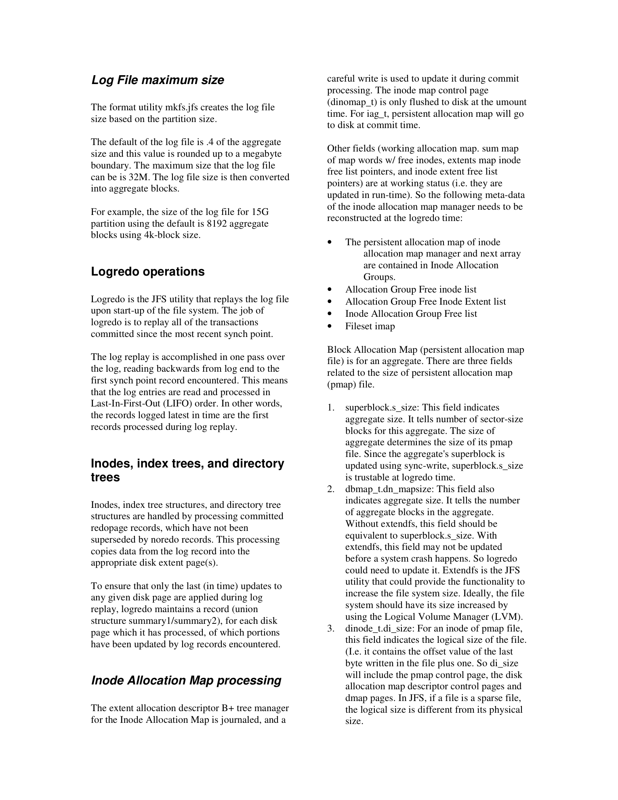

---

## 第 1 页


**提问：** 这张截图里的内容是什么意思？请面向初学者详细解释，分点讲清楚。

下面这页截图是在讲：IBM 的 **JFS（Journaled File System，日志式文件系统）是怎么做“日志记录”（logging）来保证崩溃后能快速恢复**。给初学者分点解释如下：


# 这页都在说什么


* **标题**：JFS Log（JFS 的日志机制），作者是 IBM Linux 技术中心的 Steve Best。

* **目的**：解释 JFS 如何通过“日志（journal）”把文件系统尽快恢复到**一致**状态，比传统非日志文件系统用 fsck 扫盘快得多。


# 几个核心概念（用生活比喻）


1. **文件系统像账本**


   * 普通账本（非日志 FS）记一笔就直接改总账，崩溃后要把整本账翻一遍（fsck），很慢。

   * **日志式账本（JFS）**先把“要做的操作”写到一份**流水账（log）**里，确认写好后再改总账。崩溃后只要对着流水账**补做或撤销**，很快就恢复一致。


2. **可恢复文件系统（Recoverable File System）**


   * JFS 通过数据库里的**事务日志**思想保证一致性：每个会改变磁盘结构（元数据）的操作，都当作一个**事务（transaction）**。

   * 系统崩溃后，JFS 会运行 **logredo** 之类的恢复过程，利用日志把“做了一半的事”补完或撤回，让盘上结构不乱。


3. **记录的重点是“元数据”**


   * **元数据**= 目录结构、inode、空闲块分配等“文件系统结构”。

   * JFS **主要记录元数据**的变更；**不保证用户数据（文件内容）一定写到盘上**。所以崩溃后文件系统很整洁，但**你刚写入的内容可能没来得及落盘**。


4. **事务的开始/结束**


   * 对每个需要日志的操作，JFS 会在内部调用类似 **TxBegin / TxEnd** 的例程把它包起来：开始事务 → 把每个子步骤写一条日志记录 → 真正修改盘上结构 → 结束事务。

   * 这样系统一旦掉电，重启时就能根据日志判断：**完整的就确认生效，半截的就撤销**。


5. **代价与收益**


   * **收益**：崩溃后恢复快（通常几秒到几十秒），基本不用跑耗时的 fsck。

   * **代价**：每次元数据修改都要先写日志，会有一点**性能开销**（多一次写入）。


6. **日志系统的两个部件**


   * **日志文件（log file）**：一个系统文件（由 `mkfs.jfs` 格式化时创建）存放那些“即将进行/刚完成”的变更记录。

   * **事务管理器（transaction manager）**：负责开启/结束事务、写日志记录、在恢复时重放或回滚。


7. **举个例子：删除文件（unlink）**


   * 删除会改目录项、更新 inode、释放块等，这些都是**元数据**改动。

   * JFS 会先把“要删哪些目录项、要更新哪些结构”的**子操作**写入日志，再真正改动磁盘。崩溃时，这笔删除要么**完全生效**，要么**完全不生效**，不会留下“目录指向空 inode”之类的烂尾。


# 和非日志文件系统的对比


* **非日志 FS**：崩溃后可能留下不一致状态，需要全盘扫描修复（分钟到小时）。

* **JFS**：崩溃后用日志**快速回放/回滚**，几秒到几十秒就把结构修好；但不保证**用户数据**都写入成功。


# 小词典


* **Logging / Journal（日志）**：把即将发生的元数据变化先顺序写到一个专用文件里。

* **Transaction（事务）**：一组要么全部成功、要么全部失败的操作。

* **fsck**：非日志 FS 崩溃后跑的全盘一致性检查工具。

* **mkfs.jfs**：创建（格式化）JFS 文件系统时用的工具，会顺便建立日志文件。


# 一句话总结


JFS 用“**先记流水账、再改总账**”的方式记录**元数据**的变化；系统崩溃后按日志把未完成的操作补完或撤销，因此**恢复快、结构稳**，但**不保证最近写入的文件内容一定还在**。


---

## 第 2 页


**提问：** 这张截图里的内容是什么意思？请面向初学者详细解释，分点讲清楚。

下面这页主要在讲 **JFS（日志式文件系统）里日志到底记录了哪些东西、事务怎么跑、以及创建文件时日志如何工作**。给初学者分点说明：


# 1) 三个基础名词


* **Extent（区段）**：一串**连续的磁盘块**，文件里的数据不是一块一块零散放，而是按“区段”为单位分配。一个大文件可能包含很多个 extent。

* **Inode（索引节点）**：描述一个文件/目录的**元数据卡片**，例如时间戳、类型（普通文件/目录）、指向数据块的位置等。每个 JFS 对象都对应一个 inode。

* **Block Map / Inode Map（块分配表 / inode 分配表）**：像两张**清单**：


  * Block Map 记录哪些数据块已被占用、哪些是空闲；

  * Inode Map 记录哪些 inode 已被使用、哪些可分配（JFS 里还把 inode 分组管理，叫 IAG）。


这些结构共同决定“空间在哪、是谁在用”。


---


# 2) 事务管理器做什么（Transaction Manager）


事务管理器是 JFS 日志系统的核心，用来把一次元数据修改打包成一个**事务**，并保证“要么全成、要么全不成”。


典型流程（简化）：


1. **TxBegin**：开始一个事务，分配一个\*\*事务块（tblk）\*\*来记录这次事务的状态。

2. 在事务中，凡是会改到“元数据页”的操作（创建/修改/删除目录项、inode、块位图等），都会给这些页加上**事务锁（tlock）**并把它们挂到该事务块上。这样做的目的是**暂时不让这些页被写回磁盘**，避免出现“写到一半”的不一致。

3. **txCommit（提交）**：


   * 把此次修改对应的**日志记录**写入日志（先到内存缓冲，再落盘）；

   * 把受影响的 inode 等对象记入提交列表；

   * **写入“commit record（提交记录）”**，这相当于在日志里盖章：这笔事务已经完成、可在崩溃恢复时生效。

4. **提交完成后**：才去更新块分配表 / inode 分配表等真正的结构；相关元数据页的限制解除（允许被写回磁盘）；释放 tlock，最后释放该事务块。


要点：**先日志、后落盘**；先“记流水账”，再“改总账”。


---


# 3) “创建一个文件”的伪代码在说啥


文中有一小段 C 风格伪代码，意思如下（去掉细节，只看动作）：


1. `TxBegin(..., &tid, ...)`

   → 开启一个事务，拿到事务 ID（tid）。

2. 找到这个事务的控制块 `tblk`，并标记这次事务的类型是**创建文件**（`COMMIT_CREATE`）。同时把即将被创建的那个 **inode** 关联到事务块里，表示本次会影响它。

3. “/\* Work is done to create file \*/”

   → 真正去做创建文件的工作：分配 inode、更新目录项、可能还会分配数据块等。这些修改都被**tlock**保护着，暂时不会写回家（磁盘“本位”）。

4. `txCommit(tid, 2, &iplist[0], 0);`

   → 提交：把上述元数据变更写入**日志记录**，写入**提交记录**，把受影响 inode 列表一起记账，保证崩溃后能重放/回滚。

5. `TxEnd(tid);`

   → 事务结束：释放锁与资源，之后相关页才可以被正常写回磁盘。


---


# 4) 哪些操作“必须写日志”


凡是**会改元数据**的动作都要被日志记录（因为这会影响文件系统结构的一致性），包括：


* 创建文件（create）

* 建立硬链接（link）

* 创建目录（mkdir）

* 创建特殊文件（mknod）

* 删除文件（unlink）

* 重命名（rename）

* 删除目录（rmdir）

* 创建符号链接（symlink）

* 设置访问控制（setacl）

* **特殊情况下的写文件（write）**（正常数据写一般不记入元数据日志，除非触发到需要记元数据的一些路径）

* 截断文件（truncate）


直观记忆：**不是“写内容”本身，而是“改结构”的动作要记日志**。


---


# 5) 一张“心里图”


```

TxBegin → 给相关元数据页加 tlock → 先把“要做啥”写入日志

      → 写提交记录（commit record）→ 更新真正的块/ inode 表

      → 解锁并允许写回 → TxEnd

```


---


# 6) 初学者容易踩的点


* 日志式文件系统（比如 JFS）**主要保护的是元数据一致性**；崩溃后结构不乱、恢复很快，但**最近写入的文件内容**不一定都落盘成功。

* “先写日志、再改结构”会带来**少量性能开销**，但换来快速而可靠的恢复。

* 看到 `tlock / tblk / commit record` 这类词，就把它们理解为：**锁住改动、打包这次事务、在日志里盖章**。


这样读这页内容就清晰多了：它在告诉你 JFS 内部用哪些结构（extent/inode/位图），事务怎么保证原子性，创建文件时具体如何一步步“先记账、后落盘”，以及为什么这些元数据相关的操作都必须被日志化。


---

## 第 3 页



这页在讲 5 件事：**日志文件多大合适、系统如何“重放”日志、哪些结构需要按日志回写、inode 分配表怎么处理、以及块分配表里哪些字段在重放时要校正**。给初学者分点看：

------

## 1) 日志文件的大小（Log File maximum size）

- 日志文件在格式化（`mkfs.jfs`）时按分区（JFS 叫 *aggregate*）大小自动给你建。
- **默认大小≈分区大小的 0.4%**，并向上取整到 1MB 边界；但**有上限 32MB**。
   例子：分区是 15GB、块 4KB，则最终日志文件就是 **8192 块 = 32MB**（因为碰到 32MB 上限）。
- 结论：JFS 的日志文件不大，几十 MB 级别，但足够记录“元数据修改”的流水账。

------

## 2) 重放日志（Logredo operations）

- **logredo** 是 JFS 在启动/挂载时用来**回放日志**的工具：把**上次同步点**之后已提交的事务重新执行一遍，让磁盘结构恢复一致。
- 它会**从日志末尾往前读**到第一个同步点，属于 **LIFO（后进先出）** 的处理方式——保证**最新的修改优先生效**。

------

## 3) 处理 inodes / 索引树 / 目录树

- 这些结构（inode、B+ 树索引、目录树）通过处理**已提交且未被“撤销记录（noredo）”覆盖**的**redo 记录**来更新：
   简单说，就是把日志里“最后生效的版本”拷回到相应的磁盘页。
- 为避免对同一磁盘页**重复应用**旧记录，logredo 会给每个被处理的页做**“我已经更新了哪些部分”**的标记，只让**最后一次**更新落盘（“最后写入者胜出”）。

------

## 4) Inode Allocation Map（inode 分配表）的处理

- inode 分配表有 B+ 树管理器并**受日志保护**。提交时用**careful write**（小心写）确保结构不会写成“半截”。
- 里面有两类东西：
  - **持久（persistent）\**的结构：在\**提交时**就会写盘（例如每个 IAG *Inode Allocation Group* 中保存的那部分持久映射）。
  - **工作时（working）\**的结构：诸如各种\**空闲列表、指针、计数**等，主要在内存里维护；崩溃后**通过重放日志重建**即可。
- 因此，logredo 在恢复 inode 分配相关状态时，会基于**持久部分**+**日志**把运行期需要的空闲列表等**重建**出来。

------

## 5) Block Allocation Map（块分配表）在重放时要校正的“关键尺寸”

有几个“尺寸/大小”字段可能在异常断电前来不及一致更新，logredo 会在恢复时校正它们，常见包括：

1. **超级块的文件系统大小（superblock.s_size）**
    说明整个 aggregate 的扇区数/块数。通常用“同步写”更新，可信赖；若做过**在线扩容**（LVM/extendfs），就要以它为准去修正别处的大小。
2. **块分配图文件的大小（dbmap 的 mapsize）**
    记录分配图覆盖了多少个 aggregate 块。扩容时可能**还没来得及更新**，logredo 会补上。
3. **分配图 inode 的“逻辑大小”（dinode.di_size）**
    这里的逻辑大小会包含控制页等元数据页；而且 JFS 把分配图当**稀疏文件**管理，**逻辑大小可能大于实际占用**。logredo 会确保这个逻辑值与当前文件系统大小一致。

------

## 小结（一句话）

- **日志多大**：默认≈0.4%（向上取整），但**不超过 32MB**。
- **如何恢复**：logredo **从末尾往前**回放，只让**最新**的变更生效。
- **恢复哪些**：把 inode/索引/目录等**元数据**按 redo 记录写回；inode 分配表的**持久部分**已在提交时写盘，**工作状态**则通过日志**重建**。
- **还会修什么**：在块分配相关的几个**大小字段**上做校正，确保在扩容或异常情况下也保持一致性。

---

## 第 4 页


**提问：** 这张截图里的内容是什么意思？请面向初学者详细解释，分点讲清楚。

下面这页在讲 **JFS 在“重放日志（logredo）恢复”阶段具体会做什么、哪些位图/状态要重建、日志记录长什么样、以及扩展属性（EA）如何记录**。按入门级分点说明：


---


## 先澄清两个“大小”字段


* **di\_size（inode 的逻辑大小）**：是“文件看到的长度”（最后一个字节的位置+1）。

* **不包含**为了管理区段（extent）的 **B+ 树管理结构**占的空间；那些实际占了多少块，用 **di\_nblocks** 表示。

  ⇒ 所以“逻辑大小”可能小于“物理占用”。


---


## 恢复时要重建/用到的块分配结构


* **块分配图控制页（block allocation map control page）**

* **磁盘分配图描述页（dmap control pages）**和**dmap 数据页**

  这些页在 **logredo** 阶段都会被用来/或被重建。


---


## logredo 阶段总体要做的事


1. **把日志里的记录应用到目标页**（把“最后一次的更新”写回对应磁盘页）。

2. **初始化目录 B+ 树页/根的空闲链表**（让目录索引的页管理恢复可用）。

3. **重建 inode 分配映射管理器**（哪号 inode 空闲/占用）。

4. **重建块分配图文件的 inode**（确保描述分配图的那个“文件对象”本身一致）。

5. 为了**同一页只被应用一次**，恢复过程中会把这页标记为“已处理”，避免重复重放（文中提到会启动 *NoRedoFile* 之类的机制）。


> 文中提到的日志记录类型（名字说明了用途）：

>

> * **REDOPAGE**：带着某一页的“应当重做”的内容。

> * **NOREDOPAGE / NOREDOINOEXT**：表明较早的同页（或 inode 扩展）的记录不必再做（避免重复）。

> * **UPDATEMAP**：更新位图（块/ inode 的已用或空闲标志）。


---


## 当磁盘被标记为“脏”时怎么办


* 如果超级块里的状态是 **FM\_DIRTY**，说明可能有更深层的损坏：


  * **logredo 之后还会跑 `fsck.jfs`** 做进一步检查；仅靠重放日志可能达不到 100% 恢复。


---


## 位图（map）是如何在恢复时“算出来”的


* 启动时先分配一份**工作用位图 wmap**，并读入磁盘上的**持久位图 pmap**（表示哪些块/哪些 inode 已用）。

* **一开始所有分配状态都“不确定”**。随着逐条处理日志记录，确定“这块该占用还是空闲”：


  * 结果**只更新一次 pmap 的那个比特**，并在 wmap 里做“已处理”的标记，防止重复更新。

* 结束时，用 pmap 生成各种**空闲链表/控制信息**，把 **pmap 覆盖回 wmap**，并把**整张图写回磁盘**。


---


## 超级块状态位在恢复后的变化


* 初始是 **FM\_CLEAN** 或 **FM\_MOUNT** 且 logredo 成功 → 设置为 **FM\_CLEAN**。

* 恢复过程中检测到错误 → 设置为 **FM\_LOGREDO**。

* 如果一开始就是 **FM\_DIRTY**，logredo **不会**改它；此时或若结果是 **FM\_LOGREDO**，都应再跑 **fsck** 清理。


---


## 日志记录的格式与读取方式


* 一条日志 = **数据段（LogRecordData） + 记录头（LogRecLRD）**。

* **倒着读日志**（从末尾往前）。先读 **LRD** 得到本条数据段的长度，再准确地取出该条数据并应用。


---


## 扩展属性 EA（Extended Attributes）的恢复与记录


* inode 的 **Section 1** 里有 **16 字节的 EA 描述符**（说明 EA 在哪、占多少）。

* **两种放法**：


  1. **inlineEA**：EA 数据直接放在 inode 的 **Section IV（128 字节）** 中。

  2. **outlineEA**：EA 数据放在文件系统的\*\*区段（extent）\*\*里，由 EA 描述符指向。

* **与目录/索引树（xtree）对 Section IV 的占用关系**：xtree 拿到 Section IV 后不会轻易放手；inlineEA 若占用了它，后续释放后 xtree 仍有机会再拿回去。

* **日志策略**：


  * **outlineEA**：EA 的**数据本体同步写盘**（不进日志数据段）；但会有两类日志：


    * **INODE** 日志（EA 描述符被修改），
    
    * **UPDATEMAP** 日志（为 EA 数据分配/释放的区段位图更新）。

  * **inlineEA**：因为数据在 inode 里，**数据必须被写进日志**；不单独成条，而是作为 **INODE 日志**的**附加段**。因此**一条 INODE 日志最多可带 3 个段**（例如：inode 变更段 + inlineEA 段 + 其他相关段）。


---


## 小结


* 恢复时，JFS 用**倒序重放**+“只应用最后一次更新”的策略，把**元数据页、位图、目录索引**等恢复到一致。

* **位图**靠日志一步步“推导”并只更新一次；最后写回盘。

* **超级块状态**清楚地表明是否需要进一步 fsck。

* **EA**分内联/外联：外联数据直接落盘只记“指针和位图”日志；内联数据则包含在 INODE 的日志记录里。


---

## 第 5 页


**提问：** 这张截图里的内容是什么意思？请面向初学者详细解释，分点讲清楚。

* 下面这页主要把 **JFS 的日志重放工具 logredo** 的“干活流程”和**日志记录（log record）类型**讲清楚，并在末尾做了总结。按入门级分点说明：

  # logredo 更详细的流程

  - **用途**：系统崩溃后，用日志把“已提交”的事务重做；把“未提交”的事务回滚掉。
  - **启动前检查**
    1. 确认**日志没在被使用**；
    2. 如果分区（aggregate）被**扩容**了，要按新大小恢复；
    3. 读取**超级块**，核对版本、magic、状态（state）。如状态显示“已在 LOGREDO 阶段”，更新超级块后退出或继续相应流程。
  - **定位日志尾部**，初始化 logredo 需要的内存结构。
  - **回放**
    - **倒序读日志**，一直回溯到遇到**第一个同步点（LOG_SYNCPNT）**为止；
    - 逐条处理日志记录（有 7 类），在每一轮结束时判断本事务是否**完成**，若完成则**冲刷缓冲**；
    - 处理完后检查有没有目录/索引页（dtpage/xtree）需要**重建空闲链表**的，若有则回头处理。
  - **整理日志区**
    - 运行“log 重新格式化（logform）”的等效步骤：
      - 第 1 页写入**日志超级块**；
      - 第 2 页写入**SYNC 记录**；
      - 第 3 页起把剩余页清为空页。
  - **收尾**
    - 刷新**数据页缓存**；
    - 用刚才得到的结果更新**分配位图**和**超级块**；
    - 更新日志区的**end、state、magic** 等字段，完成恢复。

  # 关键日志记录类型（做什么）

  - **LOG_COMMIT**：把事务 ID（tid）登记到“已提交数组”里，用于判定哪些事务需要重做。
  - **LOG_MOUNT**：挂载记录，通常是最后处理的一条。
  - **LOG_SYNCPNT**：**同步点**，回放到这里就停止向前读。
  - **LOG_REDOPAGE**：最“常用”的 redo 记录，包含：
    - 更新 **inode 位图**（inode 的分配/释放）；
    - 更新 **块位图**（文件块/extent 的分配/释放）；
    - 建立 **NoRedoFile / NoRedoExtent 过滤器**（防止对同一页/同一 extent 重复回放）；
    - 更新与 **extent 分配 B+ 树（xtree）**有关的根/节点页。
  - **LOG_NOREDOPAGE**：为某个 xtree 或目录树节点开启 **NoRedo** 过滤（后续旧记录不再重做）。
  - **LOG_NOREDOINOEXT**：为即将释放的 **inode 扩展区段**中的每一页开启 **NoRedo** 过滤。
  - **LOG_UPDATEMAP**：专门用来**标记块位图**中某些区段（extent）应设为已用/空闲。

  # “为什么倒序读？”

  - 倒着读能保证**最新的记录先应用**；配合 NoRedo 过滤，早期同页的旧记录就会被**跳过**，避免把状态回滚到更早版本。

  # 这页的要点总结（Summary）

  - 恢复时，JFS **重做所有已提交事务**，并**撤销（不生效）**故障时未提交的子操作；
  - 因为只对**元数据**做日志，开销小，恢复很快——通常**秒级**把文件系统结构恢复到一致；
  - 这也是日志式文件系统（JFS）在可靠性和性能之间取得平衡的方式。

  # 参考信息

  - 页面末尾是致谢（Acknowledgements）：列出了参与 JFS Linux 开发的几位工程师与邮箱。


---

## 第 6 页


**提问：** 这张截图里的内容是什么意思？请面向初学者详细解释，分点讲清楚。

这页基本就是**参考资料 + 获取代码 + 邮件列表 + 版权声明**，给读者延伸阅读用。逐条讲清：

# 这页在说什么

* **References（参考文献）**
  列出本文内容的主要来源，方便你继续深入：

  * *JFS overview*：总览性介绍（作者 Steve Best）。
  * *JFS layout*：JFS 磁盘/数据结构布局（Steve Best、Dave Kleikamp）。
  * 若干科普/评论文章：来自 Journal of Linux Technology、Linux Gazette、Linux Magazine、BYTE 等，主题都围绕“日志式文件系统（Journaling Filesystems）”。

* **Source code for JFS Linux（JFS 源码）**
  提供了当年 JFS for Linux 的**开源地址**（当时在 IBM 的 developerWorks/open-source 站点）。想看实现细节、对照论文理解代码的人可以从这里入手。

* **JFS mailing list（邮件列表）**
  告诉你如何**订阅讨论组**：发邮件到列表机器人地址，在主题写“subscribe”，正文写“subscribe jfs-discussion”。加入后可接收/参与 JFS 的技术讨论、问题反馈等。

* **Trademark and Copyright Information（商标与版权）**
  法律声明：

  * © 2000 IBM；IBM® 是 IBM 的注册商标；
  * Linux® 是 Linus Torvalds 的注册商标；
  * 其他品牌与商标归其各自所有者。

# 给初学者的两点提示

* 这些资料**时间较早（2000 年）**，部分链接今天可能已变更或不可用；想找新版内容时，可以搜索 “JFS Linux source” 或查 Linux 内核文档中的 JFS 章节。
* 想继续深入，优先看 **Overview → Layout → 源码/论文** 这个顺序：先理解概念，再看磁盘结构，最后结合实现细节。
