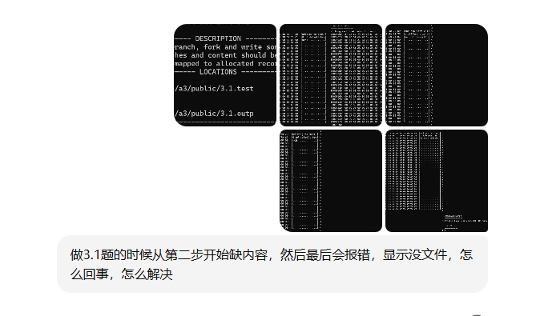
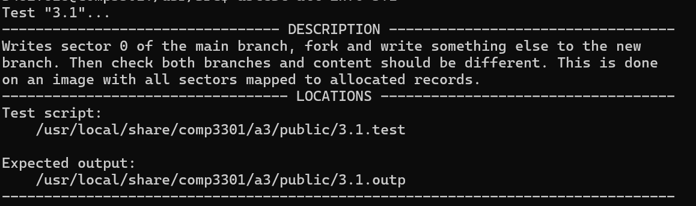
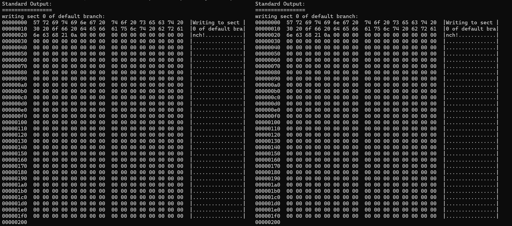
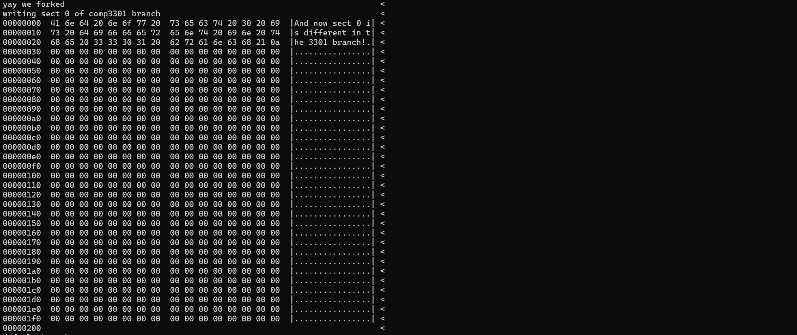
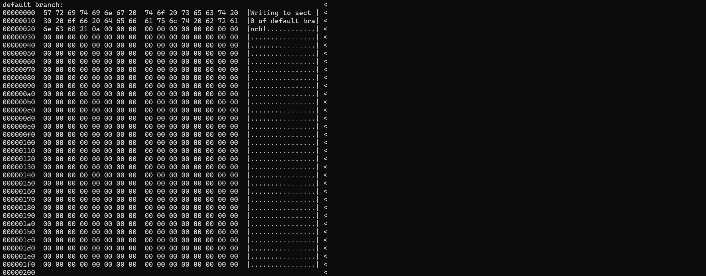
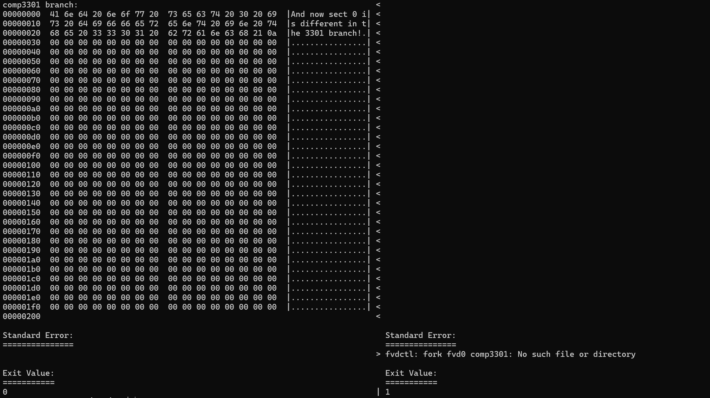

根据你提供的图像和问题描述，似乎在做3.1题时，尝试执行某些操作时遇到了文件缺失或错误。报错提示“没有这样的文件或目录”通常意味着程序试图访问一个不存在的文件，可能是由于路径配置不正确或者文件未正确生成。

从图像中可以看到，错误出现在尝试使用 `fvdctl` 工具时，系统找不到所需的文件。

解决这个问题的几个步骤可以是：

1. **确认路径正确**：确保你在命令中使用的路径正确，并且该路径下的文件已经存在。例如，图像中的错误提示“fvdctl: fork fvd0 comp3301: No such file or directory”表明 `comp3301` 文件不存在或路径有误。
2. **检查分支名和文件是否正确生成**：
   - 确保在执行 fork 操作前，所操作的分支（如 `comp3301`）已经正确创建。
   - 确保 `.fvd` 文件和 `.fvd.ref` 文件存在，并且路径配置正确。
3. **验证文件系统状态**：
   - 使用 `fvdtool info` 或 `fvdctl info` 检查当前虚拟磁盘的信息，确保虚拟磁盘文件已经正确挂载。
   - 如果文件丢失，检查你的虚拟磁盘（FVD）创建和挂载过程是否完整。
4. **文件权限问题**：
   - 确保你的程序有访问这些文件的权限，特别是 `.fvd` 和 `.fvd.ref` 文件。你可以使用 `ls -l` 命令检查文件权限。
5. **尝试重新生成或修复缺失的文件**：
   - 如果 `comp3301` 文件丢失，可以尝试重新创建或恢复该文件。

从代码和你提供的描述来看，问题可能出现在以下几个方面，导致无法成功进行 3.1 的测试：

### 1. **分支创建（Fork）操作未正确实现：**

在 `fvd_fork` 操作中，需要确保新分支正确创建并且继承了父分支的数据结构。代码中有执行分支创建的操作，但如果在处理过程中遇到某些错误（如找不到空闲记录、空间不足等），可能导致分支没有成功创建，进而影响测试的执行。

```c
case FVDIOC_FORK:
    {
        struct fvd_fork *ff = (struct fvd_fork *)data;  // 获取传入的数据，指向分支创建操作的数据结构
        struct fvd_brch_desc new_branch;  // 新分支的描述符
        uint32_t new_branch_rec;  // 新分支的记录号
        uint32_t i;  // 循环索引，用于遍历块映射记录或其他需要遍历的数组
        uint32_t bmrec, idx;  // bmrec 用于存储块映射记录的索引，idx 用于记录某个特定块映射记录中的条目索引
        uint32_t *table;  // 一个指向 uint32_t 类型数组的指针，用于存储块映射记录的数据
        uint32_t *tab;  // 临时指针，用于在分配内存时保存块映射数据的副本
        uint8_t refval;  // 引用计数值，用于存储某个数据记录的引用计数
        off_t offset;  // 偏移量，表示文件中某个位置的字节偏移，通常用于读取或写入数据
        int error2;  // 用于存储操作的错误码，检测错误并做相应的处理

        uint32_t parent_bmap;  // 父分支的块映射记录
        struct fvd_root_block *root_be;  // 用于根块的操作，最终会写入磁盘

        /* validate new branch name */
        if (ff->ff_name[0] == '\0') {  // 检查分支名称是否为空
            error = EEXIST;  // 如果为空，返回错误：分支名称已存在
            break;
        }

        /* validate branch name length */
        if (strlen(ff->ff_name) >= FVD_MAX_BNM) {  // 检查分支名称长度是否超过最大限制
            error = EINVAL;  // 如果超过最大长度，返回无效的错误
            break;
        }

        /* check if branch already exists */
        error2 = fvd_find_branch(sc, ff->ff_name);  // 检查该分支是否已经存在
        if (error2 == 0) {  // 如果分支已经存在
            error = EEXIST;  // 返回错误：分支已存在
            break;
        }
        if (error2 != ESRCH) {  // 如果查找时发生了其他错误
            error = error2;  // 返回发生的错误
            break;
        }

        /* check if we have space for another branch */
        if (sc->sc_root.fr_nbrches >= FVD_MAX_BRANCHES) {  // 检查是否还有空间来创建新分支sc->sc_root.fr_nbrches：这是 FVD 根块（sc_root）中的一个字段，表示当前 FVD 镜像中已经存在的分支的数量（fr_nbrches）。根块包含了 FVD 镜像的基本信息，包括分支的数量和其他元数据。
            error = ENOSPC;  // 如果没有足够空间，返回错误：没有空间
            break;
        }

        /* check if device is busy */
        if (sc->sc_rw == 0 && ff->ff_force == 0) {  // 检查设备是否处于忙碌状态，且没有强制创建标志
            error = EBUSY;  // 如果设备忙，返回错误：设备忙
            break;
        }

        /* flush all dirty cache entries before fork */
        error = fvd_cache_flush(sc, 0);  // 刷新所有脏缓存，确保数据一致性
        if (error != 0)
            break;  // 如果刷新缓存时出错，退出

        /* allocate new branch descriptor record */
        error = fvd_alloc_record(sc, &new_branch_rec);  // 为新分支分配记录
        if (error != 0)
            break;  // 如果分配记录时出错，退出

        /* check if allocated record is within file bounds */
        if (new_branch_rec >= sc->sc_root.fr_nrecs) {  // 检查新分支记录是否在文件范围内
            error = ENOSPC;  // 如果超出文件范围，返回没有空间的错误
            break;
        }

        /* copy current branch to new branch */
        memcpy(&new_branch, &sc->sc_branch, sizeof(new_branch));  // 复制当前分支的信息到新分支
        new_branch.fb_magic = htobe32(FVD_BRCH_MAGIC);  // 设置分支魔数，确保数据正确性
        uint32_t parent_rec = sc->sc_root.fr_brchs[sc->sc_branch_id];  // 获取父分支的记录号
        new_branch.fb_parent = htobe32(parent_rec);  // 将父分支记录号转换为大端格式
        strlcpy(new_branch.fb_name, ff->ff_name, sizeof(new_branch.fb_name));  // 设置新分支名称
        
        /* set creation time */
        struct timeval tv;
        microtime(&tv);  // 获取当前时间
        new_branch.fb_ctime = htobe64(tv.tv_sec);  // 设置分支创建时间

        /* allocate and copy block map for child branch */
        uint32_t nrecs_bmap = (sc->sc_root.fr_nsects + FVD_BMAP_ENTRIES - 1) / FVD_BMAP_ENTRIES;  // 计算新分支需要的块映射记录数
        uint32_t first_bmap;  // 记录分配的第一个块映射
        error = fvd_alloc_consecutive(sc, nrecs_bmap, &first_bmap);  // 为新分支分配连续的块映射
        if (error != 0)
            break;  // 如果分配块映射时出错，退出

        /* set refcount to 1 for each new block map record */
        for (uint32_t r = 0; r < nrecs_bmap; r++) {  // 为每个块映射设置引用计数为 1
            error = fvd_ref_write(sc, first_bmap + r, 1);
            if (error != 0)
                break;  // 如果设置引用计数时出错，退出
        }
        if (error != 0)
            break;

        /* copy parent's block map to child's new block map */
        parent_bmap = sc->sc_branch.fb_blkmap;  // 获取父分支的块映射
        tab = malloc(FVD_SECTOR_SIZE, M_TEMP, M_WAITOK);  // 为临时缓冲区分配内存
        for (uint32_t r = 0; r < nrecs_bmap; r++) {  // 将父分支的块映射复制到新分支的块映射
            off_t off_parent = (off_t)(parent_bmap + r) * FVD_SECTOR_SIZE;
            off_t off_child = (off_t)(first_bmap + r) * FVD_SECTOR_SIZE;
            
            // 读取父分支的块映射记录
            error = vn_rdwr(UIO_READ, sc->sc_fvdvp, (caddr_t)tab,
                FVD_SECTOR_SIZE, off_parent, UIO_SYSSPACE, IO_NODELOCKED,
                sc->sc_ucred, NULL, curproc);
            if (error != 0)
                break;
            
            // 写入新分支的块映射记录
            error = vn_rdwr(UIO_WRITE, sc->sc_fvdvp, (caddr_t)tab,
                FVD_SECTOR_SIZE, off_child, UIO_SYSSPACE, IO_NODELOCKED,
                sc->sc_ucred, NULL, curproc);
            if (error != 0)
                break;
        }
        free(tab, M_TEMP, FVD_SECTOR_SIZE);  // 释放临时缓冲区
        if (error != 0)
            break;

        /* update new_branch.fb_blkmap to point to new block map */
        new_branch.fb_blkmap = htobe32(first_bmap);  // 更新新分支的块映射指向新分配的块映射

        /* write new branch descriptor */
        offset = (off_t)new_branch_rec * FVD_SECTOR_SIZE;  // 计算新分支描述符的偏移量
        error = vn_rdwr(UIO_WRITE, sc->sc_fvdvp, (caddr_t)&new_branch,
            sizeof(new_branch), offset, UIO_SYSSPACE, IO_NODELOCKED,
            sc->sc_ucred, NULL, curproc);  // 写入新的分支描述符
        if (error != 0)
            break;

        /* increment reference counts for all shared data records */
        table = malloc(FVD_SECTOR_SIZE, M_TEMP, M_WAITOK);  // 为共享的数据记录分配临时表
        for (i = 0; i < sc->sc_root.fr_nsects; i++) {  // 遍历所有数据记录
            bmrec = sc->sc_branch.fb_blkmap + (i / FVD_BMAP_ENTRIES);
            idx = i % FVD_BMAP_ENTRIES;

            // 读取块映射记录
            offset = (off_t)bmrec * FVD_SECTOR_SIZE;
            error = vn_rdwr(UIO_READ, sc->sc_fvdvp, (caddr_t)table,
                FVD_SECTOR_SIZE, offset, UIO_SYSSPACE, IO_NODELOCKED,
                sc->sc_ucred, NULL, curproc);
            if (error != 0)
                break;

            // 检查是否有数据记录，并增加引用计数
            uint32_t recno = betoh32(((uint32_t *)table)[idx]);
            if (recno != 0) {
                error = fvd_ref_read(sc, recno, &refval);  // 读取引用计数
                if (error != 0)
                    break;
                refval++;  // 增加引用计数
                error = fvd_ref_write(sc, recno, refval);  // 写回引用计数
                if (error != 0)
                    break;
            }
        }
        free(table, M_TEMP, FVD_SECTOR_SIZE);  // 释放临时表
        if (error != 0)
            break;

        /* update root block in host order */
        uint16_t new_nbrches = sc->sc_root.fr_nbrches + 1;  // 更新根块中的分支计数
        sc->sc_root.fr_nbrches = new_nbrches;  // 保持主机字节顺序
        sc->sc_root.fr_brchs[new_nbrches - 1] = new_branch_rec;  // 保存新分支记录

        /* create big-endian copy for writing */
        root_be = malloc(sizeof(struct fvd_root_block), M_TEMP, M_WAITOK);  // 创建根块的副本
        *root_be = sc->sc_root;
        root_be->fr_magic = htobe32(FVD_ROOT_BLK_MAGIC);  // 转换为大端格式
        root_be->fr_vmaj = FVD_VER_MAJ;
        root_be->fr_vmin = FVD_VER_MIN;
        root_be->fr_nbrches = htobe16(sc->sc_root.fr_nbrches);
        root_be->fr_nrecs = htobe32(sc->sc_root.fr_nrecs);
        root_be->fr_nsects = htobe32(sc->sc_root.fr_nsects);
        root_be->fr_ncyls = htobe32(sc->sc_root.fr_ncyls);
        root_be->fr_nheads = htobe16(sc->sc_root.fr_nheads);
        root_be->fr_nspt = htobe16(sc->sc_root.fr_nspt);
        
        // 将分支数组转换为大端格式
        for (uint16_t i = 0; i < sc->sc_root.fr_nbrches; i++) {
            root_be->fr_brchs[i] = htobe32(sc->sc_root.fr_brchs[i]);
        }

        /* write updated root block */
        error = vn_rdwr(UIO_WRITE, sc->sc_fvdvp, (caddr_t)root_be,
            FVD_SECTOR_SIZE, 0, UIO_SYSSPACE, IO_NODELOCKED,
            sc->sc_ucred, NULL, curproc);  // 将更新后的根块写回
        free(root_be, M_TEMP, sizeof(*root_be));  // 释放根块副本
        if (error != 0)
            break;

        /* switch to new branch */
        memcpy(&sc->sc_branch, &new_branch, sizeof(sc->sc_branch));  // 切换到新分支
        sc->sc_branch_id = new_nbrches - 1;  // 使用新分支的索引
        strlcpy(sc->sc_bname, ff->ff_name, sizeof(sc->sc_bname));  // 设置新分支的名称

        /* clear cache since we switched branches */
        fvd_cache_flush(sc, 1);  // 清除缓存，因为我们已经切换了分支
    }
    break;

```


### 2. **拷贝操作（Copy-on-write）问题：**

在分支创建过程中，涉及到拷贝操作（COW）。`fvd_needs_cow` 和 `fvd_do_cow` 的实现主要用于处理分支间的写入操作时，确保父分支的数据不会被覆盖。可能是这部分的拷贝操作未正确完成，导致分支内容无法与父分支区分开。

```c
/*
 * Check if sector needs copy-on-write
 */
static int
fvd_needs_cow(struct fvd_softc *sc, uint32_t sec)  // 定义一个函数，检查给定的扇区 (sector) 是否需要进行拷贝写操作（Copy-on-Write, COW）
{
    uint32_t recno = 0;  // 定义一个变量 recno 来存储与该扇区相关的记录号
    uint8_t refval;  // 定义一个变量 refval 用来存储该记录的引用计数（reference count）
    int error;  // 用来存储函数调用时的错误码

    error = fvd_bmap_get(sc, sec, &recno);  // 调用 fvd_bmap_get 函数，通过给定的扇区号获取该扇区的记录号 (recno)
    if (error != 0 || recno == 0)  // 如果获取记录号时发生错误 (error != 0)，或者该扇区未被分配（recno == 0）
        return 0;  // 返回 0，表示不需要拷贝写操作，因为该扇区为空或无效

    error = fvd_ref_read(sc, recno, &refval);  // 调用 fvd_ref_read 函数，读取与该记录相关的引用计数 (refval)
    if (error != 0)  // 如果读取引用计数时发生错误
        return 0;  // 返回 0，表示不需要进行拷贝写操作

    return (refval > 1);  // 如果该记录的引用计数大于 1，表示该记录被多个分支引用，返回 1，表示需要拷贝写操作
                          // 否则，返回 0，表示不需要拷贝写操作
}

```

```c
/*
 * Perform copy-on-write for sector
 */
static int
fvd_do_cow(struct fvd_softc *sc, uint32_t sec)  // 定义一个函数，执行拷贝写操作（Copy-on-Write，COW），针对指定的扇区 `sec`
{
    uint32_t oldrec, newrec;  // oldrec 存储旧的记录号，newrec 存储新的记录号
    uint8_t refval;  // 用于存储读取到的引用计数值
    uint8_t buf[FVD_SECTOR_SIZE];  // 缓冲区，用于存储要复制的扇区数据
    int error;  // 用于存储函数调用过程中出现的错误码

    /* read old mapping */
    error = fvd_bmap_get(sc, sec, &oldrec);  // 通过扇区 `sec` 获取该扇区的记录号 `oldrec`
    if (error != 0 || oldrec == 0)  // 如果获取记录号失败，或者该扇区未分配（即 `oldrec == 0`）
        return 0;  // 返回 0，表示不需要进行拷贝写操作

    /* decrement old record refcount */
    error = fvd_ref_read(sc, oldrec, &refval);  // 读取当前记录号 `oldrec` 的引用计数 `refval`
    if (error != 0)  // 如果读取引用计数时发生错误
        return error;  // 返回错误码

    if (refval > 0) {  // 如果引用计数大于 0，表示该记录有其他分支引用
        refval--;  // 将引用计数减 1
        error = fvd_ref_write(sc, oldrec, refval);  // 更新 `oldrec` 的引用计数
        if (error != 0)  // 如果更新引用计数时发生错误
            return error;  // 返回错误码
    }

    /* allocate new record */
    error = fvd_alloc_record(sc, &newrec);  // 为新记录分配一个新的记录号 `newrec`
    if (error != 0)  // 如果分配新记录失败
        return error;  // 返回错误码

    /* copy old data */
    error = vn_rdwr(UIO_READ, sc->sc_fvdvp, (caddr_t)buf, FVD_SECTOR_SIZE,  // 从磁盘读取 `oldrec` 记录的数据到缓冲区 `buf`
        (off_t)oldrec * FVD_SECTOR_SIZE, UIO_SYSSPACE,
        IO_NODELOCKED, sc->sc_ucred, NULL, curproc);
    if (error != 0)  // 如果读取数据时出错
        return error;  // 返回错误码

    /* write to new record */
    error = vn_rdwr(UIO_WRITE, sc->sc_fvdvp, (caddr_t)buf, FVD_SECTOR_SIZE,  // 将数据从缓冲区 `buf` 写入到新的记录 `newrec`
        (off_t)newrec * FVD_SECTOR_SIZE, UIO_SYSSPACE,
        IO_NODELOCKED, sc->sc_ucred, NULL, curproc);
    if (error != 0)  // 如果写入数据时出错
        return error;  // 返回错误码

    /* update mapping to point to new record */
    error = fvd_bmap_set(sc, sec, newrec);  // 更新块映射，将该扇区 `sec` 映射到新的记录号 `newrec`
    if (error != 0)  // 如果更新映射时出错
        return error;  // 返回错误码

    /* set new record refcount = 1 */
    refval = 1;  // 为新记录设置引用计数为 1
    error = fvd_ref_write(sc, newrec, refval);  // 将引用计数写回新记录 `newrec`
    if (error != 0)  // 如果写入引用计数时出错
        return error;  // 返回错误码

    return 0;  // 成功完成拷贝写操作，返回 0 表示没有错误
}

```


### 3. **文件路径或挂载问题：**

在尝试 fork 操作时，可能是文件路径的配置或挂载的问题，导致测试脚本无法找到期望的 `.fvd` 或 `.fvd.ref` 文件。需要确认文件路径、分支文件及元数据文件（如 `.fvd`）是否在正确的位置，并且已经挂载。

### 4. **缓存和数据一致性：**

代码中的 `fvd_cache_add`、`fvd_cache_flush` 处理了数据的缓存和写回，确保修改后的数据正确写入磁盘。如果缓存没有正确刷新或者未正确更新，可能导致分支内容无法显示为预期。

```c
/*
 * Add sector to cache using LRU replacement
 */
static void
fvd_cache_add(struct fvd_softc *sc, uint32_t sec, const void *buf,  // 定义一个函数，将给定的扇区数据 `buf` 添加到缓存中，使用LRU（最近最少使用）替换策略
    uint32_t checksum, int dirty)  // 参数分别是扇区号 `sec`，数据缓冲区 `buf`，数据的校验和 `checksum` 和数据的脏标志 `dirty`
{
    struct fvd_cache_entry *entry, *lru_entry;  // `entry` 用于表示缓存中的一个缓存条目，`lru_entry` 用于表示被选择为最近最少使用（LRU）的缓存条目
    uint64_t oldest_time;  // `oldest_time` 用于记录最近最少使用条目的时间戳
    int i;  // 循环计数器，用于遍历缓存中的条目

    /* If the sector already exists in cache, update in place. */
    rw_enter_write(&sc->sc_cache_lock);  // 获取缓存锁，以确保对缓存的写操作是线程安全的
    entry = fvd_cache_find(sc, sec);  // 查找是否有对应扇区的缓存条目
    if (entry != NULL) {  // 如果该扇区已经存在于缓存中
        memcpy(entry->fce_data, buf, FVD_SECTOR_SIZE);  // 更新缓存条目的数据
        entry->fce_checksum = checksum;  // 更新缓存条目的校验和
        entry->fce_dirty = dirty ? 1 : entry->fce_dirty;  // 如果数据是脏的，则标记为脏，否则保持原值
        entry->fce_valid = 1;  // 标记缓存条目为有效
        entry->fce_access_count = ++sc->sc_access_counter;  // 增加访问计数，用于LRU策略
        rw_exit_write(&sc->sc_cache_lock);  // 释放缓存锁
        return;  // 返回，说明该扇区数据已更新，无需进行进一步操作
    }

    /* Select victim with LRU (or free slot). */
    lru_entry = NULL;  // 初始化 `lru_entry` 为 NULL
    oldest_time = UINT64_MAX;  // 初始化最老的时间戳为最大值
    for (i = 0; i < 16; i++) {  // 遍历缓存中的每个条目（假设缓存最多有 16 个条目）
        entry = &sc->sc_cache[i];  // 获取当前缓存条目
        if (!entry->fce_valid) {  // 如果当前条目无效（即空闲条目）
            lru_entry = entry;  // 选择当前条目作为新的空闲条目
            break;  // 跳出循环，因为找到一个空闲条目
        }
        if (entry->fce_access_count < oldest_time) {  // 如果当前条目的访问计数小于最老的时间戳
            oldest_time = entry->fce_access_count;  // 更新最老的时间戳
            lru_entry = entry;  // 选择当前条目作为最近最少使用条目
        }
    }

    /* Snapshot victim (if any) for writeback, then drop lock during I/O. */
    uint8_t victim_data[FVD_SECTOR_SIZE];  // 为被替换的条目分配一个缓冲区 `victim_data` 用于存储数据
    uint32_t victim_sector = 0;  // 被替换的扇区号
    int need_writeback = 0;  // 是否需要将被替换的条目写回磁盘

    if (lru_entry != NULL && lru_entry->fce_valid && lru_entry->fce_dirty) {  // 如果被选择的条目有效且是脏的（即已修改）
        memcpy(victim_data, lru_entry->fce_data, sizeof(victim_data));  // 保存当前条目的数据到 `victim_data`
        victim_sector = lru_entry->fce_sector;  // 保存被替换的扇区号
        need_writeback = 1;  // 设置需要写回磁盘
    }
    rw_exit_write(&sc->sc_cache_lock);  // 在执行 I/O 操作之前释放缓存锁

    /* Writeback outside the lock. */
    if (need_writeback) {  // 如果需要将被替换的条目写回磁盘
        /* create a temporary cache entry for writeback */
        struct fvd_cache_entry temp_entry;  // 创建一个临时的缓存条目 `temp_entry`
        temp_entry.fce_sector = victim_sector;  // 设置该条目的扇区号
        temp_entry.fce_dirty = 1;  // 设置该条目为脏
        temp_entry.fce_valid = 1;  // 设置该条目为有效
        memcpy(temp_entry.fce_data, victim_data, FVD_SECTOR_SIZE);  // 将数据拷贝到临时条目中
        (void)fvd_cache_writeback(sc, &temp_entry);  // 将该临时条目写回磁盘
    }

    /* Finally install the new entry. */
    rw_enter_write(&sc->sc_cache_lock);  // 重新获取缓存锁
    /* lru_entry can’t be NULL since cache has fixed 16 entries. */
    lru_entry->fce_sector = sec;  // 设置新条目的扇区号
    lru_entry->fce_checksum = checksum;  // 设置新条目的校验和
    lru_entry->fce_dirty = dirty ? 1 : 0;  // 设置新条目的脏标志
    lru_entry->fce_valid = 1;  // 设置新条目为有效
    lru_entry->fce_access_count = ++sc->sc_access_counter;  // 增加访问计数
    memcpy(lru_entry->fce_data, buf, FVD_SECTOR_SIZE);  // 将数据拷贝到新条目中
    rw_exit_write(&sc->sc_cache_lock);  // 释放缓存锁
}

```


### 5. **元数据读取问题：**

`fvd_read_metadata` 和 `fvd_find_branch` 函数负责加载和验证磁盘镜像的元数据。如果元数据读取失败（例如文件结构损坏、分支名错误等），也会导致测试无法继续执行。

### 解决方法：

1. **检查分支创建的逻辑：**
    确保 `fvd_fork` 函数中的分支创建过程没有错误。你可以在该部分添加更多的错误检查和调试信息，查看是否在创建新分支时遇到错误。
2. **检查文件路径和挂载：**
    确认 `.fvd` 和 `.fvd.ref` 文件的位置是否正确，路径是否被正确配置并且挂载。
3. **调试缓存问题：**
    确保在每次写操作后，缓存被正确刷新（`fvd_cache_flush`），确保写入的数据正确地反映在磁盘镜像中。

如果你有更详细的错误日志或是具体的报错信息，我可以帮助你进一步诊断和解决问题。