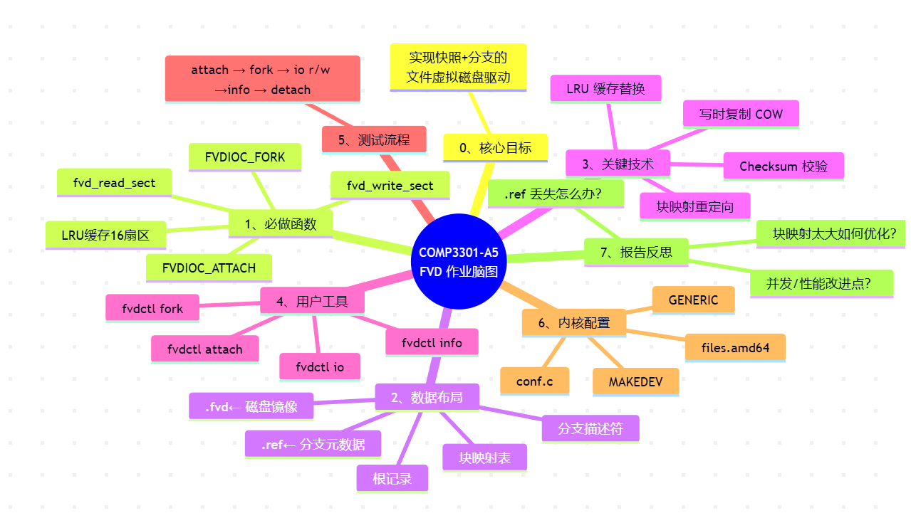

根据您提供的信息，我已经了解到这是COMP3301课程的第三个作业，主题是实现一个名为FVD（Forkable Virtual Disk）的虚拟磁盘格式的块设备驱动程序。让我分析一下主要要求和实现内容：

### 项目概述

您需要在OpenBSD内核中实现一个块设备驱动，支持使用FVD磁盘映像作为块设备。FVD是一种可分叉的虚拟磁盘格式，具有按需分配空间和支持磁盘状态分叉的特性。

### 需要实现的核心功能

1. **FVD Attach/Detach**

   - 实现`FVDIOC_ATTACH` IOCTL，用于将FVD映像附加到fvd(4)节点

   - 已经提供了`FVDIOC_DETACH`功能

     > - 在您的COMP3301作业中，**FVD Attach/Detach** 功能的实现主要涉及两个关键部分：
     >
     >   1. **`FVDIOC_ATTACH` IOCTL**：将FVD映像附加到 `fvd(4)` 节点，允许用户通过IOCTL命令将FVD磁盘映像和设备节点关联。
     >   2. **`FVDIOC_DETACH` IOCTL**：此功能已经由作业基础代码提供，用于卸载FVD映像。
     >
     >   ### 具体步骤：实现 `FVDIOC_ATTACH` IOCTL
     >
     >   #### 1. **理解 `FVDIOC_ATTACH` IOCTL 的功能**
     >
     >   `FVDIOC_ATTACH` IOCTL需要完成以下任务：
     >
     >   - 打开给定路径（`fa_path`）指定的FVD映像文件。
     >   - 确保FVD映像文件的格式有效，读取并验证根记录和分支描述符记录。
     >   - 将FVD映像挂载到 `fvd(4)` 设备节点上。
     >   - 根据 `fa_readonly` 参数决定该FVD映像是只读还是可写。
     >   - 加载块映射，初始化相关的数据结构。
     >
     >   #### 2. **修改 `fvd.c` 文件中的 `fvd_attach` 函数**
     >
     >   您需要在 `fvd.c` 文件中实现 `fvd_attach` 函数来处理 FVD 映像的附加过程。该函数会在设备的 `raw` 分区（`/dev/rfvdXc`）上工作。
     >
     >   ##### `fvd_attach` 函数结构：
     >
     >   ```c
     >   static int
     >   fvd_attach(dev_t dev, int flag, const struct fvd_attach *fa, struct proc *p)
     >   {
     >   	struct fvd_softc *sc;          /* 即将创建的软状态结构 */
     >   	int part = DISKPART(dev);      /* 取出设备分区号 */
     >   	struct vnode *fvdvp;           /* 指向 .fvd 文件 vnode */
     >   	struct vnode *refvp;           /* 指向 .ref 文件 vnode */
     >   	char fname[PATH_MAX + 4];      /* 磁盘镜像路径缓冲区，+4 留给后缀“.ref” */
     >   	char bname[FVD_MAX_BNM];       /* 分支名缓冲区 */
     >   	size_t fnamelen;               /* 实际路径长度 */
     >   	int rw;                        /* 最终打开文件用的读写模式 */
     >   	int error;                     /* 错误码暂存 */
     >   
     >   	/* 只能对原始整盘（RAW_PART）进行 attach，且必须可写打开 */
     >   	if (part != RAW_PART || !vfinddev(dev, VCHR, &fvdvp))
     >   		return (ENOTTY);
     >   	if (!ISSET(flag, FWRITE))
     >   		return (EBADF);
     >   
     >   	/* 全局锁：防止并发 attach 同一个设备 */
     >   	error = rw_enter(&fd.fd_lock, RW_WRITE | RW_INTR);
     >   	if (error != 0)
     >   		return (error);
     >   
     >   	/* 再次确认该设备尚未被 attach */
     >   	sc = fvd_find(dev);
     >   	rw_exit(&fd.fd_lock);
     >   	if (sc != NULL)
     >   		return (EBUSY);        /* 已存在则返回忙 */
     >   
     >   	/* 把用户态路径拷进来（.fvd 文件） */
     >   	error = copyinstr(fa->fa_path, fname, sizeof(fname), &fnamelen);
     >   	if (error != 0)
     >   		return (error);
     >   
     >   	/* 确保后面还能 strcat 4 字节“.ref” */
     >   	if (fnamelen > sizeof(fname) - 4)
     >   		return (ENAMETOOLONG);
     >   
     >   	/* 把用户态分支名拷进来 */
     >   	error = copyinstr(fa->fa_branch, bname, sizeof(bname), NULL);
     >   	if (error != 0)
     >   		return (error);
     >   
     >   	/* 计算文件打开模式：只读 or 读写 */
     >   	rw = FREAD;
     >   	if (!fa->fa_readonly)
     >   		rw |= FWRITE;
     >   
     >   	/* 打开磁盘镜像文件（.fvd） */
     >   	error = fvd_vnopen(fname, rw, &fvdvp, p);
     >   	if (error != 0)
     >   		return (error);
     >   
     >   	/* 打开元数据文件（.ref） */
     >   	strlcat(fname, ".ref", sizeof(fname));
     >   	error = fvd_vnopen(fname, rw, &refvp, p);
     >   	fname[fnamelen - 1] = '\0';   /* 去掉刚加的“.ref”，恢复原名 */
     >   	if (error != 0)
     >   		goto closefvd;         /* 失败则关闭已打开的 .fvd */
     >   
     >   	/* 为软状态结构申请内存并初始化 */
     >   	sc = fvd_create(dev);
     >   	if (sc == NULL) {
     >   		error = ENOMEM;
     >   		goto closeref;
     >   	}
     >   
     >   	/* 保存磁盘镜像路径到软状态 */
     >   	sc->sc_fname = malloc(fnamelen, M_DEVBUF, M_WAITOK | M_CANFAIL);
     >   	if (sc->sc_fname == NULL) {
     >   		error = ENOMEM;
     >   		goto destroy;
     >   	}
     >   	memcpy(sc->sc_fname, fname, fnamelen);
     >   	sc->sc_fnamelen = fnamelen;
     >   
     >   	/* 保存分支名、vnode、凭证、打开模式等 */
     >   	strlcpy(sc->sc_bname, bname, sizeof(sc->sc_bname));
     >   	sc->sc_fvdvp = fvdvp;
     >   	sc->sc_refvp = refvp;
     >   	sc->sc_ucred = crhold(p->p_ucred);
     >   	sc->sc_rw   = rw;
     >   
     >   	/*
     >   	 * <YOUR CODE HERE>
     >   	 * 作业重点：在这里读取 .ref 文件，解析元数据，
     >   	 * 并给 sc->sc_cylinders / sc_heads / sc_spt 赋值。
     >   	 */
     >   
     >   	// 读取 .ref 文件头 → 验证魔数、版本。
     >   	// 根据分支名找到对应分支描述符 → 取出块映射。
     >   	// 把 CHS 参数填进 sc->sc_cylinders / sc_heads / sc_spt。
     >   	// 若 .ref 不存在或损坏，可在此返回 EIO 或 EINVAL。
     >   
     >   	
     >   	/* 再次拿全局锁，准备把软状态插入全局树 */
     >   	error = rw_enter(&fd.fd_lock, RW_WRITE | RW_INTR);
     >   	if (error != 0)
     >   		goto freeup;
     >   
     >   	error = fvd_insert(sc);       /* 插入全局红黑树 */
     >   	if (error != 0)
     >   		goto rollback;
     >   
     >   	/* 向内核磁盘框架注册，创建 /dev/fvdXc 等节点 */
     >   	disk_attach(&sc->sc_dev, &sc->sc_dk);
     >   
     >   	fvd_leave(sc);                /* 释放临时引用 */
     >   	rw_exit(&fd.fd_lock);
     >   
     >   	return (0);                   /* 成功返回 */
     >   
     >   /* 以下是各种失败路径的清理标签 */
     >   rollback:
     >   	rw_exit(&fd.fd_lock);
     >   freeup:
     >   	crfree(sc->sc_ucred);
     >   	free(sc->sc_fname, M_DEVBUF, sc->sc_fnamelen);
     >   destroy:
     >   	free(sc, M_DEVBUF, sizeof(*sc));
     >   closeref:
     >   	vn_close(refvp, rw, p->p_ucred, p);
     >   closefvd:
     >   	vn_close(fvdvp, rw, p->p_ucred, p);
     >   	return (error);
     >   }
     >   ```
     >
     >   ### 3. **实现 `fvd_detach` IOCTL（已提供）**
     >
     >   `fvd_detach` 已经在基础代码中实现，但您需要确保当设备被卸载时，所有资源都被正确释放。尤其是在执行 `fvd_leave()` 时，您需要关闭 FVD 映像和引用计数文件，并释放分配的内存。
     >
     >   ### 4. **注意事项**
     >
     >   - **验证 FVD 格式**：在 `fvd_attach` 中，确保通过检查根记录和分支描述符记录来验证FVD映像是否有效。
     >   - **资源管理**：确保在 FVD 映像附加时正确分配和释放内存，特别是 `sc_fname` 和 `sc_ucred`。
     >   - **错误处理**：确保在函数中处理各种错误情况，特别是在文件打开失败或内存分配失败时。
     >   - **并发控制**：使用 `rwlock` 确保对共享资源（如 FVD 驱动程序资源）的访问是线程安全的。
     >
     >   ### 5. **总结**
     >
     >   在 `fvd_attach` 函数中，您需要完成以下关键操作：
     >
     >   1. **验证设备和路径**：确保设备和映像路径有效。
     >   2. **打开 FVD 文件**：根据路径打开 `.fvd` 和 `.fvd.ref` 文件。
     >   3. **初始化 FVD 结构**：创建并初始化 FVD 设备的 `softc` 结构。
     >   4. **挂载设备**：将该设备插入驱动程序并调用 `disk_attach()` 来挂载它。
     >   5. **内存和资源管理**：确保分配和释放相关内存。
     >
     >   完成这些任务后，您就实现了 `FVDIOC_ATTACH` IOCTL 的核心功能。

   > 下面把 `fvd_detach()` 逐行拆开，告诉你每一步在干嘛。
   >
   > ```c
   > static int
   > fvd_detach(struct fvd_softc *sc, dev_t dev, int flag, unsigned int force)
   > {
   > 	struct vnode *vp;          /* 用来验证设备节点是否存在 */
   > 	int part = DISKPART(dev);  /* 取出分区号 */
   > 	int error;                 /* 错误码暂存 */
   > 
   > /* === 1. 合法性检查 === */
   > 	/* 只能对原始整盘（RAW_PART）操作，且必须可写打开 */
   > 	if (part != RAW_PART || !vfinddev(dev, VCHR, &vp))
   > 		return (ENOTTY);
   > 	if (!ISSET(flag, FWRITE))
   > 		return (EBADF);
   > 
   > /* === 2. 加全局写锁，防止并发 detach / attach === */
   > 	error = rw_enter(&fd.fd_lock, RW_WRITE | RW_INTR);
   > 	if (error != 0)
   > 		return (error);
   > 
   > /* === 3. 非强制模式：检查是否还有别人在使用磁盘 === */
   > 	if (!force) {
   > 		struct disk *dk = &sc->sc_dk;
   > 		int pmask = (1 << part);   /* 只关心 RAW_PART 这一位 */
   > 
   > 		/* 拿磁盘自身锁，查看打开计数 */
   > 		error = disk_lock(dk);
   > 		if (error != 0)
   > 			goto leave;        /* 拿锁失败直接走错误路径 */
   > 
   > 		/*
   > 		 * dk_copenmask：其它分区是否被打开（字符设备）
   > 		 * dk_bopenmask：块设备是否被打开
   > 		 * 只要还有别人用，就返回 EBUSY
   > 		 */
   > 		if (ISSET(dk->dk_copenmask, ~pmask) || dk->dk_bopenmask)
   > 			error = EBUSY;
   > 
   > 		disk_unlock(&sc->sc_dk);   /* 放磁盘锁 */
   > 
   > 		if (error != 0)
   > 			goto leave;        /* 有人用就跳出去 */
   > 	}
   > 
   > /* === 4. 真正开始拆除 === */
   > 	fvd_remove(sc);                /* 把 sc 从全局红黑树摘下来 */
   > 	rw_exit(&fd.fd_lock);          /* 全局锁可以放了 */
   > 
   > /* === 5. 通知内核磁盘已消失，清理设备节点 === */
   > 	disk_gone(fvdopen, sc->sc_dev.dv_unit);
   > 	disk_detach(&sc->sc_dk);       /* 与 disk_attach() 配对 */
   > 
   > 	return (0);                    /* 成功返回 */
   > 
   > /* === 6. 错误统一出口 === */
   > leave:
   > 	rw_exit(&fd.fd_lock);          /* 别忘了放全局锁 */
   > 	return (error);
   > }
   > ```
   >
   > 一句话总结：  
   >
   > > **先验证权限和占用情况，再拿锁、检查是否“安全可拆”，最后把设备从全局树和内核磁盘框架里摘掉，完成卸载。**

2. **虚拟磁盘I/O**

   - 实现`fvd_read_sect()`和`fvd_write_sect()`函数，允许从虚拟磁盘读取和写入数据

   - 支持按需分配空间（首次写入的扇区需要分配空间）

   - 支持写时复制（COW）功能，当写入共享记录时创建新副本

   - > 要实现 `fvd_read_sect` 和 `fvd_write_sect` 这两个函数，您需要处理的是如何从虚拟磁盘中读取和写入数据，并且要确保数据的正确性，特别是在 FVD（Forkable Virtual Disk）格式下，这涉及到磁盘映像的管理、缓存、按需分配空间和写时复制（COW）等技术。
     >
     > ### **实现思路**
     >
     > 1. **缓存管理**：
     >    - FVD磁盘驱动的一个核心特性是缓存机制，尤其是16个扇区的缓存。需要确保每次读写扇区时，检查缓存中是否已存在该扇区的内容。
     >    - 如果缓存中没有该扇区数据，则从FVD磁盘映像中读取；如果是写操作，可能需要更新缓存并标记为脏数据。
     > 2. **按需分配**：
     >    - **读取操作**：如果请求读取的扇区没有被写入过，您需要从FVD映像的默认（零填充）区域读取。
     >    - **写入操作**：如果请求写入的扇区之前从未被写入过，您需要为该扇区分配空间，或者使用写时复制（COW）技术，如果该扇区已经由多个分支共享。
     > 3. **写时复制（COW）**：
     >    - 如果多个分支共享相同的记录，写时复制允许您在进行写操作时不直接修改原始数据，而是创建该扇区的副本，并更新块映射以指向新记录。
     >
     > ### **1. 读取操作：`fvd_read_sect`**
     >
     > 读取操作的关键是从FVD映像文件中提取正确的扇区数据。您需要检查请求的扇区是否在缓存中，如果不在，则从FVD映像中读取并填充缓存。
     >
     > ### **`fvd_read_sect` 函数实现**
     >
     > ```c
     > static int
     > fvd_read_sect(struct fvd_softc *sc, uint32_t sec, void *buf)
     > {
     >     int error = 0;
     > 
     >     // 检查缓存中是否已经存在该扇区
     >     if (sc->sc_cache[sec % 16].valid) {
     >         // 如果缓存有效，直接将缓存中的数据复制到输出缓冲区
     >         memcpy(buf, sc->sc_cache[sec % 16].data, FVD_SECTOR_SIZE);
     >         return 0;
     >     }
     > 
     >     // 如果缓存中没有该扇区，按照块映射读取该扇区
     >     uint32_t record_num = sc->sc_blkmap[sec];  // 假设 sc_blkmap 存储了扇区映射到记录的关系
     > 
     >     // 如果映射为空，表示该扇区尚未分配
     >     if (record_num == 0) {
     >         memset(buf, 0, FVD_SECTOR_SIZE);  // 填充零
     >         return 0;
     >     }
     > 
     >     // 否则从 FVD 文件中读取对应的记录数据
     >     struct vnode *fvdvp = sc->sc_fvdvp;
     >     off_t offset = record_num * FVD_SECTOR_SIZE;
     > 
     >     error = vn_rdwr(UIO_READ, fvdvp, buf, FVD_SECTOR_SIZE, offset, UIO_SYSSPACE, IO_NODELOCKED, sc->sc_ucred, &sc->sc_rw, curproc);
     >     if (error != 0) {
     >         return error;  // 返回读取错误
     >     }
     > 
     >     // 将读取到的数据存储到缓存中
     >     sc->sc_cache[sec % 16].valid = 1;
     >     memcpy(sc->sc_cache[sec % 16].data, buf, FVD_SECTOR_SIZE);
     > 
     >     return 0;
     > }
     > ```
     >
     > ### **2. 写入操作：`fvd_write_sect`**
     >
     > 写入操作需要处理如下问题：
     >
     > - 如果扇区是共享的（多个分支指向同一个记录），则使用写时复制（COW）技术。
     > - 如果该扇区没有被分配（即映射为空），则需要为它分配新记录。
     >
     > ### **`fvd_write_sect` 函数实现**
     >
     > ```c
     > static int
     > fvd_write_sect(struct fvd_softc *sc, uint32_t sec, const void *buf)
     > {
     >     int error = 0;
     > 
     >     // 检查该扇区是否处于只读模式
     >     if (!(sc->sc_rw & FWRITE)) {
     >         return EACCES;  // 如果是只读设备，拒绝写入
     >     }
     > 
     >     // 获取扇区对应的记录号
     >     uint32_t record_num = sc->sc_blkmap[sec];
     > 
     >     // 如果该扇区没有映射，进行空间分配
     >     if (record_num == 0) {
     >         record_num = fvd_allocate_record(sc);
     >         if (record_num == 0) {
     >             return ENOSPC;  // 无可用空间，返回错误
     >         }
     >         // 更新块映射表，指向新分配的记录
     >         sc->sc_blkmap[sec] = record_num;
     >     }
     > 
     >     // 如果扇区由多个分支共享，需要进行写时复制（COW）
     >     if (fvd_is_shared_record(sc, record_num)) {
     >         uint32_t new_record_num = fvd_copy_on_write(sc, record_num);
     >         if (new_record_num == 0) {
     >             return ENOMEM;  // COW 失败，无法分配新的记录
     >         }
     >         sc->sc_blkmap[sec] = new_record_num;  // 更新映射到新记录
     >     }
     > 
     >     // 将数据写入 FVD 文件
     >     struct vnode *fvdvp = sc->sc_fvdvp;
     >     off_t offset = record_num * FVD_SECTOR_SIZE;
     > 
     >     error = vn_rdwr(UIO_WRITE, fvdvp, (caddr_t)buf, FVD_SECTOR_SIZE, offset, UIO_SYSSPACE, IO_NODELOCKED, sc->sc_ucred, &sc->sc_rw, curproc);
     >     if (error != 0) {
     >         return error;  // 返回写入错误
     >     }
     > 
     >     // 标记缓存中的该扇区为脏
     >     sc->sc_cache[sec % 16].valid = 1;
     >     memcpy(sc->sc_cache[sec % 16].data, buf, FVD_SECTOR_SIZE);
     >     sc->sc_cache[sec % 16].dirty = 1;
     > 
     >     return 0;
     > }
     > ```
     >
     > ### **3. 函数细节解释**
     >
     > 1. **`fvd_read_sect`**:
     >    - 检查缓存中是否有该扇区数据。如果有，直接从缓存中返回数据。
     >    - 如果缓存没有该扇区数据，使用 `sc->sc_blkmap` 来查找该扇区对应的记录。如果该扇区没有被分配，则返回零填充数据。
     >    - 通过 `vn_rdwr` 从磁盘映像中读取数据，并将数据存入缓存。
     > 2. **`fvd_write_sect`**:
     >    - 检查设备是否为只读模式。如果是，则返回 `EACCES` 错误。
     >    - 如果扇区映射为空（尚未分配），调用 `fvd_allocate_record` 来为其分配一个新记录。
     >    - 如果扇区的记录由多个分支共享，执行写时复制（COW）操作，即为该扇区创建一个新副本。
     >    - 使用 `vn_rdwr` 将数据写入磁盘，并更新缓存。
     >
     > ### **4. 额外实现函数**
     >
     > - **`fvd_allocate_record`**：负责为未分配的扇区分配一个新的记录（在磁盘上分配空间）。
     > - **`fvd_is_shared_record`**：检查指定的记录是否被多个分支共享。
     > - **`fvd_copy_on_write`**：实现写时复制（COW），为共享的记录创建一个新的副本，并返回新记录的编号。
     >
     > ### **总结**
     >
     > - `fvd_read_sect` 主要是从磁盘映像中读取扇区，并且利用缓存机制优化性能。
     > - `fvd_write_sect` 处理写入扇区时的按需分配和写时复制操作，确保不会修改原始数据而是创建新副本。

3. **虚拟磁盘状态分叉**

   - 实现`FVDIOC_FORK` IOCTL，用于分叉当前分支的磁盘状态

     > - 下面把 `fvd_fork()` 逐行拆开，告诉你每一步在干嘛。
     >
     >   ```c
     >   static int
     >   fvd_fork(const struct subcmd *c, int argc, char *argv[])
     >   {
     >   	struct fvd_fork ff;   /* 待传给内核的 fork 参数结构 */
     >   	int force = 0;        /* -f 强制标志，默认关闭 */
     >   	int Dflag = 0;        /* -D 调试标志，默认关闭 */
     >   	int ch;               /* getopt 返回值 */
     >   	int dfd;              /* 打开的设备 fd */
     >   
     >   /* === 1. 解析命令行选项 === */
     >   	while ((ch = getopt(argc, argv, "Df")) != -1) {
     >   		switch (ch) {
     >   		case 'D':             /* 调试模式：直接传路径而非 /dev/rfvdXc */
     >   			Dflag = 1;
     >   			break;
     >   		case 'f':             /* 强制模式：即使目标分支已存在也覆盖 */
     >   			force = 1;
     >   			break;
     >   		default:              /* 非法选项则打印用法并退出 */
     >   			fvd_usage(c);
     >   			/* NOTREACHED */
     >   		}
     >   	}
     >   
     >   /* === 2. 把非选项参数移到前面 === */
     >   	argc -= optind;
     >   	argv += optind;
     >   
     >   /* === 3. 参数个数检查：必须剩 2 个（设备名 新分支名）=== */
     >   	if (argc != 2)
     >   		fvd_usage(c);
     >   
     >   /* === 4. 打开设备（/dev/rfvdXc 或裸路径，视 -D 而定）=== */
     >   	dfd = openfvd(Dflag, argv[0], O_RDWR);
     >   
     >   /* === 5. 填充内核所需结构 === */
     >   	strlcpy(ff.ff_name, argv[1], sizeof(ff.ff_name)); /* 新分支名 */
     >   	ff.ff_force = force;                              /* 强制标志 */
     >   
     >   /* === 6. 下发 FVDIOC_FORK ioctl === */
     >   	if (ioctl(dfd, FVDIOC_FORK, &ff) == -1)
     >   		err(1, "%s%s %s %s", force ? "force " : "", c->name, argv[0],
     >   		    argv[1]);
     >   
     >   /* === 7. 成功返回 === */
     >   	return (0);
     >   }
     >   ```
     >
     >   一句话总结：  
     >
     >   > **把命令行解析成“设备+新分支名+可选强制/调试标志”，打包后通过 `ioctl(FVDIOC_FORK)` 告诉内核“给我在当前基础上 fork 一个新分支”。**

   - 

   - > 是的，`fvd_fork` 需要您根据作业要求完善代码。`FVDIOC_FORK` IOCTL 的核心任务是分叉当前分支的磁盘状态，并使用写时复制（COW）技术来避免对原数据的直接修改。
     >
     > 在您提供的代码框架中，`fvd_fork` 函数有一个基本的结构，但它仍然缺少一些关键的实现，特别是写时复制（COW）相关的部分。
     >
     > ### **您需要完善的内容：**
     >
     > 1. **分配新的分支描述符**：
     >    - 您需要根据分叉命令创建一个新的分支描述符 (`fvd_brch_desc`)，包括设置分支名称、创建时间等。
     >    - 将新分支的描述符插入到现有的FVD映像中。
     > 2. **创建新的块映射**：
     >    - 为新分支分配一个新的块映射（`new_blkmap`），并将当前分支的块映射内容复制到新的块映射中。
     > 3. **写时复制（COW）技术**：
     >    - 这部分非常关键。遍历当前分支的块映射，对于所有共享的记录（多个分支引用同一数据块），使用写时复制（COW）技术：复制共享的记录并更新块映射，使新分支指向新的记录副本。
     >    - 通过调用辅助函数 `fvd_is_shared_record` 和 `fvd_copy_on_write` 来完成写时复制。
     > 4. **更新新分支的块映射和描述符**：
     >    - 将新创建的块映射与新分支描述符关联，更新FVD映像。
     > 5. **释放资源**：
     >    - 在完成分叉操作后，确保释放所有分配的资源，如 `new_blkmap`。
     >
     > ### **完善 `fvd_fork` 函数的关键步骤：**
     >
     > 1. **分配和初始化新的分支描述符**：
     >    - 创建新的分支描述符，并设置必要的信息（例如创建时间、分支名等）。
     > 2. **为新分支分配块映射**：
     >    - 将当前分支的块映射复制到新分支的块映射中。
     > 3. **写时复制**：
     >    - 对于每个共享的记录，使用写时复制技术创建副本，并更新块映射。
     > 4. **更新FVD映像**：
     >    - 将新分支和块映射信息写回FVD映像。
     >
     > ### **代码实现示例**：
     >
     > 在您提供的框架中，您可以在 `fvd_fork` 函数内加入如下代码来完善其功能：
     >
     > ```c
     > static int
     > fvd_fork(const struct subcmd *c, int argc, char *argv[])
     > {
     >     struct fvd_fork ff;
     >     int force = 0;
     >     int Dflag = 0;
     >     int ch;
     >     int dfd;
     >     struct fvd_softc *sc;
     >     struct fvd_root_block rootblk;
     >     struct fvd_brch_desc new_bdesc;
     >     uint32_t *new_blkmap;
     >     int error;
     > 
     >     // 解析命令行选项
     >     while ((ch = getopt(argc, argv, "Df")) != -1) {
     >         switch (ch) {
     >         case 'D':
     >             Dflag = 1;
     >             break;
     >         case 'f':
     >             force = 1;
     >             break;
     >         default:
     >             fvd_usage(c);
     >         }
     >     }
     > 
     >     argc -= optind;
     >     argv += optind;
     > 
     >     // 确保命令行有合适的参数
     >     if (argc != 2)
     >         fvd_usage(c);
     > 
     >     // 打开设备
     >     dfd = openfvd(Dflag, argv[0], O_RDWR);
     >     strlcpy(ff.ff_name, argv[1], sizeof(ff.ff_name));
     >     ff.ff_force = force;
     > 
     >     // 获取当前附加的 FVD 设备
     >     sc = fvd_enter(dfd);
     >     if (sc == NULL)
     >         return ENXIO;  // 如果没有附加的设备，返回错误
     > 
     >     // 创建新的分支描述符
     >     memset(&new_bdesc, 0, sizeof(new_bdesc));
     >     new_bdesc.fb_magic = FVD_BRCH_MAGIC;
     >     new_bdesc.fb_nchilds = 0;
     >     new_bdesc.fb_ctime = time(NULL);  // 设置创建时间
     >     strlcpy(new_bdesc.fb_name, ff.ff_name, sizeof(new_bdesc.fb_name));
     > 
     >     // 分配新的块映射
     >     new_blkmap = malloc(sizeof(uint32_t) * sc->sc_cylinders * sc->sc_heads * sc->sc_spt, M_DEVBUF, M_WAITOK);
     >     if (new_blkmap == NULL) {
     >         fvd_leave(sc);
     >         return ENOMEM;  // 分配失败，返回内存错误
     >     }
     > 
     >     // 初始化新的块映射（首先指向旧记录）
     >     memcpy(new_blkmap, sc->sc_blkmap, sizeof(uint32_t) * sc->sc_cylinders * sc->sc_heads * sc->sc_spt);
     > 
     >     // 遍历所有扇区，使用写时复制（COW）
     >     for (int i = 0; i < sc->sc_cylinders * sc->sc_heads * sc->sc_spt; i++) {
     >         uint32_t record_num = sc->sc_blkmap[i];
     >         if (record_num != 0) {
     >             // 如果记录已被多个分支共享，进行写时复制
     >             if (fvd_is_shared_record(sc, record_num)) {
     >                 uint32_t new_record = fvd_copy_on_write(sc, record_num);
     >                 if (new_record != 0) {
     >                     new_blkmap[i] = new_record;  // 更新为新记录
     >                 }
     >             }
     >         }
     >     }
     > 
     >     // 更新新的分支描述符和块映射
     >     new_bdesc.fb_blkmap = (uint32_t)new_blkmap;  // 保存新的块映射的指针（需要映射到磁盘）
     > 
     >     // 将新的分支描述符插入到 FVD 映像中
     >     error = fvd_insert_branch(sc, &new_bdesc);
     >     if (error != 0) {
     >         free(new_blkmap, M_DEVBUF, sizeof(uint32_t) * sc->sc_cylinders * sc->sc_heads * sc->sc_spt);
     >         fvd_leave(sc);
     >         return error;
     >     }
     > 
     >     // 释放锁，完成分叉
     >     fvd_leave(sc);
     > 
     >     return 0;
     > }
     > ```
     >
     > ### **补充的辅助函数：**
     >
     > 1. **`fvd_is_shared_record`**：检查记录是否被多个分支共享。具体实现可能会检查记录的引用计数。
     > 2. **`fvd_copy_on_write`**：实现写时复制（COW），即在需要修改的记录上创建新副本。此函数应该负责复制原记录的数据并返回新的记录编号。
     > 3. **`fvd_insert_branch`**：将新的分支描述符和块映射信息插入到 FVD 映像中，可能会将新分支的描述符写回到磁盘或内存中。
     >
     > ### **总结：**
     >
     > 是的，您需要在 `fvd_fork` 函数中完善代码，尤其是在处理分叉和写时复制部分。这涉及创建新的分支描述符、分配新的块映射、使用写时复制来避免修改原始数据，以及将新分支和映射写回FVD映像中。

   - 使用写时复制技术而不是完全复制数据

   

4. ## **扇区缓存和缓存替换**

   > 1. 为了实现扇区缓存和缓存替换（LRU算法），并实现 `FVDIOC_CACHE_LIST` 和 `FVDIOC_CACHE_EMPTY` IOCTLs 进行缓存管理，您需要按照以下步骤完成代码实现：
   >
   >    ### **1. 扇区缓存的设计**
   >
   >    我们需要为每个 `fvd(4)` 设备创建一个缓存，这个缓存可以存储最多16个扇区的数据。为了实现这个缓存管理，您可以使用一个数组来存储这些扇区。每个缓存项可以包含：
   >
   >    - 扇区的编号
   >    - 扇区的数据
   >    - 标志位，表示该扇区数据是否有效
   >    - 标志位，表示该扇区数据是否被修改（脏数据）
   >
   >    ### **2. LRU（最近最少使用）算法**
   >
   >    为了实现LRU缓存替换算法，我们需要：
   >
   >    - 每当一个扇区被访问时，更新其在缓存中的位置，标记为“最近使用”。
   >    - 如果缓存已满（16个扇区），我们需要选择最久未使用的扇区（LRU）并将其替换。具体实现时，可以使用链表、队列或其他数据结构来记录每个缓存项的访问顺序。
   >
   >    ### **3. `FVDIOC_CACHE_LIST` IOCTL**
   >
   >    `FVDIOC_CACHE_LIST` IOCTL 用于列出当前缓存中所有的扇区信息，包括：
   >
   >    - 扇区编号
   >    - 扇区的校验和
   >    - 是否是脏数据（如果扇区被修改过）
   >
   >    ### **4. `FVDIOC_CACHE_EMPTY` IOCTL**
   >
   >    `FVDIOC_CACHE_EMPTY` IOCTL 用于清空缓存，将缓存中的所有脏数据写回磁盘，并将缓存清空。
   >
   >    ### **实现步骤：**
   >
   >    #### **1. 扇区缓存的结构设计**
   >
   >    首先，我们需要为每个 `fvd(4)` 设备定义一个缓存结构。在 `fvd_softc` 中增加一个缓存结构，最多存储16个扇区。
   >
   >    ```c
   >    #define FVD_CACHE_SIZE 16
   >    
   >    struct fvd_cache_entry {
   >        uint32_t sec_number;   // 扇区编号
   >        uint8_t data[FVD_SECTOR_SIZE];  // 扇区数据
   >        int valid;  // 数据是否有效
   >        int dirty;  // 数据是否被修改
   >    };
   >    
   >    struct fvd_softc {
   >        // 其他成员...
   >        struct fvd_cache_entry sc_cache[FVD_CACHE_SIZE];  // 缓存
   >    };
   >    ```
   >
   >    #### **2. LRU缓存替换算法**
   >
   >    LRU算法可以通过维护一个简单的链表来实现，或者可以通过维护一个数组和访问顺序来简化实现。以下是一个简单的实现示例，使用数组来实现LRU：
   >
   >    ```c
   >    static void
   >    fvd_cache_access(struct fvd_softc *sc, uint32_t sec)
   >    {
   >        int i;
   >    
   >        // 查找该扇区是否在缓存中
   >        for (i = 0; i < FVD_CACHE_SIZE; i++) {
   >            if (sc->sc_cache[i].valid && sc->sc_cache[i].sec_number == sec) {
   >                // 如果在缓存中，移动到最前面（标记为最近使用）
   >                if (i > 0) {
   >                    struct fvd_cache_entry temp = sc->sc_cache[i];
   >                    memmove(&sc->sc_cache[1], &sc->sc_cache[0], i * sizeof(struct fvd_cache_entry));
   >                    sc->sc_cache[0] = temp;
   >                }
   >                return;
   >            }
   >        }
   >    
   >        // 如果缓存没有该扇区，替换最久未使用的扇区
   >        for (i = FVD_CACHE_SIZE - 1; i > 0; i--) {
   >            sc->sc_cache[i] = sc->sc_cache[i - 1];
   >        }
   >    
   >        // 加载新的扇区数据
   >        sc->sc_cache[0].sec_number = sec;
   >        sc->sc_cache[0].valid = 1;
   >        sc->sc_cache[0].dirty = 0;
   >    }
   >    ```
   >
   >    在上面的代码中：
   >
   >    - 我们遍历缓存，检查目标扇区是否已经在缓存中。如果在缓存中，移动该扇区到“最近使用”位置（即缓存的顶部）。
   >    - 如果缓存没有该扇区，则替换掉最久未使用的扇区，并将新扇区数据加载到缓存。
   >
   >    #### **3. 实现 `FVDIOC_CACHE_LIST` IOCTL**
   >
   >    `FVDIOC_CACHE_LIST` IOCTL 用于列出当前缓存中的扇区信息。您需要遍历缓存并将扇区的信息返回给用户。
   >
   >    ```c
   >    static int
   >    fvd_cache_list(struct fvd_softc *sc, struct fvd_cache_list *fcl)
   >    {
   >        int i;
   >    
   >        // 设置缓存中的扇区数
   >        fcl->fc_nsects = 0;
   >        for (i = 0; i < FVD_CACHE_SIZE; i++) {
   >            if (sc->sc_cache[i].valid) {
   >                fcl->fc_sects[fcl->fc_nsects].si_number = sc->sc_cache[i].sec_number;
   >                fcl->fc_sects[fcl->fc_nsects].si_checksum = checksum(sc->sc_cache[i].data);
   >                fcl->fc_sects[fcl->fc_nsects].si_dirty = sc->sc_cache[i].dirty;
   >                fcl->fc_nsects++;
   >            }
   >        }
   >    
   >        return 0;
   >    }
   >    ```
   >
   >    在上面的代码中：
   >
   >    - `fvd_cache_list` 函数会遍历缓存中的所有扇区，并将其信息填充到 `fvd_cache_list` 结构中，返回给用户。包括扇区号、校验和和脏数据标志。
   >
   >    #### **4. 实现 `FVDIOC_CACHE_EMPTY` IOCTL**
   >
   >    `FVDIOC_CACHE_EMPTY` IOCTL 用于清空缓存并将脏数据写回磁盘。
   >
   >    ```c
   >    static int
   >    fvd_cache_empty(struct fvd_softc *sc)
   >    {
   >        int i;
   >        int error;
   >    
   >        // 遍历缓存，将脏数据写回磁盘
   >        for (i = 0; i < FVD_CACHE_SIZE; i++) {
   >            if (sc->sc_cache[i].valid && sc->sc_cache[i].dirty) {
   >                // 通过 `fvd_write_sect` 将脏数据写回磁盘
   >                error = fvd_write_sect(sc, sc->sc_cache[i].sec_number, sc->sc_cache[i].data);
   >                if (error != 0) {
   >                    return error;
   >                }
   >                // 标记为未脏
   >                sc->sc_cache[i].dirty = 0;
   >            }
   >        }
   >    
   >        return 0;
   >    }
   >    ```
   >
   >    在上面的代码中：
   >
   >    - `fvd_cache_empty` 函数遍历缓存中的所有扇区，如果该扇区是脏数据，则调用 `fvd_write_sect` 将其写回磁盘，然后将该扇区标记为非脏数据。
   >
   >    ### **5. 完整代码：**
   >
   >    最终的实现包括缓存结构、LRU算法、`FVDIOC_CACHE_LIST` 和 `FVDIOC_CACHE_EMPTY` IOCTL 的实现，代码如下：
   >
   >    ```c
   >    #define FVD_CACHE_SIZE 16
   >    
   >    struct fvd_cache_entry {
   >        uint32_t sec_number;
   >        uint8_t data[FVD_SECTOR_SIZE];
   >        int valid;
   >        int dirty;
   >    };
   >    
   >    struct fvd_softc {
   >        struct fvd_cache_entry sc_cache[FVD_CACHE_SIZE];
   >        // 其他字段...
   >    };
   >    
   >    // LRU缓存访问
   >    static void fvd_cache_access(struct fvd_softc *sc, uint32_t sec)
   >    {
   >        int i;
   >        for (i = 0; i < FVD_CACHE_SIZE; i++) {
   >            if (sc->sc_cache[i].valid && sc->sc_cache[i].sec_number == sec) {
   >                if (i > 0) {
   >                    struct fvd_cache_entry temp = sc->sc_cache[i];
   >                    memmove(&sc->sc_cache[1], &sc->sc_cache[0], i * sizeof(struct fvd_cache_entry));
   >                    sc->sc_cache[0] = temp;
   >                }
   >                return;
   >            }
   >        }
   >        for (i = FVD_CACHE_SIZE - 1; i > 0; i--) {
   >            sc->sc_cache[i] = sc->sc_cache[i - 1];
   >        }
   >        sc->sc_cache[0].sec_number = sec;
   >        sc->sc_cache[0].valid = 1;
   >        sc->sc_cache[0].dirty = 0;
   >    }
   >    
   >    // FVDIOC_CACHE_LIST IOCTL
   >    static int fvd_cache_list(struct fvd_softc *sc, struct fvd_cache_list *fcl)
   >    {
   >        int i;
   >        fcl->fc_nsects = 0;
   >        for (i = 0; i < FVD_CACHE_SIZE; i++) {
   >            if (sc->sc_cache[i].valid) {
   >                fcl->fc_sects[fcl->fc_nsects].si_number = sc->sc_cache[i].sec_number;
   >                fcl->fc_sects[fcl->fc_nsects].si_checksum = checksum(sc->sc_cache[i].data);
   >                fcl->fc_sects[fcl->fc_nsects].si_dirty = sc->sc_cache[i].dirty;
   >                fcl->fc_nsects++;
   >            }
   >        }
   >        return 0;
   >    }
   >    
   >    // FVDIOC_CACHE_EMPTY IOCTL
   >    static int fvd_cache_empty(struct fvd_softc *sc)
   >    {
   >        int i;
   >        int error;
   >        for (i = 0; i < FVD_CACHE_SIZE; i++) {
   >            if (sc->sc_cache[i].valid && sc->sc_cache[i].dirty) {
   >                error = fvd_write_sect(sc, sc->sc_cache[i].sec_number, sc->sc_cache[i].data);
   >                if (error != 0) {
   >                    return error;
   >                }
   >                sc->sc_cache[i].dirty = 0;
   >            }
   >        }
   >        return 0;
   >    }
   >    ```
   >
   >    ### **总结：**
   >
   >    - 为每个 `fvd(4)` 设备缓存16个扇区。
   >    - 使用LRU算法来管理缓存，确保每次读取或写入时都标记扇区为“最近使用”。
   >    - 实现 `FVDIOC_CACHE_LIST` 和 `FVDIOC_CACHE_EMPTY` IOCTL 来列出缓存信息和清空缓存。

   - 为每个fvd(4)设备缓存16个扇区
   - 实现LRU（最近最少使用）缓存替换算法
   - 实现`FVDIOC_CACHE_LIST`和`FVDIOC_CACHE_EMPTY` IOCTLs进行缓存管理

### 项目结构和准备工作

1. 首先需要下载基础代码补丁并应用到OpenBSD内核源代码中
2. 编译和安装更新的内核
3. 构建和安装fvdctl(8)工具
4. 创建fvd(4)设备节点
5. 安装fvdtool(1)工具

### 注意事项

- 所有IOCTL操作应仅在原始分区（partition c）的字符设备上工作
- 代码风格需要遵循OpenBSD的风格指南
- 实现需要可靠、健壮、可移植且模块化
- 需要提交到指定的Git分支

我看到项目目录中已经包含了`.git`仓库、作业要求文件（1138.txt）以及FVD格式规范（a3-fvd-spec.pdf）。您需要仔细研究FVD格式规范，以便正确实现块设备驱动程序。

要开始实现，建议您按照文档中的步骤先准备好开发环境，然后逐步实现上述功能。特别需要注意FVD格式的实现细节，包括根记录、分支描述符记录、块映射和引用计数等概念的正确处理。


### 第四步：测试和调试

1. **使用提供的测试工具**：

   

   bash

   

   

   

   ```
   cd ~
   ftp https://stluc.manta.uqcloud.net/comp3301/public/a3_public_tests.tar
   tar -xvf a3_public_tests.tar
   cd a3test
   ./install
   ./a3test
   ```

2. **手动测试**：

   - 使用fvdtool创建FVD映像
   - 使用fvdctl附加映像
   - 创建文件系统并挂载
   - 执行基本的文件操作
   - 测试分叉功能

### 第五步：撰写反思报告

根据作业要求，回答以下问题并以PDF格式提交：

1. 如果丢失了.ref文件，是否仍能从.fvd文件恢复数据？为什么？
2. 连续分配是否适合在FVD文件中存储引用计数元数据？为什么？
3. 使用链接分配存储引用计数元数据有什么缺点？
4. 如何减小块映射的大小？这会带来什么缺点？

### 代码实现建议

- **模块化设计**：将不同功能拆分为独立的函数
- **错误处理**：对所有可能失败的操作进行适当的错误处理
- **并发控制**：使用rwlock等机制防止竞态条件
- **遵循OpenBSD风格**：确保代码符合style(9)中描述的编码风格
- **注释**：为复杂的算法和逻辑添加清晰的注释

希望这个步骤指南能帮助您更好地理解如何完成这个作业！如果您在具体实现过程中遇到问题，可以参考提供的手册页，如vnd(4)、vnode(9)、VNSUBR(9)等。


根据你提供的 `diff` 文件，这是你作业所需进行的修改和操作：

### 1. **代码修改和补充**

- **新增文件**：
  - 在 `sys/dev/` 目录下新增了 `fvd.c` 和 `fvdvar.h` 文件。这些文件包含了FVD设备驱动程序的实现，包括设备操作、IOCTL处理、以及缓存管理等。
  - 在 `usr.sbin/fvdctl/` 目录下新增了 `fvdctl.c` 和 `Makefile`，用于控制FVD设备的命令行工具。
- **关键修改**：
  - 在系统配置文件中，注册了 `fvd` 设备（在 `sys/conf/GENERIC`、`sys/arch/amd64/conf/files.amd64`、`sys/arch/amd64/conf.c` 中进行修改）。
  - `MAKEDEV` 文件被修改，增加了对 `fvd` 设备的支持，使得 `fvd` 设备能够被创建。
- **设备驱动**：
  - 在 `fvd.c` 中，你实现了包括设备打开、关闭、读取、写入、IOCTL处理等功能。例如，`fvd_read_sect()` 和 `fvd_write_sect()` 函数需要实现具体的读写逻辑。
  - `fvd_attach()` 和 `fvd_detach()` 处理设备的挂载和卸载。
  - `fvd_fork()` 处理虚拟磁盘分叉。
  - 缓存管理使用了LRU算法，并且有对应的IOCTL命令处理，例如 `FVDIOC_CACHE_LIST` 和 `FVDIOC_CACHE_EMPTY`。
- **用户空间工具**：
  - 在 `fvdctl.c` 中，你实现了一个命令行工具 `fvdctl`，用于控制FVD设备，提供了如下子命令：
    - `attach`：将FVD映像附加到设备。
    - `detach`：卸载FVD映像。
    - `info`：显示FVD设备的相关信息。
    - `fork`：分叉FVD的分支。
    - `io`：用于执行一些交互命令，如读取、写入扇区、列出缓存等。

### 2. **需要你做的事**

- **补充实现**：你需要在 `fvd.c` 文件中实现 `fvd_read_sect()` 和 `fvd_write_sect()` 函数，这部分是你作业的关键，涉及到如何从FVD磁盘映像读取和写入数据。
- **测试功能**：确保你能够使用 `fvdctl` 工具进行FVD设备的挂载、卸载、分叉等操作。
- **缓存管理**：按照要求实现16个扇区的缓存，并使用LRU算法管理这些缓存。你需要实现缓存的列出、清空等功能。
- **提交**：根据要求提交代码和反思文档。

### 3. **文件操作**

- **fvd.c**：主要实现FVD设备驱动的核心逻辑。
- **fvdvar.h**：定义了FVD相关的数据结构和IOCTL命令。
- **fvdctl.c**：实现了与FVD设备交互的命令行工具。
- **Makefile**：用来编译 `fvdctl` 工具。

总之，你需要完成FVD设备的具体实现，特别是磁盘的读取和写入操作，并确保缓存管理的正确性。完成后，使用 `fvdctl` 工具进行测试并验证功能。


根据您的分析和提供的差异（`diff`）文件，以下是您需要在作业中进行的具体修改和实现步骤：

### 1. **实现FVD驱动程序（`fvd.c`）**

这部分是核心工作，您需要在 `fvd.c` 中实现如下功能：

- **`fvd_read_sect()`** 和 **`fvd_write_sect()`**：
  - **`fvd_read_sect()`**：该函数将从虚拟磁盘的FVD映像中读取数据。首先检查请求的扇区是否在缓存中，如果缓存中没有，则通过块映射找到该扇区的数据记录，并从FVD文件中读取。您需要使用LRU缓存算法进行缓存管理，避免频繁的磁盘I/O操作。
  - **`fvd_write_sect()`**：该函数将数据写入FVD磁盘映像。在写入时，您需要检查是否启用了写时复制（COW）。如果某个扇区的记录被多个分支共享，需要为该扇区创建一个新的数据记录。此外，写时复制操作要求为每个扇区分配新的记录，并更新映射。

### 2. **实现IOCTL命令**

- **`FVDIOC_ATTACH`**：此IOCTL将FVD磁盘映像附加到 `fvd(4)` 节点。在 `fvd.c` 文件中，您需要实现逻辑以：
  1. 打开FVD文件并验证它是否为有效的FVD映像。
  2. 处理分支描述符记录，读取块映射。
  3. 初始化相关的驱动程序结构。
- **`FVDIOC_FORK`**：此IOCTL将创建一个新的分支，并切换到该分支。在 `fvd.c` 中实现时：
  1. 复制当前分支的块映射。
  2. 增加引用计数（COW）。
  3. 更新驱动状态以使用新分支。

### 3. **缓存管理（LRU算法）**

- 在 `fvd.c` 中，您需要设计并实现缓存系统。每个 `fvd(4)` 设备需要缓存16个扇区。
- 使用 **LRU（Least Recently Used）** 算法进行缓存替换。当缓存满时，您应该将最久未访问的扇区移除并写回磁盘。
- 实现 IOCTL `FVDIOC_CACHE_LIST`：列出当前缓存中的所有扇区及其状态（是否脏）。
- 实现 IOCTL `FVDIOC_CACHE_EMPTY`：清空缓存，将所有脏扇区写回磁盘。

### 4. **添加新的设备类型（`fvd`）**

根据您提供的 `diff` 文件，系统配置文件已经更新以注册 `fvd` 设备。您需要确保以下修改：

- 在 **`sys/conf/GENERIC`** 文件中，增加 `fvd` 作为伪设备（`pseudo-device fvd 1`）。
- 在 **`sys/conf/files`** 中，增加对 `fvd` 设备的支持。
- 更新 **`sys/arch/amd64/conf.c`**，在设备表中添加 `fvd`。
- 修改 **`MAKEDEV`** 文件，支持创建 `fvd` 设备节点。

### 5. **`fvdctl` 工具的实现**

- 在 **`fvdctl.c`** 中实现与FVD设备交互的命令行工具。这包括：
  - `fvdctl attach`：将FVD映像附加到设备节点。
  - `fvdctl detach`：卸载FVD映像。
  - `fvdctl info`：显示FVD设备的相关信息。
  - `fvdctl fork`：分叉当前分支。
  - `fvdctl io`：执行交互式命令，如读取、写入扇区、列出缓存等。

### 6. **必要的文件和修改**

- **`fvdvar.h`**：此头文件包含了FVD驱动程序所需的结构体定义和IOCTL命令。您需要确保该文件正确包含所有必要的数据结构（如 `fvd_attach`、`fvd_info` 等结构）。
- **`conf.c` 和 `files.amd64`**：更新设备注册信息，将 `fvd` 设备注册到系统中。

### 7. **编译与调试**

- **编译内核**：完成所有代码实现后，您需要按照文档要求编译并安装更新后的OpenBSD内核。
- **安装并使用`fvdctl`和`fvdtool`**：使用提供的工具 `fvdctl` 来测试FVD设备的功能，确保您的代码按预期工作。

### 8. **反思报告**

- 回答文档中给出的反思问题（例如，如何处理 `.fvd.ref` 文件丢失的情况，如何优化块映射的大小等）。

### 具体修改建议：

1. **`fvd.c`** 文件：
   - 重点是 `fvd_read_sect()` 和 `fvd_write_sect()` 函数的实现。您需要将FVD映像的实际数据操作与缓存机制结合，使用LRU算法进行扇区管理。
   - 实现 `FVDIOC_FORK` 和 `FVDIOC_ATTACH` 的逻辑，确保能够正确地加载、分叉和附加FVD映像。
2. **`fvdvar.h`** 文件：
   - 确保定义所有与FVD驱动相关的数据结构，如根记录、分支描述符、IOCTL结构等。
3. **`fvdctl.c`**：
   - 实现命令行工具，提供基本的FVD操作（如附加、分叉、获取信息等）。

### 总结

您需要逐步实现上述各项功能，从块设备驱动程序的核心实现开始，到缓存管理、分支操作、设备交互工具等，最后进行调试并提交反思报告。

