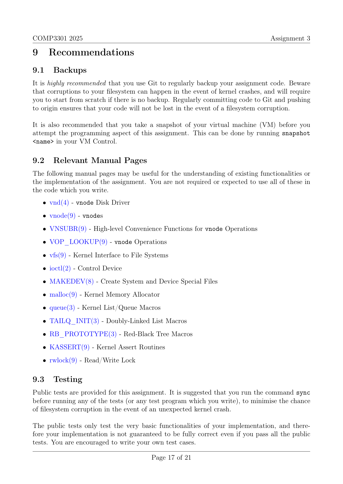

---

## 第 1 页


**提问：** 这张截图里的内容是什么意思？请面向初学者详细解释，分点讲清楚。

下面这页是\*\*《COMP3301——作业3》\*\*的封面和“学术诚信（Academic Integrity）”说明，面向初学者我分点解释一下：

# 这份作业概况

* **课程/作业**：COMP3301（2025学期）作业3，主题是\*\*“Mass Storage and File Systems – Cache Me If You Can”\*\*（文件系统与存储，标题是个双关：Cache↔Catch）。
* **截止时间**：第13周周一下午1点（标注为 **10月27日**）。
* **提交方式**：

  * 代码走 **Git 仓库**（你平时开发的那个 repo）。
  * 反思/说明走 **Blackboard**（学习平台上的提交入口）。
  * **批改**：第13周你的\*\*实验课（prac）\*\*上当场按你 Git 里的代码批改。
* **发布日期**：页脚写着最近一次更新为 **2025年10月6日**。

# 学术诚信要点（一定要看）

1. **个人独立完成**
   允许和同学聊概念、API、思路，但**不能**一起写代码、对方给你代码、或你给对方代码。
2. **禁止抄袭与串通**
   看别人的代码、让别人看你的代码、共享代码片段都算违规。课程会用**自动查重工具**比对代码。
3. **遇到困难找老师/助教**
   可以寻求教学团队帮助，不要向同学**要具体代码**或**给代码**。
4. **不要公开你的代码**
   不要把作业代码放公开仓库/公开帖子（私人帖可以）。假设有人拿到了延期，你公开代码就可能影响到他/她。
5. **遵守引用与来源规则**
   你仓库里**所有代码**（不仅是你提交的版本）都要符合来源与引用规范；违规会按不当行为处理。

# 代码来源与能否使用（表格速查）

| 代码来自哪里                                   | 能否使用    | 需要怎么做                                                                       |
| ---------------------------------------- | ------- | --------------------------------------------------------------------------- |
| **本学期教学团队提供的代码**（讲义/示例/老师在讨论区发的）         | ✅ 允许    | 可直接用。最好保留出处（被问及时能指出来源）。                                                     |
| **你自己本学期为本课写的代码**                        | ✅ 允许    | 可直接用，但前提是你**没对外分享/发布**这段代码。                                                 |
| **你以前写但没公开过的代码**（你在别的课或私下写的，且没被别人获得/没发布） | ⚠️ 条件允许 | **两点**：①你**理解**这段代码；②在代码**邻近位置**用注释**标注来源**（比如“我于2024-08在XX项目中编写”）。不标注就算违规。 |
| **来自 AI 工具生成的 C 代码**                     | ⚠️ 条件允许 | **必须标注**这是 AI 生成/改写，并确保你**完全理解**其含义与行为；否则可能被判不当使用。                          |

> 小白友好提示：\*\*“理解代码”\*\*不是嘴上说说。你要能在批改/问答时解释它做了什么、为什么这样写、复杂度/边界条件如何等。

# 正确引用示例（可直接照抄格式）

把引用**写在用到的那段代码上方**或文件头，例如：

```c
// Source: COMP3301 Week 7 lab example (teaching staff, 2025-09-15).
// Adapted by <你的名字> for Assignment 3.
```

或（你以前写的）：

```c
// Source: Personal project "kvstore" (written by me, 2024-08, never published).
// Reused and modified for COMP3301 Assignment 3. I confirm I understand this code.
```

或（AI 生成）：

```c
// Source: AI-assisted draft (generated on 2025-10-10, prompt summarized).
// Reviewed and modified by me; I understand the logic and verified edge cases.
```

# 常见踩坑与对策

* **把仓库设成公开** → ❌ 违规高风险。**务必私有**，不要把链接发给他人。
* **用到论坛里同学贴的代码** → ❌ 不行（除非是**老师/助教**发布的）。
* **“只看一下同学的实现思路/函数名”** → 也可能触发雷同。保持**思想交流**，但**不要看对方代码**。
* **AI 一键生成就提交** → 高风险。即便允许，也要**标注**并**亲自审查/测试/能讲清楚**。
* **忘记给“旧代码”加注释说明来源** → 可能被判不当引用。**就近写注释**最保险。

# 你现在可以做什么

1. **检查仓库权限**：设为 private。
2. **列个“来源清单”**：记录每个文件/函数是否来自自己、教学示例、旧代码或 AI。
3. **在代码里补注释**：参考上面的模板，贴在对应位置。
4. **自测与自述**：给每个关键模块准备 1–2 句“我能解释什么”的要点，避免被问住。
5. **提交路径**：代码推到 Git；反思写到 Blackboard；第13周实验课准备好演示/答疑。

如果你想，我也可以根据你现有代码帮你**逐段标注来源**并做一份\*\*“来源与修改说明”\*\*清单，减少合规风险。


---

## 第 2 页


**提问：** 这张截图里的内容是什么意思？请面向初学者详细解释，分点讲清楚。

下面这页是\*\*《COMP3301——作业3》\*\*的封面和“学术诚信（Academic Integrity）”说明，面向初学者我分点解释一下：

# 这份作业概况

* **课程/作业**：COMP3301（2025学期）作业3，主题是\*\*“Mass Storage and File Systems – Cache Me If You Can”\*\*（文件系统与存储，标题是个双关：Cache↔Catch）。
* **截止时间**：第13周周一下午1点（标注为 **10月27日**）。
* **提交方式**：

  * 代码走 **Git 仓库**（你平时开发的那个 repo）。
  * 反思/说明走 **Blackboard**（学习平台上的提交入口）。
  * **批改**：第13周你的\*\*实验课（prac）\*\*上当场按你 Git 里的代码批改。
* **发布日期**：页脚写着最近一次更新为 **2025年10月6日**。

# 学术诚信要点（一定要看）

1. **个人独立完成**
   允许和同学聊概念、API、思路，但**不能**一起写代码、对方给你代码、或你给对方代码。
2. **禁止抄袭与串通**
   看别人的代码、让别人看你的代码、共享代码片段都算违规。课程会用**自动查重工具**比对代码。
3. **遇到困难找老师/助教**
   可以寻求教学团队帮助，不要向同学**要具体代码**或**给代码**。
4. **不要公开你的代码**
   不要把作业代码放公开仓库/公开帖子（私人帖可以）。假设有人拿到了延期，你公开代码就可能影响到他/她。
5. **遵守引用与来源规则**
   你仓库里**所有代码**（不仅是你提交的版本）都要符合来源与引用规范；违规会按不当行为处理。

# 代码来源与能否使用（表格速查）

| 代码来自哪里                                   | 能否使用    | 需要怎么做                                                                       |
| ---------------------------------------- | ------- | --------------------------------------------------------------------------- |
| **本学期教学团队提供的代码**（讲义/示例/老师在讨论区发的）         | ✅ 允许    | 可直接用。最好保留出处（被问及时能指出来源）。                                                     |
| **你自己本学期为本课写的代码**                        | ✅ 允许    | 可直接用，但前提是你**没对外分享/发布**这段代码。                                                 |
| **你以前写但没公开过的代码**（你在别的课或私下写的，且没被别人获得/没发布） | ⚠️ 条件允许 | **两点**：①你**理解**这段代码；②在代码**邻近位置**用注释**标注来源**（比如“我于2024-08在XX项目中编写”）。不标注就算违规。 |
| **来自 AI 工具生成的 C 代码**                     | ⚠️ 条件允许 | **必须标注**这是 AI 生成/改写，并确保你**完全理解**其含义与行为；否则可能被判不当使用。                          |

> 小白友好提示：\*\*“理解代码”\*\*不是嘴上说说。你要能在批改/问答时解释它做了什么、为什么这样写、复杂度/边界条件如何等。

# 正确引用示例（可直接照抄格式）

把引用**写在用到的那段代码上方**或文件头，例如：

```c
// Source: COMP3301 Week 7 lab example (teaching staff, 2025-09-15).
// Adapted by <你的名字> for Assignment 3.
```

或（你以前写的）：

```c
// Source: Personal project "kvstore" (written by me, 2024-08, never published).
// Reused and modified for COMP3301 Assignment 3. I confirm I understand this code.
```

或（AI 生成）：

```c
// Source: AI-assisted draft (generated on 2025-10-10, prompt summarized).
// Reviewed and modified by me; I understand the logic and verified edge cases.
```

# 常见踩坑与对策

* **把仓库设成公开** → ❌ 违规高风险。**务必私有**，不要把链接发给他人。
* **用到论坛里同学贴的代码** → ❌ 不行（除非是**老师/助教**发布的）。
* **“只看一下同学的实现思路/函数名”** → 也可能触发雷同。保持**思想交流**，但**不要看对方代码**。
* **AI 一键生成就提交** → 高风险。即便允许，也要**标注**并**亲自审查/测试/能讲清楚**。
* **忘记给“旧代码”加注释说明来源** → 可能被判不当引用。**就近写注释**最保险。

# 你现在可以做什么

1. **检查仓库权限**：设为 private。
2. **列个“来源清单”**：记录每个文件/函数是否来自自己、教学示例、旧代码或 AI。
3. **在代码里补注释**：参考上面的模板，贴在对应位置。
4. **自测与自述**：给每个关键模块准备 1–2 句“我能解释什么”的要点，避免被问住。
5. **提交路径**：代码推到 Git；反思写到 Blackboard；第13周实验课准备好演示/答疑。

如果你想，我也可以根据你现有代码帮你**逐段标注来源**并做一份\*\*“来源与修改说明”\*\*清单，减少合规风险。


---

## 第 3 页


**提问：** 这张截图里的内容是什么意思？请面向初学者详细解释，分点讲清楚。

下面这页是\*\*《COMP3301——作业3》\*\*的封面和“学术诚信（Academic Integrity）”说明，面向初学者我分点解释一下：

# 这份作业概况

* **课程/作业**：COMP3301（2025学期）作业3，主题是\*\*“Mass Storage and File Systems – Cache Me If You Can”\*\*（文件系统与存储，标题是个双关：Cache↔Catch）。
* **截止时间**：第13周周一下午1点（标注为 **10月27日**）。
* **提交方式**：

  * 代码走 **Git 仓库**（你平时开发的那个 repo）。
  * 反思/说明走 **Blackboard**（学习平台上的提交入口）。
  * **批改**：第13周你的\*\*实验课（prac）\*\*上当场按你 Git 里的代码批改。
* **发布日期**：页脚写着最近一次更新为 **2025年10月6日**。

# 学术诚信要点（一定要看）

1. **个人独立完成**
   允许和同学聊概念、API、思路，但**不能**一起写代码、对方给你代码、或你给对方代码。
2. **禁止抄袭与串通**
   看别人的代码、让别人看你的代码、共享代码片段都算违规。课程会用**自动查重工具**比对代码。
3. **遇到困难找老师/助教**
   可以寻求教学团队帮助，不要向同学**要具体代码**或**给代码**。
4. **不要公开你的代码**
   不要把作业代码放公开仓库/公开帖子（私人帖可以）。假设有人拿到了延期，你公开代码就可能影响到他/她。
5. **遵守引用与来源规则**
   你仓库里**所有代码**（不仅是你提交的版本）都要符合来源与引用规范；违规会按不当行为处理。

# 代码来源与能否使用（表格速查）

| 代码来自哪里                                   | 能否使用    | 需要怎么做                                                                       |
| ---------------------------------------- | ------- | --------------------------------------------------------------------------- |
| **本学期教学团队提供的代码**（讲义/示例/老师在讨论区发的）         | ✅ 允许    | 可直接用。最好保留出处（被问及时能指出来源）。                                                     |
| **你自己本学期为本课写的代码**                        | ✅ 允许    | 可直接用，但前提是你**没对外分享/发布**这段代码。                                                 |
| **你以前写但没公开过的代码**（你在别的课或私下写的，且没被别人获得/没发布） | ⚠️ 条件允许 | **两点**：①你**理解**这段代码；②在代码**邻近位置**用注释**标注来源**（比如“我于2024-08在XX项目中编写”）。不标注就算违规。 |
| **来自 AI 工具生成的 C 代码**                     | ⚠️ 条件允许 | **必须标注**这是 AI 生成/改写，并确保你**完全理解**其含义与行为；否则可能被判不当使用。                          |

> 小白友好提示：\*\*“理解代码”\*\*不是嘴上说说。你要能在批改/问答时解释它做了什么、为什么这样写、复杂度/边界条件如何等。

# 正确引用示例（可直接照抄格式）

把引用**写在用到的那段代码上方**或文件头，例如：

```c
// Source: COMP3301 Week 7 lab example (teaching staff, 2025-09-15).
// Adapted by <你的名字> for Assignment 3.
```

或（你以前写的）：

```c
// Source: Personal project "kvstore" (written by me, 2024-08, never published).
// Reused and modified for COMP3301 Assignment 3. I confirm I understand this code.
```

或（AI 生成）：

```c
// Source: AI-assisted draft (generated on 2025-10-10, prompt summarized).
// Reviewed and modified by me; I understand the logic and verified edge cases.
```

# 常见踩坑与对策

* **把仓库设成公开** → ❌ 违规高风险。**务必私有**，不要把链接发给他人。
* **用到论坛里同学贴的代码** → ❌ 不行（除非是**老师/助教**发布的）。
* **“只看一下同学的实现思路/函数名”** → 也可能触发雷同。保持**思想交流**，但**不要看对方代码**。
* **AI 一键生成就提交** → 高风险。即便允许，也要**标注**并**亲自审查/测试/能讲清楚**。
* **忘记给“旧代码”加注释说明来源** → 可能被判不当引用。**就近写注释**最保险。

# 你现在可以做什么

1. **检查仓库权限**：设为 private。
2. **列个“来源清单”**：记录每个文件/函数是否来自自己、教学示例、旧代码或 AI。
3. **在代码里补注释**：参考上面的模板，贴在对应位置。
4. **自测与自述**：给每个关键模块准备 1–2 句“我能解释什么”的要点，避免被问住。
5. **提交路径**：代码推到 Git；反思写到 Blackboard；第13周实验课准备好演示/答疑。

如果你想，我也可以根据你现有代码帮你**逐段标注来源**并做一份\*\*“来源与修改说明”\*\*清单，减少合规风险。


---

## 第 4 页


**提问：** 这张截图里的内容是什么意思？请面向初学者详细解释，分点讲清楚。

好的！这页（第 4 页）在讲一种**可分叉的虚拟磁盘格式 FVD（Forkable Virtual Disk）**。它把“进程的 fork/写时复制（copy-on-write, COW）”的思想搬到了**磁盘镜像**上。给你分点、用大白话解释：

# 先把几个词讲清

* **虚拟磁盘镜像**：一个大文件，看起来像一块硬盘。操作系统把它当“磁盘”读写，但其实数据都在这个文件里。
* **扇区（sector）**：磁盘最小读写单位（常见 512B/4KB）。
* **记录（record）**：FVD 把镜像文件切成一块块**固定大小**的小段，就叫一个 record。数据就存放在这些 record 里。
* **写时复制（COW）**：多个“分支”共享同一份数据，只有当某个分支**要修改**那块数据时，才真的复制出一份新数据去改，其他分支继续用旧的；这样能**省空间**。
* **分叉（fork/branch）**：对当前磁盘状态拍一个“快照分支”。之后各分支可以独立演化、互不影响（像 Git 分支）。

# 这页的主旨

> **FVD 是一个支持“按需分配 + 写时复制 + 任意时刻分叉”的虚拟磁盘格式。**
> 这样做比传统的“整块原始镜像（raw/vnd）”更省空间、也更灵活。

# FVD 由两个文件组成

1. **`.fvd`（磁盘容器文件）**

   * 里面就是一条条**固定大小的 record**（记录）。
   * 记录里既可以放“数据块”，也可以放“元数据块”（比如索引/映射表）。
2. **`.fvd.ref`（引用计数文件）**

   * 每个字节对应 `.fvd` 里**同序号**的一个 record，存放它的**引用计数**（有多少分支在用这块）。
   * 有了引用计数，写时复制时就能判断“这块还能不能共享、是否需要复制、何时可以回收”。

# FVD 如何“按需用空间”

* FVD 用一张**块映射表（block map）**：把**虚拟磁盘里的每个扇区**映射到 `.fvd` 内**哪一个 record**。
* **还没写过**的扇区不会真的占用空间，统一映射到一个**特殊的 record 号 0**（表示“全是 0 的空数据”）。
* 只有当某个扇区**第一次被写入**时，FVD 才会给它**分配一个新的 record**来存真实数据——这就叫**按需分配**。

# FVD 如何“写时复制”

* 多个分支可以让它们的块映射都指向**同一份数据 record**（因此 `.fvd.ref` 里该 record 的计数会是 2、3、…）。
* 当某个分支要**修改**某扇区时：

  1. 发现这扇区对应的 record **被多个分支共享**（refcount > 1），
  2. 就**复制**出一个新的 record，先把旧内容拷过去，
  3. 在**当前分支**的块映射里把这个扇区改指向**新 record**，
  4. **再写入**修改后的数据，
  5. 旧 record 的引用计数减 1。
* 这样做的好处：**不动**其他分支，也**不浪费**空间。

# 图里的结构在说什么（从左到右）

* **Branch Descriptor Record（分支描述记录）**

  * 保存某个分支的基本信息，最重要的是一个**指向块映射（Block Map）的指针**。
* **Block Map（块映射）**

  * 一个“表”，把**扇区 0/1/2/…** 映射到 `.fvd` 里**具体哪个 Data Record**。
  * 也可能由\*\*多条“块映射记录”\*\*拼起来（因为映射表本身也可能很大）。
* **Data Record（数据记录）**

  * 真正存放扇区数据的记录们。
* **Root Record（根记录）**

  * 存放全局的**磁盘信息**，以及**指向各个分支描述**的指针。
  * 可以理解为“总目录”，能找到每个分支的入口。

> 小比喻：
>
> * **Root** 像 Git 的“refs”，记录有哪些分支；
> * **Branch Descriptor** 像分支的“HEAD/元信息”；
> * **Block Map** 像页表/索引，把“虚拟扇区号”翻译成“物理记录号”；
> * **Data Record** 就是实际的数据块；
> * **`.fvd.ref`** 像共享计数器，保证 COW 正确回收空间。

# 一个 60 秒小例子

1. 只有一个分支 `main`，很多扇区还没写 → 都映射到**record 0（空）**，几乎不占空间。
2. 你写了扇区 7，分配了一个新的 **record 42**，Block Map：`sector 7 → record 42`，`.fvd.ref[42]=1`。
3. 你从 `main` **fork** 出 `test`：两者的 Block Map 初始完全相同，`.fvd.ref[42]=2`（共享）。
4. 在 `test` 里修改扇区 7：因为共享，触发 **COW** → 复制到 **record 99**，`test` 的映射改为 `7→99`，写入；
   引用计数变化：`.fvd.ref[42]=1`，`.fvd.ref[99]=1`；`main` 仍然看到旧内容。

# 这和操作系统里的页表很像

* 文中把块映射和页表类比：**页表**把“虚拟页”映射到“物理帧”，
* **Block Map** 则把“虚拟扇区”映射到“.fvd 里的记录”。思想非常接近。

# 这页还说了什么

* FVD 的详细**规格说明书**（spec）可以在 Blackboard 或文末给的链接下载（就是你看到的蓝色超链接）。

---

如果你接下来要**实现/调试**相关代码，建议你先会回答这 5 个自检题：

1. “还没写过的扇区”在 FVD 里如何表示？为什么省空间？
2. fork 一个分支时，哪些结构需要复制？哪些只需要共享？
3. 写时复制发生在什么条件下？引用计数如何变化？
4. `.fvd` 和 `.fvd.ref` 分别存什么？它们如何一一对应？
5. Block Map 不够大时怎么存？（提示：映射表也由若干“记录”构成）

需要的话，我可以把这些概念做成一页速查卡或画个更简单的示意图，帮你记忆与答辩。


---

## 第 5 页


**提问：** 这张截图里的内容是什么意思？请面向初学者详细解释，分点讲清楚。

这页是“**第 5 页：Instructions（操作步骤）**”。它教你**在 OpenBSD 环境**里把课程提供的补丁打进内核源码、编译安装带 FVD 支持的新内核，并安装相关工具与设备节点。按顺序做就行。下面用新手友好方式逐步解释每一行在做什么：

---

# 前置小知识

* **doas**：OpenBSD 的提权命令，等价于 Linux 的 `sudo`（需要管理员权限的命令前都要加它）。
* **/usr/src**：系统源码目录（内核与用户态工具的源代码都在这）。
* **FVD**：Forkable Virtual Disk，作业要用到的虚拟磁盘驱动/工具。
* **(1)/(4)/(8)**：Unix 手册页分区。`fvdtool(1)`=用户态工具；`fvd(4)`=设备/驱动；`fvdctl(8)`=管理员命令。

---

# 一步步解释每条命令

## 1) 下载基础补丁

```sh
cd ~
ftp https://stluc.manta.uqcloud.net/comp3301/public/a3-base.patch
```

* 回到你的**家目录**，用 `ftp` 把**补丁文件**`a3-base.patch` 下载到本地（稍后喂给 git）。

## 2) 新建分支并应用补丁

```sh
cd /usr/src
git checkout -b a3 base
git am < ~/a3-base.patch
```

* 进入源码树。
* 以 `base` 分支为起点创建新分支 **a3**（保证作业修改都隔离在 a3 里）。
* `git am` 把补丁应用到当前分支（`am` 用于“邮件格式”的补丁，比 `git apply` 更保留提交信息）。

> 若 `git am` 报 “patch does not apply”，多半是你不在 `/usr/src` 或分支不对；回到步骤 2 重来。

## 3) 编译并安装**新内核**

```sh
cd /usr/src/sys/arch/amd64/compile/GENERIC.MP
make config
make -j4
doas make install
doas reboot
```

* 进入 **amd64** 的**多核**内核配置目录 `GENERIC.MP`。
* `make config` 生成当前配置对应的编译目录与文件。
* `make -j4` 并行编译（4 线程，可按机器调整）。
* `doas make install` 安装新内核到系统；然后 **重启** 让新内核生效。

## 4) 安装更新的头文件（includes）

```sh
cd /usr/src/include
doas make includes
```

* 把内核/系统相关**头文件**安装到 `/usr/include`，确保用户态工具用到的新接口能正确编译。

## 5) 编译并安装 `fvdctl(8)`（管理员控制工具）

```sh
cd /usr/src/usr.sbin/fvdctl
make obj
make
doas make install
```

* `make obj` 创建对象文件输出目录（OpenBSD 的标准做法）。
* 编译并安装到系统（通常是 `/usr/sbin/fvdctl`）。

## 6) 创建 `fvd(4)` 设备节点

```sh
doas cp /usr/src/etc/etc.amd64/MAKEDEV /dev
cd /dev
doas chmod 755 MAKEDEV
doas ./MAKEDEV fvd0 fvd1 fvd2 fvd3
```

* 把 `MAKEDEV` 工具拷到 `/dev` 并赋可执行权限。
* 用它生成 **/dev/fvd0\~fvd3** 这四个**设备文件**（用户态程序通过这些“节点”与内核驱动交互）。

## 7) 安装 `fvdtool(1)`（用户态工具）

```sh
curl https://stluc.manta.uqcloud.net/comp3301/public/fvdtool_install | doas sh -s --
```

* 下载安装脚本并**直接交给 shell 以管理员身份运行**，安装 `fvdtool`。
* 方便但有风险的一行式：只在你**信任课程源**的前提下使用。

---

# 完成后如何自检

* **确认新内核**：`uname -v`（或查看 `dmesg` 里是否加载了 fvd）。
* **确认设备节点**：`ls -l /dev/fvd*` 应看到 `fvd0`…`fvd3`。
* **确认工具就绪**：

  * `which fvdctl` 应该在 `/usr/sbin/fvdctl`
  * `which fvdtool` 一般在 `/usr/bin` 或 `/usr/local/bin`（视脚本而定）
* **手册页**：`man 4 fvd`、`man 8 fvdctl`、`man 1 fvdtool` 看用法说明。

---

# 常见坑与提示

* **忘记加 `doas` 导致权限失败**：报 “permission denied” 就在前面加上 `doas`。
* **`git am` 失败**：确认在 `/usr/src`、分支是 `a3`，补丁文件存在且完整。
* **`MAKEDEV` not found / 不可执行**：确保复制到 `/dev` 并 `chmod 755`。
* **内核没更新**：`make install` 后必须 `reboot` 才会跑新内核。
* **`curl | sh` 的安全性**：仅对可信课堂链接这么做；否则应先下载、打开脚本检查后再执行。

---

**一句话总结**：你在做的是——**把作业补丁打到系统源码 → 编译安装带 FVD 的新内核 → 安装 FVD 的管理员工具和用户工具 → 创建设备节点**。完成这些后，你就具备了运行/测试 FVD 的环境。需要的话我可以陪你一起跑一遍，并在每步出错时定位原因。


---

## 第 6 页


**提问：** 这张截图里的内容是什么意思？请面向初学者详细解释，分点讲清楚。

这页（第 6 页）开始进入**作业要做的功能**，重点是给 OpenBSD 的 **fvd(4)** 虚拟块设备加上对 **FVD 磁盘镜像**的支持，并实现若干 **ioctl** 控制指令。下面按新手视角分点解释：

---

## 1）这章在说什么？

* 你要在内核里把 **FVD 镜像**当作 **fvd(4)** 设备的“后端磁盘”来用。
* 课程已经给了**样板代码**（设备入口函数都搭好了），你主要补全：

  * **读/写**逻辑（read/write）
  * 本章列出的若干 **ioctl**（用户态控制接口）

> 类比：把一个 `.fvd` 文件“接到”一个虚拟硬盘 `/dev/fvd0` 后面，然后让系统能对它正常读写，还能通过 ioctl 做“附加/卸载/查询信息”等管理操作。

---

## 2）这些 ioctl 应该对哪个设备起作用？

* 只对 **字符设备**的**原始分区 c** 生效，也就是像：`/dev/rfvd0c`、`/dev/rfvd1c` 这样的设备节点。

  * 前缀 **`r`** 表示 **raw character device**（字符设备，原始 I/O）。
  * **`c` 分区**是“整盘”的原始分区。
* **例外**：`FVDIOC_ATTACH`（附加）在还没附加之前也要能用；**其他 ioctl** 要求设备**已经附加**到了某个 FVD 镜像才行。

---

## 3）“附加/卸载/信息”这一节（5.1）的目标

在使用 `.fvd` 镜像前，必须先把镜像“**附加**”到一个 `fvd(4)` 设备上（比如 `rfvd0c`）。
你需要实现的就是 **`FVDIOC_ATTACH`**。

### `FVDIOC_ATTACH` 要做什么？

它从用户态接收一个结构体参数，告诉内核：

* 要附加**哪个镜像文件**；
* 用镜像里的**哪个分支（branch）**；
* 以**只读**还是**可写**方式附加。

结构体长这样（文档已给出）：

```c
struct fvd_attach {
    const char *fa_path;     /* FVD 镜像路径（容器文件） */
    const char *fa_branch;   /* 要附加的分支名；空串=默认分支 */
    int         fa_readonly; /* 0=可写，非0=只读 */
};
```

* **`fa_path`**：`.fvd` **容器文件**的路径（磁盘数据就装在这个文件里；配套的 `.fvd.ref` 是引用计数文件）。
* **`fa_branch`**：镜像内部的**分支名字**；传空串表示附到**默认分支**。
* **`fa_readonly`**：是否**只读**附加。传 0 表示想要可写；非 0 表示只读。

  * 注意：如果你对镜像文件**没有写权限**，驱动只能**强制只读**附加。

### 失败时要返回什么错误？

* 如果 `fa_path` 指向的**不是合法的 FVD 镜像**（需要检查镜像的 **Root Record**、目标分支的 **Branch Descriptor Record** 等），这个 ioctl 要用合适的 **`errno(2)`** 返回错误（例如 `EINVAL`/`EIO` 等，视你的实现而定）。
* 如果 **分支不存在**，应返回 **`ESRCH`**。

> 小结：**验证镜像** → **验证目标分支** → **根据权限确定 ro/rw** → **把镜像挂到设备的“软状态”里** → 成功返回 0；否则返回相应 errno。

---

## 4）卸载（detach）

* 文档说明：**`FVDIOC_DETACH` 已经替你实现好了**，这里列出只是为了文档完整性。
* 含义：把已附加的镜像从 `rfvdXc` 上卸下来，设备回到未附加状态。

---

## 5）给初学者的实现思路（内核侧伪流程）

1. **copyin 参数**：从用户态把 `struct fvd_attach` 复制到内核缓冲区，并安全读取两条字符串（路径/分支名）。
2. **解析并打开镜像**：

   * 以 `fa_readonly ? FREAD : (FREAD|FWRITE)` 打开 `.fvd` 容器；
   * 如果无写权限但请求了可写，**降级为只读**；
   * 查找并打开对应的 `.fvd.ref`（只读或读写与容器保持一致）。
3. **校验镜像格式**：读取 **Root Record**，检查签名/版本/布局；
4. **定位分支**：按 `fa_branch` 找到 **Branch Descriptor Record**；找不到就返回 `ESRCH`；
5. **建立设备状态**：

   * 在 `softc`（设备软状态）里记录：打开的 vnode、只读标志、目标分支的块映射入口等；
   * 标记设备为**已附加**；必要时刷新容量/标签信息。
6. **错误处理与清理**：任何一步失败都要关闭已打开的 vnode，释放内存，并返回合适的 `errno`。

---

## 6）怎么在用户态用它（理解即可）

* 管理工具通常会对 **`/dev/rfvd0c`** 发出 `FVDIOC_ATTACH`：

  * 传入 `{fa_path="/path/to/disk.fvd", fa_branch="main", fa_readonly=0}`
  * 成功后，这块虚拟盘就“接上了”镜像。
* 卸载就发 **`FVDIOC_DETACH`**。
* 其他 ioctl（例如查询信息）和读/写在后续小节会讲。

---

## 7）容易混淆的点

* **为什么是 `/dev/rfvdXc` 而不是 `/dev/fvdX`？**
  ioctl 只在**字符设备的原始分区**上受理；这是 BSD 系的一贯做法（管理操作走 raw char 设备）。
* **只读/可写谁说了算？**
  既看 `fa_readonly`，也看**文件权限**；没有写权限只能只读附加。
* **“不是合法 FVD”怎么判断？**
  需要检查镜像里的**元数据记录**（Root Record、分支描述等），而不是只看文件扩展名。

---

**一句话总结**
这页要求你：在内核的 `fvd(4)` 驱动里实现一个 **`FVDIOC_ATTACH`** ioctl，把一个 `.fvd` 镜像（指定分支、指定读写模式）**安全地附加**到 `rfvdXc` 设备上；如果镜像不合法或分支不存在，要返回恰当的 `errno`。`DETACH` 已给好，你重点把 **参数校验、权限处理、元数据检查、设备状态建立**这几步写扎实。


---

## 第 7 页


**提问：** 这张截图里的内容是什么意思？请面向初学者详细解释，分点讲清楚。

下面这页（第 7 页）继续讲**作业要实现/会用到的 ioctl 与读写函数**。我把它拆成三块，用新手能看懂的方式说明：

# A. 卸载镜像：`FVDIOC_DETACH`

作用：把当前挂在 `fvd(4)` 设备上的 **FVD 镜像**卸下，并关闭后端文件（`.fvd` 与 `.fvd.ref`）。

* **参数**：一个整型，作为布尔值使用——

  * `0`：正常卸载；
  * 非 `0`：**强制卸载**（force detach）。
* **何时会失败**

  * `EBUSY`：**设备正在使用**（比如还有打开的文件/正在 I/O），且你没有传“强制”。
  * `ENXIO`：**根本没附加**任何 FVD 镜像。
* **绿色提示（超重要）**

  * 这个 ioctl **课程已帮你实现**。但：如果你在“attach”时**自己额外分配了资源**（缓存、结构体等），记得在“detach”时**一并释放**。
  * 真正关闭 `.fvd` / `.fvd.ref` 文件以及做统一清理的地方在 **`fvd_leave()`**，**不是** `fvd_detach()` / `fvd_close()`。

# B. 查询信息：`FVDIOC_INFO`

作用：把**当前已附加的镜像路径**与**分支名**返回给用户态。

* **输出结构体**（驱动往里写）：

  ```c
  struct fvd_info {
      char fi_path[1024];          /* 镜像路径（.fvd 容器文件） */
      char fi_branch[FVD_MAX_BNM]; /* 当前分支名 */
  };
  ```
* **字段含义**

  * `fi_path`：等同于当初 `FVDIOC_ATTACH` 传入的 `fa_path`。只需要写入前 **1023** 个字符，且以 **NUL 结尾**。
  * `fi_branch`：当前附加的分支名；如果挂的是**默认分支**，可能是**空串**或默认分支的真实名字（同样要求 **NUL 结尾**）。
* **成功/失败**

  * **应该总是成功**，只要设备**确实已附加**了某个 FVD 镜像；
  * 若没附加则返回 **`ENXIO`**。

> 小技巧：写字符串时一定保证 **NUL 结尾**，防止用户态读取越界；用 `strlcpy` 这类安全函数最省心。

# C. 虚拟磁盘 I/O：实现 `fvd_read_sect()` 与 `fvd_write_sect()`

你需要实现两个内核函数，支持对“当前分支”的**按扇区读/写**：

```c
static int
fvd_read_sect(struct fvd_softc *sc, uint32_t sec, void *buf);

static int
fvd_write_sect(...);   /* 原型在文档后半页，语义与 read 对称 */
```

* **访问入口**：用户态通过设备节点 `/dev/{,r}fvdX` 读写；
  其中 **`/dev/rfvdXc`**（`X` 是设备号）代表**整块虚拟盘**的“原始视图”，就像对一个普通文件那样顺序读写。
* **你在函数里要做的事（高层步骤）**

  1. **校验状态**：设备是否已附加？`sec` 是否在容量范围内？（越界返回错误）
  2. **定位映射**（Block Map 思想，前文第 4 页讲过）：

     * 找到扇区 `sec` 对应的 **record**（记录号）。
     * 若记录号为 **0**（表示“从未写过/全 0”）：

       * 读：把 `buf` **清零**后返回；
       * 写：需要**按需分配新 record**（见下一步）。
  3. **读路径（read）**：

     * 计算要读的 record 内偏移（取决于“每个 record 含多少扇区”和“扇区大小”——看 FVD 规格）。
     * 从 `.fvd` 文件把该位置的数据拷到 `buf`。
  4. **写路径（write）**：

     * 如果该 record **被多个分支共享**（引用计数 `>1`），先**写时复制（COW）**：

       * 分配新 record → 拷贝旧数据 → 更新**当前分支**的映射 → 调整 `.fvd.ref` 计数；
     * 如果是“从未写过”（记录号 `0`），则**按需分配**一个新 record，并更新映射与引用计数；
     * 计算偏移，把 `buf` 写入 `.fvd` 对应位置。
  5. **返回值**：`0` 表示成功；错误时返回合适的 `errno`（如 I/O 出错、越界等）。
* **实现小贴士**

  * **字符串/内存安全**：对用户态传入/传出的结构体使用 `copyin/copyout`；对内核分配的缓冲及时 `free`。
  * **引用计数同步**：写路径涉及 `.fvd.ref` 的增减，要保证一致性；必要时加锁保护。
  * **零扇区优化**：读到“未写过”的扇区直接 `memset(buf, 0, sector_size)`，不必访问磁盘。
  * **对齐与边界**：确认 `sec` 到 record 的换算公式（`record_size / sector_size`），避免跨 record 时的计算错误。
  * **错误传播**：底层 vnode I/O 失败要把错误码向上传递，不要吞掉。

---

## 一句话回顾

* `DETACH`：卸载镜像（支持强制），注意资源清理在 `fvd_leave()`。
* `INFO`：把**镜像路径**和**分支名**回传给用户态（NUL 结尾）。
* `读/写函数`：基于块映射与引用计数，实现**零扇区返回全 0、按需分配、写时复制**等核心逻辑。

如果你愿意，我可以根据你们给的头文件和样板代码，帮你把 `fvd_read_sect`/`fvd_write_sect` 的**伪代码**细化成“逐行待办清单”，方便你直接对照实现与自测。


---

## 第 8 页


**提问：** 这张截图里的内容是什么意思？请面向初学者详细解释，分点讲清楚。

下面这页（第 8 页）延续上一页，讲两件事：
① 把**按扇区读写**真正落地（尤其是“第一次写入”和“写时复制 COW”）；
② 实现**分支 fork 的 ioctl**。

---

# 5.2 虚拟磁盘 I/O：`fvd_read_sect` / `fvd_write_sect`

页首给出了写函数原型：

```c
fvd_write_sect(struct fvd_softc *sc, uint32_t sec, const void *buf);
```

* **sc**：设备“软状态”，里面放着当前已附加镜像的句柄、只读标记、块映射入口等。
* **sec**：要读/写的**扇区号**。
* **buf**：读/写的数据缓冲区地址。
* **返回值**：成功返回 `0`，失败返回一个 `errno(2)` 错误码。

核心行为（新手要点）：

* **第一次写这个扇区**（即它还没真正分配到某个 record）：
  → 必须**分配一个新 record**，更新块映射，把这个扇区指到新 record，然后再写入。
* **扇区当前映射到“被多个分支共享”的 record**（refcount > 1）：
  → 触发 **COW**：分配新 record → 先把旧内容拷过去 → 仅在**当前分支**的映射里改指向新 record → 再把 `buf` 写进去；同时更新 `.fvd.ref` 的引用计数。
* **读/写容器文件与引用计数文件**：可用 **`vn_rdwr()`** 做底层文件 I/O（绿色提示框）。

自测预期（实现正确后能做什么）：

1. 用 **`fdisk(8)`** 做 GPT；
2. 用 **`disklabel(8)`** 划分 BSD 分区；
3. 用 **`newfs(8)`** 在分区上建文件系统；
4. 用 **`mount(8)`/`umount(8)`** 挂载/卸载；
   （附录 Appendix 1 有示例命令与输出。）

> 简化伪流程（写）：检查已附加与只读→计算 sec 所在 record → 未分配则 alloc；共享则 COW → 用 `vn_rdwr()` 按偏移写 `.fvd` → 维护块映射与 `.fvd.ref` → 返回 0/错误码。

---

# 5.3 虚拟磁盘状态 Fork：`FVDIOC_FORK`

这是 FVD 相对 raw 镜像的“杀手锏”——**随时从当前分支 fork 出一个新分支**，而且**立刻切换**到新分支上工作。

* **语义**：新分支一开始与旧分支内容**完全一样**；之后的读写都只影响**新分支**。
* **ioctl 结构体参数**：

  ```c
  struct fvd_fork {
      char ff_name[FVD_MAX_BNM]; /* 新分支名，NUL 结尾 */
      int  ff_force;             /* 是否强制 fork（即使磁盘在用/挂载中） */
  };
  ```

  * **ff\_name**：新分支的名字。
  * **ff\_force**：非 0 表示强制 fork（即便当前有文件系统在用）。
* **失败条件**：如果名字**为空**或**已存在**，返回 **`EEXIST`**。

> 实现要点（思路）：检查名称合法性→判断是否在用（决定是否需要 `ff_force`）→创建新分支的**分支描述记录**与**块映射起点**（最初共享旧分支的数据，引用计数+1）→在设备状态中把“当前分支”切到新分支。

---

## 一句话总结

* 写扇区：**未分配就分配**，**共享就 COW**，底层 I/O 用 `vn_rdwr()`，维护好块映射与 `.fvd.ref`。
* `FVDIOC_FORK`：从当前分支**克隆**出新分支并**马上切换**过去；名字必须唯一，必要时可**强制** fork。


---

## 第 9 页


**提问：** 这张截图里的内容是什么意思？请面向初学者详细解释，分点讲清楚。

这页（第 9 页）分两部分：
A) **继续说明 FVD 分支 fork 的细节与出错条件**；
B) **让你实现“按扇区缓存 + LRU 置换”**，并配了一个 LRU 小例子。下面用新手能懂的方式展开。

---

# A. Fork 继续说明（与上一页的 FVDIOC\_FORK 接口配套）

* **如果磁盘“正在使用”而且你没开 `ff_force`**（参数为 0），**就返回 `EBUSY`**，不执行 fork。
  目的：防止在父分支上已经挂了文件系统时“热分叉”带来损坏。
* **Fork 不会复制数据块（record）**：采用**写时复制（COW）**。

  * 刚 fork 完，父子分支**指向同一批 record**；
  * 谁先修改哪个扇区，谁就**为那个扇区分配新 record** 并改映射；
  * 被父子共享的 record，其**引用计数要 +1**。

---

# B. 5.4 扇区缓存 & 替换（你需要实现）

> 目标：给每个 `fvd(4)` 设备做一个**小型扇区缓存**，减少磁盘 I/O，提高性能。

## 你要做的规则

* **缓存对象**：只缓存**虚拟磁盘的“扇区内容”**（sector data）。

  > *注：不是缓存 FVD 的元数据 record——如果你愿意，也可以额外做一套。*
* **缓存容量**：每个设备**16 个扇区**（也就是 16×扇区大小，通常 16×512B=8KiB）。

  > 现实里会缓存更多；作业要求小容量，便于测评。**请把实现写成可配置**，以后改大小不费劲。
* **读缓存策略**：

  * 第一次读某扇区：把数据读入缓存；
  * 后续再读同一扇区：**直接命中缓存**，不去访问 `.fvd` 文件。
* **写缓存策略（写回 / write-back）**：

  * 第一次写某扇区：**只写到缓存**并把条目标**记为“脏（dirty）”**，**不立刻写磁盘**；
  * 后续对同一扇区的读写都命中缓存；
  * 当该条目被\*\*淘汰（evict）\*\*时，**如果是脏的，就把它写回到 `.fvd`**，然后再丢掉。
* **替换算法**：使用 **LRU（Least Recently Used，最近最少使用）**。

  * 被访问过的条目越“新”，越不该被淘汰；
  * 缓存满时，淘汰**最久没被用**的那个。

## 简单的实现建议（数据结构）

* **哈希表（或红黑树）**：`sector → 缓存条目`，O(1) 定位命中与否。
* **双向链表**维护 LRU 顺序：

  * 命中一个条目：移动到**链表头**（代表“最新”）；
  * 插入新条目：放到链表头；
  * 淘汰：从**链表尾**拿走“最老的”条目；若 dirty → 先写回。
* **缓存条目结构**（示例字段）：

  * `sector`、`data[SECTOR_SIZE]`、`valid`、`dirty`、`lru_prev/next`。

## 与 FVD 的配合（关键点）

* **第一次写该扇区**且它在 FVD 里还没分配 record：

  * 仍然按“写缓存”记 dirty；
  * **在真正写回时**（或显式 flush 时），才执行**按需分配** / **COW** / **更新块映射与引用计数**。
  * 这样可以把“分配 + 写回”合并，减少 I/O。
* **读到“未写过（record=0）”的扇区**：放入缓存一条**全 0** 的条目即可。
* **只读设备**：写入请求直接返回 `EROFS`，或你可以让缓存不接受写（看你驱动上层判定）。

## 刷新（可选但实用）

* 提供一个**flush** 路径（在 `DETACH`、`CLOSE` 或显式 ioctl 时调用）：把缓存里所有 **dirty** 条目写回，再清空。避免数据丢失。

---

# LRU 图示例（文档里的小例子解释）

* **缓存大小**：4
* **访问序列**：`0x3301 → 0x3010 → 0x4011 → 0xBEEF → 0xDEAD → 0x4011 → 0x1234`（示例分多步画，截图到“访问 0xDEAD 前”）

1. 访问 `0x3301`：缓存变为 `[3301]`（左=最新，右=最旧）。
2. 依次访问 `0x3010、0x4011、0xBEEF`：缓存满，顺序变为
   `最新 [BEEF, 4011, 3010, 3301] 最旧`。
3. 访问 `0xDEAD`：缓存已满，要**淘汰最旧的 `0x3301`**；插入 `0xDEAD` 后为
   `最新 [DEAD, BEEF, 4011, 3010] 最旧`。

   > 若被淘汰的条目是 **dirty**，此刻要**写回**到 `.fvd` 文件。

（后续访问会继续移动条目位置或触发淘汰，思路同上。）

---

## 新手开发清单（照着做不容易错）

1. 在 `softc` 里加上**缓存结构**与**锁**。
2. 实现 `cache_lookup(sec)` / `cache_insert(sec)` / `cache_evict()` / `cache_mark_dirty()` / `cache_flush()`。
3. 在 `fvd_read_sect`：

   * 命中→拷贝缓存；
   * 未命中→从 `.fvd` 读入（或全 0），插入缓存并返回。
4. 在 `fvd_write_sect`：

   * 只读→报错；
   * 命中→写入缓存并 `dirty=1`、移动到 LRU 头；
   * 未命中→若满则 `evict()`（脏则写回），再插入新条目并标 `dirty=1`。
5. 在写回路径里，按需触发 **分配/COW/更新映射与 `.fvd.ref`**，最后用 `vn_rdwr()` 把数据落盘。
6. 在 **DETACH/关闭** 时 `cache_flush()`，确保数据不丢。

---

**一句话总结**：这一页让你把**fork 的安全性与 COW 语义**补完，同时实现一个**16 扇区、写回型、LRU 置换**的扇区缓存。命中不 I/O，淘汰脏块才写回，并在写回时与 FVD 的**分配/COW/引用计数**机制正确衔接。


---

## 第 10 页


**提问：** 这张截图里的内容是什么意思？请面向初学者详细解释，分点讲清楚。

这页（第 10 页）在两件事上“收尾并落地”：

1. 用\*\*LRU（最近最少使用）\*\*把上一页的缓存示例继续走完；
2. 给你一个**测试缓存实现**用的 ioctl：`FVDIOC_CACHE_LIST`（并预告下一个 `FVDIOC_CACHE_EMPTY`）。

---

# A. 把 LRU 例子走完（你要看懂“淘汰+写回”的节奏）

缓存大小=4，访问序列继续：

1. **访问 0xDEAD**

   * 缓存已满，淘汰**最久未用**的 `0x3301`；
   * 如果 `0x3301` 是 **dirty**，**先写回**到 `.fvd` 文件再丢；
   * 插入 `0xDEAD`，此时 LRU 顺序（左=最新，右=最旧）：
     `〔DEAD, BEEF, 4011, 3010〕`

2. **再次访问 0x4011**

   * 命中，不增删；
   * 但 `0x4011` 变成**最新**，移动到队头：
     `〔4011, DEAD, BEEF, 3010〕`

3. **访问 0x1234**

   * 满了，要淘汰**最旧**的 `0x3010`；若它是 dirty，先**写回**；
   * 插入 `0x1234` 后：
     `〔1234, 4011, DEAD, BEEF〕`

> 读写规则回顾：
>
> * **读**命中直接读；未命中从 `.fvd` 读入并放入缓存。
> * **写**采用**写回（write-back）**：先写缓存并标记 **dirty**，只有被淘汰或显式 flush 时才落盘。

---

# B. 为测试而实现的 ioctl：`FVDIOC_CACHE_LIST`

目的：**方便助教/你自己**查看缓存里有哪些扇区、哪些是脏的、数据校验是否一致，从而验证你的**LRU 与写回**实现是否正确。

### 结构体（驱动向用户态“填充输出”）

```c
struct fvd_cache_list {
    size_t         fc_nsects;        /* 当前缓存中扇区的数量 */
    struct sec_info fc_sects[16];    /* 扇区信息（最多 16 个） */
};

struct sec_info {
    uint32_t si_number;   /* 扇区号 */
    uint32_t si_checksum; /* 该扇区数据的校验和 */
    int      si_dirty;    /* 是否已被修改（脏） */
};
```

### 字段含义（新手要点）

* **`fc_nsects`**：当前缓存里**有效条目数**（≤ 16）。
* **`fc_sects`**：装每个缓存条目的三元信息：

  * `si_number`：扇区号；
  * `si_checksum`：对该条目**数据内容**调用 **`fvd_csum_sect()`** 的结果（课程给的辅助函数）；
  * `si_dirty`：1=脏，0=干净。

  > **顺序不要求**按 LRU 排，但**只需要填前 `fc_nsects` 个元素**，剩下的可以不写。
* **失败条件**：如果设备**没有附加**任何 FVD 镜像，返回 **`ENXIO`**；否则**应总是成功**。

### 实现小贴士

* 进入 ioctl 处理分支后：

  1. 检查设备是否**已附加**（否则 `ENXIO`）。
  2. 加锁保护缓存结构，遍历你的缓存条目，逐项填 `si_number/si_dirty`；
  3. 计算 `si_checksum = fvd_csum_sect(entry->data)`；
  4. 设置 `fc_nsects`，再 `copyout()` 给用户态。
* 注意 **N ≤ 16**：超过就截断（但你的缓存本来就只有 16 个扇区）。
* 不必暴露内部 LRU 链表，只需把“里头都存了谁、是否脏、校验和”告诉外部即可。

---

# C. 接下来要做什么？

* 这页底部出现了 **`FVDIOC_CACHE_EMPTY`** 的标题——下一页会要求你实现**清空缓存/写回**的 ioctl，用来配合测试写回逻辑（把所有 dirty 条目落盘并清空）。

---

## 常见坑 & 自检清单

* **忘了 ENXIO**：未附加时 `FVDIOC_CACHE_LIST` 必须失败。
* **校验和算错**：一定要对**缓存里的实际数据**调用 `fvd_csum_sect()`。
* **数组越界/未填满**：只填前 `fc_nsects` 个；`fc_nsects` 必须等于你缓存中**实际条目数**。
* **并发问题**：遍历缓存期间要**加锁**，避免与读写并发冲突。
* **脏块没写回**：在 LRU 淘汰和（下一页的）`CACHE_EMPTY`/detach/close 时，脏块一定要落盘。

**一句话总结**：这页把 LRU 示例跑完，告诉你如何通过 `FVDIOC_CACHE_LIST` 把“缓存里有什么、哪些是脏的、校验和是多少”暴露给用户态，方便检验你的**LRU+写回**实现是否正确。


---

## 第 11 页


**提问：** 这张截图里的内容是什么意思？请面向初学者详细解释，分点讲清楚。

> ⚠️ 未能复制为 Markdown，以下为纯文本回退：

这页（第 11 页）主要有三块内容：
A) 清空缓存的 ioctl：FVDIOC_CACHE_EMPTY；
B) **Reflection（反思题）**需要你写一份 2 页内的短评；
C) 提供的工具/源码里有 fvdctl(8)。
A. FVDIOC_CACHE_EMPTY：把缓存里的脏数据写回并清空
作用：把扇区缓存中所有条目移除；对脏条目（dirty）先写回 .fvd 文件，再清空缓存。
参数：无（不带参数的 ioctl）。
返回值/错误：
如果写回任一脏条目失败，返回合适的 errno(3)（具体错误码由你在写回路径里决定，如 EIO）。
其它情况应当成功。
何时会触发：
fork 时：文档要求把所有脏扇区先冲刷（flush）。你可以选择不清空（flush 后继续留在缓存），但允许清空。
detach 时：必须把缓存清空（并确保脏数据已写回）。
实现提示：遍历缓存→对每个 dirty 调用你的“写回到 FVD”的函数（其中做按需分配/COW/更新映射+.fvd.ref）→清理条目→维护 LRU 结构与计数。
B. 5.5 Reflection（反思题，交 PDF）
场景：虚拟用户 Puffy 不小心把最重要镜像的引用计数文件（.fvd.ref）删了，镜像无法使用；于是提 Feature：
把记录（records）和 refcount都存进同一个 .fvd 文件；
觉得块映射（block map）太占空间，希望缩小。
你要结合本课内容，简短论述下面 4 个问题（2 页内，无标准答案，重在思考）：
只剩 .fvd 文件能否恢复数据？为什么？
提示：块映射在 .fvd 里；.fvd.ref 只有引用计数。读取内容可能还能做（至少只读），但写/COW/回收等需要 refcount；若驱动强制要求 .fvd.ref 才挂载会失败。可讨论扫描重建最小 refcount（把被映射到的 records 先当作 refcount=1），但无法区分“孤儿记录”、一致性与可靠性弱。
把 refcount 元数据放进 .fvd 用“连续分配（contiguous allocation）”合适吗？
可从优点（顺序 I/O 快、实现简单）与缺点（镜像增长时难扩展、可能要搬迁元数据、空间预留/碎片管理麻烦）分析。
如果用“链式分配（linked allocation）”存 refcount，有什么缺点？
随机访问慢（要走链表）、指针开销、局部性差导致 I/O 多、链损坏风险高（坏一处断全链），不适合频繁随机更新的计数。
如何缩小 block map 的体积？至少给一个思路，并说明一个缺点。
例如：
区间映射/运行长度（extents/RLE）：把连续 sectors→同一 record 的范围合并；缺点：随机小写会把区间打碎、更新复杂。
分层表/更大粒度（像多级页表或更大“页”）；缺点：查找多一次跳转、大粒度造成内部碎片。
稀疏+压缩（只存非零映射并压缩）；缺点：CPU 开销、更新时可能需要重写较大块。
提交要求：写成 PDF 上传 Blackboard，最多 2 页；文件名必须是 STUDENT_NUMBER_A3.pdf（注意用你的 学号 4XXXXXX，不是 s4XXXXX 登录名）。
学术诚信提醒：反思题是开放式的，你可以列出多方案的权衡，不要从同学处复制段落或让 AI 直接生成最终答案而不理解。
C. 6 提供的工具/文件 —— fvdctl(8)
补丁里包含了管理工具 fvdctl(8) 的源码，它会调用你上面实现的 ioctl 来控制 fvd(4) 设备。
类似 vnconfig(8) 的用法。
打完补丁后源码位置：src/usr.sbin/fvdctl/。
小抄：你在本页需要完成/会被测的点
FVDIOC_CACHE_EMPTY：flush 所有 dirty→清空缓存→错误处理到位。
fork：确保在切分支前先 flush 脏缓存（可选是否清空）。detach 时必须清空。
反思题：围绕可恢复性、元数据布局（连续/链式）和块映射缩减给出利弊分析与你自己的取舍理由。


---

## 第 12 页


**提问：** 这张截图里的内容是什么意思？请面向初学者详细解释，分点讲清楚。

> ⚠️ 未能复制为 Markdown，以下为纯文本回退：

这页（第 12 页）是在教你用用户态工具 fvdctl 来操作 fvd(4) 虚拟磁盘设备。可以把它当成给你前面实现的那些 ioctl 做“壳子”的命令行工具。下面把四个子命令按新手口吻讲清楚，并配上最常用示例。
1) fvdctl attach——把 .fvd 镜像“接”到设备上
语法：
arduino
复制
编辑
fvdctl attach [-Dr] fvdX image.fvd [branch]
-D：把 fvdX 当作设备路径解释（例如 /dev/rfvd0c），而不是设备名。
-r：只读附加（相当于 FVDIOC_ATTACH 里的 fa_readonly=1）。
fvdX：设备名（如 fvd0、fvd1），或配合 -D 传路径。
image.fvd：.fvd 容器文件路径。
branch：要附加的分支名；不写就用默认分支。
示例：
sh
复制
编辑
# 读写方式，附到 fvd0，使用默认分支
fvdctl attach fvd0 ~/disk.fvd

# 只读方式
fvdctl attach -r fvd0 ~/disk.fvd

# 显式给设备路径（原始分区 c 的字符设备）
fvdctl attach -D /dev/rfvd0c ~/disk.fvd featureA
2) fvdctl detach——把镜像从设备上卸下
语法：
arduino
复制
编辑
fvdctl detach [-Df] fvdX
-D：fvdX 按设备路径解释。
-f：强制卸载（对应 FVDIOC_DETACH 的“force”）。如果设备正被使用，没加 -f 会报 EBUSY。
示例：
sh
复制
编辑
fvdctl detach fvd0
fvdctl detach -f fvd0
fvdctl detach -D /dev/rfvd0c
3) fvdctl info——查看当前附加的镜像路径和分支
语法：
nginx
复制
编辑
fvdctl info [-D] fvdX
-D：fvdX 按设备路径解释。
输出等价于 FVDIOC_INFO：会打印出 .fvd 文件路径和当前分支名。未附加则失败（ENXIO）。
示例：
sh
复制
编辑
fvdctl info fvd0
fvdctl info -D /dev/rfvd0c
4) fvdctl fork——从当前分支派生新分支并立刻切换过去
语法：
css
复制
编辑
fvdctl fork [-Df] fvdX name
-D：fvdX 按设备路径解释。
-f：强制 fork（即使当前分支“在用”）。不加 -f 且在用时会报 EBUSY。
name：新分支名（不能为空、不能已存在；否则 EEXIST）。
示例：
sh
复制
编辑
# 正常分叉到新分支 featureB，并切换到 featureB
fvdctl fork fvd0 featureB

# 即使当前挂了文件系统也要强制分叉（谨慎使用）
fvdctl fork -f fvd0 snapshot_2025_10_20
小贴士 & 常见坑
设备节点要先用 MAKEDEV fvd0 fvd1 … 建好（前面步骤 6）。
大多数管理类 ioctl都对 /dev/rfvdXc（原始分区 c 的字符设备）生效；-D 可以直接传这个路径。
只读附加时，后续写入会被拒绝（EROFS）；若要写，请用读写附加且你对 .fvd/.fvd.ref 有写权限。
fork 是写时复制：刚分叉不复制数据，修改时才分配新块，并且立即切换到新分支。
典型工作流：attach →（fdisk/disklabel/newfs/mount）→ info → fork(可选) → detach。


---

## 第 13 页


**提问：** 这张截图里的内容是什么意思？请面向初学者详细解释，分点讲清楚。

> ⚠️ 未能复制为 Markdown，以下为纯文本回退：

这页（第 13 页）介绍两件事：
A) fvdctl io 子命令——方便你交互式/脚本化地对虚拟盘做读写并测试缓存；
B) fvdtool(1) 工具——用来创建、查看、导出、分叉并读写 FVD 镜像。
A) fvdctl io：在已附加的设备上做交互式/脚本化 I/O
用途：不给文件系统、直接按“扇区”层面测试你实现的 fvd_read_sect、fvd_write_sect 和缓存（包括上一页的 LRU/写回、CACHE_LIST、CACHE_EMPTY 等）。
基本用法
css
复制
编辑
fvdctl io [-D] fvdX [script]
-D：把 fvdX 当设备路径而不是名字（例如 /dev/rfvd0c）。
fvdX：设备名（如 fvd0、fvd1）或配合 -D 的设备路径。
script：脚本文件路径；省略则从 stdin 读取（可交互输入）。
脚本/交互命令格式
每行一条命令；第一字符是操作码，后面是以空白分隔的参数。
支持的命令：
r <sector>：读一个扇区并打印校验和（用来验证数据/命中）。
w <sector> <char>：写一个扇区（整扇区都填充为 <char>），并打印校验和。
<char> 是单个字符或字节值，用它把整扇区填满，便于测试。
e：清空缓存（等价于触发你实现的 CACHE_EMPTY，会先把脏块写回）。
l：列出缓存中的扇区（等价于 CACHE_LIST，显示扇区号/校验和/是否脏）。
q：退出。
# ...：注释行，忽略。
快速示例
sh
复制
编辑
# 交互模式
fvdctl io fvd0
# 现在开始键入命令：
w 8 A        # 扇区 8 全部写字符 'A'，标脏但不立刻落盘
r 8          # 读回扇区 8，打印校验和（命中缓存）
l            # 看看缓存里有哪些扇区、哪个是 dirty
e            # flush 脏块并清空缓存
q

# 脚本模式
cat > /tmp/test.io <<'EOF'
# 预热
r 0
w 1 Z
l
e
q
EOF
fvdctl io -D /dev/rfvd0c /tmp/test.io
说明：r/w 会触发你的扇区缓存与 LRU；e/l 则直接检验你写的两个 cache ioctl。
B) fvdtool(1)：创建和操作 FVD 镜像的通用工具
能做什么（本页列出能力清单）
创建 FVD 镜像（空镜像或从 raw 镜像导入生成）。
显示 FVD 镜像的信息。
导出某个分支为 raw 镜像。
对任意分支执行 fork（分叉新分支）。
以扇区为单位读取镜像数据。
以扇区为单位写入镜像数据。
子命令：fvdtool create
用来按指定大小创建一个新的 FVD 镜像。
“takes the following arguments” 表示下一页会给出参数细节与示例（大小、文件名、可选源 raw 等）。
典型工作流
用 fvdtool create 生成镜像：mydisk.fvd。
用 fvdctl attach 把镜像接到设备：fvd0。
用 fvdctl io 做 r/w/l/e 测缓存与读写；或继续用 fdisk/disklabel/newfs/mount 玩文件系统。
需要分支时：fvdctl fork fvd0 featureX。
完成后：fvdctl detach fvd0。
小贴士
“校验和”只用于验证数据一致和演示缓存命中，不是安全用途；实现里通常是课程提供的 fvd_csum_sect()。
sector 的表示法遵循工具实现（文档示例里有 0x3301 这类十六进制，也可用十进制）；按工具说明输入即可。
先 attach 才能 io；未附加时相关命令会返回 ENXIO。


---

## 第 14 页


**提问：** 这张截图里的内容是什么意思？请面向初学者详细解释，分点讲清楚。

> ⚠️ 未能复制为 Markdown，以下为纯文本回退：

这页（第 14 页）是在讲**fvdtool(1)**这个“离线操作 FVD 镜像”的工具的几个子命令：create / info / export / fork / read。我把每个命令的作用、参数、以及新手最容易踩的点和例子都写清楚👇
1) fvdtool create —— 创建一个新的 FVD 镜像
语法
css
复制
编辑
fvdtool create -s C,H,S [-r raw_img] fvd_img
-s C,H,S：指定虚拟磁盘的 CHS（柱面/磁头/扇区） 几何参数
镜像总扇区数 = C × H × S
镜像总大小 = 总扇区数 × 扇区大小（通常 512B）
-r raw_img：可选。用一个已有的 raw 镜像作为内容来源（把 raw“装进”新建的 FVD 里）
fvd_img：要输出的 .fvd 容器文件名（.fvd.ref 会配套出现）
新手小贴士
只写 -s 就会创建一个空盘（未写过的扇区都是“全 0”，按需分配）。
用 -r 时，FVD 的内容初始与 raw_img 一样，但之后你可以继续在 FVD 里 fork 分支 / COW。
例子
sh
复制
编辑
# 建一个 100×16×63 的空镜像（总扇区=100*16*63）
fvdtool create -s 100,16,63 mydisk.fvd

# 用现成的 raw 镜像作为初始内容
fvdtool create -s 1024,8,63 -r openbsd-install.raw oslab.fvd
2) fvdtool info —— 查看镜像信息 & 分支树
语法
nginx
复制
编辑
fvdtool info fvd_img
会打印镜像的基础信息（大小、几何参数等）并画出分支树（有哪些分支、分支之间的关系）。
例子
sh
复制
编辑
fvdtool info mydisk.fvd
3) fvdtool export —— 把某个分支导出成 raw 镜像
语法
arduino
复制
编辑
fvdtool export [-b branch] fvd_img raw_img
-b branch：要导出的分支名；不写就导出默认分支
fvd_img：输入的 FVD
raw_img：输出的 raw 文件（一个“平铺”的磁盘映像）
用途
需要把某个分支拿去别处当“普通磁盘镜像”用时（比如交给不懂 FVD 的工具/虚拟机）。
例子
sh
复制
编辑
# 导出默认分支
fvdtool export mydisk.fvd out.raw

# 指定分支 featureA
fvdtool export -b featureA mydisk.fvd out_featureA.raw
4) fvdtool fork —— 在镜像文件里分叉一个新分支
语法
css
复制
编辑
fvdtool fork [-b branch] fvd_img new_brch
-b branch：从哪个现有分支分叉；不写=从默认分支分叉
new_brch：新分支名（必须唯一，不能为空）
说明
这是对镜像文件本身的分叉（不需要先 attach 到内核）。
刚分叉时内容与源分支完全相同；后续修改按**写时复制（COW）**独立演化。
例子
sh
复制
编辑
# 从默认分支分叉一个 snapshot_1
fvdtool fork mydisk.fvd snapshot_1

# 从 base 分支分叉一个 test
fvdtool fork -b base mydisk.fvd test
5) fvdtool read —— 读某个分支的一段扇区
语法
css
复制
编辑
fvdtool read [-b branch] fvd_img sec seccnt [out_file]
-b branch：读哪个分支；不写=默认分支
sec：起始扇区号（从 0 开始）
seccnt：要读的扇区数量
out_file：可选。写到文件；省略则输出到 stdout（可配合 hexdump/xxd 查看）
例子
sh
复制
编辑
# 读默认分支从扇区 0 开始的 4 个扇区到终端
fvdtool read mydisk.fvd 0 4 | hexdump -C

# 读 featureA 分支的扇区 128~159 共 32 个，保存到文件
fvdtool read -b featureA mydisk.fvd 128 32 dump.bin
常见疑问 & 小坑
CHS 怎么选？ 只要能满足你想要的总大小即可；课程测试不会卡真实硬件几何，关注总扇区数是否正确。
扇区大小默认按系统/工具约定（通常 512B）；计算容量时记得乘这个值。
分支名冲突会失败（通常返回 EEXIST）；导出/读取未写 -b 时都是默认分支。
read 不会改变镜像；写入镜像可用 fvdtool 其他子命令（下一页通常会有 write 的说明）或在内核侧通过 fvdctl io w ... 进行。
一句话总结：
fvdtool 让你离线管理与检查 FVD 镜像（建盘、看信息、分支、导出、按扇区读），而 fvdctl 是在线把镜像“接到设备上”并在设备层面做 I/O/分叉/查看信息的工具。两者配合，既能搭环境也便于验证你在内核里实现的读写、缓存与 fork 逻辑。


---

## 第 15 页


**提问：** 这张截图里的内容是什么意思？请面向初学者详细解释，分点讲清楚。

> ⚠️ 未能复制为 Markdown，以下为纯文本回退：

这页（第 14 页）是在讲**fvdtool(1)**这个“离线操作 FVD 镜像”的工具的几个子命令：create / info / export / fork / read。我把每个命令的作用、参数、以及新手最容易踩的点和例子都写清楚👇
1) fvdtool create —— 创建一个新的 FVD 镜像
语法
css
复制
编辑
fvdtool create -s C,H,S [-r raw_img] fvd_img
-s C,H,S：指定虚拟磁盘的 CHS（柱面/磁头/扇区） 几何参数
镜像总扇区数 = C × H × S
镜像总大小 = 总扇区数 × 扇区大小（通常 512B）
-r raw_img：可选。用一个已有的 raw 镜像作为内容来源（把 raw“装进”新建的 FVD 里）
fvd_img：要输出的 .fvd 容器文件名（.fvd.ref 会配套出现）
新手小贴士
只写 -s 就会创建一个空盘（未写过的扇区都是“全 0”，按需分配）。
用 -r 时，FVD 的内容初始与 raw_img 一样，但之后你可以继续在 FVD 里 fork 分支 / COW。
例子
sh
复制
编辑
# 建一个 100×16×63 的空镜像（总扇区=100*16*63）
fvdtool create -s 100,16,63 mydisk.fvd

# 用现成的 raw 镜像作为初始内容
fvdtool create -s 1024,8,63 -r openbsd-install.raw oslab.fvd
2) fvdtool info —— 查看镜像信息 & 分支树
语法
nginx
复制
编辑
fvdtool info fvd_img
会打印镜像的基础信息（大小、几何参数等）并画出分支树（有哪些分支、分支之间的关系）。
例子
sh
复制
编辑
fvdtool info mydisk.fvd
3) fvdtool export —— 把某个分支导出成 raw 镜像
语法
arduino
复制
编辑
fvdtool export [-b branch] fvd_img raw_img
-b branch：要导出的分支名；不写就导出默认分支
fvd_img：输入的 FVD
raw_img：输出的 raw 文件（一个“平铺”的磁盘映像）
用途
需要把某个分支拿去别处当“普通磁盘镜像”用时（比如交给不懂 FVD 的工具/虚拟机）。
例子
sh
复制
编辑
# 导出默认分支
fvdtool export mydisk.fvd out.raw

# 指定分支 featureA
fvdtool export -b featureA mydisk.fvd out_featureA.raw
4) fvdtool fork —— 在镜像文件里分叉一个新分支
语法
css
复制
编辑
fvdtool fork [-b branch] fvd_img new_brch
-b branch：从哪个现有分支分叉；不写=从默认分支分叉
new_brch：新分支名（必须唯一，不能为空）
说明
这是对镜像文件本身的分叉（不需要先 attach 到内核）。
刚分叉时内容与源分支完全相同；后续修改按**写时复制（COW）**独立演化。
例子
sh
复制
编辑
# 从默认分支分叉一个 snapshot_1
fvdtool fork mydisk.fvd snapshot_1

# 从 base 分支分叉一个 test
fvdtool fork -b base mydisk.fvd test
5) fvdtool read —— 读某个分支的一段扇区
语法
css
复制
编辑
fvdtool read [-b branch] fvd_img sec seccnt [out_file]
-b branch：读哪个分支；不写=默认分支
sec：起始扇区号（从 0 开始）
seccnt：要读的扇区数量
out_file：可选。写到文件；省略则输出到 stdout（可配合 hexdump/xxd 查看）
例子
sh
复制
编辑
# 读默认分支从扇区 0 开始的 4 个扇区到终端
fvdtool read mydisk.fvd 0 4 | hexdump -C

# 读 featureA 分支的扇区 128~159 共 32 个，保存到文件
fvdtool read -b featureA mydisk.fvd 128 32 dump.bin
常见疑问 & 小坑
CHS 怎么选？ 只要能满足你想要的总大小即可；课程测试不会卡真实硬件几何，关注总扇区数是否正确。
扇区大小默认按系统/工具约定（通常 512B）；计算容量时记得乘这个值。
分支名冲突会失败（通常返回 EEXIST）；导出/读取未写 -b 时都是默认分支。
read 不会改变镜像；写入镜像可用 fvdtool 其他子命令（下一页通常会有 write 的说明）或在内核侧通过 fvdctl io w ... 进行。
一句话总结：
fvdtool 让你离线管理与检查 FVD 镜像（建盘、看信息、分支、导出、按扇区读），而 fvdctl 是在线把镜像“接到设备上”并在设备层面做 I/O/分叉/查看信息的工具。两者配合，既能搭环境也便于验证你在内核里实现的读写、缓存与 fork 逻辑。


---

## 第 16 页


**提问：** 这张截图里的内容是什么意思？请面向初学者详细解释，分点讲清楚。

> ⚠️ 未能复制为 Markdown，以下为纯文本回退：

下面两页（第 15–16 页）主要讲两部分内容：
A) fvdtool 的 read/write 子命令怎么用；
B) 作业通用要求、提交方式（Git）、以及当面 Demo 评测的规则。给你按新手视角分点说明👇
A) fvdtool：按扇区读写镜像
1) fvdtool read——读出若干扇区
语法
css
复制
编辑
fvdtool read [-b branch] fvd_img sec seccnt [out_file]
-b branch：要读取的分支名；省略=默认分支。
fvd_img：.fvd 镜像文件。
sec：起始扇区号（从 0 开始）。
seccnt：要读的扇区数量。
out_file：可选。若省略，内容会以十六进制打印到标准输出（stdout）。
例子
sh
复制
编辑
# 读默认分支从扇区 0 开始的 4 个扇区
fvdtool read my.fvd 0 4 > dump.bin
2) fvdtool write——写入若干扇区
语法
css
复制
编辑
fvdtool write [-b branch] fvd_img sec [in_file]
-b branch：写入到哪个分支；省略=默认分支。
fvd_img：.fvd 镜像文件。
sec：起始扇区号。
in_file：输入数据文件；省略则从 stdin 读数据。
如果数据长度不是扇区大小的整数倍，会用 NUL 字节补到下一个扇区边界。
例子
sh
复制
编辑
# 把 data.bin 写到默认分支，从扇区 128 开始
fvdtool write my.fvd 128 data.bin

# 从标准输入写（例如用 /dev/zero 写 1 个扇区）
dd if=/dev/zero bs=512 count=1 | fvdtool write -b test my.fvd 2048
B) 杂项要求（7 章）
7.1 代码风格（Code Style）
必须遵守 OpenBSD 的 style(9) 规范。
提供了自动检查脚本 cstyle.pl（页面给了链接）。
评分怎么算：只统计你自己写或改的代码的风格违规数量；基础代码的风格问题不算在你头上。
注意：功能也要有，空提交虽然“没风格问题”，但不会给风格分。
7.2 可靠性 / 鲁棒性 / 可移植性 / 模块化
程序要稳定：正确处理错误，不要莫名崩溃。
要可移植/可配置：常量不要到处硬编码，相同逻辑不要拷贝粘贴多份。
注意并发与未定义行为：避免竞态、越界、未初始化等。
7.3 编译要求（Pass/Fail）
必须能在 GENERIC.MP（AMD64 多核配置） 下成功编译。
无法编译或一启动就把内核干崩，功能分基本没戏，且可能被重罚（写的是“严重扣分，可能扣到所有功能分”）。
C) Git 提交（8 章）
提交渠道与分支
把代码push 到课程提供的 Git 仓库（source.eait.uq.edu.au）。
只看 a3 分支：你在其它分支、或只留在本地虚拟机里的代码，不算提交。
只能提交什么
只提交源码和 makefiles。
不要提交 cscope 生成物、core dumps、或基础补丁文件本身等杂项。
a3 分支应包含
课程给的 OpenBSD base commit（已提供）
课程给的 A3 base patch commit（已提供）
你自己实现功能的 commit（一个或多个）
Commit 历史/信息本身不评分，但强烈建议小步提交、写清楚 commit message。
D) 评分与 Demo（8.1 / 8.2）
评分方式
在你常规的实验课时段，课程团队**当面（线下）**评测你的作业。必须本人到场，不接受 Zoom 等线上。
评测机是课程的 标注 VM（不是你的 VM）。它只拉取截止前你 push 到 a3 分支的最新代码。
现场会有自动测试与人工检查（包括代码检查）。现场不允许再改代码。
你的责任
确保代码能编译、能跑。
如果编不过或启动内核就崩，功能分不会给。
你可能被要求讲解实现。问题多为开放式，没有唯一答案；但如果你讲不清楚自己代码或概念理解明显错误，即使代码“碰巧能跑”，也可能被怀疑学术不端（提示你要真正理解）。
一页速查清单（给你对照）
fvdtool read/write 明白用法，能做基本扇区读写测试。
代码通过 cstyle 检查（只扫你改动部分）。
无竞态/越界/未定义等明显问题；参数/错误码处理到位。
在 GENERIC.MP(amd64) 下可编译。
a3 分支结构正确：base commit + base patch + 你自己的功能 commit。
截止前已 push；准备在线下 demo环境上跑，能口头说明你的设计与关键逻辑。
需要的话，我可以给你做一个提交前自检脚本清单（包含 make, cstyle.pl, 简单 I/O 测试与缓存/LRU 验证）帮你快速过一遍关键环节。


---

## 第 17 页



**提问：** 这张截图里的内容是什么意思？请面向初学者详细解释，分点讲清楚。

这页（第 17 页）是**建议与测试指南**。面向初学者我分三块讲清楚👇

---

## 9.1 备份（Backups）

* **强烈建议频繁用 Git 备份**：内核调试/崩溃很容易把虚拟机文件系统弄坏；没备份就只能从头来。

  * 小步提交：`git add -A && git commit -m "step: attach works"`
  * 推到远端：`git push origin a3`（推到课程仓库的 **a3** 分支）
* **给虚拟机做快照**：在开始写代码或完成一个里程碑后，**VM Control** 里执行 `snapshot <name>`。

  * 好处：一键回到“干净状态”（比如“能顺利启动的新内核”）。

---

## 9.2 相关手册页（Relevant Manual Pages）

这些 **man 手册**对理解/实现作业很有帮助（并不是都必须看）。每条给你一句话用途与对本作业的价值：

* **`vnd(4)`**（vnode 磁盘驱动）：与本作业的 `fvd(4)` 类似的**虚拟磁盘设备**，看它的结构与 ioctl 设计有参考意义。
* **`vnode(9)`**：内核中文件对象 **vnode** 的概念与使用。
* **`VNSUBR(9)`**：对 vnode I/O 的**高级便捷函数**（如 `vn_rdwr()`），你会用它对 `.fvd`/`.fvd.ref` 读写。
* **`VOP_LOOKUP(9)`**：vnode 层**路径查找/打开**相关操作，理解文件访问路径。
* **`vfs(9)`**：内核**虚拟文件系统接口**的总览，帮助你把“设备”和“文件系统工具链”串起来。
* **`ioctl(2)`**：ioctl 的**用法与错误码**，实现 `FVDIOC_*` 时要遵守的行为。
* **`MAKEDEV(8)`**：**创建设备节点**；你要用它生成 `/dev/fvd0` 等设备文件。
* **`malloc(9)`**：内核**内存分配**接口（分配你的缓存条目、映射结构等）。
* **`queue(3)`**：内核里常用的**链表/队列宏**总览。
* **`TAILQ_INIT(3)`**：双向队列（TAILQ）宏；**实现 LRU** 很好用。
* **`RB_PROTOTYPE(3)`**：红黑树宏；可用于**按扇区快速查找**缓存条目/映射。
* **`KASSERT(9)`**：**内核断言**；在开发阶段快速发现不变量被破坏。
* **`rwlock(9)`**：读写锁；保护**缓存/映射**这类读多写少的数据结构。

*用法提示：* 终端里直接 `man 9 vnode`、`man 4 vnd`、`man 9 VNSUBR` 即可。

---

## 9.3 测试（Testing）

* **先 `sync` 再测**：运行任何测试前执行 `sync`，把缓存内容写盘，内核一旦崩溃就不容易把宿主文件系统搞坏。
* **课程会给公共测试（public tests）**：它们只覆盖**最基础功能**，全过也**不代表万无一失**。
* **自己再补充测试**（强烈建议），给你一份最小自测清单：

  1. **Attach/Info/Detach 基线**：

     * 附加不存在的镜像应报错；`info` 显示路径/分支；`detach` 后再次 `info` 应 `ENXIO`。
  2. **读未写过扇区**：应返回**全 0**；重复读应命中缓存、无底层 I/O。
  3. **基本读写回环**：`write → read → 校验和一致`。
  4. **只读附加**：任何写都报 `EROFS`；`read` 正常。
  5. **LRU 行为**：构造 16+N 扇区的访问序列，验证**最久未用**被淘汰；结合 `CACHE_LIST` 查看 `dirty` 标记。
  6. **写回策略**：写多个扇区但不 `e`/不淘汰，确认**不会立刻落盘**；触发淘汰或 `CACHE_EMPTY` 后才写回。
  7. **Fork 语义**：

     * `fork` 后父/子分支读取同一扇区应相同；
     * 在子分支写某扇区后，**父分支不变**（验证 **COW**）；
     * 父分支忙时 `fork` 无 `-f` 应 `EBUSY`，加 `-f` 成功。
  8. **Detach/关闭清理**：确保**脏缓存被 flush**、资源释放无泄漏（可配合 `KASSERT`/统计计数）。
  9. **边界条件**：越界扇区、极端小/大镜像、分支名为空或重复（`EEXIST`）、`.fvd.ref` 缺失等。

*工具组合建议：*

* 离线镜像检查：`fvdtool info/read/write/fork/export`；
* 在线设备测试：`fvdctl attach/info/fork/io/detach` + 系统工具 `fdisk/disklabel/newfs/mount`；
* 观察日志：`dmesg`、在关键路径加 `KASSERT` 与有限的 `printf`（注意性能与噪声）。

---

**一句话总结**：这页提醒你**常备份、会看 man、要自测**。用 Git + VM 快照兜底；按列表翻手册精准查接口；在课程公共测试之外，自己把 **读/写/缓存/LRU/COW/fork/错误码/清理** 全都跑一遍，才是拿到稳定分数的关键。


---

## 第 18 页


**提问：** 这张截图里的内容是什么意思？请面向初学者详细解释，分点讲清楚。

这页（第 18 页）教你**安装并使用公共测试套件 a3test**，用来本地自测你的作业实现。给你按新手视角分点说明👇

---

# 一、安装公共测试（24 个 public tests）

在你的 **VM** 里运行这几条命令：

```sh
cd ~
ftp https://stluc.manta.uqcloud.net/comp3301/public/a3_public_tests.tar
tar -xvf a3_public_tests.tar
cd a3test
./install
```

* 会安装测试程序 **`a3test`** 和 **24 个公共测试**。

---

# 二、a3test 的用法总览

命令格式：

```sh
a3test <public|custom|all> <run|info|dump> <all|name,name2...>
```

含义：

* 第 1 个参数：**要在哪类测试里找**

  * `public`：只找**公共测试**（安装包带的那 24 个）
  * `custom`：只找你**自己写的自定义测试**
  * `all`：两者都找
* 第 2 个参数：**对选中的测试做什么**

  * `run`：运行测试
  * `info`：显示测试信息（做什么、前置条件等）
  * `dump`：把**你的程序输出**（stdout/stderr）和**测试期望输出**都**导出**到当前目录（方便你用 `diff(1)` / `sdiff(1)` 对比）
* 第 3 个参数：**选择哪些测试**

  * `all`：选择所有
  * 逗号分隔的**编号列表**：如 `1.5,3.2,4.1`

---

# 三、示例命令（文档中的三个场景）

## 1) 运行测试

```sh
# 跑全部测试
a3test all run all

# 只跑某个测试（例如 3.2）
a3test all run 3.2

# 跑一组指定测试
a3test all run 1.5,3.2,4.1
```

## 2) 查看测试信息（不执行）

```sh
# 所有测试的说明
a3test all info all

# 单个测试说明（例如 1.6）
a3test all info 1.6

# 多个测试说明
a3test all info 1.3,2.1,3.1
```

## 3) 导出实际/期望输出（便于 diff）

```sh
# 导出全部测试的输出
a3test all dump all

# 导出某个测试（如 1.4）
a3test all dump 1.4

# 导出一组测试
a3test all dump 1.1,4.1,5.1
```

> 导出后，你可以在当前目录用 `diff` 或 `sdiff -w 160 <expected> <actual>` 对比差异。

---

# 四、实用小贴士

* **先 `sync` 再测**（上一页建议）：降低内核崩溃导致 FS 损坏的风险。
* **公共测试只覆盖基础功能**：全过≠万无一失；请再写自己的**custom**测试补充边界情况（缓存 LRU、COW、只读、错误码等）。
* **定位失败用 dump**：先 `a3test all dump <编号>`，再用 `sdiff` 看哪一行不一致。
* **选小集反复调试**：先锁定失败用例单独 `run`，修好后再跑全量。

> 说明：通过与未通过的示例（含截图）在 Ed 的 **A3 Tests** 帖子里也有展示。


---

## 第 19 页


**提问：** 这张截图里的内容是什么意思？请面向初学者详细解释，分点讲清楚。

这页（第 19 页）有两部分：**规范澄清**和**文件系统示例（附录）**。给你用新手能懂的话分点说明👇

---

## 10 Specification Clarifications（规范澄清）

* 以后如果作业说明有**更新/更正**，会通过 **Blackboard** 或 **Ed** 公告。
* 有疑问请去 Ed 的 **A3 Spec Clarification Megathread** 统一提问，不要给老师单独发邮件/单独开贴。
* 自文档首次发布以来的所有澄清，**在 PDF 里会用红色标出**。

---

## 11 Appendix 1：Filesystem Example（如何在 FVD 上玩文件系统）

> 黄色提示：这是**示例**，让你了解流程；具体输出（时间戳/大小等）不必一模一样。

下面的终端记录展示了**从创建 FVD → 挂到设备 → 建 GPT → 用 disklabel 划分 OpenBSD 分区**的流程。

1. **创建 1GB 的 FVD 镜像**

```sh
fvdtool create -s 514,16,255 1gb.fvd
```

* `-s 514,16,255` 指定 CHS（柱面/磁头/扇区），总扇区数=514×16×255≈2097120（约 1 GiB）。
* 工具会生成两个文件：`1gb.fvd`（容器）和 `1gb.fvd.ref`（引用计数）。

2. **看看文件是否生成**

```sh
ls -l 1gb.fvd
```

* 能看到 `1gb.fvd` 存在；`.fvd.ref` 也会在同目录。

3. **把镜像附加到 fvd0 设备**

```sh
doas fvdctl attach fvd0 1gb.fvd
```

* 让 `/dev/fvd0`（对应原始字符设备 `/dev/rfvd0c`）指向这份 FVD 镜像的默认分支。

4. **用 fdisk 写入 GPT 分区表**

```sh
doas fdisk -g fvd0
# 提示 "Write new GPT? [n]" 输入 y
```

* `-g` 创建/写入 **GPT**（GUID 分区表）。
* 接着 `doas fdisk fvd0` 可查看可用 LBA 范围与一个默认的 **OpenBSD** GPT 分区条目：

  ```
  Usable LBA: 34 to 2097086
  0: OpenBSD [ start:64 size:2097023 ]
  ```

5. **用 disklabel 在 OpenBSD 分区内再细分（BSD 分区）**

```sh
doas disklabel -eD fvd0
```

* 进入交互式编辑器（`p` 查看当前布局）。
* 看到 `c:` 是整盘占位（BSD 传统，**不要改**）；目前可用区域都**空闲**。
* 输入 `a` 新建一个 **a 分区**：

  * `offset: [64]` → 从 64 扇区开始（紧跟 GPT 之后）；
  * `size: [2097023]` → 占满可用空间；
  * `FS type: [4.2BSD]` → 选择 **FFS**（OpenBSD 的 4.2BSD 文件系统类型）。

> 到这里：磁盘有了 GPT（外层）+ disklabel（内层）+ 一个 a 分区。**下一步通常是格式化并挂载**：
> `doas newfs /dev/rfvd0a` → `doas mount /dev/fvd0a /mnt`（这些命令通常在后续附录/页面继续示例）。

---

### 你需要记住的要点

* **fvdtool** 负责**离线**创建/查看镜像；**fvdctl** 负责把镜像**挂到设备**供系统使用。
* **fdisk** 管 GPT（外层分区表）；**disklabel** 管 OpenBSD 的 BSD 分区（内层）。
* `c:` 分区是“整盘视图”，**不要动**；实际用的是你新建的 `a:`。
* 只有完成 **newfs → mount** 后，才能像普通磁盘那样读写文件树。
* 任何一步失败，先检查是否**已 attach**、路径是否正确，以及是否**用 doas 提权**。


---

## 第 20 页


**提问：** 这张截图里的内容是什么意思？请面向初学者详细解释，分点讲清楚。

这页（第 19 页）有两部分：**规范澄清**和**文件系统示例（附录）**。给你用新手能懂的话分点说明👇

---

## 10 Specification Clarifications（规范澄清）

* 以后如果作业说明有**更新/更正**，会通过 **Blackboard** 或 **Ed** 公告。
* 有疑问请去 Ed 的 **A3 Spec Clarification Megathread** 统一提问，不要给老师单独发邮件/单独开贴。
* 自文档首次发布以来的所有澄清，**在 PDF 里会用红色标出**。

---

## 11 Appendix 1：Filesystem Example（如何在 FVD 上玩文件系统）

> 黄色提示：这是**示例**，让你了解流程；具体输出（时间戳/大小等）不必一模一样。

下面的终端记录展示了**从创建 FVD → 挂到设备 → 建 GPT → 用 disklabel 划分 OpenBSD 分区**的流程。

1. **创建 1GB 的 FVD 镜像**

```sh
fvdtool create -s 514,16,255 1gb.fvd
```

* `-s 514,16,255` 指定 CHS（柱面/磁头/扇区），总扇区数=514×16×255≈2097120（约 1 GiB）。
* 工具会生成两个文件：`1gb.fvd`（容器）和 `1gb.fvd.ref`（引用计数）。

2. **看看文件是否生成**

```sh
ls -l 1gb.fvd
```

* 能看到 `1gb.fvd` 存在；`.fvd.ref` 也会在同目录。

3. **把镜像附加到 fvd0 设备**

```sh
doas fvdctl attach fvd0 1gb.fvd
```

* 让 `/dev/fvd0`（对应原始字符设备 `/dev/rfvd0c`）指向这份 FVD 镜像的默认分支。

4. **用 fdisk 写入 GPT 分区表**

```sh
doas fdisk -g fvd0
# 提示 "Write new GPT? [n]" 输入 y
```

* `-g` 创建/写入 **GPT**（GUID 分区表）。
* 接着 `doas fdisk fvd0` 可查看可用 LBA 范围与一个默认的 **OpenBSD** GPT 分区条目：

  ```
  Usable LBA: 34 to 2097086
  0: OpenBSD [ start:64 size:2097023 ]
  ```

5. **用 disklabel 在 OpenBSD 分区内再细分（BSD 分区）**

```sh
doas disklabel -eD fvd0
```

* 进入交互式编辑器（`p` 查看当前布局）。
* 看到 `c:` 是整盘占位（BSD 传统，**不要改**）；目前可用区域都**空闲**。
* 输入 `a` 新建一个 **a 分区**：

  * `offset: [64]` → 从 64 扇区开始（紧跟 GPT 之后）；
  * `size: [2097023]` → 占满可用空间；
  * `FS type: [4.2BSD]` → 选择 **FFS**（OpenBSD 的 4.2BSD 文件系统类型）。

> 到这里：磁盘有了 GPT（外层）+ disklabel（内层）+ 一个 a 分区。**下一步通常是格式化并挂载**：
> `doas newfs /dev/rfvd0a` → `doas mount /dev/fvd0a /mnt`（这些命令通常在后续附录/页面继续示例）。

---

### 你需要记住的要点

* **fvdtool** 负责**离线**创建/查看镜像；**fvdctl** 负责把镜像**挂到设备**供系统使用。
* **fdisk** 管 GPT（外层分区表）；**disklabel** 管 OpenBSD 的 BSD 分区（内层）。
* `c:` 分区是“整盘视图”，**不要动**；实际用的是你新建的 `a:`。
* 只有完成 **newfs → mount** 后，才能像普通磁盘那样读写文件树。
* 任何一步失败，先检查是否**已 attach**、路径是否正确，以及是否**用 doas 提权**。


---

## 第 21 页


**提问：** 这张截图里的内容是什么意思？请面向初学者详细解释，分点讲清楚。

这两页（第 20–21 页）是**附录示例的下半段**：把 FVD 盘做成文件系统、往里写真实数据，然后卸载与分离。每一步在验证你实现的**读写/按需分配/缓存落盘**是否工作。按顺序解释：

# 发生了什么（命令逐条看）

1. **查看 disklabel 结果**

   * `doas disklabel fvd0`：打印 fvd0 的几何与分区表。
   * 关键行：`bytes/sector: 512`、`total sectors: 2097120`、分区：

     * `a:` 从 **64** 扇区开始，大小 **2096992** 扇区，类型 **4.2BSD**（用于文件系统）。
     * `c:` 整盘（只读“全盘视图”）。

2. **在 a 分区上新建文件系统**

   * `doas newfs -q /dev/rfvd0a`：在 **原始字符设备**上创建 FFS（4.2BSD）文件系统。输出里能看到 cylinder groups、blocks、inodes 的统计。

3. **观察 .fvd 文件体积首次增长**

   * `ls -l 1gb.fvd`：从 \~84 MB 增到 \~88 MB —— 因为 **newfs** 写入了超级块、位图等**元数据**，触发 FVD 的**按需分配**。

4. **挂载文件系统并授权写入**

   * `doas mount /dev/fvd0a /mnt`：挂载（块设备）。
   * `doas chown <用户名> /mnt`：把挂载点所有权给当前用户，便于后续写入。

5. **往磁盘里写“真实数据”**

   * `git clone https://github.com/DoctorWkt/pdp7-unix` 到 `/mnt`：复制一大堆文件。
   * `rm -rf pdp7-unix/.git`：删掉 .git 目录（演示普通文件操作）。
   * `find .`：列出写入到虚拟盘里的文件树。

6. **卸载并分离**

   * `doas umount /mnt`：卸载文件系统（保证数据已落盘）。
   * `doas fvdctl detach fvd0`：把镜像从设备上**detach**（驱动会 flush 脏缓存并清理）。

7. **再次观察 .fvd 体积**

   * `ls -l 1gb.fvd`：变为 **\~119 MB**，说明因为克隆了仓库，FVD 又分配了更多记录。
   * 注意：虽然虚拟盘“标称 1 GB”，**.fvd 文件远小于 1 GB**，这正是 FVD 的**按需分配**效果——只为实际写过的扇区占空间。

# 你需要从示例里学到的点

* **raw vs block**：`/dev/rfvd0a`（raw/字符设备）用于 `newfs` 等底层操作；`/dev/fvd0a`（块设备）用于 `mount`。
* **按需分配**：看两次 `ls -l 1gb.fvd` 的大小变化，就能验证**初始化+写文件**确实触发了分配与写回。
* **流程闭环**：`attach → fdisk/disklabel → newfs → mount → 写文件 → umount → detach`，这条链路打通，基本说明你的 **读/写、缓存落盘、块映射更新**都在工作。
* **清理顺序**：先 `umount` 再 `detach`；若直接 detach，忙碌时会 `EBUSY`，强制可能导致未同步数据丢失。

# 小贴士（调试/自检）

* 卸载/分离前可手动 `sync` 或用你实现的 `CACHE_EMPTY` 做一次 flush。
* 若 `.fvd` 大小**没有**随写入明显增长：检查**写路径是否只写缓存未落盘**、**COW/分配是否触发**、`vn_rdwr()` 是否返回错误。
* 遇到 `umount: busy`：确认没有进程在 `/mnt` 下（终端目录也不要停在 `/mnt` 里）。
