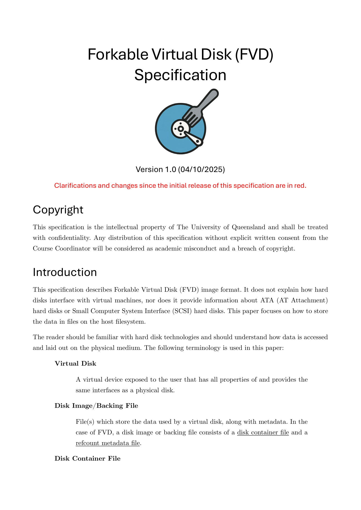
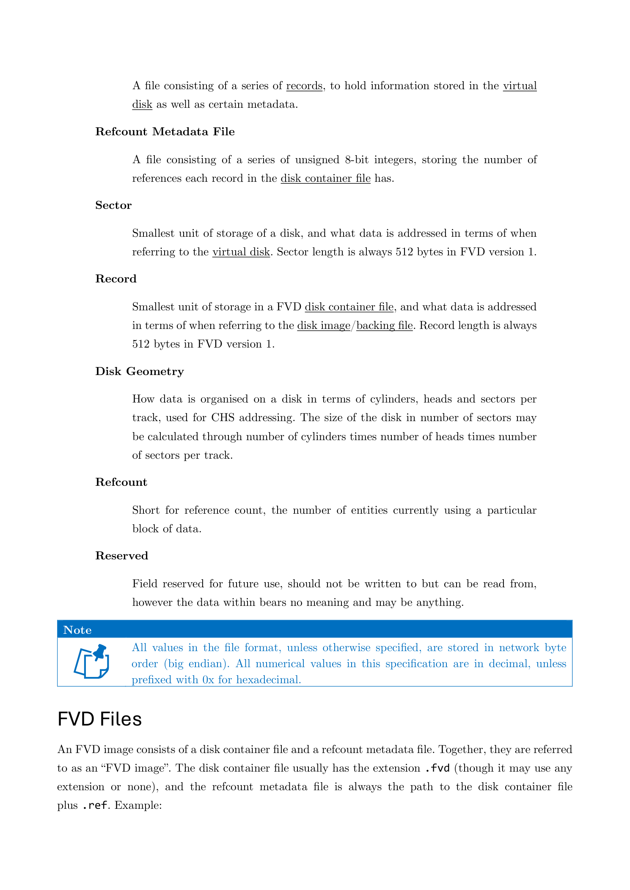
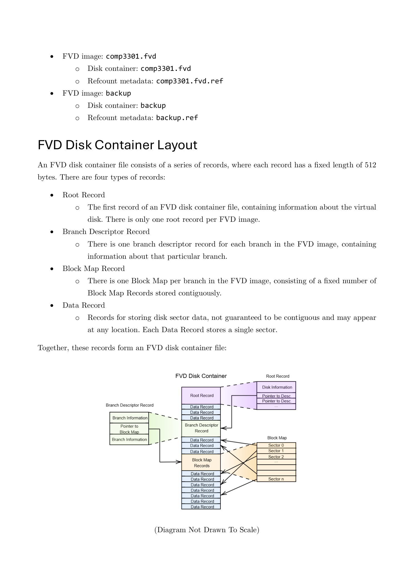
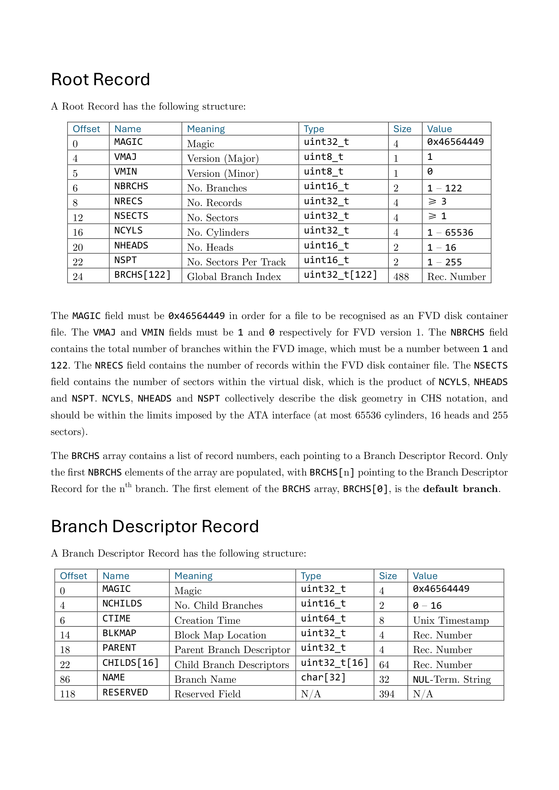
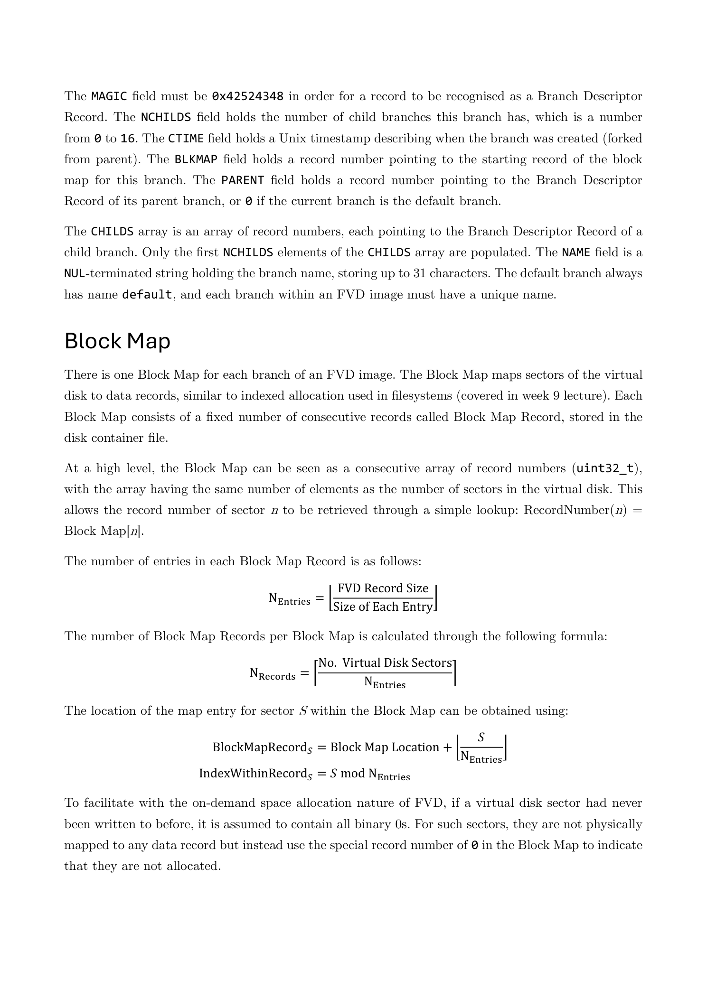
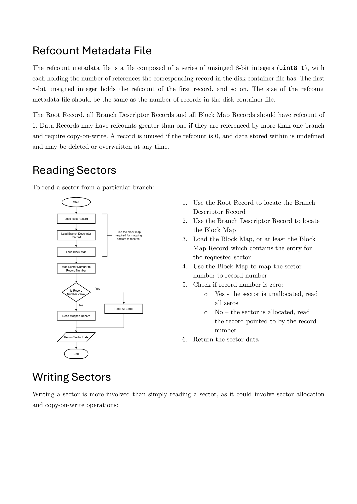
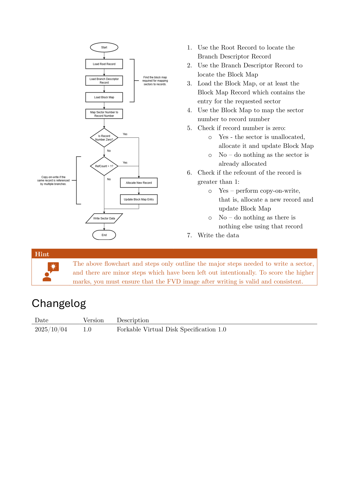

---

## 第 1 页



**提问：** 这张截图里的内容是什么意思？请面向初学者详细解释，分点讲清楚。

下面把这张截图（文档首页）的意思，用**面向初学者**的方式分点讲清楚：

### 这是什么文档？

* **标题**：Forkable Virtual Disk (FVD) Specification
  中文可理解为“**可分叉虚拟磁盘（FVD）规范**”。
* **用途**：这是在说明一种虚拟磁盘文件格式——如何把虚拟磁盘的数据与元数据存到宿主机文件系统里的**技术规范**（规则说明书）。
* **版本/日期**：Version 1.0（2025-10-04）。
* **提示**：红色文字表示和最初版本相比的**澄清或变更**。

### 版权与保密

* **版权所有**：昆士兰大学（The University of Queensland）。
* **要求**：文档要保密，**未经课程协调员书面许可不得传播**；否则会被视为学术不端与侵权。

### 这份规范讲什么、不讲什么？

* **讲什么**：只讲**FVD镜像格式**本身——也就是**磁盘数据怎样放到文件里**、需要哪些伴随信息（元数据）等。
* **不讲什么**：不讨论硬盘如何与虚拟机相连（如 ATA、SCSI 等接口）——这些是**设备接口层**的问题，这里不涉及。

### 阅读这份文档需要什么背景？

* 需要对**硬盘基本原理**有点了解，例如：数据如何按块/扇区存放、如何寻址等。

### 文中出现的关键术语（入门解释）

1. **Virtual Disk（虚拟磁盘）**

   * 就像一块“假的”硬盘：对用户/系统来说，它**看起来和真的硬盘一样**，能用相同的读写接口。
   * 区别在于：它的数据其实**保存在宿主机上的文件**里。

2. **Disk Image / Backing File（磁盘镜像/后备文件）**

   * **磁盘镜像**是一个或多个**文件**，里面保存了虚拟磁盘的**数据**和**元数据**。
   * 在 FVD 里，一个镜像（也叫**后备文件**，常用于“基线镜像+增量”的场景）由两部分组成：

     * **Disk Container File（磁盘容器文件）**：装真正数据块的“容器”。
     * **Refcount Metadata File（引用计数元数据文件）**：记录每个数据块被引用了多少次等信息，常用于**写时复制（Copy-on-Write）**、快照、去重等操作时正确管理和回收数据块。
   * 你可以把它理解成：**数据在盒子里（容器文件）**，而**盒子外贴着一张表（引用计数元数据）**，表上写着每块数据被谁用、用了几次。

3. **Disk Container File（磁盘容器文件）**

   * 下一段将要展开定义（截图只显示到标题），一般指**存放数据块本体**的那个大文件。

### 为什么要有“可分叉（Forkable）”？

* “分叉/派生”意味着可以**从一个已有镜像**创建新的“分支”（类似**快照 -> 派生盘**），新的分支只在**更改的块**上占空间，未更改的块继续**共享**。
* 这样做的好处：

  * **省空间**：不复制整盘，只记录变更。
  * **速度快**：创建/回滚快照更迅速。
  * **易管理**：通过引用计数能安全删除不再被任何分支使用的数据块。

### 一个直观的小例子

* 你有一个 20GB 的“基线系统盘”（镜像A）。
* 为了做实验，你从它“分叉”出镜像B。
* 只要你不改动，B 几乎不占空间；当你安装软件、更改文件时，B 只写入**变更过的块**到自己的容器文件；
* **引用计数元数据**会记录哪些块仍被A、B共享，哪些是B独有，便于后续清理和快照管理。

---

如果你愿意，发我**下一页截图**，我可以继续把各个文件结构、字段含义、数据块布局、读写流程等**逐条**讲清楚，并给你**图示/类比**帮助理解。


---

## 第 2 页



**提问：** 这张截图里的内容是什么意思？请面向初学者详细解释，分点讲清楚。

下面把这页截图（术语+文件规则页）的内容，用**入门者能看懂**的方式分点解释：

## 一句话总览

这页主要做三件事：

1. 定义一组在 FVD（可分叉虚拟磁盘）里会用到的术语；
2. 说明**数值与字节序**的约定；
3. 解释**FVD 镜像由哪些文件组成、怎么命名**。

---

## 术语与概念（逐条）

* **Disk Container File（磁盘容器文件）**
  用很大的“盒子文件”保存虚拟磁盘的数据，文件内部由一串\*\*records（记录）\*\*组成。记录里可以放真正的数据块，也会带一点点元数据（方便管理）。

* **Refcount Metadata File（引用计数元数据文件）**
  另一个配套的小文件，里面是一串**无符号 8 位整数（0–255）**。每个数表示容器文件中某条记录被“多少个地方在用”。有了它，就能实现快照/分叉、去重和安全回收——当计数到 0，说明这条记录没人用了，可以回收。

* **Sector（扇区）**
  面向**虚拟磁盘对外呈现**的最小读写单位。FVD v1 里固定 **512 字节**。

  > 你可以把它理解成“来访客人的切蛋糕粒度”。

* **Record（记录）**
  面向**容器文件内部存储**的最小单位。在 FVD v1 里同样是 **512 字节**。

  > 这是“厨房里装盘的粒度”。外部说“扇区”，内部说“记录”，大小一样但语境不同，别混淆。

* **Disk Geometry（磁盘几何）**
  早期磁盘的 CHS（柱面/磁头/每道扇区）表述方式。总扇区数 = **柱面数 × 磁头数 × 每道扇区数**。现代常用 LBA，但规范里仍用这个术语描述布局。

* **Refcount（引用计数）**
  某个\*\*数据块（记录）\*\*当前被多少实体使用的计数。

* **Reserved（保留字段）**
  预留给将来用的字段。**不要写入**（将来版本可能赋予含义），读到的值也**没有实际意义**，可能是任意内容。

---

## 重要约定（Note）

* **字节序**：除非另行说明，文件里的数值都用\*\*网络字节序（大端，big-endian）\*\*存放——高位字节在前。

  > 做解析/写入时一定按大端解释，否则数会错。

* **数值表示**：规范里的数字默认**十进制**；若以 **`0x`** 开头表示**十六进制**（例如 `0x10`）。

---

## FVD 文件长什么样？

* 一个完整的 **FVD 镜像 = 1 个容器文件 + 1 个引用计数文件**。两者合起来才叫一个“FVD image”。

* **容器文件**通常扩展名是 **`.fvd`**（也可以不用这个扩展名，甚至无扩展名）。

* **引用计数字段文件**的命名规则：**“容器文件的完整路径 + `.ref`”**。

  * 例：`/images/disk.fvd` → 引用计数文件是 `/images/disk.fvd.ref`。
  * 如果容器叫 `/images/base`（无扩展名），则配套文件是 `/images/base.ref`。
  * 通常与容器文件放在**同一路径**，方便一起管理。

---

## 小结 & 心智模型

* 对外，虚拟磁盘按\*\*扇区（512B）**读写；对内，容器文件按**记录（512B）\*\*存放。
* 引用计数文件是一串 8 位数，**（通常）与容器里的记录一一对应**，记录被多少快照/分叉共享，这个数字就是多少。
* 解析文件时请记住两点：**大端字节序**、**0x 是十六进制**。
* 看到 **Reserved** 就当它“占坑”，不要写、不要依赖其值。

如果你愿意继续，我可以接着讲下一页：记录与引用计数如何一一对应、读写流程是怎样的、以及快照/分叉时会发生什么。


---

## 第 3 页



**提问：** 这张截图里的内容是什么意思？请面向初学者详细解释，分点讲清楚。

下面把这页的要点，用**入门友好**的方式分点讲清楚。

## 先看文件命名示例

* 一个 **FVD 镜像**由两部分组成：

  1. **磁盘容器文件**（装数据）
  2. **引用计数元数据文件**（装每条数据被多少分支在用）
* 命名规则：**容器文件名 + `.ref`** 就是配套的引用计数文件。

  * 例：`comp3301.fvd` ↔ `comp3301.fvd.ref`
  * 例：`backup` ↔ `backup.ref`

## 容器文件（Disk Container）内部长什么样

容器文件是由一串\*\*固定大小为 512 字节的记录（record）\*\*组成。只有 4 种记录类型：

1. **Root Record（根记录）**

   * **第 1 条记录**，全盘唯一。
   * 放虚拟盘的总体信息，并且**给出“指针”**（位置）去找其它重要结构（分支、块映射等）。

2. **Branch Descriptor Record（分支描述符记录）**

   * **每个分支 1 条**。
   * 记录这个分支的基本信息，并**指向该分支的块映射（Block Map）**。
   * “分支”可理解为从同一基线镜像“分叉”的版本/快照。

3. **Block Map Record（块映射记录）**

   * **每个分支有一份 Block Map**，由**若干条连续存放**的 Block Map 记录构成。
   * 作用：把**扇区号 → 数据记录的位置**对应起来，是查找数据的“目录表”。

4. **Data Record（数据记录）**

   * 真正放数据的记录，每条记录**只存 1 个扇区（512B）**。
   * 这些记录**可以分散在文件的任何位置**，不保证连续。

> 把它想成一本书：
> **Root**=总目录；**Branch Descriptor**=每个版本的分卷说明；
> **Block Map**=该版本的详细页码索引；**Data Record**=具体内容页。

## 读一个扇区时会怎么走（直觉版）

1. 选择你要访问的**分支**；
2. 从该分支的 **Branch Descriptor** 找到它的 **Block Map**；
3. 在 **Block Map** 里用“扇区号”查到对应的 **Data Record** 位置；
4. 去容器文件把那条 512B 的 **Data Record** 读出来。

## 为什么要有“分支”和引用计数（连接前文）

* 多个分支可以**共享同一条 Data Record**；谁在用，这个数量写在配套的 `.ref` 文件里。
* 这样做就能实现**快照/克隆**：改动时只为该分支写新记录并更新映射与计数，未改动的数据继续共享，省空间又高效。

## 图里要抓的关键信息

* **Root Record 在最前面且唯一**；
* **每个分支都有 1 个 Branch Descriptor + 1 个 Block Map（由多条记录组成）**；
* **Data Records 散布其间**，Block Map 把“扇区号”指到这些 Data Records。

想继续深入的话，我可以接着讲**每种记录的字段**都有哪些、Block Map 的索引格式长什么样，以及“写入/快照/回收”的具体流程。


---

## 第 4 页



**提问：** 这张截图里的内容是什么意思？请面向初学者详细解释，分点讲清楚。

这页主要把 **两种关键记录** 的结构讲清楚：**Root Record（根记录）** 和 **Branch Descriptor Record（分支描述符记录）**。每条记录固定 **512 字节**，字段都按\*\*大端序（big-endian）\*\*存放，表中的 **Offset** 是“从记录开头算起的字节偏移”。

---

## 1) Root Record（根记录）

* **位置/作用**：容器文件里的**第 1 条记录**，只有一条。它像“总目录”，提供整盘信息并指向各个分支。
* **字段逐条理解**（括号里是大小/取值范围）：

  * **MAGIC** (4B)：必须是 `0x46564449`，文件才被认作 FVD 容器（魔数，用来校验格式）。
  * **VMAJ / VMIN** (1B/1B)：版本号，FVD v1 要求 **1** 和 **0**。
  * **NBRCHS** (2B)：**分支总数**，范围 **1–122**。
  * **NRECS** (4B)：容器文件里**记录（record）总数**，≥ **3**。
  * **NSECTS** (4B)：**虚拟磁盘的总扇区数**（每扇区 512B），≥ **1**。
  * **NCYLS / NHEADS / NSPT** (4B/2B/2B)：磁盘“几何参数”（柱面/磁头/每道扇区），分别限制 **≤ 65536 / ≤ 16 / ≤ 255**。它们的乘积应当等于 **NSECTS**。
  * **BRCHS\[122]** (488B)：一个**数组**，每个元素是“**记录号**”，指向一个 **Branch Descriptor Record**。只有前 **NBRCHS** 个元素有效；**BRCHS\[0]** 对应**默认分支**。
* **你可以怎样用它来做基本校验**

  1. 读首个 512B → 检查 **MAGIC/版本**；
  2. 检查 `NRECS * 512` 是否不大于容器文件大小；
  3. 验证 `NCYLS * NHEADS * NSPT == NSECTS`；
  4. 枚举 `i = 0..NBRCHS-1` 的 **BRCHS\[i]**，它们应是 `< NRECS` 的合法记录号。

> “记录号（Record Number）”可以理解为：把容器文件按 512 字节一段切开后，从头数到该段的**编号**。用它来“跳转”到别的记录。

---

## 2) Branch Descriptor Record（分支描述符记录）

* **位置/作用**：**每个分支 1 条**，描述该分支，并告诉你它的 **Block Map** 在哪、父子关系如何。
* **字段逐条理解**：

  * **MAGIC** (4B)：同样是 `0x46564449`（校验用）。
  * **NCHILDS** (2B)：**子分支数量**，范围 **0–16**。
  * **CTIME** (8B)：**创建时间**（Unix 时间戳，秒）。
  * **BLKMAP** (4B)：**块映射记录的记录号**。通过它能找到该分支的 Block Map（用来把“扇区号 → 数据记录号”对应起来）。
  * **PARENT** (4B)：**父分支的分支描述符记录号**（建立分支树）。
  * **CHILDS\[16]** (64B)：**子分支的记录号列表**，只有前 **NCHILDS** 个有效。
  * **NAME** (32B)：**分支名**，以 **NUL 结尾的字符串**（不足会用 `\0` 补齐）。
  * **RESERVED** (394B)：**保留**，别写入，读到也不代表任何含义。
* **用途直觉**

  * 通过 **PARENT/CHILDS** 能把所有分支串成一棵树；
  * 通过 **BLKMAP** 能定位到这个分支的**块映射**，再由块映射找到实际的数据记录（Data Record）。

---

## 3) 结合两者，读取数据的大致流程

1. 从 **Root Record** 取到默认或指定分支的记录号（`BRCHS[i]`）。
2. 打开该分支的 **Branch Descriptor Record**，得到 **BLKMAP** 的记录号。
3. 在 **Block Map** 里用“扇区号”查对应的**数据记录号**。
4. 跳到那个 **Data Record**（512B）读取数据。

---

## 4) 小提示与易错点

* **大端序**：解析所有整数时记得按 big-endian。
* **字段对齐**：表里的 **Offset** 就是字节位置；总大小严格凑满 512B（这也是为什么根记录里会有 488B 的 `BRCHS[122]`、分支记录里有 394B 的 `RESERVED`）。
* **默认分支**：通常用 **BRCHS\[0]**；其余分支按 `BRCHS[1..NBRCHS-1]`。
* **一致性检查**：`BRCHS`、`BLKMAP`、`PARENT/CHILDS` 指向的记录号都应在 `[0, NRECS)` 内。

如果你愿意继续，我可以把 **Block Map** 和 **Data Record** 的格式也用同样方式细化，并画出一次“写入（含写时复制）/创建快照/回收”的完整流程图解。


---

## 第 5 页



**提问：** 这张截图里的内容是什么意思？请面向初学者详细解释，分点讲清楚。

好，这页主要补充了\*\*分支描述符记录（Branch Descriptor Record）\*\*的细节，并系统讲清了 **Block Map（块映射）** 怎么工作。给你用入门者能直接上手的方式拆解如下：

---

## 一、分支描述符记录的关键点（Branch Descriptor Record）

> 这是“某个分支/快照”的身份证 + 导航指针。

* **MAGIC 校验**

  * 必须是 **`0x42524348`**（ASCII 正好是 **“BRCH”**）。
  * 作用：让解析器确认这条 512B 的记录确实是“分支描述符”。
  * **注意**：如果你在上一页的表格里看到别的取值，那以**本页说明为准**——分支描述符的魔数应为 `0x42524348`。

* **NCHILDS（子分支数量）**：0–16。表示从当前分支直接“长出来”的下一级分支有几个。

* **CTIME（创建时间）**：Unix 时间戳（单位秒），代表该分支被创建/从父分支分叉的时间。

* **BLKMAP（块映射起始记录号）**：指向本分支的 **Block Map** 在容器文件中的起始“记录号”。

  > 有了它，就能找到“扇区号 → 数据记录号”的索引表。

* **PARENT（父分支描述符记录号）**：指向**父分支**的描述符记录；如果这是**默认分支**，则为 **0**。

* **CHILDS\[16]（子分支列表）**：每个元素是一个**记录号**，指向某个**子分支**的分支描述符。只有前 **NCHILDS** 个有效。

* **NAME（分支名）**：NUL 结尾字符串，最多 31 个字符。

  * 约定：**默认分支的名字固定叫 `default`**。
  * 约束：**同一个 FVD 镜像内，所有分支名必须唯一**。

---

## 二、Block Map（块映射）到底是什么？

> 它是把**虚拟磁盘的扇区号**映射到**数据记录号**的“索引表”。每个**分支**都有自己的 Block Map。

* **由哪些记录组成**

  * Block Map 本身由若干条**连续存放**的“**Block Map Record**”组成；每条记录固定 512B。

* **逻辑视角**

  * 可以把 Block Map 看成一个很长的数组：

    * **元素类型**：`uint32_t`（4 字节的无符号整数），表示**记录号**。
    * **数组长度**：等于**虚拟磁盘的总扇区数**。
  * 因此要找第 `n` 个扇区的数据记录号，只需：

    ```
    RecordNumber(n) = BlockMap[n]
    ```

* **每条 Block Map 记录能放多少条映射？**

  * 公式：

    ```
    N_entries = FVD_Record_Size / Size_of_Each_Entry
              = 512 / 4
              = 128
    ```

    即：**每条 Block Map 记录能放 128 个映射项**。

* **一个分支需要多少条 Block Map 记录？**

  * 设虚拟磁盘共有 `NoSectors` 个扇区：

    ```
    N_records = ceil( NoSectors / N_entries )
              = ceil( NoSectors / 128 )
    ```

* **给定扇区 S（从 0 开始），它对应的映射项在哪？**

  * 先找到它落在哪一条 Block Map 记录里：

    ```
    BlockMapRecord_S = BlockMapLocation + floor( S / N_entries )
                     = BlockMapLocation + floor( S / 128 )
    ```

    其中 `BlockMapLocation` 就是分支描述符里的 **BLKMAP**（起始记录号）。
  * 再算这条记录中的**索引位置**：

    ```
    IndexWithinRecord = S mod N_entries
                      = S mod 128
    ```

* **按需分配 & “洞” 的表示**

  * FVD 支持**按需分配**：没写过的扇区默认视为“全 0”。
  * 这种“从未写入”的扇区在 Block Map 里**不会映射到真正的数据记录**，而是使用一个**特殊的记录号 `0`** 来表示“**未分配**”。
  * 读取时如果看到映射值是 `0`，就按**全 0** 返回；写入时才会**分配新的 Data Record** 并更新映射。

---

## 三、一步到位的直观例子

* **条件**：虚拟盘有 **1,000,000** 个扇区。
* **计算**：

  * `N_entries = 128`
  * `N_records = ceil(1,000,000 / 128) = 7,813` 条 Block Map 记录（连续存放）。
* **查扇区 S=10,000 的映射**：

  * `BlockMapRecord_S = BLKMAP + floor(10000/128) = BLKMAP + 78`
  * `IndexWithinRecord = 10000 mod 128 = 16`
  * 于是到第 `BLKMAP+78` 条记录里取第 16 项即可得到**数据记录号**；为 `0` 则表示该扇区未分配（读作全 0）。

---

## 四、你可以据此实现的三个功能

1. **解析 & 校验**：检查 BLKMAP 指向的连续记录数量是否满足 `N_records`；随机抽查若干映射项是否 < `NRECS`。
2. **按需读**：遇到映射值为 `0`，直接构造 512B 的全零数据返回。
3. **按需写（写时分配）**：第一次写一个未分配扇区时，分配新的 Data Record、写入数据，并更新相应的 Block Map 项。

如果你接着发下一页，我可以把 **Data Record 的布局**、**引用计数文件如何与 Data Record 对应**、以及**写入/快照/回收**的完整流程图再分步骤讲清楚。


---

## 第 6 页



**提问：** 这张截图里的内容是什么意思？请面向初学者详细解释，分点讲清楚。

好的，这页主要讲三件事：**引用计数文件（.ref）**是什么；**读一个扇区时的流程**；以及**写入扇区会更复杂（铺垫到下一页）**。我用入门者视角分点解释：

---

## 1) Refcount Metadata File（引用计数元数据文件）

把它想成与容器文件（.fvd）**一一对应**的“小本子”：

* **内容与大小**

  * 由一串 **无符号 8 位整数（uint8\_t）** 组成。
  * **第 1 个字节**记录“**容器第 0 号记录**”的引用计数；第 2 个字节对应第 1 号记录；依次类推。
  * 因为容器里每条记录固定 512B、且有 `NRECS` 条，所以 **.ref 文件的字节数 = NRECS**。

* **各类记录的典型计数**

  * **Root Record / 所有 Branch Descriptor / 所有 Block Map 记录**：**计数应为 1**（被结构本身使用）。
  * **Data Record（数据记录）**：**可能大于 1**——当多个分支共享同一数据块时，就会>1；这也正是快照/分叉节省空间的基础。

* **计数的含义**

  * **=0**：该记录“**未被使用**”。它里面的内容**没有定义**，你可以在需要时**覆盖或删除**它。
  * **>1**：表示被多个分支引用；若某个分支要在这块上**写入**，需要做**写时复制（Copy-on-Write）**：新分配一条记录写新数据，同时更新这个分支的映射，并相应调整两条记录的引用计数。

---

## 2) Reading Sectors（读取某个分支的一个扇区）

文字步骤 + 左侧流程图表达的是同一件事，核心逻辑如下：

1. **定位分支**

   * 先读 **Root Record**，从 `BRCHS[i]` 拿到你要访问的那个**分支描述符**（Branch Descriptor）的**记录号**。

2. **找到 Block Map**

   * 读取该分支的 **Branch Descriptor**，拿到 **BLKMAP**（该分支 **Block Map** 的起始记录号）。

3. **加载 Block Map（或至少相关那条 Block Map 记录）**

   * 每条 Block Map 记录能装 128 个“扇区→数据记录号”的条目。
   * 根据扇区号 **S** 计算它在哪条 Block Map 记录、以及在那条记录里的第几个位置（上一页给了公式：`record = BLKMAP + floor(S/128)`，`index = S mod 128`）。

4. **映射扇区号 → 记录号**

   * 取出该条目的 **记录号**（`uint32`）。

5. **判断是否未分配**

   * 如果记录号 **= 0**：说明这个扇区**从未写过**，按 FVD 规则它等同于**全 0**；直接返回 **512B 的 0**。
   * 如果记录号 **≠ 0**：到容器文件里读取对应的 **Data Record（512B）**。

6. **把扇区数据返回**。

> 心智模型：**Root → Branch Descriptor → Block Map → Data Record**，中途若看到映射项为 0，就直接“读 0”。

---

## 3) Writing Sectors（写入扇区）的铺垫

* 文末提醒：写入比读取复杂，因为会涉及：

  * **按需分配**：原来是 0（未分配）的扇区，第一次写要**找一条空闲记录**来存数据，并把 Block Map 指向它，同时把这条记录在 **.ref** 里置为 **1**。
  * **写时复制（COW）**：若多个分支共享同一数据记录（.ref 计数>1），当前分支写入不能直接改旧记录——要**新分配一条记录**写新数据，**旧记录计数减 1**、**新记录计数设为 1**，并更新当前分支的 Block Map 映射。
* 这些具体步骤会在**下一页**展开。

---

## 小例子（把三个概念串起来）

* 你在分支 `featureA` 读取扇区 1234：

  1. Root 找到 `featureA` 的 Branch Descriptor；
  2. Branch Descriptor 给出 `BLKMAP=200`；
  3. `1234/128=9 余 82` → 去第 `200+9=209` 号 Block Map 记录、取第 82 项；
  4. 若该项值是 `0` → 返回 512B 全 0；若是 `7777` → 读第 7777 号 **Data Record**。
  5. 假如 `.ref[7777]` 是 3，说明这条数据同时被 3 个分支共享；如果你随后**写入**这个扇区，就会触发 **COW**。

---

## 常见易错点

* **别忘记大端序**解析整数（魔数、记录号、时间戳等全是 big-endian）。
* **.ref 的长度一定等于容器记录总数**；索引方式是“**记录号 == .ref 下标**”。
* **未分配 ≠ 有一条全零的数据记录**：未分配是**映射项=0**的语义，读时返回 0，写时才真正分配记录。

如果你继续发下一页，我就把\*\*写入流程（含分配与 COW）\*\*按同样方式一步步拆给你。


---

## 第 7 页



**提问：** 这张截图里的内容是什么意思？请面向初学者详细解释，分点讲清楚。

好的，这页主要讲三件事：**引用计数文件（.ref）**是什么；**读一个扇区时的流程**；以及**写入扇区会更复杂（铺垫到下一页）**。我用入门者视角分点解释：

---

## 1) Refcount Metadata File（引用计数元数据文件）

把它想成与容器文件（.fvd）**一一对应**的“小本子”：

* **内容与大小**

  * 由一串 **无符号 8 位整数（uint8\_t）** 组成。
  * **第 1 个字节**记录“**容器第 0 号记录**”的引用计数；第 2 个字节对应第 1 号记录；依次类推。
  * 因为容器里每条记录固定 512B、且有 `NRECS` 条，所以 **.ref 文件的字节数 = NRECS**。

* **各类记录的典型计数**

  * **Root Record / 所有 Branch Descriptor / 所有 Block Map 记录**：**计数应为 1**（被结构本身使用）。
  * **Data Record（数据记录）**：**可能大于 1**——当多个分支共享同一数据块时，就会>1；这也正是快照/分叉节省空间的基础。

* **计数的含义**

  * **=0**：该记录“**未被使用**”。它里面的内容**没有定义**，你可以在需要时**覆盖或删除**它。
  * **>1**：表示被多个分支引用；若某个分支要在这块上**写入**，需要做**写时复制（Copy-on-Write）**：新分配一条记录写新数据，同时更新这个分支的映射，并相应调整两条记录的引用计数。

---

## 2) Reading Sectors（读取某个分支的一个扇区）

文字步骤 + 左侧流程图表达的是同一件事，核心逻辑如下：

1. **定位分支**

   * 先读 **Root Record**，从 `BRCHS[i]` 拿到你要访问的那个**分支描述符**（Branch Descriptor）的**记录号**。

2. **找到 Block Map**

   * 读取该分支的 **Branch Descriptor**，拿到 **BLKMAP**（该分支 **Block Map** 的起始记录号）。

3. **加载 Block Map（或至少相关那条 Block Map 记录）**

   * 每条 Block Map 记录能装 128 个“扇区→数据记录号”的条目。
   * 根据扇区号 **S** 计算它在哪条 Block Map 记录、以及在那条记录里的第几个位置（上一页给了公式：`record = BLKMAP + floor(S/128)`，`index = S mod 128`）。

4. **映射扇区号 → 记录号**

   * 取出该条目的 **记录号**（`uint32`）。

5. **判断是否未分配**

   * 如果记录号 **= 0**：说明这个扇区**从未写过**，按 FVD 规则它等同于**全 0**；直接返回 **512B 的 0**。
   * 如果记录号 **≠ 0**：到容器文件里读取对应的 **Data Record（512B）**。

6. **把扇区数据返回**。

> 心智模型：**Root → Branch Descriptor → Block Map → Data Record**，中途若看到映射项为 0，就直接“读 0”。

---

## 3) Writing Sectors（写入扇区）的铺垫

* 文末提醒：写入比读取复杂，因为会涉及：

  * **按需分配**：原来是 0（未分配）的扇区，第一次写要**找一条空闲记录**来存数据，并把 Block Map 指向它，同时把这条记录在 **.ref** 里置为 **1**。
  * **写时复制（COW）**：若多个分支共享同一数据记录（.ref 计数>1），当前分支写入不能直接改旧记录——要**新分配一条记录**写新数据，**旧记录计数减 1**、**新记录计数设为 1**，并更新当前分支的 Block Map 映射。
* 这些具体步骤会在**下一页**展开。

---

## 小例子（把三个概念串起来）

* 你在分支 `featureA` 读取扇区 1234：

  1. Root 找到 `featureA` 的 Branch Descriptor；
  2. Branch Descriptor 给出 `BLKMAP=200`；
  3. `1234/128=9 余 82` → 去第 `200+9=209` 号 Block Map 记录、取第 82 项；
  4. 若该项值是 `0` → 返回 512B 全 0；若是 `7777` → 读第 7777 号 **Data Record**。
  5. 假如 `.ref[7777]` 是 3，说明这条数据同时被 3 个分支共享；如果你随后**写入**这个扇区，就会触发 **COW**。

---

## 常见易错点

* **别忘记大端序**解析整数（魔数、记录号、时间戳等全是 big-endian）。
* **.ref 的长度一定等于容器记录总数**；索引方式是“**记录号 == .ref 下标**”。
* **未分配 ≠ 有一条全零的数据记录**：未分配是**映射项=0**的语义，读时返回 0，写时才真正分配记录。

如果你继续发下一页，我就把\*\*写入流程（含分配与 COW）\*\*按同样方式一步步拆给你。
