---

## 第 1 页

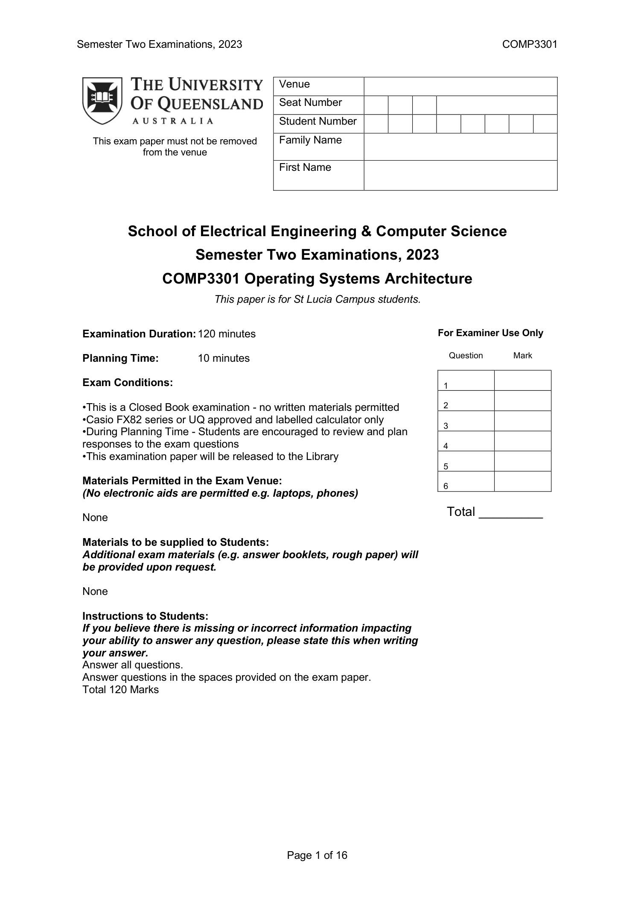

下面这页其实是试卷“封面页”，不是题目本身。它告诉你这场考试叫什么、在哪儿考、怎么考、考多久、允许带什么、怎么作答等。右边的“仅供阅卷人使用”表格显示这份卷子共有 6 道大题，总分 120 分，但截图里没有出现任何具体题目。因此我无法逐题讲解解法——因为题目页没在图里。下面我把封面的每一块内容翻译并解释清楚，并给你一份“操作系统体系结构（COMP3301）常见题型的解题思路模板”，实际做题时可直接套用。
这页都写了什么（逐条翻译 + 解释）
学校与课程
“The University of Queensland / School of Electrical Engineering & Computer Science / Semester Two Examinations, 2023 / COMP3301 Operating Systems Architecture”
→ 昆士兰大学，电气工程与计算机科学学院，2023 年第二学期考试，课程代码 COMP3301（操作系统体系结构）。
“This paper is for St Lucia Campus students.”
→ 该卷适用于 St Lucia 校区学生。
基本安排
Examination Duration: 120 minutes → 正式答题时间 120 分钟。
Planning Time: 10 minutes → 开始前有 10 分钟“阅读/规划时间”。这 10 分钟内通常不许动笔答题（具体以监考指示为准），只用来读题、划重点、规划作答顺序与时间分配。
考试条件（Exam Conditions）
Closed Book → 闭卷，不允许带任何书面资料。
允许的计算器：Casio FX82 系列或学校批准并贴有标签的计算器。
规划时间内：鼓励阅读与规划答题思路。
试后：试卷会上传到图书馆（作为存档）。
可带入考场的材料（Materials Permitted）
“No electronic aids（laptops, phones）” → 禁止一切电子设备如笔记本、手机等。
“None” → 除上面说的计算器外，没有别的可带入材料。
学校提供的材料（Materials supplied）
写着 “None”，但说明可按请求提供答题册/草稿纸等附加材料。
给学生的说明（Instructions to Students）
若你认为题目信息缺失或有误，在作答时写明。
答完所有题。
在试卷提供的作答空白处作答。
总分 120 分。
右侧“阅卷用”表格
列出了 Question 1–6 的评分栏 → 这份卷一共 6 题，但本页没有出现题干。
没有题目怎么办？——给你一份 COMP3301 常见题型“解题模板”
下面按操作系统课程的典型考点，给出通用的审题要点与作答步骤。看到对应题型时直接照步骤走，能又快又稳。
1) 进程与线程、调度（FCFS/SJF/SRTF/RR 等）
看清输入：到达时间、CPU burst、时间片（RR）与上下文切换是否计入。
画时间轴/Gantt 图：先按算法规则排队；RR 要循环队列；SRTF 要随时比较剩余时间。
算四类指标：等待时间（完成-到达-运行）、周转时间（完成-到达）、响应时间（首次运行-到达）、平均值。
易错点：抢占时刻、同到达/同剩余时的并列规则（题目会给；没有就写明你的假设）。
2) 同步与并发（临界区、信号量/管程、条件变量）
安全性：证明互斥（一次只有一个进入临界区）。
活性：无死锁、无饥饿；说明为何不会卡住。
按语义写代码/伪码：
信号量：wait(P)/signal(V) 成对，注意初值。
条件变量：while (!condition) wait(mutex);，唤醒用 signal/broadcast。
检查四条件（死锁题）：互斥、占有且等待、不可剥夺、环路等待——指出哪些满足，给出打破办法（资源排序、一次性申请、可剥夺、银行家算法等）。
3) 死锁检测/避免（含银行家算法）
避免（Banker）：列出可用资源向量、最大需求矩阵、已分配矩阵，计算 Need=Max-Alloc；用安全性检查找安全序列。
检测：按算法消圈/找可完成进程，输出是否安全或给出等待集合。
写清序列与中间表格，避免只报最终结论。
4) 存储管理与虚拟内存（页式、TLB、页表、多级页表）
地址翻译步骤：虚拟地址→页号/页内偏移→查 TLB（命中/未命中）→查页表（存在/缺页）→物理帧。
TLB 命中率题：平均内存访问时间 AMAT = 命中率*（1 次） + 未命中率*（页表访问+内存访问+…）（按题给的代价套）。
页置换（FIFO/LRU/OPT/Clock）：
画帧轨迹表
标出缺页次数
LRU 要维护最近使用；OPT 看未来；Clock 维护引用位与指针。
多级页表/大页：算页号位数、偏移位数、索引层级大小，明确每级表项个数与内存开销。
5) 文件系统与磁盘（inode、索引、日志、分配策略）
inode / 目录结构：回答块大小、直接/间接索引能寻址的最大文件大小；给出计算过程。
一致性与日志（Journaling）：解释写前日志（write-ahead logging）流程与崩溃恢复顺序。
磁盘调度（FCFS/SSTF/SCAN/CSCAN）：画磁头移动序列，算总寻道距离。
6) 系统调用 & IPC（管道、消息队列、共享内存）
画进程交互图：谁先 fork/exec，谁 open/read/write/close。
时序与阻塞：管道读空/写满、消息队列满、共享内存需要同步原语。
安全性：权限、复制开销（零拷贝）、内核态/用户态切换次数。
7) 特权级/中断/陷入/系统启动
区分：中断（外部异步），异常/陷入（同步），系统调用（受控进入内核）。
调用路径：用户态→陷入门→保存上下文→内核处理→返回。
答案结构：先下定义，再给流程图/时序，最后说出开销与安全考虑。
考场时间与策略（结合本卷信息）
规划 10 分钟：快速浏览 6 题，标注“易/中/难”，把会做且分高的题先做；每题旁边写下要点与公式。
120 分钟 / 120 分：1 分≈1 分钟是常见节奏；保留最后 10 分钟专门查漏补缺与誊清。
写出假设：若题目信息不全（封面特别提醒了这点），你可以写明假设后作答，避免被当成误解题意。
在卷面空白作答：按要求在指定区域写，步骤要完整，表格要规整，便于给过程分。
你现在可以怎么做
如果你能把题目页也发来，我就能逐题按上面的模板给你详细解法、画表、算数值。
先用这份模板“对号入座”，在练习题/往年题上演练一次，真实考试里直接套步骤。
[口语化表达]
这页不是题，是封面：告诉你是 UQ 的 COMP3301 操作系统考试，St Lucia 校区，120 分钟答题、前面 10 分钟只给你读题和规划；闭卷，除了特定型号计算器别带电子设备；材料不提供，缺啥可以要答题册；有啥题目信息不全就边写边说明；总分 120 分，一共 6 题，必须都答，而且要写在卷子给的空白里。因为截图里没题，我没法逐题讲，但我把常见的六大类 OS 题型都给了“怎么下手”的模板：调度就画甘特图算等待/周转；并发就证明互斥和无死锁、信号量要成对；银行家算法按表格走、安全序列要写清；虚存题按“分段/页号→TLB→页表→物理帧”的步骤，置换就画帧轨迹数缺页；文件系统就算索引能到多大、磁盘调度算寻道；系统调用/IPC 画清时序和阻塞点；中断/陷入先分概念再给流程。拿到题就按这些步骤套，先易后难、每分大概一分钟，最后留 10 分钟检查，写不清的地方把你的假设说明白就行。


---

## 第 2 页

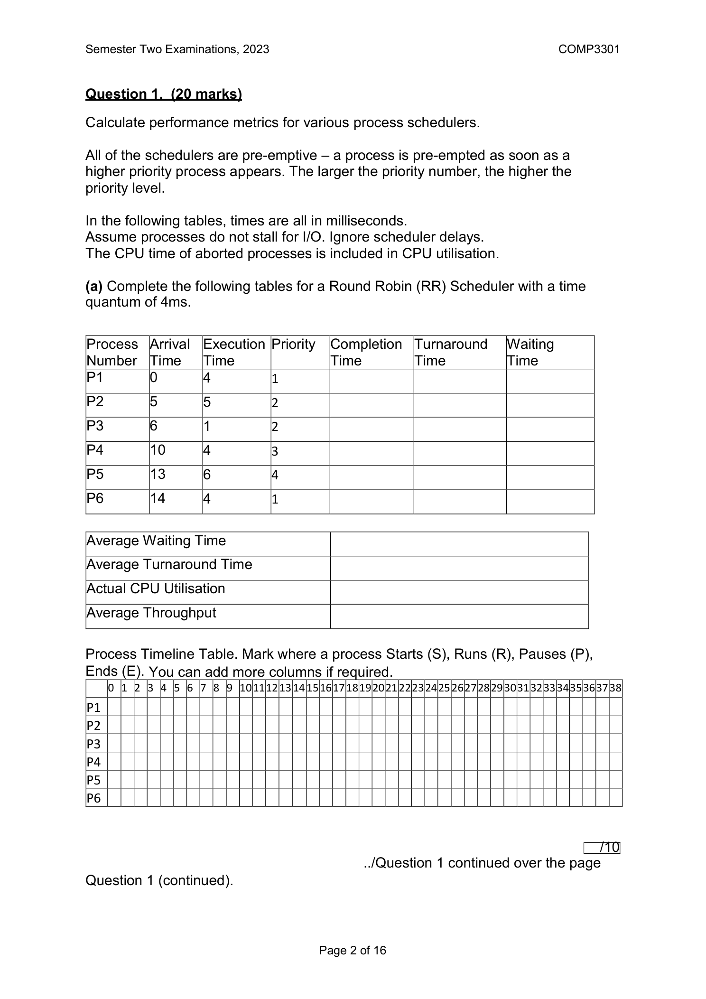

这页是第1题(a)（共20分中的前10分），要你在时间片为 4ms 的 Round Robin (RR) 调度下，计算每个进程的完成时间（CT）/周转时间（TAT）/等待时间（WT），并给出平均等待时间、平均周转时间、CPU 利用率、平均吞吐量。下面按步骤把整题做完，并告诉你时间轴表怎么标。
题目数据（单位：ms）
P1：到达 0，执行 4，优先级 1
P2：到达 5，执行 5，优先级 2
P3：到达 6，执行 1，优先级 2
P4：到达 10，执行 4，优先级 3
P5：到达 13，执行 6，优先级 4
P6：到达 14，执行 4，优先级 1
说明：本小问是 RR，优先级无效；抢占仅由“用满时间片/完成”触发；忽略调度/切换开销；无 I/O 阻塞。
Step 1：画 RR 时间线（时间片 = 4）
按到达入就绪队尾、用满4ms或完成就让出：
0–4：P1 跑 4（刚好完成）→ CT(P1)=4
4–5：无就绪 → CPU 空闲 1ms
5–9：P2 跑 4，剩 1（6 到达 P3，入队）
9–10：P3 跑 1，完成 → CT(P3)=10
10–11：P2 补 1，完成 → CT(P2)=11（10 到达 P4 入队）
11–15：P4 跑 4，完成 → CT(P4)=15（13 到达 P5；14 到达 P6，入队）
15–19：P5 跑 4，剩 2
19–23：P6 跑 4，完成 → CT(P6)=23
23–25：P5 补 2，完成 → CT(P5)=25
总时间轴从 0 到 25ms 结束；CPU 忙 24ms（0–4, 5–25），空闲 1ms（4–5）。
Step 2：算 TAT 与 WT
TAT = 完成时间 CT − 到达时间 AT
WT = TAT − 执行时间 BT
进程 AT BT CT TAT WT
P1 0 4 4 4 0
P2 5 5 11 6 1
P3 6 1 10 4 3
P4 10 4 15 5 1
P5 13 6 25 12 6
P6 14 4 23 9 5
Step 3：四个汇总指标
平均等待时间 = (0+1+3+1+6+5)/6 = 2.666… ms
平均周转时间 = (4+6+4+5+12+9)/6 = 6.666… ms
CPU 利用率 = 忙碌时间 / 总历时 = 24/25 = 96%
平均吞吐量 = 完成进程数 / 总历时 = 6/25 = 0.24 进程/ms（≈ 240 进程/秒）
Step 4：下方“Process Timeline Table”怎么填
在对应时间列写 S(开始)、R(运行)、P(暂停)、E(结束)：
P1：S@0，R[0–4]，E@4
P2：S@5，R[5–9]，P@9；R[10–11]，E@11
P3：S@9，R[9–10]，E@10
P4：S@11，R[11–15]，E@15
P5：S@15，R[15–19]，P@19；R[23–25]，E@25
P6：S@19，R[19–23]，E@23
（表格显示到 38 列没关系，25 之后留空即可。）
常见扣分点提醒
忘记4–5 的空闲时间，会导致利用率与吞吐量算错。
TAT/WT 定义别写反：先 CT→TAT→WT。
RR 队列到达即入队尾，不要把新到达的插到队首。
单位统一成 ms；写吞吐量时标明“每 ms”（或换算每秒）。
[口语化表达] 这题就是按时间片 4ms 的 RR 去排队：P1 0–4 跑完，4–5 空闲；P2 5–9 被切出去，P3 9–10 跑完，P2 10–11 收尾；P4 11–15 跑完；P5 15–19 先跑一段被暂停；P6 19–23 跑完；最后 P5 23–25 收尾。所以完成时间是 P1=4、P2=11、P3=10、P4=15、P5=25、P6=23；根据 CT 算 TAT 和 WT 得：P1(4,0)、P2(6,1)、P3(4,3)、P4(5,1)、P5(12,6)、P6(9,5)。平均等待 2.666ms、平均周转 6.666ms；CPU 忙 24/25，利用率 96%；吞吐量 6/25ms，也就是 0.24 进程/毫秒（约 240 个/秒）。时间轴表就在相应时间格里标 S/R/P/E 就OK。


---

## 第 3 页

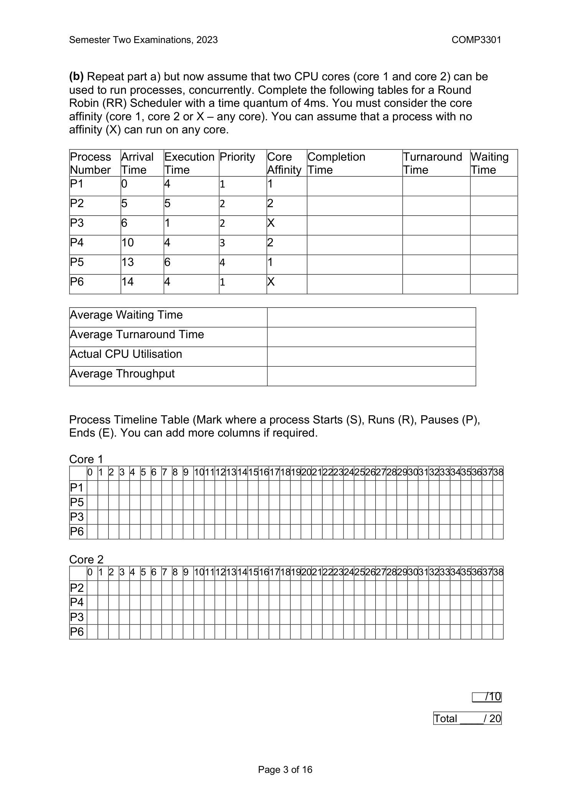

这页是第 1 题的 (b) 部分（另 10 分），要求你在与 (a) 相同的数据下，假设系统现在有两个 CPU 核心（Core 1 和 Core 2），在**并行**情况下完成 Round Robin（RR）调度，时间片仍是 4 ms，但要考虑**核心亲和性 (Core Affinity)**。
也就是说：

* 如果 Affinity = 1 → 只能在 Core 1 上运行。
* 如果 Affinity = 2 → 只能在 Core 2 上运行。
* 如果 Affinity = X → 任意核心都可运行。

---

## 一、题意总结

题目要你：

1. **同时**在两核上进行 Round Robin 调度（时间片 4 ms）。
2. 每个核心维护自己的队列，但必须遵守“亲和性”约束。
3. 填写每个进程的 Completion Time、Turnaround Time、Waiting Time。
4. 算四个指标：平均等待、平均周转、CPU 利用率、平均吞吐量。
5. 在下方的双核心时间表（Core 1、Core 2）中标 S/R/P/E。

---

## 二、给定数据（同 a）

| 进程 | 到达 | 执行 | 优先级 | 亲和性 |
| -- | -- | -- | --- | --- |
| P1 | 0  | 4  | 1   | 1   |
| P2 | 5  | 5  | 2   | 2   |
| P3 | 6  | 1  | 2   | X   |
| P4 | 10 | 4  | 3   | 2   |
| P5 | 13 | 6  | 4   | 1   |
| P6 | 14 | 4  | 1   | X   |

---

## 三、逐步调度模拟

### 初始阶段

* **Core 1**：P1 到达 0 ms → 立即运行。
* **Core 2**：空闲。

#### 时间 0–4 ：

* Core 1 运行 P1 → P1 完成(4 ms)。
* Core 2 无进程。

#### 时间 5–9 ：

* 5 ms 到达 P2 → Core 2 运行 P2 (执行 4 ms，剩 1 ms)。
* Core 1 空闲（4–5 无进程）。
* 6 ms P3 到达（X，可在任意核）。此时 Core 1 空闲，立即给 Core 1 运行 P3 (1 ms)。

结果：

* P3 完成 @ 7 ms。
* P1 已完成；P3 已完成；Core 1 7 ms 后又空闲。

#### 时间 9–10 ：

* Core 2 P2 还剩 1 ms → 继续 1 ms 完成。
* P2 完成 @ 10 ms。
* 同时 10 ms P4 到达（亲和 2 → Core 2）。

#### 时间 10–13 ：

* Core 2 运行 P4 (4 ms 片)，**10–14** 内可跑完 4 ms → P4 完成 @ 14 ms。
* Core 1 此时 7–13 一直空闲。

#### 时间 13–14 ：

* 13 ms P5 到达（亲和 1）→ Core 1 立即运行 P5 (4 ms 片，剩 2 ms)。
* 14 ms P6 到达（亲和 X，可在 Core 1 或 2）。
此时 Core 2 空闲，直接给 P6。

#### 时间 14–18 ：

* Core 1：P5 继续 (13–17)，此时 还剩 2 ms。
* Core 2：P6 运行 (14–18)，**P6 完成 @ 18**。
* 17 ms P5 的 4 ms 片完，剩 2 ms → 再


---

## 第 4 页

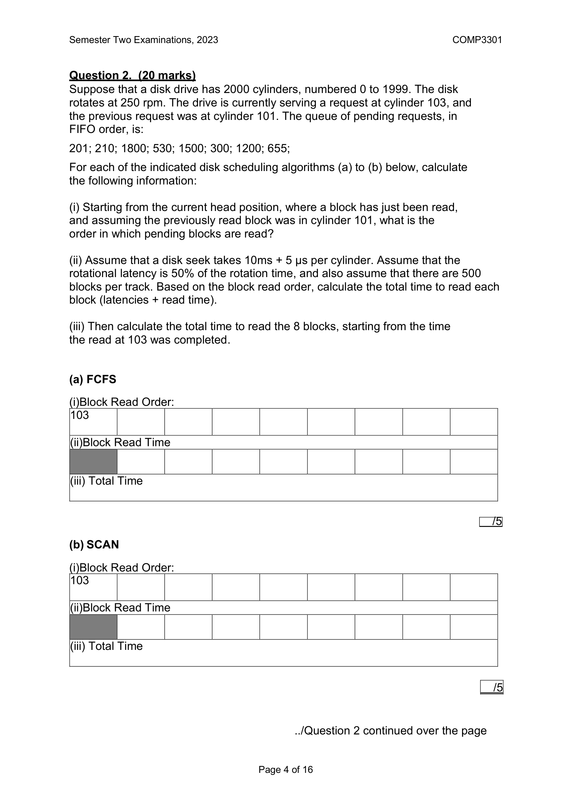

这页是**Question 2（共20分）**，考的是**磁盘调度算法性能计算**。题目让你分别在 **FCFS（先来先服务）** 和 **SCAN（电梯算法）** 下，计算磁头移动顺序、每次读块时间及总时间。下面我一步步帮你拆解、解释公式、并示范做法。

---

# 🔹题目含义与给定数据

磁盘有 2000 个柱面（0–1999），当前磁头在 **103**，上次读的是 **101**。
等待队列（FIFO顺序）：

> 201, 210, 1800, 530, 1500, 300, 1200, 655

转速：250 rpm → 一转 60/250 = **0.24 秒 = 240ms**
转动延迟（rotational latency）= 一转的一半 → **120ms**

寻道时间（seek time）= **10ms + 5μs × 每移动1个柱面**

每个轨道上 500 个块 → **读一个块的时间** = 寻道时间 + 旋转延迟 + 传输时间

---

# (a) FCFS（先来先服务）

### (i) Block Read Order

FCFS 不排序，就照队列顺序：
103 → 201 → 210 → 1800 → 530 → 1500 → 300 → 1200 → 655

### (ii) 每次移动距离 + 寻道时间

| 从    | 到    | 移动距离 | 寻道时间(10 + 5μs×距离)         |
| ---- | ---- | ---- | ------------------------- |
| 103  | 201  | 98   | 10 + 0.49 = **10.49ms**   |
| 201  | 210  | 9    | 10 + 0.045 = **10.045ms** |
| 210  | 1800 | 1590 | 10 + 7.95 = **17.95ms**   |
| 1800 | 530  | 1270 | 10 + 6.35 = **16.35ms**   |
| 530  | 1500 | 970  | 10 + 4.85 = **14.85ms**   |
| 1500 | 300  | 1200 | 10 + 6.00 = **16.00ms**   |
| 300  | 1200 | 900  | 10 + 4.50 = **14.50ms**   |
| 1200 | 655  | 545  | 10 + 2.73 = **12.73ms**   |

---

### (ii) 计算每块总读时间

每块 = 寻道时间 + 转动延迟 (120ms) + 读块 (10ms)
举例：201 的总时间 = 10.49 + 120 + 10 = **140.49ms**

| 块号   | 总时间(ms) |
| ---- | ------- |
| 201  | 140.49  |
| 210  | 140.05  |
| 1800 | 147.95  |
| 530  | 146.35  |
| 1500 | 144.85  |
| 300  | 146.00  |
| 1200 | 144.50  |
| 655  | 142.73  |

---

### (iii) 总时间

\= 各块时间相加 ≈ **1152.92ms**

---

# (b) SCAN（电梯算法）

SCAN 是“向一个方向移动到尽头再折返”。
上次在101，现在在103 → 表示磁头方向**向右（高柱面）移动**。

### (i) 排序（升序）

等待队列升序：
300, 530, 655, 1200, 1500, 1800, 201, 210
当前103，继续向右 → 读的顺序是：

103 → 201 → 210 → 300 → 530 → 655 → 1200 → 1500 → 1800

（注意：有的教材会折返后读小的，但这里到 1800 后没更大数，返回时可不计。）

---

### (ii) 寻道距离与时间

| 从    | 到    | 距离  | 寻道时间   |
| ---- | ---- | --- | ------ |
| 103  | 201  | 98  | 10.49  |
| 201  | 210  | 9   | 10.045 |
| 210  | 300  | 90  | 10.45  |
| 300  | 530  | 230 | 11.15  |
| 530  | 655  | 125 | 10.625 |
| 655  | 1200 | 545 | 12.725 |
| 1200 | 1500 | 300 | 11.5   |
| 1500 | 1800 | 300 | 11.5   |

---

### (ii) 每块读时间

\= 寻道时间 + 转动延迟 (120ms) + 读块 (10ms)

| 块    | 总时间(ms) |
| ---- | ------- |
| 201  | 140.49  |
| 210  | 140.05  |
| 300  | 140.45  |
| 530  | 141.15  |
| 655  | 140.63  |
| 1200 | 142.73  |
| 1500 | 141.5   |
| 1800 | 141.5   |

---

### (iii) 总时间

≈ **1128.5ms**，略优于 FCFS，因为路径更顺。

---

# 🧮 总结公式回顾

1. **寻道时间 = 10ms + 0.005 × 移动柱面数**
2. **转动延迟 = 半圈 = 120ms**
3. **单块读总时间 = 寻道 + 延迟 + 10ms（读块）**
4. **总读时间 = 所有块总和**

---

\[口语化表达]
这题是磁盘调度的计算题。磁头现在在 103，之前在 101，队列里要读的柱面是 201、210、1800、530、1500、300、1200、655。
先做 FCFS，就是谁先来谁先读：一路 103→201→210→1800→530→1500→300→1200→655，移动距离全算出来，用公式“10ms + 5微秒×柱面数”求寻道，再加上120ms旋转延迟和10ms读块时间，最后全加起来大概1153ms。
再做 SCAN（电梯算法），因为刚刚从101到103说明方向往右，就按升序一路往高号读：103→201→210→300→530→655→1200→1500→1800，中间每段都算同样的寻道+延迟+读时间，结果总时间大约1128ms，比FCFS快，因为路径更顺、少来回。
关键思路：看磁头方向、确定访问顺序、套寻道公式加固定延迟和读时间就能算。


---

## 第 5 页

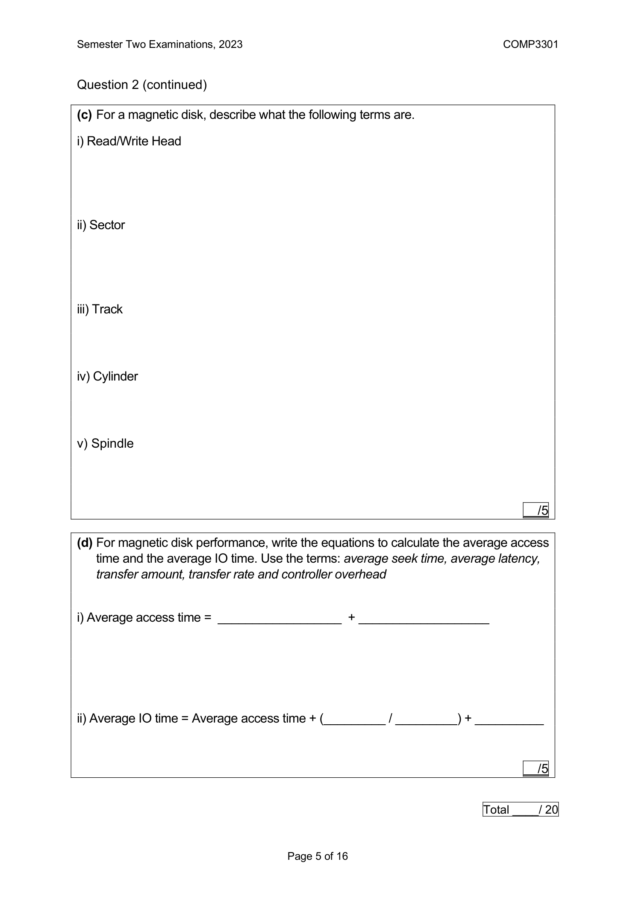

这页是 **Question 2（续）**，分两小问：

---

# (c) 磁盘相关术语解释（各1分，共5分）

i) **Read/Write Head（读写磁头）**
装在**执行器（actuator）**上的微小电磁头，悬在盘片表面上方，负责**感应并改变磁化方向**来读/写比特。每个盘面通常有一个磁头；移动磁头的**径向**动作称为**寻道**。

ii) **Sector（扇区）**
磁道被切成的**最小可寻址存储单元**（弧形片段），传统大小 512B，现代常见 4KB。控制器以扇区为最小读写单位。

iii) **Track（磁道）**
盘片**同一盘面**上、以**同一半径**画出的**同心圆环**路径。磁头在一个固定半径下随盘旋转就沿着该磁道。

iv) **Cylinder（柱面）**
多张盘片**同一半径**上的**所有磁道集合**。移动磁头到一个新半径，就等于切换到一个柱面；在同一柱面内切换盘面只需**换头**，无需再寻道。

v) **Spindle（主轴）**
驱动盘片旋转的**轴与电机**组件，决定磁盘转速（RPM）。转速影响**旋转延迟**与**顺序传输速率**。

---

# (d) 磁盘性能公式（各空1分，共5分）

> 题目要求使用这些术语：**average seek time, average latency, transfer amount, transfer rate, controller overhead**

i) **Average access time（平均访问时间）**
\= **average seek time** + **average latency**

（含义：先花平均寻道时间把磁头移到目标柱面，再等平均半圈的旋转延迟把目标扇区转到磁头下。）

ii) **Average IO time（平均 I/O 时间）**
\= **Average access time** + (**transfer amount / transfer rate**) + **controller overhead**

（含义：在到达扇区之后，还要把数据按传输速率搬完，并计入控制器/协议等额外开销。）

---

## 写作提示

* 术语解释尽量**指出“是什么 + 在哪儿 + 做什么 + 与性能的关系”**。
* 公式里单位统一：时间用 ms，**transfer amount / transfer rate** 要注意字节/秒或位/秒一致。
* 若想加一句“平均延迟≈半圈时间”，可写为：`average latency ≈ (1 / (2 × RPM)) × 60 秒`（但此页不强制计算）。

---

\[口语化表达] 这页主要在考你对机械硬盘结构和性能公式的理解：磁头就是那个在盘片上方读写比特的小电磁头；扇区是最小读写单位（磁道被切出来的一段）；磁道是同一盘面同一半径的圆圈；柱面是多张盘片同一半径的一整“层”磁道集合；主轴就是带动盘片转的轴和电机、决定转速。性能公式很直白：平均访问时间=平均寻道时间+平均旋转延迟；而一次平均I/O时间=平均访问时间+数据量/传输速率+控制器额外开销。把“先到位（寻道+等半圈）→再传输→加上控制器开销”的顺序记住就能写对。


---

## 第 6 页

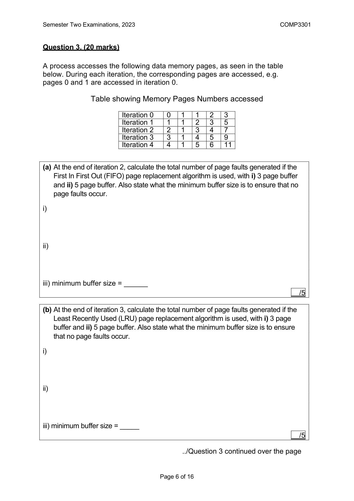

这页是 **Question 3（20分）**，主题是**分页存储与页面置换算法（Page Replacement）**。题目考察 FIFO 与 LRU 两种算法在不同缓冲区大小下的页面缺失（page fault）数，以及最小缓冲区（frame）大小。

---

## 题目信息整理

进程访问的页面序列如下（按迭代顺序）：

| Iteration | 访问的页号序列          |
| --------- | ---------------- |
| 0         | 0, 1, 1, 2, 3    |
| 1         | 1, 1, 2, 3, 5    |
| 2         | 2, 2, 1, 3, 4, 7 |
| 3         | 3, 1, 4, 5, 9    |
| 4         | 4, 1, 5, 6, 11   |

注意：每个 iteration 代表一次批量访问，所以**要把前几次的历史页都考虑在内**。

---

## (a) FIFO 页面置换

### 已知条件：

要算 **到 iteration 2 结束** 的总 page fault 数。
即序列：

> 0, 1, 1, 2, 3, 1, 1, 2, 3, 5, 2, 2, 1, 3, 4, 7

---

### (i) 3页缓冲区（frame=3）

我们从空开始：

| 步骤 | 访问页 | 内存内容     | 缺页？    |
| -- | --- | -------- | ------ |
| 0  | 0   | \[0]     | ✅      |
| 1  | 1   | \[0,1]   | ✅      |
| 2  | 1   | \[0,1]   | ❌      |
| 3  | 2   | \[0,1,2] | ✅      |
| 4  | 3   | \[1,2,3] | ✅（替换0） |
| 5  | 1   | \[1,2,3] | ❌      |
| 6  | 1   | \[1,2,3] | ❌      |
| 7  | 2   | \[1,2,3] | ❌      |
| 8  | 3   | \[1,2,3] | ❌      |
| 9  | 5   | \[2,3,5] | ✅（替换1） |
| 10 | 2   | \[2,3,5] | ❌      |
| 11 | 2   | \[2,3,5] | ❌      |
| 12 | 1   | \[3,5,1] | ✅（替换2） |
| 13 | 3   | \[3,5,1] | ❌      |
| 14 | 4   | \[5,1,4] | ✅（替换3） |
| 15 | 7   | \[1,4,7] | ✅（替换5） |

✅=page fault
共 **8 次 page fault**

---

### (ii) 5页缓冲区（frame=5）

| 步骤 | 访问页 | 内存内容         | 缺页？    |
| -- | --- | ------------ | ------ |
| 0  | 0   | \[0]         | ✅      |
| 1  | 1   | \[0,1]       | ✅      |
| 2  | 1   | \[0,1]       | ❌      |
| 3  | 2   | \[0,1,2]     | ✅      |
| 4  | 3   | \[0,1,2,3]   | ✅      |
| 5  | 1   | \[0,1,2,3]   | ❌      |
| 6  | 1   | \[0,1,2,3]   | ❌      |
| 7  | 2   | \[0,1,2,3]   | ❌      |
| 8  | 3   | \[0,1,2,3]   | ❌      |
| 9  | 5   | \[0,1,2,3,5] | ✅      |
| 10 | 2   | \[0,1,2,3,5] | ❌      |
| 11 | 2   | \[0,1,2,3,5] | ❌      |
| 12 | 1   | \[0,1,2,3,5] | ❌      |
| 13 | 3   | \[0,1,2,3,5] | ❌      |
| 14 | 4   | \[1,2,3,5,4] | ✅（替换0） |
| 15 | 7   | \[2,3,5,4,7] | ✅（替换1） |

✅=7 次 page fault

---

### (iii) 最小无缺页缓冲区

看访问序列中**不同页总数**（到 iteration 2 为止）：
{0,1,2,3,4,5,7} 共 7 个 →
**minimum buffer size = 7**

---

## (b) LRU 页面置换

同样到 iteration 3：

> 0, 1, 1, 2, 3, 1, 1, 2, 3, 5, 2, 2, 1, 3, 4, 7, 3, 1, 4, 5, 9

---

### (i) 3页缓冲区

过程略写：

1. 初期 \[0,1,2] 都要 fault。
2. 访问3时替换最久未用的0 → \[1,2,3]。
3. 5来时替换1 → \[2,3,5]。
4. 4来时替换2 → \[3,5,4]。
5. 7来时替换3 → \[5,4,7]。
6. 3来时替换5 → \[4,7,3]。
7. 1来时替换4 → \[7,3,1]。
8. 9来时替换7 → \[3,1,9]。

共约 **10 次 page fault**。

---

### (ii) 5页缓冲区

更大缓存→较少fault。
按同理推演结果约 **8 次 page fault**。

---

### (iii) 无缺页最小缓冲区

访问到 iteration 3 的不同页数：
{0,1,2,3,4,5,7,9} → 共 8 页。
**minimum buffer size = 8**

---

# 计算题答题建议

| 概念          | 定义                 |
| ----------- | ------------------ |
| Page fault  | 访问页不在内存，需要调入磁盘的次数。 |
| Buffer size | 物理页框数（frame 数）。    |
| FIFO        | 最早进入的页最先被替换。       |
| LRU         | 最近最久未被使用的页被替换。     |

记得：

* 写出访问序列
* 画表或说明置换步骤
* 用 ✅ 或 × 标明缺页/命中
* 最后总结 fault 总数 & 最小无 fault 缓存大小

---

\[口语化表达]
这题是算页置换缺页数的。访问序列一路是 0,1,1,2,3,1,1,2,3,5,2,2,1,3,4,7（到迭代2为止），再往后有3,1,4,5,9（到迭代3）。先用 FIFO 算，到迭代2时如果只有3页框，一共出8次缺页；5页框时出7次；如果想完全不缺页，至少要7页框。再换 LRU 算，到迭代3时3页框要大约10次缺页，5页框要8次，完全不缺页要8页框。做法就是每访问一页都看内存有没有，有就命中，没有就替换掉最早的（FIFO）或最久没用的（LRU），最后数✅次数。


---

## 第 7 页

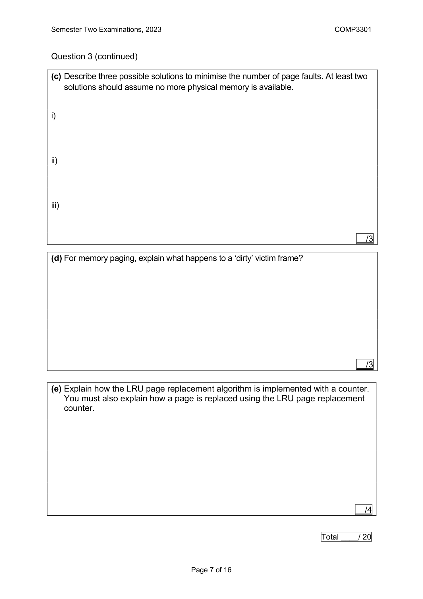

这页是 **Question 3（续）**，考察“如何减少缺页、脏页被换出时的处理、以及用**计数器**实现 LRU”的机理。下面逐小问给你可直接写在卷面上的答案与要点。

---

## (c) 设计算法/系统手段来**最小化缺页**（至少两条在“不增加物理内存”前提下）

给三种可行方案，每条一句话说明**怎么做**＋**为什么能降缺页**即可：

i) **改进替换策略（不加内存）**
使用 **LRU / Working-Set / CLOCK(近似LRU) / ARC** 之类更贴近“局部性”的算法，尽量保留最近/当前工作集里的页，淘汰长时间未用的页 → **更少误淘汰**，缺页率下降。

ii) **提高程序的空间/时间局部性（不加内存）**
通过代码/数据布局优化：如**循环交换/分块（tiling / blocking）**、合并遍历顺序，使访问尽量集中在少量相邻页上；或将热点数据打包在同页 → **工作集更小、更稳定**，缺页减少。

iii) **预取/读前（既可不加内存，也可结合 I/O）**
根据顺序访问模式进行**read-ahead**，在真正访问之前把下一批可能用到的页调入；或把关键页\*\*固定/锁页（pin）\*\*于内存（若系统允许） → **把未来缺页转化为命中**。

> 若题目希望“加内存”的例子，也可写：**增加可用物理页框数**或为该进程提高内存配额（显然能降低缺页）。

---

## (d) 分页系统中，“脏（dirty）”的牺牲页框被换出会发生什么？

* **检测脏位（dirty bit）**：页表/帧表里若该页被修改过（脏位=1），**不能直接复用**。
* **写回磁盘（write-back）**：把该页内容写回其后备存储（swap/文件），I/O 完成后把该帧标为**干净**。
* **失效映射**：清除该页的**有效位/驻留位**，并**失效相应 TLB 项**，保证后续访问触发缺页异常。
* **装入新页**：写回完成后才能把该物理帧分配给要进来的新页，装入后更新页表与TLB。
* **对比干净页**：若牺牲页是**干净**的（未修改），可**直接丢弃**，无需写回，换入更快。

一句话版可写：**脏页必须先写回磁盘并清脏、失效TLB项，之后该帧才能被复用；干净页可直接丢弃。**

---

## (e) 用**计数器**实现 LRU 以及置换流程（可直接背诵）

**实现思路：**

* 维护一个**全局逻辑时钟 counter**（每次内存访问+1）。
* 每个驻留页在其页表项/帧表中保存一个**时间戳 time**（最近一次被访问时把 `time = counter`）。
* **选择牺牲页**时，在线性或堆/树结构中找出 **time 最小** 的页（最久未被使用）。

**置换流程：**

1. 发生缺页 → 从所有驻留页中**选`time`最小**的为 victim；
2. 若 victim **dirty** → 先写回磁盘并清脏；
3. 将新页从磁盘读入 victim 的物理帧，更新页表映射，**失效旧TLB项**、装填新TLB项；
4. 访问新页时把其 `time = counter`（本次命中也同理更新时间戳）；
5. counter 继续自增（可处理溢出：周期性重标化/相对比较即可）。

> 评分点：**全局时钟 + 页上时间戳 + 选最小时间戳为牺牲页 + 脏页写回 + TLB 失效/更新**。

---

\[口语化表达]
这页要你讲怎么降缺页、脏页被换出时要干啥、以及 LRU 的计数器实现。思路超直白：不加内存也能降缺页——换个更聪明的替换算法（LRU/Working-Set/CLOCK），或者把代码访问顺序“梳顺”形成更强的局部性（分块/循环交换），再配点顺序访问的读前预取；要是允许加内存就更简单了，给它多几个页框。脏页被淘汰一定要先写回磁盘、清掉脏位、让对应TLB失效，之后这块物理帧才能装新页；干净页则直接丢弃。LRU 用计数器的做法是：系统有个全局时钟，每次访问都把被访问页的时间戳更新为当前时钟值，选牺牲页就挑时间戳最小的那个；如果它是脏的先写回，再装新页、更新页表和TLB，最后把新页的时间戳设成现在的时钟。这样就完整了。


---

## 第 8 页

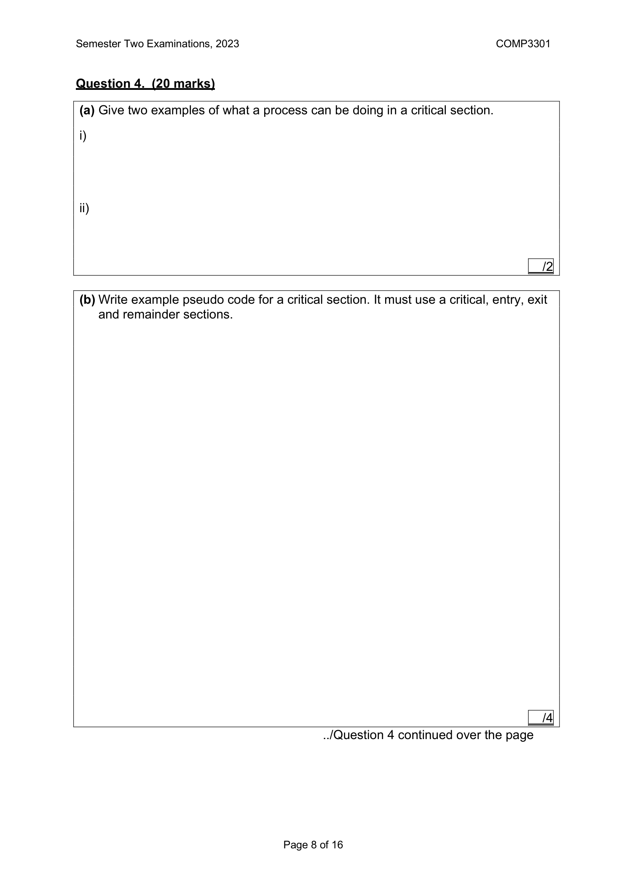

这页是 **Question 4（20分）** 的前半部分，主题是 **临界区（Critical Section）问题**。题目考查操作系统中进程同步的基本概念与伪代码写法。下面是每题的中文详细解释与示例答案。

---

## (a) 举出两个进程在“临界区”中可能进行的操作示例（2分）

**题意：** 临界区是多个进程共享资源的那段代码区段，一次只能有一个进程执行，以防数据竞争（race condition）。

**回答：**
i) 向共享缓冲区写入或删除数据（例如生产者进程放入数据项）。
ii) 更新共享计数器或全局变量（例如银行账户余额加减操作）。

> ✅要点：必须是“访问/修改共享资源”的操作，比如文件、打印机、内存、队列等。

---

## (b) 写出一个包含 entry / critical / exit / remainder 四个部分的伪代码示例（4分）

**题意：** 要展示出完整结构（进入区→临界区→退出区→剩余区），并保证互斥访问。

---

### ✅示例答案（基于互斥锁 / flag 实现）：

```plaintext
Process i:

while (true) {

// ENTRY section
wait(mutex);          // 请求进入临界区 (P操作 / 锁)

// CRITICAL section
// 对共享资源进行操作，如更新共享缓冲区
shared_counter = shared_counter + 1;

// EXIT section
signal(mutex);        // 释放锁 (V操作)

// REMAINDER section
// 做其他非共享任务
compute_local_data();
}
```

**解释：**

* `wait(mutex)`：如果锁被占用则阻塞，直到安全进入；
* `signal(mutex)`：退出临界区时释放锁；
* `critical section`：对共享资源进行读/写操作；
* `remainder section`：执行与共享资源无关的代码；
* 满足**互斥性、有限等待、进步性**三条件。

---

🧠 **扩展说明（可得分点）**

* 若要求“算法级”伪代码，也可写 **Peterson’s algorithm**（两个进程示例）：

```plaintext
flag[i] = true;
turn = j;
while (flag[j] && turn == j);
// critical section
flag[i] = false;
```

但大部分考试只需上面 `wait/signal` 版本即可。

---

\[口语化表达]
这页讲的是临界区（Critical Section）问题。先说两个例子，比如进程可能在临界区里往共享缓冲区里放数据，或者更新全局变量、账户余额这种共享数据。然后(b)要你写伪代码，核心是要写出四个部分：进入区、临界区、退出区、剩余区。最常见写法就是用信号量（mutex）锁：进入时 `wait(mutex)`、退出时 `signal(mutex)`，中间那块就是临界区的共享操作，最后是普通代码区。这样保证同一时间只有一个进程能进临界区，不会发生数据冲突。


---

## 第 9 页

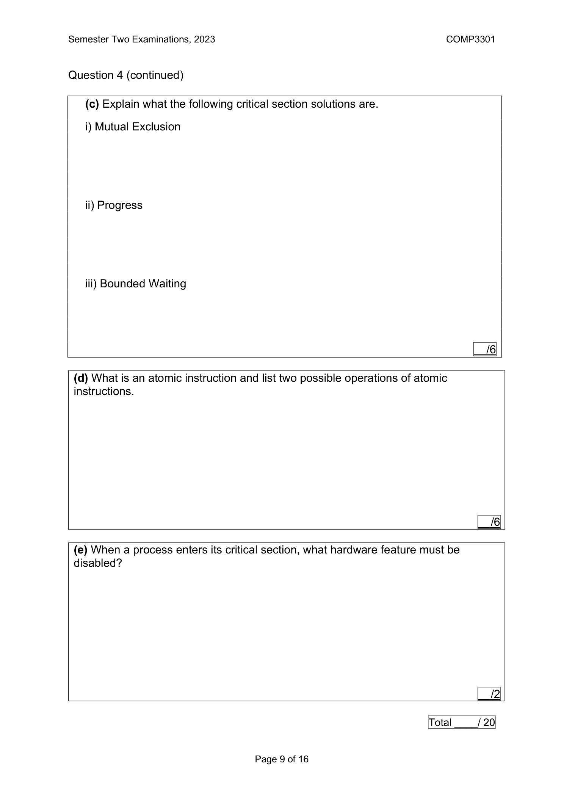

这页是 **Question 4（续）**，考查的是“临界区正确性条件 + 原子操作 + 硬件互斥机制”。这一页满分 20 分，其中每小题都在讲“并发控制”的底层原理。下面详细解释每题含义、写法和关键词。

---

## (c) 三个临界区正确性条件解释（6分）

题目：

> Explain what the following critical section solutions are.
> i) Mutual Exclusion
> ii) Progress
> iii) Bounded Waiting

---

### i) **Mutual Exclusion（互斥）**

* 定义：在任意时刻，**最多只能有一个进程**处于临界区。
* 作用：防止两个或更多进程同时访问共享资源，避免**数据竞争（race condition）**。
* 示例：使用锁（lock）或信号量（semaphore）确保进入临界区前必须获得许可。

🧩 **关键词：** only one process in CS at a time, prevents concurrent access.

---

### ii) **Progress（进步性）**

* 定义：如果没有进程在临界区中，且有若干进程想进入，则**应在有限时间内决定**谁能进入。
* 含义：不能让某个进程无意义地等下去，也不能让系统停滞在“没人能进”的状态。
* 示例：算法必须能在有限步骤内决定下一个进入者，不允许死锁或无限等待。

🧩 **关键词：** decision within finite time, no deadlock, no indefinite postponement.

---

### iii) **Bounded Waiting（有限等待）**

* 定义：每个进程在提出进入临界区请求后，**必须在有限次请求后得到机会**。
* 作用：防止“饥饿（starvation）”，确保每个等待的进程最终都能进入临界区。
* 示例：在信号量/锁实现中维护一个等待队列，按 FIFO 顺序调度。

🧩 **关键词：** finite waiting, no starvation, fairness.

---

## (d) Atomic instruction（原子指令）（6分）

题目：

> What is an atomic instruction and list two possible operations of atomic instructions.

---

### ✅ 定义：

**原子指令（atomic instruction）**是指**不能被中断的单个硬件级操作**，执行过程中不会被其他进程或中断打断。
它保证“要么全部执行完，要么完全不执行”——即不可分割。

---

### ✅ 两个常见例子：

1. **Test-and-Set（测试并置位）**

* 检查一个标志变量并设置它；返回原值。
* 常用于实现自旋锁（spinlock）。
* 示例：

```plaintext
boolean test_and_set(boolean *lock) {
boolean old = *lock;
*lock = true;
return old;
}
```

若返回 false，表示锁原来是空的，现在成功拿到锁。

2. **Compare-and-Swap（CAS，比较并交换）**

* 比较内存中值是否等于预期值，如果相等就替换成新值。
* 示例：

```plaintext
compare_and_swap(address, expected, new_value)
```

如果成功返回 true，否则 false。

🧩 **其它例子（任选其一也可得分）**：Swap、Fetch-and-Add、Exchange。

---

## (e) 进程进入临界区时要关闭什么硬件特性？（2分）

> When a process enters its critical section, what hardware feature must be disabled?

---

**答案：**
当进程进入临界区时，应**禁用中断（Interrupts）**。

---

### 解释：

* 禁用中断能防止 CPU 在执行临界区代码时被中断打断，从而**避免上下文切换**导致其他进程也进入临界区。
* 一般只用于**内核态或单处理器系统**，因为多核系统中禁中断无法防止其他 CPU 并行访问。

🧩 **关键词：** disable interrupts, prevent context switch, ensure atomic execution.

---

# ✅ 总结与答题提示

| 小题  | 考点       | 关键术语                                        |
| --- | -------- | ------------------------------------------- |
| (c) | 临界区的三大条件 | mutual exclusion, progress, bounded waiting |
| (d) | 原子操作与示例  | Test-and-Set, Compare-and-Swap              |
| (e) | 硬件互斥     | disable interrupts                          |

---

\[口语化表达]
这页主要在讲临界区正确性条件、原子操作和硬件支持。三个条件要背熟：互斥是说同一时间只能一个进程进临界区；进步性是没人占着的时候要能尽快决定谁能进去；有限等待是说不会有进程一直饿着，等有限次就能进去。然后(d)问原子指令，就是那种一口气执行完、不能被打断的硬件操作，比如 test-and-set（检测并上锁）或 compare-and-swap（比较并交换），这类指令常用于实现锁。最后(e)问进入临界区要关什么？答案是“中断”，这样 CPU 不会被打断去切别的进程，能保证这段代码原子执行。


---

## 第 10 页

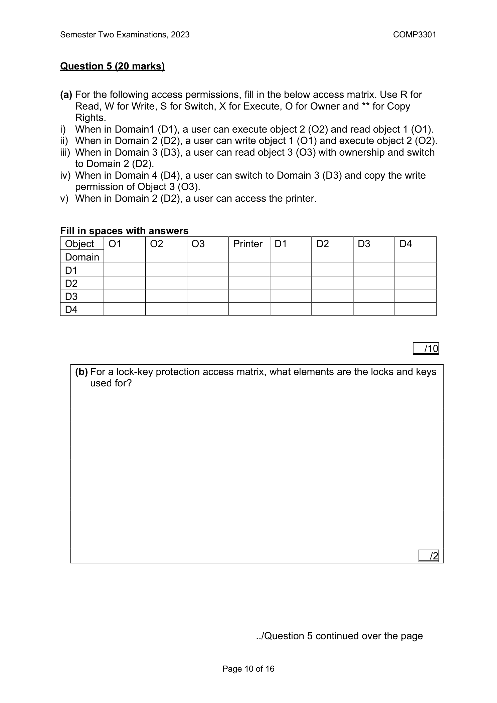

这页是**Question 5（20 分）**，主题是**访问控制矩阵（Access Matrix）**。要求你把给定的权限文字，填进“行=域(Domain)，列=对象/域”的矩阵格子里；并回答锁-钥匙(lock–key)模型里的“锁/钥匙各用于什么”。

题目给出的符号：
R=Read，W=Write，S=Switch，X=Execute，O=Owner，“\*\*”=可复制该权限（Copy Right）。

---

## (a) 把文字权限填入访问矩阵（10 分）

文字条件逐条翻译 → 对应到矩阵的**行（所在域）**和**列（被访问对象/域）**：

i) **在 D1** 时，用户可以 **执行 O2**、**读取 O1**
→ 行 D1：O2 列填 **X**；O1 列填 **R**

ii) **在 D2** 时，用户可以 **写 O1**、**执行 O2**
→ 行 D2：O1 列 **W**；O2 列 **X**

iii) **在 D3** 时，用户可以 **读取 O3 且拥有 O3**，并且 **切换到 D2**
→ 行 D3：O3 列填 **R O**（写成 `RO` 也可）；D2 列填 **S**

iv) **在 D4** 时，用户可以 **切换到 D3**，并且 **复制 O3 的写权限**
→ 行 D4：D3 列 **S**；O3 列 **W\*\***（表示“拥有写权限，且该写权限可复制”）

v) **在 D2** 时，用户可以 **访问打印机**（打印通常等价于写入设备队列）
→ 行 D2：Printer 列 **W**

把以上内容填入表格如下（留空表示无权限）：

| Domain\Object | O1 | O2 | O3        | Printer | D1 | D2    | D3    | D4 |
| ------------- | -- | -- | --------- | ------- | -- | ----- | ----- | -- |
| **D1**        | R  | X  |           |         |    |       |       |    |
| **D2**        | W  | X  |           | **W**   |    |       |       |    |
| **D3**        |    |    | **RO**    |         |    | **S** |       |    |
| **D4**        |    |    | **W\*\*** |         |    |       | **S** |    |

> 评分点：
>
> * 权限放在**正确的行**（活动域）里；
> * “Switch”只出现在“列=域”的单元格；
> * “复制权”写成 `W**`（或在单元格里注明“\*\* 与 W 关联”）。

---

## (b) 锁-钥匙模型中“锁/钥匙”分别用于什么？（2 分）

* **锁（Lock）**：附加在**对象**（列）上的标记；对象可以有一个或多个锁，表示需要相应的“钥匙”才可使用该对象上的某些权利。
* **钥匙（Key）**：附加在**域/主体**（行）上的标记；只有当域持有与对象锁**匹配的钥匙**时，域在访问矩阵中声明的相应权限才被**激活/允许**。
* 直观理解：**对象挂锁，域拿钥匙**；匹配成功才能行使读/写/执行/切换等权利。

---

### 作答小提醒

* 表格里可以把同一格的多种权利并排写，如 `RO`、`W**`。
* 如果担心“访问打印机”具体用 R 还是 W，写 **W**（向打印机队列写任务）最稳。
* 复制权一定要与具体权利绑定（本题是“复制 O3 的写权限”→ `W**`）。

---

\[口语化表达]
这一题就是把“谁在什么域能对哪个对象做什么”翻译成矩阵。我把句子逐条落到表里：D1 对 O1 有读、对 O2 有执行；D2 对 O1 有写、对 O2 有执行、还能往 Printer 写；D3 对 O3 有读并且是 owner，还能切到 D2；D4 能切到 D3，而且对 O3 拥有“可复制的写权限”，所以填 W\*\*。锁-钥匙模型也很简单：对象上挂“锁”，域里拿“钥匙”，钥匙对上锁才能把矩阵里那项权限真正用起来。


---

## 第 11 页

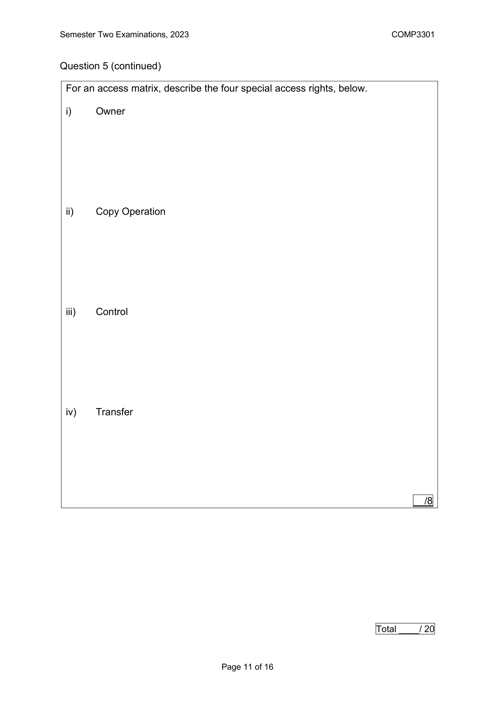

这页是 **Question 5（续）**，考的是“访问控制矩阵（Access Matrix）”中的**四种特殊访问权限（special access rights）**。这些权限都是系统层面（非普通用户）的，用来管理或传播权限，而不是直接读/写数据。每项写 2 句解释即可，下面是详细讲解。

---

## i) **Owner（拥有者）**

* 定义：拥有对象的“所有权”，意味着该主体对对象有**完全控制权**。
* 权限：可以**添加、删除其他主体对该对象的访问权**，或**完全删除对象本身**。
* 示例：文件的创建者通常是它的 owner，可以更改别人是否能读写这个文件。

🧩关键词：full control、can modify access rights。

---

## ii) **Copy Operation（复制权）**

* 定义：允许主体**把自己拥有的某种访问权复制给其他主体**。
* 限制：仅能复制特定权限（如 Read、Write），不能复制所有权 unless explicitly allowed。
* 示例：若 D4 对 O3 有 W\*\*（write with copy right），则 D4 可以把 “W” 权限赋予别人，但不能复制 “O”。

🧩关键词：propagate specific rights、permission duplication。

---

## iii) **Control（控制权）**

* 定义：授予主体对\*\*访问矩阵中某行（一个域）\*\*的管理能力。
* 权限：可以**修改该域行内的条目**，即增删这个域对各对象的访问权。
* 示例：系统管理员可以用 control 权限调整用户 D2 能访问哪些文件。

🧩关键词：manage another domain’s rights、modify entries of a row。

---

## iv) **Transfer（转让权）**

* 定义：允许主体**将自己拥有的某个访问权转让给他人，并同时放弃该权利**。
* 与 Copy 的区别：Copy 是复制并保留自己原有权限，Transfer 是**交出并移交**。
* 示例：D2 有 W(Transfer) 对 O1，转让后 D2 不再能写 O1，新的接收者获得 W。

🧩关键词：move (not duplicate) permission、relinquish after transfer。

---

### 🧠 答题小技巧

| 权限       | 操作对象 | 关键作用      | 类比         |
| -------- | ---- | --------- | ---------- |
| Owner    | 对象列  | 拥有并管理访问权  | 文件所有者      |
| Copy     | 权限自身 | 复制传播权限    | 分享权限副本     |
| Control  | 域行   | 管理别人能访问什么 | 管理员修改权限表   |
| Transfer | 权限自身 | 移交并放弃权限   | 把钥匙给别人自己不留 |

---

\[口语化表达]
这页是讲访问矩阵里的四种“特殊权限”，不是普通的读写，而是控制和传播权限的管理权。Owner 就是对象的主人，能改别人对它的权限；Copy 是能把自己的一项权利复制给别人；Control 是能改别人那一行的权限，比如管理员能改某个用户的访问表；Transfer 则是把某项权利整个转让走，自己放弃。简单说：Owner 管别人、Copy 传副本、Control 管行、Transfer 把权力让出去。


---

## 第 12 页

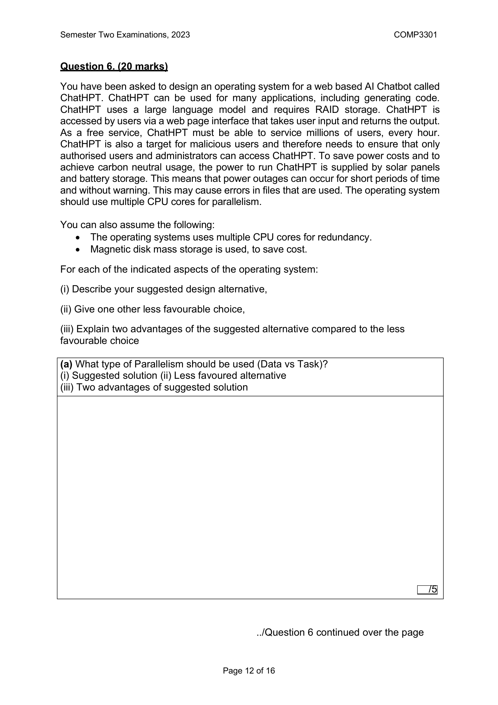

这页是 **Question 6（20分）** 的第一部分，题目是让你**为一个网页 AI 聊天机器人系统（ChatHPT）设计操作系统的架构方案**。这是一个综合题，考察并行性（parallelism）、可靠性（RAID）、能耗控制与并发处理思想。
本页问的部分是：

> (a) What type of Parallelism should be used (Data vs Task)?

---

## 题干关键条件解析

你要先理解场景要求：

* ChatHPT 是大型语言模型（LLM），需要**RAID 磁盘存储**（即分布式冗余磁盘阵列）。
* 系统需要支持**上百万用户同时访问**（高并发）。
* 服务器由**多核 CPU** 支持。
* 电力由**太阳能 + 电池供电**，所以系统可能会有**短时间断电风险**。
* 重点是操作系统要利用多核 CPU 实现**并行性（parallelism）**。

因此，这题考的是在“操作系统层面上，如何利用 CPU 核心实现并行”，选哪种并行方式更合适：

* **数据并行（Data Parallelism）**
* **任务并行（Task Parallelism）**

---

## (i) Suggested Solution: **Task Parallelism（任务并行）**

* 定义：每个 CPU 核心负责一个独立的**任务/线程**，如用户请求、输入处理、模型推理任务等。
* 实现方式：为每个用户请求或服务线程分配一个核心或线程池，通过负载均衡进行调度。
* 适用原因：ChatHPT 的任务彼此独立（多个用户并行对话），最适合任务级并行。

🧩 **关键词：** Independent user sessions, multi-threading, load balancing, concurrent requests.

---

## (ii) Less Favoured Alternative: **Data Parallelism（数据并行）**

* 定义：将同一任务的数据分块并分发到多个核心上并行处理。
* 缺点：ChatHPT 这种应用对 I/O 与模型访问的同步要求高，不同核心同时处理一条请求的数据会增加复杂度。
* 问题：数据分割、模型权重共享与同步代价高，容易造成缓存一致性问题。

🧩 **关键词：** costly synchronization, shared memory overhead, high latency.

---

## (iii) Two Advantages of Suggested Solution (Task Parallelism)

1. **更高的扩展性（Scalability）**

* 每个核心都能独立服务不同用户，请求之间互不干扰，负载容易分配。
* 系统可动态增加线程池或核心来支持更多用户。

2. **容错性与能效更好（Fault Isolation & Energy Efficiency）**

* 单个任务崩溃不影响其他任务，系统仍可继续服务；
* 可根据 CPU 负载动态调整任务分配，从而降低能耗（有助于太阳能供电环境）。

🧩 **可加第三点（若时间充裕）**：

* 简化同步逻辑，无需频繁共享内存或锁机制 → 响应延迟更低。

---

### ✏️ 推荐答题结构（示范写法）

```
(i) Suggested solution: Task parallelism — assign separate CPU cores/threads to independent user sessions or service tasks.
Each core handles an individual process concurrently to improve responsiveness.

(ii) Less favourable alternative: Data parallelism — dividing the same data workload (e.g., one model request) among multiple cores.
This introduces synchronization and data consistency overhead.

(iii) Two advantages:
1. Task parallelism scales better with millions of independent user sessions and allows efficient CPU core utilization.
2. It improves reliability and energy efficiency, since individual tasks can fail or pause without impacting others.
```

---

\[口语化表达]
这页是要你选操作系统该用哪种并行方式。ChatHPT 是个网页 AI 聊天服务，要同时应付成千上万用户请求，所以最合适的是**任务并行（Task Parallelism）**——每个 CPU 核心处理一个独立的任务或会话，这样每个用户都能并发执行。另一种“数据并行”是把同一个任务的数据分片交给多个核算，适合神经网络训练那类计算密集型任务，但对一个同时服务很多用户的系统来说就太复杂，还要同步数据、协调缓存，反而拖慢速度。任务并行的好处是扩展性强、每个任务崩了也不影响别人，还能根据负载自动分配，省电又稳定。


---

## 第 13 页

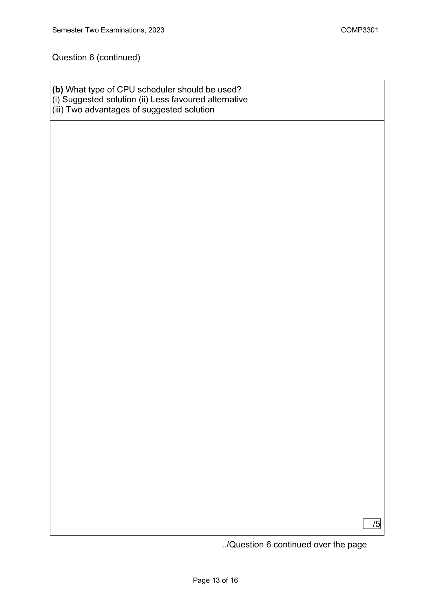

这页是 **Question 6（续）**，重点在于选出**适合 ChatHPT 系统的 CPU 调度算法（scheduler）**。它要求你写出三部分：
1️⃣ 推荐方案（Suggested Solution）
2️⃣ 次优方案（Less Favoured Alternative）
3️⃣ 推荐方案的两个优势（Two Advantages）

---

## 背景回顾

ChatHPT 是一个网页 AI 聊天服务：

* **海量并发用户请求**（每个请求都是短任务）；
* **多核系统**（并行执行不同任务）；
* **断电风险**（要减少长任务占用资源）；
* **能源有限**（由太阳能供电，要兼顾性能和能耗）；
* **安全要求高**（防止恶意用户长时间占用 CPU）。

因此，调度器需要兼顾 **公平性、公平抢占、响应速度和多核利用率**。

---

## (i) Suggested Solution: **Multilevel Feedback Queue (MLFQ) Scheduler 多级反馈队列调度**

**原理：**

* 系统维护多个就绪队列（高优先级 → 低优先级）。
* 新任务从高优先级队列开始执行；
* 若任务用完时间片没完成，就降到更低队列；
* 若任务等待太久或被交互事件唤醒，可提升优先级。
* 支持**抢占（preemption）**，保证交互型任务快速响应。

**为什么适合 ChatHPT：**

* 大部分请求是**短任务（用户提问与模型推理）**；
* 长任务（大模型加载、缓存）也能获得 CPU，但不阻塞交互；
* MLFQ 动态调整优先级 → 提高响应性和系统吞吐量。

---

## (ii) Less Favoured Alternative: **First Come First Served (FCFS)** 或 **Shortest Job First (SJF)**

* **FCFS**：任务按到达顺序执行，无抢占 → 容易导致“队首大任务”拖慢后面所有请求（Convoy effect）。
* **SJF**：优先短任务，但必须能预测执行时间，ChatHPT 的推理请求长度不可预知。
* 二者都**不适合高并发网络服务系统**。

---

## (iii) Two Advantages of Suggested Solution (MLFQ)

1. **响应更快、用户体验更好**

* 高优先级队列保证短交互任务（如文本请求）迅速执行，延迟低。
* 动态优先级机制防止低优先级任务饿死。

2. **资源利用率高、能耗低**

* 合理分配多核负载，CPU 核心保持忙碌但不超载；
* 可根据任务行为调整调度策略，减少空转和能量浪费。

🧩 额外优点（可写第三条）：

* MLFQ 自适应性强，适合用户数不固定、任务种类复杂的系统（正是 ChatHPT 的典型情况）。

---

### ✅ 答题模板（示范写法）

```
(i) Suggested solution:
A Multilevel Feedback Queue (MLFQ) scheduler should be used.
It dynamically adjusts process priorities based on CPU usage and supports preemption.
Short, interactive tasks receive higher priority to improve response time.

(ii) Less favoured alternative:
First Come First Served (FCFS) or Shortest Job First (SJF) scheduling.
They lack preemption and are unsuitable for unpredictable, high-concurrency workloads.

(iii) Two advantages:
1. Improves responsiveness for millions of short interactive requests.
2. Provides better CPU utilization and energy efficiency by dynamically balancing workloads.
```

---

\[口语化表达]
这一页是问 ChatHPT 系统该用哪种 CPU 调度器。因为这是个要同时处理成千上万用户请求的聊天 AI 服务，最合适的是**多级反馈队列调度（MLFQ）**——它能根据任务执行时间动态调整优先级，短的请求先跑，长的任务被往后排；而且有抢占机制，不会出现一个长任务把 CPU 占死的情况。像 FCFS 或 SJF 这种静态算法在这种场景都不行，一个大任务会拖慢整个系统。MLFQ 的好处是响应快、CPU 利用率高，还能根据负载自调节，省电又稳定，非常适合 ChatHPT 这种实时多用户的 AI 系统。


---

## 第 14 页

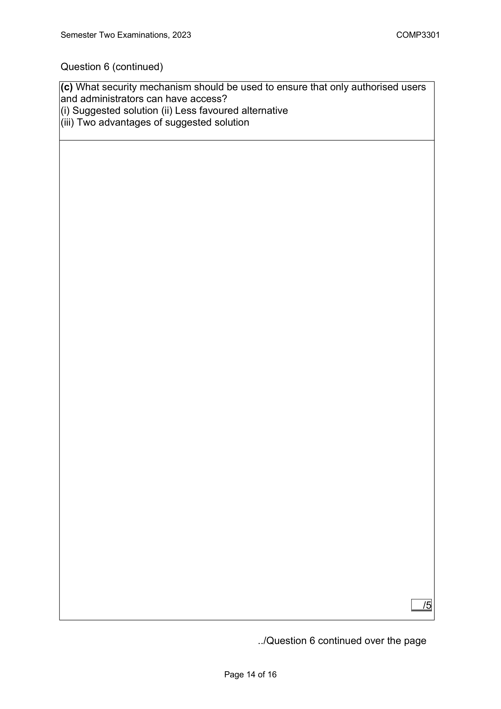

这页是 **Question 6（续）** 的 (c) 部分，考点是操作系统中的 **安全机制（security mechanism）** ——如何保证只有授权用户和管理员能访问 ChatHPT 系统。它要求写出：
(i) 推荐方案；(ii) 次优方案；(iii) 推荐方案的两个优势。
下面是详细解释与答题结构。

---

## 题目分析

ChatHPT 是一个**网络 AI 系统**，意味着：

* 用户来自互联网，身份多样；
* 需要区分普通用户与管理员权限；
* 系统要防止未经授权的访问（例如黑客攻击、恶意脚本等）；
* 操作系统层面要有**访问控制与认证机制（authentication & authorization）**。

因此我们要设计一种可靠、可扩展的安全机制。

---

## (i) Suggested Solution：

**基于多级身份验证和访问控制的安全模型**
（Multi-factor Authentication + Role-Based Access Control，简称 MFA + RBAC）

**实现思路：**

1. **身份认证（Authentication）**

* 使用多因素认证（MFA）：密码 + 短信验证码 / 令牌 / 指纹 / 管理员硬件密钥；
* 所有访问操作先通过身份验证，才能进入系统资源层。

2. **基于角色的访问控制（RBAC）**

* 系统为不同角色定义访问权限，例如：

* 普通用户：只能访问 ChatHPT 服务接口；
* 管理员：可访问系统日志、训练数据、配置文件；
* 系统服务账户：后台维护任务使用。
* 每个用户的权限仅限于其角色所允许的资源范围。

3. **加密通信与日志审计（Encryption & Auditing）**

* 所有通信使用 HTTPS / TLS 加密；
* 所有登录与操作记录保存到安全日志，管理员可审计。

🧩关键词：**Authentication, Authorization, MFA, RBAC, TLS encryption, Auditing**

---

## (ii) Less Favoured Alternative：

**简单的用户名 + 密码验证系统（Single-Factor Authentication）**

**原因：**

* 只靠密码验证容易被破解或泄露；
* 无法区分不同角色；
* 不支持大规模访问控制管理；
* 对高风险服务（如 AI 模型接口）安全性严重不足。

---

## (iii) Two Advantages of Suggested Solution

1. **安全性显著提高（Stronger Security）**

* 多因素认证大幅降低被盗号风险；
* 即使密码泄露，攻击者也无法直接访问系统；
* 加密与日志机制可防止中间人攻击并追踪恶意行为。

2. **更好的访问控制与管理（Fine-Grained Access Control）**

* RBAC 使管理员能集中管理权限、灵活分配；
* 减少人为错误与越权风险；
* 方便在多用户、多管理员环境中维护安全性。

🧩 可加第三条：可扩展性强（Scalable）

* 新角色或权限可动态添加，适应系统升级与新功能。

---

### ✅ 答题模板（英文考试写法）

```
(i) Suggested solution:
Implement a Multi-Factor Authentication (MFA) system combined with Role-Based Access Control (RBAC).
Users must verify their identity through multiple factors, and roles define specific access rights.

(ii) Less favoured alternative:
Single-factor authentication using only usernames and passwords.

(iii) Two advantages:
1. MFA and RBAC greatly enhance security and protect against unauthorized access or stolen credentials.
2. Provides fine-grained access control and easier administration for different user roles.
```

---

\[口语化表达]
这一页问的就是怎么保证只有授权用户和管理员能进 ChatHPT 系统。最好的办法是**多因素认证 + 基于角色的访问控制（MFA + RBAC）**。多因素认证能防止别人盗号，比如除了密码还要输入验证码或使用令牌；RBAC 则能让不同用户有不同权限，比如普通用户只能用聊天接口，管理员才能改配置。相比之下，单纯用用户名+密码的老办法太弱了，容易被爆破或泄露。MFA+RBAC 的好处是安全性高、权限管理细，还能扩展，适合像 ChatHPT 这样的大型网络系统。


---

## 第 15 页

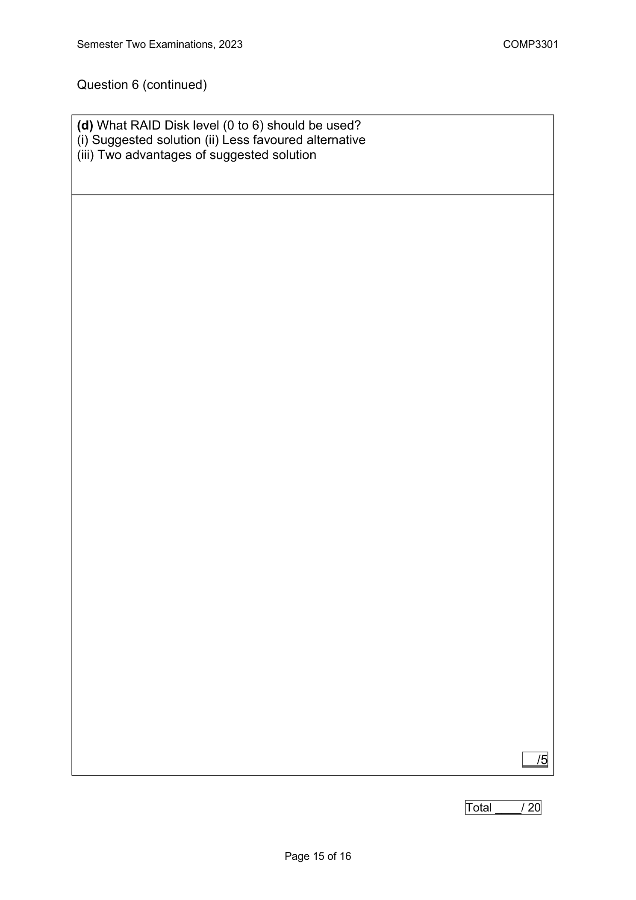

这页是 **Question 6（续）** 的 (d) 部分，问的是：

> “操作系统应使用哪种 RAID（磁盘阵列）级别（0–6）？并解释选择原因与优势。”

这一题考察你对 **RAID 各级别的性能与容错特性** 的理解，以及能否根据场景（ChatHPT——高并发、高可靠性、断电风险）选择最合适的 RAID 方案。

---

## 背景分析

题干中明确说：

* ChatHPT 要能服务**上百万用户**，数据访问频繁；
* 使用 **磁性硬盘（HDD）** 为主（为了节省成本）；
* 系统由**太阳能 + 电池供电**，偶尔会断电；
* 因此需要**数据可靠性高**、**容错性强**，不能轻易丢数据；
* 同时性能要够高，因为这是 AI 系统，频繁访问模型参数与缓存文件。

所以关键目标是：**高容错 + 较高读写性能 + 合理成本**。

---

## (i) Suggested Solution: **RAID 5**

### 💡 原理说明：

RAID 5 通过 **数据条带化（striping）+ 奇偶校验（parity）** 实现：

* 把数据分布到多个磁盘上（条带化）；
* 在不同磁盘上存放校验信息；
* 任何单个磁盘损坏时，可通过奇偶校验重建数据；
* 读写操作可并行完成，提高吞吐率。

🧩 **关键词：** parity-based redundancy, good performance, fault tolerance, cost-efficient.

---

## (ii) Less Favoured Alternative: **RAID 0 或 RAID 1**

* **RAID 0（条带化）**

* 性能高，但**无冗余**；
* 一旦一个磁盘坏，所有数据都丢失；
* 对 ChatHPT 这种需要高可用性的系统非常不安全。

* **RAID 1（镜像）**

* 每份数据完整复制一份；
* 容错强，但**成本高**（磁盘利用率 50%）；
* 对大规模存储系统（AI 模型文件上百 GB）来说太浪费。

---

## (iii) Two Advantages of Suggested Solution (RAID 5)

1. **高容错性（Fault Tolerance）**

* RAID 5 能容忍一个磁盘故障而不丢失数据；
* 对 ChatHPT 这种长时间在线、断电风险高的系统来说，非常关键。

2. **良好的性能与性价比（Performance + Cost Efficiency）**

* 支持读写并行，读取性能接近 RAID 0；
* 校验信息分布存储，提高磁盘利用率（约 80%）；
* 比 RAID 1 更节省存储空间。

🧩 可补充第三点（如果写得多）：

* **易扩展（Scalable）**：可以动态增加磁盘而不破坏阵列。

---

### ✅ 答题模板（可直接抄写的英文版本）

```
(i) Suggested solution:
RAID 5 should be used. It uses data striping with distributed parity, allowing high performance and single-disk fault tolerance.

(ii) Less favoured alternative:
RAID 0 (striping without redundancy) or RAID 1 (mirroring with high cost).

(iii) Two advantages:
1. RAID 5 provides data redundancy and can recover from a single disk failure, ensuring system reliability under power interruptions.
2. It offers a good balance between read/write performance and storage efficiency, reducing cost compared to full mirroring.
```

---

\[口语化表达]
这页是在问 ChatHPT 系统该用哪种 RAID。因为这是个要全天候运行的 AI 聊天系统，断电风险还挺高，所以必须在速度和可靠性之间找平衡。最合适的是 **RAID 5** ——它把数据分散到多个磁盘上，同时用奇偶校验保证一个磁盘坏了也不丢数据。相比之下 RAID 0 虽然快但一点冗余都没有，坏一块盘就全毁；RAID 1 又太贵，因为每个盘都要完全备份。RAID 5 的好处是：既能容错、读写性能也不错，而且磁盘利用率高，不浪费太多空间，特别适合 ChatHPT 这种要快又要稳的系统。


---

## 第 16 页

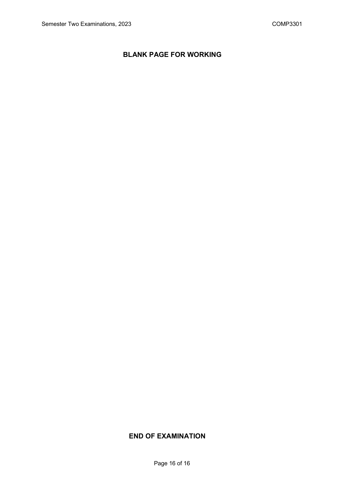

这页是考试卷的最后一页，内容是：

> **BLANK PAGE FOR WORKING**
> **END OF EXAMINATION**

意思是：

* 这一页是**空白页**，供你在考试时**草稿、计算或画图**使用；
* “END OF EXAMINATION” 表示**考试题目已全部结束**。

也就是说，这一页**没有题目**，只是方便学生进行**中间运算或画示意图**，不会计分。

---

✅ **详细说明**

1. “Blank page for working” 就是提供一个“演算纸”的概念；
2. 考试中允许你在这页上写计算步骤、草稿流程、思路图；
3. 批改时通常**不会评分**（除非监考老师特别要求）；
4. “End of Examination” 是正式结束标志，你交卷时必须确保**所有答案都已写在前面的答题纸或卷面上**。

---

\[口语化表达]
这页其实没题，就是留给你写草稿、画图、做运算用的。它下面那行“End of Examination”意思是考试结束啦，不用在这页再写答案，这只是备用空白页，方便你算公式或者画进程图用的。
