---

## 第 1 页

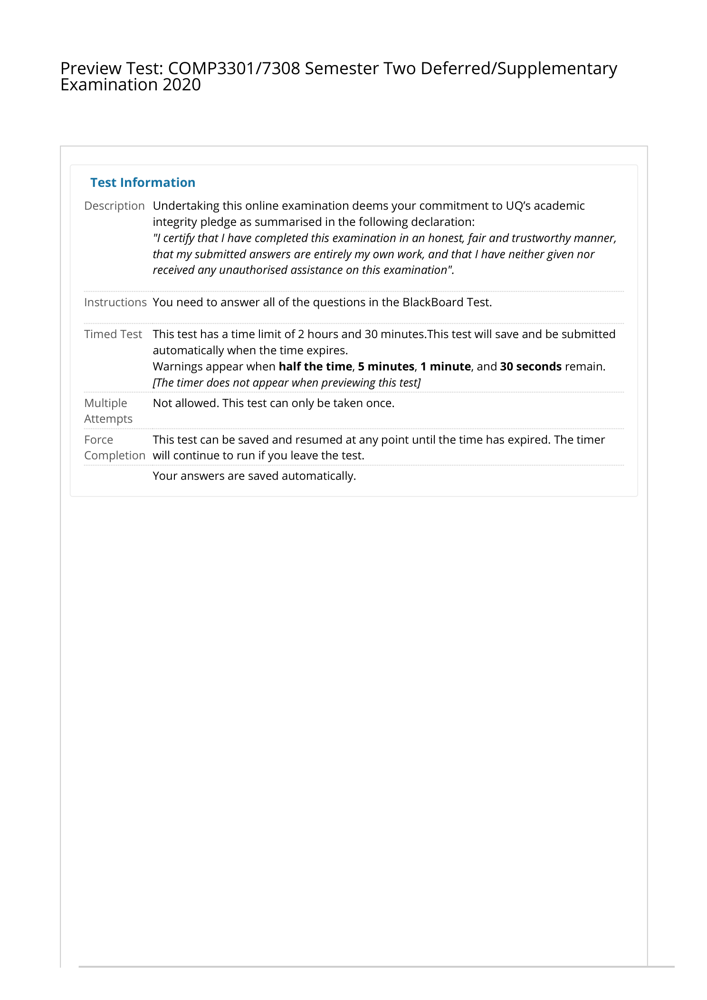

这张图片是昆士兰大学（University of Queensland, UQ）2020年第二学期的补考/延考试卷（课程编号：COMP3301/7308）的考试信息页。下面是详细中文解释和说明。

---

## 📘 一、整体概述

这是一个通过 **Blackboard（线上考试平台）** 进行的考试说明文件。它主要告诉考生考试规则、时间限制、诚信要求以及作答方式。

---

## 🧾 二、内容逐条解释

### **1. Description（描述）**

这一部分是关于学术诚信的声明。意思是：

> 你在进行这次线上考试时，必须遵守学校的学术诚信规定。通过开始考试，就表示你同意以下声明：
>
> “我保证以诚实、公正、可信的方式完成本次考试，所有答案均为本人独立完成，未接受或给予任何未经授权的帮助。”

➡️ **解释：**
这意味着不能作弊、不能与他人交流、不能使用未经允许的资料或工具。任何抄袭或共享答案都被视为违反学术诚信。

---

### **2. Instructions（考试要求）**

> 你需要在 Blackboard 系统中回答所有题目。

➡️ **解释：**
考试中每个问题都必须作答，不能跳过。

---

### **3. Timed Test（计时考试）**

> * 考试总时长：**2小时30分钟（150分钟）**
> * 到时间后，考试会**自动提交**。
> * 在以下时间点会出现提醒：
>
>   * 考试进行到一半时
>   * 剩余5分钟时
>   * 剩余1分钟时
>   * 剩余30秒时
>
> （*注：预览试卷时不会显示计时器*）

➡️ **解释：**
考试时间是固定的，超过时间系统会自动提交答案，所以需要注意时间分配。中途有提醒功能帮助掌握进度。

---

### **4. Multiple Attempts（多次尝试）**

> 不允许。此考试只能进行一次。

➡️ **解释：**
你只有**一次机会**，提交后不能再修改或重新进入考试。

---

### **5. Force Completion（强制完成）**

> * 考试可以在时间未到期前离开再回来继续，但**计时不会停止**。
> * 计时器会继续运行，即使你退出。
> * 答案会**自动保存**。

➡️ **解释：**
考试中如果因为网络问题或暂时退出，重新进入后可以继续，但时间不会重置。因此，不要轻易离开页面。
系统会自动保存答案，不用担心因断线丢失数据。

---

## 🧮 三、总结与建议

1. **诚信第一：** 考试中必须独立完成，禁止作弊或合作。
2. **一次机会：** 考试只能进行一次，提交后无法重来。
3. **时间管理：** 150分钟内完成所有题，注意系统提醒。
4. **自动保存：** 系统会自动保存，但不要频繁退出。
5. **自动提交：** 时间到会强制提交，无需手动交卷。

---

## 🗣️ \[口语化表达]

这张图其实就是告诉你这场线上考试的规矩。意思是说，这场考试你得自己做，不能跟别人商量，也不能抄。总共两个半小时，时间一到系统会自己交卷。中途会提醒你时间，比如剩下五分钟、一分钟这种。考试只能做一次，做完就不能改了。你中途要是退出也行，但计时还在继续，系统会自动保存答案。所以最好的办法就是一次性做完，不要关页面。总之就是：自己答题、注意时间、别作弊就行。


---

## 第 2 页

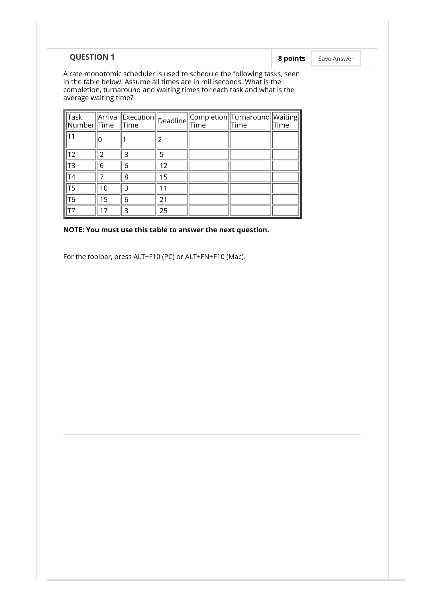

下面这页题目要求：使用**速率单调调度（Rate Monotonic, RMS）**来安排表中任务，计算每个任务的**完成时间、周转时间、等待时间**，并给出**平均等待时间**。题中已给出到达时间（Arrival）、执行时间（Execution）和“Deadline”。**假设：RMS 为抢占式、优先级固定，deadline 越小优先级越高**（本题“Deadline”可视作该作业的周期/相对截止期，用来确定静态优先级）。

---

# 怎么做（一步步）

1. **确定静态优先级（小 deadline 优先）：**
Deadline 从小到大 → T1(2) ＞ T2(5) ＞ T5(11) ＞ T3(12) ＞ T4(15) ＞ T6(21) ＞ T7(25)。

2. **时间线模拟（抢占式）：** 任何时刻都运行“**已到达**且**剩余时间>0**的**最高优先级**任务”，新到达的更高优先级任务可抢占当前任务。
得到的甘特图区间（单位：ms）：

* 0–1：T1
* 1–2：空闲（无任务到达）
* 2–5：T2
* 5–6：空闲
* 6–10：T3（10ms 时被更高优先级的 T5 抢占）
* 10–13：T5
* 13–15：T3（收尾）
* 15–23：T4
* 23–29：T6
* 29–32：T7

3. **逐项计算：**

* **完成时间 C**：作业真正结束的时刻
* **周转时间 T = C − 到达**
* **等待时间 W = T − 执行时间**

---

# 结果表

| 任务 | 到达 | 执行 | Deadline | 完成时间 C | 周转时间 T | 等待时间 W |
| -- | -: | -: | -------: | -----: | -----: | -----: |
| T1 |  0 |  1 |        2 |  **1** |  **1** |  **0** |
| T2 |  2 |  3 |        5 |  **5** |  **3** |  **0** |
| T3 |  6 |  6 |       12 | **15** |  **9** |  **3** |
| T4 |  7 |  8 |       15 | **23** | **16** |  **8** |
| T5 | 10 |  3 |       11 | **13** |  **3** |  **0** |
| T6 | 15 |  6 |       21 | **29** | **14** |  **8** |
| T7 | 17 |  3 |       25 | **32** | **15** | **12** |

**平均等待时间**

$$
\frac{0+0+3+8+0+8+12}{7}=\frac{31}{7}\approx \mathbf{4.43\ ms}
$$

---

## 关键点回顾

* RMS：**deadline 越小 → 优先级越高**，且为**抢占式**。
* 只在“已到达”的作业里选最高优先级；更高优先级一到就**立即抢占**。
* 先画时间线/甘特图，再算 C、T、W，最后取平均等待时间。

---

## \[口语化表达]

这题就是用“谁的截止期更紧谁先跑”的规则来排任务。先按截止期从小到大排好优先级：T1、T2、T5、T3、T4、T6、T7。沿着时间往前走，哪个到了就看它在已到达里是不是优先级最高，是的话就让它跑；中途来了更高优先级的就把当前的打断。算下来各自的完成时刻是：T1=1、T2=5、T5=13、T3=15、T4=23、T6=29、T7=32。再用“周转=完成−到达”“等待=周转−执行”得到等待分别是：0、0、3、8、0、8、12，平均等待时间大约 **4.43ms**。


---

## 第 3 页


这题在问：**根据上一题的表格与时间线，求平均吞吐量（Average Throughput），单位是 Tasks/s**。

---

## 解题思路

**定义**
吞吐量（Throughput）= 在某个时间区间内**完成的任务数 ÷ 区间长度**。
这里自然取区间为：**从第一项任务到达开始（0ms）到最后一项任务完成（32ms）为止**。

**已知（来自上一题的排程结果）**

* 最后完成的任务：**T7 在 32ms 完成**
* 总完成任务数：**7 个**（T1…T7 全部完成）

**计算**

* 时间区间长度 = 32ms = **0.032s**
* 平均吞吐量 = 完成任务数 / 区间长度

$$
\text{Throughput}=\frac{7\ \text{tasks}}{0.032\ \text{s}}=218.75\ \text{tasks/s}
$$

**答案**：**218.75 Tasks/s**（约 **2.19×10² Tasks/s**）

> 说明：有些课本也会在“从第一任务开始执行的时刻到最后完成”为区间，本题我们的时间线从 0ms 就开始执行（T1 立刻运行），所以取 0–32ms 一致得到上面结果。

---

## \[口语化表达]

这题就是算“单位时间能干完多少任务”。上一题我们算过，7 个任务到 32ms 全做完了。把 32ms 换成 0.032 秒，然后用 7 除以 0.032，得到大概 **218.75 个任务每秒**。所以答案就是 **218.75 Tasks/s**。


---

## 第 4 页

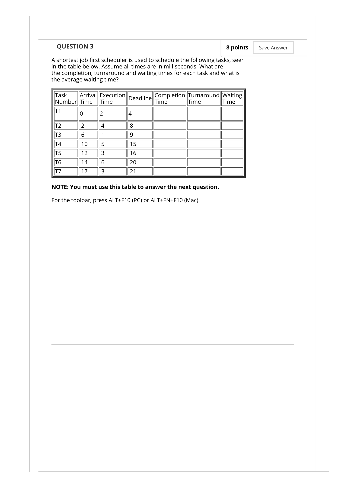

这页题目要求：**用“最短作业优先（Shortest Job First, SJF）”调度器**来安排表格里的任务，计算每个任务的**完成时间（Completion Time）**、**周转时间（Turnaround Time）**、**等待时间（Waiting Time）**，并给出**平均等待时间**。题中时间单位均为 ms。

> 这里的 **SJF 默认是非抢占式**：每次在“已到达”的任务里选**执行时间最短**的一个，一旦开始就**跑完为止**；若一段时间没有任务到达，CPU 空闲。

---

## 题目数据（从图中抄出）

| 任务 | 到达 | 执行 | Deadline |
| -- | -: | -: | -------: |
| T1 |  0 |  2 |        4 |
| T2 |  2 |  4 |        8 |
| T3 |  6 |  1 |        9 |
| T4 | 10 |  5 |       15 |
| T5 | 12 |  3 |       16 |
| T6 | 14 |  6 |       20 |
| T7 | 17 |  3 |       21 |

> 说明：本题的 Deadline 只作为提示，不影响 **SJF（按执行时间）** 的选择顺序。

---

## 调度过程（时间线 / 甘特图）

* **0–2：T1**（此时只有 T1 到达）→ 完成 T1
* **2–6：T2**（2 时刻只有 T2）→ 完成 T2
* **6–7：T3**（到达集合 {T3}，最短）→ 完成 T3
* **7–10：空闲**（无到达）
* **10–15：T4**（10 时刻只有 T4）→ 完成 T4
* **15–18：T5**（已到达 {T5(3), T6(6)}，先 T5）→ 完成 T5
* **18–21：T7**（已到达 {T6(6), T7(3)}，先 T7）→ 完成 T7
* **21–27：T6** → 完成 T6

---

## 逐项计算

* **完成时间 C**：上面时间线的结束时刻
* **周转时间 T = C − 到达**
* **等待时间 W = T − 执行**

| 任务 | 到达 | 执行 | 完成时间 C | 周转时间 T | 等待时间 W |
| -- | -: | -: | -----: | -----: | -----: |
| T1 |  0 |  2 |  **2** |  **2** |  **0** |
| T2 |  2 |  4 |  **6** |  **4** |  **0** |
| T3 |  6 |  1 |  **7** |  **1** |  **0** |
| T4 | 10 |  5 | **15** |  **5** |  **0** |
| T5 | 12 |  3 | **18** |  **6** |  **3** |
| T7 | 17 |  3 | **21** |  **4** |  **1** |
| T6 | 14 |  6 | **27** | **13** |  **7** |

**平均等待时间**

$$
\frac{0+0+0+0+3+1+7}{7}=\frac{11}{7}\approx \mathbf{1.57\ ms}
$$

---

### 小结要点

* SJF（非抢占）每次挑**已到达中执行时间最短**的一项，开始后不被打断。
* 先画甘特图，再按公式算 C、T、W。
* 本题得到的平均等待时间约 **1.57ms**。

---

## \[口语化表达]

这题让我们用“谁更短先做”的规则排任务。按到达时间往前走：0–2 做 T1，2–6 做 T2，6–7 做 T3，7–10 没活儿空着，10–15 做 T4，接着在已到达里挑更短的，15–18 做 T5，18–21 做 T7，最后 21–27 把 T6 做完。然后用“周转=完成−到达”“等待=周转−执行”把表补齐，等出来的等待是：T1\~T4 都 0，T5=3，T7=1，T6=7，平均下来大约 **1.57ms**。


---

## 第 5 页

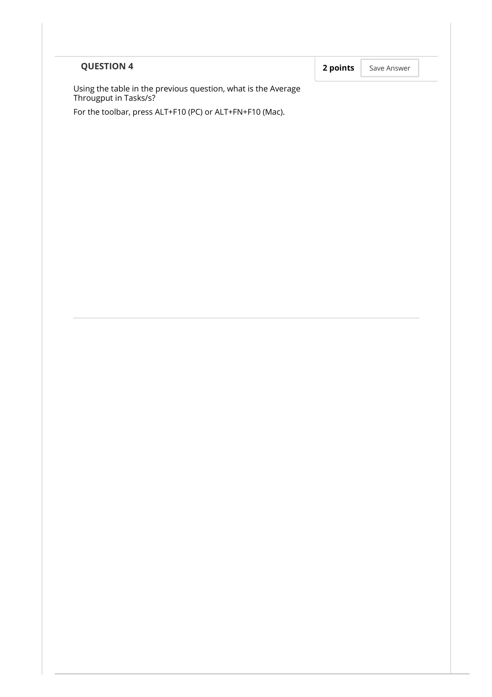

这题在问：**根据上一题（SJF 调度）的表格，平均吞吐量（Average Throughput）是多少，单位 Tasks/s？**

---

## 解题过程

**定义**
平均吞吐量 = 在选定时间区间内**完成的任务数 ÷ 区间长度（秒）**。

**从上一题得到的信息**

* 共完成任务数：7 个（T1\~T7 全部完成）。
* 开始与结束时刻：从 **0 ms**（T1 立刻开始）到 **27 ms**（最后的 T6 完成）。
因此区间长度 = $27 \text{ ms} = 0.027 \text{ s}$。

**计算**

$$
\text{Throughput}=\frac{7}{0.027}\approx 259.26\ \text{Tasks/s}
$$

**答案**：**≈ 259.26 Tasks/s**（可写作 $\mathbf{2.59\times10^2}\$ Tasks/s）。

---

## \[口语化表达]

思路很简单：上一题 7 个任务从 0ms 开始，到 27ms 全做完。把 27ms 变成 0.027 秒，然后用 7 除以 0.027，就得到平均每秒能干完大约 **259.26 个任务**，所以答案就是 **259.26 Tasks/s**。


---

## 第 6 页

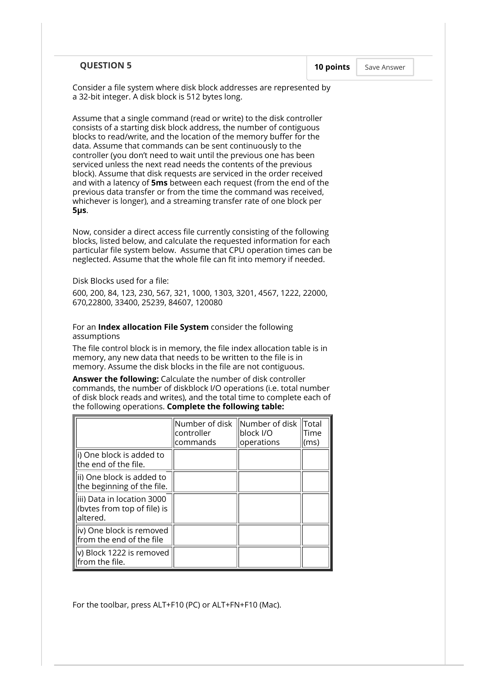

这页是**文件系统与磁盘 I/O 计算题**。已知条件（从图上整理）：

* **块地址**32 位整数；**磁盘块**大小 **512B**。
* 一条磁盘命令（读/写）包含：起始块地址、连续块数、缓冲区地址。可**连续**往控制器发送，**按到达顺序**服务。
* **请求间延迟**：每条请求都有 **5 ms** 的延迟（从上一条传输结束或该请求到达时刻算起，取更大者）。
* **流式传输速率**：**1 块 / 5 μs** = **0.005 ms/块**。
* 现有一个**直接存取文件**的块序列：
`600, 200, 84, 123, 230, 567, 321, 1000, 1303, 3201, 4567, 1222, 22000, 670, 22800, 33400, 25239, 84607, 120080`
* \*\*索引分配文件系统（Index allocation）\*\*的假设：

* 文件控制块在**内存**；文件的**索引表在内存**；要写入的新数据也在**内存**；
* 文件的磁盘块**不连续**；
* **CPU 时间忽略**；必要时整个文件可装入内存。
* \=> **因此对元数据（控制块、索引表）的读写不计入磁盘 I/O**，只统计**数据块**的读/写。

> 下面要计算：对 5 个操作分别给出
> 1）**磁盘控制器命令数**（一次读或写算一条命令）；
> 2）**磁盘块 I/O 次数**（读/写块总数）；
> 3）**总时间（ms）**。
> 时间=∑（每条命令的 **5ms 延迟** + **传输时间**），其中传输时间 = **0.005ms × 连续块数**。

---

## 分析与结果

### 关键推理

* **添加 1 块**（无论头/尾）：写入 1 个新数据块（索引在内存修改，不计 I/O）。

* 命令数：1（写 1 块）；I/O：1；时间：**5 + 0.005 = 5.005 ms**。
* **修改文件内某处数据**：需要把所在**数据块**读入、在内存改，再写回该块。

* 位置 3000B：块大小 512B → `3000 / 512 = 5 余 440`，即**第 6 个逻辑块**。
* 命令数：2（读 1 块 + 写 1 块）；I/O：2；时间：**2 × (5 + 0.005) = 10.01 ms**。
* **删除块**（尾部或中间块 1222）：索引表在内存，删除只是**更新索引**；数据块本身无需读写（不要求安全擦除）。

* 命令数：0；I/O：0；时间：**0 ms**。

---

## 填表答案

| 操作                           | 磁盘控制器命令数 | 磁盘块 I/O 次数 |  总时间 (ms) |
| ---------------------------- | -------: | ---------: | --------: |
| i) 在**文件末尾**添加 1 块           |    **1** |      **1** | **5.005** |
| ii) 在**文件开头**添加 1 块          |    **1** |      **1** | **5.005** |
| iii) 修改距离文件起始 **3000B** 处的数据 |    **2** |      **2** | **10.01** |
| iv) 从**文件末尾**删除 1 块          |    **0** |      **0** |     **0** |
| v) 删除块号 **1222**             |    **0** |      **0** |     **0** |

> 说明：若题目要求“索引块或空闲表必须立刻写回磁盘”，则需要额外再加一次（或几次）**元数据写**的命令与时间；但本页已明确索引/控制块在**内存**，因此未计入磁盘 I/O。

---

## \[口语化表达]

这题就是算“做这些文件操作要发几条读写命令、实际动了多少数据块、要花多久”。因为我们用的是**索引分配**，而且索引表在**内存**，所以改元数据基本不算磁盘 I/O。往末尾或开头**加一块**就只写那一块：一条命令、一次 I/O、时间 **5ms 延迟 + 0.005ms 传输 = 5.005ms**。改**3000B** 的地方要先把对应块（第 6 个逻辑块）读进来再写回去，所以两条命令、两次 I/O、总共 **10.01ms**。删**末尾**或删**中间的 1222 块**只改索引，不动数据块，所以命令 0、I/O 0、时间 0。


---

## 第 7 页


这页截图基本**没有题目内容**，只是一页空白区域（中间一道细横线），通常用于：

* 让你在在线考试里**填写解答、步骤或草稿**；
* 或者是系统分页导致的**空白页**，不需要你作答。

因此，这一页**没有新的问题**，也没有需要计算或填写的表格。你只需要在前几题的作答区完成计算与说明即可；若系统要求在这页输入答案，那就把对应题号的**最终结果、关键公式、单位**清晰写在这里。

### 如果被要求在此页写解答，可参考以下规范（通用建议）

1. 先写出**题号与结论**（例如：Q5(i) 总时间 5.005 ms）。
2. 给出**关键计算式**：

* 例如时间 = 请求延迟（5 ms） + 传输时间（0.005 ms/块 × 块数）。
3. 写上**理由/假设**：索引表在内存、不计元数据 I/O、非抢占/抢占规则等。
4. **单位完整**：ms、μs、Tasks/s 等不要遗漏。
5. 若有多小问，用**小列表或表格**列出，避免混淆。

---

## \[口语化表达]

这页啥题都没有，就是个空白页（中间一条线），一般用来写步骤或最后把答案抄一遍；要是系统只是多翻了一页，那这页不用填，继续按前面几题的地方交就行。


---

## 第 8 页

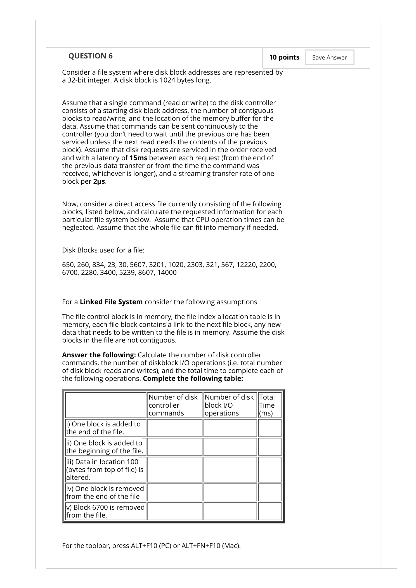

这页是**链表式（Linked）文件系统**的磁盘 I/O 计算题。把题干关键信息先整理出来：

* **块地址**：32 位；**块大小**：**1024 B**。
* **一条磁盘命令**（读/写）= 起始块地址 + 连续块数 + 缓冲区地址。可连续发送，请求**按到达顺序**服务。
* **请求间延迟**：每条请求都有 **15 ms**（从上一条传输结束或该请求到达开始，取更大者）。
* **传输速率**：**1 块 / 2 μs** ⇒ **0.002 ms/块**。
* 文件当前的**数据块序列**（不连续）：
`650, 260, 834, 23, 30, 5607, 3201, 1020, 2303, 321, 567, 12220, 2200, 6700, 2280, 3400, 5239, 8607, 14000`
* **链表式 FS 的假设**：

* 文件控制块在**内存**；给你一个**内存里的索引/顺序表**（因此能直接知道首块、尾块、任意块及其前驱）；
* 每个**数据块里**含“下一块指针”；
* 需要写入的新数据在**内存**；
* **CPU 时间忽略**；整文件如有需要可一次装入内存。
⇒ **我们只统计对“数据块”的读/写**；控制块/索引在内存更新不计 I/O。

---

## 关键规则（后面所有小题都按这个算）

* **一次读或写** = **1 条磁盘命令**；若只动 1 个块，**I/O 次数 = 1**。
* **时间** = 对该命令：**15 ms 延迟 + 0.002 ms ×（块数）**。
本题每个命令都只涉及 **1 块**，因此**单条命令耗时固定为 15.002 ms**。
* 删除块如果不要求“安全清零”，只需改前驱块的**next 指针**（在该前驱块上完成**读-改-写**），**被删的块无需读写**。

---

## 每个操作的分析与答案

### i) 在**文件末尾**添加 1 块

* 需要把**原尾块**的 next 指针改为“新块”，因此对原尾块执行 **读 + 写**；同时把**新块数据**写入磁盘。
* **命令数**：3（读尾、写尾、写新块）
* **I/O 次数**：3
* **总时间**：3 × 15.002 = **45.006 ms**

### ii) 在**文件开头**添加 1 块

* 新块的 next 指向原首块，首块地址写入 FCB（在内存），**不需要改原首块**。
* **命令数**：1（写新块）
* **I/O 次数**：1
* **总时间**：1 × 15.002 = **15.002 ms**

### iii) 修改距离文件顶端 **100 B** 处的数据

* 100 B 落在**第 1 个逻辑块**内（块大小 1024B）。流程：读该块→内存修改→写回。
* **命令数**：2（读该块 + 写回该块）
* **I/O 次数**：2
* **总时间**：2 × 15.002 = **30.004 ms**

### iv) 从**文件末尾**删除 1 块

* 只需把**倒数第二块**的 next 设为 null：对该前驱块做 **读 + 写**；被删的尾块无需 I/O。
* **命令数**：2
* **I/O 次数**：2
* **总时间**：2 × 15.002 = **30.004 ms**

### v) 删除块号 **6700**（文件中的中间块）

* 由内存索引可直接找到其**前驱块**；对前驱块做 **读 + 写**（把 next 跨过 6700 指向其后继）。
* **命令数**：2
* **I/O 次数**：2
* **总时间**：2 × 15.002 = **30.004 ms**

---

## 汇总表（可直接填入）

| 操作                  | 磁盘控制器命令数 | 磁盘块 I/O 次数 |   总时间 (ms) |
| ------------------- | -------: | ---------: | ---------: |
| i) 末尾添加 1 块         |    **3** |      **3** | **45.006** |
| ii) 开头添加 1 块        |    **1** |      **1** | **15.002** |
| iii) 修改距顶端 100B 的数据 |    **2** |      **2** | **30.004** |
| iv) 从末尾删除 1 块       |    **2** |      **2** | **30.004** |
| v) 删除块号 6700        |    **2** |      **2** | **30.004** |

> 注：若题目另行规定“删除时必须把被删块清零写回磁盘”，则 v) 需再加 **写被删块** 1 次；本题未提此要求，故不计。

---

## \[口语化表达]

这题算的是链表式文件：每条读写命令固定要 15ms 的等待，加上传一块数据只要 0.002ms，所以**一条命令≈15.002ms**。

* 在**末尾加块**要改老尾块的指针还要把新块写进去，所以**三条命令**，约 **45.006ms**；
* 在**开头加块**只写新块，**一条命令 15.002ms**；
* 改**100B** 的内容在第一个块里，要**读+写**，**两条命令 30.004ms**；
* 删**末尾**或删**中间的 6700**，只需要修改“前驱块”的 next，都是**读+写两条**，各 **30.004ms**。


---

## 第 9 页

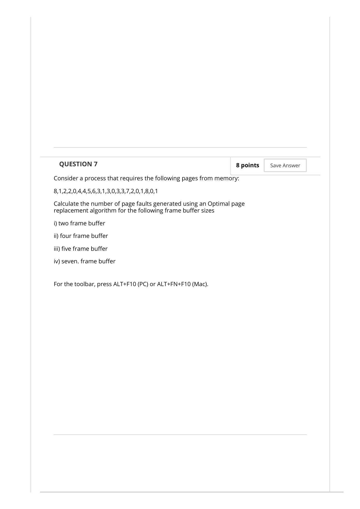

这题在考**页面置换**。给定一串页面访问序列，要用**最优（Optimal/OPT）页面置换算法**分别在不同**帧数（frame buffer）**下计算**缺页次数（page faults）**。

---

## 题目数据

**页面访问序列**（从内存需要的页）：
`8, 1, 2, 2, 0, 4, 4, 5, 6, 3, 1, 3, 0, 3, 3, 7, 2, 0, 1, 8, 0, 1`

**要求计算在以下帧数下的缺页数：**
i) 2 帧 ii) 4 帧 iii) 5 帧 iv) 7 帧

---

## 算法要点（OPT）

* **命中(hit)**：请求的页已在帧中 → 不缺页。
* **缺页(fault)**：帧中没有该页 →

* 若有空帧：把该页装入空帧。
* 若无空帧：**替换“未来最晚才会再次被访问”的那一页**（若某页未来不再被访问，优先换它）。
* OPT 是“事后诸葛亮”的理想算法，因此**帧数越多，缺页不会增多**（单调不增）。

---

## 计算思路（示例前几步演示，帧=2）

1. 开始为空：`[ ]`
2. 访问 **8** → 缺页，装入：`[8]`（fault=1）
3. 访问 **1** → 缺页，装入：`[8,1]`（fault=2）
4. 访问 **2** → 无空位，需要替换。往后看：

* 8 下一次出现很晚（在第 19 步出现 8）
* 1 很快就会再出现（第 10 步）
→ 换掉 **8**：`[2,1]`（fault=3）
5. 访问 **2** → 命中（fault 不变）
6. 访问 **0** → 需要替换。向后看 1 和 2 的下次使用位置，按“谁更晚再用”换谁……
…
按照此规则对整串序列推进即可得到缺页总数。其他帧数同理，只是可用帧更多、命中率更高。

---

## 计算结果（最终缺页次数）

| 帧数 | 缺页数（Page Faults） |
| -: | ---------------: |
|  2 |           **14** |
|  4 |           **10** |
|  5 |            **9** |
|  7 |            **9** |

> 校验直觉：帧数从 2→4→5→7，缺页数 **单调不增**（14→10→9→9），符合 OPT 的性质；从 5 到 7 帧已接近饱和，继续增加帧数对这条序列已无明显改进。

---

### 小技巧/易错点

* OPT 替换时别忘了“**未来不会再用**的页优先淘汰”，这比“最晚再用”更优。
* 对于连续重复访问（比如 `2,2` 或 `3,3`），第二个访问一定**命中**。
* 若两页“下一次使用”索引相同，换哪一个都等价（对最终缺页数无影响）。

---

## \[口语化表达]

这题就是拿一串页号，按“**以后最晚才用到的页就先踢出去**”的规则算缺页。我把整串跑了一遍：2 帧的时候需要换得很勤，**14 次**；给 4 帧后好很多，**10 次**；再加到 5 帧是 **9 次**；到 7 帧还是 **9 次**，基本到头了。总之帧越多缺页不会变多，最后答案就是 **2/4/5/7 帧分别为 14、10、9、9 次缺页**。


---

## 第 10 页

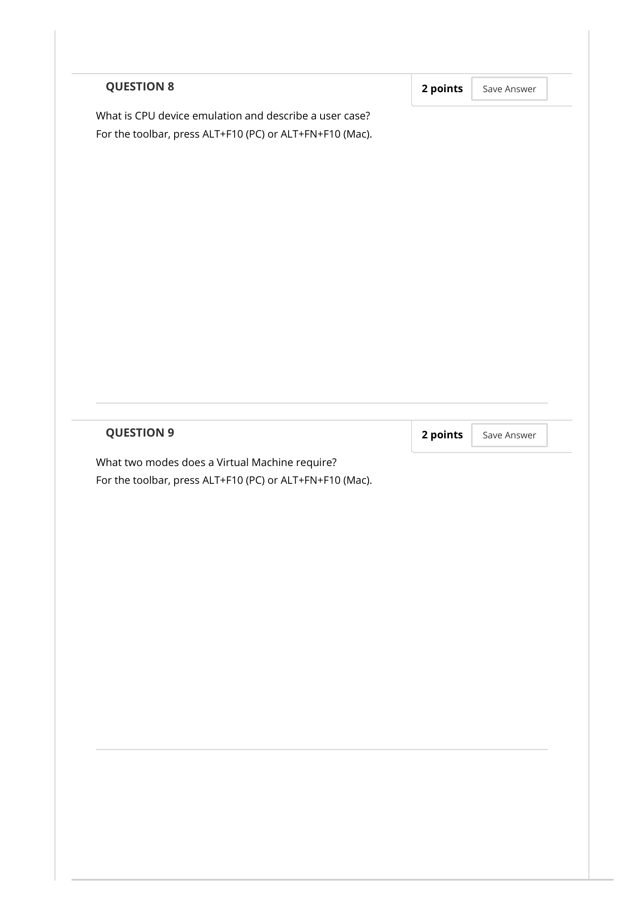

这页有两道简答题，考的是虚拟化与CPU仿真（操作系统的后半部分知识）。我们一题一题来看。

---

## **QUESTION 8**

**题目：**

> What is CPU device emulation and describe a user case?
> （什么是CPU设备仿真？举一个应用场景。）

### **详细解释：**

**CPU 设备仿真（CPU device emulation）** 是一种**软件模拟硬件处理器行为**的技术。
也就是说：在一台物理机器上，用软件来“假装”另一种CPU的运行逻辑和指令集。这样，即使硬件架构不同（比如 x86 与 ARM），也能运行对应架构下的软件或操作系统。

**原理：**

* 模拟 CPU 的寄存器、指令集、控制单元、算术逻辑单元（ALU）等行为。
* 拦截并解释每一条目标CPU的机器指令，然后转换成宿主CPU能执行的操作。

**典型用途（user case）：**

* 在 x86 主机上仿真 ARM CPU，用来测试 Android 手机操作系统（如 QEMU 模拟 ARM64 Android）。
* 运行老旧系统：例如用 Bochs 或 QEMU 仿真 Intel 386 CPU 来运行 DOS 或老版 Windows。
* 让 Mac M 芯片（ARM 架构）上运行 x86 应用（例如 Rosetta 2 技术）。

---

## **QUESTION 9**

**题目：**

> What two modes does a Virtual Machine require?
> （虚拟机需要哪两种模式？）

### **详细解释：**

虚拟机（Virtual Machine）运行时需要两种模式来区分谁控制硬件：

1. **User Mode（用户模式）**

* 虚拟机内部运行的普通应用程序所在的模式。
* 权限受限，不能直接操作硬件或特权指令。
* 若尝试访问特权操作，会触发陷阱（trap）交给监控层（hypervisor）处理。

2. **Kernel Mode（Supervisor Mode 或 Privileged Mode）**

* 由虚拟机监控器（VMM / Hypervisor）使用的模式。
* 拥有全部硬件访问权，可执行特权指令（如中断管理、页表操作等）。
* 负责虚拟化CPU、内存、I/O等资源，并隔离不同虚拟机。

> 有时题目还会延伸提“guest mode”和“host mode”，它们是对应不同层的用户/内核模式的逻辑扩展。

---

## **\[口语化表达]**

第 8 题其实就是问“CPU仿真”是什么意思。简单说，就是用软件去假装成另一种CPU，比如我电脑是Intel，但我想跑ARM的安卓系统，就让模拟器帮我“骗过”系统，让它以为自己在ARM上。最常见的例子就是 **QEMU 或 Rosetta 2** 这种工具。

第 9 题问虚拟机要有哪两种模式。其实就像我们电脑操作系统一样，有“普通用户模式”和“内核模式”。虚拟机里跑的程序在用户模式，虚拟机监控器（hypervisor）在内核模式，这样它能管理虚拟CPU、内存这些硬件资源。


---

## 第 11 页


这页有两道操作系统虚拟化相关的简答题：**第10题关于虚拟化的优缺点**，**第11题关于VMM（虚拟机管理器）的功能**。下面分别详细说明。

---

## **QUESTION 10**

**题目：**

> What is an advantage and disadvantage of using virtualisation?
> （说明使用虚拟化的一个优点和一个缺点。）

### ✅ 优点（Advantage）：

**资源利用率高、灵活性强**

* 多个虚拟机可共享同一台物理主机的硬件资源（CPU、内存、磁盘、网络）。
* 可快速创建、克隆、迁移虚拟机，便于测试与部署。
* 提高了系统隔离性，虚拟机之间互不影响，提高安全性与稳定性。

➡ **例子：** 在云计算环境（如 AWS EC2、VMware）中，一台物理服务器能同时运行多个独立操作系统，从而降低成本、提高效率。

### ❌ 缺点（Disadvantage）：

**性能开销大**

* 因为虚拟化层（Hypervisor/VMM）要拦截并管理硬件访问，存在额外的CPU与内存开销。
* I/O 操作（磁盘/网络）会比直接运行在物理机上慢。
* 如果管理不好，资源争用（Resource Contention）会导致性能下降。

---

## **QUESTION 11**

**题目：**

> What does a Virtual Machine Manager (VMM) do?
> （虚拟机管理器的作用是什么？）

### 🧠 详细解释：

**VMM（Virtual Machine Manager）** 又叫 **Hypervisor**，是虚拟化的核心控制软件。
它负责在物理硬件上创建、运行和管理虚拟机，使每个虚拟机都能“认为”自己独占整台计算机。

### **主要功能：**

1. **资源虚拟化（Resource Virtualization）**

* 将CPU、内存、磁盘、网络等物理资源划分并分配给不同虚拟机。
2. **隔离（Isolation）**

* 各虚拟机独立运行，互不影响；一个虚拟机崩溃不会影响其他。
3. **指令与中断控制（Trap Handling）**

* 拦截虚拟机执行的特权指令，并由VMM处理或模拟执行。
4. **调度与监控（Scheduling & Monitoring）**

* 管理CPU调度、内存映射、I/O访问，确保虚拟机公平使用资源。
5. **支持迁移与快照（Migration & Snapshot）**

* 可保存虚拟机状态并在不同主机之间迁移。

➡ **例子：** VMware ESXi、KVM、Hyper-V、VirtualBox 都是 VMM 的实现。

---

## \[口语化表达]

第10题其实就是问虚拟化的好处和坏处。好处嘛，**一台电脑能跑好几个系统**，像云服务器一样提高资源利用率、隔离安全又方便。坏处就是**有性能损耗**，因为多了一层管理器，跑起来比真机慢一点。
第11题问 VMM 是干啥的，它就是虚拟化的“大脑”，负责分配CPU、内存、磁盘这些资源，还要让每个虚拟机互不干扰。简单说，它就是**让一台电脑“假装成很多电脑”的管理核心**。


---

## 第 12 页

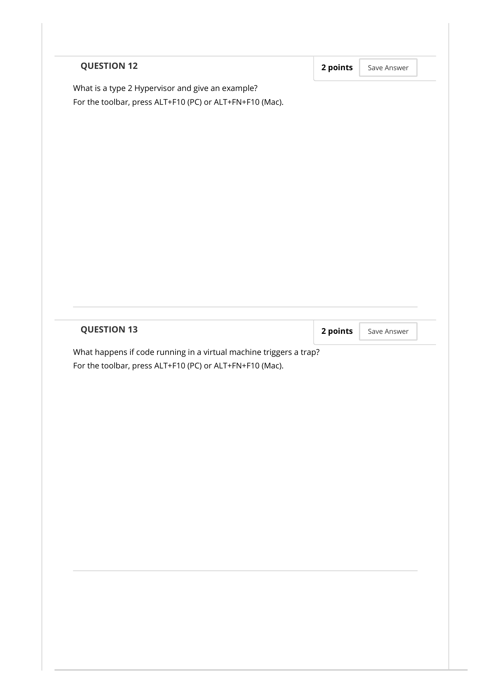

这页是关于虚拟化架构与陷阱机制的两道简答题。下面详细解释。

---

## **QUESTION 12**

**题目：**

> What is a type 2 Hypervisor and give an example?
> （什么是第二类虚拟机管理程序（Type 2 Hypervisor）？请举一个例子。）

### **详细解释：**

**Type 2 Hypervisor（第二类虚拟机管理程序）** 是**运行在操作系统之上的虚拟化软件**。
它依赖宿主操作系统（Host OS）来访问底层硬件资源。

**工作原理：**

* 用户先启动宿主操作系统（如 Windows、macOS、Linux）。
* Type 2 Hypervisor 安装在宿主系统上，作为普通应用运行。
* 它通过宿主系统来调度 CPU、内存、I/O 等资源，创建虚拟机。

**优点：**

* 易于安装和使用；适合桌面虚拟化和开发测试环境。
* 不需要专门硬件支持。

**缺点：**

* 性能较低，因为虚拟机指令要先经过宿主操作系统再到硬件层。

**例子：**

* Oracle **VirtualBox**
* VMware **Workstation** / **Fusion**
* Parallels Desktop（在 macOS 上）

---

## **QUESTION 13**

**题目：**

> What happens if code running in a virtual machine triggers a trap?
> （如果虚拟机中运行的代码触发陷阱（trap），会发生什么？）

### **详细解释：**

当虚拟机内部运行的程序触发陷阱（Trap，也称为异常或中断）时，例如：

* 访问无效内存地址、执行特权指令、除零错误等——
这些都需要操作系统或管理层介入。

在虚拟化环境下，**Trap 不会直接交给虚拟机操作系统处理**，而是：

1. **Trap 首先被 VMM（Hypervisor）拦截。**
VMM 拦截所有虚拟机产生的异常，判断是否是允许的操作。
2. **VMM 进行虚拟化处理。**

* 如果是“安全的”Trap（比如 I/O 请求），VMM 模拟真实硬件响应；
* 如果是非法或越权的 Trap，VMM 阻止并返回虚拟机错误状态。
3. **有时 VMM 会将 Trap 转发给虚拟机内部的操作系统**，让它像在真实硬件上一样处理异常。

**总结流程：**
虚拟机程序触发陷阱 → Trap 进入 VMM → VMM 检查与处理 → （必要时）再转交虚拟机OS。

---

## **\[口语化表达]**

第12题问 Type 2 Hypervisor 是啥。其实就是装在电脑系统里的“虚拟机软件”，要先有一个宿主系统（比如 Windows 或 macOS）才能运行。它不像 Type 1 那样直接跑在硬件上，所以性能稍差，但更容易用。常见的例子就是 **VirtualBox、VMware Workstation、Parallels** 这些。

第13题问如果虚拟机里的代码触发了陷阱会怎样。简单说就是，**陷阱先被 Hypervisor 拦下来**，它看情况要么自己处理，要么再交给虚拟机里的系统去处理。这样能保证虚拟机不会乱动硬件，也不会让错误影响到主机系统。


---

## 第 13 页

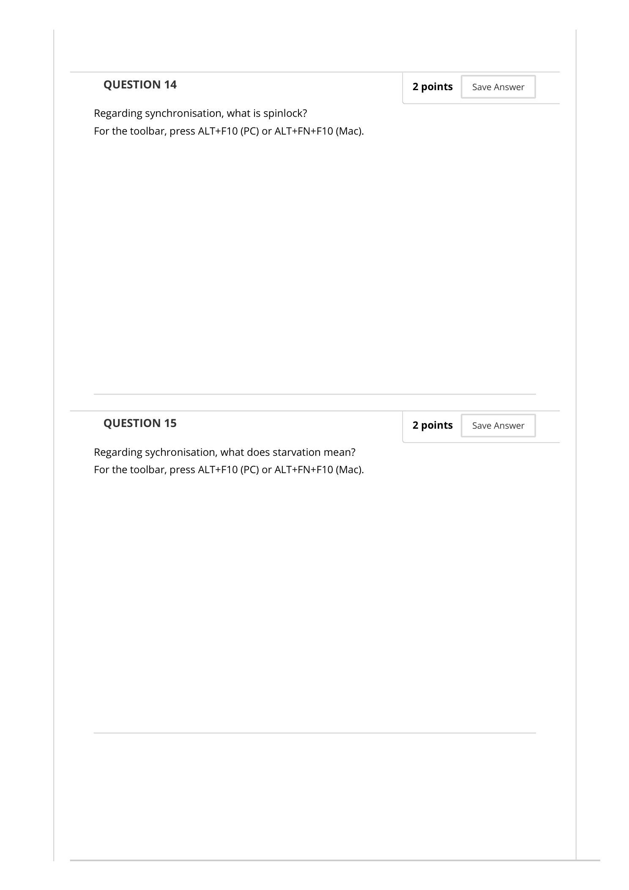

这页是两道同步（synchronisation）相关的概念题，分别考察 **自旋锁（spinlock）** 和 **饥饿（starvation）**。下面详细解释。

---

## **QUESTION 14**

**题目：**

> Regarding synchronisation, what is spinlock?
> （关于同步机制，什么是自旋锁？）

### **详细解释：**

**自旋锁（Spinlock）** 是一种多线程/多核系统中的**忙等待（busy-waiting）锁**。
当一个线程（或进程）想获得临界区的访问权时，如果锁已被其他线程持有，它不会进入休眠或阻塞，而是**反复检查锁的状态（自旋）**，直到锁被释放为止。

**原理：**

* 使用原子操作（atomic operation，如 test-and-set、compare-and-swap）来检测并修改锁的状态。
* 若检测到锁被占用，线程会“空转”CPU不断尝试；
* 一旦锁释放，线程立刻获得访问权。

**优点：**

* 适用于锁持有时间非常短的场景（避免上下文切换开销）。
* 在多核CPU上效率高，因为锁释放后可立即被获取。

**缺点：**

* 会浪费CPU时间（CPU 一直空转）。
* 不适合锁等待时间长的情形，否则会严重影响系统性能。

**举例：**
Linux 内核中的 `spin_lock()` 就是一种典型实现，用于保护短临界区。

---

## **QUESTION 15**

**题目：**

> Regarding synchronisation, what does starvation mean?
> （关于同步机制，饥饿是什么意思？）

### **详细解释：**

**饥饿（Starvation）** 是一种线程调度或资源分配问题，指**某个进程（或线程）长期得不到所需资源**，因为系统总是优先让其他进程运行。

**原因：**

* 调度算法不公平（例如总是优先高优先级进程）；
* 锁竞争中某些线程一直无法获得锁；
* 资源被其他线程频繁抢占或独占。

**后果：**

* 饥饿进程可能永远无法进入临界区或执行关键任务。
* 这类问题在并发系统中必须通过\*\*公平锁（fair lock）**或**轮询调度（round-robin）\*\*等方式避免。

**举例：**
在一个共享打印队列中，如果高优先级任务不断提交打印请求，低优先级任务可能**一直排不上队**，造成饥饿。

---

## **\[口语化表达]**

第14题问自旋锁，其实就是一种“死等”的锁：线程不睡觉，就在那儿不停地看“锁放了吗？锁放了吗？”一旦锁空出来就立刻进去。好处是快，不用切换上下文，适合那种锁时间特别短的场景；坏处是会白白占着CPU干等，时间长了就浪费资源。

第15题问饥饿，就是有的线程老是抢不到资源，一直在饿着，别人都运行了它还没机会。常见原因是调度不公平或者优先级太低，比如打印机任务永远让高优先级的先打，低优先级就饿死了。


---

## 第 14 页


这页只有一道题，考察的是同步（synchronisation）中的经典问题——**优先级反转（Priority Inversion）**。下面是详细讲解。

---

## **QUESTION 16**

**题目：**

> Regarding synchronisation, what does priority inversion mean?
> （在同步机制中，什么是“优先级反转”？）

---

### 🧠 **详细解释：**

**优先级反转（Priority Inversion）** 是在**多任务系统中**发生的一种**调度异常情况**，即：
**高优先级任务因为等待低优先级任务而被“间接阻塞”**，导致系统优先级次序“反转”。

---

### ⚙️ **具体情境举例：**

假设有三个任务：

* **T1（低优先级）**
* **T2（中优先级）**
* **T3（高优先级）**

1. **T1** 获得一个锁（Lock）进入临界区；
2. 这时 **T3（高优先级）** 想进入同一个临界区，但锁被 **T1** 占用，只能等待；
3. 此时 **T2（中优先级）** 到来，它不需要锁，于是 CPU 调度运行 **T2**；
4. 结果：

* **T1** 被 **T2** 抢占，无法继续执行；
* **T3** 又必须等 **T1** 释放锁；
* 最终 **T3（高优先级）** 被一个中优先级任务 **T2**“间接阻塞”了，这就叫**优先级反转**。

---

### 🔧 **解决方法：**

1. **优先级继承（Priority Inheritance）机制**
→ 当低优先级任务持有锁时，暂时提升它的优先级到等待它的高优先级任务级别，让它尽快完成并释放锁。
（Linux、RTOS 等都采用这种方法）

2. **优先级上限协议（Priority Ceiling Protocol）**
→ 给每个共享资源定义一个最高优先级上限，任何任务访问它时，自动提升到该优先级。

---

### ✅ **总结**

* **定义**：高优先级任务被低优先级任务间接阻塞的现象。
* **原因**：共享资源竞争 + 中间优先级任务干扰。
* **后果**：系统响应延迟，甚至实时任务超时。
* **解决**：优先级继承 或 优先级上限 协议。

---

## **\[口语化表达]**

这题说的“优先级反转”其实就是一种“高优先级任务被卡住”的现象。比如低优先级任务拿了个锁没放，高优先级的来了进不去，只能等；偏偏中优先级的还在那抢CPU，结果高优先级的反而被排到最后，优先级顺序就“倒过来了”。
解决方法很简单：让拿着锁的低优先级任务**临时升优先级**（优先级继承），干完活赶紧放锁，这样高优先级任务就能继续执行。


---

## 第 15 页

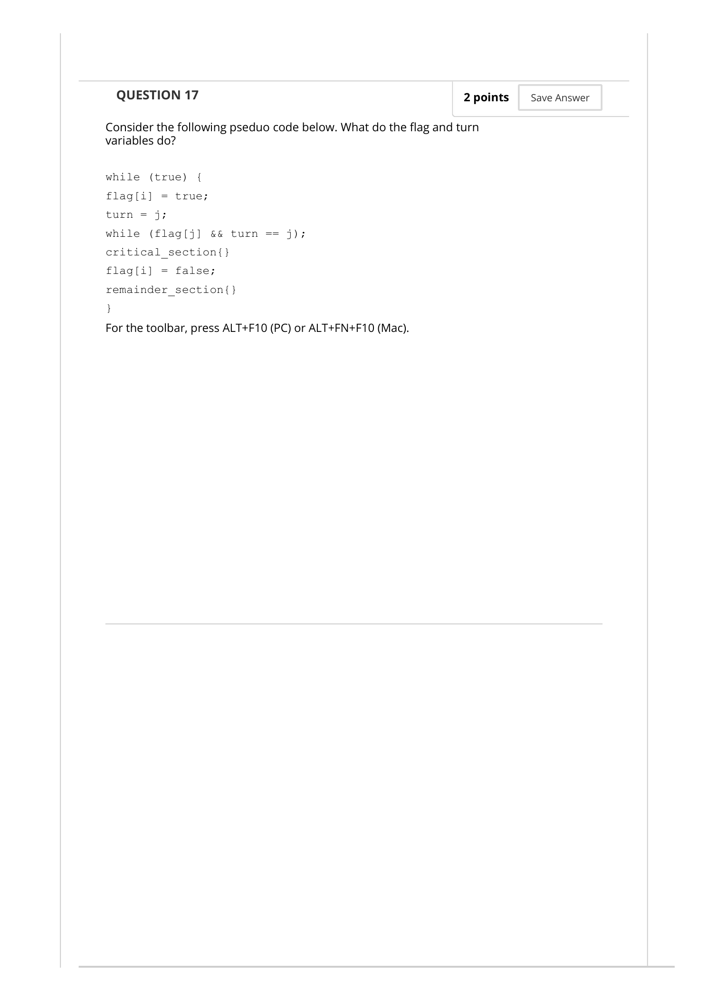

这道题考察的是\*\*进程同步与互斥（synchronization & mutual exclusion）\*\*的经典算法——**Peterson’s Algorithm（彼得森算法）**。下面是详细解析。

---

## **QUESTION 17**

**题目：**

> Consider the following pseudo code below. What do the flag and turn variables do?
> （请解释以下伪代码中 `flag` 和 `turn` 两个变量的作用。）

---

### **代码分析：**

```c
while (true) {
flag[i] = true;
turn = j;
while (flag[j] && turn == j);
critical_section();
flag[i] = false;
remainder_section();
}
```

这是 Peterson 算法的标准形式之一，用来让两个进程 **P0 和 P1** 安全地共享一个临界区（critical section）。

---

### 🧠 **两个变量的含义**

#### 1️⃣ `flag[i]`

* 表示**进程 i 想要进入临界区的意图（意愿信号）**。
* 当 `flag[i] = true` 时，表示该进程希望进入临界区。
* 当 `flag[i] = false` 时，表示该进程暂时不需要进入。

➡ 用途：
防止两个进程同时进入临界区（实现互斥）。

---

#### 2️⃣ `turn`

* 表示\*\*轮到谁（whose turn）\*\*可以进入临界区。
* 当两个进程都想进入时，`turn` 决定**优先权**。
* 例如 `turn = j` 表示让进程 j 优先。

➡ 用途：
防止死锁（deadlock）和饥饿（starvation），保证公平轮流进入临界区。

---

### ⚙️ **算法工作机制（两进程情况）**

假设有两个进程 `P0` 与 `P1`：

* 当 P0 想进入临界区时：

1. 设 `flag[0] = true;` 表示自己想进；
2. 设 `turn = 1;` 表示让出优先权；
3. 若此时 `flag[1] == true && turn == 1`，P0 等待；
4. 否则进入临界区；
5. 出来后 `flag[0] = false;`。

这样保证了：

* 不会同时进入（互斥）；
* 两者都有机会进入（公平）；
* 不会陷入死锁（因为 turn 在交替变化）。

---

### ✅ **总结**

| 变量        | 含义            | 作用         |
| --------- | ------------- | ---------- |
| `flag[i]` | 表示进程 i 想进入临界区 | 防止同时进入（互斥） |
| `turn`    | 表示允许谁进入临界区    | 控制公平与避免死锁  |

---

## **\[口语化表达]**

这题就是在考“Peterson 算法”那俩标志变量的意思。`flag[i]` 是告诉系统“我想进临界区”，`turn` 是说“现在轮到谁进”。当两个线程都想进时，`turn` 会让一个先走、另一个等。这样就能保证两个线程不会同时进，也不会一直卡着不动，还能轮流公平访问。简单说：`flag` 是“举手表示想进”，`turn` 是“排队轮次号”。


---

## 第 16 页

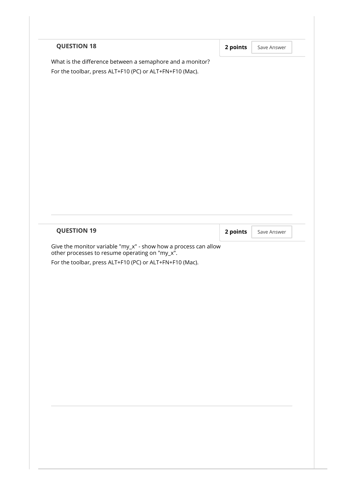

这页考察的是**进程同步机制**里的两个重要概念：信号量（Semaphore）与管程（Monitor），以及它们的使用方法。下面详细解释。

---

## **QUESTION 18**

**题目：**

> What is the difference between a semaphore and a monitor?
> （信号量和管程有什么区别？）

---

### 🧠 **详细解释：**

#### **1️⃣ 信号量（Semaphore）**

* 是一种**低级同步机制（low-level primitive）**。
* 本质是一个整型变量 + 两个原子操作：

* `wait()`（或 P 操作） → 请求资源、若资源不可用则阻塞；
* `signal()`（或 V 操作） → 释放资源、唤醒等待进程。
* 它不自带访问保护机制，程序员必须**手动确保正确的使用顺序**。

**特点：**

* 由程序员显式调用 `wait()` 和 `signal()`。
* 若用错（例如少 signal，多 wait），可能引发死锁或进程永久阻塞。
* 通常用于操作系统内核、设备驱动等底层同步。

---

#### **2️⃣ 管程（Monitor）**

* 是一种**高级同步机制（high-level construct）**。
* 把共享数据、对这些数据的操作过程、同步规则**封装在一起**。
* 系统自动保证**一次只有一个进程能在 monitor 内执行**。
* 使用条件变量（Condition Variables）来管理等待与唤醒。

**特点：**

* 自动提供互斥（monitor 内代码自动互斥）。
* 提供 `wait()` / `signal()` 操作来协调进程之间通信。
* 比 semaphore 更安全、更易用。

---

### ✅ **区别总结表：**

| 特性   | Semaphore（信号量）  | Monitor（管程）            |
| ---- | --------------- | ---------------------- |
| 层次   | 低级机制            | 高级机制                   |
| 控制方式 | 程序员手动控制         | 系统自动管理互斥               |
| 同步操作 | wait()/signal() | wait()/signal() + 条件变量 |
| 互斥保障 | 程序员自己实现         | 自动保证                   |
| 易错性  | 容易出错（次序错误）      | 相对安全易用                 |

---

## **QUESTION 19**

**题目：**

> Give the monitor variable "my\_x" - show how a process can allow other processes to resume operating on "my\_x".
> （已知管程变量 `my_x`，请展示进程如何让其他进程恢复对它的操作。）

---

### 🧩 **详细解释：**

在 Monitor 中，多个进程通过 **条件变量（Condition Variable）** 来协调执行顺序。
每个条件变量都提供两个操作：

* `wait()`：当前进程进入等待队列，**释放 monitor 控制权**；
* `signal()`：唤醒一个正在该条件变量上等待的进程。

---

### **题目中的 “my\_x” 是一个条件变量。**

假设有两个进程在管程中操作共享数据：

```cpp
monitor example {
condition my_x;   // 定义条件变量

procedure wait_for_resource() {
wait(my_x);   // 让当前进程等待
}

procedure release_resource() {
signal(my_x); // 唤醒等待该条件变量的其他进程
}
}
```

---

### **执行过程解释：**

1. 一个进程执行到 `wait(my_x)` 时，释放管程锁，进入等待状态；
2. 另一个进程执行 `signal(my_x)` 时，唤醒第一个等待的进程；
3. 被唤醒的进程重新获得 monitor 访问权并继续执行。

这样就实现了**安全的线程同步**与“让其他进程恢复操作”的功能。

---

## **\[口语化表达]**

第18题问信号量和管程的区别。信号量就像一个**计数锁**，程序员得手动 `wait()` 和 `signal()` 来控制进出，很灵活但容易写错；管程是个**更高级的封装**，系统自动帮你加锁解锁，还能用条件变量去 `wait()` / `signal()`，让别人继续执行，写起来更安全更省心。

第19题其实是说“怎么让等着的线程继续干活”。如果有个管程变量 `my_x`，当一个线程完成任务后，只要执行 `signal(my_x)`，系统就会唤醒在 `wait(my_x)` 里挂起的线程，让它重新运行。简单说，`wait()` 是“我等一下”，`signal()` 是“你可以继续了”。


---

## 第 17 页

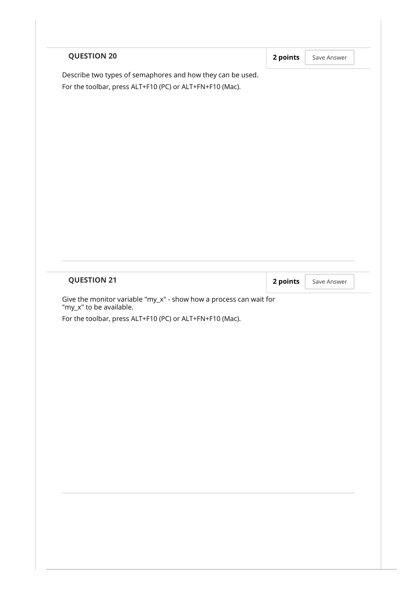

这页是两道关于\*\*信号量（Semaphore）**与**管程（Monitor）\*\*同步机制的题。
第 20 题要区分信号量的两种类型及用途，第 21 题考察 monitor 的等待操作。
下面详细说明。

---

## **QUESTION 20**

**题目：**

> Describe two types of semaphores and how they can be used.
> （描述两种信号量类型，并解释它们的用途。）

---

### 🧠 **详细解释：**

信号量（Semaphore）是一种同步机制，用来协调多个进程或线程之间对共享资源的访问。
它通过两个原子操作实现：

* `wait()`（也称为 P 操作）
* `signal()`（也称为 V 操作）

---

### **两种类型的信号量**

#### 1️⃣ **二元信号量（Binary Semaphore）**

* 值只能是 **0 或 1**。
* 功能类似于**互斥锁（mutex）**。
* 当一个进程获得资源后，信号量变为 0；释放后再变为 1。
* 若资源被占用，其他进程在 `wait()` 时会阻塞。

**用途：**
用于**互斥访问（Mutual Exclusion）**，确保同一时间只有一个进程能进入临界区。

```c
wait(mutex);      // 请求访问资源
critical_section();
signal(mutex);    // 释放资源
```

---

#### 2️⃣ **计数信号量（Counting Semaphore）**

* 值可以是任意非负整数。
* 表示**可用资源的数量**。
* 当一个进程占用资源，信号量值减 1；释放资源时，值加 1。
* 若值为 0，则表示资源已全部被占用，请求进程会等待。

**用途：**
用于**控制对多个相同资源的访问**，例如固定数量的打印机、连接池等。

```c
wait(resource);   // 检查是否有可用资源
use_resource();
signal(resource); // 释放资源
```

---

### ✅ **总结表**

| 类型                 | 值范围   | 主要用途   | 示例         |
| ------------------ | ----- | ------ | ---------- |
| Binary Semaphore   | 0 或 1 | 实现互斥锁  | 临界区访问控制    |
| Counting Semaphore | ≥0    | 管理多个资源 | 多台打印机、线程池等 |

---

## **QUESTION 21**

**题目：**

> Give the monitor variable "my\_x" – show how a process can wait for "my\_x" to be available.
> （给定管程变量 `my_x`，展示一个进程如何等待 `my_x` 可用。）

---

### 🧩 **详细解释：**

在 **Monitor（管程）** 中，进程通过 **条件变量（Condition Variable）** 来等待某个条件。
条件变量支持两个操作：

* `wait()`：进程进入等待队列，并**释放管程锁**；
* `signal()`：唤醒一个正在该条件变量上等待的进程。

---

### **示例伪代码**

```cpp
monitor example {
condition my_x;  // 定义条件变量

procedure wait_for_myx() {
// 当 my_x 不可用时，等待
wait(my_x);
}

procedure make_myx_available() {
// 某进程完成操作后，唤醒等待的进程
signal(my_x);
}
}
```

---

### **执行过程说明**

1. 若某进程调用 `wait(my_x)`，它会释放 monitor 并进入等待状态；
2. 当另一个进程执行 `signal(my_x)`，被唤醒的进程会重新获得管程控制权；
3. 从而实现安全、有序的线程通信。

---

## **\[口语化表达]**

第 20 题问信号量的两种类型。其实就是两种用途：
一个是**二元信号量（0/1）**，像“红绿灯”，只能一个人过马路，用来防止多个线程同时进临界区；
另一个是**计数信号量**，像“停车场空位数”，可以多个线程同时拿资源，比如有 3 台打印机就能放 3 个线程进去。

第 21 题问 monitor 怎么等变量。很简单：如果有个条件变量 `my_x`，进程想等它时就用 `wait(my_x)`，系统会让它睡着；等另一个线程准备好之后用 `signal(my_x)` 把它叫醒，这样就能安全地轮流操作共享资源。


---

## 第 18 页

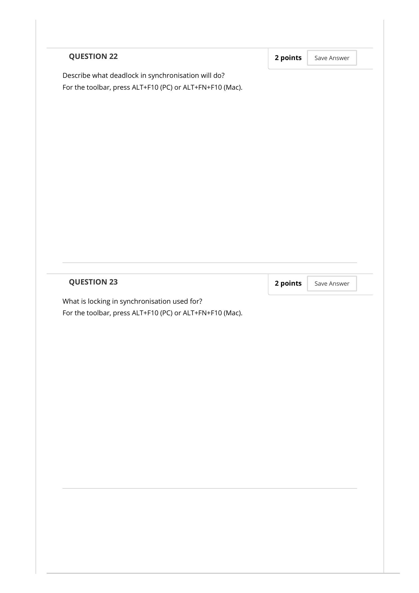

这页有两道并发同步的概念题：**死锁（deadlock）**与**加锁（locking）的作用**。下面分别说明。

---

## QUESTION 22

\*\*题目：\*\*Describe what deadlock in synchronisation will do?
\*\*意思：\*\*在并发同步中，什么是死锁，它会导致什么结果？

### 详细解释

**死锁（Deadlock）**：一组进程（或线程）因为**互相等待对方持有的资源**而永久阻塞，系统无法继续推进。

* 典型现象：进程A拿着锁L1等L2；进程B拿着锁L2等L1，双方都不释放，程序“卡死”。
* **后果**：相关线程/服务**永远不再前进**（非异常崩溃而是挂起），资源被占住，吞吐量下降，可能引发级联故障。
* **触发条件（Coffman 四条件）**：

1. 互斥使用；2) 占有且等待；3) 不可抢占；4) 循环等待。
* **常见应对**：破坏其中至少一个条件（如规定锁获取顺序、设置超时/回退、使用死锁检测与解除、采用一次性申请所有资源等）。

---

## QUESTION 23

\*\*题目：\*\*What is locking in synchronisation used for?
\*\*意思：\*\*同步里的“加锁”是用来做什么的？

### 详细解释

**加锁（Locking）**用于对共享数据/临界区提供**互斥访问与有序协调**，从而保证**数据一致性**与**线程安全**。

* **主要目的**：

* **互斥（Mutual Exclusion）**：同一时刻只有一个线程进入临界区，避免数据竞争（race conditions）。
* **原子性/一致性**：复合操作看起来“要么都做，要么都不做”。
* **可见性/有序性**（配合内存模型）：确保修改对其他线程可见。
* **常见锁**：

* **互斥锁（mutex/binary semaphore）**：独占访问。
* **读写锁（RW lock）**：多读共享、写独占，提高读多写少场景的并发度。
* **自旋锁**：短临界区的忙等互斥。
* **注意**：不当使用锁可能导致**死锁/饥饿/优先级反转**，需规定获取顺序、尽量缩短临界区、谨慎持锁调用阻塞操作。

---

## \[口语化表达]

第22题：死锁就是几个线程互相等着对方放资源，谁也不放，结果大家都卡住不往前了（比如A拿着L1等L2，B拿着L2等L1）。解决就靠破坏“循环等待”等条件，比如统一锁顺序或加超时。
第23题：加锁就是给共享数据“上门闩”，同一时刻只让一个线程进去改，保证不打架、数据不乱。常见有互斥锁、读写锁、自旋锁，但用不好会把自己锁死，所以要短临界区、固定拿锁顺序。


---

## 第 19 页

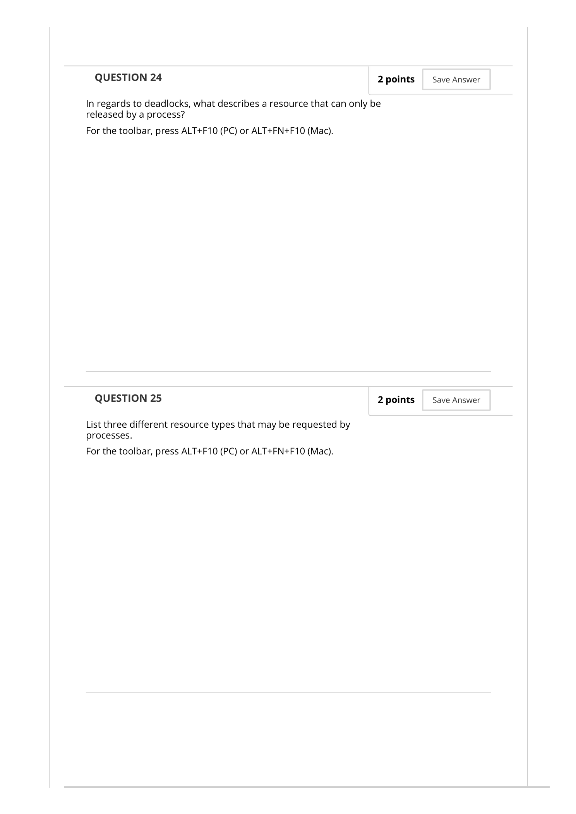

这页是关于\*\*死锁（Deadlock）**与**资源类型（Resource Types）\*\*的题，属于操作系统同步机制的基础考点。下面逐题解释。

---

## **QUESTION 24**

**题目：**

> In regards to deadlocks, what describes a resource that can only be released by a process?
> （关于死锁，哪种资源只能由占有它的进程释放？）

---

### 🧠 **详细解释：**

在死锁的四个必要条件中，有一个叫 **“不可抢占（Non-preemptive）”**。
题目描述的就是这个条件。

> “一个资源只能由占有它的进程主动释放”
> → 就是指 **非抢占资源（Non-preemptable Resource）**

---

### ✅ **定义**

* **非抢占资源（Non-preemptable Resource）**：
一旦某个进程获得该资源，**操作系统或其他进程不能强行收回**，只能等持有者主动释放。

* 相对的概念是：
**可抢占资源（Preemptable Resource）**，例如 CPU 时间片或内存页，可以被系统强制收回、重新分配。

---

### 🧩 **例子**

* 打印机、磁带机、文件锁、信号量、数据库记录锁等都属于**非抢占资源**。
* 内存或 CPU 通常属于**可抢占资源**。

---

### ✳️ **和死锁的关系**

* 因为资源**不能被强制夺回**，如果两个进程相互等待对方的资源，死锁就可能发生。
* 所以“非抢占性”是形成死锁的四个条件之一。

---

## **QUESTION 25**

**题目：**

> List three different resource types that may be requested by processes.
> （列出三种进程可能请求的资源类型。）

---

### 🧠 **详细解释：**

在操作系统中，进程执行时需要申请多种系统资源。常见的资源类型包括：

1. **CPU（处理器）时间片**

* 每个进程都需要CPU来执行指令。
* 由调度器分配与切换。

2. **内存空间（Memory）**

* 程序代码、数据、堆栈等都需要内存区域。

3. **I/O设备（I/O Devices）**

* 如打印机、磁盘、网络接口、键盘、显示器等。
* 通常为**互斥资源**（一次只能被一个进程使用）。

其他可列举的还有：

* **文件系统资源（Files）**
* **信号量 / 锁（Semaphores / Locks）**
* **网络连接（Sockets / Ports）**
* **磁带机、数据库连接等特殊设备**

---

### ✅ **示例回答**

三种可被进程请求的资源：

1. CPU 时间
2. 内存空间
3. 输入输出设备（例如打印机或磁盘）

---

## **\[口语化表达]**

第24题问的是“只能由进程自己释放的资源”——那就是**非抢占资源**。意思是系统不能强行拿走，得等进程自己用完再放，比如打印机、文件锁这种资源。因为不能抢，所以如果大家互相等着不放，就会卡死（死锁）。

第25题要列举三种进程可能请求的资源，比如：**CPU 时间**（要用来运行）、**内存**（要装程序和数据）、**I/O设备**（比如打印机、磁盘、网卡）。这些资源都是操作系统分配的，缺一个进程都跑不起来。


---

## 第 20 页

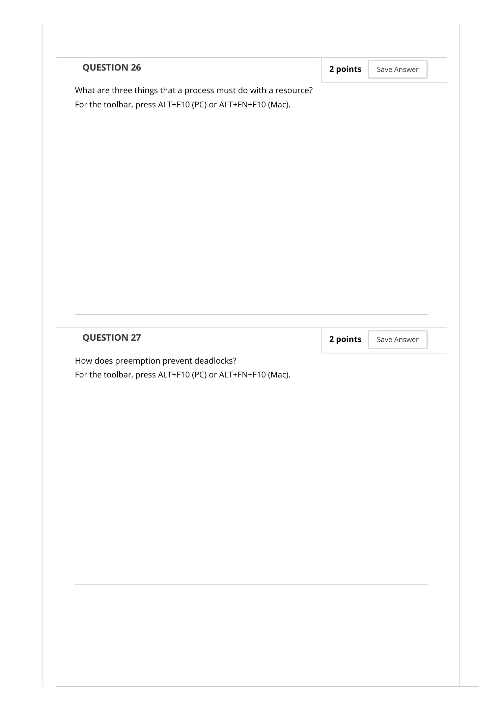

下面这页有两道并发/资源管理基础题：**进程对资源要做的三件事**，以及**抢占如何防止死锁**。我分别用简洁步骤说明。

---

## QUESTION 26

\*\*题目含义：\*\*进程拿资源时，必须执行哪三步？

### 标准三步（按顺序）

1. **Request（请求）**：向系统申请资源；若不可用则等待/阻塞。
2. **Use（使用）**：获得资源后在临界区内执行所需操作。
3. **Release（释放）**：用完立即归还资源，让其他进程可用。

> 这三步常用伪码：`request(R); critical/use; release(R);`
> 忘记第 3 步会引发资源泄漏、饥饿甚至死锁。

---

## QUESTION 27

**题目含义：**“抢占（preemption）”如何防止死锁？

### 要点说明

* 经典死锁的**四条件**之一是**不可抢占**：占有的资源只能由持有者主动释放。
* **抢占**允许操作系统**强制收回资源或回滚进程到安全点**，把其占有的资源让给其他等待者。
* 这样就**破坏了“不可抢占”条件**，从而阻断或打破循环等待链，防止/解除死锁。

### 例子

* 当检测到潜在循环等待时，OS让持有打印机的进程**挂起并释放打印机**；或把它**回滚**到保存点并归还资源。其他进程获得资源后继续执行，系统不再卡死。

---

## \[口语化表达]

第 26 题其实就是背口诀：**请求→使用→释放**，缺一不可。
第 27 题说的“抢占”就是系统**强行把资源拿回来**（或回滚进程），这样就打破了“资源只能自己放”的规则，循环等待链断了，死锁也就不成立了。


---

## 第 21 页


这页是两道操作系统同步与I/O基础题，重点考察“死锁的四个必要条件”和“I/O设备的类型”。下面详细解析。

---

## **QUESTION 28**

**题目：**

> What four conditions cause deadlock?
> （导致死锁的四个条件是什么？）

---

### 🧠 **详细解释**

操作系统中，若系统中有一组进程永远互相等待对方释放资源，就会出现**死锁（Deadlock）**。
根据 **Coffman 提出的四个必要条件**，死锁只有在同时满足以下四个条件时才会发生：

| 条件名                          | 含义                          | 举例说明               |
| ---------------------------- | --------------------------- | ------------------ |
| 1️⃣ **互斥（Mutual Exclusion）** | 资源一次只能被一个进程占用。              | 打印机同一时间只能被一个任务使用。  |
| 2️⃣ **占有且等待（Hold and Wait）** | 进程持有一个资源的同时，还在等待其他资源。       | 进程A拿着打印机又想拿磁带机。    |
| 3️⃣ **不可抢占（No Preemption）**  | 已分配的资源不能被强行夺走，只能由进程主动释放。    | 操作系统不能强制从A手中拿走打印机。 |
| 4️⃣ **循环等待（Circular Wait）**  | 存在一个进程链，每个进程都在等待下一个进程持有的资源。 | A等B、B等C、C又等A。      |

> **结论**：
> 只要破坏其中任意一个条件，就能预防死锁。
> 比如：允许资源被抢占、统一锁获取顺序、或一次性申请所有资源等。

---

## **QUESTION 29**

**题目：**

> List three types of I/O devices.
> （列出三种输入输出设备类型。）

---

### 🧠 **详细解释**

I/O（Input/Output）设备是计算机与外部世界交互的硬件设备。
通常分为三类：

1️⃣ **块设备（Block Devices）**

* 数据以块为单位传输，可随机访问。
* 例子：硬盘、SSD、光盘、USB驱动器。

2️⃣ **字符设备（Character Devices）**

* 数据以字符（字节）为单位顺序传输，不能随机访问。
* 例子：键盘、鼠标、打印机、串口终端。

3️⃣ **网络设备（Network Devices）**

* 用于网络通信的数据传输设备。
* 例子：网卡（NIC）、Wi-Fi模块、蓝牙适配器。

---

### ✅ **简答总结表**

| I/O 类型 | 数据访问方式    | 举例         |
| ------ | --------- | ---------- |
| 块设备    | 随机访问，块传输  | 硬盘、光盘      |
| 字符设备   | 顺序访问，字节传输 | 键盘、打印机     |
| 网络设备   | 数据包传输     | 网卡、Wi-Fi模块 |

---

## **\[口语化表达]**

第 28 题问死锁的四个条件。其实就是那四个著名的“卡死要素”：
①资源互斥，②拿着一个还等另一个（占有且等待），③系统不让强制收回（不可抢占），④一圈人互相等（循环等待）。只要这四个都成立，程序就卡住了。要防死锁，就得打破其中一个，比如统一拿锁顺序或允许系统回收资源。

第 29 题要列三种 I/O 设备。可以这么记：**块设备（硬盘）**，**字符设备（键盘打印机）**，**网络设备（网卡Wi-Fi）**。块的能随机读写，字符的只能顺序处理，网络的专门传数据包。


---

## 第 22 页

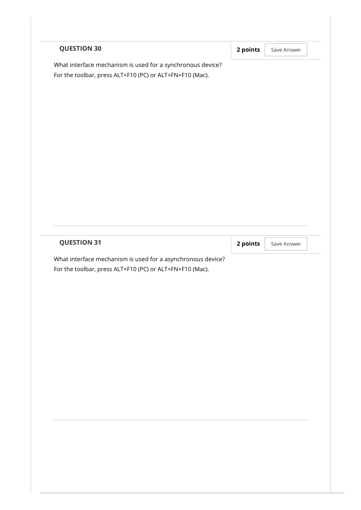

这页是关于\*\*同步设备（synchronous device）**和**异步设备（asynchronous device）\*\*的接口机制（interface mechanism）题。属于操作系统I/O子系统的内容。下面详细说明。

---

## **QUESTION 30**

**题目：**

> What interface mechanism is used for a synchronous device?
> （同步设备使用什么接口机制？）

---

### 🧠 **详细解释：**

**同步设备（Synchronous Device）**：
指 **CPU 与设备的操作是同步进行的**——CPU 发出I/O命令后，会**等待设备完成**，期间不能处理其他任务。
常用于数据传输速度较快、响应可预测的设备。

---

### **接口机制：**

✅ **程序控制I/O（Programmed I/O, PIO）机制**

**原理：**

* CPU 主动发送I/O请求；
* 设备执行操作；
* CPU 在循环中不断检测设备状态（轮询 polling）；
* 等设备准备好后，再继续下一步。

这种方式下，CPU 与设备同步工作，必须等设备完成才能继续执行。

---

### **特点：**

* 简单，控制逻辑易实现；
* CPU 等待浪费时间，效率低；
* 适用于数据量少或响应时间短的设备（如键盘、简单传感器等）。

---

## **QUESTION 31**

**题目：**

> What interface mechanism is used for an asynchronous device?
> （异步设备使用什么接口机制？）

---

### 🧠 **详细解释：**

**异步设备（Asynchronous Device）**：
指 **设备与CPU的操作是独立、异步进行的**——CPU 发出I/O命令后，不等待设备完成，可以去执行其他任务。
常用于响应速度慢或传输量大的设备（如磁盘、网络、打印机）。

---

### **接口机制：**

✅ **中断驱动I/O（Interrupt-Driven I/O）或DMA（Direct Memory Access）**

**工作机制：**

1. CPU 发出I/O命令给设备；
2. CPU 继续执行其他任务；
3. 当设备操作完成后，**通过中断信号通知CPU**；
4. CPU 响应中断并处理结果。

**进一步优化：**
若数据量大，使用 **DMA**，设备可直接与内存交换数据，不需CPU参与每次传输。

---

### **特点：**

* 提高CPU利用率；
* 适用于慢速设备；
* 系统响应更灵活。

---

## ✅ **总结对比表**

| 类型       | 同步设备 (Synchronous) | 异步设备 (Asynchronous) |
| -------- | ------------------ | ------------------- |
| 接口机制     | 程序控制I/O（轮询）        | 中断驱动I/O / DMA       |
| CPU 是否等待 | 是                  | 否                   |
| 效率       | 低                  | 高                   |
| 典型设备     | 键盘、简单传感器           | 硬盘、打印机、网络接口         |

---

## **\[口语化表达]**

第30题问同步设备的接口机制，就是那种“CPU得等着设备干完才能继续”的情况，用的是**程序控制I/O（polling 轮询）**。CPU 发个命令后就在那盯着等设备好，慢但简单。
第31题问异步设备的接口机制，就是“发完命令就走人”，设备干完再\*\*打断CPU（中断驱动I/O）\*\*或者自己直接搬数据（DMA）。这样CPU不用干等，效率更高。
简单说：同步设备靠“等”，异步设备靠“通知”。


---

## 第 23 页

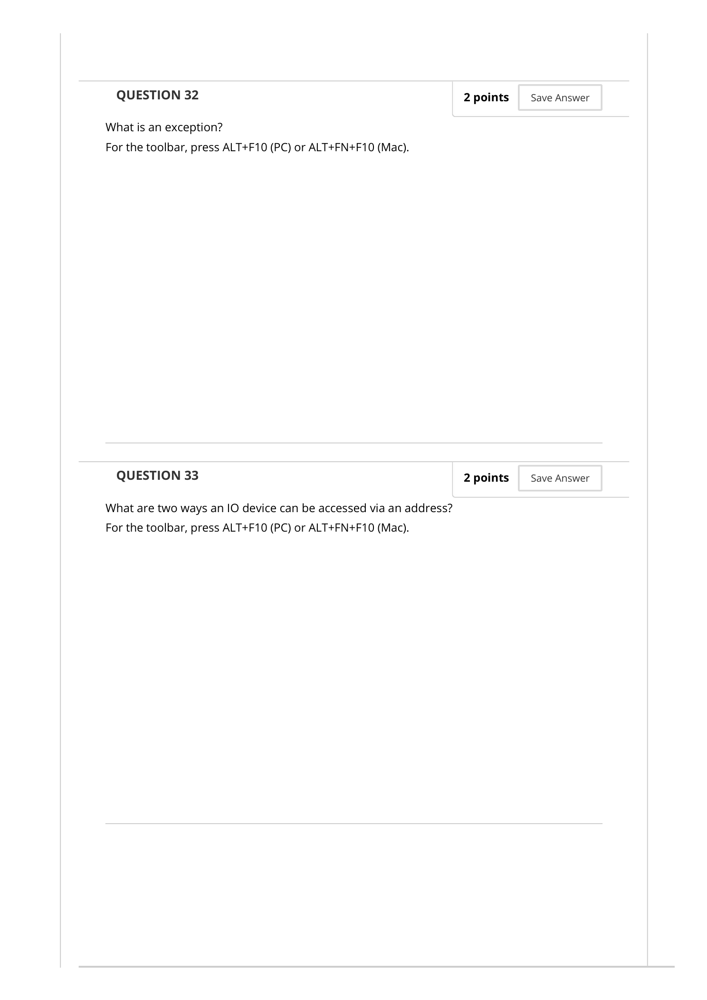

这页两题都属于操作系统底层机制范畴，一个讲**异常（Exception）**，一个讲**I/O设备的寻址方式**。下面分别解释。

---

## **QUESTION 32**

**题目：**

> What is an exception?
> （什么是异常？）

---

### 🧠 **详细解释：**

**异常（Exception）** 是指**在程序执行过程中，CPU 检测到的非正常事件或特殊情况**，使得正常的执行流程被打断，转而执行一段特殊的处理代码。

**本质上：**
异常是一种 **同步中断（Synchronous Interrupt）**，因为它由当前执行指令引发，而不是外部设备产生的信号。

---

### **常见异常类型：**

1. **程序错误类异常**：如除以零、地址越界、无效指令等。
2. **系统调用类异常（Trap）**：程序主动请求操作系统服务。
3. **硬件故障类异常**：如内存校验错误、总线错误等。

---

### **异常处理过程：**

1. CPU 检测到异常；
2. 保存当前状态（如程序计数器 PC）；
3. 跳转到异常处理例程；
4. 处理完毕后返回原程序或终止程序。

---

### ✅ **总结一句话：**

> 异常是**CPU 在程序执行时内部检测到错误或事件**后，**打断当前流程去执行特定处理程序**的机制。

---

## **QUESTION 33**

**题目：**

> What are two ways an IO device can be accessed via an address?
> （I/O设备通过地址访问有哪两种方式？）

---

### 🧠 **详细解释：**

在计算机体系结构中，CPU 要访问 I/O 设备，必须知道它们的地址。I/O 地址的映射方式主要有两种：

---

### **1️⃣ 独立I/O地址空间（Isolated I/O / Port-mapped I/O）**

* I/O设备有独立的地址空间，与内存地址分开。
* 通过专门的指令（如 `IN`、`OUT`）访问设备寄存器。
* 优点：不会占用内存空间；
* 缺点：需要专门指令，访问方式受限。
* 例：早期 x86 架构使用的端口映射I/O（I/O ports）。

---

### **2️⃣ 内存映射I/O（Memory-Mapped I/O, MMIO）**

* I/O设备的寄存器被映射到**内存地址空间**。
* 程序可用普通的内存读写指令（`MOV`、`STORE`）直接操作设备寄存器。
* 优点：访问灵活、代码简单；
* 缺点：设备寄存器占用部分内存地址空间。
* 例：现代系统几乎都采用内存映射I/O，如显卡、网卡控制器。

---

### ✅ **总结对比表**

| 模式      | 地址空间   | 指令类型             | 优点     | 缺点     | 示例        |
| ------- | ------ | ---------------- | ------ | ------ | --------- |
| 独立I/O   | 独立端口空间 | 专用指令（IN/OUT）     | 不占内存空间 | 访问受限   | 旧式x86架构   |
| 内存映射I/O | 与内存共享  | 通用指令（LOAD/STORE） | 简单灵活   | 占用内存地址 | 现代CPU设备访问 |

---

## **\[口语化表达]**

第32题问“异常”，就是CPU在运行过程中发现“出事儿了”，比如除以零、地址越界、指令非法，这时它会停下来去执行一段专门的“异常处理代码”，处理完再回来或者终止程序。它其实是一种“同步中断”，因为是CPU自己发现的问题。
第33题说“I/O设备怎么通过地址访问”，就两种方式：一种是“独立I/O地址空间”，设备有自己的端口，用专门的IN/OUT指令访问；另一种是“内存映射I/O”，设备寄存器直接映射在内存里，用普通LOAD/STORE就能读写。简单说，前者“单开一条I/O通道”，后者“设备住在内存里”。


---

## 第 24 页

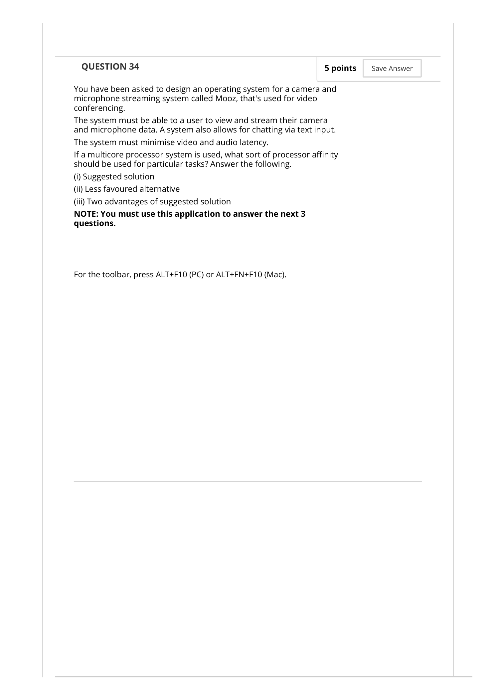

这页是 **QUESTION 34**，属于综合性设计题，考察操作系统在多核（multicore）环境下的**任务分配与处理器亲和性（Processor Affinity）**设计。题目场景是一个名为 **Mooz** 的视频会议系统，要求系统能处理摄像头与麦克风的音视频流，同时还要允许用户聊天。核心目标是**最小化视频和音频延迟（latency）**。

---

## 🧩 **题意解析**

**题目要求：**
设计一个多核操作系统来处理视频会议应用的多任务分配问题，回答以下三部分内容：

1. (i) **Suggested solution**（建议方案）
2. (ii) **Less favoured alternative**（次优方案）
3. (iii) **Two advantages of suggested solution**（建议方案的两个优点）

---

## 🧠 **逐项详细解答**

### **(i) Suggested Solution 建议方案**

✅ **方案：使用“处理器亲和性（Processor Affinity）”绑定关键任务到固定核心**

即让不同任务固定运行在特定CPU核心上，以减少上下文切换和缓存失效。

**具体分配建议：**

* **Core 1（CPU核心1）** → 音频处理（Audio Input/Output）

* 低延迟任务，需持续采集与播放；
* **Core 2（CPU核心2）** → 视频处理（Camera Capture & Encoding）

* 视频数据量大，需要高带宽和编码性能；
* **Core 3（CPU核心3）** → 网络传输（Streaming / Buffer management）

* 负责数据打包与传输；
* **Core 4（CPU核心4）** → 文本聊天与系统管理（Chat + UI + Control Threads）

* 交互响应，CPU负载较轻。

这种方式属于 **静态任务绑定（Static Affinity Assignment）**，即关键线程被“锁定”在对应核心上。

---

### **(ii) Less Favoured Alternative 次优方案**

❌ **方案：完全动态调度（Dynamic Scheduling）**
让操作系统调度器自由分配所有任务给任何可用的核心，不设置亲和性。

**缺点：**

* 频繁任务迁移 → 导致缓存失效（cache misses）；
* 音视频线程可能被迁移 → 增加延迟；
* 系统可能优先非关键任务 → 出现音画不同步。

---

### **(iii) Two Advantages of Suggested Solution 建议方案的两个优点**

1. **更低的延迟（Low Latency）**
音频与视频线程固定在各自核心上，避免迁移与竞争，减少中断和调度延迟。
⇒ 用户体验流畅，无音画卡顿。

2. **更高的性能稳定性（Stable Performance）**
各核心负载均衡，任务互不干扰；
缓存命中率提升，系统抖动降低，实时性增强。

---

## ✅ **简要总结表**

| 项目   | 内容                        |
| ---- | ------------------------- |
| 建议方案 | 静态核心绑定（音频/视频/网络/聊天各自固定核心） |
| 次优方案 | 动态调度（操作系统自由迁移任务）          |
| 优点1  | 降低音视频延迟                   |
| 优点2  | 性能稳定、缓存利用率高               |

---

## **\[口语化表达]**

这题就是说要你帮“Mooz”这个视频会议系统设计一个在多核CPU上跑的任务分配方案，重点是要让声音和画面不卡、延迟低。
我的建议方案是——给每个核心固定任务，比如：一个专门处理声音，一个处理视频，一个管网络传输，还有一个管聊天和界面，这样CPU就不用来回切换任务，延迟会更低。
次优方案是让系统自由分配任务（动态调度），虽然灵活但容易造成缓存失效和延迟抖动。
这种绑定式方案的好处有两个：第一是声音和视频更同步、延迟更小；第二是性能更稳定，系统不会乱跳线程。


---

## 第 25 页

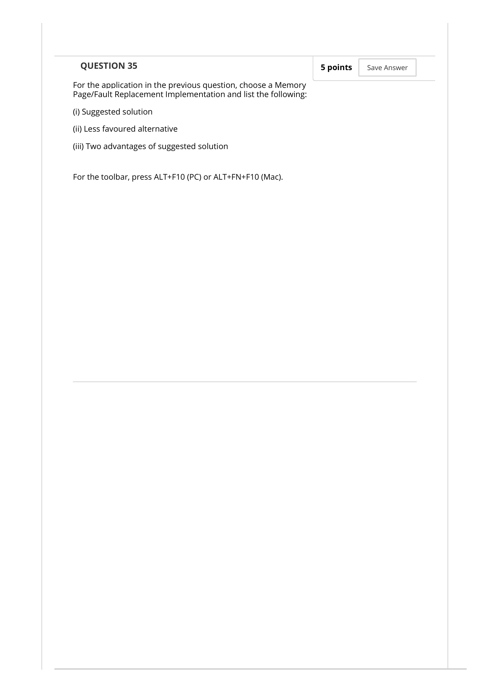

这道 **QUESTION 35** 是接着前一题（Question 34）的题目，依然围绕“Mooz 视频会议系统”的操作系统设计，但这次重点放在\*\*内存页面置换（Memory Page/Fault Replacement）\*\*机制的选择上。

题目要求你选择一个合适的页面置换算法，并说明：

1. (i) 建议方案（Suggested solution）
2. (ii) 次优方案（Less favoured alternative）
3. (iii) 建议方案的两个优点（Two advantages of suggested solution）

---

## 🧠 **详细解释**

### 📍背景说明

在视频会议应用（如 Mooz）中，系统同时处理**音频、视频、聊天、网络数据**等多任务，因此内存访问频繁。
一旦发生**页面错误（Page Fault）**，就会造成延迟，而延迟会直接影响实时性（特别是音视频同步）。

因此，我们希望使用一种**高命中率、低延迟、性能稳定**的页面置换算法。

---

## (i) **Suggested Solution（建议方案）**

✅ **使用 LRU（Least Recently Used）页面置换算法**

LRU 算法认为：**最近被使用的页面未来更可能再次被使用**，因此替换“最久未使用”的页面。

---

### **原因：**

* 视频会议应用中，音频和视频数据会周期性重复访问（循环缓冲区模式），符合局部性原理（Locality Principle）；
* LRU 能根据实际访问行为动态调整，不会轻易替换掉正在使用的数据页；
* 减少页面错误（Page Fault）次数，从而降低实时延迟。

---

### **实现方式：**

* 使用带时间戳的页面访问记录，或
* 用硬件支持的“最近使用位”（Reference Bit）+ FIFO 队列模拟近似LRU。

---

## (ii) **Less Favoured Alternative（次优方案）**

❌ **使用 FIFO（First-In, First-Out）页面置换算法**

FIFO 每次替换最早进入内存的页面，不考虑访问频率或最近使用情况。

### **缺点：**

* 容易产生 **Belady 异常**（页框增加反而增加缺页率）；
* 会替换掉仍被频繁访问的重要页面；
* 不适合高实时性场景，如视频流播放或会议系统。

---

## (iii) **Two Advantages of Suggested Solution（建议方案的两个优点）**

1. **减少音视频卡顿（Low Page Fault Rate → Low Latency）**
LRU能保留最近频繁访问的音视频数据页，减少从磁盘调入的时间，保证实时播放不卡顿。

2. **提高系统效率与用户体验（Better Performance Stability）**
由于减少了页面换入换出的次数，CPU和I/O负载降低，系统整体运行更流畅。

---

## ✅ **总结对比表**

| 项目   | LRU（建议方案）  | FIFO（次优方案）    |
| ---- | ---------- | ------------- |
| 替换策略 | 替换最久未使用的页面 | 替换最早进入的页面     |
| 访问特征 | 考虑时间局部性    | 不考虑访问历史       |
| 缺页率  | 低          | 可能高（Belady异常） |
| 适用性  | 实时音视频系统    | 批处理或简单系统      |
| 效果   | 稳定、低延迟     | 可能导致频繁中断      |

---

## **\[口语化表达]**

这一题是延续“Mooz”视频会议系统的设计，但换成讨论内存页面管理。因为视频会议要同时处理视频、音频和聊天，如果页面频繁被换进换出，就会造成延迟甚至卡顿。
最合适的方案是用 **LRU（最近最少使用）算法**，它能让系统优先保留最近被访问的页面，比如音视频缓存页，这样就减少了缺页中断，延迟更低。
一个不太好的替代方案是 **FIFO（先进先出）算法**，它简单但容易替换掉还在用的重要页面。
LRU的两个好处是：
第一，能有效减少卡顿和延迟；第二，整体系统更稳定，CPU也不用老在处理缺页中断。
简单说就是：**LRU聪明，FIFO笨；LRU能让视频不卡、声音不延。**


---

## 第 26 页


这题承接前一题（Mooz 视频会议系统），要\*\*为该应用选择一个“进程调度算法”\*\*并分别说明：
(i) 建议方案 (ii) 次优/不太推荐的方案 (iii) 建议方案的两个优点。

---

## (i) 建议方案（Suggested solution）

**EDF（Earliest Deadline First，最早截止期优先，抢占式实时调度）**

* 将**音频采集/播放**、**视频采集/编码**、**网络发送/接收**等线程都设为**带截止期的实时任务**；
* 任何时刻**截止期最早**的任务获得 CPU（可结合上一题的**核心亲和**，把音频/视频/网络固定在不同核上）；
* 聊天/UI 线程放在**普通优先级**，不带截止期。

> 适用性：音视频/网络线程基本是**周期性、对延迟极敏感**，EDF能在负载波动时仍最小化“错过截止期”的概率。

---

## (ii) 次优方案（Less favoured alternative）

**时间片轮转 Round-Robin（或一般的分时优先级调度）**

* 简单平均分配 CPU 时间片，但对**截止期**不敏感；
* 在突发编码或网络抖动时，**上下文切换多**、缓存命中下降，**容易造成音视频延迟或卡顿**。

---

## (iii) 建议方案的两个优点（Two advantages）

1. **更低的端到端延迟与更少的 deadline miss**

* EDF始终把\*\*最紧急（截止期最近）\*\*的音频/视频任务先执行，保证采集→编码→发送链路的时序稳定，语音更顺滑、画面更跟手。
2. **更高的处理器利用率与可预测性**

* 在单核理论上 EDF 可达**100% 利用率的可调度上限**（相较 RM 的 $ n(2^{1/n}-1)$ 上界更高），在多核+亲和下也能显著降低抖动；调度行为围绕截止期，**更易推理与验证实时性**。

> 备注：若任务周期已知且固定，也可选 **RM（Rate Monotonic）** 作为备选的**固定优先级**实时调度；但面对视频会议这种**码率/网络波动**场景，**EDF**对动态负载更稳妥。

---

## \[口语化表达]

这题就是给“Mooz”挑个调度器。我的推荐是**EDF**：谁的


---

## 第 27 页

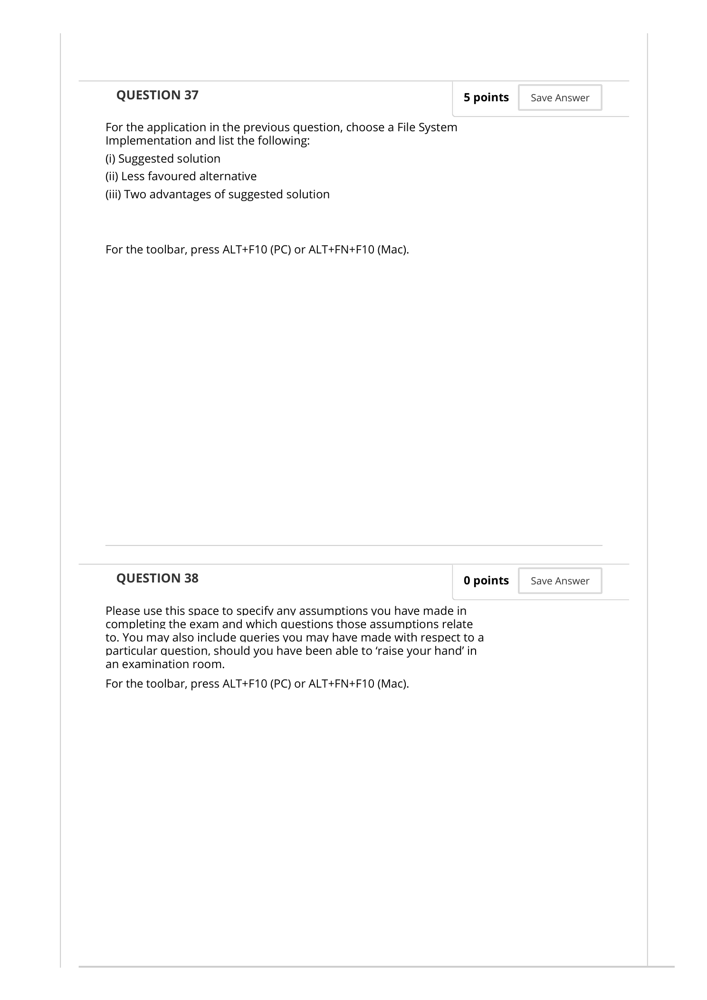

这页是**QUESTION 37 和 38**，属于操作系统设计题的最后一部分。
**Question 37**要求你为“Mooz 视频会议系统”选择一个合适的**文件系统（File System Implementation）**，并解释你的选择；
**Question 38**只是让你写下考试中你假设的前提（assumptions），不计分。

---

## 🧩 **QUESTION 37 详细讲解**

### 题目要求：

为“Mooz”视频会议系统选择一个**文件系统实现方式**，回答以下三点：

1. (i) 建议方案（Suggested solution）
2. (ii) 次优方案（Less favoured alternative）
3. (iii) 建议方案的两个优点（Two advantages of suggested solution）

---

### **(i) Suggested Solution 建议方案**

✅ **使用日志型文件系统（Journaling File System）**
例如：**ext4、NTFS 或 APFS**。

这种文件系统在写入操作时，会先将更改记录到日志（Journal）中，再实际写入文件数据。
一旦系统崩溃或断电，可以通过日志快速恢复，避免数据损坏。

**为什么适合 Mooz：**

* 视频会议系统会不断缓存视频、音频、临时会话文件（临时流文件、聊天记录等）；
* 系统需要实时写入、删除、更新数据；
* 稳定性和数据一致性至关重要（不能因为掉电丢文件）。

---

### **(ii) Less Favoured Alternative 次优方案**

❌ **使用非日志型文件系统（Non-Journaling FS）**
例如：**FAT32 或 exFAT**。

这种系统不维护日志，一旦出错（比如断电或异常退出），文件容易损坏或丢失。

**缺点：**

* 需要手动运行修复工具（如 chkdsk）；
* 适合小型或一次性设备（如 U 盘），不适合持续写入的实时系统；
* 数据恢复慢，可靠性差。

---

### **(iii) Two Advantages of Suggested Solution 建议方案的两个优点**

1. **高可靠性（Reliability）**
即使视频会议中断、电源掉线或进程崩溃，日志型文件系统也能通过回滚或重放日志恢复未完成的操作，防止数据损坏。

2. **写入性能稳定（Stable Write Performance）**
通过批量日志写入与异步提交，提高连续数据写入效率，非常适合音视频流数据的实时写入。

---

### ✅ **总结对比表**

| 项目    | 日志型文件系统（建议） | 非日志型文件系统（次优） |
| ----- | ----------- | ------------ |
| 数据一致性 | 高（通过日志恢复）   | 低（可能数据丢失）    |
| 写入性能  | 稳定          | 不稳定          |
| 恢复速度  | 快           | 慢            |
| 适用场景  | 实时系统 / 多任务  | 简单存储设备       |

---

## 🧠 **QUESTION 38 解读**

**题目意思：**
在考试中，你可以写下做题时假设的前提（assumptions），例如：

* 假设系统是多核处理器；
* 假设网络延迟可忽略；
* 假设摄像头输入为连续流；
* 假设存储使用 SSD；
* 假设内存足够大，不会频繁发生换页。

**写法建议：**

> Assumptions made:
>
> * The Mooz system runs on a quad-core CPU with SSD storage.
> * All multimedia streams are stored temporarily in RAM before being written to disk.
> * Network latency is within acceptable limits for real-time communication.

---

## **\[口语化表达]**

第 37 题让我选一个最合适的文件系统给“Mooz”视频会议系统用。我选的是**日志型文件系统（比如 ext4 或 NTFS）**，因为这种系统在写入时会先记日志，出问题还能恢复，非常适合实时音视频系统。一个次优的方案是用非日志系统（像 FAT32），但这种容易丢数据、不稳定。日志系统的两个好处是：第一，断电或崩溃后不容易丢文件；第二，写入速度稳定，特别适合视频流那种连续写入。
第 38 题其实就是让我写我在答题时假设了什么，比如我假设“Mooz”跑在多核CPU上、用SSD、内存够大、网络延迟可忽略之类的。
一句话总结：**选日志文件系统保数据稳，假设环境靠谱方便解释。**


---

## 第 28 页


这页截图是空白页，没有题目与作答要求。通常在考试或PDF里，这类页面只是**分页/留白**（有时用于书写草稿、附加说明，或作为下一题的分隔页），**不需要作答**。

如果你的系统里前后还有题号（例如上一页是 Q37/38，或前一页是 Q36），那这页仅仅是排版留白，用来过渡到下一部分。

---

## \[口语化表达]

这页啥题都没有，就是一张留白页，属于分页/过渡用途，不用写答案；要是前后有题，那这页只是用来隔开的。
