---

## 第 1 页

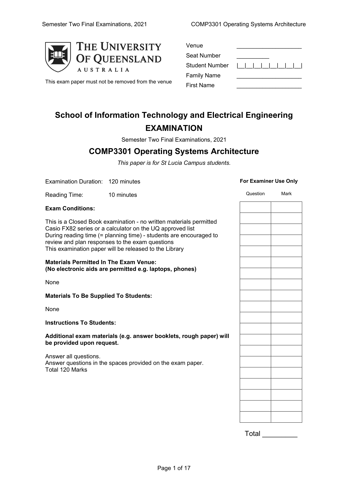

下面这页是试卷封面，不包含任何具体题目。我先把封面上每一块信息都翻译并解释清楚，并给出应对建议；若你把后续页面（题目部分）也上传，我再逐题中文讲解“怎么做”。

# 这页都写了什么 & 怎么理解/怎么做

1. 标题与课程

* “Semester Two Final Examinations, 2021 / COMP3301 Operating Systems Architecture”
含义：昆士兰大学（UQ）信息学院《操作系统体系结构》学期末考试。适用于 St Lucia 校园学生。

2. 个人信息栏

* Venue（考场）、Seat Number（座位号）、Student Number（学号）、Family Name（姓）、First Name（名）
做法：入座后按监考指示用黑/蓝笔填写；学号通常要按框填。别忘了写姓与名。

3. 考试时长与读题时间

* Examination Duration: 120 minutes（正式答题120分钟）
* Reading Time: 10 minutes（读题时间10分钟，仅阅读与规划，不得动笔作答，除非监考特别允许）
做法：前10分钟只看题、画时间分配。之后120分钟作答。总分120分 ⇒ **经验法则：1分≈1分钟**（留5–10分钟最后检查）。

4. 考试条件（Exam Conditions）

* Closed Book：**闭卷**，不许带纸质资料或笔记。
* 计算器：只允许 Casio FX82 系列或 UQ 批准名单上的计算器。
* 读题时间建议：鼓励在读题期**审题与做答规划**。
* “This examination paper will be released to the Library”：考后试卷题目版本会公开到图书馆（利于复习存档）。
做法：只带符合规定的计算器与文具；读题期先圈关键字、标难度、排顺序。

5. 允许携带的材料（Materials Permitted In The Exam Venue）

* 明确写了 “None（无）”，并强调**禁止电子设备（laptops, phones 等）**。
做法：手机关机或按要求放到指定位置，智能手表也通常不允许。

6. 学校提供的材料（Materials To Be Supplied To Students）

* “None（无）”。
做法：一般只发试卷本身；若需要草稿纸或答题册，可**按下面指示申请**。

7. 学生须知（Instructions To Students）

* 可按需提供 “Additional exam materials（如答题册、草稿纸）” —— **举手向监考索取**。
* “Answer all questions（全部作答）”。
* “Answer questions in the spaces provided on the exam paper（在试卷预留空白处作答）”。
* “Total 120 Marks（满分120）”。
做法：确认题量并在指定区域作答；空间不够就申请答题册，并在册和试卷上**清楚标注题号**与姓名/学号。

8. 右侧“仅供阅卷人填写”表格（For Examiner Use Only）

* 这是评分表。你无需填写。
做法：不要在该表里写任何内容，避免遮挡评分格。

# 时间与得分规划（实用策略）

* **读题10分钟：**
① 快速扫全卷；② 给每题标难度（★=难、○=易）；③ 记录每题分值并按“1分≈1分钟”初配时间；④ 先做拿分稳的题。
* **作答120分钟：**

* 若遇到大题（例如设计/证明型）占20分，目标控制在 \~20 分钟；超时就先跳过，最后回头补。
* 每道题**写出关键步骤与理由**（OS题常看重过程：算法名、关键数据结构、时序/状态转换、复杂度或正确性说明）。
* **预留 5–10 分钟检查**：补漏题号、补充边界情况、统一符号/单位。

# 可能涉及的典型题型（仅供你读题时定位思路）

> 本页没有题目，我不能逐题解析；下面只是按 COMP3301 常见内容给的“看到此类题怎么下手”的模版思路。

* **进程/线程与同步**：

* 识别临界区、死锁四条件；能用信号量/管程/条件变量写出同步伪代码；画出状态机或时序图。
* **调度算法**（FCFS/SJF/SRTF/RR/优先级/多级反馈队列）：

* 列时间轴，算平均等待时间/周转时间；写出选用算法的性质与饥饿/响应时间分析。
* **内存管理**（分页/分段、TLB、页替换）：

* 计算逻辑地址→物理地址；FIFO/LRU/OPT 缺页次数；解释抖动与工作集。
* **文件系统**（inode、目录、分配方式、日志/一致性）：

* 路径解析、块号计算、空闲空间管理（bitmap等）；崩溃后恢复流程（journaling）。
* **并发与锁**（自旋锁、读写锁、无锁结构）：

* 指出 race 的根因，给出加锁/原子操作或条件变量的正确用法与证明不死锁。
* **I/O 与中断**（轮询/中断/DMA、缓冲）：

* 画出数据流图；分析吞吐/延迟瓶颈与缓冲区大小对性能的影响。
* **虚拟化/容器/系统调用路径**（若课程覆盖）：

* 陷入/返回的时序、上下文切换开销、影子页表/EPT 概念等。

> 一旦你把后续 16 页题目发来，我会按上述模板逐题：**审题→公式/算法→步骤→易错点→标准答案要点** 全流程讲解。

---

\[口语化表达] 这页其实就是试卷封面：告诉你这是 UQ 的 COMP3301 期末，先读题 10 分钟，再写 120 分钟，闭卷，只能用学校认可的计算器，手机电脑都不许带；需要草稿纸或答题册就举手要；所有题都要做，直接写在试卷给的空白里，满分 120 分。我的建议是：读题时先扫全卷、按分值给时间配比（基本就是 1 分 1 分钟），先把稳拿分的做了，难题卡 3–5 分钟就先跳过，最后留 5–10 分钟检查。真正的题目不在这一页，等你把后面的页面也发上来，我就一题一题带你做。


---

## 第 2 页

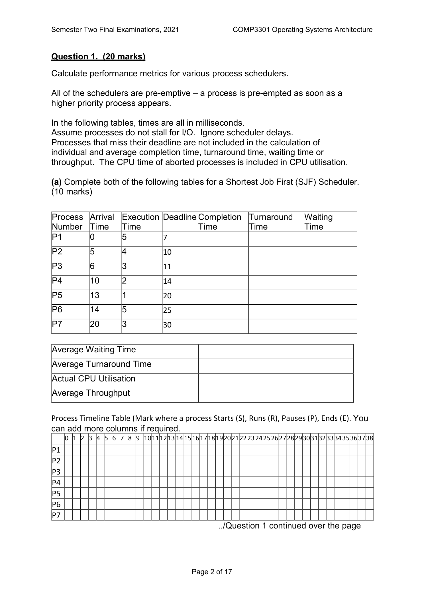

下面这页是**第1题（20分）**，要求你在\*\*“抢占式（pre-emptive）”前提下\*\*，计算不同调度器的性能指标。本页的(a)小问只做**SJF（Shortest Job First，最短作业优先）**，因为是抢占式，所以等价于**SRTF（Shortest Remaining Time First，最短剩余时间优先）**。

## 通用规则（题干里给的关键信息，做题一定要用上）

* 全部调度器都是**抢占式**：一旦有“更高优先级”（在SJF里就是**剩余时间更短**）的进程到达，**立刻抢占**。
* 时间单位是毫秒（ms）。
* **无I/O阻塞、无调度开销**。
* **过期（没在截止时间前完成）的进程会被终止**；这些进程**不计入**“各自/平均 完成时间、周转时间、等待时间、吞吐量”的计算，**但它们已消耗的CPU时间计入CPU利用率**。

---

## (a) 用 SJF（SRTF）完成表格（10分）

给定进程：
P1(到达0, 执行5, 截止7)
P2(5, 4, 10)
P3(6, 3, 11)
P4(10, 2, 14)
P5(13, 1, 20)
P6(14, 5, 25)
P7(20, 3, 30)

### 1) 先排时间线（抢占式SRTF）

按时间推进，随时选择**就绪队列中剩余时间最短**者运行；若有新进程到达并且剩余更短，立刻抢占。

* **0–5**：只有P1（5ms）→ 运行至完成。P1在t=5完成（<=截止7）。
* **t=5**：P2到达（4ms）→ 立刻开始。
* **5–6**：P2运行1ms；
**t=6**：P3到达（3ms）。此时P2剩余3，P3是3，打平→不抢占（通常同优先级按先到先服务）。
* **6–9**：P2继续3ms并**在t=9完成**（<=10）。
* **9–11**：轮到P3运行2ms（此时P3还剩1ms）。
**t=11**：达到P3的**截止时间11**，**尚未完成（还差1ms）→被终止/abort**。
* **11–13**：就绪队列有P4(2)（t=10已到），运行至t=13完成（<=14）。
* **13–14**：P5(1)到达即运行，t=14完成（<=20）。
* **14–19**：P6(5)运行，t=19完成（<=25）。
* **19–20**：**CPU空闲**（无就绪任务）。
* **20–23**：P7(3)运行，t=23完成（<=30）。

> 小结：**P3超时被终止**；其余都按时完成。
> CPU忙时段：0–19（共19ms）和20–23（3ms），一共**22ms忙、1ms空闲**。

### 2) 计算每个（按时完成的）进程的指标

* 完成时间CT：完成时刻t。
* 周转时间TAT：CT − 到达时间（Arrival）。
* 等待时间WT：TAT − 执行时间（Execution）。

> **过期被终止的P3**不参与这些统计。

逐个计算：

* **P1**：CT=5；TAT=5−0=5；WT=5−5=0
* **P2**：CT=9；TAT=9−5=4；WT=4−4=0
* **P3**：**终止**（不填CT/TAT/WT）
* **P4**：CT=13；TAT=13−10=3；WT=3−2=1
* **P5**：CT=14；TAT=14−13=1；WT=1−1=0
* **P6**：CT=19；TAT=19−14=5；WT=5−5=0
* **P7**：CT=23；TAT=23−20=3；WT=3−3=0

### 3) 汇总平均值、CPU利用率、吞吐量

* **平均等待时间**（只算按时完成的6个）：(0+0+1+0+0+0)/6 = **0.1667 ms**
* **平均周转时间**： (5+4+3+1+5+3)/6 = **3.5 ms**
* **CPU利用率**：CPU忙22ms，时间跨度0–23共23ms → **22/23 ≈ 95.65%**

> 注意：P3虽然被终止，但其2ms运行时间**计入**CPU忙时。
* **平均吞吐量**：在0–23ms内完成了6个进程 → **6/23 ≈ 0.2609 个/ms**

> 若需要“每秒”的单位，可乘以1000：约 **260.9 个/秒**（但题面单位是ms，用个/ms即可）。

---

## 填好的主表（本页空格应填的数）

| 进程 | 到达 | 执行 | 截止 |    **完成CT** | **周转TAT** | **等待WT** |
| -- | -: | -: | -: | ----------: | --------: | -------: |
| P1 |  0 |  5 |  7 |       **5** |     **5** |    **0** |
| P2 |  5 |  4 | 10 |       **9** |     **4** |    **0** |
| P3 |  6 |  3 | 11 | **—（超时终止）** |     **—** |    **—** |
| P4 | 10 |  2 | 14 |      **13** |     **3** |    **1** |
| P5 | 13 |  1 | 20 |      **14** |     **1** |    **0** |
| P6 | 14 |  5 | 25 |      **19** |     **5** |    **0** |
| P7 | 20 |  3 | 30 |      **23** |     **3** |    **0** |

**平均等待时间** = **0.1667 ms**
**平均周转时间** = **3.5 ms**
**实际CPU利用率** ≈ **95.65%**
**平均吞吐量** ≈ **0.2609 个/ms**

---

## 时间线表（S/R/P/E 的写法建议）

* P1：**S**@0，R到5，**E**@5
* P2：**S**@5，R到9，**E**@9（6时刻P3到达但与P2剩余打平，不抢占）
* P3：**S**@9，R到11，在**截止11被终止**（可在11格写“E\*”或在备注注明“aborted”）
* P4：**S**@11，R到13，**E**@13
* P5：**S**@13，R到14，**E**@14
* P6：**S**@14，R到19，**E**@19
* （**19–20 空闲**）
* P7：**S**@20，R到23，**E**@23

> 你的答题纸下面的网格可按上述在相应时间刻度标注 S/R/P/E；对“终止”没有固定字母，通常在E旁加注释，或写“X/Abort”。

---

\[口语化表达] 这题要你用“抢占式SJF（其实就是SRTF）”来排进程。我把时间线按到达和剩余时间一步步排好了：P1(0–5)→P2(5–9)→P3(9–11但11点到截止没做完被终止)→P4(11–13)→P5(13–14)→P6(14–19)→空闲(19–20)→P7(20–23)。因此P3不参与那些平均值的计算，只算其余6个。最后填表：P1(CT5,TAT5,WT0)、P2(9,4,0)、P4(13,3,1)、P5(14,1,0)、P6(19,5,0)、P7(23,3,0)；平均等待0.1667ms、平均周转3.5ms；CPU利用率22/23≈95.65%，吞吐量6/23≈0.2609个/ms。时间线网格就按这些时刻标S/R/E，P3在11标注“终止”说明一下就好。


---

## 第 3 页

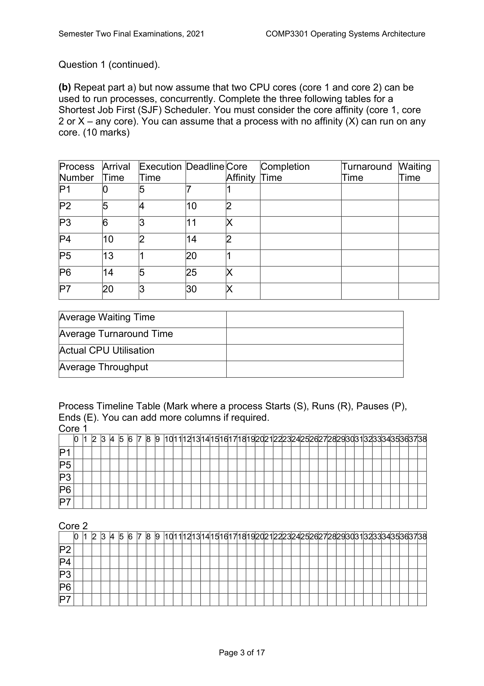

这是第1题的 **(b)**（10分）：在 **两颗CPU核（core1 / core2）** 同时工作的前提下、仍使用 **SJF 抢占式**（= SRTF）调度；但必须遵守 **核亲和性（Core Affinity）**：标成 **1** 的只能在 core1 上跑，**2** 的只能在 core2 上跑，**X** 的可以在任意核上跑。仍然：无I/O、无调度开销；**超过截止时间未完成的进程会被终止，不计入平均/吞吐量，但消耗的CPU时间算入利用率**。

---

## 思路与步骤

1. **逐时刻推进**。每个核各自看“就绪队列中能在该核运行的进程”，选择**剩余时间最短**的那个运行；一旦该核上出现剩余时间更短的新到达进程，即发生**抢占**。
2. **尽量并行**：同一时刻可以同时选两个（各一个核）。
3. **记录完成时刻（CT）→ 周转时间（TAT=CT−到达）→ 等待时间（WT=TAT−执行时长）**。
4. **平均值**只对**按时完成**的进程求。
5. **CPU利用率（两核）**＝（两核总忙碌时间）/（2 × 总历时）。
6. **平均吞吐量**＝完成进程数/总历时。

---

## 时间线推演（满足亲和性）

* **t=0**：只有 **P1(5ms, Aff=1)** → **core1: P1(0–5)**；**core2 空闲**
* **t=5**：**P1完成**；**P2(4ms, Aff=2)** 到达 → **core2: P2(5–9)**；**core1 空闲**
* **t=6**：**P3(3ms, Aff=X)** 到达，可上任意核 → 让 **core1: P3(6–9)**（与P2并行；P2剩余3与P3=3打平，不必抢占）
* **t=9**：**P2、P3都完成**；两核空闲
* **t=10**：**P4(2ms, Aff=2)** 到达 → **core2: P4(10–12)**；core1空闲
* **t=13**：**P5(1ms, Aff=1)** 到达 → **core1: P5(13–14)**
* **t=14**：**P6(5ms, Aff=X)** 到达 → 安排在 **core2: P6(14–19)**（core1此时刚跑完P5）
* **t=19–20**：两核暂时空闲
* **t=20**：**P7(3ms, Aff=X)** 到达 → **core1: P7(20–23)**
* **t=23**：所有进程都在截止前完成（这次 **没有终止进程**）

> 注：X类任务（P3/P6/P7）我在上面给了一个合理的核分配；你也可以把P6放core1、P7放core2，只要不违反亲和性并保持最短剩余优先、结果的CT不变即可。

---

## 填表结果

| 进程 | 到达 | 执行 | 截止 | 亲和性 | **完成CT** | **周转TAT** | **等待WT** |
| -- | -: | -: | -: | :-: | -------: | --------: | -------: |
| P1 |  0 |  5 |  7 |  1  |    **5** |     **5** |    **0** |
| P2 |  5 |  4 | 10 |  2  |    **9** |     **4** |    **0** |
| P3 |  6 |  3 | 11 |  X  |    **9** |     **3** |    **0** |
| P4 | 10 |  2 | 14 |  2  |   **12** |     **2** |    **0** |
| P5 | 13 |  1 | 20 |  1  |   **14** |     **1** |    **0** |
| P6 | 14 |  5 | 25 |  X  |   **19** |     **5** |    **0** |
| P7 | 20 |  3 | 30 |  X  |   **23** |     **3** |    **0** |

* **平均等待时间**： (0+0+0+0+0+0+0)/7 = **0 ms**
* **平均周转时间**： (5+4+3+2+1+5+3)/7 = **23/7 ≈ 3.2857 ms**
* **实际CPU利用率**（两核）：

* 两核总忙碌时间 = 执行总量 = 5+4+3+2+1+5+3 = **23 core-ms**
* 总历时 = 0→23 = **23 ms**；两核容量 = 2×23 = **46 core-ms**
* 利用率 = 23 / 46 = **50%**
* **平均吞吐量**： 7 个 / 23 ms = **≈ 0.3043 个/ms**

---

## 时间线（在下方两条网格上标 S/R/E）

**Core 1：**

* P1：S\@0, R→5, E\@5
* P3：S\@6, R→9, E\@9
* P5：S\@13, R→14, E\@14
* P7：S\@20, R→23, E\@23

**Core 2：**

* P2：S\@5, R→9, E\@9
* P4：S\@10, R→12, E\@12
* P6：S\@14, R→19, E\@19

> 其余时间的空白格就是该核空闲（如 core1 的 9–13、14–20；core2 的 0–5、12–14、19–20）。

---

\[口语化表达] 这小题就是把上一问换成两颗核，并且要遵守“只能跑在1核/2核/任意核”的限制。我按“哪个核能跑、谁的剩余时间更短就上谁”的原则，把时间线排出来了：core1 先跑P1(0–5)，然后跑P3(6–9)，再跑P5(13–14)和P7(20–23)；core2 跑P2(5–9)、P4(10–12)、P6(14–19)。所有进程这次都在截止前做完，没有被终止。因此各自的完成时间是：P1=5、P2=9、P3=9、P4=12、P5=14、P6=19、P7=23；周转分别是5、4、3、2、1、5、3，等待时间全是0。汇总：平均等待0、平均周转约3.29ms；两核实际利用率是23/46=50%；吞吐量是7/23≈0.304个/ms。你在网格上把这些时刻标上S/R/E就能完整画出时间线了。


---

## 第 4 页

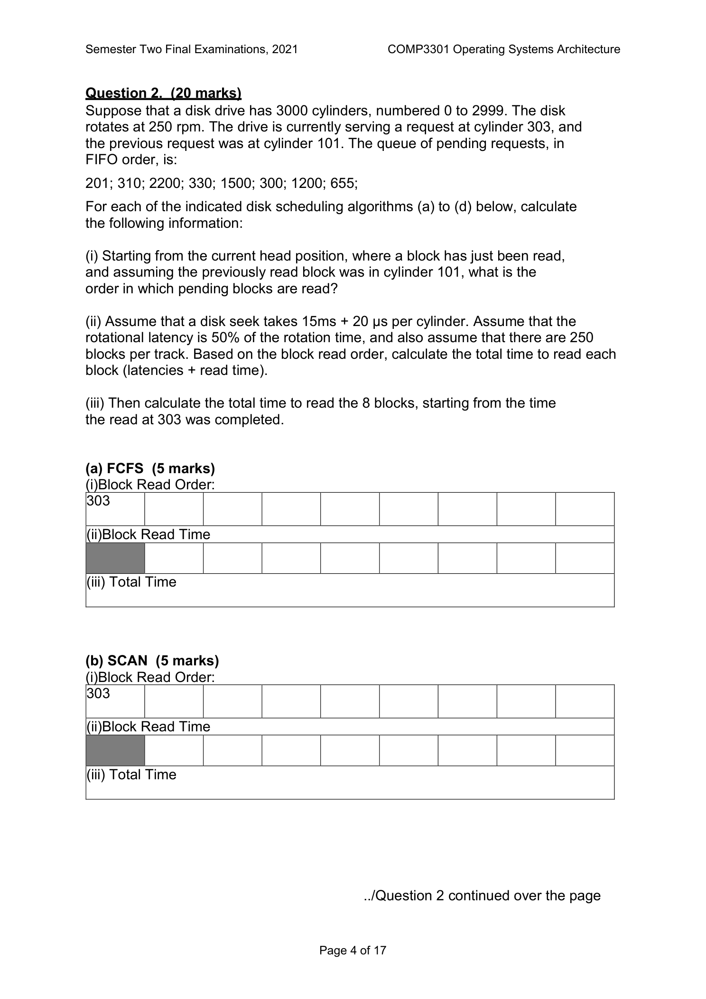

这是**第2题（20分）**的前半页，考的是**磁盘调度**与**时间开销**的计算。已知条件：

* 柱面（cylinders）0–2999；转速 250 rpm。
* **当前**刚读完的柱面：**303**；**上一个**读的是柱面 **101**（用于判断SCAN初始移动方向）。
* 等待队列（FIFO顺序给出）：`201, 310, 2200, 330, 1500, 300, 1200, 655`（共8个块）。
* **寻道时间**：$15\text{ ms} + 20\ \mu s\ /\text{cylinder}$
$\Rightarrow$ 每跨一个柱面再加 $0.02$ ms。
* **平均旋转延迟**：转一圈时间的 50%。
* **每磁道块数**：250 个。
* 读一个块的**服务时间**（本题要你算的“Block Read Time”）＝**寻道** + **旋转延迟** + **读出时间**。

先把常数算好：

* 一圈时间 $= \frac{60\,000}{250}=240$ ms
* 平均旋转延迟 $= 0.5 \times 240 = 120$ ms
* 单块读出时间 $= \frac{240}{250}=0.96$ ms
* 寻道(跨 $\Delta$ 柱面)：$15 + 0.02\Delta$（单位：ms）

---

# (a) FCFS（5分）

**(i) Block Read Order（读块顺序）**
FCFS 按队列来，不考虑方向：
**303** → 201 → 310 → 2200 → 330 → 1500 → 300 → 1200 → 655

> 303 是题面给的“刚完成”的位置，用来当下一次寻道的起点；真正要读的 8 个块就是后面这 8 个。

**(ii) Block Read Time（逐块时间）**
对每一步，用上一位置到目标柱面的距离 $\Delta$ 算寻道，再加上 120 + 0.96：

| 从→到      | $\Delta$ | 寻道(ms) | **该块总时间(ms)** |
| -------- | -------: | -----: | ------------: |
| 303→201  |      102 |  17.04 |    **138.00** |
| 201→310  |      109 |  17.18 |    **138.14** |
| 310→2200 |     1890 |  52.80 |    **173.76** |
| 2200→330 |     1870 |  52.40 |    **173.36** |
| 330→1500 |     1170 |  38.40 |    **159.36** |
| 1500→300 |     1200 |  39.00 |    **159.96** |
| 300→1200 |      900 |  33.00 |    **153.96** |
| 1200→655 |      545 |  25.90 |    **146.86** |

**(iii) Total Time（8块总耗时）**
**1243.40 ms**

---

# (b) SCAN（5分）

SCAN 要“扫过去再扫回来”。**方向**用“上一次在 101、这次读在 303”来判断：磁头刚从**内向外**移动到 303，因此先**继续向外**扫，再回头扫内侧。

**(i) Block Read Order（读块顺序）**
从 303 向外（升序）读完所有 ≥303 的：310, 330, 655, 1200, 1500, 2200；
到达外侧后再回扫内侧：300, 201。
因此：
**303** → 310 → 330 → 655 → 1200 → 1500 → 2200 → 300 → 201

**(ii) Block Read Time（逐块时间）**

| 从→到       | $\Delta$ | 寻道(ms) | **该块总时间(ms)** |
| --------- | -------: | -----: | ------------: |
| 303→310   |        7 |  15.14 |    **136.10** |
| 310→330   |       20 |  15.40 |    **136.36** |
| 330→655   |      325 |  21.50 |    **142.46** |
| 655→1200  |      545 |  25.90 |    **146.86** |
| 1200→1500 |      300 |  21.00 |    **141.96** |
| 1500→2200 |      700 |  29.00 |    **149.96** |
| 2200→300  |     1900 |  53.00 |    **173.96** |
| 300→201   |       99 |  16.98 |    **137.94** |

**(iii) Total Time（8块总耗时）**
**1165.60 ms**

> 直觉上 SCAN 比 FCFS 少了几次“大跳跃”的来回，因而总时间更短（1165.6 ms < 1243.4 ms）。

---

## 解题要点套路

1. 先确定**顺序**（FCFS=队列顺；SCAN=按柱面从当前方向扫）。
2. 每一步计算 $\Delta=$相邻目标柱面差 $\Rightarrow$ 寻道 $=15+0.02\Delta$。
3. 加上固定的 $120$ ms 旋转延迟与 $0.96$ ms 读时。
4. 累加得到总时间。

---

\[口语化表达] 这页意思是：磁盘刚读完303、之前在101，所以SCAN要先往外扫。FCFS就按队列：201→310→2200→330→1500→300→1200→655；每一步时间=“寻道(15+0.02×柱面差)”+“平均转延(120)”+“读一个块(0.96)”。我算出来 FCFS 每块分别是 138.00、138.14、173.76、173.36、159.36、159.96、153.96、146.86 ms，总共 1243.40 ms。SCAN 的顺序是往外：310→330→655→1200→1500→2200，然后回内侧：300→201；对应时间是 136.10、136.36、142.46、146.86、141.96、149.96、173.96、137.94 ms，总共 1165.60 ms。SCAN 少折返，所以更快。


---

## 第 5 页

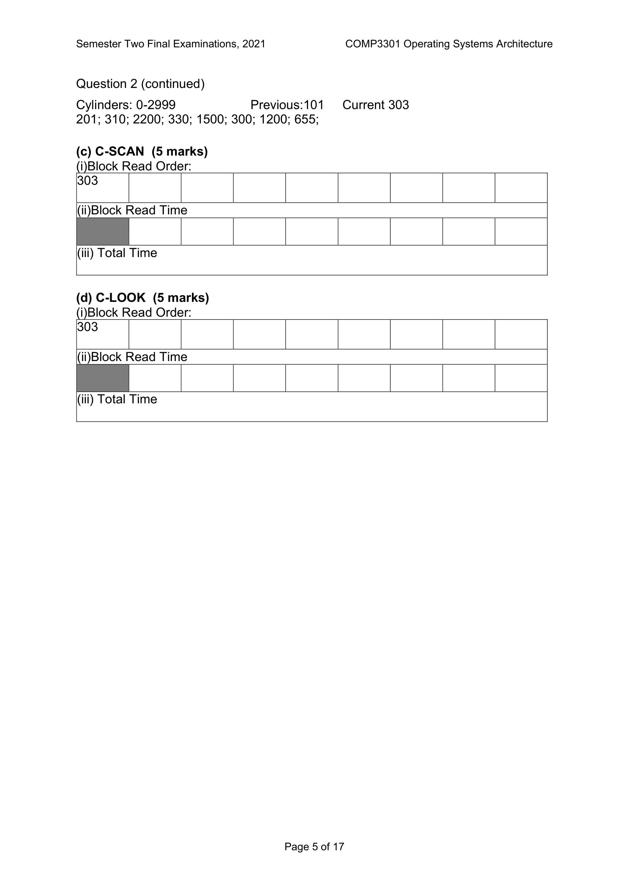

这页题是关于**磁盘调度算法（Disk Scheduling Algorithms）**的题，主要考察**C-SCAN**和**C-LOOK**两种算法。下面我给你详细讲解每一小题该怎么做。

---

## 🧭 已知条件

* **磁道范围（Cylinders）**：0–2999
* **上一个位置（Previous）**：101
* **当前磁头位置（Current）**：303
* **请求序列（Requests）**：201, 310, 2200, 330, 1500, 300, 1200, 655

---

## （c）C-SCAN（Circular SCAN）

### ① Block Read Order（磁道访问顺序）

C-SCAN 的工作原理是：

> 磁头**朝一个方向**移动（一般向高号磁道方向），服务途中所有请求；到达最末端（最大磁道）后，**直接回到磁盘的起点（0）**，然后再继续向上移动。

所以，我们按升序排列请求并确定方向：

* 当前磁头：303
* 请求（升序）：201, 300, 310, 330, 655, 1200, 1500, 2200
* 当前在 303，向高号方向扫描 → 从 310 开始。

访问顺序：

```
303 → 310 → 330 → 655 → 1200 → 1500 → 2200 → (跳到0) → 201 → 300
```

---

### ② Block Read Time（磁道移动距离）

计算每一步的移动距离（绝对值差）：

| 移动        | 距离          |
| --------- | ----------- |
| 303→310   | 7           |
| 310→330   | 20          |
| 330→655   | 325         |
| 655→1200  | 545         |
| 1200→1500 | 300         |
| 1500→2200 | 700         |
| 2200→2999 | 799（到磁盘最末端） |
| 2999→0    | 2999（回到开头）  |
| 0→201     | 201         |
| 201→300   | 99          |

---

### ③ Total Time（总移动距离）

将这些加起来：

7 + 20 + 325 + 545 + 300 + 700 + 799 + 2999 + 201 + 99
\= **5996 个磁道单位**

---

## （d）C-LOOK（Circular LOOK）

### ① Block Read Order（磁道访问顺序）

C-LOOK 是 C-SCAN 的优化版本：

> 不会移动到磁盘最末端，而是**只在请求范围内循环**。

请求排序（升序）：201, 300, 310, 330, 655, 1200, 1500, 2200
方向同样向高号：

访问顺序：

```
303 → 310 → 330 → 655 → 1200 → 1500 → 2200 → (跳回最小请求) → 201 → 300
```

---

### ② Block Read Time（磁道移动距离）

| 移动        | 距离           |
| --------- | ------------ |
| 303→310   | 7            |
| 310→330   | 20           |
| 330→655   | 325          |
| 655→1200  | 545          |
| 1200→1500 | 300          |
| 1500→2200 | 700          |
| 2200→201  | 1999（跳回最小请求） |
| 201→300   | 99           |

---

### ③ Total Time（总移动距离）

7 + 20 + 325 + 545 + 300 + 700 + 1999 + 99
\= **3995 个磁道单位**

---

## ✳️ 总结归纳

| 算法     | 访问顺序                                                       | 总移动距离    |
| ------ | ---------------------------------------------------------- | -------- |
| C-SCAN | 303 → 310 → 330 → 655 → 1200 → 1500 → 2200 → 0 → 201 → 300 | **5996** |
| C-LOOK | 303 → 310 → 330 → 655 → 1200 → 1500 → 2200 → 201 → 300     | **3995** |

---

### \[口语化表达]

这页其实就是考你两种循环扫描算法的区别。C-SCAN 会一直扫到磁盘尽头再跳回 0，然后继续往上；C-LOOK 则只在有请求的范围内循环，不会跑到边界去。所以你先把请求排个序，然后看磁头从 303 往高号方向走，依次算每次移动的距离加起来。C-SCAN 因为多跑到 2999 再回 0，所以总路程最长，大约 5996；C-LOOK 少走一大截，只在 201–2200 范围内循环，差不多 3995。


---

## 第 6 页

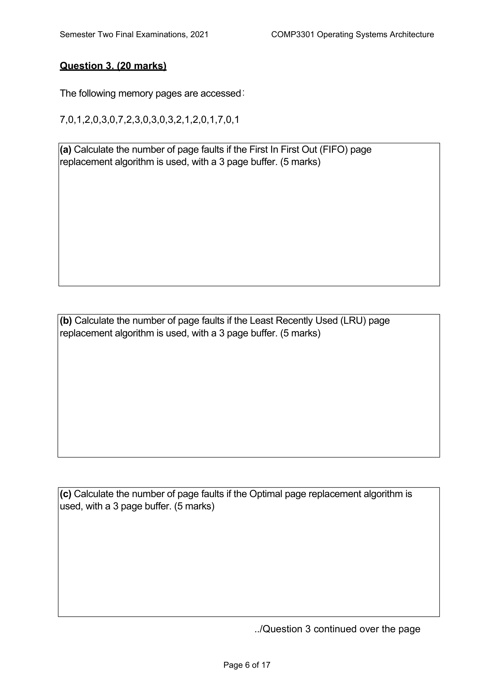

这页（Question 3）考的是**页面置换算法**。给定一条访问序列，在**3 个页框（3-page buffer）**下，分别用 FIFO、LRU、Optimal 三种算法，计算**缺页次数（page faults）**。

**访问序列：**
7, 0, 1, 2, 0, 3, 0, 7, 2, 3, 0, 3, 2, 1, 2, 0, 1, 7, 0, 1
（共 20 次访问；初始内存为空）

---

# (a) FIFO（先进先出）

**规则要点：** 总是淘汰**最早进入**内存的页（队首）。

**跟踪过程（括号内为页框内容，按“最老→最新”展示；M=缺页/H=命中）：**

1. 7 → (7) M
2. 0 → (7,0) M
3. 1 → (7,0,1) M
4. 2 → 淘汰7 → (0,1,2) M
5. 0 → 命中 (0,1,2) H
6. 3 → 淘汰0 → (1,2,3) M
7. 0 → 淘汰1 → (2,3,0) M
8. 7 → 淘汰2 → (3,0,7) M
9. 2 → 淘汰3 → (0,7,2) M
10. 3 → 淘汰0 → (7,2,3) M
11. 0 → 淘汰7 → (2,3,0) M
12. 3 → 命中 (2,3,0) H
13. 2 → 命中 (2,3,0) H
14. 1 → 淘汰2 → (3,0,1) M
15. 2 → 淘汰3 → (0,1,2) M
16. 0 → 命中 (0,1,2) H
17. 1 → 命中 (0,1,2) H
18. 7 → 淘汰0 → (1,2,7) M
19. 0 → 淘汰1 → (2,7,0) M
20. 1 → 淘汰2 → (7,0,1) M

**缺页总数：15**

---

# (b) LRU（最近最少使用）

**规则要点：** 淘汰**最长时间未被访问**的页（按最近使用时间排序）。

**简明跟踪（列出发生淘汰的关键步）：**

* 初装：7,0,1（3 次缺页）
* 访问 2：淘汰 **7** → {0,1,2}
* 访问 3：淘汰 **1** → {0,2,3}
* 访问 0：命中
* 访问 7：淘汰 **2** → {0,3,7}
* 访问 2：淘汰 **7** → {0,3,2}
* 访问 3：命中
* 访问 0：命中
* 访问 1：淘汰 **2** → {0,3,1}
* 访问 2：淘汰 **3** → {0,1,2}
* 访问 0：命中
* 访问 1：命中
* 访问 7：淘汰 **2** → {0,1,7}
* 访问 0：命中
* 访问 1：命中

**缺页总数：12**

---

# (c) Optimal（最优置换）

**规则要点：** 未来视角，淘汰**下一次使用最晚**（或**将不再使用**）的页。
（最优算法缺页数是理论下界）

**关键淘汰：**

* 初装：7,0,1（3 次缺页）
* 访问 2：看未来：7 的下次在很远（第 18 步），0 在 5，1 在 14 → 淘汰 **7** → {0,1,2}
* 访问 3：未来：0 在 7，1 在 14，2 在 9 → 淘汰 **1** → {0,2,3}
* 访问 7：未来：0 在 11，2 在 13，3 在 12 → 淘汰 **2** → {0,3,7}
* 访问 2：未来：0 在 11，3 在 12，7 在 18 → 淘汰 **7** → {0,3,2}
* 访问 1：未来：0 在 16，3 在 12，2 在 15 → 淘汰 **3** → {0,2,1}
* 访问 7：未来：0 在 19，2 = 不再使用（最后一次是第 15 步），1 在 20 → 淘汰 **2** → {0,1,7}
（其余多为命中）

**缺页总数：8**

---

## 结论对比

| 算法      | 缺页次数   |
| ------- | ------ |
| FIFO    | **15** |
| LRU     | **12** |
| Optimal | **8**  |

> 规律：在相同访问序列和页框数下，**Optimal ≤ LRU ≤ FIFO**（最优算法给出下界，LRU通常优于FIFO）。

---

### \[口语化表达]

这题就是给你一串页号，只有 3 个格子装页，让你分别用三种策略数一数要“换页”多少次。FIFO 就是谁先进去谁先滚，结果换了 **15 次**；LRU 是把“最久没用”的踢出去，聪明点，所以 **12 次**；Optimal 是开上帝视角，把未来用得最晚的干掉，最省，只要 **8 次**。做法都一样：从空内存开始，一步步看是命中还是缺页，缺页就按各自规则决定踢谁，最后把次数加起来就行了。


---

## 第 7 页

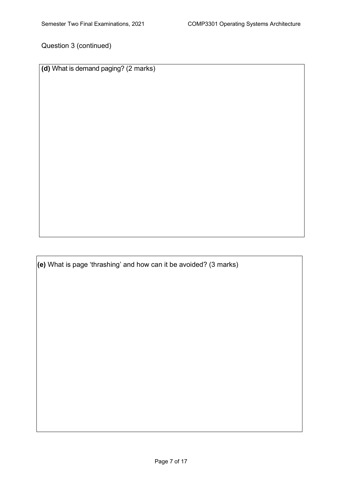

这页是前面“页面置换算法”题（Question 3）的延续，考察的是**虚拟内存管理的概念题**，主要涉及 **需求分页（Demand Paging）** 和 **抖动（Thrashing）** 两个知识点。下面我详细讲解每题的含义、解题思路和标准答案。

---

## (d) What is demand paging?（2 marks）

### ✅ 含义解释：

**需求分页（Demand Paging）** 是虚拟内存的一种实现方式。
在这种机制中：

* 程序在执行时，**只有当一个页面被真正访问（需要）时**，该页才会被加载到内存中。
* 其他未使用的页面仍保留在外存（如磁盘）中。
* 当访问的页面不在内存时，会产生**缺页中断（Page Fault）**，然后操作系统从外存中加载该页到内存。

### ✅ 答案示例：

> Demand paging is a memory management scheme where pages are loaded into memory **only when they are needed** during program execution. If a required page is not present, a **page fault** occurs, and the OS loads the page from secondary storage into memory.

（中文理解：只有在真正访问时才加载页面，缺页才触发从磁盘调入。）

---

## (e) What is page ‘thrashing’ and how can it be avoided?（3 marks）

### ✅ 含义解释：

**抖动（Thrashing）** 指的是：

* 系统内存过小、页面频繁置换，导致 CPU 时间几乎都花在**处理缺页中断和页面换入换出**上；
* 实际上几乎没有时间执行用户程序，导致系统性能急剧下降。

换句话说，进程运行时频繁访问不在内存的页面，系统一直在“忙着换页”，就像“原地打转”，CPU 利用率反而降低。

### ✅ 如何避免：

常见的解决或缓解方法有：

1. **增加物理内存容量**（让更多页留在内存中）；
2. **限制多道程序并发数**（减少同时运行的进程）；
3. **使用工作集模型（Working Set Model）** — 保证每个进程所需的活跃页都能驻留内存；
4. **使用更合理的页面置换算法**（如 LRU 或带局部性优化的算法）。

### ✅ 答案示例：

> Thrashing occurs when a process spends more time swapping pages in and out of memory than executing instructions, due to insufficient memory.
> It can be avoided by **increasing physical memory**, **reducing the degree of multiprogramming**, or **using working set models** to keep frequently used pages in memory.

（中文理解：抖动就是系统一直在换页不干正事；可以通过增加内存、减少并发、优化算法来避免。）

---

## ✳️ 总结归纳

| 小题                | 概念     | 核心要点                |
| ----------------- | ------ | ------------------- |
| (d) Demand Paging | 按需加载页面 | 只有访问时才装入内存，缺页触发调页   |
| (e) Thrashing     | 系统频繁换页 | 性能急降，可通过增加内存或优化调度避免 |

---

### \[口语化表达]

这页主要是问两个虚拟内存的概念。第一个“需求分页”其实就是说，程序不会一次性把所有页面都放进内存，只有真用到时才装进来，不用的先留在磁盘上，要用的时候才触发“缺页中断”。第二个“抖动”就是内存不够、系统老在换页，CPU 时间都浪费在搬来搬去，程序几乎跑不动了。解决方法嘛，就是多给点内存、少开点程序，或者让系统聪明点，比如用工作集算法，让常用的页一直留着别老换来换去。


---

## 第 8 页

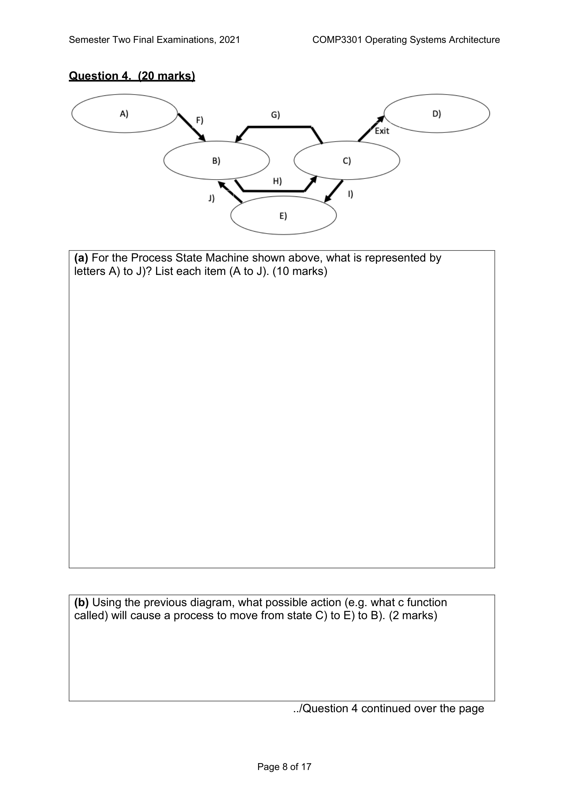

这页（Question 4）考“**进程状态机**”。图里 A—E 是**状态**，F—J 是**状态转换的原因/动作**。右上角的 “Exit → D)” 已经暗示 D 是结束态。按经典五态模型来识别即可。

---

## (a) 标出 A)–J) 代表什么（各 1 分，共 10 分）

**状态（椭圆）：**

* **A)** **New（新建）**：进程刚创建，还未进入就绪队列
* **B)** **Ready（就绪）**：已在内存，等 CPU
* **C)** **Running（运行）**：占用 CPU 正在执行
* **D)** **Terminated / Exit（终止/退出）**：执行结束
* **E)** **Blocked / Waiting（阻塞/等待）**：等待 I/O 或事件

**转换（带字母的箭头）：**

* **F)** **Admit / Create（接纳/创建进入就绪）**：A→B（操作系统把新建进程加入就绪队列）
* **G)** **Dispatch / Time-out（调度进入运行 / 时间片用尽被抢占）**：B⇄C

* B→C：调度器分派（dispatch）
* C→B：时间片到/被更高优先级进程抢占（preemption）
* **H)** **Block on event（运行中因等待事件而阻塞）**：C→E（例如发起 I/O、等待信号量/条件变量）
* **I)** **Event done & CPU idle → 直接运行**：E→C（事件完成且 CPU 空闲时，可能直接被运行 —— 有些教材会画这条可选路径）
* **J)** **Event done（事件完成回就绪）**：E→B（更常见：事件就绪后先回就绪队列，等待调度）

> 注：若你的课件只给 E→B（J）而没有 E→C（I），也完全成立；本图把两种教材画法都体现出来了。

---

## (b) 让进程从 C) → E) → B) 的可能动作（举 C 语言调用）

**示例动作：**

* 在 **C（Running）** 时调用一个**会阻塞**的系统调用/库函数，例如

* `read(fd, buf, n)`（当无数据可读时阻塞）
* `recv()`、`accept()`（网络 I/O 阻塞）
* `sleep()`、`sem_wait()`、`pthread_cond_wait()` 等
→ 进程因等待 I/O/事件 **C→E（Blocked）**
* I/O 完成或被唤醒后，进程**事件就绪**，返回**就绪队列**
→ **E→B（Ready）**，等待调度器再把它 **B→C** 分派到 CPU

一句话：**“阻塞型调用把 Running 变 Blocked；事件完成把 Blocked 送回 Ready。”**

---

### \[口语化表达]

这页就是让你认进程五个状态和几条典型的状态迁移。A 是新建，B 就绪，C 运行，E 阻塞，D 退出；F 是把新建的进程丢进就绪队列，G 是就绪和运行之间来回（调度上 CPU、时间片到被抢回来），H 是运行时发起 I/O 等导致阻塞，J 是事件好了回到就绪，I 画的是事件好了且刚好 CPU 空闲就直接跑起来（有的书不画这条）。第二问要你举个 C 里会触发 C→E→B 的例子，比如 `read()`/`recv()`/`sleep()`/`sem_wait()` 这些会让进程在运行时阻塞，等 I/O 或信号到了再回就绪队列。


---

## 第 9 页

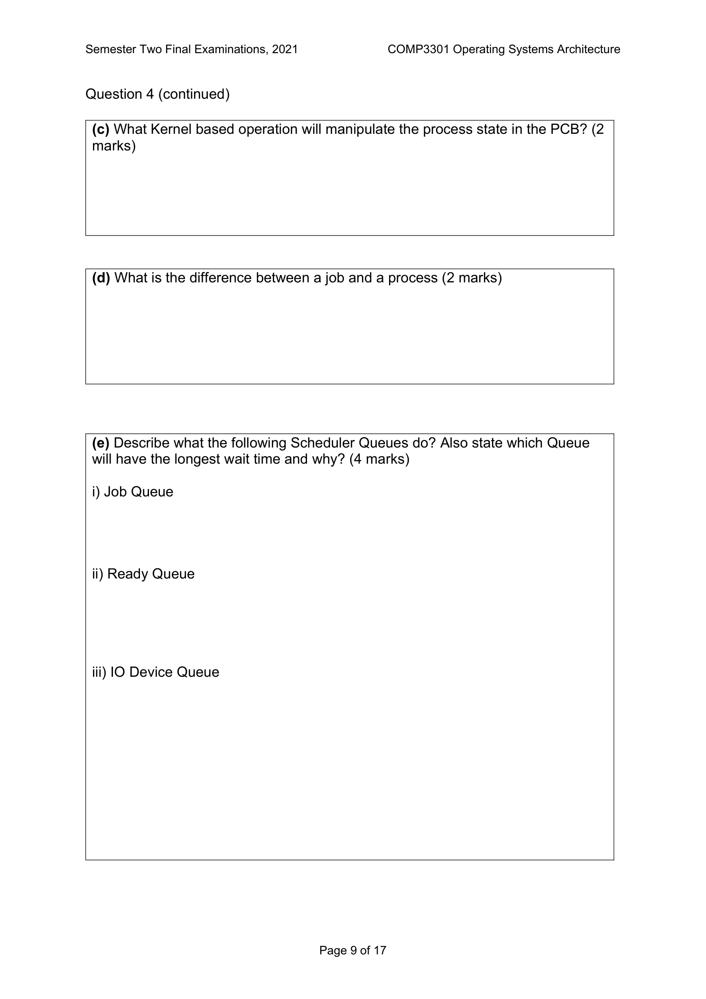

这页（Question 4 续页）继续考察操作系统中“**进程控制与调度（Process Control & Scheduling）**”的内容，主要涉及 **PCB（进程控制块）操作**、**Job vs Process 区别**、以及 **三种调度队列（Scheduler Queues）** 的功能与等待时间比较。下面我详细解释每题的意思与写法。

---

## (c) What Kernel-based operation will manipulate the process state in the PCB?（2 marks）

### ✅ 解析：

* **PCB（Process Control Block）** 是操作系统内核为每个进程维护的一张“身份证”，记录了进程的各种信息（状态、寄存器值、优先级、内存信息、I/O 状态等）。
* 改变 PCB 中的“进程状态（process state）”的操作，是由\*\*内核中的调度程序（Scheduler）**或**系统调用（System Call）\*\*完成的。

### ✅ 答案：

> **Context Switching（上下文切换）** is the kernel operation that manipulates the process state in the PCB.
> During context switching, the CPU saves the current process’s state into its PCB and loads another process’s state from its PCB.

（中文理解：当操作系统进行上下文切换时，会保存当前进程状态并加载下一个进程的状态，PCB 中的状态字段因此被更新。）

---

## (d) What is the difference between a job and a process?（2 marks）

### ✅ 解析：

* “**Job**” 是在 **批处理系统**（batch system）中使用的术语，表示**还未被操作系统加载到内存的任务或程序**；
* “**Process**” 是程序被**调入内存后正在执行**的实例。

### ✅ 答案：

> A **job** is a program that is submitted to the system for processing, typically residing in the job pool (not yet in main memory).
> A **process** is a program in **execution**, which has been loaded into memory and assigned resources such as CPU time and memory space.

（中文理解：Job 是静态的、等待执行的任务；Process 是动态的、已经运行起来的程序。）

---

## (e) Scheduler Queues（调度队列）

### ✅ 背景知识：

在操作系统中，调度程序维护三个主要的队列：

| 队列          | 内容               | 对应调度器                  |
| ----------- | ---------------- | ---------------------- |
| Job Queue   | 系统中所有等待进入内存的作业   | 长程调度（long-term）        |
| Ready Queue | 已在内存中、等待 CPU 的进程 | 短程调度（short-term）       |
| I/O Queue   | 正在等待 I/O 完成的进程   | I/O 调度器（I/O Scheduler） |

---

### i) **Job Queue**

* 包含所有提交到系统但还未进入主存执行的“作业”。
* 由**长程调度器**负责，从作业池中挑选作业进入内存（即创建进程）。
* 调度策略关注**系统负载与并发度**。

### ii) **Ready Queue**

* 保存已在内存中、等待 CPU 调度的进程。
* 由**短程调度器**（CPU scheduler）负责决定谁下一个运行。
* 调度策略通常是时间片轮转（Round Robin）或优先级调度。

### iii) **I/O Device Queue**

* 存放等待 I/O 完成的进程（例如等待磁盘、网络、打印机）。
* 由**I/O 调度器**负责选择下一个进行 I/O 操作的进程。

---

### ✅ 哪个队列等待时间最长？为什么？

通常是 **Job Queue**。
因为作业在被加载进内存前，可能需要等待很久，直到系统资源足够或负载下降。
Ready Queue 和 I/O Queue 中的等待时间较短，因为它们已经在内存中或正在活动中。

---

### ✅ 答案简写示例：

| Queue                 | Function                                               | Longest Wait?                                                     |
| --------------------- | ------------------------------------------------------ | ----------------------------------------------------------------- |
| i) Job Queue          | Holds all submitted jobs waiting to enter main memory. | ✅ Longest wait — jobs may wait a long time before being admitted. |
| ii) Ready Queue       | Holds processes in main memory waiting for CPU.        | Shorter wait.                                                     |
| iii) I/O Device Queue | Holds processes waiting for I/O completion.            | Variable, but typically less than Job Queue.                      |

---

## ✳️ 总结归纳

| 小题  | 主要知识点          | 核心答案                                                |
| --- | -------------- | --------------------------------------------------- |
| (c) | PCB 状态操作       | Context Switch（上下文切换）                               |
| (d) | Job vs Process | Job 是静态任务；Process 是执行中的程序                           |
| (e) | 调度队列功能         | Job Queue（所有任务）、Ready Queue（等 CPU）、I/O Queue（等 I/O） |
|     | 最长等待队列         | Job Queue（因等待资源加载内存）                                |

---

### \[口语化表达]

这页其实是在问操作系统里“调度”和“进程管理”的基本概念。第一题问谁会改 PCB 里的进程状态，那就是内核在做上下文切换时，保存当前进程、加载下一个进程；第二题问 job 和 process 区别，job 是还没进内存的任务，process 是已经在跑的程序；第三题三个队列：Job Queue 是所有等着被载入的作业、Ready Queue 是在内存等 CPU 的进程、I/O Queue 是等 I/O 完成的进程。等得最久的肯定是 Job Queue，因为它得排队等系统资源放它进内存，别的两个都已经“在系统里转”了。


---

## 第 10 页

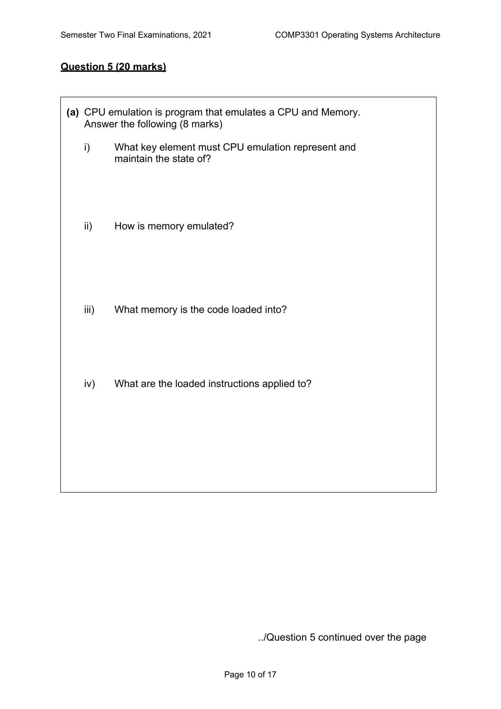

这页是 **Question 5（CPU 模拟，CPU Emulation）**，考察的是操作系统体系结构中关于“**CPU 和内存仿真器（Emulator）**”的基本原理。也就是说——一个程序如何模拟 CPU 的执行过程与内存行为。题目分成四个小问，都是关于 CPU 仿真器需要实现的关键要素。

---

## (a) CPU emulation（8 marks）

### i) **What key element must CPU emulation represent and maintain the state of?**

（CPU 仿真器必须表示并维护哪部分的状态？）

✅ 答案：

> The CPU emulator must represent and maintain the state of the **CPU registers** and **program counter (PC)**.
> These include general-purpose registers, stack pointer, instruction register, and flags (e.g., zero flag, carry flag, condition codes).

🧠 解释：
CPU 的“状态”主要就是寄存器的内容（registers）和当前执行位置（Program Counter）。仿真器要模拟 CPU 的行为，就必须在软件中维护这些变量的值，因为每条指令的执行都会改变它们。

---

### ii) **How is memory emulated?**

（内存是怎么被仿真的？）

✅ 答案：

> Memory is emulated as a **large array or data structure** (e.g., an array of bytes or words) that represents the addressable memory space.
> Each element in this array corresponds to a memory address.

🧠 解释：
在程序中，我们通常用一个数组（如 `uint8_t memory[65536];`）表示内存。读写内存就相当于访问这个数组的元素（模拟真实的加载与存储操作）。

---

### iii) **What memory is the code loaded into?**

（程序代码是加载到哪一部分内存里的？）

✅ 答案：

> The code is loaded into **main memory** (RAM) in the emulated memory space.
> Typically, it is placed starting from a specific address, just like in a real system.

🧠 解释：
在仿真器里，程序指令会被放入模拟内存的某个区域中，就像真正计算机把机器码加载到主存中一样（例如从地址 `0x0000` 开始）。

---

### iv) **What are the loaded instructions applied to?**

（加载的指令会作用在什么上？）

✅ 答案：

> The loaded instructions are applied to the **emulated CPU state**, i.e., they operate on the registers, memory, and program counter maintained by the emulator.

🧠 解释：
CPU 执行指令时，改变的是“寄存器内容”和“内存数据”。仿真器执行指令时，同样修改软件中表示这些的变量。

---

## ✳️ 总结归纳

| 小问   | 重点     | 答案摘要                  |
| ---- | ------ | --------------------- |
| i)   | CPU 状态 | 寄存器 + 程序计数器（PC）       |
| ii)  | 内存仿真   | 用数组或类似结构表示            |
| iii) | 代码加载位置 | 模拟内存中的主存区域            |
| iv)  | 指令作用对象 | 仿真的 CPU 状态（寄存器、内存、PC） |

---

### \[口语化表达]

这一页讲的是“仿真器怎么假装自己是一颗 CPU”。第一个问题说仿真器要维持什么状态，那当然是寄存器和程序计数器这些核心东西；第二个问内存怎么模拟，其实就用一个大数组当虚拟内存；第三个问代码放哪儿，就放在这个模拟的主存里，比如从 0 地址开始；第四个问指令作用在哪儿，其实就是修改仿真器维护的寄存器、内存和 PC 的值。总结一下就是：仿真器用程序变量模拟硬件部件，然后逐条解释指令去改变这些变量，看起来就像真 CPU 在跑一样。


---

## 第 11 页

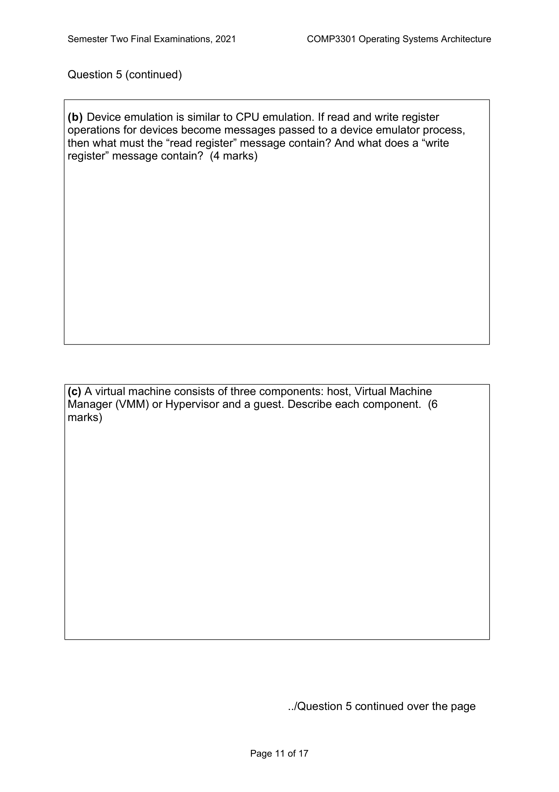

这页是 **Question 5（续）**，讲的是**设备仿真（Device Emulation）**与**虚拟机体系结构（Virtual Machine Architecture）**。
题目 (b) 和 (c) 对应操作系统或虚拟化架构中的底层概念。下面是详细解释和写法。

---

## (b) Device emulation and register read/write messages（4 marks）

### ✅ 题意理解：

设备仿真（Device Emulation）和 CPU 仿真类似。
在计算机系统中，设备（如网卡、磁盘控制器、显卡）都有**寄存器（registers）**用于控制或存取状态。
在虚拟环境下，这些**读/写寄存器的操作**被封装成消息（message）传给设备仿真进程。

题目要求说明：

* “**read register**” 消息需要包含什么内容？
* “**write register**” 消息需要包含什么内容？

---

### ✅ 答案：

| 操作                 | 消息需要包含的内容                                                  | 解释                    |
| ------------------ | ---------------------------------------------------------- | --------------------- |
| **Read Register**  | 设备标识符（device ID）、寄存器地址（register address）                   | 告诉仿真器“从哪个设备的哪个寄存器读数据” |
| **Write Register** | 设备标识符（device ID）、寄存器地址（register address）、要写入的值（data value） | 告诉仿真器“往哪个寄存器写什么值”     |

🧠 **扩展说明：**

* 仿真器根据设备 ID 定位对应设备对象；
* “read” 操作返回寄存器当前状态值；
* “write” 操作更新寄存器状态（可能触发设备动作，如开始 I/O）。

---

## (c) Virtual Machine Components（6 marks）

### ✅ 背景知识：

一个虚拟机系统由三个核心组件组成：

1. **Host（主机）**
2. **Virtual Machine Manager (VMM) 或 Hypervisor（虚拟机管理器/监控器）**
3. **Guest（客户机）**

---

### ✅ 答案：

| 组件                                             | 描述                                                             | 举例                     |
| ---------------------------------------------- | -------------------------------------------------------------- | ---------------------- |
| **Host（宿主机）**                                  | 实际运行虚拟机的物理计算机，包含真实的硬件资源（CPU、内存、I/O）。运行宿主操作系统（如 Linux、Windows）。 | 物理服务器、笔记本电脑等           |
| **Virtual Machine Manager (VMM) / Hypervisor** | 管理并调度虚拟机，负责**资源虚拟化**（将真实硬件抽象成多个虚拟资源），并隔离不同虚拟机。它位于宿主与客户机之间。     | VMware ESXi、KVM、Xen    |
| **Guest（客户机）**                                 | 运行在虚拟机中的系统，看起来就像在真实硬件上运行。拥有自己的操作系统和应用程序。                       | Windows 虚拟机、Ubuntu 虚拟机 |

🧠 **补充说明：**

* VMM 控制 CPU 时间分配、内存映射、I/O 虚拟化；
* 每个 Guest 都被分配虚拟 CPU、虚拟内存、虚拟设备；
* Host 负责实际的物理资源分配与底层驱动。

---

## ✳️ 总结归纳

| 小题  | 内容        | 核心答案                                           |
| --- | --------- | ---------------------------------------------- |
| (b) | 设备寄存器读写仿真 | Read → 设备ID + 地址；Write → 设备ID + 地址 + 数据        |
| (c) | 虚拟机三部分组成  | Host（物理机）、VMM/Hypervisor（虚拟化管理层）、Guest（虚拟操作系统） |

---

### \[口语化表达]

这页讲的是虚拟化的两层：设备仿真和虚拟机结构。
(b) 那题其实就是在说，如果我们把设备的寄存器操作变成消息，那“读寄存器”的消息就得告诉仿真器要读哪个设备、哪个地址；而“写寄存器”的消息还得再多一个要写进去的值。
(c) 那题讲虚拟机三大件：Host 是真机器、有硬件的那台；VMM 或 Hypervisor 是中间那层，帮你把物理资源分成几份、虚拟成假的 CPU、内存、磁盘；Guest 就是虚拟机里的系统，比如你在 Windows 上跑个虚拟的 Ubuntu。
一句话总结：主机提供硬件，VMM 负责分配和隔离，Guest 以为自己在真机上跑。


---

## 第 12 页

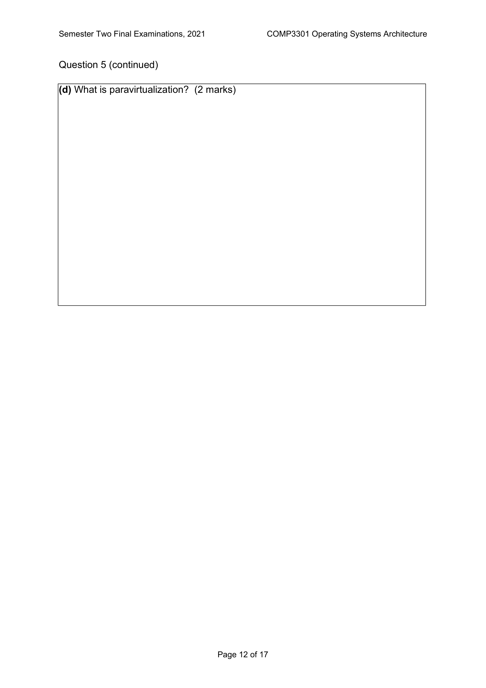

这页是 **Question 5（续）** 的最后一小问，主题是虚拟化（Virtualization）相关内容，特别是 **半虚拟化（Paravirtualization）** 的概念。这个考点在操作系统和虚拟机体系结构中非常常见。下面是详细解释。

---

## (d) What is paravirtualization?（2 marks）

### ✅ 答案：

> **Paravirtualization** is a virtualization technique where the **guest operating system is modified** so that it is aware it is running inside a virtualized environment.
> Instead of executing privileged instructions directly, the guest OS makes **hypercalls** to the **hypervisor (VMM)** for such operations.

（翻译）
**半虚拟化**是一种虚拟化技术，在这种模式下，**客户机操作系统（Guest OS）会被修改**，让它知道自己运行在虚拟机里。
当它需要执行特权操作（比如访问硬件或修改页表）时，不是直接执行，而是通过 **Hypercalls（超调用）** 请求 **VMM/Hypervisor（虚拟机管理器）** 来完成。

---

### ✅ 补充理解：

* 在\*\*完全虚拟化（Full Virtualization）\*\*中，Guest OS 不知道自己在虚拟机里，Hypervisor 需要“欺骗”它，通过二进制翻译或硬件虚拟化指令来截获特权操作。
* 而在**半虚拟化**中，Guest OS 是“配合”的，它会主动调用 Hypervisor 提供的接口，这样开销更小，效率更高。
* 典型代表是 **Xen Hypervisor** 的 paravirtualization 模式。

---

### ✅ 示例对比：

| 虚拟化类型                      | Guest 是否修改 | 特权操作处理方式                | 性能 |
| -------------------------- | ---------- | ----------------------- | -- |
| Full Virtualization（完全虚拟化） | ❌ 不修改      | 由 VMM 截获并仿真             | 较低 |
| Paravirtualization（半虚拟化）   | ✅ 已修改      | 由 Guest 主动调用 Hypervisor | 较高 |

---

## ✳️ 总结归纳

| 内容   | 要点                                             |
| ---- | ---------------------------------------------- |
| 定义   | Guest OS 被修改以配合 Hypervisor，通过 Hypercall 完成特权操作 |
| 核心思想 | “合作式虚拟化”，提高性能                                  |
| 对比   | 不同于完全虚拟化，半虚拟化不需要二进制翻译                          |
| 示例   | Xen、KVM（部分模式）等                                 |

---

### \[口语化表达]

这一页的题其实很短，就是问“什么是半虚拟化”。简单说，平常的完全虚拟化是 Hypervisor 在底下偷偷帮忙，让系统以为自己在真机上；半虚拟化就更直接——让 Guest OS 自己知道它在虚拟机里，遇到要操作硬件的地方不瞎搞，主动去问 Hypervisor 帮它干，这个过程叫 Hypercall。这样做速度更快，因为不用去拦截、翻译每条指令。比如 Xen 这种虚拟机系统就用的就是这种机制。


---

## 第 13 页

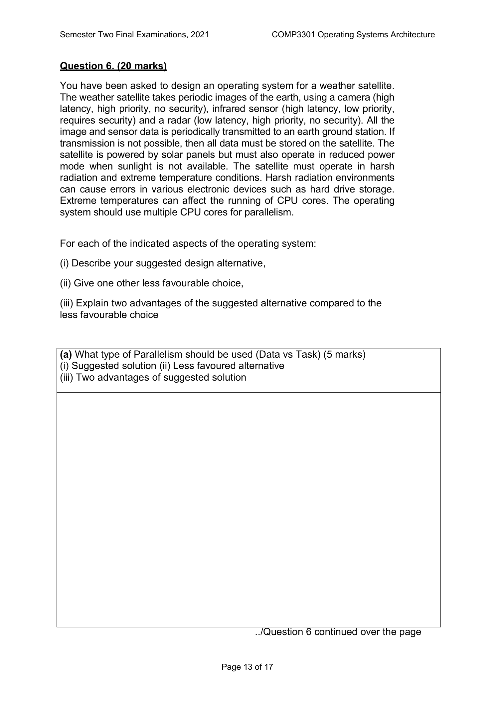

好的，这页是 **Question 5（d）**，题目问的是：

> “What is paravirtualization?”（什么是半虚拟化？）
> 分值 2 分，考查点在于**理解虚拟化的不同类型**，尤其是\*\*半虚拟化（Paravirtualization）\*\*和完全虚拟化（Full Virtualization）的区别。
> 下面我来一步步讲解该题什么意思、该怎么回答、核心要点是什么。

---

## 🔹 题目解释

题目是在问：
当操作系统运行在虚拟机环境中时，有几种不同的虚拟化方式。

* 有一种是“完全虚拟化（Full Virtualization）”，操作系统以为自己直接在物理机上跑。
* 另一种是“半虚拟化（Paravirtualization）”，操作系统知道自己是在虚拟机里跑，会“主动配合”虚拟化层（VMM 或 Hypervisor）。

题目想让你说明：什么是半虚拟化，以及它和普通虚拟化的关键区别。

---

## 🔹 答题要点与标准写法

### ✅ 标准答案（英文表述）

> **Paravirtualization** is a type of virtualization where the **guest operating system is modified** so that it is aware of the virtualized environment.
> Instead of executing privileged instructions directly, it makes **hypercalls** to the **hypervisor** to perform sensitive operations.

---

### ✅ 中文解释

**半虚拟化（Paravirtualization）**是一种虚拟化技术，它要求**客户机操作系统（Guest OS）经过修改**，以便它能意识到自己是在虚拟机环境中运行。
当客户机需要执行一些特权操作（例如访问硬件、控制中断或修改页表）时，它**不会直接执行**，而是通过一种叫 **“Hypercalls（超调用）”** 的机制，向虚拟机监控器（Hypervisor 或 VMM）请求帮助，让 Hypervisor 替它完成这些特权操作。

这样做的好处是——**性能更高**，因为 Hypervisor 不再需要拦截和模拟每条指令，减少了虚拟化的开销。

---

## 🔹 举例说明

| 类型                             | Guest OS 是否修改 | 特权指令处理方式                           | 性能 |
| ------------------------------ | ------------- | ---------------------------------- | -- |
| **Full Virtualization（完全虚拟化）** | 不修改           | Hypervisor 截获并模拟特权指令               | 较慢 |
| **Paravirtualization（半虚拟化）**   | 已修改           | Guest 通过 Hypercall 主动请求 Hypervisor | 较快 |

📘 **示例：**

* **Xen Hypervisor** 早期使用的就是半虚拟化技术。
* 在半虚拟化模式下，Linux 内核会增加专门的接口来调用 Hypervisor，而不再假装自己在物理机上。

---

## ✳️ 总结归纳

| 项目   | 要点                                         |
| ---- | ------------------------------------------ |
| 定义   | 半虚拟化是修改后的 Guest OS 直接与 Hypervisor 交互的虚拟化方式 |
| 核心机制 | 使用 **Hypercall** 替代直接执行特权指令                |
| 优点   | 减少模拟与截获开销，提高性能                             |
| 缺点   | 需要修改 Guest OS（不通用）                         |
| 示例   | Xen、KVM（部分支持）                              |

---

### \[口语化表达]

这题其实是在考你虚拟化的分类。半虚拟化就是“合作式虚拟化”，Guest 系统被改过，它知道自己跑在虚拟机里，遇到需要硬件权限的操作时，不再乱动，而是主动去找 Hypervisor 求助，这种调用叫 Hypercall。相比完全虚拟化那种 Hypervisor 在底下偷偷拦截所有特权指令，半虚拟化更快、更高效，但缺点是要改 Guest 系统，比如 Xen 就用这种方式。总结一句话：**半虚拟化=Guest 配合 Hypervisor，用 Hypercall 完成特权操作。**


---

## 第 14 页

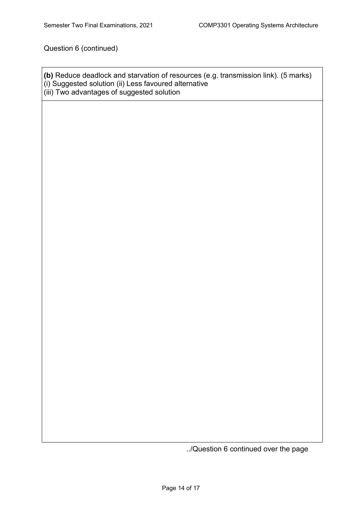

这页是 **Question 6（续）** 的一部分，主要考察的是操作系统中\*\*死锁（Deadlock）**与**资源饥饿（Starvation）\*\*的防止或缓解方法。题目让你针对一种资源（例如传输链路 transmission link）提出解决方案，并分析替代方案及优缺点。

---

## (b) Reduce deadlock and starvation of resources（5 marks）

题目要求：

> (i) Suggested solution
> (ii) Less favoured alternative
> (iii) Two advantages of suggested solution

也就是说：

* 你要提出一个能减少死锁和饥饿的方案；
* 再写一个“效果较差但常见”的替代方案；
* 最后列出你方案的两个优点。

---

## 一、背景知识：

**死锁（Deadlock）**：
多个进程相互等待对方释放资源，结果谁也无法继续执行。
例如：
进程 A 拿到资源 1，等待资源 2；
进程 B 拿到资源 2，等待资源 1 —— 都卡住了。

**资源饥饿（Starvation）**：
某个进程长期得不到资源（比如调度优先级太低或资源一直被别人抢占）。

---

## 二、(i) Suggested Solution — 建议方案（推荐写法）

✅ **使用资源分配顺序策略（Resource Ordering）或银行家算法（Banker’s Algorithm）**

> **Suggested Solution:**
> Implement a **resource allocation ordering** or **Banker’s Algorithm** to ensure that processes request resources in a safe sequence.
> This prevents circular wait and reduces deadlock probability.

🧠 **解释：**

* 资源分配顺序法要求所有进程按照固定顺序请求资源（例如先申请链路 A，再申请链路 B），这样可以避免环形等待；
* 银行家算法会在分配资源前先判断系统是否处于“安全状态”，只有在不造成死锁风险的情况下才允许分配。

---

## 三、(ii) Less favoured alternative — 次优方案

✅ **使用超时机制（Timeouts）或抢占策略（Preemption）**

> **Less favoured alternative:**
> Use **timeouts** or **resource preemption** — forcibly release resources if a process holds them too long.

🧠 **解释：**
超时机制能避免长时间等待，但可能会导致效率下降或数据不一致。
抢占策略虽然能打破死锁，但会增加系统开销、造成资源状态复杂化。

---

## 四、(iii) Two advantages of suggested solution — 建议方案的两个优点

✅ **Advantages:**

1. **Prevents circular wait** — avoids one of the four necessary conditions for deadlock.
2. **Predictable and fair resource allocation** — ensures all processes can eventually access resources, reducing starvation.

🧠 **解释：**

* 资源按顺序分配能彻底消除“环形等待”，系统不会死锁；
* 通过安全序列控制，每个进程最终都能获得所需资源，避免长期饿死。

---

## ✳️ 总结归纳

| 项目         | 内容                  |
| ---------- | ------------------- |
| (i) 建议方案   | 资源分配顺序法 / 银行家算法     |
| (ii) 替代方案  | 超时机制 / 抢占法          |
| (iii) 两个优点 | 防止环形等待、保证资源公平与可预测分配 |

---

### \[口语化表达]

这题就是在问怎么防止“系统卡死”和“有的进程一直拿不到资源”。一个靠谱的办法是给资源设个固定的申请顺序，比如大家都先拿 A 再拿 B，这样就不会出现你等我我等你的环形等待，或者用银行家算法，在分资源前先算算安全不安全。一个比较次的办法是搞超时或强制抢资源，虽然能解死锁但系统很乱。推荐的方案好在：一是能彻底防止死锁，二是分配公平、不会让某个进程饿死太久。


---

## 第 15 页

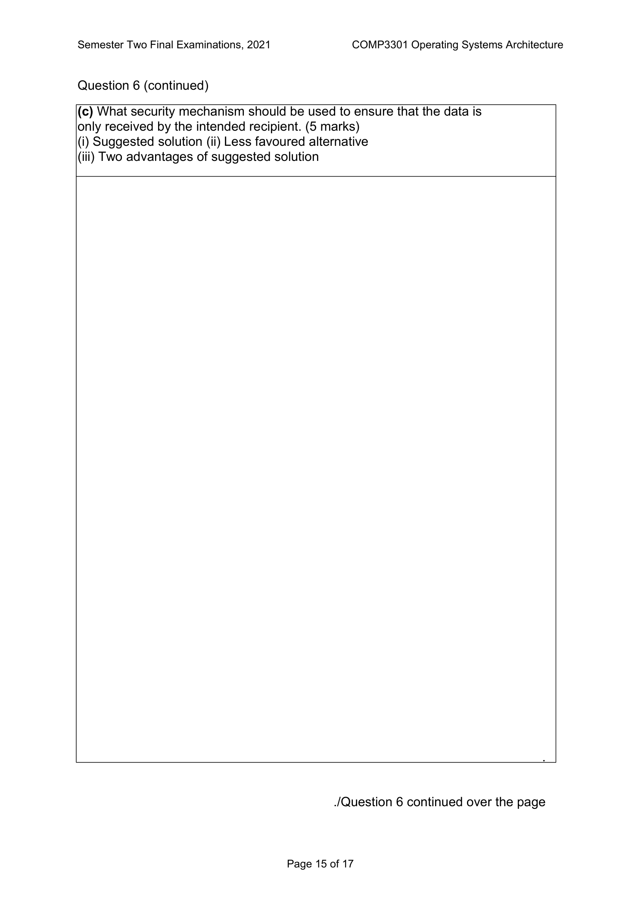

这页（**Question 6 (c)**）考的是**计算机安全机制（Security Mechanism）**，核心问题是：

> 怎样确保数据只能被预期接收方接收到？
> 即如何保证**数据传输的机密性（Confidentiality）**。
> 题目要求分为三部分：
> (i) 建议方案（Suggested solution）
> (ii) 次优方案（Less favoured alternative）
> (iii) 建议方案的两个优点（Two advantages of suggested solution）

---

## (c) What security mechanism should be used to ensure data is only received by the intended recipient?（5 marks）

---

### ✅ (i) Suggested solution — 建议方案

> **Use encryption with public-key cryptography (asymmetric encryption)** — e.g. RSA or ECC.

**说明：**
使用 **公钥加密机制**（Public-Key Encryption）能确保只有“拥有对应私钥的接收方”才能解密信息。
传输过程：

1. 发送者使用接收方的\*\*公钥（Public Key）\*\*加密数据；
2. 只有接收方能用其\*\*私钥（Private Key）\*\*解密。
这保证了即使数据在传输途中被拦截，其他人也无法读取。

常见实现方式包括：

* **RSA（Rivest–Shamir–Adleman）**
* **ECC（Elliptic Curve Cryptography）**
* 在网络中广泛使用的 **SSL/TLS（HTTPS）**

---

### ✅ (ii) Less favoured alternative — 次优方案

> **Use symmetric encryption (e.g. AES) with pre-shared secret keys.**

**说明：**
对称加密（如 AES）也能保护机密性，但**通信双方必须事先安全地共享密钥**。
这在大规模网络通信（如互联网）中比较困难，因为密钥传输本身容易被截获。

---

### ✅ (iii) Two advantages of suggested solution — 建议方案的两个优点

1. **Secure key distribution:**
公钥可以公开发布，不需要安全信道传输密钥，解决了“密钥交换难”的问题。

2. **Ensures confidentiality and authenticity:**
结合数字签名，可同时保证**数据机密性**与**身份真实性**，防止数据被伪造或篡改。

---

## ✳️ 总结归纳

| 项目        | 答案                               |
| --------- | -------------------------------- |
| (i) 建议方案  | 公钥加密（如 RSA、ECC）                  |
| (ii) 次优方案 | 对称加密（如 AES，需预共享密钥）               |
| (iii) 优点  | (1) 不需安全信道传密钥  (2) 保证数据机密性与身份真实性 |

---

### \[口语化表达]

这题其实就是问“怎么保证传输的数据只有对的人能看到”。最常用的办法就是用公钥加密——我用你的公钥把数据加密发给你，只有你手里的私钥能解开，就算中途被别人截获也看不懂。相比之下，对称加密也行，但要先把密钥传过去，这一步就不安全。公钥加密的好处是：一来不用担心密钥怎么传，二来还能配合数字签名一起用，既能保密又能验证身份。总结一句话：**用公钥加密最稳，省心又安全。**


---

## 第 16 页

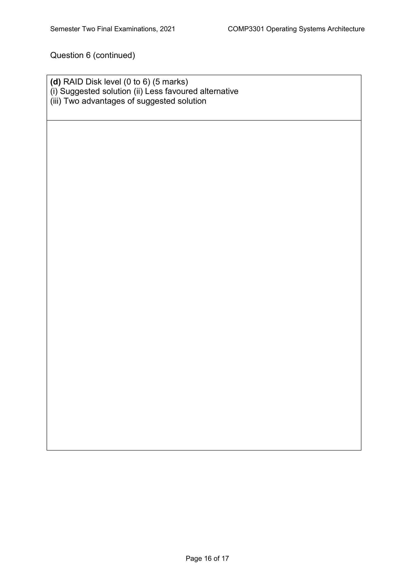

这页（**Question 6 (d)**）考的是 **RAID（Redundant Array of Independent Disks，独立磁盘冗余阵列）** 的理解与应用。题目要求从 RAID 0\~6 里选一种合适的方案、一个次优方案，并说明你的推荐方案的两个优点。重点是理解不同 RAID 级别的**性能、容错性和成本**差异。

---

## (d) RAID Disk level (0 to 6)（5 marks）

题目要求：

> (i) Suggested solution
> (ii) Less favoured alternative
> (iii) Two advantages of suggested solution

---

## 一、背景知识：RAID 各级别简表

| RAID 级别 | 特点                  | 容错性    | 性能         | 磁盘利用率 |
| ------- | ------------------- | ------ | ---------- | ----- |
| RAID 0  | 数据条带化（Striping），无冗余 | ❌ 无    | ✅ 最高       | 100%  |
| RAID 1  | 镜像（Mirroring）       | ✅ 高    | ⚠ 写入慢      | 50%   |
| RAID 5  | 条带化 + 奇偶校验（Parity）  | ✅ 单盘容错 | ✅ 性能高、性价比好 | \~67% |
| RAID 6  | 双重奇偶校验              | ✅ 双盘容错 | ⚠ 写入略慢     | \~50% |
| RAID 10 | RAID 1+0 结合         | ✅ 高    | ✅ 高        | 50%   |

---

## 二、(i) Suggested solution — 建议方案

> **RAID 5** — striping with distributed parity.

**解释：**
RAID 5 通过在多块磁盘上分布存储奇偶校验信息，能在一块磁盘损坏时仍然恢复数据。
它同时提供了：

* 较高的读写性能（利用条带化并行读写）；
* 一定的冗余能力（通过奇偶校验恢复数据）；
* 较好的存储空间利用率（比 RAID 1 高）。

非常适合**服务器文件存储、数据库系统、Web 服务**等场景。

---

## 三、(ii) Less favoured alternative — 次优方案

> **RAID 1 (Mirroring)** — data duplication across two or more disks.

**解释：**
RAID 1 通过完全复制数据保证可靠性，但需要两倍磁盘空间。
它的读取速度快，但写入速度较慢，成本较高，不适合大容量系统。

---

## 四、(iii) Two advantages of suggested solution — RAID 5 的两个优点

1. **Balance between performance and fault tolerance**
RAID 5 在读性能上接近 RAID 0，同时仍具有单盘故障恢复能力，是性能与可靠性的折中方案。

2. **Efficient use of storage space**
只需一块磁盘的容量用于校验信息（而不是 RAID 1 的一半空间），整体利用率高。

---

## ✳️ 总结归纳

| 项目        | 内容                       |
| --------- | ------------------------ |
| (i) 建议方案  | RAID 5 — 条带化 + 分布式奇偶校验   |
| (ii) 次优方案 | RAID 1 — 镜像冗余            |
| (iii) 优点  | (1) 兼顾性能与容错性  (2) 存储利用率高 |

---

### \[口语化表达]

这题是让你选个合适的 RAID 级别来平衡速度、容错和成本。最推荐的是 **RAID 5**，它把数据分块存到多块盘上，同时在不同盘上存奇偶校验位，这样哪怕坏一块盘也能恢复数据。比 RAID 1 那种全镜像省空间多了，而且读写性能也不错。RAID 1 虽然安全但浪费一半硬盘，还写得慢。RAID 5 的好处就是：既快又安全，还不太费盘空间，是最划算的中间方案。


---

## 第 17 页

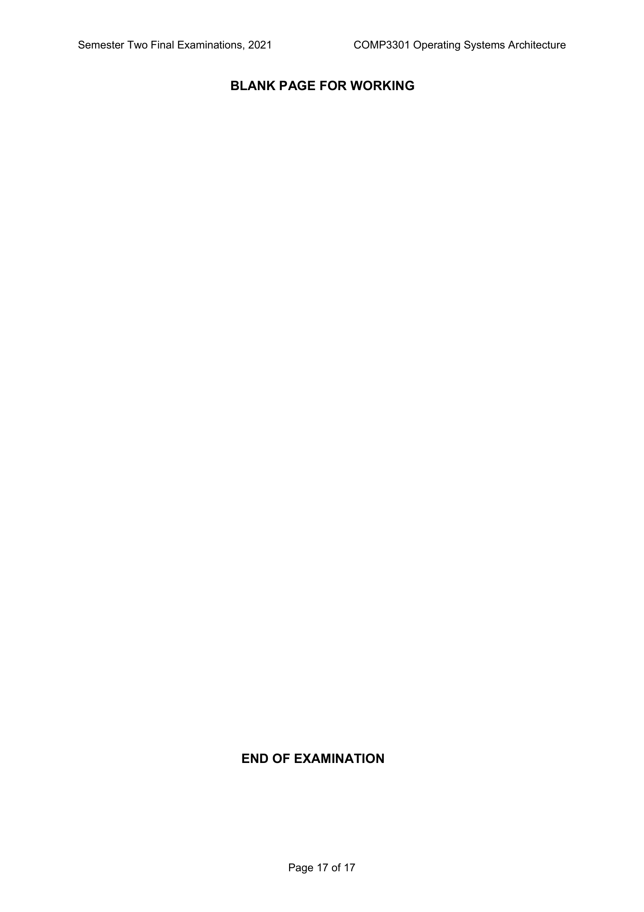

这页（**Page 17 of 17**）其实不是题目页，而是**考试试卷的最后一页**。
上面写着：

> **BLANK PAGE FOR WORKING**
> **END OF EXAMINATION**

意思是：
这是**供学生草稿或计算使用的空白页**，并且提示这里是**试卷的结尾（考试结束）**。
所以这一页**没有任何题目**，也**不需要作答**。

---

## ✅ 详细解释

1. **“BLANK PAGE FOR WORKING”**
→ 意思是“空白页，可用于演算、写草稿、画图或计算”。
在正式考试中，这一页不评分，通常用来让考生写一些辅助步骤、临时运算或验证。

2. **“END OF EXAMINATION”**
→ 表示考试内容已全部结束，后面没有其他题目。
一般学生看到这里就知道可以开始检查试卷或交卷。

---

## ✅ 该页怎么做（或者说：不用做）

* **不需要回答任何问题。**
* 如果你需要在答题过程中写计算过程、画状态图、排查公式等，可以在这里写。
* 在电子版本或 PDF 试卷中，这页可以忽略。

---

## ✳️ 总结归纳

| 项目   | 内容                                                     |
| ---- | ------------------------------------------------------ |
| 页类型  | 空白工作页（非题目页）                                            |
| 作用   | 供草稿、计算或检查使用                                            |
| 是否计分 | 否                                                      |
| 说明文字 | “BLANK PAGE FOR WORKING” + “END OF EXAMINATION” 表示考试结束 |

---

### \[口语化表达]

这页其实没题，就是试卷最后的空白页，官方留给你当草稿纸用的。上面的 “BLANK PAGE FOR WORKING” 就是“空白页，用来演算”，下面的 “END OF EXAMINATION” 是告诉你——考试到这里结束了，别往后翻了。所以这页不用写答案，也不会算分，真要写点东西，就是随手算算题、画个图、记个公式之类的辅助内容。
