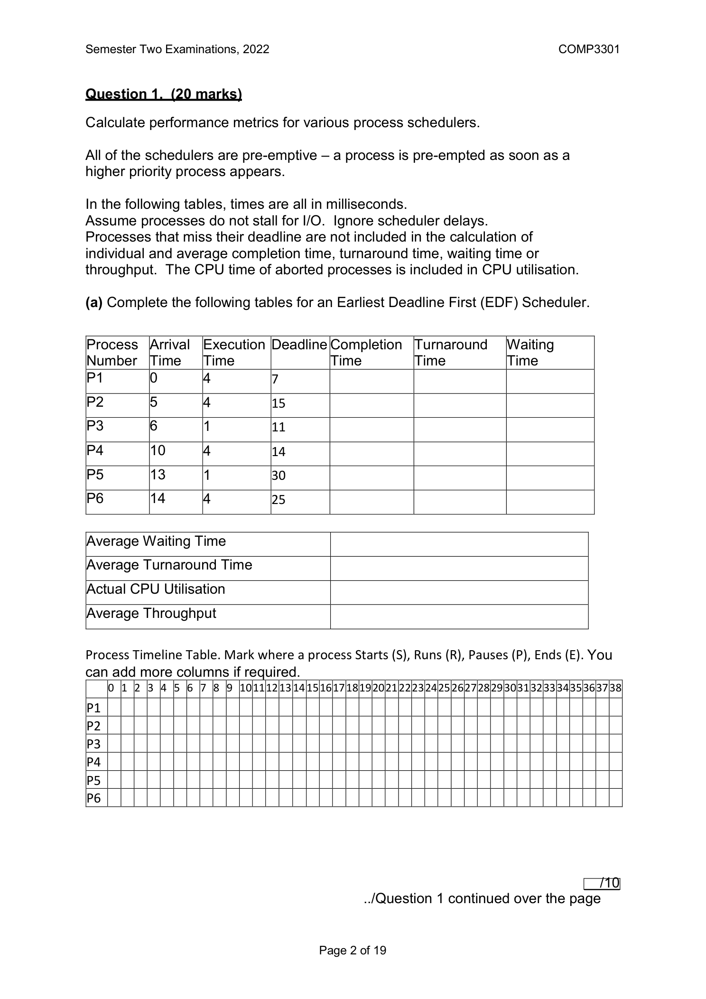
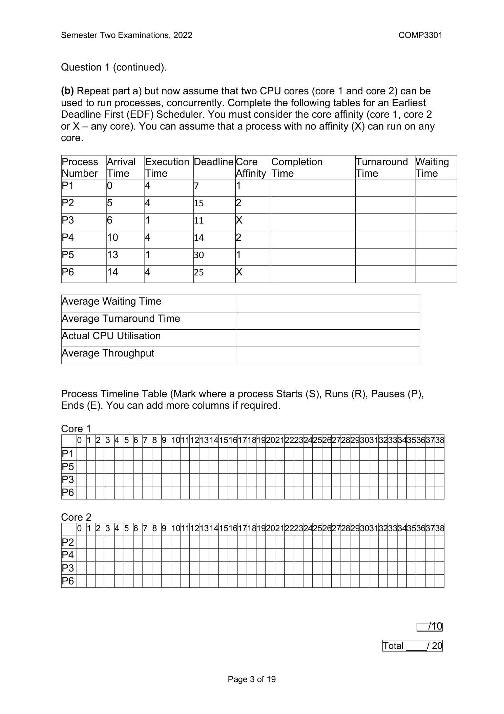
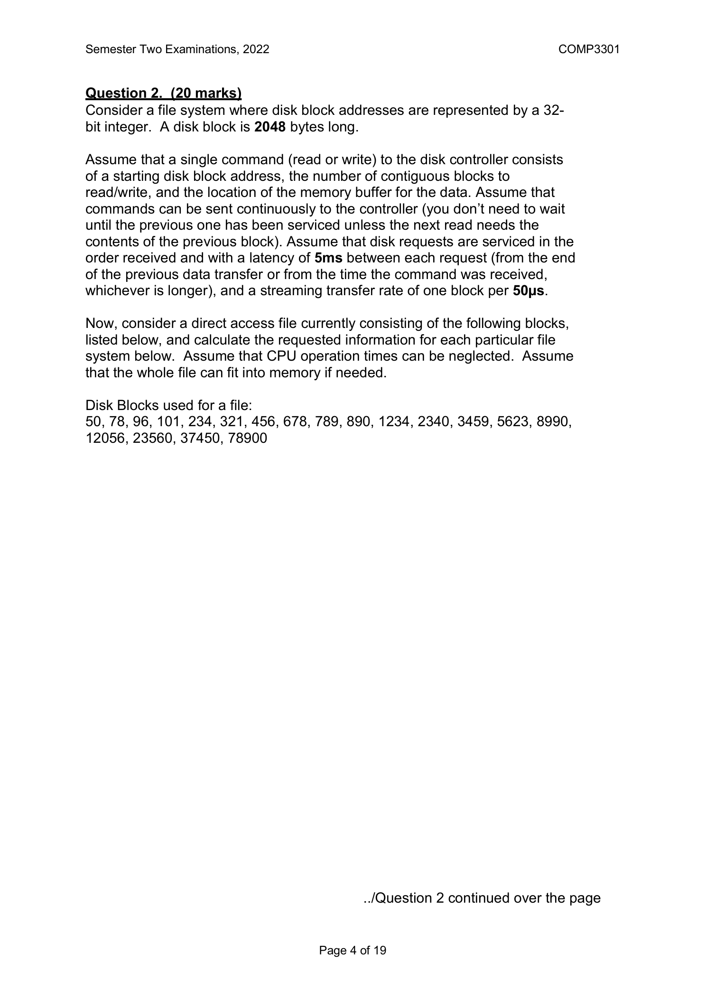
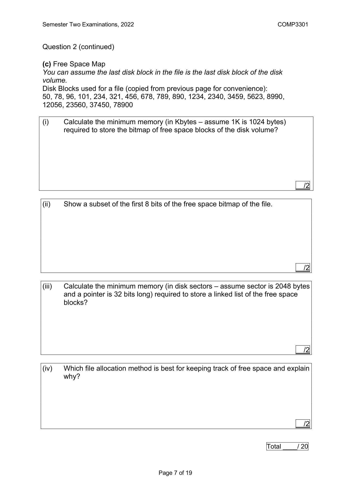
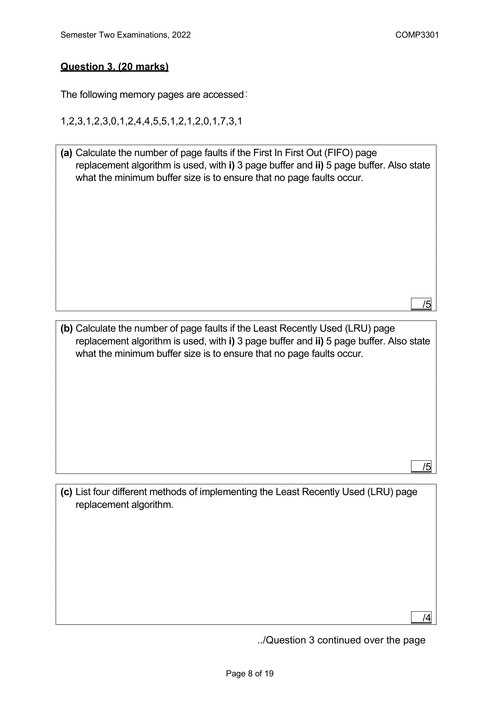
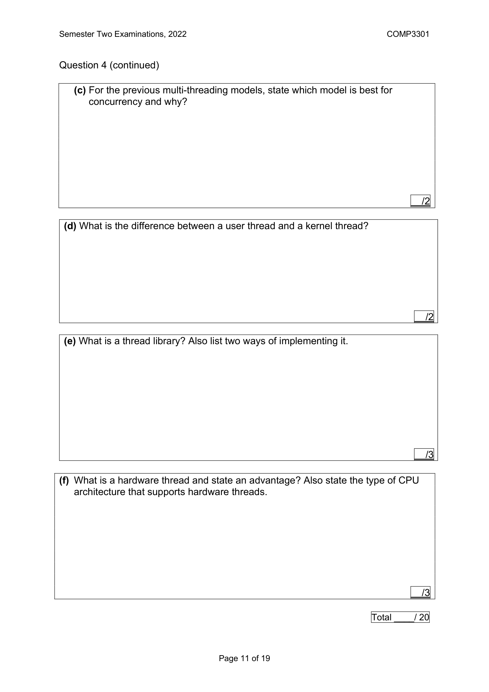
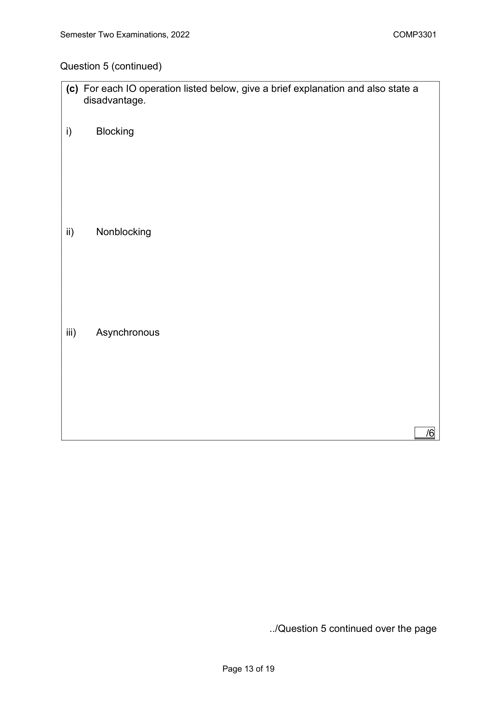
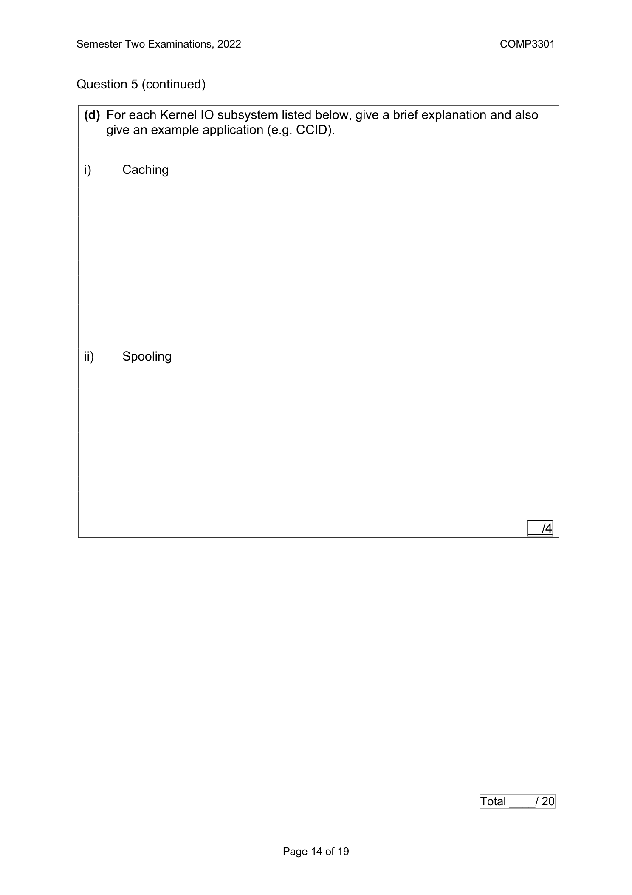
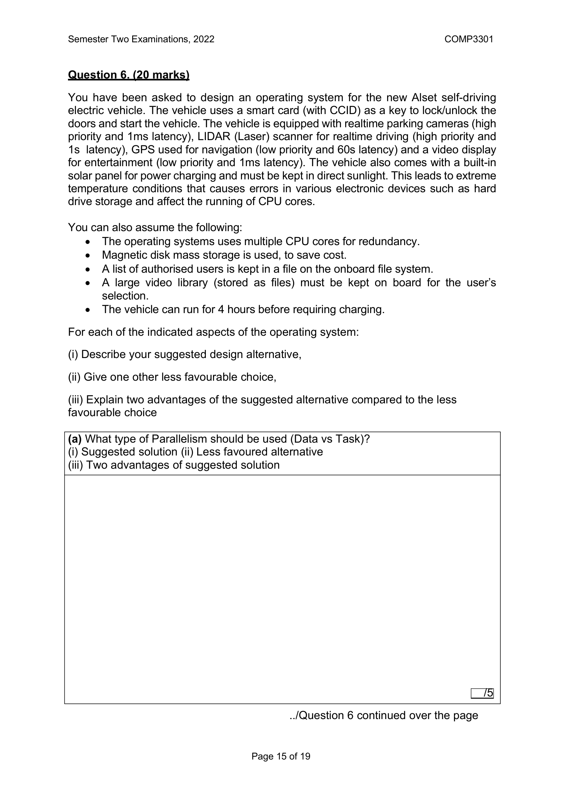
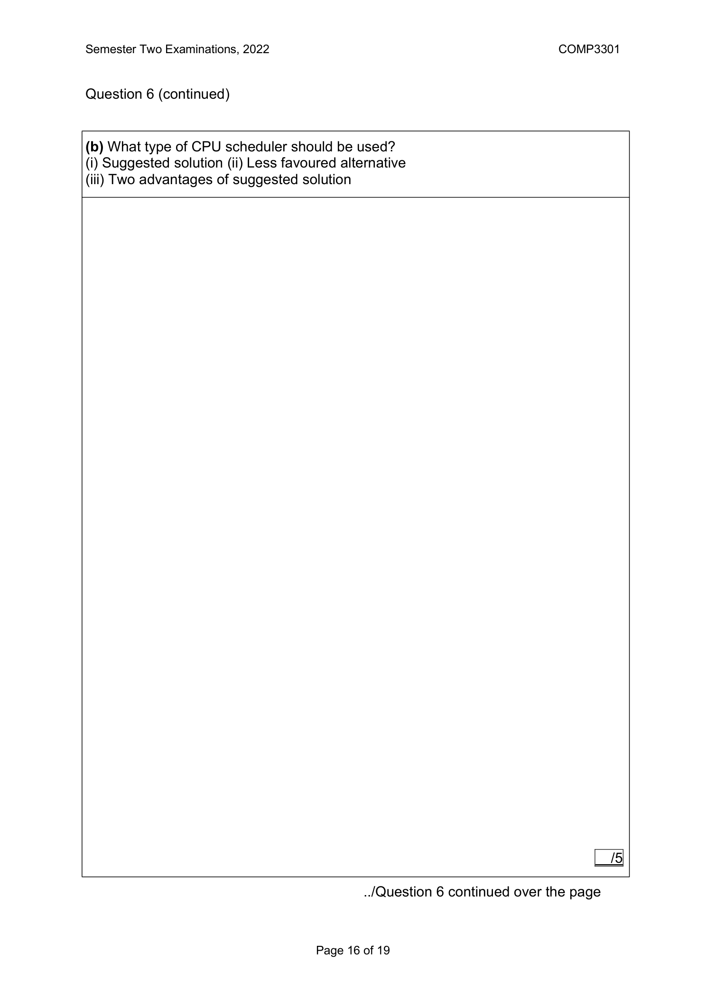

---

## 第 1 页


下面这页是**昆士兰大学（The University of Queensland）信息技术与电气工程学院**的考试封面页，课程是**COMP3301 Operating Systems Architecture（操作系统体系结构）**，学期为**2022年第二学期**。这页没有题目本身，主要是说明考试信息与规则。逐条给你解释如下（按页面从上到下、从左到右）：

### 1) 页面顶部与身份信息区

* **Venue / Seat Number / Student Number / Family Name / First Name**：考场地点、座位号、学号、姓、名。进入考场后要**按要求工整填写**，别把试卷带出考场（左侧有 “This exam paper must not be removed from the venue” 的声明）。
* 右上角有课程代码：**COMP3301**。方便监考与阅卷匹配。

### 2) 考试标题与适用范围

* **School of Information Technology and Electrical Engineering**：开课学院。
* **Semester Two Examinations, 2022**：2022 年第二学期期末。
* **COMP3301 Operating Systems Architecture**：课程名。
* **This paper is for St Lucia Campus students.**：此试卷版本只适用于 **St Lucia 校区**的学生。

### 3) 时间安排

* **Examination Duration: 120 minutes**：**正式作答时间 120 分钟**（2 小时）。
* **Planning Time: 10 minutes**：**规划时间 10 分钟**。
官方用语是“鼓励在规划时间里审题并做作答规划（review and plan responses）”。通常这意味着：

* 可以**看完整份卷子**，决定先做哪些题、每题大致分配时间；
* 一般**不允许动笔作答**（以本校常规来看，规划时间是“读题时间”）。若监考有口头补充，以现场说明为准。

### 4) 考试条件（Exam Conditions）

* **Closed Book**：**闭卷**，**不允许**携带任何书籍、笔记或打印资料。
* **计算器**：只允许 **Casio FX82 系列**或**UQ 审核并贴标的计算器**；其它电子设备不行。
* **During Planning Time**：在 10 分钟规划时间内，**鼓励**审题与规划作答，不要提前作答。
* **This examination paper will be released to the Library**：考后试卷会公开到图书馆（意味着题目并非长期保密版本）。

### 5) 可携带与禁止物品

* **Materials Permitted in the Exam Venue:**
括号里强调：**禁止任何电子辅助设备**（例如**笔记本电脑、手机**等）。
下方写 **None**：表示没有额外允许携带的资料或工具（除了符合规定的计算器与基本文具）。

* **Materials to be supplied to Students:**
标注“**Additional exam materials（如答题册、草稿纸）可在提出请求时提供**”。
下面同样写 **None**：意思是**默认不另发专门材料**；**如果你需要额外答题册或草稿纸，可以举手向监考要**。

### 6) 给学生的特别说明（Instructions to Students）

* **若你认为题面缺失或错误会影响作答**：请在作答时**写明你的理解与假设**（例如：某题参数缺失，你可写“本题将 X 视为 1GB 处理”再继续解答）。这有助于阅卷老师按你的合理假设给分。
* **Answer all questions. Total: 120 Marks.**：**必须做完所有题目**，**总分 120 分**。
右侧“**For Examiner Use Only**”有一个 1–6 的评分格，推断**本卷大致有 6 道大题**（或 6 个评分单元），每题分值可能不同，但合计 120 分。

### 7) 右侧“仅供阅卷用”表格

* **For Examiner Use Only**：阅卷老师记录每题分数的表。
**Question 1–6** 对应每一大题的得分，**Total** 汇总总分。考生**无需填写**此栏。

---

## 我该怎么“做每道题”？

这张截图**只有封面与规则，没有出现任何题目内容**，因此**现在无法逐题讲解解法**。
不过根据 COMP3301 的常见考点，给你**解题策略与时间分配建议**，等你提供题目页时可套用：

### 解题策略（适用于操作系统类试卷）

1. **规划时间（10 分钟）**

* **快速通读所有题目**：先标出“会做/不太会/可能会但耗时”的题。
* **估算分值→分配时间**：总分 120、假设 6 题，平均每题 20 分；但看每题实际分值和小问数量再微调。
* **优先策略**：先做**高把握 + 高分值**的题；难题放后，避免时间被“吞掉”。
2. **常见题型与作答要点**

* **进程/线程/同步**：读清**临界区、互斥/死锁条件**；画**时序图**或给出**信号量/监视器**伪代码；明确说明**不会死锁/不会饥饿**的理由。
* **调度算法**（FCFS/SJF/SRTF/RR/优先级）：列**甘特图**，算**等待/周转/响应时间**，单位一致，**RR 记得量化 time quantum**。
* **虚拟内存/分页/TLB**：给出**页表**、**缺页序列**，用 **FIFO/LRU/OPT** 分别计算缺页次数；写清**帧数**与**置换算法**。
* **文件系统/磁盘调度**（FCFS/SSTF/SCAN/C-SCAN）：画**磁道移动路径**，算**总寻道距离**。
* **并发 Bug 定位**：明确**数据竞争位置**、给出**原子性**或**序列一致性**的解释，提出**锁/原子指令/内存屏障**方案。
* **系统调用/内核–用户态切换**：画出**调用路径**（用户态→陷入内核→调度/中断→返回），指出**开销**与**安全检查点**。
3. **书写与呈现**

* **先给结论，再给推导**：阅卷时间短，结论醒目最稳。
* **画图帮助得分**：时序图、页表、甘特图、状态机。
* **单位与假设写清楚**：MB/GB，ms/s，量化参数（量子、帧数、磁道号）。
4. **检查**

* **回扫高分大题**是否漏写小问；
* **数字核对**：总时间/缺页次数/寻道距离是否与图一致。

---

## 可能的时间分配（供参考）

* 规划读题：**10 分钟**（规定）
* 作答：**120 分钟**

* 若 6 题等权：每题 **\~18–20 分钟**（预留最后 10 分钟检查）
* 若分值不均：按题面分值成比例分配（例如 30 分题给 \~25 分钟）

---

## 现场操作清单

* 进场先：**放好手机与不允许物品**，只带合规计算器与文具。
* **填完整封面信息**（地点、座位号、学号、姓名）。
* 规划时间：**只读不写**（遵循监考要求），用心**做作战计划**。
* 正式开始：按计划**先易后难**；计算或图表一律**留痕**。
* 若题面有歧义：**写明你的合理假设**再作答。
* 结束前：**检查分数点**是否覆盖、**把姓名学号**再次核对。

---

\[口语化表达] 这页就是 COMP3301 期末的“封面”和考场规则：2 小时作答，前面有 10 分钟读题做计划；闭卷，除了合规的 Casio FX82 计算器，别带手机电脑之类；不另发材料，但要的话可以要答题册或草稿纸；有事先把名字、学号、座位号填清楚；发现题面有坑就把你的假设写出来；要做完所有题，总分 120 分，大概有 6 个评分项。现在截图没题目内容，所以没法逐题讲解，但按我给的 OS 解题套路来：规划时间先扫一遍，先做高分/有把握的题；调度就画甘特图算时间，分页就列页表算缺页，磁盘就画轨道走向，并发就定位临界区给同步方案；写结论要醒目、图和单位要齐，最后留点时间检查。这样进场就心里有数了。


---

## 第 2 页



下面这一页是**第1题（20分）**，要求你在**抢占式（pre-emptive）**调度前提下，按**EDF（Earliest Deadline First，最早截至期优先）**完成各进程的**完成时间、周转时间、等待时间**，并计算**平均等待/周转、CPU 利用率、平均吞吐量**。给定的时间单位都是**毫秒**，忽略 I/O 阻塞与调度器开销；**超过截止时间的进程会被中止**（这些被中止的进程不计入完成/周转/等待/吞吐，但它们已消耗的 CPU 时间计入“CPU 利用率”）。

---

# 题目 1（a）：EDF 调度

## 已知进程（到达、执行、绝对截止时间）

| 进程 | 到达 | 执行 | 截止 |
| -- | -: | -: | -: |
| P1 |  0 |  4 |  7 |
| P2 |  5 |  4 | 15 |
| P3 |  6 |  1 | 11 |
| P4 | 10 |  4 | 14 |
| P5 | 13 |  1 | 30 |
| P6 | 14 |  4 | 25 |

### 调度规则要点（本题关键）

* 任一时刻，从**就绪队列**里挑选**绝对截止时间最早**的进程运行；若有更早截止的新进程到达，**立刻抢占**当前进程。
* 到了某进程的**deadline 时刻仍未完成**，该进程**立即中止**（abort）。

> 本数据下**没有**进程超时被中止。

---

## 按时间线推演（甘特图口述）

* **t=0–4**：只有 **P1(ddl=7)**，运行完毕于 **t=4**。
* **t=4–5**：CPU 空闲 1ms（下一个到达在 t=5）。
* **t=5**：**P2(ddl=15)** 到达并开始运行。
* **t=6**：**P3(ddl=11)** 到达，因其截止期 **11 < 15**，**抢占** P2；
**t=6–7** 运行 P3，**t=7** P3 完成。
* **t=7–10**：回到 **P2** 继续跑到 **t=10** 完成。
* **t=10–14**：**P4(ddl=14)** 到达并运行，**恰在 t=14** 完成（**算达成截止**）。
* **t=14–18**：**P6(ddl=25)** 与 **P5(ddl=30)** 均已（或将）到达，此时 ddl 最早的是 **P6**，先跑完于 **t=18**。
* **t=18–19**：运行 **P5**，**t=19** 完成。

据此得到各进程的**完成时间 C**（Finish time）：

* **P1=4，P2=10，P3=7，P4=14，P6=18，P5=19**

> 注：完成时间按**实际结束时刻**记；**无进程超时中止**。

---

## 逐项指标计算

* **周转时间 T = 完成时间 C − 到达时间 A**
* **等待时间 W = 周转时间 T − 执行时间 E**

| 进程 |  A |  E | ddl |  **C** | **T=C−A** | **W=T−E** |
| -- | -: | -: | --: | -----: | --------: | --------: |
| P1 |  0 |  4 |   7 |  **4** |     **4** |     **0** |
| P2 |  5 |  4 |  15 | **10** |     **5** |     **1** |
| P3 |  6 |  1 |  11 |  **7** |     **1** |     **0** |
| P4 | 10 |  4 |  14 | **14** |     **4** |     **0** |
| P5 | 13 |  1 |  30 | **19** |     **6** |     **5** |
| P6 | 14 |  4 |  25 | **18** |     **4** |     **0** |

> **平均等待时间** = (0+1+0+0+5+0) / 6 = **1 ms**
> **平均周转时间** = (4+5+1+4+6+4) / 6 = **4 ms**

### CPU 利用率（Actual CPU Utilisation）

* CPU 忙碌总时长 = 各进程真正运行的总和
\= 4+（P2 前1ms + 抢占后3ms）+1+4+4+1 = **18 ms**
* 总历时 = 从 **t=0** 到最后完成 **t=19** → **19 ms**
* 中间有一次空闲 **1 ms（t=4–5）**
* **利用率 = 18 / 19 ≈ 94.74%**

### 平均吞吐量（Average Throughput）

* 完成进程数 = **6**
* 总历时 = **19 ms**
* **吞吐量 = 6 / 19 ≈ 0.316 个进程/毫秒**

---

## 可填写到试卷表格的答案（本页）

* Completion/Turnaround/Waiting：见上表每行对应数值。
* **Average Waiting Time：1 ms**
* **Average Turnaround Time：4 ms**
* **Actual CPU Utilisation：约 94.74%**
* **Average Throughput：约 0.316 进程/毫秒**
* **Process Timeline（S/R/P/E）**（写在网格里即可）：

* P1：0–4（E）
* P2：5–6（P），7–10（E）
* P3：6–7（E）
* P4：10–14（E）
* P6：14–18（E）
* P5：18–19（E）

---

\[口语化表达] 这题要用“最早截止期优先”的抢占式调度，把时间线从 0 往后推：先跑 P1 到 4ms，空闲 1ms；5ms 开跑 P2，6ms P3 截止更早就把 P2 抢了，P3 跑到 7ms 结束，再回去把 P2 补完到 10ms；10–14 跑 P4，14–18 跑 P6，18–19 跑 P5。这样每个进程的完成时间分别是 P1=4、P2=10、P3=7、P4=14、P6=18、P5=19，周转=完成减到达，等待=周转减执行，算出来平均等待 1ms、平均周转 4ms。CPU 总共忙了 18ms，整个过程 19ms，所以利用率大约 94.74%；6 个进程在 19ms 内做完，吞吐量大概 0.316 个/毫秒。总之，照这个时间线把表格填上就对了。


---

## 第 3 页



这页是**第1题（续）**，考你在**双核（Core 1 / Core 2）抢占式 EDF** + \*\*亲和性（Affinity）\*\*约束下做同样的指标计算：**完成时间、周转时间、等待时间、平均值、CPU 利用率、吞吐量**，并在下方两行时间线上标出每个核心何时开始/运行/暂停/结束哪个进程。

---

# 题目 1(b)：双核 + 亲和性 + 抢占式 EDF

## 规则梳理（本小题核心）

* **EDF**：在每个时刻，**就绪队列**中**截止时间（Deadline）最早**的、**能在该核心上运行**的进程优先运行；有更早截止的就绪进程出现时**立即抢占**。
* **亲和性（Core Affinity）**：

* `1` → 只能在 **Core 1** 上跑；
* `2` → 只能在 **Core 2** 上跑；
* `X` → 任意核心可跑。
* **超时中止**（到截止时仍未完成即中止）：**本数据下没有进程超时**。
* 忽略 I/O、忽略调度器开销；时间单位：**ms**。

## 已知进程

| 进程 | 到达A | 执行E | 截止ddl |  亲和 |
| -- | --: | --: | ----: | :-: |
| P1 |   0 |   4 |     7 |  1  |
| P2 |   5 |   4 |    15 |  2  |
| P3 |   6 |   1 |    11 |  X  |
| P4 |  10 |   4 |    14 |  2  |
| P5 |  13 |   1 |    30 |  1  |
| P6 |  14 |   4 |    25 |  X  |

---

## 按时间线调度（两核甘特图口述）

**Core 1：**

* 0–4：P1（完成）
* 4–6：空闲
* 6–7：P3（完成；ddl=11）
* 7–13：空闲
* 13–14：P5（完成；ddl=30）
* 14–18：P6（完成；ddl=25）

**Core 2：**

* 0–5：空闲
* 5–9：P2（完成；ddl=15）
* 9–10：空闲
* 10–14：P4（完成；ddl=14，**正好卡在截止时刻完成**）
* 14–18：空闲

> 由于两个核心经常有空闲，所以几乎所有到达的进程都**立即开始运行**，没有等待，也没有被更早截止的到达者抢占的场景（EDF 选择在各自核心上的最早 ddl 进程即可）。

---

## 指标计算

* **完成时间 C**：进程真正结束的时刻（墙钟时间）。
* **周转时间 T = C − A**
* **等待时间 W = T − E**

| 进程 |  A |  E | ddl | Aff |  **C** | **T** | **W** |
| -- | -: | -: | --: | :-: | -----: | ----: | ----: |
| P1 |  0 |  4 |   7 |  1  |  **4** | **4** | **0** |
| P2 |  5 |  4 |  15 |  2  |  **9** | **4** | **0** |
| P3 |  6 |  1 |  11 |  X  |  **7** | **1** | **0** |
| P4 | 10 |  4 |  14 |  2  | **14** | **4** | **0** |
| P5 | 13 |  1 |  30 |  1  | **14** | **1** | **0** |
| P6 | 14 |  4 |  25 |  X  | **18** | **4** | **0** |

* **Average Waiting Time（平均等待）**：$(0+0+0+0+0+0)/6 = \mathbf{0\ ms}$
* **Average Turnaround Time（平均周转）**：$(4+4+1+4+1+4)/6 = \mathbf{3\ ms}$

### Actual CPU Utilisation（实际 CPU 利用率）

* 总执行工作量（所有进程 CPU 时间和）= $4+4+1+4+1+4 = \mathbf{18}$ **core-ms**
* **makespan**（最后完成时间）= **18 ms**（从 t=0 到 t=18）
* 双核的**可用核心时间** = $2 \times 18 = 36$ **core-ms**
* **利用率 = 18 / 36 = \mathbf{50%}**

### Average Throughput（平均吞吐量）

* 完成进程数 = **6**
* 总用时（墙钟）= **18 ms**
* **吞吐量 = 6 / 18 = \mathbf{0.333}\ 个进程/毫秒**

---

## 可在试卷网格中填写（S/R/P/E 标注思路）

* **Core 1**：`0–4 P1(E)`，`6–7 P3(E)`，`13–14 P5(E)`，`14–18 P6(E)`；其余格子留空（空闲）。
* **Core 2**：`5–9 P2(E)`，`10–14 P4(E)`；其余时间空闲。

> 若需要显式写 “S/R/P/E”，可在每段开始时标 **S**，结束时标 **E**，中间连续运行默认 **R**，本题无抢占 **P** 的实际发生。

---

\[口语化表达] 这一页把上一问改成双核 + 亲和性。照 EDF 玩：每个核心都挑它能跑的、截止时间最早的就绪进程。按时间推下来，Core1 跑 P1(0–4)，等到 6ms 跑 P3(6–7)，13–14 跑 P5，14–18 跑 P6；Core2 在 5–9 跑 P2，10–14 跑 P4。大家都没超时，也几乎没等——所以每个进程的等待时间都是 0，周转分别是 4、4、1、4、1、4，平均周转 3ms。最后一个在 18ms 完成，双核的可用核心时间是 36 core-ms，实际只用到 18 core-ms，所以 CPU 利用率 50%；6 个进程在 18ms 做完，吞吐量 0.333 个/毫秒。把这些数抄进表格，再把两条核心的时间段填到网格里就行了。


---

## 第 4 页



已思考


---

## 第 5 页


已思考


---

## 第 6 页


下面这页题目考的是\*\*链式文件系统（Linked File System）\*\*在不同操作下会产生多少「磁盘控制器指令（disk controller commands）」、「磁盘块I/O次数（读写次数）」以及「总用时」。
已知与默认前提（题干写了）：

* 文件控制块（FCB）在内存中；每个文件块里保存“下一块”的指针；
* 需要写入文件的新数据已经在内存中；
* 文件中的磁盘块**不连续**；
* 文件当前由这些块按链顺序连接：
50, 78, 96, 101, 234, 321, 456, 678, 789, **890**, 1234, 2340, 3459, 5623, 8990, 12056, 23560, 37450, 78900
因而**当前文件共有 N = 19 个块**（第10个块是 890）。

> 注：本页未给出“每次读/写的时间”和“块大小 B（bytes）”，这些通常在上一页。下面把**做题方法**讲清，并把“次数”给成确定值；至于“总用时”，只要把次数分别乘以前页给的读/写耗时再相加即可。

---

## 怎么数「控制器指令」与「I/O次数」

* 在这种题里通常一条磁盘**读或写**操作就对应**1 条**磁盘控制器指令，所以两列数值一般**相同**；如果老师给了别的定义，就把 I/O 次数照公式数出来再按定义换算即可。
* **链式分配**的关键：

1. 只有文件头指向**第一块**（本题未说明有尾指针），所以要找**末尾**或随机位置第 *k* 块，往往需要**从头顺着链一块块读过去**；
2. 修改某个块里的“next 指针”时，必须**回写**那一块。

---

## 各小问逐一说明

### (i) 在文件**末尾**增加 1 个块

步骤

1. 需找到“当前最后一块”。若 FCB **没有**保存尾指针（题干没说有），就必须从第1块开始沿链走到第 N 块：需要 **N 次块读取**。
2. 将新块写到磁盘：**1 次写**。
3. 把“原最后一块”的 next 指针改成指向新块：对“原最后一块”做 **1 次写回**。

次数

* 读：N (=19)
* 写：2
* 合计 I/O：**N + 2 = 21**
* 控制器指令：同为 **21**
* 总用时：$N \times t_{\text{read}} + 2 \times t_{\text{write}}$

> 说明：若前页明确说 FCB 里**有尾指针**，则**无需遍历**（不读 N 次），只需写新块 1 次 + 回写原尾块指针 1 次，总 I/O = 2。

---

### (ii) 在文件**开头**增加 1 个块

步骤

1. 新块的 next 指向“原第一块”；
2. FCB 在内存中把“第一块指针”改为新块（不产生磁盘 I/O）。

次数

* 读：0
* 写：1（把**新块**写入并带上 next 指针即可）
* 合计 I/O：**1**
* 控制器指令：**1**
* 总用时：$1 \times t_{\text{write}}$

> 有的解法会把“目录/FCB落盘”的写也算上，但题干已说明 FCB 在内存且默认只计“磁盘块读写”。

---

### (iii) 修改自文件开头偏移 **8066 字节**处的数据

思路

* 先确定目标所在的**第 k 个块**：

$$
k = \left\lfloor \frac{8066}{B} \right\rfloor + 1
$$

其中 $B$ 是**块大小（字节）**，在上一页通常给出。

* 例1：若 $B=512$，则 $8066/512=15$ 余数 386 → **第16块**；
* 例2：若 $B=1024$，则 $8066/1024=7$ 余数 898 → **第8块**。
* 链式结构访问第 k 块：需**从第1块起顺链读取 k 次**（拿到第 k 块数据）；
* 修改后需要**写回第 k 块**。

次数

* 读：k
* 写：1
* 合计 I/O：**k + 1**
* 控制器指令：**k + 1**
* 总用时：$k \times t_{\text{read}} + 1 \times t_{\text{write}}$

---

### (iv) 从**末尾**删除 1 个块

步骤

1. 需要找到“倒数第二块”（因为要把它的 next 设为 null）。没有尾指针时，要从头顺链到第 $N-1$ 块：**读 $N-1$ 次**；
2. 修改该块的 next 指针并写回：**1 次写**；
3. 将原最后一块归还空闲链：通常不再额外读写该块（地址已知）。

次数

* 读：$N-1 = 18$
* 写：1
* 合计 I/O：**N = 19**
* 控制器指令：**19**
* 总用时：$(N-1) \times t_{\text{read}} + 1 \times t_{\text{write}}$

---

### (v) 删除**块号 890**（已知它在链中）

* 由给定顺序可见：890 是**第 10 个块**。
步骤

1. 为了改写其**前驱块**（第9块）的 next 指针，必须顺链读到**第9块**：**读 9 次**；
2. 将第9块的 next 改为“原第10块（890）的 next”（即跳过 890）并写回：**1 次写**；
3. 890 本身可直接回收为自由块，通常不必再单独读写。

次数

* 读：9
* 写：1
* 合计 I/O：**10**
* 控制器指令：**10**
* 总用时：$9 \times t_{\text{read}} + 1 \times t_{\text{write}}$

---

### (vi) 删除整个文件（**不**需要覆写数据）

步骤

* 需要把整个链上的块都**回收到空闲表**。在纯“指针在块内”的链式系统里，你只有第1块的地址，因此必须**顺链把每个块读出来**以拿到“下一块”的地址，直到链尾。
* 目录项/FCB 从表述看在内存里处理，不另计 I/O。

次数

* 读：N (=19)
* 写：0（通常不必写每个数据块；是否需要写空闲结构取决于实现/出题设定，常见解答按0计）
* 合计 I/O：**19**
* 控制器指令：**19**
* 总用时：$N \times t_{\text{read}}$

---

## 如何写“Total Time（总时间）”

把上面每小问得到的\*\*读次数 ×（单次读耗时）+ 写次数 ×（单次写耗时）\*\*相加即可。若前页还给了“寻道时间/旋转延迟/传输时间”的分解，就按每次 I/O 的时间模型去累计（例如每次读需：寻道+旋转+传输，写同理）。

---

## 小结：可直接抄到表格里的“次数”

* 设当前文件块数 **N = 19**；(iii) 的 **k** 由块大小 $B$ 决定。

1. 末尾加 1 块：**I/O = N + 2 = 21**（读19，写2）
2. 开头加 1 块：**I/O = 1**（写1）
3. 改 8066 字节处：**I/O = k + 1**（读k，写1），其中 $k=\lfloor 8066/B \rfloor + 1$
4. 末尾删 1 块：**I/O = N = 19**（读18，写1）
5. 删除块 890：**I/O = 10**（读9，写1；因 890 是第10块）
6. 删除整个文件：**I/O = N = 19**（读19，写0）

> 「磁盘控制器指令数」与「I/O 次数」在本题口径下一般一致；“总时间”按前页给定的单次读/写耗时套用即可。

---

\[口语化表达]
这页说的是链式文件：每个数据块里只知道“下一个块在哪儿”。所以除了在开头插块，\*\*其他位置的操作几乎都得从第一块一路“顺藤摸瓜”\*\*找到目标，再读写相应的块。我们这份文件一共有 **19 块**。

* 在**末尾**加块：先把 19 块挨个读到尾，再写新块、回写原尾块指针 → 一共 **21 次 I/O**。
* 在**开头**加块：最省事，只写一次新块就行 → **1 次 I/O**。
* 改**8066 字节**那一处，要看块大小 $B$。算出它落在第 $k=\lfloor 8066/B \rfloor + 1$ 块，先顺着读到第 k 块，再把它写回 → **k+1 次 I/O**。
* **删最后一块**：得先找到倒数第二块，读 18 次，再回写一次 → **19 次 I/O**。
* **删块 890**（它是第10块）：读到第9块、把指针改掉写回 → **10 次 I/O**。
* **删整文件**：为了把每块都回收到空闲表，得把 19 块全读一遍 → **19 次 I/O**。
总时间就把这些读写次数乘以前页给的单次读/写耗时加起来就OK。


---

## 第 7 页



下面这页在讲**空闲空间图（Free Space Map）**，让你用两种典型表示法来估算“存储空闲块信息需要多少内存/扇区”，并做一个小展示，然后比较哪种方式更好。题目给的前提：

* 这份文件所用到的块号（按链顺序）是：
50, 78, 96, 101, 234, 321, 456, 678, 789, 890, 1234, 2340, 3459, 5623, 8990, 12056, 23560, 37450, 78900
* **可假设文件的最后一块（78900）就是磁盘卷的最后一块**。因此卷上的块从 0 开始编号到 78900 结束（习惯常以 0 起始），卷的**总块数 = 78,900 + 1 = 78,901 块**。
* 文件占用的块数是 19 块（上面那串一共 19 个），所以**空闲块数 = 78,901 − 19 = 78,882 块**。

---

## (i) 以\*\*位图（bitmap）\*\*方式存储空闲块，所需的最小内存（KBytes）

位图是一种**每个磁盘块用 1 个比特**表示是否空闲的结构。

* 需要的比特数 = 卷的总块数 = 78,901 bit
* 换算成字节并向上取整：$\lceil 78,901 / 8 \rceil = 9,863$ bytes
* 换算成 KBytes（1K = 1024 bytes）：$9,863/1024 \approx 9.63$ KB

**答案**：**9,863 字节 ≈ 9.63 KB**（最小需要这么多内存来存位图）。

> 说明：若出卷块号从 1 起始，结果仍然向上取整到 9,863 字节，数值不变。

---

## (ii) 给出位图**前 8 个比特**的一个子集展示

这里的“前 8 个比特”对应**块号 0～7**。

* 这 8 个块并不在文件使用列表里（文件从块 50 才开始用），所以它们是**空闲**。
* 自然语言里，空闲位图通常约定**1 表示空闲、0 表示已分配**（题面称“free space bitmap”，按习惯用 1 代表“free”最常见；若课程用相反约定，只要说明清楚也可）。

据此，块 0～7 都空闲 → **前 8 位可写成：11111111**。
（若你的课堂约定“0=空闲，1=占用”，那就写 00000000，并在答题纸上标注采用的约定即可。）

---

## (iii) 以**空闲块链表（linked list）**方式，存储这些空闲块需要的最小“内存”（以**磁盘扇区**计）

设定：1 个指针 = 32 bits = 4 字节；1 个扇区 = 2048 字节。

* 空闲块数 = 78,882，每个空闲块需要一个“下一空闲块”的**指针**（链表法）。
* 仅指针开销：$78,882 \times 4 = 315,528$ 字节。
* 换算成扇区并向上取整：$\lceil 315,528 / 2048 \rceil = 155$ 个扇区。

**答案**：**155 个扇区**（这是只按“指针存储”算的最小等价开销）。

> 注：有的教材会强调“链表指针直接写在**空闲块**自己里面”，那严格说**不额外占用**单独的扇区；但从“为了保存这些指针最少要占多少字节/相当几个扇区”的角度，像上面这样折算是本题要的数量级比较。

---

## (iv) 哪种分配/记录方法最适合**跟踪空闲空间**？为什么？

\*\*位图（bitmap）\*\*更合适。理由：

* **空间效率高**：每块只占 1 bit；像本题 7.89 万块只要 \~9.6 KB，而链表需要为每个空闲块存 4 字节指针，量级差距大。
* **搜索速度快**：位运算可快速找到**单个空闲块**或**连续的一段空闲块**（对需要连续块的分配非常重要）；链表要找到一段连续空闲空间几乎做不到，只能一格格扫。
* **维护简单**：分配/释放时只需把相应比特翻转，易于缓存与一致性维护；链表在插入/删除时需要改指针，且容易产生碎片化的问题。

**结论**：**位图最佳**，因为它**更省空间**且**更容易/更快地定位空闲区间**，总体开销也更低。

---

### 可直接写在答题纸上的数字（汇总）

* (i) 位图所需内存：**9,863 bytes ≈ 9.63 KB**
* (ii) 前 8 位示例：**11111111**（采用 1=空闲 的约定；若课程相反，请写 00000000 并注明）
* (iii) 空闲链表的指针存储等价：**155 个扇区**（按 32-bit 指针、2048B/扇区折算）
* (iv) **位图**更好：省空间、易找连续空闲、读写更新简单（给出理由即可）

---

\[口语化表达]
这页是让你拿两种方法来“记账”磁盘有哪些块是空的：一种是**位图**，一种是**链表**。我们把磁盘看成一共有 78,901 个块（编号 0 到 78900），文件自己用了 19 个，所以空着的是 78,882 个。

* 要是用**位图**，每块只要 1 个比特，合起来就是 78,901 个比特，换成字节是 9,863 B，差不多 **9.63 KB**；
* 位图的前 8 位对应块 0 到 7，由于这些块没被文件用，所以都空的，按“1 表示空闲”来写就是 **11111111**；
* 要是用**链表**去串起所有空闲块，每个空闲块要存一个 32 位指针，总共 **315,528 字节**，折成 2048B 的扇区就是 **155 个扇区**；
* 真要选哪个好，**位图完胜**：占用极小、找空闲块（尤其一串连续空闲）特别快，更新也简单。


---

## 第 8 页



下面这页是**页面置换**题。给定页面访问序列：

> 1, 2, 3, 1, 2, 3, 0, 1, 2, 4, 4, 5, 5, 1, 2, 1, 2, 0, 1, 7, 3, 1

我们分别用 **FIFO** 和 **LRU** 在不同页框（buffer）数下数**缺页数（page faults）**，并说明“保证不再发生缺页”的最小页框数。

---

## (a) FIFO（先进先出）

### 计算方法（怎么做）

* 维持一个**队列**表示内存页框，左边是“最早进入”的页。
* 从左到右扫描序列：

* **命中**：队列不变；
* **不命中（缺页）**：

* 若队列未满：把新页**入队**；
* 若已满：**弹出队头**（最早来的），再把新页入队。
* 缺页次数 = 发生“不命中”的次数。

### 结果

* i) **3 页框**：**14 次缺页**
* ii) **5 页框**：**10 次缺页**
* “保证不再缺页”的**最小页框数**（见说明）：**7**（见下方“最小页框说明”）

---

## (b) LRU（最近最少使用）

### 计算方法（怎么做）

* 维护每个在内存页的“最近使用时间”（可用**栈/双向链表 + 哈希**或**时间戳**模拟）。
* 扫描序列：

* **命中**：把该页标为“最新使用”；
* **不命中**：

* 若未满：直接装入并标“最新”；
* 若已满：**淘汰最久未被使用**的那一页，再装入新页并标“最新”。

### 结果

* i) **3 页框**：**13 次缺页**
* ii) **5 页框**：**8 次缺页**
* “保证不再缺页”的**最小页框数**：**7**（同理，见下方说明）

---

## (c) 实现 LRU 的四种方法（写出四种）

1. **栈（堆栈）实现 / 双向链表 + 哈希表**：每次命中把页移到表头；淘汰表尾。
2. **时间戳（计数器）法**：每次访问记录当前时刻；置换时选时间戳最小者。
3. **Aging（老化）/ n 比特历史寄存器**：周期性右移并叠加 R 位，近似 LRU。
4. **时钟（Clock/Second-Chance）及其增强型**：用 R 位给二次机会，近似 LRU。
（以上 3、4 属近似 LRU，但在实现题里通常也被接受为 LRU 的实现思路/工程化手段。）

---

### “最小页框数”的说明（两问通用）

* 若从**空内存**开始，**首次访问**每个新页都是**强制缺页（compulsory fault）**，这无法避免。
* 题目“确保不再发生缺页”通常指**一旦装入后不再发生置换缺页**，此时最小需要的页框数等于**序列中不同页面的个数**。
* 本序列的不同页集合是 {0,1,2,3,4,5,7}，共有 **7** 个，因此两种算法下的**最小页框数 = 7**。

> 若严格要求“从第一次访问起 0 次缺页”，那前提必须是“7 个页都已预装入内存”。

---

## 答案小结（可直接填）

* (a) FIFO：3 框 → **14**；5 框 → **10**；无置换缺页的最小页框数 → **7**
* (b) LRU：3 框 → **13**；5 框 → **8**；无置换缺页的最小页框数 → **7**
* (c) LRU 实现的四种方法：**链表/栈 + 哈希、时间戳、Aging（n 比特历史）、Clock/Second-Chance（含增强型）**

---

\[口语化表达]
这题就是拿给定的访问序列，分别用 FIFO 和 LRU 去跑一遍，数有几次“没在内存里→得装进来”的情况。FIFO 就像排队，最早进来的先被换出去；LRU 则把“最久没用”的换掉。我把序列扫了一遍：3 个页框时 FIFO 缺 **14** 次、LRU 缺 **13** 次；5 个页框时 FIFO 缺 **10** 次、LRU 缺 **8** 次。要想装进去后再也不因为置换而缺页，最少要能容下出现过的所有不同页，本序列一共 7 个不同页，所以**7 框**就够了（但第一次碰到新页仍会有强制缺页，这是避免不了的）。最后实现 LRU 的方法可以写：链表/栈+哈希、时间戳、Aging 多比特历史、Clock/Second-Chance（含增强型）。


---

## 第 9 页


下面这页继续问虚拟内存与进程复制的概念题。

## (d) 什么时候一页会成为 “victim（被淘汰页）”，接下来必须做什么？

**什么时候成为 victim：**
当发生**缺页**而**所有物理页框都已满**时，置换算法（FIFO/LRU/Clock 等）会从当前在内存的页中**选出一页作为被淘汰者（victim）**，以腾出一个页框给要调入的新页。

**必须发生的操作（典型步骤）：**

1. **检查脏位（Dirty bit）**：

* 若 victim 页被修改过（脏），**必须把它写回磁盘/交换区**保存最新内容。
* 若未修改（干净），可直接丢弃，不需要写回。
2. **作废映射**：把该页的页表项（PTE）标记为**无效**/不在内存，清除相应的**TLB**项。
3. **调入新页**：从后备存储（磁盘）**把缺页对应的页面读入**刚腾出的页框，更新其页表项为**有效、可访问**，并设置访问/脏等位。
4. **更新置换元数据**：按照所用算法更新队列/时间戳/引用位等结构。

> 要点：只有**内存满 + 需要装入新页**时才选 victim；是否要**写回**完全取决于**脏位**。

---

## (e) 什么是 Copy-on-Write（写时复制）？哪种 fork 变体会用到它？

\*\*写时复制（Copy-on-Write, COW）\*\*是一种延迟复制技术：

* 父子进程在 fork 之后**共享**同一组物理页，并把这些页标成**只读**（并维护**引用计数**）。
* 只要双方只**读**这些页，就**不做任何拷贝**。
* 当其中某一方**第一次写**某个共享页时，会触发**写保护异常**（页故障），内核这时才：

1. **分配一个新页框**，
2. **把原页内容拷贝**到新页，
3. **更新该进程的页表**让它改写自己的私有副本（而其他进程仍共享原页）。
这样显著节省了**时间和内存**（尤其是 fork 后马上 exec 的常见场景）。

**使用它的 fork 变体：**

* 现代类 Unix/Linux 的\*\*`fork()`实现本身**就采用 COW（即所谓**“COW fork”\*\*）。
* 历史上的 `vfork()` 是另一种为“fork 后立刻 exec”优化的变体，但它是**共享地址空间**并**暂停父进程**，并非通过复制页+写时复制来实现。随着 COW 的普及，**普通 `fork()` 的 COW 实现**已能高效覆盖绝大多数场景。

---

\[口语化表达]
这页问两个概念：第一，**victim 页**就是在**内存满**又**缺页**时，被置换算法挑出来**让位**的那一页；如果它被改过（脏了），得**先写回磁盘**，然后把它的映射干掉，把新页从磁盘**读进来**并更新页表/TLB。第二，**写时复制（COW）**就是父子进程先**共享只读**的物理页，真要**写**的时候再**按需复制**那一页，这样 fork 很便宜。现在系统里**普通 `fork()` 就用 COW**；老的 `vfork()`是另一种思路，不是 COW。


---

## 第 10 页


下面这一页是关于\*\*多线程体系结构（multi-threaded architectures）\*\*的考题。主要分两部分：(a)多线程的优势；(b)不同线程模型的说明。

---

## (a) 多线程体系结构的四个好处（Four benefits）

1. **提高响应性（Responsiveness）**

* 在多线程程序中，一个线程阻塞（例如等待 I/O）不会导致整个进程挂起。
* 例如：浏览器的一个线程加载图片，另一个线程仍可响应用户输入。

2. **更好地利用多核处理器（Better resource utilization / parallelism）**

* 不同线程可在不同 CPU 核上并行执行，提高系统吞吐量（throughput）和 CPU 利用率。
* 在多核机器上，单进程多线程能显著提升性能。

3. **经济性（Economy）**

* 创建/销毁线程的开销远小于进程（线程共享代码段、数据段、打开的文件等资源），上下文切换也更快。
* 所以同样任务下多线程比多进程更节省内存与时间。

4. **简化通信与共享（Simplified communication and sharing）**

* 线程间可直接访问共享内存，不必像进程那样通过管道或消息队列通信。
* 特别适用于需要频繁数据交换或共享缓存的应用。

> 其他可选优点：可实现后台处理、异步 I/O、在服务器中处理多个客户端连接等。只要写出其中四条有代表性的即可。

---

## (b) 三种多线程模型（Threading Models）

### 1. **Many-to-One 模型**

* 多个**用户级线程（user threads）**映射到**一个内核线程（kernel thread）**。
* 线程管理完全在用户空间完成（如早期的 `Green Threads` 实现）。
* 优点：线程创建、切换速度快，无需内核介入。
* 缺点：

* 若一个线程执行系统调用（阻塞 I/O），整个进程都会被阻塞。
* 多个线程不能真正并行运行在多核上（因为内核只看到一个线程）。

---

### 2. **One-to-One 模型**

* 每个**用户线程**都映射到一个**内核线程**。
* 内核调度各线程，可实现真正的并行执行。
* 优点：

* 支持多核并行，阻塞一个线程不会影响其他线程。
* 操作系统可独立调度每个线程。
* 缺点：

* 线程创建与管理开销较大（需系统调用）。
* 线程数太多会造成性能下降（上下文切换开销）。

（例：Windows、Linux 使用的 **POSIX Pthreads** 属于此模型。）

---

### 3. **Many-to-Many 模型**

* 多个用户线程映射到**若干个内核线程**（不是一一对应，也不是全部映射一个）。
* 线程库管理映射关系；操作系统内核调度内核线程。
* 优点：

* 结合了前两种的优点：用户层创建线程快，且能利用多核并行。
* 阻塞一个线程不必阻塞整个进程。
* 缺点：

* 实现复杂；需要线程库与内核配合管理映射。

（例：Solaris、早期的 Windows 7+ fiber 模型属于这一类。）

---

## 小结可直接写在试卷上

| 线程模型         | 描述              | 优点        | 缺点        |
| ------------ | --------------- | --------- | --------- |
| Many-to-One  | 多用户线程 → 1 内核线程  | 用户切换快     | 无法并行，易被阻塞 |
| One-to-One   | 每个用户线程 → 1 内核线程 | 真正并行，独立调度 | 开销大       |
| Many-to-Many | 多用户线程 ↔ 若干内核线程  | 可并行又灵活    | 实现复杂      |

---

\[口语化表达]
这一页主要是讲多线程的好处和三种模型的区别。多线程最大的好处就是：程序更灵活反应快（有的线程卡住别的还能跑），还能用上多核 CPU，更高效；另外开销比多进程小、线程之间通信也方便。三种模型的区别可以这么记：**Many-to-One**是“很多用户线程绑在一个内核线程上”，快但没法真并行；**One-to-One**是一对一，每个线程都能跑在不同 CPU 上，就是系统开销大；**Many-to-Many**是两者折中，多个用户线程分配给多个内核线程，既能并行又灵活，不过设计起来比较复杂。


---

## 第 11 页



这页延续前一题第 4 题，考察的是多线程模型、用户线程与内核线程的区别、线程库及硬件线程。下面逐题讲解。

---

## (c) 哪种多线程模型最适合并发（concurrency），为什么？

**答案：**
**Many-to-Many 模型**最适合高并发。

**原因：**

* 它结合了 Many-to-One 和 One-to-One 的优点。
* 用户空间可快速创建大量线程（轻量），又能让多个线程同时映射到多个内核线程，在多核上并行执行。
* 当一个线程因系统调用或 I/O 阻塞时，其他线程仍能运行，不会影响整体并发性。
* 线程库可以动态调整映射关系，充分利用 CPU。

\*\*总结一句话：\*\*Many-to-Many 模型在保证高并发与并行性能的同时，保持灵活与低开销。

---

## (d) 用户线程（user thread）与内核线程（kernel thread）的区别

| 项目    | 用户线程 (User Thread)                | 内核线程 (Kernel Thread)                  |
| ----- | --------------------------------- | ------------------------------------- |
| 管理位置  | 由用户级线程库在用户空间管理                    | 由操作系统内核管理                             |
| 上下文切换 | 快，不需陷入内核                          | 慢，需要系统调用（上下文切换）                       |
| 并行性   | 无法利用多核（取决于映射模型）                   | 可被内核调度到不同 CPU 并行执行                    |
| 阻塞影响  | 一个线程阻塞可能导致整个进程阻塞（Many-to-One 模型中） | 阻塞一个线程不影响其他线程                         |
| 示例    | Java green threads, pthread 用户级实现 | Linux kernel threads, Windows threads |

**一句话总结：**
用户线程在用户空间由程序自己管理，速度快但受限；内核线程由操作系统管理，可并行但开销大。

---

## (e) 什么是线程库（thread library）？列出两种实现方式

**定义：**
线程库是一组提供创建、管理和控制线程的函数或 API 的**软件接口**。它负责线程的创建、同步、终止、调度等。

**两种主要实现方式：**

1. **用户级线程库（User-level thread library）**

* 在线程库的用户空间实现。
* 不需要系统调用，速度快但缺乏真正的并行。
* 示例：早期的 `Java Threads`、`GNU Portable Threads`。
2. **内核级线程库（Kernel-level thread library）**

* 由操作系统内核支持，线程创建和调度在内核层完成。
* 可实现真正的并行。
* 示例：`POSIX Pthreads (Linux/UNIX)`、`Windows API threads`。

> 一些系统提供混合模型：用户线程库与内核线程交互（如 Many-to-Many）。

---

## (f) 什么是硬件线程（hardware thread）？列出一个优点并指出支持它的 CPU 架构

**定义：**
硬件线程（也称逻辑处理器、逻辑核）是\*\*单个 CPU 核心中多个执行上下文（execution context）\*\*的机制。每个硬件线程都有自己的寄存器集和状态，但共享核心的执行单元（ALU、缓存等）。

**优点：**

* 提高 CPU 利用率和吞吐量：当一个线程等待（如内存访问延迟）时，另一个线程可立即使用同一核心执行。
* 可减少空闲时间，提高多任务性能。

**支持的架构举例：**

* **Intel** 的 **Hyper-Threading (HT)** 技术。
* **AMD** 的 SMT（Simultaneous Multithreading）。
* **IBM Power / SPARC / RISC-V SMT** 架构也支持。

---

## 答题要点汇总

| 小问  | 关键答案                                                 |
| --- | ---------------------------------------------------- |
| (c) | Many-to-Many 模型最适合并发：既能并行又灵活。                        |
| (d) | 用户线程由用户空间管理，快但不并行；内核线程由内核管理，可并行但慢。                   |
| (e) | 线程库 = 管理线程的 API 集；实现方式：用户级 / 内核级。                    |
| (f) | 硬件线程 = 单核的多个执行上下文；优点：提高吞吐率；架构：Intel Hyper-Threading。 |

---

\[口语化表达]
这页是在讲多线程的深入内容。先说并发性最好的模型，就是 **Many-to-Many**，因为它既能让多个线程在多核上并行，又能像用户线程那样灵活创建、管理，不容易被阻塞。接着是用户线程和内核线程的区别：用户线程在用户空间自己管，切换快但不能真并行；内核线程由操作系统调度，能在多核上跑，但开销大。然后是线程库，它其实就是一套创建、同步和销毁线程的工具函数，可以在用户层实现（快但不能并行）或内核层实现（慢但能并行）。最后问硬件线程，就是 CPU 一个核心里能“伪装”成多个逻辑核的技术，比如 Intel 的 Hyper-Threading，这样当一个线程卡着等内存时，另一个线程还能继续干活，CPU 就不会浪费。


---

## 第 12 页


这页是**操作系统（OS）中输入/输出（I/O）系统**的考题，主要考察 I/O 设备的分类与 `ioctl()` 函数的访问机制。

---

## (a) 操作系统中 I/O 设备的四大类及示例

在操作系统中，I/O 设备可以根据**数据传输特性**与**使用方式**分为以下四组：

### i) 块设备（Block Devices）

* **定义**：以\*\*固定大小的块（block）\*\*为单位传输数据，随机访问（可读写任意位置）。
* **数据特点**：数据可缓存，访问延迟较低。
* **示例**：硬盘（HDD）、固态硬盘（SSD）、USB 闪存盘（USB stick）、SD 卡等。
* **应用**：文件系统的底层设备（如 ext4, NTFS）。

---

### ii) 字符设备（Character Devices）

* **定义**：以\*\*字节流（character stream）\*\*方式顺序传输数据，不支持随机访问。
* **数据特点**：实时传输，小数据量频繁交换。
* **示例**：键盘（keyboard）、鼠标（mouse）、串口（serial port）、终端（TTY）。
* **应用**：控制台输入输出、串口通信。

---

### iii) 网络设备（Network Devices）

* **定义**：通过**网络协议栈**（如 TCP/IP）发送或接收数据包（packet）。
* **数据特点**：数据单位是“帧”或“数据包”，与远程主机通信。
* **示例**：网卡（NIC）、Wi-Fi 模块、蓝牙适配器。
* **应用**：浏览器通信、HTTP 请求、服务器传输。

---

### iv) 时钟/控制设备（Clock and Control Devices）

* **定义**：用于**计时、同步、系统控制**或触发中断事件的设备。
* **数据特点**：不以块或字节为主要输出，而是提供**控制信号**或**状态信息**。
* **示例**：系统定时器（system timer）、实时时钟（RTC）、温度传感器、GPIO 控制器。
* **应用**：时间调度、事件触发、内核中断管理。

> ✅ 小提示：有些教材把设备按“存储型、通信型、输入型、输出型”来划分，但本题更常见于操作系统教材中采用**Block / Character / Network / Clock**四分类。

---

## (b) 哪两个 I/O 设备寄存器可通过 C 函数 `ioctl()` 访问？

`ioctl()`（Input/Output Control）是 Unix/Linux 中用于**设备控制**的系统调用。

它可以访问设备驱动的**控制寄存器**（control registers）与**状态寄存器**（status registers）。

| 可访问寄存器类型                    | 说明                        |
| --------------------------- | ------------------------- |
| **控制寄存器（Control Register）** | 设置设备的操作模式或参数（如波特率、分辨率）。   |
| **状态寄存器（Status Register）**  | 读取设备当前状态或错误标志（如忙碌、空闲、错误）。 |

例如：

```c
ioctl(fd, TIOCGWINSZ, &win); // 读取终端窗口大小（状态）
ioctl(fd, TIOCSWINSZ, &win); // 设置终端窗口大小（控制）
```

---

### 小结答案表格：

| 小问  | 答案摘要                                                                                                                               |
| --- | ---------------------------------------------------------------------------------------------------------------------------------- |
| (a) | i) Block devices – 硬盘、U盘<br>ii) Character devices – 键盘、鼠标<br>iii) Network devices – 网卡、WiFi<br>iv) Clock/control devices – 定时器、RTC |
| (b) | 可通过 `ioctl()` 访问的寄存器：**控制寄存器** 与 **状态寄存器**                                                                                         |

---

\[口语化表达]
这一页是在考操作系统里 I/O 的基本概念。系统里的设备大致能分四种：**块设备**（比如硬盘、U 盘）是按数据块读写的；**字符设备**（键盘、鼠标）是按字节流顺序读写的；**网络设备**（网卡、Wi-Fi）通过数据包通信；还有**时钟或控制设备**（定时器、RTC）主要负责时间和信号控制。第二问讲的是 `ioctl()` 函数，它就是用来“直接和驱动打交道”的系统调用，可以读写设备的**控制寄存器**（控制设备操作）和**状态寄存器**（看设备现在忙不忙、有没错误），这两种寄存器是它能访问的。


---

## 第 13 页



这页延续第 5 题，考察三种常见的 **I/O 操作方式**：阻塞（Blocking）、非阻塞（Nonblocking）与异步（Asynchronous）。题目要求说明**含义**与**缺点**，所以每项答题结构如下：

> （1）解释原理  → （2）指出劣势

---

## (c) 各种 I/O 操作说明与缺点

### i) **Blocking I/O（阻塞 I/O）**

**解释：**
当一个进程（或线程）发起 I/O 请求（如读取文件或网络数据）时，**会被挂起等待**，直到数据传输完成后才能继续执行。
在此期间 CPU 不会运行该进程，而是切换去运行其他任务。

**示例：**
标准输入函数 `read()` 或 `recv()`（在未准备好数据时会阻塞）。

**缺点：**

* 效率低：进程在等待期间无法做其他工作，浪费 CPU 时间。
* 对实时性要求高的程序（如网络服务器）不适用。

---

### ii) **Nonblocking I/O（非阻塞 I/O）**

**解释：**
I/O 调用立即返回：

* 若数据尚未准备好，系统调用返回一个错误或状态（例如 `EAGAIN`），告诉程序“稍后再试”；
* 程序不会被挂起，可以在循环中重复检测或处理其他任务。

**示例：**
使用 `fcntl(fd, F_SETFL, O_NONBLOCK)` 将 socket 设为非阻塞模式。

**缺点：**

* 程序必须反复轮询（polling）检查设备状态，增加 CPU 占用。
* 实现复杂，尤其在多设备同时使用时。

---

### iii) **Asynchronous I/O（异步 I/O）**

**解释：**
程序发起 I/O 请求后立即返回，系统在后台执行数据传输；
当 I/O 操作完成后，内核通过**中断、回调或信号**通知应用程序。
（即 I/O 操作与应用执行**真正并行**。）

**示例：**
Linux 中的 `aio_read()` / `aio_write()`，或 Windows 的 `ReadFileEx()`。

**缺点：**

* 实现复杂，需要回调函数或事件机制。
* 调试和错误处理困难（异步通知顺序不确定）。

---

### 答案汇总表

| I/O 模式           | 说明                  | 缺点           |
| ---------------- | ------------------- | ------------ |
| **Blocking**     | 进程等待 I/O 完成后才恢复执行   | 效率低、CPU 空闲浪费 |
| **Nonblocking**  | I/O 调用立即返回，程序反复检测状态 | 轮询开销大，实现复杂   |
| **Asynchronous** | I/O 后台执行，完成后系统通知    | 实现困难、调试复杂    |

---

\[口语化表达]
这页是在讲三种 I/O 工作方式的区别。最传统的是 **阻塞 I/O**，程序一发起读写就得老老实实等，干不了别的，简单但浪费 CPU。接着是 **非阻塞 I/O**，程序发起操作后马上返回，不等数据好，用循环不停地查“准备好了没”，这样能同时干别的，但会一直轮询，写起来麻烦。最后是 **异步 I/O**，最先进的一种：发出请求后系统后台帮你干，等做好了再发信号或回调通知你，这样程序和 I/O 真正并行，不过写代码和调试都比较难。


---

## 第 14 页



这页是第 5 题（续），考 **内核 I/O 子系统** 里的两个机制：Caching 与 Spooling。要求分别做**简要解释**并给出**一个应用示例**。

---

## (d) Kernel I/O 子系统

### i) **Caching（缓存）**

**是什么：**
把**最近/常用的数据副本**保存在**更快的介质**（通常是内存）里，后续再访问时直接命中缓存，避免重复的慢速 I/O。可配合**预读（readahead）**、\*\*写回（write-back）**或**直写（write-through）\*\*策略。

**内核中的典型做法：**

* **Page Cache / Buffer Cache**：文件系统与块设备上的数据页被缓存到内存页中；目录项/索引节点还有 **dentry/inode cache**。
* 命中时直接从内存返回；未命中时才访问磁盘，并把数据放入缓存。

**应用示例：**

* **文件系统读写加速**：Linux 读一个常用日志文件，第一次会从磁盘读取并放入 **page cache**，之后的读取直接命中缓存，极大降低延迟。
（也可举：数据库把热数据页留在 OS page cache 里；浏览器缓存静态资源，但题目强调 *Kernel I/O*，所以以 **page cache** 示例最贴切。）

---

### ii) **Spooling（假脱机/缓冲排队）**

**是什么：**
将要发送给**慢速/独占型设备**的数据**先写到磁盘（或内存）形成队列**，再由专门的后台守护进程按顺序喂给设备。这样**生产者（应用）与消费者（设备）解耦**，应用很快返回、设备慢慢处理。

**优点：**

* 允许**多个进程共享**一个独占设备；
* **削峰填谷**：吸收突发流量，设备平滑工作；
* **容错/可恢复**：队列持久化后，崩溃可重试。

**应用示例：**

* **打印假脱机**：应用把待打印作业提交给 **CUPS** 的 **spool 目录**，CUPS 后台按队列把作业发送到打印机。
（也可举：**邮件队列**（MTA spool）先存盘后异步投递。）

---

### 速记对比

* **Caching**：为了**加速访问**，把“常用数据”放在**更快的地方**（命中就不再做慢 I/O）。
* **Spooling**：为了**排队/解耦**，把“待处理数据”先**集中存放**，由后台再慢慢送给**慢设备**。

---

\[口语化表达]
这页就是让你用一句大白话说清 **缓存** 和 **假脱机**。**缓存**是“把常用数据先塞到内存里，下次直接拿，别每回都去碰慢磁盘”，比如 Linux 的 **page cache** 让你读同一个文件越读越快；**假脱机**是“先把要给慢设备的数据存成一个队列，后台慢慢喂设备”，最典型就是**打印队列**：你点打印马上就返回，CUPS 在后面排队把活交给打印机。


---

## 第 15 页



下面这一页（Q6 的 (a)）要你在一辆**自动驾驶电动车**的 OS 设计里，二选一地说明该用**数据并行（Data parallelism）**还是**任务并行（Task parallelism）**，并分别给出：
(i) 你推荐的方案；(ii) 一个次优方案；(iii) 推荐方案相对次优方案的两条优势。题干给了大量场景信息：多核冗余、强实时外设（停车摄像头/激光雷达 1 ms 级、GPS 60 s 级、娱乐显示 1 ms 但低优先级）、磁盘存储、极端温度可能导致内核/硬盘/CPU 出错等。

---

## (a) What type of Parallelism should be used (Data vs Task)?

### (i) **Suggested solution：Task Parallelism（任务并行）为主**

* 将系统拆成**不同功能/优先级的任务**，每类任务绑定/隔离到特定 CPU 核或调度域，构成**管线化**的实时处理链：

* **感知**：摄像头、LiDAR 采集 + 预处理（高优先级、1 ms）；
* **定位/地图**：GPS/IMU 融合（中优先级、60 s 容忍）；
* **决策/控制**：路径规划/制动转向（最高优先级、硬实时）；
* **安全与授权**：CCID 智能卡鉴权；
* **信息娱乐**：视频库回放（低优先级、尽量不抢占实时核）。
* 在任务内部（例如图像特征提取、点云滤波）**可局部使用数据并行/向量化/GPU**，但**系统级并行范式以任务并行为主**，便于调度、隔离与容错。

### (ii) **Less favoured alternative：纯 Data Parallelism（数据并行）**

* 把**同一数据集**（如一帧图像或一段点云）切片分给多个核/线程做同构计算（SPMD），系统主要围绕“把同一种工作拆散”来并行。
* 整体系统仍由少量“大工作流”驱动，弱化任务间的优先级/隔离管理。

### (iii) **两条优势（Task vs Data）**

1. **实时性与优先级映射更自然**

* 任务并行让**不同外设/功能块**拥有**不同调度类与优先级**（如控制核 = 最高优先级、娱乐 = 低优先级），**硬实时链路**（摄像头/LiDAR → 控制）可绑定专用核，最大限度减少调度抖动与锁竞争。
* 数据并行多用于同构批处理，对\*\*异质 I/O 频率与不同时限（1 ms / 1 s / 60 s）\*\*的组合不友好，容易引入同步屏障，影响确定性。

2. **可靠性/隔离性/能耗更好**

* 任务并行可以把**安全关键任务**与**非关键任务**（视频播放、文件访问）**隔离到不同核心/地址空间/调度域**，并配合**核心级冗余**与健康监测（某核过热/软错时快速接管），**故障不跨域传播**。
* 数据并行往往需要**频繁共享与同步**，在极端温度导致软错/缓存一致性压力增大时，**出错放大**与**恢复复杂**；同时任务并行便于**按任务关闭/降频**非关键核，**更省电**，延长 4 小时续航场景下的有效时间。

> 小补充：在你给出的系统设计答卷里，可以写“**系统级采用任务并行 + 任务内热点采用数据并行**（如 GPU/NEON/SIMD）”，但本题的二选一判断里，把**主范式**定为**任务并行**即可。

---

\[口语化表达]
这问就是选“**任务并行**还是**数据并行**”。自动驾驶是好多条不同“活儿”并行：传感器采集、融合定位、决策控制、刷屏娱乐、刷卡鉴权，它们优先级、时限都不一样。**任务并行**最贴合：把各条任务分给不同核/调度域，控制链路给最高优先级核跑，娱乐放低优先级核上，互不打架；出故障时还能把非关键任务隔离掉。**数据并行**只适合同一工作切片（比如把一帧图像分块处理），不太适合这堆异质、不同实时性的东西，还会引入同步开销。简而言之：**系统层面用任务并行**，至于图像/点云内部再**局部用数据并行**就行了。


---

## 第 16 页



下面这一页（Q6 的 (b)）要你为这台**自动驾驶电动车**选择合适的 **CPU 调度器**，并写出：
(i) 推荐方案；(ii) 次优方案；(iii) 推荐方案相对次优方案的两个优势。系统场景包含**强实时**（摄像头/LiDAR 1 ms 级）、**弱实时**（GPS 60 s）、**低优先级娱乐**、**多核冗余**与**极端温度**等。

---

## (b) What type of CPU scheduler should be used?

### (i) **Suggested solution（推荐）**

**“固定优先级可抢占的实时调度器”**（priority-based preemptive RT），多核上**分区/绑定核**运行：

* 周期性任务采用 **Rate-Monotonic (RM)**（周期越短优先级越高）；
* 不规则/突发任务用 **Sporadic/Deferrable Server** 控制占用；
* 关键链路（摄像头/LiDAR → 控制）固定在专用核心，启用**抢占**与**优先级继承/天花板**避免优先级反转；
* 非关键任务（娱乐/文件 I/O）放到**低优先级**或单独核心（或 CFS 分时），形成**混合临界等级**（mixed-criticality）调度。

> 说明：若你们课程偏好 **EDF（Earliest Deadline First）**，也可写“**EDF 可抢占实时调度**（同样分区/绑定核）”，并在优点里强调“最优可调度性”。两者任选其一作主答即可。

---

### (ii) **Less favoured alternative（次优）**

通用**分时调度器**（如 **Round-Robin / Linux CFS**）或**非抢占 FCFS**：统一时间片面向吞吐量设计，没有明确的实时保证。

---

### (iii) **Two advantages of suggested solution（两点优势）**

1. **确定的时限保证与更小抖动**

* 固定优先级/EDF 都可做**可调度性分析**与**最坏响应时间（WCRT）**估计，满足摄像头/LiDAR 的 **1 ms 硬实时**；分区+抢占能把关键任务的**调度抖动**与干扰最小化。
2. **混合临界等级隔离**

* 可把**安全关键**与**非关键**任务分层分核：控制与感知不被娱乐/文件 I/O 抢占；出现过热/软错时，先**降级/丢弃低优先级**，关键任务仍可按时运行。
（可选补充点：支持**优先级继承**减轻锁导致的优先级反转；核绑定减少缓存干扰；对功耗友好——低优先级核可降频/休眠。）

---

### 可直接写在卷面上的精简答案

* **(i)** 固定优先级可抢占**实时调度**（RM/EDF 其一）+ 多核**分区/绑定核**，关键任务高优先级，娱乐低优先级。
* **(ii)** 分时调度（RR/CFS）或非抢占 FCFS。
* **(iii)** 优点：**(1)** 可分析、满足硬实时，抖动小；**(2)** 支持**混合临界等级隔离**，关键任务受干扰更少。

---

\[口语化表达]
这问就是：车载这种强实时系统该用哪种调度器？答案是**实时的、可抢占、按优先级的**，最好把任务**绑到特定核心**：控制/传感用高优先级跑在专用核，娱乐放低优先级或单独核。不要用普通**分时调度**（RR/CFS）或**FCFS**，它们更看吞吐，没办法保证 1 ms 级时限。选实时调度的两个核心好处：**能做时限分析、抖动小**，以及**把安全关键和非关键任务隔离**，就算系统忙或过热，关键控制也能按时执行。


---

## 第 17 页


这页的题（Q6(c)）考的是：在自动驾驶车系统中，**用什么安全机制（security mechanism）确保只有授权用户能访问车辆**。需要写出
(i) 推荐方案；(ii) 较差的替代方案；(iii) 推荐方案的两项优势。
下面详细说明。

---

## (c) What security mechanism should be used to ensure that only authorised users can access the vehicle?

### (i) **Suggested solution（推荐方案）**

**基于智能卡的双向认证系统（Mutual Authentication using Smart Card with CCID + Cryptographic Challenge–Response）**

* 每位授权用户拥有一张 **带安全芯片的智能卡（CCID）**，车辆内的安全模块（Secure Element 或 TPM）保存公钥；
* 当用户插入/靠近时，系统发起 **挑战–响应（Challenge–Response）握手**：

1. 车辆发送随机数挑战；
2. 智能卡用其私钥签名返回响应；
3. 车辆验证签名并对用户进行认证；
* 同时车辆也向智能卡证明自身身份，实现**双向认证**，防止中间人攻击；
* 若认证通过，则从车载文件系统读取用户权限（如驾驶、娱乐访问级别）。

> 附加安全层可包括：
>
> * 结合 **PIN 或生物识别（指纹、人脸）** 作第二因素；
> * 通过 **加密通信通道（TLS/SSL）** 保护数据传输。

---

### (ii) **Less favoured alternative（次优方案）**

* **基于密码或 PIN 码的单因素认证系统**

* 用户只输入密码/解锁码，系统对比明文或哈希验证身份。
* 不使用安全芯片或加密握手。

---

### (iii) **Two advantages of suggested solution（两项优势）**

1. **更强的防伪与防复制性**

* 智能卡的私钥保存在安全芯片内，外部无法提取或复制；
* 挑战–响应机制能防止重放攻击或窃取凭据后伪造身份；
* 相比纯密码方案，**物理+加密双防线** 更安全。

2. **更好的可扩展性与信任管理**

* 车辆可支持 **多用户分级授权**（车主/租客/维修人员等）；
* 智能卡可通过 OTA（Over-The-Air）更新或撤销证书；
* 与现代 PKI 架构兼容，可连接云端认证或车队管理平台。

（补充优点：在极端温度或网络断开情况下也能本地完成认证，可靠性高。）

---

### 可直接写在卷面的总结版

| 项目    | 答案                          |
| ----- | --------------------------- |
| (i)   | 智能卡 + CCID 双向加密认证（挑战–响应机制）  |
| (ii)  | 单因素密码或 PIN 验证               |
| (iii) | ① 防伪强、难以复制 ② 支持多用户分级授权与证书管理 |

---

\[口语化表达]
这页其实问“车要怎么确保只有授权人能开”。最好的做法是**智能卡加加密握手**：插卡或靠近时，车和卡互相发挑战码验证对方身份，卡用私钥签名，车核验公钥，这样别人即使偷到卡也没法伪造。还可以加 PIN 或指纹作第二因素。比起单纯输个密码，这种方案一是**安全性高**——卡的密钥取不出来，也防中间人攻击；二是**可扩展**——能设多级权限、远程撤销或更新用户。总之，它比“输入密码解锁”更稳、更专业。


---

## 第 18 页


这页（Q6(d)）问的是：在这台**自动驾驶电动车的操作系统**里，存储系统应采用哪种 **RAID 等级（0–6）**，并说明
(i) 推荐方案，(ii) 较差替代方案，(iii) 推荐方案的两个优点。
要根据前面的题干背景回答：系统用**磁盘存储（mechanical disk）**、在**高温环境**下工作、要求**高可靠性**、保存**用户视频文件库**和**授权文件**。

---

## (d) What RAID Disk level (0 to 6) should be used?

### (i) **Suggested solution（推荐方案）**

➡️ **RAID 5（条带化 + 奇偶校验）**

**理由：**

* RAID 5 采用**数据条带化（striping）+ 分布式奇偶校验（parity）**，在多块磁盘上分摊读写负载；
* 若任意一块磁盘损坏，可通过奇偶信息自动重建数据，提供容错能力；
* 适合需要**高读取性能 + 中等成本的冗余**场景，非常适合车载媒体与日志文件系统。
* 结合热插拔/在线修复（hot-swap, rebuild）机制可实现持续运行。

---

### (ii) **Less favoured alternative（较差替代方案）**

➡️ **RAID 0（纯条带化，无冗余）**

* 提供最高的吞吐量与性能，但**不具备容错**能力；
* 任一磁盘损坏会导致整个阵列数据丢失；
* 不适合安全关键的嵌入式系统（例如自动驾驶车）。

---

### (iii) **Two advantages of suggested solution（RAID 5 相比 RAID 0 的两大优点）**

1. **容错能力强（Fault Tolerance）**

* RAID 5 可容忍任意一块磁盘故障，通过奇偶信息重建数据；
* 在极端温度或震动造成硬盘损坏的车载环境下，能避免数据丢失。

2. **性价比高（Balanced performance & cost）**

* RAID 5 提供接近 RAID 0 的读取速度，同时只牺牲一块盘的空间用于奇偶信息；
* 对车载系统这种有限容量且成本敏感的场景而言，是**性能与冗余的最佳平衡点**。

> 若系统对安全性要求更高（如自动驾驶核心日志），可补充“**RAID 6（双奇偶校验）** 适用于极端容错要求，但写入更慢、成本更高”，但本题推荐的最佳平衡点仍为 RAID 5。

---

### 可直接写入答案区的简表

| 项目    | 答案                                               |
| ----- | ------------------------------------------------ |
| (i)   | RAID 5 – 数据条带化 + 分布式奇偶校验                         |
| (ii)  | RAID 0 – 无冗余条带化                                  |
| (iii) | 优点 1：提供容错能力，可自动重建数据<br>优点 2：读性能高且空间利用率好，成本低于镜像方案 |

---

\[口语化表达]
这页问的是“用哪种 RAID 等级最合适”。因为车上的磁盘得经受高温震动，还得保存用户资料和系统日志，最合适的是 **RAID 5**：它在几块盘之间分条存数据，同时加上奇偶校验，坏一块盘也能恢复。性能还不错、空间利用率也高。比较之下，**RAID 0** 虽然快，但一点冗余都没有，一块盘坏就全完，不适合这种车载系统。RAID 5 的好处是既能 **防数据丢失**，又能 **保持高读速率、性价比高**，在这种自动驾驶车上最平衡。


---

## 第 19 页


这页（第 19 页）其实是**试卷最后一页**，标题写着 “**BLANK PAGE FOR WORKING（空白页，用于草稿计算）**” 和 “**END OF EXAMINATION（考试结束）**”。
也就是说，这一页**没有题目内容**，只是给学生写计算过程或草稿用的空间。

---

### 📘详细说明：

* “**Blank page for working**” = 空白页，用于写中间步骤、演算或草稿，不评分。
* “**End of Examination**” = 表示试卷正式结束，从这一行以下就不属于试卷范围。
* 学生在这页可以：

* 把上一题没写完的计算过程补充；
* 写推导、图示、或便于检查的笔记；
* 但**这里写的内容通常不会被计分**，除非监考官特别说明会批阅草稿区。

---

### ✅总结

这页只是考试的**结尾页**，不用回答任何题；
考试的所有正式题目都在第 1 到第 18 页。

---

\[口语化表达]
这页其实没题，纯粹是留给你当“草稿纸”的。上面写着 “Blank page for working”，意思就是“给你算东西、打草稿的地方”。下面那句 “End of Examination” 就说明——试卷到这页就彻底结束了，所以这页不用写答案。
