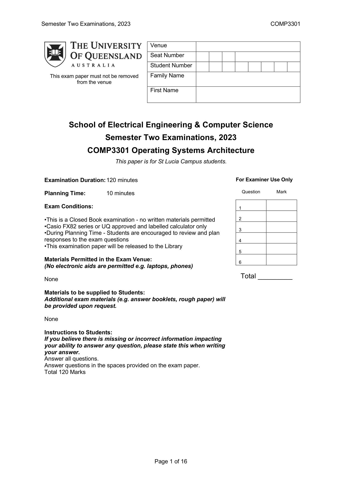

---

## 第 1 页

下面这页其实是**考试封面**，不是题目页。它告诉你考试信息、规则与评分框，不包含任何具体题目。所以我会先逐行解释这页写了什么，接着给出在「操作系统体系结构（COMP3301）」考试里常见题型的解题思路与作答方法（因为本页没有题目，只能给通用方法），最后给你一段口语化的总括。

# 这页都写了什么（逐项解释）

* **学校与课程**：昆士兰大学（UQ），**COMP3301 Operating Systems Architecture**。
* **考试时段**：2023 年第二学期（Semester Two Examinations, 2023）。
* **校区与对象**：给 **St Lucia 校区学生**用。
* **考试时长**：**120 分钟**正式答题时间。
* **规划时间（Planning Time）**：**10 分钟**。这 10 分钟只能看题、做草稿、规划答案；通常**不能写入正式答案**（以监考口头说明为准）。
* **考试性质**：**闭卷（Closed Book）**，**不允许带任何书写材料**进入。
* **计算器**：只允许 **Casio FX82 系列**或 **UQ 批准并贴标的计算器**。其他电子设备（电脑、手机、平板等）**全部禁止**。
* **规划时间建议**：鼓励在这 10 分钟里**浏览全卷、规划作答顺序**。
* **试卷处理**：考后**试卷会存档入图书馆**（说明是正式受管的期末）。
* **允许携带的材料**：**无**（明确写了 None）。
* **考场提供的材料**：有需要可提供**答题册、草稿纸**等“额外考试材料”，但当前列为 **None**（通常表示这份卷子**自带答题空白**，在卷面答题）。
* **给学生的说明**：

* 如果你认为题面**有错误/缺失**影响作答，**在答案里说明**。
* **答全所有问题**（Answer all questions）。
* **在试卷提供的空白处作答**（不要另起纸 unless 监考允许）。
* **总分 120 分**。
* **页面右上角表格**（考生信息）：**Venue、Seat Number、Student Number、Family Name、First Name**——入场后照规定填写。
* **右侧评分表**：考官用来登记 **Q1–Q6** 的得分，以及 **Total**。这也意味着**全卷有 6 题**。
* **页码**：这是 **第 1/16 页**，说明整份卷子有 16 页，题目应在后续页面。

> 结论：这页没有任何题目内容，因此没法「逐题讲解」。下面给你**COMP3301 常见题型的解题套路**，你拿到真正题面时可以按此快速套用。

# 操作系统常见题型与作答方法（通用攻略）

> 目标：在 10 分钟规划期内先定位题型→标注易分点→按配分分配时间；答题时结构清晰、先给结论再推导。

1. **进程与线程、上下文切换、系统调用**

* **常问**：状态转换图、上下文切换开销、用户态/内核态转换流程、系统调用路径。
* **写法**：

1. 先画出**三态/五态图**（就绪、运行、阻塞…）并标箭头与触发条件。
2. 分点说明**切换时保存/恢复**的关键寄存器/PCB 内容。
3. 对系统调用：**用户态→陷入内核→内核执行→返回用户态**，列步骤与安全性理由。
* **易丢分点**：忘记**调度点**（时钟中断、I/O 完成、系统调用返回等）。

2
