---

## 第 1 页

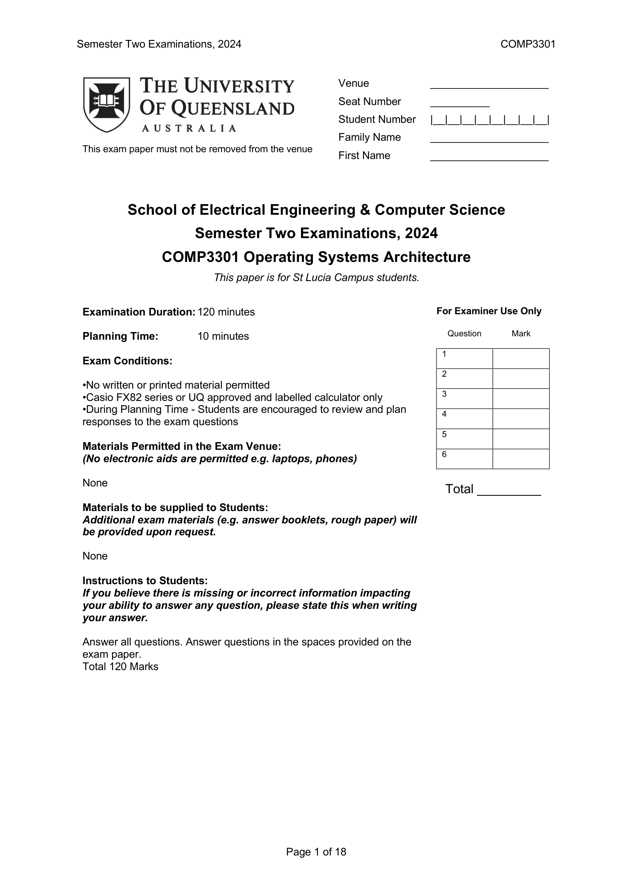

这张截图是《昆士兰大学2024年第二学期操作系统架构考试》的试卷封面。以下是具体的内容解释：

1. **考试基本信息**：

* **课程代码**：COMP3301，表示这是操作系统架构课程的考试。
* **考试时长**：120分钟，即2小时。
* **规划时间**：10分钟，这段时间允许学生复习并计划如何回答问题。
* **考试条件**：不允许带任何书面或打印材料，仅允许使用“Casio FX82系列或昆士兰大学认证的标记计算器”。
* **考试材料**：考试时不允许带电子设备，如笔记本电脑和手机。考试开始前，学生可以请求额外的考试材料（如答题册、草稿纸等）。

2. **考试说明**：

* 如果你认为有缺失或错误的信息影响了你回答问题的能力，在作答时要特别指出。
* 必须回答所有问题，并在考试纸上提供的空白处作答。
* 考试总分为120分。

**总结**：
这张截图显示了昆士兰大学的一门操作系统架构课程的期末考试纸，包含了考试时长、考试条件以及答题要求。基本要求是不允许带除计算器外的书面资料和电子设备，并且鼓励学生在规划时间内复习问题和准备答案。

\[口语化表达]：
这是一张昆士兰大学操作系统架构课程期末考试的试卷封面，里面详细列出了考试的时长、规定和要求。考试总时长是2小时，其中有10分钟的规划时间，学生可以利用这个时间准备回答问题。考试过程中只允许使用特定型号的计算器，其他任何书面或电子材料都不允许带入。总之，考试内容要在给定的空间内完成，最后的总分是120分。

---

## 第 2 页

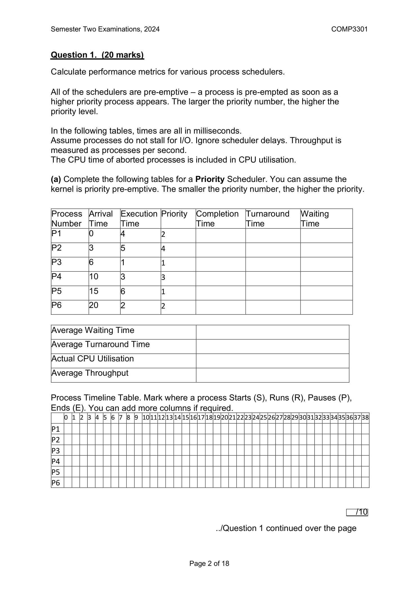

这张截图是关于操作系统架构的期末考试问题1的内容。问题要求计算不同进程调度器的性能指标，具体包括：

1. **题目背景和要求**：

* 所有调度器是抢占式的（pre-emptive），即当出现更高优先级的进程时，当前进程会被抢占。
* 题目提供的时间单位是毫秒。
* 需要计算一些常见的性能指标：完成时间（Completion Time）、周转时间（Turnaround Time）、等待时间（Waiting Time）、平均等待时间、平均周转时间、实际CPU利用率（Actual CPU Utilisation）和平均吞吐量（Average Throughput）。

2. **表格填充部分（a部分）**：

* 需要根据给出的进程信息，完成**优先级调度器**的相关表格。
* 假设内核的调度是优先级抢占式的，优先级数字越小，优先级越高。
* 已知每个进程的到达时间、执行时间和优先级，需要计算出每个进程的**完成时间**、**周转时间**和**等待时间**。

* **完成时间**：进程完成执行的时间。
* **周转时间**：完成时间 - 到达时间。
* **等待时间**：周转时间 - 执行时间。

3. **计算指标**：

* **平均等待时间**：所有进程的等待时间的平均值。
* **平均周转时间**：所有进程的周转时间的平均值。
* **实际CPU利用率**：计算执行过程中CPU的实际利用情况。
* **平均吞吐量**：每秒处理的进程数量。

4. **进程时间线表格**：

* 在这部分，学生需要标记每个进程的**开始（S）**、**运行（R）**、\*\*暂停（P）**和**结束（E）\*\*时间。
* 每个进程的开始和结束时间，以及运行时的状态，都需要在时间线上标注清楚。

**总结**：
这道题目要求你计算不同进程调度器的性能指标，特别是基于优先级调度的场景。你需要填写表格，计算各个进程的完成时间、周转时间和等待时间，然后从中推导出系统的总体性能表现，如平均等待时间、周转时间和CPU利用率等。时间线表格则要求你标记每个进程在执行过程中的状态。

\[口语化表达]：
这道题目考察的是优先级调度器的工作原理。你需要计算每个进程的完成时间、周转时间和等待时间，并算出平均等待时间、平均周转时间等性能指标。你还需要在一个时间线上标记每个进程的开始、运行、暂停和结束时间，来展示它们在系统中运行的情况。

---

## 第 3 页

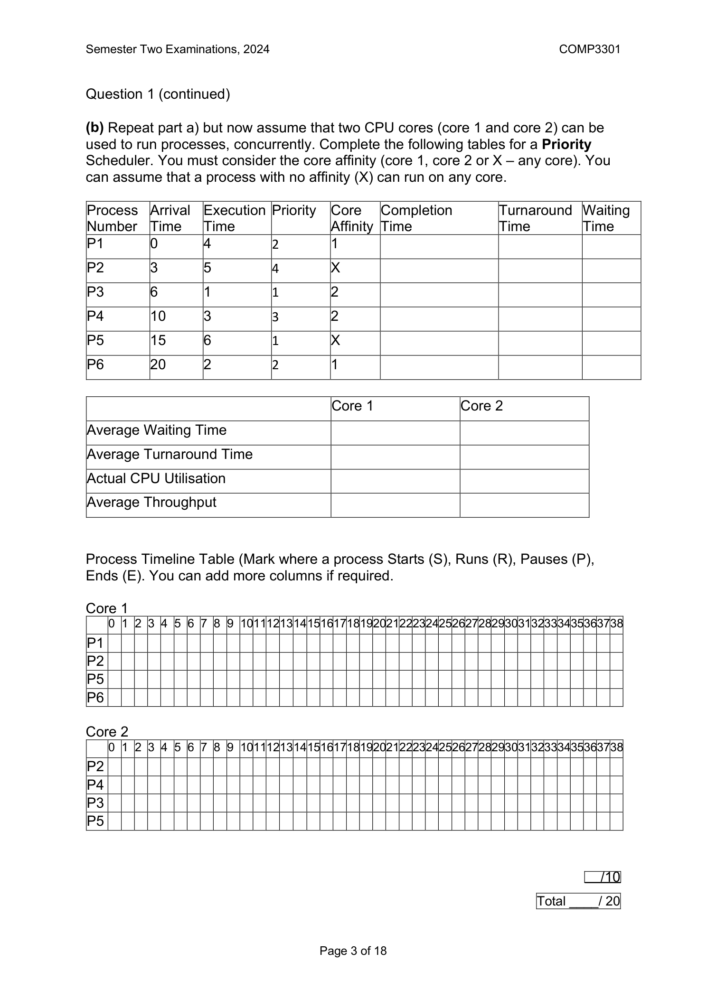

这张截图是关于操作系统架构期末考试问题1的延续部分，要求你在两个CPU核心的情况下进行调度。具体的任务是：

1. **题目背景和要求**：

* 假设现在有两个CPU核心（核心1和核心2）可以并行运行进程。你仍然需要使用优先级调度器来完成任务。
* 每个进程有一个**核心亲和性**，即哪个核心可以执行该进程。对于没有特定核心要求的进程（核心亲和性为X），可以运行在任何核心上。

2. **表格填写部分（b部分）**：

* 与之前的单核情况类似，需要计算每个进程的**完成时间**、**周转时间**和**等待时间**。

* 你仍然需要根据给出的到达时间、执行时间和优先级来进行计算。
* **核心亲和性**决定了每个进程能够在哪个核心上运行（如核心1、核心2或者任意核心）。

3. **额外要求**：

* 在这里，你需要为两个CPU核心分别填充**时间线表格**，标记进程在每个核心上的**开始时间（S）**、**运行时间（R）**、**暂停时间（P）**和**结束时间（E）**。
* 在这两个表格中，你需要确定哪些进程在核心1和核心2上运行，并根据进程的核心亲和性合理分配。

4. **计算指标**：

* **平均等待时间**：所有进程的等待时间的平均值。
* **平均周转时间**：所有进程的周转时间的平均值。
* **实际CPU利用率**：计算在两个核心上的CPU使用情况。
* **平均吞吐量**：每秒钟完成的进程数。

**总结**：
这部分要求你计算两个CPU核心下的调度情况。你需要根据进程的核心亲和性将进程分配到对应的核心上，然后计算出每个进程的完成时间、周转时间和等待时间，并根据这些数据计算系统的总体性能，包括平均等待时间、周转时间、CPU利用率和吞吐量。同时，还需要标记进程在核心1和核心2上的执行时间和状态。

\[口语化表达]：
这道题目延续了上一部分的内容，但这次增加了两个CPU核心的场景。你要根据进程的核心亲和性把进程分配到合适的核心上运行。然后，计算每个进程的完成时间、周转时间和等待时间，最后得出系统的总体性能。你还需要在时间线上标注进程在每个核心上的执行情况，看看它们是如何在两个核心间切换的。

---

## 第 4 页

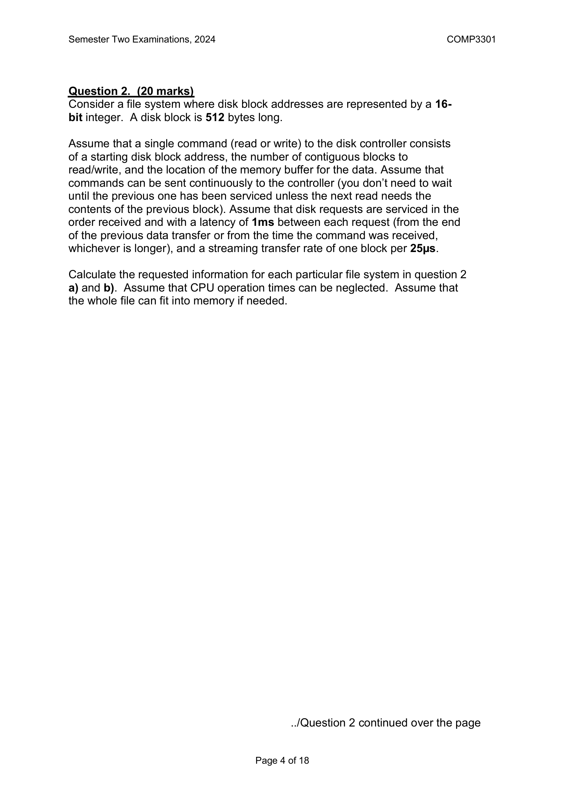

这张截图是操作系统架构期末考试的第二题，具体内容解释如下：

### 题目要求：

这道题涉及磁盘操作和文件系统。你需要计算在特定文件系统情况下，关于磁盘操作的一些性能指标。

1. **题目背景**：

* **磁盘块地址**：磁盘块地址由16位整数表示，每个磁盘块的大小是512字节。
* **操作命令**：一个磁盘操作命令（读或写）由起始磁盘块地址、需要读取/写入的连续块数和数据的内存缓冲区位置组成。
* 假设命令可以持续不断地发送到控制器（即不需要等待前一个命令完成，除非下一个命令需要读取前一个命令的数据）。
* 磁盘请求是按接收顺序处理的，每个请求之间有1毫秒的延迟。
* 数据传输速率为每25微秒传输一个块。

2. **要求计算的信息**：

* 你需要计算**每个文件系统**的相关信息（在第2题的a部分和b部分中）。具体要求如下：

* **磁盘请求延迟**：每个磁盘请求的延迟时间，包括从上一个请求结束到下一个请求开始的时间延迟。
* **数据传输时间**：每个请求的数据传输时间，基于每个磁盘块传输所需的时间（每块25微秒）。
* **总时间**：整个过程的总时间，包括延迟和数据传输时间。

3. **假设条件**：

* 可以忽略CPU操作时间。
* 假设整个文件可以装入内存中。

### 如何计算：

* 首先，计算每个磁盘请求的传输时间，可以用每个块的传输时间（25微秒）乘以需要读取/写入的块数。
* 然后，加上每个请求之间的1毫秒延迟。
* 最终的结果将是所有请求的延迟和数据传输时间之和。

### 总结：

这道题考察的是磁盘操作的延迟、传输时间等性能指标。你需要根据每个磁盘请求的要求（块数、延迟时间、传输速率等）计算出每个请求的总时间，并最终得出整个过程的时间。

\[口语化表达]：
这道题主要讲磁盘的读写过程。你需要计算每个磁盘请求的时间，包括请求之间的延迟和数据传输的时间。给定的信息有磁盘块的大小、每个请求之间的延迟、每块的传输速度等，你需要根据这些信息来算出每个请求的时间，最后得出总的时间。你可以忽略CPU操作时间，也假设整个文件可以放进内存。

---

## 第 5 页

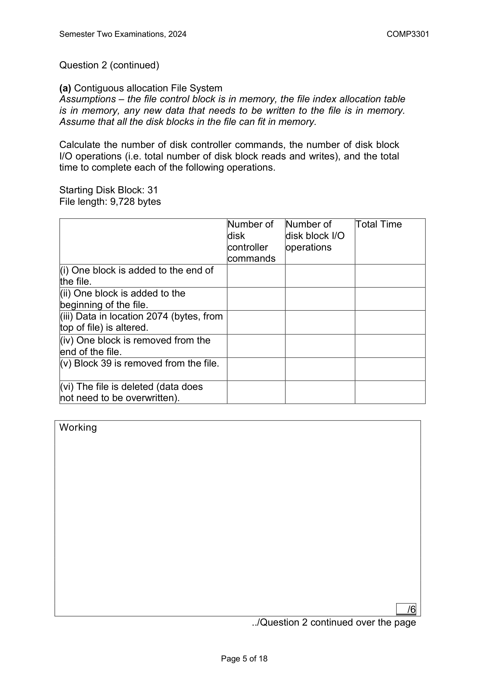

这张截图是操作系统架构期末考试的第二题的延续部分，具体要求如下：

### 题目背景：

* **连续分配文件系统**：假设文件控制块（FCB）和文件索引分配表都存储在内存中，任何需要写入文件的新数据也存储在内存中。假设文件中的所有磁盘块都能适应内存。
* 你需要计算以下不同操作下的**磁盘控制命令数**、**磁盘块I/O操作数**（即读写磁盘块的总次数），以及**每个操作的总时间**。

### 给定信息：

* **起始磁盘块**：31
* **文件长度**：9,728字节（每个磁盘块大小为512字节）

### 需要计算的操作：

1. **(i)** 一个块被添加到文件的末尾。
2. **(ii)** 一个块被添加到文件的开头。
3. **(iii)** 文件中位置2074字节的数据被修改。
4. **(iv)** 从文件末尾删除一个块。
5. **(v)** 删除文件中的块39。
6. **(vi)** 删除整个文件（数据无需重写）。

### 计算过程：

你需要填写表格的以下信息：

* **磁盘控制命令数**：每个操作需要多少个磁盘控制命令。
* **磁盘块I/O操作数**：每个操作涉及多少次磁盘块的读写。
* **总时间**：每个操作完成所需的总时间，计算时要考虑磁盘的延迟和数据传输时间。

**步骤指导**：

1. 对于操作（i）和（ii），你需要考虑文件的增添部分是位于文件的末尾还是开头。增加块通常涉及至少一次磁盘I/O操作。
2. 操作（iii）涉及修改文件中的数据，这可能需要读取该块，修改数据，然后写回该块。
3. 操作（iv）和（v）涉及删除文件中的块，可能需要先读取块，再更新文件控制块或索引表。
4. 操作（vi）涉及删除整个文件，但不需要重新写入数据，这通常仅涉及删除文件的控制信息。

### 计算总时间：

* 对于每个操作，你需要计算**磁盘I/O操作**的次数（读或写磁盘块），然后根据磁盘块的传输速率和延迟计算每个操作的总时间。

### 总结：

这部分问题要求你计算文件系统中进行不同文件操作时的性能。你需要根据每个操作对磁盘的影响来计算磁盘控制命令数、磁盘块I/O操作数，并最终得出每个操作的总时间。

\[口语化表达]：
这道题是关于文件操作对磁盘性能影响的计算。你需要根据不同的文件操作，计算出每个操作所需要的磁盘控制命令数、磁盘I/O操作数，以及完成这些操作所需的总时间。根据操作的不同，比如添加、修改、删除文件块，每个操作涉及的磁盘块数量和操作方式不同，所以计算时要注意考虑磁盘的延迟和传输速率。

---

## 第 6 页

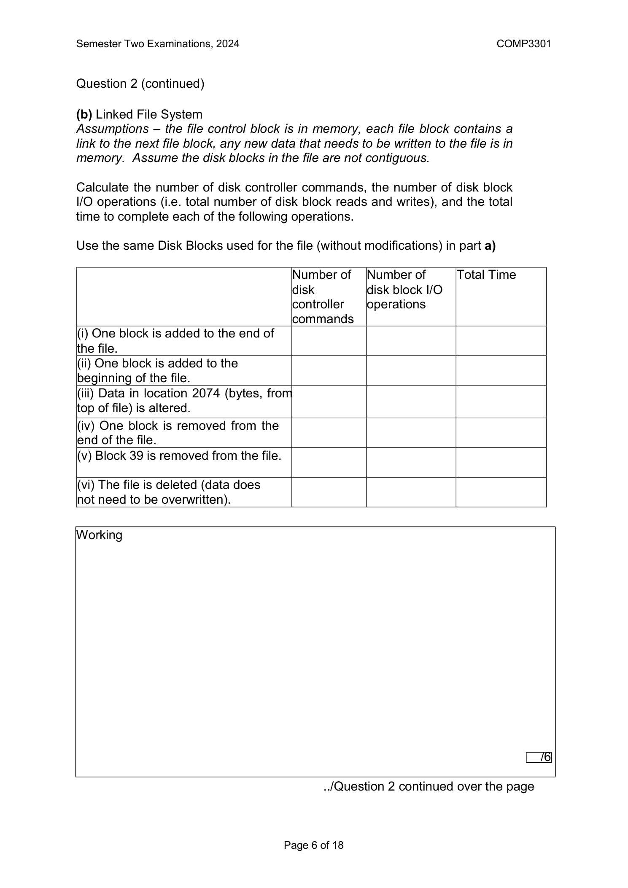

这张截图是操作系统架构期末考试第二题的延续部分，内容为**链式文件系统**，你需要在链式文件系统中计算不同操作的磁盘控制命令数、磁盘块I/O操作数和总时间。

### 题目背景：

* **链式文件系统**：假设文件控制块（FCB）存储在内存中，每个文件块包含指向下一个文件块的链接，任何需要写入文件的新数据也存储在内存中。假设文件中的磁盘块是**不连续**的。
* 你需要计算以下操作的相关信息，包括磁盘控制命令数、磁盘块I/O操作数和总时间。

### 题目要求：

使用与问题 **a部分** 相同的磁盘块，计算以下操作的磁盘性能：

1. **(i)** 一个块被添加到文件的末尾。
2. **(ii)** 一个块被添加到文件的开头。
3. **(iii)** 文件中位置2074字节的数据被修改。
4. **(iv)** 从文件末尾删除一个块。
5. **(v)** 删除文件中的块39。
6. **(vi)** 删除整个文件（数据无需重写）。

### 需要计算的内容：

1. **磁盘控制命令数**：每个操作需要多少次磁盘控制命令。
2. **磁盘块I/O操作数**：每个操作涉及多少次磁盘块的读取或写入。
3. **总时间**：每个操作完成所需的总时间，计算时需要考虑磁盘的延迟和数据传输时间。

### 如何计算：

1. **添加块到文件的末尾或开头**：对于链式文件系统，添加块时需要更新文件的链接（每次更新都涉及磁盘操作）。

* 如果是**末尾**添加，需要读取末尾块并更新链接。
* 如果是**开头**添加，可能涉及到重新链接，并且需要修改文件控制块。

2. **修改文件中数据**：修改数据通常意味着读取相应的磁盘块，修改数据并重新写入。

3. **删除块**：删除块时，通常涉及更新链接，即删除块的指向并更新前一个块的指向，可能会涉及多次磁盘I/O操作。

4. **删除整个文件**：删除文件通常不涉及数据重写，只需删除文件的控制信息和链接。

### 总结：

在链式文件系统中，每个操作都需要处理磁盘块之间的链接，因此涉及的磁盘I/O操作可能比连续分配文件系统更多。你需要根据不同的操作计算出磁盘控制命令数、磁盘块I/O操作数，并计算出每个操作的总时间。

\[口语化表达]：
这道题是讲链式文件系统下的磁盘操作。和连续文件系统不同，链式文件系统中的磁盘块是分散的，每个块通过链接相互连接。所以在执行不同的操作时，比如添加、修改或删除文件块，你需要考虑每个操作对磁盘块链接的影响。你需要计算每个操作需要多少次磁盘命令，涉及多少次磁盘块的读写操作，以及最终的总时间。

---

## 第 7 页

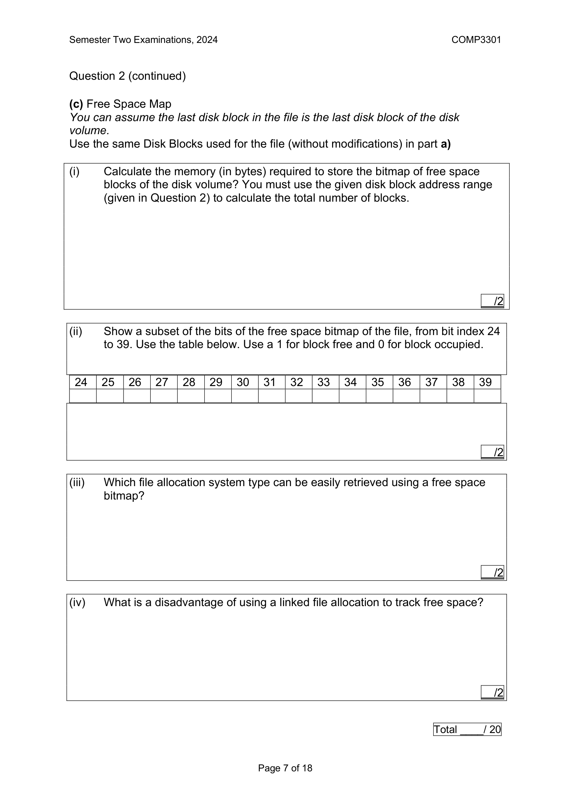

这张截图是操作系统架构期末考试第二题的延续部分，涉及**空闲空间映射**，具体任务要求如下：

### 题目背景：

假设文件的**最后一个磁盘块**是磁盘卷的最后一个磁盘块。你需要使用在**a部分**中使用的相同磁盘块来回答以下问题。

### 需要回答的问题：

1. **(i)** 计算存储磁盘卷空闲空间块的位图所需的内存（以字节为单位）。你需要使用**问题2中给出的磁盘块地址范围**来计算总的磁盘块数量。
2. **(ii)** 显示文件空闲空间位图的一个子集，范围是从位索引24到39。使用1表示块空闲，0表示块已占用。
3. **(iii)** 哪种文件分配系统类型可以通过空闲空间位图轻松检索？
4. **(iv)** 使用链式文件分配来跟踪空闲空间的一个缺点是什么？

### 详细解释：

#### (i) 计算空闲空间位图所需的内存：

* 空闲空间位图是一个二进制位图，每个磁盘块对应一个比特，值为1表示空闲，值为0表示已占用。
* 你需要计算出磁盘卷中的总磁盘块数，然后根据每个块需要1位来表示，最后计算存储整个位图所需的内存。

* 位图的大小（字节数） = 总块数 / 8（每字节8位）。

#### (ii) 显示位图子集：

* 你需要根据文件中空闲或占用的磁盘块来填充给定的位图子集。位索引24到39的范围应根据磁盘块的实际状态来表示：

* 使用1表示该块空闲。
* 使用0表示该块已占用。

#### (iii) 文件分配系统：

* 位图通常用于**连续分配**文件系统，能够通过空闲空间位图快速检索哪些磁盘块是空闲的。

#### (iv) 链式文件分配的缺点：

* 链式文件分配的一个缺点是，它需要通过磁盘块的链接来访问每个文件块，这导致访问速度较慢，特别是在文件大小很大的情况下。相比于通过位图直接查找，链式文件分配的访问效率较低。

### 总结：

这一部分考察的是文件系统中如何通过空闲空间位图来管理磁盘块的分配。你需要根据磁盘块的状态填充位图，并计算出存储位图所需的内存。还需要了解链式文件分配的缺点，并知道哪种文件分配方式能够利用空闲空间位图进行快速检索。

\[口语化表达]：
这道题考的是如何通过空闲空间位图来管理磁盘块。你需要先计算出存储位图所需的内存，接着填充出一个空闲空间位图的子集，表示哪些磁盘块是空闲的，哪些是已占用的。位图特别适合用于连续分配的文件系统，能够快速查找空闲块。而链式文件分配的一个缺点就是文件访问速度比较慢，因为每个文件块都是通过链表链接的，需要逐个读取。

---

## 第 8 页

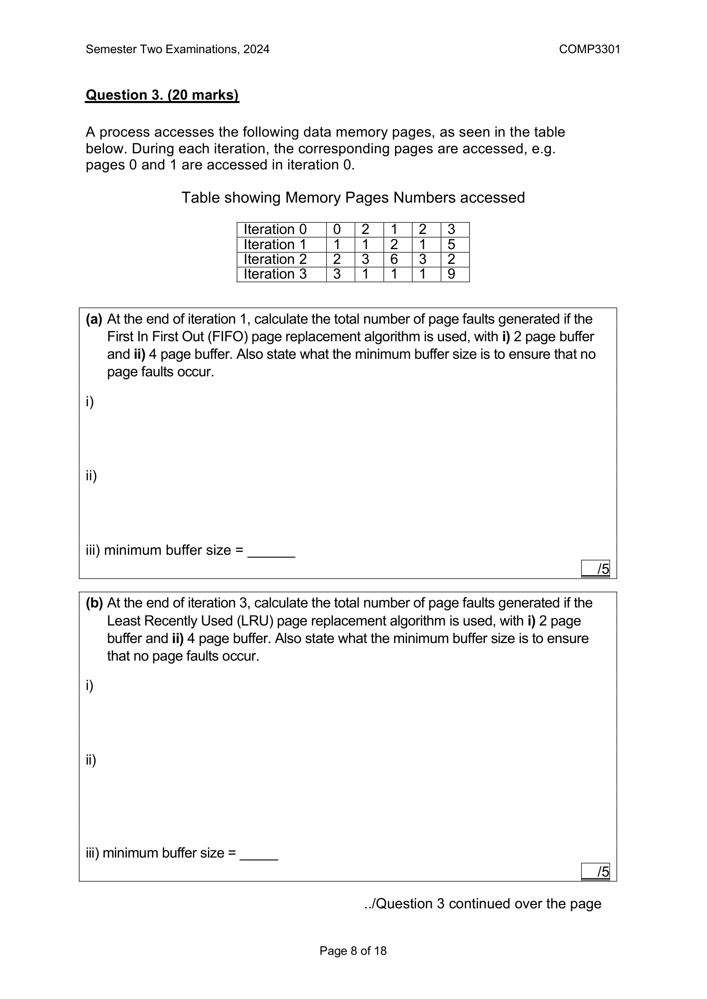

这张截图是操作系统架构期末考试的第三题，题目涉及**页面替换算法**，具体要求如下：

### 题目背景：

一个进程访问了以下数据内存页面，每次迭代访问不同的页面，表格中显示了每次迭代访问的页面。例如，迭代0访问页面0和1。

| Iteration   | Accessed Pages      |
| ----------- | ------------------- |
| Iteration 0 | 0  0  2  1  2  3    |
| Iteration 1 | 1  1  2  1  2  5    |
| Iteration 2 | 2  2  3  6  6  3  2 |
| Iteration 3 | 3  3  1  1  1  9    |

### 题目要求：

#### (a) 使用FIFO页面替换算法计算页面错误：

1. **i)** 使用2页缓冲区时，计算迭代1结束时的页面错误次数。
2. **ii)** 使用4页缓冲区时，计算迭代1结束时的页面错误次数。
3. **iii)** 计算保证没有页面错误发生的最小缓冲区大小。

#### (b) 使用LRU页面替换算法计算页面错误：

1. **i)** 使用2页缓冲区时，计算迭代3结束时的页面错误次数。
2. **ii)** 使用4页缓冲区时，计算迭代3结束时的页面错误次数。
3. **iii)** 计算保证没有页面错误发生的最小缓冲区大小。

### 解释与解法：

#### (a) FIFO 页面替换算法：

1. **FIFO**（先进先出）算法是基于页面访问顺序来决定页面替换的算法。它将最早进入缓冲区的页面最先替换。

* **计算步骤**：我们需要模拟页面访问的顺序，并根据FIFO的规则进行页面替换。如果页面不在缓冲区中，则会发生页面错误（page fault）。
* **2页缓冲区**：缓冲区最多只能存储2个页面，访问新的页面时，如果缓冲区已满，则替换最早进入的页面。
* **4页缓冲区**：缓冲区最多可以存储4个页面，规则同上，进行页面替换。

2. **最小缓冲区大小**：最小缓冲区大小是指能够确保所有页面都能被存储而不发生任何页面错误所需要的缓冲区大小。

#### (b) LRU 页面替换算法：

1. **LRU**（最近最少使用）算法会选择最久未被访问的页面进行替换。

* **计算步骤**：与FIFO不同，LRU基于页面的最近访问时间来进行替换。每次访问页面时，更新该页面的“最近使用”时间。如果缓冲区已满，则替换最久未使用的页面。

2. **最小缓冲区大小**：同FIFO，最小缓冲区大小是指能够确保所有页面都能被存储而不发生页面错误所需要的缓冲区大小。

### 总结：

这一部分考察的是页面替换算法（FIFO和LRU）在不同缓冲区大小下的表现。你需要通过模拟页面访问过程，计算不同情况下的页面错误次数，并找出最小缓冲区大小，以确保没有页面错误发生。

\[口语化表达]：
这道题是关于页面替换算法的，主要考察FIFO和LRU两种算法。你需要通过模拟每次页面的访问，计算不同缓冲区大小下的页面错误次数，看看在不同情况下页面怎么被替换，最后计算出最小的缓冲区大小，保证不会发生页面错误。

---

## 第 9 页

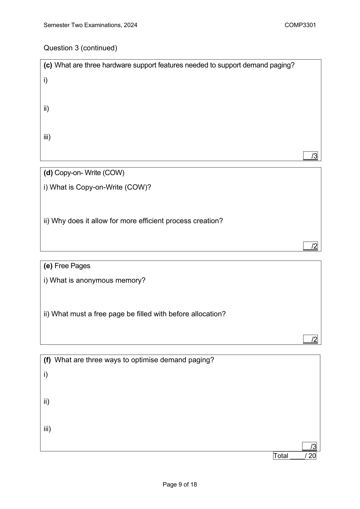

这张截图是操作系统架构期末考试的第三题的延续部分，内容涉及**需求分页、写时复制、空闲页面管理以及优化需求分页**。具体要求如下：

### 题目要求：

#### (c) 需求分页的硬件支持：

1. **i)** 列出支持需求分页的三种硬件支持特性。
2. **ii)** 需求分页是一种内存管理技术，它允许仅在实际访问某个页面时才将其加载到内存中。硬件特性会支持这一过程。

#### (d) 写时复制（COW）：

1. **i)** 什么是写时复制（Copy-on-Write，COW）？
2. **ii)** 为什么写时复制可以提高进程创建的效率？

#### (e) 空闲页面：

1. **i)** 什么是匿名内存？
2. **ii)** 在分配之前，空闲页面必须填充什么内容？

#### (f) 优化需求分页：

1. **i)** 优化需求分页的三种方式。
2. **ii)** 这些方式如何提高需求分页的效率？

### 详细解释：

#### (c) 需求分页硬件支持：

需求分页需要硬件的支持来管理页面的加载和替换。常见的硬件支持包括：

1. **分页机制**：硬件支持按页面加载内存，每个页面可以独立映射到物理内存地址。
2. **内存管理单元（MMU）**：MMU用来翻译虚拟地址到物理地址，并在发生缺页时触发中断。
3. **缺页中断处理**：当访问的页面不在内存中时，硬件会触发缺页中断，由操作系统处理页面加载。

#### (d) 写时复制（COW）：

1. **i)** 写时复制（COW）是一种优化内存分配的技术。在创建新进程时，父进程和子进程会共享相同的内存页面，直到其中一个进程试图修改这些页面时，操作系统才会将这些页面复制到新的内存位置，确保进程之间的数据不被意外修改。
2. **ii)** 写时复制使得进程创建更加高效，因为创建新进程时，父进程和子进程可以共享内存，而无需立即复制整个内存空间，只有在需要写入时才进行复制。

#### (e) 空闲页面：

1. **i)** **匿名内存**指的是没有明确文件对应的内存区域。这类内存通常由操作系统动态分配，且不与具体的文件相关联。
2. **ii)** 在分配之前，空闲页面通常会填充为零或其他特定值，以确保其内容不会泄漏给其他进程。操作系统会清除页面内容，确保其安全性。

#### (f) 优化需求分页：

1. **i)** 优化需求分页的三种方式：

* **页面预取**：通过预测进程将要访问的页面提前加载到内存中，减少缺页中断的频率。
* **最少使用页面替换算法**：替换那些最少使用的页面，减少页面替换次数。
* **页面锁定**：将频繁访问的页面锁定在内存中，避免被替换。

2. **ii)** 这些方式通过减少缺页中断和页面替换次数，提高了系统的性能，特别是在需要频繁访问数据的进程中。

### 总结：

这一部分主要考察了操作系统如何通过硬件支持、写时复制、空闲页面管理以及分页优化来提高内存管理的效率。你需要了解硬件对需求分页的支持，写时复制如何提高进程创建效率，空闲页面的管理策略，以及如何通过不同的优化方式来提升需求分页的性能。

\[口语化表达]：
这道题主要考察了需求分页、写时复制、空闲页面管理和分页优化的内容。你需要知道硬件如何支持需求分页，比如通过分页机制和内存管理单元来管理内存页面。写时复制是一种高效的进程创建方式，通过共享内存减少不必要的复制。空闲页面管理方面，空闲页面在分配前需要填充默认值来确保安全。最后，优化需求分页的方法包括页面预取、最少使用页面替换算法和页面锁定，这些方法能够有效减少缺页中断和提高内存访问效率。

---

## 第 10 页

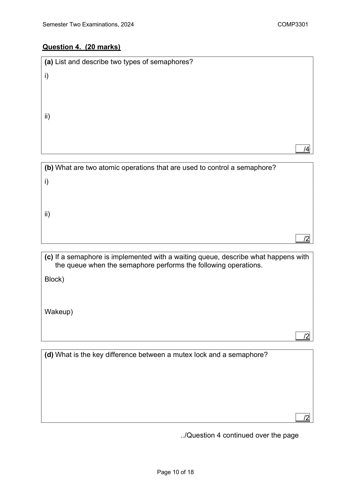

这张截图是操作系统架构期末考试的第四题，内容涉及**信号量**、**互斥锁**和**原子操作**。具体要求如下：

### 题目要求：

#### (a) 列出并描述两种信号量类型：

1. **i)** 描述一种信号量类型。
2. **ii)** 描述另一种信号量类型。

#### (b) 用于控制信号量的两种原子操作是什么？

1. **i)** 第一种原子操作。
2. **ii)** 第二种原子操作。

#### (c) 如果信号量是通过等待队列实现的，描述在信号量执行以下操作时，等待队列会发生什么变化：

1. **Block**（阻塞）操作。
2. **Wakeup**（唤醒）操作。

#### (d) 互斥锁和信号量的关键区别是什么？

### 详细解释：

#### (a) 信号量的两种类型：

1. **计数信号量**（Counting Semaphore）：可以取任意整数值，用来表示资源的数量。它允许多个进程访问同一个资源，常用于控制多个实例的资源（比如打印机、数据库连接池等）。
2. **二值信号量**（Binary Semaphore）：只能取0或1的值。它通常用于实现互斥操作，用于确保同一时刻只有一个进程能够进入临界区，常见于实现互斥锁。

#### (b) 用于控制信号量的原子操作：

信号量的控制通常依赖于两种基本的原子操作：

1. **P操作（Wait或Down）**：使信号量的值减1。如果信号量的值为0，进程会被阻塞，直到信号量的值大于0。
2. **V操作（Signal或Up）**：使信号量的值加1，如果有进程被阻塞，则唤醒其中一个进程。

#### (c) 信号量的等待队列操作：

* **Block操作（阻塞）**：当信号量的值为0时，执行P操作的进程会被阻塞并加入到等待队列中，等待信号量的值大于0时才能继续执行。
* **Wakeup操作（唤醒）**：当信号量的值被V操作增加时，如果有进程在等待队列中，它会被唤醒并允许继续执行。

#### (d) 互斥锁和信号量的关键区别：

* **互斥锁**（Mutex）通常用于同步访问共享资源，保证在同一时刻只有一个进程可以进入临界区。互斥锁有锁定和释放操作，每次只有一个线程能获得锁。
* **信号量**可以控制多个进程或线程对共享资源的访问，除了互斥外，还可以用于计数，支持多个线程同时访问资源，适用于多个实例资源的管理。

### 总结：

这一部分考察了信号量、互斥锁以及原子操作的基本概念和区别。你需要了解信号量的类型、原子操作的定义，如何通过信号量的操作来管理进程的阻塞和唤醒，以及互斥锁与信号量在进程同步方面的不同。

\[口语化表达]：
这道题主要问了关于信号量和互斥锁的一些基本概念。信号量有两种常见类型：计数信号量和二值信号量，前者用于控制多个实例的资源，后者用于互斥操作。控制信号量的原子操作有P操作（减少信号量并可能阻塞进程）和V操作（增加信号量并唤醒被阻塞的进程）。当信号量执行阻塞操作时，进程会被加入等待队列，而执行唤醒操作时，会从等待队列中唤醒进程。最后，互斥锁和信号量的区别在于，互斥锁是专门用来确保同一时刻只有一个进程访问共享资源，而信号量则能控制多个进程或线程对共享资源的访问。

---

## 第 11 页

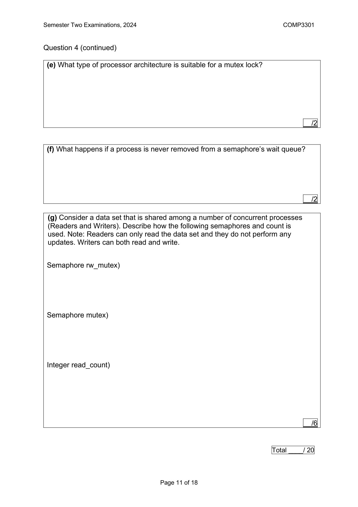

这张截图是操作系统架构期末考试第四题的继续部分，涉及**互斥锁**、**信号量的等待队列**以及**读写锁的管理**。具体要求如下：

### 题目要求：

#### (e) 什么类型的处理器架构适合用于互斥锁？

1. 描述适合用于互斥锁的处理器架构类型。

#### (f) 如果一个进程永远没有从信号量的等待队列中移除，会发生什么？

1. 解释如果进程没有被移除，可能带来的影响。

#### (g) 考虑一个数据集，该数据集被多个并发进程共享（包括读者和写者）。描述如何使用以下信号量和计数来控制：

* **Semaphore rw\_mutex**
* **Semaphore mutex**
* **Integer read\_count**

1. 解释这三个信号量和计数如何协作来管理读者和写者对共享数据集的访问。
2. 说明读者和写者在访问数据集时的行为。

### 详细解释：

#### (e) 互斥锁适合的处理器架构类型：

* **适合的处理器架构**：互斥锁需要支持原子操作，确保在同一时刻只有一个进程能进入临界区。支持**硬件原子操作**（如Test-and-Set、Compare-and-Swap等）的架构是理想的。例如，现代的多核处理器和支持原子操作的处理器架构（如Intel、ARM架构）都能有效实现互斥锁。

#### (f) 如果进程从信号量的等待队列中永远没有被移除：

* 如果一个进程从信号量的等待队列中永远没有被移除，这个进程将**永远被阻塞**，无法继续执行。这样会导致**死锁**，即某些进程永远得不到运行机会，整个系统的效率会大大降低。

#### (g) 读写锁的管理：

* **Semaphore rw\_mutex**：用于同步写者的访问。写者需要独占访问数据集，因此使用该信号量来确保同一时刻只有一个写者可以访问。
* **Semaphore mutex**：用于同步读者的访问，确保读者对`read_count`计数的更新是互斥的。通过该信号量来确保读者在更新读取计数时不会发生竞态条件。
* **Integer read\_count**：计数器，记录当前正在访问数据集的读者数量。当第一个读者开始访问数据时，`read_count`增加，最后一个读者完成访问时，`read_count`减少。

**流程**：

* **读者**：多个读者可以同时访问数据集，但当有写者在访问时，所有的读者都必须等待。每个读者在访问数据集前，先获取`mutex`信号量，确保对`read_count`的更新是互斥的。
* **写者**：写者需要独占数据集的访问，因此在访问前需要获取`rw_mutex`信号量，确保没有读者或其他写者正在访问数据集。

### 总结：

这一部分主要考察了互斥锁的处理器架构要求、信号量的等待队列管理以及如何通过信号量和计数来管理读者写者问题。你需要理解互斥锁和信号量的工作原理，以及如何使用信号量协作控制并发进程对共享资源的访问。

\[口语化表达]：
这道题主要讲了互斥锁、信号量等待队列和读写锁的管理。互斥锁需要硬件支持原子操作的架构来保证只有一个进程能访问临界区。如果进程没有从信号量的等待队列中移除，它会永远阻塞，导致死锁。对于读写锁问题，读者可以并发访问数据，但写者需要独占访问。通过`rw_mutex`、`mutex`信号量和`read_count`计数来管理读者和写者的同步，确保在任何时刻不会出现多个写者或写者与读者同时访问的情况。

---

## 第 12 页

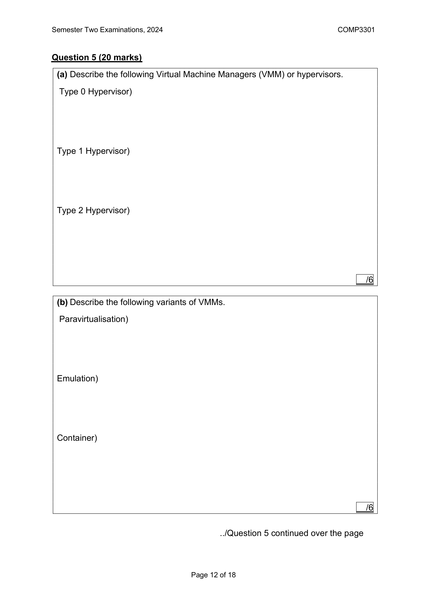

这张截图是操作系统架构期末考试的第五题，涉及\*\*虚拟机管理器（VMM）或超管理程序（Hypervisor）\*\*的不同类型和变体。具体要求如下：

### 题目要求：

#### (a) 描述以下类型的虚拟机管理器（VMM）或超管理程序（Hypervisor）：

1. **Type 0 Hypervisor**：
2. **Type 1 Hypervisor**：
3. **Type 2 Hypervisor**：

#### (b) 描述以下VMM的变体：

1. **Paravirtualisation（半虚拟化）**
2. **Emulation（仿真）**
3. **Container（容器）**

### 详细解释：

#### (a) 虚拟机管理器（VMM）或超管理程序（Hypervisor）的类型：

1. **Type 0 Hypervisor**（硬件层超管理程序）：

* Type 0 超管理程序直接运行在硬件上，直接控制硬件资源，而不依赖操作系统。它们是虚拟化的基础，例如 **裸机虚拟化**。这种类型的Hypervisor能够提供高效的资源管理，因为它不受操作系统的干扰。

2. **Type 1 Hypervisor**（裸机超管理程序）：

* Type 1 超管理程序也直接运行在硬件上，但它会将虚拟机管理和资源分配交给操作系统或其他虚拟化工具。常见的Type 1超管理程序包括 VMware ESXi、Microsoft Hyper-V等。它与操作系统关系较少，能提供较高的性能。

3. **Type 2 Hypervisor**（宿主机超管理程序）：

* Type 2 超管理程序是运行在主机操作系统上的，虚拟化是由主机操作系统提供支持的。常见的Type 2 超管理程序包括 VirtualBox、VMware Workstation等。由于它依赖于操作系统，它的性能相对较低，但适合桌面环境。

#### (b) VMM的变体：

1. **Paravirtualisation（半虚拟化）**：

* 半虚拟化是一种虚拟化技术，在这种技术下，虚拟机的操作系统需要对虚拟化感知，通常会修改操作系统以便与虚拟机管理程序交互。这种方式相比全虚拟化提供了更高的效率，因为它允许虚拟机直接与Hypervisor进行交互。

2. **Emulation（仿真）**：

* 仿真是指通过模拟硬件来实现虚拟化，虚拟机中的操作系统无需修改，它就能运行在与物理硬件不同的环境中。仿真通常用于硬件架构不同的环境中，虽然这种方式提供了灵活性，但性能相对较低。常见的仿真技术有QEMU。

3. **Container（容器）**：

* 容器化是一种操作系统级别的虚拟化，它通过共享宿主操作系统的内核来提供隔离的环境。容器通常比虚拟机更加轻量，并且启动速度更快，适用于微服务架构和云环境中的应用程序隔离。

### 总结：

这一部分的题目考察了不同类型的虚拟机管理器以及其变体。你需要了解**Type 0、Type 1和Type 2 Hypervisor**的区别，以及它们各自的特点和应用场景。题目还涉及了**半虚拟化、仿真**和**容器**等虚拟化技术的变体，了解这些变体的工作原理和适用场景能够帮助你更好地理解虚拟化技术在不同环境中的应用。

\[口语化表达]：
这道题主要讲了不同类型的虚拟机管理器。Type 0和Type 1超管理程序是直接运行在硬件上的，但Type 1一般需要操作系统提供虚拟化支持，而Type 2超管理程序则是依赖于操作系统的。接下来，题目还让你理解了几种虚拟化变体，包括半虚拟化，它需要操作系统做一些修改才能更高效地运行；仿真，它通过模拟硬件来实现虚拟化，但效率较低；还有容器，它通过共享操作系统内核来实现轻量级的隔离，非常适合现代应用。

---

## 第 13 页

这张截图是操作系统架构期末考试的第五题的延续部分，涉及\*\*虚拟机管理器（VMM）\*\*的内存管理和I/O访问。具体要求如下：

### 题目要求：

#### (c) 如果VMM启动时被分配了固定的内存量，而客操作系统（guest OS）需要的内存超过VMM提供的内存，描述VMM如何通过双重分页和“内存气球”驱动程序来解决这个问题：

1. **i)** 描述VMM如何通过双重分页来解决此问题。
2. **ii)** 描述VMM如何通过使用“内存气球”驱动程序来解决此问题。

#### (d) 列举四种VMM可以为客操作系统提供I/O访问的方式：

1. **i)** 第一种方式。
2. **ii)** 第二种方式。
3. **iii)** 第三种方式。
4. **iv)** 第四种方式。

### 详细解释：

#### (c) VMM内存管理：

1. **双重分页（Double Paging）**：

* 双重分页是一种处理虚拟内存不足的技术。当客操作系统需要的内存大于VMM所分配的内存时，VMM会使用两层分页机制：首先，VMM使用宿主机的物理内存来存储虚拟内存的页；当VMM的内存不足时，它将内存中的某些页面交换到磁盘，产生双重分页的现象。这种方式会导致性能下降，但可以应对内存需求较高的情况。

2. **内存气球（Memory Balloon）驱动程序**：

* 内存气球驱动程序是通过在虚拟机中运行一个特殊的驱动程序来动态地调整内存的分配。当客操作系统内存需求过大时，内存气球驱动程序会主动回收一些不常用的内存页面，通过在虚拟机中占用更多内存来释放宿主机的物理内存。这样可以避免直接使用磁盘分页，减少性能损失。

#### (d) VMM为客操作系统提供I/O访问的方式：

1. **设备虚拟化**：

* VMM通过虚拟化技术将宿主机的物理设备虚拟化为虚拟设备，并将这些虚拟设备提供给客操作系统。这样，多个虚拟机可以共享宿主机的物理硬件资源而不相互干扰。

2. **设备模拟**：

* VMM使用模拟技术来模拟物理设备。虚拟机对外界的I/O请求会先发送到VMM，VMM会将这些请求转发到宿主机的实际设备上进行处理。通过这种方式，虚拟机可以访问宿主机的设备。

3. **I/O共享**：

* VMM通过I/O共享技术，使多个虚拟机可以共享物理设备。例如，多个虚拟机可以共享一个虚拟的网络接口，或共享一个虚拟的硬盘。

4. **直接I/O访问**：

* VMM还可以通过提供直接I/O访问，使虚拟机能够直接访问宿主机的硬件设备。通过这种方式，虚拟机可以更高效地访问I/O资源，减少虚拟化的开销。

### 总结：

这一部分主要考察了VMM如何管理内存和I/O访问。对于内存管理，当客操作系统需要的内存超过VMM提供时，VMM可以通过双重分页和内存气球驱动程序来解决内存不足的问题。在I/O访问方面，VMM有多种方式来提供虚拟机与宿主机之间的I/O访问，包括设备虚拟化、设备模拟、I/O共享和直接I/O访问等。

\[口语化表达]：
这道题讲了VMM是如何管理内存和I/O的。首先，如果客操作系统需要的内存超过VMM提供的，VMM可以通过双重分页或内存气球驱动程序来应对，双重分页会将内存交换到磁盘，气球驱动程序则通过回收虚拟机的内存来释放宿主机内存。接着，VMM可以通过多种方式来提供I/O访问，包括通过虚拟化、模拟、共享I/O设备以及直接I/O访问，让虚拟机可以高效地使用宿主机的硬件。

---

## 第 14 页

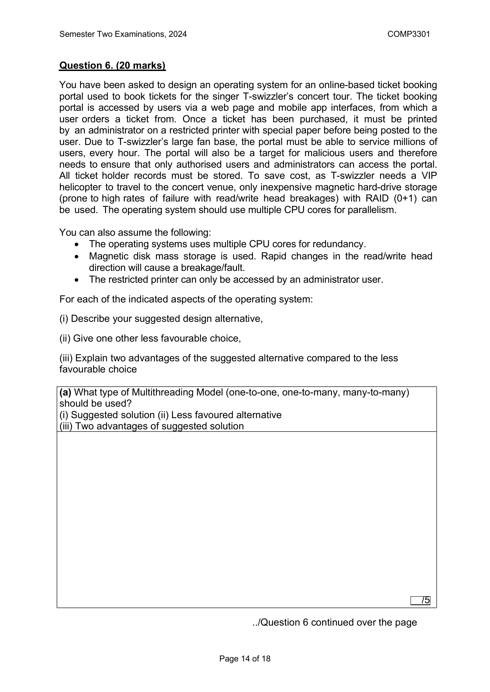

这张截图是操作系统架构期末考试第六题，涉及为T-swizzler音乐会设计一个在线售票系统的操作系统。系统要求考虑多个方面，如多线程模型、存储、并行性等。题目要求你为每个操作系统的设计要素提供解决方案和理由。

### 题目要求：

#### (a) 多线程模型的选择：

1. **i)** 给出建议的多线程模型（如一对一模型、一对多模型、或多对多模型）。
2. **ii)** 提供一个不太理想的替代方案。
3. **iii)** 解释建议方案相比于不太理想方案的两个优点。

### 设计背景：

* **系统功能**：系统需要能够处理大量用户请求，提供高效的并发处理。每个用户可以通过网页和移动应用接口订票。订票完成后，票据需要通过受限制的打印机打印，并由管理员审核后邮寄给用户。系统将处理大量的读写请求，因此需要冗余存储和高并发处理能力。
* **硬件要求**：系统使用多个CPU核心进行并行处理，并使用RAID 0+1配置的磁盘存储系统。由于系统的高并发和数据存储要求，硬件必须支持高效的磁盘操作。

你需要根据这些需求来选择和比较不同的多线程模型，分析每个模型的优缺点。

### 详细解释：

#### (a) 多线程模型的选择：

1. **i) 建议的多线程模型：**

* **多对多模型（many-to-many model）**：在这种模型下，多个用户请求可以通过多个内核线程来处理。操作系统会根据负载动态地将多个用户请求分配给多个线程，而这些线程则在有限数量的内核线程上执行。这个模型适合需要处理大量并发请求的系统，能够在多个线程和多个核心之间灵活分配资源。
2. **ii) 不太理想的替代方案：**

* **一对多模型（one-to-many model）**：在这个模型中，每个用户请求由一个单独的内核线程来处理。虽然这种模型简单，但它在处理高并发时效率较低，因为每个请求都需要单独的线程，这可能会导致系统资源的浪费和上下文切换的开销增大。
3. **iii) 建议方案的两个优点：**

* **资源利用更高效**：多对多模型允许操作系统根据需要动态地分配资源，这样可以在多个线程和CPU核心之间实现更好的负载均衡，提高资源的利用率。
* **更好的可伸缩性**：该模型能够适应不同规模的并发请求，可以根据系统负载动态地调整线程数量，从而提高系统的可伸缩性，特别适合像在线售票系统这样需要处理成千上万请求的场景。

### 总结：

这一部分主要考察了多线程模型的选择，建议使用多对多模型，因为它能够在多个线程和CPU核心之间有效分配资源，适应高并发请求的场景。与此相比，一对多模型的资源利用效率较低，可能导致系统性能问题。

\[口语化表达]：
这道题讲了选择合适的多线程模型。在这种高并发的在线售票系统中，**多对多模型**是最合适的选择，它能够动态分配线程和核心，充分利用系统资源，提高性能。而**一对多模型**虽然简单，但对于并发量大的系统来说，效率较低，容易浪费系统资源。多对多模型的优势在于资源利用率高、可伸缩性强，特别适合这种需要处理大量用户请求的场景。

---

## 第 15 页

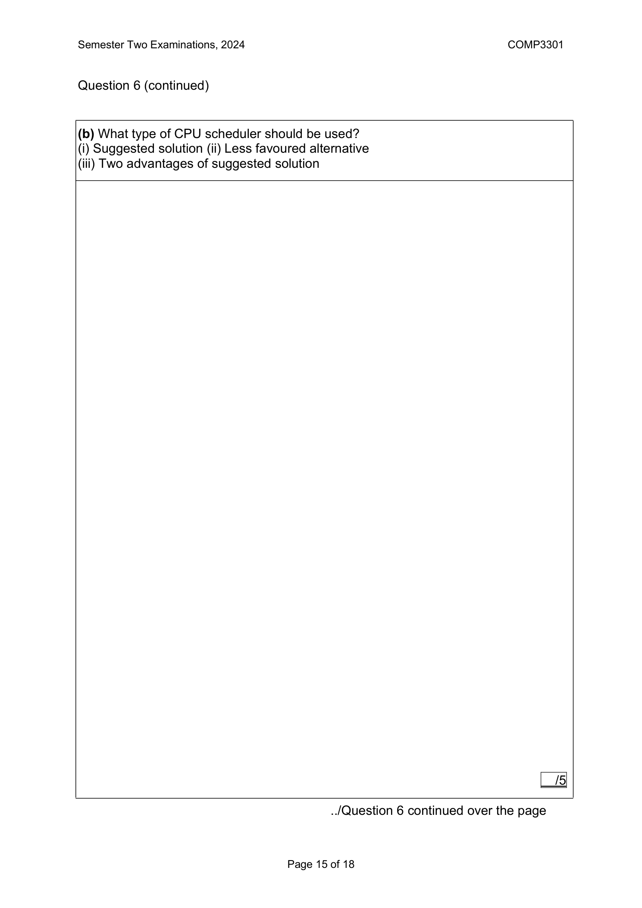

这张截图是操作系统架构期末考试第六题的延续部分，涉及**CPU调度器**的选择。题目要求选择合适的调度算法并解释优缺点。

### 题目要求：

#### (b) 应该使用哪种类型的CPU调度器？

1. **i)** 提出建议的解决方案（CPU调度算法类型）。
2. **ii)** 给出一个不太理想的替代方案。
3. **iii)** 解释建议解决方案相对于不太理想方案的两个优点。

### 详细解释：

#### (b) CPU调度器的选择：

1. **i) 建议的CPU调度器类型：**

* **多级反馈队列（Multilevel Feedback Queue, MLFQ）调度器**：

* 这种调度器根据进程的优先级动态调整进程的调度队列。高优先级队列用于时间片短的进程，低优先级队列用于时间片较长的进程。当进程长时间没有被执行时，它会被移到低优先级队列中，反之也会回到高优先级队列。这种算法兼顾了**响应时间**和**吞吐量**，非常适合高并发的系统。

2. **ii) 不太理想的替代方案：**

* **先来先服务（FCFS）调度**：

* 这种算法简单，按进程到达的顺序进行调度，但其缺点是可能导致**饥饿问题**，即长时间的低优先级进程可能无法被执行。此外，FCFS调度对于高并发环境的响应速度较慢，可能导致系统整体吞吐量下降。

3. **iii) 建议方案的两个优点：**

* **兼顾响应时间和吞吐量**：多级反馈队列调度器通过动态调整进程优先级，可以在保证重要进程得到优先调度的同时，也能提高低优先级进程的响应时间，提升系统整体效率。
* **减少饥饿问题**：与FCFS调度算法相比，多级反馈队列通过将长时间未执行的进程降级到低优先级队列，使得这些进程仍然有机会被执行，从而有效减少饥饿现象。

### 总结：

这一部分考察了不同类型的CPU调度算法，建议使用多级反馈队列调度（MLFQ），它能够在处理大量并发请求时有效平衡系统的响应时间和吞吐量。而不太理想的选择是FCFS调度，它虽然简单，但容易导致饥饿问题并影响系统效率。

\[口语化表达]：
这道题讲的是选择适合的CPU调度算法。对于高并发的在线售票系统，\*\*多级反馈队列（MLFQ）**调度算法是最好的选择，它能动态调整进程的优先级，兼顾响应速度和吞吐量，避免了长时间运行的进程不被执行。而**先来先服务（FCFS）\*\*调度虽然简单，但它容易导致饥饿问题，影响系统效率。因此，多级反馈队列在高并发环境中更为高效，能够平衡多个进程的执行。

---

## 第 16 页

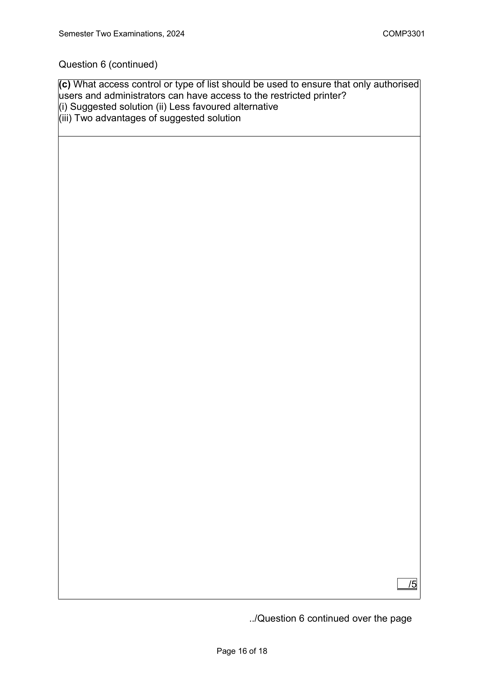

这张截图是操作系统架构期末考试第六题的延续部分，涉及**访问控制**和**权限管理**，具体要求如下：

### 题目要求：

#### (c) 应使用什么类型的访问控制或列表，以确保只有授权用户和管理员能够访问受限打印机？

1. **i)** 提出建议的解决方案。
2. **ii)** 提供一个不太理想的替代方案。
3. **iii)** 解释建议的解决方案相比不太理想方案的两个优点。

### 详细解释：

#### (c) 受限打印机的访问控制：

1. **i) 建议的访问控制类型：**

* **基于角色的访问控制（RBAC）**：

* 在RBAC模型下，系统根据用户的角色来授予不同的权限。只有被赋予特定角色的用户（如管理员或授权用户）才能访问受限资源（如受限打印机）。每个用户属于一个或多个角色，而角色定义了该用户可以访问的资源和操作权限。RBAC适合于有明确角色区分的场景，能够有效管理大规模用户权限。

2. **ii) 不太理想的替代方案：**

* **基于访问控制列表（ACL）的访问控制**：

* ACL通过为每个资源（如打印机）维护一个访问控制列表，列出哪些用户或用户组可以访问该资源。然而，ACL管理复杂，当资源数量增加时，ACL可能变得难以管理，尤其是在大规模系统中，维护每个资源的独立访问控制列表会增加管理负担。

3. **iii) 建议方案的两个优点：**

* **简化权限管理**：RBAC使得权限管理变得更加简洁，管理员只需管理角色，而不是逐个用户的权限。对于大规模用户系统，RBAC提供了一种高效的权限控制方式。
* **提高安全性**：RBAC可以确保只有特定角色的用户访问敏感资源（如打印机），避免了权限滥用的风险。通过角色的分配，可以确保各类用户仅能访问其应当拥有权限的资源，从而减少了误操作的可能性。

### 总结：

这一部分主要考察了在一个受限资源（如打印机）上实施访问控制的方案。RBAC是一种高效的访问控制模型，适合用来管理不同角色用户对资源的访问权限。而ACL虽然也能实现资源访问控制，但在管理大规模用户和资源时，可能会显得繁琐和不易维护。

\[口语化表达]：
这道题讲了如何管理对受限打印机的访问权限。推荐使用**基于角色的访问控制（RBAC）**，这种方法通过给用户分配角色来控制他们的访问权限，管理起来比较简单而且能提高系统的安全性。与此相比，\*\*基于访问控制列表（ACL）\*\*的方法虽然也有效，但在大规模系统中会变得复杂，管理起来不够高效。因此，RBAC对于这种情况更加适合。

---

## 第 17 页

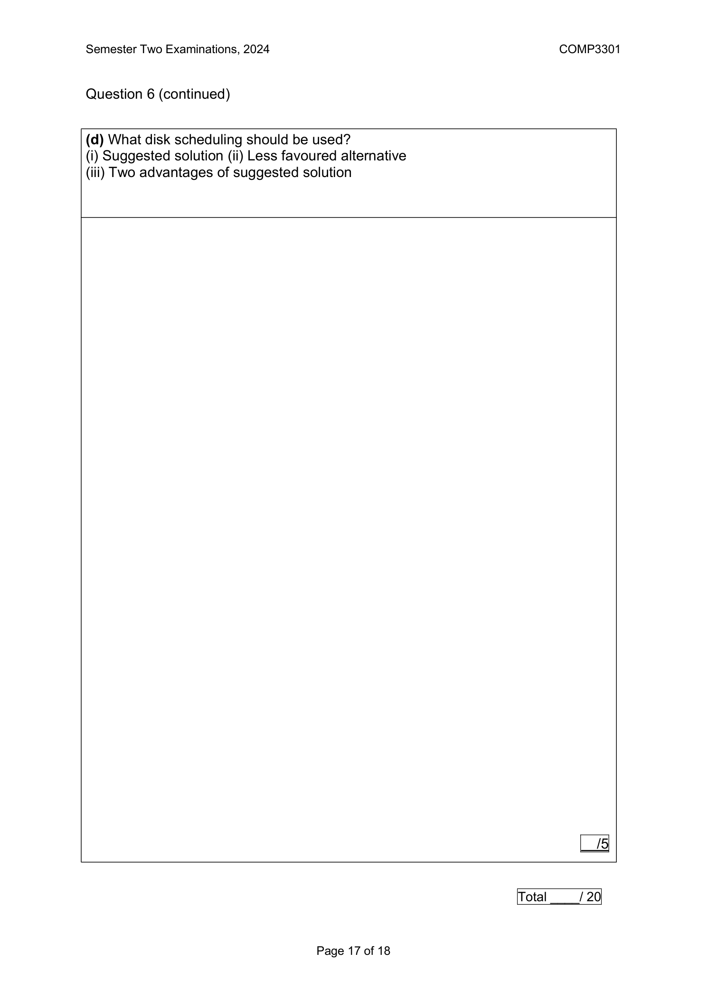

这张截图是操作系统架构期末考试第六题的延续部分，涉及**磁盘调度算法**的选择。题目要求你选择并解释适合的磁盘调度算法。

### 题目要求：

#### (d) 应该使用哪种磁盘调度算法？

1. **i)** 提出建议的磁盘调度算法。
2. **ii)** 提供一个不太理想的替代方案。
3. **iii)** 解释建议的解决方案相比不太理想方案的两个优点。

### 详细解释：

#### (d) 磁盘调度算法的选择：

1. **i) 建议的磁盘调度算法：**

* **SCAN调度算法**：

* SCAN算法是一种高效的磁盘调度算法，特别适合于有高读写需求的系统。该算法使磁头像扫描仪一样从磁盘的一个端到另一个端依次访问磁道，直到到达磁盘的一个边缘，然后再反向进行。这样磁头移动的距离较少，且可以更公平地服务所有请求。

2. **ii) 不太理想的替代方案：**

* **FCFS（先来先服务）调度**：

* FCFS算法是最简单的磁盘调度算法，按照请求到达的顺序来服务。然而，它的缺点是可能导致磁头移动非常频繁，特别是在请求之间相距很远时，导致较长的寻道时间（seek time）。这对于高并发的磁盘请求处理会造成性能瓶颈。

3. **iii) 建议方案的两个优点：**

* **减少寻道时间**：SCAN算法通过按顺序移动磁头来处理请求，减少了磁头在磁盘上的不必要移动，从而有效减少了寻道时间，提高了磁盘的整体性能。
* **更公平的服务**：SCAN算法通过先服务一端的请求，再服务另一端的请求，能够避免FCFS算法中可能出现的请求长时间被饿死（即等待过久才能得到服务）问题。

### 总结：

这一部分主要考察了磁盘调度算法的选择，建议使用**SCAN调度算法**，因为它能够减少磁头的寻道时间，提高磁盘整体的效率。而**FCFS调度**虽然简单，但容易导致磁头频繁移动，性能较差。

\[口语化表达]：
这道题讲的是选择合适的磁盘调度算法。对于高并发的系统，**SCAN调度算法**是一个非常合适的选择，它通过按顺序扫描磁盘来处理请求，减少了磁头的移动，从而提高了效率。而**FCFS调度**虽然简单，但会导致磁头频繁的移动，性能差，尤其在请求距离较远时，可能会导致系统效率低下。

---

## 第 18 页

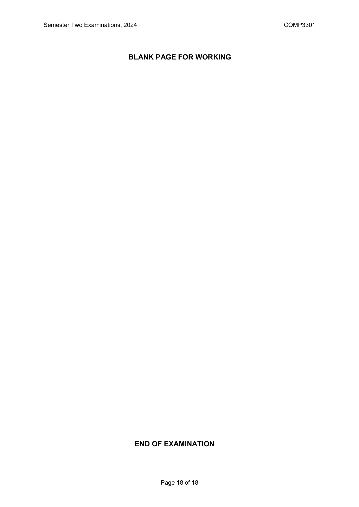

这张截图是操作系统架构期末考试的最后一页，显示了**空白工作页**和**考试结束**的标记。它并不包含具体的题目或答案，主要是为了提供额外的空间供考生做笔记或者写解答。

### 总结：

这页只是提供了额外的空白页，没有题目内容。你可以利用这页做任何需要的计算、草图或详细解答。
