202507290023后台姓名：朱广哲
用户ID：124224
用户1V1昵称：朱广哲
学生需求类型：全学期辅导（知识点+作业+考前）
学生基础：一般
期望上课时间：需要先匹配老师再确定上课时间
学生DUE时间：无
用户类型：1v1新用户
院校：UQ
年级：大二
专业：CS
科目代码：COMP3301
科目名称：Operating Systems Architecture
备注：这门课中国留学生比较少

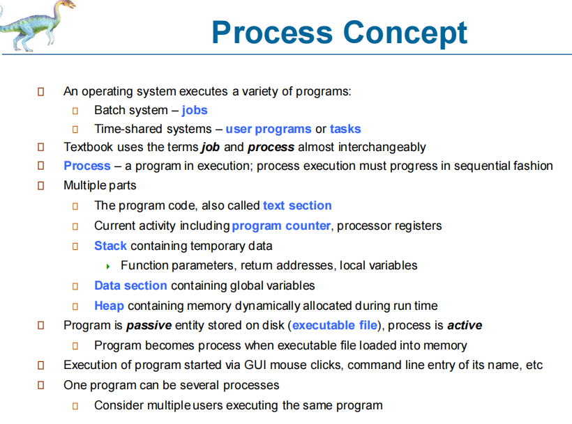

这张幻灯片讲的是操作系统中非常核心的概念：**Process（进程）**。我们下面将对照原文逐行**详细解释**每一条内容，帮助你真正理解“什么是进程”以及它的组成结构。

------

## 🧠 总体标题：**Process Concept（进程概念）**

操作系统必须能够管理多个程序的执行，而程序在执行时称为**进程（Process）**。每个进程在内存中有自己的空间和状态。

------

### 🔸 第一段：操作系统执行各种程序

> - An operating system executes a variety of programs:
>   - Batch system – **jobs**
>   - Time-shared systems – **user programs** or **tasks**

📌 **解释**：

- 操作系统执行的程序类型分为两种：
  - **Batch system**（批处理系统）：执行“作业（jobs）”，比如早期操作系统自动依次运行多个程序。
  - **Time-shared systems**（分时系统）：允许多个用户同时运行各自的**用户程序（user programs）** 或 **任务（tasks）**，比如你在电脑上开多个软件。

------

### 🔸 第二段：job 与 process 的术语

> - Textbook uses the terms **job** and **process** almost interchangeably

📌 **解释**：

- 教材中 “job” 和 “process” 有时可以互换使用，但一般 “process” 更常用于描述**运行中的程序**。

------

### 🔸 第三段：什么是 Process

> - **Process** – a program in execution; process execution must progress in sequential fashion

📌 **解释**：

- **Process 是正在执行的程序。**
- 注意：**程序（program）是静态的**，**进程（process）是动态的**，必须按照一定的**顺序执行**。

------

### 🔸 第四段：进程的组成部分（重点）

> - Multiple parts
>   - The program code, also called **text section**
>   - Current activity including **program counter**, processor registers
>   - **Stack** containing temporary data
>     - Function parameters, return addresses, local variables
>   - **Data section** containing global variables
>   - **Heap** containing memory dynamically allocated during run time

📌 **解释**：

进程由多个部分组成：

| 部分                | 内容                                                 |
| ------------------- | ---------------------------------------------------- |
| **text section**    | 程序代码段（即机器码）                               |
| **program counter** | 指示当前执行哪一条指令（记录程序运行的当前位置）     |
| **registers**       | 存储临时数据、状态、结果（比如累加器、栈指针等）     |
| **stack**           | 函数调用时使用的内存：局部变量、函数参数、返回地址   |
| **data section**    | 存放**全局变量、静态变量**（程序一开始就存在）       |
| **heap**            | 在程序运行时，动态分配的内存区域（比如 malloc、new） |

👉 这部分正好对应你上张图中的内存布局图！

------

### 🔸 第五段：程序是静态的，进程是动态的

> - Program is **passive** entity stored on disk (**executable file**), process is **active**

📌 **解释**：

- **程序（Program）**是磁盘上的可执行文件，是“静态”的。
- **进程（Process）**是程序加载进内存并开始执行后形成的，是“动态”的。

------

### 🔸 第六段：进程的产生

> - Program becomes process when executable file loaded into memory

📌 **解释**：

- 当程序被加载进内存并开始运行，就从“程序”变成了“进程”。

------

### 🔸 第七段：程序的执行方式

> - Execution of program started via GUI mouse clicks, command line entry of its name, etc

📌 **解释**：

- 程序的执行可以通过多种方式开始，比如：
  - 双击图标
  - 命令行运行程序名
  - 脚本调用

------

### 🔸 第八段：一个程序可以对应多个进程

> - One program can be several processes
>   - Consider multiple users executing the same program

📌 **解释**：

- 多个用户可以运行同一个程序，这时系统会为每个用户创建**独立的进程**，即使他们运行的是同一个 `.exe` 文件。

------

## 🧾 总结：

| 术语                     | 含义                                       |
| ------------------------ | ------------------------------------------ |
| **Program**              | 静态的代码（例如 `a.out`, `.exe`）         |
| **Process**              | 活动中的程序，已加载到内存，并被调度执行   |
| **Text/Data/Stack/Heap** | 进程内存空间的四个主要部分                 |
| **多个进程**             | 可以由同一个程序产生，例如每个用户一个进程 |

------

如果你想，我也可以给你做一个中文总结图，来可视化这些内容。是否需要？


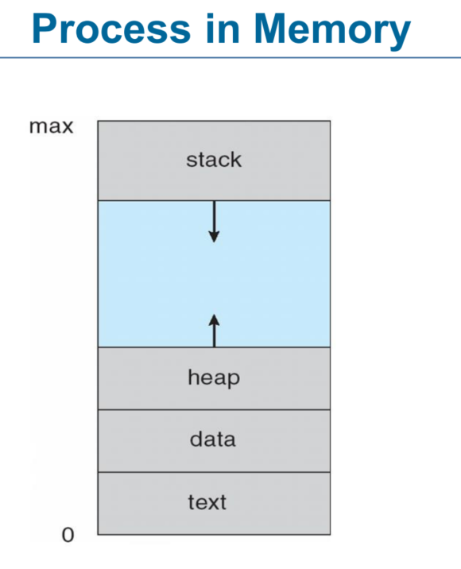

这张图是操作系统中「**进程在内存中的布局**」（Process in Memory Layout）示意图，通常用于解释一个程序在运行时是如何被组织和分配内存的。我们从下到上逐个部分进行详细解释：

------

### 📌 整体结构

这张图显示了一个进程在内存中的虚拟地址空间布局，从地址 **0（底部）** 到 **max（顶部）**。每个部分负责不同类型的数据和行为。

------

### 各部分详细说明：

#### 1. **Text（代码段）**

- **位置**：最底部（地址从 0 开始）
- **内容**：包含程序的**机器代码（已编译好的指令）**，也叫代码段。
- **特性**：
  - 通常是**只读**的，防止程序意外或恶意修改指令。
  - 多个进程可以共享相同的代码段（如多个运行同一个程序的进程）。

------

#### 2. **Data（数据段）**

- **内容**：存放程序中**已初始化的全局变量和静态变量**。

- **例如**：

  ```c
  int global_var = 5;  // 存在 data 段中
  ```

- 这些变量在程序启动时就已经有初始值。

------

#### 3. **Heap（堆）**

- **用途**：用于**动态内存分配**（例如通过 `malloc()`、`new`）。
- **增长方向**：**向上增长**（图中箭头向上）。
- **特性**：
  - 程序运行时按需分配，使用 `free()` 或 `delete` 释放。
  - 堆空间太小会导致**堆溢出**（heap overflow）。

------

#### 4. **Stack（栈）**

- **用途**：用于**函数调用的局部变量、参数、返回地址等**。
- **增长方向**：**向下增长**（图中箭头向下）。
- **特性**：
  - 每次函数调用会分配一块栈帧（stack frame）。
  - 函数返回后，这块空间自动释放。
  - 如果函数调用太深，会导致**栈溢出**（stack overflow）。

------

### 🟦 蓝色区域：堆与栈之间的“空闲空间”

- 这是堆和栈之间的可用内存区域。
- 它们分别从两端增长：堆向上，栈向下。
- 如果两者“撞上了”，说明内存耗尽，可能导致崩溃（Out of Memory）。

------

### 总结表格：

| 区域  | 内容                  | 增长方向 | 示例               |
| ----- | --------------------- | -------- | ------------------ |
| Text  | 代码指令              | 固定     | `main()`函数指令   |
| Data  | 初始化的全局/静态变量 | 固定     | `int g = 10;`      |
| Heap  | 动态分配的变量        | 向上     | `malloc()`, `new`  |
| Stack | 函数局部变量          | 向下     | 函数参数、本地变量 |

------

### 💡 补充知识：

- 这是**虚拟内存布局**，并非物理内存位置。
- 操作系统通过内存管理单元（MMU）将虚拟地址映射到实际物理地址。
- 各部分有不同的权限（如 stack 可读写，text 只读等）。

------

如果你正在学习操作系统、C/C++编程或者内存管理，这张图是一个非常关键的理解基础。

需要我用中文进一步解释某个具体区域或结合实际代码讲解吗？

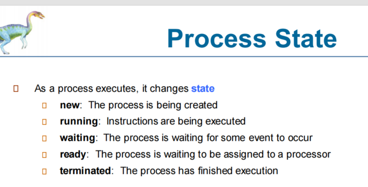

这张幻灯片讲的是操作系统中「进程的状态（**Process State**）」概念。一个进程在整个生命周期中会经历不同的状态，这些状态反映了它当前所处的执行阶段。

下面我们逐条**结合原文内容**进行详细解释：

------

## 🧠 标题：**Process State（进程状态）**

> As a process executes, it changes **state**
>  （当一个进程执行时，它会改变自己的状态）

📌 **解释**：
 进程不是一开始就处于“运行”状态的。它要经过**多个状态转换**，每个状态都有特定的含义和作用。

------

### 🔸 状态一：**new** – 进程正在被创建

> new: The process is being created
>  （new：进程正在被创建）

📌 **解释**：

- 系统刚接收到用户启动程序的请求。
- 操作系统正在**分配资源**（如内存空间、PCB 等）以创建新的进程。
- 此时进程尚未准备运行。

------

### 🔸 状态二：**running** – 正在执行指令

> running: Instructions are being executed
>  （running：进程正在执行指令）

📌 **解释**：

- CPU 正在执行该进程的代码。
- 每一时刻**只有一个进程能处于 running 状态**（在单核 CPU 上）。
- 是进程最“活跃”的状态。

------

### 🔸 状态三：**waiting** – 等待事件发生

> waiting: The process is waiting for some event to occur
>  （waiting：进程在等待某个事件发生）

📌 **解释**：

- 进程暂时不能继续执行，**在等待外部事件**，如：
  - 用户输入（键盘、鼠标）
  - 网络数据到达
  - 磁盘读写完成
- 此时它会被挂起，让出 CPU，避免资源浪费。

------

### 🔸 状态四：**ready** – 等待分配 CPU

> ready: The process is waiting to be assigned to a processor
>  （ready：进程正在等待被调度器分配 CPU）

📌 **解释**：

- 进程已准备好执行，但**暂时没有 CPU**。
- 一旦有 CPU 可用，调度器会把它转为 running 状态。

------

### 🔸 状态五：**terminated** – 执行结束

> terminated: The process has finished execution
>  （terminated：进程已完成执行）

📌 **解释**：

- 进程的代码已经全部执行完毕，或被系统/用户终止。
- 系统会释放该进程占用的所有资源（如内存、打开的文件等）。

------

## 🔁 状态转换示意图（推荐记住）

```
        +--------+
        |  new   |
        +--------+
             |
             v
        +--------+
        | ready  |<------------+
        +--------+             |
             |                 |
             v                 |
        +--------+             |
        |running |             |
        +--------+             |
         |       |             |
         v       v             |
     waiting  terminated       |
         |                     |
         +---------------------+
```

------

## 📝 小结表格：

| 状态           | 含义                       |
| -------------- | -------------------------- |
| **new**        | 进程正在被创建             |
| **ready**      | 进程已就绪，等待 CPU       |
| **running**    | 进程正在被 CPU 执行        |
| **waiting**    | 等待某个事件（如 I/O）完成 |
| **terminated** | 进程已完成或被终止         |

------

📌 **考点提示（操作系统课常见问题）**：

- 单核 CPU 任意时刻最多只有一个 running 状态。
- waiting 状态的进程不会消耗 CPU，但可能持有其他资源。
- ready 和 waiting 都不是运行态，区别是是否已经准备好执行。

------

是否需要我帮你把这些状态和内存结构画成一张综合图来帮助记忆？

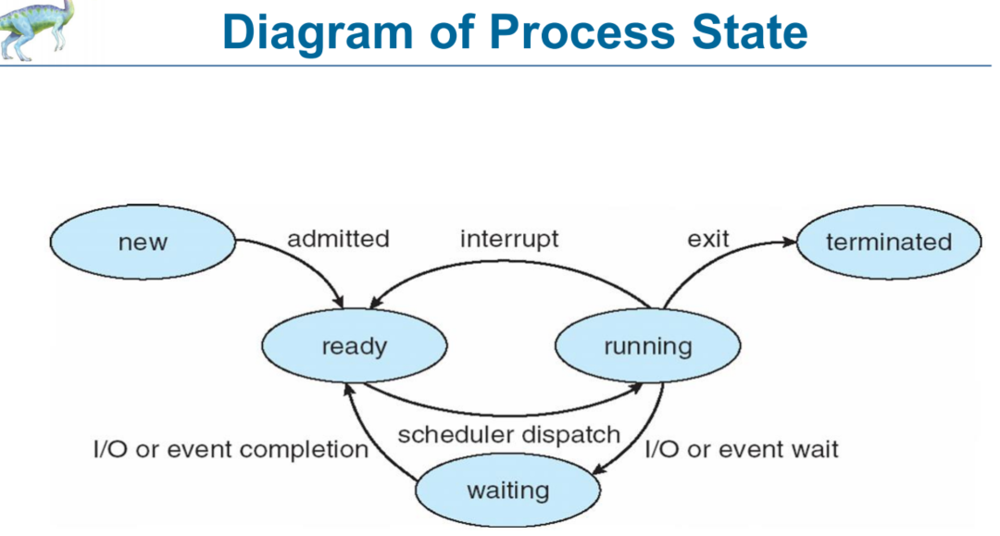

这张图是来自《Operating System Concepts 第九版》的“**Diagram of Process State**（进程状态图）”，它详细描述了一个进程在其生命周期中可能经历的**五种状态**以及**状态之间的转换路径**。下面我将根据图中内容进行详细解释：

------

## 🌐 一、图中包含的五种基本进程状态：

| 状态名                 | 含义                                  |
| ---------------------- | ------------------------------------- |
| **New（新建）**        | 进程正在被创建，还未就绪              |
| **Ready（就绪）**      | 进程已准备好运行，等待被调度器分配CPU |
| **Running（运行）**    | 进程正在CPU上执行指令                 |
| **Waiting（等待）**    | 进程因等待I/O或事件，暂时无法继续运行 |
| **Terminated（终止）** | 进程已完成或被终止，不再执行          |

------

## 🔁 二、状态之间的转换路径和触发条件：

| 触发事件                                     | 从状态  | 到状态     | 说明                                           |
| -------------------------------------------- | ------- | ---------- | ---------------------------------------------- |
| **admitted（被接纳）**                       | New     | Ready      | 进程被创建并进入就绪队列                       |
| **scheduler dispatch（调度器分派）**         | Ready   | Running    | 调度器选择该进程在CPU上执行                    |
| **I/O or event wait（等待I/O或事件）**       | Running | Waiting    | 进程发出I/O请求或等待某事件，主动让出CPU       |
| **I/O or event completion（I/O或事件完成）** | Waiting | Ready      | 等待的I/O或事件完成，进程重新进入就绪队列      |
| **interrupt（中断）**                        | Running | Ready      | 时间片耗尽或被更高优先级进程抢占，进入就绪队列 |
| **exit（退出）**                             | Running | Terminated | 进程执行完毕或因错误被终止                     |

------

## 🧠 三、总结图中过程逻辑

一个进程通常遵循以下生命周期：

1. **创建** → `new`
2. **进入就绪队列** → `ready`
3. **被调度运行** → `running`
4. 可能：
   - **发出I/O请求** → `waiting` → 等待完成后再回到 `ready`
   - **被抢占/中断** → 返回 `ready`
   - **正常执行完** → `terminated`
5. 这样不断循环，直到终止。

------

## 📘 图书信息来源

- 图出自：《Operating System Concepts》第9版
- 作者：Silberschatz, Galvin and Gagne
- 图示编号：**图3.7**

------

如果你需要我帮你翻译成中文教材风格，或者需要用具体例子解释每个状态，我也可以继续补充。需要吗？

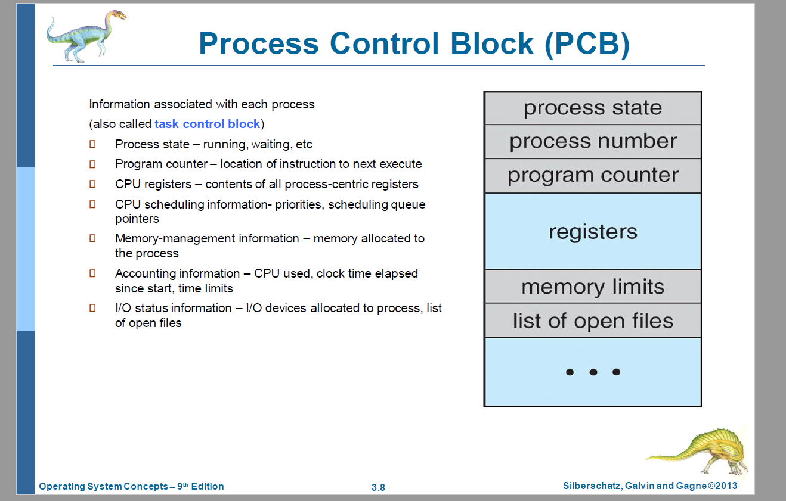

太好了！你现在贴的是《Operating System Concepts》第9版中关于 **进程控制块（PCB，Process Control Block）** 的内容，对理解操作系统中的**进程管理机制**非常关键。

------

## 🧩 我可以帮你准备的内容包括：

### 📘 一、图中内容解释（英文 + 中文）

我们可以提炼图和文字说明，整合成清晰的讲解结构，例如：

------

### **1. 什么是 PCB？**

**Process Control Block（进程控制块）** 是操作系统中用于描述和管理一个**进程的所有关键信息**的数据结构。它有时也被称为 **task control block（任务控制块）**。

------

### **2. PCB 包含哪些信息？**

| 分类                               | 内容描述                                    | 示例            |
| ---------------------------------- | ------------------------------------------- | --------------- |
| **进程状态（process state）**      | 当前状态：如 ready, running, waiting 等     | running         |
| **进程号（process number）**       | 唯一标识进程的编号                          | PID 1023        |
| **程序计数器（program counter）**  | 指向下一条将要执行的指令地址                | 0x0000FF20      |
| **CPU寄存器（CPU registers）**     | 所有寄存器的值（在上下文切换时保存/恢复）   | eax, ebx, etc   |
| **CPU调度信息（scheduling info）** | 包括优先级、调度队列位置、其他调度参数      | priority: 5     |
| **内存管理信息（memory info）**    | 分配给进程的内存区域，如基址、限制等        | base=0x2000     |
| **会计信息（accounting info）**    | 统计信息，如使用CPU时间、运行时间、时间限制 | CPU time: 10s   |
| **I/O状态信息（I/O status）**      | 分配的I/O设备、打开的文件列表               | open: file1.txt |

------

### 🧠 示例总结：

当系统在不同进程之间进行切换（context switch）时，就需要保存当前进程的PCB，并加载新进程的PCB。可以理解为操作系统用PCB来“记住”每个进程的当前状态。

------

## ✅ 下一步：

你可以告诉我：

1. 你已经写了哪部分？（贴出内容）
2. 你需要我继续写哪些部分？（如讲义、笔记、PPT、翻译等）

准备好了我就可以帮你衔接整理！


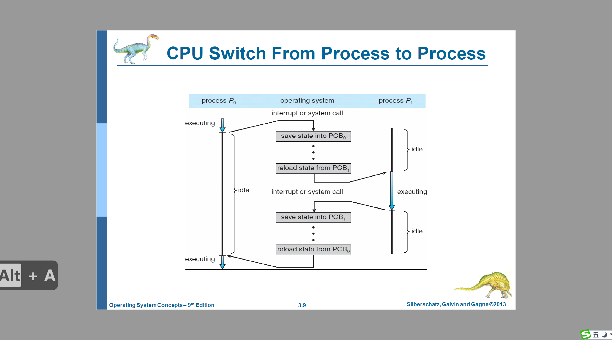

当然可以！这张图出自《Operating System Concepts》第9版第3.9页，标题是 **"CPU Switch From Process to Process"（CPU从一个进程切换到另一个进程）**。下面我将根据图中流程和原文风格，进行详细解释：

------

## 🧠 图中内容逐步详细解释（原文意思+中文翻译）

------

### 💡 场景简介：

当操作系统从一个进程（比如进程 P₀）切换到另一个进程（比如进程 P₁）时，就会发生所谓的“**上下文切换（context switch）**”。

这个图清晰地展示了整个切换的过程，包括：

1. 进程 P₀ 正在运行；
2. 操作系统响应中断或系统调用；
3. 保存 P₀ 的状态；
4. 加载 P₁ 的状态；
5. CPU 转而执行 P₁；
6. 之后又可以反过来切换回来。

------

### 🧩 图中流程解释：

------

#### ➤ 第一部分（进程 P₀ 到进程 P₁）：

| 时间线               | 步骤说明                                                  |
| -------------------- | --------------------------------------------------------- |
| **Process P₀**       | 正在执行（executing）                                     |
| **Operating System** | 遇到中断（interrupt）或系统调用（system call）            |
| **OS 动作①**         | 保存 P₀ 的状态到 PCB₀：包括程序计数器、寄存器、内存等信息 |
| **OS 动作②**         | 从 PCB₁ 加载 P₁ 的状态（即恢复进程 P₁ 的上下文）          |
| **Process P₁**       | 被切换至“执行状态”（executing）                           |

------

#### ➤ 第二部分（P₁ 切换回 P₀，形成循环）：

同样的过程反向执行：

- 当 P₁ 执行时发生中断或系统调用
- 操作系统保存 P₁ 的状态到 PCB₁
- 然后加载 PCB₀ 的状态
- 让 P₀ 恢复执行

------

## 🔁 什么是 Context Switch（上下文切换）？

> **上下文切换**是指操作系统在调度进程时，**保存当前进程的状态**并**加载另一个进程的状态**，从而让 CPU 从一个进程“切换”到另一个进程的过程。

- 上下文 = 进程的执行环境信息（存于 PCB 中）
- 切换过程必须保证两个进程之间的状态互不影响

------

## 📌 关键术语解释

| 术语                            | 含义                                                       |
| ------------------------------- | ---------------------------------------------------------- |
| **PCB (Process Control Block)** | 每个进程都有一个 PCB，记录该进程所有的状态和上下文信息     |
| **save state into PCB**         | 将当前进程（如 P₀）的寄存器值、程序计数器等内容写入 PCB    |
| **reload state from PCB**       | 从另一个进程（如 P₁）的 PCB 中读取保存的信息并恢复运行状态 |
| **interrupt/system call**       | 导致进程切换的触发机制，比如外部中断、时间片到、I/O请求等  |

------

## ✅ 总结（中文大意）：

图 3.9 展示了 CPU 如何在两个进程之间来回切换：

- 操作系统会在进程之间切换时保存和恢复上下文。
- 这些上下文信息保存在 PCB 中。
- 上下文切换是多道程序设计中最核心的一部分，它保证了多任务处理的正确性和连续性。

------

如果你需要我把这部分写成课堂讲义风格、报告格式、中文笔记或添加具体例子，请告诉我，我可以继续整理！

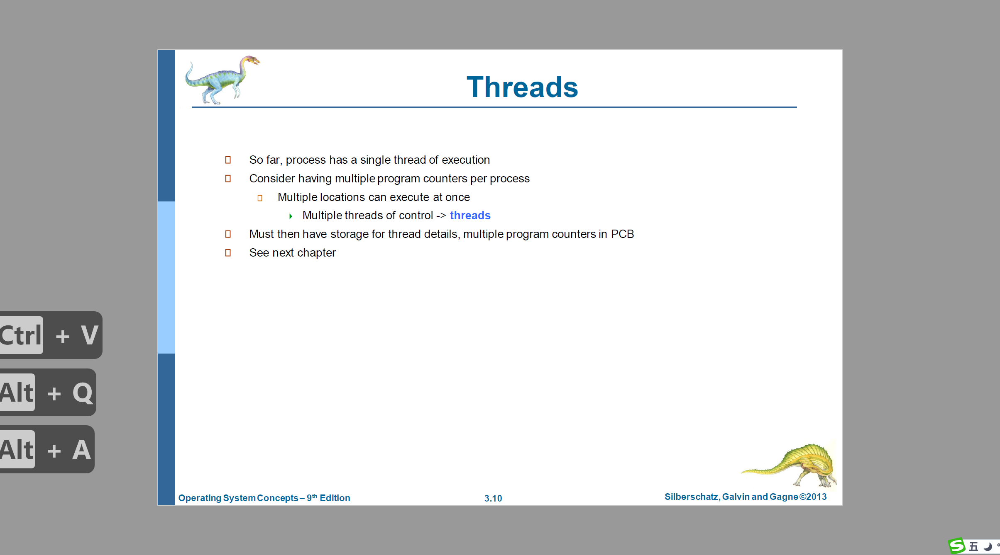

这张幻灯片出自《Operating System Concepts》第9版第3.10页，标题为：

> **Threads（线程）**

这页是引入“线程”的概念，作为**传统进程模型的扩展**，为接下来的章节做铺垫。下面我将逐句进行详细解释，并补充原文背后的含义。

------

## 📌 Slide 原文 + 中文逐句解释：

------

### 🔹 So far, process has a single thread of execution

**到目前为止，我们认为每个进程只有一个执行线程。**

▶️ 意思是之前章节中，默认一个进程一次只能做一件事：有一个程序计数器（PC）、一组寄存器和一条执行路径。

------

### 🔹 Consider having multiple program counters per process

**现在考虑：如果每个进程中有多个程序计数器会怎样？**

▶️ 程序计数器（Program Counter, PC）指向当前将要执行的下一条指令。如果一个进程中有多个 PC，代表它可以**同时执行多个代码路径**（即多个线程）。

------

### 🔸 Multiple locations can execute at once

**这就意味着：多个位置可以同时执行。**

▶️ 一个进程内部可以并行处理多个任务，例如一个线程处理用户输入，另一个处理文件读写，第三个线程处理网络请求等。

------

### 🔸 Multiple threads of control → threads

**多个执行控制流（threads of control）就形成了“线程（threads）”。**

▶️ 线程是轻量级进程（LWP），是进程中的执行单元。多个线程共享一个进程的资源（如内存空间、打开文件等），但每个线程有自己的**程序计数器、寄存器、栈**。

------

### 🔹 Must then have storage for thread details, multiple program counters in PCB

**这时，PCB 中必须增加用于存储多个线程状态的信息，比如多个程序计数器。**

▶️ 如果一个进程有多个线程，每个线程都要保存自己的上下文，因此 PCB（或类似结构）必须扩展来支持这些内容。

------

### 🔹 See next chapter

**详情请见下一章。**

▶️ 线程是重要的操作系统概念，接下来的章节将介绍线程的模型、优点、调度方式、多线程编程等。

------

## ✅ 总结这页幻灯片的重点：

- 传统模型中，一个进程只有一个控制流（thread of execution）。
- 引入**多线程（Multithreading）**概念后，单个进程可以有多个执行路径。
- 每个线程都有自己的程序计数器，但共享进程资源。
- 线程的存在需要扩展 PCB 或使用 **线程控制块（TCB）** 来记录线程信息。
- 为后续“线程”章节做引入。

------

如果你需要我把这些内容整理成课堂讲义或学习笔记风格，也可以继续帮你扩展！是否继续？

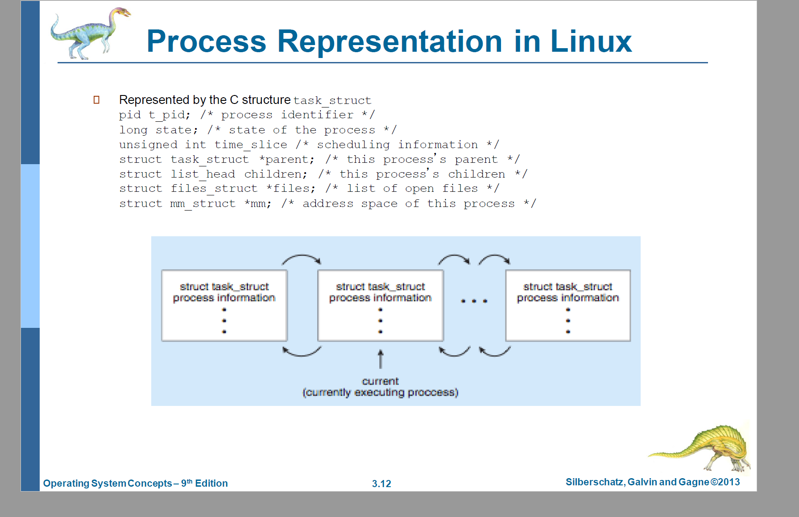

你现在贴的是《Operating System Concepts》第9版第 **3.12** 页的内容，标题为：

> **Process Representation in Linux（Linux 中的进程表示）**

这张图和内容解释的是：**在 Linux 操作系统中，进程是如何用 C 语言结构体表示的**，特别是使用 `task_struct` 结构体来保存每一个进程的所有信息。

------

## 🔍 原文和图解详细解释（含注释翻译）：

------

### 🔷 1. **进程在 Linux 中的表示方式**

Linux 使用 C 语言中的结构体（`struct`）来表示每个进程，结构体名为：

```c
struct task_struct
```

这个结构体就是一个进程的“身份证”，里面包含了所有与该进程有关的信息。

------

### 🔷 2. **task_struct 中包含的典型字段和含义如下：**

| 字段名                        | 类型       | 说明（英文注释翻译）                         |
| ----------------------------- | ---------- | -------------------------------------------- |
| `pid_t pid;`                  | 整型       | **进程标识符（PID）**，每个进程唯一          |
| `long state;`                 | 长整型     | **进程当前状态**（比如：就绪、运行、等待等） |
| `unsigned int time_slice;`    | 无符号整型 | **时间片信息**，用于进程调度                 |
| `struct task_struct *parent;` | 指针       | 指向该进程的 **父进程结构体**                |
| `struct list_head children;`  | 链表头     | 该进程的所有子进程组成的链表                 |
| `struct files_struct *files;` | 指针       | 指向该进程 **打开的文件列表**                |
| `struct mm_struct *mm;`       | 指针       | 该进程的 **内存地址空间结构体**              |

------

### 🔷 3. 图示解释：

下方蓝框图表示的是：
 系统中有多个 `task_struct` 结构体组成的双向链表，每个结构体代表一个进程。

图中说明：

- 每个方块是一个进程的 `task_struct`（即进程控制块）
- 中间有一个箭头指向当前运行的进程，标注为：

```txt
current
(currently executing process)
```

意味着系统中有一个指针 `current` 永远指向正在运行的那个进程的 `task_struct`。

------

### 📌 小补充：

- **链表结构** 是 Linux 内核中用来组织进程的一种方式，可以快速遍历所有进程。
- `task_struct` 就是 Linux 中的 **PCB（Process Control Block）**。

------

## ✅ 总结：

| 要点                         | 内容                                                    |
| ---------------------------- | ------------------------------------------------------- |
| Linux 用什么结构体表示进程？ | `task_struct`                                           |
| 它包含哪些信息？             | PID、状态、父子关系、调度信息、打开的文件、地址空间等   |
| task_struct 是什么？         | 是 Linux 中的 **进程控制块（PCB）**                     |
| 多个进程之间如何组织？       | 组成链表，系统维护一个 `current` 指针指向当前运行的进程 |

------

如果你正在写笔记或文档，我可以把这些整理成结构化段落或讲义格式继续扩展。是否需要？

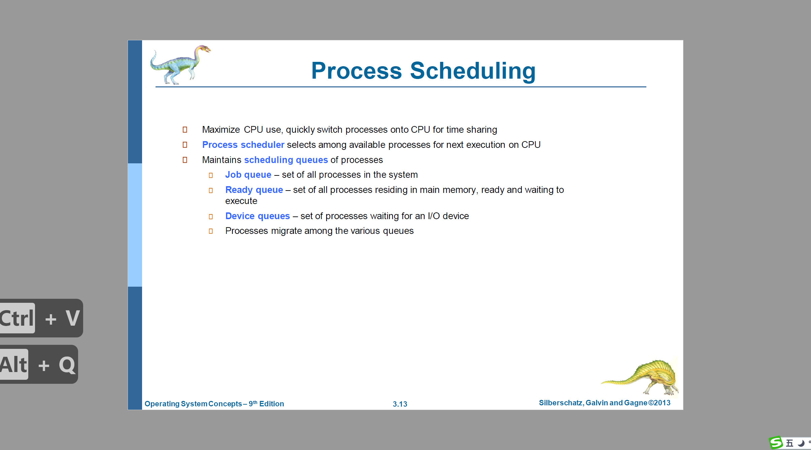

你贴的这张幻灯片来自《Operating System Concepts》第9版第 **3.13 页**，标题是：

> **Process Scheduling（进程调度）**

这页内容是操作系统“进程调度”部分的引言，说明调度的目标、调度器作用、以及几种典型的调度队列。以下是根据原文的详细解释：

------

## 📘 英文原文逐句解释 + 中文翻译：

------

### 🔸 Maximize CPU use, quickly switch processes onto CPU for time sharing

**最大化 CPU 使用率，快速将进程切换到 CPU 上以实现时间共享。**

▶️ 操作系统的目标是提高 CPU 利用率，通过“时间共享”机制不断切换进程，让用户感受到“并发”。

------

### 🔸 Process scheduler selects among available processes for next execution on CPU

**进程调度器从可运行的进程中选择一个，安排其在 CPU 上执行。**

▶️ 所谓“调度器”，就是一个系统组件，它决定下一个运行的进程是谁。这是多任务操作系统的核心机制之一。

------

### 🔸 Maintains **scheduling queues** of processes

**系统维护多个调度队列（scheduling queues）来管理进程。**

▶️ 每个进程在生命周期中会处于不同的队列中，系统通过队列进行组织与调度。

------

### 🔹 Job queue – set of all processes in the system

**作业队列：系统中所有进程的集合**

▶️ 包括了在系统中登记的每个进程，不管它当前是否在运行或等待。

------

### 🔹 Ready queue – set of all processes residing in main memory, ready and waiting to execute

**就绪队列：主存中所有“已准备好执行”的进程集合**

▶️ 这些进程正在等 CPU 被调度，随时可以运行（如图3.7中“ready”状态）

------

### 🔹 Device queues – set of processes waiting for an I/O device

**设备队列：等待某个 I/O 设备的进程集合**

▶️ 比如等打印机、硬盘、键盘输入的进程，被挂起到特定的设备队列中。

------

### 🔸 Processes migrate among the various queues

**进程会在不同队列之间迁移。**

▶️ 进程的生命周期会让它在 **就绪队列 ⇄ 设备队列 ⇄ 运行状态**之间不断切换（参考进程状态图）。

------

## 🧠 额外解释：

| 队列名称          | 作用             | 类比                 |
| ----------------- | ---------------- | -------------------- |
| **Job Queue**     | 所有进程的大集合 | 操作系统“总登记册”   |
| **Ready Queue**   | 可以运行的进程   | “候场区”，等着上 CPU |
| **Device Queues** | 等待 I/O 的进程  | “排队等打印机”的人   |

------

## ✅ 总结：

本页是进程调度章节的开头，强调：

- 调度的目标是高效使用 CPU；
- 操作系统中有多个调度相关的队列；
- 调度器负责选择谁来运行；
- 队列之间的迁移构成了进程调度的动态机制。

------

如果你需要接下来解释这些队列如何在操作系统内部实现（如链表结构、优先队列等），或者如何和调度算法配合使用（如FCFS、RR等），我可以继续帮你整理。是否需要？

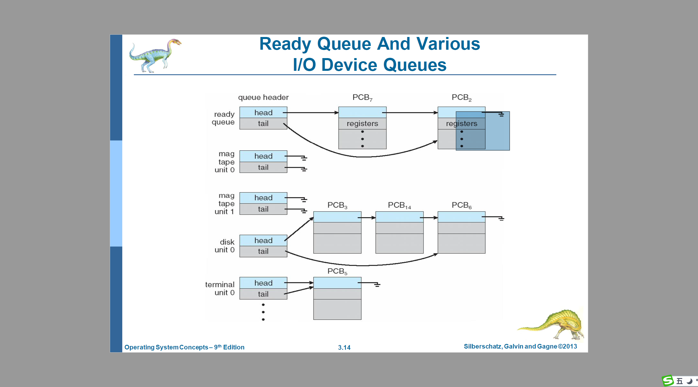

这张图来自《Operating System Concepts》第9版第 **3.14 页**，标题是：

> **Ready Queue and Various I/O Device Queues**
>  （就绪队列和各种 I/O 设备队列）

这张图通过链表结构形象地展示了：**系统中各类调度队列（特别是就绪队列和设备队列）是如何组织的，以及 PCB 在其中的作用**。

------

## 🧠 图中结构概述：

操作系统使用**多个队列**来管理进程，根据进程所处的状态，它们会被放入：

- **就绪队列（Ready Queue）**
- **设备队列（Device Queues）**，比如磁带、磁盘、终端等

------

## 📘 图中元素详解（结合原文结构）

------

### 🔹 1. **Ready Queue（就绪队列）**

- 包含处于**“就绪状态”**的进程（等待 CPU）
- 队列结构：从 `head` 到 `tail`
- 每个队列节点对应一个进程的 **PCB（Process Control Block）**
- 图中示例：就绪队列中包含 `PCB₇` 和 `PCB₂`，它们的注册寄存器信息正在保存，用于后续调度

------

### 🔹 2. **Device Queues（设备队列）**

表示等待某个 **I/O 设备完成服务** 的进程队列。图中展示了多个设备队列：

| 设备名称                       | 描述                                           | 包含的 PCB |
| ------------------------------ | ---------------------------------------------- | ---------- |
| **mag tape unit 0**（磁带机0） | 当前为空                                       |            |
| **mag tape unit 1**（磁带机1） | 包含 `PCB₃ → PCB₁₄ → PCB₆`                     |            |
| **disk unit 0**（磁盘0）       | 同样包含 `PCB₃ → PCB₁₄ → PCB₆`（链表共享表示） |            |
| **terminal unit 0**（终端0）   | 仅包含 `PCB₅`                                  |            |

▶️ 说明：不同设备的等待队列结构相似，都是**FIFO链表**，但每个设备维护独立的队列。

------

### 🔹 3. **每个队列结构都包括：**

- `head`（头指针） ➜ 队首进程
- `tail`（尾指针） ➜ 队尾进程
- 中间是指向下一个 PCB 的指针形成链表

------

## 🔄 队列之间的动态迁移：

> 正如前页（3.13）所说，**进程在生命周期中会在这些队列之间不断迁移**：

- 新建进程 ➜ 加入 **就绪队列**
- 等待 I/O ➜ 移至对应 **设备队列**
- I/O 完成 ➜ 回到 **就绪队列**
- 被调度运行 ➜ 进入 **CPU**

------

## 📌 PCB 的角色

- 每个 PCB 是一个进程的信息容器（如寄存器、状态、程序计数器等）
- 队列中存储的是 PCB 的地址，实际内容在内存中维护
- 队列之间连接的是 PCB，而不是进程本体

------

## ✅ 总结：

| 要点         | 说明                                        |
| ------------ | ------------------------------------------- |
| **就绪队列** | 包含所有已加载进内存、准备好使用 CPU 的进程 |
| **设备队列** | 包含所有正在等待特定 I/O 设备完成的进程     |
| **PCB**      | 是进程信息的实体，队列中维护的是它的指针    |
| **结构实现** | 操作系统使用链表数据结构组织这些队列        |

------

如果你需要我把这部分内容整理成课堂讲义风格，或者结合实际操作系统（如 Linux）进一步举例说明，我可以继续扩展。是否需要？

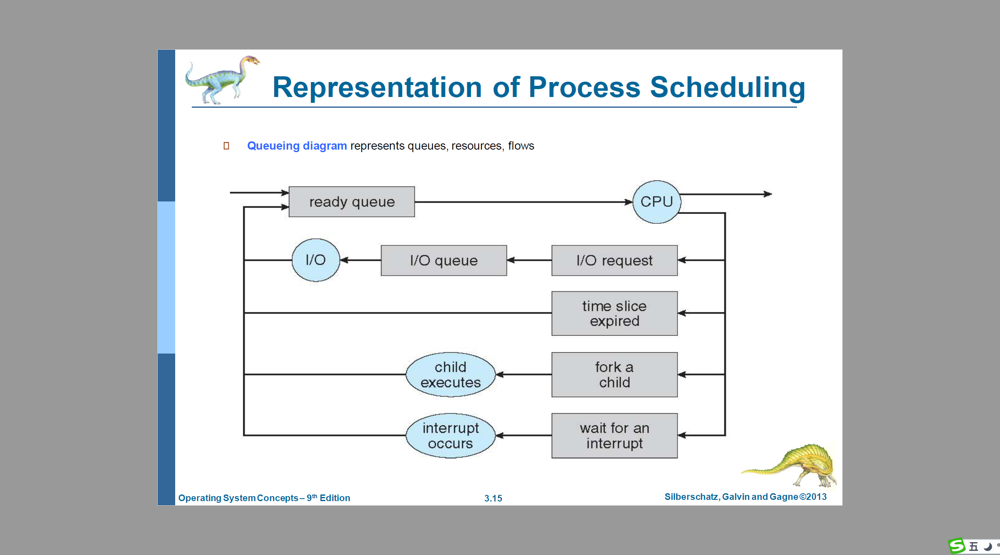

你这张图是《Operating System Concepts》第9版第 **3.15 页**的内容，标题是：

> **Representation of Process Scheduling**
>  **（进程调度的表示）**

它展示的是一个**进程调度的队列图（Queueing Diagram）**，表示了**各个进程队列（如 ready queue、I/O queue）之间的流动关系，以及进程如何获得/释放 CPU 和 I/O 等资源**。

------

## 📘 原文逐句解释 + 中文翻译：

------

### 🔷 句子原文：

> **Queueing diagram** represents queues, resources, flows
>  **队列图表示：队列、资源以及它们之间的流动关系。**

这是这页图的定义：展示**进程如何在操作系统中的各种资源之间迁移**。

------

## 🧠 图中结构详细解释（从左到右、从上到下）

------

### ① **Ready Queue → CPU**

- **ready queue（就绪队列）**：包含所有已加载到内存、等待使用 CPU 的进程。
- 调度器从中选择一个进程放入 **CPU** 执行。

------

### ② CPU → I/O queue （I/O request）

- 如果进程在执行期间需要进行 I/O 操作，比如读硬盘或打印：
  - 它会发出 **I/O request（I/O 请求）**
  - 然后进入 **I/O queue（I/O 队列）**
  - 等待 I/O 完成

------

### ③ CPU → Ready queue （time slice expired）

- 如果进程执行时用完了时间片（时间片轮转算法），就会：
  - 被抢占，从 CPU 下来
  - 回到 **ready queue** 等待下次调度

------

### ④ CPU → child executes（fork a child）

- 如果当前进程执行了 `fork()`，它就创建了一个**子进程**
  - 子进程加入调度队列，进入 **child executes** 状态

------

### ⑤ CPU → interrupt occurs（wait for an interrupt）

- 当前进程也可能因等待某个中断（如等待网络数据到来）而暂停执行。
  - 它会进入一个“等待中断”的状态
  - 等中断到达后，才会被唤醒

------

## 🔄 总体流程总结：

| 操作系统资源         | 说明                         |
| -------------------- | ---------------------------- |
| **Ready queue**      | 进程初始准备就绪时所在的队列 |
| **CPU**              | 被调度运行的进程占用         |
| **I/O queue**        | 等待 I/O 操作完成的队列      |
| **child executes**   | fork 新子进程后的控制流分支  |
| **interrupt occurs** | 等待中断事件的状态           |

------

### 🔁 典型流程举例：

```
new → ready queue → CPU →
    ↘ I/O request → I/O queue → ready queue → CPU
    ↘ time slice expired → ready queue
    ↘ fork a child → child executes
    ↘ wait for an interrupt → interrupt occurs → ready queue
```

------

## ✅ 中文总结：

这张图说明了进程如何在以下几个状态和队列之间切换：

- 从 **就绪队列** 进入 CPU 执行
- 被抢占后返回就绪队列
- 发出 **I/O 请求** 后进入 **I/O 队列**
- 创建子进程后进入子进程执行路径
- 等待中断时进入中断等待路径

整个流程体现了操作系统在调度时如何协调 CPU、I/O 和事件处理等资源，让多进程能够有序运行。

------

如果你在写讲义、报告、或需要用图文结合说明这部分内容，我可以继续帮你扩展一页完整内容。是否需要？

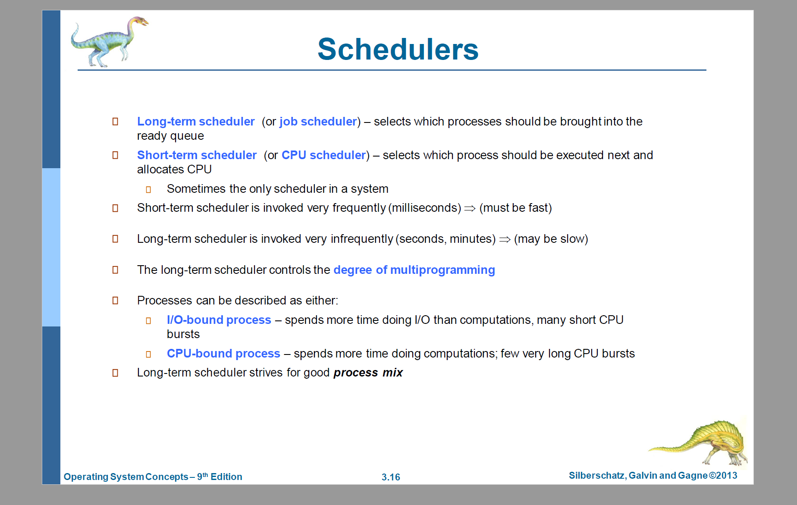

这张幻灯片来自《Operating System Concepts》第9版第 **3.16 页**，标题是：

> **Schedulers（调度器）**

这一页内容系统地介绍了操作系统中三种调度器的类型及其职责，特别强调了**短期调度器与长期调度器的区别**，以及它们对系统多道程序设计与性能的影响。

------

## 📘 原文详细解释 + 中文翻译：

------

### 🔷 **Long-term scheduler（长期调度器）**

> （又称 **job scheduler**）：选择哪些进程应该被带入就绪队列。

▶️ 中文：
 长期调度器负责从**作业池（作业队列）**中选择部分进程，加载进内存，使它们变成“就绪进程”，以便后续分配 CPU 执行。

------

### 🔷 **Short-term scheduler（短期调度器）**

> （也叫 **CPU scheduler**）：选择下一个将执行的进程，并将 CPU 分配给它。

▶️ 中文：
 短期调度器负责**在内存中就绪的进程中**选择一个来执行，是我们通常最熟悉的“进程调度”操作。

------

### 🔸 Sometimes the only scheduler in a system

▶️ 某些系统可能**只包含短期调度器**（如嵌入式系统），不进行长期调度。

------

### 🔸 Short-term scheduler is invoked very frequently (milliseconds) ⇒ must be fast

▶️ 短期调度器每隔几毫秒就要执行一次 → 必须非常快！

因为上下文切换频繁，调度器效率直接影响整个系统性能。

------

### 🔸 Long-term scheduler is invoked very infrequently (seconds, minutes) ⇒ may be slow

▶️ 长期调度器每几秒甚至几分钟才运行一次 → 速度可以稍慢。

它的职责是控制**系统中活跃进程的数量**，避免系统过载。

------

### 🔸 The long-term scheduler controls the **degree of multiprogramming**

▶️ 中文：长期调度器决定系统的**多道程序度**（即：允许多少个程序同时驻留在内存中）。

多道程序度越高，系统越忙碌，效率可能提高，但资源竞争也会增加。

------

## 🧠 进程类型的分类：

------

### 🔹 **I/O-bound process（I/O 密集型进程）**

> 在 I/O 操作上花费更多时间，CPU 计算少、CPU burst（突发）时间短而频繁。

📌 举例：文字处理、数据库查询等待、网页加载

------

### 🔹 **CPU-bound process（CPU 密集型进程）**

> 在计算上花费更多时间，CPU burst 很长，I/O 操作少。

📌 举例：科学计算、图像渲染、视频编码

------

## 📌 最后一行重点：

### 🔸 Long-term scheduler strives for good **process mix**

▶️ 中文：长期调度器的目标是维持一个良好的**进程组合**（混合 I/O 密集型 和 CPU 密集型）。

这有助于提升 CPU 和 I/O 设备的整体利用率，避免一类资源空闲而另一类资源过载。

------

## ✅ 中文总结：

| 调度器类型       | 作用                                                         | 执行频率         | 备注           |
| ---------------- | ------------------------------------------------------------ | ---------------- | -------------- |
| **长期调度器**   | 决定哪些进程被加载到主存                                     | 低（秒或分钟级） | 控制多道程序度 |
| **短期调度器**   | 决定哪个就绪进程获得 CPU                                     | 高（毫秒级）     | 要求非常快     |
| **调度策略目标** | 保证**CPU-bound 与 I/O-bound**进程均衡，最大化系统资源利用率 |                  |                |

------

如你需要将这些内容整理成中文讲义、总结表、图示辅助或继续后续幻灯片内容，我可以继续补充。是否需要？

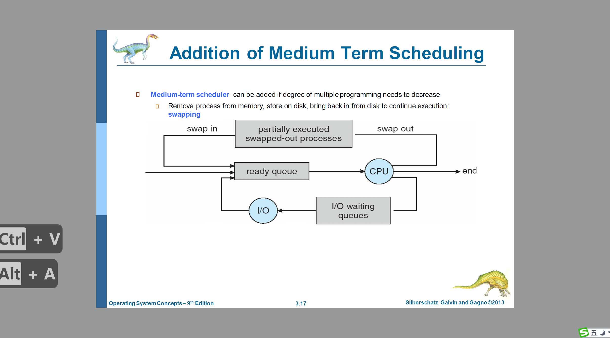

这张图来自《Operating System Concepts》第9版第 **3.17 页**，标题是：

> **Addition of Medium Term Scheduling**
>  **增加中期调度机制**

这一页介绍了**中期调度器（Medium-term scheduler）\**的角色、作用以及和内存管理之间的联系。它是调度器系统中\**第三种类型**，配合前面讲的**长期调度器和短期调度器**，提供更细致的进程控制。

------

## 📘 英文原文详细解释 + 中文翻译：

------

### 🔷 Medium-term scheduler

> **can be added if degree of multiprogramming needs to decrease**
>  **如果需要降低多道程序度，可以引入中期调度器。**

▶️ 中文解释：
 当系统负载过高、内存压力太大时，中期调度器可以将一些进程**临时移出内存（swap out）**，降低内存使用。

------

### 🔹 Remove process from memory, store on disk, bring back in from disk to continue execution: **swapping**

▶️ 这是操作系统中的**换出/换入机制（swapping）**，主要过程如下：

- 把进程从内存中移出，保存到磁盘（swap out）
- 后续再加载回内存中继续执行（swap in）

------

## 📊 图示详解（根据图中流程）

------

### 🟧 swap out（换出）

- CPU 在执行过程中，可能因资源压力或策略，需要暂时换出部分进程。
- 被换出的进程被移动到上方的方框：
   **“partially executed swapped-out processes（部分执行过的换出进程）”**

------

### 🟦 swap in（换入）

- 当系统资源允许时，这些进程可以重新被**换入内存**（swap in）
- 加入到 **ready queue（就绪队列）**，等待下一次被调度执行

------

### 🔁 其余结构回顾：

- **CPU**：执行进程
- **ready queue**：就绪进程集合
- **I/O waiting queues**：等待 I/O 的进程集合
- **I/O**：设备资源

------

## ✅ 为什么需要中期调度器？

| 原因                 | 说明                                                 |
| -------------------- | ---------------------------------------------------- |
| 控制内存占用         | 减少就绪/等待队列中进程数量，释放内存资源            |
| 处理进程过多时的拥塞 | 临时减少系统负担，提升效率                           |
| 实现动态多道程序度   | 系统根据当前资源状况，动态调整可同时驻留内存的进程数 |

------

## 📌 补充关键词：

| 术语                      | 含义                                 |
| ------------------------- | ------------------------------------ |
| **Medium-term scheduler** | 决定哪些进程应被换出/换入内存        |
| **Swapping**              | 进程从内存与磁盘之间的切换           |
| **partially executed**    | 表示进程已经运行过一部分，但还没结束 |

------

## 🧠 总结：

这页内容引入了“中期调度器”作为对长期和短期调度的补充，通过引入 **swapping（换出/换入）机制** 来帮助操作系统：

- **减轻内存压力**
- **动态调节多道程序数量**
- **提高资源利用率**

图中直观地展现了：进程如何在 CPU、内存、磁盘之间迁移，反映了调度系统与内存管理之间的紧密关系。

------

是否需要我将前面几页内容串联成一个笔记总结，或者整理成课堂讲义？我可以一并帮你生成。

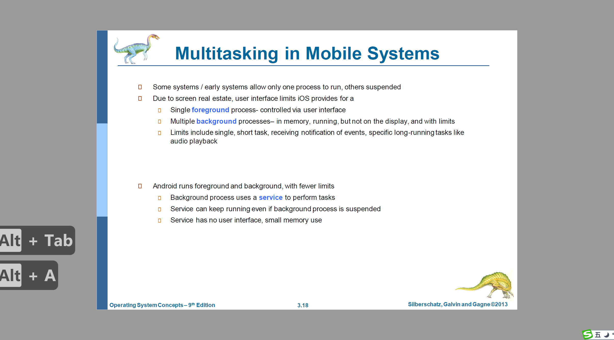

这张幻灯片来自《Operating System Concepts》第9版第 **3.18 页**，标题是：

> **Multitasking in Mobile Systems**
>  **（移动系统中的多任务处理）**

它介绍了早期和现代移动操作系统（如 iOS 和 Android）在**多任务处理**方面的设计思路、限制、以及不同平台的处理方式差异。

------

## 📘 原文逐行详细解释 + 中文翻译：

------

### 🔸 Some systems / early systems allow only one process to run, others suspended

**某些系统（尤其是早期移动系统）只允许一个进程运行，其他进程被挂起（暂停）。**

▶️ 很早期的手机系统（如旧版 iOS）出于性能和电池考虑，只运行前台应用，后台应用全部暂停。

------

### 🔸 Due to screen real estate, user interface limits iOS provides for a

**由于屏幕空间有限，iOS 的用户界面限制如下：**

------

#### ◾ Single **foreground** process – controlled via user interface

**只能有一个前台进程，通过用户界面控制。**

▶️ iOS 只允许一个 App 在屏幕上活动，该前台 App 接收用户输入，响应 UI。

------

#### ◾ Multiple **background** processes – in memory, running, but not on the display, and with limits

**可以有多个后台进程：在内存中运行，但不在屏幕上显示，并且受到限制。**

▶️ 这些后台 App 可能在处理任务，如音乐播放、下载，但它们无法访问 UI。

------

#### ◾ Limits include single, short task, receiving notification of events, specific long-running tasks like audio playback

**后台进程的限制包括：只能执行单个短任务、接收通知、特定类型的长任务（如音频播放）。**

▶️ Apple 限制后台 App 行为，只有特定用途（如播放音乐、接收 VoIP 呼叫）才允许长期运行。

------

------

## 📱 Android 的设计：

### 🔸 Android runs foreground and background, with fewer limits

**Android 支持前台和后台任务，并且限制更少。**

▶️ 相比 iOS，Android 更开放，允许更多后台任务持续运行。

------

#### ◾ Background process uses a **service** to perform tasks

**后台进程可以使用 “service（服务）” 来执行任务。**

▶️ Android 通过 Service 组件让后台任务保持运行，比如音乐播放、定位等。

------

#### ◾ Service can keep running even if background process is suspended

**即使后台进程被暂停，Service 仍然可以继续运行。**

▶️ Service 是 Android 提供的一种独立于界面的执行机制。

------

#### ◾ Service has no user interface, small memory use

**Service 不包含用户界面，内存占用很小。**

▶️ 它不像 Activity 组件那样有 UI，只是后台逻辑单元，适合做常驻任务。

------

## ✅ 总结：iOS vs Android 多任务设计对比

| 项目             | iOS                        | Android                    |
| ---------------- | -------------------------- | -------------------------- |
| **前台任务**     | 仅一个                     | 一个                       |
| **后台任务**     | 允许多个，但受严格限制     | 可运行多个，限制少         |
| **长任务**       | 仅特定情况允许，如音频播放 | 可用 Service 执行          |
| **后台执行机制** | 限制执行时间和功能         | Service 独立运行、持续有效 |

------

## 📌 关键术语解释：

| 术语                   | 含义                                  |
| ---------------------- | ------------------------------------- |
| **Foreground process** | 屏幕上活动的主进程，响应用户输入      |
| **Background process** | 非可视但在运行中的进程，受限制        |
| **Service（Android）** | 后台执行任务的组件，无 UI、低资源占用 |

------

如果你想把这一页内容用于汇报、笔记或写成中英双语对照文档，我可以帮你快速整理。是否继续？

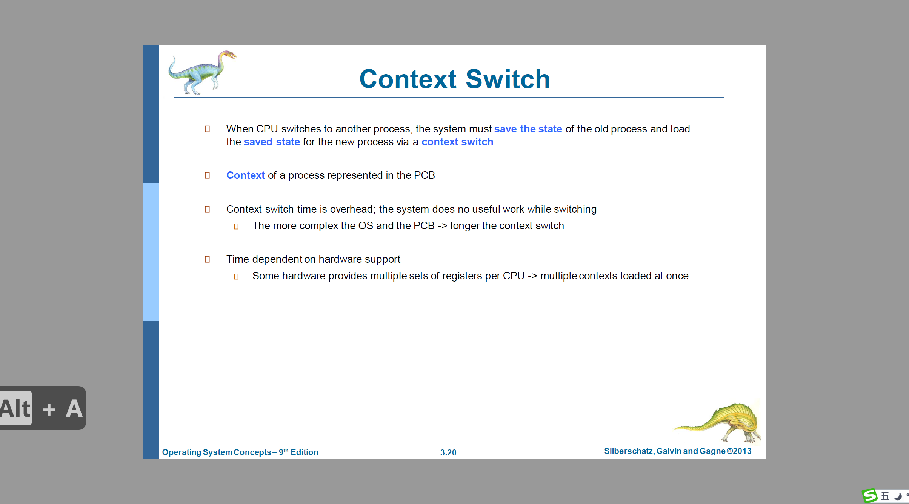

这张幻灯片来自《Operating System Concepts》第9版第 **3.20 页**，标题是：

> **Context Switch（上下文切换）**

这一页解释了操作系统在从一个进程切换到另一个进程时所需的“上下文切换”的定义、代价、过程和影响因素。

------

## 📘 原文逐行解释 + 中文翻译

------

### 🔸 **When CPU switches to another process, the system must save the state of the old process and load the saved state for the new process via a context switch**

> 当 CPU 切换到另一个进程时，系统必须：
>
> - **保存旧进程的状态**
> - **加载新进程的状态**
>    这个过程就叫做 **上下文切换（context switch）**

📌 状态包括：程序计数器、寄存器、内存映射、I/O 信息等 → 都保存到 **PCB（Process Control Block）** 中

------

### 🔹 **Context** of a process represented in the PCB

> 每个进程的“上下文”信息都保存在它的 PCB 中。

📌 “上下文”是进程当前运行所需的所有信息，比如指令地址、寄存器值、栈指针等。

------

### 🔸 **Context-switch time is overhead; the system does no useful work while switching**

> 上下文切换是一种 **开销（overhead）**，系统在切换期间并没有真正做“有用工作”。

#### ◾ The more complex the OS and the PCB → longer the context switch

> 操作系统越复杂、PCB 内容越多，切换时间越长。

📌 举例：一个线程的切换可能只需几微秒，而复杂进程可能需要几毫秒。

------

### 🔸 **Time dependent on hardware support**

> 上下文切换时间还依赖于硬件的支持程度。

#### ◾ Some hardware provides multiple sets of registers per CPU → multiple contexts loaded at once

> 某些硬件架构为每个 CPU 提供多个寄存器集合，使多个上下文可以预加载。

📌 这种机制能显著减少切换时的保存与恢复时间（如 SPARC 架构中的 register window）。

------

## ✅ 中文总结：

| 项目                             | 内容                                                         |
| -------------------------------- | ------------------------------------------------------------ |
| **上下文切换（Context Switch）** | CPU 从一个进程切换到另一个进程所必须执行的状态保存与加载操作 |
| **上下文**                       | 一个进程的运行状态（程序计数器、寄存器、堆栈、内存信息等）   |
| **开销**                         | 切换时 CPU 暂停有用工作，仅做状态保存/恢复，是额外负担       |
| **复杂度影响**                   | 操作系统功能越多，进程结构越复杂，切换越慢                   |
| **硬件支持**                     | 硬件可优化上下文切换，如多寄存器集可快速切换上下文           |

------

## 📌 结尾补充理解：

上下文切换是多任务操作系统实现并发性的关键技术，但切换频率高会带来性能损失。因此：

- 操作系统设计要权衡 **响应性** 和 **切换成本**
- 调度算法要避免频繁切换
- 硬件层面可辅助加速切换

------

如果你正在整理笔记或写总结，我可以帮你整合前后上下文，比如结合前面讲过的调度器、PCB 等内容，要不要继续？


这张幻灯片来自《Operating System Concepts》第9版，标题是：

> **Operations on Processes**
>  **（进程的操作）**

------

## 📘 幻灯片原文内容：

> **System must provide mechanisms for process creation, termination, and so on as detailed next**

------

## ✅ 详细解释（根据原文）

操作系统必须提供一套机制，来对“进程”进行各种操作，包括但不限于：

1. **创建进程（process creation）**
2. **终止进程（process termination）**
3. **进程间通信（process communication）**
4. **进程同步（process synchronization）**
5. **进程调度（process scheduling）**
6. **进程等待/唤醒、阻塞/就绪等状态转换**

这页作为标题页/过渡页，其核心目的是引出后续章节内容 —— 操作系统如何支持进程生命周期的管理。

------

## 📌 中文翻译

> 系统必须提供用于 **创建进程、终止进程** 等操作的机制（具体将在后续详述）。

------

## 🧠 背景理解：

在操作系统中，进程是最基本的执行单位。为了管理进程的**生命周期**，操作系统需要负责：

| 操作          | 说明                                  |
| ------------- | ------------------------------------- |
| **创建**      | 使用系统调用（如 `fork()`）启动新进程 |
| **执行**      | 加载程序、分配资源、运行              |
| **等待/阻塞** | 等待 I/O 或其他事件完成               |
| **唤醒/就绪** | 回到就绪队列，等待调度                |
| **终止**      | 正常退出或异常终止，释放资源          |

------

## 📎 补充说明：

接下来的几页内容通常会介绍：

- **父进程 / 子进程模型**
- **进程终止条件**
- **进程表结构的更新**
- **资源回收机制**
- **僵尸进程 / 孤儿进程问题**

------

如需我继续帮你讲解下一页内容，或提前预览后续内容结构，我可以继续协助你总结。是否继续？

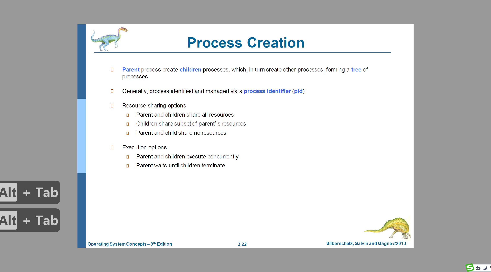

这张幻灯片来自《Operating System Concepts》第9版第 **3.22 页**，标题是：

> **Process Creation（进程创建）**

它解释了操作系统如何通过**父进程（parent process）\**创建\**子进程（child process）**，以及创建后**资源共享方式**和**执行行为**的不同策略。

------

## 📘 原文逐句详细解释 + 中文翻译：

------

### 🔹 **Parent process create children processes**, which, in turn create other processes, forming a **tree** of processes

> 父进程创建子进程，子进程又可以继续创建自己的子进程，最终形成一个“进程树”。

📌 这就是多进程系统中典型的**父子层级结构**，如 Unix 系统中的 `init` 进程是所有进程的“祖先”。

------

### 🔹 **Generally, process identified and managed via a process identifier (PID)**

> 每个进程都有一个唯一的标识符（PID）来进行管理和识别。

📌 操作系统通过 PID 来区分、查找和调度各个进程。

------

## 📦 Resource Sharing Options（资源共享选项）

创建子进程后，操作系统可以选择以下几种资源共享策略：

------

#### ◾ **Parent and children share all resources**

> 父进程和子进程**共享所有资源**

📌 如同一个进程的副本，它们可以同时访问内存、打开文件、设备等。

------

#### ◾ **Children share subset of parent’s resources**

> 子进程仅共享**父进程部分资源**

📌 这是一种更安全的方式，防止进程之间相互干扰。

------

#### ◾ **Parent and child share no resources**

> 父子进程**完全不共享资源**

📌 这时子进程是独立的，拥有自己的文件描述符、内存空间等。

------

## ⚙️ Execution Options（执行选项）

操作系统还要决定父子进程在时间上的执行策略：

------

#### ◾ **Parent and children execute concurrently**

> 父进程和子进程可以**并发执行**

📌 比如父进程在后台继续运行，而子进程去处理其他任务。

------

#### ◾ **Parent waits until children terminate**

> 父进程要等子进程**终止后才能继续**

📌 通常用于串行任务，比如编译器在等子进程编译完成。

------

## ✅ 中文总结：

操作系统在创建新进程时，必须解决两个核心问题：

| 问题         | 选择                                     |
| ------------ | ---------------------------------------- |
| **资源共享** | 共享所有资源 / 共享部分资源 / 完全不共享 |
| **执行方式** | 并发执行 / 父进程等待子进程结束          |

此外，每个进程都有唯一的 PID，整个系统形成一棵进程树。

------

## 🧠 举个例子（Linux 中的 `fork()`）

- 调用 `fork()` 会创建一个与父进程**几乎一样**的子进程；
- 二者最初共享代码段，但数据段是独立的；
- 父子进程可以并发执行，也可以通过 `wait()` 机制让父进程等待子进程结束。

------

需要我继续讲下一页（进程终止）或帮你整理讲义结构吗？

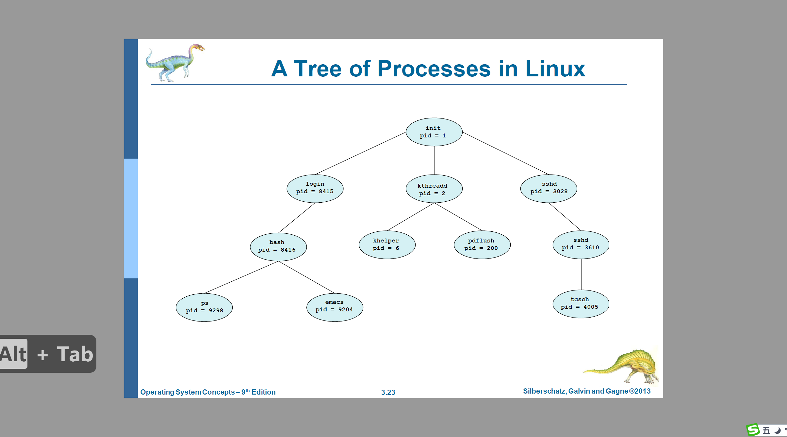

这张图来自《Operating System Concepts》第9版第 **3.23 页**，标题为：

> **A Tree of Processes in Linux**
>  **（Linux 中的进程树）**

------

## 📘 原文图示的含义：进程树结构解释

这张图形象地展示了**Linux 操作系统中典型的进程层级结构** —— 每个进程都由另一个进程创建，从而形成一棵**“树状结构”**，称为 **process tree（进程树）**。

------

## 🌳 图中内容逐层解释：

------

### 🔷 最顶层进程：`init`（PID = 1）

- 是整个系统的第一个用户级进程（在现代 Linux 中已被 `systemd` 取代）。
- 所有其他进程**都是由 `init` 或它的子孙进程创建的**。
- 拥有 PID = 1，是所有“孤儿进程”的领养者。

------

### 🔹 `init` 的直接子进程：

| 子进程                | 说明                                   |
| --------------------- | -------------------------------------- |
| `login`（pid = 8415） | 用户登录进程，处理终端登录             |
| `kthreadd`（pid = 2） | 核心线程调度器，内核线程的父进程       |
| `sshd`（pid = 3028）  | 安全 Shell 守护进程，处理远程 SSH 连接 |

------

### 🔸 `login` 派生出的进程：

- `bash`（pid = 8416）：用户 shell
  - 进一步创建：
    - `ps`（pid = 9298）：显示当前进程的命令
    - `emacs`（pid = 9204）：文本编辑器

------

### 🔸 `kthreadd` 的子进程：

- `khelper`（pid = 6）：内核辅助线程
- `pdflush`（pid = 200）：用于将脏页写回磁盘

------

### 🔸 `sshd`（pid = 3028） 创建：

- 另一个 `sshd`（pid = 3610）：用于某个特定会话
  - 它又派生出：
    - `tcsh`（pid = 4005）：一个 C-shell 类型的终端交互 shell

------

## ✅ 总结：图中反映的操作系统特性

| 特性                        | 含义                                            |
| --------------------------- | ----------------------------------------------- |
| **进程树结构**              | 每个进程都由某个“父进程”派生                    |
| **PID（Process ID）**       | 每个进程有唯一标识符，方便管理                  |
| **init进程作用**            | 是所有进程的“祖先”，保持系统稳定                |
| **继承与创建**              | 父进程通过系统调用（如 `fork()`）创建子进程     |
| **Linux守护进程（daemon）** | 如 sshd、pdflush 等，后台长期运行，处理系统任务 |

------

## 📎 对应前一页内容的联系（第3.22页）

这张图是对 **“父进程创建子进程，形成进程树”** 的一个实际 Linux 示例，帮助理解：

- 进程的父子关系如何形成
- 资源/执行策略在实际操作系统中的体现
- 每个用户/系统行为如何在进程层面体现出来

------

是否需要我继续讲解下一页（如 Process Termination 或 Process Cooperation）？或者你想要我帮你整理一个“进程章节”完整讲义？欢迎告诉我~

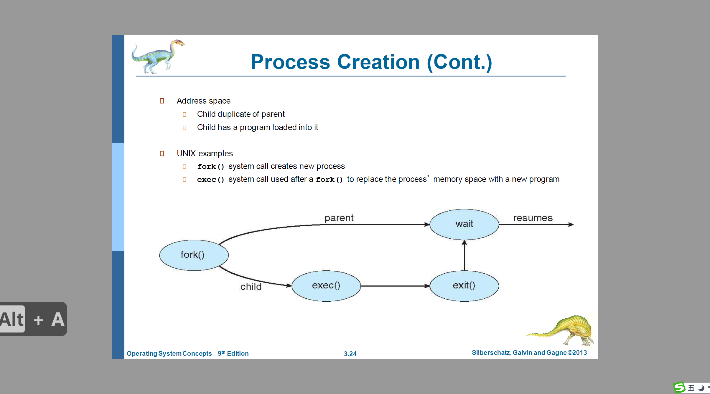

这张图来自《Operating System Concepts》第 9 版第 **3.24 页**，标题为：

> **Process Creation (Cont.)**
>  **进程创建（续）**

------

## 🌟 本页主要解释的是：

**Unix / Linux 中进程创建与执行的过程：fork() + exec() + wait() + exit()**

------

## 📘 原文内容详细解释如下：

------

### 🧠 地址空间（Address Space）

在创建子进程后，子进程的内存空间有两种可能：

1. **子进程是父进程的副本（duplicate）**
   - 包含相同的代码段、数据段、堆栈等
   - 初始状态几乎一致
2. **子进程被加载了新程序**
   - 使用 `exec()` 系统调用加载新的可执行程序，替换原有地址空间

------

### 💻 UNIX 中的进程创建实例

#### 🔹 `fork()`

- 系统调用，用于**创建一个新进程（子进程）**
- 子进程几乎是父进程的完全复制
- 创建后，父子进程可以**并发运行**

#### 🔹 `exec()`

- 用于**替换当前进程的代码段和地址空间**
- 常在 `fork()` 后使用，让子进程执行一个新程序
- 比如：`fork()` 创建子进程 → `exec()` 运行 `ls` 或 `python` 等程序

------

### 🔄 图中流程解释：

```
parent
   |
 fork() → 创建 child
   |
   +-----------------------------------+
   |                                   |
wait()                             exec() → exit()
   |
 resumes（等待子进程结束后恢复运行）
```

#### ➤ 父进程执行：

- 调用 `fork()` 创建子进程
- 调用 `wait()` 等待子进程结束
- 等子进程执行完 `exit()` 后，父进程继续运行（`resumes`）

#### ➤ 子进程执行：

- 被创建后，可继续执行父进程的内容，或调用 `exec()` 加载新程序
- 执行完成后调用 `exit()` 终止自己，释放资源

------

## ✅ 总结：

| 概念     | 说明                       |
| -------- | -------------------------- |
| `fork()` | 创建子进程，复制父进程     |
| `exec()` | 子进程用它加载并运行新程序 |
| `wait()` | 父进程等待子进程结束       |
| `exit()` | 子进程结束并通知父进程     |

这是 Unix/Linux 系统中经典的**进程控制与协作机制**，也是系统编程面试常考知识点之一。

------

如需我帮你继续解释下一页内容（例如 `Process Termination` 或者 `Process Cooperation`），请继续发送图片。

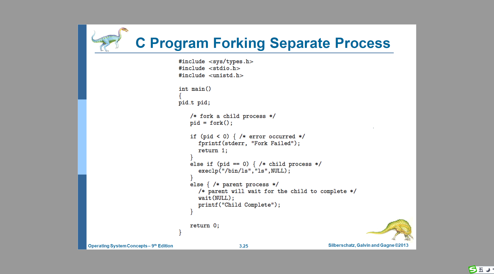

这张幻灯片来自《Operating System Concepts》第 9 版第 **3.25 页**，标题是：

> **C Program Forking Separate Process**
>  **C 程序创建子进程的示例**

------

## 📌 原文代码作用：

该 C 程序演示了如何使用 `fork()` 和 `exec()` 系统调用来创建一个子进程，并让该子进程执行 `ls` 命令（列出当前目录内容）。

------

## 🧠 程序逐行解释如下：

```c
#include <sys/types.h>
#include <stdio.h>
#include <unistd.h>
```

### 👉 这些是头文件：

- `<sys/types.h>`：定义数据类型 `pid_t`。
- `<stdio.h>`：标准输入输出库。
- `<unistd.h>`：提供 `fork()`、`exec()`、`wait()` 等系统调用接口。

------

```c
int main()
{
    pid_t pid;

    /* fork a child process */
    pid = fork();
```

### 🧾 说明：

- `fork()`：创建一个新进程（子进程）。
- 返回值：
  - `< 0`：表示出错，进程创建失败。
  - `= 0`：当前为子进程。
  - `> 0`：当前为父进程，返回子进程的 PID。

------

```c
    if (pid < 0) {
        fprintf(stderr, "Fork Failed");
        return 1;
    }
```

### 🚫 出错处理：

- 如果 `fork()` 返回负数，说明失败了。
- 输出错误信息并返回非 0 值表示程序异常结束。

------

```c
    else if (pid == 0) {
        /* child process */
        execlp("/bin/ls", "ls", NULL);
    }
```

### 👶 子进程：

- 执行 `ls` 命令（列出目录内容）
- 使用 `execlp()`：
  - 第一个参数是命令路径：`/bin/ls`
  - 第二个参数是程序名（通常与命令相同）
  - `NULL` 表示参数列表结束

> ⚠️ `execlp` 执行成功后，原来的程序就被替换了，不会返回。

------

```c
    else {
        /* parent process */
        wait(NULL);
        printf("Child Complete");
    }
```

### 👨 父进程：

- 使用 `wait(NULL)` 等待子进程结束
- 子进程完成后输出 `"Child Complete"`

------

## ✅ 程序运行效果（终端输出示意）：

```bash
$ ./a.out
file1.txt
file2.c
docs/
Child Complete
```

------

## 📌 总结流程：

| 步骤       | 描述                        |
| ---------- | --------------------------- |
| `fork()`   | 父进程创建子进程            |
| `pid == 0` | 子进程执行 `execlp("ls")`   |
| `pid > 0`  | 父进程执行 `wait()` 等待    |
| 子进程结束 | 父进程打印 `Child Complete` |

------

这个程序清楚演示了 Linux/Unix 下最基本的**进程控制：创建子进程并执行新程序**的流程。

如需我帮你继续讲解下一页内容，请继续上传。

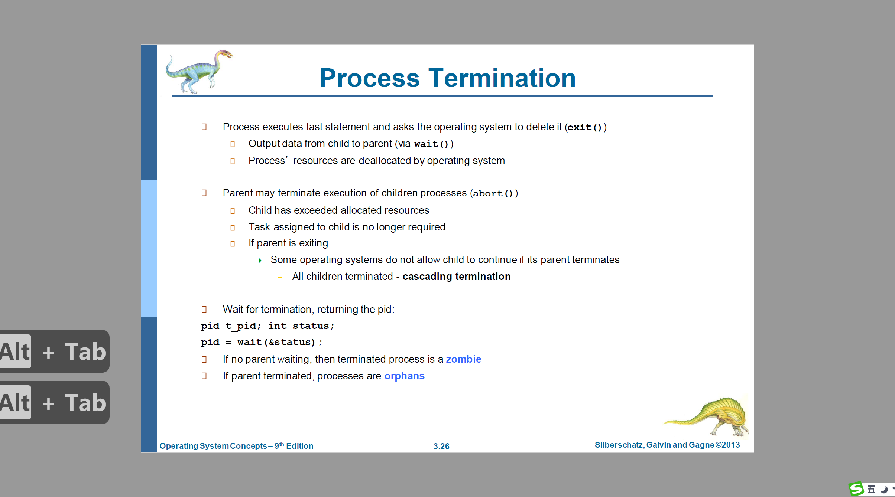

这张幻灯片来自《Operating System Concepts》第 9 版第 **3.26 页**，标题是：

> **Process Termination**
>  **进程终止**

------

### 📌 幻灯片内容翻译与详细解释如下：

------

## 🔚 进程如何终止？

### ✅ 方式一：**进程主动结束**（正常终止）

- 当进程执行完**最后一条语句**时，会请求操作系统删除它，使用：

  ```c
  exit();
  ```

- 操作系统随后会做两件事：

  - 把子进程的输出数据交给父进程（通过 `wait()` 收集结果）。
  - 回收子进程占用的资源（内存、文件描述符等）。

------

### ✅ 方式二：**父进程强制终止子进程**

使用：

```c
abort();
```

#### 常见的强制终止原因：

1. 子进程超出了分配的资源（如内存或CPU时间限制）。

2. 父进程不再需要子进程完成的任务。

3. **父进程本身退出**了。

   - 某些操作系统不允许子进程在父进程终止后继续运行。

   - **所有子进程也会被终止**，这叫：

     > 🔁 **cascading termination（级联终止）**

------

## 🕒 等待子进程结束：`wait()`

父进程可以调用：

```c
pid_t pid;
int status;
pid = wait(&status);
```

- 这会让父进程阻塞，直到**某个子进程**结束。
- `status` 用于获取子进程的退出码。

------

## 🧟 特殊状态解释：

### ☠️ 如果没有父进程在等待（父进程没调用 `wait()`）：

- 子进程结束后不会被完全清理，仍占用表项。

- 此时称为：

  > **Zombie（僵尸）进程**

### 👶 如果父进程先终止，子进程仍继续运行：

- 子进程会被操作系统的某个守护进程接管（如 `init`）。

- 这类子进程被称为：

  > **Orphans（孤儿）进程**

------

### 🧠 总结关键术语：

| 术语      | 含义                           |
| --------- | ------------------------------ |
| `exit()`  | 子进程主动结束                 |
| `abort()` | 父进程强制结束子进程           |
| `wait()`  | 父进程等待子进程结束并回收资源 |
| Zombie    | 子进程结束但未被父进程回收     |
| Orphan    | 子进程的父进程已结束           |

------

如需继续讲解下一页内容，请继续上传。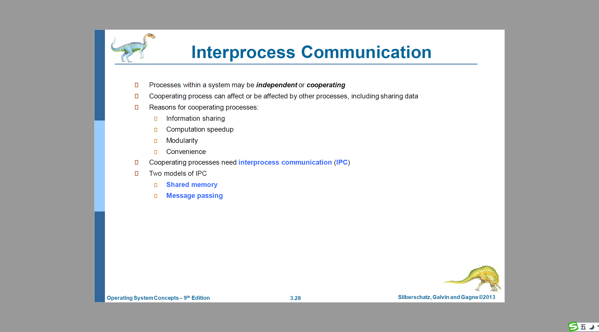

这是操作系统教材《Operating System Concepts（9th ed.）》里“Interprocess Communication（进程间通信, IPC）”一页的要点。按原意给你翻译+扩展解释👇

# 这页在说什么

- 一个系统里的进程可以是**独立的**（independent）或**合作的**（cooperating）。
  - **独立进程**：它的执行不影响也不被其他进程影响；它既不与其他进程共享数据，也不与之同步。
  - **合作进程**：它的执行**会影响**或**会被**其他进程影响，典型方式就是**共享数据**或**交换消息**。
- 只要存在合作进程，就**需要 IPC**（interprocess communication，进程间通信）来安全、有效地交换信息并进行同步。
- IPC 主要有**两种模型**：**共享内存（shared memory）\**和\**消息传递（message passing）**。

# 为什么要让进程“合作”（书上列的四个理由）

1. **信息共享（Information sharing）**
    多个用户或程序需要访问同一份数据（例如数据库、共享文件、缓存）。合作能避免重复存储，让数据一致。
2. **加速计算（Computation speedup）**
    把一项计算拆给多个并行执行的进程，在多核/多机上更快完成（如流水线、生产者—消费者）。
3. **模块化（Modularity）**
    把复杂系统拆成多个进程（模块）分别开发、维护和重用，例如将文件服务、网络服务拆成独立守护进程。
4. **方便性（Convenience）**
    让程序/用户以更自然的方式组织任务，比如 shell 管道把“若干小程序”拼成一个大功能。

# IPC 的核心需求（这页暗含的点）

- **数据交换**：把数据从一个进程传到另一个进程（同机或跨机）。
- **同步与互斥**：保证并发访问时数据不乱（避免竞态条件），协调执行顺序（如唤醒/等待、条件满足再继续）。
- 如果没有正规 IPC 机制，进程之间的影响会不可控，容易出现**数据竞争、死锁、饥饿**等问题。

# 两种 IPC 模型（本页最后两行）

## 1) Shared Memory（共享内存）

- **基本思想**：由操作系统把一块物理内存**映射**到多个进程的地址空间。建立映射依赖内核，但**读写发生在用户态**，因此**开销很低、速度快**。
- **责任分工**：OS 负责创建/映射；用户进程自己设计内存中的数据结构与协议。
- **必须同步**：因为大家直接读写同一块内存，需要**信号量、互斥锁、条件变量**等来保证一致性。
- **适用**：高吞吐、低延迟的本机通信（如数据库共享缓冲池、浏览器多进程共享渲染资源）。不适合天然分布式（跨机器要靠别的手段）。

## 2) Message Passing（消息传递）

- **基本思想**：通过 **send / receive** 原语在进程间**发送/接收消息**，由内核完成拷贝、排队与传递。
- **变体**（教材后续会展开）：
  - **直接通信** vs **间接通信（邮箱/端口）**；
  - **阻塞**（同步）vs **非阻塞**（异步）发送/接收；
  - **缓冲**策略（零/有限/无限缓冲队列）。
- **优点**：抽象好、编程简单，天然适合**分布式系统**（跨主机靠网络消息即可）；同步常能与通信合并（如阻塞接收）。
- **代价**：每次通信需要系统调用和内核介入，**上下文切换与拷贝开销**比共享内存大。

------

**一句话总结**：
 这页告诉你：当进程需要彼此影响（合作）时，就必须使用 IPC。IPC 的两大范式是**共享内存**（快，但要自己管同步）和**消息传递**（抽象高，适合分布式，但开销相对大）。教材后面会在这两条线上分别展开具体机制与例子（如管道、消息队列、套接字、信号量/监视器等）。

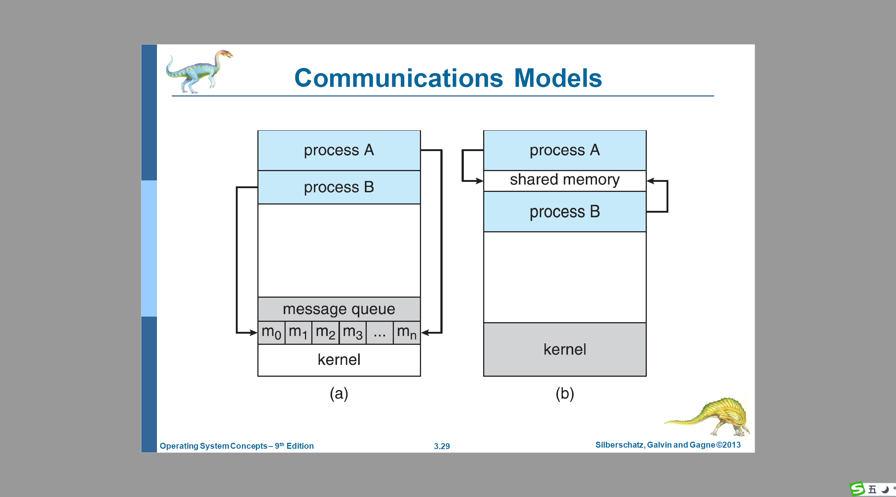

这页叫 **“Communications Models（通信模型）”**，用两幅小图把两类 IPC 的工作方式画出来：

# (a) Message Passing（消息传递）

- **结构**：进程A、B在上；底下是内核（kernel）里的**message queue（消息队列）**，队列里排着 m₀、m₁、m₂…mₙ。
- **过程**：
  1. A 调用内核原语 `send` 把一条消息放进队列（可能拷贝一次或两次：A→内核→B）。
  2. B 调用 `receive` 从队列取消息。
  3. 内核负责**排队、唤醒、匹配、缓冲与传输**（箭头绕到内核再回到进程，表示必须经过内核）。
- **同步方式**：可以阻塞/非阻塞；容量可零/有限/无限缓冲；可**直接通信**（A 指名 B）或**间接通信**（通过“邮箱/端口”）。
- **特点**：抽象简单、天然支持跨机器通信，但每次通信都要陷入内核，**系统调用/拷贝/上下文切换开销**较大。

# (b) Shared Memory（共享内存）

- **结构**：A 与 B 的地址空间之间有一块 **shared memory**（共享内存）条带，左右的小括号表示**映射（map）\**操作由内核完成；下方仍是内核但\**不在数据路径中**。
- **过程**：
  1. A、B 先通过系统调用向内核**创建并映射**同一物理页到各自地址空间。
  2. 之后 A、B **在用户态直接读写同一块内存**，数据不再经过内核拷贝。
- **同步**：因为并发访问同一数据，必须配合**互斥/信号量/条件变量**等同步原语，防止竞态。
- **特点**：数据路径不经内核，**吞吐高、延迟低**；但编程需自己设计共享区的数据结构与同步协议；主要用于同主机通信。

# 一眼看图的要点

- (a) 的粗大回路箭头穿过 **kernel + message queue** —— “经内核转发”。
- (b) 的小括号只出现在映射处 —— “创建/映射靠内核，读写走用户态”。
- 队列中的 m₀…mₙ 表示**按序排队**的消息；共享内存没有队列，因为双方直接访问同一内存块。

# 选型小结

- **要简单/跨网络/把同步与通信合一** → 消息传递。
- **要极致性能/大量数据反复读写** → 共享内存（外加可靠的同步机制）。

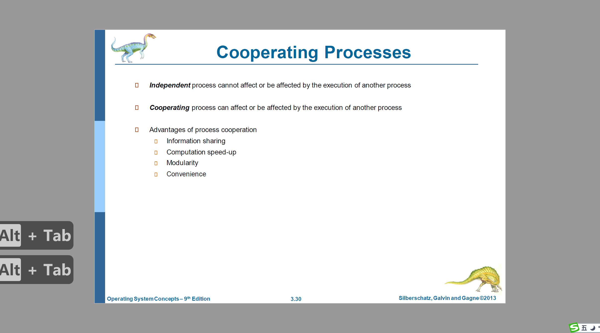

这页题为 **Cooperating Processes（合作进程）**，在原文基础上给你直译＋要点解释：

# 定义（两句话就是这页的核心）

- **Independent process（独立进程）**：**不能影响**也**不受影响**于其他进程的执行。
   解释：它既不与别的进程共享数据，也不依赖别的进程的状态或结果；调度顺序变化不会改变它的正确性或输出。例子：只读本地输入、只写自己私有文件的批处理作业。
- **Cooperating process（合作进程）**：**能够影响**或**会被影响**于其他进程的执行。
   解释：它与其他进程之间存在数据共享或消息交互，执行次序、同步关系会影响结果。例子：生产者—消费者、浏览器多进程共享缓存、客户端—服务器。

# 为什么要让进程合作（Advantages of process cooperation）

1. **Information sharing（信息共享）**
    多个程序/用户需要共同访问同一份数据（数据库、共享文件、内存缓存）。合作能降低冗余、保持一致性，但需要同步与访问控制。
2. **Computation speed-up（计算加速）**
    把任务拆分给多个并行进程在多核/多机上同时执行，缩短总体完成时间。典型如流水线处理、Map-Reduce、并行编解码。
3. **Modularity（模块化）**
    将大型系统拆成若干进程（模块）各司其职，便于开发、测试、部署与复用。如把日志、网络、存储做成独立守护进程。
4. **Convenience（方便性）**
    以自然方式把多个小程序组合成复杂功能（如 shell 管道 `grep | sort | uniq`），或把后台服务解耦，提升使用与维护的便利。

# 补充理解

- 只要是“合作进程”，就需要**进程间通信（IPC）\**与\**同步**来安全地共享数据/协调顺序；否则会出现竞态、死锁、饥饿等并发问题。
- 常见 IPC 范式：**共享内存**（快，但需自己做好互斥/同步）与**消息传递**（抽象简单、易分布式，但内核开销较高）。

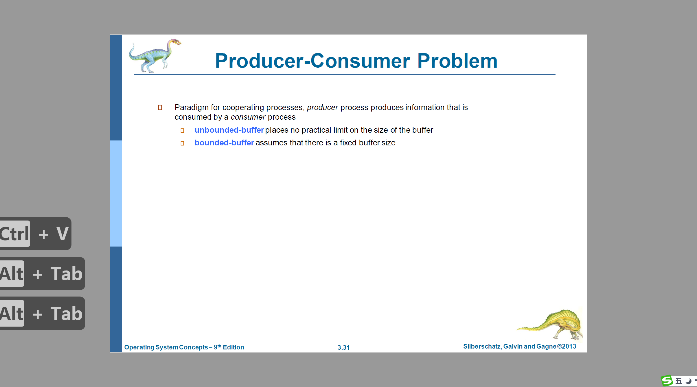

这页是**“生产者—消费者问题（Producer–Consumer Problem）”**，教材用它当作**合作进程**与 **IPC/同步** 的经典范式。

# 概念

- 有两个（或多个）进程：**producer（生产者）\**产生数据项，把它们放入一个\**缓冲区（buffer）**；**consumer（消费者）**从缓冲区取出并处理这些数据。两者通过缓冲区交换信息，因此彼此执行会互相影响。

# 两种缓冲区模型（原文两条）

1. **unbounded buffer（无限缓冲）**
   - 含义：缓冲区**在实践中没有大小上限**（或上限足够大可忽略）。
   - 同步影响：
     - 生产者**永不因缓冲满而阻塞**；
     - 消费者在**缓冲为空**时需要等待（阻塞），直到有新项被放入。
2. **bounded buffer（有界缓冲）**
   - 含义：缓冲区**大小固定**（容量为 N）。
   - 同步影响：
     - 当**缓冲满**时，生产者必须等待；
     - 当**缓冲空**时，消费者必须等待。
   - 这是操作系统里最常见也最重要的情形。

# 为何是并发/同步教材里的“示例题”

- 生产者与消费者**共享**缓冲区（常用共享内存实现），需要**互斥**保护对缓冲区的数据结构的访问，避免竞态条件；
- 还要用**条件同步**协调“满/空”两种边界状态（典型解法：信号量 `empty`/`full` + 互斥量 `mutex`，或监视器/条件变量）。

一句话：这页在告诉你——生产者—消费者是合作进程的标准模式；**无限缓冲**只会让消费者在“空”时等，**有界缓冲**既会让消费者在“空”时等，也会让生产者在“满”时等，因此必须配合正确的 IPC 与同步原语来保证正确性与性能。

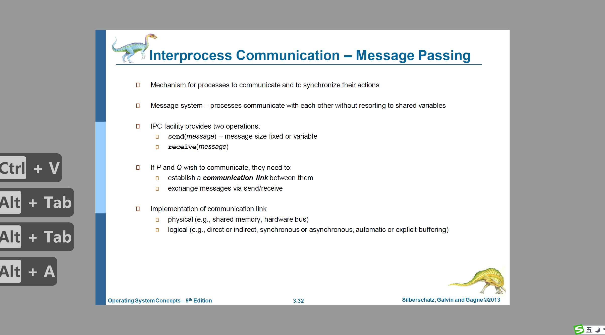

这页是 **“进程间通信（IPC）——消息传递（Message Passing）”** 的总览。按原文逐条翻译并补充要点：

# 它是什么

- **机制**：让进程彼此**通信并同步动作**的机制。
- **消息系统**：进程**不用共享变量**，而是通过**发送/接收消息**来交流。

# 基本原语（IPC facility provides two operations）

- **`send(message)` 发送**：把一条消息交给对端（或内核转发）。消息长度可以是**固定**的，也可以是**可变**的。
  - 固定长度：实现简单、无需携带长度字段；常见于内核简化实现或硬件邮箱。
  - 可变长度：更灵活，但需要携带长度、分配缓冲、可能分片。
- **`receive(message)` 接收**：从通信端点取出一条消息；可能阻塞等待或立即返回（看实现策略）。

# 两个进程 P 与 Q 想通信，需要做两件事

1. **建立通信链路（communication link）**：也就是确定双方通过**哪个端点/通道**交互（如端口、管道、套接字、邮箱）。
2. **通过 send/receive 交换消息**：后续通信就围绕这两个原语进行，同时完成必要的同步（例如阻塞接收天然起到“等对方”的效果）。

# 通信链路如何实现（Implementation of communication link）

- **物理层面（physical）**：依赖具体载体/路径
  - 例如：**共享内存段**、**硬件总线**、网络接口等。即便用消息传递抽象，底层仍要有物理承载。
- **逻辑层面（logical）**：通信语义与策略
  - **直接（direct）/间接（indirect）**：
    - 直接：`send(P, msg)` 明确指向对方进程；
    - 间接：通过**邮箱/端口**转发，发送者与接收者解耦。
  - **同步（synchronous）/异步（asynchronous）**：
    - 同步：发送者可能一直等到对方接收完成；
    - 异步：发送后立即返回，接收者稍后取走。
  - **自动缓冲/显式缓冲（automatic or explicit buffering）**：
    - 自动：系统提供消息队列/缓冲区并管理容量；
    - 显式：应用自己管理缓冲，或只有零缓冲（必须对接上才能传）。

# 小结

- **消息传递**把通信与同步合在一套 `send/receive` 原语里，编程模型清晰，也天然适合分布式（跨主机）场景；
- 具体语义（阻塞与否、缓冲策略、直接/间接寻址）由“通信链路”的逻辑实现决定，这些选择直接影响**性能、解耦程度和正确性保证**。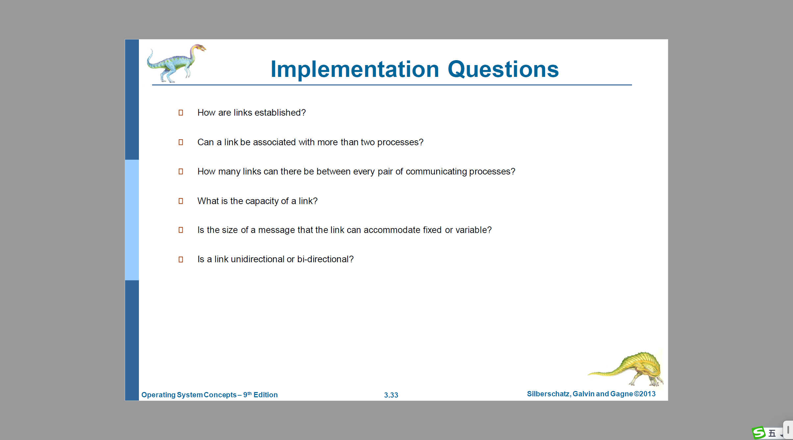

这页是 **“Implementation Questions（实现要点）”**——设计**消息传递式 IPC** 时必须先回答的6个问题。按原文逐条翻译+解释+常见取值：

1. **How are links established?（通信链路如何建立？）**
   - 直接通信：进程彼此知道对方标识（`send(P, msg)`），系统为这对进程建链。
   - 间接通信：通过**邮箱/端口**建立，发送者和接收者只需约定同一端口名（更解耦）。
   - 例：UNIX 管道 `pipe()`、POSIX 消息队列、TCP 套接字 `bind/listen/accept`。
2. **Can a link be associated with more than two processes?（一条链可否关联两个以上进程？）**
   - 一对一（1↔1）：典型管道、已连接的 TCP。
   - 一对多 / 多对一：多个发送者往同一邮箱；或一个广播端点多个接收者订阅。
   - 多对多：总线式或多播端口。
3. **How many links can there be between every pair of communicating processes?（同一对进程之间可有多少条链？）**
   - 单链：实现简单，但所有消息混在一起。
   - 多链：可按主题/优先级拆通道（如多个套接字/队列），便于隔离与流控。
4. **What is the capacity of a link?（链路容量/缓冲多大？）**
   - 零缓冲：必须“对接”才传递（同步握手式发送/接收）。
   - 有限缓冲：大小 N，队列满时发送者阻塞或丢弃/返回错误。
   - 近似无限缓冲：实践中“足够大”，很少触发阻塞，但占内存多、可能增加延迟。
5. **Is the size of a message … fixed or variable?（消息长度固定还是可变？）**
   - 固定：实现简单、无需携带长度；但灵活性差（可能切分成多条）。
   - 可变：更通用，需携带长度并管理分配/复制（可能分片重组）。
6. **Is a link unidirectional or bi-directional?（单向还是双向？）**
   - 单向：如传统 UNIX 管道（一个方向），简单清晰。
   - 双向：如套接字、全双工管道，双方可同时发/收，但要处理竞态与协议设计。

**总结小抄**

- 建链：直接 vs 间接（邮箱/端口）。
- 关联数：1↔1、1↔N、N↔N。
- 链路条数：每对进程 1 条 or 多条。
- 容量：0 / 有限 / 近似无限（对应不同阻塞与流控策略）。
- 消息大小：固定 vs 可变。
- 方向：单向 vs 双向。

这些选择决定了 **寻址方式、阻塞语义、缓冲与流控、并发安全及性能**。例如：Linux 管道=单向+有限缓冲；POSIX 消息队列=间接+有限缓冲+可变长度；TCP socket=双向+流控+面向字节（应用层再封消息）。

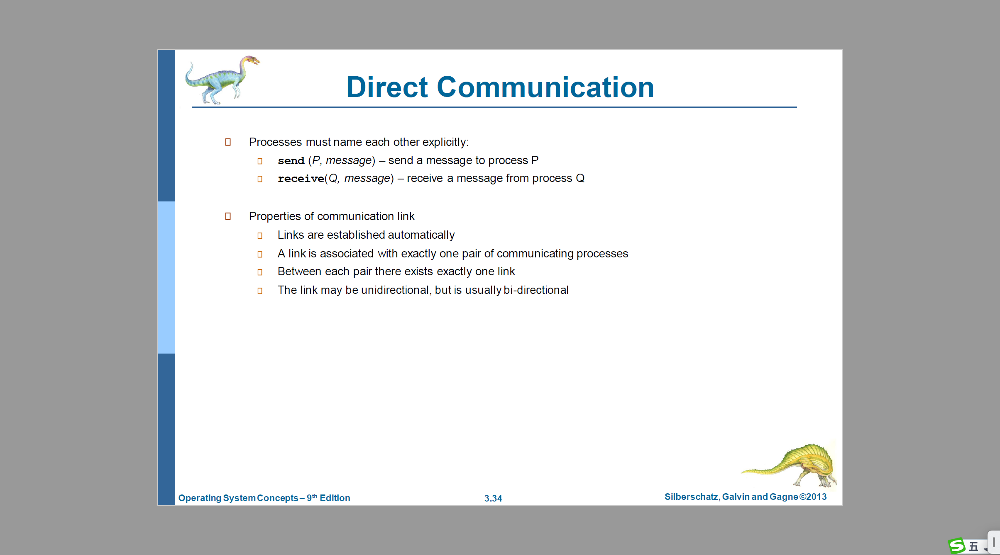

这页讲 **直接通信（Direct Communication）**。按原文逐句翻译＋要点解释：

# 定义与原语

- **进程必须显式知道对方的名字**（标识/地址/端口等）。
  - `send(P, message)`：发送一条消息给**进程 P**。
  - `receive(Q, message)`：从**进程 Q**接收一条消息。
     含义：发送/接收调用里**写死了对端身份**，双方点对点直连。

# 这种通信链路的性质（Properties）

- **Links are established automatically**
   只要双方用彼此的名字调用 `send/receive`，系统就为这**一对进程**建立链路（不需要另建中间邮箱/端口）。
- **A link is associated with exactly one pair of communicating processes**
   一条链只服务**一对**固定的进程（P↔Q）。
- **Between each pair there exists exactly one link**
   同一对进程通常只对应**一条**通信链（实现里可强制 1:1，以简化管理与匹配）。
- **The link may be unidirectional, but is usually bi-directional**
   链路可以是**单向**的，但通常实现成**双向**（双方都能发/收）。

# 直观理解与例子

- 典型做法：已连接的 **TCP 套接字**（双方通过对方地址/端口直连，之后双向发送接收）；某些内核消息机制允许 `send(to_pid, msg)` 按进程ID直投。
- 和“间接通信”（通过**邮箱/端口名**中转）对比：直接通信**耦合更紧**、寻址更明确，省去中间实体，但**不利于解耦与扩展**（对端更换需要修改名字；做 1→N/N→1 多路通信较麻烦）。

# 何时用 / 何时不用

- **用**：固定的一对进程长期交互、协议简单、强调低开销直连。
- **少用**：需要发布/订阅、负载均衡、动态扩缩容时，更适合**间接通信（邮箱/端口/消息队列）**。

小结：直接通信=在 `send/receive` 里**点名对方**，系统自动为这对进程建一条（通常双向的）链路；简单高效，但带来**强耦合**与**一对一**的限制。

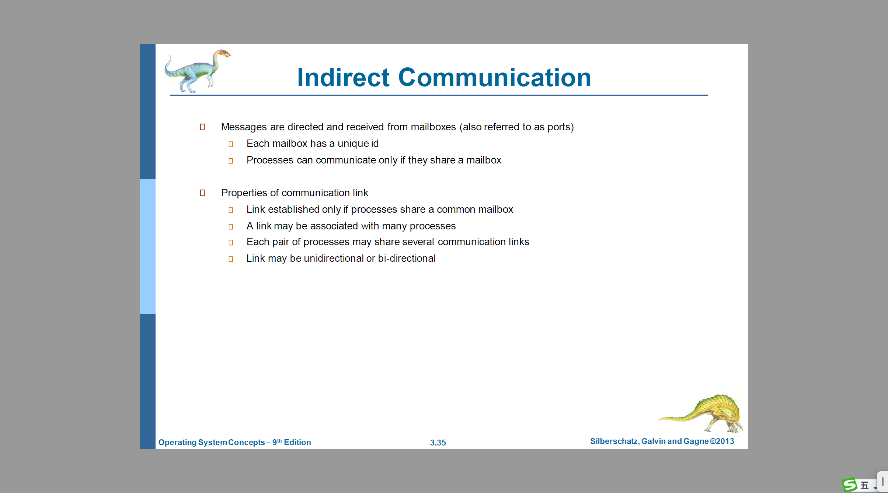

这页讲 **间接通信（Indirect Communication）**——通过**邮箱/端口（mailbox / port）**来传递消息，而不是彼此点名对方。

# 原文要点直译 + 解释

- **Messages are directed and received from mailboxes (also referred to as ports)**
   消息是**发送到**与**从**“邮箱/端口”**收取**的（邮箱=一个命名的收发端点）。
- **Each mailbox has a unique id**
   每个邮箱都有**唯一标识**（名字/句柄/号码），进程通过这个标识寻址。
- **Processes can communicate only if they share a mailbox**
   进程**只有共享同一个邮箱**时才能通信（都对同一端点进行 send/receive）。

# 通信链路的性质（Properties of communication link）

- **Link established only if processes share a common mailbox**
   只有当进程**共享同一邮箱**时才形成链路（不像直接通信那样点名对端）。
- **A link may be associated with many processes**
   一条链（即一个邮箱）可以被**多个进程**关联：可多生产者、多消费者，便于**1→N / N→1 / N↔N** 的场景。
- **Each pair of processes may share several communication links**
   同一对进程可以**共享多个邮箱**（多条逻辑链），用来区分不同主题/优先级/方向。
- **Link may be unidirectional or bi-directional**
   链路可以是**单向**或**双向**；很多实现提供双向收发，但也常见“一个邮箱单向”的做法（需要两只邮箱实现全双工）。

# 和“直接通信”的对比

- **解耦**：发送者只需知道**邮箱名**，不必知道具体接收者是谁；利于替换、扩缩容、负载均衡。
- **灵活**：天然支持**多路**通信与**发布/订阅**模式（多个进程从同一邮箱取消息）。
- **实现举例**：POSIX 消息队列、System V 消息队列、邮件箱式内核消息、许多消息中间件（概念上类似的“队列/主题/端口”）。

**一句话**：间接通信=通过“邮箱/端口”这个中介来收发消息；只要共享同一邮箱就连通，天然支持多对多与多通道，是更**松耦合、可扩展**的消息传递方式。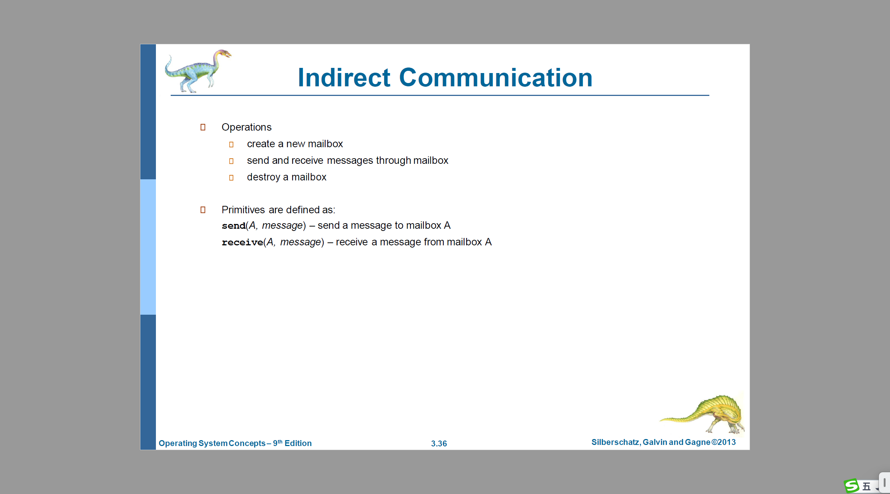

这页继续讲 **间接通信（Indirect Communication）**，重点是“邮箱/端口”的**操作**和**原语**。

# 核心操作（Operations）

- **create a new mailbox**：创建一个新的邮箱（获得唯一的邮箱ID/句柄）。
- **send and receive messages through mailbox**：通过该邮箱**发送/接收**消息。任意进程只要持有同一邮箱ID，就能通过它互通。
- **destroy a mailbox**：销毁邮箱（释放系统资源；通常要求邮箱为空或只有拥有者才可销毁）。

# 通信原语（Primitives are defined as）

- **`send(A, message)`**：把 `message` **发送到邮箱 A**。发送者只需要知道**邮箱名A**，不必知道具体接收者是谁。
- **`receive(A, message)`**：从**邮箱 A** 接收一条消息。若邮箱为空且采用阻塞语义，调用会等待直到有新消息到来。

# 补充理解

- 邮箱是**间接寻址**的中介，使发送者与接收者**解耦**：谁来消费、有几个消费者，都可以在不改发送方代码的情况下变更。
- 可自然支持 **1→N / N→1 / N↔N** 模式（多个进程共享同一邮箱）。
- 真实系统里的对应物：**System V / POSIX 消息队列**、某些内核“mailbox/port”机制、消息中间件里的“队列/主题”等（概念等价）。
- 具体语义（是否阻塞、缓冲大小、权限控制）由实现决定，但接口思想就是：**围绕“邮箱名”用 `send/receive` 来通信**。

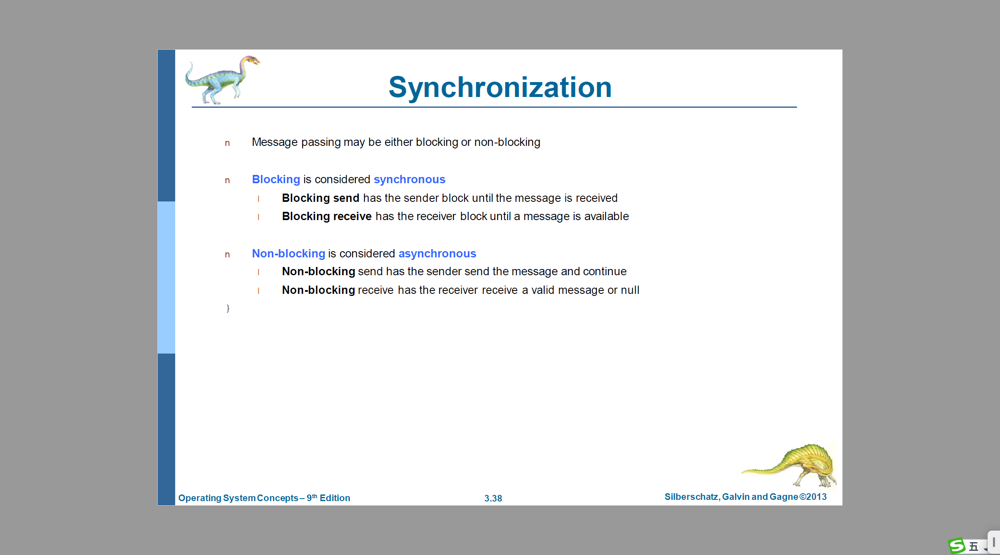

这页讲 **“同步（Synchronization）”**：消息传递在**阻塞**与**非阻塞**两种语义下的差别。

# 总述

- **Message passing may be either blocking or non-blocking**
   消息传递可以是**阻塞**或**非阻塞**的。

# 阻塞（Blocking）＝同步（synchronous）

- **Blocking send**：发送方在 `send()` 后**等待**，直到**消息被对方接收**（或至少被系统安全地放入缓冲区）。
  - 直觉：我把话说出去，要么你听到了，要么管理员记下来了，我才能走。
- **Blocking receive**：接收方在 `receive()` 时**等待**，直到**有消息可取**。
  - 直觉：我一直举着话筒，直到有人说话。

> 用途：天然完成**同步**与**流控**；常用于**零缓冲**或**有限缓冲**队列，避免发送方把缓冲打满。

# 非阻塞（Non-blocking）＝异步（asynchronous）

- **Non-blocking send**：`send()` **立即返回**；发送方把消息交给内核/网络栈后就继续做别的事（成功或返回“暂时不可用”由实现决定）。
- **Non-blocking receive**：`receive()` **立即返回**，要么得到一条**有效消息**，要么得到**空/错误码**表示当前没有消息。应用通常配合**轮询、事件通知或回调**。

> 用途：降低等待时间、提高并行性；需要应用层自行做**重试、超时、重排**等控制。

# 小提示（联系上一页概念）

- 当**缓冲容量为 0**（“握手式”链路）时，发送非阻塞很可能失败/重试；阻塞发送就会等到接收方就绪。
- 当**缓冲有限**时，阻塞发送在“队列满”时会等待；非阻塞发送会立刻返回“满”。
- 阻塞接收=“等数据”；非阻塞接收=“先看一下，有就取，没有就算”。

一句话：**阻塞=等到条件满足才返回（同步）**，**非阻塞=立刻返回（异步）**；两者选择影响程序的并发结构、流控与复杂度。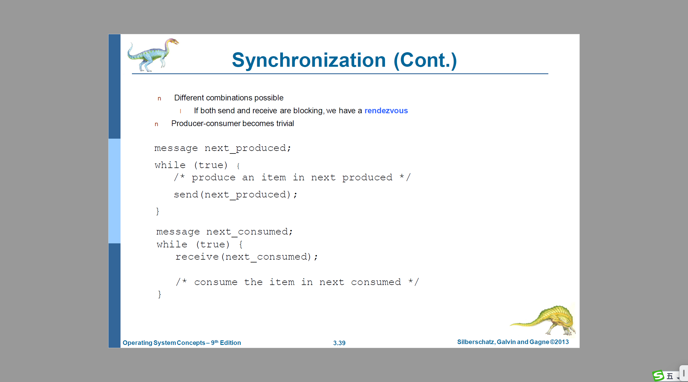

这页是“**Synchronization（续）**”，说明**阻塞/非阻塞**组合对程序结构的影响，并用**生产者—消费者**演示。

# 关键信息（按原文）

- **Different combinations possible**：发送/接收可以各自是阻塞或非阻塞，组合很多。
- **If both send and receive are blocking, we have a \*rendezvous\***：
   若**发送和接收都阻塞**，就形成**会合（rendezvous）**：两边必须**同时就绪**才能完成一次传递。等价于**容量为0的通道**/“握手通信”。
- **Producer–consumer becomes trivial**：
   在会合语义下，生产者—消费者模型**变得很简单**：不需要任何缓冲或额外同步，通信本身就完成了**同步与流控**。

# 代码片段解释

```c
message next_produced;
while (true) {
    /* 生成一个数据项到 next_produced */
    send(next_produced);   // 阻塞，直到消费者正在接收
}

message next_consumed;
while (true) {
    receive(next_consumed);  // 阻塞，直到生产者送来一项
    /* 消费 next_consumed */
}
```

- `message`：抽象的“消息类型/容器”。
- 生产者循环：先**生产**，再 `send`。由于是**阻塞发送**，只有当消费者调用了 `receive` 才会返回；因此**不会积压**。
- 消费者循环：`receive` 时**等待**直到有数据；收到后再**消费**。
- 结果：一次会合=一次“生产→传递→消费”，**无需缓冲区、无需锁**，天然有**背压（backpressure）**：消费者慢，生产者就被挡住。

# 对比提示

- 若任一方改成**非阻塞**，就需要**缓冲/队列**或**重试/轮询**等逻辑来保证不丢数据与正确顺序；复杂度会上升。
- 会合式通道适合**一对一、速度相近**的场景；若要解耦生产与消费速率，才引入**有界/无界缓冲**。

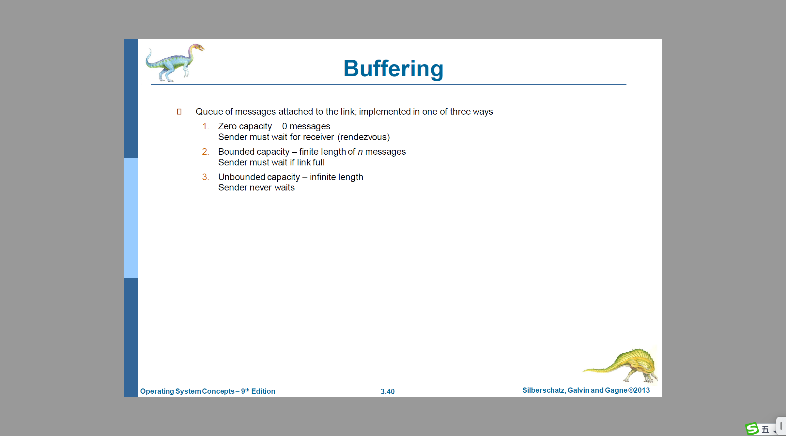

这页讲 **Buffering（缓冲）**：消息传递链路上**消息队列**的容量会怎样影响发送/接收的行为。原文分三种情形——

# 队列容量的三种实现

1. **Zero capacity（0 容量）**
   - **说明**：队列里**不能存任何消息**。
   - **效果**：发送方必须**等接收方就绪**，两者“当面交接”——称为 **rendezvous（会合/握手通信）**。
   - **含义**：天然同步，没有积压；消费者慢→生产者被阻塞。
2. **Bounded capacity（有限容量）**
   - **说明**：队列最多能存 **n 条**消息。
   - **效果**：当队列**未满**：发送立即成功；当**已满**：发送方**必须等待**（或返回“满”错误，视实现）。
   - **含义**：常见于实际系统（如管道、消息队列、socket 发送缓冲）；提供**有限解耦**，并通过阻塞/返回码实现**背压**和**流控**。
3. **Unbounded capacity（无限容量）**
   - **说明**：理论上**无限长**队列。
   - **效果**：发送方**从不等待**；只要发就能入队。
   - **含义**：实现上几乎不存在（内存总有限），更多是**理想化模型**；会带来潜在的**内存占用飙升与延迟累积**。

# 小结与使用建议

- **0 容量**：最强同步，适合速度相近的一对一握手。
- **有限容量**：工程里最常用；配合阻塞/非阻塞、超时与丢弃策略做**流量控制**。
- **无限容量**：理论方便推理，但实际要用**监控与限流**来避免“消息雪崩”。

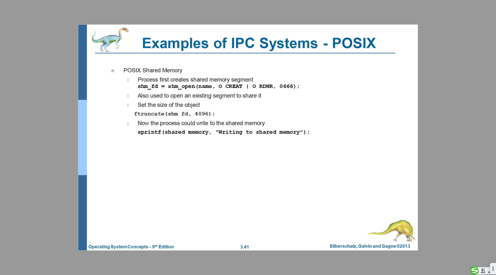

这是在讲“POSIX 共享内存（POSIX Shared Memory）”这一类 IPC（进程间通信）的基本用法。按幻灯片原文逐条解释如下：

1. **先创建（或打开）一个共享内存对象**

- 代码：`shm_fd = shm_open(name, O_CREAT | O_RDWR, 0666);`
- 含义：
  - `shm_open` 根据给定的字符串 `name` 在内核里创建/打开一个“共享内存对象”（看起来像一个特殊文件）。
  - `O_CREAT`：若不存在则创建；`O_RDWR`：以读写方式打开。
  - `0666`：文件权限，任何用户可读写（实际权限还会受 umask 影响）。
  - 返回值 `shm_fd` 是**文件描述符**，后续对这个共享内存对象的操作都用它。

1. **也可只“打开”已存在的共享段以实现共享**

- 含义：如果别的进程已经用相同的 `name` 创建过共享内存，本进程只要 `shm_open(name, O_RDWR, …)` 就能连上同一块共享内存，从而实现进程间数据共享。

1. **设置共享内存对象的大小**

- 代码：`ftruncate(shm_fd, 4096);`
- 含义：把这块共享内存的长度设为 4096 字节（4KB）。新建的共享内存默认长度为 0，必须用 `ftruncate` 明确扩展到需要的大小。

1. **随后，进程就可以向共享内存写数据**

- 代码（示意）：`sprintf(shared_memory, "Writing to shared memory");`
- 含义：把一段字符串写到共享内存中。
- 注意：要真正读写内存，需要先把 `shm_fd` **映射到进程地址空间**（通常用 `mmap` 得到 `shared_memory` 指针）。幻灯片省略了这一步，但实际代码流程是：`mmap -> 得到指针 -> 读/写 -> munmap`。

**一句话总结**：
 用 `shm_open`（按名）创建/打开共享内存 → 用 `ftruncate` 定尺寸 →（实际代码里用 `mmap`）把它映射成可直接读写的内存 → 像普通内存一样写入数据，这样多个进程就能通过同名共享内存对象交换信息。

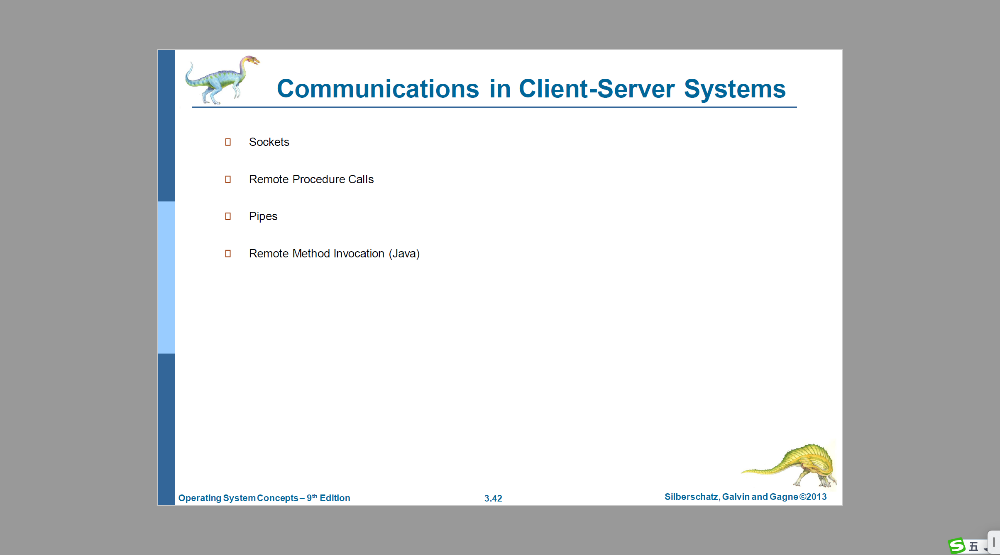

这页是 **“客户端—服务器系统中的通信”** 的目录页，列出常见四种手段。按教材原意逐项解释一下它们各自做什么、怎么用、差异在哪：

# 1) Sockets（套接字）

- **是什么**：操作系统提供的**通信端点**；两端各有一个 socket，连起来后就能传数据。
- **常见类型**：
  - **TCP**（流式、可靠、按序、面向连接）
  - **UDP**（数据报、无连接、不保证到达/顺序）
  - **本地/UNIX 域套接字**（同一台机器、走内核，低开销）
- **基本流程**：服务器 `socket → bind → listen → accept`；客户端 `socket → connect`；之后双方 `send/recv`（或 `read/write`）。

# 2) Remote Procedure Calls（RPC，远程过程调用）

- **是什么**：让你像调用**本地函数**一样去调用**远端**服务器上的函数。
- **关键机制**：
  - **stub（桩）**：客户端桩把参数**编组（marshalling）**成字节流发出去；服务端桩解包后调用真正函数，再把返回值打包回传。
  - **绑定/注册**：客户端根据服务名找到服务器（端口映射/注册中心）。
  - **语义**：常见 *at-most-once*（至多一次）或 *at-least-once*（至少一次），应对重试与超时。
- **典型实现**：ONC RPC、DCE/RPC、gRPC（现代基于 HTTP/2 + Protobuf 的 RPC）。

# 3) Pipes（管道）

- **是什么**：单机进程间的**字节流通道**。
- **分类**：
  - **匿名管道**：通常**父子进程**间一端写一端读，**半双工**。
  - **命名管道（FIFO）**：系统里有**名字**，不要求亲缘关系，任意进程打开同名 FIFO 即可通信。
- **特点**：顺序、可靠、在本机；适合 shell 管道 `cmd1 | cmd2`、守护进程间轻量通信。

# 4) Remote Method Invocation（RMI，Java）

- **是什么**：Java 的**面向对象**版 RPC，调用的是**远程对象的方法**。
- **要素**：远程接口、**stub/skeleton**、**对象序列化**、**RMI Registry**（名字服务）。
- **优势**：类型安全、与 Java 对象/异常模型自然融合；劣势是与 Java 生态绑定。

# 该页想传达的整体点

- 在**客户端—服务器**架构里，你可以用**低层通道**（sockets、pipes）自己定义协议，也可用**高层抽象**（RPC/RMI）把“发消息”隐藏在“调用函数/方法”背后。
- 选择取决于：是否跨网络、是否需要强类型接口、性能/可靠性要求、语言/平台约束等。

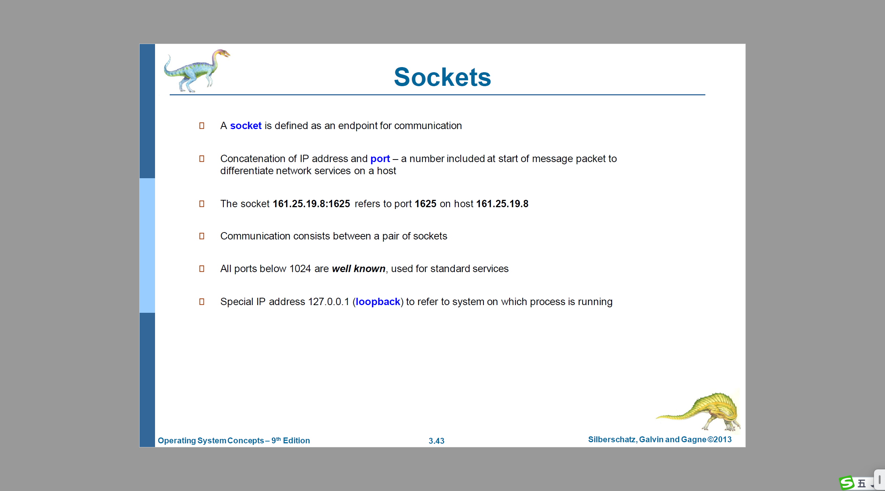

这是在解释“**套接字（socket）**”的基础概念。按幻灯片原文逐条说明并补充要点：

- **A socket is defined as an endpoint for communication**
   **Socket** 是网络通信的**端点**。一条网络连接的两头各有一个 socket，进程通过它来收发数据。
- **Concatenation of IP address and port**
   一个 socket 由 **IP 地址 + 端口号（port）** 唯一标识。端口号写在报文开头（首部里）用来区分同一主机上的不同网络服务/进程。
- **Example: `161.25.19.8:1625`**
   这表示主机 **161.25.19.8** 上的 **1625** 端口。常用写法是 `IP:端口`。
- **Communication consists between a pair of sockets**
   通信总是**成对**发生：本地主机的一个 socket ↔ 远端主机的一个 socket。两端建立关联后（如 TCP 三次握手），双方就能互发数据。
- **All ports below 1024 are well known**
   端口号 **0–1023** 称为**知名端口（well-known ports）**，通常保留给标准服务（如 80/HTTP、22/SSH、53/DNS 等），需要更高权限才能绑定。客户端一般使用 1024 以上的**临时端口**。
- **Special IP 127.0.0.1 (loopback)**
   **127.0.0.1/localhost** 是**回环地址**，表示“这台机器自己”。连接它就等于在本机上跟自己通信，常用于测试或让本地服务只对本机开放。

**小结**：Socket = IP + 端口，是进程进行网络通信的门牌号；一次网络会话由两端的 socket 配对完成；0–1023 是标准服务端口；127.0.0.1 是本机回环地址。

![这页是 **Remote Procedure Calls（RPC，远程过程调用）** 的要点。把原文逐条翻译并补充解释给你👇

# RPC 是什么

- **RPC 把“跨网络进程之间”的调用抽象成“像本地过程一样调用”**。
   本质还是走消息传递，只是把发/收消息的细节封装起来。
- **仍然用端口区分服务**（service differentiation）：服务器在某个端口提供服务，客户端连到该端口。

# Stub（桩）

- **Stubs – 客户端桩是服务器上真实过程的“代理”**。
- **客户端桩**负责**定位服务器**并对参数做 **marshalling（编组）**：把高层语言的参数打包成可在网络上传输的字节序列。
- **服务器桩**接收消息，**解包（unmarshall）**参数，调用真正的过程，把返回值再打包发回。

# 接口与代码生成

- **Windows** 上常用 **MIDL（Microsoft Interface Definition Language）**：先写接口规范，再**编译生成**客户端/服务器两端的 stub 代码。

# 异构数据表示

- 不同机器/架构（如 **大端 big-endian** vs **小端 little-endian**）的数据表示不同。
- RPC 通常采用 **XDR（External Data Representation）** 这类**与平台无关**的外部表示来统一打包/解包。

# 远程通信的可靠性语义

- **远程通信的失败场景比本地多**（网络丢包、超时、重复、崩溃、分区等）。

- 因此很**难保证 \*exactly-once\*（恰好一次）语义**；现实系统通常提供

  - ***at-most-once***（**至多一次**：要么成功一次，要么不发生，避免重复）或
  - ***at-least-once***（**至少一次**：可能重试导致重复，交由应用去重）。

  > 这也是为什么 RPC 框架都有**超时、重试、幂等性**等配置。

# 发现与连接

- 操作系统/运行时通常提供**“rendezvous / matchmaker（撮合者）”**服务，把**客户端**和**服务器**连接起来（例如端口映射器、注册中心、服务发现）。

# 一句话总结

RPC = “用 **stub + 编组/解组 + 统一数据表示 + 发现连接** 把网络消息包装成函数调用”。它让编程模型像本地调用一样自然，但在语义上必须面对网络世界的失败与一致性问题（exactly-once 难，常见 at-most-once/at-least-once）。](READEME_1.assets/image-20250808174243567.png)

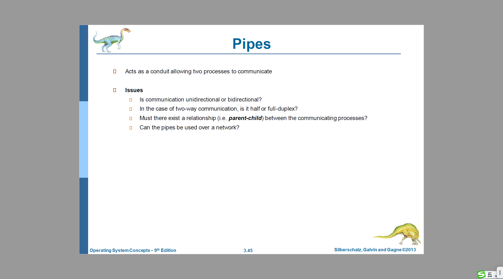

这是在讲 **管道（pipes）** 这种 IPC 的概念与要点。按原文每行解释，并补充常见结论：

- **“Acts as a conduit allowing two processes to communicate”**
   管道像一根“导管”，把一个进程写出的字节顺序地送给另一个进程读；数据是**字节流/先进先出**。
- **Issues（需要明确的细节）**
  1. **“Is communication unidirectional or bidirectional?”**
      传统**匿名管道（pipe）\**在 Unix 上是\**单向**的：一端写、一端读。
      想**双向**？通常做法是建**两根**匿名管道，分别负责 A→B 和 B→A。
  2. **“In the case of two-way communication, is it half or full-duplex?”**
      匿名管道实现双向时相当于**半双工**（各用一根单向通道）。
      **命名管道（FIFO/Named pipe）**：Unix 上通常仍按半双工使用；Windows 的 Named Pipe 支持**全双工**。
  3. **“Must there exist a relationship (parent–child) between the communicating processes?”**
     - **匿名管道**一般要求在**亲缘进程**间使用（典型是父进程 `pipe()` 后 `fork()`，子进程继承端点）。
     - **命名管道（FIFO）**通过文件系统中的路径识别，**不要求**亲缘关系，任意进程在同一主机上都能打开读/写端通信。
  4. **“Can the pipes be used over a network?”**
     - Unix 的匿名管道 / FIFO 都是**本机**机制，**不能跨网络**（要跨机请用**套接字 sockets**）。
     - Windows 的 Named Pipe 可以通过 SMB 在网络上使用，但依赖 Windows 生态与权限配置。

**常见接口速记**

- 匿名管道：`pipe(int fd[2])` → `fd[0]` 读，`fd[1]` 写；配合 `fork()` 使用。
- 命名管道（Unix）：`mkfifo()` 创建，进程用 `open()/read()/write()` 访问。
- 想要跨主机/更灵活的全双工 → 使用 **TCP/UDP 套接字** 或 **Unix 域套接字**。

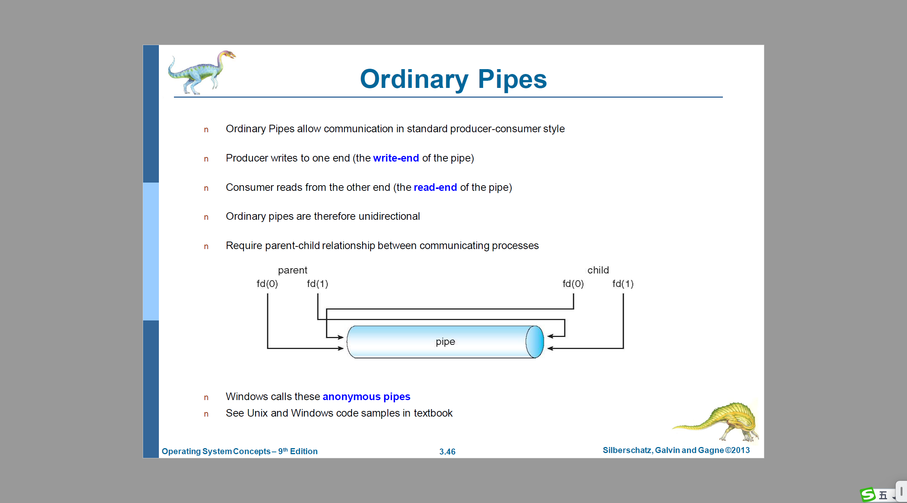

这页讲 **普通管道（Ordinary Pipes）**——也叫**匿名管道**（Windows 术语）。按原文逐条解释：

# 它是什么

- **普通管道**提供一种**标准“生产者—消费者”式**通信：
   生产者往**管道的写端（write-end）**写字节流；消费者从**读端（read-end）**按顺序读出。
- **单向（unidirectional）**：一根管子**只能单方向**流动数据；要双向通信通常要建**两根**管道。

# 谁能用

- 需要**父子进程关系**：通常**父进程**调用 `pipe(fd)` 得到两端（返回两个文件描述符：`fd[0]`=读端，`fd[1]`=写端），再 `fork()`。子进程**继承**这些描述符，于是二者可通过这根管道通信。
  - 图上 `parent fd(0)/fd(1)`、`child fd(0)/fd(1)` 就是这两个端点。
  - 不具亲缘关系的进程**不能**直接用普通管道（要用**命名管道 FIFO** 或其它 IPC）。

# 重要行为（理解管道用法的关键）

- **字节流，先进先出**；不保留消息边界（除非你自己定义协议）。
- **内核缓冲区有限**：写满时，写端在阻塞模式下会**阻塞**，非阻塞会返回 `EAGAIN`；读端在无数据时阻塞。
- **写端全关=EOF**：当**所有写端都被关闭**后，读端读到**文件结束（EOF）**。
- **原子性**：在类 Unix 上，单次写入不超过 `PIPE_BUF`（通常 4096 或 65536）可保证**不被交叉打散**。

# 平台术语

- **Windows** 把普通管道称为 **anonymous pipes**（匿名管道）。

# 最小使用范式（父→子）

1. `int fd[2]; pipe(fd);`  // `fd[0]` 读、`fd[1]` 写
2. `pid = fork();`
3. 父进程：`close(fd[0]); write(fd[1], ...);`
4. 子进程：`close(fd[1]); read(fd[0], ...);`

**一句话**：普通/匿名管道＝**父子进程间的单向字节流通道**：一端写、一端读，缓冲有限，适合本机上快速搭起“生产者—消费者”通信（如 shell 的 `cmd1 | cmd2`）。

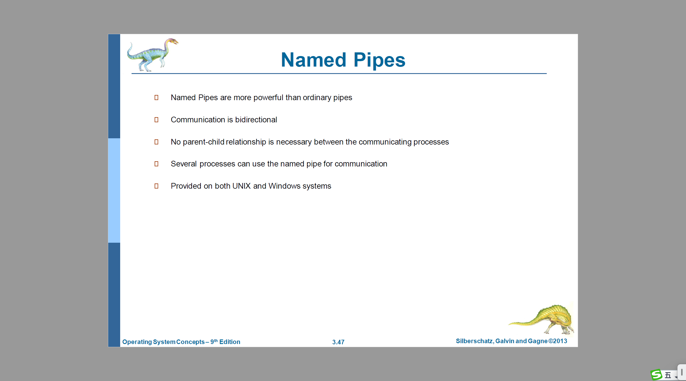

这是在讲 **命名管道（Named Pipes）** 的特性。按幻灯片原文逐条解释，并给一点实务补充：

- **“Named Pipes are more powerful than ordinary pipes”**
   命名管道比普通（匿名）管道更强：它在文件系统里**有名字/路径**，因此不必靠 `fork()` 继承句柄才能用，适用场景更广。
- **“Communication is bidirectional”**
   原文指出命名管道支持**双向通信**。在很多实现里可以同时读写同一个 FIFO/管道端点。
   *实务补充：在 Unix 上为了简单与避免阻塞/竞争，工程里常用“两根 FIFO”分别做 A→B、B→A（相当于半双工各一根）。Windows Named Pipe 则天然支持全双工。*
- **“No parent–child relationship is necessary between the communicating processes”**
   通信双方**不需要**父子进程关系。任何进程只要能访问该路径（权限允许），就能通过这个命名管道读写数据。
- **“Several processes can use the named pipe for communication”**
   不止两个进程：**多个**进程可以同时连接到同一个命名管道，实现一对多或多对一的通信（通常需在应用层做并发与消息分发控制）。
- **“Provided on both UNIX and Windows systems”**
   **Unix/Linux** 提供 FIFO（`mkfifo` 创建，`open/read/write` 使用）；
   **Windows** 提供 Named Pipe（`CreateNamedPipe` / `ConnectNamedPipe` / `ReadFile` / `WriteFile` 等）。

**一句话**：命名管道=有路径的管道，支持（原文所述）双向通信、无亲缘关系、可多进程共享，Unix 与 Windows 都有实现；相比匿名管道，适用范围更广、部署更灵活。


这是本章的小结页，只有一句 **“Questions?”（有问题吗？）**——意思是到此结束，进入**提问/讨论**环节。

为了你复盘，这一节刚讲了：

- 进程间通信（IPC）的两大模型：**消息传递** vs **共享内存**
- **直接通信**与**间接通信（邮箱/端口）**
- **阻塞/非阻塞**与**会合（rendezvous）**语义
- **缓冲**：0、有限、近似无限容量
- 客户端-服务器常见手段：**sockets、RPC、pipes、Java RMI**
- **匿名管道**：父子进程单向字节流

若你要我根据原文出几道检查点，可练：

1. 直接通信和间接通信在“寻址、链路数量、耦合度”上的差异？
2. 缓冲容量变化对 send/receive 阻塞行为的影响？
3. 为什么“send/receive 都阻塞”= 会合？与 0 容量通道的关系？
4. 共享内存为何快，但为什么仍需要同步原语？
5. RPC 的 **stub、编组（marshalling）、XDR** 分别做什么？“exactly-once”为何难实现？
6. 匿名管道与命名管道的适用场景有何不同？

需要我把这些题目配上标准答案/代码例子吗？


第二个PPT


这是本章“**线程（Threads）**”的开场页，说明内容**基于《Operating System Concepts》第9版第4章**。意思：接下来要讲“线程”这一并发执行单位及其在操作系统中的实现与使用。

你会看到的核心要点通常包括（按原书结构）：

- **什么是线程**：进程里的轻量级执行流；同一进程内的线程**共享**代码段、数据段、打开的文件等资源，但**各自**有寄存器状态与栈。
- **为何使用线程**（优势）：
   **响应性**（GUI/服务器不被耗时任务卡死）、**资源共享**（同进程天然共享）、**创建/切换开销更小**（比进程轻量）、**可伸缩**（多核并行）。
- **线程与进程的区别与关系**：一个进程可含多个线程；进程是资源分配单位，线程是 CPU 调度单位。
- **多线程模型**：
   **用户级线程 vs 内核级线程**；**多对一（many-to-one）**、**一对一（one-to-one）**、**多对多（many-to-many）**映射模型及优缺点。
- **编程与系统层面的问题**：
   `fork/exec` 与线程的语义、**信号处理**、**线程取消**、**线程池**、**线程特定数据（TLS）**、**调度器激活/轻量级进程（LWP）** 等。
- **实际 API**：POSIX Threads（pthreads）、Windows 线程，创建/同步（互斥量、条件变量、读写锁、信号量）等基本用法。

如果你把后面每一页发上来，我继续按原文逐条翻译+讲解要点。

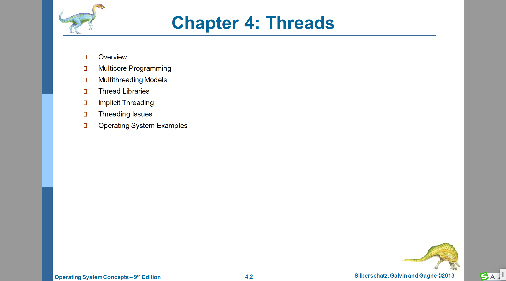

# 这一页讲什么（Chapter 4: Threads）

这是“第4章：线程”的目录页，列出了本章将覆盖的核心主题。按原文逐条解释并点出学习要点：

- **Overview（概述）**
   先说明什么是线程、与进程的区别（轻量、共享进程地址空间/资源）、为什么要用线程（并发、响应性、资源利用率高、结构清晰）。
- **Multicore Programming（多核编程）**
   讲在多核/多处理器上如何把工作并行化：任务分解、负载均衡、共享数据的一致性、缓存与伪共享、同步与伸缩性问题。
- **Multithreading Models（多线程模型）**
   用户级线程 vs. 内核级线程，以及它们的映射关系：
   1:1（每个用户线程对应一个内核线程）、M:1（多用户线程映到一个内核线程）、M:N（多对多，需调度器激活）。对性能、阻塞行为的影响各不相同。
- **Thread Libraries（线程库）**
   提供创建/管理线程与同步原语的接口，如 POSIX Threads（pthreads）、Windows 线程库、Java 线程等；涵盖线程创建、join、互斥量、条件变量、读写锁等。
- **Implicit Threading（隐式线程）**
   由**库/运行时/编译器**替你管理线程，不必手写线程代码：如线程池、任务/工作队列、OpenMP 指令、Fork-Join 模型、MapReduce 等，降低并发编程复杂度。
- **Threading Issues（多线程中的典型问题）**
   竞争条件、临界区、死锁、活锁、饥饿、可重入性、线程安全；以及调度、信号与线程的交互、`fork/exec` 与线程、可取消线程、线程本地存储（TLS）等。
- **Operating System Examples（操作系统实例）**
   各主流系统如何实现与支持线程：Linux/Unix（NPTL、clone/轻量级进程）、Windows（内核对象、APC、纤程）、Solaris 等；以及它们的调度与同步机制实例。

**一句话**：本章系统讲“线程是什么、为什么用、怎么在多核上高效用、常见实现模型与库、如何把线程管理交给框架、会踩哪些坑、主流系统怎么做”。

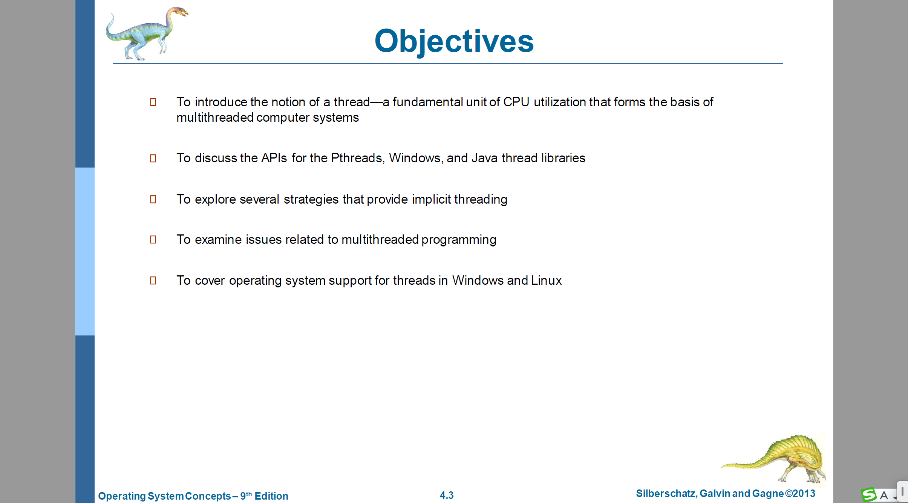

这页是“第4章 线程”的**学习目标**。按原文逐条解释：

1. **认识线程的概念**
    线程是 CPU 利用的**基本单位**：每个线程有自己的程序计数器、寄存器上下文和栈，但与同一进程的其他线程共享代码段、数据段、打开文件等资源——这是实现**多线程系统**的基础。
2. **掌握常见线程库的 API**
    会用 POSIX Threads（pthreads）、Windows 线程库、Java 线程库：如创建/结束线程（`pthread_create`、`CreateThread`、`new Thread` / `ExecutorService`）、等待（`join`）、同步原语（互斥量、条件变量、信号量、读写锁）等。
3. **了解隐式多线程策略**
    不必手写线程，由运行时/库帮你并行化：**线程池、任务/工作队列、Fork–Join、OpenMP 指令、MapReduce/GCD** 等，让程序把“任务”交给框架自动调度。
4. **分析多线程中的关键问题**
    竞争条件与临界区、同步与内存可见性、死锁/活锁/饥饿、可重入性与线程安全、线程取消/信号处理、线程本地存储（TLS）、调度与可伸缩性等。
5. **了解操作系统层面的支持**
    Windows 与 Linux 如何实现/管理线程与调度：Linux 的 `clone()`/NPTL/轻量级进程、Windows 的内核线程对象、同步机制与调度策略等实际做法与差异。

一句话：本章目标是——**知道什么是线程、会用主流线程库、懂得让框架替你并行化、能处理多线程常见坑、并理解 Windows/Linux 的线程实现与支持**。

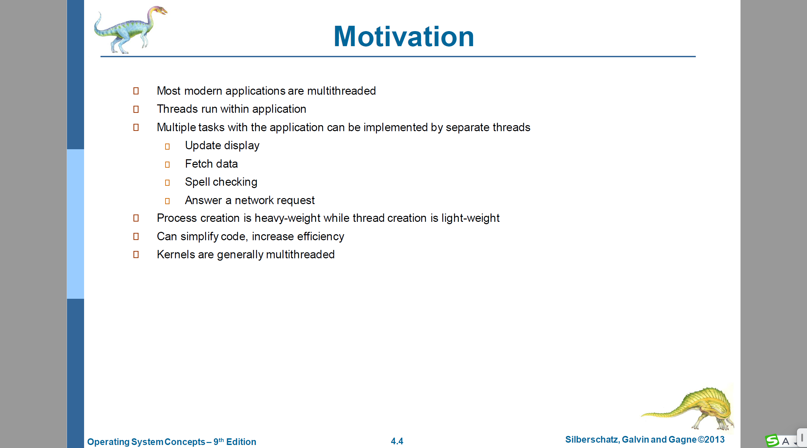

这页是**“为什么要用线程（Motivation）”**。按原文逐条翻译＋要点解释：

- **多数现代应用都是多线程的。**
   UI 程序、浏览器、数据库、游戏、服务器基本都不止一个线程。
- **线程在应用程序内部运行。**
   线程共享同一进程的地址空间和资源（代码、堆、打开文件等），各自只保留最小的执行上下文（寄存器、栈、线程局部存储）。
- **把应用里的多个子任务交给不同线程实现更合适，例如：**
  - **更新界面（update display）**：专门的 UI 线程保持界面流畅，避免被耗时任务卡死。
  - **抓取数据（fetch data）**：后台线程进行 I/O，不阻塞 UI。
  - **拼写检查（spell checking）**：编辑器里可在后台持续扫描文本。
  - **处理网络请求（answer a network request）**：服务器用线程池并发处理客户端连接。
- **创建进程是“重量级”的，而创建线程是“轻量级”的。**
   进程要分配独立地址空间、复制/映射资源；线程只需分配栈和少量内核/调度结构，创建/切换成本更低，启动更快。
- **多线程能简化代码并提升效率。**
   用自然的并发结构把逻辑分解成互不阻塞的活动（UI、I/O、计算），在多核上还能**并行**执行，提高吞吐与响应性。
- **内核本身通常也是多线程的。**
   现代 OS 内核会用多个内核线程分别处理磁盘、网络、中断后的延迟工作等，以充分利用多核硬件并隔离职责。

一句话：线程让你把**并发的子任务**拆开，各做各的；开销小、响应快、结构清晰，还能吃满多核，这是现代软件几乎都用多线程的根本动机。

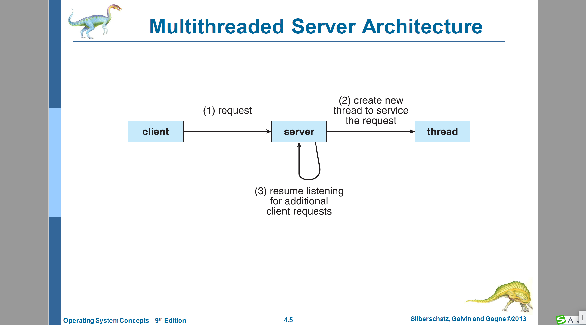

这是**多线程服务器架构（Multithreaded Server Architecture）**的基本示意图。按图上的编号解释：

1. **client → server：请求到达**
    客户端发来一个请求（连接、HTTP 请求、RPC 调用等），服务器主线程/监听线程接收到它。
2. **server → thread：为该请求创建新线程**
    服务器**派生一个工作线程**（或从线程池里取一个空闲线程），让它**专门负责**处理这个请求的整个生命周期：解析、执行业务逻辑、访问数据库/磁盘/网络、生成响应并回送给客户端。
3. **server：立即回到监听状态**
    主线程**不被单个请求长期占用**，而是立刻回到 `accept()/recv()` 等等待状态，继续接收后续的客户端请求。这样服务器可以**并发**处理多路请求：每个请求各由一个线程推进。

# 这个模型的要点

- **响应性**：慢请求不会堵住新请求；主线程始终在监听。
- **并行性**：在多核机器上，多个工作线程可以真正并行运行。
- **共享资源**：所有线程处在同一进程，**共享地址空间**（缓存、连接池、文件描述符等），传递数据**无需跨进程拷贝**。
- **实现方式**：
  - **线程-每请求（thread-per-request）**：来一个请求就 `create thread`。简单直观，但高并发下**线程创建/销毁开销**大，还可能耗尽内存/调度器压力。
  - **线程池（推荐）**：预先创建固定/弹性的线程集合；请求到来时放入队列，由空闲线程取出处理。可控、稳定、吞吐更高。
- **需要注意的坑**：
   竞争条件与共享数据的**同步**（锁/条件变量/无锁结构）、**上下文切换**开销、**阻塞 I/O**导致线程被挂起、**线程数与内存/FD 上限**、**拒绝策略/背压**等。

一句话：图里展示的是“**主线程接客，工作线程干活**”的模式——保证服务器既能持续接入新请求，又能并发处理已有请求，这是多线程服务器的最常见基本形态。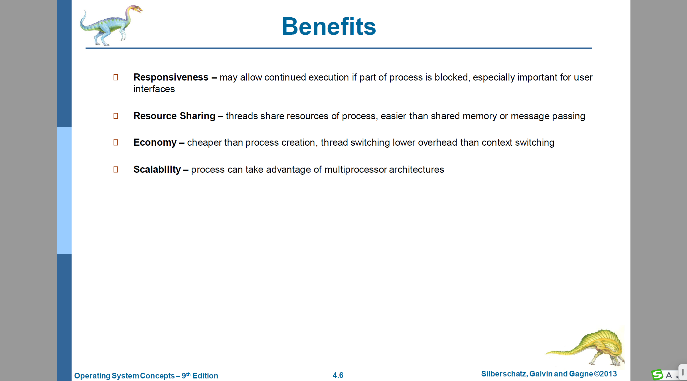

这页在讲**使用线程的四大好处**，按原文逐条解释：

- **Responsiveness（响应性）**
   当进程中的某一部分被阻塞（如 I/O）时，其他线程仍可继续执行，程序不“卡死”。对带界面的应用尤其重要：后台线程等 I/O，前台 UI 线程还能响应点击与绘制。
- **Resource Sharing（资源共享）**
   同一进程内的线程**共享**代码段、数据段、打开的文件等资源，因此线程之间交换数据只需读写同一地址空间中的变量，比用“共享内存/消息传递”等跨进程 IPC 更直接、开销更小。
- **Economy（经济性）**
   创建/销毁一个**线程**比创建/销毁一个**进程**便宜得多；线程之间切换的开销也低于进程上下文切换（通常无需切换地址空间、TLB 刷新等），因此更省资源、更高效。
- **Scalability（可伸缩性）**
   通过把工作分给多个线程，进程可以**充分利用多处理器/多核**架构，把任务并行化，从而获得吞吐与性能的线性或近线性提升。

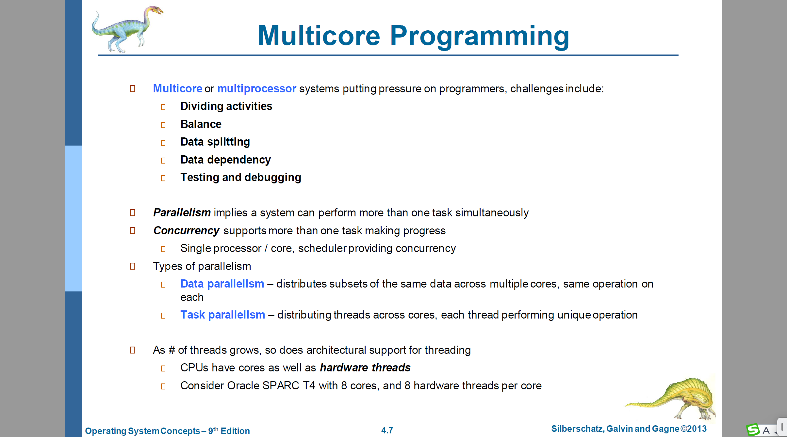

这页讲 **多核编程（Multicore Programming）** 的动机、概念区分和基本类型。按原文逐条解释：

# 多核/多处理器给程序员带来的挑战

- **Dividing activities**：把工作拆分成可并行的子任务。
- **Balance**：各子任务负载要均衡，否则快核等慢核，整体变慢。
- **Data splitting**：把数据切片给不同线程/核心处理（如何分块、边界、对齐、缓存局部性）。
- **Data dependency**：处理数据间的**依赖**与**共享**（需要同步、避免竞态/假共享）。
- **Testing and debugging**：并发下调试更难，问题具有**非确定性**（只在某些时序出现）。

# 并行（Parallelism） vs 并发（Concurrency）

- **Parallelism**：系统**同时**做多件事（需要≥2个核心实际并行执行）。
- **Concurrency**：系统让多件事**同时推进**（即使只有一个核心，也可通过调度让任务交错前进）。

# 并行的两种基本形态

- **Data parallelism（数据并行）**：把**同一数据集**的不同子集分配到多个核心，**执行相同操作**。
   例：对大数组分块求和；每核做“加法”。
- **Task parallelism（任务并行）**：把**不同的工作**分配给不同线程/核心；**每个线程执行不同操作**。
   例：一个线程做解码，另一个做滤波，再一个做渲染。

# 硬件对线程的支持

- 随着线程数增加，硬件/架构也提供支持：不仅有**多核（cores）**，还有**硬件线程（hardware threads）**（超线程/SMT）。
- 例子：**Oracle SPARC T4**：8 个核心，每核 **8 个硬件线程**（即每核可同时保留多条硬件执行上下文，提高吞吐）。

# 一句话小结

写好多核程序=**合理切分任务与数据**、**负载均衡**、**正确同步**、**考虑缓存/内存层次结构**，并清楚地区分你要实现的是**数据并行**还是**任务并行**；并且记住：**并发不等于并行**，但并行一定需要并发的正确性作为前提。

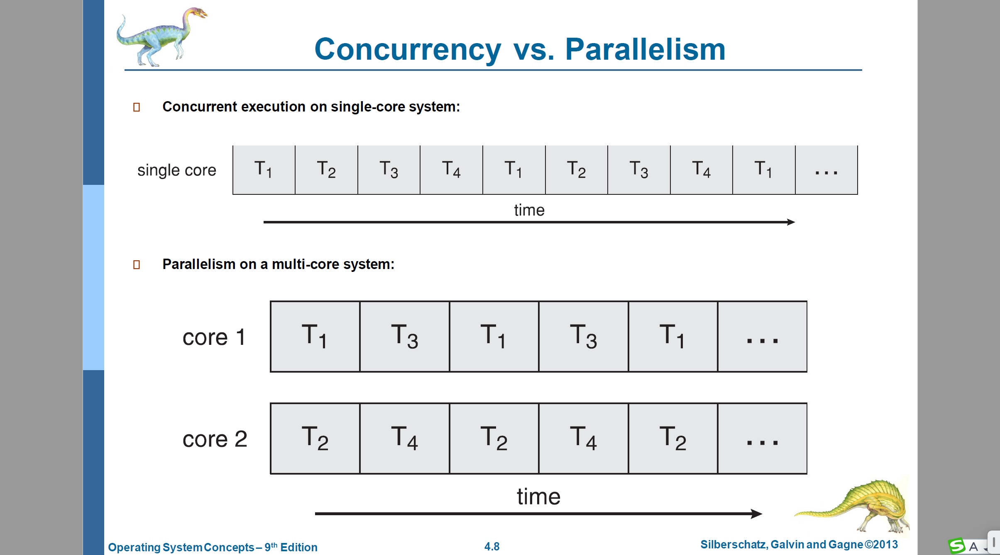

这页在对比 **并发（Concurrency）** 和 **并行（Parallelism）**。按原文两幅图解读：

- **上图：单核上的并发（Concurrent execution on single-core）**
   只有**一个核心**，同一时刻**只能跑一个任务**（T1/T2/T3/T4）。操作系统通过**时间片轮转**把它们**交替执行**：T1 跑一会儿→切到 T2→再到 T3…
   结果：从宏观上看“同时进行”，其实是**穿插/交错**运行，产生“同时”的**错觉**。
- **下图：多核上的并行（Parallelism on a multi-core system）**
   有**多个核心**（例子里 core1 与 core2）。T1/T3 在 **core1** 上跑，T2/T4 在 **core2** 上跑，**同一时刻真的有多个任务在运行**——这才是**真正的并行**。

**要点小结：**

- 并发：强调**结构与调度**——能同时“在进行中”，但不一定同时在跑；单核只能并发，不能真正并行。
- 并行：强调**物理同时**——需要多核/多处理器支撑。
- 并发可以没有并行；并行通常包含并发，但还要处理共享数据的同步、竞争等问题（锁、原子操作等）。

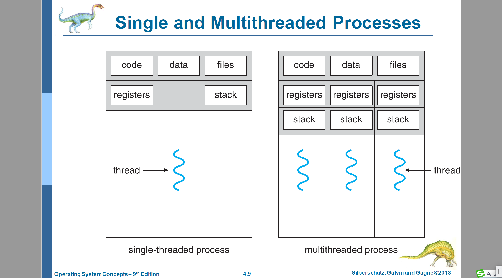

这页对比**单线程进程**和**多线程进程**在资源上的划分。

# 左图：single-threaded process（单线程进程）

- 这整个进程只有**一个线程**（蓝色弯线）。
- **进程级共享资源**只有一份：`code`（代码段）、`data`（全局/堆等数据段）、`files`（打开文件/套接字表）。
- 线程自己拥有的**私有执行上下文**：`registers`（寄存器，包括PC/SP等）和`stack`（栈）。
- 调度单位=这个唯一线程；任何计算/阻塞都把整个进程带停。

# 右图：multithreaded process（多线程进程）

- 同一进程内有**多个线程**。
- **共享**：仍然只有一份 `code / data / files`（再加上整块地址空间、堆、进程ID等都共享）。
- **每个线程私有**：各自的 `registers` 与 `stack`（因此每个线程有自己的执行点、调用栈、局部变量、TLS）。
- 这些线程是操作系统的**调度单位**，可并发（多核上可并行）执行。

# 这张图想强调的结论

- 线程=“进程内的轻量执行流”。**共享进程资源**→同进程线程之间通信成本低，但**对共享数据必须同步**（锁/条件变量等），否则会有竞态。
- 线程有**独立的栈和寄存器**→能各跑各的函数调用链，不会互相覆盖局部变量。
- 相比“多个进程”，**创建/切换线程更轻**，但**一个线程崩溃通常会带崩整个进程**（共享地址空间）。

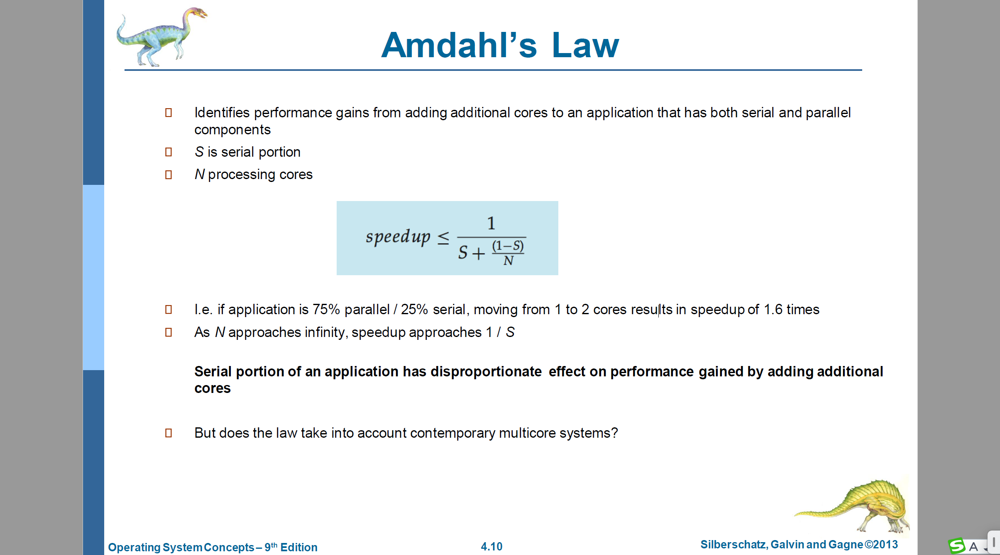

- 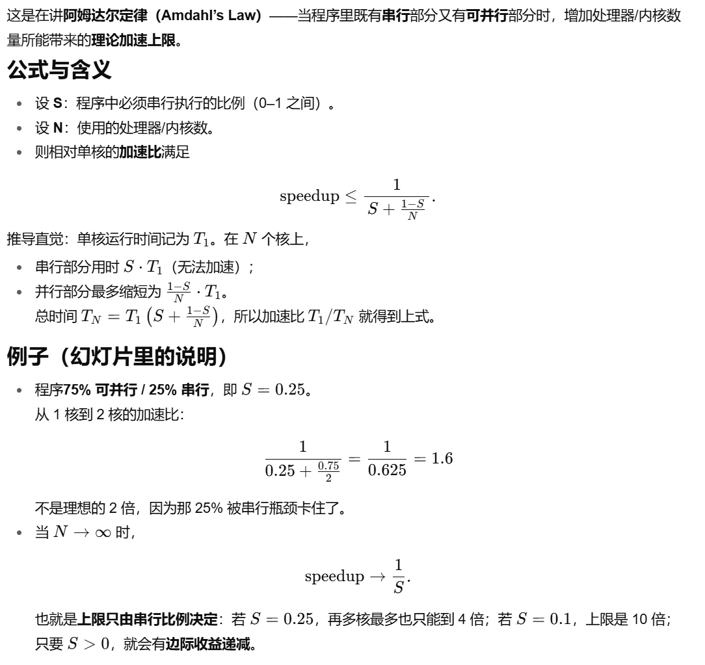
- 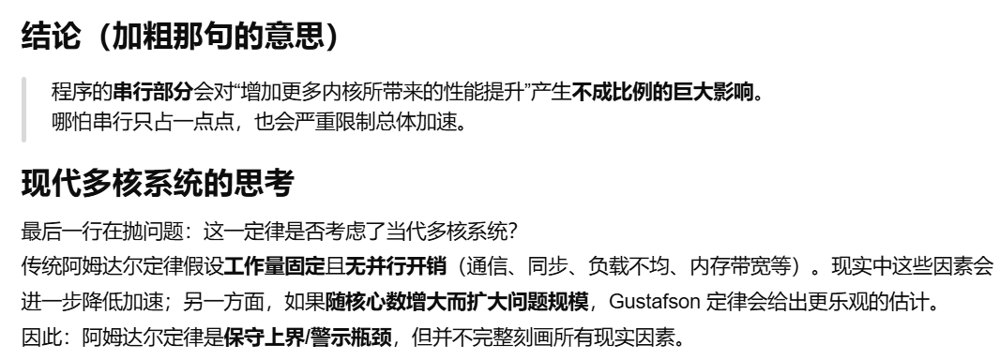

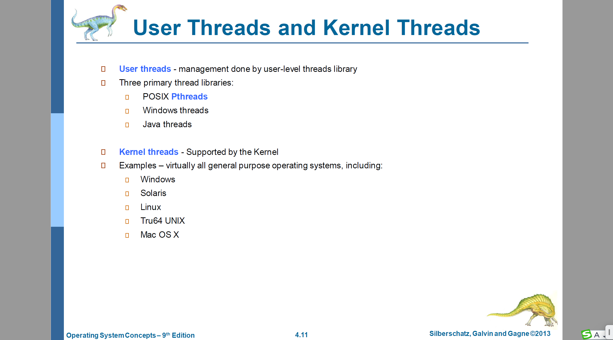

这页在区分 **用户级线程（User threads）** 和 **内核级线程（Kernel threads）**，并点到常见线程库与操作系统支持。按原文逐条解释并补充要点：

- **User threads – 由用户层线程库管理**
   含义：线程的创建、同步、调度等都在**用户态库**里完成，内核并不知道这些线程分别是谁；在内核看来通常就只有一个（或少数几个）进程/内核线程在跑。
   典型库（原文列出三类）：

  - **POSIX Pthreads**（常见于 Unix/Linux 的 `pthread_*` 接口）
  - **Windows threads**（Win32 线程 API，C/C++ 经常用）
  - **Java threads**（`java.lang.Thread` / 线程池等，语言与运行时提供）

  > 补充：严格说，pthreads/Windows/Java 在现代系统上通常都会映射到内核线程执行，但“用户线程”的意思是**通过库的抽象在用户态管理与使用线程**。

- **Kernel threads – 由操作系统内核直接支持**
   含义：每个线程在内核里都有**独立的调度实体**，由内核负责创建、阻塞/唤醒与调度；系统能把不同线程分配到不同 CPU 核上并行运行。

  - 原文举例：几乎所有通用操作系统都支持内核线程，包括 **Windows、Solaris、Linux、Tru64 UNIX、Mac OS X**（今 macOS）。

**两类线程的典型差异（便于理解原文要点）**

- **谁来调度**：用户线程由库在用户态调度；内核线程由内核调度器调度。
- **阻塞影响**：纯用户级实现里，一个系统调用阻塞可能**卡住整个进程**；内核线程则只会阻塞**该线程**。
- **开销与灵活性**：用户态切换更轻、更快；内核线程并行度高、能跨多核、与 I/O/系统调用配合更好。
- **实际应用**：现代系统多采用 
- **1:1（用户线程=内核线程）或 M:N** 混合模型，用库（如 pthreads/Java）提供易用接口，由内核提供真正并发/并行能力。
- 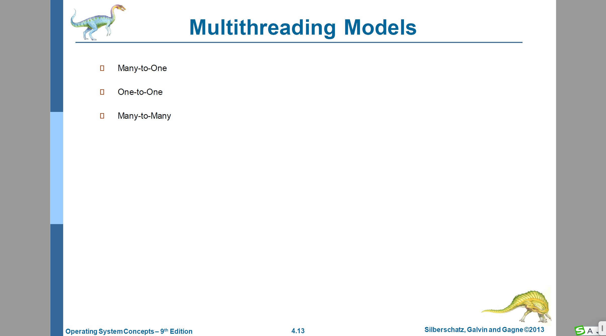

这页是多线程实现的**三种映射模型**目录。意思：用户态看到的“线程”如何映射到内核态的“可调度实体”。三种典型模型如下——

# Many-to-One（多对一）

- **定义**：**多个用户级线程**→映射到**同一个内核线程**（内核只见一个执行体）。
- **后果**：
  - **不能并行**：再多核也只有一个内核线程在跑。
  - **阻塞放大**：一个线程做阻塞系统调用会把整个进程都卡住。
  - **优点**：创建/切换极轻；完全在用户态调度。
- **历史例子**：早期 Solaris **Green Threads**、GNU Pth。

# One-to-One（一对一）

- **定义**：每个**用户线程**对应**一个内核线程**。
- **后果**：
  - **可并行**：多核能同时运行多个线程。
  - 阻塞互不影响（内核能调度别的线程）。
  - **代价**：创建/销毁/切换成本较高；过多线程会压垮调度器与内存。
- **主流实现**：Windows 线程、Linux (NPTL)、现代 macOS/Solaris。

# Many-to-Many（多对多）/Two-Level

- **定义**：**许多用户线程**映射到**若干（≤核心数）内核线程**；运行时在用户态多路复用到少量内核线程上，并可按需增减。
- **特性**：
  - 兼顾**并行**与**轻量调度**；避免“一对一”海量内核线程的开销。
  - 实现复杂，需要与内核协作（如 **scheduler activations / LWP**），调试困难。
- **历史实现**：早期 Solaris（用户线程↔LWP↔内核线程）、IRIX。后来多转向一对一。

**速记**：

- 要极简、轻但不并行 → **Many-to-One**。
- 要简单、通用、易并行 → **One-to-One（当今主流）**。
- 想折中但实现重 → **Many-to-Many/Two-Level**。

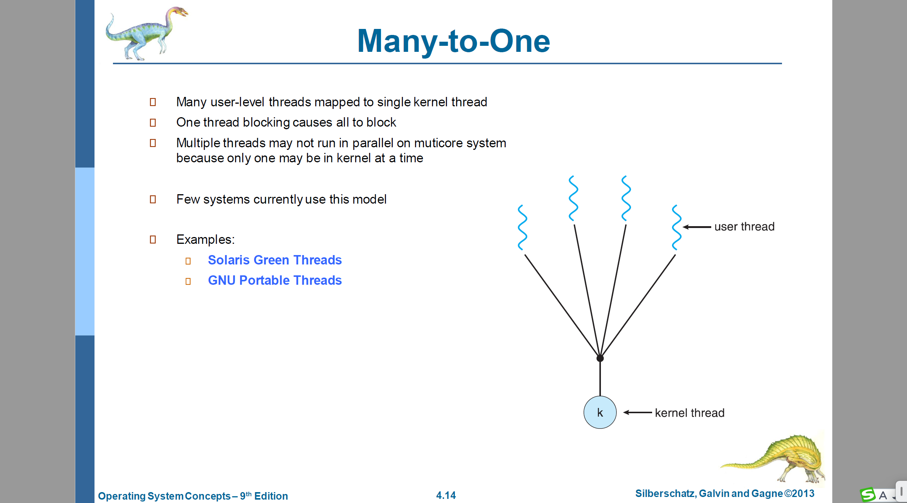

这页讲的是**多对一（Many-to-One）线程模型**。按原文逐条解释并补充要点：

- **Many user-level threads mapped to a single kernel thread**
   许多**用户级线程**由线程库在用户态管理，**都映射到同一个内核线程**上；内核只看到 1 个可调度实体。
- **One thread blocking causes all to block**
   其中**任意一个线程**执行会阻塞的系统调用（如同步 I/O），因为只有这 1 个内核线程在跑，结果**整个进程里的所有用户线程都跟着停**。
- **No parallelism on multicore**
   即使机器是多核，也**无法并行**：同一时刻只有这一个内核线程在内核里运行，多个用户线程只能在用户态**轮流**跑。
- **Few systems currently use this model**
   由于并行性差、易被阻塞，“多对一”现在**很少使用**，更多是历史/教学意义。
- **Examples**
   代表实现：**Solaris Green Threads**、**GNU Portable Threads**（早期/实验性库）。

**优缺点一眼看懂**

- 优点：切换在线程库里完成，**开销小、实现简单、可移植**。
- 致命缺点：**一个阻塞、全体停**；**不能利用多核**；系统调度器无法在内核层面区分这些线程。

**何时不用它？**
 需要 I/O 密集或想利用多核时，选择 **一对一（1:1）** 或 **多对多（M:N）** 模型更合适。


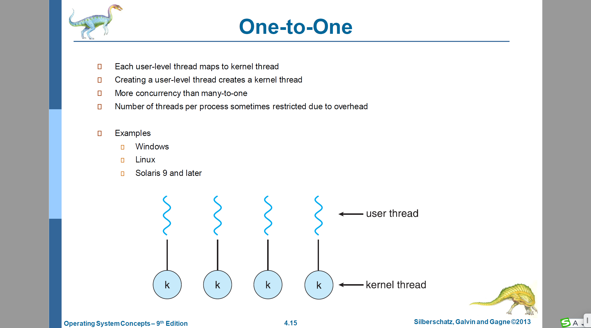

这页讲**一对一（One-to-One）线程模型**。按原文逐条解释：

- **Each user-level thread maps to kernel thread**
   每个**用户线程**都**一一对应**一个**内核线程**（图下方的 k）。内核能直接调度这些线程。
- **Creating a user-level thread creates a kernel thread**
   你在库里 `pthread_create()` 一个线程，内核里也会创建相应的可调度实体（分配内核栈、TCB、调度队列项等）。
- **More concurrency than many-to-one**
   并发/并行能力强：多核机器上，多个内核线程可以**真正并行**运行；某个线程发生**阻塞系统调用**（I/O、锁等）时，内核仍可切到同进程的其他线程继续跑——不会像“多对一”那样被整体卡死。
- **Number of threads per process sometimes restricted due to overhead**
   代价是**开销更高**：每个线程都有内核开销和内存占用（内核栈、调度信息），线程过多会增加上下文切换、内存压力，所以系统/库往往对**单进程最大线程数**有软/硬限制（取决于内存、ulimit、实现等）。
- **Examples**
   采用该模型的主流系统：**Windows**、**Linux（NPTL）**、**Solaris 9+** 等。

# 小结

“一对一”= 主流现实选择：**简单、可靠、可并行**。缺点是**线程太多会贵**，故工程上常用**线程池**控制数量，并用异步 I/O 或更细粒度任务（协程/事件）减少“开大堆线程”的需求。

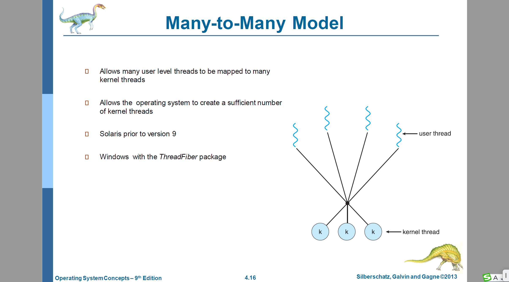

好的，这页讲的是**线程的 Many-to-Many（M:N）模型**。先把图上“原文要点”翻译出来，再结合图解释它在操作系统里怎么运作、有什么好处和代价。

# 原文要点（直译）

- 允许**许多用户级线程**映射到**许多内核线程**。
- 允许操作系统按需创建**足够数量**的内核线程。
- 典型实现：早期的 **Solaris（9 之前）**；**Windows** 的 **ThreadFiber** 包。

# 图怎么读

- 右边上方那些蓝色波浪线＝**用户线程**（User Threads）。
- 右下方标着 “k” 的圆点＝**内核线程**（Kernel Threads）。
- 中间黑点是“**多路复用/绑定点**”（可理解为轻量级进程 LWP 或“虚拟处理器”）：用户线程通过线程库被**调度并绑定**到下方少量的内核线程上运行。

也就是说：用户空间可以创建很多很多线程；而内核并不需要为每个用户线程都配一个一对一的内核线程，而是维护**一池**内核线程（数量由 OS 决定），线程库把就绪的用户线程“铺”在这些内核线程上执行。

# 它在系统里的具体工作方式（通俗版）

1. **用户态创建/切换很便宜**：大部分创建、同步、切换由用户态线程库完成，速度快。
2. **需要进内核时再用内核线程**：比如系统调用或被阻塞（I/O、锁）时，对应的内核线程会被挂起，线程库可以把**别的用户线程**调度到**其它空闲内核线程**上继续跑。
3. **OS 决定并行度**：操作系统可以根据 CPU 核数、负载等，把内核线程的数量调到“**足够**”但不浪费（不必像 1:1 那样成千上万）。

# 和其它模型对比（为什么要 M:N）

- **Many-to-One（多对一）**：所有用户线程挤在**一个**内核线程上→任一系统调用阻塞就**全体阻塞**，且无法多核并行。
- **One-to-One（一对一）**：每个用户线程都有一个内核线程→有**真正并行**，但内核线程太多会**开销大/受内核限额限制**。
- **Many-to-Many（多对多）**：兼顾两者——既能**并行**，又能把内核线程数控制在合理范围，不必一对一膨胀。

# 优缺点小结

**优点**：

- 有并行度（多核能跑起来）；
- 单个线程阻塞不会拖住全部；
- 用户态调度开销小；
- 内核线程数量**可控**、更经济。

**代价/现实**：

- 实现和调度交互**复杂**（线程库与内核要配合，比如 LWP/“scheduler activations” 之类机制）；
- 调试、工具链更麻烦；
- 因复杂度，很多现代通用 OS 后来偏向**一对一**模型，但教材里仍把 M:N 作为重要思路与历史实现（如早期 Solaris、Windows 的 ThreadFiber）。

如果你需要，我可以再配一张小图或用代码/伪代码演示“1000 个用户线程映射到 8 个内核线程”的调度流程。

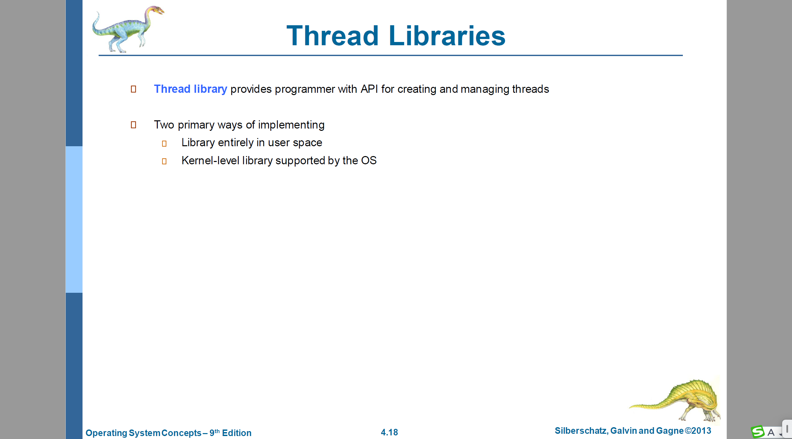


这页讲 **线程库（Thread library）**——给程序员提供**创建与管理线程的 API**。核心点＋必要补充如下：

# 线程库做什么

- 暴露一组函数/接口：创建、退出、`join`/分离、睡眠/唤醒、线程局部存储（TLS），以及与线程配套的同步原语（互斥量、条件变量、读写锁、信号量等）。
- 典型库：**Pthreads**（POSIX Threads）、**Win32 Threads**、**Java Threads**（`java.lang.Thread` / `java.util.concurrent`）。

# 两种主要实现方式（原文两条）

1. **完全在用户态实现（Library entirely in user space）**
   - 线程由**运行时库**管理与调度，内核**看不到**这些线程（多对一模型常见）。
   - **优点**：创建/切换很快；无需陷入内核。
   - **缺点**：一次**阻塞系统调用**会把整个进程挂住；无法在多核上真正并行；难与内核调度协同。
2. **由操作系统支持的内核级线程库（Kernel-level library supported by the OS）**
   - 每个用户线程对应一个**内核线程**（一对一模型）；库调用会触发内核创建/管理。
   - **优点**：能在多核上并行；某线程阻塞不影响其他线程；内核可独立调度。
   - **缺点**：创建/销毁/切换成本更高；大量线程会带来内存与调度开销。

**一眼记忆**：
 用户态库＝**轻**但不并行、易被阻塞拖累；内核级库＝**真并行**但**重**。实际系统多使用内核级线程库（如 Linux NPTL、Windows 线程），并配合线程池与异步 I/O 控制开销。

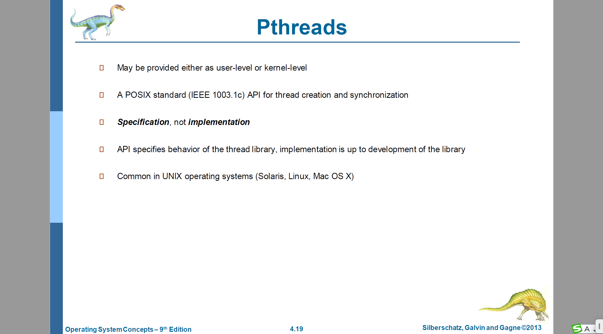

这页在介绍 **Pthreads（POSIX 线程）**。按原文逐条解释并补充关键点：

- **“May be provided either as user-level or kernel-level”**
   Pthreads 只是**接口/规范**，实现可以在用户态库里完成，也可以由内核直接支持（现代类 Unix 通常把 pthread 线程映射为内核线程 1:1）。
- **“A POSIX standard (IEEE 1003.1c) API for thread creation and synchronization”**
   它是 **POSIX 标准**（IEEE 1003.1c）定义的一套 **API**，用于**创建线程与同步**（如互斥量、条件变量、读写锁、屏障、线程属性等）。
- **“Specification, not implementation”**
   **强调：标准规定的是“行为规范”，不是具体实现。** 也就是说它告诉你函数应该怎样表现，但底层如何做由各个系统/库自己决定。
- **“API specifies behavior of the thread library, implementation is up to development of the library”**
   继续说明：API 只规定**语义与契约**，具体实现细节（用户级/内核级、调度策略、性能取舍）由库的开发者决定。
- **“Common in UNIX operating systems (Solaris, Linux, Mac OS X)”**
   Pthreads 在 **UNIX 家族**系统中最常见：Solaris、Linux、macOS 等都提供对 `pthread_*` 接口的支持。

**一句话**：Pthreads 是一套跨 Unix 系统通用的**线程编程规范**；你用统一的 `pthread_create/pthread_join/pthread_mutex_*` 等 API 写代码，而具体是怎么映射到内核线程、怎样调度与同步，由各系统的实现来负责。

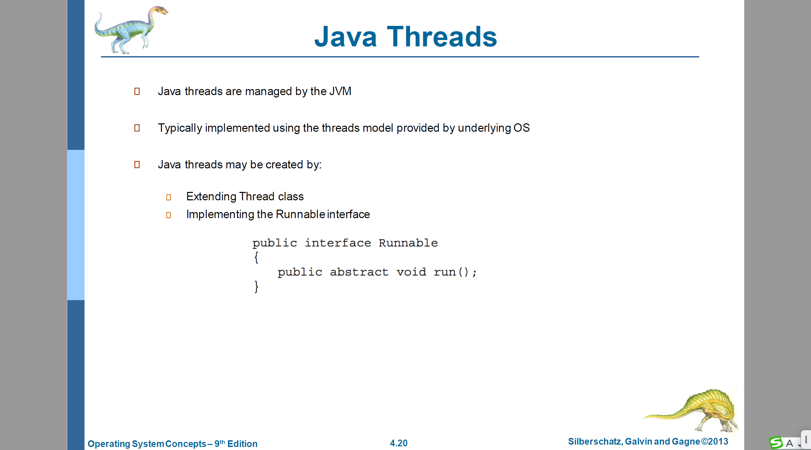


这页讲 **Java 线程（Java Threads）** 的基本点。按原文逐条解释——

- **Java 线程由 JVM 管理。**
   也就是创建、调度、生命周期接口都通过 JVM 暴露，开发者用 Java API 操作。

- **JVM 通常用底层操作系统的线程模型来实现。**
   现代 HotSpot 在主流系统上采用**一对一模型**：一个 Java 线程 ≈ 一个内核线程，所以能真正利用多核，并受 OS 调度影响（优先级、阻塞等）。

- **Java 中创建线程的两种常见方式：**

  1. **继承 `Thread` 类**：覆写 `run()`，然后 `new MyThread().start()`。

  2. **实现 `Runnable` 接口**：把任务写成 `run()` 方法，如：

     ```java
     public interface Runnable {
         public abstract void run();
     }
     ```

     使用时 `new Thread(new MyTask()).start()`。
      这种方式更灵活（可复用到线程池、避免单继承限制）。在现代代码里更推荐配合 **Executor/线程池** 使用，例如：`Executors.newFixedThreadPool(...).submit(() -> {...});`

# 小提示

- `start()` 才会创建并启动**新线程**；直接调用 `run()` 只是普通方法调用。
- 线程共享同一进程内存，访问共享数据要用同步工具（`synchronized`、`ReentrantLock`、`volatile`、`Atomic*`、`Concurrent*` 容器等）。
- 尽量使用 **`java.util.concurrent`**（`ExecutorService`、`Future`、`CompletableFuture`）来管理生命周期与并发，避免手写大量线程细节。

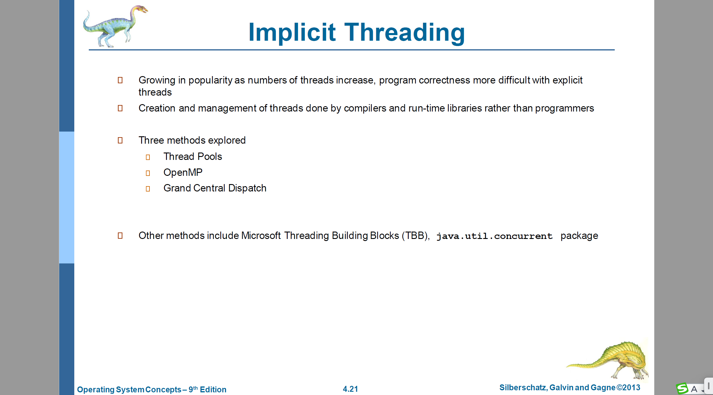

这页在讲 **隐式线程（Implicit Threading）**——把“开线程、管线程”的活交给**编译器/运行时/库**，而不是程序员手动写 `pthread_create` 之类。按原文逐条解释：

- **为什么流行**：线程数量一多，手写线程代码既难维护又容易出错（竞态、死锁等）。隐式线程把并发细节下沉到框架里，**程序员只描述任务/并行区域**。
- **谁来创建与管理线程**：由**编译器和运行时库**完成，而不是开发者。你写“并行做这件事”，至于开多少线程、怎么调度、如何复用线程，由框架决定。
- **本章要介绍的三种方法**
  - **Thread Pools（线程池）**：预先创建一批工作线程，程序把**任务**提交到队列，线程从队列取活干。优点：减少频繁创建/销毁成本、限制并发度、便于复用与调度。
  - **OpenMP**：通过**编译器指令/注解**（如 `#pragma omp parallel for`）把循环或代码块并行化；编译器与运行时负责切分任务、同步与调度。
  - **Grand Central Dispatch（GCD）**：Apple 提供的**任务队列模型**，把工作以 block/closure 形式提交到**串行/并行队列**，系统按资源情况自动调度（`dispatch_async` 等）。
- **其他方法（原文示例）**：**Threading Building Blocks (TBB)**、Java 的 **`java.util.concurrent`** 包（Executors、Future、并发容器、同步器等），都属于用库来**隐式管理线程**的做法。

**要点小结**：隐式线程让你**关注任务而非线程**，提升可读性与正确性；但仍需注意任务粒度、共享数据同步与副作用，框架负责调度并不等于自动线程安全。

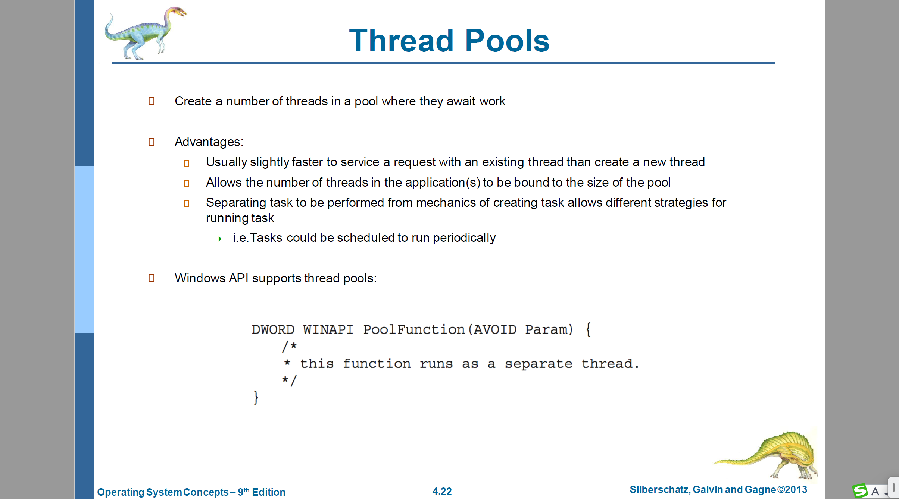


这页讲 **线程池（Thread Pools）**：先创建一批线程放在池里“待命”，有任务来了就把任务分配给空闲线程执行，而不是临时再新建线程。

# 定义

- **Create a number of threads in a pool where they await work**
   预先创建若干工作线程；任务进入**工作队列**，空闲线程从队列取任务执行，执行完再回到池中等待下一个任务。

# 优点（原文三点 + 解释）

- **通常比“每请求新建线程”更快**
   省掉线程的创建/销毁开销（内核栈、TCB、调度器登记），启动延迟更小，缓存局部性更好。
- **把应用的线程数量绑定到池大小**
   可控的并发度 → 避免线程爆炸导致的内存占用、上下文切换风暴、FD/句柄耗尽；还能按资源设置上限（比如每核 1～4 个工作线程）。
- **把“要做的任务”与“如何创建/运行它们”解耦**
   任务是可提交的单元（函数/闭包/`Runnable`），执行策略由池决定：例如**定期调度**、优先级、超时、拒绝策略、限流等。

# 平台支持

- **Windows API 支持线程池**（幻灯片给了一个工作函数样例签名 `DWORD WINAPI PoolFunction(VOID Param)`，表示这个函数由池中的线程执行）。
   其它常见：Java `ExecutorService`、C++ `std::async`/自建池、POSIX 也常用自实现或库。

# 小抄：何时用 & 注意点

- **适用**：服务器处理请求、批量 I/O、CPU 密集任务分发、定时任务。
- **注意**：池大小要与**CPU核心数/阻塞比例**匹配；避免把**长时间阻塞**的任务塞进仅有少数工作线程的池里；给队列设置上限与**拒绝策略/背压**，防止堆积。


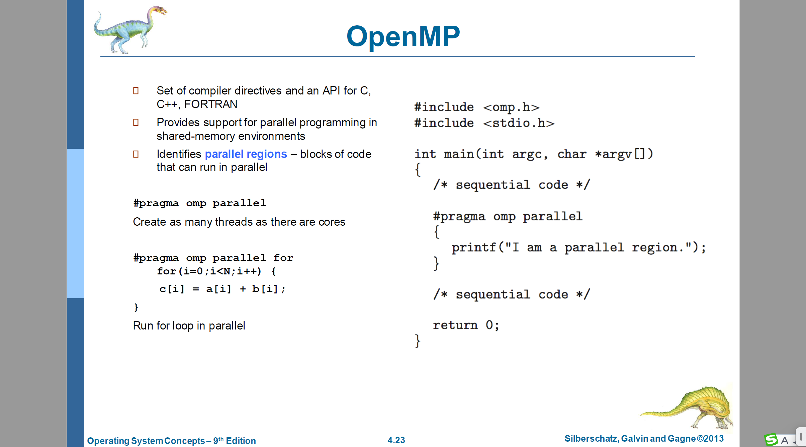

这页在介绍 **OpenMP**（共享内存并行编程框架）。按原文逐条解释，并把示例代码讲清楚：

- **“Set of compiler directives and an API for C/C++/FORTRAN”**
   OpenMP 是一组**编译器指令**（如 `#pragma omp ...`）加上**运行时 API**，支持 C、C++、Fortran。
- **“Provides support for parallel programming in shared-memory environments”**
   它用于**共享内存**机器（多核同一内存）。多个线程在同一进程地址空间里并行工作。
- **“Identifies parallel regions – blocks of code that can run in parallel”**
   通过指令把一段代码标记为**并行区域（parallel region）**，编译器与运行时会为它启动多个线程并调度执行。

------

### 关键指令（左侧示例）

- `#pragma omp parallel`
   把紧随其后的代码块设为并行区域。**默认会创建与可用核心数相当的线程**（也可通过 `OMP_NUM_THREADS` 或 `num_threads()` 调整）。

- `#pragma omp parallel for`
   把紧随其后的 `for` 循环并行化。OpenMP 会把循环迭代**自动切分**到不同线程上执行，例如：

  ```c
  #pragma omp parallel for
  for (i = 0; i < N; i++) {
      c[i] = a[i] + b[i];
  }
  ```

  上面这段会让多个线程各自处理一部分 `i` 的区间，从而并行完成向量相加。

------

### 右侧代码讲解

```c
#include <omp.h>
#include <stdio.h>

int main(int argc, char *argv[]) {
    /* sequential code */

    #pragma omp parallel
    {
        printf("I am a parallel region.");
    }

    /* sequential code */
    return 0;
}
```

- 程序开始与结束处是**串行代码**。
- 遇到 `#pragma omp parallel`：运行时**创建一组工作线程**（一个称为“线程团队”）。花括号内的语句会被**每个线程各执行一遍**，因此可能打印多次。
- 该块结束时线程**汇合（implicit barrier）**，回到单线程继续执行后续串行代码。

------

### 小提示

- 变量的**共享/私有**属性、负载均衡、同步（`critical`, `atomic`, `reduction` 等）都可以用 OpenMP 子句控制。
- OpenMP 适合数据并行（如矩阵/向量运算、循环并行化）场景，在多核 CPU 上能快速“加并行而不改算法”。

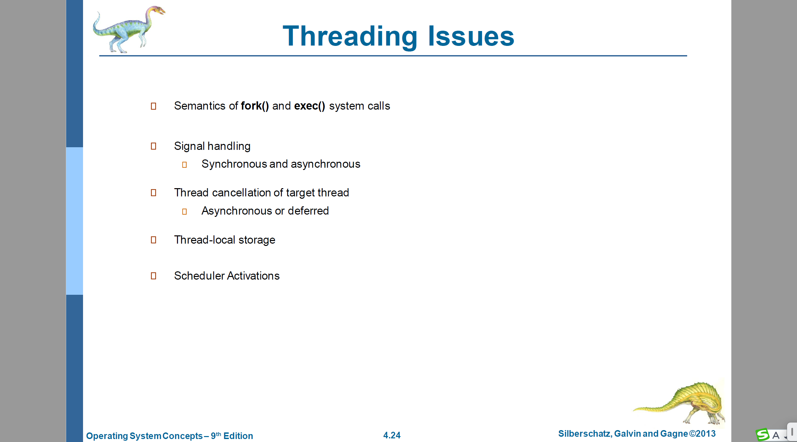


这页是**“线程相关的一些坑 / 细节（Threading Issues）”**的提纲。按原文逐条解释+要点提醒：

# fork()/exec() 语义

- 进程里如果有很多线程，**`fork()` 之后子进程只会复制调用 `fork()` 的那一个线程**（POSIX 语义），其他线程不会出现在子进程里。
- 这会导致**锁状态**被复制过去（可能是“已加锁”的状态），子进程里没人能解锁→死锁风险。
- 通常推荐：**`fork()` 之后立刻 `exec()`**（`fork-exec` 模式），或在多线程中尽量避免裸 `fork()`。

# Signal handling（信号处理）

- **Synchronous signals（同步信号）**：由当前线程的**错误行为**触发，如除零、段错；应由**出错的那个线程**处理。
- **Asynchronous signals（异步信号）**：来自外部事件/其他进程（如 `SIGINT`/`SIGTERM`）。在多线程进程中，内核把信号递送到**某个线程**（规则可配置：给整个进程、特定线程，或任一未屏蔽该信号的线程），你需要**统一的信号分发策略**（如专门“信号处理线程”用 `sigwait()` 接收）。

# Thread cancellation（线程取消）

- **Asynchronous**：立即把目标线程“拍死”。危险：可能在持锁/更新一半时被终止→资源泄漏/数据损坏。
- **Deferred**：目标线程在**取消点**（如 `pthread_testcancel()`、阻塞 I/O、`pthread_cond_wait` 等）检查到取消请求，**自行安全退出**。工程上更常用。

# Thread-local storage（TLS，线程局部存储）

- 每个线程有**自己的变量副本**（如 `errno`、临时缓冲区、会话上下文），互不干扰。
- 解决“共享地址空间下，某些状态仍需私有”的需求。各平台有 `__thread` / `thread_local` / `pthread_key_t` / Java 的 `ThreadLocal` 等机制。

# Scheduler Activations（调度器激活）

- 针对 **many-to-many / 两级线程模型** 的机制：让**内核与用户级线程库协作**。
- 内核通过“激活”回调把**处理器可用性、阻塞/唤醒事件**通知给用户态线程库，库据此进行用户级调度。
- 目标：既获得**并行性**（多个内核线程）又保留**用户态调度的低开销**。概念重要，现代主流系统多采用“一对一”，但这部分是历史与原理知识点。

——这些就是写多线程程序时最容易踩的点：`fork/exec` 配合、信号在多线程里的“归属”、安全的线程取消、需要 TLS 来避免共享冲突，以及（了解即可的）两级调度协作机制。需要我把这些点配上小代码示例吗？

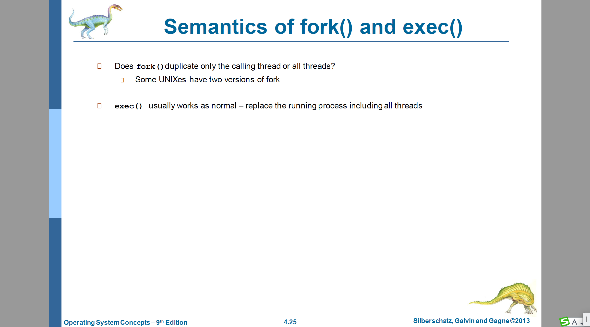

这页在说明 **多线程进程里 `fork()` 和 `exec()` 的语义**。按原文逐条解释，并给出常用结论：

- **`fork()`：复制哪个线程？**
   幻灯片提出疑问：`fork()` 是只复制**调用它的那个线程**，还是把**进程里的所有线程**都复制？
  - 一些 UNIX 曾经**提供两个版本**（原文提示 *some UNIXes have two versions of fork*）：一个只复制调用线程（如 `fork1()`），另一个把所有线程都复制（如 `forkall()`，历史做法）。
  - **POSIX/现代系统的常见语义**：在多线程进程中调用 `fork()`，**子进程只包含调用 `fork()` 的那个线程**，其他线程不会出现在子进程中。
- **`exec()`：**
   原文写到：**`exec()` 通常像平时一样工作——用新程序**“替换正在运行的进程（包括所有线程）**”。
   实际含义：调用 `exec\*()` 后，当前进程的地址空间与线程都被新程序替换，\**所有旧线程消失\**，从新程序的 `main`（或入口）开始，以**单个主线程**重新运行（打开文件等是否继承取决于 `FD_CLOEXEC` 等标志）。

**工程提示（有助于正确使用）：**

- 多线程程序在 `fork()` 之后，**只在子进程里保留调用线程**，许多库状态（互斥量等）处于未定义；惯例是**立刻 `exec()`** 或只做**异步信号安全**的小操作再 `exec()`。
- 需要在 `fork()` 前后做清理/加锁时，可用 `pthread_atfork()` 注册处理函数。

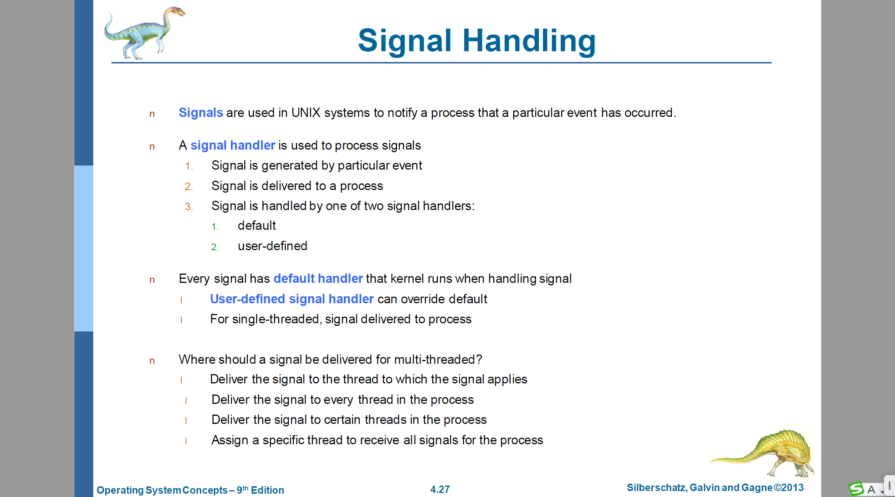


这页讲 **UNIX 信号（Signal）在多线程中的处理**。按原文逐条翻译＋补充要点：

# 信号是什么

- **Signals** 用来通知进程“某个事件发生了”（如 Ctrl-C、子进程退出、算术异常、段错、定时器等）。

# 处理流程（signal handler）

1. 某个事件**产生**信号；
2. 内核把信号**递送**给目标进程；
3. 进程用两类处理器之一**处理**：
   - **default**：每个信号都有**默认动作**（终止/产生core/忽略/停止/继续）；
   - **user-defined**：用户自定义处理函数（安装 handler）可**覆盖默认**。

> 单线程进程里：信号就“送到这个进程”，由它的处理器执行。

# 多线程里信号送给谁？

原文列了几种策略（不同系统/程序可选其一）：

- **送给“与该信号相关”的那个线程**（常见：同步信号，如除零 `SIGFPE`、段错 `SIGSEGV`，必须送给出错的线程）；
- **送给进程中的所有线程**（极少用）；
- **只送给进程中的某些线程**（配合线程的屏蔽/订阅）；
- **指定一个专门线程接收所有信号**（常见做法：其他线程屏蔽信号，由“信号线程”用 `sigwait()`/`sigaction` 统一处理）。

# 实践小抄

- 每个信号都有默认动作，但你可以 `sigaction()` 安装**自定义 handler** 覆盖它。
- 在多线程程序里，通常：
  - **同步信号**（由某线程的错误触发）→ 必须投递给**该线程**；
  - **异步信号**（外部事件，如 `SIGINT`）→ 通过**屏蔽/等待**机制，让**专门的信号线程**统一处理，避免在任意线程里打断导致死锁。
- 记得在不该被信号打断的临界区里**屏蔽**相关信号，或在 handler 内只做**异步信号安全**的最小工作。


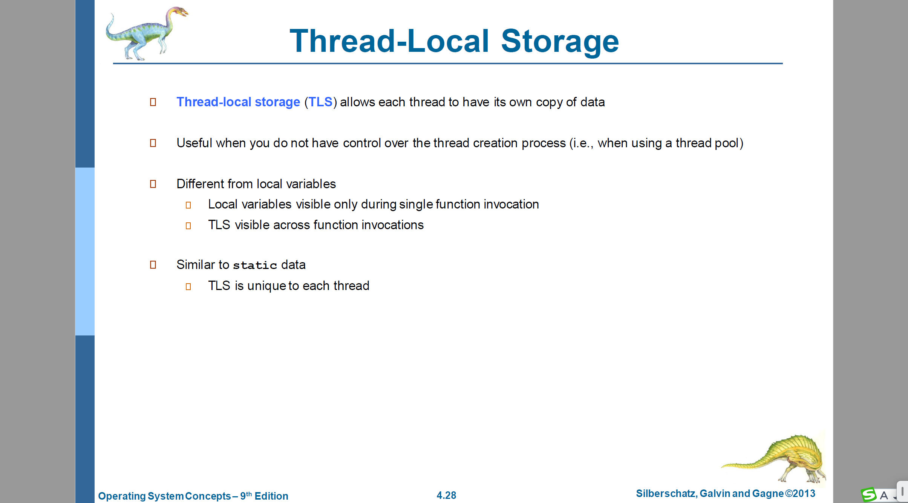

这页讲 **线程局部存储（Thread-Local Storage, TLS）**。按原文逐条解释：

- **概念**：TLS 让**每个线程**都拥有一份**自己的**数据副本（互相独立、互不干扰）。
- **适用场景**：当你**无法控制线程的创建与生命周期**时很有用（比如用**线程池**：任务不断换线程跑，但你仍希望“这个线程”的某些状态被该线程持续保存）。
- **与普通局部变量的区别**：
  - 局部变量只在**一次函数调用期间**可见；
  - **TLS 在同一线程内可跨多次函数调用保持**并可被该线程里的不同函数访问（但别的线程看不见）。
- **与静态数据的关系**：
  - 形式上像“静态变量”（能跨调用保存）；
  - 但 **TLS 是“每线程一份”**，而普通静态变量是**进程内所有线程共享一份**。

> 小提示（超纲但常见）：C/C++ 可用 `thread_local`（或 `__thread`）声明 TLS；POSIX 用 `pthread_key_create / pthread_getspecific` 管理每线程数据。

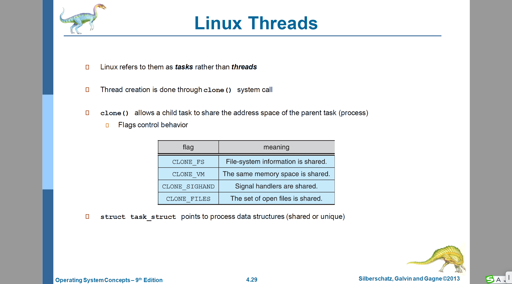


这页讲 **Linux 里的线程模型**。按原文逐条翻译＋要点补充：

# 名称与创建

- **Linux 把“线程”统称为 \*task\***（任务），而不是专门的“thread”。
- **线程创建通过 `clone()` 系统调用完成**（`pthread_create()` 最终会用到 `clone()` 等内核接口）。

# `clone()` 的核心思想

- `clone()` 让新建的**子 task**按标志位（flags）选择**与父 task 共享哪些资源**；从而既能创建“像进程那样彼此独立”的实体，也能创建“共享大多数资源的轻量线程”。

# 典型标志（原文表格）

- **`CLONE_FS`**：共享**文件系统信息**（当前工作目录、root 目录、umask 等）。
- **`CLONE_VM`**：共享**同一内存地址空间**（也就是共享进程的代码段、堆、全局数据等）→ 这是把它变成“线程”的关键之一。
- **`CLONE_SIGHAND`**：共享**信号处理器表**（安装的 handler 等）。
- **`CLONE_FILES`**：共享**已打开文件描述符集合**（文件/套接字表）。

> 这些 flag 组合起来，就能得到“经典线程”：共享地址空间/文件等，但各自有**栈、寄存器、调度实体**。

# 任务描述符

- **`struct task_struct`** 是内核中描述一个 task 的主体结构；它包含指向**共享的**或**私有的**进程数据结构的指针（比如指向 mm/文件表/信号表等）。是否共享由上面的 `CLONE_*` 标志决定。

# 小结（落地到实际）

- 现代 Linux 线程（NPTL）= **一对一模型**：每个用户线程对应一个 `task_struct`（内核线程），使用 `clone()` 创建，并通过 **futex** 等原语实现用户态同步。
- “进程 vs 线程”在 Linux 内核里本质都是 **task**，区别只在于**共享哪些资源**。

