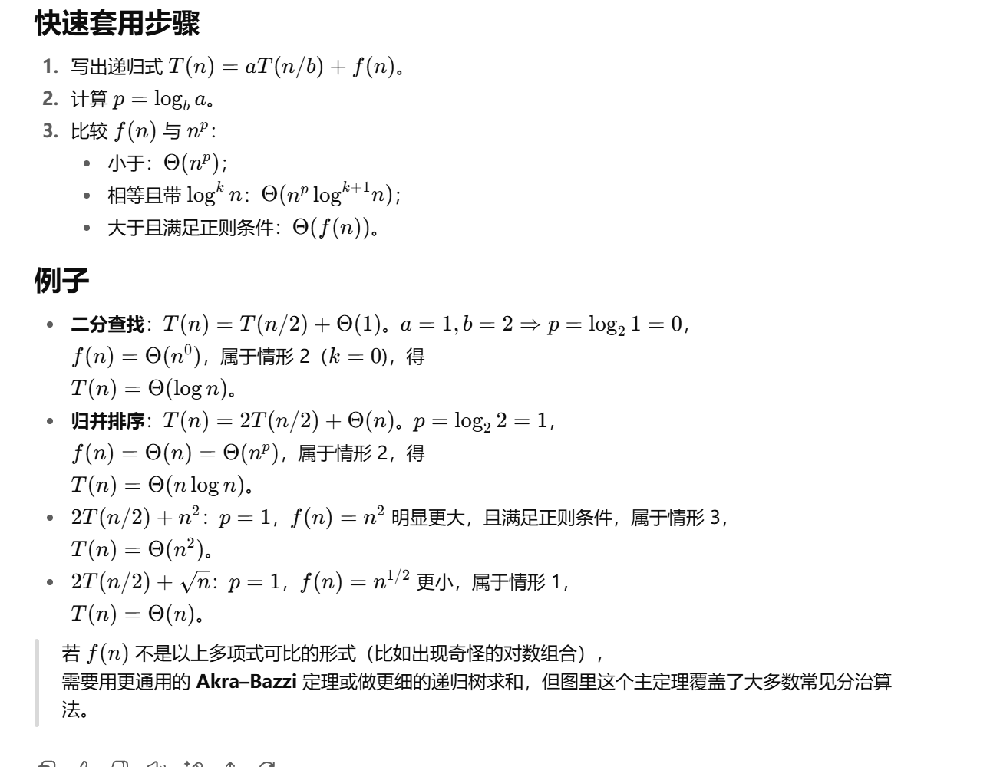
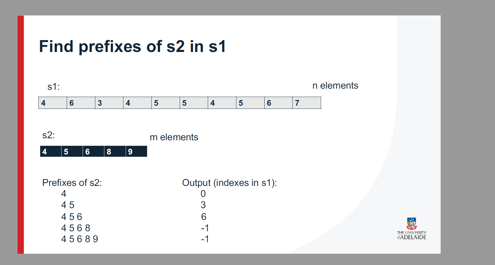
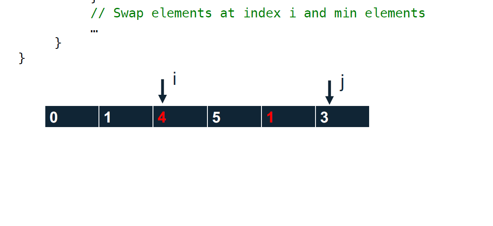
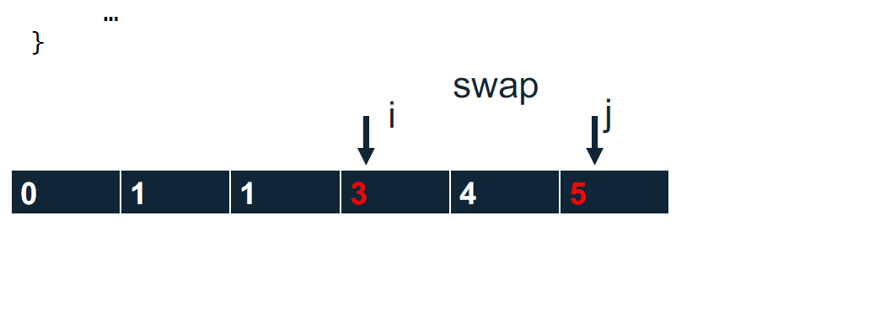
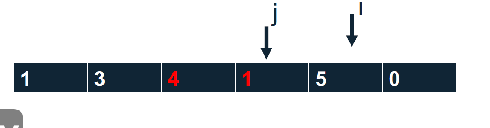
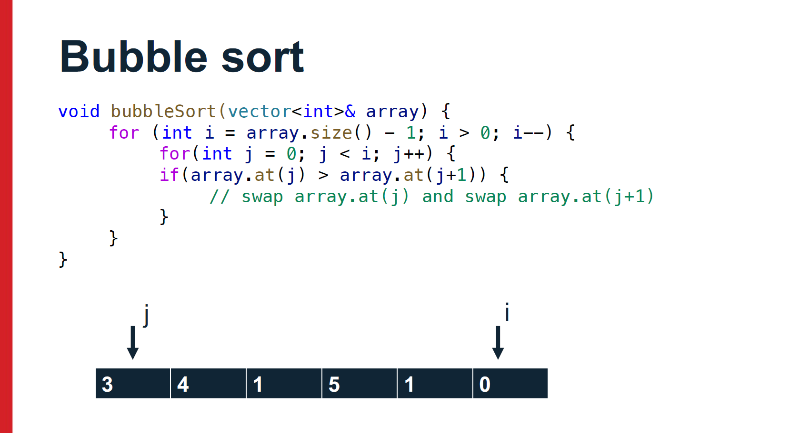
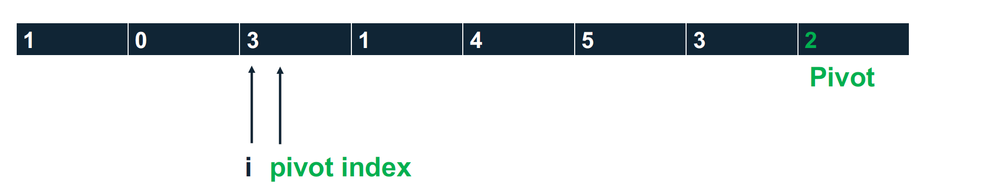

   


第二个PPT


下面这页是一次编程实作（Practical 5）的说明，主题是**Searching and Sorting（查找与排序）**。我把每一段讲的意思、对你要交付的内容，以及实现与测试要点，逐条解释一下。

# 这次作业的元信息

- **截止**：9 月 7 日 23:59
- **分值**：7 分
- **提交方式**：通过 **Gradescope**，并且是“Submitting an external tool”（意思是用课程中配置好的外部工具入口提交）。
- **发布时间**：9 月 1 日 00:00 之后可见。

# General Instructions（通用要求）

- 作业只在 **Gradescope** 上提交。
- 评测里会有**隐藏测试用例**。如果你被隐藏用例卡住，**可以在实作课上向助教求助**，但要先说明你已经做过哪些测试（如边界条件、单元测试等）。
- 鼓励你**在实作课前基本完成**，把实作课当做**答疑/咨询**时间。

# Problem Description（题目描述/目标）

- 这次实作考你对**排序**与**查找**算法的理解与实现。
- 你需要实现**若干个算法**，**每个算法放在一个独立的类**里。
- 你需要**清楚这些算法的复杂度**（时间/空间）。

> 注：具体要实现哪些排序/查找算法，应该在文档后续页面；这一页只是总纲。

# Design（设计与测试建议）

- 先规划你要如何分解问题、如何测试；按照下面的阶段逐步实现。
- **测试提示**：先把功能拆小、写独立的小测试（单元测试/样例），**不要一上来就写一大坨**难以编译或调试的代码。
- 在动手前，先画个**设计草图**（类结构、函数接口、测试清单）。

# Sorting（排序部分的硬性接口）

- 你要实现一个**基类**：`Sort`。所有具体的排序算法类都要**继承自这个基类**。

- 基类 `Sort` **必须**提供如下函数原型：

  ```cpp
  std::vector<int> sort(std::vector<int> list);
  ```

  也就是说：传入一个 `vector<int>`，**返回**排好序的 `vector<int>`。

  > 注意：参数是**按值传递**（复制），而不是引用；如果题面要求如此，就按这个签名来实现，以免和评测脚本不匹配。

------

## 你需要交付/保证的内容（根据这一页可以确定的）

1. **代码结构**
   - 一个 `Sort` 基类（含上述 `sort` 成员函数）。
   - 若干**派生类**，每个类实现一种排序（例如 `BubbleSort`、`InsertionSort`、`MergeSort`、`QuickSort` 等——具体以后续页为准）。
   - 每个派生类都要**覆盖** `sort`（同样的函数签名），返回有序结果。
2. **算法复杂度说明**
   - 你应当能写出/说出每种算法的时间复杂度（最好能写在 README 或代码注释里）。
3. **测试**
   - 自行设计测试集：边界值（空数组、单元素、重复元素、已排序/逆序、大数组）、随机测试等。
   - 由于有隐藏用例，务必覆盖各种情况。

## 建议的类骨架（示例，便于你起步）

> 仅示意结构，不是完整实现；保持和题面要求的函数签名一致。

```cpp
// Sort.h
#pragma once
#include <vector>

class Sort {
public:
    virtual ~Sort() = default;
    // 题面要求的签名
    virtual std::vector<int> sort(std::vector<int> list) = 0; // 设为纯虚，强制派生类实现
};

// BubbleSort.h
#pragma once
#include "Sort.h"

class BubbleSort : public Sort {
public:
    std::vector<int> sort(std::vector<int> list) override;
};

// QuickSort.h
#pragma once
#include "Sort.h"

class QuickSort : public Sort {
public:
    std::vector<int> sort(std::vector<int> list) override;
};
```

测试主程序可以这样用同一接口驱动不同算法：

```cpp
#include <iostream>
#include "BubbleSort.h"
#include "QuickSort.h"

void runAndPrint(Sort& alg, const std::vector<int>& data) {
    auto out = alg.sort(data);
    for (int x : out) std::cout << x << ' ';
    std::cout << '\n';
}

int main() {
    std::vector<int> a{5,1,4,2,8,5,0,-3};
    BubbleSort bs;
    QuickSort qs;
    runAndPrint(bs, a);
    runAndPrint(qs, a);
}
```

## 复杂度速查（你需要会说出来）

（以常见整数比较排序为例；具体以后续要求为准）

- **冒泡/选择/插入**：平均与最坏 O(n2)O(n^2)，空间 O(1)O(1)；插入在「几乎有序」时可达 O(n)O(n)。
- **归并排序**：O(nlog⁡n)O(n\log n)，空间 O(n)O(n)。
- **快速排序**：平均 O(nlog⁡n)O(n\log n)，最坏 O(n2)O(n^2)（选好枢轴通常能避免），空间平均 O(log⁡n)O(\log n)（递归栈）。
- **堆排序**：O(nlog⁡n)O(n\log n)，空间 O(1)O(1)（若原地建堆）。

## 测试用例清单（建议）

- `[]`（空）→ `[]`
- `[1]`、`[2,1]`、`[1,2,3]`、`[3,2,1]`
- 含**重复值**：`[5,5,5,1,1,2]`
- 含**负数/0**：`[0,-1,3,-2]`
- **大数组/随机数组**：验证性能与稳定性
- **已排序/几乎已排序**：观察插入排序优势

------

### 最后提醒

- 这只是**第 1/3 页**的内容摘要。**具体必须实现哪些算法、是否还要实现查找（线性/二分）及它们的接口、文件命名规范、提交打包格式**等细节，通常在后两页。
- 你可以把后两页也发我，我就按完整要求给你列出交付清单、类图、时间复杂度对照、测试模板，必要的话也能把代码骨架补齐到可编译通过的程度。


这页是在说明一次“**查找与排序**（Practical 5）”的小作业，要求你在 C++ 里完成三个核心东西：

> 快排（QuickSort）的基本思想是通过**分治法**（Divide and Conquer）对一个大数组进行排序，具体流程如下：
>
> 1. **选择枢轴**：从数组中选择一个元素作为枢轴（pivot），一般选择数组中的某个元素（比如第一个元素、最后一个元素、随机选一个元素等）。
> 2. **分割**：将数组中的元素分为两部分，左侧部分的元素都小于枢轴，右侧部分的元素都大于枢轴。枢轴元素放在正确的位置。
> 3. **递归排序**：递归地对左部分和右部分进行排序，直到子数组的大小为 1 或 0（这时数组已排序）。
>
> ### 快排的核心步骤（分治法的实现）：
>
> 1. **分割（partition）过程**：
>    - 假设数组是 `a[lo...hi]`，选择枢轴元素，通常是数组的最后一个元素 `a[hi]`。
>    - 在 `partition` 过程中，我们从数组的左端开始，遍历每个元素并与枢轴进行比较。小于枢轴的元素移到左边，大于枢轴的元素留在右边，最后将枢轴放到正确的位置（即左边所有元素小于枢轴，右边所有元素大于枢轴）。
>    - 最终返回枢轴元素的索引 `p`，这样我们可以知道枢轴元素的最终位置，左边的部分已经排好序，右边的部分也需要排序。
> 2. **递归（recursion）过程**：
>    - 对枢轴元素左侧的部分（`a[lo...p-1]`）递归排序。
>    - 对枢轴元素右侧的部分（`a[p+1...hi]`）递归排序。
>
> ### 快排的伪代码：
>
> ```cpp
> function quicksort(a, lo, hi) {
>     if (lo >= hi) return;  // 如果区间只有一个元素或为空，返回
>     pivotIndex = partition(a, lo, hi);  // 划分数组，返回枢轴元素的最终位置
>     quicksort(a, lo, pivotIndex - 1);  // 对左侧子数组递归排序
>     quicksort(a, pivotIndex + 1, hi);  // 对右侧子数组递归排序
> }
> 
> function partition(a, lo, hi) {
>     pivot = a[hi];  // 选择最后一个元素作为枢轴
>     i = lo;  // i 用于标记小于 pivot 的元素的边界
>     for (j = lo; j < hi; j++) {
>         if (a[j] < pivot) {
>             swap(a[i], a[j]);  // 如果 a[j] 小于 pivot，交换 a[i] 和 a[j]
>             i++;
>         }
>     }
>     swap(a[i], a[hi]);  // 将枢轴元素放到正确的位置
>     return i;  // 返回枢轴元素的索引
> }
> ```
>
> ### 详细的流程：
>
> 1. **选择枢轴**：我们可以选择 `a[hi]` 作为枢轴，即数组的最后一个元素。
> 2. **划分过程**：
>    - 从左到右遍历数组，每次遇到比枢轴小的元素，就把它交换到数组的左边。
>    - 最后，把枢轴元素与当前左边最大元素的位置交换，这样枢轴元素就被放到了正确的位置。
> 3. **递归**：
>    - 对枢轴左边（`a[lo...p-1]`）和右边（`a[p+1...hi]`）的子数组分别递归排序。
>
> ### 快排的实现步骤：
>
> 1. **选择枢轴**：首先确定一个枢轴元素，常见的做法有：
>    - 选择数组的第一个元素；
>    - 选择数组的最后一个元素；
>    - 选择中间元素；
>    - 随机选择一个元素。
> 2. **分割数组**：通过一次扫描数组，将所有小于枢轴的元素放到左侧，所有大于枢轴的元素放到右侧，最后将枢轴放到正确的位置。
> 3. **递归排序**：递归地对左侧和右侧的子数组执行相同的操作。
>
> ### 时间复杂度分析：
>
> - **平均时间复杂度**：`O(n log n)`。在大多数情况下，快排的时间复杂度是对数级别的。
> - **最坏时间复杂度**：`O(n^2)`。在最坏情况下（例如，数组已经是排序的或者是反向排序的），每次选择的枢轴都是最小或最大元素，导致递归的深度达到 `n`，因此时间复杂度是 `O(n^2)`。
> - **空间复杂度**：`O(log n)`。由于递归栈的深度为 `log n`，因此空间复杂度是对数级别的。
>
> ### 优缺点：
>
> - **优点**：
>   - 快排的平均性能非常好，排序速度很快。
>   - 排序过程中不需要额外的空间（除了递归栈）。
> - **缺点**：
>   - 最坏情况下时间复杂度为 `O(n^2)`，但可以通过优化枢轴选择方法来减少这种情况的发生。
>   - 算法不稳定，即相等的元素的相对顺序可能会改变。
>
> ### 代码解释：
>
> 代码中，`quicksortRec` 和 `partition` 是实现快排的核心。`quicksortRec` 通过递归方式对数组进行分治排序，而 `partition` 负责在每次递归时分割数组并返回枢轴的正确位置。通过这种方式，快排可以在大多数情况下高效地进行排序。

# 你要做什么

1. **冒泡排序**
    在一个叫 **`BubbleSort`** 的类里实现，**继承**自基类 **`Sort`**。
    参考链接给了 Wikipedia 的 Bubble sort，但不能直接照抄（尤其是类结构要按本作业需求写）。

2. **快速排序**
    在一个叫 **`QuickSort`** 的类里实现，同样**继承**自 `Sort`。
    **必须的特殊要求**：当（子）数组长度 **≥ 3** 时，**主元（pivot）一律选“该（子）数组的第 3 个元素”**。
    例如子数组 `[2, 4, 9, 1]`，pivot 就是 `9`（下标 `lo+2`）。这条规则会影响你的 `partition`/`hoare`/`lomuto` 实现，Wikipedia 上常用“最后一个/随机/三数取中”的做法不满足本要求，所以不能生搬硬套。
    **可选挑战**（课程 7103 的同学必须做）：把 **快速排序改成“非递归版”**（用手动栈代替递归）。

3. **递归二分查找**
    在一个叫 **`RecursiveBinarySearch`** 的类里实现。
    内部递归函数需要接收：**已排好序的列表**、**要找的元素**、**起始位置**、**结束位置**。
    但**对外接口**只需：列表 + 要找的元素（起止位置由你在内部包装）。
    必须提供下面这个函数签名：

   ```cpp
   bool search(std::vector<int>, int);
   ```

   搜索逻辑：看中间元素，等于就返回它的下标；小于就递归左半边（`end = mid - 1`）；大于就递归右半边（`start = mid + 1`）。

4. **编译方式**（评测脚本会用这条命令编译你的所有 .cpp）：

   ```
   g++ -o main.out -std=c++11 -O2 -Wall *.cpp
   ```

   你要确保在学校系统上能编译通过（本地 g++ 版本可能不同）。建议在机房/SSH 到学校环境调试。

------

## 实现建议与关键细节

- 基类 `Sort`：给一个纯虚函数 `sort(std::vector<int>&)`，`BubbleSort`/`QuickSort` 都去 override。
- **QuickSort 的 pivot 规则**：
  - 子数组 `[lo..hi]` 的长度 `len = hi - lo + 1`。
  - 如果 `len >= 3`，pivot 下标必须是 **`lo + 2`**；
     如果 `len < 3`，可以直接用 `hi` 或 `lo + (len-1)`，并在 `partition` 里统一处理。
- **非递归 quicksort（挑战）**：用 `std::stack<std::pair<int,int>>` 保存待排区间，每次 `partition` 后把两侧区间压栈即可；为了减少栈深度，可先压更大的区间。
- **RecursiveBinarySearch**：对外 `search(vec, x)`，内部私有 `search(vec, x, lo, hi)` 递归。返回布尔或返回下标都行（题面签名要求 `bool`，就返回 bool）。

------

## 参考代码（可直接编译跑通，按需要改名拆文件）

```cpp
// Sort.h
#pragma once
#include <vector>
struct Sort {
    virtual ~Sort() = default;
    virtual void sort(std::vector<int>& a) = 0;
};
// BubbleSort.cpp
#include "Sort.h"
#include <vector>
#include <utility>

struct BubbleSort : Sort {
    void sort(std::vector<int>& a) override {
        bool swapped = true;
        for (std::size_t n = a.size(); swapped && n > 1; --n) {
            swapped = false;
            for (std::size_t i = 1; i < n; ++i) {
                if (a[i-1] > a[i]) { std::swap(a[i-1], a[i]); swapped = true; }
            }
        }
    }
};
// QuickSort.cpp
// 引入 Sort 基类的头文件
#include "Sort.h"
// 引入标准库：vector、stack 和算法
#include <vector>
#include <stack>
#include <utility>
#include <algorithm>

// 定义 QuickSort 类，继承自 Sort
struct QuickSort : Sort {
    // 重写 sort 函数，采用 QuickSort 算法进行排序
    void sort(std::vector<int>& a) override {
        if (a.size() < 2) return;  // 如果数组大小小于 2，直接返回，因为已经有序
        quicksortRec(a, 0, (int)a.size() - 1);  // 调用递归的 quicksort 辅助函数
        // 如果需要使用非递归版，只需替换为 quicksortIter(a);
    }

private:
    // 辅助函数：选择段 (lo, hi) 内的枢轴元素的索引
    static int pivotIndexForSegment(int lo, int hi) {
        int len = hi - lo + 1;  // 计算区间的长度
        return (len >= 3) ? (lo + 2) : (lo + len - 1); // 如果长度 >= 3，选择中间元素，否则选择最后一个元素
    }

    // 对数组进行划分
    static int partition(std::vector<int>& a, int lo, int hi) {
        int pidx = std::min(pivotIndexForSegment(lo, hi), hi);  // 获取枢轴索引，确保不超出范围
        int pivot = a[pidx];  // 获取枢轴元素
        std::swap(a[pidx], a[hi]);  // 将枢轴移到数组末尾
        int i = lo;  // 初始化划分的左边界
        // 遍历数组，将小于枢轴的元素交换到左边
        for (int j = lo; j < hi; ++j) {
            if (a[j] < pivot) std::swap(a[i++], a[j]);  // 如果当前元素小于枢轴，交换到 i 位置
        }
        std::swap(a[i], a[hi]);  // 将枢轴元素放到正确的位置
        return i;  // 返回枢轴最终位置
    }

    // 递归实现的 quicksort 排序
    static void quicksortRec(std::vector<int>& a, int lo, int hi) {
        if (lo >= hi) return;  // 递归的终止条件：当区间为空或只包含一个元素时，返回
        int p = partition(a, lo, hi);  // 划分数组，获取枢轴的索引
        quicksortRec(a, lo, p - 1);  // 对左侧区间递归排序
        quicksortRec(a, p + 1, hi);  // 对右侧区间递归排序
    }

    // 可选挑战：使用栈实现的非递归版 quicksort
    static void quicksortIter(std::vector<int>& a) {
        std::stack<std::pair<int, int>> st;  // 使用栈保存待排序的区间 (lo, hi)
        st.push({0, (int)a.size() - 1});  // 将初始区间 (0, n-1) 入栈
        while (!st.empty()) {  // 当栈不为空时继续处理
            auto [lo, hi] = st.top(); st.pop();  // 从栈中弹出一个区间
            if (lo >= hi) continue;  // 如果区间为空或只有一个元素，跳过
            int p = partition(a, lo, hi);  // 划分数组并获取枢轴位置
            // 将左右两个子区间压入栈中，优先处理较大的区间
            if (p - 1 - lo > hi - (p + 1)) {
                st.push({lo, p - 1});
                st.push({p + 1, hi});
            } else {
                st.push({p + 1, hi});
                st.push({lo, p - 1});
            }
        }
    }
};

```

> ### 关键步骤解析：
>
> 1. **栈的使用**：
>    - 用一个栈 `st` 来模拟递归的过程。栈中的元素是区间 `(lo, hi)`，表示待排序的数组部分。
>    - 初始时，将整个数组的区间 `(0, n-1)` 压入栈中。
> 2. **栈操作**：
>    - 每次从栈中弹出一个区间 `(lo, hi)`，即选取一个需要排序的数组段。
>    - 如果该区间的大小小于等于 1（即 `lo >= hi`），说明不需要排序，跳过该区间。
>    - 如果需要排序，则执行 `partition` 操作，返回枢轴元素 `p` 的最终位置。
> 3. **划分过程**：
>    - `partition(a, lo, hi)` 对数组进行划分，将元素小于枢轴的部分放在左边，大于枢轴的部分放在右边，最终返回枢轴的位置 `p`。
>    - **划分过程**是快速排序的核心，它将问题拆分为两个子问题，分别对左右两部分排序。
> 4. **将子区间压入栈中**：
>    - **优先处理较大的区间**：为了优化栈的使用，减少栈的深度。我们希望较大的区间先被处理，这样栈的深度不会过大。
>    - `if (p - 1 - lo > hi - (p + 1))` 判断左侧子区间是否大于右侧子区间。如果是，则将左侧子区间 `{lo, p-1}` 和右侧子区间 `{p+1, hi}` 分别压入栈中。
> 5. **循环直至栈为空**：
>    - 循环继续进行，直到栈为空，意味着所有子区间都已经被排序。
>
> ### 为什么需要优先处理较大的子区间？
>
> - **优化栈深度**：如果每次递归的栈深度较大，可能导致栈溢出或者栈操作的开销增大。通过优先处理较大的子区间，我们可以减少栈的深度，优化算法的执行。
>   - **例子**：假设数组大小为 10，第一次划分后，假设左子区间大小为 8，右子区间大小为 2。如果先处理右子区间，那么栈的深度很小。但如果先处理左子区间，栈深度就会大很多。通过处理较大的区间，可以确保栈的深度较小。
>
> ### 栈实现与递归实现的比较：
>
> - **递归实现**：使用函数调用栈来管理递归过程，每个递归函数的参数和局部变量都存储在栈中。
> - **栈实现**：显式地使用一个栈来保存待处理的区间，避免了递归调用栈的开销，适用于大规模数据，避免了栈溢出的风险。
>
> ### 优缺点：
>
> - **优点**：
>   - **避免递归栈溢出**：对于非常大的数组，递归可能导致栈溢出，使用显式栈可以避免这个问题。
>   - **控制栈的深度**：通过优先处理较大的区间，可以减少栈的深度，提高性能。
> - **缺点**：
>   - 相比递归实现，代码较为复杂。
>   - 需要额外的栈空间来模拟递归过程，增加了空间开销。
>
> ### 总结：
>
> 这段代码实现了快速排序的非递归版本，通过显式使用栈来模拟递归过程。它的核心思想是不断地从栈中取出待排序的区间，对其进行排序并将子区间再次压入栈中，直到所有子区间都被处理完毕。这种方法的优势在于可以避免递归带来的栈溢出问题，适用于处理大规模数据。


4. - 根据你提供的图像内容，要求你编写一个程序来完成以下任务：
       
       1. **读取一行整数**（用空格分隔）。
      2. **使用快速排序**对这些整数进行升序排序。
      3. **使用二分查找**来判断 `1` 是否在排序后的列表中。
      4. 输出结果为：
         - **“true”**（如果 `1` 在列表中）或者 **“false”**（如果 `1` 不在列表中）。
         - 然后输出排序后的列表。
      
      ### 解决步骤：
      
      1. **快速排序**：我们可以使用之前实现的 `QuickSort` 类。
      2. **二分查找**：我们可以使用 `RecursiveBinarySearch` 类。
      3. **主函数**：读取输入、排序并查找 `1`，输出结果。
      
      ### 代码实现
      
      #### 1. `Sort.h`（排序的基类）
      
      ```cpp
      #ifndef SORT_H
      #define SORT_H
      
      #include <vector>
      
      class Sort {
      public:
          virtual void sort(std::vector<int>& a) = 0;
          virtual ~Sort() = default;
      };
      
      #endif
      ```
      
      #### 2. `QuickSort.h`（快速排序类的头文件）
      
      ```cpp
      #ifndef QUICKSORT_H
      #define QUICKSORT_H
      
      #include "Sort.h"
      #include <vector>
      #include <algorithm>
      
      class QuickSort : public Sort {
      public:
          void sort(std::vector<int>& a) override;
      private:
          static int partition(std::vector<int>& a, int lo, int hi);
          static void quicksortRec(std::vector<int>& a, int lo, int hi);
      };
      
      #endif
      ```
      
      #### 3. `QuickSort.cpp`（快速排序类的实现）
      
      ```cpp
      #include "QuickSort.h"
      
      void QuickSort::sort(std::vector<int>& a) {
          if (a.size() < 2) return;
          quicksortRec(a, 0, a.size() - 1);
      }
      
      int QuickSort::partition(std::vector<int>& a, int lo, int hi) {
          int pivot = a[hi];
          int i = lo;
          for (int j = lo; j < hi; ++j) {
              if (a[j] < pivot) {
                  std::swap(a[i], a[j]);
                  ++i;
              }
          }
          std::swap(a[i], a[hi]);
          return i;
      }
      
      void QuickSort::quicksortRec(std::vector<int>& a, int lo, int hi) {
          if (lo >= hi) return;
          int p = partition(a, lo, hi);
          quicksortRec(a, lo, p - 1);
          quicksortRec(a, p + 1, hi);
      }
      ```
      
      #### 4. `RecursiveBinarySearch.h`（二分查找类的头文件）
      
      ```cpp
      #ifndef RECURSIVEBINARYSEARCH_H
      #define RECURSIVEBINARYSEARCH_H
      
      #include <vector>
      
      class RecursiveBinarySearch {
      public:
          bool search(const std::vector<int>& a, int target);
      private:
          int search(const std::vector<int>& a, int x, int lo, int hi);
      };
      
      #endif
      ```
      
      #### 5. `RecursiveBinarySearch.cpp`（二分查找类的实现）
      
      ```cpp
      #include "RecursiveBinarySearch.h"
      
      bool RecursiveBinarySearch::search(const std::vector<int>& a, int target) {
          return search(a, target, 0, a.size() - 1) != -1;
      }
      
      int RecursiveBinarySearch::search(const std::vector<int>& a, int x, int lo, int hi) {
          if (lo > hi) return -1;
          int mid = lo + (hi - lo) / 2;
          if (a[mid] == x) return mid;
          if (x < a[mid]) return search(a, x, lo, mid - 1);
          else return search(a, x, mid + 1, hi);
      }
      ```
      
      #### 6. `main.cpp`（主程序）
      
      ```cpp
      #include <iostream>
      #include <vector>
      #include <sstream>
      #include "QuickSort.h"
      #include "RecursiveBinarySearch.h"
      
      int main() {
          std::string line;
          std::getline(std::cin, line);  // 读取输入的整数列表
          std::vector<int> nums;
          std::stringstream ss(line);
          int num;
          while (ss >> num) {
              nums.push_back(num);
          }
      
          QuickSort quickSort;
          quickSort.sort(nums);  // 使用快速排序排序
      
          RecursiveBinarySearch binarySearch;
          bool found = binarySearch.search(nums, 1);  // 使用二分查找查找1是否在列表中
      
          std::cout << (found ? "true" : "false");  // 输出 true 或 false
          for (int n : nums) {
              std::cout << " " << n;  // 输出排序后的列表
          }
          std::cout << std::endl;
      
          return 0;
      }
      ```
      
      ### 解释：
      
      1. **QuickSort** 类实现了快速排序算法，对输入的数组进行升序排序。
      2. **RecursiveBinarySearch** 类提供了一个递归实现的二分查找方法，用来判断 `1` 是否在排序后的列表中。
      3. **main.cpp** 中实现了以下功能：
         - 读取一行输入的整数并解析为一个数组。
         - 对数组使用快速排序进行排序。
         - 使用二分查找判断 `1` 是否在数组中。
         - 输出 "true" 或 "false"，并输出排序后的数组。
      
      ### 输入输出示例：
      
      #### 输入：
      
      ```
      1 3 5 4 -5 100 7777 2014
      ```
      
      #### 输出：
      
      ```
      true -5 1 3 4 5 100 2014 7777
      ```
      
      #### 输入：
      
      ```
      0 3 5 4 -5 100 7777 2014
      ```
      
      #### 输出：
      
      ```
      false -5 0 3 4 5 100 2014 7777
      ```
      
      ### 文件提交：
      
      你需要提交以下文件：
      
      - `Sort.h`
      - `BubbleSort.h`
      - `BubbleSort.cpp`
      - `QuickSort.h`
      - `QuickSort.cpp`
      - `RecursiveBinarySearch.h`
      - `RecursiveBinarySearch.cpp`
      - `main.cpp`
      
      你可以根据该结构进行提交，确保所有文件包含在内，并且程序能够正确执行。

# 需要提交的文件

- `Sort.h`
   一般放一个排序的**接口或基类**（如 `virtual void sort(vector<int>&)=0;`）。
- `BubbleSort.h`、`BubbleSort.cpp`
   冒泡排序的声明/实现（虽然 main 不用它，但要求你实现）。
- `QuickSort.h`、`QuickSort.cpp`
   快速排序的声明/实现（main 要调用它来排序）。
- `RecursiveBinarySearch.h`、`RecursiveBinarySearch.cpp`
   递归版二分查找：如 `bool contains(const vector<int>& a, int target);`
- `main.cpp`
   读取一行 → 解析成 `vector<int>` → 用 `QuickSort` 排序 → 调用递归二分查找判断是否有 **1** → 按格式打印。

# 评分（功能 7 分）

- 接口匹配/符合面向对象设计（1 分）
- 通过公开测试（3 分）
- 通过隐藏测试（3 分）

# 实现提示

- **输入解析**：读整行 `getline(cin, line)`，用 `istringstream` 按空格提取整数。
- **快速排序**：任选常见写法（Lomuto/Hoare 分区皆可），记得处理重复值与边界（`l<r`）。
- **二分查找**：在**已排序**数组上递归：
  - 终止：`lo>hi → false`；
  - 中点 `mid=(lo+hi)/2`，`a[mid]==1 → true`；
  - `a[mid]>1 → hi=mid-1`；否则 `lo=mid+1`。
- **输出**：`true/false` 小写；元素之间一个空格；行末可换行。
- **边界情况**：空输入/只有一个数/有负数或重复数都要正常处理。

如果你想，我可以给一套最小可通过的文件骨架或单文件示例，帮你对照实现。


第三个PPT


这是这次实验/练习（Practical 4）的**封面页**，主题是：**计算复杂度（Computational Complexity）**。它通常讲、练这些内容：

# 你要学/会做的事

- **为何要分析复杂度**：比较算法效率，不依赖机器、语言或实现细节。
- **度量什么**：
  - **时间复杂度** T(n)T(n)：随输入规模 nn 增大，运行步数如何增长
  - **空间复杂度** S(n)S(n)：需要多少额外内存
- **渐近记号**：
  - O(⋅)O(\cdot) 上界、Ω(⋅)\Omega(\cdot) 下界、Θ(⋅)\Theta(\cdot) 紧界；以及小 oo、小 ω\omega
  - 常见增长级：11 < log⁡n\log n < nn < nlog⁡nn\log n < n2n^2 < n3n^3 < 2n2^n < n!n!
- **情景**：最坏、平均、最好情况；**摊还分析**（如动态数组扩容）
- **如何推导**：
  - 选择“输入规模”nn，设定**成本模型**（一次比较/赋值算 1 步）
  - 顺序/分支/循环：累加或求和（如等差、等比）
  - 递归：写出**递归式**并用**递归树/主定理**求解
  - 忽略常数与低阶项，只保留主导项

# 快速规则（常用模板）

- 单循环 `for i=1..n` → O(n)O(n)
- 双重循环（整齐地跑 n×nn\times n 次）→ O(n2)O(n^2)
- “指数缩小”循环 `while (n>1) n/=2;` → O(log⁡n)O(\log n)
- 二分查找：T(n)=T(n/2)+O(1)⇒O(log⁡n)T(n)=T(n/2)+O(1)\Rightarrow O(\log n)
- 归并排序：T(n)=2T(n/2)+O(n)⇒O(nlog⁡n)T(n)=2T(n/2)+O(n)\Rightarrow O(n\log n)
- 主定理：T(n)=aT(n/b)+f(n)T(n)=aT(n/b)+f(n)，比较 f(n)f(n) 与 nlog⁡ban^{\log_b a} 决定哪一项主导

# 例子（看会即可）

1. 

```cpp
sum=0; for(int i=0;i<n;i++) sum+=i;
```

循环跑 nn 次 → O(n)O(n)。

1. 

```cpp
for(int i=0;i<n;i++)
  for(int j=0;j<n;j++) ++cnt;
```

总步数 n⋅nn\cdot n → O(n2)O(n^2)。

1. 二分查找
    T(n)=T(n/2)+O(1)⇒O(log⁡n)T(n)=T(n/2)+O(1)\Rightarrow O(\log n)。
2. 归并排序
    T(n)=2T(n/2)+O(n)⇒O(nlog⁡n)T(n)=2T(n/2)+O(n)\Rightarrow O(n\log n)。
3. 递归树示例（和你上一张图呼应）
    T(n)=2T(n/3)+O(n)T(n)=2T(n/3)+O(n)。因 nlog⁡32≈n0.63n^{\log_3 2}\approx n^{0.63} 且 f(n)=nf(n)=n 更大 → T(n)=Θ(n)T(n)=\Theta(n)。

# 常见空间复杂度

- 原地排序（如选择/堆排）：O(1)O(1) 额外空间
- 递归算法的**栈深**：二分/快速排序平均 O(log⁡n)O(\log n)，归并排序需要 O(n)O(n) 额外数组

# 实操里通常会让你

- 判定/推导给定代码的 O(⋅)O(\cdot)
- 写出递归式并用主定理求解
- 对若干函数按增长速率排序
- 说明最坏/平均/最好情形与空间开销

如果你把具体题目或代码片段发我，我可以直接给你一步步推导到最终复杂度，并标出易错点。





这页题目要你做的事是：

给两段序列

- **s1**（长度 n）
- **s2**（长度 m）

对 **s2 的每个前缀**（即 s2 的前 k 个元素，k=1..m），在 **s1** 中找它是否作为**连续子串**出现；如果出现，输出 **第一次出现的起始下标**，否则输出 **-1**。

------

## 例子（图中的数据）

- s1：`[4, 6, 3, 4, 5, 5, 4, 5, 6, 7]`
- s2：`[4, 5, 6, 8, 9]` 
- s2 的各个前缀：
  1. `[4]` → 在 s1 的 **0** 位置第一次出现 ⇒ 输出 `0`
  2. `[4, 5]` → 在 s1 的 **3** 位置第一次出现（s1[3..4]=4,5） ⇒ 输出 `3`
  3. `[4, 5, 6]` → 在 s1 的 **6** 位置第一次出现（s1[6..8]=4,5,6） ⇒ 输出 `6`
  4. `[4, 5, 6, 8]` → 没有连续出现 ⇒ `-1`
  5. `[4, 5, 6, 8, 9]` → 没有连续出现 ⇒ `-1`

所以输出是：`0, 3, 6, -1, -1`（与图右侧一致）。

------

## 怎么做

### 简单法（好理解）

对 k=1..m，逐个在 s1 中查找前缀 `s2[0..k-1]` 的第一次出现位置（比如用暴力或 `std::search`）。
 时间复杂度 **O(n·m)**。

### 一次扫描的高效法（KMP 思路，O(n+m)）

把 **s2** 当“模式串”，用 **KMP** 扫描 **s1**：

- 预处理 s2 的 **前缀函数/失败函数 π**。

   > - 前缀函数（Prefix Function）是用于字符串匹配算法中的一个重要概念，尤其是在 **KMP** 算法中。前缀函数的作用是用于记录字符串的每个前缀与该字符串的最长相同后缀的长度。
   >
   >    ### 前缀函数定义：
   >
   >    给定一个字符串 **s**，前缀函数是一个数组 **π**，其中 **π[i]** 表示字符串 **s** 中 **[0, i]** 子串的最长相同前后缀的长度。
   >
   >    - 前缀：从字符串的起始位置到某个位置的子串。
   >    - 后缀：从字符串的某个位置到字符串末尾的子串。
   >
   >    例如，给定字符串 **s = "abacab"**，我们计算其前缀函数。
   >
   >    ### 计算前缀函数的步骤：
   >
   >    1. **初始化**：
   >       - 前缀函数数组 **π** 的长度等于字符串的长度，初始时 **π[0] = 0**。
   >    2. **逐步计算**：
   >       - 从 **i = 1** 开始，逐一检查每个字符。
   >       - 如果 **s[i]** 与 **s[π[i-1]]** 匹配，那么 **π[i] = π[i-1] + 1**。
   >       - 如果不匹配，则根据 **π** 数组回退，直到找到匹配的位置或回退到0。
   >
   >    ### 计算示例：
   >
   >    假设 **s = "abacab"**，我们要计算它的前缀函数 **π**。
   >
   >    1. **初始化**：
   >       - **s = "abacab"**
   >       - **π = [0, 0, 0, 0, 0, 0]** （数组长度为6，初始化为0）
   >    2. **计算**：
   >       - **i = 1**: **s[1] = "b"**, **s[π[0]] = "a"** 不匹配，所以 **π[1] = 0**。
   >       - **i = 2**: **s[2] = "a"**, **s[π[1]] = "a"** 匹配，所以 **π[2] = π[1] + 1 = 1**。
   >       - **i = 3**: **s[3] = "c"**, **s[π[2]] = "b"** 不匹配，所以回退 **π[2] = 0**，再检查 **s[π[2]] = "a"**，不匹配，**π[3] = 0**。
   >       - **i = 4**: **s[4] = "a"**, **s[π[3]] = "a"** 匹配，所以 **π[4] = π[3] + 1 = 1**。
   >       - **i = 5**: **s[5] = "b"**, **s[π[4]] = "b"** 匹配，所以 **π[5] = π[4] + 1 = 2**。
   >    3. **最终结果**：
   >       - 计算得到的前缀函数是：**π = [0, 0, 1, 0, 1, 2]**。
   >
   >    ### 总结：
   >
   >    - 前缀函数的作用是找出每个位置前缀和后缀的最长相同部分，能够帮助我们在模式匹配时减少不必要的重复计算，极大地提升匹配效率。
   >    - **KMP算法**利用前缀函数来优化字符串的匹配过程，避免了暴力匹配中对于已匹配部分的重复计算。
   >
   >    ### 代码实现：
   >
   >    ```cpp
   >    vector<int> prefix_function(const string& s) {
   >        int m = s.size();
   >        vector<int> pi(m, 0);
   >        for (int i = 1; i < m; ++i) {
   >            int j = pi[i-1];
   >            while (j > 0 && s[i] != s[j]) {
   >                j = pi[j-1];  // 回退到前缀函数中记录的位置
   >            }
   >            if (s[i] == s[j]) {
   >                ++j;
   >            }
   >            pi[i] = j;  // 更新前缀函数
   >        }
   >        return pi;
   >    }
   >    ```
   >
   >    这个函数返回的数组 **pi** 就是字符串 **s** 的前缀函数数组，可以用于字符串匹配等算法中。

- 扫 s1 时维护当前已匹配前缀长度 **q**。每当 **q 增加到某个新值 t**（说明第一次匹配到长度为 t 的前缀），立即记录该前缀的**最早起点**：
   `ans[t] = i - t + 1`（i 为 s1 当前下标）。
   
- 若 q 达到 m（整串匹配），按 KMP 回退 `q = π[q-1]` 继续。

这样当扫描结束，`ans[1..m]` 就分别是每个前缀的第一次出现位置，没出现的保持 -1。

------

## 参考 C++ 代码（KMP 版本）

```cpp
#include <bits/stdc++.h>
using namespace std;

vector<int> prefix_function(const vector<int>& p) {
    int m = p.size();
    vector<int> pi(m, 0);
    for (int i = 1; i < m; ++i) {
        int j = pi[i-1];
        while (j > 0 && p[i] != p[j]) j = pi[j-1];
        if (p[i] == p[j]) ++j;
        pi[i] = j;
    }
    return pi;
}

vector<int> first_positions_of_prefixes(const vector<int>& s1, const vector<int>& s2) {
    int n = s1.size(), m = s2.size();
    vector<int> pi = prefix_function(s2);
    vector<int> ans(m+1, -1);                 // ans[k]: 长度为 k 的前缀
    int q = 0;                                 // 已匹配前缀长度
    for (int i = 0; i < n; ++i) {
        while (q > 0 && s1[i] != s2[q]) q = pi[q-1];
        if (s1[i] == s2[q]) ++q;
        if (ans[q] == -1) ans[q] = i - q + 1; // 第一次到达这个前缀长度
        if (q == m) q = pi[q-1];              // 整个模式匹配完，按 KMP 回退，这一行的作用是在模式字符串完全匹配完后，按照 KMP算法 的回退规则，继续查找是否存在其他匹配的可能性。
    }
    ans.erase(ans.begin());                   // 丢弃 ans[0]
    return ans;                               // 大小为 m，对应 k=1..m
}
```

把示例喂进去会得到 `[0, 3, 6, -1, -1]`。

------

### 小结

- “Find prefixes of s2 in s1”= 对 s2 的每个**前缀**，找它在 s1 中的**首次**连续匹配位置；找不到就 `-1`。
- 可用朴素查找（易写）或 KMP（一次扫描更高效）。


这页在说明一段**按前缀逐步查找**的代码及其复杂度。

------

# 代码在做什么

假设有两个字符串：

- `s1`：主串，长度记为 **n**
- `s2`：模式串，长度记为 **m**

```cpp
vector<int> result;

for (size_t i = 1; i <= s2.size(); i++) {      // 一共 m 次循环
    size_t found = s1.find(s2.substr(0, i));   // 在 s1 里找 s2 的长度为 i 的前缀
    if (found != string::npos) {               // 找到：返回第一次出现的位置
        result.push_back(found);
    } else {                                   // 找不到：记为 -1
        result.push_back(-1);
    }
}
return result;
```

含义：对 `s2` 的每个**前缀**（长度 1,2,…,m），在 `s1` 中找它**第一次出现**的位置；如果不存在就填 `-1`。最终 `result` 长度为 m，第 i 个元素对应前缀 `s2[0..i-1]` 的位置。

举个例子
 `s1="ababcaba"`, `s2="aba"`
 要查的前缀依次是 `"a"`, `"ab"`, `"aba"`
 返回可能是 `[0, 0, 0]`（都在下标 0 处第一次出现）。

------

# 复杂度为什么是 O(m2n)O(m^2 n)

- 外层 `for` 循环 **m** 次（图中红字 *O(m) iterations*）。

- 第 i 次循环里做两件事：

  1. `s2.substr(0, i)` 生成一个长度为 **i** 的新字符串，代价 O(i)O(i)；

  2. `s1.find( … )` 在 `s1` 里查找这个长度为 **i** 的模式。若按**朴素匹配**估计，最坏要在 **n** 个起点上比对到长 **i**，代价 O(n⋅i)O(n\cdot i)（图中红字 *O(i*n)*）。

     > 注：标准库没强制规定复杂度；很多实现平均更快，但做最坏情形分析时用 O(n⋅i)O(n\cdot i) 这个上界是常见做法。

- 把各次的代价加起来：

  $$
  O(n⋅1)+O(n⋅2)+⋯+O(n⋅m)=O(n⋅(1+2+⋯+m))=O(n⋅m(m+1)2)=O(nm2)O(n\cdot 1) + O(n\cdot 2) + \cdots + O(n\cdot m) = O\big(n \cdot (1+2+\cdots+m)\big) = O\big(n\cdot \tfrac{m(m+1)}{2}\big) = \boxed{O(nm^2)}
  $$
  

（图中最后一行：*Overall complexity: O(n + 2n + … + m·n) = O(m²n)*。）

**空间复杂度**：

- 结果向量 `result` 需要 O(m)；
- 每次 `substr` 会产生一个临时长度 ≤ m 的字符串，峰值 O(m)。

------

# 可改进点（思路）

- 避免反复 `substr`：用下标范围或迭代器传给查找，省掉每次 O(i) 的拷贝。
- 想把时间从 O(nm2)O(nm^2) 降到更低：
   可用一次扫描的方法（如 KMP/Two-Way/Z-algorithm），把 `s2` 的所有前缀与 `s1` 的匹配信息一并求出；理论上可做到 O(n+m)O(n+m)～O(nlog⁡σ+m)O(n\log\sigma + m) 量级（具体取决于算法与实现）。如果你需要，我可以给出一版 KMP/ Z 的实现来求每个前缀的首次出现位置。


这张页是在提示你：**把“逐渐增大的前缀在 s1 中是否出现”**这个检测做优化。要点如下——我把每条英文都解释并给一个更好的做法。

# 这页到底在说什么

1. **“Find operations that are performed several times.”**
    找出被**重复做**的操作。朴素写法通常是：对 k=1,2,…,∣s2∣k=1,2,\dots,|s_2| 都调用
    `s1.find(s2[0:k])`。每次 `find` 都从头扫 `s1`，导致大量**重复扫描**；另外每次还新建了一个前缀子串 `s2[0:k]`（也会花时间）。
2. **“Try to avoid them. Hint: s1.find(s2, index) can find substrings starting from index.”**
    尽量**避免重复扫描**。利用带起始位置的查找：`s1.find(pattern, start)`。
    思路：当长度为 kk 的前缀在位置 `pos` 找到了，那么接下来检查长度 k+1k+1 时，**不必**再从 `0` 开始搜，**至少**可以从 `pos` 开始（更早的位置无意义），从而避免把 `pos` 之前的字符反复扫。
3. **“If prefix was not found (-1 as an output), the larger prefix will not be found either.”**
    **单调性**：若长度 kk 的前缀都找不到（`find` 返回 -1），那更长的前缀 k+1,k+2,…k+1,k+2,\dots 更不可能找到，**立刻停止**，不用再做后面的 `find`。
4. **“What will be the time complexity of the optimized algorithm?”**
    见下方分析。

------

## 优化后的伪代码（直白易实现）

```python
def longest_prefix_in_s1(s1, s2):
    pos = 0                 # 下一次 find 从哪儿开始搜 s1
    k = 0                   # 当前可行的最大前缀长度
    while k < len(s2):
        # 注意：很多语言的 find 都支持起始下标
        j = s1.find(s2[:k+1], pos)   # 查 s2 的前 k+1 个字符
        if j == -1:
            break                    # 长度 k 已经是极限
        pos = j                      # 以后不再从 j 之前的位置搜索
        k += 1
    return k
```

> 实现细节小优化：如果担心 `s2[:k+1]` 每次构造子串有额外代价，可改用两个下标避免拷贝（C++ 可用迭代器或直接比较字符）。

------

## 复杂度对比

- **朴素做法**：每个前缀都从头搜一次，最坏要扫 ∣s1∣|s1| 次、做 ∣s2∣|s2| 轮 →
   **O(∣s1∣⋅∣s2∣)O(|s1|\cdot|s2|)**，如果还每次构造子串，可能再额外叠加 ∑kO(k)=O(∣s2∣2)\sum_k O(k)=O(|s2|^2)。
- **本页提示后的优化**：
   `pos` 单调向右移动，整段 `s1` 中的字符**最多被扫描一遍**；循环次数至多 ∣s2∣|s2|。
   → **时间 O(∣s1∣+∣s2∣)O(|s1|+|s2|)**，**额外空间 O(1)O(1)**（若避免子串拷贝）。

> 进一步的思路（不是这页必需）：把“长度 LL 的前缀是否存在”当作**单调布尔函数**，可用**二分**在长度上搜索最大 LL，得到 O(∣s1∣log⁡∣s2∣)O(|s1|\log |s2|)；或用 KMP/Z-algorithm 直接线性求解所有前缀匹配。


这页在说 Practical 4 要你完成并上交 **Finder** 这个类里的一个函数：

```
vector<int> Finder::findSubstrings(string s1, string s2)
```

## 题意（结合上一页 “Find prefixes of s2 in s1”）

- 给两个字符串（可当作字符序列）**s1** 和 **s2**。
- 对 **s2 的每个前缀**（s2 的前 k 个字符，k=1..|s2|），在 **s1** 中找它**第一次**作为连续子串出现的位置（起始下标，0-based）；如果不存在则返回 **-1**。
- 函数应返回长度为 `|s2|` 的 `vector<int>`，第 k 个结果对应 s2 的长度为 k 的前缀。

例：
 `s1 = "4634554567"`，`s2 = "45689"`
 s2 的前缀：`"4"`, `"45"`, `"456"`, `"4568"`, `"45689"`
 在 s1 中第一次出现的起点分别是 `0, 3, 6, -1, -1`。

## 实现思路

- **简单做法**：对每个前缀暴力搜索（或 `std::search`），时复 O(n·m)。
- **一次扫描（推荐，O(n+m)）**：把 **s2** 当“模式串”，用 **KMP**。
  - 先求 s2 的**前缀函数 π**。
  - 扫 s1 时记录当前已匹配前缀长度 `q`。
  - 当 `q` **第一次**达到某个新值 `t`，说明找到了长度为 `t` 的前缀在 s1 中的首次出现，位置是 `i - t + 1`（`i` 是 s1 当前下标）。

下面给出最简可交的头/源文件。你只需提交 **Finder.h** 和 **Finder.cpp** 到 Gradescope。

------

### Finder.h

```cpp
// Finder.h
#pragma once
#include <string>
#include <vector>

class Finder {
public:
    // 返回: ans[k-1] = s2 前缀长度 k 在 s1 中第一次出现的起点；不存在则 -1
    std::vector<int> findSubstrings(const std::string& s1, const std::string& s2);
};
```

### Finder.cpp（KMP 实现，C++11）

```cpp
// Finder.cpp
#include "Finder.h"
using std::string;
using std::vector;

static vector<int> prefix_function(const string& p) {
    int m = (int)p.size();
    vector<int> pi(m, 0);
    for (int i = 1; i < m; ++i) {
        int j = pi[i-1];
        while (j > 0 && p[i] != p[j]) j = pi[j-1];
        if (p[i] == p[j]) ++j;
        pi[i] = j;
    }
    return pi;
}

vector<int> Finder::findSubstrings(const string& s1, const string& s2) {
    // 获取文本串 s1 和模式串 s2 的长度，并转换为 int 类型。
        int n = (int)s1.size(), m = (int)s2.size();

        // 初始化答案向量 ans。
        // 其大小设置为 m（与 s2 的长度相同），并用 -1 填充。
        // -1 表示默认情况下，s2 的所有前缀子串都还未在 s1 中找到。
        vector<int> ans(m, -1);

        // 处理边界情况：如果模式串 s2 为空字符串。
        // 此时它没有任何前缀子串需要查找，直接返回填充了 -1 的空向量即可。
        if (m == 0) return ans;

        // --- KMP 算法准备阶段 ---
        // 调用 prefix_function 函数计算模式串 s2 的前缀函数（也称为“失配函数”或“部分匹配表”）。
        // pi[i] 存储的是 s2[0...i] 这个子串的最长相等前后缀的长度。
        // 这个表是 KMP 算法高效匹配的关键，用于在不匹配时决定模式串应该回退到哪个位置。
        vector<int> pi = prefix_function(s2);

        // --- KMP 算法匹配阶段 ---
        // q 表示当前已经成功匹配的 s2 的前缀的长度。
        // 例如，如果 q = 3，意味着 s2 的前 3 个字符 s2[0...2] 与 s1 的某个子串 s1[i-2...i] 完全匹配。
        int q = 0;

        // 遍历文本串 s1 的每一个字符。
        for (int i = 0; i < n; ++i) {
            // --- KMP 的核心：处理不匹配的情况 ---
            // 这是一个 while 循环，用于在当前字符 s1[i] 与 s2[q] 不匹配时，
            // 根据前缀函数 pi 来“回退”已匹配的长度 q。
            // 循环条件：q > 0 (说明之前有部分匹配) 并且 s1[i] != s2[q] (当前字符不匹配)。
            while (q > 0 && s1[i] != s2[q]) {
                // 将 q 回退到 pi[q-1] 的位置。
                // 这意味着，既然 s2[0...q-1] 的末尾部分与 s1[i-q...i-1] 匹配，
                // 那么我们可以利用这个信息，跳过一些不可能匹配的比较。
                // pi[q-1] 告诉我们，s2[0...q-1] 的最长相等前后缀长度是多少，
                // 我们可以直接将模式串向右滑动，使得这个前缀对齐到 s1 中对应的后缀位置。
                q = pi[q-1];
            }

            // --- 处理匹配的情况 ---
            // 如果 s1 的当前字符 s1[i] 与 s2 的第 q 个字符 s2[q] 相匹配。
            if (s1[i] == s2[q]) {
                // 将已匹配的长度 q 加 1。
                ++q;
            }

            // --- 核心逻辑：记录首次匹配位置 ---
            // 这个 if 语句是本题的关键，它巧妙地利用了 KMP 的匹配过程。
            // 条件 q > 0：说明至少有一个字符被匹配了。
            // 条件 ans[q-1] == -1：说明对于长度为 q 的前缀 s2[0...q-1]，
            // 我们还**没有**记录过它的首次出现位置。
            if (q > 0 && ans[q-1] == -1) {
                // 如果是第一次达到 q 的匹配长度，就记录下这个前缀子串的起始位置。
                // 当前匹配的子串在 s1 中的结束位置是 i，长度是 q。
                // 所以起始位置 = 结束位置 - 长度 + 1。
                // 将这个起始位置存入 ans 向量的第 q-1 个位置。
                ans[q-1] = i - q + 1;
            }

            // --- 处理完全匹配的情况 ---
            // 如果 q 等于 m，说明整个模式串 s2 都已经在 s1 中找到了一个匹配。
            if (q == m) {
                // 此时，为了继续在 s1 的后续部分寻找 s2 的下一次出现（或更长的匹配），
                // 我们需要像 KMP 算法一样，利用前缀函数进行回退。
                // 将 q 设置为 pi[q-1]，这相当于把模式串 s2 向右滑动，
                // 使得其最长相等前缀与当前已匹配部分的后缀对齐，从而可以继续比较下一个字符。
                q = pi[q-1];
            }
        }

        // 遍历完整个 s1 后，所有前缀子串的首次出现位置都已记录在 ans 中（或保持为 -1）。
        // 返回最终的答案向量。
        return ans;
}
```

## 复杂度

- 预处理 π：`O(m)`
- 单次扫描 s1：`O(n)`
- 总计 `O(n + m)`，空间 `O(m)`。

## 小提示

- 评测通常按 `g++ -std=c++11 -O2 -Wall *.cpp` 编译；请保持文件名与类/函数签名一致。
- 字符串下标从 0 开始；若本地要自测，可用上面的例子比对输出应为 `[0, 3, 6, -1, -1]`。

需要我再给一个简单的 `main.cpp` 方便你在本地跑一下吗？


第四个PPT


第五个PPT


这是在讲**选择排序（Selection Sort）**。它是一种最朴素的比较排序：每一轮把“剩余元素里的最小值”选出来，放到当前应放的位置。

# 怎么做（算法步骤）

对长度为 nn 的数组 `A`：

1. `i = 0..n-1` 依次作为“已排好部分”的末尾；
2. 在区间 `A[i..n-1]` 里**线性扫描**找最小元素的下标 `minIdx`；
3. 交换 `A[i]` 与 `A[minIdx]`；
4. 重复直到数组有序。

**循环不变式**：在第 `i` 轮开始时，`A[0..i-1]` 已经是数组中最小的 `i` 个元素，且升序。

# 复杂度与性质

- **时间复杂度**：无论原序如何，都要做

  (n−1)+(n−2)+⋯+1=n(n−1)2(n-1)+(n-2)+\cdots+1=\frac{n(n-1)}{2}

  次比较 → **O(n2)O(n^2)**（最好=平均=最坏都一样）。

- **交换次数**：至多 **n−1n-1** 次（很少；这是它唯一的“优势”）。

- **空间复杂度**：原地排序 → **O(1)O(1)** 额外空间。

- **稳定性**：**不稳定**（因为把最小值与 `A[i]` 交换可能跨过相等元素）。
   若要稳定：找到最小值后**把它取出并右移区间元素，再插回 `i`**，代价仍是 O(n2)O(n^2)。

# 适用/不适用

- 适合：数组很小；或**写入代价昂贵**（如 EEPROM/闪存），因为写得少（≤n−1≤n-1 次交换）。
- 不适合：一般场景或大数据量；它**不自适应**——即使本来接近有序也仍是 O(n2)O(n^2)。

# 例子（每轮把最小值放前面）

```
[64, 25, 12, 22, 11]
```

- 轮1：最小是 11，换到 A[0] → `[11, 25, 12, 22, 64]`
- 轮2：在 `[25,12,22,64]` 中最小是 12，换到 A[1] → `[11, 12, 25, 22, 64]`
- 轮3：在 `[25,22,64]` 中最小是 22，换到 A[2] → `[11, 12, 22, 25, 64]`
- 轮4：在 `[25,64]` 中最小是 25 → 已有序。

# 参考实现

**C++（不稳定，交换版）**

```cpp
#include <vector>
using namespace std;

vector<int> selection_sort(vector<int> a) {
    int n = a.size();
    for (int i = 0; i < n; ++i) {
        int minIdx = i;
        for (int j = i + 1; j < n; ++j)
            if (a[j] < a[minIdx]) minIdx = j;
        if (minIdx != i) swap(a[i], a[minIdx]);
    }
    return a;
}
```

**稳定变体（把最小值插到 i 处，其他右移）**

```cpp
vector<int> stable_selection_sort(vector<int> a) {
    int n = a.size();
    for (int i = 0; i < n; ++i) {
        int minIdx = i;
        for (int j = i + 1; j < n; ++j)
            if (a[j] < a[minIdx]) minIdx = j;
        int key = a[minIdx];
        for (int k = minIdx; k > i; --k) a[k] = a[k-1]; // 右移
        a[i] = key;
    }
    return a;
}
```

**一句话**：选择排序=“每轮挑最小、放到前面”，比较次数固定 ≈n2/2\approx n^2/2，交换很少、原地但不稳定。








这页在讲**选择排序（selection sort）**，代码骨架已经给出来了。

## 核心思想

维护一个“已就位的前缀” `[0..i-1]`。
 第 `i` 轮：在区间 `[i..n-1]` 里**找最小元素的位置** `minPos`，然后把它和 `array[i]` **交换**。这样第 `i` 个位置就放好了当前最小的数。

图里：`i` 指向未排序区间的开头（左侧 3），`j` 在后面扫描，当前最小值是 `0`，最后会把 `0` 和 `3` 交换。

## 伪代码 / C++

```cpp
void selectionSort(std::vector<int>& a) {
    int n = (int)a.size();
    for (int i = 0; i < n; ++i) {                   // 轮次 i
        int minPos = i;                             // 先假设 a[i] 最小
        for (int j = i + 1; j < n; ++j)             // 在 [i+1..n-1] 找更小的
            if (a[j] < a[minPos]) minPos = j;
        std::swap(a[i], a[minPos]);                 // 把最小的放到位置 i
    }
}
```

## 用示例走一遍

初始：`[3, 4, 1, 5, 1, 0]`

- i=0：最小是 `0`（pos=5）→ 交换 → `[0, 4, 1, 5, 1, 3]`
- i=1：在 `[4,1,5,1,3]` 中最小 `1`（pos=2）→ `[0, 1, 4, 5, 1, 3]`
- i=2：在 `[4,5,1,3]` 中最小 `1`（pos=4）→ `[0, 1, 1, 5, 4, 3]`
- i=3：在 `[5,4,3]` 中最小 `3`（pos=5）→ `[0, 1, 1, 3, 4, 5]`
- i=4：在 `[4,5]` 中最小 `4`（不变）→ 完成。

## 性质与复杂度

- **比较次数**固定：n(n−1)2\frac{n(n-1)}{2} → **时间复杂度** O(n2)O(n^2)（最好/最坏/平均都一样）。
- **交换次数** ≤ n−1n-1（每轮最多一次）。
- **空间** O(1)O(1)；**不稳定**（交换可能打乱相等元素的先后）。
- 降序只需“找最大并放到末尾”。

> 想要稳定版本：找到最小值后不用 `swap`，而是把最小值“插入”到位置 `i`（把中间元素右移一格），这样就稳定了，但实现稍复杂、移动次数更多。


第六个PPT


这是在讲**插入排序（Insertion Sort）**：像打牌整理手牌一样，把每个新元素插到前面已排序序列的合适位置。

# 思想与步骤

- **循环不变式**：到第 `i` 轮开始时，`A[0..i-1]` 已经是**升序**。
- 第 `i` 轮把 `A[i]` 作为 `key`，从右往左扫描已排好部分，把**比 `key` 大**的元素**右移一格**，直到找到插入位置，把 `key` 放进去。
- 重复直到末尾。

例子：`[5, 2, 4, 6, 1, 3]`

- 插入 2 → `[2, 5, 4, 6, 1, 3]`
- 插入 4 → `[2, 4, 5, 6, 1, 3]`
- 插入 6 → `[2, 4, 5, 6, 1, 3]`
- 插入 1 → `[1, 2, 4, 5, 6, 3]`
- 插入 3 → `[1, 2, 3, 4, 5, 6]`

# 复杂度与性质

- **时间**：
  - 最坏/平均：O(n2)O(n^2)（逆序时移动最多）
  - **最好**：O(n)O(n)（本来已近乎有序，只做比较不太移动）
  - 比较/移动次数≈与**逆序对**数量成正比——越接近有序越快（**自适应**）。
- **空间**：原地，O(1)O(1) 额外空间。
- **稳定性**：**稳定**（相等元素相对次序不变）。
- **应用**：小数组、几乎有序的数据；常作为快速排序/归并排序的小规模**基例**（如 n≤32n\le 32 时切换）。

> 变体：用**二分查找**找插入位置可把比较次数降到 O(nlog⁡n)O(n\log n)，但元素移动仍需 O(n)O(n)，整体最坏仍是 O(n2)O(n^2)。

# 参考实现（C++，与你作业接口匹配）

```cpp
#include <vector>
using namespace std;

vector<int> insertion_sort(vector<int> a) {
    int n = a.size();
    for (int i = 1; i < n; ++i) {
        int key = a[i];
        int j = i - 1;
        // 将比 key 大的元素右移
        while (j >= 0 && a[j] > key) {
            a[j + 1] = a[j];
            --j;
        }
        a[j + 1] = key; // 插入
    }
    return a;
}
```

# 小技巧

- **哨兵**：把最小元素放在 `A[0]`，可省去 `j>=0` 的边界判断。
- **稳定选择排序对比**：插入排在几乎有序时可达 O(n)O(n)，而选择排仍是 O(n2)O(n^2)；但插入移动次数可能较多。





这页在讲 **插入排序（insertion sort）**，代码骨架已经写在图上了。

## 思想（像整理手里的扑克牌）

维持一个**已排序前缀** `[0..i-1]`。每一轮把位置 `i` 的“新牌”插入到前面已经排好的位置里，前面比它大的元素统统向右挪一格。

## 代码骨架里每一行在干嘛

```cpp
void insertionSort(vector<int>& a) {
  for (int i = 1; i < (int)a.size(); ++i) {     // 第 i 轮：把 a[i] 插到 [0..i-1] 内
    for (int j = i; j > 0; --j) {               // 从右往左找位置
      if (a[j] < a[j-1]) {                      // 若逆序，交换/右移
        // swap a[j] 与 a[j-1]
      } else break;                             // 一旦不逆序，左边已经有序，可提前停止
    }
  }
}
```

- 外层 `i`：每次扩大“已排序前缀”的长度。
- 内层 `j`：从 `i` 往左扫描，把当前元素不断和左边交换（或把左边元素右移）直到不再逆序。
- `else break`：数组如果基本有序，会很快停下（这是插入排序“自适应”的原因）。

图下方的例子里，`i` 指向要插入的元素 `5`，`j` 从右往左扫描；因为前面 `[0,1,1,3,4]` 已经是有序的，所以第一次比较就 `break`，`5` 留在原位。

## 更高效、常见的写法（用“挪动”代替多次 swap）

```cpp
void insertionSort(vector<int>& a) {
  int n = (int)a.size();
  for (int i = 1; i < n; ++i) {
    int key = a[i];                    // 要插入的“新牌”
    int j = i - 1;
    while (j >= 0 && a[j] > key) {     // 把比 key 大的都右移一位
      a[j+1] = a[j];
      --j;
    }
    a[j+1] = key;                      // 插到空出来的位置
  }
}
```

这个版本比反复 `swap` 更少写操作（每轮最多移动 `i` 次）。

## 性质与复杂度

- **稳定**、**原地**排序（额外空间 O(1)）。
- **最好**：已基本有序 → 仅比较，不移动 → **O(n)**（得益于 `break`/`while` 的提前停止）。
- **最坏/平均**：逆序或杂乱 → 每轮向前移动很多 → **O(n²)**。
- 对小规模或“几乎有序”的数据非常好用，也是很多高级排序（如 Timsort）的局部子过程。

> 小扩展：用**二分查找**找到插入位置可以把比较次数降到 O(n log n)，但元素移动仍是 O(n)。


第七个PPT


这是在讲**冒泡排序（Bubble Sort）**：不断比较相邻元素、把较大的“冒”到右边（升序时）。

# 核心思路

对长度 nn 的数组：

1. 从左到右比较相邻对 `(A[j], A[j+1])`；若顺序错了就交换。
2. 一趟结束时，当前**最大**元素被“冒”到区间末尾。
3. 缩小未排序区间，重复多趟，直到有序。

# 性质与复杂度

- **时间**：最坏/平均 O(n2)O(n^2)；若加“**早停**”优化（某趟无交换则结束），**最好** O(n)O(n)（本来已排序）。
- **空间**：原地 O(1)O(1)。
- **稳定性**：**稳定**（只做相邻交换，不会打乱相等元素次序）。
- **何时用**：教学、小规模或几乎有序且需要稳定性；实际工程中常被插入排序取代。

# 小优化

- **早停标志**：一趟中若没有任何交换 → 已有序，立刻结束。
- **边界收缩**：记录本趟**最后一次交换的位置**，下一趟只需扫到那里（右侧已排好）。

# 示例（升序）

```
[5, 1, 4, 2]
```

- 趟1：比较并交换 → `[1, 4, 2, 5]`（5 已就位）
- 趟2：→ `[1, 2, 4, 5]`（4 就位）
- 趟3：无交换 → 结束（早停）。

# 参考实现（C++，带早停）

```cpp
#include <vector>
using namespace std;

vector<int> bubble_sort(vector<int> a) {
    int n = (int)a.size();
    bool swapped = true;
    for (int i = 0; i < n - 1 && swapped; ++i) {
        swapped = false;
        for (int j = 0; j < n - 1 - i; ++j) {
            if (a[j] > a[j + 1]) {
                swap(a[j], a[j + 1]);
                swapped = true;
            }
        }
    }
    return a;
}
```

> 对比：选择排序交换少但不稳定；插入排序在“几乎有序”时 O(n)O(n) 更实用。





这页讲**冒泡排序（bubble sort）**，代码骨架已经给出。

## 思想

对未排序区间不停地做“相邻比较 + 必要时交换”。
 一次外层循环（称一“趟”）会把**当前最大的元素**“冒到”区间的最右端，因此未排序区间的右端边界每趟都左移一格。

## 代码骨架解释

```cpp
void bubbleSort(vector<int>& a) {
    for (int i = (int)a.size()-1; i > 0; --i) {     // 右端边界：本趟结束后 a[i] 已就位
        for (int j = 0; j < i; ++j) {               // 扫描 [0..i-1] 的相邻对
            if (a[j] > a[j+1]) {                    // 若逆序
                std::swap(a[j], a[j+1]);            // 交换，让较大者向右走一步
            }
        }
    }
}
```

- 外层 `i`：本趟结束时位置 `i` 放好了最大元素。
- 内层 `j`：逐个比较 `a[j]` 与 `a[j+1]`，必要时交换。
- 图中数组 `[3,4,1,5,1,0]`：第一趟把 `5` 逐步交换到最右端（越过 `1` 和 `0`），接着第二趟把次大值放到 `i=4`，以此类推。

## 性质与复杂度

- **时间**：最坏/平均 O(n2)O(n^2)；若数组已近乎有序，可做优化使**最好**为 O(n)O(n)。
- **空间**：O(1)O(1) 原地。
- **稳定**：只在 `>` 时交换，同值相对次序不变。

## 常见优化（推荐加上）

1. **提前结束**：若一趟中没有发生交换，说明已经有序。

```cpp
void bubbleSort(vector<int>& a) {
    int n = (int)a.size();
    for (int i = n-1; i > 0; --i) {
        bool swapped = false;
        for (int j = 0; j < i; ++j) {
            if (a[j] > a[j+1]) { std::swap(a[j], a[j+1]); swapped = true; }
        }
        if (!swapped) break; // 已有序
    }
}
```

1. （进阶）记录**最后一次交换的位置**作为下一趟的新边界，可减少无效比较。

> 小结：冒泡排序每趟把最大值推到右端；两层循环、相邻交换、稳定；能写早停优化以在“几乎有序”时达到 O(n)O(n)。


这是在讲**冒泡排序（Bubble Sort）**，并给出一个 C++ 实现骨架及其复杂度。

# 代码在做什么

```cpp
void bubbleSort(vector<int>& array) {
  for (int i = array.size() - 1; i > 0; i--) {     // 外层：做 n-1 次“冒泡”趟
    for (int j = 0; j < i; j++) {                  // 内层：把较大的数往右“冒”到位置 i
      if (array.at(j) > array.at(j+1)) {           // 相邻逆序就交换
        // swap array.at(j) and array.at(j+1)
      }
    }
  }
}
```

- **内层循环**比较并必要时交换相邻元素 `(j, j+1)`，把当前未就位部分里**最大的**元素一路换到最右端位置 `i`。
- **外层循环**每完成一趟，数组末尾就**新增一个已就位的最大值**；因此下一趟只需处理到 `i-1`（范围逐步缩小）。

这个“最大值向上浮”的过程就像气泡往上冒，所以叫 **Bubble** 排序。
 **循环不变式**：在第 `k` 趟结束时，数组的最后 `k` 个元素已经是全局最大的 `k` 个，且顺序正确。

# 复杂度

该实现**无提前退出**判断，因此：

- 比较次数：∑i=1n−1i=n(n−1)/2=Θ(n2)\sum_{i=1}^{n-1} i = n(n-1)/2 = \Theta(n^2)
- 交换次数：最坏情况下也为 Θ(n2)\Theta(n^2)
- **时间复杂度**：最坏/平均/最好 **都是** O(n2)O(n^2)（正是幻灯片所写）
- **空间复杂度**：就地排序，O(1)O(1) 额外空间
- **稳定性**：只在 `>` 时交换，**稳定**（相等时不换）

# 小优化（常见面试点）

如果在某一趟中一次交换都没有发生，说明数组已整体有序，可以提前结束：

```cpp
for (size_t i = a.size(); i > 1; --i) {
  bool swapped = false;
  for (size_t j = 0; j < i - 1; ++j) {
    if (a[j] > a[j+1]) { swap(a[j], a[j+1]); swapped = true; }
  }
  if (!swapped) break;          // 这样最好情况变成 O(n)
}
```

加上这一行后：**最好情况**（原本已排好序）为 O(n)O(n)，但平均/最坏仍是 O(n2)O(n^2)。

> 实际工程中更常用快速排序、归并排序、堆排序等（O(nlog⁡n)O(n\log n)）。冒泡排序主要用于教学与演示基本比较交换思想。


这页是在引出**“基于比较的排序”的下界证明思路**，核心是把任何只用“元素间比较（<、>、=）”来决定流程的排序算法，看成一棵**决策树**。

**要点逐条解释：**

1. **要把 a₁…aₙ 排序。**
    若所有元素两两不同，那么它们的所有排列一共有 **n!** 种。
    对于任意给定的输入排列，排序的“正确输出次序”只有**一**种（升序那一种）。

2. **任何基于比较的排序，做的其实是一系列“问答”：**
    “ai < aj 吗？”——根据答案走左或右，接着再问下一个比较……
    这就形成了一棵**二叉决策树**：

   - **内部结点**：一次比较（是/否两条边）。
   - **叶子**：一个最终的判断/输出（对应某个输入排列被识别出的结果）。

3. **正确性 ⇒ 叶子数 ≥ n!**
    想要对所有不同的输入排列都给出正确结果，决策树必须能把每个排列区分开来，所以**至少要有 n! 个叶子**。

4. **树高 = 比较次数（最坏情况）**
    决策树高度记为 h，则最坏情况下要做的比较次数 ≥ h。
    而高度为 h 的二叉树**最多**只有 2h2^h 个叶子。
    因为需要至少 n! 个叶子，必有

   2h≥n!⇒h≥log⁡2(n!).2^h \ge n! \quad\Rightarrow\quad h \ge \log_2(n!).

5. 

6. **由此得到下界：Ω(nlog⁡n)\Omega(n\log n)**
    用 Stirling 近似 log⁡2(n!)=Θ(nlog⁡2n)\log_2(n!) = \Theta(n\log_2 n)。
    所以**任何**基于比较的排序，最坏情况下比较次数都至少是

   Ω(nlog⁡n).\boxed{\Omega(n\log n)}.

   同理，在“所有 n! 个排列等概率”的平均情形下，平均比较次数也 ≥ log⁡2(n!)=Ω(nlog⁡n)\log_2(n!) = \Omega(n\log n)（平均叶深度下界）。

7. **补充**

   - 这个下界与算法是否稳定、是否原地无关；只要排序的**分支只由比较决定**，就逃不过。
   - 想打破 nlog⁡nn\log n 下界，就要**不只靠比较**（例如计数排序、基数排序，需要对键的取值范围做假设，时间可到 O(n)O(n)）。

> 小例子（n=3）：有 6 个排列，决策树必须至少有 6 个叶子；高度最少要 ≥ log⁡26≈2.58\log_2 6 \approx 2.58，也就是最坏至少做 3 次比较。


 


第八个PPT


这页是在给出**归并排序（Merge Sort）**的函数骨架，并用高亮标出三个关键步骤：

1. **基例（Base case）**

```cpp
if (array.size() == 1) return array;
```

当子数组只有 1 个元素时天然有序，直接返回。

1. **分而治之（Divide）**

```cpp
int mid = array.size()/2;
// 把 array 切成左半 leftArray 与右半 rightArray
// 递归地分别排序
vector<int> sortedRightArray = sort(rightArray);
vector<int> sortedLeftArray  = sort(leftArray);
```

把数组对半分开，分别递归调用 `sort` 得到两个**已排序**的子数组。

1. **合并（Conquer / Merge）**

```cpp
vector<int> result;
int l = 0, r = 0;
while (l < sortedLeftArray.size() && r < sortedRightArray.size()) {
    if (sortedLeftArray.at(l) < sortedRightArray.at(r)) {
        result.push_back(sortedLeftArray.at(l));
        l++;
    } else {
        // 把右边的放入，并 r++
    }
}
// 把剩下的一边全部追加进 result
```

用两个指针 `l、r` 从左、右两个有序数组的开头向后走，每次把较小的元素放入 `result`。当一边用完，把另一边的剩余元素整体追加。

------

## 一份完整可用的实现（保持稳定性）

> 为了**稳定**（相等元素保持原先相对次序），比较时使用 `<=` 让“来自左半边的相等元素先放”。

```cpp
#include <vector>
using namespace std;

struct MergeSort {
    static vector<int> sort(vector<int> a) {          // 传值：方便按题面返回新数组
        if (a.size() <= 1) return a;

        size_t mid = a.size() / 2;
        vector<int> left(a.begin(),  a.begin() + mid);
        vector<int> right(a.begin() + mid, a.end());

        left  = sort(left);
        right = sort(right);

        // 归并
        vector<int> res;
        res.reserve(a.size());
        size_t i = 0, j = 0;
        while (i < left.size() && j < right.size()) {
            if (left[i] <= right[j]) res.push_back(left[i++]); // 用 <= 保持稳定
            else                     res.push_back(right[j++]);
        }
        while (i < left.size())  res.push_back(left[i++]);
        while (j < right.size()) res.push_back(right[j++]);
        return res;
    }
};
```

## 复杂度与要点

- 递归式：T(n)=2T(n/2)+Θ(n)T(n)=2T(n/2)+\Theta(n) ⇒ **时间** Θ(nlog⁡n)\Theta(n\log n)。
- **空间**：需要额外 Θ(n)\Theta(n) 存放合并结果（上面实现会创建若干临时向量）。
- **稳定**：若合并时用 `<=`（如上），则稳定；若用 `<`，跨半区的相等元素可能颠倒而**不稳定**。
- **栈深**：约 log⁡2n\log_2 n。

常见坑：

- 别忘了把“剩余的一边”全部追加；
- 如果追求性能，改为“传引用 + 复用一块临时缓冲区”，可减少拷贝与分配。


第九个PPT


这是在讲**快速排序（Quick Sort）**。它是最常用的原地排序之一：平均时间 Θ(nlog⁡n)\Theta(n\log n)，最坏 O(n2)O(n^2)，空间 O(log⁡n)O(\log n)（递归栈）。

# 核心思想

1. **选主元**（pivot）：从区间 [L..R][L..R] 里挑一个元素 pp。

2. **划分（partition）**：把数组改成

   [小于 p]  ∣  [等于 p]  ∣  [大于 p][\text{小于 }p]\;|\;[\text{等于 }p]\;|\;[\text{大于 }p]

   并返回“中间块”的位置。

3. **递归**排序“左块”和“右块”（等于块无需再排）。

# 两种常见划分法

## 1) Lomuto（代码短，交换多）

```cpp
int partition(vector<int>& a, int L, int R) {
    int p = a[R];               // 以末元素为主元
    int i = L;                  // a[L..i-1] < p
    for (int j = L; j < R; ++j) // a[i..j-1] >= p
        if (a[j] < p) swap(a[i++], a[j]);
    swap(a[i], a[R]);
    return i;                   // i 是主元最终位置
}
```

## 2) Hoare（交换少，返回的是分割点，不保证主元到位）

```cpp
int hoare(vector<int>& a, int L, int R) {
    int p = a[L];
    int i = L - 1, j = R + 1;
    while (true) {
        do { ++i; } while (a[i] < p);
        do { --j; } while (a[j] > p);
        if (i >= j) return j;       // 返回中点
        swap(a[i], a[j]);
    }
}
```

# 快速排序主过程（Lomuto 版本）

```cpp
void quickSort(vector<int>& a, int L, int R) {
    if (L >= R) return;
    int p = partition(a, L, R);
    quickSort(a, L, p-1);
    quickSort(a, p+1, R);
}
```

（可做**尾递归优化**或用**显式栈**写成迭代版，减少栈深度。）

# 走一遍小例子

`[9, 3, 7, 1, 8]`，以 `8` 为主元（Lomuto）：

- 扫描后得到 `[3, 7, 1, 8, 9]`，返回 `p=3`；
- 递归排左边 `[3,7,1]` → `[1,3,7]`，右边 `[9]` 已有序；
- 合起来 `[1,3,7,8,9]`。

# 复杂度与性质

- **平均/期望**：Θ(nlog⁡n)\Theta(n\log n)（随机主元或“好”主元）。
- **最坏**：O(n2)O(n^2)（主元极端不平衡，如已排序数组且总选两端）。
- **空间**：O(log⁡n)O(\log n)（平均递归深度），最坏 O(n)O(n)。
- **不稳定**（相等元素相对次序可能改变）。
- **常数因子小**，实际表现常优于归并/堆排序。

# 选主元的常见策略

- **随机化**（最推荐，避免构造最坏输入）。
- **三数取中**（首、中、尾取中值）。
- **固定位置**（如末尾/开头，简单但易触发最坏）。
- **三路划分**（Dutch National Flag）对大量重复值更快：

```cpp
void quick3way(vector<int>& a, int L, int R) {
    if (L >= R) return;
    int p = a[L], lt = L, i = L+1, gt = R;
    while (i <= gt) {
        if (a[i] < p) swap(a[lt++], a[i++]);
        else if (a[i] > p) swap(a[i], a[gt--]);
        else ++i;
    }
    quick3way(a, L, lt-1);
    quick3way(a, gt+1, R);
}
```

# 实战小贴士

- 小区间（如长度 ≤ 16）可改用**插入排序**收尾，性能更好。
- 始终让“**较小的一边先递归**，较大的一边用尾递归**”可以把栈深降到 O(log⁡n)O(\log n)。
- 若作业规定**固定主元**（例如“子数组长度≥3时取第 3 个元素”），记得在 `partition` 前把该主元换到你实现所需的位置（如 Lomuto 里换到 `R`）。





这是在用一个例子演示**快速排序（Quick sort）\**的全过程。绿色数字是“\*\*枢轴/主元（pivot）\*\*”，每次挑一个枢轴，把序列按“比它小 | 等于它 | 比它大”分成三段，再\**递归**地对左右两段排序，最后把三段拼回去。

用图里的序列举一遍（顶行是初始：`[1, 0, 1, 2, 4, 5, 3, 3]`）：

1. 选枢轴 **2**（绿色 2）
    分成：左 `[1, 0, 1]` | 中 `[2]` | 右 `[4, 5, 3, 3]`
    现在要分别给左、右再做快速排序。
2. 排左段 `[1, 0, 1]`：选枢轴 **1**
    再分成：`[0] | [1] | [1]`
    三段都已经长度 ≤ 1，视为有序，左边完成 ⇒ 变成 `[0, 1, 1]`。
3. 排右段 `[4, 5, 3, 3]`：先选枢轴 **3**
    分出一个等于 3 的段（图里先落下一个 `3`），剩余部分再继续排。
    对剩余的 `[3, 4, 5]` 再选枢轴 **4** → 分成：`[3] | [4] | [5]`，于是右边整体变成 `[3, 3, 4, 5]`。
4. 把左右结果与中间的枢轴段拼接：
    `[0, 1, 1] + [2] + [3, 3, 4, 5] = [0, 1, 1, 2, 3, 3, 4, 5]`（底行）。

图里的**纵向箭头**表示“取枢轴并分段/递归下去”；**叶子的小方块**表示子数组长度已是 0 或 1（天然有序）。

补充要点

- 典型三路划分：小于/等于/大于枢轴（有重复值时更高效）。
- 平均时间复杂度 **O(n log n)**，最坏（枢轴总是很偏）**O(n²)**；原地排序，额外空间 ~ **O(log n)**（递归栈）。
- **不稳定**排序（相等元素相对次序可能改变）。

如果你想，我可以把这个过程用你常用的语言（Python/Java/C++/JavaScript/…）写成可运行的示例。


这是在讲**快速排序（QuickSort）**，代码用的是常见的 **Lomuto 分区**法。逐行拆给你看👇

# 思想

选一个**枢轴**（pivot），把数组按与枢轴比较分成两边：
 左边都 `< pivot`，右边都 `≥ pivot`；把枢轴放到它的**最终位置**后，再对两边递归做同样的事。

# 代码在做什么（含不变式）

```cpp
void QuickSort::sort(vector<int>& array, int start, int end) {
  if (start >= end) return;              // 规模 0/1，已有序

  int pivot = array.at(end);             // 取最后一个元素当枢轴
  int pivot_index = start;               // “小于区”的下一个写入位置

  for (int i = start; i < end; ++i) {    // 扫描 [start, end-1]
    if (array.at(i) < pivot) {           // 比 pivot 小的放到左侧
      swap(array[i], array[pivot_index]);
      ++pivot_index;
    }
  }
  swap(array[pivot_index], array[end]);  // 把 pivot 放回中间

  // 现在 [start, pivot_index-1] 全部 < pivot
  //     [pivot_index]          == pivot（已就位）
  //     [pivot_index+1, end]   全部 ≥ pivot

  sort(array, start, pivot_index - 1);   // 递归左半
  sort(array, pivot_index + 1, end);     // 递归右半
}
```

**循环不变式（关键点）**：
 在任意时刻，

- `[start, pivot_index-1]` 已经是 “< pivot” 的元素；
- `[pivot_index, i-1]` 是 “≥ pivot” 的元素；
- `[i, end-1]` 尚未处理；
- `end` 位置暂存 `pivot`。
   循环结束后交换一次，把 `pivot` 放到最终的 `pivot_index` 上，分区完成。

# 走一个小例子

`[6, 3, 8, 5, 2]`，`pivot=2`：
 扫描时所有元素都不小于 2，`pivot_index` 仍是 `start`；最后交换 `array[start]` 与 `pivot`，得到 `[2, 3, 8, 5, 6]`，左边为空、右边再递归。

# 复杂度

- **平均/期望**：Θ(nlog⁡n)\Theta(n \log n)（分得比较均衡时，递归式 T(n)=2T(n/2)+Θ(n)T(n)=2T(n/2)+\Theta(n)）。
- **最坏**：Θ(n2)\Theta(n^2)（比如每次选到极端枢轴：已升序数组且枢轴取最后一个）。
- **空间**：就地分区，额外空间 O(1)O(1)，但有递归栈：平均 O(log⁡n)O(\log n)，最坏 O(n)O(n)。
- **稳定性**：默认**不稳定**（相等元素的相对顺序可能变）。

# 常见改进（面试/实战会问）

1. **随机枢轴 / 三数取中**：减少遇到最坏分割的概率。

2. **三向分区**（处理大量重复值更稳）：

   - 把数组分成 `< pivot | == pivot | > pivot` 三段，等于段不再递归，可将含大量重复的情形降到线性时间。

3. **尾递归消除 & 优先递归较小一侧**：把较大一侧改成 `while` 循环，保证栈深 O(log⁡n)O(\log n)：

   ```cpp
   void quicksort(vector<int>& a, int l, int r){
     while (l < r) {
       int p = partition(a, l, r);
       if (p - l < r - p) { quicksort(a, l, p-1); l = p+1; }
       else               { quicksort(a, p+1, r); r = p-1; }
     }
   }
   ```

# 易踩坑

- **边界**：`for (i < end)`，最后再与 `end` 交换；递归时用 `[start, p-1]` 和 `[p+1, end]`（别越界）。
- **比较条件**：用 `< pivot`（不是 `<=`），否则会把等于 pivot 的都挤到左边，影响不变式并可能退化。
- **全等数组**：Lomuto 在大量相等元素时效率差，考虑三向分区。

一句话：这段代码就是“**取末尾为枢轴 → 一趟线性扫描完成分区 → 递归左右**”的 Lomuto 快排；平均 nlog⁡nn\log n，最坏 n2n^2，通过改进枢轴选择与递归策略可避免退化并节省栈。


第十个PPT


这页在引出**分配类排序（distribution sorts）**：不靠元素之间的比较来确定顺序，而是**按“键值的取值分布”把元素分到桶/计数位/数字位**，再一次性输出。因为**不是比较排序**，所以可以突破比较排序的下界 Ω(nlog⁡n)\Omega(n\log n)，在合适的假设下做到**线性时间**。

下面是最常见的三种：

# 1) 计数排序 Counting Sort

- **适用**：键是整数且范围小（如 0…k0\ldots k）。
- **做法**：
  1. 统计每个键出现次数 `cnt[v]`；
  2. 对 `cnt` 做前缀和得到每个键在输出中的**结束位置**；
  3. 从右到左扫描原数组，把元素放到输出数组对应位置（可保持**稳定**）。
- **复杂度**：时间 **O(n+k)O(n+k)**，空间 **O(n+k)O(n+k)**。
- **优缺点**：重复值多、范围小非常快；但若范围 kk 很大，内存与时间都会膨胀。

# 2) 桶排序 Bucket Sort

- **适用**：实数或整数**近似均匀分布**在区间内（如 [0,1)[0,1)）。
- **做法**：选 mm 个桶，把元素按区间映射到桶里，再**对每个桶内部排序**（常用插入排序），最后按桶顺序依次拼接。
- **期望复杂度**：若分布均匀、m≈nm\approx n，**期望 O(n)O(n)**；
   **最坏**：所有元素进同一桶 → 退化到桶内排序（可能 O(n2)O(n^2)）。
- **空间**：O(n+m)O(n+m)。
- **要点**：是否**稳定**取决于桶内排序是否稳定、以及追加顺序。

# 3) 基数排序 Radix Sort（LSD / MSD）

- **适用**：键能分解为固定个数的“位”（如十进制的各位、定长字符串的字符、二进制位），每位取值范围不大。
- **LSD（低位优先）**：从最低位到最高位，**对每一位**用一个**稳定的“按位排序”**（通常是计数排序）；
   **MSD（高位优先）**：从高位开始递归按位分组。
- **复杂度**：若每个键有 dd 位、每位基数为 bb，则 **O(d(n+b))O(d(n+b))**；选 bb 与机器位宽相配（如 256）通常很快。
- **要点**：LSD 版本要求**每一位排序稳定**；负数可通过偏移或分正/负桶处理。

------

## 什么时候选分配类排序？

- 键值**范围小**（计数排序），或可以被**拆成少数“位”**（基数排序），或数据**接近均匀**（桶排序）。
- 需要**稳定排序**而又想接近线性时间（计数/基数可稳定）。
- 不适合键范围极大、内存紧张、或需要比较任意对象的场景（那就回到比较排序 O(nlog⁡n)O(n\log n)）。

## 小结对比

- **计数**：O(n+k)O(n+k)，整数小范围，稳定。
- **桶**：期望 O(n)O(n)，分布均匀时好；最坏退化。
- **基数**：O(d(n+b))O(d(n+b))，定长多位键，常与计数排序配合，稳定。

> 关键点：分配类排序**利用了键的结构/范围假设**，因此能比比较排序更快；一旦这些假设不成立，就可能不如 O(nlog⁡n)O(n\log n) 的通用比较排序。


这是在讲**桶排序（Bucket Sort）**，一种“先分箱、再排序、最后拼接”的思路。把图里的四条话翻成白话并补充细节：

1. **Setup empty buckets**
    先准备若干个“桶”（通常是列表的列表）。桶的个数常取与元素数量同级，或按数据范围分段（如 0–9、10–19 …）。
2. **Map the objects into the buckets**
    遍历原始数组，用一个**映射函数**把每个元素放进对应的桶。
   - 浮点数常见：`idx = floor(k * x)`（当 `x∈[0,1)`、`k` 是桶数）。
   - 整数范围 `[0..M)`：`idx = floor(k * x / M)`。
      这样同一范围内的数会被聚到同一桶里，桶与桶之间天然有序（左边桶的值都 ≤ 右边桶）。
3. **Sort each bucket**
    分别对每个桶内部做一次小排序（常用插入排序，或任何稳定排序）。若数据近似均匀，单个桶里元素很少，排序很快。
4. **Visit buckets in order & join results**
    按桶的顺序从左到右依次取出元素并**拼接**，得到整体有序的结果。

------

### 小例子（浮点数）

数组：`[0.78, 0.12, 0.42, 0.29, 0.93, 0.36]`，取 6 个桶，`idx=floor(6*x)`

- 桶0: `[0.12]`
- 桶1: `[0.29]`
- 桶2: `[0.36]`
- 桶3: `[0.42]`
- 桶4: `[0.78]`
- 桶5: `[0.93]`
   每桶内部几乎不用排，依次连接 ⇒ `[0.12, 0.29, 0.36, 0.42, 0.78, 0.93]`。

------

### 复杂度与适用场景

- **期望时间**：`O(n + k)`（n 为元素数、k 为桶数，假设分布近似均匀）。
- **最坏情况**：`O(n^2)`（全挤进一个桶）。
- **空间**：`O(n + k)`；
- **稳定性**：取决于桶内排序是否稳定以及拼接顺序，一般可做到稳定。
- **适合**：已知数据范围、分布较均匀（如[0,1)浮点、分数、时间戳等）。
- **不适合**：分布极不均匀或取值范围巨大但桶数受限。

------

### 与相近算法的区别

- **计数排序**：只计次数，不在桶内排序；适合离散、小范围整数。
- **基数排序**：按“位”多趟分桶；适合整数/字符串。
- **桶排序**：按“数值范围”一次分桶、桶内再排；更依赖分布均匀性与映射设计。

需要的话我可以给你一段简洁的 Python / C++ 代码示例。


