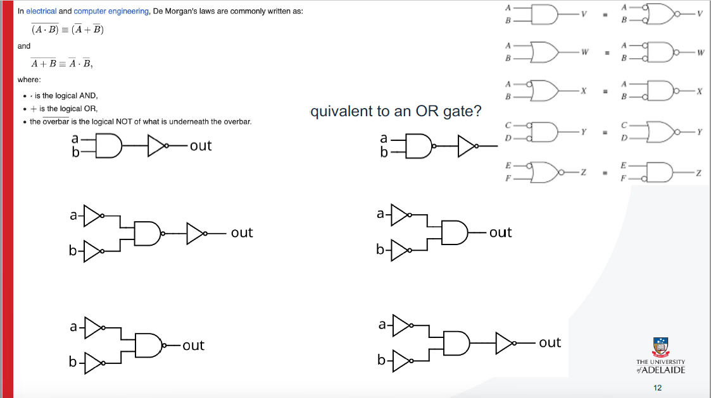
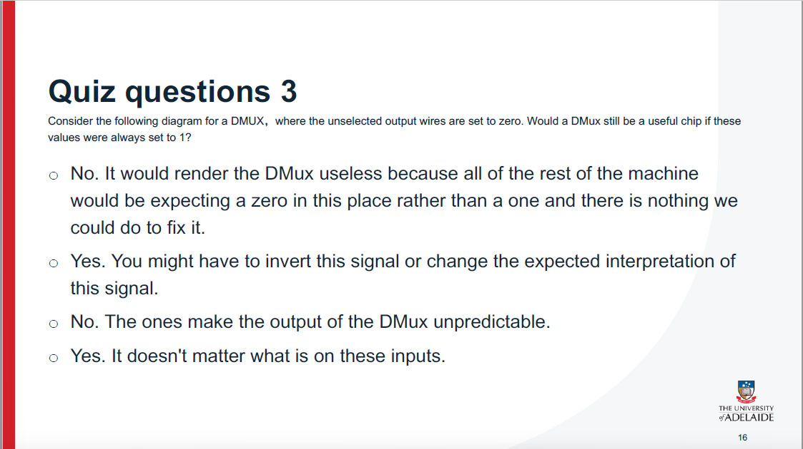

这张图片展示了一个计算机科学或工程课程的学习路径图，特别是从硬件到软件的层次结构和抽象实现的逐步过渡。图中列出了不同的抽象接口和章节，展示了从物理硬件到人类思想如何逐渐演化成高层的软件设计。

具体解释如下：

1. **人类思维 (Human Thought)**：
   - 表示计算机科学起点，最终目标是实现某种计算模型和思维方式。相关章节为第9和第12章。
2. **抽象设计 (Abstract design)**：
   - 是计算机设计的抽象层次，涉及高级语言（High-Level Language）和操作系统的设计。相关章节是第10和第11章。
3. **编译器 (Compiler)**：
   - 主要涉及编程语言的翻译，通常将高级语言转换成机器可以理解的语言，相关章节是第10至第11章。
4. **虚拟机翻译器 (VM Translator)**：
   - 将虚拟机语言转换为底层的计算机语言，相关章节是第7至第8章。
5. **汇编器 (Assembler)**：
   - 负责将汇编语言转化为机器代码，位于第6章。
6. **计算机架构 (Computer Architecture)**：
   - 主要涉及计算机硬件架构设计的内容，相关章节是第4至第5章。
7. **门逻辑 (Gate Logic)**：
   - 介绍计算机硬件的基本单元和逻辑电路。与物理硬件关系密切，是本图中的关键部分。当前用户正在学习的部分。
8. **电气工程 (Electrical Engineering)**：
   - 涉及芯片和逻辑门的设计与实现，涵盖计算机硬件的最底层部分。相关章节为第1至第3章。

该路径图展示了从物理世界（电气工程和物理学）到人类思维的转变过程，以及计算机架构和软件系统如何逐层抽象和实现。在这一过程中，计算机硬件架构和软件架构逐渐从简单的门逻辑和硬件设计过渡到更复杂的编程语言和操作系统层次。


这张图片是关于**门逻辑**（Gate Logic）的一部分，具体讲解了**异或门**（XOR Gate）的逻辑运算。

1. **真值表 (Truth Table)**：

   - 这是展示异或门（XOR）输入与输出之间关系的表格。表格显示了两个输入（a 和 b）及其对应的输出结果（out）。
     - 当a和b都为0时，输出为0；
     - 当a为0且b为1时，输出为1；
     - 当a为1且b为0时，输出为1；
     - 当a和b都为1时，输出为0。
   - 这符合异或门的特性：当两个输入不相同（0和1，或1和0）时，输出为1，否则输出为0。

2. **布尔表达式 (Boolean Expression)**：

   - 该部分展示了如何将XOR门的真值表转换为布尔表达式。布尔表达式为：

     out=(a⋅b‾)+(a‾⋅b)\text{out} = (a \cdot \overline{b}) + (\overline{a} \cdot b)

     其中，⋅\cdot代表与（AND）操作，a‾\overline{a}代表a的非（NOT）操作，++代表或（OR）操作。这个表达式展示了如何通过与、或、非操作实现XOR功能。

3. **实现 (Implementation)**：

   - 该部分展示了使用基本的逻辑门（与门AND、或门OR、非门NOT）来实现异或门。通过组合与门、非门和或门，可以实现XOR的功能。
     - 例如，通过两个与门和一个或门来实现XOR。

4. **考试提醒 (Exam Reminder)**：

   - 页面上的红色标注提醒，提示学生**这个内容在考试中会出现**，强调了布尔表达式和其实现方式在理解门逻辑中的重要性。

这张幻灯片的核心内容是帮助学生理解如何将基本的逻辑门（如与门、或门、非门）组合起来实现复杂的逻辑功能（例如异或门）。同时，它还帮助学生掌握如何从真值表推导出布尔表达式并用逻辑门实现该表达式。


这张幻灯片讲解了**数字表示**（Number Representation）在计算机中的基本概念，特别是如何使用二进制数表示数字。

具体解释如下：

1. **计算机如何表示数字？**

   - 计算机内部的逻辑门只能处理两种可能的值：0 或 1。这是因为计算机的硬件基于二进制系统，其中每个数字是由0或1表示的。

2. **4位二进制数示例**：

   - 幻灯片给出了一个4位的二进制数示例：**1011**。
   - 这个二进制数由4个位组成，从左到右依次是：
     - **MSB** (Most Significant Bit): 最高有效位（即最左边的位），在这个例子中是1。
     - **LSB** (Least Significant Bit): 最低有效位（即最右边的位），在这个例子中是1。

3. **权重 (Weight)**：

   - 每一位的权重是以2的幂次方为基础的：
     - 最左边的位的权重是 232^3，即8。
     - 第二个位置的权重是 222^2，即4。
     - 第三个位置的权重是 212^1，即2。
     - 最右边的位的权重是 202^0，即1。

4. **计算**：

   - 计算该4位二进制数的十进制表示：

     1⋅23+0⋅22+1⋅21+1⋅20=8+0+2+1=111 \cdot 2^3 + 0 \cdot 2^2 + 1 \cdot 2^1 + 1 \cdot 2^0 = 8 + 0 + 2 + 1 = 11

   - 因此，二进制数**1011**在十进制中表示为**11**。

总结：这张幻灯片的核心目的是展示计算机如何通过二进制数表示数字，并通过示例计算出二进制数**1011**的十进制值**11**。


这张幻灯片讲解了**无符号二进制表示**（Unsigned Binary Representation）的基本概念。

具体解释如下：

1. **无符号二进制（Unsigned Binary）**：
   - 无符号二进制是指没有符号位的二进制数，它只能表示非负整数。
   - 例如，4位无符号二进制数可以表示16个不同的数值，范围从**0**到**15**。
2. **无符号二进制数的表示范围**：
   - 一般情况下，n位无符号二进制数可以表示2n2^n个不同的数值，范围从**0**到**2n−12^n - 1**（不包括负数）。
   - 例如，一个4位无符号二进制数（如幻灯片中的例子）可以表示的十进制数从**0**到**15**，即：
     - 1111（二进制） = 15（十进制）
     - 1110（二进制） = 14（十进制）
     - 1101（二进制） = 13（十进制）
     - ... 一直到
     - 0000（二进制） = 0（十进制）
3. **无法表示负数**：
   - 由于无符号二进制数只能表示非负整数，它不能表示负数。换句话说，二进制数中的每一位只能表示正数或零。
4. **表示负数的方法**：
   - 幻灯片最后提出了一个问题：**如果没有正负符号，我们如何表示负数？**
   - 这个问题为之后的内容做了铺垫，通常在计算机中，负数会采用**补码**（Two's Complement）或其他方法来表示，而不是直接使用“+”或“-”符号。

总结：无符号二进制数通过不同的位数可以表示不同范围的非负整数，但它无法直接表示负数。为了表示负数，通常采用补码表示法。


这张幻灯片讲解了**二补码（Two's Complement）**的数字表示方法，尤其是它如何通过转换表示负数以及如何避免一补码中的“冗余零”问题。

### 核心内容：

1. **二补码表示法（Two’s Complement Representation）**：
   - 与一补码不同，二补码的负数表示方法是通过对一个数的每一位进行取反（得到一补码），然后再加上1。
   - 这种表示方法有一个优势：它避免了“一补码”中**有两个零**的问题（+0和-0）。在二补码中，**只有一个零**，并且能够直接进行加法和减法运算。
2. **二补码表示范围**：
   - n位二补码可以表示 2n2^n 个不同的数值，范围从 −(2n−1)-(2^{n-1}) 到 2n−1−12^{n-1} - 1。
   - 例如，4位二补码的表示范围是 −8-8 到 77，包括0。
3. **示例表格**：
   - 在表格中，左侧是**一补码**的表示，右侧是**二补码**的对应表示。
   - 一补码和二补码的主要区别在于负数的表示方式。通过将一补码取反后加1，可以得到二补码。
4. **数字转换（Shift Up by One Place）**：
   - 幻灯片展示了二补码相对于一补码的转换：负数的二补码比一补码低1（即移位操作）。例如：
     - 一补码中的**1111**表示-0，但二补码中的**1111**表示-1；
     - 一补码中的**1100**表示-3，但二补码中的**1100**表示-4。
5. **优点**：
   - **二补码表示法**可以直接表示负数和零，且它的加法和减法操作比一补码更加简便，因为不需要回卷操作或两种零的特殊处理。
6. **总结**：
   - **范围**：对于n位二补码，数值范围为 −(2n−1)-(2^{n-1}) 到 2n−1−12^{n-1} - 1。
   - **唯一零**：二补码中，0只有一个表示，而在一补码中存在两个零（+0和-0）。
   - **表示负数**：通过取反加1的方式表示负数。

### 与一补码的区别：

- 一补码存在**冗余零**（+0和-0），二补码解决了这个问题，只剩下一个零的表示方式。
- 二补码的负数表示通过“逐位取反后加1”实现，而一补码只需“逐位取反”。


 

这张幻灯片讲解了**二进制加法**的基本过程，特别是在4位系统中的加法规则以及如何处理溢出。

### 主要内容：

1. **二进制加法示例**：

   - **第一个例子**（1 + 5）：

     - **二进制表示**：1 = `0001` 和 5 = `0101`。

     - 加法过程：

       ```
       0001
       ```

     - 0101

     ------

     0110  (结果是6)

     ```
     - **没有溢出**：这里没有溢出，结果是 `0110`，即十进制的 6。
     ```

   - **第二个例子**（-5 + 7）：

     - **二进制表示**：-5 = `1011`（二补码表示）和 7 = `0111`。

     - 加法过程：

       ```
       1011
       ```

     - 0111

     ------

     10010  (结果是2)

     ```
     - **溢出**：在4位系统中，结果是5位数字 `10010`，其中 **最高位**（即溢出的进位）被丢弃，剩下的是 `0010`，即十进制的 2。溢出发生了，但结果是有效的。
     ```

2. **加法算法**：

   - 二进制加法的算法与十进制加法类似，逐位相加，如果出现进位，则向下一位进位。加法规则是：
     - 0 + 0 = 0
     - 0 + 1 = 1
     - 1 + 0 = 1
     - 1 + 1 = 0，并进位1

3. **溢出（Overflow）**：

   - **溢出**是指加法的结果超出了所能表示的位数。在本例中，4位系统最多能表示16种不同的数值（从 -8 到 7），因此，当加法结果超出这个范围时就会发生溢出。
   - **MSB carry out**：在加法过程中，最高位的进位可能需要特别处理，但通常会忽略溢出（即不考虑超出4位表示的部分）。
   - 在第一个例子中没有溢出，因为结果（6）在4位范围内；但在第二个例子中，溢出发生了，因为结果是 `10010`，超过了4位能表示的范围。

### 总结：

- **加法规则**与十进制类似。
- 在4位系统中，当加法的结果超出表示范围时发生**溢出**，会丢弃最高位的进位（通常忽略）。
- **溢出**可能导致错误的结果，尤其是当加法结果超出了最大可表示的值时（如在第二个例子中）。


这页在讲**二进制加法（以 4 位二补码为例）**，重点是：怎样判断负数、怎样求相反数、什么时候会发生**有符号溢出**，以及溢出导致的“错误”结果。

------

## 1) 二补码里怎样判断负数？

- 看**最高有效位 MSB**：
  - MSB = 0 → 正数
  - MSB = 1 → 负数

## 2) 怎样取相反数（求 −x）？

- **翻转所有位再加 1**：  −x = (~x) + 1
- 只“翻转位”而不加 1，会得到 **−x − 1**（这就是一补码的关系）。

> 例：x=0101(+5)
>  ~x=1010，(~x)+1=1011 → −5

------

## 3) 什么时候加法结果是“错的”？——有符号溢出

在 n 位二补码中，能表示的范围是 [−2n−1,  2n−1−1][-2^{n-1},\;2^{n-1}-1]。
 **溢出**就是“真值”超出这个范围，硬件会按模 2n2^n 回绕，导致符号出错。

**判定规则（记这个最实用的）：**

- **两个同号相加**却得到**异号**的结果 → **溢出**
   （正+正得负，或 负+负得正）
- **异号相加**不会有有符号溢出
- 等价的硬件判定：进入 MSB 的进位 XOR 溢出到 MSB 之外的进位 = 1

------

## 4) 幻灯片两个“Bad overflow”示例

### A.  −5)+(−5)-5) + (-5)

4 位表示：−5 = **1011**

```
  1011
+ 1011
= 1 0110   （丢掉最高第5位，只留 4 位）
→ 0110 = +6
```

真值应为 −10，不在范围 [−8,7][-8,7] 内，结果被回绕成 **+6**。
 **两个负数相加得到正数** → 溢出 ✔️

### B.  5+45 + 4

4 位表示：5=**0101**，4=**0100**

```
  0101
+ 0100
= 1001
```

**1001** 在 4 位二补码中代表 **−7**。
 真值应为 9，也超出 [−8,7][-8,7]，被回绕成 −7。
 **两个正数相加得到负数** → 溢出 ✔️

------

## 5) 为什么比较时要小心“减法”？

很多程序用“a−b 的符号”来判断 a 与 b 的大小。
 但如果 **a−b** 发生了溢出，结果的符号**不可信**。
 处理办法：

- 做溢出检测（同号相减等价为同号相加规则）；或
- 在更宽的位宽里运算；或
- 使用专门的带溢出标志/库函数。

------

### 速记

- 负数判定：**MSB=1**
- 取反数：**(~x)+1**
- 溢出判定：**同号相加→异号结果**（或 Cin_MSB⊕Cout_MSB=1C_{in\_MSB} \oplus C_{out\_MSB}=1）
- 4 位范围：[−8,7][-8,7]；溢出会**回绕**，造成“看起来不对”的结果。


这张幻灯片讲解了**1位全加器**的**标准形式布尔表达式**，并展示了如何从真值表推导出布尔表达式。

### 主要内容：

1. **1位全加器（1-bit Full Adder）**：

   - **输入**：
     - **x** 和 **y**：要加的两个输入位。
     - **Cin**：进位输入（Carry-in），用于将前一位的进位传递到当前位。
   - **输出**：
     - **Sum**：求和输出，表示当前位的加法结果。
     - **Cout**：进位输出，表示是否有进位输出到下一位。

2. **真值表**：

   - 该表列出了1位全加器的所有输入组合（x, y, Cin）以及相应的输出结果（Sum, Cout）。
     - **Sum**：每一位的和。
     - **Cout**：每一位的进位。

   **真值表**具体内容：

   - 当输入（x, y, Cin）是 (0, 0, 0) 时，Sum = 0, Cout = 0。
   - 当输入是 (0, 0, 1) 时，Sum = 1, Cout = 0。
   - 当输入是 (0, 1, 0) 时，Sum = 1, Cout = 0。
   - 当输入是 (0, 1, 1) 时，Sum = 0, Cout = 1。
   - 当输入是 (1, 0, 0) 时，Sum = 1, Cout = 0。
   - 当输入是 (1, 0, 1) 时，Sum = 0, Cout = 1。
   - 当输入是 (1, 1, 0) 时，Sum = 0, Cout = 1。
   - 当输入是 (1, 1, 1) 时，Sum = 1, Cout = 1。

3. **标准形式布尔表达式**：

   - 根据真值表，您可以推导出每个输出（Sum 和 Cout）对应的布尔表达式：
     - **Sum**：这是加法的结果，可以用异或（XOR）表示。
       - Sum=(x⊕y)⊕CinSum = (x \oplus y) \oplus Cin
     - **Cout**：这是进位输出，可以用与（AND）和或（OR）运算符表示。
       - Cout=(x∧y)∨(y∧Cin)∨(x∧Cin)Cout = (x \land y) \lor (y \land Cin) \lor (x \land Cin)

### 解释：

1. **Sum**：Sum是当前位的和，实际是对输入位（x, y）和进位输入（Cin）执行异或操作，异或操作符 ⊕\oplus 表示相同为0，不同为1的运算。
2. **Cout**：Cout表示是否有进位产生。只有当任意两个输入位（x, y, Cin）中的任意两个为1时，才会产生进位（即输出Cout为1）。这使用了多个与（AND）操作结合或（OR）操作来表示。

### 总结：

- 1位全加器用于加法运算，并且能够处理进位问题。通过真值表可以推导出标准布尔表达式，用于设计硬件电路。


这张幻灯片讲解了如何**设计一个加法器芯片**，特别是如何将多个加法器组合起来以便能够处理n位加法。

### 主要内容：

1. **加法器芯片的功能**：

   - 这个加法器芯片的作用是**加两个整数**。它接收两个16位二进制数 `a` 和 `b` 作为输入，并输出一个16位的和（`out`）。

2. **n位加法器**：

   - **n位加法器**：用于加两个n位的数字。具体而言，它将每一位逐位相加，处理进位直到最后。
     - 例如，一个16位加法器会将16位输入分别相加，处理每一位的进位。

3. **1位加法器**：

   - **1位半加法器（1-bit half adder）**：这个加法器只加两个输入位，没有进位输入。它会输出两部分：
     - **Sum**：当前位的和。
     - **Carry**：进位输出。
     - 半加法器通常用来加最低位（LSB）部分，因此在每个加法器链中，只需要1位半加法器来处理最低位。
   - **1位全加法器（1-bit full adder）**：这个加法器能处理三个位：两个输入位和一个进位输入（Carry-in）。它输出：
     - **Sum**：当前位的和。
     - **Carry-out**：进位输出（Carry to next stage）。
     - 需要在加法器链中使用 `n-1` 个全加法器来处理剩余的各个位。

4. **如何组合**：

   - 对于一个n位加法器（例如16位），我们将1位全加法器和半加法器按顺序组合起来：
     - **最低位**（a[0], b[0]）使用**半加法器**。
     - **其余的位**（a[1], b[1]，...，a[n], b[n]）使用**全加法器**，每个全加法器需要两个输入和一个进位输入。

   在图中，16位加法器的结构被分解成多个1位半加法器和1位全加法器，依次处理每一位。最终，所有的位都经过加法器处理后，输出一个16位的结果。

### 关键点：

- **n位加法器**：用于加n位数字，可以通过连接多个1位加法器来构建。
- **1位半加法器**：处理最低位的加法，没有进位输入。
- **1位全加法器**：处理其余的位，并处理进位。
- **进位处理**：通过级联全加法器来处理进位，使得每一位的和能够正确地计算。

### 总结：

这个幻灯片展示了加法器芯片的设计原理，强调了如何通过组合1位半加法器和1位全加法器来构建一个能够加n位数的加法器。通过这种方式，复杂的加法运算可以逐步分解成简单的1位加法器的运算。


这张幻灯片讲解了**半加法器（Half Adder）**，它是一个用于加2个二进制位的电路。

### 主要内容：

1. **半加法器**：

   - 半加法器用于加法运算，它接受两个输入位（`a` 和 `b`），并输出两个结果：
     - **Sum（和）**：当前位的加法结果。
     - **Carry（进位）**：是否有进位输出。
   - 半加法器的核心逻辑是将两个输入位加起来，得到当前位的和以及是否产生进位。

2. **真值表**：

   - 该表列出了所有输入组合（`a` 和 `b`）与对应的输出（`sum` 和 `carry`）：
     - 当输入（`a = 0`, `b = 0`）时，`sum = 0`, `carry = 0`。
     - 当输入（`a = 0`, `b = 1`）时，`sum = 1`, `carry = 0`。
     - 当输入（`a = 1`, `b = 0`）时，`sum = 1`, `carry = 0`。
     - 当输入（`a = 1`, `b = 1`）时，`sum = 0`, `carry = 1`。

   **总结**：`sum` 列与 **XOR（异或）** 运算相同，`carry` 列与 **AND（与）** 运算相同。

3. **电路实现**：

   - 半加法器的实现可以通过两个基本的逻辑门：**XOR（异或）门**和 **AND（与）门**。
     - `sum` 的输出通过 **XOR** 门获得：`sum = a ⊕ b`。
     - `carry` 的输出通过 **AND** 门获得：`carry = a ∧ b`。

4. **构建过程**：

   - 半加法器由 **XOR 门** 计算 `sum`，由 **AND 门** 计算 `carry`。
   - 这个电路设计可以直接用于构建其他更复杂的加法器，例如全加法器（Full Adder）等。

### 总结：

- **半加法器**是一个基础的数字电路，用于加2个二进制位。它通过 **XOR** 门输出和，**AND** 门输出进位。此电路是加法器设计的基本构建块。


这张幻灯片介绍了**全加法器（Full Adder）**，它用于加三个二进制位：两个输入位（`a` 和 `b`）和一个进位输入（`c`）。全加法器的设计由三个输入和两个输出组成：**Sum（和）** 和 **Carry（进位）**。

### 主要内容：

1. **全加法器（Full Adder）**：

   - **功能**：全加法器的任务是将三个二进制位（`a`, `b`, `c`）加在一起，计算出一个二进制的**和**（`sum`）和一个**进位输出**（`carry`）。

2. **真值表**：

   - 真值表列出了全加法器所有输入组合（`a`, `b`, `c`）的输出结果（`sum` 和 `carry`）：
     - 当 `a=0, b=0, c=0` 时，`sum=0, carry=0`
     - 当 `a=0, b=0, c=1` 时，`sum=1, carry=0`
     - 当 `a=0, b=1, c=0` 时，`sum=1, carry=0`
     - 当 `a=0, b=1, c=1` 时，`sum=0, carry=1`
     - 当 `a=1, b=0, c=0` 时，`sum=1, carry=0`
     - 当 `a=1, b=0, c=1` 时，`sum=0, carry=1`
     - 当 `a=1, b=1, c=0` 时，`sum=0, carry=1`
     - 当 `a=1, b=1, c=1` 时，`sum=1, carry=1`

   **总结**：这个真值表展示了全加法器的功能，两个输入位和进位输入如何一起决定当前位的和及进位。

3. **电路实现**：

   - **全加法器的构建**：
     - 该电路实现可以基于两个半加法器（half adders）和一个或门（OR gate）。
     - **第一个半加法器**：用于加输入 `a` 和 `b`，生成部分和和进位。
     - **第二个半加法器**：将第一个半加法器的部分和与进位输入 `c` 进行加法运算，输出最终的和（`sum`）和进位（`carry`）。
     - **或门（OR gate）**：用于将两个进位信号（从两个半加法器的进位输出）合并成最终的进位输出。

4. **实现细节**：

   - **半加法器（Half Adder）**：如上一张幻灯片所述，半加法器是处理两个输入位加法的基础电路。通过使用两个半加法器，可以有效地处理三个输入位的加法问题。
   - **或门（OR gate）**：在这电路中，用于合并进位信号，确保如果任意一个半加法器输出了进位，最终的 `carry` 会是1。

### 总结：

- **全加法器**是一个可以加三个二进制位的电路，输出**和**和**进位**。
- 它可以通过两个半加法器和一个或门（OR gate）来实现。
- **进位处理**：通过两个半加法器加法后，使用或门处理进位。

全加法器是计算机中非常基础且重要的组件，通常用于构建更复杂的加法器，例如多位加法器和算术逻辑单元（ALU）中的加法部分。


这张幻灯片讨论了如何将多个加法器级联（cascading adders）来加多个数，并解释了为什么这种方法不推荐使用。

### 主要内容：

1. **级联加法器（Cascading Adders）**：
   - 这张幻灯片展示了将多个 **n 位加法器** 级联在一起的方式。例如，假设你要加 `a`, `b`, `c`, 和 `d` 这四个数字，可以将它们依次输入多个加法器：
     - **第一步**：`a` 和 `b` 通过第一个加法器相加，得到中间结果 `c`。
     - **第二步**：`c` 和 `d` 再通过第二个加法器相加，得到最终结果。
     - 这种方法通过将多个加法器连接在一起处理多个输入数字。
2. **为什么不推荐级联加法器？**：
   - **效率问题**：虽然你可以使用级联加法器来处理多个输入，但这种方法是低效的。每次加法计算的结果需要传递到下一个加法器，这会引入延迟。
   - **芯片面积、功耗和设计复杂度**：通过级联加法器，你需要更多的硬件资源（加法器），这会浪费芯片的面积，增加功耗，并使设计更复杂。
   - **结果仅为简单的加法功能**：虽然它能实现加法操作，但它只是简单的加法功能，设计上并不高效，无法充分利用硬件资源。
3. **替代方案**：
   - 更推荐使用 **并行加法器** 或 **树形加法器** 来实现多个数字的加法，这些方法能够减少传递延迟，优化硬件资源的利用，避免级联带来的低效。

### 总结：

- **级联加法器**是将多个加法器连接起来以加多个数字的方式，但这种方法不高效。
- 它浪费了芯片面积、增加了功耗和设计复杂度，且最终只是实现了一个简单的加法功能。
- 更推荐使用并行或树形结构的加法器，来提高加法器的效率和性能。


这页在问：**能不能把加法器的输出再喂回输入，重复利用同一个 n 位加法器来依次相加 a、b、c、d …？**
 直观想法是把“当前和”接回去，再喂下一个数。幻灯片给出的结论是：**不行（至少不能直接这样做）**。原因与正确做法如下。

------

## 为什么“直接回馈”不行？

- **组合逻辑没有记忆**
   加法器是**组合电路**，输出只由**此刻**的输入决定，并不会“记住”上一次的结果。
   一旦你把输入从 b 换成 c，输出立刻开始变化；而这个变化又经过回路立刻影响到它自己的另一个输入，形成**组合环路（combinational loop）**。
- **组合环路会导致不稳定/不可预测**
   在真实硬件里有传播延迟，输出在稳定前会出现毛刺（glitch）、振荡，甚至停在错误值。综合工具也通常禁止纯组合环路，因为**时序不可分析**。
- **我们需要“把当前和冻结住”**
   想要做“累加”（先 a+b，再 +c，再 +d…），必须有一个**存储当前和的机制**，让它在喂入下一个加数时不被立刻篡改。

------

## 正确做法：加一个寄存器（累加器）

把“记忆”交给**时序逻辑**（寄存器/触发器），用时钟来采样与更新，就能安全复用同一个加法器。

**典型结构（Accumulator）**

- 一个 n 位加法器
- 一个 n 位寄存器 `SUM` 用来存“当前和”
- 一个多路复用器（可选）在初次时给加法器另一输入喂 0，之后喂寄存器的 `SUM`
- 时钟 `clk` 与清零 `reset`

**工作流程（每个时钟沿做一次）**

1. 若 `reset=1`：`SUM ← 0`
2. 否则：`SUM ← SUM + X`（X 是这拍输入进来的 a、b、c、d 之一）

**伪代码**

```text
on rising_edge(clk):
    if reset: SUM := 0
    else:     SUM := SUM + X
```

这样你就能在第1拍得到 a，在第2拍得到 a+b，在第3拍 a+b+c，在第4拍 a+b+c+d …
 整个过程**无组合环路**，时序可分析、结果可靠。

------

## 多个数相加还有更快的做法吗？

- 要一次性把很多个数并行相加，常用 **加法树/前缀加法器/携带保存加法器（CSA tree）** 等结构，它们避免长进位链，提高速度。
- 但“顺序累加”场景下，一个**加法器 + 寄存器**的累加器已足够且成本低。

------

### 小结

- 直接把加法器输出回灌形成**组合环路** → 不稳定、无状态、不可取。
- 正确方式：**在回路里插入寄存器**（也就是把组合逻辑变成时序电路），用时钟“记住”当前和，再喂下一个加数。


 这张幻灯片介绍了**数据触发器（D Flip-Flop, DFF）**，它是时序电路中的一个基础组件。

### 主要内容：

1. **数据触发器（D Flip-Flop, DFF）**：
   - **DFF 是时序电路的基本单元**，它接收一个输入并延迟该输入的变化，直到下一个时钟信号的上升沿（即时钟的“滴答”）。
   - 这是一个基本的存储单元，它用于在数字系统中存储一位信息。
2. **输入和输出**：
   - **输入（D）**：DFF 接收一个输入信号 `D`，并将在下一个时钟周期之前保持这个值。
   - **输出（Q）**：DFF 的输出 `Q` 在每次时钟“滴答”时更新为输入 `D` 的当前值。因此，`Q` 会在时钟触发时延迟更新。
3. **工作原理**：
   - 在时钟的上升沿，DFF 将输入 `D` 的值存储到输出 `Q` 中，并且直到下一个时钟周期，输出 `Q` 将保持该值。
   - 换句话说，DFF 就像一个“记忆单元”，它存储并延迟输入信号，直到时钟触发更新。
4. **实现方式**：
   - **DFF 可以由 NAND 门**通过巧妙的反馈回路构造出来，实际的电路实现通常会使用反馈机制来保持状态并触发更新。
   - 尽管具体实现方法不要求记忆，但基本上它是由一些逻辑门（如 NAND 门）和反馈环路组成的。
5. **图示说明**：
   - 在图中，`D` 是输入端，`Q` 是输出端，`clk` 是时钟信号，控制 DFF 的更新。
   - 右侧的电路图展示了如何通过 NAND 门构建一个基本的 DFF 电路。

### 总结：

- **D Flip-Flop (DFF)** 是一种时序电路，它可以存储一位数据并在下一个时钟周期将其输出。
- **DFF** 用于数字系统中作为存储器件，其输入值 `D` 会在下一个时钟“滴答”时传递到输出 `Q`。
- DFF 可以通过 **NAND 门**和反馈机制来实现，这种设计方式广泛用于时序逻辑电路中，如寄存器、计数器等。


这张幻灯片讲解了**时钟信号**（Clock signal）在计算机系统中的作用及其基本概念。

### 主要内容：

1. **时钟信号的作用**：
   - 时钟信号是计算机系统中的一种信号，用于协调和控制硬件的运行。它通过不断变化的高低电平来驱动硬件的状态变化。
   - 时钟信号用于同步系统中的不同部件，以便在正确的时间执行任务，例如在时序电路中更新状态或存储数据。
2. **时钟信号的周期性变化**：
   - 时钟信号会周期性地在低电平和高电平之间震荡，这种震荡称为**时钟周期**（Clock cycle）。每个周期包括从低电平到高电平的过渡，和从高电平到低电平的过渡。
3. **时钟信号的边沿**：
   - **正沿（positive edge 或 tick）**：从低电平到高电平的过渡，通常称为“tick”。在时钟信号的正沿，时序电路（如寄存器）会更新它的输出。
   - **负沿（negative edge 或 tock）**：从高电平到低电平的过渡，通常称为“tock”。负沿也可以用来触发某些电路的状态更新，具体取决于设计。
4. **时钟波形**：
   - 下面的图示展示了时钟信号的波形，它周期性地从低电平（low）跳到高电平（high），并且又从高电平跳回低电平。每一次完整的周期（从低到高，再从高到低）代表一个**时钟周期**。
   - 在时钟的**正沿**时，时序电路可以读取输入并更新输出。在时钟的**负沿**时，另一些电路可能更新其状态。

### 总结：

- **时钟信号**用于同步计算机硬件，确保在正确的时间进行操作。
- 时钟信号有**正沿**和**负沿**，这两个边沿用于触发电路的更新。
- 时钟周期从低电平到高电平，再到低电平的周期性震荡，驱动硬件按照一定的节奏工作。


这张幻灯片讲解了**时钟的速度**如何影响计算机系统的整体运行，并介绍了在**Nand2Tetris硬件模拟器**中如何手动提供时钟信号。

### 主要内容：

1. **时钟的速度对计算机系统的影响**：

   - 时钟信号的速度直接影响计算机中所有操作的速度，因为时钟周期是**所有操作变化的最小单位**。
   - 每个时钟周期决定了数据从输入到输出的处理时间，时钟频率越高，系统更新的频率就越高，计算机的处理速度也就越快。

2. **硬件中的时钟信号生成与传输**：

   - 在实际硬件中，有专门的组件和电路用于生成和传输时钟信号。
   - 时钟信号会在硬件中周期性地改变状态（从低到高，再从高到低），这个过程被用来控制和同步各个硬件部件。

3. **在Nand2Tetris硬件模拟器中的时钟控制**：

   - 在**Nand2Tetris**硬件模拟器中，用户可以手动控制时钟信号，模拟不同的时钟周期。
   - 用户可以通过**tick**和**tock**命令来模拟时钟的上升沿和下降沿，分别对应时钟信号的正沿（从低到高）和负沿（从高到低）。

4. **图示和代码示例**：

   - 图示显示了Nand2Tetris模拟器中控制时钟的按钮（Tick Tock）。

   - 代码示例展示了如何在测试脚本中使用 **tick** 和 **tock** 命令来模拟时钟的变化：

     ```text
     set load 1,
     tick;
     output;
     tock;
     output;
     ```

   - 这里的 **tick** 和 **tock** 分别代表时钟的正沿和负沿，命令中的 `output` 表示输出信号，在每个时钟周期更新。

### 总结：

- **时钟信号**是计算机系统中的重要元素，它控制硬件的同步和状态更新，时钟的速度（频率）直接影响计算机的运行速度。
- 在 **Nand2Tetris 硬件模拟器** 中，用户可以通过 `tick` 和 `tock` 命令来模拟时钟信号的变化，帮助理解时序逻辑的行为。


这张幻灯片解释了如何使用时钟信号来控制**时序电路**（sequential chip），并且指出在本课程中不需要关心时钟电路的具体实现细节。

### 主要内容：

1. **时钟信号的使用**：
   - 在本课程中，假设所有的时钟信号都是统一连接的，即所有的时钟信号都运行在同一个主时钟信号下。
   - **主时钟信号**（master clock signal）会同步控制电路中所有时序电路的更新。
2. **时序电路（sequential chip）**：
   - 时序电路的输出不仅仅由当前输入决定，还受到之前输入和时钟信号的影响。时序电路的状态会随着每个时钟周期的“滴答”（tick）更新。
   - 在这张幻灯片中的图示表示了一个时序电路，输入信号（in）通过时钟信号的控制，最终产生输出信号（out）。
3. **符号表示**：
   - 图示左边的时序电路表示一个带有时钟信号的基本电路模型。右边的等式表示该时序电路的简化符号，其中带有时钟信号的输入（`in`）和输出（`out`）会受到时钟信号的同步更新。
   - 右边的符号中的 `Δ` 表示时钟周期的更新，即“在时钟的每次更新时，电路的状态发生变化”。

### 总结：

- 在本课程中，**时钟信号**用于同步时序电路的更新，但**时钟电路的具体实现**不需要关注。
- **时序电路**的输入和输出不仅由当前信号决定，还由时钟信号控制。
- 所有时钟信号都假设使用**同一个主时钟**，在时钟周期的每个“滴答”时，时序电路的状态会更新。


这张幻灯片解释了在使用**D触发器（DFF）**来维持状态时会遇到的问题。

### 主要内容：

1. **DFF的基本工作原理**：
   - **DFF**（D Flip-Flop）用于存储输入值，并在时钟信号的控制下将输入值保持到下一个时钟周期。它只有一个输入（`in`）和一个输出（`out`），并且会根据时钟信号的上升沿（或下降沿）将输入 `in` 的值传递到输出 `out`。
2. **问题：DFF只能维持一个时钟周期的状态**：
   - 如果仅使用一个 DFF 来维持状态，其输出值只能保持一个时钟周期。在时钟周期结束后，DFF 的输出会更新为下一个输入的值。这意味着在时钟周期之间，DFF 不能持续保存上一个输入的状态。
3. **图示与波形**：
   - 图中展示了 DFF 在时钟周期中的工作情况：
     - **输入（in）**：在时钟的每次上升沿（posedge）发生变化。
     - **输出（out）**：在每次时钟的上升沿更新为当前输入 `in` 的值，并保持该值直到下一个时钟周期。
   - 波形图显示了时钟信号（`clk`）和输入（`in`）以及输出（`out`）之间的关系：
     - **clk** 信号周期性变化。
     - **in** 信号在时钟的上升沿发生变化。
     - **out** 信号在时钟的上升沿更新为 `in` 的值，直到下一个时钟周期。
4. **DFF的局限性**：
   - 如果仅使用 DFF 来保持状态，它只能在**一个时钟周期内**维持输入的状态。在时钟周期结束时，DFF 会丢失原本的状态，导致不能在多个时钟周期内保存状态。
   - 如果需要在多个时钟周期内持续保存状态，需要使用多个 DFF 或者其他机制来存储和更新状态。

### 总结：

- **DFF** 只能在**一个时钟周期内**维持输入的状态，状态会随着每个时钟周期的更新而改变。
- 如果需要保持多个时钟周期的状态，**单一的 DFF 无法实现**，需要通过组合多个 DFF 或使用其他存储机制来解决这一问题。


这张幻灯片展示了如何实现**1位寄存器（1-bit register）**，并且引入了**读取（read）逻辑**和**写入（write）逻辑**的概念。

### 主要内容：

1. **1位寄存器（Bit Register）**：
   - 寄存器是用来存储数据的基本单元。在这张幻灯片中，我们关注的是**1位寄存器**，即一个寄存器用来存储1位数据。
2. **使用D触发器（DFF）来构建寄存器**：
   - 图中展示了如何使用一个**D触发器（D Flip-Flop, DFF）**来实现1位寄存器。DFF是时序电路，用于存储一个位的数据。
   - 通过一个**MUX（多路复用器）**控制输入，决定是否将输入 `in` 存储到 `DFF` 中。
3. **加载信号（Load signal）**：
   - 图中有一个控制信号 **load**，它决定是否将输入 `in` 的值加载到寄存器中。
   - 当 `load` 信号为高电平时，输入 `in` 会被存储到寄存器中；如果 `load` 信号为低电平，输入值不会改变寄存器的状态。
4. **读写逻辑（Read and Write Logic）**：
   - **写入（Write）**：当 `load` 信号为高电平时，寄存器的值会被更新为输入 `in` 的值，这就是写入操作。
   - **读取（Read）**：在时序电路中，读取操作通常不需要额外的控制信号，因为寄存器的输出 `out` 始终保持寄存器当前的值（在时钟触发下更新）。

### 总结：

- **1位寄存器**是通过**D触发器**来实现的，DFF用于存储一个位的数据。
- 通过使用**MUX**和**load信号**来控制数据是否写入寄存器。
- **写入操作**通过激活 `load` 信号来实现，**读取操作**则直接从寄存器的输出端（`out`）获取当前存储的值。


这张幻灯片讲解了如何使用**乘积之和（Sum of Products, SoP）\**的规范形式来表示逻辑函数，并展示了如何从\**真值表**到**逻辑表达式**的转换过程。

### 主要内容：

1. **乘积之和（SoP）**：

   - 乘积之和是一种标准的逻辑表示方法，它通过 **AND** 和 **OR** 操作来表达一个逻辑函数。
   - 在 **SoP** 中，首先将各个输入变量的乘积（**AND**）进行组合，然后再使用 **OR** 将这些乘积连接起来。

2. **从真值表到SoP的步骤**：

   - **步骤 1**：找到所有 `out = 1` 的行，忽略所有 `out = 0` 的行。
   - **步骤 2**：对于每一行 `out = 1`，写出该行的输入条件，使用 **AND**（乘积）表示每个输入，**1** 的输入按原样写，**0** 的输入写成取反形式（即 `\overline{a}`）。
   - **步骤 3**：重复步骤 2，处理所有 `out = 1` 的行。
   - **步骤 4**：将所有产生的项用 **OR**（和）连接起来，得到最终的表达式。

3. **例子**：

   - 在真值表中，只有当 `out = 1` 时，才会考虑对应的输入组合。

   - 例如，假设输入 `a = 0, b = 0, sel = 1` 对应输出 `out = 1`，则这一行的逻辑表达式是 `(a' * b' * sel)`。依此类推，其他行也根据输入的值写出乘积项，最终用 **OR** 连接起来。

   - 所得到的最终表达式是：

     ```
     out = (a' * b * sel) + (a' * b' * sel) + (a * b' * sel') + (a * b * sel') + (a * b * sel)
     ```

4. **电路图和符号**：

   - 图中展示了一个多路复用器（MUX）和其输出的符号，输入信号经过时序控制（由 `sel` 控制）选择，并最终输出 `out`。

### 总结：

- **乘积之和（SoP）** 是逻辑函数的一种标准表示方法，它将输入的每一行中的 `out = 1` 的条件转化为 **AND** 组合，然后通过 **OR** 连接所有满足条件的项。
- **转换步骤**：通过真值表找出所有 `out = 1` 的行，编写每行对应的 AND 表达式，并用 OR 将其连接，最终得到规范化的逻辑表达式。


这张幻灯片展示了如何通过将多个**1位寄存器（1-bit registers）\**并联来构建一个\**n位寄存器（n-bit register）**。

### 主要内容：

1. **1位寄存器并联构建n位寄存器**：
   - 通过将多个**1位寄存器**并联（串联）起来，我们可以构建一个多位寄存器。在这种结构中，每个寄存器存储一个位的数据。
   - **n位寄存器**是由**n个1位寄存器**通过并行连接组成的，每个1位寄存器分别对应n位输入和输出。
2. **输入与输出**：
   - 每个1位寄存器都有一个单独的输入（如 `In[0]`, `In[1]`, …）和一个输出（如 `out[0]`, `out[1]`, …）。
   - 通过并联连接，整个寄存器的输入 `in` 可以同时喂给每个1位寄存器，而每个寄存器的输出（`out[0]`, `out[1]`, …）将分别表示该位的状态。
3. **控制信号（load）**：
   - 所有寄存器共享一个控制信号 `load`，该信号控制寄存器是否应该加载新的数据。当 `load` 信号为高电平时，寄存器会更新其状态并存储输入信号；当 `load` 为低电平时，寄存器保持其当前状态。
4. **n位寄存器的优势**：
   - 通过将多个1位寄存器并联在一起，我们可以构建一个宽度为n的寄存器，可以同时存储n位数据。这种设计使得我们能够更高效地处理多位数据的存储。

### 总结：

- **n位寄存器**是由多个**1位寄存器**并联而成，每个1位寄存器负责存储一个数据位。
- 所有的1位寄存器共享一个**load控制信号**，用于控制数据的写入操作。
- 通过这种方式，我们可以实现一个存储n位数据的寄存器，广泛应用于计算机中存储多位数据的需求。


这张幻灯片的总结部分解释了计算机硬件和数字逻辑的基本概念，尤其是在二进制算术和存储器设计方面。具体内容如下：

1. **布尔逻辑**：布尔逻辑用于执行基本的二进制算术运算，如加法。例如，使用布尔逻辑可以实现基本的加法器电路，从而进行二进制数的加法。
2. **1位加法器**：可以将多个1位加法器芯片组合在一起，用于加法更大的数字。每个1位加法器执行的是对两个单一二进制位的加法，通过组合多个这样的加法器，我们可以完成多位二进制数的加法运算。
3. **顺序逻辑**：顺序逻辑电路的特点是它们的输出不仅取决于当前的输入，还取决于先前的结果和状态。这意味着顺序逻辑能够保存历史信息，适用于更复杂的计算和操作。
4. **触发器（DFF）**：D触发器（D Flip-Flop, DFF）用于存储状态，它通过延迟输出的方式来“记住”过去的输入。这种机制使得我们可以构建寄存器和其他数据存储结构。寄存器等存储结构可以存储计算结果或数据，便于后续使用。

总结来说，这些概念是构建更复杂数字电路和计算机硬件的基础，它们帮助实现了从基本的算术操作到数据存储和处理的各种功能。


这张幻灯片介绍了**D触发器（DFF，Data Flip-Flop）**，它是时序电路中的一个基本组件，用于存储和延迟输入信号。

### 主要内容：

1. **D触发器（DFF）概述**：
   - **DFF** 是一种基础的时序电路，它可以存储一位数据并在时钟信号的作用下更新其状态。DFF 有两个主要的输入输出：
     - **输入D**：数据输入端，用于传入要存储的数据。
     - **输出Q**：存储的数据输出端，表示当前存储的值。
     - **时钟信号(clk)**：控制触发器何时更新状态。时钟信号的“滴答”周期（tick）决定了何时将输入数据D传递到输出Q。
2. **DFF的工作原理**：
   - DFF 会在每次时钟信号的上升沿（即从低电平到高电平的过渡）触发时更新其输出 `Q`。输出 `Q` 将保存输入 `D` 在上一个时钟周期时的值。
   - 换句话说，**DFF 会延迟存储数据**，直到下一个时钟周期的上升沿才更新输出。DFF 保持其状态，直到下一个时钟“滴答”来临。
3. **DFF的构造**：
   - DFF 可以通过 **NAND门**（与非门）和一些巧妙的反馈环路来实现。这意味着DFF是由基本的逻辑门组合而成，用于延迟信号并保持状态。
   - 这里提到，虽然这种构建方法很常见，但并不要求用户记住具体的实现细节。
4. **图示**：
   - 图中展示了一个 DFF 电路，它有一个数据输入端（D），一个时钟输入（clk），和一个输出端（Q）。
   - 当时钟信号（clk）发生变化时，输入信号（D）会被存储到输出端（Q），并保持这个状态直到下一个时钟周期。

### 总结：

- **DFF** 是一种时序电路，负责存储一位数据并在时钟周期的控制下更新其状态。
- **DFF** 的输出会在时钟信号的控制下更新，输入信号在时钟的上升沿被存储到输出端。
- DFF可以通过**NAND门**及反馈回路来实现，这些是实现时序电路的常见方法。


这张幻灯片讨论了使用D触发器（DFF）来保持状态时遇到的问题，具体内容如下：

1. **问题描述**：
   - 如果单独使用一个D触发器（DFF）来保持状态，它只能在一个时钟周期内保持该状态。也就是说，当时钟信号发生变化时，D触发器会更新它的输出，而无法维持在一个状态上超过一个时钟周期。
2. **时序图**：
   - 幻灯片提供了一个时序图，展示了D触发器的输入、输出和时钟（clk）信号的关系。
   - 当时钟信号发生变化时，D触发器的输出（out）会根据输入（in）的值进行更新，并且这个输出只能在下一个时钟周期之前维持当前状态。
3. **主要问题**：
   - D触发器的输出会随着时钟的变化而变化。它仅会在每个时钟周期内存储一个状态，这意味着如果我们只是依赖单个D触发器，它无法“长期”保持状态，尤其是在更复杂的设计中，需要多个时钟周期来维持或延续状态时。

总结来说，使用单个D触发器来保持状态时，它的状态只能在一个时钟周期内有效，不能跨多个时钟周期保持这个状态。这就是单独使用D触发器时可能遇到的限制。


这张图片描述了一个1位寄存器（Bit），即一个能够存储1个比特信息的硬件组件。让我们逐步分析图中的内容：

1. **目标（We want to be able to）**：
   - **改变比特的状态**：我们想要能够改变这个比特的值。
   - **保持该状态直到我们想改变它**：一旦改变了比特的状态，它会保持不变，直到我们决定再次改变它。
2. **电路图解释**：
   - 图中显示了一个“Bit”组件，代表1位寄存器。
   - 有三个输入：
     - **in**：用于输入新的比特值。
     - **load**：控制寄存器是否接受新的输入值（即改变比特的状态）。
   - 输出是**out**，即当前寄存器的值。
3. **工作原理**：
   - 如果**load**信号为1（激活），则在时钟信号的上升沿时，寄存器会将输入值**in**存入寄存器，更新其状态。
   - 如果**load**信号为0（未激活），则寄存器的输出值**out**保持不变，仍然是上一个时刻的值。
4. **总结**：
   - 这实际上是在描述一个D触发器（DFF，D Flip-Flop）的基本应用。通过控制**load**信号，我们可以决定是否将新的输入值保存到寄存器中，或者保持当前的输出值。
5. **问题**：
   - 最后提问是否可以利用现有的D触发器和逻辑门来构建这样的1位寄存器。

这个概念在数字电路中非常常见，尤其是在构建寄存器、存储器和其他需要保持状态的设备时。


这张图展示了一个1位寄存器的实现原理。我们可以从图中提取出以下关键信息：

1. **输入与输出：**
   - 输入（`in`）：这是寄存器的输入信号。
   - 输出（`out`）：这是寄存器的输出信号。
2. **D触发器（DFF）：**
   - 寄存器的核心部分是一个**D触发器（D Flip-Flop，简称DFF）**。D触发器用于存储一个位的信号，并根据时钟信号（图中未显示的时钟）控制数据的存储。
   - D触发器只有在特定的条件下（通常是时钟上升沿）才会把输入信号（`in`）的值传递到输出（`out`）。
3. **加载信号（`load`）：**
   - 图中有一个加载信号（`load`），用于控制是否允许更新寄存器的值。如果`load`信号为高电平，寄存器将根据输入信号（`in`）进行更新；如果`load`信号为低电平，寄存器的值保持不变。
   - 这个信号在实际电路中通常由控制单元或外部逻辑决定，用于确定是否加载新的数据。
4. **选择器（MUX）：**
   - 输入信号首先经过一个选择器（`MUX`），选择是否将新的数据传递到D触发器。选择器的作用是根据控制信号决定是否使用输入信号。
5. **总结：**
   - 这幅图的目的在于说明如何通过加载信号来控制寄存器的读写操作。如果`load`信号激活（为高电平），寄存器会将`in`信号的值加载并存储到触发器中，从而在输出端展示。如果`load`为低电平，寄存器的内容不变。

这种设计常用于计算机系统中的数据存储，尤其是处理单个比特的数据。


这张幻灯片讲解了如何使用**乘积之和（Sum of Products, SoP）\**的规范形式来表示逻辑函数。它从\**真值表**开始，逐步解释如何转化为**SoP表达式**。

### 主要内容：

1. **乘积之和（SoP）**：

   - 乘积之和是一种逻辑表达方式，通过**AND**（与）运算将输入项结合，最后使用**OR**（或）运算将这些项连接起来。
   - 在 SoP 中，每个表达式中的每一项是一个乘积（AND），即将多个输入（或其反向）进行与运算。

2. **步骤**：

   - **步骤 1**：在真值表中找到所有 `out = 1` 的行，并忽略 `out = 0` 的行。只考虑那些输出为1的输入组合。
   - **步骤 2**：对于每一行 `out = 1`，写出该行输入的乘积（AND）。如果某个输入是 1，则直接写出该输入；如果某个输入是 0，则写出该输入的取反（`a` 写作 `a'`）。
   - **步骤 3**：重复步骤 2，对所有 `out = 1` 的行进行处理。
   - **步骤 4**：使用 OR 将所有的乘积项连接起来，形成最终的 SoP 形式。

3. **真值表与逻辑表达式**：

   - 在给出的真值表中，输出 `out = 1` 的行已经被标记为黄色。每一行的输入对应着一个乘积项。
   - 例如，真值表的第一行 `a=0, b=0, sel=1` 时输出 `out=0`，所以它不会被包括在最终的表达式中。
   - 当 `out=1` 时，我们会根据输入的 1 或 0 来构建对应的 AND 语句。例如，`a=0, b=1, sel=1` 会对应 `a' * b * sel`。

4. **最终表达式**：

   - 最终的 SoP 表达式是将所有的乘积项用 OR 运算连接起来，得到：

     ```
     out = (a' * b * sel) + (a * b' * sel') + (a * b * sel') + (a * b * sel)
     ```

### 总结：

- **SoP（乘积之和）** 是一种逻辑表达方式，通过 AND 和 OR 运算来表示逻辑函数。
- 通过从真值表中提取所有 `out = 1` 的行，写出每一行的输入组合，然后用 OR 运算连接所有这些项，得到最终的 SoP 形式。


这张图展示的是如何通过将多个1位寄存器并联在一起，构建一个n位寄存器的原理。

**详细解释：**

1. **寄存器（Register）**：
    寄存器是计算机中用于存储数据的基本组件。在这张图中，寄存器是由多个1位的寄存器单元组成的，每个1位寄存器存储1位数据（即0或1）。
2. **如何构建n位寄存器**：
    图中的“Bigger registers”部分展示了如何通过并联n个1位寄存器来构建一个n位寄存器。例如，3个1位寄存器可以组成一个3位寄存器，5个1位寄存器可以组成一个5位寄存器，以此类推。每个1位寄存器都有一个输入（In[i]）和输出（out[i]），这些寄存器并联后，共同构成一个更大的n位寄存器。
3. **具体结构**：
   - 输入端：n个输入信号（In[0], In[1], ..., In[n-1]），这些输入信号传入各个1位寄存器。
   - 每个寄存器有一个控制信号（例如“load”），表示何时将输入信号存储到寄存器中。
   - 输出端：n个输出信号（out[0], out[1], ..., out[n-1]），分别对应每个寄存器的存储数据。
4. **工作方式**：
    每个1位寄存器会接收一个输入信号并在"load"信号激活时将输入值存储。存储的值可以在输出端读取出来，形成一个n位寄存器的输出。

总结来说，这张图展示了通过将n个1位寄存器并联，可以构建一个n位寄存器的过程，每个1位寄存器处理1位数据，从而实现更大的数据存储单元。


这张幻灯片是对之前内容的总结，主要讲述了布尔逻辑和顺序逻辑在数字电路设计中的应用。以下是每一点的详细解释：

1. **布尔逻辑可以用于执行基本的二进制算术运算，如加法**：
   - 通过布尔逻辑（例如与、或、非等逻辑门），我们能够实现基本的二进制加法运算。布尔逻辑是数字电路设计的基础，能够实现简单的算术运算。
2. **我们可以将基本的1位加法器芯片组合起来，以实现更大的数字相加**：
   - 通过将多个1位加法器（例如全加器）连接起来，我们可以构建更复杂的加法器，来处理多个比特的加法运算。这种组合形式使得我们可以处理更大的数字。
3. **顺序逻辑使我们能够执行依赖于先前结果和状态的操作**：
   - 顺序逻辑与组合逻辑不同，它不仅依赖于当前输入，还依赖于之前的状态。它使得我们可以实现复杂的操作，如计数器、寄存器、存储器等，其中的操作结果会根据之前的状态产生变化。
4. **DFF（D触发器）通过延迟输出存储状态，这使得我们能够构建寄存器和其他数据存储结构**：
   - D触发器（D Flip-Flop）是一种基本的存储元件，能够在时钟信号的控制下存储数据。它通过延迟输出，实现了数据的存储功能。这种延迟输出特性使得我们可以构建寄存器、存储器等用于保持和操作数据的结构。

总结起来，这张幻灯片强调了布尔逻辑在基本计算中的重要性，顺序逻辑在执行复杂操作中的作用，以及D触发器在数据存储结构中的应用。


抱歉，我的错误。确实是有六个电路，我重新检查了一下。让我们逐个分析这六个电路，看看哪个与OR门等效。

1. **第一个电路**：
    这是一个**与门（AND gate）**，它接收a和b两个输入，输出其逻辑与的结果。这与OR门不等效。
2. **第二个电路**：
    这是一个**输入a经过反相器（NOT gate）后，再与b进行与运算（AND gate）**。这与OR门的逻辑不同，因此不等效。
3. **第三个电路**：
    这是一个**输入a和b都经过反相器（NOT gate）后，再进行与运算（AND gate）**。这与OR门的逻辑不同，因此不等效。
4. **第四个电路**：
    这是一个**输入a经过反相器（NOT gate）后，与输入b进行与运算（AND gate），再对结果取反**。这实际上是一个**NAND门**，它与OR门不等效。
5. **第五个电路**：
    这是一个**输入a和b分别通过反相器（NOT gate），然后再通过或门（OR gate）进行合并**。这与OR门等效。
6. **第六个电路**：
    这是一个**输入a和b通过两个反相器（NOT gate）后，再经过与门（AND gate）进行运算**。这与OR门的逻辑不同，因此不等效。

**总结：**
 唯一与OR门等效的电路是**第五个电路**，它展示了通过反相器后再进行OR运算的组合方式。




这张图展示的是关于使用**二进制补码（two's complement）**表示负数的问题。我们需要选择正确的答案来解释为什么使用二进制补码来表示负数。

**选项分析：**

1. **So that we can perform addition without worrying about the sign of the numbers**：
    这个选项是正确的。二进制补码的一个重要优点是，它允许我们在不考虑数值符号的情况下直接进行加法运算。负数的加法和正数的加法通过补码表示方式可以统一处理，简化了计算过程。
2. **So that there is only one representation of 0**：
    这个选项也是正确的。补码表示法中，0只有一种表示方式，而不像其他的符号表示方法（如符号加数法）那样存在+0和-0的情况。这简化了计算机内部的运算逻辑。
3. **So that we can use the most significant bit as a sign bit**：
    这个选项是错误的。虽然在补码表示中，最高位（最左边的位）确实表示符号位，但它并不完全等同于符号位的定义（如在符号加数法中）。补码表示方式通过计算补码来处理负数，而不仅仅是通过符号位。

**总结：**
 正确答案应该是 **"So that we can perform addition without worrying about the sign of the numbers"** 和 **"So that there is only one representation of 0"**，这两者都是使用补码表示负数的主要优势。


这张图展示了一个**解复用器（DMUX）**的电路图。解复用器的作用是根据选择信号`sel`将输入信号`in`路由到不同的输出端口。

### 电路解释：

- 输入信号`in`经过DMUX处理后，根据选择信号`sel`的不同，决定将信号`in`传送到输出端口`a`或`b`。
- 当选择信号`sel`为0时，输入信号`in`被传递到输出`a`，而`b`被设为0。
- 当选择信号`sel`为1时，输入信号`in`被传递到输出`b`，而`a`被设为0。

### 问题：

**如果这些未选择的输出端口（a或b）始终被设为1，DMUX是否仍然是一个有用的芯片？**

### 解释：

- **如果输出始终为1：** 当DMUX的未选输出端口（a或b）始终被强制设置为1时，无论选择信号是什么，未选的输出都会保持为1。这使得DMUX的工作失去意义，因为它无法根据选择信号动态地路由输入信号。
- **结论：** 如果未选输出端口始终是1，那么DMUX就无法完成其正常的解复用功能。因此，这样的DMUX将不再是一个有用的芯片，因为它不再能够有效地将输入信号路由到不同的输出端。



这张幻灯片呈现了一道关于**解复用器（DMux）**的测验题。题目讨论了如果在**DMux（解复用器）**中，未被选择的输出总是被设置为1，那么这种设置是否还会使该芯片有用。

### 题目内容：

**题目：**

- 如果在解复用器中，所有未被选中的输出线都被设置为1，那么这种情况下解复用器（DMux）是否还会有用？

**选项：**

1. **不行**。这会使解复用器变得无用，因为机器的其他部分会期望某些地方是0而不是1，而且没有办法去修复它。
2. **是的**。你可能需要反转这个信号或改变对这个信号的预期解释。
3. **不行**。这些1会使解复用器的输出变得不可预测。
4. **是的**。这些输入上的内容并不重要。

### 详细解释：

1. **解复用器的工作原理**：解复用器（DMux）是将一个输入信号路由到多个输出线的设备，通常依赖选择信号来决定哪个输出线会接收到输入信号。未被选中的输出线通常保持为0。
2. **如果未选中的输出被强制设置为1**：
   - **选项1** 提到，这样会导致解复用器无法正常工作，因为它违反了电路的预期逻辑。解复用器的设计是，当选择信号不激活某个输出时，这些输出应该是0。如果这些输出被硬编码为1，那么其他组件就会受到影响，无法正确工作。
3. **为什么反转信号或者改变解释可能有效**：
   - **选项2** 表示通过反转信号或修改电路的解释，可以在一定程度上适应这种设置，但这并不是最理想的解决方案。
4. **不可预测的输出**：
   - **选项3** 强调了如果所有未选中的输出都是1，这会导致输出不可预测，因为解复用器的预期功能是根据选择信号控制不同输出。如果选择信号没有正确控制，这种行为会导致混乱。
5. **输入不重要的错误看法**：
   - **选项4** 错误地认为输入不重要，但实际上输入和选择信号是解复用器正常工作的关键。

### 最佳答案：

- **选项1** 最合适：如果未选中的输出始终为1，这会使解复用器失去正常功能，因为其他部分的电路会期望输出为0，无法修复这种问题。


这道题目是关于**HDL（硬件描述语言）**的基础知识，目的是让你判断下列哪些关于HDL的描述是正确的。

### 题目内容：

**问题**：
 哪一项关于本课程使用的HDL语言的描述是正确的？

**选项：**

1. **HDL 是一种编程语言**
2. **HDL关键字是小写字母**
3. **芯片定义包含头部和主体。头部定义芯片接口，主体定义实现。**
4. **芯片和引脚的名称可以是字母和数字的任意组合，但不能以数字开头。**

### 解释：

1. **HDL 是一种编程语言**：
   - **正确**。HDL（硬件描述语言）通常用于描述硬件电路的结构和行为。虽然它用于硬件设计，而非传统的应用程序编程，但它仍然是编程语言的一种，因为它包含语法、语义和编程构造，用于表示硬件逻辑。
2. **HDL关键字是小写字母**：
   - **正确**。大多数HDL语言（如VHDL和Verilog）要求关键字（例如`if`、`else`、`and`、`or`等）使用小写字母编写。虽然语言本身是大小写敏感的，但关键字通常使用小写。
3. **芯片定义包含头部和主体。头部定义芯片接口，主体定义实现。**：
   - **正确**。在HDL中，芯片或模块的定义通常包括头部（声明接口，包括输入输出端口等）和主体（定义模块的实现细节）。这种结构帮助硬件描述清晰地分离出接口和实现。
4. **芯片和引脚的名称可以是字母和数字的任意组合，但不能以数字开头**：
   - **正确**。HDL中的芯片名称和引脚名称必须遵循命名规则，通常允许字母和数字的组合，但不允许以数字开头，因为这会导致语法错误或不一致的解释。

### 答案：

所有选项都是正确的，因此这道题目所有选项都符合实际。


这张图展示的是如何使用半加器（Half Adder）来实现一个完整加器（Full Adder）。

### 解释：

- **半加器（Half Adder）**：
   半加器是一个基本的二进制加法电路，它有两个输入（a 和 b）和两个输出（sum 和 carry）。它可以执行简单的加法运算，输出的`sum`是加法结果的低位，`carry`是进位。
- **全加器（Full Adder）**：
   全加器比半加器更复杂，它不仅可以对两个二进制数进行加法运算，还能处理一个进位输入。全加器有三个输入（a, b 和 cin，cin表示进位输入），它有两个输出（sum 和 carry）。

### 具体步骤：

图中的全加器由两个半加器组合而成，下面是它的工作原理：

1. **第一个半加器**：
   - 输入为a和b，输出sum0和carry0。
   - `sum0`是a和b的加法结果的低位，`carry0`是它们的进位。
2. **第二个半加器**：
   - 输入为sum0和cin（来自上一级的进位输入），输出sum和carry1。
   - `sum`是最终的加法结果，`carry1`是第二个半加器的进位。
3. **进位（carry）处理**：
   - 将第一个半加器的进位（carry0）和第二个半加器的进位（carry1）通过**逻辑门**（如AND、OR等）进行组合，得到最终的进位输出。

### 各个图形解释：

1. **第一个图**（左上角）：
   - 第一个半加器的输出 `sum0` 和 `carry0` 被送到第二个半加器，同时使用一个AND门来计算最终的进位输出（`carry`）。
2. **第二个图**（右上角）：
   - 使用OR门来组合两个半加器的进位输出（`carry0` 和 `carry1`）。
3. **第三个图**（左下角）：
   - 通过NOR门组合半加器的进位输出。
4. **第四个图**（右下角）：
   - 使用XOR门来组合sum和进位输出，得到最终结果。

### 如何实现：

- 使用两个半加器和适当的逻辑门来实现一个完整的加法器。通过组合sum和进位，最终计算出正确的加法结果。

总结来说，这张图展示了如何通过半加器和逻辑门组合来设计一个全加器，从而实现二进制数的加法运算，包括考虑进位输入。


这张图展示的是**三位全加器**（Full Adder）的设计及其实现方式。全加器用于将三个输入（两个操作数和一个进位）相加，并生成两个输出：一个和（sum）和一个进位（carry）。下面是详细的解释：

### 图表分析：

1. **输入和输出的真值表**：
   - 这张表展示了输入 `a`、`b` 和 `c`（进位输入）与对应的输出 `sum` 和 `carry` 之间的关系。
   - 真值表中的每一行代表一个输入组合的状态，计算后对应的和与进位的输出。
     - 当 `a=0, b=0, c=0` 时，`sum=0, carry=0`。
     - 当 `a=1, b=1, c=1` 时，`sum=1, carry=1`。
2. **全加器的实现**：
   - **全加器（Full Adder）** 通过两个 **半加器（Half Adder）** 和一个 **或门（OR gate）** 来实现。
   - **半加器** 是一种更简单的加法器，它用于处理两个输入的加法，并产生一个和（sum）和一个进位（carry）。半加器的实现可以通过一个 **XOR门** 计算和，一个 **AND门** 计算进位。
3. **具体实现**：
   - **第一层：半加器**：将 `a` 和 `b` 输入到第一个半加器中，计算出部分和和进位。
   - **第二层：第二个半加器**：将从第一层的部分和与 `c`（进位输入）传入第二个半加器，计算出最终的和与进位。
   - **进位输出**：最后，使用一个 **OR门** 将两个进位信号合并，得到最终的进位输出。

### 关键点：

- **实现方法**：全加器的实现方式展示了如何利用简单的门电路（半加器、与门、或门）构建复杂的逻辑电路。
- **层级结构**：全加器的实现分为两级，通过两个半加器和一个OR门来处理加法和进位的逻辑。

总结来说，这个设计展示了如何通过组合基本的逻辑门（半加器和OR门）来实现复杂的加法运算。


这张图展示了一个**6位二进制补码数转换为十进制**的例子，具体为将二进制数 `101010` 转换为十进制数。以下是详细解释：

### 二进制补码（Two’s Complement）转换步骤：

1. **首先，确定二进制数及其对应的权重：**

   - 该二进制数为 `101010`，它包含六个比特（位），从左到右分别是 `1, 0, 1, 0, 1, 0`。
   - 对应的权重（即2的幂）是：
     - `-2^5`，`2^4`，`2^3`，`2^2`，`2^1`，`2^0`。

2. **二进制数对应的数字与权重进行相乘并求和：**

   - 将每个二进制位乘以对应的权重。
     - `1 * (-2^5) = 1 * (-32) = -32`
     - `0 * 2^4 = 0`
     - `1 * 2^3 = 1 * 8 = 8`
     - `0 * 2^2 = 0`
     - `1 * 2^1 = 1 * 2 = 2`
     - `0 * 2^0 = 0`

   结果相加：`-32 + 0 + 8 + 0 + 2 + 0 = -22`

3. **结论：**

   - 这个二进制数 `101010` 作为6位二进制补码表示的十进制数是 `-22`。

### 解释：

- 由于这是一个**补码**表示法，最左边的1表示这是一个负数，因此最终结果是负数。
- 补码表示法中，最高位的 `1` 代表负数，剩下的部分通过二进制计算得到最终的值。

简而言之，**6位二进制补码 `101010`** 转换成十进制后结果是 `-22`。

