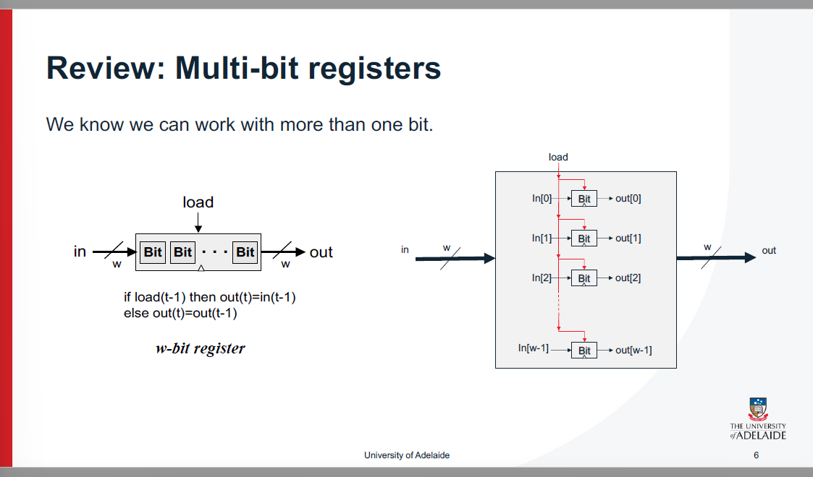
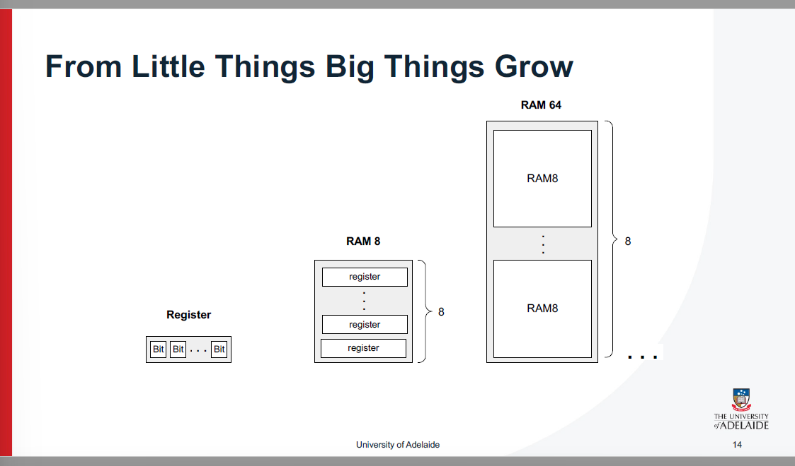
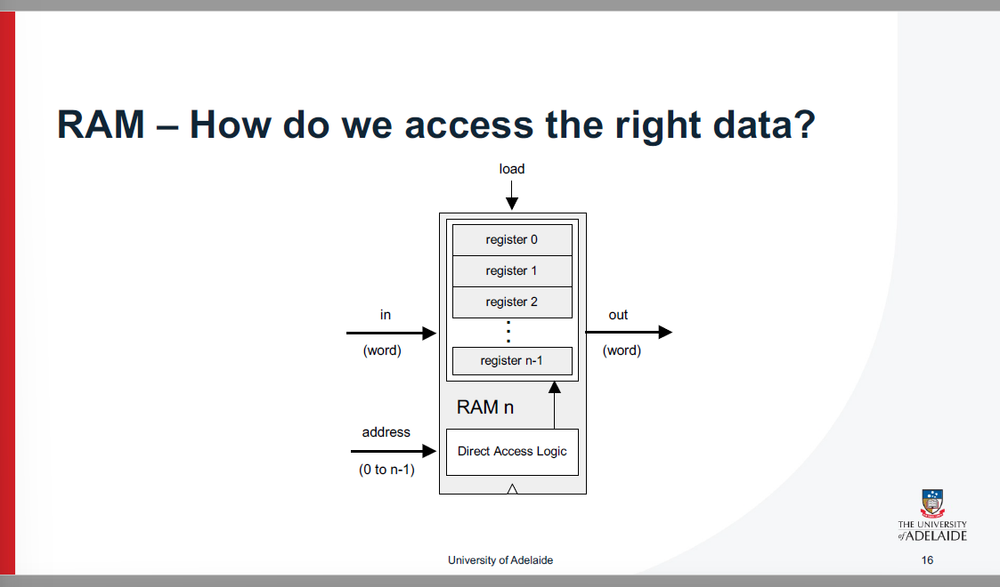
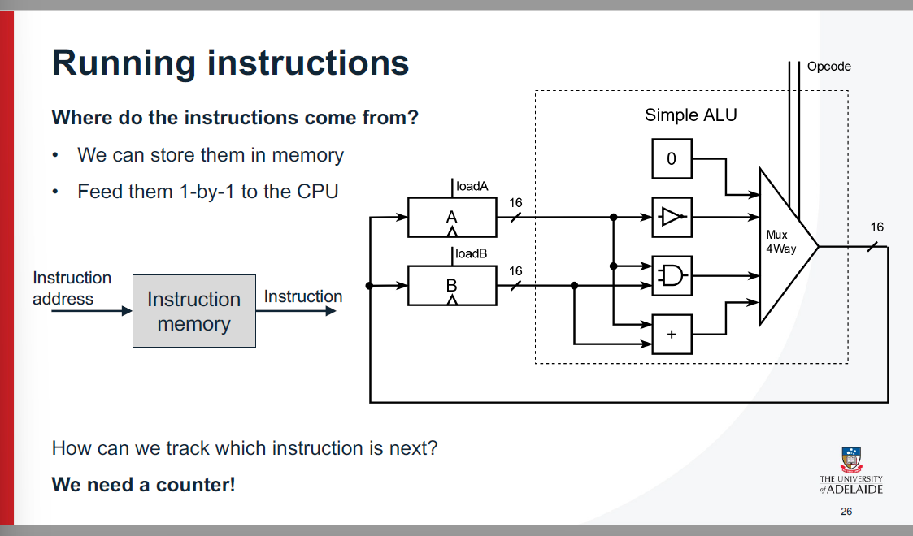
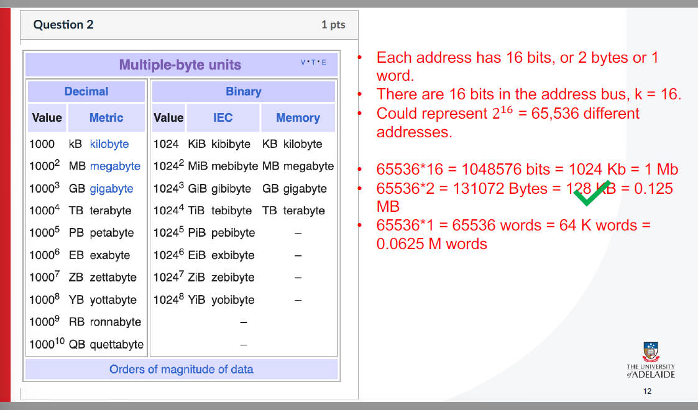
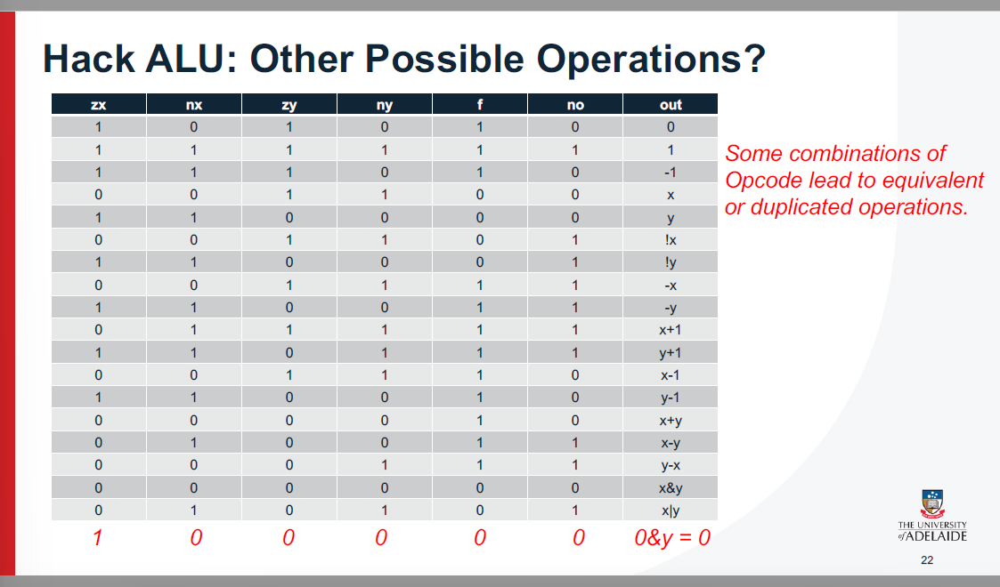
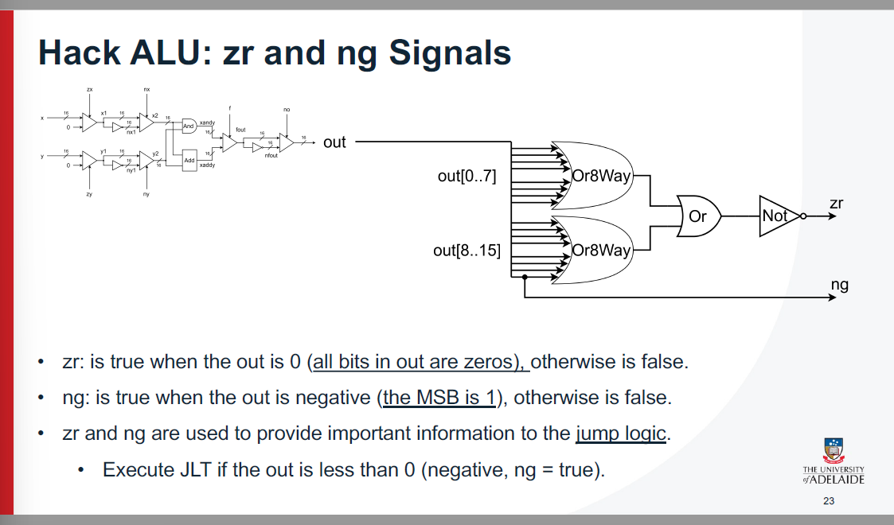

这张图片展示了“数据触发器（Data Flip Flop，DFF）”的工作原理。数据触发器是一种基本的时序电路，用于存储一个二进制输入信号的值，并在一个时钟周期内保持这个值。它是数字电路中非常重要的组成部分，广泛应用于构建寄存器（Register）和随机存取存储器（RAM）。

### 具体内容解释：

1. **DFF功能**：
   - 数据触发器会在每个时钟脉冲（Clock）的上升沿（或下降沿）采样输入值（in）。在每个时钟周期内，它会将输入信号的当前状态保存并输出。
   - 输出信号（out）会保持输入信号的值，直到下一个时钟脉冲到来为止。这意味着它能够保持并存储数据，类似于一个小型的存储单元。
2. **DFF的时序关系**：
   - 在该电路中，输出`out(t)`等于上一个时钟周期的输入`in(t-1)`。这就是数据触发器的工作原理：它将输入信号的值存储，并在下一个时钟周期输出该值。
3. **应用**：
   - 数据触发器可以用来构建更复杂的电路。例如，多个数据触发器可以构建寄存器（用于存储多个位的信息），从而在计算机中用于暂存数据。
   - 如果有多个触发器和控制逻辑，就可以构建更大的存储器模块（如RAM）来存储大量数据。
4. **电路图**：
   - 电路图显示了DFF的内部实现方式，包含多个与门、反相器等逻辑门。它们协同工作，确保数据在时钟的控制下被正确存储和输出。

### 结论：

DFF是数字电路设计中非常基础且重要的组件，通过它可以实现数据存储功能，在寄存器和RAM等更复杂的系统中扮演核心角色。

这张图片展示了一个“1位寄存器（1-bit register）”的实现原理。它基于数据触发器（DFF）来存储一个位（bit）的状态，并且能够在需要时改变这个状态。

### 详细解释：

#### 1. **需求（What we want to be able to do）**：

- **改变位的状态（Change the state of the bit）**：这个寄存器要能够改变存储的位的值。例如，从0变为1或从1变为0。
- **保持该状态直到想要改变它（Retain that state until we want to change it）**：一旦状态被改变，它会保持不变，直到下一次明确要求改变它。

#### 2. **寄存器的功能**：

- 这个1位寄存器通过`load`信号控制是否更新其状态。
- 当`load`信号为高（1）时，寄存器的输出`out`会等于输入`in`的值，意味着它更新存储的值。
- 当`load`信号为低（0）时，寄存器的输出`out`会保持原值，直到下一次`load`信号为高。

#### 3. **电路实现**：

- **位（Bit）**：寄存器内部的存储单元。它在时钟信号的控制下，根据`load`信号的状态更新或保持状态。
- **DFF**：数据触发器（Data Flip-Flop），负责在时钟信号的作用下存储和输出数据。
- **`load`信号**：控制寄存器是否更新其存储的值。如果`load`为1，`out(t)`会更新为`in(t)`的值；如果`load`为0，`out(t)`会保持其上一个状态。

#### 4. **逻辑表达式**：

- `if load(t-1) then out(t) = in(t-1)`
- `else out(t) = out(t-1)`

这表示当`load`信号为1时，`out`输出当前时刻的`in`值；而当`load`信号为0时，`out`保持之前的状态。

### 总结：

这个1位寄存器的核心功能是能够存储一个位的状态，并且在需要时能够改变它。它通过`load`信号来控制是否更新状态，利用DFF作为基本存储单元来实现这个功能。

这张图片展示了“多位寄存器（Multi-bit registers）”的实现原理，介绍了如何扩展1位寄存器的概念，使其适用于存储多个比特（bit）。

### 详细解释：

#### 1. **需求（What we want to be able to do）**：

- 我们希望能够处理多个比特（bit）。与1位寄存器类似，可以存储并更新多个比特的信息。

#### 2. **多位寄存器（w-bit register）**：

- **w-bit寄存器**由多个1位寄存器（Bit）组成，用于存储`w`个比特的信息。
- 每个比特都有自己的输入（`in[i]`）和输出（`out[i]`），通过并联多个1位寄存器来实现存储多个比特。

#### 3. **寄存器的工作原理**：

- **`load`信号**：控制所有比特的更新。与单个寄存器相似，当`load`为1时，寄存器更新每个比特的状态。
  - 如果`load`信号为1，寄存器的每个位都会将输入信号`in[i]`的值存储在输出`out[i]`中。
  - 如果`load`信号为0，寄存器的每个位都会保持之前的输出值`out[i]`。

#### 4. **电路实现**：

- 在右侧的电路图中，每个位的寄存器（`Bit`）都是由前面介绍的1位寄存器（DFF）构成。
- 每个位的输入（`in[i]`）和输出（`out[i]`）都通过并联的方式连接在一起，形成一个`w`位的寄存器。
- 每个`Bit`的输出都被设计成当`load`为1时更新，否则保持原值。

#### 5. **逻辑表达式**：

- **`if load(t-1) then out(t) = in(t-1)`**：如果`load`为1，寄存器的输出会等于输入的当前值。
- **`else out(t) = out(t-1)`**：如果`load`为0，输出将保持为之前的值。

### 总结：

多位寄存器是由多个1位寄存器（Bit）组成的，可以用于存储多个比特的信息。通过`load`信号来控制是否更新寄存器的内容，这种结构使得多个比特的信息能够同时存储和更新。

这张图片展示了“Hack计算机”的体系结构，它是一个简化的计算机架构模型，旨在帮助理解计算机的基本工作原理。Hack计算机是由一个CPU、内存、输入输出设备（如键盘和显示器）等组件组成。

### 详细解释：

#### 1. **基本组件**：

- **Instruction Memory (ROM32K)**：存储程序指令。程序的机器码指令（16位）被存储在这个只读存储器中。
- **PC (Program Counter)**：程序计数器，存储下一个要执行的指令的地址。它会在每条指令执行完后自增，指向下一条指令。
- **ARegister 和 DRegister**：这两个寄存器用于存储数据。`ARegister`存储地址信息，`DRegister`用于存储运算结果或其他数据。
- **ALU (算术逻辑单元)**：执行算术和逻辑操作（如加法、减法、与、或等），是Hack计算机的核心部件。
- **Data Memory (RAM16K)**：数据存储器，存储程序运行时需要使用的数据（如变量、临时计算结果等）。
- **Mux16**：16位选择器，用于根据控制信号选择输入。它帮助决定哪些信号进入寄存器或其他模块。
- **Decoder（解码器）**：解码指令，产生控制信号，决定不同部件如何工作。

#### 2. **数据流和控制**：

- **指令流**：指令从`Instruction Memory`读取，并通过`PC`控制顺序执行。指令被解码后，由`Decoder`生成控制信号，指示其他模块执行相应操作。
- **寄存器操作**：`ARegister`和`DRegister`存储数据，`Mux16`帮助选择不同的数据源进行输入。`loadA`和`loadD`信号决定是否更新寄存器的内容。
- **ALU操作**：`ALU`模块执行算术逻辑计算，输入由`Mux16`选择。`compALU`控制ALU的运算类型（加法、减法等），ALU的结果通过`outALU`输出。
- **内存操作**：通过`AMtoALU`和`writeM`控制数据的存储和读取。数据通过`RAM16K`读取和写入。
- **程序计数器**：`PC`寄存器通过`inc_loadPC`信号控制自增，指向下一条指令。

#### 3. **输入输出**：

- **键盘**和**屏幕**：这些外设用于与用户进行交互。屏幕可以显示信息，键盘可以输入信息到计算机。

#### 4. **控制信号**：

- 控制信号包括`loadA`、`loadD`、`loadM`等，决定了寄存器的更新与ALU的操作。`states`和`controls`由`Decoder`生成，根据当前执行的指令决定具体的操作。

#### 5. **工作流程**：

- 计算机从`Instruction Memory`加载指令，指令由`Decoder`解码后生成控制信号，驱动计算机的各个组件执行相应操作。
- 数据可以在`ARegister`、`DRegister`、`ALU`和`RAM16K`之间流动。
- `PC`寄存器跟踪当前指令的地址，每次指令执行完后，会自增，指向下一条指令。

### 总结：

这张图描绘了Hack计算机的核心架构和工作流程。它通过一些简单的模块（如寄存器、ALU、内存等）模拟了一个基本的计算机系统。通过这种简化模型，能帮助理解计算机如何执行指令、处理数据和与外设交互。

这张图片展示了“冯·诺依曼架构（Von Neumann Architecture）”的基本结构，它是现代计算机的标准设计架构之一。

### 详细解释：

#### 1. **基本组成部分**：

冯·诺依曼架构分为以下几个主要部分：

- **Memory（内存）**：
  - **Instructions (ROM)**：存储程序指令的只读存储器（ROM）。它包含计算机需要执行的所有程序代码。由于它是只读的，程序代码在执行时不会被改变。
  - **Data (RAM)**：存储数据的随机访问存储器（RAM）。这里存储着计算机运行过程中动态变化的数据，包括从输入设备获取的数据、程序的临时计算结果等。
- **CPU（中央处理单元）**：
  - **Control Unit（控制单元）**：控制计算机的运作，包括指令的获取、解码与执行，以及对其他部件（如寄存器、ALU）的控制。它协调计算机的各个部分，确保指令按顺序执行。
  - **Registers（寄存器）**：高速的存储单元，用于存储临时数据和指令。寄存器的容量较小，但读取速度非常快。
  - **ALU（算术逻辑单元）**：负责执行算术（加减乘除等）和逻辑（与、或、非等）运算。ALU是CPU中处理实际计算的部分。
- **输入/输出（I/O）**：
  - **Input（输入）**：计算机接受外部数据的接口，如键盘、鼠标等输入设备。
  - **Output（输出）**：计算机向外部传递结果的接口，如显示器、打印机等输出设备。

#### 2. **数据流动**：

- 输入的数据会进入计算机，通常存储在**内存**中。
- **控制单元**从内存中的**指令**部分读取指令并解码，随后发出信号以控制其他部件（如ALU和寄存器）执行操作。
- **ALU**根据控制信号和输入的数据执行相应的算术或逻辑运算。
- 运算结果存储在**寄存器**或**数据内存**中，或者直接输出到**输出设备**。

#### 3. **工作流程**：

- **程序指令**从内存中加载到CPU的控制单元。
- 控制单元解码指令，并协调其他部件（如ALU和寄存器）执行必要的操作。
- ALU处理输入的数据并产生结果，存储在寄存器或内存中。
- 最终，处理结果通过输出设备返回给用户。

#### 4. **冯·诺依曼架构的关键特点**：

- **存储程序**：程序指令和数据存储在相同的内存中，CPU通过控制信号读取这些指令并进行相应的操作。
- **单一内存**：程序和数据共享同一个内存空间，这一设计简化了计算机硬件结构，但也带来了所谓的“冯·诺依曼瓶颈”，即CPU与内存之间的带宽限制。

### 总结：

冯·诺依曼架构是现代计算机的基础架构，所有的计算机，包括个人计算机、服务器等，都基于这一架构设计。它通过一个统一的内存空间存储程序指令和数据，并通过控制单元协调其他部件的操作。这种结构虽然非常简化，但它推动了计算机技术的迅速发展，并成为了计算机硬件设计的标准模型。

这张图片展示了**Hack计算机**的硬件实现，展示了电路板上各个组件的实际布局和连接。

### 详细解释：

#### 左侧图片：

- **电路面包板（Breadboard）**：这是Hack计算机的一部分原型，所有的连接都通过面包板和导线完成。面包板通常用于快速原型设计和测试电路。
- **连接线**：不同的电路部分通过彩色的连接线连接在一起，连接面包板上的各个模块。
- 这部分展示了Hack计算机的一部分硬件组件，通常是简单的实验阶段，用来验证系统中的各个子模块是否可以正确工作。

#### 右侧图片：

- **硬件实现布局图**：右侧的图像展示了Hack计算机的完整硬件布局。各个模块被用不同的颜色区分开来，每个模块的功能如下：
  - **ALU（算术逻辑单元）**：执行基本的算术和逻辑操作，如加法、减法、与、或等。ALU是计算机中进行数据处理的核心单元。
  - **CPU Registers（CPU寄存器）**：这些寄存器用于存储临时数据和计算结果，快速读取和写入。
  - **ROM（只读存储器）和程序计数器**：ROM存储着程序指令，程序计数器（PC）用于跟踪当前指令的位置。
  - **RAM（随机访问存储器）**：用于存储数据，供程序在运行过程中使用。
  - **RAM总线（Address and Data）**：用于传输数据和地址，以便访问RAM中的数据。
  - **VGA（视频图形阵列）**：图形显示模块，用于将计算机输出的图形数据显示到显示器上。
  - **键盘**：输入模块，用于接受用户输入。

#### 功能描述：

- **硬件实现**：这张图展示了如何通过硬件组件（如ALU、寄存器、内存、输入输出设备等）实现Hack计算机的功能。每个模块都有不同的功能，通过精心的布线与连接，这些模块能够共同工作，执行各种任务。
- **模块化设计**：每个部分（如ALU、内存、键盘）都以模块化方式构建，这样有助于系统的设计、调试和升级。

### 总结：

这张图片展示了Hack计算机的硬件实现，强调了每个模块的实际连接和功能。通过电路板和面包板的展示，可以看到不同的组件如何被连接并协同工作，完成计算机的各种操作。它为理解计算机硬件的工作原理提供了直观的视觉展示，特别是在教学和原型设计中非常有用。

这张图片展示了**Hack计算机**的组成和架构，详细列出了其16位计算机系统中的各个重要组成部分和功能。

### 详细解释：

#### 1. **Data Memory (数据内存)**：

- **RAM**：数据内存部分是一个可寻址的寄存器序列，用于存储计算机运行时的数据。`RAM`是随机访问存储器，它能按地址存取数据。在Hack计算机中，数据存储在`RAM[A]`中，其中`A`表示某个具体的内存地址。

#### 2. **Instruction Memory (指令内存)**：

- **ROM**：指令内存是一个只读存储器（ROM），用于存储程序指令。它也是一个可寻址的寄存器序列，Hack计算机中的程序指令是从ROM中读取的，存储在程序计数器（PC）指示的地址上。不同于RAM，ROM中的数据是不可更改的。

#### 3. **Registers (寄存器)**：

- **D、A、M寄存器**：
  - `D`：存储数据处理的临时值或计算结果。
  - `A`：用于存储地址值。
  - `M`：是内存的一个映射，`M`表示`RAM[A]`，即内存中存储在地址`A`处的值。`M`寄存器通常用于访问数据内存。

#### 4. **Processing (处理)**：

- **ALU (算术逻辑单元)**：ALU负责执行算术运算（如加法、减法等）和逻辑运算（如与、或、非等）。它是Hack计算机处理数据的核心部件。

#### 5. **Program Counter (程序计数器)**：

- **PC**：程序计数器用于存储当前正在执行的指令的地址。每次指令执行后，PC会更新，指向下一条指令的地址。它是控制指令流的重要组件。

#### 6. **Control (控制)**：

- **ROM中的控制**：Hack计算机的控制单元通过ROM加载一系列16位的指令，每条指令对应内存中的一个位置，地址从0开始。控制单元解码这些指令，并通过控制信号协调其他部件的工作。
- **Fetch-execute cycle**：这是计算机指令执行的周期，指的是从内存中获取指令并执行的过程，具体的执行周期将在后续的部分详细描述。

#### 7. **Instruction Set (指令集)**：

- **A-instruction和C-instruction**：
  - **A-instruction**：表示地址指令，它指定要存储或读取的地址。在Hack计算机中，`A`指令用来设置`A`寄存器的值。
  - **C-instruction**：表示计算指令，它定义了需要执行的算术或逻辑运算。C-instruction包含了ALU的操作指令和数据流的控制。

### 总结：

这张图片概述了Hack计算机的核心结构和工作原理。Hack计算机是一个16位机器，包含数据内存、指令内存、寄存器、ALU、程序计数器等组件，并通过控制ROM中的指令来执行程序。它的指令集分为A指令和C指令，分别用于设置地址和执行计算。这个设计简化了计算机的结构，非常适合用来学习计算机体系结构和基础操作原理。

我来分析一下这张图片，看看它表达的是什么意思。
根据这张幻灯片的内容，我来详细解释其含义：

## 图片内容概述
这是阿德莱德大学关于"随机存取存储器(RAM)"课程的第13页幻灯片，主要讲解计算机存储系统的基础术语概念。
## 核心内容解析
### 1. 学习背景
幻灯片开头提到"We've seen what a multi-bit register looks like"（我们已经见过多比特寄存器的样子），说明这是在已有知识基础上的进一步学习。
### 2. 三个基础术语定义
**Bit（位）**
- 定义：一个逻辑'0'或'1'
- 意义：计算机能处理和存储的最小数据单位
- 作用：所有数字信息的基础构建块
**Byte（字节）**
- 定义：一排8个比特
- 意义：计算机中最常用的数据单位
- 应用：如ASCII编码中一个字符占用1个字节
**Word（字）**
- 定义：固定大小的单元，取决于硬件架构（寄存器大小）
- 意义：CPU一次能处理的数据单位
- 举例：32位系统中字长为4字节，64位系统中为8字节
### 3. 教学目的
**建立概念层次**
- 从最小的Bit开始，逐步构建到Byte，再到Word
- 展示计算机如何组织数据存储的层次结构
**培养抽象思维**
- 最后提问"这些在抽象图示中分别是什么样的？"
- 引导学生从具体概念转向抽象表示，这是计算机科学的重要思维方式
**为后续内容铺垫**
- 这些术语是理解RAM工作原理的基础
- RAM由大量寄存器组成，而寄存器又由这些基本单元构成
## 实际意义
这张幻灯片强调了**术语准确性**在计算机学习中的重要性。如果对Bit、Byte、Word这些基础概念理解不清晰，就无法掌握更复杂的存储系统原理。通过这种循序渐进的方式，帮助学生建立扎实的计算机体系结构基础，为后续学习RAM的具体实现和工作机制做好准备。

--------------------------------
以上内容由AI生成，仅供参考和借鉴

这张图片展示了如何通过组合多个小的存储单元来构建更大的存储器单元，形象地表达了从小事物到大事物的增长（From Little Things Big Things Grow）的概念。

### 详细解释：

#### 1. **Register（寄存器）**：

- 在图的左侧，显示了一个**寄存器（Register）**，它由多个**比特（Bit）**组成。寄存器是一个小型存储单元，通常用于存储短期计算数据。在计算机中，寄存器通常由8位或16位的比特组成。

#### 2. **RAM 8**：

- 中间展示了**RAM 8**，它是由多个寄存器组成的，可以存储8个寄存器，每个寄存器包含多个比特。这样，通过组合多个寄存器，计算机可以存储更多的数据。每个寄存器在RAM中占用一个位置，可以通过地址进行访问。

#### 3. **RAM 64**：

- 右侧展示了**RAM 64**，这是一个包含多个**RAM 8**模块的更大内存单元。每个**RAM 8**模块存储8个寄存器，而**RAM 64**则由8个这样的**RAM 8**模块组成，共同构成64个寄存器的存储空间。这样，通过组合多个较小的内存单元，计算机可以存储更大量的数据。

### 关键概念：

- **从小到大构建**：这张图展示了如何通过组合小的存储单元（如寄存器、RAM 8、RAM 64）来构建更大的存储系统，体现了计算机硬件系统的模块化设计。
- **层级结构**：寄存器是存储的最小单位，多个寄存器构成更大的内存单元，多个内存单元则构成更大的存储空间。通过这种层级结构，计算机能够高效地管理不同级别的数据存储。

### 总结：

通过将多个小的存储单元（如寄存器和RAM模块）组合起来，Hack计算机能够构建更大的存储器，从而实现更复杂的计算任务。这种分层设计和模块化结构帮助计算机在处理数据时保持高效和灵活。

这张图片展示了**RAM接口**的详细信息，解释了Hack计算机如何与RAM模块进行交互以及其工作原理。

### 详细解释：

#### 1. **RAM接口结构**：

- **输入**：
  - `in[16]`：16位的数据输入。表示每次写入RAM时，输入的数据是16位宽的。
  - `address[k]`：`k`位的地址输入，表示RAM中的地址。地址的位数为`log2(n)`，其中`n`是RAM的大小，`k`表示地址的位数（即可以访问的地址数量）。
  - `load`：控制信号，用来决定是否将输入的数据写入到RAM中。当`load`信号为1时，数据会写入RAM；当`load`为0时，RAM的内容保持不变。
- **输出**：
  - `out[16]`：16位的数据输出，表示从RAM中读取的数据。根据给定的地址，RAM会输出该地址处的16位数据。

#### 2. **RAM的工作原理**：

- **功能**：
   `out(t) = RAM[address(t)](t)`：根据当前的地址，读取RAM中指定位置的数据。

  **加载数据**：
   `If load(t-1) then RAM[address(t-1)](t) = in(t-1)`：如果`load`信号为1，RAM会在上一个时刻`(t-1)`将输入数据`in(t-1)`写入到指定的地址`address(t-1)`中。

  - `=`表示16位的数据操作，表示RAM的地址位置处的数据会被更新为输入的数据。

#### 3. **RAM的具体芯片**：

- 表格列出了几种用于Hack平台的RAM芯片，分别具有不同的容量和地址位数（`n`和`K`）：
  - **RAM8**：存储容量为8个16位寄存器，需要3位地址来寻址。
  - **RAM64**：存储容量为64个16位寄存器，需要6位地址来寻址。
  - **RAM512**：存储容量为512个16位寄存器，需要9位地址来寻址。
  - **RAM4K**：存储容量为4096个16位寄存器，需要12位地址来寻址。
  - **RAM16K**：存储容量为16384个16位寄存器，需要14位地址来寻址。

#### 4. **注释**：

- **`=` 是一个16位操作**：说明RAM模块中的数据操作是针对16位数据的读写操作。

### 总结：

这张图详细描述了Hack计算机的RAM模块接口。它展示了如何通过地址和数据输入与RAM交互，以及如何通过`load`信号来控制数据的写入。不同大小的RAM模块（如RAM8、RAM64等）支持不同数量的存储单元，每个存储单元是16位数据。

根据这张幻灯片的内容，我来详细解释其含义：
## 图片主题
这张幻灯片来自阿德莱德大学，标题为"RAM – How do we access the right data?"（RAM——我们如何访问正确的数据？），主要讲解随机存取存储器的数据访问机制。
## 核心概念解析
### 1. RAM结构组成
幻灯片展示了一个简化的RAM模型，包含：
- **寄存器阵列**：从register 0到register n-1的连续存储单元
- **直接访问逻辑**：负责处理地址信号并选择对应寄存器
- **输入输出端口**：数据写入(in)、数据读出(out)、地址输入(address)、控制信号(load)
### 2. 数据访问原理
**随机存取的本质**
- RAM被称为"随机存取存储器"是因为访问任意位置数据的时间相同
- 不需要按顺序查找，通过地址直接定位到目标寄存器
**写操作流程**
1. 提供目标地址（如address=2）
2. 将待写入数据送入"in"端口
3. 发出"load"控制信号激活写入操作
4. 直接访问逻辑将数据写入指定寄存器
**读操作流程**
1. 提供目标地址（如address=1）
2. 直接访问逻辑自动选中对应寄存器
3. 寄存器内容通过"out"端口输出
4. 无需额外控制信号
### 3. 关键技术特点
**地址驱动访问**
- 地址是访问数据的"钥匙"
- 地址范围从0到n-1，对应n个寄存器
- 直接访问逻辑解码地址信号，实现精准定位
**直接访问逻辑的作用**
- 解码地址信号并选择对应寄存器
- 确保只有目标寄存器参与数据传输
- 其他寄存器保持隔离状态，保证数据准确性
## 实际意义
### 1. 教学价值
这张幻灯片简化了复杂的RAM结构，突出"地址驱动访问"的核心思想，帮助学习者理解：
- RAM的基本工作原理
- 随机存取的技术优势
- 地址在数据访问中的关键作用
### 2. 技术重要性
这个原理是现代计算机体系结构的基础：
- 所有内存访问都基于地址机制
- 为理解缓存、虚拟内存等高级概念奠定基础
- 体现了计算机存储系统的设计哲学
### 3. 实际应用
在实际计算机中：
- CPU通过地址总线发送地址信号
- 内存控制器解码地址并访问对应存储单元
- 这种机制保证了程序运行时的高效数据访问
## 总结
这张幻灯片通过简洁的示意图，清晰阐释了RAM的核心工作原理：**通过地址信号实现数据的快速、精准访问**。这种"随机存取"机制是现代计算机高性能的重要基础，也是理解整个存储系统层次结构的关键。

--------------------------------
以上内容由AI生成，仅供参考和借鉴

你提供的图片内容是一个**数字电路设计图**，它来自一门叫《计算机系统要素》（*The Elements of Computing Systems*）的课程，也叫 **Nand2Tetris**。这张图展示的是一个**16位寄存器（Register）**的构造，重点在于解释 **为什么使用 DMux（分配器）来控制 load 信号，而不是直接控制输入数据 in**。

---

### 🔍 图中内容解析

图中主要展示了以下模块：

- **in[16]**：16位输入数据
- **load**：1位控制信号，决定是否写入数据
- **DMux**：1-to-2 分配器，根据 load 的值，将信号送到两个寄存器之一
- **Register**：16位寄存器，存储数据
- **Mux16**：16位多路选择器，选择输出哪个寄存器的数据
- **out[16]**：最终输出

---

### ❓核心问题：为什么用 DMux 分配 **load** 信号，而不是 **in** 数据？

#### ✅ 正确答案总结：
> **因为寄存器的“写入”是由 load 信号控制的，而不是由输入数据 in 控制的。**
>
> 使用 DMux 分配 **load** 信号，可以**精确控制哪个寄存器在什么时候被写入**，而**输入数据 in 是共享的**，不需要分配。

---

### 🧠 详细解释

#### 1. **Register 的工作原理**
- 每个 Register 都有：
  - 一个 16 位输入 `in[16]`
  - 一个 1 位控制信号 `load`
  - 一个 16 位输出 `out[16]`
- 当 `load = 1` 时，Register 会在下一个时钟周期将 `in` 的值存储下来。
- 当 `load = 0` 时，Register 保持原来的值不变。

#### 2. **DMux 的作用**
- DMux 是**分配器**，它根据选择信号（这里是 `load`）将一个输入信号送到**两个输出之一**。
- 在本图中，DMux 的输入是 `load` 信号，输出是 `load0` 和 `load1`，分别连接到两个 Register 的 `load` 端。

#### 3. **为什么不用 DMux 分配 `in`？**
- 因为 **两个寄存器的输入数据 `in` 是一样的**，不需要分配。
- 真正需要控制的是**是否写入**，也就是 `load` 信号。
- 如果直接用 DMux 分配 `in`，你会发现：
  - 你仍然需要告诉每个寄存器“你是否应该写入这个数据”
  - 所以你还是得用 `load` 信号去控制寄存器
  - 这样反而多此一举，逻辑不清晰

#### 4. **总结一句话**
> **数据是共享的，控制是分开的。**
>
> 所以我们用 DMux 分配 **控制信号（load）**，而不是 **数据信号（in）**。

---

### 🎯 举个例子

假设你想把值 `123` 写入第二个寄存器：

- 你把 `123` 放在 `in[16]` 上（两个寄存器都能看到）
- 你设置 `load = 1`
- DMux 会把 `load = 1` 送到第二个寄存器的 `load` 端
- 第一个寄存器得到 `load = 0`，不会写入
- 第二个寄存器得到 `load = 1`，会在下一个时钟周期把 `123` 存下来

---

### ✅ 总结一句话（记住这个就够了）
> **DMux 分配的是“是否写入”的信号（load），而不是“写什么”的数据（in），因为数据是共享的，控制是分开的。**

---

如果你还想看图中的 Mux 是怎么选择输出的，或者想知道这个结构在 CPU 里怎么用，我可以继续讲。

这张图展示的是**冯·诺依曼架构（Von Neumann Architecture）**的基本结构，是计算机系统中最经典、最基础的架构模型之一。

---

### 🧩 图片内容总览

图中用三个大模块概括了整个计算机的核心组成部分：

| 模块名称                     | 功能说明                 |
| ---------------------------- | ------------------------ |
| **Memory**（内存）           | 存储程序指令和数据       |
| **CPU**（中央处理器）        | 执行指令、处理数据       |
| **Control Unit**（控制单元） | 协调和控制整个系统的运行 |

---

### 🔍 各模块详细解释

#### 1. **Memory（内存）**
- 图中标注为：
  - **instructions (ROM)**：存储**程序指令**，通常是只读内存（ROM）
  - **data (RAM)**：存储**运行时的数据**，通常是随机存取内存（RAM）
- 特点：
  - 指令和数据**存储在同一个内存中**（这是冯·诺依曼架构的核心思想）
  - CPU 通过地址访问内存中的指令或数据

#### 2. **CPU（中央处理器）**
- 包括：
  - **ALU（算术逻辑单元）**：执行加减乘除、逻辑运算等
  - **register（寄存器）**：高速存储单元，用于临时存放数据和指令
- 功能：
  - 从内存中取指令（fetch）
  - 解码指令（decode）
  - 执行指令（execute）

#### 3. **Control Unit（控制单元）**
- 图中单独标出，说明它是 CPU 的一部分（有时画在 CPU 内部）
- 功能：
  - 控制指令的执行流程
  - 向 ALU、内存、寄存器等发出控制信号
  - 决定何时读取、写入、跳转、运算等

---

### 🔄 数据流动方向（图中箭头）

- **instructions → Control Unit**：指令从内存送入控制单元
- **data ↔ ALU**：数据在内存和 ALU 之间来回传输
- **register ↔ ALU**：寄存器与 ALU 交换数据
- **input/output**：图中未详细画出，但通常外设通过内存或 CPU 与系统交互

---

### ✅ 总结一句话

> **冯·诺依曼架构的核心思想是：程序指令和数据都存储在同一个内存中，CPU 按顺序取指令、解码、执行，控制单元协调整个过程。**

---

如果你想，我可以给你画一个更完整的版本，或者对比哈佛架构（指令和数据分开）来说明区别。

根据这张幻灯片的内容，我来详细描述其内容：
## 幻灯片基本信息
- **标题**："Bringing it Together"（整合起来）
- **来源**：阿德莱德大学（The University of Adelaide）
- **页码**：第19页
- **设计风格**：简洁的白色背景，左侧有红色竖条装饰
## 核心内容结构
### 1. 副标题
- "What we understand:"（我们理解的内容）
- 这个副标题为接下来的内容总结做铺垫
### 2. 已掌握知识要点
幻灯片列出了两个核心知识领域：
**第一个要点：**
- "How to use logic gates to do basic arithmetic & logic operations"
- （如何使用逻辑门进行基本算术和逻辑运算）
- 这涵盖了数字电路的基础知识，包括与门、或门、非门等基本逻辑门的组合应用
**第二个要点：**
- "How to use DFFs to build registers & RAM"
- （如何使用D触发器构建寄存器和RAM）
- 这涉及时序电路设计，D触发器作为基本存储单元的应用
### 3. 核心问题
- "How can we use this to construct a working system, or even smaller, a CPU?"
- （我们如何利用这些知识构建一个可工作的系统，甚至更小的CPU？）
- 这个问题将前面的基础知识与实际系统设计联系起来
## 教学意义分析
### 知识整合的桥梁作用
这张幻灯片起到了承上启下的作用：
- **承上**：总结了前面学习的数字电路基础知识
- **启下**：引导思考如何将这些基础组件组合成更复杂的系统
### 从组件到系统的思维转变
幻灯片体现了计算机组成原理教学中的重要思维转变：
- 从单个逻辑门、触发器的理解
- 转向如何将这些组件有机组合成功能完整的处理器
### 实践导向的教学理念
通过提出"构建CPU"的问题，强调了：
- 理论知识与实践应用的结合
- 从底层硬件到高层系统的设计思维
## 整体设计特点
### 视觉层次清晰
- 标题最大最醒目
- 副标题次之
- 要点列表使用项目符号便于阅读
- 核心问题字体较大，突出重点
### 内容简洁有力
- 用最少的文字概括了重要的知识点
- 通过一个核心问题引发深度思考
这张幻灯片代表了计算机体系结构教学中的关键节点，将分散的基础知识整合为系统设计的思维框架，为后续学习CPU设计、计算机组成等高级主题奠定基础。

--------------------------------
以上内容由AI生成，仅供参考和借鉴

这张图片解释了**CPU需要具备哪些功能**，即计算机处理器的基本要求。

### 详细解释：

#### 1. **执行不同的算术和逻辑操作**：

- **执行算术和逻辑操作**：CPU必须能够执行各种**算术操作**（如加法、减法等）和**逻辑操作**（如与、或、非等）。这些操作是计算机处理数据时的基础。
- **选择操作**：CPU需要能够**选择**执行某种特定的操作。例如，控制单元会根据程序指令选择执行加法或乘法操作。
- **按顺序执行**：CPU不仅需要选择操作，还必须**按顺序**执行这些操作，以保证程序能够按照预期的流程正确运行。

#### 2. **输入输出数据**：

- **输入数据**：CPU需要从外部或内存中读取数据进行处理。这些数据可能来自内存、硬盘、外部设备等。
- **输出数据**：处理完的数据需要**输出**，可以是存储在内存中、写入硬盘，或者通过显示器、打印机等外部设备输出结果。

#### 3. **指定数据读写的位置**：

- CPU不仅执行数据操作，还需要明确**数据存储的位置**。它必须能够指定从内存中**读取数据**的地址，并将结果**写入**特定的内存位置。这些地址通常由程序计数器（PC）或其他寄存器指定。

### 总结：

这张图片总结了CPU的三项关键功能：

1. 执行算术和逻辑操作；
2. 输入和输出数据；
3. 指定数据存储位置，确保数据能够正确读取和写入。

这些功能是现代计算机中CPU的基本职责，确保了计算机能够正确、有效地执行程序指令并处理数据。

这张图片展示了**算术逻辑单元（ALU）**的基本工作原理，ALU是计算机中用于执行算术和逻辑运算的核心电路。

### 详细解释：

#### 1. **ALU简介**：

- **算术逻辑单元（ALU）**是一个电路，用于执行基本的算术操作（如加法、减法）和逻辑操作（如与、或、非等）。
- 在这张图中，ALU接收两个输入（A和B），每个输入是16位数据，执行指定的操作，并输出16位结果。

#### 2. **选择不同的操作**：

- **如何选择不同的操作？**
  - ALU根据控制信号来选择执行的操作。在这张图中，ALU使用了**多路复用器（Multiplexers）**来选择不同的操作。多路复用器可以根据给定的选择信号，选择不同的输入并将其传递到ALU内部。
- **操作选择的控制信号——Opcode**：
  - 由一个称为**Opcode**（操作码）的控制信号决定ALU执行哪个操作。Opcode是一个比特序列，用来选择不同的操作，比如加法、减法、与运算等。Opcode通过多路复用器来传递，选择相应的输入进行运算。

#### 3. **ALU的工作原理**：

- **输入**：
  - `A`和`B`：这两个16位的输入是ALU操作的操作数，表示要进行算术或逻辑操作的数据。
  - `0`：图中还显示了一个输入为0的线，这可以用于执行减法或其他运算。
  - `D`：这可能是与输入`B`进行特定操作的路径。
  - `+`：加法操作。
- **输出**：
  - **Output**：ALU执行完运算后，将结果输出为16位数据。不同的操作根据Opcode的控制，决定ALU输出的是加法、减法或逻辑运算的结果。

#### 4. **多路复用器（Mux 4Way）**：

- **Mux 4Way**：多路复用器有四个输入（可能包括加法、减法、常数0和其他操作），它通过Opcode来选择一个输入，并将选中的输入传递给ALU的计算部分。

### 总结：

这张图展示了一个简单的ALU如何通过多路复用器（Mux）选择不同的操作。ALU根据Opcode信号，选择执行加法、减法或其他算术逻辑运算，并输出结果。通过这种方式，ALU能够高效地执行多种运算，是CPU中的核心部件之一。

根据这张幻灯片的内容，我来详细解释其含义：
## 图片主题概述
这是一张关于**简单算术逻辑单元（ALU）**的教学幻灯片，展示了计算机中负责执行算术和逻辑运算的核心组件。
## 核心内容解析
### 1. ALU的基本功能
幻灯片左侧列出了这个简单ALU能够执行的4种基本操作：
- **输出0**：直接输出常数0
- **按位取反**：对第一个输入A进行按位非运算（$\overline{A}$）
- **与运算**：对两个输入A和B执行按位与运算（$A \cdot B$）
- **加法运算**：对两个输入A和B执行算术加法（$\text{ADD}(A, B)$）
### 2. 操作码控制机制
**操作码（Opcode）**是ALU的核心控制机制：
- 操作码`00` → 输出0
- 操作码`01` → 第一个输入的按位非
- 操作码`10` → 两个输入的与运算
- 操作码`11` → 两个输入的加法
这体现了计算机指令系统的基本原理：不同的二进制码对应不同的操作。
### 3. 硬件电路结构
右侧电路图展示了ALU的内部实现：
**输入部分**：
- 两个16位输入端口A和B
- 处理16位二进制数据
**功能模块**：
- **常数0模块**：直接输出0
- **非门（NOT gate）**：对输入A按位取反
- **与门（AND gate）**：执行A和B的按位与运算
- **加法器（Adder）**：执行A和B的算术加法
**选择机制**：
- **4路多路选择器（Mux 4Way）**：根据操作码选择4个功能模块中的一个输出
- **输出端口**：16位宽的最终运算结果
## 深层含义分析
### 1. 计算机运算的本质
这个简单ALU展示了计算机执行运算的基本原理：
- 所有复杂运算都可以分解为基本的逻辑运算和算术运算
- 通过组合简单的逻辑门电路实现复杂功能
### 2. 指令控制的思想
操作码机制体现了计算机的**指令驱动**特性：
- 软件通过提供不同的操作码来控制硬件执行不同操作
- 这是计算机软硬件接口的基础
### 3. 模块化设计思想
ALU的结构体现了**模块化设计**：
- 将不同功能分离为独立模块
- 通过多路选择器统一输出接口
- 便于扩展和维护
### 4. 数据通路概念
幻灯片底部的问题"Where do the input values come from?"（输入值来自哪里？）引导思考：
- ALU需要与其他组件（寄存器、内存）配合工作
- 体现了计算机数据通路的概念
## 教学意义
### 1. 从抽象到具体
将抽象的"运算"概念具体化为实际的电路实现
帮助学生理解计算机如何"真正"执行运算
### 2. 系统思维培养
展示单个组件如何融入整个计算机系统
培养学生的系统架构思维
### 3. 基础知识整合
整合了前面学习的逻辑门、组合电路等知识
展示了基础知识在实际应用中的价值
## 实际应用价值
这个简单ALU虽然基础，但包含了现代处理器ALU的核心概念：
- 操作码控制
- 多功能集成
- 模块化设计
- 标准化接口
理解这个简单ALU为进一步学习复杂处理器设计奠定了基础，是计算机组成原理课程中的重要知识点。

--------------------------------
以上内容由AI生成，仅供参考和借鉴

这张图展示的是一个**带有寄存器的简单 ALU（算术逻辑单元）系统**，并提出了两个关键问题：

> **1. 输入值从哪里来？**  
> **2. 输出值到哪里去？**

---

### 🔍 图中模块说明

| 模块                        | 作用                           |
| --------------------------- | ------------------------------ |
| **Simple ALU**              | 执行基本运算（如加减、与或等） |
| **register A / register B** | 存储 ALU 的输入操作数          |
| **Mux（多路选择器）**       | 选择哪个值送入 ALU             |
| **4-way 控制信号**          | 控制 Mux 选择哪一路输入        |
| **load 控制信号**           | 控制是否将外部输入写入寄存器   |
| **Output**                  | ALU 的运算结果                 |

---

### ❓问题 1：输入值从哪里来？（Where do the input values come from?）

图中示意：
- 外部有一个 `in[16]` 数据输入
- 它可以通过 `load` 信号写入 **寄存器 A** 或 **寄存器 B**
- 寄存器 A 和 B 的值再作为 ALU 的两个输入

✅ **回答**：
> **输入值来自外部数据总线 `in[16]`，通过 `load` 信号控制写入寄存器 A 或 B，然后作为 ALU 的操作数。**

---

### ❓问题 2：输出值到哪里去？（Where does the output value go to?）

图中没有画完整，但 ALU 的输出通常可以：
- 写回某个寄存器（比如 A 或 B）
- 输出到总线供其他部件使用
- 存入内存
- 作为下一次运算的输入

✅ **回答**：
> **ALU 的输出可以写回寄存器、输出到数据总线，或供后续运算使用，具体取决于系统设计和控制逻辑。**

---

### ✅ 总结一句话

> **这张图说明：ALU 的输入来自寄存器，寄存器的数据由外部输入通过 load 控制写入；ALU 的输出可以写回寄存器或输出到系统总线，路径由控制逻辑决定。**

---

如果你想，我可以帮你画出完整的“输入-计算-输出”路径，或者写一个控制表来说明 load 和 Mux 怎么配合工作。

这张图片展示了如何将**算术逻辑单元（ALU）**的输出数据传递到CPU中的寄存器。

### 详细解释：

#### 1. **寄存器与数据存储**：

- **输出去哪里？**
  - ALU处理完输入数据后，会产生一个输出。该输出需要存储到合适的寄存器中，供后续操作使用。
  - 在这个简单的CPU设计中，**寄存器A**和**寄存器B**用来存储ALU的结果。

#### 2. **寄存器加载控制（loadA 和 loadB）**：

- **寄存器的加载位**（`loadA` 和 `loadB`）控制着哪些寄存器将接收ALU的输出：
  - `00`：**不写**任何寄存器。
  - `10`：**写入寄存器A**。
  - `01`：**写入寄存器B**。
  - `11`：**同时写入寄存器A和B**。

这些控制位通过选择信号决定ALU输出的数据写入到哪个寄存器。通过这种方式，CPU可以灵活地控制数据的存储。

#### 3. **4位指令**：

- 通过组合4位控制位，可以执行基本的计算操作。每组4位的控制位表示一条指令，指示CPU执行特定的操作。比如，选择ALU的操作类型、决定寄存器的数据存储位置等。

#### 4. **图示的ALU和寄存器控制**：

- **ALU（算术逻辑单元）**：接收两个16位输入（A和B），并根据Opcode执行相应的运算（如加法、减法、与运算等）。
- 输出的结果通过`loadA`和`loadB`的控制信号，决定存储到哪个寄存器中。

### 总结：

这张图展示了如何通过控制信号`loadA`和`loadB`，让ALU的输出写入到指定的寄存器（A或B），并且如何通过4位控制位的组合来执行基本的计算操作。

这张图片展示了一个带有指令集的**简单CPU**工作示例，演示了如何使用不同的控制信号执行基本的运算。

### 详细解释：

#### 1. **控制信号（Opcode、loadA 和 loadB）**：

- **Opcode**、**loadA** 和 **loadB** 是控制信号，决定ALU执行的操作以及数据存储的位置。
- **Opcode**：用来选择ALU的运算类型，例如加法、减法等。
- **loadA 和 loadB**：这两个信号控制着数据应写入哪个寄存器。根据它们的组合，可以决定是否将ALU的输出写入到寄存器A、B，或者不写入任何寄存器。

#### 2. **控制信号的组合**：

- 图片中提供了一个**控制信号的真值表**，列出了不同的Opcode、loadA 和 loadB组合对应的操作：
  - `Opcode = 0, loadA = 0, loadB = 1`：写入寄存器B。
  - `Opcode = 0, loadA = 1, loadB = 0`：写入寄存器A。
  - `Opcode = 1, loadA = 1, loadB = 0`：执行某个加法或其他ALU运算，并写入寄存器A。
  - `Opcode = 1, loadA = 1, loadB = 1`：同时写入寄存器A和B。

#### 3. **ALU操作**：

- **ALU（算术逻辑单元）**：根据`Opcode`选择相应的操作（如加法、减法等），并通过多路复用器（Mux）选择操作结果输出。
- ALU的输入是16位的，输出也是16位，ALU会根据操作执行相应的算术或逻辑运算。

#### 4. **输出结果**：

- **Assume output = 0 initially**：假设初始输出为0，ALU开始时的状态是输出为零。
- ALU的输出会被存储到寄存器A或B，具体取决于`loadA` 和 `loadB`的控制信号。

### 总结：

这张图展示了如何通过控制信号（Opcode、loadA 和 loadB）来选择不同的操作，以及如何将ALU的输出存储到寄存器A或B。通过这些控制信号的组合，可以让CPU执行不同的指令和计算，完成基本的计算任务。

你提供的这张图是一张**计算机体系结构**的示意图，主要讲的是**CPU如何执行指令**的基本原理。我们来**逐部分详细解释**这张图在说什么，以及它背后的含义。

---

## 🔧 一、图的整体含义

这张图的核心问题是：

> **CPU如何知道下一条指令是什么？**

它展示了一个非常简化的计算机模型，叫做 **SimpleALU**，用来演示**指令从哪里来、如何执行、以及如何追踪下一条指令**。

---

## 🧩 二、图中元素逐条解释

| 元素                                            | 含义                                                         |
| ----------------------------------------------- | ------------------------------------------------------------ |
| **Running instructions**                        | 正在运行的指令。表示CPU当前正在执行的指令。                  |
| **Opcode**                                      | 操作码，是指令的一部分，告诉CPU这条指令要做什么（比如加法、加载数据等）。 |
| **Where do the instructions come from?**        | 问题：指令从哪里来？答案是：它们存储在内存中。               |
| **SimpleALU**                                   | 简单的算术逻辑单元（ALU），是CPU的核心部件，负责执行计算。   |
| **We can store them in memory**                 | 指令被存储在内存中，而不是CPU内部。                          |
| **Feed them 1-by-1 to the CPU**                 | 指令被**逐条**从内存中取出，交给CPU执行。                    |
| **loadA / loadB**                               | 加载指令，用于把数据从内存加载到寄存器A或B中。               |
| **A / B**                                       | 寄存器，是CPU内部的高速存储单元，用来临时存放数据。          |
| **Mux（Multiplexer）**                          | 多路选择器，用于从多个输入中选择一个输出。                   |
| **4Way**                                        | 四路选择器，表示有4个输入来源可以选择。                      |
| **Instruction memory**                          | 指令内存，专门存放程序指令的区域。                           |
| **Instruction address**                         | 指令地址，表示当前要执行的指令在内存中的位置。               |
| **How can we track which instruction is next?** | 问题：我们如何知道下一条指令在哪里？                         |
| **We need a counter!**                          | 答案：我们需要一个**程序计数器（PC）**来追踪下一条指令的地址。 |

---

## 🧠 三、核心概念总结

### ✅ 指令从哪里来？
- 指令存储在**内存**中，不是CPU自带的。
- CPU每次从内存中**取出一条指令**来执行。

### ✅ 指令如何执行？
- 指令被解码后，控制CPU的各个部件（如ALU、寄存器、选择器等）完成操作。
- 比如 `loadA 16` 表示把内存地址16的数据加载到寄存器A。

### ✅ 如何知道下一条指令？
- 使用**程序计数器（PC）**，它保存着**下一条指令的地址**。
- 每执行完一条指令，PC自动加1（或跳转到指定地址），指向下一条指令。

---

## 🧪 四、举个例子

假设内存中存放了以下指令：

| 地址 | 指令     |
| ---- | -------- |
| 0    | loadA 16 |
| 1    | loadB 17 |
| 2    | add A B  |

执行过程如下：

1. PC = 0，取出 `loadA 16`，执行后A = 内存[16]
2. PC = 1，取出 `loadB 17`，执行后B = 内存[17]
3. PC = 2，取出 `add A B`，ALU计算 A + B
4. PC = 3，准备执行下一条指令

---

## ✅ 总结一句话

这张图讲的是：

> **计算机通过程序计数器（PC）从内存中逐条取出指令，交给CPU执行，从而实现程序的运行。**

---

如果你想，我可以给你画一个更清晰的流程图，或者帮你模拟一段指令执行过程。

这张图片介绍了**计数器（Counter）**的基本逻辑，主要用于控制程序在内存中的执行顺序，特别是当程序需要在连续的内存位置之间逐一执行时。

### 详细解释：

#### 1. **计数器的需求**：

- **重置为0**：计数器需要能够被重置为0。重置操作通常用于初始化计数器，特别是在程序的开始时。
- **设置计数器为某个值**：计数器还需要能够设置为特定的值。这可能是在程序执行前的设置，或者在执行过程中某些条件触发时进行设置。
- **每个时钟周期增加计数器**：计数器的值需要在每个时钟周期内递增。计数器递增通常用于跟踪程序执行的步骤或地址的增加。
- **暂停（如果需要）**：计数器也应能够暂停或停止。在某些情况下（例如，等待外部事件或条件），需要暂停计数器的递增。

#### 2. **计数器在程序执行中的作用**：

- 在最简单的程序中，程序指令会按照连续的内存位置逐一执行。计数器用于跟踪当前执行的指令地址，并在每个时钟周期后更新，确保程序按照正确的顺序执行。

### 总结：

这张图强调了计数器在程序中的核心作用，确保程序按照预定的顺序执行。计数器可以通过重置、设置值、递增和暂停操作来灵活控制程序的执行。

这张图展示的是**程序计数器（Program Counter，PC）**的电路图和工作原理。程序计数器在计算机系统中负责追踪程序的当前执行位置，通常用于存储下一条将要执行的指令的地址。图中的各个部分和信号的含义如下：

### 主要组件：

1. **PC（计数器）**：是存储程序计数值的核心部分，也就是程序计数器的实际计数器，通常由一定宽度（w bits）的寄存器组成。
2. **in（输入信号）**：用于将新的值加载到程序计数器中。
3. **out（输出信号）**：程序计数器的当前值，将其输出用于指令的获取。
4. **inc（递增信号）**：如果设置为1，程序计数器会加1，即指向下一个指令。
5. **load（加载信号）**：如果设置为1，程序计数器会加载输入信号中的值，而不是进行递增。
6. **reset（复位信号）**：如果设置为1，程序计数器会被复位为0。

### 工作原理：

- **复位信号（reset）为1**：计数器会在下一个时钟周期复位为0。
- **加载信号（load）为1**：计数器会将输入信号（in）加载到程序计数器中，在下一个时钟周期输出这个值。
- **递增信号（inc）为1**：计数器的值会在下一个时钟周期递增1（即原来的值加1）。
- **没有信号为1时**：程序计数器的值保持不变，仍然输出当前值直到下一个时钟周期。

### 总结：

程序计数器根据不同的控制信号（复位、加载、递增），可以执行不同的操作，帮助系统在程序执行过程中追踪当前指令的地址。

这张图展示了计算机基本组成和工作原理的简要总结。

从图中可以看出，计算机系统主要由以下几个部分构成：

1. **输入（Input）**：计算机系统的输入部分接收外部数据或指令，这些输入可以是来自用户的命令、设备输入等。
2. **内存（Memory）**：
   - **指令存储（ROM，Read-Only Memory）**：存储计算机的基本程序指令，也就是计算机启动时所需的指令集，通常是不可更改的。
   - **数据存储（RAM，Random Access Memory）**：存储计算机在运行时所需的临时数据，这些数据是可以读取和修改的。
3. **中央处理单元（CPU，Central Processing Unit）**：
   - **控制单元（Control Unit）**：控制单元负责从内存中提取指令，并对其进行解码和执行，控制计算机的各个部分如何协同工作。
   - **寄存器（Registers）**：寄存器是计算机中的高速存储器，用于临时存储数据和指令，帮助计算机快速处理信息。
   - **算术逻辑单元（ALU，Arithmetic Logic Unit）**：执行所有的数学和逻辑运算，例如加法、减法、乘法、除法等。
4. **输出（Output）**：执行完计算任务后，计算机将结果输出到外部设备，可能是屏幕、打印机或其他输出设备。

整体来看，计算机通过输入、存储、处理和输出四个步骤完成数据的处理和计算。

这张图片是一个问题，要求在**八位二进制补码表示法**下，写出-125的二进制表示。

### 详细解释：

#### 1. **二进制补码表示法**：

- **二进制补码**（Two's complement）是一种表示有符号数的方法。在这种方法中，负数通过取其绝对值的二进制表示并对其进行补码运算来表示。
- **补码的步骤**：
  1. 首先找到正数的二进制表示（例如，125的二进制表示）。
  2. 然后，对这个二进制数进行反转（将0变为1，将1变为0）。
  3. 最后，加1得到补码。

#### 2. **如何表示-125**：

- **步骤 1：先表示125的二进制**：
   125的二进制表示是 `01111101` （八位二进制）。
- **步骤 2：对125的二进制取反**：
   反转`01111101`得到`10000010`。
- **步骤 3：加1**：
   `10000010` + 1 = `10000011`。

所以，**-125的二进制补码表示**是 `10000011`。

#### 3. **选项分析**：

- `1000 0011`：这个表示是正确的，代表-125的八位补码表示。
- 其他选项（如 `0111 1101`）并不正确。

### 答案：

正确答案是：
 **`1000 0011`** (这就是-125的二进制补码表示)

这张图描述的是关于内存的一个计算问题，目的是求出给定内存的容量。

### 题目背景：

1. **内存的每个地址有16位**（即每个地址包含16个比特，或者2个字节，或者1个字）。
2. **地址总线有16位**（表示可以寻址 216=65,5362^{16} = 65,536 个不同的地址）。
3. 图示的是一个RAM，输入和输出都是16位宽。

### 计算过程：

- **计算总容量：**
  - 每个地址可以存储16位（即2字节），因此总容量是 65536×2 字节 = **131072 字节** = **128 KB**。

### 选项：

- **128 KB** 是正确答案，这表示内存的总容量为 **128 KB**。

### 总结：

这个题目通过给定内存地址的位数（16位）和每个地址的位宽（16位）来计算内存的总容量。最终结果是 **128 KB**。

这张图主要涉及计算机存储单位的不同表示方式和一些计算。图中有以下几个重要内容：

### 1. **存储单位**

- 图中列出了不同存储单位的**十进制（Decimal）**和**二进制（Binary）**表示方式。
- 十进制（例如：KB、MB、GB等）使用的是1000的倍数，符合国际单位制（Metric）。
- 二进制（例如：KiB、MiB、GiB等）则使用1024的倍数，符合IEC标准（国际电工委员会）。

#### 常见单位对应：

- **Kilobyte（KB）**：1000字节（十进制），1024字节（二进制，KiB）。
- **Megabyte（MB）**：1000 KB（十进制），1024 KB（二进制，MiB）。
- **Gigabyte（GB）**：1000 MB（十进制），1024 MB（二进制，GiB）。
- **Terabyte（TB）**：1000 GB（十进制），1024 GB（二进制，TiB）等。

### 2. **地址与存储空间**

- 图中的注释提到，假设每个地址有16位，即每个地址包含2字节或1个字（word）。由于地址总线有16位，表示能够寻址 216=65,5362^{16} = 65,536 个不同的地址。

### 3. **具体计算：**

- **65536 \* 16** = 1048576位（即1024 Kb = 1 Mb），这表示一个总共包含65536个16位地址的存储空间的总位数。
- **65536 \* 2** = 131072字节（即128 KB = 0.125 MB），这表示每个地址包含2字节时的存储空间大小。
- **65536 \* 1** = 65536个字（即64 K words = 0.0625 M words），这表示每个地址包含1个字时的存储空间大小。

### 总结：

- 这张图通过不同的存储单位和实际计算展示了存储器的容量、地址空间以及数据传输的单位换算。对于每个存储地址，它能够表示的存储量（如位、字节、字）是不同的，这取决于每个地址的数据位数和使用的单位。

这个问题考察的是**标准D型触发器（DFF）**的工作原理，特别是为什么单独使用一个DFF不能存储和保持信息。

### 详细解释：

#### 1. **DFF的工作原理**：

- D型触发器（DFF）是一种基本的时序电路，它根据时钟信号来同步输入和输出。DFF的输出通常是在时钟脉冲的控制下，根据输入信号来更新的。在时钟信号的上升沿或下降沿，DFF将输入信号存储并输出。

#### 2. **问题中的情况**：

- 问题提出了“**单独使用DFF无法存储和保持信息**”的情况。要理解这个问题，我们需要知道DFF本身并不直接保存信息，只有在特定的时钟信号下，输入信号会被锁存并输出。
- **为什么单独的DFF不适合存储信息？** 这是因为DFF每次时钟脉冲之后只会**输出输入信号的当前值**，如果输入信号没有变化或没有进一步的控制机制，它不能持续保持特定的状态。

#### 3. **选项分析**：

- **选项 1**：**“Because the DFF provides no way of synchronizing the input and output signal”**（因为DFF没有同步输入和输出信号的方式）：
  - 这个选项不正确。DFF本身的作用就是同步输入信号与输出信号，在时钟控制下实现同步。
- **选项 2**：**“Because there is no way to get a bit of information into the circuit”**（因为没有办法将一个信息位输入到电路中）：
  - 这个选项也不准确。信息位通过DFF的输入端可以传入，但DFF仅在时钟信号到达时将其存储并输出。
- **选项 3**：**“Because after one clock cycle delay the DFF reverts to zero”**（因为在一个时钟周期延迟后，DFF会恢复为零）：
  - 这个选项是错误的。DFF的输出并不会自动恢复为零，除非特定的控制信号触发重置操作。
- **选项 4**：**“Because the DFF always outputs its input from the previous clock cycle”**（因为DFF总是输出上一个时钟周期的输入）：
  - 这个选项是正确的。DFF会在每个时钟周期后输出其输入信号的值，但它**仅在时钟脉冲作用下更新**，这意味着DFF不能持续保持一个固定的状态，除非输入信号保持不变。

### 答案：

**正确选项**是：
 **“Because the DFF always outputs its input from the previous clock cycle”**
 因为DFF总是输出上一个时钟周期的输入。

这个问题涉及两个**D型触发器（DFF）**连接的电路，要求你根据给定的输入信号和时钟周期推导输出值。

### 详细解释：

#### 1. **电路结构**：

- **DFF0**：第一个触发器接收输入信号`in`，并在时钟信号的作用下将输入信号存储为其输出`out0`。
- **DFF1**：第二个触发器接收`DFF0`的输出（即`out0`）作为输入，并在下一个时钟周期存储它的值作为`out`。

#### 2. **时钟周期**：

- **时钟周期1**：输入信号`in`为1，`DFF0`将`1`存储为`out0`。
- **时钟周期2**：输入信号`in`为0，`DFF0`将`0`存储为`out0`。此时，`DFF1`的输入是`out0`，也就是上一个时钟周期`DFF0`的输出值。因此，`DFF1`将`out0`的值（即1）存储为`out`。
- **时钟周期3**：输入信号`in`为0，`DFF0`将`0`存储为`out0`。此时，`DFF1`的输入是上一个时钟周期`DFF0`的输出（即`out0`，为0），因此`DFF1`将`0`存储为`out`。

#### 3. **输出值**：

- 在时钟周期3，`DFF1`的输出`out`为`0`。

### 答案：

**`0`**

这张图片是一个选择题，询问哪些说法是正确的，题目涉及计算机体系结构中与存储器（如SRAM和DRAM）相关的内容。我们可以逐一解析题目中的选项：

1. **“The width of a word could vary in different systems.”**

   - 这句话的意思是“一个字（word）的宽度在不同的系统中可能会有所不同”。在计算机体系结构中，“字”是数据的基本单位，而不同的计算机系统可以采用不同宽度的字。例如，有些系统使用16位的字，而其他系统可能使用32位或64位。因此，这个选项是正确的。

2. **“SRAM and DRAM do not need power to maintain data.”**

   - 这句话的意思是“SRAM和DRAM不需要电源来保持数据”。这实际上是错误的，因为：

     - **SRAM**（静态随机存取存储器）虽然不需要定期刷新，但它仍然依赖于电源来维持数据。
     - **DRAM**（动态随机存取存储器）需要电源并且需要定期刷新来保持数据。
        所以这个选项是错误的。

   - > 在计算机存储中，**刷新**和**电源**之间的关系主要体现在**动态随机存取存储器**（**DRAM**）的工作原理上。为了更好地理解这之间的关系，我们需要了解**SRAM**和**DRAM**的区别，尤其是它们如何存储数据。
     >
     > ### **DRAM（动态随机存取存储器）**
     >
     > 1. **数据存储原理：**
     >    - DRAM中的每个存储单元由一个**电容**和一个**晶体管**组成。电容用于存储数据（1或0），而晶体管控制访问。
     >    - 电容的电荷会随着时间逐渐泄漏，因此需要定期刷新来保持数据。
     > 2. **刷新机制：**
     >    - **刷新**指的是定期重新写入数据到DRAM的存储单元，防止电容失去电荷而导致数据丢失。
     >    - DRAM需要在持续通电的情况下定期刷新，即使数据没有变化，它依然需要电源供应来进行刷新操作。否则，数据会丢失。
     > 3. **电源要求：**
     >    - **电源**是维持DRAM数据存储和刷新操作的基础。没有电源，DRAM的内容会丢失。
     >    - 即便不进行任何操作，DRAM也需要电源来定期刷新数据。
     >
     > ### **SRAM（静态随机存取存储器）**
     >
     > 1. **数据存储原理：**
     >    - SRAM的每个存储单元由多个晶体管组成，它不依赖电容来存储数据，因此不需要定期刷新。
     >    - 数据在SRAM中是静态的，只要有电源，数据就能保持不变。
     > 2. **刷新机制：**
     >    - **SRAM**不需要刷新，因为它不使用电容来存储数据，因此无需定期更新电荷来保持数据。
     > 3. **电源要求：**
     >    - 尽管SRAM不需要刷新，但它仍然需要电源来维持数据的存储。只要没有电源供应，SRAM中的数据就会丢失。
     >
     > ### 关键区别：
     >
     > - **DRAM**依赖电源来刷新数据，否则数据会丢失。电源是刷新机制的基础。
     > - **SRAM**在有电源的情况下，不需要刷新，数据可以长期保持不变，但没有电源时，数据会丢失。
     >
     > ### 总结：
     >
     > - **刷新**是DRAM中特有的操作，目的是防止电容中的电荷消失导致数据丢失。
     > - 无论是SRAM还是DRAM，**电源**都是维持数据存储的必要条件。没有电源，两者中的数据都会丢失。

3. **“SRAM is used in cache and is faster than DRAM.”**

   - 这句话的意思是“SRAM用于缓存，并且比DRAM更快”。这是真实的：
     - **SRAM**（静态随机存取存储器）由于不需要刷新，访问速度比**DRAM**（动态随机存取存储器）要快。
     - **SRAM**常用于CPU缓存中，因为它的速度更快，而**DRAM**则通常用于主内存。
        所以这个选项是正确的。

### 如何做：

- 你需要根据题目中的描述，选择正确的选项。
- 根据我们的分析，第一个和第三个选项是正确的，而第二个选项是错误的。

因此，正确的答案是：

- **The width of a word could vary in different systems.**
- **SRAM is used in cache and is faster than DRAM.**

你可以根据这些分析在答案框中选择相应的选项。

这张图片展示了**Hack ALU（算术逻辑单元）**的电路图，并说明了如何通过控制信号来选择不同的操作。Hack ALU操作两个16位的二进制补码输入 `x` 和 `y`，并执行18种不同的运算。

### 详细解释：

#### 1. **输入信号和控制信号**：

- **输入信号**：
  - `x` 和 `y`：两个16位的输入，表示二进制补码数值。
- **控制信号**：
  - `zx`、`nx`：控制`x`的输入处理。`zx`控制是否将`x`的值置为零，`nx`控制是否反转`x`。
  - `zy`、`ny`：控制`y`的输入处理。`zy`控制是否将`y`的值置为零，`ny`控制是否反转`y`。
  - `f`：选择算术操作或逻辑操作。`f`为0时进行加法，`f`为1时进行与操作。
  - `no`：控制ALU输出的反转。`no`为0时输出正常，`no`为1时输出反转。

#### 2. **ALU操作模块**：

- **反转（NOT）操作**：
  - `x1` 和 `x2`：反转`x`的值。`x1`是`x`是否为零的控制，`x2`是是否反转的控制。
  - `y1` 和 `y2`：反转`y`的值。`y1`是`y`是否为零的控制，`y2`是是否反转的控制。
- **与操作（AND）**：
  - `xandy`：对`x`和`y`的反转结果进行与操作。
- **加法操作（Add）**：
  - `xaddy`：对`x`和`y`的反转结果进行加法操作。
- **输出反转**：
  - `fout`：ALU的输出，可能需要反转，取决于控制信号`no`。

#### 3. **ALU执行的18种操作**：

- 根据控制信号，ALU能够执行18种不同的操作，以下是一些常见的操作：
  - **加法**：将两个输入相加。
  - **与操作**：对两个输入执行按位与操作。
  - **反转操作**：将输入的值反转。
  - **零值填充**：将输入设置为零。
  - **输出反转**：反转最终输出。

### 总结：

这张图展示了Hack ALU的工作原理，它通过六个控制信号（`zx`、`nx`、`zy`、`ny`、`f`、`no`）来选择不同的操作。控制信号决定了输入如何被处理（例如是否反转或设置为零），以及执行哪种运算（加法或与运算）。这种结构使得Hack ALU能够执行多种算术和逻辑操作。

这张图片展示了**Hack ALU**（算术逻辑单元）的控制位和操作表。ALU 是计算机中执行算术和逻辑操作的核心组件。在这个表中，不同的控制位（如 zx、nx、zy、ny 等）会决定ALU执行的具体操作。

### 表的列解释：

1. **zx, nx, zy, ny, f, no**：这些是控制信号，用于控制ALU的行为。
   - **zx**：如果为1，表示将操作数x的值清零。
   - **nx**：如果为1，表示对x值取反（即进行“Not”操作）。
   - **zy**：如果为1，表示将操作数y的值清零。
   - **ny**：如果为1，表示对y值取反（即进行“Not”操作）。
   - **f**：表示选择ALU执行哪种运算。这个控制信号的值决定了ALU执行算术加法、减法或其他操作。
   - **no**：表示控制ALU输出结果的进一步操作。
2. **out**：这是ALU的输出，表示根据控制信号和输入数据（x, y）所得到的结果。

### 表的操作说明：

- 每一行表示不同的操作模式，根据控制信号的组合，ALU会执行相应的操作。
- 例如：
  - 当 **zx = 1**，**nx = 0**，**zy = 1**，**ny = 0** 时，ALU将会输出 **0**。这是因为x和y都被清零，因此结果就是0。
  - 当 **zx = 0**，**nx = 1**，**zy = 0**，**ny = 1** 时，ALU会计算 `-x` 和 `-y` 的差，即 `-(x - y)`。
  - 在另一个例子中，当 **zx = 0**，**nx = 1**，**zy = 1**，**ny = 1** 时，ALU会输出 `x + y`。

### 控制信号的操作和解释：

1. **!x, !y, x + y, x - y, y - x** 等操作是在ALU根据控制信号的不同组合时所执行的常见算术和逻辑操作。
2. **f** 和 **no** 控制了ALU是否进行加法、减法、按位与（AND）、按位或（OR）等操作。
3. 每个操作都与控制信号的组合有关系。例如，在控制信号 `zx = 1, nx = 0, zy = 1, ny = 0` 的情况下，输出将为 `0`。

### 总结：

这张表是Hack计算机中ALU的控制操作映射表，它显示了如何根据控制信号组合来选择ALU执行的不同运算。这些运算包括基本的算术运算（加、减）、逻辑运算（与、或）以及一些数据操作（如取反）。

这张图片展示了**Hack ALU**的不同操作和控制信号组合。表格列出了各种控制信号（`zx`、`nx`、`zy`、`ny`、`f` 和 `no`）的不同组合，以及它们如何影响ALU的输出。

### 详细解释：

#### 1. **控制信号**：

- **`zx` 和 `nx`**：这两个信号用于控制输入`x`的处理方式。
  - `zx`：控制是否将`x`设置为零。
  - `nx`：控制是否对`x`进行反转（取反操作）。
- **`zy` 和 `ny`**：这两个信号用于控制输入`y`的处理方式。
  - `zy`：控制是否将`y`设置为零。
  - `ny`：控制是否对`y`进行反转（取反操作）。
- **`f`**：控制ALU的运算类型。如果`f = 0`，执行加法；如果`f = 1`，执行与操作（按位与）。
- **`no`**：控制ALU的输出是否反转。如果`no = 1`，输出会反转；如果`no = 0`，输出保持原样。

#### 2. **表格中的操作**：

- 表格列出了所有控制信号的不同组合，并根据这些组合执行不同的运算。
  - **例如**：
    - `zx = 1, nx = 0, zy = 1, ny = 1, f = 0, no = 0` 对应的操作是 `0`。这表示将输入`x`和`y`的值都设置为零，ALU输出为零。
    - `zx = 0, nx = 1, zy = 1, ny = 0, f = 1, no = 0` 对应的操作是 `-x`。这表示输入`x`被反转后，执行与操作，但`y`保持不变。
    - `zx = 0, nx = 0, zy = 0, ny = 0, f = 0, no = 0` 对应的操作是 `x + y`。这表示执行`x`和`y`的加法操作。

#### 3. **等效操作**：

- **重复操作**：表格中的“Some combinations of Opcode lead to equivalent or duplicated operations”说明了一些控制信号组合实际上执行的是相同的操作。比如，某些组合会产生相同的结果（如加法或反转操作），即使它们的控制信号不完全相同。

### 总结：

这张图展示了Hack ALU的所有可能操作，并通过不同的控制信号组合来确定输入数据如何被处理。每个控制信号组合都对应一个特定的运算，表格帮助理解不同组合如何影响ALU的输出。

这张图片展示了**Hack ALU**中与 **zr** 和 **ng** 信号相关的工作原理。这些信号与ALU的输出（`out`）的特性相关，提供了额外的信息，供 **Jump Logic**（跳转逻辑）使用。

### 图示中的基本结构和逻辑：

- **ALU** 的输出（`out`）有16位，分为两部分：`out[0..7]` 和 `out[8..15]`。通过两个 **Or8Way** 门（8位 OR 门）来检查每一部分的数据。
- 图中有两个输出信号：
  - **zr**（Zero Register）：如果ALU的输出是0，则该信号为真（True），否则为假（False）。
  - **ng**（Negative）：如果ALU的输出是负数（即最左边的位，即**最高有效位（MSB）为1**），则该信号为真（True），否则为假（False）。

### 文字部分解释：

1. **zr**：
   - **zr** 信号在 `out` 的所有位都为 0 时为真。换句话说，当ALU的输出是0时，`zr` 为1。
   - 如果 `out` 不是全零（即输出中有一个或多个1），则 `zr` 为假。
   - **用法**：`zr` 信号通常用于条件跳转，表示当前的ALU操作的结果为零。
2. **ng**：
   - **ng** 信号在 `out` 为负数时为真。ALU的输出是负数时，其最高有效位（MSB，最左边的位）为1，因此`ng`为真。
   - 如果 `out` 的最高有效位是0（即输出为正数或零），则 `ng` 为假。
   - **用法**：`ng` 信号通常用于判断结果是否为负数，进而用于条件跳转，表示ALU结果小于0。

### 进一步的应用：

- **zr** 和 **ng** 信号主要用于影响 **Jump Logic**（跳转逻辑）。
  - **JLT**（Jump if Less Than）指令会检查是否满足“负数”（即 `ng = true`），如果满足，则跳转。这意味着如果ALU的结果为负数（即 `ng` 为真），会执行跳转。

### 总结：

- **zr** 和 **ng** 是ALU的附加控制信号，用于根据ALU输出的值判断是否发生跳转。
  - **zr** 表示输出是否为零（`out == 0`）。
  - **ng** 表示输出是否为负数（`out < 0`）。

这些信号为Hack计算机的控制逻辑提供了重要的信息，尤其是在执行如条件跳转（`JLT`）等指令时非常关键。

这个练习涉及Hack ALU的控制信号和其输入输出的关系。我们需要根据不同的控制信号，推导出ALU内部信号（如`x1`、`x2`、`y1`、`y2`、`fout`、`out`等）的值。

### 详细解答步骤：

#### 1. **理解控制信号的含义**：

- **`zx`**：如果`zx = 0`，则`x1 = x`，否则`x1 = 0`（将输入`x`设置为零或保持不变）。
- **`nx`**：如果`nx = 0`，则`x2 = x1`，否则`x2 = -x1`（控制是否对`x`进行取反）。
- **`zy`**：如果`zy = 0`，则`y1 = y`，否则`y1 = 0`（将输入`y`设置为零或保持不变）。
- **`ny`**：如果`ny = 0`，则`y2 = y1`，否则`y2 = -y1`（控制是否对`y`进行取反）。
- **`f`**：如果`f = 0`，则`fout = x2 + y2`，否则`fout = x2 & y2`（选择加法或按位与运算）。
- **`no`**：如果`no = 0`，则`out = fout`，否则`out = -fout`（控制是否反转输出）。

#### 2. **问题中的公式解析**：

- **给定控制信号**，推导出`x1`、`x2`、`y1`、`y2`、`fout`和`out`的值。

#### 3. **示例 1**：

- **如果 `zx = 1`，那么 `x1 = ?`**
  - 根据表格，`zx = 1`时，`x1 = 0`（因为`zx = 1`意味着将`x`的输入置为零）。
- **如果 `nx = 0`，那么 `x2 = ?`**
  - 根据表格，`nx = 0`时，`x2 = x1`，所以`x2 = 0`（因为`x1 = 0`）。
- **如果 `zy = 0`，那么 `y1 = ?`**
  - 根据表格，`zy = 0`时，`y1 = y`，所以`y1 = y`。
- **如果 `ny = 0`，那么 `y2 = ?`**
  - 根据表格，`ny = 0`时，`y2 = y1`，所以`y2 = y1`（如果`y1 = y`，那么`y2 = y`）。
- **如果 `f = 1`，那么 `fout = ?`**
  - 根据表格，`f = 1`时，`fout = x2 & y2`，即`fout = x2 & y2`。
- **如果 `no = 0`，那么 `out = ?`**
  - 根据表格，`no = 0`时，`out = fout`，即`out = fout`。

#### 4. **示例 2**：

- **如果 `x = 1` 且 `y = 2`，那么 `zr = ?`**
  - `zr`的值取决于`x`和`y`的处理方式。我们需要判断它们在ALU中的处理结果。`zr`是一个标志位，通常用于指示ALU输出是否为零。
- **如果 `x = 2` 且 `y = 3`，那么 `ng = ?`**
  - `ng`的值取决于ALU的输出。它是一个标志位，通常用于指示ALU输出是否为负数。

### 练习步骤总结：

1. 根据给定的控制信号推导`x1`、`x2`、`y1`、`y2`、`fout`和`out`的值。
2. 通过控制信号的组合，推导ALU的输出（包括`zr`和`ng`）的状态。

这些问题的关键在于理解每个控制信号的作用，并将其正确地应用到ALU的工作原理中。

这张图片展示了一个**Hack ALU**的练习题，要求根据控制信号和输入值推导ALU的输出。具体问题给出了几个控制信号的组合，要求你填写相应的输出值。

### 详细解释：

#### 1. **控制信号的作用**：

- **`zx` 和 `nx`**：控制`x`的输入。`zx = 0`表示不修改`x`，`nx = 0`表示不对`x`取反。
- **`zy` 和 `ny`**：控制`y`的输入。`zy = 0`表示不修改`y`，`ny = 0`表示不对`y`取反。
- **`f`**：决定运算类型。如果`f = 0`，则执行加法操作；如果`f = 1`，则执行按位与操作。
- **`no`**：决定ALU输出是否需要取反。如果`no = 0`，则输出不变；如果`no = 1`，则输出取反。

#### 2. **问题一：推导 `x1`、`x2`、`y1`、`y2`、`fout` 和 `out`**：

该部分要求你根据给定的控制信号推导这些值。例如：

- **如果 `zx = 1`，那么 `x1 = ?`**
  - 你可以根据表格中的规则推导出`x1`的值。
- **如果 `zy = 0`，那么 `y1 = ?`**
  - 根据表格推导出`y1`的值，`zy = 0`时，`y1`应该等于`y`。
- **如果 `f = 1`，那么 `fout = ?`**
  - 根据`f`的值，决定ALU进行加法或按位与操作，计算`fout`的值。

#### 3. **问题二：推导 `zr` 和 `ng` 的输出**：

该部分要求你根据`x`和`y`的值，计算ALU的**零标志位（zr）\**和\**负标志位（ng）**。这些标志位根据ALU的输出确定：

- **`zr`**：当ALU输出为0时，`zr = true`，否则为`false`。
- **`ng`**：当ALU输出为负数时，`ng = true`，否则为`false`。

#### 4. **例子**：

- **如果 `x = true` 且 `y = false`，那么 `zr = ?`**
  - 你需要根据`x`和`y`的值以及ALU的操作结果判断`zr`的值。
- **如果 `x = true` 且 `y = false`，那么 `ng = ?`**
  - 同理，推导`ng`的值。

### 总结：

1. **根据控制信号推导 `x1`、`x2`、`y1`、`y2`、`fout` 和 `out`**。
2. **根据`x`和`y`的值推导`zr`和`ng`的值**。

这是通过理解ALU控制信号和基本操作规则来解决的问题。