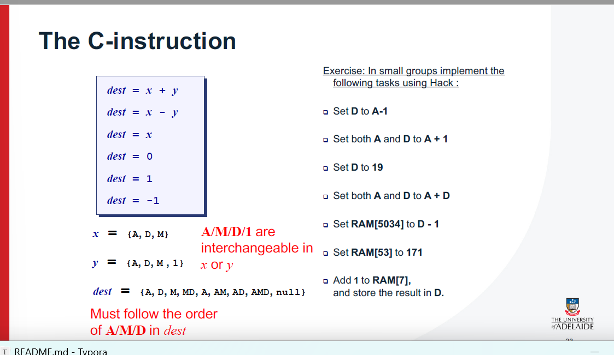

下面这张图讲的是**哈佛结构（Harvard Architecture）**——一种计算机/微控制器的硬件架构。

# 这张图在说什么

中间是**控制单元（Control Unit）**，上方是**算术逻辑单元 ALU**，下方是**输入/输出 I/O**。左右各有一块独立的存储器：

- **Instruction memory（指令存储器）**：只放“程序指令”（机器码）。
- **Data memory（数据存储器）**：只放“数据”。

黄色箭头表示它们与控制单元之间有**各自独立的总线/通道**。这就是哈佛结构的核心：**指令和数据分开存、分开走**。

# 和传统“冯·诺依曼结构”的区别

- **冯·诺依曼结构**：指令和数据**共用一套内存和总线**，同一时间只能传一种（要么取指令，要么取数据），容易出现“冯·诺依曼瓶颈”（总线成了堵点）。
- **哈佛结构**：指令通道、数据通道**分离**，可以**并行**地一边取下一条指令，一边访问数据，吞吐量更高、时序更稳定。

# 图中各模块的作用

- **Control Unit 控制单元**：按照“取指—译码—执行”的节奏协调一切。
- **ALU**：做加减乘除、与或非、比较等运算。
- **Instruction memory**：只读或主要只读（有时是闪存/ROM），存放固化的程序。
- **Data memory**：读写型（如 SRAM），存放变量、栈、缓冲区等。
- **I/O**：和外设打交道（串口、GPIO、传感器、网卡等）。

# 它是怎么工作的（简化的取指-执行循环）

1. **取指（从指令存储器）**：控制单元通过“指令总线”把下一条指令取来并译码。
2. **取数/写回（从数据存储器）**：若指令需要数据，控制单元同时通过“数据总线”去读/写数据。
3. **ALU 执行**：进行运算，结果再通过数据通道写回数据存储器或寄存器。
    → 因为两条通道互不抢占，可实现**流水化**与**单周期/多周期**指令的高效组合。

# 为什么要这么设计（优点）

- **吞吐量更高**：取指与取数可并行，缓解总线瓶颈。
- **实时性/确定性更好**：嵌入式系统常要严格的时序保证。
- **安全性更强**：数据内存里的内容默认不能当指令执行，降低某些代码注入风险。
- **适合固定程序的设备**：例如把固件烧在指令闪存中，数据放在独立 RAM 中。

# 可能的代价（缺点）

- **硬件更复杂**：两套总线/控制逻辑，面积与成本上升。
- **灵活性差一些**：数据不能直接当代码执行，“自修改代码”“JIT”会更麻烦。
- **地址空间割裂**：指令区与数据区分开，程序与常量共享不如统一内存方便（通常用专门指令把常量从指令区拷到数据区）。

# 常见在哪

- **微控制器/单片机**：如 AVR、PIC、部分 ARM Cortex-M 的内部设计、很多 DSP 都采用或借鉴哈佛结构思想。
- **数字信号处理器（DSP）**：追求高吞吐与确定性时序，更偏爱哈佛或**改良哈佛结构**。
- **现代通用 CPU**：主存通常统一，但**缓存层面**常用“改良哈佛结构”（指令缓存和数据缓存分离、主存统一），兼顾性能与灵活性。

# “改良哈佛结构”（Modified Harvard）

实际工程中常见折中：**L1 I-Cache 与 D-Cache 分离**，到更下层（L2/内存）再统一。这样既有哈佛的并行取指/取数优势，又保留统一内存带来的通用性。

# 一个生活类比（帮助直观理解）

- 冯·诺依曼：一条车道同时跑送餐车（数据）和送菜单的车（指令），只能排队轮流进出。
- 哈佛：两条独立车道，送菜单与送餐**同时进行**，出餐速度更稳定。

# 小结

这页讲的是：**哈佛结构把“程序指令”和“数据”在硬件层面彻底分离**，用各自的存储器与总线连接到控制单元/ALU，从而**并行取指与取数**、提高吞吐与实时性；代价是硬件更复杂、灵活性差一些。很多嵌入式与 DSP 直接采用它，而现代 CPU 多在缓存层面采用“改良哈佛”。


下面这页讲的是课程里要动手搭建的**Hack 计算机**（来自 Nand2Tetris）。它是一台极简但完整的可运行机器。

# 总体特性

- **16 位平台**：数据宽度、指令宽度都是 16 bit。
- **（概念上）冯·诺依曼平台**：程序通过统一的指令集去**访问数据内存**来计算。
- **（物理上）指令存储与数据存储分离**：执行时从**指令 ROM（ROM32K）**取指；读写发生在**数据 RAM（RAM16K）**与外设映射区；两者走不同通道，取指与取数可以并行。（可把它理解为“改良哈佛”实现。）
- **屏幕**：**512 行 × 256 列，黑白**，1 像素=1 位，由内存映射控制。
- **键盘**：标准 ANSI 104 键，通过内存映射读键值。
- **指令集**：运行 **Hack 机器语言**（两类指令：A 指令、C 指令）。
- **可从课程前面搭的芯片集合直接拼起来**：ALU、寄存器、PC、内存、控制逻辑等。

# 组成部件（与图对应）

1. **Instruction memory（指令存储，ROM32K）**
   - 只读，存放程序的机器码。由 **PC**（程序计数器）给地址，CPU每拍从这里取下一条指令。
2. **Memory（数据存储，RAM）**
   - **Data memory（RAM16K）**：变量、栈、临时数据等。
   - **Screen（屏幕内存映射，8K 字）**：写入这里的比特直接变成屏幕像素。
   - **Keyboard（键盘内存映射，1 个寄存器）**：读取可得到当前按键的扫描码。
3. **CPU**
   - 核心含：**ALU**、**A 寄存器**、**D 寄存器**、**PC** 和控制单元。
   - **A 寄存器**既可当通用寄存器，也充当**数据/指令地址**（如 `@value` 把值装入 A）。
   - **D 寄存器**主要参与运算与暂存。
   - **PC**顺序+1或根据跳转条件改写，实现流程控制。
4. **“Computer/Glue Logic”**
   - 连接 CPU、ROM、RAM/外设映射与总线的外围逻辑，让整机协同工作。

# 内存映射（非常关键）

Hack 的 16 位地址空间被这样约定（单位：**字**，1 字 = 16 位）：

- **0 ~ 16383**：`RAM[0..16383]` → 数据区（16K 字）
- **16384 ~ 24575**：`SCREEN` → 屏幕映射区（**8K 字**；因为 512×256=131072 像素=131072 位=8192 字）
- **24576**：`KBD` → 键盘寄存器（读当前键值；无键为 0）
- **指令 ROM**：独立的 `ROM[0..32767]`（最多 32K 条指令），由 PC 寻址

> 例子：要把屏幕左上角点亮，只需把 `SCREEN` 基地址处的某一位写成 1；读取键盘是否按下，就读地址 `KBD`。

# 指令概览（你看到“Hack machine language”指的就是它）

- **A 指令**：`@value`
  - 把常数/地址装入 **A 寄存器**（例如 `@24576` 表示后续要访问键盘寄存器）。
- **C 指令**：`dest=comp;jump`
  - 用 ALU 计算（如 `D=A+D`、`M=D|M` 等），把结果写到 `dest`（`A/D/M` 的组合）；可选 `jump` 根据 ALU 标志位跳转（改 PC）。

# 为什么要这样设计

- **教学友好、硬件可实现**：分开 ROM/RAM 让电路简单、时序清晰。
- **效率与确定性**：取指、访存互不抢占；内存映射让外设像普通内存一样读写。
- **可完整跑程序**：虽然极简，但已具备标准计算机所需的取指—译码—执行—访存—跳转的全闭环。

# 一段“运行时”心智模型

1. PC 给出指令地址 → ROM 吐出 1 条 16 位指令；
2. 控制单元按指令译码：
   - 需要数据就用 **A** 里的地址去访问 RAM/映射区（读或写）；
   - 用 **D/ALU** 做计算；
3. 更新 **dest**、更新 **PC**（顺序或跳转）→ 进入下一拍。

这就是这页在讲的 Hack 计算机：一台**16 位、指令与数据物理分离**的小型机器，具备屏幕与键盘的**内存映射 I/O**，执行两类简单指令，却能组合出完整程序与图形/交互功能。


这页在讲 **Hack 计算机的“指令存储器”（Instruction memory）**，也就是图里那块 **ROM32K**。

# 它是什么

- **ROM（Read-Only Memory）只读存储器**：用来放“程序”。运行时**CPU只读不写**。
- **32K × 16 位**：共 **32768 条**指令位置（地址从 0 到 32767），每个位置存放 **1 条 16 位机器指令**。

# 接口与行为（图上两根箭头）

- **address（15 位输入）**：告诉 ROM 要读第几个指令位置。
   15 位能表示 0..32767，所以是 32K 条。
- **out（16 位输出）**：把 `address` 指定位置的 **16 位内容**送出来。
   用一句话表示就是：
   **`out = ROM32K[address]`**
   这 16 位数就是**当前要执行的指令**。

> 这个 ROM 在逻辑上是**组合逻辑**：没有写入口、也没有时钟，地址一给，输出就等于对应存储的那条指令。

# 谁来给 address？

- 是 **PC（Program Counter，程序计数器）**。
- 运行流程（简化）：
  1. 复位后 PC=0，ROM 输出第 0 条指令；
  2. CPU 译码执行；
  3. **PC+1**（顺序执行）或根据跳转把 **PC 改成别的地址**；
  4. ROM 立刻按新地址输出下一条指令。
- 只要 PC 不越界，程序就一条接一条地从 ROM 里“被取出”。

# “预加载”的意思

- **ROM 事先被写入了 Hack 机器语言编译出的 16 位码**（课程里是把 `.hack` 文件“加载到 ROM32K”）。
- 真机里这通常对应 **闪存/EPROM**：上电前烧进去；要换程序，就重新烧录。

# 和数据内存（RAM）的区别

- **ROM**：只读、放指令、由 **PC** 寻址；CPU不写它。
- **RAM**：可读写、放变量/栈/屏幕映射/键盘寄存器等，由 **A 寄存器里的地址** + 控制信号读写。

# 限制与注意

- **程序长度最多 32K 条指令**；PC 指到 ROM 范围外是未定义行为（写程序时要避免）。
- 指令是 **16 位**：
  - `A` 指令以 **0** 开头（把常数/地址装入 A）
  - `C` 指令以 **111** 开头（运算、存储、可带跳转）

# 一个极简运行例子

假设 ROM 中：

```
0: @2      (A 指令)        → PC=0 时 out = 0000000000000010
1: D=A     (C 指令)        → PC=1 时 out = 1110...（C 指令编码）
2: @SCREEN (A 指令, 地址)  → PC=2 时 out = 0100...（常量为 SCREEN 基址）
3: M=D     (C 指令)        → 把 D 写到屏幕映射内存
```

PC 依次取 0→1→2→3，ROM 每次把对应的 16 位指令吐给 CPU，CPU 译码执行。

**总结**：这页的要点就是——**ROM32K 是指令仓库**：输入 15 位地址，立即输出对应的 **16 位机器指令**；地址来自 PC。ROM 在运行时不可写，程序需要事先“预加载”。


这页在讲 **Hack 计算机的 RAM 及“内存映射 I/O（MMIO）”**——把屏幕和键盘**映射到内存里的固定地址**，像读写普通内存一样去驱动外设。

# 内存版图（单位：word，1 word=16 位）

- **0 ~ 16383**（**16K words**）→ 普通 **数据内存 RAM16K**：变量、数组、栈等。
- **16384 ~ 24575**（**8K words**）→ **屏幕映射区 Screen**：往这里写入比特就会点亮/熄灭像素。
  - 屏幕 512×256（黑白）。每个 **word 控制 16 个水平相邻像素**。
  - 像素 (x,y) 对应的地址：`SCREEN + y*32 + x/16`；在该 word 的第 `x%16` 位（1=亮，0=灭）。
  - `SCREEN` 的基址 = **16384**（十六进制 0x4000）。
- **24576**（**1 word**）→ **键盘寄存器 KBD**：读出当前按键的键码，无键为 0。通常**只读**。
  - `KBD` 的地址 = **24576**（0x6000）。
- 其余高地址保留/未用。**从程序视角**看，就是**一片 32K 可寻址的读写空间**，其中部分地址“连着外设”。

# 这叫“内存映射 I/O（MMIO）”

CPU 不需要专门的 I/O 指令：

- **写屏幕** = 往 `16384..24575` 写数据；
- **读键盘** = 读 `24576`；
- 其他数据照常放在 `0..16383`。

# 典型用法示例（Hack 汇编）

**1）清屏：**

```asm
@SCREEN      // A=16384
D=A
@addr
M=D          // addr = SCREEN
@8192        // 要写 8K 个 word
D=A
@count
M=D

(LOOP)
@addr
A=M
M=0          // 写 0 清 16 个像素
@addr
M=M+1
@count
MD=M-1
@LOOP
D;JGT        // 还没写完就继续
(END)
@END
0;JMP
```

**2）按键填充/松开清屏：**

```asm
(LOOP)
@KBD
D=M         // 读键盘
@FILL
D;JNE       // 有键 → 填满屏
@CLEAR
0;JMP
(FILL)      // 把 SCREEN..SCREEN+8191 全写成 -1 (全 1)
@SCREEN
D=A
@i
M=D
@8192
D=A
@n
M=D
(FILLLOOP)
@i
A=M
M=-1
@i
M=M+1
@n
MD=M-1
@FILLLOOP
D;JGT
@LOOP
0;JMP
(CLEAR)     // 同 FILLLOOP，只是把 M=0
```

# 要点回顾

- **word=16 位**；屏幕每个 word 映射 16 个像素。
- **SCREEN=16384，KBD=24576**。
- 程序像**访问内存**一样读写外设，这就是 **MMIO**。
- 普通数据放在 **0..16383**；屏幕/键盘各在自己的映射区。


这页在讲 **Hack 计算机的数据内存 RAM16K 的硬件级读/写规则**（见右图的方块 RAM16K）。

# RAM16K 是什么

- 容量：**16K words**（16384 个字），**每字 16 位**。

- 端口（见图）

  - **in[16]**：写入数据的 16 位总线

  - **address[14]**：地址总线，选择第 *k* 个字（0..16383）

    > *注：16K=2¹⁴，所以地址应为 14 位；图里写 15 多半是泛化/笔误。*

  - **load**：写使能（1=本拍写入；0=忽略写）

  - **out[16]**：读出的 16 位数据

  - 底部的小三角表示**时钟**（同步写）

# 行为语义（低层硬件视角）

- **读 RAM[k]**：
   把 **address=k**，不需要时钟，**out 立刻等于 `RAM[k]`**（异步读）。

  > 公式：`out = RAM[address]`

- **写 RAM[k] = x**：

  1. 设 **address=k**；2) 把 **in=x**；3) **load=1**；4) 来一个时钟上沿（“run the clock”）
      在这个时钟沿，`RAM[k]` 被更新为 `x`。随后 `out` 在下一相位/下一拍反映新值（课程仿真里是 tick/tock 两相）。

# 用 Hack 指令看同一件事

- **读内存到寄存器**（例如 `D=M`）：
  - A 寄存器里放着地址 k → 接到 RAM.address
  - 控制信号让 RAM.load=0
  - `out` 经数据通路进 D → 完成 “`D = RAM[k]`”
- **把寄存器写回内存**（例如 `M=D`）：
  - A 里仍是地址 k → RAM.address=k
  - 把 D 接到 RAM.in，置 **load=1**，到时钟沿写入
  - 效果是 “`RAM[k] = D`”

**示例：把常数 123 写到地址 10**

```asm
@123   // A=123
D=A    // D=123
@10    // A=10 (选中地址 10)
M=D    // 在时钟沿把 D 写入 RAM[10]
```

# 和屏幕/键盘的关系

RAM 的**同一套读写规则**也适用于**内存映射 I/O**：

- 写 `address=16384..24575`（SCREEN 区）= 改像素；
- 读 `address=24576`（KBD）= 得到按键码。

# 小结

- **读**：给地址就能从 **out** 直接读到（异步）。
- **写**：地址 + 数据 + `load=1`，**等时钟沿**才真正写入（同步）。
- 单位是 **16 位 word**；RAM16K 需要 **14 位地址线**来寻址 16K 个字。


这页讲 **Hack 计算机的“屏幕芯片（Screen）”**，也就是**内存映射的显示器**。它本质上是一块**8K×16 位的 RAM**，只是这块 RAM 的位内容会被拿去“点亮像素”——所以它既像内存，又“顺带驱动”屏幕。

# 1）接口与读写规则（和 RAM 一样）

右图的方块就是 **Screen** 芯片，端口含义：

- **address**：选择要访问的那个 16 位字（word）的地址；
- **in[16]**：要写入的 16 位数据；
- **load**：写使能（=1 在时钟沿把 in 写进选中的地址；=0 不写）；
- **out[16]**：把 `Screen[address]` 里的 16 位内容读出来（组合/异步读）。

用两行话概括它的行为：

- **读**：`out = Screen[address]`
- **写**：`if load then Screen[address] = in`（在时钟沿生效）

> 注：作为独立设备，这块屏幕内存只有 **8K words**，寻址需要 **13 位**；PPT 上写 15 位是泛化画法。连到系统总线时，用高位地址做片选，低 13 位送到屏幕内部。

# 2）“副作用”：自动刷新屏幕窗口

芯片内部的每一位都被当作一个像素：**1=亮（黑），0=灭（白）**。
 硬件模拟器里自带的 `Screen.hdl` 会**每秒刷新多次**一个 512×256 的黑白窗口，把这 8K×16 位的内容显示出来（右侧橙色框里说的就是这个）。

# 3）像素如何映射到内存

- 屏幕分辨率：**宽 512 × 高 256**（黑白，1 像素=1 位）。
- 一行 512 像素 = **512 位 = 32 个 16 位 word**。
- 总共 256 行 × 32 word/行 = **8192 word（8K）**。
- 在整个地址空间中，这块区域的**基地址**是 `SCREEN = 16384`（十六进制 0x4000）。
- 像素 (x,y) 的映射（x:0..511, y:0..255）：
  - **word 地址**：`addr = SCREEN + y*32 + (x / 16)`
  - **word 内 bit 位置**：`bit = x % 16`
     把这个 bit 置 1 就点亮该像素，置 0 就熄灭。

# 4）程序员该怎么用（内存映射 I/O）

- **写屏幕**：向 `SCREEN .. SCREEN+8191` 写数据；
- **读屏幕**：从这段地址读出当前显示的位图（一般较少用）；
- **其他内存**：`0..16383` 是普通数据 RAM，不影响屏幕。

### 小例子（概念性的）

- **整屏填黑**：把 `SCREEN..SCREEN+8191` 全部写成 `-1`（二进制全 1）；
- **清屏**：把同一范围写成 `0`；
- **画水平线**：选中第 `y` 行，从 `SCREEN + y*32` 连续写 32 个 word（每个 word 的每一位都置 1）。

# 5）把它和普通 RAM 的差别记住一句话

> **它就是一块 RAM，只是“内容会被显示出来”这一件事被当作了“副作用”。**
>  读写规则与 RAM 完全一致，唯一不同是：写入后的比特会在屏幕窗口里可见。


这页讲的是 **Hack 屏幕的“内存映射（screen memory map）”**——屏幕上每个像素，都对应内存里的某一位(bit)。把那一位写成 1/0，就会把对应像素点亮/熄灭。

# 核心结论

- 屏幕是**8K×16 位**的 RAM（共 **8192 个 word**，每个 word=16 位）。
- 分辨率：**512 列 × 256 行**（黑白）。
- **1 位=1 像素**：`0→白（灭）`，`1→黑（亮）`。
- 在整机地址空间中，这块显存的**起始地址**是：`SCREEN = 16384`。
- 屏幕按“行优先（row-major）”存：**每一行 512 像素 = 32 个 word**，共 256 行。

# 坐标 ⇄ 内存 的对应关系

设像素坐标为 **(row, col)**（`row∈[0,255]`, `col∈[0,511]`）：

**1）从像素算内存地址与位：**

- **word 地址：**
   `addr = SCREEN + row * 32 + (col / 16)`        （`/` 是整数除法）
- **word 内 bit 位置：**
   `bit = col % 16`                                （`%` 是取余）
- 把 `addr` 这个 word 的第 `bit` 位写成 `1` 就点亮该像素，写成 `0` 就熄灭。

**2）从内存地址反推覆盖的像素：**
 给定 `k`（`SCREEN ≤ k < SCREEN+8192`）：

- `row = (k - SCREEN) / 32`
- 这一 word 覆盖的列范围：`col ∈ [ (k - SCREEN)%32 * 16 , … , +15 ]`
- 其中具体哪个列就是 `bit`（0..15）对应的那一列。

> 直观理解：屏幕每行被切成 32 段；每段是一个 16 位的 word；word 里的第 0..15 位对应这 16 个像素从左到右。

# 读写规则（和普通 RAM 一样）

- **读**：`out = Screen[address]`（给地址就能读到 16 位内容）
- **写**：如果 `load=1`，在时钟沿把 `in` 写到 `Screen[address]`
- 模拟器会**每秒刷新多次**，把这 8K×16 位显示到 512×256 的窗口里。

# 例子

**例 1：像素 (row=100, col=300) 点黑**

- `row*32 = 3200`
- `col/16 = 18` → `addr = 16384 + 3200 + 18 = 19602`
- `bit = 300 % 16 = 12` → 需要把 `addr` 处的第 12 位设为 1
- 等价于：`RAM[19602] = RAM[19602] | (1 << 12)`

**例 2：清屏**
 把 `addr = SCREEN .. SCREEN+8191` 的所有 word 写成 `0`。

# Hack 汇编思路（概念性）

Hack 指令没有直接的位操作/移位指令，但可以用“**乘 2** 等价于**左移一位**”来生成掩码：

1. `mask = 1`，循环 `bit` 次做 `mask = mask + mask`（左移）
2. 写像素：`M = M | mask`；清像素：`M = M & (~mask)`
    （`|`、`&` 在 Hack 的 C 指令 `comp` 里分别用 `D|M`、`D&M` 等形式实现）

> 你只需记住两件事：
>  ① **地址公式** `addr = SCREEN + row*32 + col/16`；
>  ② **位索引** `bit = col%16`（1=黑，0=白）。
>  其余操作就和普通内存读写完全一样。


这页讲的是 **Hack 计算机的“键盘芯片”**，它把用户输入的按键映射到一个 16 位的代码，作为输出。这个芯片本质上是一个16位寄存器，通过按键输入，返回相应的扫描码。

# 关键点

1. **键盘芯片**：
   - 它是一个 **16 位的寄存器**，负责存储当前按下的键的**扫描码**（类似 ASCII 码）。
   - 输入：来自物理键盘的按键。
   - 输出：**16 位的扫描码**，表示当前按下的键。
2. **特定按键输出映射**：
    页面上有一张表，列出了几种特殊按键与它们对应的输出值（扫描码）：

| Key pressed | Keyboard output |
| ----------- | --------------- |
| newline     | 128             |
| backspace   | 129             |
| left arrow  | 130             |
| up arrow    | 131             |
| right arrow | 132             |
| down arrow  | 133             |
| home        | 134             |
| end         | 135             |
| page up     | 136             |
| page down   | 137             |
| insert      | 138             |
| delete      | 139             |
| f1-f12      | 140-152         |

这些键的输出是**固定的**，例如：

- 按下回车（newline）键会输出 `128`，
- 按下退格（backspace）键会输出 `129`，
- 按下左箭头（left arrow）键会输出 `130`，等等。

1. **键盘的硬件工作原理**：
   - 要**读取键盘**，需要**查询该寄存器**（即读取 `Keyboard` 芯片的值）。
   - 如果没有按键被按下，寄存器的值通常是 `0`，否则它会返回一个按键的扫描码。
2. **读取键盘的方式**：
   - **低级硬件操作**：直接查询 `Keyboard` 寄存器中的内容。
   - **高级操作**：可以使用操作系统的函数 `keyPressed()` 来简化操作，效果与直接查询寄存器相同。
3. **模拟键盘**：
   - 在 **硬件模拟器**中，**键盘芯片**连接到物理键盘，模拟按键的扫描码并将其传送到键盘内存映射区。
   - 这就意味着，当用户按下键盘上的按键时，模拟器中的键盘也会捕捉到相应的按键扫描码。

# 示例：

- 如果用户按下 "up arrow" 键，模拟器的 `Keyboard` 寄存器会输出 `131`，表示“向上箭头”。
- 通过读取这个寄存器的值，程序可以知道用户按下了哪一个键，然后根据这个扫描码执行相应的操作。

# 总结：

**Hack 键盘芯片**将每个按键映射到一个16位的扫描码，按键的输入通过读取这个寄存器获取。这使得程序能够感知用户输入的内容，并做出响应。


这页讲的是 **Hack CPU 的两条指令**：**A 指令** 和 **C 指令**。

# 1. **A 指令**

- **A 指令**用于把一个 **15 位的值**加载到 **A 寄存器**（A register）中。
- **A 寄存器**用于存放地址或常量，通常用来**指向 RAM 地址**，并作为 C 指令的一部分来访问内存。

### 结构与解读

- **A 指令的格式**：
  - 最左边的 **1 位（MSB，最高位）** 或 **i15** = `0`。
  - 剩余的 **15 位（i14 到 i0）** 是一个 **15 位无符号二进制数**，表示要存储到 A 寄存器中的值。

例如，A 指令 `0000000000000101` 对应 **二进制 5**，这个值将被加载到 A 寄存器。

### A 指令的作用

- **唯一方式**：A 指令是将常量加载到 A 寄存器的唯一方式。
- **内存寻址**：加载后，A 寄存器的值可以作为后续 C 指令访问 RAM 的地址。
  - 在 Hack 汇编中，`RAM[A]` 被表示为 `M`（即 **M = RAM[A]**）。

### 举例

假设有 A 指令 `0000000000000101`（表示 5），执行后，A 寄存器会保存值 5。接下来，你可以用这个值来访问内存，例如：

```asm
@5     // 将 A 寄存器加载为 5
D=M    // 将 RAM[5] 中的值加载到 D 寄存器
```

------

# 2. **C 指令**

- **C 指令**协调了 3 个操作：
  1. **计算操作（comp）**：决定要计算什么。
  2. **存储操作（dest）**：决定计算结果存储到哪个位置。
  3. **跳转操作（jump）**：决定下一步应该跳转到哪里。
- **C 指令的格式**：
  - 最左边的 **1 位（MSB，i15）** = `1` 表示这是一个 C 指令。
  - **C 指令的具体操作**会在后面的内容中详细解释。C 指令通过不同的操作码和条件选择要执行的操作，如计算、存储、跳转等。

------

# 3. 总结：

- **A 指令**：用于将常量（15 位无符号数）加载到 **A 寄存器**，并且它是唯一的方式来加载常量。
- **C 指令**：用于指定要执行的计算操作、存储位置和跳转条件，控制程序的执行流程。

接下来的幻灯片会更详细地讲解 C 指令的组成与各部分的含义。


这页是在**把 C 指令掰开讲**：它把一条机器指令分成三块——**要算什么（comp）**、**把结果存哪儿（dest）**、**是否跳转（jump）**。同时也回答了红字问题：*既然 C 指令里已经有 dest，为什么还需要 A 指令？*

------

# C 指令的格式与执行语义

**汇编形态：** `dest = comp ; jump`
 **二进制：** `111 a c1 c2 c3 c4 c5 c6 d1 d2 d3 j1 j2 j3`

执行顺序（同一条指令内部）：

1. **用 ALU 计算**：由 `a c1..c6` 共同决定 `comp` 的运算，产生 `out`。

   - `a=0`：把 **A 寄存器**当作第二操作数；
   - `a=1`：把 **M = RAM[A]** 当作第二操作数（即访问 A 指向的内存）。

2. **写回（dest）**：
    `d1 d2 d3` 三位决定把 `out` 写到哪里：

   - `d1`→`A`，`d2`→`D`，`d3`→`M`（`M` 等价于 `RAM[A]`）。
      例如：`AD`=110、`M`=001、`null`=000（不存）。

3. **跳转（jump）**：
    按 `j1 j2 j3` 对 `out` 做条件跳转（条件基于 `out<0`、`out=0`、`out>0`）：

   ```
   000 null 不跳
   001 JGT out>0
   010 JEQ out=0
   011 JGE out≥0
   100 JLT out<0
   101 JNE out≠0
   110 JLE out≤0
   111 JMP 无条件跳
   ```

   若条件成立：**PC ← A**；否则 **PC ← PC+1**。

> 小结：一条 C 指令=“算 → 选地方存 → 可能跳”。是否使用内存由 **a 位**决定（A vs M）。

------

# comp（运算）能做什么

由 `a c1..c6` 选定 ALU 功能，覆盖：

- 常量：`0, 1, -1`
- 直接量：`D, A/M`
- 取反/取负：`!D, !A/!M, -D, -A/-M`
- 加减与位运算：`D+1, A+1/M+1, D-1, A-1/M-1, D+A/M, D-A/M, A/M-D, D&A/M, D|A/M`

（表格在幻灯下半部分：左边是 `a=0` 用 **A**，右边是 `a=1` 用 **M**。）

------

# 例子（读起来更直观）

- `D=A`：把 A 的值送进 D（`a=0`，`dest=010`）。
- `M=D+1`：把 `D+1` 写到 `RAM[A]`（`a=1` 因为目标是 M）。
- `0;JMP`：无条件跳转到 **A 指向**的地址。
- `D;JGT`：若 `D>0`，则跳到 **A**，否则顺序执行下一条。

------

# 关键问题：既然 `dest` 可以写 `A`，**为什么还需要 A 指令？**

因为 **C 指令不能携带任意常数或地址**，而**A 指令是把 15 位立即数装入 A 的唯一办法**。更具体地说：

1. **装立即数**
   - 想把 123 放进 A 或 D？必须先 `@123`（A 指令），然后 `D=A`。
   - C 指令能造的常量只有少数（0、1、-1、±1 等），远远不够。
2. **寻址内存（M = RAM[A]）**
   - 想访问 `RAM[k]`，先用 `@k` 把 **A=k**，之后 C 指令里的 `M` 才指向对的位置。
   - 这也是 “先设地址、再读/写内存” 的基本节奏。
3. **跳转目标**
   - C 指令的跳转 **PC ← A**，跳到哪里由 **A** 决定；必须先用 A 指令把目标地址（或标签对应地址）装到 A。
4. **鸡生蛋问题**
   - 虽然 `dest` 能把计算结果写回到 A，但很多时候**你要先有 A**（比如访问 M 或跳转）才能执行那条 C 指令。

> 一句话：**A 指令负责“给出数/地址”，C 指令负责“如何算、存哪儿、跳不跳”**。两者分工明确、互补。

------

如果你愿意，我可以把“任意像素点亮”“按键填充屏幕”等小程序写成 Hack 汇编，逐行标注对应的 C/A 编码与执行效果。


这页是在说明 **Hack CPU 的实现电路**：一条 C/A 指令是怎样被**译码**成控制信号，数据又怎样沿着**数据通路**在寄存器、ALU、内存和 PC 之间流动的。

------

# 1) CPU 的输入/输出（和外部怎么连）

- **输入**
  - `instruction[16]`：来自 **指令 ROM** 的当前指令。
  - `inM[16]`：来自 **数据内存 RAM[A]** 的数据（A 指向的内存字，名字叫 `M`）。
  - `reset`：复位信号（=1 时 PC 清零）。
- **输出**
  - `outM[16]`：要写回到数据内存的值（其实就是 ALU 的输出）。
  - `writeM`：是否写数据内存（对应 C 指令 `dest` 里的 `M` 位）。
  - `addressM[15]`：数据内存地址（直接等于 **A 寄存器**的内容）。
  - `pc[15]`：下一条指令的地址，送给 **指令 ROM**。

------

# 2) 主要部件与连线（看图中间的方块）

- **ARegister（A 寄存器）**：既可当数据，也用来给 **RAM 地址**和**跳转目标**。其输入通过一个 **Mux16** 选择：
  - 选择 **指令里的 15 位常数**（当当前是 **A 指令**时，`instA=1`）；
  - 或选择 **ALU 输出**（当 C 指令且 `dest` 包含 A 时）。
  - 由 `loadA` 控制是否本拍写入。
- **DRegister（D 寄存器）**：通过 `loadD` 决定是否把 **ALU 输出**写入 D。
- **ALU**：输入 `x=D`，`y` 由一个 **Mux16** 选择 **A** 或 **M**（`AtoALU` 由指令里的 `a` 位决定：`a=0` 用 A；`a=1` 用 M=RAM[A]）。
  - 六个控位（图上 `compALU` 的 6 位）决定具体运算：清零、取反、加减、与/或等。
  - 输出 **outALU**，并产生标志 **zr**（零）与 **ng**（负）。
- **PC（程序计数器）**：有 `inc`（加 1）、`load`（装载）、`reset` 三个控制。
  - **正常**：`inc=1`，PC→PC+1。
  - **跳转**：若满足 `jump` 条件，`load=1`，**PC ← A**。
  - **复位**：`reset=1`，PC←0。
- **Decoder（解码器）**：并不是一个独立芯片，而是“把指令位译成控制信号”的总称。它负责产生：
  - `instA`（判断是不是 A 指令：`i15=0`）
  - `loadA / loadD / writeM`
  - `AtoALU`、`compALU[6]`
  - `jump` 相关位（j1..j3）并据 **zr/ng** 形成“是否应跳转”。

------

# 3) 一条指令在一个时钟里的事（取指与执行）

1. **Decode（译码）**
    解码 `instruction`：
   - 若是 **A 指令**：把指令的 15 位立即数装进 **A**（`instA=1`→`loadA=1`）；
   - 若是 **C 指令**：
     - 用 `a,c1..c6` 控制 ALU 计算 **outALU**（D 和 A/M 参与）；
     - 按 `dest(d1 d2 d3)` 决定是否写 **A、D、M**（`writeM=d3`，`outM=outALU`，`addressM=A`）；
     - 用 `j1..j3` 与 **zr/ng** 判定是否跳转到 **A**。
2. **PC 更新（Fetch 下一条）**
   - **应跳转**：`PC ← A`；
   - **否则**：`PC ← PC + 1`。
      同时，新的 `pc` 已经送给 ROM，下一条指令会在下个周期准备好。

> 因为指令存储器与数据存储器物理分离，**取指与访存可并行**：执行当前指令的同时已经在为下一条取指。

------

# 4) 关键信号怎么来的（和 C 指令字段的关系）

- `a,c1..c6` → **compALU**（决定算什么）。
- `d1,d2,d3` → `loadA, loadD, writeM`（决定结果存到 A、D、M 哪些地方）。
- `j1..j3` + `zr/ng` → **是否应跳转**（若真，则让 PC 从 **A** 装载）。
- 特例：**A 指令**（`i15=0`）不走 ALU 计算，只做“把常数装入 A”。

------

# 5) 一个具体例子（配合图理解数据流）

**指令**：`M=D+1; JLE`

- 解码：`a=1`（要用 `M`），`comp`= `D+1`，`dest`= `M`，`jump`= `JLE`。
- 数据通路：ALU 取 `x=D`、`y=M(inM)` 算 `D+1` → `outALU`；
  - `writeM=1`，`outM=outALU`，`addressM=A` → 把结果写回 **RAM[A]**；
  - 同时根据 **outALU** 的 `zr/ng` 判定 `outALU≤0` 是否为真；若真，则 **PC ← A**，否则 PC+1。

------

# 

这页在说：**一条 C 指令其实就是一串“控制位”**，这些位直接连到 CPU 里各个模块的控制线，分别决定：

1. **ALU 做什么运算（comp）**
2. **运算结果写到哪里（dest）**
3. **是否跳转 & 跳到哪里（jump）**

------

## C 指令的位域回顾

二进制格式：`111 a c1 c2 c3 c4 c5 c6 d1 d2 d3 j1 j2 j3`

- `a c1..c6` → **comp**：控制 ALU 的输入来源与功能
  - `a=0`：ALU 的第二个操作数用 **A**；
  - `a=1`：用 **M=RAM[A]**（经数据内存读出的值）。
  - `c1..c6` 是 ALU 的功能选择线（等价于 nand2tetris 里 `zx,nx,zy,ny,f,no`），组合后能产生 `0,1,-1,D,A/M, !D, -D, D+1, D+A/M, D|A/M …` 等结果。
- `d1 d2 d3` → **dest**：写回目的地
  - `d1` 写 **A 寄存器**，`d2` 写 **D 寄存器**，`d3` 写 **M(=RAM[A])**。
  - 例如 `010` 表示写 D；`001` 表示写 M；`110` 表示写 A 和 D；`000` 不写回。
- `j1 j2 j3` → **jump**：按 ALU 结果的符号/零标志决定是否跳转
  - ALU 会给出状态位：`zr`（结果==0）、`ng`（结果<0）。
  - 组合关系：
    - `JGT`(001)：`out>0` ⇔ `~zr & ~ng`
    - `JEQ`(010)：`out==0` ⇔ `zr`
    - `JGE`(011)：`out≥0` ⇔ `~ng`
    - `JLT`(100)：`out<0` ⇔ `ng`
    - `JNE`(101)：`out≠0` ⇔ `~zr`
    - `JLE`(110)：`out≤0` ⇔ `zr | ng`
    - `JMP`(111)：无条件
  - 逻辑可写成：`loadPC = (j1 & (~zr & ~ng)) | (j2 & zr) | (j3 & ng)`；若满足就 **PC←A**，否则 **PC←PC+1**。

------

## 对应这页的四条“观察”（Observations）

- **“We can use individual bits from the C-instruction to control the ALU”**
   `a,c1..c6` 这些位就是 ALU 的控制线，决定输入是 A 还是 M，以及具体做加法、与、或、取反、加/减 1 等。
- **“The Choice of Source (A, D, M)”**
   ALU 的两个来源固定为 **D** 和 **A/M**：
   `a=0` 选 **A**；`a=1` 选 **M=RAM[A]**。这就是“源操作数”的选择。
- **“The Choice of Destination (A, D, M)”**
   `d1 d2 d3` 三位分别门控对 **A、D、M** 的写使能（`loadA, loadD, writeM`）。结果写到哪完全由这三位决定。
- **“Some input signals to the PC … whether it should be updated with A”**
   `j1 j2 j3` 通过与 ALU 的 `zr/ng` 状态组合生成 **loadPC**。若为真，**PC 取 A**；否则 **PC 自增**。所以跳转也只由 C 指令的位 + ALU 状态决定。

------

## 把一条 C 指令用伪代码表达

```
// 输入：指令位 {a,c1..c6,d1,d2,d3,j1..j3}，寄存器 A,D，内存 RAM
y = (a == 0) ? A : RAM[A]        // 选择第二操作数
out, zr, ng = ALU(D, y, c1..c6)  // 由 c1..c6 指定功能，产生结果和状态

if (d1) A      = out             // 目的地写回
if (d2) D      = out
if (d3) RAM[A] = out

jump = (j1 & (~zr & ~ng)) | (j2 & zr) | (j3 & ng)
PC   = jump ? A : PC + 1
```

> 这正是这页想强调的：**C 指令的各个位就是 CPU 的微控制信号**——控制 ALU、选择源、选择目的地，并通过 ALU 的状态位决定是否让 **PC 载入 A**（跳转）。


这页在讲 **A 指令（@value）** 的用途与语义：
 `@value` 的效果就是 **把 15 位无符号数 value 装进 A 寄存器**（`A ← value`）。A 指令的机器码最高位为 0，后面 15 位就是该数；取值范围 0…32767。

# A 指令能干什么

1. **装入常数（Immediate）**

   - 这是向 Hack 机器装常数的唯一方式。

   ```asm
   @17     // A=17
   D=A     // D=17
   ```

   > A 指令只能装**无符号**常数；若要得到 -1、+1 等，用 C 指令运算。

2. **作为 RAM 地址（M = RAM[A]）**

   - 许多 C 指令里的 `M` 都表示 `RAM[A]`，所以先用 A 指令把地址放进 A，再读/写。

   ```asm
   @17     // A=17  选中 RAM[17]
   D=M     // D = RAM[17]
   M=D     // RAM[17] = D
   ```

3. **作为 ROM 跳转目标（PC ← A）**

   - C 指令若带跳转（如 `JMP/JEQ/...`）且条件满足，就把 **PC 置为 A**，从而跳到 ROM[A] 处执行。

   ```asm
   @17
   0;JMP   // 无条件跳转到指令地址 17
   ```

# 符号与预定义名

`value` 可以是**数字**或**符号**（汇编器会把符号换成数）：

- 预定义：`SCREEN=16384`、`KBD=24576`、`R0..R15`、`SP/LCL/ARG/THIS/THAT` 等。
- 标签：`(LOOP)` 定义后，`@LOOP` 就是该行的 ROM 地址。
- 变量：第一次写 `@i` 时，汇编器从地址 16 开始为其分配 RAM 空间。

# 典型片段

```asm
// 清 RAM[10]
@10      // A=10
M=0      // RAM[10]=0

// 画点：把 (row,col) = (y,x) 对应像素置 1
@SCREEN  // A = 16384
D=A
@addr    // 把 SCREEN 存到变量 addr
M=D

// 跳转循环
(LOOP)
  @KBD   // A=24576
  D=M    // 读键盘
  @LOOP
  D;JEQ  // 没键按下就回到 LOOP
```

# 小提示

- 很多操作都会覆盖 **A**，若要长期保存数值，可放到 **D** 或内存再用。
- 想访问任意 `RAM[k]` 或跳到任意地址，都离不开先用 **A 指令设定 A**——这就是为什么即使 C 指令有 `dest`，仍然必须保留 **A 指令**。



这页继续讲 **C 指令** 的可写形式，并给了几道小练习。

# 左边在说什么

- 一条 C 指令长这样：`dest = comp ; jump`。
- 这里关注 **赋值类**：`dest = x+y / x-y / x / 0 / 1 / -1`。
- 取值范围：
  - **x ∈ {A, D, M}**
  - **y ∈ {A, D, M, 1}**（可以直接用常数 1 做运算）
  - `M` 表示 **RAM[A]**（A 寄存器指向的内存）
- **dest（写回目的地）** 是 `{A, D, M}` 的任意子集，但**必须按字母顺序写**：
   允许：`A`、`D`、`M`、`AD`、`AM`、`MD`、`AMD`；
   不允许写成 `DA`、`MA` 这类**乱序**。

> 例：把 `A+1` 同时写到 A 和 D，要写 `AD=A+1`，不能写 `DA=A+1`。

------

# 右边练习——用 Hack 汇编实现

（每条都只给出关键指令；`@k` 是 A 指令把常数 k 装入 A）

1. **Set D to A-1**

```asm
D=A-1
```

1. **Set both A and D to A+1**

```asm
AD=A+1
```

1. **Set D to 19**（必须用 A 指令装立即数，再拷到 D）

```asm
@19
D=A
```

1. **Set both A and D to A + D**

```asm
AD=A+D       // 等价写法：AD=D+A
```

1. **Set RAM[5034] to D - 1**

```asm
@5034
M=D-1
```

1. **Set RAM[53] to 171**（先把 171 装到 D，再写到地址 53）

```asm
@171
D=A
@53
M=D
```

1. **Add 1 to RAM[7], and store the result in D**（不改内存，只把 M+1 放到 D）

```asm
@7
D=M+1
```

> 提醒：凡是用到 `M`，都依赖 **A 中的地址**；先用 `@地址` 选中目标，再写 `M=...` 或 `...=M`。


这页在讲 **C 指令能表达的赋值形式**，以及如何把右边这些“类似高级语言”的语句，用 **Hack 汇编（A/C 指令）**实现。

# 左边：C 指令能写成什么样

一条 C 指令写成：`dest = comp ; jump`，这里只看**赋值**部分 `dest = comp`。
 允许的计算（`comp`）大致是：

- `x + y`、`x - y`、`x`、`0`、`1`、`-1`
- 其中 `x ∈ {A, D, M}`，`y ∈ {A, D, M, 1}`
- `M` 代表 `RAM[A]`（A 寄存器指向的内存字）
- `dest` 是 `{A, D, M}` 的任意子集，但**必须按字母顺序**写：`A`、`D`、`M`、`AD`、`AM`、`MD`、`AMD`；不能写成 `DA`、`MA` 等乱序

> 例：把 `A+1` 同时写回 A、D：`AD = A + 1`（不能写 `DA=...`）。

# 右边：把“伪代码”翻译成 Hack 汇编

右下角给了**符号表**（示例）：
 `j → 3012`，`sum → 4500`，`q → 3812`，`arr → 20561`（`arr` 是数组基地址）。在汇编时，`@sum` 等价于把 A 设成那个数字地址。

下面给出可运行的写法（每块注释说明含义）：

------

### 1) `sum = 0`

```asm
@sum
M=0        // RAM[sum] = 0
```

### 2) `j = j + 1`

```asm
@j
M=M+1      // RAM[j] = RAM[j] + 1
```

### 3) `q = sum + 12 - j`

思路：`D ← RAM[sum]`，再加 12，再减 `RAM[j]`，最后写入 `RAM[q]`。

```asm
@sum
D=M        // D = sum
@12
D=D+A      // D = D + 12   （A=12，ALU 支持 D+A）
@j
D=D-M      // D = (sum+12) - j
@q
M=D        // q = D
```

### 4) `arr[3] = -1`

算地址 `arr+3` 放到 A，然后把 `-1` 写给 `M`。

```asm
@arr
D=A        // D = &arr
@3
A=D+A      // A = &arr + 3   → A 指向 arr[3]
M=-1       // arr[3] = -1
```

### 5) `arr[j] = 0`

算地址 `arr + RAM[j]` 到 A，然后 `M=0`。

```asm
@j
D=M        // D = j
@arr
A=D+A      // A = &arr + j   → 指向 arr[j]
M=0        // arr[j] = 0
```

### 6) `arr[j] = 17`

有两种常见做法：

**做法 A（用临时变量保存地址）：**

```asm
@j
D=M
@arr
D=D+A       // D = &arr + j    （有效地址）
@addr       // 任选一个变量名作临时存放
M=D         // addr = 有效地址

@17
D=A         // D = 17
@addr
A=M         // 取回有效地址到 A
M=D         // arr[j] = 17
```

**做法 B（不改 A，用 C 指令在 D 里“造出”17）：**

> 先把 `A` 算到有效地址，然后只用 C 指令构造 17（不再用 A 指令，A 就不会被改掉）。

```asm
@j
D=M
@arr
A=D+A       // A = &arr + j  （锁定目标地址）

D=1         // 下面几步构造 17：((((1×2)×2)×2)×2)+1 = 16+1
D=D+D       // 2
D=D+D       // 4
D=D+D       // 8
D=D+D       // 16
D=D+1       // 17

M=D         // arr[j] = 17
```

------

## 小结与规律

- `@n` 的语义永远是 **`A ← n`**（n 可是数字或符号）。
- 后续 C 指令若用 **`A`**，就是把 **A 当数值**；若用 **`M`**，就是把 **A 当地址**去读写 `RAM[A]`。
- C 指令中可直接用的常量只有 **0、1、-1**；其它常量要么用 `@常数` + `D=A` 得到，要么像上面那样用运算“造”出来。
- 多目的地写回时，`dest` 必须按 **A、D、M** 的字母顺序写。

如果你想，我可以把这些片段再配上**机器码位域**（`a,c1..c6,d1..d3,j1..j3`）说明每条指令怎么驱动 ALU/PC。


这页是在练“把条件语句/跳转”翻成 **Hack 汇编**。要点：

- 无条件跳：`@addr` + `0;JMP`（PC ← A）。
- 条件跳：`@addr` + `comp;Jxx`，其中 `comp` 的结果（负/零/正）决定是否跳；`Jxx` 取自 {JGT, JEQ, JGE, JLT, JNE, JLE, JMP}。
- 若比较里要用到 **M**（RAM[A]），但跳转又要用 **A** 装目标地址，就**先把要比较的值放进 D**，再把 A 改成目标地址，用 `D;Jxx` 跳。

右下角符号表（示例）：`sum=2200, x=4000, i=6151, END=50, NEXT=120`。以下是每题的写法：

------

### 1) `goto 50`（无条件跳到 50）

```asm
@50
0;JMP
```

### 2) `if D==0 goto 112`

```asm
@112
D;JEQ          // 若 D == 0，则跳到 112
```

### 3) `if D < 9 goto 507`

思路：先做 `D ← D-9`，再按 D 的符号跳。

```asm
@9
D=D-A          // A=9 → D=D-9
@507
D;JLT          // 若 D-9 < 0（即 D<9）则跳
```

### 4) `if RAM[12] > 0 goto 50`

不能同时让 A=12（读 M）又 A=50（跳转目标），所以把 `RAM[12]` 读到 D 再跳。

```asm
@12
D=M            // D = RAM[12]
@50
D;JGT          // 若 D > 0 则跳
```

### 5) `if sum > 0 goto END`

```asm
@sum
D=M
@END
D;JGT
```

### 6) `if x[i] <= 0 goto NEXT`

先算有效地址 `x+i` 到 A，读出 arr 元素到 D，再按 `<=0` 跳。

```asm
@i
D=M            // D = i
@x
A=D+A          // A = x + i
D=M            // D = RAM[x+i]
@NEXT
D;JLE          // 若 D <= 0 则跳
```

------

#### 小贴士

- **A 指令**：`@n` 永远是 `A←n`（n 可为数字或符号）。
- **M 含义**：`M = RAM[A]`；凡是用到 `M`，都依赖 A 里的地址。
- **布尔约定**（Hack 常用）：`true = -1`，`false = 0`；但跳转判断依据是 ALU 输出的符号/零标志（`<0, =0, >0`），与此约定无冲突。


这页在教你把**高级语言里的 if…else…**，翻译成 **Hack 汇编风格**。

# Hack 的布尔约定

- **true = -1**（16 位全 1：1111…1111）
- **false = 0**（16 位全 0：0000…0000）
   这样用按位运算（`& | !`）就能像布尔逻辑一样工作：
   `-1 & x = x`，`-1 | x = -1`，`!(-1)=0`，`!(0)=-1`。

# 模板怎么用（右侧代码框逐行解释）

```
D ← not condition      // 把“条件”的布尔值(0/-1)取反放到 D
@IF_TRUE
D;JEQ                  // 如果 D==0，就跳到 IF_TRUE（即 condition 为真）
code block 2           // 否则执行 else 分支
@END
0;JMP                  // 执行完 else 分支后跳过 then 分支

(IF_TRUE)
code block 1           // then 分支

(END)
code block 3           // if 之后的公共代码
```

为什么要先做 **not** 再 `JEQ`？

- 约定里 **true=-1**，**false=0**。
- 若条件为真：`not true = 0` → `D;JEQ` 成立 → 跳进 **then**。
- 若条件为假：`not false = -1` → `JEQ` 不成立 → 落入 **else**。

> 关键点：**`condition` 必须先被算成布尔 0/-1**（存在 D、A 或内存里都行），再用 `!` 取反。对布尔值做 `!` 才会得到 0 或 -1；如果 `condition` 是一般数值（比如 7），直接 `!7` 会得到按位取反的补码，不是布尔值。

# 如何把“条件”算成布尔 0/-1（常见做法）

以把布尔结果放进 **D** 为例：

- **x==0**：先 `D=x`，再

  ```
  D=!D        // 0→-1, 非0→按位取反(≠0)
  D=D+1       // true(-1)+1=0, 其它≠0→非零→再规整：
  D=!D        // 0→-1(true), 非0→0(false)
  ```

  更简单的通常直接用跳转，不必造布尔：见下一节“直接用标志跳”。

- **x>0 / x<0 / x==0**：不造布尔，**直接用跳转标志**更地道：

  ```
  D = x
  @IF_TRUE
  D;JGT       // x>0 → 跳（JLT/JLE/JEQ/JNE/JGE 同理）
  ```

  这也是你在前一页练习里用的写法。

# 只有 then、没有 else 的精简版

```
D ← not condition
@END
D;JNE            // 若 D!=0（即 condition 为假）就跳过
code block 1     // 条件真才执行
(END)
```

# 一个完整例子

把“**如果 RAM[12] > 0 就 sum = sum + 1，否则 sum = 0**；然后继续执行”翻译成 Hack：

```asm
@12
D=M              // D = RAM[12]
@IF_TRUE
D;JGT            // 若 D>0 跳到 then

@sum             // else:
M=0              // sum=0
@END
0;JMP

(IF_TRUE)        // then:
@sum
M=M+1

(END)            // 公共后续...
```

这里我们用了**直接跳转法**（利用 ALU 的 `>0/==0/<0` 标志），更简洁；若你已经把“条件”算成布尔 0/-1，也可按本页模板用 `D ← !condition` + `JEQ` 来分支。

**总结**：

- 记住 Hack 的布尔编码：`true=-1`，`false=0`。
- 分支的两种套路：
  1. **布尔式**：先把条件算成 0/-1，用 `!cond` + `JEQ` 控制流（本页模板）。
  2. **标志式**：把比较的“结果值”放进 D，直接用 `JGT/JEQ/JLT/...` 跳（更常用）。


这页是在教你：**把高级语言里的 `while (condition) { … }` 用 Hack 汇编来写**。核心思路是用**标签 + 条件跳转**反复回到循环头；条件为假时跳到循环尾退出。

# Hack 模板（右图逐行说明）

```
(LOOP)                 // 循环头标签
    D ← condition 的布尔值或比较结果
    @END
    D;JEQ              // 若 D==0 就退出（见下文两种写法）
    code block 1       // 循环体
    @LOOP
    0;JMP              // 无条件跳回循环头
(END)                  // 循环尾（退出后执行）
    code block 2
```

## 条件怎么放进 D？两种常用风格

1. **布尔值风格（配合本页“true=-1, false=0”约定）**

   - 先把 `condition` 算成 **-1/0**，再**取反**后用 `JEQ`：

     ```
     D = !condition      // condition 为真 → D=0；为假 → D=-1
     @END
     D;JEQ               // D==0（条件真）则继续，否则跳 END
     ```

2. **标志风格（更常用、更直接）**

   - 不造布尔值，**把比较表达式的“数值结果”放进 D**，直接用 `JGT/JEQ/JLT/JGE/JLE/JNE`：

     ```
     D = x - y
     @END
     D;JLE               // 例如 x-y ≤ 0 就退出
     ```

> 两种写法都行；教材里常用第2种，因为 Hack 的跳转本来就基于 ALU 的 “<0 / =0 / >0” 状态。

------

# 两个完整例子

## 例1：`while (RAM[10] > 0) { RAM[10] = RAM[10] - 1 }`

```asm
@10
(LOOP)
    D=M           // D = RAM[10]
    @END
    D;JLE         // D<=0 ? 退出 : 继续
    M=M-1         // RAM[10]--
    @LOOP
    0;JMP
(END)
```

## 例2：`while (i < 100) { sum += arr[i]; i++ }`

假设符号表给出：`i, sum, arr`（arr 为基地址）。

```asm
(LOOP)
    // 判断 i < 100
    @i
    D=M
    @100
    D=D-A         // D = i-100
    @END
    D;JGE         // i>=100 → 退出

    // sum += arr[i]
    @i
    D=M           // D = i
    @arr
    A=D+A         // A = &arr + i  （有效地址）
    D=M           // D = arr[i]
    @sum
    M=M+D         // sum += arr[i]

    // i++
    @i
    M=M+1

    @LOOP
    0;JMP
(END)
```

------

## 写 while 的常见坑 & 提示

- **凡是用到 `M`（RAM[A]），都依赖 A 的当前值**；先把地址算进 **A**，再 `M=…` 或 `…=M`。
- 若既要**读内存**又要**跳转到某地址**，不能同时让 A 既当数组地址又当目标地址；**把比较值先放进 D**，再改 A 为跳转目标。
- C 指令可直接用的常量只有 `0/1/-1`；其他常量用 `@n` + `D=A` 或连加法“凑”。
- **do–while** 变体：先执行一次，再在尾部判断并跳回。

掌握这个模板后，任何 `while (condition) { … }` 都能用“**(LOOP) → 判断 → 体 → 回跳 → (END)**”的套路稳定落地。


这页给了一个**完整程序示例**：用 Hack 汇编把 C 代码

```c
// Adds 1+...+100
int i = 1;
int sum = 0;
while (i <= 100) {
  sum += i;
  i++;
}
```

实现出来，并说明一些写作约定。

# 代码结构对照

**Hack 汇编（右侧）**分三块：初始化 → 循环体 → 程序结束（自旋保持）。

## 1) 初始化

```asm
@i      // i 和 sum 是变量符号，对应 RAM 中的某些地址（通常从 16 开始分配）
M=1     // i = 1
@sum
M=0     // sum = 0
```

- `@i/@sum`：A 指令把变量地址装入 A；`M` 代表 `RAM[A]`。
- `M=1/0`：把常量写入对应内存单元。

## 2) while (i <= 100) 循环

```asm
(LOOP)          // 循环头标签

@i
D=M             // D = i
@100
D=D-A           // D = i - 100
@END
D;JGT           // 如果 i-100 > 0（即 i > 100）→ 跳到 END（退出循环）

@i
D=M             // D = i
@sum
M=D+M           // sum += i
@i
M=M+1           // i++

@LOOP
0;JMP           // 跳回 LOOP 继续判断
```

要点：

- **条件判断**用 ALU 的符号/零标志：把 `i-100` 放进 D，若 `D;JGT`（>0）就退出。
   这正好表达 `while (i <= 100)`（当 i>100 时退出）。
- `sum += i`：先 `D=i`，再 `M=D+M` 写回 `sum`。
- `i++`：`M=M+1`。

## 3) “结束程序”的标准写法

```asm
(END)
@END
0;JMP           // 自旋：让 PC 一直停在 END
```

- Hack 没有“系统调用/退出”指令；**结束**通常写成**无限自跳**，让程序计数器固定在某个地址不再执行其它逻辑（模拟“终止”）。

# 读这段汇编时的三条规则

1. **A 指令** `@value` 永远是 `A ← value`（value 可是常数或符号）。
2. **M** 代表 `RAM[A]`：先用 `@...` 设好 A，再 `M=...` 或 `...=M`。
3. **跳转** `;Jxx` 基于 ALU 结果：`JGT/JEQ/JGE/JLT/JNE/JLE/JMP` 分别对应 `>0,==0,≥0,<0,≠0,≤0,无条件`。

# 页面里的写作约定（Convention）

- **变量名用小写**（便于区分内存变量）。
- **标签名用大写**（如 `LOOP`、`END`）。
- **指令助记符用大写**（`A/D/M/JEQ/JMP` 等）。

把这三个块连起来，就得到一个从 1 加到 100 的完整 Hack 程序；最后用 `@END`→`0;JMP` 维持在终止点。


题意：为什么 Hack 机器要把指令分成 **A** 和 **C** 两类？

✅ 正确答案：**Because there are not enough bits in a C instruction to allow direct access to the addresses in memory.**
 （因为 C 指令的位数已被 `comp/dest/jump` 用满，**无法再容纳一个 15 位的立即数/地址**，所以需要单独的 A 指令来装入地址或常量。）

简要说明：

- C 指令格式：`111 a c1..c6 d1 d2 d3 j1 j2 j3`（16 位用满），不能再塞 15 位立即数。
- A 指令：`0 v14..v0`，专门把 **15 位数**装入 **A 寄存器**，随后 C 指令才能用 `M=RAM[A]` 访存，或 `;Jxx` 跳到 `A` 指定地址。
- 其它选项为何不对：
  - “C 指令数量不够”——无关。
  - “为了避免混淆”——不是技术原因。
  - “A 寄存器不能被其他指令访问”——错误，C 指令的 `dest` 可以写 A（如 `A=D`）。


正确选项：**Because it accesses the data memory at M using A and then also jumps to that same A address in ROM. It is very unlikely that this address is useful in both 这个问题出自《计算机系统要素》（*The Elements of Computing Systems*）中的 **Hack 计算机平台**，具体是关于 **Hack 汇编语言** 中的一条指令：

> `D=M; JMP`

这条指令是 **合法的 Hack 汇编指令**，但题目问的是：**为什么这条指令在实际运行时“不太可能有用”？**

---

### 🔍 先拆解这条指令：`D=M; JMP`

这是 **C-instruction**（计算指令），格式如下：

```
dest=comp;jump
```

在这条指令中：

- `D=M`：把内存中地址为 **A寄存器中的值** 所指向的内存单元的值，加载到 D 寄存器。
- `JMP`：无条件跳转到 **A寄存器中的值** 所指向的 ROM 地址。

---

### ⚠️ 关键问题：**A 寄存器被“双重使用”了**

#### ✅ 第一步：执行 `D=M`
- 要访问内存 `M`，就必须先设置 **A 寄存器** 为内存地址。
- 所以，`M` 实际上是指 **RAM[A]**。
- 执行 `D=M` 时，CPU 会读取 `RAM[A]` 的值，并将其存入 D 寄存器。

#### ✅ 第二步：执行 `JMP`
- `JMP` 是无条件跳转，它会跳转到 **ROM 地址为 A 寄存器中的值** 的地方。
- 也就是说，CPU 会把 A 寄存器中的值当作 **程序计数器（PC）** 的新值。

---

### ❗ 问题来了：**A 寄存器既是内存地址，又是跳转地址**

- 你为了读取 `M`，必须先把 A 设为某个 **RAM 地址**。
- 然后你又用同一个 A 的值去 **跳转到 ROM 地址**。
- **RAM 地址 和 ROM 地址 几乎不可能有意义地重合**。

---

### 🧠 举个例子：

假设：

```assembly
@100
D=M; JMP
```

- 第一步：A = 100
- 执行 `D=M`：读取 `RAM[100]` 的值到 D
- 执行 `JMP`：跳转到 `ROM[100]`

#### ❌ 问题：
- `RAM[100]` 可能是你程序中的某个变量，比如一个计数器。
- 但 `ROM[100]` 是你程序指令的地址，可能是某条完全不相关的指令。
- **你几乎不可能想让程序跳转到某个数据内存地址对应的指令地址**。

---

### ✅ 正确选项是：

> **Because it accesses the data memory at M using A and then also jumps to that same A address in ROM. It is very unlikely that this address is useful in both memories at the same time.**

---

### ❌ 其他选项为什么不对？

- **“A 寄存器被清零导致跳转到程序开头”**：不对，A 不会被清零，除非你显式地 `@0`。
- **“隐式覆盖 A 寄存器”**：不对，A 没有被覆盖，只是被“重用”了。
- **“不能在一个 C-instruction 中组合跳转和其他操作”**：错，Hack 汇编完全允许 `D=M; JMP` 这种写法。

---

### ✅ 总结一句话：

> `D=M; JMP` 的问题在于：**它用同一个 A 寄存器值既当 RAM 地址，又当 ROM 跳转地址**，而这两个地址空间几乎不可能有意义地重合，所以这条指令**虽然合法，但几乎总是逻辑错误**。


这个问题是关于 **Hack 计算机平台中的 ALU（算术逻辑单元）** 的设计选择。

---

### 🔍 问题核心：

> Hack ALU 只有 **18 条指令**（见教材图 2.6），但理论上控制 ALU 的输入线有 **6 位**，也就是 \(2^6 = 64\) 种组合。  
> **为什么我们只用了 18 种，而不是全部 64 种？**

---

### ✅ 正确答案是：

> **To implement all 64 instructions would greatly increase the complexity of the processor and for no benefit since we can do almost everything we want with the 18 instructions we have.**

---

### 🧠 详细解释：

#### ✅ 1. ALU 的控制线有 6 位
- 在 Hack 平台中，ALU 的输入控制信号有 **6 根线**（zx, nx, zy, ny, f, no）。
- 每根线可以是 0 或 1，所以总共有 \(2^6 = 64\) 种组合。
- 每种组合对应一种 ALU 的操作（比如加法、减法、与、或、取反等）。

#### ✅ 2. 但只有 18 种是“有意义”的
- 教材中列出了 18 种**有用的、语义明确的操作**（比如 `x+y`, `x-y`, `x&y`, `!x` 等）。
- 剩下的 46 种组合要么：
  - **没有意义**（比如 `0+0` 但中间步骤乱套），
  - **重复了已有操作**（比如两种不同方式得到 `0`），
  - **输出混乱**（比如中间步骤冲突，结果不可预测）。

#### ✅ 3. 为什么不多做几个？
- **增加复杂性**：要把 64 种情况都“合理化”，需要额外逻辑电路，增加硬件复杂度。
- **没意义**：18 条指令已经能完成所有 Hack 平台需要的计算任务（包括加减、逻辑、比较等）。
- **设计哲学**：Hack 是一个**教学用简化平台**，目标是“够用且简单”，不是“功能最全”。

---

### ❌ 其他选项为什么错？

| 选项                                    | 错误原因                                                     |
| --------------------------------------- | ------------------------------------------------------------ |
| **“大多数其他指令会与现有 18 条冲突”**  | 不是“冲突”，而是**没有意义或重复**，不会破坏现有指令。       |
| **“64 条指令都可用，只是汇编器没提供”** | 错，**硬件层面只实现了 18 种有意义的行为**，其余的是“废操作”。 |
| **“其他指令太慢，所以不用”**            | 错，Hack ALU 是**组合逻辑电路**，所有操作都是**一个时钟周期完成**，没有快慢之分。 |

---

### ✅ 总结一句话：

> **Hack ALU 只用 18 条指令是因为它们已经足够完成所有计算任务，剩下的 46 种组合要么没意义，要么重复，增加它们只会徒增硬件复杂度，毫无收益。**


这个问题问的是：

> 在 **Hack 汇编语言** 中，**程序员如何“结束”一个程序**？

---

### ✅ 正确答案是：

> **By specifying a label followed by an instruction that unconditionally jumps to itself.**

---

### 🧠 详细解释：

#### ✅ Hack 平台没有“停机指令”
- Hack 计算机**没有 `HALT` 指令**，也没有操作系统来“结束进程”。
- 程序一旦开始运行，**CPU 会不断从 ROM 中取指令执行**，永远不停。
- 所以，**“结束程序”的唯一方式就是让 CPU 永远停在一个地方**。

#### ✅ 标准做法是：**无限循环**
- 在 Hack 汇编中，程序员通常会在程序最后写一个**无限循环**，比如：

```assembly
(END)
@END
0;JMP
```

- 这段代码的意思是：
  - `(END)` 是一个标签，标记当前指令地址。
  - `@END` 把 `END` 的地址加载到 A 寄存器。
  - `0;JMP` 是无条件跳转，跳转到 `A` 寄存器中的地址（也就是 `END`）。
  - 结果就是：**CPU 永远跳回自己，程序“停”在这里**。

---

### ❌ 其他选项为什么错？

| 选项                       | 错误原因                                                     |
| -------------------------- | ------------------------------------------------------------ |
| **“程序员什么都不用做”**   | 错，CPU 会一直往下执行，**不会自动停**。                     |
| **“用 halt 指令”**         | 错，**Hack 没有 halt 指令**。                                |
| **“用全零指令并条件跳转”** | 错，全零指令是 `@0` 和 `0;JMP`，但**条件跳转不一定跳**，不可靠。 |
| **“用 no-op 指令”**        | 错，`no-op` 只是空操作，**CPU 会继续执行下一条指令**。       |
| **“把 A 寄存器设为 0”**    | 错，这只是 `@0`，**不会停止程序**。                          |

---

### ✅ 总结一句话：

> **Hack 程序没有“结束”，只能靠程序员在结尾写一个“无限循环”让 CPU 永远停在那里。**


这个问题问的是：

> 在 **Hack 计算机** 中，为什么 **A 指令**（如 `@123`）需要一个 **A 寄存器** 来保存它的值，  
> 而 **C 指令**（如 `D=A+1;JMP`）却 **没有对应的 C 寄存器** 来保存指令本身？

---

### ✅ 正确答案是：

> **Because it is possible to wire up the Hack CPU so that the wires holding the instruction can be routed directly to the chips controlling the CPU without the need for an intervening C-register.**

---

### 🧠 详细解释：

#### ✅ Hack 的指令执行流程

- **指令存储器（ROM）** 中存放的是 16 位指令。
- 每个时钟周期：
  - **程序计数器（PC）** 提供一个地址给 ROM。
  - ROM 输出一条 16 位指令。
  - 这条指令立即被 **分解成控制信号**，驱动 ALU、寄存器、跳转逻辑等。

#### ✅ C 指令不需要“保存”
- C 指令的 16 位内容**一旦被读出**，就可以**立即被解码**成控制信号（比如 ALU 的操作码、是否写入寄存器、是否跳转等）。
- 这些控制信号是**组合逻辑电路**直接生成的，**不需要暂存**。
- 所以：**不需要一个“C 寄存器”来保存整条指令**。

#### ✅ A 指令为什么需要 A 寄存器？
- A 指令的值（比如 `@123`）是一个**数据值**，它：
  - 可能随后被用作 **内存地址**（如 `M=D` 中的 M 就是 `RAM[A]`）；
  - 也可能被用作 **跳转地址**（如 `0;JMP` 就是跳转到 `A`）。
- 所以这个值**必须在多个周期内保持不变**，因此需要 **A 寄存器** 来保存。

---

下面把其余 3 个**错误选项**逐句拆开，告诉你它们到底在说什么，以及为什么经不起推敲。

---

### 1. “The D register in the Hack machine serves this purpose.”  
**中文直译**：Hack 机器里的 D 寄存器就担当了这个角色（即“保存 C-指令”）。

**它到底想表达**：  
“虽然看不见一个叫 C 的寄存器，但 D 寄存器其实就是用来存当前 C-指令的。”

**为什么错**：
- D 寄存器是 **纯数据寄存器**，只用来保存 16 位数值（ALU 的计算结果或从内存读出的数据）。
- 它 **与指令解码完全无关**，电路里没有任何一条线把 D 的内容送到控制信号解码逻辑。
- 把指令塞到 D 里再去解码，既没必要也增加硬件复杂度，与 Hack“极简”理念背道而驰。

---

### 2. “The C register is not needed because we make use of the A-register to hold the C-instruction while decoding takes place.”  
**中文直译**：不需要 C 寄存器，因为在解码期间我们让 A 寄存器来保存那条 C-指令。

**它到底想表达**：  
“A 寄存器一物两用：先存 A-指令的值，遇到 C-指令时就临时改存整条 C-指令，解码完再换回正常用途。”

**为什么错**：
- A 寄存器 **只有 16 位**，确实能放一条指令，但 Hack 的管线是“**指令一出 ROM 立即被组合逻辑解码**”，根本**不需要“暂存”整条指令**。
- 若真把 C-指令先搬进 A，再读出来解码，就得多出**额外的时钟周期和多路选择器**，完全违背“简单、单周期”设计原则。
- 事实：A 寄存器 **从不保存 C-指令**，它只保存 **A-指令的常数地址/常数值**。

---

### 3. “The fact that instruction memory is ROM in the Hack machine design means that a C register is not necessary. If the instruction memory were RAM then there would be a need to store the instruction in a C-register.”  
**中文直译**：因为指令存储器是 ROM，所以不需要 C 寄存器；如果指令存储器是 RAM，就必须有 C 寄存器把指令先存起来。

**它到底想表达**：  
“ROM 是‘只读’所以稳定，指令可以一直坐在 ROM 输出线上；RAM 是‘读写’所以不稳定，必须先抓进 C 寄存器保住。”

**为什么错**：
- 指令存储器用 ROM 还是 RAM，**与是否需要“暂存”没有必然关系**。 modern 处理器（如 x86、ARM）指令存于 RAM/D-cache，照样可以**组合逻辑直接解码**。
- 真正决定“要不要指令寄存器”的是 **时序/流水线需求**，而不是 **ROM vs RAM**。
- Hack 之所以**不需要任何指令寄存器**（包括 C 寄存器），仅仅因为 **整条指令在一个时钟周期内就被完全解码成控制信号**，下一周期 PC 已可能换新地址；**跟 ROM 还是 RAM 无关**。

---

### 一句话总结
其余选项都在试图给“为什么没有 C 寄存器”找一个**似是而非的硬件理由**，但要么搞错了寄存器的职能，要么把“ROM 只读”跟“指令暂存”强行挂钩，最终都站不住脚。

|      |      |
| ---- | ---- |
|      |      |
|      |      |
|      |      |

---

### ✅ 总结一句话：

> **C 指令不需要 C 寄存器，是因为它一旦被读出，就可以立即被解码成控制信号，直接驱动 CPU，无需暂存；而 A 指令的值是数据，需要在多个周期中使用，所以才需要 A 寄存器保存。**