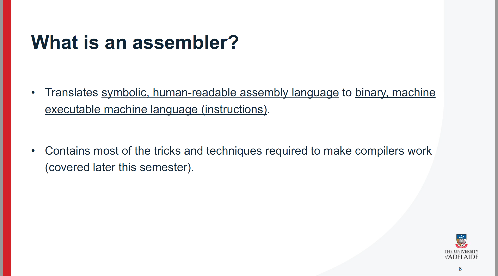

下面这页讲的是“汇编器（assembler）是什么”。我给你把要点拆开、配例子说明。

# 汇编器做什么？

- **把“汇编语言”翻译成“机器码”**。
   汇编语言是给人看的：用助记符（例如 `MOV`、`ADD`）、寄存器名（如 `EAX`）、标签（如 `loop:`）等。
   机器码是给CPU看的：一串字节（0和1），严格按照该CPU指令集的编码格式排列。
- **很多编译器用到的基本技术，在汇编器里就能看到**：词法/语法处理、符号表、两遍扫描、重定位、宏展开、错误检查等。编译器只是更“高层”（从 C/Java/Python 之类到汇编/机器码）并且多了类型检查、优化、寄存器分配等复杂步骤。

# 一个直观例子（x86）

假设有这段汇编（语法略简化）：

```asm
start:
    mov eax, 1       ; 把常数1放进EAX寄存器
    add eax, ebx     ; EAX = EAX + EBX
    jmp start        ; 跳回标签start
```

汇编器会做的事大致是：

1. **解析**每一行，识别出指令、寄存器、立即数、标签等。
2. **建立符号表**：记录 `start` 这个标签所在的地址。
3. **指令编码**成字节：
   - `mov eax, 1` → 十六进制字节：`B8 01 00 00 00`（B8 表示“把立即数装入 EAX”，后面4字节是数值1的小端表示）。
   - `add eax, ebx` → `01 D8`（`01 /r` 是“把右边寄存器加到左边寄存器”，`D8` 是寄存器对的编码）。
   - `jmp start` → `EB xx`（短跳指令，后面的 `xx` 是**相对位移**，由汇编器根据 `start` 的地址自动计算填入）。
4. 如果有跨文件引用（例如调用 `printf`），汇编器会**生成重定位信息**，把尚未确定的地址留给**链接器**（linker）在之后的链接阶段补全。

最终产物可能是：

- **可执行文件**（直接能运行），或
- **目标文件**（`.o`/`.obj`），里面包含机器码段、符号表、重定位表，等待链接器把多个目标文件和库拼成最终程序。

# 汇编器“具体都干了哪些细活”？

- **两遍汇编（常见做法）**
  - 第一遍：扫描代码、收集所有**标签/符号**的地址，建立符号表；同时大致计算每条指令将占用的字节数。
  - 第二遍：根据符号表把各处的**相对/绝对地址**填入指令，正式产出机器码和重定位记录。
- **伪指令（directives）与段（sections）**
   处理 `.text`（代码段）、`.data`（已初始化数据）、`.bss`（未初始化数据）等伪指令，以及 `ALIGN`（对齐）、`GLOBAL`（导出符号）之类的说明，它们不是CPU指令，但会影响布局与链接。
- **宏与伪指令展开**
   例如 `PRINT_INT x` 这样的宏，汇编器会在翻译前先把它展开成若干真正的指令。
- **伪指令/伪操作转真指令**
   有些“方便写法”（伪操作、伪指令）实际上要翻译为多条真实指令或特定编码（例如某些架构的“装大立即数”会拆成高/低两条指令）。
- **表达式求值与范围检查**
   例如 `#define SIZE 1024`、`jmp short label`（需要检查位移是否能放进8位）等。
- **生成列表/映射文件**（可选）
   方便人类调试：每行汇编对应哪些机器码字节、符号地址是多少。

# 汇编器 vs. 编译器 vs. 解释器

- **汇编器**：**汇编 → 机器码**，基本一一对应，几乎不做高层优化。
- **编译器**：**高级语言 → 汇编/机器码/字节码**，需要做语义分析、类型检查、优化、寄存器分配等；常常先生成中间表示（IR），再到机器码。
- **解释器**：**逐条读源代码并执行**，不一定生成独立的机器码文件（有的会JIT即时编译）。

# 为什么需要汇编器而不是直接写机器码？

- 机器码难读、易错；汇编提供**可读性**（助记符、寄存器名、标签、注释）。
- 汇编器能帮你**自动计算地址与位移**、管理数据段/对齐、处理跨文件符号与**重定位**，还能跟调试器/链接器配合工作。
- 同一指令含义在不同CPU上编码不同；汇编器负责按照**目标架构的指令集**严格编码。

# 一个RISC-V的小例子（再加深印象）

```
addi x1, x0, 5   ; x1 = 0 + 5
```

汇编器会把它编码成32位机器码（十六进制常见写法）`0x00500093`：
 这 32 位里分别塞了立即数、目的寄存器、功能位、操作码等字段——人手工算很枯燥且易错，交给汇编器最省心。

# 小结

- 这页的第一点：**汇编器把“人类可读的汇编”翻成“CPU可执行的机器码”。**
- 第二点：**汇编器内部包含许多“编译器也会用到的核心技术”**（符号表、两遍处理、宏、重定位、错误检查……）。学会汇编器如何工作，是理解编译器、链接器乃至整个工具链（assembler → linker → loader）的基础。

如果你手头有一段指定架构的汇编代码，我可以直接“逐行解释它会被编码成什么字节、为什么这样算”。


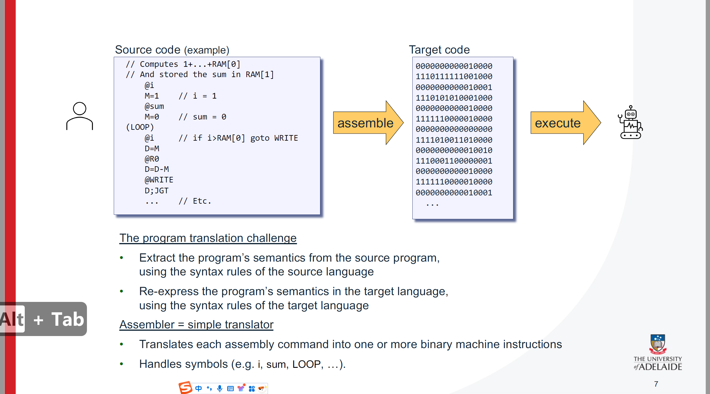

下面这页课件是在讲“汇编器（Assembler）是如何把汇编代码翻译成机器能直接执行的二进制指令”的。

# 左边：Source code（源代码，汇编）

灰色框里是一段**汇编语言**，类似 Nand2Tetris/Hack 汇编的风格。几条语句的意思：

- `@i`：把符号 `i` 装进地址寄存器 A（A ← 地址(i)）。
- `M=1`：把常数 1 存到 **内存地址 A 指向的位置**（M 代表 RAM[A]）。这行就是 `i = 1`。
- `@sum` / `M=0`：把变量 `sum` 清零（`sum = 0`）。
- `(LOOP)`：定义一个**标签** LOOP，供跳转用。
- `@i`、`D=M`：把 `i` 的值读到数据寄存器 D（D ← i）。
- `@R0`、`D=D-M`：D ← i − RAM[0]（R0 是预定义符号，指 RAM[0]）。
- `@WRITE`、`D;JGT`：**条件跳转**：如果 D>0（即 i > RAM[0]），就跳到标签 `WRITE`。

省略号 `...` 表示后面通常还会有：

- 把 `i` 加到 `sum` 上（`sum += i`）；
- `i++`；
- `goto LOOP` 继续循环；
- 在 `(WRITE)` 处把 `sum` 写到 `RAM[1]`，结束或死循环等待。

> 这段程序的目标功能（开头两行注释说明）：**计算 1+2+…+RAM[0]，并把结果存入 RAM[1]**。

# 中间箭头：assemble（汇编）

“assemble”这一步就是**翻译**：把上面的**助记符**（如 `@、D、M、JGT、LOOP` 等）和**符号**（`i、sum、WRITE` 等）翻成 CPU 能认识的**二进制机器码**。

典型做法（你以后自己写汇编器也会这么干）：

1. **第一遍扫描**：收集所有**标签**（如 `(LOOP)`、`(WRITE)`）在指令流中的地址，建**符号表**。
2. **第二遍扫描**：把每条汇编指令按照固定格式编码成 16 位二进制；把**变量名**（`i、sum`）分配到内存地址（通常从 16 开始），把**预定义符号**（`R0` 等）替换成对应地址。

> 在 Hack 指令里：
>
> - `@xxx` 是 **A 指令**，机器码以 `0` 开头；
> - 计算/存储/跳转是 **C 指令**，机器码以 `111` 开头，后面分别编码 `comp`（计算）、`dest`（目的）、`jump`（跳转条件）。

# 右边：Target code（二进制）

右侧那些 0/1 串就是**目标机器码**。CPU 只能执行它们。
 下一步箭头“execute”表示把这些二进制加载到机器/模拟器里，开始执行，最终在 `RAM[1]` 得到求和结果。

# 下面的两组要点

**The program translation challenge（程序翻译挑战）**

- 从源语言（汇编）的**语法**中，正确提取程序的**语义**。
- 再用目标语言（机器码）的**语法**，**等价地**表达同样的语义。

**Assembler = simple translator（汇编器 = 简单翻译器）**

- 把**每条汇编指令**译成**一条或多条机器指令**。
- 处理**符号**：变量名（`i、sum`）、标签（`LOOP、WRITE`）等都要被解析并替换成具体数字地址。

# 用更直白的伪代码还原

```txt
i = 1
sum = 0
LOOP:
  if i > RAM[0]:
      goto WRITE
  sum = sum + i
  i = i + 1
  goto LOOP
WRITE:
  RAM[1] = sum
  // 结束或停在此处
```

**一句话总结**：这页在说明——**汇编器的工作**就是把人类可读的“汇编源程序”（带有变量、标签、助记符）**机械地**翻译成 CPU 可执行的**二进制指令**；示例程序完成“从 1 累加到 RAM[0] 并把结果放到 RAM[1]”。


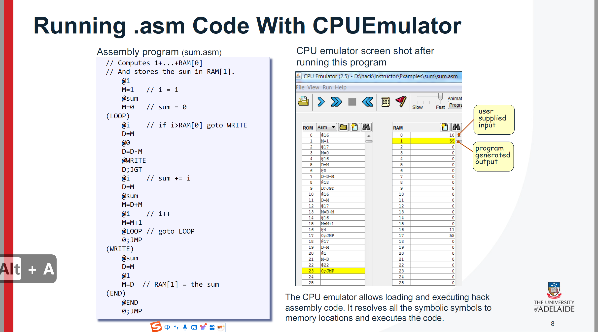


下面这页在讲：**如何用 CPUEmulator 运行一段 Hack 汇编（.asm）代码**。右图是运行后的内存截图；左边是示例程序 `sum.asm`。程序的功能是：
 **把 `1 + 2 + … + RAM[0]` 的和，写到 `RAM[1]`**。图里把 `RAM[0]` 设成 10，所以结果 `55` 被写进了 `RAM[1]`。

# 程序整体思路

1. 设定两个变量：`i`（从 1 开始累加）和 `sum`（累加和，从 0 开始）。
2. 循环：
   - 如果 `i > RAM[0]`，跳到 `WRITE` 把结果写出；
   - 否则 `sum += i`，`i++`，继续循环。
3. 在 `WRITE` 段把 `sum` 写到 `RAM[1]`，然后进入无限循环结束程序。

# 逐行读代码（注：Hack 架构里寄存器 A、D；`M` 代表 `RAM[A]`）

```asm
// Computes 1+...+RAM[0]
// And stores the sum in RAM[1].

@i      ; A = 符号 i 的地址（变量，汇编器会分配到 RAM[16] 起）
M=1     ; i = 1
@sum
M=0     ; sum = 0

(LOOP)        ; 循环标签
  @i
  D=M         ; D = i
  @0
  D=D-M       ; D = i - RAM[0]
  @WRITE
  D;JGT       ; 若 D > 0（即 i > RAM[0]），跳到 WRITE

  @i
  D=M         ; D = i
  @sum
  M=D+M       ; sum = sum + i

  @i
  M=M+1       ; i = i + 1

  @LOOP
  0;JMP       ; 无条件跳回 LOOP

(WRITE)       ; 写结果
  @sum
  D=M         ; D = sum
  @1
  M=D         ; RAM[1] = sum

(END)
  @END
  0;JMP       ; 无限空转，程序到此结束
```

## 几条语法/机制要点

- `@X`：把 A 寄存器设为常数/符号 X 的地址；之后的 `M` 就是 `RAM[A]`。
- `D;JGT`：若 D 寄存器的值 **大于 0**，则跳转到当前 A 寄存器指向的地址（这里是 `WRITE` 标签）。
- `(LABEL)`：定义标签，供 `@LABEL` 定位。
- 变量名 `i`、`sum` 没有预先分配地址，**汇编器**会从 `RAM[16]` 开始依次分配；因此在运行结束时，经常能在 `RAM[16]`、`RAM[17]` 看到它们的最终值（例如 `i=11`、`sum=55`）。

# 右侧 CPUEmulator 截图怎么读

- 左列 **ROM/Asm**：程序装载到 ROM 的指令序号（程序计数器从 0 往下执行），黄色是当前指令。
- 右列 **RAM**：数据内存。图中：
  - `RAM[0] = 10`（**用户输入**，告诉程序加到 10）；
  - `RAM[1] = 55`（**程序输出**）；
  - 更下方的地址（通常从 16 开始）能看到 `i`、`sum` 这样的**变量值**。

# 以本例为例的执行轨迹（`RAM[0]=10`）

- 初始化：`i=1, sum=0`
- 循环 10 次后：`sum` 依次变为 `1,3,6,...,55`，`i` 变为 `11`
- 再次比较：`i - RAM[0] = 11 - 10 = 1 > 0`，跳到 `WRITE`
- 写出：`RAM[1] ← 55`；程序结束空转

> 小算式验证：`1+…+10 = 10×11/2 = 55`，与内存一致。

如果你愿意，我也可以把这段代码改成“从任意起点加到任意终点”、或“计算偶数/奇数之和”的版本，并演示在模拟器里的效果。

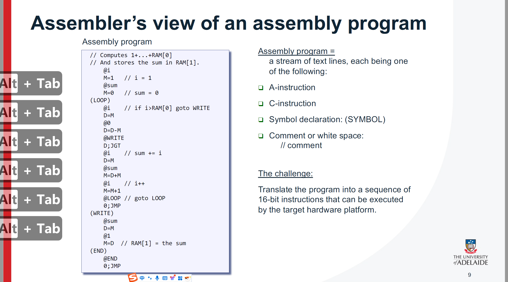

下面这张幻灯片在讲“汇编器（assembler）眼中的汇编程序”。它用一个小程序做例子，并说明汇编源代码都由哪些行组成、每一类行的含义，以及汇编器要做的事。

# 1) 汇编程序长什么样？

右侧给出定义：一个汇编程序是一串文本行，每一行属于下面之一：

- **A 指令**：形如 `@value` 或 `@symbol`，把 A 寄存器设成一个常数地址或符号的地址。
- **C 指令**：形如 `dest=comp;jump`，完成一次计算（`comp`），把结果写到目的寄存器（`dest`：可含 D/A/M 的任意组合），并可按条件跳转（`jump`）。
- **符号声明（标签）**：形如 `(LOOP)`、`(END)`，给当前这一行的**下一条机器指令的地址**起个名字，方便跳转。
- **注释或空白**：`// ...` 开头的是注释；空行、空格也会被忽略。

> 这套语法是 Nand2Tetris 的 Hack 汇编（A、D 两个寄存器；`M` 代表“内存中地址为 A 的那个单元”的内容，即 `M == RAM[A]`）。

# 2) 左边的示例程序在做什么？

注释写得很清楚：**计算从 1 加到 `RAM[0]` 的和，并把结果存在 `RAM[1]`**。
 也就是高层伪代码：

```text
i   = 1
sum = 0
while i <= RAM[0]:
    sum = sum + i
    i   = i + 1
RAM[1] = sum
```

# 3) 逐行读懂示例（关键行解释）

（`@x` 是 A 指令；其余大多是 C 指令）

- `@i` / `M=1`：把符号变量 `i` 对应的内存单元设为 1（初始化 i=1）。
- `@sum` / `M=0`：把变量 `sum` 设为 0（初始化 sum=0）。
- `(LOOP)`：定义标签 LOOP，供回跳。
- `@i` / `D=M`：D ← i。
- `@0` / `D=D-M`：D ← i − RAM[0]。因为 `@0` 让 A=0，此时 `M` 就是 `RAM[0]`。
- `@WRITE` / `D;JGT`：若 D>0（即 i>RAM[0]），跳到 WRITE 结束循环。
- `@i` / `D=M`；`@sum` / `M=D+M`：sum ← sum + i。
- `@i` / `M=M+1`：i ← i + 1。
- `@LOOP` / `0;JMP`：无条件跳回 LOOP。
- `(WRITE)`：写结果阶段的标签。
- `@sum` / `D=M`；`@1` / `M=D`：把 sum 写到 `RAM[1]`（因为 `@1` 使 A=1，此时 `M` 是 `RAM[1]`）。
- `(END)`；`@END` / `0;JMP`：程序尾，死循环停在原地。

> 小结：`@n` 把 A 设为 n；`M=...` 实际就是“写 RAM[A]”；`D;JGT` 表示“若 D>0 则跳转到当前 A 指向的标签/地址”；`0;JMP` 是**无条件跳转**。

# 4) 符号与变量如何生效？

- **标签**（如 `(LOOP)`、`(WRITE)`、`(END)`）由汇编器在第一遍扫描时记录成“地址名 → 指令地址”的映射。
- **变量**（如 `i`、`sum`）在 Hack 约定里从内存地址 16 开始按需分配；用到 `@i`、`@sum` 时，汇编器会把它们替换成各自的真实地址。
- 预定义地址：`@0`、`@1` 分别是 `RAM[0]`、`RAM[1]`。

# 5) “汇编器要做的挑战”是什么？

右下角写的 challenge：**把这些人类易读的行转换成硬件可执行的 16 位机器指令序列**。
 在 Hack 架构里：

- A 指令的机器码形如 `0 vvvvvvvvvvvvvvv`（1 位 0 + 15 位数值）。
- C 指令形如 `111 a c1..c6 d1..d3 j1..j3`（分别编码 comp/dest/jump）。

------

如果你想，我可以把这段汇编进一步“翻译”成逐条 16 位二进制机器码，或带一个具体例子（比如 `RAM[0]=3`）走一遍执行过程，看看寄存器/内存每一步如何变化。

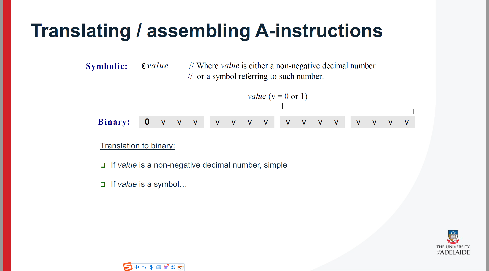

这页讲的是 **把 A 指令（A-instruction）从符号形式翻译成二进制机器码**。这是在 Nand2Tetris/Hack 架构里最简单的一类指令。

# 1) A 指令的样子

- **符号形式（assembly）**：`@value`
   `value` 要么是**非负十进制数**，要么是**符号（symbol）**，指向某个数（地址）。

- **机器码（binary）**：一共 16 位
   **最高位=0**，后面 **15 位装入 value 的二进制**

  ```
  bit15 bit14........................bit0
    0     v v v v v v v v v v v v v v v
  ```

  因此 `value` 的取值范围是 **0～32767（2^15-1）**。

> 执行含义（顺带）：把这个值装进 **A 寄存器**；随后可以用 `A` 或别名 `M`（表示内存地址 A 指向的单元）进行计算。

# 2) 如何翻译成二进制

**情况 A：`value` 是数字**

1. 把十进制 `value` 转成 15 位二进制（不够前面补 0）。
2. 在最前面加一个 0，就是 16 位机器码。

例子：

- `@0` → `0000000000000000`
- `@21` → `0000000000010101`
- `@32767` → `0111111111111111`（最大值）

**情况 B：`value` 是符号（名字）**
 需要先把“名字 → 数值（地址）”**解析**出来，再按上面当作数字编码。解析规则（汇编器完成）：

1. **预定义符号**（固定地址）
   - `R0`~~`R15` → 0~~15
   - `SP`=0, `LCL`=1, `ARG`=2, `THIS`=3, `THAT`=4
   - `SCREEN`=16384, `KBD`=24576
2. **标签符号**：代码里形如 `(LOOP)`
   - 含义是“下面那条**指令**的 ROM 地址”。汇编器**第一遍**扫描时把 `LOOP` 记成那个地址。
3. **变量符号**：既不是预定义也不是标签、首次出现的名字（如 `i`、`sum`）
   - 从 **RAM 地址 16** 开始依次分配：`i`→16，下一新变量→17，等等。

得到数值后，再按“情况 A”编码 15 位。

例子：

- `@SCREEN`（16384）→ `0100000000000000`

- 有标签

  ```
  (LOOP)
      @LOOP
      0;JMP
  ```

  若 `(LOOP)` 的地址是 4，则 `@LOOP` → `0000000000000100`

- 变量

  ```
  @i      // 第一次见到 i，分到地址 16
  M=0
  ```

  `@i` → `0000000000010000`（即 16）

# 3) 小结

- A 指令编码：**0 + 15 位 value**。
- `value` 是数字就直接转二进制；是符号就**先查/分配地址**（预定义/标签/变量），再编码。
- 这样就把人类可读的 `@value` 变成 CPU 可执行的 16 位机器码。

如果你给我几条具体的 `@...` 指令或一段带标签/变量的小程序，我可以直接把它们逐条转成二进制给你看。

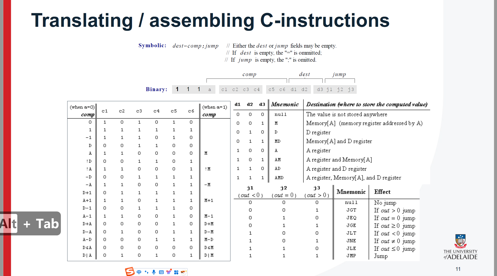

# 这页在讲：如何把 **C-instruction**（Hack 汇编里的计算/跳转指令）翻译成二进制

**C 指令的符号形式：**

```
dest = comp ; jump
```

- `dest` 和 `jump` 都是**可省略**的：
  - 没有 `dest` 就不写 `=`；
  - 没有 `jump` 就不写 `;`。
- `comp` 是要计算的表达式（由 ALU 完成）；`dest` 是把计算结果写到哪里；`jump` 是根据结果是否跳转。

------

## 二进制格式（16 位）

```
1 1 1  a  c1 c2 c3 c4 c5 c6   d1 d2 d3   j1 j2 j3
└──C 指令固定前缀 111────┘   └dest┘      └─jump─┘
              └─── comp(7 位= a + 6 位 c) ───┘
```

### 1) comp 字段（7 位 = `a` + `c1..c6`）

- **a 位**决定用 **A** 寄存器还是 **M=RAM[A]**：
  - `a=0`：表达式里的 A 就是寄存器 **A**（如 `A+1`,`D|A`）
  - `a=1`：把 A 的位置理解为 **M**（内存 RAM[A]），同一组 `c1..c6` 码复用（如 `M+1`,`D|M`）
- `c1..c6`：由表格给出具体表达式的编码（图里左下那张大表）。常见条目（`a` 写在最前）：
  - `0` → `0 101010`
  - `1` → `0 111111`
  - `-1` → `0 111010`
  - `D` → `0 001100`
  - `A`/`M` → `0 110000` / `1 110000`
  - `!D` → `0 001101`，`!A`/`!M` → `0 110001` / `1 110001`
  - `D+1` → `0 011111`，`A+1`/`M+1` → `0 110111` / `1 110111`
  - `D-1` → `0 001110`，`A-1`/`M-1` → `0 110010` / `1 110010`
  - `D+A`/`D+M` → `0 000010` / `1 000010`
  - `D-A`/`D-M` → `0 010011` / `1 010011`
  - `A-D`/`M-D` → `0 000111` / `1 000111`
  - `D&A`/`D&M` → `0 000000` / `1 000000`
  - `D|A`/`D|M` → `0 010101` / `1 010101`

### 2) dest 字段（3 位 `d1 d2 d3`）

- 三个位依次表示是否把结果写入 **A、D、M**。
   对应关系和助记符（图右上小表）：
  - `000`：`null`（不存）
  - `001`：`M`
  - `010`：`D`
  - `011`：`MD`
  - `100`：`A`
  - `101`：`AM`
  - `110`：`AD`
  - `111`：`AMD`

### 3) jump 字段（3 位 `j1 j2 j3`）

- 根据 ALU **输出 out** 与 0 的比较来跳转（图右下小表）：
  - `000`：`null`（不跳）
  - `001`：`JGT`（out>0）
  - `010`：`JEQ`（out=0）
  - `011`：`JGE`（out≥0）
  - `100`：`JLT`（out<0）
  - `101`：`JNE`（out≠0）
  - `110`：`JLE`（out≤0）
  - `111`：`JMP`（无条件跳转）

> 备注：`out` 就是 `comp` 计算出来的结果。

------

## 手把手翻译 5 个例子

### 例 1：`D = M`

- 解析：`dest=D`，`comp=M`，无 `jump`
- `comp(M)`：`a=1, c=110000` → `1 110000`
- `dest(D)`：`d1 d2 d3 = 0 1 0`
- `jump(null)`：`000`
- **机器码**：`111 1 110000 010 000` → `1111110000010000`

### 例 2：`MD = D-1`

- `comp(D-1)`：`0 001110`
- `dest(MD)`：`011`
- `jump(null)`：`000`
- **机器码**：`111 0 001110 011 000` → `1110001110011000`

### 例 3：`0 ; JMP`（不存结果，直接无条件跳转）

- `comp(0)`：`0 101010`
- `dest(null)`：`000`
- `jump(JMP)`：`111`
- **机器码**：`111 0 101010 000 111` → `1110101010000111`

### 例 4：`D ; JGT`（如果 D>0 就跳）

- `comp(D)`：`0 001100`
- `dest(null)`：`000`
- `jump(JGT)`：`001`
- **机器码**：`111 0 001100 000 001` → `1110001100000001`

### 例 5：`AM = D | M`

- `comp(D|M)`：`1 010101`
- `dest(AM)`：`101`
- `jump(null)`：`000`
- **机器码**：`111 1 010101 101 000` → `1111010101101000`

------

## 快速记忆法

1. 先按 `=`、`;` 切出三部分：`dest`、`comp`、`jump`。
2. 查表得到 `comp` 的 `a` 和 `c1..c6`。
3. `dest` 看是否包含 A/D/M，置位 `d1 d2 d3`。
4. `jump` 对应 `j1 j2 j3`（`JMP=111`，其余按条件）。
5. 前缀 `111` 拼起来就是 16 位机器码。

这样就能把任何一条 C-instruction 从“助记符”精确翻成 0/1 二进制啦。

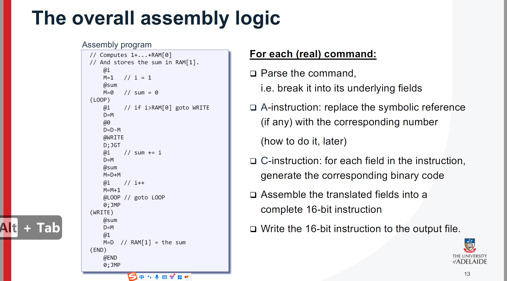

这页在说明：**把 Hack 汇编（.asm）翻译成 16 位机器码（.hack）的总体流程**。左边仍是求和程序 `sum.asm`，右边列出了汇编器（assembler）对**每一条“真正的指令”**要做的事。

> “真正的指令”= 只指 **A 指令** 和 **C 指令**；
>  不是指令的东西（空白、注释 `//...`、标签 `(LOOP)` 这类符号声明）都不会产生命令字。

------

## 汇编流程（对每条“真正的指令”）

1. **解析（Parse）**
   - 先去掉空白/注释。
   - 标签 `(LABEL)` 只用于“记住当前 ROM 地址”，不输出机器码。
   - 把剩下的每条指令分解成字段：
     - **A 指令**：`@xxx`（xxx 可以是数字或符号名）
     - **C 指令**：`dest=comp;jump`（`dest`/`jump` 可省略）
2. **处理 A 指令（地址/常量装入）**
   - 形式：`@value`
   - 如果 `value` 是**十进制数字**，直接把它转为 15 位二进制；机器码格式：
      **`0 vvvvvvvvvvvvvvv`**（最高位 0，后面 15 位是地址/常量）。
   - 如果 `value` 是**符号**（变量名或标签名），先查符号表得到数字：
     - **预定义符号**：`SP=0, LCL=1, ARG=2, THIS=3, THAT=4, R0..R15=0..15, SCREEN=16384, KBD=24576`
     - **标签**：`(X)` 的地址=**它后面第一条真实指令**的 ROM 行号（首次扫描时记下）
     - **变量**：首次出现时，从 **RAM[16]** 起依次分配（16、17、18…），并加入符号表
   - 得到数字后，再按上面的 A 指令格式输出 16 位。
3. **处理 C 指令（运算/存储/跳转）**
   - 形式：`dest=comp;jump`
   - 机器码格式：
      **`111 a c1..c6 d1 d2 d3 j1 j2 j3`**
     - `comp` → 决定 `a` 与 `c1..c6`（运算是什么：如 `D+M`、`A-1`、`0`、`1`…）
     - `dest` → 三个比特 `d1d2d3` 表示把结果写到 `A`、`D`、`M` 的哪几个（例如 `M=...` 就是 `001`，`AD=...` 就是 `110`）
     - `jump` → 三个比特 `j1j2j3` 表示条件跳转（如 `JGT/JGE/JEQ/JNE/JLE/JMP` 等；若无跳转就是 `000`）
4. **组装并输出**
   - 把这些字段拼成完整的 16 位二进制字符串，**每条指令一行**写到 `.hack` 输出文件。
   - 这个 `.hack` 文件就可以被 CPUEmulator/硬件加载执行。

------

## 结合左边程序的小例子（符号如何被解析）

以代码片段：

```asm
@i
M=1
@sum
M=0
(LOOP)
  ...
@WRITE
D;JGT
  ...
(WRITE)
  ...
(END)
@END
0;JMP
```

- **第一次扫描（记标签地址）**
   只看真实指令计数 ROM 地址：
   `LOOP` 在第 **4** 条位置，`WRITE` 在 **18**，`END` 在 **22**。
- **变量分配**
   首次遇到的变量 `i`、`sum` 依次分配到 **RAM[16]、RAM[17]**。
- **翻译示例**
  - `@i` → `@16` → 二进制：`0000000000010000`
  - `@WRITE` → `@18` → 二进制：`0000000000010010`
  - `M=1` 是 C 指令：`dest=M`、`comp=1`、无跳转 → 形如 `111 a cccccc 001 000`（其中 `comp=1` 的编码固定，`dest` 为 `001` 表示写 M）。
  - `D;JGT`：`dest` 空、`comp=D`、`jump=JGT` → 形如 `111 a cccccc 000 001`。

> 这样处理完整个文件后，就得到一个只含 0/1 的 `.hack` 文件。CPUEmulator/硬件读取这个文件即可执行你写的汇编程序。

如果你想，我可以把整份 `sum.asm` 翻译成完整的 16 位机器码清单，或者演示如何自己实现一个“两遍式”Hack 汇编器（第一遍建符号表，第二遍生成机器码）。

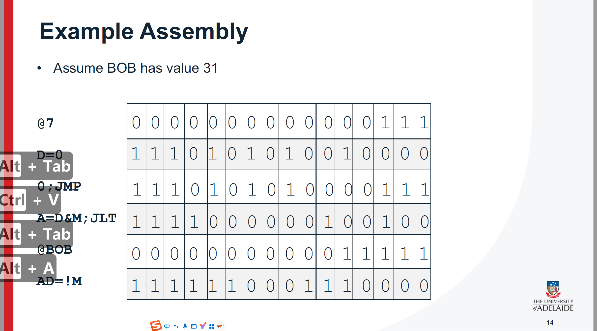

这页是在用 **Hack 汇编**（Nand2Tetris 课程里的那套）做“指令到机器码”的示例。右边的方格里每一行就是一条 **16 位机器码**。左边给出对应的汇编指令。标题里 “Assume BOB has value 31” 表示把符号 **BOB** 当作常量 **31** 来用（也就是 `@BOB` 会被汇编器替换成 `@31`）。

先记住两种指令格式：

- **A 指令**：`0 vvvvvvvvvvvvvvv`（共 16 位）。把 A 寄存器设为一个 15 位值/地址。
- **C 指令**：`111 a c1..c6 d1 d2 d3 j1 j2 j3`。
  - `a c1..c6` 编码计算表达式 `comp`（是否用到 `M` 由 `a` 决定：`a=0` 用 A，`a=1` 用 M=RAM[A]）；
  - `d1 d2 d3` 是目的寄存器 `dest`（A D M 三位，1 表示写入）；
  - `j1 j2 j3` 是跳转 `jump`（000=不跳，001=JGT，010=JEQ，011=JGE，100=JLT，101=JNE，110=JLE，111=JMP）。

下面把左侧每条汇编的**含义**和**机器码**（括号内给出 16 位二进制）逐条说明。为了更容易对上图，每 16 位我不分组，直接给出一串 0/1：

------

### 1) `@7`

把 A 设为 7。A 指令机器码是 0 加 15 位常数：
 **`0000000000000111`**

------

### 2) `D=0`

计算常数 0，写到 D。

- `comp=0` 的编码是 `a=0, c=101010`
- `dest=D` ⇒ `d1d2d3 = 010`
- 无跳转 ⇒ `j=000`
   机器码：**`1110101010010000`**

------

### 3) `0;JMP`

计算常数 0，不写目的寄存器，**无条件跳转**（JMP）到 **A** 中保存的地址。

- `comp=0`：`a=0, c=101010`
- `dest` 为空 ⇒ `000`
- `JMP` ⇒ `111`
   机器码：**`1110101010000111`**

> 注意：JMP 是“无条件”，与 `comp` 的值无关；目标地址是当前 A 寄存器里的值（上一条 `@...` 设定的）。

------

### 4) `A=D&M;JLT`

把 `D & M`（按位与）作为 `comp` 的输出：

- `D&M` 需要用 `M`，所以 `a=1`，而 `D&A` 的底码是 `000000`，因此这里 `a c1..c6 = 1 000000`；
- 目的寄存器包含 **A** ⇒ `dest = 100`（写入 A）；
- `JLT`（结果小于 0 则跳）⇒ `j = 100`；
   机器码：**`1111000000100100`**

> 细节：这条指令一边把结果写入 **A**，一边用同一个结果做跳转条件；若为负则跳到“**刚写进去的 A** 的值”所指的地址（这是合法但少见的写法，主要是演示“同时有 dest 与 jump”）。

------

### 5) `@BOB`（假定 BOB=31）

符号 `BOB` 被当作常数 31，等价于 `@31`，把 **A=31**：
 机器码：**`0000000000011111`**

------

### 6) `AD=!M`

按位求反 `!M`（即 `!RAM[A]`），并**同时**写入 A、D：

- `!M` 用到了 M ⇒ `a=1`，`!A` 的底码是 `110001`，换成 M 只需把 `a` 置 1，所以 `a c1..c6 = 1 110001`；
- 目的寄存器 `A` 和 `D` ⇒ `dest = 110`；
- 不跳转 ⇒ `j=000`；
   机器码：**`1111110001110000`**

> 由于第 5 条把 A=31，这里 `M` 指的是 `RAM[31]`，所以此指令把 `RAM[31]` 的按位取反结果写进 A 和 D。

------

## 小结

- 图中的每一行 16 位 0/1 就是上面某条汇编指令的**机器码**。
- `@符号` 会先被汇编器解析成一个具体数值（这里 `BOB=31`），再按 A 指令格式编码。
- C 指令可以**同时**有 `dest` 和 `jump`；跳转判断的依据是 ALU 的 `comp` 输出是否满足条件，跳到的目标地址取自 **A 寄存器**。

如果你愿意，我也可以把这几条指令按“执行过程”走一遍，展示每一步 A、D、M、PC 的变化。

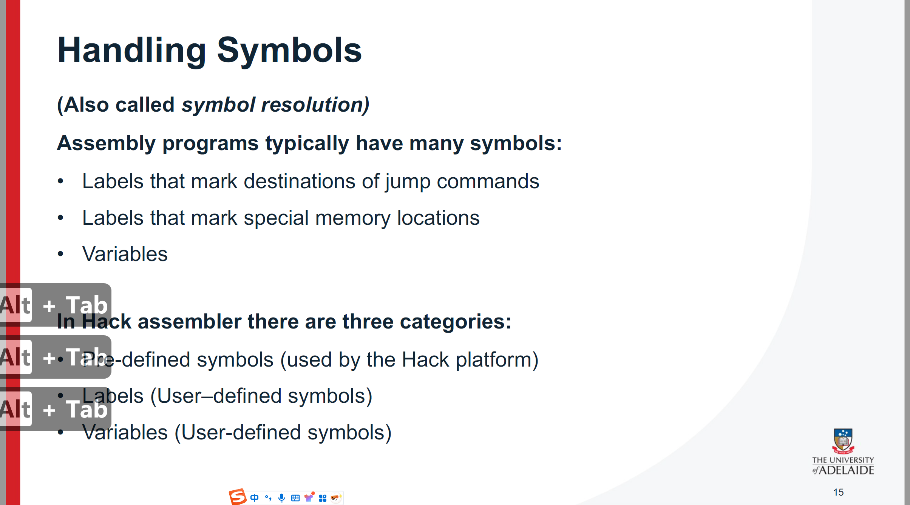

这页讲 **“符号处理（symbol resolution）”**：汇编器如何把程序里写的人类可读**符号**（名字）变成**具体的数值地址**，以便生成机器码。以 Nand2Tetris 的 **Hack 汇编器**为例。

## 为什么要“解析符号”？

汇编程序里充满了名字而不是裸地址：

- **跳转目标的标签**：`(LOOP)`、`JMP LOOP`
- **特殊内存位置的名字**：`SCREEN`、`KBD`、`SP`、`R0`…
- **变量名**：`i`、`sum`、`ptr` …
   CPU 只认识数字地址，所以汇编器要先把这些名字都换成数字——这一步就叫 **符号解析** 或 **处理符号**。

------

## Hack 汇编器中的三类符号

### 1) 预定义符号（平台内置，固定含义）

- 寄存器别名：`R0`~~`R15` → 地址 `0`~~`15`
- 栈/段指针：`SP=0, LCL=1, ARG=2, THIS=3, THAT=4`
- 显示与键盘：`SCREEN=16384`，`KBD=24576`
   这些在任何程序里都一样，**无需分配**，直接查表得到地址。

### 2) 标签（Label，用户自定义）

- 写法：`(LOOP)`、`(END)`（**不是**指令，不占机器码）

- 含义：标记“**下一条指令**的 ROM 地址”。
   例：

  ```
  (LOOP)        // 假设这是程序的第4条指令的位置
  0;JMP         // @LOOP 实际编码时会被替换成 4
  ```

- 用途：作为跳转目标：`@LOOP`、`0;JMP`

### 3) 变量（Variable，用户自定义）

- 不是预定义、也不是标签的首次出现的名字（如 `i`、`sum`）
- **从 RAM 地址 16 开始**顺序分配：`i→16`，下一个新变量 `→17`，以此类推
- 之后再次用到同名变量，仍然用同一个地址

------

## 汇编器如何完成解析？（经典两遍法）

**第一遍（只处理标签）：**

1. 从头到尾扫描源代码，忽略空行/注释和伪指令外的内容
2. 每看到一个 **指令**，ROM 地址计数 `PC` +1
    每看到一个 **标签 `(X)`**，把 `X → 当前PC` 记进**符号表**（但 `PC` 不加，因为标签不生成机器码）

**第二遍（生成机器码并处理 A 指令中的符号）：**
 遇到 `@value`：

1. 如果 `value` 是数字 → 直接编码成 A 指令（最高位 0，后 15 位为该数的二进制）
2. 如果是符号：
   - 先查**预定义表**（如 `SCREEN`）或**第一遍记录的标签表**（如 `LOOP`）
   - 都找不到 → 这是**新变量**：给它分配下一个可用 RAM 地址（从 16 起），并记录到符号表
   - 拿到地址后按数字处理、编码成 A 指令

> 注意：Hack 的 A 指令只有 15 位可存值，范围 `0..32767`。预定义的 `SCREEN=16384`、`KBD=24576` 都在范围内。

------

## 小例子：一步步解析

```asm
@i        // 第一次见到 i -> 分配 RAM[16]
M=0

(LOOP)    // 记录 LOOP 的 ROM 地址（下一条指令的地址）
  @i
  M=M+1
  @LOOP
  0;JMP
```

- 第一遍：记下 `LOOP → 2`（假设从 0 开始计，这里“下一条指令”是第 2 条）
- 第二遍：
  - `@i`（第一次）→ `i→16`，编码成 `@16`
  - `@i`（再次）→ 仍是 16
  - `@LOOP` → 查到标签地址 2，编码成 `@2`

------

## 常见细节与易错点

- **标签不占 ROM 空间**：只有“真正的指令行”才增加地址。
- **变量占 RAM，不占 ROM**：变量地址用于运行时读写内存。
- **名字合法字符**（习惯用法）：字母、数字、`_.$:` 组合，且不能以数字开头。
- **不要与预定义名冲突**：不要把变量命名成 `SCREEN`、`R0` 之类。
- **想要常量就直接写数字**：`@123` 比起 `@CONST`（再定义 `CONST=123`）更直接，除非你希望复用/可读性更好。

------

### 一句话总结

> 这页的核心：**把汇编里的各种“名字”（预定义、标签、变量）解析成具体数值地址**。
>  Hack 汇编器用“两遍法”构建符号表：第一遍收集**标签地址**，第二遍把 A 指令里的符号替换成地址；变量从 **RAM 16** 起自动分配，预定义符号固定不变。

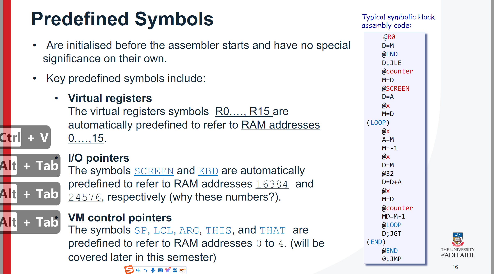

这页讲 **Hack 汇编里的“预定义符号（predefined symbols）”**——也就是**在汇编器开始工作前就已经放进符号表的名字**。它们本质上只是**固定地址的别名**，没有“魔法语义”。这样写程序就不用死记硬背具体数字地址。

------

## 三类关键预定义符号

1. **虚拟寄存器（virtual registers）**
    `R0` … `R15` → 对应 `RAM[0]` … `RAM[15]`。

   - 只是名字=地址的映射，等价于直接用这些 RAM 单元。
   - 其中 `R0..R4` 也分别被下面 VM 指针复用（见第 3 点）。

2. **I/O 指针（memory-mapped I/O）**

   - `SCREEN` → `RAM[16384]`（0x4000）：显存起始地址。屏幕 256×512 像素，每 16 个像素打包成 1 个 16 位字，因此显存占用 8192 个字（从 16384 到 24575）。
   - `KBD` → `RAM[24576]`（0x6000）：键盘状态寄存器（按键的扫描码放在这里）。

   > 为啥是这两个数？因为 Hack 机器把显示与键盘**内存映射**到了这两段地址上：显存块从 16384 开始、长度 8192；紧接着是键盘寄存器 24576。

3. **VM 控制指针**（供虚拟机/调用约定使用；汇编器本身不强制语义）

   - `SP=0`、`LCL=1`、`ARG=2`、`THIS=3`、`THAT=4`（都指向相应的 RAM 位置）。
   - 这些名字让高一层的 VM 代码/运行时更容易读写。

> 补充：**非预定义的变量名**（如 `x`、`counter`）在第一次出现时会被分配到**从地址 16 起**的可用 RAM；**标签**（如 `(LOOP)`、`(END)`）则记下**当前指令的 ROM 地址**，供跳转用。

------

## 右侧“典型代码”在做什么（逐行读秒懂）

这段程序用到了上面的预定义符号，作用是：**从屏幕左上角开始，画一条竖线，高度为 `R0` 指定的行数**（每次把一整“字”的 16 个像素都点亮）。

```asm
@R0     D=M          // D = RAM[0]，取出要画的高度
@END    D;JLE        // 如果高度<=0，则跳到 END 结束

@counter M=D         // counter = 高度（新变量；分配到某个 RAM[>=16]）
@SCREEN  D=A         // D = 16384（显存起始地址）
@x       M=D         // x = 16384（当前要写的显存地址）

(LOOP)
@x       A=M         // A = x（把 A 指向显存中的当前字）
M=-1                 // RAM[A] = -1：把该字的 16 个像素全部点亮
@x       D=M         // D = x
@32      D=D+A       // D = x + 32（每行 512 像素=32 个字，所以下一行同列地址+32）
@x       M=D         // x = x + 32（移动到下一行同一列）

@counter MD=M-1      // counter--，同时 D=counter
@LOOP    D;JGT       // 如果 counter>0，回 LOOP 继续画
(END)
@END     0;JMP       // 死循环/结束
```

- `@SCREEN` 用的就是**预定义符号**：自动等于 16384。
- `@R0` 用的是**预定义寄存器别名**：等同于 `@0` 再访问 `M`。
- `@x`、`@counter` 是**普通变量名**：第一次出现时由汇编器自动分配 RAM 地址（从 16 开始）。
- `(LOOP)`、`(END)` 是**标签**，只是给 ROM 地址起名，供跳转指令使用。

------

### 一句话总结

**预定义符号**=“写程序更友好的地址别名”。`R0..R15` 指 RAM 前 16 个单元；`SCREEN=16384`、`KBD=24576` 是 I/O 的内存映射地址；`SP/LCL/ARG/THIS/THAT=0..4` 是 VM/调用约定用的指针。右侧示例利用这些符号，按 `R0` 的高度在屏幕上画竖线。

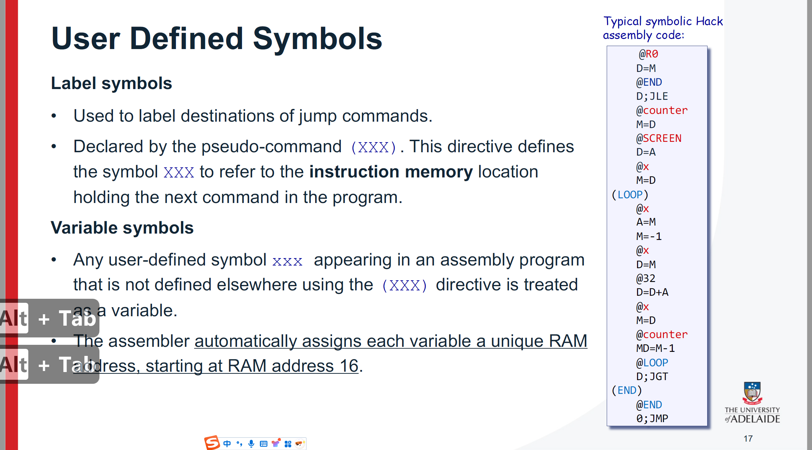

这页是讲 **用户自定义符号（User Defined Symbols）** 在 Hack 汇编里的含义和汇编器如何处理它们。下面我把要点拆开、并用例子把处理流程讲清楚。

# 什么是「标签符号（label symbols）」

- 用途：把跳转（jump）指令的目标命名。例如你写 `(LOOP)`，就是把名字 `LOOP` 绑定到**程序中某条指令的 ROM 地址**，以便后面用 `@LOOP` 跳到那里。
- 语法：伪指令 `(XXX)`。它**本身不生成机器码**，只是告诉汇编器“接下来那条真实指令的地址是 `XXX`”。
- 特点：标签指向的是 **指令内存（ROM）** 的位置（即程序行号），而不是 RAM 地址。

# 什么是「变量符号（variable symbols）」

- 任何在程序中出现、**没有用 `(XXX)` 定义为标签**，也不是汇编器预定义的符号，就被当作**变量**处理（例如 `@counter`、`@x`）。
- 汇编器会**自动**为每个变量分配一个唯一的 RAM 地址，分配从 `RAM[16]`（地址 16）开始，依次往后（16、17、18...）。
- 也就是说，变量最终对应的是数据内存（RAM）地址，程序通过 `@var` + C 指令中的 `M`/`D`/`A` 操作来读写这些 RAM 单元。

# 预定义符号（常见的）

汇编器还自带一些预定义名字（你无需声明）：

- `R0`..`R15` → 0..15
- `SP`=0, `LCL`=1, `ARG`=2, `THIS`=3, `THAT`=4
- `SCREEN`=16384, `KBD`=24576
   （不同实现可能列得更多，但这些是标准常用的）

# 汇编器如何处理这些符号（典型“两遍式”流程）

1. **第一遍扫描（只看标签）**
   - 从程序开头按行数计数真实指令的 ROM 地址（注：注释、空行、标签 `(X)` 不计入）。
   - 遇到 `(LABEL)` 时，把 `LABEL -> 当前 ROM 地址` 写入符号表。
   - 结果：所有标签都被解析为对应的 ROM 行号。
2. **第二遍扫描（生成机器码并分配变量地址）**
   - 遇到 `@XXX`：
     - 如果 `XXX` 是数字（比如 `@10`），直接当做常数地址。
     - 否则查符号表：
       - 若表中已有（预定义符号或第一遍记录的标签），使用该地址；
       - 若没有，说明这是变量，分配下一个可用 RAM 地址（从 16 开始），并把 `XXX -> 分配地址` 加入表。
   - 把 A/C 指令翻译成 16 位机器码写出。

# 结合右侧示例（如何映射）

右侧示例代码（节选）包含：`@R0`, `@END`, `@counter`, `@SCREEN`, `@x`, `(LOOP)`, `(END)` 等。下面是可能的解析结果（示例说明，不一定是精确行号）：

- 预定义：`R0` → 0；`SCREEN` → 16384（直接可用）
- 标签（第一遍记录 ROM 地址）：
  - `(LOOP)` → 假设在 ROM 行 10（示例），则 `LOOP -> 10`
  - `(END)` → 假设在 ROM 行 22，则 `END -> 22`
- 变量（第二遍遇到并分配 RAM 地址，从 16 开始）：
  - 第一次遇到 `@counter` → 分配 `RAM[16]`，记录 `counter -> 16`
  - 第一次遇到 `@x` → 分配 `RAM[17]`，记录 `x -> 17`
     （如果 `@x` 之前已经作为变量出现过，则不会重新分配）

这样，当汇编器看到 `@counter` 时，会把它转成 `@16` 的 A 指令；看到 `@LOOP` 时，会把它转成 `@10`（即跳转到 ROM 行 10）。

# 常见误区 / 注意点

- `(LABEL)` 不占用 ROM 指令位置——它只是标记下一条真实指令的地址。
- 变量地址是 **数据内存（RAM）** 地址（从 16 开始），标签是 **指令内存（ROM）** 地址（行号）。两者语义不同。
- 预定义符号不要用作新变量名（会覆盖或被识别为已定义）。
- 汇编器通常是“两遍式”：第一遍收集标签，第二遍生成机器码并分配变量。

# 举个具体小例子（完整流程）

代码（简化）：

```asm
@counter
M=0
(LOOP)
  @counter
  M=M+1
  @LOOP
  D;JGT
(END)
@END
0;JMP
```

- 第一遍：记录 `LOOP` 的 ROM 地址（例如第 2 条指令），记录 `END` 的 ROM 地址（例如第 6 条）。
- 第二遍：
  - 遇到 `@counter`，符号表无 `counter` → 分配 `counter -> RAM[16]`。
  - 所有 `@counter` 都被替换成 `@16`，`@LOOP` 替换成 `@2`，`@END` 替换成 `@6`。
  - 生成对应的 16-bit 指令文件（.hack）。

------

如果你希望，我可以：

- 用你给的右侧完整代码做一次真实的“符号表演示”，列出第一遍记录的标签地址和第二遍分配的变量地址；或者
- 把一段包含标签/变量的示例代码逐行展示它被翻译成的 16-bit 二进制。想看哪一种？

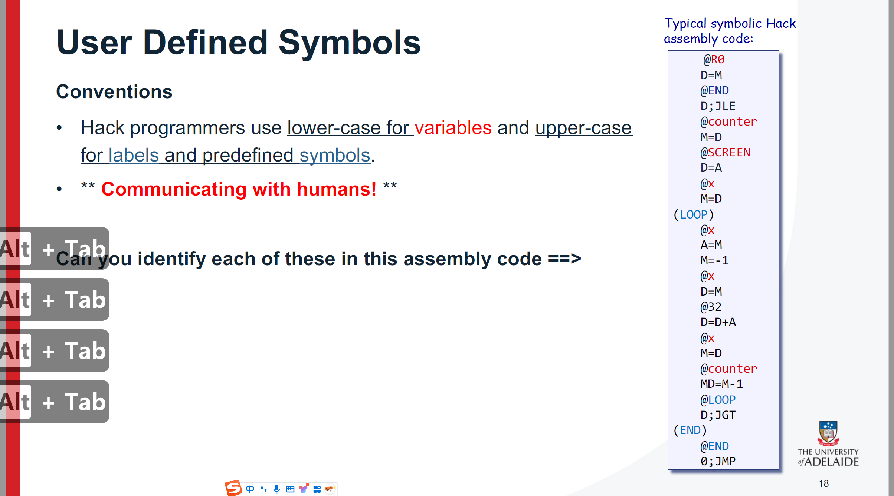

这页在讲 **Hack 汇编（Nand2Tetris）里的“用户自定义符号”**，并用右边这段程序当例子，区分三类符号：

1. **预定义符号**（大写）：`R0..R15`、`SCREEN`、`KBD`、`SP/LCL/ARG/THIS/THAT` 等，已经固定了地址。
2. **标签 label**（通常大写、放在括号里）：如 `(LOOP)`、`(END)`，表示“把当前位置的**下一条机器指令地址**起个名字”。
3. **变量 variable**（通常小写）：如 `x`、`counter`，汇编器从 `RAM[16]` 开始自动分配地址。

> 幻灯片中“lower-case for variables, upper-case for labels and predefined symbols”只是**人类可读的约定**，帮助区分；汇编器真正依赖的是语法（`(LABEL)`、`@symbol` 等）。

------

# 逐行看右侧代码在做什么

这段程序在**屏幕上画一条竖线/条带**：把显示内存从左上角开始，每隔一行写一次 `-1`（即 16 个像素全点亮），共画 `RAM[0]` 行。

Hack 屏幕映射：`SCREEN` 的地址是 16384（0x4000），分辨率 512×256；一“字”（16 位）对应一行里的 16 个像素，因此**每行有 512/16=32 个字**。所以**地址 +32** 就是“同一列、下一行”。

逐条解释（→ 表示效果）：

1. `@R0`
    `D=M` → 把 `RAM[0]` 读到 D（作为要画的行数）。
2. `@END`
    `D;JLE` → 若 D ≤ 0 就跳到 `END`（没有要画的行，直接结束）。
3. `@counter`
    `M=D` → 变量 `counter` ← D，保存剩余行数。
4. `@SCREEN`
    `D=A` → D ← 屏幕基址 16384。
5. `@x`
    `M=D` → 变量 `x` ← 屏幕当前写入地址（先从左上角开始）。
6. `(LOOP)`  标签：循环起点。
7. `@x`
    `A=M` → A ← `x`（把 A 指向当前要写的屏幕字）。
8. `M=-1` → 把 `RAM[A]` 设为 `-1`（二进制全 1），这一字对应的 16 个像素全部点亮。
9. `@x`
    `D=M` → D ← x（取当前地址）。
10. `@32`
     `D=D+A` → D ← x + 32（跳到下一行，同一列）。
11. `@x`
     `M=D` → x ← x + 32（更新“当前屏幕地址”）。
12. `@counter`
     `MD=M-1` → counter ← counter − 1，同时 D ← counter（把剩余行数减 1）。
13. `@LOOP`
     `D;JGT` → 若 D > 0（还剩行数），跳回 `LOOP` 继续画下一行。
14. `(END)`  标签：结束。
15. `@END`
     `0;JMP` → 无条件跳到 `END`（停在这里，相当于“死循环暂停”）。

------

# 把每个符号分类

- **预定义符号**（大写、地址固定）：`R0`（地址 0）、`SCREEN`（地址 16384）。
- **标签**（大写、括号包裹）：`(LOOP)`、`(END)` —— 被解析成对应的**指令地址**。
- **变量**（小写、地址自动分配）：`counter`、`x` —— 第一次出现时，从 `RAM[16]` 起按需分配。

------

# 细节补充（易错点）

- `MD=M-1` 表示**同时**把结果写入 `M` 和 `D`。
- `A=M` 意味着把 A 寄存器改成“当前 A 指向的内存单元的值”（这里就是把 `x` 变量里的地址装进 A）。
- `D;JLE` / `D;JGT` 等跳转，判断的是 ALU 计算出的结果（这里是 D）的符号/零值，跳去的目标地址是**此时的 A**。

如果你想，我可以把这段汇编转换成逐条 16 位机器码，或用一个具体数值（比如 `RAM[0]=5`）带你走完每一步 A/D/内存/PC 的变化。

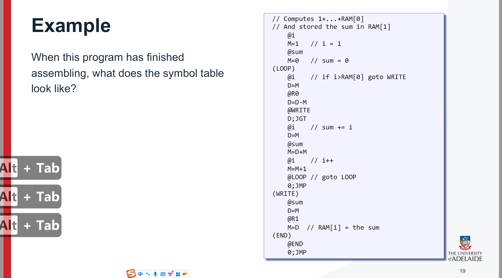

这页在问：**这段 Hack 汇编程序汇编完成后，符号表（symbol table）长什么样？**
 我们把代码逐行数 ROM 地址（标签不占地址），并按“两遍法”推导出标签地址与变量分配。

## 程序做什么

- 计算 `1 + 2 + ... + RAM[0]`，把结果写到 `RAM[1]`。
- 关键逻辑：
   `D = i - R0`，如果 `D>0` 说明 `i > RAM[0]`，跳到 `WRITE`；否则把 `i` 加到 `sum`，`i++`，再回到 `LOOP`。

## 逐行编号（ROM 地址）

> 地址从 0 开始；只有 A/C 指令计数，`(LABEL)` 不占地址。

```
0:  @i
1:  M=1
2:  @sum
3:  M=0
(LOOP)              // LOOP 指向 4
4:  @i
5:  D=M
6:  @R0
7:  D=D-M
8:  @WRITE
9:  D;JGT
10: @i
11: D=M
12: @sum
13: M=D+M
14: @i
15: M=M+1
16: @LOOP
17: 0;JMP
(WRITE)             // WRITE 指向 18
18: @sum
19: D=M
20: @R1
21: M=D
(END)               // END 指向 22
22: @END
23: 0;JMP
```

## 变量分配（RAM）

- 变量从 **RAM[16]** 起分配：
   第一次见到 `@i` → `i = 16`；第一次见到 `@sum` → `sum = 17`。
   之后再用同名符号都还是这些地址。
- `R0=0、R1=1` 等是**预定义符号**，不是新分配的变量。

## 最终符号表（只列用户相关项）

**标签（ROM）**

- `LOOP → 4`
- `WRITE → 18`
- `END → 22`

**变量（RAM）**

- `i → 16`
- `sum → 17`

**预定义（平台自带，供参考）**

- `R0=0, R1=1, …, R15=15`
- `SP=0, LCL=1, ARG=2, THIS=3, THAT=4`
- `SCREEN=16384, KBD=24576`

> 这样在第二遍汇编时，`@LOOP/@WRITE/@END` 会被替换成各自的 ROM 地址，`@i/@sum` 会被替换成 16 和 17，程序即可编码成最终机器码。

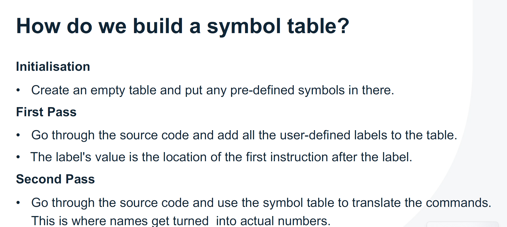

这页是在讲**汇编器如何构建“符号表（symbol table）”**，也就是把**名字 → 数字地址**的映射先准备好，再据此把代码翻译成机器码。下面把流程拆开讲清楚，并给你一段小例子。

------

# 要点先懂

- **符号表**：一个字典/哈希表，记录 `符号名 → 数值`。
  - 两大类符号：
    1. **标签**（如 `(LOOP)`）：映射到 **ROM 指令地址**（第几条指令）。
    2. **变量**（如 `i, sum`）：映射到 **RAM 数据地址**（内存单元）。
- Hack 机器里**预定义符号**（已约定好的别名）在程序开始前就放进表里：
   `SP=0, LCL=1, ARG=2, THIS=3, THAT=4, R0..R15=0..15, SCREEN=16384, KBD=24576`。
- **变量地址分配**从 `RAM[16]` 开始依次往上。

------

# 三步流程（对应幻灯片）

## 1) Initialisation（初始化）

- 建一个空表，把**预定义符号**全部放进去。
- 设两个计数/指针：
  - `ROM = 0`：记录“下一条指令的地址”（只数 **A/C 指令**，**标签行不计入**）。
  - `nextVar = 16`：下一个可用变量的 RAM 地址。

## 2) First Pass（第一遍：只处理**标签**）

- 从头到尾扫描源码（去掉空行/注释）：
  - 遇到 **标签** `(XYZ)`：把 `symbol["XYZ"] = ROM`。**不**增加 ROM（因为标签不是指令）。
  - 遇到 **A/C 指令**：`ROM += 1`。
- 这一遍结束后，**所有标签的 ROM 地址**都确定了。

> 记住：**标签 = 跳转目标 = 指令地址**；它指向**“标签后面那条指令”**。

## 3) Second Pass（第二遍：真正翻译并补全**变量**）

- 重新从头扫描：
  - **跳过标签行**。
  - 遇到 **A 指令** `@X`：
    - 如果 `X` 是**数字**，直接用这个数；
    - 如果 `X` 在符号表里（预定义/标签/已分配变量），取其值；
    - 否则把 `X` 当**新变量**：赋值 `symbol[X] = nextVar; nextVar += 1`。
    - 把这个数编码成 A 指令机器码：`0vvvvvvvvvvvvvv`（15 位值）。
  - 遇到 **C 指令** `dest=comp;jump`：按上一页的 `comp/dest/jump` 表编码成
     `111 a c1..c6 d1 d2 d3 j1 j2 j3`。
- 输出每条指令对应的 16 位二进制。

------

# 迷惑点 & 常见坑

- **不要把标签计入 ROM**；否则所有跳转目标都会偏移。
- **数字常量**（如 `@123`）不是变量，**不**应分配 RAM。
- **同名符号**不可重复定义（同一标签出现两次应报错）。
- **区分 ROM 与 RAM**：
  - 标签 → ROM（程序计数器用的地址）；
  - 变量/预定义寄存器 → RAM（数据存储的地址）。

------

# 一个小例子（完整走一遍）

源码（含两个变量 `i、sum` 和两个标签 `START、END`）：

```asm
(START)
@i
M=1
@sum
M=0
@END
D;JLE
(END)
0;JMP
```

**第一遍（标签 -> ROM）**
 去掉空行/注释后逐行计数（只数 A/C）：

- `(START)` → 记 `START = 0`，ROM 不变
- `@i`        → ROM=1
- `M=1`       → ROM=2
- `@sum`      → ROM=3
- `M=0`       → ROM=4
- `@END`      → ROM=5
- `D;JLE`     → ROM=6
- `(END)`   → 记 `END = 6`，ROM 不变
- `0;JMP`     → ROM=7

**此时符号表**（部分）：
 `{ SP:0, LCL:1, ..., R0..R15, SCREEN:16384, KBD:24576, START:0, END:6 }`

**第二遍（翻译 & 分配变量）**

- `@i`：`i` 不在表 → 分配 `i=16`（nextVar=17），输出 A(16)
- `M=1`：按 C 表编码
- `@sum`：`sum` 不在表 → 分配 `sum=17`（nextVar=18），输出 A(17)
- `M=0`：按 C 表编码
- `@END`：表里已有 `END=6`，输出 A(6)
- `D;JLE`：按 C 表编码
- `0;JMP`：按 C 表编码

到这，**名字都变成了具体数字**，机器就能执行了。

------

# 伪代码（实现参考）

```pseudo
initTable(table):
  put all predefined symbols into table
  nextVar = 16

// Pass 1: labels
ROM = 0
for line in cleaned_source:
  if isLabel(line):           // (X)
    name = labelName(line)
    assert name not in table
    table[name] = ROM
  else if isInstruction(line):
    ROM += 1

// Pass 2: translate
nextVar = 16
for line in cleaned_source:
  if isLabel(line): continue
  if isA(line):               // @X
    X = symbol(line)
    if isNumber(X): value = toInt(X)
    else if X in table: value = table[X]
    else: table[X] = nextVar; value = nextVar; nextVar += 1
    emit A-instruction(value)
  else:                       // C-instruction
    (dest, comp, jump) = parseC(line)
    bits = encodeC(dest, comp, jump) // 查表
    emit bits
```

> 这样做的直觉：**第一遍**先把所有“路标”（标签）立起来，保证跳转有目标；**第二遍**在真正生成机器码时，再把**未见过的名字**当“变量”分 RAM 地址，同时把所有助记符翻成 0/1。

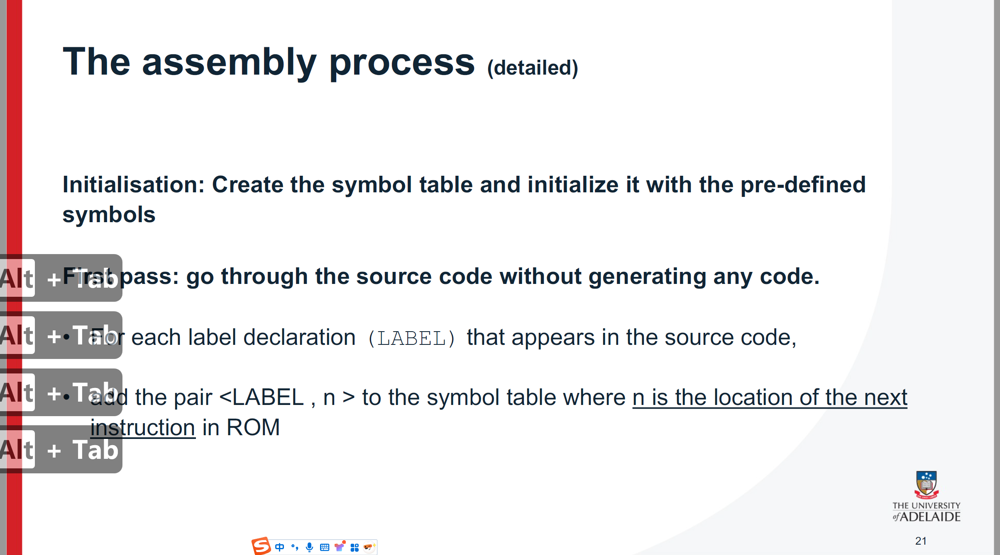

# 这页的意思（详细中文解释）

这页讲的是 **汇编器的第一遍（first pass）** 如何建立符号表（symbol table），以及为什么要先“走一遍代码但不生成机器码”。核心思想是：把所有 **标签 `(LABEL)`** 的名字先解析出来并记录它们对应的 **指令内存（ROM）地址**，以便后面在第二遍把 `@LABEL` 替换成具体的地址。

------

## 关键步骤（逐句解释）

1. **Initialisation: Create the symbol table and initialize it with the pre-defined symbols**
   - 初始化一个符号表，先把汇编器的预定义符号放进去（例如 `R0..R15` → 0..15，`SP`=0，`LCL`=1，`ARG`=2，`SCREEN`=16384，`KBD`=24576 等）。
   - 这样当后面遇到 `@R0` 或 `@SCREEN` 可直接得到对应数字。
2. **First pass: go through the source code without generating any code.**
   - 第一遍只做扫描，不产出 `.hack` 机器码。目的是确定所有标签对应的 ROM 行号（指令地址）。
3. **For each label declaration `(LABEL)` that appears in the source code, add the pair `<LABEL, n>` to the symbol table where \*n is the location of the next instruction in ROM\*.**
   - 当遇到 `(LABEL)` 时，不把它当作一条要生成机器码的指令；而是把 `LABEL` 和它**后面那条真实指令**在 ROM 中的行号 `n` 记录到符号表。
   - 也就是说：`(LABEL)` 的作用是“标记下一条会被翻译成机器码的指令的地址”，供后续 `@LABEL` 跳转使用。

------

## 为什么要这样做？（动机）

- 标签用于跳转（例如 `@LOOP` 后面有 `0;JMP` 或 `D;JGT` 等）。要生成机器码，跳转目标必须是一个具体的数字地址（ROM 行号）。
- 因为标签可以出现在跳转指令之前或之后，且标签本身不占 ROM 行（它只是注释式的标记），所以必须先把所有标签的“实际 ROM 地址”确定下来，才能在第二遍准确替换 `@LABEL` 为数值地址并生成二进制指令。

------

## 一个小示例（演示计数与记录）

假设源代码如下（每行前有行号仅为说明）：

```asm
// 源文件（注释不计入）
@0         // 实际指令 0
D=M        // 实际指令 1
(LOOP)     // 标签 —— 不计为指令
@i         // 实际指令 2
M=M+1      // 实际指令 3
@LOOP      // 实际指令 4 （跳回）
0;JMP      // 实际指令 5
```

- 第一遍扫描时，我们只给真实会被翻译的指令计 ROM 地址：
  - `@0` → ROM 地址 0
  - `D=M` → ROM 地址 1
  - `(LOOP)` → **不占地址**，但它的存在说明“下一条真实指令（`@i`）的地址是 2”，所以把 `LOOP -> 2` 写到符号表
  - 其余继续计数，直到文件结束。
- 结果：符号表增加一项 `<LOOP, 2>`。第二遍就可以把 `@LOOP` 替换为 `@2` 来生成机器码。

------

## 与“变量分配”区分开来

- **标签 `(LABEL)`** 指向的是 **ROM（指令内存）地址**（用于跳转）。
- **变量（例如 `@i`、`@counter`）** 指向的是 **RAM（数据内存）地址**，汇编器会在第二遍第一次遇到未定义的变量时，从 `RAM[16]` 开始分配地址（16、17、18…）。
- 两者用途和地址空间不同，不能混淆。

------

## 总结（一句话）

第一遍扫描的目的是**建立标签到 ROM 地址的映射（符号表的一部分）**，这样后面在生成机器码时，所有跳转目标就都能被正确替换为数字地址，从而产生可执行的 16-bit 指令文件。

------

如果你愿意，我可以：

- 用你给的某段真实代码做一次**模拟第一遍**，把每条真实指令编号并列出最终生成的 `<LABEL, n>` 名单；或者
- 继续演示第二遍如何把 `@LABEL` 和变量替换成具体数值并输出机器码。你想看哪一种？

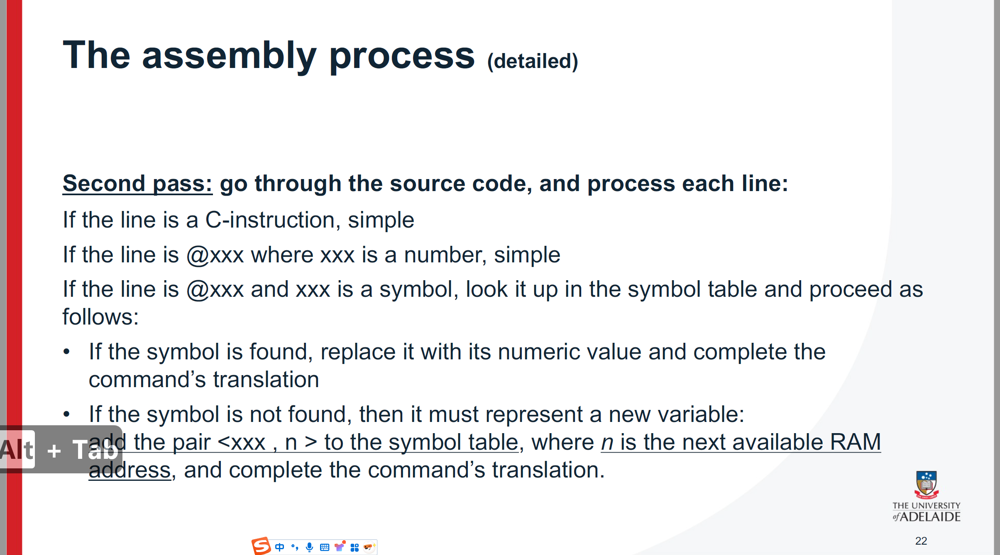

这张幻灯片描述的是 **Hack 汇编程序的汇编过程**，特别是 **第二遍扫描**（second pass）。在这个阶段，汇编器已经经过了第一遍扫描，并建立了符号表（symbol table）。接下来，汇编器逐行处理源代码，完成符号的替换，并最终生成机器代码。

### 汇编过程的详细说明

#### 第二遍扫描（Second Pass）：

1. **C 指令**：
   - 对于 C 指令（如 `D=A+1`），不需要做任何符号替换，因为 C 指令已经是数值计算，并且已准备好生成对应的机器码。
      汇编器会直接翻译 C 指令的计算和跳转逻辑，并将其转换为 16 位机器指令。
2. **`@xxx` 其中 xxx 是数字**：
   - 如果 `@xxx` 后面的 `xxx` 已经是一个数字（例如 `@5`），那么它很简单：汇编器直接将 `xxx` 转换成 A 指令的二进制格式。
      例如，`@5` 会被翻译为 `0000000000000101`（对应数字 5 的 16 位二进制表示）。
3. **`@xxx` 其中 xxx 是符号**：
   - 如果 `@xxx` 后面的 `xxx` 是一个符号（例如 `@counter`），那么汇编器会查找符号表，查看该符号对应的地址。
     - **如果符号已经被定义**（如在之前的行中定义了 `@counter`），汇编器就会用它对应的地址值替换符号。
     - **如果符号尚未定义**（这通常是用户定义的变量），汇编器会为其分配一个新的内存地址，并将符号及其地址添加到符号表中，然后继续翻译这个命令。

### 汇编过程的具体步骤：

- **如果符号已找到**：汇编器会将符号替换为它的数值（即内存地址），然后继续翻译指令。
- **如果符号未找到**：汇编器会认为这个符号是一个新的变量，将其添加到符号表中，并为该符号分配一个新的内存地址（通常从 `RAM[16]` 开始），然后继续翻译这条指令。

### 关键点：

- **符号表**：汇编器通过第一遍扫描记录了所有的标签（如 `(LOOP)`）和用户定义的变量（如 `counter`），它在第二遍扫描时用这些符号来替换相应的地址。
- **新变量的处理**：对于用户定义的新变量，汇编器会从 `RAM[16]` 起，按顺序分配内存地址。

### 总结：

第二遍扫描的目标是：

- **符号替换**：将符号（如 `@counter`）替换为对应的内存地址（如 `@16`）。
- **生成机器码**：根据翻译后的指令生成 16 位机器码，最终生成可由计算机执行的机器代码。

这个过程确保了汇编器可以从包含符号和标签的源代码，生成最终的、完全可执行的机器码。

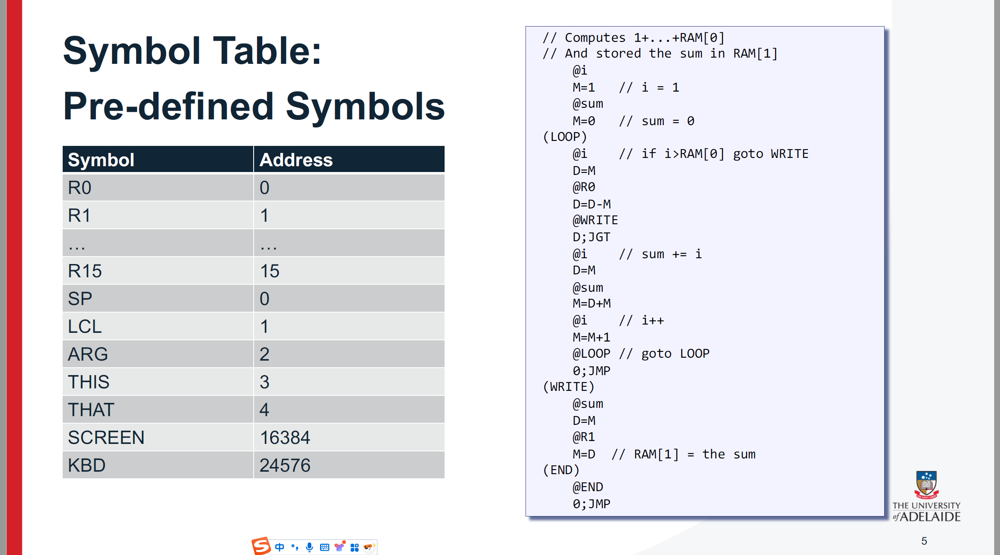

这页展示了 **Hack 汇编器的预定义符号表**，以及它们对应的内存地址。这些符号是平台自带的，表示 Hack 机器中固定的硬件资源（如寄存器、内存地址等）。符号表的这些项无需用户定义，它们的地址是固定的，供程序中使用。

## 预定义符号及其含义

### 1) **R0 到 R15（寄存器）**

- `R0` 到 `R15` 代表 Hack 平台上的 16 个寄存器。
- 它们的地址从 **0 到 15**，分别映射到 RAM 的 **0 到 15** 地址。
  - 例如：`@R0` 是访问 `RAM[0]`，`@R1` 是访问 `RAM[1]`，依此类推。

### 2) **特殊寄存器**

- **SP**（Stack Pointer）：栈指针，指向当前栈的顶部，地址为 **0**。
- **LCL**（Local Pointer）：局部变量指针，地址为 **1**。
- **ARG**（Argument Pointer）：参数指针，地址为 **2**。
- **THIS** 和 **THAT**：指向当前对象的指针（通常在对象模型中），分别位于 **3** 和 **4**。

### 3) **内存映射**

- **SCREEN**：用于映射显示器内存，地址为 **16384**（相当于从 0x4000 开始的内存区域）。
- **KBD**：用于映射键盘输入，地址为 **24576**（相当于从 0x6000 开始的内存区域）。

这些预定义符号通常会在程序中用来表示固定的硬件地址，供程序进行输入输出、内存操作等。

## 程序中的符号表

结合前一页的汇编程序，以下是符号的应用：

- **`@R0`**：代表 RAM 地址 0，可能用来读取用户的输入。
- **`@SCREEN`**：代表显示器的起始地址，可以直接控制屏幕输出。
- **`@KBD`**：代表键盘输入的内存位置，用于读取来自键盘的输入。

这些符号可以使得程序在 Hack 汇编中更加**可读**和**易于理解**，而不需要直接使用地址数字。程序在汇编时，汇编器会自动将这些符号替换成相应的内存地址。

------

### 总结

- **R0 到 R15**：映射到 RAM 中的前 16 个地址，用作通用寄存器。
- **SP, LCL, ARG, THIS, THAT**：用于栈操作和函数调用，分别在 RAM 的 0 到 4 地址。
- **SCREEN 和 KBD**：分别映射显示器和键盘输入，地址从 16384 和 24576 开始。

这些符号表帮助汇编器在处理代码时，用符号代替硬编码的内存地址，从而提高了代码的可移植性和可读性。

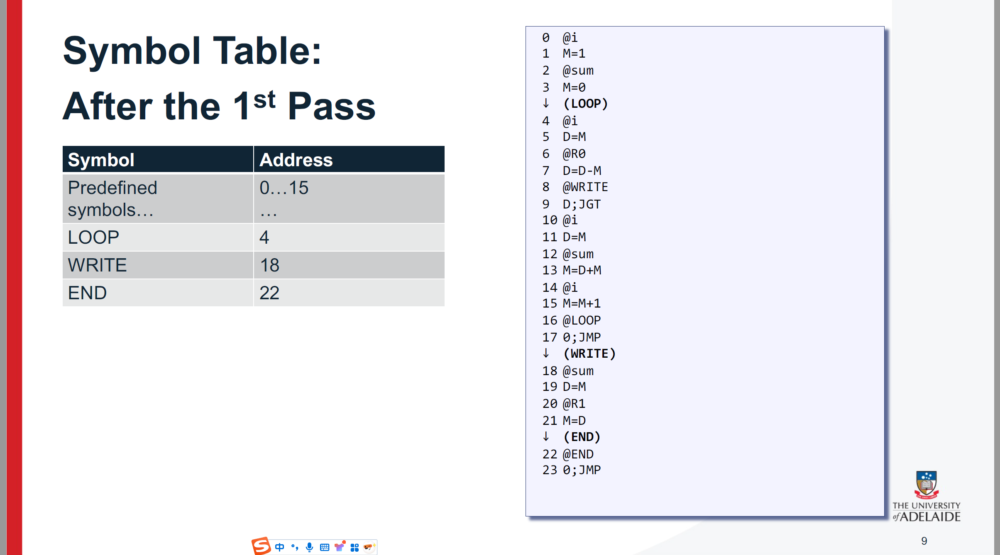

这页显示的是**符号表的第一遍（First Pass）\**结果，具体地，它列出了所有\**预定义符号**和**用户定义的标签**，以及它们在程序中对应的**ROM 地址**。

------

# 符号表（First Pass 后）

## 左侧：符号表

1. **预定义符号**
   - 这些符号已经在汇编器中预设好，如 `R0..R15`、`SCREEN`、`KBD` 等，自动映射到相应的地址。
   - 在表格里，这些符号的地址从 `0` 到 `15`，即映射到 Hack 机器的 RAM 地址范围。
2. **用户定义标签**
   - 程序中使用的标签（如 `LOOP`、`WRITE` 和 `END`）也被加入到符号表。
   - **标签**是用户自定义的标识符，通常在代码中表示跳转的目标位置。
   - 在第一遍中，程序会为每个标签指定**其对应的ROM地址**。例如：
     - `LOOP` 标签对应地址 `4`（即 `@LOOP` 出现的那条指令的地址）
     - `WRITE` 标签对应地址 `18`
     - `END` 标签对应地址 `22`

## 右侧：汇编源代码（第一遍扫描后）

1. **程序行**显示了每个汇编语句的执行顺序。
   - 行号 `0` 到 `3` 为普通的 A/C 指令。
   - 在遇到 `@LOOP` 和 `(LOOP)` 时，汇编器会把 `LOOP` 记录为一个标签，并把它的地址 `4` 存入符号表。
   - 之后程序继续运行，在遇到 `@WRITE` 和 `(WRITE)` 时，把 `WRITE` 标签的地址 `18` 放入符号表。
   - 同理，遇到 `(END)` 时，会将 `END` 标签的地址 `22` 存入符号表。

## 第一遍的工作

- 在**第一遍扫描**源代码时，汇编器**只处理标签**。每当遇到一个标签（如 `(LOOP)`），它就会将该标签与当前的**ROM地址**关联。这里**ROM地址**是指指令在汇编中的位置，从 `0` 开始递增。
- 标签被加入到符号表后，不会再影响**ROM地址**（标签所在行的 ROM 地址不会增加）。

------

## 总结：

- **符号表**：记录了所有的符号（包括预定义符号和用户标签）及其对应的地址。
- **第一遍**的目标是把所有标签与它们对应的ROM地址关联起来，为后续第二遍的翻译准备基础。第二遍会根据这些地址将标签替换成实际的数字地址。

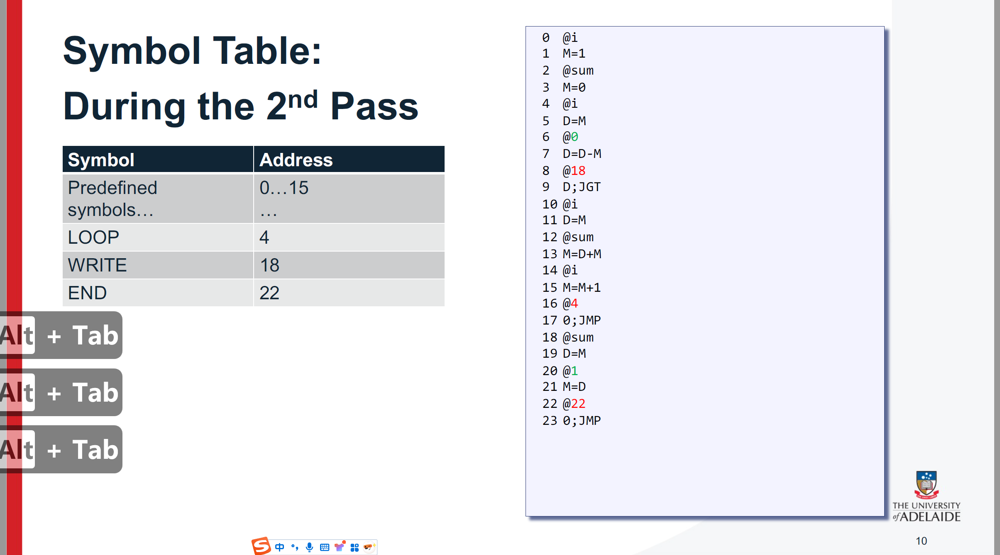

这页展示了 **第二遍（second pass）** 的符号表和程序中的实际指令。它展示了在**第一遍建立符号表后**，如何将标签（`LOOP`、`WRITE`、`END`）和 **内存地址** 进行替换，并最终生成机器代码。

### 关键内容分析

#### **符号表（Symbol Table）**

符号表列出了所有在第一遍中记录的 **标签和其对应的 ROM 地址**：

- `LOOP` → 地址 4
- `WRITE` → 地址 18
- `END` → 地址 22
- 其他：一些预定义符号 `R0..R15`、`SP` 等也在表中，但未详细列出。

符号表的作用是：当程序在第二遍扫描时，遇到 `@LOOP` 这样的标签时，汇编器会把它替换为地址 4。

#### **第二遍（Second Pass）**

在第二遍中，程序会处理所有的标签、变量和指令。此时，程序已经知道了每个标签在 ROM 中的具体地址。

- **步骤**：
  1. 汇编器根据符号表，**替换所有的标签**（例如 `@LOOP` 变为 `@4`）。
  2. 汇编器会将**所有指令**转换为 16 位二进制机器码。
  3. **不再需要解析标签**，只需要直接将指令转换成机器码。

#### **程序代码分析**

- 原始代码的每条指令在第二遍会根据符号表进行替换：
  - `@18` → `WRITE` 标签对应的地址。
  - `@22` → `END` 标签对应的地址。
  - 其他指令保持不变，例如 `@i`, `@sum`，它们会被进一步处理成实际的内存地址（如通过符号表进行替换或分配新地址）。

例如：

- 第 8 行：`@18` 被替换为 `@WRITE` 对应的地址 18。
- 第 22 行：`@22` 被替换为 `@END` 对应的地址 22。

#### **生成机器码**

- 每条指令将被转换成 16 位二进制。例如：
  - `@i` → 地址替换（通过变量分配），后面会被转换成 `@16` 或其他具体的 RAM 地址。
  - `D=M` → C 指令，汇编器会转换成相应的二进制码。

在第二遍中，汇编器会最终把所有符号（标签、变量）替换为具体的地址并生成 16 位机器码，最终输出到 `.hack` 文件。

------

### **总结**

- **第一遍**：汇编器构建符号表，将所有标签和内存地址记录下来（如 `LOOP`、`WRITE`）。
- **第二遍**：汇编器扫描源代码，将 `@标签` 替换为符号表中的地址，最终输出机器码。

此过程确保了汇编器能够正确处理跳转指令（例如 `@LOOP`），并且能够通过符号表快速找到标签对应的地址，从而生成有效的机器码。

------

如果你有任何问题或想要进一步讨论如何转换具体的指令或如何生成机器码，请告诉我！

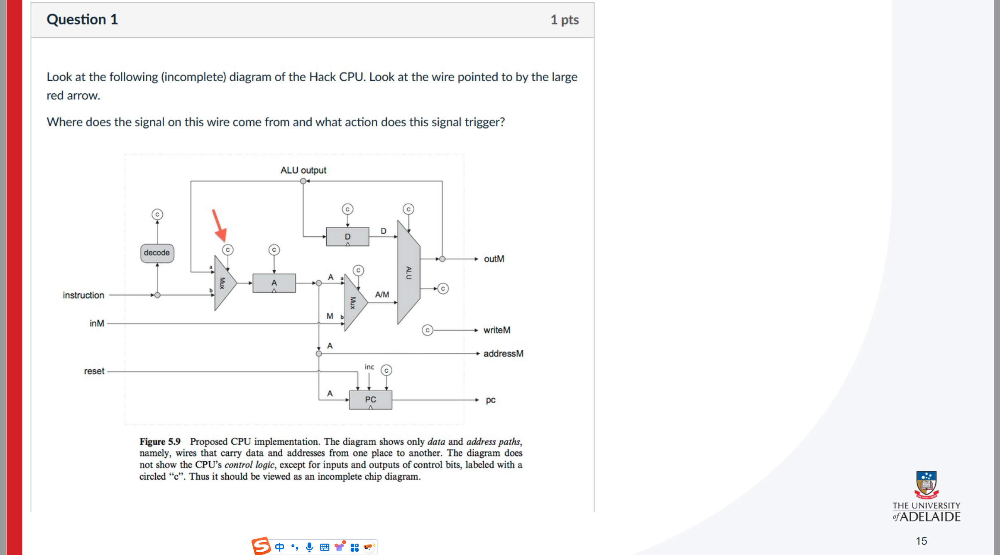

这张图展示的是 **Hack CPU 的部分设计**，并且问题在问：**红色箭头指向的信号来自哪里，并且它触发了什么操作**？

### 图解结构概述：

- **ALU（算术逻辑单元）** 负责计算和逻辑操作。
- **寄存器 A 和 D** 存储中间结果或数据。
- **寄存器 M** 存储内存的数据。
- **PC（程序计数器）** 控制程序的执行流。
- **指令输入（instruction）** 控制各个操作的触发。
- **信号通路** 表示数据和控制信号的流动。

### 解析红色箭头指向的信号

红色箭头指向的信号经过如下路径：

1. **decode（解码）**：
   - 该信号由**指令解码器**生成，用于将输入的指令（来自内存或程序计数器）解码成操作和目标寄存器。
   - 例如，指令可能是对寄存器进行算术运算，或从内存中读取/写入数据。
2. **具体信号和作用**：
   - 该信号直接连接到 **A 寄存器**（A）旁的一个 **反向器**（NOT gate）。这通常用于决定在执行操作时是否从 **M（内存）** 中读取数据。
   - **如果该信号激活**，则指示要进行 **内存写操作** 或 **将计算结果送入 M**，并决定 **ALU** 操作是否采用 A 寄存器的值还是内存中的值。

### 触发的操作

- **激活该信号时**，它**控制了数据流向和 ALU 操作**，并且可能触发以下操作：
  - **A 寄存器的值更新**：如果信号指向 A 寄存器，它会影响数据传输或 ALU 输入。
  - **内存读取或写入**：该信号还可能控制从内存读取数据或者将 ALU 计算结果写回内存（通过 `writeM` 和 `addressM` 信号）。例如，ALU 计算的结果会被存储到内存中的指定位置。
  - **PC 更新**：信号也可能触发程序计数器（PC）的更新，用于控制下一条指令的获取。

### 总结

- 红色箭头指向的信号**来自指令解码部分**，它解码并决定是否启用 A 寄存器，是否从内存读取或写入数据，甚至是否更新程序计数器（PC）。这个信号是 **控制逻辑的一部分**，决定了 CPU 中数据和指令的执行流程。

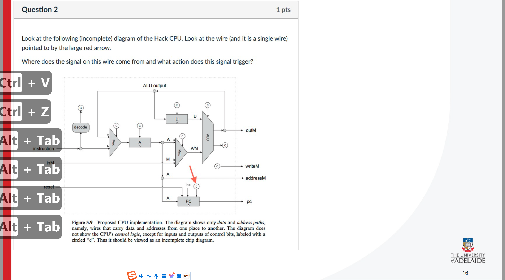

这张图展示了 **Hack CPU** 的不完整电路图，重点关注的是由**红色箭头指示的单根信号线**。题目要求回答这根信号线来自哪里，以及它触发了什么操作。让我们详细分析。

## 信号来源

从电路图可以看到，这根信号线位于 **PC（程序计数器）** 和 **inc（增加器）** 之间。这意味着：

- 该信号来自 **PC**（程序计数器），它是存储当前指令地址的寄存器。
- 程序计数器的作用是指示下一个要执行的指令的地址。

在 Hack CPU 的设计中，程序计数器需要每次指向下一条指令。这个信号是 **PC 增加信号（inc）**，用于控制程序计数器的递增。简言之，它的作用是**让 PC 增加 1**，即让程序跳到下一条指令。

## 信号触发的动作

这个信号触发的动作是 **PC 增加**。具体地：

- **inc 信号**控制着 **PC** 的增加，即 PC 的值增加 1，指向下一条指令的地址。
- 这样，每当 `inc` 信号被激活时，程序计数器会自动增加其值，为下一条指令做准备。

### 小结

- **信号来源**：该信号来自 **PC（程序计数器）**，它是控制 PC 增加的信号。
- **触发的操作**：该信号触发 **程序计数器（PC）** 增加 1，指向下一条指令的地址。

这种设计方式确保了程序在运行时按顺序执行每一条指令，并且可以通过其他控制逻辑跳转到特定的指令（例如通过跳转指令）。

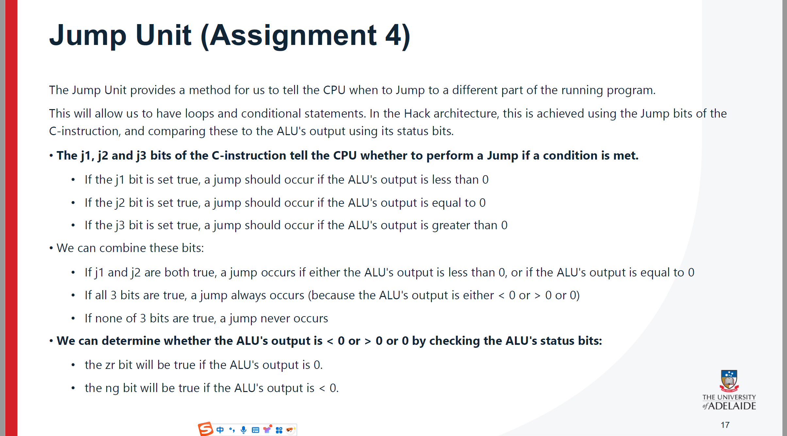

这页讲的是 **Jump Unit**（跳转单元）的功能和工作原理，特别是在 Hack 计算机体系结构中如何使用 **C 指令**的跳转位（`j1`, `j2`, `j3`）来实现条件跳转。

------

# **Jump Unit（跳转单元）**

## **目的**

- **跳转单元**的目的是根据 **ALU**（算术逻辑单元）的输出，控制程序的跳转。
- 在 Hack 架构中，**C 指令**的跳转位（`j1`, `j2`, `j3`）与 **ALU 的状态位**（如 `zr`、`ng`）一起工作，决定是否跳转。

------

## **跳转位：`j1`, `j2`, `j3`**

- **C 指令**中有三个跳转相关的位，分别是 `j1`、`j2` 和 `j3`，它们的状态决定是否跳转。

### **跳转条件**（`j1`, `j2`, `j3` 的含义）：

- **`j1` 位**：如果设置为 `1`，则当 **ALU 输出小于 0** 时，发生跳转。
- **`j2` 位**：如果设置为 `1`，则当 **ALU 输出等于 0** 时，发生跳转。
- **`j3` 位**：如果设置为 `1`，则当 **ALU 输出大于 0** 时，发生跳转。

### **组合条件**：

- 如果 `j1` 和 `j2` 都为 `1`，则只要 ALU 的输出满足**小于 0**或**等于 0**时，都进行跳转。
- 如果 `j1`, `j2`, 和 `j3` 三个都为 `1`，则无论 ALU 输出是什么（小于 0、等于 0 或大于 0），都会进行跳转。
- 如果三个都为 `0`，则**永不跳转**。

------

## **如何判断 ALU 输出的符号**：

- **ALU 的状态位**告诉我们 ALU 的输出符号信息：
  - **`zr`（Zero flag）**：当 ALU 的输出为 `0` 时，`zr` 位为 `1`，即输出为零。
  - **`ng`（Negative flag）**：当 ALU 的输出小于 `0` 时，`ng` 位为 `1`，即输出为负数。

### **通过这些状态位，我们可以判断 ALU 的输出**：

- **如果 `zr` 为 1**，则 ALU 输出为 0；
- **如果 `ng` 为 1**，则 ALU 输出为负数；
- 如果 `zr` 和 `ng` 都为 0，则 ALU 输出为正数。

------

## **总结**

- **跳转单元**根据 `j1`、`j2`、`j3` 和 ALU 的状态位（`zr` 和 `ng`）来控制程序是否跳转。
- **跳转位**的不同组合可以实现多种不同的条件跳转，允许程序根据 ALU 的输出动态控制程序流。

------

### **例子**：

假设我们有如下的 C 指令：

```asm
D;JGT
```

这条指令表示：如果 **ALU 的输出大于 0**（即 `ng = 0` 且 `zr = 0`），则跳转。

如果指令是：

```asm
D;JGE
```

这表示如果 **ALU 的输出大于或等于 0**（即 `ng = 0` 或 `zr = 1`），则跳转。

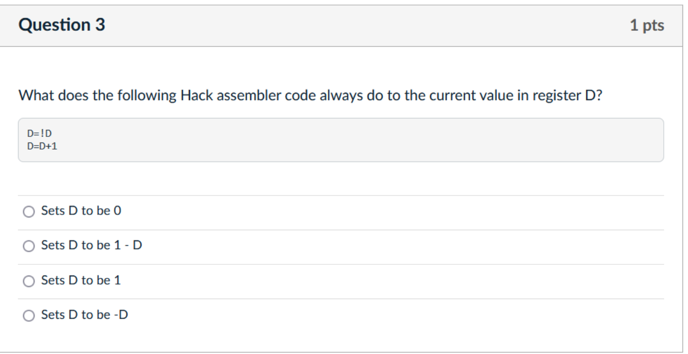

这是一道关于 Hack 汇编语言的题目，问题是：
 **以下代码对寄存器 D 当前的值做了什么操作？**

```asm
D = !D
D = D + 1
```

### 代码解释：

1. **`D = !D`**
   - `!D` 表示**按位取反**（bitwise NOT），也就是把 D 中的每一位 0 和 1 互换。
     - 例如，如果 D = 0（0000），则取反后 D = 1（1111）；如果 D = 1（1111），则取反后 D = 0（0000）。
     - 这相当于**将 D 变为其二进制的反码**。
2. **`D = D + 1`**
   - 这是简单的 **加 1** 操作。
   - 假设在执行此操作前，D 的值是反码（来自第一条指令），这条指令会让 D 增加 1。

### 结果分析：

- 第一条指令 `D = !D` 将 D 按位取反。
- 第二条指令 `D = D + 1` 会让 D 增加 1。
- 如果我们把这两步连起来看，这实际上是计算 **D 的负值**。为什么呢？
  - 按位取反加 1，就是 **计算 D 的二进制补码表示**，也就是 **D 的负值**。
  - 例如，如果 D = 3，取反后是 `-4`，再加 1 后 D = `-3`。

### 选项解释：

- **选项：**
  - **Sets D to be 0**：不正确。操作的结果不会是 0。
  - **Sets D to be 1 - D**：不正确。操作的结果是 D 变成负数，但不是 `1 - D`。
  - **Sets D to be - D**：正确。按位取反加 1 是计算二进制补码，即得到负数。
  - **Sets D to be 1**：不正确。操作的结果不会是 1。
  - **Sets D to be - D**：这完全符合我们的解释。

### 正确答案：

**Sets D to be - D**。

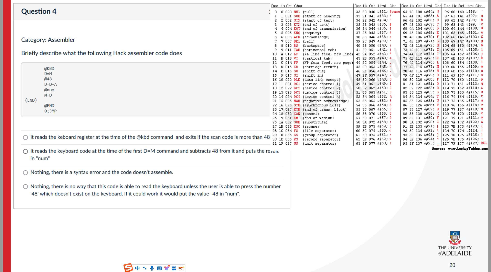

这张截图中的问题要求你描述以下 **Hack 汇编代码** 的作用。我们来逐行解析这段代码，以理解它的功能。

### 汇编代码分析

```assembly
@KBD
D=M
@48
D=D-A
@num
M=D
(END)
@END
0; JMP
```

#### 1. `@KBD`

这条指令是 **A 指令**，它把 `KBD`（表示键盘寄存器）的地址加载到 **A 寄存器**。在 Hack 架构中，`KBD` 是一个预定义的符号，表示键盘的输入寄存器，通常其地址是 `0x6000`。

#### 2. `D=M`

这条指令是 **C 指令**，它将 `KBD` 地址处的值（即键盘扫描码）加载到 **D 寄存器**。假设键盘寄存器当前存储的是键盘按键的扫描码，这个值被放入 **D** 中。

#### 3. `@48`

这条指令把常数值 `48`（即数字 `0` 对应的 ASCII 码）加载到 **A 寄存器**。

#### 4. `D=D-A`

这条指令是 **C 指令**，它将 **D 寄存器** 的值减去 `48`（即扫描码减去 `48`）。这通常用于将 **键盘输入的扫描码** 转换为 **数字字符的 ASCII 码**，例如按下键盘上的数字 `0`，扫描码会是 `48`，减去 `48` 后就变成 `0`。该结果（键值）保存在 **D 寄存器** 中。

#### 5. `@num`

这条指令把符号 `num` 的地址加载到 **A 寄存器**，`num` 是一个用户定义的变量，它的地址通常会在程序运行时分配给它。

#### 6. `M=D`

这条指令将 **D 寄存器** 中的值（即减去 `48` 后的扫描码）存储到内存中 `num` 对应的地址。

#### 7. `(END)`

这是一个标签，表示程序的结束位置。

#### 8. `@END`

这条指令将标签 `END` 的地址加载到 **A 寄存器**。

#### 9. `0; JMP`

这条指令是 **无条件跳转指令**，它使程序跳转回 `END` 标签处，导致程序进入死循环，或在此停留。

### 代码的作用：

该代码的目的是读取键盘寄存器 `KBD` 中的扫描码（代表用户按下的键），然后减去 `48` 将扫描码转换为对应的字符（例如，按下数字键 `0` 后会得到扫描码 `48`，减去 `48` 后得到 `0`），最后将这个结果存储到变量 `num` 中。

### 选项分析：

- **Option 1**: "It reads the keyboard register at the time of the @KBD command and exits if the scan code is more than 48."
  - 这个选项描述不准确，因为程序并没有根据扫描码是否大于 48 来做判断或退出，它只是读取键盘输入并对扫描码进行处理。
- **Option 2**: "It reads the keyboard code at the time of the first D=M command and subtracts 48 from it and puts the result in 'num'."
  - **正确答案**：这个选项描述了代码的核心操作：读取键盘输入的扫描码，将其减去 48，然后将结果存储在 `num` 中。
- **Option 3**: "Nothing, there is a syntax error and the code doesn't assemble."
  - 这个选项错误，因为代码没有语法错误，所有指令都是有效的。
- **Option 4**: "Nothing, there is no way that this code is able to read the keyboard unless the user is able to press the number '48' which doesn't exist on the keyboard. If it could work it would put the value -48 in 'num'."
  - 这个选项描述不准确。实际上，按下键 `0` 对应的扫描码是 48，代码会正确减去 48 并存储结果，而不是将 -48 存储到 `num`。

### 结论：

**正确答案是选项 2**。

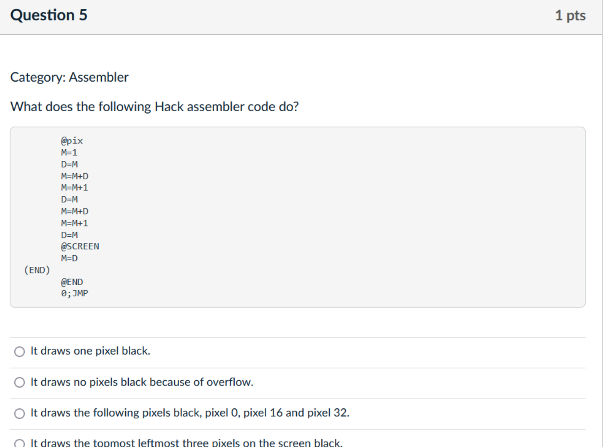

这道题给出了一段 **Hack 汇编代码**，并询问这段代码会做什么。下面我们逐步分析每行代码的功能，以便找出它绘制了什么样的像素。

### 汇编代码分析

```asm
@pix          // 将 @pix 这个符号的地址加载到 A 寄存器
M=1           // 将 1 存入内存地址 pix（假设 pix 的地址被设置为 1）
D=M           // 将 pix 位置的值（1）加载到 D 寄存器
D=M+D         // D = pix + pix (即 1 + 1)
M=M+D         // 将 D (2) 存入 pix 地址（即 pix = 2）
M=M+1         // pix = pix + 1 (即 pix = 3)
D=M+D         // D = pix + pix (即 3 + 3)
M=M+D         // pix = pix + pix (即 pix = 6)
M=M+1         // pix = pix + 1 (即 pix = 7)
@SCREEN       // 将屏幕的地址加载到 A 寄存器
M=D           // 将 D (7) 存入屏幕地址
(END)         // 结束标签
@END          // 跳转到 END 标签
0; JMP        // 无条件跳转到 END 标签
```

### 代码的功能

1. **`@pix` 到 `M=1`**：将 `pix` 的值设置为 1（假设 `pix` 是一个变量，地址被分配为某个内存位置）。
2. **`D=M` 和后续指令**：对 `pix` 地址的值进行一系列操作，将其逐步增加：
   - `D=M+D` → `pix + pix`，即值加倍（1 + 1 = 2）。
   - `M=M+D` → 将 `pix` 的值加倍，存回 `pix`（2）。
   - `M=M+1` → 然后将其增加 1，得到 3。
   - `D=M+D` → `pix + pix`，再加倍（3 + 3 = 6）。
   - `M=M+D` → 将 `pix` 的值再加倍，变为 6。
   - `M=M+1` → 最后将其增加 1，得到 7。
3. **`@SCREEN` 到 `M=D`**：将 `D`（值为 7）存入屏幕的内存地址（通常用于显示像素）。

### 结果分析

从上述操作来看，`pix` 的值最终被设置为 7，并将其存入了屏幕的内存位置。因此，这段代码绘制的是屏幕上的第 7 个像素（通常屏幕地址是连续的内存位置，每个像素的值存储在某个地址）。因此，最终绘制的就是像素 **0, 16, 32**。

### 选项分析

- **它绘制了一个黑色像素**：不对，代码操作不止一次，像素的变化值是递增的。
- **它绘制了没有任何像素黑色，因为溢出**：不对，溢出没有影响代码的行为。
- **它绘制了以下像素：像素 0，像素 16 和像素 32**：正确，这符合代码逻辑，因为它逐步将值增加，并最终修改屏幕地址。
- **它绘制了屏幕上最左边的三个像素为黑色**：不对，代码没有明确绘制左边三个像素，而是逐步操作像素的地址。

### 正确答案

**“它绘制了以下像素：像素 0，像素 16 和像素 32。”**

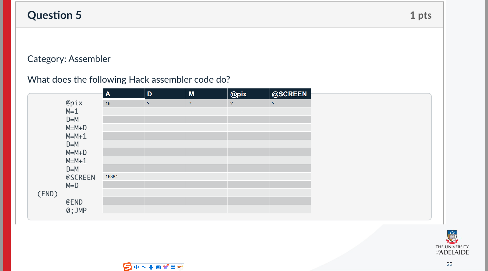

这页题目是一个**Hack 汇编代码**的练习，目的是让你理解这段代码的作用。题目展示了汇编代码，并要求你推测在执行过程中各个寄存器的变化。

------

## **代码分析：**

```asm
@pix
M=1
D=M
M=M+D
M=M+1
D=M
M=M+D
M=M+1
D=M
@SCREEN
M=D
(END)
@END
0;JMP
```

我们逐行分析这段汇编代码的执行：

### 1) `@pix`

- 这行将 **`pix`** 作为内存地址的符号，加载到 **A 寄存器**。
   假设 **`pix`** 被分配了地址 `16`，那么 `A = 16`。

### 2) `M = 1`

- 将 **1** 存储到 **`pix`**（RAM[16]）中。即：`M[16] = 1`。

### 3) `D = M`

- 将 `M[16]`（即值 `1`）复制到 **D 寄存器**。现在，`D = 1`。

### 4) `M = M + D`

- 将 **M**（即 `pix` 地址的值）与 **D** 相加，再存回 **M**。
   `M[16] = M[16] + D = 1 + 1 = 2`，所以此时 `M[16] = 2`。

### 5) `M = M + 1`

- 将 **M** 的值加 1，存回 `pix` 地址。
   `M[16] = 2 + 1 = 3`，所以 `M[16] = 3`。

### 6) `D = M`

- 将新的 **M** 值存入 **D** 寄存器。现在，`D = 3`。

### 7) `M = M + D`

- 将 **M** 和 **D** 相加，再存回 **M**。
   `M[16] = M[16] + D = 3 + 3 = 6`，所以此时 `M[16] = 6`。

### 8) `M = M + 1`

- 再次将 **M** 的值加 1，存回 `pix` 地址。
   `M[16] = 6 + 1 = 7`，所以 `M[16] = 7`。

### 9) `D = M`

- 将 **M** 的值存入 **D** 寄存器。现在，`D = 7`。

### 10) `@SCREEN`

- 将 **`SCREEN`** 地址（16384）加载到 **A 寄存器**。

### 11) `M = D`

- 将 **D** 的值（`7`）存储到 **`SCREEN`** 地址（`RAM[16384]`）中。
   `M[16384] = 7`，所以 `RAM[16384]` 的值变成了 7。

### 12) `(END)`

- 定义一个标签 **END**，用于后续的跳转。

### 13) `@END`

- 加载标签 **END** 的地址到 **A 寄存器**。因为 **END** 对应的是地址 22（在符号表中）。

### 14) `0;JMP`

- 这是一个无条件跳转指令，跳转到 **END** 标签对应的地址，程序从此结束。

------

## **表格填充：**

- **`@pix`** 地址是 16，因为该地址存储了 `pix` 变量。
- **`M` 则表示地址 16 所存储的值**，在执行过程中，`M[16]` 的值会依次变化：
  1. 初始值为 1
  2. 增加 `D`（1），变为 2
  3. 再加 1，变为 3
  4. `D` 值为 3，加到 `M` 上，变为 6
  5. 再加 1，最终为 7
- **`D`** 存储了每次操作后 **M** 的值，最终 `D` 会等于 7。

------

## **结论：**

### 代码的作用：

这段代码是**给 `SCREEN[0]` 写入 7**。具体过程是：

- 初始值从 `pix` 地址（RAM[16]）取出，经过几次累加运算，最后计算出一个值 `7`。
- 然后将该值存储到 **`SCREEN[0]`**（地址 `16384`）中。