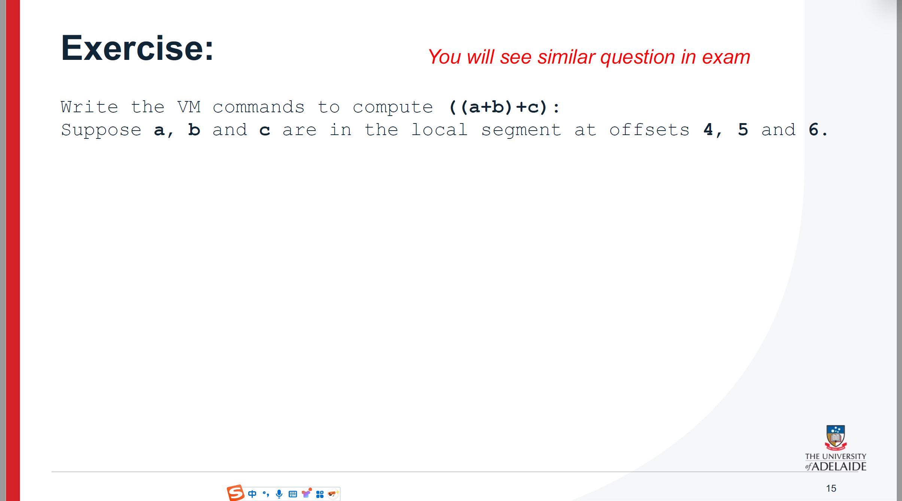

这张图展示了一个汇编程序，该程序计算从1到`RAM[0]`的所有整数的和，并将结果存储在`RAM[1]`中。下面是程序的详细解释：

### 程序步骤：

1. **初始化**：
   - `@i` 将变量 `i` 初始化为 1，表示求和的起始值。
   - `@M=1` 将变量 `M` 初始化为 1。
   - `@sum` 将变量 `sum` 初始化为 0，用来累加求和结果。
2. **LOOP（循环）**：
   - `@i` 判断 `if i > RAM[0]`，即如果 `i` 的值大于存储在 `RAM[0]` 中的上限值，则跳转到 `WRITE` 写入结果。
   - 程序执行 `D = M - M`，这相当于将 `D` 寄存器清零，然后将 `sum` 写入 `D` 中。如果条件成立，则执行 `WRITE`，将当前 `sum` 的值写入内存，并跳转到程序的结束部分。
3. **求和**：
   - 如果 `i` 小于等于 `RAM[0]` 中的值，则会执行 `sum += i`，即将当前 `i` 的值加到 `sum` 上。
4. **递增 i**：
   - 程序执行 `i++`，将 `i` 增加 1，并更新 `M`。
5. **跳回 LOOP**：
   - `@LOOP` 语句使程序继续执行循环，直到 `i` 大于 `RAM[0]` 为止，此时程序跳转到写入结果。
6. **结束**：
   - 循环结束后，程序将最终的 `sum` 值存储到 `RAM[1]` 中。

### 最终问题：

- 图中的问题询问了程序汇编完成后，**符号表**和**机器代码**的结构。**符号表**包含了程序中所有变量和它们在内存中的地址映射，而**机器代码**则是该程序在机器上执行时的低级指令表示。

如果你想深入了解符号表是如何构建的，或者需要帮助理解程序如何转化为机器代码，告诉我，我可以为你进一步解释。


这张幻灯片讲解了**符号处理**（也叫**符号解析**）的概念。它主要关注了汇编语言程序中如何使用符号。符号处理的核心目的是在汇编程序中管理和解析各种符号，例如标签、变量等。

### 详细解释：

1. **汇编程序通常有许多符号：**
   - **标签**：用于标记跳转命令的目标位置，指示程序控制流跳转的目的地。
   - **特殊内存位置的标签**：用于标记特定的内存地址或特殊的内存位置。
   - **变量**：程序中定义的可变数据，通常在内存中占有特定位置。
2. **在Hack汇编器中有三种符号分类：**
   - **预定义符号**：这些符号是Hack平台预设的符号，可能表示固定的硬件地址或其他特殊标记。
   - **标签（用户定义符号）**：这些是由程序员定义的符号，通常用于表示代码中的位置（如跳转目标）。
   - **变量（用户定义符号）**：这些是程序员定义的符号，用来表示数据存储位置或可变的内存地址。

总之，这一部分的重点在于介绍如何处理程序中需要使用的符号，以及这些符号在Hack汇编器中的分类。


这张幻灯片的内容是关于如何构建符号表的总结，通常这是在汇编语言或编译器设计中用于将符号（如标签、变量名等）转换为机器代码时的一个重要步骤。具体步骤如下：

1. **初始化（Initialisation）**：
   - 创建一个空的符号表，并将任何预定义的符号（如常见的系统符号）添加到表中。符号表是用来存储程序中所有符号及其对应信息的。
2. **第一遍扫描（First Pass）**：
   - 浏览源代码并将所有用户定义的标签（如跳转标签）添加到符号表中。
   - 标签的值是标签后面第一个指令的位置。这个步骤主要是为了确定程序中每个标签的位置。
3. **第二遍扫描（Second Pass）**：
   - 再次浏览源代码，使用符号表来翻译命令。
   - 在这个阶段，符号名称会被转换为实际的数字或地址，即完成最终的机器码翻译。

总结来说，这个过程是编译器或汇编器中的符号解析步骤，它通过两遍扫描源代码来完成符号的映射和翻译。


这张图片展示了一个编程语言的例子以及编译过程的概念，具体解释如下：

1. **左侧的代码示例（Jack代码）：**
   - 这是一个用Jack语言编写的程序。Jack是一种类似于高级编程语言的语言，设计时用于帮助理解编译器的基本概念。程序的目标是接受两个数字输入并计算它们的乘积。
   - 程序的核心逻辑是：用户输入两个数字，然后调用`mult`函数来计算它们的乘积。程序结构非常简单，代码中包含了变量声明、用户输入、函数调用和控制流（循环）。
2. **右侧的Hack代码：**
   - 这里展示了Jack代码经过编译后的结果。Hack代码是非常接近机器语言的二进制代码，用于实际的硬件执行。
   - 编译器将高级的Jack代码转换为低级的机器指令，这些指令由计算机的CPU直接执行。图片中的Hack代码是由0和1组成的二进制数，这是计算机可以理解并执行的形式。
3. **中间的箭头和文字：**
   - 中间部分描述了编译器的作用，它的任务是将高级编程语言（例如Jack代码）转换为机器语言（例如Hack代码）。这个过程是编程语言的编译过程，目的是让程序能够在计算机硬件上运行。

总体来说，这张图片说明了编程语言如何通过编译器从高级语言转换为机器语言，使得计算机可以理解并执行代码。


这张图展示了从高级语言（Jack代码）到机器代码的转换过程，包括编译器、虚拟机翻译器、汇编器和最终的机器代码。下面是每个步骤的详细解释：

### 1. **Jack代码**：

- Jack是一个面向对象的高级编程语言。代码示例是一个简单的函数定义：

  ```jack
  function void vfunc() {
      return;
  }
  ```

  这个简单的程序定义了一个返回类型为 `void` 的函数 `vfunc`，其中只有一个 `return` 语句。

### 2. **编译器**：

- 编译器将Jack代码转换为一种低级的中间表示，称为 **Hack VM代码**。这步的目标是将高级语言转换为一种中间的虚拟机指令。

- 编译后的Hack VM代码看起来像这样：

  ```vm
  function voidfn.vfunc 0
  push constant 0
  return
  ```

  这表示虚拟机将执行一个函数 `vfunc`，并将常量 `0` 压入栈中，然后返回。

### 3. **虚拟机翻译器（VM Translator）**：

- 虚拟机翻译器将Hack VM代码进一步转换为机器的汇编语言。这个过程将高层虚拟机指令映射到具体的机器指令。

- 转换后的汇编代码如下所示：

  ```asm
  @SP
  AM=M+1
  A=0
  (LCL)
  D=M
  @R14
  M=D
  @SP
  AM=M-1
  @ARG
  M=D
  ```

  这些汇编指令表示如何在内存中管理栈帧和函数调用的参数。

### 4. **汇编器（Assembler）**：

- 汇编器将汇编代码转换为 **机器代码**。机器代码是计算机能够直接执行的二进制指令。每条汇编指令对应一条机器指令。

- 最终的机器代码示例如下：

  ```
  1111111111001000
  1101010100100000
  1111000101001000
  0000000011110000
  1111000001001111
  ```

  这些二进制代码可以直接在硬件上执行，表示机器对虚拟机指令的低级实现。

### 总结：

整个过程的主要目标是将高级语言（Jack代码）逐步转换为机器能够执行的机器代码。通过编译器、虚拟机翻译器和汇编器的逐步转换，我们最终得到机器可以理解并执行的二进制指令。

这个过程展示了编译原理中的几个重要阶段，特别是在从高级语言到低级语言的转换过程中，涉及到多个中间层次的语言和工具。


这张幻灯片介绍了两种编译模型：**直接编译**（Direct Compilation）和**两级编译**（Two-tier Compilation）。下面是详细解释：

### 1. **直接编译（Direct Compilation）**：

- **概念**：直接编译指的是源语言（如语言1、语言2、语言n）直接编译成多个硬件平台（如硬件平台1、硬件平台2、硬件平台m）。每个源语言都需要一个与每个目标硬件平台的翻译器。
- **特点**：这种方法需要 **n × m** 个翻译器，其中n是源语言的数量，m是硬件平台的数量。每一对源语言和硬件平台都需要一个单独的翻译器来完成编译。

### 2. **两级编译（Two-tier Compilation）**：

- **概念**：两级编译将编译过程分为两个阶段：
  - **第一阶段**：将源语言（如语言1、语言2、语言n）编译成一种**中间语言**。中间语言是与硬件平台无关的抽象表示。
  - **第二阶段**：将中间语言编译成具体的硬件平台（如硬件平台1、硬件平台2、硬件平台m）。
- **特点**：这种方法仅需要 **n + m** 个翻译器，其中n是源语言的数量，m是硬件平台的数量。每个源语言编译成中间语言只需要一个翻译器，中间语言再通过另一个翻译器编译成硬件平台代码。

### 比较：

- **直接编译**需要更多的翻译器，适用于直接从源语言到硬件平台的编译。
- **两级编译**通过引入中间语言，减少了翻译器的数量，提高了可维护性和灵活性，尤其适用于多平台的情况。

总结来说，**两级编译**方法更为高效，因为它减少了不同语言和硬件平台之间的直接映射。


这张幻灯片展示的是编译过程的整体结构，特别强调了“中间代码”和虚拟机（VM）的作用。

### 主要内容解释：

1. **总体框架（The big picture）**：
   - 显示了从高级编程语言（例如某些编程语言或“Jack”语言）到机器语言的转换流程。
   - 编译的第一个阶段是通过编译器将某种语言转换为中间代码（Intermediate code）。
   - 中间代码作为一个桥梁，连接了不同的语言和目标平台，允许将不同语言编译成同一中间代码，然后通过不同的虚拟机（VM）实现来转换为目标机器语言。
2. **中间代码（The intermediate code）**：
   - 中间代码是两阶段编译过程之间的接口。它的作用是支持将多种高级语言和多种机器语言之间的转换。
   - 中间代码必须足够通用，以支持不同的语言与机器语言对。例如，支持从高级语言到机器语言的转换。
   - 它可以被建模为一种抽象虚拟机（VM）的语言，类似于运行在不同硬件平台上的软件层。
   - 中间代码可以通过多种方式实现，包括通过不同平台的虚拟机实现。
3. **虚拟机实现（VM implementation）**：
   - 该幻灯片展示了不同平台（如CISC机器、RISC机器、Hack平台等）上如何实现虚拟机。
   - 各平台都有自己的虚拟机实现，能够将中间代码转换成对应平台的机器语言。
4. **多平台支持**：
   - 无论是CISC机器、RISC机器还是Hack平台，所有这些平台都可以通过虚拟机的支持运行中间代码，从而使得不同的硬件平台都能兼容同一中间代码。
   - 这意味着，程序可以通过相同的中间代码在多种硬件和操作系统环境中执行。

### 总结：

这张图表明，中间代码在编译过程中充当了一个关键的转换角色，使得不同编程语言和不同硬件平台之间能够通过虚拟机的帮助实现兼容性和跨平台运行。


这张幻灯片讨论了虚拟机（VM）模型和语言的不同视角，重点是 Hack-Jack 平台所使用的虚拟机模型。以下是详细的解释：

### 主要内容：

1. **课程视角：**
   - 从这里开始，直到下一节课，将介绍 Hack-Jack 平台使用的虚拟机（VM）模型。
   - 还提到其他虚拟机模型，如 Java 的 JVM/JRE 和 .NET 的 IL/CLR，这些模型在精神上相似，但在范围和细节上有所不同。
2. **关于虚拟机的几种不同理解：**
   - **抽象的软件工程视角：**
     - 这种视角认为虚拟机本身是一个有趣的抽象概念，它独立存在并有意义。即虚拟机作为一种抽象层，有助于简化和理解代码执行过程。
   - **实际的软件工程视角：**
     - 这个视角将虚拟机看作是使得编写“托管代码”（managed code）变得容易的工具。托管代码指的是由虚拟机管理的代码，它能够提供增强的安全性（例如内存管理、垃圾回收等）。这个视角强调虚拟机的实际应用，尤其是在安全和稳定性方面。
   - **务实的编译器编写视角：**
     - 这一视角认为虚拟机架构可以简化编写编译器的过程。编译器将源代码转换为虚拟机代码，使得编写编译器变得更加简单和高效。在课程中，后续将进一步探讨虚拟机架构如何简化编译器的编写。
   - **机会主义的帝国建设者视角：**
     - 从这个角度看，虚拟机架构允许开发者一次编写高层代码，并能让其在多个目标平台上运行，几乎无需修改。这种视角强调虚拟机作为平台中介的作用，可以让代码在不同的平台之间迁移，提供良好的可移植性。

### 总结：

幻灯片展示了虚拟机的多维度视角，指出虚拟机不仅是一个抽象层，也具有实际的工程应用（如安全性和内存管理），并且可以简化编译器的编写工作。此外，虚拟机的可移植性使得开发者可以更高效地开发跨平台的应用程序。


这张图展示了 **Hack虚拟机（VM）仿真器** 的软件实现界面。它显示了如何使用这个工具来执行Hack虚拟机代码，并观察内存和堆栈的变化。以下是各个部分的详细解释：

### 主要界面组件：

1. **VM代码 (VM code)**：
   - 在界面左侧的 `Program` 部分显示了虚拟机代码。比如，在示例中，执行了多个 `push` 和 `pop` 操作来操作局部变量和栈。
   - 代码的执行步骤包括：
     - `push constant 15`
     - `push constant 7`
     - 执行 `add`，将两个数相加并放入栈中。
     - `pop` 将栈中的数据弹出，存储到局部变量。
2. **工作栈 (Working Stack)**：
   - 这是虚拟机执行时使用的栈。栈存储了执行过程中需要的数据，如常量、局部变量等。
   - 在栈区域，你可以看到当前栈的值，例如：栈顶的值是 15，栈下方的值为 8 等。
3. **调用栈 (Call Stack)**：
   - 这部分展示了当前正在执行的函数调用。比如，`Sys.init` 是程序的入口点，`Main.main` 是主程序的入口，`Main.add` 则是当前正在执行的函数。
   - 这些函数调用会在虚拟机执行过程中推送到调用栈中，以追踪程序的执行路径。
4. **虚拟内存段 (Virtual Memory Segments)**：
   - 显示虚拟机的内存划分，包含多个部分：
     - **Local**：局部变量
     - **Argument**：参数
     - **This、That**：对象的成员变量
     - **Temp**：临时存储区，用于中间计算数据的存储
   - 每个部分在执行时都可以有不同的值，反映了程序的不同部分。
5. **全局栈 (Global Stack)**：
   - 这部分显示了全局内存中的栈结构。在这里，你可以看到 Hack 虚拟机的内存状态，包括不同内存位置上的数据值。
6. **主机RAM (Host RAM)**：
   - 这部分展示了运行虚拟机的宿主系统内存（与虚拟机内存分开）。宿主RAM并不属于虚拟机内存的一部分，但在运行时可能与虚拟机内存交互。
7. **仿真器控制 (Emulator Controls)**：
   - 在图的顶部，有一些控制选项，用来操作仿真器的执行：
     - 你可以控制仿真器的运行速度（快、慢、逐步执行等）。
     - 可以查看程序的执行流程，或者查看不同变量的值。
     - 例如，“repeat{ vstep; }”表示按照步骤执行测试脚本。
8. **默认测试脚本 (Default Test Script)**：
   - 这里包含了虚拟机的默认测试脚本，用户可以选择不同的测试用例来验证虚拟机的正确性。

### 总结：

该界面展示了如何使用 **Hack VM仿真器** 来执行虚拟机代码，观察虚拟机内存、栈以及全局数据的动态变化。通过这些组件，用户可以逐步调试虚拟机代码，理解虚拟机如何执行命令，并进行有效的程序分析。


这张幻灯片展示了一堂课的计划，目标是**指定并实现一个虚拟机（VM）模型和语言**。具体内容包括以下几个方面：

### 课程目标：

- **目标**：设计并实现一个虚拟机模型和语言。通过定义不同的指令集和编程结构，构建一个可以执行基本运算和控制流的虚拟机。

### 指令集（命令）：

1. **算术/布尔命令（Arithmetic / Boolean commands）**：
   - **add**：加法
   - **sub**：减法
   - **neg**：取反
   - **eq**：判断相等
   - **gt**：大于
   - **lt**：小于
   - **and**：与操作
   - **or**：或操作
   - **not**：非操作
2. **程序流程命令（Program flow commands）**：
   - **label**：标签声明（标记程序的特定位置）
   - **goto**：跳转到标签
   - **if-goto**：条件跳转到标签（如果某个条件为真）
3. **内存访问命令（Memory access commands）**：
   - **pop x**：弹出栈顶值并存储到变量x中（x是一个变量）
   - **push y**：将值y推入栈中（y可以是一个变量或常量）
4. **函数调用命令（Function calling commands）**：
   - **function**：函数声明
   - **call**：调用函数
   - **return**：从函数返回

### 本周与下周的重点：

- **本周（This week）**：主要讲解并实现**算术/布尔命令**、**程序流程命令**和**内存访问命令**。
- **下周（Next week）**：将继续讲解**函数调用命令**，并实现相关功能。

### 课程计划：

- **我们的游戏计划（Our game plan）**：
  1. **描述虚拟机抽象（describe the VM abstraction）**：这是一个定义虚拟机如何运行的过程，包含了虚拟机的指令集和执行模型。
  2. **提出如何在Hack平台上实现它（propose how to implement it over the Hack platform）**：思考如何将这个虚拟机模型在Hack平台上实现，包括如何设计并运行虚拟机指令。

### 总结：

这张幻灯片的目的是让学生理解虚拟机模型的构建，并通过具体的命令（如算术运算、程序控制、内存访问、函数调用等）实现虚拟机的基本功能。通过本周和下周的内容，学生将逐步掌握如何创建一个基本的虚拟机并实现其功能。


这张幻灯片描述了一个**堆栈导向**（stack-oriented）虚拟机模型，其中所有操作都基于堆栈进行。这是虚拟机设计中常见的模型，数据和指令操作都围绕着堆栈展开。以下是详细解释：

### 主要内容：

1. **堆栈导向模型（Stack-oriented model）**：
   - 在这个模型中，所有的操作都发生在堆栈上。堆栈是一种数据结构，遵循“后进先出”（LIFO）的原则，即最后入栈的元素先出栈。
   - 数据被存储在多个不同的内存段中（memory segments），这些内存段的行为是一样的。在这张幻灯片中，特别提到了一个名为“static”的内存段，作为一个例子来演示。
2. **堆栈操作（Stack operations）**：
   - 堆栈的内容在图中展示，其中“SP”代表堆栈指针（stack pointer），指向当前堆栈的顶部。
   - 堆栈上的数据示例：`121`, `5`, `17`。
   - 在该模型中，所有的算术和布尔操作都会在堆栈上进行。比如，从堆栈中弹出（`pop`）和推送（`push`）数据。
3. **静态内存段（Static memory segment）**：
   - 在幻灯片中，名为“static”的内存段示例被列出，包含了初始值：`5`, `12`, `3`, `-532`, `15`。
   - 在这个内存段中，数据按顺序排列，不同的内存位置可以被索引。`static`内存段也展示了如何执行堆栈操作，例如将一个值从堆栈弹出或推送到堆栈。
4. **堆栈与静态内存的互动**：
   - 从“static”内存段中获取数据并将其压入堆栈，或者将堆栈中的数据弹出并存储到“static”内存中。比如，当弹出堆栈时，可以获取`17`，当推送数据时，可以将一个新的值（如`5`）压入堆栈。

### 总结：

这张幻灯片主要讲解了虚拟机（VM）堆栈导向模型的基本概念。所有的操作都通过堆栈完成，内存分为多个段（例如“static”段），并通过“push”和“pop”等操作与堆栈进行数据交换。该模型使得计算过程非常灵活并且操作简洁，堆栈是虚拟机操作的核心。


这张幻灯片展示了虚拟机（VM）模型中的数据类型以及它们如何在内存中使用。以下是详细解释：

### 1. **数据类型概述：**

幻灯片介绍了虚拟机模型中的单一16位数据类型，可以被用于三种不同的用途：

- **整数值（Integer）：**
  - 使用16位的二进制补码表示法，范围是从 -32768 到 32767。
  - 这种数据类型用于表示整数，可以进行算术运算。
- **布尔值（Boolean）：**
  - 布尔值采用 -1 和 0 来表示，分别代表布尔值的 `true` 和 `false`。
  - 这种数据类型常用于逻辑判断和条件控制。
- **指针（Pointer）：**
  - 用于表示内存地址。
  - 指针通常用于动态内存分配或访问特定位置的数据。

### 2. **内存模型：**

- 幻灯片展示了内存模型中的两个主要部分：**栈（Stack）** 和 **静态内存（Static）**。
- **栈（Stack）：**
  - 栈是一个后进先出（LIFO）的数据结构，存储临时数据。
  - 栈的操作包括 `push` 和 `pop`。`push` 将数据压入栈中，而 `pop` 则从栈中弹出数据。
  - 例子中，栈的值是 `[121, 5, 17]`，栈顶的值是 `17`，栈指针（SP）指向栈顶。
  - 可以在栈上执行算术运算和布尔运算。
- **静态内存（Static）：**
  - 静态内存用于存储常驻的数据，不会随着程序的运行而改变。
  - 例子中，静态内存的内容为 `[5, 12, 3, -532, 15]`，每个位置都有一个固定的值，且有编号。

### 3. **内存操作：**

- **栈操作：** 栈上的数据可以进行算术和布尔运算，如加法、减法或逻辑比较。
- **静态内存：** 静态内存中的数据通常不会进行类似的动态操作，更多的是存储常量或静态数据。

### 总结：

- 这张幻灯片展示了虚拟机中数据的存储方式，强调了整数、布尔值和指针的不同使用。栈用于临时存储和计算，而静态内存用于存储固定数据。通过栈和静态内存，虚拟机能够高效地管理数据和执行操作。


这张图展示了 **内存访问操作**，特别是与 **栈（Stack）** 和 **静态内存段（Static）** 相关的操作。它显示了两种常见的内存操作：**push** 和 **pop**，并通过图示展示它们对栈和静态内存的影响。

### 图示解释：

1. **Push操作**：

   - **操作前（before）**：

     - 栈（Stack）当前的内容是：

       ```
       121
       5
       17
       ```

       其中，`SP`（栈指针）指向栈顶的元素，即`17`。

     - 静态内存（Static）中的内容如下：

       ```
       0 -> 5
       1 -> 12
       2 -> 3
       3 -> -532
       ```

   - **Push操作：** `push static 2`（将`static[2]`的值（即`3`）压入栈中）：

     - 栈中的内容在执行 `push` 操作后变为：

       ```
       121
       5
       17
       3
       ```

     - 栈指针（`SP`）向上移动，指向新压入的元素 `3`。

   - **操作后（after）**：

     - 栈的顶端现在包含了新的元素 `3`，而静态内存没有变化，仍然是原来的值。

2. **Pop操作**：

   - **操作前（before）**：

     - 栈的内容如下：

       ```
       121
       5
       17
       3
       ```

     - `SP`（栈指针）指向栈顶的元素 `3`。

     - 静态内存（Static）没有改变，内容如下：

       ```
       0 -> 5
       1 -> 12
       2 -> 3
       3 -> -532
       ```

   - **Pop操作：** `pop static 0`（将栈顶的元素 `3` 弹出并存储到 `static[0]`）：

     - 弹出后，栈的内容变为：

       ```
       121
       5
       17
       ```

     - `SP`（栈指针）向下移动，指向新的栈顶元素 `17`。

   - **操作后（after）**：

     - `static[0]` 被更新为 `3`，即 `static[0] = 3`。
     - 栈顶的元素 `3` 被弹出，栈指针指向 `17`，栈的其余内容未改变。

### 栈的特点：

- **栈（Stack）** 是一种经典的 **LIFO（后进先出）** 数据结构。这意味着最后被推入栈的元素会最先被弹出。
- 栈是非常优雅且强大的数据结构，能够用于多种任务，如函数调用管理、内存分配、表达式求值等。
- 栈的实现有多种硬件和软件实现方式，灵活性很高。

### 总结：

这张图清晰地展示了栈操作的核心概念，通过 `push` 和 `pop` 操作，栈中的数据是如何变化的。每次压栈时，栈指针会向上移动，弹栈时，栈指针会向下移动。而静态内存段则用来存储特定位置的数据，经过 `pop` 操作后，数据会被存储到静态内存中。


这张幻灯片讲解了**算术表达式的求值**，并给出了一个具体的虚拟机（VM）代码示例。它展示了如何在虚拟机中执行算术运算以及如何使用栈（stack）来存储中间结果。表达式的求值顺序和栈的变化都得到了展示。

### 算术表达式：

- 给定的算术表达式是：
   `z = (2 - x) - (y + 5)`
   其中，`x`、`y` 和 `z` 是静态变量，分别存储了数值5、9和一个待求解的结果。

### VM代码示例：

- **VM代码**如下：

  ```
  // z = (2 - x) - (y + 5)
  push 2
  push x
  sub
  push y
  push 5
  add
  sub
  pop z
  ```

  - `push 2`：将常数2压入栈。
  - `push x`：将变量`x`的值（5）压入栈。
  - `sub`：从栈顶弹出两个值（2 和 5），进行相减操作，得到`-3`，并将其压回栈中。
  - `push y`：将变量`y`的值（9）压入栈。
  - `push 5`：将常数5压入栈。
  - `add`：将栈顶的两个值（9 和 5）相加，得到14，并将其压回栈中。
  - `sub`：从栈顶弹出两个值（-3 和 14），进行相减操作，得到`-17`，并将其压回栈中。
  - `pop z`：将栈顶的值（-17）弹出并存储到变量`z`中。

### 栈操作的演示：

- **栈的初始状态**：
  - 静态内存：`x = 5`，`y = 9`
  - 栈：为空。
- **操作步骤**：
  1. `push 2`：将2压入栈中，栈变为：`[2]`。
  2. `push x`：将`x`的值（5）压入栈中，栈变为：`[2, 5]`。
  3. `sub`：进行相减操作`2 - 5`，结果为`-3`，栈变为：`[-3]`。
  4. `push y`：将`y`的值（9）压入栈中，栈变为：`[-3, 9]`。
  5. `push 5`：将5压入栈中，栈变为：`[-3, 9, 5]`。
  6. `add`：进行加法操作`9 + 5`，结果为`14`，栈变为：`[-3, 14]`。
  7. `sub`：进行相减操作`-3 - 14`，结果为`-17`，栈变为：`[-17]`。
  8. `pop z`：将栈顶值`-17`弹出并存储到变量`z`中，最终得到`z = -17`。

### 结果：

- **栈操作**的过程展示了如何通过虚拟机指令和栈来一步一步地执行算术运算。
- **最终结果**：通过上述操作，计算出`z = -17`。

总结来说，这张幻灯片详细展示了在虚拟机中如何评估一个带有算术操作的表达式，并通过栈存储中间结果，最后将结果存储回静态变量中。


这张幻灯片展示了如何在虚拟机（VM）中处理布尔表达式的计算过程。它展示了如何使用虚拟机代码（VM code）对布尔表达式进行求值，并通过堆栈操作进行演示。

### 主要内容：

1. **布尔表达式的评估（Evaluation of Boolean expressions）**：

   - 假设有一个布尔表达式：(x < 7) 或 (y == 8)，这里的 `x` 和 `y` 分别指向内存中的 `static[0]` 和 `static[1]`。
   - 该表达式的计算通过虚拟机指令逐步执行。

2. **VM代码示例**：

   - **VM代码**：

     ```
     push x
     push 7
     lt
     push y
     push 8
     eq
     or
     ```

   - **解释**：

     - `push x`：将 `x`（即 `static[0]`，值为 12）压入堆栈。
     - `push 7`：将数字 7 压入堆栈。
     - `lt`：对堆栈顶的两个元素进行小于比较，判断 `x < 7`，结果为 `false`（因为 12 不小于 7）。
     - `push y`：将 `y`（即 `static[1]`，值为 8）压入堆栈。
     - `push 8`：将数字 8 压入堆栈。
     - `eq`：对堆栈顶的两个元素进行等于比较，判断 `y == 8`，结果为 `true`（因为 8 等于 8）。
     - `or`：对堆栈顶的两个布尔值进行“或”运算，`false or true` 的结果是 `true`。

3. **堆栈操作**：

   - 第一个操作是将 `x`（12）和 7 推入堆栈。
   - 然后执行 `lt`（小于比较），比较堆栈中的 12 和 7，结果为 `false`，并将 `false` 推入堆栈。
   - 接着推送 `y`（8）和 8，并进行 `eq`（等于比较），结果为 `true`，然后将 `true` 推入堆栈。
   - 最后，执行 `or` 操作，比较堆栈中的两个布尔值（`false` 和 `true`），结果是 `true`，并将其保存在堆栈中。

4. **布尔值存储**：

   - 在虚拟机中，布尔值 `true` 和 `false` 分别存储为 -1 和 0。

### 总结：

这张幻灯片详细演示了如何在虚拟机中计算布尔表达式 `(x < 7) or (y == 8)`，并通过堆栈操作实现每个步骤。通过 `push`、`lt`、`eq` 和 `or` 等指令，表达式最终的结果被计算并存储在堆栈中。在虚拟机模型中，布尔值的存储采用 -1 表示 `true`，0 表示 `false`。


这张幻灯片介绍了虚拟机（VM）语言中的算术和布尔命令。它列出了常见的命令、它们的返回值和相关的注释。以下是详细的解释：

### 1. **命令列表及其解释：**

| **命令（Command）** | **返回值（Return value）**      | **注释（Comment）**           |
| ------------------- | ------------------------------- | ----------------------------- |
| **add**             | `x + y`                         | 整数加法（2补码表示）         |
| **sub**             | `x - y`                         | 整数减法（2补码表示）         |
| **neg**             | `-y`                            | 算术取负（2补码表示）         |
| **eq**              | `true` if `x = y`, else `false` | 等于（检查 `x` 是否等于 `y`） |
| **gt**              | `true` if `x > y`, else `false` | 大于（检查 `x` 是否大于 `y`） |
| **lt**              | `true` if `x < y`, else `false` | 小于（检查 `x` 是否小于 `y`） |
| **and**             | `x AND y`                       | 按位与（位操作）              |
| **or**              | `x OR y`                        | 按位或（位操作）              |
| **not**             | `NOT y`                         | 按位非（位操作）              |

### 2. **命令解释：**

- **add**、**sub** 和 **neg**：这些是算术运算命令，分别执行加法、减法和取负操作。它们使用2补码表示法来处理整数运算。
- **eq**、**gt** 和 **lt**：这些命令是逻辑比较操作，用于检查两个数值之间的关系。如果条件满足，则返回 `true`（即 `1`），否则返回 `false`（即 `0`）。
- **and**、**or** 和 **not**：这些是位操作命令，分别执行按位与、按位或和按位非操作。这些操作直接在二进制位上进行处理。

### 3. **栈操作：**

- 所有的操作都依赖栈上的数据。栈指针（SP）指向栈顶，命令会从栈中弹出操作数并执行相应的运算。然后，结果会被推送回栈中。

例如：

- 对于 `add` 命令，栈顶的两个元素 `x` 和 `y` 会被弹出，并执行 `x + y`，然后将结果推入栈中。
- 对于 `eq` 命令，栈顶的两个元素 `x` 和 `y` 会被弹出，并判断它们是否相等。如果相等，返回 `true`，否则返回 `false`。

### 总结：

这张幻灯片列出了虚拟机语言中的基本算术和布尔命令，这些命令在虚拟机的栈上进行操作。通过这些命令，可以执行常见的整数运算、比较操作和位操作。


这张图展示了如何将常见的数学表达式转换为 **Hack虚拟机（VM）语言**，并通过示例解释了这一过程。图中还给出了运算符的优先级，并且介绍了如何将逻辑和算术表达式转换为对应的VM代码。

### 1. **表达式转换示例：**

#### 示例 1： `not (a or b)`

- **VM代码：**

  ```vm
  push static 0    // 将 a（静态变量 0）压入栈
  push static 1    // 将 b（静态变量 1）压入栈
  or               // 计算 a 或 b
  not              // 对结果取反
  ```

- **解释：**

  - 先将 `a` 和 `b` 压入栈，然后进行逻辑 "or" 运算（`or`），再对结果应用逻辑 "not" 运算（`not`）。

#### 示例 2： `d + c + b + a`

- **VM代码：**

  ```vm
  push static 3    // 将 d（静态变量 3）压入栈
  push static 2    // 将 c（静态变量 2）压入栈
  add              // 计算 d + c
  push static 1    // 将 b（静态变量 1）压入栈
  add              // 计算 (d + c) + b
  push static 0    // 将 a（静态变量 0）压入栈
  add              // 计算 (d + c + b) + a
  ```

- **解释：**

  - 这个表达式计算了多个加法操作，首先将 `d` 和 `c` 相加，然后加上 `b`，最后加上 `a`。

### 2. **运算符优先级：**

图的右侧部分展示了运算符的优先级结构（类似于数学中的优先级规则）。从图中可以看出，优先级从底部的算术运算（`+` 和 `-`）到顶部的括号和指数运算（`()` 和 `a^x`）逐步递增。

- **优先级从高到低：**
  - **P**：括号 `()`
  - **E**：指数运算 `a^x` 和开方 `√`
  - **M**：乘法 `×` 和除法 `÷`
  - **D**：逻辑运算符 `and`、`or` 等
  - **A**：加法和减法 `+`、`-`
  - **S**：条件运算符（如 `not`）

### 总结：

- 图中展示了如何将常见的数学和逻辑运算转换为 Hack虚拟机（VM）代码。通过对表达式进行分解，并根据操作符的优先级逐步生成 VM 代码，可以执行各种复杂的运算。
- 图还通过运算符的优先级示意图，帮助理解在生成 VM 代码时如何遵循操作符的计算顺序。


这张幻灯片展示了**Hack虚拟机（VM）语言**中的表达式求值，并给出了不同类型的算术和逻辑运算的示例。

### 1. **表达式解析：**

#### **算术表达式**：

表达式 `(4 + a) * (c - 9)` 是一个带有加法、减法和乘法操作的算术表达式，虚拟机代码如下：

```
push constant 4
push static 0
add
push static 1
push constant 9
sub
call Math.multiply 2
```

- **解释**：
  - `push constant 4`：将常数4压入栈。
  - `push static 0`：将变量`a`（存储在`static 0`位置）的值压入栈。
  - `add`：执行加法操作，计算`4 + a`。
  - `push static 1`：将变量`c`（存储在`static 1`位置）的值压入栈。
  - `push constant 9`：将常数9压入栈。
  - `sub`：执行减法操作，计算`c - 9`。
  - `call Math.multiply 2`：调用`Math.multiply`函数，传递两个操作数（`(4 + a)`和`(c - 9)`）进行乘法计算。

#### **逻辑表达式（真与假）**：

表达式 `true and false` 是一个逻辑运算，虚拟机代码如下：

```
push constant 0
not
push constant 0
and
```

- **解释**：
  - `push constant 0`：将常数0压入栈。
  - `not`：将栈顶值0进行逻辑取反，得到1（表示`true`）。
  - `push constant 0`：将常数0压入栈（表示`false`）。
  - `and`：对栈顶的两个值（`true`和`false`）进行逻辑与运算，得到结果`false`。

### 2. **优先级和运算顺序**：

- 幻灯片右侧展示了**运算符的优先级**（从上到下）：
  - **P（Parentheses）**：括号内的表达式优先。
  - **E（Exponentiation）**：指数运算。
  - **M（Multiplication）/ D（Division）**：乘法和除法。
  - **A（Addition）/ S（Subtraction）**：加法和减法。
  - **logical operators**：逻辑运算（如与、或、非）。

### 3. **总结**：

- **算术表达式**：通过`push`、`add`、`sub`和`call Math.multiply`等命令实现基本的加法、减法和乘法操作。
- **逻辑表达式**：通过`not`和`and`命令实现布尔运算，处理真与假。
- **优先级**：展示了虚拟机如何按照特定的运算优先级进行表达式求值。

这张幻灯片的核心目的是展示如何在Hack VM语言中实现和计算算术及逻辑表达式，并利用运算符的优先级确保正确的计算顺序。


这张幻灯片介绍了虚拟机（VM）内存模型中的不同内存段，尤其是如何通过内存段管理不同类型的变量。该内容主要集中在将高级编程语言中的变量映射到虚拟机内存模型中的过程。

### 主要内容：

1. **VM内存段（The VM's Memory segments）**：
   - **程序设计目的**：虚拟机程序的设计旨在为使用高级语言编写的程序提供一个中间抽象层。这一层将高级语言的变量映射到虚拟机的内存中，方便后续的执行。
2. **高级语言的常见变量类型**：
   - **类级别（Class level）**：
     - **静态变量（Static variables）**：这些是类级别的变量，通常在程序的整个生命周期内保持不变。例如，Java中的静态变量属于类，而不是某个对象。
     - **私有变量（Private variables）**：这些通常是对象级别的变量，也叫作“对象变量”、“字段”或“属性”。它们属于类的每个实例。
   - **方法级别（Method level）**：
     - **局部变量（Local variables）**：方法内部使用的变量，它们只在方法的作用域内有效。
     - **参数变量（Argument variables）**：传递给方法的参数，它们在方法内部作为局部变量使用。
3. **映射到虚拟机语言时**：
   - 编译器将**静态变量**、**私有变量**、**局部变量**和**参数变量**分别映射到虚拟机的四个内存段：
     - **static**：静态变量映射到该内存段。
     - **this**：私有变量（通常是对象的字段）映射到该内存段。
     - **local**：局部变量映射到该内存段。
     - **argument**：参数变量映射到该内存段。
4. **额外的内存段**：
   - **that**、**constant**、**pointer** 和 **temp**：这四个内存段将在后续讲解中进一步介绍，它们通常用于特殊的内存存储和操作。

### 总结：

这张幻灯片的核心是介绍了虚拟机内存模型中的不同内存段，以及如何将高级语言中的各种类型的变量（如静态变量、私有变量、局部变量和参数变量）映射到虚拟机的内存模型中。这一映射过程为虚拟机执行程序提供了必要的数据结构和管理方式。


这张幻灯片讨论了虚拟机（VM）中的内存段和访问命令。它介绍了虚拟机如何管理和访问不同的内存段，以及如何使用相关命令来操作这些内存段。以下是详细解释：

### 1. **内存段（Memory Segments）**:

- 虚拟机模型包含了 **8 个独立的内存段**，分别为：
  - **static**：静态内存段，通常用于存储在程序运行期间固定不变的数据。
  - **this**：通常用于指向当前对象的内存段。
  - **local**：本地变量的内存段，通常用于函数内部局部变量。
  - **argument**：参数内存段，用于存储函数参数。
  - **that**：该内存段通常用于指向其他对象（常在面向对象编程中使用）。
  - **constant**：常量内存段，存储程序中的常量值。
  - **pointer**：指针内存段，用于存储内存地址。
  - **temp**：临时内存段，通常用于短期计算中需要存储的数据。

**注意：** 这些内存段在虚拟机抽象层级上都被视为相同的，它们的存储和访问方式是统一的，尽管它们的用途不同。

### 2. **内存访问命令（Memory Access Commands）**:

- 虚拟机提供了两种基本的命令来操作内存段：

  - **pop memorySegment index**：将指定内存段的值弹出（即从栈中移除）。
  - **push memorySegment index**：将值推入指定的内存段。

  其中，**memorySegment** 可以是 `static`、`this`、`local`、`argument`、`that`、`constant`、`pointer` 或 `temp` 中的任意一个，**index** 是一个非负整数，表示该内存段中的特定位置或索引。

### 3. **示例**:

- 使用 `push` 和 `pop` 命令可以对虚拟机的内存段进行读写操作。例如：
  - `push local 5`：将值推入 `local` 内存段的第 5 个位置。
  - `pop argument 3`：从 `argument` 内存段弹出第 3 个位置的值。

### 4. **注释（Notes）**:

- **历史背景**：在前面的代码示例中，**memorySegment** 通常使用的是 `static` 内存段。
- **编译时作用**：这些内存段的角色在编译时会变得更加重要，因为编译器需要理解如何将不同的内存段映射到目标平台的内存地址。
- **统一的处理方式**：尽管内存段的用途不同，但在虚拟机抽象层上，所有的内存段都会以相同的方式进行处理。

### 总结：

这张幻灯片介绍了虚拟机内存管理的基本概念，包括了内存段的分类和如何通过 `push` 和 `pop` 命令访问这些内存段。尽管每个内存段的用途不同，但它们在虚拟机的抽象层中被视为具有相同结构的存储区域。


这张图展示了 **Hack平台** 上的 **虚拟机（VM）实现**，特别是如何在同一个物理内存空间（**Host RAM**）中管理和表示虚拟机的各种内存段。以下是图中各个组件的详细解释：

### 1. **虚拟机栈（VM Stack）**：

- **栈（Stack）** 是一个全局数据结构，用于保存和恢复所有虚拟机函数在调用层级中的资源。
- 栈的顶部是当前函数的工作栈，它用于存储当前函数的局部变量、返回地址等信息。
- **SP**（栈指针）指向栈顶的位置，栈中的每一项都是一个函数调用的上下文。

### 2. **内存段（Memory Segments）**：

在 Hack虚拟机平台中，有几个重要的内存段，每个内存段有特定的作用：

- **Global Memory Segments（全局内存段）**：
   这些内存段是全局的，所有虚拟机函数都能够访问和操作它们。
  - **static**：静态内存段，用于存储在函数调用之间共享的变量。
  - **constant**：常量内存段，用于存储常量值。
  - **temp**：临时内存段，通常用于存储计算中间结果。
  - **pointer**：指针内存段，用于处理指向其他内存段的指针值。
- **Local Memory Segments（局部内存段）**：
   这些内存段是局部的，只能在特定函数内访问。
  - **local**：局部内存段，每个函数都有自己的局部内存段。
  - **argument**：参数内存段，用于存储传递给函数的参数。
  - **this**：用于存储当前对象的成员变量（通常用于面向对象的编程）。
  - **that**：类似于 `this`，但通常用于引用另一个对象的成员。

### 3. **挑战（The Challenge）**：

- 主要挑战是如何在 **单一物理内存空间（Host RAM）** 中表示这些不同的逻辑内存结构。虽然这些内存段有不同的功能和作用，但它们最终都需要在物理内存（Host RAM）中表示和管理。

### 4. **内存映射示意图**：

- 图中的内存区域从上到下显示了栈指针（**SP**）及各个内存段的位置。各个段（如 `LCL`, `ARG`, `THIS`, `THAT`）分别对应不同的虚拟机内存段，而栈指针（`SP`）则指向栈的顶部。
- 栈顶部的工作栈和虚拟机中的其他内存段（如 `static`）是通过**物理内存地址**来共享的，这意味着每个函数在调用时的上下文可以共享栈和这些内存段的空间。

### 总结：

这张图展示了在 **Hack虚拟机平台** 上如何管理不同类型的内存段。虚拟机栈用于存储函数的上下文和局部数据，而全局内存段（`static`, `constant`, `temp`, `pointer`）和局部内存段（`local`, `argument`, `this`, `that`）帮助程序管理不同的资源。核心挑战是如何在物理内存中高效地映射和管理这些内存段，以确保每个虚拟机操作都能正确执行。


这张幻灯片介绍了在**Hack平台**上实现虚拟机（VM）模型的内存映射方式。它展示了Hack平台RAM的布局及如何将虚拟机的不同内存段映射到RAM中。

### **基本概念：**

- **基本想法**：栈和全局段的映射是固定的，而函数级别的段则是动态的，使用指针来进行映射。

### **内存布局：**

1. **栈（Stack）**：
   - **地址范围**：从 **RAM地址256到2047**。
   - **栈指针（SP）**：栈指针存储在RAM中的**SP地址**，用来指示栈的顶部。
2. **静态（Statics）**：
   - **地址范围**：从 **RAM地址16到255**。
   - **映射**：每个**静态变量**（在VM中声明的静态变量）会映射到RAM中从16开始的地址。每个静态变量在编译时会与一个特定的符号（如f.i）关联。
3. **方法级段（local、argument、this、that）**：
   - 这些段从**地址256开始**映射到栈或堆中。
   - **基本地址**：`local`、`argument`、`this`、`that`等段的基地址存储在RAM中的**LCL**、**ARG**、**THIS**和**THAT**地址中。
   - **访问方式**：通过`RAM[segmentBase + j]`来访问每个段的第`j`个元素。
4. **常量（constant）**：
   - 常量是虚拟的段，其访问方式是通过提供常量`i`来访问`RAM[i]`。
5. **指针（pointer）**：
   - 用于访问**THIS**和**THAT**，在**RAM地址3到4**范围内映射。

### **内存映射示意图：**

- **Host RAM**：显示了Hack平台上内存的结构，具体包括：
  - **静态段（Statics）**：存储静态变量的内存区域。
  - **栈（Stack）**：存储局部变量和方法调用信息的内存区域。
  - **堆（Heap）**：用于动态分配内存的区域。

### **总结：**

- **栈**：存储局部变量、函数调用信息等，大小可动态变化。
- **静态段**：存储编译时确定的静态变量，地址固定。
- **方法级段**：`local`、`argument`、`this`、`that`这些段的变量被存储在RAM的指定位置，并通过特定指针来访问。
- **常量段**：通过提供常量值访问特定内存位置。
- **指针段**：用于访问`THIS`和`THAT`。

此幻灯片的目的是向学生展示如何在Hack平台上实现虚拟机内存的映射，重点是如何通过不同的内存段来管理虚拟机的各类数据。


这张幻灯片描述了如何在Hack平台上实现虚拟机（VM）命令，并展示了Hack平台内存的结构。它还包括一些实践练习，帮助理解如何将VM命令转换为Hack汇编代码。

### 主要内容：

1. **Hack平台内存结构**：
   - Hack平台的内存被分为多个不同的区域，具体包括：
     - **Host RAM**（主机RAM）：内存的主要部分，包括不同的内存段，如 `SP`（堆栈指针），`LCL`（局部变量），`ARG`（参数变量），`THIS`，`THAT`，`TEMP` 等。
     - **Statics**（静态变量）：静态变量存储区域，内存地址从 16 到 255。
     - **Stack**（堆栈）：从地址 2048 开始，堆栈用于存储临时数据，进行数据推送（`push`）和弹出（`pop`）操作。
     - **Heap**（堆区）：堆存储区域，在堆栈之上，用于动态分配内存。
2. **实践练习（Practice exercises）**：
   - 幻灯片给出了几个虚拟机命令，并提示如何将它们转换为 Hack 平台的汇编代码。这些命令包括：
     - `push constant 1`：将常量 1 推入堆栈。
     - `pop static 7`：将堆栈顶端的值弹出并存储到静态变量位置 7（假设该静态变量在名为 `Bob.vm` 的VM文件中定义）。
     - `push constant 5`：将常量 5 推入堆栈。
     - `add`：从堆栈弹出两个值，进行加法操作并将结果推回堆栈。
     - `pop local 2`：将堆栈顶端的值弹出并存储到局部变量 2。
     - `eq`：从堆栈弹出两个值，进行等于比较，如果相等，推回 `true`，否则推回 `false`。
3. **提示**：
   - **实现虚拟机命令的技巧**：每个虚拟机命令通常需要几个 Hack 汇编命令来实现，这些汇编命令会涉及指针运算（例如使用 `A=M` 来访问内存）。
   - **寄存器不足时的替代方案**：在 Hack 平台中，有两个主要寄存器。如果寄存器不足，可以使用 `R13`、`R14` 和 `R15` 来替代。

### 总结：

幻灯片展示了如何在 Hack 平台上实现虚拟机命令，并描述了 Hack 内存的结构。它还给出了如何将常见的虚拟机命令（如 `push`、`pop`、`add` 和 `eq`）转换为 Hack 汇编代码的具体示例。同时，提供了在寄存器不足时的解决方案，并强调了指针运算在汇编代码实现中的重要性。

- 这张幻灯片展示了虚拟机（VM）翻译器如何解析 `push` 和 `pop` 命令，并将它们转换为低级汇编代码。这里展示的是如何将两个常见的 VM 命令转化为 Hack 机器代码。

  ### 1. **push constant 1 的解析：**

  - **VM 命令**：`push constant 1`
  - **转换为汇编指令**：
    - `@SP`：首先获取栈指针（SP）的地址。
    - `AM=M+1`：将栈指针加 1，准备指向新的栈顶。
    - `A=A-1`：将 A 寄存器设置为指向栈顶位置。
    - `M=1`：将常量 1 存入栈顶。
  - 这些汇编指令通过更新栈指针和栈的值，实现将常量 1 压入栈中的操作。

  ### 2. **pop static 7（在名为 Bob.vm 的 VM 文件中）的解析：**

  - **VM 命令**：`pop static 7`（从 `static` 段的第 7 个位置弹出值）
  - **转换为汇编指令**：
    - `@SP`：首先获取栈指针（SP）的地址。
    - `AM=M-1`：栈指针减 1，指向栈顶的值。
    - `D=M`：将栈顶的值存入 D 寄存器。
    - `@Bob.7`：通过 `@Bob.7` 指向静态变量 `Bob.7`（假设这个变量名为 `Bob.7`）。
    - `M=D`：将 D 寄存器中的值（即栈顶值）存入静态内存位置 `Bob.7` 中。

  ### 总结：

  这张幻灯片说明了如何将虚拟机（VM）命令转换为 Hack 机器语言中的汇编指令。`push constant` 和 `pop static` 命令是通过对栈指针的操作以及与静态变量的交互来执行的。通过这些低级汇编指令，虚拟机能够在内存中正确地存储和访问数据。


这张图展示了 **虚拟机翻译器（VM Translator）** 如何将虚拟机代码（VM代码）解析并转换成汇编语言指令。具体展示了三条虚拟机指令的转换过程：`push constant 5`、`pop local 2` 和 `add`。

### 1. **push constant 5**

- **VM代码**：

  ```vm
  push constant 5
  ```

- **转换为汇编代码**：

  ```asm
  @5        // 将常量 5 加载到 A 寄存器
  D=A       // 将 A 的值（即 5）存入 D 寄存器
  @SP       // 获取栈指针的位置
  AM=M+1    // 将栈指针向上移动 1，指向栈顶
  A=A-1     // 将 A 寄存器指向栈顶（因为 M+1 是栈指针加1，所以 A=A-1 会回到栈顶）
  M=D       // 将 D 的值（即 5）存入栈顶
  ```

- **解释**：

  - 这条指令将常量 `5` 推入栈。首先常量 `5` 被加载到 A 寄存器，然后存入栈顶的位置。栈指针 (`SP`) 也会更新。

### 2. **pop local 2**

- **VM代码**：

  ```vm
  pop local 2
  ```

- **转换为汇编代码**：

  ```asm
  @SP       // 获取栈指针的位置
  AM=M-1    // 将栈指针向下移动 1，指向栈顶
  D=M       // 弹出栈顶的值，存入 D 寄存器
  @LOCAL    // 指向 local 段的基址
  A=A+1     // 将地址偏移 2 个位置（local 2）
  A=A+1     // 完全指向 `local[2]` 的地址
  M=D       // 将 D 寄存器中的值（栈顶弹出的值）存入 `local[2]`
  ```

- **解释**：

  - 这条指令将栈顶的值弹出并存储到 `local[2]`。首先通过修改栈指针来弹出栈顶的值，然后将值存储到 `local[2]` 位置。

### 3. **add**

- **VM代码**：

  ```vm
  add
  ```

- **转换为汇编代码**：

  ```asm
  @SP       // 获取栈指针的位置
  AM=M-1    // 将栈指针向下移动 1，指向栈顶
  D=M       // 弹出栈顶的值，存入 D 寄存器
  A=A-1     // 将 A 寄存器指向栈顶
  M=D+M     // 将弹出的值加到新的栈顶位置，并存回栈顶
  ```

- **解释**：

  - 这条指令执行加法操作，它弹出栈顶的两个值，将它们相加并将结果存回栈顶。

### 总结：

这张图展示了如何将虚拟机指令转换成底层的汇编代码。每条虚拟机指令都需要通过栈指针操作、寄存器操作等步骤，来完成对应的计算或数据存储操作。`push` 操作涉及将值存入栈中，`pop` 操作则是从栈中弹出数据并存储到指定位置，`add` 操作则是在栈上执行加法。


这张图展示了虚拟机指令 `eq` （判断相等）在 Hack 平台上的解析过程，具体是如何通过虚拟机翻译器（VM Translator）将其转换为汇编语言指令。

### **VM指令：eq**

`eq` 是虚拟机中的一个条件判断指令，它判断栈顶的两个值是否相等。如果相等，程序会跳转到一个标记（`labelTrue`）；否则，跳转到另一个标记（`labelFalse`）。

### **指令解析**

1. **栈操作**

   - 首先，`@SP` 表示加载栈指针的位置。
   - `AM=M-1` 表示将栈指针指向栈顶元素，然后栈指针减少 1。
   - `D=M` 表示将栈顶的值存入寄存器 `D`。

   接着，操作同样重复一次：

   - 再次将栈顶元素弹出，并进行减法操作（`D=M-D`）。

2. **条件判断**

   - `@labelTrue`：如果两个值相等，则跳转到标签 `labelTrue`。
   - `D;JEQ`：这条指令判断寄存器 `D` 是否为 0。如果 `D` 为 0，则说明栈顶的两个值相等，程序跳转到 `labelTrue`。
   - 如果 `D` 不为 0，则说明栈顶的两个值不相等，继续执行以下步骤：
     - `D=0`：将 `D` 寄存器清零，准备跳转。
     - `@labelFalse`：跳转到标签 `labelFalse`。

3. **标签跳转**

   - `(labelTrue)`：如果栈顶的两个值相等，程序跳转到此处，`D` 被赋值为 `-1`。
   - `(labelFalse)`：如果栈顶的两个值不相等，程序跳转到此处。栈指针加 1，恢复栈指针，准备下一次操作。

### **总结**

通过这段汇编代码，`eq` 指令判断栈顶两个元素是否相等，并根据判断结果跳转到相应的标签。栈顶元素如果相等，`D` 被赋值为 `-1`，如果不相等，跳转到 `labelFalse` 并将 `D` 设置为 0。


这张幻灯片展示了一个Hack汇编代码段，并要求你将会出现在汇编器符号表中的条目与它们相应的值进行匹配。

### **Hack汇编代码分析**：

```assembly
(LOOP)
@curr
MD=M+1
@last
D=M-D
@END
D; JLE
@curr
A=M
D=M
@curr
M=D
@min
D=D-M
@LOOP
D; JMP
(END)
@END
0; JMP
```

### **代码说明**：

1. **符号表条目**：在汇编代码中，像`curr`、`last`、`min`、`END`等都是标签或符号，汇编器会将它们与相应的内存位置关联。
2. **汇编代码的结构**：
   - `(LOOP)`：这是一个标签，标记代码的开始。
   - `@curr`：将符号`curr`映射到内存地址。
   - `MD=M+1`：将`M`的值加1，并存回`D`。
   - `@last`：访问符号`last`，将其值与`D`进行运算。
   - `D; JLE`：根据条件跳转。
   - `(END)`：另一个标签，表示程序结束的地方。
   - `0; JMP`：无条件跳转到`END`标签。

### **符号表条目**：

1. **`curr`**：可能会被映射到某个内存位置，例如一个特定的内存单元，用来存储当前值。
2. **`last`**：可能映射到另一个内存位置，用来存储上一个值。
3. **`min`**：表示最小值的变量，存储当前计算的最小值。
4. **`END`**：是代码中的跳转目标，通常会被映射到一个内存地址，用于控制程序流。

符号表会记录这些符号，并将它们与特定的内存位置关联，确保在程序执行时可以正确地访问这些内存位置。

------

请根据这段代码的分析，您可以根据具体的匹配选项，将这些符号与它们的内存值关联。


这张幻灯片展示了一个问题，要求你将Hack虚拟机（VM）中值的类型与其对应的表示方式进行匹配。问题中列出了几种不同类型的值，需要选择它们的对应表示或值。

### 问题内容：

1. **integer（整数）**
2. **pointer（指针）**
3. **true（真）**
4. **false（假）**
5. **most negative integer value（最小负整数值）**
6. **largest integer value（最大整数值）**

对于这些类型，以下是它们在Hack虚拟机中常见的表示方式或对应值：

1. **整数（integer）**：在Hack VM中，整数通常是有符号的16位二进制数，可以表示从 -32768 到 32767 的范围。
2. **指针（pointer）**：指针通常表示内存地址。在Hack平台中，指针通常会被存储为内存地址，如指向 `THIS` 或 `THAT` 的位置。
3. **真（true）**：在Hack虚拟机中，`true` 通常用 -1 表示。
4. **假（false）**：`false` 在Hack虚拟机中用 0 表示。
5. **最小负整数值（most negative integer value）**：Hack虚拟机中的最小负整数值是 -32768。
6. **最大整数值（largest integer value）**：Hack虚拟机中的最大整数值是 32767。

### 回答对应：

- **integer（整数）**: 通常对应的是整数值的范围，即 -32768 到 32767。
- **pointer（指针）**: 通常是指向内存位置的值，指向某些特定区域如 `THIS` 或 `THAT`。
- **true（真）**: -1（表示为所有位为 1 的二进制数）。
- **false（假）**: 0。
- **most negative integer value（最小负整数值）**: -32768。
- **largest integer value（最大整数值）**: 32767。

如果有具体选项，可以根据这些常见规则进行匹配。


这张幻灯片是一个问题，询问为什么在教材和讲座幻灯片中，栈（Stack）通常画成向下生长。以下是问题选项的解释：

### 选项分析：

1. **So that the textbook and lecture slides are consistent.**
   - 这个选项的意思是为了确保教材和讲座幻灯片中的表示方式一致。虽然这种说法可能是真的，但它并不是栈向下生长的根本原因。
2. **The stack in the Hack computer grows from high addresses to low addresses.**
   - 这个选项是正确的。Hack计算机的栈从高地址向低地址生长，因此在图示中，栈通常会从顶部向下画，表示栈的实际内存布局。栈的增长方向是由低地址往高地址扩展。
3. **Stacks in real computers grow from high addresses to low addresses.**
   - 这个选项也是正确的。在现实计算机中，栈确实从高地址向低地址增长。这是因为大多数计算机体系结构在设计栈时采取这种方式，栈在内存中向下生长以便于高效管理。
4. **They are not drawn this way.**
   - 这个选项显然不正确，因为幻灯片和教材中栈通常确实是被画成向下生长的。

### 结论：

正确的选项是 **"The stack in the Hack computer grows from high addresses to low addresses."** 这是因为 Hack 计算机的栈在内存中从高地址向低地址扩展，所以栈的图示在教材和幻灯片中被画成向下生长。


这张幻灯片展示了一个与栈（Stack）相关的计算问题，要求根据已知条件计算栈指针的位置和某个特定值存储的内存地址。下面是详细的解释：

### 问题描述：

- 假设栈的顶部元素是 `5`，第二个顶部元素是 `4`。
- 已知值 `5` 存储在内存地址 `315` 处，问题要求你确定：
  1. 栈指针的位置（Stack Pointer）。
  2. 值 `4` 存储的内存地址。

### 解题思路：

栈的增长方向通常是从高地址向低地址（假设这是 Hack 计算机的栈增长方式）。因此，栈中的值是从低地址到高地址依次存储的。

- **栈指针（Stack Pointer）**：栈指针总是指向栈顶的下一个空位置。因为栈的顶部值 `5` 存储在内存地址 `315`，所以栈指针指向的是 `315 + 1 = 316`。栈指针指向下一个可用的位置。
- **值 4 存储的地址**：栈的第二个元素是 `4`，它位于栈顶值 `5` 下面。由于栈从高地址向低地址增长，栈的第二个元素 `4` 存储在内存地址 `315 - 1 = 314`。

### 结论：

- **栈指针（Stack Pointer）**：`316`
- **值 4 存储的地址**：`314`

这些计算基于栈从高地址向低地址生长的假设。如果栈指针指向下一个空位置，栈的值将按顺序向下存储。


这张图显示了一个问题，要求你计算执行 **VM指令 `add`** 后栈指针（**SP**）的新值。

### 问题描述：

- 假设当前栈顶元素的值为 7，第二个栈顶元素的值为 3。
- 执行 `add` 指令后，栈顶两个元素（7 和 3）会被相加，结果会存回栈顶。
- 另外，栈指针 `SP` 指向栈顶元素，且 `3` 存储在内存地址 `768` 处。

### 问题要求：

- 你需要计算执行 `add` 指令后，**栈指针（SP）** 的新值。

### 解析：

- **栈指针（SP）** 初始时指向栈顶元素，假设栈的当前状态如下：
  - 栈顶元素：7
  - 第二个栈顶元素：3
  - 栈指针 `SP` 当前指向栈顶的 `7`。
- 执行 `add` 指令时，栈顶的两个元素（7 和 3）会相加，结果为 `7 + 3 = 10`，然后结果会覆盖栈顶的 7，成为新的栈顶元素。
- 栈指针会向下移动一次，因为 `add` 操作是通过弹出栈顶的两个元素来执行的，栈指针 `SP` 会先减 1，然后再将结果写入栈顶，栈指针 `SP` 会加 1。
- 因此，**栈指针的新值** 应该指向 `10`，即栈顶。

### 选项：

- 栈指针 `SP` 原来指向的是 769，因此执行完 `add` 后，栈指针将加 1，变为 **770**。

### 答案：

- 正确答案是：**770**。


这张幻灯片给出了一个练习，要求将**虚拟机命令** `not` 转换为 Hack 汇编语言代码，且要求用 **3 行汇编代码** 实现。

### **命令解析：**

- **VM命令** `not`：这个命令对栈顶的值执行**逻辑取反**操作。如果栈顶值为`0`（假），执行取反后变为`-1`（真）；如果栈顶值为`-1`（真），执行取反后变为`0`（假）。

### **汇编代码实现：**

假设我们要实现`not`命令，步骤如下：

1. **获取栈顶值**：
   - 使用`@SP`来指向栈指针，`AM=M-1`让栈指针减一，指向栈顶。
   - `D=M`：将栈顶值存储到寄存器`D`中。
2. **执行取反操作**：
   - `D=!D`：通过`D=D-1`来实现取反。因为`D`存储的值是0时，减去1得到`-1`，值是`-1`时减去1得到`0`。
3. **存回栈顶**：
   - `@SP`：再次访问栈指针。
   - `M=D`：将`D`中的值存回栈顶。

### **汇编代码示例：**

```assembly
@SP       // 获取栈顶
AM=M-1    // SP减1，指向栈顶元素
D=M      // 将栈顶值存入D寄存器
D=!D     // 对D取反
@SP      // 再次访问栈顶
M=D      // 将D的值存回栈顶
```

### **总结：**

这个练习要求将虚拟机的`not`命令转换为三行Hack汇编代码，完成栈顶值的逻辑取反并更新栈。



这张幻灯片给出了一道练习题，要求你编写虚拟机（VM）命令来计算表达式 `((a+b)+c)`。假设 `a`、`b` 和 `c` 存储在局部变量段（local segment）的偏移量为 4、5 和 6 的位置。

### 问题要求：

- 你需要写出 VM 命令来计算 `((a + b) + c)`，并假设 `a`、`b` 和 `c` 在局部变量段（local segment）的位置分别是 4、5 和 6。

### VM 命令编写：

1. **加载 `a`**：由于 `a` 在局部变量段的偏移量为 4，首先加载它。

   ```
   push local 4   // 将 a 压入堆栈
   ```

2. **加载 `b`**：然后加载 `b`，它在偏移量 5 处。

   ```
   push local 5   // 将 b 压入堆栈
   ```

3. **执行加法（a + b）**：现在堆栈顶端有两个数（`a` 和 `b`），执行加法操作。

   ```
   add            // 执行 a + b
   ```

4. **加载 `c`**：接下来加载 `c`，它在偏移量 6 处。

   ```
   push local 6   // 将 c 压入堆栈
   ```

5. **执行加法（(a + b) + c）**：现在堆栈顶端有两个数（`(a + b)` 和 `c`），执行加法操作。

   ```
   add            // 执行 (a + b) + c
   ```

### 总结：

该问题要求你使用 VM 命令计算 `((a + b) + c)`，并根据给定的局部变量偏移位置编写相应的 `push` 和 `add` 命令。最终的 VM 命令如下：

```
push local 4   // 将 a 压入堆栈
push local 5   // 将 b 压入堆栈
add            // 执行 a + b
push local 6   // 将 c 压入堆栈
add            // 执行 (a + b) + c
```


这张幻灯片展示了一个与栈操作相关的练习题。问题要求你绘制栈顶的变化，具体操作是 `(a + b) + c`，并在每次执行加法操作之前和之后分别绘制栈的内容。题目给出假设条件：`a`、`b` 和 `c` 在栈的 **local segment** 的偏移量为 4、5 和 6。

### 解题思路：

根据题目，假设 `a`、`b` 和 `c` 已经存在于栈中的某些位置，现在要进行两个加法操作。你需要模拟这些操作，绘制每个操作前后的栈状态。

### 步骤：

1. **初始栈状态**：
   - 假设栈在开始时已经存储了变量 `a`、`b` 和 `c`，它们分别位于 local segment 的偏移地址 4、5 和 6 处。
   - 栈的顶部是最近被推入栈的值。
2. **第一次加法操作（a + b）**：
   - 栈顶的两个元素是 `a` 和 `b`。在这一步，加法操作 `a + b` 将这两个值弹出并计算结果。
   - 计算完成后，结果（`a + b`）将被推入栈中。
3. **第二次加法操作（(a + b) + c）**：
   - 现在，栈顶有值 `a + b` 和 `c`，进行第二次加法操作。
   - 这两个值将被弹出并计算 `(a + b) + c`，结果将被推入栈中。

### 栈的变化：

- **初始栈**：包含 `a`、`b`、`c`。
- **第一次加法操作后**：栈顶包含 `a + b`，`c` 仍然在栈中。
- **第二次加法操作后**：栈顶包含最终的结果 `(a + b) + c`。

### 结论：

这个练习要求你绘制栈在两次加法操作前后的变化。栈的变化过程涉及推入和弹出操作，每次加法操作会改变栈顶的值，最终栈顶会是加法的结果。