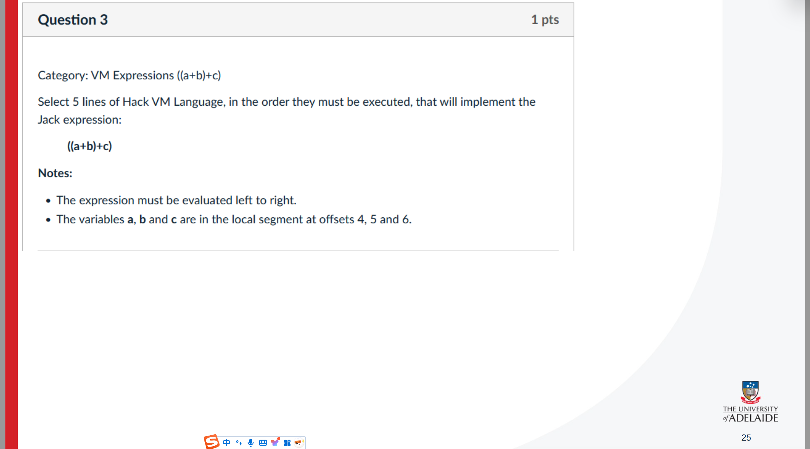

这是在复习“把**高级语言**落实到**汇编/底层**时会遇到的关键问题”。每一行的意思如下，并配上要点与小例子。

# 这张页要表达什么

- **主题**：高级语言→汇编 的转换要考虑哪些概念与约束。
- **目标**：理解高级语言提供了什么“抽象/行为”，以及这些抽象在底层如何实现；实现时会遇到哪几类典型困难。

# Concept（概念）

1. **高级语言提供了哪些功能与行为？**
   - 数据与抽象：基本类型、结构体/类、函数、模块、泛型、异常、库函数等。
   - 语法行为：表达式求值（运算符优先级、结合性、类型提升、短路求值）、函数调用（参数传递、返回值、递归）、内存与生命周期（栈/堆/静态存储期）、作用域与可见性（块级/函数级/文件级、词法作用域）。
2. **如何把这些“编程式地”转换成汇编？（编译流程）**
   - 词法/语法分析 → 语义分析 → **建立抽象语法树(AST)** →（可选）中间表示(IR)与优化 → **代码生成**（映射到具体指令集、寄存器分配、栈帧布局、调用约定）。
   - 典型映射：
     - 表达式 → 一串算术/逻辑指令与临时寄存器/内存。
     - 条件与循环 → 比较指令 + 条件跳转/无条件跳转 + 标签。
     - 函数调用 → 按**调用约定**压栈/传参、建立**栈帧**（函数序言/结尾）、保存/恢复寄存器。
     - 变量 → 局部变量放栈帧、全局/静态在数据段、临时量可能放寄存器。

# Constraints / Challenges（约束与挑战）

1. **如何处理运算顺序（Order of Operations）？**

   - 需要遵守**运算符优先级与结合性**，以及**短路**（`&&`/`||`）和副作用顺序。
   - 做法：编译器用 AST 明确先后，再生成正确的指令序列与**临时寄存器**。
   - 例：`a = b + c * d;`
     - 先算 `t1 = c*d`（`imul`），再 `a = b + t1`（`add`）。
   - 注意：有副作用的表达式（如 `i++ * f(i)`）要保证语言规定的求值顺序。

2. **如何处理流程控制（Flow Control）？**

   - `if/else`：比较（`cmp/test`）+ 条件跳转（`jz/jnz/jl/jg…`）到不同标签。

   - 循环 `for/while`：用标签表示“入口/体/退出”，通过条件跳转回到入口或跳到退出；`break/continue` 也是跳转到相应标签。

   - `switch`：可编成**跳转表（jump table）**或一系列比较+跳转。

   - 小例：

     ```c
     if (x < y) z++; else z--;
     ```

     汇编思路：`cmp x, y` → `jge ELSE` → `inc z` → `jmp END` → `ELSE: dec z` → `END:`。

3. **如何处理变量作用域（Variable Scope）？**（原文少了个 handle，可理解为“如何处理”）

   - **词法作用域**在编译期解析：同名遮蔽（shadowing）、可见性由**块**界定。
   - **存放位置**：
     - 局部变量：位于**栈帧**（`rbp`/`rsp` 相对偏移），可能被优化进寄存器。
     - 形参：按调用约定放寄存器或栈。
     - 全局/静态：数据段，链接时可见。
   - **生命周期**：局部随栈帧创建/销毁；动态对象在堆上由分配器/GC/手动释放管理。
   - **调用约定约束**：谁保存哪些寄存器（caller-saved/callee-saved），如何传参/返回值，这些都影响栈帧布局与可重入性。

# 一个“从高级到汇编”的最小例子（综合）

```c
int addmul(int b, int c, int d){
    int t = c * d;      // 先算乘法（优先级）
    return b + t;       // 再相加
}
```

- 代码生成要点：
  1. 函数序言：建立栈帧、保存需要的寄存器；
  2. `imul` 计算 `c*d`，结果放寄存器或栈上的临时 `t`；
  3. `add` 与 `b` 相加；
  4. 把结果放到返回值寄存器（如 x86-64 的 `rax`）；
  5. 函数结尾：恢复寄存器、销毁栈帧、`ret`。

------

**总结**：这页是在提醒你：当我们把高级语言落到汇编时，必须（1）明白语言提供的抽象与行为，（2）知道用编译器把它们系统地映射到指令与内存结构，（3）特别小心三类硬点——**运算顺序**、**流程控制**、**作用域/存储期**。这三者直接决定生成代码是否**正确**且**高效**。


这是在讲一种“栈导向（stack-oriented）的虚拟机（VM）模型”。要点如下（结合图）：

1. 一切都在“栈”上完成

- 程序做算术/布尔运算（add、sub、eq、lt、gt、and、or、not 等）时，不直接对内存做运算，而是**只对栈顶数据**操作：
  - 运算前，先把参与运算的数值 `push` 到栈。
  - 运算会从栈顶 `pop` 出操作数，计算后把结果再 `push` 回栈。
- 图里左侧的竖条就是**运行栈**；SP（stack pointer，栈指针）指示栈顶/下一空位。

1. 数据存放在多个“内存段（memory segments）”里

- 不是把所有变量都丢在一起，而是分段管理。课程/教材里常见的段有：`argument、local、this、that、temp、pointer、static、constant` 等。
- **“所有段的行为是一样的”**：无论是哪个段，`push segment i` 都表示“把该段第 `i` 个位置的值取出并压栈”；`pop segment i` 表示“把栈顶的值弹出，写回该段第 `i` 个位置”。

1. 右图举例说明 `static` 段

- 右边小表格标题叫 **static**，只是选它来做演示（并不表示只有它存在）。
- 表里 0..4 是该段的索引，后面的数字（5、12、3、-532、15）是存的值。

1. `push / pop` 与运算的配合（按图举一个完整的小流程）
    假设 `static` 段当前为：

```
index :  0   1   2     3    4
value :  5  12   3   -532   15
```

执行下面这几条指令会发生什么？

- `push static 2`  → 把 `3` 压入栈顶
- `push static 0`  → 把 `5` 压入栈顶
- `add`            → 从栈顶弹出 `5` 和 `3`，计算 `5+3=8`，把 `8` 压回栈
- `pop static 1`   → 弹出栈顶的 `8`，写回 `static[1]`
   结果：`static[1]` 从 `12` 变成 `8`；栈恢复到执行这串指令前的高度（因为两次 push、一次 add（净 +1）、一次 pop（-1）相互抵消）。

1. 关于 SP（栈指针）的常识

- 在这种 VM 里，SP 通常**指向下一空位**：
  - `push x` ：把 `x` 写到 `*SP`，然后 `SP++`
  - `pop`    ：`SP--`，然后读 `*SP` 得到被弹出的值
- 因为所有运算都围绕“栈顶”进行，你不需要显式写“把 A 和 B 相加并存到 C”，而是通过 push/pop 让操作数暂住在栈上，由指令对栈顶完成计算。

一句话总结：
 这页在回顾“栈机”思路——程序把数据从各个**内存段**取到**栈**上（push），在栈顶做算术/布尔运算，结果再需要时写回某个段（pop）。示意图用 `static` 段举了一个索引-值的例子，强调**所有段的使用方法都相同**。


这张图在回顾“**栈（stack）的访问操作**”。分成两组“执行前/执行后”的示意，展示两条典型指令：

1. **push static 2**（上半部分）

- 左图（before）：
  - 栈从顶到底依次是：`121, 5, 17`（黑横线表示栈顶）。
  - 右边是 **static 段**（静态区），索引 0..3 的值分别是：`5, 12, 3, -532`。
- 中间的箭头表示要执行“把 static 段索引 **2** 的值压入栈”。这里 `static[2] = 3`。
- 右图（after）：
  - 栈顶多了一个元素 `3`：现在是 `121, 5, 17, 3`。
  - **static 段不变**（只是读出来，没有修改）。
- 要点：`push segment i` = 读出 `segment[i]` 的值，放到**栈顶**，然后栈顶指针 **SP** 前移一格。

1. **pop static 0**（下半部分）

- 左图（before）：栈还是 `121, 5, 17`；static 段为 `5, 12, 3, -532`。
- 指令含义：“把**栈顶**的值弹出，写回到 static 段索引 **0**。”
- 右图（after）：
  - 栈顶元素 `17` 被弹走，栈只剩 `121, 5`。
  - `static[0]` 被更新为 `17`（原来是 `5`）。
- 要点：`pop segment i` = 先让 **SP** 后退一格，取出原栈顶的值，写入 `segment[i]`。

------

### 相关概念补充

- **栈（Stack）**：典型的 **LIFO** 结构（后进先出）。常用于表达式求值、中间结果保存、函数调用时的参数/返回地址/局部变量等。
- **SP（Stack Pointer）栈指针**：指示栈“顶”的位置。很多实现里采用约定：**SP 指向下一个可用空位**，因此“当前栈顶元素在 `SP-1`”。你只要记住：`push` 让栈元素 +1，`pop` 让栈元素 −1。
- **static 段**：静态/全局存储区，按索引编号（如 `static 0`, `static 1`, ...），用于长期保存变量。`push` 从这里**读取**值，`pop` 往这里**写入**值。

------

### 用更程序化的方式看

```text
// push static i
t = static[i]
*SP = t        // 把值写到栈顶位置
SP = SP + 1    // 栈顶指针前移

// pop static i
SP = SP - 1    // 栈顶指针后退到当前顶元素
t = *SP
static[i] = t  // 把弹出的值存入 static[i]
```

图中的数字（121、5、17、3、-532）只是示例，帮助你理解 `push`/`pop` 对栈与 static 段的“读/写”效果。


这是在讲“表达式求值”的复习，核心是**逆波兰表示法（Reverse Polish Notation, RPN，也叫后缀表达式）**。整页可以分成几块来看：

### 这页在说什么

- 标题：**Review: Evaluation of expressions**（表达式求值复习）。
- 中间给了维基百科的 RPN 链接，并在右边用小卡片举例：`3 4 +` 就表示中缀的 `3 + 4`。
- 左边列了四个**中缀表达式**示例：
   `1 + 1`、`-(x + 2)`、`z = 5 + (x - y)`、`x < 5`
- 底部的表格 `static` 像是**符号表/变量表**，给出当前变量的值：
   `x = 3, y = 7, z = -18`（左边的 0/1/2 是行号或索引）。
- 下面的 mentimeter 地址和一串代码是让你进入互动答题用的。

------

### 什么是 RPN / 后缀表达式？

- **中缀**：运算符在操作数**中间**，如 `3 + 4`、`x - y`。需要靠**优先级**和**括号**来决定先后次序。
- **后缀（RPN）**：运算符写在操作数**后面**，如 `3 4 +`。
   优点：**不需要括号**，只按从左到右和运算符的元数（单目/双目）用**栈**就能求值。
- **栈求值规则**（双目运算为例）：
   读到数字/变量就**压栈**；读到运算符就**弹出**该运算需要的操作数，计算后把结果**压回栈**。最后栈顶就是答案。

------

### 用给定变量值来算这四个例子

已知：`x = 3, y = 7, z = -18`

1. **`1 + 1`**
   - RPN：`1 1 +`
   - 结果：`2`
2. **`-(x + 2)`**（注意单目负号）
   - 一种 RPN 写法：`x 2 + neg`（先求 `x+2` 再取负）
      也可写成：`0 x 2 + -`（用 0 减去和）
   - 代值：`x+2 = 3+2 = 5`，取负得 **`-5`**。
3. **`z = 5 + (x - y)`**（赋值语句）
   - 右边先算：`x - y = 3 - 7 = -4`，再 `5 + (-4) = 1`
   - 赋值后：**`z` 更新为 `1`**（原来是 `-18`，这句执行后应变成 1）。
   - RPN（带“存储”语义的一种写法）：`5 x y - +  →  store z`（不同教材/语言对“赋值”在 RPN 里的写法会略有差异，思想是“先把右边算出来，再写回 z”）。
4. **`x < 5`**
   - 代值：`3 < 5` 为 **真**（布尔值 `true` 或用 `1` 表示）。

------

### 从中缀转后缀（思路小抄：Dijkstra 的“分站场算法/调度场算法”）

1. **数字/变量**：直接输出到后缀序列。
2. **运算符**：与操作符栈顶比较优先级；把**栈里优先级不低**的运算符弹出输出，再把当前运算符入栈。
3. **左括号**：入栈。
4. **右括号**：弹出直到遇到左括号（左括号丢弃，不输出）。
5. **读完**：把栈里剩余运算符全部弹出到输出。
    （单目负号 `-` 往往当作一元运算符处理，或在词法阶段改写成 `0 - x` 的二元形式。）

------

### 为什么要学 RPN？

- 编译器/解释器实现表达式求值时很方便（直接生成/解释**栈机器**指令）。
- 没有括号歧义，适合程序化处理与计算器实现（很多老式计算器就是 RPN）。

> 总结：这页是在提醒你——给定变量表（`x=3, y=7, z=-18`），会把常见中缀表达式改写成 **RPN** 并用**栈**一步步求值；同时还包含课堂互动的进入链接。


下面这页在讲：**把面向对象的高级语言编译到虚拟机（VM）时，变量会被映射到哪些“内存段（memory segments）”**，以及这些段各自代表什么。

# 1) VM 是什么？

VM 语言是介于“高级语言 ↔ 机器/汇编”之间的**中间层**。编译器先把类、方法、变量等高级概念，翻译成一组面向栈的 VM 指令与**内存段**，再由后端把 VM 指令变成具体平台的汇编。好处是：前后端解耦、移植性强。

# 2) 高级语言里常见的变量种类

- **类级（Class level）**
  - **Static variables**：类变量，所有对象共享“一份”（程序期存活）。
  - **Private variables**（也叫 object variables / fields / properties）：**实例字段**，每个对象一份（对象期存活）。
- **方法级（Method level）**
  - **Local variables**：方法内部的局部变量（调用期存活）。
  - **Argument variables**：形参/实参（调用期存活）。

> 这里的 *private* 更偏“对象字段”的意思，不一定特指访问控制符 `private`。

# 3) 编译到 VM 后的**四个核心段**（一一对应）

| 高级语言的种类   | VM 段名    | 含义/存放位置                                        | 访问示例                                   |
| ---------------- | ---------- | ---------------------------------------------------- | ------------------------------------------ |
| static（类变量） | `static`   | 每个类/编译单元有自己的静态区                        | `push static 0` / `pop static 1`           |
| field/对象字段   | `this`     | 由 **THIS** 指针指向当前对象的首地址，字段是相对偏移 | `push this 0`（读第0个字段）/ `pop this 1` |
| local（局部）    | `local`    | 当前函数的栈帧                                       | `push local 2` / `pop local 0`             |
| argument（形参） | `argument` | 调用时由调用者压入的参数区域                         | `push argument 1` / `pop argument 0`       |

- 例：

  ```text
  class Point {
      static int count;   // → static 0
      int x, y;           // → this 0, this 1
      int set(int a, int b) {   // a,b → argument 0,1
          int t;                 // t → local 0
          x = a;  y = b;         // pop this 0 / pop this 1
      }
  }
  ```

# 4) 另外**四个辅助段**（稍后课程会细讲，但先给直觉）

- **`that`**：第二个“基址段”，由 **THAT** 指针做基址。常用来访问**数组/缓冲区**等：“把 THAT 设成数组基址，然后 `push that i` 读写第 i 个元素”。
- **`constant`**：字面量常量，只能 `push constant n`（把 n 压栈），不能 `pop`。
- **`pointer`**：大小为 2 的特殊段，**索引 0=THIS，1=THAT**。用来**读/改**这两个基址指针：
  - `pop pointer 0` 把栈顶值写到 THIS（常见于构造函数把 THIS 指向新分配的对象）
  - `pop pointer 1` 把栈顶值写到 THAT
- **`temp`**：8 个临时槽（索引 0..7），映射到固定寄存器，**跨语句短暂保存**中间结果；不保证跨函数调用保存。

# 5) 常见代码模式（把概念和段联系起来）

- **构造对象并设置 THIS**：

  ```text
  push constant n         // 需要 n 个字段的对象
  call Memory.alloc 1     // 堆上分配 n 个单元，返回地址
  pop pointer 0           // THIS = 返回地址（后续 this 段就能访问字段了）
  ```

- **给字段赋值 `x = a`**：

  ```text
  push argument 0         // a
  pop this 0              // 写到字段 x（偏移 0）
  ```

- **访问数组 `arr[i]`**（常用 THAT）：

  ```text
  push arr_base_addr
  pop pointer 1           // THAT = arr_base_addr
  push i
  add                      // 计算地址（或由实现细节处理）
  // 具体课程实现里常见的是先设 THAT 再用 that i 形式访问
  push that i
  ```

# 6) 记忆小抄

- **static ↔ static**：类共享、程序期。
- **field ↔ this**：实例字段，经由 THIS 基址+偏移。
- **arg ↔ argument**：形参在当前调用的参数区。
- **local ↔ local**：局部在当前栈帧。
- **指针段 pointer**：`pointer 0/1` 就是 THIS/THAT 本身。
- **constant**：只能 `push`；**temp**：8 个固定临时槽；**that**：常配合数组/屏幕缓冲等。

**一句话总结**：
 这页就是把“高级语言里的四类变量（类变量、对象字段、局部、参数）”映射到 VM 的四个主内存段（`static/this/local/argument`），并预告还有四个辅助段（`that/constant/pointer/temp`）用于常量、指针基址与临时值等操作。理解这些段，就能看懂/写出从面向对象代码到 VM 指令的正确翻译与内存访问。


这页在讲“程序的控制流（Program flow control）”——也就是**代码如何决定下一步要执行哪一条指令**，以及在把高级语言（if/while/for 等）翻译到我们这套简化的 VM/汇编时，会遇到哪些具体问题。

# 核心概念（Concept）

**What is flow control?**
 控制流就是让程序**不只顺序往下执行**，而是能：

- **无条件跳转**到某一位置（`goto`）
- **条件跳转**（`if` / `if-else` / 循环的判断）
- **形成循环**（`while` / `for`）
- （在后续章节还会加入**函数调用/返回**，也是控制流的一部分）

在我们的“栈式 VM”里，表达式的值先被压到**栈**上，条件判断靠**栈顶的值**决定跳不跳。

------

# 约束 / 挑战（Constraints / Challenges）

## 1) 我们用于控制流的“指令”只有哪些？

在 VM 层面，通常只有三条最基本的控制流原语（primitives）：

- `label X`：在当前代码位置**定义一个标签** X（一个锚点/名字）。
- `goto X`：**无条件跳转**到标签 X。
- `if-goto X`：**条件跳转**到标签 X——从栈顶 `pop` 一个值，**非 0 为真**则跳转。

> 之后把它们再翻译成底层汇编：
>
> - `label X` → `(X)`（汇编的伪指令，声明位置）
> - `goto X` → `@X` + `0;JMP`
> - `if-goto X` → 从栈取值到寄存器，判断 `!=0` 时 `D;JNE` 跳转到 `X`

示例：VM 指令 `if-goto LOOP` 的典型汇编展开

```asm
@SP
AM=M-1     // SP-- 并把地址给 A；A/M 指向栈顶元素
D=M        // D = *SP（被弹出的条件值）
@Func$LOOP // 跳转目标标签（见“避免重名”部分）
D;JNE      // 若 D != 0 则跳
```

## 2) 如何把 if / if-else / while / for “分解”为这些原语？

关键思路：**先算条件表达式，把结果压栈**，再用 `if-goto`/`goto` 配合 `label` 组织结构。

### if（无 else）

```vm
// 计算条件 -> 栈顶（非0为真）
if-goto IF_TRUE
// 条件为假（不跳转）时的“直接越过”
goto IF_END
label IF_TRUE
  // 真分支代码
label IF_END
```

### if-else

```vm
// 计算条件 -> 栈顶
if-goto IF_TRUE
goto IF_FALSE
label IF_TRUE
  // 真分支
goto IF_END
label IF_FALSE
  // 假分支
label IF_END
```

### while

常见两种写法之一（先判断后执行的 while）：

```vm
label WHILE_EXP
  // 计算条件 -> 栈顶
  // 我们约定“非0为真”，若为假就跳出
  not          // 把条件取反（真->0，假->非0）
  if-goto WHILE_END
  // 循环体
  goto WHILE_EXP
label WHILE_END
```

或不取反，直接“为真则进体，为假则结束”：

```vm
label WHILE_EXP
  // 计算条件 -> 栈顶（非0为真）
  if-goto WHILE_BODY
  goto WHILE_END
label WHILE_BODY
  // 循环体
  goto WHILE_EXP
label WHILE_END
```

### for

`for(init; cond; step) body` 通常展开为：

```vm
// init
label FOR_EXP
  // cond -> 栈顶
  if-goto FOR_BODY
  goto FOR_END
label FOR_BODY
  // body
  // step
  goto FOR_EXP
label FOR_END
```

> 要点：所有判断都依赖**栈顶值**，所以在进入 `if-goto` 之前，必须确保“条件表达式”的结果已经按约定（非0真、0假）压在栈顶。

## 3) 如何确保“标签（labels）不冲突”？

当多个文件/函数里都写了 `label LOOP` 时，名字会**撞车**。解决办法是**命名空间化**（加前缀）：

- 以**当前函数名**为作用域：`<FunctionName>$<LocalLabel>`
   例如 `SimpleFunction$LOOP_START`
- 若不在函数内，可用**文件名**作前缀：`<FileName>$<Label>`

这样：

- `label LOOP` 在函数 `Foo.bar` 里会被编译成 `(Foo.bar$LOOP)`
- `goto LOOP` 也会跳到 `@Foo.bar$LOOP`
- 不同函数/文件的 `LOOP` 就互不干扰

------

# 小结（把高级结构降解为 3 个原语）

- **我们只有**：`label / goto / if-goto`
- **策略**：先把“条件值”算到**栈顶** → 用 `if-goto` 决定跳与不跳 → 用 `goto` 串连分支/循环 → 用 `label` 标注位置
- **工程细节**：
  - 条件判定采用**非 0 真、0 假**的惯例
  - 始终维护好 **SP（栈指针）** 的自增自减
  - 用“**函数名/文件名 + $ + 局部标签**”避免标签名冲突

掌握这些，就能把任意 if/else/while/for 的控制流稳定地翻译/实现到我们这套简化的 VM/汇编上。


这页在讲 **VM 语言（Nand2Tetris 的虚拟机语言）里的三种“程序控制/流程”指令**，以及它们的含义和大致如何翻译成底层 Hack 汇编。

# 三个指令的语义

- **`label c`**
   在当前位置**声明一个标签** `c`，仅作为跳转目标；不改变栈或寄存器。

- **`goto c`**
   **无条件跳转**到标签 `c` 后面的那条 VM 指令处继续执行。

- **`if-goto c`**
   **从栈顶弹出一个值**；如果该值 **≠ 0**，就跳到 `c`；否则顺序执行下一条。

  > 注意：VM 的布尔“真”常用 `-1` 表示（非零即真），因此 `eq/lt/gt` 之类比较为真会推入 `-1`，配合 `if-goto` 也会被当作“真”。

# 翻译成 Hack 汇编的大致做法

假设当前函数名是 `F`（VM 的标签在函数作用域内），翻译器通常把 `c` 变成唯一名 `F$c`，避免不同函数里的同名标签冲突。

- `label c`

  ```asm
  (F$c)
  ```

- `goto c`

  ```asm
  @F$c
  0;JMP
  ```

- `if-goto c`（要先从栈顶取值判断）

  ```asm
  @SP     // SP--
  AM=M-1
  D=M     // D = *SP（弹出的值）
  @F$c
  D;JNE   // 如果 D != 0，就跳转
  ```

# 右侧示例程序在做什么？

右侧是一个 VM 函数（伪代码名 `mult`），**用“重复加法”计算乘法**：返回 `argument0 * argument1`。函数有 1 个局部变量 `local 0` 作为累加器。

把它读顺一遍（略去与流程无关的指令只保留关键逻辑）：

```
function mult 1        // 开辟 1 个局部变量 local 0
push constant 0
pop local 0           // local0 = 0  （累加器置零）

label loop            // 循环开始
push argument 0
push constant 0
eq                    // 栈顶变成 (arg0 == 0 ? -1 : 0)
if-goto end           // 若 arg0 == 0 则跳到 end 返回结果

push argument 0
push constant 1
sub                   // 计算 arg0 - 1
pop argument 0        // arg0 = arg0 - 1  （自减）

push argument 1
push local 0
add
pop local 0           // local0 += argument1  （把被乘数累加一次）

goto loop             // 继续下一轮
label end
push local 0
return                // 返回累加器
```

**流程理解：**

1. 累加器 `local0` 置 0。
2. 每一轮：
   - 如果 `arg0 == 0`，跳出循环（`if-goto end` 生效，因为 `eq` 推入 -1 表示真，非零触发跳转）。
   - 否则先把 `arg0` 减 1，再执行 `local0 += arg1`，回到 `loop`。
3. 跳出后把 `local0` 压栈并 `return`。

**举例**：`argument0=3, argument1=4`

- 初始：`local0=0`
- 轮1：`arg0 → 2`，`local0 → 4`
- 轮2：`arg0 → 1`，`local0 → 8`
- 轮3：`arg0 → 0`，`local0 → 12`
- 下轮检测时 `arg0==0`，跳到 `end`，返回 `12`。

# 小结

- `label/goto/if-goto` 提供了 VM 语言里的**基本流程控制**（块标记、无条件跳、条件跳）。
- **`if-goto` 会消耗栈顶值**，并以“非零为真”判断是否跳转。
- 翻译到 Hack 汇编时：
  - `label` 变成符号 `(Function$Label)`；
  - `goto` 变成 `@Function$Label` + `0;JMP`；
  - `if-goto` 先弹栈到 `D`，再用条件跳转 `D;JNE`。
- 示例程序用这三条指令组织出一个 `while` 循环，实现乘法的重复加法版本。


下面这页讲的是：**把高级语言里的 `while` 循环翻译成 Hack 虚拟机（VM）代码**（出自 Nand2Tetris 体系）。左边是类 Java 的伪代码，右边是对应的 VM 指令。

------

# 左边的源程序（假设 `i` 与 `sum` 先被初始化为 0）

```c
while (i < 10) {
    let sum = sum + i;
    let i   = i + 1;
}
```

作用：把 0..9 累加到 `sum`，循环结束时 `sum = 45`，`i = 10`。

------

# Hack VM 的基本知识（用得到的就这几条）

- 这是**基于栈**的虚拟机：`push` 把值压栈，`pop` 把栈顶弹出并存入某段（segment）的某个下标。
- `local k` 段表示**当前函数的第 k 个局部变量**。这页中约定：`local 0` 存 `i`，`local 1` 存 `sum`。
- `constant n` 把常数 n 压栈。
- 算术/逻辑：`add`（加法）、`lt`（小于，真=**-1**，假=**0**）、`not`（按位取反，用来把 0/-1 互换）。
- 流程控制：`label X` 定义标签，`goto X` 无条件跳转，`if-goto X` 取栈顶，**若非 0 就跳转**。

------

# 右边 VM 代码逐行解释（→ 表示栈顶方向）

```
label LOOP                  // 循环入口（相当于 while 的“检查处”）

push local 0                // 压入 i
push constant 10            // 压入 10
lt                          // 计算 (i < 10) -> 真=-1，假=0
not                         // 取反：把“继续条件”变成“退出条件”
if-goto LOOPEND             // 若应退出（非0），跳到循环结束
```

说明：`while` 要在**进入循环体前**检查条件。这里先做 `i < 10`；因为 `if-goto` 只有“为真就跳”，所以用 `not` 把“继续”变成“退出”，当 `i >= 10` 时跳到 `LOOPEND`。

```
push local 1                // sum
push local 0                // i
add                         // sum + i
pop  local 1                // sum = sum + i
```

这是循环体的第一句：累加到 `sum`。

```
push local 0                // i
push constant 1
add                         // i + 1
pop  local 0                // i = i + 1
```

循环体的第二句：`i` 自增。

```
goto LOOP                   // 回到顶部再次检查 (i < 10)

label LOOPEND               // 循环结束位置
```

------

# 小步跟踪（前两轮）

- 初始：`i=0, sum=0`
- 检查 `0<10` 真 → 不跳 `LOOPEND`
   体内：`sum=0+0=0`，`i=1`
- 检查 `1<10` 真 → 不跳
   体内：`sum=0+1=1`，`i=2`
- ……直到 `i` 变成 10 时，检查 `10<10` 为假（0），`not` 后变真（非 0），`if-goto` 跳到 `LOOPEND` 结束。

------

# 关键点总结

- `label/goto/if-goto` 在 VM 中实现了高级语言的**程序流程控制**。
- `lt` + `not` + `if-goto` 这一连招把 `while (cond)` 的**“当条件为假时退出”**准确表达出来。
- `local` 段保存循环里用到的局部变量，`push/pop` 完成“读/写变量”的动作。
- 整段 VM 代码与左侧 `while` 语义**一一对应**：检查条件 → 执行体 → 自增 → 回到顶部 → 直到退出。


这页在讲 VM 指令 **`if-goto labelX`** 翻译成 **Hack 汇编**时，要**保证标签（label）在整个程序里唯一**，否则跳转会跳错地方。

# 为什么“标签必须唯一”

- VM 语言里，`label X / goto X / if-goto X` **通常是函数内作用域**的名字；

- 但 Hack 汇编的符号表是**全局**的，`(X)` 这个标签在整份汇编里只能有一个。

- 所以编译时要给每个函数里的标签**加前缀做命名空间**，常见约定：

  ```
  <类或文件名>.<函数名>$<标签名>
  ```

  例如：`Example.func$labelX`。这样即便别的函数也有 `labelX`，也不会冲突。

# 指令逐行解释（把 `if-goto labelX` 译为 Hack）

假设在类 `Example` 的函数 `func` 里：

```asm
@SP            // A = &SP（SP 指向“下一空位”）
AM = M-1       // SP = SP - 1；同时 A = SP（A 指向“栈顶元素”）
D = M          // D = *SP（弹出条件值到 D）
@Example.func$labelX   // A = 目标标签的地址（带作用域前缀，确保唯一）
D;JNE          // 若 D != 0 则跳转到 labelX（JNE：非零跳转）
```

- `if-goto` 的语义是：**弹出栈顶作为布尔条件**，非零就跳。
- 之所以用 `JNE`，是因为 VM 里“真 = 非零”，不只是大于 0。
- 与之对应：
  - `goto X` 会生成：`@Example.func$X` + `0;JMP`（无条件跳转）
  - `label X` 会生成标签定义：`(Example.func$X)`

# 小结

- 规则：**函数内出现的任何 label 名，都要被编译器改写为“函数作用域前缀 + $ + 原名”**，以避免与其他函数/文件里的重名标签冲突。
- 上面的 5 行汇编实现了 `if-goto`：弹栈取条件 → 非零则跳 → 目标标签使用作用域化名字。
- 幻灯片右侧“Next week in high-level language”提示：下周把同样的“唯一定名”思想用于从更高级语言降到 VM/汇编时生成的各种内部标签（如 if/while 的分支标签）。


这页在讲“**子程序（Subroutines）**”，也就是我们在高级语言里熟悉的 **函数 / 方法**。要点分两部分：理念与实现挑战。

# 是什么？（Concept）

- **子程序 = 可复用的命名代码块**，有形参，有局部变量，执行完把**返回值**（可有可无）交给调用者。
- 作用：把复杂问题拆成**黑盒模块**（black box），外部只关心**接口**（名字、参数、返回值），不关心内部实现。
- 右上角代码片段示例：解一元二次方程时使用 `Math.sqrt(...)`。`sqrt` 就是一个**子程序**：我们直接调用它，像用内建指令一样，不必知道它内部如何求平方根。

# 为什么重要？（Subroutines = a major programming artifact）

1. **扩展语言能力**
    通过自定义函数，你能“发明”新指令。例如写个 `abs(x)`、`max(a,b)`、`evalPoly(coeffs,x)`，以后像内建命令一样调用。
2. **同样的“外观与手感”**
    语言的**原语命令**（加减乘除、比较等）与**用户自定义命令**在使用方式上保持一致：`y = foo(x)` 和 `y = Math.sqrt(x)` 看起来一样。
3. **最关键的抽象机制**
    这叫“**透明的可扩展性**”：高层代码只看见黑盒接口，程序控制在不同子程序之间**自然流动**。系统因此可读、可测、可维护、可复用。
4. **黑盒化思想**
    引用底部那句话的意思：一个设计良好的系统由一组黑盒模块构成，每个模块像“魔法”一样完成自己的效果——这正是子程序带来的工程组织能力。

# 难点在哪里？（Constraints / Challenges）

实现这套抽象，在**虚拟机/汇编**层要解决三类问题：

1. **最小指令集**（VM 层常见三条）
   - `function f nLocals`：定义子程序并为其分配 `nLocals` 个局部变量（初值 0）。
   - `call f nArgs`：把 `nArgs` 个实参和调用现场信息压栈，跳到 `f`。
   - `return`：把返回值交还给调用者，恢复现场，跳回调用点之后。
2. **调用现场与返回**（call/return 机制）
   - **传参**：实参压栈，设置 `ARG` 指向参数起始位置。
   - **返回地址**：`call` 时生成一个唯一的**返回标签**并压栈；`return` 时跳回这个地址。
   - **保存/恢复上下文**：进入被调函数前保存调用者的 `LCL/ARG/THIS/THAT` 等寄存器；返回时按相反顺序恢复。
   - **局部变量栈帧**：将 `LCL` 设为当前 `SP`，用 `nLocals` 个 0 初始化局部空间。
   - **返回值处理**：把被调函数栈顶作为返回值，写到 `*ARG`，然后让 `SP = ARG + 1`。
3. **可组合/可嵌套/可递归**
    多层嵌套调用或递归要求每次调用都有**独立的栈帧**与**独立的返回地址**；这正是**调用栈（call stack）**存在的原因。

------

## 迷你流程示例（高度概括）

调用 `call f 2` 大致做：

1. 压入 `returnAddress`、`LCL/ARG/THIS/THAT`；
2. 设置 `ARG = SP - 2 - 5`（2 个参数 + 5 个保存项）；
3. `LCL = SP`；`goto f`；在调用点放 `label returnAddress`。

在 `function f nLocals` 里：

- 重复 `push 0` 共 `nLocals` 次，初始化局部变量。

`return` 时：

1. 把返回值放到 `*ARG`；`SP = ARG + 1`；
2. 依次恢复 `THAT/THIS/ARG/LCL`；
3. 跳到保存的 `returnAddress`。

------

### 小结

- 子程序让你**像使用内建指令一样**使用自定义功能，是高级语言最重要的抽象之一。
- 真正的难点在底层：**如何用有限的 VM/汇编指令实现 call/return、参数传递、局部变量与返回地址、以及现场保存与恢复**。
- 一旦这些机制稳固，控制流就能在各个黑盒之间“无缝穿梭”，实现可维护、可扩展的软件结构。


这是在说明课程“接下来要做的事”（近期安排）：

- **Review Chapters 7 & 8 of the textbook (if you haven’t already)**
   如果还没复习，请把教材**第 7、8 章**先过一遍。
- **Assignment 5 due Sunday week (Sept 17)**
   **第 5 次作业**截止到**9 月 17 日（周日）**。按时在线提交。
- **Week 8 Supervised Practical Exam (Please come to the workshop you enrolled)**
   **第 8 周有监考的实践/上机考试**。一定要去**你报名的 workshop 时段/教室**参加（不能随意换场次）。
- **Week 8 Practice Questions available**
   **第 8 周的练习题已发布**（通常在课程网站/LMS 上），用于备考与自测。
- **Review Chapter 8 & 9 of the textbook before Week 8**
   在**第 8 周开始前**，再复习**第 8、9 章**的内容（第 8 章在前面已出现一次，这里是提醒再次巩固并新增第 9 章）。

**理解为一个时间表：**
 现在→先复习第7/8章；
 9/17（周日）→提交作业5；
 第8周→做已发布的练习题并参加监考实践考试；
 第8周前→把第8/9章复习好。

需要的话我可以帮你把这些拆成每日复习清单。


这题要把 **Hack 汇编指令**翻成 **16 位机器码**。
 Hack 指令只有两类：

- **A 指令**：`0 vvvvvvvvvvvvvvv`（最高位是 0，后面 15 位是无符号立即数）
- **C 指令**：`111 a c1 c2 c3 c4 c5 c6 d1 d2 d3 j1 j2 j3`
  - `a c1..c6` 是 `comp` 字段（查表得到；`a=0` 表示用 A 寄存器，`a=1` 表示用 M）
  - `d1 d2 d3` 是 `dest`（A、D、M 对应位）
  - `j1 j2 j3` 是 `jump`（JGT=001, JEQ=010, …, JMP=111，缺省=000）

------

## 逐条转换

### 1) `@7`  —— A 指令

- 立即数 `7` 的 15 位：`000 0000 0000 0111`
- 机器码：**`0000 0000 0000 0111`**

------

### 2) `1` —— C 指令（只有 comp，没有 dest/jump）

- `comp=1` 的 7 位：`0 111111` → **`0111111`**
- `dest` 空：`000`；`jump` 空：`000`
- 机器码：`111` `0111111` `000` `000`
   → **`1110 1111 1100 0000`**

------

### 3) `D;JGT` —— C 指令（comp=D，jump=JGT）

- `comp=D`：**`0001100`**
- `dest` 空：`000`
- `jump=JGT`：**`001`**
- 机器码：`111` `0001100` `000` `001`
   → **`1110 0011 0000 0001`**

------

### 4) `M=D` —— C 指令（dest=M，comp=D）

- `comp=D`：**`0001100`**
- `dest=M`：A/D/M 三位为 `001`
- `jump` 空：`000`
- 机器码：`111` `0001100` `001` `000`
   → **`1110 0011 0000 1000`**

------

## 最终答案（每 4 位加空格）

1. `@7` → **`0000 0000 0000 0111`**
2. `1` → **`1110 1111 1100 0000`**
3. `D;JGT` → **`1110 0011 0000 0001`**
4. `M=D` → **`1110 0011 0000 1000`**

> 小提示：判断 A 还是 C（是否以 `@` 开头）；A 就是 `0 + 15 位数`，C 就把 `comp/dest/jump` 拆出来按表编码。


这题指着的是 **PC（Program Counter）组件上方那个“inc”单根控制线**。

- **来自哪里？**
   来自左侧的**控制/译码单元**（decode）。它由当前指令的控制位产生，是一根 **1 位** 的控制信号（图中用小圈“C”标注）。
- **触发什么动作？**
   作为 **PC 的 `inc` 输入**。在 `reset=0` 且 `load=0` 时，`inc=1` 会在时钟沿使 **PC ← PC + 1**，也就是把程序计数器加一，从而**取下一条顺序执行的指令**。
- **补充对比**
   若发生跳转（C 指令的跳转条件满足），控制单元会使 **`load=1`**，PC 从 **A 寄存器的值**装载新地址而不是自增；若 **`reset=1`**，PC 被清零。
   因此，这根线就是“顺序执行时让 PC 递增”的控制线。



题意：
 用 **Hack VM** 指令（恰好 5 行，按执行顺序写）实现 Jack 表达式 **`((a + b) + c)`**。
 已知变量 **a、b、c** 存在 **local 段** 的 **偏移 4、5、6**。并且要求**从左到右**求值。

## 正确答案（5 行 VM 指令）

```vm
push local 4   // a
push local 5   // b
add            // 计算 a+b
push local 6   // c
add            // 计算 (a+b)+c
```

## 为什么这样写（栈式执行过程）

- 初始栈：`[]`
- `push local 4` → `[a]`
- `push local 5` → `[a, b]`
- `add`          → `[a+b]`（弹出 b、a 相加后压回结果）
- `push local 6` → `[a+b, c]`
- `add`          → `[(a+b)+c]`（得到最终结果留在栈顶）

要点：

- 我们从 **local 段** 取值：`local 4/5/6` 分别是 `a/b/c`。
- VM 的算术在**栈顶**完成，`add` 会弹出两个数求和，再把结果压回。
- 按“左到右”顺序：先算 `a+b`，再与 `c` 相加。


这题考的是 **Hack 汇编器第一遍（first pass）建立符号表** 的规则。

**规则回顾**

- 第一遍只做两件事：
  1. 扫描所有**指令**（A/C 指令）并按出现顺序给它们分配 **ROM 地址（从 0 开始）**；
  2. 遇到形如 **`(LABEL)`** 的**标签声明**时，把 `LABEL` 记录到符号表里，值为“**紧随其后的那条指令的地址**”。
- 预定义符号（如 `R0`、`SP`、`LCL`…）不需要在第一遍加入（已经内置）。
- 变量名（如 `@counter`、`@x`）**不是**在第一遍加入，而是在第二遍第一次遇到未定义符号的 `@name` 时，从 RAM16 起分配地址。

------

## 按行计数（只给 A/C 指令编号，标签行不占地址）

```
0: @R0
1: D=M
2: @END
3: D;JLE
4: @counter
5: M=D
6: @x
7: M=D
(LOOP)          // 标签，不计地址；LOOP 指向下一条
8: D=D+A
9: @LOOP
10: D;JGT
(END)           // 标签，不计地址；END 指向下一条
11: @END
12: 0;JMP
```

因此在**第一遍结束后的符号表新增项**只有两个标签：

- `LOOP` → **8**
- `END`  → **11**

而其他出现的名字在第一遍不加入或已预定义：

- `R0` → **-**（预定义符号）
- `counter` → **-**（变量，第一遍不分配）
- `x` → **-**（变量，第一遍不分配）

> 题目里要求“预定义符号或第一遍不应出现的条目用 `-`”，所以填表就是：
>  **R0: -，counter: -，x: -，LOOP: 8，END: 11**。


这题是在考 **VM 指令到 Hack 汇编** 的翻译：把
 `pop argument 0`
 翻成若干行 Hack 汇编。

含义：把**栈顶元素**弹出，存入 **argument 段第 0 个位置**（也就是 `*(ARG+0)`）。

在 Hack 里，`argument` 段的基址保存在符号 **`ARG`**（RAM[2]）中。翻译套路是三步：

1. 先计算目标地址 `ARG + 0`，把它临时存到寄存器（通常用 **R13**）。
2. `SP--`，取出栈顶到 `D`。
3. 把 `D` 写回到步骤 1 保存的地址处。

题目给出的代码框里只缺两条 **A 指令**（其余行已写好）：

```
@SP          ←（第一个空格应填这一行）
AM=M-1
D=M

@R13         ←（第二个空格应填这一行）
A=M
M=D
```

> 说明：
>
> - `@SP` 配合 `AM=M-1; D=M` 实现 “弹栈到 D”。
> - `@R13` 配合 `A=M; M=D` 表示 “把 D 存到 R13 指向的内存地址”。

为了完整起见，**整条指令的标准翻译**通常是：

```
@0
D=A
@ARG
D=M+D       // D = ARG + 0
@R13
M=D         // R13 = 目标地址

@SP
AM=M-1
D=M         // D = *--SP

@R13
A=M
M=D         // *R13 = D
```

这样就把栈顶弹到 `argument[0]` 里了。


题目在问：**Hack VM 里原生提供哪些“运算（Arithmetic/Boolean）指令”**。
 Hack VM 的**9 个**算术/布尔指令是：

```
add, sub, neg, eq, gt, lt, and, or, not
```

把它对照到左边给的选项，应当勾选这些（✅）：

- ❌ le（没有 ≤）
- ✅ gt
- ✅ lt
- ❌ ge（没有 ≥）
- ✅ add
- ✅ sub
- ❌ multiply（没有乘法）
- ✅ neg
- ❌ divide（没有除法）
- ✅ and
- ❌ xor（没有异或）

补充说明

- 没有的比较可以**用现有指令组合**：
   `a <= b` ≡ `not (a > b)`；`a >= b` ≡ `not (a < b)` 或 `(a > b) or (a == b)`。
- 乘/除要**调用函数**实现（如课程里的 `Math.multiply` / `Math.divide`），VM 不内建。
- 这些运算都是**栈操作**：二元运算弹出 y、x 计算 `x op y` 再压回；一元运算只取一个数。比较指令 `eq/gt/lt` 的结果为 **true = -1，false = 0**。


这题在考 **Hack VM 的各内存段（memory segments）分别做什么用**。下面逐个解释（含底层映射要点）：

- **static**
   用于保存**静态变量**（类/文件级）。编译器把 `static i` 映射到主机 RAM 的符号地址（常规是 **16..**，并按“文件名.i”区分不同文件的静态变量），在同一程序的不同文件间不会冲突。
- **argument**
   保存**当前函数的实参**。其基址在寄存器 **ARG**；`push argument i`/`pop argument i` 实际访问的是 `ARG+i`。
- **local**
   保存**当前函数的局部变量**。其基址在 **LCL**；访问 `LCL+i`。
- **constant**
   并不占用实际 RAM；代表**常数字面量 0..32767**。`push constant k` 的实现就是把 `k` 压栈。
- **pointer**
   只有 **2** 个槽：`pointer 0` ↔ **THIS**，`pointer 1` ↔ **THAT**。
   用它**读/改 THIS、THAT 的基址**（THIS/THAT 本身存放在 RAM[3]/RAM[4]）。例如 `pop pointer 0` 等价于把栈顶写入 THIS。
- **temp**
   固定大小 **8** 格（索引 0..7），映射到 RAM **R5..R12**。用作通用**临时存储**：`temp i` ↔ `R5+i`。
- **field**
   **不是 VM 段**。它是 **Jack 语言**中的“对象字段”种类，编译时会被**映射到 THIS 段**（对象基址 + 偏移）。
- **var**
   **不是 VM 段**。它是 Jack 的“局部变量”种类，编译时会被**映射到 local 段**。
- **result**
   **不是 VM 段**。Jack/Hack 中函数的**返回值通过栈顶传回**，没有名为 result 的内存段。

> 补充：除上面列出的段外，VM 里还有 **this / that** 两个“虚拟段”，它们的基址由 THIS/THAT 指针决定；`push this i` 就是取 `*(THIS+i)`。`pointer` 段正是用来读/改这两个指针的。


这题让你把 Jack 代码

```jack
class bob {
    function int foo(int a) {
        var int x;
        let x = a + x;
        return x;
    }
}
```

翻译成 **VM 指令**，并问“实现 `foo` 的**前三条** VM 命令是什么”。

要点：

- `function` 说明：`foo` 是**函数**（不是 method），因此没有设置 `this` 的序言；有 **1 个局部变量** `x`，局部段是 `local`，形参 `a` 在 `argument` 段里。
- Jack 规定**局部变量默认初始化为 0**；在 VM 层，这由 `function` 命令负责（编译器生成 `function bob.foo 1`，VM 翻译到汇编时会为 1 个局部变量压入 0）。

因此，**前三条 VM 命令**为：

1. `function bob.foo 1`      // 声明函数并分配 1 个局部变量（x，初始为 0）
2. `push argument 0`         // 取参数 a
3. `push local 0`            // 取局部变量 x（此时为 0）

（后续通常是 `add`、`pop local 0`、`push local 0`、`return` 完成赋值与返回。）


这页是在问：把 **Jack** 函数里 `while` 循环体中的两条语句

```jack
let sum = sum + a;
let a   = a + 1;
```

翻译成 **Hack VM（栈式虚拟机）指令** 应该写成什么顺序。

## 变量到 VM 段/索引的映射

函数里声明是 `var a, b, sum;`
 在 Jack 编译规范中，按声明顺序映射到 `local` 段：

- `a` → `local 0`
- `b` → `local 1`
- `sum` → `local 2`

循环体中只用到了 `sum` 和 `a`，与 `b` 无关。

## 正确的 VM 指令序列

```
// sum = sum + a;
push local 2      // 压入 sum
push local 0      // 压入 a
add               // 计算 sum + a
pop  local 2      // 回写到 sum

// a = a + 1;
push local 0      // 压入 a
push constant 1   // 压入常量 1
add               // 计算 a + 1
pop  local 0      // 回写到 a
```

与图中右侧红字的 1～8 步完全一致。

## 栈运行示意

- `push local 2` → 栈：[sum]
- `push local 0` → 栈：[sum, a]
- `add` → 栈：[sum+a]
- `pop local 2` → sum ← (sum+a)，栈清空
- `push local 0` → 栈：[a]
- `push constant 1` → 栈：[a, 1]
- `add` → 栈：[a+1]
- `pop local 0` → a ← (a+1)，栈清空

要点：Hack VM 是**基于栈**的，`push` 取值入栈，算术指令在栈顶就地计算，`pop` 把结果存回目标段/索引即可。


题目问：**局部变量 `x` 是用哪一串 VM 指令被初始化的？**

结论：在 Jack/VM 体系里，**局部变量由函数头（function 声明）自动初始化为 0**。
 本例中函数有 1 个局部变量 `x`，所以对应的 VM 头是：

```
function bob.foo 1
```

其语义是：“进入 `bob.foo` 时，**为 1 个 local 变量分配空间并置 0**”。实现上等价于在函数入口处执行一次：

```
push constant 0      // 为 local 0 放一个 0
```

（一些实现会理解为重复 `push constant 0` n 次；效果等同于把 `local 0..n-1` 全部置 0。）

因此，本题的初始化序列就是 **`function bob.foo 1`**（它隐含地把 `x` 设为 0）。
 顺带，后续语句 `let x = a + x;` 实际上是 `x = a + 0`。


这页是在说明：如何用 **Hack VM** 的 5 行指令实现表达式 **`((a+b)+c)`**，并配上了等价的**后缀式（RPN）**写法 **`ab+c+`**。红字 1–5 行就是正确答案。

# 关键信息

- 变量 **a、b、c** 存放在 **local 段**，偏移分别为 **4、5、6**。
  - `local 4` → a
  - `local 5` → b
  - `local 6` → c
- VM 是**栈机**：所有运算都在**栈顶**进行。
  - `push segment i`：把该段第 *i* 个位置的值**压栈**。
  - `add`：从栈顶**弹出两个数**相加，再把结果**压回**。

# 为什么 `ab+c+`？

- 这是把中缀 `((a+b)+c)` 改写成后缀：
  - `ab+` 表示先算 `a+b`，
  - 再把 `c` 加上，写成 `ab+c+`。
- 后缀式的顺序与**栈机执行顺序**天然一致：先把操作数压栈，再执行运算符。

# 5 行 VM 指令（与图一致）

```vm
1: push local 4   // 压入 a
2: push local 5   // 压入 b
3: add            // 计算 a+b，结果在栈顶
4: push local 6   // 压入 c
5: add            // 计算 (a+b)+c，结果在栈顶
```

# 栈变化一步步看

- 初始：`[]`
- `push local 4` → `[a]`
- `push local 5` → `[a, b]`
- `add`          → `[a+b]`（弹出 b、a，相加后压回）
- `push local 6` → `[a+b, c]`
- `add`          → `[(a+b)+c]`（最终结果留在栈顶）

> 小例子：若 a=2, b=3, c=4，执行后栈顶为 `9`，即 `(2+3)+4=9`。

总结：红字的 `ab+c+` 是后缀表达式；下面那 5 行 VM 指令正好按这个顺序完成“先 `a+b`，再加上 `c`”，并把结果留在栈顶供后续使用或 `pop` 到目标变量。


这题还是在考 **Hack 汇编器第一遍（first pass）建立符号表**。
 规则要点：

- 只给**指令行**（A 指令 `@...`、C 指令如 `D=M`、`0;JMP`）按出现顺序编号为 **ROM 地址**（从 0 起）。
- 遇到 **`(LABEL)`**，把 `LABEL` 记到符号表里，值是“**紧随其后的那条指令的地址**”；标签行本身**不占地址**。
- **预定义符号**（如 `R0`）不用加入表；
- **变量名**（如 `counter`、`x`）在**第二遍**才分配 RAM 地址；
- `A/D/M`、`JLE/JGT/JMP` 等是 **指令助记符**，不是符号表条目。

### 按行计地址

```
0: @R0
1: D=M
2: @END
3: D;JLE
4: @counter
5: M=D
6: @x
7: M=D
(LOOP)          // 标签，不计地址；LOOP 指向下一条
8: D=D+A
9: @LOOP
10: D;JGT
(END)           // 标签，不计地址；END 指向下一条
11: @END
12: 0;JMP
```

### 第一遍结束后，符号表里应当有

- `LOOP → 8`
- `END → 11`

### 题目右侧各项应填写

- **R0**：`-`（预定义符号）
- **D**：`-`（助记符，不是符号）
- **M**：`-`（助记符，不是符号）
- **END**：`11`
- **JLE**：`-`（助记符）
- **counter**：`-`（变量，第一遍不分配）
- **x**：`-`（变量，第一遍不分配）
- **LOOP**：`8`
- **A**：`-`（助记符）
- **JGT**：`-`（助记符）
- **JMP**：`-`（助记符）

这样就和“第一遍后的符号表内容”一致了。


这页叫 **VM Translator Parsing**，演示把两条 **Hack VM** 指令翻成 **Hack 汇编**。两条指令分别是：

------

## 1) `push constant 1`

右侧对应汇编：

```
@SP        // 选中栈顶指针 SP（RAM[0]）
AM = M+1   // SP++，同时把 A 也改成新的 SP
A  = A-1   // A 回到 SP-1（栈顶单元的地址）
M  = 1     // *（SP-1）= 1   —— 把常量 1 写到栈顶
```

**为什么这样写也对？**
 常见写法是先在 `A=M` 的地址处写值，再 `SP=SP+1`。这张幻灯片采用“**先增后写**”的等价套路：

- `AM=M+1` 让 `SP` 指向下一个空位，同时把 `A` 设置为这个新地址；
- `A=A-1` 再退一格，就回到了“真正的栈顶”（也就是写入位置）；
- `M=1` 用 ALU 的常量 `1` 直接写入该内存单元。
   最后效果：**栈顶压入 1，`SP` 加 1**。

> 若是 `push constant k` 的通用版，可写：
>
> ```
> @k
> D=A
> @SP
> AM=M+1
> A=A-1
> M=D
> ```

------

## 2) `pop static 7`（假设 VM 文件名是 `Bob.vm`）

右侧对应汇编：

```
@SP
AM = M-1   // SP--，A 指向弹出位置（旧栈顶）
D  = M     // D = *SP   —— 取出栈顶值
@Bob.7     // “static” 段的第 7 个槽位，用 文件名.索引 作为符号
M  = D     // Bob.7 = D —— 写回静态变量
```

**关键点：static 段如何定位？**

- VM 里的 `static i` 是**每个源文件私有**的静态槽位。
- 翻译成汇编时，习惯做法是把它命名为 `FileName.i`（这里就是 `Bob.7`），保证**跨文件唯一**。
- Hack 汇编器会把符号（如 `Bob.7`）分配到一个固定 RAM 地址（通常从 16 起的变量区），之后访问它就等价于访问那个地址。

**流程回顾**：

1. `AM=M-1`：把 `SP` 先减 1，A 同步到这个地址，指向要弹出的元素；
2. `D=M`：读出栈顶；
3. `@Bob.7 / M=D`：把值写入 `static 7` 的内存单元。
    最终效果：**栈顶被弹出并存入 `static 7`**。

------

### 小结

- **push**：为新元素留出位置（`SP++`），在 `SP-1` 写值。
- **pop**：定位旧栈顶（`SP--` 后的地址），取出到 `D`，然后写到目标段/地址。
- **static 段**：用“文件名.索引”做符号，确保链接时不冲突。


> 非常好的问题 👍
>  我们一步步解释——为什么执行完 `function foo 3` 之后，栈的结构和 ARG / LCL / SP 的位置是那样的。
>
> ------
>
> ## 一、函数调用前：调用者状态（call 命令做的事情）
>
> 在 Hack VM 里，每次调用函数（`call f nArgs`）时，系统要“切换栈帧”，保存旧的现场并建立新的函数环境。
>  调用指令做了 5 步：
>
> 1. **保存返回地址**
>     → `push return-address`
> 2. **保存当前段指针（调用者环境）**
>     → `push LCL`, `push ARG`, `push THIS`, `push THAT`
> 3. **重定位 ARG 段**
>     → `ARG = SP - 5 - nArgs`
>     （这样 `ARG[0]` 就指向调用时第一个参数）
> 4. **重定位 LCL 段**
>     → `LCL = SP`
>     （新的局部变量将从这里开始）
> 5. **跳转到目标函数**
>     → `goto f`
>
> ------
>
> ## 二、进入函数后：执行函数头（function 命令）
>
> 执行 `function foo 3` 表示：
>
> - 当前函数名是 `foo`
> - 有 **3 个局部变量**
>
> 函数头做两件事：
>
> 1. **声明“我有几个局部变量”**
> 2. **把这些局部变量初始化为 0**
>
> 相当于执行：
>
> ```vm
> function foo 3
> // 等价于：
> push constant 0
> pop local 0
> push constant 0
> pop local 1
> push constant 0
> pop local 2
> ```
>
> ------
>
> ## 三、这一步之后的内存状态
>
> ### 栈内容（从下往上）：
>
> | 栈区内容       | 含义                  |
> | -------------- | --------------------- |
> | ARG[0]         | 第 1 个实参           |
> | ARG[1]         | 第 2 个实参           |
> | ARG[2]         | 第 3 个实参           |
> | return-address | 返回地址              |
> | saved LCL      | 调用者的 LCL          |
> | saved ARG      | 调用者的 ARG          |
> | saved THIS     | 调用者的 THIS         |
> | saved THAT     | 调用者的 THAT         |
> | local 0 = 0    | foo 的第 1 个局部变量 |
> | local 1 = 0    | foo 的第 2 个局部变量 |
> | local 2 = 0    | foo 的第 3 个局部变量 |
> | ← SP 指向这里  | 栈顶                  |
>
> ------
>
> ## 四、指针位置解释
>
> | 指针            | 指向位置                        | 含义                   |
> | --------------- | ------------------------------- | ---------------------- |
> | **ARG**         | 第一个参数（ARG[0]）            | 参数段的基地址         |
> | **LCL**         | 第一个局部变量（local 0）       | 当前函数局部变量区起始 |
> | **SP**          | 局部变量之后的下一个空格        | 栈顶                   |
> | **THIS / THAT** | 被恢复后通常指向对象或屏幕/内存 | 暂不变动               |
>
> ------
>
> ## 五、为什么是这样设计的？
>
> 原因是为了：
>
> 1. **每个函数有独立的作用域和局部变量空间**（通过 LCL 实现）；
> 2. **参数与局部变量不混淆**（ARG 段独立）；
> 3. **函数返回时能正确恢复调用者环境**（靠保存的 LCL、ARG、THIS、THAT 四个指针）；
> 4. **便于递归调用**（每次调用都会建立一个新的“栈帧”）。
>
> ------
>
> ✅ **总结：**
>  执行完 `function foo 3` 后：
>
> ```
> LCL → local 0
> SP  → local 3（即 LCL + 3）
> ARG → 传入参数第一个（比 LCL 低 8）
> ```
>
> 这就是为什么图里要求的“函数栈帧结构”要这样画。

这道题让你画出**调用 `foo` 后、执行完函数头 `function foo 3` 以后**的**栈帧结构**，并标出 **ARG、LCL、SP** 的位置。已知 `foo` 有 **3 个参数**，函数头声明 **3 个局部变量**。

## 关键规则

- `call f nArgs` 时会做：
  1. 依次压栈：**return-address, LCL, ARG, THIS, THAT**
  2. `ARG = SP - 5 - nArgs`
  3. `LCL = SP`
  4. 跳到 `f`
- 进入函数后执行 `function foo 3`：为 **3 个局部变量**分配空间并**置 0**（等价于三次 `push constant 0`）。
   执行完后：`SP = LCL + 3`。

## 栈帧（低地址在下方，上方为更高地址/靠近栈顶）

```
...（调用者更早的数据）...
ARG[0] = a0              <-- ARG 指向这里 = LCL - 8
ARG[1] = a1
ARG[2] = a2
return-address           (= LCL - 5)
saved LCL                (= LCL - 4)
saved ARG                (= LCL - 3)
saved THIS               (= LCL - 2)
saved THAT               (= LCL - 1)
------------------------  这里开始是被调用者的局部区
local 0 = 0              <-- LCL 指向这里（local 段基址）
local 1 = 0
local 2 = 0              <-- 栈顶元素（执行完 function 后）
------------------------
SP  指向 local2 的上方 = LCL + 3
```

### 结论（指针位置）

- **ARG = LCL - (5 + nArgs) = LCL - 8**（指向第一个参数）
- **LCL = 调用时的 SP**（指向 `local 0` 基址）
- **SP = LCL + 3**（指向局部 3 个单元之后的一格）


这页是在画 **函数调用后的“栈帧（stack frame）布局”**。标题里的
 **`function foo 3`** 表示定义了函数 `foo`，它有 **3 个局部变量**（`local 0..2`）。图中同时假设调用它时传入了 **3 个参数**（`arg 0..2`）。

# 栈帧里都有什么？

从上到下（箭头只是标注关键指针）：

- **ARG ->** 指向**第一个参数**的位置。
  - `arg 0, arg 1, arg 2`：调用者传入的 3 个实参，编译器通过 `argument` 段访问（`argument i` == `*(ARG+i)`）。
- **return address**：返回地址。`call` 指令生成的唯一标签；函数结束时要跳回这里。
- **saved LCL / ARG / THIS / THAT**：调用前保存的 4 个段基址。返回时要按相反次序恢复，才能回到调用者的上下文。
- **LCL ->** 指向**局部变量区**的起始（`local 0`）。`local i` 实际访问 `*(LCL+i)`。
- **local 0, local 1, local 2**：`function foo 3` 在进入函数时用 3 个 0 初始化出来的空间。
- **SP ->** 指向**下一空位**（局部区之后），即当前可压栈的位置。

> 小结：**参数区（以 ARG 为基）** 在上，**保存区 + 返回地址**在中间，**局部区（以 LCL 为基）**在下，`SP` 在局部区之后。

# 调用协议（call / function / return）简表

**调用 `call foo nArgs` 时：**

1. 依次压栈：`returnAddress`、当前的 `LCL/ARG/THIS/THAT`。
2. 设 `ARG = SP - nArgs - 5`（越过实参与 5 个保存项）。
3. 设 `LCL = SP`。
4. `goto foo`，在调用点放 `label returnAddress`。

**进入函数 `function foo nLocals`：**

- 循环 `push 0`，初始化 `nLocals` 个局部变量（因此 `local 0..nLocals-1` 出现，`SP` 随之下移）。

**返回 `return`：**

1. 把返回值放到 `*ARG`，设 `SP = ARG + 1`。
2. 用 `LCL` 当作 `frame`：
   - `THAT = *(frame-1)`
   - `THIS = *(frame-2)`
   - `ARG  = *(frame-3)`
   - `LCL  = *(frame-4)`
   - `ret  = *(frame-5)`（返回地址）
3. `goto ret` 跳回调用点之后。

# 记忆要点

- **ARG 指向参数 0，LCL 指向 local 0**。
- **返回地址在 LCL-5**，四个保存的段基址在 **LCL-1..LCL-4**。
- 每次调用都会生成**独立栈帧**，因此可安全地**嵌套/递归**。