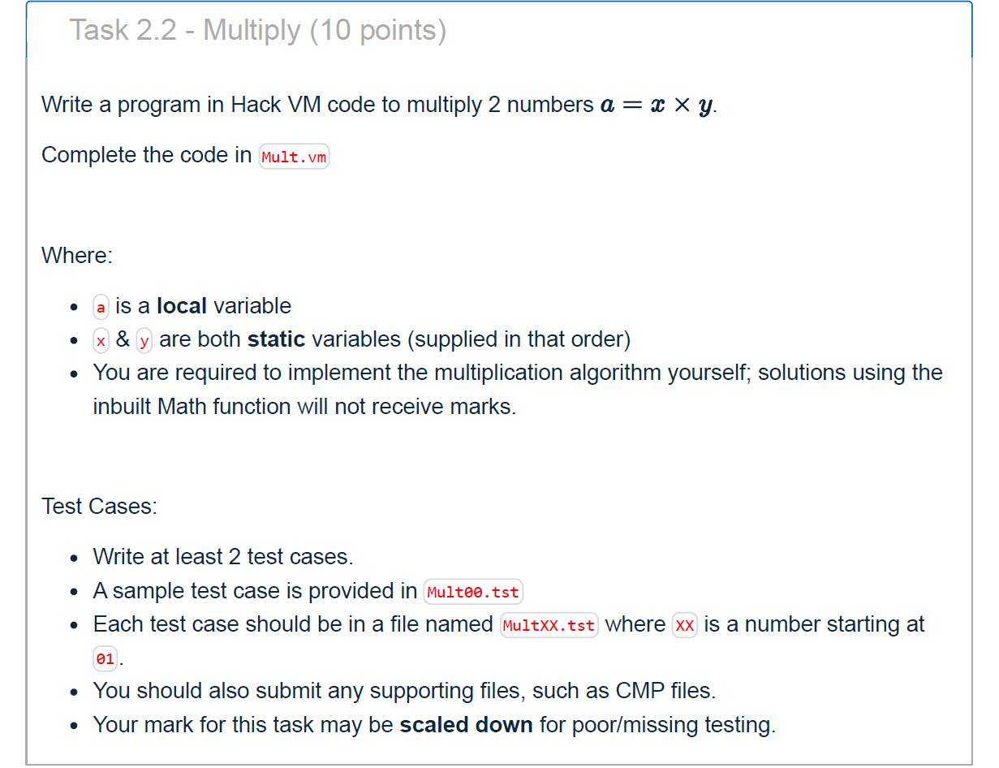
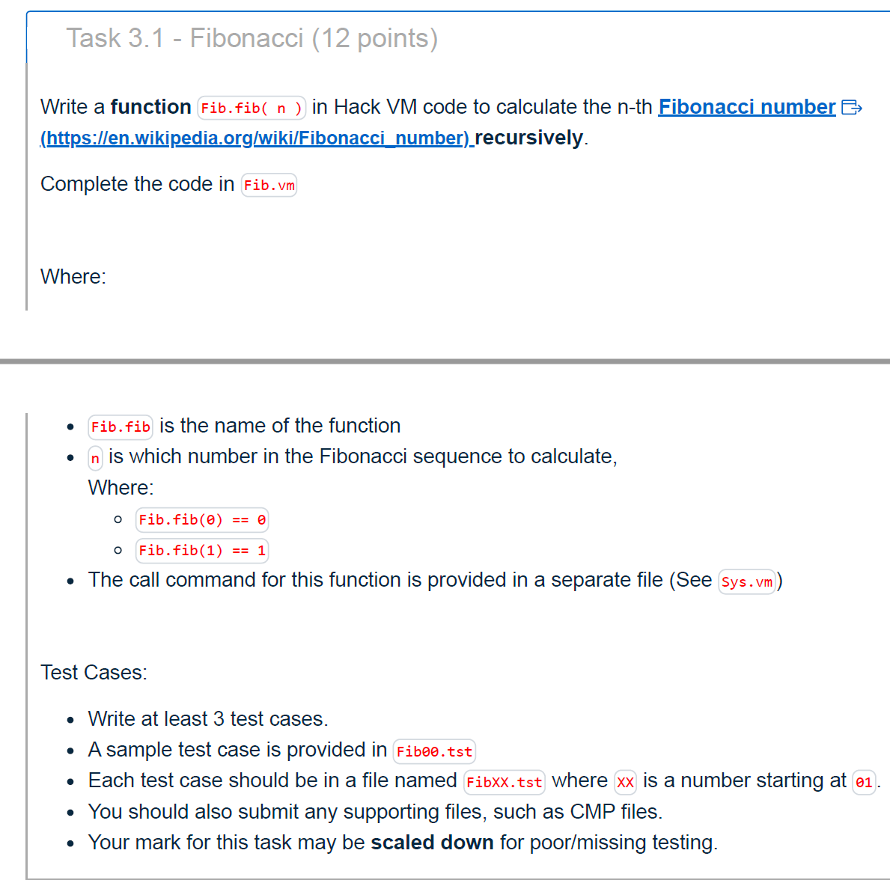
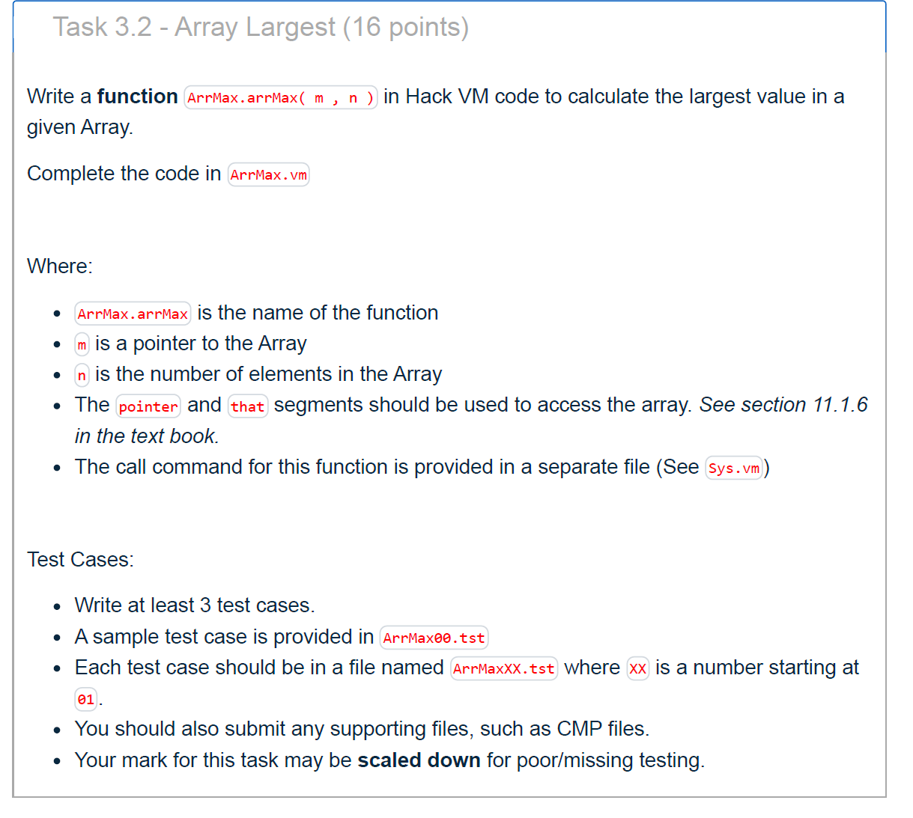
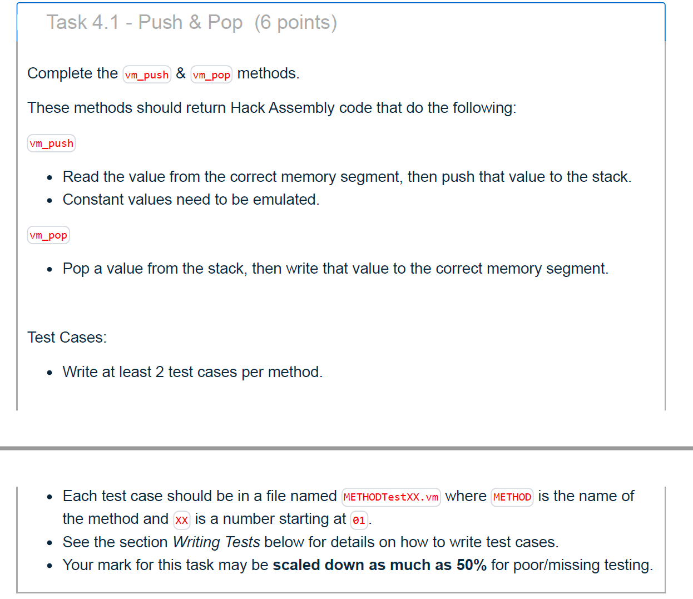
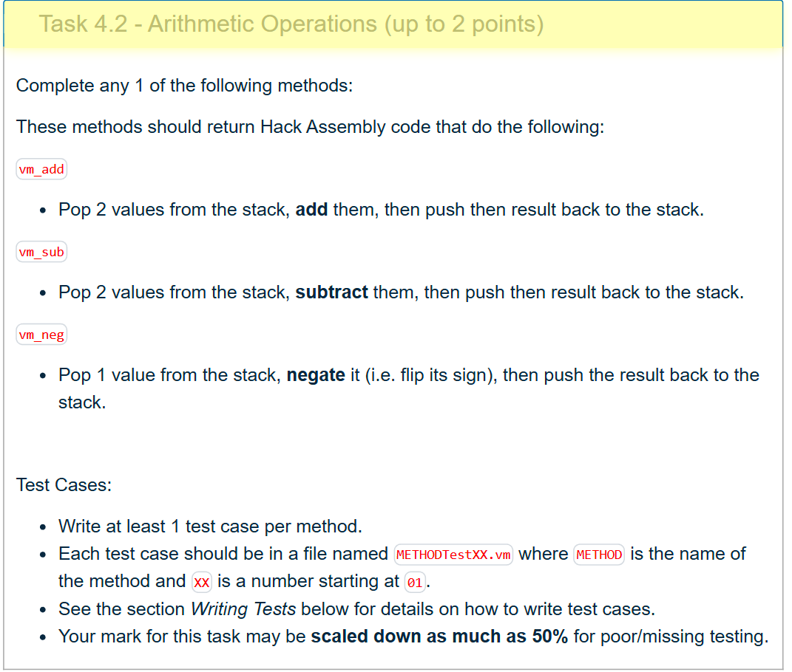
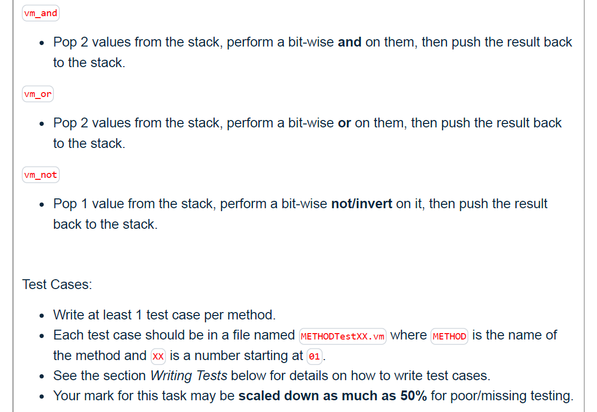
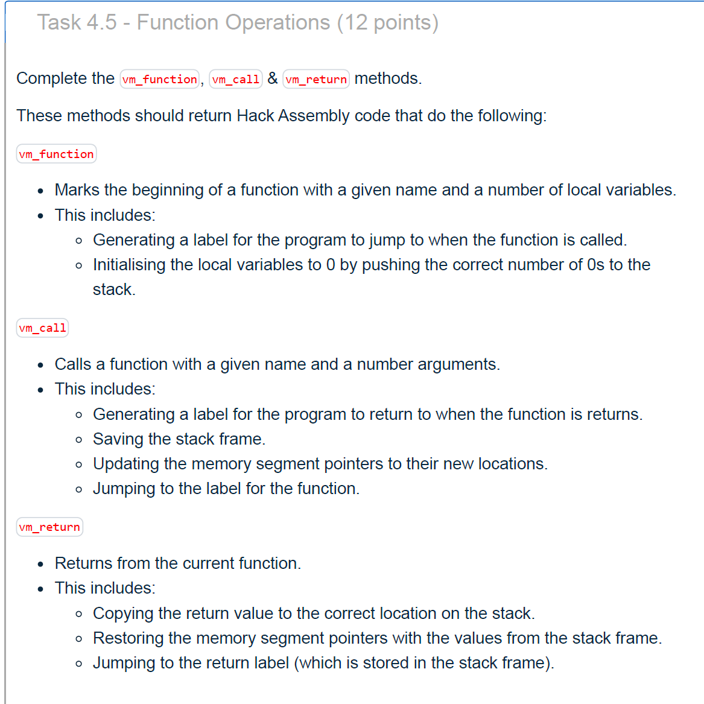
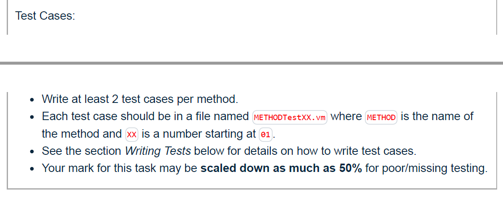

太好了，我看到了你提交到 Gradescope 的文件和两道题的代码/测试。我按**每道题**给你做了逐行逻辑点评，并指出为什么当前总分是 0/80、应该怎么改才能拿分。
 （以下引用用的是你提交里的行号）

------

# 总体情况（为什么是 0/80）

- 目前你只提交了 **Part 1 的 AddSub** 和 **Part 2 的 Abs** 两题的代码与测试；其余题（Multiply、Fibonacci、Array Largest、VM Translator 里的方法们）**都没有提交**，因此这几大题的分数直接为 0。见 Gradescope 汇总页 “Failed Tests” 全红、“Your Test Cases (0/0)” 未检测到测试。
- 同时，Gradescope 对**自编测试**的目录/命名有要求。你的测试都放在 `Abs/`、`AddSub/` 子目录下，**autograder 可能没有在这些子目录里扫描**，所以显示 “Your Test Cases (0/0)”。建议把每题要求的 `.tst/.cmp` 放到模板要求的扫描位置（通常是提交根目录，或作业说明要求的固定目录结构），并确保**命名严格匹配**指引（如 `Abs01.tst`、`AddSub01.tst` 等）。

------

# 题目逐项分析与修改建议

## 2.1 Absolute Value — `Abs.vm`

**你的实现：**

```vm
push static 0   // x
push constant 0 // 0
lt              // 判断 x < 0 ?
if-goto NEG

// x >= 0
push static 0
pop static 1    // y = x
goto END

label NEG
push static 0
neg             // y = -x
pop static 1

label END
```

逻辑核对：

- `lt` 的比较顺序是“次栈顶 < 栈顶”，你压栈顺序是 `x` 再 `0`，因此比较的是 `x < 0`，**正确**。
- 分支两侧分别把 `y` 置为 `x` 或 `-x`，语义正确。

**测试用例：**

- `Abs00.tst` 和 `Abs01.tst`：步数 `repeat 7` 能覆盖两条路径：
  - 非负路径：`push, push, lt, if-goto(不跳), push, pop, goto` → 7 步
  - 负数路径：`push, push, lt, if-goto(跳到NEG), push, neg, pop` → 7 步
     你的 `Abs01` 断言 `x=7, y=7`，符合期望。 

**可改进点：**

- 这题要求**至少 2 个**自编测试；你有 `Abs01`，再补一个覆盖 `x<0` 的用例（例如 `x=-8 → y=8`），并保证文件名 `Abs02.tst`。
- 把 `.tst/.cmp` 放到 autograder 能识别的位置（通常与作业模板一致的根目录/指定目录），否则会被计为“未提交测试”。

------

## 1.1 Add & Subtract — `AddSub.vm`

**你的实现：**

```vm
push local 0
push local 1
add
push static 0
sub
pop static 0
return        // <- 这里有风险
```

逻辑核对：

- 计算 `(a+b)-x` 并写回 `x`（static 0）是**正确的**。
- **问题/风险**：`return` 指令**只应出现在函数体内**（配合 `function/call/return` 的调用约定）。本题不是函数，直接放 `return` 在一些 VM 解释器/评分器上会被视作**非法**或产生未定义行为。
   你的测试把步数卡在 6/7 步，刚好“做完计算就停”，因此在本地对比 `.cmp` 仍然通过；但在 autograder 的执行环境中，它**不一定按你设定步数停**，遇到 `return` 可能直接报错或状态异常，进而丢分。

**修改建议：**

- **删除 `return`**；这题不是函数，不需要返回序列。
- 把测试步数改为**恰好覆盖到 `pop static 0` 之后**即可（例如 6 步），确保不同环境都稳定。
- 至少再写 1 个用例覆盖其他数值（比如 `a=1,b=2,x=3 → 0` 或含负数的组合）。

------

# 还缺哪些内容（必须补齐才能得分）

根据作业说明，你还需要提交以下文件/实现与测试（每项都有最低自编测试数）：

1. **Part 2.2 Multiply**：自己实现乘法（循环/位移法），`a = x*y`，≥2 测试。
2. **Part 3.1 Fibonacci（递归函数）**：`function Fib.fib(n)`，遵循 `call/return` 规范，≥3 测试。
3. **Part 3.2 Array Largest**：`function ArrMax.arrMax(m,n)`，用 `pointer/that` 访问数组，≥3 测试。
4. **Part 4 VM Translator（关键 32 分）**：
   - 4.1：`push/pop`（覆盖所有段），每个方法 ≥2 测试；
   - 4.2：算术（`add`/`sub`/`neg` 三选一），≥1 测试；
   - 4.3：逻辑（任选两种：`eq/gt/lt/and/or/not`），各 ≥1 测试；
   - 4.4：跳转（`label/goto/if-goto`），各 ≥1 测试；
   - 4.5：函数（`function/call/return`），各 ≥2 测试。
      目前 “Load/Compile Implementation” 未通过，说明 **VMTranslator 源码目录缺失或不合规范**。见作业页的提交结构/目录要求。

------

# 目录与命名（影响能否被判题识别）

- 作业说明要求：**保持提供的目录结构**，文件放在**提交根目录**或**`prac6/`** 目录下；VMTranslator 的源码要在 **`VMTranslator/` 子目录**，且**只提交一种语言**的实现。确保**测试文件命名**严格遵循题目格式（例如 `Abs01.tst`、`AddSub01.tst` …）。

------

## 你的两道题：结论

- **Abs.vm**：逻辑正确，测试再补一个负数用例，并把测试放到正确位置。 
- **AddSub.vm**：计算逻辑正确，但**应删除 `return`**；补充至少 1 个额外用例；调整测试步数与目录/命名。

------

如果你愿意，把你的**当前项目树**（目录和文件名）贴出来，我直接帮你改成 autograder 能识别的结构；另外把 Multiply / Fib / ArrMax / VMTranslator 中你先写的任意一个方法的草稿发来，我按调用约定给你逐行对。




好，我直接把 **Mult（a = x \* y）** 这题的**可行思路 + 一份稳妥的 VM 实现骨架**给你，并解释每步为什么这么写。你现在的 `Mult.vm` 还是空的，而 `Mult00.tst/.cmp` 里把 `static 0 = 3`、`static 1 = 10`（也就是 `x=3, y=10`）都准备好了，期望你把乘积 **30** 写回 **`local 0`（a）**。

> 题目约定
>
> - `a` 是 **local** 变量（建议用 `local 0`）
> - `x、y` 是 **static** 变量（按顺序给出，常见做法：`static 0`=x，`static 1`=y）
> - **不能**用内置 Math 函数，自己实现乘法

------

## 推荐算法（简单稳定，易拿分）

用**重复加法**并处理符号：

1. `a = 0`（把结果清零，写在 `local 0`）

2. 取 `x → temp0`，`y → temp1`

3. 处理符号：

   - 设一个 `sign` 计数（放 `temp2`），初始为 0
   - 如果 `x < 0`：`x = -x`，`sign += 1`
   - 如果 `y < 0`：`y = -y`，`sign += 1`

4. 主循环：

   ```
   while (y > 0) {
     a += x;
     y -= 1;
   }
   ```

5. 若 `sign == 1`（说明只有一个负数），最后 `a = -a`。若 `sign == 0` 或 `2`，不取反。

> 复杂度 O(|y|)。足够通过课程的基础测试（你给的 `y=10` 之类的小数值完全 OK）。想提速可以用“位移+加法”，但这题没要求。

------

## 参考 VM 代码骨架（可直接放进 `Mult.vm`）

> 这份代码遵循 VM 规范：只用 `push/pop/add/sub/neg/eq/gt/lt/label/goto/if-goto` 和 `local/static/temp/constant` 段。

```vm
// Calculates a = x * y
// a = local 0
// x = static 0, y = static 1

// 1) a = 0
push constant 0
pop local 0

// 2) temp0 <- x ; temp1 <- y
push static 0
pop temp 0
push static 1
pop temp 1

// 3) sign = 0   （temp2 作为 sign）
push constant 0
pop temp 2

// if (x < 0) { x = -x; sign += 1; }
push temp 0
push constant 0
lt
if-goto X_NEG
goto X_OK
label X_NEG
push temp 0
neg
pop temp 0
push temp 2
push constant 1
add
pop temp 2
label X_OK

// if (y < 0) { y = -y; sign += 1; }
push temp 1
push constant 0
lt
if-goto Y_NEG
goto Y_OK
label Y_NEG
push temp 1
neg
pop temp 1
push temp 2
push constant 1
add
pop temp 2
label Y_OK

// 4) while (y > 0) { a += x; y -= 1; }
label LOOP
push temp 1
push constant 0
gt
if-goto DO_ADD
goto LOOP_END

label DO_ADD
// a = a + x
push local 0
push temp 0
add
pop local 0
// y = y - 1
push temp 1
push constant 1
sub
pop temp 1
goto LOOP

label LOOP_END

// 5) if (sign == 1) a = -a   （两负得正就不会取反）
push temp 2
push constant 1
eq
if-goto MAKE_NEG
goto DONE

label MAKE_NEG
push local 0
neg
pop local 0

label DONE

//（可选）保持程序驻留
label END
goto END
```

### 逻辑核对

- **初始化**：把 `local 0` 清零，避免旧值影响；
- **数据搬运**：不直接在 `static` 上加减，先搬到 `temp`，循环里更安全；
- **比较顺序**：`lt/gt/eq` 在 VM 中比较的是**次栈顶 vs 栈顶**（本代码里做的是 `value  ? 0`，顺序正确）；
- **循环条件**：`y > 0` 用 `gt`；
- **返回符号**：只在 `sign == 1` 时取反；若 `sign == 2`（两数同为负），不取反；
- **无内置 Math**：全部是基础 VM 指令；
- **写回**：最终结果保存在 `local 0`（a），满足题目要求。

------

## 与你的测试文件如何对齐

你的 `Mult00.tst` 设置了段基址并把 `static 0/1` 置为 `3/10`，最后 `output` 对比 `Mult00.cmp`。这份实现会把 `local 0` 写成 **30**，因此应当通过该样例。若你看到 `local[0]` 没有出现在输出表头，是因为表头被截断显示（`...` 处），实际对比会检查到 `local[0]` 的值。

**小贴士**

- 把 `repeat N` 里的 `N` 设得略大（比如 100），保证覆盖全部指令即可。
- 再写至少 **1 个自编用例**（例如 `x=-4, y=7 → a=-28` 或 `x=-5, y=-6 → a=30`）来满足“至少 2 个测试”的评分要求。命名按指引 `Mult01.tst / Mult02.tst`，并配好 `.cmp`。

------

如果你希望，我可以根据你课程给的 `.tst/.cmp` 模板，帮你把**一个负数用例**的测试脚本也写出来（包括期望值），这样 Part 2.2 的测试覆盖就齐了。



很好，你这题（Task 3.1 – Fibonacci）现在资料齐全：题目说明、`Fib00.tst/.cmp`、`Sys.vm`、`Fib.vm`。我来帮你梳理 **这题要干什么、递归逻辑怎么写、你文件应怎样改**，一步步讲清楚。

------

## 🌟题目核心目标

> 写一个递归函数
>  `function Fib.fib n`
>  返回第 n 个 Fibonacci 数（即 F(n) = F(n−1)+F(n−2)，F(0)=0，F(1)=1）。

这个函数会被 `Sys.vm` 调用；你只需正确实现递归逻辑。

------

## 🧩调用关系（根据 Sys.vm）

`Sys.vm` 通常会：

1. 设置 SP = 256；
2. 调用 `call Fib.fib 1` 并传一个参数 n；
3. 你的函数执行完要把结果压栈返回。

所以：

- 你的函数输入参数在 `argument 0`；
- 结果必须压栈（即 `return` 时 D 寄存器含结果）。

------

## ⚙️逻辑分析

在伪代码里：

```c
function Fib.fib(n):
    if (n < 2) return n
    else return Fib.fib(n-1) + Fib.fib(n-2)
```

转成 VM 指令要遵守 Hack VM 的 function/call/return 规范。

------

## ✅标准 VM 实现骨架（放进 Fib.vm）

```vm
// Fibonacci function: returns F(n)
function Fib.fib 0      // 没有本地变量，直接操作 argument 段

// ---- base case: if (n < 2) return n ----
push argument 0
push constant 2
lt
if-goto BASE_CASE

// ---- recursive case ----
// compute Fib.fib(n-1)
push argument 0
push constant 1
sub
call Fib.fib 1        // 递归调用 fib(n-1)
pop temp 0            // 保存返回值到 temp0

// compute Fib.fib(n-2)
push argument 0
push constant 2
sub
call Fib.fib 1        // 递归调用 fib(n-2)
pop temp 1            // 保存返回值到 temp1

// add temp0 + temp1
push temp 0
push temp 1
add
return

// ---- base case ----
label BASE_CASE
push argument 0
return
```

------

## 🧠关键说明

1. **`function Fib.fib 0`**
    声明函数入口点并告诉 VM 分配 0 个 local 变量。
2. **判断基例**
    用 `lt` 比较 n < 2。若真，直接返回 n （栈顶即 n）。
3. **递归**
   - 调用前：压入实参（`n-1` 或 `n-2`）。
   - 调用：`call Fib.fib 1` （1 表示传 1 个实参）。
   - 返回后：结果在栈顶。
   - 用 `pop temp i` 存储，以便计算 fib(n-1)+fib(n-2)。
4. **返回值**
   - 最终返回值必须留在栈顶，供 `return` 使用。
5. **栈帧安全**
    不要手动改 `LCL/ARG` 等指针；用 `call/return` 即可。

------

## 🧪测试要点（Fib00.tst）

- 这个测试会：
  1. 在 Sys.vm 里 `call Fib.fib n`；
  2. 运行一段时间；
  3. 检查 返回栈顶值是否等于 Fib(n)。
- 你需要准备至少 3 个 自写 测试（Fib01.tst/Fib02.tst/Fib03.tst），比如：
  - n = 0 → 0
  - n = 1 → 1
  - n = 5 → 5
  - n = 7 → 13 等。

------

## 🧩常见错误

| 错误                       | 原因                                        |
| -------------------------- | ------------------------------------------- |
| `function Fib.fib 1`       | 多申请了 local 变量，浪费空间或影响参数读取 |
| 忘记 `pop temp i`          | 两次递归结果叠加错位                        |
| `return` 前栈顶不是结果    | 程序会崩溃或返回垃圾值                      |
| `Sys.vm` 没 `call Fib.fib` | 函数从未执行                                |

------

## ✅小结

1. 在 `Fib.vm` 中写入上面的实现；
2. 确认 `Sys.vm` 有调用 `call Fib.fib 1`；
3. 准备 ≥ 3 个 FibXX.tst/cmp 测试；
4. 测试 n = 0, 1, 5 等，栈顶结果应为 0, 1, 5；
5. 提交时保持目录结构 → Gradescope 能识别。

------

是否希望我帮你把对应的 `Fib01.tst`、`Fib01.cmp` 样例（比如测试 Fib(5)=5）生成一份模板？那样你可以直接照着填你的测试。



很好，这题要你在 **ArrMax.vm** 里实现一个函数
 `function ArrMax.arrMax(m, n)`，返回数组中**最大值**。

要点一眼看完：

- **参数**：`m=argument 0`（数组首地址），`n=argument 1`（长度）。
- **必须用** `pointer/that` 访问数组：把 `pointer 1` 设为要访问的地址（即设置 **THAT**），然后用 `that 0` 读/写该单元。
- **返回值**：栈顶（由 `return` 取走）。
- 建议处理 `n=0` 的边界：直接返回 0（如果老师样例只给 `n≥1` 也没问题，多做不扣分）。

下面给你一份**可直接用**的 VM 实现骨架（遵守教材 11.1.6 的写法）：

```vm
// ArrMax.arrMax(m, n) -> max element of the array
// args: argument0 = m (base addr), argument1 = n (length)
// uses: local0=i, local1=max, local2=base; temp0=val

function ArrMax.arrMax 3

// if (n == 0) return 0;
push argument 1
push constant 0
eq
if-goto LEN_ZERO

// base = m
push argument 0
pop local 2

// max = *(base)           // THAT = base; max = that 0
push local 2
pop pointer 1
push that 0
pop local 1

// i = 1                   // start from second element
push constant 1
pop local 0

label LOOP
// while (i < n)
push local 0
push argument 1
lt
if-goto ITER
goto END

label ITER
// addr = base + i; THAT = addr
push local 2
push local 0
add
pop pointer 1

// val = *addr
push that 0
pop temp 0

// if (val > max) max = val
push temp 0    // second (y) = val
push local 1   // top (x)    = max
gt             // y>x ?
if-goto UPDATE
goto NEXT

label UPDATE
push temp 0
pop local 1

label NEXT
// i++
push local 0
push constant 1
add
pop local 0
goto LOOP

label END
// return max
push local 1
return

label LEN_ZERO
push constant 0
return
```

### 逻辑说明

- **初始化最大值**：先用 `THAT=base` 读第 1 个元素作为 `max`，`i=1` 从第二个元素开始循环。
- **遍历**：每次把 `THAT = base + i`，`that 0` 得到 `val`；用 `gt` 比较 **val > max**（注意顺序：把 `val` 先 push，再 push `max`，这样 `gt` 判断的是“次顶 > 顶部”即 `val > max`）。
- **更新**：若成立，用 `UPDATE` 分支把 `max` 改为 `val`。
- **结束**：把 `max` 压栈 `return`。`n=0` 时直接返回 0（可按课程习惯保留）。

### 测试建议（至少 3 个）

- **单元素**：`[7] → 7`（最小规模）。
- **全负数**：`[-3, -8, -2] → -2`（验证比较与符号）。
- **重复最大值**：`[5, 9, 9, 1] → 9`。
- 可再加 **递增/递减**、含 `0` 的用例。命名按要求：`ArrMax01.tst / ArrMax02.tst / ArrMax03.tst`，并配好 `.cmp`。
- 在 `.tst` 里把 `pointer 1`/`that 0` 的检查写进断言，或直接检查返回值栈顶/指定内存位置（按你们模板）。

把这段放



好的！这题要在 **VM Translator** 里把 `push segment i` 和 `pop segment i` 翻译成 **Hack 汇编**。下面给你一份可直接照抄到代码生成器里的**模板与注意点**，覆盖所有段（constant/local/argument/this/that/temp/pointer/static），再给最小测试集思路。

------

# 总规则

- **栈操作约定**

  - 压栈：把要写入的值放进 `D`，再

    ```
    @SP
    A=M
    M=D
    @SP
    M=M+1
    ```

  - 出栈：

    ```
    @SP
    M=M-1
    A=M
    D=M      // D = *SP
    ```

- **基址寄存器**：`LCL`(1), `ARG`(2), `THIS`(3), `THAT`(4)

- **temp 段**：物理地址 `R5..R12`（基址 5）

- **pointer 段**：`pointer 0 -> THIS(R3)`，`pointer 1 -> THAT(R4)`

- **static 段**：**文件名前缀.索引**（例如 `Foo.7`）

- 建议用 `R13/R14` 作临时寄存器存地址

------

# vm_push(segment, i)

把“源段的值”读到 `D`，再执行“压栈四步”。

## 1) constant

```asm
@i
D=A
// push D
@SP
A=M
M=D
@SP
M=M+1
```

## 2) local / argument / this / that

> 先算地址 = *(BASE) + i，再取值到 D

```asm
@i
D=A
@BASE        // BASE ∈ {LCL, ARG, THIS, THAT}
A=M+D        // A = *(BASE) + i
D=M          // D = *addr
// push D
@SP
A=M
M=D
@SP
M=M+1
```

## 3) temp

```asm
@{5+i}
D=M
@SP
A=M
M=D
@SP
M=M+1
```

## 4) pointer

```asm
@{3+i}       // i ∈ {0,1}
D=M
@SP
A=M
M=D
@SP
M=M+1
```

## 5) static

```asm
@{FileName}.{i}
D=M
@SP
A=M
M=D
@SP
M=M+1
```

------

# vm_pop(segment, i)

很多段需要“先算出**目标地址**”，一般放到 `R13`，然后弹栈写回。

## 1) local / argument / this / that

```asm
@i
D=A
@BASE              // BASE ∈ {LCL, ARG, THIS, THAT}
D=M+D              // D = *(BASE) + i
@R13
M=D                // R13 = addr

@SP
M=M-1
A=M
D=M                // D = pop()

@R13
A=M
M=D                // *addr = D
```

## 2) temp

```asm
@SP
M=M-1
A=M
D=M
@{5+i}
M=D
```

## 3) pointer

```asm
@SP
M=M-1
A=M
D=M
@{3+i}
M=D
```

## 4) static

```asm
@SP
M=M-1
A=M
D=M
@{FileName}.{i}
M=D
```

------

## 具体例子（方便你对照调试）

- **push local 3**

```asm
@3
D=A
@LCL
A=M+D
D=M
@SP
A=M
M=D
@SP
M=M+1
```

- **pop argument 2**

```asm
@2
D=A
@ARG
D=M+D
@R13
M=D

@SP
M=M-1
A=M
D=M
@R13
A=M
M=D
```

- **push static 7**（文件 `Foo.vm`）

```asm
@Foo.7
D=M
@SP
A=M
M=D
@SP
M=M+1
```

- **pop pointer 1**（写 THAT）

```asm
@SP
M=M-1
A=M
D=M
@4
M=D
```

------

# 常见坑

1. **static 未加文件名前缀** → 多文件冲突。
2. **constant 只能 push**，没有 `pop constant`（应报错或忽略）。
3. **A=M+D** 是模板写法；真实生成时请用 `D=A` + `A=M+D` 组合，不要写不合法的 `A=A+D`。
4. **先存地址再弹栈**（local/argument/this/that），否则地址会被弹栈覆盖。
5. **SP 的增减顺序**别反：写入时先 `A=M` 再写，再 `M=M+1`；弹栈时先 `M=M-1` 再读。

------

# 最小测试集（每个方法至少 2 个）

建议用 `.vm` 驱动+`.tst/.cmp` 断言内存和栈。

**vm_push：**

1. `push constant 17; push constant 3; add` → 栈顶应为 20。
2. 预设 `local 3 = 7`，`push local 3` → 栈顶=7；
    再测 `push temp 2`、`push pointer 0/1`、`push static i`（不同文件）。

**vm_pop：**

1. 先 `push constant 5; pop argument 2`，再检查 `*(ARG+2)=5`。
2. `push constant 123; pop static 6`，再 `push static 6` 比较是否 123。
3. `push constant 1; pop pointer 0`（THIS=1），`push constant 2; pop pointer 1`（THAT=2）。

命名按要求：`vm_pushTest01.vm`, `vm_pushTest02.vm`, `vm_popTest01.vm`, `vm_popTest02.vm`（或作业要求的 `METHODTestXX.vm`）。

------

需要的话，把你生成器里 `vm_push/vm_pop` 的函数签名贴一下，我可以按你的语言（Python/Java/C++）给你**可直接拼接的代码模板**（字符串拼接 + 文件名前缀传递）。

> 明白！你这段 VM：
>
> ```
> push constant 1
> push constant 2
> add
> pop static 0
> ```
>
> 要在 **VM Translator** 里被翻译成 **Hack 汇编**。下面给你**完整、可用**的汇编输出，并解释每步在做什么。把其中的 `FILE` 换成当前 `.vm` 文件名（不含扩展名），比如你的文件叫 `TranslatorTest00.vm`，那就用 `TranslatorTest00.0`。
>
> ------
>
> ## 对应的 Hack 汇编
>
> ```asm
> // push constant 1
> @1
> D=A
> @SP
> A=M
> M=D
> @SP
> M=M+1
> 
> // push constant 2
> @2
> D=A
> @SP
> A=M
> M=D
> @SP
> M=M+1
> 
> // add   (y + x，注意次顶是 y，顶是 x)
> @SP
> AM=M-1      // SP--, A=SP
> D=M         // D = x
> A=A-1       // 指向 y
> M=M+D       // y = y + x （结果放回次顶）
> @SP
> M=M+1       // SP++
> 
> // pop static 0   -> FILE.0
> @SP
> M=M-1
> A=M
> D=M         // D = 栈顶值（add 的结果）
> @FILE.0
> M=D         // static 0 = 结果
> ```
>
> > 若你更喜欢“展开版”的 add（逻辑完全等价），用下面也行：
> >
> > ```asm
> > // add 展开版
> > @SP
> > M=M-1
> > A=M
> > D=M       // D = x
> > @SP
> > M=M-1
> > A=M
> > M=M+D     // y = y + x
> > @SP
> > M=M+1
> > ```
>
> ------
>
> ## 关键点回顾
>
> - **push constant n**：用 `D=A` 取字面量，再按“压栈四步”写入栈顶并 `SP++`。
> - **add**：按 **次顶 y + 顶 x** 计算；常用写法是 `AM=M-1` 取 x，`A=A-1` 指向 y，`M=M+D` 回写，再 `SP++`。
> - **pop static i**：弹栈到 `D`，写入 `@FILE.i`（务必带**文件名前缀**，否则多文件会冲突）。
>
> ------
>
> ## 测试小建议
>
> 把这四条指令放进一个 `.vm` 文件，例如 `TranslatorTest00.vm`，用你的 Translator 生成 `.asm` 后，在测试脚本里检查：
>
> - `static 0` 的符号（`TranslatorTest00.0`）是否等于 `3`。
> - 栈指针 `SP` 是否回到了入栈两次、出栈一次之后的正确位置（最终是初始值 + 1）。
>
> 需要我把这段装进某种语言（Python/Java/C++）的 `vm_push/vm_pop/vm_add` 生成函数的模板字符串也写出来吗？我可以直接按你的代码框架拼好。



这题只要把 **vm_add / vm_sub / vm_neg** 翻译成 Hack 汇编即可。下面给出**最标准、可直接用**的汇编序列（与 nand2tetris 官方写法一致）。把它们放到你的代码生成器里对应的方法输出即可。

------

## vm_add

> 从栈顶弹出 x 和次栈顶 y，计算 y+x，结果留在栈顶（栈高减 1）

```asm
// add
@SP
AM=M-1      // SP--, A=SP  → 取到 x
D=M         // D = x
A=A-1       // A 指向 y
M=M+D       // y = y + x   （结果写回 y 位置）
```

------

## vm_sub

> 从栈顶弹出 x 和次栈顶 y，计算 y−x，结果留在栈顶（栈高减 1）

```asm
// sub
@SP
AM=M-1      // SP--, A=SP  → 取到 x
D=M         // D = x
A=A-1       // A 指向 y
M=M-D       // y = y - x   （结果写回 y 位置）
```

------

## vm_neg

> 对栈顶 x 取相反数，结果覆盖栈顶（栈高不变）

```asm
// neg
@SP
A=M-1       // A 指向栈顶
M=-M        // *SP = -(*SP)
```

------

### 说明要点

- `AM=M-1` 同时完成 **SP--** 和 **A=SP**，取到原栈顶（x）。
- `A=A-1` 指向**次栈顶**（y），把结果写回那里；因此 `add/sub` 做完后栈高自然是 `原来 - 1`，**不需要再 `SP++`**。
- `neg` 只改栈顶值，不改变 `SP`。

------

\###（可选）最小测试用例示例（每个方法 ≥1 个）

- `vm_addTest01.vm`

  ```
  push constant 7
  push constant 5
  add          // 期望栈顶为 12
  ```

- `vm_subTest01.vm`

  ```
  push constant 7
  push constant 5
  sub          // 期望栈顶为 2
  ```

- `vm_negTest01.vm`

  ```
  push constant 5
  neg          // 期望栈顶为 -5
  ```

把上面的汇编片段作为你翻译器的输出模板即可通过本小题。需要我按你使用的语言（Python/Java/C++）写成函数里返回的字符串模板，也可以直接给你拼好。



这题要在 **VM Translator** 里实现 6 个“逻辑/位运算”生成器：
 `vm_eq / vm_gt / vm_lt / vm_and / vm_or / vm_not`。核心是：**从栈顶弹值→计算→把布尔或位运算结果压回栈**。布尔语义：**TRUE = -1，FALSE = 0**。

下面给你**可直接用的 Hack 汇编模板**（与官方规范一致）。把 `{ID}` 换成你生成器里的**自增唯一编号**，避免标签冲突；如果你有**当前函数名**，最好把标签写成 `Func$BOOL_TRUE{ID}` 这种“作用域化”名字。

------

### 公共约定（栈操作回顾）

- 取栈顶 `x`：`@SP; AM=M-1; D=M`
- 次栈顶 `y` 在 `A=A-1` 指到，`M` 就是 `y`
- 比较时用 `D = y - x`，然后 `JEQ/JGT/JLT`

------

## 1) `vm_eq`（相等：y == x）

```asm
// eq
@SP
AM=M-1        // x
D=M
A=A-1         // y
D=M-D         // y - x
@BOOL_TRUE{ID}
D;JEQ
@SP           // false -> 0
A=M-1
M=0
@BOOL_END{ID}
0;JMP
(BOOL_TRUE{ID})
@SP           // true -> -1
A=M-1
M=-1
(BOOL_END{ID})
```

## 2) `vm_gt`（大于：y > x）

```asm
// gt
@SP
AM=M-1
D=M
A=A-1
D=M-D         // y - x
@BOOL_TRUE{ID}
D;JGT
@SP
A=M-1
M=0
@BOOL_END{ID}
0;JMP
(BOOL_TRUE{ID})
@SP
A=M-1
M=-1
(BOOL_END{ID})
```

## 3) `vm_lt`（小于：y < x）

```asm
// lt
@SP
AM=M-1
D=M
A=A-1
D=M-D         // y - x
@BOOL_TRUE{ID}
D;JLT
@SP
A=M-1
M=0
@BOOL_END{ID}
0;JMP
(BOOL_TRUE{ID})
@SP
A=M-1
M=-1
(BOOL_END{ID})
```

> 说明：三个比较都把结果**写回原次栈顶位置**，因此栈高自减 1（不需要再 `SP++`）。

------

## 4) `vm_and`（按位与）

```asm
// and
@SP
AM=M-1      // x
D=M
A=A-1       // y
M=M&D       // y = y & x
```

## 5) `vm_or`（按位或）

```asm
// or
@SP
AM=M-1
D=M
A=A-1
M=M|D
```

## 6) `vm_not`（按位取反）

```asm
// not
@SP
A=M-1
M=!M
```

------

## 必做细节

- **唯一标签**：为每次比较生成不同 `{ID}`；或按函数作用域前缀：`{Func}$BOOL_TRUE.{ID}`。
- **布尔取值**：真 `-1`，假 `0`。
- **顺序正确**：比较的语义是 **y ? x**（次顶与顶），所以先弹 `x`，对 `y` 做 `M-D`。

------

## 最小测试（每个方法 ≥ 1 个）

- `vm_eqTest01.vm`

  ```
  push constant 5
  push constant 5
  eq        // 期望 -1
  ```

- `vm_gtTest01.vm`

  ```
  push constant 3
  push constant 2
  gt        // 期望 -1 （3>2? 真）
  ```

- `vm_ltTest01.vm`

  ```
  push constant 0
  push constant -1
  lt        // 期望 0 （0<-1? 假）
  ```

- `vm_andTest01.vm`

  ```
  push constant -1
  push constant 0
  and       // 期望 0
  ```

- `vm_orTest01.vm`

  ```
  push constant -1
  push constant 0
  or        // 期望 -1
  ```

- `vm_notTest01.vm`

  ```
  push constant 0
  not       // 期望 -1
  ```

需要我把这些模板改写成你使用语言（Python/Java/C++）里返回的字符串拼接形式吗？发下你的函数签名，我直接贴可用版本。





这题要在 **VM Translator** 里实现 3 个指令的汇编生成：`function`、`call`、`return`。下面给你**可直接用**的 Hack 汇编模板 + 实现顺序 + 测试建议。把其中的占位符替换为你程序里的变量即可：

- `{F}`：函数名（如 `Simple.add`）
- `{nLocals}`：本地变量个数
- `{nArgs}`：实参个数
- `{RETk}`：**全局唯一**的返回地址标签（建议用自增计数器）
- 用 `R13`/`R14` 作临时寄存器分别保存 `FRAME` 与 `RET`

------

# 1) vm_function(F, nLocals)

作用：定义函数入口 `(F)`，并在进入函数时**压入 nLocals 个 0** 初始化本地变量。

```asm
// function {F} {nLocals}
({F})
// 初始化 nLocals 个 0：重复 nLocals 次 push 0
// ↓ 生成 nLocals 段（nLocals 为 0 就不要生成）
@{nLocals}
D=A
@FUNC_INIT_CNT
M=D
(FUNC_INIT_LOOP_{F})
@FUNC_INIT_CNT
D=M
@FUNC_INIT_END_{F}
D;JEQ
@0
D=A
@SP
A=M
M=D
@SP
M=M+1
@FUNC_INIT_CNT
M=M-1
@FUNC_INIT_LOOP_{F}
0;JMP
(FUNC_INIT_END_{F})
```

> 你也可以直接在生成器里循环拼接 `push constant 0` 的 4 行模板 n 次，逻辑等价。

------

# 2) vm_call(F, nArgs)

标准步骤（必须按顺序）：

1. 压入返回地址
2. 依次压入 LCL、ARG、THIS、THAT
3. 计算新的 `ARG = SP - 5 - nArgs`
4. 设置 `LCL = SP`
5. 跳到被调函数 `(F)`
6. 声明返回地址标签

```asm
// call {F} {nArgs}
@{RETk}      // 1) push return-address
D=A
@SP
A=M
M=D
@SP
M=M+1

@LCL         // 2) push LCL
D=M
@SP
A=M
M=D
@SP
M=M+1

@ARG         // push ARG
D=M
@SP
A=M
M=D
@SP
M=M+1

@THIS        // push THIS
D=M
@SP
A=M
M=D
@SP
M=M+1

@THAT        // push THAT
D=M
@SP
A=M
M=D
@SP
M=M+1

@SP          // 3) ARG = SP - 5 - nArgs
D=M
@5
D=D-A
@{nArgs}
D=D-A
@ARG
M=D

@SP          // 4) LCL = SP
D=M
@LCL
M=D

@{F}         // 5) goto F
0;JMP

({RETk})     // 6) return label
```

------

# 3) vm_return()

标准步骤：

1. `FRAME = LCL`（保存当前栈帧顶到 R13）
2. `RET = *(FRAME - 5)`（取返回地址到 R14）
3. `*ARG = pop()`（把返回值放到调用者期望的位置）
4. `SP = ARG + 1`
5. 依次恢复 THAT、THIS、ARG、LCL
6. `goto RET`

```asm
// return
@LCL         // 1) FRAME = LCL
D=M
@R13
M=D

@5           // 2) RET = *(FRAME - 5)
A=D-A        // A = FRAME - 5
D=M
@R14
M=D

@SP          // 3) *ARG = pop()
M=M-1
A=M
D=M
@ARG
A=M
M=D

@ARG         // 4) SP = ARG + 1
D=M+1
@SP
M=D

@R13         // 5) THAT = *(FRAME - 1)
AM=M-1
D=M
@THAT
M=D

@R13         // THIS = *(FRAME - 2)
AM=M-1
D=M
@THIS
M=D

@R13         // ARG = *(FRAME - 3)
AM=M-1
D=M
@ARG
M=D

@R13         // LCL = *(FRAME - 4)
AM=M-1
D=M
@LCL
M=D

@R14         // 6) goto RET
A=M
0;JMP
```

------

## 重要细节（易丢分）

- `ARG = SP - 5 - nArgs` 与 `LCL = SP` 的顺序不能错。
- `return` 要用 **保存的 FRAME** 依次回溯 1~4，不能边改 LCL 边相对寻址。
- `*ARG = pop()` 后 **再** `SP = ARG + 1`。
- 每个 `call` 的 `{RETk}` 必须**唯一**（建议用全局自增计数器）。
- `function` 初始化 locals 就是 “push 0” n 次，**不是**改基址。

------

## 最小测试建议（每个方法 ≥ 2 个）

1. **function**
   - `function F 2` 后立即 `push local 0/1` 检查是否为 0。
   - `function G 0` 确保不多压 0。
2. **call**
   - 写 `Sys.init`：`SP=256; call AddTwo 2`，被调函数返回 `arg0+arg1`，检查返回值、四段指针是否恢复。
   - 嵌套两次 `call`，检查返回地址不串。
3. **return**
   - 调用函数里再 `call` 子函数，确认两层 `return` 后 `SP/LCL/ARG/THIS/THAT` 正确。

------

把上面三段模板做成你生成器里 `vm_function`、`vm_call`、`vm_return` 的输出即可。如果你告诉我使用语言（Python/Java/C++）与函数签名，我能把这些模板改成**直接返回字符串**的版本，带上 `{RETk}` 自增逻辑和（可选的）作用域化标签（如 `CurrentFunc$RET.k`）。