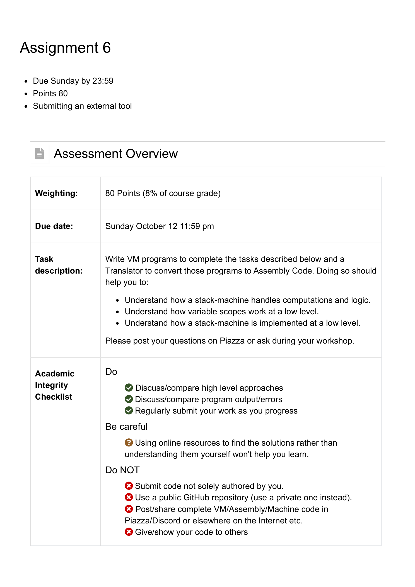
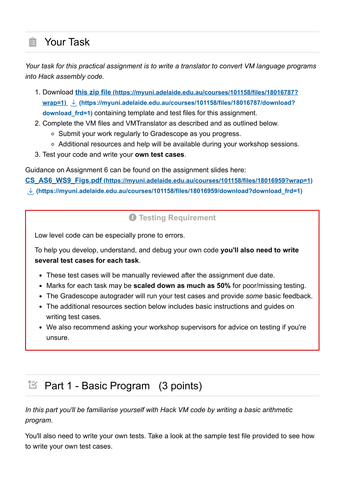
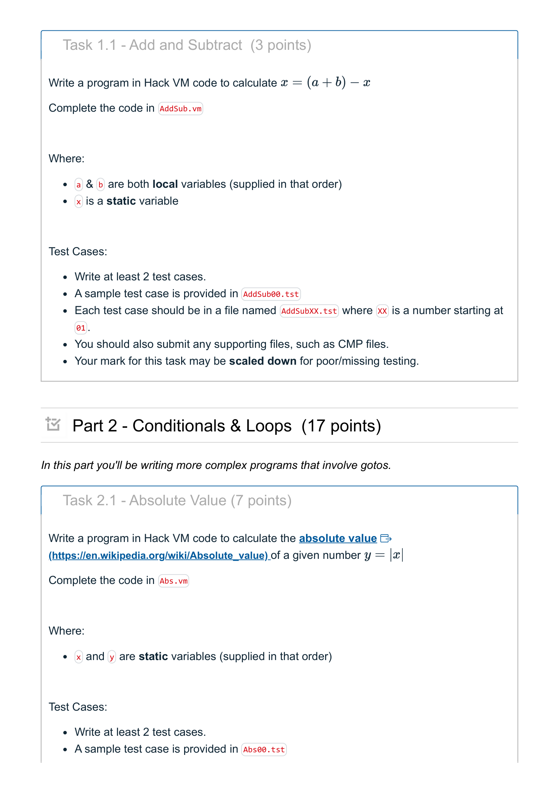
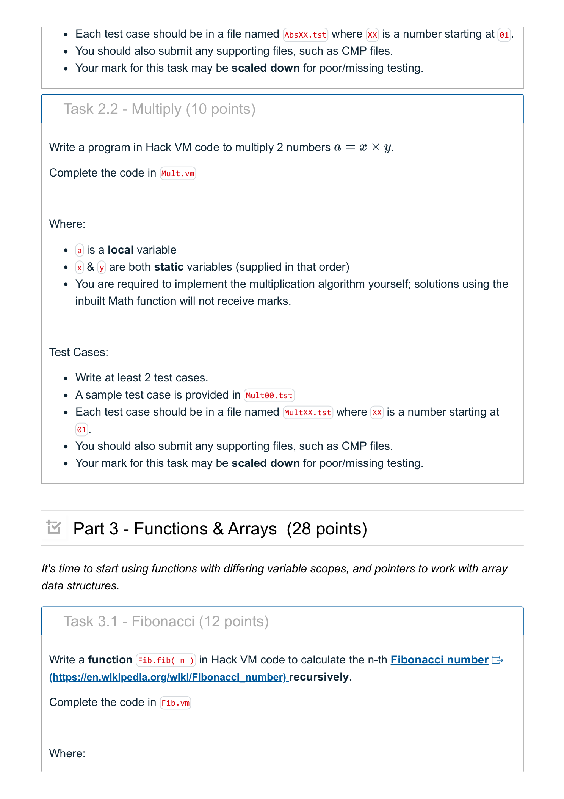
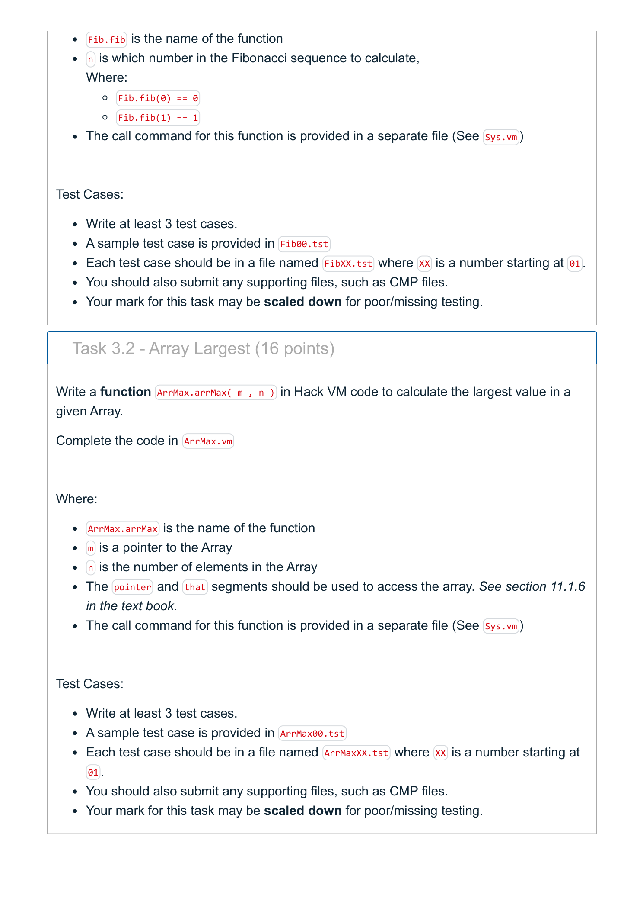
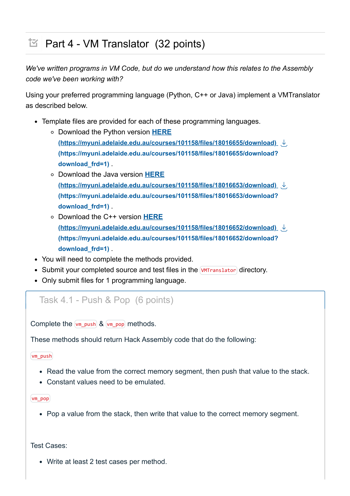
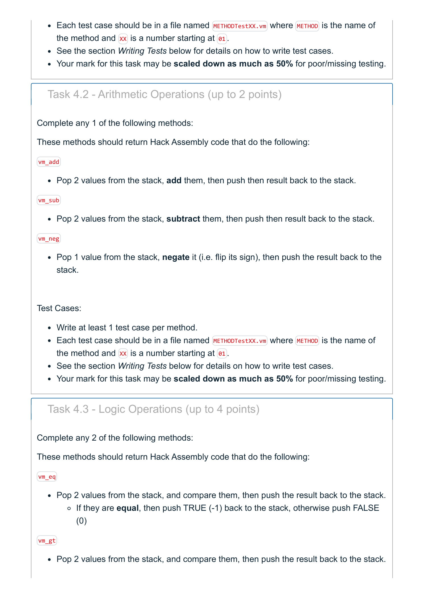
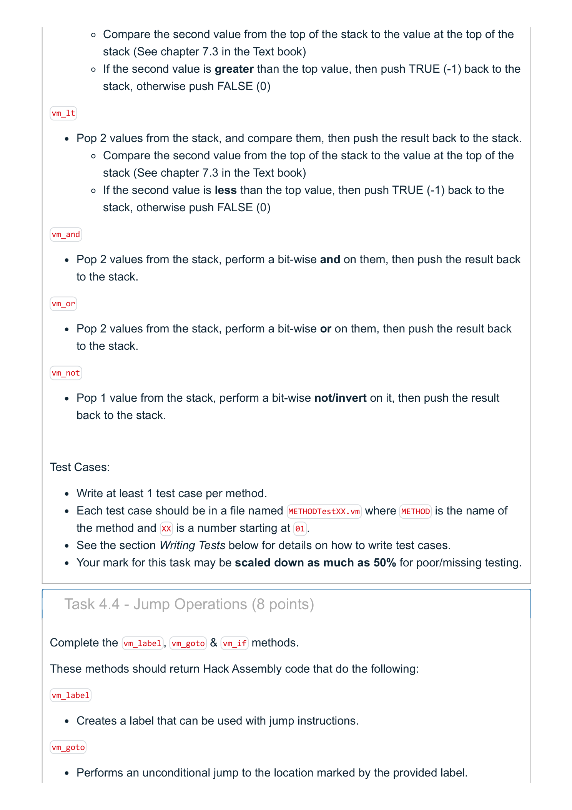
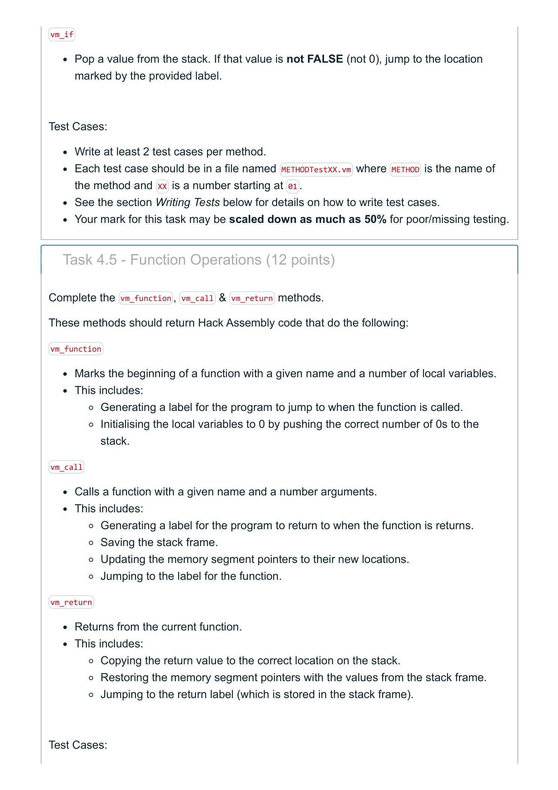
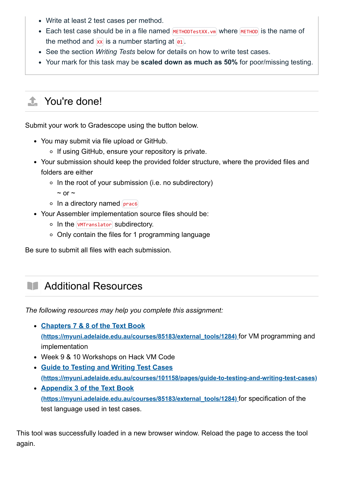

---

## 第 1 页



**提问：** 什么意思 详细解释

下面这页在说“作业6”的要求。我把要点逐条翻译+解释给你：

# 作业基本信息

* **名称**：Assignment 6
* **提交方式**：用一个**外部工具**提交（课程平台里不是直接上传文件，通常会跳到指定工具/网站）。
* **分值**：**80 分**。
* **占比**：约 **8% 的总评成绩**。
* **截止时间**：**周日 23:59（页面里也写 Sunday Oct 12 11:59 pm）**。意思就是周日晚上 11:59 前必须交。

# 任务内容（Task description）

你需要完成两件事：

1. **写若干 VM 程序**：

   * 这里的 **VM** 指“虚拟机语言”（像《Nand2Tetris》里的 stack-based VM 指令集那种）。
   * 你要用 VM 指令实现给定的若干小任务（页面下面通常会有具体题目，这一页是总览）。
2. **写一个 Translator（翻译器）**：

   * 把你写的 **VM 程序自动转换成汇编（Assembly）代码**。
   * 也就是：输入是 .vm，输出是目标平台的汇编（课程自带的虚拟硬件/汇编规范）。

> 通过这次作业，你应该掌握：

* **栈式机器如何做计算与逻辑**（push/pop、算术逻辑命令、比较跳转等）。
* **变量作用域在底层是怎么处理的**（函数调用、局部变量/参数、静态/指针/临时段等内存段）。
* **栈机在底层如何实现**（调用/返回协议、栈帧布局、段基址等）。

遇到问题请在 **Piazza** 发帖或在 **workshop**（助教课）提问。

# 学术诚信清单（Academic Integrity）

**可以做（Do）**

* 讨论/比较**高层思路**（比如算法设计、模块划分，而不是贴代码）。
* 讨论/比较**程序的输出/错误信息**（例如为什么测试没过）。
* **经常提交**中间成果（避免临近截止一次性交）。

**注意（Be careful）**

* 仅靠网上找答案而**自己不理解**，会严重影响你的学习效果（也可能踩到抄袭红线）。

**严禁（Do NOT）**

* 提交**不是你独立完成**的代码。
* 把代码放在**公开的 GitHub 仓库**（如果要用，请设为**私有仓库**）。
* 在 **Piazza/Discord 或任何互联网平台**发布/分享**完整的 VM/汇编/机器码**实现。
* **把你的代码给别人看**或向他人索要他们的代码。

# 你具体要交什么？

* 你的 **VM 程序源文件**。
* 你的 **Translator（翻译器）代码**，以及它生成的**汇编输出**（视课程要求，有的只交翻译器，有的还要交产物）。
* 通常还需要**如何运行/测试**的说明（README），以及通过课程给的测试脚本。

# 建议的完成步骤

1. 先实现**基础 VM 指令**（算术/比较、内存段操作）。
2. 再实现**函数调用机制**（function/call/return、初始化、Bootstrap 代码）。
3. 用你的 Translator 把 VM 程序翻译成汇编，跑**官方测试**确认通过。
4. 在截止前，通过指定的**外部提交流程**上传所有需要的文件。

如果你把下一页（具体题目/测试要求）也给我，我可以按要求列出待做清单、评测点和模板代码结构，帮你逐题拆解。


---

## 第 2 页



**提问：** 什么意思 详细解释

这页在讲本次作业的**具体任务、提交流程、测试要求**，以及\*\*第1部分（3分）\*\*要做什么。逐条翻译+解释如下：

# 你的任务（Your Task）

本次实践作业的核心目标：**把 VM 语言程序翻译成 Hack 汇编代码**（典型的栈式虚拟机 → Hack assembly）。

你需要做的步骤：

1. **下载提供的压缩包（this zip file）**
   里面有本次作业用到的**模板**和**示例测试文件**。
2. **完成 VM 程序和 VMTranslator（翻译器）**

   * 按下文的要求实现功能。
   * 过程中请**经常把当前进度提交到 Gradescope**（平台上的自动评分/提交处）。
   * Workshop（实验/小班）会上会给补充资料和答疑。
3. **自测：给自己的代码编写测试用例（test cases）**
   除了跑提供的样例，还要自己写若干测试来证明你的实现是正确的。

页面还给了一个\*\*作业指导 PDF（CS\_AS6\_WS9\_Figs.pdf）\*\*的链接，里面会有更详细的讲解/图示。

# 测试要求（Testing Requirement）

低层代码（比如 VM/汇编）**很容易出错**，所以课程明确要求你**自己为每个任务写多个测试**。要点：

* 你写的这些测试会在**截止日之后进行人工复查**。
* 如果测试写得差或缺失，**该任务分数可能被下调，最多可扣到 50%**。
* Gradescope 的**自动判题**会先跑你提供的测试，并给出**部分**反馈（不是全部，最终还有人工检查）。
* 页面“Additional resources”会提供**写测试的基本说明与指南**。
* 不确定怎么测？**请咨询助教/导师（workshop supervisors）**。

> 小结：这次不是只交代码，还要交**你自己写的测试**；测试质量也计入分数。

# 第 1 部分：Basic Program（3 分）

目标：先熟悉 **Hack VM** 代码，**写一个基础的算术程序**（basic arithmetic program）。
要求与提示：

* 你需要**自己写对应的测试**。可以先看压缩包里的**示例测试文件**，照着其格式来编写你的测试用例。

---

## 我应该具体做什么？（给你一个操作清单）

1. 下载压缩包，阅读里面的**说明、模板、示例测试**。
2. 按指南把 **VMTranslator** 的最小功能跑通（本页强调先做**算术相关**）。
3. 写一个**简单的 VM 程序**（比如做几次 `push`、`add`、`sub`、`neg`、`eq/gt/lt` 等），让它能被你的翻译器转换成正确的 Hack 汇编并得到期望结果。
4. **编写你自己的测试用例**（数量>1，覆盖多种情况）：

   * 正常算术链式运算（多次 `add/sub` 连用）；
   * 包含 0、负数、边界值（如比较相等/大于/小于的临界情况）；
   * 不同指令组合顺序；
   * 期望输出写清楚（按示例测试文件的格式）。
5. 在 **Gradescope** 上多次、小步提交，修正自动反馈中暴露的问题。
6. 保留并提交你的**自编测试**（它们会被检查和计分）。

> 如果你把压缩包/示例测试结构贴上来，我可以帮你把“第1部分”拆成更细的待办清单（需要实现哪些 VM 指令、测试文件应包含哪些内容与期望输出）。


---

## 第 3 页



**提问：** 什么意思 详细解释

这页在讲本次作业的**具体任务、提交流程、测试要求**，以及\*\*第1部分（3分）\*\*要做什么。逐条翻译+解释如下：

# 你的任务（Your Task）

本次实践作业的核心目标：**把 VM 语言程序翻译成 Hack 汇编代码**（典型的栈式虚拟机 → Hack assembly）。

你需要做的步骤：

1. **下载提供的压缩包（this zip file）**
   里面有本次作业用到的**模板**和**示例测试文件**。
2. **完成 VM 程序和 VMTranslator（翻译器）**

   * 按下文的要求实现功能。
   * 过程中请**经常把当前进度提交到 Gradescope**（平台上的自动评分/提交处）。
   * Workshop（实验/小班）会上会给补充资料和答疑。
3. **自测：给自己的代码编写测试用例（test cases）**
   除了跑提供的样例，还要自己写若干测试来证明你的实现是正确的。

页面还给了一个\*\*作业指导 PDF（CS\_AS6\_WS9\_Figs.pdf）\*\*的链接，里面会有更详细的讲解/图示。

# 测试要求（Testing Requirement）

低层代码（比如 VM/汇编）**很容易出错**，所以课程明确要求你**自己为每个任务写多个测试**。要点：

* 你写的这些测试会在**截止日之后进行人工复查**。
* 如果测试写得差或缺失，**该任务分数可能被下调，最多可扣到 50%**。
* Gradescope 的**自动判题**会先跑你提供的测试，并给出**部分**反馈（不是全部，最终还有人工检查）。
* 页面“Additional resources”会提供**写测试的基本说明与指南**。
* 不确定怎么测？**请咨询助教/导师（workshop supervisors）**。

> 小结：这次不是只交代码，还要交**你自己写的测试**；测试质量也计入分数。

# 第 1 部分：Basic Program（3 分）

目标：先熟悉 **Hack VM** 代码，**写一个基础的算术程序**（basic arithmetic program）。
要求与提示：

* 你需要**自己写对应的测试**。可以先看压缩包里的**示例测试文件**，照着其格式来编写你的测试用例。

---

## 我应该具体做什么？（给你一个操作清单）

1. 下载压缩包，阅读里面的**说明、模板、示例测试**。
2. 按指南把 **VMTranslator** 的最小功能跑通（本页强调先做**算术相关**）。
3. 写一个**简单的 VM 程序**（比如做几次 `push`、`add`、`sub`、`neg`、`eq/gt/lt` 等），让它能被你的翻译器转换成正确的 Hack 汇编并得到期望结果。
4. **编写你自己的测试用例**（数量>1，覆盖多种情况）：

   * 正常算术链式运算（多次 `add/sub` 连用）；
   * 包含 0、负数、边界值（如比较相等/大于/小于的临界情况）；
   * 不同指令组合顺序；
   * 期望输出写清楚（按示例测试文件的格式）。
5. 在 **Gradescope** 上多次、小步提交，修正自动反馈中暴露的问题。
6. 保留并提交你的**自编测试**（它们会被检查和计分）。

> 如果你把压缩包/示例测试结构贴上来，我可以帮你把“第1部分”拆成更细的待办清单（需要实现哪些 VM 指令、测试文件应包含哪些内容与期望输出）。


---

## 第 4 页



**提问：** 什么意思 详细解释

好的，这两页是在把各个小题的**目标、变量作用域、要交的测试文件格式**讲清楚。我按任务逐条翻译+解释，并给你实现思路与测试要点（不给最终代码，避免学术违规，但会把做法说清）。

---

# Part 1 – Basic Program（3 分）

## Task 1.1 – Add and Subtract（3 分）

**目标**：用 Hack VM 代码计算

$$
x = (a + b) - x
$$

并把结果写回 **x**。

**文件**：在 `AddSub.vm` 内完成。

**变量作用域**：

* `a`、`b`：**local** 变量（以这个顺序提供）。也就是在当前函数的 `local` 段里读取。
* `x`：**static** 变量（在 `static` 段，用文件内的静态索引保存/读取）。

**测试（必须自己写）**：

* 至少 **2 个**测试用例。示例：`AddSub00.tst` 已给。
* 你自己的测试命名：`AddSubXX.tst`（`XX` 从 `01` 起）。
* 若需要，还要交支持文件（如 `.cmp` 期望输出文件等）。
* 测试写得不好或缺失会**被降分**。

**实现提示**（思路）：

* 从 `local` 取出 `a` 与 `b`，做 `add`；
* 从 `static` 取当前 `x`，用 `sub` 做 “(a+b) − x”；
* 把结果**写回** `static` 段对应的 `x`。

---

# Part 2 – Conditionals & Loops（17 分）

> 这一部分要写包含 **条件/跳转** 的程序。

## Task 2.1 – Absolute Value（7 分）

**目标**：计算绝对值

$$
y = |x|
$$

**文件**：在 `Abs.vm` 内完成。

**变量作用域**：

* `x`、`y`：都是 **static** 变量（按此顺序提供）。

**测试**：

* 至少 **2 个**测试用例。示例：`Abs00.tst` 已给。
* 你的测试命名：`AbsXX.tst`（`XX` 从 `01` 起）。
* 同样需要 `.cmp` 等支持文件；测试差会降分。

**实现提示**：

* 用比较指令（如 `lt`/`gt`/`eq`）判断 `x < 0`；
* 用 `if-goto` 分支：若为负则取反（`neg`）写到 `y`；否则直接把 `x` 写到 `y`；
* 注意标签命名唯一、`label`/`goto`/`if-goto` 的配套。

---

## Task 2.2 – Multiply（10 分）

**目标**：计算

$$
a = x \times y
$$

**文件**：在 `Mult.vm` 内完成。

**变量作用域**：

* `a`：**local** 变量（写回到当前函数的 `local` 段）。
* `x`、`y`：**static** 变量（按此顺序提供）。

**限制**：

* **必须自己实现乘法算法**（例如用循环的“重复加法”、或“位移+加法”的俄罗斯农夫算法）。**不允许**调用内置 `Math` 函数，否则不得分。

**测试**：

* 至少 **2 个**测试用例。示例：`Mult00.tst` 已给。
* 你的测试命名：`MultXX.tst`（`XX` 从 `01` 起）。
* 需要 `.cmp` 等支持文件；测试差会降分。

**实现提示（两种主流做法）**：

1. **重复加法**

   * 处理**符号**：记录结果正负号，将 `x,y` 先取绝对值；
   * 选较小的那个作为循环次数，减少迭代；
   * 用累加器从 0 开始，每次加上较大的那个；
   * 最后再恢复符号，把结果写到 `local a`。
2. **位移加法（效率更高）**

   * 视 `y` 的二进制位，从低位到高位遍历；
   * 若某位为 1，就把当前 `x` 累加入结果；
   * 每轮 `x` 左移一位、`y` 右移一位；
   * 也要处理符号与 0 的边界。

**常见坑**：循环退出条件、负数处理、`local` 与 `static` 段的读写指令是否匹配。

---

# Part 3 – Functions & Arrays（28 分）

> 这里开始要用到 **函数调用**（`function`/`call`/`return`），以及不同的变量作用域；后续还有数组与指针（本页先到斐波那契）。

## Task 3.1 – Fibonacci（12 分）

**目标**：在 VM 里实现一个**递归函数**
`function Fib.fib n`
返回第 `n` 个**斐波那契数**（定义同维基百科：`F(0)=0, F(1)=1, F(n)=F(n-1)+F(n-2)`）。

**文件**：`Fib.vm`

**实现要点**：

* **函数签名**：用 `function Fib.fib k` 声明（`k` 是需要的 `local` 数量，按你实现选择）。
* **参数**：`n` 通过 `argument` 段传入，使用前先从 `argument 0` 取值。
* **基例**：当 `n < 2` 时直接返回 `n`。
* **递归**：

  * 调 `call Fib.fib 1` 计算 `fib(n-1)`；
  * 再调一次计算 `fib(n-2)`；
  * 将两次返回值相加，`return`。
* **调用协议**（极易丢分）：

  * 调用前把参数压栈，`call` 时指定**参数个数**；
  * 函数体内若需要临时变量，先在 `function` 行声明本地数目；
  * 返回值放在栈顶，由 `return` 负责回传。
* **栈帧**：确保不要乱动 `LCL/ARG/THIS/THAT`，严格按 VM 规范的函数调用约定来。

**测试建议**：

* 覆盖 `n=0、1、2、5、10` 等；
* 测递归深度与多次调用是否相互干扰；
* 大一点的 `n` 会慢（指数复杂度），这是正常的；如需更快可额外写迭代版做对照测试，但作业本题点名“递归”。

---

## 测试文件怎么写（通用规范回顾）

* 每题**至少 2 个**你自己写的 `.tst`；文件名按题目要求的前缀和编号；
* 一般会配套 `.cmp`（期望输出）和 `.out`（实际输出）；
* `.tst` 里通常：设置初始内存/段值 → 运行你的 `.vm` 翻译后的汇编 → 断言期望寄存器/内存值；
* **建议覆盖**：正数/负数/零、边界条件、不同顺序、循环/分支的两侧路径；
* 每次小步提交到 Gradescope，观察自动反馈。

---

## 快速对照清单（你可以照此开工）

* [ ] `AddSub.vm`：读 `local a,b`，读 `static x`，算 `(a+b)-x`，写回 `static x`；写 `AddSub01.tst`、`AddSub02.tst`。
* [ ] `Abs.vm`：读 `static x`，分支求 `|x|` 写 `static y`；写 `Abs01.tst`、`Abs02.tst`。
* [ ] `Mult.vm`：用循环/位移实现 `a = x*y`（`x,y` static，`a` local），含符号处理；写 `Mult01.tst`、`Mult02.tst`。
* [ ] `Fib.vm`：`function Fib.fib` 递归 + 基例，严格遵守调用协议；写覆盖多 n 的测试。

如果你把压缩包里的**变量索引（如 static 的编号、local 的位置）或示例 `.tst` 片段**贴出来，我可以基于你们课程的具体模板，帮你把每个文件的**段访问指令顺序**与**测试断言**细化成一步步的 checklist。


---

## 第 5 页



**提问：** 什么意思 详细解释

这页是 **Part 3 的两道题的细化说明**：递归斐波那契 和 求数组最大值。我把要求、数据约定、实现思路、测试建议全部解释清楚（不给最终代码，避免学术违规）。

---

# Task 3.1 – Fibonacci（12 分）

**要做什么**
在 `Fib.vm` 里写一个**函数** `Fib.fib(n)`，返回第 `n` 个斐波那契数。
基例：`Fib.fib(0) = 0`，`Fib.fib(1) = 1`。
**调用该函数的代码**已在另一个文件 `Sys.vm` 里给出，你**不要改**，按它的方式被调用即可。

**测试要求**

* 至少写 **3 个**你自己的测试；示例：`Fib00.tst`。
* 你写的测试命名：`FibXX.tst`（`XX` 从 `01` 起）。
* 需要一并提交配套 `.cmp` 等支持文件。
* 测试不足会**降分**。

**实现思路（严格按 VM 的调用协议）**

1. 从 `argument 0` 读入 `n`。
2. **基例分支**：`n < 2` 则直接把 `n` 压栈并 `return`。
3. **递归计算**：

   * 计算 `fib(n-1)`：把 `n-1` 压栈 → `call Fib.fib 1`（一个实参）。
   * 保存返回值（可用 `temp`/`local` 暂存）。
   * 计算 `fib(n-2)`：同理把 `n-2` 压栈 → `call Fib.fib 1`。
   * 将两次返回值相加，栈顶即结果，`return`。
4. 注意：

   * `function Fib.fib k` 中的 `k` 是你需要的 **local** 个数；
   * 不要手动篡改 `LCL/ARG/THIS/THAT`；用规范的 `call/return` 即可；
   * 多次递归调用之间，**栈帧**要独立，返回值通过栈顶传回。

**测试建议**

* 覆盖 `n = 0, 1, 2, 5, 10` 等；
* 连续多次调用（如先 fib(3) 再 fib(4)）验证栈帧复用是否正确；
* 断言输出寄存器/内存或约定位置与 `.cmp` 一致。

---

# Task 3.2 – Array Largest（16 分）

**要做什么**
在 `ArrMax.vm` 写一个**函数** `ArrMax.arrMax(m, n)`，返回给定数组中的**最大值**。

* `m`：数组的**首地址指针**；
* `n`：数组元素个数；
* **必须使用** `pointer` 与 `that` 段来访问数组（教材 §11.1.6 的做法）。
* 调用此函数的代码也在 `Sys.vm` 里给出。

**测试要求**

* 至少写 **3 个**你自己的测试；示例：`ArrMax00.tst`。
* 你写的测试命名：`ArrMaxXX.tst`（`XX` 从 `01` 起）。
* 需要配套 `.cmp` 等文件；测试不足会**降分**。

**访问数组的标准方式（关键）**

* `pointer 1` 映射 **THAT**，将它设为想访问的数组地址；
* 之后用 `that 0` 读/写该地址单元的值。
* 若要访问 `m + i`：先把 `m` 与 `i` 相加 → 写入 `pointer 1`（即设置 `THAT = m+i`）→ 用 `that 0` 访问。

**参考算法（VM 级伪步骤）**

1. 读入 `m`（数组首址）和 `n`（长度）。
2. 处理边界：若 `n == 0`，可直接返回 0（或按课程示例要求），一般测试会给 `n ≥ 1`。
3. 初始化：

   * 将 `THAT = m`，用 `that 0` 读第一个元素，设为当前 `max`；
   * `i = 1`。
4. 循环 `i` 从 1 到 `n-1`：

   * 计算地址 `m + i`，设 `THAT = m+i`；
   * 读 `that 0` 得到 `val`；
   * 若 `val > max`，更新 `max = val`；
   * `i++`，继续。
5. 循环结束，栈顶留下 `max` 并 `return`。

**实现注意点**

* 循环与分支：用 `label / goto / if-goto`；
* 比较：`gt`/`lt`/`eq` 返回布尔（-1/0），再配合条件跳转；
* 中间值（`i`、`max`、`m`、`n`）放在 `local` 或 `temp`，保持栈整洁；
* `pointer 1` 每次指向当前元素地址，访问用 `that 0`。

**测试建议**

* 典型用例：

  * 单元素数组（长度 1）；
  * 全负数；
  * 有重复最大值；
  * 严格递增/递减；
  * 含 0、极小/极大边界（按你们测试平台整数范围）。
* 检查对 `n` 的正确迭代（不越界、不漏最后一个元素）。
* 若作业支持多数组位置，验证不同的 `m` 起始地址。

---

## 小结与提交清单

* `Fib.vm`：递归版 `Fib.fib(n)`，**≥3** 个 `FibXX.tst`。
* `ArrMax.vm`：`ArrMax.arrMax(m,n)`，用 `pointer/that` 访问数组，**≥3** 个 `ArrMaxXX.tst`。
* 两题都要交 `.tst + .cmp`（以及任何依赖的脚本/初始化），并在 Gradescope 多次小步提交。

把你们压缩包里的 **示例 `.tst` 模板** 或对数组/返回值的**具体内存检查规则**贴上来，我可以据此把每题的 **指令序列骨架**（push/pop/label/if-goto 的顺序与寄存段落）给你整理成可直接套用的清晰清单。


---

## 第 6 页



**提问：** 什么意思 详细解释

这页讲的是 **Part 4 – VM Translator（32 分）**，也就是你要把 **VM 指令翻译成 Hack 汇编** 的“小编译器”。模板已给（Python/Java/C++ 三选一），你只需在模板里把方法补完，并提交 **VMTranslator** 目录下的源码和你为它写的测试。**只能交一种语言**的版本。

---

## Task 4.1 – Push & Pop（6 分）

你需要在模板里完成两个生成器方法（命名通常类似于）：

* `vm_push(segment, index)`
* `vm_pop(segment, index)`

这两个方法的职责是**返回**对应的 **Hack 汇编代码字符串**，这段汇编执行的效果要与 VM 规范一致。

### 背景速记（Hack 平台寄存器/基址）

* `SP`（RAM\[0]）：栈顶指针，初始 256
* `LCL`（RAM\[1]）、`ARG`（RAM\[2]）、`THIS`（RAM\[3]）、`THAT`（RAM\[4]）
* `temp` 段：物理地址 `R5..R12`（基址 5）
* `pointer` 段：`pointer 0 -> THIS(R3)`，`pointer 1 -> THAT(R4)`（等价物理地址 3、4）
* `static` 段：以**文件名**为前缀的符号，例如 `Foo.7`（不同 .vm 的静态变量不能冲突，所以要带文件名前缀）

---

### 1) `push segment i` 的通用思路

**目标**：把“从某段取值”得到的数压入栈，然后 `SP++`。

* 更新栈的固定套路：

  1. 使 `D` 寄存器装载将要压栈的**值**
  2. `@SP  A=M` → 指向栈顶
  3. `M=D` → 写入
  4. `@SP  M=M+1` → `SP++`

* 各段如何把**值**放进 `D`：

  * `constant i`（**常量需要“模拟”**：没有内存可读，直接把字面量装进寄存器）

    ```
    @i
    D=A
    ```
  * `local/argument/this/that`（先算地址 = 基址 + i，再取值）

    ```
    @i         // i
    D=A
    @BASE      // BASE ∈ {LCL, ARG, THIS, THAT}
    A=M+D      // A = *(BASE) + i
    D=M        // D = *addr
    ```
  * `temp i`（物理地址 5+i）

    ```
    @5+i
    D=M
    ```
  * `pointer i`（`i` 为 0/1 → 3/4）

    ```
    @3+i
    D=M
    ```
  * `static i`（带文件名前缀）

    ```
    @FileName.i
    D=M
    ```

把上面的“取值到 D”接上“压栈四步”即可。

---

### 2) `pop segment i` 的通用思路

**目标**：`SP--` 取出一个值，然后写入**目标段的地址**。

因为很多段需要“先算出地址再写”，常用**临时寄存器**（例如 `R13`/`R14`）暂存地址：

* 栈弹出固定套路（需要把最终要写的值保存在 `D` 中）：

  ```
  @SP
  M=M-1
  A=M
  D=M        // D = *SP
  ```
* 对“地址型”段（`local/argument/this/that`）：先把目标地址放 R13，再弹栈写回

  ```
  @i
  D=A
  @BASE            // BASE ∈ {LCL, ARG, THIS, THAT}
  D=M+D            // D = *(BASE) + i
  @R13
  M=D              // R13 = addr

  // 弹栈到 D
  @SP
  M=M-1
  A=M
  D=M

  // 写回
  @R13
  A=M
  M=D
  ```
* `temp i`：物理地址 5+i，直接写

  ```
  // 弹栈到 D
  @SP
  M=M-1
  A=M
  D=M

  @5+i
  M=D
  ```
* `pointer i`：物理地址 3+i，直接写

  ```
  // 弹栈到 D
  ...
  @3+i
  M=D
  ```
* `static i`：写到 `@FileName.i`

  ```
  // 弹栈到 D
  ...
  @FileName.i
  M=D
  ```

> 小贴士
>
> * 对于“地址 = 基址 + i”的情况，不要写成 `A=M` 后再 `A=A+1` 之类不合法的 Hack 指令；正确做法是**用 D 做加法**，或先把 i 压到栈再加，模板一般已提供寄存器用法。
> * `static` 一定要用**当前 .vm 文件名**作为前缀（模板里通常会传入/保存这个前缀）。
> * `pointer` 只允许 `0/1`；注意越界别名。
> * `constant` 只能用于 `push`，没有 `pop constant`（该命令在语义上是非法的，解析器应报错或忽略）。

---

### 测试要求（Task 4.1）

* **每个方法至少 2 个**测试（即 `push` ≥2、`pop` ≥2）。
* 建议覆盖：

  * 所有段：`constant/local/argument/this/that/temp/pointer/static`；
  * 不同的 `index`（0、1、较大值）；
  * `push` 后接 `pop` 到不同段、交错多次，验证 `SP` 是否正确移动；
  * 多文件场景下 `static` 名字是否隔离（例如 `Foo.vm` 与 `Bar.vm` 的 `static 3` 不冲突）。
* 正确地准备 `.tst / .cmp` 等配套文件，让 autograder 能跑并对比结果。

---

## 提交与结构建议

* 在 `VMTranslator` 目录下放：

  * 你的源码（Parser/CodeWriter/Main 等模板文件填充后的版本）；
  * 你的**单元测试脚本**（对 `push/pop` 的 .tst/.cmp，以及你可能写的驱动）。
* 只交一种语言版本；不要混放多语言。
* 开发顺序建议：先实现 `push/pop` → 再做算术逻辑 → 再做分支/函数调用（后续小节会继续要求）。

---

## 常见扣分点（避免）

* `SP` 增减顺序反了（先写后加、先减后读这类细节很关键）。
* `static` 没加文件名前缀。
* 用了不合法的 Hack 指令（Hack 汇编不支持 `A=A+1` 这种写法）。
* 忘了在“地址型 pop”里**先存地址再弹栈**（导致地址被栈操作覆盖）。
* `pointer`、`temp` 的物理偏移写错（`pointer` 基址 3，`temp` 基址 5）。

如果你把模板里 `vm_push/vm_pop` 的方法签名或你打算如何拼接汇编字符串贴出来，我可以帮你按你所选语言给出**更贴合模板的伪代码骨架**与**单元测试样例的断言点**。


---

## 第 7 页



**提问：** 什么意思 详细解释

这页在说 **Part 4 里剩下两块：算术与逻辑指令的翻译与测试**。你要在 VM Translator 模板中补全对应方法，让它们**返回 Hack 汇编代码字符串**。我把要求、实现思路（含栈操作顺序）、测试命名规则都解释清楚。

---

# Task 4.2 – Arithmetic Operations（最多 2 分）

**做法**：在模板里任选并完成 **下面 3 个方法中的任意 1 个**：

* `vm_add`
  逻辑：从栈顶弹出 **y**，再看新的栈顶是 **x**，把 `x + y` 写回到该栈顶位置。
  汇编套路（要点）：

  ```
  @SP   M=M-1   A=M   D=M        // D = y
  @SP   A=M-1   M=M+D            // *(SP-1) = x + y
  ```
* `vm_sub`
  逻辑：`x - y`（注意顺序！）

  ```
  @SP   M=M-1   A=M   D=M        // D = y
  @SP   A=M-1   M=M-D            // *(SP-1) = x - y
  ```
* `vm_neg`
  逻辑：对栈顶取相反数。

  ```
  @SP   A=M-1   M=-M
  ```

**测试要求**

* **每个你实现的方法**至少写 **1 个**测试。
* 测试文件命名：`METHODTestXX.vm`（`METHOD` 为方法名，如 `ADD`/`SUB`/`NEG`；`XX` 从 `01` 起）。
* 不足


---

## 第 8 页



**提问：** 什么意思 详细解释

下面两页是 \*\*Part 4（VM 翻译器）\*\*里剩下各小题的要求与评分点，我按题目逐条翻译+讲清楚实现要点与测试建议（不给整段最终代码，避免学术违规，但把做法讲透）。

---

# Task 4.2 – Arithmetic Operations（最多 2 分）

**完成下列方法中的任意 1 个**，方法需要**返回**对应的 Hack 汇编字符串，使其实现等价的 VM 指令语义。

要实现的方法（3 选 1）：

* `vm_add`：**从栈中弹出两个值，相加**，把结果压回栈。
* `vm_sub`：**从栈中弹出两个值，相减**，把结果压回栈。
* `vm_neg`：**从栈中弹出一个值，取相反数**，再压回栈。

实现关键（栈顺序一定要对）

* 假设栈顶为 **x**，次栈顶为 **y**：

  * `add` 实际计算 `y + x`
  * `sub` 实际计算 `y - x`
* 典型“弹 2 算 1”的模板：

  1. `SP--` → `D=*SP` 得到 **x**
  2. `SP--` → 取 **y** 到 `M` / 或再用 `D`
  3. 做 `M=M+D`（加）或 `M=M-D`（减）
  4. 结果写回到 `*SP`，然后 `SP++`
* `neg` 是一元运算：`SP--` 取 x，做 `D=-D` 或 `M=-M`，再压回并 `SP++`。

**测试**

* 每个完成的方法**至少 1 个**测试；文件名格式：`METHODTestXX.vm`（`METHOD` 用方法名，`XX` 从 `01` 起）。
* 覆盖：0、正数、负数、连续多次运算（例如 `1 2 add 3 add`）等。
* 测试写得差可能**最多被扣 50%**。

---

# Task 4.3 – Logic Operations（最多 4 分）

**完成下列方法中的任意 2 个**，同样需要**返回**汇编字符串。

可选方法与语义：

* `vm_eq`：弹 2 比较是否**相等**；若相等压入 **TRUE = -1**，否则 **FALSE = 0**。
* `vm_gt`：弹 2 比较是否 **第二个 > 顶部**（即比较 **y > x**）。
* `vm_lt`：弹 2 比较是否 **第二个 < 顶部**（即比较 **y < x**）。
* `vm_and`：弹 2 做**按位与**，压回。
* `vm_or`：弹 2 做**按位或**，压回。
* `vm_not`：弹 1 做**按位取反**（位级别的非），压回。

实现关键

* 对 **比较指令**：

  * 顺序依旧是次顶为 **y**、顶为 **x**。
  * 做 `D=y - x`，然后通过条件跳转置栈顶为 `-1` 或 `0`：

    * `eq`：`D;JEQ` 为真
    * `gt`：`D;JGT` 为真（表示 y - x > 0 → y > x）
    * `lt`：`D;JLT` 为真
  * 需要用到**唯一标签**（如 `BOOL_TRUE_k/BOOL_END_k`），可在代码生成器里维护一个自增计数器，避免跨指令冲突。
* 对 **位运算**：

  * `and/or`：弹 2 个，用 `M=M&D` / `M=M|D`，再 `SP++`。
  * `not`：弹 1 个，用 `D=!D` 或 `M=!M`，再压回。
* 布尔值规范：**TRUE = -1（全 1）**，**FALSE = 0**。

**测试**

* 每个完成的方法**至少 1 个**测试；命名同上 `METHODTestXX.vm`。
* 覆盖：

  * `eq/gt/lt`：相等、严格大/小、边界（如相差 1、含负数、0 和负数比较）。
  * `and/or/not`：0/非零组合、全 1 与 0 的情况。
* 也要检查**结果仍在栈上**且 `SP` 正确移动。

---

# Task 4.4 – Jump Operations（8 分）

需要**完成 3 个方法**：`vm_label`、`vm_goto`、`vm_if`。这些方法生成的汇编要实现对应 VM 的跳转语义。

* `vm_label(label)`：
  生成一个可供跳转使用的**标签**定义。

  * 通常需要**作用域化**：在函数内的标签应编码成 `FunctionName$label` 形式，避免跨函数重名冲突。
  * 汇编写法是 `(LABEL_NAME)` 行。

* `vm_goto(label)`（无条件跳转）：
  生成 `@LABEL_NAME` → `0;JMP` 的序列，直接跳到该标签。

* `vm_if(label)`（条件跳转）：
  语义是 **弹栈取一个值**，如果该值 **≠ 0** 则跳转。

  * 实现：`SP--`，`D=*SP`，然后 `D;JNE` 跳到 `LABEL_NAME`。
  * 注意不要把栈顶值留在栈上（一定要弹掉）。

作用域与命名规则

* 若你的翻译器支持文件/函数作用域，`vm_label/goto/if` 都必须使用与 `label` 相同的**带作用域的名称**去跳（例如 `Foo.bar$LOOP_START`）。
* 这有助于在不同函数、不同 .vm 文件中重复使用同名“局部标签”。

**测试**

* 为三种跳转各写**至少 1 个**测试；可做如下场景：

  * `label` + `goto` 形成死循环 2\~3 次迭代后写出特定结果；
  * `if-goto`：栈顶为 0 时不跳、为非 0 时跳；
  * 组合测试：在函数内部用 `label` 与 `goto` 构造一个小循环（例如对计数器自减直至 0），验证 `SP`、中间变量和最终结果。
* 还要测试**多函数/多文件**下相同 `label` 名字不会冲突（验证作用域编码是否正确）。

---

## 统一测试与命名规范（这两页都反复强调）

* 你自写的每个方法测试文件名：`METHODTestXX.vm`，`XX` 从 `01` 开始。
* 为你**实际完成**的方法都写测试；测试质量不够或缺失，**最多扣 50%**。
* `.tst/.cmp` 的编写：按课程提供的样例格式准备初值、运行、断言（例如检查某内存/栈内容）。
* 建议建立一个**计数器**，在比较/跳转生成中用于**唯一标签**（如 `END_TRUE_7`、`END_7`），避免多次生成的标签互相覆盖。

---

### 开发顺序建议（稳拿分）

1. 先把 **push/pop** 做对；
2. 做 **算术（add/sub/neg）**；
3. 做 **逻辑（eq/gt/lt/and/or/not）**；
4. 最后做 **label/goto/if** 并写循环/分支测试；
5. 每步写**最小可用测试**并在 Gradescope 小步提交。

如果把你模板里 `vm_eq/vm_gt/vm_lt/vm_label/vm_if` 等方法的函数签名或你当前输出的汇编片段贴过来，我可以逐行指出哪里需调整（例如标签作用域、`SP` 的增减顺序、比较跳转条件等）。


---

## 第 9 页



**提问：** 什么意思 详细解释

这页是 **Part 4.5 – Function Operations（12 分）**，要求你在 VM 翻译器里实现 **函数相关的 3 个指令**：`function`、`call`、`return`。还补充了 `vm_if` 的测试数量和命名规则。下面逐条解释 + 给出标准实现思路（Hack 规范的“调用约定”），便于你对照模板完成。

---

## 先补一句（承上页 `vm_if`）

* 语义：**弹栈 1 个值**；若该值**不是 FALSE(0)**，则跳到给定标签。
* 测试：**每个方法 ≥2 个测试**；测试文件命名：`METHODTestXX.vm`（`XX` 从 `01` 起）。测试写得差可能最多**扣 50%**。

---

# Task 4.5 – Function Operations（12 分）

需要完成 3 个方法：`vm_function`、`vm_call`、`vm_return`。它们都要**返回**对应的 Hack 汇编代码字符串。

---

## 1) `vm_function(funcName, nLocals)`

**作用**：标记函数开始；在进入函数时**分配并清零 nLocals 个 local 变量**。

**代码生成要点**

1. **函数标签**（供跳转 / 调用）：

   ```
   (funcName)
   ```
2. **初始化本地变量为 0**：把 0 压栈 `nLocals` 次（每压一次 `SP++`）。

   * 典型循环：重复 `@0  D=A` → 压栈四步（`A=SP; M=D; SP++`）。
   * `nLocals=0` 时不要生成多余代码。

**常见坑**：别把“把 0 写到某处”误成“调整 LCL 的位置”；规范做法就是**往栈上推 n 个 0**。

---

## 2) `vm_call(funcName, nArgs)`

**作用**：从当前函数**调用**另一个函数，并把返回地址与当前栈帧状态保存起来。

**标准序列（务必按顺序）**

1. **压入返回地址**（唯一标签，如 `RET$k`）：

   ```
   @RET$k
   D=A
   push D
   ```
2. **依次压入调用者的段指针**：`LCL`、`ARG`、`THIS`、`THAT`（按这个顺序各自取 `M` 压栈）。
3. **重新定位被调函数的 ARG/LCL**：

   * `ARG = SP - 5 - nArgs`
   * `LCL = SP`
4. **无条件跳到被调函数标签**：

   ```
   @funcName
   0;JMP
   ```
5. **声明返回地址标签**（回到这里继续执行）：

   ```
   (RET$k)
   ```

> 说明
>
> * 第 2 步的 4 个指针 + 返回地址一共占了 5 个栈槽，所以第 3 步是 `SP - 5 - nArgs`。
> * 返回地址计数器 `k` 由你的翻译器维护，确保**全局唯一**。

---

## 3) `vm_return()`

**作用**：从当前函数返回到调用者。需要取出返回值、复原调用者的段指针，并跳回保存的返回地址。

**标准序列（强烈建议用 R13/R14 作临时寄存器）**

1. **FRAME = LCL**（保存当前帧顶）：

   ```
   FRAME = LCL      // R13 ← LCL
   ```
2. **RET = \*(FRAME-5)**（取返回地址）：

   ```
   RET = *(FRAME-5) // R14 ← *(R13-5)
   ```
3. **把返回值放到调用者期望的位置**：

   * `*ARG = pop()`（把当前函数的返回值写到调用者的 `ARG 0`）
   * `SP = ARG + 1`
4. **恢复段指针（逆序）**：

   * `THAT = *(FRAME-1)`
   * `THIS = *(FRAME-2)`
   * `ARG  = *(FRAME-3)`
   * `LCL  = *(FRAME-4)`
5. **跳转到 RET**：

   ```
   @RET
   0;JMP
   ```

> 小贴士
>
> * 第 2 步“减 5”的原因：`[RET, LCL, ARG, THIS, THAT]` 这 5 个值被按顺序压在调用点的栈上。
> * 第 3 步一定要\*\*先写 *ARG 再设 SP*\*，顺序反了会错。
> * 恢复指针时请用 **FRAME 的拷贝**逐个回填，不要直接修改 `LCL` 后再去相对寻址（否则后续偏移就错了）。

---

## 测试要求（本题）

* **每个方法至少 2 个测试**；文件名仍用 `METHODTestXX.vm`（如 `FunctionTest01.vm`、`CallTest01.vm`、`ReturnTest01.vm`）。
* 建议准备一个**小系统驱动**（类似 `Sys.vm`）：

  1. 在 `Sys.init` 中设置 `SP=256`（若作业已给 bootstrap 可复用），然后调用你的目标函数；
  2. 断言：返回值位置、`SP`、四个段指针是否与预期一致；
  3. 覆盖多次嵌套调用与不同 `nArgs`/`nLocals` 的组合。
* 重点覆盖：

  * `nLocals=0` 与非零；
  * 无/有参数、不同参数个数；
  * 连续两次 `call` 的返回地址是否**各自独立**；
  * `return` 后调用者环境（`LCL/ARG/THIS/THAT`、`SP`）是否正确恢复。

---

## 常见扣分点（务必避免）

* `ARG = SP - 5 - nArgs` 写错（少了 5 或顺序错）。
* `SP = ARG + 1` 漏做或做早了。
* 返回地址标签**不唯一**，导致跳回错位。
* `vm_function` 没有把 locals 清零。
* 恢复段指针时直接用 `LCL` 相对寻址，导致逐次偏移错误（应基于保存的 `FRAME`）。
* 在 `vm_if`/比较/跳转里**未弹栈**或 `SP` 增减顺序错误。

---

如果你把模板中这三个方法的函数签名或你当前生成的汇编片段贴出来，我可以逐行对照上面的调用约定，指出需要修正的位置（例如返回地址生成、`ARG`/`LCL` 的计算、FRAME/RET 的保存与使用等）。


---

## 第 10 页



**提问：** 什么意思 详细解释

> ⚠️ 未能复制为 Markdown，以下为纯文本回退：

下面这一页是在说如何提交和可以参考的资料。我把要点翻译并给你一个交付清单，照着做就行。
提交流程（You’re done!）
提交到 Gradescope（页面有按钮）。
提交方式：文件上传或 GitHub。
用 GitHub 的话，仓库必须是私有。
目录结构必须保持模板给的结构，两种合法放置方式（二选一）：
所有提供的文件/文件夹放在提交根目录（不要再套一层子目录），或
放在名为 prac6 的目录下（整体再打包/指向这个目录）。
你的 VM Translator 源码应放在 VMTranslator/ 子目录里：
只包含一种编程语言的实现（Python 或 Java 或 C++ 三选一，不要混放多语言文件）。
每次提交请把所有需要的文件都带上（源码、测试、示例输入输出等）。
附加资源（Additional Resources）
这些资源能帮助你完成作业：
教材 第 7、8 章：讲 VM 语言与实现（VM→Hack 汇编）。
第 9、10 周的 Workshop：Hack VM 代码实操。
测试与用例编写指南：如何写 .tst/.cmp。
教材 附录 3：测试语言（测试脚本语法）的规范说明。
交付清单（最后检查表）
通用
选择语言：Python / Java / C++（只交一种）。
项目结构符合要求：
bash
复制
编辑
(根目录 或 prac6/)
├─ VMTranslator/            # 你的翻译器源码
├─ <各题 VM 程序 .vm>       # AddSub.vm / Abs.vm / Mult.vm / Fib.vm / ArrMax.vm 等
├─ tests/ 或同级 .tst/.cmp   # 你自己写的测试（命名按题目说明）
└─ README(可选，写如何运行测试)
所有自写测试已包含，并能在本地/Gradescope跑通（每题至少要求的数量：
Part1：AddSub ≥2
Part2：Abs ≥2，Mult ≥2
Part3：Fib ≥3，ArrMax ≥3
Part4：Push/Pop 各≥2；Arithmetic(选1) ≥1；Logic(选2) 各≥1；Label/Goto/If 各≥1；Function/Call/Return 各≥2）。
若用 GitHub 提交：仓库 Private。
VM Translator 关键点
push/pop：段基址和物理地址正确（temp 基址 5，pointer→3/4，static 带文件名前缀）。
算术/逻辑：y op x 的出栈顺序正确；布尔值用 -1/0；比较使用唯一标签。
跳转：label/goto/if-goto 使用作用域化的名称（如 Func$LOOP）。
函数：
function f n：打 (f) 并压入 n 个 0 初始化 locals。
call f k：压入返回地址、保存 LCL/ARG/THIS/THAT、设置 ARG=SP-5-k、LCL=SP、JMP f、定义返回标签。
return：FRAME=LCL、RET=*(FRAME-5)、*ARG=pop()、SP=ARG+1、恢复段指针、JMP RET。
若需启动代码（Sys.init/SP=256），按课程模板要求包含。
测试与命名
测试文件命名遵循说明（如 AddSub01.tst、Fib02.tst、METHODTest01.vm 等）。
.cmp 期望输出与 .tst 匹配；边界用例覆盖：0、负数、相等/不等、长循环、嵌套调用等。
多文件情形验证 static 名称隔离、返回地址唯一。
搞定以上，再把整个结构按要求上传到 Gradescope（或私有 GitHub 连接）就 OK。需要的话，把你当前的项目树或一两个测试样例贴上来，我可以帮你逐项核对是否符合规范。


---

## 第 11 页


**提问：** 什么意思 详细解释

> ⚠️ 未能复制为 Markdown，以下为纯文本回退：

这页是空白页，没有新增内容。前面所有要求已经讲完了。
给你一个最后的行动清单（按优先级）：
准备环境与目录
选择语言（Python/Java/C++，只选一种）。
目录：根目录（或 prac6/）下包含：VMTranslator/（源码）、各题 .vm、你的 .tst/.cmp。
若用 GitHub，仓库设为 Private。
完成 VM 程序（Part 1–3）
AddSub.vm：x = (a+b) - x（a,b 在 local，x 在 static），≥2 测试。
Abs.vm：y = |x|（x,y static），含条件跳转，≥2 测试。
Mult.vm：实现 a = x*y（自己写算法，不能用内置 Math；符号处理），≥2 测试。
Fib.vm：function Fib.fib(n) 递归，严格按调用协议，≥3 测试。
ArrMax.vm：function ArrMax.arrMax(m,n)，用 pointer/that 访问数组，≥3 测试。
实现 VM Translator（Part 4）
4.1 push/pop：各段地址规则正确（temp 基址5；pointer→3/4；static=文件名前缀.索引），每个≥2 测试。
4.2 算术（add/sub/neg）三选一，≥1 测试（注意 y op x 的出栈顺序）。
4.3 逻辑（任意两项：eq/gt/lt/and/or/not），每个≥1 测试（布尔：TRUE=-1，FALSE=0，比较用唯一标签）。
4.4 跳转：label/goto/if-goto（作用域化名如 Func$LOOP），各≥1 测试。
4.5 函数：
function f n：打 (f) 并压 n 个 0 初始化 locals；
call f k：压返回地址与 LCL/ARG/THIS/THAT，ARG=SP-5-k，LCL=SP，跳到 f，定义返回标签；
return：FRAME=LCL，RET=*(FRAME-5)，*ARG=pop()，SP=ARG+1，恢复四段，JMP RET。
每个≥2 测试。
测试命名与覆盖
题目测试：AddSub01.tst、Abs01.tst…
方法测试：METHODTest01.vm（如 vm_add→vm_addTest01.vm，按你们模板命名要求）。
覆盖：0/负数/边界、循环两侧分支、多文件下 static 隔离、嵌套 call 的返回地址唯一性。
测试缺失或质量差，最高可扣 50%。
提交到 Gradescope
保持目录结构；提交所有必须文件（源码+测试+题目 .vm）。
多次小步提交，修正自动反馈。
高频坑：
SP 增减顺序错；
static 未加文件名前缀；
pointer/temp 地址写错；
比较/跳转标签未确保唯一；
ARG = SP - 5 - nArgs 与 SP = ARG + 1 写错；
function 未把 locals 清零。
需要的话，把你模板里某个方法生成的汇编片段贴出来，我直接帮你对照规范逐行检查。
