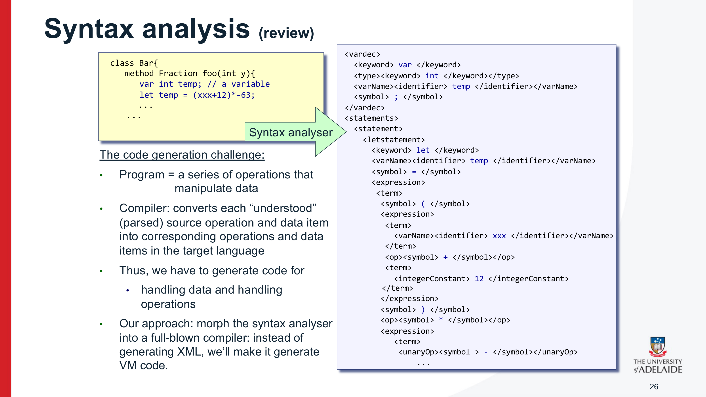

---

## 第 1 页


这张图片的内容是一段**对澳大利亚原住民 Kaurna 人民的土地致敬声明（Acknowledgement of Country）**。下面是详细解释：

---

### 🌏 文字逐句解释

1. **“We acknowledge and pay our respects to the Kaurna people, the traditional custodians whose ancestral lands we gather on.”**
我们承认并向 Kaurna 人民致以敬意，他们是我们聚集所在土地的传统守护者。
👉 这句话表达了对当地原住民（Kaurna族）作为这片土地最早居民和守护者的尊重。

2. **“We acknowledge the deep feelings of attachment and relationship of the Kaurna people to country and we respect and value their past, present and ongoing connection to the land and cultural beliefs.”**
我们承认 Kaurna 人民与这片土地之间深厚的情感和联系，并尊重、珍视他们与土地及文化信仰在过去、现在与未来持续的关联。
👉 “Country”在澳大利亚原住民文化中不仅指“土地”，还代表他们的身份、祖先、语言与精神连接。这句话强调了他们与这片土地不间断的文化纽带。

---

### 💬 背景意义

这种“致敬土地声明”在澳大利亚非常普遍，尤其在会议、演讲、大学课程或公共活动开始前使用。它体现了对原住民文化的尊重与包容，也提醒大家记住原住民对这片土地的历史与贡献。

---

### 📘 总结

这段话的核心意思是：

> 我们尊重并感谢 Kaurna 人民，他们是我们所在土地的传统主人；我们承认并珍视他们与这片土地之间深厚而持续的精神与文化联系。

---

### \[口语化表达]

这段话的意思大概是说：“我们要感谢并尊重 Kaurna 族人，他们是这片土地最早的守护者。我们承认他们和这片土地之间有着非常深的情感联系，并且尊重他们过去、现在、以及未来持续的文化与精神传承。”


---

## 第 2 页


这张图片是澳大利亚阿德莱德大学（**The University of Adelaide**）的一张**课程讲义封面页**。
它的主题是关于计算机系统（**Computer Systems**），具体讲的是**Lecture 17：语言解析（Language Parsing）与代码生成（Code Generation）**。下面是详细解释：

---

### 🎓 图片内容解析

1. **左上角的校徽和文字：**
显示了阿德莱德大学（The University of Adelaide）的校徽和校名。
这是澳大利亚的一所著名研究型大学，表明这份幻灯片是该校计算机相关课程的教学资料。

2. **中间的课程名称：**
“**Computer Systems**” 意为“计算机系统”，
是计算机科学课程中一个核心领域，研究计算机的结构、运行原理以及底层实现机制。

3. **Lecture 17: Language Parsing and Code Generation**

* “Lecture 17” 表示这是第17次课程讲座。
* “Language Parsing” 是指**语言解析**，通常在编译原理中指分析程序代码语法结构的过程。
* “Code Generation” 是**代码生成**，即编译器将解析后的中间表示转换为机器代码或低级代码的步骤。
👉 也就是说，这次课程主要讲的是编译器的中间两个核心阶段：解析与生成。

4. **右边的图片：**
展示了两名学生（或研究人员）正在白板前讨论或演示。白板上有公式和图表，桌上放着笔记本电脑和一个小型机器人。
这体现了课程的**实践性和研究性**——学生可能在做语言处理、编译器实验，或是嵌入式系统项目。

---

### 💡 内容总结

整张幻灯片是一个教学演示的开场页，用于阿德莱德大学的计算机系统课程第17讲，主题是“语言解析与代码生成”。
它结合了课程理论（编译原理）与实际应用（程序运行、硬件控制），并用图像强化了学习的场景感。

---

### \[口语化表达]

这张图是阿德莱德大学计算机系统课的第17讲封面，讲的是编译器怎么“看懂”程序语言（语言解析）并把它变成电脑能跑的机器代码（代码生成）。左边是课程标题，右边是学生在白板上讨论和实验的场景，说明这门课既讲理论也有实践内容。


---

## 第 3 页


这张图片展示的是**计算机系统课程的学习路线图（Our Journey）**，由阿德莱德大学（The University of Adelaide）制作。它通过一个层级结构说明了从“人类思维”到“物理世界”的完整计算机系统构建过程。下面是详细解释👇

---

### 🧭 整体概览

图中展示了两条主要的层级路线：

* **软件层级（Software hierarchy）**：从人类的思维到编译器、虚拟机、汇编语言。
* **硬件层级（Hardware hierarchy）**：从机器语言到计算机架构、逻辑门、再到物理电子学。

这体现了计算机科学中的核心思想：

> **“抽象与实现的层次关系（Abstraction–Implementation Paradigm）”**。
> 也就是说，高层的软件抽象最终是建立在底层硬件的实现之上。

---

### 🧠 从人类思维到机器执行的过程

1. **Human Thought（人类思维）**
一切计算机系统的起点是人类的逻辑思维和抽象设计能力。
👉 对应课程章节：第9和12章（Abstract Design 抽象设计）

2. **H.L. Language & Operating Sys.（高级语言与操作系统）**
人类用高级编程语言（如Python、C++）表达思维逻辑，这一层是抽象的软件接口。

3. **Compiler（编译器）**
🔺图中红色箭头 “We are here” 表示目前课程讲到这一部分。
编译器负责把高级语言（H.L. Language）翻译成更底层的虚拟机语言（Virtual Machine）。
👉 对应课程章节：第10–11章。

4. **VM Translator（虚拟机翻译器）**
把虚拟机语言转换成汇编语言（Assembly Language），让程序更接近机器可理解的形式。
👉 对应章节：第7–8章。

5. **Assembler（汇编器）**
把汇编语言转化成机器语言（Machine Language），供硬件直接执行。
👉 对应章节：第6章。

---

### ⚙️ 从硬件实现到底层物理

6. **Computer Architecture（计算机体系结构）**
硬件层次中，这一层定义了计算机的基本组成，如CPU、内存、总线等。
👉 对应章节：第4–5章。

7. **Gate Logic（逻辑门电路）**
再往下是由逻辑门（AND、OR、NOT等）组成的电路，用来实现基本的运算。
👉 对应章节：第1–3章。

8. **Electrical Engineering（电子工程） & Physics（物理学）**
最底层是物理层面，用电子器件（如晶体管）实现逻辑门，最终一切都基于物理规律运作。

---

### 🔄 核心理念总结

整张图展示了计算机系统从\*\*思想（Human Thought）到物理实现（Physics）\*\*的完整抽象层次。
软件层由上至下逐步靠近硬件；硬件层由下至上支撑抽象。
课程当前讲到“**编译器（Compiler）**”阶段，是连接高级语言和虚拟机语言的关键桥梁。

---

### \[口语化表达]

这张图其实是在告诉我们：学习计算机就像是一场从“想法”到“电路”的旅程。最开始是人类的思考，然后用编程语言表达想法，编译器把它翻译成更底层的指令，最后这些指令会一路传到电路和物理层面去执行。而我们现在学的部分——编译器，就是在教我们怎么把“人能懂的代码”变成“机器能懂的语言”。


---

## 第 4 页


这张幻灯片介绍了\*\*Jack语言（Jack language）\*\*的一些“值得注意的特性（Noteworthy features）”，并解释了这些设计背后的原因。Jack 是一种教学语言，通常用于学习编译器和计算机系统的课程（比如阿德莱德大学的《Computer Systems》课程）。以下是详细解释👇

---

### 🧩 主要内容解读

#### 1. 使用“笨重（cumbersome）”的关键字

* **`let` 关键字**：
用来给变量赋值，例如 `let x = 0;`。
在 Jack 中每次赋值都必须写出 `let`，虽然看起来多余，但**有助于语法分析**（parsing）时更容易识别赋值语句。

* **`do` 关键字**：
用来调用函数，例如 `do reduce();`。
同样属于强制语法标记，让编译器更容易解析函数调用。

#### 2. **没有运算符优先级（No operator priority）**

Jack 不像 C 或 Java 那样有乘法优先于加法的规则。
在 Jack 中，表达式 **严格按照从左到右的顺序**计算。
例如：

```
1 + 2 * 3
```

会得出结果 `9`（因为按顺序计算 → (1+2)=3, 3\*3=9）。
如果想得到“正常”的结果（即先乘后加），必须写成：

```
1 + (2 * 3)
```

👉 这样做是为了**简化编译器实现**。

#### 3. **仅有三种基本数据类型**

Jack 只有三种原始数据类型：

* `int`（整数）
* `boolean`（布尔值）
* `char`（字符）

而且这三种类型**都被当作16位的数值**来存储。
👉 这意味着编译器不需要复杂的类型管理逻辑。

#### 4. **无类型转换（No casting）**

任何类型的值都可以赋给任何类型的变量。
例如：可以把布尔值赋给整数变量。
👉 简化了类型检查，让编译更容易。

#### 5. **数组声明和构造**

数组声明方式：

```jack
Array x;
x = Array.new();
```

即先声明变量类型，再通过 `new()` 创建新数组对象。
这种写法统一了对象和数组的创建语法。

#### 6. **静态方法与构造方法**

* **静态方法（Static methods）** 使用关键字 `function`
* **构造方法（Constructor methods）** 使用关键字 `constructor`

调用构造方法时的语法是：

```
ClassName.new(argsList)
```

例如：

```
Square.new(10, 20)
```

---

### 💡 总结意义

最后一行加粗的文字强调：

> “所有这些设计决策都是为了让编译器的构建更容易。”

也就是说，Jack 语言的规则看起来有点“笨”，但这是故意为之。
通过减少复杂性（如去掉运算符优先级、类型检查等），学生或编译器设计者可以更清晰地理解编译原理的核心过程，而不用被语言细节困扰。

---

### \[口语化表达]

这页讲的是 Jack 语言的一些特别之处。它看起来有点笨，比如每次赋值都得写 `let`，调用函数还得写 `do`，表达式也没有“乘除优先”这种规则。但这些都是为了让编译器更容易写。Jack 只有三种基本类型，没有类型转换，数组和对象的创建方式也很统一。总体来说，Jack 的设计不是为了方便程序员，而是为了让学习和实现编译器变得更简单。


---

## 第 5 页


这页在回顾 **Jack 语言的“类（class）结构”**，左侧给出类的骨架写法，右侧说明规范与一个 Jack 程序的基本组成。

---

### 左侧：Jack 类的骨架

```jack
class ClassName {

field  variable declarations;   // 成员字段（随对象而变）
static variable declarations;   // 静态字段（所有对象共享）

constructor type name(parameterList) { // 构造器：创建并返回对象
local variable declarations;       // 局部变量（用 var 声明）
statements;                        // 语句块
}

method type name(parameterList) {      // 方法：作用于某个对象
local variable declarations;
statements;
}

function type name(parameterList) {    // 函数：不依赖具体对象（类似静态方法）
local variable declarations;
statements;
}
}
```

要点：

* **`field`** 与 **`static`** 是两种类内变量的声明区。
* **子程序（subroutine）** 有三类：`constructor`（构造器）、`method`（实例方法）、`function`（类级函数）。
* `parameterList` 为形参列表；方法体先是**局部变量声明**，然后是**语句**。

---

### 右侧：关于这份规范（About this spec）

* 列出的每个部分都**可以出现 0 次或多次**（但**类必须至少有一个构造器**）。
* `field` 与 `static` 的**先后顺序不作要求**。
* 各种子程序（constructor / method / function）的**书写顺序也不作要求**。
* **类型（type）** 只能是 `int`、`boolean`、`char` 或**某个类名**（引用类型）。

---

### 右侧：一个 Jack 程序（A Jack program）

* **每个类写在一个独立的文件**中（即一个编译单元）。
* 一个 Jack 程序由**一个或多个类**组成，其中**必须有一个类名为 `Main`**。
* `Main` 类中**至少包含一个方法**，且**方法名必须是 `main()`**（程序的入口）。

---

### 小结

这页确定了 Jack 语言里**类的标准写法和程序入口规则**：类里可声明 `field/static` 字段，定义三类子程序；各部分顺序灵活；类型受限以便实现简单；项目由多文件（多类）组成，但**必须有 `Main.main()`** 作为入口。

---

### \[口语化表达]

这页就是在说：Jack 里一个类怎么长。类文件里先放字段（`field` 是对象自己的，`static` 是全类共享），然后写三种子程序：造对象用的 `constructor`、针对对象的 `method`、不靠对象的 `function`。这些块出现多少次、先后顺序都随意，但类起码要有个构造器。类型只有 `int/boolean/char/类名`，简单好编。程序由多个类文件组成，但必须有个叫 `Main` 的类，而且里面至少要有一个 `main()` 当入口。


---

## 第 6 页


这页幻灯片讲的是**编译器（Compiler）在设计和实现中面临的主要挑战**。它是前一部分“Jack语言和编译过程”内容的总结性回顾。以下是详细解释👇

---

### 💡 概念（Concept）

> **How do we convert human-readable high-level language to a lower-level language?**
> 我们如何把人类可读的高级语言（如 Jack、Python、C++）转换成低级语言（如汇编或机器语言）？

这是编译器的核心任务。
它要把人类写的逻辑性代码“翻译”成计算机能执行的指令序列。
这不仅仅是语法替换，而是要分析、理解、并生成高效、正确的底层表示。

---

### ⚙️ 限制与挑战（Constraints / Challenges）

1. **How do we interpret syntax?（如何理解语法？）**
编译器必须识别源代码的结构，比如：

* 哪一部分是语句（statement）
* 哪一部分是表达式（expression）
* 哪一部分是变量声明、循环、条件语句等。
这需要**语法分析（parsing）**，是编译过程的第一个关键难点。

2. **How do we handle expressions?（如何处理表达式？）**
表达式可能包含运算符优先级、括号嵌套、函数调用等复杂结构。
编译器需要把这些转换成正确的计算顺序（例如生成中间代码或操作栈指令）。
在像 Jack 这种语言中，这部分尤其考验\*\*语法树（syntax tree）或递归下降解析（recursive descent parsing）\*\*的实现。

3. **How do we handle nesting of statements and function calls?（如何处理语句和函数的嵌套？）**
程序中常见嵌套结构：

* if 语句中再嵌套 while 循环；
* 函数调用另一个函数，再调用第三个函数。
编译器必须追踪每个作用域（scope）和变量上下文，正确生成调用关系和跳转逻辑。
这对**语义分析和代码生成**提出了挑战。

---

### 🧠 总结

这页的意思是：
编译器要把人类能理解的语言


---

## 第 7 页


这张幻灯片的标题是 **“Compiler Fundamentals”**，意思是“编译器基础”或“编译器的基本原理”。
它来自阿德莱德大学的课程，属于讲解编译器设计与实现的部分内容。虽然这一页没有具体文字说明，但它是一个**章节标题页（section title slide）**，通常用来引入接下来几页的内容。下面是详细解释👇

---

### 🧠 编译器基础（Compiler Fundamentals）是什么意思？

“编译器基础”指的是理解和构建编译器所需的核心概念与基本原理。
编译器（Compiler）是一个把\*\*高级语言（High-Level Language）**转换为**低级语言（Low-Level Language）\*\*的程序，使人类写的代码能在机器上运行。

在计算机系统课程中，这一部分通常涵盖以下几个关键点：

1. **编译的总体过程（Compilation Process）**

* 包括：词法分析（Lexical Analysis）、语法分析（Parsing）、语义分析（Semantic Analysis）、代码生成（Code Generation）与优化（Optimization）。
* 也就是从源代码（source code）一步步转化为机器能执行的目标代码。

2. **语言解析（Language Parsing）**

* 解释程序代码结构，确定程序的逻辑层次关系（比如 if、while、函数调用等）。

3. **语义检查（Semantic Checking）**

* 确保程序的语义是正确的，比如变量有没有声明、类型是否匹配等。

4. **代码生成（Code Generation）**

* 把抽象语法树（AST）转化为虚拟机语言或汇编语言，让程序可以运行。

5. **编译器的抽象层（Abstraction Layers）**

* 理解不同语言层级（如 Jack → VM → 汇编 → 机器码）之间的联系。

---

### 📘 这页幻灯片的作用

这页只是一个**过渡页**，告诉学生：

> “接下来我们要学习编译器的核心原理——从语言解析到代码生成，理解编译器是如何把人类语言变成机器语言的。”

它标志着课程从前面的“Jack语言特性”和“编译器挑战”部分，正式进入**编译器实现的具体内容**。

---

### \[口语化表达]

这页其实就是在说：“下面要开始讲编译器的核心原理啦。”
也就是教我们编译器到底是怎么工作的——从看懂源代码、理解语法，到最后生成电脑能执行的机器指令。前面讲的是编译器要面对哪些难题，这一章就是要告诉我们，它具体是怎么一步步解决这些问题的。


---

## 第 8 页


这张幻灯片介绍的是 **编译器的体系结构（前端部分）——Compiler Architecture (front end)**，
主要讲解了编译器的**工作流程**、**结构组成**以及每个阶段的功能。它以 Jack 编译器为例来说明整个过程。下面是详细解释👇

---

## 🧠 一、总体概念：编译器前端的功能

“编译器前端（Front End）” 是编译器的第一部分，负责把**源代码（source code）**——也就是人类编写的高级语言——转换成某种**中间表示（intermediate code）**，供后续阶段（例如虚拟机或机器码生成）使用。

在这张图中：

* 输入（source）是 **Jack 程序**
* 输出（target）是 **VM code（虚拟机代码）** 或 **XML code（用于验证语法分析的输出）**

---

## 🧩 二、主要结构组成

### 1. **Syntax Analyzer（语法分析器）**

语法分析器是编译器前端的核心，它负责“理解程序的结构和含义”。
它包括两个子部分：

#### (1) Tokenizer（词法分析器）

* 负责把源代码分解成一个个最小的语法单位（token），
例如：关键字（`if`、`let`）、符号（`+`、`=`）、标识符（变量名）、数字等。
* 这一过程叫做 **Tokenizing（词法分析）**。
* 它输出一个“token流”（stream of tokens）。

#### (2) Parser（解析器 / 语法树构建器）

* 负责根据语言语法规则（grammar）将 token 流重新组合，构建出代码的结构层次。
* 比如，它会识别出：

* “这是一条 if 语句”
* “这里是一个函数定义”
* “这是一个表达式”。
* 这个过程叫 **Parsing（语法解析）**。
* 在 Jack 编译器中，为了验证语法分析是否正确，可以生成 **XML 文件**（每个语法单元变成 XML 标签），以便检查结果。

---

### 2. **Code Generation（代码生成）**

* 当语法树构建完成后，下一步是**把结构化的语法信息转成目标代码**（这里是 VM 语言）。
* 它是“重构语义”的过程：将源语言表达的逻辑，用目标语言的语法再现。
* 最终输出的 VM 代码会被下一个阶段（VM Translator）转为汇编或机器码。

---

## 🔄 三、右上角流程图解释

右上角那张复杂的小图展示了整个编译链条：

* Jack 语言通过 **Jack Compiler** 转成中间代码（VM code）。
* 然后再由虚拟机（VM）实现，转换成不同平台的机器语言（如 RISC、CISC、Hack 平台等）。
* 也就是说，这个编译器系统不仅能编译 Jack，还能作为一个跨平台工具，使相同的源代码能在不同的硬件上运行。

---

## 🧩 四、关键术语总结

| 名称                  | 含义                       |
| ------------------- | ------------------------ |
| **Syntax analysis** | 理解源代码语义结构的过程             |
| **Tokenizing**      | 将源代码分解为 token（词法单元）      |
| **Parsing**         | 将 token 按语法规则组装成语法树      |
| **Code generation** | 将语法树转换为目标语言的代码（例如 VM 代码） |
| **XML Output**      | 验证语法分析是否正确的辅助文件          |

---

## ✍️ 五、课程章节对应

* **Chapter 10**：讲语法分析（Syntax Analyzer）
* **Chapter 11**：讲代码生成（Code Generation）

---

### \[口语化表达]

这页是在讲编译器的“前端”是怎么工作的。简单来说，编译器先把 Jack 程序的源代码拆成一个个单词（token），再根据语言规则拼成结构（这叫语法树），然后把这些结构翻译成虚拟机能读的代码（VM code）。有时还会输出 XML 文件，用来检查语法有没有分析对。整个过程其实就是：从人能读的语言一步步变成电脑能理解的逻辑结构，最后生成机器能执行的代码。


---

## 第 9 页


这张幻灯片讲的是编译器前端中的第一步——**词法分析（Lexical Analysis）**，也叫**标记化（Tokenizing）**。
它解释了如何把原始源代码分解成“词法单元（tokens）”，为后续语法分析（Parsing）做准备。下面是详细说明👇

---

## 🧠 一、概念说明：什么是 Tokenizing / Lexical Analysis

词法分析是编译器处理源代码的第一个阶段。
它的主要任务是：

> 把一段完整的程序代码（源文件）拆解成一个个基本的语言元素（tokens），这些元素是编译器能理解的最小语义单位。

这些“tokens”包括：

* **关键字（keywords）**：如 `while`, `let`, `if`, `return`
* **符号（symbols）**：如 `(`, `)`, `{`, `}`, `=`, `+`, `<`, `;`
* **标识符（identifiers）**：如变量名 `count`
* **常量（constants）**：如数字 `100` 或字符串 `"Hello"`

---

## 🧩 二、幻灯片内容详解

### 🔹 左边的代码片段（Code Fragment）

源代码示例：

```jack
while (count < 100) /** demonstration code */
{
let count = count + 1;
}
```

这是一段简单的循环代码，用来演示词法分析。

---

### 🔹 分析过程

#### 1️⃣ 去掉无关字符

* **Remove white space（移除空格、换行符）**
* **忽略注释**（如 `/** demonstration code */`）

#### 2️⃣ 构造 token 列表

词法分析器（Tokenizer）把代码扫描一遍，生成一个有序的 token 列表。

结果如下（右侧 Tokens）：

```
while
(
count
<
100
)
{
let
count
=
count
+
1
;
}
```

每个单词、符号、数字都变成独立的 token。

---

### 🔹 注意事项（Things to worry about）

1. **语言特定规则（Language specific rules）**

* 不同语言对符号的解释不同，比如 `++`、`--`、`<=` 是否算作单个符号？
→ 编译器需要明确定义。

2. **语言特定分类（Language-specific classifications）**

* 每个 token 不仅要记录文本内容，还要有类型分类，如：

* `keyword`（关键字）
* `symbol`（符号）
* `identifier`（标识符）
* `integerConstant`（整数常量）
* `stringConstant`（字符串常量）

3. **附加记录信息**

* 一个好的词法分析器不仅要输出 token，还要输出它的**词法类别（lexical classification）**，即该 token 在语法规则中的角色。

---

## 🔄 三、总结：词法分析的作用

通过词法分析，编译器把杂乱无章的源代码文本变成一串结构化的符号列表（token stream）。
这样语法分析器（Parser）才能理解程序的逻辑结构，比如判断哪里是循环、哪里是函数调用。

---

### \[口语化表达]

这页讲的是编译器在“看懂代码”的第一步——先把代码拆成最小的词语单元。比如它会把
`while (count < 100) { let count = count + 1; }`
拆成一个个独立的词：`while`, `(`, `count`, `<`, `100`, `)`……等等。
这个过程就叫“词法分析”或“Tokenizing”。它会去掉空格、注释，并标记每个词是什么类型（比如关键字、符号或数字）。
简单说，这一步的任务就是——**让编译器先“看清楚每个词”，再谈理解整句意思。**


---

## 第 10 页


这张幻灯片讲的是\*\*“Tokenizing / Lexical analysis（标记化 / 词法分析）”\*\*，是编译器的第一步工作。
它通过一个具体示例展示了编译器如何把源代码拆解成一个个最小的语义单位（token），并且为每个 token 分类。
下面是详细解释👇

---

## 🧠 一、什么是 Tokenizing（标记化）

**Tokenizing** 是指把源代码（纯文本）分解成一系列\*\*词法单元（tokens）\*\*的过程。
这些 token 是编译器能理解的最小语言成分。
例如：关键字（`while`、`let`）、符号（`(`、`+`、`}`）、变量名、常量等。

---

## 🧩 二、幻灯片左侧内容：源代码与分析过程

### ▶ 示例代码（Code Fragment）

```jack
while ( count < 100 ) /** demonstration code */
{
let count = count + 1;
}
```

### ▶ 编译器在做的事情

1. **Remove white space（移除空白符）**
删除空格、换行、制表符，这些对语义没影响的字符。
同时还会忽略注释（`/** ... */`）。

2. **Construct a token list（构建 token 列表）**
编译器扫描代码，把每个有意义的部分提取出来，形成一个顺序的 token 流。

---

## 📋 三、幻灯片右侧内容：Token 列表与分类

词法分析器输出的结果如下：

| Token | 分类 (Lexical classification) |
| :---- | :-------------------------- |
| while | keyword（关键字）                |
| (     | symbol（符号）                  |
| count | identifier（标识符）             |
| <     | symbol（符号）                  |
| 100   | integer constant（整数常量）      |
| )     | symbol                      |
| {     | symbol                      |
| let   | keyword                     |
| count | identifier                  |
| =     | symbol                      |
| count | identifier                  |
| +     | symbol                      |
| 1     | integer constant            |
| ;     | symbol                      |
| }     | symbol                      |

🔹可以看到，源代码被拆成 15 个 token，每个 token 还附带一个**类型标签（Type Tag）**，告诉编译器它是什么性质的成分。

---

## ⚙️ 四、Things to worry about（实现时要注意的点）

1. **Language specific rules（语言特定规则）**
不同语言对符号的定义不同，比如要明确 `++`、`--`、`<=` 等是否算一个单独的符号。

2. **Language-specific classifications（语言特定分类）**
每个 token 都要归类为：

* `keyword`（关键字）
* `symbol`（符号）
* `identifier`（标识符）
* `integerConstant`（整数常量）
* `stringConstant`（字符串常量）

3. **Token 信息记录**
一个好的 tokenizer 不仅要记录每个 token 的值，还要记录它的词法分类（lexical classification），这在后续语法分析（Parsing）中非常重要。

---

## 🧩 五、总结

词法分析（Lexical Analysis）是编译器的第一步：

* 输入：源代码文本。
* 输出：一串有序的 token（每个带有类型）。
它的目标是**把文字转成编译器能理解的结构化语言元素**，为下一步语法分析（Syntax Analysis）打下基础。

---

### \[口语化表达]

这页在讲编译器做的第一件事——“看懂每个词”。
它会把代码像这样：
`while (count < 100) { let count = count + 1; }`
拆成一个个最小的语法单元，比如 `while` 是关键字、`(` 是符号、`count` 是变量名、`100` 是数字。
编译器在这个阶段会去掉空格和注释，还要给每个词打标签（比如“这是关键字”“这是符号”）。
简单说，这一步的目的就是：**让计算机先认清每个词是什么，再去理解整句话在干什么。**


---

## 第 11 页


这张幻灯片讲的是 **Jack 语言的 Tokeniser（词法分析器）**，也就是编译器中负责“切分代码”的部分。
它展示了 **词法分析器的输入、输出以及如何用 XML 文件表示结果**。下面是详细解释👇

---

## 🧠 一、什么是 Jack Tokeniser

**Tokeniser（词法分析器）** 是编译器前端的第一步组件。
它的任务是：

> 把源代码（source code）读入后，去掉空格和注释，把整段代码切分成一个个独立的“词法单元”（tokens），并为每个 token 指定其类型。

这些 token 之后会交给语法分析器（Parser）去理解程序结构。

---

## 🧩 二、左侧内容：源代码（Source code）

示例代码如下：

```jack
if (x < 153) {let city = "Paris";}
```

这是一段非常简短的 Jack 语言语句，意思是：

> 如果 `x < 153`，就执行 `{ let city = "Paris"; }`。

---

## ⚙️ 三、编译器处理流程

1. **输入源代码（source）**
Tokeniser 读取这段 Jack 代码。

2. **拆解成 token（标记化）**
把语句分成最小的语法单位（token），如关键字、变量名、符号、数字、字符串等。

3. **输出 XML 格式结果（tokeniser’s output）**
为了验证分析是否正确，编译器可以把结果输出成 XML 文档，每个 token 都包在相应的标签中。
这样不仅能清楚地看到每个 token，还能知道它的类别。

---

## 📄 四、右侧内容：Tokeniser 输出结果

Tokeniser 的输出为 XML 格式：

```xml
<tokens>
<keyword> if </keyword>
<symbol> ( </symbol>
<identifier> x </identifier>
<symbol> &lt; </symbol>
<integerConstant> 153 </integerConstant>
<symbol> ) </symbol>
<symbol> { </symbol>
<keyword> let </keyword>
<identifier> city </identifier>
<symbol> = </symbol>
<stringConstant> Paris </stringConstant>
<symbol> ; </symbol>
<symbol> } </symbol>
</tokens>
```

🔹 每一行表示一个 token。
🔹 例如：

* `<keyword> if </keyword>` → “if” 是关键字；
* `<identifier> x </identifier>` → “x” 是标识符；
* `<integerConstant> 153 </integerConstant>` → “153” 是整数常量；
* `<stringConstant> Paris </stringConstant>` → “Paris” 是字符串常量。

---

## 🧾 五、右上角的 “Char XML Entity” 表格

因为 XML 文件本身有特殊字符（如 `<`, `>`, `&`, `"`），
所以在输出时需要用对应的**转义字符（escape entity）** 来表示：

|  符号 | 在 XML 中写作 |
| :-: | :-------: |
| `<` |   `&lt;`  |
| `>` |   `&gt;`  |
| `'` |  `&apos;` |
| `"` |  `&quot;` |
| `&` |  `&amp;`  |

例如：
在代码中 `<`（小于号）在 XML 输出里必须写成 `&lt;`，否则会被 XML 误认为标签。

---

## 💡 六、总结

这张幻灯片展示了：

* **Tokeniser 的工作目标**：把源代码分解为一系列 token。
* **输出格式**：每个 token 都有类型标签，并用 XML 文件保存。
* **意义**：这是验证词法分析是否正确的好方法，同时也为语法分析（Parsing）提供干净、结构化的数据。

---

### \[口语化表达]

这页主要讲的是编译器里的“分词器”在干什么。
它把代码 `if (x < 153) {let city = "Paris";}` 拆成一个个词，比如 `if` 是关键字、`x` 是变量名、`153` 是数字、`Paris` 是字符串。
然后它把这些词全都标好标签，像这样写进 XML 文件里，方便后面检查和分析。
另外，因为 XML 不允许直接写 `<`、`>` 这类符号，所以要用 `&lt;`、`&gt;` 这样的写法。
简单说，这一步就是让计算机“先认清每个词是什么”，并用 XML 把结果整齐地列出来。


---

## 第 12 页


这张幻灯片讲的是编译器中的第二个核心步骤——**Parsing（语法分析）**。
它是在“Tokenizing（词法分析）”之后进行的，用来理解程序的结构和语法规则。
下面是详细解释👇

---

## 🧠 一、Parsing 是什么？

**Parsing（语法分析）** 是编译器在词法分析之后的阶段。
前面讲到的 **Tokenizer（词法分析器）** 会把源代码切成一堆“词法单元（tokens）”，
而 **Parser（语法分析器）** 则负责根据语言的**语法规则（Grammar）**，去理解这些 token 之间的结构关系。

简单来说：

> **Tokenizer 负责切词，Parser 负责理解句子结构。**

---

## 🧩 二、Syntax Analyser（语法分析器）

在编译器中，**语法分析器（Syntax Analyser）** 由两部分组成：

1. **Tokenizer（词法分析器）**：识别并分类每个单词（token）。
2. **Parser（语法分析器）**：分析这些词是如何组成有意义的语句、表达式和程序结构的。

---

## 📘 三、语法（Grammar）的作用

* 每一种编程语言都有一套定义自己结构的规则，这叫做**语法（Grammar）**。
例如：

* 在英文中，语法规定主语 + 动词 + 宾语的顺序。
* 在编程语言中，语法规定表达式、语句和函数的排列方式。

* **Parser** 的任务就是：

> 根据这套语法规则，判断一段 token 序列是否“合法”，以及它属于什么结构。

---

## 🔍 四、Parsing 的过程（The parsing process）

1. **输入已被 token 化的文本（A text is given and tokenized）**
Tokenizer 已经把源代码分成 token 流。

2. **Parser 判断语法合法性（The parser determines ...）**
Parser 检查这些 token 的组合是否符合语言的语法规则（grammar）。

* 如果符合 → 语法正确
* 如果不符合 → 报语法错误（Syntax error）

3. **结构分析（Complete structural analysis）**
Parser 会构建一个**语法树（Parse Tree / Syntax Tree）**，
表示程序的层次结构（例如 if 语句、循环、函数调用等之间的嵌套关系）。

---

## 💬 五、自然语言与编程语言的类比

幻灯片提到：

* 语法分析不仅存在于**编程语言**（如 Jack、C、Python）中，
* 也存在于**自然语言**（如英语）中。

比如在英语中：

> “The cat eats fish.”
> 语法分析会判断它的结构：
> 主语（The cat） + 动词（eats） + 宾语（fish）。

编程语言中类似：

> `if (x < 10) { let y = 5; }`
> 语法分析器判断它是一个“if 语句”，包含条件部分和语句体。

---

## 🧩 六、总结

这页的重点是说明：

* Parsing 是**编译器理解代码结构的关键步骤**。
* 它通过一套\*\*语法规则（Grammar）\*\*来判断程序是否合法，并生成结构化的语法树。
* Parsing 不只是编程语言有，任何有规则的语言（包括自然语言）都可以被解析。

---

### \[口语化表达]

这页讲的是编译器怎么“理解句子结构”。前面分词（Tokenizing）只是把代码拆成一个个词，现在这一步——Parsing，就是让编译器学会“看懂句子”。它会根据语言的语法规则（就像英文语法一样）去判断代码写得对不对，还会把代码变成一棵语法树，清楚地表示出“这是个 if 语句”“这是个函数调用”等等。
简单说，Parsing 就是让编译器不只“看见单词”，而是能“明白整句话的结构和意思”。


---

## 第 13 页


这张幻灯片介绍的是 **“C 类语言的典型语法结构（A typical grammar of a typical C-like language）”**，
也就是说明编译器如何通过“语法规则（grammar）”来识别像 C、Java、Jack 这样的程序语言结构。
它展示了语法的**定义方式**（左边）和**对应的代码示例**（右边）。
下面是详细解释👇

---

## 🧠 一、什么是 Grammar（语法）

**Grammar（语法）** 是一组规则，用来定义一种语言中“哪些写法是合法的”。
对于编程语言来说，它决定了程序的结构，比如：

* 什么是语句（statement）；
* if、while 等控制结构该怎么写；
* 大括号 `{}`、分号 `;` 的使用方式。

换句话说，**语法 = 语言的结构规则**。
编译器的语法分析器（Parser）就是根据这些规则来理解和验证源代码的。

---

## 🧩 二、左侧：语法规则（Grammar 部分）

这一块写的是伪代码形式的语法定义（类似巴科斯范式 BNF），说明一种 C-like 语言的基本规则：

```text
program: statement
statement: whileStatement
| ifStatement
| 'statement' ';'
| '{' sequence '}'

whileStatement: 'while' '(' 'expression' ')' statement
ifStatement: 'if' '(' 'expression' ')' statement ('else' statement)?
sequence: '' | statement sequence
```

### 逐条解释：

1. **program: statement**
一个程序（program）由一个或多个语句组成。

2. **statement（语句）可以是：**

* 一个 while 语句
* 一个 if 语句
* 一个单独的语句并以分号 `;` 结尾
* 或者一个用花括号 `{}` 包起来的语句序列（即语句块）

3. **whileStatement**
格式：`while (expression) statement`
表示当条件成立时，执行后面的语句。

4. **ifStatement**
格式：`if (expression) statement`
可选地加上 `else statement`（括号里的 `()?` 表示“可有可无”）。

5. **sequence**
表示一连串的语句，可以为空（`''`），也可以是多个语句连在一起。
这说明语法是**递归的（recursive）**，语句可以包含语句。

---

## 🧮 三、右侧：代码示例（Code sample）

右边的黄色部分展示了根据左边语法规则写出来的合法代码示例：

```c
while (expression) {
if (expression)
statement;
while (expression) {
statement;
if (expression)
statement;
}
while (expression) {
statement;
statement;
}
if (expression) {
statement;
while (expression) {
statement;
statement;
}
}
if (expression)
if (expression)
statement;
}
```

这段代码展示了**语法的嵌套与递归性**：

* while 语句里面可以再有 if；
* if 语句里面又可以再有 while；
* 花括号中的内容又可以是一系列语句（sequence）。

这正是语法规则允许的结构。

---

## 💡 四、语法的三个特点（幻灯片下方总结）

1. **有简单形式（terminal forms）**
→ 比如关键字（`while`, `if`）、符号（`{`, `}`）等是最基本的终结符。

2. **有复杂形式（non-terminal forms）**
→ 比如 `statement`、`expression` 是由多个简单成分组合而成的语法结构。

3. **高度递归（highly recursive）**
→ 一条语句可以包含另一条语句（如 while 里有 if，if 里又有 while），
这种自我嵌套是编程语言的核心特征之一。

---

## 📘 五、总结

这张幻灯片说明了：

* **语法（Grammar）是定义语言结构的核心。**
* 编译器通过语法规则来识别程序是否合法，并理解语句的层次关系。
* C-like 语言（包括 C、Java、Jack）都是递归结构的语言，可以无限嵌套控制语句。

---

### \[口语化表达]

这页是在告诉我们，像 C 这种语言有一套“语法规则”，编译器就是靠它来判断代码写得对不对。
左边那块写的是语言的“文法定义”，规定了 while、if、语句块 `{}` 等怎么组合；
右边那段代码就是这些规则能生成的例子。
它说明程序可以嵌套很多层，比如 while 里有 if，if 里再有 while。
简单说，这页就是在展示编程语言的“语法蓝图”，让编译器能根据这套规则看懂我们的代码结构。


---

## 第 14 页


这张幻灯片讲的是 **“语法树（Parse tree）”** —— 编译器在语法分析（Parsing）阶段构建出来的一种**层次化结构图**，用于表示程序代码在语法上的组成关系。
它展示了从输入的源代码到词法单元（tokens），再到语法树的完整转化过程。
下面是详细解释👇

---

## 🧠 一、什么是 Parse Tree（语法树）

**语法树（Parse Tree）** 是编译器在语法分析阶段生成的一种树形结构，用来表示源代码的**语法结构**。

* **每个节点（node）** 表示一个语法单位（如语句 statement、表达式 expression）。
* **树的层级结构** 体现了代码的嵌套与从属关系。

换句话说：

> Tokenizer 负责“切词”，
> Parser 负责“搭树”。

语法树就是编译器理解程序逻辑结构的关键中间结果。

---

## 🧩 二、左侧内容说明

### 🔹 Input Text（输入文本）

原始的 Jack 或 C-like 程序片段：

```c
while (count <= 100) {
/** demonstration **/
count++;
// ...
}
```

这是一段标准的 `while` 循环，意思是：
当 `count <= 100` 时，执行 `{ count++ }`。

---

### 🔹 Tokenized（词法分析结果）

编译器首先会将源代码转为一串 token：

```
while
(
count
<=
100
)
{
count
++
;
...
}
```

这表示程序已经被分解为最小语义单元。

---

## ⚙️ 三、中间部分：语法树结构（Parse Tree）

中间的大图展示了语法分析器根据\*\*语言文法（Grammar）\*\*生成的语法树。

树的顶端是一个 `statement` 节点（语句），下面分支出：

* `whileStatement`（表示这是一个 while 语句）

* `while` 关键字
* 括号中的 `expression`（表达式，如 `count <= 100`）
* 花括号 `{}` 中的 `statementSequence`（语句序列）

* 包含 `statement`（例如 `count++`）
* 后面还可以有多个嵌套语句（递归结构）

在图中可以看到每个部分都分解成更小的组成部分，
例如 `expression` 再分为 `count`、`<=`、`100`。

---

## 🧱 四、右上角：语法定义（Grammar）

幻灯片右上角给出了解析这段代码所用的文法规则（grammar）：

```text
program: statement;
statement: whileStatement
| ifStatement
| 'statement' ';'
| '{' sequence '}'
whileStatement: 'while' '(' expression ')' statement
sequence: '' | statement sequence
```

这组规则定义了：

* 程序由语句组成；
* 语句可以是 while、if、单条语句或语句块；
* while 语句由关键字 `while`、表达式、语句体构成；
* sequence 表示语句序列，可以递归（即一个语句里还有语句）。

这些规则是语法树生成的“蓝图”，
解析器（Parser）根据这些规则把 tokens 组合成树形结构。

---

## 🧩 五、语法树的意义

语法树体现了：

* 程序的**逻辑结构**（哪部分是循环体、哪部分是条件）；
* **语句之间的层次关系**；
* 编译器如何一步步“理解”代码。

语法树后续会被编译器用于：

* 语义分析（Semantic Analysis）；
* 代码生成（Code Generation）；
* 优化（Optimization）。

---

## 💡 六、总结

这张图展示了编译器是如何从源代码：
→ 拆分成 tokens，
→ 再根据语法规则构建出一个完整的语法树（Parse Tree）。
每个节点代表一个语法结构，每个分支表示从属关系，
这让计算机“看懂”程序的结构，而不仅仅是一串文字。

---

### \[口语化表达]

这页讲的是编译器怎么“看懂代码结构”的。
程序一开始只是几行文字，比如 `while (count <= 100) { count++; }`，
编译器先把它拆成一个个词（token），然后再根据语言的语法规则把这些词拼成一棵树。
这棵“语法树”能清楚地表示每个部分的关系：最上层是 while 语句，里面有条件表达式 `count <= 100`，再往下是循环体里的语句 `count++`。
简单说，这一步就是让编译器从“看到词”变成“理解结构”，真正明白代码在干什么。


---

## 第 15 页


这是一张章节过渡页，标题是 **“Syntax Analysis: Parsing（语法分析：解析）”**。
它告诉你接下来要进入编译器前端中的“**语法分析**”主题：在“词法分析（把代码切成 token）”之后，\*\*解析器（Parser）**会依据语言的**语法（Grammar）\*\*把 token 组合成结构化表示（如语法树/抽象语法树），检查语法合法性，并为后续的语义分析与代码生成打基础。右下角标有阿德莱德大学校徽，表明这是课程讲义的一部分，仅作主题引入，不包含具体内容。

### 这一章通常会讲到

* 语法与文法：BNF/EBNF、终结符与非终结符、递归与优先级
* 解析方式：自顶向下/自底向上、LL/LR、递归下降等
* 构建结果：语法树（Parse Tree）/抽象语法树（AST）
* 错误处理：语法错误的发现与恢复

---

### \[口语化表达]

这页就是在说：“我们要开始讲编译器怎么按语法规则把一串词拼成结构了。”也就是在词法分析之后，用解析器根据文法搭出语法树，检查代码写法对不对，为后面的语义检查和代码生成做准备。


---

## 第 16 页


这页讲的是**解析器（Parser）在语法分析时会遇到的难点**，标题是 *Parser challenges*。分两部分：

---

## 核心概念（Concept）

* **问题本质**：给定一串从词法分析得到的 **token 序列**，**怎样还原出程序的结构**（语句、块、表达式的层次）？

---

## 主要约束 / 挑战（Constraints / Challenges）

1. **可选片段（optional sections）怎么处理？**

* 例：`if (cond) stmt` 中的 `else stmt` 是可选的；类声明里某些修饰符可有可无。
* **典型做法**：文法里用 *可空/可选* 规则（EBNF 的 `?`，或引入可空非终结符），代码里用\*\*带回看（lookahead）\*\*判断是否出现，再决定是否进入该分支。

2. **可重复片段（repeating sections）怎么处理？**

* 例：语句序列、逗号分隔的实参列表、连续的声明。
* **典型做法**：文法用 `*` / `+`（“零或多次 / 一次或多次”），实现上用**循环**反复匹配，直到不能再匹配为止，并注意分隔符规则（如 `,`）。

3. **无固定顺序的片段（don’t have order）怎么处理？**

* 例：类体里 `static` 与 `field` 声明先后不敏感；注解/修饰符的排列。
* **典型做法**：

* 设计成**集合式匹配**：维护“尚未出现的项”的集合，能匹配就消费一个，直到都不能匹配；
* 或把无序项拆成**多分支**（|）并在循环中反复选择。要小心**二义性**与**无限回溯**，必要时做**左因子化**或加**优先级**。

4. **表达式（expressions）怎么处理？**

* 难点在**运算符优先级**与**结合性**，还有括号与一元/二元运算区分。
* **典型做法**：

* 递归下降 + 分层的优先级子程序；
* **Pratt parser**（TDOP）或 **Shunting-yard** 算法；
* 若语言像 Jack 一样**无运算符优先级**，仍需处理**括号与左到右的计算顺序**。

> 这些挑战背后都与：**选择（可选）**、**迭代（重复）**、**排列（无序）**、\*\*优先级（表达式）\*\*有关。解析器需要借助文法（BNF/EBNF）、FIRST/FOLLOW、合理的 lookahead、以及必要的错误恢复策略来稳健实现。

---

### \[口语化表达]

这页在说：解析器要把一串 token 拼回“程序结构”，难点主要有四个——有的部分**可有可无**（比如 `else`），有的部分会**重复出现**（比如参数列表、语句序列），有的部分**先后顺序不固定**（比如类里的若干声明），还有就是**表达式**要处理优先级、结合性和括号。这些一般用文法里的“可选/可重复”规则，加上 lookahead 和循环来搞定；无序项用集合式匹配避免二义性；表达式用分层解析或 Pratt/Shunting-yard。总之，解析器要能聪明地决定“要不要、要几次、先后顺序、谁先算”。


---

## 第 17 页


这张幻灯片讲的是一种非常常见的编译器语法分析方法——**递归下降分析（Recursive Descent Parsing）**。
它解释了这种方法如何根据语言的\*\*语法规则（grammar）\*\*一步步地“递归”地解析程序结构。下面是详细说明👇

---

## 🧩 一、什么是 Recursive Descent Parsing（递归下降分析）

递归下降分析是一种**自顶向下（Top-down）语法分析法**，
通过为每一个语法规则（grammar rule）编写一个**解析函数（parse function）**，
让这些函数互相调用，从而逐步识别源代码的结构。

例如：

* 规则 `statement → whileStatement | ifStatement`
会对应两个函数：`parseWhileStatement()` 和 `parseIfStatement()`，
程序根据下一个 token 来决定调用哪个。

换句话说：

> “递归下降”就是让代码结构自己通过函数调用的嵌套层次体现出来。

---

## 🧠 二、左侧：Grammar（语法规则）

幻灯片左边展示的是一个 C-like（类似 C）的语法：

```text
program: statement
statement: whileStatement |
ifStatement |
'statement' ';' |
'{' statements '}'
whileStatement: 'while' '(' 'expression' ')' statement
ifStatement: 'if' '(' 'expression' ')' statement ('else' statement)?
statements: statement*
```

解释如下：

* **program**：一个程序就是一个语句。
* **statement**（语句）可以是：

* `whileStatement`（while 循环）
* `ifStatement`（if 条件）
* 单条语句（如 `statement;`）
* 或者语句块（`{ statements }`）
* **statements** 表示一组语句，可能包含多个（`*` 表示“零个或多个”）。
* 语法是**递归的**，因为语句可以嵌套在语句里。

---

## 🧩 三、右侧：Code Sample（代码样例）

示例代码：

```c
while (expression)
{
statement;
statement;
while (expression)
{
while (expression)
statement;
statement;
}
}
```

这段代码体现了语法的**层级结构与递归特性**：

* `while` 中可以包含另一个 `while`，
* 语句块 `{}` 里又包含语句序列，
* 每个结构都能被递归下降解析函数自然处理。

---

## ⚙️ 四、Parser Implementation（解析器实现）

幻灯片右下角展示了解析器的函数集合：

```text
parseStatement()
parseWhileStatement()
parseIfStatement()
parseStatements()
```

每个语法规则对应一个函数：

* `parseStatement()` 调用相应的子函数；
* `parseWhileStatement()` 处理 while；
* `parseIfStatement()` 处理 if；
* `parseStatements()` 处理语句块。

这些函数相互调用，就能完整地把源代码解析成一棵语法树（Parse Tree）。

---

## 🔍 五、LL(1) Grammar（文法特性）

幻灯片中提到：

> **LL(1) grammars: the first token determines the rule**

意思是：

* LL(1) 文法是一种简单规则的语言定义形式，
只要\*\*看下一个 token（前瞻一个符号）\*\*就能决定使用哪条规则。
* “LL”中的两个 L 分别代表：

* Left-to-right（从左到右读取输入）
* Leftmost derivation（最左推导）

Jack 语言被设计得**几乎是 LL(1)**，
所以它的语法能直接用递归下降法来实现，而不需要复杂的语法分析算法。

---

## 💡 六、总结

这页讲述的是：

* \*\*递归下降分析（Recursive Descent Parsing）\*\*是一种直观、可手写实现的语法分析法；
* 每个语法规则都对应一个函数；
* 只需要看一个 token（LL(1)）就能判断用哪条规则；
* 像 Jack 这样的教学语言特别适合用这种方法；
* 它能自然地解析嵌套结构（如 while、if、语句块）。

---

### \[口语化表达]

这页在讲一种编译器里常用的“语法分析套路”——递归下降。
意思就是：编译器会为每条语法规则写一个函数，比如处理 `while` 的、处理 `if` 的，然后这些函数互相调用，就能把代码一层层地读懂。
比如遇到 `while` 就去跑 `parseWhileStatement()`，里面再去解析括号、表达式、语句块。
这种方法简单好懂，只要看下一个词（token）就能决定该走哪条规则，所以叫 LL(1)。Jack 语言的语法就几乎是 LL(1)，特别适合用这种方式来写解析器。


---

## 第 18 页


这张幻灯片标题是 **“The Jack grammar（Jack 语言的语法）”**，内容展示了 **Jack 编程语言** 的完整语法结构（grammar），包括它的词法元素（lexical elements）和程序结构（program structure）。这张图是理解编译器前端“解析器（parser）”的核心文档之一。下面详细说明👇

---

## 🧩 一、Lexical elements（词法元素）

Jack 语言有 **5 种基本的终结符（tokens）类型**，也就是词法分析（tokenizer）输出的基本单元：

| 元素类型                      | 含义                                                | 举例                                                                                                                                                                                                                  |            |
| ------------------------- | ------------------------------------------------- | ------------------------------------------------------------------------------------------------------------------------------------------------------------------------------------------------------------------- | ---------- |
| **keyword（关键字）**          | 语言内置的保留字                                          | `'class'`, `'constructor'`, `'method'`, `'field'`, `'static'`, `'var'`, `'int'`, `'char'`, `'boolean'`, `'void'`, `'true'`, `'false'`, `'null'`, `'this'`, `'let'`, `'do'`, `'if'`, `'else'`, `'while'`, `'return'` |            |
| **symbol（符号）**            | 语言的运算符或标点符号                                       | \`{ } ( ) \[ ] . , ; + - \* / &                                                                                                                                                                                     | < > = \~\` |
| **integerConstant（整数常量）** | 范围在 0–32767 的整数                                   | 例如 `42`, `100`, `32767`                                                                                                                                                                                             |            |
| **stringConstant（字符串常量）** | 以双引号 `"` 包裹的 Unicode 字符串，不含换行或引号本身                | 例如 `"Hello"`                                                                                                                                                                                                        |            |
| **identifier（标识符）**       | 用户自定义的名字，如变量名、函数名、类名。必须以字母或 `_` 开头，后面可以接字母、数字或下划线 | 例如 `Main`, `counter`, `_value`                                                                                                                                                                                      |            |

这部分定义告诉解析器：**词法分析阶段要如何识别出语言的最小单元**。

---

## 🧠 二、Program structure（程序结构）

Jack 程序的基本结构是：

> 一个程序（program）由一个或多个类（class）组成，每个类对应一个独立的文件。
> 也就是说，**编译单元（compilation unit）就是一个类**。

### 📘 class（类定义）

```
'class' className '{' classVarDec* subroutineDec* '}'
```

解释：

* 每个类以关键字 `class` 开头；
* 紧跟一个类名（`className`）；
* 花括号 `{}` 包含类成员：

* `classVarDec*` → 0 个或多个类变量声明；
* `subroutineDec*` → 0 个或多个子程序声明（方法、构造器、函数）。

---

### 📗 classVarDec（类变量声明）

```
('static' | 'field') type varName (',' varName)* ';'
```

表示：

* 类变量用 `static` 或 `field` 修饰；
* 声明一个或多个同类型变量；
* 每个声明以分号结尾。

---

### 📙 type（类型）

```
'int' | 'char' | 'boolean' | className
```

类型可以是：

* 基本类型：`int`, `char`, `boolean`；
* 或者自定义类类型（`className`）。

---

### 📒 subroutineDec（子程序定义）

```
('constructor' | 'function' | 'method') ('void' | type) subroutineName '(' parameterList ')' subroutineBody
```

表示：

* 三种子程序类型：构造器、函数、方法；
* 返回类型可以是 `void` 或具体类型；
* 括号中是参数列表；
* 接着是子程序体（`subroutineBody`）。

---

### 📕 parameterList（参数列表）

```
((type varName) (',' type varName)*)?
```

即：

* 零个或多个参数；
* 每个参数由类型和变量名组成；
* 之间用逗号分隔。

---

### 📔 subroutineBody（函数体）

```
'{' varDec* statements '}'
```

函数体：

* 由 `{}` 包裹；
* 内含局部变量声明（`varDec*`）；
* 和语句序列（`statements`）。

---

### 📘 varDec（局部变量声明）

```
'var' type varName (',' varName)* ';'
```

即：

* 以 `var` 开头；
* 可以声明多个变量；
* 每个声明以分号结尾。

---

### 🧾 其他元素

* **className / subroutineName / varName** 都是标识符（identifier）。
* 整个语法采用**上下文无关文法（context-free grammar）**，适合用递归下降解析。

---

## 🔤 三、右侧符号说明（notation key）

右边的蓝框解释了文法符号的含义：

| 符号    | 含义                |            |
| ----- | ----------------- | ---------- |
| `'x'` | 字面出现的符号（verbatim） |            |
| `x`   | 表示语法结构（非终结符）      |            |
| `x?`  | x 可出现 0 或 1 次（可选） |            |
| `x*`  | x 可出现 0 次或多次      |            |
| \`x   | y\`               | 二选一（x 或 y） |
| `x y` | 顺序出现（先 x 后 y）     |            |

这是一种常见的 BNF（巴科斯范式）扩展记法，叫做 **EBNF（扩展巴科斯范式）**。

---

## 💡 四、总结

这页完整描述了 **Jack 编程语言的文法结构**：

* 前半部分定义了 Jack 的“词法单元”；
* 后半部分定义了“语法规则”；
* 使用 EBNF 形式表明各部分的顺序、可选性和重复性；
* 解析器可以根据这些规则递归地构建语法树。

---

### \[口语化表达]

这页其实就是 Jack 语言的“语法说明书”。
上半部分在讲 Jack 的基本词法：有哪些关键字、符号、整数、字符串、标识符；
下半部分在讲程序的结构：一个 Jack 程序就是一个类，类里有变量声明和函数定义，函数里又有参数、局部变量和语句。
右边的小表解释了语法符号的意思，比如 `*` 是“可重复”、`?` 是“可选”。
简单说，这页告诉我们 Jack 语言的**完整语法蓝图**，编译器就是根据这套规则一步步读懂程序的。


---

## 第 19 页


这张幻灯片标题是 **“The Jack grammar (cont.)”**，即“Jack 语言语法（续）”，是上一页语法说明的延伸部分。
这一页主要定义了 **语句（Statements）** 和 **表达式（Expressions）** 的语法规则。
这些规则告诉编译器：Jack 语言中哪些结构算合法、每种语句怎么写、表达式怎么组成。
下面详细解释👇

---

## 🧩 一、Statements（语句部分）

Jack 的程序体由各种语句组成。语句（statements）就是程序的执行步骤，例如赋值、条件判断、循环、函数调用、返回等。

### ✳️ statements

```
statements: statement*
```

意思是：

* 一组语句；
* 可以有零条或多条（`*` 表示“可重复”）。

---

### ✳️ statement（单条语句）

```
statement: letStatement | ifStatement | whileStatement | doStatement | returnStatement
```

说明 Jack 语言支持五种语句类型：

1. **letStatement** → 赋值语句
2. **ifStatement** → 条件语句
3. **whileStatement** → 循环语句
4. **doStatement** → 调用函数或方法
5. **returnStatement** → 返回语句

---

### ✴️ letStatement（赋值语句）

```
letStatement: 'let' varName ('[' expression ']')? '=' expression ';'
```

解释：

* `let` 表示赋值操作；
* `varName` 是变量名；
* 可选的 `[' expression ']` 表示可以给数组元素赋值；
* `=` 右边是一个表达式；
* `;` 表示语句结束。
📘例：

```jack
let x = 5;
let a[i] = b + 1;
```

---

### ✴️ ifStatement（条件语句）

```
ifStatement: 'if' '(' expression ')' '{' statements '}' ('else' '{' statements '}')?
```

解释：

* 以 `if` 开头；
* 条件写在 `()` 内；
* 条件成立时执行 `{}` 内的语句；
* 可选的 `else` 块表示“否则”的情况。
📘例：

```jack
if (x < 10) { let y = 1; } else { let y = 2; }
```

---

### ✴️ whileStatement（循环语句）

```
whileStatement: 'while' '(' expression ')' '{' statements '}'
```

解释：

* `while` 表示循环；
* 当括号中的表达式为真时，不断执行 `{}` 内的语句。
📘例：

```jack
while (i < 10) { let i = i + 1; }
```

---

### ✴️ doStatement（调用语句）

```
doStatement: 'do' subroutineCall ';'
```

解释：

* `do` 用于调用函数或方法；
* 语句末尾必须有分号。
📘例：

```jack
do Output.printInt(x);
```

---

### ✴️ returnStatement（返回语句）

```
ReturnStatement: 'return' expression? ';'
```

解释：

* `return` 表示函数返回；
* 可以返回一个表达式（例如一个计算结果），也可以为空（返回 void）。
📘例：

```jack
return x + 1;
return;
```

---

## 🧮 二、Expressions（表达式部分）

表达式是程序计算的核心，用于描述运算、条件判断或取值。

### ✳️ expression（表达式）

```
expression: term (op term)*
```

解释：

* 表达式由一个或多个“项”（term）构成；
* 项之间可以有运算符（op）；
* 例如：`x + y * 2`。

---

### ✳️ term（项）

```
term: integerConstant | stringConstant | keywordConstant | varName |
varName '[' expression ']' | subroutineCall |
'(' expression ')' | unaryOp term
```

解释：

* term 可以是：

* 整数常量（`5`）
* 字符串常量（`"Hi"`）
* 关键字常量（如 `true`, `false`, `null`, `this`）
* 变量（`x`）
* 数组元素（如 `a[i]`）
* 函数调用（如 `sum(3,4)`）
* 括号表达式（如 `(x + 1)`）
* 一元运算（如 `-x` 或 `~flag`）

---

### ✳️ subroutineCall（子程序调用）

```
subroutineCall: subroutineName '(' expressionList ')' |
(className | varName) '.' subroutineName '(' expressionList ')'
```

解释：

* 可以调用当前类的方法：`foo(x, y)`
* 也可以调用对象或类的方法：`Math.multiply(x, y)` 或 `obj.method()`

---

### ✳️ expressionList（表达式列表）

```
expressionList: (expression (',' expression)*)?
```

* 表示参数列表；
* 可以为空，也可以有多个表达式，用逗号分隔。
📘例：

```jack
foo(x, y + 1, z);
```

---

### ✳️ op（运算符）

```
op: '+' | '-' | '*' | '/' | '&' | '|' | '<' | '>' | '='
```

标准二元运算符（加减乘除、逻辑与或、比较）。

---

### ✳️ unaryOp（一元运算符）

```
unaryOp: '-' | '~'
```

一元运算符，用于取负或逻辑非。

---

### ✳️ keywordConstant（关键字常量）

```
'true' | 'false' | 'null' | 'this'
```

特殊常量，代表布尔值、空值或当前对象。

---

## 📘 三、右侧符号说明（notation key）

右上角和前一页相同：

| 符号    | 含义          |     |
| ----- | ----------- | --- |
| `'x'` | 字面符号（固定写法）  |     |
| `x`   | 语言结构        |     |
| `x?`  | 0 或 1 次（可选） |     |
| `x*`  | 0 或多次（可重复）  |     |
| \`x   | y\`         | 二选一 |
| `x y` | 顺序出现        |     |

---

## 💡 四、总结

这一页完整定义了 **Jack 的语句与表达式文法**：

* 语句层面（Statements）：支持赋值、条件、循环、调用、返回；
* 表达式层面（Expressions）：定义了各种常量、变量、函数调用和运算；
* 这两部分加上前一页的类结构文法，构成了 Jack 语言完整的编译语法；
* 编译器的解析器（Parser）会根据这些规则一步步识别和生成语法树。

---

### \[口语化表达]

这页就是在告诉我们：Jack 程序的语句和表达式是怎么组成的。
语句分五种：`let`（赋值）、`if`（条件）、`while`（循环）、`do`（调用函数）和 `return`（返回结果）；
表达式就是各种计算，比如常量、变量、数组、函数调用、括号表达式和运算符组合。
简单来说，这页就是在列出 Jack 语言所有能写的“句子”和“算式”长什么样子。编译器就是靠这些规则去判断代码是不是合法、该怎么翻译成机器能懂的东西。


---

## 第 20 页


这页的主题是 **“Jack 语法分析器的实际工作（Jack syntax analyser in action）”**。它用一个小示例展示：把一段 Jack 源代码交给**语法分析器（parser）**后，如何依据语言文法生成**结构化的解析结果（这里用 XML 展示）**。

---

## 左侧：示例源代码

```jack
class Bar {
method Fraction foo(int y) {
var int temp;        // 声明一个局部变量
let temp = (xxx+12)*-63;
...
}
}
```

含义：

* 定义类 `Bar`，其中有方法 `foo`（返回类型 `Fraction`，参数 `int y`）。
* 方法体里先声明局部变量 `temp`，再把表达式 `(xxx+12)*-63` 的结果赋给 `temp`。

---

## 中间箭头：语法分析器做了什么

* **根据 Jack 的文法（grammar）**，程序员可以编写一个**语法分析器**；
* 语法分析器读取源代码文本，尝试按文法逐层匹配；
* **若匹配成功，就生成一棵语法树**；为了便于检查，这里用 **XML** 这种结构化格式把语法树“打印”出来。

---

## 右侧：XML 形式的解析结果（节选）

```xml
<vardec>
<keyword> var </keyword>
<keyword> int </keyword>
<identifier> temp </identifier>
<symbol> ; </symbol>
</vardec>

<statements>
<statement>
<letstatement>
<keyword> let </keyword>
<identifier> temp </identifier>
<symbol> = </symbol>
<expression>
<term>
<symbol> ( </symbol>
<expression>
<term>
<varName>
<identifier> xxx </identifier>
</varName>
</term>
<symbol> + </symbol>
<term>
<integerConstant> 12 </integerConstant>
</term>
</expression>
...
```

可以看到：

* `var int temp;` 被归纳为 `<vardec>` 节点，内部又细分出 `keyword/int/identifier/symbol` 等终结符；
* `let temp = (xxx+12)*-63;` 被解析为 `<letstatement>`，其中表达式被逐层拆成 `expression → term/op/term`，括号、变量名、常量、一元负号等也都有明确的节点表示。

---

## 底部算法要点（这页给出的生成规则）

* **若 `xxx` 是非终结符（如 `expression`、`term`、`statement`）**
输出：

```
<xxx>
// 递归输出 xxx 的各个组成部分
</xxx>
```
* **若 `xxx` 是终结符（keyword / symbol / constant / identifier）**
输出：

```
<xxx> 其词法值 </xxx>
```

这就是一个**递归下降**风格的“打印语法树为 XML”的模板：遇到非终结符就递归展开，遇到终结符就直接输出值。

---

## 这页想强调什么

* 语法分析器依据文法把源码**结构化**；
* 结构化结果可用机器易读的格式（如 **XML**）输出，便于**验证与调试**；
* 通过“非终结符递归、终结符直写”的简单策略，就能把整棵语法树有层次地打印出来。

---

### \[口语化表达]

这页在做演示：把一小段 Jack 代码丢给语法分析器，它会按文法把代码拆成结构化的树，然后用 XML 打印出来。非终结符就递归展开成一大块（比如 `<expression>...</expression>`），终结符（比如关键字、符号、变量名、常量）就直接写出它的值。最终你能清清楚楚地看到“这是变量声明”“这是 let 赋值”“这里是表达式里有括号、加号、常量和一元负号”，方便检查语法分析是不是对了。


---

## 第 21 页


这页题为 **“Jack Tokeniser（Jack 词法分析器）”**，讲的是课程将提供一个可用的 **Jack 语言分词器**（tokeniser），以及它的**接口设计**，方便后续的解析器（parser）直接调用。

---

## 接口一览与作用

### 基本游标操作

* **`next_token()`**
让分词器**前进到下一个 token**。通常在成功匹配后调用，或在初始化时先调用一次。

### 读取当前 token 信息

* **`token_spelling()`**
返回**当前 token 的字面串**（例如 `while`、`(`、`count`、`123`）。
* **`token_kind()`**
返回**当前 token 的种类**（枚举/标签），如：`keyword`、`symbol`、`identifier`、`integerConstant`、`stringConstant`，或更细的自定义种类（如 `tk_while`、`tk_lparen` 等）。
* **`token_ivalue()`**
返回**当前 token 的整型数值**（仅对整数常量有意义，例如 `123` → 123）。

### 断言与试探

* **`have(TokenKind)`**
询问：**当前 token 是否为指定种类？**
常用于**可选**或**重复**语法分支：若为真则消费（通常配合 `next_token()`），否则不动。
* **`mustbe(TokenKind)`**
**强制要求**当前 token 为指定种类；

* 如果满足：通常内部会**消费它**（调用 `next_token()`）；
* 如果不满足：调用 **`fatal_error()`** 报语法错误并终止。
适合用于**必须出现**的符号（如 `;`、`)`、关键字等）。

### 特殊记号（Special tokens）

* **`tk_eoi`**（end-of-input）
输入结束标记，解析完成时应遇到它，用于检测**是否完整消耗**了输入。
* **分组类记号（grouping tokens）**
例如：`tk_infix_op`（中缀运算符集合 `+ - * / & | < > =`）、`tk_term`（可作为表达式“项”的集合）。
这类**抽象分组**有助于在解析表达式时，用“属于此组否”的判断精简代码。

---

## 典型用法小示例（伪代码）

```pseudo
function parseLetStatement():
mustbe(TK_LET)                 // 'let'
mustbe(TK_IDENTIFIER)          // 变量名
if have(TK_LBRACKET):          // 可选的数组下标
next_token()
parseExpression()
mustbe(TK_RBRACKET)
mustbe(TK_EQUALS)              // '='
parseExpression()              // 右侧表达式
mustbe(TK_SEMICOLON)           // ';'
```

要点：

* **必须出现**的符号用 `mustbe`；
* **可选/重复**结构用 `have` 试探；
* 每当成功匹配一个 token，就**前进**到下一个（由 `mustbe` 内部或显式 `next_token()` 完成）。

---

## 这页的目的

* 统一一个小而稳的 **tokeniser API**，让大家专注于**递归下降解析**而不是分词细节；
* 提供**错误处理约定**（`mustbe` 失败即 `fatal_error`）；
* 通过**特殊分组 token**，降低表达式等复杂结构的解析难度。

---

### \[口语化表达]

这页在说：我们已经给你准备好一个 Jack 的“分词器”，你用几个简单函数就能拿到“当前词”的文本、类型、数值，并能前进到下一个词。要强制匹配某个符号就用 `mustbe`（不对就报错），可选的就用 `have` 试探一下。还有 `tk_eoi` 表示读到结尾，以及像 `tk_infix_op` 这种“运算符分组”帮你解析表达式。总体思路就是：分词器负责把代码一块块送过来，你用这些 API 轻松写出递归下降的解析函数。


---


> 


---

## 第 22 页


这张幻灯片讲的是 **CompilationEngine**，也就是 “Jack 语言的递归自顶向下语法分析器” 的核心工作原理。下面是逐句详细解释👇

---

### 🧩 内容详解

#### 1. **CompilationEngine 的作用**

> “The CompilationEngine effects the actual compilation output.”

CompilationEngine 负责生成编译器的真正输出。
简单来说，它是编译器中把“词法分析的结果”变成“结构化代码输出”的那一部分。它的任务是把由 **Jack Tokeniser（词法分析器）** 提供的词法单元（tokens）组装成语法树（syntax tree），再输出成结构化文件（例如 XML）。

---

#### 2. **输入和输出**

> “It gets its input from a Jack Tokeniser and emits its parsed structure into an output file/stream.”

输入来自 **Jack Tokeniser**（即前一阶段的词法分析模块），输出是经过语法分析之后的结构化代码表示（例如一棵树或者带标签的文本），通常写入到文件或流中。

---

#### 3. **工作方式：parse\_xxx() 系列函数**

> “The output is generated by a series of parse\_xxx() routines, one for every syntactic element xxx of the Jack grammar.”

CompilationEngine 由一组函数组成，每个函数负责解析 Jack 语言中的一种语法结构。
比如：

* `parseClass()`：解析一个类定义；
* `parseExpression()`：解析一个表达式；
* `parseTerm()`：解析一个单项；
* 等等。

这些函数共同构成一个递归调用体系，也就是所谓的“递归下降（recursive descent）”语法分析。

---

#### 4. **函数之间的契约**

> “The contract between these routines is that each parse\_xxx() routine should read the syntactic construct xxx from the input...”

每个 `parse_xxx()` 函数的职责是：

1. 从输入中读取并解析出该语法结构（xxx）；
2. 在 xxx 结束后，正好读取下一个 token；
3. 输出该结构的分析结果。

这意味着你**只能在确保下一个语法元素确实是 xxx 时**，才调用对应的 `parse_xxx()` 函数。
这种设计让整个编译器逻辑保持干净和一致，每个函数都只负责自己的一块。

---

#### 5. **输出格式：XML 结构**

> “In the first version of the compiler... emits a structured printout of the code, wrapped in XML tags.”

在编译器的第一个版本中，这些 `parse_xxx()` 函数会输出一个**结构化的 XML 文件**。
XML 标签用于清晰表示代码的层级和语法结构，方便调试和可视化。

例如，一段 Jack 代码：

```jack
let x = 5 + 3;
```

可能被输出为：

```xml
<letStatement>
<varName>x</varName>
<symbol>=</symbol>
<expression>
<term>5</term>
<symbol>+</symbol>
<term>3</term>
</expression>
</letStatement>
```

---

#### 6. **解析树生成与输出**

> “Following the workshop approach, the parse\_xxx() routines build a parse tree which is turned into XML output by a library routine.”

所有的 `parse_xxx()` 函数最终会构建出一棵完整的**语法树（parse tree）**，然后再通过一个库函数自动转化为 XML 文件输出。

---

### 🧠 总结一句话

**CompilationEngine 是 Jack 编译器中负责语法分析的模块，它通过一系列递归的 `parse_xxx()` 函数把词法分析器的输出解析成语法树，再以 XML 格式输出。每个函数只负责解析自己对应的语法元素，并保证调用和输出的严格顺序。**

---

### \[口语化表达]

你可以把这个 CompilationEngine 想成一个“句子结构分析器”。Jack 语言的每一段代码先被拆成最小的词（Tokeniser 做的），然后 CompilationEngine 再负责把这些词拼回去，组成一个有层次的结构。
它里面有很多小函数，每个函数都负责识别某种语法，比如类、语句、表达式、变量声明等。它们一个套一个地调用，就像剥洋葱一样，一层一层往下解析。最后，它会把整个结构整理成一份 XML 文件，看起来就像是“代码的骨架”，方便后续编译或调试。


---

## 第 23 页


这页讲的是 **Jack Parser（Jack 语法分析器）** 的结构，也就是在编译器中负责把 Jack 源代码转化为抽象语法树（AST, *Abstract Syntax Tree*）的一组函数。下面我来详细说明👇

---

## 🧠 基本概念：什么是 AST？

在右上角红字标明的 `ast = abstract syntax tree` 意思是 “抽象语法树”。
**AST** 是一种用树形结构表示源代码语法的方式。

* 每个节点（node）代表一种语法结构（比如类、函数、if 语句、表达式等）。
* 树的层级反映了语法的嵌套关系。

Jack Parser 的这些函数就是用来**逐层构建 AST** 的。每个 `parse_xxx()` 函数负责解析一种语法结构，并返回一个表示该结构的树节点（即一个 `ast`）。

---

## 🧩 左半部分函数：结构性与声明性解析

这些函数主要负责解析 **程序的结构部分**，比如类、变量、方法等定义。

| 函数                                     | 作用说明                                       |
| -------------------------------------- | ------------------------------------------ |
| `parse_class()`                        | 解析整个类定义，包括类名、变量声明、方法定义等。                   |
| `parse_class_var_decs()`               | 解析类中定义的成员变量（class-level variables）。        |
| `parse_static_var_dec()`               | 解析 `static` 变量声明。                          |
| `parse_field_var_dec()`                | 解析 `field`（字段）变量声明。                        |
| `parse_type()` / `parse_vtype()`       | 解析数据类型（如 `int`, `boolean`, `char`, 或类名）。   |
| `parse_subr_decs()`                    | 解析类中的子程序声明（constructor, function, method）。 |
| `parse_constructor()`                  | 解析构造函数。                                    |
| `parse_function()`                     | 解析普通函数。                                    |
| `parse_method()`                       | 解析方法（method）。                              |
| `parse_param_list()`                   | 解析函数/方法的参数列表。                              |
| `parse_subr_body()`                    | 解析函数体（即 `{ ... }` 内部的语句）。                  |
| `parse_var_decs()` / `parse_var_dec()` | 解析函数体或局部作用域中的变量声明。                         |

这些函数对应的是**编译器的前半段工作**，即从类定义到变量与方法结构的语法分析。

---

## ⚙️ 右半部分函数：语句与表达式解析

右边这一列函数主要用于解析 **程序执行的逻辑部分**，比如语句、控制流、表达式、操作符等。

| 函数                         | 作用说明                                          |
| -------------------------- | --------------------------------------------- |
| `parse_statements()`       | 解析一串语句（statement 列表）。                         |
| `parse_statement()`        | 解析单个语句。                                       |
| `parse_let()`              | 解析 `let` 赋值语句。                                |
| `parse_if()`               | 解析 `if` 条件语句。                                 |
| `parse_while()`            | 解析 `while` 循环。                                |
| `parse_do()`               | 解析 `do` 调用语句。                                 |
| `parse_return()`           | 解析 `return` 语句。                               |
| `parse_expr()`             | 解析表达式。                                        |
| `parse_term()`             | 解析表达式中的最小单元（term）。                            |
| `parse_array_index()`      | 解析数组索引表达式。                                    |
| `parse_subr_call()`        | 解析子程序调用（函数调用）。                                |
| `parse_expr_list()`        | 解析一组表达式（例如函数参数列表）。                            |
| `parse_infix_op()`         | 解析中缀运算符（如 `+`, `-`, `*`, `/` 等）。              |
| `parse_unary_op()`         | 解析一元运算符（如 `-x`、`~x`）。                         |
| `parse_keyword_constant()` | 解析特殊关键字常量（如 `true`, `false`, `null`, `this`）。 |

这些函数通常会**递归调用**彼此，最终形成表达式与语句的语法树节点，并连接到更大的 AST 中。

---

## 🧩 整体理解

Jack Parser 的作用就是通过这些 `parse_xxx()` 函数一步步识别程序结构，建立起 AST（抽象语法树）。
每个函数返回一个 `ast` 对象，这些节点相互连接，形成完整的树结构，用于后续的语义分析或代码生成。

---

### 🧠 总结一句话

**Jack Parser 是 Jack 编译器中的语法分析模块，通过一组递归的 `parse_xxx()` 函数把源代码转化成抽象语法树（AST）。左边的函数负责解析类、函数和变量声明等结构，右边的函数负责解析语句、表达式和运算符。**

---

### \[口语化表达]

你可以把这一页理解成“Jack 编译器的说明书”，列出了所有能读懂 Jack 语言结构的函数。
左边那一列像是在教编译器“怎么理解一个程序的骨架”，比如类、变量、函数这些东西；
右边那一列则是教它“怎么读懂代码的动作”，比如 if、while、表达式、运算符这些逻辑。
每个函数都会返回一个“语法树节点”（AST），这些节点拼在一起就变成了一棵完整的语法树，让编译器能真正“看懂”整段代码的结构和含义。


---

## 第 24 页


这页是 **“If 语句的解析示例”**。左上角给出了 if 的**文法规则**，右边是配套的 **`parse_if()`** 伪代码，演示递归下降解析器如何把 if/else 语句读成 AST（抽象语法树）。

---

## 文法（grammar）

高亮处写的是：

```
if ::= 'if' '(' expr ')' '{' statements '}'
( 'else' '{' statements '}' )?
```

含义：

* 一个 `if` 语句由关键字 `if` 开头；
* 括号里的 `expr` 是条件表达式；
* 紧跟着一对花括号 `{ ... }` 包住 **then 分支**的语句序列 `statements`；
* 可选地，后面还有 `else { ... }` 包住 **else 分支**的语句序列；问号 `?` 表示“可有可无”。

---

## 代码（`parse_if()`）逐行解释

右侧是解析函数的伪代码；它读入 token 并构造 AST 节点：

```c
ast parse_if(){
mustbe(tk_if);              // 期待并消耗 'if'
mustbe(tk_lrb);             // '('
ast _expr = parse_expr();   // 解析条件表达式，得到子树 _expr
mustbe(tk_rrb);             // ')'

mustbe(tk_lcb);             // '{'
ast _then = parse_statements(); // 解析 then 分支的语句序列
mustbe(tk_rcb);             // '}'

if (have(tk_else)) {        // 如果看到了 'else'
mustbe(tk_else);        // 消耗 'else'
mustbe(tk_lcb);         // '{'
ast _else = parse_statements(); // 解析 else 分支
mustbe(tk_rcb);         // '}'
return create_if_else(_expr, _then, _else); // 构建 if-else AST
}

return create_if(_expr, _then);   // 只有 if（无 else）时的 AST
}
```

### 关键点说明

* **`mustbe(token)`**：断言下一个词法单元必须是给定类型；不是就报错（实现“语法契约”）。
* **`have(token)`**：向前看（lookahead）检查是否存在该 token，存在就走 else 分支那条路径。
* **`parse_expr()` / `parse_statements()`**：递归调用，分别构造**条件表达式**与**语句序列**的子树。
* **`create_if(...) / create_if_else(...)`**：把解析到的各个子树拼成一个完整的 **if** 或 **if-else** AST 节点。
* 记号说明：

* `tk_lrb / tk_rrb`：左/右圆括号 `(` `)`
* `tk_lcb / tk_rcb`：左/右花括号 `{` `}`

---

## 小例子（它会怎么解析）

源代码：

```jack
if (x < 3) { let x = x + 1; } else { do Output.printInt(x); }
```

解析后的 AST 形态（概念上）：

```
IfElse
├─ Cond: Expr(<, x, 3)
├─ Then: Statements( Let(x, Add(x, 1)) )
└─ Else: Statements( Do(Call(Output.printInt, [x])) )
```

---

## 一句话总结

**这页展示了 if 语句的正式文法，以及解析器如何按顺序匹配 token、递归解析子结构，并最终用 `create_if`/`create_if_else` 把条件、then 分支、else 分支组装成一棵 AST 节点。**

---

### \[口语化表达]

这张图在说：写了个 `parse_if()` 小函数，专门读 `if (...) { ... }` 这一块代码。它先确认看到 `if` 和括号，再把括号里的条件解析出来；接着读 `{}` 里的 then 语句。如果后面还有 `else`，就再读一组 `{}` 里的语句。最后把“条件、then、else（可选）”三样东西拼成一个 if 的语法树节点。整套流程严格按文法来，不对就报错，对了就产出一棵清清楚楚的 if/else 结构树。


---

## 第 25 页


这页是**总结与下一步（Summary and next step）**，把前面讲的编译器前端工作收个尾，并说明接下来要做“代码生成”的任务。

---

## 这页在说什么？

### 1) 两大阶段

* **Syntax analysis（语法分析）**：理解源码的**语法结构**

* 由 **Tokenizer**（把源代码切成 token）和 **Parser**（根据文法把 token 组织成结构/AST 或等价结构）完成。
* **Code generation（代码生成）**：在理解语法后，**构造语义对应的目标代码**（把结构变成可执行的指令序列）。

### 2) 图里的流程

* 左侧 **Jack Program**（Jack 源程序）进入 **Jack Compiler**。
* 在编译器里先进入 **Syntax Analyzer**：

* **Tokenizer** → **Parser**。
* 语法分析阶段（幻灯标注 *Chapter 10*）可以产出**XML code**（一种结构化、便于调试/验证的中间表示）。
* 接着进入 **Code Generation**（标注 *Chapter 11*），把语法结构翻译成**VM code**（虚拟机指令，栈式 VM，可执行/可进一步翻译为汇编）。

### 3) Code generation 的挑战（原文列在底部）

* **把“语法分析器”扩展为“完整编译器”**：不再只输出“静态的 XML”，而是要输出**可执行的 VM 代码**。
* **两个核心难点**：
**(a) 处理数据**：变量/字段/静态/参数/局部的存放位置与内存段映射（static/field/argument/local）、数组与对象内存、`this`/构造函数分配等。
**(b) 处理指令**：表达式到 VM 运算指令映射（加减乘除、比较、逻辑）、控制流（if/while 的标签与跳转）、子程序调用约定（call/return、参数压栈）、语句级别命令（let/do/return）等。

> 换句话说：前端已经“看懂了语法”，下一步要把“懂的结构”精准翻成“能跑的 VM 指令”。

---

## 你需要带走的要点

1. Jack 编译器分两段：**语法分析 → 代码生成**。
2. 语法分析阶段的产物可以是**XML**（便于检查），但最终目标是生成**VM code**。
3. 代码生成的本质是**语义落地**：把变量、控制流、表达式、函数调用等，映射到栈式 VM 的**数据与指令**。

---

### \[口语化表达]

这页是收官+预告：我们前面已经教编译器“看懂句子结构”（Tokenizer+Parser），能把代码变成一份清清楚楚的结构（甚至先导出 XML 做检查）。接下来要升级成“会说话”的编译器——把这些结构翻译成 VM 指令，真的能跑。难点两个：一是数据怎么放（变量在哪个内存段、对象/数组怎么管、`this`/构造函数怎么处理），二是动作怎么翻（表达式变成哪条 VM 指令、if/while 怎么打标签跳转、函数怎么压栈调用和返回）。总之，下一步就是把“看懂”变成“能执行”。


---

## 第 26 页



这页是对 **Syntax analysis（语法分析）** 的复习和过渡到 **代码生成阶段（code generation）** 的铺垫。它把前一阶段的工作成果展示出来，并解释下一步要做的事情和挑战。

---

## 🧩 内容详解

### 1. 左边的代码：Jack 源程序示例

左侧展示了一段 Jack 语言的代码片段：

```jack
class Bar {
method Fraction foo(int y) {
var int temp;   // a variable
let temp = (xxx + 12) * -63;
...
}
}
```

这是一段普通的类定义，里面包含：

* 一个方法 `foo()`；
* 局部变量声明 `var int temp;`；
* 一条 `let` 语句，将表达式 `(xxx + 12) * -63` 的结果赋值给 `temp`。

---

### 2. 中间箭头：Syntax Analyser（语法分析器）

箭头表示——**语法分析器（Syntax Analyser）**会读取这段源代码，并把它“理解”成语法结构。
这一阶段的目标是**理解语法（understanding syntax）**，还不关心执行语义，只是把代码变成结构化的数据表示。

---

### 3. 右边的结果：XML 语法结构输出

右边展示的是语法分析器的输出：
一段 XML 格式的结构树，清晰地表示了这段代码的层次关系和语法元素。

例如：

```xml
<vardec>
<keyword> var </keyword>
<type> <keyword> int </keyword> </type>
<varName> <identifier> temp </identifier> </varName>
<symbol> ; </symbol>
</vardec>
```

这段 XML 表示 `var int temp;` 这条声明。

而接下来的：

```xml
<letStatement>
<keyword> let </keyword>
<varName> temp </varName>
<symbol> = </symbol>
<expression>
...
</expression>
</letStatement>
```

则对应 `let temp = (xxx + 12) * -63;` 这条赋值语句。
它继续展开表达式内部结构，如：

* `<term>` 表示每个表达式项；
* `<symbol> + </symbol>` 表示操作符；
* `<integerConstant> 12 </integerConstant>` 表示整数常量；
* `<unaryOp> - </unaryOp>` 表示取负号。

这种 XML 输出就是**语法分析的最终产物**——结构清晰的语法树。

---

### 4. 下方文字：代码生成的挑战 (The code generation challenge)

这一部分解释下一阶段的目标和难点：

* **程序本质**：本质上程序就是一系列操作（operations）在操纵数据。
* **编译器的任务**：把语法分析后（parsed）的操作和数据项，转成目标语言（target language，例如 VM 指令）中等价的操作和数据。
* **需要生成的内容**：

* 数据处理代码（handling data）：变量、常量、内存段等；
* 操作处理代码（handling operations）：表达式求值、控制语句、函数调用等。
* **下一步目标**：让语法分析器不只是输出 XML，而是成为真正的编译器——
生成 **VM code（可执行虚拟机代码）**。

---

## 🧠 总结一句话

**这页的核心意思是：**
语法分析阶段的任务是“理解”程序结构，把 Jack 源代码转化为结构化的 XML（语法树）。
接下来的目标是进入代码生成阶段，把这些“理解好的结构”转换成真正能运行的 VM 指令，实现从“分析”到“执行”的飞跃。

---

### \[口语化表达]

这页其实在复盘和预告：我们现在的编译器已经能看懂代码结构了——比如看到 `let temp = (xxx + 12) * -63;`，它能清楚地知道“这是个赋值语句，等号右边是个乘法，乘号左边又是一个加法表达式”。
语法分析器会把这些结构都变成 XML，就像给程序拍了一张结构透视图。
但问题是，这个 XML 还不能运行！下一步的挑战，就是教编译器把这些结构真正翻译成“能动起来的” VM 指令。
换句话说——我们要从“看懂语法”升级到“能让它跑起来”。


---


---

## 第 27 页


这张图片内容是一个幻灯片（PPT）的标题页，主题为 **“Code Generation”**，即“代码生成”。幻灯片右下角标有 **阿德莱德大学（The University of Adelaide）** 的校徽与名称，说明这份演示文稿可能来自该校的课程、讲座或研究报告。

---

### 📘 内容详解：

1. **标题含义：**

* “Code Generation”（代码生成）通常是指**自动从高层描述或模型生成源代码的过程**。
* 在计算机科学中，这一概念广泛用于：

* **编译原理**：编译器将中间表示（IR, Intermediate Representation）转换成可执行机器代码或汇编代码的阶段；
* **软件工程**：利用工具从 UML、DSL（领域特定语言）或模型自动生成框架代码；
* **人工智能与自动化**：使用大型语言模型（如 GPT 系列）自动生成程序代码；
* **嵌入式系统或硬件设计**：将设计规范自动转化为硬件描述语言（HDL）或控制程序。

2. **版面设计：**

* 背景为深蓝色和灰蓝色的叠层几何设计；
* 左侧有一条红色竖条，这是阿德莱德大学品牌视觉设计的典型元素；
* 标题“Code Generation”居中，字体简洁、白色醒目；
* 整体风格正式、学术化，符合大学课程或科研报告风格。

3. **可能用途：**

* 本页通常作为**章节封面**或**讲座主题引入页**；
* 可能是关于**编译技术课程**、**AI 编程生成**或**软件工程自动化工具**的内容；
* 接下来的幻灯片可能会讲解代码生成的原理、方法、应用或实例。

---

### \[口语化表达]

这张幻灯片其实就是个标题页，讲的主题叫“代码生成”。意思是用计算机或工具自动写代码的过程，比如编译器自动把程序翻译成机器码，或者用 AI 自动写程序。背景是阿德莱德大学的官方设计，看起来像是课程或讲座的第一页，用来引出“代码生成”这个话题。


---

## 第 28 页


这张幻灯片的标题是 **“Code Generation challenges”**（代码生成的挑战），内容主要讲的是在\*\*代码生成（Code Generation）\*\*过程中，系统或编译器面临的核心问题与约束。
右下角同样有阿德莱德大学的标志，表明这是教学或学术展示材料的一部分。

---

### 📘 幻灯片内容详解：

#### 一、Concept（概念）

* **“How do we convert program structure to VM Code?”**
意思是：“我们如何将程序结构转换成虚拟机代码（VM Code）？”
这里的“VM Code”指的是**虚拟机执行的中间代码**（如 Java 虚拟机字节码、或教学中使用的简化版虚拟机指令）。
在代码生成阶段，编译器的任务就是把程序的\*\*逻辑结构（如语法树或中间表示）\*\*转化为目标机器或虚拟机可以理解的指令集。
这是整个编译过程中最关键的阶段之一，因为它直接关系到程序能否正确执行。

---

#### 二、Constraints / Challenges（约束与挑战）

这里列出了三个主要的技术难点：

1. **Variable Scope（变量作用域）**

* 问题：如何在生成代码时正确地处理变量的“生存范围”（scope）？
* 解释：不同变量可能属于不同层级（局部变量、全局变量、函数参数等）。编译器必须在生成代码时，确保变量只在它应该生效的范围内被访问，防止命名冲突或错误引用。

2. **Naming（命名处理）**

* 问题：如何处理变量和函数的命名？
* 解释：编译器需要将源代码中的符号名称（例如 `x`, `sum`, `counter`）映射成内部标识符或内存地址，这涉及**符号表（symbol table）管理**。同时要避免重名或不同作用域的命名冲突。

3. **Objects & Arrays（对象与数组的处理）**

* 问题：如何在虚拟机代码中正确生成和操作对象与数组？
* 解释：对象和数组在内存中往往是复杂的数据结构。编译器需要生成代码来分配内存、访问成员、处理下标和方法调用，这比处理简单变量复杂得多。

---

### 📚 总体理解：

这页内容总结了“代码生成”阶段的核心逻辑（从程序结构到虚拟机代码）以及常见的技术难点。重点在于：**编译器如何正确、系统地将高级语言的结构转换为底层指令，同时维持逻辑的一致性和正确性。**

---

### \[口语化表达]

这页讲的是“代码生成”时常遇到的几个难题。简单来说，系统要把程序的结构变成虚拟机能跑的指令，但这过程不容易。比如要搞清楚变量在哪个范围内能用、怎么处理名字不冲突、还有对象和数组这种复杂结构要怎么翻译成底层代码。这些都是编译器在生成代码时必须解决的实际问题。


---

## 第 29 页


这张幻灯片标题是 **“Code generation example”**（代码生成示例），主要展示了**从源代码到虚拟机代码（VM Code）的整个转换过程**，即编译器如何通过语法分析和代码生成两个阶段，把高级语言的语句翻译成底层可执行指令。

---

### 📘 幻灯片内容详解：

#### 一、源代码（左上方黄色框）

```java
method int foo() {
var int x;
let x = x + 1;
...
}
```

这段伪代码表示一个方法 `foo()`，定义了一个局部变量 `x`，并执行了一条语句 `let x = x + 1;`。
在类 C/Java 的语法中，这相当于：

```java
x = x + 1;
```

即“将 x 的值加 1 再赋值给 x”。

---

#### 二、语法分析（Syntax analysis）

这一步是编译器的**前端工作**，它会把源代码解析成一种结构化的语法树或标记化形式（即所谓的“中间表示”）。
右侧的 XML 样式结构：

```xml
<letstatement>
<keyword> let </keyword>
<varName> x </varName>
<symbol> = </symbol>
<expression>
<term><varName> x </varName></term>
<op> + </op>
<term><integerConstant> 1 </integerConstant></term>
</expression>
</letstatement>
```

这是对语句 `let x = x + 1` 的语法结构描述。
它清楚地表示：

* 这是一个“赋值语句”（`letstatement`）；
* 变量名是 `x`；
* 运算表达式是 `x + 1`；
* 操作符是 `+`；
* 常量值是 `1`。

这种结构让编译器能理解程序的逻辑成分，方便后续生成机器代码。

---

#### 三、代码生成（Code generation）

经过语法分析后，编译器的后端会把语法结构转换为虚拟机（VM）的指令集。
右下方的代码块展示了最终生成的 **VM code**：

```
push local 0
push constant 1
add
pop local 0
```

解释如下：

1. `push local 0`：把本地变量（x）的当前值压入栈顶；
2. `push constant 1`：把常量 1 压入栈顶；
3. `add`：对栈顶两个值执行加法运算；
4. `pop local 0`：把加法结果存回第 0 个局部变量（即 x）。

括号说明中提到：“x 是第一个在该方法中声明的局部变量”，所以它被编号为 `local 0`。

这段 VM 指令对应的逻辑就是：

> x = x + 1

也就是把变量 `x` 自增 1 的操作。

---

#### 四、整体流程总结

这张图的核心是展示编译器从“源代码 → 语法结构 → 虚拟机代码”的转化过程：

1. **语法分析（Syntax Analysis）**：把程序语句解析成结构化表示（如语法树或 XML 格式）；
2. **代码生成（Code Generation）**：将语法结构翻译成底层虚拟机可执行的指令。

---

### \[口语化表达]

这页其实是在举个例子，说明编译器是怎么“翻译”代码的。源程序里写了 `let x = x + 1`，经过语法分析后变成一棵结构化的树（里面有变量名、加号、常量等），再经过代码生成阶段，就变成了一组虚拟机指令，比如“取出 x 的值、加 1、再存回去”。简单说，就是把我们写的语句一步步转成计算机能真正执行的命令。


---

## 第 30 页


这张图片是演示文稿的收尾/品牌页。画面中央偏左是白色标语 **“make history.”（创造历史）**，右侧是 **阿德莱德大学（The University of Adelaide）** 的校徽与英文校名。整体深蓝色背景、极简排版，强调学校品牌形象与口号。
右下角小字 **“CRICOS 00123M”** 表示该校在澳大利亚 **CRICOS（面向海外学生的高校与课程注册系统）** 的机构编号，用于对国际学生公开合规身份。

**用途与含义：**

* 通常作为演示的最后一页/过场页，用于品牌露出或结束语。
* “make history.” 传达学校鼓励学生与研究者“创造影响、成就历史”的价值主张。
* 与前面的技术内容（如代码生成）无直接技术细节，重在品牌收尾与身份标识。

---

### \[口语化表达]

这页就是结尾的品牌页：左边一句“make history.”，右边是阿德莱德大学的校徽和校名，底色是深蓝的，很简洁大气。右下角的“CRICOS 00123M”是学校给国际学生看的合规编号。简单说，它没技术内容，就是告诉你——演讲结束了，我们是阿德莱德大学，口号是“创造历史”。
