---

## 第 1 页

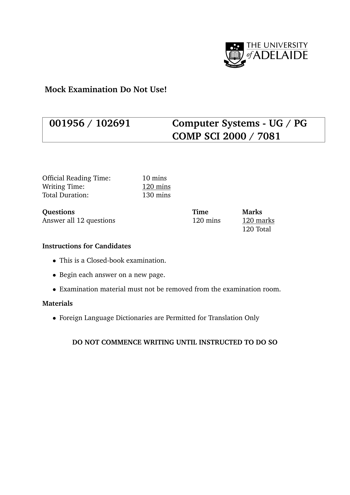

这是一份来自阿德莱德大学（The University of Adelaide）的**计算机系统课程（COMP SCI 2000 / 7081）模拟考试封面页**，上面主要写明了考试的基本信息与规定。下面是详细解释：

---

### 📘 文件内容详解

#### 标题部分

* **“Mock Examination Do Not Use!”**
意思是“模拟考试，请勿正式使用”，这表示这是一份练习试卷，不是正式考试。

#### 考试信息

* **课程编号**：001956 / 102691
* **课程名称**：Computer Systems - UG / PG（本科/研究生）
课程代码：COMP SCI 2000 / 7081

#### 考试时间安排

* **官方阅读时间（Official Reading Time）**：10分钟
→ 学生可在这10分钟内阅读试卷，但不能开始作答。
* **答题时间（Writing Time）**：120分钟（即2小时）
* **总时长（Total Duration）**：130分钟（包括阅读时间）

#### 题目与分数

* **总题数**：12题
* **总时长**：120分钟
* **总分**：120分
→ 表示每道题大概1分种答题时间、10分左右分值。

#### 考试说明（Instructions for Candidates）

* **Closed-book examination**：闭卷考试，不可携带书籍或笔记。
* **Begin each answer on a new page**：每道题需从新的一页开始作答。
* **Examination material must not be removed**：考卷及任何考试材料不得带出考场。

#### 可携带物品（Materials）

* **Foreign Language Dictionaries are Permitted for Translation Only**
允许使用外语词典，但**只能用于翻译**，不能查阅课程内容。

#### 注意事项

* 最后一行的加粗警告：
**“DO NOT COMMENCE WRITING UNTIL INSTRUCTED TO DO SO”**
意思是“在监考老师指示之前，不得开始答题”。

---

### 📄 总结归纳

这张封面页是阿德莱德大学计算机系统课程的一份**模拟考试说明页**，明确了考试形式（闭卷）、时长（130分钟）、题量（12题）、允许物品（仅翻译用词典）和规则（不能提前写、不能带出材料）。

---

### \[口语化表达]

这其实就是一张阿德莱德大学“计算机系统”课程的模拟考试封面页，告诉你考试是闭卷的，总共两个小时答题、十分钟读题，一共有12道题。不能带书，只能用翻译词典，还得一题一页写。最重要的是——监考官没让写，你就别动笔！


---

## 第 2 页

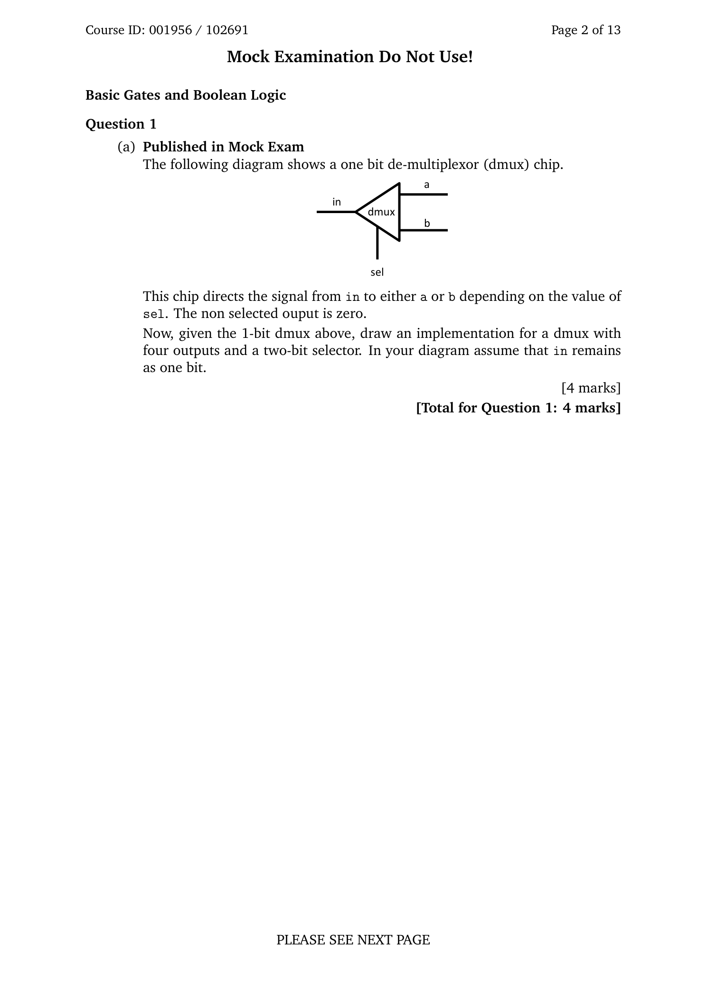

这页是阿德莱德大学《计算机系统》课程模拟考试的第1题，主要考的是**基本逻辑门与布尔逻辑（Basic Gates and Boolean Logic）**。题目是关于\*\*解复用器（de-multiplexer, 简称 dmux）\*\*的理解与扩展设计。

---

### 📘 题目详细解释

#### 题干内容

题目展示了一个**一位（1-bit）解复用器（dmux）芯片**的电路图。
图中包含：

* **输入端（in）**：输入信号；
* **选择端（sel）**：控制信号；
* **输出端（a 和 b）**：两个输出。

**工作原理**：

* dmux 的作用是：根据选择端 sel 的值，把输入信号 in 传送到 a 或 b 其中一个输出口。
* 如果 sel = 0，则信号从 in 传到 a；
* 如果 sel = 1，则信号从 in 传到 b；
* 未被选中的输出为 0。

---

#### 题目要求

在题目后半段，要求你：

> “Given the 1-bit dmux above, draw an implementation for a dmux with four outputs and a two-bit selector.”

意思是：
利用上面的一位解复用器电路，设计一个\*\*具有四个输出端（4 outputs）和一个两位选择器（2-bit selector）\*\*的解复用器。

换句话说，就是要画出一个\*\*4 路解复用器（1-to-4 dmux）\*\*的电路图。
要求假设输入 in 仍然是一位（1-bit）。

---

#### 思路提示

要实现 1→4 的 dmux，可以使用**两个 1→2 的 dmux 级联（cascade）**：

1. 首先，用第一个 dmux，根据选择信号的高位（sel1）把输入 in 分配到两条支路；
2. 然后，每条支路再通过一个 dmux，根据低位选择信号（sel0）分成两个输出；
3. 最终得到 4 个输出（比如 a、b、c、d）。

这种设计体现了**解复用器的层级构造**，常用于硬件逻辑设计中。

---

#### 分值说明

* **本题总分：4分**
* 占考试总分的 120 分中的 4 分，是一题较为基础但要求理解电路逻辑结构的题。

---

### 📄 总结归纳

这题是要你理解**解复用器（dmux）的工作原理**并**设计一个更复杂版本（4输出，2位选择信号）**。核心在于信号如何通过选择线（sel）控制输出路径。是典型的数字逻辑电路设计题。

---

### \[口语化表达]

这题其实就是考你会不会用最基本的“信号分流器”——解复用器。图上那个 1-bit dmux 就是根据 sel 的值，把 in 信号送到 a 或 b。现在它要你画个更大的版本，有四个输出和两位选择信号。你可以想象成先用一个 dmux 把信号分成两路，再用两个小 dmux 把每路再分成两路，总共四个输出。整个题就考你懂不懂 dmux 的层级逻辑结构。


---

## 第 3 页

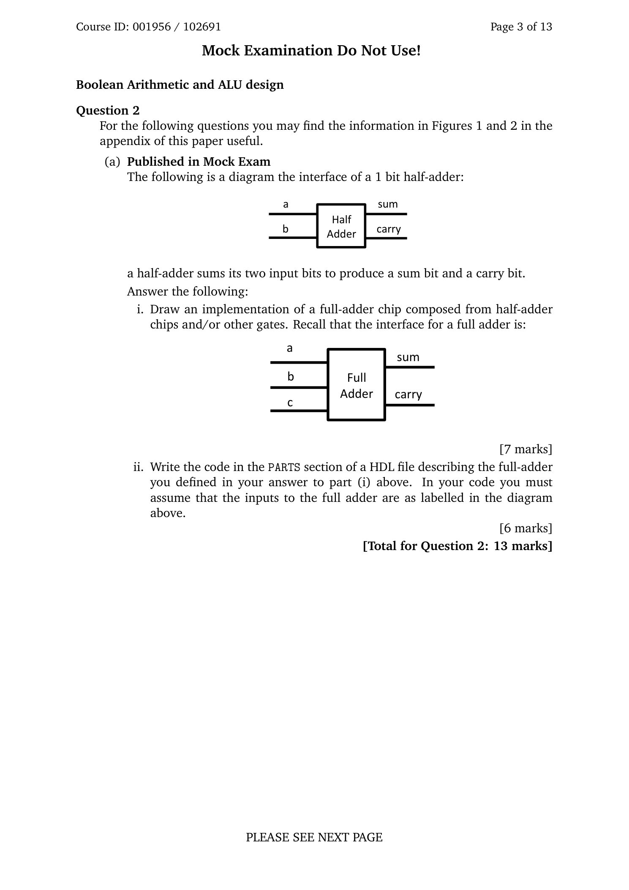

这页是《计算机系统》模拟考试的**第二题（Question 2）**，主题是**布尔算术与算术逻辑单元（Boolean Arithmetic and ALU design）**。这道题考察学生对\*\*半加器（Half Adder）与全加器（Full Adder）\*\*的理解与硬件逻辑设计实现能力。

---

### 📘 题目详细解释

#### 题目背景

本题给出了一个\*\*1位半加器（Half Adder）\*\*的接口图：

```
a ─┐
│ Half
b ─┘ Adder ──► sum
└──► carry
```

**半加器的功能：**

* 输入：两个一位二进制数 `a` 和 `b`
* 输出：

* `sum`：两输入相加的结果位（即无进位的和）
* `carry`：进位位（当两个输入都是1时输出1）

换成逻辑表达式是：

* sum = a XOR b
* carry = a AND b

---

#### 问题 (a)(i)：

> 画出一个由半加器（Half Adder）和/或其他逻辑门组成的全加器（Full Adder）电路。

全加器是半加器的扩展版，可以处理三位输入：

* a, b：两个加数
* c：来自低位的进位输入

**全加器的接口图如下：**

```
a ─┐
b ─┤ Full
c ─┘ Adder ──► sum
└──► carry
```

要用半加器实现一个全加器的常见方法如下：

1. 用第一个半加器计算 a + b，得到：

* `sum1 = a XOR b`
* `carry1 = a AND b`
2. 再用第二个半加器，把 `sum1` 与进位输入 `c` 相加：

* `sum = sum1 XOR c`
* `carry2 = sum1 AND c`
3. 最后计算总的进位输出：

* `carry = carry1 OR carry2`

**逻辑总结：**

* sum = (a XOR b) XOR c
* carry = (a AND b) OR ((a XOR b) AND c)

这个设计体现了如何通过组合两个半加器（Half Adder）构造出一个全加器（Full Adder）。

---

#### 问题 (a)(ii)：

> 用 HDL（硬件描述语言）写出 PARTS 部分的代码，实现上面你画出的全加器。

题目要求写出 HDL（Hardware Description Language）代码的 `PARTS` 段，描述全加器电路的内部组成。
例如（以 Nand2Tetris 风格的 HDL 为例）：

```hdl
CHIP FullAdder {
IN a, b, c;
OUT sum, carry;

PARTS:
HalfAdder(a=a, b=b, sum=sum1, carry=carry1);
HalfAdder(a=sum1, b=c, sum=sum, carry=carry2);
Or(a=carry1, b=carry2, out=carry);
}
```

这段代码逻辑上完全符合题目要求：

* 使用两个 HalfAdder
* 用一个 Or 门合并两个进位信号。

---

#### 分值说明

* (i) 图形设计：7分
* (ii) HDL 代码编写：6分
* **总计 13分**
这是本题在模拟考试中占比较高的分值，重点考察电路理解与硬件描述语言的应用。

---

### 📄 总结归纳

这题核心考查学生是否理解半加器与全加器的逻辑关系，以及能否利用半加器和基本逻辑门组合出全加器电路，同时能用 HDL 写出对应实现。它融合了布尔逻辑、数字电路设计和硬件编程的知识点。

---

### \[口语化表达]

这题其实就是让你从半加器入手，搭一个能处理三位输入的全加器。半加器只能加两位，结果是 sum 和 carry；而全加器要多考虑一个进位输入 c。做法是用两个半加器连起来，第一个算 a 和 b，第二个算结果和 c，最后用一个 OR 门把两个进位信号合并。最后还要写出 HDL 代码，基本上就是把你画的电路用代码描述出来。


---

## 第 4 页

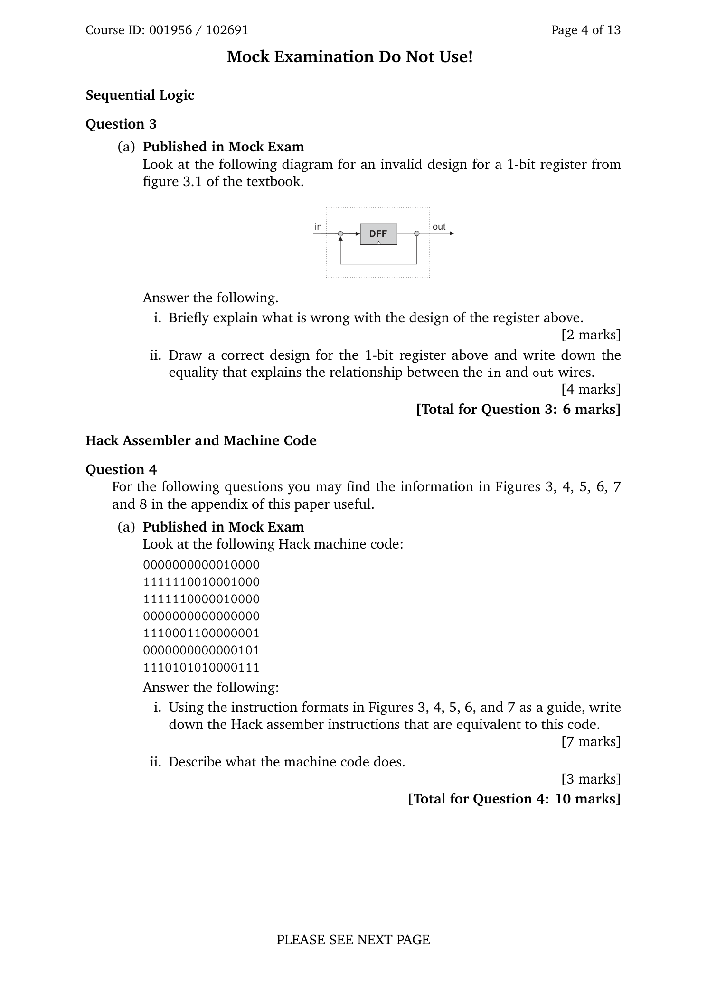

这页是模拟考的第 3、4 题，分别考\*\*时序逻辑（Sequential Logic）\*\*和 **Hack 汇编与机器码（Hack Assembler and Machine Code）**。下面按题目逐段解释。

---

## Question 3 — Sequential Logic（6 分）

### 题干含义

给了一个**无效的 1-bit 寄存器设计**示意图（方框里是 D 触发器 DFF，标有输入 in 和输出 out），并要求：

1. **说明哪里错了**（2 分）
2. **画出正确的 1-bit 寄存器电路**，并写出 in 与 out 的**时序关系式**（4 分）

### 为什么“无效”

图中把 **out 又回接到了 DFF 的输入**（或经错误连线回灌到 D 端），结果是 DFF 每个时钟沿都把**自己当前的输出**再“灌回”作为下一拍的输入。

* 这样会**忽略外部 in**，寄存器会“自保持”：`out(t+1) = out(t)`，而不是应该的 `out(t+1) = in(t)`。
* 对 1-bit 寄存器来说，正确行为是：**下一拍输出等于这一拍输入**；回灌会破坏这个行为。

### 正确的 1-bit 寄存器

* 直接把 **in 连到 DFF 的 D 端**，**out 取自 Q 端**；**不要**把 Q 回接到 D。
* 正确的时序等式可写为：

* **离散时序写法**：`out(t+1) = in(t)`
* 或用“上一拍”描述：`out(t) = in(t−1)`（具体写哪个取决于课本的记号）

> （若课程版本带“load”信号的寄存器，则正确做法是：`Mux(in, out, sel=load) -> DFF`。当 `load=1` 时加载 `in`，当 `load=0` 时保持旧值。这里题面没有提到 load，所以用最基础的 DFF 直连 in 即可。）

---

## Question 4 — Hack Assembler and Machine Code（10 分）

### 题干含义

给出一段 **Hack 机器码**（每行 16 位二进制），要求：

1. **把机器码逐行翻译成 Hack 汇编指令**（7 分）
2. **用自然语言说明这段机器码的功能**（3 分）

题目提醒可参考附录图 3–8 中的**指令格式**。标准 Hack 指令只有两类：

* **A 指令**：`0vvvvvvvvvvvvvvv`

* 最高位为 0，其余 15 位是数值 v
* 汇编形式：`@v`（把常数 v 装入寄存器 A）
* **C 指令**：`111 a c1..c6 d1 d2 d3 j1 j2 j3`

* 最高三位 `111` 固定，后面字段分别是计算（comp）、目的寄存器（dest）、跳转（jump）
* 汇编形式：`dest=comp;jump`（`dest` 或 `;jump` 可省略）

### 你要做的事（解题流程）

1. **逐行判断指令类型**：

* 行首是 `0` → A 指令 → 直接转成 `@十进制值`
* 行首是 `111` → C 指令 → 按表格把 comp/dest/jump 位译成助记符（如 `D|M`、`D=A`、`JGE` 等）
2. **写出等价的 Hack 汇编**：每行二进制对应一行汇编。
3. **整体说明程序做了什么**：

* 结合出现的 `@常量/@符号`、`D=A/D=M/M=D`、`跳转` 等，描述它是加载常数、读写内存、做算术/逻辑，还是形成循环与条件分支。
* 例如常见模式：

* `@n` / `D=A` / `@addr` / `M=D` → 把常数 n 写到某内存地址
* `D=M` / 算术 / `M=D` → 从内存取值、计算、再写回
* `D;JGT` / `@label` → 条件跳转等

> 由于题面只给了二进制串而未附上 comp/dest/jump 的对照表，本页并不要求你在这里给出具体汇编答案；真实作答时，按附录的指令编码表逐位翻译即可。

---

## \[口语化表达]

第 3 题就是告诉你：图里这个 1 位寄存器画错了，因为把输出又绕回输入，结果寄存器只会自己保持，不会去“采样”外部 in。正确做法很简单——把 in 直接送进 DFF 的 D 端，out 从 Q 拿，关系就是下一拍的 out 等于这一拍的 in。
第 4 题给了几行 Hack 的机器码，让你按指令格式把它们一行行翻成 Hack 汇编（A 指令看最高位 0，C 指令看最高三位 111，再用表查 comp/dest/jump），最后用几句话说明这段程序具体在干嘛，比如加载常数、读写内存、做计算或跳转。


---

## 第 5 页

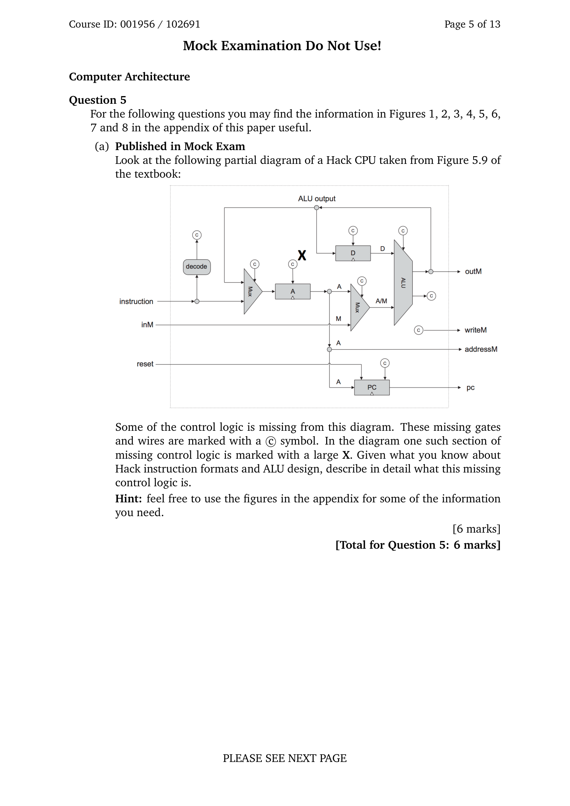

这页是**第5题（Computer Architecture）**，给出一张取自课本 Fig.5.9 的 **Hack CPU 部分数据通路图**。图中用 **©** 标记了若干“缺失的控制逻辑/连线”，其中有一处被一个大写 **X** 特别标出。题目要求根据你对 **Hack 指令格式** 与 **ALU 设计** 的了解，**详细说明这些缺失控制逻辑是什么、应如何工作**。（本题 6 分）

---

## 题目在说什么

* **instruction**：本周期取到的 16 位指令。
* **decode**：解码单元（从 instruction 里拆出控制位）。
* **A / D / M（内存）寄存器**：数据目的地；`A` 也作为地址输出到 `addressM` 和 `pc` 相关单元。
* **ALU**：计算单元，接收 `x、y` 两个输入，输出 `ALU output` 及状态位 `zr`（是否为 0）、`ng`（是否为负）。
* **outM / writeM / addressM**：对内存的写数据、写使能、地址。
* **PC**：程序计数器，有 `inc`（+1）、`load`（装入 A）、`reset`。
* 图上 **A/M** 选择器：把 ALU 的 `y` 输入在 `A` 与 `M`（即 `inM`）之间切换。

---

## 缺失的控制逻辑（包括 X 处）应该是什么

### 1) 指令类型与基本字段（来自 decode）

Hack 只有两类指令：

* **A 指令**：`0 vvvvvvvvvvvvvvv` → `@v`
* **C 指令**：`111 a c1..c6 d1 d2 d3 j1 j2 j3`

* `a,c1..c6` → **ALU 控制位**（`zx,nx,zy,ny,f,no`）
* `d1 d2 d3` → **目的寄存器使能**（`D、A、M`）
* `j1..j3` → **跳转条件**（`JGT, JEQ, …, JMP`）

> 因此，**decode** 必须输出：
>
> * `zx,nx,zy,ny,f,no`（送 ALU）
> * `selAM`（选择 ALU 的 y：`a=0 → A`，`a=1 → M`）
> * `loadD, loadA, writeM`（由 `d1,d2,d3` 直接得到）
> * `jump[2:0]`（`j1..j3`），以及 `isAInstr`（`instruction[15]==0`）

### 2) **X 所在的缺失块**（A 寄存器输入选择 + 目的写使能整合）

在标准 Hack CPU 里，**A 寄存器的输入需要一个二选一的多路器**：

* 当是 **A 指令**：`A <- instruction[0..14]`
* 当是 **C 指令且 dA=1**：`A <- ALUout`
* 当 **C 指令且 dA=0**：A 保持（不写）

因此，**X 处的控制逻辑**应当生成：

* **A-input MUX 选择信号**：`sel_Ain = isAInstr ? 0 : 1`

* `0` 选 **指令低 15 位**，`1` 选 **ALU 输出**
* **A 寄存器 load 使能**：`loadA = isAInstr OR (isCInstr AND d2)`

* `isCInstr = ~isAInstr`，`d2` 是 C 指令的第二个 dest 位（A）

同时，**D 寄存器的写使能**直接由 `d1` 产生：`loadD = isCInstr AND d1`；
**内存写使能**：`writeM = isCInstr AND d3`，并且

* `outM = ALU output`
* `addressM = A`（由 A 寄存器提供）

> 小结：X 模块把“**A 指令装入 A**”与“**C 指令把 ALU 结果写入 A**”这两种来源**合并**到 A 的输入，同时结合 dest 位产生 **A/D/M** 的写使能。

### 3) ALU 输入与控制

* **y 端选择（A/M）**：`selAM = a`（C 指令中的 `a` 位；A 指令不使用 ALU）

* `0 → y=A`，`1 → y=M(inM)`
* **ALU 六个控制位**：由 `c1..c6` 解码为 `zx,nx,zy,ny,f,no`，直接连到 ALU。

### 4) 跳转控制（PC 的装入/自增/复位）

* \*\*缺失连线（©）\*\*之一是 **PC 的 load 控制**：
由 `jump[2:0]` 与 ALU 标志位 `zr`、`ng` 组合：

* 定义：`pos = ~ng & ~zr`，`zero = zr`，`neg = ng`
* 典型条件（与课本一致）：

* `JGT(001)`：`pos`
* `JEQ(010)`：`zero`
* `JGE(011)`：`pos OR zero`
* `JLT(100)`：`neg`
* `JNE(101)`：`~zero`
* `JLE(110)`：`neg OR zero`
* `JMP(111)`：恒真
* 若条件满足：`PC.load=1`，**PC 从 A 装入**；否则 `PC.inc=1`（顺序执行）。
* **reset**：外部复位信号把 `PC` 置 0（图上已有端口，连线标 ©）。

---

## 作答要点（写成文字说明即可）

1. 说明 **decode** 产生的全部控制信号：ALU 六位、A/M 选择、dest 三位、jump 三位、指令类型位。
2. 详细给出 **X 块** 的**A 输入多路器 + A/D/M 写使能**的逻辑关系式：

* `sel_Ain = isAInstr ? 0 : 1`
* `loadA = isAInstr OR (isCInstr AND d2)`
* `loadD = isCInstr AND d1`
* `writeM = isCInstr AND d3`
3. 给出 **PC/jump** 的组合逻辑（基于 `ng,zr` 与 `j1..j3`），并指出满足时 `PC.load=1`，否则 `PC.inc=1`。
4. 交代 `outM = ALUout`，`addressM = A`，`inM` 作为 `M` 的读数进入 ALU（当 `a=1`）。

---

## \[口语化表达]

这题让你看一张 Hack CPU 的半成品图，图里缺了几根控制线和几个小模块，尤其是中间标了个大大的 X。你要做的，就是把 Hack 指令怎么控制数据通路说清楚：A 指令就把指令里的 15 位数装进 A；C 指令用 `a,c1..c6` 控制 ALU，用 `d1 d2 d3` 决定把结果写到 D/A/M；`a` 决定 ALU 的 y 口用 A 还是内存 M。X 的位置其实就是“**A 寄存器入口的二选一 + 写使能**”：A 指令选指令数值并写 A，C 指令若 `dA=1` 就把 ALU 结果写 A；同时 `dD` 控制写 D，`dM` 控制写内存（`outM=ALUout, addressM=A`）。最后用 ALU 的 `zr/ng` 和 `j1..j3` 做跳转判断，真了就 `PC.load` 从 A 跳转，否则 `PC.inc` 顺序走，`reset` 让 PC 回 0。整页图就是要你把这些控制关系一口气说明白。


---

## 第 6 页

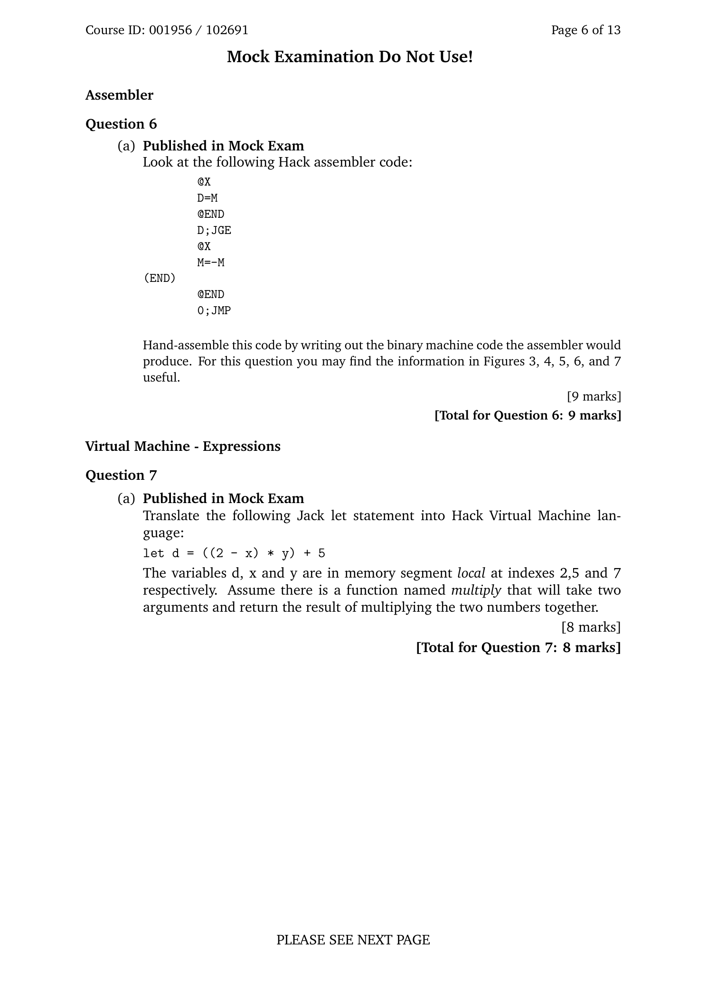

这页包含两道题：

* **Question 6：Assembler（汇编器）**
* **Question 7：Virtual Machine - Expressions（虚拟机表达式）**
它们属于 Hack 计算机系统课程中的汇编和虚拟机部分。

---

## 🧩 Question 6 — Assembler（9分）

### 题目内容

给出一段 Hack 汇编代码：

```
@X
D=M
@END
D;JGE
@X
M=M-1
(END)
@END
0;JMP
```

要求你“手动汇编”成机器码，也就是把这段汇编**翻译成 16 位二进制指令**（assembler 的输出）。

---

### 详细解释

#### (1) 代码含义逐行说明

| 行号 | 汇编代码    | 含义说明                                                    |
| -- | ------- | ------------------------------------------------------- |
| 1  | `@X`    | A 指令，将符号 X 的地址加载到 A 寄存器中（如果是变量，会在汇编时分配 RAM 地址，从 16 开始）。 |
| 2  | `D=M`   | 把当前 A 指向的内存单元内容复制到 D 寄存器。                               |
| 3  | `@END`  | 把标签 END 的地址装入 A 寄存器。                                    |
| 4  | `D;JGE` | 若 D ≥ 0（非负），则跳转到 A 当前值（即 END）。                          |
| 5  | `@X`    | 再次加载符号 X 的地址。                                           |
| 6  | `M=M-1` | 对 X 所指内存单元的值减 1。                                        |
| 7  | `(END)` | 定义标签 END 的位置（不会转译为机器码，只做标记）。                            |
| 8  | `@END`  | 再次加载 END 标签地址。                                          |
| 9  | `0;JMP` | 无条件跳转到 END（死循环保持程序停止）。                                  |

---

#### (2) 对应机器码格式

Hack 指令分两类：

* **A 指令**：`0 vvvvvvvvvvvvvvv`（后 15 位是地址或常量）
* **C 指令**：`111 a c1..c6 d1 d2 d3 j1 j2 j3`

因此：

* `@X` → A 指令（二进制中符号由汇编器替换为具体地址）
* `D=M`、`M=M-1`、`D;JGE`、`0;JMP` → 都是 C 指令

你需要根据 Hack 指令表查出这些 C 指令的二进制形式，例如：

* `D=M` → `1111110000010000`
* `D;JGE` → `1110001100000011`
* `M=M-1` → `1111110010001000`
* `0;JMP` → `1110101010000111`

最终输出类似：

```
0000000000010000   // @X (假设 X=16)
1111110000010000   // D=M
0000000000010001   // @END (假设 END=17)
1110001100000011   // D;JGE
0000000000010000   // @X
1111110010001000   // M=M-1
0000000000010001   // @END
1110101010000111   // 0;JMP
```

（符号地址由汇编器在第二遍解析时替换）

---

## 💻 Question 7 — Virtual Machine - Expressions（8分）

### 题目内容

要求将以下 Jack 语言语句翻译成 Hack VM 代码：

```
let d = ((2 - x) * y) + 5
```

已知：

* `d`、`x`、`y` 分别在 `local` 段索引 2、5、7；
* 有函数 `multiply`，接收两个参数，返回相乘结果。

---

### 翻译步骤

1. **计算 (2 - x)**

```vm
push constant 2
push local 5
sub
```

此时栈顶为 (2 - x)

2. **与 y 相乘**（调用 multiply 函数）

```vm
push local 7
call multiply 2
```

函数 multiply(2) 表示传入两个参数，返回结果在栈顶。

3. **再加上 5**

```vm
push constant 5
add
```

栈顶现在是 ((2 - x) \* y) + 5

4. **存入 local 2 (变量 d)**

```vm
pop local 2
```

---

### 最终 VM 代码

```vm
push constant 2
push local 5
sub
push local 7
call multiply 2
push constant 5
add
pop local 2
```

每一行 VM 指令都能映射到底层汇编执行的栈操作与函数调用。

---

## \[口语化表达]

第6题是让你手动把一段 Hack 汇编代码转成机器码。也就是说，每条 `@X`、`D=M`、`M=M-1` 都要变成16位二进制。`@` 开头的是 A 指令（0 开头），其他是 C 指令（111 开头，后面是计算、存储和跳转控制位）。最后那段程序逻辑是：如果变量 X 的值 ≥ 0，就跳到 END，否则把 X 减1，然后再无条件跳回 END，形成一个小循环。

第7题是把 Jack 语言的 `let d = ((2 - x) * y) + 5` 翻成虚拟机（VM）代码。做法是先把 2 和 x 压栈做减法，再把 y 压栈，调用 multiply 函数算乘积，然后再压入常数 5 相加，最后把结果弹出到 local 2（也就是变量 d）。整体就是一步步用栈实现表达式计算。


---

## 第 7 页

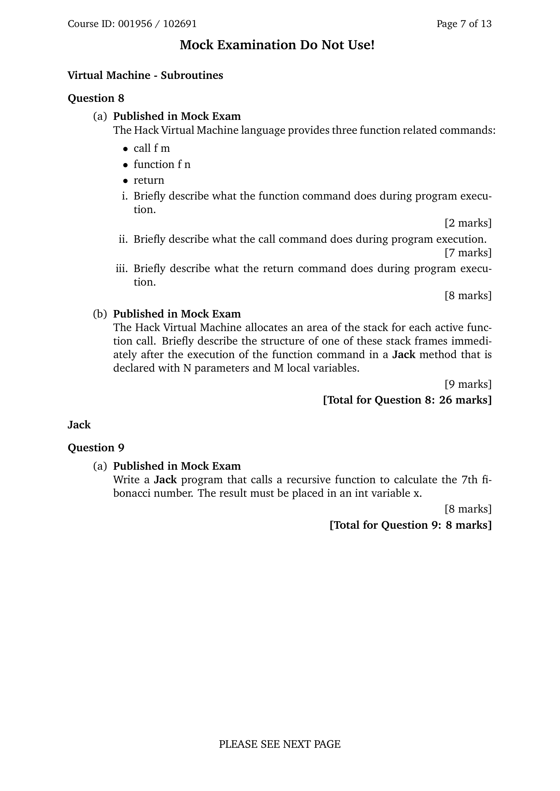

这页包含 **Question 8（虚拟机——子程序）** 和 **Question 9（Jack）** 两题，考查 Hack VM 的 *function / call / return* 语义、调用栈结构，以及用 Jack 写递归函数。

---

## Question 8 — Virtual Machine: Subroutines（共 26 分）

### (a) 三个与函数相关的命令（8 分）

题干：VM 语言里有三条与函数相关的命令：

* `call f m`
* `function f n`
* `return`

要求分别**简要说明**它们在**程序执行时**做了什么。

**i. `function f n`（2 分）**
在“函数入口处”执行，用来**进入函数体并初始化本地变量**。其行为：

1. 在当前地址处定义标签 `f`（函数入口）。
2. 在栈上**压入 n 个 0**，从而把 `local` 段的 `local 0..local n-1` 初始化为 0。

> 注意：`ARG/LCL` 等基址由 *call* 指令在调用前已设置好，`function` 本身不改变它们（除了通过压 n 个 0 使 SP 前进）。

**ii. `call f m`（7 分）**
在**调用点**执行，负责**建立被调函数的新栈帧并转移控制**：

1. 把**返回地址**压栈；
2. 依次**保存**当前 `LCL, ARG, THIS, THAT` 到栈；
3. 计算新实参基址：`ARG = SP - 5 - m`（m 是实参个数，5 是上面保存的 5 个条目）；
4. 令 `LCL = SP`（新栈帧基址）；
5. 跳转到函数 `f`（`goto f`）。

> 跳转后，控制流到达 `function f n` 的入口，随后由它压入 n 个 0 初始化本地变量。

**iii. `return`（8 分）**
在**函数返回点**执行，负责**把返回值交还调用者并恢复调用者环境**：

1. `frame = LCL`（暂存当前帧基址）；
2. `ret = *(frame-5)`（取出返回地址）；
3. `*ARG = pop()`（把返回值放到调用者的栈顶位置，即 `ARG` 指向处）；
4. `SP = ARG + 1`（恢复调用者的栈顶）；
5. 依次恢复寄存器：

* `THAT = *(frame-1)`
* `THIS = *(frame-2)`
* `ARG  = *(frame-3)`
* `LCL  = *(frame-4)`
6. `goto ret`（跳回调用点之后）。

---

### (b) Jack 方法的栈帧结构（9 分）

题干：VM 为每次函数调用在栈上分配一块**栈帧**。要求**简要描述**：在 **Jack 的一个 *方法***（method）里，声明有 **N 个参数**、**M 个局部变量**，当执行完 `function` 命令**刚刚**进入函数体后，这个栈帧长什么样。

**关键点：**

* `call` 建帧：压入 `[return, LCL, ARG, THIS, THAT]`，设置 `ARG = SP - 5 - N`，`LCL = SP`。调用者事先已把 **N 个参数**按顺序压在栈上。
* `function f M`：在入口压 **M 个 0**，初始化 `local 0..M-1`。

**此刻（function 执行完后）的内存/栈布局（自下而上，概念示意）：**

```
... （更底下是调用者自己的数据）
arg0  arg1  ...  arg(N-1)   return   LCL(saved)  ARG(saved)  THIS(saved)  THAT(saved)   local0 ... local(M-1)
^ARG                                                                             ^LCL                             ^SP
```

* **ARG** 指向 `arg0`；`arg0` 在 **Jack 方法**中通常是**隐式的 this**（对象引用）。编译器会在函数体开头把 `THIS` 设为 `ARG 0`，常见序列是：`push argument 0` / `pop pointer 0`。
* **LCL** 指向当前帧基址；
* **SP** 位于 `local(M-1)` 之上（因为刚压完 M 个 0）。
* 通过 `dest=local/argument/this/that` 可相对基址访问这些段。

---

## Question 9 — Jack（共 8 分）

题干：**写一个 Jack 程序**，调用**递归函数**来计算**第 7 个斐波那契数**，并把结果放在 `int x` 中。

**含义与要点：**

* 需要写一个递归函数 `fib(int n)`：

```
if (n < 2) return n;
else return fib(n-1) + fib(n-2);
```
* 在某个入口（如 `Main.main`）里调用 `let x = fib(7);`。
* 评分重点：**递归调用正确**、**返回值正确**、**变量 x 赋值正确**。
* 若是 *方法* 而非 *函数*，要注意 `this` 的设定；一般写在 `class Main` 的 `function` 里即可。

**示例（思路范例，便于理解题意）：**

```jack
class Main {
function void main() {
var int x;
let x = Fib(7);
// 可选：输出或其他处理
return;
}

function int Fib(int n) {
if (n < 2) { return n; }
return Fib(n-1) + Fib(n-2);
}
}
```

> 作答时写出等价的 Jack 代码即可；不要求打印，只要把结果存进变量 `x`。

---

## \[口语化表达]

第 8 题就是考你会不会说清楚 VM 的三板斧：`call` 负责“把返回地址和各段指针压栈→算好 ARG→设 LCL→跳到函数”；`function` 在函数入口“打标签并把 M 个 0 压栈当本地变量”；`return` 则“把返回值放到调用者那、恢复 THAT/THIS/ARG/LCL、跳回返回地址”。然后让你描述一下**方法**的栈帧：参数 N 个（`argument` 段，`argument 0` 通常就是 `this`），上面是 5 个保存项（return/LCL/ARG/THIS/THAT），再往上是 M 个全 0 的本地变量，`LCL` 指向当前帧，`ARG` 指向第一个参数，`SP` 在 locals 之上。第 9 题则要你用 Jack 写个递归 `Fib`，在 `main` 里算 `Fib(7)` 并把结果存到 `x`，核心就是标准的 `n<2` 返回 n，否则返回 `Fib(n-1)+Fib(n-2)`。


---

## 第 8 页

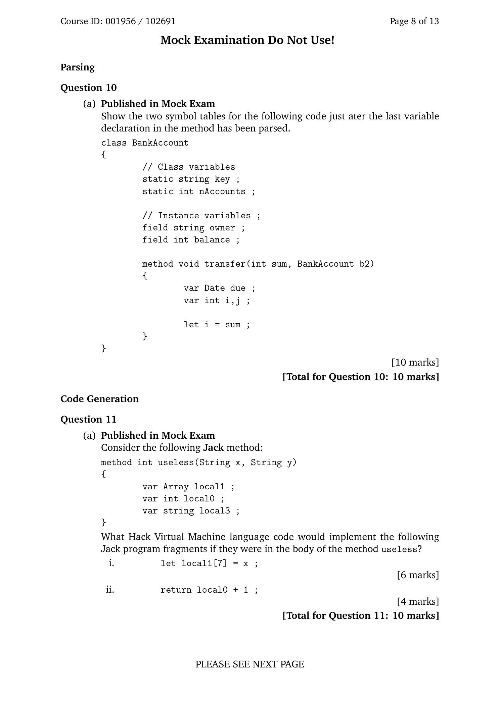

这页包含两题：

* **Question 10 — Parsing（语法分析）**
* **Question 11 — Code Generation（代码生成）**
主要考察 Jack 编译器的符号表结构与虚拟机代码生成原理。

---

## 🧱 Question 10 — Parsing（10分）

### 题目内容

要求根据给定 Jack 类 **BankAccount** 的代码，展示在解析到方法 `transfer()` 的最后一个变量声明（`var int i, j;`）后，**类级符号表**与**子程序级符号表**的内容。

代码如下：

```jack
class BankAccount {
// Class variables
static string key;
static int nAccounts;

// Instance variables
field string owner;
field int balance;

method void transfer(int sum, BankAccount b2) {
var Date due;
var int i, j;

let i = sum;
}
}
```

---

### 详细解析

Jack 编译器在编译阶段会为每个类和方法分别维护两个符号表：

#### 1️⃣ 类级符号表（Class Symbol Table）

存储类中声明的 `static` 和 `field` 变量。

| Name      | Type   | Kind   | Index |
| --------- | ------ | ------ | ----- |
| key       | string | static | 0     |
| nAccounts | int    | static | 1     |
| owner     | string | field  | 0     |
| balance   | int    | field  | 1     |

解释：

* static 变量是**类级别共享**的；
* field 变量是**实例级别**的，每个对象都有自己的副本；
* Index 是在各自类别中分配的序号。

---

#### 2️⃣ 子程序级符号表（Subroutine Symbol Table）

存储该方法的参数（argument）与局部变量（var）。

| Name | Type        | Kind     | Index |
| ---- | ----------- | -------- | ----- |
| this | BankAccount | argument | 0     |
| sum  | int         | argument | 1     |
| b2   | BankAccount | argument | 2     |
| due  | Date        | var      | 0     |
| i    | int         | var      | 1     |
| j    | int         | var      | 2     |

解释：

* 因为 `transfer` 是 **method**（方法），隐含有一个参数 `this` 指向调用对象；
* `sum` 与 `b2` 是方法形参；
* `due`, `i`, `j` 是局部变量；
* 编译器会依此分配索引编号。

---

✅ **解析完成后编译器状态：**

* 类符号表有 4 个条目；
* 方法符号表有 6 个条目（含隐式 this）。

---

## 💻 Question 11 — Code Generation（10分）

### 题目内容

给出以下 Jack 方法：

```jack
method int useless(String x, String y) {
var Array local1;
var int local0;
var string local3;
}
```

要求写出当方法体中包含以下语句时，对应的 Hack VM 代码。

---

### (i) `let local1[7] = x;`（6分）

思路：

* `local1` 是数组的基址；
* `x` 是第一个参数（argument 0）；
* 目标是：计算 `local1 + 7` → 存入该位置 `M = x`。

Hack VM 实现：

```vm
push local 1      // push base address of local1
push constant 7   // index 7
add               // compute local1 + 7
push argument 0   // value of x
pop temp 0        // store x temporarily
pop pointer 1     // set THAT = base+7
push temp 0       // reload value x
pop that 0        // THAT[0] = x
```

说明：

* 访问数组时，VM 要先把地址算出来，再把它放入 `pointer 1`（THAT）；
* 最后通过 `that 0` 写入。

---

### (ii) `return local0 + 1;`（4分）

思路：

* 取出 `local0`（局部变量 0）；
* 加上常数 1；
* 把结果留在栈顶，然后执行返回。

Hack VM 实现：

```vm
push local 0
push constant 1
add
return
```

---

## \[口语化表达]

第 10 题是让你画出编译器在分析完 `transfer()` 方法变量声明后生成的两个符号表。类符号表放 `static` 和 `field`（key、nAccounts、owner、balance），方法符号表放参数（this、sum、b2）和局部变量（due、i、j）。这样编译器就知道每个名字的类型、作用域和在内存中的索引位置。
第 11 题是让你把两段 Jack 语句转成虚拟机代码。`let local1[7] = x` 就是计算数组偏移地址、设置 THAT，然后把 x 的值写进去；`return local0 + 1` 就是取出 local0，加 1，然后返回。整个题考的是你能不能把高级语句转成底层 VM 操作序列。


---

## 第 9 页

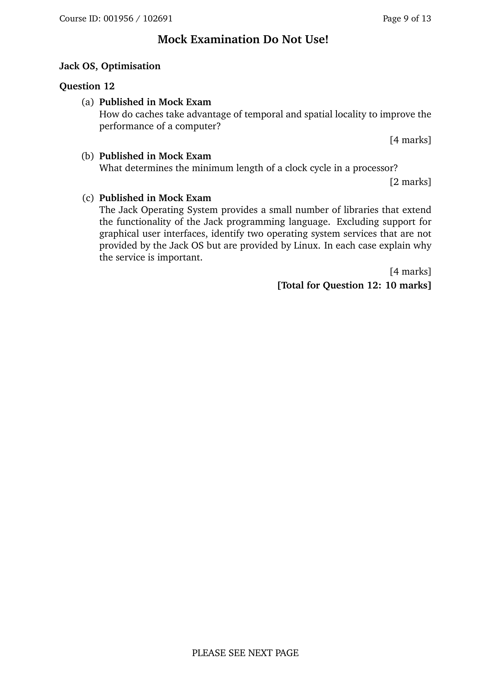

这页是**Question 12（Jack OS，性能优化）**，共 10 分，分为 (a)(b)(c) 三小题，分别考缓存的局部性、时钟周期下限、以及 Jack OS 与 Linux 提供服务的差异。下面逐题解释与作答思路：

---

## (a) 缓存如何利用时间/空间局部性提升性能？（4 分）

* **时间局部性（Temporal locality）**：程序倾向于**短时间内重复访问同一数据或指令**。缓存把**最近用过**的块保留在快速存储（L1/L2），下一次再访问命中缓存，避免去慢速的主存。

* 例：循环体中的变量、最近调用过的函数指令。

* **空间局部性（Spatial locality）**：程序访问**相邻地址**的概率更高。缓存以“**块/行（cache line）**”为单位载入（一次把一段连续地址一起带上来），后续访问邻近数据可直接命中这条缓存行。

* 例：顺序遍历数组、顺序执行指令。

> 综上：缓存通过\*\*保留“最近用过”**的数据（时间局部性）和**一次性取回“邻近”\*\*的数据（空间局部性），减少慢速主存访问次数与平均访存延迟，从而提升整体性能。

---

## (b) 处理器最小时钟周期由什么决定？（2 分）

**最小时钟周期 = 临界路径（critical path）总延迟 + 触发器时序开销**。
形式化地说（概念即可）：

* `Tclk ≥ Tclk→q + Tcomb(max) + Tsetup + Tskew(+Tjitter)`

* `Tcomb(max)`: **最长组合逻辑**路径的延迟（决定临界路径）；
* `Tclk→q`: 触发器时钟到输出延迟；`Tsetup`: 建立时间；
* `Tskew / Tjitter`: 时钟偏斜与抖动裕量。

> 想把时钟做得更快，需要**缩短临界路径**（优化电路/门级延迟、降低扇出、上流水线等）。

---

## (c) Jack OS 没有而 Linux 提供的两项操作系统服务（不含 GUI），并说明重要性（4 分）

> Jack OS（Nand2Tetris 提供的教学用 OS）只有极少的库：如 `Math/Array/String/Memory/Screen/Keyboard/Output/Sys`，不包含真实 OS 的很多功能。

举两项常见而 Jack OS **不提供**、而 Linux **提供**的服务，并说明意义：

1. **进程/线程管理与调度（Process/Thread Scheduling）**

* **Linux**：支持多进程/多线程、时间片调度、阻塞/唤醒、信号与 IPC 等，实现并发与资源隔离。
* **重要性**：让多个程序**公平且响应**地共享 CPU，提高系统吞吐与交互性；没有调度就难以运行并发工作负载。

2. **持久化文件系统（File System）及权限/用户管理**

* **Linux**：提供分层目录、文件/设备节点、权限（rwx / UID/GID）、多种文件系统（ext4、xfs…）。
* **重要性**：支持**长期保存数据**、多用户共享与安全控制、原子性与可靠性（缓冲、日志），是通用计算平台的基础。

（也可写成：**内存保护与虚拟内存**、**网络协议栈**等，均为 Jack OS 所缺，但 Linux 具备。）

---

# \[口语化表达]

(a) 缓存加速的秘诀就两点：**刚用过的很可能还会用**（时间局部性），所以先把它留在快缓存里；**地址挨得近的常一起用**（空间局部性），所以一次把一整条“缓存行”搬进来，后面访问邻居就直接命中。
(b) 时钟周期能多短，卡在**最长那条组合逻辑链路**上，还得加上触发器的建立时间、时钟到输出延迟和一点时钟偏斜/抖动裕量；想更快就得**缩短临界路径或多流水**。
(c) Jack OS 很轻量，没啥系统服务；Linux 则有一大堆。比如**进程/线程调度**（让多个程序并发而不互相抢烂）和**文件系统+权限**（能把数据长期存好、多人安全共享）。这些都是通用操作系统不可或缺的功能。


---

## 第 10 页

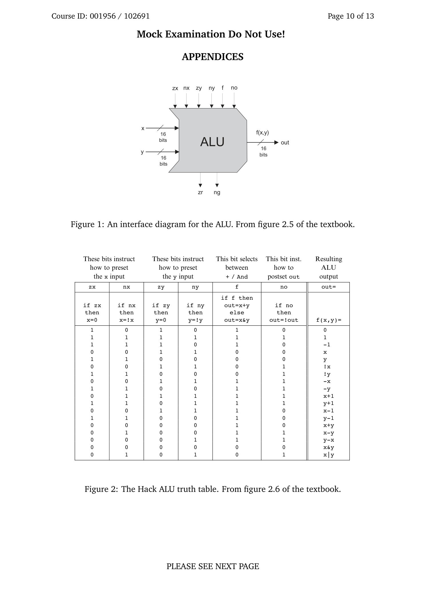

这页是试卷附录的一部分，展示了 **Hack 计算机系统中的 ALU（算术逻辑单元）接口与真值表**。这些内容来自教材《The Elements of Computing Systems》（Nand2Tetris）第 2 章的图 2.5 与 2.6，用于帮助学生回答与 ALU 相关的题目。

---

## 🧠 图 1 — ALU 接口图（Interface Diagram）

### 结构说明

图中显示了一个 16 位 ALU（Arithmetic Logic Unit）的输入输出接口：

* **输入端：**

* `x`、`y`：两个 16 位输入信号；
* 控制位共 6 个：
`zx, nx, zy, ny, f, no`

* **zx**：若为 1，则将 x 置为 0；
* **nx**：若为 1，则将 x 取反；
* **zy**：若为 1，则将 y 置为 0；
* **ny**：若为 1，则将 y 取反；
* **f**：若为 1，则执行加法（x + y）；若为 0，则执行按位与（x & y）；
* **no**：若为 1，则对结果取反（输出 = !out）。

* **输出端：**

* `out`：16 位运算结果；
* `zr`：若输出为 0，则 zr=1；
* `ng`：若输出为负，则 ng=1。

### 功能总结

通过不同的 6 位控制组合，ALU 可以实现包括常数、复制、加法、减法、取反、逻辑运算等在内的所有基本算术逻辑操作。

---

## 🧮 图 2 — Hack ALU 真值表（Truth Table）

下表列出了各控制位组合对应的运算结果：

| zx | nx | zy | ny | f | no | 结果（out = f(x, y)） |
| -- | -- | -- | -- | - | -- | ----------------- |
| 1  | 0  | 1  | 0  | 1 | 0  | 0                 |
| 1  | 1  | 1  | 1  | 1 | 1  | 1                 |
| 1  | 1  | 1  | 0  | 1 | 0  | -1                |
| 0  | 0  | 1  | 1  | 1 | 0  | x                 |
| 1  | 1  | 0  | 0  | 1 | 0  | y                 |
| 0  | 0  | 1  | 1  | 1 | 1  | !x                |
| 1  | 1  | 0  | 0  | 1 | 1  | !y                |
| 0  | 0  | 1  | 1  | 0 | 0  | -x                |
| 1  | 1  | 0  | 0  | 0 | 0  | -y                |
| 0  | 1  | 1  | 1  | 1 | 1  | x + 1             |
| 1  | 1  | 0  | 1  | 1 | 1  | y + 1             |
| 0  | 0  | 1  | 1  | 1 | 0  | x - 1             |
| 1  | 1  | 0  | 0  | 1 | 0  | y - 1             |
| 0  | 0  | 0  | 0  | 1 | 0  | x + y             |
| 0  | 1  | 0  | 0  | 1 | 1  | x - y             |
| 0  | 0  | 0  | 1  | 1 | 1  | y - x             |
| 0  | 0  | 0  | 0  | 0 | 0  | x & y             |
| 0  | 1  | 0  | 1  | 0 | 1  | x \| y            |

> 这张表是 Hack 体系结构的核心之一，说明 ALU 的六个控制位如何组合出不同的运算功能。

---

### 运行原理总结

1. 控制位决定对输入 x、y 的**预处理（清零/取反）**；
2. 再由 `f` 决定执行**加法还是与运算**；
3. 最后 `no` 可对结果取反；
4. 输出结果及其符号状态（zr, ng）供 CPU 控制逻辑使用。

---

## \[口语化表达]

这一页其实就是 Hack 计算机那块 ALU（算术逻辑单元）的“操作说明书”。上半部分图告诉你 ALU 有两个 16 位输入 x 和 y，还有 6 个控制信号（zx、nx、zy、ny、f、no），用来决定要不要清零、取反、做加法或按位与、以及是否对结果取反。下半张表是所有组合的结果清单，比如哪一组控制位可以算出 x+y、x-1、x|y、!x 等等。简单来说，这页就是教你**如何用 6 个控制位让 ALU 变成一台“万能计算器”**。


---

## 第 11 页

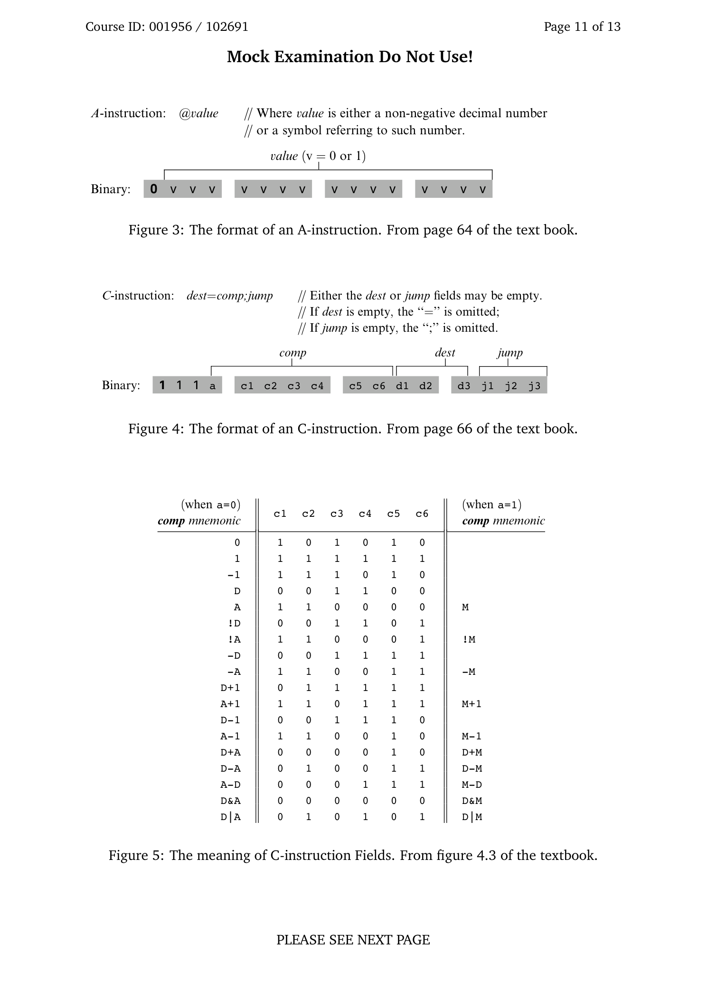

这页是 Hack 汇编语言（Hack Assembly Language）指令格式的附录说明。主要讲两种指令类型：**A 指令（Address instruction）** 和 **C 指令（Computation instruction）**，以及它们在机器码（二进制）中的编码方式。
这些内容对应教材《The Elements of Computing Systems》第 4 章的内容。

---

## 🧩 A 指令（A-instruction）

### 语法：

```
@value
```

其中：

* `value` 是一个**非负整数**或**符号（变量名/标签名）**；
* 作用是把 `value` 送入寄存器 **A**（即 A = value）。

### 二进制格式：

```
0 v v v v v v v v v v v v v v v
```

* 总长 16 位；
* 最高位固定为 **0**；
* 后 15 位是 `value` 的二进制形式；
* 例如：

* `@21` → `0000000000010101`
* `@i`（符号）→ 汇编器会查符号表替换为对应数值地址。

### 功能：

* 把常数或内存地址放入 A 寄存器；
* 之后常用于：

* **A 指令 + C 指令** 的组合（例如：`@100`，`D=M` → 从 RAM\[100] 取值存到 D）；
* **跳转指令**（`@LOOP`, `0;JMP`）。

---

## ⚙️ C 指令（C-instruction）

### 语法：

```
dest = comp ; jump
```

说明：

* `dest`：可选，指定计算结果的目标寄存器（D、A、M 或它们组合）；
* `comp`：必填，计算表达式（如 D+1、A-1、M+1、D|A 等）；
* `jump`：可选，跳转条件（如 JGT、JEQ、JMP 等）；
* “=” 和 “;” 可省略，若省略则对应字段为空。

---

### 二进制格式：

```
1 1 1 a c1 c2 c3 c4 c5 c6 d1 d2 d3 j1 j2 j3
```

* 前三位固定为 **111**；
* `a` 位决定计算中第二个操作数是 **A** 还是 **M**：

* a=0 → 使用 A；
* a=1 → 使用 M；
* `c1–c6`：运算控制位（来自 ALU 控制逻辑）；
* `d1–d3`：目标位（是否写 D、A、M）；
* `j1–j3`：跳转控制位（决定是否跳转）。

---

## 🧮 图 5 — comp 字段对照表

| comp (a=0 → 用A) | c1–c6  | comp (a=1 → 用M) |   |
| --------------- | ------ | --------------- | - |
| 0               | 101010 | M               |   |
| 1               | 111111 | !M              |   |
| -1              | 111010 | -M              |   |
| D               | 001100 | M+1             |   |
| A               | 110000 | M-1             |   |
| !D              | 001101 | D+M             |   |
| !A              | 110001 | D-M             |   |
| -D              | 001111 | M-D             |   |
| -A              | 110011 | D\&M            |   |
| D+1             | 011111 | D               | M |
| A+1             | 110111 | -               |   |
| D-1             | 001110 | -               |   |
| A-1             | 110010 | -               |   |
| D+A             | 000010 | -               |   |
| D-A             | 010011 | -               |   |
| A-D             | 000111 | -               |   |
| D\&A            | 000000 | -               |   |
| D               | A      | 010101          | - |

这个表说明当 `a` = 0 或 1 时，`comp` 对应哪种计算操作。
例如：

* 若 `comp = D|A` → a=0, c1–c6 = 010101；
* 若 `comp = D|M` → a=1, c1–c6 = 010101（相同的控制位，只是 `a` 改成 1 表示第二操作数是 M）。

---

## ✅ 指令总结

| 指令类型     | 开头位   | 用途             | 例子               |
| -------- | ----- | -------------- | ---------------- |
| **A 指令** | `0`   | 把地址或常数装入 A 寄存器 | `@5`, `@sum`     |
| **C 指令** | `111` | 执行计算、数据存储或条件跳转 | `D=M+1`, `0;JMP` |

---

## \[口语化表达]

这一页其实就是在讲 Hack 语言里的两种指令是怎么翻译成二进制的。
A 指令最简单，写成 `@值` 就是“把值放进 A 寄存器”，机器码以 0 开头，后 15 位是这个值的二进制。
C 指令则是算东西或跳转用的，机器码以 `111` 开头，后面分三块：计算部分（comp），目标寄存器（dest），和跳转条件（jump）。其中 `a` 位控制第二个操作数是 A 还是内存 M。
最后那张表列出了各种计算（比如 D+1、A-1、D|A）对应的控制位组合，基本就是 Hack CPU 的“操作密码本”。


---

## 第 12 页

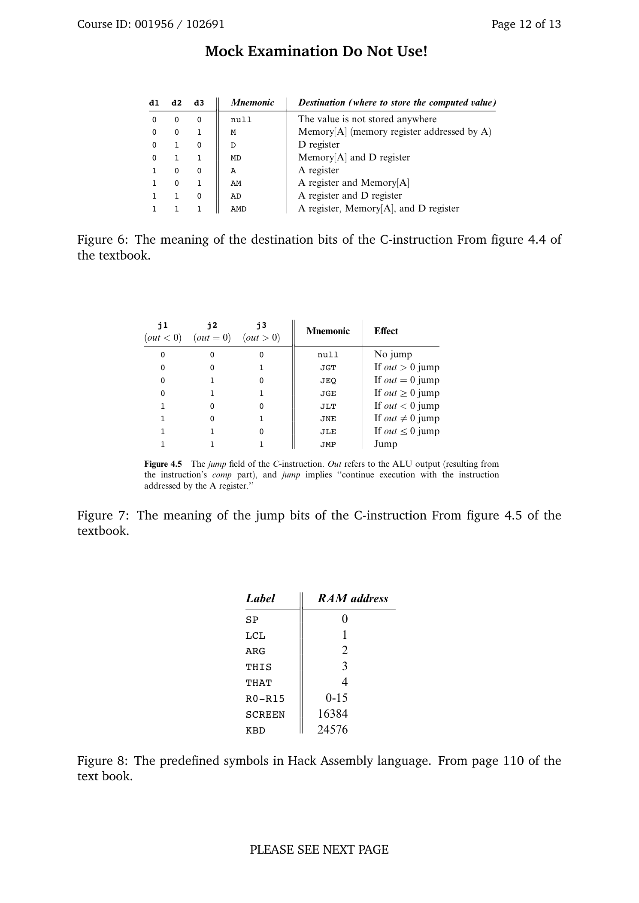

这页是 Hack 汇编语言的**附录对照页**，涵盖三块内容：

* **C 指令的目的字段（dest）含义**（Figure 6）
* **C 指令的跳转字段（jump）含义**（Figure 7）
* **预定义符号及其 RAM 地址**（Figure 8）

---

## Figure 6：C 指令的目的字段（d1 d2 d3 → dest）

C 指令形如 `dest=comp;jump`。其中 `dest` 的三个位（`d1 d2 d3`）决定**把计算结果写到哪里**。三个比特分别对应 `A`、`D`、`M`（注意：`M` 代表 **Memory\[A]**，即 A 指向的内存单元）。表格映射如下：

| d1 d2 d3 | 助记符    | 写入位置（可同时多处）               |
| -------- | ------ | ------------------------- |
| 0 0 0    | `null` | 不保存（只计算，不落地）              |
| 0 0 1    | `M`    | 写到 `Memory[A]`            |
| 0 1 0    | `D`    | 写到 `D` 寄存器                |
| 0 1 1    | `MD`   | 同时写 `Memory[A]` 和 `D`     |
| 1 0 0    | `A`    | 写到 `A` 寄存器                |
| 1 0 1    | `AM`   | 同时写 `A` 和 `Memory[A]`     |
| 1 1 0    | `AD`   | 同时写 `A` 和 `D`             |
| 1 1 1    | `AMD`  | 同时写 `A`、`D` 和 `Memory[A]` |

**要点**：你可以一次把 `comp` 的结果写到多个目的地，比如 `AD=D+1` 就是 `d1d2d3=110`。

---

## Figure 7：C 指令的跳转字段（j1 j2 j3 → jump）

`jump` 三位控制是否根据 ALU 的结果 `out` 跳转（PC ← A）。位语义对应 **out < 0**、**out == 0**、**out > 0** 三种情况的组合：

| j1 j2 j3 | 助记符    | 条件（基于 ALU 输出 out） |
| -------- | ------ | ----------------- |
| 0 0 0    | `null` | 不跳转               |
| 0 0 1    | `JGT`  | 若 `out > 0` 跳转    |
| 0 1 0    | `JEQ`  | 若 `out = 0` 跳转    |
| 0 1 1    | `JGE`  | 若 `out ≥ 0` 跳转    |
| 1 0 0    | `JLT`  | 若 `out < 0` 跳转    |
| 1 0 1    | `JNE`  | 若 `out ≠ 0` 跳转    |
| 1 1 0    | `JLE`  | 若 `out ≤ 0` 跳转    |
| 1 1 1    | `JMP`  | 无条件跳转             |

**要点**：这些条件由 ALU 的标志 `ng`（负）和 `zr`（零）推导而来；若条件满足，则**PC 载入 A**，否则 PC 顺序加一。

---

## Figure 8：Hack 汇编的预定义符号

汇编器内置一些符号到固定地址的映射，便于可读编码：

| 符号         | 地址              |
| ---------- | --------------- |
| `SP`       | 0               |
| `LCL`      | 1               |
| `ARG`      | 2               |
| `THIS`     | 3               |
| `THAT`     | 4               |
| `R0`–`R15` | 0–15（通用寄存器别名）   |
| `SCREEN`   | 16384（显示内存基址）   |
| `KBD`      | 24576（键盘内存映射地址） |

**补充**：`R0`–`R5` 等与 `SP/LCL/...` 地址会重合，但它们只是不同的**符号别名**；汇编器按符号表解析。`SCREEN` 和 `KBD` 是内存映射 I/O 的基地址。

---

### 小示例

* `D=M`：dest 为 `D`（010），comp 为 `M`，jump 为空；把 `Memory[A]` 读出来放入 `D`。
* `0;JMP`：dest 为空，comp 为常数 0，jump 为 `JMP`；无条件跳转到 `A` 指向的位置。
* `AD=D|M`：同时写 `A` 与 `D`，结果为 `D|Memory[A]`。

---

## \[口语化表达]

这页就是 Hack 指令的“对照表速查”。上半部分告诉你 **计算结果往哪儿写**：`d` 三位决定写 `A`、`D`、`M`，还能组合着一起写；中间部分告诉你 **什么时候跳**：`j` 三位根据 ALU 的输出是负、零、正来拼出 `JGT/JEQ/.../JMP`；最后一张表是**常用符号的固定地址**，比如 `SP=0`、`LCL=1`、`SCREEN=16384`、`KBD=24576`。有了这些表，写/读 Hack 汇编就像查字典一样快。


---

## 第 13 页

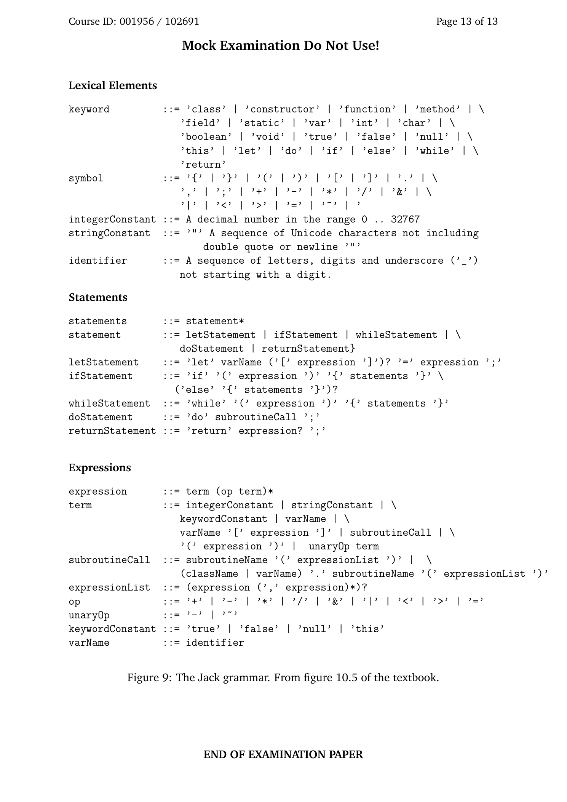

这页是**附录：Jack 语言的语法（Jack grammar）**，用一种接近 BNF 的形式把 Jack 的**词法元素**和**语法规则**全部列出来。它告诉你：标识符、常量、运算符、语句与表达式在 Jack 中的合法组合方式。下面按板块解释。

---

## 1) Lexical Elements（词法元素）

* **keyword（关键字）**
固定保留字，不能当作变量名使用：
`class constructor function method field static var int char boolean void true false null this let do if else while return`
* **symbol（符号）**
Jack 程序里的标点/操作符：
`{ } ( ) [ ] . , ; + - * / & | < > = ~`
* **integerConstant（整型常量）**
0–32767 的十进制整数。
* **stringConstant（字符串常量）**
用双引号括起的一串 Unicode 字符，中间不能包含换行或未转义的 `"`。
* **identifier（标识符）**
由字母、数字、下划线 `_` 组成，且**不能以数字开头**（变量名、函数名、类名等都属于 identifier）。

---

## 2) Statements（语句）

* **statements** ::= `statement*`
多条语句的序列。
* **statement** ::= `letStatement | ifStatement | whileStatement | doStatement | returnStatement`
* **letStatement**
`let varName ('[' expression ']')? '=' expression ';'`
赋值语句；可选的 `[...]` 表示**数组下标**赋值。
* **ifStatement**
`if '(' expression ')' '{' statements '}' ('else' '{' statements '}')?`
标准 if-else 结构，else 部分可省略。
* **whileStatement**
`while '(' expression ')' '{' statements '}'`
* **doStatement**
`do subroutineCall ';'`
调用一个子程序（函数/方法/构造函数），**忽略其返回值**。
* **returnStatement**
`return expression? ';'`
可以 `return;`（无返回值）或 `return 表达式;`。

---

## 3) Expressions（表达式）

* **expression** ::= `term (op term)*`
一个 `term`，后接 0 个或多个“运算符 + term”对（即左结合）。
* **term** ::=
`integerConstant | stringConstant | keywordConstant | varName | varName '[' expression ']' | subroutineCall | '(' expression ')' | unaryOp term`
说明表达式的基本构件可以是：整型、字符串、关键字常量、变量、数组元素、函数调用、括号表达式、或一元运算（取负/按位非）。
* **subroutineCall（子程序调用）** ::=
`subroutineName '(' expressionList ')'`
或
`(className | varName) '.' subroutineName '(' expressionList ')'`
第二种形式支持**类名.函数**或**对象.方法**调用。
* **expressionList** ::= `(expression (',' expression)*)?`
参数列表，可为空或多个逗号分隔的表达式。
* **op（二元运算符）** ::= `+ | - | * | / | & | | | < | > | =`
对应加减乘除、按位与/或、比较与相等。
* **unaryOp（一元运算符）** ::= `- | ~`
取负与按位非。
* **keywordConstant** ::= `true | false | null | this`
`this` 在方法中指向当前对象。
* **varName** ::= `identifier`（变量名就是标识符）。

---

### 如何使用这张语法表

* **语法正确性参考**：编译器/手写 Parser 可按此规则判断程序是否合法。
* **编译作业对照**：实现编译器的 `CompilationEngine` 时，每个非终结符（如 `statements`、`expression`）都对应一个编译函数。
* **边界注意**：字符串不能跨行；数组访问必须是 `varName '[' expression ']'`；`do` 调用必须以分号结尾且丢弃返回值。

---

## \[口语化表达]

这页就是 Jack 语言的“文法清单”。上半部分先告诉你有哪些保留字、符号、常量和变量名的写法；下半部分规定了语句和表达式怎么拼：`let/if/while/do/return` 五种语句，表达式是“term + (运算符 + term)\*”，term 可以是常量、变量、数组元素、函数调用、括号或一元运算。函数调用既可以 `Func(...)`，也可以 `Class.Func(...)` 或 `obj.Method(...)`。照着这张表写代码基本就不会跑偏，做编译器也能一目了然该怎么递归下降解析。
